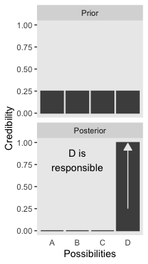

Chapter 02. Introduction: Credibility, Models, and Parameters
================
A Solomon Kurz
2019-10-18

# (PART) THE BASICS: MODELS, PROBABILITY, BAYES’ RULE, AND R

In this part of the project, we mainly reproduce figures. But we will
fit models with increasing regularity as the chapters progress.

# Introduction: Credibility, Models, and Parameters

> The goal of this chapter is to introduce the conceptual framework of
> Bayesian data analysis. Bayesian data analysis has two foundational
> ideas. The first idea is that Bayesian inference is reallocation of
> credibility across possibilities. The second foundational idea is that
> the possibilities, over which we allocate credibility, are parameter
> values in meaningful mathematical models.
(p. 15)

## Bayesian inference is reallocation of credibility across possibilities

The first step toward making Figure 2.1 is putting together a data
object. And to help with that, we’ll open up the **tidyverse**.

``` r
library(tidyverse)

d <-
  tibble(iteration = 1:3) %>% 
  expand(iteration, 
         stage = factor(c("Prior", "Posterior"),
                        levels = c("Prior", "Posterior"))) %>% 
  expand(nesting(iteration, stage),
         Possibilities = LETTERS[1:4]) %>% 
  mutate(Credibility   = c(rep(.25, times = 4),
                           0, rep(1/3, times = 3),
                           0, rep(1/3, times = 3),
                           rep(c(0, .5), each = 2),
                           rep(c(0, .5), each = 2),
                           rep(0, times = 3), 1))
```

When making data with man repetitions in the rows, it’s good to have the
`tidyr::expand()` function up your sleeve. Go
[here](https://tidyr.tidyverse.org/reference/expand.html) to learn more.

We can take a look at the top few rows of the data with `head()`.

``` r
head(d)
```

    ## # A tibble: 6 x 4
    ##   iteration stage     Possibilities Credibility
    ##       <int> <fct>     <chr>               <dbl>
    ## 1         1 Prior     A                   0.25 
    ## 2         1 Prior     B                   0.25 
    ## 3         1 Prior     C                   0.25 
    ## 4         1 Prior     D                   0.25 
    ## 5         1 Posterior A                   0    
    ## 6         1 Posterior B                   0.333

Before we attempt Figure 2.1, we’ll need two supplemental data frames.
The first one, `d_text`, will supply the coordinates for the annotation
in the plot. The second, `d_arrow`, will supply the coordinates for the
arrows.

``` r
d_text <-
  tibble(Possibilities = "B",
         Credibility   = .75,
         label         = str_c(LETTERS[1:3], " is\nimpossible"),
         iteration     = 1:3,
         stage         = factor("Posterior", 
                                levels = c("Prior", "Posterior")))
d_arrow <-
  tibble(Possibilities = LETTERS[1:3],
         iteration     = 1:3) %>% 
  expand(nesting(Possibilities, iteration),
         Credibility = c(0.6, 0.01)) %>% 
  mutate(stage = factor("Posterior", levels = c("Prior", "Posterior")))
```

Now we’re ready to code our version of Figure 2.1.

``` r
d %>%
  ggplot(aes(x = Possibilities, y = Credibility)) +
  geom_col(color = "grey30", fill = "grey30") +
  # annotation in the bottom row
  geom_text(data = d_text, 
            aes(label = label)) +
  # arrows in the bottom row
  geom_line(data = d_arrow,
  arrow = arrow(length = unit(0.30, "cm"), 
                ends = "first", type = "closed")) +
  facet_grid(stage ~ iteration) +
  theme(panel.grid   = element_blank(),
        strip.text.x = element_blank(),
        axis.ticks.x = element_blank())
```

<!-- -->

We will take a similar approach to make our version of Figure 2.2. But
this time, we’ll define our supplemental data sets directly in
`geom_text()` and `geom_line()`. It’s good to have both methods up your
sleeve. Also notice how we simply fed our primary data set directly into
`ggplot()` without saving it, either.

``` r
# primary data
tibble(stage = factor(c("Prior", "Posterior"), 
                      levels = c("Prior", "Posterior"))) %>% 
  expand(stage, Possibilities = LETTERS[1:4]) %>% 
  mutate(Credibility = c(rep(0.25, times = 4),
                         rep(0,    times = 3), 
                         1)) %>%
  
  # plot!
  ggplot(aes(x = Possibilities, y = Credibility)) +
  geom_col(color = "grey30", fill = "grey30") +
  # annotation in the bottom panel
  geom_text(data = tibble(
    Possibilities = "B",
    Credibility   = .8,
    label         = "D is\nresponsible",
    stage         = factor("Posterior", levels = c("Prior", "Posterior"))
  ), aes(label = label)
  ) +
  # the arrow
  geom_line(data = tibble(
    Possibilities = LETTERS[c(4, 4)],
    Credibility   = c(.25, .99),
    stage         = factor("Posterior", levels = c("Prior", "Posterior"))
  ),
  arrow = arrow(length = unit(0.30, "cm"), 
                ends = "last", type = "closed"),
  color = "grey92") +
  facet_wrap(~stage, ncol = 1) +
  theme(panel.grid   = element_blank(),
        axis.ticks.x = element_blank())
```

<!-- -->

### Data are noisy and inferences are probabilistic.

Now on to Figure 2.3. I’m pretty sure the curves in the plot are
Gaussian, which we’ll make with the `dnorm()` function. After a little
trial and error, their standard deviations look to be 1.2. However, it’s
tricky placing those curves in along with the probabilities, because the
probabilities for the four discrete sizes (i.e., 1 through 4) are in a
different metric than the Gaussian density curves. Since the probability
metric for the four discrete sizes are the primary metric of the plot,
we need to rescale the curves using a little algebra. We do that in the
data code, below. After that, the code for the plot is relatively
simple.

``` r
# data
tibble(mu = 1:4,
       p  = .25) %>% 
  expand(nesting(mu, p), 
         x = seq(from = -2, to = 6, by = .1)) %>% 
  mutate(density = dnorm(x, mean = mu, sd = 1.2)) %>% 
  mutate(d_max   = max(density)) %>% 
  mutate(rescale = p / d_max) %>% 
  mutate(density = density * rescale) %>% 
  
  # plot!
  ggplot(aes(x = x)) +
  geom_col(data = . %>% distinct(mu, p),
           aes(x = mu, y = p),
           fill = "grey67", width = 1/3) +
  geom_line(aes(y = density, group = mu)) +
  scale_x_continuous(breaks = 1:4) +
  scale_y_continuous(breaks = 0:5 / 5) +
  coord_cartesian(xlim = 0:5,
                  ylim = 0:1) +
  labs(title = "Prior",
       x = "Possibilities", 
       y = "Credibility") +
  theme(panel.grid   = element_blank(),
        axis.ticks.x = element_blank())
```

<!-- -->

We can use the same basic method to make the bottom panel. The new
consideration is choosing the relative probabilities for the different
`mu` values–keeping in mind they have to sum to 1. I just eyeballed
them. The only other notable change from the previous plot is our
addition of a `geom_point()` section, in which we defined the data on
the fly.

``` r
tibble(mu = 1:4,
       p  = c(.1, .58, .3, .02)) %>% 
  expand(nesting(mu, p), 
         x = seq(from = -2, to = 6, by = .1)) %>% 
  mutate(density = dnorm(x, mean = mu, sd = 1.2)) %>% 
  mutate(d_max   = max(density)) %>% 
  mutate(rescale = p / d_max) %>% 
  mutate(density = density * rescale) %>% 
  
  # plot!
  ggplot() +
  geom_col(data = . %>% distinct(mu, p),
           aes(x = mu, y = p),
           fill = "grey67", width = 1/3) +
  geom_line(aes(x = x, y = density, group = mu)) +
  geom_point(data = tibble(x = c(1.75, 2.25, 2.75), y = 0),
             aes(x = x, y = y),
             size = 3, color = "grey33", alpha = 3/4) +
  scale_x_continuous(breaks = 1:4) +
  scale_y_continuous(breaks = 0:5 / 5) +
  coord_cartesian(xlim = 0:5,
                  ylim = 0:1) +
  labs(title = "Posterior",
       x = "Possibilities", 
       y = "Credibility") +
  theme(panel.grid   = element_blank(),
        axis.ticks.x = element_blank())
```

<!-- -->

> In summary, the essence of Bayesian inference is reallocation of
> credibility across possibilities. The distribution of credibility
> initially reflects prior knowledge about the possibilities, which can
> be quite vague. Then new data are observed, and the credibility is
> re-allocated. Possibilities that are consistent with the data garner
> more credibility, while possibilities that are not consistent with the
> data lose credibility. Bayesian analysis is the mathematics of
> re-allocating credibility in a logically coherent and precise way.
> (p. 22)

## Possibilities are parameter values in descriptive models

“A key step in Bayesian analysis is defining the set of possibilities
over which credibility is allocated. *This is not a trivial step*,
because there might always be possibilities beyond the ones we include
in the initial set” (p. 22, *emphasis* added).

In the last section, we used the `dnorm()` function to make curves
following the Normal distribution. Here we’ll do that again, but also
use the `rnorm()` function to simulate actual data from that same Normal
distribution. Behold Figure 2.4.a.

``` r
# set the seed to make the simulation reproducible
set.seed(2)
# simulate the data with `rnorm()`
d <- tibble(x = rnorm(2000, mean = 10, sd = 5))

# plot!
ggplot(data = d, aes(x = x)) +
  geom_histogram(aes(y = ..density..),
                 binwidth = 1, fill = "grey67", 
                 color = "grey92", size = 1/10) +
  geom_line(data = tibble(x = seq(from = -6, to = 26, by = .01)),
            aes(x = x, y = dnorm(x, mean = 10, sd = 5)),
            color = "grey33") +
  coord_cartesian(xlim = -5:25) +
  labs(subtitle = "The candidate normal distribution\nhas a mean of 10 and SD of 5.",
       x = "Data Values", 
       y = "Data Probability") +
  theme(panel.grid = element_blank())
```

<!-- -->

Did you notice how we made the data for the density curve within
`geom_line()`? That’s one way to do it. In our next plot, we’ll take a
different and more elegant approach with `stat_function()`. Here’s our
Figure 2.4.b.

``` r
ggplot(data = d, aes(x = x)) +
  geom_histogram(aes(y = ..density..),
                 binwidth = 1, fill = "grey67",
                 color = "grey92", size = 1/8) +
  stat_function(fun = dnorm, n = 101, args = list(mean = 8, sd = 6),
                color = "grey33", linetype = 2) +
  coord_cartesian(xlim = -5:25) +
  labs(subtitle = "The candidate normal distribution\nhas a mean of 8 and SD of 6.",
       x = "Data Values", 
       y = "Data Probability") +
  theme(panel.grid = element_blank())
```

<!-- -->

## The steps of Bayesian data analysis

> In general, Bayesian analysis of data follows these steps:
> 
> 1.  Identify the data relevant to the research questions. What are the
>     measurement scales of the data? Which data variables are to be
>     predicted, and which data variables are supposed to act as
>     predictors?
> 2.  Define a descriptive model for the relevant data. The mathematical
>     form and its parameters should be meaningful and appropriate to
>     the theoretical purposes of the analysis.
> 3.  Specify a prior distribution on the parameters. The prior must
>     pass muster with the audience of the analysis, such as skeptical
>     scientists.
> 4.  Use Bayesian inference to re-allocate credibility across parameter
>     values. Interpret the posterior distribution with respect to
>     theoretically meaningful issues (assuming that the model is a
>     reasonable description of the data; see next step).
> 5.  Check that the posterior predictions mimic the data with
>     reasonable accuracy (i.e., conduct a “posterior predictive
>     check”). If not, then consider a different descriptive model.
> 
> Perhaps the best way to explain these steps is with a realistic
> example of Bayesian data analysis. The discussion that follows is
> abbreviated for purposes of this introductory chapter, with many
> technical details suppressed. (p. 25)

I will show you a few more details than Kruschke did in the text. But
just has he did, we’ll cover this workflow in much more detail in the
chapters to come.

In order to recreate Figure 2.5, we need to generate the data and fit
the model. In his `HtWtDataDenerator.R` script, Kruschke provided the
code for a function that will generate height/weight data of the kind in
his text. Here is the code in full: d, d\_text, d\_arrow,
HtWtDataGenerator

``` r
HtWtDataGenerator <- function(nSubj, rndsd = NULL, maleProb = 0.50) {
  # Random height, weight generator for males and females. Uses parameters from
  # Brainard, J. & Burmaster, D. E. (1992). Bivariate distributions for height and
  # weight of men and women in the United States. Risk Analysis, 12(2), 267-275.
  # Kruschke, J. K. (2011). Doing Bayesian data analysis:
  # A Tutorial with R and BUGS. Academic Press / Elsevier.
  # Kruschke, J. K. (2014). Doing Bayesian data analysis, 2nd Edition:
  # A Tutorial with R, JAGS and Stan. Academic Press / Elsevier.
  
  require(MASS)
  
  # Specify parameters of multivariate normal (MVN) distributions.
  # Men:
  HtMmu   <- 69.18
  HtMsd   <- 2.87
  lnWtMmu <- 5.14
  lnWtMsd <- 0.17
  Mrho    <- 0.42
  Mmean   <- c(HtMmu, lnWtMmu)
  Msigma  <- matrix(c(HtMsd^2, Mrho * HtMsd * lnWtMsd,
                      Mrho * HtMsd * lnWtMsd, lnWtMsd^2), nrow = 2)
  # Women cluster 1:
  HtFmu1   <- 63.11
  HtFsd1   <- 2.76
  lnWtFmu1 <- 5.06
  lnWtFsd1 <- 0.24
  Frho1    <- 0.41
  prop1    <- 0.46
  Fmean1   <- c(HtFmu1, lnWtFmu1)
  Fsigma1  <- matrix(c(HtFsd1^2, Frho1 * HtFsd1 * lnWtFsd1,
                       Frho1 * HtFsd1 * lnWtFsd1, lnWtFsd1^2), nrow = 2)
  # Women cluster 2:
  HtFmu2   <- 64.36
  HtFsd2   <- 2.49
  lnWtFmu2 <- 4.86
  lnWtFsd2 <- 0.14
  Frho2    <- 0.44
  prop2    <- 1 - prop1
  Fmean2   <- c(HtFmu2, lnWtFmu2)
  Fsigma2  <- matrix(c(HtFsd2^2, Frho2 * HtFsd2 * lnWtFsd2,
                       Frho2 * HtFsd2 * lnWtFsd2, lnWtFsd2^2), nrow = 2)
  
  # Randomly generate data values from those MVN distributions.
  if (!is.null(rndsd)) {set.seed(rndsd)}
  datamatrix <- matrix(0, nrow = nSubj, ncol = 3)
  colnames(datamatrix) <- c("male", "height", "weight")
  maleval <- 1; femaleval <- 0 # arbitrary coding values
  for (i in 1:nSubj)  {
    # Flip coin to decide sex
    sex <- sample(c(maleval, femaleval), size = 1, replace = TRUE,
                  prob = c(maleProb, 1 - maleProb))
    if (sex == maleval) {datum = mvrnorm(n = 1, mu = Mmean, Sigma = Msigma)}
    if (sex == femaleval) {
      Fclust = sample(c(1, 2), size = 1, replace = TRUE, prob = c(prop1, prop2))
      if (Fclust == 1) {datum = mvrnorm(n = 1, mu = Fmean1, Sigma = Fsigma1)}
      if (Fclust == 2) {datum = mvrnorm(n = 1, mu = Fmean2, Sigma = Fsigma2)}
    }
    datamatrix[i, ] = c(sex, round(c(datum[1], exp(datum[2])), 1))
  }
  
  return(datamatrix)
} # end function
```

Now we have the `HtWtDataGenerator()` function, all we need to do is
determine how many values to generate and how probable we want the
values to be based on those from men. These are controlled by the
`nSubj` and `maleProb` parameters.

``` r
# set your seed to make the data generation reproducible
set.seed(57)

d <-
  HtWtDataGenerator(nSubj = 57, maleProb = .5) %>%
  as_tibble()

d %>%
  head()
```

    ## # A tibble: 6 x 3
    ##    male height weight
    ##   <dbl>  <dbl>  <dbl>
    ## 1     0   68.8   133.
    ## 2     1   70     187.
    ## 3     0   63.2   154 
    ## 4     0   61.4   145.
    ## 5     0   66.1   130.
    ## 6     1   71.5   271

We’re about ready for the model. We will fit it with HMC via the
[**brms**
package](https://cran.r-project.org/web/packages/brms/index.html).

``` r
library(brms)
```

The traditional use of [diffuse and noninformative priors is discouraged
with HMC, as is the uniform distribution for
sigma](https://github.com/stan-dev/stan/wiki/Prior-Choice-Recommendations).
Instead, we’ll use weakly-regularizing priors for the intercept and
slope and a half Cauchy with a fairly large scale parameter for
\(\sigma\). d, d\_text, d\_arrow, HtWtDataGenerator, fit

``` r
fit1 <- 
  brm(data = d, 
      family = gaussian,
      weight ~ 1 + height,
      prior = c(prior(normal(0, 100), class = Intercept),
                prior(normal(0, 100), class = b),
                prior(cauchy(0, 10),  class = sigma)),
      chains = 4, cores = 4, iter = 2000, warmup = 1000,
      seed = 2)
```

If you wanted a quick model summary, you could execute `print(fit1)`.
We’ll walk through that and other diagnostics in greater detail
starting in Chapter 8. But for now, here’s how we might make Figure
2.5.a.

``` r
# extract the posterior draws
post <- posterior_samples(fit1)

# this will streamline some of the code, below
n_lines <- 150

# plot!
d %>% 
  ggplot(aes(x = height, y = weight)) +
  geom_abline(intercept = post[1:n_lines, 1], 
              slope     = post[1:n_lines, 2],
              color = "grey50", size = 1/4, alpha = .3) +
  geom_point(alpha = 2/3) +
  coord_cartesian(xlim = 55:80,
                  ylim = 50:250) +
  # the `eval(substitute(paste()))` trick came from: https://www.r-bloggers.com/value-of-an-r-object-in-an-expression/
  labs(subtitle = eval(substitute(paste("Data with", 
                                        n_lines, 
                                        "credible regression lines"))),
       x = "Height in inches",
       y = "Weight in pounds") +
  theme(panel.grid = element_blank())
```

<!-- -->

For Figure 2.5.b., we’ll use the handy `stat_pointintervalh()` function
from the [**tidybayes** package](https://github.com/mjskay/tidybayes) to
mark off the mode and 95% HDIs.

``` r
library(tidybayes)

post %>% 
  ggplot(aes(x = b_height)) +
  geom_histogram(color = "grey92", fill = "grey67",
                 binwidth = .2, size = .2) +
  stat_pointintervalh(aes(y = 0), 
                      point_interval = mode_hdi, .width = .95) +
  scale_y_continuous(NULL, breaks = NULL) +
  coord_cartesian(xlim = 0:8) +
  labs(title = "The posterior distribution",
       subtitle = "The mode and 95% HPD intervals are\nthe dot and horizontal line at the bottom.",
       x = expression(paste(beta[1], " (slope)"))) +
  theme(panel.grid = element_blank())
```

<!-- -->

Here’s Figure 2.6. We’ll go over the `brms::predict()` function later.
d, d\_text, d\_arrow, HtWtDataGenerator, fit, post, n\_lines, nd

``` r
nd <- tibble(height = seq(from = 53, to = 81, length.out = 20))

predict(fit1, newdata = nd) %>%
  as_tibble() %>%
  bind_cols(nd) %>% 

  ggplot(aes(x = height)) +
  geom_pointrange(aes(y = Estimate, 
                      ymin = Q2.5, 
                      ymax = Q97.5),
                  color = "grey67",
                  shape = 20) +
  geom_point(data =  d, 
             aes(y = weight),
             alpha = 2/3) +
  labs(subtitle = "Data with the percentile-based 95% intervals and\nthe means of the posterior predictions",
       x = "Height in inches",
       y = "Weight in inches") +
  theme(panel.grid = element_blank())
```

<!-- -->

The posterior predictions might be easier to depict with a ribbon and
line, instead.

``` r
nd <- tibble(height = seq(from = 53, to = 81, length.out = 30))

predict(fit1, newdata = nd) %>%
  as_tibble() %>%
  bind_cols(nd) %>% 

  ggplot(aes(x = height)) +
  geom_ribbon(aes(ymin = Q2.5, 
                  ymax = Q97.5),
                  fill = "grey75") +
  geom_line(aes(y = Estimate),
            color = "grey92") +
  geom_point(data =  d, 
             aes(y = weight),
             alpha = 2/3) +
  labs(subtitle = "Data with the percentile-based 95% intervals and\nthe means of the posterior predictions",
       x = "Height in inches",
       y = "Weight in inches") +
  theme(panel.grid = element_blank())
```

<!-- -->

## Reference

Kruschke, J. K. (2015). *Doing Bayesian data analysis, Second Edition: A
tutorial with R, JAGS, and Stan.* Burlington, MA: Academic
Press/Elsevier.

## Session info

``` r
sessionInfo()
```

    ## R version 3.6.0 (2019-04-26)
    ## Platform: x86_64-apple-darwin15.6.0 (64-bit)
    ## Running under: macOS High Sierra 10.13.6
    ## 
    ## Matrix products: default
    ## BLAS:   /Library/Frameworks/R.framework/Versions/3.6/Resources/lib/libRblas.0.dylib
    ## LAPACK: /Library/Frameworks/R.framework/Versions/3.6/Resources/lib/libRlapack.dylib
    ## 
    ## locale:
    ## [1] en_US.UTF-8/en_US.UTF-8/en_US.UTF-8/C/en_US.UTF-8/en_US.UTF-8
    ## 
    ## attached base packages:
    ## [1] stats     graphics  grDevices utils     datasets  methods   base     
    ## 
    ## other attached packages:
    ##  [1] tidybayes_1.1.0 brms_2.10.3     Rcpp_1.0.2      MASS_7.3-51.4  
    ##  [5] forcats_0.4.0   stringr_1.4.0   dplyr_0.8.3     purrr_0.3.2    
    ##  [9] readr_1.3.1     tidyr_1.0.0     tibble_2.1.3    ggplot2_3.2.1  
    ## [13] tidyverse_1.2.1
    ## 
    ## loaded via a namespace (and not attached):
    ##  [1] colorspace_1.4-1          ggridges_0.5.1           
    ##  [3] rsconnect_0.8.15          ggstance_0.3.2           
    ##  [5] markdown_1.1              base64enc_0.1-3          
    ##  [7] rstudioapi_0.10           rstan_2.19.2             
    ##  [9] svUnit_0.7-12             DT_0.9                   
    ## [11] fansi_0.4.0               lubridate_1.7.4          
    ## [13] xml2_1.2.0                bridgesampling_0.7-2     
    ## [15] knitr_1.23                shinythemes_1.1.2        
    ## [17] zeallot_0.1.0             bayesplot_1.7.0          
    ## [19] jsonlite_1.6              broom_0.5.2              
    ## [21] shiny_1.3.2               compiler_3.6.0           
    ## [23] httr_1.4.0                backports_1.1.5          
    ## [25] assertthat_0.2.1          Matrix_1.2-17            
    ## [27] lazyeval_0.2.2            cli_1.1.0                
    ## [29] later_1.0.0               htmltools_0.4.0          
    ## [31] prettyunits_1.0.2         tools_3.6.0              
    ## [33] igraph_1.2.4.1            coda_0.19-3              
    ## [35] gtable_0.3.0              glue_1.3.1               
    ## [37] reshape2_1.4.3            cellranger_1.1.0         
    ## [39] vctrs_0.2.0               nlme_3.1-139             
    ## [41] crosstalk_1.0.0           xfun_0.10                
    ## [43] ps_1.3.0                  rvest_0.3.4              
    ## [45] mime_0.7                  miniUI_0.1.1.1           
    ## [47] lifecycle_0.1.0           gtools_3.8.1             
    ## [49] zoo_1.8-6                 scales_1.0.0             
    ## [51] colourpicker_1.0          hms_0.4.2                
    ## [53] promises_1.1.0            Brobdingnag_1.2-6        
    ## [55] parallel_3.6.0            inline_0.3.15            
    ## [57] shinystan_2.5.0           yaml_2.2.0               
    ## [59] gridExtra_2.3             loo_2.1.0                
    ## [61] StanHeaders_2.19.0        stringi_1.4.3            
    ## [63] dygraphs_1.1.1.6          pkgbuild_1.0.5           
    ## [65] rlang_0.4.0               pkgconfig_2.0.3          
    ## [67] matrixStats_0.55.0        HDInterval_0.2.0         
    ## [69] evaluate_0.14             lattice_0.20-38          
    ## [71] rstantools_2.0.0          htmlwidgets_1.5          
    ## [73] labeling_0.3              tidyselect_0.2.5         
    ## [75] processx_3.4.1            plyr_1.8.4               
    ## [77] magrittr_1.5              R6_2.4.0                 
    ## [79] generics_0.0.2            pillar_1.4.2             
    ## [81] haven_2.1.0               withr_2.1.2              
    ## [83] xts_0.11-2                abind_1.4-5              
    ## [85] modelr_0.1.4              crayon_1.3.4             
    ## [87] arrayhelpers_1.0-20160527 utf8_1.1.4               
    ## [89] rmarkdown_1.13            grid_3.6.0               
    ## [91] readxl_1.3.1              callr_3.3.2              
    ## [93] threejs_0.3.1             digest_0.6.21            
    ## [95] xtable_1.8-4              httpuv_1.5.2             
    ## [97] stats4_3.6.0              munsell_0.5.0            
    ## [99] shinyjs_1.0
