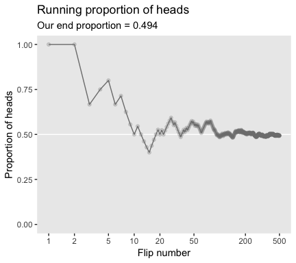
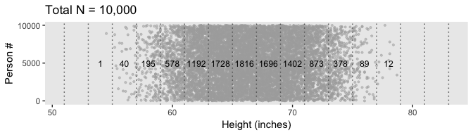
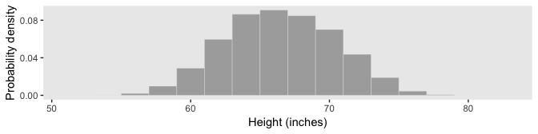
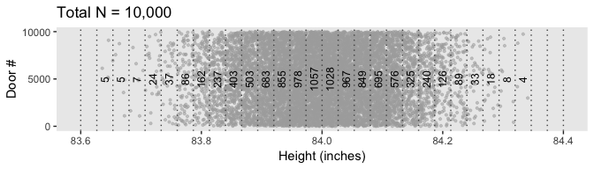

Chapter 04. What is This Stuff Called Probability?
================
A Solomon Kurz
2018-07-30

What is This Stuff Called Probability?
======================================

Kruschke opened:

> Inferential statistical techniques assign precise measures to our uncertainty about possibil- ities. Uncertainty is measured in terms of probability, and therefore we must establish the properties of probability before we can make inferences about it. This chapter introduces the basic ideas of probability.

The set of all possible events
------------------------------

This snip from page 72 is important (*emphasis* in the original):

> Whenever we ask about how likely an outcome is, we always ask with a set of possible outcomes in mind. This set exhausts all possible outcomes, and the outcomes are all mutually exclusive. This set is called the *sample space*.

Probability: Outside or inside the head
---------------------------------------

### Outside the head: Long-run relative frequency.

#### Simulating a long-run relative frequency.

Here's the simulation.

``` r
library(tidyverse)

N       <- 500  # Specify the total number of flips, denoted N.
p_heads <- 0.5  # Specify underlying probability of heads.

# Kruschke reported this was the seed he used at the top of page 94.
set.seed(47405)

# Here we use that seed to flip a coin N times and compute the running proportion of heads at each flip. 
# We generate a random sample of N flips (heads = 1, tails = 0)
my_flip <-
  tibble(flip_sequence = sample(x = c(0, 1), 
                                prob = c(1 - p_heads, p_heads), 
                                size = N, 
                                replace = T),
         r = cumsum(flip_sequence),
         n = 1:N,
         run_prop = r/n)

end_prop <-
  my_flip %>% 
  select(run_prop) %>% 
  slice(n()) %>% 
  round(digits = 3) %>% 
  pull()
```

Now we're ready fo make Figure 4.1.

``` r
my_flip %>%
  filter(n < 1000) %>%  # This step cuts down on the time it takes to make the plot
  ggplot(aes(x = n, y = run_prop)) +
  geom_hline(yintercept = .5, color = "white") +
  geom_line(color = "grey50") +
  geom_point(color = "grey50", alpha = 1/4) +
  scale_x_log10(breaks = c(1, 2, 5, 10, 20, 50, 200, 500)) +
  coord_cartesian(xlim = 1:500,
                  ylim = 0:1) +
  labs(title = "Running proportion of heads",
       subtitle = paste("Our end proportion =", end_prop),
       x = "Flip number", 
       y = "Proportion of heads") +
  theme(panel.grid = element_blank())
```



Probability distributions
-------------------------

### Discrete distributions: Probability mass.

In order to recreate Figure 4.2, we need to generate the heights data. In his "HtWtDataDenerator" R script, Kruschke provided the code for a function that will generate height data of the kind in his text. Here is the code:

``` r
HtWtDataGenerator <- function(n_subj, rndsd = NULL, male_prob = 0.50) {
  # Random height, weight generator for males and females. Uses parameters from
  # Brainard, J. & Burmaster, D. E. (1992). Bivariate distributions for height and
  # weight of men and women in the United States. Risk Analysis, 12(2), 267-275.
  # Kruschke, J. K. (2011). Doing Bayesian data analysis:
  # A Tutorial with R and BUGS. Academic Press / Elsevier.
  # Kruschke, J. K. (2014). Doing Bayesian data analysis, 2nd Edition:
  # A Tutorial with R, JAGS and Stan. Academic Press / Elsevier.
  
  require(MASS)
  
  # Specify parameters of multivariate normal (MVN) distributions.
  # Men:
  HtMmu   <- 69.18
  HtMsd   <- 2.87
  lnWtMmu <- 5.14
  lnWtMsd <- 0.17
  Mrho    <- 0.42
  Mmean   <- c(HtMmu, lnWtMmu)
  Msigma  <- matrix(c(HtMsd^2, Mrho * HtMsd * lnWtMsd,
                      Mrho * HtMsd * lnWtMsd, lnWtMsd^2), nrow = 2)
  # Women cluster 1:
  HtFmu1   <- 63.11
  HtFsd1   <- 2.76
  lnWtFmu1 <- 5.06
  lnWtFsd1 <- 0.24
  Frho1    <- 0.41
  prop1    <- 0.46
  Fmean1   <- c(HtFmu1, lnWtFmu1)
  Fsigma1  <- matrix(c(HtFsd1^2, Frho1 * HtFsd1 * lnWtFsd1,
                       Frho1 * HtFsd1 * lnWtFsd1, lnWtFsd1^2), nrow = 2)
  # Women cluster 2:
  HtFmu2   <- 64.36
  HtFsd2   <- 2.49
  lnWtFmu2 <- 4.86
  lnWtFsd2 <- 0.14
  Frho2    <- 0.44
  prop2    <- 1 - prop1
  Fmean2   <- c(HtFmu2, lnWtFmu2)
  Fsigma2  <- matrix(c(HtFsd2^2, Frho2 * HtFsd2 * lnWtFsd2,
                       Frho2 * HtFsd2 * lnWtFsd2, lnWtFsd2^2), nrow = 2)
  
  # Randomly generate data values from those MVN distributions.
  if (!is.null(rndsd)) {set.seed(rndsd)}
  data_matrix <- matrix(0, nrow = n_subj, ncol = 3)
  colnames(data_matrix) <- c("male", "height", "weight")
  maleval <- 1; femaleval <- 0 # arbitrary coding values
  for (i in 1:n_subj) {
    # Flip coin to decide sex
    sex = sample(c(maleval, femaleval), size = 1, replace = TRUE,
                 prob = c(male_prob, 1 - male_prob))
    if (sex == maleval) {datum <- mvrnorm(n = 1, mu = Mmean, Sigma = Msigma)}
    if (sex == femaleval) {
      Fclust = sample(c(1, 2), size = 1, replace = TRUE, prob = c(prop1, prop2))
      if (Fclust == 1) {datum <- mvrnorm(n = 1, mu = Fmean1, Sigma = Fsigma1)}
      if (Fclust == 2) {datum <- mvrnorm(n = 1, mu = Fmean2, Sigma = Fsigma2)}
    }
    data_matrix[i, ] = c(sex, round(c(datum[1], exp(datum[2])), 1))
  }
  
  return(data_matrix)
} # end function
```

Now we have the `HtWtDataGenerator()` function, all we need to do is determine how many values are generated and how probable we want the values to be based on those from men. These are controlled by the `n_subj` and `male_prob` parameters.

``` r
set.seed(4.2)
d <-
  HtWtDataGenerator(n_subj = 10000, male_prob = .5) %>%
  as_tibble() %>%
  mutate(person = 1:n())

d %>%
  head()
```

    ## # A tibble: 6 x 4
    ##    male height weight person
    ##   <dbl>  <dbl>  <dbl>  <int>
    ## 1     1   76     222.      1
    ## 2     0   59.5   190       2
    ## 3     0   60.2   118.      3
    ## 4     1   64.1   138.      4
    ## 5     1   69.3   148.      5
    ## 6     1   69.1   166.      6

Before we move on, we'll want to detach the MASS package and reload dplyr, which is part of the tidyverse, so we might be able to use `dplyr::select()` later in the project.

``` r
detach(package:MASS, unload = T)
library(dplyr)
```

For Figure 4.2, we'll make extensive use of the `case_when()` syntax, which you can learn more about from [hrbrmstr's *Making a Case for case\_when*](https://rud.is/b/2017/03/10/making-a-case-for-case_when/).

``` r
d_bin_2 <-
  d %>%
  mutate(bin = case_when(
    height < 51 ~ 51,
    between(height, 51, 53) ~ 53,
    between(height, 53, 55) ~ 55,
    between(height, 55, 57) ~ 57,
    between(height, 57, 59) ~ 59,
    between(height, 59, 61) ~ 61,
    between(height, 61, 63) ~ 63,
    between(height, 63, 65) ~ 65,
    between(height, 65, 67) ~ 67,
    between(height, 67, 69) ~ 69,
    between(height, 69, 71) ~ 71,
    between(height, 71, 73) ~ 73,
    between(height, 73, 75) ~ 75,
    between(height, 75, 77) ~ 77,
    between(height, 77, 79) ~ 79,
    between(height, 79, 81) ~ 71,
    between(height, 81, 83) ~ 83,
    height > 83 ~ 85)
    ) %>%
  group_by(bin) %>%
  summarise(n = n()) %>%
  mutate(height = bin - 1)

d %>%
  ggplot(aes(x = height, y = person)) +
  geom_point(size = 3/4, color = "grey67", alpha = 1/2) +
  geom_vline(xintercept = seq(from = 51, to = 83, by = 2),
             linetype = 3, color = "grey33") +
  geom_text(data = d_bin_2, 
            aes(y = 5000, label = n),
            size = 3.25) +
  scale_y_continuous(breaks = c(0, 5000, 10000)) +
  labs(title = "Total N = 10,000",
       x = "Height (inches)",
       y = "Person #") +
  theme(panel.grid = element_blank())
```


Figure 4.2.b.

``` r
d %>%
  ggplot(aes(x = height)) +
  geom_histogram(aes(y = stat(density)),
                 binwidth = 2, fill = "grey67",
                 color = "grey92", size = 1/8) +
  scale_y_continuous(breaks = c(0, .04, .08)) +
  coord_cartesian(xlim = 51:83) +
  labs(x = "Height (inches)",
       y = "Probability density") +
  theme(panel.grid = element_blank())
```



Figure 4.2.c.

``` r
d_bin_2 <-
  d %>%
  mutate(bin = case_when(
    height < 51 ~ 51,
    between(height, 51, 52) ~ 52,
    between(height, 52, 53) ~ 53,
    between(height, 53, 54) ~ 54,
    between(height, 54, 55) ~ 55,
    between(height, 55, 56) ~ 56,
    between(height, 56, 57) ~ 57,
    between(height, 57, 58) ~ 58,
    between(height, 58, 59) ~ 59,
    between(height, 59, 60) ~ 60,
    between(height, 60, 61) ~ 61,
    between(height, 61, 62) ~ 62,
    between(height, 62, 63) ~ 63,
    between(height, 63, 64) ~ 64,
    between(height, 64, 65) ~ 65,
    between(height, 65, 66) ~ 66,
    between(height, 66, 67) ~ 67,
    between(height, 67, 68) ~ 68,
    between(height, 68, 69) ~ 69,
    between(height, 69, 70) ~ 70,
    between(height, 70, 71) ~ 71,
    between(height, 71, 72) ~ 72,
    between(height, 72, 73) ~ 73,
    between(height, 73, 74) ~ 74,
    between(height, 74, 75) ~ 75,
    between(height, 75, 76) ~ 76,
    between(height, 76, 77) ~ 77,
    between(height, 77, 78) ~ 78,
    between(height, 78, 79) ~ 79,
    between(height, 79, 80) ~ 80,
    between(height, 80, 81) ~ 81,
    between(height, 81, 82) ~ 82,
    between(height, 82, 83) ~ 83,
    between(height, 83, 84) ~ 84,
    height > 84 ~ 85)
    ) %>%
  group_by(bin) %>%
  summarise(n = n()) %>%
  mutate(height = bin - .5)

d %>%
  ggplot(aes(x = height, y = person)) +
  geom_point(size = 3/4, color = "grey67", alpha = 1/2) +
  geom_vline(xintercept = seq(from = 51, to = 83, by = 1),
             linetype = 3, color = "grey33") +
  geom_text(data = d_bin_2, 
            aes(y = 5000, label = n, angle = 90),
            size = 3.25) +
  scale_y_continuous(breaks = c(0, 5000, 10000)) +
  labs(title = "Total N = 10,000",
       x = "Height (inches)",
       y = "Person #") +
  theme(panel.grid = element_blank())
```



Figure 4.2.d.

``` r
d %>%
  ggplot(aes(x = height)) +
  geom_histogram(aes(y = stat(density)), boundary = 0,
                 binwidth = 1, fill = "grey67",
                 color = "grey92", size = 1/8) +
  scale_y_continuous(breaks = c(0, .04, .08)) +
  coord_cartesian(xlim = 51:83) +
  labs(x = "Height (inches)",
       y = "Probability density") +
  theme(panel.grid = element_blank())
```


### Continuous distributions: Rendezvous with density.

To make Figure 4.3., we'll need new data.

``` r
set.seed(4.3)
d <-
  tibble(height = rnorm(1e4, mean = 84, sd = .1)) %>%
  mutate(door = 1:n())

d %>%
  head()
```

    ## # A tibble: 6 x 2
    ##   height  door
    ##    <dbl> <int>
    ## 1   84.0     1
    ## 2   83.9     2
    ## 3   84.1     3
    ## 4   84.1     4
    ## 5   84.2     5
    ## 6   84.1     6

Figure 4.3.a.

``` r
s <- seq(from = 83.6, to = 84.4, length.out = 31)

d_bin_3 <-
  d %>%
  mutate(bin = case_when(
    height < s[1] ~ 83.6,
    between(height, s[1],  s[2])  ~ s[2],
    between(height, s[2],  s[3])  ~ s[3],
    between(height, s[3],  s[4])  ~ s[4],
    between(height, s[4],  s[5])  ~ s[5],
    between(height, s[5],  s[6])  ~ s[6],
    between(height, s[6],  s[7])  ~ s[7],
    between(height, s[7],  s[8])  ~ s[8],
    between(height, s[8],  s[9])  ~ s[9],
    between(height, s[9],  s[10]) ~ s[10],
    between(height, s[10], s[11]) ~ s[11],
    between(height, s[11], s[12]) ~ s[12],
    between(height, s[12], s[13]) ~ s[13],
    between(height, s[13], s[14]) ~ s[14],
    between(height, s[14], s[15]) ~ s[15],
    between(height, s[15], s[16]) ~ s[16],
    between(height, s[16], s[17]) ~ s[17],
    between(height, s[17], s[18]) ~ s[18],
    between(height, s[18], s[19]) ~ s[19],
    between(height, s[19], s[20]) ~ s[20],
    between(height, s[20], s[21]) ~ s[21],
    between(height, s[21], s[22]) ~ s[22],
    between(height, s[22], s[23]) ~ s[23],
    between(height, s[23], s[24]) ~ s[24],
    between(height, s[24], s[25]) ~ s[25],
    between(height, s[25], s[26]) ~ s[26],
    between(height, s[26], s[27]) ~ s[27],
    between(height, s[27], s[28]) ~ s[28],
    between(height, s[28], s[29]) ~ s[29],
    between(height, s[29], s[30]) ~ s[30],
    between(height, s[30], s[31]) ~ s[31],
    height > s[31] ~ 84.4)
    ) %>%
  group_by(bin) %>%
  summarise(n = n()) %>%
  mutate(height = bin - (s[2] - s[1])/2)

d %>%
  ggplot(aes(x = height, y = door)) +
  geom_point(size = 3/4, color = "grey67", alpha = 1/2) +
  geom_vline(xintercept = seq(from = 83.6, to = 84.4, length.out = 31),
             linetype = 3, color = "grey33") +
  geom_text(data = d_bin_3,
            aes(y = 5000, label = n, angle = 90),
            size = 3.25) +
  scale_y_continuous(breaks = c(0, 5000, 10000)) +
  labs(title = "Total N = 10,000",
       x = "Height (inches)",
       y = "Door #") +
  theme(panel.grid = element_blank())
```


Figure 4.3.b.

``` r
d %>%
  ggplot(aes(x = height)) +
  geom_histogram(aes(y = stat(density)), boundary = 0,
                 binwidth = .025, fill = "grey67",
                 color = "grey92", size = 1/8) +
  scale_y_continuous(breaks = 0:4) +
  coord_cartesian(xlim = c(83.6, 84.4)) +
  labs(x = "Height (inches)",
       y = "Probability density") +
  theme(panel.grid = element_blank())
```



#### Properties of probability density functions.

#### The normal probability density function.

Figure 4.4.

``` r
ggplot(data = tibble(x = seq(from = -.8, to = .8, by = .01)),
       aes(x = x)) +
  geom_line(aes(y = dnorm(x, mean = 0, sd = .2)),
            color = "grey50", size = 1.25) +
  geom_linerange(data = tibble(x = seq(from = -.8, to = .8, by = .02)),
                 aes(ymin = 0, ymax = dnorm(x, 
                                            mean = 0, sd = .2)),
                 size = 1/3) +
  coord_cartesian(xlim = c(-.61, .61)) +
  labs(title = "Normal probability density",
       subtitle = expression(paste(mu, " = 0 and ", sigma, " = 0.2")),
       y = "p(x)") +
  theme(panel.grid = element_blank())
```


### Mean and variance of a distribution.

### Highest density interval (HDI).

Figure 4.5.a.

``` r
ggplot(data = tibble(x = seq(from = -3.5, to = 3.5, by = .05)),
       aes(x = x)) +
  geom_ribbon(aes(ymin = 0,
                  ymax = dnorm(x, mean = 0, sd = 1)),
              fill = "grey75") +
  geom_ribbon(data = tibble(x = seq(from = -1.96, to = 1.96, by = .05)),
              aes(ymin = 0,
                  ymax = dnorm(x, mean = 0, sd = 1)),
              fill = "grey50") +
  geom_line(data = tibble(x = c(-1.94, 1.94),
                          y = c(.059, .059)),
            aes(x = x, y = y),
            arrow = arrow(length = unit(.2, "cm"), 
                          ends = "both", 
                          type = "closed"),
            color = "grey92") +
  annotate("text", x = 0, y = .09, 
           label = "95% HDI", color = "grey92") +
  coord_cartesian(xlim = c(-3.1, 3.1)) +
  labs(y = "p(x)") +
  theme(panel.grid = element_blank())
```


We'll want the tidybayes package to help compute HDIs for the next step.

``` r
library(tidybayes)
```

As far as I could tell, Figure 4.5.b is of a beta distribution, which Kruschke covers in greater detail starting in chapter 6. I got the `shape1` and `shape2` values from playing around. If you have a more principled approach, [do share](https://github.com/ASKurz/Doing-Bayesian-Data-Analysis-in-brms-and-the-tidyverse/issues).

``` r
set.seed(434)
h <- 
  mode_hdi(tibble(x = rbeta(5e6, shape1 = 15, shape2 = 4))) %>% 
  gather() %>% 
  pull()

ggplot(data = tibble(x = seq(from = 0, to = 1, by = .01)),
       aes(x = x)) +
  geom_ribbon(aes(ymin = 0,
                  ymax = dbeta(x, shape1 = 15, shape2 = 4)),
              fill = "grey75") +
  geom_ribbon(data = tibble(x = seq(from = h[2], to = h[3], by = .01)),
              aes(ymin = 0,
                  ymax = dbeta(x, shape1 = 15, shape2 = 4)),
              fill = "grey50") +
  geom_line(data = tibble(x = c(h[2] + .005, h[3] - .002),
                          y = c(.74, .74)),
            aes(x = x, y = y),
            arrow = arrow(length = unit(.2, "cm"),
                          ends = "both",
                          type = "closed"),
            color = "grey92") +
  annotate("text", x = .8, y = 1.1, 
           label = "95% HDI", color = "grey92") +
  coord_cartesian(xlim = c(.4, 1)) +
  labs(y = "p(x)") +
  theme(panel.grid = element_blank())
```


Figure 4.5.c was also a lot of trial and error. It seemed the easiest way to reproduce the shape was to mash two Gaussians together. After playing around with `rnorm()`, I ended up with this.

``` r
set.seed(1.5)
d <-
  tibble(x = c(rnorm(6e4, mean = 1.50, sd = .5),
               rnorm(4e4, mean = 4.75, sd = .5)))

glimpse(d)
```

    ## Observations: 100,000
    ## Variables: 1
    ## $ x <dbl> 1.1867731, 1.5918217, 1.0821857, 2.2976404, 1.6647539, 1.089...

Here we compute the HDIs and put them in a tibble.

``` r
h <- 
  d %>% 
  mode_hdi() %>% 
  select(conf.low, conf.high)

h
```

    ## # A tibble: 2 x 2
    ##   conf.low conf.high
    ##      <dbl>     <dbl>
    ## 1    0.421      2.57
    ## 2    3.78       5.70

In order to fill the bimodal density with the split HDIs, you need to use the `density()` function to transform the `d` data to a tibble with the values for the x-axis in an x vector and the corresponding density values in a y vector.

``` r
dens <-
  d$x %>%
  density() %>%
  with(tibble(x, y))

head(dens)
```

    ## # A tibble: 6 x 2
    ##       x           y
    ##   <dbl>       <dbl>
    ## 1 -1.10 0.000000416
    ## 2 -1.09 0.000000582
    ## 3 -1.07 0.000000803
    ## 4 -1.05 0.00000109 
    ## 5 -1.04 0.00000147 
    ## 6 -1.02 0.00000195

We're finally ready to plot. Forgive me. It's a monster.

``` r
ggplot(data = dens,
         aes(x = x, y = y)) +
  geom_ribbon(aes(ymin = 0, ymax = y),
              size = 0, fill = "grey75") +
  # Note the use of pull(), which extracts the values, rather than return a tibble  
  geom_ribbon(data = dens %>% filter(x > h[1, 1] %>% pull() & 
                                       x < h[1, 2] %>% pull()),
              aes(ymin = 0, ymax = y),
              size = 0, fill = "grey50") +
  geom_ribbon(data = dens %>% filter(x > h[2, 1] %>% pull() & 
                                       x < h[2, 2] %>% pull()),
              aes(ymin = 0, ymax = y),
              size = 0, fill = "grey50") +
  geom_line(data = tibble(x = c(h[1, 1] %>% pull(), h[1, 2] %>% pull()),
                          y = c(.06, .06)),
            aes(x = x, y = y),
            arrow = arrow(length = unit(.2,"cm"),
                          ends = "both",
                          type = "closed"),
            color = "grey92") +
  geom_line(data = tibble(x = c(h[2, 1] %>% pull(), h[2, 2] %>% pull()),
                          y = c(.06, .06)),
            aes(x = x, y = y),
            arrow = arrow(length = unit(.2,"cm"),
                          ends = "both",
                          type = "closed"),
            color = "grey92") +
  annotate("text", x = 1.5, y = .1, 
           label = "95% HDI", color = "grey92") +
  annotate("text", x = 4.75, y = .1, 
           label = "95% HDI", color = "grey92") +
  scale_x_continuous(breaks = 0:6) +
  scale_y_continuous(breaks = c(0, .1, .2, .3, .4, .5)) +
  coord_cartesian(xlim = c(0, 6.3)) +
  labs(y = "p(x)") +
  theme(panel.grid = element_blank())
```


References
----------

Kruschke, J. K. (2015). *Doing Bayesian data analysis, Second Edition: A tutorial with R, JAGS, and Stan.* Burlington, MA: Academic Press/Elsevier.

Session info
------------

``` r
sessionInfo()
```

    ## R version 3.5.1 (2018-07-02)
    ## Platform: x86_64-apple-darwin15.6.0 (64-bit)
    ## Running under: macOS High Sierra 10.13.4
    ## 
    ## Matrix products: default
    ## BLAS: /Library/Frameworks/R.framework/Versions/3.5/Resources/lib/libRblas.0.dylib
    ## LAPACK: /Library/Frameworks/R.framework/Versions/3.5/Resources/lib/libRlapack.dylib
    ## 
    ## locale:
    ## [1] en_US.UTF-8/en_US.UTF-8/en_US.UTF-8/C/en_US.UTF-8/en_US.UTF-8
    ## 
    ## attached base packages:
    ## [1] stats     graphics  grDevices utils     datasets  methods   base     
    ## 
    ## other attached packages:
    ##  [1] tidybayes_0.12.1.9000 bindrcpp_0.2.2        forcats_0.3.0        
    ##  [4] stringr_1.3.1         dplyr_0.7.6           purrr_0.2.5          
    ##  [7] readr_1.1.1           tidyr_0.8.1           tibble_1.4.2         
    ## [10] ggplot2_3.0.0         tidyverse_1.2.1      
    ## 
    ## loaded via a namespace (and not attached):
    ##  [1] ggstance_0.3              tidyselect_0.2.4         
    ##  [3] reshape2_1.4.3            haven_1.1.2              
    ##  [5] lattice_0.20-35           colorspace_1.3-2         
    ##  [7] htmltools_0.3.6           yaml_2.1.19              
    ##  [9] utf8_1.1.4                rlang_0.2.1              
    ## [11] pillar_1.2.3              foreign_0.8-70           
    ## [13] glue_1.2.0                withr_2.1.2              
    ## [15] HDInterval_0.2.0          modelr_0.1.2             
    ## [17] readxl_1.1.0              bindr_0.1.1              
    ## [19] plyr_1.8.4                munsell_0.5.0            
    ## [21] gtable_0.2.0              cellranger_1.1.0         
    ## [23] rvest_0.3.2               coda_0.19-1              
    ## [25] LaplacesDemon_16.1.1      codetools_0.2-15         
    ## [27] psych_1.8.4               evaluate_0.10.1          
    ## [29] labeling_0.3              knitr_1.20               
    ## [31] parallel_3.5.1            broom_0.4.5              
    ## [33] Rcpp_0.12.18              arrayhelpers_1.0-20160527
    ## [35] scales_0.5.0              backports_1.1.2          
    ## [37] jsonlite_1.5              mnormt_1.5-5             
    ## [39] svUnit_0.7-12             hms_0.4.2                
    ## [41] digest_0.6.15             stringi_1.2.3            
    ## [43] grid_3.5.1                rprojroot_1.3-2          
    ## [45] cli_1.0.0                 tools_3.5.1              
    ## [47] magrittr_1.5              lazyeval_0.2.1           
    ## [49] crayon_1.3.4              pkgconfig_2.0.1          
    ## [51] MASS_7.3-50               xml2_1.2.0               
    ## [53] ggridges_0.5.0            lubridate_1.7.4          
    ## [55] assertthat_0.2.0          rmarkdown_1.10           
    ## [57] httr_1.3.1                rstudioapi_0.7           
    ## [59] R6_2.2.2                  nlme_3.1-137             
    ## [61] compiler_3.5.1
