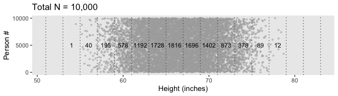
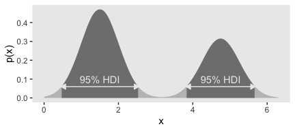

Chapter 04. What is This Stuff Called Probability?
================
A Solomon Kurz
2019-10-18

# What is This Stuff Called Probability?

> Inferential statistical techniques assign precise measures to our
> uncertainty about possibilities. Uncertainty is measured in terms of
> *probability*, and therefore we must establish the properties of
> probability before we can make inferences about it. This chapter
> introduces the basic ideas of probability. (p. 71, *emphasis* in the
> original)

## The set of all possible events

This snip from page 72 is important (*emphasis* in the original):

> Whenever we ask about how likely an outcome is, we always ask with a
> set of possible outcomes in mind. This set exhausts all possible
> outcomes, and the outcomes are all mutually exclusive. This set is
> called the *sample space*.

## Probability: Outside or inside the head

It’s worthwhile to quote this section in full.

> Sometimes we talk about probabilities of outcomes that are “out there”
> in the world. The face of a flipped coin is such an outcome: We can
> observe the flip, and the probability of coming up heads can be
> estimated by observing several flips.
> 
> But sometimes we talk about probabilities of things that are not so
> clearly “out there,” and instead are just possible beliefs “inside the
> head.” Our belief about the fairness of a coin is an example of
> something inside the head. The coin may have an intrinsic physical
> bias, but now I am referring to our *belief* about the bias. Our
> beliefs refer to a space of mutually exclusive and exhaustive
> possibilities. It might be strange to say that we randomly sample from
> our beliefs, like we randomly sample from a sack of coins.
> Nevertheless, the mathematical properties of probabilities outside the
> head and beliefs inside the head are the same in their essentials, as
> we will see. (pp. 73–74, *emphasis* in the original)

### Outside the head: Long-run relative frequency.

> For events outside the head, it’s intuitive to think of probability as
> being the long-run relative frequency of each possible outcome…
> 
> We can determine the long-run relative frequency by two different
> ways. One way is to approximate it by actually sampling from the space
> many times and tallying the number of times each event happens. A
> second way is by deriving it mathematically. These two methods are now
> explored in turn. (p. 74)

#### Simulating a long-run relative frequency.

Before we try coding the simulation, we’ll first load the **tidyverse**.

``` r
library(tidyverse)
```

Now run the simulation.

``` r
n       <- 500  # specify the total number of flips
p_heads <- 0.5  # specify underlying probability of heads

# Kruschke reported this was the seed he used at the top of page 94
set.seed(47405)

# here we use that seed to flip a coin n times and compute the running proportion of heads at each flip. 
# we generate a random sample of n flips (heads = 1, tails = 0)
d <-
  tibble(flip_sequence = sample(x       = c(0, 1), 
                                prob    = c(1 - p_heads, p_heads), 
                                size    = n, 
                                replace = T),
         r = cumsum(flip_sequence),
         n = 1:n) %>% 
  mutate(run_prop = r / n)

end_prop <-
  d %>% 
  select(run_prop) %>% 
  slice(n()) %>% 
  round(digits = 3) %>% 
  pull()
```

Now we’re ready to make Figure 4.1.

``` r
d %>%
  filter(n < 1000) %>%  # this step cuts down on the time it takes to make the plot
  ggplot(aes(x = n, y = run_prop)) +
  geom_hline(yintercept = .5, color = "white") +
  geom_line(color = "grey50") +
  geom_point(color = "grey50", alpha = 1/4) +
  scale_x_log10(breaks = c(1, 2, 5, 10, 20, 50, 200, 500)) +
  coord_cartesian(xlim = 1:500,
                  ylim = 0:1) +
  labs(title = "Running proportion of heads",
       subtitle = paste("Our end proportion =", end_prop),
       x = "Flip number", 
       y = "Proportion of heads") +
  theme(panel.grid = element_blank())
```

<!-- -->

#### Deriving a long-run relative frequency.

> Sometimes, when the situation is simple enough mathematically, we can
> derive the exact long-run relative frequency. The case of the fair
> coin is one such simple situation. The sample space of the coin
> consists of two possible outcomes, head and tail. By the assumption of
> fairness, we know that each outcome is equally likely. Therefore, the
> long-run relative frequency of heads should be exactly one out of two,
> i.e., 1/2, and the long-run relative frequency of tails should also be
> exactly 1/2. (p. 76)

### Inside the head: Subjective belief.

> To specify our subjective beliefs, we have to specify how likely we
> think each possible outcome is. It can be hard to pin down mushy
> intuitive beliefs. In the next section, we explore one way to
> “calibrate” subjective beliefs, and in the subsequent section we
> discuss ways to mathematically describe degrees of belief. (p. 76)

### Probabilities assign numbers to possibilities.

> In general, a probability, whether it’s outside the head or inside the
> head, is just a way of assigning numbers to a set of mutually
> exclusive possibilities. The numbers, called “probabilities,” merely
> need to satisfy three properties
> ([Kolmogorov, 1956](https://www.york.ac.uk/depts/maths/histstat/kolmogorov_foundations.pdf)):
> 
> 1.  A probability value must be nonnegative (i.e., zero or positive).
> 2.  The sum of the probabilities across all events in the entire
>     sample space must be 1.0 (i.e., one of the events in the space
>     must happen, otherwise the space does not exhaust all
>     possibilities).
> 3.  For any two mutually exclusive events, the probability that one
>     *or* the other occurs is the *sum* of their individual
>     probabilities. For example, the probability that a fair six-sided
>     die comes up 3-dots *or* 4-dots is 1/6 + 1/6 = 2/6.
> 
> Any assignment of numbers to events that respects those three
> properties will also have all the properties of probabilities that we
> will discuss below. (pp. 77–78, *emphasis* in the original)

## Probability distributions

“A probability *distribution* is simply a list of all possible outcomes
and their corresponding probabilities” (p. 78, *emphasis* in the
original)

### Discrete distributions: Probability mass.

> When the sample space consists of discrete outcomes, then we can talk
> about the probability of each distinct outcome. For example, the
> sample space of a flipped coin has two discrete outcomes, and we talk
> about the probability of head or tail…
> 
> For continuous outcome spaces, we can *discretize* the space into a
> finite set of mutually exclusive and exhaustive “bins.” (p. 78,
> *emphasis* in the original)

In order to recreate Figure 4.2, we need to generate the heights data.
In his “HtWtDataDenerator” R script, Kruschke provided the code for a
function that will generate height data of the kind in his text. Here is
the code:

``` r
HtWtDataGenerator <- function(n_subj, rndsd = NULL, male_prob = 0.50) {
  # Random height, weight generator for males and females. Uses parameters from
  # Brainard, J. & Burmaster, D. E. (1992). Bivariate distributions for height and
  # weight of men and women in the United States. Risk Analysis, 12(2), 267-275.
  # Kruschke, J. K. (2011). Doing Bayesian data analysis:
  # A Tutorial with R and BUGS. Academic Press / Elsevier.
  # Kruschke, J. K. (2014). Doing Bayesian data analysis, 2nd Edition:
  # A Tutorial with R, JAGS and Stan. Academic Press / Elsevier.
  
  require(MASS)
  
  # Specify parameters of multivariate normal (MVN) distributions.
  # Men:
  HtMmu   <- 69.18
  HtMsd   <- 2.87
  lnWtMmu <- 5.14
  lnWtMsd <- 0.17
  Mrho    <- 0.42
  Mmean   <- c(HtMmu, lnWtMmu)
  Msigma  <- matrix(c(HtMsd^2, Mrho * HtMsd * lnWtMsd,
                      Mrho * HtMsd * lnWtMsd, lnWtMsd^2), nrow = 2)
  # Women cluster 1:
  HtFmu1   <- 63.11
  HtFsd1   <- 2.76
  lnWtFmu1 <- 5.06
  lnWtFsd1 <- 0.24
  Frho1    <- 0.41
  prop1    <- 0.46
  Fmean1   <- c(HtFmu1, lnWtFmu1)
  Fsigma1  <- matrix(c(HtFsd1^2, Frho1 * HtFsd1 * lnWtFsd1,
                       Frho1 * HtFsd1 * lnWtFsd1, lnWtFsd1^2), nrow = 2)
  # Women cluster 2:
  HtFmu2   <- 64.36
  HtFsd2   <- 2.49
  lnWtFmu2 <- 4.86
  lnWtFsd2 <- 0.14
  Frho2    <- 0.44
  prop2    <- 1 - prop1
  Fmean2   <- c(HtFmu2, lnWtFmu2)
  Fsigma2  <- matrix(c(HtFsd2^2, Frho2 * HtFsd2 * lnWtFsd2,
                       Frho2 * HtFsd2 * lnWtFsd2, lnWtFsd2^2), nrow = 2)
  
  # Randomly generate data values from those MVN distributions.
  if (!is.null(rndsd)) {set.seed(rndsd)}
  data_matrix <- matrix(0, nrow = n_subj, ncol = 3)
  colnames(data_matrix) <- c("male", "height", "weight")
  maleval <- 1; femaleval <- 0 # arbitrary coding values
  for (i in 1:n_subj) {
    # Flip coin to decide sex
    sex = sample(c(maleval, femaleval), size = 1, replace = TRUE,
                 prob = c(male_prob, 1 - male_prob))
    if (sex == maleval) {datum <- mvrnorm(n = 1, mu = Mmean, Sigma = Msigma)}
    if (sex == femaleval) {
      Fclust = sample(c(1, 2), size = 1, replace = TRUE, prob = c(prop1, prop2))
      if (Fclust == 1) {datum <- mvrnorm(n = 1, mu = Fmean1, Sigma = Fsigma1)}
      if (Fclust == 2) {datum <- mvrnorm(n = 1, mu = Fmean2, Sigma = Fsigma2)}
    }
    data_matrix[i, ] = c(sex, round(c(datum[1], exp(datum[2])), 1))
  }
  
  return(data_matrix)
} # end function
```

Now we have the `HtWtDataGenerator()` function, all we need to do is
determine how many values are generated and how probable we want the
values to be based on those from men. These are controlled by the
`n_subj` and `male_prob` parameters.

``` r
set.seed(4)
d <-
  HtWtDataGenerator(n_subj = 10000, male_prob = .5) %>%
  as_tibble() %>%
  mutate(person = 1:n())

d %>%
  head()
```

    ## # A tibble: 6 x 4
    ##    male height weight person
    ##   <dbl>  <dbl>  <dbl>  <int>
    ## 1     1   76     222.      1
    ## 2     0   59.5   190       2
    ## 3     0   60.2   118.      3
    ## 4     1   64.1   138.      4
    ## 5     1   69.3   148.      5
    ## 6     1   69.1   166.      6

Before we move on, we’ll want to detach the **MASS** package and reload
**dplyr**, which is part of the **tidyverse**, so we might be able to
use `dplyr::select()` later in the project.

``` r
detach(package:MASS, unload = T)
library(dplyr)
```

For Figure 4.2, we’ll make extensive use of the `case_when()` syntax,
which you can learn more about from [hrbrmstr’s *Making a Case for
case\_when*](https://rud.is/b/2017/03/10/making-a-case-for-case_when/).

``` r
d_bin <-
  d %>%
  mutate(bin = case_when(
    height < 51 ~ 51,
    between(height, 51, 53) ~ 53,
    between(height, 53, 55) ~ 55,
    between(height, 55, 57) ~ 57,
    between(height, 57, 59) ~ 59,
    between(height, 59, 61) ~ 61,
    between(height, 61, 63) ~ 63,
    between(height, 63, 65) ~ 65,
    between(height, 65, 67) ~ 67,
    between(height, 67, 69) ~ 69,
    between(height, 69, 71) ~ 71,
    between(height, 71, 73) ~ 73,
    between(height, 73, 75) ~ 75,
    between(height, 75, 77) ~ 77,
    between(height, 77, 79) ~ 79,
    between(height, 79, 81) ~ 71,
    between(height, 81, 83) ~ 83,
    height > 83 ~ 85)
    ) %>%
  group_by(bin) %>%
  summarise(n = n()) %>%
  mutate(height = bin - 1)

d %>%
  ggplot(aes(x = height, y = person)) +
  geom_point(size = 3/4, color = "grey67", alpha = 1/2) +
  geom_vline(xintercept = seq(from = 51, to = 83, by = 2),
             linetype = 3, color = "grey33") +
  geom_text(data = d_bin, 
            aes(y = 5000, label = n),
            size = 3.25) +
  scale_y_continuous(breaks = c(0, 5000, 10000)) +
  labs(title = "Total N = 10,000",
       x = "Height (inches)",
       y = "Person #") +
  theme(panel.grid = element_blank())
```

<!-- -->

Because we’re simulating and we don’t know what seed number Kruschke
used for his plot, ours will differ a little from his. But the overall
pattern is the same.

It’s a little less work to make Figure 4.2.b.

``` r
d %>%
  ggplot(aes(x = height)) +
  geom_histogram(aes(y = stat(density)),
                 binwidth = 2, fill = "grey67",
                 color = "grey92", size = 1/8) +
  scale_y_continuous(breaks = c(0, .04, .08)) +
  coord_cartesian(xlim = 51:83) +
  labs(x = "Height (inches)",
       y = "Probability density") +
  theme(panel.grid = element_blank())
```

<!-- -->

Our data binning approach for Figure 4.2.c will be a little different
than what we did, above. Here we’ll make our bins with the `round()`
function.

``` r
d_bin <-
  d %>%
  mutate(bin = round(height, digits = 0)) %>%   
  group_by(bin) %>%
  summarise(n = n()) %>%
  mutate(height = bin - 0.5)

d %>%
  ggplot(aes(x = height, y = person)) +
  geom_point(size = 3/4, color = "grey67", alpha = 1/2) +
  geom_vline(xintercept = seq(from = 51, to = 83, by = 1),
             linetype = 3, color = "grey33") +
  geom_text(data = d_bin, 
            aes(y = 5000, label = n, angle = 90),
            size = 3.25) +
  scale_y_continuous(breaks = c(0, 5000, 10000)) +
  labs(title = "Total N = 10,000",
       x = "Height (inches)",
       y = "Person #") +
  theme(panel.grid = element_blank())
```

<!-- -->

However, our method for Figure 4.2.d will be like what we did, before.

``` r
d %>%
  ggplot(aes(x = height)) +
  geom_histogram(aes(y = stat(density)), boundary = 0,
                 binwidth = 1, fill = "grey67",
                 color = "grey92", size = 1/8) +
  scale_y_continuous(breaks = c(0, .04, .08)) +
  coord_cartesian(xlim = 51:83) +
  labs(x = "Height (inches)",
       y = "Probability density") +
  theme(panel.grid = element_blank())
```

<!-- -->

> The probability of a discrete outcome, such as the probability of
> falling into an interval on a continuous scale, is referred to as a
> probability *mass.* Loosely speaking, the term “mass” refers the
> amount of stuff in an object. When the stuff is probability and the
> object is an interval of a scale, then the mass is the proportion of
> the outcomes in the interval. (p. 80, *emphasis* in the original)

### Continuous distributions: Rendezvous with density.

> If you think carefully about a continuous outcome space, you realize
> that it becomes problematic to talk about the probability of a
> specific value on the continuum, as opposed to an interval on the
> continuum… Therefore, what we will do is make the intervals
> infinitesimally narrow, and instead of talking about the infinitesimal
> probability mass of each infinitesimal interval, we will talk about
> the ratio of the probability mass to the interval width. That ratio is
> called the probability *density*.
> 
> Loosely speaking, density is the amount of stuff per unit of space it
> takes up. Because we are measuring amount of stuff by its mass, then
> density is the mass divided by the amount space it occupies. (p. 80,
> *emphasis* in the original)

To make Figure 4.3., we’ll need new data.

``` r
set.seed(4)
d <-
  tibble(height = rnorm(1e4, mean = 84, sd = .1)) %>%
  mutate(door = 1:n())

d %>%
  head()
```

    ## # A tibble: 6 x 2
    ##   height  door
    ##    <dbl> <int>
    ## 1   84.0     1
    ## 2   83.9     2
    ## 3   84.1     3
    ## 4   84.1     4
    ## 5   84.2     5
    ## 6   84.1     6

To make the bins for our version of Figure 4.3.a, we could use the
`case_when()` approach from above. However, that would require some
tedious code. Happily, we have an alternative in the [**santoku**
package](https://github.com/hughjonesd/santoku). We can use the
`santoku::chop()` function to discretize our `height` values. Here we’ll
walk through the first part.

``` r
# devtools::install_github("hughjonesd/santoku")
library(santoku)

d_bin <-
  d %>% 
  mutate(bin = chop(height, 
                    breaks = seq(from = 83.6, to = 84.4, length.out = 31),
                    labels = seq(from = 83.6, to = 84.4, length.out = 31)[-1]))

head(d_bin)
```

    ## # A tibble: 6 x 3
    ##   height  door bin             
    ##    <dbl> <int> <fct>           
    ## 1   84.0     1 84.0266666666667
    ## 2   83.9     2 83.9466666666667
    ## 3   84.1     3 84.1066666666667
    ## 4   84.1     4 84.08           
    ## 5   84.2     5 84.1866666666667
    ## 6   84.1     6 84.08

We’ve labeled our `bin` levels by their upper bounds. Note how they are
saved as factors. To make use of those values in our plot, we’ll need to
convert them to numerals. Here we make that conversion and complete the
data wrangling.

``` r
d_bin <-
  d_bin %>% 
  mutate(bin = as.character(bin) %>% as.double()) %>% 
  group_by(bin) %>%
  summarise(n = n()) %>% 
  mutate(height = bin - (83.62667 - 83.6) / 2)

head(d_bin)
```

    ## # A tibble: 6 x 3
    ##     bin     n height
    ##   <dbl> <int>  <dbl>
    ## 1  83.7     5   83.6
    ## 2  83.7     5   83.7
    ## 3  83.7     7   83.7
    ## 4  83.7    24   83.7
    ## 5  83.8    37   83.7
    ## 6  83.8    86   83.8

Now we plot.

``` r
d %>%
  ggplot(aes(x = height, y = door)) +
  geom_point(size = 3/4, color = "grey67", alpha = 1/2) +
  geom_vline(xintercept = seq(from = 83.6, to = 84.4, length.out = 31),
             linetype = 3, color = "grey33") +
  geom_text(data = d_bin,
            aes(y = 5000, label = n, angle = 90),
            size = 3.25) +
  scale_y_continuous(breaks = c(0, 5000, 10000)) +
  labs(title = "Total N = 10,000",
       x = "Height (inches)",
       y = "Door #") +
  theme(panel.grid = element_blank())
```

<!-- -->

Figure 4.3.b is a breeze.

``` r
d %>%
  ggplot(aes(x = height)) +
  geom_histogram(aes(y = stat(density)), boundary = 0,
                 binwidth = .025, fill = "grey67",
                 color = "grey92", size = 1/8) +
  scale_y_continuous(breaks = 0:4) +
  coord_cartesian(xlim = c(83.6, 84.4)) +
  labs(x = "Height (inches)",
       y = "Probability density") +
  theme(panel.grid = element_blank())
```

<!-- -->

#### Properties of probability density functions.

#### The normal probability density function.

We’ll use `dnorm()` again to make our version of Figure 4.4.

``` r
tibble(x   = seq(from = -.8, to = .8, by = .02)) %>% 
  mutate(p = dnorm(x, mean = 0, sd = .2)) %>% 
  
  ggplot(aes(x = x)) +
  geom_line(aes(y = p),
            color = "grey50", size = 1.25) +
  geom_linerange(aes(ymin = 0, ymax = p),
                 size = 1/3) +
  coord_cartesian(xlim = c(-.61, .61)) +
  labs(title    = "Normal probability density",
       subtitle = expression(paste(mu, " = 0 and ", sigma, " = 0.2")),
       y        = "p(x)") +
  theme(panel.grid = element_blank())
```

<!-- -->

The equation for the normal probability density follows the form

\[
p(x) = \frac{1}{\sigma \sqrt{2 \pi}} \exp \Bigg ( - \frac{1}{2} \bigg [ \frac{x - \mu}{\sigma}^2 \bigg ] \Bigg ),
\]

where \(\mu\) governs the mean and \(\sigma\) governs the standard
deviation.

### Mean and variance of a distribution.

The mean of a probability distribution is also called the *expected
value*, which follow the form

\[E[x] = \sum_x p(x) x\]

when \(x\) is discrete. For continuous \(x\) values, the formula is

\[E[x] = \int \text d x \; p(x) x.\]

The variance is defined as the mean squared deviation from the mean,

\[\text{var}_x = \int \text d x \; p(x) (x - E[x])^2.\]

If you take the square root of the variance, you get the standard
deviation.

### Highest density interval (HDI).

> The HDI indicates which points of a distribution are most credible,
> and which cover most of the distribution. Thus, the HDI summarizes the
> distribution by specifying an interval that spans most of the
> distribution, say 95% of it, such that every point inside the interval
> has higher credibility than any point outside the interval. (p. 87)

In chapter 10 (p. 294), Kruschke briefly mentions his `HDIofICDF()`
function, the code for which you can find in his `DBDA2E-utilities.R`
file. It’s a handy function which we’ll put to use from time to time.
Here’s a mild reworking of his code.

``` r
hdi_of_icdf <- function(name, width = .95, tol = 1e-8, ... ) {
  # Arguments:
  #   `name` is R's name for the inverse cumulative density function
  #   of the distribution.
  #   `width` is the desired mass of the HDI region.
  #   `tol` is passed to R's optimize function.
  # Return value:
  #   Highest density iterval (HDI) limits in a vector.
  # Example of use: For determining HDI of a beta(30, 12) distribution, type
  #   `hdi_of_icdf(qbeta, shape1 = 30, shape2 = 12)`
  #   Notice that the parameters of the `name` must be explicitly stated;
  #   e.g., `hdi_of_icdf(qbeta, 30, 12)` does not work.
  # Adapted and corrected from Greg Snow's TeachingDemos package.
  incredible_mass <-  1.0 - width
  interval_width  <- function(low_tail_prob, name, width, ...) {
    name(width + low_tail_prob, ...) - name(low_tail_prob, ...)
  }
  opt_info            <- optimize(interval_width, c(0, incredible_mass), 
                                  name = name, width = width, 
                                  tol = tol, ...)
  hdi_lower_tail_prob <- opt_info$minimum
  return(c(name(hdi_lower_tail_prob, ...),
           name(width + hdi_lower_tail_prob, ...)))
}
```

Now we already know from the text, and perhaps from prior experience,
what the 95% HDIs for the unit normal. But it’s nice to be able to
confirm that with a function.

``` r
h <-
  hdi_of_icdf(name = qnorm,
              mean = 0,
              sd   = 1)

h
```

    ## [1] -1.959964  1.959964

Now we’ve saved those values in `h`, we can use then to make our version
of Figure 4.5.a.

``` r
tibble(x = seq(from = -3.5, to = 3.5, by = .05)) %>% 
  
  ggplot(aes(x = x)) +
  geom_ribbon(aes(ymin = 0,
                  ymax = dnorm(x, mean = 0, sd = 1)),
              fill = "grey75") +
  geom_ribbon(data = . %>% filter(x >=h[1] & x <= h[2]),
                aes(ymin = 0,
                  ymax = dnorm(x, mean = 0, sd = 1)),
              fill = "grey50") +
  geom_line(data = tibble(x = c(h[1] + .02, h[2] - .02),
                          y = c(.059, .059)),
            aes(y = y),
            arrow = arrow(length = unit(.2, "cm"), 
                          ends = "both", 
                          type = "closed"),
            color = "grey92") +
  annotate("text", x = 0, y = .09, 
           label = "95% HDI", color = "grey92") +
  xlim(-3.1, 3.1) +
  labs(y = "p(x)") +
  theme(panel.grid = element_blank())
```

<!-- -->

As far as I could tell, Figure 4.5.b is of a beta distribution, which
Kruschke covers in greater detail starting in chapter 6. I got the
`shape1` and `shape2` values from playing around. If you have a more
principled approach, [do
share](https://github.com/ASKurz/Doing-Bayesian-Data-Analysis-in-brms-and-the-tidyverse/issues).
But anyway, we can use our `hdi_of_icdf()` funciton to ge the correct
values.

``` r
h <-
  hdi_of_icdf(name   = qbeta,
              shape1 = 15, 
              shape2 = 4)

h
```

    ## [1] 0.6103498 0.9507510

Let’s put those `h` values to work.

``` r
tibble(x = seq(from = 0, to = 1, by = .01)) %>% 
  
  ggplot(aes(x = x)) +
  geom_ribbon(aes(ymin = 0,
                  ymax = dbeta(x, shape1 = 15, shape2 = 4)),
              fill = "grey75") +
  geom_ribbon(data = . %>% filter(x >=h[1] & x <= h[2]),
              aes(ymin = 0,
                  ymax = dbeta(x, shape1 = 15, shape2 = 4)),
              fill = "grey50") +
  geom_line(data = tibble(x = c(h[1] + .01, h[2] - .002),
                          y = c(.75, .75)),
            aes(x = x, y = y),
            arrow = arrow(length = unit(.2, "cm"),
                          ends = "both",
                          type = "closed"),
            color = "grey92") +
  annotate("text", x = .8, y = 1.1, 
           label = "95% HDI", color = "grey92") +
  xlim(.4, 1) +
  ylab("p(x)") +
  theme(panel.grid = element_blank())
```

<!-- -->

Figure 4.5.c was also a lot of trial and error. It seemed the easiest
way to reproduce the shape was to mash two Gaussians together. After
playing around with `rnorm()`, I ended up with this.

``` r
set.seed(4)
d <-
  tibble(x = c(rnorm(6e5, mean = 1.50, sd = .5),
               rnorm(4e5, mean = 4.75, sd = .5)))

glimpse(d)
```

    ## Observations: 1,000,000
    ## Variables: 1
    ## $ x <dbl> 1.6083774, 1.2287537, 1.9455723, 1.7979903, 2.3178090, 1.84463…

As you’ll see, it’s not exactly right. But it’s close enough to give you
a sense of what’s going on. But anyway, since we’re working with
simulated data rather than an analytic solution, we’ll want to use a
powerful convenience function from the **tidybayes** package.

``` r
library(tidybayes)
```

Kay’s **tidybayes** package

> provides a family of functions for generating point summaries and
> intervals from draws in a tidy format. These functions follow the
> naming scheme `[median|mean|mode]_[qi|hdi]`, for example, `median_qi`,
> `mean_qi`, `mode_hdi`, and so on. The first name (before the `_`)
> indicates the type of point summary, and the second name indicates the
> type of interval. `qi` yields a quantile interval (a.k.a. equi-tailed
> interval, central interval, or percentile interval) and `hdi` yields a
> highest (posterior) density interval. (from
> [here](https://mjskay.github.io/tidybayes/articles/tidy-brms.html))

Here we’ll use `mode_hdi()` to compute the HDIs and put them in a
tibble. We’ll be using a lot of `mode_hdi()` in this project.

``` r
h <- 
  d %>% 
  mode_hdi()
```

    ## Warning: unnest() has a new interface. See ?unnest for details.
    ## Try `df %>% unnest(c(.lower, .upper))`, with `mutate()` if needed

``` r
h
```

    ## # A tibble: 2 x 6
    ##       x .lower .upper .width .point .interval
    ##   <dbl>  <dbl>  <dbl>  <dbl> <chr>  <chr>    
    ## 1  1.50  0.458   2.55   0.95 mode   hdi      
    ## 2  1.50  3.82    5.68   0.95 mode   hdi

Usually, `mode_hdi()` will return a tibble with just one row. But in
this case, since we had a bimodal distribution, it returned two rows—one
for each of the two distinct regions. Oh, and in case it wasn’t clear,
that first column `x` is the measure of central tendency—the mode, in
this case. Though I acknowledge, it’s a little odd to speak of central
tendency in a bimodal distribution. Again, this won’t happen much.

In order to fill the bimodal density with the split HDIs, you need to
use the `density()` function to transform the `d` data to a tibble with
the values for the x-axis in an `x` vector and the corresponding density
values in a `y` vector.

``` r
dens <-
  d$x %>%
  density() %>%
  with(tibble(x, y))

head(dens)
```

    ## # A tibble: 6 x 2
    ##       x            y
    ##   <dbl>        <dbl>
    ## 1 -1.11 0.0000000503
    ## 2 -1.09 0.0000000822
    ## 3 -1.08 0.000000131 
    ## 4 -1.06 0.000000201 
    ## 5 -1.04 0.000000304 
    ## 6 -1.03 0.000000449

We’re finally ready to plot. Forgive me. It’s a monster.

``` r
ggplot(data = dens,
         aes(x = x, y = y)) +
  geom_ribbon(aes(ymin = 0, ymax = y),
              size = 0, fill = "grey75") +
  # note the use of `pull()`, which extracts the values, rather than return a tibble  
  geom_ribbon(data = dens %>% filter(x > h[1, 2] %>% pull() & 
                                       x < h[1, 3] %>% pull()),
              aes(ymin = 0, ymax = y),
              size = 0, fill = "grey50") +
  geom_ribbon(data = dens %>% filter(x > h[2, 2] %>% pull() & 
                                       x < h[2, 3] %>% pull()),
              aes(ymin = 0, ymax = y),
              size = 0, fill = "grey50") +
  geom_line(data = tibble(x = c(h[1, 2] %>% pull(), h[1, 3] %>% pull()),
                          y = c(.06, .06)),
            aes(x = x, y = y),
            arrow = arrow(length = unit(.2,"cm"),
                          ends = "both",
                          type = "closed"),
            color = "grey92") +
  geom_line(data = tibble(x = c(h[2, 2] %>% pull(), h[2, 3] %>% pull()),
                          y = c(.06, .06)),
            aes(x = x, y = y),
            arrow = arrow(length = unit(.2,"cm"),
                          ends = "both",
                          type = "closed"),
            color = "grey92") +
  annotate("text", x = 1.5, y = .1, 
           label = "95% HDI", color = "grey92") +
  annotate("text", x = 4.75, y = .1, 
           label = "95% HDI", color = "grey92") +
  scale_x_continuous(breaks = 0:6) +
  scale_y_continuous("p(x)", breaks = c(0, .1, .2, .3, .4, .5)) +
  xlim(0, 6.3) +
  theme(panel.grid = element_blank())
```

<!-- -->

## Two-way distributions

Here’s a way to compute the marginals from the inner cells of Table 4.1.

``` r
d1 <-
  tibble(eye_color = c("brown", "blue", "hazel", "green"),
       black     = c(.11, .03, .03, .01),
       brunette  = c(.2, .14, .09, .05),
       red       = c(.04, .03, .02, .02),
       blond     = c(.01, .16, .02, .03)) %>% 
  mutate(marginal_eye_color = black + brunette + red + blond)

d2 <-
  d1 %>% 
  summarise_if(is.double, sum) %>% 
  mutate(eye_color = "marginal_hair_color") %>% 
  select(eye_color, everything())

bind_rows(d1, d2)
```

    ## # A tibble: 5 x 6
    ##   eye_color           black brunette   red blond marginal_eye_color
    ##   <chr>               <dbl>    <dbl> <dbl> <dbl>              <dbl>
    ## 1 brown                0.11     0.2   0.04  0.01              0.36 
    ## 2 blue                 0.03     0.14  0.03  0.16              0.36 
    ## 3 hazel                0.03     0.09  0.02  0.02              0.160
    ## 4 green                0.01     0.05  0.02  0.03              0.11 
    ## 5 marginal_hair_color  0.18     0.48  0.11  0.22              0.99

## References

Kruschke, J. K. (2015). *Doing Bayesian data analysis, Second Edition: A
tutorial with R, JAGS, and Stan.* Burlington, MA: Academic
Press/Elsevier.

## Session info

``` r
sessionInfo()
```

    ## R version 3.6.0 (2019-04-26)
    ## Platform: x86_64-apple-darwin15.6.0 (64-bit)
    ## Running under: macOS High Sierra 10.13.6
    ## 
    ## Matrix products: default
    ## BLAS:   /Library/Frameworks/R.framework/Versions/3.6/Resources/lib/libRblas.0.dylib
    ## LAPACK: /Library/Frameworks/R.framework/Versions/3.6/Resources/lib/libRlapack.dylib
    ## 
    ## locale:
    ## [1] en_US.UTF-8/en_US.UTF-8/en_US.UTF-8/C/en_US.UTF-8/en_US.UTF-8
    ## 
    ## attached base packages:
    ## [1] stats     graphics  grDevices utils     datasets  methods   base     
    ## 
    ## other attached packages:
    ##  [1] tidybayes_1.1.0    santoku_0.2.0.9000 forcats_0.4.0     
    ##  [4] stringr_1.4.0      dplyr_0.8.3        purrr_0.3.2       
    ##  [7] readr_1.3.1        tidyr_1.0.0        tibble_2.1.3      
    ## [10] ggplot2_3.2.1      tidyverse_1.2.1   
    ## 
    ## loaded via a namespace (and not attached):
    ##  [1] ggstance_0.3.2            tidyselect_0.2.5         
    ##  [3] xfun_0.10                 haven_2.1.0              
    ##  [5] lattice_0.20-38           colorspace_1.4-1         
    ##  [7] vctrs_0.2.0               generics_0.0.2           
    ##  [9] htmltools_0.4.0           yaml_2.2.0               
    ## [11] utf8_1.1.4                rlang_0.4.0              
    ## [13] pillar_1.4.2              glue_1.3.1               
    ## [15] withr_2.1.2               HDInterval_0.2.0         
    ## [17] modelr_0.1.4              readxl_1.3.1             
    ## [19] plyr_1.8.4                lifecycle_0.1.0          
    ## [21] munsell_0.5.0             gtable_0.3.0             
    ## [23] cellranger_1.1.0          rvest_0.3.4              
    ## [25] coda_0.19-3               evaluate_0.14            
    ## [27] labeling_0.3              knitr_1.23               
    ## [29] fansi_0.4.0               broom_0.5.2              
    ## [31] Rcpp_1.0.2                arrayhelpers_1.0-20160527
    ## [33] scales_1.0.0              backports_1.1.5          
    ## [35] jsonlite_1.6              svUnit_0.7-12            
    ## [37] hms_0.4.2                 digest_0.6.21            
    ## [39] stringi_1.4.3             grid_3.6.0               
    ## [41] cli_1.1.0                 tools_3.6.0              
    ## [43] magrittr_1.5              lazyeval_0.2.2           
    ## [45] crayon_1.3.4              pkgconfig_2.0.3          
    ## [47] zeallot_0.1.0             xml2_1.2.0               
    ## [49] lubridate_1.7.4           assertthat_0.2.1         
    ## [51] rmarkdown_1.13            httr_1.4.0               
    ## [53] rstudioapi_0.10           R6_2.4.0                 
    ## [55] nlme_3.1-139              compiler_3.6.0
