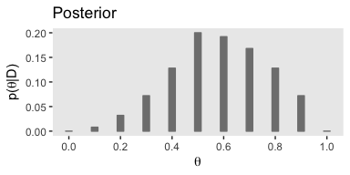
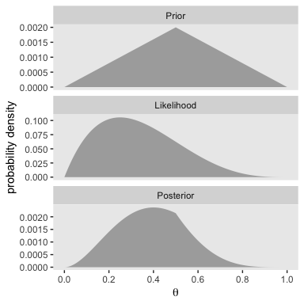
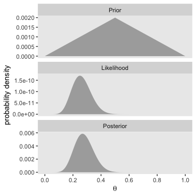

Chapter 05. Bayes' Rule
================
A Solomon Kurz
2018-10-08

Bayes' Rule
===========

Bayes' rule
-----------

With equations 5.5 and 5.6, Kruschke gave us Bayes' rule in terms of *c* and *r*. Equation 5.5:

$$p(c|r) = \\frac{p(r|c)p(c)}{p(r)}$$

Since *p*(*r*)=∑<sub>*c*<sup>\*</sup></sub>*p*(*r*|*c*<sup>\*</sup>)*p*(*c*<sup>\*</sup>), we can re-express that as equation 5.6:

$$p(c|r) = \\frac{p(r|c)p(c)}{\\sum\_{c^\*}p(r|c^\*)p(c^\*)}$$

Applied to parameters and data
------------------------------

Here we get those equations re-expressed in the terms data analysts tend to think with, parameters (i.e., *θ*) and data (i.e., *D*).

$$p(\\theta|D) = \\frac{p(D|\\theta)p(\\theta)}{p(D)}$$

$$p(\\theta|D) = \\frac{p(D|\\theta)p(\\theta)}{\\sum\\limits\_{\\theta^\*}p(D|\\theta^\*)p(\\theta^\*)}$$

Complete examples: Estimating bias in a coin
--------------------------------------------

Behold Figure 5.1.a.

``` r
library(tidyverse)

tibble(theta = seq(from   = 0,   to = 1,  by = .1),
       prior = c(seq(from = 0,   to = .2, length.out = 6),
                 seq(from = .16, to = 0,  length.out = 5))) %>%
  
  ggplot(aes(x = theta, y = prior)) +
  geom_col(width = .025, color = "grey50", fill = "grey50") +
  scale_x_continuous(breaks = seq(from = 0, to = 1, by = .2)) +
  labs(title = "Prior",
       x = expression(theta),
       y = expression(paste("p(", theta, ")"))) +
  theme(panel.grid = element_blank())
```


If we follow Kruschke's equation 5.10 (i.e., the Bernoulli function) closely, we can express it as a function in R.

``` r
Bernoulli <- function(theta, y){
  return(theta^y * (1 - theta)^(1 - y))
}
```

To get a sense of how it works, consider a single coin flip of heads when heads is considered a successful trial. We'll call the single sucessful trial `y = 1`. We can use our custom `Bernoulli()` function to compute the likelihood of different values of *θ*. We'll look at 11 candedate *θ* values, which we'll call `theta_sequence`.

``` r
theta_sequence <- seq(from = 0, to = 1, by = .1)

Bernoulli(theta = theta_sequence, y = 1)
```

    ##  [1] 0.0 0.1 0.2 0.3 0.4 0.5 0.6 0.7 0.8 0.9 1.0

Notice how our `theta_sequence` corresponds nicely with the sequence of *θ* values on the x-axes of Figure 5.1. We can combine `theta_sequence` and our `Bernoulli()` function to make the middle panel of Figure 5.1

``` r
tibble(x = theta_sequence) %>%
  mutate(likelihood = Bernoulli(theta = theta_sequence, y = 1)) %>% 
  
  ggplot(aes(x = x, y = likelihood)) +
  geom_col(width = .025, color = "grey50", fill = "grey50") +
  scale_x_continuous(breaks = seq(from = 0, to = 1, by = .2)) +
  labs(title = "Likelihood",
       x = expression(theta),
       y = expression(paste("p(D|", theta, ")"))) +
  theme(panel.grid = element_blank())
```


In order to compute *p*(*D*) (i.e., the *evidence* or the *marginal likelihood*), we'll need to multiply our respective prior and likelihood values for each point in our theta sequence and then sum all that up. That sum will be our *marginal likelihood*.

``` r
tibble(theta = theta_sequence,
       prior = c(seq(from = 0,   to = .2, length.out = 6),
                 seq(from = .16, to = 0,  length.out = 5))) %>%
  mutate(likelihood = Bernoulli(theta = theta_sequence, y = 1)) %>% 
  mutate(product    = prior * likelihood) %>% 
  summarise(marginal_likelihood = sum(product)) 
```

    ## # A tibble: 1 x 1
    ##   marginal_likelihood
    ##                 <dbl>
    ## 1                 0.5

Now we know our *p*(*D*)=0.5, we're ready to make Figure 5.1.c.

``` r
tibble(theta = theta_sequence,
       prior = c(seq(from = 0,   to = .2, length.out = 6),
                 seq(from = .16, to = 0,  length.out = 5))) %>%
  mutate(likelihood = Bernoulli(theta = theta_sequence, y = 1)) %>% 
  mutate(posterior  = (prior * likelihood) / .5) %>%
  
  ggplot(aes(x = theta, y = posterior)) +
  geom_col(width = .025, color = "grey50", fill = "grey50") +
  scale_x_continuous(breaks = seq(from = 0, to = 1, by = .2)) +
  labs(title = "Posterior",
       x = expression(theta),
       y = expression(paste("p(", theta, "|D)"))) +
  theme(panel.grid = element_blank())
```



### Influence of sample size on the posterior.

In order to follow along with this section, we're going to have to update our Bernoulli likelihood function so it can accommodate more than a single trial. We'll anticipate chapter 6 and call our more general function the `Bernoulli_likelihood()`.

``` r
Bernoulli_likelihood <- function(theta, data) {
  # theta = success probability parameter ranging from 0 to 1
  # data = the vector of data (i.e., a series of 0s and 1s)
  N   <- length(data)
  return(theta^sum(data) * (1 - theta)^(N - sum(data)))
  }
```

Here's the work required to make our version of the left portion of Figure 5.2.

``` r
small_data <- rep(0:1, times = c(3, 1))

tibble(theta =   seq(from = 0,     to = 1, by = .001),
       Prior = c(seq(from = 0,     to = 1, length.out = 501),
                 seq(from = 0.998, to = 0, length.out = 500))) %>% 
  mutate(Prior      = Prior / sum(Prior),
         Likelihood = Bernoulli_likelihood(theta = theta,
                                           data  = small_data)) %>% 
  mutate(marginal_likelihood = sum(Prior * Likelihood)) %>% 
  mutate(Posterior           = (Prior * Likelihood) / marginal_likelihood) %>% 
  select(theta, Prior, Likelihood, Posterior) %>% 
  gather(key, value, -theta) %>% 
  mutate(key = factor(key, levels = c("Prior", "Likelihood", "Posterior"))) %>% 

  ggplot(aes(x = theta, ymin = 0, ymax = value)) +
  geom_ribbon(fill = "grey67") +
  scale_x_continuous(breaks = seq(from = 0, to = 1, by = .2)) +
  labs(x = expression(theta),
       y = "probability density") +
  theme(panel.grid = element_blank()) +
  facet_wrap(~key, scales = "free_y", ncol = 1)
```



We’ll follow the same procedure to make the right portion of Figure 5.2. The only difference is how we switched from `small_data` to `large_data`.

``` r
large_data <- rep(0:1, times = c(30, 10))

tibble(theta =   seq(from = 0,     to = 1, by = .001),
       Prior = c(seq(from = 0,     to = 1, length.out = 501),
                 seq(from = 0.998, to = 0, length.out = 500))) %>% 
  mutate(Prior      = Prior / sum(Prior),
         Likelihood = Bernoulli_likelihood(theta = theta,
                                           data  = large_data)) %>% 
  mutate(marginal_likelihood = sum(Prior * Likelihood)) %>% 
  mutate(Posterior           = (Prior * Likelihood) / marginal_likelihood) %>% 
  select(theta, Prior, Likelihood, Posterior) %>% 
  gather(key, value, -theta) %>% 
  mutate(key = factor(key, levels = c("Prior", "Likelihood", "Posterior"))) %>% 
  
  ggplot(aes(x = theta, ymin = 0, ymax = value)) +
  geom_ribbon(fill = "grey67") +
  scale_x_continuous(breaks = seq(from = 0, to = 1, by = .2)) +
  labs(x = expression(theta),
       y = "probability density") +
  theme(panel.grid = element_blank()) +
  facet_wrap(~key, scales = "free_y", ncol = 1)
```



With just an *N* = 40, the likelihood already dominated the posterior. But this is also a function of our fairly gentle prior.

### Influence of prior on the posterior.

It's not imediately obvious how Kruschke made his prior distributions for Figure 5.3. However, hidden away in his "BernGridExample.R" file he indicated that to get the distribution for the left side of Fiture 5.3, you simply raise the prior from the left of Figure 5.2 to the 0.1 power.

``` r
small_data <- rep(0:1, times = c(3, 1))

tibble(theta =   seq(from = 0,     to = 1, by = .001),
       Prior = c(seq(from = 0,     to = 1, length.out = 501),
                 seq(from = 0.998, to = 0, length.out = 500))) %>% 
  # here's the important line of code
  mutate(Prior = Prior^0.1) %>% 
  mutate(Prior = Prior / sum(Prior),
         Likelihood = Bernoulli_likelihood(theta = theta,
                                           data  = small_data)) %>% 
  mutate(marginal_likelihood = sum(Prior * Likelihood)) %>% 
  mutate(Posterior           = (Prior * Likelihood) / marginal_likelihood) %>% 
  select(theta, Prior, Likelihood, Posterior) %>% 
  gather(key, value, -theta) %>% 
  mutate(key = factor(key, levels = c("Prior", "Likelihood", "Posterior"))) %>% 

  ggplot(aes(x = theta, ymin = 0, ymax = value)) +
  geom_ribbon(fill = "grey67") +
  scale_x_continuous(breaks = seq(from = 0, to = 1, by = .2)) +
  labs(x = expression(theta),
       y = "probability density") +
  theme(panel.grid = element_blank()) +
  facet_wrap(~key, scales = "free_y", ncol = 1)
```


The trick is similar for the right half of Figure 5.3.

``` r
large_data <- rep(0:1, times = c(30, 10))

tibble(theta =   seq(from = 0,     to = 1, by = .001),
       Prior = c(seq(from = 0,     to = 1, length.out = 501),
                 seq(from = 0.998, to = 0, length.out = 500))) %>% 
  mutate(Prior      = Prior / sum(Prior),
         Likelihood = Bernoulli_likelihood(theta = theta,
                                           data  = large_data)) %>% 
  # here's the important line of code
  mutate(Prior               = Prior^10) %>% 
  mutate(marginal_likelihood = sum(Prior * Likelihood)) %>% 
  mutate(Posterior           = (Prior * Likelihood) / marginal_likelihood) %>% 
  select(theta, Prior, Likelihood, Posterior) %>% 
  gather(key, value, -theta) %>% 
  mutate(key = factor(key, levels = c("Prior", "Likelihood", "Posterior"))) %>% 
  
  ggplot(aes(x = theta, ymin = 0, ymax = value)) +
  geom_ribbon(fill = "grey67") +
  scale_x_continuous(breaks = seq(from = 0, to = 1, by = .2)) +
  labs(x = expression(theta),
       y = "probability density") +
  theme(panel.grid = element_blank()) +
  facet_wrap(~key, scales = "free_y", ncol = 1)
```


References
----------

Kruschke, J. K. (2015). *Doing Bayesian data analysis, Second Edition: A tutorial with R, JAGS, and Stan.* Burlington, MA: Academic Press/Elsevier.

Session info
------------

``` r
sessionInfo()
```

    ## R version 3.5.1 (2018-07-02)
    ## Platform: x86_64-apple-darwin15.6.0 (64-bit)
    ## Running under: macOS High Sierra 10.13.6
    ## 
    ## Matrix products: default
    ## BLAS: /Library/Frameworks/R.framework/Versions/3.5/Resources/lib/libRblas.0.dylib
    ## LAPACK: /Library/Frameworks/R.framework/Versions/3.5/Resources/lib/libRlapack.dylib
    ## 
    ## locale:
    ## [1] en_US.UTF-8/en_US.UTF-8/en_US.UTF-8/C/en_US.UTF-8/en_US.UTF-8
    ## 
    ## attached base packages:
    ## [1] stats     graphics  grDevices utils     datasets  methods   base     
    ## 
    ## other attached packages:
    ##  [1] bindrcpp_0.2.2  forcats_0.3.0   stringr_1.3.1   dplyr_0.7.6    
    ##  [5] purrr_0.2.5     readr_1.1.1     tidyr_0.8.1     tibble_1.4.2   
    ##  [9] ggplot2_3.0.0   tidyverse_1.2.1
    ## 
    ## loaded via a namespace (and not attached):
    ##  [1] tidyselect_0.2.4 reshape2_1.4.3   haven_1.1.2      lattice_0.20-35 
    ##  [5] colorspace_1.3-2 htmltools_0.3.6  yaml_2.1.19      utf8_1.1.4      
    ##  [9] rlang_0.2.1      pillar_1.2.3     foreign_0.8-70   glue_1.2.0      
    ## [13] withr_2.1.2      modelr_0.1.2     readxl_1.1.0     bindr_0.1.1     
    ## [17] plyr_1.8.4       munsell_0.5.0    gtable_0.2.0     cellranger_1.1.0
    ## [21] rvest_0.3.2      psych_1.8.4      evaluate_0.10.1  labeling_0.3    
    ## [25] knitr_1.20       parallel_3.5.1   broom_0.4.5      Rcpp_0.12.18    
    ## [29] scales_0.5.0     backports_1.1.2  jsonlite_1.5     mnormt_1.5-5    
    ## [33] hms_0.4.2        digest_0.6.15    stringi_1.2.3    grid_3.5.1      
    ## [37] rprojroot_1.3-2  cli_1.0.0        tools_3.5.1      magrittr_1.5    
    ## [41] lazyeval_0.2.1   crayon_1.3.4     pkgconfig_2.0.1  xml2_1.2.0      
    ## [45] lubridate_1.7.4  assertthat_0.2.0 rmarkdown_1.10   httr_1.3.1      
    ## [49] rstudioapi_0.7   R6_2.2.2         nlme_3.1-137     compiler_3.5.1
