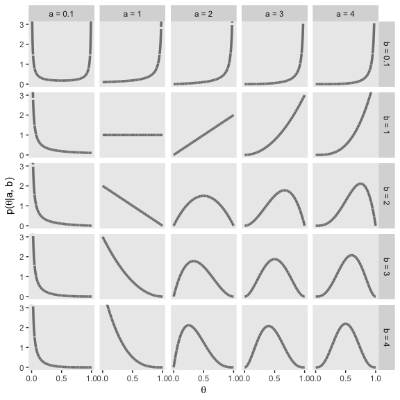
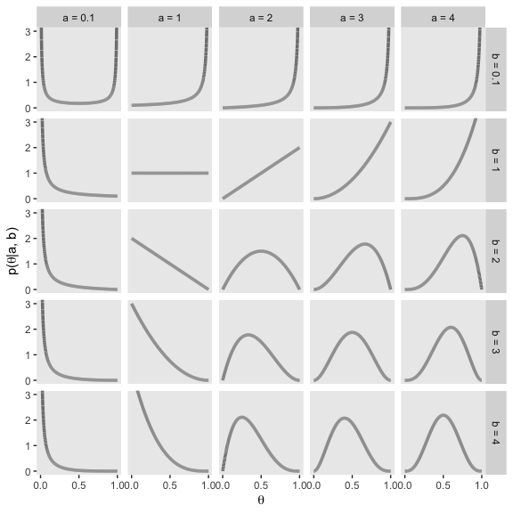
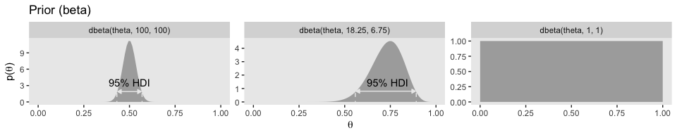
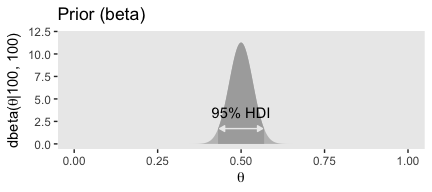
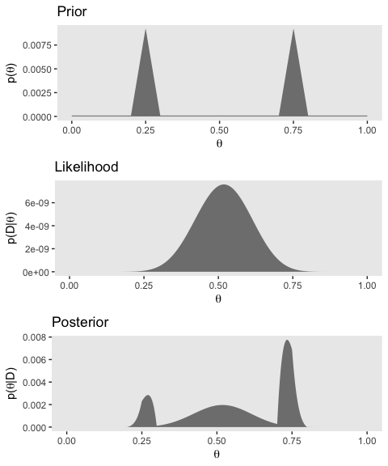

Chapter 06. Inferring a Binomial Probability via Exact Mathematical Analysis
================
A Solomon Kurz
2018-07-30

(PART) ALL THE FUNDAMENTALS APPLIED TO INFERRING A BINOMIAL PROBABILITY
=======================================================================

Kruschke wrote:

> In the next few chapters, we will develop all the foundational concepts and methods of Bayesian data analysis, which are applied to the simplest type of data. Because of the simplicity of the data, we can focus on the Bayesian methods and scaffold the concepts clearly and efficiently. The subsequent part of the book applies the methods developed in this part to more complex data structures.

He put it well. I have nothing to add.

Inferring a Binomial Probability via Exact Mathematical Analysis
================================================================

"Bayes' rule is merely the mathematical relation between the prior allocation of credibility and the posterior reallocation of credibility conditional on data" (pp. 99--100).

The likelihood function: The Bernoulli distribution
---------------------------------------------------

If you follow equation 6.2 closely, here is how we might express it in R.

``` r
Bernoulli_likelihood <- function(theta, data) {
  # theta = success probability parameter ranging from 0 to 1
  # data = the vector of data (i.e., a series of 0s and 1s)
  N   <- length(data)
  z   <- sum(data)
  return(theta^z * (1 - theta)^(N - sum(data)))
  }
```

This will come in handy in just a bit.

A description of credibilities: The beta distribution
-----------------------------------------------------

### Specifying a beta prior.

Before we make Figure 6.1, we'll need some data.

``` r
library(tidyverse)

d <-
  tibble(x = seq(from = 0, to = 1, length.out = 1e3) %>% 
         rep(., times = 25)) %>% 
  group_by(x) %>% 
  mutate(shape1 = rep(c(.1, 1:4), times = 5),
         shape2 = rep(c(.1, 1:4), each = 5)) %>% 
  mutate(a = paste("a =", shape1),
         b = paste("b =", shape2)) %>% 
  ungroup() %>% 
  mutate(exemplar = rep(1:1e3, each = 25))

head(d)
```

    ## # A tibble: 6 x 6
    ##         x shape1 shape2 a       b       exemplar
    ##     <dbl>  <dbl>  <dbl> <chr>   <chr>      <int>
    ## 1 0          0.1    0.1 a = 0.1 b = 0.1        1
    ## 2 0.00100    0.1    0.1 a = 0.1 b = 0.1        1
    ## 3 0.00200    0.1    0.1 a = 0.1 b = 0.1        1
    ## 4 0.00300    0.1    0.1 a = 0.1 b = 0.1        1
    ## 5 0.00400    0.1    0.1 a = 0.1 b = 0.1        1
    ## 6 0.00501    0.1    0.1 a = 0.1 b = 0.1        1

Now we're ready: Figure 6.1.

``` r
d %>% 
  
  ggplot(aes(x = x, group = exemplar)) +
  geom_line(aes(y = dbeta(x, shape1 = shape1, shape2 = shape2)),
            color = "grey50", size = 1.25) +
  scale_x_continuous(breaks = c(0, .5, 1)) +
  coord_cartesian(ylim = 0:3) +
  labs(x = expression(theta),
       y = expression(paste("p(", theta, "|a, b)"))) +
  theme(panel.grid = element_blank()) +
  facet_grid(b~a)
```



We'll use the same process for Figure 6.2 and create the data, first.

``` r
d <-
  tibble(x = seq(from = 0, to = 1, length.out = 1e3) %>% 
         rep(., times = 4)) %>% 
  group_by(x) %>% 
  mutate(shape1 = c(5.6, 17.6, 5, 17),
         shape2 = c(1.4, 4.4, 2, 5)) %>% 
  mutate(a = paste("a =", shape1),
         b = paste("b =", shape2),
         kappa = rep(c("kappa = 7", "kappa = 22"), times = 2),
         mu_omega = rep(c("mu = 0.8", "omega = 0.8"), each = 2)) %>% 
  mutate(kappa = factor(kappa, levels = c("kappa = 7", "kappa = 22"))) %>% 
  ungroup() 

head(d)
```

    ## # A tibble: 6 x 7
    ##         x shape1 shape2 a       b       kappa     mu_omega
    ##     <dbl>  <dbl>  <dbl> <chr>   <chr>   <fct>     <chr>   
    ## 1 0          5.6    1.4 a = 5.6 b = 1.4 kappa = 7 mu = 0.8
    ## 2 0.00100    5.6    1.4 a = 5.6 b = 1.4 kappa = 7 mu = 0.8
    ## 3 0.00200    5.6    1.4 a = 5.6 b = 1.4 kappa = 7 mu = 0.8
    ## 4 0.00300    5.6    1.4 a = 5.6 b = 1.4 kappa = 7 mu = 0.8
    ## 5 0.00400    5.6    1.4 a = 5.6 b = 1.4 kappa = 7 mu = 0.8
    ## 6 0.00501    5.6    1.4 a = 5.6 b = 1.4 kappa = 7 mu = 0.8

Here's Figure 6.2.

``` r
d %>%

  ggplot(aes(x = x)) +
  geom_vline(xintercept = .8, color = "white") +
  geom_line(aes(y = dbeta(x, shape1 = shape1, shape2 = shape2)),
            color = "grey50", size = 1.25) +
  scale_x_continuous(breaks = c(0, .8, 1)) +
  coord_cartesian(ylim = 0:5) +
  labs(x = expression(theta),
       y = expression(paste("p(", theta, "|a, b)"))) +
  theme(panel.grid = element_blank()) +
  facet_grid(mu_omega~kappa)
```



From lines 264 to 290 in his "DBDA2E-utilities.R" file, Kruschke's `betaABfrom...()` functions are as follows:

``` r
# Shape parameters from central tendency and scale:

betaABfromMeanKappa <- function(mean, kappa) {
  if (mean <= 0 | mean >= 1) stop("must have 0 < mean < 1")
  if (kappa <= 0) stop("kappa must be > 0")
  a <- mean * kappa
  b <- (1.0 - mean) * kappa
  return(list(a = a, b = b))
}

betaABfromModeKappa <- function(mode, kappa) {
  if (mode <= 0 | mode >= 1) stop("must have 0 < mode < 1")
  if (kappa <= 2) stop("kappa must be > 2 for mode parameterization")
  a <- mode * (kappa - 2) + 1
  b <- (1.0 - mode) * (kappa - 2) + 1
  return(list(a = a, b = b))
}

betaABfromMeanSD <- function(mean, sd) {
  if (mean <= 0 | mean >= 1) stop("must have 0 < mean < 1")
  if (sd <= 0) stop("sd must be > 0")
  kappa <- mean * (1 - mean)/sd^2 - 1
  if (kappa <= 0) stop("invalid combination of mean and sd")
  a <- mean * kappa
  b <- (1.0 - mean) * kappa
  return(list(a = a, b = b))
}
```

Here's how they work:

``` r
betaABfromMeanKappa(mean = .25, kappa = 4)
```

    ## $a
    ## [1] 1
    ## 
    ## $b
    ## [1] 3

``` r
betaABfromModeKappa(mode = .25, kappa = 4)
```

    ## $a
    ## [1] 1.5
    ## 
    ## $b
    ## [1] 2.5

``` r
betaABfromMeanSD(mean = .5, sd = .1)
```

    ## $a
    ## [1] 12
    ## 
    ## $b
    ## [1] 12

``` r
beta_param <- betaABfromModeKappa(mode = .25, kappa = 4)

beta_param$a
```

    ## [1] 1.5

``` r
beta_param$b
```

    ## [1] 2.5

The posterior beta
------------------

### Posterior is compromise of prior and likelihood.

Here are the mean calculations from the last paragraph on page 134.

``` r
N <- 10
z <- 1
a <- 5
b <- 5

(proportion_heads <- z/N)
```

    ## [1] 0.1

``` r
(prior_mean <- a/(a + b))
```

    ## [1] 0.5

``` r
(posterior_mean <- (z + a)/(N + a + b))
```

    ## [1] 0.3

In order to make the plots for Figure 6.3, we'll want to compute the prior, likelihood, and posterior density values across a densely-packed range of *θ* values.

``` r
trial_data <- c(rep(0, 9), 1)

d <-
  tibble(theta = seq(from = 0, to = 1, length.out = 100)) %>% 
  mutate(`Prior (beta)`           = dbeta(theta, 
                                          shape1 = a, 
                                          shape2 = b),
         `Likelihood (Bernoulli)` = Bernoulli_likelihood(theta = theta, 
                                                         data = trial_data),
         `Posterior (beta)`       = dbeta(theta, 
                                          shape1 = 6, 
                                          shape2 = 14))

glimpse(d)
```

    ## Observations: 100
    ## Variables: 4
    ## $ theta                    <dbl> 0.00000000, 0.01010101, 0.02020202, 0...
    ## $ `Prior (beta)`           <dbl> 0.000000e+00, 6.297429e-06, 9.670878e...
    ## $ `Likelihood (Bernoulli)` <dbl> 0.000000000, 0.009218977, 0.016812166...
    ## $ `Posterior (beta)`       <dbl> 0.000000e+00, 1.500163e-05, 4.201284e...

To make things easier on ourselves, we'll also make two additional data objects to annotate the plots with lines and text.

``` r
# the data for the in-plot lines
line_tibble <-
  tibble(theta = c(.212 + .008, .788 - .008, 
                   .114 + .004, .497 - .005),
         value = rep(c(.51, .66), each = 2),
         xintercept = c(.212, .788, .114, .497),
         key = rep(c("Prior (beta)", "Posterior (beta)"), each = 2)) %>% 
  mutate(key = factor(key, levels = c("Prior (beta)", "Likelihood (Bernoulli)", "Posterior (beta)")))
  
# the data for the annotation
text_tibble <-
  tibble(theta = c(.5, .3),
         value = c(.8, 1.125),
         label = "95% HDI",
         key = c("Prior (beta)", "Posterior (beta)")) %>% 
  mutate(key = factor(key, levels = c("Prior (beta)", "Likelihood (Bernoulli)", "Posterior (beta)")))
```

Finally, here's our Figure 6.3.

``` r
d %>% 
  gather(key, value, -theta) %>% 
  mutate(key = factor(key, levels = c("Prior (beta)", "Likelihood (Bernoulli)", "Posterior (beta)"))) %>% 
  
  ggplot(aes(x = theta)) +
  geom_ribbon(aes(ymin = 0, ymax = value),
              fill = "grey67") +
  geom_vline(data = line_tibble,
             aes(xintercept = xintercept), 
             linetype = 2, color = "grey92") +
  geom_line(data = line_tibble,
            aes(y = value),
            arrow = arrow(length = unit(.15,"cm"), 
                          ends = "both", 
                          type = "closed"),
            color = "grey92") +
  geom_text(data = text_tibble,
            aes(y = value, label = label),
            color = "grey92") +
  labs(x = expression(theta),
       y = NULL) +
  facet_wrap(~key, scales = "free_y", ncol = 1) +
  theme(panel.grid = element_blank())
```


Examples
--------

### Prior knowledge expressed as a beta distribution.

Here are the results Kruschke reported in the first paragraph of this subsection.

``` r
beta_param <- betaABfromModeKappa(mode = .5, kappa = 500)

beta_param$a
```

    ## [1] 250

``` r
beta_param$b
```

    ## [1] 250

Confusingly, it appears Kruschke switched from `dbeta(250, 250)` in the prose to `dbeta(100, 100)` in Figure 6.4.a. So it goes...

``` r
beta_param <- betaABfromModeKappa(mode = .5, kappa = 200)

beta_param$a
```

    ## [1] 100

``` r
beta_param$b
```

    ## [1] 100

``` r
ggplot(data = tibble(x = seq(from = 0, to = 1, by = .001)),
       aes(x = x)) +
  geom_ribbon(aes(ymin = 0,
                  ymax = dbeta(x, 
                               shape1 = beta_param$a, 
                               shape2 = beta_param$b)),
              fill = "grey75") +
  geom_ribbon(data = tibble(x = seq(from = .5 - .069, to = .5 + .069, by = .001)),
              aes(ymin = 0,
                  ymax = dbeta(x, 
                               shape1 = beta_param$a, 
                               shape2 = beta_param$b)),
              fill = "grey67") +
  geom_line(data = tibble(x = c(.5 - .069 + .005, .5 + .069 - .005),
                          y = 1.7),
            aes(x = x, y = y),
            arrow = arrow(length = unit(.15,"cm"), 
                          ends = "both", 
                          type = "closed"),
            color = "grey92") +
  annotate("text", x = .5, y = 3.5, 
           label = "95% HDI", color = "grey0") +
  coord_cartesian(ylim = 0:12) +
  labs(title = "Prior (beta)",
       x = expression(theta),
       y = expression(paste("dbeta(", theta, "|100, 100)"))) +
  theme(panel.grid = element_blank())
```


Here are our a and b parameters for Kruschke's free throw example

``` r
beta_param <- betaABfromModeKappa(mode = .75, kappa = 25)

beta_param$a
```

    ## [1] 18.25

``` r
beta_param$b
```

    ## [1] 6.75

Behold Figure 6.4.b.

``` r
ggplot(data = tibble(x = seq(from = 0, to = 1, by = .001)),
       aes(x = x)) +
  geom_ribbon(aes(ymin = 0,
                  ymax = dbeta(x, 
                               shape1 = beta_param$a, 
                               shape2 = beta_param$b)),
              fill = "grey75") +
  geom_ribbon(data = tibble(x = seq(from = .558, to = .892, by = .001)),
              aes(ymin = 0,
                  ymax = dbeta(x, 
                               shape1 = beta_param$a, 
                               shape2 = beta_param$b)),
              fill = "grey67") +
  geom_line(data = tibble(x = c(.558 + .005, .892 - .005),
                          y = .75),
            aes(x = x, y = y),
            arrow = arrow(length = unit(.15,"cm"), 
                          ends = "both", 
                          type = "closed"),
            color = "grey92") +
  annotate("text", x = .73, y = 1.5, 
           label = "95% HDI", color = "grey92") +
  coord_cartesian(ylim = 0:6) +
  labs(title = "Prior (beta)",
       x = expression(theta),
       y = expression(paste("dbeta(", theta, "|18.25, 6.75)"))) +
  theme(panel.grid = element_blank())
```


But we can be a little more organized and plot the top row of Figure 6.4 all at once.

``` r
# the data for the in-plot lines
line_tibble <-
  tibble(theta = c(.431 + .005, .569 - .005, 
                   .558 + .005, .892 - .005),
         value = rep(c(1.9, .8), each = 2),
         xintercept = c(.431, .569, 
                        .558, .892),
         exemplar = rep(c("dbeta(theta, 100, 100)", "dbeta(theta, 18.25, 6.75)"), each = 2)) %>%
  mutate(exemplar = factor(exemplar, levels = c("dbeta(theta, 100, 100)", "dbeta(theta, 18.25, 6.75)", "dbeta(theta, 1, 1)")))
  
# the data for the annotation
text_tibble <-
  tibble(theta = c(.5, .735),
         value = c(3.6, 1.45),
         label = "95% HDI",
         exemplar = c("dbeta(theta, 100, 100)", "dbeta(theta, 18.25, 6.75)")) %>%
  mutate(exemplar = factor(exemplar, levels = c("dbeta(theta, 100, 100)", "dbeta(theta, 18.25, 6.75)", "dbeta(theta, 1, 1)")))

# our main data tibble
tibble(theta = seq(from = 0, to = 1, length.out = 100) %>% rep(., times = 3),
       a = rep(c(100, 18.25, 1), each = 100),
       b = rep(c(100, 6.75, 1), each = 100)) %>% 
  mutate(exemplar = ifelse(a == 18.25, str_c("dbeta(theta, ", a, ", ", b, ")"),
                           str_c("dbeta(theta, ", a %>% round(0), ", ", b %>% round(0), ")")),
         density = dbeta(theta, shape1 = a, shape2 = b)) %>% 
  mutate(exemplar = factor(exemplar, levels = c("dbeta(theta, 100, 100)", "dbeta(theta, 18.25, 6.75)", "dbeta(theta, 1, 1)"))) %>% 
  
  # finally, the plot code!
  ggplot(aes(x = theta)) +
  geom_ribbon(aes(ymin = 0, ymax = density),
              size = 0, fill = "grey67") +
  geom_vline(data = line_tibble,
             aes(xintercept = xintercept), 
             linetype = 2, color = "grey92") +
  geom_line(data = line_tibble,
            aes(y = value),
            arrow = arrow(length = unit(.15,"cm"), 
                          ends = "both", 
                          type = "closed"),
            color = "grey92") +
  geom_text(data = text_tibble,
            aes(y = value, label = label),
            color = "grey0") +
  labs(title = "Prior (beta)", 
       x = expression(theta), 
       y = expression(paste("p(", theta, ")"))) +
  theme(panel.grid = element_blank()) +
  facet_wrap(~exemplar, scales = "free_y", ncol = 3)
```



If you look closely, you'll notice the middle row is the same for each column. So we'll just plot it once.

``` r
N <- 20
z <- 17

trial_data <- c(rep(0, times = N - z), rep(1, times = z))

tibble(theta = seq(from = 0, to = 1, length.out = 100)) %>% 
  mutate(likelihood = Bernoulli_likelihood(theta = theta,
                                           data = trial_data)) %>% 
  
  ggplot(aes(x = theta)) +
  geom_ribbon(aes(ymin = 0, ymax = likelihood),
              size = 0, fill = "grey67") +
  labs(title = "Likelihood (Bernoulli)",
       subtitle = "This is the same for all 3 exemplars, so\nthere's no need to plot this thrice.",
       x = expression(theta),
       y = expression(paste("p(D|", theta, ")"))) +
  theme(panel.grid = element_blank())
```


The bottom row:

``` r
# the data for the in-plot lines
line_tibble <-
  tibble(theta = c(.466 + .005, .597 - .005, 
                   .663 + .004, .897 - .005,
                   .660 + .005, .959 - .003),
         value = rep(c(1.9, 1.1, .85), each = 2),
         xintercept = c(.466, .597, 
                        .663, .897,
                        .660, .959),
         exemplar = rep(c("dbeta(theta, 117, 103)", "dbeta(theta, 35.25, 9.75)", "dbeta(theta, 18, 4)"), each = 2)) %>% 
  mutate(exemplar = factor(exemplar, levels = c("dbeta(theta, 117, 103)", "dbeta(theta, 35.25, 9.75)", "dbeta(theta, 18, 4)")))
  
# the data for the annotation
text_tibble <-
  tibble(theta = c(.532, .78, .82),
         value = c(3.5, 2, 1.6),
         label = "95% HDI",
         exemplar = c("dbeta(theta, 117, 103)", "dbeta(theta, 35.25, 9.75)", "dbeta(theta, 18, 4)")) %>%
  mutate(exemplar = factor(exemplar, levels = c("dbeta(theta, 117, 103)", "dbeta(theta, 35.25, 9.75)", "dbeta(theta, 18, 4)")))

# our main data tibble
tibble(theta = seq(from = 0, to = 1, length.out = 100) %>% rep(., times = 3),
       a = rep(c(117, 35.25, 18), each = 100),
       b = rep(c(103, 9.75, 4), each = 100)) %>% 
  mutate(exemplar = ifelse(a == 35.25, str_c("dbeta(theta, ", a, ", ", b, ")"),
                           str_c("dbeta(theta, ", a %>% round(0), ", ", b %>% round(0), ")")),
         density = dbeta(theta, shape1 = a, shape2 = b)) %>% 
  mutate(exemplar = factor(exemplar, levels = c("dbeta(theta, 117, 103)", "dbeta(theta, 35.25, 9.75)", "dbeta(theta, 18, 4)"))) %>% 
  
  # the plot
  ggplot(aes(x = theta)) +
  geom_ribbon(aes(ymin = 0, ymax = density),
              size = 0, fill = "grey67") +
  geom_vline(data = line_tibble,
             aes(xintercept = xintercept), 
             linetype = 2, color = "grey92") +
  geom_line(data = line_tibble,
            aes(y = value),
            arrow = arrow(length = unit(.15,"cm"), 
                          ends = "both", 
                          type = "closed"),
            color = "grey92") +
  geom_text(data = text_tibble,
            aes(y = value, label = label),
            color = "grey0") +
  labs(title = "Posterior (beta)", 
       x = expression(theta), 
       y = expression(paste("p(", theta, "|D)"))) +
  theme(panel.grid = element_blank()) +
  facet_wrap(~exemplar, scales = "free_y", ncol = 3)
```



### Prior knowledge that cannot be expressed as a beta distribution.

For kicks, we'll do this one the way in the text, first, and then in a more tidyverse sort of way.

``` r
theta <- seq(0, 1, length = 1000)  # Fine teeth for Theta.
# Two triangular peaks on a small non-zero floor:
p_theta <-
  c(rep(1, 200), 
    seq(1, 100, length = 50), 
    seq(100, 1, length = 50), 
    rep(1, 200)) %>% 
  rep(., times = 2)

p_theta <- p_theta/sum(p_theta)    # Make p_theta sum to 1.0
```

Here's Kruschke's `BernGrid()` code in all its glory.

``` r
BernGrid = function( Theta , pTheta , Data , plotType=c("Points","Bars")[2] ,
                     showCentTend=c("Mean","Mode","None")[3] ,
                     showHDI=c(TRUE,FALSE)[2] , HDImass=0.95 ,
                     showpD=c(TRUE,FALSE)[2] , nToPlot=length(Theta) ) {
  # Theta is vector of values between 0 and 1.
  # pTheta is prior probability mass at each value of Theta
  # Data is vector of 0's and 1's.
  
  # Check for input errors:
  if ( any( Theta > 1 | Theta < 0 ) ) {
    stop("Theta values must be between 0 and 1")
  }
  if ( any( pTheta < 0 ) ) {
    stop("pTheta values must be non-negative")
  }
  if ( !isTRUE(all.equal( sum(pTheta) , 1.0 )) )  {
    stop("pTheta values must sum to 1.0")
  }
  if ( !all( Data == 1 | Data == 0 ) ) {
    stop("Data values must be 0 or 1")
  }
  
  # Create summary values of Data
  z = sum( Data ) # number of 1's in Data
  N = length( Data ) 

  # Compute the Bernoulli likelihood at each value of Theta:
  pDataGivenTheta = Theta^z * (1-Theta)^(N-z)
  # Compute the evidence and the posterior via Bayes' rule:
  pData = sum( pDataGivenTheta * pTheta )
  pThetaGivenData = pDataGivenTheta * pTheta / pData
  
  # Plot the results.
  layout( matrix( c( 1,2,3 ) ,nrow=3 ,ncol=1 ,byrow=FALSE ) ) # 3x1 panels
  par( mar=c(3,3,1,0) , mgp=c(2,0.7,0) , mai=c(0.5,0.5,0.3,0.1) ) # margins
  cexAxis = 1.33
  cexLab = 1.75
  # convert plotType to notation used by plot:
  if ( plotType=="Points" ) { plotType="p" }
  if ( plotType=="Bars" ) { plotType="h" }
  dotsize = 5 # how big to make the plotted dots
  barsize = 5 # how wide to make the bar lines    
  # If the comb has a zillion teeth, it's too many to plot, so plot only a
  # thinned out subset of the teeth.
  nteeth = length(Theta)
  if ( nteeth > nToPlot ) {
    thinIdx = round( seq( 1, nteeth , length=nteeth ) )
  } else { 
    thinIdx = 1:nteeth 
  }

  # Plot the prior.
  yLim = c(0,1.1*max(c(pTheta,pThetaGivenData)))
  plot( Theta[thinIdx] , pTheta[thinIdx] , type=plotType , 
        pch="." , cex=dotsize , lwd=barsize ,
        xlim=c(0,1) , ylim=yLim , cex.axis=cexAxis ,
        xlab=bquote(theta) , ylab=bquote(p(theta)) , cex.lab=cexLab ,
        main="Prior" , cex.main=1.5 , col="skyblue" )
  if ( showCentTend != "None" ) {
    if ( showCentTend == "Mean" ) {
      meanTheta = sum( Theta * pTheta ) 
      if ( meanTheta > .5 ) {
         textx = 0 ; textadj = c(0,1)
      } else {
        textx = 1 ; textadj = c(1,1)
      }
      text( textx , yLim[2] ,
            bquote( "mean=" * .(signif(meanTheta,3)) ) ,
            cex=2.0 , adj=textadj )
    }
    if ( showCentTend == "Mode" ) {
      modeTheta = Theta[ which.max( pTheta ) ]
      if ( modeTheta > .5 ) {
        textx = 0 ; textadj = c(0,1)
      } else {
        textx = 1 ; textadj = c(1,1)
      }
      text( textx , yLim[2] ,
            bquote( "mode=" * .(signif(modeTheta,3)) ) ,
            cex=2.0 , adj=textadj )
    }
  }
  
  # Mark the highest density interval. HDI points are not thinned in the plot.
  if ( showHDI ) {
    HDIinfo = HDIofGrid( pTheta , credMass=HDImass )
    points( Theta[ HDIinfo$indices ] , 
            rep( HDIinfo$height , length( HDIinfo$indices ) ) , 
            pch="-" , cex=1.0 )
    text( mean( Theta[ HDIinfo$indices ] ) , HDIinfo$height ,
          bquote( .(100*signif(HDIinfo$mass,3)) * "% HDI" ) ,
          adj=c(0.5,-1.5) , cex=1.5 )
    # Mark the left and right ends of the waterline. 
    # Find indices at ends of sub-intervals:
    inLim = HDIinfo$indices[1] # first point
    for ( idx in 2:(length(HDIinfo$indices)-1) ) {
      if ( ( HDIinfo$indices[idx] != HDIinfo$indices[idx-1]+1 ) | # jumps on left, OR
             ( HDIinfo$indices[idx] != HDIinfo$indices[idx+1]-1 ) ) { # jumps on right
        inLim = c(inLim,HDIinfo$indices[idx]) # include idx
      }
    }
    inLim = c(inLim,HDIinfo$indices[length(HDIinfo$indices)]) # last point
    # Mark vertical lines at ends of sub-intervals:
    for ( idx in inLim ) {
      lines( c(Theta[idx],Theta[idx]) , c(-0.5,HDIinfo$height) , type="l" , lty=2 , 
             lwd=1.5 )
      text( Theta[idx] , HDIinfo$height , bquote(.(round(Theta[idx],3))) ,
            adj=c(0.5,-0.1) , cex=1.2 )
    }
  }
  
  # Plot the likelihood: p(Data|Theta)
  plot( Theta[thinIdx] , pDataGivenTheta[thinIdx] , type=plotType , 
        pch="." , cex=dotsize , lwd=barsize ,
        xlim=c(0,1) , ylim=c(0,1.1*max(pDataGivenTheta)) , cex.axis=cexAxis ,
        xlab=bquote(theta) , ylab=bquote( "p(D|" * theta * ")" ) , cex.lab=cexLab ,
        main="Likelihood" , cex.main=1.5 , col="skyblue" )
  if ( z > .5*N ) { textx = 0 ; textadj = c(0,1) }
  else { textx = 1 ; textadj = c(1,1) }
  text( textx ,1.0*max(pDataGivenTheta) ,cex=2.0
    ,bquote( "Data: z=" * .(z) * ",N=" * .(N) ) ,adj=textadj )
  if ( showCentTend != "None" ) {
    if ( showCentTend == "Mean" ) {
      meanTheta = sum( Theta * pDataGivenTheta ) 
      if ( meanTheta > .5 ) {
        textx = 0 ; textadj = c(0,1)
      } else {
        textx = 1 ; textadj = c(1,1)
      }
      text( textx , 0.7*max(pDataGivenTheta) ,
            bquote( "mean=" * .(signif(meanTheta,3)) ) ,
            cex=2.0 , adj=textadj )
    }
    if ( showCentTend == "Mode" ) {
      modeTheta = Theta[ which.max( pDataGivenTheta ) ]
      if ( modeTheta > .5 ) {
        textx = 0 ; textadj = c(0,1)
      } else {
        textx = 1 ; textadj = c(1,1)
      }
      text( textx , 0.7*max(pDataGivenTheta) ,
            bquote( "mode=" * .(signif(modeTheta,3)) ) ,
            cex=2.0 , adj=textadj )
    }
  }
  
  # Plot the posterior.
  yLim = c(0,1.1*max(c(pTheta,pThetaGivenData)))
  plot( Theta[thinIdx] , pThetaGivenData[thinIdx] , type=plotType , 
        pch="." , cex=dotsize , lwd=barsize ,
        xlim=c(0,1) , ylim=yLim , cex.axis=cexAxis ,
        xlab=bquote(theta) , ylab=bquote( "p(" * theta * "|D)" ) , cex.lab=cexLab ,
        main="Posterior" , cex.main=1.5 , col="skyblue" )
  if ( showCentTend != "None" ) {
    if ( showCentTend == "Mean" ) {
      meanTheta = sum( Theta * pThetaGivenData ) 
      if ( meanTheta > .5 ) {
        textx = 0 ; textadj = c(0,1)
      } else {
        textx = 1 ; textadj = c(1,1)
      }
      text( textx , yLim[2] ,
            bquote( "mean=" * .(signif(meanTheta,3)) ) ,
            cex=2.0 , adj=textadj )
    }
    if ( showCentTend == "Mode" ) {
      modeTheta = Theta[ which.max( pThetaGivenData ) ]
      if ( modeTheta > .5 ) {
        textx = 0 ; textadj = c(0,1)
      } else {
        textx = 1 ; textadj = c(1,1)
      }
      text( textx , yLim[2] ,
            bquote( "mode=" * .(signif(modeTheta,3)) ) ,
            cex=2.0 , adj=textadj )
    }
  }

  
  # Plot marginal likelihood pData:
  if ( showpD ) {
    meanTheta = sum( Theta * pThetaGivenData ) 
    if ( meanTheta > .5 ) {
      textx = 0 ; textadj = c(0,1)
    } else {
      textx = 1 ; textadj = c(1,1)
    }
    text( textx , 0.75*max(pThetaGivenData) , cex=2.0 ,
            bquote( "p(D)=" * .(signif(pData,3)) ) ,adj=textadj )
  }
  
  # Mark the highest density interval. HDI points are not thinned in the plot.
  if ( showHDI ) {
    HDIinfo = HDIofGrid( pThetaGivenData , credMass=HDImass )
    points( Theta[ HDIinfo$indices ] , 
            rep( HDIinfo$height , length( HDIinfo$indices ) ) , 
            pch="-" , cex=1.0 )
    text( mean( Theta[ HDIinfo$indices ] ) , HDIinfo$height ,
             bquote( .(100*signif(HDIinfo$mass,3)) * "% HDI" ) ,
             adj=c(0.5,-1.5) , cex=1.5 )
    # Mark the left and right ends of the waterline. 
    # Find indices at ends of sub-intervals:
    inLim = HDIinfo$indices[1] # first point
    for ( idx in 2:(length(HDIinfo$indices)-1) ) {
      if ( ( HDIinfo$indices[idx] != HDIinfo$indices[idx-1]+1 ) | # jumps on left, OR
        ( HDIinfo$indices[idx] != HDIinfo$indices[idx+1]-1 ) ) { # jumps on right
        inLim = c(inLim,HDIinfo$indices[idx]) # include idx
      }
    }
    inLim = c(inLim,HDIinfo$indices[length(HDIinfo$indices)]) # last point
    # Mark vertical lines at ends of sub-intervals:
    for ( idx in inLim ) {
      lines( c(Theta[idx],Theta[idx]) , c(-0.5,HDIinfo$height) , type="l" , lty=2 , 
             lwd=1.5 )
      text( Theta[idx] , HDIinfo$height , bquote(.(round(Theta[idx],3))) ,
            adj=c(0.5,-0.1) , cex=1.2 )
    }
  }
  
  # return( pThetaGivenData )
} # end of function
```

You plot using Kruschke's method, like so.

``` r
Data <- c(rep(0, 13), rep(1, 14))

BernGrid(theta, p_theta, Data, plotType = "Bars",
         showCentTend = "None", showHDI = FALSE, showpD = FALSE)
```


It works fine. However, I'm not a fan of the method. It's clear that a lot of thought went into his `BernGrid()` function. However, its inner workings are too opaque, for me. I wanna get my hands dirty and make my own plots so that I know exactly what's going on. Before we make our plots with ggplot2, let's first get the data into a tibble.

``` r
# we need these to compute the likelihood
N <- 27
z <- 14

trial_data <- c(rep(0, times = N - z), rep(1, times = z))        # (i.e., Data)

d <-
  tibble(theta = seq(from = 0, to = 1, length.out = 1000),       # (i.e., Theta)
         Prior = c(rep(1, 200),                                  # (i.e., pTheta)
                   seq(1, 100, length = 50), 
                   seq(100, 1, length = 50), 
                   rep(1, 200)) %>% 
           rep(., times = 2)) %>% 
  mutate(Prior = Prior/sum(Prior),
         Likelihood = Bernoulli_likelihood(theta = theta,        # (i.e., pDataGivenTheta)
                                           data = trial_data)) %>%
  mutate(normalizing_constant = sum(Likelihood * Prior)) %>%     # (i.e., pData)
  mutate(Posterior = Likelihood * Prior / normalizing_constant)  # (i.e., pThetaGivenData)
  
glimpse(d)
```

    ## Observations: 1,000
    ## Variables: 5
    ## $ theta                <dbl> 0.000000000, 0.001001001, 0.002002002, 0....
    ## $ Prior                <dbl> 9.174312e-05, 9.174312e-05, 9.174312e-05,...
    ## $ Likelihood           <dbl> 0.000000e+00, 1.000988e-42, 1.618784e-38,...
    ## $ normalizing_constant <dbl> 3.546798e-10, 3.546798e-10, 3.546798e-10,...
    ## $ Posterior            <dbl> 0.000000e+00, 2.589202e-37, 4.187221e-33,...

With our nice tibble in hand, we'll plot the prior, likelihood, and posterior one at a time.

``` r
(plot_1 <-
  d %>% 
  ggplot(aes(x = theta)) +
  geom_ribbon(aes(ymin = 0, ymax = Prior),
              fill = "grey50") +
  labs(title = "Prior",
       x = expression(theta),
       y = expression(paste("p(", theta, ")"))) +
  theme(panel.grid = element_blank())
 )
```


``` r
(plot_2 <-
  d %>% 
  ggplot(aes(x = theta)) +
  geom_ribbon(aes(ymin = 0, ymax = Likelihood),
              fill = "grey50") +
  labs(title = "Likelihood",
       x = expression(theta),
       y = expression(paste("p(D|", theta, ")"))) +
  theme(panel.grid = element_blank())
 )
```


``` r
(plot_3 <-
  d %>% 
  ggplot(aes(x = theta)) +
  geom_ribbon(aes(ymin = 0, ymax = Posterior),
              fill = "grey50") +
  labs(title = "Posterior",
       x = expression(theta),
       y = expression(paste("p(", theta, "|D)"))) +
  theme(panel.grid = element_blank())
 )
```


Note how we saved each the plots as objects. If we want to stack the plots one atop another like they’re presented in Figure 6.5, we can use `grid.arrange()` from the [gridExtra package](https://cran.r-project.org/web/packages/gridExtra/index.html).

``` r
library(gridExtra)

grid.arrange(plot_1, plot_2, plot_3)
```



References
----------

Kruschke, J. K. (2015). *Doing Bayesian data analysis, Second Edition: A tutorial with R, JAGS, and Stan.* Burlington, MA: Academic Press/Elsevier.

Session info
------------

``` r
sessionInfo()
```

    ## R version 3.5.1 (2018-07-02)
    ## Platform: x86_64-apple-darwin15.6.0 (64-bit)
    ## Running under: macOS High Sierra 10.13.4
    ## 
    ## Matrix products: default
    ## BLAS: /Library/Frameworks/R.framework/Versions/3.5/Resources/lib/libRblas.0.dylib
    ## LAPACK: /Library/Frameworks/R.framework/Versions/3.5/Resources/lib/libRlapack.dylib
    ## 
    ## locale:
    ## [1] en_US.UTF-8/en_US.UTF-8/en_US.UTF-8/C/en_US.UTF-8/en_US.UTF-8
    ## 
    ## attached base packages:
    ## [1] stats     graphics  grDevices utils     datasets  methods   base     
    ## 
    ## other attached packages:
    ##  [1] gridExtra_2.3   bindrcpp_0.2.2  forcats_0.3.0   stringr_1.3.1  
    ##  [5] dplyr_0.7.6     purrr_0.2.5     readr_1.1.1     tidyr_0.8.1    
    ##  [9] tibble_1.4.2    ggplot2_3.0.0   tidyverse_1.2.1
    ## 
    ## loaded via a namespace (and not attached):
    ##  [1] tidyselect_0.2.4 reshape2_1.4.3   haven_1.1.2      lattice_0.20-35 
    ##  [5] colorspace_1.3-2 htmltools_0.3.6  yaml_2.1.19      utf8_1.1.4      
    ##  [9] rlang_0.2.1      pillar_1.2.3     foreign_0.8-70   glue_1.2.0      
    ## [13] withr_2.1.2      modelr_0.1.2     readxl_1.1.0     bindr_0.1.1     
    ## [17] plyr_1.8.4       munsell_0.5.0    gtable_0.2.0     cellranger_1.1.0
    ## [21] rvest_0.3.2      psych_1.8.4      evaluate_0.10.1  labeling_0.3    
    ## [25] knitr_1.20       parallel_3.5.1   broom_0.4.5      Rcpp_0.12.18    
    ## [29] scales_0.5.0     backports_1.1.2  jsonlite_1.5     mnormt_1.5-5    
    ## [33] hms_0.4.2        digest_0.6.15    stringi_1.2.3    grid_3.5.1      
    ## [37] rprojroot_1.3-2  cli_1.0.0        tools_3.5.1      magrittr_1.5    
    ## [41] lazyeval_0.2.1   crayon_1.3.4     pkgconfig_2.0.1  xml2_1.2.0      
    ## [45] lubridate_1.7.4  assertthat_0.2.0 rmarkdown_1.10   httr_1.3.1      
    ## [49] rstudioapi_0.7   R6_2.2.2         nlme_3.1-137     compiler_3.5.1
