Chapter 08. ~~JAGS~~ brms
================
A Solomon Kurz
2018-08-12

~~JAGS~~ brms
=============

In this project, we'll be using brms in place of JAGS.

~~JAGS~~ brms and its relation to R
-----------------------------------

In the opening prargraph in his Github repository for brms, Bürkner explains:

> The **brms** package provides an interface to fit Bayesian generalized (non-)linear multivariate multilevel models using Stan, which is a C++ package for performing full Bayesian inference (see <http://mc-stan.org/>). The formula syntax is very similar to that of the package lme4 to provide a familiar and simple interface for performing regression analyses. A wide range of distributions and link functions are supported, allowing users to fit -- among others -- linear, robust linear, count data, survival, response times, ordinal, zero-inflated, hurdle, and even self-defined mixture models all in a multilevel context. Further modeling options include non-linear and smooth terms, auto-correlation structures, censored data, missing value imputation, and quite a few more. In addition, all parameters of the response distribution can be predicted in order to perform distributional regression. Multivariate models (i.e. models with multiple response variables) can be fitted, as well. Prior specifications are flexible and explicitly encourage users to apply prior distributions that actually reflect their beliefs. Model fit can easily be assessed and compared with posterior predictive checks, leave-one-out cross-validation, and Bayes factors.

Bürkner's brms repository includes many helpful links, such as to where [brms lives on CRAN](https://cran.r-project.org/web/packages/brms/index.html), a [list of blog posts](https://paul-buerkner.github.io/blog/brms-blogposts/) highlighting brms, and [a forum](http://discourse.mc-stan.org) where users can ask questions about brms in specific or about Stan in general.

You can install the current official version of brms in the same way you would any other R package. If you want the current developmental version, you could downloaded it from github via:

``` r
if (!requireNamespace("devtools")) {
  install.packages("devtools")
}
devtools::install_github("paul-buerkner/brms")
```

A complete example
------------------

This will be our likelihood:

*y*<sub>*i*</sub> ∼ *B**e**r**n**o**u**l**l**i*(*θ*)

Here's our prior:

*θ* ∼ *B**e**t**a*(*α*, *β*)

### Load data.

Here we load the data with `readr::read_csv()`, the tidyverse version of base R \`read.csv().

``` r
library(tidyverse)

z15N50 <- read_csv("data.R/z15N50.csv")
```

The brms package does not require us to convert the data into a list. It can handle data in lists or data frames, of which [tibbles are a special case](https://cran.r-project.org/web/packages/tibble/vignettes/tibble.html). Here are what the data look like.

``` r
head(z15N50)
```

    ## # A tibble: 6 x 1
    ##       y
    ##   <int>
    ## 1     0
    ## 2     1
    ## 3     0
    ## 4     0
    ## 5     0
    ## 6     0

Here they are in a bar plot.

``` r
z15N50 %>% 
  mutate(y = y %>% as.character()) %>% 
  
  ggplot(aes(x = y)) +
  geom_bar() +
  theme(panel.grid = element_blank())
```

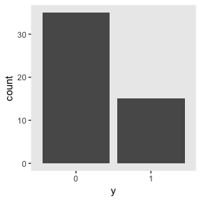

If you wanted to compute "Ntotal", the number of rows in our tibble, one way is with `count()`.

``` r
z15N50 %>% 
  count()
```

    ## # A tibble: 1 x 1
    ##       n
    ##   <int>
    ## 1    50

However, we’re not going to do anything with an "Ntotal" value. For brms, the data are fine in their current data frame form.

### Specify model.

Let's open brms.

``` r
library(brms)
```

The brms package doesn't have code blocks following the JAGS format or the sequence in Kurschke's diagrams. Rather, its syntax is modeled in part after the popular frequentist mixed-effects package, [lme4](https://cran.r-project.org/web/packages/lme4/index.html). To learn more about how brms compares to lme4, see Bürkner's [overview](https://cran.r-project.org/web/packages/brms/vignettes/brms_overview.pdf).

The primary function in brms is `brm()`. Into this one function we will specify the data, the model, the likelihood function, the prior(s), and any technical settings such as the number of MCMC chains, iterations, and so forth. You can order the arguments in any way you like. My typical practice is to start with `data`, `family` (i.e., the likelihood), the model `formula`, and my `prior`s. If there are any technical specifications such as the number of MHC iterations I’d like to change from their default values, I usually do that last.

``` r
fit1 <-
  brm(data = z15N50, 
      family = bernoulli(link = "identity"),
      y ~ 1,
      prior = set_prior("beta(2, 2)", class = "Intercept"),
      iter = 500 + 3334, warmup = 500, chains = 3)
```

### Initialize chains.

In Stan, and in brms by extension, the initial values have default settings. On page 117 of the [Stan User’s Guide](http://mc-stan.org/users/documentation/index.html) (version 2.17.0) we read: "If there are no user-supplied initial values, the default initialization strategy is to initialize the unconstrained parameters directly with values drawn uniformly from the interval (−2, 2)." In general, I don’t recommend setting custom initial values in brms or Stan. Under the hood, Stan will transform the parameters to the unconstrained space in models where they are bounded. In our Bernoulli model, *θ* is bounded at 0 and 1. From page 118 of the Stan User’s Guide, we read

> For parameters bounded above and below, the initial value of 0 on the unconstrained scale corresponds to a value at the midpoint of the constraint interval. For probability parameters, bounded below by 0 and above by 1, the transform is the inverse logit, so that an initial unconstrained value of 0 corresponds to a constrained value of 0.5, -2 corresponds to 0.12 and 2 to 0.88. Bounds other than 0 and 1 are just scaled and translated.

If you want to play around with this, have at it.

### Generate chains.

By default, brms will use 4 chains of 2000 iterations each. The type of MCMC brms uses is Hamiltonian Monte Carlo (HMC). You can learn more about HMC at the [Stan website](http://mc-stan.org), which includes the [user's guide](http://mc-stan.org/users/documentation/index.html) and a list of [tutorials](http://mc-stan.org/users/documentation/tutorials.html). McElreath also has a [nice intro lecture](https://www.youtube.com/watch?v=BWEtS3HuU5A&t=163s&frags=pl%2Cwn) on MCMC in general and HMC in particular. Michael Bentacourt has some good lectures on Stan and HMC, such as [here](https://www.youtube.com/watch?v=pHsuIaPbNbY&t=2638s&frags=pl%2Cwn) and [here](https://www.youtube.com/watch?v=jUSZboSq1zg&t=1325s&frags=pl%2Cwn). And, of course, we will cover HMC with Kruschke in chapter 14.

Within each HMC chain, the first *n* iterations are warmups. Within the Stan-HMC paradigm, [warmups are somewhat analogous to but not synonymous with burn-in iterations](http://andrewgelman.com/2017/12/15/burn-vs-warm-iterative-simulation-algorithms/) as done by the Gibbs sampling in JAGS. But HMC warmups are like Gibbs burn-ins in that both are discarded and not used to describe the posterior. As such, the brms default settings yield 1000 post-warmup iterations for each of the 4 HMC chains. However, we specified `iter = 500 + 3334, warmup = 500, chains = 3`. Thus instead of defaults, we have 3 HMC chains. Each chain has 500 + 3334 = 3834 total iterations, of which 500 were discarded `warmup` iterations.

### Examine chains.

The `brms::plot()` function returns a density and trace plot for each model parameter.

``` r
plot(fit1)
```

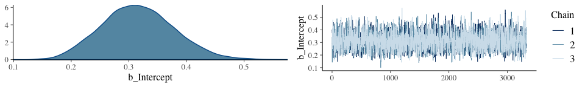

If you want to display each chain as its own density, you can use the handy `mcmc_dens_overlay()` function from the [bayesplot package](https://cran.r-project.org/web/packages/bayesplot/index.html).

``` r
library(bayesplot)
```

But before we do so, we’ll need to export the posterior samples into a data frame, for which we’ll employ `posterior_samples()`.

``` r
post <- posterior_samples(fit1, add_chain = T)
```

Note the `add_chain = T` argument, which will allow us to differentiate the draws by their chain of origin. But anyway, here are the overlaid densities.

``` r
mcmc_dens_overlay(post, pars = c("b_Intercept")) +
  theme(panel.grid = element_blank())
```

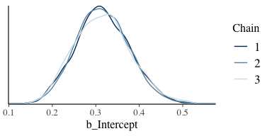

The `bayesplot::mcmc_acf()` will give us the autocorrelation plots.

``` r
mcmc_acf(post, pars = "b_Intercept", lags = 35)
```

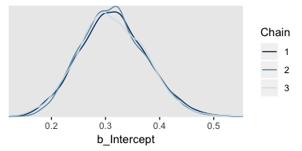

With brms functions, we get a sole $\\hat{R}$ value for each parameter rather than a running vector.

``` r
rhat(fit1)["b_Intercept"]
```

    ## b_Intercept 
    ##    1.000003

We'll have to employ `brms::as.mcmc()` and `coda::gelman.plot()` to make our running $\\hat{R}$ plot.

``` r
fit1_c <- as.mcmc(fit1)

coda::gelman.plot(fit1_c[, "b_Intercept", ])
```

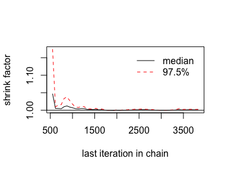

#### ~~The `plotPost` function~~ How to plot your brms posterior distributions.

We’ll get into plotting in just a moment. But before we do, here's a summary of the model.

``` r
print(fit1)
```

    ##  Family: bernoulli 
    ##   Links: mu = identity 
    ## Formula: y ~ 1 
    ##    Data: z15N50 (Number of observations: 50) 
    ## Samples: 3 chains, each with iter = 3834; warmup = 500; thin = 1;
    ##          total post-warmup samples = 10002
    ## 
    ## Population-Level Effects: 
    ##           Estimate Est.Error l-95% CI u-95% CI Eff.Sample Rhat
    ## Intercept     0.31      0.06     0.20     0.44       3122 1.00
    ## 
    ## Samples were drawn using sampling(NUTS). For each parameter, Eff.Sample 
    ## is a crude measure of effective sample size, and Rhat is the potential 
    ## scale reduction factor on split chains (at convergence, Rhat = 1).

To summarize a posterior in terms of central tendency, brms defaults to the mean value (i.e., the value in the 'Estimate' column of the `print()` output). In many of the other convenience functions, you can also request the median instead. For example, we can use the `robust = T` argument to get the 'Estimate' in terms of the median.

``` r
posterior_summary(fit1, robust = T)
```

    ##                Estimate  Est.Error       Q2.5       Q97.5
    ## b_Intercept   0.3116067 0.06188501   0.198397   0.4379233
    ## lp__        -30.5143890 0.28725091 -32.627624 -30.3053558

Across functions, the intervals default to 95%. With `print()` and `summary()` you can adjust the level with a `prob` argument.

``` r
print(fit1, prob = .5)
```

    ##  Family: bernoulli 
    ##   Links: mu = identity 
    ## Formula: y ~ 1 
    ##    Data: z15N50 (Number of observations: 50) 
    ## Samples: 3 chains, each with iter = 3834; warmup = 500; thin = 1;
    ##          total post-warmup samples = 10002
    ## 
    ## Population-Level Effects: 
    ##           Estimate Est.Error l-50% CI u-50% CI Eff.Sample Rhat
    ## Intercept     0.31      0.06     0.27     0.35       3122 1.00
    ## 
    ## Samples were drawn using sampling(NUTS). For each parameter, Eff.Sample 
    ## is a crude measure of effective sample size, and Rhat is the potential 
    ## scale reduction factor on split chains (at convergence, Rhat = 1).

But in many other brms convenience functions, you can use the `probs` argument to request specific percentile summaries.

``` r
posterior_summary(fit1, probs = c(.025, .25, .75, .975))
```

    ##                Estimate Est.Error       Q2.5         Q25         Q75       Q97.5
    ## b_Intercept   0.3134712 0.0613087   0.198397   0.2709999   0.3546626   0.4379233
    ## lp__        -30.7721828 0.6585710 -32.627624 -30.9288055 -30.3499324 -30.3053558

Regardless of what `prob` or `probs` levels you use, brms functions always return percentile-based estimates. All this central tendency and interval talk will be important in a moment...

When plotting the posterior distribution of a parameter estimated with brms, you typically do so working with the results of an object returned by `posterior_samples()`. Recall we already saved those samples as `post`.

``` r
head(post)
```

    ##   b_Intercept      lp__ chain iter
    ## 1   0.2534716 -30.69187     1  501
    ## 2   0.3309546 -30.36915     1  502
    ## 3   0.2816742 -30.39026     1  503
    ## 4   0.3378573 -30.41222     1  504
    ## 5   0.3057586 -30.30527     1  505
    ## 6   0.3507285 -30.52068     1  506

With `post` in hand, we can use ggplot2 to do the typical distributional plots, such as with `geom_histogram()`.

``` r
post %>% 
  ggplot(aes(x = b_Intercept)) +
  geom_histogram(color = "grey92", fill = "grey67",
                 size = .2) +
  scale_y_continuous(NULL, breaks = NULL) +
  labs(title = "Theta",
       x = expression(theta)) +
  theme(panel.grid = element_blank())
```

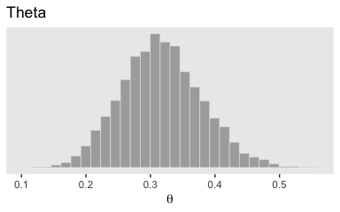

`bayesplot::mcmc_areas()` offers a nice way to depict the posterior densities, along with their percentile-based 50% and 95% ranges.

``` r
mcmc_areas(
  post, 
  pars = c("b_Intercept"),
  prob = 0.5,
  prob_outer = 0.95,
  point_est = "mean"
) +
  scale_y_discrete(NULL, breaks = NULL) +
  labs(title = "Theta",
       x = expression(theta)) +
  theme(panel.grid = element_blank())
```

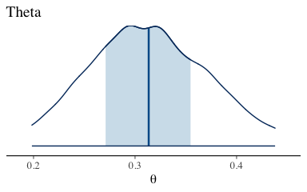

brms doesn’t have a convenient way to compute the posterior mode or HDIs. Base R is no help, either. But the Matthew Kay's [tidybayes package](https://github.com/mjskay/tidybayes) makes it easy to compute posterior modes and HDIs. The tidybayes package gives us access to the handy `geom_halfeyeh()` function.

``` r
library(tidybayes)

post %>% 
  ggplot(aes(x = b_Intercept, y = 0)) +
  geom_halfeyeh(point_interval = mode_hdi,
                .width = c(.95, .5)) +
  scale_y_continuous(NULL, breaks = NULL) +
  labs(title = "Theta",
       x = expression(theta)) +
  theme(panel.grid = element_blank())
```

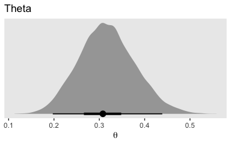

`geom_halfeyeh()` yields a density with a measure of the posterior’s central tendency in a dot and one or multiple interval bands as horizontal lines at the base of the density. Since we used the `point_interval = mode_hdi` argument, we asked for the mode to be our measure of central tendency and the highest posterior density intervals to be our intervals. With `.prob = c(.95, .5)`, we requested our HDIs be at both the 95% and 50% levels.

To be more congruent with Kruschke’s plotting sensibilities, we can combine `geom_histogram()` with `stat_pointintervalh()`.

``` r
my_breaks <-
  mode_hdi(post$b_Intercept)[, 1:3] %>% 
  gather(key, breaks) %>% 
  mutate(labels = breaks %>% round(digits = 3))

post %>% 
  ggplot(aes(x = b_Intercept)) +
  geom_histogram(color = "grey92", fill = "grey67",
                 size = .2, bins = 40) +
  stat_pointintervalh(aes(y = 0), 
                      point_interval = mode_hdi, .width = .95) +
  scale_x_continuous(breaks = my_breaks$breaks,
                     labels = my_breaks$labels) +
  scale_y_continuous(NULL, breaks = NULL) +
  labs(title = "Theta",
       x = expression(theta)) +
  theme(panel.grid = element_blank())
```

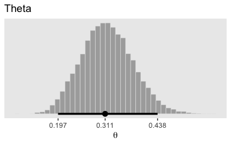

With the `point_interval` argument within `tidybayes::stat_pointintervalh()`, we can request different combinations of measures of central tendency (i.e., mean, median, mode) and interval types (i.e., percentile-based and HDIs). Although all of these are legitimate ways to summarize a posterior, they can yield somewhat different results. For example, here we’ll contrast our mode + HDI summary with a median + percentile-based interval summary.

``` r
post %>% 
  ggplot(aes(x = b_Intercept)) +
  stat_pointintervalh(aes(y = 1), point_interval = median_qi, .width = c(.95, .5)) +
  stat_pointintervalh(aes(y = 2), point_interval = mode_hdi, .width = c(.95, .5)) +
  scale_y_continuous(NULL, breaks = 1:2,
                     labels = c("median_qi", "mode_hdi")) +
  coord_cartesian(ylim = 0:3) +
  labs(title = "Theta",
       x = expression(theta)) +
  theme(panel.grid = element_blank(),
        axis.ticks.y = element_blank(),
        axis.text.y = element_text(hjust = 0))
```

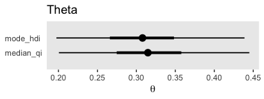

Similar, yet distinct.

Simplified scripts for frequently used analyses
-----------------------------------------------

A lot has happened in R for Bayesian analysis since Kruschke wrote his text. In addition to our use of the tidyverse, the brms, bayesplot, and tidybayes packages offer an array of useful convenience functions. We can and occasionally will write our own. But really, the rich R ecosystem already has us pretty much covered.

Example: Difference of biases
-----------------------------

Here are our new `z6N8z2N7` data.

``` r
z6N8z2N7 <- read_csv("data.R/z6N8z2N7.csv")

glimpse(z6N8z2N7)
```

    ## Observations: 15
    ## Variables: 2
    ## $ y <int> 1, 0, 1, 1, 1, 1, 1, 0, 0, 0, 1, 0, 0, 1, 0
    ## $ s <chr> "Reginald", "Reginald", "Reginald", "Reginald", "Reginald", "Reginald", "Reginald", "...

They look like this.

``` r
z6N8z2N7 %>% 
  mutate(y = y %>% as.character()) %>% 
  
  ggplot(aes(x = y)) +
  geom_bar() +
  theme(panel.grid = element_blank()) +
  facet_wrap(~s)
```


Here we fit the model with `brm()`.

``` r
fit2 <-
  brm(data = z6N8z2N7, family = bernoulli("identity"),
      y ~ 0 + s,
      prior = c(set_prior("beta(2, 2)", class = "b", coef = "sReginald"),
                set_prior("beta(2, 2)", class = "b", coef = "sTony")),
      cores = 4, chains = 4,
      # This isn't always necessary, but it will let us use `prior_samples()` later
      sample_prior = T,
      control = list(adapt_delta = .999))
```

More typically, we’d parameterize the model as `y ~ 1 + s`. This form would yield an intercept and a slope. Behind the scenes, brms would treat the nominal `s` variable as an 0-1 coded dummy variable. One of the nominal levels would become the reverence category, depicted by the `Intercept`, and the difference between that and the other category would be the `s` slope. However, with our `y ~ 0 + s` syntax, we’ve suppressed the typical model intercept. The consequence is that each level of the nominal variable `s` gets its own intercept or \[i\] index, if you will. This is analogous to Kruschke’s `y[i] ∼ dbern(theta[s[i]])` code.

Also, notice our use of the `control = list(adapt_delta = .999)` argument. By default, `adapt_delta = .8`. Leaving it at its default for this model resulted in “divergent transitions after warmup” warnings, which urged me to increase “adapt\_delta above 0.8.” Raising it to .999 worked. See the [brms user’s manual](https://cran.r-project.org/web/packages/brms/brms.pdf) for more on `adapt_delta`.

All that aside, here are the chains.

``` r
plot(fit2)
```

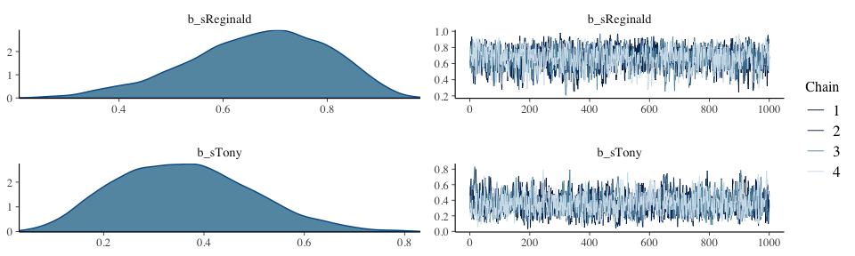

The model `summary()` is as follows:

``` r
summary(fit2)
```

    ## Warning: There were 1 divergent transitions after warmup. Increasing adapt_delta above 0.999 may help.
    ## See http://mc-stan.org/misc/warnings.html#divergent-transitions-after-warmup

    ##  Family: bernoulli 
    ##   Links: mu = identity 
    ## Formula: y ~ 0 + s 
    ##    Data: z6N8z2N7 (Number of observations: 15) 
    ## Samples: 4 chains, each with iter = 2000; warmup = 1000; thin = 1;
    ##          total post-warmup samples = 4000
    ## 
    ## Population-Level Effects: 
    ##           Estimate Est.Error l-95% CI u-95% CI Eff.Sample Rhat
    ## sReginald     0.67      0.13     0.37     0.89       1936 1.00
    ## sTony         0.36      0.13     0.12     0.63       2147 1.00
    ## 
    ## Samples were drawn using sampling(NUTS). For each parameter, Eff.Sample 
    ## is a crude measure of effective sample size, and Rhat is the potential 
    ## scale reduction factor on split chains (at convergence, Rhat = 1).

The `brms::pairs()` function gets us the bulk of Figure 8.6.

``` r
pairs(fit2,
      off_diag_args = list(size = 1/3, alpha = 1/3))
```

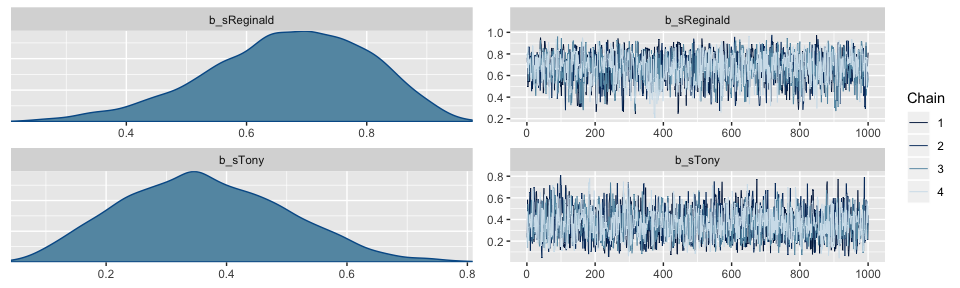

But to get at that difference score distribution, we’ll have extract the posterior iterations with `posterior_samples()`, make difference score with `mutate()`, and manually plot with ggplot2.

``` r
post <- posterior_samples(fit2)

post <-
  post %>% 
  rename(theta_Reginald = b_sReginald,
         theta_Tony = b_sTony) %>% 
  mutate(`theta_Reginald - theta_Tony` = theta_Reginald - theta_Tony)

head(post)
```

    ##   theta_Reginald theta_Tony prior_b_sReginald prior_b_sTony      lp__ theta_Reginald - theta_Tony
    ## 1      0.7216285  0.2406412         0.2657810     0.3907167 -8.461621                   0.4809874
    ## 2      0.7852067  0.5821225         0.5107429     0.4445528 -9.582001                   0.2030843
    ## 3      0.4947071  0.3732840         0.8888220     0.4759817 -9.150676                   0.1214231
    ## 4      0.5442617  0.3379838         0.3734728     0.4912549 -8.761329                   0.2062780
    ## 5      0.7586238  0.2960636         0.6208210     0.3558568 -8.372368                   0.4625602
    ## 6      0.5764436  0.3501441         0.8320606     0.1787162 -8.584090                   0.2262996

``` r
gathered_post <-
  post %>% 
  select(starts_with("theta")) %>% 
  gather() %>% 
  mutate(key = factor(key, levels = c("theta_Reginald", "theta_Tony", "theta_Reginald - theta_Tony"))) 
  
gathered_post %>% 
  ggplot(aes(x = value, group = key)) +
  geom_histogram(color = "grey92", fill = "grey67",
                 size = .2) +
  stat_pointintervalh(aes(y = 0), 
                      point_interval = mode_hdi, .width = c(.95, .50)) +
  scale_y_continuous(NULL, breaks = NULL) +
  theme(panel.grid = element_blank()) +
  facet_wrap(~key, scales = "free_x")
```

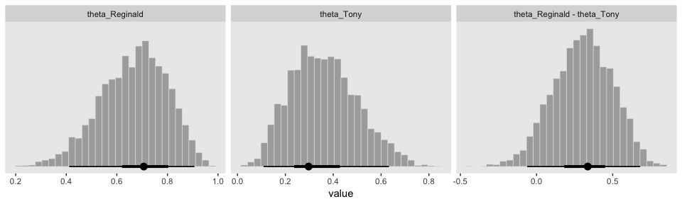

Here’s a way to get the numeric summaries out of `post`.

``` r
gathered_post %>% 
  group_by(key) %>% 
  mode_hdi()
```

    ## # A tibble: 3 x 7
    ##   key                         value  .lower .upper .width .point .interval
    ##   <fct>                       <dbl>   <dbl>  <dbl>  <dbl> <chr>  <chr>    
    ## 1 theta_Reginald              0.696  0.411   0.914   0.95 mode   hdi      
    ## 2 theta_Tony                  0.347  0.110   0.614   0.95 mode   hdi      
    ## 3 theta_Reginald - theta_Tony 0.350 -0.0643  0.674   0.95 mode   hdi

In this context, the `mode_hdi()` summary yields:

-   `key` (i.e., the name we used to denote the parameters)
-   `value` (i.e., the mode)
-   `conf.low` (i.e., the lower level of the 95% HDI)
-   `conf.high` (i.e., the upper level...)
-   `.prob` (i.e., what interval we used)

Sampling from the prior distribution in ~~JAGS~~ brms
-----------------------------------------------------

The `sample_prior = T` argument in our `brm()` code allowed us to extract prior samples with the well-named `prior_samples()` function.

``` r
prior <- prior_samples(fit2)

head(prior)
```

    ##   b_sReginald   b_sTony
    ## 1   0.2657810 0.3907167
    ## 2   0.5107429 0.4445528
    ## 3   0.8888220 0.4759817
    ## 4   0.3734728 0.4912549
    ## 5   0.6208210 0.3558568
    ## 6   0.8320606 0.1787162

Probability distributions available in ~~JAGS~~ brms
----------------------------------------------------

With `prior` in hand, we're almost ready to make the prior histograms of Figure 8.7. But first we'll want to determine the *z*/*N* values in order to mark them off in the plots. \[You'll note Kruschke did so with gray plus marks in his.\]

``` r
z6N8z2N7 %>% 
  group_by(s) %>% 
  summarise(z = sum(y),
            N = n()) %>% 
  mutate(`z/N` = z/N)
```

    ## # A tibble: 2 x 4
    ##   s            z     N `z/N`
    ##   <chr>    <int> <int> <dbl>
    ## 1 Reginald     6     8 0.75 
    ## 2 Tony         2     7 0.286

``` r
d_line <-
  tibble(value = c(.75, .286, .75 - .286),
         key = c("theta_Reginald", "theta_Tony", "theta_Reginald - theta_Tony"))
```

Behold the histograms of Figure 8.7.

``` r
prior %>% 
  rename(theta_Reginald = b_sReginald,
         theta_Tony = b_sTony) %>% 
  mutate(`theta_Reginald - theta_Tony` = theta_Reginald - theta_Tony) %>% 
  gather() %>% 
  mutate(key = factor(key, levels = c("theta_Reginald", "theta_Tony", "theta_Reginald - theta_Tony"))) %>%
  
  ggplot(aes(x = value, group = key)) +
  geom_histogram(color = "grey92", fill = "grey67",
                 size = .2) +
  stat_pointintervalh(aes(y = 0), 
                      point_interval = mode_hdi, .width = c(.95, .50)) +
  geom_vline(data = d_line, aes(xintercept = value), 
             color = "white", linetype = 2, size = .75) +
  scale_y_continuous(NULL, breaks = NULL) +
  theme_grey() +
  theme(panel.grid = element_blank()) +
  facet_wrap(~key, scales = "free_x")
```

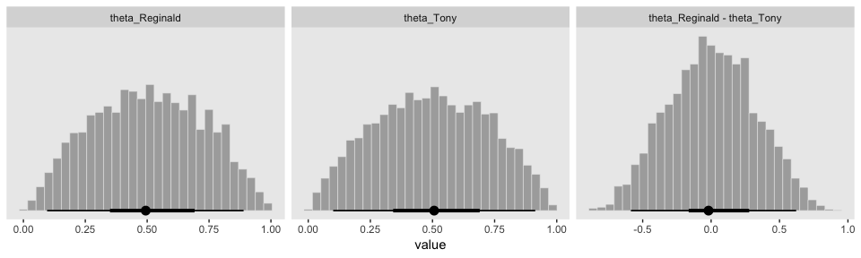

Here's how to make the scatter plot.

``` r
prior %>% 
  rename(theta_Reginald = b_sReginald,
         theta_Tony = b_sTony) %>% 
  
  ggplot(aes(x = theta_Reginald, y = theta_Tony)) +
  geom_point(alpha = 1/4, color = "grey50") +
  theme(panel.grid = element_blank())
```

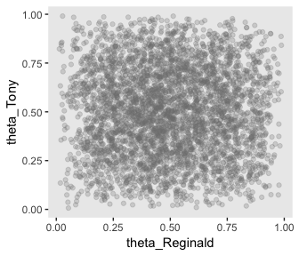

Or you could always use a two-dimensional density plot with `stat_density_2d()`.

``` r
prior %>% 
  rename(theta_Reginald = b_sReginald,
         theta_Tony = b_sTony) %>% 
  
  ggplot(aes(x = theta_Reginald, y = theta_Tony)) +
  stat_density_2d(aes(fill = stat(density)), 
                  geom = "raster", contour = F) +
  scale_fill_viridis_c(option = "B") +
  labs(x = expression(theta[1]),
       y = expression(theta[2])) +
  theme(panel.grid = element_blank(),
        legend.position = "none")
```

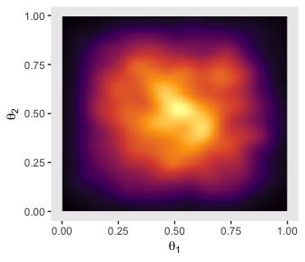

### Defining new likelihood functions.

The brms package offers an array of likelihood functions, which you can browse [here](https://cran.r-project.org/web/packages/brms/vignettes/brms_families.html). However, you can also make your own likelihood functions. Bürkner explained the method in this [vignette](https://cran.r-project.org/web/packages/brms/vignettes/brms_customfamilies.html).

Faster sampling with parallel processing in ~~runjags~~ `brms::brm()`
---------------------------------------------------------------------

We don't need to open another package to sample in parallel in brms. In fact, we've already been doing that. Take another look at the code use used for the last model, `fit2`.

``` r
fit2 <-
  brm(data = z6N8z2N7, family = binomial("identity"),
      y ~ 0 + s,
      prior = c(set_prior("beta(2, 2)", class = "b", coef = "sReginald"),
                set_prior("beta(2, 2)", class = "b", coef = "sTony")),
      cores = 4, chains = 4,
      sample_prior = T,
      control = list(adapt_delta = .99))
```

See the `cores = 4, chains = 4` arguments? With that bit of code, we told `brms::brm()` we wanted 4 chains, which we ran in parallel across 4 cores.

Tips for expanding ~~JAGS~~ brms models
---------------------------------------

I'm in complete agreement with Kruschke, here:

> Often, the process of programming a model is done is stages, starting with a simple model and then incrementally incorporating complexifications. At each step, the model is checked for accuracy and efficiency. This procedure of incremental building is useful for creating a desired complex model from scratch, for expanding a previously created model for a new application, and for expanding a model that has been found to be inadequate in a posterior predictive check.

References
----------

Kruschke, J. K. (2015). *Doing Bayesian data analysis, Second Edition: A tutorial with R, JAGS, and Stan.* Burlington, MA: Academic Press/Elsevier.

Session info
------------

``` r
sessionInfo()
```

    ## R version 3.5.1 (2018-07-02)
    ## Platform: x86_64-apple-darwin15.6.0 (64-bit)
    ## Running under: macOS High Sierra 10.13.4
    ## 
    ## Matrix products: default
    ## BLAS: /Library/Frameworks/R.framework/Versions/3.5/Resources/lib/libRblas.0.dylib
    ## LAPACK: /Library/Frameworks/R.framework/Versions/3.5/Resources/lib/libRlapack.dylib
    ## 
    ## locale:
    ## [1] en_US.UTF-8/en_US.UTF-8/en_US.UTF-8/C/en_US.UTF-8/en_US.UTF-8
    ## 
    ## attached base packages:
    ## [1] stats     graphics  grDevices utils     datasets  methods   base     
    ## 
    ## other attached packages:
    ##  [1] tidybayes_1.0.1 bayesplot_1.6.0 brms_2.4.0      Rcpp_0.12.18    bindrcpp_0.2.2  forcats_0.3.0  
    ##  [7] stringr_1.3.1   dplyr_0.7.6     purrr_0.2.5     readr_1.1.1     tidyr_0.8.1     tibble_1.4.2   
    ## [13] ggplot2_3.0.0   tidyverse_1.2.1
    ## 
    ## loaded via a namespace (and not attached):
    ##  [1] nlme_3.1-137              matrixStats_0.54.0        xts_0.10-2               
    ##  [4] lubridate_1.7.4           threejs_0.3.1             httr_1.3.1               
    ##  [7] LaplacesDemon_16.1.1      rprojroot_1.3-2           rstan_2.17.3             
    ## [10] tools_3.5.1               backports_1.1.2           utf8_1.1.4               
    ## [13] R6_2.2.2                  DT_0.4                    lazyeval_0.2.1           
    ## [16] colorspace_1.3-2          withr_2.1.2               tidyselect_0.2.4         
    ## [19] gridExtra_2.3             mnormt_1.5-5              Brobdingnag_1.2-5        
    ## [22] compiler_3.5.1            cli_1.0.0                 rvest_0.3.2              
    ## [25] HDInterval_0.2.0          arrayhelpers_1.0-20160527 shinyjs_1.0              
    ## [28] xml2_1.2.0                labeling_0.3              colourpicker_1.0         
    ## [31] scales_0.5.0              dygraphs_1.1.1.5          mvtnorm_1.0-8            
    ## [34] psych_1.8.4               ggridges_0.5.0            digest_0.6.15            
    ## [37] StanHeaders_2.17.2        foreign_0.8-70            rmarkdown_1.10           
    ## [40] base64enc_0.1-3           pkgconfig_2.0.1           htmltools_0.3.6          
    ## [43] htmlwidgets_1.2           rlang_0.2.1               readxl_1.1.0             
    ## [46] rstudioapi_0.7            shiny_1.1.0               svUnit_0.7-12            
    ## [49] bindr_0.1.1               zoo_1.8-2                 jsonlite_1.5             
    ## [52] crosstalk_1.0.0           gtools_3.8.1              inline_0.3.15            
    ## [55] magrittr_1.5              loo_2.0.0                 Matrix_1.2-14            
    ## [58] munsell_0.5.0             abind_1.4-5               stringi_1.2.3            
    ## [61] yaml_2.1.19               MASS_7.3-50               ggstance_0.3             
    ## [64] plyr_1.8.4                grid_3.5.1                parallel_3.5.1           
    ## [67] promises_1.0.1            crayon_1.3.4              miniUI_0.1.1.1           
    ## [70] lattice_0.20-35           haven_1.1.2               hms_0.4.2                
    ## [73] knitr_1.20                pillar_1.2.3              igraph_1.2.1             
    ## [76] markdown_0.8              shinystan_2.5.0           reshape2_1.4.3           
    ## [79] stats4_3.5.1              rstantools_1.5.0          glue_1.2.0               
    ## [82] evaluate_0.10.1           modelr_0.1.2              httpuv_1.4.4.2           
    ## [85] cellranger_1.1.0          gtable_0.2.0              assertthat_0.2.0         
    ## [88] mime_0.5                  xtable_1.8-2              broom_0.4.5              
    ## [91] coda_0.19-1               later_0.7.3               viridisLite_0.3.0        
    ## [94] rsconnect_0.8.8           shinythemes_1.1.1         bridgesampling_0.4-0
