Chapter 09. Hierarchical Models
================
A Solomon Kurz
2018-08-12

Hierarchical Models
===================

As Kruschke put it: "There are many realistic situations that involve meaningful hierarchical structure. Bayesian modeling software makes it straightforward to specify and analyze complex hierarchical models" (p. 221). IMO, brms makes it even easier than JAGS.

A single coin from a single mint
--------------------------------

Recall from the last chapter that our likelihood is the Bernoulli distribution:

*y*<sub>*i*</sub> ∼ *B**e**r**n**o**u**l**l**i*(*θ*)

We'll use the Beta density for our prior distribution for *θ*:

*θ* ∼ *B**e**t**a*(*α*, *β*)

And we can re-express *α* and *β* in terms of the mode *ω* and concentration *κ*, such that

*α* = *ω*(*κ* − 2)+1 and *β* = (1 − *ω*)(*κ* − 2)+1

The consequence of this is that we can re-express *θ* as

*θ* ∼ *B**e**t**a*(*ω*(*κ* − 2)+1, (1 − *ω*)(*κ* − 2)+1)

On page 224, Kruschke wrote: "The value of *κ* governs how near *θ* is to *ω*, with larger values of *κ* generating values of *θ* more concentrated near *ω*." To give a sense of that, we'll simulate 20 beta distributions, all with *ω* = .25 but with *θ* increasing from 10 to 200, by 10.

``` r
library(tidyverse)
library(ggridges)

beta_by_k <- function(k){
  w <- .25
  tibble(x = seq(from = 0, to = 1, length.out = 1000)) %>% 
    mutate(theta = dbeta(x = x,
                         shape1 = w * (k - 2) + 1,
                         shape2 = (1 - w) * (k - 2) + 1))
}

tibble(k = seq(from = 10, to = 200, by = 10)) %>% 
  mutate(theta = map(k, beta_by_k)) %>% 
  unnest() %>%
  
  ggplot(aes(x = x, y = k,
             height = theta,
             group = k, fill = k)) +
  geom_vline(xintercept = c(0, .25, .5), color = "grey85", size = 1/2) +
  geom_ridgeline(size = 1/4, color = "white", scale = 2) +
  scale_fill_viridis_c(expression(kappa), option = "A") +
  scale_y_continuous(breaks = seq(from = 10, to = 200, by = 10)) +
  labs(x = expression(theta),
       y = expression(kappa)) +
  theme(panel.grid = element_blank())
```

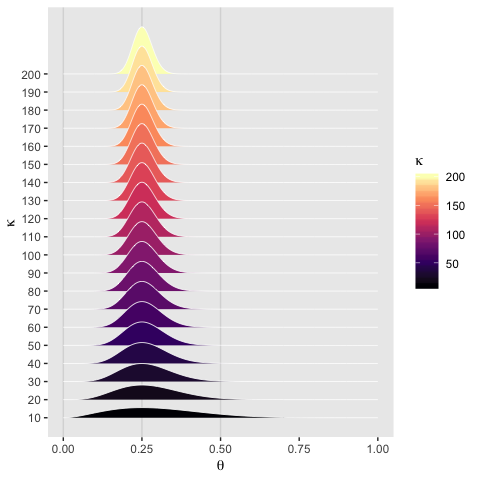

Holding *ω* constant, the density gets more concentrated around *ω* as *κ* increases.

### Posterior via grid approximation.

Since our *B**e**t**a*(*α*, *β*) proir for *ω* is the highest point in the hierarchy, we'll start with that.

``` r
parameter_space = seq(from = 0, to = 1, by = .01)
A_w <- 2
B_w <- 2

d <-
  tibble(theta_1 = parameter_space) %>% 
  mutate(omega = dbeta(x = theta_1, 
                       shape1 = A_w, 
                       shape2 = B_w))

head(d)
```

    ## # A tibble: 6 x 2
    ##   theta_1  omega
    ##     <dbl>  <dbl>
    ## 1    0    0     
    ## 2    0.01 0.0594
    ## 3    0.02 0.118 
    ## 4    0.03 0.175 
    ## 5    0.04 0.230 
    ## 6    0.05 0.285

Figure 9.2. upper right.

``` r
d %>% 
  ggplot(aes(x = theta_1,
             ymin = 0,
             ymax = omega)) +
  geom_ribbon(fill = "grey67") +
  labs(x = expression(omega),
       y = expression(paste("Marginal p(", omega, ")"))) +
  coord_flip(ylim = 0:3) +
  theme(panel.grid = element_blank())
```


We know how to make the basic shape of the plot in the panel in the middle of the second-to-the-top row. It's just another beta(2, 2). Leave out the `coord_flip()` function and you're mostly there. But if you read closely, it doesn't seem like that's what Kruschke's doing. I tried various attempts to combine `K <- 100` with various specifications of `omega`, but just couldn't get it to work right. It especially didn't work right when attempting to make the middle panel of the top row. I'm just stumped. If you have the tidyverse code, [please share](https://github.com/ASKurz/Doing-Bayesian-Data-Analysis-in-brms-and-the-tidyverse/issues).

I was able, however, to get Figure 9.2., second row to the right.

``` r
K <- 100

d %>% 
  mutate(omega_25 = .25,
         omega_75 = .75) %>% 
  gather(key, value, -theta_1, -omega) %>% 
  mutate(theta = dbeta(x = theta_1, 
                       shape1 = value * (K - 2) + 1,
                       shape2 = (1 - value) * (K - 2) + 1)) %>% 
  mutate(key = str_c("x = ", str_replace(key, "omega_", "."))) %>% 
  mutate(key = factor(key, levels = c("x = .75", "x = .25"))) %>% 

  ggplot(aes(x = theta_1,
             ymin = 0,
             ymax = theta)) +
  geom_ribbon(fill = "grey67") +
  labs(x = expression(theta),
       y = expression(paste("p(", theta, "|", omega, " = x )"))) +
  scale_y_continuous(breaks = c(0, 4, 8)) +
  coord_cartesian(ylim = 0:10) +
  theme(panel.grid = element_blank()) +
  facet_grid(key~.)
```


I don't understand how to specify the hierarchical Bernoulli likelihood, as used in the middle panel of the third row of Figure 9.2. Our previous version

``` r
Bernoulli_likelihood <- function(theta, data) {
  # theta = success probability parameter ranging from 0 to 1
  # data = the vector of data (i.e., a series of 0s and 1s)
  N   <- length(data)
  z   <- sum(data)
  return(theta^z * (1 - theta)^(N - sum(data)))
  }
```

is either not up to the task or I'm just not following how to use it to make the plot. If you have it figured out, [please share your code](https://github.com/ASKurz/Doing-Bayesian-Data-Analysis-in-brms-and-the-tidyverse/issues). Without knowing how to plot the multidimensional prior and the multidimensioal likelihood, I'm at a loss to go further with the plot. We have the same basic problem for Figure 9.3.

Multiple coins from a single mint
---------------------------------

Kruschke provided our motivation on page 230: "What if we collect data from more than one coin created by the mint? If each coin has its own distinct bias *θ*s, then we are estimating a distinct parameter value for each coin, and using all the data to estimate *ω*"

\#\#\#. Posterior via grid approximation.

I'm not going to be able to reproduce Figures 9.5 or 9.6 until I nail down how to do the Figures 9.2 and 9.3. If you have the code, [do share](https://github.com/ASKurz/Doing-Bayesian-Data-Analysis-in-brms-and-the-tidyverse/issues).

### A realistic model with MCMC.

You can find the formulas for the mean and *S**D* for a given gamma distribution [here](http://astrostatistics.psu.edu/su07/R/html/stats/html/GammaDist.html). We use those formulas in the second `mutate()` statement for the data-prep stage of our Figure 9.8.

``` r
length <- 100

tibble(x = seq(from = 0, to = 200, length.out = length) %>% 
         rep(., times = 4)) %>% 
  mutate(shape = rep(c(.01, 1.56, 1, 6.25), each = length),
         rate = rep(c(.01, .0312, .02, .125), each = length)) %>% 
  mutate(mean = shape * 1/rate,
         sd = sqrt(shape * (1/rate)^2)) %>% 
  mutate(label = str_c("shape = ", shape, ", rate = ", rate, 
                       "\nmean = ", mean, ", sd = ", sd)) %>% 
  
  ggplot(aes(x = x, 
             ymin = 0, 
             ymax = dgamma(x = x, shape = shape, rate = rate))) +
  geom_ribbon(fill = "grey67") +
  scale_y_continuous(breaks = c(0, .01, .02)) +
  coord_cartesian(xlim = 0:150) +
  labs(x = expression(kappa),
       y = expression(paste("p(", kappa, "|s, r)"))) +
  theme(panel.grid = element_blank()) +
  facet_wrap(~label)
```

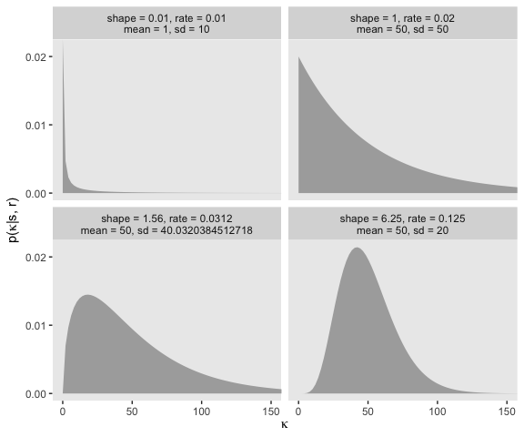

Kruschke's equations 9.7 and 9.8 are as follows:

$$s = \\frac{\\mu^2}{\\sigma^2} \\text{ and } r = \\frac{\\mu}{\\sigma^2} \\text{ for mean } \\mu &gt; 0$$

$$s = 1 + \\omega r \\text{ where } r = \\frac{\\omega + \\sqrt{\\omega^2 + 4\\sigma^2}}{2\\sigma^2} \\text{ for mode } \\omega &gt; 0$$

With those in hand, we can follow Kruschke's "DBDA2E-utilities.R" file to make a couple convenience functions.

``` r
gamma_s_and_r_from_mean_sd <- function(mean, sd) {
  if (mean <= 0) stop("mean must be > 0")
  if (sd   <= 0) stop("sd must be > 0")
  shape <- mean^2/sd^2
  rate  <- mean/sd^2
  return(list(shape = shape, rate = rate))
}

gamma_s_and_r_from_mode_sd <- function(mode, sd) {
  if (mode <= 0) stop("mode must be > 0")
  if (sd   <= 0) stop("sd must be > 0")
  rate  <- (mode + sqrt(mode^2 + 4 * sd^2))/(2 * sd^2)
  shape <- 1 + mode * rate
  return(list(shape = shape, rate = rate))
}
```

They're easy to put to use:

``` r
gamma_s_and_r_from_mean_sd(mean = 10, sd = 100)
```

    ## $shape
    ## [1] 0.01
    ## 
    ## $rate
    ## [1] 0.001

``` r
gamma_s_and_r_from_mode_sd(mode = 10, sd = 100)
```

    ## $shape
    ## [1] 1.105125
    ## 
    ## $rate
    ## [1] 0.01051249

``` r
gamma_param <- gamma_s_and_r_from_mode_sd(mode = 10, sd = 100)

str(gamma_param)
```

    ## List of 2
    ##  $ shape: num 1.11
    ##  $ rate : num 0.0105

### Doing it with ~~JAGS~~ brms.

Unlike JAGS, the brms `formula` will not correspond as closely to Figure 9.7. You'll see in just a bit.

### Example: Therapeutic touch.

``` r
my_data <- read_csv("data.R/TherapeuticTouchData.csv")

glimpse(my_data)
```

    ## Observations: 280
    ## Variables: 2
    ## $ y <int> 1, 0, 0, 0, 0, 0, 0, 0, 0, 0, 0, 0, 0, 1, 0, 0, 1, 0, 0, 0, ...
    ## $ s <chr> "S01", "S01", "S01", "S01", "S01", "S01", "S01", "S01", "S01...

Here are what the data look like:

``` r
my_data %>% 
  mutate(y = y %>% as.character()) %>% 
  
  ggplot(aes(x = y)) +
  geom_bar(aes(fill = stat(count))) +
  scale_y_continuous(breaks = seq(from = 0, to = 9, by = 3)) +
  scale_fill_viridis_c(option = "A", end = .7) +
  coord_flip() +
  theme(legend.position = "none",
        panel.grid = element_blank()) +
  facet_wrap(~s, ncol = 7)
```


And here's our Figure 9.9.

``` r
my_data %>% 
  group_by(s) %>% 
  summarize(mean = mean(y)) %>%
  
  ggplot(aes(x = mean)) +
  geom_histogram(color = "grey92", fill = "grey67",
                 size = .2, binwidth = .1) +
  coord_cartesian(xlim = 0:1) +
  labs(x = "Proportion Correct",
       y = "# Practitioners") +
  theme(panel.grid = element_blank())
```

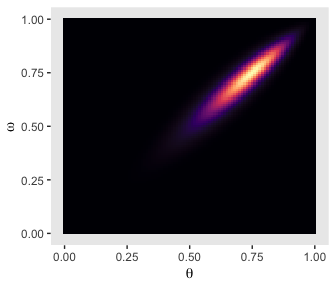

Let's open brms.

``` r
library(brms)
```

In applied statistics, the typical way to model a Bernoulli variable is with logistic regression. Instead of going through the pain of setting up a model in brms that mirror’s the one in the text, I’m going to set up a hierarchical logistic regression model, instead.

Note the `family = bernoulli(link = "logit")` argument. In work-a-day regression with vanilla Gaussian variables, the prediction space is unbounded. But when we want to model the probability of a success for a Bernoulli variable (i.e., *θ*), we need to constrain the model to only produce predictions between 0 and 1. With logistic regression, we use a link function to do just that. The consequence is that instead of modeling the probability, *θ*, we’re modeling the logit probability.

In case you're curious, the logit of *θ* is:

*l**o**g**i**t*(*θ*)=*l**o**g*(*θ*/(1 − *θ*))

But anyway, we'll be doing logistic regression using the logit link. Kruschke will cover this in detail in chapter 21.

The next new part of our syntax is `(1 | s)`. As in the popular frequentist [lme4 package](https://cran.r-project.org/web/packages/lme4/index.html), you specify random effects or group-level parameters with the `(|)` syntax in brms. On the left side of the `|`, you tell brms what parameters you'd like to make random (i.e., vary by group). On the right side of the `|`, you tell brms what variable you want to group the parameters by. In our case, we want the intercepts to be grouped by `s`.

``` r
fit1 <-
  brm(data = my_data,
      family = bernoulli(link = "logit"),
      y ~ 1 + (1 | s),
      prior = c(set_prior("normal(0, 1.5)", class = "Intercept"),
                set_prior("normal(0, 1)", class = "sd")),
      iter = 20000, warmup = 1000, thin = 10, chains = 4, cores = 4)
```

As it turns out, the *N*(0, 1.5) prior is flat in the probability space for the intercept in a logistic regression model. We’ll explore that a little further down. The *N*(0, 1) prior for the random effect is actually a half-Normal. That’s because brms defaults to bound *S**D* parameters to zero and above. The half *N*(0, 1) prior for a hierarchical *S**D* parameter is weakly regularizing and is conservative in the sense that it presumes some pooling is preferable to no pooling. If you wanted to take a lighter approach, you might use something like a `cauchy(0, 5)`, instead. See the [prior wiki](https://github.com/stan-dev/stan/wiki/Prior-Choice-Recommendations) by the Stan team for more.

Here are the trace plots and posterior densities of the main parameters.

``` r
plot(fit1)
```

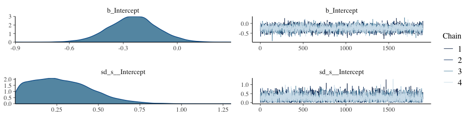

The trace plots indicate no problems with convergence. We'll need to extract the posterior samples and open the bayesplot package before we can examine the autocorrelations.

``` r
post <- posterior_samples(fit1, add_chain = T)

library(bayesplot)
```

One of the nice things about bayesplot is it returns ggplot2 objects. As such, we can amend their theme settings to be consistent with our other ggplot2 plots. The `theme_set()` function will make that particularly easy. And since I prefer to plot without gridlines, we'll slip in a line on `panel.grid` to suppress them by default for the remainder of this chapter.

``` r
theme_set(theme_grey() +
            theme(panel.grid = element_blank()))
```

Now we're ready for `bayesplot::mcmc_acf()`.

``` r
mcmc_acf(post, pars = c("b_Intercept", "sd_s__Intercept"), lags = 10)
```

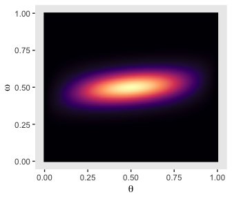

It appears `fit1` had very low autocorrelations. Here we'll examine the *N*<sub>*e**f**f*</sub>/*N* ratio.

``` r
neff_ratio(fit1) %>% 
  mcmc_neff()
```

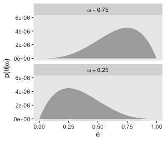

The *N*<sub>*e**f**f*</sub>/*N* ratio values for our model parameters were excellent. And if you really wanted them, you could get the parameter labels on the y-axis by tacking `+ yaxis_text()` on at the end of the plot block.

Here's a numeric summary of the model:

``` r
print(fit1)
```

    ##  Family: bernoulli 
    ##   Links: mu = logit 
    ## Formula: y ~ 1 + (1 | s) 
    ##    Data: my_data (Number of observations: 280) 
    ## Samples: 4 chains, each with iter = 20000; warmup = 1000; thin = 10;
    ##          total post-warmup samples = 7600
    ## 
    ## Group-Level Effects: 
    ## ~s (Number of levels: 28) 
    ##               Estimate Est.Error l-95% CI u-95% CI Eff.Sample Rhat
    ## sd(Intercept)     0.28      0.18     0.01     0.68       7449 1.00
    ## 
    ## Population-Level Effects: 
    ##           Estimate Est.Error l-95% CI u-95% CI Eff.Sample Rhat
    ## Intercept    -0.25      0.13    -0.51     0.02       7600 1.00
    ## 
    ## Samples were drawn using sampling(NUTS). For each parameter, Eff.Sample 
    ## is a crude measure of effective sample size, and Rhat is the potential 
    ## scale reduction factor on split chains (at convergence, Rhat = 1).

We'll need `brms::inv_logit_scaled()` to convert the model parameters to predict *θ* rather than *l**o**g**i**t*(*θ*). After the conversions, we'll be ready to make the histograms in the lower portion of Figure 9.10.

``` r
library(tidybayes)
```

    ## NOTE: As of tidybayes version 1.0, several functions, arguments, and output column names
    ##       have undergone significant name changes in order to adopt a unified naming scheme.
    ##       See help('tidybayes-deprecated') for more information.

``` r
post_small <-
  post %>% 
  # converting the linter model to the probability space with `inv_logit_scaled()`
  mutate(`theta[1]`  = (b_Intercept + `r_s[S01,Intercept]`) %>% inv_logit_scaled(),
         `theta[14]` = (b_Intercept + `r_s[S14,Intercept]`) %>% inv_logit_scaled(),
         `theta[28]` = (b_Intercept + `r_s[S28,Intercept]`) %>% inv_logit_scaled()) %>% 
  # making the difference distributions
  mutate(`theta[1] - theta[14]`  = `theta[1]`  - `theta[14]`,
         `theta[1] - theta[28]`  = `theta[1]`  - `theta[28]`,
         `theta[14] - theta[28]` = `theta[14]` - `theta[28]`) %>% 
  select(starts_with("theta"))

post_small %>% 
  gather() %>% 
  # this line is unnecessary, but will help order the plots 
  mutate(key = factor(key, levels = c("theta[1]", "theta[14]", "theta[28]", 
                                      "theta[1] - theta[14]", "theta[1] - theta[28]", "theta[14] - theta[28]"))) %>% 

  ggplot(aes(x = value)) +
  geom_histogram(color = "grey92", fill = "grey67",
                 size = .2, bins = 30) +
  stat_pointintervalh(aes(y = 0), 
                      point_interval = mode_hdi, .width = .95) +
  scale_y_continuous(NULL, breaks = NULL) +
  xlab(NULL) +
  facet_wrap(~key, scales = "free", ncol = 3)
```

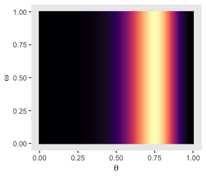

If you wanted the specific values of the posterior modes and 95% HDIs, you could do:

``` r
post_small %>% 
  gather() %>%
  group_by(key) %>% 
  mode_hdi(value) %>% 
  mutate_if(is.double, round, digits = 3)
```

    ## # A tibble: 6 x 7
    ##   key                    value .lower .upper .width .point .interval
    ##   <chr>                  <dbl>  <dbl>  <dbl>  <dbl> <chr>  <chr>    
    ## 1 theta[1]               0.429  0.209  0.52    0.95 mode   hdi      
    ## 2 theta[1] - theta[14]  -0.002 -0.274  0.121   0.95 mode   hdi      
    ## 3 theta[1] - theta[28]  -0.01  -0.411  0.073   0.95 mode   hdi      
    ## 4 theta[14]              0.439  0.285  0.580   0.95 mode   hdi      
    ## 5 theta[14] - theta[28] -0.003 -0.319  0.112   0.95 mode   hdi      
    ## 6 theta[28]              0.453  0.357  0.691   0.95 mode   hdi

And here are the Figure 9.10 scatter plots.

``` r
library(gridExtra)

p1 <-
  post_small %>% 
  ggplot(aes(x = `theta[1]`, y = `theta[14]`)) +
  geom_abline(linetype = 1, color = "white") +
  geom_point(color = "grey50", size = 1/8, alpha = 1/8) +
  coord_cartesian(xlim = 0:1,
                  ylim = 0:1)

p2 <-
  post_small %>% 
  ggplot(aes(x = `theta[1]`, y = `theta[28]`)) +
  geom_abline(linetype = 1, color = "white") +
  geom_point(color = "grey50", size = 1/8, alpha = 1/8) +
  coord_cartesian(xlim = 0:1,
                  ylim = 0:1)

p3 <-
  post_small %>% 
  ggplot(aes(x = `theta[14]`, y = `theta[28]`)) +
  geom_abline(linetype = 1, color = "white") +
  geom_point(color = "grey50", size = 1/8, alpha = 1/8) +
  coord_cartesian(xlim = 0:1,
                  ylim = 0:1)

grid.arrange(p1, p2, p3, ncol = 3)
```

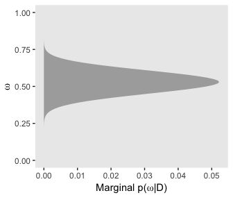

This is posterior distribution for the population estimate for *θ*, which roughly corresponds to the upper right histogram of *ω* in Figure 9.10.

``` r
# this part makes it easier to set the break points in `scale_x_continuous()` 
labels <-
  post %>% 
  transmute(theta = b_Intercept %>% inv_logit_scaled()) %>%
  mode_hdi() %>% 
  select(theta:.upper) %>% 
  gather() %>% 
  mutate(label = value %>% round(3) %>% as.character) %>% 
  slice(1:3)
  
post %>% 
  mutate(theta = b_Intercept %>% inv_logit_scaled()) %>% 

  ggplot(aes(x = theta)) +
  geom_histogram(color = "grey92", fill = "grey67",
                 size = .2, bins = 30) +
  stat_pointintervalh(aes(y = 0), 
                      point_interval = mode_hdi, .width = .95) +
  scale_x_continuous(breaks = labels$value,
                     labels = labels$label) +  
  scale_y_continuous(NULL, breaks = NULL) +
  xlab(expression(theta))
```

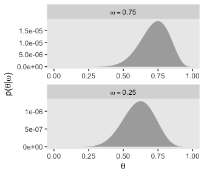

I'm not aware there's a straight conversion to get *σ* in a probability metric. As far as I can tell, you have to first use `coef()` to "extract \[the\] model coefficients, which are the sum of population-level effects and corresponding group-level effects" (p. 38 of the [user's guide for brms](https://cran.r-project.org/web/packages/brms/brms.pdf) version 2.3.1). With the model coefficient draws in hand, you can index them by posterior iteration, group them by that index, compute the iteration-level *S**D*s, and then plot the distribution of the *S**D*s.

``` r
# the tibble of the primary data
sigmas <-
  coef(fit1, summary = F)$s %>% 
  as_tibble() %>% 
  mutate(iter = 1:n()) %>% 
  group_by(iter) %>% 
  gather(key, value, -iter) %>% 
  mutate(theta = inv_logit_scaled(value)) %>% 
  summarise(sd = sd(theta))

# this, again, is just to customize `scale_x_continuous()`
labels <-
  sigmas %>% 
  mode_hdi(sd) %>% 
  select(sd:.upper) %>% 
  gather() %>% 
  mutate(label = value %>% round(3) %>% as.character) %>% 
  slice(1:3)
  
# the plot
sigmas %>% 
  ggplot(aes(x = sd)) +
  geom_histogram(color = "grey92", fill = "grey67",
                 size = .2, bins = 30, boundary = 0) +
  stat_pointintervalh(aes(y = 0), 
                      point_interval = mode_hdi, .width = .95) +
  scale_x_continuous(breaks = labels$value,
                     labels = labels$label) +  
  scale_y_continuous(NULL, breaks = NULL) +
  xlab(expression(paste(sigma, " of ", theta, " in a probability metric")))
```

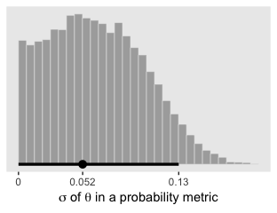

And now you have a sense of how to do all those by hand, `bayesplot::mcmc_pairs()` offers a farily quick way to get a good portion of Figure 9.10.

``` r
color_scheme_set("gray")
 
coef(fit1, summary = F)$s %>% 
  inv_logit_scaled() %>% 
  as_tibble() %>% 
  rename(`theta[1]` = S01.Intercept, 
         `theta[14]` = S14.Intercept, 
         `theta[28]` = S28.Intercept) %>% 
  select(`theta[1]`, `theta[14]`, `theta[28]`) %>% 
  
  mcmc_pairs(off_diag_args = list(size = 1/8, alpha = 1/8))
```

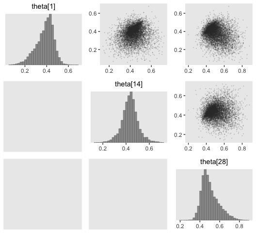

Did you see how we slipped in that `color_scheme_set("gray")` line? When we used `theme_set()`, earlier, that changed the global theme settings for our ggplot2 plots. The `color_scheme_set()` function is specific to bayesplot plots and it sets the color palette within them. Setting the color palette "gray" changed the colors depicted in the dots and bars of the `mcmc_pairs()`-based scatter plots and histograms, respectively.

Kruschke used a beta(1, 1) prior for *ω*. If you randomly draw from that prior and plot a histogram, you’ll see it was flat.

``` r
set.seed(1)
tibble(prior = rbeta(n = 1e5, 1, 1)) %>% 
  ggplot(aes(x = prior)) +
  geom_histogram(color = "grey92", fill = "grey67", size = .2,
                 binwidth = .05, boundary = 0) +
  scale_x_continuous(labels = c("0", ".25", ".5", ".75", "1")) +
  scale_y_continuous(NULL, breaks = NULL) +
  coord_cartesian(xlim = 0:1) +
  xlab(expression(omega)) +
  theme(legend.position = "none")
```


You'll note that plot corresponds to the upper right panel of Figure 9.11.

Recall that we used a logistic regression model with a `normal(0, 1.5)` prior on the intercept. If you sample from `normal(0, 1.5)` and then convert the draws using `brms::inv_logit_scaled()`, you'll discover that our `normal(0, 1.5)` prior was virtually flat on the probability scale. Here we'll show the consequence of a variety of zero-mean Gaussian priors for the intercept of a logistic regression model:

``` r
r_norm <- function(i, n = 1e4){
  set.seed(1)
  rnorm(n = n, mean = 0, sd = i) %>% 
    inv_logit_scaled()
}

tibble(sd = seq(from = .25, to = 3, by = .25)) %>% 
  group_by(sd) %>% 
  mutate(prior = map(sd, r_norm)) %>% 
  unnest() %>% 
  ungroup() %>% 
  mutate(sd = str_c("sd = ", sd)) %>% 
  
  ggplot(aes(x = prior)) +
  geom_histogram(fill = "grey67", color = "grey92", size = .2,
                 binwidth = .05, boundary = 0) +
  scale_x_continuous(labels = c("0", ".25", ".5", ".75", "1")) +
  scale_y_continuous(NULL, breaks = NULL) +
  coord_cartesian(xlim = 0:1) +
  facet_wrap(~sd)
```


It appears that as *σ* goes lower than 1.25, the prior becomes increasingly regularizing, pulling the estimate for *θ* to a neutral .5. However, as the prior’s *σ* gets larger than 1.25, more and more of the probability mass ends up at extreme values.

Here's the diagonal of the lower grid of Figure 9.11.

``` r
n <- 1e4

set.seed(1)
intercept_prior <- rnorm(n = n, mean = 0, sd = 1.5)
sigma_prior     <- rnorm(n = n, mean = 0, sd = 1) %>% abs()
 
prior_samples <-
  tibble(`theta[1]`  = rnorm(n = n, mean = intercept_prior, sd = sigma_prior) %>% inv_logit_scaled(),
         `theta[14]` = rnorm(n = n, mean = intercept_prior, sd = sigma_prior) %>% inv_logit_scaled(),
         `theta[28]` = rnorm(n = n, mean = intercept_prior, sd = sigma_prior) %>% inv_logit_scaled())

prior_samples %>% 
  gather() %>% 

  ggplot(aes(x = value)) +
  geom_histogram(fill = "grey67", color = "grey92", size = .2,
                binwidth = .05, boundary = 0) +
  scale_x_continuous(labels = c("0", ".25", ".5", ".75", "1")) +
  scale_y_continuous(NULL, breaks = NULL) +
  coord_cartesian(xlim = 0:1) +
  facet_wrap(~key)
```

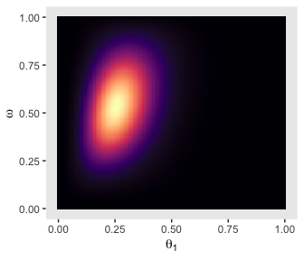

With a little subtraction, we can reproduce the plots in the upper triangle.

``` r
prior_samples %>% 
  mutate(`theta[1] - theta[14]`  = `theta[1]`  - `theta[14]`,
         `theta[1] - theta[28]`  = `theta[1]`  - `theta[28]`,
         `theta[14] - theta[28]` = `theta[14]` - `theta[28]`) %>% 
  select(contains("] - t")) %>% 
  gather() %>% 

  ggplot(aes(x = value)) +
  geom_histogram(fill = "grey67", color = "grey92", size = .2,
                binwidth = .05, boundary = 0) +
  scale_y_continuous(NULL, breaks = NULL) +
  facet_wrap(~key)
```

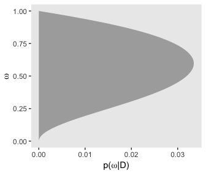

Those plots clarify our hierarchical logistic regression model was a little more regularizing than Kruschke's. The consequence of our priors was more aggressive regularization, greater shrinkage toward zero. The prose in the next section of the text clarifies this isn’t necessarily a bad thing.

Finally, here are the plots for the lower triangle in Figure 9.11.

``` r
p1 <-
  prior_samples %>% 
  ggplot(aes(x = `theta[1]`, y = `theta[14]`)) +
  geom_point(color = "grey50", size = 1/8, alpha = 1/8) +
  geom_abline(linetype = 1, color = "white") +
  coord_cartesian(xlim = 0:1,
                  ylim = 0:1)

p2 <-
  prior_samples %>% 
  ggplot(aes(x = `theta[1]`, y = `theta[28]`)) +
  geom_point(color = "grey50", size = 1/8, alpha = 1/8) +
  geom_abline(linetype = 1, color = "white") +
  coord_cartesian(xlim = 0:1,
                  ylim = 0:1)

p3 <-
  prior_samples %>% 
  ggplot(aes(x = `theta[14]`, y = `theta[28]`)) +
  geom_point(color = "grey50", size = 1/8, alpha = 1/8) +
  geom_abline(linetype = 1, color = "white") +
  coord_cartesian(xlim = 0:1,
                  ylim = 0:1)

grid.arrange(p1, p2, p3, ncol = 3)
```

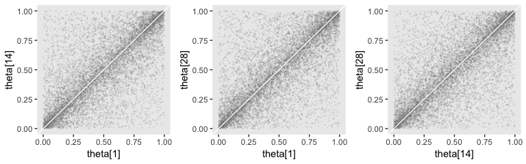

Shrinkage in hierarchical models
--------------------------------

Recall formula 9.4 from page 224.

*θ* dbeta(*ω*(*κ* − 2)+1),(1 − *ω*)(*κ* − 2)+1)

With that formula, we can express `dbeta()`'s `shape1` and `shape2` in terms of *ω* and *κ* and make the shapes in Figure 9.12.

``` r
omega  <- 0.5
kappa1 <- 2.1
kappa2 <- 15.8

tibble(x = seq(from = 0, to = 1, by = .001)) %>%
  mutate(`kappa = 2.1` = dbeta(x = x, 
                               shape1 = omega*(kappa1 - 2) + 1, 
                               shape2 = (1 - omega)*(kappa1 - 2) + 1),
         `kappa = 15.8` = dbeta(x = x, 
                                shape1 = omega*(kappa2 - 2) + 1, 
                                shape2 = (1 - omega)*(kappa2 - 2) + 1)) %>% 
  gather(key, value, - x) %>% 
  mutate(key = factor(key, levels = c("kappa = 2.1", "kappa = 15.8"))) %>% 
  
  ggplot(aes(x = x, 
             ymin = 0,
             ymax = value)) +
  geom_ribbon(fill = "grey67") +
  labs(x = expression(paste("Data Proportion or ", theta, " value")),
       y = expression(paste("dbeta(", theta, "|", omega, ",", kappa, ")"))) +
  facet_wrap(~key)
```

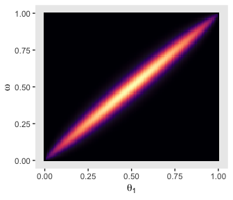

Speeding up ~~JAGS~~ brms
-------------------------

Here we'll compare the time it takes to fit `fit1` as either `bernoulli(link = "logit")` or `binomial(link = "logit")`.

``` r
# bernoulli
start_time_bernoulli <- proc.time()
brm(data = my_data,
      family = bernoulli(link = "logit"),
      y ~ 1 + (1 | s),
      prior = c(set_prior("normal(0, 1.5)", class = "Intercept"),
                set_prior("normal(0, 1)", class = "sd")),
      iter = 20000, warmup = 1000, thin = 10, chains = 4, cores = 4)
stop_time_bernoulli <- proc.time()

# binomial
start_time_binomial <- proc.time()
brm(data = my_data,
      family = bernoulli(link = "logit"),
      y ~ 1 + (1 | s),
      prior = c(set_prior("normal(0, 1.5)", class = "Intercept"),
                set_prior("normal(0, 1)", class = "sd")),
      iter = 20000, warmup = 1000, thin = 10, chains = 4, cores = 4)
stop_time_binomial <- proc.time()
```

See how we're using `proc.time()` to record when we began and finished evaluating our `brm()` code? The last time we covered that was way back in chapter 3. In chapter 3 we also learned how subtracting the former from the latter yields the total elapsed time.

``` r
stop_time_bernoulli - start_time_bernoulli
```

    ##    user  system elapsed 
    ## 100.008   3.010  87.970

``` r
stop_time_binomial - start_time_binomial
```

    ##    user  system elapsed 
    ## 104.232   5.233 101.121

If you wanted to be rigorous about this, you could do this multiple times in a mini simulation.

As to the issue of parallel processing, we’ve been doing this all along. Note our `chains = 4, cores = 4` code.

Extending the hierarchy: Subjects within categories
---------------------------------------------------

### Example: Baseball batting abilities by position.

Here are the batting average data, `ba`.

``` r
ba <- read_csv("data.R/BattingAverage.csv")

glimpse(ba)
```

    ## Observations: 948
    ## Variables: 6
    ## $ Player       <chr> "Fernando Abad", "Bobby Abreu", "Tony Abreu", "Du...
    ## $ PriPos       <chr> "Pitcher", "Left Field", "2nd Base", "2nd Base", ...
    ## $ Hits         <int> 1, 53, 18, 137, 21, 0, 0, 2, 150, 167, 0, 128, 66...
    ## $ AtBats       <int> 7, 219, 70, 607, 86, 1, 1, 20, 549, 576, 1, 525, ...
    ## $ PlayerNumber <int> 1, 2, 3, 4, 5, 6, 7, 8, 9, 10, 11, 12, 13, 14, 15...
    ## $ PriPosNumber <int> 1, 7, 4, 4, 3, 1, 1, 3, 3, 4, 1, 5, 4, 2, 7, 4, 6...

And here are the number of occasions by primary position, `PriPos`, with their median at bat, `AtBats`, values.

``` r
ba %>% 
  group_by(PriPos) %>% 
  summarise(n = n(),
            median = median(AtBats)) %>% 
  arrange(desc(n))
```

    ## # A tibble: 9 x 3
    ##   PriPos           n median
    ##   <chr>        <int>  <dbl>
    ## 1 Pitcher        324     4 
    ## 2 Catcher        103   170 
    ## 3 Left Field     103   164 
    ## 4 1st Base        81   265 
    ## 5 3rd Base        75   267 
    ## 6 2nd Base        72   228.
    ## 7 Center Field    67   259 
    ## 8 Shortstop       63   205 
    ## 9 Right Field     60   340.

As these data are aggregated, we'll fit with an aggregated binomial model. This is still logistic regression. The Bernoulli distribution is a special case of the binomial distribution when the number of trials in each data point is 1 (see [this vignette](https://cran.r-project.org/web/packages/brms/vignettes/brms_families.html) for details). Since our data are aggregated, the information encoded in `Hits` is a combination of multiple trials, which requires us to jump up to the more general binomial likelihood. Note the `Hits  | trials(AtBats)` syntax. With that bit, we instructed brms that our criterion, `Hits`, is an aggregate of multiple trials and the number of trials is encoded in `AtBats`.

Also note the `(1 | PriPos) + (1 | PriPos:Player)` syntax. In this model, we have two grouping factors, `PriPos` and `Player`. Thus we have two `(|)` arguments. But since players are themselves nested within positions, we have encoded that nesting with the `(1 | PriPos:Player)` syntax. For more on this style of syntax, see [Kristoffer Magnusson’s handy post](http://rpsychologist.com/r-guide-longitudinal-lme-lmer#different-level-3-variance-covariance-matrix). Since brms syntax is based on that from the earlier nlme and lme4 packages, the basic syntax rules apply. Bürkner, of course, also covers these topics in the `brmsformula` subsection of his [brms reference manual](https://cran.r-project.org/web/packages/brms/brms.pdf).

``` r
fit2 <-
  brm(data = ba,
      family = binomial(link = "logit"),
      Hits  | trials(AtBats) ~ 1 + (1 | PriPos) + (1 | PriPos:Player),
      prior = c(set_prior("normal(0, 1.5)", class = "Intercept"),
                set_prior("normal(0, 1)", class = "sd")),
      iter = 3500, warmup = 500, chains = 3, cores = 3,
      control = list(adapt_delta = .99))
```

The chains look good.

``` r
color_scheme_set("blue")

plot(fit2)
```

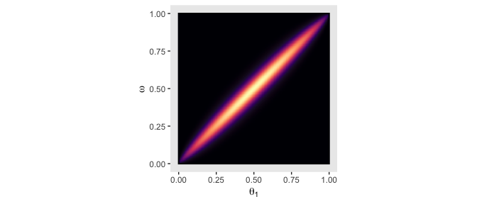

We might examine the autocorrelations within the chains.

``` r
post <- posterior_samples(fit2, add_chain = T)

mcmc_acf(post, pars = c("b_Intercept", 
                        "sd_PriPos__Intercept", 
                        "sd_PriPos:Player__Intercept"), lags = 8)
```

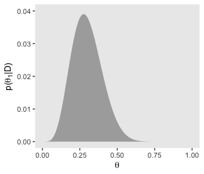

Here's a histogram of the *N*<sub>*e**f**f*</sub>/*N* ratios.

``` r
fit2 %>% 
  neff_ratio() %>% 
  mcmc_neff_hist(binwidth = .1) +
  yaxis_text()
```

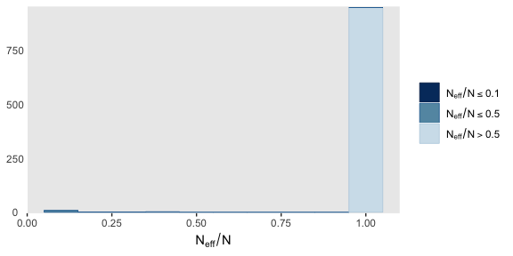

Happily, most have a very favorable ratio. Here's a numeric summary of the primary model parameters.

``` r
print(fit2)
```

    ##  Family: binomial 
    ##   Links: mu = logit 
    ## Formula: Hits | trials(AtBats) ~ 1 + (1 | PriPos) + (1 | PriPos:Player) 
    ##    Data: ba (Number of observations: 948) 
    ## Samples: 3 chains, each with iter = 3500; warmup = 500; thin = 1;
    ##          total post-warmup samples = 9000
    ## 
    ## Group-Level Effects: 
    ## ~PriPos (Number of levels: 9) 
    ##               Estimate Est.Error l-95% CI u-95% CI Eff.Sample Rhat
    ## sd(Intercept)     0.33      0.10     0.19     0.58       3244 1.00
    ## 
    ## ~PriPos:Player (Number of levels: 948) 
    ##               Estimate Est.Error l-95% CI u-95% CI Eff.Sample Rhat
    ## sd(Intercept)     0.14      0.01     0.12     0.15       3818 1.00
    ## 
    ## Population-Level Effects: 
    ##           Estimate Est.Error l-95% CI u-95% CI Eff.Sample Rhat
    ## Intercept    -1.17      0.11    -1.40    -0.95       1280 1.00
    ## 
    ## Samples were drawn using sampling(NUTS). For each parameter, Eff.Sample 
    ## is a crude measure of effective sample size, and Rhat is the potential 
    ## scale reduction factor on split chains (at convergence, Rhat = 1).

As far as I’m aware, brms offers three major ways to get the group-level parameters for a hierarchical model: using `posterior_samples()`, `coef()`, or `fitted()`. I’ll demonstrate each, in turn. We'll begin with `posterior_samples()`. In order to look at the autocorrelation plots, above, we already saved the `posterior_samples(fit2)` output as `post`. Here we'll look at its structure with `head()`. Before doing so we'll convert `post`, which is currently saved as a data frame, into a tibble in order to keep the output from getting unwieldy.

``` r
post <-
  post %>% 
  as_tibble()

head(post)
```

    ## # A tibble: 6 x 963
    ##   b_Intercept sd_PriPos__Interc… `sd_PriPos:Player__… `r_PriPos[1st.Base,…
    ##         <dbl>              <dbl>                <dbl>                <dbl>
    ## 1      -1.07               0.322                0.145             -0.0170 
    ## 2      -0.946              0.398                0.125             -0.134  
    ## 3      -0.849              0.458                0.131             -0.228  
    ## 4      -0.952              0.518                0.141             -0.143  
    ## 5      -0.976              0.416                0.127             -0.121  
    ## 6      -1.08               0.331                0.140              0.00406
    ## # ... with 959 more variables: `r_PriPos[2nd.Base,Intercept]` <dbl>,
    ## #   `r_PriPos[3rd.Base,Intercept]` <dbl>,
    ## #   `r_PriPos[Catcher,Intercept]` <dbl>,
    ## #   `r_PriPos[Center.Field,Intercept]` <dbl>,
    ## #   `r_PriPos[Left.Field,Intercept]` <dbl>,
    ## #   `r_PriPos[Pitcher,Intercept]` <dbl>,
    ## #   `r_PriPos[Right.Field,Intercept]` <dbl>,
    ## #   `r_PriPos[Shortstop,Intercept]` <dbl>,
    ## #   `r_PriPos:Player[1st.Base_Adam.Dunn,Intercept]` <dbl>,
    ## #   `r_PriPos:Player[1st.Base_Adam.LaRoche,Intercept]` <dbl>,
    ## #   `r_PriPos:Player[1st.Base_Adam.Lind,Intercept]` <dbl>,
    ## #   `r_PriPos:Player[1st.Base_Adrian.Gonzalez,Intercept]` <dbl>,
    ## #   `r_PriPos:Player[1st.Base_Albert.Pujols,Intercept]` <dbl>,
    ## #   `r_PriPos:Player[1st.Base_Allen.Craig,Intercept]` <dbl>,
    ## #   `r_PriPos:Player[1st.Base_Anthony.Rizzo,Intercept]` <dbl>,
    ## #   `r_PriPos:Player[1st.Base_Aubrey.Huff,Intercept]` <dbl>,
    ## #   `r_PriPos:Player[1st.Base_Billy.Butler,Intercept]` <dbl>,
    ## #   `r_PriPos:Player[1st.Base_Brandon.Allen,Intercept]` <dbl>,
    ## #   `r_PriPos:Player[1st.Base_Brandon.Belt,Intercept]` <dbl>,
    ## #   `r_PriPos:Player[1st.Base_Brandon.Moss,Intercept]` <dbl>,
    ## #   `r_PriPos:Player[1st.Base_Brandon.Snyder,Intercept]` <dbl>,
    ## #   `r_PriPos:Player[1st.Base_Brent.Lillibridge,Intercept]` <dbl>,
    ## #   `r_PriPos:Player[1st.Base_Brett.Pill,Intercept]` <dbl>,
    ## #   `r_PriPos:Player[1st.Base_Brett.Wallace,Intercept]` <dbl>,
    ## #   `r_PriPos:Player[1st.Base_Bryan.LaHair,Intercept]` <dbl>,
    ## #   `r_PriPos:Player[1st.Base_Carlos.Lee,Intercept]` <dbl>,
    ## #   `r_PriPos:Player[1st.Base_Carlos.Pena,Intercept]` <dbl>,
    ## #   `r_PriPos:Player[1st.Base_Casey.Kotchman,Intercept]` <dbl>,
    ## #   `r_PriPos:Player[1st.Base_Casey.McGehee,Intercept]` <dbl>,
    ## #   `r_PriPos:Player[1st.Base_Chad.Tracy,Intercept]` <dbl>,
    ## #   `r_PriPos:Player[1st.Base_Chris.Carter,Intercept]` <dbl>,
    ## #   `r_PriPos:Player[1st.Base_Chris.Davis,Intercept]` <dbl>,
    ## #   `r_PriPos:Player[1st.Base_Chris.Parmelee,Intercept]` <dbl>,
    ## #   `r_PriPos:Player[1st.Base_Corey.Hart,Intercept]` <dbl>,
    ## #   `r_PriPos:Player[1st.Base_Dan.Johnson,Intercept]` <dbl>,
    ## #   `r_PriPos:Player[1st.Base_Daric.Barton,Intercept]` <dbl>,
    ## #   `r_PriPos:Player[1st.Base_David.Cooper,Intercept]` <dbl>,
    ## #   `r_PriPos:Player[1st.Base_David.Ortiz,Intercept]` <dbl>,
    ## #   `r_PriPos:Player[1st.Base_Edwin.Encarnacion,Intercept]` <dbl>,
    ## #   `r_PriPos:Player[1st.Base_Eric.Hinske,Intercept]` <dbl>,
    ## #   `r_PriPos:Player[1st.Base_Eric.Hosmer,Intercept]` <dbl>,
    ## #   `r_PriPos:Player[1st.Base_Freddie.Freeman,Intercept]` <dbl>,
    ## #   `r_PriPos:Player[1st.Base_Gaby.Sanchez,Intercept]` <dbl>,
    ## #   `r_PriPos:Player[1st.Base_Garrett.Jones,Intercept]` <dbl>,
    ## #   `r_PriPos:Player[1st.Base_Hector.Luna,Intercept]` <dbl>,
    ## #   `r_PriPos:Player[1st.Base_Ike.Davis,Intercept]` <dbl>,
    ## #   `r_PriPos:Player[1st.Base_James.Loney,Intercept]` <dbl>,
    ## #   `r_PriPos:Player[1st.Base_Jason.Giambi,Intercept]` <dbl>,
    ## #   `r_PriPos:Player[1st.Base_Jeff.Clement,Intercept]` <dbl>,
    ## #   `r_PriPos:Player[1st.Base_Jim.Thome,Intercept]` <dbl>,
    ## #   `r_PriPos:Player[1st.Base_Joe.Mahoney,Intercept]` <dbl>,
    ## #   `r_PriPos:Player[1st.Base_Joey.Votto,Intercept]` <dbl>,
    ## #   `r_PriPos:Player[1st.Base_Juan.Rivera,Intercept]` <dbl>,
    ## #   `r_PriPos:Player[1st.Base_Justin.Morneau,Intercept]` <dbl>,
    ## #   `r_PriPos:Player[1st.Base_Justin.Smoak,Intercept]` <dbl>,
    ## #   `r_PriPos:Player[1st.Base_Kendrys.Morales,Intercept]` <dbl>,
    ## #   `r_PriPos:Player[1st.Base_Kila.Kaaihue,Intercept]` <dbl>,
    ## #   `r_PriPos:Player[1st.Base_Kyle.Blanks,Intercept]` <dbl>,
    ## #   `r_PriPos:Player[1st.Base_Lance.Berkman,Intercept]` <dbl>,
    ## #   `r_PriPos:Player[1st.Base_Luke.Scott,Intercept]` <dbl>,
    ## #   `r_PriPos:Player[1st.Base_Lyle.Overbay,Intercept]` <dbl>,
    ## #   `r_PriPos:Player[1st.Base_Mark.Reynolds,Intercept]` <dbl>,
    ## #   `r_PriPos:Player[1st.Base_Mark.Teixeira,Intercept]` <dbl>,
    ## #   `r_PriPos:Player[1st.Base_Mat.Gamel,Intercept]` <dbl>,
    ## #   `r_PriPos:Player[1st.Base_Matt.Adams,Intercept]` <dbl>,
    ## #   `r_PriPos:Player[1st.Base_Matt.Carpenter,Intercept]` <dbl>,
    ## #   `r_PriPos:Player[1st.Base_Matt.Downs,Intercept]` <dbl>,
    ## #   `r_PriPos:Player[1st.Base_Matt.Hague,Intercept]` <dbl>,
    ## #   `r_PriPos:Player[1st.Base_Matt.LaPorta,Intercept]` <dbl>,
    ## #   `r_PriPos:Player[1st.Base_Mauro.Gomez,Intercept]` <dbl>,
    ## #   `r_PriPos:Player[1st.Base_Michael.Young,Intercept]` <dbl>,
    ## #   `r_PriPos:Player[1st.Base_Miguel.Cairo,Intercept]` <dbl>,
    ## #   `r_PriPos:Player[1st.Base_Mike.Costanzo,Intercept]` <dbl>,
    ## #   `r_PriPos:Player[1st.Base_Mike.Jacobs,Intercept]` <dbl>,
    ## #   `r_PriPos:Player[1st.Base_Mike.Olt,Intercept]` <dbl>,
    ## #   `r_PriPos:Player[1st.Base_Mitch.Moreland,Intercept]` <dbl>,
    ## #   `r_PriPos:Player[1st.Base_Nick.Johnson,Intercept]` <dbl>,
    ## #   `r_PriPos:Player[1st.Base_Paul.Goldschmidt,Intercept]` <dbl>,
    ## #   `r_PriPos:Player[1st.Base_Paul.Konerko,Intercept]` <dbl>,
    ## #   `r_PriPos:Player[1st.Base_Prince.Fielder,Intercept]` <dbl>,
    ## #   `r_PriPos:Player[1st.Base_Ryan.Howard,Intercept]` <dbl>,
    ## #   `r_PriPos:Player[1st.Base_Steven.Hill,Intercept]` <dbl>,
    ## #   `r_PriPos:Player[1st.Base_Taylor.Green,Intercept]` <dbl>,
    ## #   `r_PriPos:Player[1st.Base_Todd.Helton,Intercept]` <dbl>,
    ## #   `r_PriPos:Player[1st.Base_Travis.Ishikawa,Intercept]` <dbl>,
    ## #   `r_PriPos:Player[1st.Base_Ty.Wigginton,Intercept]` <dbl>,
    ## #   `r_PriPos:Player[1st.Base_Yan.Gomes,Intercept]` <dbl>,
    ## #   `r_PriPos:Player[1st.Base_Yonder.Alonso,Intercept]` <dbl>,
    ## #   `r_PriPos:Player[1st.Base_Zach.Lutz,Intercept]` <dbl>,
    ## #   `r_PriPos:Player[2nd.Base_Aaron.Hill,Intercept]` <dbl>,
    ## #   `r_PriPos:Player[2nd.Base_Adam.Rosales,Intercept]` <dbl>,
    ## #   `r_PriPos:Player[2nd.Base_Adrian.Cardenas,Intercept]` <dbl>,
    ## #   `r_PriPos:Player[2nd.Base_Alexi.Amarista,Intercept]` <dbl>,
    ## #   `r_PriPos:Player[2nd.Base_Alexi.Casilla,Intercept]` <dbl>,
    ## #   `r_PriPos:Player[2nd.Base_Blake.DeWitt,Intercept]` <dbl>,
    ## #   `r_PriPos:Player[2nd.Base_Brandon.Phillips,Intercept]` <dbl>,
    ## #   `r_PriPos:Player[2nd.Base_Brian.Roberts,Intercept]` <dbl>,
    ## #   `r_PriPos:Player[2nd.Base_Brock.Holt,Intercept]` <dbl>,
    ## #   `r_PriPos:Player[2nd.Base_Charlie.Culberson,Intercept]` <dbl>,
    ## #   `r_PriPos:Player[2nd.Base_Chase.dArnaud,Intercept]` <dbl>, …

In the text, Kruschke described the model as having 967 parameters. Our `post` tibble has one vector for each, with a couple others tacked onto the end. In the hierarchical logistic regression model, the group-specific parameters for the levels of `PriPos` are additive combinations of the global intercept vector, `b_Intercept` and each position-specific vector, `r_PriPos[i.Base,Intercept]`, where `i` is a fill-in for the position of interest. And recall that since the linear model is of the logit of the criterion, we’ll need to use `inv_logit_scaled()` to convert that to the probability space.

``` r
post_small <-
  post %>% 
  transmute(`1st Base` = (b_Intercept + `r_PriPos[1st.Base,Intercept]`) %>% inv_logit_scaled(), 
            Catcher    = (b_Intercept + `r_PriPos[Catcher,Intercept]`)  %>% inv_logit_scaled(), 
            Pitcher    = (b_Intercept + `r_PriPos[Pitcher,Intercept]`)  %>% inv_logit_scaled()) %>% 
  # here we compute our difference distributions
  mutate(`Pitcher - Catcher` = Pitcher - Catcher,
         `Catcher - 1st Base` = Catcher - `1st Base`)

head(post_small)
```

    ## # A tibble: 6 x 5
    ##   `1st Base` Catcher Pitcher `Pitcher - Catcher` `Catcher - 1st Base`
    ##        <dbl>   <dbl>   <dbl>               <dbl>                <dbl>
    ## 1      0.252   0.237   0.136              -0.100             -0.0157 
    ## 2      0.254   0.238   0.133              -0.104             -0.0158 
    ## 3      0.254   0.241   0.126              -0.115             -0.0127 
    ## 4      0.251   0.235   0.131              -0.104             -0.0152 
    ## 5      0.250   0.240   0.132              -0.108             -0.0102 
    ## 6      0.253   0.244   0.132              -0.112             -0.00933

If you take a glance at Figures 9.14 through 9.16, we'll be making a lot of histograms of the same basic structure. We can make a histogram plotting function to streamline our code.

``` r
make_histogram <- function(data, mapping, title, xlim, ...){
  ggplot(data, mapping) +
  geom_histogram(fill = "grey67", color = "grey92", size = .2,
                bins = 30) +
  stat_pointintervalh(aes(y = 0), 
                      point_interval = mode_hdi, .width = .95) +
  scale_y_continuous(NULL, breaks = NULL) +
  labs(title = title,
       x = expression(theta)) +
  coord_cartesian(xlim = xlim) +
  theme(legend.position = "none")
}
```

We'll do the same thing for the correlation plots.

``` r
make_point <- function(data, mapping, limits, ...){
  ggplot(data, mapping) +
  geom_abline(color = "white") +
  geom_point(color = "grey50", size = 1/10, alpha = 1/20) +
  coord_cartesian(xlim = limits,
                  ylim = limits)
}
```

To learn more about wrapping custom plots into custom functions, check out chapter 12 of Wickham's [*ggplot2, Elegant graphics for data analysis*](https://github.com/hadley/ggplot2-book).

Now we have our `make_histogram()` and `make_point()` functions, we'll use `grid.arrange()` to paste together the left half of Figure 9.14.

``` r
p1 <-
  make_histogram(data = post_small,
                 aes(x = Pitcher), 
                 title = "Pitcher", 
                 xlim = c(.1, .25))

p2 <-
  make_histogram(data = post_small,
                 aes(x = `Pitcher - Catcher`), 
                 title = "Pitcher - Catcher", 
                 xlim = c(-.15, 0))

p3 <-
  make_point(data = post_small,
             aes(x = Pitcher, y = Catcher),
             limits = c(.12, .25))

p4 <-
  make_histogram(data = post_small,
                 aes(x = Catcher), 
                 title = "Catcher", 
                 xlim = c(.1, .25))

grid.arrange(p1, p2, p3, p4, ncol = 2)
```


We could follow the same procedure to make the right portion of Figure 9.14. But instead, let’s switch gears and explore the second way brms affords us for plotting group-level parameters. This time, we’ll use `coef()`.

Up in section 9.2.4, we learned that we can use `coef()` to "extract \[the\] model coefficients, which are the sum of population-level effects and corresponding group-level effects" (p. 38 of the [user's guide for brms](https://cran.r-project.org/web/packages/brms/brms.pdf) version 2.3.1). The grouping level we’re interested in is `PriPos`, so we’ll use that to index the information returned by `coef()`. Since `coef()` returns a matrix, we'll use `as_tibble()` to convert it to a tibble.

``` r
coef_primary_position <-
  coef(fit2, summary = F)$PriPos %>% 
  as_tibble()
  
str(coef_primary_position)
```

    ## Classes 'tbl_df', 'tbl' and 'data.frame':    9000 obs. of  9 variables:
    ##  $ 1st Base.Intercept    : num  -1.09 -1.08 -1.08 -1.1 -1.1 ...
    ##  $ 2nd Base.Intercept    : num  -1.15 -1.06 -1.09 -1.05 -1.1 ...
    ##  $ 3rd Base.Intercept    : num  -1.07 -1.02 -1.08 -1.08 -1.02 ...
    ##  $ Catcher.Intercept     : num  -1.17 -1.17 -1.15 -1.18 -1.15 ...
    ##  $ Center Field.Intercept: num  -1.01 -1.08 -1.07 -1.06 -1.04 ...
    ##  $ Left Field.Intercept  : num  -1.11 -1.08 -1.12 -1.12 -1.05 ...
    ##  $ Pitcher.Intercept     : num  -1.85 -1.87 -1.94 -1.89 -1.88 ...
    ##  $ Right Field.Intercept : num  -1.05 -1.06 -1.01 -1.03 -1.07 ...
    ##  $ Shortstop.Intercept   : num  -1.11 -1.1 -1.09 -1.1 -1.09 ...

Keep in mind that `coef()` returns the values in the logit scale when used for logistic regression models. So we’ll have to use `brms::inv_logit_scaled()` to convert the estimates to the probability metric. After we’re done converting the estimates, we’ll then make the difference distributions.

``` r
coef_small <-
  coef_primary_position %>% 
  select(`1st Base.Intercept`, Catcher.Intercept, Pitcher.Intercept) %>% 
  transmute(`1st Base` = `1st Base.Intercept` %>% inv_logit_scaled(), 
            Catcher = Catcher.Intercept %>% inv_logit_scaled(), 
            Pitcher = Pitcher.Intercept %>% inv_logit_scaled()) %>% 
  # here we make the difference distributions
  mutate(`Pitcher - Catcher` = Pitcher - Catcher,
         `Catcher - 1st Base` = Catcher - `1st Base`)

head(coef_small)
```

    ## # A tibble: 6 x 5
    ##   `1st Base` Catcher Pitcher `Pitcher - Catcher` `Catcher - 1st Base`
    ##        <dbl>   <dbl>   <dbl>               <dbl>                <dbl>
    ## 1      0.252   0.237   0.136              -0.100             -0.0157 
    ## 2      0.254   0.238   0.133              -0.104             -0.0158 
    ## 3      0.254   0.241   0.126              -0.115             -0.0127 
    ## 4      0.251   0.235   0.131              -0.104             -0.0152 
    ## 5      0.250   0.240   0.132              -0.108             -0.0102 
    ## 6      0.253   0.244   0.132              -0.112             -0.00933

Now we're ready for the right half of Figure 9.14.

``` r
p1 <-
  make_histogram(data = coef_small,
                 aes(x = Catcher), 
                 title = "Catcher", 
                 xlim = c(.22, .27))

p2 <-
  make_histogram(data = coef_small,
                 aes(x = `Catcher - 1st Base`), 
                 title = "Catcher - 1st Base", 
                 xlim = c(-.04, .01))

p3 <-
  make_point(data = coef_small,
             aes(x = Catcher, y = `1st Base`),
             limits = c(.22, .27))

p4 <-
  make_histogram(data = coef_small,
                 aes(x = `1st Base`), 
                 title = "1st Base", 
                 xlim = c(.22, .27))

grid.arrange(p1, p2, p3, p4, ncol = 2)
```


And if you wanted the posterior modes and HDIs, you'd use `mode_hdi()` after a little wrangling.

``` r
coef_small %>% 
  gather() %>% 
  group_by(key) %>% 
  mode_hdi(value) %>% 
  mutate_if(is.double, round, digits = 3)
```

    ## # A tibble: 5 x 7
    ##   key                 value .lower .upper .width .point .interval
    ##   <chr>               <dbl>  <dbl>  <dbl>  <dbl> <chr>  <chr>    
    ## 1 1st Base            0.253  0.245  0.262   0.95 mode   hdi      
    ## 2 Catcher             0.241  0.232  0.249   0.95 mode   hdi      
    ## 3 Catcher - 1st Base -0.012 -0.024 -0.001   0.95 mode   hdi      
    ## 4 Pitcher             0.13   0.12   0.14    0.95 mode   hdi      
    ## 5 Pitcher - Catcher  -0.111 -0.124 -0.098   0.95 mode   hdi

While we're at it, we should capitalize on the opportunity to show how these results are the same as those derived from our `posterior_samples()` approach, above.

``` r
post_small %>% 
  gather() %>% 
  group_by(key) %>% 
  mode_hdi(value) %>% 
  mutate_if(is.double, round, digits = 3)
```

    ## # A tibble: 5 x 7
    ##   key                 value .lower .upper .width .point .interval
    ##   <chr>               <dbl>  <dbl>  <dbl>  <dbl> <chr>  <chr>    
    ## 1 1st Base            0.253  0.245  0.262   0.95 mode   hdi      
    ## 2 Catcher             0.241  0.232  0.249   0.95 mode   hdi      
    ## 3 Catcher - 1st Base -0.012 -0.024 -0.001   0.95 mode   hdi      
    ## 4 Pitcher             0.13   0.12   0.14    0.95 mode   hdi      
    ## 5 Pitcher - Catcher  -0.111 -0.124 -0.098   0.95 mode   hdi

For Figures 9.15 and 9.16, Kruschke drilled down further into the posterior. To drill along with him, we'll take the oportunity to showcase `fitted()`, the third way brms affords us for plotting group-level parameters.

``` r
# this will make life easier. just go with it
name_list <- c("Kyle Blanks", "Bruce Chen", "ShinSoo Choo", "Ichiro Suzuki", 
               "Mike Leake", "Wandy Rodriguez", "Andrew McCutchen", "Brett Jackson")

# we'll define the data we'd like to feed into `fitted()`, here
nd <-
  ba %>% 
  filter(Player %in% c(name_list)) %>% 
  # these last two lines aren't typically necessary, 
  # but they allow us to arrange the rows in the same order we find the names in Figures 9.15 and 9.16
  mutate(Player = factor(Player, levels = c(name_list))) %>% 
  arrange(Player)

fitted_players <-
  fitted(fit2, 
       newdata = nd,
       scale = "linear",
       summary = F) %>% 
  as_tibble() %>% 
  # with one function, we rename the values as returned by `as_tibble()` and convert the values from the logit scale to the probability scale
  transmute(`Kyle Blanks`      = V1 %>% inv_logit_scaled(), 
            `Bruce Chen`       = V2 %>% inv_logit_scaled(), 
            `ShinSoo Choo`     = V3 %>% inv_logit_scaled(),
            `Ichiro Suzuki`    = V4 %>% inv_logit_scaled(),
            `Mike Leake`       = V5 %>% inv_logit_scaled(),
            `Wandy Rodriguez`  = V6 %>% inv_logit_scaled(),
            `Andrew McCutchen` = V7 %>% inv_logit_scaled(),
            `Brett Jackson`    = V8 %>% inv_logit_scaled()) %>% 
  # in this last section, we make our difference distributions 
  mutate(`Kyle Blanks - Bruce Chen`         = `Kyle Blanks` - `Bruce Chen`,
         `ShinSoo Choo - Ichiro Suzuki`     = `ShinSoo Choo` - `Ichiro Suzuki`,
         `Mike Leake - Wandy Rodriguez`     = `Mike Leake` - `Wandy Rodriguez`,
         `Andrew McCutchen - Brett Jackson` = `Andrew McCutchen` - `Brett Jackson`)
    
glimpse(fitted_players)
```

    ## Observations: 9,000
    ## Variables: 12
    ## $ `Kyle Blanks`                      <dbl> 0.2742175, 0.2202869, 0.244...
    ## $ `Bruce Chen`                       <dbl> 0.1386918, 0.1482631, 0.126...
    ## $ `ShinSoo Choo`                     <dbl> 0.2759482, 0.2467898, 0.240...
    ## $ `Ichiro Suzuki`                    <dbl> 0.2613062, 0.2680610, 0.263...
    ## $ `Mike Leake`                       <dbl> 0.1410682, 0.1835696, 0.161...
    ## $ `Wandy Rodriguez`                  <dbl> 0.14767186, 0.11706667, 0.1...
    ## $ `Andrew McCutchen`                 <dbl> 0.2807444, 0.3191440, 0.313...
    ## $ `Brett Jackson`                    <dbl> 0.2508771, 0.2087010, 0.269...
    ## $ `Kyle Blanks - Bruce Chen`         <dbl> 0.13552575, 0.07202377, 0.1...
    ## $ `ShinSoo Choo - Ichiro Suzuki`     <dbl> 0.0146419848, -0.0212712083...
    ## $ `Mike Leake - Wandy Rodriguez`     <dbl> -0.006603629, 0.066502914, ...
    ## $ `Andrew McCutchen - Brett Jackson` <dbl> 0.02986728, 0.11044299, 0.0...

Note our use of the `scale = "linear"` argument in the `fitted()` function. By default, `fitted()` returns predictions on the scale of the criterion. But we don't want a list of successes and failures; we want player-level parameters. When you specify `scale = "linear"`, you request `fitted()` return the values in the parameter scale.

Figure 9.15, left:

``` r
p1 <-
  make_histogram(data = fitted_players,
                 aes(x = `Kyle Blanks`), 
                 title = "Kyle Blanks (1st Base)", 
                 xlim = c(.05, .35))

p2 <-
  make_histogram(data = fitted_players,
                 aes(x = `Kyle Blanks - Bruce Chen`), 
                 title = "Kyle Blanks (1st Base) -\nBruce Chen (Pitcher)", 
                 xlim = c(-.1, .25))

p3 <-
  make_point(data = fitted_players,
             aes(x = `Kyle Blanks`, y = `Bruce Chen`),
             limits = c(.09, .35))

p4 <-
  make_histogram(data = fitted_players,
                 aes(x = `Bruce Chen`), 
                 title = "Bruce Chen (Pitcher)", 
                 xlim = c(.05, .35))

grid.arrange(p1, p2, p3, p4, ncol = 2)
```


Figure 9.15, right:

``` r
p1 <-
  make_histogram(data = fitted_players,
                 aes(x = `ShinSoo Choo`), 
                 title = "ShinSoo Choo (Right Field)", 
                 xlim = c(.22, .34))

p2 <-
  make_histogram(data = fitted_players,
                 aes(x = `ShinSoo Choo - Ichiro Suzuki`), 
                 title = "ShinSoo Choo (Right Field) -\nIchiro Suzuki (Right Field)", 
                 xlim = c(-.07, .07))

p3 <-
  make_point(data = fitted_players,
             aes(x = `ShinSoo Choo`, y = `Ichiro Suzuki`),
             limits = c(.23, .32))

p4 <-
  make_histogram(data = fitted_players,
                 aes(x = `Ichiro Suzuki`), 
                 title = "Ichiro Suzuki (Right Field)", 
                 xlim = c(.22, .34))

grid.arrange(p1, p2, p3, p4, ncol = 2)
```

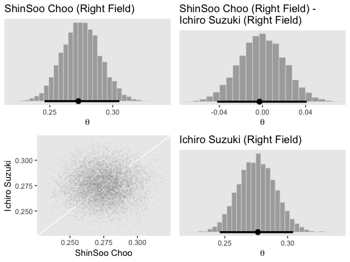

Figure 9.16, left:

``` r
p1 <-
  make_histogram(data = fitted_players,
                 aes(x = `Mike Leake`), 
                 title = "Mike Leake (Pitcher)", 
                 xlim = c(.05, .35))

p2 <-
  make_histogram(data = fitted_players,
                 aes(x = `Mike Leake - Wandy Rodriguez`), 
                 title = "Mike Leake (Pitcher) -\nWandy Rodriguez (Pitcher)", 
                 xlim = c(-.05, .25))

p3 <-
  make_point(data = fitted_players,
             aes(x = `Mike Leake`, y = `Wandy Rodriguez`),
             limits = c(.07, .25))

p4 <-
  make_histogram(data = fitted_players,
                 aes(x = `Wandy Rodriguez`), 
                 title = "Wandy Rodriguez (Pitcher)", 
                 xlim = c(.05, .35))

grid.arrange(p1, p2, p3, p4, ncol = 2)
```

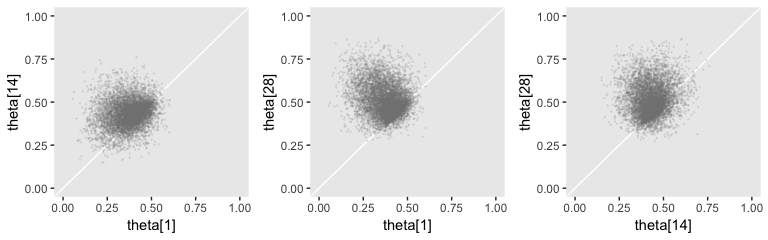

Figure 9.16, right:

``` r
p1 <-
  make_histogram(data = fitted_players,
                 aes(x = `Andrew McCutchen`), 
                 title = "Andrew McCutchen (Center Field)", 
                 xlim = c(.15, .35))

p2 <-
  make_histogram(data = fitted_players,
                 aes(x = `Andrew McCutchen - Brett Jackson`), 
                 title = "Andrew McCutchen (Center Field) -\nBrett Jackson (Center Field)", 
                 xlim = c(0, .20))

p3 <-
  make_point(data = fitted_players,
             aes(x = `Andrew McCutchen`, y = `Brett Jackson`),
             limits = c(.15, .35))

p4 <-
  make_histogram(data = fitted_players,
                 aes(x = `Brett Jackson`), 
                 title = "Brett Jackson (Center Field)", 
                 xlim = c(.15, .35))

grid.arrange(p1, p2, p3, p4, ncol = 2)
```

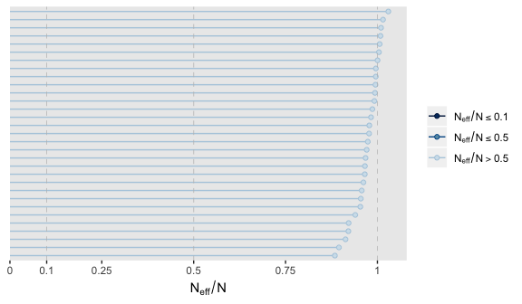

And if you wanted the posterior modes and HDIs, you'd use `mode_hdi()` after a little wrangling.

``` r
fitted_players %>% 
  gather() %>% 
  group_by(key) %>% 
  mode_hdi(value) %>% 
  mutate_if(is.double, round, digits = 3)
```

    ## # A tibble: 12 x 7
    ##    key                         value .lower .upper .width .point .interval
    ##    <chr>                       <dbl>  <dbl>  <dbl>  <dbl> <chr>  <chr>    
    ##  1 Andrew McCutchen            0.305  0.276  0.337   0.95 mode   hdi      
    ##  2 Andrew McCutchen - Brett …  0.072  0.018  0.124   0.95 mode   hdi      
    ##  3 Brett Jackson               0.231  0.194  0.277   0.95 mode   hdi      
    ##  4 Bruce Chen                  0.13   0.101  0.164   0.95 mode   hdi      
    ##  5 Ichiro Suzuki               0.276  0.246  0.304   0.95 mode   hdi      
    ##  6 Kyle Blanks                 0.251  0.202  0.301   0.95 mode   hdi      
    ##  7 Kyle Blanks - Bruce Chen    0.124  0.062  0.18    0.95 mode   hdi      
    ##  8 Mike Leake                  0.148  0.117  0.184   0.95 mode   hdi      
    ##  9 Mike Leake - Wandy Rodrig…  0.024 -0.016  0.068   0.95 mode   hdi      
    ## 10 ShinSoo Choo                0.273  0.246  0.305   0.95 mode   hdi      
    ## 11 ShinSoo Choo - Ichiro Suz… -0.003 -0.042  0.041   0.95 mode   hdi      
    ## 12 Wandy Rodriguez             0.12   0.097  0.152   0.95 mode   hdi

References
----------

Kruschke, J. K. (2015). *Doing Bayesian data analysis, Second Edition: A tutorial with R, JAGS, and Stan.* Burlington, MA: Academic Press/Elsevier.

Session info
------------

``` r
sessionInfo()
```

    ## R version 3.5.1 (2018-07-02)
    ## Platform: x86_64-apple-darwin15.6.0 (64-bit)
    ## Running under: macOS High Sierra 10.13.4
    ## 
    ## Matrix products: default
    ## BLAS: /Library/Frameworks/R.framework/Versions/3.5/Resources/lib/libRblas.0.dylib
    ## LAPACK: /Library/Frameworks/R.framework/Versions/3.5/Resources/lib/libRlapack.dylib
    ## 
    ## locale:
    ## [1] en_US.UTF-8/en_US.UTF-8/en_US.UTF-8/C/en_US.UTF-8/en_US.UTF-8
    ## 
    ## attached base packages:
    ## [1] stats     graphics  grDevices utils     datasets  methods   base     
    ## 
    ## other attached packages:
    ##  [1] gridExtra_2.3   tidybayes_1.0.1 bayesplot_1.6.0 brms_2.4.0     
    ##  [5] Rcpp_0.12.18    bindrcpp_0.2.2  ggridges_0.5.0  forcats_0.3.0  
    ##  [9] stringr_1.3.1   dplyr_0.7.6     purrr_0.2.5     readr_1.1.1    
    ## [13] tidyr_0.8.1     tibble_1.4.2    ggplot2_3.0.0   tidyverse_1.2.1
    ## 
    ## loaded via a namespace (and not attached):
    ##  [1] nlme_3.1-137              matrixStats_0.54.0       
    ##  [3] xts_0.10-2                lubridate_1.7.4          
    ##  [5] threejs_0.3.1             httr_1.3.1               
    ##  [7] LaplacesDemon_16.1.1      rprojroot_1.3-2          
    ##  [9] rstan_2.17.3              tools_3.5.1              
    ## [11] backports_1.1.2           utf8_1.1.4               
    ## [13] R6_2.2.2                  DT_0.4                   
    ## [15] lazyeval_0.2.1            colorspace_1.3-2         
    ## [17] withr_2.1.2               tidyselect_0.2.4         
    ## [19] mnormt_1.5-5              Brobdingnag_1.2-5        
    ## [21] compiler_3.5.1            cli_1.0.0                
    ## [23] rvest_0.3.2               HDInterval_0.2.0         
    ## [25] arrayhelpers_1.0-20160527 shinyjs_1.0              
    ## [27] xml2_1.2.0                labeling_0.3             
    ## [29] colourpicker_1.0          scales_0.5.0             
    ## [31] dygraphs_1.1.1.5          mvtnorm_1.0-8            
    ## [33] psych_1.8.4               digest_0.6.15            
    ## [35] StanHeaders_2.17.2        foreign_0.8-70           
    ## [37] rmarkdown_1.10            base64enc_0.1-3          
    ## [39] pkgconfig_2.0.1           htmltools_0.3.6          
    ## [41] htmlwidgets_1.2           rlang_0.2.1              
    ## [43] readxl_1.1.0              rstudioapi_0.7           
    ## [45] shiny_1.1.0               svUnit_0.7-12            
    ## [47] bindr_0.1.1               zoo_1.8-2                
    ## [49] jsonlite_1.5              gtools_3.8.1             
    ## [51] crosstalk_1.0.0           inline_0.3.15            
    ## [53] magrittr_1.5              loo_2.0.0                
    ## [55] Matrix_1.2-14             munsell_0.5.0            
    ## [57] abind_1.4-5               stringi_1.2.3            
    ## [59] yaml_2.1.19               MASS_7.3-50              
    ## [61] ggstance_0.3              plyr_1.8.4               
    ## [63] grid_3.5.1                parallel_3.5.1           
    ## [65] promises_1.0.1            crayon_1.3.4             
    ## [67] miniUI_0.1.1.1            lattice_0.20-35          
    ## [69] haven_1.1.2               hms_0.4.2                
    ## [71] knitr_1.20                pillar_1.2.3             
    ## [73] igraph_1.2.1              markdown_0.8             
    ## [75] shinystan_2.5.0           reshape2_1.4.3           
    ## [77] stats4_3.5.1              rstantools_1.5.0         
    ## [79] glue_1.2.0                evaluate_0.10.1          
    ## [81] modelr_0.1.2              httpuv_1.4.4.2           
    ## [83] cellranger_1.1.0          gtable_0.2.0             
    ## [85] assertthat_0.2.0          mime_0.5                 
    ## [87] xtable_1.8-2              broom_0.4.5              
    ## [89] coda_0.19-1               later_0.7.3              
    ## [91] rsconnect_0.8.8           viridisLite_0.3.0        
    ## [93] shinythemes_1.1.1         bridgesampling_0.4-0
