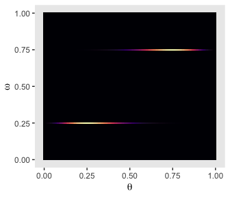
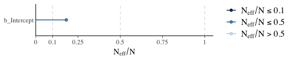
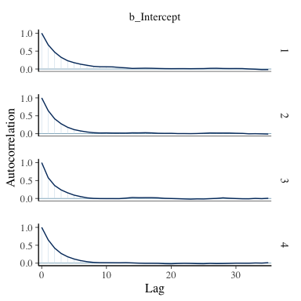
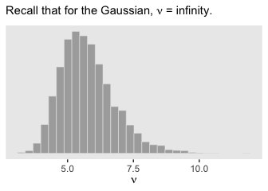
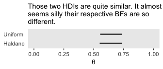

Chapter 10. Model Comparison and Hierarchical Modeling
================
A Solomon Kurz
2019-03-05

Model Comparison and Hierarchical Modeling
==========================================

> There are situations in which different models compete to describe the same set of data...
>
> ...Bayesian inference is reallocation of credibility over possibilities. In model comparison, the focal possibilities are the models, and Bayesian model comparison reallocates credibility across the models, given the data. In this chapter, we explore examples and methods of Bayesian inference about the relative credibilities of models. (pp. 265--266)

In the text, the emphasis is on the Bayes Factor paradigm. While we will discuss that, we will also present the alternatives available with information criteria and model averaging and attacking.

10.1. General formula and the Bayes factor
------------------------------------------

So far we have spoken of

-   the data, denoted by *D* or *y*,
-   the model parameters, generically denoted by *θ*,
-   the likelihood function, denoted by *p*(*D*|*θ*), and
-   the prior distribution, denoted by *p*(*θ*)

Now we add to that *m*, which is a model index with *m* = 1 standing for the first model, *m* = 2 standing for the second model, and so on. So when we have more than one model in play, we might refer to the likelihood as *p*<sub>*m*</sub>(*y*|*θ*<sub>*m*</sub>, *m*) and the prior as *p*<sub>*m*</sub>(*θ*<sub>*m*</sub>|*m*). It's also the case, then, that each model can be given a prior probability *p*(*m*).

"The Bayes factor (BF) is the ratio of the probabilities of the data in models 1 and 2" (p. 268).

$$\\text{BF} = \\frac{p(D|m = 1)}{p(D|m = 2)}$$

> One convention for converting the magnitude of the BF to a discrete decision about the models is that there is "substantial" evidence for model *m* = 1 when the BF exceeds 3.0 and, equivalently, "substantial" evidence for model *m* = 2 when the BF is less than 1/3 ([Jeffreys, 1961](https://global.oup.com/academic/product/theory-of-probability-9780198503682?cc=us&lang=en&); [Kass & Raftery, 1995](http://xyala.cap.ed.ac.uk/teaching/tutorials/phylogenetics/Bayesian_Workshop/PDFs/Kass%20and%20Raftery%201995.pdf); [Wetzels et al., 2011](https://pdfs.semanticscholar.org/1874/4e6c84087ccc20bc0f6db28020bc48c81b4a.pdf)).

10.2. Example: Two factories of coins
-------------------------------------

Kruschke considered the coin bias of two factories, each described by the beta distribution. We can organize how to derive the *α* and *β* parameters from *ω* and *κ* with a tibble.

``` r
library(tidyverse)

tibble(factory = 1:2,
       omega   = c(.25, .75),
       kappa   = 12) %>% 
  mutate(alpha =       omega * (kappa - 2) + 1,
         beta  = (1 - omega) * (kappa - 2) + 1)
```

    ## # A tibble: 2 x 5
    ##   factory omega kappa alpha  beta
    ##     <int> <dbl> <dbl> <dbl> <dbl>
    ## 1       1  0.25    12   3.5   8.5
    ## 2       2  0.75    12   8.5   3.5

Thus given *ω*<sub>1</sub> = .25, *ω*<sub>2</sub> = .75 and *κ* = 12, we can describe the bias of the two coin factories as B<sub>1</sub>(3.5, 8.5) and B<sub>2</sub>(8.5, 3.5). We can construct a similar tibble to make the densities of Figure 10.2.

``` r
n_points <- 100

tibble(theta   = seq(from = 0, to = 1, length.out = n_points) %>% rep(., times = 2),
       factory = rep(c("B(3.5, 8.5)", "B(8.5, 3.5)"), each = n_points),
       alpha   = rep(c(3.5, 8.5), each = n_points),
       beta    = rep(c(8.5, 3.5), each = n_points)) %>% 
  
  ggplot(aes(x = theta, 
             ymin = 0, 
             ymax = dbeta(x = theta, shape1 = alpha, shape2 = beta))) +
  geom_ribbon(fill = "grey67") +
  scale_y_continuous(NULL, breaks = NULL) +
  xlab(expression(theta)) +
  theme(panel.grid = element_blank()) +
  facet_wrap(~factory)
```


We might recreate the top panel with `geom_col()`.

``` r
tibble(Model = c("1", "2"),
       y = 1) %>% 
  
  ggplot(aes(x = Model, y = y)) +
  geom_col(width = .75, fill = "grey50") +
  scale_y_continuous(NULL, breaks = NULL) +
  ggtitle(expression(paste(italic(P)[italic(m)]))) +
  theme(panel.grid = element_blank(),
        axis.ticks.x = element_blank())
```


Consider the Bernoulli bar plots in the bottom panels of Figure 10.2. The heights of the bars are arbitrary and just intended to give a sense of the Bernoulli distribution. If we wanted the heights to correspond to the Beta distributions above them, we might do so like this.

``` r
tibble(Model = rep(c("Model 1", "Model 2"), each  = 2),
       flip  = rep(c("tails"  , "heads"  ), times = 2),
       prob  = c(.25, .75, .75, .25)) %>% 
  
  ggplot(aes(x = flip, y = prob)) +
  geom_col(width = .75, fill = "grey50") +
  scale_y_continuous(NULL, breaks = NULL) +
  xlab(NULL) +
  theme(panel.grid = element_blank(),
        axis.ticks.x = element_blank()) +
  facet_wrap(~Model)
```


### 10.2.1. Solution by formal analysis.

If you would like to compute *p*(*D*|*m*), don't use this function. If suffers from underflow with large values.

``` r
p_d <- function(z, N, a, b) { 
  beta(z + a, N - z + b) / beta(a, b) 
}
```

Use this one instead.

``` r
p_d <- function(z, N, a, b) { 
  exp(lbeta(z + a, N - z + b) - lbeta(a, b)) 
}
```

You'd use it like this to compute *p*(*D*|*m*<sub>1</sub>).

``` r
p_d(z = 6, N = 9, a = 3.5, b = 8.5)
```

    ## [1] 0.0004993439

So to compute our BF, $\\frac{p(D|m\_1)}{p(D|m\_2)}$, you might use the `p_d()` function like this.

``` r
p_d_1 <- p_d(z = 6,   N = 9, 
             a = 3.5, b = 8.5)
p_d_2 <- p_d(z = 6,   N = 9, 
             a = 8.5, b = 3.5)

p_d_1 / p_d_2
```

    ## [1] 0.2135266

### 10.2.2. Solution by grid approximation.

We won't be able to make the wireframe plots on the left of Figure 10.3, but we can do some of the others. Here's the upper right panel.

``` r
n_points <- 101

tibble(omega = seq(from = 0, to = 1, length.out = n_points)) %>% 
  mutate(m_p = ifelse(omega %in% c(.25, .75), 15, 0)) %>% 
  
  ggplot(aes(x = omega, 
             ymin = 0,
             ymax = m_p)) +
  geom_ribbon(fill = "grey67", color = "grey67") +
  coord_flip(ylim = 0:25) +
  labs(subtitle = "Remember, the scale on the x is arbitrary.",
       x = expression(omega),
       y = expression(paste("Marginal p(", omega, ")"))) +
  theme(panel.grid = element_blank())
```


Building on that, here's the upper middle panel of the "two \[prior\] dorsal fins" (p. 271).

``` r
d <-
  tibble(omega = seq(from = 0, to = 1, length.out = n_points)) %>% 
  expand(omega, 
         theta = seq(from = 0, to = 1, length.out = n_points)) %>% 
  mutate(prior = ifelse(omega == .25, dbeta(theta, 3.5, 8.5),
                          ifelse(omega == .75, dbeta(theta, 8.5, 3.5),
                                 0)))
d %>% 
  ggplot(aes(x = theta, y = omega, fill = prior)) +
  geom_tile() +
  scale_fill_viridis_c(option = "A") +
  labs(x = expression(theta),
       y = expression(omega)) +
  theme(panel.grid = element_blank(),
        legend.position = "none")
```


This time we'll separate *p*<sub>*m* = 1</sub>(*θ*) and *p*<sub>*m* = 2</sub>(*θ*) into the two short plots on the right of the next row down.

``` r
p1 <-
  d %>% 
  filter(omega == .75) %>% 
  
  ggplot(aes(x = theta, 
             ymin = 0, 
             ymax = prior)) +
  geom_ribbon(fill = "grey67") +
  labs(x = expression(theta),
       y = expression(paste("p(", theta, "|", omega, " = .75)"))) +
   theme(panel.grid = element_blank())

p2 <-
  d %>% 
  filter(omega == .25) %>% 
  
  ggplot(aes(x = theta, 
             ymin = 0, 
             ymax = prior)) +
  geom_ribbon(fill = "grey67") +
  labs(x = expression(theta),
       y = expression(paste("p(", theta, "|", omega, " = .25)"))) +
  theme(panel.grid = element_blank())

# we'll put them together with help from gridExtra
library(gridExtra)

grid.arrange(p1, p2)
```



We can continue to build on those sensibilities for the middle panel of the same row. Here we're literally adding *p*<sub>*m* = 1</sub>(*θ*) to *p*<sub>*m* = 2</sub>(*θ*) and taking their average.

``` r
tibble(theta = seq(from = 0, to = 1, length.out = n_points)) %>% 
  mutate(d_75 = dbeta(x = theta, shape1 = 8.5, shape2 = 3.5),
         d_25 = dbeta(x = theta, shape1 = 3.5, shape2 = 8.5)) %>% 
  mutate(mean_prior = (d_75 + d_25) / 2) %>% 

  ggplot(aes(x = theta, 
             ymin = 0, 
             ymax = mean_prior)) +
  geom_ribbon(fill = "grey67") +
  coord_cartesian(ylim = 0:3) +
  labs(x = expression(theta),
       y = expression(paste("Marginal p(", theta, ")"))) +
  theme(panel.grid = element_blank())
```


We need the Bernoulli likelihood function for the next step.

``` r
Bernoulli_likelihood <- function(theta, data) {
  # theta = success probability parameter ranging from 0 to 1
  # data = the vector of data (i.e., a series of 0s and 1s)
  N <- length(data)
  z <- sum(data)
  return(theta^z * (1 - theta)^(N - sum(data)))
  }
```

Time to feed our data and the parameter space into `Bernoulli_likelihood()`, which will allow us to make the 2-dimensional density plot at the heart of Figure 10.3.

``` r
N <- 9
z <- 6

trial_data <- rep(0:1, times = c(N - z, z))

d <-
  d %>% 
  mutate(likelihood = Bernoulli_likelihood(theta = theta, 
                                           data  = trial_data))

d %>%
  ggplot(aes(x = theta, y = omega, fill = likelihood)) +
  geom_tile() +
  scale_fill_viridis_c(option = "A") +
  labs(x = expression(theta),
       y = expression(omega)) +
  theme(panel.grid = element_blank(),
        legend.position = "none")
```


Now we just need the marginal likelihood, *p*(*D*), to compute the posterior. Our first depiction will be the middle panel of the second row from the bottom--the panel with the uneven dolphin fins.

``` r
d <-
  d %>% 
  mutate(marginal_likelihood = sum(prior * likelihood)) %>% 
  mutate(posterior = (prior * likelihood) / marginal_likelihood) 

d %>% 
  ggplot(aes(x = theta, y = omega, fill = posterior)) +
  geom_tile() +
  scale_fill_viridis_c(option = "A") +
  labs(x = expression(theta),
       y = expression(omega)) +
  theme(panel.grid = element_blank(),
        legend.position = "none")
```


Here, then, is a way to get the panel in on the right of the second row from the bottom.

``` r
d %>% 
  mutate(marginal = (posterior / max(posterior)) * 25) %>% 

  ggplot(aes(x = omega,
             ymin = 0,
             ymax = marginal)) +
  geom_ribbon(fill = "grey67", color = "grey67") +
  coord_flip(ylim = 0:25) +
  labs(subtitle = "Remember, the scale on the x is arbitrary.",
       x = expression(omega),
       y = expression(paste("Marginal p(", omega, "|D)"))) +
  theme(panel.grid = element_blank())
```


To make the middle bottom panel of Figure 10.3, we have to average the posterior values of *θ* over the grid of *ω* values. That is, we have to marginalize.

``` r
 d %>%
  group_by(theta) %>% 
  summarise(marginal_theta = mean(posterior)) %>% 
  
  ggplot(aes(x = theta, 
             ymin = 0,
             ymax = marginal_theta)) +
  geom_ribbon(fill = "grey67") + 
  labs(x = expression(theta),
       y = expression(paste("Marginal p(", theta, "|D)"))) +
  theme(panel.grid = element_blank())
```


For the lower right panel of Figure 10.3, we'll filter to our two focal values of *ω* and then facet by them.

``` r
d %>% 
  filter(omega %in% c(.25, .75)) %>% 
  mutate(omega = str_c("omega == ", omega)) %>%

  ggplot(aes(x = theta, 
             ymin = 0,
             ymax = posterior)) +
  geom_ribbon(fill = "grey67") + 
  labs(x = expression(theta),
       y = expression(paste("Marginal p(", theta, "|", omega, ")"))) +
  theme(panel.grid = element_blank()) +
  facet_wrap(~omega, ncol = 1, scales = "free", labeller = label_parsed)
```


Do note the different scales on the *y*. Here's what they'd look like on the same scale.

``` r
d %>% 
  filter(omega %in% c(.25, .75)) %>% 
  mutate(omega = str_c("omega == ", omega)) %>%

  ggplot(aes(x = theta, 
             ymin = 0,
             ymax = posterior)) +
  geom_ribbon(fill = "grey67") + 
  labs(x = expression(theta),
       y = expression(paste("Marginal p(", theta, "|", omega, ")"))) +
  theme(panel.grid = element_blank()) +
  facet_wrap(~omega, ncol = 1, labeller = label_parsed)
```


Using the grid, you might get the BF presented on page 273 like this:

``` r
d %>% 
  filter(omega %in% c(.25, .75)) %>% 
  group_by(omega) %>% 
  summarise(sum_posterior = sum(posterior)) %>% 
  mutate(model = c("model_2", "model_1")) %>% 
  select(-omega) %>% 
  spread(key = model, value = sum_posterior) %>% 
  summarise(BF = model_1 / model_2)
```

    ## # A tibble: 1 x 1
    ##      BF
    ##   <dbl>
    ## 1  4.68

10.3. Solution by MCMC
----------------------

Kruschke started with: "For large, complex models, we cannot derive *p*(*D*|*m*) analytically or with grid approximation, and therefore we will approximate the posterior probabilities using MCMC methods" (p. 274). He's not kidding. Welcome to modern Bayes.

### 10.3.1. Nonhierarchical MCMC computation of each model’s marginal likelihood.

Before you get excited, Kruschke warned: "For complex models, this method might not be tractable. \[But\] for the simple application here, however, the method works well, as demonstrated in the next section" (p. 277).

#### 10.3.1.1. Implementation with JAGS.

Load brms.

``` r
library(brms)
```

Let's save the `trial_data` as a tibble.

``` r
trial_data <- 
  tibble(y = trial_data)
```

We'll need to make our `stanvars` object to insert our *ω*- and *κ*-themed prior values into `brm()`.

``` r
omega <- .75
kappa <- 12

stanvars <-
  stanvar(omega * (kappa - 2) + 1, name = "my_alpha") +
  stanvar((1 - omega) * (kappa - 2) + 1, name = "my_beta")
```

Fit the first model (i.e., the model for which *ω* = .75).

``` r
fit1 <-
  brm(data = trial_data, 
      family = bernoulli(link = "identity"),
      y ~ 1,
      prior = prior(beta(my_alpha, my_beta), class = Intercept),
      iter = 11000, warmup = 1000, chains = 4, cores = 4,
      stanvars = stanvars,
      control = list(adapt_delta = .999),
      # This will let us use `prior_samples()` later on
      sample_prior = "only")
```

We may as well inspect the chains.

``` r
plot(fit1)
```


We'll glance at the model summary, too.

``` r
print(fit1)
```

    ## Warning: There were 40 divergent transitions after warmup. Increasing adapt_delta above 0.999 may help.
    ## See http://mc-stan.org/misc/warnings.html#divergent-transitions-after-warmup

    ##  Family: bernoulli 
    ##   Links: mu = identity 
    ## Formula: y ~ 1 
    ##    Data: trial_data (Number of observations: 9) 
    ## Samples: 4 chains, each with iter = 11000; warmup = 1000; thin = 1;
    ##          total post-warmup samples = 40000
    ## 
    ## Population-Level Effects: 
    ##           Estimate Est.Error l-95% CI u-95% CI Eff.Sample Rhat
    ## Intercept     0.71      0.12     0.44     0.92       7634 1.00
    ## 
    ## Samples were drawn using sampling(NUTS). For each parameter, Eff.Sample 
    ## is a crude measure of effective sample size, and Rhat is the potential 
    ## scale reduction factor on split chains (at convergence, Rhat = 1).

Next we'll follow Kruschke and extract the posterior samples, saving them as `theta`.

``` r
theta <- posterior_samples(fit1)

head(theta)
```

    ##   b_Intercept      lp__
    ## 1   0.6942682 1.0527224
    ## 2   0.5396340 0.1862523
    ## 3   0.6150777 0.7202323
    ## 4   0.7568779 1.1274383
    ## 5   0.7133675 1.0949918
    ## 6   0.7771186 1.1080611

The `fixef()` function will return the posterior summaries for the model intercept (i.e., *θ*). We can then index and save the desired summaries.

``` r
fixef(fit1)
```

    ##            Estimate Est.Error      Q2.5     Q97.5
    ## Intercept 0.7117601  0.124848 0.4400665 0.9164725

``` r
(mean_theta <- fixef(fit1)[1])
```

    ## [1] 0.7117601

``` r
(sd_theta   <- fixef(fit1)[2])
```

    ## [1] 0.124848

Now we'll convert them to the *α* and *β* parameters, `a_post` and `b_post`, respectively.

``` r
a_post <-      mean_theta  * ( mean_theta * (1 - mean_theta) / sd_theta^2 - 1)
b_post <- (1 - mean_theta) * ( mean_theta * (1 - mean_theta) / sd_theta^2 - 1)
```

Recall we've already defined:

``` r
N     <- 9
z     <- 6
omega <- .75
kappa <- 12
```

Thus we'll use them to compute $\\frac{1}{p(D)}$. Here we'll express Kruschke's `oneOverPD` as a function, `one_over_pd()`.

``` r
one_over_pd <- function(theta) {
  mean(dbeta(theta, a_post, b_post ) / 
         (theta^z * (1 - theta)^(N - z) * 
            dbeta(theta, omega * (kappa - 2) + 1, (1 - omega) * (kappa - 2) + 1 )))
}
```

We're ready to use `one_over_pd()` to help compute *p*(*D*).

``` r
theta %>% 
  summarise(pd = 1 / one_over_pd(theta = b_Intercept))
```

    ##            pd
    ## 1 0.001207932

That's pretty close to Kruschke's value! Let's rinse, wash, and repeat for *ω* = .25. First, we'll need to redefine `omega` and our `stanvars`.

``` r
omega <- .25

stanvars <-
  stanvar(omega * (kappa - 2) + 1, name = "my_alpha") +
  stanvar((1 - omega) * (kappa - 2) + 1, name = "my_beta")
```

Fit the model.

``` r
fit2 <-
  update(fit1, 
         prior = prior(beta(my_alpha, my_beta), class = Intercept),
         iter = 11000, warmup = 1000, chains = 4, cores = 4,
         stanvars = stanvars)
```

We'll do the rest in bulk.

``` r
theta <- posterior_samples(fit2)

mean_theta <- fixef(fit2)[1]
sd_theta   <- fixef(fit2)[2]

a_post <-      mean_theta  * ( mean_theta * (1 - mean_theta) / sd_theta^2 - 1)
b_post <- (1 - mean_theta) * ( mean_theta * (1 - mean_theta) / sd_theta^2 - 1)

theta %>% 
  summarise(pd = 1 / one_over_pd(theta = b_Intercept))
```

    ##             pd
    ## 1 3.053225e-08

Boom!

### 10.3.2. Hierarchical MCMC computation of relative model probability.

I'm not aware of a way to specify a model like this in brms. If you know of a way, [share your code](https://github.com/ASKurz/Doing-Bayesian-Data-Analysis-in-brms-and-the-tidyverse/issues).

&lt;**Introduce information criteria and model weighting**&gt;

``` r
loo(fit1, fit2)
```

    ##             LOOIC   SE
    ## fit1        13.47 3.34
    ## fit2        20.15 3.31
    ## fit1 - fit2 -6.68 6.66

``` r
(mw <- model_weights(fit1, fit2))
```

    ##      fit1      fit2 
    ## 0.8317776 0.1682224

``` r
mw[1] / mw[2]
```

    ##    fit1 
    ## 4.94451

``` r
nd <- tibble(y = 1)

pp_averaged <-
  pp_average(fit1, fit2, 
           newdata = nd,
           method = "fitted",
           summary = F) %>% 
  as_tibble()
```

    ## Warning: `as_tibble.matrix()` requires a matrix with column names or a `.name_repair` argument. Using compatibility `.name_repair`.
    ## This warning is displayed once per session.

``` r
head(pp_averaged)  
```

    ## # A tibble: 6 x 1
    ##      V1
    ##   <dbl>
    ## 1 0.545
    ## 2 0.780
    ## 3 0.800
    ## 4 0.924
    ## 5 0.654
    ## 6 0.622

We can plot our model-averaged *θ* with a little help from good old `tidybayes::geom_halfeyeh()`.

``` r
library(tidybayes)

pp_averaged %>% 
  
  ggplot(aes(x = V1, y = 0)) +
  geom_halfeyeh(point_interval = mode_hdi,
                .width = c(.95, .5)) +
  labs(x = expression(theta),
       y = expression(paste("Marginal p(", theta, "|D)"))) +
  coord_cartesian(xlim = 0:1) +
  theme(panel.grid = element_blank())
```



Looks a lot like the one we made with grid approximation, doesn't it?

#### 10.3.2.1. Using pseudo-priors to reduce autocorrelation.

Since we didn't use Kruschke's method from the last subsection, we don't have the same worry about autocorrelation. For example, here are the autocorrelation plots for `fit1`.

``` r
library(bayesplot)

mcmc_acf(posterior_samples(fit1, add_chain = T), 
         pars = "b_Intercept",
         lags = 35)
```



Our autocorrelations were a little high for HMC, but nowhere near pathological. The results for `fit2` were similar. As you might imagine from the moderate autocorrelations, the *N*<sub>*e**f**f*</sub>/*N* ratio for `b_Intercept` wasn't great.

``` r
neff_ratio(fit1)[1]%>% 
  mcmc_neff() +
  yaxis_text(hjust = 0)
```


But we specified a lot of post-warmup iterations, so we're still in good shape. Plus, the $\\hat{R}$ was fine.

``` r
rhat(fit1)[1]
```

    ## b_Intercept 
    ##    1.000278

### 10.3.3. Models with different "noise" distributions in JAGS.

Kruschke tells us

> probability distribution\[s are\] sometimes \[called “noise”\] distribution\[s\] because \[the describe\] the random variability of the data values around the underlying trend. In more general applications, different models can have different noise distributions. For example, one model might describe the data as log-normal distributed, while another model might describe the data as gamma distributed. (p. 288)

If there are more than one plausible noise distributions for our data, we might want to compare the models. As Kruschke put it, we might want to examine *p*<sub>1</sub>(*D*|*θ*<sub>1</sub>, *m*<sub>1</sub>) versus *p*<sub>2</sub>(*D*|*θ*<sub>2</sub>, *m*<sub>2</sub>). Kruschke then gave us a general trick in the form of this JAGS code:

``` r
data {
  C <- 10000 # JAGS does not warn if too small!
  for (i in 1:N) {
    ones[i] <- 1 }
} model {
  for (i in 1:N) {
    spy1[i] <- pdf1(y[i], parameters1) / C # where pdf1 is a formula
    spy2[i] <- pdf2(y[i], parameters2) / C # where pdf2 is a formula
    spy[i]  <- equals(m,1) * spy1[i] + equals(m, 2) * spy2[i]
    ones[i] ~ dbern(spy[i])
  }
  parameters1 ~ dprior1...
  parameters2 ~ dprior2...
  m ~ dcat(mPriorProb[])
  mPriorProb[1] <- .5
  mPriorProb[2] <- .5
}
```

I'm not aware that we can do this within the brms framework. If I'm in error and you know how, [please share your code](https://github.com/ASKurz/Doing-Bayesian-Data-Analysis-in-brms-and-the-tidyverse/issues). However, we do have options. Consider Gaussian-like data with thick tails. We might generate some like this:

``` r
# how many draws would you like?
n <- 1e3

set.seed(10.33)
(d <- tibble(y = rt(n, df = 7)))
```

    ## # A tibble: 1,000 x 1
    ##          y
    ##      <dbl>
    ##  1  0.0214
    ##  2 -0.987 
    ##  3  0.646 
    ##  4 -0.237 
    ##  5  0.977 
    ##  6 -0.200 
    ##  7  0.781 
    ##  8 -1.09  
    ##  9  1.83  
    ## 10 -0.682 
    ## # … with 990 more rows

They look like this.

``` r
d %>% 
  ggplot(aes(x = y)) +
  geom_histogram(color = "grey92", fill = "grey67",
                 size = .2, bins = 30) +
  scale_y_continuous(NULL, breaks = NULL) +
  theme(panel.grid = element_blank())
```


``` r
fit3 <-
  brm(data = d,
      family = gaussian,
      y ~ 1,
      prior = c(prior(normal(0, 10), class = Intercept),
                prior(normal(0, 10), class = sigma)),  # by default, this has a lower bound of 0
      chains = 4, cores = 4)  
```

    ## Compiling the C++ model

    ## Start sampling

``` r
fit4 <-
  brm(data = d,
      family = student,
      y ~ 1,
      prior = c(prior(normal(0, 10), class = Intercept),
                prior(normal(0, 10), class = sigma),
                prior(gamma(2, 0.1), class = nu)),  # this is the brms default prior for nu
      chains = 4, cores = 4) 
```

    ## Compiling the C++ model
    ## Start sampling

``` r
posterior_summary(fit3) %>% round(digits = 2)
```

    ##             Estimate Est.Error     Q2.5    Q97.5
    ## b_Intercept    -0.03      0.04    -0.10     0.05
    ## sigma           1.25      0.03     1.19     1.31
    ## lp__        -1648.40      1.08 -1651.26 -1647.38

``` r
posterior_summary(fit4) %>% round(digits = 2)
```

    ##             Estimate Est.Error     Q2.5    Q97.5
    ## b_Intercept    -0.01      0.04    -0.08     0.06
    ## sigma           0.98      0.04     0.91     1.06
    ## nu              5.76      1.04     4.11     8.21
    ## lp__        -1591.88      1.29 -1595.23 -1590.43

We can compare them using information criteria.

``` r
l_fit3 <- loo(fit3)
l_fit4 <- loo(fit4)

compare_ic(l_fit3, l_fit4)
```

    ##               LOOIC     SE
    ## fit3        3293.23 114.01
    ## fit4        3172.22  59.11
    ## fit3 - fit4  121.01  80.32

We can compare them using model weights. Here we'll use the default weighting scheme.

``` r
model_weights(fit3, fit4)
```

    ##      fit3      fit4 
    ## 0.0285427 0.9714573

In this, virtually all the weight was placed on the Student's-*t* model, `fit4`.

``` r
posterior_samples(fit4) %>% 
  ggplot(aes(x = nu)) +
  geom_histogram(color = "grey92", fill = "grey67",
                 size = .2, bins = 30) +
  scale_y_continuous(NULL, breaks = NULL) +
  labs(subtitle = expression(paste("Recall that for the Gaussian, ", nu, " = infinity.")),
       x = expression(nu)) +
  theme(panel.grid = element_blank())
```



10.4. Prediction: Model averaging
---------------------------------

> In many applications of model comparison, the analyst wants to identify the best model and then base predictions of future data on that single best model, denoted with index *b*. In this case, predictions of future $\\hat{y}$ are based exclusively on the likelihood function $p\_b(\\hat{y} | \\theta\_b, m = b)$ and the posterior distribution *p*<sub>*b*</sub>(*θ*<sub>*b*</sub>|*D*, *m* = *b*) of the winning model:

$$p\_b(\\hat y | D, m = b) = \\int \\text d \\theta\_b p\_b (\\hat{y} | \\theta\_b, m = b) p\_b(\\theta\_b | D, m = b)$$

> But the full model of the data is actually the complete hierarchical structure that spans all the models being compared, as indicated in Figure 10.1 (p. 267). Therefore, if the hierarchical structure really expresses our prior beliefs, then the most complete prediction of future data takes into account all the models, weighted by their posterior credibilities. In other words, we take a weighted average across the models, with the weights being the posterior probabilities of the models. Instead of conditionalizing on the winning model, we have

$$
$$

> This is called model averaging.

> ...Recall that there were two models of mints that created the coin, with one mint being tail-biased with mode *ω* = 0.25 and one mint being head-biased with mode *ω* = 0.75 The two subpanels in the lower-right illustrate the posterior distributions on *ω* within each model, *p*(*θ*|*D*, *ω* = 0.25) and *p*(*θ*|*D*, *ω* = 0.75) The winning model was *ω* = 0.75, and therefore the predicted value of future data, based on the winning model alone, would use *p*(*θ*|*D*, *ω* = 0.75). (p. 289)

That is, the posterior for `fit1`.

``` r
posterior_samples(fit1) %>% 
  ggplot(aes(x = b_Intercept)) +
  geom_histogram(color = "grey92", fill = "grey67",
                 size = .2, bins = 30) +
  stat_pointintervalh(aes(y = 0), 
                      point_interval = mode_hdi, .width = c(.95, .5)) +
  scale_y_continuous(NULL, breaks = NULL) +
  labs(subtitle = "The posterior for the probability, given fit1",
       x = expression(paste(italic(p), "(", theta, "|", italic(D), ", ", omega, " = .75)"))) +
  coord_cartesian(xlim = 0:1) +
  theme(panel.grid = element_blank())
```


> But the overall model included *ω* = 0.75, and if we use the overall model, then the predicted value of future data should be based on the complete posterior summed across values of *ω*. The complete posterior distribution \[is\] *p*(*θ*|*D*) (p. 289).

We'll use `pp_average()` to show that.

``` r
nd <- tibble(y = 1)

pp_average(fit1, fit2, 
           newdata = nd,
           method = "fitted",
           summary = F) %>% 
  as_tibble() %>% 
  ggplot(aes(x = V1)) +
  geom_histogram(color = "grey92", fill = "grey67",
                 size = .2, bins = 30) +
  stat_pointintervalh(aes(y = 0), 
                      point_interval = mode_hdi, .width = c(.95, .5)) +
  scale_y_continuous(NULL, breaks = NULL) +
  labs(subtitle = "The posterior for the probability, given the\nweighted combination of fit1 and fit2",
       x = expression(paste(italic(p), "(", theta, "|", italic(D), ")"))) +
  coord_cartesian(xlim = 0:1) +
  theme(panel.grid = element_blank())
```


As Kruschke concluded, "you can see the contribution of *p*(*θ*|*D*, *ω* = 0.25) as the extended leftward tail" (p. 289).

10.5. Model complexity naturally accounted for
----------------------------------------------

> Bayesian model comparison compensates for model complexity by the fact that each model must have a prior distribution over its parameters, and more complex models must dilute their prior distributions over larger parameter spaces than simpler models. Thus, even if a complex model has some particular combination of parameter values that fit the data well, the prior probability of that particular combination must be small because the prior is spread thinly over the broad parameter space. (p. 290)

Our two models are

-   *p*(*θ*|*D*, *κ* = 2000) (i.e., the "must-be-fair" model) and
-   *p*(*θ*|*D*, *κ* = 2) (i.e., the "anything's-possible" model).

They look like this.

``` r
# how granular to you want the theta sequence?
n <- 1e3

tibble(theta = seq(from = 0, to = 1, length.out = n) %>% rep(., times = 2),
       omega = .5,
       kappa = rep(c(1000, 2), each = n),
       model = rep(c("The must-be-fair model", "The anything's-possible model"), each = n)) %>% 
  mutate(density = dbeta(theta, 
                         shape1 =      omega  * (kappa - 2) + 1, 
                         shape2 = (1 - omega) * (kappa - 2) + 1)) %>% 
  
  ggplot(aes(x = theta, ymin = 0, ymax = density)) +
  geom_ribbon(fill = "grey67") + 
  scale_y_continuous(NULL, breaks = NULL) +
  labs(subtitle = "Note that in this case, their y-axes are on the same scale.",
       x     = expression(theta)) +
  theme(panel.grid = element_blank()) +
  facet_wrap(~model)
```


``` r
# the data summaries
z <- 15
N <- 20

p_d(z, N, a = 500, b = 500) / p_d(z, N, a = 1, b = 1)
```

    ## [1] 0.3229023

If you're confused about where those `a` and `b` values came from, you can do the math like this.

``` r
tibble(omega = .5,
       kappa = c(1000, 2),
       model = c("The must-be-fair model", "The anything's-possible model")) %>% 
  mutate(a   =      omega  * (kappa - 2) + 1,
         b   = (1 - omega) * (kappa - 2) + 1)
```

    ## # A tibble: 2 x 5
    ##   omega kappa model                             a     b
    ##   <dbl> <dbl> <chr>                         <dbl> <dbl>
    ## 1   0.5  1000 The must-be-fair model          500   500
    ## 2   0.5     2 The anything's-possible model     1     1

Let's try again with different data.

``` r
# the data summaries
z <- 11
N <- 20

p_d(z, N, a = 500, b = 500) / p_d(z, N, a = 1, b = 1)
```

    ## [1] 3.337148

> The anything’s-possible model loses because it pays the price of having a small prior probability on the values of *θ* near the data proportion, while the must-be- fair model has large prior probability on *θ* values sufficiently near the data proportion to be credible. Thus, in Bayesian model comparison, a simpler model can win if the data are consistent with it, even if the complex model fits just as well. The complex model pays the price of having small prior probability on parameter values that describe simple data. (p. 291) \#\# 10.6. Extreme sensitivity to prior distribution

### 10.5.1. Caveats regarding nested model comparison.

10.6. Extreme sensitivity to the prior distribution
---------------------------------------------------

> In many realistic applications of Bayesian model comparison, the theoretical emphasis is on the difference between the models’ likelihood functions. For example, one theory predicts planetary motions based on elliptical orbits around the sun, and another theory predicts planetary motions based on circular cycles and epicycles around the earth. The two models involve very different parameters. In these sorts of models, the form of the prior distribution on the parameters is not a focus, and is often an afterthought. But, when doing Bayesian model comparison, the form of the prior is crucial because the Bayes factor integrates the likelihood function weighted by the prior distribution. (p. 292)

However, "the sensitivity of Bayes factors to prior distributions is well known in the literature (e.g., [Kass & Raftery, 1995](https://www.stat.washington.edu/raftery/Research/PDF/kass1995.pdf); [Liu & Aitkin, 2008](http://psycnet.apa.org/record/2008-17435-006); [Vanpaemel, 2010](https://ppw.kuleuven.be/okp/_pdf/Vanpaemel2010PSITT.pdf))," and furthermore, when comparing Bayesian models using the methods Kruschke outlined in this chapter of the text, "different forms of vague priors can yield very different Bayes factors" (p. 293).

In the two BFs to follow, we compare the must-be-fair model with similar diffuse priors. In the first case, we use the good-old uniform beta(1, 1).

``` r
z <- 65
N <- 100 

p_d(z, N, a = 500, b = 500) / p_d(z, N, a = 1, b = 1)
```

    ## [1] 0.125287

Now we compare the must-be-fair model with the Haldane prior, which sets the two parameters within the beta distribution to be a) equivalent and b) quite small (i.e., 0.01 in this case).

``` r
p_d(z, N, a = 500, b = 500) / p_d(z, N, a = .01, b = .01)
```

    ## [1] 5.728066

Here's how those two priors of interest compare to one another.

``` r
# how granular to you want the theta sequence?
n <- 1e3

tibble(theta = seq(from = 0, to = 1, length.out = n) %>% rep(., times = 2),
       alpha = rep(c(1, .01), each = n),
       beta  = rep(c(1, .01), each = n),
       model = rep(c("Uninformative prior, beta(1, 1)", "Haldane prior, beta(0.01, 0.01)"), each = n)) %>% 
  mutate(model = factor(model, levels = c("Uninformative prior, beta(1, 1)", "Haldane prior, beta(0.01, 0.01)"))) %>% 
  mutate(density = dbeta(theta, 
                         shape1 = alpha, 
                         shape2 = beta)) %>% 
  
  ggplot(aes(x = theta, ymin = 0, ymax = density)) +
  geom_ribbon(fill = "grey67") + 
  scale_y_continuous(NULL, breaks = NULL) +
  labs(subtitle = "These y-axes are on the same scale.",
       x        = expression(theta)) +
  theme(panel.grid = element_blank()) +
  facet_wrap(~model)
```


Before we can complete the analyses of this subsection, we'll need to define our version of Kruschke's `HDIofICDF function()`, `hdi_of_icdf`().

``` r
hdi_of_icdf <- function(ICDFname, credible_mass = .95, tol = 1e-8, ... ) {
  incredible_mass <-  1.0 - credible_mass
  interval_width  <- function(low_tail_prob, ICDFname, credible_mass, ...) {
    ICDFname(credible_mass + low_tail_prob, ...) - ICDFname(low_tail_prob, ...)
  }
  opt_info            <- optimize(interval_width, c(0, incredible_mass), 
                                  ICDFname = ICDFname, credible_mass = credible_mass, 
                                  tol = tol, ...)
  hdi_lower_tail_prob <- opt_info$minimum
  return(c(ICDFname(hdi_lower_tail_prob, ...),
           ICDFname(credible_mass + hdi_lower_tail_prob, ...)))
}
```

Compute the HDI for the uniform-prior-based model, beta(1, 1).

``` r
(hdi_1 <-
  hdi_of_icdf(ICDFname      = qbeta,
              shape1        = 66,
              shape2        = 36)
 )
```

    ## [1] 0.5542689 0.7382436

Now compute the HDI for the Haldane-prior-based model, beta(0.01, 0.01).

``` r
(hdi_2 <-
  hdi_of_icdf(ICDFname      = qbeta,
              shape1        = 65.01,
              shape2        = 36.01)
 )
```

    ## [1] 0.5501074 0.7353828

And for kicks and giggles, we can compare those intervals in a plot.

``` r
tibble(prior = c("Uniform", "Haldane"),
       ll = c(hdi_1[1], hdi_2[1]),
       ul = c(hdi_1[2], hdi_2[2])) %>% 
  
  ggplot(aes(x = ll,    xend = ul,
             y = prior, yend = prior)) +
  geom_segment(size = .75) +
  coord_cartesian(xlim = 0:1) +
  labs(subtitle = "Those two HDIs are quite similar. It almost\nseems silly their respective BFs are so\ndifferent.",
       x        = expression(theta),
       y        = NULL) +
  theme(panel.grid   = element_blank(),
        axis.ticks.y = element_blank(),
        axis.text.y  = element_text(hjust = 0))
```



### 10.6.1. Priors of different models should be equally informed.

"We have established that seemingly innocuous changes in the vagueness of a vague prior can dramatically change a model’s marginal likelihood, and hence its Bayes factor in comparison with other models. What can be done to ameliorate the problem" (p. 294)? Kruschke posed one method might be taking a small representative portion of the data in hand and use them to make an empirically-based prior for the remaining set of data. From our previous example, "suppose that the 10% subset has 6 heads in 10 flips, so the remaining 90% of the data has *z* = 65 − 6 and *N* = 100 − 10" (p. 294). Here are the new Bayes Factors.

``` r
z <- 65 - 6
N <- 100 - 10

p_d(z, N, a = 500 + 6, b = 500 + 10 - 6) / p_d(z, N, a = 1 + 6, b = 1 + 10 - 6)
```

    ## [1] 0.05570509

``` r
p_d(z, N, a = 500 + 6, b = 500 + 10 - 6) / p_d(z, N, a = .01 + 6, b = .01 + 10 - 6)
```

    ## [1] 0.05748123

Now the two Bayes Factors are nearly the same.

References
----------

Kruschke, J. K. (2015). *Doing Bayesian data analysis, Second Edition: A tutorial with R, JAGS, and Stan.* Burlington, MA: Academic Press/Elsevier.

Session info
------------

``` r
sessionInfo()
```

    ## R version 3.5.1 (2018-07-02)
    ## Platform: x86_64-apple-darwin15.6.0 (64-bit)
    ## Running under: macOS High Sierra 10.13.6
    ## 
    ## Matrix products: default
    ## BLAS: /Library/Frameworks/R.framework/Versions/3.5/Resources/lib/libRblas.0.dylib
    ## LAPACK: /Library/Frameworks/R.framework/Versions/3.5/Resources/lib/libRlapack.dylib
    ## 
    ## locale:
    ## [1] en_US.UTF-8/en_US.UTF-8/en_US.UTF-8/C/en_US.UTF-8/en_US.UTF-8
    ## 
    ## attached base packages:
    ## [1] stats     graphics  grDevices utils     datasets  methods   base     
    ## 
    ## other attached packages:
    ##  [1] bayesplot_1.6.0 tidybayes_1.0.3 brms_2.7.0      Rcpp_1.0.0     
    ##  [5] gridExtra_2.3   bindrcpp_0.2.2  forcats_0.3.0   stringr_1.3.1  
    ##  [9] dplyr_0.7.6     purrr_0.2.5     readr_1.1.1     tidyr_0.8.1    
    ## [13] tibble_2.0.1    ggplot2_3.1.0   tidyverse_1.2.1
    ## 
    ## loaded via a namespace (and not attached):
    ##   [1] colorspace_1.3-2          ggridges_0.5.0           
    ##   [3] rsconnect_0.8.8           rprojroot_1.3-2          
    ##   [5] ggstance_0.3              markdown_0.8             
    ##   [7] base64enc_0.1-3           rstudioapi_0.7           
    ##   [9] rstan_2.18.2              svUnit_0.7-12            
    ##  [11] DT_0.4                    fansi_0.4.0              
    ##  [13] mvtnorm_1.0-8             lubridate_1.7.4          
    ##  [15] xml2_1.2.0                bridgesampling_0.4-0     
    ##  [17] codetools_0.2-15          knitr_1.20               
    ##  [19] shinythemes_1.1.1         jsonlite_1.5             
    ##  [21] LaplacesDemon_16.1.1      broom_0.5.1              
    ##  [23] shiny_1.1.0               compiler_3.5.1           
    ##  [25] httr_1.3.1                backports_1.1.2          
    ##  [27] assertthat_0.2.0          Matrix_1.2-14            
    ##  [29] lazyeval_0.2.1            cli_1.0.1                
    ##  [31] later_0.7.3               htmltools_0.3.6          
    ##  [33] prettyunits_1.0.2         tools_3.5.1              
    ##  [35] igraph_1.2.1              coda_0.19-2              
    ##  [37] gtable_0.2.0              glue_1.3.0               
    ##  [39] reshape2_1.4.3            cellranger_1.1.0         
    ##  [41] nlme_3.1-137              crosstalk_1.0.0          
    ##  [43] ps_1.2.1                  rvest_0.3.2              
    ##  [45] mime_0.5                  miniUI_0.1.1.1           
    ##  [47] gtools_3.8.1              MASS_7.3-50              
    ##  [49] zoo_1.8-2                 scales_1.0.0             
    ##  [51] colourpicker_1.0          hms_0.4.2                
    ##  [53] promises_1.0.1            Brobdingnag_1.2-5        
    ##  [55] parallel_3.5.1            inline_0.3.15            
    ##  [57] shinystan_2.5.0           yaml_2.1.19              
    ##  [59] loo_2.0.0                 StanHeaders_2.18.0-1     
    ##  [61] stringi_1.2.3             dygraphs_1.1.1.5         
    ##  [63] pkgbuild_1.0.2            rlang_0.3.1              
    ##  [65] pkgconfig_2.0.2           matrixStats_0.54.0       
    ##  [67] HDInterval_0.2.0          evaluate_0.10.1          
    ##  [69] lattice_0.20-35           bindr_0.1.1              
    ##  [71] rstantools_1.5.0          htmlwidgets_1.2          
    ##  [73] labeling_0.3              tidyselect_0.2.4         
    ##  [75] processx_3.2.1            plyr_1.8.4               
    ##  [77] magrittr_1.5              R6_2.3.0                 
    ##  [79] generics_0.0.2            pillar_1.3.1             
    ##  [81] haven_1.1.2               withr_2.1.2              
    ##  [83] xts_0.10-2                abind_1.4-5              
    ##  [85] modelr_0.1.2              crayon_1.3.4             
    ##  [87] arrayhelpers_1.0-20160527 utf8_1.1.4               
    ##  [89] rmarkdown_1.10            grid_3.5.1               
    ##  [91] readxl_1.1.0              callr_3.1.0              
    ##  [93] threejs_0.3.1             digest_0.6.18            
    ##  [95] xtable_1.8-2              httpuv_1.4.4.2           
    ##  [97] stats4_3.5.1              munsell_0.5.0            
    ##  [99] viridisLite_0.3.0         shinyjs_1.0
