Chapter 11. Null Hypothesis Significance Testing
================
A Solomon Kurz
2018-07-30

Null Hypothesis Significance Testing
====================================

It's worth repeating a couple paragraphs from page 298 (*emphasis* in the original):

> The logic of conventional NHST goes like this. Suppose the coin is fair (i.e., *θ* = 0.50). Then, when we flip the coin, we expect that about half the flips should come up heads. If the actual number of heads is far greater or fewer than half the flips, then we should reject the hypothesis that the coin is fair. To make this reasoning precise, we need to figure out the exact probabilities of all possible outcomes, which in turn can be used to figure out the probability of getting an outcome as extreme as (or more extreme than) the actually observed outcome. This probability, of getting an outcome from the null hypothesis that is as extreme as (or more extreme than) the actual outcome, is called a "*p* value." If the *p* value is very small, say less than 5%, then we decide to reject the null hypothesis.
>
> Notice that this reasoning depends on defining a space of all possible outcomes from the null hypothesis, because we have to compute the probabilities of each outcome relative to the space of all possible outcomes. The space of all possible outcomes is based on how we intend to collect data. For example, was the intention to flip the coin exactly *N* times? In that case, the space of possible outcomes contains all sequences of exactly *N* flips. Was the intention to flip until the *z*th head appeared? In that case, the space of possible outcomes contains all sequences for which the *z*th head appears on the last flip. Was the intention to flip for a fixed duration? In that case, the space of possible outcomes contains all combinations of *N* and *z* that could be obtained in that fixed duration. Thus, a more explicit definition of a *p* value is the probability of getting a sample outcome from the hypothesized population that is as extreme as or more extreme than the actual outcome *when using the intended sampling and testing procedures.*

Paved with good intentions
--------------------------

This is a little silly, but I wanted to challenge myself to randomly generate a series of 24 `H` and `T` characters for which there were 7 `H`s. The base R `sample()` function gets us part of the way there.

``` r
sample(c("H", "T"), size = 24, replace = T)
```

    ##  [1] "T" "T" "H" "H" "T" "H" "H" "H" "H" "T" "T" "T" "H" "H" "H" "H" "H"
    ## [18] "H" "H" "T" "H" "T" "T" "H"

I wanted the solution to be reproducible, which required I find the appropriate seed for `set.seed()`. To do that, I made a custom `h_counter()` function into which I could input an arbitrary seed value and retrieve the count of `H`. I then fed a sequence of integers into `h_counter()` and filtered the output to find which seed produces the desirable outcome.

``` r
library(tidyverse)

h_counter <- function(i){
  set.seed(i)
  coins <- sample(c("H", "T"), size = 24, replace = T)
  length(which(coins == "H"))
}

coins <-
  tibble(seed = 1:50) %>% 
  mutate(n_heads = map(seed, h_counter)) %>% 
  unnest()

coins %>% 
  filter(n_heads == 7)
```

    ## # A tibble: 1 x 2
    ##    seed n_heads
    ##   <int>   <int>
    ## 1    32       7

Looks like 32 works.

``` r
set.seed(32)
sample(c("H", "T"), size = 24, replace = T)
```

    ##  [1] "T" "T" "T" "T" "H" "T" "T" "T" "T" "H" "T" "H" "T" "T" "H" "T" "T"
    ## [18] "H" "T" "T" "T" "T" "H" "H"

The sequence isn’t in the exact order as the data from page 300, but they do have the crucial ratio of heads to tails.

``` r
set.seed(32)
tibble(flips = sample(c("H", "T"), size = 24, replace = T)) %>% 
  
  ggplot(aes(x = flips)) +
  geom_bar() +
  scale_y_continuous(breaks = c(0, 7, 17)) +
  theme(panel.grid.major.x = element_blank(),
        panel.grid.minor.y = element_blank())
```

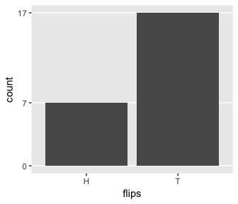

### Definition of *p* value.

### With intention to fix *N*.

To do factorials in R, use the `factorial()` function. E.g., we can use the formula near the bottom of the main paragraph on page 303 like so:

``` r
N <- 24
z <- 7

factorial(N)/(factorial(N - z) * factorial(z))
```

    ## [1] 346104

That formula's a little cumbersome. We can make our programming lives easier by wrapping it into a function.

``` r
N_choose_z <- function(N, z){
  factorial(N)/(factorial(N - z) * factorial(z))
  }
```

Now we can employ `N_choose_z()` to help make the data we'll use for Figure 11.3.b. Here are the data.

``` r
flips <-
  tibble(z          = 0:24) %>% 
  mutate(N_choose_z = N_choose_z(N, z)) %>% 
  mutate(`p(z/N)`   = N_choose_z/sum(N_choose_z),
         `Sample Proportion z/N` = z/N)

head(flips, n = 10)
```

    ## # A tibble: 10 x 4
    ##        z N_choose_z     `p(z/N)` `Sample Proportion z/N`
    ##    <int>      <dbl>        <dbl>                   <dbl>
    ##  1     0        1   0.0000000596                  0     
    ##  2     1       24.0 0.00000143                    0.0417
    ##  3     2      276   0.0000165                     0.0833
    ##  4     3     2024   0.000121                      0.125 
    ##  5     4    10626   0.000633                      0.167 
    ##  6     5    42504   0.00253                       0.208 
    ##  7     6   134596   0.00802                       0.25  
    ##  8     7   346104   0.0206                        0.292 
    ##  9     8   735471   0.0438                        0.333 
    ## 10     9  1307504   0.0779                        0.375

The figure:

``` r
flips %>% 
  
  ggplot(aes(x = `Sample Proportion z/N`, y = `p(z/N)`,
             fill = z <= 7)) +
  geom_col(width = .025) +
  scale_fill_viridis_d(option = "B", end = .6) +
  ggtitle("Implied Sampling Distribution") +
  theme(panel.grid = element_blank(),
        legend.position = "none")
```


We can get the one-sided *p*-value with a quick `filter()` and `summarise()`.

``` r
flips %>% 
  filter(z <= 7) %>% 
  summarise(p_value = sum(`p(z/N)`))
```

    ## # A tibble: 1 x 1
    ##   p_value
    ##     <dbl>
    ## 1  0.0320

Here's Figure 11.3.a.

``` r
tibble(y = c("tail", "head") %>% factor(., levels = c("tail", "head")),
       `p(y)` = .5) %>% 
  
  ggplot(aes(x = y, y = `p(y)`)) +
  geom_col() +
  coord_cartesian(ylim = 0:1) +
  labs(title = "Hypothetical Population",
       subtitle = expression(paste(theta, " = .5"))) +
  theme(panel.grid = element_blank(),
        axis.ticks.x = element_blank())
```


As Kruschke wrote on page 304, "It is important to understand that the sampling distribution is a probability distribution over samples of data, and is *not* a probability distribution over parameter values."

### With intention to fix *z*.

Figure 11.4.a is the same as Figure 11.3.a, above. Here's Figure 11.4.b.

``` r
theta <- .5

flips <-
  tibble(N             = 7:100) %>% 
  mutate(N_choose_z  = N_choose_z(N, z)) %>% 
  mutate(`p(z/N)`    = N_choose_z/sum(N_choose_z),
         `Sample Proportion z/N` = z/N,
         `p(N|z,theta)` = (z/N) * N_choose_z * (theta^z) * (1 - theta)^(N - z))

flips %>%
  ggplot(aes(x = `Sample Proportion z/N`, y = `p(N|z,theta)`,
             fill = N >= 24)) +
  geom_col(width = .01) +
  scale_fill_viridis_d(option = "B", end = .6) +
  ggtitle("Implied Sampling Distribution") +
  theme(panel.grid = element_blank(),
        legend.position = "none")
```


We got the formula for that last variable, `p(N|z,theta)`, from formula 11.6 on page 306. You'll note how Kruschke continued to refer to it as *p*(*z*|*N*) in his Figure 11.4. It's entirely opaque, to me, how *p*(*z*|*N*)=*p*(*N*|*z*, *θ*). I'm just going with it.

Here's the *p*-value.

``` r
flips %>% 
  filter(N >= 24) %>% 
  summarise(p_value = sum(`p(N|z,theta)`))
```

    ## # A tibble: 1 x 1
    ##   p_value
    ##     <dbl>
    ## 1  0.0173

### With intention to fix duration.

Here's a glance at the Poisson distribution for which *λ* = 24. The mean is colored orange.

``` r
tibble(x = 1:50) %>%
  mutate(y = dpois(x = x, lambda = 24)) %>% 
  
  ggplot(aes(x = x, y = y,
             fill = x == 24)) +
  geom_col(width = .75) +
  scale_fill_viridis_d(option = "B", end = .75) +
  scale_y_continuous(NULL, breaks = NULL) +
  theme(panel.grid = element_blank(),
        legend.position = "none")
```

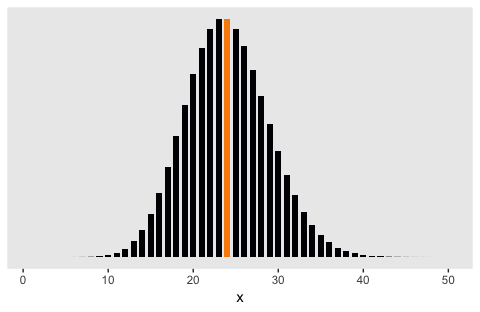

Here's my attempt to make a mixture of binomial distributions. I use the custom `z_maker()` function to simulate *N*-values from *P**o**i**s**s**o**n*(24). We then plug in sequences of 0:*N* into a tibble and compute `p(z/N)` and such, by sequence.

``` r
z_maker <- function(i){
  set.seed(i)
  n <- rpois(n = 1, lambda = 24)
  seq(from = 0, to = n, by = 1)
}

tibble(seed = 1:100) %>% 
  mutate(z = map(seed, z_maker)) %>% 
  unnest() %>% 
  group_by(seed) %>% 
  mutate(N = n()) %>% 
  mutate(N_choose_z = N_choose_z(N, z)) %>% 
  mutate(`p(z/N)`   = N_choose_z/sum(N_choose_z),
         `Sample Proportion z/N` = z/N)%>%
  ggplot(aes(x = `Sample Proportion z/N`, y = `p(z/N)`)) +
  geom_col(width = .004) +
  theme(panel.grid = element_blank())
```

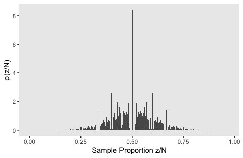

I played around with the simulation a bit, and this is about as good as I've gotten. If you have a solution that more faithfully reproduces what Kruschke did, [please share your code](https://github.com/ASKurz/Doing-Bayesian-Data-Analysis-in-brms-and-the-tidyverse/issues).

### With intention to make multiple tests.

I'm not sure how to do the simulation for this section. This, for example, doesn't get the job done.

``` r
flips <-
  tibble(coin = rep(letters[1:2], each = 25),
         z          = rep(0:24, times = 2)) %>% 
  group_by(coin) %>% 
  mutate(N_choose_z = N_choose_z(N, z)) %>% 
  mutate(`p(z/N)`   = N_choose_z/sum(N_choose_z),
         `Sample Proportion z/N` = z/N)

head(flips, n = 10)
```

    ## # A tibble: 10 x 5
    ## # Groups:   coin [1]
    ##    coin      z N_choose_z     `p(z/N)` `Sample Proportion z/N`
    ##    <chr> <int>      <dbl>        <dbl>                   <dbl>
    ##  1 a         0        1   0.0000000596                  0     
    ##  2 a         1       24.0 0.00000143                    0.0417
    ##  3 a         2      276   0.0000165                     0.0833
    ##  4 a         3     2024   0.000121                      0.125 
    ##  5 a         4    10626   0.000633                      0.167 
    ##  6 a         5    42504   0.00253                       0.208 
    ##  7 a         6   134596   0.00802                       0.25  
    ##  8 a         7   346104   0.0206                        0.292 
    ##  9 a         8   735471   0.0438                        0.333 
    ## 10 a         9  1307504   0.0779                        0.375

The result is a failed attempt at Figure 11.6:

``` r
flips %>% 
  
  ggplot(aes(x = `Sample Proportion z/N`, y = `p(z/N)`,
             fill = z <= 7)) +
  geom_col(width = .025) +
  scale_fill_viridis_d(option = "B", end = .6) +
  ggtitle("Implied Sampling Distribution") +
  theme(panel.grid = element_blank(),
        legend.position = "none")
```


If you know how to do the simulation properly, [please share your code](https://github.com/ASKurz/Doing-Bayesian-Data-Analysis-in-brms-and-the-tidyverse/issues).

### Soul searching.

### Bayesian analysis.

Kruschke began the subsection with "The Bayesian interpretation of data does not depend on the covert sampling and testing intentions of the data collector."

Prior knowledge
---------------

### NHST analysis.

### Bayesian analysis.

If you recall from chapter 6, we need a function to compute the Bernoulli likelihood.

``` r
Bernoulli_likelihood <- function(theta, data) {
  # theta = success probability parameter ranging from 0 to 1
  # data = the vector of data (i.e., a series of 0s and 1s)
  N   <- length(data)
  z   <- sum(data)
  return(theta^z * (1 - theta)^(N - sum(data)))
  }
```

There are a handful of steps before we can use our `Bernoulli_likelihood()` function to make the plot data. All these are repeats from chapter 6.

``` r
# we need these to compute the likelihood
N <- 24
z <- 7

trial_data <- c(rep(0, times = N - z), rep(1, times = z))                # (i.e., data)

d_nail <-
  tibble(theta = seq(from = 0, to = 1, length.out = 1000)) %>%           # (i.e., theta)
  mutate(Prior = dbeta(x = theta, shape1 = 2, shape2 = 20)) %>% 
  mutate(Likelihood = Bernoulli_likelihood(theta = theta,                # (i.e., p(D | theta))
                                           data = trial_data)) %>%
  mutate(normalizing_constant = sum(Likelihood * Prior/sum(Prior))) %>%  # (i.e., p(D))
  mutate(Posterior = Likelihood * Prior / normalizing_constant)          # (i.e., p(theta | D))
  
glimpse(d_nail)
```

    ## Observations: 1,000
    ## Variables: 5
    ## $ theta                <dbl> 0.000000000, 0.001001001, 0.002002002, 0....
    ## $ Prior                <dbl> 0.0000000, 0.4124961, 0.8094267, 1.191209...
    ## $ Likelihood           <dbl> 0.000000e+00, 9.900280e-22, 1.245822e-19,...
    ## $ normalizing_constant <dbl> 5.266333e-08, 5.266333e-08, 5.266333e-08,...
    ## $ Posterior            <dbl> 0.000000e+00, 7.754592e-15, 1.914808e-12,...

Here's the left column of Figure 11.7.

``` r
plot_1 <-
  d_nail %>% 
  ggplot(aes(x = theta)) +
  geom_ribbon(aes(ymin = 0, ymax = Prior),
              fill = "grey50") +
  scale_y_continuous(breaks = NULL) +
  labs(title = "Prior (beta)",
       x = expression(theta),
       y = expression(paste("dbeta(", theta, "|2, 20)"))) +
  theme(panel.grid = element_blank())

plot_2 <-
  d_nail %>% 
  ggplot(aes(x = theta)) +
  geom_ribbon(aes(ymin = 0, ymax = Likelihood),
              fill = "grey50") +
  scale_y_continuous(breaks = NULL) +
  labs(title = "Likelihood (Bernoulli)",
       x = expression(theta),
       y = expression(paste("p(D|", theta, ")"))) +
  theme(panel.grid = element_blank(),
        axis.text.y = element_text())

plot_3 <-
  d_nail %>% 
  ggplot(aes(x = theta)) +
  geom_ribbon(aes(ymin = 0, ymax = Posterior),
              fill = "grey50") +
  scale_y_continuous(breaks = NULL) +
  labs(title = "Posterior (beta)",
       x = expression(theta),
       y = expression(paste("dbeta(", theta, "|9, 37)"))) +
  theme(panel.grid = element_blank())

library(gridExtra)

grid.arrange(plot_1, plot_2, plot_3)
```

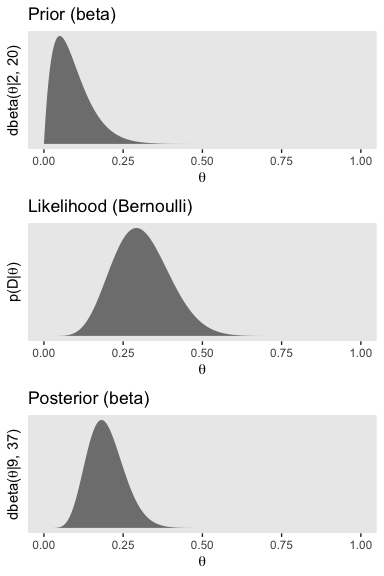

To get the left column of Figure 11.7, we have to update the data with our new prior, *β*(11, 11).

``` r
# Here are the data based on our updated beta(11, 11) prior
d_coin <-
  tibble(theta = seq(from = 0, to = 1, length.out = 1000)) %>%
  mutate(Prior = dbeta(x = theta, shape1 = 11, shape2 = 11)) %>% 
  mutate(Likelihood = Bernoulli_likelihood(theta = theta,
                                           data = trial_data)) %>%
  mutate(normalizing_constant = sum(Likelihood * Prior/sum(Prior))) %>%
  mutate(Posterior = Likelihood * Prior / normalizing_constant)

# The updated plots:
plot_1 <-
  d_coin %>% 
  ggplot(aes(x = theta)) +
  geom_ribbon(aes(ymin = 0, ymax = Prior),
              fill = "grey50") +
  scale_y_continuous(breaks = NULL) +
  labs(title = "Prior (beta)",
       x = expression(theta),
       y = expression(paste("dbeta(", theta, "|11, 11)"))) +
  theme(panel.grid = element_blank())

plot_2 <-
  d_coin %>% 
  ggplot(aes(x = theta)) +
  geom_ribbon(aes(ymin = 0, ymax = Likelihood),
              fill = "grey50") +
  scale_y_continuous(breaks = NULL) +
  labs(title = "Likelihood (Bernoulli)",
       x = expression(theta),
       y = expression(paste("p(D|", theta, ")"))) +
  theme(panel.grid = element_blank(),
        axis.text.y = element_text())

plot_3 <-
  d_coin %>% 
  ggplot(aes(x = theta)) +
  geom_ribbon(aes(ymin = 0, ymax = Posterior),
              fill = "grey50") +
  scale_y_continuous(breaks = NULL) +
  labs(title = "Posterior (beta)",
       x = expression(theta),
       y = expression(paste("dbeta(", theta, "|18, 28)"))) +
  theme(panel.grid = element_blank())

grid.arrange(plot_1, plot_2, plot_3)
```


#### Priors are overt and relevant.

In this subsection's opening paragraph, Kruschke opined:

> Prior beliefs are overt, explicitly debated, and founded on publicly accessible previous research. A Bayesian analyst might have personal priors that differ from what most people think, but if the analysis is supposed to convince an audience, then the analysis must use priors that the audience finds palatable. It is the job of the Bayesian analyst to make cogent arguments for the particular prior that is used.

Confidence interval and highest density interval
------------------------------------------------

### CI depends on intention.

Here's the upper left panel of Figure 11.8.

``` r
tibble(y = c("tail", "head") %>% factor(., levels = c("tail", "head")),
       `p(y)` = c(1 - .126, .126)) %>% 
  
  ggplot(aes(x = y, y = `p(y)`)) +
  geom_col() +
  coord_cartesian(ylim = 0:1) +
  labs(title = "Hypothetical Population",
       subtitle = expression(paste(theta, " = .126"))) +
  theme(panel.grid = element_blank(),
        axis.ticks.x = element_blank())
```


Here's the lower left panel of Figure 11.8.

``` r
tibble(y = c("tail", "head") %>% factor(., levels = c("tail", "head")),
       `p(y)` = c(1 - .511, .511)) %>% 
  
  ggplot(aes(x = y, y = `p(y)`)) +
  geom_col() +
  coord_cartesian(ylim = 0:1) +
  labs(title = "Hypothetical Population",
       subtitle = expression(paste(theta, " = .511"))) +
  theme(panel.grid = element_blank(),
        axis.ticks.x = element_blank())
```

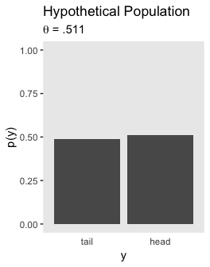

Here's the upper right.

``` r
tibble(z = 0:24,
       y = dbinom(0:24, size = 24, prob = .126)) %>% 
  
  ggplot(aes(x = z/25, y = y,
             fill = z >= 7)) +
  geom_col(width = .025) +
  scale_fill_viridis_d(option = "B", end = .6) +
  labs(title = "Implied Sampling Distribution",
       x = "Sample Proportion z/N",
       y = "p(z/N)") +
  theme(panel.grid = element_blank(),
        legend.position = "none")
```

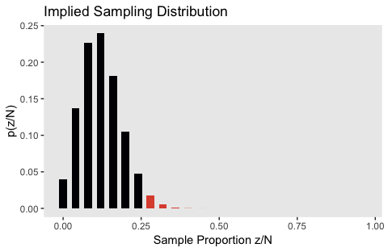

And here's the lower right.

``` r
tibble(z = 0:24,
       y = dbinom(0:24, size = 24, prob = .511)) %>% 
  
  ggplot(aes(x = z/24, y = y,
             fill = z <= 7)) +
  geom_col(width = .025) +
  scale_fill_viridis_d(option = "B", end = .6) +
  labs(title = "Implied Sampling Distribution",
       x = "Sample Proportion z/N",
       y = "p(z/N)") +
  theme(panel.grid = element_blank(),
        legend.position = "none")
```

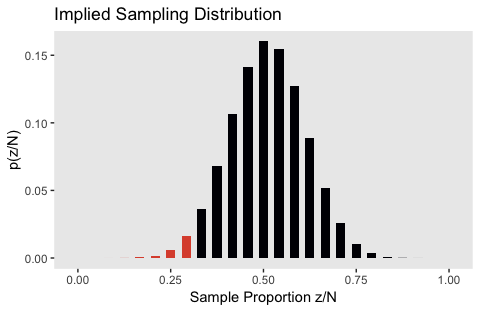

The upper left panel in Figure 11.9 is the same as 11.8, which you can see above. Here's the lower left panel.

``` r
tibble(y = c("tail", "head") %>% factor(., levels = c("tail", "head")),
       `p(y)` = c(1 - .484, .484)) %>% 
  
  ggplot(aes(x = y, y = `p(y)`)) +
  geom_col() +
  coord_cartesian(ylim = 0:1) +
  labs(title = "Hypothetical Population",
       subtitle = expression(paste(theta, " = .484"))) +
  theme(panel.grid = element_blank(),
        axis.ticks.x = element_blank())
```


We'll need fresh data for the upper right panel of Figure 11.9.

``` r
theta <- .126

flips <-
  tibble(N             = 7:100) %>% 
  mutate(N_choose_z  = N_choose_z(N, z)) %>% 
  mutate(`p(z/N)`    = N_choose_z/sum(N_choose_z),
         `Sample Proportion z/N` = z/N,
         `p(N|z,theta)` = (z/N) * N_choose_z * (theta^z) * (1 - theta)^(N - z))

flips %>%
  ggplot(aes(x = `Sample Proportion z/N`, y = `p(N|z,theta)`,
             fill = N <= 24)) +
  geom_col(width = .01) +
  scale_fill_viridis_d(option = "B", end = .6) +
  ggtitle("Implied Sampling Distribution") +
  theme(panel.grid = element_blank(),
        legend.position = "none")
```

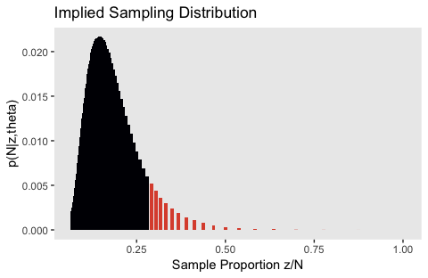

And once again, we'll renew `theta` and the data for the lower right panel.

``` r
theta <- .484

flips <-
  tibble(N             = 7:100) %>% 
  mutate(N_choose_z  = N_choose_z(N, z)) %>% 
  mutate(`p(z/N)`    = N_choose_z/sum(N_choose_z),
         `Sample Proportion z/N` = z/N,
         `p(N|z,theta)` = (z/N) * N_choose_z * (theta^z) * (1 - theta)^(N - z))

flips %>%
  ggplot(aes(x = `Sample Proportion z/N`, y = `p(N|z,theta)`,
             fill = N >= 24)) +
  geom_col(width = .01) +
  scale_fill_viridis_d(option = "B", end = .6) +
  ggtitle("Implied Sampling Distribution") +
  theme(panel.grid = element_blank(),
        legend.position = "none")
```


Here's the lower left panel for Figure 11.10.

``` r
tibble(y = c("tail", "head") %>% factor(., levels = c("tail", "head")),
       `p(y)` = c(1 - .135, .135)) %>% 
  
  ggplot(aes(x = y, y = `p(y)`)) +
  geom_col() +
  coord_cartesian(ylim = 0:1) +
  labs(title = "Hypothetical Population",
       subtitle = expression(paste(theta, " = .135"))) +
  theme(panel.grid = element_blank(),
        axis.ticks.x = element_blank())
```

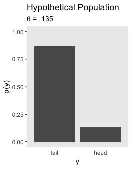

After switching out a few theta values, here's the lower right panel of Figure 11.10.

``` r
tibble(y = c("tail", "head") %>% factor(., levels = c("tail", "head")),
       `p(y)` = c(1 - .497, .497)) %>% 
  
  ggplot(aes(x = y, y = `p(y)`)) +
  geom_col() +
  coord_cartesian(ylim = 0:1) +
  labs(title = "Hypothetical Population",
       subtitle = expression(paste(theta, " = .497"))) +
  theme(panel.grid = element_blank(),
        axis.ticks.x = element_blank())
```


Like with Figure 11.5.b, my attempts for the right panels of Figure 11.10 just aren't quite right. If you understand where I'm going wrong with the simulation, [please share your code](https://github.com/ASKurz/Doing-Bayesian-Data-Analysis-in-brms-and-the-tidyverse/issues).

``` r
theta <- .135

tibble(seed = 1:100) %>% 
  mutate(z = map(seed, z_maker)) %>% 
  unnest() %>% 
  group_by(seed) %>% 
  mutate(N = n()) %>% 
  mutate(N_choose_z = N_choose_z(N, z)) %>% 
  mutate(`p(z/N)`   = N_choose_z/sum(N_choose_z),
         `Sample Proportion z/N` = z/N) %>%
  mutate(`p(N|z,theta)` = (z/N) * N_choose_z * (theta^z) * (1 - theta)^(N - z)) %>% 
  
  ggplot(aes(x = `Sample Proportion z/N`, y = `p(N|z,theta)`,
             fill = `Sample Proportion z/N` >= 7/24)) +
  geom_col(width = .004) +
  scale_fill_viridis_d(option = "B", end = .6) +
  theme(panel.grid = element_blank(),
        legend.position = "none")
```

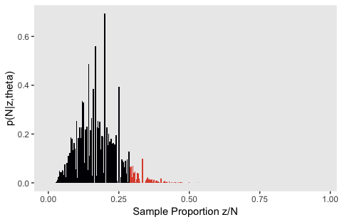

``` r
theta <- .497

tibble(seed = 1:100) %>% 
  mutate(z = map(seed, z_maker)) %>% 
  unnest() %>% 
  group_by(seed) %>% 
  mutate(N = n()) %>% 
  mutate(N_choose_z = N_choose_z(N, z)) %>% 
  mutate(`p(z/N)`   = N_choose_z/sum(N_choose_z),
         `Sample Proportion z/N` = z/N) %>%
  mutate(`p(N|z,theta)` = (z/N) * N_choose_z * (theta^z) * (1 - theta)^(N - z)) %>% 
  
  ggplot(aes(x = `Sample Proportion z/N`, y = `p(N|z,theta)`,
             fill = `Sample Proportion z/N` <= 7/24)) +
  geom_col(width = .004) +
  scale_fill_viridis_d(option = "B", end = .6) +
  theme(panel.grid = element_blank(),
        legend.position = "none")
```

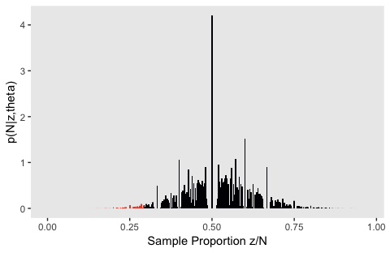

Let's leave failure behind. Here's the upper left panel for Figure 11.11.

``` r
tibble(y = c("tail", "head") %>% factor(., levels = c("tail", "head")),
       `p(y)` = c(1 - .11, .11)) %>% 
  
  ggplot(aes(x = y, y = `p(y)`)) +
  geom_col() +
  coord_cartesian(ylim = 0:1) +
  labs(title = "Hypothetical Population",
       subtitle = expression(paste(theta[1], " = .11; ", theta[2], " = .11"))) +
  theme(panel.grid = element_blank(),
        axis.ticks.x = element_blank())
```


And the lower panel for Figure 11.11.

``` r
tibble(y = c("tail", "head") %>% factor(., levels = c("tail", "head")),
       `p(y)` = c(1 - .539, .539)) %>% 
  
  ggplot(aes(x = y, y = `p(y)`)) +
  geom_col() +
  coord_cartesian(ylim = 0:1) +
  labs(title = "Hypothetical Population",
       subtitle = expression(paste(theta[1], " = .539; ", theta[2], " = .539"))) +
  theme(panel.grid = element_blank(),
        axis.ticks.x = element_blank())
```

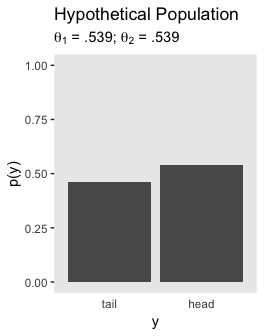

Much like with Figure 11.6, I don't understand how to do the simulation properly for the right panels of Figure 11.11. If you've got it, [please share your code](https://github.com/ASKurz/Doing-Bayesian-Data-Analysis-in-brms-and-the-tidyverse/issues).

#### CI is not a distribution.

### Bayesian HDI.

Kruschke ended the first paragraph in this subsection with: "The 95% HDI consists of those values of *θ* that have at least some minimal level of posterior credibility, such that the total probability of all such *θ* values is 95%."

Multiple comparisons
--------------------

It's worth quoting Kruschke at length:

> When comparing multiple conditions, a key goal in NHST is to keep the overall false alarm rate down to a desired maximum such as 5%. Abiding by this constraint depends on the number of comparisons that are to be made, which in turn depends on the intentions of the experimenter. In a Bayesian analysis, however, there is just one posterior distribu- tion over the parameters that describe the conditions. That posterior distribution is unaffected by the intentions of the experimenter, and the posterior distribution can be exam- ined from multiple perspectives however is suggested by insight and curiosity.

### NHST correction for experiment wise error.

``` r
alpha_pc <- .05
c        <- 36

# the probability of not getting a false alarm on any of the tests
(1 - alpha_pc)^c
```

    ## [1] 0.1577792

``` r
# the probability of getting at least one false alarm is
1 - (1 - alpha_pc)^c
```

    ## [1] 0.8422208

For kicks and giggles, it might be interesting to plot this.

``` r
tibble(c = 1:100) %>% 
  mutate(p1 = (1 - alpha_pc)^c,
         p2 = 1 - (1 - alpha_pc)^c) %>% 
  gather(key, probability, -c) %>% 
  
  ggplot(aes(x = c, y = probability, color = key)) +
  geom_line(size = 1.1) +
  geom_text(data = tibble(
    c = c(85, 75, 70),
    probability = c(.08, .9, .82),
    label = c("no false alarms",
              "at least one false alarm",
              "(i.e., experimentwise false alarm rate)"),
    key = c("p1", "p2", "p2")
  ),
  aes(label = label)) +
  scale_color_viridis_d(option = "D", end = .4) +
  labs(x = "the number of independent tests, c") +
  theme(panel.grid = element_blank(),
        legend.position = "none")
```


``` r
alpha_pc <- .05
c        <- 36

# the Bonferonni correction
alpha_pc/c
```

    ## [1] 0.001388889

Again, it might be useful to plot the consequence of Bonferonni's correction on *α* for different levels of *c*.

``` r
tibble(c = 1:100) %>% 
  mutate(a_ew = alpha_pc^c) %>% 
  
  ggplot(aes(x = c, y = a_ew)) +
  geom_line(size = 1.1) +
  labs(x = "the number of independent tests, c") +
  theme(panel.grid = element_blank())
```


A little shocking, isn't it? If you put it on a log scale, you'll see the relationship is linear.

``` r
tibble(c = 1:100) %>% 
  mutate(a_ew = alpha_pc^c) %>% 
  
  ggplot(aes(x = c, y = a_ew)) +
  geom_line(size = 1.1) +
  scale_y_log10() +
  labs(x = "the number of independent tests, c") +
  theme(panel.grid = element_blank())
```


But just look at how low the values on the y-axis get.

### Just one Bayesian posterior no matter how you look at it.

Kruschke:

> In a Bayesian analysis, the interpretation of the data is not influenced by the experimenter’s stopping and testing intentions (assuming that those intentions do not affect the data). A Bayesian analysis yields a posterior distribution over the parameters of the model. The posterior distribution is the complete implication of the data. The posterior distribution can be examined in as many different ways as the analyst deems interesting; various comparisons of groups are merely different perspectives on the posterior distribution.

### How Bayesian analysis mitigates false alarms.

From page 329: "How, then, does a Bayesian analysis address the problem of false alarms? By incorporating prior knowledge into the structure of the model." In addition, we use heirarchical models when possible (e.g., [Gelman, Hill, & Yajima, 2009](https://arxiv.org/pdf/0907.2478.pdf)).

What a sampling distribution is good for
----------------------------------------

"Sampling distributions tell us the probability of imaginary outcomes given a parameter value and an intention, *p*(*D*<sub>*θ*, *I*</sub>|*θ*, *I*), instead of the probability of parameter values given the actual data, (*θ*|*D*<sub>*a**c**t**u**a**l*</sub>)."

### Planning an experiment.

Gelman touched on these sensibilities in a [recent blog post](http://andrewgelman.com/2018/07/19/idea-replication-central-not-just-scientific-practice-also-formal-statistics-frequentist-statistics-relies-reference-set-repeated-experiments-bayesian-statist/).

### Exploring model predictions (posterior predictive check).

There's no shortage of ppc talk on Gelman's blog (e.g., [here](http://andrewgelman.com/2017/09/07/touch-want-feel-data/) or [here](http://andrewgelman.com/2014/08/11/discussion-sander-greenland-posterior-predictive-checks/) or [here](http://andrewgelman.com/2009/02/07/confusions_abou/)).

References
----------

Kruschke, J. K. (2015). *Doing Bayesian data analysis, Second Edition: A tutorial with R, JAGS, and Stan.* Burlington, MA: Academic Press/Elsevier.

Session info
------------

``` r
sessionInfo()
```

    ## R version 3.5.1 (2018-07-02)
    ## Platform: x86_64-apple-darwin15.6.0 (64-bit)
    ## Running under: macOS High Sierra 10.13.4
    ## 
    ## Matrix products: default
    ## BLAS: /Library/Frameworks/R.framework/Versions/3.5/Resources/lib/libRblas.0.dylib
    ## LAPACK: /Library/Frameworks/R.framework/Versions/3.5/Resources/lib/libRlapack.dylib
    ## 
    ## locale:
    ## [1] en_US.UTF-8/en_US.UTF-8/en_US.UTF-8/C/en_US.UTF-8/en_US.UTF-8
    ## 
    ## attached base packages:
    ## [1] stats     graphics  grDevices utils     datasets  methods   base     
    ## 
    ## other attached packages:
    ##  [1] gridExtra_2.3   bindrcpp_0.2.2  forcats_0.3.0   stringr_1.3.1  
    ##  [5] dplyr_0.7.6     purrr_0.2.5     readr_1.1.1     tidyr_0.8.1    
    ##  [9] tibble_1.4.2    ggplot2_3.0.0   tidyverse_1.2.1
    ## 
    ## loaded via a namespace (and not attached):
    ##  [1] tidyselect_0.2.4  reshape2_1.4.3    haven_1.1.2      
    ##  [4] lattice_0.20-35   colorspace_1.3-2  viridisLite_0.3.0
    ##  [7] htmltools_0.3.6   yaml_2.1.19       utf8_1.1.4       
    ## [10] rlang_0.2.1       pillar_1.2.3      foreign_0.8-70   
    ## [13] glue_1.2.0        withr_2.1.2       modelr_0.1.2     
    ## [16] readxl_1.1.0      bindr_0.1.1       plyr_1.8.4       
    ## [19] munsell_0.5.0     gtable_0.2.0      cellranger_1.1.0 
    ## [22] rvest_0.3.2       psych_1.8.4       evaluate_0.10.1  
    ## [25] labeling_0.3      knitr_1.20        parallel_3.5.1   
    ## [28] broom_0.4.5       Rcpp_0.12.18      scales_0.5.0     
    ## [31] backports_1.1.2   jsonlite_1.5      mnormt_1.5-5     
    ## [34] hms_0.4.2         digest_0.6.15     stringi_1.2.3    
    ## [37] grid_3.5.1        rprojroot_1.3-2   cli_1.0.0        
    ## [40] tools_3.5.1       magrittr_1.5      lazyeval_0.2.1   
    ## [43] crayon_1.3.4      pkgconfig_2.0.1   xml2_1.2.0       
    ## [46] lubridate_1.7.4   assertthat_0.2.0  rmarkdown_1.10   
    ## [49] httr_1.3.1        rstudioapi_0.7    R6_2.2.2         
    ## [52] nlme_3.1-137      compiler_3.5.1
