Chapter 12. Bayesian Approaches to Testing a Point ('Null') Hypothesis
================
A Solomon Kurz
2018-08-12

Bayesian Approaches to Testing a Point ("Null") Hypothesis
==========================================================

In addition to the two approaches Kruschke contrasted in this chapter, we’ll also briefly introduce an information criteria approach toward the end.

The estimation approach
-----------------------

Full disclosure: this is my preferred approach of the two.

### Region of practical equivalence.

Kruschke began: "A *region of practical equivalence* (ROPE) indicates a small range of parameter values that are considered to be practically equivalent to the null value for purposes of the particular application."

Here's a plot of Kruschke's initial coin flip ROPE.

``` r
library(tidyverse)

d_text <-
  tibble(x = .5,
         y = .5,
         label = "ROPE")

rope <- 
  tibble(xmin = .45,
         xmax = .55)

ggplot() +
  geom_rect(data = rope,
            aes(xmin = xmin, xmax = xmax,
                ymin = -Inf, ymax = Inf),
            color = "transparent", fill = "white") +
  geom_text(data = d_text,
            aes(x = x, y = y, label = label),
            color = "grey67") +
  scale_y_continuous(NULL, breaks = NULL) +
  labs(title = "Kruschke's coin flip ROPE",
       x = expression(theta)) +
  coord_cartesian(0:1) +
  theme(panel.grid.minor = element_blank())
```


In his first example, he considers 325 heads out of 500 coin flips. To visualize the analysis, we'll need the Bernoulli likelihood.

``` r
Bernoulli_likelihood <- function(theta, data) {
  # theta = success probability parameter ranging from 0 to 1
  # data = the vector of data (i.e., a series of 0s and 1s)
  N   <- length(data)
  z   <- sum(data)
  return(theta^z * (1 - theta)^(N - sum(data)))
  }
```

Now we'll follow the typical steps to combine the prior, which is flat in this case, and the likelihood to get the posterior.

``` r
# we need these to compute the likelihood
N <- 500
z <- 325

trial_data <- c(rep(0, times = N - z), rep(1, times = z))                # (i.e., data)

d <-
  tibble(theta = seq(from = 0, to = 1, length.out = 1000)) %>%           # (i.e., theta)
  # Since the prior is flat, any constant value will do
  mutate(Prior = 1) %>% 
  mutate(Likelihood = Bernoulli_likelihood(theta = theta,                # (i.e., p(D | theta))
                                           data = trial_data)) %>%
  mutate(normalizing_constant = sum(Likelihood * Prior/sum(Prior))) %>%  # (i.e., p(D))
  mutate(Posterior = Likelihood * Prior / normalizing_constant)          # (i.e., p(theta | D))
  
glimpse(d)
```

    ## Observations: 1,000
    ## Variables: 5
    ## $ theta                <dbl> 0.000000000, 0.001001001, 0.002002002, 0....
    ## $ Prior                <dbl> 1, 1, 1, 1, 1, 1, 1, 1, 1, 1, 1, 1, 1, 1,...
    ## $ Likelihood           <dbl> 0, 0, 0, 0, 0, 0, 0, 0, 0, 0, 0, 0, 0, 0,...
    ## $ normalizing_constant <dbl> 1.367061e-142, 1.367061e-142, 1.367061e-1...
    ## $ Posterior            <dbl> 0, 0, 0, 0, 0, 0, 0, 0, 0, 0, 0, 0, 0, 0,...

The results look like this:

``` r
# we'll use this to mark off the ROPEs as white strips in the background
rope <-
  tibble(xmin = .45,
         xmax = .55)

d %>% 
  ggplot() +
  geom_rect(data = rope,
            aes(xmin = xmin, xmax = xmax,
                ymin = -Inf, ymax = Inf),
            color = "transparent", fill = "white") +
  geom_ribbon(aes(x = theta,
                  ymin = 0, ymax = Posterior),
              fill = "grey67") +
  geom_text(data = tibble(
    theta = .5, 
    label = "ROPE"),
    aes(x = theta, y = 2, label = label),
    color = "grey67") +
  scale_y_continuous(NULL, breaks = NULL) +
  labs(title = "Nope, that density ain't in that ROPE.",
       x = expression(theta)) +
  theme(panel.grid = element_blank())
```

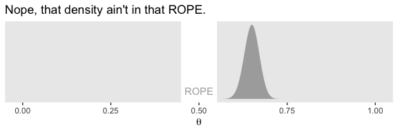

In his second example, Kruschke considered 490 heads out of 1000 flips.

``` r
# we need these to compute the likelihood
N <- 1000
z <- 490

trial_data <- c(rep(0, times = N - z), rep(1, times = z))

tibble(theta = seq(from = 0, to = 1, length.out = 1000)) %>%
  # Since the prior is flat, any constant value will do
  mutate(Prior = 1) %>%
  mutate(Likelihood = Bernoulli_likelihood(theta = theta,
                                           data = trial_data)) %>%
  mutate(normalizing_constant = sum(Likelihood * Prior/sum(Prior))) %>%
  mutate(Posterior = Likelihood * Prior / normalizing_constant) %>%
  
  ggplot() +
  geom_rect(data = rope,
            aes(xmin = xmin, xmax = xmax,
                ymin = -Inf, ymax = Inf),
            color = "transparent", fill = "white") +
  geom_ribbon(aes(x = theta, ymin = 0, ymax = Posterior),
              fill = "grey67") +
  scale_y_continuous(NULL, breaks = NULL) +
  labs(title = "This density sits right within the ROPE.",
       x = expression(theta)) +
  theme(panel.grid = element_blank())
```

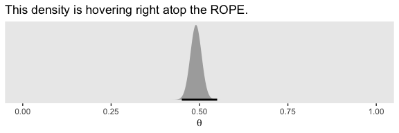

The ROPE approach gets complicated. "Because the ROPE and HDI can overlap in different ways, there are different decisions that can be made (p. 337)."

Just down the page, he further cautioned: "The decision rule for accepting the null value says merely that the most credible values are practically equivalent to the null value according to the chosen ROPE, not necessarily that the null value has high credibility."

### Some examples.

Kruschke referenced an analysis from way back in chapter 9. We'll need to re-fit the model. First, here are the data.

``` r
ba <- read_csv("data.R/BattingAverage.csv")

glimpse(ba)
```

    ## Observations: 948
    ## Variables: 6
    ## $ Player       <chr> "Fernando Abad", "Bobby Abreu", "Tony Abreu", "Du...
    ## $ PriPos       <chr> "Pitcher", "Left Field", "2nd Base", "2nd Base", ...
    ## $ Hits         <int> 1, 53, 18, 137, 21, 0, 0, 2, 150, 167, 0, 128, 66...
    ## $ AtBats       <int> 7, 219, 70, 607, 86, 1, 1, 20, 549, 576, 1, 525, ...
    ## $ PlayerNumber <int> 1, 2, 3, 4, 5, 6, 7, 8, 9, 10, 11, 12, 13, 14, 15...
    ## $ PriPosNumber <int> 1, 7, 4, 4, 3, 1, 1, 3, 3, 4, 1, 5, 4, 2, 7, 4, 6...

Let's load brms and, while we're at it, tidybayes.

``` r
library(brms)
library(tidybayes)
```

The model:

``` r
fit1 <-
  brm(data = ba,
      family = binomial(link = "logit"),
      Hits  | trials(AtBats) ~ 1 + (1 | PriPos) + (1 | PriPos:Player),
      prior = c(set_prior("normal(0, 1.5)", class = "Intercept"),
                set_prior("normal(0, 1)", class = "sd")),
      iter = 2000, warmup = 500, chains = 3, cores = 3,
      control = list(adapt_delta = .9))
```

``` r
coef_primary_position <-
  coef(fit1, summary = F)$PriPos %>% 
  as_tibble()
  
str(coef_primary_position)
```

    ## Classes 'tbl_df', 'tbl' and 'data.frame':    4500 obs. of  9 variables:
    ##  $ 1st Base.Intercept    : num  -1.07 -1.07 -1.07 -1.1 -1.09 ...
    ##  $ 2nd Base.Intercept    : num  -1.12 -1.11 -1.13 -1.08 -1.09 ...
    ##  $ 3rd Base.Intercept    : num  -1.06 -1.07 -1.08 -1.05 -1.04 ...
    ##  $ Catcher.Intercept     : num  -1.12 -1.11 -1.17 -1.15 -1.2 ...
    ##  $ Center Field.Intercept: num  -1.04 -1.06 -1.05 -1.07 -1.08 ...
    ##  $ Left Field.Intercept  : num  -1.13 -1.11 -1.12 -1.08 -1.08 ...
    ##  $ Pitcher.Intercept     : num  -1.93 -1.88 -1.87 -1.89 -1.82 ...
    ##  $ Right Field.Intercept : num  -1.13 -1.08 -1.07 -1.08 -1.03 ...
    ##  $ Shortstop.Intercept   : num  -1.15 -1.12 -1.12 -1.08 -1.1 ...

As we pointed out in chapter 9, keep in mind that `coef()` returns the values in the logit scale when used for logistic regression models. So we’ll have to use `brms::inv_logit_scaled()` to convert the estimates to the probability metric. We can make the difference distributions after we've converted the estimates.

``` r
coef_small <-
  coef_primary_position %>% 
  transmute(`Pitcher - Catcher` = inv_logit_scaled(Pitcher.Intercept) - inv_logit_scaled(Catcher.Intercept),
            `Catcher - 1st Base` = inv_logit_scaled(Catcher.Intercept) - inv_logit_scaled(`1st Base.Intercept`))

head(coef_small)
```

    ## # A tibble: 6 x 2
    ##   `Pitcher - Catcher` `Catcher - 1st Base`
    ##                 <dbl>                <dbl>
    ## 1             -0.119              -0.00899
    ## 2             -0.116              -0.00724
    ## 3             -0.103              -0.0197 
    ## 4             -0.108              -0.00983
    ## 5             -0.0926             -0.0190 
    ## 6             -0.114              -0.00669

Once we define our ROPE values, we're ready to re-plot the relevant parts of Figure 9.14.

``` r
rope <-
  tibble(xmin = -.05,
         xmax = .05)

coef_small %>% 
  select(`Pitcher - Catcher`, `Catcher - 1st Base`) %>% 
  gather() %>% 
  
  ggplot() +
  geom_rect(data = rope,
            aes(xmin = xmin, xmax = xmax,
                ymin = -Inf, ymax = Inf),
            color = "transparent", fill = "white") +
  geom_histogram(aes(x = value),
                 fill = "grey67", color = "grey92", 
                 size = .2, bins = 50) +
  stat_pointintervalh(aes(x = value, y = 0), 
                      point_interval = mode_hdi, .width = .95) +
  scale_y_continuous(NULL, breaks = NULL) +
  labs(x = expression(theta)) +
  theme(panel.grid = element_blank(),
        legend.position = "none") +
  facet_wrap(~key, scales = "free")
```

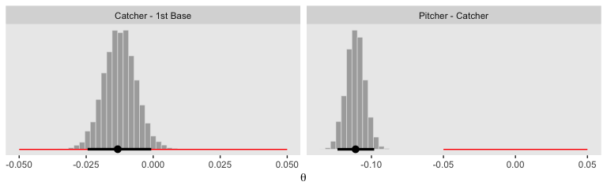

In order to re-plot part of Figure 9.15, we'll need to employ `fitted()` to snatch the player-specific posteriors.

``` r
# this will make life easier. just go with it
name_list <- c("ShinSoo Choo", "Ichiro Suzuki")

# we'll define the data we'd like to feed into `fitted()`, here
nd <-
  ba %>% 
  filter(Player %in% c(name_list)) %>% 
  # these last two lines aren't typically necessary, 
  # but they allow us to arrange the rows in the same order we find the names in Figures 9.15 and 9/16
  mutate(Player = factor(Player, levels = c(name_list))) %>% 
  arrange(Player)

fitted_players <-
  fitted(fit1, 
       newdata = nd,
       scale = "linear",
       summary = F) %>% 
  as_tibble() %>% 
  # with one function, we rename the values as returned by `as_tibble()` and convert the values from the logit scale to the probability scale
  transmute(`ShinSoo Choo`     = V1 %>% inv_logit_scaled(),
            `Ichiro Suzuki`    = V2 %>% inv_logit_scaled()) %>% 
  # in this last section, we make our difference distributions 
  mutate(`ShinSoo Choo - Ichiro Suzuki` = `ShinSoo Choo` - `Ichiro Suzuki`)
    
glimpse(fitted_players)
```

    ## Observations: 4,500
    ## Variables: 3
    ## $ `ShinSoo Choo`                 <dbl> 0.2508220, 0.2844511, 0.2682708...
    ## $ `Ichiro Suzuki`                <dbl> 0.2786871, 0.2816089, 0.2719929...
    ## $ `ShinSoo Choo - Ichiro Suzuki` <dbl> -0.0278650180, 0.0028421685, -0...

Now we're ready to go.

``` r
fitted_players %>% 
  
  ggplot() +
  geom_rect(data = rope,
            aes(xmin = xmin, xmax = xmax,
                ymin = -Inf, ymax = Inf),
            color = "transparent", fill = "white") +
  geom_histogram(aes(x = `ShinSoo Choo - Ichiro Suzuki`),
                 fill = "grey67", color = "grey92", 
                 size = .2, bins = 50) +
  stat_pointintervalh(aes(x = `ShinSoo Choo - Ichiro Suzuki`, y = 0), 
                      point_interval = mode_hdi, .width = .95) +
  scale_y_continuous(NULL, breaks = NULL) +
  labs(title = "ShinSoo Choo - Ichiro Suzuki",
       x = expression(theta)) +
  theme(panel.grid = element_blank())
```

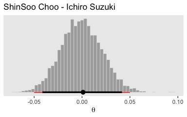

### Differences of correlated parameters.

Krushke didn't explicate where he got the data for Figure 12.1. If we're willing to presume a multivariate normal distribution, we can get close using the `MASS::mvrnorm()` function. You can get the basic steps from [Sven Hohenstein's answer to this stats.stacheschange question](https://stats.stackexchange.com/questions/164471/generating-a-simulated-dataset-from-a-correlation-matrix-with-means-and-standard).

``` r
# first we'll make a correlation matrix
# a correlation of .9 seems about right
correlation_matrix <- 
  matrix(c(1, .9, 
           .9, 1), 
         nrow = 2, ncol = 2)

# next we'll specify the means and standard deviations
mu <- c(.58, .42)
sd <- c(.1, .1)

# now we'll use the correlation matrix and standard deviations to make a covariance matrix
covariance_matrix <- 
  sd %*% t(sd) * correlation_matrix

# after setting our seed, we're ready to simulate
set.seed(1)
d <- 
  MASS::mvrnorm(n = 1000, 
                mu = mu, 
                Sigma = covariance_matrix) %>%
  as_tibble() %>%
  rename(theta_1 = V1, theta_2 = V2)
```

Now it only takes some light wrangling to prepare the data to make the three histograms in the left panel of Figure 12.1.

``` r
d %>% 
  mutate(`theta_1 - theta_2` = theta_1 - theta_2) %>% 
  gather() %>% 
  
  ggplot(aes(x = value)) +
  geom_histogram(fill = "grey67", color = "grey92", 
                 size = .2, bins = 30) +
  stat_pointintervalh(aes(y = 0), 
                      point_interval = mode_hdi, .width = .95) +
  scale_y_continuous(NULL, breaks = NULL) +
  labs(x = expression(theta)) +
  theme(panel.grid = element_blank()) +
  facet_wrap(~key, scales = "free")
```

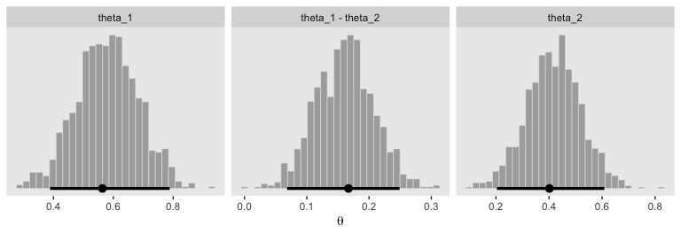

Here's the scatter plot, showing the correlation. I think we got pretty close!

``` r
d %>%  
  
  ggplot(aes(x = theta_1, y = theta_2)) +
  geom_abline(color = "white") +
  geom_point(size = 1/2,
             color = "grey50",
             alpha = 1/4) +
  coord_cartesian(xlim = 0:1,
                  ylim = 0:1) +
  labs(x = expression(theta[1]),
       y = expression(theta[2])) +
  theme(panel.grid = element_blank())
```

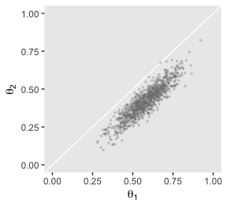

To make the plots in the right panel of Figure 12.1, we just need to convert the correlation from .9 to -.9.

``` r
# this time we'll make the correlations -.9
correlation_matrix <- 
  matrix(c(1, -.9, 
           -.9, 1), 
         nrow = 2, ncol = 2)

# we'll have to redo the covariance matrix
covariance_matrix <- 
  sd %*% t(sd) * correlation_matrix

# here's the updated data
set.seed(1)
d <- MASS::mvrnorm(n = 1000, mu = mu, Sigma = covariance_matrix) %>%
  as_tibble() %>%
  rename(theta_1 = V1, theta_2 = V2)
```

Here are our right-panel Figure 12.1 histograms.

``` r
d %>% 
  mutate(`theta_1 - theta_2` = theta_1 - theta_2) %>% 
  gather() %>% 
  
  ggplot(aes(x = value)) +
  geom_histogram(fill = "grey67", color = "grey92", 
                 size = .2, bins = 30) +
  stat_pointintervalh(aes(y = 0), 
                      point_interval = mode_hdi, .width = .95) +
  scale_y_continuous(NULL, breaks = NULL) +
  labs(x = expression(theta)) +
  theme(panel.grid = element_blank()) +
  facet_wrap(~key, scales = "free")
```

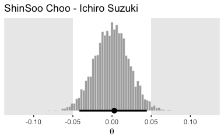

Behold the second scatter plot.

``` r
d %>%  
  
  ggplot(aes(x = theta_1, y = theta_2)) +
  geom_abline(color = "white") +
  geom_point(size = 1/2,
             color = "grey50",
             alpha = 1/4) +
  coord_cartesian(xlim = 0:1,
                  ylim = 0:1) +
  labs(x = expression(theta[1]),
       y = expression(theta[2])) +
  theme(panel.grid = element_blank())
```

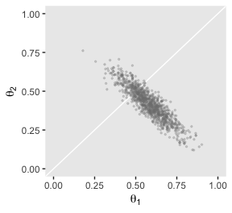

### Why HDI and not equal-tailed interval?

Though Kruschke told us Figure 12.2 was of a gamma distribution, he didn't tell us the parameters for that particular gamma. After playing around for a bit, it appeared `dgamma(x, 2, .2)` worked pretty well.

``` r
tibble(x = seq(from = 0, to = 40, by = .1)) %>% 
  
  ggplot(aes(x = x)) +
  geom_ribbon(aes(ymin = 0,
                  ymax = dgamma(x, 2, .2)),
              fill = "grey67") +
  coord_cartesian(xlim = 0:35) +
  theme(panel.grid = element_blank())
```


If you want to get the quantile-based intervals (i.e., the ETIs), you can plug in the desired quantiles into the `qgamma()`.

``` r
qgamma(.025, 2, .2)
```

    ## [1] 1.211046

``` r
qgamma(.975, 2, .2)
```

    ## [1] 27.85822

It's unclear, to me, how to analytically derive HDIs. But we can get pretty close by simulating a large number of draws from the target distribution and then feeding those draws into `tidybayes::mode:hdi()`. Since `tidybayes::mode:hdi()` returns a data frame, we'll have to use `pull()` to extract the raw values when placing them in a vector (which will come in handy in just a bit).

``` r
n <- 1e6

set.seed(12.2)
d <- 
  tibble(x = rgamma(n, 2, .2))

hdis <- mode_hdi(d)

hdis[, 2] %>% pull()
```

    ## [1] 0.2248817

``` r
hdis[, 3] %>% pull()
```

    ## [1] 23.85825

Next you need to determine how high up to go on the y-axis. For the quantile-based intervals, the ETIs, you can use `dgamma()`. The trick is to insert a `qgamma()` statement into the `x` argument of `dgamma()`.

``` r
dgamma(qgamma(.025, 2, .2), 2, .2)
```

    ## [1] 0.03802162

``` r
dgamma(qgamma(.975, 2, .2), 2, .2)
```

    ## [1] 0.004239155

It wasn’t obvious to me how to find the corresponding density values for the HDIs, so I just sighted them. Once we have all those values, we can use them to make a data frame with the necessary coordinates to make the ETI and HDI lines in our plot.

``` r
(
  lines <-
  tibble(interval = rep(c("eti", "hdi"), each = 4),
         x = c(rep(c(qgamma(.025, 2, .2), qgamma(.975, 2, .2)), each = 2),
               rep(c(hdis[, 2] %>% pull(), hdis[, 3] %>% pull()), each = 2)),
         y = c(dgamma(qgamma(.025, 2, .2), 2, .2), 0, 0, dgamma(qgamma(.975, 2, .2), 2, .2),
               0, .008, .008, 0))
  )
```

    ## # A tibble: 8 x 3
    ##   interval      x       y
    ##   <chr>     <dbl>   <dbl>
    ## 1 eti       1.21  0.0380 
    ## 2 eti       1.21  0      
    ## 3 eti      27.9   0      
    ## 4 eti      27.9   0.00424
    ## 5 hdi       0.225 0      
    ## 6 hdi       0.225 0.008  
    ## 7 hdi      23.9   0.008  
    ## 8 hdi      23.9   0

We're finally ready to plot our Figure 12.2.

``` r
tibble(x = seq(from = 0, to = 40, by = .1)) %>% 
  
  ggplot(aes(x = x)) +
  geom_ribbon(aes(ymin = 0,
                  ymax = dgamma(x, 2, .2)),
              fill = "grey67") +
  geom_path(data = lines,
            aes(y = y, color = interval),
            size = 1) +
  geom_text(data = tibble(
    x = c(15, 12),
    y = c(.004, .012),
    label = c("95% ETI", "95% HDI"),
    interval = c("eti", "hdi")
    ),
    aes(y = y, color = interval, label = label)) +
  scale_color_manual(values = c("black", "white")) +
  scale_y_continuous(NULL, breaks = NULL) +
  coord_cartesian(xlim = 0:35) +
  xlab("Parameter Value") +
  theme(panel.grid = element_blank(),
        legend.position = "none")
```

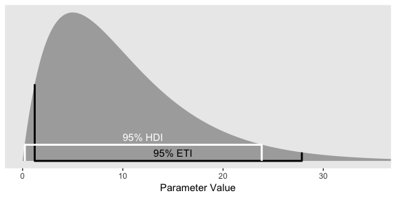

To repeat, ETIs are the only types of intervals avaliable directly by the brms package. When using the default `print()` or `summary()` output for a `brm()` model, the 95% ETIs are displayed in the 'l-95% CI' and 'u-95% CI' columns.

``` r
print(fit1)
```

    ##  Family: binomial 
    ##   Links: mu = logit 
    ## Formula: Hits | trials(AtBats) ~ 1 + (1 | PriPos) + (1 | PriPos:Player) 
    ##    Data: ba (Number of observations: 948) 
    ## Samples: 3 chains, each with iter = 2000; warmup = 500; thin = 1;
    ##          total post-warmup samples = 4500
    ## 
    ## Group-Level Effects: 
    ## ~PriPos (Number of levels: 9) 
    ##               Estimate Est.Error l-95% CI u-95% CI Eff.Sample Rhat
    ## sd(Intercept)     0.33      0.10     0.19     0.57       1894 1.00
    ## 
    ## ~PriPos:Player (Number of levels: 948) 
    ##               Estimate Est.Error l-95% CI u-95% CI Eff.Sample Rhat
    ## sd(Intercept)     0.14      0.01     0.12     0.15       1924 1.00
    ## 
    ## Population-Level Effects: 
    ##           Estimate Est.Error l-95% CI u-95% CI Eff.Sample Rhat
    ## Intercept    -1.17      0.11    -1.40    -0.95       1350 1.00
    ## 
    ## Samples were drawn using sampling(NUTS). For each parameter, Eff.Sample 
    ## is a crude measure of effective sample size, and Rhat is the potential 
    ## scale reduction factor on split chains (at convergence, Rhat = 1).

In the output of most other brms functions, the 95% ETIs appear in the `Q2.5` and `Q97.5` columns.

``` r
fitted(fit1, 
       newdata = nd,
       scale = "linear",
       nsamples = 100)
```

    ##        Estimate  Est.Error      Q2.5      Q97.5
    ## [1,] -0.9745729 0.07645557 -1.095185 -0.8427846
    ## [2,] -0.9770334 0.06732401 -1.093922 -0.8491359

But as we just did, above, you can always use the convenience functions from the tidybayes package (e.g., `mode_hdi()`) to get HDIs.

The model-comparison approach
-----------------------------

As Kruschke put it in the opening, in this section

> the focus is on deciding which of two hypothetical prior distributions is least incredible. One prior expresses the hypothesis that the parameter value is exactly the null value. The alternative prior expresses the hypothesis that the parameter could be any value, according to some form of broad distribution.

### Is a coin fair or not?

We'll use our typical steps with the grid aproximation to compute the data for the left column of Figure 12.3 (i.e., the column based on the Haldane prior).

``` r
# we need these to compute the likelihood
N <- 24
z <- 7
epsilon <- .01

trial_data <- c(rep(0, times = N - z), rep(1, times = z))

d <-
  tibble(theta = seq(from = 0, to = 1, length.out = 1000)) %>%
  # Since the prior is flat, any constant value will do
  mutate(Prior = dbeta(x = theta, shape1 = epsilon, shape2 = epsilon)) %>%
  mutate(Likelihood = Bernoulli_likelihood(theta = theta,
                                           data = trial_data)) %>%
  # we have to slice off the first and last values because they go to infinity on the prior, which creats problems when computing the normalizing_constant
  slice(2:999) %>% 
  mutate(normalizing_constant = sum(Likelihood * Prior/sum(Prior))) %>%
  mutate(Posterior = Likelihood * Prior / normalizing_constant)

head(d)
```

    ## # A tibble: 6 x 5
    ##     theta Prior Likelihood normalizing_constant Posterior
    ##     <dbl> <dbl>      <dbl>                <dbl>     <dbl>
    ## 1 0.00100 4.67    9.90e-22         0.0000000398  1.16e-13
    ## 2 0.00200 2.35    1.25e-19         0.0000000398  7.36e-12
    ## 3 0.00300 1.58    2.09e-18         0.0000000398  8.28e-11
    ## 4 0.00400 1.19    1.54e-17         0.0000000398  4.59e-10
    ## 5 0.00501 0.952   7.22e-17         0.0000000398  1.73e- 9
    ## 6 0.00601 0.796   2.54e-16         0.0000000398  5.08e- 9

Here's the left column of Figure 12.3.

``` r
plot_1 <-
  d %>% 
  ggplot(aes(x = theta)) +
  geom_ribbon(aes(ymin = 0, ymax = Prior),
              fill = "grey50") +
  scale_y_continuous(breaks = NULL) +
  labs(title = "Prior (beta)",
       x = expression(theta),
       y = expression(paste("dbeta(", theta, "|0.01, 0.01)"))) +
  theme(panel.grid = element_blank())

plot_2 <-
  d %>% 
  ggplot(aes(x = theta)) +
  geom_ribbon(aes(ymin = 0, ymax = Likelihood),
              fill = "grey50") +
  scale_y_continuous(breaks = NULL) +
  labs(title = "Likelihood (Bernoulli)",
       x = expression(theta),
       y = expression(paste("p(D|", theta, ")"))) +
  theme(panel.grid = element_blank(),
        axis.text.y = element_text())

plot_3 <-
  d %>% 
  ggplot(aes(x = theta)) +
  geom_ribbon(aes(ymin = 0, ymax = Posterior),
              fill = "grey50") +
  scale_y_continuous(breaks = NULL) +
  labs(title = "Posterior (beta)",
       x = expression(theta),
       y = expression(paste("dbeta(", theta, "|7.01, 17.01)"))) +
  theme(panel.grid = element_blank())

library(gridExtra)

grid.arrange(plot_1, plot_2, plot_3)
```

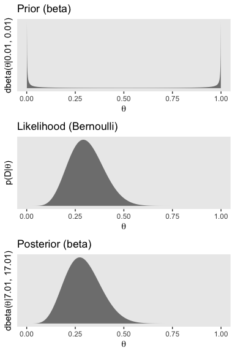

We need updated data for the right column, based on the beta(2, 4) prior.

``` r
d <-
  tibble(theta = seq(from = 0, to = 1, length.out = 1000)) %>%
  mutate(Prior = dbeta(x = theta, shape1 = 2, shape2 = 4)) %>%
  mutate(Likelihood = Bernoulli_likelihood(theta = theta,
                                           data = trial_data)) %>%
  mutate(normalizing_constant = sum(Likelihood * Prior/sum(Prior))) %>%
  mutate(Posterior = Likelihood * Prior / normalizing_constant)

head(d)
```

    ## # A tibble: 6 x 5
    ##     theta  Prior Likelihood normalizing_constant Posterior
    ##     <dbl>  <dbl>      <dbl>                <dbl>     <dbl>
    ## 1 0       0        0.                0.000000222  0.      
    ## 2 0.00100 0.0200   9.90e-22          0.000000222  8.91e-17
    ## 3 0.00200 0.0398   1.25e-19          0.000000222  2.23e-14
    ## 4 0.00300 0.0595   2.09e-18          0.000000222  5.61e-13
    ## 5 0.00400 0.0791   1.54e-17          0.000000222  5.50e-12
    ## 6 0.00501 0.0986   7.22e-17          0.000000222  3.21e-11

Now here's the right column of Figure 12.3.

``` r
plot_1 <-
  d %>% 
  ggplot(aes(x = theta)) +
  geom_ribbon(aes(ymin = 0, ymax = Prior),
              fill = "grey50") +
  scale_y_continuous(breaks = NULL) +
  labs(title = "Prior (beta)",
       x = expression(theta),
       y = expression(paste("dbeta(", theta, "|2, 4)"))) +
  theme(panel.grid = element_blank())

plot_2 <-
  d %>% 
  ggplot(aes(x = theta)) +
  geom_ribbon(aes(ymin = 0, ymax = Likelihood),
              fill = "grey50") +
  scale_y_continuous(breaks = NULL) +
  labs(title = "Likelihood (Bernoulli)",
       x = expression(theta),
       y = expression(paste("p(D|", theta, ")"))) +
  theme(panel.grid = element_blank(),
        axis.text.y = element_text())

plot_3 <-
  d %>% 
  ggplot(aes(x = theta)) +
  geom_ribbon(aes(ymin = 0, ymax = Posterior),
              fill = "grey50") +
  scale_y_continuous(breaks = NULL) +
  labs(title = "Posterior (beta)",
       x = expression(theta),
       y = expression(paste("dbeta(", theta, "|9, 21)"))) +
  theme(panel.grid = element_blank())

grid.arrange(plot_1, plot_2, plot_3)
```


Following formula 12.1.

*p*(*z*, *N*|*M*<sub>*n**u**l**l*</sub>)=*θ*<sub>*n**u**l**l*</sub><sup>*z*</sup>(1 − *θ*<sub>*n**u**l**l*</sub>)<sup>(*N* − *z*)</sup>

we can compute the probability of the data given the null hypothesis.

``` r
theta <- .5

(p_d_null <- theta ^ z * (1 - theta) ^ (N - z))
```

    ## [1] 5.960464e-08

As Kruschke reminds us equation 10.6 from page 270

$$p(z, N) = \\frac{B(z + \\alpha, N - z + \\beta)}{B(\\alpha, \\beta)}$$

we can make our own `p_d()` function to compute the probability of the data given alternative hypotheses. Here we'll simplify the function a bit to extract `z` and `N` out of the environment.

``` r
p_d <- function(a, b){ 
  beta(z + a, N - z + b) / beta(a, b) 
  }
```

Whith `p_d_null` and our `p_d()` function in hand, we can reproduce and extend Kruschke's equation 12.4.

``` r
tibble(shape1 = c(2, 1, .1, .01, .001, .0001, .00001),
       shape2 = c(4, 1, .1, .01, .001, .0001, .00001)) %>% 
  mutate(p_d = map2(shape1, shape2, p_d)) %>% 
  unnest() %>% 
  mutate(p_d_null = p_d_null) %>% 
  mutate(bf = p_d/p_d_null)
```

    ## # A tibble: 7 x 5
    ##    shape1  shape2      p_d     p_d_null        bf
    ##     <dbl>   <dbl>    <dbl>        <dbl>     <dbl>
    ## 1 2       4       2.22e- 7 0.0000000596 3.72     
    ## 2 1       1       1.16e- 7 0.0000000596 1.94     
    ## 3 0.1     0.1     2.51e- 8 0.0000000596 0.421    
    ## 4 0.01    0.01    2.87e- 9 0.0000000596 0.0481   
    ## 5 0.001   0.001   2.91e-10 0.0000000596 0.00488  
    ## 6 0.0001  0.0001  2.91e-11 0.0000000596 0.000489 
    ## 7 0.00001 0.00001 2.91e-12 0.0000000596 0.0000489

However, as Kruschke comments on page 347, "If we consider the posterior distribution instead of the Bayes’ factor, we see that the posterior distribution on *θ* within the alternative model is only slightly affected by the prior." Indeed.

### Bayes’ factor can accept null with poor precision.

Here are the steps to make the left column of Figure 12.4 (i.e., the column based on very weak data and the Haldane prior).

``` r
# we need these to compute the likelihood
N <- 2
z <- 1
epsilon <- .01

trial_data <- c(rep(0, times = N - z), rep(1, times = z))

d <-
  tibble(theta = seq(from = 0, to = 1, length.out = 1000)) %>%
  # Since the prior is flat, any constant value will do
  mutate(Prior = dbeta(x = theta, shape1 = epsilon, shape2 = epsilon)) %>%
  mutate(Likelihood = Bernoulli_likelihood(theta = theta,
                                           data = trial_data)) %>%
  # we have to slice off the first and last values because they go to infinity on the prior, which creats problems when computing the normalizing_constant
  slice(2:999) %>% 
  mutate(normalizing_constant = sum(Likelihood * Prior/sum(Prior))) %>%
  mutate(Posterior = Likelihood * Prior / normalizing_constant)

plot_1 <-
  d %>% 
  ggplot(aes(x = theta)) +
  geom_ribbon(aes(ymin = 0, ymax = Prior),
              fill = "grey50") +
  scale_y_continuous(breaks = NULL) +
  labs(title = "Prior (beta)",
       x = expression(theta),
       y = expression(paste("dbeta(", theta, "|0.01, 0.01)"))) +
  theme(panel.grid = element_blank())

plot_2 <-
  d %>% 
  ggplot(aes(x = theta)) +
  geom_ribbon(aes(ymin = 0, ymax = Likelihood),
              fill = "grey50") +
  scale_y_continuous(breaks = NULL) +
  labs(title = "Likelihood (Bernoulli)",
       x = expression(theta),
       y = expression(paste("p(D|", theta, ")"))) +
  theme(panel.grid = element_blank(),
        axis.text.y = element_text())

plot_3 <-
  d %>% 
  ggplot(aes(x = theta)) +
  geom_ribbon(aes(ymin = 0, ymax = Posterior),
              fill = "grey50") +
  scale_y_continuous(breaks = NULL) +
  labs(title = "Posterior (beta)",
       x = expression(theta),
       y = expression(paste("dbeta(", theta, "|7.01, 17.01)"))) +
  theme(panel.grid = element_blank())

grid.arrange(plot_1, plot_2, plot_3)
```


How do we compute the BF?

``` r
theta   <- .5
epsilon <- .01
a <- epsilon
b <- epsilon

# pD_{null}                            pD_{alternative}
(theta ^ z * (1 - theta) ^ (N - z)) / (beta(z + a, N - z + b) / beta(a, b))
```

    ## [1] 51

And here are the steps to make the right column of Figure 12.4 (i.e., based on stronger data and a flat beta(1, 1) prior).

``` r
# we need these to compute the likelihood
N <- 14
z <- 7

trial_data <- c(rep(0, times = N - z), rep(1, times = z))

d <-
  tibble(theta = seq(from = 0, to = 1, length.out = 1000)) %>%
  mutate(Prior = dbeta(x = theta, shape1 = 1, shape2 = 1)) %>%
  mutate(Likelihood = Bernoulli_likelihood(theta = theta,
                                           data = trial_data)) %>%
  mutate(normalizing_constant = sum(Likelihood * Prior/sum(Prior))) %>%
  mutate(Posterior = Likelihood * Prior / normalizing_constant)

plot_1 <-
  d %>% 
  ggplot(aes(x = theta)) +
  geom_ribbon(aes(ymin = 0, ymax = Prior),
              fill = "grey50") +
  scale_y_continuous(breaks = NULL) +
  labs(title = "Prior (beta)",
       x = expression(theta),
       y = expression(paste("dbeta(", theta, "|1, 1)"))) +
  theme(panel.grid = element_blank())

plot_2 <-
  d %>% 
  ggplot(aes(x = theta)) +
  geom_ribbon(aes(ymin = 0, ymax = Likelihood),
              fill = "grey50") +
  scale_y_continuous(breaks = NULL) +
  labs(title = "Likelihood (Bernoulli)",
       x = expression(theta),
       y = expression(paste("p(D|", theta, ")"))) +
  theme(panel.grid = element_blank(),
        axis.text.y = element_text())

plot_3 <-
  d %>% 
  ggplot(aes(x = theta)) +
  geom_ribbon(aes(ymin = 0, ymax = Posterior),
              fill = "grey50") +
  scale_y_continuous(breaks = NULL) +
  labs(title = "Posterior (beta)",
       x = expression(theta),
       y = expression(paste("dbeta(", theta, "|8, 8)"))) +
  theme(panel.grid = element_blank())

grid.arrange(plot_1, plot_2, plot_3)
```


How do we compute this BF?

``` r
theta <- .5
a <- 1
b <- 1

# pD_{null}                            pD_{alternative}
(theta ^ z * (1 - theta) ^ (N - z)) / (beta(z + a, N - z + b) / beta(a, b))
```

    ## [1] 3.14209

### Are different groups equal or not?

If you look in Kruschke's "OneOddGroupModelComp2E.R" file, you can get his simulation code. Here we've dramatically simplified it. This attempt does not exactly reproduce what his script did, but it gets it in spirit.

``` r
# For each subject, specify the condition s/he was in,
# the number of trials s/he experienced, and the number correct.
n_g <- 20  # number of subjects per group
n_t <- 20  # number of trials per subject

set.seed(47405)
d <-
  tibble(condition = rep(c("Das Kruschke", "Mozart", "Bach", "Beethoven"), each = 20),
         id = 1:80,
         n_g = n_g,
         n_t = n_t,
         group_means =  rep(c(.40, .50, .51, .52), each = 20)) %>% 
  mutate(n_recalled = rbinom(n_g, n_t, group_means))

d %>% 
  group_by(group_means) %>% 
  summarise(m = mean(n_recalled))
```

    ## # A tibble: 4 x 2
    ##   group_means     m
    ##         <dbl> <dbl>
    ## 1        0.4   7.9 
    ## 2        0.5   9.85
    ## 3        0.51  9.75
    ## 4        0.52 11

Recall that although brms does accommodate models based on the Bernoulli likelihood, it doesn’t do so when the data are aggregated. With our aggregate Bernoulli data, we’ll have to use the conventional binomial likelihood, instead. Our model will be

n\_recalled<sub>*i**j*</sub> *B**i**n**o**m**i**a**l*(20, *θ*<sub>*j*</sub>)

where

*l**o**g**i**t*(*θ*<sub>*i**j*</sub>)=*β*<sub>0<sub>*j*</sub></sub>

In our equation, *β*<sub>0<sub>*j*</sub></sub> is the group-specific intercept within the logistic regression model. We'll use the *N*(0, 1.5) prior for the intercept. Though it appears strongly regularizing in the log-odds space, it’s quite flat on the *θ* space. If we wanted to be more conservative in the *θ* space, we might use something more like *N*(0, 1).

``` r
fit2 <-
  brm(data = d, 
      family = binomial,
      n_recalled | trials(20) ~ 0 + condition,
      prior = c(set_prior("normal(0, 1.5)", class = "b")),
      iter = 2500, warmup = 500, cores = 4, chains = 4,
      control = list(adapt_delta = .8))
```

Here's the model summary.

``` r
print(fit2)
```

    ##  Family: binomial 
    ##   Links: mu = logit 
    ## Formula: n_recalled | trials(20) ~ 0 + condition 
    ##    Data: d (Number of observations: 80) 
    ## Samples: 4 chains, each with iter = 2500; warmup = 500; thin = 1;
    ##          total post-warmup samples = 8000
    ## 
    ## Population-Level Effects: 
    ##                      Estimate Est.Error l-95% CI u-95% CI Eff.Sample Rhat
    ## conditionBach           -0.05      0.10    -0.24     0.15       8000 1.00
    ## conditionBeethoven       0.20      0.10     0.01     0.40       8000 1.00
    ## conditionDasKruschke    -0.42      0.10    -0.63    -0.23       8000 1.00
    ## conditionMozart         -0.03      0.10    -0.22     0.16       8000 1.00
    ## 
    ## Samples were drawn using sampling(NUTS). For each parameter, Eff.Sample 
    ## is a crude measure of effective sample size, and Rhat is the potential 
    ## scale reduction factor on split chains (at convergence, Rhat = 1).

Do keep in mind that our results will differ from Kruschke’s because of two factors. First, we simulated slightly different data. In the limit, I suspect our data simulation approaches would have converged. But we’re far from the limit. Second, we used a different likelihood to model the data, which resulted in slightly different priors. But even with those substantial limitations, our results are pretty close.

To make the top portion of Figure 12.5, we'll need to extract the `condition`-specific parameters. For that, we'll employ `fixef()` and then wrangle a bit.

``` r
post <-
  fixef(fit2, summary = F) %>% 
  as_tibble() %>% 
  transmute(theta_1 = conditionDasKruschke %>% inv_logit_scaled(), 
            theta_2 = conditionMozart %>% inv_logit_scaled(), 
            theta_3 = conditionBach %>% inv_logit_scaled(), 
            theta_4 = conditionBeethoven %>% inv_logit_scaled()) %>% 
  transmute(`theta_1 - theta_2` = theta_1 - theta_2,
            `theta_1 - theta_3` = theta_1 - theta_3,
            `theta_1 - theta_4` = theta_1 - theta_4,
            `theta_2 - theta_3` = theta_2 - theta_3,
            `theta_2 - theta_4` = theta_2 - theta_4,
            `theta_3 - theta_4` = theta_3 - theta_4)

head(post)
```

    ## # A tibble: 6 x 6
    ##   `theta_1 - theta_… `theta_1 - theta… `theta_1 - theta… `theta_2 - theta…
    ##                <dbl>             <dbl>             <dbl>             <dbl>
    ## 1            -0.104            -0.0968            -0.160           0.00700
    ## 2            -0.124            -0.105             -0.173           0.0195 
    ## 3            -0.0716           -0.0784            -0.140          -0.00685
    ## 4            -0.103            -0.0947            -0.152           0.00792
    ## 5            -0.103            -0.137             -0.158          -0.0340 
    ## 6            -0.105            -0.0592            -0.166           0.0455 
    ## # ... with 2 more variables: `theta_2 - theta_4` <dbl>, `theta_3 -
    ## #   theta_4` <dbl>

Now we have the wrangled data, we're ready to `gather()` them and plot the top of Figure 12.5.

``` r
post %>% 
  gather() %>% 
  
  ggplot(aes(x = value)) +
  geom_vline(xintercept = 0, color = "white") +
  geom_histogram(color = "grey92", fill = "grey67",
                 binwidth = .01, size = .2) +
  stat_pointintervalh(aes(y = 0),
                      point_interval = mode_hdi, .width = .95) +
  scale_y_continuous(NULL, breaks = NULL) +
  coord_cartesian(xlim = c(-.25, .25)) +
  theme(panel.grid = element_blank()) +
  facet_wrap(~key)
```

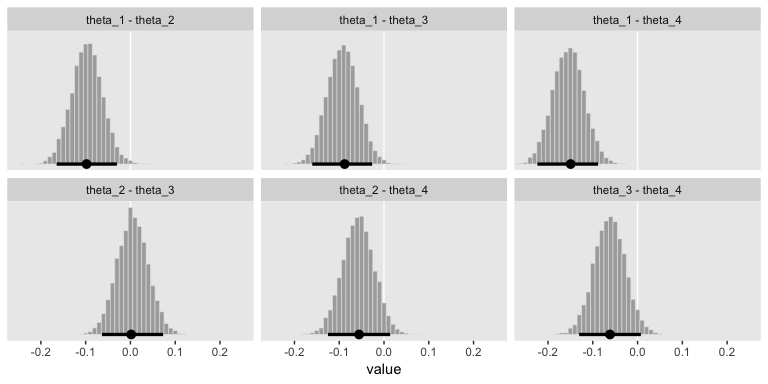

Here's how you'd get the eact mode and HDI summaries.

``` r
post %>% 
  gather() %>% 
  group_by(key) %>% 
  mode_hdi(value) %>% 
  mutate_if(is.double, round, digits = 3)
```

    ## # A tibble: 6 x 7
    ##   key                value .lower .upper .width .point .interval
    ##   <chr>              <dbl>  <dbl>  <dbl>  <dbl> <chr>  <chr>    
    ## 1 theta_1 - theta_2 -0.098 -0.165 -0.03    0.95 mode   hdi      
    ## 2 theta_1 - theta_3 -0.088 -0.16  -0.026   0.95 mode   hdi      
    ## 3 theta_1 - theta_4 -0.149 -0.224 -0.088   0.95 mode   hdi      
    ## 4 theta_2 - theta_3  0.002 -0.064  0.073   0.95 mode   hdi      
    ## 5 theta_2 - theta_4 -0.056 -0.125  0.014   0.95 mode   hdi      
    ## 6 theta_3 - theta_4 -0.062 -0.13   0.007   0.95 mode   hdi

The lower portion of Figure 12.5 is a mystery, to me. Here's a trace plot instead.

``` r
plot(fit2)
```

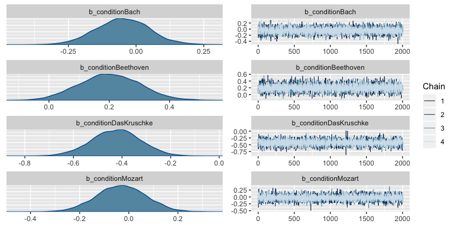

Kruschke compared the 4-intercepts model, `fit2`, with an intercept-only model. We'll call that `fit3`.

``` r
fit3 <-
  brm(data = d, 
      family = binomial,
      n_recalled | trials(20) ~ 1,
      prior = c(set_prior("normal(0, 1.5)", class = "Intercept")),
      iter = 2500, warmup = 500, cores = 4, chains = 4,
      control = list(adapt_delta = .8))
```

In addition to Bayes factors and such, we can compare the models with information criteria. If we just put both models into the `loo()` or `waic()` functions, we can side step the need to save their outputs as objects which we then put into `compare_ic()`.

``` r
loo(fit2, fit3)
```

    ##              LOOIC    SE
    ## fit2        339.67  9.53
    ## fit3        354.43 11.28
    ## fit2 - fit3 -14.76  6.88

``` r
waic(fit2, fit3)
```

    ##               WAIC    SE
    ## fit2        339.65  9.53
    ## fit3        354.43 11.28
    ## fit2 - fit3 -14.78  6.88

The comparisons for both information criteria suggests `fit2`, the one with the `condition`-specific intercepts, is an improvement over the simple one-intercept-only model. Another way to compare the information criteria is with AIC-type weighting. The brms package offers a variety of weighting methods via the `model_weights()` function. Here we'll use `weights = "loo"`.

``` r
model_weights(fit2, fit3, weights = "loo")
```

    ##         fit2         fit3 
    ## 0.9993767828 0.0006232172

Within a given comparison, the weights sum to 1. The better-fitting model will be closer to 1 than the other(s). In this case, both the LOO and WAIC comparisons suggest `fit2` is a better summary of the data than `fit3`.

### 12.2.2.1. Model specification in JAGS.

None for us.

References
----------

Kruschke, J. K. (2015). *Doing Bayesian data analysis, Second Edition: A tutorial with R, JAGS, and Stan.* Burlington, MA: Academic Press/Elsevier.

Session info
------------

``` r
sessionInfo()
```

    ## R version 3.5.1 (2018-07-02)
    ## Platform: x86_64-apple-darwin15.6.0 (64-bit)
    ## Running under: macOS High Sierra 10.13.4
    ## 
    ## Matrix products: default
    ## BLAS: /Library/Frameworks/R.framework/Versions/3.5/Resources/lib/libRblas.0.dylib
    ## LAPACK: /Library/Frameworks/R.framework/Versions/3.5/Resources/lib/libRlapack.dylib
    ## 
    ## locale:
    ## [1] en_US.UTF-8/en_US.UTF-8/en_US.UTF-8/C/en_US.UTF-8/en_US.UTF-8
    ## 
    ## attached base packages:
    ## [1] stats     graphics  grDevices utils     datasets  methods   base     
    ## 
    ## other attached packages:
    ##  [1] gridExtra_2.3   tidybayes_1.0.1 brms_2.4.0      Rcpp_0.12.18   
    ##  [5] bindrcpp_0.2.2  forcats_0.3.0   stringr_1.3.1   dplyr_0.7.6    
    ##  [9] purrr_0.2.5     readr_1.1.1     tidyr_0.8.1     tibble_1.4.2   
    ## [13] ggplot2_3.0.0   tidyverse_1.2.1
    ## 
    ## loaded via a namespace (and not attached):
    ##  [1] nlme_3.1-137              matrixStats_0.54.0       
    ##  [3] xts_0.10-2                lubridate_1.7.4          
    ##  [5] threejs_0.3.1             httr_1.3.1               
    ##  [7] LaplacesDemon_16.1.1      rprojroot_1.3-2          
    ##  [9] rstan_2.17.3              tools_3.5.1              
    ## [11] backports_1.1.2           utf8_1.1.4               
    ## [13] R6_2.2.2                  DT_0.4                   
    ## [15] lazyeval_0.2.1            colorspace_1.3-2         
    ## [17] withr_2.1.2               tidyselect_0.2.4         
    ## [19] mnormt_1.5-5              Brobdingnag_1.2-5        
    ## [21] compiler_3.5.1            cli_1.0.0                
    ## [23] rvest_0.3.2               HDInterval_0.2.0         
    ## [25] arrayhelpers_1.0-20160527 shinyjs_1.0              
    ## [27] xml2_1.2.0                labeling_0.3             
    ## [29] colourpicker_1.0          scales_0.5.0             
    ## [31] dygraphs_1.1.1.5          mvtnorm_1.0-8            
    ## [33] psych_1.8.4               ggridges_0.5.0           
    ## [35] digest_0.6.15             StanHeaders_2.17.2       
    ## [37] foreign_0.8-70            rmarkdown_1.10           
    ## [39] base64enc_0.1-3           pkgconfig_2.0.1          
    ## [41] htmltools_0.3.6           htmlwidgets_1.2          
    ## [43] rlang_0.2.1               readxl_1.1.0             
    ## [45] rstudioapi_0.7            shiny_1.1.0              
    ## [47] svUnit_0.7-12             bindr_0.1.1              
    ## [49] zoo_1.8-2                 jsonlite_1.5             
    ## [51] crosstalk_1.0.0           gtools_3.8.1             
    ## [53] inline_0.3.15             magrittr_1.5             
    ## [55] loo_2.0.0                 bayesplot_1.6.0          
    ## [57] Matrix_1.2-14             munsell_0.5.0            
    ## [59] abind_1.4-5               stringi_1.2.3            
    ## [61] yaml_2.1.19               MASS_7.3-50              
    ## [63] ggstance_0.3              plyr_1.8.4               
    ## [65] grid_3.5.1                parallel_3.5.1           
    ## [67] promises_1.0.1            crayon_1.3.4             
    ## [69] miniUI_0.1.1.1            lattice_0.20-35          
    ## [71] haven_1.1.2               hms_0.4.2                
    ## [73] knitr_1.20                pillar_1.2.3             
    ## [75] igraph_1.2.1              markdown_0.8             
    ## [77] shinystan_2.5.0           reshape2_1.4.3           
    ## [79] stats4_3.5.1              rstantools_1.5.0         
    ## [81] glue_1.2.0                evaluate_0.10.1          
    ## [83] modelr_0.1.2              httpuv_1.4.4.2           
    ## [85] cellranger_1.1.0          gtable_0.2.0             
    ## [87] assertthat_0.2.0          mime_0.5                 
    ## [89] xtable_1.8-2              broom_0.4.5              
    ## [91] coda_0.19-1               later_0.7.3              
    ## [93] rsconnect_0.8.8           shinythemes_1.1.1        
    ## [95] bridgesampling_0.4-0
