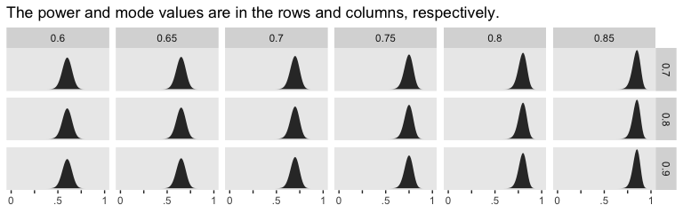

Chapter 13. Goals, Power, and Sample Size
================
A Solomon Kurz
2018-10-06

Goals, Power, and Sample Size
=============================

> Researchers collect data in order to achieve a goal. Sometimes the goal is to show that a suspected underlying state of the world is credible; other times the goal is to achieve a minimal degree of precision on whatever trends are observed. Whatever the goal, it can only be probabilistically achieved, as opposed to definitely achieved, because data are replete with random noise that can obscure the underlying state of the world. Statistical power is the probability of achieving the goal of a planned empirical study, if a suspected underlying state of the world is true. (p. 359)

13.1. The will to power
-----------------------

"In this section, \[Kruschke laid out a\] framework for research and data analysis \[that led\] to a more precise definition of power and how to compute it" (p. 360).

### 13.1.1 Goals and obstacles.

The three research goals Kruschke dealt with in this chapter were:

-   to reject a null value for a parameter
-   to confirm the legitimacy of a particular parameter value
-   to estimate a parameter with reasonable precision

All these could, of course, be extended to contexts involving multiple parameters. And all of these were dealt with with respect to 95% HDIs.

### 13.1.2 Power

> Because of random noise, the goal of a study can be achieved only probabilistically. The probability of achieving the goal, given the hypothetical state of the world and the sampling plan, is called the *power* of the planned research. In traditional null hypothesis significance testing (NHST), power has only one goal (rejecting the null hypothesis), and there is one conventional sampling plan (stop at predetermined sample size) and the hypothesis is only a single specific value of the parameter. In traditional statistics, that is *the* definition of power. That definition is generalized in this book to include other goals, other sampling plans, and hypotheses that involve an entire distribution on parameters. (p. 360, *emphasis* in the original)

Three primary methods to increase power are:

-   reducing measurement error
-   increasing the effect size
-   increasing the sample size

Kruschke then laid out a five-step procedure to compute power within a Bayesian workflow.

1.  Use theory/prior information to specify hypothetical distributions for all parameter values in the model.
2.  Use those distributions to generate synthetic data according to the planned sampling method.
3.  Fit the proposed model—including the relevant priors--with the synthetic data.
4.  Use the posterior to determine whether we attained the research goal.
5.  Repeat the procedure many times (i.e., using different `set.seed()` values) to get a distribution of results.

### 13.1.3 Sample size.

> *The best that a large sample can do is exactly reflect the data- generating distribution.* If the data-generating distribution has considerable mass straddling the null value, then the best we can do is get estimates that include and straddle the null value. As a simple example, suppose that we think that a coin may be biased, and the data-generating hypothesis entertains four possible values of *θ* , with p(*θ* = 0.5)=25%, p(*θ* = 0.6)=25%, p(*θ* = 0.7)=25%, and p(*θ* = 0.8)=25%. Because 25% of the simulated data come from a fair coin, the maximum probability of excluding *θ* = 0.5, even with a huge sample, is 75%.

> Therefore, when planning the sample size for an experiment, it is crucial to decide what a realistic goal is. If there are good reasons to posit a highly certain data-generating hypothesis, perhaps because of extensive previous results, then a viable goal may be to exclude a null value. On the other hand, if the data-generating hypothesis is somewhat vague, then a more reasonable goal is to attain a desired degree of precision in the posterior. (p. 364, *emphasis* in the original)

### 13.1.4 Other expressions of goals.

I'm going to skip over these.

> In the remainder of the chapter, it will be assumed that the goal of the research is estimation of the parameter values, starting with a viable prior. The resulting posterior distribution is then used to assess whether the goal was achieved. (p. 366)

13.2. Computing power and sample size
-------------------------------------

> As our first worked-out example, consider the simplest case: Data from a single coin. Perhaps we are polling a population and we want to precisely estimate the preferences for candidates A or B. Perhaps we want to know if a drug has more than a 50% cure rate. (p. 366)

### 13.2.1 When the goal is to exclude a null value.

> Usually it is more intuitively accessible to get prior data, or to think of idealized prior data, than to directly specify a distribution over parameter values. For example, based on knowledge about the application domain, we might have 2000 actual or idealized flips of the coin for which the result showed 65% heads. Therefore we’ll describe the data-generating hypothesis as a beta distribution with a mode of 0.65 and concentration based on 2000 flips after a uniform "proto-prior": beta(*θ*|0.65 ⋅ (2000 − 2)+1, (1 − 0.65)⋅(2000 − 2)+1).

We might express that in code as follows:

``` r
library(tidyverse)

concentration <- 2000
mode          <- .65

tibble(theta = seq(from = 0, to = 1, by = .001)) %>% 
  mutate(likelihood = dbeta(theta, 
                            shape1 = mode * (concentration - 2) + 1,
                            shape2 = (1 - mode) * (concentration - 2) + 1)) %>% 
  
  ggplot(aes(x = theta, ymin = 0, ymax = likelihood)) +
  geom_ribbon() +
  scale_y_continuous(NULL, breaks = NULL) +
  labs(title = "Behold our prior. It's rather peaked.",
       x = NULL) +
  theme(panel.grid = element_blank())
```


``` r
set.seed(13.21)

bias <-
  rbeta(n = 1, 
        shape1 = mode * (concentration - 2) + 1,
        shape2 = (1 - mode) * (concentration - 2) + 1)

bias
```

    ## [1] 0.6430548

``` r
# pick some large number
n <- 1e3

tibble(flips = rbinom(n = n, size = 1, prob = bias)) %>% 
  summarise(N = n(),
            z = sum(flips)) %>% 
  mutate(`proportion of heads` = z / N)
```

    ## # A tibble: 1 x 3
    ##       N     z `proportion of heads`
    ##   <int> <int>                 <dbl>
    ## 1  1000   643                 0.643

### 13.2.2 Formal solution and implementation in R.

I've been playing around with this a bit. If you look closely at the code block on page 369, you'll see that Kruschke's `minNforHDIpower()` function requires the `HDIofICDF()` function from his `DBDA2E-utilities.R` file. The code for that required function looks like this.

``` r
hdi_of_icdf <- function(ICDFname, credible_mass = .95, tol = 1e-8, ... ) {
  # Arguments:
  #   `ICDFname()` is R's name for the inverse cumulative density function
  #     of the distribution.
  #   `credible_mass` is the desired mass of the HDI region.
  #   `tol` is the "the desired accuracy" passed to R's optimize function
  #     (see https://stat.ethz.ch/R-manual/R-devel/library/stats/html/optimize.html).
  # Return value:
  #   Highest density iterval (HDI) limits in a vector.
  # Example of use: For determining HDI of a beta(30, 12) distribution, type
  #   `hdi_of_icdf(qbeta, shape1 = 30, shape2 = 12)`
  #   Notice that the parameters of the ICDFname must be explicitly named;
  #   e.g., `hdi_of_icdf(qbeta, 30, 12)` does not work.
  # Adapted and corrected from Greg Snow's TeachingDemos package.
  incredible_mass <-  1.0 - credible_mass
  interval_width  <- function(low_tail_prob, ICDFname, credible_mass, ...) {
    ICDFname(credible_mass + low_tail_prob, ...) - ICDFname(low_tail_prob, ...)
  }
  opt_info            <- optimize(interval_width, c(0, incredible_mass), 
                                  ICDFname = ICDFname, credible_mass = credible_mass, 
                                  tol = tol, ...)
  hdi_lower_tail_prob <- opt_info$minimum
  return(c(ICDFname(hdi_lower_tail_prob, ...),
           ICDFname(credible_mass + hdi_lower_tail_prob, ...)))
}
```

I've altered Kruschke's formatting a little bit, but the guts of the code are unchanged. Our `hdi_of_icdf()` function will take the name of an "inverse cumulative density function" and it's parameters and then return an HDI range. To get a sense, consider a Gaussian for which *μ* = 0 and *σ* = 1.

``` r
hdi_of_icdf(ICDFname      = qnorm,
            mean          = 0,
            sd            = 1,
            credible_mass = .95)
```

    ## [1] -1.959964  1.959964

And now consider one based on the IQ distribution.

``` r
hdi_of_icdf(ICDFname      = qnorm,
            mean          = 100,
            sd            = 15,
            credible_mass = .95)
```

    ## [1]  70.60054 129.39946

If we were to randomly generate data based on those parameters and compute their HDI with `tidybayes::hdi()`, we'd get those values within rounding error. E.g.,

``` r
set.seed(13.22)
iq <- rnorm(1e6, mean = 100, sd = 15)

tidybayes::hdi(iq, .width = .95)
```

    ##          [,1]     [,2]
    ## [1,] 70.64189 129.4706

And just as in Kruschke's code in the text, `hdi_of_icdf()` works with `ICDFname = qbeta`, too. So, consider a beta distribution for which *ω* = .5 and *κ* = 2000.

``` r
mode          <- .5
concentration <- 2000

hdi_of_icdf(ICDFname      = qbeta,
            shape1 = mode * (concentration - 2) + 1,
            shape2 = (1 - mode) * (concentration - 2) + 1,
            credible_mass = .95)
```

    ## [1] 0.4780947 0.5219053

Those look a whole lot like the ROPE values Kruschke specified in his example at the bottom of page 370. But we're getting ahead of ourselves. Now that we have our `hdi_of_icdf()` function, we’re ready to define our version of `minNforHDIpower()`, which I’m calling `min_n_for_hdi_power()`.

``` r
min_n_for_hdi_power <- 
  function(gen_prior_mode, gen_prior_n,
           hdi_max_width = NULL, null_value = NULL,
           rope = c(max(0, null_value - 0.02), min(1, null_value + 0.02)),
           desired_power = 0.8, aud_prior_mode = 0.5, aud_prior_n = 2,
           hdi_mass = 0.95, init_samp_size = 20, verbose = TRUE) {
  # Check for argument consistency:
  if (!xor(is.null(hdi_max_width), is.null(null_value))) {
    stop("One and only one of `hdi_max_width` and `null_value` must be specified.")
  }
  # Convert prior mode and N to a, b parameters of beta distribution:
  gen_prior_a <- gen_prior_mode * (gen_prior_n - 2) + 1
  gen_prior_b <- (1.0 - gen_prior_mode) * (gen_prior_n - 2) + 1
  aud_prior_a <- aud_prior_mode * (aud_prior_n - 2) + 1
  aud_prior_b <- (1.0 - aud_prior_mode) * (aud_prior_n - 2) + 1
  # Initialize loop for incrementing `sample_size`:
  sample_size <- init_samp_size
  not_powerful_enough = TRUE
  # Increment `sample_size` until desired power is achieved:
  while(not_powerful_enough) {
    z_vec <- 0:sample_size # vector of all possible z values for N flips.
    # Compute probability of each z value for data-generating prior:
    p_z_vec <- exp(lchoose(sample_size, z_vec)
                 + lbeta(z_vec + gen_prior_a, sample_size - z_vec + gen_prior_b)
                 - lbeta(gen_prior_a, gen_prior_b))
    # For each z value, compute posterior HDI:
    # `hdi_matrix` will hold HDI limits for each z:
    hdi_matrix <- matrix(0, nrow = length(z_vec), ncol = 2)
    for (z_id_x in 1:length(z_vec)) {
      z <- z_vec[z_id_x]
      hdi_matrix[z_id_x, ] <- hdi_of_icdf(qbeta,
                                          shape1 = z + aud_prior_a,
                                          shape2 = sample_size - z + aud_prior_b,
                                          credible_mass = hdi_mass)
}
# Compute HDI widths:
hdi_width <- hdi_matrix[, 2] - hdi_matrix[, 1]
# Sum the probabilities of outcomes with satisfactory HDI widths:
if (!is.null(hdi_max_width)) {
  power_hdi <- sum(p_z_vec[hdi_width < hdi_max_width])
}
# Sum the probabilities of outcomes with HDI excluding `rope`:
if (!is.null(null_value)) {
  power_hdi <- sum(p_z_vec[hdi_matrix[, 1] > rope[2] | hdi_matrix[, 2] < rope[1]])
}
if (verbose) {
  cat(" For sample size = ", sample_size, ", power = ", power_hdi,
       "\n", sep = ""); flush.console() 
  }
if (power_hdi > desired_power) {  # If desired power is attained,
  not_powerful_enough = FALSE
} else {
  sample_size <- sample_size + 1
# set flag to stop,
# otherwise
# increment the sample size.
    }
  } # End while( not_powerful_enough ).
  # Return the sample size that achieved the desired power:
  return(sample_size)
}
```

Other than altering Kruschke's formatting a little bit, the only meaningful change I made to the code was removing the line that checked for the `HDIofICD()` function and then `source()`ed it, if necessary. Following along with Kruschke, here's an example.

``` r
min_n_for_hdi_power(gen_prior_mode = .75, 
                    gen_prior_n    = 2000,
                    hdi_max_width  = NULL, 
                    null_value     = .5, 
                    rope           = c(.48, .52),
                    desired_power  = .8,
                    aud_prior_mode = .5, 
                    aud_prior_n    = 2,
                    hdi_mass       = .95, 
                    init_samp_size = 20, 
                    verbose        = TRUE)
```

    ##  For sample size = 20, power = 0.6159196
    ##  For sample size = 21, power = 0.5655352
    ##  For sample size = 22, power = 0.6976802
    ##  For sample size = 23, power = 0.6521637
    ##  For sample size = 24, power = 0.606033
    ##  For sample size = 25, power = 0.7245362
    ##  For sample size = 26, power = 0.6832871
    ##  For sample size = 27, power = 0.7836981
    ##  For sample size = 28, power = 0.7479021
    ##  For sample size = 29, power = 0.7103786
    ##  For sample size = 30, power = 0.8009259

    ## [1] 30

Unlike in the text, I increased the value of `init_samp_size` from 5 to 20 to keep the output a reasonable length. To clarify what we just did,

> In that function call, the data-generating distribution has a mode of 0.75 and concentration of 2000, which means that the hypothesized world is pretty certain that coins have a bias of 0.75. The goal is to exclude a null value of 0.5 with a ROPE from 0.48 to 0.52. The desired power \[is\] 80%. The audience prior is uniform. When the function is executed, it displays the power for increasing values of sample size, until stopping at *N* = 30. (p. 370)

If it's unclear why the "audience prior is uniform", consider this.

``` r
concentration <- 2
mode          <- .5

tibble(theta = seq(from = 0, to = 1, by = .1)) %>% 
  mutate(likelihood = dbeta(theta, 
                            shape1 = mode * (concentration - 2) + 1,
                            shape2 = (1 - mode) * (concentration - 2) + 1)) %>% 
  
  ggplot(aes(x = theta, ymin = 0, ymax = likelihood)) +
  geom_ribbon() +
  scale_y_continuous(NULL, breaks = NULL) +
  coord_cartesian(ylim = c(0, 1.25)) +
  labs(title = "Behold the uniform audience prior.",
       x = NULL) +
  theme(panel.grid = element_blank())
```


If you work out the algebra with `mode` and `concentration`, you’ll see this is a beta(1, 1). Thus, `aud_prior_n` is *κ*.

Here we'll wrap our `min_n_for_hdi_power()` function into a simple `sim_power()` function for use with `purrr::map2()`.

``` r
sim_power <- function(mode, power) {
  min_n_for_hdi_power(gen_prior_mode = mode, 
                      gen_prior_n    = 2000,
                      hdi_max_width  = NULL, 
                      null_value     = .5, 
                      rope           = c(.48, .52),
                      desired_power  = power,
                      aud_prior_mode = .5, 
                      aud_prior_n    = 2,
                      hdi_mass       = .95, 
                      init_samp_size = 1, 
                      verbose        = TRUE)
}
```

Here we use the two functions to compute the values in Table 13.1 on page 367.

``` r
sim <-
  tibble(mode = seq(from = .6, to = .85, by = .05)) %>% 
  expand(mode, power = c(.7, .8, .9)) %>% 
  mutate(results = purrr::map2(mode, power, sim_power)) %>% 
  unnest()
```

The results look like this.

``` r
sim
```

    ## # A tibble: 18 x 3
    ##     mode power results
    ##    <dbl> <dbl>   <dbl>
    ##  1  0.6    0.7     238
    ##  2  0.6    0.8     309
    ##  3  0.6    0.9     430
    ##  4  0.65   0.7      83
    ##  5  0.65   0.8     109
    ##  6  0.65   0.9     150
    ##  7  0.7    0.7      40
    ##  8  0.7    0.8      52
    ##  9  0.7    0.9      74
    ## 10  0.75   0.7      25
    ## 11  0.75   0.8      30
    ## 12  0.75   0.9      43
    ## 13  0.8    0.7      16
    ## 14  0.8    0.8      19
    ## 15  0.8    0.9      27
    ## 16  0.85   0.7       7
    ## 17  0.85   0.8      14
    ## 18  0.85   0.9      16

It takes just a tiny bit of wrangling to reproduce Table 13.1.

``` r
sim %>%
  spread(key = mode, value = results) %>%
  knitr::kable()
```

|  power|  0.6|  0.65|  0.7|  0.75|  0.8|  0.85|
|------:|----:|-----:|----:|-----:|----:|-----:|
|    0.7|  238|    83|   40|    25|   16|     7|
|    0.8|  309|   109|   52|    30|   19|    14|
|    0.9|  430|   150|   74|    43|   27|    16|

### 13.2.3 When the goal is precision.

The beta(7, 5) distribution looks like this.

``` r
tibble(theta = seq(from = 0, to = 1, by = .01)) %>% 
  mutate(likelihood = dbeta(theta, 
                            shape1 = 7,
                            shape2 = 5)) %>% 
  
  ggplot(aes(x = theta, ymin = 0, ymax = likelihood)) +
  geom_ribbon() +
  scale_y_continuous(NULL, breaks = NULL) +
  labs(title = "beta (7, 5)",
       x = NULL) +
  theme(panel.grid = element_blank())
```


And we calculate the 95% HDI like so.

``` r
hdi_of_icdf(ICDFname      = qbeta,
            shape1        = 7,
            shape2        = 5,
            credible_mass = .95)
```

    ## [1] 0.3182322 0.8414276

"It turns out, in this case, that we can never have a sample size large enough to achieve the goal of 80% of the HDIs falling above *θ* = 0.5. To see why," keep reading in the text (p. 371). However,

> there is a more useful goal, however. Instead of trying to reject a particular value of *θ*, we set as our goal a desired degree of precision in the posterior estimate. For example, our goal might be that the 95% HDI has width less than 0.2, at least 80% of the time. (p. 371)

If you look back up at our `min_n_for_hdi_power()` defining code, above, you'll see that "One and only one of `hdi_max_width` and `null_value` must be specified." So if we want to determine the necessary *N* for an 95% HDI width of less than .2, we need to set `hdi_max_width = .2` and `null_value = NULL`.

``` r
min_n_for_hdi_power(gen_prior_mode = .75, 
                    gen_prior_n    = 10,
                    hdi_max_width  = .2, 
                    null_value     = NULL, 
                    rope           = NULL,
                    desired_power  = .8,
                    aud_prior_mode = .5, 
                    aud_prior_n    = 2,
                    hdi_mass       = .95, 
                    init_samp_size = 75, 
                    verbose        = TRUE)
```

    ##  For sample size = 75, power = 0.5089359
    ##  For sample size = 76, power = 0.5337822
    ##  For sample size = 77, power = 0.5235513
    ##  For sample size = 78, power = 0.5474934
    ##  For sample size = 79, power = 0.5706373
    ##  For sample size = 80, power = 0.5929882
    ##  For sample size = 81, power = 0.6145578
    ##  For sample size = 82, power = 0.6353626
    ##  For sample size = 83, power = 0.6554231
    ##  For sample size = 84, power = 0.6747629
    ##  For sample size = 85, power = 0.6934076
    ##  For sample size = 86, power = 0.7113842
    ##  For sample size = 87, power = 0.7287209
    ##  For sample size = 88, power = 0.7716517
    ##  For sample size = 89, power = 0.787177
    ##  For sample size = 90, power = 0.8266938

    ## [1] 90

Just like in the last section, here I set `init_samp_size` to a higher value than in the text in order to keep the output reasonably short. To reproduce the results in Table 13.2, we’ll need to adjust the `min_n_for_hdi_power()` parameters within our `sim_power()` function.

``` r
sim_power <- function(mode, power) {
  min_n_for_hdi_power(gen_prior_mode = mode, 
                      gen_prior_n    = 10,
                      hdi_max_width  = .2, 
                      null_value     = NULL, 
                      rope           = NULL,
                      desired_power  = power,
                      aud_prior_mode = .5, 
                      aud_prior_n    = 2,
                      hdi_mass       = .95, 
                      init_samp_size = 50, 
                      verbose        = TRUE)
}

sim <-
  tibble(mode = seq(from = .6, to = .85, by = .05)) %>% 
  expand(mode, power = c(.7, .8, .9)) %>% 
  mutate(results = purrr::map2(mode, power, sim_power)) %>% 
  unnest()
```

Let's make a table.

``` r
sim %>%
  spread(key = mode, value = results) %>%
  knitr::kable()
```

|  power|  0.6|  0.65|  0.7|  0.75|  0.8|  0.85|
|------:|----:|-----:|----:|-----:|----:|-----:|
|    0.7|   91|    90|   88|    86|   81|    75|
|    0.8|   92|    92|   91|    90|   87|    82|
|    0.9|   93|    93|   93|    92|   91|    89|

``` r
concentration <- 2
mode          <- .5

tibble(theta = seq(from = 0, to = 1, by = .1)) %>% 
  mutate(likelihood = dbeta(theta, 
                            shape1 = mode * (concentration - 2) + 1,
                            shape2 = (1 - mode) * (concentration - 2) + 1)) %>% 
  
  ggplot(aes(x = theta, ymin = 0, ymax = likelihood)) +
  geom_ribbon() +
  scale_y_continuous(NULL, breaks = NULL) +
  coord_cartesian(ylim = c(0, 1.25)) +
  labs(title = "Behold the uniform audience prior.",
       x = NULL) +
  theme(panel.grid = element_blank())
```


Here are what those corresponding beta distributions look like.

``` r
sim %>% 
  rename(n = results) %>% 
  expand(nesting(mode, power, n), theta = seq(from = 0, to = 1, by = .01)) %>% 
  mutate(density = dbeta(theta,
                         shape1 = mode * (n - 2) + 1,
                         shape2 = (1 - mode) * (n - 2) + 1)) %>% 
  
  ggplot(aes(x = theta, ymin = 0, ymax = density)) +
  geom_ribbon() +
  scale_x_continuous(labels = c("0", "", ".5", "", "1")) +
  scale_y_continuous(NULL, breaks = NULL) +
  labs(title = "The power and mode values are in the rows and columns, respectively.",
       x = NULL) +
  theme(panel.grid = element_blank()) +
  facet_grid(power ~ mode, scales = "free_y")
```



### 13.2.4 Monte Carlo approximation of power.

> The previous sections illustrated the ideas of power and sample size for a simple case in which the power could be computed by mathematical derivation. \[If your field is like mine, this will not be the norm for your research projects.\] In this section, we approximate the power by Monte Carlo simulation. The R script for this simple case serves as a template for more realistic applications. The R script is named `Jags-Ydich-Xnom1subj-MbernBeta-Power.R`, which is the name for the JAGS program for dichotomous data from a single "subject" suffixed with the word "Power." As you read through the script, presented below, remember that you can find information about any general R command by using the help function in R, as explained in Section 3.3.1 (p. 39). (p. 372)

### 13.2.5 Power from idealized or actual data.

13.3. Sequential testing and the goal of precision
--------------------------------------------------

### 13.3.1 Examples of sequential tests.

### 13.3.2 Average behavior of sequential tests.

13.4. Discussion
----------------

### 13.4.1 Power and multiple comparisons.

### 13.4.2 Power: prospective, retrospective, and replication.

### 13.4.3 Power analysis requires verisimilitude of simulated data.

### 13.4.4 The importance of planning.

13.5. Exercises
---------------

References
----------

Kruschke, J. K. (2015). *Doing Bayesian data analysis, Second Edition: A tutorial with R, JAGS, and Stan.* Burlington, MA: Academic Press/Elsevier.

Session info
------------

``` r
sessionInfo()
```

    ## R version 3.5.1 (2018-07-02)
    ## Platform: x86_64-apple-darwin15.6.0 (64-bit)
    ## Running under: macOS High Sierra 10.13.6
    ## 
    ## Matrix products: default
    ## BLAS: /Library/Frameworks/R.framework/Versions/3.5/Resources/lib/libRblas.0.dylib
    ## LAPACK: /Library/Frameworks/R.framework/Versions/3.5/Resources/lib/libRlapack.dylib
    ## 
    ## locale:
    ## [1] en_US.UTF-8/en_US.UTF-8/en_US.UTF-8/C/en_US.UTF-8/en_US.UTF-8
    ## 
    ## attached base packages:
    ## [1] stats     graphics  grDevices utils     datasets  methods   base     
    ## 
    ## other attached packages:
    ##  [1] bindrcpp_0.2.2  forcats_0.3.0   stringr_1.3.1   dplyr_0.7.6    
    ##  [5] purrr_0.2.5     readr_1.1.1     tidyr_0.8.1     tibble_1.4.2   
    ##  [9] ggplot2_3.0.0   tidyverse_1.2.1
    ## 
    ## loaded via a namespace (and not attached):
    ##  [1] ggstance_0.3              tidyselect_0.2.4         
    ##  [3] reshape2_1.4.3            haven_1.1.2              
    ##  [5] lattice_0.20-35           colorspace_1.3-2         
    ##  [7] htmltools_0.3.6           yaml_2.1.19              
    ##  [9] utf8_1.1.4                rlang_0.2.1              
    ## [11] pillar_1.2.3              foreign_0.8-70           
    ## [13] glue_1.2.0                withr_2.1.2              
    ## [15] HDInterval_0.2.0          modelr_0.1.2             
    ## [17] readxl_1.1.0              bindr_0.1.1              
    ## [19] plyr_1.8.4                munsell_0.5.0            
    ## [21] gtable_0.2.0              cellranger_1.1.0         
    ## [23] rvest_0.3.2               coda_0.19-1              
    ## [25] LaplacesDemon_16.1.1      psych_1.8.4              
    ## [27] evaluate_0.10.1           labeling_0.3             
    ## [29] knitr_1.20                parallel_3.5.1           
    ## [31] highr_0.7                 broom_0.4.5              
    ## [33] Rcpp_0.12.18              arrayhelpers_1.0-20160527
    ## [35] scales_0.5.0              backports_1.1.2          
    ## [37] jsonlite_1.5              tidybayes_1.0.1          
    ## [39] mnormt_1.5-5              svUnit_0.7-12            
    ## [41] hms_0.4.2                 digest_0.6.15            
    ## [43] stringi_1.2.3             grid_3.5.1               
    ## [45] rprojroot_1.3-2           cli_1.0.0                
    ## [47] tools_3.5.1               magrittr_1.5             
    ## [49] lazyeval_0.2.1            crayon_1.3.4             
    ## [51] pkgconfig_2.0.1           MASS_7.3-50              
    ## [53] xml2_1.2.0                ggridges_0.5.0           
    ## [55] lubridate_1.7.4           assertthat_0.2.0         
    ## [57] rmarkdown_1.10            httr_1.3.1               
    ## [59] rstudioapi_0.7            R6_2.2.2                 
    ## [61] nlme_3.1-137              compiler_3.5.1
