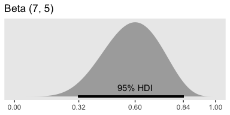
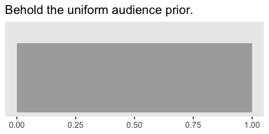
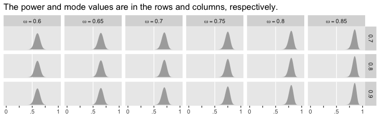
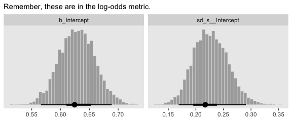
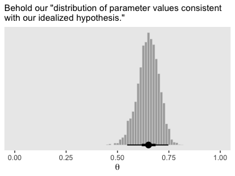
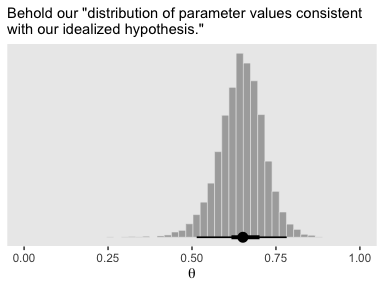

Chapter 13. Goals, Power, and Sample Size
================
A Solomon Kurz
2019-07-01

# Goals, Power, and Sample Size

> Researchers collect data in order to achieve a goal. Sometimes the
> goal is to show that a suspected underlying state of the world is
> credible; other times the goal is to achieve a minimal degree of
> precision on whatever trends are observed. Whatever the goal, it can
> only be probabilistically achieved, as opposed to definitely achieved,
> because data are replete with random noise that can obscure the
> underlying state of the world. Statistical power is the probability of
> achieving the goal of a planned empirical study, if a suspected
> underlying state of the world is true. (p. 359)

## 13.1. The will to power

“In this section, \[Kruschke laid out a\] framework for research and
data analysis \[that led\] to a more precise definition of power and how
to compute it” (p. 360).

### 13.1.1 Goals and obstacles.

The three research goals Kruschke dealt with in this chapter were:

  - to reject a null value for a parameter,
  - to confirm the legitimacy of a particular parameter value, and
  - to estimate a parameter with reasonable precision.

All these could, of course, be extended to contexts involving multiple
parameters. And all of these were dealt with respect to 95% HDIs.

### 13.1.2 Power

> Because of random noise, the goal of a study can be achieved only
> probabilistically. The probability of achieving the goal, given the
> hypothetical state of the world and the sampling plan, is called the
> *power* of the planned research. In traditional null hypothesis
> significance testing (NHST), power has only one goal (rejecting the
> null hypothesis), and there is one conventional sampling plan (stop at
> predetermined sample size) and the hypothesis is only a single
> specific value of the parameter. In traditional statistics, that is
> *the* definition of power. That definition is generalized in this book
> to include other goals, other sampling plans, and hypotheses that
> involve an entire distribution on parameters. (p. 360, *emphasis* in
> the original)

Three primary methods to increase power are:

  - reducing measurement error,
  - increasing the effect size, and
  - increasing the sample size.

Kruschke then laid out a five-step procedure to compute power within a
Bayesian workflow.

1.  Use theory/prior information to specify hypothetical distributions
    for all parameter values in the model.
2.  Use those distributions to generate synthetic data according to the
    planned sampling method.
3.  Fit the proposed model—including the relevant priors–with the
    synthetic data.
4.  Use the posterior to determine whether we attained the research
    goal.
5.  Repeat the procedure many times (i.e., using different `set.seed()`
    values) to get a distribution of results.

### 13.1.3 Sample size.

> *The best that a large sample can do is exactly reflect the
> data-generating distribution.* If the data-generating distribution has
> considerable mass straddling the null value, then the best we can do
> is get estimates that include and straddle the null value. As a simple
> example, suppose that we think that a coin may be biased, and the
> data-generating hypothesis entertains four possible values of
> \(\theta\) , with \(\text{p} (\theta = 0.5) = 25 \%\),
> \(\text{p} (\theta = 0.6) = 25 \%\),
> \(\text{p} (\theta = 0.7) = 25 \%\), and
> \(\text{p} (\theta = 0.8) = 25 \%\). Because \(25 \%\) of the
> simulated data come from a fair coin, the maximum probability of
> excluding \(\theta = 0.5\), even with a huge sample, is \(75 \%\).
> 
> Therefore, when planning the sample size for an experiment, it is
> crucial to decide what a realistic goal is. If there are good reasons
> to posit a highly certain data-generating hypothesis, perhaps because
> of extensive previous results, then a viable goal may be to exclude a
> null value. On the other hand, if the data-generating hypothesis is
> somewhat vague, then a more reasonable goal is to attain a desired
> degree of precision in the posterior. (p. 364, *emphasis* in the
> original)

### 13.1.4 Other expressions of goals.

I’m going to skip over these.

> In the remainder of the chapter, it will be assumed that the goal of
> the research is estimation of the parameter values, starting with a
> viable prior. The resulting posterior distribution is then used to
> assess whether the goal was achieved. (p. 366)

## 13.2. Computing power and sample size

> As our first worked-out example, consider the simplest case: Data from
> a single coin. Perhaps we are polling a population and we want to
> precisely estimate the preferences for candidates A or B. Perhaps we
> want to know if a drug has more than a 50% cure rate. (p. 366)

### 13.2.1 When the goal is to exclude a null value.

> Usually it is more intuitively accessible to get prior data, or to
> think of idealized prior data, than to directly specify a distribution
> over parameter values. For example, based on knowledge about the
> application domain, we might have 2000 actual or idealized flips of
> the coin for which the result showed 65% heads. Therefore we’ll
> describe the data-generating hypothesis as a beta distribution with a
> mode of 0.65 and concentration based on 2000 flips after a uniform
> “proto-prior”:
> \(\text{beta} (\theta | 0.65 \cdot (2000 - 2) + 1, (1 - 0.65) \cdot (2000 - 2) + 1)\).

We might express that in code like this.

``` r
library(tidyverse)

kappa <- 2000
omega <- .65

tibble(theta = seq(from = 0, to = 1, by = .001)) %>% 
  mutate(prior = dbeta(theta,
                       shape1 =      omega  * (kappa - 2) + 1,
                       shape2 = (1 - omega) * (kappa - 2) + 1)) %>% 
  
  ggplot(aes(x = theta, ymin = 0, ymax = prior)) +
  geom_ribbon(size = 0, fill = "grey67") +
  scale_y_continuous(NULL, breaks = NULL) +
  labs(title = "Behold our prior. It's rather peaked.",
       x = NULL) +
  theme(panel.grid = element_blank())
```

<!-- -->

If we wanted to take some random draws from that prior, say 5, we’d do
something like this.

``` r
n <- 5

set.seed(13)
rbeta(n,
      shape1 =      omega  * (kappa - 2) + 1,
      shape2 = (1 - omega) * (kappa - 2) + 1)
```

    ## [1] 0.6430548 0.6532279 0.6250891 0.6475884 0.6351476

Now let’s just take one draw and call it `bias`.

``` r
n <- 1

set.seed(13)
bias <-
  rbeta(n,
        shape1 =      omega  * (kappa - 2) + 1,
        shape2 = (1 - omega) * (kappa - 2) + 1)

print(bias)
```

    ## [1] 0.6430548

Now we

> simulate flipping a coin with that bias \(N\) times. The simulated
> data have \(z\) heads and \(N − z\) tails. The proportion of heads,
> \(z/N\), will tend to be around \[0.643\], but will be higher or lower
> because of randomness in the flips. (p. 367)

``` r
# pick some large number
n <- 1e3

set.seed(13)
tibble(flips  = rbernoulli(n = n, p = bias)) %>% 
  summarise(n = n(),
            z = sum(flips)) %>% 
  mutate(`proportion of heads` = z / n)
```

    ## # A tibble: 1 x 3
    ##       n     z `proportion of heads`
    ##   <int> <int>                 <dbl>
    ## 1  1000   652                 0.652

We’ll walk through the rest of the steps in the next section.

### 13.2.2 Formal solution and implementation in R.

I’ve been playing around with this a bit. If you look closely at the
code block on page 369, you’ll see that Kruschke’s `minNforHDIpower()`
function requires the `HDIofICDF()` function from his
`DBDA2E-utilities.R` file, which we usually recast as `hdi_of_icdf()`.

``` r
hdi_of_icdf <- function(name, width = .95, tol = 1e-8, ... ) {
  incredible_mass <-  1.0 - width
  interval_width  <- function(low_tail_prob, name, width, ...) {
    name(width + low_tail_prob, ...) - name(low_tail_prob, ...)
  }
  opt_info <- optimize(interval_width, c(0, incredible_mass), 
                       name = name, width = width, 
                       tol = tol, ...)
  hdi_lower_tail_prob <- opt_info$minimum
  return(c(name(hdi_lower_tail_prob, ...),
           name(width + hdi_lower_tail_prob, ...)))
}
```

Just to warm up, consider a Beta distribution for which \(\omega = .5\)
and \(\kappa = 2000\). Here are the 95% HDIs.

``` r
omega <- .5

hdi_of_icdf(name   = qbeta,
            shape1 =      omega  * (kappa - 2) + 1,
            shape2 = (1 - omega) * (kappa - 2) + 1)
```

    ## [1] 0.4780947 0.5219053

Those look a whole lot like the ROPE values Kruschke specified in his
example at the bottom of page 370. But we’re getting ahead of ourselves.
Now that we have our `hdi_of_icdf()` function, we’re ready to define our
version of `minNforHDIpower()`, which I’m calling
`min_n_for_hdi_power()`.

``` r
min_n_for_hdi_power <- 
  function(gen_prior_mode, gen_prior_n,
           hdi_max_width = NULL, null_value = NULL,
           rope = c(max(0, null_value - 0.02), min(1, null_value + 0.02)),
           desired_power = 0.8, aud_prior_mode = 0.5, aud_prior_n = 2,
           hdi_mass = 0.95, init_samp_size = 20, verbose = TRUE) {
  # Check for argument consistency:
  if (!xor(is.null(hdi_max_width), is.null(null_value))) {
    stop("One and only one of `hdi_max_width` and `null_value` must be specified.")
  }
  # Convert prior mode and N to a, b parameters of beta distribution:
  gen_prior_a <-        gen_prior_mode  * (gen_prior_n - 2) + 1
  gen_prior_b <- (1.0 - gen_prior_mode) * (gen_prior_n - 2) + 1
  aud_prior_a <-        aud_prior_mode  * (aud_prior_n - 2) + 1
  aud_prior_b <- (1.0 - aud_prior_mode) * (aud_prior_n - 2) + 1
  # Initialize loop for incrementing `sample_size`:
  sample_size <- init_samp_size
  not_powerful_enough = TRUE
  # Increment `sample_size` until desired power is achieved:
  while(not_powerful_enough) {
    z_vec <- 0:sample_size # vector of all possible z values for N flips.
    # Compute probability of each z value for data-generating prior:
    p_z_vec <- exp(lchoose(sample_size, z_vec)
                 + lbeta(z_vec + gen_prior_a, sample_size - z_vec + gen_prior_b)
                 - lbeta(gen_prior_a, gen_prior_b))
    # For each z value, compute posterior HDI:
    # `hdi_matrix` will hold HDI limits for each z:
    hdi_matrix <- matrix(0, nrow = length(z_vec), ncol = 2)
    for (z_id_x in 1:length(z_vec)) {
      z <- z_vec[z_id_x]
      hdi_matrix[z_id_x, ] <- hdi_of_icdf(qbeta,
                                          shape1 = z + aud_prior_a,
                                          shape2 = sample_size - z + aud_prior_b,
                                          width  = hdi_mass)
}
# Compute HDI widths:
hdi_width <- hdi_matrix[, 2] - hdi_matrix[, 1]
# Sum the probabilities of outcomes with satisfactory HDI widths:
if (!is.null(hdi_max_width)) {
  power_hdi <- sum(p_z_vec[hdi_width < hdi_max_width])
}
# Sum the probabilities of outcomes with HDI excluding `rope`:
if (!is.null(null_value)) {
  power_hdi <- sum(p_z_vec[hdi_matrix[, 1] > rope[2] | hdi_matrix[, 2] < rope[1]])
}
if (verbose) {
  cat(" For sample size = ", sample_size, ", power = ", power_hdi,
       "\n", sep = ""); flush.console() 
  }
if (power_hdi > desired_power) {  # If desired power is attained,
  not_powerful_enough = FALSE
} else {
  sample_size <- sample_size + 1
# set flag to stop,
# otherwise
# increment the sample size.
    }
  } # End while( not_powerful_enough ).
  # Return the sample size that achieved the desired power:
  return(sample_size)
}
```

Other than altering Kruschke’s formatting a little bit, the only
meaningful change I made to the code was removing the line that checked
for the `HDIofICD()` function and then `source()`ed it, if necessary.
Following along with Kruschke on page 370, here’s an example for which
\(\omega_\text{data generating} = .75\), \(kappa = 2000\), the ROPE is
\([.48, .52]\), and the desired power is the conventional .8.

``` r
min_n_for_hdi_power(gen_prior_mode = .75, 
                    gen_prior_n    = 2000,
                    hdi_max_width  = NULL, 
                    null_value     = .5, 
                    rope           = c(.48, .52),
                    desired_power  = .8,
                    aud_prior_mode = .5, 
                    aud_prior_n    = 2,
                    hdi_mass       = .95, 
                    init_samp_size = 20, 
                    verbose        = TRUE)
```

    ##  For sample size = 20, power = 0.6159196
    ##  For sample size = 21, power = 0.5655352
    ##  For sample size = 22, power = 0.6976802
    ##  For sample size = 23, power = 0.6521637
    ##  For sample size = 24, power = 0.606033
    ##  For sample size = 25, power = 0.7245362
    ##  For sample size = 26, power = 0.6832871
    ##  For sample size = 27, power = 0.7836981
    ##  For sample size = 28, power = 0.7479021
    ##  For sample size = 29, power = 0.7103786
    ##  For sample size = 30, power = 0.8009259

    ## [1] 30

Just like in the text, the necessary \(N = 30\).

Unlike in the text, I increased the value of `init_samp_size` from 5 to
20 to keep the output a reasonable length. To clarify what we just did,

> in that function call, the data-generating distribution has a mode of
> 0.75 and concentration of 2000, which means that the hypothesized
> world is pretty certain that coins have a bias of 0.75. The goal is to
> exclude a null value of 0.5 with a ROPE from 0.48 to 0.52. The desired
> power \[is\] 80%. The audience prior is uniform. When the function is
> executed, it displays the power for increasing values of sample size,
> until stopping at \(N = 30\). (p. 370)

If it’s unclear why the “audience prior is uniform”, consider this.

``` r
kappa <- 2
omega <- .5

tibble(theta = seq(from = 0, to = 1, by = .01)) %>% 
  mutate(prior = dbeta(theta,
                       shape1 =      omega  * (kappa - 2) + 1,
                       shape2 = (1 - omega) * (kappa - 2) + 1)) %>% 
  
  ggplot(aes(x = theta, ymin = 0, ymax = prior)) +
  geom_ribbon(size = 0, fill = "grey67") +
  scale_y_continuous(NULL, breaks = NULL) +
  coord_cartesian(ylim = c(0, 1.25)) +
  labs(title = "Behold the uniform audience prior.",
       x = NULL) +
  theme(panel.grid = element_blank())
```

<!-- -->

If you work out the algebra with `omega` and `kappa`, you’ll see this is
a \(\text{Beta} (1, 1)\). Thus, `aud_prior_n` is \(\kappa\) and
`aud_prior_mode` is \(\omega\).

Here we’ll wrap our `min_n_for_hdi_power()` function into a simple
`sim_power()` function for use with `purrr::map2()`.

``` r
sim_power <- function(mode, power) {
  min_n_for_hdi_power(gen_prior_mode = mode, 
                      gen_prior_n    = 2000,
                      hdi_max_width  = NULL, 
                      null_value     = .5, 
                      rope           = c(.48, .52),
                      desired_power  = power,
                      aud_prior_mode = .5, 
                      aud_prior_n    = 2,
                      hdi_mass       = .95, 
                      init_samp_size = 1, 
                      verbose        = TRUE)
}
```

Here we use the two functions to compute the values in Table 13.1 on
page 367.

``` r
sim <-
  tibble(mode = seq(from = .6, to = .85, by = .05)) %>% 
  expand(mode, power = c(.7, .8, .9)) %>% 
  mutate(results = purrr::map2(mode, power, sim_power)) %>% 
  unnest()
```

The results look like this.

``` r
print(sim)
```

    ## # A tibble: 18 x 3
    ##     mode power results
    ##    <dbl> <dbl>   <dbl>
    ##  1  0.6    0.7     238
    ##  2  0.6    0.8     309
    ##  3  0.6    0.9     430
    ##  4  0.65   0.7      83
    ##  5  0.65   0.8     109
    ##  6  0.65   0.9     150
    ##  7  0.7    0.7      40
    ##  8  0.7    0.8      52
    ##  9  0.7    0.9      74
    ## 10  0.75   0.7      25
    ## 11  0.75   0.8      30
    ## 12  0.75   0.9      43
    ## 13  0.8    0.7      16
    ## 14  0.8    0.8      19
    ## 15  0.8    0.9      27
    ## 16  0.85   0.7       7
    ## 17  0.85   0.8      14
    ## 18  0.85   0.9      16

It takes just a tiny bit of wrangling to reproduce Table 13.1.

``` r
sim %>%
  spread(key = mode, value = results) %>%
  knitr::kable()
```

| power | 0.6 | 0.65 | 0.7 | 0.75 | 0.8 | 0.85 |
| ----: | --: | ---: | --: | ---: | --: | ---: |
|   0.7 | 238 |   83 |  40 |   25 |  16 |    7 |
|   0.8 | 309 |  109 |  52 |   30 |  19 |   14 |
|   0.9 | 430 |  150 |  74 |   43 |  27 |   16 |

### 13.2.3 When the goal is precision.

Recall that if we have \(\text{Beta} (\theta, a, b)\) prior for
\(\theta\) of the Bernoulli likelihood function, then the analytic
solution for the posterior is
\(\text{Beta} (\theta | z + a, N – z + b)\). In our first example,
\(z = 6\) out of \(N = 10\) randomly selected voters preferred candidate
A and we started with a flat \(\text{Beta} (\theta, 1, 1)\) prior. We
can check that our posterior is indeed \(\text{Beta} (7, 5)\) by working
through the algebra.

``` r
z <- 6
n <- 10

# posterior alpha
z + 1
```

    ## [1] 7

``` r
# posterior beta
n - z + 1
```

    ## [1] 5

Here’s how we compute the 95% HDIs.

``` r
(h <-
  hdi_of_icdf(name   = qbeta,
              shape1 = 7,
              shape2 = 5)
)
```

    ## [1] 0.3182322 0.8414276

The \(\text{beta} (7, 5)\) distribution looks like this.

``` r
tibble(theta = seq(from = 0, to = 1, by = .01)) %>% 
  mutate(density = dbeta(theta,
                         shape1 = 7,
                         shape2 = 5)) %>% 
  
  ggplot(aes(x = theta, ymin = 0, ymax = density)) +
  geom_ribbon(size = 0, fill = "grey67") +
  geom_segment(x = h[1], xend = h[2],
               y = 0,    yend = 0,
               size = 1) +
  annotate(geom = "text",
           x = .6, y = 1/3, label = "95% HDI") +
  scale_x_continuous(NULL, breaks = c(0, h[1], z / n, h[2], 1) %>% round(2)) +
  scale_y_continuous(NULL, breaks = NULL) +
  ggtitle("Beta (7, 5)") +
  theme(panel.grid = element_blank())
```

<!-- -->

“It turns out, in this case, that we can never have a sample size large
enough to achieve the goal of 80% of the HDIs falling above
\(\theta = 0.5\). To see why,” keep reading in the text (p. 371).
Happily,

> there is a more useful goal, however. Instead of trying to reject a
> particular value of \(\theta\), we set as our goal a desired degree of
> precision in the posterior estimate. For example, our goal might be
> that the 95% HDI has width less than 0.2, at least 80% of the time.
> (p. 371)

If you look back up at our `min_n_for_hdi_power()` defining code, above,
you’ll see that “One and only one of `hdi_max_width` and `null_value`
must be specified.” So if we want to determine the necessary \(N\) for
an 95% HDI width of less than .2, we need to set `hdi_max_width = .2`
and `null_value = NULL`.

``` r
min_n_for_hdi_power(gen_prior_mode = .75, 
                    gen_prior_n    = 10,
                    hdi_max_width  = .2,  # look here
                    null_value     = NULL, 
                    rope           = NULL,
                    desired_power  = .8,
                    aud_prior_mode = .5, 
                    aud_prior_n    = 2,
                    hdi_mass       = .95, 
                    init_samp_size = 75, 
                    verbose        = TRUE)
```

    ##  For sample size = 75, power = 0.5089359
    ##  For sample size = 76, power = 0.5337822
    ##  For sample size = 77, power = 0.5235513
    ##  For sample size = 78, power = 0.5474934
    ##  For sample size = 79, power = 0.5706373
    ##  For sample size = 80, power = 0.5929882
    ##  For sample size = 81, power = 0.6145578
    ##  For sample size = 82, power = 0.6353626
    ##  For sample size = 83, power = 0.6554231
    ##  For sample size = 84, power = 0.6747629
    ##  For sample size = 85, power = 0.6934076
    ##  For sample size = 86, power = 0.7113842
    ##  For sample size = 87, power = 0.7287209
    ##  For sample size = 88, power = 0.7716517
    ##  For sample size = 89, power = 0.787177
    ##  For sample size = 90, power = 0.8266938

    ## [1] 90

Just like in the last section, here I set `init_samp_size` to a higher
value than in the text in order to keep the output reasonably short. To
reproduce the results in Table 13.2, we’ll need to adjust the
`min_n_for_hdi_power()` parameters within our `sim_power()` function.

``` r
sim_power <- function(mode, power) {
  min_n_for_hdi_power(gen_prior_mode = mode, 
                      gen_prior_n    = 10,
                      hdi_max_width  = .2, 
                      null_value     = NULL, 
                      rope           = NULL,
                      desired_power  = power,
                      aud_prior_mode = .5, 
                      aud_prior_n    = 2,
                      hdi_mass       = .95, 
                      init_samp_size = 50, 
                      verbose        = TRUE)
}

sim <-
  tibble(mode = seq(from = .6, to = .85, by = .05)) %>% 
  expand(mode, power = c(.7, .8, .9)) %>% 
  mutate(results = purrr::map2(mode, power, sim_power)) %>% 
  unnest()
```

Let’s make that table.

``` r
sim %>%
  spread(key = mode, value = results) %>%
  knitr::kable()
```

| power | 0.6 | 0.65 | 0.7 | 0.75 | 0.8 | 0.85 |
| ----: | --: | ---: | --: | ---: | --: | ---: |
|   0.7 |  91 |   90 |  88 |   86 |  81 |   75 |
|   0.8 |  92 |   92 |  91 |   90 |  87 |   82 |
|   0.9 |  93 |   93 |  93 |   92 |  91 |   89 |

What did that audience prior look like?

``` r
kappa <- 2
omega <- .5

tibble(theta = seq(from = 0, to = 1, by = .1)) %>% 
  mutate(density = dbeta(theta,
                         shape1 =      omega  * (kappa - 2) + 1,
                         shape2 = (1 - omega) * (kappa - 2) + 1)) %>% 
  
  ggplot(aes(x = theta, ymin = 0, ymax = density)) +
  geom_ribbon(size = 0, fill = "grey67") +
  scale_y_continuous(NULL, breaks = NULL) +
  coord_cartesian(ylim = c(0, 1.25)) +
  labs(title = "Behold the uniform audience prior.",
       x = NULL) +
  theme(panel.grid = element_blank())
```

<!-- -->

Here are what the Beta distributions based on the `sim` look like.

``` r
sim %>% 
  rename(n = results) %>% 
  expand(nesting(mode, power, n), theta = seq(from = 0, to = 1, by = .01)) %>% 
  mutate(density = dbeta(theta,
                         shape1 =      mode  * (n - 2) + 1,
                         shape2 = (1 - mode) * (n - 2) + 1)) %>% 
  mutate(mode = str_c("omega == ", mode)) %>% 
  
  ggplot(aes(x = theta, ymin = 0, ymax = density)) +
  geom_vline(xintercept = .5, color = "white") +
  geom_ribbon(size = 0, fill = "grey67") +
  scale_x_continuous(labels = c("0", "", ".5", "", "1")) +
  scale_y_continuous(NULL, breaks = NULL) +
  labs(title = "The power and mode values are in the rows and columns, respectively.",
       x = NULL) +
  theme(panel.grid = element_blank()) +
  facet_grid(power ~ mode, labeller = label_parsed)
```

<!-- -->

Toward the end of the section, Kruschke mentioned the required sample
size shoots up if our desired HDI width is 0.1. Here’s the simulation.

``` r
sim_power <- function(mode, power) {
    min_n_for_hdi_power(gen_prior_mode = mode, 
                        gen_prior_n    = 10,
                        hdi_max_width  = .1, 
                        null_value     = NULL, 
                        rope           = NULL,
                        desired_power  = power,
                        aud_prior_mode = .5, 
                        aud_prior_n    = 2,
                        hdi_mass       = .95, 
                        init_samp_size = 300,  # save some time and up this parameter 
                        verbose        = TRUE)
}

sim <-
  tibble(mode = seq(from = .6, to = .85, by = .05)) %>% 
  expand(mode, power = c(.7, .8, .9)) %>% 
  mutate(results = purrr::map2(mode, power, sim_power)) %>% 
  unnest()
```

Display the results in a table like before.

``` r
sim %>%
  spread(key = mode, value = results) %>%
  knitr::kable()
```

| power | 0.6 | 0.65 | 0.7 | 0.75 | 0.8 | 0.85 |
| ----: | --: | ---: | --: | ---: | --: | ---: |
|   0.7 | 373 |  370 | 364 |  352 | 332 |  303 |
|   0.8 | 378 |  376 | 373 |  367 | 354 |  334 |
|   0.9 | 380 |  380 | 379 |  378 | 373 |  363 |

### 13.2.4 Monte Carlo approximation of power.

> The previous sections illustrated the ideas of power and sample size
> for a simple case in which the power could be computed by mathematical
> derivation. \[If your field is like mine, this will not be the norm
> for your research projects.\] In this section, we approximate the
> power by Monte Carlo simulation. The R script for this simple case
> serves as a template for more realistic applications. The R script is
> named `Jags-Ydich-Xnom1subj-MbernBeta-Power.R`, which is the name for
> the JAGS program for dichotomous data from a single “subject” suffixed
> with the word “Power.” As you read through the script, presented
> below, remember that you can find information about any general R
> command by using the help function in R, as explained in Section 3.3.1
> (p. 39). (p. 372)

The code in Kruschke’s `Jags-Ydich-Xnom1subj-MbernBeta-Power.R` file
also makes use of the content in his `Jags-Ydich-Xnom1subj-MbernBeta.R`
file. As is often the case, the code in both is JAGS and base-R centric.
We’ll be taking a different approach. I’ll walk you through. First,
let’s fire up brms.

``` r
library(brms)
```

This won’t be of much concern for some of the complex models we’ll be
fitting in later chapters. But for simple models like this, a lot of the
time you spend waiting for `brms::brm()` to return your posterior and
its summary has to do with compilation time. The issue of compilation
goes into technical details I just don’t have the will to go through
right now. But if we can avoid or minimize compilation time, it’ll be a
big boon for our power simulations. As it turns out, we can. The first
time we fit our desired model, we have to compile. But once we have that
initial fit in hand, we can reuse it with the `update()` function, which
will allow us to avoid further compilation. So that’s what we’re going
to do, here. We’re going to fit the model once and save it.

``` r
# how many rows of 0s and 1s should we have in the data?
n     <- 74

# should the values in the data be of single draws (i.e., 1), or summaries?
size  <- 1

# what is the population mode for theta we'd like to base this all on?
omega <- .7

# fit that joint
fit1 <-
  brm(data = tibble(y = rbinom(n, size, omega)),
      family = bernoulli(link = identity),
      y ~ 1,
      prior(beta(1, 1), class = Intercept),
      warmup = 1000, iter = 3000, chains = 4, cores = 1,
      seed = 13,
      control = list(adapt_delta = .9))
```

You may (or not) recall that at the end of Chapter 3, we covered how to
time an operation in R. When you’re setting up a Monte Carlo power
study, it can be important to use those time-tracking skills to get a
sense of how long it takes to fit your models. While I was setting this
model up, I experimented with keeping the default `cores = 1` or setting
my typical `cores = 4`. As it turns out, with a very simple model like
this, `cores = 1` was a little faster. If you’re fitting one model,
that’s no big deal. But in a situation where you’re fitting 100 or
1000, you’ll want to make sure you’re fitting them as efficiently as
possible.

But anyway, our practice will be to keep all the specifications in `fit`
constant across the simulations. So choose them wisely. If you look deep
into the bowels of the `Jags-Ydich-Xnom1subj-MbernBeta.R` file, you’ll
see Kruschke used the flat \(\text{Beta}(1, 1)\) prior, which is where
our `prior(beta(1, 1), class = Intercept)` code came from. This is the
audience prior. We aren’t particularly concerned about the data we
simulated with the `data = tibble(y = rbinom(n, size, omega))` line. The
main thing is that they follow the same basic structure our subsequent
data will.

To make sure we’re not setting ourselves up to fail, we might make sure
the chains look okay.

``` r
plot(fit1)
```

<!-- -->

Looks like a dream. Let’s move forward and run the simulation proper. In
his script file, Kruschke suggested we simulate with large \(N\)s like
1000 or so. Since this is just an example, I’m gonna cut that to 100.

``` r
# how many simulations would you like?
n_sim <- 100

# specify omega and kappa of the hypothetical parameter distribution
omega <- .7
kappa <- 2000

# make it reproducible
set.seed(13)

sim1 <-
  # define some of the parameters
  tibble(n     = n,
         size  = size,
         theta = rbeta(n_sim, 
                       shape1 =      omega  * (kappa - 2) + 1,
                       shape2 = (1 - omega) * (kappa - 2) + 1)) %>% 
  # simulate the data
  mutate(data = pmap(list(n, size, theta), rbinom)) %>% 
  # fit the models on the simulated data
  mutate(fit  = map(data, ~update(fit1, newdata = list(y = .))))
```

*What have we done?* you might ask.

``` r
head(sim1)
```

    ## # A tibble: 6 x 5
    ##       n  size theta data       fit      
    ##   <dbl> <dbl> <dbl> <list>     <list>   
    ## 1    74     1 0.693 <int [74]> <brmsfit>
    ## 2    74     1 0.703 <int [74]> <brmsfit>
    ## 3    74     1 0.676 <int [74]> <brmsfit>
    ## 4    74     1 0.698 <int [74]> <brmsfit>
    ## 5    74     1 0.686 <int [74]> <brmsfit>
    ## 6    74     1 0.695 <int [74]> <brmsfit>

The `theta` column contains the draws from the hypothesized parameter
distribution, which we’ve indicated is hovering tightly around .7. The
`data` column is nested in that within each row, we’ve saved an entire
\(N = 74\) row tibble. Most importantly, the `fit` column contains the
brmsfit objects for each of our 100 simulations. See that last
`mutate()` line, above? That’s where those came from. Within
`purrr::map()`, we fed our simulated data sets, one row at a time, into
the `update()` function via the `newdata` argument. Because we used
`update()` based on our initial `fit`, we avoided subsequent compilation
times and just sampled like a boss.

Before we move on, I should give some credit. The foundations of this
workflow come from Wickham’s talk [*Managing many models with
R*](https://www.youtube.com/watch?time_continue=426&v=rz3_FDVt9eg). I
also got some additional [help on
twitter](https://twitter.com/PStrafo/status/1107447953709383681) from
[Phil Straforelli](https://twitter.com/PStrafo).

We still have some work to do. Next, we’ll want to make a custom
function that will make it easy to compute the intercept HDIs for each
of our fits.

``` r
library(tidybayes)

get_hdi <- function(fit){
  fit %>%
    posterior_samples() %>%
    mode_hdi(b_Intercept) %>%
    select(.lower:.upper)
}

# how does it work?
get_hdi(fit1)
```

    ##      .lower    .upper
    ## 1 0.6218496 0.8236595

Now we’ll apply that function to our `fits` tibble to pull those
simulated HDIs. Then we’ll program in the markers for the ROPE and HDI
width criteria, perform logical tests to see whether they were passes
within each of the 100 simulations, and summarize the tests.

``` r
sim1 %>% 
  # get those HDIs and `unnest()`
  mutate(hdi = map(fit, get_hdi)) %>% 
  unnest(hdi) %>% 
  # define our test criteria
  mutate(rope_ll   = .48,
         rope_ul   = .52,
         hdi_width = .2) %>% 
  mutate(pass_rope  = .lower > rope_ul | .upper < rope_ll,
         pass_width = (.upper - .lower) < hdi_width) %>%
  
  # summarize those joints
  summarise(power_rope  = mean(pass_rope),
            power_width = mean(pass_width))
```

    ## # A tibble: 1 x 2
    ##   power_rope power_width
    ##        <dbl>       <dbl>
    ## 1       0.91        0.36

Those are our power estimates. To compute their HDIS, just increase them
by a factor of 100 and plug them into the formulas within the shape
arguments in `hdi_of_icdf()`.

``` r
# HDIs for the ROPE power estimate
hdi_of_icdf(name   = qbeta,
            shape1 = 1 + 91,
            shape2 = 1 + n_sim - 91) %>% 
  round(digits = 2)
```

    ## [1] 0.84 0.96

``` r
# HDIs for the width power estimate
hdi_of_icdf(name   = qbeta,
            shape1 = 1 + 36,
            shape2 = 1 + n_sim - 36) %>% 
  round(digits = 2)
```

    ## [1] 0.27 0.46

Following the middle of page 375, we’ll want to do the whole thing again
with \(\kappa = 10\) and \(N = 91\).

Before we run the next simulation, notice how our first approach had us
saving the model fits within our `sim1` object. When the models are
simple and based on small data and when you’re only simulating 100
times, this isn’t a huge deal. But saving 1000+ `brms::brm()` fit
objects of hierarchical models will bog you down. So for our next
simulation, we’ll only save the HDIs from our `get_hdi()` function.

``` r
# how many rows of 0s and 1s should we have in the data?
n     <- 91

# how many simulations would you like?
n_sim <- 100

# specify omega and kappa of the hypothetical parameter distribution
omega <- .7
kappa <- 10

# make it reproducible
set.seed(13)

# simulate
sim2 <-
  tibble(n     = n,
         size  = size,
         theta = rbeta(n_sim, 
                       shape1 =      omega  * (kappa - 2) + 1,
                       shape2 = (1 - omega) * (kappa - 2) + 1)) %>% 
  mutate(data = pmap(list(n, size, theta), rbinom)) %>% 
  mutate(hdi  = map(data, ~update(fit1, newdata = list(y = .)) %>% get_hdi()))
```

Since we saved the HDI estimates in the `hdi` column, we can just
`unnest()` then and summarize our power results.

``` r
sim2 %>% 
  unnest(hdi) %>% 
  mutate(rope_ll   = .48,
         rope_ul   = .52,
         hdi_width = .2) %>% 
  mutate(pass_rope  = .lower > rope_ul | .upper < rope_ll,
         pass_width = (.upper - .lower) < hdi_width) %>%
  summarise(power_rope  = mean(pass_rope),
            power_width = mean(pass_width))
```

    ## # A tibble: 1 x 2
    ##   power_rope power_width
    ##        <dbl>       <dbl>
    ## 1       0.71        0.87

Compute the corresponding HDIs.

``` r
# HDIs for the ROPE power estimate
hdi_of_icdf(name   = qbeta,
            shape1 = 1 + 71,
            shape2 = 1 + n_sim - 71) %>% 
  round(digits = 2)
```

    ## [1] 0.62 0.79

``` r
# HDIs for the width power estimate
hdi_of_icdf(name   = qbeta,
            shape1 = 1 + 87,
            shape2 = 1 + n_sim - 87) %>% 
  round(digits = 2)
```

    ## [1] 0.80 0.93

### 13.2.5 Power from idealized or actual data.

> In practice, it is often more intuitive to specify actual or idealized
> data that express the hypothesis, than it is to specify top-level
> parameter properties. The idea is that we start with the actual or
> idealized data and then use Bayes’ rule to generate the corresponding
> distribution on parameter values. (p. 376)

Here are the idealized parameters Kruschke outlied on pages 376–377.

``` r
# specify idealized hypothesis:
ideal_group_mean <- 0.65
ideal_group_sd   <- 0.07

ideal_n_subj         <- 100  # more subjects => higher confidence in hypothesis
ideal_n_trl_per_subj <- 100  # more trials => higher confidence in hypothesis
```

These parameters are for binomial data. To parameterize \(\theta\) in
terms of a mean and standard deviation, we need to define the
`beta_ab_from_mean_sd()` function.

``` r
beta_ab_from_mean_sd <- function(mean, sd) {
  if (mean <= 0 | mean >= 1) stop("must have 0 < mean < 1")
  if (sd <= 0) stop("sd must be > 0")
  kappa <- mean * (1 - mean) / sd^2 - 1
  if (kappa <= 0) stop("invalid combination of mean and sd")
  a <- mean * kappa
  b <- (1.0 - mean) * kappa
  return(list(a = a, b = b))
}
```

Now generate data consistent with these values using a tidyverse style
workflow.

``` r
b <- beta_ab_from_mean_sd(ideal_group_mean, ideal_group_sd)

# make the results reproducible
set.seed(13)

d <-
  # make a subject index and generate random theta values for idealized subjects
  tibble(s     = 1:ideal_n_subj,
         theta = rbeta(ideal_n_subj, b$a, b$b)) %>% 
  # transform the theta values to exactly match idealized mean and SD
  mutate(theta_transformed = ((theta - mean(theta)) / sd(theta)) * ideal_group_sd + ideal_group_mean) %>% 
  # `theta_transformed` must be between 0 and 1
  mutate(theta_transformed = ifelse(theta_transformed >= 0.999, 0.999,
                                    ifelse(theta_transformed <= 0.001, 0.001,
                                           theta_transformed))) %>% 
  # generate idealized data very close to thetas
  mutate(z = round(theta_transformed * ideal_n_trl_per_subj)) %>% 
  # create vector of 0’s and 1’s matching the z values generated above
  mutate(y = map(z, ~c(rep(1, .), rep(0, ideal_n_trl_per_subj - .)))) %>% 
  unnest(y)
```

Our main variables are `s` and `y`. You can think of the rest as showing
our work. Here’s a
    peek.

``` r
str(d)
```

    ## Classes 'tbl_df', 'tbl' and 'data.frame':    10000 obs. of  5 variables:
    ##  $ s                : int  1 1 1 1 1 1 1 1 1 1 ...
    ##  $ theta            : num  0.604 0.604 0.604 0.604 0.604 ...
    ##  $ theta_transformed: num  0.601 0.601 0.601 0.601 0.601 ...
    ##  $ z                : num  60 60 60 60 60 60 60 60 60 60 ...
    ##  $ y                : num  1 1 1 1 1 1 1 1 1 1 ...

We are going to follow the same procedure we did when we originally fit
the model to the therapeutic touch data in Chapter 9. Instead of
reproducing the model Kruschke presented in his scripts, we are going to
fit a hierarchical logistic regression model.

``` r
fit2 <-
  brm(data = d,
      family = bernoulli(link = logit),
      y ~ 1 + (1 | s),
      prior = c(prior(normal(0, 1.5), class = Intercept),
                prior(normal(0, 1), class = sd)),
      iter = 2000, warmup = 1000, chains = 4, cores = 4,
      seed = 13)
```

Unlike in the text, we had no need for tinning our chains. The effective
number of samples was pretty good.

``` r
print(fit2)
```

    ##  Family: bernoulli 
    ##   Links: mu = logit 
    ## Formula: y ~ 1 + (1 | s) 
    ##    Data: d (Number of observations: 10000) 
    ## Samples: 4 chains, each with iter = 2000; warmup = 1000; thin = 1;
    ##          total post-warmup samples = 4000
    ## 
    ## Group-Level Effects: 
    ## ~s (Number of levels: 100) 
    ##               Estimate Est.Error l-95% CI u-95% CI Eff.Sample Rhat
    ## sd(Intercept)     0.23      0.03     0.17     0.29       1542 1.00
    ## 
    ## Population-Level Effects: 
    ##           Estimate Est.Error l-95% CI u-95% CI Eff.Sample Rhat
    ## Intercept     0.63      0.03     0.57     0.69       4149 1.00
    ## 
    ## Samples were drawn using sampling(NUTS). For each parameter, Eff.Sample 
    ## is a crude measure of effective sample size, and Rhat is the potential 
    ## scale reduction factor on split chains (at convergence, Rhat = 1).

Here’s a look at our two main parameters, our version of the top panels
of Figure 13.3.

``` r
posterior_samples(fit2) %>% 
  select(b_Intercept:sd_s__Intercept) %>% 
  gather() %>% 
  
  ggplot(aes(x = value)) +
  geom_histogram(color = "grey92", fill = "grey67",
                 size = .2, bins = 40) +
  stat_pointintervalh(aes(y = 0),
                      point_interval = mode_hdi, .width = c(.95, .5)) +
  scale_y_continuous(NULL, breaks = NULL) +
  labs(subtitle = "Remember, these are in the log-odds metric.",
       x = NULL) +
  theme(panel.grid = element_blank()) +
  facet_wrap(~key, scales = "free")
```

<!-- -->

> Now we have a distribution of parameter values consistent with our
> idealized hypothesis, but we did not have to figure out the top-level
> constants in the model. We merely specified the idealized tendencies
> in the data and expressed our confidence by its amount… So we now have
> a large set of representative parameter values for conducting a power
> analysis. (pp. 378–379)

With brms, you can sample from those model-implied parameter values with
`fitted()`. By default, it will return values in the probability metric
for our logistic model. Here we’ll specify a group-level (i.e., `s`)
value that was not in the data. We’ll feed that new value into the
`newdata` argument and set `allow_new_levels = T`. We’ll also set
`summary = F`, which will return actual probability values rather than a
summary.

``` r
set.seed(13)

f <-
  fitted(fit2,
        newdata = tibble(s = 0),
        allow_new_levels = T,
        summary = F) %>% 
  data.frame() %>% 
  set_names("theta")

str(f)
```

    ## 'data.frame':    4000 obs. of  1 variable:
    ##  $ theta: num  0.672 0.564 0.657 0.643 0.552 ...

Here’s what that looks like.

``` r
f %>% 
  ggplot(aes(x = theta)) +
  geom_histogram(color = "grey92", fill = "grey67",
                 size = .2, bins = 30) +
  stat_pointintervalh(aes(y = 0),
                      point_interval = mode_hdi, .width = c(.95, .5)) +
  scale_y_continuous(NULL, breaks = NULL) +
  labs(subtitle = "Behold our \"distribution of parameter values consistent\nwith our idealized hypothesis.\"",
       x = expression(theta)) +
  coord_cartesian(xlim = 0:1) +
  theme(panel.grid = element_blank())
```

<!-- -->

We can make a custom function to sample from \(\theta\). We might call
it `sample_theta()`.

``` r
sample_theta <- function(seed, n_subj) {
  set.seed(seed)
  
  bind_cols(s = 1:n_subj,
            sample_n(f, size = n_subj, replace = T))
}


sample_theta(seed = 13, n_subj = 5)
```

    ## # A tibble: 5 x 2
    ##       s theta
    ##   <int> <dbl>
    ## 1     1 0.658
    ## 2     2 0.615
    ## 3     3 0.693
    ## 4     4 0.554
    ## 5     5 0.684

Now let’s say I wanted to use our little `sample_theta()` function to
sample \(\theta\) values for three people `s` and then use those
\(\theta\) values to sample three draws from the corresponding Bernoulli
distribution. We might do that like this.

``` r
sample_theta(seed = 13, n_subj = 3) %>% 
  mutate(y = map(theta, rbinom, n = 3, size = 1)) %>% 
  unnest(y)
```

    ## # A tibble: 9 x 3
    ##       s theta     y
    ##   <int> <dbl> <int>
    ## 1     1 0.658     1
    ## 2     1 0.658     0
    ## 3     1 0.658     1
    ## 4     2 0.615     1
    ## 5     2 0.615     0
    ## 6     2 0.615     0
    ## 7     3 0.693     1
    ## 8     3 0.693     1
    ## 9     3 0.693     0

Notice how after we sampled from \(\theta\), we still required two more
steps to simulate the desired data. So perhaps a better approach would
be to wrap all those steps into one function and call it something like
`sample_data()`.

``` r
sample_data <- function(seed, n_subj, n_trial) {
  set.seed(seed)
  
  bind_cols(s = 1:n_subj,
            sample_n(f, size = n_subj, replace = T)) %>% 
    mutate(y = map(theta, rbinom, n = n_trial, size = 1)) %>% 
    unnest()
}

# test it out
sample_data(seed = 13, n_subj = 3, n_trial = 3) 
```

    ## # A tibble: 9 x 3
    ##       s theta     y
    ##   <int> <dbl> <int>
    ## 1     1 0.658     1
    ## 2     1 0.658     0
    ## 3     1 0.658     1
    ## 4     2 0.615     1
    ## 5     2 0.615     0
    ## 6     2 0.615     0
    ## 7     3 0.693     1
    ## 8     3 0.693     1
    ## 9     3 0.693     0

Here’s how we’d use it to make several data sets within the context of a
nested tibble.

``` r
tibble(seed = 1:4) %>% 
  mutate(data = map(seed, sample_data, n_subj = 14, n_trial = 47))
```

    ## # A tibble: 4 x 2
    ##    seed data              
    ##   <int> <list>            
    ## 1     1 <tibble [658 × 3]>
    ## 2     2 <tibble [658 × 3]>
    ## 3     3 <tibble [658 × 3]>
    ## 4     4 <tibble [658 × 3]>

With this data type, Kruschke indicated he ran

> the power analysis twice, using different selections of subjects and
> trials. In both cases there \[was\] a total of 658 trials, but in the
> first case there \[were\] 14 subjects with 47 trials per subject, and
> in the second case there \[were\] seven subjects with 94 trials per
> subject. (p. 381)

Before running the simulations in full, we fit the model once and save
that fit to iteratively reuse with `update()`.

``` r
# how many subjects should we have?
n_subj <- 14

# how many trials should we have?
n     <- 47

# fit that joint
fit3 <-
  brm(data = sample_theta(seed = 13, n_subj = 14) %>% 
        mutate(y = map(theta, rbinom, n = n, size = 1)) %>% 
        unnest(y),
      family = bernoulli(link = logit),
      y ~ 1 + (1 | s),
      prior = c(prior(normal(0, 1.5), class = Intercept),
                prior(normal(0, 1), class = sd)),
      iter = 2000, warmup = 1000, chains = 4, cores = 4,
      seed = 13,
      control = list(adapt_delta = .9))
```

Check real quick to make sure the fit turned out okay.

``` r
print(fit3)
```

    ##  Family: bernoulli 
    ##   Links: mu = logit 
    ## Formula: y ~ 1 + (1 | s) 
    ##    Data: sample_theta(seed = 13, n_subj = 14) %>% mutate(y  (Number of observations: 658) 
    ## Samples: 4 chains, each with iter = 2000; warmup = 1000; thin = 1;
    ##          total post-warmup samples = 4000
    ## 
    ## Group-Level Effects: 
    ## ~s (Number of levels: 14) 
    ##               Estimate Est.Error l-95% CI u-95% CI Eff.Sample Rhat
    ## sd(Intercept)     0.16      0.11     0.01     0.42       1681 1.00
    ## 
    ## Population-Level Effects: 
    ##           Estimate Est.Error l-95% CI u-95% CI Eff.Sample Rhat
    ## Intercept     0.73      0.10     0.55     0.93       3301 1.00
    ## 
    ## Samples were drawn using sampling(NUTS). For each parameter, Eff.Sample 
    ## is a crude measure of effective sample size, and Rhat is the potential 
    ## scale reduction factor on split chains (at convergence, Rhat = 1).

With a new simulation type comes new goals.

> In this example, \[Kruschke\] considered goals for achieving precision
> and exceeding a ROPE around the null value, at both the group level
> and individual level. For the group level, the goals are for the 95%
> HDI on the group mode, \(\omega\), to fall above the ROPE around the
> null value, and for the width of the HDI to be less than 0.2. For the
> individual level, the goals are for at least one of the \(\theta_s\)s
> 95% HDIs to exceed the ROPE with none that fall below the ROPE, and
> for all the \(\theta_s\)s 95% HDIs to have widths less than 0.2.
> (pp. 379–380)

Now since we used an aggregated binomial model, we don’t have a
population-level \(\omega\) parameter. Rather, we have a population
\(\theta\). So like before, our first goal is for the population
\(\theta\) to fall above the range \([.48, .52]\). The second
corresponding width goal is also like before; we want \(\theta\) to have
a width of less than 0.2. But since our aggregated binomial model
parameterized \(\theta\) in the log-odds metric, we’ll have to update
our `get_hdi()` function, which we’ll strategically rename
`get_theta_hdi()`.

``` r
get_theta_hdi <- function(fit) {
  fit %>% 
    posterior_samples() %>% 
    transmute(theta = inv_logit_scaled(b_Intercept)) %>% 
    mode_hdi() %>% 
    select(.lower:.upper)
}

# how does it work?
get_theta_hdi(fit3)
```

    ##      .lower    .upper
    ## 1 0.6315379 0.7144742

As for the individual-level goals, the two Kruschke’s outlined the text
apply to our model in a straightforward way. But we will need one more
custom function designed to pull the \(\theta_s\)s for the
\(\theta_s\)s. Let’s call this one `get_theta_s_hdi()`.

``` r
get_theta_s_hdi <- function(fit){
  n_col <-
    coef(fit, summary = F)$s[, , "Intercept"] %>% 
    ncol()
    
  coef(fit, summary = F)$s[, , "Intercept"] %>% 
    data.frame() %>% 
    set_names(1:n_col) %>% 
    mutate_all(inv_logit_scaled) %>% 
    gather(s, value) %>% 
    mutate(s = as.numeric(s)) %>% 
    group_by(s) %>% 
    mode_hdi(value) %>% 
    select(s, .lower:.upper) %>% 
    rename(.lower_s = .lower,
           .upper_s = .upper)
}

# how does it work?
get_theta_s_hdi(fit3)
```

    ## # A tibble: 14 x 3
    ##        s .lower_s .upper_s
    ##    <dbl>    <dbl>    <dbl>
    ##  1     1    0.622    0.776
    ##  2     2    0.599    0.750
    ##  3     3    0.606    0.753
    ##  4     4    0.510    0.715
    ##  5     5    0.606    0.756
    ##  6     6    0.610    0.765
    ##  7     7    0.591    0.741
    ##  8     8    0.611    0.754
    ##  9     9    0.577    0.730
    ## 10    10    0.605    0.753
    ## 11    11    0.603    0.754
    ## 12    12    0.584    0.739
    ## 13    13    0.617    0.766
    ## 14    14    0.614    0.757

With `sim2`, we avoided saving our model `brms::brm()` fit objects by
using `map(data, ~update(fit1, newdata = list(y = .)) %>% get_hdi())`.
That is, within the `purrr::map()` function, we first used `update()` to
update the fit to the new data and then pumped that directly into
`get_hdi()`, which simply returned our intervals. Though slick, this
approach won’t work here because we want to pump our updated model fit
into two functions, both `get_theta_hdi()` and `get_theta_s_hdi()`. Our
work-around will be to make a custom function that updates the fit,
saves it as an object, inserts that fit object into both
`get_theta_hdi()` and `get_theta_s_hdi()`, binds their results together,
and the only returns the intervals. We’ll call this function
`fit_then_hdis()`.

``` r
fit_then_hdis <- function(data, seed) {
  
  fit <- update(fit3, 
                newdata = data, 
                seed = seed)
  
  cbind(get_theta_hdi(fit),
        get_theta_s_hdi(fit))
}
```

Now we’re ready to simulate.

``` r
# how many subjects should we have?
n_subj <- 14

# how many trials should we have?
n_trial <- 47

# how many simulations would you like?
n_sim <- 100

sim3 <-
  tibble(seed = 1:n_sim) %>% 
  mutate(data = map(seed, sample_data, n_subj = n_subj, n_trial = n_trial)) %>% 
  mutate(hdi  = map2(data, seed, fit_then_hdis))
```

If we hold these by the criteria of each
\(\text{HDI}_{\theta_s} > \text{ROPE}\) and all to have widths less than
0.2, It looks like our initial data-generating `fit3` is in the
ballpark. Here are the results for the full power analysis, `sim3`.

``` r
sim3 <-
  sim3 %>% 
  unnest(hdi) %>%
  # here we determine whether we passed at the group level
  mutate(pass_rope_theta  = .lower > .52 | .upper < .48,
         pass_width_theta = (.upper - .lower) < .2) %>% 
  # the s-level thetas require two steps.
  # first, we'll outline the three criteria
  mutate(exceed_rope_theta_s  = .lower_s > .52,
         below_rope_theta_s   = .upper_s < .48,
         narrow_width_theta_s = (.upper_s - .lower_s) < .2) %>% 
  # second, we'll evaluate those criteria by group
  group_by(seed) %>% 
  mutate(pass_rope_theta_s  = sum(exceed_rope_theta_s) > 0 & sum(below_rope_theta_s) == 0,
         pass_width_theta_s = mean(narrow_width_theta_s) == 1) %>% 
  ungroup()

head(sim3)
```

Summarize the results.

``` r
sim3 %>% 
  summarise(power_rope_theta  = mean(pass_rope_theta),
            power_width_theta = mean(pass_width_theta))
```

    ## # A tibble: 1 x 2
    ##   power_rope_theta power_width_theta
    ##              <dbl>             <dbl>
    ## 1                1                 1

``` r
sim3 %>% 
  summarise(power_rope_theta_s  = mean(pass_rope_theta_s),
            power_width_theta_s = mean(pass_width_theta_s))
```

    ## # A tibble: 1 x 2
    ##   power_rope_theta_s power_width_theta_s
    ##                <dbl>               <dbl>
    ## 1                  1               0.370

The power estimates for `power_rope_theta`, `power_width_theta`, and
`power_rope_theta_s` were all the same, 1. Only the estimate for
`power_width_theta_s` was unique. Here are the two sets of HDIs for the
power estimate values.

``` r
hdi_of_icdf(name   = qbeta,
            shape1 = 1 + 100,
            shape2 = 1 + n_sim - 100) %>% 
  round(digits = 2)
```

    ## [1] 0.97 1.00

``` r
hdi_of_icdf(name   = qbeta,
            shape1 = 1 + 37,
            shape2 = 1 + n_sim - 37) %>% 
  round(digits = 2)
```

    ## [1] 0.28 0.47

Hopefully it isn’t a surprise our values differ from those in the text.
We (a) used a different model and (b) used fewer simulation iterations.
But I trust you get the overall idea. Like in the text, let’s do the
simulation again.

``` r
# how many subjects should we have?
n_subj <- 7

# how many trials should we have?
n_trial <- 94

# how many simulations would you like?
n_sim <- 100

sim4 <-
  tibble(seed = 1:n_sim) %>% 
  mutate(data = map(seed, sample_data, n_subj = n_subj, n_trial = n_trial)) %>%
  mutate(hdi  = map2(data, seed, fit_then_hdis))
```

Wrangle before summarizing.

``` r
sim4 <-
  sim4 %>% 
  unnest(hdi) %>%
  mutate(pass_rope_theta  = .lower > .52 | .upper < .48,
         pass_width_theta = (.upper - .lower) < .2) %>% 
  mutate(exceed_rope_theta_s  = .lower_s > .52,
         below_rope_theta_s   = .upper_s < .48,
         narrow_width_theta_s = (.upper_s - .lower_s) < .2) %>% 
  group_by(seed) %>% 
  mutate(pass_rope_theta_s  = sum(exceed_rope_theta_s) > 0 & sum(below_rope_theta_s) == 0,
         pass_width_theta_s = mean(narrow_width_theta_s) == 1) %>% 
  ungroup()
```

Summarize the results.

``` r
sim4 %>% 
  summarise(power_rope_theta  = mean(pass_rope_theta),
            power_width_theta = mean(pass_width_theta))
```

    ## # A tibble: 1 x 2
    ##   power_rope_theta power_width_theta
    ##              <dbl>             <dbl>
    ## 1              0.9              0.86

``` r
sim4 %>% 
  summarise(power_rope_theta_s  = mean(pass_rope_theta_s),
            power_width_theta_s = mean(pass_width_theta_s))
```

    ## # A tibble: 1 x 2
    ##   power_rope_theta_s power_width_theta_s
    ##                <dbl>               <dbl>
    ## 1               0.98                0.88

Now compute the HDIs for `power_rope_theta` and `power_width_theta`.

``` r
hdi_of_icdf(name   = qbeta,
            shape1 = 1 + 90,
            shape2 = 1 + n_sim - 90) %>% 
  round(digits = 2)
```

    ## [1] 0.83 0.95

``` r
hdi_of_icdf(name   = qbeta,
            shape1 = 1 + 86,
            shape2 = 1 + n_sim - 86) %>% 
  round(digits = 2)
```

    ## [1] 0.78 0.92

Second, we now compute the HDIs for `power_rope_theta_s` and
`power_width_theta_s`.

``` r
hdi_of_icdf(name   = qbeta,
            shape1 = 1 + 98,
            shape2 = 1 + n_sim - 98) %>% 
  round(digits = 2)
```

    ## [1] 0.94 1.00

``` r
hdi_of_icdf(name   = qbeta,
            shape1 = 1 + 88,
            shape2 = 1 + n_sim - 88) %>% 
  round(digits = 2)
```

    ## [1] 0.81 0.93

The results from our simulations contrast with those in the text. Though
the results are similar with respect to \(\theta_s\), they are markedly
different with regards to our \(\theta\) versus the text’s \(\omega\).
But Kruschke’s point is still sound:

> This example illustrates a general trend in hierarchical estimates. If
> you want high precision at the individual level, you need lots of data
> within individuals. If you want high precision at the group level, you
> need lots of individuals (without necessarily lots of data per
> individual, but more is better). (p. 382)

``` r
ideal_group_mean <- 0.65
ideal_group_sd   <- 0.07

ideal_n_subj         <- 10  # instead of 100
ideal_n_trl_per_subj <- 10  # instead of 100

b <- beta_ab_from_mean_sd(ideal_group_mean, ideal_group_sd)

set.seed(13)

d <-
  tibble(s     = 1:ideal_n_subj,
         theta = rbeta(ideal_n_subj, b$a, b$b)) %>% 
  mutate(theta_transformed = ((theta - mean(theta)) / sd(theta)) * ideal_group_sd + ideal_group_mean) %>% 
  mutate(theta_transformed = ifelse(theta_transformed >= 0.999, 0.999,
                                    ifelse(theta_transformed <= 0.001, 0.001,
                                           theta_transformed))) %>% 
  mutate(z = round(theta_transformed * ideal_n_trl_per_subj)) %>% 
  mutate(y = map(z, ~c(rep(1, .), rep(0, ideal_n_trl_per_subj - .)))) %>% 
  unnest(y)

head(d)
```

    ## # A tibble: 6 x 5
    ##       s theta theta_transformed     z     y
    ##   <int> <dbl>             <dbl> <dbl> <dbl>
    ## 1     1 0.604             0.659     7     1
    ## 2     1 0.604             0.659     7     1
    ## 3     1 0.604             0.659     7     1
    ## 4     1 0.604             0.659     7     1
    ## 5     1 0.604             0.659     7     1
    ## 6     1 0.604             0.659     7     1

Fit the \(\theta\)-generating model.

``` r
fit4 <-
  update(fit2,
         newdata = d,
         cores = 4,
         seed = 13)
```

Check to make sure things look alright.

``` r
print(fit4)
```

    ##  Family: bernoulli 
    ##   Links: mu = logit 
    ## Formula: y ~ 1 + (1 | s) 
    ##    Data: d (Number of observations: 100) 
    ## Samples: 4 chains, each with iter = 2000; warmup = 1000; thin = 1;
    ##          total post-warmup samples = 4000
    ## 
    ## Group-Level Effects: 
    ## ~s (Number of levels: 10) 
    ##               Estimate Est.Error l-95% CI u-95% CI Eff.Sample Rhat
    ## sd(Intercept)     0.23      0.19     0.01     0.72       2830 1.00
    ## 
    ## Population-Level Effects: 
    ##           Estimate Est.Error l-95% CI u-95% CI Eff.Sample Rhat
    ## Intercept     0.62      0.23     0.17     1.07       3679 1.00
    ## 
    ## Samples were drawn using sampling(NUTS). For each parameter, Eff.Sample 
    ## is a crude measure of effective sample size, and Rhat is the potential 
    ## scale reduction factor on split chains (at convergence, Rhat = 1).

Here’s a look at our two main parameters, our version of the bottom
panels of Figure 13.3.

``` r
posterior_samples(fit4) %>% 
  select(b_Intercept:sd_s__Intercept) %>% 
  gather() %>% 
  
  ggplot(aes(x = value)) +
  geom_histogram(color = "grey92", fill = "grey67",
                 size = .2, bins = 40) +
  stat_pointintervalh(aes(y = 0),
                      point_interval = mode_hdi, .width = c(.95, .5)) +
  scale_y_continuous(NULL, breaks = NULL) +
  labs(subtitle = "Remember, these are in the log-odds metric.",
       x = NULL) +
  theme(panel.grid = element_blank()) +
  facet_wrap(~key, scales = "free")
```

<!-- -->

Now redefine our `fitted()` object, `f`, which gets pumped into the
`sample_data()` function.

``` r
set.seed(13)

f <-
  fitted(fit4,
        newdata = tibble(s = 0),
        allow_new_levels = T,
        summary = F) %>% 
  data.frame() %>% 
  set_names("theta")
```

Here’s what our updated distribution of \(theta\) values looks like.

``` r
f %>% 
  ggplot(aes(x = theta)) +
  geom_histogram(color = "grey92", fill = "grey67",
                 size = .2, bins = 30) +
  stat_pointintervalh(aes(y = 0),
                      point_interval = mode_hdi, .width = c(.95, .5)) +
  scale_y_continuous(NULL, breaks = NULL) +
  labs(subtitle = "Behold our \"distribution of parameter values consistent\nwith our idealized hypothesis.\"",
       x = expression(theta)) +
  coord_cartesian(xlim = 0:1) +
  theme(panel.grid = element_blank())
```

<!-- -->

The distribution is wider than the previous one.

Anyway, now we’re good to go. Here’s our version of the first power
analysis.

``` r
# how many subjects should we have?
n_subj <- 14

# how many trials should we have?
n_trial <- 47

# how many simulations would you like?
n_sim <- 100

sim5 <-
  tibble(seed = 1:n_sim) %>% 
  mutate(data = map(seed, sample_data, n_subj = n_subj, n_trial = n_trial)) %>%
  mutate(hdi  = map2(data, seed, fit_then_hdis))
```

Wrangle before summarizing.

``` r
sim5 <-
  sim5 %>% 
  unnest(hdi) %>%
  mutate(pass_rope_theta  = .lower > .52 | .upper < .48,
         pass_width_theta = (.upper - .lower) < .2) %>% 
  mutate(exceed_rope_theta_s  = .lower_s > .52,
         below_rope_theta_s   = .upper_s < .48,
         narrow_width_theta_s = (.upper_s - .lower_s) < .2) %>% 
  group_by(seed) %>% 
  mutate(pass_rope_theta_s  = sum(exceed_rope_theta_s) > 0 & sum(below_rope_theta_s) == 0,
         pass_width_theta_s = mean(narrow_width_theta_s) == 1) %>% 
  ungroup()
```

Summarize the results.

``` r
sim5 %>% 
  summarise(power_rope_theta  = mean(pass_rope_theta),
            power_width_theta = mean(pass_width_theta))
```

    ## # A tibble: 1 x 2
    ##   power_rope_theta power_width_theta
    ##              <dbl>             <dbl>
    ## 1            0.980                 1

``` r
sim5 %>% 
  summarise(power_rope_theta_s  = mean(pass_rope_theta_s),
            power_width_theta_s = mean(pass_width_theta_s))
```

    ## # A tibble: 1 x 2
    ##   power_rope_theta_s power_width_theta_s
    ##                <dbl>               <dbl>
    ## 1              0.980               0.241

Here are the three interval types.

``` r
hdi_of_icdf(name   = qbeta,
            shape1 = 1 + 98,
            shape2 = 1 + n_sim - 98) %>% 
  round(digits = 2)
```

    ## [1] 0.94 1.00

``` r
hdi_of_icdf(name   = qbeta,
            shape1 = 1 + 100,
            shape2 = 1 + n_sim - 100) %>% 
  round(digits = 2)
```

    ## [1] 0.97 1.00

``` r
hdi_of_icdf(name   = qbeta,
            shape1 = 1 + 24,
            shape2 = 1 + n_sim - 24) %>% 
  round(digits = 2)
```

    ## [1] 0.16 0.33

> The classical definition of power in NHST assumes a specific value for
> the parameters without any uncertainty. The classical approach can
> compute power for different specific parameter values, but the
> approach does not weigh the different values by their credibility. One
> consequence is that for the classical approach, retrospective power is
> extremely uncertain, rendering it virtually useless, because the
> estimated powers at the two ends of the confidence interval are close
> to the baseline false alarm rate and 100% (Gerard, Smith, &
> Weerakkody, 1998; Miller, 2009; Nakagawa & Foster, 2004; O’Keefe,
> 2007; Steidl, Hayes, & Schauber, 1997; Sun, Pan, & Wang, 2011; L.
> Thomas, 1997). (p. 383)

## 13.3. Sequential testing and the goal of precision

> In classical power analysis, it is assumed that the goal is to reject
> the null hypothesis. For many researchers, the *sine qua non* of
> research is to reject the null hypothesis. The practice of NHST is so
> deeply institutionalized in scientific journals that it is difficult
> to get research findings published without showing “significant”
> results, in the sense of \(p < 0.05\). As a consequence, many
> researchers will monitor data as they are being collected and stop
> collecting data only when \(p < 0.05\) (conditionalizing on the
> current sample size) or when their patience runs out. This practice
> seems intuitively not to be problematic because the data collected
> after testing previous data are not affected by the previously
> collected data. For example, if I flip a coin repeatedly, the
> probability of heads on the next flip is not affected by whether or
> not I happened to check whether \(p < 0.05\) on the previous flip.
> 
> Unfortunately, that intuition about independence across flips only
> tells part of story. What’s missing is the realization that the
> stopping procedure biases which data are sampled, because the
> procedure stops only when extreme values happen to be randomly
> sampled…
> 
> The remainder of this section shows examples of sequential testing
> with different decision criteria. We consider decisions by \(p\)
> values, BFs, HDIs with ROPEs, and precision. We will see that
> decisions by \(p\) values not only lead to 100% false alarms (with
> infinite patience), but also lead to biased estimates that are more
> extreme than the true value. The two Bayesian methods both can decide
> to accept the null hypothesis, and therefore do not lead to 100% false
> alarms, but both do produce biased estimates because they stop when
> extreme values are sampled. Stopping when precision is achieved
> produces accurate estimates. (pp. 383–385, *emphasis* in the original)

### 13.3.1 Examples of sequential tests.

### 13.3.2 Average behavior of sequential tests.

## 13.4. Discussion

### 13.4.1 Power and multiple comparisons.

### 13.4.2 Power: prospective, retrospective, and replication.

### 13.4.3 Power analysis requires verisimilitude of simulated data.

### 13.4.4 The importance of planning.

## 13.5. Exercises

## References

Kruschke, J. K. (2015). *Doing Bayesian data analysis, Second Edition: A
tutorial with R, JAGS, and Stan.* Burlington, MA: Academic
Press/Elsevier.

## Session info

``` r
sessionInfo()
```

    ## R version 3.6.0 (2019-04-26)
    ## Platform: x86_64-apple-darwin15.6.0 (64-bit)
    ## Running under: macOS High Sierra 10.13.6
    ## 
    ## Matrix products: default
    ## BLAS:   /Library/Frameworks/R.framework/Versions/3.6/Resources/lib/libRblas.0.dylib
    ## LAPACK: /Library/Frameworks/R.framework/Versions/3.6/Resources/lib/libRlapack.dylib
    ## 
    ## locale:
    ## [1] en_US.UTF-8/en_US.UTF-8/en_US.UTF-8/C/en_US.UTF-8/en_US.UTF-8
    ## 
    ## attached base packages:
    ## [1] stats     graphics  grDevices utils     datasets  methods   base     
    ## 
    ## other attached packages:
    ##  [1] tidybayes_1.1.0 brms_2.9.0      Rcpp_1.0.1      forcats_0.4.0  
    ##  [5] stringr_1.4.0   dplyr_0.8.1     purrr_0.3.2     readr_1.3.1    
    ##  [9] tidyr_0.8.3     tibble_2.1.3    ggplot2_3.2.0   tidyverse_1.2.1
    ## 
    ## loaded via a namespace (and not attached):
    ##   [1] nlme_3.1-139              matrixStats_0.54.0       
    ##   [3] xts_0.11-2                lubridate_1.7.4          
    ##   [5] threejs_0.3.1             httr_1.4.0               
    ##   [7] rstan_2.18.2              tools_3.6.0              
    ##   [9] backports_1.1.4           utf8_1.1.4               
    ##  [11] R6_2.4.0                  DT_0.7                   
    ##  [13] lazyeval_0.2.2            colorspace_1.4-1         
    ##  [15] withr_2.1.2               prettyunits_1.0.2        
    ##  [17] processx_3.3.1            tidyselect_0.2.5         
    ##  [19] gridExtra_2.3             Brobdingnag_1.2-6        
    ##  [21] compiler_3.6.0            cli_1.1.0                
    ##  [23] rvest_0.3.4               HDInterval_0.2.0         
    ##  [25] arrayhelpers_1.0-20160527 shinyjs_1.0              
    ##  [27] xml2_1.2.0                labeling_0.3             
    ##  [29] colourpicker_1.0          scales_1.0.0             
    ##  [31] dygraphs_1.1.1.6          mvtnorm_1.0-11           
    ##  [33] callr_3.2.0               ggridges_0.5.1           
    ##  [35] StanHeaders_2.18.1-10     digest_0.6.19            
    ##  [37] rmarkdown_1.13            base64enc_0.1-3          
    ##  [39] pkgconfig_2.0.2           htmltools_0.3.6          
    ##  [41] highr_0.8                 htmlwidgets_1.3          
    ##  [43] rlang_0.4.0               readxl_1.3.1             
    ##  [45] rstudioapi_0.10           shiny_1.3.2              
    ##  [47] svUnit_0.7-12             generics_0.0.2           
    ##  [49] zoo_1.8-6                 jsonlite_1.6             
    ##  [51] crosstalk_1.0.0           gtools_3.8.1             
    ##  [53] inline_0.3.15             magrittr_1.5             
    ##  [55] loo_2.1.0                 bayesplot_1.7.0          
    ##  [57] Matrix_1.2-17             munsell_0.5.0            
    ##  [59] fansi_0.4.0               abind_1.4-5              
    ##  [61] stringi_1.4.3             yaml_2.2.0               
    ##  [63] ggstance_0.3.2            pkgbuild_1.0.3           
    ##  [65] plyr_1.8.4                grid_3.6.0               
    ##  [67] parallel_3.6.0            promises_1.0.1           
    ##  [69] crayon_1.3.4              miniUI_0.1.1.1           
    ##  [71] lattice_0.20-38           haven_2.1.0              
    ##  [73] hms_0.4.2                 ps_1.3.0                 
    ##  [75] zeallot_0.1.0             knitr_1.23               
    ##  [77] pillar_1.4.1              igraph_1.2.4.1           
    ##  [79] markdown_1.0              shinystan_2.5.0          
    ##  [81] stats4_3.6.0              reshape2_1.4.3           
    ##  [83] rstantools_1.5.1          glue_1.3.1               
    ##  [85] evaluate_0.14             modelr_0.1.4             
    ##  [87] vctrs_0.1.0               httpuv_1.5.1             
    ##  [89] cellranger_1.1.0          gtable_0.3.0             
    ##  [91] assertthat_0.2.1          xfun_0.8                 
    ##  [93] mime_0.7                  xtable_1.8-4             
    ##  [95] broom_0.5.2               coda_0.19-2              
    ##  [97] later_0.8.0               rsconnect_0.8.13         
    ##  [99] shinythemes_1.1.2         bridgesampling_0.6-0
