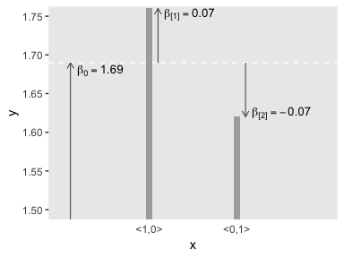
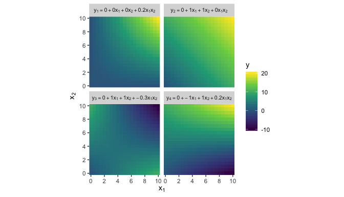
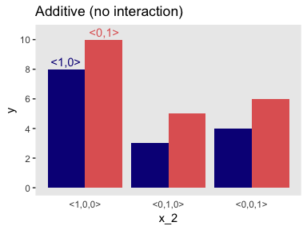
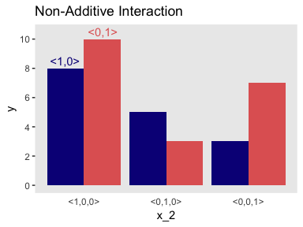
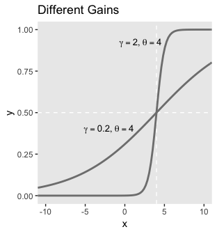
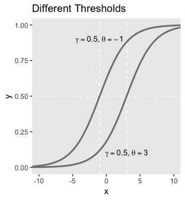
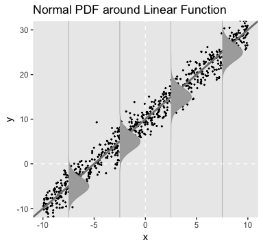

Chapter 15. Overview of the Generalized Linear Model
================
A Solomon Kurz
2018-08-12

(PART) THE GENERALIZED LINEAR MODEL
===================================

We're finally ready for the generalized linear model (GLM). "The GLM encompasses multiple linear regression, logistic regression, and Bayesian analogues to classical analysis of variance (ANOVA) and frequency-table analysis, among other cases" (p. 417).

Overview of the Generalized Linear Model
========================================

Along with the text, in this part if the project we're moving away from simple Bernoulli coin flipping examples to more complicated analyses of the type we'd actually see in applied data analysis. As Kruschke explained, we'll be using a

> versatile family of models known as the generalized linear model (GLM; [McCullagh & Nelder, 1989](https://www.crcpress.com/Generalized-Linear-Models-Second-Edition/McCullagh-Nelder/p/book/9780412317606); [Nelder & Wedderburn, 1972](https://www.jstor.org/stable/2344614?seq=1#page_scan_tab_contents)). This family of models comprises the traditional "off the shelf" analyses such as *t* tests, analysis of variance (ANOVA), multiple linear regression, logistic regression, log-linear models, etc. (p. 420)

Types of variables
------------------

### Predictor and predicted variables.

It's worth repeating the second paragraph of this subsection in its entirety.

> The key mathematical difference between predictor and predicted variables is that the likelihood function expresses the probability of values of the predicted variable as a function of values of the predictor variable. The likelihood function does not describe the probabilities of values of the predictor variable. The value of the predictor variable comes from outside the system being modeled, whereas the value of the predicted variable depends on the value of the predictor variable. (p. 420)

### Scale types: metric, ordinal, nominal, and count.

Kruschke ended this subsection with the following.

> **Why we care:** We care about the scale type because the likelihood function must specify a probability distribution on the appropriate scale. If the scale has two nominal values, then a Bernoulli likelihood function may be appropriate. If the scale is metric, then a normal distribution may be appropriate as a probability distribution to describe the data. Whenever we are choosing a model for data, we must answer the question, What kind of scale are we dealing with? (p. 423, **emphasis** in the original)

Linear combination of predictors
--------------------------------

### Linear function of a single metric predictor.

"A linear function is the generic, 'vanilla,' off-the-shelf dependency that is used in statistical models" (p. 424). Its basic form is

*y* = *β*<sub>0</sub> + *β*<sub>1</sub>*x*

We'll warm the tidyverse to make the left panel of Figure 15.1.

``` r
library(tidyverse)

tibble(x = -3:7) %>%
  mutate(y_1 = -5 + 2 * x,
         y_2 = 10 + 2 * x) %>% 
  
  ggplot(aes(x = x)) +
  geom_vline(xintercept = 0, color = "white", linetype = 2) +
  geom_hline(yintercept = 0, color = "white", linetype = 2) +
  geom_line(aes(y = y_1)) +
  geom_line(aes(y = y_2)) +
  geom_text(data = tibble(
    x = 2.25,
    y = c(-5, 10),
    label = c("y = -5 + 2x", "y = 10 + 2x")
    ),
    aes(y = y, label = label),
    size = 4.5) +
  labs(title = "Different Intercepts",
       y = "y") +
  coord_cartesian(xlim = -2:6,
                  ylim = -10:25) +
  theme(panel.grid = element_blank())
```


Here's the right panel.

``` r
tibble(x = -3:7) %>%
  mutate(y_1 = 10 + -0.5 * x,
         y_2 = 10 + 2 * x) %>% 
  
  ggplot(aes(x = x)) +
  geom_vline(xintercept = 0, color = "white", linetype = 2) +
  geom_hline(yintercept = 0, color = "white", linetype = 2) +
  geom_line(aes(y = y_1)) +
  geom_line(aes(y = y_2)) +
  geom_text(data = tibble(
    x = 4,
    y = c(11, 13.75),
    label = c("y = 10 + -0.5x", "y = 10 + 2x")
    ),
    aes(y = y, label = label),
    size = 4.5) +
  labs(title = "Different Slopes",
       y = "y") +
  coord_cartesian(xlim = -2:6,
                  ylim = -10:25) +
  theme(panel.grid = element_blank())
```


### Additive combination of metric predictors.

The linear combination of *K* predictors has the general form

*y* = *β*<sub>0</sub> + *β*<sub>1</sub>*x*<sub>1</sub> + … + *β*<sub>*K*</sub>*x*<sub>*K*</sub>

$$= \\beta\_0 + \\sum\_{k = 1}^K \\beta\_k x\_k$$

Figure 15.2 is outside of our ggplot2 capabilities.

### Nonadditive interaction of metric predictors.

Figure 15.3 is outside of our ggplot2 capabilities.

### Nominal predictors.

#### Linear model for a single nominal predictor.

> Instead of representing the value of the nominal predictor by a single scalar value *x*, we will represent the nominal predictor by a vector $\\vec{x} = \\langle x\_{\[1\]},...,x\_{\[J\]} \\rangle$ where *J* is the number of categories that the predictor has... We will denote the baseline value of the prediction as *β*<sub>0</sub>. The deflection for the *j*th level of the predictor is denoted *β*<sub>\[*j*\]</sub>. Then the predicted value is
>
> *y* = *β*<sub>0</sub> + *β*<sub>\[1\]</sub>*x*<sub>\[1\]</sub> + … + *β*<sub>\[*J*\]</sub>*x*<sub>\[*J*\]</sub>
>
> $$= \\beta\_0 + \\vec{\\beta} \\cdot \\vec{x}$$
>
> where the notation $\\vec{\\beta} \\cdot \\vec{x}$ is sometimes called the 'dot product' of the vectors. (p. 429)

#### Additive combination of nominal predictors.

Both panels in Figure 15.4 are going to require three separate data objects. Here's the top panel.

``` r
arrows <-
  tibble(x = c(0.1, 1.1, 2.1),
         y = c(1, 1.69, 1.69),
         yend = c(1.69, 1.69 + .07, 1.69 - .07))

betas <-
  tibble(x = c(0.44, 1.46, 2.51),
         y = c(1.68, 1.753, 1.625),
         label = c("beta[0] == 1.69", "beta['[1]'] == 0.07", "beta['[2]'] == -0.07"))

tibble(x = 1:2,
       y = c(1.69 + .07, 1.69 - .07)) %>% 
  
  # the plot
  ggplot(aes(x = x, y = y)) +
  geom_hline(yintercept = 1.69, color = "white", linetype = 2) +
  geom_col(width = .075, fill = "grey67") +
  geom_segment(data = arrows,
               aes(xend = x, yend = yend),
               arrow = arrow(length = unit(0.2, "cm")),
               size = 1/3, color = "grey25") +
  geom_text(data = betas,
            aes(label = label), 
            size = 3.5, parse = T) +
  scale_x_continuous(breaks = 1:2,
                     labels = c("<1,0>", "<0,1>")) +
  coord_cartesian(xlim = 0:3,
                  ylim = c(1.5, 1.75)) +
  theme(panel.grid = element_blank(),
        axis.ticks.x = element_blank())
```



Here's the bottom panel.

``` r
arrows <-
  tibble(x = c(0.1, 1.1, 2.1, 3.1, 4.1, 5.1),
         y = rep(c(50, 101), times = c(1, 5)),
         yend = c(101, 101 + 4, 101 - 3, 101 - 2, 101 + 6, 101 - 5))

betas <-
  tibble(x = c(0.41, 1.36, 2.41, 3.4, 4.35, 5.4),
         y = c(100.5, 104.5, 98.5, 99.5, 106.5, 96.5),
         label = c("beta[0] == 101", "beta['[1]'] == 4", "beta['[2]'] == -3", "beta['[3]'] == -2", "beta['[4]'] == 6", "beta['[5]'] == -5"))

tibble(x = 1:5,
       y = c(101 + 4, 101 - 3, 101 - 2, 101 + 6, 101 - 5)) %>% 

  # the plot
  ggplot(aes(x = x, y = y)) +
  geom_hline(yintercept = 101, color = "white", linetype = 2) +
  geom_col(width = .075, fill = "grey67") +
  geom_segment(data = arrows,
               aes(xend = x, yend = yend),
               arrow = arrow(length = unit(0.2, "cm")),
               size = 1/3, color = "grey25") +
  geom_text(data = betas,
            aes(label = label), 
            size = 3.5, parse = T) +
  scale_x_continuous(breaks = 1:5,
                     labels = c("<1,0,0,0,0>", "<0,1,0,0,0>", "<0,0,1,0,0>", "<0,0,0,1,0>", "<0,0,0,0,1>")) +
  coord_cartesian(xlim = c(0, 5.5),
                  ylim = c(90, 106.5)) +
  theme(panel.grid = element_blank(),
        axis.ticks.x = element_blank())
```



Here's the code for the left panel of Figure 15.5.

``` r
d <-
  tibble(x_1 = rep(c(" <1,0>", "<0,1> "), times = 4),
         x_2 = c(rep(0:2, each = 2), -0.25, 0.25),
         y = c(8, 10, 3, 5, 4, 6, 8.5, 10.5),
         type = rep(c("number", "text"), times = c(6, 2))) %>% 
  mutate(x_1 = factor(x_1, levels = c(" <1,0>", "<0,1> ")))

d %>% 
  filter(type == "number") %>% 
  
  ggplot(aes(x = x_2, y = y, fill = x_1)) +
  geom_col(position = "dodge") +
  geom_text(data = d %>% filter(type == "text"),
            aes(label = x_1, color = x_1)) +
  scale_fill_viridis_d(NULL, option = "C", end = .6) +
  scale_color_viridis_d(NULL, option = "C", end = .6) +
  scale_x_continuous(breaks = 0:2,
                     labels = c("<1,0,0>", "<0,1,0>", "<0,0,1>")) +
  scale_y_continuous(breaks = seq(from = 0, to = 10, by = 2)) +
  ggtitle("Additive (no interaction)") +
  theme(panel.grid = element_blank(),
        axis.ticks.x = element_blank(),
        legend.position = "none")
```



#### Nonadditive interaction of nominal predictors.

Now we're in nonadditive interaction land, here's the right panel of Figure 15.5.

``` r
d <-
  tibble(x_1 = rep(c(" <1,0>", "<0,1> "), times = 4),
         x_2 = c(rep(0:2, each = 2), -0.25, 0.25),
         y = c(8, 10, 5, 3, 3, 7, 8.5, 10.5),
         type = rep(c("number", "text"), times = c(6, 2))) %>% 
  mutate(x_1 = factor(x_1, levels = c(" <1,0>", "<0,1> ")))

d %>% 
  filter(type == "number") %>% 
  
  ggplot(aes(x = x_2, y = y, fill = x_1)) +
  geom_col(position = "dodge") +
  geom_text(data = d %>% filter(type == "text"),
            aes(label = x_1, color = x_1)) +
  scale_fill_viridis_d(NULL, option = "C", end = .6) +
  scale_color_viridis_d(NULL, option = "C", end = .6) +
  scale_x_continuous(breaks = 0:2,
                     labels = c("<1,0,0>", "<0,1,0>", "<0,0,1>")) +
  scale_y_continuous(breaks = seq(from = 0, to = 10, by = 2)) +
  ggtitle("Non-Additive Interaction") +
  theme(panel.grid = element_blank(),
        axis.ticks.x = element_blank(),
        legend.position = "none")
```



Linking from combined predictors to noisy predicted data
--------------------------------------------------------

### From predictors to predicted central tendency.

> After the predictor variables are combined, they need to be mapped to the predicted variable. This mathematical mapping is called the *(inverse) link function*, and is denoted by *f*() in the following equation:
>
> *y* = *f*(lin(*x*))
>
> Until now, we have been assuming that the link function is merely the identity function, *y* = *f*(lin(*x*)). (p. 436, *emphasis* in the original)

However, many models use links other than the identity function.

#### The logistic function.

The logistic link function:

$$y = \\text{logistic}(x) = \\frac{1}{\\big (1 + exp(-x) \\big )}$$

We can write the logistic function for a univariable metric predictor as

$$y = \\text{logistic}(x; \\beta\_0, \\beta\_1) = \\frac{1}{\\big (1 + exp(-(\\beta\_0 + \\beta\_1)) \\big )}$$

And if we prefer to parameterize it in terms of gain *γ* and threshold *θ*, it'd be

$$y = \\text{logistic}(x; \\gamma, \\theta) = \\frac{1}{\\big (1 + exp(-\\gamma(x - \\theta)) \\big )}$$

We can make the sexy logistic curves of Figure 15.6 with `stat_function()`, into which we'll plug our very own custom `make_logistic()` function. Here's the left panel.

``` r
make_logistic <- function(x, gamma, theta){
  1/(1 + exp(-gamma* (x - theta)))
}

# we'll need this for the annotation
params <-
  tibble(x = c(-1, 3),
         y = c(.9, .1),
         label = c('list(gamma == 0.5, theta == -1)',
                   'list(gamma == 0.5, theta == 3)'))

tibble(x = c(-11, 11)) %>% 
  ggplot(aes(x = x)) +
  geom_vline(xintercept = c(-1, 3), color = "white", linetype = 2) +
  geom_hline(yintercept = .5, color = "white", linetype = 2) +
  stat_function(fun  = make_logistic, 
                args = list(gamma = .5, theta = -1), 
                size = 1, color = "grey50") +
  stat_function(fun  = make_logistic, 
                args = list(gamma = .5, theta = 3), 
                size = 1, color = "grey50") +
  geom_text(data = params,
            aes(y = y, label = label),
            size = 3.5, parse = T) +
  coord_cartesian(xlim = -10:10) +
  ggtitle("Different Thresholds") +
  theme(panel.grid = element_blank())  
```


Here's the right panel.

``` r
params <-
  tibble(x = c(2, -2),
         y = c(.92, .4),
         label = c('list(gamma == 2, theta == 4)',
                   'list(gamma == 0.2, theta == 4)'))

tibble(x = c(-11, 11)) %>% 
  ggplot(aes(x = x)) +
  geom_vline(xintercept = 4, color = "white", linetype = 2) +
  geom_hline(yintercept = .5, color = "white", linetype = 2) +
  stat_function(fun  = make_logistic, 
                args = list(gamma = 2, theta = 4), 
                size = 1, color = "grey50") +
  stat_function(fun  = make_logistic, 
                args = list(gamma = .2, theta = 4), 
                size = 1, color = "grey50") +
  geom_text(data = params,
            aes(y = y, label = label),
            size = 3.5, parse = T) +
  coord_cartesian(xlim = -10:10) +
  ggtitle("Different Gains") +
  theme(panel.grid = element_blank())  
```



The wireframe plots of Figure 15.7 are outside of our ggplot2 purview.

#### The cumulative normal function.

> The cumulative normal is denoted *Φ*(*x*; *μ*, *σ*, where x is a real number and where *μ* and *σ* are parameter values, called the mean and standard deviation of the normal distribution. The parameter *μ* governs the point at which the cumulative normal, *Φ*(*x*), equals 0.5. In other words, *μ* plays the same role as the threshold in the logistic. The parameter *σ* governs the steepness of the cumulative normal function at *x* = *μ*, but inversely, such that a smaller value of *σ* corresponds to a steeper cumulative normal. (p. 440)

Here we plot the standard normal density in the top panel of Figure 15.8.

``` r
d <-
  tibble(x = seq(from = -4, to = 4, by = .1)) 

d %>% 
  ggplot(aes(x = x)) +
  geom_ribbon(data = d %>% filter(x <=1),
              aes(ymin = 0, ymax = dnorm(x, mean = 0, sd = 1)),
              fill = "grey67") +
  stat_function(fun  = dnorm, 
                args = list(mean = 0, sd = 1), 
                size = 1, color = "grey50") +
  coord_cartesian(xlim = -3:3) +
  labs(title = "Normal Density",
       y = "p(x)") +
  theme(panel.grid = element_blank())  
```



And here's the analogous cumulative normal function depicted in the bottom panel of Figure 15.8.

``` r
arrows <-
  tibble(x = c(0.1, 1.1, 2.1),
         y = c(1, 1.69, 1.69),
         yend = c(1.69, 1.69 + .07, 1.69 - .07))

d <-
  tibble(x = seq(from = -4, to = 4, by = .1)) 

d %>% 
  ggplot(aes(x = x)) +
  stat_function(fun  = pnorm, 
                args = list(mean = 0, sd = 1), 
                size = 1, color = "grey50") +
  geom_segment(aes(x = 1, xend = 1, 
                   y = 0, yend = pnorm(1, 0, 1)),
               arrow = arrow(length = unit(0.2, "cm")),
               size = 1/4, color = "grey25") +
  coord_cartesian(xlim = -3:3) +
  labs(title = "Cumulative Normal",
       y = expression(Phi(x))) +
  theme(panel.grid = element_blank())  
```


### From predicted central tendency to noisy data.

The only way I could figure how to tip multiple densities on their sides was with `ggridges:: geom_ridgeline()` followed by `coord_flip()`. However, that ended up tipping the densities on their right sides, whereas Kruschke tipped his to the left. If you know of a better way to mimic Kruschke’s left-tipped densities, [please share your code](https://github.com/ASKurz/Doing-Bayesian-Data-Analysis-in-brms-and-the-tidyverse/issues). But anyways, here's the top panel for Figure 15.9.

``` r
library(ggridges)

n_samples <- 750

tibble(group = c(-7.5, -2.5, 2.5, 7.5)) %>% 
  expand(group, x = seq(from = -15, to = 35, by = .1)) %>% 
  
  ggplot(aes(x = x, y = group, 
             height = dnorm(x, 10 + 2 * group, 2) * 10, 
             group = group)) +
  geom_vline(xintercept = 0, color = "white", linetype = 2) +
  geom_hline(yintercept = 0, color = "white", linetype = 2) +
  geom_point(data = tibble(group = runif(n = n_samples, -10, 10)) %>% 
               mutate(x = rnorm(n = n_samples, mean = 10 + 2 * group, sd = 2)),
             aes(x = x, y = group),
             size = 1/3) +
  geom_abline(intercept = -5, slope = 1/2,
              size = 1, color = "grey50") +
  geom_ridgeline(size = 1/6, fill = "grey67", color = "grey50") +
  coord_flip(xlim = -10:30) +
  labs(title = "Normal PDF around Linear Function",
       x = "y", 
       y = "x") +
  theme(panel.grid = element_blank()) 
```



The wireframe plots at the bottom of Figure 15.9 and in Figure 15.10 are outside of our ggplot2 purview.

Formal expression of the GLM
----------------------------

We can write the GLM as

*μ* = *f*(lin(*x*),\[parameters\])

*y* ∼ pdf(*μ*, \[parameters\])

> As has been previously explained, the predictors *x* are combined in the linear function lin(*x*), and the function *f* in \[the first equation\] is called the inverse link function. The data, *y*, are distributed around the central tendency *μ* according to the probability density function labeled "pdf." (p. 444)

### Cases of the GLM.

> When a client brings an application to a \[statistical\] consultant, one of the first things the consultant does is find out from the client which data are supposed to be predictors and which data are supposed to be predicted, and the measurement scales of the data... When you are considering how to analyze data, your first task is to be your own consultant and find out which data are predictors, which are predicted, and what measurement scales they are. (pp. 445--446)

References
----------

Kruschke, J. K. (2015). *Doing Bayesian data analysis, Second Edition: A tutorial with R, JAGS, and Stan.* Burlington, MA: Academic Press/Elsevier.

Session info
------------

``` r
sessionInfo()
```

    ## R version 3.5.1 (2018-07-02)
    ## Platform: x86_64-apple-darwin15.6.0 (64-bit)
    ## Running under: macOS High Sierra 10.13.4
    ## 
    ## Matrix products: default
    ## BLAS: /Library/Frameworks/R.framework/Versions/3.5/Resources/lib/libRblas.0.dylib
    ## LAPACK: /Library/Frameworks/R.framework/Versions/3.5/Resources/lib/libRlapack.dylib
    ## 
    ## locale:
    ## [1] en_US.UTF-8/en_US.UTF-8/en_US.UTF-8/C/en_US.UTF-8/en_US.UTF-8
    ## 
    ## attached base packages:
    ## [1] stats     graphics  grDevices utils     datasets  methods   base     
    ## 
    ## other attached packages:
    ##  [1] ggridges_0.5.0  bindrcpp_0.2.2  forcats_0.3.0   stringr_1.3.1  
    ##  [5] dplyr_0.7.6     purrr_0.2.5     readr_1.1.1     tidyr_0.8.1    
    ##  [9] tibble_1.4.2    ggplot2_3.0.0   tidyverse_1.2.1
    ## 
    ## loaded via a namespace (and not attached):
    ##  [1] tidyselect_0.2.4  reshape2_1.4.3    haven_1.1.2      
    ##  [4] lattice_0.20-35   colorspace_1.3-2  htmltools_0.3.6  
    ##  [7] viridisLite_0.3.0 yaml_2.1.19       rlang_0.2.1      
    ## [10] pillar_1.2.3      foreign_0.8-70    glue_1.2.0       
    ## [13] withr_2.1.2       modelr_0.1.2      readxl_1.1.0     
    ## [16] bindr_0.1.1       plyr_1.8.4        munsell_0.5.0    
    ## [19] gtable_0.2.0      cellranger_1.1.0  rvest_0.3.2      
    ## [22] psych_1.8.4       evaluate_0.10.1   labeling_0.3     
    ## [25] knitr_1.20        parallel_3.5.1    broom_0.4.5      
    ## [28] Rcpp_0.12.18      scales_0.5.0      backports_1.1.2  
    ## [31] jsonlite_1.5      mnormt_1.5-5      hms_0.4.2        
    ## [34] digest_0.6.15     stringi_1.2.3     grid_3.5.1       
    ## [37] rprojroot_1.3-2   cli_1.0.0         tools_3.5.1      
    ## [40] magrittr_1.5      lazyeval_0.2.1    crayon_1.3.4     
    ## [43] pkgconfig_2.0.1   xml2_1.2.0        lubridate_1.7.4  
    ## [46] assertthat_0.2.0  rmarkdown_1.10    httr_1.3.1       
    ## [49] rstudioapi_0.7    R6_2.2.2          nlme_3.1-137     
    ## [52] compiler_3.5.1
