Chapter 16. Metric-Predicted Variable on One or Two Groups
================
A Solomon Kurz
2018-08-12

Metric-Predicted Variable on One or Two Groups
==============================================

> In the context of the generalized linear model (GLM) introduced in the previous chapter, this chapter’s situation involves the most trivial cases of the linear core of the GLM, as indicated in the left cells of Table 15.1 (p. 434), with a link function that is the identity along with a normal distribution for describing noise in the data, as indicated in the first row of Table 15.2 (p. 443). We will explore options for the prior distribution on parameters of the normal distribution, and methods for Bayesian estimation of the parameters. We will also consider alternative noise distributions for describing data that have outliers. (pp. 449--450)

Estimating the mean and standard deviation of a normal distribution
-------------------------------------------------------------------

Here's the Gaussian probability density function:

$$p(y|\\mu, \\sigma) = \\frac{1}{\\sigma\\sqrt{2\\pi}}\\text{exp}(-\\frac{1}{2}\\frac{(y - \\mu)^2}{\\sigma^2})$$

We'll divide Figure 16.1 into data and plot steps. I came up with the primary data like so:

``` r
library(tidyverse)

sequence_length <- 100

d <-
  tibble(mu    = rep(c(87.8, 100, 112), each = 3)    %>% rep(., times = sequence_length),
         sigma = rep(c(7.35, 12.2, 18.4), times = 3) %>% rep(., times = sequence_length),
         y     = seq(from = 50, to = 150, length.out = sequence_length) %>% rep(., each = 9)) 

d
```

    ## # A tibble: 900 x 3
    ##       mu sigma     y
    ##    <dbl> <dbl> <dbl>
    ##  1  87.8  7.35  50  
    ##  2  87.8 12.2   50  
    ##  3  87.8 18.4   50  
    ##  4 100    7.35  50  
    ##  5 100   12.2   50  
    ##  6 100   18.4   50  
    ##  7 112    7.35  50  
    ##  8 112   12.2   50  
    ##  9 112   18.4   50  
    ## 10  87.8  7.35  51.0
    ## # ... with 890 more rows

Instead of putting the coordinates for the three data points in our tibble, I just threw them into their own tibble in the `geom_point()` function.

``` r
# here we suppress grid lines for all plots in this chapter
theme_set(theme_grey() +
            theme(panel.grid = element_blank()))

d %>% 
  ggplot(aes(x = y)) +
  geom_ribbon(aes(ymin = 0, ymax = dnorm(y, mean = mu, sd = sigma)),
              fill = "grey67") +
  geom_vline(xintercept = c(85, 100, 115), 
             linetype = 3, color = "grey92") +
  geom_point(data = tibble(y = c(85, 100, 115)),
             aes(y = 0),
             size = 2) +
  scale_y_continuous(breaks = NULL) +
  labs(title = "Competing Gaussian likelihoods given the same data",
       subtitle = expression(paste("The columns are arranged by increasing values of ", mu, " and the rows by increasing values of ", sigma, ".")),
       y = expression(paste("p(y|", mu, ", ", sigma, ")"))) +
  coord_cartesian(xlim = 60:140) +
  facet_grid(sigma ~ mu)
```

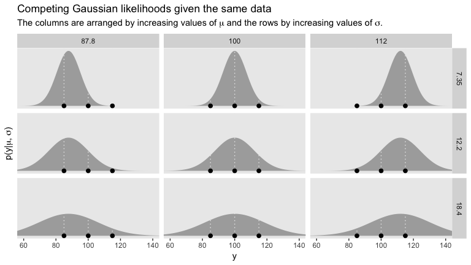

### Solution by mathematical analysis.

Nothing for us, here.

### Approximation by ~~MCMC in JAGS~~ HMC in brms.

Let's load and `glimpse()` at the data.

``` r
my_data <- read_csv("data.R/TwoGroupIQ.csv")

glimpse(my_data)
```

    ## Observations: 120
    ## Variables: 2
    ## $ Score <int> 102, 107, 92, 101, 110, 68, 119, 106, 99, 103, 90, 93, 7...
    ## $ Group <chr> "Smart Drug", "Smart Drug", "Smart Drug", "Smart Drug", ...

The data file included values from two groups.

``` r
my_data %>% 
  distinct(Group)
```

    ## # A tibble: 2 x 1
    ##   Group     
    ##   <chr>     
    ## 1 Smart Drug
    ## 2 Placebo

We'll use `filter()` to subset.

``` r
my_data <-
  my_data %>% 
  filter(Group == "Smart Drug")
```

Those subsetted data look like this:

``` r
my_data %>% 
  ggplot(aes(x = Score)) +
  geom_density(color = "transparent", fill = "grey67") +
  geom_rug(size = 1/4, alpha = 1/2) +
  scale_y_continuous(NULL, breaks = NULL) +
  ggtitle("The ticks show individual data points.")
```


Here are the mean and *S**D* of the `Score` data.

``` r
(mean_y <- mean(my_data$Score))
```

    ## [1] 107.8413

``` r
(sd_y   <- sd(my_data$Score))
```

    ## [1] 25.4452

We're ready for brms.

``` r
library(brms)
```

If we want to pass user-defined values into our `brm()` prior code, we'll need to define them first in using `brms::stanvar()`.

``` r
stanvars <- 
  stanvar(mean_y, name = "mean_y") + 
  stanvar(sd_y,   name = "sd_y")
```

Though we've saved that as `stanvars`, you could name it whatever you want. But the trick is to them tell `brm()` about your values in a `stanvars` statement. Recall that the Stan team [discourages uniform priors for variance parameters](https://github.com/stan-dev/stan/wiki/Prior-Choice-Recommendations), such as our *σ*. Here we'll use the half Normal.

``` r
fit1 <-
  brm(data = my_data,
      family = gaussian,
      Score ~ 1,
      prior = c(prior(normal(mean_y, sd_y*100), class = Intercept),
                prior(normal(0, sd_y), class = sigma)),
      chains = 4, cores = 4,
      stanvars = stanvars)
```

To be more explicit, the `stanvars = stanvars` argument at the bottom of our code is what allowed us to define our intercept prior as `normal(mean_y, sd_y*100)` instead of requiring us to type in the parameters as `normal(107.8413, 25.4452*100)`. Same basic point for our *σ* prior.

The chains look good.

``` r
plot(fit1)
```

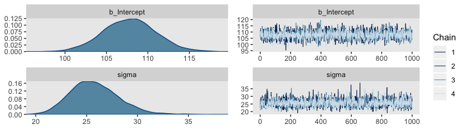

The model summary looks sensible.

``` r
print(fit1)
```

    ##  Family: gaussian 
    ##   Links: mu = identity; sigma = identity 
    ## Formula: Score ~ 1 
    ##    Data: my_data (Number of observations: 63) 
    ## Samples: 4 chains, each with iter = 2000; warmup = 1000; thin = 1;
    ##          total post-warmup samples = 4000
    ## 
    ## Population-Level Effects: 
    ##           Estimate Est.Error l-95% CI u-95% CI Eff.Sample Rhat
    ## Intercept   107.79      3.17   101.60   114.13       2845 1.00
    ## 
    ## Family Specific Parameters: 
    ##       Estimate Est.Error l-95% CI u-95% CI Eff.Sample Rhat
    ## sigma    25.77      2.38    21.68    30.77       2508 1.00
    ## 
    ## Samples were drawn using sampling(NUTS). For each parameter, Eff.Sample 
    ## is a crude measure of effective sample size, and Rhat is the potential 
    ## scale reduction factor on split chains (at convergence, Rhat = 1).

Compare those values with `mean_y` and `sd_y`.

``` r
mean_y
```

    ## [1] 107.8413

``` r
sd_y
```

    ## [1] 25.4452

``` r
post <- posterior_samples(fit1)
```

``` r
# we'll need this for `stat_pointintervalh()`
library(tidybayes)

# we'll use this to mark off the ROPEs as white strips in the background
rope <-
  tibble(key = c("Mean", "Standard Deviation", "Effect Size"), 
         xmin = c(99, 14, -.1),
         xmax = c(101, 16, .1))

# here are the primary data
post %>% 
  transmute(Mean = b_Intercept, 
            `Standard Deviation` = sigma) %>% 
  mutate(`Effect Size` = (Mean - 100)/`Standard Deviation`) %>% 
  gather() %>% 
  
  # the plot
  ggplot() +
  geom_rect(data = rope,
            aes(xmin = xmin, xmax = xmax,
                ymin = -Inf, ymax = Inf),
            color = "transparent", fill = "white") +
  geom_histogram(aes(x = value),
                 color = "grey92", fill = "grey67",
                 size = .2, bins = 30) +
  stat_pointintervalh(aes(x = value, y = 0), 
                      point_interval = mode_hdi, .width = c(.95, .5)) +
  scale_y_continuous(NULL, breaks = NULL) +
  xlab(NULL) +
  facet_wrap(~key, scales = "free", ncol = 3)
```

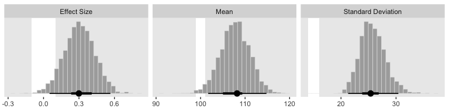

For the next part, we should look at the posterior samples.

``` r
head(post)
```

    ##   b_Intercept    sigma      lp__
    ## 1    110.1318 25.60601 -302.5416
    ## 2    111.4742 22.41811 -304.0803
    ## 3    103.7843 24.65673 -303.1658
    ## 4    112.2912 26.04151 -303.2570
    ## 5    112.9712 26.53524 -303.6079
    ## 6    108.8390 24.93883 -302.3369

`head()` returned six rows, each one corresponding to the credible parameter values from a given posterior draw. Following our model equation Score<sub>*i*</sub> *N*(*μ*, *σ*), we might reformat the first two columns as:

1.  `Score` ~ *N*(110.132, 25.606)
2.  `Score` ~ *N*(111.474, 22.418)
3.  `Score` ~ *N*(103.784, 24.657)
4.  `Score` ~ *N*(112.291, 26.042)
5.  `Score` ~ *N*(112.971, 26.535)
6.  `Score` ~ *N*(108.839, 24.939)

Each row of `post` yields a full model equation that credibly describes the data—or at least as credibly as we can within the limits of the model. We can give voice to a subset of these credible distributions with our version of the upper right panel of Figure 16.3.

``` r
# How many credible density lines would you like?
n_lines <- 63

my_data %>% 
  ggplot(aes(x = Score)) + 
  geom_histogram(aes(y = stat(density)),
                 color = "grey92", fill = "grey67",
                 size = .2, binwidth = 5, boundary = 0) +
  # this is where we specify our individual density lines
  mapply(mean = post %>% select(b_Intercept) %>% slice(1:n_lines) %>% pull(),
         sd   = post %>% select(sigma)       %>% slice(1:n_lines) %>% pull(),
         function(mean, sd) {
           stat_function(data  = tibble(Score = c(0, 250)),
                         fun   = dnorm, 
                         args  = list(mean = mean, sd = sd), 
                         size  = 1/4,
                         alpha = 1/3, 
                         color = "grey25")
           }
         ) +
  scale_y_continuous(NULL, breaks = NULL) +
  coord_cartesian(xlim = 50:210) +
  labs(title = "Posterior Predictive Distribution",
       x = "y")
```


Note the `stat(density)` argument in the `geom_histogram()` function. That’s what rescaled the histogram to the density metric. If you leave that part out, all the density lines will drop to the bottom of the plot.

Outliers and robust estimation: The *t* distribution
----------------------------------------------------

We'll employ a custom function and stick it into `map()` to make the data for Figure 16.4.

``` r
t_maker <- function(nu){
  tibble(y = seq(from = -8, to = 8, length.out = 500)) %>% 
    mutate(density = dt(y, df = nu))
  }

d <-
  tibble(nu = c(Inf, 4, 2, 1)) %>% 
  mutate(t = map(nu, t_maker)) %>% 
  unnest() %>% 
  # this line is unnecessary, but will help with the plot legend
  mutate(nu = factor(nu, levels = c("Inf", "4", "2", "1")))

d
```

    ## # A tibble: 2,000 x 3
    ##    nu        y  density
    ##    <fct> <dbl>    <dbl>
    ##  1 Inf   -8    5.05e-15
    ##  2 Inf   -7.97 6.53e-15
    ##  3 Inf   -7.94 8.42e-15
    ##  4 Inf   -7.90 1.09e-14
    ##  5 Inf   -7.87 1.40e-14
    ##  6 Inf   -7.84 1.80e-14
    ##  7 Inf   -7.81 2.31e-14
    ##  8 Inf   -7.78 2.97e-14
    ##  9 Inf   -7.74 3.81e-14
    ## 10 Inf   -7.71 4.88e-14
    ## # ... with 1,990 more rows

Behold our Student-*t* densities!

``` r
d %>% 
  ggplot(aes(x = y, y = density, group = nu, color = nu)) +
  geom_line() +
  scale_color_viridis_d(expression(paste("t"[nu])), option = "B", direction = 1, end = .8) +
  coord_cartesian(xlim = -6:6) +
  labs(y = "p(y)") +
  theme(legend.position = c(.92, .75),
        legend.background = element_rect(fill = "grey92"),
        legend.key = element_rect(color = "transparent", fill = "transparent"))
```


Here's Figure 16.5.a.

``` r
tibble(y = seq(from = -10, to = 20, length.out = 1e3)) %>% 
  ggplot(aes(x = y)) +
  geom_ribbon(aes(ymin = 0,
                  ymax = dnorm(y, mean = 2.5, sd = 5.73)),
              color = "transparent", fill = "grey50", alpha = 1/2) +
  geom_ribbon(aes(ymin = 0,
                  ymax = metRology::dt.scaled(y, df = 1.14, mean = .12, sd = 1.47)),
              color = "transparent", fill = "grey50", alpha = 1/2) +
  geom_vline(xintercept = c(.12, 2.5), color = "grey92", linetype = 3) +
  geom_point(data = tibble(y = c(-2:2, 15)),
             aes(y = 0),
             size = 2) +
  coord_cartesian(xlim = -5:15) +
  labs(title = "Maximum Likelihood Estimates",
       y = "p(y)")
```

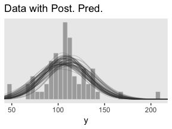

I'm now aware that we have the data for the bottom panel of Figure 16.5. However, we can simulate similar data with `rt.scaled()` from the [metRology package](https://sourceforge.net/projects/metrology/).

``` r
set.seed(145)
d <-
  tibble(y = metRology::rt.scaled(n = 177, df = 2.63, mean = 1.11, sd = 0.15))

tibble(y = seq(from = -3, to = 12, length.out = 1e3)) %>% 
  ggplot(aes(y)) +
  geom_histogram(data = d,
                 aes(y = stat(density)),
                 color = "grey92", fill = "grey67",
                 size = .2, binwidth = .1) +
  geom_line(aes(y = dnorm(y, mean = 1.16, sd = 0.63)),
              color = "grey33") +
  geom_line(aes(y = metRology::dt.scaled(y, df = 2.63, mean = 1.11, sd = 0.15)),
              color = "grey33") +
  scale_x_continuous(breaks = seq(from = -2, to = 10, by = 2)) +
  coord_cartesian(xlim = c(-1.5, 10.25)) +
  labs(title = "Maximum Likelihood Estimates",
       y = "p(y)")
```

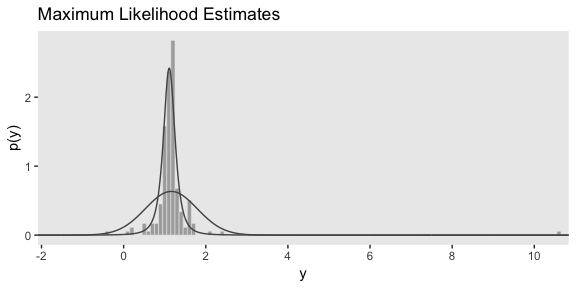

In case you were curious, this is how I selected the seed for the plot. Run the code yourself to get a sense of how it works.

``` r
# In the R Notebook code block settings, I used: fig.width = 2, fig.height = 8

t_maker <- function(seed) {
  set.seed(seed)
  tibble(y = metRology::rt.scaled(n = 177, df = 2.63, mean = 1.11, sd = 0.15)) %>% 
    summarise(min = min(y),
              max = max(y)) %>% 
    mutate(spread = max - min)
}

tibble(seed = 1:200) %>% 
  mutate(t = map(seed, t_maker)) %>% 
  unnest() %>%
  
  ggplot(aes(x = reorder(seed, spread), ymin = min, ymax = max)) +
  geom_hline(yintercept = 0, color = "white") +
  geom_linerange() +
  coord_flip()
```

Here's the left column for Figure 16.6.

``` r
# the primary data
d <-
  tibble(nu = c(Inf, 5, 2, 1)) %>% 
  # `tidyr::expand()` allows you to combine all possible combinations among variables
  # see https://tidyr.tidyverse.org/reference/expand.html
  expand(nu, y = seq(from = -8, to = 8, length.out = 1e3)) %>%
  mutate(label = str_c("nu = ", nu) %>% 
           factor(., levels = c("nu = Inf", "nu = 5", "nu = 2", "nu = 1")))

# the plot
d %>% 
  ggplot(aes(x = y)) +
  geom_ribbon(aes(ymin = 0,
                  ymax = dt(y, df = nu)),
              fill = "grey67") +
  geom_ribbon(data = d %>% 
                filter(y >= -1 & y <= 1),
              aes(ymin = 0,
                  ymax = dt(y, df = nu)),
              fill = "grey33") +
  # note how this function has its own data
  geom_text(data = tibble(
    y = 0,
    density = .175,
    label = factor(c("nu = Inf", "nu = 5", "nu = 2", "nu = 1")),
    text = c("68%", "64%", "58%", "50%")),
    aes(y = density, label = text),
    color = "grey92") +
  scale_y_continuous(breaks = c(0, .2, .4)) +
  coord_cartesian(xlim = -6:6) +
  ylab("p(y)") +
  facet_wrap(~label, ncol = 1)
```

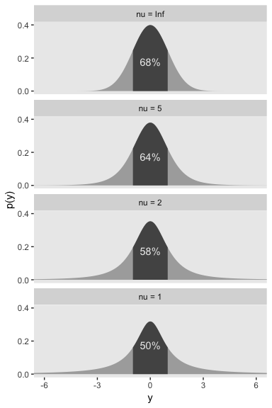

Now here's the right column.

``` r
# the primary data
d <-
  tibble(nu = c(Inf, 5, 2, 1)) %>% 
  expand(nu, y = seq(from = -8, to = 8, length.out = 1e3)) %>%
  # here we compute the 68% limits, by values of nu
  mutate(ymin = rep(c(-1.84, -1.32, -1.11, -1), each = 1e3),
         ymax = rep(c(1.84, 1.32, 1.11, 1), each = 1e3)) %>% 
  mutate(label = str_c("nu = ", nu) %>% 
           factor(., levels = c("nu = Inf", "nu = 5", "nu = 2", "nu = 1")))

# the plot
d %>% 
  ggplot(aes(x = y)) +
  geom_ribbon(aes(ymin = 0,
                  ymax = dt(y, df = nu)),
              fill = "grey67") +
  geom_ribbon(data = d %>% 
                # notice our `filter()` argument has changed
                filter(y >= ymin & y <= ymax),
              aes(ymin = 0,
                  ymax = dt(y, df = nu)),
              fill = "grey33") +
  geom_text(data = tibble(
    y = 0,
    density = .175,
    text = "68%"),
    aes(y = density, label = text),
    color = "grey92") +
  scale_y_continuous(breaks = c(0, .2, .4)) +
  coord_cartesian(xlim = -6:6) +
  ylab("p(y)") +
  facet_wrap(~label, ncol = 1)
```

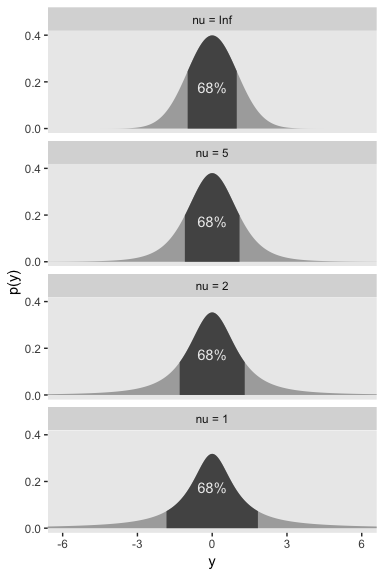

### Using the *t* distribution in ~~JAGS~~ brms.

It's easy to use Student's *t* in brms. Make sure to specify `family = student`. By default, brms already sets the lower bound for *ν* to 1. But we do still need to use 1/29. To get a sense, let's simulate.

``` r
n_draws <- 1e7
mu      <- 29

set.seed(1621)
tibble(y = rexp(n = n_draws, rate = 1/mu)) %>% 
  mutate(y_at_least_1 = ifelse(y < 1, NA, y)) %>% 
    gather() %>% 
    group_by(key) %>% 
    summarise(mean = mean(value, na.rm = T))
```

    ## # A tibble: 2 x 2
    ##   key           mean
    ##   <chr>        <dbl>
    ## 1 y             29.0
    ## 2 y_at_least_1  30.0

The simulation showed that when we define the exponential rate as 1/29 and use the typical boundary at 0, the mean of our samples converges to 29. But when we only consider the samples of 1 or greater, the mean converges to 30. Thus, our exponential(1/29) prior with a boundary at 1 is how we get a shifted exponential distribution in brms. Just make sure to remember that if you want the mean to be 30, you'll need to specify the rate of 1/29.

Also, Stan will bark if you try to enter the `1/29` into the exponential prior:

> DIAGNOSTIC(S) FROM PARSER: Warning: integer division implicitly rounds to integer. Found int division: 1 / 29 Positive values rounded down, negative values rounded up or down in platform-dependent way.

To avoid this, just do the division beforehand.

``` r
stanvars <- 
  stanvar(mean_y, name = "mean_y") + 
  stanvar(sd_y,   name = "sd_y") + 
  stanvar(1/29,   name = "one_over_twentynine")
```

Here's the `brm()` code.

``` r
fit2 <-
  brm(data = my_data,
      family = student,
      Score ~ 1,
      prior = c(prior(normal(mean_y, sd_y*100), class = Intercept),
                prior(normal(0, sd_y), class = sigma),
                prior(exponential(one_over_twentynine), class = nu)),
      chains = 4, cores = 4,
      stanvars = stanvars)
```

We can make the shifted exponential distribution (i.e., Figure 16.7) with simple addition.

``` r
# how many draws would you like?
n_draws <- 1e6

# here are the data
d <-
  tibble(exp = rexp(n_draws, rate = 1/29)) %>% 
  transmute(exp_plus_1 = exp + 1,
            log_10_exp_plus_1 = log10(exp + 1))
  
# this is the plot in the top panel
p1 <-
  d %>% 
  ggplot(aes(x = exp_plus_1)) +
  geom_histogram(color = "grey92", fill = "grey67",
                 size = .2, binwidth = 5, boundary = 1) +
  stat_pointintervalh(aes(y = 0), 
                      point_interval = mode_hdi, .prob = c(.95, .5)) +
  scale_y_continuous(NULL, breaks = NULL) +
  labs(title = expression(paste("exponential(", lambda, " = 29) shifted + 1")),
       x = expression(nu)) +
  coord_cartesian(xlim = 1:150)

# the bottom panel plot
p2 <-
  d %>% 
  ggplot(aes(x = log_10_exp_plus_1)) +
  geom_histogram(color = "grey92", fill = "grey67",
                 size = .2, binwidth = .1, boundary = 0) +
  stat_pointintervalh(aes(y = 0), 
                      point_interval = mode_hdi, .prob = c(.95, .5)) +
  scale_y_continuous(NULL, breaks = NULL) +
  labs(title = " ",
       x = expression(paste("log10(", nu, ")"))) +
  coord_cartesian(xlim = c(0, 2.5))

# here we'll use `gridExtra::grid.arrange()` to put them together
library(gridExtra)

grid.arrange(p1, p2)
```

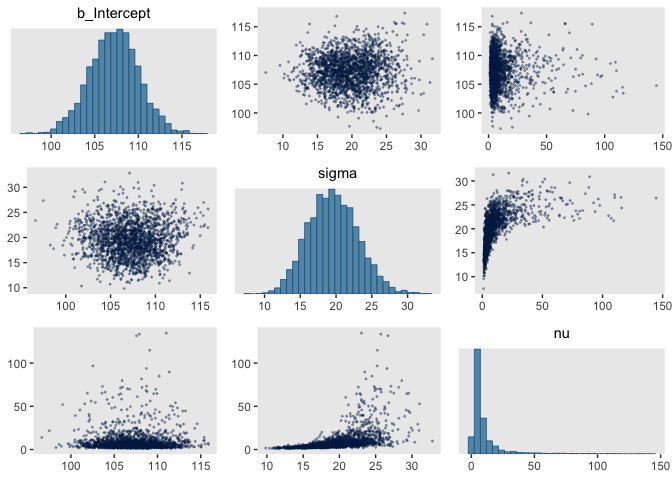

Here are the scatter plots of Figure 16.8.

``` r
pairs(fit2,
      off_diag_args = list(size = 1/3, alpha = 1/3))
```

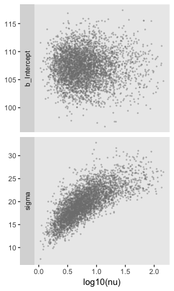

I'm not aware of an easy way to use `log10(nu)` instead of `nu` with `brms::pairs()`. However, you can get those plots with `posterior_samples()` and a little wrangling.

``` r
post <- posterior_samples(fit2)

post %>% 
  mutate(`log10(nu)` = log10(nu)) %>% 
  select(b_Intercept, sigma, `log10(nu)`) %>% 
  gather(key, value, -`log10(nu)`) %>% 
  
  ggplot(aes(x = `log10(nu)`, y = value)) +
  geom_point(color = "grey50", size = 1/3, alpha = 1/3) +
  ylab(NULL) +
  facet_grid(key~., scales = "free", switch = "y")
```

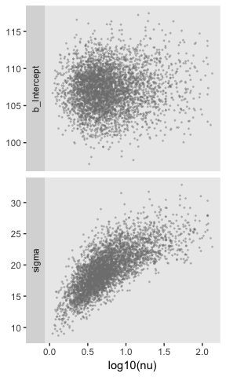

If you want the Pearson's correlations, you can use base R `cor()`.

``` r
post %>% 
  mutate(`log10(nu)` = log10(nu)) %>% 
  select(b_Intercept, sigma, `log10(nu)`) %>% 
  cor()
```

    ##             b_Intercept      sigma  log10(nu)
    ## b_Intercept  1.00000000 0.04233712 0.05651714
    ## sigma        0.04233712 1.00000000 0.73399676
    ## log10(nu)    0.05651714 0.73399676 1.00000000

Here are four of the panels for Figure 16.9.

``` r
# we'll use this to mark off the ROPEs as white strips in the background
rope <-
  tibble(key = c("Mean", "Scale", "Effect Size"), 
         xmin = c(99, 14, -.1),
         xmax = c(101, 16, .1))

# here are the primary data
post %>% 
  transmute(Mean = b_Intercept, 
            Scale = sigma,
            Normality = log10(nu)) %>% 
  mutate(`Effect Size` = (Mean - 100)/Scale) %>% 
  gather() %>% 
  
  # the plot
  ggplot() +
  geom_rect(data = rope,
            aes(xmin = xmin, xmax = xmax,
                ymin = -Inf, ymax = Inf),
            color = "transparent", fill = "white") +
  geom_histogram(aes(x = value),
                 color = "grey92", fill = "grey67",
                 size = .2, bins = 30) +
  stat_pointintervalh(aes(x = value, y = 0), 
                      point_interval = mode_hdi, .width = c(.95, .5)) +
  scale_y_continuous(NULL, breaks = NULL) +
  xlab(NULL) +
  facet_wrap(~key, scales = "free", ncol = 2)
```


Just a couple alterations to our `mapply()` code from before and we'll be set to make the final panel of Figure 16.9.

``` r
# How many credible density lines would you like?
n_lines <- 63

my_data %>% 
  ggplot(aes(x = Score)) + 
  geom_histogram(aes(y = stat(density)),
                 color = "grey92", fill = "grey67",
                 size = .2, binwidth = 5, boundary = 0) +
  # this is where we specify our individual density lines
  mapply(mean = post %>% select(b_Intercept) %>% slice(1:n_lines) %>% pull(),
         sd   = post %>% select(sigma)       %>% slice(1:n_lines) %>% pull(),
         nu   = post %>% select(nu)          %>% slice(1:n_lines) %>% pull(),
         function(nu, mean, sd) {
           stat_function(data  = tibble(Score = c(0, 250)),
                         fun = metRology::dt.scaled,
                         args  = list(df = nu, mean = mean, sd = sd), 
                         size  = 1/4,
                         alpha = 1/3, 
                         color = "grey25")
           }
         ) +
  scale_y_continuous(NULL, breaks = NULL) +
  coord_cartesian(xlim = 50:210) +
  labs(title = "Posterior Predictive Distribution",
       x = "y")
```

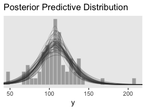

In case you were wondering, here's the model `summary()`:

``` r
summary(fit2)
```

    ##  Family: student 
    ##   Links: mu = identity; sigma = identity; nu = identity 
    ## Formula: Score ~ 1 
    ##    Data: my_data (Number of observations: 63) 
    ## Samples: 4 chains, each with iter = 2000; warmup = 1000; thin = 1;
    ##          total post-warmup samples = 4000
    ## 
    ## Population-Level Effects: 
    ##           Estimate Est.Error l-95% CI u-95% CI Eff.Sample Rhat
    ## Intercept   107.18      2.79   101.70   112.73       2500 1.00
    ## 
    ## Family Specific Parameters: 
    ##       Estimate Est.Error l-95% CI u-95% CI Eff.Sample Rhat
    ## sigma    19.36      3.39    13.15    26.24       1777 1.00
    ## nu        8.72     11.89     1.77    41.51       1827 1.00
    ## 
    ## Samples were drawn using sampling(NUTS). For each parameter, Eff.Sample 
    ## is a crude measure of effective sample size, and Rhat is the potential 
    ## scale reduction factor on split chains (at convergence, Rhat = 1).

### Using the *t* distribution in Stan.

Kruschke expressed concern about high autocorrelations in the chains of his JAGS model. Here are the results of our brms attempt:

``` r
post <- posterior_samples(fit2, add_chain = T)

library(bayesplot)

mcmc_acf(post, pars = c("b_Intercept", "sigma", "nu"), lags = 35)
```

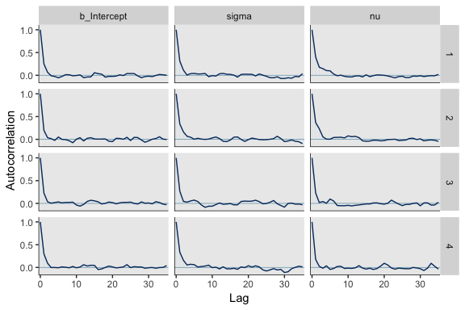

For all three parameters, the autocorrelations were near zero by lag 3 or 4. Not bad. The *N*<sub>*e**f**f*</sub>/*N* ratios are okay.

``` r
neff_ratio(fit2) %>% 
  mcmc_neff() +
  yaxis_text(hjust = 0)
```

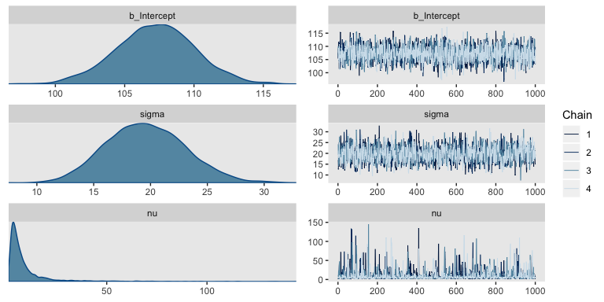

The trace plots look fine.

``` r
plot(fit2)
```

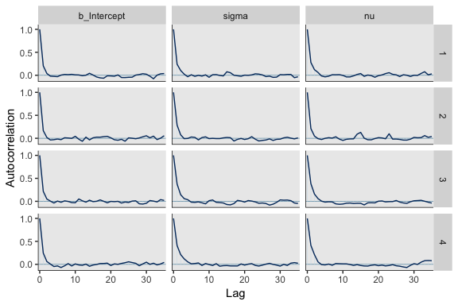

The overlaid density plots:

``` r
mcmc_dens_overlay(post, pars = c("b_Intercept", "sigma", "nu"))
```

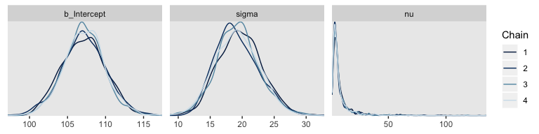

The $\\hat{R}$ values are right wherer we like them.

``` r
rhat(fit2)
```

    ## b_Intercept       sigma          nu        lp__ 
    ##   0.9997926   1.0021414   1.0002055   1.0010413

If you peer into the contents of a `brm()` fit object (e.g., `fit2 %>% str()`), you'll discover it contains the Scan code. Here it is for our `fit2`.

``` r
fit2$fit@stanmodel
```

    ## S4 class stanmodel 'student brms-model' coded as follows:
    ## // generated with brms 2.4.0
    ## functions { 
    ## 
    ##   /* compute the logm1 link 
    ##    * Args: 
    ##    *   p: a positive scalar
    ##    * Returns: 
    ##    *   a scalar in (-Inf, Inf)
    ##    */ 
    ##    real logm1(real y) { 
    ##      return log(y - 1);
    ##    }
    ##   /* compute the inverse of the logm1 link 
    ##    * Args: 
    ##    *   y: a scalar in (-Inf, Inf)
    ##    * Returns: 
    ##    *   a positive scalar
    ##    */ 
    ##    real expp1(real y) { 
    ##      return exp(y) + 1;
    ##    }
    ## } 
    ## data { 
    ##   int<lower=1> N;  // total number of observations 
    ##   vector[N] Y;  // response variable 
    ##   int prior_only;  // should the likelihood be ignored? 
    ##   real mean_y;
    ##   real sd_y;
    ##   real one_over_twentynine;
    ## } 
    ## transformed data { 
    ## } 
    ## parameters { 
    ##   real temp_Intercept;  // temporary intercept 
    ##   real<lower=0> sigma;  // residual SD 
    ##   real<lower=1> nu;  // degrees of freedom or shape 
    ## } 
    ## transformed parameters { 
    ## } 
    ## model { 
    ##   vector[N] mu = temp_Intercept + rep_vector(0, N);
    ##   // priors including all constants 
    ##   target += normal_lpdf(temp_Intercept | mean_y, sd_y * 100); 
    ##   target += normal_lpdf(sigma | 0, sd_y)
    ##     - 1 * normal_lccdf(0 | 0, sd_y); 
    ##   target += exponential_lpdf(nu | one_over_twentynine)
    ##     - 1 * exponential_lccdf(1 | one_over_twentynine); 
    ##   // likelihood including all constants 
    ##   if (!prior_only) { 
    ##     target += student_t_lpdf(Y | nu, mu, sigma);
    ##   } 
    ## } 
    ## generated quantities { 
    ##   // actual population-level intercept 
    ##   real b_Intercept = temp_Intercept; 
    ## }

Note the last line in the parameters block, "real<lower=1> nu; // degrees of freedom or shape." By default, brms set the lower bound for *ν* to 1.

Two groups
----------

Since we subset the data, earlier, we'll just reload it.

``` r
my_data <- read_csv("data.R/TwoGroupIQ.csv")

glimpse(my_data)
```

    ## Observations: 120
    ## Variables: 2
    ## $ Score <int> 102, 107, 92, 101, 110, 68, 119, 106, 99, 103, 90, 93, 7...
    ## $ Group <chr> "Smart Drug", "Smart Drug", "Smart Drug", "Smart Drug", ...

This time, we'll compute `mean_y` and `sd_y` from the full data.

``` r
(mean_y <- mean(my_data$Score))
```

    ## [1] 104.1333

``` r
(sd_y   <- sd(my_data$Score))
```

    ## [1] 22.43532

``` r
stanvars <- 
  stanvar(mean_y, name = "mean_y") + 
  stanvar(sd_y,   name = "sd_y") + 
  stanvar(1/29,   name = "one_over_twentynine")
```

Within the brms framework, Bürkner calls it distributional modeling when you model more than the mean. Since we're now modeling *μ* and *σ*, we're fitting a distributional model. When doing so in brms, you wrap your `formula` syntax into the `bf()` function. It's also important to know that when modeling *σ*, brms defaults to modeling its log. So we'll use `log(sd_y)` in its prior. For more on all this, see Bürkner"s [*Estimating Distributional Models with brms*](https://cran.r-project.org/web/packages/brms/vignettes/brms_distreg.html).

``` r
fit3 <-
  brm(data = my_data,
      family = student,
      bf(Score ~ 0 + Group, sigma ~ 0 + Group),
      prior = c(prior(normal(mean_y, sd_y*100), class = b),
                prior(normal(0, log(sd_y)), class = b, dpar = sigma),
                prior(exponential(one_over_twentynine), class = nu)),
      chains = 4, cores = 4,
      stanvars = stanvars)
```

Let's look at the model summary.

``` r
print(fit3)
```

    ##  Family: student 
    ##   Links: mu = identity; sigma = log; nu = identity 
    ## Formula: Score ~ 0 + Group 
    ##          sigma ~ 0 + Group
    ##    Data: my_data (Number of observations: 120) 
    ## Samples: 4 chains, each with iter = 2000; warmup = 1000; thin = 1;
    ##          total post-warmup samples = 4000
    ## 
    ## Population-Level Effects: 
    ##                      Estimate Est.Error l-95% CI u-95% CI Eff.Sample Rhat
    ## GroupPlacebo            99.29      1.71    95.89   102.65       4000 1.00
    ## GroupSmartDrug         107.15      2.58   102.06   112.22       4000 1.00
    ## sigma_GroupPlacebo       2.38      0.15     2.07     2.68       3424 1.00
    ## sigma_GroupSmartDrug     2.84      0.15     2.51     3.12       3668 1.00
    ## 
    ## Family Specific Parameters: 
    ##    Estimate Est.Error l-95% CI u-95% CI Eff.Sample Rhat
    ## nu     3.57      1.40     1.81     6.92       3531 1.00
    ## 
    ## Samples were drawn using sampling(NUTS). For each parameter, Eff.Sample 
    ## is a crude measure of effective sample size, and Rhat is the potential 
    ## scale reduction factor on split chains (at convergence, Rhat = 1).

Remember that the *σ*s are now in the log scale. If you want a quick and dirty conversion, you might do something like:

``` r
fixef(fit3)[3:4, 1] %>% exp()
```

    ##   sigma_GroupPlacebo sigma_GroupSmartDrug 
    ##             10.79853             17.05364

This leads us to the next subsection.

### Analysis by NHST.

Here's the *t*-test:

``` r
t.test(data = my_data,
       Score ~ Group)
```

    ## 
    ##  Welch Two Sample t-test
    ## 
    ## data:  Score by Group
    ## t = -1.958, df = 111.44, p-value = 0.05273
    ## alternative hypothesis: true difference in means is not equal to 0
    ## 95 percent confidence interval:
    ##  -15.70602585   0.09366161
    ## sample estimates:
    ##    mean in group Placebo mean in group Smart Drug 
    ##                 100.0351                 107.8413

If we want to make the histograms in Figure 16.12, we'll need to first extract the posterior samples.

``` r
post <- posterior_samples(fit3)

glimpse(post)
```

    ## Observations: 4,000
    ## Variables: 6
    ## $ b_GroupPlacebo         <dbl> 102.44772, 101.32908, 97.58249, 97.0881...
    ## $ b_GroupSmartDrug       <dbl> 107.4944, 105.9352, 108.2882, 109.1650,...
    ## $ b_sigma_GroupPlacebo   <dbl> 2.358903, 2.426973, 2.251695, 2.216543,...
    ## $ b_sigma_GroupSmartDrug <dbl> 3.002187, 2.883121, 2.731677, 2.905299,...
    ## $ nu                     <dbl> 5.229713, 4.755495, 2.157020, 2.481231,...
    ## $ lp__                   <dbl> -551.4316, -549.5570, -549.9605, -550.7...

Along with transforming the metrics of a few of the parameters, we may as well rename them to reflect those in the text.

``` r
transmuted_post <-
  post %>% 
  transmute(`Placebo Mean`      = b_GroupPlacebo,
            `Smart Drug Mean`   = b_GroupSmartDrug,
            # we need to transform the next three parameters
            `Placebo Scale`     = b_sigma_GroupPlacebo   %>% exp(),
            `Smart Drug Scale`  = b_sigma_GroupSmartDrug %>% exp(),
            Normality           = nu                     %>% log10()) %>% 
  mutate(`Difference of Means`  = `Smart Drug Mean` - `Placebo Mean`,
         `Difference of Scales` = `Smart Drug Scale` - `Placebo Scale`,
         `Effect Size` = (`Smart Drug Mean` - `Placebo Mean`)/sqrt((`Smart Drug Scale`^2 + `Placebo Scale`^2)/2))

glimpse(transmuted_post)
```

    ## Observations: 4,000
    ## Variables: 8
    ## $ `Placebo Mean`         <dbl> 102.44772, 101.32908, 97.58249, 97.0881...
    ## $ `Smart Drug Mean`      <dbl> 107.4944, 105.9352, 108.2882, 109.1650,...
    ## $ `Placebo Scale`        <dbl> 10.579335, 11.324547, 9.503832, 9.17555...
    ## $ `Smart Drug Scale`     <dbl> 20.12951, 17.86995, 15.35863, 18.27071,...
    ## $ Normality              <dbl> 0.7184778, 0.6771957, 0.3338541, 0.3946...
    ## $ `Difference of Means`  <dbl> 5.046719, 4.606133, 10.705710, 12.07678...
    ## $ `Difference of Scales` <dbl> 9.550174, 6.545406, 5.854796, 9.095157,...
    ## $ `Effect Size`          <dbl> 0.3138547, 0.3079044, 0.8382656, 0.8353...

Now we're ready for the bulk of Figure 16.12.

``` r
# we'll use this to mark off the ROPEs as white strips in the background
rope <-
  tibble(key = c("Difference of Means", "Difference of Scales", "Effect Size"), 
         xmin = c(-1, -1, -.1),
         xmax = c(1, 1, .1))

# here are the primary data
transmuted_post %>% 
  gather() %>% 
  
  # the plot
  ggplot() +
  geom_rect(data = rope,
            aes(xmin = xmin, xmax = xmax,
                ymin = -Inf, ymax = Inf),
            color = "transparent", fill = "white") +
  geom_histogram(aes(x = value),
                 color = "grey92", fill = "grey67",
                 size = .2, bins = 30) +
  stat_pointintervalh(aes(x = value, y = 0), 
                      point_interval = mode_hdi, .width = c(.95, .5)) +
  scale_y_continuous(NULL, breaks = NULL) +
  xlab(NULL) +
  facet_wrap(~key, scales = "free", ncol = 2)
```

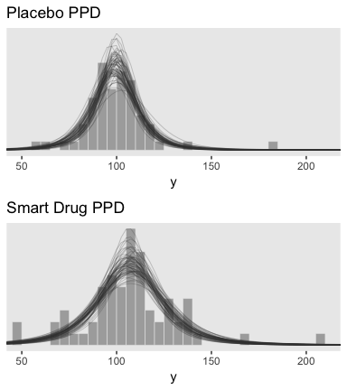

Like in the text, our mean-difference plot contradicts the *t*-test’s *p*-value.

Here are the upper two panels in the right column of Figure 16.12.

``` r
# How many credible density lines would you like?
n_lines <- 63

# Here's the plot on top
p1 <-
  my_data %>% 
  filter(Group == "Placebo") %>% 
  ggplot(aes(x = Score)) + 
  geom_histogram(aes(y = stat(density)),
                 color = "grey92", fill = "grey67",
                 size = .2, binwidth = 5, boundary = 0) +
  # this is where we specify our individual density lines
  mapply(mean = post %>% select(b_GroupPlacebo)                 %>% slice(1:n_lines) %>% pull(),
         sd   = post %>% select(b_sigma_GroupPlacebo) %>% exp() %>% slice(1:n_lines) %>% pull(),
         nu   = post %>% select(nu)                             %>% slice(1:n_lines) %>% pull(),
         function(nu, mean, sd) {
           stat_function(data  = tibble(Score = c(0, 250)),
                         fun = metRology::dt.scaled,
                         args  = list(df = nu, mean = mean, sd = sd), 
                         size  = 1/4,
                         alpha = 1/3, 
                         color = "grey25")
           }
         ) +
  scale_y_continuous(NULL, breaks = NULL) +
  coord_cartesian(xlim = 50:210) +
  labs(title = "Placebo PPD",
       x = "y")

# Here's the plot on the bottom
p2 <-
  my_data %>% 
  filter(Group != "Placebo") %>% 
  ggplot(aes(x = Score)) + 
  geom_histogram(aes(y = stat(density)),
                 color = "grey92", fill = "grey67",
                 size = .2, binwidth = 5, boundary = 0) +
  # this is where we specify our individual density lines
  mapply(mean = post %>% select(b_GroupSmartDrug)                 %>% slice(1:n_lines) %>% pull(),
         sd   = post %>% select(b_sigma_GroupSmartDrug) %>% exp() %>% slice(1:n_lines) %>% pull(),
         nu   = post %>% select(nu)                               %>% slice(1:n_lines) %>% pull(),
         function(nu, mean, sd) {
           stat_function(data  = tibble(Score = c(0, 250)),
                         fun = metRology::dt.scaled,
                         args  = list(df = nu, mean = mean, sd = sd), 
                         size  = 1/4,
                         alpha = 1/3, 
                         color = "grey25")
           }
         ) +
  scale_y_continuous(NULL, breaks = NULL) +
  coord_cartesian(xlim = 50:210) +
  labs(title = "Smart Drug PPD",
       x = "y")

# We're ready to bring them together
grid.arrange(p1, p2, ncol = 1)
```

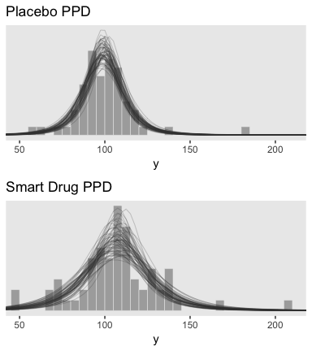

Other noise distributions and transforming data
-----------------------------------------------

It's worth repeating a portion of this section.

> If the initially assumed noise distribution does not match the data distribution, there are two ways to pursue a better description. The preferred way is to use a better noise distribution. The other way is to transform the data to a new scale so that they tolerably match the shape of the assumed noise distribution. In other words, we can either change the shoe to fit the foot, or we can squeeze the foot to fit in the shoe. Changing the shoe is preferable to squeezing the foot. In traditional statistical software, users were stuck with the pre-packaged noise distribution, and had no way to change it, so they transformed their data and squeezed them into the software. This practice can lead to confusion in interpreting the parameters because they are describing the transformed data, not the data on the original scale. In software such as \[brms, we can spend less time squeezing our feet into ill-fitting shoes\]. (p. 472)

References
----------

Kruschke, J. K. (2015). *Doing Bayesian data analysis, Second Edition: A tutorial with R, JAGS, and Stan.* Burlington, MA: Academic Press/Elsevier.

Session info
------------

``` r
sessionInfo()
```

    ## R version 3.5.1 (2018-07-02)
    ## Platform: x86_64-apple-darwin15.6.0 (64-bit)
    ## Running under: macOS High Sierra 10.13.4
    ## 
    ## Matrix products: default
    ## BLAS: /Library/Frameworks/R.framework/Versions/3.5/Resources/lib/libRblas.0.dylib
    ## LAPACK: /Library/Frameworks/R.framework/Versions/3.5/Resources/lib/libRlapack.dylib
    ## 
    ## locale:
    ## [1] en_US.UTF-8/en_US.UTF-8/en_US.UTF-8/C/en_US.UTF-8/en_US.UTF-8
    ## 
    ## attached base packages:
    ## [1] stats     graphics  grDevices utils     datasets  methods   base     
    ## 
    ## other attached packages:
    ##  [1] bayesplot_1.6.0 gridExtra_2.3   tidybayes_1.0.1 brms_2.4.0     
    ##  [5] Rcpp_0.12.18    bindrcpp_0.2.2  forcats_0.3.0   stringr_1.3.1  
    ##  [9] dplyr_0.7.6     purrr_0.2.5     readr_1.1.1     tidyr_0.8.1    
    ## [13] tibble_1.4.2    ggplot2_3.0.0   tidyverse_1.2.1
    ## 
    ## loaded via a namespace (and not attached):
    ##  [1] nlme_3.1-137              matrixStats_0.54.0       
    ##  [3] xts_0.10-2                lubridate_1.7.4          
    ##  [5] threejs_0.3.1             httr_1.3.1               
    ##  [7] LaplacesDemon_16.1.1      rprojroot_1.3-2          
    ##  [9] rstan_2.17.3              numDeriv_2016.8-1        
    ## [11] tools_3.5.1               backports_1.1.2          
    ## [13] utf8_1.1.4                R6_2.2.2                 
    ## [15] DT_0.4                    lazyeval_0.2.1           
    ## [17] colorspace_1.3-2          withr_2.1.2              
    ## [19] tidyselect_0.2.4          mnormt_1.5-5             
    ## [21] Brobdingnag_1.2-5         compiler_3.5.1           
    ## [23] cli_1.0.0                 rvest_0.3.2              
    ## [25] HDInterval_0.2.0          arrayhelpers_1.0-20160527
    ## [27] shinyjs_1.0               xml2_1.2.0               
    ## [29] labeling_0.3              colourpicker_1.0         
    ## [31] scales_0.5.0              dygraphs_1.1.1.5         
    ## [33] DEoptimR_1.0-8            robustbase_0.93-2        
    ## [35] mvtnorm_1.0-8             psych_1.8.4              
    ## [37] ggridges_0.5.0            digest_0.6.15            
    ## [39] StanHeaders_2.17.2        foreign_0.8-70           
    ## [41] rmarkdown_1.10            base64enc_0.1-3          
    ## [43] pkgconfig_2.0.1           htmltools_0.3.6          
    ## [45] htmlwidgets_1.2           rlang_0.2.1              
    ## [47] readxl_1.1.0              rstudioapi_0.7           
    ## [49] shiny_1.1.0               svUnit_0.7-12            
    ## [51] bindr_0.1.1               zoo_1.8-2                
    ## [53] jsonlite_1.5              crosstalk_1.0.0          
    ## [55] gtools_3.8.1              inline_0.3.15            
    ## [57] magrittr_1.5              loo_2.0.0                
    ## [59] Matrix_1.2-14             munsell_0.5.0            
    ## [61] abind_1.4-5               stringi_1.2.3            
    ## [63] yaml_2.1.19               MASS_7.3-50              
    ## [65] ggstance_0.3              plyr_1.8.4               
    ## [67] grid_3.5.1                parallel_3.5.1           
    ## [69] promises_1.0.1            crayon_1.3.4             
    ## [71] miniUI_0.1.1.1            lattice_0.20-35          
    ## [73] haven_1.1.2               hms_0.4.2                
    ## [75] knitr_1.20                pillar_1.2.3             
    ## [77] igraph_1.2.1              markdown_0.8             
    ## [79] shinystan_2.5.0           reshape2_1.4.3           
    ## [81] stats4_3.5.1              rstantools_1.5.0         
    ## [83] glue_1.2.0                evaluate_0.10.1          
    ## [85] modelr_0.1.2              httpuv_1.4.4.2           
    ## [87] cellranger_1.1.0          gtable_0.2.0             
    ## [89] assertthat_0.2.0          metRology_0.9-26-2       
    ## [91] mime_0.5                  xtable_1.8-2             
    ## [93] broom_0.4.5               coda_0.19-1              
    ## [95] later_0.7.3               viridisLite_0.3.0        
    ## [97] rsconnect_0.8.8           shinythemes_1.1.1        
    ## [99] bridgesampling_0.4-0
