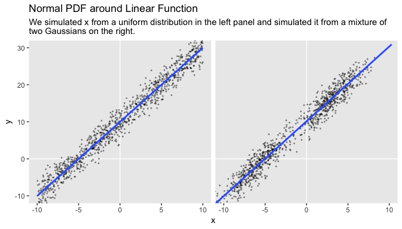
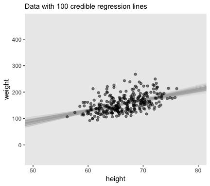
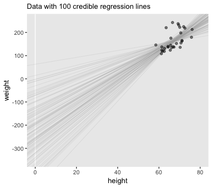
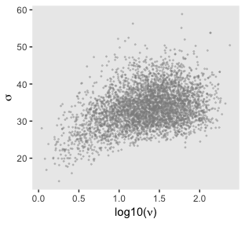
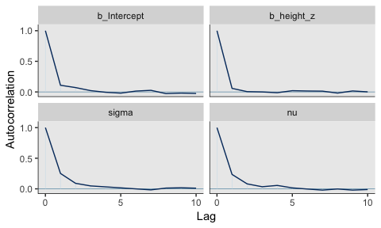
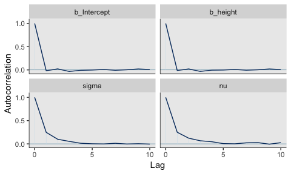
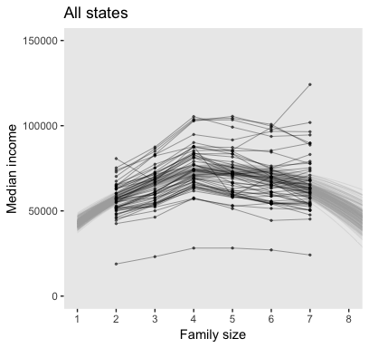
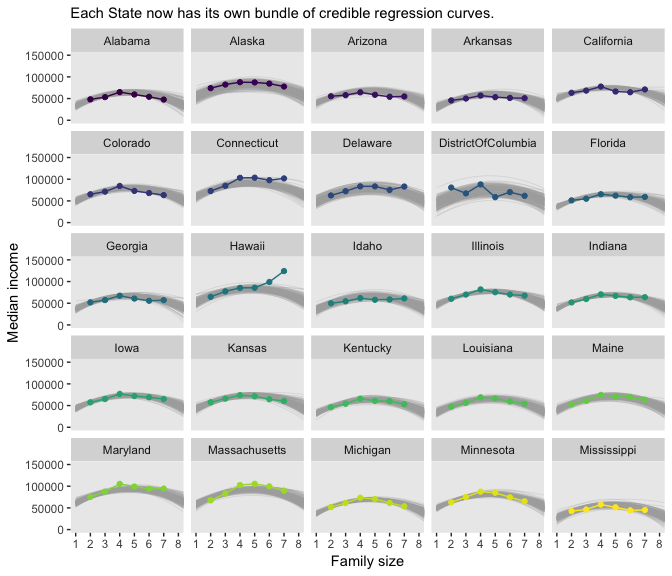
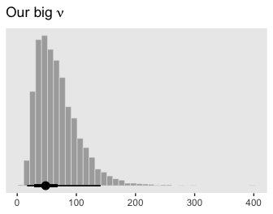

Chapter 17. Metric Predicted Variable with One Metric Predictor
================
A Solomon Kurz
2018-08-12

Metric Predicted Variable with One Metric Predictor
===================================================

> We will initially describe the relationship between the predicted variable, *y* and predictor, *x*, with a simple linear model and normally distributed residual randomness in *y*. This model is often referred to as 'simple linear regression.' We will generalize the model in three ways. First, we will give it a noise distribution that accommodates outliers, which is to say that we will replace the normal distribution with a *t* distribution as we did in the previous chapter. The model will be implemented in \[brms\]. Next, we will consider differently shaped relations between the predictor and the predicted, such as quadratic trend. Finally, we will consider hierarchical models of situations in which every individual has data that can be described by an individual trend, and we also want to estimate group-level typical trends across individuals. (p. 478)

Simple linear regression
------------------------

It wasn’t entirely clear how Kruschke simulated the bimodal data on the right panel of Figure 17.1. I figured an even split of two Gaussians would suffice and just sighted their *μ*s and *σ*s.

``` r
library(tidyverse)

# how many draws per panel would you like?
n_draw <- 1000

set.seed(1)
d <-
  tibble(panel = rep(letters[1:2], each = n_draw),
         x = c(runif(n = n_draw, -10, 10),
               rnorm(n = n_draw/2, -6, 2),
               rnorm(n = n_draw/2, 3, 2))) %>% 
  mutate(y = 10 + 2 * x + rnorm(n = n(), 0, 2))

head(d)
```

    ## # A tibble: 6 x 3
    ##   panel     x       y
    ##   <chr> <dbl>   <dbl>
    ## 1 a     -4.69   2.32 
    ## 2 a     -2.56   3.03 
    ## 3 a      1.46  14.7  
    ## 4 a      8.16  24.4  
    ## 5 a     -5.97  -0.855
    ## 6 a      7.97  25.6

Behold Figure 17.1.

``` r
theme_set(theme_grey() +
            theme(panel.grid = element_blank()))

d %>% 
  ggplot(aes(x = x, y = y)) +
  geom_vline(xintercept = 0, color = "white") +
  geom_hline(yintercept = 0, color = "white") +
  geom_point(size = 1/3, alpha = 1/3) +
  stat_smooth(method = "lm", se = F) +
  coord_cartesian(xlim = -10:10,
                  ylim = -10:30) +
  labs(title = "Normal PDF around Linear Function",
       subtitle = "We simulated x from a uniform distribution in the left panel and simulated it from a mixture of\ntwo Gaussians on the right.") +
  theme(strip.background = element_blank(),
        strip.text = element_blank()) +
  facet_wrap(~ panel)
```



Robust linear regression
------------------------

Here's Kruschke's `HtWtDataGenerator()` code.

``` r
HtWtDataGenerator <- function(nSubj, rndsd = NULL, maleProb = 0.50) {
  # Random height, weight generator for males and females. Uses parameters from
  # Brainard, J. & Burmaster, D. E. (1992). Bivariate distributions for height and
  # weight of men and women in the United States. Risk Analysis, 12(2), 267-275.
  # Kruschke, J. K. (2011). Doing Bayesian data analysis:
  # A Tutorial with R and BUGS. Academic Press / Elsevier.
  # Kruschke, J. K. (2014). Doing Bayesian data analysis, 2nd Edition:
  # A Tutorial with R, JAGS and Stan. Academic Press / Elsevier.
  
  # require(MASS)
  
  # Specify parameters of multivariate normal (MVN) distributions.
  # Men:
  HtMmu   <- 69.18
  HtMsd   <- 2.87
  lnWtMmu <- 5.14
  lnWtMsd <- 0.17
  Mrho    <- 0.42
  Mmean   <- c(HtMmu, lnWtMmu)
  Msigma  <- matrix(c(HtMsd^2, Mrho * HtMsd * lnWtMsd,
                      Mrho * HtMsd * lnWtMsd, lnWtMsd^2), nrow = 2)
  # Women cluster 1:
  HtFmu1   <- 63.11
  HtFsd1   <- 2.76
  lnWtFmu1 <- 5.06
  lnWtFsd1 <- 0.24
  Frho1    <- 0.41
  prop1    <- 0.46
  Fmean1   <- c(HtFmu1, lnWtFmu1)
  Fsigma1  <- matrix(c(HtFsd1^2, Frho1 * HtFsd1 * lnWtFsd1,
                       Frho1 * HtFsd1 * lnWtFsd1, lnWtFsd1^2), nrow = 2)
  # Women cluster 2:
  HtFmu2   <- 64.36
  HtFsd2   <- 2.49
  lnWtFmu2 <- 4.86
  lnWtFsd2 <- 0.14
  Frho2    <- 0.44
  prop2    <- 1 - prop1
  Fmean2   <- c(HtFmu2, lnWtFmu2)
  Fsigma2  <- matrix(c(HtFsd2^2, Frho2 * HtFsd2 * lnWtFsd2,
                       Frho2 * HtFsd2 * lnWtFsd2, lnWtFsd2^2), nrow = 2)
  
  # Randomly generate data values from those MVN distributions.
  if (!is.null(rndsd)) {set.seed(rndsd)}
  datamatrix <- matrix(0, nrow = nSubj, ncol = 3)
  colnames(datamatrix) <- c("male", "height", "weight")
  maleval <- 1; femaleval <- 0 # arbitrary coding values
  for (i in 1:nSubj)  {
    # Flip coin to decide sex
    sex <- sample(c(maleval, femaleval), size = 1, replace = TRUE,
                  prob = c(maleProb, 1 - maleProb))
    if (sex == maleval) {datum = MASS::mvrnorm(n = 1, mu = Mmean, Sigma = Msigma)}
    if (sex == femaleval) {
      Fclust = sample(c(1, 2), size = 1, replace = TRUE, prob = c(prop1, prop2))
      if (Fclust == 1) {datum = MASS::mvrnorm(n = 1, mu = Fmean1, Sigma = Fsigma1)}
      if (Fclust == 2) {datum = MASS::mvrnorm(n = 1, mu = Fmean2, Sigma = Fsigma2)}
    }
    datamatrix[i, ] = c(sex, round(c(datum[1], exp(datum[2])), 1))
  }
  
  return(datamatrix)
} # end function
```

Now we're ready to use `HtWtDataGenerator()` to simulate our data.

``` r
d <- 
  HtWtDataGenerator(nSubj = 300, rndsd = 1, maleProb = .50) %>% 
  as_tibble() %>% 
  # this will allow us to subset 30 of the values into their own group
  mutate(subset = rep(0:1, times = c(9, 1)) %>% rep(., 30))

head(d)
```

    ## # A tibble: 6 x 4
    ##    male height weight subset
    ##   <dbl>  <dbl>  <dbl>  <int>
    ## 1     0   63.9   142.      0
    ## 2     1   68     210.      0
    ## 3     0   63.9   162.      0
    ## 4     1   70.1   138.      0
    ## 5     1   72.5   194.      0
    ## 6     0   64.2   155.      0

#### Standardizing the data for MCMC sampling.

We'll make a custom function to standardize the `height` and `weight` values.

``` r
standardize <- function(x){
  (x - mean(x))/sd(x)
  }

d <-
  d %>% 
  mutate(height_z = standardize(height),
         weight_z = standardize(weight))
```

Somewhat analogous to how Kruschke standardized his data within the JAGS code, you could standardize the data within the `brm()` statement. That would look something like this:

``` r
fit1 <-
  brm(data = d %>%  # The standardizing occurs in the next two lines
        mutate(height_z = standardize(height),
               weight_z = standardize(weight)),
      family = student,
      weight_z ~ 1 + height_z,
      prior = c(prior(normal(0, 100), class = Intercept),
                prior(normal(0, 100), class = b),
                prior(normal(0, 1), class = sigma),
                prior(exponential(one_over_twentynine), class = nu)),
      chains = 4, cores = 4,
      stanvars = stanvars)
```

Open brms.

``` r
library(brms)
```

Here we'll save our exponential prior value with `stanvar()`.

``` r
stanvars <- 
  stanvar(1/29, name = "one_over_twentynine")
```

Instead of the uniform on *σ*, we'll continue to use a half Gaussian. With standardized data, *N*(0, 1) will work just fine. `fit1` will be of the total data sample. `fit2` is of the *n* = 30 subset.

``` r
fit1 <-
  brm(data = d,
      family = student,
      weight_z ~ 1 + height_z,
      prior = c(prior(normal(0, 100), class = Intercept),
                prior(normal(0, 100), class = b),
                prior(normal(0, 1), class = sigma),
                prior(exponential(one_over_twentynine), class = nu)),
      chains = 4, cores = 4,
      stanvars = stanvars)

fit2 <-
  update(fit1,
         newdata = d %>% 
           filter(subset == 1),
         chains = 4, cores = 4,
         stanvars = stanvars)
```

Here are the results.

``` r
print(fit1)
```

    ##  Family: student 
    ##   Links: mu = identity; sigma = identity; nu = identity 
    ## Formula: weight_z ~ 1 + height_z 
    ##    Data: d (Number of observations: 300) 
    ## Samples: 4 chains, each with iter = 2000; warmup = 1000; thin = 1;
    ##          total post-warmup samples = 4000
    ## 
    ## Population-Level Effects: 
    ##           Estimate Est.Error l-95% CI u-95% CI Eff.Sample Rhat
    ## Intercept    -0.04      0.05    -0.15     0.06       2189 1.00
    ## height_z      0.49      0.05     0.40     0.59       3423 1.00
    ## 
    ## Family Specific Parameters: 
    ##       Estimate Est.Error l-95% CI u-95% CI Eff.Sample Rhat
    ## sigma     0.81      0.05     0.70     0.90       1442 1.00
    ## nu       21.84     20.08     5.34    78.39       1914 1.00
    ## 
    ## Samples were drawn using sampling(NUTS). For each parameter, Eff.Sample 
    ## is a crude measure of effective sample size, and Rhat is the potential 
    ## scale reduction factor on split chains (at convergence, Rhat = 1).

``` r
print(fit2)
```

    ##  Family: student 
    ##   Links: mu = identity; sigma = identity; nu = identity 
    ## Formula: weight_z ~ 1 + height_z 
    ##    Data: d %>% filter(subset == 1) (Number of observations: 30) 
    ## Samples: 4 chains, each with iter = 2000; warmup = 1000; thin = 1;
    ##          total post-warmup samples = 4000
    ## 
    ## Population-Level Effects: 
    ##           Estimate Est.Error l-95% CI u-95% CI Eff.Sample Rhat
    ## Intercept     0.12      0.22    -0.32     0.53       2865 1.00
    ## height_z      0.66      0.18     0.32     1.03       4000 1.00
    ## 
    ## Family Specific Parameters: 
    ##       Estimate Est.Error l-95% CI u-95% CI Eff.Sample Rhat
    ## sigma     1.05      0.17     0.74     1.40       2346 1.00
    ## nu       32.02     29.17     3.08   110.05       3625 1.00
    ## 
    ## Samples were drawn using sampling(NUTS). For each parameter, Eff.Sample 
    ## is a crude measure of effective sample size, and Rhat is the potential 
    ## scale reduction factor on split chains (at convergence, Rhat = 1).

Based on equation 17.2, we can convert the standardized coefficients back to their original metric as follows:

$$\\beta\_0 = \\zeta\_0 SD\_y + M\_y - \\frac{\\zeta\_1 M\_x SD\_y}{SD\_x}$$

and

$$\\beta\_1 = \\frac{\\zeta\_1 SD\_y}{SD\_x}$$

To implement them, we'll first extract the posterior samples. We'll begin with `fit1`, the model for which *N* = 300.

``` r
post <- posterior_samples(fit1)

head(post)
```

    ##   b_Intercept b_height_z     sigma        nu      lp__
    ## 1 -0.02442774  0.5696294 0.8766550 21.472242 -396.8539
    ## 2  0.06132139  0.5521804 0.7772621 17.281668 -397.9910
    ## 3 -0.07389038  0.5432200 0.8087845  9.126218 -395.7106
    ## 4 -0.04525089  0.5611227 0.7953027 13.345266 -395.4955
    ## 5 -0.06166133  0.5173871 0.8619159 28.153519 -395.7052
    ## 6 -0.01211717  0.5049326 0.7410992  7.797469 -395.6738

Let's wrap the consequences of equation 17.2 into two functions.

``` r
make_beta_0 <- function(zeta_0, zeta_1, sd_x, sd_y, m_x, m_y){
  zeta_0 * sd_y + m_y - zeta_1 * m_x * sd_y / sd_x
  }

make_beta_1 <- function(zeta_1, sd_x, sd_y){
  zeta_1 * sd_y / sd_x
  }
```

After saving a few values, we're ready to use our custom functions.

``` r
sd_x <- sd(d$height)
sd_y <- sd(d$weight)
m_x  <- mean(d$height)
m_y  <- mean(d$weight)

post <-
  post %>% 
  mutate(b_0 = make_beta_0(zeta_0 = b_Intercept,
                           zeta_1 = b_height_z,
                           sd_x   = sd_x,
                           sd_y   = sd_y,
                           m_x    = m_x,
                           m_y    = m_y),
         b_1 = make_beta_1(zeta_1 = b_height_z,
                           sd_x   = sd_x,
                           sd_y   = sd_y))

glimpse(post)
```

    ## Observations: 4,000
    ## Variables: 7
    ## $ b_Intercept <dbl> -0.024427737, 0.061321393, -0.073890377, -0.045250...
    ## $ b_height_z  <dbl> 0.5696294, 0.5521804, 0.5432200, 0.5611227, 0.5173...
    ## $ sigma       <dbl> 0.8766550, 0.7772621, 0.8087845, 0.7953027, 0.8619...
    ## $ nu          <dbl> 21.472242, 17.281668, 9.126218, 13.345266, 28.1535...
    ## $ lp__        <dbl> -396.8539, -397.9910, -395.7106, -395.4955, -395.7...
    ## $ b_0         <dbl> -155.16192, -142.86802, -142.31174, -151.17981, -1...
    ## $ b_1         <dbl> 4.679014, 4.535685, 4.462083, 4.609138, 4.249888, ...

Here's the top panel of Figure 17.4.

``` r
# how many posterior lines would you like?
n_lines <- 100

ggplot(data = d, 
       aes(x = height, y = weight)) +
  geom_abline(intercept = post[1:n_lines, "b_0"], 
              slope = post[1:n_lines, "b_1"],
              color = "grey67", size = 1/4, alpha = .3) +
  geom_point(alpha = 1/2) +
  coord_cartesian(xlim = 50:80,
                  ylim = -50:470) +
  labs(subtitle = eval(substitute(paste("Data with", 
                                        n_lines, 
                                        "credible regression lines"))),
       x = "height",
       y = "weight")
```



We'll want to open the tidybayes package to help make the histograms.

``` r
library(tidybayes)
# we'll use this to mark off the ROPEs as white strips in the background
rope <-
  tibble(key  = "Slope", 
         xmin = -.5,
         xmax = .5)

# here are the primary data
post %>% 
  transmute(Intercept = b_0,
            Slope = b_1,
            Scale = sigma * sd_y,
            Normality = nu %>% log10()) %>% 
  gather() %>% 
  
  # the plot
  ggplot() +
  geom_rect(data = rope,
            aes(xmin = xmin, xmax = xmax,
                ymin = -Inf, ymax = Inf),
            color = "transparent", fill = "white") +
  geom_histogram(aes(x = value),
                 color = "grey92", fill = "grey67",
                 size = .2, bins = 40) +
  stat_pointintervalh(aes(x = value, y = 0), 
                      point_interval = mode_hdi, .width = c(.95, .5)) +
  scale_y_continuous(NULL, breaks = NULL) +
  xlab(NULL) +
  facet_wrap(~key, scales = "free", ncol = 2)
```


Here's the scatter plot for the slope and intercept.

``` r
post %>% 
  ggplot(aes(x = b_1, y = b_0)) +
  geom_point(color = "grey56", size = 1/3, alpha = 1/3) +
  labs(x = expression(beta[1]),
       y = expression(beta[0]))
```


Finally, here's the scatter plot for *l**o**g*10(*ν*) and *σ*<sub>transformed back to its raw metric</sub>.

``` r
post %>% 
  transmute(Scale = sigma * sd_y,
            Normality = nu %>% log10()) %>% 
  ggplot(aes(x = Normality, y = Scale)) +
  geom_point(color = "grey56", size = 1/3, alpha = 1/3) +
  labs(x = expression(paste("log10(", nu, ")")),
       y = expression(sigma))
```


Let's back track and make the plots for Figure 17.3 with `fit2`. We'll need to extract the posterior samples and wrangle, as before.

``` r
post <- posterior_samples(fit2)

post <-
  post %>% 
  mutate(b_0 = make_beta_0(zeta_0 = b_Intercept,
                           zeta_1 = b_height_z,
                           sd_x   = sd_x,
                           sd_y   = sd_y,
                           m_x    = m_x,
                           m_y    = m_y),
         b_1 = make_beta_1(zeta_1 = b_height_z,
                           sd_x   = sd_x,
                           sd_y   = sd_y))

glimpse(post)
```

    ## Observations: 4,000
    ## Variables: 7
    ## $ b_Intercept <dbl> 0.66022822, -0.24187304, 0.33395381, -0.03322995, ...
    ## $ b_height_z  <dbl> 0.3665995, 0.9748700, 0.4479435, 0.8840965, 0.4628...
    ## $ sigma       <dbl> 0.9796625, 1.2286597, 0.9610490, 1.1133716, 0.9954...
    ## $ nu          <dbl> 17.066994, 17.361043, 54.757297, 9.761153, 71.5773...
    ## $ lp__        <dbl> -62.27687, -60.42999, -58.58751, -58.85898, -58.42...
    ## $ b_0         <dbl> -22.17064, -383.70178, -77.12268, -327.37237, -86....
    ## $ b_1         <dbl> 3.011298, 8.007715, 3.679469, 7.262089, 3.801562, ...

Here's the top panel of Figure 17.3.

``` r
# how many posterior lines would you like?
n_lines <- 100

ggplot(data = d %>% 
         filter(subset == 1), 
       aes(x = height, y = weight)) +
  geom_vline(xintercept = 0, color = "white") +
  geom_abline(intercept = post[1:n_lines, "b_0"], 
              slope = post[1:n_lines, "b_1"],
              color = "grey67", size = 1/4, alpha = .3) +
  geom_point(alpha = 1/2) +
  scale_y_continuous(breaks = seq(from = -300, to = 200, by = 100)) +
  coord_cartesian(xlim = 0:80,
                  ylim = -350:250) +
  labs(subtitle = eval(substitute(paste("Data with", 
                                        n_lines, 
                                        "credible regression lines"))),
       x = "height",
       y = "weight")
```



Next we'll make the histograms.

``` r
# here are the primary data
post %>% 
  transmute(Intercept = b_0,
            Slope     = b_1,
            Scale     = sigma * sd_y,
            Normality = nu %>% log10()) %>% 
  gather() %>% 
  
  # the plot
  ggplot() +
  geom_rect(data = rope,
            aes(xmin = xmin, xmax = xmax,
                ymin = -Inf, ymax = Inf),
            color = "transparent", fill = "white") +
  geom_histogram(aes(x = value),
                 color = "grey92", fill = "grey67",
                 size = .2, bins = 40) +
  stat_pointintervalh(aes(x = value, y = 0), 
                      point_interval = mode_hdi, .width = c(.95, .5)) +
  scale_y_continuous(NULL, breaks = NULL) +
  xlab(NULL) +
  facet_wrap(~key, scales = "free", ncol = 2)
```


And we'll finish up with the scatter plots.

``` r
post %>% 
  ggplot(aes(x = b_1, y = b_0)) +
  geom_point(color = "grey56", size = 1/3, alpha = 1/3) +
  labs(x = expression(beta[1]),
       y = expression(beta[0]))
```


``` r
post %>% 
  transmute(Scale = sigma * sd_y,
            Normality = nu %>% log10()) %>% 
  ggplot(aes(x = Normality, y = Scale)) +
  geom_point(color = "grey56", size = 1/3, alpha = 1/3) +
  labs(x = expression(paste("log10(", nu, ")")),
       y = expression(sigma))
```



### Robust linear regression in Stan.

> Recall from Section 14.1 (p. 400) that Stan uses Hamiltonian dynamics to find proposed positions in parameter space. The trajectories use the gradient of the posterior distribution to move large distances even in narrow distributions. Thus, HMC by itself, without data standardization, should be able to efficiently generate a representative sample from the posterior distribution. (p. 487)

#### Constants for vague priors.

It's worth repeating a large portion of Kruschke's second paragraph:

> A regression slope can take on a maximum value of *S**D*<sub>*y*</sub>/*S**D*<sub>*x*</sub> for data that are perfectly correlated. Therefore, the prior on the slope will be given a standard deviation that is large compared to that maximum. The biggest that an intercept could be, for data that are perfectly correlated, is *M*<sub>*x*</sub>*S**D*<sub>*y*</sub>/*S**D*<sub>*x*</sub>. Therefore, the prior on the intercept will have a standard deviation that is large compared to that maximum.

With that in mind, we'll specify our `stanvars` as follows:

``` r
beta_0_sigma <- 10 * abs(m_x * sd_y / sd_x)
beta_1_sigma <- 10 * abs(sd_y / sd_x) 

stanvars <- 
  stanvar(beta_0_sigma, name = "beta_0_sigma") + 
  stanvar(beta_1_sigma, name = "beta_1_sigma") +
  stanvar(sd_y, name = "sd_y") +
  stanvar(1/29, name = "one_over_twentynine")
```

Now we're ready to fit `fit3`.

``` r
fit3 <-
  brm(data = d,
      family = student,
      weight ~ 1 + height,
      prior = c(prior(normal(0, beta_0_sigma), class = Intercept),
                prior(normal(0, beta_1_sigma), class = b),
                prior(normal(0, sd_y), class = sigma),
                prior(exponential(one_over_twentynine), class = nu)),
      chains = 4, cores = 4,
      stanvars = stanvars)
```

Here's the model summary.

``` r
print(fit3)
```

    ##  Family: student 
    ##   Links: mu = identity; sigma = identity; nu = identity 
    ## Formula: weight ~ 1 + height 
    ##    Data: d (Number of observations: 300) 
    ## Samples: 4 chains, each with iter = 2000; warmup = 1000; thin = 1;
    ##          total post-warmup samples = 4000
    ## 
    ## Population-Level Effects: 
    ##           Estimate Est.Error l-95% CI u-95% CI Eff.Sample Rhat
    ## Intercept  -114.72     26.44  -168.27   -63.31       3716 1.00
    ## height        4.07      0.40     3.30     4.87       3732 1.00
    ## 
    ## Family Specific Parameters: 
    ##       Estimate Est.Error l-95% CI u-95% CI Eff.Sample Rhat
    ## sigma    25.92      1.69    22.44    29.07       1969 1.00
    ## nu       23.04     21.76     5.35    84.98       2131 1.00
    ## 
    ## Samples were drawn using sampling(NUTS). For each parameter, Eff.Sample 
    ## is a crude measure of effective sample size, and Rhat is the potential 
    ## scale reduction factor on split chains (at convergence, Rhat = 1).

### Stan or JAGS?

We only fit the models in brms, which uses Stan under the hood. But since we fit the *N* = 300 model with both standardized and unstandardized data, we can compare their performance. Let's open bayesplot.

``` r
library(bayesplot)
```

They had equally impressive autocorrelation plots.

``` r
mcmc_acf(posterior_samples(fit1), pars = c("b_Intercept", "b_height_z", "sigma", "nu"), lags = 10)
```



``` r
mcmc_acf(posterior_samples(fit3), pars = c("b_Intercept", "b_height", "sigma", "nu"), lags = 10)
```



Their *N*<sub>*e**f**f*</sub>/*N* ratios were pretty similar. Both were reasonable. You'd probably want to run a simulation to contrast them with any rigor.

``` r
neff_ratio(fit1) %>% 
  mcmc_neff() +
  yaxis_text(hjust = 0)
```


``` r
neff_ratio(fit3) %>% 
  mcmc_neff() +
  yaxis_text(hjust = 0)
```


### Interpreting the posterior distribution.

Halfway through the prose, Kruschke mentioned how the models provide entire posteriors for the `weight` of a 50-inch-tall person. brms offers a few ways to do so. Since this is such a simple model, one way is to work directly with the posterior samples.

``` r
post %>% 
  mutate(weight_at_50 = b_0 + b_1*50) %>% 
  
  ggplot(aes(x = weight_at_50)) +
  geom_histogram(color = "grey92", fill = "grey67",
                 size = .2, bins = 40) +
  stat_pointintervalh(aes(y = 0), 
                      point_interval = mode_hdi, .width = c(.95, .5)) +
  scale_y_continuous(NULL, breaks = NULL) +
  xlab("lbs")
```


Looks pretty wide, doesn’t it? Hopefully this isn’t a surprise. First, this is from the posterior based on the *n* = 30 data, so most predictions from that model are uncertain. But second, this 50 inches is way out of the bounds of the data the model was based on, so we should be uncertain in this range.

Hierarchical regression on individuals within groups
----------------------------------------------------

Load the data and take a `glimpse()`.

``` r
my_data <- read_csv("data.R/HierLinRegressData.csv")

glimpse(my_data)
```

    ## Observations: 132
    ## Variables: 3
    ## $ Subj <int> 1, 1, 1, 1, 1, 1, 2, 2, 2, 2, 2, 2, 2, 2, 2, 3, 3, 3, 3, ...
    ## $ X    <dbl> 60.2, 61.5, 61.7, 62.3, 67.6, 69.2, 53.7, 60.1, 60.5, 62....
    ## $ Y    <dbl> 145.6, 157.3, 165.6, 158.8, 196.1, 183.9, 165.0, 166.9, 1...

### The model and implementation in ~~JAGS~~ brms.

Here we'll standardize the data and define our `stanvars`. I should note that when standardizing, and mean centering, more generally, becomes complicated with multilevel models. Here we're just standardizing based on the grand mean and grand standard deviation. But there are other ways to standardize, such as within groups. Craig Enders has a [good chapter](https://scholar.google.com/scholar?hl=en&as_sdt=0%2C1&q=Centering+Predictors+and+Contextual+Effects&btnG=) that touched on the topic.

``` r
my_data <-
  my_data %>% 
  mutate(X_z = standardize(X),
         Y_z = standardize(Y))

stanvars <- 
  stanvar(1/29, name = "one_over_twentynine")
```

In my experience, you typically use the `(|)` syntax when fitting a heretical model with `brm()`. The terms before the `|` are those varying by group and you tell `brm()` what the grouping variable is after the `|`. In the case of multiple group-level parameters—which is the case with this model (i.e., both intercept and the `X_z` slope--, this syntax also estimates correlations among the group-level parameters. Kruschke’s model doesn’t appear to include such a correlation. Happily, we can use the `(||)` syntax instead. This syntax omits correlations among the group-level parameters. If you’re curious about the distinction, fit the model both ways and explore the differences in the `print()` output. For more on the topic, see the *Group-level terms* subsection of the *brmsformula* section of the [brms reference manual](https://cran.r-project.org/web/packages/brms/brms.pdf)

``` r
fit4 <-
  brm(data = my_data,
      family = student,
      Y_z ~ 1 + X_z + (1 + X_z || Subj),
      prior = c(prior(normal(0, 100), class = Intercept),
                prior(normal(0, 100), class = b),
                prior(normal(0, 1), class = sigma),
                # The next line is new
                prior(normal(0, 1), class = sd),
                prior(exponential(one_over_twentynine) + 1, class = nu)),
      chains = 4, cores = 4,
      stanvars = stanvars)
```

Here's the model `summary()`.

``` r
summary(fit4)
```

    ##  Family: student 
    ##   Links: mu = identity; sigma = identity; nu = identity 
    ## Formula: Y_z ~ 1 + X_z + (1 + X_z || Subj) 
    ##    Data: my_data (Number of observations: 132) 
    ## Samples: 4 chains, each with iter = 2000; warmup = 1000; thin = 1;
    ##          total post-warmup samples = 4000
    ## 
    ## Group-Level Effects: 
    ## ~Subj (Number of levels: 25) 
    ##               Estimate Est.Error l-95% CI u-95% CI Eff.Sample Rhat
    ## sd(Intercept)     1.02      0.18     0.72     1.43       1215 1.00
    ## sd(X_z)           0.22      0.12     0.02     0.47       1049 1.00
    ## 
    ## Population-Level Effects: 
    ##           Estimate Est.Error l-95% CI u-95% CI Eff.Sample Rhat
    ## Intercept     0.07      0.22    -0.37     0.51        681 1.00
    ## X_z           0.70      0.10     0.50     0.90       2932 1.00
    ## 
    ## Family Specific Parameters: 
    ##       Estimate Est.Error l-95% CI u-95% CI Eff.Sample Rhat
    ## sigma     0.59      0.05     0.49     0.70       2022 1.00
    ## nu       38.97     30.71     6.07   121.38       4000 1.00
    ## 
    ## Samples were drawn using sampling(NUTS). For each parameter, Eff.Sample 
    ## is a crude measure of effective sample size, and Rhat is the potential 
    ## scale reduction factor on split chains (at convergence, Rhat = 1).

### The posterior distribution: Shrinkage and prediction.

``` r
post <- posterior_samples(fit4)

sd_x <- sd(my_data$X)
sd_y <- sd(my_data$Y)
m_x  <- mean(my_data$X)
m_y  <- mean(my_data$Y)

post <-
  post %>% 
  mutate(b_0 = make_beta_0(zeta_0 = b_Intercept,
                           zeta_1 = b_X_z,
                           sd_x   = sd_x,
                           sd_y   = sd_y,
                           m_x    = m_x,
                           m_y    = m_y),
         b_1 = make_beta_1(zeta_1 = b_X_z,
                           sd_x   = sd_x,
                           sd_y   = sd_y))

glimpse(post)
```

    ## Observations: 4,000
    ## Variables: 59
    ## $ b_Intercept            <dbl> -0.15947647, -0.09011372, 0.01654557, -...
    ## $ b_X_z                  <dbl> 0.7513412, 0.7583870, 0.6060494, 0.6099...
    ## $ sd_Subj__Intercept     <dbl> 1.2481155, 1.2622395, 0.9274063, 0.8534...
    ## $ sd_Subj__X_z           <dbl> 0.07457695, 0.11980253, 0.17917083, 0.1...
    ## $ sigma                  <dbl> 0.5740388, 0.5708755, 0.5947328, 0.5527...
    ## $ nu                     <dbl> 7.516306, 8.503600, 18.444346, 11.61819...
    ## $ `r_Subj[1,Intercept]`  <dbl> 0.5864715, 0.5777234, 0.8800845, 0.9217...
    ## $ `r_Subj[2,Intercept]`  <dbl> 1.4440093, 1.2110910, 1.3213647, 0.8146...
    ## $ `r_Subj[3,Intercept]`  <dbl> -0.784833721, -1.146006685, -0.83171581...
    ## $ `r_Subj[4,Intercept]`  <dbl> 0.6070684, 0.7359076, 0.9360194, 0.7090...
    ## $ `r_Subj[5,Intercept]`  <dbl> -0.26137329, 0.01385538, -0.97167167, -...
    ## $ `r_Subj[6,Intercept]`  <dbl> -1.8836238, -1.8701333, -2.4720089, -1....
    ## $ `r_Subj[7,Intercept]`  <dbl> -0.03275300, 0.06004581, -0.33436723, 0...
    ## $ `r_Subj[8,Intercept]`  <dbl> -0.542942028, -0.401056834, -0.16602951...
    ## $ `r_Subj[9,Intercept]`  <dbl> -0.05818594, -0.13805331, -0.63082746, ...
    ## $ `r_Subj[10,Intercept]` <dbl> -1.4150135, -1.1686357, -0.9109709, -1....
    ## $ `r_Subj[11,Intercept]` <dbl> 0.7350800, 0.8965772, 0.9711211, 0.7103...
    ## $ `r_Subj[12,Intercept]` <dbl> 0.14532150, 0.03020981, -0.37706776, -0...
    ## $ `r_Subj[13,Intercept]` <dbl> 1.4869159, 1.5108889, 1.3728024, 1.0303...
    ## $ `r_Subj[14,Intercept]` <dbl> 1.2433722, 1.1463145, 0.9273775, 1.0606...
    ## $ `r_Subj[15,Intercept]` <dbl> 0.297978056, 0.424257651, -0.048798315,...
    ## $ `r_Subj[16,Intercept]` <dbl> 0.785915449, 0.541581878, 0.534403498, ...
    ## $ `r_Subj[17,Intercept]` <dbl> 0.32520809, 0.31764371, -0.32654925, 0....
    ## $ `r_Subj[18,Intercept]` <dbl> -0.2704460, -0.3420773, -0.7163660, -0....
    ## $ `r_Subj[19,Intercept]` <dbl> 0.091079192, 0.243203527, 0.490396923, ...
    ## $ `r_Subj[20,Intercept]` <dbl> 1.3957870, 1.4928208, 0.5713062, 1.1776...
    ## $ `r_Subj[21,Intercept]` <dbl> 1.691428, 1.842998, 1.234873, 1.609826,...
    ## $ `r_Subj[22,Intercept]` <dbl> -0.6191658, -0.6643942, -0.4466129, -0....
    ## $ `r_Subj[23,Intercept]` <dbl> -0.31014447, -0.60645704, 0.03114977, -...
    ## $ `r_Subj[24,Intercept]` <dbl> 1.24450943, 0.64474971, 0.26818022, 0.6...
    ## $ `r_Subj[25,Intercept]` <dbl> -2.7881702, -2.2163860, 0.3674351, -0.5...
    ## $ `r_Subj[1,X_z]`        <dbl> -0.018371308, -0.014172355, 0.221722909...
    ## $ `r_Subj[2,X_z]`        <dbl> -0.175242917, -0.276435221, 0.189946149...
    ## $ `r_Subj[3,X_z]`        <dbl> -0.09744889, -0.18495550, -0.21561200, ...
    ## $ `r_Subj[4,X_z]`        <dbl> 0.008454699, -0.036010128, 0.134551131,...
    ## $ `r_Subj[5,X_z]`        <dbl> -0.070864915, -0.052431498, -0.03780627...
    ## $ `r_Subj[6,X_z]`        <dbl> -0.033482871, -0.071797356, 0.429720042...
    ## $ `r_Subj[7,X_z]`        <dbl> -0.019536149, -0.071234302, 0.014866609...
    ## $ `r_Subj[8,X_z]`        <dbl> 0.02157550, 0.02583667, 0.15104310, 0.0...
    ## $ `r_Subj[9,X_z]`        <dbl> -0.008461197, -0.060291938, 0.063462779...
    ## $ `r_Subj[10,X_z]`       <dbl> -0.063109115, -0.062089204, -0.20509236...
    ## $ `r_Subj[11,X_z]`       <dbl> -0.03411413, -0.10936009, 0.22049533, -...
    ## $ `r_Subj[12,X_z]`       <dbl> 0.0234251902, 0.0027330587, -0.01745058...
    ## $ `r_Subj[13,X_z]`       <dbl> -0.09089479, -0.09602382, 0.01740283, -...
    ## $ `r_Subj[14,X_z]`       <dbl> 0.012630664, -0.101001635, 0.149813942,...
    ## $ `r_Subj[15,X_z]`       <dbl> 0.012026116, 0.029276681, -0.096999328,...
    ## $ `r_Subj[16,X_z]`       <dbl> -0.077187494, -0.099944918, 0.003858963...
    ## $ `r_Subj[17,X_z]`       <dbl> 0.0178870009, -0.0762674220, 0.02424619...
    ## $ `r_Subj[18,X_z]`       <dbl> 0.01007892, 0.04210164, 0.18381801, 0.0...
    ## $ `r_Subj[19,X_z]`       <dbl> 0.0730629924, 0.0663265893, -0.07519033...
    ## $ `r_Subj[20,X_z]`       <dbl> 0.048189204, 0.122670281, -0.271997583,...
    ## $ `r_Subj[21,X_z]`       <dbl> 0.115162352, 0.143781402, -0.174640316,...
    ## $ `r_Subj[22,X_z]`       <dbl> 0.111880214, 0.137783070, 0.014442142, ...
    ## $ `r_Subj[23,X_z]`       <dbl> 0.010946724, -0.022657967, 0.336918832,...
    ## $ `r_Subj[24,X_z]`       <dbl> -0.086324991, -0.167730641, -0.01147905...
    ## $ `r_Subj[25,X_z]`       <dbl> 0.05564383, 0.14070382, -0.28186626, -0...
    ## $ lp__                   <dbl> -205.2002, -203.4501, -205.8123, -210.5...
    ## $ b_0                    <dbl> -77.756919, -77.653541, -28.418479, -30...
    ## $ b_1                    <dbl> 3.368508, 3.400096, 2.717117, 2.734415,...

Here's the top panel of Figure 17.4.

``` r
# how many posterior lines would you like?
n_lines <- 250

my_data %>% 
  mutate(Subj = Subj %>% as.character()) %>% 
  
  ggplot(aes(x = X, y = Y)) +
  geom_abline(intercept = post[1:n_lines, "b_0"], 
              slope = post[1:n_lines, "b_1"],
              color = "grey67", size = 1/4, alpha = .3) +
  geom_point(aes(color = Subj),
             alpha = 1/2) +
  geom_line(aes(group = Subj, color = Subj),
            size = 1/4) +
  scale_color_viridis_d() +
  scale_y_continuous(breaks = seq(from = 50, to = 250, by = 50)) +
  coord_cartesian(xlim = 40:95,
                  ylim = 30:270) +
  labs(subtitle = eval(substitute(paste("Data from all units with", n_lines, "credible population-level\nregression lines")))) +
  theme(legend.position = "none")
```


Recall how we can use `coef()` to extract the `Subj`-specific parameters. But we'll want posterior draws rather than summaries, which requires `summary = F`. It'll take a bit of wrangling to get the output in a tidy format. Once we're there, the plot code will be fairly simple.

``` r
coefs <-
  # first we'll wrangle the `coef()` output
  coef(fit4, summary = F)$Subj[, , "Intercept"] %>% 
  as_tibble() %>% 
  gather(Subj, Intercept) %>% 
  bind_cols(
    coef(fit4, summary = F)$Subj[, , "X_z"] %>% 
      as_tibble() %>% 
      gather(Subj, Slope) %>% 
      select(Slope)
  ) %>% 
  # now we're ready to un-standardize the standardized coefficients
  mutate(b_0 = make_beta_0(zeta_0 = Intercept,
                           zeta_1 = Slope,
                           sd_x   = sd_x,
                           sd_y   = sd_y,
                           m_x    = m_x,
                           m_y    = m_y),
         b_1 = make_beta_1(zeta_1 = Slope,
                           sd_x   = sd_x,
                           sd_y   = sd_y)) %>% 
  # we need an iteration index so we might `filter()` the number of lines per case
  mutate(iter = rep(1:4000, times = 25))

# how many lines would you like?
n_lines <- 250

# the plot:
my_data %>% 
  ggplot(aes(x = X, y = Y)) +
  geom_abline(data = coefs %>% filter(iter <= n_lines),
              aes(intercept = b_0, slope = b_1), 
              color = "grey67", size = 1/4, alpha = .3) +
  geom_point(aes(color = Subj)) +
  scale_color_viridis_c() +
  scale_x_continuous(breaks = seq(from = 50, to = 90,  by = 20)) +
  scale_y_continuous(breaks = seq(from = 50, to = 250, by = 100)) +
  coord_cartesian(xlim = 45:90,
                  ylim = 50:270) +
  labs(subtitle = "Each unit now has its own bundle of credible regression lines") +
  theme(legend.position = "none") +
  facet_wrap(~Subj %>% factor(., levels = 1:25))
```


Quadratic trend and weighted data
---------------------------------

Let's grab the data. Note the `comment` argument.

``` r
my_data <- read_csv("data.R/IncomeFamszState3yr.csv",
                    comment = "#")

glimpse(my_data)
```

    ## Observations: 312
    ## Variables: 4
    ## $ FamilySize   <int> 2, 3, 4, 5, 6, 7, 2, 3, 4, 5, 6, 7, 2, 3, 4, 5, 6...
    ## $ State        <chr> "Alabama", "Alabama", "Alabama", "Alabama", "Alab...
    ## $ MedianIncome <int> 48177, 53323, 64899, 59417, 54099, 47655, 73966, ...
    ## $ SampErr      <int> 581, 1177, 1170, 2446, 3781, 3561, 1858, 3236, 37...

Here we'll standardize all variables but `State`, our grouping variable. It’d be silly to try to standardize that.

``` r
my_data <-
  my_data %>% 
  mutate(FamilySize_z   = standardize(FamilySize),
         MedianIncome_z = standardize(MedianIncome),
         SampErr_z      = SampErr/(mean(SampErr)))

glimpse(my_data)
```

    ## Observations: 312
    ## Variables: 7
    ## $ FamilySize     <int> 2, 3, 4, 5, 6, 7, 2, 3, 4, 5, 6, 7, 2, 3, 4, 5,...
    ## $ State          <chr> "Alabama", "Alabama", "Alabama", "Alabama", "Al...
    ## $ MedianIncome   <int> 48177, 53323, 64899, 59417, 54099, 47655, 73966...
    ## $ SampErr        <int> 581, 1177, 1170, 2446, 3781, 3561, 1858, 3236, ...
    ## $ FamilySize_z   <dbl> -1.4615023, -0.8769014, -0.2923005, 0.2923005, ...
    ## $ MedianIncome_z <dbl> -1.2621676, -0.9138625, -0.1303452, -0.5013924,...
    ## $ SampErr_z      <dbl> 0.2242541, 0.4542979, 0.4515961, 0.9441060, 1.4...

In brms, there are a [couple ways to handle measurement error on a variable](https://github.com/ASKurz/Statistical_Rethinking_with_brms_ggplot2_and_the_tidyverse/blob/master/Ch._14_Missing_Data_and_Other_Opportunities.md). Here we’ll use the `se()` syntax, following the form `response | se(se_response, sigma = TRUE)`. In this form, `se` stands for standard error, the loose frequentist analogue to the Bayesian posterior *S**D*. Unless you're fitting a meta-analysis on summary information, make sure to specify `sigma = TRUE`. Without that you'll have no estimate for *σ*! For more information on the `se()` method, go to the [brms reference manual](https://cran.r-project.org/web/packages/brms/brms.pdf) and find the *Additional response information* subsection of the *brmsformula* section.

``` r
fit5 <-
  brm(data = my_data,
      family = student,
      MedianIncome_z | se(SampErr_z, sigma = TRUE) ~ 1 + FamilySize_z +  I(FamilySize_z^2) + 
        (1 + FamilySize_z +  I(FamilySize_z^2) || State),
      prior = c(prior(normal(0, 100), class = Intercept),
                prior(normal(0, 100), class = b),
                prior(normal(0, 1), class = sigma),
                prior(normal(0, 1), class = sd),
                prior(exponential(one_over_twentynine), class = nu)),
      chains = 4, cores = 4,
      stanvars = stanvars)
```

The model summary is as follows:

``` r
print(fit5)
```

    ##  Family: student 
    ##   Links: mu = identity; sigma = identity; nu = identity 
    ## Formula: MedianIncome_z | se(SampErr_z, sigma = TRUE) ~ 1 + FamilySize_z + I(FamilySize_z^2) + (1 + FamilySize_z + I(FamilySize_z^2) || State) 
    ##    Data: my_data (Number of observations: 312) 
    ## Samples: 4 chains, each with iter = 2000; warmup = 1000; thin = 1;
    ##          total post-warmup samples = 4000
    ## 
    ## Group-Level Effects: 
    ## ~State (Number of levels: 52) 
    ##                     Estimate Est.Error l-95% CI u-95% CI Eff.Sample Rhat
    ## sd(Intercept)           0.75      0.09     0.60     0.93        854 1.01
    ## sd(FamilySize_z)        0.07      0.04     0.00     0.16        765 1.00
    ## sd(IFamilySize_zE2)     0.06      0.04     0.00     0.13        698 1.00
    ## 
    ## Population-Level Effects: 
    ##                 Estimate Est.Error l-95% CI u-95% CI Eff.Sample Rhat
    ## Intercept           0.40      0.12     0.16     0.63        365 1.01
    ## FamilySize_z        0.13      0.05     0.02     0.23       3191 1.00
    ## IFamilySize_zE2    -0.44      0.04    -0.52    -0.35       3225 1.00
    ## 
    ## Family Specific Parameters: 
    ##       Estimate Est.Error l-95% CI u-95% CI Eff.Sample Rhat
    ## sigma     0.05      0.04     0.00     0.13       2928 1.00
    ## nu       69.14     37.06    21.00   160.71       4000 1.00
    ## 
    ## Samples were drawn using sampling(NUTS). For each parameter, Eff.Sample 
    ## is a crude measure of effective sample size, and Rhat is the potential 
    ## scale reduction factor on split chains (at convergence, Rhat = 1).

A new model type requires a different approach to un-standardizing our standardized coefficients. Based on equation 17.3, we can convert our coefficients like so:

$$\\beta\_0 = \\zeta\_0 SD\_y + M\_y - \\frac{\\zeta\_1 M\_x SD\_y}{SD\_x} + \\frac{\\zeta\_2 M^{2}\_x SD\_y}{SD^{2}\_x}$$

$$\\beta\_1 = \\frac{\\zeta\_1 SD\_y}{SD\_x} - \\frac{2 \\zeta\_2 M\_x SD\_y}{SD^{2}\_x}$$

$$\\beta\_2 = \\frac{\\zeta\_2 SD\_y}{SD^{2}\_x}$$

We'll make new custom functions to use them.

``` r
make_beta_0 <- function(zeta_0, zeta_1, zeta_2, sd_x, sd_y, m_x, m_y){
  zeta_0 * sd_y + m_y - zeta_1 * m_x * sd_y / sd_x + zeta_2 * m_x^2 * sd_y / sd_x^2
  }

make_beta_1 <- function(zeta_1, zeta_2, sd_x, sd_y, m_x){
  zeta_1 * sd_y / sd_x - 2 * zeta_2 * m_x * sd_y / sd_x^2
}

make_beta_2 <- function(zeta_2, sd_x, sd_y){
  zeta_2 * sd_y / sd_x^2
}

# may as well respecify these, too
m_x  <- mean(my_data$FamilySize)
m_y  <- mean(my_data$MedianIncome)
sd_x <- sd(my_data$FamilySize)
sd_y <- sd(my_data$MedianIncome)
```

Now we'll extract our posterior samples and make the conversions.

``` r
post <- 
  posterior_samples(fit5) %>% 
  mutate(b_0 = make_beta_0(zeta_0 = b_Intercept,
                           zeta_1 = b_FamilySize_z,
                           zeta_2 = b_IFamilySize_zE2,
                           sd_x   = sd_x,
                           sd_y   = sd_y,
                           m_x    = m_x,
                           m_y    = m_y),
         b_1 = make_beta_1(zeta_1 = b_FamilySize_z,
                           zeta_2 = b_IFamilySize_zE2,
                           sd_x   = sd_x,
                           sd_y   = sd_y,
                           m_x    = m_x),
         b_2 = make_beta_2(zeta_2 = b_IFamilySize_zE2,
                           sd_x   = sd_x,
                           sd_y   = sd_y))
```

Our `geom_abline()` approach from before won't work with curves. We'll have to resort to `geom_line()`. With the `geom_line()` approach, we'll need many specific values of model-implied `MedianIncome` across a densely-packed range of `FamilySize`. We want to use a lot of `FamilySize`, like 30 or 50 or so, to make sure the curves look smooth. Below, we'll use 50 (i.e., `length.out = 50`). But if it's still not clear why, try plugging in a lesser value, like 5 or so. You'll see.

``` r
make_curve <- function(FamilySize){
  post %>% 
    select(b_0:b_2) %>% 
    mutate(iter = 1:n(),
           MedianIncome = b_0 + b_1 * FamilySize + b_2 * FamilySize^2)
}

population_curve <-
  tibble(FamilySize = seq(from = 1, to = 9, length.out = 50)) %>% 
  mutate(MedianIncome = map(FamilySize, make_curve)) %>% 
  unnest()

head(population_curve)
```

    ## # A tibble: 6 x 6
    ##   FamilySize    b_0    b_1    b_2  iter MedianIncome
    ##        <dbl>  <dbl>  <dbl>  <dbl> <int>        <dbl>
    ## 1          1 24969. 20603. -2163.     1       43409.
    ## 2          1 20638. 22354. -2312.     2       40679.
    ## 3          1 24494. 21379. -2346.     3       43526.
    ## 4          1 26681. 18782. -1933.     4       43529.
    ## 5          1 23941. 19731. -2011.     5       41661.
    ## 6          1 24753. 20001. -2041.     6       42713.

Now we're ready to make the top panel of Figure 17.7.

``` r
# how many posterior lines would you like?
n_lines <- 200

my_data %>%
  ggplot(aes(x = FamilySize, y = MedianIncome)) +
  geom_line(data = population_curve %>% 
              filter(iter <= n_lines),
            aes(group = iter),
            size  = 1/4, alpha = 1/3, color = "grey67") +
  geom_line(aes(group = State),
            alpha = 1/2, size = 1/4) +
  geom_point(alpha = 1/2, size = 1/2) +
  scale_color_viridis_c() +
  scale_x_continuous(breaks = 1:8) +
  coord_cartesian(xlim = 1:8,
                  ylim = 0:150000) +
  labs(title = "All states",
       x = "Family size",
       y = "Median income")
```



Like before, we'll extract the group-level coefficients (i.e., those specific to the `State`s) with the `coef()` function. And like before, the `coef()` output will require a little wrangling.

``` r
coefs <-
  coef(fit5, summary = F)$State[, , "Intercept"] %>% 
  as_tibble() %>% 
  gather(State, Intercept) %>% 
  bind_cols(
    coef(fit5, summary = F)$State[, , "FamilySize_z"] %>% 
      as_tibble() %>% 
      gather(Subj, FamilySize_z) %>% 
      select(FamilySize_z)
  ) %>% 
  bind_cols(
    coef(fit5, summary = F)$State[, , "IFamilySize_zE2"] %>% 
      as_tibble() %>% 
      gather(Subj, IFamilySize_zE2) %>% 
      select(IFamilySize_zE2)
  ) %>% 
  # let's go ahead and make the standardized-to-unstandardized conversions, here
  mutate(b_0 = make_beta_0(zeta_0 = Intercept,
                           zeta_1 = FamilySize_z,
                           zeta_2 = IFamilySize_zE2,
                           sd_x   = sd_x,
                           sd_y   = sd_y,
                           m_x    = m_x,
                           m_y    = m_y),
         b_1 = make_beta_1(zeta_1 = FamilySize_z,
                           zeta_2 = IFamilySize_zE2,
                           sd_x   = sd_x,
                           sd_y   = sd_y,
                           m_x    = m_x),
         b_2 = make_beta_2(zeta_2 = IFamilySize_zE2,
                           sd_x   = sd_x,
                           sd_y   = sd_y)) %>% 
  # We just want the first 25 states, from Alabama through Mississippi, so we'll `filter()`
  filter(State <= "Mississippi")

head(coefs)
```

    ## # A tibble: 6 x 7
    ##   State   Intercept FamilySize_z IFamilySize_zE2    b_0    b_1    b_2
    ##   <chr>       <dbl>        <dbl>           <dbl>  <dbl>  <dbl>  <dbl>
    ## 1 Alabama  -0.242          0.149          -0.503  6049. 24139. -2540.
    ## 2 Alabama  -0.252          0.103          -0.377 20532. 18029. -1904.
    ## 3 Alabama  -0.106          0.108          -0.541  5674. 25543. -2734.
    ## 4 Alabama  -0.324          0.193          -0.376 16096. 18754. -1899.
    ## 5 Alabama  -0.298          0.202          -0.365 17200. 18350. -1845.
    ## 6 Alabama   0.00780        0.231          -0.393 17766. 19862. -1985.

Now we'll alter our `make_curve()` function to operate on the `coefs` data instead of `post`.

``` r
make_curve <- function(FamilySize){
  coefs %>% 
    select(State, b_0:b_2) %>% 
    mutate(iter = 1:4000 %>% rep(., times = 25),
           MedianIncome = b_0 + b_1 * FamilySize + b_2 * FamilySize^2)
}

state_curves <-
  tibble(FamilySize = seq(from = 1, to = 9, length.out = 50)) %>% 
  mutate(MedianIncome = map(FamilySize, make_curve)) %>% 
  unnest() %>% 
  ungroup()

head(state_curves)
```

    ## # A tibble: 6 x 7
    ##   FamilySize State      b_0    b_1    b_2  iter MedianIncome
    ##        <dbl> <chr>    <dbl>  <dbl>  <dbl> <int>        <dbl>
    ## 1          1 Alabama  6049. 24139. -2540.     1       27648.
    ## 2          1 Alabama 20532. 18029. -1904.     2       36657.
    ## 3          1 Alabama  5674. 25543. -2734.     3       28483.
    ## 4          1 Alabama 16096. 18754. -1899.     4       32951.
    ## 5          1 Alabama 17200. 18350. -1845.     5       33706.
    ## 6          1 Alabama 17766. 19862. -1985.     6       35643.

Finally, we're ready for the `State`-specific miniatures in Figure 17.7.

``` r
n_lines <- 200

my_data %>%
  filter(State <= "Mississippi") %>% 
 
  ggplot(aes(x = FamilySize, y = MedianIncome)) +
  geom_line(data = state_curves %>% 
              filter(iter <= n_lines),
            aes(group = iter),
            size  = 1/4, alpha = 1/3, color = "grey67") +
  geom_point(aes(color = State)) +
  geom_line(aes(color = State)) +
  scale_color_viridis_d() +
  scale_x_continuous(breaks = 1:8) +
  coord_cartesian(xlim = 1:8,
                  ylim = 0:150000) +
  labs(subtitle = "Each State now has its own bundle of credible regression curves.",
       x = "Family size",
       y = "Median income") +
  theme(legend.position = "none") +
  facet_wrap(~State)
```



### Results and interpretation.

Here are the mode and HDIs for *β*<sub>1</sub> and *β*<sub>2</sub>.

``` r
post %>% 
  select(b_1:b_2) %>% 
  gather() %>%
  group_by(key) %>% 
  mode_hdi(value) %>% 
  select(key:.upper)
```

    ## # A tibble: 2 x 4
    ##   key     value  .lower  .upper
    ##   <chr>   <dbl>   <dbl>   <dbl>
    ## 1 b_1    20856.  17703.  24058.
    ## 2 b_2    -2180.  -2614.  -1782.

Although "almost all of the posterior distribution \[was\] below *ν* = 4" in the text, the bulk of our *ν* distribution spanned across much larger values.

``` r
post %>%
  ggplot(aes(x = nu)) +
  geom_histogram(color = "grey92", fill = "grey67",
                 size = .2, bins = 40, boundary = 1) +
  stat_pointintervalh(aes(y = 0), 
                      point_interval = mode_hdi, .width = c(.95, .5)) +
  scale_y_continuous(NULL, breaks = NULL) +
  labs(title = expression(paste("Our big ", nu)),
       x = NULL)
```



I'm guessing the distinction in our *ν* distribution and that in the text is our use of the `se()` syntax in the `brm()` `formula`. If you have a better explanation, [share it](https://github.com/ASKurz/Doing-Bayesian-Data-Analysis-in-brms-and-the-tidyverse/issues).

### Further extensions.

Kruschke discussed the ease with which users of Bayesian software might specify nonlinear models. Check out Bürkner’s vignette, [*Estimating Non-Linear Models with brms*](https://cran.r-project.org/web/packages/brms/vignettes/brms_nonlinear.html) for more on the topic. Though I haven't used it, I believe it is also possible to use the *t* distribution to model group-level variation in brms.

Procedure and perils for expanding a model
------------------------------------------

For more on the PPC "double dipping" issue, check out Gelman's [*Discussion with Sander Greenland on posterior predictive checks*](http://andrewgelman.com/2014/08/11/discussion-sander-greenland-posterior-predictive-checks/) or Simpson's [*Touch me, I want to feel your data*](http://andrewgelman.com/2017/09/07/touch-want-feel-data/), which is itself connected to Gabry and colleagues' [*Visualization in Bayesian workflow*](https://arxiv.org/abs/1709.01449).

References
----------

Kruschke, J. K. (2015). *Doing Bayesian data analysis, Second Edition: A tutorial with R, JAGS, and Stan.* Burlington, MA: Academic Press/Elsevier.

Session info
------------

``` r
sessionInfo()
```

    ## R version 3.5.1 (2018-07-02)
    ## Platform: x86_64-apple-darwin15.6.0 (64-bit)
    ## Running under: macOS High Sierra 10.13.4
    ## 
    ## Matrix products: default
    ## BLAS: /Library/Frameworks/R.framework/Versions/3.5/Resources/lib/libRblas.0.dylib
    ## LAPACK: /Library/Frameworks/R.framework/Versions/3.5/Resources/lib/libRlapack.dylib
    ## 
    ## locale:
    ## [1] en_US.UTF-8/en_US.UTF-8/en_US.UTF-8/C/en_US.UTF-8/en_US.UTF-8
    ## 
    ## attached base packages:
    ## [1] stats     graphics  grDevices utils     datasets  methods   base     
    ## 
    ## other attached packages:
    ##  [1] bayesplot_1.6.0 tidybayes_1.0.1 brms_2.4.0      Rcpp_0.12.18   
    ##  [5] bindrcpp_0.2.2  forcats_0.3.0   stringr_1.3.1   dplyr_0.7.6    
    ##  [9] purrr_0.2.5     readr_1.1.1     tidyr_0.8.1     tibble_1.4.2   
    ## [13] ggplot2_3.0.0   tidyverse_1.2.1
    ## 
    ## loaded via a namespace (and not attached):
    ##  [1] nlme_3.1-137              matrixStats_0.54.0       
    ##  [3] xts_0.10-2                lubridate_1.7.4          
    ##  [5] threejs_0.3.1             httr_1.3.1               
    ##  [7] LaplacesDemon_16.1.1      rprojroot_1.3-2          
    ##  [9] rstan_2.17.3              tools_3.5.1              
    ## [11] backports_1.1.2           utf8_1.1.4               
    ## [13] R6_2.2.2                  DT_0.4                   
    ## [15] lazyeval_0.2.1            colorspace_1.3-2         
    ## [17] withr_2.1.2               tidyselect_0.2.4         
    ## [19] gridExtra_2.3             mnormt_1.5-5             
    ## [21] Brobdingnag_1.2-5         compiler_3.5.1           
    ## [23] cli_1.0.0                 rvest_0.3.2              
    ## [25] HDInterval_0.2.0          arrayhelpers_1.0-20160527
    ## [27] shinyjs_1.0               xml2_1.2.0               
    ## [29] labeling_0.3              colourpicker_1.0         
    ## [31] scales_0.5.0              dygraphs_1.1.1.5         
    ## [33] mvtnorm_1.0-8             psych_1.8.4              
    ## [35] ggridges_0.5.0            digest_0.6.15            
    ## [37] StanHeaders_2.17.2        foreign_0.8-70           
    ## [39] rmarkdown_1.10            base64enc_0.1-3          
    ## [41] pkgconfig_2.0.1           htmltools_0.3.6          
    ## [43] htmlwidgets_1.2           rlang_0.2.1              
    ## [45] readxl_1.1.0              rstudioapi_0.7           
    ## [47] shiny_1.1.0               svUnit_0.7-12            
    ## [49] bindr_0.1.1               zoo_1.8-2                
    ## [51] jsonlite_1.5              crosstalk_1.0.0          
    ## [53] gtools_3.8.1              inline_0.3.15            
    ## [55] magrittr_1.5              loo_2.0.0                
    ## [57] Matrix_1.2-14             munsell_0.5.0            
    ## [59] abind_1.4-5               stringi_1.2.3            
    ## [61] yaml_2.1.19               MASS_7.3-50              
    ## [63] ggstance_0.3              plyr_1.8.4               
    ## [65] grid_3.5.1                parallel_3.5.1           
    ## [67] promises_1.0.1            crayon_1.3.4             
    ## [69] miniUI_0.1.1.1            lattice_0.20-35          
    ## [71] haven_1.1.2               hms_0.4.2                
    ## [73] knitr_1.20                pillar_1.2.3             
    ## [75] igraph_1.2.1              markdown_0.8             
    ## [77] shinystan_2.5.0           codetools_0.2-15         
    ## [79] reshape2_1.4.3            stats4_3.5.1             
    ## [81] rstantools_1.5.0          glue_1.2.0               
    ## [83] evaluate_0.10.1           modelr_0.1.2             
    ## [85] httpuv_1.4.4.2            cellranger_1.1.0         
    ## [87] gtable_0.2.0              assertthat_0.2.0         
    ## [89] mime_0.5                  xtable_1.8-2             
    ## [91] broom_0.4.5               coda_0.19-1              
    ## [93] later_0.7.3               viridisLite_0.3.0        
    ## [95] rsconnect_0.8.8           shinythemes_1.1.1        
    ## [97] bridgesampling_0.4-0
