Chapter 18. Metric Predicted Variable with Multiple Metric Predictors
================
A Solomon Kurz
2018-08-11

Metric Predicted Variable with Multiple Metric Predictors
=========================================================

> We will consider models in which the predicted variable is an additive combination of predictors, all of which have proportional influence on the prediction. This kind of model is called *multiple linear regression*. We will also consider nonadditive combinations of predictors, which are called *interactions*. (p. 509, *emphasis* in the original)

Multiple linear regression
--------------------------

If *y* *N*(*μ*, *σ*) and *μ* = *β*<sub>0</sub> + *β*<sub>1</sub>*x*<sub>1</sub> + *β*<sub>2</sub>*x*<sub>2</sub>, then it's also the case that we can rewrite the formula for *y* as:

*y* *N*(*β*<sub>0</sub> + *β*<sub>1</sub>*x*<sub>1</sub> + *β*<sub>2</sub>*x*<sub>2</sub>, *σ*)

As Kruschke pointed out, the basic model "assumes homogeneity of variance, which means that at all values of *x*<sub>1</sub> and *x*<sub>2</sub>, the variance *σ*<sup>2</sup> of *y* is the same" (p. 510).

If we presume the data for the two *x* variables are uniformly distributed within 0 and 10, we can make the data for Figure 18.1 like this.

``` r
library(tidyverse)

n <- 300

set.seed(18.1)
d <-
  tibble(x_1 = runif(n = n, 0, 10),
         x_2 = runif(n = n, 0, 10)) %>% 
  mutate(y = rnorm(n = n, mean = 10 + x_1 + 2 * x_2))

head(d)  
```

    ## # A tibble: 6 x 3
    ##     x_1   x_2     y
    ##   <dbl> <dbl> <dbl>
    ## 1 8.23   8.62  36.9
    ## 2 7.10   1.33  20.3
    ## 3 9.66   1.08  19.5
    ## 4 0.786  7.09  25.1
    ## 5 0.536  6.67  25.6
    ## 6 5.75   4.72  25.7

Here are three of the scatter plots in Figure 18.1.

``` r
theme_set(theme_grey() +
            theme(panel.grid = element_blank()))

d %>% 
  ggplot(aes(x = x_1, y = y)) +
  geom_point(alpha = 2/3) +
  coord_cartesian(ylim = 0:50)
```


``` r
d %>% 
  ggplot(aes(x = x_2, y = y)) +
  geom_point(alpha = 2/3) +
  coord_cartesian(ylim = 0:50)
```


``` r
d %>% 
  ggplot(aes(x = x_1, y = x_2)) +
  geom_vline(xintercept = seq(from = 0, to = 10, by = .5), color = "grey98") +
  geom_hline(yintercept = seq(from = 0, to = 10, by = .5), color = "grey98") +
  geom_point(alpha = 2/3)
```

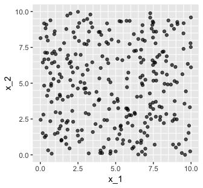

As in previous chapters, I'm not aware that ggplot2 allows for three-dimensional plots of the kind in the upper left panel. If you'd like to make one in base R, have at it. But with respect to the plots in the off-diagonal, I have no idea what Kruschke did with the compressed and diagonal grids. If you have that figured out, please [share your code](https://github.com/ASKurz/Doing-Bayesian-Data-Analysis-in-brms-and-the-tidyverse/issues).

For Figure 18.2, the *x* variables look to be multivariate normal with a correlation of about -.95. We can simulate such data with help from the MASS package.

Sven Hohenstein's [answer to this stats.stackexchange.com question](https://stats.stackexchange.com/questions/164471/generating-a-simulated-dataset-from-a-correlation-matrix-with-means-and-standard)

``` r
mus <- c(5, 5)
sds <- c(2, 2)

cors <- matrix(c(1, -.95,
                 -.95, 1), 
               ncol = 2)
cors
```

    ##       [,1]  [,2]
    ## [1,]  1.00 -0.95
    ## [2,] -0.95  1.00

``` r
covs <- sds %*% t(sds) * cors
covs
```

    ##      [,1] [,2]
    ## [1,]  4.0 -3.8
    ## [2,] -3.8  4.0

``` r
n <- 300

set.seed(18.2)

d <- 
  MASS::mvrnorm(n         = n, 
                mu        = mus, 
                Sigma     = covs, 
                empirical = T) %>% 
  as_tibble() %>% 
  rename(x_1 = V1,
         x_2 = V2) %>% 
  mutate(y = rnorm(n = n, mean = 10 + x_1 + 2 * x_2))
```

``` r
d %>% 
  ggplot(aes(x = x_1, y = y)) +
  geom_point(alpha = 2/3) +
  coord_cartesian(xlim = 0:10,
                  ylim = 0:50)
```

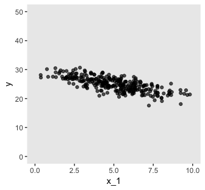

``` r
d %>% 
  ggplot(aes(x = x_2, y = y)) +
  geom_point(alpha = 2/3) +
  coord_cartesian(xlim = 0:10,
                  ylim = 0:50)
```


``` r
d %>% 
  ggplot(aes(x = x_1, y = x_2)) +
  geom_vline(xintercept = seq(from = 0, to = 10, by = .5), color = "grey98") +
  geom_hline(yintercept = seq(from = 0, to = 10, by = .5), color = "grey98") +
  geom_point(alpha = 2/3) +
  coord_cartesian(xlim = 0:10,
                  ylim = 0:10)
```


### The perils of correlated predictors.

Before we remake Figure 18.3, we'll need to load the data.

``` r
my_data <- read_csv("data.R/Guber1999data.csv")

glimpse(my_data)
```

    ## Observations: 50
    ## Variables: 8
    ## $ State     <chr> "Alabama", "Alaska", "Arizona", "Arkansas", "Califor...
    ## $ Spend     <dbl> 4.405, 8.963, 4.778, 4.459, 4.992, 5.443, 8.817, 7.0...
    ## $ StuTeaRat <dbl> 17.2, 17.6, 19.3, 17.1, 24.0, 18.4, 14.4, 16.6, 19.1...
    ## $ Salary    <dbl> 31.144, 47.951, 32.175, 28.934, 41.078, 34.571, 50.0...
    ## $ PrcntTake <int> 8, 47, 27, 6, 45, 29, 81, 68, 48, 65, 57, 15, 13, 58...
    ## $ SATV      <int> 491, 445, 448, 482, 417, 462, 431, 429, 420, 406, 40...
    ## $ SATM      <int> 538, 489, 496, 523, 485, 518, 477, 468, 469, 448, 48...
    ## $ SATT      <int> 1029, 934, 944, 1005, 902, 980, 908, 897, 889, 854, ...

Now we have the Guber (1999) data, here are three of the four plots.

``` r
my_data %>% 
  ggplot(aes(x = Spend, y = SATT)) +
  geom_point(alpha = 2/3) +
  coord_cartesian(ylim = 800:1120)
```


``` r
my_data %>% 
  ggplot(aes(x = PrcntTake, y = SATT)) +
  geom_point(alpha = 2/3) +
  xlab("% Take") +
  coord_cartesian(ylim = 800:1120)
```


``` r
my_data %>% 
  ggplot(aes(x = PrcntTake, y = Spend)) +
  geom_vline(xintercept = seq(from = 5, to = 80, by = 5), color = "grey98") +
  geom_hline(yintercept = seq(from = 3.5, to = 10, by = .5), color = "grey98") +
  geom_point(alpha = 2/3) +
  xlab("% Take")
```

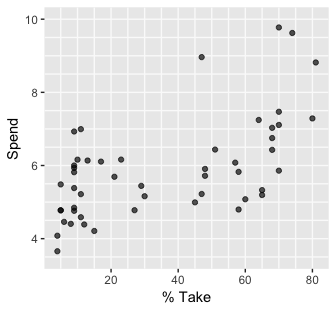

### The model and implementation.

We'll make a custom function to standardize the criterion and predictor values.

``` r
standardize <- function(x){
  (x - mean(x))/sd(x)
  }

my_data <-
  my_data %>% 
  mutate(PrcntTake_z = standardize(PrcntTake),
         Spend_z     = standardize(Spend),
         SATT_z      = standardize(SATT))
```

Let's open brms.

``` r
library(brms)
```

Here we'll save our exponential prior value with `stanvar()`.

``` r
stanvars <- 
  stanvar(1/29, name = "one_over_twentynine")
```

Now we're ready to fit the model.

``` r
fit1 <-
  brm(data = my_data,
      family = student,
      SATT_z ~ 1 + Spend_z + PrcntTake_z,
      prior = c(prior(normal(0, 2), class = Intercept),
                prior(normal(0, 2), class = b),
                prior(normal(0, 1), class = sigma),
                prior(exponential(one_over_twentynine), class = nu)),
      chains = 4, cores = 4,
      stanvars = stanvars)
```

The model summary is as follows:

``` r
print(fit1)
```

    ##  Family: student 
    ##   Links: mu = identity; sigma = identity; nu = identity 
    ## Formula: SATT_z ~ 1 + Spend_z + PrcntTake_z 
    ##    Data: my_data (Number of observations: 50) 
    ## Samples: 4 chains, each with iter = 2000; warmup = 1000; thin = 1;
    ##          total post-warmup samples = 4000
    ## 
    ## Population-Level Effects: 
    ##             Estimate Est.Error l-95% CI u-95% CI Eff.Sample Rhat
    ## Intercept      -0.00      0.06    -0.13     0.12       4000 1.00
    ## Spend_z         0.23      0.08     0.07     0.40       3756 1.00
    ## PrcntTake_z    -1.03      0.08    -1.20    -0.86       3494 1.00
    ## 
    ## Family Specific Parameters: 
    ##       Estimate Est.Error l-95% CI u-95% CI Eff.Sample Rhat
    ## sigma     0.42      0.05     0.32     0.53       2812 1.00
    ## nu       33.32     29.33     3.98   112.89       4000 1.00
    ## 
    ## Samples were drawn using sampling(NUTS). For each parameter, Eff.Sample 
    ## is a crude measure of effective sample size, and Rhat is the potential 
    ## scale reduction factor on split chains (at convergence, Rhat = 1).

### The posterior distribution.

Based on equation 18.1, we can convert the standardized coefficients from our multivariable model back to their original metric as follows:

$$\\beta\_0 = SD\_y \\zeta\_0 + M\_y - SD\_y \\sum\_j \\frac{\\zeta\_j M\_{x\_j}}{SD\_{x\_j}}$$

and

$$\\beta\_j = \\frac{SD\_y \\zeta\_j}{SD\_{x\_j}}$$

To use them, we'll first extract the posterior samples.

``` r
post <- posterior_samples(fit1)

head(post)
```

    ##    b_Intercept b_Spend_z b_PrcntTake_z     sigma        nu      lp__
    ## 1 -0.035939973 0.2315517    -1.0947199 0.3781823 19.920626 -35.89634
    ## 2  0.053980258 0.4179635    -1.1611873 0.3776289 10.288014 -38.65370
    ## 3  0.052775892 0.3629596    -1.1713146 0.4872042 15.005597 -38.34038
    ## 4  0.049505257 0.2888232    -1.0692722 0.3242987  8.282497 -37.27211
    ## 5 -0.092144690 0.1142136    -0.9564977 0.3711667  7.311059 -38.58974
    ## 6  0.004703982 0.3197662    -1.1711014 0.3678633 45.370786 -37.93726

Let's wrap the consequences of equation 18.1 into two functions.

``` r
make_beta_0 <- function(zeta_0, zeta_1, zeta_2, sd_x_1, sd_x_2, sd_y, m_x_1, m_x_2, m_y){
  sd_y * zeta_0 + m_y - sd_y * ((zeta_1 * m_x_1 / sd_x_1) + (zeta_2 * m_x_2 / sd_x_2))
  }

make_beta_j <- function(zeta_j, sd_j, sd_y){
  sd_y * zeta_j / sd_j
  }
```

After saving a few values, we're ready to use our custom functions.

``` r
sd_x_1 <- sd(my_data$Spend)
sd_x_2 <- sd(my_data$PrcntTake)
sd_y   <- sd(my_data$SATT)
m_x_1  <- mean(my_data$Spend)
m_x_2  <- mean(my_data$PrcntTake)
m_y    <- mean(my_data$SATT)

post <-
  post %>% 
  mutate(b_0 = make_beta_0(zeta_0 = b_Intercept,
                           zeta_1 = b_Spend_z,
                           zeta_2 = b_PrcntTake_z,
                           sd_x_1 = sd_x_1,
                           sd_x_2 = sd_x_2,
                           sd_y   = sd_y,
                           m_x_1  = m_x_1,
                           m_x_2  = m_x_2,
                           m_y    = m_y),
         b_1 = make_beta_j(zeta_j = b_Spend_z,
                           sd_j   = sd_x_1,
                           sd_y   = sd_y),
         b_2 = make_beta_j(zeta_j = b_PrcntTake_z,
                           sd_j   = sd_x_2,
                           sd_y   = sd_y))

glimpse(post)
```

    ## Observations: 4,000
    ## Variables: 9
    ## $ b_Intercept   <dbl> -0.035939973, 0.053980258, 0.052775892, 0.049505...
    ## $ b_Spend_z     <dbl> 0.2315517, 0.4179635, 0.3629596, 0.2888232, 0.11...
    ## $ b_PrcntTake_z <dbl> -1.0947199, -1.1611873, -1.1713146, -1.0692722, ...
    ## $ sigma         <dbl> 0.3781823, 0.3776289, 0.4872042, 0.3242987, 0.37...
    ## $ nu            <dbl> 19.920626, 10.288014, 15.005597, 8.282497, 7.311...
    ## $ lp__          <dbl> -35.89634, -38.65370, -38.34038, -37.27211, -38....
    ## $ b_0           <dbl> 996.0133, 948.8531, 967.5936, 981.3312, 1016.232...
    ## $ b_1           <dbl> 12.712610, 22.946956, 19.927140, 15.856922, 6.27...
    ## $ b_2           <dbl> -3.060544, -3.246369, -3.274682, -2.989399, -2.6...

Here's the top panel of Figure 18.5.

``` r
library(tidybayes)

# here are the primary data
post %>% 
  transmute(Intercept      = b_0,
            Spend          = b_1,
            `Percent Take` = b_2,
            Scale          = sigma * sd_y,
            Normality      = nu %>% log10()) %>% 
  gather() %>% 
  
  # the plot
  ggplot(aes(x = value)) +
  geom_histogram(color = "grey92", fill = "grey67",
                 size = .2, bins = 40) +
  stat_pointintervalh(aes(y = 0), 
                      point_interval = mode_hdi, .width = c(.95, .5)) +
  scale_y_continuous(NULL, breaks = NULL) +
  xlab(NULL) +
  facet_wrap(~key, scales = "free", ncol = 3)
```


The `brms::bayes_R2()` function makes it easy to compute a Bayesian *R*<sup>2</sup>. Simply feed a model brm fit object into `bayes_R2()` and you'll bet back the posterior mean, *S**D*, and 95% intervals.

``` r
bayes_R2(fit1)
```

    ##     Estimate  Est.Error      Q2.5     Q97.5
    ## R2 0.8140052 0.02316233 0.7553558 0.8433662

I'm not going to go into the technical details here, but you should be aware that the Bayeisan *R*<sup>2</sup> is not calculated the same as it is with OLS. If you want to dive in, check out the paper by [Gelman, Goodrich, Gabry, and Ali](https://github.com/jgabry/bayes_R2/blob/master/bayes_R2.pdf). Anyway, if you'd like to view the Bayesian *R*<sup>2</sup> distribution rather than just get the summaries, specify `summary = F`, convert the output to a tibble, and plot as usual.

``` r
bayes_R2(fit1, summary = F) %>% 
  as_tibble() %>% 
  
  ggplot(aes(x = R2)) +
  geom_histogram(color = "grey92", fill = "grey67",
                 size = .2, bins = 20) +
  stat_pointintervalh(aes(y = 0), 
                      point_interval = mode_hdi, .width = .95) +
  scale_y_continuous(NULL, breaks = NULL) +
  labs(subtitle = expression(paste("Bayesian ", italic(R)^2)),
       x = NULL) +
  coord_cartesian(xlim = c(.6, 1))
```


We can get a sense of the scatter plots with `bayesplot::mcmc_pairs()`.

``` r
library(bayesplot)

color_scheme_set("gray")

post %>% 
  transmute(Intercept      = b_0,
            Spend          = b_1,
            `Percent Take` = b_2,
            Scale          = sigma * sd_y,
            Normality      = nu %>% log10()) %>% 
  mcmc_pairs(off_diag_args = list(size = 1/8, alpha = 1/8))
```

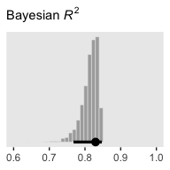

To get the Pearson's correlations among the parameters, we'll use `psych::lowerCor()`.

``` r
post %>% 
  transmute(Intercept      = b_0,
            Spend          = b_1,
            `Percent Take` = b_2,
            Scale          = sigma * sd_y,
            Normality      = nu %>% log10()) %>% 
  psych::lowerCor(digits = 3)
```

    ##              Intrcp Spend  PrcntT Scale  Nrmlty
    ## Intercept     1.000                            
    ## Spend        -0.939  1.000                     
    ## Percent Take  0.373 -0.626  1.000              
    ## Scale         0.068 -0.070  0.045  1.000       
    ## Normality     0.099 -0.107  0.094  0.349  1.000

### Redundant predictors.

You would not want to fit a regression model with these data.

``` r
tibble(x_1 = 1:2,
       x_2 = 1:2,
       y   = 1:2)
```

    ## # A tibble: 2 x 3
    ##     x_1   x_2     y
    ##   <int> <int> <int>
    ## 1     1     1     1
    ## 2     2     2     2

We can take percentages and turn them into their inverse re-expressed as a proportion.

``` r
percent_take <- 37

(100 - percent_take)/100
```

    ## [1] 0.63

Let's make a redundant predictor and then `standardize()` it.

``` r
my_data <-
  my_data %>% 
  mutate(PropNotTake = (100 - PrcntTake)/100) %>% 
  mutate(PropNotTake_z = standardize(PropNotTake))
  
glimpse(my_data)
```

    ## Observations: 50
    ## Variables: 13
    ## $ State         <chr> "Alabama", "Alaska", "Arizona", "Arkansas", "Cal...
    ## $ Spend         <dbl> 4.405, 8.963, 4.778, 4.459, 4.992, 5.443, 8.817,...
    ## $ StuTeaRat     <dbl> 17.2, 17.6, 19.3, 17.1, 24.0, 18.4, 14.4, 16.6, ...
    ## $ Salary        <dbl> 31.144, 47.951, 32.175, 28.934, 41.078, 34.571, ...
    ## $ PrcntTake     <int> 8, 47, 27, 6, 45, 29, 81, 68, 48, 65, 57, 15, 13...
    ## $ SATV          <int> 491, 445, 448, 482, 417, 462, 431, 429, 420, 406...
    ## $ SATM          <int> 538, 489, 496, 523, 485, 518, 477, 468, 469, 448...
    ## $ SATT          <int> 1029, 934, 944, 1005, 902, 980, 908, 897, 889, 8...
    ## $ PrcntTake_z   <dbl> -1.0178453, 0.4394222, -0.3078945, -1.0925770, 0...
    ## $ Spend_z       <dbl> -1.10086058, 2.24370805, -0.82716069, -1.0612364...
    ## $ SATT_z        <dbl> 0.8430838, -0.4266207, -0.2929676, 0.5223163, -0...
    ## $ PropNotTake   <dbl> 0.92, 0.53, 0.73, 0.94, 0.55, 0.71, 0.19, 0.32, ...
    ## $ PropNotTake_z <dbl> 1.0178453, -0.4394222, 0.3078945, 1.0925770, -0....

We're ready to fit the model.

``` r
fit2 <-
  brm(data = my_data,
      family = student,
      SATT_z ~ 1 + Spend_z + PrcntTake_z + PropNotTake_z,
      prior = c(prior(normal(0, 2), class = Intercept),
                prior(normal(0, 2), class = b, coef = Spend_z),
                prior(normal(0, 2), class = b, coef = PrcntTake_z),
                prior(normal(0, 2), class = b, coef = PropNotTake_z),
                prior(normal(0, 1), class = sigma),
                prior(exponential(one_over_twentynine), class = nu)),
      chains = 4, cores = 4,
      stanvars = stanvars,
      # This will let us use `prior_samples()` later on
      sample_prior = T)
```

Kruschke mentioned high autocorrelations in the prose. Here are the autocorrelation plots for our *β*s.

``` r
post <- posterior_samples(fit2, add_chain = T)

mcmc_acf(post, 
         pars = c("b_Intercept", "b_Spend_z", "b_PrcntTake_z", "b_PropNotTake_z"), 
         lags = 10)
```


Looks like HMC made a big difference. The *N*<sub>*e**f**f*</sub>/*N* ratios weren't terrible, either.

``` r
neff_ratio(fit2)[1:6] %>% 
  mcmc_neff() +
  yaxis_text(hjust = 0)
```

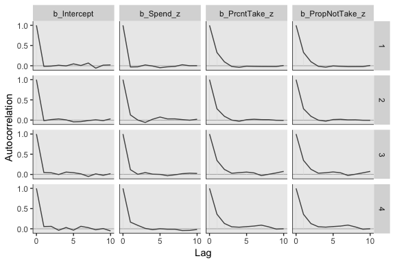

The `brms::vcov()` function returns a variance/covariance matrix--or a correlation matrix when you set `correlation = T`--of the population-level parameters (i.e., the fixed effects). It returns the values to an unnecessary level of precision, so we'll simplify the output with `round()`.

``` r
vcov(fit2, correlation = T) %>% 
  round(digits = 3)
```

    ##               Intercept Spend_z PrcntTake_z PropNotTake_z
    ## Intercept         1.000  -0.024      -0.034        -0.033
    ## Spend_z          -0.024   1.000      -0.016         0.020
    ## PrcntTake_z      -0.034  -0.016       1.000         0.998
    ## PropNotTake_z    -0.033   0.020       0.998         1.000

So it turns out the correlations among the redundant predictors were still very high. You can really get a sense of the silliness of the parameters if you plot them. We'll use `geom_halfeyeh()` to get a sense of densities and summaries of the *β*s.

``` r
post %>% 
  select(b_Intercept:b_PropNotTake_z) %>% 
  gather() %>% 
  # this line isn't necessary, but it does allow us to arrange the parameters on the y-axis
  mutate(key = factor(key, levels = c("b_PropNotTake_z", "b_PrcntTake_z", "b_Spend_z", "b_Intercept"))) %>% 
  
  ggplot(aes(x = value, y = key)) +
  geom_vline(xintercept = 0, color = "white") +
  geom_halfeyeh(point_interval = mode_hdi,
                .width = .95,
                # the next two lines are purely aesthetic
                scale = "width",
                relative_scale = .9) +
  labs(x = NULL, 
       y = NULL) +
  coord_cartesian(xlim = -5:5) +
  theme(axis.text.y = element_text(hjust = 0),
        axis.ticks.y = element_blank())
```

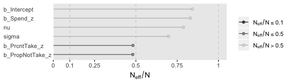

Yeah, on the standardized scale, those are some ridiculous estimates.

``` r
make_beta_0 <- function(zeta_0, zeta_1, zeta_2, zeta_3, sd_x_1, sd_x_2, sd_x_3, sd_y, m_x_1, m_x_2, m_x_3,  m_y){
  sd_y * zeta_0 + m_y - sd_y * ((zeta_1 * m_x_1 / sd_x_1) + (zeta_2 * m_x_2 / sd_x_2) + (zeta_3 * m_x_3 / sd_x_3))
  }
```

``` r
sd_x_1 <- sd(my_data$Spend)
sd_x_2 <- sd(my_data$PrcntTake)
sd_x_3 <- sd(my_data$PropNotTake)
sd_y   <- sd(my_data$SATT)
m_x_1  <- mean(my_data$Spend)
m_x_2  <- mean(my_data$PrcntTake)
m_x_3  <- mean(my_data$PropNotTake)
m_y    <- mean(my_data$SATT)

post <-
  post %>% 
  transmute(Intercept              = make_beta_0(zeta_0 = b_Intercept,
                                                 zeta_1 = b_Spend_z,
                                                 zeta_2 = b_PrcntTake_z,
                                                 zeta_3 = b_PropNotTake_z,
                                                 sd_x_1 = sd_x_1,
                                                 sd_x_2 = sd_x_2,
                                                 sd_x_3 = sd_x_3,
                                                 sd_y   = sd_y,
                                                 m_x_1  = m_x_1,
                                                 m_x_2  = m_x_2,
                                                 m_x_3  = m_x_3,
                                                 m_y    = m_y),
            Spend                 = make_beta_j(zeta_j = b_Spend_z,
                                                sd_j   = sd_x_1,
                                                sd_y   = sd_y),
            `Percent Take`        = make_beta_j(zeta_j = b_PrcntTake_z,
                                                sd_j   = sd_x_2,
                                                sd_y   = sd_y),
            `Proportion not Take` = make_beta_j(zeta_j = b_PropNotTake_z,
                                                sd_j   = sd_x_3,
                                                sd_y   = sd_y),
            Scale                 = sigma * sd_y,
            Normality             = nu %>% log10())

glimpse(post)
```

    ## Observations: 4,000
    ## Variables: 6
    ## $ Intercept             <dbl> 766.54219, 779.24881, -12.88633, 365.914...
    ## $ Spend                 <dbl> 11.950980, 11.270948, 12.487466, 10.5058...
    ## $ `Percent Take`        <dbl> -0.5771213, -0.4672981, 7.2515993, 3.517...
    ## $ `Proportion not Take` <dbl> 235.10892, 212.80469, 998.78463, 644.754...
    ## $ Scale                 <dbl> 27.17010, 27.61572, 35.04491, 28.85371, ...
    ## $ Normality             <dbl> 1.2740967, 1.2853882, 1.7371236, 1.49012...

Now we've done the conversions, here are the histograms of Figure 18.6.

``` r
post %>% 
  gather() %>% 
  
  ggplot() +
  geom_histogram(aes(x = value),
                 color = "grey92", fill = "grey67",
                 size = .2, bins = 40) +
  stat_pointintervalh(aes(x = value, y = 0), 
                      point_interval = mode_hdi, .width = c(.95, .5)) +
  scale_y_continuous(NULL, breaks = NULL) +
  xlab(NULL) +
  facet_wrap(~key, scales = "free", ncol = 3)
```

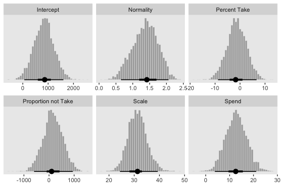

Their scatter plots are as follows:

``` r
post %>% 
  mcmc_pairs(off_diag_args = list(size = 1/8, alpha = 1/8))
```

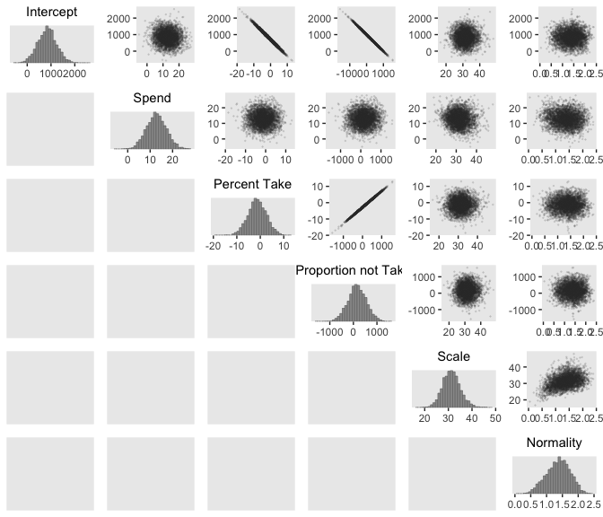

Here are the correlations:

``` r
post %>% 
  psych::lowerCor(digits = 3)
```

    ##                     Intrcp Spend  PrcntT PrprnT Scale  Nrmlty
    ## Intercept            1.000                                   
    ## Spend               -0.075  1.000                            
    ## Percent Take        -0.995 -0.016  1.000                     
    ## Proportion not Take -0.998  0.020  0.998  1.000              
    ## Scale               -0.008 -0.089  0.018  0.012  1.000       
    ## Normality            0.000 -0.097  0.011  0.005  0.381  1.000

Figure 18.7 is all about the prior predictive distribution. Here we'll extract the priors with `prior_samples()` and wrangle all in one step.

``` r
prior <- 
  prior_samples(fit2) %>% 
  transmute(Intercept             = make_beta_0(zeta_0 = b_Intercept,
                                                zeta_1 = b_Spend_z,
                                                zeta_2 = b_PrcntTake_z,
                                                zeta_3 = b_PropNotTake_z,
                                                sd_x_1 = sd_x_1,
                                                sd_x_2 = sd_x_2,
                                                sd_x_3 = sd_x_3,
                                                sd_y   = sd_y,
                                                m_x_1  = m_x_1,
                                                m_x_2  = m_x_2,
                                                m_x_3  = m_x_3,
                                                m_y    = m_y),
            Spend                 = make_beta_j(zeta_j = b_Spend_z,
                                                sd_j   = sd_x_1,
                                                sd_y   = sd_y),
            `Percent Take`        = make_beta_j(zeta_j = b_PrcntTake_z,
                                                sd_j   = sd_x_2,
                                                sd_y   = sd_y),
            `Proportion not Take` = make_beta_j(zeta_j = b_PropNotTake_z,
                                                sd_j   = sd_x_3,
                                                sd_y   = sd_y),
            Scale                 = sigma * sd_y,
            Normality             = nu %>% log10()) 

glimpse(prior)
```

    ## Observations: 4,000
    ## Variables: 6
    ## $ Intercept             <dbl> 90.37941, 1573.27800, 1749.25619, 828.81...
    ## $ Spend                 <dbl> 183.96955, 81.38728, -88.12654, 23.51357...
    ## $ `Percent Take`        <dbl> -0.74553675, -11.18347801, -6.58565464, ...
    ## $ `Proportion not Take` <dbl> 33.41924, -997.72441, 77.75139, 291.9888...
    ## $ Scale                 <dbl> 118.263934, 78.927084, 68.955233, 85.885...
    ## $ Normality             <dbl> 1.67625808, 1.82240627, 0.01125967, 0.01...

Now we've wrangled the priors, we're ready to make the histograms at the top of Figure 18.7.

``` r
prior %>% 
  gather() %>% 
  
  ggplot(aes(x = value)) +
  geom_histogram(color = "grey92", fill = "grey67",
                 size = .2, bins = 40, boundary = 0) +
  stat_pointintervalh(aes(y = 0), 
                      point_interval = mode_hdi, .width = c(.95, .5)) +
  scale_y_continuous(NULL, breaks = NULL) +
  xlab(NULL) +
  facet_wrap(~key, scales = "free", ncol = 3)
```

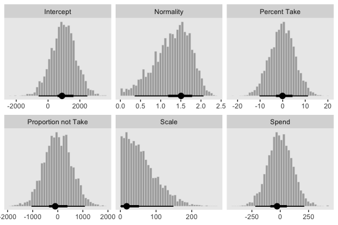

Since we used the half Gaussian prior for our *σ*, our `Scale` histogram looks different from Kruschke's. Otherwise, everything's on the up and up. Here are the scatter plots at the bottom of Figure 18.7.

``` r
prior %>%
  mcmc_pairs(off_diag_args = list(size = 1/8, alpha = 1/8))
```

    ## Warning in mcmc_pairs(., off_diag_args = list(size = 1/8, alpha = 1/8)):
    ## Only one chain in 'x'. This plot is more useful with multiple chains.

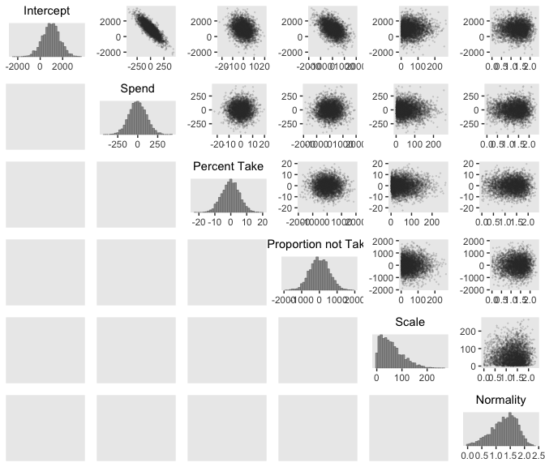

And finally, the Pearson's correlation coefficients:

``` r
prior %>% 
  psych::lowerCor(digits = 3)
```

    ##                     Intrcp Spend  PrcntT PrprnT Scale  Nrmlty
    ## Intercept            1.000                                   
    ## Spend               -0.838  1.000                            
    ## Percent Take        -0.240  0.008  1.000                     
    ## Proportion not Take -0.459  0.015 -0.034  1.000              
    ## Scale                0.025 -0.025 -0.007 -0.009  1.000       
    ## Normality           -0.012  0.005 -0.004  0.014  0.008  1.000

At the top of page 523, Kruschke asked us to "Notice that the posterior distribution in Figure 18.6 has ranges for the redundant parameters that are only a little smaller than their priors." With a little wrangling, we can compare the prior/posterior distributions for our redundant parameters more directly.

``` r
post %>% 
  gather() %>% 
  rename(parameter = key,
         posterior = value) %>% 
  bind_cols(
    prior %>%
      gather() %>% 
      transmute(prior = value)
    ) %>% 
  gather(key, value, -parameter) %>% 
  
  filter(parameter %in% c("Percent Take", "Proportion not Take")) %>% 
  
  ggplot(aes(x = value, fill = key)) +
  geom_histogram(color = "grey92",
                 size = .2, bins = 40, boundary = 0) +
  stat_pointintervalh(aes(y = 0), 
                      point_interval = mode_hdi, .width = c(.95, .5)) +
  scale_fill_viridis_d(option = "D", begin = .35, end = .65) +
  scale_y_continuous(NULL, breaks = NULL) +
  xlab(NULL) +
  theme(legend.position = "none") +
  facet_grid(key~parameter, scales = "free")
```

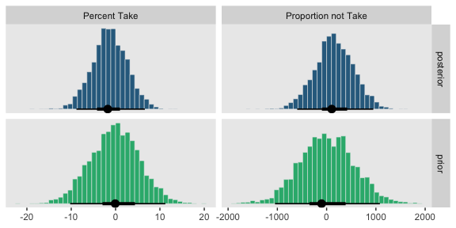

He was right. The posterior distributions are only slightly narrower than the priors for those two.

Kruschke mentioned SEM as a possible solution to multicollinearity. brms [isn’t fully capable of SEM, at the moment](https://github.com/paul-buerkner/brms/issues/304), but its [multivariate syntax](https://cran.r-project.org/web/packages/brms/vignettes/brms_multivariate.html) does allow for [path analysis](http://www.imachordata.com/bayesian-sem-with-brms/). However, you can currently fit a variety of Bayesian SEMs with the [blavaan package](https://cran.r-project.org/web/packages/blavaan/index.html). I'm not aware of any textbooks highlighting blavaan. If you've seen any, [please share](https://github.com/ASKurz/Doing-Bayesian-Data-Analysis-in-brms-and-the-tidyverse/issues).

Multiplicative interaction of metric predictors
-----------------------------------------------

> Formally, interactions can have many different specific functional forms. We will con- sider multiplicative interaction. This means that the nonadditive interaction is expressed by multiplying the predictors. The predicted value is a weighted combination of the individual predictors and, additionally, the multiplicative product of the predictors. For two metric predictors, regression with multiplicative interaction has these algebraically equivalent expressions:

*μ* = *β*<sub>0</sub> + *β*<sub>1</sub>*x*<sub>1</sub> + *β*<sub>2</sub>*x*<sub>2</sub> + *β*<sub>1 × 2</sub>*x*<sub>1</sub>*x*<sub>2</sub>

=*β*<sub>0</sub> + (*β*<sub>1</sub> + *β*<sub>1 × 2</sub>*x*<sub>2</sub>)*x*<sub>1</sub> + *β*<sub>2</sub>*x*<sub>2</sub>

=*β*<sub>0</sub> + *β*<sub>1</sub>*x*<sub>1</sub> + (*β*<sub>2</sub> + *β*<sub>1 × 2</sub>*x*<sub>1</sub>)*x*<sub>2</sub>

Figure 18.8 is out of our ggplot2 repertoire.

### An example.

In brms, you can specify an interaction with either the `x_i*x_j` syntax or the `x_i:x_j` syntax. I typically use `x_i:x_j`. It’s often the case that you can just make the interaction term right in the model formula. But since we’re fitting the model with standardized predictors and then using Kruschke’s equations to convert the parameters back to the unstandardized metric, it seems easier to make the interaction term in the data, first.

``` r
my_data <-
  my_data %>% 
  mutate(interaction   = Spend * PrcntTake) %>% 
  mutate(interaction_z = standardize(interaction))
```

Now we'll fit the model.

``` r
fit3 <-
  brm(data = my_data,
      family = student,
      SATT_z ~ 1 + Spend_z + PrcntTake_z + interaction_z,
      prior = c(prior(normal(0, 2), class = Intercept),
                prior(normal(0, 2), class = b),
                prior(normal(0, 1), class = sigma),
                prior(exponential(one_over_twentynine), class = nu)),
      chains = 4, cores = 4,
      stanvars = stanvars)
```

The `summary()` looks like this:

``` r
summary(fit3)
```

    ##  Family: student 
    ##   Links: mu = identity; sigma = identity; nu = identity 
    ## Formula: SATT_z ~ 1 + Spend_z + PrcntTake_z + interaction_z 
    ##    Data: my_data (Number of observations: 50) 
    ## Samples: 4 chains, each with iter = 2000; warmup = 1000; thin = 1;
    ##          total post-warmup samples = 4000
    ## 
    ## Population-Level Effects: 
    ##               Estimate Est.Error l-95% CI u-95% CI Eff.Sample Rhat
    ## Intercept         0.00      0.06    -0.12     0.12       3003 1.00
    ## Spend_z           0.05      0.14    -0.23     0.34       1559 1.00
    ## PrcntTake_z      -1.46      0.29    -2.02    -0.88       1450 1.00
    ## interaction_z     0.57      0.37    -0.17     1.28       1372 1.00
    ## 
    ## Family Specific Parameters: 
    ##       Estimate Est.Error l-95% CI u-95% CI Eff.Sample Rhat
    ## sigma     0.41      0.05     0.32     0.52       2882 1.00
    ## nu       35.21     30.85     4.68   118.51       3089 1.00
    ## 
    ## Samples were drawn using sampling(NUTS). For each parameter, Eff.Sample 
    ## is a crude measure of effective sample size, and Rhat is the potential 
    ## scale reduction factor on split chains (at convergence, Rhat = 1).

Our parameters were less severely correlated than those in the text.

``` r
vcov(fit3, correlation = T) %>% 
  round(digits = 3)
```

    ##               Intercept Spend_z PrcntTake_z interaction_z
    ## Intercept         1.000   0.039       0.028        -0.038
    ## Spend_z           0.039   1.000       0.723        -0.842
    ## PrcntTake_z       0.028   0.723       1.000        -0.963
    ## interaction_z    -0.038  -0.842      -0.963         1.000

Time to convert to the unstandardized metric.

``` r
sd_x_3 <- sd(my_data$interaction)
m_x_3  <- mean(my_data$interaction)

post <- 
  posterior_samples(fit3) %>% 
  transmute(Intercept              = make_beta_0(zeta_0 = b_Intercept,
                                                 zeta_1 = b_Spend_z,
                                                 zeta_2 = b_PrcntTake_z,
                                                 zeta_3 = b_interaction_z,
                                                 sd_x_1 = sd_x_1,
                                                 sd_x_2 = sd_x_2,
                                                 sd_x_3 = sd_x_3,
                                                 sd_y   = sd_y,
                                                 m_x_1  = m_x_1,
                                                 m_x_2  = m_x_2,
                                                 m_x_3  = m_x_3,
                                                 m_y    = m_y),
            Spend                  = make_beta_j(zeta_j = b_Spend_z,
                                                 sd_j   = sd_x_1,
                                                 sd_y   = sd_y),
            `Percent Take`         = make_beta_j(zeta_j = b_PrcntTake_z,
                                                 sd_j   = sd_x_2,
                                                 sd_y   = sd_y),
            `Spend : Percent Take` = make_beta_j(zeta_j = b_interaction_z,
                                                 sd_j   = sd_x_3,
                                                 sd_y   = sd_y),
            Scale                  = sigma * sd_y,
            Normality              = nu %>% log10()) 

glimpse(post)
```

    ## Observations: 4,000
    ## Variables: 6
    ## $ Intercept              <dbl> 1066.6747, 1051.7178, 1070.1422, 1061.4...
    ## $ Spend                  <dbl> -1.03622863, 0.03881171, -2.73093473, 1...
    ## $ `Percent Take`         <dbl> -4.065169, -4.112756, -3.994083, -4.734...
    ## $ `Spend : Percent Take` <dbl> 0.20988732, 0.23699267, 0.20413106, 0.2...
    ## $ Scale                  <dbl> 28.56734, 31.26894, 30.87420, 29.34999,...
    ## $ Normality              <dbl> 1.3928158, 1.3668309, 1.4393181, 1.1981...

Now we've done the conversions, here are the histograms of Figure 18.9.

``` r
post %>% 
  gather() %>% 
  
  ggplot(aes(x = value)) +
  geom_histogram(color = "grey92", fill = "grey67",
                 size = .2, bins = 40) +
  stat_pointintervalh(aes(y = 0), 
                      point_interval = mode_hdi, .width = c(.95, .5)) +
  scale_y_continuous(NULL, breaks = NULL) +
  xlab(NULL) +
  facet_wrap(~key, scales = "free", ncol = 3)
```


To make the middle panel of Figure 18.9, we'll make a custom function, push various values of `PrcntTake` through that function within `purrr::map()`, wrangle a bit, and plot with `geom_pointrange()`.

``` r
# custom function to use in `purrr::map()`
spend_slope <- function(PrcntTake){
  post %>% 
    transmute(slope = Spend + `Spend : Percent Take` * PrcntTake)
}

# tibble containing values of `PrcntTake`
tibble(PrcntTake = seq(from = min(my_data$PrcntTake),
                       to   = max(my_data$PrcntTake),
                       length.out = 20)) %>% 
  mutate(slope = map(PrcntTake, spend_slope)) %>% 
  unnest() %>% 
  group_by(PrcntTake) %>% 
  median_hdi(slope) %>% 
  
  # finally, the plot
  ggplot(aes(x = PrcntTake, y = slope,
             ymin = .lower, ymax = .upper)) +
  geom_hline(yintercept = 0, color = "white") +
  geom_pointrange(color = "grey50") +
  labs(x = "Value of PrcntTake",
       y = "Slope on Spend")
```

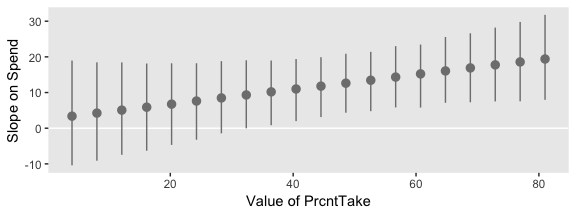

That worked like a charm. We'll follow the same basic order of operations for the final panel.

``` r
percent_take_slope <- function(spend){
  post %>% 
    transmute(slope = `Percent Take` + `Spend : Percent Take` * spend)
}

tibble(Spend = seq(from = min(my_data$Spend),
                   to   = max(my_data$Spend),
                   length.out = 20)) %>% 
  mutate(slope = map(Spend, percent_take_slope)) %>% 
  unnest() %>% 
  group_by(Spend) %>% 
  median_hdi(slope) %>% 
  
  ggplot(aes(x = Spend, y = slope,
             ymin = .lower, ymax = .upper)) +
  geom_pointrange(color = "grey50") +
  labs(x = "Value of Spend",
       y = "Slope on PrcntTake")
```

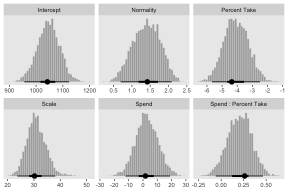

Kruschke outlined all this in the opening paragraphs of page 530. His parting words of this subsection warrant repeating: "if you include an interaction term, you cannot ignore it even if its marginal posterior distribution includes zero."

Shrinkage of regression coefficients
------------------------------------

We'll make our ransom noise predictors with `rnorm()`.

``` r
set.seed(18.3)
my_data <-
  my_data %>% 
  mutate(x_rand_1  = rnorm(n = n(), 0, 1),
         x_rand_2  = rnorm(n = n(), 0, 1),
         x_rand_3  = rnorm(n = n(), 0, 1),
         x_rand_4  = rnorm(n = n(), 0, 1),
         x_rand_5  = rnorm(n = n(), 0, 1),
         x_rand_6  = rnorm(n = n(), 0, 1),
         x_rand_7  = rnorm(n = n(), 0, 1),
         x_rand_8  = rnorm(n = n(), 0, 1),
         x_rand_9  = rnorm(n = n(), 0, 1),
         x_rand_10 = rnorm(n = n(), 0, 1),
         x_rand_11 = rnorm(n = n(), 0, 1),
         x_rand_12 = rnorm(n = n(), 0, 1))

glimpse(my_data)
```

    ## Observations: 50
    ## Variables: 27
    ## $ State         <chr> "Alabama", "Alaska", "Arizona", "Arkansas", "Cal...
    ## $ Spend         <dbl> 4.405, 8.963, 4.778, 4.459, 4.992, 5.443, 8.817,...
    ## $ StuTeaRat     <dbl> 17.2, 17.6, 19.3, 17.1, 24.0, 18.4, 14.4, 16.6, ...
    ## $ Salary        <dbl> 31.144, 47.951, 32.175, 28.934, 41.078, 34.571, ...
    ## $ PrcntTake     <int> 8, 47, 27, 6, 45, 29, 81, 68, 48, 65, 57, 15, 13...
    ## $ SATV          <int> 491, 445, 448, 482, 417, 462, 431, 429, 420, 406...
    ## $ SATM          <int> 538, 489, 496, 523, 485, 518, 477, 468, 469, 448...
    ## $ SATT          <int> 1029, 934, 944, 1005, 902, 980, 908, 897, 889, 8...
    ## $ PrcntTake_z   <dbl> -1.0178453, 0.4394222, -0.3078945, -1.0925770, 0...
    ## $ Spend_z       <dbl> -1.10086058, 2.24370805, -0.82716069, -1.0612364...
    ## $ SATT_z        <dbl> 0.8430838, -0.4266207, -0.2929676, 0.5223163, -0...
    ## $ PropNotTake   <dbl> 0.92, 0.53, 0.73, 0.94, 0.55, 0.71, 0.19, 0.32, ...
    ## $ PropNotTake_z <dbl> 1.0178453, -0.4394222, 0.3078945, 1.0925770, -0....
    ## $ interaction   <dbl> 35.240, 421.261, 129.006, 26.754, 224.640, 157.8...
    ## $ interaction_z <dbl> -0.94113720, 0.93111798, -0.48635915, -0.9822954...
    ## $ x_rand_1      <dbl> 0.92645924, 1.82282117, -1.61056690, -0.28510975...
    ## $ x_rand_2      <dbl> -0.90258025, -1.13163679, 0.49708131, -0.5477187...
    ## $ x_rand_3      <dbl> 0.51576102, 0.30710965, 0.66199996, 2.21990655, ...
    ## $ x_rand_4      <dbl> 1.08730491, -1.23909473, 0.43161390, 1.06733141,...
    ## $ x_rand_5      <dbl> -0.23846777, 0.15702031, -1.02132795, 0.75395217...
    ## $ x_rand_6      <dbl> 0.06014956, 1.00555800, 1.47981871, -0.82827890,...
    ## $ x_rand_7      <dbl> 1.46961709, 0.51790320, -2.33110353, 0.11339996,...
    ## $ x_rand_8      <dbl> 0.03463437, -1.48737599, -0.01528284, 0.48480309...
    ## $ x_rand_9      <dbl> -0.4556078, -0.7035475, -0.5001913, -0.6526022, ...
    ## $ x_rand_10     <dbl> 1.2858586, -0.7474640, -0.3107255, -1.1037468, 0...
    ## $ x_rand_11     <dbl> 0.17236599, -0.37956084, 0.31982301, 0.29678108,...
    ## $ x_rand_12     <dbl> -0.53048519, 0.92465424, 0.66876661, 0.30935146,...

Here's the naïve model.

``` r
fit4 <-
  update(fit1, 
         newdata = my_data,
         formula = SATT_z ~ 1 + PrcntTake_z + Spend_z + x_rand_1 + x_rand_2 + x_rand_3 + x_rand_4 + x_rand_5 + x_rand_6 + x_rand_7 + x_rand_8 + x_rand_9 + x_rand_10 + x_rand_11 + x_rand_12)
```

It's summary is as follows:

``` r
print(fit4)
```

    ##  Family: student 
    ##   Links: mu = identity; sigma = identity; nu = identity 
    ## Formula: SATT_z ~ PrcntTake_z + Spend_z + x_rand_1 + x_rand_2 + x_rand_3 + x_rand_4 + x_rand_5 + x_rand_6 + x_rand_7 + x_rand_8 + x_rand_9 + x_rand_10 + x_rand_11 + x_rand_12 
    ##    Data: my_data (Number of observations: 50) 
    ## Samples: 4 chains, each with iter = 2000; warmup = 1000; thin = 1;
    ##          total post-warmup samples = 4000
    ## 
    ## Population-Level Effects: 
    ##             Estimate Est.Error l-95% CI u-95% CI Eff.Sample Rhat
    ## Intercept      -0.02      0.07    -0.15     0.11       4000 1.00
    ## PrcntTake_z    -1.12      0.09    -1.28    -0.94       4000 1.00
    ## Spend_z         0.32      0.09     0.15     0.49       4000 1.00
    ## x_rand_1        0.03      0.06    -0.09     0.15       4000 1.00
    ## x_rand_2        0.02      0.09    -0.15     0.20       4000 1.00
    ## x_rand_3        0.09      0.07    -0.05     0.23       4000 1.00
    ## x_rand_4       -0.09      0.07    -0.23     0.04       4000 1.00
    ## x_rand_5        0.00      0.06    -0.12     0.13       4000 1.00
    ## x_rand_6       -0.02      0.08    -0.17     0.13       4000 1.00
    ## x_rand_7       -0.03      0.07    -0.17     0.12       4000 1.00
    ## x_rand_8       -0.18      0.07    -0.32    -0.04       4000 1.00
    ## x_rand_9        0.13      0.06     0.01     0.25       4000 1.00
    ## x_rand_10      -0.00      0.05    -0.11     0.10       4000 1.00
    ## x_rand_11       0.04      0.09    -0.13     0.22       4000 1.00
    ## x_rand_12      -0.08      0.06    -0.20     0.05       4000 1.00
    ## 
    ## Family Specific Parameters: 
    ##       Estimate Est.Error l-95% CI u-95% CI Eff.Sample Rhat
    ## sigma     0.39      0.07     0.24     0.53       1817 1.00
    ## nu       26.24     28.59     2.11   100.70       4000 1.00
    ## 
    ## Samples were drawn using sampling(NUTS). For each parameter, Eff.Sample 
    ## is a crude measure of effective sample size, and Rhat is the potential 
    ## scale reduction factor on split chains (at convergence, Rhat = 1).

Before we can make Figure 18.11, we'll need to update our `make_beta_0()` function to accommodate this model.

``` r
make_beta_0 <- 
  function(zeta_0, zeta_1, zeta_2, zeta_3, zeta_4, zeta_5, zeta_6, zeta_7, zeta_8, zeta_9, zeta_10, zeta_11, zeta_12, zeta_13, zeta_14, 
           sd_x_1, sd_x_2, sd_x_3, sd_x_4, sd_x_5, sd_x_6, sd_x_7, sd_x_8, sd_x_9, sd_x_10, sd_x_11, sd_x_12, sd_x_13, sd_x_14, sd_y, 
           m_x_1, m_x_2, m_x_3, m_x_4, m_x_5, m_x_6, m_x_7, m_x_8, m_x_9, m_x_10, m_x_11, m_x_12, m_x_13, m_x_14, m_y) {
    sd_y * zeta_0 + m_y - sd_y * ((zeta_1 * m_x_1 / sd_x_1) + 
                                    (zeta_2 * m_x_2 / sd_x_2) + 
                                    (zeta_3 * m_x_3 / sd_x_3) + 
                                    (zeta_4 * m_x_4 / sd_x_4) + 
                                    (zeta_5 * m_x_5 / sd_x_5) + 
                                    (zeta_6 * m_x_6 / sd_x_6) + 
                                    (zeta_7 * m_x_7 / sd_x_7) + 
                                    (zeta_8 * m_x_8 / sd_x_8) + 
                                    (zeta_9 * m_x_9 / sd_x_9) + 
                                    (zeta_10 * m_x_10 / sd_x_10) + 
                                    (zeta_11 * m_x_11 / sd_x_11) + 
                                    (zeta_12 * m_x_12 / sd_x_12) + 
                                    (zeta_13 * m_x_13 / sd_x_13) + 
                                    (zeta_14 * m_x_14 / sd_x_14))
  }
```

Sigh, our poor `make_beta_0()` and `make_beta_1()` code is getting obscene. I don’t have the energy to think of how to wrap this into a simpler function. But someone probably should. It that ends up as you, [share your code](https://github.com/ASKurz/Doing-Bayesian-Data-Analysis-in-brms-and-the-tidyverse/issues).

``` r
sd_x_1  <- sd(my_data$Spend)
sd_x_2  <- sd(my_data$PrcntTake)
sd_x_3  <- sd(my_data$x_rand_1)
sd_x_4  <- sd(my_data$x_rand_2)
sd_x_5  <- sd(my_data$x_rand_3)
sd_x_6  <- sd(my_data$x_rand_4)
sd_x_7  <- sd(my_data$x_rand_5)
sd_x_8  <- sd(my_data$x_rand_6)
sd_x_9  <- sd(my_data$x_rand_7)
sd_x_10 <- sd(my_data$x_rand_8)
sd_x_11 <- sd(my_data$x_rand_9)
sd_x_12 <- sd(my_data$x_rand_10)
sd_x_13 <- sd(my_data$x_rand_11)
sd_x_14 <- sd(my_data$x_rand_12)
sd_y   <- sd(my_data$SATT)

m_x_1  <- mean(my_data$Spend)
m_x_2  <- mean(my_data$PrcntTake)
m_x_3  <- mean(my_data$x_rand_1)
m_x_4  <- mean(my_data$x_rand_2)
m_x_5  <- mean(my_data$x_rand_3)
m_x_6  <- mean(my_data$x_rand_4)
m_x_7  <- mean(my_data$x_rand_5)
m_x_8  <- mean(my_data$x_rand_6)
m_x_9  <- mean(my_data$x_rand_7)
m_x_10 <- mean(my_data$x_rand_8)
m_x_11 <- mean(my_data$x_rand_9)
m_x_12 <- mean(my_data$x_rand_10)
m_x_13 <- mean(my_data$x_rand_11)
m_x_14 <- mean(my_data$x_rand_12)
m_y    <- mean(my_data$SATT)

post <-
  posterior_samples(fit4) %>% 
  transmute(Intercept      = make_beta_0(zeta_0 = b_Intercept,
                                         zeta_1  = b_Spend_z,
                                         zeta_2  = b_PrcntTake_z,
                                         zeta_3  = b_x_rand_1,
                                         zeta_4  = b_x_rand_2,
                                         zeta_5  = b_x_rand_3,
                                         zeta_6  = b_x_rand_4,
                                         zeta_7  = b_x_rand_5,
                                         zeta_8  = b_x_rand_6,
                                         zeta_9  = b_x_rand_7,
                                         zeta_10 = b_x_rand_8,
                                         zeta_11 = b_x_rand_9,
                                         zeta_12 = b_x_rand_10,
                                         zeta_13 = b_x_rand_11,
                                         zeta_14 = b_x_rand_12,
                                         sd_x_1  = sd_x_1,
                                         sd_x_2  = sd_x_2,
                                         sd_x_3  = sd_x_3,
                                         sd_x_4  = sd_x_4,
                                         sd_x_5  = sd_x_5,
                                         sd_x_6  = sd_x_6,
                                         sd_x_7  = sd_x_7,
                                         sd_x_8  = sd_x_8,
                                         sd_x_9  = sd_x_9,
                                         sd_x_10 = sd_x_10,
                                         sd_x_11 = sd_x_11,
                                         sd_x_12 = sd_x_12,
                                         sd_x_13 = sd_x_13,
                                         sd_x_14 = sd_x_14,
                                         sd_y    = sd_y,
                                         m_x_1   = m_x_1,
                                         m_x_2   = m_x_2,
                                         m_x_3   = m_x_3,
                                         m_x_4   = m_x_4,
                                         m_x_5   = m_x_5,
                                         m_x_6   = m_x_6,
                                         m_x_7   = m_x_7,
                                         m_x_8   = m_x_8,
                                         m_x_9   = m_x_9,
                                         m_x_10  = m_x_10,
                                         m_x_11  = m_x_11,
                                         m_x_12  = m_x_12,
                                         m_x_13  = m_x_13,
                                         m_x_14  = m_x_14,
                                         m_y     = m_y),
            Spend          = make_beta_j(zeta_j = b_Spend_z,
                                         sd_j   = sd_x_1,
                                         sd_y   = sd_y),
            `Percent Take` = make_beta_j(zeta_j = b_PrcntTake_z,
                                         sd_j   = sd_x_2,
                                         sd_y   = sd_y),
            x_rand_1       = make_beta_j(zeta_j = b_x_rand_1,
                                         sd_j   = sd_x_3,
                                         sd_y   = sd_y),
            x_rand_2       = make_beta_j(zeta_j = b_x_rand_2,
                                         sd_j   = sd_x_4,
                                         sd_y   = sd_y),
            x_rand_3       = make_beta_j(zeta_j = b_x_rand_3,
                                         sd_j   = sd_x_5,
                                         sd_y   = sd_y),
            x_rand_4       = make_beta_j(zeta_j = b_x_rand_4,
                                         sd_j   = sd_x_6,
                                         sd_y   = sd_y),
            x_rand_5       = make_beta_j(zeta_j = b_x_rand_5,
                                         sd_j   = sd_x_7,
                                         sd_y   = sd_y),
            x_rand_6       = make_beta_j(zeta_j = b_x_rand_6,
                                         sd_j   = sd_x_8,
                                         sd_y   = sd_y),
            x_rand_7       = make_beta_j(zeta_j = b_x_rand_7,
                                         sd_j   = sd_x_9,
                                         sd_y   = sd_y),
            x_rand_8       = make_beta_j(zeta_j = b_x_rand_8,
                                         sd_j   = sd_x_10,
                                         sd_y   = sd_y),
            x_rand_9       = make_beta_j(zeta_j = b_x_rand_9,
                                         sd_j   = sd_x_11,
                                         sd_y   = sd_y),
            x_rand_10      = make_beta_j(zeta_j = b_x_rand_10,
                                         sd_j   = sd_x_12,
                                         sd_y   = sd_y),
            x_rand_11      = make_beta_j(zeta_j = b_x_rand_11,
                                         sd_j   = sd_x_13,
                                         sd_y   = sd_y),
            x_rand_12      = make_beta_j(zeta_j = b_x_rand_12,
                                         sd_j   = sd_x_14,
                                         sd_y   = sd_y),
            Scale          = sigma * sd_y,
            Normality      = nu %>% log10())

glimpse(post)
```

    ## Observations: 4,000
    ## Variables: 17
    ## $ Intercept      <dbl> 989.4727, 960.2377, 942.0473, 994.4401, 981.542...
    ## $ Spend          <dbl> 15.351266, 19.232875, 23.120860, 11.946264, 17....
    ## $ `Percent Take` <dbl> -3.407299, -3.184759, -3.371186, -2.976810, -3....
    ## $ x_rand_1       <dbl> 2.31050741, 4.36202119, 1.98034937, 4.61315276,...
    ## $ x_rand_2       <dbl> 3.9265144, 1.0076358, -0.8076280, -0.2554027, 2...
    ## $ x_rand_3       <dbl> 10.3966604, 9.4504383, 7.8226532, 9.6193897, 8....
    ## $ x_rand_4       <dbl> 2.4438465, -12.8621426, 1.8038045, 1.6492827, -...
    ## $ x_rand_5       <dbl> 2.7008084, -1.7466191, 5.0237259, -0.4929861, 4...
    ## $ x_rand_6       <dbl> -13.390613, -2.688749, -7.491930, -9.666240, -8...
    ## $ x_rand_7       <dbl> -1.5332946, 0.3914029, -3.3033590, -3.6968614, ...
    ## $ x_rand_8       <dbl> -7.797561, -18.650462, -7.202914, -7.093417, -2...
    ## $ x_rand_9       <dbl> 10.9429679, 6.4755713, 10.7890395, 2.2170896, 4...
    ## $ x_rand_10      <dbl> -1.34378156, -0.91141632, 0.17472649, 0.7590094...
    ## $ x_rand_11      <dbl> 2.599281, -2.499403, 9.303880, 8.262204, -12.39...
    ## $ x_rand_12      <dbl> -3.836362, -4.442255, -3.747361, -5.174927, -1....
    ## $ Scale          <dbl> 18.30799, 15.62521, 18.51207, 21.96139, 29.0318...
    ## $ Normality      <dbl> 0.5733693, 0.4826705, 0.6328050, 0.4214822, 1.2...

Okay, here are the histograms of Figure 18.11.

``` r
post %>% 
  select(Intercept:x_rand_3, x_rand_10:Normality) %>% 
  gather() %>% 
  mutate(key = factor(key, 
                      levels = c("Intercept", "Spend", "Percent Take",
                                 "x_rand_1", "x_rand_2", "x_rand_3",
                                 "x_rand_10", "x_rand_11", "x_rand_12",
                                 "Scale", "Normality"))) %>% 
  
  ggplot(aes(x = value)) +
  geom_histogram(color = "grey92", fill = "grey67",
                 size = .2, bins = 40) +
  stat_pointintervalh(aes(y = 0), 
                      point_interval = mode_hdi, .width = c(.95, .5)) +
  scale_y_continuous(NULL, breaks = NULL) +
  xlab(NULL) +
  facet_wrap(~key, scales = "free", ncol = 3)
```


And here's the final histogram depicting the Bayesian *R*<sup>2</sup>.

``` r
bayes_R2(fit4, summary = F) %>% 
  as_tibble() %>% 
  
  ggplot(aes(x = R2)) +
  geom_histogram(color = "grey92", fill = "grey67",
                 size = .2, bins = 20) +
  stat_pointintervalh(aes(y = 0), 
                      point_interval = mode_hdi, .width = .95) +
  scale_y_continuous(NULL, breaks = NULL) +
  labs(subtitle = expression(paste("Bayesian ", italic(R)^2)),
       x = NULL) +
  coord_cartesian(xlim = c(.6, 1))
```

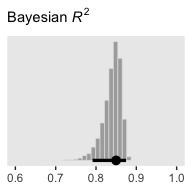

Sometimes when you have this many parameters you'd like to compare, it's better to display their summaries with an ordered coefficient plot.

``` r
post %>% 
  select(Spend:x_rand_12) %>% 
  gather() %>% 
  
  ggplot(aes(x = value, y = reorder(key, value))) +
  geom_vline(xintercept = 0, color = "white") +
  stat_pointintervalh(point_interval = mode_hdi, .width = .95, color = "grey50") +
  labs(x = NULL,
       y = NULL) +
  theme(axis.text.y = element_text(hjust = 0),
        axis.ticks.y = element_blank(),
        panel.grid.major.y = element_line(color = "grey98", linetype = 2))
```

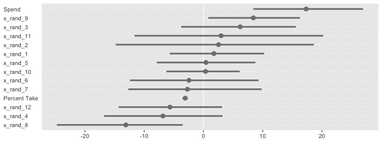

Now we can see that by chance alone, the coefficients for `x_rand_8` and `x_rand_9` are clearly distinct from zero. The `geom_density_ridges()` function from the [ggridges package](https://github.com/clauswilke/ggridges) can be informative, too.

``` r
library(ggridges)

post %>% 
  select(Spend:x_rand_12) %>% 
  gather() %>% 
  
  ggplot(aes(x = value, y = reorder(key, value), group = reorder(key, value))) +
  geom_vline(xintercept = 0, color = "white") +
  geom_density_ridges(scale = 4, fill = "grey67", color = "grey50", size = 1/5) +
  labs(x = NULL,
       y = NULL) +
  theme(axis.text.y = element_text(hjust = 0),
        axis.ticks.y = element_blank())
```

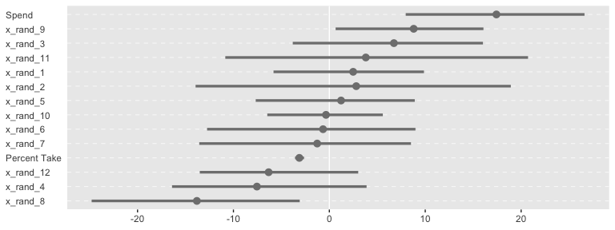

In brms, we can fit something like the model Kruschke displayed in Figure 18.12 with the `horseshoe()` prior. From the *horseshoe* section of the [brms (version 2.4.0) reference manual](https://cran.r-project.org/web/packages/brms/index.html):

> The horseshoe prior is a special shrinkage prior initially proposed by Carvalho et al. (2009). It is symmetric around zero with fat tails and an infinitely large spike at zero. This makes it ideal for sparse models that have many regression coefficients, although only a minority of them is non- zero. The horseshoe prior can be applied on all population-level effects at once (excluding the intercept) by using set\_prior("horseshoe(1)"). The 1 implies that the student-t prior of the local shrinkage parameters has 1 degrees of freedom.

Based on the quote, here's the horseshoe-prior model:

``` r
fit5 <-
  update(fit4, 
         newdata = my_data,
         formula = SATT_z ~ 1 + PrcntTake_z + Spend_z + x_rand_1 + x_rand_2 + x_rand_3 + x_rand_4 + x_rand_5 + x_rand_6 + x_rand_7 + x_rand_8 + x_rand_9 + x_rand_10 + x_rand_11 + x_rand_12,
         prior = c(prior(normal(0, 2), class = Intercept),
                   prior(horseshoe(1), class = b),
                   prior(normal(0, 1), class = sigma),
                   prior(exponential(one_over_twentynine), class = nu)))
```

``` r
print(fit5)
```

    ##  Family: student 
    ##   Links: mu = identity; sigma = identity; nu = identity 
    ## Formula: SATT_z ~ PrcntTake_z + Spend_z + x_rand_1 + x_rand_2 + x_rand_3 + x_rand_4 + x_rand_5 + x_rand_6 + x_rand_7 + x_rand_8 + x_rand_9 + x_rand_10 + x_rand_11 + x_rand_12 
    ##    Data: my_data (Number of observations: 50) 
    ## Samples: 4 chains, each with iter = 2000; warmup = 1000; thin = 1;
    ##          total post-warmup samples = 4000
    ## 
    ## Population-Level Effects: 
    ##             Estimate Est.Error l-95% CI u-95% CI Eff.Sample Rhat
    ## Intercept      -0.02      0.06    -0.14     0.11       4000 1.00
    ## PrcntTake_z    -1.02      0.10    -1.20    -0.81       1425 1.00
    ## Spend_z         0.20      0.11    -0.00     0.39       1017 1.01
    ## x_rand_1        0.01      0.03    -0.05     0.10       4000 1.00
    ## x_rand_2        0.01      0.04    -0.07     0.11       4000 1.00
    ## x_rand_3        0.02      0.04    -0.05     0.12       4000 1.00
    ## x_rand_4       -0.03      0.05    -0.14     0.04       4000 1.00
    ## x_rand_5        0.00      0.03    -0.07     0.08       4000 1.00
    ## x_rand_6       -0.02      0.04    -0.13     0.06       4000 1.00
    ## x_rand_7       -0.00      0.04    -0.10     0.07       4000 1.00
    ## x_rand_8       -0.09      0.07    -0.24     0.01       1114 1.00
    ## x_rand_9        0.05      0.05    -0.02     0.17       1686 1.00
    ## x_rand_10       0.00      0.03    -0.06     0.06       4000 1.00
    ## x_rand_11       0.01      0.05    -0.07     0.12       4000 1.00
    ## x_rand_12      -0.02      0.04    -0.12     0.04       4000 1.00
    ## 
    ## Family Specific Parameters: 
    ##       Estimate Est.Error l-95% CI u-95% CI Eff.Sample Rhat
    ## sigma     0.40      0.06     0.27     0.52       1263 1.00
    ## nu       30.63     28.40     3.09   105.58       4000 1.00
    ## 
    ## Samples were drawn using sampling(NUTS). For each parameter, Eff.Sample 
    ## is a crude measure of effective sample size, and Rhat is the potential 
    ## scale reduction factor on split chains (at convergence, Rhat = 1).

Our `make_beta_0()` and `make_beta_1()` remains obscene.

``` r
post <-
  posterior_samples(fit5) %>% 
  transmute(Intercept      = make_beta_0(zeta_0 = b_Intercept,
                                         zeta_1  = b_Spend_z,
                                         zeta_2  = b_PrcntTake_z,
                                         zeta_3  = b_x_rand_1,
                                         zeta_4  = b_x_rand_2,
                                         zeta_5  = b_x_rand_3,
                                         zeta_6  = b_x_rand_4,
                                         zeta_7  = b_x_rand_5,
                                         zeta_8  = b_x_rand_6,
                                         zeta_9  = b_x_rand_7,
                                         zeta_10 = b_x_rand_8,
                                         zeta_11 = b_x_rand_9,
                                         zeta_12 = b_x_rand_10,
                                         zeta_13 = b_x_rand_11,
                                         zeta_14 = b_x_rand_12,
                                         sd_x_1  = sd_x_1,
                                         sd_x_2  = sd_x_2,
                                         sd_x_3  = sd_x_3,
                                         sd_x_4  = sd_x_4,
                                         sd_x_5  = sd_x_5,
                                         sd_x_6  = sd_x_6,
                                         sd_x_7  = sd_x_7,
                                         sd_x_8  = sd_x_8,
                                         sd_x_9  = sd_x_9,
                                         sd_x_10 = sd_x_10,
                                         sd_x_11 = sd_x_11,
                                         sd_x_12 = sd_x_12,
                                         sd_x_13 = sd_x_13,
                                         sd_x_14 = sd_x_14,
                                         sd_y    = sd_y,
                                         m_x_1   = m_x_1,
                                         m_x_2   = m_x_2,
                                         m_x_3   = m_x_3,
                                         m_x_4   = m_x_4,
                                         m_x_5   = m_x_5,
                                         m_x_6   = m_x_6,
                                         m_x_7   = m_x_7,
                                         m_x_8   = m_x_8,
                                         m_x_9   = m_x_9,
                                         m_x_10  = m_x_10,
                                         m_x_11  = m_x_11,
                                         m_x_12  = m_x_12,
                                         m_x_13  = m_x_13,
                                         m_x_14  = m_x_14,
                                         m_y     = m_y),
            Spend          = make_beta_j(zeta_j = b_Spend_z,
                                         sd_j   = sd_x_1,
                                         sd_y   = sd_y),
            `Percent Take` = make_beta_j(zeta_j = b_PrcntTake_z,
                                         sd_j   = sd_x_2,
                                         sd_y   = sd_y),
            x_rand_1       = make_beta_j(zeta_j = b_x_rand_1,
                                         sd_j   = sd_x_3,
                                         sd_y   = sd_y),
            x_rand_2       = make_beta_j(zeta_j = b_x_rand_2,
                                         sd_j   = sd_x_4,
                                         sd_y   = sd_y),
            x_rand_3       = make_beta_j(zeta_j = b_x_rand_3,
                                         sd_j   = sd_x_5,
                                         sd_y   = sd_y),
            x_rand_4       = make_beta_j(zeta_j = b_x_rand_4,
                                         sd_j   = sd_x_6,
                                         sd_y   = sd_y),
            x_rand_5       = make_beta_j(zeta_j = b_x_rand_5,
                                         sd_j   = sd_x_7,
                                         sd_y   = sd_y),
            x_rand_6       = make_beta_j(zeta_j = b_x_rand_6,
                                         sd_j   = sd_x_8,
                                         sd_y   = sd_y),
            x_rand_7       = make_beta_j(zeta_j = b_x_rand_7,
                                         sd_j   = sd_x_9,
                                         sd_y   = sd_y),
            x_rand_8       = make_beta_j(zeta_j = b_x_rand_8,
                                         sd_j   = sd_x_10,
                                         sd_y   = sd_y),
            x_rand_9       = make_beta_j(zeta_j = b_x_rand_9,
                                         sd_j   = sd_x_11,
                                         sd_y   = sd_y),
            x_rand_10      = make_beta_j(zeta_j = b_x_rand_10,
                                         sd_j   = sd_x_12,
                                         sd_y   = sd_y),
            x_rand_11      = make_beta_j(zeta_j = b_x_rand_11,
                                         sd_j   = sd_x_13,
                                         sd_y   = sd_y),
            x_rand_12      = make_beta_j(zeta_j = b_x_rand_12,
                                         sd_j   = sd_x_14,
                                         sd_y   = sd_y),
            Scale          = sigma * sd_y,
            Normality      = nu %>% log10())

glimpse(post)
```

    ## Observations: 4,000
    ## Variables: 17
    ## $ Intercept      <dbl> 999.8447, 992.8852, 1020.1339, 997.1451, 989.28...
    ## $ Spend          <dbl> 10.491546, 9.508327, 6.957811, 11.924809, 12.95...
    ## $ `Percent Take` <dbl> -2.859111, -2.524530, -2.715173, -2.893299, -2....
    ## $ x_rand_1       <dbl> 0.7923073, -0.2687978, 5.8232822, 0.2433985, -0...
    ## $ x_rand_2       <dbl> 4.15588176, -2.31851995, -3.75716053, 3.3349611...
    ## $ x_rand_3       <dbl> 3.7944402909, 3.4014226791, 0.3840869927, 0.119...
    ## $ x_rand_4       <dbl> -1.2334284, -2.6650281, 0.7551216, 1.0847656, 0...
    ## $ x_rand_5       <dbl> 0.46187480, 2.57875244, 0.97470375, 6.54604201,...
    ## $ x_rand_6       <dbl> -0.4421797, -2.8770973, -2.5055767, -5.4947086,...
    ## $ x_rand_7       <dbl> -0.72589484, -5.42965479, -4.26028905, -2.03910...
    ## $ x_rand_8       <dbl> -2.741445, -3.722521, -6.948796, -7.307486, -2....
    ## $ x_rand_9       <dbl> 4.7176963, -1.0284374, -0.1398237, 3.9517605, -...
    ## $ x_rand_10      <dbl> 0.11837637, 0.66184089, 0.97351162, 0.33040000,...
    ## $ x_rand_11      <dbl> 3.8681271, 11.8536269, -2.1886666, 7.5145677, 0...
    ## $ x_rand_12      <dbl> -1.36189066, 2.39962884, -1.18109717, -0.374494...
    ## $ Scale          <dbl> 32.32711, 30.51260, 30.23961, 32.32681, 26.2867...
    ## $ Normality      <dbl> 1.3029147, 1.5874133, 1.6172885, 1.8948429, 1.4...

And here are the majority of the histograms of Figure 18.12.

``` r
post %>% 
  select(Intercept:x_rand_3, x_rand_10:Normality) %>% 
  gather() %>% 
  mutate(key = factor(key, 
                      levels = c("Intercept", "Spend", "Percent Take",
                                 "x_rand_1", "x_rand_2", "x_rand_3",
                                 "x_rand_10", "x_rand_11", "x_rand_12",
                                 "Scale", "Normality"))) %>% 
  
  ggplot(aes(x = value)) +
  geom_histogram(color = "grey92", fill = "grey67",
                 size = .2, bins = 40) +
  stat_pointintervalh(aes(y = 0), 
                      point_interval = mode_hdi, .width = c(.95, .5)) +
  scale_y_continuous(NULL, breaks = NULL) +
  xlab(NULL) +
  facet_wrap(~key, scales = "free", ncol = 3)
```

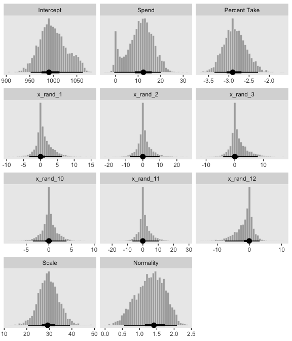

For kicks and giggles, here's the corresponding coefficient plot for *β*<sub>1</sub> through *β*<sub>14</sub>.

``` r
post %>% 
  select(Spend:x_rand_12) %>% 
  gather() %>% 
  
  ggplot(aes(x = value, y = reorder(key, value))) +
  geom_vline(xintercept = 0, color = "white") +
  stat_pointintervalh(point_interval = mode_hdi, .width = .95, color = "grey50") +
  labs(x = NULL,
       y = NULL) +
  theme(axis.text.y = element_text(hjust = 0),
        axis.ticks.y = element_blank(),
        panel.grid.major.y = element_line(color = "grey98", linetype = 2))
```

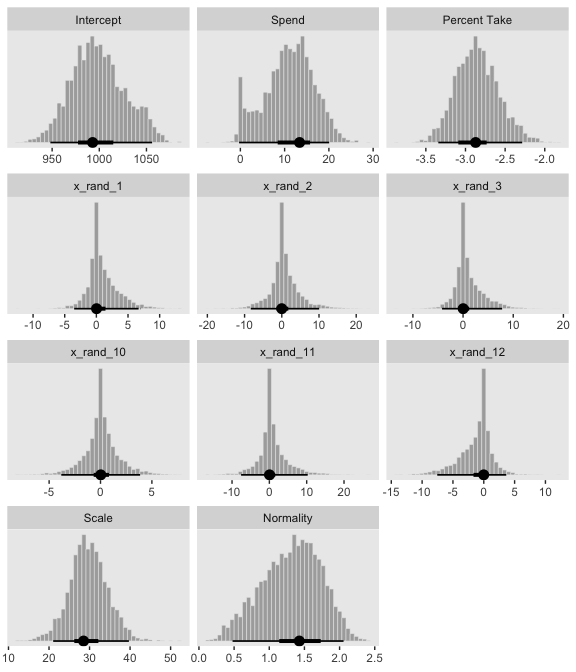

But anyways, here's that final Bayesian *R*<sup>2</sup> histogram for Figure 18.12.

``` r
bayes_R2(fit5, summary = F) %>% 
  as_tibble() %>% 
  
  ggplot(aes(x = R2)) +
  geom_histogram(color = "grey92", fill = "grey67",
                 size = .2, bins = 20) +
  stat_pointintervalh(aes(y = 0), 
                      point_interval = mode_hdi, .width = .95) +
  scale_y_continuous(NULL, breaks = NULL) +
  labs(subtitle = expression(paste("Bayesian ", italic(R)^2)),
       x = NULL) +
  coord_cartesian(xlim = c(.6, 1))
```

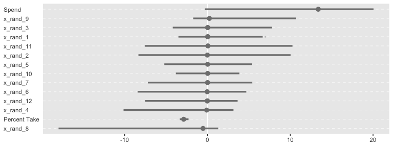

Just recall, though, that our `fit5` was not exactly like Kruschke's model. Whereas we hard coded the scale of our Student-*t* horseshoe prior to be 1, Kruschke estimated it with help from the gamma distribution. I'm not aware that's currently possible in brms. If I'm at fault and you know how to do it, [please share your code](https://github.com/ASKurz/Doing-Bayesian-Data-Analysis-in-brms-and-the-tidyverse/issues).

Variable selection
------------------

We can rewrite the linear regression model to accommodate whether it includes a predictor as

*μ*<sub>*i*</sub> = *β*<sub>0</sub> + ∑<sub>*j*</sub>*δ*<sub>*j*</sub>*β*<sub>*j*</sub>*x*<sub>*j*, *i*</sub>

where *δ* is a dummy for which 0 = *not included* 1 = *included*. I'm not aware of a way to use *δ* as an inclusion indicator in brms the way Kruschke implemented it in JAGS. If you know of a way [share your code](https://github.com/ASKurz/Doing-Bayesian-Data-Analysis-in-brms-and-the-tidyverse/issues). However, this issue lead to a similar approach: information criteria, about which you can learn more about [here](https://www.youtube.com/watch?v=t0pRuy1_190&t=1331s&frags=pl%2Cwn). To do so, let's follow Kruschke's basic flow and use the first model from way back in subsection 18.1.1 as a starting point. The model formula was as follows.

``` r
fit1$formula
```

    ## SATT_z ~ 1 + Spend_z + PrcntTake_z

Taking interactions off the table for a moment, we can specify for model types with various combinations of the two predictors, `PrcntTake_z` and `Spend_z`. `fit1` was the first, which we might denote as ⟨1, 1⟩. That leads to the remaining possibilities as

⟨1, 0⟩: `SATT_z ~ 1 + Spend_z`

⟨0, 1⟩ `SATT_z ~ 1 + PrcntTake_z`

⟨0, 0⟩ `SATT_z ~ 1`

``` r
fit6 <-
  update(fit1,
         formula = SATT_z ~ 1 + Spend_z)

fit7 <-
  update(fit1,
         formula = SATT_z ~ 1 + PrcntTake_z)

fit8 <-
  brm(data = my_data,
      family = student,
      SATT_z ~ 1,
      prior = c(prior(normal(0, 2), class = Intercept),
                prior(normal(0, 1), class = sigma),
                prior(exponential(one_over_twentynine), class = nu)),
      chains = 4, cores = 4,
      stanvars = stanvars)
```

In brms, the LOO and WAIC are two primary information criteria available. You can compute them for a given model with the `loo()` and `waic()` functions, respectively. Here we use `loo()` and save the output as objects.

``` r
l_fit1 <- loo(fit1)
l_fit6 <- loo(fit6)
l_fit7 <- loo(fit7)
l_fit8 <- loo(fit8)
```

Here's the basic LOO summary for `fit1`.

``` r
print(l_fit1)
```

    ## 
    ## Computed from 4000 by 50 log-likelihood matrix
    ## 
    ##          Estimate   SE
    ## elpd_loo    -32.2  5.4
    ## p_loo         4.2  0.8
    ## looic        64.3 10.8
    ## ------
    ## Monte Carlo SE of elpd_loo is 0.0.
    ## 
    ## All Pareto k estimates are good (k < 0.5).
    ## See help('pareto-k-diagnostic') for details.

You get a wealth of output, more of which can be seen with `str(l_fit1)`. First, notice the message "All Pareto k estimates are good (k &lt; 0.5)." Pareto *k* values can be [used for diagnostics](https://cran.r-project.org/web/packages/loo/vignettes/loo2-example.html#plotting-pareto-k-diagnostics). Each case in the data gets its own *k* value and we like it when those *k*s are low. The makers of the loo package get worried when *k* values exceed 0.7 and as a result, `loo()` returns a warning message when they do. Happily, we have no such warning messages in this example.

In the main section, we get estimates for the expected log predictive density (`elpd_loo`), the estimated effective number of parameters (`p_loo`), and the Pareto smoothed importance-sampling leave-one-out cross-validation (PSIS-LOO; `looic`). Each come with a standard error. Like other information criteria, the LOO values aren't of interest in and of themselves. However, the values of one model's LOO relative to that of another is of great interest. We generally prefer models with lower information criteria. With the `compare_ic()` function, we can compute a formal difference score between multiple loo objects.

``` r
compare_ic(l_fit1, l_fit6, l_fit7, l_fit8)
```

    ##              LOOIC    SE
    ## fit1         64.33 10.83
    ## fit6        139.17  8.09
    ## fit7         70.33  8.76
    ## fit8        145.54  6.12
    ## fit1 - fit6 -74.84 12.77
    ## fit1 - fit7  -6.00  5.76
    ## fit1 - fit8 -81.21 11.57
    ## fit6 - fit7  68.83  9.13
    ## fit6 - fit8  -6.37  4.36
    ## fit7 - fit8 -75.21  8.71

Each difference score also comes with a standard error. In this case, `fit1` and `fit7` clearly have the lowest estimates, but the standard error of their difference score is about the same size as their difference. So the LOO difference score puts them on similar footing. You can do a similar analysis with the WAIC.

In addition to difference score comparisons, you can also use the LOO or WAIC for AIC-type model weighting. In brms, you do this with the `model_weights()` function.

``` r
(mw <- model_weights(fit1, fit6, fit7, fit8))
```

    ##         fit1         fit6         fit7         fit8 
    ## 8.613561e-01 6.541115e-08 1.386438e-01 5.953284e-09

If you don't like scientific notation, you can always wrangle and plot.

``` r
mw %>% 
  as_data_frame() %>% 
  rownames_to_column() %>% 
  
  ggplot(aes(x = value, y = reorder(rowname, value))) +
  geom_text(aes(label = value %>% round(3) %>% as.character())) +
  coord_cartesian(xlim = 0:1) +
  labs(x = "stacking weight",
       y = NULL) +
  theme(axis.ticks.y = element_blank())
```

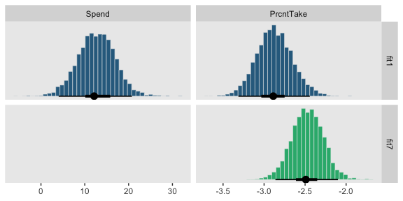

Based on this weighting scheme, almost all the weight was placed in the full model, `fit1`. The `model_weights()` function offers a variety of weighting schemes via the `weights` argument. The default is `loo2`, which entails stacking or pseudo-BMA weighting. For more on stacking and competing weighting schemes, see Vehtari and Gabry’s [*Bayesian Stacking and Pseudo-BMA weights using the loo package*](https://cran.r-project.org/web/packages/loo/vignettes/loo2-weights.html). To give a sense, you might use WAIC-type weighting like this.

``` r
model_weights(fit1, fit6, fit7, fit8,
              weights = "waic") %>% 
  as_data_frame() %>% 
  rownames_to_column() %>% 
  
  ggplot(aes(x = value, y = reorder(rowname, value))) +
  geom_text(aes(label = value %>% round(3) %>% as.character())) +
  coord_cartesian(xlim = 0:1) +
  labs(x = "WAIC weight",
       y = NULL) +
  theme(axis.ticks.y = element_blank())
```

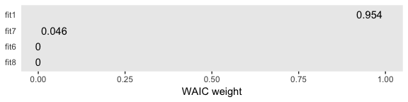

Both methods place the greatest weight on the full model. In the intro of their vignette, Vehtari and Gabry opined:

> Ideally, we would avoid the Bayesian model combination problem by extending the model to include the separate models as special cases, and preferably as a continuous expansion of the model space. For example, instead of model averaging over different covariate combinations, all potentially relevant covariates should be included in a predictive model (for causal analysis more care is needed) and a prior assumption that only some of the covariates are relevant can be presented with regularized horseshoe prior ([Piironen and Vehtari, 2017a](https://projecteuclid.org/euclid.ejs/1513306866)). For variable selection we recommend projective predictive variable selection (Piironen and Vehtari, 2017a; [projpred package](https://cran.r-project.org/web/packages/projpred/index.html)).

Perhaps unsurprisingly, their thoughts on the topic are similar with the Gelman et al quotation Kruschke provided on page 536.

> Some prominent authors eschew the variable-selection approach for typical applications in their fields. For example, Gelman et al. (2013, p. 369) said, "For the regressions we typically see, we do not believe any coefficients to be truly zero and we do not generally consider it a conceptual (as opposed to computational) advantage to get point estimates of zero—but regularized estimates such as obtained by lasso can be much better than those resulting from simple least squares and flat prior distributions ...we are not comfortable with an underlying model in which the coefficients can be exactly zero."

For more on some of these methods, check out Vehtari's [modelselection\_tutorial GitHub repository](https://github.com/avehtari/modelselection_tutorial).

But anyways, our model weighting methods cohered with Kruschke's *δ* inclusion indicator method in that both suggested the full model, `fit1`, and the model with `PrcntTake` as the sole predictor, `fit7`, were given the greatest weight. I'm not aware that our information criteria weighting/model stacking methods provide probability distributions of the type Kruschke displayed in the left portions of Figure 18.13. But we can at least recreate the plots in the other panels.

``` r
# first we'll get the posterior draws from `fit1` and wrangle them
posterior_samples(fit1) %>% 
  transmute(Spend     = make_beta_j(zeta_j = b_Spend_z,
                                    sd_j   = sd_x_1,
                                    sd_y   = sd_y),
            PrcntTake = make_beta_j(zeta_j = b_PrcntTake_z,
                                    sd_j   = sd_x_2,
                                    sd_y   = sd_y)) %>% 
  gather() %>% 
  # within `bind_rows()`, we extract and wrangle the posterior draws from `fit7` and them insert them below those from `fit1`
  bind_rows(
    posterior_samples(fit7) %>% 
      transmute(value = make_beta_j(zeta_j = b_PrcntTake_z,
                                    sd_j   = sd_x_2,
                                    sd_y   = sd_y)) %>% 
      mutate(key = "PrcntTake")
  ) %>% 
  # now we just need a little indexing and factor ordering
  mutate(model = rep(c("fit1", "fit7"), times = c(8000, 4000)),
         key = factor(key, levels = c("Spend", "PrcntTake"))) %>% 
  
  # we finally plot!
  ggplot(aes(x = value, fill = model)) +
  geom_histogram(color = "grey92",
                 size = .2, bins = 40) +
  stat_pointintervalh(aes(y = 0), 
                      point_interval = mode_hdi, .width = c(.95, .5)) +
  scale_fill_viridis_d(option = "D", begin = .35, end = .65) +
  scale_y_continuous(NULL, breaks = NULL) +
  xlab(NULL) +
  theme(legend.position = "none") +
  facet_grid(model~key, scales = "free")
```

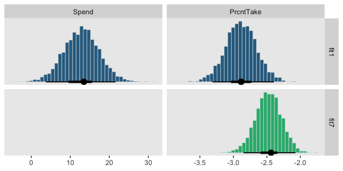

### Inclusion probability is strongly affected by vagueness of prior.

Let's fit the models with the updated *S**D* = 1 on the *β*<sub>1+</sub> priors code.

``` r
fit9 <-
  update(fit1,
         prior = c(prior(normal(0, 1), class = Intercept),
                   prior(normal(0, 1), class = b),
                   prior(normal(0, 1), class = sigma),
                   prior(exponential(one_over_twentynine), class = nu)),
         chains = 4, cores = 4,
         stanvars = stanvars)

fit10 <-
  update(fit9,
         formula = SATT_z ~ 1 + Spend_z,
         chains = 4, cores = 4,
         stanvars = stanvars)

fit11 <-
  update(fit9,
         formula = SATT_z ~ 1 + PrcntTake_z,
         chains = 4, cores = 4,
         stanvars = stanvars)

fit12 <-
  update(fit8,
         prior = c(prior(normal(0, 1), class = Intercept),
                   prior(normal(0, 1), class = sigma),
                   prior(exponential(one_over_twentynine), class = nu)),
         chains = 4, cores = 4,
         stanvars = stanvars)
```

And now we'll fit the models with the updated *S**D* = 10.

``` r
fit13 <-
  update(fit9,
         prior = c(prior(normal(0, 10), class = Intercept),
                   prior(normal(0, 10), class = b),
                   prior(normal(0, 10), class = sigma),
                   prior(exponential(one_over_twentynine), class = nu)),
         chains = 4, cores = 4,
         stanvars = stanvars)

fit14 <-
  update(fit13,
         formula = SATT_z ~ 1 + Spend_z,
         chains = 4, cores = 4,
         stanvars = stanvars)

fit15 <-
  update(fit13,
         formula = SATT_z ~ 1 + PrcntTake_z,
         chains = 4, cores = 4,
         stanvars = stanvars)

fit16 <-
  update(fit12,
         prior = c(prior(normal(0, 10), class = Intercept),
                   prior(normal(0, 10), class = sigma),
                   prior(exponential(one_over_twentynine), class = nu)),
         chains = 4, cores = 4,
         stanvars = stanvars)
```

Now we've fit the models, we're ready to examine how altering the *S**D*s on the *β*<sub>*j*</sub> priors influenced the model comparisons via `model_weights()`. Here we'll use the default stacking method.

``` r
mw %>% 
  as_tibble() %>% 
  bind_rows(
    model_weights(fit9, fit10, fit11, fit12) %>%
      as_tibble()
  ) %>% 
  bind_rows(
    model_weights(fit13, fit14, fit15, fit16) %>%
      as_tibble()
  ) %>% 
  mutate(delta = rep(c("1, 1", "1, 0", "0, 1", "0, 0"), times = 3),
         prior = rep(c("SD = 2", "SD = 10", "SD = 1"), each = 4)) %>% 
  
  ggplot(aes(x = value, y = reorder(delta, value))) +
  geom_text(aes(label = value %>% round(3) %>% as.character())) +
  coord_cartesian(xlim = 0:1) +
  labs(x = "Stacking weight",
       y = expression(paste("Models defined by Kruschke's ", delta, " notation"))) +
  theme(axis.ticks.y = element_blank()) +
  facet_grid(prior~.)
```


So unlike in the depictions in Figure 18.14, the stacking method was fairly insensitive to the *S**D*s on our *β*<sub>*j*</sub> priors. We might compare LOO difference scores, too.

``` r
compare_ic(l_fit1, l_fit6, l_fit7, l_fit8)
```

    ##              LOOIC    SE
    ## fit1         64.33 10.83
    ## fit6        139.17  8.09
    ## fit7         70.33  8.76
    ## fit8        145.54  6.12
    ## fit1 - fit6 -74.84 12.77
    ## fit1 - fit7  -6.00  5.76
    ## fit1 - fit8 -81.21 11.57
    ## fit6 - fit7  68.83  9.13
    ## fit6 - fit8  -6.37  4.36
    ## fit7 - fit8 -75.21  8.71

``` r
loo(fit9, fit10, fit11, fit12)
```

    ##                LOOIC    SE
    ## fit9           63.87 10.71
    ## fit10         139.09  8.04
    ## fit11          70.23  8.79
    ## fit12         145.39  6.10
    ## fit9 - fit10  -75.22 12.58
    ## fit9 - fit11   -6.35  5.65
    ## fit9 - fit12  -81.52 11.41
    ## fit10 - fit11  68.87  9.04
    ## fit10 - fit12  -6.29  4.28
    ## fit11 - fit12 -75.16  8.69

``` r
loo(fit13, fit14, fit15, fit16)
```

    ##                LOOIC    SE
    ## fit13          63.76 10.69
    ## fit14         139.17  7.92
    ## fit15          70.30  8.74
    ## fit16         145.53  5.96
    ## fit13 - fit14 -75.41 12.60
    ## fit13 - fit15  -6.55  5.71
    ## fit13 - fit16 -81.78 11.41
    ## fit14 - fit15  68.86  9.00
    ## fit14 - fit16  -6.37  4.27
    ## fit15 - fit16 -75.23  8.62

The LOO difference score patterns were also about the same across the *S**D*s on our *β*<sub>*j*</sub> priors. Let's finish up with the histograms comparing the model predictors. Here's the code for those in the top portion of Figure 18.14.

``` r
# first we'll get the posterior draws from `fit9` and wrangle them
posterior_samples(fit9) %>% 
  transmute(Spend     = make_beta_j(zeta_j = b_Spend_z,
                                    sd_j   = sd_x_1,
                                    sd_y   = sd_y),
            PrcntTake = make_beta_j(zeta_j = b_PrcntTake_z,
                                    sd_j   = sd_x_2,
                                    sd_y   = sd_y)) %>% 
  gather() %>% 
  # within `bind_rows()`, we extract and wrangle the posterior draws from `fit11` and them insert them below those from `fit9`
  bind_rows(
    posterior_samples(fit11) %>% 
      transmute(value = make_beta_j(zeta_j = b_PrcntTake_z,
                                    sd_j   = sd_x_2,
                                    sd_y   = sd_y)) %>% 
      mutate(key = "PrcntTake")
  ) %>% 
  # now we just need a little indexing and factor ordering
  mutate(model = rep(c("fit9", "fit11"), times = c(8000, 4000)) %>% 
           factor(., levels = c("fit9", "fit11")),
         key = factor(key, levels = c("Spend", "PrcntTake"))) %>%
  
  # we finally plot!
  ggplot(aes(x = value, fill = model)) +
  geom_histogram(color = "grey92",
                 size = .2, bins = 40) +
  stat_pointintervalh(aes(y = 0), 
                      point_interval = mode_hdi, .width = c(.95, .5)) +
  scale_fill_viridis_d(option = "D", begin = .35, end = .65) +
  scale_y_continuous(NULL, breaks = NULL) +
  xlab(NULL) +
  theme(legend.position = "none") +
  facet_grid(model~key, scales = "free")
```

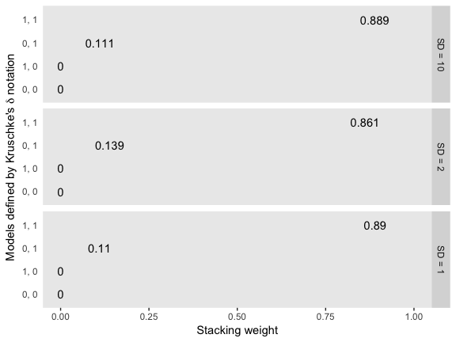

And now we'll do the histograms for the bottom portion of Figure 18.14.

``` r
posterior_samples(fit13) %>% 
  transmute(Spend     = make_beta_j(zeta_j = b_Spend_z,
                                    sd_j   = sd_x_1,
                                    sd_y   = sd_y),
            PrcntTake = make_beta_j(zeta_j = b_PrcntTake_z,
                                    sd_j   = sd_x_2,
                                    sd_y   = sd_y)) %>% 
  gather() %>% 
  bind_rows(
    posterior_samples(fit15) %>% 
      transmute(value = make_beta_j(zeta_j = b_PrcntTake_z,
                                    sd_j   = sd_x_2,
                                    sd_y   = sd_y)) %>% 
      mutate(key = "PrcntTake")
  ) %>% 
  mutate(model = rep(c("fit13", "fit15"), times = c(8000, 4000)) %>% 
           factor(., levels = c("fit13", "fit15")),
         key = factor(key, levels = c("Spend", "PrcntTake"))) %>%
  
  ggplot(aes(x = value, fill = model)) +
  geom_histogram(color = "grey92",
                 size = .2, bins = 40) +
  stat_pointintervalh(aes(y = 0), 
                      point_interval = mode_hdi, .width = c(.95, .5)) +
  scale_fill_viridis_d(option = "D", begin = .35, end = .65) +
  scale_y_continuous(NULL, breaks = NULL) +
  xlab(NULL) +
  theme(legend.position = "none") +
  facet_grid(model~key, scales = "free")
```

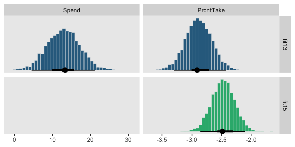

### Variable selection with hierarchical shrinkage.

Kruschke opened the subsection with a few good points:

> If you have strong previous research that can inform the prior, then it should be used. But if previous knowledge is weak, then the uncertainty should be expressed in the prior. This is an underlying mantra of the Bayesian approach: Any uncertainty should be expressed in the prior. (p. 543)

Here we'll standardize our new predictors, `StuTeaRat` and `Salary`.

``` r
my_data <-
  my_data %>% 
  mutate(StuTeaRat_z = standardize(StuTeaRat),
         Salary_z    = standardize(Salary))
```

We can use Kruschke's `gamma_s_and_r_from_mode_sd()` function to return the exact shape and rate parameters to make a gamma with a mode of 1 and an *S**D* of 10.

``` r
gamma_s_and_r_from_mode_sd <- function(mode, sd) {
  if (mode <= 0) stop("mode must be > 0")
  if (sd   <= 0) stop("sd must be > 0")
  rate  <- (mode + sqrt(mode^2 + 4 * sd^2))/(2 * sd^2)
  shape <- 1 + mode * rate
  return(list(shape = shape, rate = rate))
}
```

Here are the values.

``` r
gamma_s_and_r_from_mode_sd(mode = 1, sd = 10) %>% str()
```

    ## List of 2
    ##  $ shape: num 1.11
    ##  $ rate : num 0.105

We can code those values in with arbitrary precision with the `stanvar()` function.

``` r
stanvars <- 
  stanvar(1/29, name = "one_over_twentynine") +
  stanvar(gamma_s_and_r_from_mode_sd(mode = 1, sd = 10)[["shape"]], name = "my_shape") +
  stanvar(gamma_s_and_r_from_mode_sd(mode = 1, sd = 10)[["rate"]], name = "my_rate") +
  stanvar(scode = "  real<lower=0> tau;", block = "parameters")
```

Note that last `stanvar()` line. Bürkner recently posted an [exemplar of how to set a hierarchical prior on a regression coefficient](https://github.com/paul-buerkner/brms/issues/459) in a `brm()` model:

``` r
# define a hierachical prior on the regression coefficients
bprior <- set_prior("normal(0, tau)", class = "b") +
  set_prior("target += normal_lpdf(tau | 0, 10)", check = FALSE)

stanvars <- stanvar(scode = "  real<lower=0> tau;", block = "parameters")

make_stancode(count ~ Trt + log_Base4_c, epilepsy,
              prior = bprior, stanvars = stanvars)
```

Following the method, we tell `brm()` we'd like to estimate the *S**D* of our *β*<sub>1+</sub> priors with `prior(normal(0, tau), class = b)`, where the `tau` is a stand-in for the *S**D*. In the next line, `set_prior("target += gamma_lpdf(tau | my_shape, my_rate)", check = FALSE),`, we tell `brm()` we'd like to estimate `tau` with a gamma(`my_shape`, `my_rate`), the values for which were saved in our `stanvars` object, above. And it's that `stanvar()` line in that code wherein we told `brm()` we'd like that parameter to have a lower bound of 0. Let's put it to use.

``` r
fit_1111 <-
  brm(data = my_data,
      family = student,
      SATT_z ~ 1 + Spend_z + PrcntTake_z + StuTeaRat_z + Salary_z,
      prior = c(prior(normal(0, 2), class = Intercept),
                prior(normal(0, tau), class = b),
                set_prior("target += gamma_lpdf(tau | my_shape, my_rate)", check = FALSE),
                prior(normal(0, 1), class = sigma),
                prior(exponential(one_over_twentynine), class = nu)),
      chains = 4, cores = 4,
      stanvars = stanvars)

fit_0111 <-
  update(fit_1111,
         formula = SATT_z ~ 1           + PrcntTake_z + StuTeaRat_z + Salary_z)

fit_1011 <-
  update(fit_1111,
         formula = SATT_z ~ 1 + Spend_z               + StuTeaRat_z + Salary_z)

fit_1101 <-
  update(fit_1111,
         formula = SATT_z ~ 1 + Spend_z + PrcntTake_z               + Salary_z)

fit_1110 <-
  update(fit_1111,
         formula = SATT_z ~ 1 + Spend_z + PrcntTake_z + StuTeaRat_z           )

fit_0011 <-
  update(fit_1111,
         formula = SATT_z ~ 1                         + StuTeaRat_z + Salary_z)

fit_0101 <-
  update(fit_1111,
         formula = SATT_z ~ 1           + PrcntTake_z               + Salary_z)

fit_0110 <-
  update(fit_1111,
         formula = SATT_z ~ 1           + PrcntTake_z + StuTeaRat_z           )

fit_1001 <-
  update(fit_1111,
         formula = SATT_z ~ 1 + Spend_z                             + Salary_z)

fit_1010 <-
  update(fit_1111,
         formula = SATT_z ~ 1 + Spend_z               + StuTeaRat_z           )

fit_1100 <-
  update(fit_1111,
         formula = SATT_z ~ 1 + Spend_z + PrcntTake_z                         )

fit_0001 <-
  update(fit_1111,
         formula = SATT_z ~ 1                                       + Salary_z)

fit_0010 <-
  update(fit_1111,
         formula = SATT_z ~ 1                         + StuTeaRat_z           )

fit_0100 <-
  update(fit_1111,
         formula = SATT_z ~ 1           + PrcntTake_z                         )

fit_1000 <-
  update(fit_1111,
         formula = SATT_z ~ 1 + Spend_z                                       )

fit_0000 <-
  update(fit_1111,
         formula = SATT_z ~ 1                                                 )
```

In order to keep track of the next 16 models, we switched our usual naming convention. Instead of continuing on keeping on calling them `fit17` through `fit33`, we used Kruschke's *δ* 0/1 convention. If we set the formula for the full model as `SATT_z ~ 1 + Spend_z + PrcntTake_z + StuTeaRat_z + Salary_z`, the name becomes `fit_1111`. Accordingly, we called the model omitting `Spend_z`, the first predictor, `fit_0111`, and so on.

Before we go any further, here are the correlations among the *β*s for the full model, `fit_1111`.

``` r
vcov(fit_1111, correlation = T) %>% 
  round(digits = 3)
```

    ##             Intercept Spend_z PrcntTake_z StuTeaRat_z Salary_z
    ## Intercept       1.000   0.024      -0.018       0.019   -0.017
    ## Spend_z         0.024   1.000       0.052       0.678   -0.888
    ## PrcntTake_z    -0.018   0.052       1.000       0.238   -0.343
    ## StuTeaRat_z     0.019   0.678       0.238       1.000   -0.663
    ## Salary_z       -0.017  -0.888      -0.343      -0.663    1.000

Once again, the HMC correlations differ from Kruschke's JAGS correlations. Moving on--behold the model weights.

``` r
(
  mw <-
  model_weights(fit_1111, 
                fit_0111, fit_1011, fit_1101, fit_1110,
                fit_0011, fit_0101, fit_0110, fit_1001, fit_1010, fit_1100, 
                fit_0001, fit_0010, fit_0100, fit_1000,
                fit_0000)
 )
```

    ##     fit_1111     fit_0111     fit_1011     fit_1101     fit_1110 
    ## 1.652635e-08 2.212637e-01 1.236688e-05 4.803774e-05 3.466431e-07 
    ##     fit_0011     fit_0101     fit_0110     fit_1001     fit_1010 
    ## 1.504242e-07 3.115320e-02 8.724606e-06 4.119571e-05 9.534825e-06 
    ##     fit_1100     fit_0001     fit_0010     fit_0100     fit_1000 
    ## 1.830273e-01 1.596717e-01 2.867365e-07 2.936943e-01 1.110692e-01 
    ##     fit_0000 
    ## 5.899112e-09

We'll plot our model weights like before.

``` r
mw %>% 
  as_data_frame() %>% 
  rownames_to_column() %>% 
  
  ggplot(aes(x = value, y = reorder(rowname, value))) +
  geom_text(aes(label = value %>% round(4) %>% as.character()),
            size = 3) +
  coord_cartesian(xlim = 0:1) +
  labs(x = "Stacking weight",
       y = NULL) +
  theme(axis.ticks.y = element_blank())
```


As you might notice, pattern among model weights is similar with but not identical to the one among the model probabilities Kruschke displayed in Figure 18.15. Here I'll plot the histograms for our top six.

``` r
# first, we need to redefine `sd_x_3` and `sd_x_4` in terms of our two new predictors
sd_x_3 <- sd(my_data$StuTeaRat)
sd_x_4 <- sd(my_data$Salary)

## Now we'll start extracting our posterior samples and wrangling them, by model
# fit_0100
posterior_samples(fit_0100) %>% 
  transmute(PrcntTake = make_beta_j(zeta_j = b_PrcntTake_z,
                                    sd_j   = sd_x_2,
                                    sd_y   = sd_y)) %>% 
  gather() %>% 
  mutate(fit = "fit_0100") %>% 
  # fit_0111
  bind_rows(
    posterior_samples(fit_0111) %>% 
      transmute(PrcntTake = make_beta_j(zeta_j = b_PrcntTake_z,
                                        sd_j   = sd_x_2,
                                        sd_y   = sd_y),
                StuTeaRat = make_beta_j(zeta_j = b_StuTeaRat_z,
                                        sd_j   = sd_x_3,
                                        sd_y   = sd_y),
                Salary    = make_beta_j(zeta_j = b_Salary_z,
                                        sd_j   = sd_x_4,
                                        sd_y   = sd_y)) %>% 
      gather() %>% 
      mutate(fit = "fit_0111")
    )  %>% 
  # fit_1100
  bind_rows(
    posterior_samples(fit_1100) %>% 
      transmute(Spend     = make_beta_j(zeta_j = b_Spend_z,
                                        sd_j   = sd_x_1,
                                        sd_y   = sd_y),
                PrcntTake = make_beta_j(zeta_j = b_PrcntTake_z,
                                        sd_j   = sd_x_2,
                                        sd_y   = sd_y)) %>% 
      gather() %>% 
      mutate(fit = "fit_1100")
    )  %>% 
  # fit_1000
  bind_rows(
    posterior_samples(fit_1000) %>% 
      transmute(Spend     = make_beta_j(zeta_j = b_Spend_z,
                                        sd_j   = sd_x_1,
                                        sd_y   = sd_y)) %>% 
      gather() %>% 
      mutate(fit = "fit_1000")
    )  %>% 
  # fit_0001
  bind_rows(
    posterior_samples(fit_0001) %>% 
      transmute(Salary    = make_beta_j(zeta_j = b_Salary_z,
                                        sd_j   = sd_x_4,
                                        sd_y   = sd_y)) %>% 
      gather() %>% 
      mutate(fit = "fit_0001")
    )  %>% 
  # fit_0101
  bind_rows(
    posterior_samples(fit_0101) %>% 
      transmute(PrcntTake = make_beta_j(zeta_j = b_PrcntTake_z,
                                        sd_j   = sd_x_2,
                                        sd_y   = sd_y),
                Salary    = make_beta_j(zeta_j = b_Salary_z,
                                        sd_j   = sd_x_4,
                                        sd_y   = sd_y)) %>% 
      gather() %>% 
      mutate(fit = "fit_0101")
    ) %>% 
  # the next two lines just help order the grid the plots appear in
  mutate(key = factor(key, levels = c("Spend", "PrcntTake", "StuTeaRat", "Salary")),
         fit = factor(fit, levels = c("fit_0100", "fit_0111", "fit_1100", "fit_1000", "fit_0001", "fit_0101"))) %>%
  
  # finally, the plot!
  ggplot(aes(x = value, fill = fit)) +
  geom_histogram(color = "grey92",
                 size = .2, bins = 40) +
  stat_pointintervalh(aes(y = 0),
                      point_interval = mode_hdi, .width = c(.95, .5)) +
  scale_fill_viridis_d(option = "D", begin = .2, end = .8) +
  scale_y_continuous(NULL, breaks = NULL) +
  xlab(NULL) +
  theme(legend.position = "none") +
  facet_grid(fit~key, scales = "free")
```

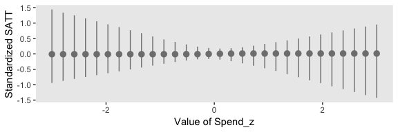

Like Kruschke's results in the text, the most likely predictor based on our top six models was `PrcntTake`. Unlike Kruschke's results, our second most likely predictor was `Salary`, with `Spend` ending up third.

### What to report and what to conclude.

Kruschke made a great point in the opening paragraph of this subsection.

> It might make sense to use the single most credible model, especially if it is notably more credible than the runner up, and if the goal is to have a parsimonious explanatory description of the data. But it is important to recognize that using the single best model, when it excludes some predictors, is concluding that the regression coefficients on the excluded predictors are exactly zero. (p. 546)

Later he added "A forthright report should state the posterior probabilities of the several top models. Additionally, it can be useful to report, for each model, the ratio of its posterior probability relative to that of the best model" (p. 546). And in the final paragraph of the subsection, he wrote:

> When the goal is prediction of *y* for interesting values of the predictors, as opposed to parsimonious explanation, then it is usually not appropriate to use only the single most probable model. Instead, predictions should be based on as much information as possible, using all models to the extent that they are credible. This approach is called Bayesian model averaging (BMA). (p. 547)

It's worth it to walk this out a bit. In brms, one can use `brms::pp_average()` to get the weighted posterior distributions for the model parameters.

``` r
# how many points on the x-axis?
n_points <- 30

# what vales of the predictors would we like to evaluate the weighted posterior over?
nd <-
  tibble(Spend_z = seq(from = -3, to = 3, length.out = n_points),
         PrcntTake_z = 0, 
         StuTeaRat_z = 0, 
         Salary_z = 0)

pp <-
  # the first things we feed into `pp_average()` are the `brm()` fits we'd like to average over
  pp_average(fit_1111, fit_0111, fit_1011, fit_1101, fit_1110, fit_0011, fit_0101, fit_0110, fit_1001, fit_1010, fit_1100, fit_0001, fit_0010, fit_0100, fit_1000, fit_0000,
             # here we tell it to evaluate the posterior over these predictor values
             newdata = nd, 
             # we can get the mean trends using the "fitted" method
             method = "fitted",
             # by `robust`, we mean we'd like the Estimate in terms of posterior medians, rather than means
             robust = T)

str(pp)
```

    ##  num [1:30, 1:4] -0.0104 -0.0104 -0.0104 -0.0104 -0.0104 ...
    ##  - attr(*, "dimnames")=List of 2
    ##   ..$ : NULL
    ##   ..$ : chr [1:4] "Estimate" "Est.Error" "Q2.5" "Q97.5"
    ##  - attr(*, "weights")= Named num [1:16] 1.65e-08 2.21e-01 1.24e-05 4.80e-05 3.47e-07 ...
    ##   ..- attr(*, "names")= chr [1:16] "fit_1111" "fit_0111" "fit_1011" "fit_1101" ...
    ##  - attr(*, "nsamples")= Named num [1:16] 0 885 0 0 0 0 125 0 0 0 ...
    ##   ..- attr(*, "names")= chr [1:16] "fit_1111" "fit_0111" "fit_1011" "fit_1101" ...

The `pp` object will require a little wrangling before it's of use in ggplot2.

``` r
pp %>% 
  as_tibble() %>%
  bind_cols(nd) %>% 

  ggplot(aes(x = Spend_z, y = Estimate,
             ymin = Q2.5, ymax = Q97.5)) +
  geom_pointrange(color = "grey50") +
  labs(x = "Value of Spend_z",
       y = "Standardized SATT")
```

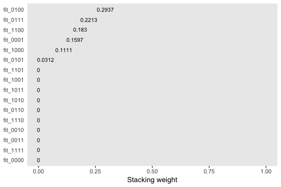

We can build on this to make a plot considering each of the four predictors. But first that requires we make a new `nd` tibble to feed into `pp_average()`.

``` r
# how many points on the x-axis?
n_points <- 30

# what vales of the predictors would we like to evaluate the weighted posterior over?
nd <-
  tibble(Spend_z     = c(seq(from = -3, to = 3, length.out = n_points),
                         rep(0, times = n_points*3)),
         PrcntTake_z = c(rep(0, times = n_points),
                         seq(from = -3, to = 3, length.out = n_points),
                         rep(0, times = n_points*2)), 
         StuTeaRat_z = c(rep(0, times = n_points*2),
                         seq(from = -3, to = 3, length.out = n_points),
                         rep(0, times = n_points)), 
         Salary_z    = c(rep(0, times = n_points*3),
                         seq(from = -3, to = 3, length.out = n_points)))

pp <-
  pp_average(fit_1111, fit_0111, fit_1011, fit_1101, fit_1110, fit_0011, fit_0101, fit_0110, fit_1001, fit_1010, fit_1100, fit_0001, fit_0010, fit_0100, fit_1000, fit_0000,
             newdata = nd, 
             method = "fitted",
             robust = T,
             # Note the `probs` argument
             probs = c(.025, .975, .1, .9, .25, .75))

str(pp)
```

    ##  num [1:120, 1:8] -0.0101 -0.0101 -0.0101 -0.0101 -0.0101 ...
    ##  - attr(*, "dimnames")=List of 2
    ##   ..$ : NULL
    ##   ..$ : chr [1:8] "Estimate" "Est.Error" "Q2.5" "Q97.5" ...
    ##  - attr(*, "weights")= Named num [1:16] 1.65e-08 2.21e-01 1.24e-05 4.80e-05 3.47e-07 ...
    ##   ..- attr(*, "names")= chr [1:16] "fit_1111" "fit_0111" "fit_1011" "fit_1101" ...
    ##  - attr(*, "nsamples")= Named num [1:16] 0 885 0 0 0 0 125 0 0 0 ...
    ##   ..- attr(*, "names")= chr [1:16] "fit_1111" "fit_0111" "fit_1011" "fit_1101" ...

In each panel of the plot, below, we focus on one predictor. For that predictor, we hold all other three at their mean, which, since they are all standardized, is zero. We consider the posterior predictions for standardized SAT scores across a range of values each focal predictor. The posterior predictions are depicted in terms of 95%, 80%, and 50% percentile-based interval bands and a line at the median.

``` r
pp %>% 
  as_tibble() %>% 
  mutate(x = seq(from = -3, to = 3, length.out = n_points) %>% rep(., times = 4),
         predictor = rep(c("Spend_z", "PrcntTake_z", "StuTeaRat_z", "Salary_z"), each = n_points)) %>% 
  
  ggplot(aes(x = x)) +
  geom_ribbon(aes(ymin = Q2.5, ymax = Q97.5, fill = predictor),
              alpha = 1/5) +
  geom_ribbon(aes(ymin = Q10, ymax = Q90, fill = predictor),
              alpha = 1/4) +
  geom_ribbon(aes(ymin = Q25, ymax = Q75, fill = predictor),
              alpha = 1/3) +
  geom_line(aes(y = Estimate, color = predictor),
            size = 1) +
  scale_fill_viridis_d(option = "D", begin = .1, end = .6) +
  scale_color_viridis_d(option = "D", begin = .1, end = .6) +
  labs(x = "Standardized value of the focal predictor",
       y = "Standardized SATT") +
  theme(legend.position = "none") +
  facet_grid(predictor ~ ., scales = "free")
```

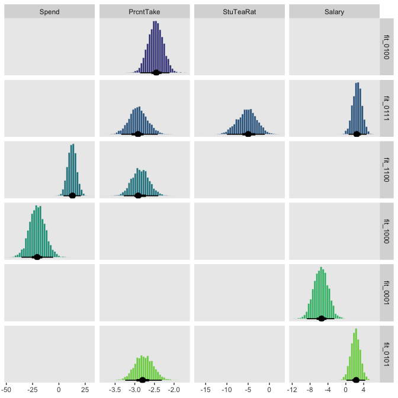

References
----------

Kruschke, J. K. (2015). *Doing Bayesian data analysis, Second Edition: A tutorial with R, JAGS, and Stan.* Burlington, MA: Academic Press/Elsevier.

Session info
------------

``` r
sessionInfo()
```

    ## R version 3.5.1 (2018-07-02)
    ## Platform: x86_64-apple-darwin15.6.0 (64-bit)
    ## Running under: macOS High Sierra 10.13.4
    ## 
    ## Matrix products: default
    ## BLAS: /Library/Frameworks/R.framework/Versions/3.5/Resources/lib/libRblas.0.dylib
    ## LAPACK: /Library/Frameworks/R.framework/Versions/3.5/Resources/lib/libRlapack.dylib
    ## 
    ## locale:
    ## [1] en_US.UTF-8/en_US.UTF-8/en_US.UTF-8/C/en_US.UTF-8/en_US.UTF-8
    ## 
    ## attached base packages:
    ## [1] stats     graphics  grDevices utils     datasets  methods   base     
    ## 
    ## other attached packages:
    ##  [1] ggridges_0.5.0  bayesplot_1.6.0 tidybayes_1.0.1 brms_2.4.0     
    ##  [5] Rcpp_0.12.18    bindrcpp_0.2.2  forcats_0.3.0   stringr_1.3.1  
    ##  [9] dplyr_0.7.6     purrr_0.2.5     readr_1.1.1     tidyr_0.8.1    
    ## [13] tibble_1.4.2    ggplot2_3.0.0   tidyverse_1.2.1
    ## 
    ## loaded via a namespace (and not attached):
    ##  [1] nlme_3.1-137              matrixStats_0.54.0       
    ##  [3] xts_0.10-2                lubridate_1.7.4          
    ##  [5] threejs_0.3.1             httr_1.3.1               
    ##  [7] LaplacesDemon_16.1.1      rprojroot_1.3-2          
    ##  [9] rstan_2.17.3              tools_3.5.1              
    ## [11] backports_1.1.2           utf8_1.1.4               
    ## [13] R6_2.2.2                  DT_0.4                   
    ## [15] lazyeval_0.2.1            colorspace_1.3-2         
    ## [17] withr_2.1.2               tidyselect_0.2.4         
    ## [19] gridExtra_2.3             mnormt_1.5-5             
    ## [21] Brobdingnag_1.2-5         compiler_3.5.1           
    ## [23] cli_1.0.0                 rvest_0.3.2              
    ## [25] HDInterval_0.2.0          arrayhelpers_1.0-20160527
    ## [27] shinyjs_1.0               xml2_1.2.0               
    ## [29] labeling_0.3              colourpicker_1.0         
    ## [31] scales_0.5.0              dygraphs_1.1.1.5         
    ## [33] mvtnorm_1.0-8             psych_1.8.4              
    ## [35] digest_0.6.15             StanHeaders_2.17.2       
    ## [37] foreign_0.8-70            rmarkdown_1.10           
    ## [39] base64enc_0.1-3           pkgconfig_2.0.1          
    ## [41] htmltools_0.3.6           htmlwidgets_1.2          
    ## [43] rlang_0.2.1               readxl_1.1.0             
    ## [45] rstudioapi_0.7            shiny_1.1.0              
    ## [47] svUnit_0.7-12             bindr_0.1.1              
    ## [49] zoo_1.8-2                 jsonlite_1.5             
    ## [51] crosstalk_1.0.0           gtools_3.8.1             
    ## [53] inline_0.3.15             magrittr_1.5             
    ## [55] loo_2.0.0                 Matrix_1.2-14            
    ## [57] munsell_0.5.0             abind_1.4-5              
    ## [59] stringi_1.2.3             yaml_2.1.19              
    ## [61] MASS_7.3-50               ggstance_0.3             
    ## [63] plyr_1.8.4                grid_3.5.1               
    ## [65] parallel_3.5.1            promises_1.0.1           
    ## [67] crayon_1.3.4              miniUI_0.1.1.1           
    ## [69] lattice_0.20-35           haven_1.1.2              
    ## [71] hms_0.4.2                 knitr_1.20               
    ## [73] pillar_1.2.3              igraph_1.2.1             
    ## [75] markdown_0.8              shinystan_2.5.0          
    ## [77] codetools_0.2-15          reshape2_1.4.3           
    ## [79] stats4_3.5.1              rstantools_1.5.0         
    ## [81] glue_1.2.0                evaluate_0.10.1          
    ## [83] modelr_0.1.2              httpuv_1.4.4.2           
    ## [85] cellranger_1.1.0          gtable_0.2.0             
    ## [87] assertthat_0.2.0          mime_0.5                 
    ## [89] xtable_1.8-2              broom_0.4.5              
    ## [91] coda_0.19-1               later_0.7.3              
    ## [93] viridisLite_0.3.0         rsconnect_0.8.8          
    ## [95] shinythemes_1.1.1         bridgesampling_0.4-0
