Chapter 19. Metric Predicted Variable with One Nominal Predictor
================
A Solomon Kurz
2018-12-24

Metric Predicted Variable with One Nominal Predictor
====================================================

> This chapter considers data structures that consist of a metric predicted variable and a nominal predictor.... This type of data structure can arise from experiments or from observational studies. In experiments, the researcher assigns the categories (at random) to the experimental subjects. In observational studies, both the nominal predictor value and the metric predicted value are generated by processes outside the direct control of the researcher. In either case, the same mathematical description can be applied to the data (although causality is best inferred from experimental intervention).
>
> The traditional treatment of this sort of data structure is called single-factor analysis of variance (ANOVA), or sometimes one-way ANOVA. Our Bayesian approach will be a hierarchical generalization of the traditional ANOVA model. The chapter will also consider the situation in which there is also a metric predictor that accompanies the primary nominal predictor. The metric predictor is sometimes called a covariate, and the traditional treatment of this data structure is called analysis of covariance (ANCOVA). The chapter also considers generalizations of the traditional models, because it is straight forward in Bayesian software to implement heavy-tailed distributions to accommodate outliers, along with hierarchical structure to accommodate heterogeneous variances in the different groups, etc. (pp. 553--554)

19.1. Describing multiple groups of metric data
-----------------------------------------------

> Figure 19.1 illustrates the conventional description of grouped metric data. Each group is represented as a position on the horizontal axis. The vertical axis represents the variable to be predicted by group membership. The data are assumed to be normally distributed within groups, with equal standard deviation in all groups. The group means are deflections from overall baseline, such that the deflections sum to zero. Figure 19.1 provides a specific numerical example, with data that were randomly generated from the model. (p. 554)

We'll want a custom data generating function for our primary group data.

``` r
library(tidyverse)

generate_data <- function(seed, mean){
  set.seed(seed)
  rnorm(n, mean = grand_mean + mean, sd = 2)
}

n          <- 20
grand_mean <- 101

d <-
  tibble(group     = 1:5,
         deviation = c(4, -5, -2, 6, -3)) %>% 
  mutate(d = purrr::map2(group, deviation, generate_data)) %>% 
  unnest() %>% 
  mutate(iteration = rep(1:n, times = 5))

head(d)
```

    ## # A tibble: 6 x 4
    ##   group deviation     d iteration
    ##   <int>     <dbl> <dbl>     <int>
    ## 1     1         4  104.         1
    ## 2     1         4  105.         2
    ## 3     1         4  103.         3
    ## 4     1         4  108.         4
    ## 5     1         4  106.         5
    ## 6     1         4  103.         6

Here we'll make a tibble containing the necessary data for the rotated Gaussians. As far as I can tell, Kruschke's Gaussians only span about a 98% interval. We partition off those bounds for each `group` by the `ll` and `ul` columns in the first `mutate()` function. In the second `mutate()`, we expand the dataset to include a sequence of 100 values between those lower- and upper-limit points. In the third `mutate()`, we feed those points into the `dnorm()` function, with group-specific means and a common `sd`.

``` r
densities <-
  d %>% 
  distinct(group, deviation) %>% 
  mutate(ll      = qnorm(.01, mean = grand_mean + deviation, sd = 2),
         ul      = qnorm(.99, mean = grand_mean + deviation, sd = 2)) %>% 
  mutate(d       = map2(ll, ul, seq, length.out = 100)) %>% 
  mutate(density = map2(d, grand_mean + deviation, dnorm, sd = 2)) %>% 
  unnest()

head(densities)
```

    ## # A tibble: 6 x 6
    ##   group deviation    ll    ul     d density
    ##   <int>     <dbl> <dbl> <dbl> <dbl>   <dbl>
    ## 1     1         4  100.  110.  100.  0.0133
    ## 2     1         4  100.  110.  100.  0.0148
    ## 3     1         4  100.  110.  101.  0.0165
    ## 4     1         4  100.  110.  101.  0.0183
    ## 5     1         4  100.  110.  101.  0.0203
    ## 6     1         4  100.  110.  101.  0.0224

We'll need two more supplementary tibbles to add the flourishes to the plot. The `arrow` tibble will specify our light-gray arrows. The `betas` tibble will contain our annotation information.

``` r
arrow <-
  tibble(group     = 1:5,
         d         = grand_mean,
         deviation = c(4, -5, -2, 6, -3),
         offset    = .1)

head(arrow)
```

    ## # A tibble: 5 x 4
    ##   group     d deviation offset
    ##   <int> <dbl>     <dbl>  <dbl>
    ## 1     1   101         4    0.1
    ## 2     2   101        -5    0.1
    ## 3     3   101        -2    0.1
    ## 4     4   101         6    0.1
    ## 5     5   101        -3    0.1

``` r
betas <-
  tibble(group     = c(0:5, 0),
         d         = grand_mean,
         deviation = c(0, 4, -5, -2, 6, -3, 10),
         offset    = rep(c(1/4, 0), times = c(6, 1)),
         angle     = rep(c(90, 0), times = c(6, 1)),
         label     = c("beta[0] == 101", "beta['[1]'] == 4", "beta['[2]'] == -5", "beta['[3]'] == -2", "beta['[4]'] == 6", "beta['[5]'] == 3", "sigma['all'] == 2"))

head(betas)
```

    ## # A tibble: 6 x 6
    ##   group     d deviation offset angle label            
    ##   <dbl> <dbl>     <dbl>  <dbl> <dbl> <chr>            
    ## 1     0   101         0   0.25    90 beta[0] == 101   
    ## 2     1   101         4   0.25    90 beta['[1]'] == 4 
    ## 3     2   101        -5   0.25    90 beta['[2]'] == -5
    ## 4     3   101        -2   0.25    90 beta['[3]'] == -2
    ## 5     4   101         6   0.25    90 beta['[4]'] == 6 
    ## 6     5   101        -3   0.25    90 beta['[5]'] == 3

Now we're ready to plot.

``` r
library(ggridges)

d %>% 
  ggplot(aes(x = d, y = group, group = group)) +
  geom_vline(xintercept = grand_mean, color = "white") +
  geom_jitter(height = .05, alpha = 1/4, shape = 1) +
  # the Gausians
  geom_ridgeline(data = densities,
                 aes(height = -density, group = group),
                 min_height = NA, scale = 3/2, size = 3/4,
                 fill = "transparent", color = "grey50") +
  # the small arrows
  geom_segment(data = arrow,
               aes(x = d, xend = d + deviation,
                   y = group + offset, yend = group + offset),
               color = "grey50", size = 1,
               arrow = arrow(length = unit(.2, "cm"))) +
  # the large arrow on the left
  geom_segment(aes(x = 80, xend = grand_mean,
                   y = 0, yend = 0),
               color = "grey50", size = 3/4,
               arrow = arrow(length = unit(.2, "cm"))) +
  # the text
  geom_text(data = betas,
            aes(x = grand_mean + deviation, y = group + offset,
                label = label, angle = angle), 
            size = 4, parse = T) +
  scale_y_continuous(breaks = 1:5,
                     labels = c("<1,0,0,0,0>", "<0,1,0,0,0>", "<0,0,1,0,0>", "<0,0,0,1,0>", "<0,0,0,0,1>")) +
  coord_flip(ylim = c(-0.2, 5.5), xlim = 90:112) +
  labs(x = NULL,
       y = NULL) +
  theme(panel.grid = element_blank())
```

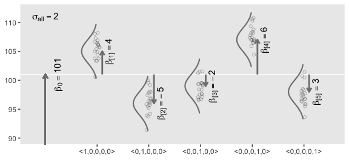

19.2. Traditional analysis of variance
--------------------------------------

> The terminology, “analysis of variance,” comes from a decomposition of overall data variance into within-group variance and between-group variance ([Fisher, 1925](http://psycnet.apa.org/record/1925-15003-000)). Algebraically, the sum of squared deviations of the scores from their overall mean equals the sum of squared deviations of the scores from their respective group means plus the sum of squared deviations of the group means from the overall mean. In other words, the total variance can be partitioned into within-group variance plus between-group variance. Because one definition of the word “analysis” is separation into constituent parts, the term ANOVA accurately describes the underlying algebra in the traditional methods. That algebraic relation is not used in the hierarchical Bayesian approach presented here. The Bayesian method can estimate component variances, however. Therefore, the Bayesian approach is not ANOVA, but is analogous to ANOVA. (p. 556)

19.3. Hierarchical Bayesian approach
------------------------------------

"Our goal is to estimate its parameters in a Bayesian framework. Therefore, all the parameters need to be given a meaningfully structured prior distribution" (p. 557). However, our approach will depart a little from the one in the text. All our parameters will **not** "have generic noncommittal prior distributions" (p. 557). Most importantly, we will not follow the example in [Gelman (2006)](http://www.stat.columbia.edu/~gelman/research/published/taumain.pdf) of putting a broad uniform prior on *σ*<sub>*y*</sub>. Rather, we will continue using the half-Gaussian prior, as [recommended by the Stan team](https://github.com/stan-dev/stan/wiki/Prior-Choice-Recommendations). However, we will follow Kruschke's lead for the overall intercept and use a Gaussian prior "made broad on the scale of the data" (p. 557). And like Kruschke, we will estimate *σ*<sub>*β*</sub> from the data.

Later on, Kruschke opined

> A crucial pre-requisite for estimating σβ from all the groups is an assumption that all the groups are representative and informative for the estimate. It only makes sense to influence the estimate of one group with data from the other groups if the groups can be meaningfully described as representative of a shared higher-level distribution. (p. 559)

Although I agree with him in spirit, this doesn't appear to strictly be the case. As odd and paradoxical as this sounds, partial pooling can be of use even when the some of the cases are of a different kind. For more on the topic, see [Efron and Morris's classic paper](http://statweb.stanford.edu/~ckirby/brad/other/Article1977.pdf) and [my project](https://github.com/ASKurz/James-Stein-and-Bayesian-partial-pooling) walking out one of their examples in brms.

### 19.3.1 Implementation in ~~JAGS~~ brms

The brms setup, of course, differs a bit from JAGS.

``` r
fit <- 
  brm(data = my_data, 
      family = gaussian,
      y ~ 1 + (1 | categirical_variable),
      prior = c(prior(normal(0, x), class = Intercept),
                prior(normal(0, x), class = b),
                prior(cauchy(0, x), class = sd),
                prior(cauchy(0, x), class = sigma)))
```

The noise standard deviation *σ*<sub>*y*</sub> is depicted in the prior statement at with the `class` argument set to `sigma`. The grand mean is depicted by the first `1` in the modle formula and its prior is indicated by the `class = Intercept` argument. We indicate we'd like group-based deviations from the grand mean with the `(1 | categirical_variable)` syntax, where the `1` on the left side of the bar indicates we'd like our intercepts to vary by group and the `categirical_variable` part simply representing the name of a given categorical variable we'd like those intercepts to vary by. The brms default is to do this with deviance scores, the mean for which will be zero. Although it's not obvious in the formula syntax, the model presumes the group-based deviations are normally distributed with a mean of zero and a standard deviation, which Kruschke termed *σ*<sub>*β*</sub>. There is no prior for the mean. It's set at zero. But there is a prior for *σ*<sub>*β*</sub>, which is denoted by the argument `class = sd`. We, of course, are not using a uniform prior on any of our variance parameters. But in order to be weakly informative, we will use the half-Cauchy. Recall that since the brms default is to set the lower bound for any variance parameter to 0, there's no need to worry about doing so ourselves. So even though the syntax only indicates `cauchy`, it's understood to mean Cauchy with a lower bound at zero; since the mean is usually 0, that makes is a half-Cauchy.

Kruschke set the upper bound for his *σ*<sub>*y*</sub> to 10 times the standard deviation of the criterion variable. The tails of the half-Cauchy are sufficiently fat that, in practice, I've found it doesn't matter much what you set the SD of its prior to. One is often a sensible default for reasonably scaled data. But if we want to taka a more principled approach, we can set it to the size of the criterion's *S**D* or perhaps even 10 times that.

Kruschke suggested using a gamma on *σ*<sub>*β*</sub>, which is a sensible alternative to half-Cauchy often used within the Stan universe. Especially in situations in which you would like to (a) keep the variance parameter above zero, but (b) still allow it to be arbitrarily close to zero, and also (c) let the likelihood dominate the posterior, the Stan team recommends the gamma(2, 0) prior, based on the [paper by Chung and colleagues](http://www.stat.columbia.edu/~gelman/research/published/chung_etal_Pmetrika2013.pdf). But you should note that I don't mean a literal 0 for the second parameter in the gamma distribution, but rather some small value like 0.1 or so. This is all clarified in [Chung et al](http://www.stat.columbia.edu/~gelman/research/published/chung_etal_Pmetrika2013.pdf). Here's what gamma(2, 0.1) looks like.

``` r
tibble(x = seq(from = 0, to = 110, by = .1)) %>% 
  
  ggplot(aes(x    = x,
             ymin = 0,
             ymax = dgamma(x, 2, .1))) +
  geom_ribbon() +
  scale_y_continuous(NULL, breaks = NULL) +
  coord_cartesian(xlim = 0:100) +
  theme(panel.grid = element_blank())
```


And if you'd like that prior be even less informative, just reduce it to like gamma(2, 0.01) or so. Kruschke goes further to recommend "the shape and rate parameters of the gamma distribution are set so its mode is `sd(y)/2` and its standard deviation is `2*sd(y)`, using the function `gammaShRaFromModeSD` explained in Section 9.2.2." (pp. 560--561). That function, recall, follows the form:

``` r
gamma_a_b_from_omega_sigma <- function(mode, sd) {
  if (mode <= 0) stop("mode must be > 0")
  if (sd   <= 0) stop("sd must be > 0")
  rate <- (mode + sqrt(mode^2 + 4 * sd^2)) / (2 * sd^2)
  shape <- 1 + mode * rate
  return(list(shape = shape, rate = rate))
}
```

So in the case of standardized data where `sd(1)` = 1,

``` r
sd_y  <- 1 

omega <- sd_y / 2
sigma <- 2 * sd_y

(s_r <- gamma_a_b_from_omega_sigma(mode = omega, sd = sigma))
```

    ## $shape
    ## [1] 1.283196
    ## 
    ## $rate
    ## [1] 0.5663911

And that produces the following gamma distribution.

``` r
tibble(x = seq(from = 0, to = 50, by = .01)) %>% 
  
  ggplot(aes(x    = x,
             ymin = 0,
             ymax = dgamma(x, s_r$shape, s_r$rate))) +
  geom_ribbon() +
  scale_x_continuous(breaks = c(0, 1, 5, 10)) +
  scale_y_continuous(NULL, breaks = NULL) +
  coord_cartesian(xlim = 0:10) +
  theme(panel.grid = element_blank())
```

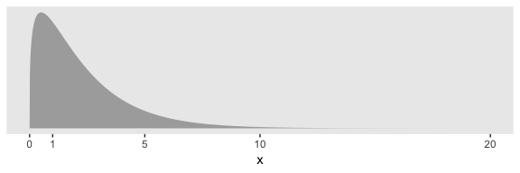

In the parameter space that matters, from zero to one, that gamma is pretty noninformative. It peaks between the two, slopes very gently rightward, but has the nice steep slope on the left keeping the estimates off the zero boundary. And even though that right slope is very gentle given the scale of the data, it’s aggressive enough that it should keep the MCMC chains from spending a lot of time in ridiculous parts of the parameter space. I.e., when working with finite numbers of iterations, we want our MCMC chains wasting exactly zero iterations investigating what the density might be for *σ*<sub>*β*</sub> ≈ 1*e*10 for standardized data.

### 19.3.2 Example: Sex and death

Let's load and `glimpse()` at the data.

``` r
my_data <- read_csv("data.R/FruitflyDataReduced.csv")

glimpse(my_data)
```

    ## Observations: 125
    ## Variables: 3
    ## $ Longevity       <int> 35, 37, 49, 46, 63, 39, 46, 56, 63, 65, 56, 65, 70, 63, 65, 70, 77, 81,...
    ## $ CompanionNumber <chr> "Pregnant8", "Pregnant8", "Pregnant8", "Pregnant8", "Pregnant8", "Pregn...
    ## $ Thorax          <dbl> 0.64, 0.68, 0.68, 0.72, 0.72, 0.76, 0.76, 0.76, 0.76, 0.76, 0.80, 0.80,...

We can use `geom_density_ridges()` to help get a sense of how our criterion `Longevity` is distributed across groups of `CompanionNumber`.

``` r
my_data %>% 
  group_by(CompanionNumber) %>% 
  mutate(group_mean = mean(Longevity)) %>% 
  
  ggplot(aes(x = Longevity, y = reorder(CompanionNumber, group_mean), fill = group_mean)) +
  geom_density_ridges(scale = 3/2, size = .2, color = "grey92") +
  scale_fill_viridis_c(option = "A", end = .92) +
  ylab(NULL) +
  theme(panel.grid      = element_blank(),
        legend.position = "none",
        axis.ticks.y    = element_blank(),
        axis.text.y     = element_text(hjust = 0))
```

    ## Picking joint bandwidth of 6.88

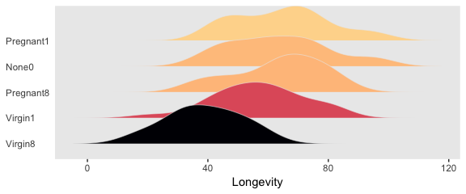

Let's fire up brms.

``` r
library(brms)
```

We'll want to do the prepatory work to define our `stanvars`.

``` r
(mean_y <- mean(my_data$Longevity))
```

    ## [1] 57.44

``` r
(sd_y   <- sd(my_data$Longevity))
```

    ## [1] 17.56389

``` r
omega   <- sd_y / 2
sigma   <- 2 * sd_y

(s_r <- gamma_a_b_from_omega_sigma(mode = omega, sd = sigma))
```

    ## $shape
    ## [1] 1.283196
    ## 
    ## $rate
    ## [1] 0.03224747

With the prep work is done, here are our `stanvars`.

``` r
stanvars <- 
  stanvar(mean_y,    name = "mean_y") + 
  stanvar(sd_y,      name = "sd_y") +
  stanvar(s_r$shape, name = "alpha") +
  stanvar(s_r$rate,  name = "beta")
```

Now fit the model, our hierarchical Bayesian alternative to ANOVA.

``` r
fit1 <-
  brm(data = my_data,
      family = gaussian,
      Longevity ~ 1 + (1 | CompanionNumber),
      prior = c(prior(normal(mean_y, sd_y * 10), class = Intercept),
                prior(gamma(alpha, beta), class = sd),
                prior(cauchy(0, sd_y), class = sigma)),
      iter = 4000, warmup = 1000, chains = 4, cores = 4,
      control = list(adapt_delta = 0.999),
      stanvars = stanvars)
```

Much like Kruschke's JAGS chains, our brms chains are well behaved.

``` r
plot(fit1)
```


Also like Kruschke, our chains appear moderately autocorrelated.

``` r
post <- posterior_samples(fit1, add_chain = T)

library(bayesplot)

theme_set(theme_grey() +
            theme(panel.grid = element_blank()))

mcmc_acf(post, pars = c("b_Intercept", "sd_CompanionNumber__Intercept", "sigma"), lags = 10)
```

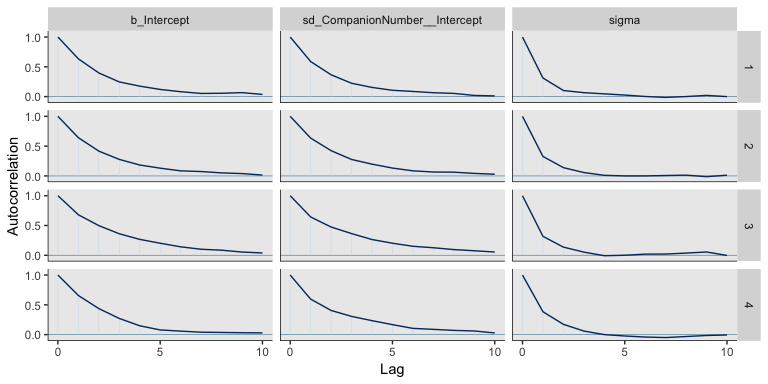

Here's the model summary.

``` r
print(fit1)
```

    ##  Family: gaussian 
    ##   Links: mu = identity; sigma = identity 
    ## Formula: Longevity ~ 1 + (1 | CompanionNumber) 
    ##    Data: my_data (Number of observations: 125) 
    ## Samples: 4 chains, each with iter = 4000; warmup = 1000; thin = 1;
    ##          total post-warmup samples = 12000
    ## 
    ## Group-Level Effects: 
    ## ~CompanionNumber (Number of levels: 5) 
    ##               Estimate Est.Error l-95% CI u-95% CI Eff.Sample Rhat
    ## sd(Intercept)    15.09      8.19     6.41    35.92       2337 1.00
    ## 
    ## Population-Level Effects: 
    ##           Estimate Est.Error l-95% CI u-95% CI Eff.Sample Rhat
    ## Intercept    57.27      7.76    41.33    72.78       2380 1.00
    ## 
    ## Family Specific Parameters: 
    ##       Estimate Est.Error l-95% CI u-95% CI Eff.Sample Rhat
    ## sigma    14.92      0.99    13.19    17.03       5749 1.00
    ## 
    ## Samples were drawn using sampling(NUTS). For each parameter, Eff.Sample 
    ## is a crude measure of effective sample size, and Rhat is the potential 
    ## scale reduction factor on split chains (at convergence, Rhat = 1).

Here are the summaries of the group-specific deflections.

``` r
ranef(fit1)
```

    ## $CompanionNumber
    ## , , Intercept
    ## 
    ##              Estimate Est.Error       Q2.5     Q97.5
    ## None0       5.8790114  8.075553 -10.049668 22.223521
    ## Pregnant1   7.0471298  8.082330  -8.677808 23.845752
    ## Pregnant8   5.7307594  8.070331 -10.198308 22.267220
    ## Virgin1    -0.4684521  8.071701 -16.579743 15.775479
    ## Virgin8   -17.3718009  8.117501 -34.462703 -1.850951

And here are those same group-level summaries in a non-deflection metric.

``` r
coef(fit1)
```

    ## $CompanionNumber
    ## , , Intercept
    ## 
    ##           Estimate Est.Error     Q2.5    Q97.5
    ## None0     63.15115  2.930183 57.46769 68.94306
    ## Pregnant1 64.31927  2.942192 58.56243 70.06428
    ## Pregnant8 63.00290  2.949495 57.14577 68.71218
    ## Virgin1   56.80369  2.925295 51.10273 62.62765
    ## Virgin8   39.90034  3.029072 34.00318 45.86236

Those are all estimates of the group-specific means. Since it wasn't modeled, all have the same parameter estimates for *σ*<sub>*y*</sub>.

``` r
posterior_summary(fit1)["sigma", ]
```

    ##   Estimate  Est.Error       Q2.5      Q97.5 
    ## 14.9226198  0.9877776 13.1890914 17.0269353

To prepare for our version of the top panel of Figure 19.3, we'll use `sample_n()` to randomly sample from the posterior draws.

``` r
# how many random draws from the posterior would you like?
n_draws <- 20

set.seed(19)
post_draws <-
  post %>% 
  sample_n(size = n_draws, replace = F)

glimpse(post_draws)
```

    ## Observations: 20
    ## Variables: 11
    ## $ b_Intercept                              <dbl> 60.91393, 49.51604, 50.60123, 64.10293, 54.150...
    ## $ sd_CompanionNumber__Intercept            <dbl> 8.856199, 25.628106, 15.563569, 12.646611, 16....
    ## $ sigma                                    <dbl> 14.38331, 15.05477, 15.82617, 15.81059, 15.850...
    ## $ `r_CompanionNumber[None0,Intercept]`     <dbl> 0.2686480, 10.7376501, 12.3806845, -3.6722898,...
    ## $ `r_CompanionNumber[Pregnant1,Intercept]` <dbl> 4.7159576, 8.6389495, 16.9454446, 3.7925944, 1...
    ## $ `r_CompanionNumber[Pregnant8,Intercept]` <dbl> -2.2896065, 9.8042130, 15.7929658, 1.9478309, ...
    ## $ `r_CompanionNumber[Virgin1,Intercept]`   <dbl> -4.8355433, 9.1149192, 0.5440639, -3.0479526, ...
    ## $ `r_CompanionNumber[Virgin8,Intercept]`   <dbl> -18.291284, -8.723609, -11.632999, -23.887202,...
    ## $ lp__                                     <dbl> -530.5015, -529.3916, -529.8515, -530.1483, -5...
    ## $ chain                                    <fct> 1, 2, 3, 1, 2, 1, 2, 3, 4, 3, 2, 2, 4, 4, 1, 4...
    ## $ iter                                     <dbl> 2406, 3808, 2814, 1821, 2383, 3686, 1501, 1876...

Before we make our version of the top panel, let’s make a corresponding plot of the fixed intercept, the grand mean.

``` r
tibble(x = c(0, 150)) %>% 

  ggplot(aes(x = x)) +
  mapply(function(mean, sd) {
    stat_function(fun   = dnorm, 
                  args  = list(mean = mean, sd = sd), 
                  alpha = 2/3, 
                  size  = 1/3,
                  color = "grey50")
    }, 
    # Enter means and standard deviations here
    mean = post_draws[, "b_Intercept"],
    sd   = post_draws[, "sigma"]
    ) +
  geom_jitter(data = my_data, aes(x = Longevity, y = -0.001),
              height = .001, 
              alpha = 1/2) +
  scale_x_continuous("Longevity", breaks = seq(from = 0, to = 100, by = 25)) +
  scale_y_continuous(NULL, breaks = NULL) +
  coord_cartesian(xlim = 0:110) + 
  labs(title    = "Posterior Predictive Distribution",
       subtitle = "The jittered dots are the ungrouped Longevity data. The\nGaussians are posterior draws depicting the overall\ndistribution, the grand mean.")
```

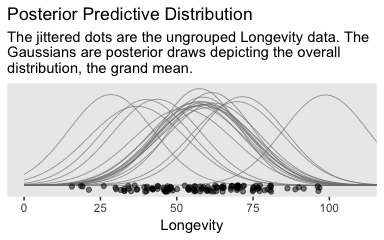

Unfortunately, we can’t extend our `mapply(stat_function())` method to the group-level estimates. To my knowledge, there isn’t a way to show the group estimates at different spots along the y-axis. And our `mapply(stat_function())` approach has other limitations, too. Happily, we have some great alternatives. To use them, we'll need a little help from tidybayes.

``` r
library(tidybayes)
```

For the first part, we'll take tidybayes::add\_fitted\_draws()\` for a whirl.

``` r
densities <-
  my_data %>% 
  distinct(CompanionNumber) %>% 
  add_fitted_draws(fit1, n = 20, seed = 19, dpar = c("mu", "sigma"))

glimpse(densities)
```

    ## Observations: 100
    ## Variables: 8
    ## $ CompanionNumber <chr> "Pregnant8", "Pregnant8", "Pregnant8", "Pregnant8", "Pregnant8", "Pregn...
    ## $ .row            <int> 1, 1, 1, 1, 1, 1, 1, 1, 1, 1, 1, 1, 1, 1, 1, 1, 1, 1, 1, 1, 2, 2, 2, 2,...
    ## $ .chain          <int> NA, NA, NA, NA, NA, NA, NA, NA, NA, NA, NA, NA, NA, NA, NA, NA, NA, NA,...
    ## $ .iteration      <int> NA, NA, NA, NA, NA, NA, NA, NA, NA, NA, NA, NA, NA, NA, NA, NA, NA, NA,...
    ## $ .draw           <int> 821, 1406, 2686, 2736, 3501, 4383, 4764, 4874, 5121, 5392, 5808, 6803, ...
    ## $ .value          <dbl> 66.05076, 58.62432, 63.18584, 65.93651, 69.47315, 65.60481, 63.99225, 6...
    ## $ mu              <dbl> 66.05076, 58.62432, 63.18584, 65.93651, 69.47315, 65.60481, 63.99225, 6...
    ## $ sigma           <dbl> 15.81059, 14.38331, 15.79085, 14.60460, 14.83412, 15.85065, 14.51251, 1...

With the first two lines, we made a 5 × 1 tibble containing the five levels of the experimenal grouping variable, `CompanionNumber`. The [`add_fitted_draws()`](https://cran.r-project.org/web/packages/tidybayes/tidybayes.pdf) function comes from tidybayes. The first argument of the `add_fitted_draws()` is `newdata`, which works much like it does in `brms::fitted()`; It took our 5 × 1 tibble. The next argument took our brms model fit, `fit1`. With the `n` argument, we indicated we just wanted 20 random draws from the posterior. The `seed` argument makes those random draws reproducible. With `dpar`, we requested distributional regression parameters in the output. In our case, those were the *μ* and *σ* values for each level of `CompanionNumber`. Since we took 20 draws across 5 groups, we ended up with a 100-row tibble.

The next steps are a direct extension of the method we used to make our Gaussians for our version of Figure 19.1.

``` r
densities <-
  densities %>% 
  mutate(ll        = qnorm(.025, mean = mu, sd = sigma),
         ul        = qnorm(.975, mean = mu, sd = sigma)) %>% 
  mutate(Longevity = map2(ll, ul, seq, length.out = 100)) %>% 
  mutate(density   = pmap(list(Longevity, mu, sigma), dnorm)) %>% 
  unnest()

glimpse(densities)
```

    ## Observations: 10,000
    ## Variables: 12
    ## $ CompanionNumber <chr> "Pregnant8", "Pregnant8", "Pregnant8", "Pregnant8", "Pregnant8", "Pregn...
    ## $ .row            <int> 1, 1, 1, 1, 1, 1, 1, 1, 1, 1, 1, 1, 1, 1, 1, 1, 1, 1, 1, 1, 1, 1, 1, 1,...
    ## $ .chain          <int> NA, NA, NA, NA, NA, NA, NA, NA, NA, NA, NA, NA, NA, NA, NA, NA, NA, NA,...
    ## $ .iteration      <int> NA, NA, NA, NA, NA, NA, NA, NA, NA, NA, NA, NA, NA, NA, NA, NA, NA, NA,...
    ## $ .draw           <int> 821, 821, 821, 821, 821, 821, 821, 821, 821, 821, 821, 821, 821, 821, 8...
    ## $ .value          <dbl> 66.05076, 66.05076, 66.05076, 66.05076, 66.05076, 66.05076, 66.05076, 6...
    ## $ mu              <dbl> 66.05076, 66.05076, 66.05076, 66.05076, 66.05076, 66.05076, 66.05076, 6...
    ## $ sigma           <dbl> 15.81059, 15.81059, 15.81059, 15.81059, 15.81059, 15.81059, 15.81059, 1...
    ## $ ll              <dbl> 35.06257, 35.06257, 35.06257, 35.06257, 35.06257, 35.06257, 35.06257, 3...
    ## $ ul              <dbl> 97.03895, 97.03895, 97.03895, 97.03895, 97.03895, 97.03895, 97.03895, 9...
    ## $ Longevity       <dbl> 35.06257, 35.68859, 36.31462, 36.94064, 37.56667, 38.19269, 38.81871, 3...
    ## $ density         <dbl> 0.003696577, 0.003991746, 0.004303730, 0.004632830, 0.004979283, 0.0053...

If you look at the code we used to make `ll` and `ul`, you’ll see we used 95% intervals, this time. Our second `mutate()` function is basically the same. But in the third `mutate()`, we switched from `map2()` to [`pmap()`](https://purrr.tidyverse.org/reference/map2.html), which is just an extension that allows us to iterate over three or more variables. In our case, we iterated over our values of `Longevity`, `mu`, and `sigma`, which we indicated in a `list()`. The `pmap()` function fed those three values into the first three arguments of `dnorm()`, which, are `x`, `mean`, and `sd`, respectively.

``` r
densities %>% 
  ggplot(aes(x = Longevity, y = CompanionNumber)) +
  # here we make our density lines
  geom_ridgeline(aes(height = density, group = interaction(CompanionNumber, .draw)),
                 fill = NA, color = adjustcolor("grey50", alpha.f = 2/3),
                 size = 1/3, scale = 25) +
  # the original data with little jitter thrown in
  geom_jitter(data = my_data,
              height = .04, alpha = 1/2) +
  # pretty much everything below this line is aesthetic fluff
  scale_x_continuous(breaks = seq(from = 0, to = 100, by = 25)) +
  coord_cartesian(xlim = 0:110,
                  ylim = c(1.25, 5.5)) +
  labs(title = "Data with Posterior Predictive Distrib.", 
       y = NULL) +
  theme(axis.ticks.y = element_blank(),
        axis.text.y  = element_text(hjust = 0))
```


Do be aware that when you use this method, you may have to fiddle around with the `geom_ridgeline()` `scale` argument to get the Gaussian's heights on reasonable-looking relative heights. Stick in different numbers to get a sense of what I mean. I also find that I’m often not a fan of the way the spacing on the y axis ends up with default `geom_ridgeline()`. It’s easy to overcome this with a little `ylim` fiddling.

To return to the more substantive interpretation, the top panel of

> Figure 19.3 suggests that the normal distributions with homogeneous variances appear to be reasonable descriptions of the data. There are no dramatic outliers relative to the posterior predicted curves, and the spread of the data within each group appears to be reasonably matched by the width of the posterior normal curves. (Be careful when making visual assessments of homogeneity of variance because the visual spread of the data depends on the sample size; for a reminder see the right panel of Figure 15.9, p. 442.) The range of credible group means, indicated by the peaks of the normal curves, suggests that the group Virgin8 is clearly lower than the others, and the group Virgin1 might be lower than the controls. To find out for sure, we need to examine the differences of group means, which we do in the next section. (p. 564)

### 19.3.3 Contrasts

> It is straight forward to examine the posterior distribution of credible differences. Every step in the MCMC chain provides a combination of group means that are jointly credible, given the data. Therefore, every step in the MCMC chain provides a credible difference between groups...
>
> To construct the credible differences of group 1 and group 2, at every step in the MCMC chain we compute
>
> $$
> \\begin{eqnarray}
> \\mu\_1 - \\mu\_2 & = & (\\beta\_0 + \\beta\_1) - (\\beta\_0 + \\beta\_2) \\\\
> & = & (+1) \\cdot \\beta\_1 + (-1) \\cdot \\beta\_2
> \\end{eqnarray}
> $$
>
> In other words, the baseline cancels out of the calculation, and the difference is a sum of weighted group deflections. Notice that the weights sum to zero. To construct the credible differences of the average of groups 1-3 and the average of groups 4-5, at every step in the MCMC chain we compute
>
> $$
> \\begin{eqnarray}
> (\\mu\_1 + \\mu\_2 + \\mu\_3) / 3 - (\\mu\_4 + \\mu\_5) / 2 & = & ((\\beta\_0 + \\beta\_1)  + (\\beta\_0 + \\beta\_2)  &gt;+ (\\beta\_0 + \\beta\_3) ) / 3 - ((\\beta\_0 + \\beta\_4) + (\\beta\_0 + \\beta\_5) ) / 2 \\\\
> & = & (\\beta\_1 + \\beta\_2 + \\beta\_3) / 3 - (\\beta\_4 + \\beta\_5) / 2 \\\\
> & = & (+ 1/3) \\cdot \\beta\_1 + (+ 1/3) \\cdot \\beta\_2 + (+ 1/3) \\cdot \\beta\_3 + (- 1/2) \\cdot \\beta\_4 + &gt;(- 1/2) \\cdot \\beta\_5
> \\end{eqnarray}
> $$
>
> Again, the difference is a sum of weighted group deflections. The coefficients on the group deflections have the properties that they sum to zero, with the positive coefficients summing to +1 and the negative coefficients summing to −1. Such a combination is called a contrast. The differences can also be expressed in terms of effect size, by dividing the difference by *σ*<sub>*y*</sub> at each step in the chain. (pp. 565--566)

To warm up, here's how to compute the first contrast shown in the lower portion of Kruschke's Figure 19.3--the contrast between the two pregnant conditions and the none-control condition.

``` r
post %>% 
  transmute(c = (`r_CompanionNumber[Pregnant1,Intercept]` + `r_CompanionNumber[Pregnant1,Intercept]`) / 2 - `r_CompanionNumber[None0,Intercept]`) %>% 
  
  ggplot(aes(x = c)) +
  geom_histogram(color = "grey92", fill = "grey67",
                 size = .2, bins = 40) +
  stat_pointintervalh(aes(y = 0), 
                      point_interval = mode_hdi, .width = c(.95, .5)) +
  scale_y_continuous(NULL, breaks = NULL) +
  labs(subtitle = "Pregnant1.Pregnant8 vs None0",
       x = "Difference")
```

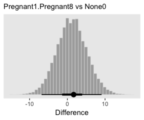

In case you were curious, here are the HMC-based posterior mode and 95% HDIs.

``` r
post %>% 
  transmute(difference = (`r_CompanionNumber[Pregnant1,Intercept]` + `r_CompanionNumber[Pregnant1,Intercept]`) / 2 - `r_CompanionNumber[None0,Intercept]`) %>% 
  
  mode_hdi(difference)
```

    ##   difference    .lower   .upper .width .point .interval
    ## 1   1.088945 -6.863084 9.073574   0.95   mode       hdi

Little difference, there. Now let's quantify the same contrast as an effect size.

``` r
post %>% 
  transmute(es = ((`r_CompanionNumber[Pregnant1,Intercept]` + `r_CompanionNumber[Pregnant1,Intercept]`) / 2 - `r_CompanionNumber[None0,Intercept]`) / sigma) %>% 
  
  ggplot(aes(x = es)) +
  geom_histogram(color = "grey92", fill = "grey67",
                 size = .2, bins = 40) +
  stat_pointintervalh(aes(y = 0), 
                      point_interval = mode_hdi, .width = c(.95, .5)) +
  scale_y_continuous(NULL, breaks = NULL) +
  labs(subtitle = "Pregnant1.Pregnant8 vs None0",
       x = "Effect Size")
```


Tiny.

Okay, now lets do the rest in bulk. First we'll do the difference scores.

``` r
differences <-
  post %>% 
  transmute(`Pregnant1.Pregnant8.None0 vs Virgin1` = (`r_CompanionNumber[Pregnant1,Intercept]` + `r_CompanionNumber[Pregnant1,Intercept]` + `r_CompanionNumber[None0,Intercept]`) / 3 - `r_CompanionNumber[Virgin1,Intercept]`,
            
            `Virgin1 vs Virgin8` = `r_CompanionNumber[Virgin1,Intercept]` - `r_CompanionNumber[Virgin8,Intercept]`,
            
            `Pregnant1.Pregnant8.None0 vs Virgin1.Virgin8` = (`r_CompanionNumber[Pregnant1,Intercept]` + `r_CompanionNumber[Pregnant1,Intercept]` + `r_CompanionNumber[None0,Intercept]`) / 3 - (`r_CompanionNumber[Virgin1,Intercept]` + `r_CompanionNumber[Virgin8,Intercept]`) / 2)

differences %>% 
  gather() %>% 
  
  ggplot(aes(x = value)) +
  geom_histogram(color = "grey92", fill = "grey67",
                 size = .2, bins = 40) +
  stat_pointintervalh(aes(y = 0), 
                      point_interval = mode_hdi, .width = c(.95, .5)) +
  scale_y_continuous(NULL, breaks = NULL) +
  labs(x = "Difference") +
  facet_wrap(~key, scales = "free_x")
```


Now the effect sizes.

``` r
differences %>% 
  mutate_all(funs(. / post$sigma)) %>% 
  gather() %>% 
  
  ggplot(aes(x = value)) +
  geom_histogram(color = "grey92", fill = "grey67",
                 size = .2, bins = 40) +
  stat_pointintervalh(aes(y = 0), 
                      point_interval = mode_hdi, .width = c(.95, .5)) +
  scale_y_continuous(NULL, breaks = NULL) +
  labs(x = "Effect Size") +
  facet_wrap(~key, scales = "free_x")
```

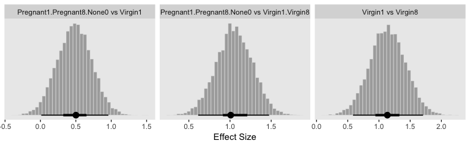

> In traditional ANOVA, analysts often perform a so-called omnibus test that asks whether it is plausible that all the groups are simultaneously exactly equal. I find that the omnibus test is rarely meaningful, however.... In the hierarchical Bayesian estimation used here, there is no direct equivalent to an omnibus test in ANOVA, and the emphasis is on examining all the meaningful contrasts. (p. 567)

If you really wanted to, I suppose one rough analogue would be to use information criteria to compare the hierarchical model to one that includes a single intercept with no group-level deflections. Here’s what the simpler model would look like.

``` r
fit1_without_deflections <-
  brm(data = my_data,
      family = gaussian,
      Longevity ~ 1,
      prior = c(prior(normal(mean_y, sd_y * 10), class = Intercept),
                prior(cauchy(0, sd_y), class = sigma)),
      iter = 4000, warmup = 1000, chains = 4, cores = 4,
      stanvars = stanvars)
```

Here's the model summary.

``` r
print(fit1_without_deflections)
```

    ##  Family: gaussian 
    ##   Links: mu = identity; sigma = identity 
    ## Formula: Longevity ~ 1 
    ##    Data: my_data (Number of observations: 125) 
    ## Samples: 4 chains, each with iter = 4000; warmup = 1000; thin = 1;
    ##          total post-warmup samples = 12000
    ## 
    ## Population-Level Effects: 
    ##           Estimate Est.Error l-95% CI u-95% CI Eff.Sample Rhat
    ## Intercept    57.44      1.59    54.30    60.45       9525 1.00
    ## 
    ## Family Specific Parameters: 
    ##       Estimate Est.Error l-95% CI u-95% CI Eff.Sample Rhat
    ## sigma    17.65      1.14    15.54    20.02       8887 1.00
    ## 
    ## Samples were drawn using sampling(NUTS). For each parameter, Eff.Sample 
    ## is a crude measure of effective sample size, and Rhat is the potential 
    ## scale reduction factor on split chains (at convergence, Rhat = 1).

Here are their LOO values and their difference score.

``` r
loo(fit1, fit1_without_deflections)
```

    ##                                   LOOIC    SE
    ## fit1                            1035.46 13.88
    ## fit1_without_deflections        1074.07 14.20
    ## fit1 - fit1_without_deflections  -38.61 10.62

The hierarchical model has a better LOO. Here's the stacking-based model weights.

``` r
(mw <- model_weights(fit1, fit1_without_deflections))
```

    ##                     fit1 fit1_without_deflections 
    ##             9.999985e-01             1.542358e-06

If you don't like scientific notation, just `round()`.

``` r
mw %>% 
  round(digits = 3)
```

    ##                     fit1 fit1_without_deflections 
    ##                        1                        0

Yep, in complimenting the LOO difference, virtually all the stacking weight went to the hierarchical model. You might think of this another way. The conceptual question we're asking is does it make sense to say that the *σ*<sub>*β*</sub> parameter is zero. Is zero a credible value? We'll, I suppose we could just look at the posterior to assess for that.

``` r
post %>% 
  ggplot(aes(x = sd_CompanionNumber__Intercept)) +
  geom_histogram(color = "grey92", fill = "grey67",
                 size = .2, binwidth = 1) +
  stat_pointintervalh(aes(y = 0), 
                      point_interval = mode_hdi, .width = c(.95, .5)) +
  scale_y_continuous(NULL, breaks = NULL) +
  coord_cartesian(xlim = 0:50) +
  labs(title = expression(paste("Behold the fit1 posterior for the ", sigma[beta], " parameter.")),
       subtitle = "This parameter's many things, but zero isn't one of them.",
       x = NULL)
```


Yeah, zero and other values close to zero don't look credible for that parameter. 95% of the mass is between 5 and 30, with the bulk hovering around 10. We don't need an *F*-test or even a LOO model comparison to see the writing on wall.

### 19.3.4 Multiple comparisons and shrinkage

> The previous section suggested that an analyst should investigate all contrasts of interest. This recommendation can be thought to conflict with traditional advice in the context on null hypothesis significance testing, which instead recommends that a minimal number of comparisons should be conducted in order to maximize the power of each test while keeping the overall false alarm rate capped at 5% (or whatever maximum is desired).... Instead, a Bayesian analysis can mitigate false alarms by incorporating prior knowledge into the model. In particular, hierarchical structure (which is an expression of prior knowledge) produces shrinkage of estimates, and shrinkage can help rein in estimates of spurious outlying data. For example, in the posterior distribution from the fruit fly data, the modal values of the posterior group means have a range of 23.2. The sample means of the groups have a range of 26.1. Thus, there is some shrinkage in the estimated means. The amount of shrinkage is dictated only by the data and by the prior structure, not by the intended tests. (p. 568)

We may as well compute those ranges by hand. Here's the range of the observed data.

``` r
my_data %>% 
  group_by(CompanionNumber) %>% 
  summarise(mean  = mean(Longevity)) %>% 
  summarise(range = max(mean) - min(mean))
```

    ## # A tibble: 1 x 1
    ##   range
    ##   <dbl>
    ## 1  26.1

For our hierarchical model `fit1`, the posterior means are rank ordered in the same way as the empirical data.

``` r
coef(fit1)$CompanionNumber[, , "Intercept"] %>% 
  data.frame() %>% 
  rownames_to_column() %>% 
  arrange(Estimate) %>% 
  mutate_if(is.double, round, digits = 1)
```

    ##     rowname Estimate Est.Error Q2.5 Q97.5
    ## 1   Virgin8     39.9       3.0 34.0  45.9
    ## 2   Virgin1     56.8       2.9 51.1  62.6
    ## 3 Pregnant8     63.0       2.9 57.1  68.7
    ## 4     None0     63.2       2.9 57.5  68.9
    ## 5 Pregnant1     64.3       2.9 58.6  70.1

If we compute the range by a difference of the point estimates of the highest and lowest posterior means, we can get a quick number.

``` r
coef(fit1)$CompanionNumber[, , "Intercept"] %>% 
  as_tibble() %>% 
  summarise(range = max(Estimate) - min(Estimate))
```

    ## # A tibble: 1 x 1
    ##   range
    ##   <dbl>
    ## 1  24.4

But this isn't fully Bayesian of us. Those means and their difference carry uncertainty with them and that uncertainty can be fully expressed if we use all the posterior samples.

``` r
coef(fit1, summary = F)$CompanionNumber[, , "Intercept"] %>% 
  as_tibble() %>% 
  transmute(range = Pregnant1 - Virgin8) %>% 
  mode_hdi(range)
```

    ## # A tibble: 1 x 6
    ##   range .lower .upper .width .point .interval
    ##   <dbl>  <dbl>  <dbl>  <dbl> <chr>  <chr>    
    ## 1  24.5   16.1   32.6   0.95 mode   hdi

Happily, the central tendency of the range is near equivalent with both methods, but now we have 95% intervals, too. Do note how wide they are.

### 19.3.5 The two-group case

> A special case of our current scenario is when there are only two groups. The model of the present section could, in principle, be applied to the two-group case, but the hierarchical structure would do little good because there is virtually no shrinkage when there are so few groups (and the top-level prior on *σ*<sub>*β*</sub> is broad as assumed here). (p. 568)

For kicks and giggles, let’s practice. Since `Pregnant1` and `Virgin8` had the highest and lowest empirical means—making them the groups best suited to define our range, we’ll use them to fit the 2-group hierarchical model. To fit it with haste, just use `update()`.

``` r
fit2 <-
  update(fit1,
         newdata = my_data %>% 
           filter(CompanionNumber %in% c("Pregnant1", "Virgin8")))
```

Even with just two groups, there were no gross issues with fitting the model.

``` r
print(fit2)
```

    ##  Family: gaussian 
    ##   Links: mu = identity; sigma = identity 
    ## Formula: Longevity ~ 1 + (1 | CompanionNumber) 
    ##    Data: my_data %>% filter(CompanionNumber %in% c("Pregnant1", "Virgin8")) (Number of observations: 50) 
    ## Samples: 4 chains, each with iter = 4000; warmup = 2000; thin = 1;
    ##          total post-warmup samples = 8000
    ## 
    ## Group-Level Effects: 
    ## ~CompanionNumber (Number of levels: 2) 
    ##               Estimate Est.Error l-95% CI u-95% CI Eff.Sample Rhat
    ## sd(Intercept)    33.68     24.47     8.34   100.35       2000 1.00
    ## 
    ## Population-Level Effects: 
    ##           Estimate Est.Error l-95% CI u-95% CI Eff.Sample Rhat
    ## Intercept    52.66     28.47    -5.51   116.25       1215 1.00
    ## 
    ## Family Specific Parameters: 
    ##       Estimate Est.Error l-95% CI u-95% CI Eff.Sample Rhat
    ## sigma    14.26      1.49    11.75    17.63       3302 1.00
    ## 
    ## Samples were drawn using sampling(NUTS). For each parameter, Eff.Sample 
    ## is a crude measure of effective sample size, and Rhat is the potential 
    ## scale reduction factor on split chains (at convergence, Rhat = 1).

If you compare the posteriors for *σ*<sub>*β*</sub> across the two models, you'll see how the one for `fit2` is substantially larger.

``` r
posterior_summary(fit1)["sd_CompanionNumber__Intercept", ]
```

    ##  Estimate Est.Error      Q2.5     Q97.5 
    ## 15.088973  8.190173  6.412440 35.920166

``` r
posterior_summary(fit2)["sd_CompanionNumber__Intercept", ]
```

    ##   Estimate  Est.Error       Q2.5      Q97.5 
    ##  33.684914  24.473609   8.342154 100.348860

This implies less shrinkage and a larger range.

``` r
coef(fit2, summary = F)$CompanionNumber[, , "Intercept"] %>% 
  as_tibble() %>% 
  transmute(range = Pregnant1 - Virgin8) %>% 
  mode_hdi(range)
```

    ## # A tibble: 1 x 6
    ##   range .lower .upper .width .point .interval
    ##   <dbl>  <dbl>  <dbl>  <dbl> <chr>  <chr>    
    ## 1  25.9   17.3   33.5   0.95 mode   hdi

And indeed, the range between the two groups is larger. Now the posterior mode for their difference has almost converged to that of the raw data. Kruschke then went on to recommend using a single-level model in such situations, instead.

> That is why the two-group model in Section 16.3 did not use hierarchical structure, as illustrated in Figure 16.11 (p. 468). That model also used a *t* distribution to accommodate outliers in the data, and that model allowed for heterogeneous variances across groups. Thus, for two groups, it is more appropriate to use the model of Section 16.3. The hierarchical multi-group model is generalized to accommodate outliers and heterogeneous variances in Section 19.5. (p. 568)

As a refresher, here's what the brms code for that chapter 16 model looked like.

``` r
fit3 <-
  brm(data = my_data,
      family = student,
      bf(Score ~ 0 + Group, sigma ~ 0 + Group),
      prior = c(prior(normal(mean_y, sd_y*100), class = b),
                prior(normal(0, log(sd_y)), class = b, dpar = sigma),
                prior(exponential(one_over_twentynine), class = nu)),
      chains = 4, cores = 4,
      stanvars = stanvars)
```

Let's adjsut it for our data. Since we have a reduced data set, we'll need to recompute our `stanvars` values, whicih were based on the raw data.

``` r
# It's easier to just make a reduced data set
my_small_data <-
  my_data %>% 
  filter(CompanionNumber %in% c("Pregnant1", "Virgin8"))
  
(mean_y <- mean(my_small_data$Longevity))
```

    ## [1] 51.76

``` r
(sd_y   <- sd(my_small_data$Longevity))
```

    ## [1] 19.11145

``` r
omega <- sd_y / 2
sigma <- 2 * sd_y

(s_r <- gamma_a_b_from_omega_sigma(mode = omega, sd = sigma))
```

    ## $shape
    ## [1] 1.283196
    ## 
    ## $rate
    ## [1] 0.02963623

Here we update `stanvars`.

``` r
stanvars <- 
  stanvar(mean_y,    name = "mean_y") + 
  stanvar(sd_y,      name = "sd_y") +
  stanvar(s_r$shape, name = "alpha") +
  stanvar(s_r$rate,  name = "beta") +
  stanvar(1/29,      name = "one_over_twentynine")
```

Note that our priors, here, are something of a blend of those from chapter 16 and those from our hierarchical model, `fit1`.

``` r
fit3 <-
  brm(data = my_small_data,
      family = student,
      bf(Longevity ~ 0 + CompanionNumber, sigma ~ 0 + CompanionNumber),
      prior = c(prior(normal(mean_y, sd_y * 10), class = b),
                prior(normal(0, log(sd_y)), class = b, dpar = sigma),
                prior(exponential(one_over_twentynine), class = nu)),
      iter = 4000, warmup = 1000, chains = 4, cores = 4,
      stanvars = stanvars)
```

Here's the model summary.

``` r
print(fit3)
```

    ##  Family: student 
    ##   Links: mu = identity; sigma = log; nu = identity 
    ## Formula: Longevity ~ 0 + CompanionNumber 
    ##          sigma ~ 0 + CompanionNumber
    ##    Data: my_small_data (Number of observations: 50) 
    ## Samples: 4 chains, each with iter = 4000; warmup = 1000; thin = 1;
    ##          total post-warmup samples = 12000
    ## 
    ## Population-Level Effects: 
    ##                                Estimate Est.Error l-95% CI u-95% CI Eff.Sample Rhat
    ## CompanionNumberPregnant1          64.72      3.23    58.33    71.12      12812 1.00
    ## CompanionNumberVirgin8            38.76      2.52    33.75    43.77      13909 1.00
    ## sigma_CompanionNumberPregnant1     2.73      0.15     2.44     3.06      12726 1.00
    ## sigma_CompanionNumberVirgin8       2.48      0.15     2.19     2.80      13891 1.00
    ## 
    ## Family Specific Parameters: 
    ##    Estimate Est.Error l-95% CI u-95% CI Eff.Sample Rhat
    ## nu    39.63     31.16     5.85   121.50      14140 1.00
    ## 
    ## Samples were drawn using sampling(NUTS). For each parameter, Eff.Sample 
    ## is a crude measure of effective sample size, and Rhat is the potential 
    ## scale reduction factor on split chains (at convergence, Rhat = 1).

Man, look at those effective samples! And here's the range in posterior means.

``` r
fixef(fit3, summary = F) %>% 
  as_tibble() %>% 
  transmute(range = CompanionNumberPregnant1 - CompanionNumberVirgin8) %>% 
  mode_hdi(range)
```

    ## # A tibble: 1 x 6
    ##   range .lower .upper .width .point .interval
    ##   <dbl>  <dbl>  <dbl>  <dbl> <chr>  <chr>    
    ## 1  25.9   17.8   33.9   0.95 mode   hdi

Pretty much the same as that of the two-group hierarchical model, maybe a touch larger. Yep, Kruschke was right. Hierarchical models with two groups and permissive priors on *σ*<sub>*β*</sub> don't shrink the estimates to the grand mean all that much.

19.4. Including a metric predictor
----------------------------------

"In Figure 19.3, the data within each group have a large standard deviation. For example, longevities in the Virgin8 group range from 20 to 60 days" (p. 568). Turns out Kruschke's slightly wrong on this. Probably just a typo.

``` r
my_data %>% 
  group_by(CompanionNumber) %>% 
  summarise(min   = min(Longevity),
            max   = max(Longevity),
            range = max(Longevity) - min(Longevity))
```

    ## # A tibble: 5 x 4
    ##   CompanionNumber   min   max range
    ##   <chr>           <dbl> <dbl> <dbl>
    ## 1 None0              37    96    59
    ## 2 Pregnant1          42    97    55
    ## 3 Pregnant8          35    86    51
    ## 4 Virgin1            21    81    60
    ## 5 Virgin8            16    60    44

But you get the point. For each group, there was quite a range. We might add predictors to the model to help account for those ranges.

> The additional metric predictor is sometimes called a covariate. In the experimental setting, the focus of interest is usually on the nominal predictor (i.e., the experimental treatments), and the covariate is typically thought of as an ancillary predictor to help isolate the effect of the nominal predictor. But mathematically the nominal and metric predictors have equal status in the model. Let’s denote the value of the metric covariate for subject *i* as *x*<sub>cov</sub>(*i*). Then the expected value of the predicted variable for subject *i* is 􏰍
> *μ*(*i*)=*β*<sub>0</sub> + ∑<sub>*j*</sub>*β*<sub>\[*j*\]</sub>*x*<sub>\[*j*\]</sub>(*i*)+*β*<sub>cov</sub>*x*<sub>cov</sub>(*i*)
>
> with the usual sum-to-zero constraint on the deflections of the nominal predictor stated in Equation 19.2. In words, Equation 19.5 says that the predicted value for subject *i* is a baseline plus a deflection due to the group of *i* plus a shift due to the value of *i* on the covariate. (p. 569)

And the *j* subscript, recall, denotes group membership. In this context, it often

> makes sense to set the intercept as the mean of predicted values if the covariate is re-centered at its mean value, which is denoted $\\overline x\_\\text{cov}$. Therefore Equation 19.5 is algebraically reformulated to make the baseline respect those constraints.... The first equation below is simply Equation 19.5 with *x*<sub>cov</sub> recentered on its mean, $\\overline x\_\\text{cov}$. The second line below merely algebraically rearranges the terms so that the nominal deflections sum to zero and the constants are combined into the overall baseline:
>
> $$
> \\begin{eqnarray}
> \\mu & = & \\alpha\_0 + \\sum\_j \\alpha\_{\[j\]} x\_{\[j\]} + \\alpha\_\\text{cov} (x\_\\text{cov} - \\overline{x}\_\\text{cov}) \\\\
> & = & \\underbrace{\\alpha\_0 + \\overline{\\alpha} - \\alpha\_\\text{cov} \\overline{x}\_\\text{cov}}\_{\\beta\_0} + \\sum\_j \\underbrace{(\\alpha\_{\[j\]} - \\overline{\\alpha})}\_{\\beta\_j} x\_{\[j\]} + \\underbrace{\\alpha\_\\text{cov}}\_{\\beta\_{\\text{cov}}} x\_\\text{cov} \\\\
> && \\text{where } \\overline{\\alpha} = \\frac{1}{J} \\sum^J\_{j = 1} \\alpha\_{\[j\]}
> \\end{eqnarray}
> $$
>  (pp. 569--570)

### 19.4.1 Example: Sex, death, and size

Kruschke recalled `fit1`'s estimate for *σ*<sub>*y*</sub> had a posterior mode around 14.8. Let's confirm with a plot.

``` r
posterior_samples(fit1) %>% 
  ggplot(aes(x = sigma, y = 0)) +
  geom_halfeyeh(point_range = mode_hdi, .width = c(.5, .95)) +
  scale_y_continuous(NULL, breaks = NULL) +
  xlab(expression(sigma[y])) +
  theme(panel.grid = element_blank())
```

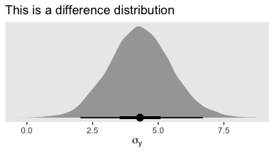

Yep, that looks about right. That large of a difference in days would indeed make it difficult to detect between-group differences if those differences were typically on the scale of just a few days. Since `Thorax` is moderately correlated with `Longevity`, including `Thorax` in the statistical model should help shrink that *σ*<sub>*y*</sub> estimate, making it easier to compare group means. Following the sensibilities from the equations just above, here we'll mean-center our covariate, first.

``` r
my_data <-
  my_data %>% 
  mutate(Thorax_c = Thorax - mean(Thorax))

head(my_data)
```

    ## # A tibble: 6 x 4
    ##   Longevity CompanionNumber Thorax Thorax_c
    ##       <int> <chr>            <dbl>    <dbl>
    ## 1        35 Pregnant8         0.64  -0.181 
    ## 2        37 Pregnant8         0.68  -0.141 
    ## 3        49 Pregnant8         0.68  -0.141 
    ## 4        46 Pregnant8         0.72  -0.101 
    ## 5        63 Pregnant8         0.72  -0.101 
    ## 6        39 Pregnant8         0.76  -0.0610

Our model code follows the structure of that in Kruschke's `Jags-Ymet-Xnom1met1-MnormalHom-Example.R` and `Jags-Ymet-Xnom1met1-MnormalHom.R` files. As a preparatory step, we redefine the values necessary for `stanvars`.

``` r
(mean_y      <- mean(my_data$Longevity))
```

    ## [1] 57.44

``` r
(sd_y        <- sd(my_data$Longevity))
```

    ## [1] 17.56389

``` r
(sd_Thorax_c <- sd(my_data$Thorax_c))
```

    ## [1] 0.07745367

``` r
omega <- sd_y / 2
sigma <- 2 * sd_y

(s_r <- gamma_a_b_from_omega_sigma(mode = omega, sd = sigma))
```

    ## $shape
    ## [1] 1.283196
    ## 
    ## $rate
    ## [1] 0.03224747

``` r
stanvars <- 
  stanvar(mean_y,      name = "mean_y") + 
  stanvar(sd_y,        name = "sd_y") +
  stanvar(sd_Thorax_c, name = "sd_Thorax_c") +
  stanvar(s_r$shape,   name = "alpha") +
  stanvar(s_r$rate,    name = "beta")
```

Now we're ready to fit the `brm()` model, our hierarchical alternative to ANCOVA.

``` r
fit4 <-
  brm(data = my_data,
      family = gaussian,
      Longevity ~ 1 + Thorax_c + (1 | CompanionNumber),
      prior = c(prior(normal(mean_y, sd_y * 5),          class = Intercept),
                prior(normal(0, 2 * sd_y / sd_Thorax_c), class = b),
                prior(gamma(alpha, beta),                class = sd),
                prior(cauchy(0, sd_y),                   class = sigma)),
      iter = 4000, warmup = 1000, chains = 4, cores = 4,
      control = list(adapt_delta = 0.99),
      stanvars = stanvars)
```

Here's the model summary.

``` r
print(fit4)
```

    ## Warning: There were 1 divergent transitions after warmup. Increasing adapt_delta above 0.99 may help.
    ## See http://mc-stan.org/misc/warnings.html#divergent-transitions-after-warmup

    ##  Family: gaussian 
    ##   Links: mu = identity; sigma = identity 
    ## Formula: Longevity ~ 1 + Thorax_c + (1 | CompanionNumber) 
    ##    Data: my_data (Number of observations: 125) 
    ## Samples: 4 chains, each with iter = 4000; warmup = 1000; thin = 1;
    ##          total post-warmup samples = 12000
    ## 
    ## Group-Level Effects: 
    ## ~CompanionNumber (Number of levels: 5) 
    ##               Estimate Est.Error l-95% CI u-95% CI Eff.Sample Rhat
    ## sd(Intercept)    14.15      7.56     6.11    34.57       2258 1.00
    ## 
    ## Population-Level Effects: 
    ##           Estimate Est.Error l-95% CI u-95% CI Eff.Sample Rhat
    ## Intercept    57.66      7.48    42.97    72.95       1836 1.00
    ## Thorax_c    136.02     12.53   111.30   160.87       7951 1.00
    ## 
    ## Family Specific Parameters: 
    ##       Estimate Est.Error l-95% CI u-95% CI Eff.Sample Rhat
    ## sigma    10.60      0.69     9.35    12.03       7072 1.00
    ## 
    ## Samples were drawn using sampling(NUTS). For each parameter, Eff.Sample 
    ## is a crude measure of effective sample size, and Rhat is the potential 
    ## scale reduction factor on split chains (at convergence, Rhat = 1).

Let's see if that *σ*<sub>*y*</sub> posterior shrank.

``` r
posterior_samples(fit4) %>% 
  ggplot(aes(x = sigma, y = 0)) +
  geom_halfeyeh(point_range = mode_hdi, .width = c(.5, .95)) +
  scale_y_continuous(NULL, breaks = NULL) +
  xlab(expression(sigma[y]))
```


Yep, sure did! Now our between-group comparissons should be more precise. Heck, if we wanted to we could even make a difference plot.

``` r
dif <- posterior_samples(fit1) %>% select(sigma) - posterior_samples(fit4) %>% select(sigma)
  
dif %>% 
  ggplot(aes(x = sigma, y = 0)) +
  geom_halfeyeh(point_range = mode_hdi, .width = c(.5, .95)) +
  scale_y_continuous(NULL, breaks = NULL) +
  labs(title = "This is a difference distribution",
       x = expression(sigma[y]))
```


If you want a quick and dirty plot of the relation between `Thorax_c` and `Longevity`, you can use `brms::marginal_effects()`.

``` r
marginal_effects(fit4)
```

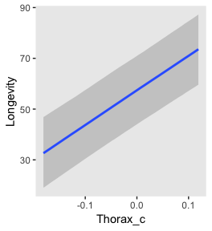

But to make plots like the ones at the top of Figure 19.5, we'll have to work a little harder. First, we need some intermediary values marking off the three values along the `Thorax`-axis Kruschke singled out in his top panel plots. As far as I can tell, they were the `min()`, the `max()`, and their `mean()`.

``` r
(r <- range(my_data$Thorax))
```

    ## [1] 0.64 0.94

``` r
mean(r)
```

    ## [1] 0.79

Next, we'll make the data necessary for our side-tipped Gaussians. For kicks and giggles, we'll choose 80 draws, instead of 20. But do note how we used our `r` values, from above, so specify both `Thorax` and `Thorax_c` values in addition to the `CompanionNumber` categories for the `newdata` argument. Otherwise, this workflow is very much the same as in previous plots.

``` r
n_draws <- 80

densities <-
  tibble(Thorax = c(r[1], mean(r), r[2])) %>% 
  mutate(Thorax_c = Thorax - mean(my_data$Thorax)) %>% 
  expand(CompanionNumber = distinct(my_data, CompanionNumber),
         nesting(Thorax, Thorax_c)) %>% 
  add_fitted_draws(fit4, n = n_draws, seed = 19, dpar = c("mu", "sigma")) %>%
  mutate(ll = qnorm(.025, mean = mu, sd = sigma),
         ul = qnorm(.975, mean = mu, sd = sigma)) %>% 
  mutate(Longevity = map2(ll, ul, seq, length.out = 100)) %>% 
  mutate(density = pmap(list(Longevity, mu, sigma), dnorm)) %>% 
  unnest()

glimpse(densities)
```

    ## Observations: 120,000
    ## Variables: 14
    ## $ CompanionNumber <chr> "Pregnant8", "Pregnant8", "Pregnant8", "Pregnant8", "Pregnant8", "Pregn...
    ## $ Thorax          <dbl> 0.64, 0.64, 0.64, 0.64, 0.64, 0.64, 0.64, 0.64, 0.64, 0.64, 0.64, 0.64,...
    ## $ Thorax_c        <dbl> -0.18096, -0.18096, -0.18096, -0.18096, -0.18096, -0.18096, -0.18096, -...
    ## $ .row            <int> 1, 1, 1, 1, 1, 1, 1, 1, 1, 1, 1, 1, 1, 1, 1, 1, 1, 1, 1, 1, 1, 1, 1, 1,...
    ## $ .chain          <int> NA, NA, NA, NA, NA, NA, NA, NA, NA, NA, NA, NA, NA, NA, NA, NA, NA, NA,...
    ## $ .iteration      <int> NA, NA, NA, NA, NA, NA, NA, NA, NA, NA, NA, NA, NA, NA, NA, NA, NA, NA,...
    ## $ .draw           <int> 107, 107, 107, 107, 107, 107, 107, 107, 107, 107, 107, 107, 107, 107, 1...
    ## $ .value          <dbl> 36.85437, 36.85437, 36.85437, 36.85437, 36.85437, 36.85437, 36.85437, 3...
    ## $ mu              <dbl> 36.85437, 36.85437, 36.85437, 36.85437, 36.85437, 36.85437, 36.85437, 3...
    ## $ sigma           <dbl> 11.12383, 11.12383, 11.12383, 11.12383, 11.12383, 11.12383, 11.12383, 1...
    ## $ ll              <dbl> 15.05205, 15.05205, 15.05205, 15.05205, 15.05205, 15.05205, 15.05205, 1...
    ## $ ul              <dbl> 58.65668, 58.65668, 58.65668, 58.65668, 58.65668, 58.65668, 58.65668, 5...
    ## $ Longevity       <dbl> 15.05205, 15.49250, 15.93295, 16.37340, 16.81385, 17.25430, 17.69476, 1...
    ## $ density         <dbl> 0.005254040, 0.005673570, 0.006117002, 0.006584760, 0.007077183, 0.0075...

Here, we'll use a simplified workflow to extract the `fitted()` values in order to make the regression lines. Since these are straight lines, all we need are two values for each draw, one at the extremes of the `Thorax` axis.

``` r
f <-
  tibble(Thorax = c(.4, 1.2)) %>% 
  mutate(Thorax_c = Thorax - mean(my_data$Thorax)) %>% 
  expand(CompanionNumber = distinct(my_data, CompanionNumber),
         nesting(Thorax, Thorax_c)) %>% 
  add_fitted_draws(fit4, n = n_draws, seed = 19, value = "Longevity")

glimpse(f)
```

    ## Observations: 800
    ## Variables: 8
    ## $ CompanionNumber <chr> "Pregnant8", "Pregnant8", "Pregnant8", "Pregnant8", "Pregnant8", "Pregn...
    ## $ Thorax          <dbl> 0.4, 0.4, 0.4, 0.4, 0.4, 0.4, 0.4, 0.4, 0.4, 0.4, 0.4, 0.4, 0.4, 0.4, 0...
    ## $ Thorax_c        <dbl> -0.42096, -0.42096, -0.42096, -0.42096, -0.42096, -0.42096, -0.42096, -...
    ## $ .row            <int> 1, 1, 1, 1, 1, 1, 1, 1, 1, 1, 1, 1, 1, 1, 1, 1, 1, 1, 1, 1, 1, 1, 1, 1,...
    ## $ .chain          <int> NA, NA, NA, NA, NA, NA, NA, NA, NA, NA, NA, NA, NA, NA, NA, NA, NA, NA,...
    ## $ .iteration      <int> NA, NA, NA, NA, NA, NA, NA, NA, NA, NA, NA, NA, NA, NA, NA, NA, NA, NA,...
    ## $ .draw           <int> 107, 405, 778, 821, 1039, 1064, 1406, 1473, 1575, 1777, 1900, 1983, 231...
    ## $ Longevity       <dbl> 0.3982362, 5.0980916, 9.8319960, 4.6223586, 13.4143383, 8.2359725, 11.7...

Now we're ready to make our plots for the top row of Figure 19.3.

``` r
densities %>% 
  ggplot(aes(x = Longevity, y = Thorax)) +
  # the Gaussians
  geom_ridgeline(aes(height = -density, group = interaction(Thorax, .draw)),
                 fill = NA, size = 1/5, scale = 5/3,
                 color = adjustcolor("grey50", alpha.f = 1/5),
                 min_height = NA) +
  # the vertical lines below the Gaussians
  geom_line(aes(group = interaction(Thorax, .draw)),
            color = "grey50", alpha = 1/5, size = 1/5) +
  # the regression lines
  geom_line(data = f,
            aes(group = .draw),
            alpha = 1/5, size = 1/5, color = "grey50") +
  # the data
  geom_point(data = my_data,
             alpha = 1/2) +
  coord_flip(xlim = 0:110,
             ylim = c(.58, 1)) +
  facet_wrap(~CompanionNumber, ncol = 5)
```

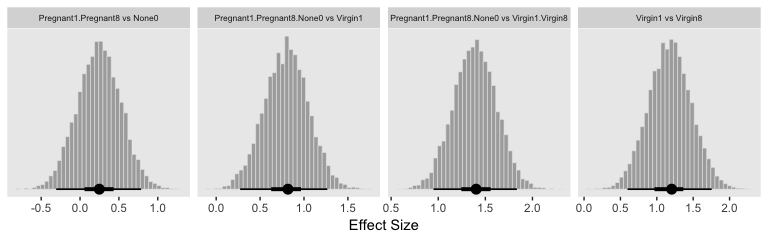

Now we have a covariate in the model, we have to decide on which of its values we want to base our group comparisons. Unless there's a substantive reason for another value, the mean is a standard choice. And since the covariate `Thorax_c` is already mean centered, that means we can effectively leave it out of the equation. Here they are in the simple difference metric.

``` r
post <- posterior_samples(fit4)

differences <-
  post %>% 
  transmute(`Pregnant1.Pregnant8 vs None0` = (`r_CompanionNumber[Pregnant1,Intercept]` + `r_CompanionNumber[Pregnant1,Intercept]`) / 2 - `r_CompanionNumber[None0,Intercept]`,
            
            `Pregnant1.Pregnant8.None0 vs Virgin1` = (`r_CompanionNumber[Pregnant1,Intercept]` + `r_CompanionNumber[Pregnant1,Intercept]` + `r_CompanionNumber[None0,Intercept]`) / 3 - `r_CompanionNumber[Virgin1,Intercept]`,
            
            `Virgin1 vs Virgin8` = `r_CompanionNumber[Virgin1,Intercept]` - `r_CompanionNumber[Virgin8,Intercept]`,
            
            `Pregnant1.Pregnant8.None0 vs Virgin1.Virgin8` = (`r_CompanionNumber[Pregnant1,Intercept]` + `r_CompanionNumber[Pregnant1,Intercept]` + `r_CompanionNumber[None0,Intercept]`) / 3 - (`r_CompanionNumber[Virgin1,Intercept]` + `r_CompanionNumber[Virgin8,Intercept]`) / 2)

differences %>% 
  gather() %>%   
  
  ggplot(aes(x = value)) +
  geom_histogram(color = "grey92", fill = "grey67",
                 size = .2, bins = 40) +
  stat_pointintervalh(aes(y = 0), 
                      point_interval = mode_hdi, .width = c(.95, .5)) +
  scale_y_continuous(NULL, breaks = NULL) +
  labs(x = "Difference") +
  theme(strip.text = element_text(size = 6.4)) +
  facet_wrap(~key, scales = "free_x", ncol = 4)
```


Now in the effect size metric.

``` r
differences %>% 
  mutate_all(funs(. / post$sigma)) %>% 
  gather() %>%   
  
  ggplot(aes(x = value)) +
  geom_histogram(color = "grey92", fill = "grey67",
                 size = .2, bins = 40) +
  stat_pointintervalh(aes(y = 0), 
                      point_interval = mode_hdi, .width = c(.95, .5)) +
  scale_y_continuous(NULL, breaks = NULL) +
  labs(x = "Effect Size") +
  theme(strip.text = element_text(size = 6.4)) +
  facet_wrap(~key, scales = "free_x", ncol = 4)
```


"The HDI widths of all the contrasts have gotten smaller by virtue of including the covariate in the analysis" (p. 571).

### 19.4.2 Analogous to traditional ANCOVA

In contrast with ANCOVA,

> Bayesian methods do not partition the least-squares variance to make estimates, and therefore the Bayesian method is analogous to ANCOVA but is not ANCOVA. Frequentist practitioners are urged to test (with *p* values) whether the assumptions of (a) equal slope in all groups, (b) equal standard deviation in all groups, and (c) normally distributed noise can be rejected. In a Bayesian approach, the descriptive model is generalized to address these concerns, as will be discussed in Section 19.5. (p. 572)

### 19.4.3 Relation to hierarchical linear regression

Here Kruschke contrasts our last model with the one from way back in chapter 17, section 3. As a refresher, here's what that code looked like.

``` r
fit4 <-
  brm(data = my_data,
      family = student,
      Y_z ~ 1 + X_z + (1 + X_z || Subj),
      prior = c(prior(normal(0, 100), class = Intercept),
                prior(normal(0, 100), class = b),
                prior(normal(0, 1), class = sigma),
                prior(normal(0, 1), class = sd),
                prior(exponential(one_over_twentynine) + 1, class = nu)),
      chains = 4, cores = 4,
      stanvars = stanvars)
```

And for convenience, here's the code from the model we just fit.

``` r
fit5 <-
  brm(data = my_data,
      family = gaussian,
      Longevity ~ 1 + Thorax_c + (1 | CompanionNumber),
      prior = c(prior(normal(mean_y, sd_y * 5),          class = Intercept),
                prior(normal(0, 2 * sd_y / sd_Thorax_c), class = b),
                prior(gamma(alpha, beta),                class = sd),
                prior(cauchy(0, sd_y),                   class = sigma)),
      iter = 4000, warmup = 1000, chains = 4, cores = 4,
      control = list(adapt_delta = 0.99),
      stanvars = stanvars)
```

It's easy to get lost in the differences in the priors and the technical details with the model chains and such. The main thing to notice, here, is the differences in the modle formulas (i.e., the likelihoods). Both models had intercepts and slopes. But whereas the model from 17.3 set both parameters to random, only the intercept in our last modes was random. The covariate `Thorax_c` was fixed--it did not vary by group. Had we wanted it to, or formula syntax would have been something like `Longevity ~ 1 + Thorax_c + (1 + Thorax_c || CompanionNumber)`. And again, as noted in chapter 17, the `||` portion of the syntax set the random interepts and slopes to be orthogonal. As we'll see, this will often not be the case. But let's not get ahead of ourselves.

> Conceptually, the main difference between the models is merely the focus of attention. In the hierarchical linear regression model, the focus was on the slope coefficient. In that case, we were trying to estimate the magnitude of the slope, simultaneously for individuals and overall. The intercepts, which describe the levels of the nominal predictor, were of ancillary interest. In the present section, on the other hand, the focus of attention is reversed. We are most interested in the intercepts and their differences between groups, with the slopes on the covariate being of ancillary interest. (p. 573)

19.5. Heterogeneous variances and robustness against outliers
-------------------------------------------------------------

On page 574, Kruschke laid out the schematic for a hierarchical Student's-*t* model in for which both the *ν* and *σ* parameters are random. Bürkner calls these [distributional models](https://cran.r-project.org/web/packages/brms/vignettes/brms_distreg.html) and they are indeed available within the brms framework. But there's a catch. Though we can model *σ* all day long and we can even make it hierarchical, brms limits us to modeling the hierarchical *σ* parameters within the typical Gaussian framework. That is, we will depart from Kruschke's schematic in that we will be

-   modeling the log of *σ*,
-   indicating its grand mean with the `sigma ~ 1` syntax,
-   modeling the group-level deviations a Gaussian with a mean of 0 and standard deviation *σ*<sub>*σ*</sub> estimated from the data,
-   and choosing a sensible prior for *σ*<sub>*σ*</sub> that is left-bound at 0 and gently slopes to the right (i.e., a folded *t* or gamma distribution).

Since we're modeling log(*σ*), we might Gaussian prior centered on `sd(my_data$y) %>% log()` and a reasonable spread like 1. We can simulate a little to get a sense of what those distributions look like.

``` r
n_draws <- 1e3

set.seed(19)
tibble(prior = rnorm(n_draws, mean = log(1), sd = 1)) %>% 
  mutate(prior_exp = exp(prior)) %>% 
  gather(key, value) %>% 

  ggplot(aes(x = value)) +
  geom_density(fill = "black", color = "transparent") +
  facet_wrap(~key, scales = "free")
```


Here's what is looks like with `sd = 2`.

``` r
set.seed(19)
tibble(prior = rnorm(n_draws, mean = log(1), sd = 2)) %>% 
  mutate(prior_exp = exp(prior)) %>% 

  ggplot(aes(x = prior_exp)) +
  geom_density(fill = "black", color = "transparent") +
  coord_cartesian(xlim = 0:17)
```


Though we're still peaking around 1, there's more mass in the tail, making it easier for the likelihood to pull away from the prior mode.

But all this is the prior on the fixed effect, the grand mean of log(*σ*). Keep in mind we’re also estimating group-level deflections using a hierarchical model. The good old folded *t* on the unit scale is already pretty permissive for an estimate that is itself on the log scale. To make it more conservative, set *ν* to infinity and go with a folded Gaussian. Or keep your regularization loose and go with a low-*ν* folded *t* or even a folded Cauchy. And, of course, one could even go with a gamma.

Consider we have data `my_data` for which our primary variable of interest is `y`. Starting from preparing our `stanvars` values, here's what the model code might look like.

``` r
# get ready for `stanvars`
mean_y <- mean(my_data$y)
sd_y   <- sd(my_data$y)

omega  <- sd_y / 2
sigma  <- 2 * sd_y

s_r    <- gamma_a_b_from_omega_sigma(mode = omega, sd = sigma)

# define `stanvars`
stanvars <- 
  stanvar(mean_y,    name = "mean_y") + 
  stanvar(sd_y,      name = "sd_y") +
  stanvar(s_r$shape, name = "alpha") +
  stanvar(s_r$rate,  name = "beta") +
  stanvar(1/29,      name = "one_over_twentynine")

# fit the model
fit <-
  brm(data = my_data,
      family = student,
      bf(Longevity ~ 1 + (1 | CompanionNumber), 
         sigma     ~ 1 + (1 | CompanionNumber)),
      prior = c(# grand means
                prior(normal(mean_y, sd_y * 10), class = Intercept),
                prior(normal(log(sd_y), 1), class = Intercept, dpar = sigma),
                # the priors controlling the spread for our hierarchical deflections
                prior(gamma(alpha, beta), class = sd),
                prior(normal(0, 1), class = sd, dpar = sigma),
                # don't forget our student-t nu
                prior(exponential(one_over_twentynine), class = nu)),
      stanvars = stanvars)
```

### 19.5.1 Example: Contrast of means with different variances

Let's load and take a look at Kruschke's simulated data.

``` r
my_data <- read_csv("data.R/NonhomogVarData.csv")

head(my_data)
```

    ## # A tibble: 6 x 2
    ##   Group     Y
    ##   <chr> <dbl>
    ## 1 A      97.8
    ## 2 A      99.9
    ## 3 A      92.4
    ## 4 A      96.9
    ## 5 A     101. 
    ## 6 A      80.7

Here are the means and *S**D*s for each `Group`.

``` r
my_data %>% 
  group_by(Group) %>% 
  summarise(mean = mean(Y),
            sd   = sd(Y))
```

    ## # A tibble: 4 x 3
    ##   Group  mean    sd
    ##   <chr> <dbl> <dbl>
    ## 1 A      97.0 8.00 
    ## 2 B      99.0 1.000
    ## 3 C     102.  1.   
    ## 4 D     104.  8.00

First we'll fit the model with homogeneous variances. To keep things simple, here we'll fit a conventional model following the form of our original `fit1`. Here are our `stanvars`.

``` r
(mean_y <- mean(my_data$Y))
```

    ## [1] 100.5

``` r
(sd_y   <- sd(my_data$Y))
```

    ## [1] 6.228965

``` r
omega   <- sd_y / 2
sigma   <- 2 * sd_y

(s_r    <- gamma_a_b_from_omega_sigma(mode = omega, sd = sigma))
```

    ## $shape
    ## [1] 1.283196
    ## 
    ## $rate
    ## [1] 0.09092861

``` r
# define `stanvars`
stanvars <- 
  stanvar(mean_y,    name = "mean_y") + 
  stanvar(sd_y,      name = "sd_y") +
  stanvar(s_r$shape, name = "alpha") +
  stanvar(s_r$rate,  name = "beta")
```

Now fit the homogeneous-variances model.

``` r
fit5 <-
  brm(data = my_data,
      family = gaussian,
      Y ~ 1 + (1 | Group),
      prior = c(prior(normal(mean_y, sd_y * 10), class = Intercept),
                prior(gamma(alpha, beta), class = sd),
                prior(cauchy(0, sd_y), class = sigma)),
      iter = 4000, warmup = 1000, chains = 4, cores = 4,
      control = list(adapt_delta = 0.999),
      stanvars = stanvars)
```

Here's the model summary.

``` r
print(fit5)
```

    ## Warning: There were 1 divergent transitions after warmup. Increasing adapt_delta above 0.999 may help.
    ## See http://mc-stan.org/misc/warnings.html#divergent-transitions-after-warmup

    ##  Family: gaussian 
    ##   Links: mu = identity; sigma = identity 
    ## Formula: Y ~ 1 + (1 | Group) 
    ##    Data: my_data (Number of observations: 96) 
    ## Samples: 4 chains, each with iter = 4000; warmup = 1000; thin = 1;
    ##          total post-warmup samples = 12000
    ## 
    ## Group-Level Effects: 
    ## ~Group (Number of levels: 4) 
    ##               Estimate Est.Error l-95% CI u-95% CI Eff.Sample Rhat
    ## sd(Intercept)     4.89      3.76     1.45    14.39       1223 1.00
    ## 
    ## Population-Level Effects: 
    ##           Estimate Est.Error l-95% CI u-95% CI Eff.Sample Rhat
    ## Intercept   100.41      3.68    94.00   106.26       1312 1.00
    ## 
    ## Family Specific Parameters: 
    ##       Estimate Est.Error l-95% CI u-95% CI Eff.Sample Rhat
    ## sigma     5.76      0.43     5.00     6.68       5771 1.00
    ## 
    ## Samples were drawn using sampling(NUTS). For each parameter, Eff.Sample 
    ## is a crude measure of effective sample size, and Rhat is the potential 
    ## scale reduction factor on split chains (at convergence, Rhat = 1).

Let's get ready to make our version of the top of Figure 19.7. First we wrangle.

``` r
# How many model-implied Gaussians would you like?
n_draws <- 20

densities <-
  my_data %>% 
  distinct(Group) %>% 
  add_fitted_draws(fit5, n = n_draws, seed = 19, dpar = c("mu", "sigma")) %>% 
  mutate(ll      = qnorm(.025, mean = mu, sd = sigma),
         ul      = qnorm(.975, mean = mu, sd = sigma)) %>% 
  mutate(Y       = map2(ll, ul, seq, length.out = 100)) %>% 
  mutate(density = pmap(list(Y, mu, sigma), dnorm)) %>% 
  unnest() %>% 
  group_by(.draw) %>% 
  mutate(density = density / max(density))

glimpse(densities)
```

    ## Observations: 8,000
    ## Variables: 12
    ## $ Group      <chr> "A", "A", "A", "A", "A", "A", "A", "A", "A", "A", "A", "A", "A", "A", "A", "...
    ## $ .row       <int> 1, 1, 1, 1, 1, 1, 1, 1, 1, 1, 1, 1, 1, 1, 1, 1, 1, 1, 1, 1, 1, 1, 1, 1, 1, 1...
    ## $ .chain     <int> NA, NA, NA, NA, NA, NA, NA, NA, NA, NA, NA, NA, NA, NA, NA, NA, NA, NA, NA, ...
    ## $ .iteration <int> NA, NA, NA, NA, NA, NA, NA, NA, NA, NA, NA, NA, NA, NA, NA, NA, NA, NA, NA, ...
    ## $ .draw      <int> 821, 821, 821, 821, 821, 821, 821, 821, 821, 821, 821, 821, 821, 821, 821, 8...
    ## $ .value     <dbl> 100.9042, 100.9042, 100.9042, 100.9042, 100.9042, 100.9042, 100.9042, 100.90...
    ## $ mu         <dbl> 100.9042, 100.9042, 100.9042, 100.9042, 100.9042, 100.9042, 100.9042, 100.90...
    ## $ sigma      <dbl> 6.510413, 6.510413, 6.510413, 6.510413, 6.510413, 6.510413, 6.510413, 6.5104...
    ## $ ll         <dbl> 88.144, 88.144, 88.144, 88.144, 88.144, 88.144, 88.144, 88.144, 88.144, 88.1...
    ## $ ul         <dbl> 113.6643, 113.6643, 113.6643, 113.6643, 113.6643, 113.6643, 113.6643, 113.66...
    ## $ Y          <dbl> 88.14400, 88.40178, 88.65956, 88.91734, 89.17512, 89.43290, 89.69068, 89.948...
    ## $ density    <dbl> 0.1465288, 0.1582290, 0.1705958, 0.1836410, 0.1973740, 0.2118018, 0.2269281,...

In our wrangling code, the main thing to notice is those last two lines. If you look closely to Kruschke’s Gaussians, you’ll notice they all have the same maximum height. Up to this point, ours haven’t. This has to do with technicalities on how densities are scaled. In brief, the wider densities have been shorter. So those last two lines scaled all the densities within the same group to the same metric. Otherwise the code was business as usual.

Anyway, here's our version of the top panel of Figure 19.7.

``` r
densities %>% 
  ggplot(aes(x = Y, y = Group)) +
  geom_ridgeline(aes(height = density, group = interaction(Group, .draw)),
                 fill = NA, color = adjustcolor("grey50", alpha.f = 2/3),
                 size = 1/3, scale = 3/4) +
  geom_jitter(data = my_data,
              height = .04, alpha = 1/2) +
  scale_x_continuous(breaks = seq(from = 80, to = 120, by = 10)) +
  coord_cartesian(xlim = 75:125,
                  ylim = c(1.25, 4.5)) +
  labs(title = "Data with Posterior Predictive Distrib.", 
       y = NULL) +
  theme(axis.ticks.y = element_blank(),
        axis.text.y  = element_text(hjust = 0))
```

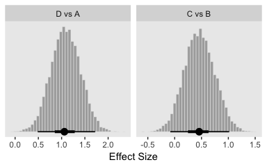

Here are the difference distributions in the middle of Figure 19.7.

``` r
post <- posterior_samples(fit5)

differences <-
  post %>% 
  transmute(`D vs A` = `r_Group[D,Intercept]` - `r_Group[A,Intercept]`,
            `C vs B` = `r_Group[C,Intercept]` - `r_Group[B,Intercept]`)

differences %>% 
  gather() %>%
  mutate(key = factor(key, levels = c("D vs A", "C vs B"))) %>% 
  
  ggplot(aes(x = value)) +
  geom_histogram(color = "grey92", fill = "grey67",
                 size = .2, bins = 40) +
  stat_pointintervalh(aes(y = 0), 
                      point_interval = mode_hdi, .width = c(.95, .5)) +
  scale_y_continuous(NULL, breaks = NULL) +
  labs(x = "Difference") +
  facet_wrap(~key, scales = "free_x", ncol = 4)
```


And here are the effect sizes at the bottom of the figure.

``` r
differences %>% 
  mutate_all(funs(. / post$sigma)) %>% 
  gather() %>%
  mutate(key = factor(key, levels = c("D vs A", "C vs B"))) %>% 
  
  ggplot(aes(x = value)) +
  geom_histogram(color = "grey92", fill = "grey67",
                 size = .2, bins = 40) +
  stat_pointintervalh(aes(y = 0), 
                      point_interval = mode_hdi, .width = c(.95, .5)) +
  scale_y_continuous(NULL, breaks = NULL) +
  labs(x = "Effect Size") +
  facet_wrap(~key, scales = "free_x", ncol = 4)
```


Here are the `stanvars` for the robust hierarchical variances model.

``` r
stanvars <- 
  stanvar(mean_y,    name = "mean_y") + 
  stanvar(sd_y,      name = "sd_y") +
  stanvar(s_r$shape, name = "alpha") +
  stanvar(s_r$rate,  name = "beta") +
  stanvar(1/29,      name = "one_over_twentynine")
```

Now fit the robust model.

``` r
fit6 <-
  brm(data = my_data,
      family = student,
      bf(Y     ~ 1 + (1 | Group), 
         sigma ~ 1 + (1 | Group)),
      prior = c(# grand means
                prior(normal(mean_y, sd_y * 10), class = Intercept),
                prior(normal(log(sd_y), 1), class = Intercept, dpar = sigma),
                # the priors controlling the spread for our hierarchical deflections
                prior(gamma(alpha, beta), class = sd),
                prior(normal(0, 1), class = sd, dpar = sigma),
                # don't forget our student-t nu
                prior(exponential(one_over_twentynine), class = nu)),
      iter = 4000, warmup = 1000, chains = 4, cores = 4,
      control = list(adapt_delta = 0.99,
                     max_treedepth = 12),
      stanvars = stanvars)
```

The chains look good.

``` r
plot(fit6)
```

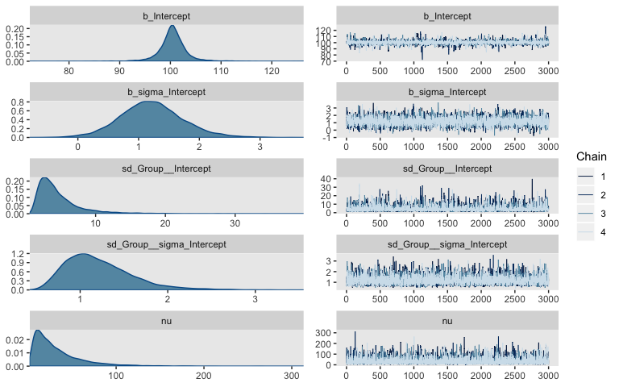

Here's the summary.

``` r
print(fit6)
```

    ##  Family: student 
    ##   Links: mu = identity; sigma = log; nu = identity 
    ## Formula: Y ~ 1 + (1 | Group) 
    ##          sigma ~ 1 + (1 | Group)
    ##    Data: my_data (Number of observations: 96) 
    ## Samples: 4 chains, each with iter = 4000; warmup = 1000; thin = 1;
    ##          total post-warmup samples = 12000
    ## 
    ## Group-Level Effects: 
    ## ~Group (Number of levels: 4) 
    ##                     Estimate Est.Error l-95% CI u-95% CI Eff.Sample Rhat
    ## sd(Intercept)           4.61      3.18     1.33    13.33       3483 1.00
    ## sd(sigma_Intercept)     1.21      0.38     0.66     2.14       5367 1.00
    ## 
    ## Population-Level Effects: 
    ##                 Estimate Est.Error l-95% CI u-95% CI Eff.Sample Rhat
    ## Intercept         100.46      2.84    94.81   106.37       3651 1.00
    ## sigma_Intercept     1.22      0.52     0.22     2.33       4219 1.00
    ## 
    ## Family Specific Parameters: 
    ##    Estimate Est.Error l-95% CI u-95% CI Eff.Sample Rhat
    ## nu    32.51     28.60     4.46   110.97      10220 1.00
    ## 
    ## Samples were drawn using sampling(NUTS). For each parameter, Eff.Sample 
    ## is a crude measure of effective sample size, and Rhat is the potential 
    ## scale reduction factor on split chains (at convergence, Rhat = 1).

Let's get ready to make our version of the top of Figure 19.7. First we wrangle.

``` r
densities <-
  my_data %>% 
  distinct(Group) %>% 
  add_fitted_draws(fit6, n = n_draws, seed = 19, dpar = c("mu", "sigma", "nu")) %>% 
  mutate(ll      = qt(.025, df = nu),
         ul      = qt(.975, df = nu)) %>% 
  mutate(Y       = map2(ll, ul, seq, length.out = 100)) %>% 
  mutate(density = map2(Y, nu, dt)) %>% 
  unnest() %>%
  # notice the conversion
  mutate(Y = mu + Y * sigma) %>% 
  group_by(.draw) %>% 
  mutate(density = density / max(density))

glimpse(densities)
```

    ## Observations: 8,000
    ## Variables: 13
    ## $ Group      <chr> "A", "A", "A", "A", "A", "A", "A", "A", "A", "A", "A", "A", "A", "A", "A", "...
    ## $ .row       <int> 1, 1, 1, 1, 1, 1, 1, 1, 1, 1, 1, 1, 1, 1, 1, 1, 1, 1, 1, 1, 1, 1, 1, 1, 1, 1...
    ## $ .chain     <int> NA, NA, NA, NA, NA, NA, NA, NA, NA, NA, NA, NA, NA, NA, NA, NA, NA, NA, NA, ...
    ## $ .iteration <int> NA, NA, NA, NA, NA, NA, NA, NA, NA, NA, NA, NA, NA, NA, NA, NA, NA, NA, NA, ...
    ## $ .draw      <int> 821, 821, 821, 821, 821, 821, 821, 821, 821, 821, 821, 821, 821, 821, 821, 8...
    ## $ .value     <dbl> 99.86472, 99.86472, 99.86472, 99.86472, 99.86472, 99.86472, 99.86472, 99.864...
    ## $ mu         <dbl> 99.86472, 99.86472, 99.86472, 99.86472, 99.86472, 99.86472, 99.86472, 99.864...
    ## $ sigma      <dbl> 8.424506, 8.424506, 8.424506, 8.424506, 8.424506, 8.424506, 8.424506, 8.4245...
    ## $ nu         <dbl> 22.90586, 22.90586, 22.90586, 22.90586, 22.90586, 22.90586, 22.90586, 22.905...
    ## $ ll         <dbl> -2.069128, -2.069128, -2.069128, -2.069128, -2.069128, -2.069128, -2.069128,...
    ## $ ul         <dbl> 2.069128, 2.069128, 2.069128, 2.069128, 2.069128, 2.069128, 2.069128, 2.0691...
    ## $ Y          <dbl> 82.43334, 82.78549, 83.13764, 83.48979, 83.84194, 84.19409, 84.54624, 84.898...
    ## $ density    <dbl> 0.1290020, 0.1391218, 0.1498742, 0.1612802, 0.1733597, 0.1861305, 0.1996088,...

If you look closely at our code, above, you’ll note switching from the Gaussian to the Student *t* required changes in our flow. Most obviously, we switched from `qnorm()` and `dnorm()` to `qt()` and `dt()`, respectively. The base R Student *t* functions don’t take arguments for *μ* and *σ*. Rather, they’re presumed to be 0 and 1, respectively. That means that for our first three `mutate()` functions, the computations were all based on the standard Student *t*, with only the *ν* parameter varying according to the posterior. The we corrected for that was with the fourth `mutate()`.

Now we're ready to make our version of the top panel of Figure 19.7.

``` r
densities %>% 
  ggplot(aes(x = Y, y = Group)) +
  geom_ridgeline(aes(height = density, group = interaction(Group, .draw)),
                 fill = NA, color = adjustcolor("grey50", alpha.f = 2/3),
                 size = 1/3, scale = 3/4) +
  geom_jitter(data = my_data,
              height = .04, alpha = 1/2) +
  scale_x_continuous(breaks = seq(from = 80, to = 120, by = 10)) +
  coord_cartesian(xlim = 75:125,
                  ylim = c(1.25, 4.5)) +
  labs(title = "Data with Posterior Predictive Distrib.", 
       y = NULL) +
  theme(axis.ticks.y = element_blank(),
        axis.text.y  = element_text(hjust = 0))
```


Here are the difference distributions in the middle of Figure 19.8.

``` r
post <- posterior_samples(fit6)

post %>% 
  transmute(`D vs A` = `r_Group[D,Intercept]` - `r_Group[A,Intercept]`,
            `C vs B` = `r_Group[C,Intercept]` - `r_Group[B,Intercept]`) %>% 
  gather() %>%
  mutate(key = factor(key, levels = c("D vs A", "C vs B"))) %>% 
  
  ggplot(aes(x = value)) +
  geom_histogram(color = "grey92", fill = "grey67",
                 size = .2, bins = 40) +
  stat_pointintervalh(aes(y = 0), 
                      point_interval = mode_hdi, .width = c(.95, .5)) +
  scale_y_continuous(NULL, breaks = NULL) +
  labs(x = "Difference") +
  facet_wrap(~key, scales = "free_x", ncol = 4)
```


And here are the corresponding effect sizes at the bottom of the Figure 19.8.

``` r
post %>% 
  transmute(`D vs A` = (`r_Group[D,Intercept]` - `r_Group[A,Intercept]`) / 
              exp((b_sigma_Intercept + `r_Group__sigma[D,Intercept]` + b_sigma_Intercept + `r_Group__sigma[A,Intercept]`) / 2),
            `C vs B` = (`r_Group[C,Intercept]` - `r_Group[B,Intercept]`) /
              exp((b_sigma_Intercept + `r_Group__sigma[C,Intercept]` + b_sigma_Intercept + `r_Group__sigma[B,Intercept]`) / 2)) %>% 
  gather() %>%
  mutate(key = factor(key, levels = c("D vs A", "C vs B"))) %>% 
  
  ggplot(aes(x = value)) +
  geom_histogram(color = "grey92", fill = "grey67",
                 size = .2, bins = 40) +
  stat_pointintervalh(aes(y = 0), 
                      point_interval = mode_hdi, .width = c(.95, .5)) +
  scale_y_continuous(NULL, breaks = NULL) +
  labs(x = "Effect Size") +
  facet_wrap(~key, scales = "free_x", ncol = 4)
```


Notice that because (a) the sigma parameters were heterogeneous and (b) they were estimated on the log scale, we had to do quite a bit more data processing before they effect size estimates were ready.

"Finally, because each group has its own estimated scale (i.e., *σ*<sub>*j*</sub>), we can investigate differences in scales across groups" (p. 578). That's not a bad idea. Even though Kruschke didn't do this in the text, we may as well give it a go.

``` r
post %>% 
  transmute(`D vs A` = exp(b_sigma_Intercept + `r_Group__sigma[D,Intercept]`) - exp(b_sigma_Intercept + `r_Group__sigma[A,Intercept]`),
            `C vs B` = exp(b_sigma_Intercept + `r_Group__sigma[C,Intercept]`) - exp(b_sigma_Intercept + `r_Group__sigma[B,Intercept]`),
            `D vs C` = exp(b_sigma_Intercept + `r_Group__sigma[D,Intercept]`) - exp(b_sigma_Intercept + `r_Group__sigma[C,Intercept]`),
            `B vs A` = exp(b_sigma_Intercept + `r_Group__sigma[B,Intercept]`) - exp(b_sigma_Intercept + `r_Group__sigma[A,Intercept]`)) %>% 
  gather() %>%
  mutate(key = factor(key, levels = c("D vs A", "C vs B", "D vs C", "B vs A"))) %>% 
  
  ggplot(aes(x = value)) +
  geom_histogram(color = "grey92", fill = "grey67",
                 size = .2, bins = 40) +
  stat_pointintervalh(aes(y = 0), 
                      point_interval = mode_hdi, .width = c(.95, .5)) +
  scale_y_continuous(NULL, breaks = NULL) +
  labs(x = expression(paste("Differences in ", sigma))) +
  facet_wrap(~key, scales = "free", ncol = 4)
```


References
----------

Kruschke, J. K. (2015). *Doing Bayesian data analysis, Second Edition: A tutorial with R, JAGS, and Stan.* Burlington, MA: Academic Press/Elsevier.

Session info
------------

``` r
sessionInfo()
```

    ## R version 3.5.1 (2018-07-02)
    ## Platform: x86_64-apple-darwin15.6.0 (64-bit)
    ## Running under: macOS High Sierra 10.13.6
    ## 
    ## Matrix products: default
    ## BLAS: /Library/Frameworks/R.framework/Versions/3.5/Resources/lib/libRblas.0.dylib
    ## LAPACK: /Library/Frameworks/R.framework/Versions/3.5/Resources/lib/libRlapack.dylib
    ## 
    ## locale:
    ## [1] en_US.UTF-8/en_US.UTF-8/en_US.UTF-8/C/en_US.UTF-8/en_US.UTF-8
    ## 
    ## attached base packages:
    ## [1] stats     graphics  grDevices utils     datasets  methods   base     
    ## 
    ## other attached packages:
    ##  [1] tidybayes_1.0.3 bayesplot_1.6.0 brms_2.7.0      Rcpp_1.0.0      ggridges_0.5.0  bindrcpp_0.2.2 
    ##  [7] forcats_0.3.0   stringr_1.3.1   dplyr_0.7.6     purrr_0.2.5     readr_1.1.1     tidyr_0.8.1    
    ## [13] tibble_1.4.2    ggplot2_3.1.0   tidyverse_1.2.1
    ## 
    ## loaded via a namespace (and not attached):
    ##   [1] colorspace_1.3-2          rsconnect_0.8.8           rprojroot_1.3-2          
    ##   [4] ggstance_0.3              markdown_0.8              base64enc_0.1-3          
    ##   [7] rstudioapi_0.7            rstan_2.18.2              svUnit_0.7-12            
    ##  [10] DT_0.4                    mvtnorm_1.0-8             lubridate_1.7.4          
    ##  [13] xml2_1.2.0                bridgesampling_0.4-0      mnormt_1.5-5             
    ##  [16] knitr_1.20                shinythemes_1.1.1         jsonlite_1.5             
    ##  [19] LaplacesDemon_16.1.1      broom_0.4.5               shiny_1.1.0              
    ##  [22] compiler_3.5.1            httr_1.3.1                backports_1.1.2          
    ##  [25] assertthat_0.2.0          Matrix_1.2-14             lazyeval_0.2.1           
    ##  [28] cli_1.0.1                 later_0.7.3               htmltools_0.3.6          
    ##  [31] prettyunits_1.0.2         tools_3.5.1               igraph_1.2.1             
    ##  [34] coda_0.19-2               gtable_0.2.0              glue_1.3.0               
    ##  [37] reshape2_1.4.3            cellranger_1.1.0          nlme_3.1-137             
    ##  [40] crosstalk_1.0.0           psych_1.8.4               ps_1.2.1                 
    ##  [43] rvest_0.3.2               mime_0.5                  miniUI_0.1.1.1           
    ##  [46] gtools_3.8.1              MASS_7.3-50               zoo_1.8-2                
    ##  [49] scales_1.0.0              colourpicker_1.0          hms_0.4.2                
    ##  [52] promises_1.0.1            Brobdingnag_1.2-5         parallel_3.5.1           
    ##  [55] inline_0.3.15             shinystan_2.5.0           yaml_2.1.19              
    ##  [58] gridExtra_2.3             loo_2.0.0                 StanHeaders_2.18.0-1     
    ##  [61] stringi_1.2.3             dygraphs_1.1.1.5          pkgbuild_1.0.2           
    ##  [64] rlang_0.3.0.1             pkgconfig_2.0.1           matrixStats_0.54.0       
    ##  [67] HDInterval_0.2.0          evaluate_0.10.1           lattice_0.20-35          
    ##  [70] bindr_0.1.1               rstantools_1.5.0          htmlwidgets_1.2          
    ##  [73] labeling_0.3              tidyselect_0.2.4          processx_3.2.1           
    ##  [76] plyr_1.8.4                magrittr_1.5              R6_2.3.0                 
    ##  [79] pillar_1.2.3              haven_1.1.2               foreign_0.8-70           
    ##  [82] withr_2.1.2               xts_0.10-2                abind_1.4-5              
    ##  [85] modelr_0.1.2              crayon_1.3.4              arrayhelpers_1.0-20160527
    ##  [88] utf8_1.1.4                rmarkdown_1.10            grid_3.5.1               
    ##  [91] readxl_1.1.0              callr_3.1.0               threejs_0.3.1            
    ##  [94] digest_0.6.18             xtable_1.8-2              httpuv_1.4.4.2           
    ##  [97] stats4_3.5.1              munsell_0.5.0             viridisLite_0.3.0        
    ## [100] shinyjs_1.0
