Chapter 20. Metric Predicted Variable with Multiple Nominal Predictors
================
A Solomon Kurz
2018-12-26

Metric Predicted Variable with Multiple Nominal Predictors
==========================================================

> This chapter considers data structures that consist of a metric predicted variable and two (or more) nominal predictors. This chapter extends ideas introduced in the previous chapter, so please read the previous chapter if you have not already....
>
> The traditional treatment of this sort of data structure is called multifactor analysis of variance (ANOVA). Our Bayesian approach will be a hierarchical generalization of the traditional ANOVA model. The chapter also considers generalizations of the traditional models, because it is straight forward in Bayesian software to implement heavy-tailed distributions to accommodate outliers, along with hierarchical structure to accommodate heterogeneous variances in the different groups. (pp. 583--584)

Describing groups of metric data with multiple nominal predictors
-----------------------------------------------------------------

Quick reprise:

> Suppose we have two nominal predictors, denoted $\\overrightarrow x\_1$ and $\\overrightarrow x\_2$. A datum from the *j*th level of $\\overrightarrow x\_1$ is denoted *x*<sub>1\[*j*\]</sub>, and analogously for the second factor. The predicted value is a baseline plus a deflection due to the level of factor 1 plus a deflection due to the level of factor 2 plus a residual deflection due to the interaction of factors:
>
> $$
> \\begin{eqnarray}
> \\mu & = & \\beta\_0 + \\overrightarrow \\beta\_1 \\cdot \\overrightarrow x\_1 + \\overrightarrow \\beta\_2 \\cdot \\overrightarrow x\_2 + \\overrightarrow \\beta\_{1 \\times 2} \\cdot \\overrightarrow x\_{1 \\times 2} \\\\
> & = & \\beta\_0 + \\sum\_j \\beta\_{1\[j\]} x\_{1\[j\]} + \\sum\_k \\beta\_{2\[k\]} x\_{2\[k\]} + \\sum\_{j, k} \\beta\_{1 \\times 2\[j, k\]} x\_{1 \\times 2\[j, k\]}
> \\end{eqnarray}
> $$
>
> The deflections within factors and within the interaction are constrained to sum to zero:
>
> $$
> \\begin{eqnarray}
> \\sum\_j \\beta\_{1\[j\]} = 0 & \\;\\;\\;\\; \\text{ and } \\;\\;\\;\\; & \\sum\_k \\beta\_{2\[k\]} = 0 \\;\\;\\;\\; \\text{ and} \\\\
> \\sum\_j \\beta\_{1 \\times 2\[j, k\]} = 0 \\text{ for all } k & \\;\\;\\;\\; \\text{ and } \\;\\;\\;\\; & \\sum\_k \\beta\_{1 \\times 2\[j, k\]} = 0 \\text{ for all } j
> \\end{eqnarray}
> $$
>
> (\[these equations\] are repetitions of Equations 15.9 and 15.10, p. 434). The actual data are assumed to be randomly distributed around the predicted value. (pp. 584--585)

### Interaction

> An important concept of models with multiple predictors is interaction. Interaction means that the effect of a predictor depends on the level of another predictor. A little more technically, interaction is what is left over after the main effects of the factors are added: interaction is the nonadditive influence of the factors. (p. 585)

Here are the data necessary for our version of Figure 20.1, which displays an interaction of two 2-level factors.

``` r
library(tidyverse)

grand_mean            <- 5
deflection_1          <- 1.8
deflection_2          <- 0.2
nonadditive_component <- -1

(
  d <-
  tibble(x1                = rep(c(-1, 1), each = 2),
         x2                = rep(c(1, -1), times = 2)) %>% 
  mutate(mu_additive       = grand_mean + (x1 * deflection_1) + (x2 * deflection_2)) %>% 
  mutate(mu_multiplicative = mu_additive + (x1 * x2 * nonadditive_component),
         # we'll need this to accommodate `position = "dodge"` within `geom_col()`
         x1_offset         = x1 + x2 * -.45,
         # we'll need this for the fill
         x2_c              = factor(x2, levels = c(1, -1)))
  )
```

    ## # A tibble: 4 x 6
    ##      x1    x2 mu_additive mu_multiplicative x1_offset x2_c 
    ##   <dbl> <dbl>       <dbl>             <dbl>     <dbl> <fct>
    ## 1    -1     1         3.4               4.4     -1.45 1    
    ## 2    -1    -1         3                 2       -0.55 -1   
    ## 3     1     1         7                 6        0.55 1    
    ## 4     1    -1         6.6               7.6      1.45 -1

There's enough going on with the lines, arrows, and titles across the three panels that to my mind it seems easier to make three distinct plots and them join them at the end with `gridExtra::grid.arrange()`. But enough of the settings are common among the panels that it also makes sense to keep from repeating that part of the code. So we'll take a three-step solution. For the first step, we'll make the baseline or foundational plot, which we'll call `p`.

``` r
p <-
  d %>% 
  ggplot(aes(x = x1, y = mu_multiplicative)) +
  geom_col(aes(fill = x2_c),
           position = "dodge") +
  scale_fill_viridis_d(NULL, option = "C", begin = 1/3, end = 2/3,
                       labels = c("x2[1]", "x2[2]")) +
  scale_x_continuous(breaks = c(-1, 1),
                     labels = c("x1[1]", "x1[2]")) +
  scale_y_continuous(breaks = seq(from = 0, to = 10, by = 2)) +
  coord_cartesian(ylim = 0:10) +
  ylab(expression(mu)) +
  theme(panel.grid        = element_blank(),
        axis.ticks.x      = element_blank(),
        legend.position   = c(.17, .875),
        legend.background = element_rect(fill = "transparent"),
        legend.key        = element_rect(size = 0))

p
```

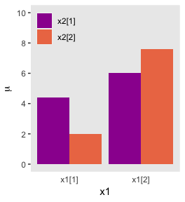

Now we have `p`, we’ll add panel-specific elements to it, which we’ll save as individual objects, `p1`, `p2`, and `p3`. That’s step 2. Then for step 3, we’ll bring them all together with `grid.arrange()`.

``` r
# Deflection from additive
p1 <-
  p +
  geom_segment(aes(x = x1_offset, xend = x1_offset,
                   y = mu_additive, yend = mu_multiplicative),
               size = 1.25,
               arrow = arrow(length = unit(.275, "cm"))) +
  geom_line(aes(x = x1_offset, y = mu_additive, group = x2),
            linetype = 2) +
  geom_line(aes(x = x1_offset, y = mu_additive, group = x1),
            linetype = 2) +
  coord_cartesian(ylim = 0:10) +
  ggtitle("Deflection from additive")
  
# Effect of x1 depends on x2
p2 <-
  p +
  geom_segment(aes(x = x1_offset, xend = x1_offset,
                   y = mu_additive, yend = mu_multiplicative),
               size = .5,
               arrow = arrow(length = unit(.15, "cm"))) +
  geom_line(aes(x = x1_offset, y = mu_additive, group = x2),
            linetype = 2) +
  geom_line(aes(x = x1_offset, y = mu_multiplicative, group = x2),
            size = 1.25) +
  ggtitle("Effect of x1 depends on x2")

# Effect of x2 depends on x1
p3 <-
  p +
  geom_segment(aes(x = x1_offset, xend = x1_offset,
                   y = mu_additive, yend = mu_multiplicative),
               size = .5,
               arrow = arrow(length = unit(.15, "cm"))) +
  geom_line(aes(x = x1_offset, y = mu_multiplicative, group = x1),
            size = 1.25) +
  geom_line(aes(x = x1_offset, y = mu_additive, group = x1),
            linetype = 2) +
  ggtitle("Effect of x2 depends on x1")

library(gridExtra)

grid.arrange(p1, p2, p3, ncol = 3)
```

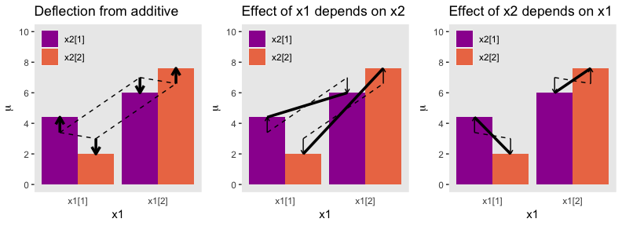

And in case it's not clear, "the average deflection from baseline due to a predictor... is called the main effect of the predictor. The main effects of the predictors correspond to the dashed lines in the left panel of Figure 20.1" (p. 587). And further

> The left panel of Figure 20.1 highlights the interaction as the nonadditive component, emphasized by the heavy vertical arrows that mark the departure from additivity. The middle panel of Figure 20.1 highlights the interaction by emphasizing that the effect of *x*<sub>1</sub> depends on the level of *x*<sub>2</sub>. The heavy lines mark the effect of *x*<sub>1</sub>, that is, the changes from level 1 of *x*<sub>1</sub> to level 2 of *x*<sub>1</sub>. Notice that the heavy lines have different slopes: The heavy line for level 1 of *x*<sub>2</sub> has a shallower slope than the heavy line for level 2 of *x*<sub>2</sub>. The right panel of Figure 20.1 highlights the interaction by emphasizing that the effect of *x*<sub>2</sub> depends on the level of *x*<sub>1</sub>. (p. 587)

### Traditional ANOVA

> The Bayesian approach is not ANOVA, but is analogous to ANOVA. Traditional ANOVA makes decisions about equality of groups (i.e., null hypotheses) on the basis of *p* values using a null hypothesis that assumes (i) the data are normally distributed within groups, and (ii) the standard deviation of the data within each group is the same for all groups. The second assumption is sometimes called "homogeneity of variance." The entrenched precedent of ANOVA is why basic models of grouped data make those assumptions, and why the basic models presented in this chapter will also make those assumptions. Later in the chapter, those constraints will be relaxed. (pp. 587--588)

Hierarchical Bayesian approach
------------------------------

"Our goal is to estimate the main and interaction deflections, and other parameters, based on the observed data" (p. 588).

### Implementation in ~~JAGS~~ brms

Below is how to implement the model based on the code from Kruschke's `Jags-Ymet-Xnom2fac-MnormalHom.R` and `Jags-Ymet-Xnom2fac-MnormalHom-Example.R` scripts. In brms, we'll need to specify the `stanvars`.

``` r
mean_y <- mean(my_data$y)
sd_y   <- sd(my_data$y)

omega <- sd_y / 2
sigma <- 2 * sd_y

s_r <- gamma_a_b_from_omega_sigma(mode = omega, sd = sigma)

stanvars <- 
  stanvar(mean_y,    name = "mean_y") + 
  stanvar(sd_y,      name = "sd_y") +
  stanvar(s_r$shape, name = "alpha") +
  stanvar(s_r$rate,  name = "beta")
```

And before that, of course, make sure you've defined the `gamma_a_b_from_omega_sigma()` function. E.g.,

``` r
gamma_a_b_from_omega_sigma <- function(mode, sd) {
  if (mode <= 0) stop("mode must be > 0")
  if (sd   <= 0) stop("sd must be > 0")
  rate <- (mode + sqrt(mode^2 + 4 * sd^2)) / (2 * sd^2)
  shape <- 1 + mode * rate
  return(list(shape = shape, rate = rate))
}
```

With the preparatory work done, now all we'd need to do is run the `brm()` code.

``` r
fit <-
  brm(data = my_data,
      family = gaussian,
      y ~ 1 + (1 | factor_1) + (1 | factor_2) + (1 | factor_1:factor_2),
      prior = c(prior(normal(mean_y, sd_y * 5), class = Intercept),
                prior(gamma(alpha, beta),       class = sd),
                prior(cauchy(0, sd_y),          class = sigma)),
      stanvars = stanvars)
```

If you have reason to use different priors for the random effects, you can always specify multiple lines of `class = sd`, each with the appropriate `coef` argument.

The big new element is multiple `(|)` parts in the `formula`. In this simple model type, we're only working random intercepts, in this case with two factors and their interaction. The `formula` above presumes the interaction is not itself coded within the data. But consider the case you have data including a term for the interaction of the two lower-level factors, called `interaction`. In that case, you'd have that last part of the `formula` read `(1 | interaction)`, instead.

### Example: It’s only money

Load the salary data.

``` r
my_data <- read_csv("data.R/Salary.csv")

glimpse(my_data)
```

    ## Observations: 1,080
    ## Variables: 6
    ## $ Org     <chr> "PL", "MUTH", "ENG", "CMLT", "LGED", "MGMT", "INFO", "...
    ## $ OrgName <chr> "Philosophy", "Music Theory", "English", "Comparative ...
    ## $ Cla     <chr> "PC", "PC", "PC", "PC", "PT", "PR", "PT", "PR", "PR", ...
    ## $ Pos     <chr> "FT2", "FT2", "FT2", "FT2", "FT3", "NDW", "FT3", "FT1"...
    ## $ ClaPos  <chr> "PC.FT2", "PC.FT2", "PC.FT2", "PC.FT2", "PT.FT3", "PR....
    ## $ Salary  <int> 72395, 61017, 82370, 68805, 63796, 219600, 98814, 1077...

We'll follow Kruschke's example on page 593 and modify the `Pos` variable a bit.

``` r
my_data <-
  my_data %>% 
  mutate(Pos = factor(Pos,
                      levels = c("FT3", "FT2", "FT1", "NDW", "DST") ,
                      ordered = T,
                      labels = c("Assis", "Assoc", "Full", "Endow", "Disting")))
```

With 1080 cases, two factors, and a criterion, these data are a little too unwieldy to look at the individual case level. But if we're tricky on how we aggregate, we can get a good sense of their structure with a `geom_tile()` plot. Here our strategy is to aggregate by our two factors, `Pos` and `Org`. Since our criterion is `Salary`, we'll compute the mean value of the cases within each unique paring, encoded as `m_Salary`. Also, we'll get a sense of how many cases there are within each factor pairing with `n`.

``` r
my_data %>% 
  group_by(Pos, Org) %>% 
  summarise(m_Salary = mean(Salary),
            n = n()) %>% 
  
  ggplot(aes(x = reorder(Org, m_Salary), 
             y = reorder(Pos, m_Salary), 
             fill = m_Salary)) +
  geom_tile() +
  geom_text(aes(label = n, color = m_Salary > 170000),
            size = 2.75) +
  # everything below this is really just aesthetic flourish
  scale_fill_viridis_c("median Salary", option = "D", 
                       breaks = c(55e3, 15e4, 26e4), 
                       labels = c("$55K", "$150K", "$260K")) +
  scale_color_manual(values = c("white", "black"), guide = 'none') +
  scale_x_discrete("Org", expand = c(0, 0)) +
  scale_y_discrete("Pos", expand = c(0, 0)) +
  theme(legend.position = "top",
        panel.grid  = element_blank(),
        axis.ticks  = element_blank(),
        axis.text.x = element_text(angle = 90, hjust = 0),
        axis.text.y = element_text(hjust = 0))
```

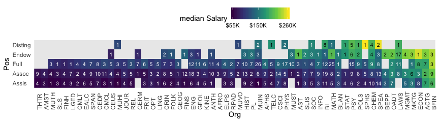

Hopefully it’s clear that each cell is a unique pairing of `Org` and `Pos`. The cells are color coded by the mean `Salary`. The numbers in the cells give the *n* cases they represent. When there’s no data for a unique combination of `Org` and `Pos`, the cells are left light gray blank.

Load brms.

``` r
library(brms)
```

Define our `stanvars`.

``` r
mean_y <- mean(my_data$Salary)
sd_y   <- sd(my_data$Salary)

omega <- sd_y / 2
sigma <- 2 * sd_y

s_r <- gamma_a_b_from_omega_sigma(mode = omega, sd = sigma)

stanvars <- 
  stanvar(mean_y,    name = "mean_y") + 
  stanvar(sd_y,      name = "sd_y") +
  stanvar(s_r$shape, name = "alpha") +
  stanvar(s_r$rate,  name = "beta")
```

Now fit the model.

``` r
fit1 <-
  brm(data = my_data,
      family = gaussian,
      Salary ~ 1 + (1 | Pos) + (1 | Org) + (1 | Pos:Org),
      prior = c(prior(normal(mean_y, sd_y * 5), class = Intercept),
                prior(gamma(alpha, beta),       class = sd),
                prior(cauchy(0, sd_y),          class = sigma)),
      iter = 4000, warmup = 2000, chains = 4, cores = 4,
      seed = 20,
      control = list(adapt_delta = 0.999,
                     max_treedepth = 13),
      stanvars = stanvars)
```

The chains look okay.

``` r
plot(fit1)
```


Here's the model summary.

``` r
print(fit1)
```

    ##  Family: gaussian 
    ##   Links: mu = identity; sigma = identity 
    ## Formula: Salary ~ 1 + (1 | Pos) + (1 | Org) + (1 | Pos:Org) 
    ##    Data: my_data (Number of observations: 1080) 
    ## Samples: 4 chains, each with iter = 4000; warmup = 2000; thin = 1;
    ##          total post-warmup samples = 8000
    ## 
    ## Group-Level Effects: 
    ## ~Org (Number of levels: 60) 
    ##               Estimate Est.Error l-95% CI u-95% CI Eff.Sample Rhat
    ## sd(Intercept) 30648.04   3042.28 25442.24 37414.75       2063 1.00
    ## 
    ## ~Pos (Number of levels: 5) 
    ##               Estimate Est.Error l-95% CI  u-95% CI Eff.Sample Rhat
    ## sd(Intercept) 56119.95  24966.14 26767.66 120147.98       3824 1.00
    ## 
    ## ~Pos:Org (Number of levels: 216) 
    ##               Estimate Est.Error l-95% CI u-95% CI Eff.Sample Rhat
    ## sd(Intercept)  9697.15   1203.43  7393.97 12147.09       2512 1.00
    ## 
    ## Population-Level Effects: 
    ##            Estimate Est.Error l-95% CI  u-95% CI Eff.Sample Rhat
    ## Intercept 126255.52  27552.64 69727.11 181336.74       3341 1.00
    ## 
    ## Family Specific Parameters: 
    ##       Estimate Est.Error l-95% CI u-95% CI Eff.Sample Rhat
    ## sigma 17975.97    436.80 17152.78 18853.66       7004 1.00
    ## 
    ## Samples were drawn using sampling(NUTS). For each parameter, Eff.Sample 
    ## is a crude measure of effective sample size, and Rhat is the potential 
    ## scale reduction factor on split chains (at convergence, Rhat = 1).

This was a difficult model to fit in brms. Stan does well when the criteria are on or close to a standardized metric. These `Salary` data are a far far cry from that. Tuning `adapt_delta` and `max_treedepth` helped a bit, but the effective samples are still pretty small. If we were doing this for real, I’d recommend rescaling the data, tightening up the priors, or perhaps both.

Okay, let's get ready for our version of Figure 20.3. First, we'll use `tidybayes::add_fitted_draws()` to help organize the necessary posterior draws.

``` r
library(tidybayes)

# how many draws would you like?
n_draw <- 20

# wrangle
f <-
  my_data %>% 
  distinct(Pos) %>% 
  expand(Pos, 
         Org = c("BFIN", "CHEM", "PSY", "ENG")) %>% 
  add_fitted_draws(fit1, n = n_draw, seed = 20,
                   allow_new_levels = T,
                   dpar = c("mu", "sigma")) %>% 
  mutate(ll      = qnorm(.025, mean = mu, sd = sigma),
         ul      = qnorm(.975, mean = mu, sd = sigma)) %>% 
  mutate(Salary  = map2(ll, ul, seq, length.out = 100)) %>% 
  mutate(density = pmap(list(Salary, mu, sigma), dnorm)) %>% 
  unnest() %>% 
  group_by(.draw) %>% 
  mutate(density = density / max(density)) %>% 
  mutate(Org = factor(Org, levels = c("BFIN", "CHEM", "PSY", "ENG")))

glimpse(f)
```

    ## Observations: 40,000
    ## Variables: 13
    ## $ Pos        <ord> Assis, Assis, Assis, Assis, Assis, Assis, Assis, As...
    ## $ Org        <fct> BFIN, BFIN, BFIN, BFIN, BFIN, BFIN, BFIN, BFIN, BFI...
    ## $ .row       <int> 1, 1, 1, 1, 1, 1, 1, 1, 1, 1, 1, 1, 1, 1, 1, 1, 1, ...
    ## $ .chain     <int> NA, NA, NA, NA, NA, NA, NA, NA, NA, NA, NA, NA, NA,...
    ## $ .iteration <int> NA, NA, NA, NA, NA, NA, NA, NA, NA, NA, NA, NA, NA,...
    ## $ .draw      <int> 16, 16, 16, 16, 16, 16, 16, 16, 16, 16, 16, 16, 16,...
    ## $ .value     <dbl> 188873, 188873, 188873, 188873, 188873, 188873, 188...
    ## $ mu         <dbl> 188873, 188873, 188873, 188873, 188873, 188873, 188...
    ## $ sigma      <dbl> 18324.08, 18324.08, 18324.08, 18324.08, 18324.08, 1...
    ## $ ll         <dbl> 152958.5, 152958.5, 152958.5, 152958.5, 152958.5, 1...
    ## $ ul         <dbl> 224787.6, 224787.6, 224787.6, 224787.6, 224787.6, 2...
    ## $ Salary     <dbl> 152958.5, 153684.0, 154409.6, 155135.1, 155860.7, 1...
    ## $ density    <dbl> 0.1465288, 0.1582290, 0.1705958, 0.1836410, 0.19737...

We're ready to plot.

``` r
library(ggridges)

f %>% 
  ggplot(aes(x = Salary, y = Pos)) +
  geom_vline(xintercept = fixef(fit1)[, 1], color = "white") +
  geom_ridgeline(aes(height = density, group = interaction(Pos, .draw),
                     color = Pos),
                 fill = NA, show.legend = F,
                 size = 1/4, scale = 3/4) +
  geom_jitter(data = my_data %>% 
                filter(Org %in% c("BFIN", "CHEM", "PSY", "ENG")) %>% 
                mutate(Org = factor(Org, levels = c("BFIN", "CHEM", "PSY", "ENG"))),
              height = .025, alpha = 1/4) +
  scale_color_viridis_d(option = "B", end = .9) +
  scale_x_continuous(breaks = seq(from = 0, to = 300000, length.out = 4),
                     labels = c("$0", "$100K", "200K", "$300K")) +
  coord_cartesian(xlim = 0:35e4,
                  ylim = c(1.25, 5.5)) +
  labs(title    = "Data with Posterior Predictive Distributions", 
       subtitle = "The white vertical line is the model-implied grand mean.",
       y        = "Pos") +
  theme(panel.grid   = element_blank(),
        axis.ticks.y = element_blank(),
        axis.text.y  = element_text(hjust = 0)) +
  facet_wrap(~Org, ncol = 2)
```

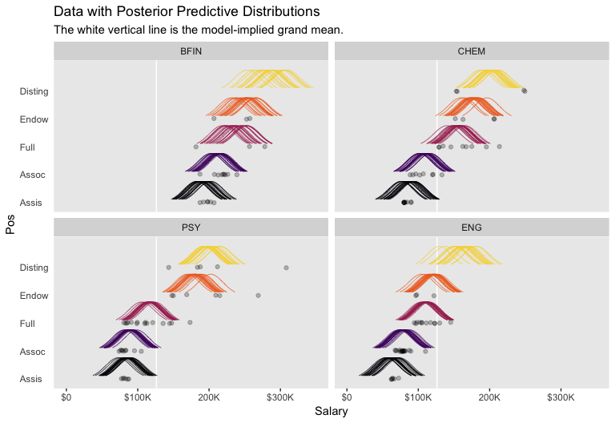

The brms package doesn't have a convenience function that returns output quite like what Kruschke displayed in his Table 20.2. But we can get close. Due to space constraints, I won't show the output, here, but the `posterior_summary()` will return posterior means, *S**D*s, and percentile-based 95% intervals for all model parameters.

``` r
posterior_summary(fit1)
```

I'm not aware of a simple way to extract the effective samples for all parameters within a brms fit object. There is no `effsamples()` function. However, we do have `neff_ratio()`, which returns a named vector of the ratios. For space constraints, here we look at the first ten values.

``` r
neff_ratio(fit1)[1:10]
```

    ##           b_Intercept     sd_Org__Intercept     sd_Pos__Intercept 
    ##             0.4175883             0.2579337             0.4780342 
    ## sd_Pos:Org__Intercept                 sigma r_Org[ACTG,Intercept] 
    ##             0.3140237             0.8754821             0.3452653 
    ## r_Org[AFRO,Intercept] r_Org[AMST,Intercept] r_Org[ANTH,Intercept] 
    ##             0.5259244             0.5291086             0.3124535 
    ## r_Org[APHS,Intercept] 
    ##             0.3494390

The `brms::neff_ratio()` function returns ratios of the effective samples over the total number of post-warmup iterations. So if we know the `neff_ratio()` values and the number of post-warmup iterations, the 'Eff.Sample' values are just a little algebra away. A quick solution is to look at the 'total post-warmup samples' line at the top of our `print()` output. Another way is to extract that information from our `brm()` fit object. I’m not aware of a way to do that directly, but we can extract the iter value (i.e., `fit1$fit@sim$iter`), the warmup value (i.e., `fit1$fit@sim$warmup`), and the number of chains (i.e., `fit1$fit@sim$chains`). With those values in hand, simple algebra will return the `total post-warmup samples` value. E.g.,

``` r
(n_iter <- (fit1$fit@sim$iter - fit1$fit@sim$warmup) * fit1$fit@sim$chains)
```

    ## [1] 8000

And now we have `n_iter`, we can calculate the 'Eff.Sample' values.

``` r
neff_ratio(fit1) %>% 
  as.data.frame() %>% 
  rownames_to_column() %>% 
  rename(key  = rowname,
         neff_ratio = ".") %>% 
  mutate(eff_sample = (neff_ratio * n_iter) %>% round(digits = 0)) %>% 
  select(-neff_ratio) %>% 
  arrange(key) %>% 
  head()
```

    ##                     key eff_sample
    ## 1           b_Intercept       3341
    ## 2                  lp__       1799
    ## 3 r_Org[ACTG,Intercept]       2762
    ## 4 r_Org[AFRO,Intercept]       4207
    ## 5 r_Org[AMST,Intercept]       4233
    ## 6 r_Org[ANTH,Intercept]       2500

If we're careful, we can use `left_join()` to bind together the posterior summaries and their effective samples like this.

``` r
post <- posterior_samples(fit1)

# extract the means and medians
post %>% 
  gather() %>% 
  arrange(key) %>% 
  group_by(key) %>% 
  summarise(Mean   = mean(value),
            Median = median(value)) %>% 
  # join to them the mode and HDIs
  left_join(
    post %>% 
      gather() %>% 
      group_by(key) %>% 
      mode_hdi(value) %>% 
      select(key:.upper) %>% 
      rename(Mode     = value,
             HDI_low  = .lower,
             HDI_high = .upper),
    by = "key"
    ) %>% 
  # now finally join the effective samples
  left_join(
    neff_ratio(fit1) %>% 
      as.data.frame() %>% 
      rownames_to_column() %>% 
      rename(key        = rowname,
             neff_ratio = ".") %>% 
      mutate(eff_sample = (neff_ratio * n_iter)) %>% 
      select(-neff_ratio) %>% 
      arrange(key),
    by = "key"
    ) %>% 
  # here we just reformat a bit
  mutate_if(is.double, round, digits = 0) %>% 
  rename(Parameter = key) %>% 
  
  head(n = 10)
```

    ## # A tibble: 10 x 7
    ##    Parameter              Mean  Median    Mode HDI_low HDI_high eff_sample
    ##    <chr>                 <dbl>   <dbl>   <dbl>   <dbl>    <dbl>      <dbl>
    ##  1 b_Intercept          126256  126790  127983   68383   179760       3341
    ##  2 lp__                 -12530  -12529  -12528  -12563   -12498       1799
    ##  3 r_Org[ACTG,Interce…   80255   80375   81556   65313    94857       2762
    ##  4 r_Org[AFRO,Interce…  -14881  -14899  -14384  -34416     4442       4207
    ##  5 r_Org[AMST,Interce…  -16510  -16410  -15106  -37139     2364       4233
    ##  6 r_Org[ANTH,Interce…  -18934  -18831  -17860  -33410    -3506       2500
    ##  7 r_Org[APHS,Interce…    2679    2834    3435  -13173    18070       2796
    ##  8 r_Org[AST,Intercep…     -15    -122    -259  -17091    18328       3591
    ##  9 r_Org[BEPP,Interce…   47848   47723   46539   30509    65360       3251
    ## 10 r_Org[BFIN,Interce…  106924  106987  107801   92028   121476       3071

Our code returned the summaries for all model parameters, including the log posterior (i.e., `lp__`). Since that's just way too much output to display, here, we just looked at the first 10. If you wanted to subset the parameters, you could just `filter()` by the `Parameter` column. And if this kind of a table was really important, to you, you might even use the code above as inspiration for a custom function.

As Kruschke then pointed out, "individual salaries vary tremendously around the predicted cell mean" (p. 594), which you can quantify using *σ*<sub>*y*</sub>. Here it is using `posterior_summary()`.

``` r
posterior_summary(fit1)["sigma", ]
```

    ##   Estimate  Est.Error       Q2.5      Q97.5 
    ## 17975.9712   436.8002 17152.7849 18853.6636

And we can get a better sense of the distribution with a plot.

``` r
post %>%
  ggplot(aes(x = sigma, y = 0)) +
  geom_halfeyeh(point_interval = mode_hdi, .width = c(.5, .95)) +
  scale_y_continuous(NULL, breaks = NULL) +
  xlab(expression(sigma[y])) +
  theme(panel.grid = element_blank())
```


As Kruschke pointed out, this parameter is held constant across all subgroups. That is, the subgroups are homogeneous with respect to their variances. Later on, we'll relax this constraint.

### Main effect contrasts

Comparisons that "involve levels of a single factor and collapse across the other factor(s), are called main effect comparisons or contrasts" (p. 595).

Here's the first contrast.

``` r
# define the new data
nd <- 
  tibble(Pos = c("Assis", "Assoc"),
         Org = "mu")

# use the new data with `fitted()`
contrast <-
  fitted(fit1,
       newdata = nd,
       summary = F,
       allow_new_levels = T) %>% 
  as_tibble() %>% 
  set_names("Assis", "Assoc") %>% 
  mutate(`Assoc vs Assis` = Assoc - Assis)

# plot
contrast %>% 
  ggplot(aes(x = `Assoc vs Assis`)) +
  geom_histogram(color = "grey92", fill = "grey67",
                 size = .2, bins = 40) +
  stat_pointintervalh(aes(y = 0),
                      point_interval = mode_hdi, .width = c(.95, .5)) +
  scale_y_continuous(NULL, breaks = NULL) +
  labs(title = "Assoc vs Assis",
       x     = "Difference") +
  theme(panel.grid = element_blank())
```


In case you were curious, here are the summary statistics.

``` r
contrast %>% 
  mode_hdi(`Assoc vs Assis`) %>% 
  select(`Assoc vs Assis`:.upper) %>% 
  mutate_if(is.double, round, digits = 0)
```

    ## # A tibble: 1 x 3
    ##   `Assoc vs Assis` .lower .upper
    ##              <dbl>  <dbl>  <dbl>
    ## 1            13291   8397  18213

Here are the next two contrasts.

``` r
nd <- 
  tibble(Org = c("BFIN", "CHEM", "ENG", "PSY"),
         Pos = "mu")

contrasts <-
  fitted(fit1,
       newdata = nd,
       summary = F,
       allow_new_levels = T) %>% 
  as_tibble() %>% 
  set_names("BFIN", "CHEM", "ENG", "PSY") %>% 
  transmute(`CHEM vs PSY`     = CHEM - PSY,
            `BFIN vs other 3` = BFIN - (CHEM + ENG + PSY) / 3)

# plot
contrasts %>% 
  gather() %>% 
  
  ggplot(aes(x = value)) +
  geom_histogram(color = "grey92", fill = "grey67",
                 size = .2, bins = 40) +
  stat_pointintervalh(aes(y = 0),
                      point_interval = mode_hdi, .width = c(.95, .5)) +
  scale_y_continuous(NULL, breaks = NULL) +
  labs(x     = "Difference") +
  theme(panel.grid = element_blank()) +
  facet_wrap(~key, scales = "free")
```

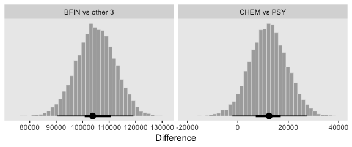

And here are their numeric summaries.

``` r
contrasts %>% 
  gather(contrast, mode) %>% 
  group_by(contrast) %>% 

  mode_hdi(mode) %>% 
  select(contrast:.upper) %>% 
  mutate_if(is.double, round, digits = 0)
```

    ## # A tibble: 2 x 4
    ##   contrast          mode .lower .upper
    ##   <chr>            <dbl>  <dbl>  <dbl>
    ## 1 BFIN vs other 3 103790  90498 119161
    ## 2 CHEM vs PSY      12410  -2189  27319

**Side note:** For further discussion on marginal contrasts in brms, see [this discussion](https://github.com/paul-buerkner/brms/issues/552) on the brms GitHub issues section and [this discussion](https://discourse.mc-stan.org/t/how-do-i-get-marginal-effects-for-categorical-variables-to-condition-on-an-average-rather-than-a-category/5323) in the Stan user forums.

### Interaction contrasts and simple effects

If we'd like to make the simple effects and interaction contrasts like Kruschke displayed in Figure 20.5 within our tidyverse/brms paradigm, it'll be simplest to just redefine our `nd` data and use `fitted()`, again.

``` r
# define our new data
nd <-
  tibble(Pos = c("Assis", "Full")) %>% 
  expand(Pos, Org = c("CHEM", "PSY")) 

# we need to update our col_names
brief_col_names <-
  tibble(Pos = c("Assis", "Full")) %>% 
  expand(Pos, Org = c("CHEM", "PSY")) %>% 
  unite(key, Pos, Org) %>% 
  pull()

# get the draws with `fitted()`
f1 <-
  fitted(fit1, 
         newdata = nd,
         summary = F) %>% 
  # wrangle
  as_tibble() %>% 
  set_names(brief_col_names) %>% 
  mutate(`Full - Assis @ PSY`  = Full_PSY - Assis_PSY,
         `Full - Assis @ CHEM` = Full_CHEM - Assis_CHEM) %>% 
  mutate(`Full.v.Assis (x) CHEM.v.PSY` = `Full - Assis @ CHEM` - `Full - Assis @ PSY`)

# what have we done?
head(f1)
```

    ## # A tibble: 6 x 7
    ##   Assis_CHEM Assis_PSY Full_CHEM Full_PSY `Full - Assis @ PSY`
    ##        <dbl>     <dbl>     <dbl>    <dbl>                <dbl>
    ## 1     85196.    87625.   156697.  113805.               26180.
    ## 2     90696.    84075.   156326.  118037.               33963.
    ## 3     89715.    80157.   156637.  118550.               38393.
    ## 4     84612.    90458.   164782.  115114.               24656.
    ## 5     94628.    82272.   161350.  112559.               30287.
    ## 6     84340.    86217.   147959.  118240.               32024.
    ## # ... with 2 more variables: `Full - Assis @ CHEM` <dbl>, `Full.v.Assis
    ## #   (x) CHEM.v.PSY` <dbl>

It’ll take just a tiny bit more wrangling before we’re ready to plot.

``` r
text <-
  tibble(key = "Full - Assis @ PSY",
         value = 14000,
         y     = 1090,
         label = "ROPE") %>% 
  mutate(key = factor(key, levels = c("Full - Assis @ PSY", "Full - Assis @ CHEM", "Full.v.Assis (x) CHEM.v.PSY")))

f1 %>% 
  select(-contains("_")) %>% 
  gather() %>% 
  mutate(key = factor(key, levels = c("Full - Assis @ PSY", "Full - Assis @ CHEM", "Full.v.Assis (x) CHEM.v.PSY"))) %>% 
  
  ggplot(aes(x = value)) +
  # We usually omit it, but for kicks and giggles we'll throw in the ROPE
  geom_rect(aes(xmin = -1e3, xmax = 1e3,
                ymin = -Inf, ymax = Inf),
            color = "transparent", fill = "white") +
  geom_histogram(color = "grey92", fill = "grey67",
                 size = .2, bins = 40) +
  stat_pointintervalh(aes(y = 0),
                      point_interval = mode_hdi, .width = c(.95, .5)) +
  geom_text(data = text,
            aes(y = y, label = label),
            color = "white", size = 5) +
  scale_y_continuous(NULL, breaks = NULL) +
  labs(x     = "Difference") +
  theme(panel.grid = element_blank()) +
  facet_wrap(~key, scales = "free_y")
```

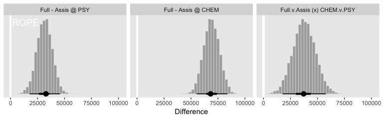

If it was really important that the labels in the x-axes were different, like they are in Kruschke's Figure 20.5, you could always make the three plots separately and then bind them together with `gridExtra::grid.arrange()`.

Though he didn’t show the results, Kruschke mentioned a few other contrasts we might do at the top of page 598. The example entailed comparing the differences within `BFIN` to the average of the other three. Let’s walk it out.

``` r
# define our new data
nd <-
  tibble(Pos = c("Assis", "Full")) %>% 
  expand(Pos, Org = c("BFIN", "CHEM", "ENG", "PSY"))

# we need to update our col_names
brief_col_names <-
  tibble(Pos = c("Assis", "Full")) %>% 
  expand(Pos, Org = c("BFIN", "CHEM", "ENG", "PSY")) %>% 
  unite(key, Pos, Org) %>% 
  pull()

# get the draws with `fitted()`
f2 <-
  fitted(fit1, 
         newdata = nd,
         summary = F) %>% 
  # wrangle
  as_tibble() %>% 
  set_names(brief_col_names) %>% 
  mutate(`Full - Assis @ BFIN` = Full_BFIN - Assis_BFIN,
         `Full - Assis @ CHEM` = Full_CHEM - Assis_CHEM,
         `Full - Assis @ ENG`  = Full_ENG - Assis_ENG,
         `Full - Assis @ PSY`  = Full_PSY - Assis_PSY) %>% 
  mutate(`Full.v.Assis (x) BFIN.v.the rest` = `Full - Assis @ BFIN` - (`Full - Assis @ CHEM` + `Full - Assis @ ENG` + `Full - Assis @ PSY`) / 3)

# what have we done?
glimpse(f2)
```

    ## Observations: 8,000
    ## Variables: 13
    ## $ Assis_BFIN                         <dbl> 204013.3, 194167.9, 190908....
    ## $ Assis_CHEM                         <dbl> 85196.23, 90695.72, 89715.3...
    ## $ Assis_ENG                          <dbl> 61319.08, 66098.68, 61094.5...
    ## $ Assis_PSY                          <dbl> 87625.17, 84074.65, 80157.1...
    ## $ Full_BFIN                          <dbl> 234638.3, 243410.2, 239923....
    ## $ Full_CHEM                          <dbl> 156697.5, 156325.8, 156637....
    ## $ Full_ENG                           <dbl> 110973.1, 106921.4, 107845....
    ## $ Full_PSY                           <dbl> 113804.9, 118037.4, 118549....
    ## $ `Full - Assis @ BFIN`              <dbl> 30625.00, 49242.23, 49015.1...
    ## $ `Full - Assis @ CHEM`              <dbl> 71501.25, 65630.09, 66921.8...
    ## $ `Full - Assis @ ENG`               <dbl> 49654.02, 40822.74, 46751.2...
    ## $ `Full - Assis @ PSY`               <dbl> 26179.68, 33962.77, 38392.8...
    ## $ `Full.v.Assis (x) BFIN.v.the rest` <dbl> -18486.6456, 2437.0316, -16...

Now plot.

``` r
f2 %>% 
  select(-contains("_")) %>% 
  gather() %>% 
  
  ggplot(aes(x = value)) +
  geom_rect(aes(xmin = -1e3, xmax = 1e3,
                ymin = -Inf, ymax = Inf),
            color = "transparent", fill = "white") +
  geom_histogram(color = "grey92", fill = "grey67",
                 size = .2, bins = 40) +
  stat_pointintervalh(aes(y = 0),
                      point_interval = mode_hdi, .width = c(.95, .5)) +
  scale_y_continuous(NULL, breaks = NULL) +
  labs(x     = "Difference") +
  theme(panel.grid = element_blank()) +
  facet_wrap(~key, scales = "free_y", ncol = 2)
```

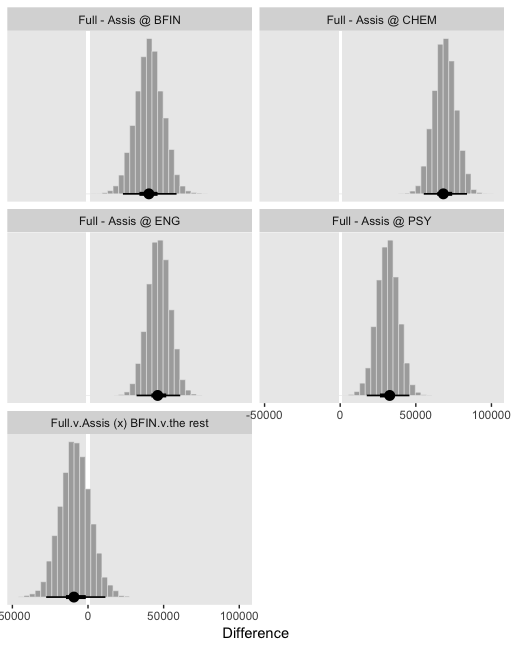

So while the overall pay averages for those in `BFIN` were larger than those in the other three departments, the differences between full and associate professors within `BFIN` wasn’t substantially different from the differences within the other three departments. To be sure, the interquartile range of that last difference distribution fell below both zero and the ROPE, but there’s still a lot of spread in the rest of the distribution.

#### Interaction effects: High uncertainty and shrinkage

If we start with our `fitted()` object `f`, we wrangle a bit, compute the HDIs with `tidybayes::mode_hdi()` and then use simple subtraction to compute the interval range for each difference.

``` r
f1 %>% 
  select(-contains("_")) %>% 
  gather() %>% 
  mutate(key = factor(key, levels = c("Full - Assis @ PSY", "Full - Assis @ CHEM", "Full.v.Assis (x) CHEM.v.PSY"))) %>% 
  group_by(key) %>% 
  mode_hdi(value) %>% 
  select(key:.upper) %>% 
  mutate(`interval range` = .upper - .lower)
```

    ## # A tibble: 3 x 5
    ##   key                          value .lower .upper `interval range`
    ##   <fct>                        <dbl>  <dbl>  <dbl>            <dbl>
    ## 1 Full - Assis @ PSY          32732. 17575. 45755.           28181.
    ## 2 Full - Assis @ CHEM         68192. 55265. 83841.           28577.
    ## 3 Full.v.Assis (x) CHEM.v.PSY 37203. 17582. 57824.           40242.

Just like Kruschke pointed out in the text, the interval for the interaction estimate was quite larger than the intervals for the simple contrasts.

> This large uncertainty of an interaction contrast is caused by the fact that it involves at least four sources of uncertainty (i.e., at least four groups of data), unlike its component simple effects which each involve only half of those sources of uncertainty. In general, interaction contrasts require a lot of data to estimate accurately. (p. 598)

Gelman has blogged on this, a bit (e.g., [*You need 16 times the sample size to estimate an interaction than to estimate a main effect*](https://andrewgelman.com/2018/03/15/need-16-times-sample-size-estimate-interaction-estimate-main-effect/)).

There is also shrinkage.

> The interaction contrasts also can experience notable shrinkage from the hierarchical model. In the present application, for example, there are 300 interaction deflections (5 levels of seniority times 60 departments) that are assumed to come from a higher- level distribution that has an estimated standard deviation, denoted *σ*<sub>*β*1 × 2</sub> in Figure 20.2. Chances are that most of the 300 interaction deflections will be small, and therefore the estimated standard deviation of the interaction deflections will be small, and therefore the estimated deflections themselves will be shrunken toward zero. This shrinkage is inherently neither good nor bad; it is simply the correct consequence of the model assumptions. The shrinkage can be good insofar as it mitigates false alarms about interactions, but the shrinkage can be bad if it inappropriately obscures meaningful interactions.

Here's that *σ*<sub>*β*1 × 2</sub>.

``` r
post %>% 
  ggplot(aes(x = `sd_Pos:Org__Intercept`)) +
  geom_histogram(color = "grey92", fill = "grey67",
                 size = .2, bins = 40) +
  stat_pointintervalh(aes(y = 0),
                      point_interval = mode_hdi, .width = c(.95, .5)) +
  scale_y_continuous(NULL, breaks = NULL) +
  theme(panel.grid = element_blank())
```


Rescaling can change interactions, homogeneity, and normality
-------------------------------------------------------------

Here is Kruschke's initial example of a possible interaction effect of sex and political party with respect to wages.

``` r
d <-
  tibble(monetary_units = c(10, 12, 15, 18),
         sex            = rep(c("women", "men"), times = 2),
         politics       = rep(c("democrat", "republican"), each = 2)) %>% 
  mutate(sex_number = ifelse(sex == "women", 1, 2),
         politics   = factor(politics, levels = c("republican", "democrat")))

d %>% 
  ggplot(aes(x = sex_number, y = monetary_units, color = politics)) +
  geom_line(size = 2) +
  scale_color_manual(NULL, values = c("red2", "blue2")) +
  scale_x_continuous("sex", breaks = 1:2, labels = c("women", "men")) +
  coord_cartesian(ylim = 0:20) +
  theme(panel.grid        = element_blank(),
        legend.position   = c(.2, .15),
        legend.background = element_rect(fill  = "transparent"),
        legend.key        = element_rect(fill  = "transparent", 
                                         color = "transparent"))
```

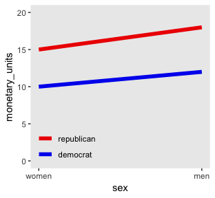

Because the pay discrepancy between men and women is not equal between Democrats and Republicans, in this example, it can be tempting to claim there is a subtle interaction. Not necessarily so.

``` r
tibble(politics      = c("democrat", "republican"),
       female_salary = c(10, 15)) %>% 
  mutate(male_salary = 1.2 * female_salary)
```

    ## # A tibble: 2 x 3
    ##   politics   female_salary male_salary
    ##   <chr>              <dbl>       <dbl>
    ## 1 democrat              10          12
    ## 2 republican            15          18

If we take female salary as the baseline and then add 20% to it for the men, the salary difference between Republican men and women will be larger than that between Democratic men and women. Even though the rate increase from women to men was the same, the increase in absolute value was greater within Republicans because Republican women made more than Democratic women.

Look what happens to our original plot when we transform `monetary_units` with `log10()`.

``` r
d %>% 
  ggplot(aes(x = sex_number, y = log10(monetary_units), color = politics)) +
  geom_line(size = 2) +
  scale_color_manual(NULL, values = c("red2", "blue2")) +
  scale_x_continuous("sex", breaks = 1:2, labels = c("women", "men")) +
  theme(panel.grid        = element_blank(),
        legend.position   = c(.2, .4),
        legend.background = element_rect(fill  = "transparent"),
        legend.key        = element_rect(fill  = "transparent", 
                                         color = "transparent"))
```


"Equal ratios are transformed to equal distances by a logarithmic transformation" (p. 599).

Heterogeneous variances and robustness against outliers
-------------------------------------------------------

Before we fit the robust hierarchical variances model, we need to define our `stanvars`.

``` r
stanvars <- 
  stanvar(mean_y,    name = "mean_y") + 
  stanvar(sd_y,      name = "sd_y") +
  stanvar(s_r$shape, name = "alpha") +
  stanvar(s_r$rate,  name = "beta") +
  stanvar(1/29,      name = "one_over_twentynine")
```

Fit the robust hierarchical variances model.

``` r
fit2 <-
  brm(data = my_data,
      family = student,
      bf(Salary ~ 1 + (1 | Pos) + (1 | Org) + (1 | Pos:Org), 
         sigma  ~ 1 + (1 | Pos:Org)),
      prior = c(prior(normal(mean_y, sd_y * 5), class = Intercept),
                prior(normal(log(sd_y), 1),     class = Intercept, dpar = sigma),
                prior(gamma(alpha, beta), class = sd),
                prior(normal(0, 1),       class = sd, dpar = sigma),
                prior(exponential(one_over_twentynine), class = nu)),
      iter = 4000, warmup = 1000, chains = 4, cores = 4,
      seed = 20,
      control = list(adapt_delta = 0.999,
                     max_treedepth = 15),
      stanvars = stanvars)
```

Behold the summary.

``` r
print(fit2)
```

    ##  Family: student 
    ##   Links: mu = identity; sigma = log; nu = identity 
    ## Formula: Salary ~ 1 + (1 | Pos) + (1 | Org) + (1 | Pos:Org) 
    ##          sigma ~ 1 + (1 | Pos:Org)
    ##    Data: my_data (Number of observations: 1080) 
    ## Samples: 4 chains, each with iter = 4000; warmup = 1000; thin = 1;
    ##          total post-warmup samples = 12000
    ## 
    ## Group-Level Effects: 
    ## ~Org (Number of levels: 60) 
    ##               Estimate Est.Error l-95% CI u-95% CI Eff.Sample Rhat
    ## sd(Intercept) 31466.52   3054.31 26160.21 38146.24       2344 1.00
    ## 
    ## ~Pos (Number of levels: 5) 
    ##               Estimate Est.Error l-95% CI  u-95% CI Eff.Sample Rhat
    ## sd(Intercept) 50836.56  24065.40 23600.70 113113.67       5346 1.00
    ## 
    ## ~Pos:Org (Number of levels: 216) 
    ##                     Estimate Est.Error l-95% CI u-95% CI Eff.Sample Rhat
    ## sd(Intercept)        5317.27    860.87  3767.01  7127.81       2322 1.00
    ## sd(sigma_Intercept)     0.97      0.07     0.84     1.12       2812 1.00
    ## 
    ## Population-Level Effects: 
    ##                  Estimate Est.Error l-95% CI  u-95% CI Eff.Sample Rhat
    ## Intercept       122701.46  24839.61 71007.76 173700.78       3846 1.00
    ## sigma_Intercept      9.11      0.09     8.94      9.29       2713 1.00
    ## 
    ## Family Specific Parameters: 
    ##    Estimate Est.Error l-95% CI u-95% CI Eff.Sample Rhat
    ## nu     6.90      4.51     3.71    15.50       3868 1.00
    ## 
    ## Samples were drawn using sampling(NUTS). For each parameter, Eff.Sample 
    ## is a crude measure of effective sample size, and Rhat is the potential 
    ## scale reduction factor on split chains (at convergence, Rhat = 1).

This time we'll just feed the results of the wrangling code right into the plotting code for our version of the top panels of Figure 20.8.

``` r
# how many draws would you like?
n_draw <- 20

# wrangle
my_data %>% 
  distinct(Pos) %>% 
  expand(Pos, 
         Org = c("BFIN", "CHEM", "PSY", "ENG")) %>% 
  add_fitted_draws(fit2, n = n_draw, seed = 20,
                   allow_new_levels = T,
                   dpar = c("mu", "sigma", "nu")) %>% 
  mutate(ll      = qt(.025, df = nu),
         ul      = qt(.975, df = nu)) %>% 
  mutate(Salary  = map2(ll, ul, seq, length.out = 100)) %>% 
  mutate(density = map2(Salary, nu, dt)) %>% 
  unnest() %>%
  # notice the conversion
  mutate(Salary = mu + Salary * sigma) %>% 
  group_by(.draw) %>% 
  mutate(density = density / max(density)) %>% 
  mutate(Org = factor(Org, levels = c("BFIN", "CHEM", "PSY", "ENG"))) %>%
  
  # plot
  ggplot(aes(x = Salary, y = Pos)) +
  geom_vline(xintercept = fixef(fit1)[, 1], color = "white") +
  geom_ridgeline(aes(height = density, group = interaction(Pos, .draw),
                     color = Pos),
                 fill = NA, show.legend = F,
                 size = 1/4, scale = 3/4) +
  geom_jitter(data = my_data %>% 
                filter(Org %in% c("BFIN", "CHEM", "PSY", "ENG")) %>% 
                mutate(Org = factor(Org, levels = c("BFIN", "CHEM", "PSY", "ENG"))),
              height = .025, alpha = 1/4) +
  scale_color_viridis_d(option = "B", end = .9) +
  scale_x_continuous(breaks = seq(from = 0, to = 300000, length.out = 4),
                     labels = c("$0", "$100K", "200K", "$300K")) +
  coord_cartesian(xlim = 0:35e4,
                  ylim = c(1.25, 5.5)) +
  labs(title    = "Data with Posterior Predictive Distributions", 
       subtitle = "The white vertical line is the model-implied grand mean.",
       y        = "Pos") +
  theme(panel.grid   = element_blank(),
        axis.ticks.y = element_blank(),
        axis.text.y  = element_text(hjust = 0)) +
  facet_wrap(~Org, ncol = 2)
```


Our results for the bottom panel of Figure 20.8 will differ fundamentally from Kruschke's. Recall that Kurschke modeled *σ*<sub>\[*j*, *k*\](*i*)</sub> with a hierarchical gamma distribution and using the *ω* + *σ* parameterization. We, however, modeled our hierarchical log(sigma) with the typical normal distribution. As such we have a posterior *μ* and *σ* based on that contrasting model.

``` r
# wrangle
posterior_samples(fit2) %>% 
  transmute(Normality              = log10(nu), 
            `Mean of Cell Sigma's` = exp(b_sigma_Intercept), 
            `SD of Cell Sigma's`   = exp(`sd_Pos:Org__sigma_Intercept`)) %>%
  gather() %>% 
  mutate(key = factor(key, levels = c("Normality", "Mean of Cell Sigma's", "SD of Cell Sigma's"))) %>% 
  
  # plot
  ggplot(aes(x = value)) +
  geom_histogram(color = "grey92", fill = "grey67",
                 size = .2, bins = 40) +
  stat_pointintervalh(aes(y = 0),
                      point_interval = mode_hdi, .width = c(.95, .5)) +
  scale_y_continuous(NULL, breaks = NULL) +
  xlab("param. value") +
  theme(panel.grid = element_blank()) +
  facet_wrap(~key, scales = "free", ncol = 3)
```

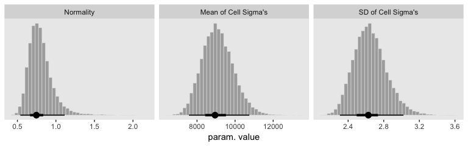

Though our *σ*<sub>*μ*</sub> is on a similar metric to Kruschke's *σ*<sub>*ω*</sub>, our *σ*<sub>*σ*</sub> is just fundamentally different from his. So it goes. If you think I'm in error, here, [share your insights](https://github.com/ASKurz/Doing-Bayesian-Data-Analysis-in-brms-and-the-tidyverse/issues). Even though our hierarchical *σ* parameters look different from Kruschke's, it turns the contrast distributions are quite similar. Here's the necessary wrangling to make our version for Figure 20.9.

``` r
# define our new data
nd <-
  tibble(Pos = c("Assis", "Full")) %>% 
  expand(Pos, Org = c("CHEM", "PSY"))

# we need to update our col_names
brief_col_names <-
  tibble(Pos = c("Assis", "Full")) %>% 
  expand(Pos, Org = c("CHEM", "PSY")) %>% 
  unite(key, Pos, Org) %>% 
  pull()

# get the draws with `fitted()`
f <-
  fitted(fit2, 
         newdata = nd,
         summary = F) %>% 
  # wrangle
  as_tibble() %>% 
  set_names(brief_col_names) %>% 
  transmute(`Full - Assis @ CHEM` = Full_CHEM - Assis_CHEM,
            `Full - Assis @ PSY`  = Full_PSY - Assis_PSY) %>% 
  mutate(`Full.v.Assis (x) CHEM.v.PSY` = `Full - Assis @ CHEM` - `Full - Assis @ PSY`) %>% 
  gather() %>% 
  mutate(key = factor(key, levels = c("Full - Assis @ PSY", "Full - Assis @ CHEM", "Full.v.Assis (x) CHEM.v.PSY")))

# what have we done?
head(f)
```

    ## # A tibble: 6 x 2
    ##   key                  value
    ##   <fct>                <dbl>
    ## 1 Full - Assis @ CHEM 59460.
    ## 2 Full - Assis @ CHEM 46243.
    ## 3 Full - Assis @ CHEM 50686.
    ## 4 Full - Assis @ CHEM 54466.
    ## 5 Full - Assis @ CHEM 57994.
    ## 6 Full - Assis @ CHEM 60796.

Now plot.

``` r
f %>% 
  ggplot(aes(x = value)) +
  geom_rect(aes(xmin = -1e3, xmax = 1e3,
                ymin = -Inf, ymax = Inf),
            color = "transparent", fill = "white") +
  geom_histogram(color = "grey92", fill = "grey67",
                 size = .2, bins = 40) +
  stat_pointintervalh(aes(y = 0),
                      point_interval = mode_hdi, .width = c(.95, .5)) +
  scale_y_continuous(NULL, breaks = NULL) +
  labs(x     = "Difference") +
  theme(panel.grid = element_blank()) +
  facet_wrap(~key, scales = "free", ncol = 3)
```

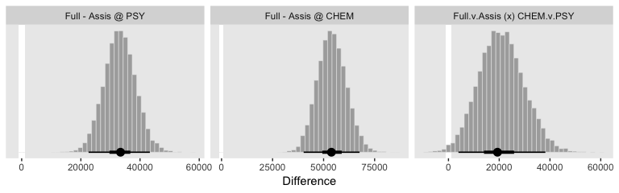

See? Our contrast distributions are really similar those in the text. Here are the numeric estimates.

``` r
f %>% 
  group_by(key) %>% 
  mode_hdi(value) %>% 
  select(key:.upper) %>% 
  mutate_if(is.double, round, digits = 0)
```

    ## # A tibble: 3 x 4
    ##   key                         value .lower .upper
    ##   <fct>                       <dbl>  <dbl>  <dbl>
    ## 1 Full - Assis @ PSY          33406  22609  43311
    ## 2 Full - Assis @ CHEM         53823  40233  67625
    ## 3 Full.v.Assis (x) CHEM.v.PSY 19311   3937  38185

In the second half of the middle paragraph on page 605, Kruschke contrasted the *σ*<sub>*β*1 × 2</sub> parameter in the two models (i.e., our `fit1` and `fit2`). Recall that in the brms output, these are termed `sd_Pos:Org__Intercept`. Here are the comparisons from our brms models.

``` r
posterior_summary(fit1)["sd_Pos:Org__Intercept", ]
```

    ##  Estimate Est.Error      Q2.5     Q97.5 
    ##  9697.154  1203.427  7393.966 12147.087

``` r
posterior_summary(fit2)["sd_Pos:Org__Intercept", ]
```

    ##  Estimate Est.Error      Q2.5     Q97.5 
    ## 5317.2713  860.8749 3767.0066 7127.8138

Similar to the values in the text. And recall, of course, the `brms::posterior_summary()` function returns posterior means. If you really wanted the posterior modes, like Kruschke reported in the text, you'll have to work a little harder.

``` r
posterior_samples(fit1) %>% 
  transmute(value = `sd_Pos:Org__Intercept`) %>% 
  mutate(key = "fit1") %>% 
  bind_rows(
    posterior_samples(fit2) %>% 
      transmute(value = `sd_Pos:Org__Intercept`) %>% 
      mutate(key = "fit2")
  ) %>% 
  group_by(key) %>% 
  mode_hdi(value) %>% 
  select(key:.upper) %>% 
  mutate_if(is.double, round, digits = 0)
```

    ## # A tibble: 2 x 4
    ##   key   value .lower .upper
    ##   <chr> <dbl>  <dbl>  <dbl>
    ## 1 fit1   9689   7394  12147
    ## 2 fit2   5081   3645   6999

"Which model is a better description of the data?... In principle, an intrepid programmer could do a Bayesian model comparison..." (pp. 605--606). We could also examine iformation criteria, like the WAIC

``` r
l <- loo(fit1, fit2)
```

    ## Warning: Found 5 observations with a pareto_k > 0.7 in model 'fit1'. It is
    ## recommended to set 'reloo = TRUE' in order to calculate the ELPD without
    ## the assumption that these observations are negligible. This will refit
    ## the model 5 times to compute the ELPDs for the problematic observations
    ## directly.

    ## Warning: Found 58 observations with a pareto_k > 0.7 in model 'fit2'.
    ## With this many problematic observations, it may be more appropriate to use
    ## 'kfold' with argument 'K = 10' to perform 10-fold cross-validation rather
    ## than LOO.

Sigh. Both models had high pareto\_k values, suggesting there were outliers relative to what was expected by their likelihoods. Just a little further in the text, Kruschke gives us hints why this might be so:

> Moreover, both models assume that the data within cells are distributed symmetrically above and below their central tendency, either as a normal distribution or a *t*-distribution. The data instead seem to be skewed toward larger values, especially for advanced seniorities. (p. 606)

Here's the current LOO difference

``` r
print(l)
```

    ##                LOOIC    SE
    ## fit1        24388.35 85.71
    ## fit2        23541.33 83.46
    ## fit1 - fit2   847.02 68.41

For a more robust model comparison, we might follow the `kfold()` suggestion in the warning. However, be warned; The `kfold()` function entails refitting the model `K` times. Both these models took some time to fit, particularly `fit2`.

But really, "we might want to create a model that describes the data within each cell as a skewed distribution such as a Weibull" (p. 606). Yes, brms can handle Weibull regression (e.g., [here](https://discourse.mc-stan.org/t/fitting-time-to-event-data-with-weibull-hazard-using-brm-function/4638)).

Within-subject designs
----------------------

> When every subject contributes many measurements to every cell, then the model of the situation is a straight-forward extension of the models we have already considered. We merely add "subject" as another nominal predictor in the model, with each individual subject being a level of the predictor. If there is one predictor other than subject, the model becomes
>
> $$
> y = \\beta\_0 + \\overrightarrow \\beta\_1 \\overrightarrow x\_1 + \\overrightarrow \\beta\_S \\overrightarrow x\_S + \\overrightarrow \\beta\_{1 \\times S} \\overrightarrow x\_{1 \\times S} 
> $$
>
> This is exactly the two-predictor model we have already considered, with the second predictor being subject. When there are two predictors other than subject, the model becomes
>
> $$
> \\begin{eqnarray}
> y & = & \\beta\_0 \\\\
> && + \\overrightarrow \\beta\_1 \\overrightarrow x\_1 + \\overrightarrow \\beta\_2 \\overrightarrow x\_2 + \\overrightarrow \\beta\_S \\overrightarrow x\_S \\\\
> && + \\overrightarrow \\beta\_{1 \\times 2} \\overrightarrow x\_{1 \\times 2} + \\overrightarrow \\beta\_{1 \\times S} \\overrightarrow x\_{1 \\times S} + \\overrightarrow \\beta\_{2 \\times S} \\overrightarrow x\_{2 \\times S} \\\\
> && + \\overrightarrow \\beta\_{1 \\times 2 \\times S} \\overrightarrow x\_{1 \\times 2 \\times S} 
> \\end{eqnarray}
> $$
>
> This model includes all the two-way interactions of the factors, plus the three-way interaction. (p. 607)

In situations in which subjects only contribute one observation per condition/cell, we simplify the model to

$$
\\begin{eqnarray}
y & = & \\beta\_0 \\\\
&& + \\overrightarrow \\beta\_1 \\overrightarrow x\_1 + \\overrightarrow \\beta\_2 \\overrightarrow x\_2 + \\overrightarrow \\beta\_{1 \\times 2} \\overrightarrow x\_{1 \\times 2} \\\\
&& + \\overrightarrow \\beta\_S \\overrightarrow x\_S
\\end{eqnarray}
$$

"In other words, we assume a main effect of subject, but no interaction of subject with other predictors. In this model, the subject effect (deflection) is constant across treatments, and the treatment effects (deflections) are constant across subjects" (p. 608).

### Why use a within-subject design? And why not?

Kruschke opined "the primary reason to use a within-subject design is that you can achieve greater precision in the estimates of the effects than in a between-subject design" (p. 608). Well, to that I counterpoint: "No one goes to the circus to see the average dog jump through the hoop significantly oftener than untrained does raised under the same circumstances" ([Skinner, 1956](https://pdfs.semanticscholar.org/a113/55f49947e4c77659ec9fa5c6b69bd7798194.pdf), p. 228). And it’s unlikely you’ll make a skillful jumper of your dog without repeated trials. But I digress.

Here's the 4-subject response time data.

``` r
(
  d <-
  tibble(response_time = c(300, 320, 350, 370, 400, 420, 450, 470),
         subject = rep(1:4, each = 2),
         hand = rep(c("dominant", "nondominant"), times = 4))
  )
```

    ## # A tibble: 8 x 3
    ##   response_time subject hand       
    ##           <dbl>   <int> <chr>      
    ## 1           300       1 dominant   
    ## 2           320       1 nondominant
    ## 3           350       2 dominant   
    ## 4           370       2 nondominant
    ## 5           400       3 dominant   
    ## 6           420       3 nondominant
    ## 7           450       4 dominant   
    ## 8           470       4 nondominant

"For every subject, the difference between dominant and nondominant hands is exactly 20 ms, but there are big differences across subjects in overall response times" (p. 608). Here's what that looks like.

``` r
d %>% 
  mutate(subject = factor(subject)) %>% 
  
  ggplot(aes(x = response_time, y = subject)) +
  geom_line(aes(group = subject), linetype = 3) +
  geom_point(aes(color = hand), size = 2) +
  scale_color_viridis_d(option = "A", begin = 1/3, end = 2/3) +
  theme(panel.grid = element_blank())
```


Here there is more variability between subjects than within them, which you'd never detect without a within-subject design.

### Split-plot design

"Split-plot experiments were invented by [Fisher (1925)](http://psycnet.apa.org/record/1925-15003-000)" (p. 610).

Here's a quick visual of what a split plot design might look like if you had 4 farmers and randomly split their plots of land into 9 subplots, each with a different fertilizer.

``` r
set.seed(20)
tibble(farmer = str_c("farmer ", 1:4)) %>%
  expand(farmer, x = 0:2, y = 0:2) %>% 
  group_by(farmer) %>% 
  mutate(fertalizer = sample(letters[1:9], replace = F)) %>% 
  
  ggplot(aes(x = x, y = y)) +
  geom_tile(aes(fill = fertalizer), show.legend = F) +
  geom_text(aes(label = fertalizer)) +
  scale_fill_viridis_d(option = "C", begin = .15) +
  scale_x_continuous(NULL, breaks = NULL, expand = c(0, 0)) +
  scale_y_continuous(NULL, breaks = NULL, expand = c(0, 0)) +
  facet_wrap(~farmer)
```


#### Example: Knee high by the fourth of July

Load the agronomy data.

``` r
my_data <- read_csv("data.R/SplitPlotAgriData.csv")

glimpse(my_data)
```

    ## Observations: 99
    ## Variables: 4
    ## $ Field <int> 1, 1, 1, 2, 2, 2, 3, 3, 3, 4, 4, 4, 5, 5, 5, 6, 6, 6, 7,...
    ## $ Till  <chr> "Chisel", "Chisel", "Chisel", "Chisel", "Chisel", "Chise...
    ## $ Fert  <chr> "Broad", "Deep", "Surface", "Broad", "Deep", "Surface", ...
    ## $ Yield <int> 119, 130, 123, 135, 148, 134, 140, 146, 142, 126, 132, 1...

Keeping with our `geom_tile()` method from above, we might visualize the data like this.

``` r
my_data %>% 
  mutate(Fert = str_c("Fert: ", Fert)) %>% 
  
  ggplot(aes(x = Till, y = Field)) +
  geom_hline(yintercept = c(12.5, 22.5), color = "grey85") +
  geom_tile(aes(fill = Yield)) +
  scale_fill_viridis_c(option = "D", begin = 0) +
  scale_x_discrete(expand = c(0, 0)) +
  scale_y_discrete(expand = c(0, 0)) +
  theme(panel.grid = element_blank()) +
  facet_wrap(~Fert)
```

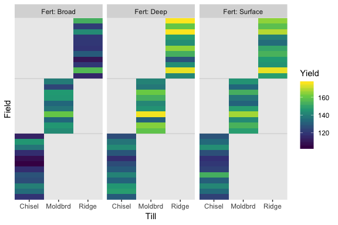

As Kruschke pointed out in the text, notice how each `Field` has only one level of `Till`, but three levels of `Fert`.

#### The descriptive model

> In the classical ANOVA-style model for a split-plot design, the overall variance is conceptually decomposed into five components: the main effect of the between-subjects factor, the main effect of the within-subjects factor, the interaction of the two factors, the effect of subject within levels of the between-subject factor, and the interaction of subject with the within-subject factor. Unfortunately, because there is only a single datum per cell, the five components exactly match the data, which is to say that there are as many parameters as there are data points. (If every subject contributed multiple data points to every cell then the five-component model could be used.) Because there is no residual noise within cells, the classical approach is to treat the final component as noise, that is, treat the interaction of subject with the within-subject factor as noise. That component is not included in the model (at least, not distinct from noise). We will do the same for the descriptive model in our Bayesian analysis. (p. 612)

#### Implementation in ~~JAGS~~ brms

Define the `stanvars`.

``` r
mean_y <- mean(my_data$Yield)
sd_y   <- sd(my_data$Yield)

omega <- sd_y / 2
sigma <- 2 * sd_y

s_r <- gamma_a_b_from_omega_sigma(mode = omega, sd = sigma)

stanvars <- 
  stanvar(mean_y,    name = "mean_y") + 
  stanvar(sd_y,      name = "sd_y") +
  stanvar(s_r$shape, name = "alpha") +
  stanvar(s_r$rate,  name = "beta")
```

Fit the model.

``` r
fit3 <-
  brm(data = my_data,
      family = gaussian,
      Yield ~ 1 + (1 | Till) + (1 | Fert) + (1 | Field) + (1 | Till:Fert),
      prior = c(prior(normal(mean_y, sd_y * 5), class = Intercept),
                prior(gamma(alpha, beta),       class = sd),
                prior(cauchy(0, sd_y),          class = sigma)),
      iter = 4000, warmup = 2000, chains = 4, cores = 4,
      seed = 20,
      control = list(adapt_delta = 0.99,
                     max_treedepth = 12),
      stanvars = stanvars)
```

#### Results

Here's the summary.

``` r
print(fit3)
```

    ##  Family: gaussian 
    ##   Links: mu = identity; sigma = identity 
    ## Formula: Yield ~ 1 + (1 | Till) + (1 | Fert) + (1 | Field) + (1 | Till:Fert) 
    ##    Data: my_data (Number of observations: 99) 
    ## Samples: 4 chains, each with iter = 4000; warmup = 2000; thin = 1;
    ##          total post-warmup samples = 8000
    ## 
    ## Group-Level Effects: 
    ## ~Fert (Number of levels: 3) 
    ##               Estimate Est.Error l-95% CI u-95% CI Eff.Sample Rhat
    ## sd(Intercept)    15.36     13.52     1.35    51.01       2962 1.00
    ## 
    ## ~Field (Number of levels: 33) 
    ##               Estimate Est.Error l-95% CI u-95% CI Eff.Sample Rhat
    ## sd(Intercept)    11.74      1.72     8.87    15.60       1614 1.00
    ## 
    ## ~Till (Number of levels: 3) 
    ##               Estimate Est.Error l-95% CI u-95% CI Eff.Sample Rhat
    ## sd(Intercept)    15.48     13.84     1.25    53.53       2629 1.00
    ## 
    ## ~Till:Fert (Number of levels: 9) 
    ##               Estimate Est.Error l-95% CI u-95% CI Eff.Sample Rhat
    ## sd(Intercept)     8.79      4.13     3.69    19.67       1961 1.00
    ## 
    ## Population-Level Effects: 
    ##           Estimate Est.Error l-95% CI u-95% CI Eff.Sample Rhat
    ## Intercept   140.44     15.87   107.70   174.18       2439 1.00
    ## 
    ## Family Specific Parameters: 
    ##       Estimate Est.Error l-95% CI u-95% CI Eff.Sample Rhat
    ## sigma     5.69      0.53     4.75     6.83       3494 1.00
    ## 
    ## Samples were drawn using sampling(NUTS). For each parameter, Eff.Sample 
    ## is a crude measure of effective sample size, and Rhat is the potential 
    ## scale reduction factor on split chains (at convergence, Rhat = 1).

We might compare the varaince parameters.

``` r
posterior_samples(fit3) %>% 
  select(sigma, starts_with("sd")) %>% 
  gather() %>% 
    
  ggplot(aes(x = value, y = key)) +
  geom_halfeyeh(point_interval = mode_hdi, .width = c(.5, .95),
                scale = "width", relative_scale = .9) +
  labs(x = NULL,
       y = NULL) +
  coord_cartesian(xlim = 0:60,
                  ylim = c(1.25, 5.5)) +
  theme(panel.grid   = element_blank(),
        axis.text.y  = element_text(hjust = 0),
        axis.ticks.y = element_blank())
```


Now we have the results of `fit3`, we are ready to make our version if Figure 20.10. Note that how within `add_fitted_draws()`, we used the `re_formula` argument to average over the random effects of `Field` (i.e., we left `(1 | Field)` out of the formula). That's our equivalent to when Kruschke wrote "The predictive normal distributions are plotted with means at *β*<sub>0</sub> + *β*<sub>*B*</sub> + *β*<sub>*W*</sub> + *b**e**t**a*<sub>*B* × *W*</sub> (collapsed across *β*<sub>*S*</sub>) and with standard deviation *σ*" (pp. 614-615).

``` r
# wrangle
my_data %>% 
  distinct(Till, Fert) %>% 
  add_fitted_draws(fit3, n = 20,
                   re_formula = Yield ~ 1 + (1 | Till) + (1 | Fert) + (1 | Till:Fert),
                   dpar = c("mu", "sigma")) %>% 
  mutate(ll      = qnorm(.025, mean = mu, sd = sigma),
         ul      = qnorm(.975, mean = mu, sd = sigma)) %>% 
  mutate(Yield   = map2(ll, ul, seq, length.out = 100)) %>% 
  mutate(density = pmap(list(Yield, mu, sigma), dnorm)) %>% 
  unnest() %>% 
  group_by(.draw) %>% 
  mutate(density = density / max(density)) %>% 
  
  # plot
  ggplot(aes(x = Yield, y = Fert)) +
  geom_path(data = my_data,
            aes(group = Field %>% as.factor()),
            size = 1/4) +
  geom_ridgeline(aes(height = -density, group = interaction(Fert, .draw),
                     color = Fert),
                 fill = NA, 
                 size = 1/3, scale = 3/4,
                 min_height = NA) +
  geom_jitter(data = my_data,
              height = .025, alpha = 1/4) +
  scale_color_viridis_d(option = "A", begin = .2, end = .8) +
  scale_x_continuous(breaks = seq(from = 100, to = 180, by = 20)) +
  coord_flip(xlim = 90:190,
             ylim = c(0.5, 2.75)) +
  labs(title = "Data with Posterior Predictive Distribution") +
  theme(panel.grid      = element_blank(),
        axis.ticks.x    = element_blank(),
        legend.position = "none") +
  facet_wrap(~Till)
```

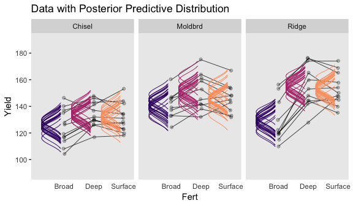

Let's make our Figure 20.11 contrasts.

``` r
col_names <-
  my_data %>% 
  distinct(Till, Fert) %>% 
  unite(key, Till, Fert) %>% 
  pull()

nd <-
  my_data %>% 
  distinct(Till, Fert)

fitted(fit3,
       newdata = nd,
       summary = F,
       re_formula = Yield ~ 1 + (1 | Till) + (1 | Fert) + (1 | Till:Fert)
       ) %>% 
  as_tibble() %>% 
  set_names(col_names) %>% 
  transmute(
    `Moldbrd vs Ridge` = ((Moldbrd_Broad + Moldbrd_Deep + Moldbrd_Surface) / 3) - ((Ridge_Broad + Ridge_Deep + Ridge_Surface) / 3),
            
    `Moldbrd.Ridge vs Chisel` = ((Moldbrd_Broad + Moldbrd_Deep + Moldbrd_Surface + Ridge_Broad + Ridge_Deep + Ridge_Surface) / 6) - ((Chisel_Broad + Chisel_Deep + Chisel_Surface) / 3),
    
    `Deep.Surface vs Broad` = ((Chisel_Deep + Moldbrd_Deep + Ridge_Deep + Chisel_Surface + Moldbrd_Surface + Ridge_Surface) / 6) - ((Chisel_Broad + Moldbrd_Broad + Ridge_Broad) / 3),
    
    `Chisel.Moldbrd.v.Ridge (x) Broad.v.Deep.Surface` = (((Chisel_Broad + Chisel_Deep + Chisel_Surface + Moldbrd_Broad + Moldbrd_Deep + Moldbrd_Surface) / 6) - ((Ridge_Broad + Ridge_Deep + Ridge_Surface) / 3)) - (((Chisel_Broad + Moldbrd_Broad + Ridge_Broad) / 3) - ((Chisel_Deep + Moldbrd_Deep + Ridge_Deep + Chisel_Surface + Moldbrd_Surface + Ridge_Surface) / 6))
    ) %>% 
  gather() %>% 
  mutate(key = factor(key, levels = c("Moldbrd vs Ridge", "Moldbrd.Ridge vs Chisel", "Deep.Surface vs Broad", "Chisel.Moldbrd.v.Ridge (x) Broad.v.Deep.Surface"))) %>% 
  
  ggplot(aes(x = value)) +
  geom_rect(aes(xmin = -5, xmax = 5,
                ymin = -Inf, ymax = Inf),
            color = "transparent", fill = "white") +
  geom_histogram(color = "grey92", fill = "grey67",
                 size = .2, bins = 40) +
  stat_pointintervalh(aes(y = 0),
                      point_interval = mode_hdi, .width = c(.95, .5)) +
  scale_y_continuous(NULL, breaks = NULL) +
  xlab("Difference") +
  theme(panel.grid = element_blank(),
        strip.text = element_text(size = 6)) +
  facet_wrap(~key, scales = "free", ncol = 4)
```

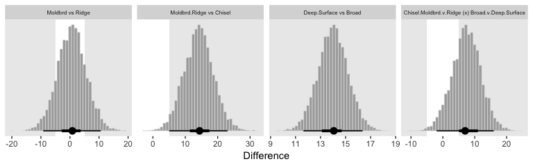

As far as I can tell, it appears that our contrasts indicate our variance parameter for `Till` ended up larger than Kruschke’s.

Krushke then poses a model "with field/subject coding suppressed, hence no lines connecting data from the same field/subject" (p. 616). Here's how to fit that model.

``` r
fit4 <-
  brm(data = my_data,
      family = gaussian,
      Yield ~ 1 + (1 | Till) + (1 | Fert) + (1 | Till:Fert),
      prior = c(prior(normal(mean_y, sd_y * 5), class = Intercept),
                prior(gamma(alpha, beta),       class = sd),
                prior(cauchy(0, sd_y),          class = sigma)),
      iter = 4000, warmup = 2000, chains = 4, cores = 4,
      seed = 20,
      control = list(adapt_delta = 0.999,
                     max_treedepth = 12),
      stanvars = stanvars)
```

Behold the summary.

``` r
print(fit4)
```

    ##  Family: gaussian 
    ##   Links: mu = identity; sigma = identity 
    ## Formula: Yield ~ 1 + (1 | Till) + (1 | Fert) + (1 | Till:Fert) 
    ##    Data: my_data (Number of observations: 99) 
    ## Samples: 4 chains, each with iter = 4000; warmup = 2000; thin = 1;
    ##          total post-warmup samples = 8000
    ## 
    ## Group-Level Effects: 
    ## ~Fert (Number of levels: 3) 
    ##               Estimate Est.Error l-95% CI u-95% CI Eff.Sample Rhat
    ## sd(Intercept)    14.89     12.84     1.35    49.45       3622 1.00
    ## 
    ## ~Till (Number of levels: 3) 
    ##               Estimate Est.Error l-95% CI u-95% CI Eff.Sample Rhat
    ## sd(Intercept)    16.27     13.75     1.77    52.94       3689 1.00
    ## 
    ## ~Till:Fert (Number of levels: 9) 
    ##               Estimate Est.Error l-95% CI u-95% CI Eff.Sample Rhat
    ## sd(Intercept)     7.66      4.56     1.28    18.44       2193 1.00
    ## 
    ## Population-Level Effects: 
    ##           Estimate Est.Error l-95% CI u-95% CI Eff.Sample Rhat
    ## Intercept   140.64     16.03   108.18   174.17       3428 1.00
    ## 
    ## Family Specific Parameters: 
    ##       Estimate Est.Error l-95% CI u-95% CI Eff.Sample Rhat
    ## sigma    12.71      0.96    11.01    14.76       7682 1.00
    ## 
    ## Samples were drawn using sampling(NUTS). For each parameter, Eff.Sample 
    ## is a crude measure of effective sample size, and Rhat is the potential 
    ## scale reduction factor on split chains (at convergence, Rhat = 1).

Look at how much larger the posterior is for *σ*<sub>*y*</sub> in this model compared to `fit3`.

``` r
posterior_summary(fit3)["sigma", ]
```

    ##  Estimate Est.Error      Q2.5     Q97.5 
    ## 5.6934670 0.5314513 4.7521209 6.8286296

``` r
posterior_summary(fit4)["sigma", ]
```

    ##   Estimate  Est.Error       Q2.5      Q97.5 
    ## 12.7086864  0.9606523 11.0091522 14.7612638

Here's the top portion of Figure 20.12.

``` r
# wrangle
my_data %>% 
  distinct(Till, Fert) %>% 
  add_fitted_draws(fit4, n = 20,
                   re_formula = Yield ~ 1 + (1 | Till) + (1 | Fert) + (1 | Till:Fert),
                   dpar = c("mu", "sigma")) %>% 
  mutate(ll      = qnorm(.025, mean = mu, sd = sigma),
         ul      = qnorm(.975, mean = mu, sd = sigma)) %>% 
  mutate(Yield   = map2(ll, ul, seq, length.out = 200)) %>% 
  mutate(density = pmap(list(Yield, mu, sigma), dnorm)) %>% 
  unnest() %>% 
  group_by(.draw) %>% 
  mutate(density = density / max(density)) %>% 
  
  # plot
  ggplot(aes(x = Yield, y = Fert)) +
  geom_ridgeline(aes(height = -density, group = interaction(Fert, .draw),
                     color = Fert),
                 fill = NA, 
                 size = 1/3, scale = 3/4,
                 min_height = NA) +
  geom_jitter(data = my_data,
              height = .025, alpha = 1/4) +
  scale_color_viridis_d(option = "A", begin = .2, end = .8) +
  scale_x_continuous(breaks = seq(from = 100, to = 180, by = 20)) +
  coord_flip(xlim = 90:190,
             ylim = c(0.5, 2.75)) +
  labs(title = "Data with Posterior Predictive Distribution") +
  theme(panel.grid      = element_blank(),
        axis.ticks.x    = element_blank(),
        legend.position = "none") +
  facet_wrap(~Till)
```

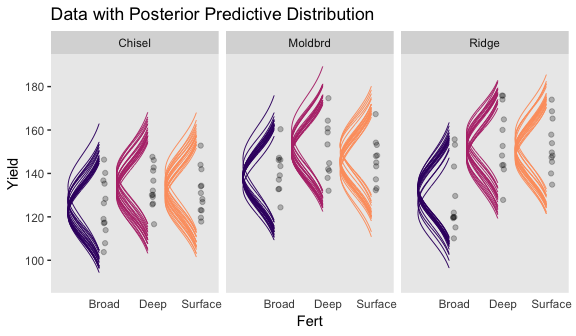

Now the contrast distributions.

``` r
fitted(fit4,
       newdata = nd,
       summary = F,
       re_formula = Yield ~ 1 + (1 | Till) + (1 | Fert) + (1 | Till:Fert)
       ) %>% 
  as_tibble() %>% 
  set_names(col_names) %>% 
  transmute(
    `Moldbrd vs Ridge` = ((Moldbrd_Broad + Moldbrd_Deep + Moldbrd_Surface) / 3) - ((Ridge_Broad + Ridge_Deep + Ridge_Surface) / 3),
            
    `Moldbrd.Ridge vs Chisel` = ((Moldbrd_Broad + Moldbrd_Deep + Moldbrd_Surface + Ridge_Broad + Ridge_Deep + Ridge_Surface) / 6) - ((Chisel_Broad + Chisel_Deep + Chisel_Surface) / 3),
    
    `Deep.Surface vs Broad` = ((Chisel_Deep + Moldbrd_Deep + Ridge_Deep + Chisel_Surface + Moldbrd_Surface + Ridge_Surface) / 6) - ((Chisel_Broad + Moldbrd_Broad + Ridge_Broad) / 3),
    
    `Chisel.Moldbrd.v.Ridge (x) Broad.v.Deep.Surface` = (((Chisel_Broad + Chisel_Deep + Chisel_Surface + Moldbrd_Broad + Moldbrd_Deep + Moldbrd_Surface) / 6) - ((Ridge_Broad + Ridge_Deep + Ridge_Surface) / 3)) - (((Chisel_Broad + Moldbrd_Broad + Ridge_Broad) / 3) - ((Chisel_Deep + Moldbrd_Deep + Ridge_Deep + Chisel_Surface + Moldbrd_Surface + Ridge_Surface) / 6))
    ) %>% 
  gather() %>% 
  mutate(key = factor(key, levels = c("Moldbrd vs Ridge", "Moldbrd.Ridge vs Chisel", "Deep.Surface vs Broad", "Chisel.Moldbrd.v.Ridge (x) Broad.v.Deep.Surface"))) %>% 
  
  ggplot(aes(x = value)) +
  geom_rect(aes(xmin = -5, xmax = 5,
                ymin = -Inf, ymax = Inf),
            color = "transparent", fill = "white") +
  geom_histogram(color = "grey92", fill = "grey67",
                 size = .2, bins = 40) +
  stat_pointintervalh(aes(y = 0),
                      point_interval = mode_hdi, .width = c(.95, .5)) +
  scale_y_continuous(NULL, breaks = NULL) +
  xlab("Difference") +
  theme(panel.grid = element_blank(),
        strip.text = element_text(size = 6)) +
  facet_wrap(~key, scales = "free", ncol = 4)
```

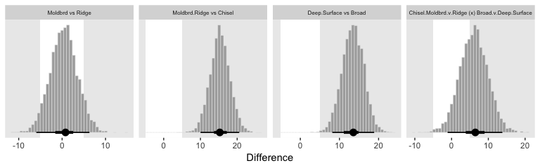

#### Model comparison approach

Like we covered in an earlier chapter, I'm not aware that Stan/brms will allow for *δ* factor-inclusion parameters the way JAGS allows. However, if you'd like to compare models with different parameters, you can always use information criteria.

``` r
loo(fit3, fit4)
```

    ## Warning: Found 3 observations with a pareto_k > 0.7 in model 'fit3'. It is
    ## recommended to set 'reloo = TRUE' in order to calculate the ELPD without
    ## the assumption that these observations are negligible. This will refit
    ## the model 3 times to compute the ELPDs for the problematic observations
    ## directly.

    ##               LOOIC    SE
    ## fit3         670.40 16.31
    ## fit4         792.76 11.40
    ## fit3 - fit4 -122.36 15.83

Let's follow the diagnostic warnings to make sure the model comparison is robust to the outlying values.

``` r
loo(fit3, fit4,
    reloo = T)
```

    ## 3 problematic observation(s) found.
    ## The model will be refit 3 times.

    ## 
    ## Fitting model 1 out of 3 (leaving out observation 15)

    ## Start sampling

    ## 
    ## Fitting model 2 out of 3 (leaving out observation 31)

    ## Start sampling

    ## 
    ## Fitting model 3 out of 3 (leaving out observation 77)

    ## Start sampling

    ## No problematic observations found. Returning the original 'loo' object.

    ##               LOOIC    SE
    ## fit3         670.60 16.36
    ## fit4         792.76 11.40
    ## fit3 - fit4 -122.16 15.86

All good. Based on the LOO values, we should prefer the fuller model. This, of course, should be no surprise. The posterior for *σ*<sub>Field</sub> was a far cry from zero.

``` r
posterior_summary(fit3)["sd_Field__Intercept", ]
```

    ##  Estimate Est.Error      Q2.5     Q97.5 
    ## 11.741891  1.723704  8.868938 15.604229

References
----------

Kruschke, J. K. (2015). *Doing Bayesian data analysis, Second Edition: A tutorial with R, JAGS, and Stan.* Burlington, MA: Academic Press/Elsevier.

Session info
------------

``` r
sessionInfo()
```

    ## R version 3.5.1 (2018-07-02)
    ## Platform: x86_64-apple-darwin15.6.0 (64-bit)
    ## Running under: macOS High Sierra 10.13.6
    ## 
    ## Matrix products: default
    ## BLAS: /Library/Frameworks/R.framework/Versions/3.5/Resources/lib/libRblas.0.dylib
    ## LAPACK: /Library/Frameworks/R.framework/Versions/3.5/Resources/lib/libRlapack.dylib
    ## 
    ## locale:
    ## [1] en_US.UTF-8/en_US.UTF-8/en_US.UTF-8/C/en_US.UTF-8/en_US.UTF-8
    ## 
    ## attached base packages:
    ## [1] stats     graphics  grDevices utils     datasets  methods   base     
    ## 
    ## other attached packages:
    ##  [1] ggridges_0.5.0  tidybayes_1.0.3 brms_2.7.0      Rcpp_1.0.0     
    ##  [5] gridExtra_2.3   bindrcpp_0.2.2  forcats_0.3.0   stringr_1.3.1  
    ##  [9] dplyr_0.7.6     purrr_0.2.5     readr_1.1.1     tidyr_0.8.1    
    ## [13] tibble_1.4.2    ggplot2_3.1.0   tidyverse_1.2.1
    ## 
    ## loaded via a namespace (and not attached):
    ##   [1] colorspace_1.3-2          rsconnect_0.8.8          
    ##   [3] rprojroot_1.3-2           ggstance_0.3             
    ##   [5] markdown_0.8              base64enc_0.1-3          
    ##   [7] rstudioapi_0.7            rstan_2.18.2             
    ##   [9] svUnit_0.7-12             DT_0.4                   
    ##  [11] mvtnorm_1.0-8             lubridate_1.7.4          
    ##  [13] xml2_1.2.0                bridgesampling_0.4-0     
    ##  [15] mnormt_1.5-5              knitr_1.20               
    ##  [17] shinythemes_1.1.1         bayesplot_1.6.0          
    ##  [19] jsonlite_1.5              LaplacesDemon_16.1.1     
    ##  [21] broom_0.4.5               shiny_1.1.0              
    ##  [23] compiler_3.5.1            httr_1.3.1               
    ##  [25] backports_1.1.2           assertthat_0.2.0         
    ##  [27] Matrix_1.2-14             lazyeval_0.2.1           
    ##  [29] cli_1.0.1                 later_0.7.3              
    ##  [31] htmltools_0.3.6           prettyunits_1.0.2        
    ##  [33] tools_3.5.1               igraph_1.2.1             
    ##  [35] coda_0.19-2               gtable_0.2.0             
    ##  [37] glue_1.3.0                reshape2_1.4.3           
    ##  [39] cellranger_1.1.0          nlme_3.1-137             
    ##  [41] crosstalk_1.0.0           psych_1.8.4              
    ##  [43] ps_1.2.1                  rvest_0.3.2              
    ##  [45] mime_0.5                  miniUI_0.1.1.1           
    ##  [47] gtools_3.8.1              MASS_7.3-50              
    ##  [49] zoo_1.8-2                 scales_1.0.0             
    ##  [51] colourpicker_1.0          hms_0.4.2                
    ##  [53] promises_1.0.1            Brobdingnag_1.2-5        
    ##  [55] parallel_3.5.1            inline_0.3.15            
    ##  [57] shinystan_2.5.0           yaml_2.1.19              
    ##  [59] loo_2.0.0                 StanHeaders_2.18.0-1     
    ##  [61] stringi_1.2.3             dygraphs_1.1.1.5         
    ##  [63] pkgbuild_1.0.2            rlang_0.3.0.1            
    ##  [65] pkgconfig_2.0.1           matrixStats_0.54.0       
    ##  [67] HDInterval_0.2.0          evaluate_0.10.1          
    ##  [69] lattice_0.20-35           bindr_0.1.1              
    ##  [71] rstantools_1.5.0          htmlwidgets_1.2          
    ##  [73] labeling_0.3              tidyselect_0.2.4         
    ##  [75] processx_3.2.1            plyr_1.8.4               
    ##  [77] magrittr_1.5              R6_2.3.0                 
    ##  [79] pillar_1.2.3              haven_1.1.2              
    ##  [81] foreign_0.8-70            withr_2.1.2              
    ##  [83] xts_0.10-2                abind_1.4-5              
    ##  [85] modelr_0.1.2              crayon_1.3.4             
    ##  [87] arrayhelpers_1.0-20160527 utf8_1.1.4               
    ##  [89] rmarkdown_1.10            grid_3.5.1               
    ##  [91] readxl_1.1.0              callr_3.1.0              
    ##  [93] threejs_0.3.1             digest_0.6.18            
    ##  [95] xtable_1.8-2              httpuv_1.4.4.2           
    ##  [97] stats4_3.5.1              munsell_0.5.0            
    ##  [99] viridisLite_0.3.0         shinyjs_1.0
