Chapter 21. Dichotomous Predicted Variable
================
A Solomon Kurz
2019-02-05

Dichotomous Predicted Variable
==============================

> This chapter considers data structures that consist of a dichotomous predicted variable. The early chapters of the book were focused on this type of data, but now we reframe the analyses in terms of the generalized linear model...
>
> The traditional treatment of these sorts of data structure is called "logistic regression." In Bayesian software it is easy to generalize the traditional models so they are robust to outliers, allow different variances within levels of a nominal predictor, and have hierarchical structure to share information across levels or factors as appropriate. (pp. 621--622)

21.1. Multiple metric predictors
--------------------------------

"We begin by considering a situation with multiple metric predictors, because this case makes it easiest to visualize the concepts of logistic regression" (p. 623)

Figure 21.1 is beyond the scope of our ggplot2 paradigm.

### 21.1.1 The model and implementation in ~~JAGS~~ brms

Our statistical model will follow the form

$$
\\begin{eqnarray}
\\mu & = & \\text{logistic\] (\\beta\_0 + \\beta\_1 x\_1 + \\beta\_2 x\_2) \\\\
y & \\sim & \\text{Bernoulli} (\\mu)
\\end{eqnarray}
$$

where

$$\\text{logistic} (x) = \\frac{1}{(1 + \\text{exp} (-x))}$$

The generic brms code for logistic regression looks like so.

``` r
fit <-
  brm(data = my_data, family = binomial,
      y ~ 1 + x1 + x2,
      prior = c(prior(normal(0, 4), class = Intercept),
                prior(normal(0, 4), class = b)))
```

Note that this syntax presumes the predictor variables have already been standardized.

### 21.1.2 Example: Height, weight, and gender

Load the height/weight data.

``` r
library(tidyverse)

my_data <- read_csv("data.R/HtWtData110.csv")

glimpse(my_data)
```

    ## Observations: 110
    ## Variables: 3
    ## $ male   <int> 0, 0, 0, 0, 1, 1, 1, 0, 1, 0, 1, 1, 1, 1, 1, 1, 0, 1, 0...
    ## $ height <dbl> 63.2, 68.7, 64.8, 67.9, 68.9, 67.8, 68.2, 64.8, 64.3, 6...
    ## $ weight <dbl> 168.7, 169.8, 176.6, 246.8, 151.6, 158.0, 168.6, 137.2,...

Let's standardize our predictors.

``` r
my_data <-
  my_data %>% 
  mutate(height_z = (height - mean(height)) / sd(height),
         weight_z = (weight - mean(weight)) / sd(weight))
```

Before we fit a model, we might take a quick look at the data. The `ggMarginal()` function from the [ggExtra package](https://github.com/daattali/ggExtra) will be of help, here.

``` r
# install.packages("ggExtra", dependencies = T)
library(ggExtra)
```

Here we make a scatter plot with marginal densities.

``` r
p <-
  my_data %>% 
  ggplot(aes(x = weight, y = height, fill = male == 1)) +
  geom_point(aes(color = male == 1), 
             alpha = 2/3) +
  scale_color_manual(values = c("red4", "blue4")) +
  scale_fill_manual(values = c("red4", "blue4")) +
  theme(panel.grid = element_blank(),
        legend.position = "none")
p %>% 
  ggMarginal(data = my_data,  
             groupFill = T,
             type = 'density', 
             color = "transparent")
```

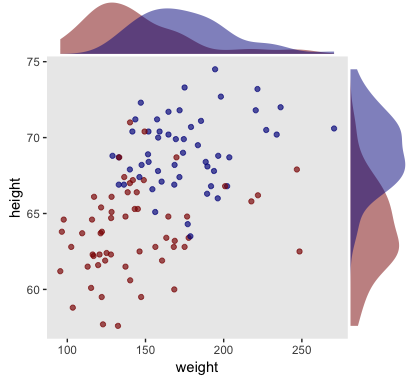

Looks like the data for which `male == 1` are concentrated in the upper right and those for which `male == 0` are more so in the lower left. What we’d like is a model that would tell us the optimal dividing line(s) between our `male` categories with respect to those predictor variables.

Open brms.

``` r
library(brms)
```

Our first model uses only `weight_z` as a predictor.

``` r
fit1 <-
  brm(data = my_data, family = binomial,
      male ~ 1 + weight_z,
      prior = c(prior(normal(0, 4), class = Intercept),
                prior(normal(0, 4), class = b)),
      iter = 2500, warmup = 500, chains = 4, cores = 4,
      seed = 21)
```

Here's the model summary.

``` r
print(fit1)
```

    ##  Family: binomial 
    ##   Links: mu = logit 
    ## Formula: male ~ 1 + weight_z 
    ##    Data: my_data (Number of observations: 110) 
    ## Samples: 4 chains, each with iter = 2500; warmup = 500; thin = 1;
    ##          total post-warmup samples = 8000
    ## 
    ## Population-Level Effects: 
    ##           Estimate Est.Error l-95% CI u-95% CI Eff.Sample Rhat
    ## Intercept    -0.08      0.22    -0.51     0.35       5650 1.00
    ## weight_z      1.21      0.28     0.69     1.78       6252 1.00
    ## 
    ## Samples were drawn using sampling(NUTS). For each parameter, Eff.Sample 
    ## is a crude measure of effective sample size, and Rhat is the potential 
    ## scale reduction factor on split chains (at convergence, Rhat = 1).

``` r
n_iter <- 20
nd <- tibble(weight_z = seq(from = -2, to = 3.5, length.out = 200))

f <-
  fitted(fit1,
         newdata = nd,
         summary = F,
         nsamples = n_iter) %>% 
  as_tibble() %>% 
  gather() %>% 
  mutate(weight_z = rep(nd$weight_z, each = n_iter),
         iter = rep(1:n_iter, times = 200)) %>% 
  mutate(weight = weight_z * sd(my_data$weight) + mean(my_data$weight))
```

    ## Using the maximum response value as the number of trials.

    ## Warning: Using 'binomial' families without specifying 'trials' on the left-
    ## hand side of the model formula is deprecated.

    ## Warning in max(out$Y, na.rm = TRUE): no non-missing arguments to max;
    ## returning -Inf

``` r
head(f)
```

    ## # A tibble: 6 x 5
    ##   key    value weight_z  iter weight
    ##   <chr>  <dbl>    <dbl> <int>  <dbl>
    ## 1 V1    0.0956       -2     1   87.0
    ## 2 V1    0.0522       -2     2   87.0
    ## 3 V1    0.0961       -2     3   87.0
    ## 4 V1    0.112        -2     4   87.0
    ## 5 V1    0.0347       -2     5   87.0
    ## 6 V1    0.0706       -2     6   87.0

``` r
thresholds <-
  f %>% 
  filter(value < .5) %>% 
  group_by(iter) %>% 
  filter(value == max(value))
```

``` r
f %>% 
  filter(iter < 21) %>% 
  
  ggplot(aes(x = weight, y = value)) +
  geom_hline(yintercept = .5, color = "white", size = 1/2) +
  geom_vline(xintercept = thresholds$weight, color = "white", size = 2/5) +
  geom_line(aes(group = iter),
            color = "grey50", size = 1/3, alpha = 2/3) +
  geom_point(data = my_data,
             aes(y = male),
             alpha = 1/3) +
  labs(title = "Data with Post. Pred.", 
       y = "male") +
  coord_cartesian(xlim = range(my_data$weight)) +
  theme(panel.grid = element_blank())
```


Here we show the marginal distributions in our versions of the lower panels of Figure 21.3.

``` r
library(tidybayes)

posterior_samples(fit1) %>% 
  # convert them to their natural metric following equation 21.1
  transmute(Intercept = b_Intercept - (b_weight_z * mean(my_data$weight) / sd(my_data$weight)),
            weight    = b_weight_z / sd(my_data$weight)) %>% 
  gather() %>% 
  
  ggplot(aes(x = value)) +
  geom_histogram(color = "grey92", fill = "grey67",
                 size = .2, bins = 40) +
  stat_pointintervalh(aes(y = 0),
                      point_interval = mode_hdi, .width = c(.95, .5)) +
  scale_y_continuous(NULL, breaks = NULL) +
  xlab(NULL) +
  theme(panel.grid = element_blank()) +
  facet_wrap(~key, scales = "free", ncol = 2)
```

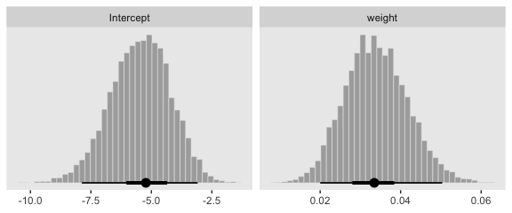

Now fit the two-predictor model using both `weight_z` and `height_z`

``` r
fit2 <-
  brm(data = my_data, family = binomial,
      male | trials(1) ~ 1 + weight_z + height_z,
      prior = c(prior(normal(0, 4), class = Intercept),
                prior(normal(0, 4), class = b)),
      iter = 2500, warmup = 500, chains = 4, cores = 4,
      seed = 21)
```

Here's the model summary.

``` r
print(fit2)
```

    ##  Family: binomial 
    ##   Links: mu = logit 
    ## Formula: male | trials(1) ~ 1 + weight_z + height_z 
    ##    Data: my_data (Number of observations: 110) 
    ## Samples: 4 chains, each with iter = 2500; warmup = 500; thin = 1;
    ##          total post-warmup samples = 8000
    ## 
    ## Population-Level Effects: 
    ##           Estimate Est.Error l-95% CI u-95% CI Eff.Sample Rhat
    ## Intercept    -0.37      0.30    -0.98     0.20       6310 1.00
    ## weight_z      0.67      0.36    -0.03     1.41       7393 1.00
    ## height_z      2.76      0.56     1.78     3.96       6047 1.00
    ## 
    ## Samples were drawn using sampling(NUTS). For each parameter, Eff.Sample 
    ## is a crude measure of effective sample size, and Rhat is the potential 
    ## scale reduction factor on split chains (at convergence, Rhat = 1).

Before we make our plots for Figure 21.4, we'll need to extract the posterior samples and transform a little.

``` r
post <-
  posterior_samples(fit2) %>% 
  transmute(b_weight    = b_weight_z / sd(my_data$weight),
            b_height    = b_height_z / sd(my_data$height),
            Intercept   = b_Intercept - ((b_weight_z * mean(my_data$weight) / sd(my_data$weight)) +
                                           (b_height_z * mean(my_data$height) / sd(my_data$height))))

head(post)
```

    ##     b_weight  b_height Intercept
    ## 1 0.00722078 0.7171195 -49.07015
    ## 2 0.02308962 0.8529417 -60.63556
    ## 3 0.01112915 0.7635619 -53.33071
    ## 4 0.02099372 0.6858249 -49.32158
    ## 5 0.01669110 0.7906760 -55.57665
    ## 6 0.01863269 0.5409481 -39.02039

Here's our version of Figure 21.4.a.

``` r
set.seed(21)  # we need this for the `sample_n()` function
post %>% 
  mutate(iter = 1:n()) %>% 
  sample_n(size = 20) %>% 
  expand(nesting(iter, Intercept, b_weight, b_height),
         weight = c(80, 280)) %>% 
  # this follows the equation near the top of p. 629
  mutate(height = (-Intercept / b_height) + (-b_weight / b_height) * weight) %>% 
  
  # now plot
  ggplot(aes(x = weight, y = height)) +
  geom_line(aes(group = iter),
            color = "white", size = 2/5) +
  geom_text(data = my_data,
            aes(label = male, color = male == 1)) +
  scale_color_manual(values = c("red4", "blue4")) +
  ggtitle("Data with Post. Pred.") +
  coord_cartesian(xlim = range(my_data$weight),
                  ylim = range(my_data$height)) +
  theme(panel.grid = element_blank(),
        legend.position = "none")
```


With just a tiny bit more wrangling, we'll be ready to make the bottom panels of Figure 21.4.

``` r
post %>% 
  gather() %>% 
  mutate(key = str_remove(key, "b_")) %>% 
  mutate(key = factor(key, levels = c("Intercept", "weight", "height"))) %>% 
  
  ggplot(aes(x = value)) +
  geom_histogram(color = "grey92", fill = "grey67",
                 size = .2, bins = 40) +
  stat_pointintervalh(aes(y = 0),
                      point_interval = mode_hdi, .width = c(.95, .5)) +
  scale_y_continuous(NULL, breaks = NULL) +
  xlab(NULL) +
  theme(panel.grid = element_blank()) +
  facet_wrap(~key, scales = "free", ncol = 3)
```


21.2. Interpreting the regression coefficients
----------------------------------------------

> In this section, I’ll discuss how to interpret the parameters in logistic regression. The first subsection explains how to interpret the numerical magnitude of the slope coefficients in terms of "log odds." The next subsection shows how data with relatively few 1’s or 0’s can yield ambiguity in the parameter estimates. Then an example with strongly correlated predictors reveals tradeoffs in slope coefficients. Finally, I briefly describe the meaning of multiplicative interaction for logistic regression. (p. 629)

### 21.2.1 Log odds

> When the logistic regression formula is written using the logit function, we have logit(*μ*)=*β*<sub>0</sub> + *β*<sub>1</sub>*x*<sub>1</sub> + *β*<sub>2</sub>*x*<sub>2</sub>. The formula implies that whenever *x*<sub>1</sub> goes up by 1 unit (on the *x*<sub>1</sub> scale), then logit(*μ*) goes up by an amount *β*<sub>1</sub>. And whenever *x*<sub>2</sub> goes up by 1 unit (on the *x*<sub>2</sub> scale), then logit(*μ*) goes up by an amount *β*<sub>2</sub>. Thus, the regression coefficients are telling us about increases in logit(*μ*). To understand the regression coefficients, we need to understand logit(*μ*). (pp. 629--630)

Given the logit function is the inverse of the logistic, which itself is

$$\\text{logistic} (x) = \\frac{1}{1 + \\text{exp} (−x)}, $$

and given the formula

$$\\text{logit} (\\mu) = \\text{log} \\bigg (\\frac{\\mu}{1 - \\mu} \\bigg), $$

where

0 &lt; *μ* &lt; 1,

it may or may not be clear that the results of our logistic regression models have a nonlinear relation with the actual parameter of interest, *μ*, which, recall, is the probability our criterion variable is 1 (e.g., `male == 1`). To get a sense of that nonlinear relation, we might make a plot.

``` r
tibble(mu = seq(from = 0, to = 1, length.out = 200)) %>% 
  mutate(logit_mu = log(mu / (1 - mu))) %>% 

  ggplot(aes(x = mu, y = logit_mu)) +
  geom_line() +
  labs(x = expression(paste(mu, " (i.e., the probability space)")),
       y = expression(paste("logit (", mu, ") (i.e., the parameter space)"))) +
  theme(panel.grid = element_blank(),
        legend.position = "none")
```

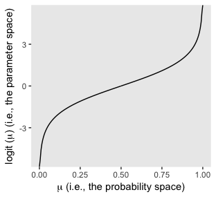

So whereas our probability space is bound between 0 and 1, the parameter space shoots off into negative and positive infinity. Also,

$$\\text{logit} (\\mu) = \\text{log} \\Bigg (\\frac{p(y = 1)}{p(y = 0)} \\Bigg )$$

Thus, "the ratio, *p*(*y* = 1)/*p*(*y* = 0), is called the odds of outcome 1 to outcome 0, and therefore logit(*μ*) is the log odds of outcome 1 to outcome 0" (p. 630).

Here's a tibble layout of the height/weight examples in the middle of page 630.

``` r
tibble(b0     = -50,
       b1     = .02,
       b2     = .7,
       weight = 160,
       inches = c(63:64, 67:68)) %>% 
  mutate(logit_mu = b0 + b1 * weight + b2 * inches) %>%
  mutate(log_odds = logit_mu) %>% 
  mutate(p_male   = 1 / (1 + exp(-log_odds)))
```

    ## # A tibble: 4 x 8
    ##      b0    b1    b2 weight inches logit_mu log_odds p_male
    ##   <dbl> <dbl> <dbl>  <dbl>  <int>    <dbl>    <dbl>  <dbl>
    ## 1   -50  0.02   0.7    160     63   -2.7     -2.7   0.0630
    ## 2   -50  0.02   0.7    160     64   -2       -2     0.119 
    ## 3   -50  0.02   0.7    160     67    0.1      0.1   0.525 
    ## 4   -50  0.02   0.7    160     68    0.800    0.800 0.690

### 21.2.2 When there are few 1’s or 0’s in the data

> In logistic regression, you can think of the parameters as describing the boundary between the 0’s and the 1’s. If there are many 0’s and 1’s, then the estimate of the boundary parameters can be fairly accurate. But if there are few 0’s or few 1’s, the boundary can be difficult to identify very accurately, even if there are many data points overall. (p. 631)

As far as I can tell, Kruschke must have used *n* = 500 to simulate his data.

``` r
b0 <- -3
b1 <- 1

n <- 500

set.seed(21)
d_rare <-
  tibble(x = rnorm(n, mean = 0, sd = 1)) %>% 
  mutate(mu = b0 + b1 * x) %>% 
  mutate(y = rbinom(n, size = 1, prob = 1 / (1 + exp(-mu))))

glimpse(d_rare)
```

    ## Observations: 500
    ## Variables: 3
    ## $ x  <dbl> 0.793013171, 0.522251264, 1.746222241, -1.271336123, 2.1973...
    ## $ mu <dbl> -2.2069868, -2.4777487, -1.2537778, -4.2713361, -0.8026105,...
    ## $ y  <int> 1, 1, 0, 0, 0, 0, 0, 0, 0, 0, 0, 0, 0, 0, 0, 0, 0, 0, 0, 0,...

We're ready to fit the model.

``` r
fit3 <-
  brm(data = d_rare, family = binomial,
      y | trials(1) ~ 1 + x,
      prior = c(prior(normal(0, 4), class = Intercept),
                prior(normal(0, 4), class = b)),
      iter = 2500, warmup = 500, chains = 4, cores = 4,
      seed = 21)
```

``` r
print(fit3)
```

    ##  Family: binomial 
    ##   Links: mu = logit 
    ## Formula: y | trials(1) ~ 1 + x 
    ##    Data: d_rare (Number of observations: 500) 
    ## Samples: 4 chains, each with iter = 2500; warmup = 500; thin = 1;
    ##          total post-warmup samples = 8000
    ## 
    ## Population-Level Effects: 
    ##           Estimate Est.Error l-95% CI u-95% CI Eff.Sample Rhat
    ## Intercept    -3.05      0.24    -3.54    -2.60       3020 1.00
    ## x             1.05      0.20     0.66     1.45       2926 1.00
    ## 
    ## Samples were drawn using sampling(NUTS). For each parameter, Eff.Sample 
    ## is a crude measure of effective sample size, and Rhat is the potential 
    ## scale reduction factor on split chains (at convergence, Rhat = 1).

Here's the prepatory work to needed before we can make our version of the main plot in Figure 21.5.a.

``` r
# I'm not quite sure if Kruschke's still using 20 draws or not. 
# Play with this number as you will.
n_iter <- 20
nd <- tibble(x = seq(from = -3.5, to = 3.5, length.out = 200))

# These will make the logistic curves
set.seed(21)
f <-
  fitted(fit3,
         newdata = nd,
         summary = F,
         nsamples = n_iter) %>% 
  as_tibble() %>% 
  gather() %>% 
  mutate(x = rep(nd$x, each = n_iter),
         iter = rep(1:n_iter, times = 200))

# Here's just a little more work to get the thresholds
thresholds <-
  f %>% 
  filter(value < .5) %>% 
  group_by(iter) %>% 
  filter(value == max(value))
```

We're ready to plot.

``` r
f %>%   
  ggplot(aes(x = x, y = value)) +
  geom_hline(yintercept = .5, color = "white") +
  geom_vline(xintercept = thresholds$x, color = "white", size = 2/5) +
  geom_line(aes(group = iter),
            color = "grey50", alpha = 2/3, size = 1/3) +
  geom_point(data = d_rare,
             aes(y = y),
             alpha = 1/5) +
  scale_x_continuous(breaks = -3:3) +
  labs(title = "Data with Post. Pred.") +
  coord_cartesian(xlim = -3:3) +
  theme(panel.grid = element_blank())
```

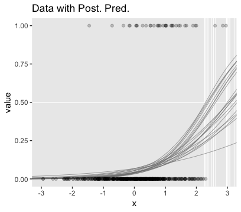

Here are the two subplots at the bottom.

``` r
posterior_samples(fit3) %>% 
  transmute(Intercept = b_Intercept,
            x         = b_x) %>% 
  gather() %>% 
  
  ggplot(aes(x = value)) +
  geom_histogram(color = "grey92", fill = "grey67",
                 size = .2, bins = 40) +
  stat_pointintervalh(aes(y = 0),
                      point_interval = mode_hdi, .width = c(.95, .5)) +
  scale_y_continuous(NULL, breaks = NULL) +
  xlab(NULL) +
  theme(panel.grid = element_blank()) +
  facet_wrap(~key, scales = "free", ncol = 2)
```

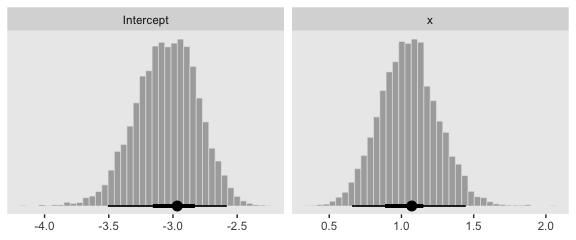

Okay, now we need to simulate the complimentary data, those for which *y* = 1 is a less-rare event.

``` r
b0 <- 0
b1 <- 1

n <- 500

set.seed(21)
d_not_rare <-
  tibble(x = rnorm(n, mean = 0, sd = 1)) %>% 
  mutate(mu = b0 + b1 * x) %>% 
  mutate(y = rbinom(n, size = 1, prob = 1 / (1 + exp(-mu))))

glimpse(d_not_rare)
```

    ## Observations: 500
    ## Variables: 3
    ## $ x  <dbl> 0.793013171, 0.522251264, 1.746222241, -1.271336123, 2.1973...
    ## $ mu <dbl> 0.793013171, 0.522251264, 1.746222241, -1.271336123, 2.1973...
    ## $ y  <int> 0, 0, 1, 0, 1, 1, 0, 0, 0, 1, 0, 1, 1, 1, 0, 1, 1, 1, 0, 0,...

Fitting this model is just like before.

``` r
fit4 <-
  update(fit3,
         newdata = d_not_rare)
```

    ## 
    ## SAMPLING FOR MODEL 'f286335ea22b5115d91531769b81e72e' NOW (CHAIN 1).
    ## Chain 1: 
    ## Chain 1: Gradient evaluation took 0.000267 seconds
    ## Chain 1: 1000 transitions using 10 leapfrog steps per transition would take 2.67 seconds.
    ## Chain 1: Adjust your expectations accordingly!
    ## Chain 1: 
    ## Chain 1: 
    ## Chain 1: Iteration:    1 / 2500 [  0%]  (Warmup)
    ## Chain 1: Iteration:  250 / 2500 [ 10%]  (Warmup)
    ## Chain 1: Iteration:  500 / 2500 [ 20%]  (Warmup)
    ## Chain 1: Iteration:  501 / 2500 [ 20%]  (Sampling)
    ## Chain 1: Iteration:  750 / 2500 [ 30%]  (Sampling)
    ## Chain 1: Iteration: 1000 / 2500 [ 40%]  (Sampling)
    ## Chain 1: Iteration: 1250 / 2500 [ 50%]  (Sampling)
    ## Chain 1: Iteration: 1500 / 2500 [ 60%]  (Sampling)
    ## Chain 1: Iteration: 1750 / 2500 [ 70%]  (Sampling)
    ## Chain 1: Iteration: 2000 / 2500 [ 80%]  (Sampling)
    ## Chain 1: Iteration: 2250 / 2500 [ 90%]  (Sampling)
    ## Chain 1: Iteration: 2500 / 2500 [100%]  (Sampling)
    ## Chain 1: 
    ## Chain 1:  Elapsed Time: 0.30904 seconds (Warm-up)
    ## Chain 1:                1.25979 seconds (Sampling)
    ## Chain 1:                1.56883 seconds (Total)
    ## Chain 1: 
    ## 
    ## SAMPLING FOR MODEL 'f286335ea22b5115d91531769b81e72e' NOW (CHAIN 2).
    ## Chain 2: 
    ## Chain 2: Gradient evaluation took 0.000164 seconds
    ## Chain 2: 1000 transitions using 10 leapfrog steps per transition would take 1.64 seconds.
    ## Chain 2: Adjust your expectations accordingly!
    ## Chain 2: 
    ## Chain 2: 
    ## Chain 2: Iteration:    1 / 2500 [  0%]  (Warmup)
    ## Chain 2: Iteration:  250 / 2500 [ 10%]  (Warmup)
    ## Chain 2: Iteration:  500 / 2500 [ 20%]  (Warmup)
    ## Chain 2: Iteration:  501 / 2500 [ 20%]  (Sampling)
    ## Chain 2: Iteration:  750 / 2500 [ 30%]  (Sampling)
    ## Chain 2: Iteration: 1000 / 2500 [ 40%]  (Sampling)
    ## Chain 2: Iteration: 1250 / 2500 [ 50%]  (Sampling)
    ## Chain 2: Iteration: 1500 / 2500 [ 60%]  (Sampling)
    ## Chain 2: Iteration: 1750 / 2500 [ 70%]  (Sampling)
    ## Chain 2: Iteration: 2000 / 2500 [ 80%]  (Sampling)
    ## Chain 2: Iteration: 2250 / 2500 [ 90%]  (Sampling)
    ## Chain 2: Iteration: 2500 / 2500 [100%]  (Sampling)
    ## Chain 2: 
    ## Chain 2:  Elapsed Time: 0.263047 seconds (Warm-up)
    ## Chain 2:                0.848072 seconds (Sampling)
    ## Chain 2:                1.11112 seconds (Total)
    ## Chain 2: 
    ## 
    ## SAMPLING FOR MODEL 'f286335ea22b5115d91531769b81e72e' NOW (CHAIN 3).
    ## Chain 3: 
    ## Chain 3: Gradient evaluation took 0.000227 seconds
    ## Chain 3: 1000 transitions using 10 leapfrog steps per transition would take 2.27 seconds.
    ## Chain 3: Adjust your expectations accordingly!
    ## Chain 3: 
    ## Chain 3: 
    ## Chain 3: Iteration:    1 / 2500 [  0%]  (Warmup)
    ## Chain 3: Iteration:  250 / 2500 [ 10%]  (Warmup)
    ## Chain 3: Iteration:  500 / 2500 [ 20%]  (Warmup)
    ## Chain 3: Iteration:  501 / 2500 [ 20%]  (Sampling)
    ## Chain 3: Iteration:  750 / 2500 [ 30%]  (Sampling)
    ## Chain 3: Iteration: 1000 / 2500 [ 40%]  (Sampling)
    ## Chain 3: Iteration: 1250 / 2500 [ 50%]  (Sampling)
    ## Chain 3: Iteration: 1500 / 2500 [ 60%]  (Sampling)
    ## Chain 3: Iteration: 1750 / 2500 [ 70%]  (Sampling)
    ## Chain 3: Iteration: 2000 / 2500 [ 80%]  (Sampling)
    ## Chain 3: Iteration: 2250 / 2500 [ 90%]  (Sampling)
    ## Chain 3: Iteration: 2500 / 2500 [100%]  (Sampling)
    ## Chain 3: 
    ## Chain 3:  Elapsed Time: 0.307853 seconds (Warm-up)
    ## Chain 3:                1.02942 seconds (Sampling)
    ## Chain 3:                1.33727 seconds (Total)
    ## Chain 3: 
    ## 
    ## SAMPLING FOR MODEL 'f286335ea22b5115d91531769b81e72e' NOW (CHAIN 4).
    ## Chain 4: 
    ## Chain 4: Gradient evaluation took 0.000107 seconds
    ## Chain 4: 1000 transitions using 10 leapfrog steps per transition would take 1.07 seconds.
    ## Chain 4: Adjust your expectations accordingly!
    ## Chain 4: 
    ## Chain 4: 
    ## Chain 4: Iteration:    1 / 2500 [  0%]  (Warmup)
    ## Chain 4: Iteration:  250 / 2500 [ 10%]  (Warmup)
    ## Chain 4: Iteration:  500 / 2500 [ 20%]  (Warmup)
    ## Chain 4: Iteration:  501 / 2500 [ 20%]  (Sampling)
    ## Chain 4: Iteration:  750 / 2500 [ 30%]  (Sampling)
    ## Chain 4: Iteration: 1000 / 2500 [ 40%]  (Sampling)
    ## Chain 4: Iteration: 1250 / 2500 [ 50%]  (Sampling)
    ## Chain 4: Iteration: 1500 / 2500 [ 60%]  (Sampling)
    ## Chain 4: Iteration: 1750 / 2500 [ 70%]  (Sampling)
    ## Chain 4: Iteration: 2000 / 2500 [ 80%]  (Sampling)
    ## Chain 4: Iteration: 2250 / 2500 [ 90%]  (Sampling)
    ## Chain 4: Iteration: 2500 / 2500 [100%]  (Sampling)
    ## Chain 4: 
    ## Chain 4:  Elapsed Time: 0.319696 seconds (Warm-up)
    ## Chain 4:                1.56173 seconds (Sampling)
    ## Chain 4:                1.88142 seconds (Total)
    ## Chain 4:

``` r
print(fit4)
```

    ##  Family: binomial 
    ##   Links: mu = logit 
    ## Formula: y | trials(1) ~ 1 + x 
    ##    Data: d_not_rare (Number of observations: 500) 
    ## Samples: 4 chains, each with iter = 2500; warmup = 500; thin = 1;
    ##          total post-warmup samples = 8000
    ## 
    ## Population-Level Effects: 
    ##           Estimate Est.Error l-95% CI u-95% CI Eff.Sample Rhat
    ## Intercept     0.08      0.10    -0.10     0.27       7025 1.00
    ## x             0.91      0.11     0.69     1.13       6403 1.00
    ## 
    ## Samples were drawn using sampling(NUTS). For each parameter, Eff.Sample 
    ## is a crude measure of effective sample size, and Rhat is the potential 
    ## scale reduction factor on split chains (at convergence, Rhat = 1).

Here's the main plot in Figure 21.5.b.

``` r
n_iter <- 20
nd <- tibble(x = seq(from = -3.5, to = 3.5, length.out = 200))

set.seed(21)
f <-
  fitted(fit4,
         newdata = nd,
         summary = F,
         nsamples = n_iter) %>% 
  as_tibble() %>% 
  gather() %>% 
  mutate(x = rep(nd$x, each = n_iter),
         iter = rep(1:n_iter, times = 200))

thresholds <-
  f %>% 
  filter(value < .5) %>% 
  group_by(iter) %>% 
  filter(value == max(value))

f %>%   
  ggplot(aes(x = x, y = value)) +
  geom_hline(yintercept = .5, color = "white") +
  geom_vline(xintercept = thresholds$x, color = "white", size = 2/5) +
  geom_line(aes(group = iter),
            color = "grey50", alpha = 2/3, size = 1/3) +
  geom_point(data = d_not_rare,
             aes(y = y),
             alpha = 1/5) +
  labs(title = "Data with Post. Pred.") +
  coord_cartesian(xlim = -3:3) +
  theme(panel.grid = element_blank())
```


Behold the subplots at the bottom.

``` r
posterior_samples(fit4) %>% 
  transmute(Intercept = b_Intercept,
            x          = b_x) %>% 
  gather() %>% 
  
  ggplot(aes(x = value)) +
  geom_histogram(color = "grey92", fill = "grey67",
                 size = .2, bins = 40) +
  stat_pointintervalh(aes(y = 0),
                      point_interval = mode_hdi, .width = c(.95, .5)) +
  scale_y_continuous(NULL, breaks = NULL) +
  xlab(NULL) +
  theme(panel.grid = element_blank()) +
  facet_wrap(~key, scales = "free", ncol = 2)
```

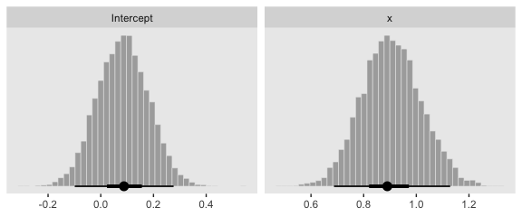

### 21.2.3 Correlated predictors

"Another important cause of parameter uncertainty is correlated predictors. This issue was previously discussed at length, but the context of logistic regression provides novel illustration in terms of level contours" (p. 632).

As far as I can tell, Kruschke chose about *n* = 200 for the data in this example. After messing around with correlations for a but, It seems *ρ*<sub>*x*<sub>1</sub>, *x*<sub>2</sub></sub> = .975 looks about right. To my knowledge, the best way to simulate multivariate Gaussian data with a particular correlation is with the [`MASS::mvrnorm()` function](https://www.rdocumentation.org/packages/MASS/versions/7.3-51.1/topics/mvrnorm). Since we'll be using standardized *x*-variables, we'll need to specify our *n*, the desired correlation matrix, and a vector of means. Then we'll be ready to do the actual simulation with `mvrnorm()`.

``` r
n <- 200

# correlation matrix
s <- matrix(c(1, .975, 
              .975, 1), 
            nrow = 2, ncol = 2)

# mean vector
m <- c(0, 0)

# simulate
set.seed(21)
d <- 
  MASS::mvrnorm(n = n, mu = m, Sigma = s) %>%
  as_tibble() %>%
  rename(x1 = V1, x2 = V2)
```

Let's confirm their correlation.

``` r
cor(d)
```

    ##           x1        x2
    ## x1 1.0000000 0.9730091
    ## x2 0.9730091 1.0000000

Solid. Now we'll complete the data set by including our dichotomous criterion variable, `y`.

``` r
b0 <- 0
b1 <- 1
b2 <- 1

set.seed(21)
d <-
  d %>% 
  mutate(mu = b0 + b1 * x1 + b2 * x2) %>% 
  mutate(y = rbinom(n, size = 1, prob = 1 / (1 + exp(-mu))))
```

Fit the model with the highly-correlated predictors.

``` r
fit5 <-
  brm(data = d, family = binomial,
      y | trials(1) ~ 1 + x1 + x2,
      prior = c(prior(normal(0, 4), class = Intercept),
                prior(normal(0, 4), class = b)),
      iter = 2500, warmup = 500, chains = 4, cores = 4,
      seed = 21)
```

Behold the summary.

``` r
print(fit5)
```

    ##  Family: binomial 
    ##   Links: mu = logit 
    ## Formula: y | trials(1) ~ 1 + x1 + x2 
    ##    Data: d (Number of observations: 200) 
    ## Samples: 4 chains, each with iter = 2500; warmup = 500; thin = 1;
    ##          total post-warmup samples = 8000
    ## 
    ## Population-Level Effects: 
    ##           Estimate Est.Error l-95% CI u-95% CI Eff.Sample Rhat
    ## Intercept    -0.05      0.18    -0.40     0.31       4724 1.00
    ## x1           -0.33      0.81    -1.96     1.23       2686 1.00
    ## x2            2.38      0.88     0.72     4.22       2672 1.00
    ## 
    ## Samples were drawn using sampling(NUTS). For each parameter, Eff.Sample 
    ## is a crude measure of effective sample size, and Rhat is the potential 
    ## scale reduction factor on split chains (at convergence, Rhat = 1).

Notice how large those posterior *S**D*s are for the predictors. To get a better sense, let's look at them in a coefficient plot before continuing on with the text.

``` r
posterior_samples(fit5) %>% 
  select(-lp__) %>% 
  gather() %>% 
  
  ggplot(aes(x = value, y = key)) +
  stat_pointintervalh(.width = c(.5, .95)) +
  labs(x = NULL, y = NULL) +
  theme(panel.grid   = element_blank(),
        axis.ticks.y = element_blank(),
        axis.text.y  = element_text(hjust = 0))
```

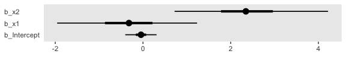

Them are some sloppy estimates. But we digress. Here's our version of Figure 21.6.a.

``` r
set.seed(21)  # we need this for the `sample_n()` function
posterior_samples(fit5) %>% 
  mutate(iter = 1:n()) %>% 
  sample_n(size = 20) %>% 
  expand(nesting(iter, b_Intercept, b_x1, b_x2),
         x1 = c(-4, 4)) %>% 
  # this follows the equation near the top of p. 629
  mutate(x2 = (-b_Intercept / b_x2) + (-b_x1 / b_x2) * x1) %>% 
  
  # now plot
  ggplot(aes(x = x1, y = x2)) +
  geom_line(aes(group = iter),
            color = "white", size = 2/5) +
  geom_text(data = d,
            aes(label = y, color = y == 1),
            size = 2.5) +
  scale_color_manual(values = c("red4", "blue4")) +
  ggtitle("Data with Post. Pred.") +
  coord_cartesian(xlim = -3:3,
                  ylim = -3:3) +
  theme(panel.grid = element_blank(),
        legend.position = "none")
```


It can be easy to unerappreciate how sensitive this plot is to the seed you set for `sample_n()`. To give a better sense of the uncertainty in the posterior for the threshold, here we show the plot for several different seeds.

``` r
# make a custom function
different_seed <- function(i){
  set.seed(i)
  posterior_samples(fit5) %>% 
  mutate(iter = 1:n()) %>% 
  sample_n(size = 20) %>% 
  expand(nesting(iter, b_Intercept, b_x1, b_x2),
         x1 = c(-4, 4)) %>% 
  mutate(x2 = (-b_Intercept / b_x2) + (-b_x1 / b_x2) * x1)
}

# specify your seeds
tibble(seed = 1:9) %>% 
  # pump those seeds into the `different_seed()` function
  mutate(sim = map(seed, different_seed)) %>% 
  unnest() %>% 
  mutate(seed = str_c("seed: ", seed)) %>% 
  
  # plot
  ggplot(aes(x = x1, y = x2)) +
  geom_line(aes(group = iter),
            color = "white", size = 1/3) +
  geom_text(data = d,
            aes(label = y, color = y == 1),
            size = 1.5) +
  scale_color_manual(values = c("red4", "blue4")) +
  ggtitle("Data with Post. Pred.") +
  coord_cartesian(xlim = -3:3,
                  ylim = -3:3) +
  theme(panel.grid = element_blank(),
        legend.position = "none") +
  facet_wrap(~seed)
```

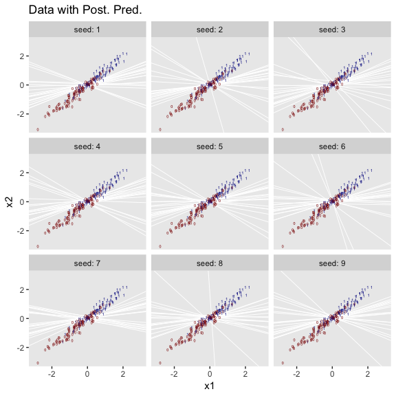

We'll use `pairs()` to make our version of Figure 21.6.b.

``` r
pairs(fit5,
      off_diag_args = list(size = 1/5, alpha = 1/5))
```

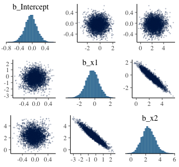

Finally, here are the Pearson's correlations among the model parameters.

``` r
posterior_samples(fit5) %>%
  select(-lp__) %>%
  cor() %>%
  round(digits = 3)
```

    ##             b_Intercept   b_x1   b_x2
    ## b_Intercept       1.000  0.017 -0.024
    ## b_x1              0.017  1.000 -0.941
    ## b_x2             -0.024 -0.941  1.000

### 21.2.4 Interaction of metric predictors

Kruschke didn't walk through an analysis, but it's worth the practice. Let's simulate data based on the formula he gave in Figure 21.7, top right.

``` r
n  <- 500

b0 <- 0
b1 <- 0
b2 <- 0
b3 <- 4

set.seed(21)
d <-
  tibble(x1 = rnorm(n, mean = 0, sd = 1),
         x2 = rnorm(n, mean = 0, sd = 1)) %>% 
  mutate(mu = b1 * x1 + b2 * x2 + b3 * x1 * x2 - b0) %>% 
  mutate(y = rbinom(n, size = 1, prob = 1 / (1 + exp(-mu))))
```

Fit the interaction model.

``` r
fit6 <-
  brm(data = d, family = binomial,
      y | trials(1) ~ 1 + x1 + x2 + x1:x2,
      prior = c(prior(normal(0, 4), class = Intercept),
                prior(normal(0, 4), class = b)),
      iter = 2500, warmup = 500, chains = 4, cores = 4,
      seed = 21)
```

Based on the summary, looks like the model did a nice job recapturing the population parameters.

``` r
print(fit6)
```

    ##  Family: binomial 
    ##   Links: mu = logit 
    ## Formula: y | trials(1) ~ 1 + x1 + x2 + x1:x2 
    ##    Data: d (Number of observations: 500) 
    ## Samples: 4 chains, each with iter = 2500; warmup = 500; thin = 1;
    ##          total post-warmup samples = 8000
    ## 
    ## Population-Level Effects: 
    ##           Estimate Est.Error l-95% CI u-95% CI Eff.Sample Rhat
    ## Intercept    -0.18      0.13    -0.42     0.07       7807 1.00
    ## x1           -0.22      0.17    -0.55     0.12       8961 1.00
    ## x2           -0.03      0.17    -0.35     0.29       7749 1.00
    ## x1:x2         4.44      0.46     3.57     5.38       6703 1.00
    ## 
    ## Samples were drawn using sampling(NUTS). For each parameter, Eff.Sample 
    ## is a crude measure of effective sample size, and Rhat is the potential 
    ## scale reduction factor on split chains (at convergence, Rhat = 1).

I'm not quite sure how to expand Kruschke's equation from the top of page 629 to our interaction model. But no worries. We can take a slightly different approach to show the consequences of our interaction model on the probability *y* = 1. First, we define our `newdata` and then get the `Estimate`s from `fitted()`. Then we wrangle as usual.

``` r
nd <- 
  tibble(x1 = seq(from = -3, to = 3, length.out = 100),
         x2 = seq(from = -3, to = 3, length.out = 100)) %>% 
  expand(x1, x2)

f <-
  fitted(fit6,
         newdata = nd,
         scale = "linear") %>% 
  as_tibble() %>% 
  transmute(prob = Estimate %>% inv_logit_scaled())
```

Now all we have to do is integrate our `f` results with the `nd` and original `d` data and then we can plot.

``` r
f %>% 
  bind_cols(nd) %>% 
  
  ggplot(aes(x = x1, y = x2)) +
  geom_raster(aes(fill = prob),
              interpolate = T) +
  geom_text(data = d,
            aes(label = y, color = y == 1),
            size = 2.75, show.legend = F) +
  scale_color_manual(values = c("white", "black")) +
  scale_fill_viridis_c(option = "A", begin = .15, end = .95) +
  scale_x_continuous(expand = c(0, 0)) +
  scale_y_continuous(expand = c(0, 0)) +
  coord_cartesian(xlim = -3:3,
                  ylim = -3:3)
```

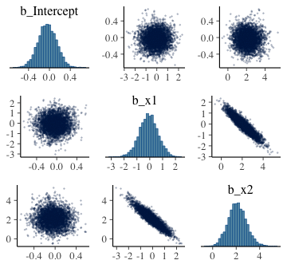

Instead of a simple threshold line, we get an entire probability plane.

21.3. Robust logistic regression
--------------------------------

Here's what Kruschke's `beta(1, 9)` prior looks like.

``` r
tibble(x = seq(from = 0, to = 1, length.out = 200)) %>% 
  
  ggplot(aes(x = x)) +
  geom_ribbon(aes(ymin = 0, ymax = dbeta(x, 1, 9)),
              size = 0, fill = "grey50") +
  scale_y_continuous(NULL, breaks = NULL) +
  labs(x = NULL,
       title = "beta(1, 9)") +
  theme(panel.grid = element_blank())
```


To fit the brms analogue to Kruschke's rogust logistic regression model, we'll need to adopt what Bürkner calls the non-linear syntax, which you can learn about in detail with his vignette, [*Estimating Non-Linear Models with brms*](https://cran.r-project.org/web/packages/brms/vignettes/brms_nonlinear.html).

``` r
fit7 <-
  brm(data = my_data, 
      family = binomial(link = "identity"),
      bf(male | trials(1) ~ a * .5 + (1 - a) * 1 / (1 + exp(-1 * (b0 + b1 * weight_z))),
         a + b0 + b1  ~ 1,
         nl = TRUE),
      prior = c(prior(normal(0, 4), nlpar = "b0"),
                prior(normal(0, 4), nlpar = "b1"),
                prior(beta(1, 9),   nlpar = "a")),
      iter = 2500, warmup = 500, chains = 4, cores = 4,
      seed = 21)
```

To explain what's going on with our syntax, above, I think it's best to quite Bürkner at length:

> When looking at the above code, the first thing that becomes obvious is that we changed the `formula` syntax to display the non-linear formula including predictors (i.e., \[`weight_z`\]) and parameters (i.e., \[`a`, `b0`, and `b1`\]) wrapped in a call to \[the `bf()` function\]. This stands in contrast to classical **R** formulas, where only predictors are given and parameters are implicit. The argument \[`a + b0 + b1 ~ 1`\] serves two purposes. First, it provides information, which variables in `formula` are parameters, and second, it specifies the linear predictor terms for each parameter. In fact, we should think of non-linear parameters as placeholders for linear predictor terms rather than as parameters themselves (see also the following examples). In the present case, we have no further variables to predict \[`a`, `b0`, and `b1`\] and thus we just fit intercepts that represent our estimates of \[*α*, *β*<sub>0</sub>, and *β*<sub>1</sub>\]. The formula \[`a + b0 + b1 ~ 1`\] is a short form of \[`a ~ 1, b0 ~ 1, b1 ~ 1`\] that can be used if multiple non-linear parameters share the same formula. Setting `nl = TRUE` tells **brms** that the formula should be treated as non-linear.
>
> In contrast to generalized linear models, priors on population-level parameters (i.e., 'fixed effects') are often mandatory to identify a non-linear model. Thus, **brms** requires the user to explicitely specify these priors. In the present example, we used a \[`beta(1, 9)` prior on (the population-level intercept of) `a`, while we used a `normal(0, 4)` prior on both (population-level intercepts of) `b0` and `b1`\]. Setting priors is a non-trivial task in all kinds of models, especially in non-linear models, so you should always invest some time to think of appropriate priors. Quite often, you may be forced to change your priors after fitting a non-linear model for the first time, when you observe different MCMC chains converging to different posterior regions. This is a clear sign of an idenfication problem and one solution is to set stronger (i.e., more narrow) priors. (**emphasis** in the original)

Behold the summary.

``` r
print(fit7)
```

    ## Warning: There were 265 divergent transitions after warmup. Increasing adapt_delta above 0.8 may help.
    ## See http://mc-stan.org/misc/warnings.html#divergent-transitions-after-warmup

    ##  Family: binomial 
    ##   Links: mu = identity 
    ## Formula: male | trials(1) ~ a * 0.5 + (1 - a) * 1/(1 + exp(-1 * (b0 + b1 * weight_z))) 
    ##          a ~ 1
    ##          b0 ~ 1
    ##          b1 ~ 1
    ##    Data: my_data (Number of observations: 110) 
    ## Samples: 4 chains, each with iter = 2500; warmup = 500; thin = 1;
    ##          total post-warmup samples = 8000
    ## 
    ## Population-Level Effects: 
    ##              Estimate Est.Error l-95% CI u-95% CI Eff.Sample Rhat
    ## a_Intercept      0.24      0.09     0.06     0.43       2000 1.00
    ## b0_Intercept     0.64      0.71    -0.36     2.42       1571 1.00
    ## b1_Intercept     3.53      1.53     1.39     7.47       1388 1.00
    ## 
    ## Samples were drawn using sampling(NUTS). For each parameter, Eff.Sample 
    ## is a crude measure of effective sample size, and Rhat is the potential 
    ## scale reduction factor on split chains (at convergence, Rhat = 1).

It turns out Bürkner's warning on "different posterior regions" applied to our case. While preparing this document, I played around with higher `adapt_delta` values, as suggested in the warning message. The model showed problems even at `adapt_delta = 0.999`. Here, our main purpose is to ape Kruschke. But if this was a substantive model of interest, I'd suggest following Bürkner's advice and think hard about specifying narrower priors.

Anyway, here's a quick and dirty look at the marginal effects for `weight_z`.

``` r
marginal_effects(fit7) %>% 
  plot(points = T)
```


The way we prep for our version of Figure 21.8 is just the same as what we did for Figure 21.3, above.

``` r
n_iter <- 20
nd <- tibble(weight_z = seq(from = -2, to = 3.5, length.out = 200))

f <-
  fitted(fit7,
         newdata = nd,
         summary = F,
         nsamples = n_iter) %>% 
  as_tibble() %>% 
  gather() %>% 
  mutate(weight_z = rep(nd$weight_z, each = n_iter),
         iter = rep(1:n_iter, times = 200)) %>% 
  mutate(weight = weight_z * sd(my_data$weight) + mean(my_data$weight))

thresholds <-
  f %>% 
  filter(value < .5) %>% 
  group_by(iter) %>% 
  filter(value == max(value))
```

Now plot.

``` r
f %>% 
  ggplot(aes(x = weight, y = value)) +
  geom_hline(yintercept = .5, color = "white", size = 1/2) +
  geom_vline(xintercept = thresholds$weight, color = "white", size = 2/5) +
  geom_line(aes(group = iter),
            color = "grey50", size = 1/3, alpha = 2/3) +
  geom_point(data = my_data,
             aes(y = male),
             alpha = 1/3) +
  labs(title = "Data with Post. Pred.", 
       y = "male") +
  coord_cartesian(xlim = range(my_data$weight)) +
  theme(panel.grid = element_blank())
```

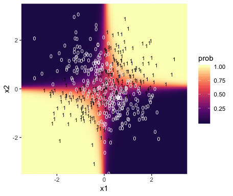

Here we show the marginal distributions in our versions of the lower panels of Figure 21.8.

``` r
posterior_samples(fit7) %>% 
  transmute(Intercept = b_b0_Intercept - (b_b1_Intercept * mean(my_data$weight) / sd(my_data$weight)),
            weight    = b_b1_Intercept / sd(my_data$weight),
            guessing  = b_a_Intercept) %>% 
  gather() %>% 
  mutate(key = factor(key, levels = c("Intercept", "weight", "guessing"))) %>% 
  
  ggplot(aes(x = value)) +
  geom_histogram(color = "grey92", fill = "grey67",
                 size = .2, bins = 40) +
  stat_pointintervalh(aes(y = 0),
                      point_interval = mode_hdi, .width = c(.95, .5)) +
  scale_y_continuous(NULL, breaks = NULL) +
  xlab(NULL) +
  theme(panel.grid = element_blank()) +
  facet_wrap(~key, scales = "free", ncol = 3)
```

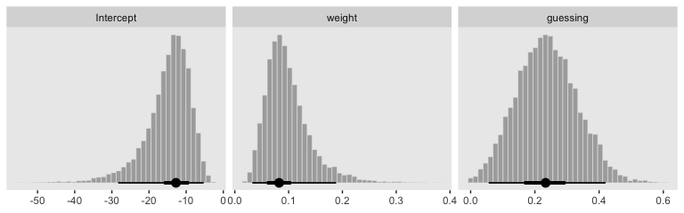

Our posteriors are a little more skewed than Kruschke's, but they are overall in the same ballpark. Here are the `pairs()` plots.

``` r
pairs(fit7,
      off_diag_args = list(size = 1/5, alpha = 1/5))
```


21.4. Nominal predictors
------------------------

### 21.4.1 Single group

If we have just a single group and no other predictors, that's just an intercept-only model. Back in the earlier chapters, we thought of such a model as

$$
\\begin{eqnarray}
y & \\sim & \\text{Bernoulli} (\\theta) \\\\
\\theta & \\sim & \\text{dbeta} (a, b)
\\end{eqnarray}
$$

Now we're expressing the model as

$$
\\begin{eqnarray}
y & \\sim & \\text{Bernoulli} (\\mu) \\\\
\\mu & \\sim & \\text{logistic} (\\beta\_0)
\\end{eqnarray}
$$

For that *β*<sub>0</sub>, we typically use a Gaussian prior of the form

*β*<sub>0</sub> ∼ Normal(*M*<sub>0</sub>, *S*<sub>0</sub>)

In a situation where we don't have strong prior substantive knowledge, we often set *M*<sub>0</sub> = 0, which puts the probability mass around *θ* = .5, a reasonable default hypothesis. Often times *S*<sub>0</sub> is some modest single-digit integer like 2 or 4. To get a sense of how different Gaussians translate to the beta distribution, we'll recreate Figure 21.11.

``` r
# this will help streamline the conversion
logistic <- function(x){
  1 / (1 + exp(-x))
}

# wrangle
tibble(m_0 = rep(0:1, each = 3),
       s_0 = rep(c(.5, 1, 2), times = 2)) %>% 
  mutate(key = str_c("mu == logistic(beta %~%", " N(", m_0, ", ", s_0, "))"),
         sim = pmap(list(2e6, m_0, s_0), rnorm)) %>% 
  unnest() %>% 
  mutate(sim = logistic(sim)) %>% 
  
  # plot
  ggplot(aes(x = sim,
             y = ..density..)) +
  geom_histogram(color = "grey92", fill = "grey67",
                 size = 1/3, bins = 20, boundary = 0) +
  geom_line(stat = "density", size = 3/4) +
  scale_y_continuous(NULL, breaks = NULL) +
  xlab(expression(mu)) +
  theme(panel.grid = element_blank()) +
  facet_wrap(~key, scales = "free_y", labeller = label_parsed)
```

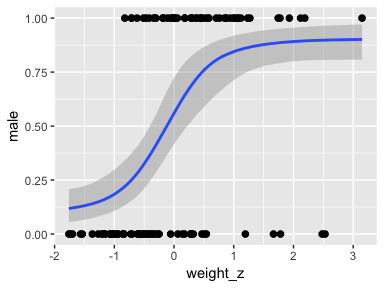

Here's the basic brms analogue to Kruschke's JAGS code at the top of page 641.

``` r
fit <-
  brm(data = my_data, 
      family = binomial(),
      y | trials(1) ~ 1,
      prior(normal(0, 2), class = "Intercept"))
```

### 21.4.2 Multiple groups

If there's only one group, we don't need a grouping variable. But that's a special case. Now we show the more general approach with multiple groups.

#### 21.4.2.1 Example: Baseball again

Load the baseball data.

``` r
my_data <- read_csv("data.R/BattingAverage.csv")
```

    ## Parsed with column specification:
    ## cols(
    ##   Player = col_character(),
    ##   PriPos = col_character(),
    ##   Hits = col_integer(),
    ##   AtBats = col_integer(),
    ##   PlayerNumber = col_integer(),
    ##   PriPosNumber = col_integer()
    ## )

``` r
glimpse(my_data)
```

    ## Observations: 948
    ## Variables: 6
    ## $ Player       <chr> "Fernando Abad", "Bobby Abreu", "Tony Abreu", "Du...
    ## $ PriPos       <chr> "Pitcher", "Left Field", "2nd Base", "2nd Base", ...
    ## $ Hits         <int> 1, 53, 18, 137, 21, 0, 0, 2, 150, 167, 0, 128, 66...
    ## $ AtBats       <int> 7, 219, 70, 607, 86, 1, 1, 20, 549, 576, 1, 525, ...
    ## $ PlayerNumber <int> 1, 2, 3, 4, 5, 6, 7, 8, 9, 10, 11, 12, 13, 14, 15...
    ## $ PriPosNumber <int> 1, 7, 4, 4, 3, 1, 1, 3, 3, 4, 1, 5, 4, 2, 7, 4, 6...

#### 21.4.2.2 The model

I'm not aware that Kruschke's modeling approach, here, will work well within the brms paradigm. I suggest we fit a simple hierarchical logistic regression model, instead. With this approach, we use the statistical model

$$
\\begin{eqnarray}
\\text{Hits}\_i & \\sim & \\text{Binomial} (\\text{AtBats}\_i, p\_i) \\\\
\\text{logit} (p\_i) & = & \\beta\_0 + \\beta\_{\\text{PriPos}\_i} + \\beta\_{\\text{PriPos:Player}\_i} \\\\
\\beta\_0 & \\sim & \\text{Normal} (0, 2) \\\\
\\beta\_\\text{PriPos} & \\sim & \\text{Normal} (0, \\sigma\_\\text{PriPos}) \\\\
\\beta\_\\text{PriPos:Player} & \\sim & \\text{Normal} (0, \\sigma\_\\text{PriPos:Player}) \\\\
\\sigma\_\\text{PriPos} & \\sim & \\text{HalfCauchy} (0, 1) \\\\
\\sigma\_\\text{PriPos:Player} & \\sim & \\text{HalfCauchy} (0, 1)
\\end{eqnarray}
$$

Here's the model in brms.

``` r
fit8 <-
  brm(data = my_data,
      family = binomial(link = "logit"),
      Hits  | trials(AtBats) ~ 1 + (1 | PriPos) + (1 | PriPos:Player),
      prior = c(prior(normal(0, 2), class = Intercept),
                prior(cauchy(0, 1), class = sd)),
      iter = 2500, warmup = 500, chains = 4, cores = 4,
      seed = 21)
```

#### 21.4.2.3 Results

Before we start plotting, behold the model summary.

``` r
print(fit8)
```

    ##  Family: binomial 
    ##   Links: mu = logit 
    ## Formula: Hits | trials(AtBats) ~ 1 + (1 | PriPos) + (1 | PriPos:Player) 
    ##    Data: my_data (Number of observations: 948) 
    ## Samples: 4 chains, each with iter = 2500; warmup = 500; thin = 1;
    ##          total post-warmup samples = 8000
    ## 
    ## Group-Level Effects: 
    ## ~PriPos (Number of levels: 9) 
    ##               Estimate Est.Error l-95% CI u-95% CI Eff.Sample Rhat
    ## sd(Intercept)     0.32      0.10     0.19     0.57       3101 1.00
    ## 
    ## ~PriPos:Player (Number of levels: 948) 
    ##               Estimate Est.Error l-95% CI u-95% CI Eff.Sample Rhat
    ## sd(Intercept)     0.14      0.01     0.12     0.15       3805 1.00
    ## 
    ## Population-Level Effects: 
    ##           Estimate Est.Error l-95% CI u-95% CI Eff.Sample Rhat
    ## Intercept    -1.17      0.11    -1.40    -0.95       2354 1.00
    ## 
    ## Samples were drawn using sampling(NUTS). For each parameter, Eff.Sample 
    ## is a crude measure of effective sample size, and Rhat is the potential 
    ## scale reduction factor on split chains (at convergence, Rhat = 1).

If you look closely at our model versus the one in the text, you'll see ours has fewer parameters. As a down-the-line consequence, our model doesn't support a direct analogue to the plot at the top of Figure 21.13. However, we can come close. Rather than modeling the position-based probabilities as multiple draws of beta distributions, we can simply summarize our probabilities by their posterior distributions.

``` r
library(ggridges)

# define our new data, `nd`
nd <- 
  my_data %>% 
  group_by(PriPos) %>% 
  summarise(AtBats = mean(AtBats) %>% round(0))

# push the model through `fitted()` and wrangle
fitted(fit8,
       newdata = nd,
       re_formula = Hits  | trials(AtBats) ~ 1 + (1 | PriPos),
       scale = "linear",
       summary = F) %>% 
  as_tibble() %>% 
  gather() %>% 
  transmute(probability = inv_logit_scaled(value)) %>% 
  bind_cols(nd %>% 
              expand(PriPos, iter = 1:8000)) %>% 
  
  # plot
  ggplot(aes(x = probability, y = PriPos)) +
  geom_vline(xintercept = fixef(fit8)[1] %>% inv_logit_scaled(), color = "white") +
  geom_density_ridges(size = 0, fill = "grey67", scale = .9) +
  geom_jitter(data = my_data,
              aes(x = Hits / AtBats),
              height = .025, alpha = 1/6, size = 1/6) +
  coord_cartesian(xlim = 0:1,
                  ylim = c(1, 9.5)) +
  labs(title = "Data with Posterior Predictive Distrib.",
       x = "Hits / AtBats") +
  theme(panel.grid   = element_blank(),
        axis.ticks.y = element_blank(),
        axis.text.y  = element_text(hjust = 0))
```


For kicks and giggles, we depicted the grand mean probability as the white vertical line in the background with the `geom_vline()` code.

However, we can make our plot more directly analogous to Kruschke’s if we’re willing to stretch a little. Recall that Kruschke used the beta distribution with the *ω* − *κ* parameterization in both his statistical model and his plot code—both of which you can find detailed in his `Jags-Ybinom-Xnom1fac-Mlogistic.R`. file. We didn’t use the beta distribution in our `brm()` model and the parameters from that model didn’t have as direct correspondences to the beta distribution the way those from Kruschke’s JAGS model did. However, recall that we can re-parameterize the beta distribution in terms of its mean *μ* and sample size *n*, folowing the form

$$
\\alpha & = & mu n \\\\
\\beta & = & (1 - mu) n 
$$

When we take the inverse logit of our intercepts, we do get vales in a probability metric. We might consider inserting those probabilities into the *μ* parameter. Furthermore, we can take our sample sizes and insert them directly into *n*. As before, we’ll use the average sample size per position.

``` r
nd %>% 
  add_fitted_draws(fit8, n = 20,
                   re_formula = Hits  | trials(AtBats) ~ 1 + (1 | PriPos),
                   dpar = c("mu")) %>% 
  mutate(alpha = mu * AtBats, 
         beta  = (1 - mu) * AtBats) %>% 
  mutate(ll      = qbeta(.025, shape1 = alpha, shape2 = beta),
         ul      = qbeta(.975, shape1 = alpha, shape2 = beta)) %>% 
  mutate(theta  = map2(ll, ul, seq, length.out = 100)) %>% 
  mutate(density = pmap(list(theta, alpha, beta), dbeta)) %>% 
  unnest() %>% 
  group_by(.draw) %>% 
  mutate(density = density / max(density)) %>% 
  
  ggplot(aes(x = theta, y = PriPos)) +
  geom_ridgeline(aes(height = -density, group = interaction(PriPos, .draw)),
                 fill = NA, color = adjustcolor("grey50", alpha.f = 1/3),
                 size = 1/4, scale = 3/4,
                 min_height = NA) +
  geom_jitter(data = my_data,
              aes(x = Hits / AtBats, size = AtBats),
              height = .05, alpha = 1/6, shape = 1) +
  scale_size_continuous(range = c(1/4, 4)) +
  labs(title = "Data with Posterior Predictive Distrib.",
       x = "Hits / AtBats",
       y = NULL) +
  coord_flip(ylim = c(0.67, 8.67)) +
  theme(panel.grid   = element_blank(),
        axis.ticks.x = element_blank(),
        axis.text.x  = element_text(angle = 90, hjust = 1),
        legend.position   = c(.956, .8),
        legend.background = element_rect(fill = "transparent", color = "white"),
        legend.key        = element_rect(fill = "transparent", color = "transparent"))
```


Since we didn’t actually presume the beta distribution anywhere in our `brm()` statistical model, I wouldn’t attempt to present this workflow in a scientific outlet. Go with the previous plot This attempt seems dishonest. But it is kinda fun to see how far we can push our results.

Happily, our contrasts will be less contentious. Here’s the initial wrangling.

``` r
# define our subset of positions
positions <- c("1st Base", "Catcher", "Pitcher")

# redefine `nd`
nd <- 
  my_data %>% 
  filter(PriPos %in% c(positions)) %>% 
  group_by(PriPos) %>% 
  summarise(AtBats = mean(AtBats) %>% round(0))

# push the model through `fitted()` and wrangle
f <-
  fitted(fit8,
         newdata = nd,
         re_formula = Hits  | trials(AtBats) ~ 1 + (1 | PriPos),
         scale = "linear",
         summary = F) %>% 
  as_tibble() %>% 
  set_names(positions)

# what did we do?
head(f)
```

    ## # A tibble: 6 x 3
    ##   `1st Base` Catcher Pitcher
    ##        <dbl>   <dbl>   <dbl>
    ## 1      -1.06   -1.15   -1.86
    ## 2      -1.07   -1.15   -1.87
    ## 3      -1.07   -1.13   -1.85
    ## 4      -1.07   -1.16   -1.90
    ## 5      -1.10   -1.13   -1.85
    ## 6      -1.04   -1.14   -1.92

Here are our versions of the middle two panels of Figure 21.13.

``` r
f %>% 
  # compute the differences and put the data in the long format
  transmute(`Pitcher vs. Catcher` = Pitcher - Catcher,
            `Catcher vs. 1st Base` = Catcher - `1st Base`) %>% 
  gather() %>% 
  mutate(key = factor(key, levels = c("Pitcher vs. Catcher", "Catcher vs. 1st Base"))) %>% 
  
  ggplot(aes(x = value)) +
  geom_vline(xintercept = 0, color = "white") +
  geom_histogram(color = "grey92", fill = "grey67",
                 size = .2, bins = 40) +
  stat_pointintervalh(aes(y = 0),
                      point_interval = mode_hdi, .width = c(.95, .5)) +
  scale_y_continuous(NULL, breaks = NULL) +
  xlab("Difference (in b)") +
  theme(panel.grid = element_blank()) +
  facet_wrap(~key, scales = "free", ncol = 2)
```

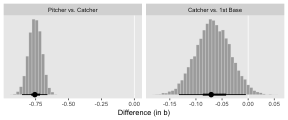

And here are our versions of the bottom two panels of Figure 21.13.

``` r
f %>% 
  # do the transformation before computing the differences
  mutate_all(inv_logit_scaled) %>% 
  transmute(`Pitcher vs. Catcher` = Pitcher - Catcher,
            `Catcher vs. 1st Base` = Catcher - `1st Base`) %>% 
  gather() %>% 
  mutate(key = factor(key, levels = c("Pitcher vs. Catcher", "Catcher vs. 1st Base"))) %>% 
  
  ggplot(aes(x = value)) +
  geom_vline(xintercept = 0, color = "white") +
  geom_histogram(color = "grey92", fill = "grey67",
                 size = .2, bins = 40) +
  stat_pointintervalh(aes(y = 0),
                      point_interval = mode_hdi, .width = c(.95, .5)) +
  scale_y_continuous(NULL, breaks = NULL) +
  xlab("Difference (in probability)") +
  theme(panel.grid = element_blank()) +
  facet_wrap(~key, scales = "free", ncol = 2)
```


Note how ours are described as differences in probability, rather than in omega.

References
----------

Kruschke, J. K. (2015). *Doing Bayesian data analysis, Second Edition: A tutorial with R, JAGS, and Stan.* Burlington, MA: Academic Press/Elsevier.

Session info
------------

``` r
sessionInfo()
```

    ## R version 3.5.1 (2018-07-02)
    ## Platform: x86_64-apple-darwin15.6.0 (64-bit)
    ## Running under: macOS High Sierra 10.13.6
    ## 
    ## Matrix products: default
    ## BLAS: /Library/Frameworks/R.framework/Versions/3.5/Resources/lib/libRblas.0.dylib
    ## LAPACK: /Library/Frameworks/R.framework/Versions/3.5/Resources/lib/libRlapack.dylib
    ## 
    ## locale:
    ## [1] en_US.UTF-8/en_US.UTF-8/en_US.UTF-8/C/en_US.UTF-8/en_US.UTF-8
    ## 
    ## attached base packages:
    ## [1] stats     graphics  grDevices utils     datasets  methods   base     
    ## 
    ## other attached packages:
    ##  [1] ggridges_0.5.0  tidybayes_1.0.3 brms_2.7.0      Rcpp_1.0.0     
    ##  [5] ggExtra_0.8     bindrcpp_0.2.2  forcats_0.3.0   stringr_1.3.1  
    ##  [9] dplyr_0.7.6     purrr_0.2.5     readr_1.1.1     tidyr_0.8.1    
    ## [13] tibble_1.4.2    ggplot2_3.1.0   tidyverse_1.2.1
    ## 
    ## loaded via a namespace (and not attached):
    ##   [1] colorspace_1.3-2          rsconnect_0.8.8          
    ##   [3] rprojroot_1.3-2           ggstance_0.3             
    ##   [5] markdown_0.8              base64enc_0.1-3          
    ##   [7] rstudioapi_0.7            rstan_2.18.2             
    ##   [9] svUnit_0.7-12             DT_0.4                   
    ##  [11] mvtnorm_1.0-8             lubridate_1.7.4          
    ##  [13] xml2_1.2.0                bridgesampling_0.4-0     
    ##  [15] codetools_0.2-15          mnormt_1.5-5             
    ##  [17] knitr_1.20                shinythemes_1.1.1        
    ##  [19] bayesplot_1.6.0           jsonlite_1.5             
    ##  [21] LaplacesDemon_16.1.1      broom_0.4.5              
    ##  [23] shiny_1.1.0               compiler_3.5.1           
    ##  [25] httr_1.3.1                backports_1.1.2          
    ##  [27] assertthat_0.2.0          Matrix_1.2-14            
    ##  [29] lazyeval_0.2.1            cli_1.0.1                
    ##  [31] later_0.7.3               htmltools_0.3.6          
    ##  [33] prettyunits_1.0.2         tools_3.5.1              
    ##  [35] igraph_1.2.1              coda_0.19-2              
    ##  [37] gtable_0.2.0              glue_1.3.0               
    ##  [39] reshape2_1.4.3            cellranger_1.1.0         
    ##  [41] nlme_3.1-137              crosstalk_1.0.0          
    ##  [43] psych_1.8.4               ps_1.2.1                 
    ##  [45] rvest_0.3.2               mime_0.5                 
    ##  [47] miniUI_0.1.1.1            gtools_3.8.1             
    ##  [49] MASS_7.3-50               zoo_1.8-2                
    ##  [51] scales_1.0.0              colourpicker_1.0         
    ##  [53] hms_0.4.2                 promises_1.0.1           
    ##  [55] Brobdingnag_1.2-5         parallel_3.5.1           
    ##  [57] inline_0.3.15             shinystan_2.5.0          
    ##  [59] yaml_2.1.19               gridExtra_2.3            
    ##  [61] loo_2.0.0                 StanHeaders_2.18.0-1     
    ##  [63] stringi_1.2.3             dygraphs_1.1.1.5         
    ##  [65] pkgbuild_1.0.2            rlang_0.3.0.1            
    ##  [67] pkgconfig_2.0.1           matrixStats_0.54.0       
    ##  [69] HDInterval_0.2.0          evaluate_0.10.1          
    ##  [71] lattice_0.20-35           bindr_0.1.1              
    ##  [73] rstantools_1.5.0          htmlwidgets_1.2          
    ##  [75] labeling_0.3              tidyselect_0.2.4         
    ##  [77] processx_3.2.1            plyr_1.8.4               
    ##  [79] magrittr_1.5              R6_2.3.0                 
    ##  [81] pillar_1.2.3              haven_1.1.2              
    ##  [83] foreign_0.8-70            withr_2.1.2              
    ##  [85] xts_0.10-2                abind_1.4-5              
    ##  [87] modelr_0.1.2              crayon_1.3.4             
    ##  [89] arrayhelpers_1.0-20160527 utf8_1.1.4               
    ##  [91] rmarkdown_1.10            grid_3.5.1               
    ##  [93] readxl_1.1.0              callr_3.1.0              
    ##  [95] threejs_0.3.1             digest_0.6.18            
    ##  [97] xtable_1.8-2              httpuv_1.4.4.2           
    ##  [99] stats4_3.5.1              munsell_0.5.0            
    ## [101] viridisLite_0.3.0         shinyjs_1.0
