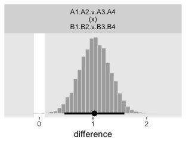

Chapter 24. Count Predicted Variable
================
A Solomon Kurz
2019-05-12

Count Predicted Variable
========================

> In the context of the generalized linear model (GLM) introduced in Chapter 15, this chapter’s situation involves a predicted value that is a count, for which we will use an inverse-link function that is exponential along with a Poisson distribution for describing noise in the data (pp. 703--704)

Poisson exponential model
-------------------------

Following Kruschke, we will "refer to the model that will be explained in this section as Poisson exponential because, as we will see, the noise distribution is a Poisson distribution and the inverse-link function is exponential" (p. 704).

### Data structure.

Nothing for us here. See the text for the example data table.

### Exponential link function.

The additive model of cell counts of a table of rows *r* and columns *c* follows the form

*λ*<sub>*r*, *c*</sub> = exp(*β*<sub>0</sub> + *β*<sub>*r*</sub> + *β*<sub>*c*</sub>)

where *λ*<sub>*r*, *c*</sub> is the tendency of counts within row *r* and column *c*. In the case of an interaction model, the equation expands to

*λ*<sub>*r*, *c*</sub> = exp(*β*<sub>0</sub> + *β*<sub>*r*</sub> + *β*<sub>*c*</sub> + *β*<sub>*r*, *c*</sub>)

with the following constraints:

∑<sub>*r*</sub>*β*<sub>*r*</sub> = 0, ∑<sub>*c*</sub>*β*<sub>*c*</sub> = 0, ∑<sub>*r*</sub>*β*<sub>*r*, *c*</sub> = 0 for all *c*,  and ∑<sub>*c*</sub>*β*<sub>*r*, *c*</sub> = 0 for all *r*

### Poisson noise distribution.

Simon-Denis Poisson's distribution follows the form

$$
p(y | \\lambda) = \\frac{\\lambda^y \\text{exp} (-\\lambda)}{y!}
$$

> where *y* is a non-negative integer and *λ* is a non-negative real number. The mean of the Poisson distribution is *λ*. Importantly, the variance of the Poisson distribution is also *λ* (i.e., the standard deviation is $\\sqrt \\lambda$). Thus, in the Poisson distribution, the variance is completely yoked to the mean. (p. 707)

We can work with that expression directly in base R. Here we use *λ* = 5.5 and *y* = 2.

``` r
lambda <- 5.5
y <- 2


lambda^y * exp(-lambda) / factorial(y)
```

    ## [1] 0.06181242

If we'd like to simulate from the Poisson distribution, we'd use the `rpois()` function. It takes two arguments, `n` and `lambda`. Let's generate 1000 draws based on *λ* = 5.

``` r
library(tidyverse)

set.seed(24)

d <- tibble(y = rpois(n = 100, lambda = 5))
```

Here are the mean and variance.

``` r
d %>% 
  summarise(mean     = mean(y),
            variance = var(y))
```

    ## # A tibble: 1 x 2
    ##    mean variance
    ##   <dbl>    <dbl>
    ## 1  4.76     4.63

They're not exactly the same because of simulation variance, but they get that way real quick with a larger sample.

``` r
set.seed(24)

tibble(y = rpois(n = 100000, lambda = 5)) %>% 
  summarise(mean     = mean(y),
            variance = var(y))
```

    ## # A tibble: 1 x 2
    ##    mean variance
    ##   <dbl>    <dbl>
    ## 1  4.99     4.98

Let's put `rpois()` to work and make Figure 24.1.

``` r
set.seed(24)

tibble(lambda = c(1.8, 8.3, 32.1)) %>% 
  mutate(y = map(lambda, rpois, n = 1e5)) %>% 
  unnest() %>%
  
  ggplot(aes(x = y)) +
  geom_histogram(aes(y = stat(density)),
                 binwidth = 1, color = "grey92") +
  ylab("p(y)") +
  theme(panel.grid = element_blank()) +
  facet_wrap(~lambda, ncol = 1,
             labeller = label_bquote(dpois(y*"|"*lambda == .(lambda))))
```


For more on our `labeller = label_bquote` syntax, check out [this](https://ggplot2.tidyverse.org/reference/label_bquote.html). And [here's](https://stackoverflow.com/questions/15530202/add-vertical-bar-in-expression-to-plot) is where I learned about the `*"|"*` syntax.

But anyway, given *l**a**m**b**d**a*, the Poisson distribution gives the probabilities of specific non-negative integers. And instead of using our hand-coded function from above, we can also use `dpois()` to get density precise density values.

``` r
dpois(2, lambda = 5.5)
```

    ## [1] 0.06181242

### The complete model and implementation in ~~JAGS~~ brms.

Before we show how to fit the model, we need the old `gamma_a_b_from_omega_sigma()` function.

``` r
gamma_a_b_from_omega_sigma <- function(mode, sd) {
  if (mode <= 0) stop("mode must be > 0")
  if (sd   <= 0) stop("sd must be > 0")
  rate <- (mode + sqrt(mode^2 + 4 * sd^2)) / (2 * sd^2)
  shape <- 1 + mode * rate
  return(list(shape = shape, rate = rate))
}
```

Here are a few intermediate values before we set the `stanvars`.

``` r
n_x1_level <- length(unique(my_data$x1))
n_x2_level <- length(unique(my_data$x2))
n_cell     <- nrow(my_data)
```

Now we're ready to define the `stanvars`.

``` r
y_log_mean <-
  log(sum(my_data$y) / (n_x1_level * n_x2_level))

y_log_sd <-
  c(rep(0, n_cell - 1), sum(my_data$y)) %>% 
  sd() %>% 
  log()

s_r <- gamma_a_b_from_omega_sigma(mode = y_log_sd, sd = 2 * y_log_sd)

stanvars <- 
  stanvar(y_log_mean, name = "y_log_mean") + 
  stanvar(y_log_sd,   name = "y_log_sd") + 
  stanvar(s_r$shape,  name = "alpha") +
  stanvar(s_r$rate,   name = "beta")
```

And you'd fit the model with code like this.

``` r
fit <-
  brm(data = my_data,
      family = poisson,
      y ~ 1 + (1 | x1) + (1 | x2) + (1 | x1:x2),
      prior = c(prior(normal(y_log_mean, y_log_sd * 2), class = Intercept),
                prior(gamma(alpha, beta), class = sd)),
      stanvars = stanvars)
```

By brms default, `family = poisson` uses the log link. Thus `family = poisson(link = "log")` should return the same results.

Example: Hair eye go again
--------------------------

Load the hair- and eye-color data.

``` r
my_data <- read_csv("data.R/HairEyeColor.csv")

glimpse(my_data)
```

    ## Observations: 16
    ## Variables: 3
    ## $ Hair  <chr> "Black", "Black", "Black", "Black", "Blond", "Blond", "Blo…
    ## $ Eye   <chr> "Blue", "Brown", "Green", "Hazel", "Blue", "Brown", "Green…
    ## $ Count <int> 20, 68, 5, 15, 94, 7, 16, 10, 84, 119, 29, 54, 17, 26, 14,…

Load the brms and tidybayes packages.

``` r
library(brms)
library(tidybayes)
```

Now we'll make save the prepatory values necessary for the `stanvars`.

``` r
n_x1_level <- length(unique(my_data$Hair))
n_x2_level <- length(unique(my_data$Eye))
n_cell     <- nrow(my_data)

n_x1_level
```

    ## [1] 4

``` r
n_x2_level
```

    ## [1] 4

``` r
n_cell
```

    ## [1] 16

Here are the values we'll save as `stanvars`.

``` r
y_log_mean <-
  log(sum(my_data$Count) / (n_x1_level * n_x2_level))

y_log_sd <-
  c(rep(0, n_cell - 1), sum(my_data$Count)) %>% 
  sd() %>% 
  log()

s_r <- gamma_a_b_from_omega_sigma(mode = y_log_sd, sd = 2 * y_log_sd)

y_log_mean
```

    ## [1] 3.610918

``` r
y_log_sd
```

    ## [1] 4.997212

``` r
s_r$shape
```

    ## [1] 1.640388

``` r
s_r$rate
```

    ## [1] 0.1281491

As a quick detour, it might be interesting to see what the kind of gamma distribution is entailed by those last two values.

``` r
tibble(x = seq(from = 0, to = 70, length.out = 1e3)) %>% 
  mutate(density = dgamma(x,
                          gamma_a_b_from_omega_sigma(mode = y_log_sd, sd = 2 * y_log_sd)$shape,
                          gamma_a_b_from_omega_sigma(mode = y_log_sd, sd = 2 * y_log_sd)$rate)) %>% 
  
  ggplot(aes(x = x, ymin = 0, ymax = density)) +
  geom_ribbon(fill = "grey67") +
  scale_y_continuous(NULL, breaks = NULL) +
  labs(title = expression(paste("Kruschke's wide prior for ", sigma[beta[x]])),
       x = NULL) +
  coord_cartesian(xlim = 0:60) +
  theme(panel.grid = element_blank())
```


Save the `stanvars`.

``` r
stanvars <- 
  stanvar(y_log_mean, name = "y_log_mean") + 
  stanvar(y_log_sd,   name = "y_log_sd") + 
  stanvar(s_r$shape,  name = "alpha") +
  stanvar(s_r$rate,   name = "beta")
```

Fit Kruschke's model with brms.

``` r
fit1 <-
  brm(data = my_data,
      family = poisson,
      Count ~ 1 + (1 | Hair) + (1 | Eye) + (1 | Hair:Eye),
      prior = c(prior(normal(y_log_mean, y_log_sd * 2), class = Intercept),
                prior(gamma(alpha, beta), class = sd)),
      iter = 3000, warmup = 1000, chains = 4, cores = 4,
      seed = 24,
      stanvars = stanvars)
```

As it turns out, if you try to fit Kruschke’s model with brms as is, you’ll run into difficulties with divergent transitions and the like. One approach is to try tuning the `adapt_delta` and `max_treedepth` parameters. I had no luck with that approach. E.g., cranking `adapt_delta` up past `0.9999` still returned a divergent transition or two.

Another approach is to step back and assess the model. We’re trying to fit a multilevel model with two grouping variables and their interaction with a total of 16 data points. That not a lot of data to fit such a model with. If you take a close look at our priors, you’ll notice they’re really quite weak. If you’re willing to tighten them up just a bit, the model can fit more smoothly. That will be our approach.

For the *σ* hyperparameter of the overall intercept’s Gaussian prior, Kruschke would have us multiply `y_log_sd` by 2. Here we’ll tighten that up by simply setting *σ* to `y_log_sd`. The gamma priors for the upper-level variance parameters were based on a mode of `y_log_sd` and a standard deviation of the same but multiplied by 2 (i.e., `2 * y_log_sd`). We’ll tighten that up a bit by simply basing those gammas on a standard deviation of `y_log_sd`. When you make those adjustments, the model fits with less fuss.

``` r
s_r <- gamma_a_b_from_omega_sigma(mode = y_log_sd, sd = y_log_sd)

stanvars <- 
  stanvar(y_log_mean, name = "y_log_mean") + 
  stanvar(y_log_sd,   name = "y_log_sd") + 
  stanvar(s_r$shape,  name = "alpha") +
  stanvar(s_r$rate,   name = "beta")
```

Now we've updated our `stanvars`, we'll fit the modified model. We should note that even this version required some adjustment to the `adapt_delta` and `max_treedepth` parameters. But it wasn’t nearly the exercise in frustration entailed in the version, above.

``` r
fit1 <-
  brm(data = my_data,
      family = poisson,
      Count ~ 1 + (1 | Hair) + (1 | Eye) + (1 | Hair:Eye),
      prior = c(prior(normal(y_log_mean, y_log_sd), class = Intercept),
                prior(gamma(alpha, beta), class = sd)),
      iter = 3000, warmup = 1000, chains = 4, cores = 4,
      seed = 24,
      control = list(adapt_delta = 0.99,
                     max_treedepth = 11),
      stanvars = stanvars)
```

Take a look at the parameter summary.

``` r
print(fit1)
```

    ##  Family: poisson 
    ##   Links: mu = log 
    ## Formula: Count ~ 1 + (1 | Hair) + (1 | Eye) + (1 | Hair:Eye) 
    ##    Data: my_data (Number of observations: 16) 
    ## Samples: 4 chains, each with iter = 3000; warmup = 1000; thin = 1;
    ##          total post-warmup samples = 8000
    ## 
    ## Group-Level Effects: 
    ## ~Eye (Number of levels: 4) 
    ##               Estimate Est.Error l-95% CI u-95% CI Eff.Sample Rhat
    ## sd(Intercept)     1.78      1.58     0.28     6.02       2999 1.00
    ## 
    ## ~Hair (Number of levels: 4) 
    ##               Estimate Est.Error l-95% CI u-95% CI Eff.Sample Rhat
    ## sd(Intercept)     1.94      1.59     0.37     6.40       3673 1.00
    ## 
    ## ~Hair:Eye (Number of levels: 16) 
    ##               Estimate Est.Error l-95% CI u-95% CI Eff.Sample Rhat
    ## sd(Intercept)     0.93      0.28     0.54     1.60       3438 1.00
    ## 
    ## Population-Level Effects: 
    ##           Estimate Est.Error l-95% CI u-95% CI Eff.Sample Rhat
    ## Intercept     3.23      1.51    -0.03     6.45       4834 1.00
    ## 
    ## Samples were drawn using sampling(NUTS). For each parameter, Eff.Sample 
    ## is a crude measure of effective sample size, and Rhat is the potential 
    ## scale reduction factor on split chains (at convergence, Rhat = 1).

You’ll notice that even though we tightened up the priors, the parameter estimates are still quite small relative to the values they allowed for. So even our tightened priors were quite permissive.

Let's post process in preparation for Figure 24.3.

``` r
nd <-
  my_data %>% 
  arrange(Eye, Hair) %>% 
  mutate(strip = str_c("E:", Eye, " H:", Hair, "\nN = ", Count))

f <-
  fitted(fit1,
         newdata = nd,
         summary = F) %>% 
  data.frame() %>%
  set_names(pull(nd, strip))

glimpse(f)
```

    ## Observations: 8,000
    ## Variables: 16
    ## $ `E:Blue H:Black\nN = 20`   <dbl> 17.05749, 37.48424, 26.43179, 27.8721…
    ## $ `E:Blue H:Blond\nN = 94`   <dbl> 92.63903, 71.50050, 76.79407, 83.2967…
    ## $ `E:Blue H:Brown\nN = 84`   <dbl> 78.57345, 88.78138, 84.99287, 89.3608…
    ## $ `E:Blue H:Red\nN = 17`     <dbl> 19.07921, 15.04376, 21.00375, 19.7306…
    ## $ `E:Brown H:Black\nN = 68`  <dbl> 56.31824, 58.52277, 69.99422, 75.2897…
    ## $ `E:Brown H:Blond\nN = 7`   <dbl> 6.590327, 7.612860, 5.530002, 16.2067…
    ## $ `E:Brown H:Brown\nN = 119` <dbl> 122.2086, 112.0775, 138.3234, 125.514…
    ## $ `E:Brown H:Red\nN = 26`    <dbl> 28.10642, 23.82810, 27.71013, 26.0743…
    ## $ `E:Green H:Black\nN = 5`   <dbl> 6.169125, 6.060978, 8.654791, 8.32841…
    ## $ `E:Green H:Blond\nN = 16`  <dbl> 15.147750, 12.066189, 22.702408, 17.2…
    ## $ `E:Green H:Brown\nN = 29`  <dbl> 28.04852, 22.50656, 43.06455, 38.1602…
    ## $ `E:Green H:Red\nN = 14`    <dbl> 12.301157, 17.958262, 13.568589, 11.6…
    ## $ `E:Hazel H:Black\nN = 15`  <dbl> 16.935313, 14.467705, 15.227904, 17.8…
    ## $ `E:Hazel H:Blond\nN = 10`  <dbl> 10.925221, 8.262539, 5.155320, 16.571…
    ## $ `E:Hazel H:Brown\nN = 54`  <dbl> 57.66839, 41.98795, 59.10810, 64.5036…
    ## $ `E:Hazel H:Red\nN = 14`    <dbl> 12.171599, 16.903481, 11.803208, 16.2…

Notice that when working with a Poisson model, `fitted()` defaults to returning estimates in the *λ* metric. If we want proportions/probabilities, we'll have to compute them by dividing by the total *N*. In this case *N* = 592, which we get with `sum(my_data$Count)`. Here we convert the data to the long format, compute the proportions, and plot to make the top portion of Figure 24.3.

``` r
f %>% 
  gather(key, count) %>% 
  mutate(proportion = count / 592) %>% 
  
  ggplot(aes(x = proportion)) +
  geom_histogram(color = "grey92", fill = "grey67",
                 size = .05, bins = 50) +
  geom_halfeyeh(aes(y = 0),
                .width = .95, size = 1/2) +
  scale_x_continuous(breaks = c(0, .1, .2)) +
  scale_y_continuous(NULL, breaks = NULL) +
  coord_cartesian(xlim = c(0, .25)) +
  theme(panel.grid = element_blank()) +
  facet_wrap(~key, scales = "free_y")
```


We’ll have to work a bit to get the deflection differences. If this was a simple multilevel model with a single random grouping variable, we could just use the `ranef()` function to return the deflections. Like `fitted()`, it’ll return summaries by default. But you can get the posterior draws with the `summary = F` argument. But since we’ve used two grouping variables and their interaction, it’d be a bit of a pain to work that way. But we do have a handy alternative. First, if we use the `scale = "linear"` argument, `fitted()` will return the draws in the *λ* scale rather than the original count metric. With the group-level draws in the *λ* metric, all we need to do is subtract the fixed effect (i.e., the grand mean, the population estimate) from each to convert them to the deflection metric. So below, we’ll (a) make a custom `make_deflection()` function to do the conversions, (b) redefine our `nd` data to make our naming conventions a little more streamlined, (c) use `fitted()` and its `scale = "linear"` argument to get the draws in the *λ* metric, (d) wrangle a touch, and (e) use our handy `make_deflection()` function to convert the results to the deflection metric.

I know; that’s a lot. If you get lost, just go step by step and examine the results along the way.

``` r
# a. make a custom function
make_deflection <- function(x) {
  x - posterior_samples(fit1)$b_Intercept
}

# b. streamline `nd`
nd <-
  my_data %>% 
  arrange(Eye, Hair) %>% 
  mutate(strip = str_c("E:", Eye, " H:", Hair))

# c. use `fitted()`
deflections <-
  fitted(fit1,
         newdata = nd,
         summary = F,
         scale = "linear") %>% 
  # d. wrangle
  data.frame() %>%
  set_names(pull(nd, strip)) %>% 
  # e. use the `make_deflection()` function
  mutate_all(.funs = make_deflection)

# what have we done?
glimpse(deflections)
```

    ## Observations: 8,000
    ## Variables: 16
    ## $ `E:Blue H:Black`  <dbl> -0.110287615, 1.337628403, -0.112080188, 0.853…
    ## $ `E:Blue H:Blond`  <dbl> 1.58183365, 1.98341224, 0.95447978, 1.94783342…
    ## $ `E:Blue H:Brown`  <dbl> 1.4171569, 2.1998847, 1.0559198, 2.0181068, 2.…
    ## $ `E:Blue H:Red`    <dbl> 0.001722188, 0.424670926, -0.341946707, 0.5075…
    ## $ `E:Brown H:Black` <dbl> 1.0841416, 1.7831237, 0.8617650, 1.8467681, 1.…
    ## $ `E:Brown H:Blond` <dbl> -1.061273884, -0.256453237, -1.676459552, 0.31…
    ## $ `E:Brown H:Brown` <dbl> 1.858852525, 2.432898553, 1.542946533, 2.35784…
    ## $ `E:Brown H:Red`   <dbl> 0.38912113, 0.88457319, -0.06484966, 0.7863780…
    ## $ `E:Green H:Black` <dbl> -1.1273199, -0.4844211, -1.2285346, -0.3549025…
    ## $ `E:Green H:Blond` <dbl> -0.22902489, 0.20411503, -0.26417664, 0.370482…
    ## $ `E:Green H:Brown` <dbl> 0.38705899, 0.82751468, 0.37605262, 1.16721919…
    ## $ `E:Green H:Red`   <dbl> -0.437183548, 0.601758068, -0.778890184, -0.02…
    ## $ `E:Hazel H:Black` <dbl> -0.1174759005, 0.3856266846, -0.6635181189, 0.…
    ## $ `E:Hazel H:Blond` <dbl> -0.55580288, -0.17456026, -1.74661850, 0.33309…
    ## $ `E:Hazel H:Brown` <dbl> 1.1078323, 1.4510905, 0.6927203, 1.6921462, 1.…
    ## $ `E:Hazel H:Red`   <dbl> -0.447771583, 0.541227344, -0.918276274, 0.312…

Now we're ready to define our difference columns and plot our version of the lower panels in Figure 24.3.

``` r
deflections %>% 
  transmute(`Blue − Brown @ Black` = `E:Blue H:Black` - `E:Brown H:Black`,
            `Blue − Brown @ Blond` = `E:Blue H:Blond` - `E:Brown H:Blond`) %>% 
  mutate(`Blue.v.Brown\n(x)\nBlack.v.Blond` = `Blue − Brown @ Black` - `Blue − Brown @ Blond`) %>% 
  gather(key, difference) %>% 
  
  ggplot(aes(x = difference)) +
  geom_rect(aes(xmin = -.1, xmax = .1,
                ymin = -Inf, ymax = Inf),
            fill = "white") +
  geom_histogram(color = "grey92", fill = "grey67",
                 size = .2, bins = 40) +
  geom_halfeyeh(aes(y = 0),
                point_interval = mode_hdi, .width = .95) +
  scale_y_continuous(NULL, breaks = NULL) +
  theme(panel.grid = element_blank()) +
  facet_wrap(~key, scales = "free")
```


If you're curious, here are the precise values.

``` r
deflections %>% 
  transmute(`Blue − Brown @ Black` = `E:Blue H:Black` - `E:Brown H:Black`,
            `Blue − Brown @ Blond` = `E:Blue H:Blond` - `E:Brown H:Blond`) %>% 
  mutate(`Blue.v.Brown\n(x)\nBlack.v.Blond` = `Blue − Brown @ Black` - `Blue − Brown @ Blond`) %>% 
  gather() %>% 
  group_by(key) %>% 
  mode_hdi()
```

    ## # A tibble: 3 x 7
    ##   key                           value .lower .upper .width .point .interval
    ##   <chr>                         <dbl>  <dbl>  <dbl>  <dbl> <chr>  <chr>    
    ## 1 Blue − Brown @ Black          -1.18  -1.68 -0.700   0.95 mode   hdi      
    ## 2 Blue − Brown @ Blond           2.34   1.70  3.14    0.95 mode   hdi      
    ## 3 "Blue.v.Brown\n(x)\nBlack.v.… -3.56  -4.52 -2.74    0.95 mode   hdi

Example: Interaction contrasts, shrinkage, and omnibus test
-----------------------------------------------------------

Let's make the data.

``` r
my_data <-
  tibble(a = str_c("a", 1:4)) %>% 
  expand(a,
         b = str_c("b", 1:4)) %>% 
  mutate(count = c(rep(c(22, 11), each = 2) %>% rep(., times = 2),
                   rep(c(11, 22), each = 2) %>% rep(., times = 2)))

head(my_data)
```

    ## # A tibble: 6 x 3
    ##   a     b     count
    ##   <chr> <chr> <dbl>
    ## 1 a1    b1       22
    ## 2 a1    b2       22
    ## 3 a1    b3       11
    ## 4 a1    b4       11
    ## 5 a2    b1       22
    ## 6 a2    b2       22

Make the `stanvars`.

``` r
n_x1_level <- length(unique(my_data$a))
n_x2_level <- length(unique(my_data$b))
n_cell     <- nrow(my_data)

y_log_mean <-
  log(sum(my_data$count) / (n_x1_level * n_x2_level))

y_log_sd <-
  c(rep(0, n_cell - 1), sum(my_data$count)) %>% 
  sd() %>% 
  log()

s_r <- gamma_a_b_from_omega_sigma(mode = y_log_sd, sd = y_log_sd)

stanvars <- 
  stanvar(y_log_mean, name = "y_log_mean") + 
  stanvar(y_log_sd,   name = "y_log_sd") + 
  stanvar(s_r$shape,  name = "alpha") +
  stanvar(s_r$rate,   name = "beta")
```

Fit the model.

``` r
fit2 <-
  brm(data = my_data,
      family = poisson,
      count ~ 1 + (1 | a) + (1 | b) + (1 | a:b),
      prior = c(prior(normal(y_log_mean, y_log_sd), class = Intercept),
                prior(gamma(alpha, beta), class = sd)),
      iter = 3000, warmup = 1000, chains = 4, cores = 4,
      seed = 24,
      control = list(adapt_delta = 0.99,
                     max_treedepth = 11),
      stanvars = stanvars)
```

Consider the summary.

``` r
print(fit2)
```

    ##  Family: poisson 
    ##   Links: mu = log 
    ## Formula: count ~ 1 + (1 | a) + (1 | b) + (1 | a:b) 
    ##    Data: my_data (Number of observations: 16) 
    ## Samples: 4 chains, each with iter = 3000; warmup = 1000; thin = 1;
    ##          total post-warmup samples = 8000
    ## 
    ## Group-Level Effects: 
    ## ~a (Number of levels: 4) 
    ##               Estimate Est.Error l-95% CI u-95% CI Eff.Sample Rhat
    ## sd(Intercept)     0.92      0.97     0.09     3.73       2073 1.00
    ## 
    ## ~a:b (Number of levels: 16) 
    ##               Estimate Est.Error l-95% CI u-95% CI Eff.Sample Rhat
    ## sd(Intercept)     0.48      0.17     0.22     0.88       2402 1.00
    ## 
    ## ~b (Number of levels: 4) 
    ##               Estimate Est.Error l-95% CI u-95% CI Eff.Sample Rhat
    ## sd(Intercept)     0.97      1.06     0.09     3.94       2059 1.00
    ## 
    ## Population-Level Effects: 
    ##           Estimate Est.Error l-95% CI u-95% CI Eff.Sample Rhat
    ## Intercept     2.72      0.87     0.79     4.56       2584 1.00
    ## 
    ## Samples were drawn using sampling(NUTS). For each parameter, Eff.Sample 
    ## is a crude measure of effective sample size, and Rhat is the potential 
    ## scale reduction factor on split chains (at convergence, Rhat = 1).

Here's the top part of Figure 24.4.

``` r
nd <-
  my_data %>% 
  mutate(strip = str_c("a:", a, " b:", b, "\nN = ", count))

fitted(fit2,
       newdata = nd,
       summary = F) %>% 
  data.frame() %>%
  set_names(pull(nd, strip)) %>% 
  gather(key, count) %>% 
  mutate(proportion = count / sum(my_data$count)) %>% 
  
  # plot!
  ggplot(aes(x = proportion)) +
  geom_histogram(color = "grey92", fill = "grey67",
                 size = .05, bins = 40) +
  geom_halfeyeh(aes(y = 0),
                .width = .95, size = 1/2) +
  scale_x_continuous(breaks = c(.05, .1, .15)) +
  scale_y_continuous(NULL, breaks = NULL) +
  coord_cartesian(xlim = c(0, .15)) +
  theme(panel.grid = element_blank()) +
  facet_wrap(~key, scales = "free_y")
```


Like before, we’ll have to work a bit to get the deflection differences.

``` r
# streamline `nd`
nd <-
  my_data %>% 
  mutate(strip = str_c("a:", a, " b:", b))

# use `fitted()`
deflections <-
  fitted(fit2,
         newdata = nd,
         summary = F,
         scale = "linear") %>% 
  # wrangle
  data.frame() %>%
  set_names(pull(nd, strip)) %>% 
  # use the `make_deflection()` function
  mutate_all(.funs = make_deflection)

# what have we done?
glimpse(deflections)
```

    ## Observations: 8,000
    ## Variables: 16
    ## $ `a:a1 b:b1` <dbl> -0.03114819, 0.63472316, -0.61013716, 0.50534421, 0.…
    ## $ `a:a1 b:b2` <dbl> 0.07277555, 0.68034906, -0.71837695, 0.73050088, 1.0…
    ## $ `a:a1 b:b3` <dbl> -0.19299497, 0.08101245, -0.92621012, 0.09955127, -0…
    ## $ `a:a1 b:b4` <dbl> -0.60994765, -0.14465504, -1.16032654, 0.02119091, 1…
    ## $ `a:a2 b:b1` <dbl> -0.146536633, 0.994588367, -0.604609569, 0.638214456…
    ## $ `a:a2 b:b2` <dbl> -0.144110524, 0.948751122, -0.729138802, 0.958963844…
    ## $ `a:a2 b:b3` <dbl> -0.129516805, 0.063721115, -0.808552565, -0.00380775…
    ## $ `a:a2 b:b4` <dbl> -0.60247440, -0.01435801, -0.87551453, -0.19750446, …
    ## $ `a:a3 b:b1` <dbl> -0.53556198, 0.23314871, -0.52972626, -0.59528437, 0…
    ## $ `a:a3 b:b2` <dbl> -0.27817705, 0.25836125, -0.68190129, -0.04324540, 0…
    ## $ `a:a3 b:b3` <dbl> 0.25452365, 1.01088793, -0.23561119, 0.83098685, 1.0…
    ## $ `a:a3 b:b4` <dbl> 2.935941e-05, 6.965484e-01, -2.344365e-01, 3.154486e…
    ## $ `a:a4 b:b1` <dbl> -0.144001643, -0.333759727, -0.695451952, 0.00733490…
    ## $ `a:a4 b:b2` <dbl> -0.4683556, 0.4094052, -1.3075689, 0.2102450, 0.3883…
    ## $ `a:a4 b:b3` <dbl> 0.12627960, 0.57182661, -0.51853980, 0.90993469, 0.8…
    ## $ `a:a4 b:b4` <dbl> 0.089882961, 0.377609211, -0.554477962, 0.481671294,…

Now we're ready to define some of the difference columns and plot our version of the left most lower panel in Figure 24.4.

``` r
deflections %>% 
  transmute(`a2 - a3 @ b2` = `a:a2 b:b2` - `a:a3 b:b2`,
            `a2 - a3 @ b3` = `a:a2 b:b3` - `a:a3 b:b3`) %>% 
  transmute(`a2.v.a3\n(x)\nb2.v.b3` = `a2 - a3 @ b2` - `a2 - a3 @ b3`) %>% 
  gather(key, difference) %>% 
  
  ggplot(aes(x = difference)) +
  geom_rect(aes(xmin = -.1, xmax = .1,
                ymin = -Inf, ymax = Inf),
            fill = "white") +
  geom_histogram(color = "grey92", fill = "grey67",
                 size = .2, binwidth = .075) +
  geom_halfeyeh(aes(y = 0),
                point_interval = mode_hdi, .width = .95) +
  scale_y_continuous(NULL, breaks = NULL) +
  coord_cartesian(xlim = c(-.5, 2.5)) +
  theme(panel.grid = element_blank()) +
  facet_wrap(~key, scales = "free")
```


For Figure 24.4, bottom right, we average across the four cells in each quadrant and then compute the contrast.

``` r
deflections %>% 
  # in this intermediate step, we compute the quadrant averages
  # `tl` = top left, `br` = bottom right, and so on
  transmute(tl = (`a:a1 b:b1` + `a:a1 b:b2` + `a:a2 b:b1` + `a:a2 b:b2`) / 4,
            tr = (`a:a1 b:b3` + `a:a1 b:b4` + `a:a2 b:b3` + `a:a2 b:b4`) / 4,
            bl = (`a:a3 b:b1` + `a:a3 b:b2` + `a:a4 b:b1` + `a:a4 b:b2`) / 4,
            br = (`a:a3 b:b3` + `a:a3 b:b4` + `a:a4 b:b3` + `a:a4 b:b4`) / 4) %>%
  # compute the contrast of interest
  transmute(`A1.A2.v.A3.A4\n(x)\nB1.B2.v.B3.B4` = (tl - bl) - (tr - br)) %>% 
  gather(key, difference) %>% 
  
  # plot
  ggplot(aes(x = difference)) +
  geom_rect(aes(xmin = -.1, xmax = .1,
                ymin = -Inf, ymax = Inf),
            fill = "white") +
  geom_histogram(color = "grey92", fill = "grey67",
                 size = .2, binwidth = .075) +
  geom_halfeyeh(aes(y = 0),
                point_interval = mode_hdi, .width = .95) +
  scale_y_continuous(NULL, breaks = NULL) +
  coord_cartesian(xlim = c(-.5, 2.5)) +
  theme(panel.grid = element_blank()) +
  facet_wrap(~key, scales = "free")
```



> The model presented here has no way to conduct an "ominbus" test of interaction. However, like the ANOVA-style models presented in Chapters 19 and 20, it is easy to extend the model so it has an inclusion coefficient on the interaction deflections. The inclusion coefficient can have values of 0 or 1, and is given a Bernoulli prior. (p. 716)

Like we discussed in earlier chapters, this isn't a feasible approach for brms. However, we can compare this model with a simpler one that omits the interaction.

First, fit the model.

``` r
fit3 <-
  brm(data = my_data,
      family = poisson,
      count ~ 1 + (1 | a) + (1 | b),
      prior = c(prior(normal(y_log_mean, y_log_sd), class = Intercept),
                prior(gamma(alpha, beta), class = sd)),
      iter = 3000, warmup = 1000, chains = 4, cores = 4,
      seed = 24,
      control = list(adapt_delta = 0.9995,
                     max_treedepth = 11),
      stanvars = stanvars)
```

Now we can compare them by their stacking weights.

``` r
model_weights(fit2, fit3) %>% 
  round(digits = 3)
```

    ## fit2 fit3 
    ##    1    0

Virtually all the weight went to the interaction model.

~~Log-linear models for contingency tables~~ Bonus: Alternative parameterization
--------------------------------------------------------------------------------

The Poisson distribution is widely used for count data. But notice how in our figures, we converted the results to the proportion metric. Once you're talking about proportions, it's not hard to further adjust your approach to thinking in terms of probabilities. So instead of thinking about the *n* within each cell of our contingency table, we might also think about the probability of a given condition. To approach the data this way, we could use an aggregated binomial model. McElreath covered this in chapter 10 of his text [*Statistical Rethinking*](https://xcelab.net/rm/statistical-rethinking/). See [my translation of the text into brms code](https://bookdown.org/connect/#/apps/1850/access), too.

Here's how to fit that model.

``` r
fit4 <-
  brm(data = my_data,
      family = binomial,
      count | trials(264) ~ 1 + (1 | a) + (1 | b) + (1 | a:b),
      prior = c(prior(normal(0, 2), class = Intercept),
                prior(normal(0, 1), class = sd)),
      iter = 3000, warmup = 1000, chains = 4, cores = 4,
      seed = 24,
      control = list(adapt_delta = 0.99))
```

Check the summary.

``` r
print(fit4)
```

    ##  Family: binomial 
    ##   Links: mu = logit 
    ## Formula: count | trials(264) ~ 1 + (1 | a) + (1 | b) + (1 | a:b) 
    ##    Data: my_data (Number of observations: 16) 
    ## Samples: 4 chains, each with iter = 3000; warmup = 1000; thin = 1;
    ##          total post-warmup samples = 8000
    ## 
    ## Group-Level Effects: 
    ## ~a (Number of levels: 4) 
    ##               Estimate Est.Error l-95% CI u-95% CI Eff.Sample Rhat
    ## sd(Intercept)     0.18      0.20     0.01     0.71       3571 1.00
    ## 
    ## ~a:b (Number of levels: 16) 
    ##               Estimate Est.Error l-95% CI u-95% CI Eff.Sample Rhat
    ## sd(Intercept)     0.34      0.12     0.12     0.62       2734 1.00
    ## 
    ## ~b (Number of levels: 4) 
    ##               Estimate Est.Error l-95% CI u-95% CI Eff.Sample Rhat
    ## sd(Intercept)     0.18      0.19     0.00     0.68       3125 1.00
    ## 
    ## Population-Level Effects: 
    ##           Estimate Est.Error l-95% CI u-95% CI Eff.Sample Rhat
    ## Intercept    -2.72      0.21    -3.12    -2.27       3573 1.00
    ## 
    ## Samples were drawn using sampling(NUTS). For each parameter, Eff.Sample 
    ## is a crude measure of effective sample size, and Rhat is the potential 
    ## scale reduction factor on split chains (at convergence, Rhat = 1).

Since we used a different likelihood and link function, it shouldn't be surprising the parameters look different. But notice how the aggregated binomial model yields virtually the same results for the top portion of Figure 24.4.

``` r
nd <-
  my_data %>% 
  mutate(strip = str_c("a:", a, " b:", b, "\nN = ", count))

fitted(fit4,
       newdata = nd,
       summary = F) %>% 
  data.frame() %>%
  set_names(pull(nd, strip)) %>% 
  gather(key, count) %>% 
  mutate(proportion = count / sum(my_data$count)) %>% 
  
  # plot!
  ggplot(aes(x = proportion)) +
  geom_histogram(color = "grey92", fill = "grey67",
                 size = .05, bins = 40) +
  geom_halfeyeh(aes(y = 0),
                .width = .95, size = 1/2) +
  scale_x_continuous(breaks = c(.05, .1, .15)) +
  scale_y_continuous(NULL, breaks = NULL) +
  coord_cartesian(xlim = c(0, .15)) +
  theme(panel.grid = element_blank()) +
  facet_wrap(~key, scales = "free_y")
```


References
----------

Kruschke, J. K. (2015). *Doing Bayesian data analysis, Second Edition: A tutorial with R, JAGS, and Stan.* Burlington, MA: Academic Press/Elsevier.

Session info
------------

``` r
sessionInfo()
```

    ## R version 3.5.1 (2018-07-02)
    ## Platform: x86_64-apple-darwin15.6.0 (64-bit)
    ## Running under: macOS High Sierra 10.13.6
    ## 
    ## Matrix products: default
    ## BLAS: /Library/Frameworks/R.framework/Versions/3.5/Resources/lib/libRblas.0.dylib
    ## LAPACK: /Library/Frameworks/R.framework/Versions/3.5/Resources/lib/libRlapack.dylib
    ## 
    ## locale:
    ## [1] en_US.UTF-8/en_US.UTF-8/en_US.UTF-8/C/en_US.UTF-8/en_US.UTF-8
    ## 
    ## attached base packages:
    ## [1] stats     graphics  grDevices utils     datasets  methods   base     
    ## 
    ## other attached packages:
    ##  [1] tidybayes_1.0.4 brms_2.8.8      Rcpp_1.0.1      forcats_0.3.0  
    ##  [5] stringr_1.4.0   dplyr_0.8.0.1   purrr_0.2.5     readr_1.1.1    
    ##  [9] tidyr_0.8.1     tibble_2.1.1    ggplot2_3.1.1   tidyverse_1.2.1
    ## 
    ## loaded via a namespace (and not attached):
    ##  [1] nlme_3.1-137              matrixStats_0.54.0       
    ##  [3] xts_0.10-2                lubridate_1.7.4          
    ##  [5] threejs_0.3.1             httr_1.3.1               
    ##  [7] LaplacesDemon_16.1.1      rprojroot_1.3-2          
    ##  [9] rstan_2.18.2              tools_3.5.1              
    ## [11] backports_1.1.4           utf8_1.1.4               
    ## [13] R6_2.3.0                  DT_0.4                   
    ## [15] lazyeval_0.2.2            colorspace_1.3-2         
    ## [17] withr_2.1.2               prettyunits_1.0.2        
    ## [19] processx_3.2.1            tidyselect_0.2.5         
    ## [21] gridExtra_2.3             Brobdingnag_1.2-6        
    ## [23] compiler_3.5.1            cli_1.0.1                
    ## [25] rvest_0.3.2               HDInterval_0.2.0         
    ## [27] arrayhelpers_1.0-20160527 xml2_1.2.0               
    ## [29] shinyjs_1.0               labeling_0.3             
    ## [31] colourpicker_1.0          scales_1.0.0             
    ## [33] dygraphs_1.1.1.5          mvtnorm_1.0-10           
    ## [35] callr_3.1.0               ggridges_0.5.0           
    ## [37] StanHeaders_2.18.0-1      digest_0.6.18            
    ## [39] rmarkdown_1.10            base64enc_0.1-3          
    ## [41] pkgconfig_2.0.2           htmltools_0.3.6          
    ## [43] htmlwidgets_1.2           rlang_0.3.4              
    ## [45] readxl_1.1.0              rstudioapi_0.7           
    ## [47] shiny_1.1.0               svUnit_0.7-12            
    ## [49] generics_0.0.2            zoo_1.8-2                
    ## [51] jsonlite_1.5              crosstalk_1.0.0          
    ## [53] gtools_3.8.1              inline_0.3.15            
    ## [55] magrittr_1.5              loo_2.1.0                
    ## [57] bayesplot_1.6.0           Matrix_1.2-14            
    ## [59] munsell_0.5.0             fansi_0.4.0              
    ## [61] abind_1.4-5               stringi_1.4.3            
    ## [63] yaml_2.1.19               ggstance_0.3             
    ## [65] pkgbuild_1.0.2            plyr_1.8.4               
    ## [67] grid_3.5.1                parallel_3.5.1           
    ## [69] promises_1.0.1            crayon_1.3.4             
    ## [71] miniUI_0.1.1.1            lattice_0.20-35          
    ## [73] haven_1.1.2               hms_0.4.2                
    ## [75] ps_1.2.1                  knitr_1.20               
    ## [77] pillar_1.3.1              igraph_1.2.1             
    ## [79] markdown_0.8              shinystan_2.5.0          
    ## [81] codetools_0.2-15          stats4_3.5.1             
    ## [83] reshape2_1.4.3            rstantools_1.5.1         
    ## [85] glue_1.3.1.9000           evaluate_0.10.1          
    ## [87] modelr_0.1.2              httpuv_1.4.4.2           
    ## [89] cellranger_1.1.0          gtable_0.3.0             
    ## [91] assertthat_0.2.0          mime_0.5                 
    ## [93] xtable_1.8-2              broom_0.5.1              
    ## [95] coda_0.19-2               later_0.7.3              
    ## [97] rsconnect_0.8.8           shinythemes_1.1.1        
    ## [99] bridgesampling_0.6-0
