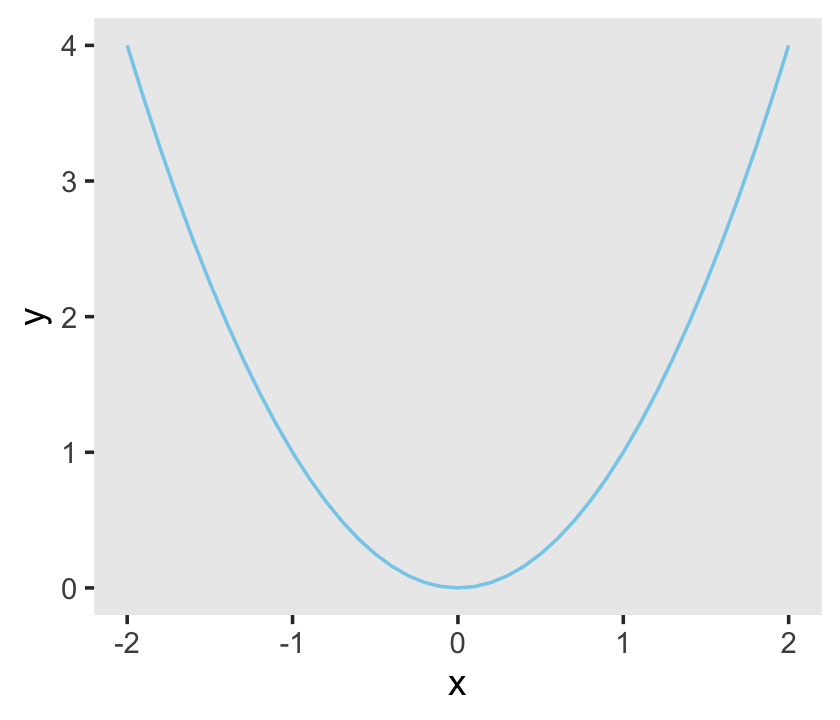
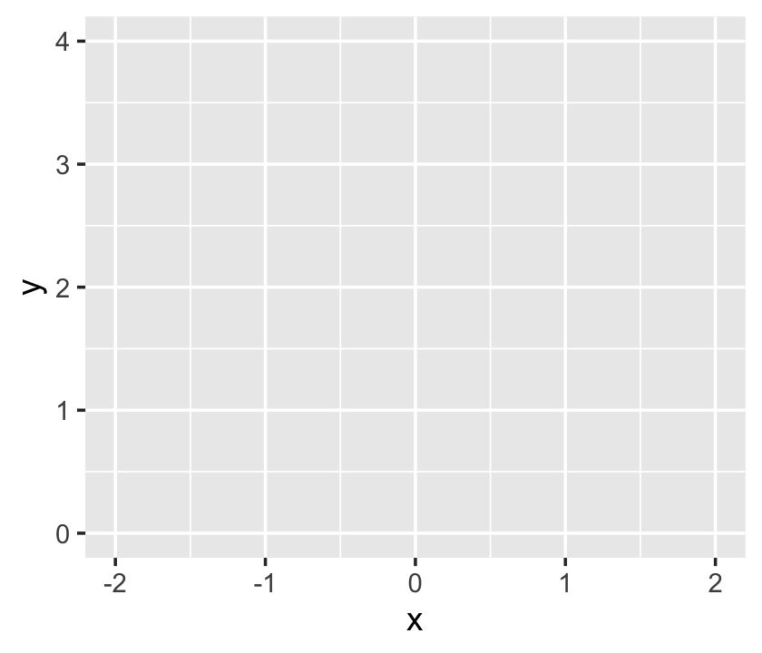
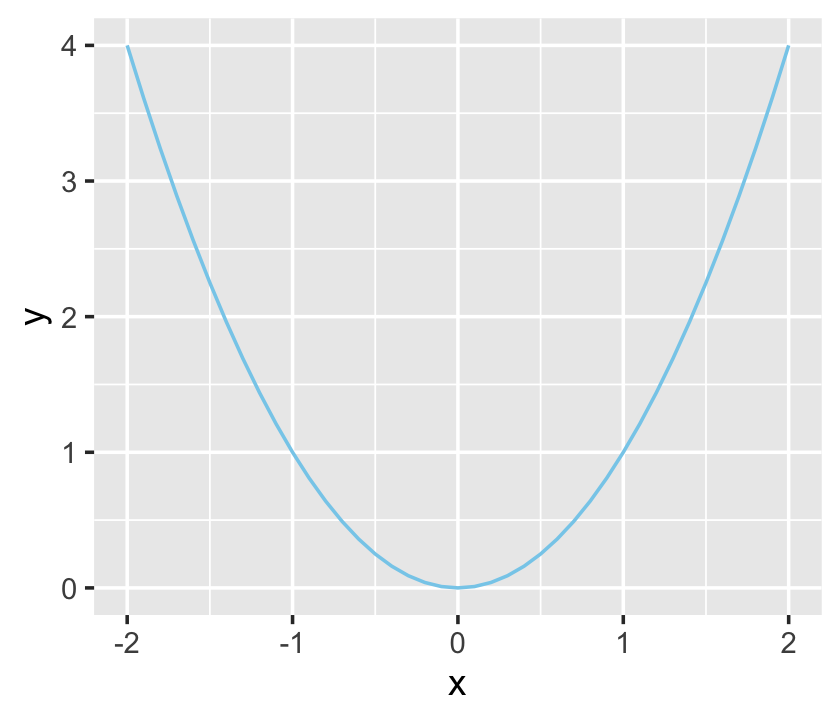
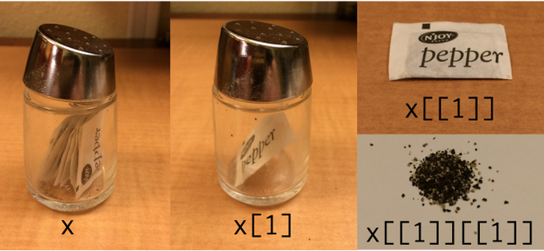

# The R Programming Language

> The material in this chapter is rather dull reading because it basically amounts to a list (although a carefully scaffolded list) of basic commands in R along with illustrative examples. After reading the first few pages and nodding off, you may be tempted to skip ahead, and I wouldn't blame you. But much of the material in this chapter is crucial, and all of it will eventually be useful, so you should at least skim it all so you know where to return when the topics arise later. [@kruschkeDoingBayesianData2015, p. 35]

Most, but not all, of this part of my project will mirror what's in the text. However, I do add **tidyverse**-oriented content, such as a small walk through of plotting with the [**ggplot2** package](https://ggplot2.tidyverse.org) [@wickhamGgplot2ElegantGraphics2016; @R-ggplot2].

## Get the software

The first step to following along with this ebook is to install **R** on your computer. Go to [https://cran.r-project.org/](https://cran.r-project.org/) and follow the instructions, from there. If you get confused, there are any number of brief video tutorials available to lead you through the steps. Just use a search term like "install R."

If you're new to **R** or just curious about its origins, check out Chapter 2 of @pengProgrammingDataScience2020, [*History and overview of R*](https://bookdown.org/rdpeng/rprogdatascience/history-and-overview-of-r.html). One of the great features about **R**, which might seem odd or confusing if you're more used to working with propriety software like SPSS, is a lot of the functionality comes from the add-on packages users develop to make **R** easier to use. Peng briefly discusses these features in Section 2.7, [*Design of the R system*](https://bookdown.org/rdpeng/rprogdatascience/history-and-overview-of-r.html#design-of-the-r-system). I make use of a variety of add-on packages in this project. You can install them all by executing this code block.


```r
packages <- c("bayesplot", "brms", "coda", "cowplot", "cubelyr", "devtools", "fishualize", "GGally", "ggdist", "ggExtra", "ggforce", "ggmcmc", "ggridges", "ggthemes", "janitor", "lisa", "loo", "palettetown", "patchwork", "psych", "remotes", "rstan", "santoku", "scico", "tidybayes", "tidyverse")

install.packages(packages, dependencies = T)

remotes::install_github("clauswilke/colorblindr")
devtools::install_github("dill/beyonce")
devtools::install_github("ropenscilabs/ochRe")
```

### A look at RStudio.

> The R programming language comes with its own basic user interface that is adequate for modest applications. But larger applications become unwieldy in the basic R user interface, and therefore it helps to install a more sophisticated R-friendly editor. There are a number of useful editors available, many of which are free, and they are constantly evolving. At the time of this writing, I recommend RStudio, which can be obtained from [[https://rstudio.com/]](https://rstudio.com/) (p. 35).

I completely agree. **R** programming is easier with **RStudio**. However, I should point out that there are other user interfaces available. You can find several alternatives listed [here](https://datascience.stackexchange.com/questions/5345/ide-alternatives-for-r-programming-rstudio-intellij-idea-eclipse-visual-stud) or [here](https://intro2r.com/alternatives-to-rstudio.html).

## A simple example of R in action

Basic arithmetic is straightforward in **R**.


```r
2 + 3
```

```
## [1] 5
```

Much like Kruschke did in his text, I denote my programming prompts in typewriter font atop a gray background, like this: `2 + 3`.

Anyway, algebra is simple in **R**, too.


```r
x <- 2

x + x
```

```
## [1] 4
```

I don't tend to save lists of commands in text files. Rather, I almost exclusively work within [R Notebook](https://bookdown.org/yihui/rmarkdown/notebook.html) files, which I discuss more fully in [Section 3.7][Programming in R]. As far as *sourcing*, I never use the `source()` approach Kruschke discussed in page 36. I'm not opposed to it. It's just not my style.

Anyway, behold Figure 3.1.


```r
library(tidyverse)

d <-
  tibble(x = seq(from = -2, to = 2, by = .1)) %>%
  mutate(y = x^2) 
  
ggplot(data = d,
       aes(x = x, y = y)) +
  geom_line(color = "skyblue") +
  theme(panel.grid = element_blank())
```



If you're new to the **tidyverse** and/or making figures with **ggplot2**, it's worthwhile to walk that code out. With the first line, `library(tidyverse)`, we opened up the [core packages within the tidyverse](https://www.tidyverse.org/packages/), which are:

* **ggplot2** [@wickhamGgplot2ElegantGraphics2016; @R-ggplot2],
* **dplyr** [@R-dplyr],
* **tidyr** [@R-tidyr],
* **readr** [@R-readr],
* **purrr** [@R-purrr],
* **tibble** [@R-tibble],
* **stringr** [@R-stringr], and
* **forcats** [@R-forcats].

With the few lines,


```r
d <-
  tibble(x = seq(from = -2, to = 2, by = .1)) %>%
  mutate(y = x^2) 
```

we made our tibble. In **R**, data frames are one of the primary types of data objects (see [Section 3.4.4][List and data frame.], below). We'll make extensive use of data frames in this project. Tibbles are a particular type of data frame, which you might learn more about in the [tibbles section](https://r4ds.had.co.nz/tibbles.html) of Grolemund and Wickham's [-@grolemundDataScience2017] *R4DS*. With those first two lines, we determined what the name of our tibble would be, `d`, and made the first column, `x`.

Note the `%>%` operator at the end of the second line. In prose, we call that the *pipe*. As explained in [Section 5.6.1 of *R4DS*](https://r4ds.had.co.nz/transform.html#combining-multiple-operations-with-the-pipe), "a good way to pronounce `%>%` when reading code is 'then.'" So in words, the those first two lines indicate "Make an object, `d`, which is a tibble with a variable, `x`, defined by the `seq()` function, *then*..."

In the portion after *then* (i.e., the `%>%`), we changed `d`. The `dplyr::mutate()` function let us add another variable, `y`, which is a function of our first variable, `x`.

With the next 4 lines of code, we made our plot. When plotting with **ggplot2**, the first line is always with the `ggplot()` function. This is where you typically tell **ggplot2** what data object you're using--which must be a data frame or tibble--and what variables you want on your axes. The interesting thing about **ggplot2** is that the code is modular. So if we only coded the `ggplot()` portion, we'd get:


```r
ggplot(data = d,
       aes(x = x, y = y))
```



Although **ggplot2** knows which variables to put on which axes, it has no idea how we'd like to express the data. The result is an empty coordinate system. The next line of code is the main event. With `geom_line()` we told **ggplot2** to connect the data points with a line. With the `color` argument, we made that line `"skyblue"`. [[Here's a great list](http://sape.inf.usi.ch/quick-reference/ggplot2/colour) of the named colors available in **ggplot2**.] Also, notice the `+` operator at the end of the `ggplot()` function. With **ggplot2**, you add functions by placing the `+` operator on the right of the end of one function, which will then append the next function.


```r
ggplot(data = d,
       aes(x = x, y = y)) +
  geom_line(color = "skyblue")
```



Personally, I'm not a fan of gridlines. They occasionally have their place and I do use them from time to time. But on the whole, I prefer to omit them from my plots. The final `theme()` function allowed me to do so.


```r
ggplot(data = d,
       aes(x = x, y = y)) +
  geom_line(color = "skyblue") +
  theme(panel.grid = element_blank())
```


[Chapter 3 of *R4DS*](https://r4ds.had.co.nz/data-visualisation.html) is a great introduction to plotting with **ggplot2**. If you want to dive deeper, see the [references at the bottom of this page](https://ggplot2.tidyverse.org). And of course, you might read up in Wickham's [-@wickhamGgplot2ElegantGraphics2016] [*ggplot2: Elegant graphics for data analysis*](https://ggplot2-book.org/).

### Get the programs used with this book.

This subtitle has a double meaning, here. Yes, you should probably get Kruschke's scripts from the book's website, [https://sites.google.com/site/doingbayesiandataanalysis/](https://sites.google.com/site/doingbayesiandataanalysis/). You may have noticed this already, but unlike in Kruschke's text, I will usually show all my code. Indeed, the purpose of my project is to make coding these kinds of models and visualizations easier. But if you're ever curious, you can always find my script files in their naked form at [https://github.com/ASKurz/Doing-Bayesian-Data-Analysis-in-brms-and-the-tidyverse](https://github.com/ASKurz/Doing-Bayesian-Data-Analysis-in-brms-and-the-tidyverse). For example, the raw file for this very chapter is at [https://github.com/ASKurz/Doing-Bayesian-Data-Analysis-in-brms-and-the-tidyverse/blob/master/03.Rmd](https://github.com/ASKurz/Doing-Bayesian-Data-Analysis-in-brms-and-the-tidyverse/blob/master/03.Rmd).

Later in this subsection, Kruschke mentioned working directories. If you don't know what your current working directory is, just execute `getwd()`. I'll have more to say on this topic later on when I make my pitch for [**RStudio** projects](https://support.rstudio.com/hc/en-us/articles/200526207-Using-Projects) in [Section 3.7.2][Running a program.].

## Basic commands and operators in R

In addition to the resource link Kruschke provided in the text, Grolemund and Wickham's [*R4DS*](http://r4ds.had.co.nz) is an excellent general introduction to the kinds of **R** functions you'll want to succeed with your data analysis. Other than that, I've learned the most when I had a specific data problem to solve and then sought out the specific code/techniques required to solve it. If already have your own data or can get your hands on some sexy data, learn these techniques by playing around with them. This isn't the time to worry about rigor, preregistration, or all of that. This is time to play.

### Getting help in R.

As with `plot()` you can learn more about the `ggplot()` function with `?`.


```r
?ggplot
```

`help.start()` can be nice, too.


```r
help.start()
```

`??geom_line()` can help us learn more about the `geom_line()` function.


```r
??geom_line()
```

Quite frankly, a bit part of becoming a successful **R** user is learning how to get help, online. In addition to the methods, above, type in the name of your function of interest in your favorite web browser. For example, If I wanted to learn more about the `geom_line()` function, I'd literally do a web search for "geom_line()". In my case, the first search results when doing so was [https://ggplot2.tidyverse.org/reference/geom_path.html](https://ggplot2.tidyverse.org/reference/geom_path.html), which is a nicely-formatted official reference page put out by the **ggplot2** team.

### Arithmetic and logical operators.

With arithmetic, the order of operations is: power first, then multiplication, then addition.


```r
1 + 2 * 3^2
```

```
## [1] 19
```

With parentheses, you can force addition before multiplication.


```r
(1 + 2) * 3^2
```

```
## [1] 27
```

Operations inside parentheses get done before power operations.


```r
(1 + 2 * 3)^2
```

```
## [1] 49
```

One can nest parentheses.


```r
((1 + 2) * 3)^2
```

```
## [1] 81
```


```r
?Syntax
```

We can use **R** to perform a variety of logical tests, such as negation.


```r
!TRUE
```

```
## [1] FALSE
```

We can do conjunction.


```r
TRUE & FALSE
```

```
## [1] FALSE
```

And we can do disjunction.


```r
TRUE | FALSE
```

```
## [1] TRUE
```

Conjunction has precedence over disjunction.


```r
TRUE | TRUE & FALSE
```

```
## [1] TRUE
```

However, with parentheses we can force disjunction first.


```r
(TRUE | TRUE) & FALSE
```

```
## [1] FALSE
```

### Assignment, relational operators, and tests of equality.

In contrast to Kruschke's preference, I will use the [arrow operator, `<-`, to assign](https://style.tidyverse.org/syntax.html#assignment) values to named variables[^1].


```r
x = 1

x <- 1
```

Yep, this ain't normal math.


```r
(x = 1)
```

```
## [1] 1
```

```r
(x = x + 1)
```

```
## [1] 2
```

Here we use `==` to test for equality.


```r
(x = 2)
```

```
## [1] 2
```

```r
x == 2
```

```
## [1] TRUE
```

Using `!=`, we can check whether the value of `x` is NOT equal to 3.


```r
x != 3
```

```
## [1] TRUE
```

We can use `<` to check whether the value of `x` is less than 3.


```r
x < 3
```

```
## [1] TRUE
```

Similarly, we can use `>` to check whether the value of `x` is greater than 3.


```r
x > 3
```

```
## [1] FALSE
```

This normal use of the `<-` operator


```r
x <- 3
```

is not the same as


```r
x < - 3
```

```
## [1] FALSE
```

The limited precision of a computer's memory can lead to odd results.


```r
x <- 0.5 - 0.3
y <- 0.3 - 0.1
```

Although mathematically `TRUE`, this is `FALSE` for limited precision.


```r
x == y
```

```
## [1] FALSE
```

However, they are equal up to the precision of a computer.


```r
all.equal(x, y)
```

```
## [1] TRUE
```

## Variable types

If you'd like to learn more about the differences among vectors, matrices, lists, data frames and so on, you might check out Roger Peng's [-@pengProgrammingDataScience2020] *R Programming for data science*, [Chapter 4](https://bookdown.org/rdpeng/rprogdatascience/r-nuts-and-bolts.html).

### Vector.

"A vector is simply an ordered list of elements of the same type" (p. 42).

#### The combine function.

The *combine* function is `c()`, which makes vectors. Here we'll first make an unnamed vector. Then we'll sve that vector as `x`.


```r
c(2.718, 3.14, 1.414)
```

```
## [1] 2.718 3.140 1.414
```

```r
x <- c(2.718, 3.14, 1.414)
```

You'll note the equivalence.


```r
x == c(2.718, 3.14, 1.414)
```

```
## [1] TRUE TRUE TRUE
```

This leads to the next subsection.

#### Component-by-component vector operations.

We can multiply two vectors, component by component.


```r
c(1, 2, 3) * c(7, 6, 5)
```

```
## [1]  7 12 15
```

If you have a sole number, a *scaler*, you can multiply an entire vector by it like:


```r
2 * c(1, 2, 3)
```

```
## [1] 2 4 6
```

which is a more compact way to perform this.


```r
c(2, 2, 2) * c(1, 2, 3)
```

```
## [1] 2 4 6
```

The same sensibilities hold for other operations, such as addition.


```r
2 + c(1, 2, 3)
```

```
## [1] 3 4 5
```

#### The colon operator and sequence function.

The colon operator, `:`, is a handy way to make integer sequences. Here we use it to serially list the inters from 4 to 7.


```r
4:7
```

```
## [1] 4 5 6 7
```

The colon operator has precedence over addition.


```r
2 + 3:6
```

```
## [1] 5 6 7 8
```

Parentheses override default precedence.


```r
(2 + 3):6 
```

```
## [1] 5 6
```

The power operator has precedence over the colon operator.
 

```r
1:3^2
```

```
## [1] 1 2 3 4 5 6 7 8 9
```

And parentheses override default precedence.


```r
(1:3)^2
```

```
## [1] 1 4 9
```

The `seq()` function is quite handy. If you don't specify the length of the output, it will figure that out the logical consequence of the other arguments.


```r
seq(from = 0, to = 3, by = 0.5)
```

```
## [1] 0.0 0.5 1.0 1.5 2.0 2.5 3.0
```

This sequence won't exceed `to = 3`.


```r
seq(from = 0, to = 3, by = 0.5001) 
```

```
## [1] 0.0000 0.5001 1.0002 1.5003 2.0004 2.5005
```

In each of the following examples, we'll omit one of the core `seq()` arguments: `from`, `to`, `by`, and `length.out`. Here we do not define the end point.


```r
seq(from = 0, by = 0.5, length.out = 7)
```

```
## [1] 0.0 0.5 1.0 1.5 2.0 2.5 3.0
```

This time we fail to define the increment.


```r
seq(from = 0, to = 3, length.out = 7)
```

```
## [1] 0.0 0.5 1.0 1.5 2.0 2.5 3.0
```

And this time we omit a starting point.


```r
seq(to = 3, by = 0.5, length.out = 7)
```

```
## [1] 0.0 0.5 1.0 1.5 2.0 2.5 3.0
```

In this ebook, I will always explicitly name my arguments within `seq()`.

#### The replicate function.

We'll define our pre-replication vector with the `<-` operator.


```r
abc <- c("A", "B", "C")
```

With the `times` argument, we repeat the vector as a unit with the `rep()` function.


```r
rep(abc, times = 2)
```

```
## [1] "A" "B" "C" "A" "B" "C"
```

But if we mix the `times` argument with `c()`, we can repeat individual components of `abc` differently.


```r
rep(abc, times = c(4, 2, 1))
```

```
## [1] "A" "A" "A" "A" "B" "B" "C"
```

With the `each` argument, we repeat the individual components of `abc` one at a time.


```r
rep(abc, each = 2)
```

```
## [1] "A" "A" "B" "B" "C" "C"
```

And you can even combine `each` and `length`, repeating each element until the `length` requirement has been fulfilled.


```r
rep(abc, each = 2, length = 10)
```

```
##  [1] "A" "A" "B" "B" "C" "C" "A" "A" "B" "B"
```

You can also combine `each` and `times`.


```r
rep(abc, each = 2, times = 3)
```

```
##  [1] "A" "A" "B" "B" "C" "C" "A" "A" "B" "B" "C" "C" "A" "A" "B" "B" "C" "C"
```

I tend to do things like the above as two separate steps. One way to do so is by nesting one `rep()` function within another.


```r
rep(rep(abc, each = 2),
    times = 3)
```

```
##  [1] "A" "A" "B" "B" "C" "C" "A" "A" "B" "B" "C" "C" "A" "A" "B" "B" "C" "C"
```

As Kruschke points out, this can look confusing.


```r
rep(abc, each = 2, times = c(1, 2, 3, 1, 2, 3))
```

```
##  [1] "A" "A" "A" "B" "B" "B" "B" "C" "C" "C" "C" "C"
```

But breaking the results up into two steps might be easier to understand,


```r
rep(rep(abc, each = 2), 
    times = c(1, 2, 3, 1, 2, 3))
```

```
##  [1] "A" "A" "A" "B" "B" "B" "B" "C" "C" "C" "C" "C"
```

And especially earlier in my **R** career, it helped quite a bit to break operation sequences like this up by saving and assessing the intermediary steps.


```r
step_1 <- rep(abc, each = 2)
step_1
```

```
## [1] "A" "A" "B" "B" "C" "C"
```

```r
rep(step_1, times = c(1, 2, 3, 1, 2, 3))
```

```
##  [1] "A" "A" "A" "B" "B" "B" "B" "C" "C" "C" "C" "C"
```

#### Getting at elements of a vector.

Behold our exemplar vector, `x`.


```r
x <- c(2.718, 3.14, 1.414, 47405)
```

The straightforward way to extract the second and fourth elements is with a combination of brackets, `[]`, and `c()`.


```r
x[c(2, 4)]
```

```
## [1]     3.14 47405.00
```

Or you might use reverse logic and omit the first and third elements.


```r
x[c(-1, -3 )]
```

```
## [1]     3.14 47405.00
```

It's handy to know that `T` is a stand in for `TRUE` and `F` is a stand in for `FALSE`. You'll probably notice I use the abbreviations most of the time.


```r
x[c(F, T, F, T)]
```

```
## [1]     3.14 47405.00
```

The `names()` function makes it easy to name the components of a vector.


```r
names(x) <- c("e", "pi", "sqrt2", "zipcode")

x
```

```
##         e        pi     sqrt2   zipcode 
##     2.718     3.140     1.414 47405.000
```

Now we can call the components with their names.


```r
x[c("pi", "zipcode")]
```

```
##       pi  zipcode 
##     3.14 47405.00
```

Once we start working with summaries from our Bayesian models, we'll use this trick a lot.

Here's Kruschke's review:


```r
# define a vector
x <- c(2.718, 3.14, 1.414, 47405)

# name the components
names(x) <- c("e", "pi", "sqrt2", "zipcode")

# you can indicate which elements you'd like to include
x[c(2, 4)]
```

```
##       pi  zipcode 
##     3.14 47405.00
```

```r
# you can decide which to exclude

x[c(-1, -3)]
```

```
##       pi  zipcode 
##     3.14 47405.00
```

```r
# or you can use logical tests
x[c(F, T, F, T)]
```

```
##       pi  zipcode 
##     3.14 47405.00
```

```r
# and you can use the names themselves
x[c("pi", "zipcode")]
```

```
##       pi  zipcode 
##     3.14 47405.00
```

### Factor.

"Factors are a type of vector in R for which the elements are *categorical* values that could also be ordered. The values are stored internally as integers with labeled levels" (p. 46, *emphasis* in the original).

Here are our five-person socioeconomic status data.


```r
x <- c("high", "medium", "low", "high", "medium")
x
```

```
## [1] "high"   "medium" "low"    "high"   "medium"
```

The `factor()` function turns them into a factor, which will return the levels when called.


```r
xf <- factor(x)
xf
```

```
## [1] high   medium low    high   medium
## Levels: high low medium
```

Here are the factor levels as numerals.


```r
as.numeric(xf)
```

```
## [1] 1 3 2 1 3
```

With the `levels` and `ordered` arguments, we can order the factor elements.


```r
xfo <- factor(x, levels = c("low", "medium", "high"), ordered = T)
xfo
```

```
## [1] high   medium low    high   medium
## Levels: low < medium < high
```

Now "high" is a larger integer.


```r
as.numeric(xfo)
```

```
## [1] 3 2 1 3 2
```

We've already specified `xf`.


```r
xf
```

```
## [1] high   medium low    high   medium
## Levels: high low medium
```

And we know how it's been coded numerically.


```r
as.numeric(xf)
```

```
## [1] 1 3 2 1 3
```

We can have `levels` and `labels`.


```r
xfol <- factor(x, 
               levels = c("low", "medium", "high"), ordered = T,
               labels = c("Bottom SES", "Middle SES", "Top SES"))

xfol
```

```
## [1] Top SES    Middle SES Bottom SES Top SES    Middle SES
## Levels: Bottom SES < Middle SES < Top SES
```

Factors can come in very handy when modeling with certain kinds of categorical variables, as in [Chapter 22][Nominal Predicted Variable], or when arranging elements within a plot.

### Matrix and array.

Kruschke uses these more often than I do. I'm more of a vector and data frame kinda guy. Even so, here's an example of a matrix.


```r
matrix(1:6, ncol = 3)
```

```
##      [,1] [,2] [,3]
## [1,]    1    3    5
## [2,]    2    4    6
```

We can get the same thing using `nrow`.


```r
matrix(1:6, nrow = 2)
```

```
##      [,1] [,2] [,3]
## [1,]    1    3    5
## [2,]    2    4    6
```

Note how the numbers got ordered by rows within each column? We can specify them to be ordered across columns, first.


```r
matrix(1:6, nrow = 2, byrow = T)
```

```
##      [,1] [,2] [,3]
## [1,]    1    2    3
## [2,]    4    5    6
```

We can name the dimensions. I'm not completely consistent, but I generally follow [*The tidyverse style guide*](https://style.tidyverse.org) [@wickhamTidyverseStyleGuide2020] for naming my **R** objects and their elements. From [Section 2.1](https://style.tidyverse.org/syntax.html#object-names), we read

> Variable and function names should use only lowercase letters, numbers, and `_`. Use underscores (`_`) (so called snake case) to separate words within a name.

By those sensibilities, we'll name our rows and columns like this.


```r
matrix(1:6, 
       nrow = 2,
       dimnames = list(TheRowDimName = c("row_1_name", "row_2_name"),
                       TheColDimName = c("col_1_name", "col_2_name", "col_3_name")))
```

```
##              TheColDimName
## TheRowDimName col_1_name col_2_name col_3_name
##    row_1_name          1          3          5
##    row_2_name          2          4          6
```

You've also probably noticed that I "[always put a space after a comma, never before, just like in regular English](https://style.tidyverse.org/syntax.html#spacing)," as well as "put a space before and after `=` when naming arguments in function calls." IMO, this makes code easier to read. You do you.

We'll name our matrix `x`.


```r
x <-
  matrix(1:6, 
       nrow = 2,
       dimnames = list(TheRowDimName = c("row_1_name", "row_2_name"),
                       TheColDimName = c("col_1_name", "col_2_name", "col_3_name")))
```

Since there are 2 dimensions, we'll subset with two dimensions. Numerical indices work.


```r
x[2, 3]
```

```
## [1] 6
```

Row and column names work, too. Just make sure to use quotation marks, `""`, for those.


```r
x["row_2_name", "col_3_name"]
```

```
## [1] 6
```

Here we specify the range of columns to include.


```r
x[2, 1:3]
```

```
## col_1_name col_2_name col_3_name 
##          2          4          6
```

Leaving that argument blank returns them all.


```r
x[2, ]
```

```
## col_1_name col_2_name col_3_name 
##          2          4          6
```

And leaving the row index blank returns all row values within the specified column(s).


```r
x[, 3]
```

```
## row_1_name row_2_name 
##          5          6
```

Mind your commas! This produces the second row, returned as a vector.


```r
x[2, ]
```

```
## col_1_name col_2_name col_3_name 
##          2          4          6
```

This returns both rows of the 2^nd^ column.


```r
x[, 2]
```

```
## row_1_name row_2_name 
##          3          4
```

Leaving out the comma will return the numbered element.


```r
x[2]
```

```
## [1] 2
```

It'll be important in your **brms** career to have a sense of 3-dimensional arrays. Several **brms** convenience functions often return them (e.g., `ranef()` in multilevel models).


```r
a <- array(1:24, dim = c(3, 4, 2), # 3 rows, 4 columns, 2 layers
           dimnames = list(RowDimName = c("r1", "r2", "r3"),
                           ColDimName = c("c1", "c2", "c3", "c4"),
                           LayDimName = c("l1", "l2")))

a
```

```
## , , LayDimName = l1
## 
##           ColDimName
## RowDimName c1 c2 c3 c4
##         r1  1  4  7 10
##         r2  2  5  8 11
##         r3  3  6  9 12
## 
## , , LayDimName = l2
## 
##           ColDimName
## RowDimName c1 c2 c3 c4
##         r1 13 16 19 22
##         r2 14 17 20 23
##         r3 15 18 21 24
```

Since these have 3 dimensions, you have to use 3-dimensional indexing. As with 2-dimensional objects, leaving the indices for a dimension blank will return all elements within that dimension. For example, this code returns all columns of `r3` and `l2`, as a vector.


```r
a["r3", , "l2"]
```

```
## c1 c2 c3 c4 
## 15 18 21 24
```

And this code returns all layers of `r3` and `c4`, as a vector.


```r
a["r3", "c4", ]
```

```
## l1 l2 
## 12 24
```

This whole topic of subsetting--whether from matrices and arrays, or from data frames and tibbles--can be confusing. For more practice and clarification, you might check out Peng's Chapter 9, [*Subsetting R objects*](https://bookdown.org/rdpeng/rprogdatascience/subsetting-r-objects.html).

### List and data frame.

"The `list` structure is a generic vector in which components can be of different types, and named" (p. 51). Here's `my_list`.


```r
my_list <- 
  list("a" = 1:3, 
       "b" = matrix(1:6, nrow = 2), 
       "c" = "Hello, world.")

my_list
```

```
## $a
## [1] 1 2 3
## 
## $b
##      [,1] [,2] [,3]
## [1,]    1    3    5
## [2,]    2    4    6
## 
## $c
## [1] "Hello, world."
```

To return the contents of the `a` portion of `my_list`, just execute this.


```r
my_list$a
```

```
## [1] 1 2 3
```

We can index further within `a`.


```r
my_list$a[2]
```

```
## [1] 2
```

To return the contents of the first item in our list with the double bracket, `[[]]`, do:


```r
my_list[[1]]
```

```
## [1] 1 2 3
```

You can index further to return only the second element of the first list item.


```r
my_list[[1]][2]
```

```
## [1] 2
```

But double brackets, `[][]`, are no good, here.


```r
my_list[1][2]
```

```
## $<NA>
## NULL
```

To learn more, Jenny Bryan has a [great talk](https://www.youtube.com/watch?v=4MfUCX_KpdE&t=615s&frags=pl%2Cwn) discussing the role of lists within data wrangling. There's also [this classic pic](https://twitter.com/hadleywickham/status/643381054758363136?lang=en) from Hadley Wickham:

<div class="figure" style="text-align: center">

<p class="caption">(\#fig:unnamed-chunk-97)Indexing lists in #rstats. Inspired by the Residence Inn</p>
</div>

But here's a data frame.


```r
d <- 
  data.frame(integers = 1:3, 
             number_names = c("one", "two", "three"))

d
```

```
##   integers number_names
## 1        1          one
## 2        2          two
## 3        3        three
```

With data frames, we can continue indexing with the `$` operator.


```r
d$number_names
```

```
## [1] "one"   "two"   "three"
```

We can also use the double bracket.


```r
d[[2]]
```

```
## [1] "one"   "two"   "three"
```

Notice how the single bracket with no comma indexes columns rather than rows.


```r
d[2]
```

```
##   number_names
## 1          one
## 2          two
## 3        three
```

But adding the comma returns the factor-level information when indexing columns.


```r
d[, 2]
```

```
## [1] "one"   "two"   "three"
```

It works a touch differently when indexing by row.


```r
d[2, ]
```

```
##   integers number_names
## 2        2          two
```

Let's try with a tibble, instead.


```r
t <-
  tibble(integers = 1:3,
         number_names = c("one", "two", "three"))

t
```

```
## # A tibble: 3 × 2
##   integers number_names
##      <int> <chr>       
## 1        1 one         
## 2        2 two         
## 3        3 three
```

One difference is that tibbles default to assigning text columns as character strings rather than factors. Another difference occurs when printing large data frames versus large tibbles. Tibbles yield more compact glimpses. For more, check out [*R4DS* Chapter 10](https://r4ds.had.co.nz/tibbles.html).

It's also worthwhile pointing out that within the **tidyverse**, you can pull out a specific column with the `select()` function. Here we select `number_names`.


```r
t %>% 
  select(number_names)
```

```
## # A tibble: 3 × 1
##   number_names
##   <chr>       
## 1 one         
## 2 two         
## 3 three
```

Go [here](https://r4ds.had.co.nz/transform.html#select) learn more about `select()`.

## Loading and saving data

### The ~~read.csv~~ `read_csv()` and ~~read.table~~ `read_table()` functions.

Although `read.csv()` is the default CSV reader in **R**, the [`read_csv()` function](https://readr.tidyverse.org/reference/read_delim.html) from the [**readr** package](https://readr.tidyverse.org) (i.e., one of the core **tidyverse** packages) is a new alternative. In [comparison to base **R**](https://r4ds.had.co.nz/data-import.html#compared-to-base-r)'s `read.csv()`, `readr::read_csv()` is faster and returns tibbles (as opposed to data frames with `read.csv()`). The same general points hold for base **R**'s `read.table()` versus `readr::read_table()`.

Using Kruschke's `HGN.csv` example, we'd load the CSV with `read_csv()` like this.


```r
hgn <- read_csv("data.R/HGN.csv")
```

Note again that `read_csv()` defaults to returning columns with character information as characters, not factors.


```r
hgn$Hair
```

```
## [1] "black" "brown" "blond" "black" "black" "red"   "brown"
```

See? As a character variable, `Hair` no longer has factor level information. But if you knew you wanted to treat `Hair` as a factor, you could easily convert it with `dplyr::mutate()`.


```r
hgn <-
  hgn %>% 
  mutate(Hair = factor(Hair))

hgn$Hair
```

```
## [1] black brown blond black black red   brown
## Levels: black blond brown red
```

And here's a **tidyverse** way to reorder the levels for the `Hair` factor.


```r
hgn <-
  hgn %>% 
  mutate(Hair = factor(Hair, levels = c("red", "blond", "brown", "black")))
         
hgn$Hair
```

```
## [1] black brown blond black black red   brown
## Levels: red blond brown black
```

```r
as.numeric(hgn$Hair)
```

```
## [1] 4 3 2 4 4 1 3
```

Since we imported `hgn` with `read_csv()`, the `Name` column is already a character vector, which we can verify with the `str()` function.


```r
hgn$Name %>% str()
```

```
##  chr [1:7] "Alex" "Betty" "Carla" "Diane" "Edward" "Frank" "Gabrielle"
```

Note how using `as.vector()` did nothing in our case. `Name` was already a character vector.


```r
hgn$Name %>% 
  as.vector() %>% 
  str()
```

```
##  chr [1:7] "Alex" "Betty" "Carla" "Diane" "Edward" "Frank" "Gabrielle"
```

The `Group` column was imported as composed of integers.


```r
hgn$Group %>% str()
```

```
##  num [1:7] 1 1 1 2 2 2 2
```

Switching `Group` to a factor is easy enough.


```r
hgn <-
  hgn %>% 
  mutate(Group = factor(Group))

hgn$Group
```

```
## [1] 1 1 1 2 2 2 2
## Levels: 1 2
```

### Saving data from R.

The **readr** package has a `write_csv()` function, too. The arguments are as follows: `write_csv(x, file, na = "NA", append = FALSE, col_names = !append, quote_escape = "double", eol = "\n")`. Learn more by executing `?write_csv`. Saving `hgn` in your working directory is as easy as:


```r
write_csv(hgn, "hgn.csv")
```

You could also use `save()`.


```r
save(hgn, file = "hgn.Rdata" )
```

Once we start fitting Bayesian models, this method will be an important way to save the results of those models.

The `load()` function is simple.


```r
load("hgn.Rdata" )
```

The `ls()` function works very much the same way as the more verbosely-named `objects()` function.


```r
ls()
```

```
##  [1] "a"       "abc"     "d"       "hgn"     "my_list" "step_1"  "t"      
##  [8] "x"       "xf"      "xfo"     "xfol"    "y"
```

## Some utility functions

"A function is a process that takes some input, called the *arguments*, and produces some output, called the *value*" (p. 56, *emphasis* in the original).


```r
# this is a more compact way to replicate 100 1's, 200 2's, and 300 3's
x <- rep(1:3, times = c(100, 200, 300))

summary(x)
```

```
##    Min. 1st Qu.  Median    Mean 3rd Qu.    Max. 
##   1.000   2.000   2.500   2.333   3.000   3.000
```

We can use the pipe to convert and then summarize `x`.


```r
x %>% 
  factor() %>% 
  summary()
```

```
##   1   2   3 
## 100 200 300
```

The `head()` and `tail()` functions are quite useful.


```r
head(x)
```

```
## [1] 1 1 1 1 1 1
```

```r
tail(x)
```

```
## [1] 3 3 3 3 3 3
```

I used `head()` a lot.

Within the **tidyverse**, the `slice()` function serves a similar role. In order to use `slice()`, we'll want to convert `x`, which is just a vector of integers, into a data frame. Then we'll use `slice()` to return a subset of the rows.


```r
x <-
  x %>%
  data.frame() 

x %>% 
  slice(1:6)
```

```
##   .
## 1 1
## 2 1
## 3 1
## 4 1
## 5 1
## 6 1
```

So that was analogous to what we accomplished with `head()`. Here's the analogue to `tail()`.


```r
x %>%
  slice(595:600)
```

```
##   .
## 1 3
## 2 3
## 3 3
## 4 3
## 5 3
## 6 3
```

The downside of that code was we had to do the math to determine that $600 - 6 = 595$ in order to get the last six rows, as returned by `tail()`. A more general approach is to use `n()`, which will return the total number of rows in the tibble.


```r
x %>%
  slice((n() - 6):n())
```

```
##   .
## 1 3
## 2 3
## 3 3
## 4 3
## 5 3
## 6 3
## 7 3
```

To unpack `(n() - 6):n()`, because `n()` = 600, `(n() - 6)` = 600 - 6 = 595. Therefore `(n() - 6):n()` was equivalent to having coded `595:600`. Instead of having to do the math ourselves, `n()` did it for us. It's often easier to just go with `head()` or `tail()`. But the advantage of this more general approach is that it allows one take more complicated slices of the data, such as returning the first three and last three rows.


```r
x %>%
  slice(c(1:3, (n() - 3):n()))
```

```
##   .
## 1 1
## 2 1
## 3 1
## 4 3
## 5 3
## 6 3
## 7 3
```

We've already used the handy `str()` function a bit. It's also nice to know that `tidyverse::glimpse()` performs a similar function.


```r
x %>% str()
```

```
## 'data.frame':	600 obs. of  1 variable:
##  $ .: int  1 1 1 1 1 1 1 1 1 1 ...
```

```r
x %>% glimpse()
```

```
## Rows: 600
## Columns: 1
## $ . <int> 1, 1, 1, 1, 1, 1, 1, 1, 1, 1, 1, 1, 1, 1, 1, 1, 1, 1, 1, 1, 1, 1, 1,…
```

Within the **tidyverse**, we'd use `group_by()` and then `summarize()` as alternatives to the base **R** `aggregate()` function. With `group_by()` we group the observations first by `Hair` and then by `Gender` within `Hair`. After that, we summarize the groups by taking the `median()` values of their `Number`.


```r
hgn %>% 
  group_by(Hair, Gender) %>% 
  summarize(median = median(Number))
```

```
## # A tibble: 5 × 3
## # Groups:   Hair [4]
##   Hair  Gender median
##   <fct> <chr>   <dbl>
## 1 red   M         7  
## 2 blond F         3  
## 3 brown F         7  
## 4 black F         7  
## 5 black M         1.5
```

One of the nice things about this workflow is that the code reads somewhat like how we'd explain what we were doing. We, in effect, told **R** to *Take `hgn`, then group the data by `Hair` and `Gender` within `Hair`, and then `summarize()` those groups by their `median()` `Number` values.* There's also the nice quality that we don't have to continually tell **R** where the data are coming from the way the `aggregate()` function required Kruschke to prefix each of his variables with `HGNdf$`. We also didn't have to explicitly rename the output columns the way Kruschke had to.

I'm not aware that our `group_by() %>% summarize()` workflow has a formula format the way `aggregate()` does.

To count how many levels we had in a grouping factor, we'd use the `n()` function in `summarize()`.


```r
hgn %>% 
  group_by(Hair, Gender) %>% 
  summarize(n = n())
```

```
## # A tibble: 5 × 3
## # Groups:   Hair [4]
##   Hair  Gender     n
##   <fct> <chr>  <int>
## 1 red   M          1
## 2 blond F          1
## 3 brown F          2
## 4 black F          1
## 5 black M          2
```

Alternatively, we could switch out the `group_by()` and `summarize()` lines with `count()`.


```r
hgn %>% 
  count(Hair, Gender)
```

```
## # A tibble: 5 × 3
##   Hair  Gender     n
##   <fct> <chr>  <int>
## 1 red   M          1
## 2 blond F          1
## 3 brown F          2
## 4 black F          1
## 5 black M          2
```

We could then use `spread()` to convert that output to a format similar to Kruschke's table of counts.


```r
hgn %>% 
  count(Hair, Gender) %>% 
  spread(key = Hair, value = n)
```

```
## # A tibble: 2 × 5
##   Gender   red blond brown black
##   <chr>  <int> <int> <int> <int>
## 1 F         NA     1     2     1
## 2 M          1    NA    NA     2
```

With this method, the `NA`s are stand-ins for 0's.


```r
a
```

```
## , , LayDimName = l1
## 
##           ColDimName
## RowDimName c1 c2 c3 c4
##         r1  1  4  7 10
##         r2  2  5  8 11
##         r3  3  6  9 12
## 
## , , LayDimName = l2
## 
##           ColDimName
## RowDimName c1 c2 c3 c4
##         r1 13 16 19 22
##         r2 14 17 20 23
##         r3 15 18 21 24
```

`apply()` is part of a family of functions that offer a wide array of uses. You can learn more about the `apply()` family [here](https://www.datacamp.com/community/tutorials/r-tutorial-apply-family) or [here](https://faculty.nps.edu/sebuttre/home/R/apply.html).


```r
apply(a, MARGIN = c(2, 3), FUN = sum)
```

```
##           LayDimName
## ColDimName l1 l2
##         c1  6 42
##         c2 15 51
##         c3 24 60
##         c4 33 69
```

Here's `a`.


```r
a
```

```
## , , LayDimName = l1
## 
##           ColDimName
## RowDimName c1 c2 c3 c4
##         r1  1  4  7 10
##         r2  2  5  8 11
##         r3  3  6  9 12
## 
## , , LayDimName = l2
## 
##           ColDimName
## RowDimName c1 c2 c3 c4
##         r1 13 16 19 22
##         r2 14 17 20 23
##         r3 15 18 21 24
```

The [**reshape2** package](https://github.com/hadley/reshape) [@R-reshape2; @wickhamReshapingDataReshape2007] was [a precursor](https://tidyr.tidyverse.org) to the **tidyr** package (i.e., one of the core **tidyverse** packages). The `reshape2::melt()` function is a quick way to transform the 3-dimensional `a` matrix into a tidy data frame.


```r
a %>% 
  reshape2::melt()
```

```
##    RowDimName ColDimName LayDimName value
## 1          r1         c1         l1     1
## 2          r2         c1         l1     2
## 3          r3         c1         l1     3
## 4          r1         c2         l1     4
## 5          r2         c2         l1     5
## 6          r3         c2         l1     6
## 7          r1         c3         l1     7
## 8          r2         c3         l1     8
## 9          r3         c3         l1     9
## 10         r1         c4         l1    10
## 11         r2         c4         l1    11
## 12         r3         c4         l1    12
## 13         r1         c1         l2    13
## 14         r2         c1         l2    14
## 15         r3         c1         l2    15
## 16         r1         c2         l2    16
## 17         r2         c2         l2    17
## 18         r3         c2         l2    18
## 19         r1         c3         l2    19
## 20         r2         c3         l2    20
## 21         r3         c3         l2    21
## 22         r1         c4         l2    22
## 23         r2         c4         l2    23
## 24         r3         c4         l2    24
```

We have an alternative if you wanted to stay within the **tidyverse**. To my knowledge, the fastest way to make the transformation is to first use ` as.tbl_cube()` and follow that up with `as_tibble()`. The [`as.tbl_cube()` function](https://rdrr.io/cran/cubelyr/man/as.tbl_cube.html) will convert the `a` matrix into a tbl_cube. We will use the `met_name` argument to determine the name of the measure assessed in the data. Since the default is for `as.tbl_cube()` to name the measure name as `.`, it seemed `value` was a more descriptive choice. We'll then use the `as_tibble()` function to convert our `tbl_cube` object into a tidy tibble.


```r
library(cubelyr)

a %>% 
  as.tbl_cube(met_name = "value") %>% 
  as_tibble()
```

```
## # A tibble: 24 × 4
##    RowDimName ColDimName LayDimName value
##    <chr>      <chr>      <chr>      <int>
##  1 r1         c1         l1             1
##  2 r2         c1         l1             2
##  3 r3         c1         l1             3
##  4 r1         c2         l1             4
##  5 r2         c2         l1             5
##  6 r3         c2         l1             6
##  7 r1         c3         l1             7
##  8 r2         c3         l1             8
##  9 r3         c3         l1             9
## 10 r1         c4         l1            10
## # … with 14 more rows
```

Notice how the first three columns are returned as characters instead of factors. If you really wanted those to be factors, you could always follow up the code with `mutate_if(is.character, as.factor)`. Also notice that we gained access to the `as.tbl_cube()` function by loading the [**cubelyr** package](https://CRAN.R-project.org/package=cubelyr) [@R-cubelyr]. Though `as.tbl_cube()` was available in earlier versions of `dplyr` (one of the core packages in the **tidyverse**), it was [removed in the version 1.0.0 update](https://dplyr.tidyverse.org/news/index.html) and is now available via **cubelyr**.

## Programming in R

It's worthy to note that this project was done with [R Markdown](https://rmarkdown.rstudio.com), which is an alternative to an **R** script. As [Grolemund and Wickham point out](https://r4ds.had.co.nz/r-markdown.html)

> R Markdown integrates a number of R packages and external tools. This means that help is, by-and-large, not available through ?. Instead, as you work through this chapter, and use R Markdown in the future, keep these resources close to hand:
>
> * R Markdown Cheat Sheet: Help > Cheatsheets > R Markdown Cheat Sheet,
>
> * R Markdown Reference Guide: Help > Cheatsheets > R Markdown Reference Guide.
>
> Both cheatsheets are also available at [https://rstudio.com/resources/cheatsheets/](https://rstudio.com/resources/cheatsheets/).

I also strongly recommend checking out [R Notebooks](https://bookdown.org/yihui/rmarkdown/notebook.html), which is a kind of R Markdown document but with a few bells a whistles that make it more useful for working scientists. You can learn more about it [here](https://rstudio-pubs-static.s3.amazonaws.com/256225_63ebef4029dd40ef8e3679f6cf200a5a.html) and [here](https://www.r-bloggers.com/why-i-love-r-notebooks-2/). And for a more comprehensive overview, check out Xie, Allaire, and Grolemund's [-@xieMarkdownDefinitiveGuide2022] [*R markdown: The definitive guide*](https://bookdown.org/yihui/rmarkdown/).

### Variable names in R.

Kruschke prefers to use camelBack notation for his variable and function names. Though I initially hated it, I largely use [snake_case](https://style.tidyverse.org/syntax.html#object-names). It seems easier to read_prose_in_snake_case than it is to readProseInCamelBack. To each their own.

### Running a program.

I do most of my data analyses using **RStudio** projects. In short, **RStudio** projects provide a handy way to organize your files within a given project, be it an analysis for a scientific paper, an ebook, or even a personal website. See *R4DS* [Chapter 8](https://r4ds.had.co.nz/workflow-projects.html) for a nice overview on working directories within the context of an **RStudio** project. I didn't really *get it*, at first. But after using **RStudio** projects for a couple days, I was hooked. I bet you will be, too.

### Programming a function.

Here's our simple `a_sq_plus_b` function.


```r
a_sq_plus_b <- function(a, b = 1) {
  c <- a^2 + b
  return(c)
}
```

If you explicitly denote your arguments, everything works fine.


```r
a_sq_plus_b(a = 3, b = 2)
```

```
## [1] 11
```

Keep things explicit and you can switch up the order of the arguments.


```r
a_sq_plus_b(b = 2, a = 3)
```

```
## [1] 11
```

But here's what happens when you are less explicit.


```r
# this
a_sq_plus_b(3, 2)
```

```
## [1] 11
```

```r
# is not the same as this
a_sq_plus_b(2, 3)
```

```
## [1] 7
```

Since we gave `b` a default value, we can be really lazy.


```r
a_sq_plus_b(a = 2)
```

```
## [1] 5
```

But we can't be lazy with `a`. This


```r
a_sq_plus_b(b = 1)
```

yielded this warning on my computer: "Error in a_sq_plus_b(b = 1) : argument "a" is missing, with no default".

If we're completely lazy, `a_sq_plus_b()` presumes our sole input value is for the `a` argument and it uses the default value of `1` for `b`.


```r
a_sq_plus_b(2)
```

```
## [1] 5
```

The lesson is important because it’s good practice to familiarize yourself with the defaults of the functions you use in statistics and data analysis, more generally.

If you haven't done it much, before, programming your own functions can feel like a superpower. It's a good idea to get comfortable with the basics. I've found it really helps when I'm working on models for real-world scientific projects. For more practice, Check out *R4DS*, [Chapter 19](https://r4ds.had.co.nz/functions.html), or *R programming for data science*, [Chapter 14](https://bookdown.org/rdpeng/rprogdatascience/functions.html).

### Conditions and loops.

Here's our starting point for `if()` and `else()`.


```r
if(x <= 3) {     # if x is less than or equal to 3
  show("small")  # display the word "small"
} else {         # otherwise
  show("big")    # display the word "big"
}                # end of ’else’ clause
```

This returns an error: `Error in if (x <= 3) { : the condition has length > 1`. Further:


```r
if (x <= 3) {show("small")}
else {show("big")}
```

On my computer, it returned this message: "the condition has length > 1 and only the first element will be used[1] "small" Error: unexpected 'else' in "else"".

Here we use the loop.


```r
for (count_down in 5:1) {
  show(count_down)
}
```

```
## [1] 5
## [1] 4
## [1] 3
## [1] 2
## [1] 1
```


```r
for (note in c("do", "re", "mi")) {
  show(note)
}
```

```
## [1] "do"
## [1] "re"
## [1] "mi"
```

It's also useful to understand how to use the `ifelse()` function within the context of a data frame. Recall how `x` is a data frame.


```r
x <- tibble(x = 1:5)

x
```

```
## # A tibble: 5 × 1
##       x
##   <int>
## 1     1
## 2     2
## 3     3
## 4     4
## 5     5
```

We can use the `mutate()` function to make a new variable, `size`, which is itself a function of the original variable, `x`. We'll use the `ifelse()` function to return "small" if `x <= 3`, but to return "big" otherwise.
    

```r
x %>% 
  mutate(size = ifelse(x <= 3, "small", "big"))
```

```
## # A tibble: 5 × 2
##       x size 
##   <int> <chr>
## 1     1 small
## 2     2 small
## 3     3 small
## 4     4 big  
## 5     5 big
```

You should also know there's a **dplyr** alternative, called `if_else()`. It works quite similarly, but is stricter about type consistency. If you ever get into a situation where you need to do many `ifelse()` statements or a many-layered `ifelse()` statement, you might check out `dplyr::case_when()`. We'll get some practice with `case_when()` in the next chapter.

### Measuring processing time.

This will be nontrivial to consider in your Bayesian career. Here's the loop.


```r
start_time               <- proc.time()
y                        <- vector(mode = "numeric", length = 1.0E6)
for (i in 1:1.0E6) {y[i] <- log(i)}
stop_time <- proc.time()

elapsed_time_loop <- stop_time - start_time
show(elapsed_time_loop)
```

```
##    user  system elapsed 
##   0.055   0.004   0.058
```

Now we use a vector.


```r
start_time <- proc.time()
y          <- log(1:1.0E6)
stop_time  <- proc.time()

elapsed_time_vector <- stop_time - start_time
show(elapsed_time_vector)
```

```
##    user  system elapsed 
##   0.011   0.004   0.014
```

Here we compare the two times.


```r
elapsed_time_vector[1] / elapsed_time_loop[1]
```

```
## user.self 
##       0.2
```

For my computer, the vectorized approach took about 20% the time the loop approach did. When using **R**, avoid loops for vectorized approaches whenever possible. As an alternative, I tend to just use `Sys.time()` when I'm doing analyses like these.

I'm not going to walk them out, here. But as we go along, you might notice I sometimes use functions from the `purrr::map()` family in places where Kruschke used loops. I think they're pretty great. For more on loops and `purrr::map()` alternatives, check out *R4DS* [Chapter 21](https://r4ds.had.co.nz/iteration.html).

### Debugging.

This should be no surprise by now, but in addition to Kruschke's good advice, I also recommend checking out [*R4DS*](https://r4ds.had.co.nz). I reference it often.

## Graphical plots: Opening and saving

For making and saving plots with **ggplot2**, I recommend reviewing *R4DS* Chapters [3](https://r4ds.had.co.nz/data-visualisation.html) and [28](https://r4ds.had.co.nz/graphics-for-communication.html) or Wickham's [*ggplot2: Elegant graphics for data analysis*](https://ggplot2-book.org/).

## ~~Conclusion~~ **brms**-related needs

Given its central role in this ebook, we'd be remiss not to mention a bit about using **brms**. The main website for **brms** is the GitHub repository at [https://github.com/paul-buerkner/brms](https://github.com/paul-buerkner/brms). The official page on CRAN, [https://CRAN.R-project.org/package=brms](https://CRAN.R-project.org/package=brms) is also handy in that it contains a nice list of vignettes and other documents to help you get started. You can find a few video lectures of Paul Bürkner discussing **brms**, such as [here](https://www.youtube.com/watch?v=OUyB4kiJcWE), [here](https://www.youtube.com/watch?v=FRs1iribZME), and [here](https://www.youtube.com/watch?v=40o0_0XTB6E). Finally, make sure to keep an eye on all the hot **brms** discussions in the **brms** section of the Stan forums, [https://discourse.mc-stan.org/c/interfaces/brms/36](https://discourse.mc-stan.org/c/interfaces/brms/36).

## Session info {-}


```r
sessionInfo()
```

```
## R version 4.2.0 (2022-04-22)
## Platform: x86_64-apple-darwin17.0 (64-bit)
## Running under: macOS Big Sur/Monterey 10.16
## 
## Matrix products: default
## BLAS:   /Library/Frameworks/R.framework/Versions/4.2/Resources/lib/libRblas.0.dylib
## LAPACK: /Library/Frameworks/R.framework/Versions/4.2/Resources/lib/libRlapack.dylib
## 
## locale:
## [1] en_US.UTF-8/en_US.UTF-8/en_US.UTF-8/C/en_US.UTF-8/en_US.UTF-8
## 
## attached base packages:
## [1] stats     graphics  grDevices utils     datasets  methods   base     
## 
## other attached packages:
##  [1] cubelyr_1.0.1   forcats_0.5.1   stringr_1.4.1   dplyr_1.0.10   
##  [5] purrr_0.3.4     readr_2.1.2     tidyr_1.2.1     tibble_3.1.8   
##  [9] ggplot2_3.4.0   tidyverse_1.3.2
## 
## loaded via a namespace (and not attached):
##  [1] Rcpp_1.0.9          lubridate_1.8.0     assertthat_0.2.1   
##  [4] digest_0.6.30       utf8_1.2.2          plyr_1.8.7         
##  [7] R6_2.5.1            cellranger_1.1.0    backports_1.4.1    
## [10] reprex_2.0.2        evaluate_0.18       httr_1.4.4         
## [13] highr_0.9           pillar_1.8.1        rlang_1.0.6        
## [16] googlesheets4_1.0.1 readxl_1.4.1        rstudioapi_0.13    
## [19] jquerylib_0.1.4     rmarkdown_2.16      labeling_0.4.2     
## [22] googledrive_2.0.0   bit_4.0.4           munsell_0.5.0      
## [25] broom_1.0.1         compiler_4.2.0      modelr_0.1.8       
## [28] xfun_0.35           pkgconfig_2.0.3     htmltools_0.5.3    
## [31] tidyselect_1.1.2    bookdown_0.28       fansi_1.0.3        
## [34] crayon_1.5.2        tzdb_0.3.0          dbplyr_2.2.1       
## [37] withr_2.5.0         grid_4.2.0          jsonlite_1.8.3     
## [40] gtable_0.3.1        lifecycle_1.0.3     DBI_1.1.3          
## [43] magrittr_2.0.3      scales_1.2.1        vroom_1.5.7        
## [46] cli_3.5.0           stringi_1.7.8       cachem_1.0.6       
## [49] reshape2_1.4.4      farver_2.1.1        fs_1.5.2           
## [52] xml2_1.3.3          bslib_0.4.0         ellipsis_0.3.2     
## [55] generics_0.1.3      vctrs_0.5.1         tools_4.2.0        
## [58] bit64_4.0.5         glue_1.6.2          hms_1.1.1          
## [61] parallel_4.2.0      fastmap_1.1.0       colorspace_2.0-3   
## [64] gargle_1.2.0        rvest_1.0.2         knitr_1.40         
## [67] haven_2.5.1         sass_0.4.2
```


## Footnote {-}

[^1]: The whole `=` versus `<-` controversy can spark some strong opinions within the **R** community. If you're curious about the historical roots for `<-`, check out [Colon Fay](https://twitter.com/_ColinFay)'s nice blog post, [*Why do we use arrow as an assignment operator?*](https://colinfay.me/r-assignment/).

