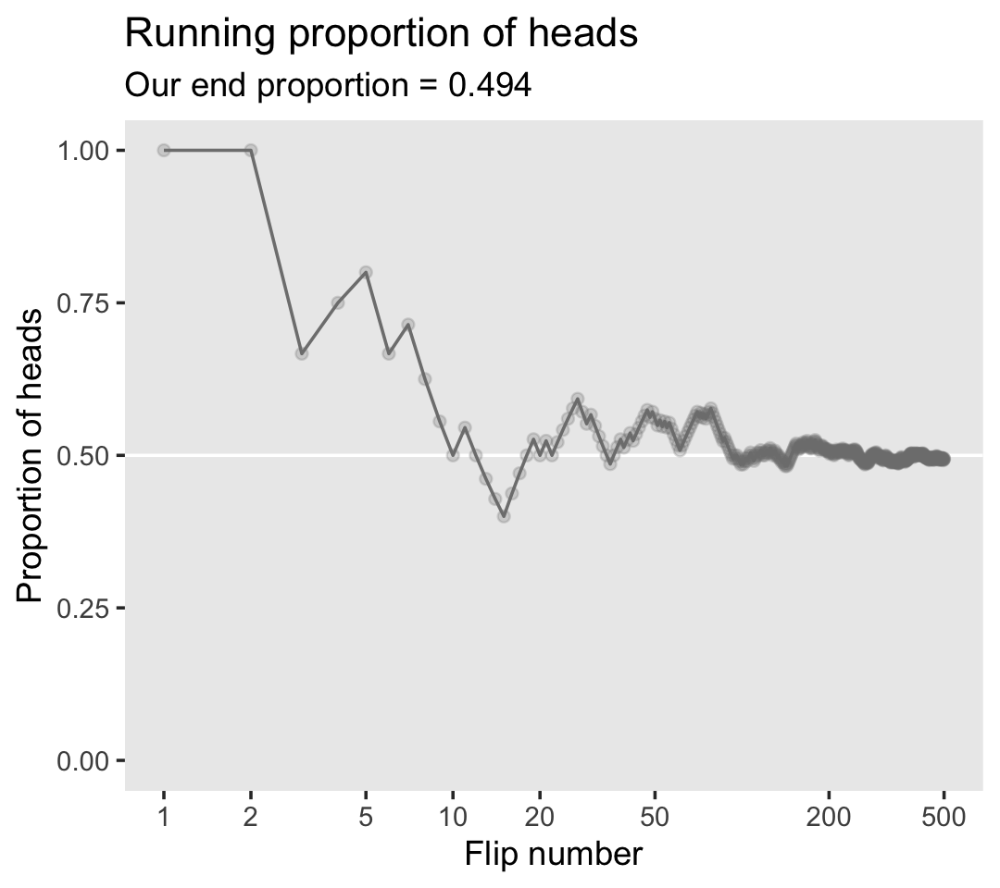
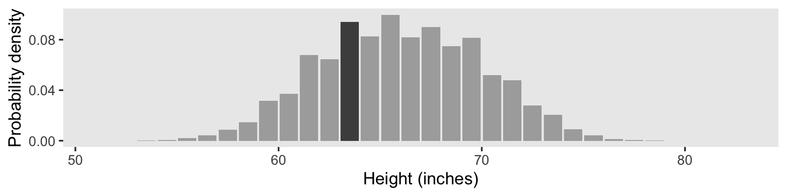
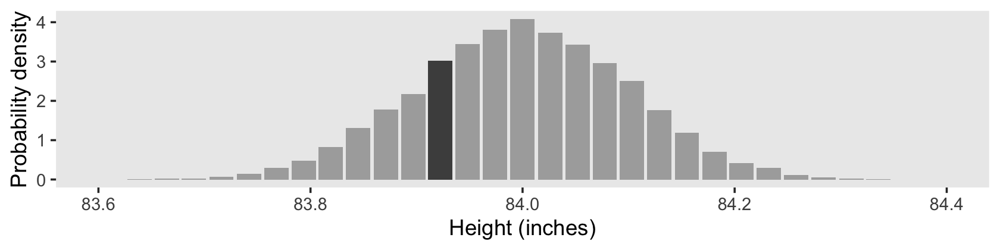
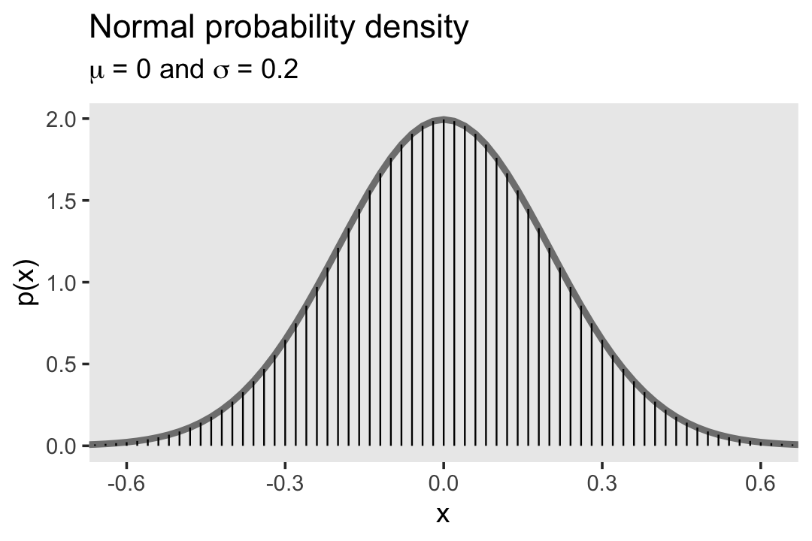
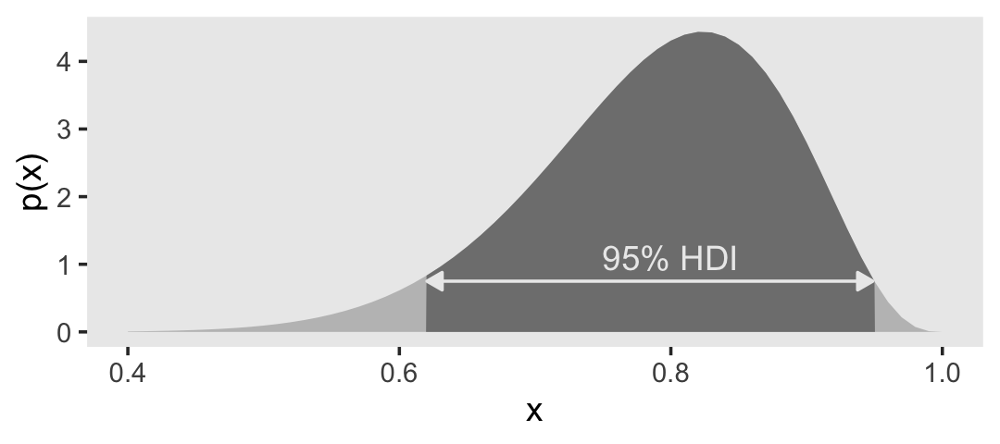
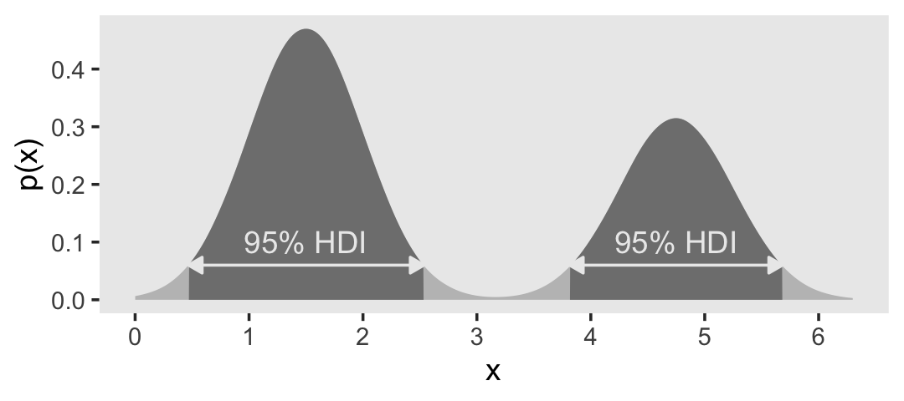

# What is This Stuff Called Probability?

> Inferential statistical techniques assign precise measures to our uncertainty about possibilities. Uncertainty is measured in terms of *probability*, and therefore we must establish the properties of probability before we can make inferences about it. This chapter introduces the basic ideas of probability. [@kruschkeDoingBayesianData2015, p. 71, *emphasis* in the original]

## The set of all possible events

This snip from page 72 is important (*emphasis* in the original):

> Whenever we ask about how likely an outcome is, we always ask with a set of possible outcomes in mind. This set exhausts all possible outcomes, and the outcomes are all mutually exclusive. This set is called the *sample space*.

## Probability: Outside or inside the head

It's worthwhile to quote this section in full.

> Sometimes we talk about probabilities of outcomes that are "out there" in the world. The face of a flipped coin is such an outcome: We can observe the flip, and the probability of coming up heads can be estimated by observing several flips.
>
> But sometimes we talk about probabilities of things that are not so clearly "out there," and instead are just possible beliefs "inside the head." Our belief about the fairness of a coin is an example of something inside the head. The coin may have an intrinsic physical bias, but now I am referring to our *belief* about the bias. Our beliefs refer to a space of mutually exclusive and exhaustive possibilities. It might be strange to say that we randomly sample from our beliefs, like we randomly sample from a sack of coins. Nevertheless, the mathematical properties of probabilities outside the head and beliefs inside the head are the same in their essentials, as we will see. (pp. 73--74, *emphasis* in the original)

### Outside the head: Long-run relative frequency.

> For events outside the head, it's intuitive to think of probability as being the long-run relative frequency of each possible outcome...
>
> We can determine the long-run relative frequency by two different ways. One way is to approximate it by actually sampling from the space many times and tallying the number of times each event happens. A second way is by deriving it mathematically. These two methods are now explored in turn. (p. 74)

#### Simulating a long-run relative frequency.

Before we try coding the simulation, we'll first load the **tidyverse**.


```r
library(tidyverse)
```

Now run the simulation.


```r
n       <- 500  # specify the total number of flips
p_heads <- 0.5  # specify underlying probability of heads

# Kruschke reported this was the seed he used at the top of page 94
set.seed(47405)

# here we use that seed to flip a coin n times and compute the running proportion of heads at each flip. 
# we generate a random sample of n flips (heads = 1, tails = 0)
d <-
  tibble(flip_sequence = sample(x = c(0, 1), 
                                prob = c(1 - p_heads, p_heads), 
                                size = n, 
                                replace = T)) %>% 
  mutate(n = 1:n,
         r = cumsum(flip_sequence)) %>% 
  mutate(run_prop = r / n)

end_prop <-
  d %>% 
  select(run_prop) %>% 
  slice(n()) %>% 
  round(digits = 3) %>% 
  pull()
```

Now we're ready to make Figure 4.1.


```r
d %>%
  filter(n < 1000) %>%  # this step cuts down on the time it takes to make the plot
  ggplot(aes(x = n, y = run_prop)) +
  geom_hline(yintercept = .5, color = "white") +
  geom_line(color = "grey50") +
  geom_point(color = "grey50", alpha = 1/4) +
  scale_x_log10(breaks = c(1, 2, 5, 10, 20, 50, 200, 500)) +
  coord_cartesian(xlim = c(1, 500),
                  ylim = c(0, 1)) +
  labs(title = "Running proportion of heads",
       subtitle = paste("Our end proportion =", end_prop),
       x = "Flip number", 
       y = "Proportion of heads") +
  theme(panel.grid = element_blank())
```



#### Deriving a long-run relative frequency.

> Sometimes, when the situation is simple enough mathematically, we can derive the exact long-run relative frequency. The case of the fair coin is one such simple situation. The sample space of the coin consists of two possible outcomes, head and tail. By the assumption of fairness, we know that each outcome is equally likely. Therefore, the long-run relative frequency of heads should be exactly one out of two, i.e., $1/2$, and the long-run relative frequency of tails should also be exactly $1/2$. (p. 76)

### Inside the head: Subjective belief.

> To specify our subjective beliefs, we have to specify how likely we think each possible outcome is. It can be hard to pin down mushy intuitive beliefs. In the next section, we explore one way to "calibrate" subjective beliefs, and in the subsequent section we discuss ways to mathematically describe degrees of belief. (p. 76)

### Probabilities assign numbers to possibilities.

> In general, a probability, whether it's outside the head or inside the head, is just a way of assigning numbers to a set of mutually exclusive possibilities. The numbers, called "probabilities," merely need to satisfy three properties [@kolmogorovFoundationsTheoryProbability1956]:
>
> 1. A probability value must be nonnegative (i.e., zero or positive).
> 2. The sum of the probabilities across all events in the entire sample space must be $1.0$ (i.e., one of the events in the space must happen, otherwise the space does not exhaust all possibilities).
> 3. For any two mutually exclusive events, the probability that one *or* the other occurs is the *sum* of their individual probabilities. For example, the probability that a fair six-sided die comes up $3$-dots *or* $4$-dots is $1/6 + 1/6 = 2/6$.
>
> Any assignment of numbers to events that respects those three properties will also have all the properties of probabilities that we will discuss below. (pp. 77--78, *emphasis* in the original)

## Probability distributions

"A probability *distribution* is simply a list of all possible outcomes and their corresponding probabilities" (p. 78, *emphasis* in the original)

### Discrete distributions: Probability mass.

> When the sample space consists of discrete outcomes, then we can talk about the probability of each distinct outcome. For example, the sample space of a flipped coin has two discrete outcomes, and we talk about the probability of head or tail...
>
> For continuous outcome spaces, we can *discretize* the space into a finite set of mutually exclusive and exhaustive "bins." (p. 78, *emphasis* in the original)

In order to recreate Figure 4.2, we need to generate the heights data with Kruschke's `HtWtDataGenerator()` function. You can find the original code in Kruschke's `HtWtDataGenerator.R` script, and we first used this function in [Section 2.3][The steps of Bayesian data analysis]. Once again, here's how to make the function.


```r
HtWtDataGenerator <- function(n_subj, rndsd = NULL, male_prob = 0.50) {
  
  # Random height, weight generator for males and females. Uses parameters from
  # Brainard, J. & Burmaster, D. E. (1992). Bivariate distributions for height and
  # weight of men and women in the United States. Risk Analysis, 12(2), 267-275.
  # Kruschke, J. K. (2011). Doing Bayesian data analysis:
  # A Tutorial with R and BUGS. Academic Press / Elsevier.
  # Kruschke, J. K. (2014). Doing Bayesian data analysis, 2nd Edition:
  # A Tutorial with R, JAGS and Stan. Academic Press / Elsevier.
  
  # require(MASS)
  
  # Specify parameters of multivariate normal (MVN) distributions.
  # Men:
  HtMmu   <- 69.18
  HtMsd   <- 2.87
  lnWtMmu <- 5.14
  lnWtMsd <- 0.17
  Mrho    <- 0.42
  Mmean   <- c(HtMmu, lnWtMmu)
  Msigma  <- matrix(c(HtMsd^2, Mrho * HtMsd * lnWtMsd,
                      Mrho * HtMsd * lnWtMsd, lnWtMsd^2), nrow = 2)
  # Women cluster 1:
  HtFmu1   <- 63.11
  HtFsd1   <- 2.76
  lnWtFmu1 <- 5.06
  lnWtFsd1 <- 0.24
  Frho1    <- 0.41
  prop1    <- 0.46
  Fmean1   <- c(HtFmu1, lnWtFmu1)
  Fsigma1  <- matrix(c(HtFsd1^2, Frho1 * HtFsd1 * lnWtFsd1,
                       Frho1 * HtFsd1 * lnWtFsd1, lnWtFsd1^2), nrow = 2)
  # Women cluster 2:
  HtFmu2   <- 64.36
  HtFsd2   <- 2.49
  lnWtFmu2 <- 4.86
  lnWtFsd2 <- 0.14
  Frho2    <- 0.44
  prop2    <- 1 - prop1
  Fmean2   <- c(HtFmu2, lnWtFmu2)
  Fsigma2  <- matrix(c(HtFsd2^2, Frho2 * HtFsd2 * lnWtFsd2,
                       Frho2 * HtFsd2 * lnWtFsd2, lnWtFsd2^2), nrow = 2)
  
  # Randomly generate data values from those MVN distributions.
  if (!is.null(rndsd)) {set.seed(rndsd)}
  data_matrix <- matrix(0, nrow = n_subj, ncol = 3)
  colnames(data_matrix) <- c("male", "height", "weight")
  maleval <- 1; femaleval <- 0 # arbitrary coding values
  for (i in 1:n_subj) {
    # Flip coin to decide sex
    sex = sample(c(maleval, femaleval), size = 1, replace = TRUE,
                 prob = c(male_prob, 1 - male_prob))
    if (sex == maleval) {datum <- MASS::mvrnorm(n = 1, mu = Mmean, Sigma = Msigma)}
    if (sex == femaleval) {
      Fclust = sample(c(1, 2), size = 1, replace = TRUE, prob = c(prop1, prop2))
      if (Fclust == 1) {datum <- MASS::mvrnorm(n = 1, mu = Fmean1, Sigma = Fsigma1)}
      if (Fclust == 2) {datum <- MASS::mvrnorm(n = 1, mu = Fmean2, Sigma = Fsigma2)}
    }
    data_matrix[i, ] = c(sex, round(c(datum[1], exp(datum[2])), 1))
  }
  
  return(data_matrix)
  
} # end function
```

Now we have the `HtWtDataGenerator()` function, all we need to do is determine how many values are generated and how probable we want the values to be based on those from men. These are controlled by the `n_subj` and `male_prob` parameters.


```r
set.seed(4)
d <-
  HtWtDataGenerator(n_subj = 10000, male_prob = .5) %>%
  data.frame() %>%
  mutate(person = 1:n())

d %>%
  head()
```

```
##   male height weight person
## 1    1   76.0  221.5      1
## 2    0   59.5  190.0      2
## 3    0   60.2  117.9      3
## 4    1   64.1  137.7      4
## 5    1   69.3  147.6      5
## 6    1   69.1  165.9      6
```

For Figure 4.2, we'll discretize the continuous `height` values into bins with the `case_when()` function, which you can learn more about from [hrbrmstr](https://twitter.com/hrbrmstr)'s blog post, [*Making a case for case_when*](https://rud.is/b/2017/03/10/making-a-case-for-case_when/).


```r
d_bin <-
  d %>%
  mutate(bin = case_when(
    height < 51 ~ 51,
    between(height, 51, 53) ~ 53,
    between(height, 53, 55) ~ 55,
    between(height, 55, 57) ~ 57,
    between(height, 57, 59) ~ 59,
    between(height, 59, 61) ~ 61,
    between(height, 61, 63) ~ 63,
    between(height, 63, 65) ~ 65,
    between(height, 65, 67) ~ 67,
    between(height, 67, 69) ~ 69,
    between(height, 69, 71) ~ 71,
    between(height, 71, 73) ~ 73,
    between(height, 73, 75) ~ 75,
    between(height, 75, 77) ~ 77,
    between(height, 77, 79) ~ 79,
    between(height, 79, 81) ~ 71,
    between(height, 81, 83) ~ 83,
    height > 83 ~ 85)
    ) %>%
  group_by(bin) %>%
  summarise(n = n()) %>%
  mutate(height = bin - 1)

d %>%
  ggplot(aes(x = height, y = person)) +
  geom_point(size = 3/4, color = "grey67", alpha = 1/2) +
  geom_vline(xintercept = seq(from = 51, to = 83, by = 2),
             linetype = 3, color = "grey33") +
  geom_text(data = d_bin, 
            aes(y = 5000, label = n),
            size = 3.25) +
  scale_y_continuous(breaks = c(0, 5000, 10000)) +
  labs(title = "Total N = 10,000",
       x = "Height (inches)",
       y = "Person #") +
  theme(panel.grid = element_blank())
```


Because we're simulating and we don't know what seed number Kruschke used for his plot, ours will differ a little from his. But the overall pattern is the same.

One way to make a version of the histogram in Kruschke's Figure 4.2.b would be to input the `d` data directly into `ggplot()` and set `x = height` and `y = stat(density)` within the `aes()`. Then you could set `binwidth = 2` within `geom_histogram()` to make the bins within the histogram perform like the bins in the plot above. However, since we have already discretized the `height` values into bins in our `d_bin` data, it might make more sense to plot those bins with `geom_col()`. The only other step we need is to manually compute the density values using the formula Kruschke showed in Figure 4.2.b. Here' how:


```r
d_bin %>% 
  # density is the probability mass divided by the bin width
  mutate(density = (n / sum(n)) / 2) %>% 
  
  ggplot(aes(x = height, y = density, fill = bin == 65)) +
  geom_col() +
  scale_fill_manual(values = c("gray67", "gray30"), breaks = NULL) +
  scale_y_continuous("Probability density", breaks = c(0, 0.04, 0.08)) +
  xlab("Height (inches)") +
  coord_cartesian(xlim = c(51, 83)) +
  theme(panel.grid = element_blank())
```


In the text, Kruschke singled out the bin for the values between 63 and 65 with an arrow. In our plot, we highlighted that bin with shading, instead. Here's how we computed the exact density value for that bin.


```r
d_bin %>% 
  mutate(density = (n / sum(n)) / 2) %>% 
  filter(bin == 65) %>% 
  select(n, density)
```

```
## # A tibble: 1 × 2
##       n density
##   <int>   <dbl>
## 1  1728  0.0864
```

Due to sampling variation, our density value is a little different from the one in the text.

Our data binning approach for Figure 4.2.c will be a little different than what we did, above. Here we'll make our bins with the `round()` function.


```r
d_bin <-
  d %>%
  mutate(bin = round(height, digits = 0)) %>%   
  group_by(bin) %>%
  summarise(n = n()) %>%
  mutate(height = bin - 0.5)

d %>%
  ggplot(aes(x = height, y = person)) +
  geom_point(size = 3/4, color = "grey67", alpha = 1/2) +
  geom_vline(xintercept = seq(from = 51, to = 83, by = 1),
             linetype = 3, color = "grey33") +
  geom_text(data = d_bin, 
            aes(y = 5000, label = n, angle = 90),
            size = 3.25) +
  scale_y_continuous(breaks = c(0, 5000, 10000)) +
  labs(title = "Total N = 10,000",
       x = "Height (inches)",
       y = "Person #") +
  theme(panel.grid = element_blank())
```


However, our method for Figure 4.2.d will be like what we did, before.


```r
d_bin %>% 
  # density is the probability mass divided by the bin width
  mutate(density = (n / sum(n)) / 1) %>% 
  
  ggplot(aes(x = height, y = density, fill = bin == 64)) +
  geom_col() +
  scale_fill_manual(values = c("gray67", "gray30"), breaks = NULL) +
  scale_y_continuous("Probability density", breaks = c(0, 0.04, 0.08)) +
  xlab("Height (inches)") +
  coord_cartesian(xlim = c(51, 83)) +
  theme(panel.grid = element_blank())
```



Here's the hand-computed density value for the focal bin.


```r
d_bin %>% 
  mutate(density = (n / sum(n)) / 1) %>% 
  filter(bin == 64) %>% 
  select(n, density)
```

```
## # A tibble: 1 × 2
##       n density
##   <int>   <dbl>
## 1   942  0.0942
```

> The probability of a discrete outcome, such as the probability of falling into an interval on a continuous scale, is referred to as a probability *mass.* Loosely speaking, the term "mass" refers the amount of stuff in an object. When the stuff is probability and the object is an interval of a scale, then the mass is the proportion of the outcomes in the interval. (p. 80, *emphasis* in the original)

### Continuous distributions: Rendezvous with density.

> If you think carefully about a continuous outcome space, you realize that it becomes problematic to talk about the probability of a specific value on the continuum, as opposed to an interval on the continuum... Therefore, what we will do is make the intervals infinitesimally narrow, and instead of talking about the infinitesimal probability mass of each infinitesimal interval, we will talk about the ratio of the probability mass to the interval width. That ratio is called the probability *density*.
>
> Loosely speaking, density is the amount of stuff per unit of space it takes up. Because we are measuring amount of stuff by its mass, then density is the mass divided by the amount space it occupies. (p. 80, *emphasis* in the original)

To make Figure 4.3, we'll need new data.


```r
set.seed(4)
d <-
  tibble(height = rnorm(1e4, mean = 84, sd = .1)) %>%
  mutate(door = 1:n())

d %>%
  head()
```

```
## # A tibble: 6 × 2
##   height  door
##    <dbl> <int>
## 1   84.0     1
## 2   83.9     2
## 3   84.1     3
## 4   84.1     4
## 5   84.2     5
## 6   84.1     6
```

To make the bins for our version of Figure 4.3.a, we could use the `case_when()` approach from above. However, that would require some tedious code. Happily, we have an alternative in the [**santoku** package](https://github.com/hughjonesd/santoku) [@R-santoku], which I learned about with help from the great [Mara Averick](https://twitter.com/dataandme), [Tyson Barrett](https://twitter.com/healthandstats), and [Omar Wasow](https://twitter.com/owasow). We can use the `santoku::chop()` function to discretize our `height` values. Here we'll walk through the first part.


```r
library(santoku)

d_bin <-
  d %>% 
  mutate(bin = chop(height, 
                    breaks = seq(from = 83.6, to = 84.4, length.out = 32),
                    # label the boundaries with 3 decimal places, separated by a dash
                    labels = lbl_dash(fmt = "%.3f"))

head(d_bin)
```


```
## # A tibble: 6 × 3
##   height  door bin          
##    <dbl> <int> <fct>        
## 1   84.0     1 84.013—84.039
## 2   83.9     2 83.935—83.961
## 3   84.1     3 84.065—84.090
## 4   84.1     4 84.039—84.065
## 5   84.2     5 84.142—84.168
## 6   84.1     6 84.065—84.090
```

With this format, the lower-limit for each level of `bin` is the left side of the dash and the upper-limit is on the right. Though the cut points are precise to many decimal places, the `lbl_dash(fmt = "%.3f")` part of the code rounded the numbers to three decimal places in the `bin` labels. The width of each bin is just a bit over 0.0258.


```r
(84.4 - 83.6) / (32 - 1)
```

```
## [1] 0.02580645
```

Now to make use of the `d_bin` data in a plot, we'll have to summarize and separate the values from the `bin` names to compute the midway points. Here's one way how.


```r
d_bin <- d_bin %>% 
  group_by(bin) %>%
  summarise(n = n()) %>% 
  separate(bin, c("min", "max"), sep = "—", remove = F, convert = T) %>% 
  mutate(height = (min + max) / 2)

head(d_bin)
```

```
## # A tibble: 6 × 5
##   bin             min   max     n height
##   <fct>         <dbl> <dbl> <int>  <dbl>
## 1 83.626—83.652  83.6  83.7     4   83.6
## 2 83.652—83.677  83.7  83.7     6   83.7
## 3 83.677—83.703  83.7  83.7     7   83.7
## 4 83.703—83.729  83.7  83.7    16   83.7
## 5 83.729—83.755  83.7  83.8    37   83.7
## 6 83.755—83.781  83.8  83.8    76   83.8
```

Now we plot.


```r
d %>%
  ggplot(aes(x = height, y = door)) +
  geom_point(size = 3/4, color = "grey67", alpha = 1/2) +
  geom_vline(xintercept = seq(from = 83.6, to = 84.4, length.out = 32),
             linetype = 3, color = "grey33") +
  geom_text(data = d_bin,
            aes(y = 5000, label = n, angle = 90),
            size = 3.25) +
  scale_y_continuous(breaks = c(0, 5000, 10000)) +
  labs(title = "Total N = 10,000",
       x = "Height (inches)",
       y = "Door #") +
  theme(panel.grid = element_blank())
```


The only tricky thing about Figure 4.3.b is getting the denominator in the density equation correct.


```r
d_bin %>% 
  # density is the probability mass divided by the bin width
  mutate(density = (n / sum(n)) / ((84.4 - 83.6) / (32 - 1))) %>% 
  
  ggplot(aes(x = height, y = density, fill = bin == "83.910—83.935")) +
  geom_col() +
  scale_fill_manual(values = c("gray67", "gray30"), breaks = NULL) +
  scale_y_continuous("Probability density", breaks = 0:4) +
  xlab("Height (inches)") +
  coord_cartesian(xlim = c(83.6, 84.4)) +
  theme(panel.grid = element_blank())
```



Here's the density value for that focal bin.


```r
d_bin %>% 
  # density is the probability mass divided by the bin width
  mutate(density = (n / sum(n)) / ((84.4 - 83.6) / (32 - 1))) %>% 
  filter(bin == "83.910—83.935") %>% 
  select(bin, n, density)
```

```
## # A tibble: 1 × 3
##   bin               n density
##   <fct>         <int>   <dbl>
## 1 83.910—83.935   781    3.03
```

As Kruschke remarked: "There is nothing mysterious about probability densities larger than 1.0; it means merely that there is a high concentration of probability mass relative to the scale" (p. 82).

#### Properties of probability density functions.

> In general, for any continuous value that is split up into intervals, the sum of the probability masses of the intervals must be $1$, because, by definition of making a measurement, some value of the measurement scale must occur. (p. 82)

#### The normal probability density function.

"Perhaps the most famous probability density function is the normal distribution, also known as the Gaussian distribution" (p. 83). We'll use `dnorm()` again to make our version of Figure 4.4.


```r
tibble(x = seq(from = -.8, to = .8, by = .02)) %>% 
  mutate(p = dnorm(x, mean = 0, sd = .2)) %>% 
  
  ggplot(aes(x = x)) +
  geom_line(aes(y = p),
            color = "grey50", size = 1.25) +
  geom_linerange(aes(ymin = 0, ymax = p),
                 size = 1/3) +
  labs(title = "Normal probability density",
       subtitle = expression(paste(mu, " = 0 and ", sigma, " = 0.2")),
       y = "p(x)") +
  coord_cartesian(xlim = c(-.61, .61)) +
  theme(panel.grid = element_blank())
```

```
## Warning: Using `size` aesthetic for lines was deprecated in ggplot2 3.4.0.
## ℹ Please use `linewidth` instead.
```



The equation for the normal probability density follows the form

$$
p(x) = \frac{1}{\sigma \sqrt{2 \pi}} \exp \left ( - \frac{1}{2} \left [ \frac{x - \mu}{\sigma}^2 \right ] \right ),
$$

where $\mu$ governs the mean and $\sigma$ governs the standard deviation.

### Mean and variance of a distribution.

The mean of a probability distribution is also called the *expected value*, which follows the form

$$E[x] = \sum_x p(x) x$$

when $x$ is discrete. For continuous $x$ values, the formula is

$$E[x] = \int \text d x \; p(x) x.$$

The variance is defined as the mean squared deviation from the mean,

$$\text{var}_x = \int \text d x \; p(x) (x - E[x])^2.$$

If you take the square root of the variance, you get the standard deviation.

### Highest density interval (HDI).

> The HDI indicates which points of a distribution are most credible, and which cover most of the distribution. Thus, the HDI summarizes the distribution by specifying an interval that spans most of the distribution, say $95\%$ of it, such that every point inside the interval has higher credibility than any point outside the interval. (p. 87)

In Chapter 10 (p. 294), Kruschke briefly mentioned his `HDIofICDF()` function, the code for which you can find in his `DBDA2E-utilities.R` file. It's a handy function which we'll put to use from time to time. Here's a mild reworking of his code.


```r
hdi_of_icdf <- function(name, width = .95, tol = 1e-8, ... ) {
  
  # Arguments:
  #   `name` is R's name for the inverse cumulative density function
  #   of the distribution.
  #   `width` is the desired mass of the HDI region.
  #   `tol` is passed to R's optimize function.
  # Return value:
  #   Highest density iterval (HDI) limits in a vector.
  # Example of use: For determining HDI of a beta(30, 12) distribution, type
  #   `hdi_of_icdf(qbeta, shape1 = 30, shape2 = 12)`
  #   Notice that the parameters of the `name` must be explicitly stated;
  #   e.g., `hdi_of_icdf(qbeta, 30, 12)` does not work.
  # Adapted and corrected from Greg Snow's TeachingDemos package.
  
  incredible_mass <-  1.0 - width
  interval_width <- function(low_tail_prob, name, width, ...) {
    name(width + low_tail_prob, ...) - name(low_tail_prob, ...)
  }
  opt_info <- optimize(interval_width, c(0, incredible_mass), 
                       name = name, width = width, 
                       tol = tol, ...)
  hdi_lower_tail_prob <- opt_info$minimum
  
  return(c(name(hdi_lower_tail_prob, ...),
           name(width + hdi_lower_tail_prob, ...)))
  
}
```


We already know from the text, and perhaps from prior experience, what the 95% HDI is for the unit normal. But it's nice to be able to confirm that with a function.


```r
h <-
  hdi_of_icdf(name = qnorm,
              mean = 0,
              sd   = 1)

h
```

```
## [1] -1.959964  1.959964
```

Now we've saved those values in `h`, we can use then to make our version of Figure 4.5.a.


```r
tibble(x = seq(from = -3.5, to = 3.5, by = .05)) %>% 
  mutate(d = dnorm(x, mean = 0, sd = 1)) %>% 
  
  ggplot(aes(x = x, y = d)) +
  geom_area(fill = "grey75") +
  geom_area(data = . %>% filter(x >= h[1] & x <= h[2]),
            fill = "grey50") +
  geom_line(data = tibble(x = c(h[1] + .02, h[2] - .02),
                          d = c(.059, .059)),
            arrow = arrow(length = unit(.2, "cm"), 
                          ends = "both", 
                          type = "closed"),
            color = "grey92") +
  annotate(geom = "text", x = 0, y = .09, 
           label = "95% HDI", color = "grey92") +
  xlim(-3.1, 3.1) +
  ylab("p(x)") +
  theme(panel.grid = element_blank())
```


As far as I could tell, Figure 4.5.b is of a beta distribution, which Kruschke covered in greater detail starting in [Chapter 6][Inferring a Binomial Probability via Exact Mathematical Analysis]. I got the `shape1` and `shape2` values from playing around. If you have a more principled approach, [do share](https://github.com/ASKurz/Doing-Bayesian-Data-Analysis-in-brms-and-the-tidyverse/issues). But anyway, we can use our `hdi_of_icdf()` function to ge the correct values.


```r
h <-
  hdi_of_icdf(name = qbeta,
              shape1 = 15, 
              shape2 = 4)

h
```

```
## [1] 0.6103498 0.9507510
```

Let's put those `h` values to work.


```r
tibble(x = seq(from = 0, to = 1, by = .01)) %>% 
  mutate(d = dbeta(x, shape1 = 15, shape2 = 4)) %>% 
  
  ggplot(aes(x = x, y = d)) +
  geom_area(fill = "grey75") +
  geom_area(data = . %>% filter(x >= h[1] & x <= h[2]),
           fill = "grey50") +
  geom_line(data = tibble(x = c(h[1] + .01, h[2] - .002),
                          d = c(.75, .75)),
            arrow = arrow(length = unit(.2, "cm"),
                          ends = "both",
                          type = "closed"),
            color = "grey92") +
  annotate(geom = "text", x = .8, y = 1.1, 
           label = "95% HDI", color = "grey92") +
  xlim(.4, 1) +
  ylab("p(x)") +
  theme(panel.grid = element_blank())
```



Figure 4.5.c was also a lot of trial and error. It seemed the easiest way to reproduce the shape was to mash two Gaussians together. After playing around with `rnorm()`, I ended up with this.


```r
set.seed(4)
d <-
  tibble(x = c(rnorm(6e5, mean = 1.50, sd = .5),
               rnorm(4e5, mean = 4.75, sd = .5)))

glimpse(d)
```

```
## Rows: 1,000,000
## Columns: 1
## $ x <dbl> 1.6083774, 1.2287537, 1.9455723, 1.7979903, 2.3178090, 1.8446377, 0.…
```

As you'll see, it's not exactly right. But it's close enough to give you a sense of what's going on. But anyway, since we're working with simulated data rather than an analytic solution, we'll want to use one of the powerful convenience functions from the **tidybayes** package.


```r
library(tidybayes)
```

Kay's **tidybayes** package

> provides a family of functions for generating point summaries and intervals from draws in a tidy format. These functions follow the naming scheme `[median|mean|mode]_[qi|hdi]`, for example, `median_qi()`, `mean_qi()`, `mode_hdi()`, and so on. The first name (before the `_`) indicates the type of point summary, and the second name indicates the type of interval. `qi` yields a quantile interval (a.k.a. equi-tailed interval, central interval, or percentile interval) and `hdi` yields a highest (posterior) density interval. [@kayExtractingVisualizingTidy2021, "Point summaries and intervals"]

Here we'll use `mode_hdi()` to compute the HDIs and put them in a tibble. We'll be using a lot of `mode_hdi()` in this project.


```r
h <- 
  d %>% 
  mode_hdi()

h
```

```
## # A tibble: 2 × 6
##       x .lower .upper .width .point .interval
##   <dbl>  <dbl>  <dbl>  <dbl> <chr>  <chr>    
## 1  1.50  0.468   2.54   0.95 mode   hdi      
## 2  1.50  3.81    5.68   0.95 mode   hdi
```

Usually, `mode_hdi()` will return a tibble with just one row. But in this case, since we had a bimodal distribution, it returned two rows—one for each of the two distinct regions. Oh, and in case it wasn't clear, that first column `x` is the measure of central tendency—the mode, in this case. Though I acknowledge, it's a little odd to speak of central tendency in a bimodal distribution. Again, this won't happen much.

In order to fill the bimodal density with the split HDIs, you need to use the `density()` function to transform the `d` data to a tibble with the values for the $x$-axis in an `x` vector and the corresponding density values in a `y` vector.


```r
dens <-
  d$x %>%
  density() %>%
  with(tibble(x, y))

head(dens)
```

```
## # A tibble: 6 × 2
##       x            y
##   <dbl>        <dbl>
## 1 -1.11 0.0000000503
## 2 -1.09 0.0000000822
## 3 -1.08 0.000000131 
## 4 -1.06 0.000000201 
## 5 -1.04 0.000000304 
## 6 -1.03 0.000000449
```

We're finally ready to plot. Forgive me. It's a monster.


```r
ggplot(data = dens,
       aes(x = x, y = y)) +
  geom_area(fill = "grey75") +
  # note the use of `pull()`, which extracts the values, rather than return a tibble  
  geom_area(data = dens %>% filter(x > h[1, 2] %>% pull() & 
                                     x < h[1, 3] %>% pull()),
            fill = "grey50") +
  geom_area(data = dens %>% filter(x > h[2, 2] %>% pull() & 
                                     x < h[2, 3] %>% pull()),
            fill = "grey50") +
  geom_line(data = tibble(x = c(h[1, 2] %>% pull(), h[1, 3] %>% pull()),
                          y = c(.06, .06)),
            arrow = arrow(length = unit(.2,"cm"),
                          ends = "both",
                          type = "closed"),
            color = "grey92") +
  geom_line(data = tibble(x = c(h[2, 2] %>% pull(), h[2, 3] %>% pull()),
                          y = c(.06, .06)),
            arrow = arrow(length = unit(.2,"cm"),
                          ends = "both",
                          type = "closed"),
            color = "grey92") +
  annotate(geom = "text", x = c(1.5, 4.75), y = .1, 
           label = "95% HDI", color = "grey92") +
  scale_x_continuous(breaks = 0:6, limits = c(0, 6.3)) +
  scale_y_continuous("p(x)", breaks = c(0, .1, .2, .3, .4, .5)) +
  theme(panel.grid = element_blank())
```



> When the distribution refers to credibility of values, then the width of the HDI is another way of measuring uncertainty of beliefs. If the HDI is wide, then beliefs are uncertain. If the HDI is narrow, then beliefs are relatively certain. (p. 89)

## Two-way distributions

In the note below Table 4.1, Kruschke indicated the data came from @sneeGraphicalDisplayTwoway1974, [*Graphical display of two-way contingency tables*](https://www.researchgate.net/publication/243769696_Graphical_Display_of_Two-Way_Contingency_Tables). Kruschke has those data saved as the `HairEyeColor.csv` file.


```r
d <- read_csv("data.R/HairEyeColor.csv")

glimpse(d)
```

```
## Rows: 16
## Columns: 3
## $ Hair  <chr> "Black", "Black", "Black", "Black", "Blond", "Blond", "Blond", "…
## $ Eye   <chr> "Blue", "Brown", "Green", "Hazel", "Blue", "Brown", "Green", "Ha…
## $ Count <dbl> 20, 68, 5, 15, 94, 7, 16, 10, 84, 119, 29, 54, 17, 26, 14, 14
```

We'll need to transform `Hair` and `Eye` a bit to ensure our output matches the order in Table 4.1.


```r
d <- 
  d %>% 
  mutate(Hair = if_else(Hair == "Brown", "Brunette", Hair) %>% 
           factor(., levels = c("Black", "Brunette", "Red", "Blond")),
         Eye  = factor(Eye, levels = c("Brown", "Blue", "Hazel", "Green")))
```

Here we'll use the `tabyl()` and `adorn_totals()` functions from the [**janitor** package](https://CRAN.R-project.org/package=janitor) [@R-janitor] to help make the table of proportions by `Eye` and `Hair`.


```r
library(janitor)

d <-
  d %>%
  uncount(weights = Count, .remove = F) %>% 
  tabyl(Eye, Hair) %>% 
  adorn_totals(c("row", "col")) %>% 
  data.frame() %>% 
  mutate_if(is.double, ~ . / 592)

d %>% 
  mutate_if(is.double, round, digits = 2)
```

```
##     Eye Black Brunette  Red Blond Total
## 1 Brown  0.11     0.20 0.04  0.01  0.37
## 2  Blue  0.03     0.14 0.03  0.16  0.36
## 3 Hazel  0.03     0.09 0.02  0.02  0.16
## 4 Green  0.01     0.05 0.02  0.03  0.11
## 5 Total  0.18     0.48 0.12  0.21  1.00
```

### Conditional probability.

> We often want to know the probability of one outcome, given that we know another outcome is true. For example, suppose I sample a person at random from the population referred to in Table 4.1. Suppose I tell you that this person has blue eyes. Conditional on that information, what is the probability that the person has blond hair (or any other particular hair color)? It is intuitively clear how to compute the answer: We see from the blue-eye row of Table 4.1 that the total (i.e., marginal) amount of blue-eyed people is $0.36$, and that $0.16$ of the population has blue eyes and blond hair. (p. 91)

Kruschke then showed how to compute such conditional probabilities by hand in Table 4.2. Here's a slightly reformatted version of that information.


```r
d %>% 
  filter(Eye == "Blue") %>% 
  pivot_longer(Black:Blond,
               names_to = "Hair",
               values_to = "proportion") %>% 
  rename(`p(Eyes = "Blue")` = Total) %>% 
  mutate(`conditional probability` = proportion / `p(Eyes = "Blue")`) %>% 
  select(Eye, Hair, `p(Eyes = "Blue")`, proportion, `conditional probability`)
```

```
## # A tibble: 4 × 5
##   Eye   Hair     `p(Eyes = "Blue")` proportion `conditional probability`
##   <chr> <chr>                 <dbl>      <dbl>                     <dbl>
## 1 Blue  Black                 0.363     0.0338                    0.0930
## 2 Blue  Brunette              0.363     0.142                     0.391 
## 3 Blue  Red                   0.363     0.0287                    0.0791
## 4 Blue  Blond                 0.363     0.159                     0.437
```

The only reason our values differ from those in Table 4.2 is because Kruschke rounded.

## Session info {-}


```r
sessionInfo()
```

```
## R version 4.2.0 (2022-04-22)
## Platform: x86_64-apple-darwin17.0 (64-bit)
## Running under: macOS Big Sur/Monterey 10.16
## 
## Matrix products: default
## BLAS:   /Library/Frameworks/R.framework/Versions/4.2/Resources/lib/libRblas.0.dylib
## LAPACK: /Library/Frameworks/R.framework/Versions/4.2/Resources/lib/libRlapack.dylib
## 
## locale:
## [1] en_US.UTF-8/en_US.UTF-8/en_US.UTF-8/C/en_US.UTF-8/en_US.UTF-8
## 
## attached base packages:
## [1] stats     graphics  grDevices utils     datasets  methods   base     
## 
## other attached packages:
##  [1] janitor_2.1.0   tidybayes_3.0.2 forcats_0.5.1   stringr_1.4.1  
##  [5] dplyr_1.0.10    purrr_0.3.4     readr_2.1.2     tidyr_1.2.1    
##  [9] tibble_3.1.8    ggplot2_3.4.0   tidyverse_1.3.2
## 
## loaded via a namespace (and not attached):
##  [1] fs_1.5.2             lubridate_1.8.0      bit64_4.0.5         
##  [4] httr_1.4.4           tensorA_0.36.2       tools_4.2.0         
##  [7] backports_1.4.1      bslib_0.4.0          utf8_1.2.2          
## [10] R6_2.5.1             DBI_1.1.3            colorspace_2.0-3    
## [13] ggdist_3.2.0         withr_2.5.0          tidyselect_1.1.2    
## [16] bit_4.0.4            compiler_4.2.0       cli_3.5.0           
## [19] rvest_1.0.2          pacman_0.5.1         HDInterval_0.2.2    
## [22] arrayhelpers_1.1-0   xml2_1.3.3           labeling_0.4.2      
## [25] bookdown_0.28        posterior_1.3.1      sass_0.4.2          
## [28] scales_1.2.1         checkmate_2.1.0      digest_0.6.30       
## [31] rmarkdown_2.16       pkgconfig_2.0.3      htmltools_0.5.3     
## [34] dbplyr_2.2.1         fastmap_1.1.0        highr_0.9           
## [37] rlang_1.0.6          readxl_1.4.1         rstudioapi_0.13     
## [40] jquerylib_0.1.4      farver_2.1.1         generics_0.1.3      
## [43] svUnit_1.0.6         jsonlite_1.8.3       vroom_1.5.7         
## [46] googlesheets4_1.0.1  distributional_0.3.1 magrittr_2.0.3      
## [49] Rcpp_1.0.9           munsell_0.5.0        fansi_1.0.3         
## [52] abind_1.4-5          lifecycle_1.0.3      stringi_1.7.8       
## [55] snakecase_0.11.0     MASS_7.3-58.1        grid_4.2.0          
## [58] parallel_4.2.0       crayon_1.5.2         lattice_0.20-45     
## [61] haven_2.5.1          hms_1.1.1            knitr_1.40          
## [64] pillar_1.8.1         reprex_2.0.2         glue_1.6.2          
## [67] evaluate_0.18        santoku_0.8.0        modelr_0.1.8        
## [70] vctrs_0.5.1          tzdb_0.3.0           cellranger_1.1.0    
## [73] gtable_0.3.1         assertthat_0.2.1     cachem_1.0.6        
## [76] xfun_0.35            broom_1.0.1          coda_0.19-4         
## [79] googledrive_2.0.0    gargle_1.2.0         ellipsis_0.3.2
```


