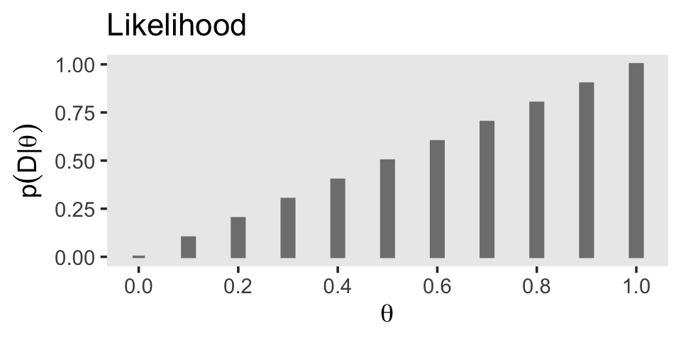

# Bayes' Rule

"Bayes' rule is merely the mathematical relation between the prior allocation of credibility and the posterior reallocation of credibility conditional on data" [@kruschkeDoingBayesianData2015, pp. 99--100].

## Bayes' rule

> Thomas Bayes (1702–1761) was a mathematician and Presbyterian minister in England. His famous theorem was published posthumously in 1763, thanks to the extensive editorial efforts of his friend, Richard Price [@bayesLIIEssaySolving1763]. The simple rule has vast ramifications for statistical inference, and therefore as long as his name is attached to the rule, we'll continue to see his name in textbooks. But Bayes himself probably was not fully aware of these ramifications, and many historians argue that it is Bayes' successor, Pierre-Simon Laplace (1749–1827), whose name should really label this type of analysis, because it was Laplace who independently rediscovered and extensively developed the methods [e.g., @daleHistoryInverseProbability2012; @mcgrayneTheoryThatWould2011]. (p. 100)

I do recommend checking out McGrayne's book It's an easy and entertaining read. For a sneak preview, why not [listen to her](https://www.youtube.com/watch?v=8oD6eBkjF9o) discuss the main themes she covered in the book?

### Derived from definitions of conditional probability.

With Equations 5.5 and 5.6, Kruschke gave us Bayes' rule in terms of $c$ and $r$. Equation 5.5 was

$$p(c|r) = \frac{p(r|c) \; p(c)}{p(r)}.$$

Since $p(r) = \sum_{c^*}p(r|c^*)p(c^*)$, we can re-express that as Equation 5.6:

$$p(c|r) = \frac{p(r|c) \; p(c)}{\sum_{c^*}p(r|c^*) \; p(c^*)},$$

where $c^*$ "in the denominator is a variable that takes on all possible values" of $c$ (p. 101).

## Applied to parameters and data

Here we get those equations re-expressed in the terms data analysts tend to think with, parameters (i.e., $\theta$) and data (i.e., $D$):

\begin{align*}
p(\theta|D) & = \frac{p(D|\theta) \; p(\theta)}{p(D)} \;\; \text{and since} \\
p(D)        & = \sum\limits_{\theta^*}p(D|\theta^*) \; p(\theta^*), \;\; \text{it's also the case that} \\
p(\theta|D) & = \frac{p(D|\theta) \; p(\theta)}{\sum\limits_{\theta^*}p(D|\theta^*) \; p(\theta^*)}.
\end{align*}

As in the previous section where we spoke in terms of $r$ and $c$, our updated $\theta^*$ notation is meant to indicate all possible values of $\theta$. For practice, it's worth repeating how Kruschke broke this down with Equation 5.7,

$$
\underbrace{p(\theta|D)}_\text{posterior} \; = \; \underbrace{p(D|\theta)}_\text{likelihood} \;\; \underbrace{p(\theta)}_\text{prior} \; / \; \underbrace{p(D)}_\text{evidence}.
$$

> The "prior," $p(\theta)$, is the credibility of the $\theta$ values without the data $D$. The "posterior," $p(\theta|D)$, is the credibility of $\theta$ values with the data $D$ taken into account. The "likelihood," $p(D|\theta)$, is the probability that the data could be generated by the model with parameter value $\theta$. The "evidence" for the model, $p(D)$, is the overall probability of the data according to the model, determined by averaging across all possible parameter values weighted by the strength of belief in those parameter values. (pp. 106--107)

And don't forget, "evidence" is short for "marginal likelihood," which is the term we'll use in some of our code, below.

## Complete examples: Estimating bias in a coin

As we begin to work with Kruschke's coin example, we should clarify that

> when [Kruschke refered] to the "bias" in a coin, [he] sometimes [referred] to its underlying probability of coming up heads. Thus, *when a coin is fair, it has a "bias" of* $\textit{0.5}$. Other times, [Kruschke used] the term "bias" in its colloquial sense of a *departure from fairness*, as in "head biased" or "tail biased." Although [Kruschke tried] to be clear about which meaning is intended, there will be times that you will have to rely on context to determine whether "bias" means the probability of heads or departure from fairness. (p. 108, *emphasis* in the original)

In this ebook, I will generally avoid Kruschke's idiosyncratic use of the term "bias." Though be warned: it may pop up from time to time.

As the the coin example at hand, here's a way to expres Kruschke's initial prior distribution in a data frame and then make Figure 5.1.a.


```r
library(tidyverse)

# make the data frame for the prior
d <-
  tibble(theta = seq(from = 0, to = 1, by = .1),
         prior = c(0:5, 4:0) * 0.04)

# plot
d %>%
  ggplot(aes(x = theta, y = prior)) +
  geom_col(width = .025, color = "grey50", fill = "grey50") +
  scale_x_continuous(expression(theta), breaks = seq(from = 0, to = 1, by = .2)) +
  labs(title = "Prior",
       y = expression(p(theta))) +
  theme(panel.grid = element_blank())
```


If you were curious, it is indeed the case that those `prior` values sum to 1.


```r
d %>% 
  summarise(s = sum(prior))
```

```
## # A tibble: 1 × 1
##       s
##   <dbl>
## 1     1
```

On page 109, Kruschke proposed the Bernoulli distribution for coin-tossing data, which he defined in Equation 5.10 as

$$p(y | \theta) = \theta^y (1 - \theta)^{(1 - y)}.$$

We can express it as a function in **R** like this.


```r
bernoulli <- function(theta, y) {
  return(theta^y * (1 - theta)^(1 - y))
}
```

To get a sense of how it works, consider a single coin flip which comes up. In this example we wanted heads, which means the trial was a success. In the `bernoulli()` function, we'll refer to that single successful trial by setting `y = 1`. We can then compute the likelihood of different values of $\theta$ by inserting those values one at a time or in bulk into the `theta` argument. Here we'll look at a sequene of 11 candidate $\theta$ values, which we'll save in a vector called `theta_sequence`.


```r
theta_sequence <- seq(from = 0, to = 1, by = .1)

bernoulli(theta = theta_sequence, y = 1)
```

```
##  [1] 0.0 0.1 0.2 0.3 0.4 0.5 0.6 0.7 0.8 0.9 1.0
```

Those values are the probability of the data (`y = 1`) given different values of theta (`theta = theta_sequence`). In terms of Bayes' rule from the previous section, we call that the likelihood $p(D|\theta)$. Here's how we might compute the likelihood within the context of our `d` data frame.


```r
d <-
  d %>% 
  mutate(likelihood = bernoulli(theta = theta, y = 1))

d
```

```
## # A tibble: 11 × 3
##    theta prior likelihood
##    <dbl> <dbl>      <dbl>
##  1   0    0           0  
##  2   0.1  0.04        0.1
##  3   0.2  0.08        0.2
##  4   0.3  0.12        0.3
##  5   0.4  0.16        0.4
##  6   0.5  0.2         0.5
##  7   0.6  0.16        0.6
##  8   0.7  0.12        0.7
##  9   0.8  0.08        0.8
## 10   0.9  0.04        0.9
## 11   1    0           1
```

Now our `d` data contains information about the likelihood, we can use those results to make the middle panel of Figure 5.1.


```r
d %>% 
  ggplot(aes(x = theta, y = likelihood)) +
  geom_col(width = .025, color = "grey50", fill = "grey50") +
  scale_x_continuous(expression(theta), breaks = seq(from = 0, to = 1, by = .2)) +
  labs(title = "Likelihood",
       y = expression(p(D*'|'*theta))) +
  theme(panel.grid = element_blank())
```



In order to compute $p(D)$ (i.e., the *evidence* or the *marginal likelihood*), we'll need to multiply our respective prior and likelihood values for each point in our theta sequence and then sum all that up. That sum will be our *marginal likelihood*. Then we can compute the posterior $p(\theta | D)$ by dividing the product of the prior and the likelihood by the marginal likelihood and make Figure 5.1.c.


```r
# compute
d <-
  d %>% 
  mutate(marginal_likelihood = sum(prior * likelihood)) %>% 
  mutate(posterior = (prior * likelihood) / marginal_likelihood)

# plot
d %>%
  ggplot(aes(x = theta, y = posterior)) +
  geom_col(width = .025, color = "grey50", fill = "grey50") +
  scale_x_continuous(expression(theta), breaks = seq(from = 0, to = 1, by = .2)) +
  labs(title = "Posterior",
       y = expression(p(theta*'|'*D))) +
  theme(panel.grid = element_blank())
```


> The posterior is a compromise between the prior distribution and the likelihood function. Sometimes this is loosely stated as a compromise between the prior and the data. The compromise favors the prior to the extent that the prior distribution is sharply peaked and the data are few. The compromise favors the likelihood function (i.e., the data) to the extent that the prior distribution is flat and the data are many. (p. 112)

### Influence of sample size on the posterior.

Our warmup in the last section was limited in that we computed the posterior based on a single data point `y = 1`. In order to follow along with this section, we're going to have to update our Bernoulli likelihood function so it can accommodate more than a single trial. In anticipation of [Chapter 6][Inferring a Binomial Probability via Exact Mathematical Analysis], we'll call our more general function the `bernoulli_likelihood()`.


```r
bernoulli_likelihood <- function(theta, data) {
  
  # `theta` = success probability parameter ranging from 0 to 1
  # `data` = the vector of data (i.e., a series of 0s and 1s)
  n   <- length(data)
  
  return(theta^sum(data) * (1 - theta)^(n - sum(data)))
  
}
```

Now we can compute the likelihood for a range of theta values given a vector of coin-flip data. To practice, we'll make a vector of $N = 4$ coin flips (three tails and one head) called `small_data`, and compute the likelihood for those data given our `theta_sequence` from above.


```r
# define the data
small_data <- rep(0:1, times = c(3, 1))

# compute the likelihood over a range of theta values
bernoulli_likelihood(theta = theta_sequence, data = small_data)
```

```
##  [1] 0.0000 0.0729 0.1024 0.1029 0.0864 0.0625 0.0384 0.0189 0.0064 0.0009
## [11] 0.0000
```

To make Figure 5.2, we'll move away from the coarse 11-point `theta_sequence` to a denser 1,001-point sequence of $\theta$ values. Here's the work required to make our version of the left portion of Figure 5.2.


```r
# make the primary data set
d <-
  tibble(theta =   seq(from = 0,     to = 1, by = .001),
         Prior = c(seq(from = 0,     to = 1, length.out = 501),
                   seq(from = 0.998, to = 0, length.out = 500))) %>% 
  mutate(Prior      = Prior / sum(Prior),
         Likelihood = bernoulli_likelihood(theta = theta, data = small_data)) %>% 
  mutate(marginal_likelihood = sum(Prior * Likelihood)) %>% 
  mutate(Posterior = (Prior * Likelihood) / marginal_likelihood)

# wrangle
d %>% 
  select(theta, Prior, Likelihood, Posterior) %>% 
  pivot_longer(-theta) %>% 
  mutate(name = factor(name, levels = c("Prior", "Likelihood", "Posterior"))) %>% 

  # plot
  ggplot(aes(x = theta, y = value)) +
  geom_area(fill = "grey67") +
  scale_x_continuous(expression(theta), breaks = seq(from = 0, to = 1, by = .2)) +
  ylab("probability density") +
  theme(panel.grid = element_blank()) +
  facet_wrap(~ name, scales = "free_y", ncol = 1)
```


As Kruschke remarked on page 112, the mode of the posterior is at $\theta = .4$.


```r
d %>% 
  filter(Posterior == max(Posterior)) %>% 
  select(theta, Posterior)
```

```
## # A tibble: 1 × 2
##   theta Posterior
##   <dbl>     <dbl>
## 1   0.4   0.00237
```

We just follow the same overall procedure to make the right portion of Figure 5.2. The only difference is how we switch from `small_data` to the $N = 40$ `large_data`.


```r
large_data <- rep(0:1, times = c(30, 10))

# compute
d <- 
  d %>% 
  mutate(Likelihood = bernoulli_likelihood(theta = theta, data = large_data)) %>% 
  mutate(marginal_likelihood = sum(Prior * Likelihood)) %>% 
  mutate(Posterior = (Prior * Likelihood) / marginal_likelihood)

# wrangle
d %>% 
  select(theta, Prior, Likelihood, Posterior) %>% 
  pivot_longer(-theta) %>% 
  mutate(name = factor(name, levels = c("Prior", "Likelihood", "Posterior"))) %>% 

# plot
  ggplot(aes(x = theta, y = value)) +
  geom_area(fill = "grey67") +
  scale_x_continuous(expression(theta), breaks = seq(from = 0, to = 1, by = .2)) +
  ylab("probability density") +
  theme(panel.grid = element_blank()) +
  facet_wrap(~ name, scales = "free_y", ncol = 1)
```


Now the mode of the posterior is lower at $\theta = .268$.


```r
d %>% 
  filter(Posterior == max(Posterior)) %>% 
  select(theta, Posterior)
```

```
## # A tibble: 1 × 2
##   theta Posterior
##   <dbl>     <dbl>
## 1 0.268   0.00586
```

With just an $N = 40$, the likelihood already dominated the posterior. But this is also a function of our fairly gentle prior. "In general, the more data we have, the more precise is the estimate of the parameter(s) in the model. Larger sample sizes yield greater precision or certainty of estimation" (p. 113).

### Influence of prior on the posterior.

It's not immediately obvious how Kruschke made his prior distributions for Figure 5.3. However, hidden away in his `BernGridExample.R` file he indicated that to get the distribution for the left side of Figure 5.3, you simply raise the prior from the left of Figure 5.2 to the 0.1 power.


```r
small_data <- rep(0:1, times = c(3, 1))

tibble(theta = seq(from = 0, to = 1, by = .001),
       Prior = c(seq(from = 0, to = 1, length.out = 501),
                 seq(from = 0.998, to = 0, length.out = 500))) %>% 
  # here's the important line of code
  mutate(Prior      = Prior^0.1 / sum(Prior^0.1),
         Likelihood = bernoulli_likelihood(theta = theta, data = small_data)) %>% 
  mutate(marginal_likelihood = sum(Prior * Likelihood)) %>% 
  mutate(Posterior = (Prior * Likelihood) / marginal_likelihood) %>% 
  select(theta, Prior, Likelihood, Posterior) %>% 
  pivot_longer(-theta) %>% 
  mutate(name = factor(name, levels = c("Prior", "Likelihood", "Posterior"))) %>% 

  ggplot(aes(x = theta, y = value)) +
  geom_area(fill = "grey67") +
  scale_x_continuous(expression(theta), breaks = seq(from = 0, to = 1, by = .2)) +
  ylab("probability density") +
  theme(panel.grid = element_blank()) +
  facet_wrap(~ name, scales = "free_y", ncol = 1)
```


With a vague flat prior and a small data set, the posterior well tend to look a lot like the likelihood. With the right side of Figure 5.3, we consider a larger data set and a stronger prior. Also, note our tricky `Prior` code.


```r
large_data <- rep(0:1, times = c(30, 10))

tibble(theta = seq(from = 0, to = 1, by = .001),
       Prior = c(seq(from = 0, to = 1, length.out = 501),
                 seq(from = 0.998, to = 0, length.out = 500))) %>% 
  # here's the important line of code
  mutate(Prior      = (Prior / sum(Prior))^10,
         Likelihood = bernoulli_likelihood(theta = theta, data = large_data)) %>% 
  mutate(marginal_likelihood = sum(Prior * Likelihood)) %>% 
  mutate(Posterior = (Prior * Likelihood) / marginal_likelihood) %>% 
  select(theta, Prior, Likelihood, Posterior) %>% 
  pivot_longer(-theta) %>% 
  mutate(name = factor(name, levels = c("Prior", "Likelihood", "Posterior"))) %>% 
  
  ggplot(aes(x = theta, y = value)) +
  geom_area(fill = "grey67") +
  scale_x_continuous(expression(theta), breaks = seq(from = 0, to = 1, by = .2)) +
  ylab("probability density") +
  theme(panel.grid = element_blank()) +
  facet_wrap(~ name, scales = "free_y", ncol = 1)
```


> Bayesian inference is intuitively rational: With a strongly informed prior that uses a lot of previous data to put high credibility over a narrow range of parameter values, it takes a lot of novel contrary data to budge beliefs away from the prior. But with a weakly informed prior that spreads credibility over a wide range of parameter values, it takes relatively little data to shift the peak of the posterior distribution toward the data (although the posterior will be relatively wide and uncertain). (p. 114)

## Why Bayesian inference can be difficult

> Determining the posterior distribution directly from Bayes' rule involves computing the evidence (a.k.a. marginal likelihood) in Equations 5.8 and 5.9. In the usual case of continuous parameters, the integral in Equation 5.9 can be impossible to solve analytically. Historically, the difficulty of the integration was addressed by restricting models to relatively simple likelihood functions with corresponding formulas for prior distributions, called *conjugate* priors, that "played nice" with the likelihood function to produce a tractable integral. (p. 115, *emphasis* in the original)

However, the simple model + conjugate prior approach has its limitations. As we'll see, we often want to fit complex models without shackling ourselves with conjugate priors—which can be quite a pain to work with. Happily,

> another kind of approximation involves randomly sampling a large number of representative combinations of parameter values from the posterior distribution. In recent decades, many such algorithms have been developed, generally referred to as Markov chain Monte Carlo (MCMC) methods. What makes these methods so useful is that they can generate representative parameter-value combinations from the posterior distribution of complex models *without* computing the integral in Bayes' rule. It is the development of these MCMC methods that has allowed Bayesian statistical methods to gain practical use. (pp. 115--116, *emphasis* in the original)

## Session info {-}


```r
sessionInfo()
```

```
## R version 4.2.2 (2022-10-31)
## Platform: x86_64-apple-darwin17.0 (64-bit)
## Running under: macOS Big Sur ... 10.16
## 
## Matrix products: default
## BLAS:   /Library/Frameworks/R.framework/Versions/4.2/Resources/lib/libRblas.0.dylib
## LAPACK: /Library/Frameworks/R.framework/Versions/4.2/Resources/lib/libRlapack.dylib
## 
## locale:
## [1] en_US.UTF-8/en_US.UTF-8/en_US.UTF-8/C/en_US.UTF-8/en_US.UTF-8
## 
## attached base packages:
## [1] stats     graphics  grDevices utils     datasets  methods   base     
## 
## other attached packages:
## [1] forcats_0.5.1   stringr_1.4.1   dplyr_1.0.10    purrr_1.0.1    
## [5] readr_2.1.2     tidyr_1.2.1     tibble_3.1.8    ggplot2_3.4.0  
## [9] tidyverse_1.3.2
## 
## loaded via a namespace (and not attached):
##  [1] lubridate_1.8.0     assertthat_0.2.1    digest_0.6.31      
##  [4] utf8_1.2.2          R6_2.5.1            cellranger_1.1.0   
##  [7] backports_1.4.1     reprex_2.0.2        evaluate_0.18      
## [10] httr_1.4.4          highr_0.9           pillar_1.8.1       
## [13] rlang_1.0.6         googlesheets4_1.0.1 readxl_1.4.1       
## [16] rstudioapi_0.13     jquerylib_0.1.4     rmarkdown_2.16     
## [19] labeling_0.4.2      googledrive_2.0.0   munsell_0.5.0      
## [22] broom_1.0.2         compiler_4.2.2      modelr_0.1.8       
## [25] xfun_0.35           pkgconfig_2.0.3     htmltools_0.5.3    
## [28] tidyselect_1.2.0    bookdown_0.28       fansi_1.0.3        
## [31] crayon_1.5.2        tzdb_0.3.0          dbplyr_2.2.1       
## [34] withr_2.5.0         grid_4.2.2          jsonlite_1.8.4     
## [37] gtable_0.3.1        lifecycle_1.0.3     DBI_1.1.3          
## [40] magrittr_2.0.3      scales_1.2.1        cli_3.6.0          
## [43] stringi_1.7.8       cachem_1.0.6        farver_2.1.1       
## [46] fs_1.5.2            xml2_1.3.3          bslib_0.4.0        
## [49] ellipsis_0.3.2      generics_0.1.3      vctrs_0.5.1        
## [52] tools_4.2.2         glue_1.6.2          hms_1.1.1          
## [55] fastmap_1.1.0       colorspace_2.0-3    gargle_1.2.0       
## [58] rvest_1.0.2         knitr_1.40          haven_2.5.1        
## [61] sass_0.4.2
```


