# Inferring a Binomial Probability via Exact Mathematical Analysis

> This chapter presents an example of how to do Bayesian inference using pure analytical mathematics without any approximations. Ultimately, we will not use the pure analytical approach for complex applications, but this chapter is important for two reasons. *First*, the relatively simple mathematics in this chapter nicely reveal the underlying concepts of Bayesian inference on a continuous parameter. The simple formulas show how the continuous allocation of credibility changes systematically as data accumulate. The examples provide an important conceptual foundation for subsequent approximation methods, because the examples give you a clear sense of what is being approximated. *Second*, the distributions introduced in this chapter, especially the beta distribution, will be used repeatedly in subsequent chapters. [@kruschkeDoingBayesianData2015, 123, *emphasis* added]

## The likelihood function: The Bernoulli distribution

If we denote a set of possible outcomes as $\{y_i\}$, Kruschke's Bernoulli likelihood function for a set of $N$ trials follows the form

$$p(\{y_i\} | \theta) = \theta^z \cdot (1 - \theta) ^ {N - z},$$

where $z$ is the number of 1's in the data (i.e., heads in a series of coin flips) and the sole parameter $\theta$ is the probability a given observation will be a 1. Otherwise put, the Bernoulli function gives us $p(y_i = 1 | \theta)$.

If you follow that equation closely, here is how we might express it in **R**.


```r
bernoulli_likelihood <- function(theta, data) {
  
  # `theta` = success probability parameter ranging from 0 to 1
  # `data`  = the vector of data (i.e., a series of 0s and 1s)
  n <- length(data)
  z <- sum(data)
  
  return(theta^z * (1 - theta)^(n - sum(data)))
  
}
```

This will come in handy in just a bit.

## A description of credibilities: The beta distribution

> In this chapter, we use purely mathematical analysis, with no numerical approximation, to derive the mathematical form of the posterior credibilities of parameter values. To do this, we need a mathematical description of the prior allocation of credibilities...
>
> In principle, we could use any probability density function supported on the interval $[0, 1]$. When we intend to apply Bayes' rule (Equation 5.7, p. 106), however, there are two desiderata for mathematical tractability. First, it would be convenient if the product of $p(y | \theta)$ and $p(\theta)$, which is in the numerator of Bayes' rule, results in a function of the same form as $p(\theta)$... Second, we desire the denominator of Bayes' rule (Equation 5.9, p. 107), namely $\int \text d  \theta\ p(y | \theta) p(\theta)$, to be solvable analytically. This quality also depends on how the form of the function $p(\theta)$ relates to the form of the function $p(y | \theta)$. When the forms of $p(y | \theta)$ and $p(\theta)$ combine so that the posterior distribution has the same form as the prior distribution, then $p(\theta)$ is called a *conjugate prior* for $p(y | \theta)$. (p. 127 *emphasis* in the original)

When we want a conjugate prior for $\theta$ of the Bernoulli likelihood, the *beta distribution* is a handy choice. Beta has two parameters, $a$ and $b$ (also sometimes called $\alpha$ and $\beta$), and the density is defined as

\begin{align*}
p(\theta | a, b) & = \operatorname{Beta} (\theta | a, b) \\
                 & = \frac{\theta^{(a - 1)} \; (1 - \theta)^{(b - 1)}}{B(a, b)},
\end{align*}

where $B(a, b)$ is a normalizing constant, keeping the results in a probability metric, and $B(\cdot)$ is the Beta function. Kruschke then clarified that the beta distribution and the Beta function are not the same. In **R**, we use the beta density with the `dbeta()` function, whereas we use the Beta function with `beta()`. In this project, we'll primarily use `dbeta()`. But to give a sense, notice that when given the same input for $a$ and $b$, the two functions return very different values.


```r
theta <- .5
a     <- 3
b     <- 3 

dbeta(theta, a, b)
```

```
## [1] 1.875
```

```r
beta(a, b)
```

```
## [1] 0.03333333
```

The $a$ and $b$ parameters are also called *shape* parameters. And indeed, if we look at the parameters of the `dbeta()` function in **R**, we'll see that $a$ is called `shape1` and $b$ is called `shape2`.


```r
print(dbeta)
```

```
## function (x, shape1, shape2, ncp = 0, log = FALSE) 
## {
##     if (missing(ncp)) 
##         .Call(C_dbeta, x, shape1, shape2, log)
##     else .Call(C_dnbeta, x, shape1, shape2, ncp, log)
## }
## <bytecode: 0x7f991940b6e0>
## <environment: namespace:stats>
```

You can learn more about the `dbeta()` function [here](https://www.rdocumentation.org/packages/stats/versions/3.5.2/topics/Beta).

Before we make Figure 6.1, we'll need some data.


```r
library(tidyverse)

length <- 1e2

d <-
  crossing(shape1 = c(.1, 1:4),
           shape2 = c(.1, 1:4)) %>%
  expand(nesting(shape1, shape2),
         x = seq(from = 0, to = 1, length.out = length)) %>% 
  mutate(a = str_c("a = ", shape1),
         b = str_c("b = ", shape2)) %>% 
  mutate(density = dbeta(x, shape1 = shape1, shape2 = shape2))

head(d)
```

```
## # A tibble: 6 × 6
##   shape1 shape2      x a       b       density
##    <dbl>  <dbl>  <dbl> <chr>   <chr>     <dbl>
## 1    0.1    0.1 0      a = 0.1 b = 0.1 Inf    
## 2    0.1    0.1 0.0101 a = 0.1 b = 0.1   3.20 
## 3    0.1    0.1 0.0202 a = 0.1 b = 0.1   1.73 
## 4    0.1    0.1 0.0303 a = 0.1 b = 0.1   1.21 
## 5    0.1    0.1 0.0404 a = 0.1 b = 0.1   0.945
## 6    0.1    0.1 0.0505 a = 0.1 b = 0.1   0.781
```

Now we're ready for our Figure 6.1.


```r
d %>% 
  ggplot(aes(x = x, y = density)) +
  geom_area(fill = "grey50") +
  scale_x_continuous(expression(theta), breaks = c(0, .5, 1)) +
  coord_cartesian(ylim = c(0, 3)) +
  labs(title = "Examples of the beta distribution",
       y = expression(p(theta*"|"*a*", "*b))) +
  theme(panel.grid = element_blank()) +
  facet_grid(b ~ a)
```


> Notice that as $a$ gets bigger (left to right across columns of Figure 6.1), the bulk of the distribution moves rightward over higher values of $\theta$, but as $b$ gets bigger (top to bottom across rows of Figure 6.1), the bulk of the distribution moves leftward over lower values of $\theta$. Notice that as $a$ and $b$ get bigger together, the beta distribution gets narrower. (p. 127).

We have a lot of practice with the beta distribution waiting for us in the chapters to come. If you like informal tutorials, you might also check out [Karin Knudson](https://twitter.com/karinknudson)'s nice blog post, [*Beta distributions, Dirichlet distributions and Dirichlet processes*](https://karinknudson.com/dirichletprocesses.html).

### Specifying a beta prior.

Though the $a$ and $b$ parameters in the beta distribution might initially seem confusing, they have a nice connection to the kinds of binary coin-flipping-type data we explores with the Bernoulli distribution in the last chapter. As Kruschke wrote: "You can think of $a$ and $b$ in the prior as if they were previously observed data, in which there were $a$ heads and $b$ tails in a total of $n = a + b$ flips" (pp. 127--128). For example, a popular default minimally-informative prior would be $\operatorname{Beta}(1, 1)$, which is like the sum of two coin flips of one tails and one heads. That produces a uniform distribution like so:


```r
d %>% 
  filter(shape1 == 1 & shape2 == 1) %>% 
  ggplot(aes(x = x, y = density)) +
  geom_area(fill = "grey50") +
  scale_x_continuous(expression(theta), breaks = c(0, .5, 1)) +
  coord_cartesian(ylim = c(0, 3)) +
  labs(title = "Beta(1, 1)",
       y = expression(p(theta*"|"*a*", "*b))) +
  theme(panel.grid = element_blank())
```

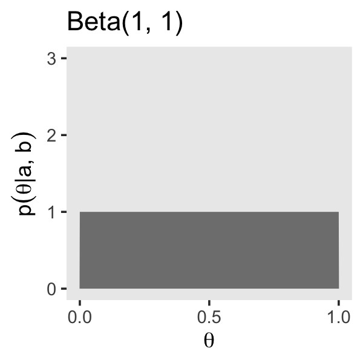

We read further:

> It is useful to know the central tendency and spread of the beta distribution expressed in terms of $a$ and $b$. It turns out that the mean of the $\operatorname{beta}(\theta | a, b)$ distribution is $\mu = a / (a + b)$ and the mode is $\omega = (a − 1) / (a + b − 2)$ for $a > 1$ and $b > 1$ ($\mu$ is Greek letter mu and $\omega$ is Greek letter omega). (p. 129)

In the case of our $\operatorname{Beta}(1, 1)$, the mean is then $1 / (1 + 1) = 0.5$ and the mode is undefined (which hopefully makes sense given the uniform distribution). Kruschke continued:

> The spread of the beta distribution is related to the "concentration" $\kappa = a + b$ ($\kappa$ is Greek letter kappa). You can see from Figure 6.1 that as $\kappa = a + b$ gets larger, the beta distribution gets narrower or more concentrated. (p. 129)

In the case of our $\operatorname{Beta}(1, 1)$, the concentration is $1 + 1 = 2$, which is also like the hypothetical sample size we've been using, $n = 2$.

If we further explore Kruschke's formulas, we learn you can specify a beta distribution in terms of $\omega$ and $\kappa$ by

$$\operatorname{Beta} \big (\alpha = \omega (\kappa - 2) + 1, \beta = (1 - \omega) \cdot (\kappa - 2) + 1 \big ),$$

as long as $\kappa > 2$. Kruschke further clarified:

> The value we choose for the prior $\kappa$ can be thought of this way: It is the number of new flips of the coin that we would need to make us teeter between the new data and the prior belief about $\mu$. If we would only need a few new flips to sway our beliefs, then our prior beliefs should be represented by a small $\kappa$. If we would need a large number of new flips to sway us away from our prior beliefs about $\mu$, then our prior beliefs are worth a very large $\kappa$. (p. 129)

He went on to clarify why we might prefer the mode to the mean when discussing the central tendency of a beta distribution.

> The mode can be more intuitive than the mean, especially for skewed distributions, because the mode is where the distribution reaches its tallest height, which is easy to visualize. The mean in a skewed distribution is somewhere away from the mode, in the direction of the longer tail. (pp. 129--130)

Figure 6.2 helped contrast the mean and mode for beta. We'll use the same process from Figure 6.1 and create the data, first.


```r
d <-
  tibble(shape1 = c(5.6, 17.6, 5, 17),
         shape2 = c(1.4, 4.4, 2, 5)) %>% 
  mutate(a        = str_c("a = ", shape1),
         b        = str_c("b = ", shape2),
         kappa    = rep(c("kappa==7", "kappa==22"), times = 2),
         mu_omega = rep(c("mu==0.8", "omega==0.8"), each = 2)) %>% 
  mutate(kappa = factor(kappa, levels = c("kappa==7", "kappa==22")),
         label = str_c(a, ", ", b)) %>% 
  expand(nesting(shape1, shape2, a, b, label, kappa, mu_omega), 
         x = seq(from = 0, to = 1, length.out = 1e3)) %>% 
  mutate(density = dbeta(x, shape1 = shape1, shape2 = shape2))

head(d)
```

```
## # A tibble: 6 × 9
##   shape1 shape2 a     b     label        kappa    mu_omega         x  density
##    <dbl>  <dbl> <chr> <chr> <chr>        <fct>    <chr>        <dbl>    <dbl>
## 1      5      2 a = 5 b = 2 a = 5, b = 2 kappa==7 omega==0.8 0       0       
## 2      5      2 a = 5 b = 2 a = 5, b = 2 kappa==7 omega==0.8 0.00100 3.01e-11
## 3      5      2 a = 5 b = 2 a = 5, b = 2 kappa==7 omega==0.8 0.00200 4.81e-10
## 4      5      2 a = 5 b = 2 a = 5, b = 2 kappa==7 omega==0.8 0.00300 2.43e- 9
## 5      5      2 a = 5 b = 2 a = 5, b = 2 kappa==7 omega==0.8 0.00400 7.68e- 9
## 6      5      2 a = 5 b = 2 a = 5, b = 2 kappa==7 omega==0.8 0.00501 1.87e- 8
```

Here's Figure 6.2.


```r
d %>%
  ggplot(aes(x = x)) +
  geom_area(aes(y = density),
            fill = "grey50") +
  geom_vline(xintercept = .8, color = "grey92", linetype = 2) +
  geom_text(data = . %>% group_by(label) %>% slice(1),
            aes(x = .025, y = 4.75, label = label),
            hjust = 0, size = 3) +
  scale_x_continuous(expression(theta), breaks = c(0, .8, 1)) +
  ylab(expression(p(theta*"|"*a*", "*b))) +
  coord_cartesian(ylim = c(0, 5)) +
  theme(panel.grid = element_blank()) +
  facet_grid(mu_omega ~ kappa, labeller = label_parsed)
```

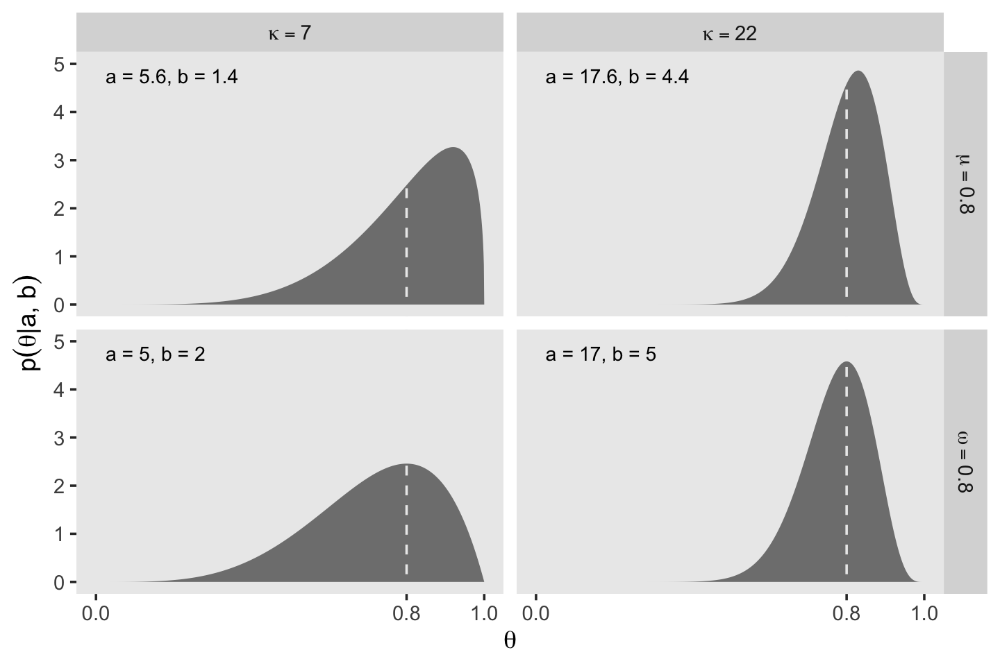

It's also possible to define the beta distribution in terms of the mean $\mu$ and standard deviation $\sigma$. In this case,

$$
\begin{align*}
\alpha & = \mu \left ( \frac{\mu(1 - \mu)}{\sigma^2} - 1\right), \text{and} \\
\beta & = (1 - \mu) \left ( \frac{\mu(1 - \mu)}{\sigma^2} - 1\right).
\end{align*}
$$

In lines 264 to 290 in his `DBDA2E-utilities.R` file, Kruschke provided a series of `betaABfrom...()` functions that will allow us to compute the $a$ and $b$ parameters from measures of central tendency (i.e., mean and mode) and of spread (i.e., $\kappa$ and $\sigma$). Here are those bits of his code.


```r
# Shape parameters from central tendency and scale:
betaABfromMeanKappa <- function(mean, kappa) {
  if (mean <= 0 | mean >= 1) stop("must have 0 < mean < 1")
  if (kappa <= 0) stop("kappa must be > 0")
  a <- mean * kappa
  b <- (1.0 - mean) * kappa
  return(list(a = a, b = b))
}

betaABfromModeKappa <- function(mode, kappa) {
  if (mode <= 0 | mode >= 1) stop("must have 0 < mode < 1")
  if (kappa <= 2) stop("kappa must be > 2 for mode parameterization")
  a <- mode * (kappa - 2) + 1
  b <- (1.0 - mode) * (kappa - 2) + 1
  return(list(a = a, b = b))
}

betaABfromMeanSD <- function(mean, sd) {
  if (mean <= 0 | mean >= 1) stop("must have 0 < mean < 1")
  if (sd <= 0) stop("sd must be > 0")
  kappa <- mean * (1 - mean)/sd^2 - 1
  if (kappa <= 0) stop("invalid combination of mean and sd")
  a <- mean * kappa
  b <- (1.0 - mean) * kappa
  return(list(a = a, b = b))
}
```

You can use them like so.


```r
betaABfromMeanKappa(mean = .25, kappa = 4)
```

```
## $a
## [1] 1
## 
## $b
## [1] 3
```

```r
betaABfromModeKappa(mode = .25, kappa = 4)
```

```
## $a
## [1] 1.5
## 
## $b
## [1] 2.5
```

```r
betaABfromMeanSD(mean = .5, sd = .1)
```

```
## $a
## [1] 12
## 
## $b
## [1] 12
```

You can also save the results as an object, which can then be indexed by parameter using the base-**R** `$` syntax.


```r
beta_param <- betaABfromModeKappa(mode = .25, kappa = 4)

beta_param$a
```

```
## [1] 1.5
```

```r
beta_param$b
```

```
## [1] 2.5
```

We'll find this trick quite handy in the sections to come.

## The posterior beta

I'm not going to reproduce all of Formula 6.8. But this a fine opportunity to re-express Bayes' rule in terms of $z$ and $N$,

$$p(\theta | z, N) = \frac{p(z, N | \theta) \; p(\theta)}{p(z, N)}.$$

A key insight from the equations Kruschke worked through this section is: "If the prior distribution is $\operatorname{beta}(a, b)$, and the data have $z$ heads in $N$ flips, then the posterior distribution is $\operatorname{beta}(\theta | z + a, N - z + b)$" (p. 132).

### Posterior is compromise of prior and likelihood.

You might wonder how Kruschke computed the HDI values for Figure 6.3. Remember our `hdi_of_icdf()` function from back in Chapter 4? Yep, that's how. Here's that code, again.


```r
hdi_of_icdf <- function(name, width = .95, tol = 1e-8, ... ) {
  
  # Arguments:
  #   `name` is R's name for the inverse cumulative density function
  #   of the distribution.
  #   `width` is the desired mass of the HDI region.
  #   `tol` is passed to R's optimize function.
  # Return value:
  #   Highest density iterval (HDI) limits in a vector.
  # Example of use: For determining HDI of a beta(30, 12) distribution, type
  #   `hdi_of_icdf(qbeta, shape1 = 30, shape2 = 12)`
  #   Notice that the parameters of the `name` must be explicitly stated;
  #   e.g., `hdi_of_icdf(qbeta, 30, 12)` does not work.
  # Adapted and corrected from Greg Snow's TeachingDemos package.
  
  incredible_mass <- 1.0 - width
  interval_width <- function(low_tail_prob, name, width, ...) {
    name(width + low_tail_prob, ...) - name(low_tail_prob, ...)
  }
  
  opt_info <- optimize(interval_width, c(0, incredible_mass), 
                       name = name, width = width, 
                       tol = tol, ...)
  
  hdi_lower_tail_prob <- opt_info$minimum
  
  return(c(name(hdi_lower_tail_prob, ...),
           name(width + hdi_lower_tail_prob, ...)))
  
}
```

Recall it's based off of the `HDIofICDF()` function from Kruschke's `DBDA2E-utilities.R` file. I've altered Kruschke's formatting a little bit, but the guts of the code are unchanged. Our `hdi_of_icdf()` function will take the `name` of an "inverse cumulative density function" and its parameters and then return an HDI range, as defined by the `width` parameter. Since the prior at the top of Figure 6.3 is $\operatorname{Beta}(5, 5)$, we can use `hdi_of_icdf()` to calculate the HDI like so.


```r
hdi_of_icdf(name = qbeta,
            shape1 = 5,
            shape2 = 5,
            width  = .95)
```

```
## [1] 0.2120085 0.7879915
```

Here they are for the posterior distribution at the bottom of the figure.


```r
hdi_of_icdf(name = qbeta,
            shape1 = 6,
            shape2 = 14)
```

```
## [1] 0.1142339 0.4967144
```

Note that since we set `width  = .95` as the default, we can leave it out if we want to stick with the conventional 95% intervals.

Here are the mean calculations from the last paragraph on page 134.


```r
n <- 10
z <- 1
a <- 5
b <- 5

(prior_mean <- a / (a + b))
```

```
## [1] 0.5
```

```r
(proportion_heads <- z / n)
```

```
## [1] 0.1
```

```r
(posterior_mean <- (z + a) / (n + a + b))
```

```
## [1] 0.3
```

In order to make the plots for Figure 6.3, we'll want to compute the prior, likelihood, and posterior density values across a densely-packed range of $\theta$ values.


```r
trial_data <- c(rep(0, 9), 1)

d <-
  tibble(theta = seq(from = 0, to = 1, length.out = 100)) %>% 
  mutate(`Prior (beta)`           = dbeta(theta, 
                                          shape1 = a, 
                                          shape2 = b),
         `Likelihood (Bernoulli)` = bernoulli_likelihood(theta = theta, 
                                                         data  = trial_data),
         `Posterior (beta)`       = dbeta(theta, 
                                          shape1 = 6, 
                                          shape2 = 14))

glimpse(d)
```

```
## Rows: 100
## Columns: 4
## $ theta                    <dbl> 0.00000000, 0.01010101, 0.02020202, 0.0303030…
## $ `Prior (beta)`           <dbl> 0.000000e+00, 6.297429e-06, 9.670878e-05, 4.6…
## $ `Likelihood (Bernoulli)` <dbl> 0.000000000, 0.009218977, 0.016812166, 0.0229…
## $ `Posterior (beta)`       <dbl> 0.000000e+00, 1.500163e-05, 4.201284e-04, 2.7…
```

To make things easier on ourselves, we'll also make two additional data objects to annotate the plots with lines and text.


```r
# save the levels
levels <- c("Prior (beta)", "Likelihood (Bernoulli)", "Posterior (beta)")

# the data for the in-plot lines
line <-
  tibble(theta      = c(.212 + .008, .788 - .008, .114 + .004, .497 - .005),
         value      = rep(c(.51, .66), each = 2),
         xintercept = c(.212, .788, .114, .497),
         name       = rep(c("Prior (beta)", "Posterior (beta)"), each = 2)) %>% 
  mutate(name = factor(name, levels = levels))
  
# the data for the annotation
text <-
  tibble(theta = c(.5, .3),
         value = c(.8, 1.125),
         label = "95% HDI",
         name  = c("Prior (beta)", "Posterior (beta)")) %>% 
  mutate(name = factor(name, levels = levels))
```

Finally, here's our Figure 6.3.


```r
library(cowplot)

d %>% 
  pivot_longer(-theta) %>% 
  mutate(name = factor(name, levels = levels)) %>% 
  
  ggplot(aes(x = theta, y = value, )) +
  # densities
  geom_area(fill = "steelblue") +
  # dashed vertical lines
  geom_vline(data = line,
             aes(xintercept = xintercept), 
             linetype = 2, color = "white") +
  # arrows
  geom_line(data = line,
            arrow = arrow(length = unit(.15,"cm"), 
                          ends = "both", 
                          type = "closed"),
            color = "white") +
  # text
  geom_text(data = text,
            aes(label = label),
            color = "white") +
  labs(x = expression(theta),
       y = NULL) +
  facet_wrap(~ name, scales = "free_y", ncol = 1) +
  theme_cowplot()
```

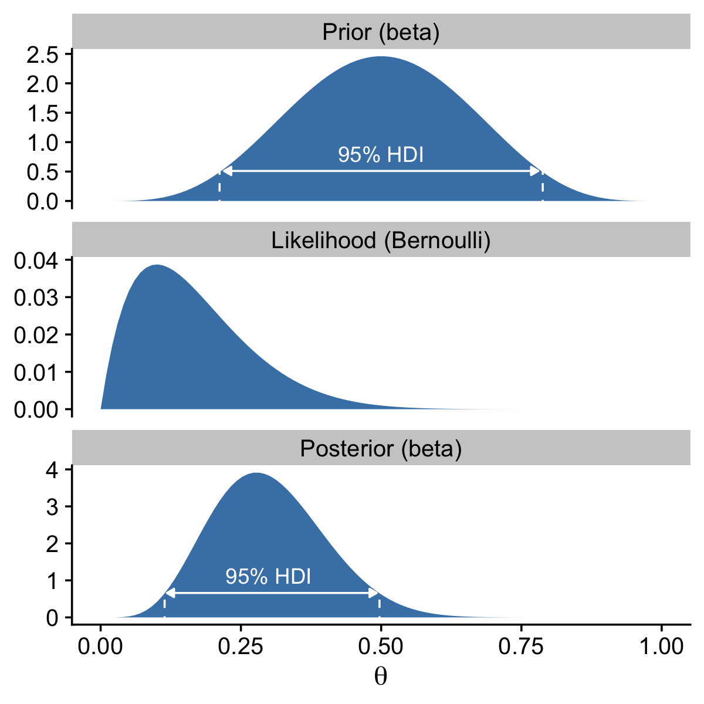

Note how we loaded the [**cowplot** package](https://wilkelab.org/cowplot) [@R-cowplot]. We played around a bit with plotting conventions in the previous chapters. From this chapter onward we'll explore plotting conventions in a more deliberate fashion. One quick way to alter the look and feel of a plot is by altering its theme, and the **cowplot** package includes several theme options. In this chapter, we'll focus on making simple and conventional-looking plots with the `theme_cowplot()` function.

## Examples

### Prior knowledge expressed as a beta distribution.

If you flip an unaltered freshly-minted coin 20 times and end up with 17 heads, 85% of those trials are heads.


```r
 100 * (17 / 20)
```

```
## [1] 85
```

In the first paragraph of this section, Kruschke suggested we consider a beta prior with a mode of $\omega = .5$ and an effective sample size $\kappa = 500$. Why? Because even in the face of 17 heads out of 20 flips, our default prior assumption should still be that freshly-minted coins are fair. To compute the $a$ and $b$ parameters that correspond to $\omega = .5$ and $\kappa = 500$, we might use Kruschke's `betaABfromModeKappa()` function.


```r
betaABfromModeKappa(mode = .5, kappa = 500)
```

```
## $a
## [1] 250
## 
## $b
## [1] 250
```

Confusingly, Kruschke switched from $\operatorname{Beta(250, 250)}$ in the prose to $\operatorname{Beta(100, 100)}$ in Figure 6.4.a, which he acknowledged in his [Corrigenda](https://sites.google.com/site/doingbayesiandataanalysis/corrigenda). We'll stick with $\operatorname{Beta(100, 100)}$, which corresponds to $\omega = .5$ and $\kappa = 200$.


```r
betaABfromModeKappa(mode = .5, kappa = 200)
```

```
## $a
## [1] 100
## 
## $b
## [1] 100
```

Here's how to use those values and some of the equations from above to make the data necessary for the left column of Figure 6.4.


```r
# define the prior
beta_param <- betaABfromModeKappa(mode = .5, kappa = 200)

# compute the corresponding HDIs
prior_hdi <-
  hdi_of_icdf(name = qbeta,
              shape1 = beta_param$a,
              shape2 = beta_param$b,
              width = .95)

# define the data
n <- 20
z <- 17

trial_data <- c(rep(0, times = n - z), rep(1, times = z))

# compute the HDIs for the posterior
post_hdi <-
  hdi_of_icdf(name = qbeta,
              shape1 = z + beta_param$a,
              shape2 = n - z + beta_param$b,
              width = .95)

# use the above to compute the prior, the likelihood, and the posterior
# densities using the grid approximation approach
d <-
  tibble(theta = seq(from = 0, to = 1, length.out = 1e3)) %>% 
  mutate(prior      = dbeta(theta, 
                            shape1 = beta_param$a, 
                            shape2 = beta_param$b),
         likelihood = bernoulli_likelihood(theta = theta, 
                                           data  = trial_data),
         posterior  = dbeta(theta, 
                            shape1 = z + beta_param$a, 
                            shape2 = n - z + beta_param$b))

# what have we done?
glimpse(d)
```

```
## Rows: 1,000
## Columns: 4
## $ theta      <dbl> 0.000000000, 0.001001001, 0.002002002, 0.003003003, 0.00400…
## $ prior      <dbl> 0.000000e+00, 4.526977e-237, 2.598214e-207, 6.376221e-190, …
## $ likelihood <dbl> 0.000000e+00, 1.014103e-51, 1.325213e-46, 1.301756e-43, 1.7…
## $ posterior  <dbl> 0.000000e+00, 3.226730e-282, 2.420099e-247, 5.833988e-227, …
```

We're finally ready to plot the prior, the likelihood, and the posterior for the left column of Figure 6.4.


```r
## Figure 6.4, left column
# prior
d %>% 
  ggplot(aes(x = theta, y = prior)) +
  geom_area(fill = "steelblue", alpha = 1/2) +
  geom_area(data = . %>% filter(theta > prior_hdi[1] & theta < prior_hdi[2]),
            fill = "steelblue") +
  geom_segment(x = prior_hdi[1] + .005, xend = prior_hdi[2] - .005,
               y = 1.8, yend = 1.8,
               arrow = arrow(length = unit(.15,"cm"), 
                             ends = "both", 
                             type = "closed"),
               color = "white") +
  annotate(geom = "text", x = .5, y = 3.5, 
           label = "95% HDI") +
  labs(title = "Prior (beta)",
       x = expression(theta),
       y = expression(dbeta(theta*"|"*100*", "*100))) +
  coord_cartesian(ylim = c(0, 12)) +
  theme_cowplot()
```

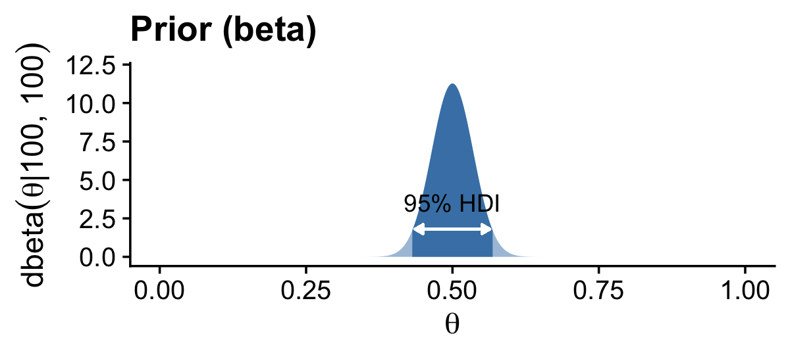

```r
# likelihood
d %>%   
  ggplot(aes(x = theta, y = likelihood)) +
  geom_area(fill = "steelblue") +
  labs(title = "Likelihood (Bernoulli)",
       x = expression(theta),
       y = expression(p(D*"|"*theta))) +
  theme_cowplot()
```

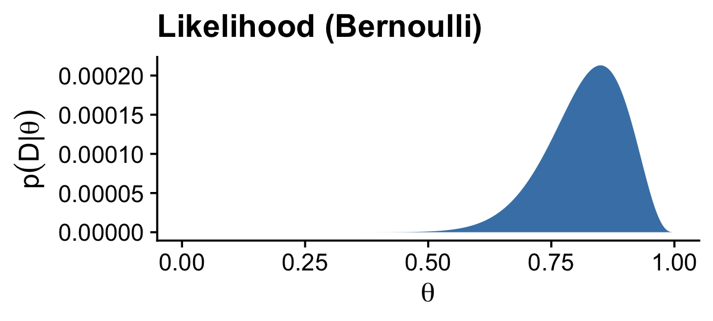

```r
# posterior
d %>% 
  ggplot(aes(x = theta, y = posterior)) +
  geom_area(fill = "steelblue", alpha = 1/2) +
  geom_area(data = . %>% filter(theta > post_hdi[1] & theta < post_hdi[2]),
            fill = "steelblue") +
  geom_segment(x = post_hdi[1] + .005, xend = post_hdi[2] - .005,
               y = 2, yend = 2,
               arrow = arrow(length = unit(.15, "cm"), 
                             ends = "both", 
                             type = "closed"),
               color = "white") +
  annotate(geom = "text", x = .532, y = 3.5, 
           label = "95% HDI") +
  labs(title = "Posterior (beta)",
       x = expression(theta),
       y = expression(dbeta(theta*"|"*117*", "*103))) +
  coord_cartesian(ylim = c(0, 12)) +
  theme_cowplot()
```

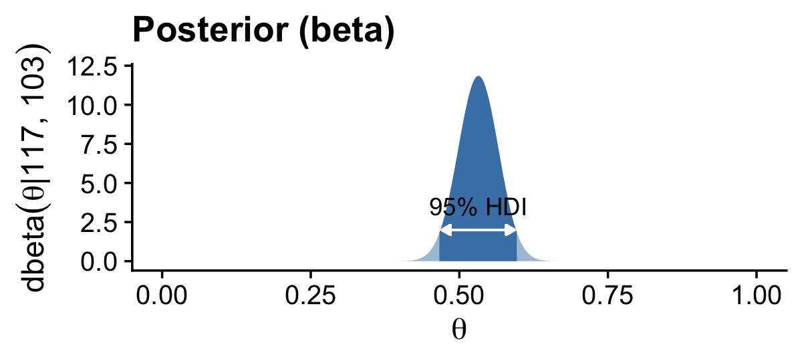

Here are the exact HDI values for the prior and posterior densities.


```r
prior_hdi
```

```
## [1] 0.4309509 0.5690491
```

```r
post_hdi
```

```
## [1] 0.4660154 0.5974595
```

If you double back to page 129 in the text, you'll see Kruschke defined the mode of a beta density as

$$\omega_\text{beta} = (a - 1) / (a + b - 2)$$

whenever $a > 1$ and $b > 1$. Thus we can compute the modes for our prior and posterior densities like this.


```r
(beta_param$a - 1) / (beta_param$a + beta_param$b - 2)
```

```
## [1] 0.5
```

```r
(z + beta_param$a - 1) / (z + beta_param$a + n - z + beta_param$b - 2)
```

```
## [1] 0.5321101
```

For the next example, we consider the probability a professional basketball player will make free a throw. We have the same likelihood based on 17 successes our of 20 trials, but this time our prior is based on $\omega = .75$ and $\kappa = 25$. Here we update those values and our `d` data for the plot.


```r
# update the beta parameters for the prior
beta_param <- betaABfromModeKappa(mode = .75, kappa = 25)

# update the HDIs
prior_hdi <-
  hdi_of_icdf(name = qbeta,
              shape1 = beta_param$a,
              shape2 = beta_param$b,
              width = .95)

post_hdi <-
  hdi_of_icdf(name = qbeta,
              shape1 = z + beta_param$a,
              shape2 = n - z + beta_param$b,
              width = .95)

# update the data
d <-
  d %>% 
  mutate(prior     = dbeta(theta, 
                           shape1 = beta_param$a, 
                           shape2 = beta_param$b),
         posterior = dbeta(theta, 
                           shape1 = z + beta_param$a, 
                           shape2 = n - z + beta_param$b))
```

With our updated values in hand, we're ready to make our versions of the middle column of Figure 6.4.


```r
## plot Figure 6.4, middle column!
# prior
d %>% 
  ggplot(aes(x = theta, y = prior)) +
  geom_area(fill = "steelblue", alpha = 1/2) +
  geom_area(data = . %>% filter(theta > prior_hdi[1] & theta < prior_hdi[2]),
            fill = "steelblue") +
  geom_segment(x = prior_hdi[1] + .005, xend = prior_hdi[2] - .005,
               y = 0.75, yend = 0.75,
               arrow = arrow(length = unit(.15,"cm"), 
                             ends = "both", 
                             type = "closed"),
               color = "white") +
  annotate(geom = "text", x = .75, y = 1.5, 
           label = "95% HDI", color = "white") +
  labs(title = "Prior (beta)",
       x = expression(theta),
       y = expression(dbeta(theta*"|"*18.25*", "*6.75))) +
  coord_cartesian(ylim = c(0, 7)) +
  theme_cowplot()
```

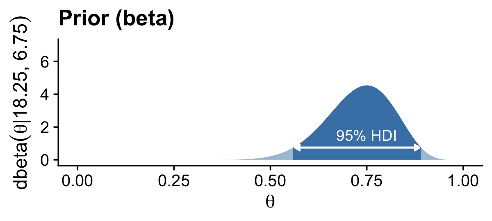

```r
# likelihood, which is the same as the last time
d %>%   
  ggplot(aes(x = theta, y = likelihood)) +
  geom_area(fill = "steelblue") +
  labs(title = "Likelihood (Bernoulli)",
       x = expression(theta),
       y = expression(p(D*"|"*theta))) +
  theme_cowplot()
```


```r
# posterior
d %>% 
  ggplot(aes(x = theta, y = posterior)) +
  geom_area(fill = "steelblue", alpha = 1/2) +
  geom_area(data = . %>% filter(theta > post_hdi[1] & theta < post_hdi[2]),
            fill = "steelblue") +
  geom_segment(x = post_hdi[1] + .005, xend = post_hdi[2] - .005,
               y = 1, yend = 1,
               arrow = arrow(length = unit(.15, "cm"), 
                             ends = "both", 
                             type = "closed"),
               color = "white") +
  annotate(geom = "text", x = .797, y = 2, 
           label = "95% HDI", color = "white") +
  labs(title = "Posterior (beta)",
       x = expression(theta),
       y = expression(dbeta(theta*"|"*35.25*", "*9.75))) +
  coord_cartesian(ylim = c(0, 7)) +
  theme_cowplot()
```

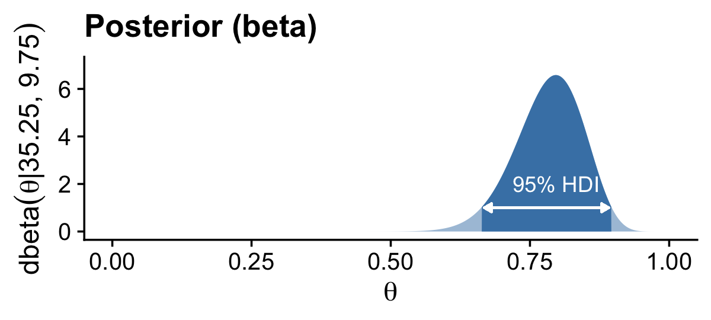

Here are the exact HDI values for the prior and posterior densities.


```r
prior_hdi
```

```
## [1] 0.5581935 0.8915815
```

```r
post_hdi
```

```
## [1] 0.6629078 0.8966491
```

Here are the the modes for our prior and posterior densities.


```r
(beta_param$a - 1) / (beta_param$a + beta_param$b - 2)
```

```
## [1] 0.75
```

```r
(z + beta_param$a - 1) / (z + beta_param$a + n - z + beta_param$b - 2)
```

```
## [1] 0.7965116
```

For our final example, we consider the tendency of a newly discovered substance on a distant planet to be blue versus green. Just as in the previous two examples, we discover 17 out of 20 trials come up positive (i.e., blue). This time we have a noncommittal uniform prior, $\operatorname{Beta}(1, 1)$. Here's how to plot the results, as shown in the right column of Figure 6.4.


```r
# update beta_param
beta_param$a <- 1
beta_param$b <- 1

# update the HDIs
prior_hdi <-
  hdi_of_icdf(name = qbeta,
              shape1 = beta_param$a,
              shape2 = beta_param$b,
              width = .95)

post_hdi <-
  hdi_of_icdf(name = qbeta,
              shape1 = z + beta_param$a,
              shape2 = n - z + beta_param$b,
              width = .95)

# update the data
d <-
  d %>% 
  mutate(prior     = dbeta(theta, 
                           shape1 = beta_param$a, 
                           shape2 = beta_param$b),
         posterior = dbeta(theta, 
                           shape1 = z + beta_param$a, 
                           shape2 = n - z + beta_param$b))


## plot Figure 6.4, rightmost column!
# prior
d %>% 
  ggplot(aes(x = theta, y = prior)) +
  geom_area(fill = "steelblue") +
  labs(title = "Prior (beta)",
       x = expression(theta),
       y = expression(dbeta(theta*"|"*1*", "*1))) +
  coord_cartesian(ylim = c(0, 5)) +
  theme_cowplot()
```

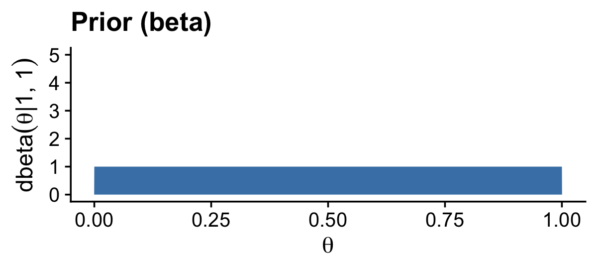

```r
# likelihood, which is the same as the last two examples
d %>%   
  ggplot(aes(x = theta, y = likelihood)) +
  geom_area(fill = "steelblue") +
  labs(title = "Likelihood (Bernoulli)",
       x = expression(theta),
       y = expression(p(D*"|"*theta))) +
  theme_cowplot()
```


```r
# posterior
d %>% 
  ggplot(aes(x = theta, y = posterior)) +
  geom_area(fill = "steelblue", alpha = 1/2) +
  geom_area(data = . %>% filter(theta > post_hdi[1] & theta < post_hdi[2]),
            fill = "steelblue") +
  geom_segment(x = post_hdi[1] + .005, xend = post_hdi[2] - .005,
               y = 0.8, yend = 0.8,
               arrow = arrow(length = unit(.15, "cm"), 
                             ends = "both", 
                             type = "closed"),
               color = "white") +
  annotate(geom = "text", x = (post_hdi[1] + post_hdi[2]) / 2, y = 1.5, 
           label = "95% HDI", color = "white") +
  labs(title = "Posterior (beta)",
       x = expression(theta),
       y = expression(dbeta(theta*"|"*18*", "*4))) +
  coord_cartesian(ylim = c(0, 5)) +
  theme_cowplot()
```

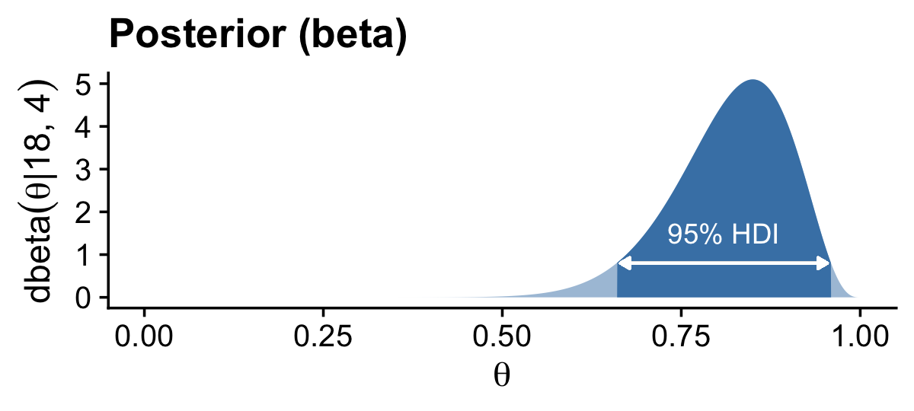

Here are the exact HDI values for the posterior density.


```r
post_hdi
```

```
## [1] 0.6599474 0.9591231
```

Because both the $a$ and $b$ parameters for our beta prior are 1, we can't use the formula from above to compute the mode. I hope this makes sense if you look back at the plot. The density for $\operatorname{Beta}(1, 1)$ is uniform and has no mode. We can, at least, compute the mode for the posterior.


```r
(z + beta_param$a - 1) / (z + beta_param$a + n - z + beta_param$b - 2)
```

```
## [1] 0.85
```

### Prior knowledge that cannot be expressed as a beta distribution.

> The beauty of using a beta distribution to express prior knowledge is that the posterior distribution is again exactly a beta distribution, and therefore, no matter how much data we include, we always have an exact representation of the posterior distribution and a simple way of computing it. But not all prior knowledge can be expressed by a beta distribution, because the beta distribution can only be in the forms illustrated by Figure 6.1. If the prior knowledge cannot be expressed as a beta distribution, then we must use a different method to derive the posterior. In particular, we might revert to grid approximation as was explained in Section 5.5 (p. 116).

For such a small section in the text, the underlying code is a bit of a beast. For kicks, we'll practice two ways. First we'll follow the code Kruschke used in the text. Our second attempt will be in a more **tidyverse** sort of way.

#### Figure 6.5 in Kruschke style.


```r
# Fine teeth for Theta
theta <- seq(0, 1, length = 1000)

# Two triangular peaks on a small non-zero floor
p_theta <-
  c(rep(1, 200), 
    seq(1, 100, length = 50), 
    seq(100, 1, length = 50), 
    rep(1, 200)) %>% 
  rep(., times = 2)

# Make p_theta sum to 1.0
p_theta <- p_theta / sum(p_theta)
```

Here's Kruschke's `BernGrid()` code in all its glory.


```r
BernGrid = function( Theta , pTheta , Data , plotType=c("Points","Bars")[2] ,
                     showCentTend=c("Mean","Mode","None")[3] ,
                     showHDI=c(TRUE,FALSE)[2] , HDImass=0.95 ,
                     showpD=c(TRUE,FALSE)[2] , nToPlot=length(Theta) ) {
  # Theta is vector of values between 0 and 1.
  # pTheta is prior probability mass at each value of Theta
  # Data is vector of 0's and 1's.
  
  # Check for input errors:
  if ( any( Theta > 1 | Theta < 0 ) ) {
    stop("Theta values must be between 0 and 1")
  }
  if ( any( pTheta < 0 ) ) {
    stop("pTheta values must be non-negative")
  }
  if ( !isTRUE(all.equal( sum(pTheta) , 1.0 )) )  {
    stop("pTheta values must sum to 1.0")
  }
  if ( !all( Data == 1 | Data == 0 ) ) {
    stop("Data values must be 0 or 1")
  }
  
  # Create summary values of Data
  z = sum( Data ) # number of 1's in Data
  N = length( Data ) 

  # Compute the Bernoulli likelihood at each value of Theta:
  pDataGivenTheta = Theta^z * (1-Theta)^(N-z)
  # Compute the evidence and the posterior via Bayes' rule:
  pData = sum( pDataGivenTheta * pTheta )
  pThetaGivenData = pDataGivenTheta * pTheta / pData
  
  # Plot the results.
  layout( matrix( c( 1,2,3 ) ,nrow=3 ,ncol=1 ,byrow=FALSE ) ) # 3x1 panels
  par( mar=c(3,3,1,0) , mgp=c(2,0.7,0) , mai=c(0.5,0.5,0.3,0.1) ) # margins
  cexAxis = 1.33
  cexLab = 1.75
  # convert plotType to notation used by plot:
  if ( plotType=="Points" ) { plotType="p" }
  if ( plotType=="Bars" ) { plotType="h" }
  dotsize = 5 # how big to make the plotted dots
  barsize = 5 # how wide to make the bar lines    
  # If the comb has a zillion teeth, it's too many to plot, so plot only a
  # thinned out subset of the teeth.
  nteeth = length(Theta)
  if ( nteeth > nToPlot ) {
    thinIdx = round( seq( 1, nteeth , length=nteeth ) )
  } else { 
    thinIdx = 1:nteeth 
  }

  # Plot the prior.
  yLim = c(0,1.1*max(c(pTheta,pThetaGivenData)))
  plot( Theta[thinIdx] , pTheta[thinIdx] , type=plotType , 
        pch="." , cex=dotsize , lwd=barsize ,
        xlim=c(0,1) , ylim=yLim , cex.axis=cexAxis ,
        xlab=bquote(theta) , ylab=bquote(p(theta)) , cex.lab=cexLab ,
        main="Prior" , cex.main=1.5 , col="skyblue" )
  if ( showCentTend != "None" ) {
    if ( showCentTend == "Mean" ) {
      meanTheta = sum( Theta * pTheta ) 
      if ( meanTheta > .5 ) {
         textx = 0 ; textadj = c(0,1)
      } else {
        textx = 1 ; textadj = c(1,1)
      }
      text( textx , yLim[2] ,
            bquote( "mean=" * .(signif(meanTheta,3)) ) ,
            cex=2.0 , adj=textadj )
    }
    if ( showCentTend == "Mode" ) {
      modeTheta = Theta[ which.max( pTheta ) ]
      if ( modeTheta > .5 ) {
        textx = 0 ; textadj = c(0,1)
      } else {
        textx = 1 ; textadj = c(1,1)
      }
      text( textx , yLim[2] ,
            bquote( "mode=" * .(signif(modeTheta,3)) ) ,
            cex=2.0 , adj=textadj )
    }
  }
  
  # Mark the highest density interval. HDI points are not thinned in the plot.
  if ( showHDI ) {
    HDIinfo = HDIofGrid( pTheta , credMass=HDImass )
    points( Theta[ HDIinfo$indices ] , 
            rep( HDIinfo$height , length( HDIinfo$indices ) ) , 
            pch="-" , cex=1.0 )
    text( mean( Theta[ HDIinfo$indices ] ) , HDIinfo$height ,
          bquote( .(100*signif(HDIinfo$mass,3)) * "% HDI" ) ,
          adj=c(0.5,-1.5) , cex=1.5 )
    # Mark the left and right ends of the waterline. 
    # Find indices at ends of sub-intervals:
    inLim = HDIinfo$indices[1] # first point
    for ( idx in 2:(length(HDIinfo$indices)-1) ) {
      if ( ( HDIinfo$indices[idx] != HDIinfo$indices[idx-1]+1 ) | # jumps on left, OR
             ( HDIinfo$indices[idx] != HDIinfo$indices[idx+1]-1 ) ) { # jumps on right
        inLim = c(inLim,HDIinfo$indices[idx]) # include idx
      }
    }
    inLim = c(inLim,HDIinfo$indices[length(HDIinfo$indices)]) # last point
    # Mark vertical lines at ends of sub-intervals:
    for ( idx in inLim ) {
      lines( c(Theta[idx],Theta[idx]) , c(-0.5,HDIinfo$height) , type="l" , lty=2 , 
             lwd=1.5 )
      text( Theta[idx] , HDIinfo$height , bquote(.(round(Theta[idx],3))) ,
            adj=c(0.5,-0.1) , cex=1.2 )
    }
  }
  
  # Plot the likelihood: p(Data|Theta)
  plot( Theta[thinIdx] , pDataGivenTheta[thinIdx] , type=plotType , 
        pch="." , cex=dotsize , lwd=barsize ,
        xlim=c(0,1) , ylim=c(0,1.1*max(pDataGivenTheta)) , cex.axis=cexAxis ,
        xlab=bquote(theta) , ylab=bquote( "p(D|" * theta * ")" ) , cex.lab=cexLab ,
        main="Likelihood" , cex.main=1.5 , col="skyblue" )
  if ( z > .5*N ) { textx = 0 ; textadj = c(0,1) }
  else { textx = 1 ; textadj = c(1,1) }
  text( textx ,1.0*max(pDataGivenTheta) ,cex=2.0
  	,bquote( "Data: z=" * .(z) * ",N=" * .(N) ) ,adj=textadj )
  if ( showCentTend != "None" ) {
    if ( showCentTend == "Mean" ) {
      meanTheta = sum( Theta * pDataGivenTheta ) 
      if ( meanTheta > .5 ) {
        textx = 0 ; textadj = c(0,1)
      } else {
        textx = 1 ; textadj = c(1,1)
      }
      text( textx , 0.7*max(pDataGivenTheta) ,
            bquote( "mean=" * .(signif(meanTheta,3)) ) ,
            cex=2.0 , adj=textadj )
    }
    if ( showCentTend == "Mode" ) {
      modeTheta = Theta[ which.max( pDataGivenTheta ) ]
      if ( modeTheta > .5 ) {
        textx = 0 ; textadj = c(0,1)
      } else {
        textx = 1 ; textadj = c(1,1)
      }
      text( textx , 0.7*max(pDataGivenTheta) ,
            bquote( "mode=" * .(signif(modeTheta,3)) ) ,
            cex=2.0 , adj=textadj )
    }
  }
  
  # Plot the posterior.
  yLim = c(0,1.1*max(c(pTheta,pThetaGivenData)))
  plot( Theta[thinIdx] , pThetaGivenData[thinIdx] , type=plotType , 
        pch="." , cex=dotsize , lwd=barsize ,
        xlim=c(0,1) , ylim=yLim , cex.axis=cexAxis ,
        xlab=bquote(theta) , ylab=bquote( "p(" * theta * "|D)" ) , cex.lab=cexLab ,
        main="Posterior" , cex.main=1.5 , col="skyblue" )
  if ( showCentTend != "None" ) {
    if ( showCentTend == "Mean" ) {
      meanTheta = sum( Theta * pThetaGivenData ) 
      if ( meanTheta > .5 ) {
        textx = 0 ; textadj = c(0,1)
      } else {
        textx = 1 ; textadj = c(1,1)
      }
      text( textx , yLim[2] ,
            bquote( "mean=" * .(signif(meanTheta,3)) ) ,
            cex=2.0 , adj=textadj )
    }
    if ( showCentTend == "Mode" ) {
      modeTheta = Theta[ which.max( pThetaGivenData ) ]
      if ( modeTheta > .5 ) {
        textx = 0 ; textadj = c(0,1)
      } else {
        textx = 1 ; textadj = c(1,1)
      }
      text( textx , yLim[2] ,
            bquote( "mode=" * .(signif(modeTheta,3)) ) ,
            cex=2.0 , adj=textadj )
    }
  }

  
  # Plot marginal likelihood pData:
  if ( showpD ) {
    meanTheta = sum( Theta * pThetaGivenData ) 
    if ( meanTheta > .5 ) {
      textx = 0 ; textadj = c(0,1)
    } else {
      textx = 1 ; textadj = c(1,1)
    }
    text( textx , 0.75*max(pThetaGivenData) , cex=2.0 ,
    	    bquote( "p(D)=" * .(signif(pData,3)) ) ,adj=textadj )
  }
  
  # Mark the highest density interval. HDI points are not thinned in the plot.
  if ( showHDI ) {
    HDIinfo = HDIofGrid( pThetaGivenData , credMass=HDImass )
    points( Theta[ HDIinfo$indices ] , 
            rep( HDIinfo$height , length( HDIinfo$indices ) ) , 
            pch="-" , cex=1.0 )
    text( mean( Theta[ HDIinfo$indices ] ) , HDIinfo$height ,
             bquote( .(100*signif(HDIinfo$mass,3)) * "% HDI" ) ,
             adj=c(0.5,-1.5) , cex=1.5 )
    # Mark the left and right ends of the waterline. 
    # Find indices at ends of sub-intervals:
    inLim = HDIinfo$indices[1] # first point
    for ( idx in 2:(length(HDIinfo$indices)-1) ) {
      if ( ( HDIinfo$indices[idx] != HDIinfo$indices[idx-1]+1 ) | # jumps on left, OR
        ( HDIinfo$indices[idx] != HDIinfo$indices[idx+1]-1 ) ) { # jumps on right
        inLim = c(inLim,HDIinfo$indices[idx]) # include idx
      }
    }
    inLim = c(inLim,HDIinfo$indices[length(HDIinfo$indices)]) # last point
    # Mark vertical lines at ends of sub-intervals:
    for ( idx in inLim ) {
      lines( c(Theta[idx],Theta[idx]) , c(-0.5,HDIinfo$height) , type="l" , lty=2 , 
             lwd=1.5 )
      text( Theta[idx] , HDIinfo$height , bquote(.(round(Theta[idx],3))) ,
            adj=c(0.5,-0.1) , cex=1.2 )
    }
  }
  
  # return( pThetaGivenData )
} # end of function
```

You plot using Kruschke's method, like so.


```r
Data <- c(rep(0, 13), rep(1, 14))

BernGrid(theta, p_theta, Data, plotType = "Bars",
         showCentTend = "None", showHDI = FALSE, showpD = FALSE)
```

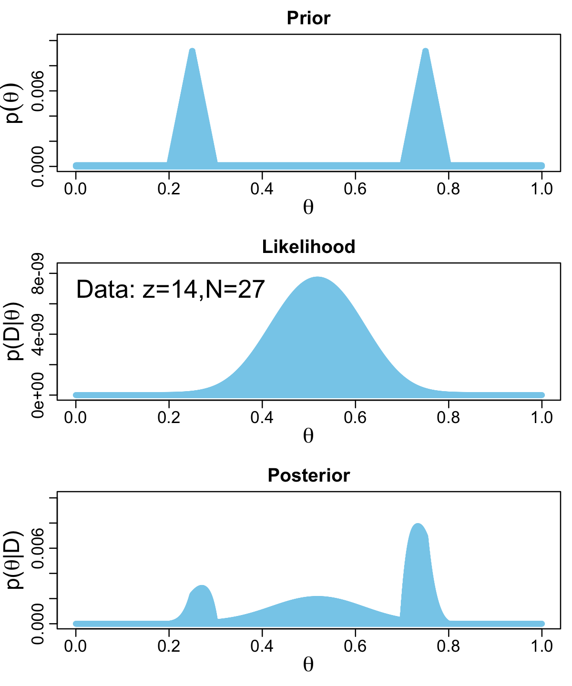

The method works fine, but I'm not a fan. It's clear Kruschke put a lot of thought into the `BernGrid()` function. However, its inner workings are too opaque, for me, which leads to our next section...

#### Figure 6.5 in **tidyverse** style.

Here we'll be plotting with **ggplot2**. But let's first get the data into a tibble.


```r
# we need these to compute the likelihood
n <- 27
z <- 14

trial_data <- c(rep(0, times = n - z), rep(1, times = z))        # (i.e., Data)

d <-
  tibble(theta = seq(from = 0, to = 1, length.out = 1000),       # (i.e., Theta)
         Prior = c(rep(1, 200),                                  # (i.e., pTheta)
                   seq(1, 100, length = 50), 
                   seq(100, 1, length = 50), 
                   rep(1, 200)) %>% 
           rep(., times = 2)) %>% 
  mutate(Prior      = Prior / sum(Prior),
         Likelihood = bernoulli_likelihood(theta = theta,        # (i.e., pDataGivenTheta)
                                           data  = trial_data)) %>%
  mutate(evidence = sum(Likelihood * Prior)) %>%                 # (i.e., pData)
  mutate(Posterior = Likelihood * Prior / evidence)              # (i.e., pThetaGivenData)
  
glimpse(d)
```

```
## Rows: 1,000
## Columns: 5
## $ theta      <dbl> 0.000000000, 0.001001001, 0.002002002, 0.003003003, 0.00400…
## $ Prior      <dbl> 9.174312e-05, 9.174312e-05, 9.174312e-05, 9.174312e-05, 9.1…
## $ Likelihood <dbl> 0.000000e+00, 1.000988e-42, 1.618784e-38, 4.664454e-36, 2.5…
## $ evidence   <dbl> 3.546798e-10, 3.546798e-10, 3.546798e-10, 3.546798e-10, 3.5…
## $ Posterior  <dbl> 0.000000e+00, 2.589202e-37, 4.187221e-33, 1.206529e-30, 6.6…
```

With our nice tibble in hand, we'll plot the prior, likelihood, and posterior one at a time.


```r
# prior
(p1 <-
  d %>% 
  ggplot(aes(x = theta, y = Prior)) +
  geom_area(fill = "steelblue") +
  labs(title = "Prior",
       x = expression(theta),
       y = expression(p(theta))) +
  theme_cowplot()
 )
```

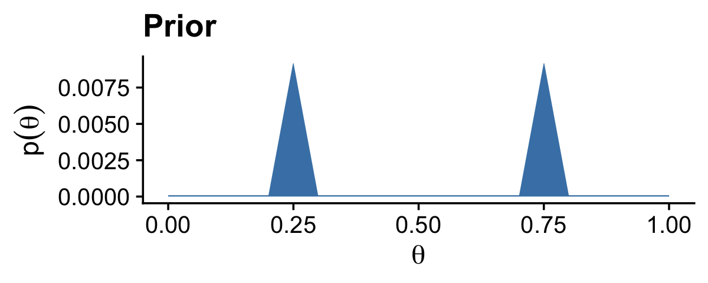

```r
# likelihood
(p2 <-
  d %>% 
  ggplot(aes(x = theta, y = Likelihood)) +
  geom_area(fill = "steelblue") +
  labs(title = "Likelihood",
       x = expression(theta),
       y = expression(p(D*"|"*theta))) +
  theme_cowplot()
 )
```

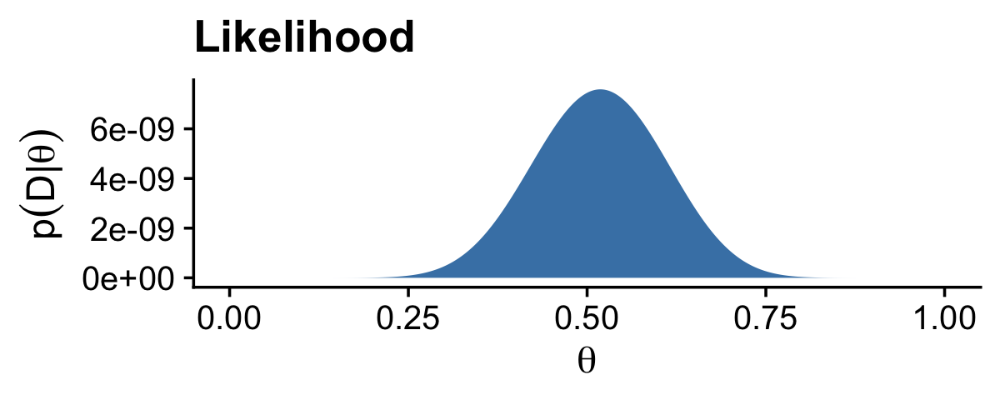

```r
# posterior
(p3 <-
  d %>% 
  ggplot(aes(x = theta, y = Posterior)) +
  geom_area(fill = "steelblue") +
  labs(title = "Posterior",
       x = expression(theta),
       y = expression(p(theta*"|"*D))) +
  theme_cowplot()
 )
```

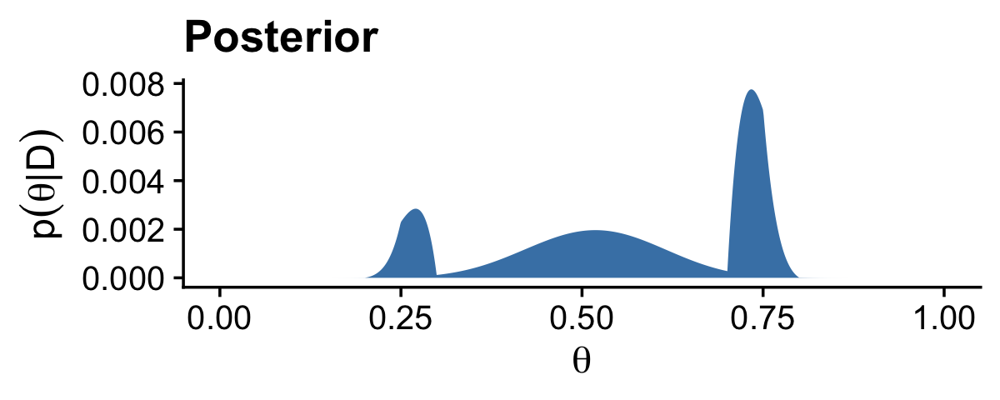

Note how we saved each the plots as objects. There are many ways to combine multiple ggplots, such as stacking them one atop another like they're presented in Figure 6.5. One of the earliest methods I learned was the good old [`multiplot()` function](http://www.cookbook-r.com/Graphs/Multiple_graphs_on_one_page_(ggplot2)/). For a long time I relied on `grid.arrange()` from the [**gridExtra** package](https://CRAN.R-project.org/package=gridExtra) [@R-gridExtra]. But it's hard to beat the elegant syntax from [Thomas Lin Pedersen](https://twitter.com/thomasp85)'s [-@R-patchwork] [**patchwork** package](https://patchwork.data-imaginist.com/).


```r
library(patchwork)

p1 / p2 / p3
```

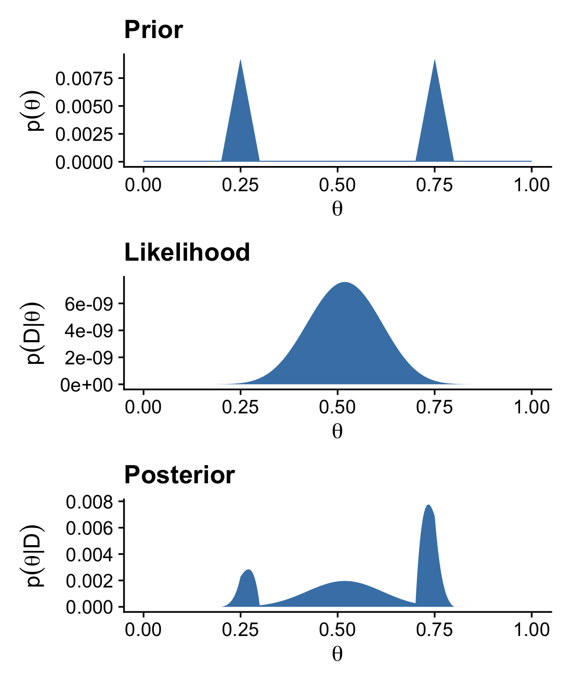

We could have taken this same approach to combine all our subplots from the three columns and three rows of Figure 6.4. You can learn more about how to use **patchwork** this way [here](https://patchwork.data-imaginist.com/articles/patchwork.html). We'll have many more opportunities to practice as we progress through the chapters.

## Summary

> The main point of this chapter was to demonstrate how Bayesian inference works when Bayes' rule can be solved analytically, using mathematics alone, without numerical approximation...
>
> Unfortunately, there are two severe limitations with this approach... Thus, although it is interesting and educational to see how Bayes' rule can be solved analytically, we will have to abandon exact mathematical solutions when doing complex applications. We will instead use Markov chain Monte Carlo (MCMC) methods. (p. 139)

And if you're using this ebook, I imagine that's exactly what you're looking for. We want to use the power of a particular kind of MCMC, Hamiltonian Monte Carlo, through the interface of the [**brms** package](https://github.com/paul-buerkner/brms). Get excited. It's coming.

## Session info {-}


```r
sessionInfo()
```

```
## R version 4.2.0 (2022-04-22)
## Platform: x86_64-apple-darwin17.0 (64-bit)
## Running under: macOS Big Sur/Monterey 10.16
## 
## Matrix products: default
## BLAS:   /Library/Frameworks/R.framework/Versions/4.2/Resources/lib/libRblas.0.dylib
## LAPACK: /Library/Frameworks/R.framework/Versions/4.2/Resources/lib/libRlapack.dylib
## 
## locale:
## [1] en_US.UTF-8/en_US.UTF-8/en_US.UTF-8/C/en_US.UTF-8/en_US.UTF-8
## 
## attached base packages:
## [1] stats     graphics  grDevices utils     datasets  methods   base     
## 
## other attached packages:
##  [1] patchwork_1.1.2 cowplot_1.1.1   forcats_0.5.1   stringr_1.4.1  
##  [5] dplyr_1.0.10    purrr_0.3.4     readr_2.1.2     tidyr_1.2.1    
##  [9] tibble_3.1.8    ggplot2_3.4.0   tidyverse_1.3.2
## 
## loaded via a namespace (and not attached):
##  [1] lubridate_1.8.0     assertthat_0.2.1    digest_0.6.30      
##  [4] utf8_1.2.2          R6_2.5.1            cellranger_1.1.0   
##  [7] backports_1.4.1     reprex_2.0.2        evaluate_0.18      
## [10] httr_1.4.4          highr_0.9           pillar_1.8.1       
## [13] rlang_1.0.6         googlesheets4_1.0.1 readxl_1.4.1       
## [16] rstudioapi_0.13     jquerylib_0.1.4     rmarkdown_2.16     
## [19] labeling_0.4.2      googledrive_2.0.0   munsell_0.5.0      
## [22] broom_1.0.1         compiler_4.2.0      modelr_0.1.8       
## [25] xfun_0.35           pkgconfig_2.0.3     htmltools_0.5.3    
## [28] tidyselect_1.1.2    bookdown_0.28       fansi_1.0.3        
## [31] crayon_1.5.2        tzdb_0.3.0          dbplyr_2.2.1       
## [34] withr_2.5.0         grid_4.2.0          jsonlite_1.8.3     
## [37] gtable_0.3.1        lifecycle_1.0.3     DBI_1.1.3          
## [40] magrittr_2.0.3      scales_1.2.1        cli_3.5.0          
## [43] stringi_1.7.8       cachem_1.0.6        farver_2.1.1       
## [46] fs_1.5.2            xml2_1.3.3          bslib_0.4.0        
## [49] ellipsis_0.3.2      generics_0.1.3      vctrs_0.5.1        
## [52] tools_4.2.0         glue_1.6.2          hms_1.1.1          
## [55] fastmap_1.1.0       colorspace_2.0-3    gargle_1.2.0       
## [58] rvest_1.0.2         knitr_1.40          haven_2.5.1        
## [61] sass_0.4.2
```


