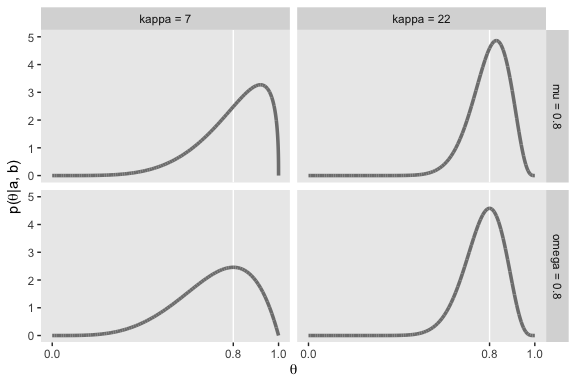
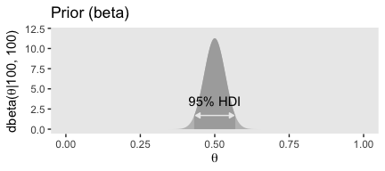
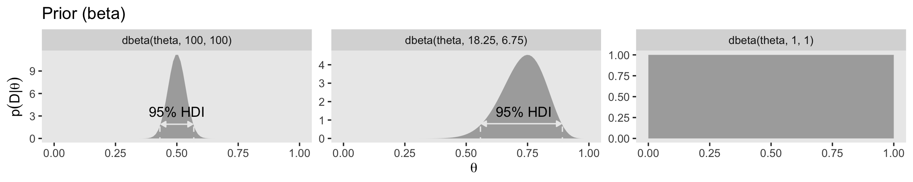
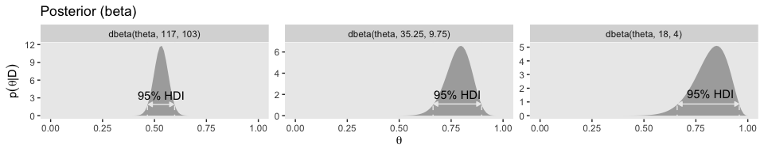
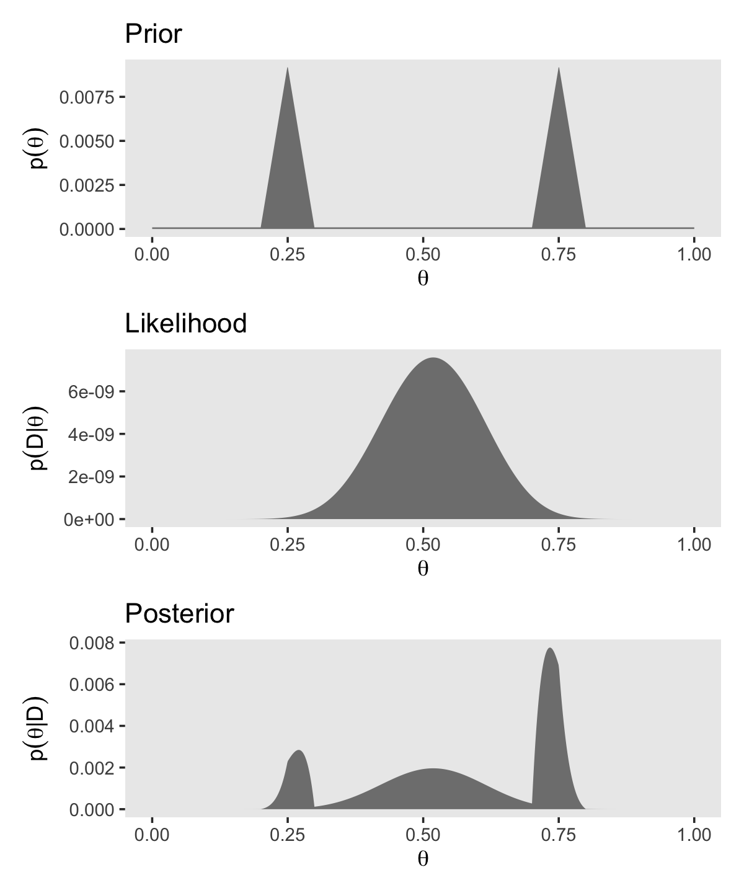

# Inferring a Binomial Probability via Exact Mathematical Analysis

> This chapter presents an example of how to do Bayesian inference using pure analytical mathematics without any approximations. Ultimately, we will not use the pure analytical approach for complex applications, but this chapter is important for two reasons. *First*, the relatively simple mathematics in this chapter nicely reveal the underlying concepts of Bayesian inference on a continuous parameter. The simple formulas show how the continuous allocation of credibility changes systematically as data accumulate. The examples provide an important conceptual foundation for subsequent approximation methods, because the examples give you a clear sense of what is being approximated. *Second*, the distributions introduced in this chapter, especially the beta distribution, will be used repeatedly in subsequent chapters. [@kruschkeDoingBayesianData2015, 123, *emphasis* added]

## The likelihood function: The Bernoulli distribution

If we denote a set of possible outcomes as $\{y_i\}$  Kruschke's Bernoulli likelihood function for a set of $N$ trials follows the form

$$p(\{y_i\} | \theta) = \theta^z \cdot (1 - \theta) ^ {N - z},$$

where $z$ is the number of 1s in the data (i.e., heads in a series of coin flips) and the sole parameter a given observation will be a 1 is $\theta$ (i.e., the probability; $p(y_i = 1 | \theta)$).

If you follow that equation closely, here is how we might express it in **R**.


```r
bernoulli_likelihood <- function(theta, data) {
  
  # `theta` = success probability parameter ranging from 0 to 1
  # `data`  = the vector of data (i.e., a series of 0s and 1s)
  n <- length(data)
  z <- sum(data)
  
  return(theta^z * (1 - theta)^(n - sum(data)))
  
}
```

This will come in handy in just a bit.

## A description of credibilities: The beta distribution

> In this chapter, we use purely mathematical analysis, with no numerical approximation, to derive the mathematical form of the posterior credibilities of parameter values. To do this, we need a mathematical description of the prior allocation of credibilities...
>
> In principle, we could use any probability density function supported on the interval [0, 1]. When we intend to apply Bayes' rule (Equation 5.7, p. 106), however, there are two desiderata for mathematical tractability. First, it would be convenient if the product of $p(y | \theta)$ and $p(\theta)$, which is in the numerator of Bayes' rule, results in a function of the same form as $p(\theta)$... Second, we desire the denominator of Bayes' rule (Equation 5.9, p. 107), namely $\int \text d \; \theta p(y | \theta) p(\theta)$, to be solvable analytically. This quality also depends on how the form of the function $p(\theta)$ relates to the form of the function $p(y | \theta)$. When the forms of $p(y | \theta)$ and $p(\theta)$ combine so that the posterior distribution has the same form as the prior distribution, then $p(\theta)$ is called a *conjugate prior* for $p(y | \theta)$. (p. 127 *emphasis* in the original)

When we want a conjugate prior for $\theta$ of the Bernoulli likelihood, the *beta distribution* is a handy choice. Beta has two parameters, $a$ and $b$ (also sometimes called $\alpha$ and $\beta$), and the density is defined as

\begin{align*}
p(\theta | a, b) & = \operatorname{beta} (\theta | a, b) \\
& = \frac{\theta^{(a - 1)} (1 - \theta)^{(b - 1)}}{B(a, b)},
\end{align*}

where $B(a, b)$ is a normalizing constant, keeping the results in a probability metric, and $B(.)$ is the Beta function. Kruschke then clarified that the beta distribution and the Beta function are not the same. In **R**, we use the beta density with the `dbeta()` function, whereas we use the Beta function with `beta()`. In this project, we'll primarily use `dbeta()`. But to give a sense, notice that when given the same input for $a$ and $b$, the two functions return very different values.


```r
theta <- .5
a     <- 3
b     <- 3

dbeta(theta, a, b)
```

```
## [1] 1.875
```

```r
beta(a, b)
```

```
## [1] 0.03333333
```

The $a$ and $b$ parameters are also called *shape* parameters. And indeed, if we look at the parameters of the `dbeta()` function in **R**, we'll see that $a$ is called `shape1` and $b$ is called `shape2`.


```r
print(dbeta)
```

```
## function (x, shape1, shape2, ncp = 0, log = FALSE) 
## {
##     if (missing(ncp)) 
##         .Call(C_dbeta, x, shape1, shape2, log)
##     else .Call(C_dnbeta, x, shape1, shape2, ncp, log)
## }
## <bytecode: 0x7fd8f3b0cc68>
## <environment: namespace:stats>
```

You can learn more about the `dbeta()` function [here](https://www.rdocumentation.org/packages/stats/versions/3.5.2/topics/Beta).

Before we make Figure 6.1, we'll need some data.


```r
library(tidyverse)

length <- 1e4

d <-
  crossing(shape1 = c(.1, 1:4),
           shape2 = c(.1, 1:4)) %>%
  expand(nesting(shape1, shape2),
         x = seq(from = 0, to = 1, length.out = length)) %>% 
  mutate(a     = str_c("a = ", shape1),
         b     = str_c("b = ", shape2),
         group = rep(1:length, each = 25))

head(d)
```

```
## # A tibble: 6 x 6
##   shape1 shape2        x a       b       group
##    <dbl>  <dbl>    <dbl> <chr>   <chr>   <int>
## 1    0.1    0.1 0        a = 0.1 b = 0.1     1
## 2    0.1    0.1 0.000100 a = 0.1 b = 0.1     1
## 3    0.1    0.1 0.000200 a = 0.1 b = 0.1     1
## 4    0.1    0.1 0.000300 a = 0.1 b = 0.1     1
## 5    0.1    0.1 0.000400 a = 0.1 b = 0.1     1
## 6    0.1    0.1 0.000500 a = 0.1 b = 0.1     1
```

Now we're ready for our Figure 6.1.


```r
d %>% 
  ggplot(aes(x = x, group = group)) +
  
  geom_line(aes(y = dbeta(x, shape1 = shape1, shape2 = shape2)),
            color = "grey50", size = 1.25) +
  scale_x_continuous(expression(theta), breaks = c(0, .5, 1)) +
  coord_cartesian(ylim = c(0, 3)) +
  ylab(expression(p(theta*"|"*a*", "*b))) +
  theme(panel.grid = element_blank()) +
  facet_grid(b~a)
```



> Notice that as $a$ gets bigger (left to right across columns of Figure 6.1), the bulk of the distribution moves rightward over higher values of $\theta$, but as $b$ gets bigger (top to bottom across rows of Figure 6.1), the bulk of the distribution moves leftward over lower values of $\theta$. Notice that as $a$ and $b$ get bigger together, the beta distribution gets narrower. (p. 127).

We have a lot of practice with the beta distribution waiting for us in the chapters to come. But if you like informal tutorials, you might also check out [Karin Knudson](https://twitter.com/karinknudson)'s nice blog post, [*Beta distributions, Dirichlet distributions and Dirichlet processes*](https://karinknudson.com/dirichletprocesses.html). 

### Specifying a beta prior.

> It is useful to know the central tendency and spread of the beta distribution expressed in terms of $a$ and $b$. It turns out that the mean of the $\text{beta} (\theta | a, b)$ distribution is $\mu = a / (a + b)$ and the mode is $\omega = (a − 1) / (a + b − 2)$ for $a > 1$ and $b > 1$ ($\mu$ is Greek letter mu and $\omega$ is Greek letter omega)... The spread of the beta distribution is related to the "concentration" $\kappa = a + b$ ($\kappa$ is Greek letter kappa). You can see from Figure 6.1 that as $\kappa = a + b$ gets larger, the beta distribution gets narrower or more concentrated. (p. 129)

As such, if you'd like to specify a beta distribution in terms of $\omega$ and $\kappa$, it'd follow the form

$$\operatorname{beta} (\alpha = \omega (\kappa - 2) + 1, \beta = (1 - \omega) \cdot (\kappa - 2) + 1),$$

as long as $\kappa > 2$. Kruschke further clarified:

> The value we choose for the prior $\kappa$ can be thought of this way: It is the number of new flips of the coin that we would need to make us teeter between the new data and the prior belief about $\mu$. If we would only need a few new flips to sway our beliefs, then our prior beliefs should be represented by a small $\kappa$. If we would need a large number of new flips to sway us away from our prior beliefs about $\mu$, then our prior beliefs are worth a very large $\kappa$. (p. 129)

He went on to clarify why we might prefer the mode to the mean when discussing the central tendency of a beta distribution.

> The mode can be more intuitive than the mean, especially for skewed distributions, because the mode is where the distribution reaches its tallest height, which is easy to visualize. The mean in a skewed distribution is somewhere away from the mode, in the direction of the longer tail. (pp. 129--130)

Figure 6.2 helped contrast the mean and mode for beta. We'll use the same process for Figure 6.2 and create the data, first.


```r
d <-
  tibble(shape1 = c(5.6, 17.6, 5, 17),
         shape2 = c(1.4, 4.4, 2, 5)) %>% 
  mutate(a        = str_c("a = ", shape1),
         b        = str_c("b = ", shape2),
         kappa    = rep(c("kappa = 7", "kappa = 22"), times = 2),
         mu_omega = rep(c("mu = 0.8", "omega = 0.8"), each = 2)) %>% 
  mutate(kappa = factor(kappa, levels = c("kappa = 7", "kappa = 22"))) %>% 
  expand(nesting(shape1, shape2, a, b, kappa, mu_omega), 
         x = seq(from = 0, to = 1, length.out = length))

head(d)
```

```
## # A tibble: 6 x 7
##   shape1 shape2 a     b     kappa     mu_omega           x
##    <dbl>  <dbl> <chr> <chr> <fct>     <chr>          <dbl>
## 1      5      2 a = 5 b = 2 kappa = 7 omega = 0.8 0       
## 2      5      2 a = 5 b = 2 kappa = 7 omega = 0.8 0.000100
## 3      5      2 a = 5 b = 2 kappa = 7 omega = 0.8 0.000200
## 4      5      2 a = 5 b = 2 kappa = 7 omega = 0.8 0.000300
## 5      5      2 a = 5 b = 2 kappa = 7 omega = 0.8 0.000400
## 6      5      2 a = 5 b = 2 kappa = 7 omega = 0.8 0.000500
```

Here's Figure 6.2.


```r
d %>%
  ggplot(aes(x = x)) +
  geom_vline(xintercept = .8, color = "white") +
  geom_line(aes(y = dbeta(x, shape1 = shape1, shape2 = shape2)),
            color = "grey50", size = 1.25) +
  scale_x_continuous(expression(theta), breaks = c(0, .8, 1)) +
  ylab(expression(p(theta*"|"*a*", "*b))) +
  coord_cartesian(ylim = c(0, 5)) +
  theme(panel.grid = element_blank()) +
  facet_grid(mu_omega~kappa)
```


In lines 264 to 290 in his `DBDA2E-utilities.R` file, Kruschke provided a series of `betaABfrom...()` functions that will allow us to compute the $a$ and $b$ parameters from measures of central tendency (i.e., mean and mode) and of spread (i.e., $\kappa$ and $\sigma$). Here are those bits of his code.


```r
# Shape parameters from central tendency and scale:
betaABfromMeanKappa <- function(mean, kappa) {
  if (mean <= 0 | mean >= 1) stop("must have 0 < mean < 1")
  if (kappa <= 0) stop("kappa must be > 0")
  a <- mean * kappa
  b <- (1.0 - mean) * kappa
  return(list(a = a, b = b))
}

betaABfromModeKappa <- function(mode, kappa) {
  if (mode <= 0 | mode >= 1) stop("must have 0 < mode < 1")
  if (kappa <= 2) stop("kappa must be > 2 for mode parameterization")
  a <- mode * (kappa - 2) + 1
  b <- (1.0 - mode) * (kappa - 2) + 1
  return(list(a = a, b = b))
}

betaABfromMeanSD <- function(mean, sd) {
  if (mean <= 0 | mean >= 1) stop("must have 0 < mean < 1")
  if (sd <= 0) stop("sd must be > 0")
  kappa <- mean * (1 - mean)/sd^2 - 1
  if (kappa <= 0) stop("invalid combination of mean and sd")
  a <- mean * kappa
  b <- (1.0 - mean) * kappa
  return(list(a = a, b = b))
}
```

You can use them like so.


```r
betaABfromMeanKappa(mean = .25, kappa = 4)
```

```
## $a
## [1] 1
## 
## $b
## [1] 3
```

```r
betaABfromModeKappa(mode = .25, kappa = 4)
```

```
## $a
## [1] 1.5
## 
## $b
## [1] 2.5
```

```r
betaABfromMeanSD(mean = .5, sd = .1)
```

```
## $a
## [1] 12
## 
## $b
## [1] 12
```

You can also save the results as an object, which can then be indexed by parameter.


```r
beta_param <- betaABfromModeKappa(mode = .25, kappa = 4)

beta_param$a
```

```
## [1] 1.5
```

```r
beta_param$b
```

```
## [1] 2.5
```

## The posterior beta

I'm not going to reproduce all of Formula 6.8. But this a fine opportunity to re-express Bayes' rule in terms of $z$ and $N$,

$$p(\theta | z, N) = \frac{p(z, N | \theta) p(\theta)}{p(z, N)}.$$

### Posterior is compromise of prior and likelihood.

You might wonder how Kruschke computed the HDI values for Figure 6.3. Remember our `hdi_of_icdf()` function from back in Chapter 4? Yep, that's how. Here's that code, again.


```r
hdi_of_icdf <- function(name, width = .95, tol = 1e-8, ... ) {
  
  # Arguments:
  #   `name` is R's name for the inverse cumulative density function
  #   of the distribution.
  #   `width` is the desired mass of the HDI region.
  #   `tol` is passed to R's optimize function.
  # Return value:
  #   Highest density iterval (HDI) limits in a vector.
  # Example of use: For determining HDI of a beta(30, 12) distribution, type
  #   `hdi_of_icdf(qbeta, shape1 = 30, shape2 = 12)`
  #   Notice that the parameters of the `name` must be explicitly stated;
  #   e.g., `hdi_of_icdf(qbeta, 30, 12)` does not work.
  # Adapted and corrected from Greg Snow's TeachingDemos package.
  
  incredible_mass <- 1.0 - width
  interval_width <- function(low_tail_prob, name, width, ...) {
    name(width + low_tail_prob, ...) - name(low_tail_prob, ...)
  }
  
  opt_info <- optimize(interval_width, c(0, incredible_mass), 
                       name = name, width = width, 
                       tol = tol, ...)
  
  hdi_lower_tail_prob <- opt_info$minimum
  
  return(c(name(hdi_lower_tail_prob, ...),
           name(width + hdi_lower_tail_prob, ...)))
  
}
```

Recall it's based off of the `HDIofICDF()` function from Kruschke's `DBDA2E-utilities.R` file. I've altered Kruschke's formatting a little bit, but the guts of the code are unchanged. Our `hdi_of_icdf()` function will take the `name` of an "inverse cumulative density function" and its parameters and then return an HDI range, as defined by the `width` parameter. Since the prior at the top of Figure 6.3 is $\operatorname{beta} (5, 5)$, we can use `hdi_of_icdf()` to calculate the HDI like so.


```r
hdi_of_icdf(name = qbeta,
            shape1 = 5,
            shape2 = 5,
            width  = .95)
```

```
## [1] 0.2120085 0.7879915
```

Here they are for the posterior distribution at the bottom of the figure.


```r
hdi_of_icdf(name = qbeta,
            shape1 = 6,
            shape2 = 14)
```

```
## [1] 0.1142339 0.4967144
```

Note that since we set `width  = .95` as the default, we can leave it out if we want to stick with the conventional 95% intervals.

Here are the mean calculations from the last paragraph on page 134.


```r
n <- 10
z <- 1
a <- 5
b <- 5

(proportion_heads <- z / n)
```

```
## [1] 0.1
```

```r
(prior_mean <- a / (a + b))
```

```
## [1] 0.5
```

```r
(posterior_mean <- (z + a) / (n + a + b))
```

```
## [1] 0.3
```

In order to make the plots for Figure 6.3, we'll want to compute the prior, likelihood, and posterior density values across a densely-packed range of $\theta$ values. 


```r
trial_data <- c(rep(0, 9), 1)

d <-
  tibble(theta = seq(from = 0, to = 1, length.out = 100)) %>% 
  mutate(`Prior (beta)`           = dbeta(theta, 
                                          shape1 = a, 
                                          shape2 = b),
         `Likelihood (Bernoulli)` = bernoulli_likelihood(theta = theta, 
                                                         data  = trial_data),
         `Posterior (beta)`       = dbeta(theta, 
                                          shape1 = 6, 
                                          shape2 = 14))

glimpse(d)
```

```
## Rows: 100
## Columns: 4
## $ theta                    <dbl> 0.00000000, 0.01010101, 0.02020202, 0.030303…
## $ `Prior (beta)`           <dbl> 0.000000e+00, 6.297429e-06, 9.670878e-05, 4.…
## $ `Likelihood (Bernoulli)` <dbl> 0.000000000, 0.009218977, 0.016812166, 0.022…
## $ `Posterior (beta)`       <dbl> 0.000000e+00, 1.500163e-05, 4.201284e-04, 2.…
```

To make things easier on ourselves, we'll also make two additional data objects to annotate the plots with lines and text.


```r
# the data for the in-plot lines
line <-
  tibble(theta      = c(.212 + .008, .788 - .008, .114 + .004, .497 - .005),
         value      = rep(c(.51, .66), each = 2),
         xintercept = c(.212, .788, .114, .497),
         key        = rep(c("Prior (beta)", "Posterior (beta)"), each = 2)) %>% 
  mutate(key = factor(key, levels = c("Prior (beta)", "Likelihood (Bernoulli)", "Posterior (beta)")))
  
# the data for the annotation
text <-
  tibble(theta = c(.5, .3),
         value = c(.8, 1.125),
         label = "95% HDI",
         key   = c("Prior (beta)", "Posterior (beta)")) %>% 
  mutate(key = factor(key, levels = c("Prior (beta)", "Likelihood (Bernoulli)", "Posterior (beta)")))
```

Finally, here's our Figure 6.3.


```r
d %>% 
  gather(key, value, -theta) %>% 
  mutate(key = factor(key, levels = c("Prior (beta)", "Likelihood (Bernoulli)", "Posterior (beta)"))) %>% 
  
  ggplot(aes(x = theta, y = value, )) +
  # densities
  geom_ribbon(aes(ymin = 0, ymax = value),
              fill = "grey67") +
  # dashed vertical lines
  geom_vline(data = line,
             aes(xintercept = xintercept), 
             linetype = 2, color = "grey92") +
  # arrows
  geom_line(data = line,
            arrow = arrow(length = unit(.15,"cm"), 
                          ends = "both", 
                          type = "closed"),
            color = "grey92") +
  # text
  geom_text(data = text,
            aes(label = label),
            color = "grey92") +
  labs(x = expression(theta),
       y = NULL) +
  facet_wrap(~key, scales = "free_y", ncol = 1) +
  theme(panel.grid = element_blank())
```



## Examples

### Prior knowledge expressed as a beta distribution.

Here are the results Kruschke reported in the first paragraph of this subsection.


```r
beta_param <- betaABfromModeKappa(mode = .5, kappa = 500)

beta_param$a
```

```
## [1] 250
```

```r
beta_param$b
```

```
## [1] 250
```

Confusingly, Kruschke switched from `dbeta(250, 250)` in the prose to `dbeta(100, 100)` in Figure 6.4.a, which he acknowledged in his [Corrigenda](https://sites.google.com/site/doingbayesiandataanalysis/corrigenda). We'll stick with `dbeta(100, 100)`.


```r
beta_param <- betaABfromModeKappa(mode = .5, kappa = 200)

beta_param$a
```

```
## [1] 100
```

```r
beta_param$b
```

```
## [1] 100
```

```r
ggplot(data = tibble(x = seq(from = 0, to = 1, by = .001)),
       aes(x = x, ymin = 0, ymax = dbeta(x, 
                                         shape1 = beta_param$a, 
                                         shape2 = beta_param$b))) +
  geom_ribbon(fill = "grey75") +
  geom_ribbon(data = tibble(x = seq(from = .5 - .069, to = .5 + .069, by = .001)),
              fill = "grey67") +
  geom_line(data = tibble(x = c(.5 - .069 + .005, .5 + .069 - .005),
                          y = 1.7),
            aes(y = y),
            arrow = arrow(length = unit(.15,"cm"), 
                          ends = "both", 
                          type = "closed"),
            color = "grey92") +
  annotate(geom = "text", x = .5, y = 3.5, 
           label = "95% HDI", color = "grey0") +
  labs(title = "Prior (beta)",
       x = expression(theta),
       y = expression(dbeta(theta*"|"*100*", "*100))) +
  coord_cartesian(ylim = c(0, 12)) +
  theme(panel.grid = element_blank())
```


Here are those HDI values.


```r
hdi_of_icdf(name = qbeta,
            shape1 = 100,
            shape2 = 100,
            width = .95)
```

```
## [1] 0.4309509 0.5690491
```

Here are our $a$ and $b$ parameters for Kruschke's free throw example


```r
beta_param <- betaABfromModeKappa(mode = .75, kappa = 25)

beta_param$a
```

```
## [1] 18.25
```

```r
beta_param$b
```

```
## [1] 6.75
```

Behold Figure 6.4.b. 


```r
ggplot(data = tibble(x = seq(from = 0, to = 1, by = .001)),
       aes(x = x, ymin = 0, ymax = dbeta(x, 
                                         shape1 = beta_param$a, 
                                         shape2 = beta_param$b))) +
  geom_ribbon(fill = "grey75") +
  geom_ribbon(data = tibble(x = seq(from = .558, to = .892, by = .001)),
              fill = "grey67") +
  geom_line(data = tibble(x = c(.558 + .005, .892 - .005),
                          y = .75),
            aes(y = y),
            arrow = arrow(length = unit(.15,"cm"), 
                          ends = "both", 
                          type = "closed"),
            color = "grey92") +
  annotate(geom = "text", x = .73, y = 1.5, 
           label = "95% HDI", color = "grey92") +
  ylim(0, 6) +
  labs(title = "Prior (beta)",
       x = expression(theta),
       y = expression(dbeta(theta*"|"*18.25*", "*6.75))) +
  theme(panel.grid = element_blank())
```


Here are those HDI values.


```r
hdi_of_icdf(name = qbeta,
            shape1 = beta_param$a,
            shape2 = beta_param$b,
            width = .95)
```

```
## [1] 0.5581935 0.8915815
```

But we can be a little more organized and plot the top row of Figure 6.4 all at once. 


```r
# the data for the in-plot lines
line <-
  tibble(theta      = c(.431 + .005, .569 - .005, .558 + .005, .892 - .005),
         value      = rep(c(1.9, .8), each = 2),
         xintercept = c(.431, .569, .558, .892),
         exemplar   = rep(c("dbeta(theta, 100, 100)", "dbeta(theta, 18.25, 6.75)"), each = 2)) %>%
  mutate(exemplar = factor(exemplar, levels = c("dbeta(theta, 100, 100)", "dbeta(theta, 18.25, 6.75)", "dbeta(theta, 1, 1)")))
  
# the data for the annotation
text <-
  tibble(theta    = c(.5, .735),
         value    = c(3.6, 1.45),
         label    = "95% HDI",
         exemplar = c("dbeta(theta, 100, 100)", "dbeta(theta, 18.25, 6.75)")) %>%
  mutate(exemplar = factor(exemplar, levels = c("dbeta(theta, 100, 100)", "dbeta(theta, 18.25, 6.75)", "dbeta(theta, 1, 1)")))

# our main data tibble
tibble(theta = seq(from = 0, to = 1, length.out = 100) %>% rep(., times = 3),
       a     = rep(c(100, 18.25, 1), each = 100),
       b     = rep(c(100, 6.75, 1),  each = 100)) %>% 
  mutate(exemplar = ifelse(a == 18.25, str_c("dbeta(theta, ", a, ", ", b, ")"),
                           str_c("dbeta(theta, ", a %>% round(0), ", ", b %>% round(0), ")")),
         density  = dbeta(theta, shape1 = a, shape2 = b)) %>% 
  mutate(exemplar = factor(exemplar, levels = c("dbeta(theta, 100, 100)", "dbeta(theta, 18.25, 6.75)", "dbeta(theta, 1, 1)"))) %>% 
  
  # finally, the plot code!
  ggplot(aes(x = theta)) +
  geom_ribbon(aes(ymin = 0, ymax = density),
              size = 0, fill = "grey67") +
  geom_vline(data = line,
             aes(xintercept = xintercept), 
             linetype = 2, color = "grey92") +
  geom_line(data = line,
            aes(y = value),
            arrow = arrow(length = unit(.15,"cm"), 
                          ends = "both", 
                          type = "closed"),
            color = "grey92") +
  geom_text(data = text,
            aes(y = value, label = label),
            color = "grey0") +
  labs(title = "Prior (beta)", 
       x = expression(theta), 
       y = expression(p(D*"|"*theta))) +
  theme(panel.grid = element_blank()) +
  facet_wrap(~exemplar, scales = "free_y", ncol = 3)
```



If you look closely, you'll notice the middle row is the same for each column. So we'll just plot it once.


```r
n <- 20
z <- 17

trial_data <- c(rep(0, times = n - z), rep(1, times = z))

tibble(theta = seq(from = 0, to = 1, length.out = 100)) %>% 
  mutate(likelihood = bernoulli_likelihood(theta = theta, data = trial_data)) %>% 
  
  ggplot(aes(x = theta, ymin = 0, ymax = likelihood)) +
  geom_ribbon(size = 0, fill = "grey67") +
  labs(title = "Likelihood (Bernoulli)",
       subtitle = "This is the same for all 3 exemplars, so\nthere's no need to plot this thrice.",
       x = expression(theta),
       y = expression(p(D*"|"*theta))) +
  theme(panel.grid = element_blank())
```



The bottom row:


```r
# the data for the in-plot lines
line <-
  tibble(theta = c(.466 + .005, .597 - .005, 
                   .663 + .004, .897 - .005,
                   .660 + .005, .959 - .003),
         value = rep(c(1.9, 1.1, .85), each = 2),
         xintercept = c(.466, .597, 
                        .663, .897,
                        .660, .959),
         exemplar = rep(c("dbeta(theta, 117, 103)", "dbeta(theta, 35.25, 9.75)", "dbeta(theta, 18, 4)"), each = 2)) %>% 
  mutate(exemplar = factor(exemplar, levels = c("dbeta(theta, 117, 103)", "dbeta(theta, 35.25, 9.75)", "dbeta(theta, 18, 4)")))
  
# the data for the annotation
text <-
  tibble(theta    = c(.532, .78, .82),
         value    = c(3.5, 2, 1.6),
         label    = "95% HDI",
         exemplar = c("dbeta(theta, 117, 103)", "dbeta(theta, 35.25, 9.75)", "dbeta(theta, 18, 4)")) %>%
  mutate(exemplar = factor(exemplar, levels = c("dbeta(theta, 117, 103)", "dbeta(theta, 35.25, 9.75)", "dbeta(theta, 18, 4)")))

# our main data tibble
tibble(theta = seq(from = 0, to = 1, length.out = 100) %>% rep(., times = 3),
       a     = rep(c(117, 35.25, 18), each = 100),
       b     = rep(c(103, 9.75, 4),   each = 100)) %>% 
  mutate(exemplar = ifelse(a == 35.25, str_c("dbeta(theta, ", a, ", ", b, ")"),
                           str_c("dbeta(theta, ", a %>% round(0), ", ", b %>% round(0), ")")),
         density  = dbeta(theta, shape1 = a, shape2 = b)) %>% 
  mutate(exemplar = factor(exemplar, levels = c("dbeta(theta, 117, 103)", "dbeta(theta, 35.25, 9.75)", "dbeta(theta, 18, 4)"))) %>% 
  
  # the plot
  ggplot(aes(x = theta)) +
  geom_ribbon(aes(ymin = 0, ymax = density),
              size = 0, fill = "grey67") +
  geom_vline(data = line,
             aes(xintercept = xintercept), 
             linetype = 2, color = "grey92") +
  geom_line(data = line,
            aes(y = value),
            arrow = arrow(length = unit(.15,"cm"), 
                          ends = "both", 
                          type = "closed"),
            color = "grey92") +
  geom_text(data = text,
            aes(y = value, label = label),
            color = "grey0") +
  labs(title = "Posterior (beta)", 
       x = expression(theta), 
       y = expression(p(theta*"|"*D))) +
  theme(panel.grid = element_blank()) +
  facet_wrap(~exemplar, scales = "free_y", ncol = 3)
```


And if you wanted those HDI values in bulk, you might wrap the `hdi_of_icdf()` into another function for use in `purrr::map2()`.


```r
# new function
get_hdi <- function(a, b) {
  
  hdi_of_icdf(name = qbeta,
              shape1 = a,
              shape2 = b,
              width = .95) %>% 
    as_tibble() %>% 
    mutate(key = c("lower level", "upper level")) %>% 
    spread(key = key, value = value)
  
}

# put it to work
tibble(`figure position` = c("left", "middle", "right"),
       a                 = c(117, 35.25, 18),
       b                 = c(103, 9.75, 4)) %>% 
  mutate(hdi = purrr::map2(a, b, get_hdi)) %>% 
  unnest(hdi)
```

```
## # A tibble: 3 x 5
##   `figure position`     a      b `lower level` `upper level`
##   <chr>             <dbl>  <dbl>         <dbl>         <dbl>
## 1 left              117   103            0.466         0.597
## 2 middle             35.2   9.75         0.663         0.897
## 3 right              18     4            0.660         0.959
```

### Prior knowledge that cannot be expressed as a beta distribution.

> The beauty of using a beta distribution to express prior knowledge is that the posterior distribution is again exactly a beta distribution, and therefore, no matter how much data we include, we always have an exact representation of the posterior distribution and a simple way of computing it. But not all prior knowledge can be expressed by a beta distribution, because the beta distribution can only be in the forms illustrated by Figure 6.1. If the prior knowledge cannot be expressed as a beta distribution, then we must use a different method to derive the posterior. In particular, we might revert to grid approximation as was explained in Section 5.5 (p. 116).

For such a small section in the text, the underlying code is a bit of a beast. Fir kicks, we'll practice two ways. First we'll follow the code Kruschke used in the text. Our second attempt will be in a more **tidyverse** sort of way.

#### Figure 6.5 in Kruschke style.


```r
# Fine teeth for Theta
theta <- seq(0, 1, length = 1000)

# Two triangular peaks on a small non-zero floor
p_theta <-
  c(rep(1, 200), 
    seq(1, 100, length = 50), 
    seq(100, 1, length = 50), 
    rep(1, 200)) %>% 
  rep(., times = 2)

# Make p_theta sum to 1.0
p_theta <- p_theta / sum(p_theta)
```

Here's Kruschke's `BernGrid()` code in all its glory.


```r
BernGrid = function( Theta , pTheta , Data , plotType=c("Points","Bars")[2] ,
                     showCentTend=c("Mean","Mode","None")[3] ,
                     showHDI=c(TRUE,FALSE)[2] , HDImass=0.95 ,
                     showpD=c(TRUE,FALSE)[2] , nToPlot=length(Theta) ) {
  # Theta is vector of values between 0 and 1.
  # pTheta is prior probability mass at each value of Theta
  # Data is vector of 0's and 1's.
  
  # Check for input errors:
  if ( any( Theta > 1 | Theta < 0 ) ) {
    stop("Theta values must be between 0 and 1")
  }
  if ( any( pTheta < 0 ) ) {
    stop("pTheta values must be non-negative")
  }
  if ( !isTRUE(all.equal( sum(pTheta) , 1.0 )) )  {
    stop("pTheta values must sum to 1.0")
  }
  if ( !all( Data == 1 | Data == 0 ) ) {
    stop("Data values must be 0 or 1")
  }
  
  # Create summary values of Data
  z = sum( Data ) # number of 1's in Data
  N = length( Data ) 

  # Compute the Bernoulli likelihood at each value of Theta:
  pDataGivenTheta = Theta^z * (1-Theta)^(N-z)
  # Compute the evidence and the posterior via Bayes' rule:
  pData = sum( pDataGivenTheta * pTheta )
  pThetaGivenData = pDataGivenTheta * pTheta / pData
  
  # Plot the results.
  layout( matrix( c( 1,2,3 ) ,nrow=3 ,ncol=1 ,byrow=FALSE ) ) # 3x1 panels
  par( mar=c(3,3,1,0) , mgp=c(2,0.7,0) , mai=c(0.5,0.5,0.3,0.1) ) # margins
  cexAxis = 1.33
  cexLab = 1.75
  # convert plotType to notation used by plot:
  if ( plotType=="Points" ) { plotType="p" }
  if ( plotType=="Bars" ) { plotType="h" }
  dotsize = 5 # how big to make the plotted dots
  barsize = 5 # how wide to make the bar lines    
  # If the comb has a zillion teeth, it's too many to plot, so plot only a
  # thinned out subset of the teeth.
  nteeth = length(Theta)
  if ( nteeth > nToPlot ) {
    thinIdx = round( seq( 1, nteeth , length=nteeth ) )
  } else { 
    thinIdx = 1:nteeth 
  }

  # Plot the prior.
  yLim = c(0,1.1*max(c(pTheta,pThetaGivenData)))
  plot( Theta[thinIdx] , pTheta[thinIdx] , type=plotType , 
        pch="." , cex=dotsize , lwd=barsize ,
        xlim=c(0,1) , ylim=yLim , cex.axis=cexAxis ,
        xlab=bquote(theta) , ylab=bquote(p(theta)) , cex.lab=cexLab ,
        main="Prior" , cex.main=1.5 , col="skyblue" )
  if ( showCentTend != "None" ) {
    if ( showCentTend == "Mean" ) {
      meanTheta = sum( Theta * pTheta ) 
      if ( meanTheta > .5 ) {
         textx = 0 ; textadj = c(0,1)
      } else {
        textx = 1 ; textadj = c(1,1)
      }
      text( textx , yLim[2] ,
            bquote( "mean=" * .(signif(meanTheta,3)) ) ,
            cex=2.0 , adj=textadj )
    }
    if ( showCentTend == "Mode" ) {
      modeTheta = Theta[ which.max( pTheta ) ]
      if ( modeTheta > .5 ) {
        textx = 0 ; textadj = c(0,1)
      } else {
        textx = 1 ; textadj = c(1,1)
      }
      text( textx , yLim[2] ,
            bquote( "mode=" * .(signif(modeTheta,3)) ) ,
            cex=2.0 , adj=textadj )
    }
  }
  
  # Mark the highest density interval. HDI points are not thinned in the plot.
  if ( showHDI ) {
    HDIinfo = HDIofGrid( pTheta , credMass=HDImass )
    points( Theta[ HDIinfo$indices ] , 
            rep( HDIinfo$height , length( HDIinfo$indices ) ) , 
            pch="-" , cex=1.0 )
    text( mean( Theta[ HDIinfo$indices ] ) , HDIinfo$height ,
          bquote( .(100*signif(HDIinfo$mass,3)) * "% HDI" ) ,
          adj=c(0.5,-1.5) , cex=1.5 )
    # Mark the left and right ends of the waterline. 
    # Find indices at ends of sub-intervals:
    inLim = HDIinfo$indices[1] # first point
    for ( idx in 2:(length(HDIinfo$indices)-1) ) {
      if ( ( HDIinfo$indices[idx] != HDIinfo$indices[idx-1]+1 ) | # jumps on left, OR
             ( HDIinfo$indices[idx] != HDIinfo$indices[idx+1]-1 ) ) { # jumps on right
        inLim = c(inLim,HDIinfo$indices[idx]) # include idx
      }
    }
    inLim = c(inLim,HDIinfo$indices[length(HDIinfo$indices)]) # last point
    # Mark vertical lines at ends of sub-intervals:
    for ( idx in inLim ) {
      lines( c(Theta[idx],Theta[idx]) , c(-0.5,HDIinfo$height) , type="l" , lty=2 , 
             lwd=1.5 )
      text( Theta[idx] , HDIinfo$height , bquote(.(round(Theta[idx],3))) ,
            adj=c(0.5,-0.1) , cex=1.2 )
    }
  }
  
  # Plot the likelihood: p(Data|Theta)
  plot( Theta[thinIdx] , pDataGivenTheta[thinIdx] , type=plotType , 
        pch="." , cex=dotsize , lwd=barsize ,
        xlim=c(0,1) , ylim=c(0,1.1*max(pDataGivenTheta)) , cex.axis=cexAxis ,
        xlab=bquote(theta) , ylab=bquote( "p(D|" * theta * ")" ) , cex.lab=cexLab ,
        main="Likelihood" , cex.main=1.5 , col="skyblue" )
  if ( z > .5*N ) { textx = 0 ; textadj = c(0,1) }
  else { textx = 1 ; textadj = c(1,1) }
  text( textx ,1.0*max(pDataGivenTheta) ,cex=2.0
  	,bquote( "Data: z=" * .(z) * ",N=" * .(N) ) ,adj=textadj )
  if ( showCentTend != "None" ) {
    if ( showCentTend == "Mean" ) {
      meanTheta = sum( Theta * pDataGivenTheta ) 
      if ( meanTheta > .5 ) {
        textx = 0 ; textadj = c(0,1)
      } else {
        textx = 1 ; textadj = c(1,1)
      }
      text( textx , 0.7*max(pDataGivenTheta) ,
            bquote( "mean=" * .(signif(meanTheta,3)) ) ,
            cex=2.0 , adj=textadj )
    }
    if ( showCentTend == "Mode" ) {
      modeTheta = Theta[ which.max( pDataGivenTheta ) ]
      if ( modeTheta > .5 ) {
        textx = 0 ; textadj = c(0,1)
      } else {
        textx = 1 ; textadj = c(1,1)
      }
      text( textx , 0.7*max(pDataGivenTheta) ,
            bquote( "mode=" * .(signif(modeTheta,3)) ) ,
            cex=2.0 , adj=textadj )
    }
  }
  
  # Plot the posterior.
  yLim = c(0,1.1*max(c(pTheta,pThetaGivenData)))
  plot( Theta[thinIdx] , pThetaGivenData[thinIdx] , type=plotType , 
        pch="." , cex=dotsize , lwd=barsize ,
        xlim=c(0,1) , ylim=yLim , cex.axis=cexAxis ,
        xlab=bquote(theta) , ylab=bquote( "p(" * theta * "|D)" ) , cex.lab=cexLab ,
        main="Posterior" , cex.main=1.5 , col="skyblue" )
  if ( showCentTend != "None" ) {
    if ( showCentTend == "Mean" ) {
      meanTheta = sum( Theta * pThetaGivenData ) 
      if ( meanTheta > .5 ) {
        textx = 0 ; textadj = c(0,1)
      } else {
        textx = 1 ; textadj = c(1,1)
      }
      text( textx , yLim[2] ,
            bquote( "mean=" * .(signif(meanTheta,3)) ) ,
            cex=2.0 , adj=textadj )
    }
    if ( showCentTend == "Mode" ) {
      modeTheta = Theta[ which.max( pThetaGivenData ) ]
      if ( modeTheta > .5 ) {
        textx = 0 ; textadj = c(0,1)
      } else {
        textx = 1 ; textadj = c(1,1)
      }
      text( textx , yLim[2] ,
            bquote( "mode=" * .(signif(modeTheta,3)) ) ,
            cex=2.0 , adj=textadj )
    }
  }

  
  # Plot marginal likelihood pData:
  if ( showpD ) {
    meanTheta = sum( Theta * pThetaGivenData ) 
    if ( meanTheta > .5 ) {
      textx = 0 ; textadj = c(0,1)
    } else {
      textx = 1 ; textadj = c(1,1)
    }
    text( textx , 0.75*max(pThetaGivenData) , cex=2.0 ,
    	    bquote( "p(D)=" * .(signif(pData,3)) ) ,adj=textadj )
  }
  
  # Mark the highest density interval. HDI points are not thinned in the plot.
  if ( showHDI ) {
    HDIinfo = HDIofGrid( pThetaGivenData , credMass=HDImass )
    points( Theta[ HDIinfo$indices ] , 
            rep( HDIinfo$height , length( HDIinfo$indices ) ) , 
            pch="-" , cex=1.0 )
    text( mean( Theta[ HDIinfo$indices ] ) , HDIinfo$height ,
             bquote( .(100*signif(HDIinfo$mass,3)) * "% HDI" ) ,
             adj=c(0.5,-1.5) , cex=1.5 )
    # Mark the left and right ends of the waterline. 
    # Find indices at ends of sub-intervals:
    inLim = HDIinfo$indices[1] # first point
    for ( idx in 2:(length(HDIinfo$indices)-1) ) {
      if ( ( HDIinfo$indices[idx] != HDIinfo$indices[idx-1]+1 ) | # jumps on left, OR
        ( HDIinfo$indices[idx] != HDIinfo$indices[idx+1]-1 ) ) { # jumps on right
        inLim = c(inLim,HDIinfo$indices[idx]) # include idx
      }
    }
    inLim = c(inLim,HDIinfo$indices[length(HDIinfo$indices)]) # last point
    # Mark vertical lines at ends of sub-intervals:
    for ( idx in inLim ) {
      lines( c(Theta[idx],Theta[idx]) , c(-0.5,HDIinfo$height) , type="l" , lty=2 , 
             lwd=1.5 )
      text( Theta[idx] , HDIinfo$height , bquote(.(round(Theta[idx],3))) ,
            adj=c(0.5,-0.1) , cex=1.2 )
    }
  }
  
  # return( pThetaGivenData )
} # end of function
```

You plot using Kruschke's method, like so.


```r
Data <- c(rep(0, 13), rep(1, 14))

BernGrid(theta, p_theta, Data, plotType = "Bars",
         showCentTend = "None", showHDI = FALSE, showpD = FALSE)
```


The method works fine. But, I'm not a fan. It's clear Kruschke put a lot of thought into the `BernGrid()` function. However, its inner workings are too opaque, for me, which leads to our next section...

#### Figure 6.5 in **tidyverse** style.

Here we'll be plotting with **ggplot2**. But let's first get the data into a tibble.


```r
# we need these to compute the likelihood
n <- 27
z <- 14

trial_data <- c(rep(0, times = n - z), rep(1, times = z))        # (i.e., Data)

d <-
  tibble(theta = seq(from = 0, to = 1, length.out = 1000),       # (i.e., Theta)
         Prior = c(rep(1, 200),                                  # (i.e., pTheta)
                   seq(1, 100, length = 50), 
                   seq(100, 1, length = 50), 
                   rep(1, 200)) %>% 
           rep(., times = 2)) %>% 
  mutate(Prior      = Prior / sum(Prior),
         Likelihood = bernoulli_likelihood(theta = theta,        # (i.e., pDataGivenTheta)
                                           data  = trial_data)) %>%
  mutate(evidence = sum(Likelihood * Prior)) %>%                 # (i.e., pData)
  mutate(Posterior = Likelihood * Prior / evidence)              # (i.e., pThetaGivenData)
  
glimpse(d)
```

```
## Rows: 1,000
## Columns: 5
## $ theta      <dbl> 0.000000000, 0.001001001, 0.002002002, 0.003003003, 0.0040…
## $ Prior      <dbl> 9.174312e-05, 9.174312e-05, 9.174312e-05, 9.174312e-05, 9.…
## $ Likelihood <dbl> 0.000000e+00, 1.000988e-42, 1.618784e-38, 4.664454e-36, 2.…
## $ evidence   <dbl> 3.546798e-10, 3.546798e-10, 3.546798e-10, 3.546798e-10, 3.…
## $ Posterior  <dbl> 0.000000e+00, 2.589202e-37, 4.187221e-33, 1.206529e-30, 6.…
```

With our nice tibble in hand, we'll plot the prior, likelihood, and posterior one at a time.


```r
# prior
(p1 <-
  d %>% 
  ggplot(aes(x = theta)) +
  geom_ribbon(aes(ymin = 0, ymax = Prior),
              fill = "grey50") +
  labs(title = "Prior",
       x = expression(theta),
       y = expression(p(theta))) +
  theme(panel.grid = element_blank())
 )
```


```r
# likelihood
(p2 <-
  d %>% 
  ggplot(aes(x = theta)) +
  geom_ribbon(aes(ymin = 0, ymax = Likelihood),
              fill = "grey50") +
  labs(title = "Likelihood",
       x = expression(theta),
       y = expression(p(D*"|"*theta))) +
  theme(panel.grid = element_blank())
 )
```


```r
# posterior
(p3 <-
  d %>% 
  ggplot(aes(x = theta)) +
  geom_ribbon(aes(ymin = 0, ymax = Posterior),
              fill = "grey50") +
  labs(title = "Posterior",
       x = expression(theta),
       y = expression(p(theta*"|"*D))) +
  theme(panel.grid = element_blank())
 )
```


Note how we saved each the plots as objects. There are many ways to combine multiple ggplots, such as stacking them one atop another like they're presented in Figure 6.5. One of the earliest methods I learned was the good old [`multiplot()` function](http://www.cookbook-r.com/Graphs/Multiple_graphs_on_one_page_(ggplot2)/). For a long time I relied on `grid.arrange()` from the [**gridExtra** package](https://CRAN.R-project.org/package=gridExtra) [@R-gridExtra]. But it's hard to beat the elegant syntax from [Thomas Lin Pedersen](https://twitter.com/thomasp85)'s [-@R-patchwork] [**patchwork** package](https://patchwork.data-imaginist.com/).


```r
library(patchwork)

p1 / p2 / p3
```



You can learn more about how to use **patchwork** [here](https://patchwork.data-imaginist.com/articles/patchwork.html). Plus we'll have many more opportunities to practice as we progress through the chapters.

## Summary

> The main point of this chapter was to demonstrate how Bayesian inference works when Bayes' rule can be solved analytically, using mathematics alone, without numerical approximation...
>
> Unfortunately, there are two severe limitations with this approach... Thus, although it is interesting and educational to see how Bayes' rule can be solved analytically, we will have to abandon exact mathematical solutions when doing complex applications. We will instead use Markov chain Monte Carlo (MCMC) methods. (p. 139)

And if you're looking at this project, I imagine that's exactly what you're looking for. We want to use the power of a particular kind of MCMC, Hamiltonian Monte Carlo, through the interface of the [**brms** package](https://github.com/paul-buerkner/brms). Get excited. It's coming.

## Session info {-}


```r
sessionInfo()
```

```
## R version 3.6.3 (2020-02-29)
## Platform: x86_64-apple-darwin15.6.0 (64-bit)
## Running under: macOS Catalina 10.15.3
## 
## Matrix products: default
## BLAS:   /Library/Frameworks/R.framework/Versions/3.6/Resources/lib/libRblas.0.dylib
## LAPACK: /Library/Frameworks/R.framework/Versions/3.6/Resources/lib/libRlapack.dylib
## 
## locale:
## [1] en_US.UTF-8/en_US.UTF-8/en_US.UTF-8/C/en_US.UTF-8/en_US.UTF-8
## 
## attached base packages:
## [1] stats     graphics  grDevices utils     datasets  methods   base     
## 
## other attached packages:
##  [1] patchwork_1.0.0 forcats_0.5.0   stringr_1.4.0   dplyr_0.8.5    
##  [5] purrr_0.3.4     readr_1.3.1     tidyr_1.0.2     tibble_3.0.1   
##  [9] ggplot2_3.3.0   tidyverse_1.3.0
## 
## loaded via a namespace (and not attached):
##  [1] tidyselect_1.0.0 xfun_0.13        haven_2.2.0      lattice_0.20-38 
##  [5] colorspace_1.4-1 vctrs_0.3.0      generics_0.0.2   htmltools_0.4.0 
##  [9] yaml_2.2.1       utf8_1.1.4       rlang_0.4.6      pillar_1.4.4    
## [13] glue_1.4.0       withr_2.2.0      DBI_1.1.0        dbplyr_1.4.2    
## [17] modelr_0.1.6     readxl_1.3.1     lifecycle_0.2.0  munsell_0.5.0   
## [21] gtable_0.3.0     cellranger_1.1.0 rvest_0.3.5      evaluate_0.14   
## [25] labeling_0.3     knitr_1.28       fansi_0.4.1      broom_0.5.5     
## [29] Rcpp_1.0.4.6     scales_1.1.1     backports_1.1.6  jsonlite_1.6.1  
## [33] farver_2.0.3     fs_1.4.1         hms_0.5.3        digest_0.6.25   
## [37] stringi_1.4.6    bookdown_0.18    grid_3.6.3       cli_2.0.2       
## [41] tools_3.6.3      magrittr_1.5     crayon_1.3.4     pkgconfig_2.0.3 
## [45] ellipsis_0.3.0   xml2_1.3.1       reprex_0.3.0     lubridate_1.7.8 
## [49] assertthat_0.2.1 rmarkdown_2.1    httr_1.4.1       rstudioapi_0.11 
## [53] R6_2.4.1         nlme_3.1-144     compiler_3.6.3
```


