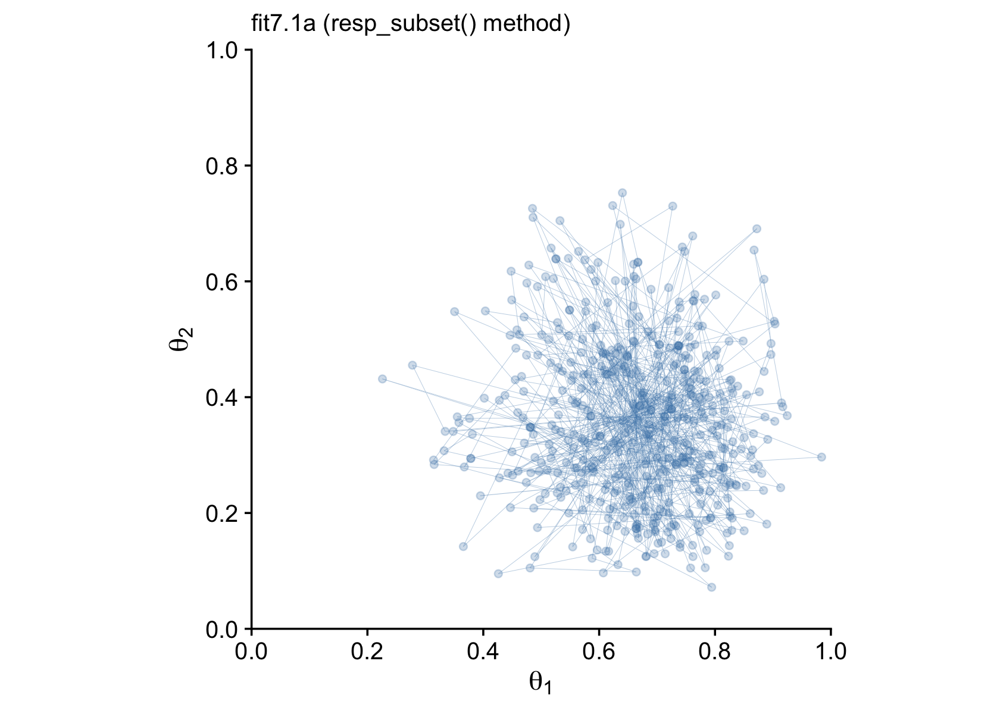
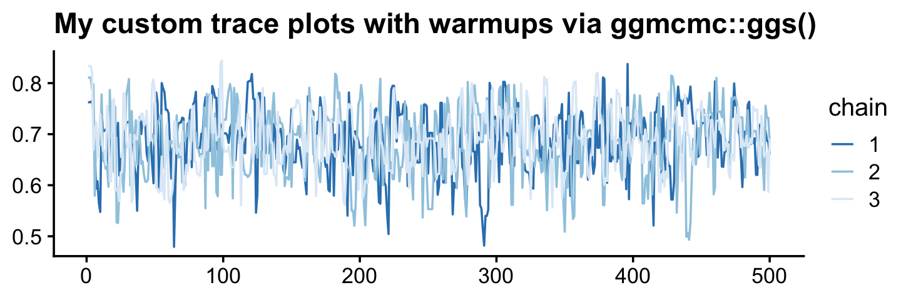

# Markov Chain Monte Carlo


> This chapter introduces the methods we will use for producing accurate approximations to Bayesian posterior distributions for realistic applications. The class of methods is called Markov chain Monte Carlo (MCMC), for reasons that will be explained later in the chapter. It is MCMC algorithms and software, along with fast computer hardware, that allow us to do Bayesian data analysis for realistic applications that would have been effectively impossible 30 years ago. [@kruschkeDoingBayesianData2015, p. 144]

Statistician David Draper covered some of the history of MCMC in his lecture, [*Bayesian Statistical Reasoning*](https://www.youtube.com/watch?v=072Q18nX91I&frags=pl%2Cwn).

## Approximating a distribution with a large sample

> The concept of representing a distribution by a large representative sample is foundational for the approach we take to Bayesian analysis of complex models. The idea is applied intuitively and routinely in everyday life and in science. For example, polls and surveys are founded on this concept: By randomly sampling a subset of people from a population, we estimate the underlying tendencies in the entire population. The larger the sample, the better the estimation. What is new in the present application is that the population from which we are sampling is a mathematically defined distribution, such as a posterior probability distribution. (p. 145)

Like in Chapters 4 and 6, we need to define our `hdi_of_icdf()` function.


```r
hdi_of_icdf <- function(name, width = .95, tol = 1e-8, ... ) {
  
  incredible_mass <- 1.0 - width
  interval_width <- function(low_tail_prob, name, width, ...) {
    name(width + low_tail_prob, ...) - name(low_tail_prob, ...)
  }
  opt_info <- optimize(interval_width, c(0, incredible_mass), 
                       name = name, width = width, 
                       tol = tol, ...)
  hdi_lower_tail_prob <- opt_info$minimum
  return(c(name(hdi_lower_tail_prob, ...),
           name(width + hdi_lower_tail_prob, ...)))
  
}
```

Our `hdi_of_icdf()` function will compute the analytic 95% highest density intervals (HDIs) for the distribution under consideration in Figure 7.1, $\operatorname{beta}(\theta | 15, 7)$.


```r
h <-
  hdi_of_icdf(name = qbeta,
              shape1 = 15,
              shape2 = 7)

h
```

```
## [1] 0.4907001 0.8639305
```

Using an equation from [Chapter 6][Specifying a beta prior.], $\omega = (a − 1) / (a + b − 2)$, we can compute the corresponding mode.


```r
(omega <- (15 - 1) / (15 + 7 - 2))
```

```
## [1] 0.7
```

To get the density in the upper left panel of Figure 7.1, we'll make use of the `dbeta()` function and of our `h[1:2]` and `omega` values.


```r
library(tidyverse)
library(cowplot)

tibble(theta = seq(from = 0, to = 1, length.out = 100)) %>% 
  
  ggplot() +
  geom_area(aes(x = theta, y = dbeta(theta, shape1 = 15, shape2 = 7)),
            fill = "steelblue") +
  geom_segment(aes(x = h[1], xend = h[2], y = 0, yend = 0),
               size = .75) +
  geom_point(aes(x = omega, y = 0),
             size = 1.5, shape = 19) +
  annotate(geom = "text", x = .675, y = .4, 
           label = "95% HDI", color = "white") +
  scale_x_continuous(expression(theta), 
                     breaks = c(0, h, omega, 1),
                     labels = c("0", h %>% round(2), omega, "1")) +
  ggtitle("Exact distribution") +
  ylab(expression(p(theta))) +
  theme_cowplot()
```


Note how we're continuing to use `theme_cowplot()`, which we introduced in the last chapter. The remaining panels in Figure 7.1 require we simulate the data.


```r
set.seed(7)

d <-
  tibble(n = c(500, 5000, 50000)) %>% 
  mutate(theta = map(n, ~rbeta(., shape1 = 15, shape2 = 7))) %>% 
  unnest(theta) %>% 
  mutate(key = str_c("Sample N = ", n))

head(d)
```

```
## # A tibble: 6 x 3
##       n theta key           
##   <dbl> <dbl> <chr>         
## 1   500 0.806 Sample N = 500
## 2   500 0.756 Sample N = 500
## 3   500 0.727 Sample N = 500
## 4   500 0.784 Sample N = 500
## 5   500 0.782 Sample N = 500
## 6   500 0.590 Sample N = 500
```

With the data in hand, we're ready to plot the remaining panels for Figure 7.1. This time, we'll use the handy `stat_pointinterval()` function from the [**tidybayes** package](https://github.com/mjskay/tidybayes) to mark off the mode and 95% HDIs.


```r
library(tidybayes)

d %>% 
  ggplot(aes(x = theta, y = 0)) +
  stat_histinterval(point_interval = mode_hdi, .width = .95, breaks = 30) +
  scale_x_continuous(expression(theta), limits = c(0, 1)) +
  scale_y_continuous(NULL, breaks = NULL) +
  theme_cowplot() +
  facet_wrap(~ key, ncol = 3, scales = "free")
```


If we want the exact values for the mode and 95% HDIs, we can use the `tidybayes::mode_hdi()` function.


```r
d %>% 
  group_by(key) %>% 
  mode_hdi(theta)
```

```
## # A tibble: 3 x 7
##   key              theta .lower .upper .width .point .interval
##   <chr>            <dbl>  <dbl>  <dbl>  <dbl> <chr>  <chr>    
## 1 Sample N = 500   0.695  0.511  0.868   0.95 mode   hdi      
## 2 Sample N = 5000  0.688  0.497  0.870   0.95 mode   hdi      
## 3 Sample N = 50000 0.711  0.490  0.863   0.95 mode   hdi
```

If you wanted a better sense of the phenomena, you could do a simulation. We'll make a custom simulation function to compute the modes from many random draws from our $\operatorname{beta}(\theta | 15, 7)$ distribution, with varying $N$ values.


```r
my_mode_simulation <- function(seed) {
  
  set.seed(seed)
  
  tibble(n = c(500, 5000, 50000)) %>% 
    mutate(theta = map(n, ~rbeta(., shape1 = 15, shape2 = 7))) %>% 
    unnest(theta) %>% 
    mutate(key = str_c("Sample N = ", n)) %>% 
    group_by(key) %>% 
    mode_hdi(theta)
  
}
```

Here we put our `my_mode_simulation()` function to work.


```r
# we need an index of the values we set our seed with in our `my_mode_simulation()` function
sim <-
  tibble(seed = 1:1e3) %>% 
  group_by(seed) %>% 
  # inserting our subsamples
  mutate(modes = map(seed, my_mode_simulation)) %>% 
   # unnesting allows us to access our model results
  unnest(modes) 

sim %>% 
  ggplot(aes(x = theta, y = key)) +
  geom_vline(xintercept = .7, color = "white") +
  stat_histinterval(.width = c(.5, .95), breaks = 20, fill = "steelblue") +
  labs(title = expression("Variability of the mode for simulations of "*beta(theta*'|'*15*', '*7)*", the true mode of which is .7"),
       subtitle = "For each sample size, the dot is the median, the inner thick line is the percentile-based 50% interval,\nand the outer thin line the percentile-based 95% interval. Although the central tendency\napproximates the true value for all three conditions, the variability of the mode estimate is inversely\nrelated to the sample size.",
       x = "mode", 
       y = NULL) +
  coord_cartesian(xlim = c(.6, .8),
                  ylim = c(1.25, 3.5)) +
  theme_cowplot(font_size = 11.5) +
  theme(axis.text.y = element_text(hjust = 0),
        axis.ticks.y = element_blank())
```


## A simple case of the Metropolis algorithm

> Our goal in Bayesian inference is to get an accurate representation of the posterior distribution. One way to do that is to sample a large number of representative points from the posterior. The question then becomes this: How can we sample a large number of representative values from a distribution? (p. 146).

The answer, my friends, is MCMC.

### A politician stumbles upon the Metropolis algorithm.

I’m not going to walk out Kruschke’s politician example in any detail, here. But if we denote $P_\text{proposed}$ as the population of the proposed island and $P_\text{current}$ as the population of the current island, then

$$p_\text{move} = \frac{P_\text{proposed}}{P_\text{current}}.$$

"What's amazing about this heuristic is that it works: In the long run, the probability that the politician is on any one of the islands exactly matches the relative population of the island" (p. 147)!

### A random walk.

The code below will allow us to reproduce Kruschke's random walk. To give credit where it's due, this is a mild amendment to the code from Chapter 8 of McElreath's [-@mcelreathStatisticalRethinkingBayesian2015] text, [*Statistical rethinking: A Bayesian course with examples in R and Stan*](https://xcelab.net/rm/statistical-rethinking/).


```r
set.seed(7)

num_days  <- 5e4
positions <- rep(0, num_days)
current   <- 4
for (i in 1:num_days) {
  # record current position
  positions[i] <- current
  # flip coin to generate proposal
  proposal <- current + sample(c(-1, 1), size = 1)
  # now make sure he loops around from 7 back to 1
  if (proposal < 1) proposal <- 7
  if (proposal > 7) proposal <- 1
  # move?
  prob_accept_the_proposal <- proposal/current
  current <- ifelse(runif(1) < prob_accept_the_proposal, proposal, current)
}
```

If you missed it, `positions` is the main product of our simulation. Here we'll put `positions` in a tibble and reproduce the top portion of Figure 7.2.


```r
tibble(theta = positions) %>% 
  
  ggplot(aes(x = theta)) +
  geom_bar(fill = "steelblue") +
  scale_x_continuous(expression(theta), breaks = 1:7) +
  scale_y_continuous(expand = expansion(mult = c(0, 0.05))) +
  theme_cowplot()
```


Did you notice that `scale_y_continuous()` line in the code? Claus Wilke, the author of the **cowplot** package, has a lot of thoughts on data visualization. He even wrote a [-@wilkeFundamentalsDataVisualization2019] book on it: [*Fundamentals of data visualization*](https://clauswilke.com/dataviz/). In his [-@Wilke2019Themes] [*Themes*](https://wilkelab.org/cowplot/articles/themes.html) vignette, Wilke recommended against allowing for space between the bottoms of the bars in a bar plot and the $x$-axis line. The **ggplot2** default is to allow for such a space. Here we followed Wilke and suppressed that space with `expand = expansion(mult = c(0, 0.05))`. You can learn more about the `ggplot2::expansion()` function [here](https://ggplot2.tidyverse.org/reference/expansion.html).

Here's the middle portion of Figure 7.2.


```r
tibble(t     = 1:5e4,
       theta = positions) %>% 
  slice(1:500) %>% 
  
  ggplot(aes(x = theta, y = t)) +
  geom_path(size = 1/4, color = "steelblue") +
  geom_point(size = 1/2, alpha = 1/2, color = "steelblue") +
  scale_x_continuous(expression(theta), breaks = 1:7) +
  scale_y_log10("Time Step", breaks = c(1, 2, 5, 20, 100, 500)) +
  theme_cowplot()
```


And now we make the bottom.


```r
tibble(x = 1:7,
       y = 1:7) %>% 
  
  ggplot(aes(x = x, y = y)) +
  geom_col(width = .2, fill = "steelblue") +
  scale_x_continuous(expression(theta), breaks = 1:7) +
  scale_y_continuous(expression(p(theta)), expand = expansion(mult = c(0, 0.05))) +
  theme_cowplot()
```


> Notice that the sampled relative frequencies closely mimic the actual relative populations in the bottom panel! In fact, a sequence generated this way will converge, as the sequence gets longer, to an arbitrarily close approximation of the actual relative probabilities. (p. 149)

### General properties of a random walk.

> The tajectory shown in Figure 7.2 is just one possible sequence of positions when the movement heuristic is applied. At each time step, the direction of the proposed move is random, and if the relative probability of the proposed position is less than that of the current position, then acceptance of the proposed move is also random. Because of the randomness, if the process were started over again, then the specific trajectory would almost certainly be different. Regardless of the specific trajectory, in the long run the relative frequency of visits mimics the target distribution.
>
> Figure 7.3 shows the probability of being in each position as a function of time. (p. 149)

I was initially stumped on how to reproduce the simulation depicted in Figure 7.3. However, fellow enthusiast [Cardy Moten III](https://github.com/cmoten) kindly [shared a solution](https://github.com/ASKurz/Doing-Bayesian-Data-Analysis-in-brms-and-the-tidyverse/issues/14) which was itself based on Kruschke's blog post from 2012, [*Metropolis algorithm: Discrete position probabilities*](https://doingbayesiandataanalysis.blogspot.com/2012/08/metropolis-algorithm-discrete-position.html). Here's a mild reworking of their solutions. First, we simulate.


```r
nslots   <- 7
p_target <- 1:7
p_target <- p_target / sum(p_target)

# construct the transition matrix
proposal_matrix <- matrix(0, nrow = nslots, ncol = nslots)

for(from_idx in 1:nslots) {
  for(to_idx in 1:nslots) {
    if(to_idx == from_idx - 1) {proposal_matrix[from_idx, to_idx] <- 0.5}
    if(to_idx == from_idx + 1) {proposal_matrix[from_idx, to_idx] <- 0.5}
  }
}

# construct the acceptance matrix
acceptance_matrix <- matrix(0, nrow = nslots, ncol = nslots)

for(from_idx in 1:nslots) {
  for(to_idx in 1:nslots) {
    acceptance_matrix[from_idx, to_idx] <- min(p_target[to_idx] / p_target[from_idx], 1)
  }
}

# compute the matrix of move probabilities
move_matrix <- proposal_matrix * acceptance_matrix

# compute the transition matrix, including the probability of staying in place
transition_matrix <- move_matrix
for (diag_idx in 1:nslots) {
  transition_matrix[diag_idx, diag_idx] = 1.0 - sum(move_matrix[diag_idx, ])
}

# specify starting position vector:
position_vec <- rep(0, nslots)
position_vec[round(nslots / 2)] <- 1.0

p <- list()
data <- 
  tibble(position = 1:nslots, 
         prob     = position_vec)

# loop through the requisite time indexes
# update the data and transition vector
for(time_idx in 1:99) {
  
  p[[time_idx]] <- data
  
  # update the position vec
  position_vec <- position_vec %*% transition_matrix
  
  # update the data
  data <- NULL 
  data <- 
    tibble(position = 1:nslots, 
           prob     = t(position_vec))
}
```

Now we wrangle and plot.


```r
p %>% 
  as_tibble_col() %>% 
  mutate(facet = str_c("italic(t)==", 1:99)) %>% 
  slice(c(1:14, 99)) %>% 
  unnest(value) %>% 
  bind_rows(
    tibble(position = 1:nslots, 
           prob     = p_target, 
           facet    = "target")
  ) %>% 
  mutate(facet = factor(facet, levels = c(str_c("italic(t)==", c(1:14, 99)), "target"))) %>% 
  
  # plot!
  ggplot(aes(x = position, y = prob, fill = facet == "target")) +
  geom_col(width = .2) +
  scale_fill_manual(values = c("steelblue", "goldenrod2"), breaks = NULL) +
  scale_x_continuous(expression(theta), breaks = 1:7) +
  scale_y_continuous(expression(italic(p)(theta)), expand = expansion(mult = c(0, 0.05))) +
  theme_cowplot() +
  facet_wrap(~ facet, scales = "free_y", labeller = label_parsed)
```


### Why we care.

Through the simple magic of the random walk procedure,

>  we are able to do *indirectly* something we could not necessarily do directly: We can generate random samples from the target distribution. Moreover, we can generate those random samples from the target distribution even when the target distribution is not normalized.
>
> This technique is profoundly useful when the target distribution $P(\theta)$ is a posterior proportional to $p(D | \theta) p(\theta)$. Merely by evaluating $p(D | \theta) p(\theta)$, without normalizing it by $p(D)$, we can generate random representative values from the posterior distribution. This result is wonderful because the method obviates direct computation of the evidence $p(D)$, which, as you'll recall, is one of the most difficult aspects of Bayesian inference. By using MCMC techniques, we can do Bayesian inference in rich and complex models. It has only been with the development of MCMC algorithms and software that Bayesian inference is applicable to complex data analysis, and it has only been with the production of fast and cheap computer hardware that Bayesian inference is accessible to a wide audience. (p. 152, *emphasis* in the original)

## The Metropolis algorithm more generally

"The procedure described in the previous section was just a special case of a more general procedure known as the Metropolis algorithm, named after the first author of a famous article [@metropolisEquationStateCalculations1953]" (p. 156).

Here's how to generate a proposed jump from a zero-mean normal distribution with a standard deviation of 0.2.


```r
rnorm(1, mean = 0, sd = 0.2)
```

```
## [1] -0.1985524
```

To get a sense of what draws from `rnorm()` looks like in the long run, we might plot.


```r
mu    <- 0
sigma <- 0.2

# how many proposals would you like?
n  <- 500

set.seed(7)
tibble(proposed_jump = rnorm(n, mean = mu, sd = sigma)) %>% 
  
  ggplot(aes(x = proposed_jump, y = 0)) +
  geom_jitter(width = 0, height = .1, 
              size = 1/2, alpha = 1/2, color = "steelblue") +
  # this is the idealized distribution
  stat_function(fun = dnorm, args = list(mean = mu, sd = sigma),
                color = "steelblue") +
  scale_x_continuous(breaks = seq(from = -0.6, to = 0.6, length.out = 7)) +
  scale_y_continuous(NULL, breaks = NULL) +
  labs(title = "Jump proposals",
       subtitle = "The blue line shows the data generating distribution.") +
  theme_cowplot()
```


Anyway,

> having generated a proposed new position, the algorithm then decides whether or not to accept the proposal. The decision rule is exactly what was already specified in Equation 7.1. In detail, this is accomplished by computing the ratio $p_\text{move} = P(\theta_\text{proposed}) / P(\theta_\text{current})$. Then a random number from the uniform interval $[0, 1]$ is generated; in R, this can be accomplished with the command `runif(1)`. If the random number is between 0 and pmove, then the move is accepted. (p. 157)

We'll see what that might look like in the next section. In the meantime, here's how to use `runif()`.


```r
runif(1)
```

```
## [1] 0.2783186
```

Just for kicks, here's what that looks like in bulk.


```r
# how many proposals would you like?
n  <- 500

set.seed(7)
tibble(draw = runif(n)) %>% 
  
  ggplot(aes(x = draw, y = 0)) +
  geom_jitter(width = 0, height = 1/4, 
              size = 1/2, alpha = 1/2, color = "steelblue") +
  stat_function(fun = dunif,
                color = "steelblue") +
  scale_y_continuous(NULL, breaks = NULL, limits = c(-1/3, 5/3)) +
  labs(title = "Uniform draws",
       subtitle = "The blue line shows the data generating distribution.") +
  theme_cowplot()
```


We do not see a concentration towards the mean, this time. The draws are uniformly distributed across the parameter space.

### Metropolis algorithm applied to Bernoulli likelihood and beta prior.

You can find Kruschke's code in the `BernMetrop.R` file. I'm going to break it up a little.


```r
# specify the data, to be used in the likelihood function.
my_data <- c(rep(0, 6), rep(1, 14))

# define the Bernoulli likelihood function, p(D|theta).
# the argument theta could be a vector, not just a scalar
likelihood <- function(theta, data) {
  z <- sum(data)
  n <- length(data)
  p_data_given_theta <- theta^z * (1 - theta)^(n - z)
  # the theta values passed into this function are generated at random,
  # and therefore might be inadvertently greater than 1 or less than 0.
  # the likelihood for theta > 1 or for theta < 0 is zero
  p_data_given_theta[theta > 1 | theta < 0] <- 0
  return(p_data_given_theta)
}

# define the prior density function. 
prior_d <- function(theta) {
  p_theta <- dbeta(theta, 1, 1)
  # the theta values passed into this function are generated at random,
  # and therefore might be inadvertently greater than 1 or less than 0.
  # the prior for theta > 1 or for theta < 0 is zero
  p_theta[theta > 1 | theta < 0] = 0
  return(p_theta)
}

# define the relative probability of the target distribution, 
# as a function of vector theta. for our application, this
# target distribution is the unnormalized posterior distribution
target_rel_prob <- function(theta, data) {
  target_rel_prob <- likelihood(theta, data) * prior_d(theta)
  return(target_rel_prob)
}

# specify the length of the trajectory, i.e., the number of jumps to try:
traj_length <- 50000 # this is just an arbitrary large number

# initialize the vector that will store the results
trajectory <- rep(0, traj_length)

# specify where to start the trajectory:
trajectory[1] <- 0.01 # another arbitrary value

# specify the burn-in period
burn_in <- ceiling(0.0 * traj_length) # arbitrary number, less than `traj_length`

# initialize accepted, rejected counters, just to monitor performance:
n_accepted <- 0
n_rejected <- 0
```

That first part follows what Kruschke put in his script. I'm going to bundel the next large potion in a fucntion, `my_metropolis()` which will make it easier to plug the code into the `purrr::map()` function.


```r
my_metropolis <- function(proposal_sd) {
  
  # now generate the random walk. the 't' index is time or trial in the walk.
  # specify seed to reproduce same random walk
  set.seed(47405)
  
  
  ## I'm taking this section out and will replace it
  
  # # specify standard deviation of proposal distribution
  # proposal_sd <- c(0.02, 0.2, 2.0)[2]
  
  ## end of the section I took out
  
  
  for (t in 1:(traj_length - 1)) {
    current_position <- trajectory[t]
    # use the proposal distribution to generate a proposed jump
    proposed_jump <- rnorm(1, mean = 0, sd = proposal_sd)
    # compute the probability of accepting the proposed jump
    prob_accept <- min(1,
                       target_rel_prob(current_position + proposed_jump, my_data)
                       / target_rel_prob(current_position, my_data))
    # generate a random uniform value from the interval [0, 1] to
    # decide whether or not to accept the proposed jump
    if (runif(1) < prob_accept) {
      # accept the proposed jump
      trajectory[t + 1] <- current_position + proposed_jump
      # increment the accepted counter, just to monitor performance
      if (t > burn_in) {n_accepted <- n_accepted + 1}
    } else {
      # reject the proposed jump, stay at current position
      trajectory[t + 1] <- current_position
      # increment the rejected counter, just to monitor performance
      if (t > burn_in) {n_rejected <- n_rejected + 1}
    }
  }
  
  # extract the post-burn_in portion of the trajectory
  accepted_traj <- trajectory[(burn_in + 1) : length(trajectory)]
  
  tibble(accepted_traj = accepted_traj,
         n_accepted    = n_accepted, 
         n_rejected    = n_rejected)
  # end of Metropolis algorithm
  
}
```

Now we have `my_metropolis()`, we can run the analysis based on the three `proposal_sd` values, nesting the results in a tibble.


```r
d <-
  tibble(proposal_sd = c(0.02, 0.2, 2.0)) %>% 
  mutate(accepted_traj = map(proposal_sd, my_metropolis)) %>% 
  unnest(accepted_traj)

glimpse(d)
```

```
## Rows: 150,000
## Columns: 4
## $ proposal_sd   <dbl> 0.02, 0.02, 0.02, 0.02, 0.02, 0.02, 0.02, 0.02, 0.02, 0.02, 0.02, 0.02, 0.02…
## $ accepted_traj <dbl> 0.01000000, 0.01000000, 0.01000000, 0.01000000, 0.01149173, 0.02550380, 0.02…
## $ n_accepted    <dbl> 46801, 46801, 46801, 46801, 46801, 46801, 46801, 46801, 46801, 46801, 46801,…
## $ n_rejected    <dbl> 3198, 3198, 3198, 3198, 3198, 3198, 3198, 3198, 3198, 3198, 3198, 3198, 3198…
```

Now we have `d` in hand, here's the top portion of Figure 7.4.


```r
d <-
  d %>% 
  mutate(proposal_sd = str_c("Proposal SD = ", proposal_sd),
         iter        = rep(1:50000, times = 3))
  
d %>% 
  ggplot(aes(x = accepted_traj, y = 0)) +
  stat_histinterval(point_interval = mode_hdi, .width = .95,
                    fill = "steelblue", slab_color = "white", outline_bars = T,
                    breaks = 40, normalize = "panels") +
  scale_x_continuous(expression(theta), breaks = 0:5 * 0.2) +
  scale_y_continuous(NULL, breaks = NULL) +
  theme_cowplot() +
  panel_border() +
  facet_wrap(~ proposal_sd, ncol = 3)
```


The modes are the points and the lines depict the 95% HDIs. Also, did you notice our use of the `cowplot::panel_border()` function? The settings from `theme_cowplot()` can make it difficult to differentiate among subplots when faceting. By throwing in a call to `panel_border()` after `theme_cowplot()`, we added in lightweight panel borders.

Here's the middle of Figure 7.4.


```r
d %>% 
  ggplot(aes(x = accepted_traj, y = iter)) +
  geom_path(size = 1/4, color = "steelblue") +
  geom_point(size = 1/2, alpha = 1/2, color = "steelblue") +
  scale_x_continuous(expression(theta), breaks = 0:5 * 0.2, limits = c(0, 1)) +
  scale_y_continuous("Step in Chain", limits = c(49900, 50000)) +
  ggtitle("End of Chain") +
  theme_cowplot() +
  panel_border() +
  facet_wrap(~ proposal_sd, ncol = 3)
```


The bottom:


```r
d %>% 
  ggplot(aes(x = accepted_traj, y = iter)) +
  geom_path(size = 1/4, color = "steelblue") +
  geom_point(size = 1/2, alpha = 1/2, color = "steelblue") +
  scale_x_continuous(expression(theta), breaks = 0:5 * 0.2, limits = c(0, 1)) +
  scale_y_continuous("Step in Chain", limits = c(1, 100)) +
  ggtitle("End of Chain") +
  theme_cowplot() +
  panel_border() +
  facet_wrap(~ proposal_sd, ncol = 3)
```


> Regardless of the which proposal distribution in Figure 7.4 is used, the Metropolis algorithm will eventually produce an accurate representation of the posterior distribution, as is suggested by the histograms in the upper row of Figure 7.4. What differs is the efficiency of achieving a good approximation. (p. 160)

### Summary of Metropolis algorithm.

> The motivation for methods like the Metropolis algorithm is that they provide a high-resolution picture of the posterior distribution, even though in complex models we cannot explicitly solve the mathematical integral in Bayes' rule. The idea is that we get a handle on the posterior distribution by generating a large sample of representative values. The larger the sample, the more accurate is our approximation. As emphasized previously, this is a sample of representative credible parameter values from the posterior distribution; it is not a resampling of data (there is a fixed data set).
>
> The cleverness of the method is that representative parameter values can be randomly sampled from complicated posterior distributions without solving the integral in Bayes' rule, and by using only simple proposal distributions for which efficient random number generators already exist. (p. 161)

## Toward Gibbs sampling: Estimating two coin biases 

"The Metropolis method is very useful, but it can be inefficient. Other methods can be more efficient in some situations" (p. 162).

### Prior, likelihood and posterior for two biases.

> We are considering situations in which there are two underlying biases, namely $\theta_1$ and $\theta_2$, for the two coins. We are trying to determine what we should believe about these biases after we have observed some data from the two coins. Recall that [Kruschke used] the term "bias" as the name of the parameter $\theta$, and not to indicate that the value of $\theta$ deviates from 0.5....
>
> What we have to do next is specify a particular mathematical form for the prior distribution. We will work through the mathematics of a particular case for two reasons: First, it will allow us to explore graphical displays of two-dimensional parameter spaces, which will inform our intuitions about Bayes' rule and sampling from the posterior distribution. Second, the mathematics will set the stage for a specific example of Gibbs sampling. Later in the book when we do applied Bayesian analysis, we will *not* be doing any of this sort of mathematics. We are doing the math now, for simple cases, to understand how the methods work so we can properly interpret their outputs in realistically complex cases. (pp. 163--165, *emphasis* in the original)

### The posterior via exact formal analysis.

The plots in the left column of Figure 7.5 are outside of my skill set. I believe they are referred to as wireframe plots and it's my understanding that **ggplot2** does not support wireframe plots at this time. However, I can reproduce versions of the right hand column. For our initial attempt for the upper right corner, we'll simulate.


```r
set.seed(7)

betas <-
  tibble(theta_1 = rbeta(1e5, shape1 = 2, shape2 = 2),
         theta_2 = rbeta(1e5, shape1 = 2, shape2 = 2))

betas %>% 
  ggplot(aes(x = theta_1, y = theta_2)) +
  stat_density_2d() +
  labs(x = expression(theta[1]),
       y = expression(theta[2])) +
  coord_equal() +
  theme_cowplot()
```


Instead of the contour lines, one might use color to depict the density variable.


```r
betas %>% 
  ggplot(aes(x = theta_1, y = theta_2, fill = stat(density))) +
  stat_density_2d(geom = "raster", contour = F) +
  scale_fill_viridis_c(option = "A") +
  labs(x = expression(theta[1]),
       y = expression(theta[2])) +
  coord_equal() +
  theme_cowplot()
```


Remember how we talked about suppressing the unsightly white space between the bottom of bar-plot bars and the $x$-axis? Well, look at all that unsightly white space between the axes and the boundaries of the parameter space in our bivariate Beta plot. We can further flex our `expansion()` skills to get rid of those in the next plot. Speaking of which, we might make a more precise version of that plot with careful use of `dbeta()`.


```r
theta_sequence <- seq(from = 0, to = 1, by = .01)

tibble(theta_1 = theta_sequence,
       theta_2 = theta_sequence) %>%
  
  mutate(prior_1 = dbeta(x = theta_1, shape1 = 2, shape2 = 2),
         prior_2 = dbeta(x = theta_2, shape1 = 2, shape2 = 2)) %>% 
    
  expand(nesting(theta_1, prior_1), nesting(theta_2, prior_2)) %>%
  
  ggplot(aes(x = theta_1, y = theta_2, fill = prior_1 * prior_2)) +
  geom_tile() +
  scale_fill_viridis_c("joint prior density", option = "A") +
  scale_x_continuous(expression(theta[1]), expand = expansion(mult = 0)) +
  scale_y_continuous(expression(theta[2]), expand = expansion(mult = 0)) +
  coord_equal() +
  theme_cowplot()
```


Look at that--no more unsightly white space! We'll need the `bernoulli_likelihood()` function from back in Chapter 6 for the middle right of Figure 7.5.


```r
bernoulli_likelihood <- function(theta, data) {
  
  # theta = success probability parameter ranging from 0 to 1
  # data = the vector of data (i.e., a series of 0s and 1s)
  n <- length(data)
  z <- sum(data)
  
  return(theta^z * (1 - theta)^(n - sum(data)))
  
}
```

With our trusty `bernoulli_likelihood()` function in hand, we can now make a version of the middle right panel of Figure 7.5.


```r
theta_1_data <- rep(0:1, times = c(8 - 6, 6))
theta_2_data <- rep(0:1, times = c(7 - 2, 2))

tibble(theta_1 = theta_sequence,
       theta_2 = theta_sequence) %>%
  mutate(likelihood_1 = bernoulli_likelihood(theta = theta_sequence,
                                             data  = theta_1_data),
         likelihood_2 = bernoulli_likelihood(theta = theta_sequence,
                                             data  = theta_2_data)) %>% 
  expand(nesting(theta_1, likelihood_1), nesting(theta_2, likelihood_2)) %>%
  
  ggplot(aes(x = theta_1, y = theta_2, fill = likelihood_1 * likelihood_2)) +
  geom_tile() +
  scale_fill_viridis_c("joint likelihood", option = "A") +
  scale_x_continuous(expression(theta[1]), expand = expansion(mult = 0)) +
  scale_y_continuous(expression(theta[2]), expand = expansion(mult = 0)) +
  coord_equal() +
  theme_cowplot()
```


Here's the two-dimensional posterior, the lower right panel of Figure 7.5.


```r
# we've already defined these, but here they are again
theta_sequence <- seq(from = 0, to = 1, by = .01)
theta_1_data   <- rep(0:1, times = c(8 - 6, 6))
theta_2_data   <- rep(0:1, times = c(7 - 2, 2))

# this is a redo from two plots up, but saved as `d_prior`
d_prior <-
  tibble(theta_1 = theta_sequence,
         theta_2 = theta_sequence) %>%
  mutate(prior_1 = dbeta(x = theta_1, shape1 = 2, shape2 = 2),
         prior_2 = dbeta(x = theta_2, shape1 = 2, shape2 = 2)) %>% 
  expand(nesting(theta_1, prior_1), nesting(theta_2, prior_2))

# this is a redo from one plot up, but saved as `d_likelihood`
d_likelihood <-
  tibble(theta_1 = theta_sequence,
         theta_2 = theta_sequence) %>%
  mutate(likelihood_1 = bernoulli_likelihood(theta = theta_sequence,
                                             data  = theta_1_data),
         likelihood_2 = bernoulli_likelihood(theta = theta_sequence,
                                             data  = theta_2_data)) %>% 
  expand(nesting(theta_1, likelihood_1), nesting(theta_2, likelihood_2))

# here we combine `d_prior` and `d_likelihood`
d_prior %>% 
  left_join(d_likelihood, by = c("theta_1", "theta_2")) %>% 
  # we need the marginal likelihood, the denominator in Bayes' rule
  mutate(marginal_likelihood = sum(prior_1 * prior_2 * likelihood_1 * likelihood_2)) %>% 
  # finally, the two-dimensional posterior
  mutate(posterior = (prior_1 * prior_2 * likelihood_1 * likelihood_2) / marginal_likelihood) %>% 
  
  # plot!
  ggplot(aes(x = theta_1, y = theta_2, fill = posterior)) +
  geom_tile() +
  scale_fill_viridis_c(expression(italic(p)(theta[1]*', '*theta[2]*'|'*D)), option = "A") +
  scale_x_continuous(expression(theta[1]), expand = expansion(mult = 0)) +
  scale_y_continuous(expression(theta[2]), expand = expansion(mult = 0)) +
  coord_equal() +
  theme_cowplot()
```


That last plot, my friends, is a depiction of

$$p(\theta_1, \theta_2 | D) = \frac{p(D | \theta_1, \theta_2) p(\theta_1, \theta_2)}{p(D)}.$$

### The posterior via the Metropolis algorithm.

I initially skipped over this section because the purpose of this book is to explore Kruschke's material with **brms**, which does not use the Metropolis algorithm (which really is primarily of historic interest, at this point). However, fellow enthusiast [Omid Ghasemi](https://github.com/OmidGhasemi21) worked it through and kindly shared his solution. The workflow, below, is based heavily on his, with a few small adjustments.

To start off, we'll refresh our two data sources and define a few custom functions.


```r
# we've already defined these, but here they are again
theta_1_data   <- rep(0:1, times = c(8 - 6, 6))
theta_2_data   <- rep(0:1, times = c(7 - 2, 2))

# define the bivariate Bernoulli likelihood
bivariate_bernoulli_likelihood <- function(theta1, data1, theta2, data2) {
  
  z1 <- sum(data1)
  n1 <- length(data1)
  z2 <- sum(data2)
  n2 <- length(data2)
  p_data_given_theta <- (theta1^z1 * (1 - theta1)^(n1 - z1)) * (theta2^z2 * (1 - theta2)^(n2 - z2))
  p_data_given_theta[theta1 > 1 | theta1 < 0] <- 0
  p_data_given_theta[theta2 > 1 | theta2 < 0] <- 0
  
  return(p_data_given_theta)
  
}

# we need to update the prior density function from above
prior_d <- function(theta1, theta2) {
  
  p_theta <- dbeta(theta1, 1, 1) * dbeta(theta2, 1, 1)
  p_theta[theta1 > 1 | theta1 < 0] = 0
  p_theta[theta2 > 1 | theta2 < 0] = 0
  
  return(p_theta)
  
}

# we also need to update how we define the relative probability of the target distribution
target_rel_prob <- function(theta1, data1, theta2, data2) {
  
  l <- bivariate_bernoulli_likelihood(theta1, data1, theta2, data2)
  p <- prior_d(theta1, theta2)
  
  target_rel_prob <- l * p
  
  return(target_rel_prob)
}
```

The next bit defines how we'll apply the Metropolis algorithm to our bivariate binomial data. Although the guts contain a lot of moving parts, there are only two parameters at the top level. The `traj_length` argument is set to 50,000, which will be our default number of MCMC draws. Of greater interest is the `proposal_sd` argument. From the text, we read:

> Recall that the Metropolis algorithm is a random walk through the parameter space that starts at some arbitrary point. We propose a jump to a new point in parameter space, with the proposed jump randomly generated from a proposal distribution from which it is easy to generate values. For our present purposes, the proposal distribution is a *bivariate* normal. (p. 168, *emphasis* in the original)

For this exercise, the bivariate normal proposal distribution is centered at zero with an adjustable standard deviation. In the text, Kruschke compared the results for $\operatorname{Normal}(0, 0.02)$ and $\operatorname{Normal}(0, 0.2)$. For our `my_bivariate_metropolis()` function, the `proposal_sd` argument controls that $\sigma$ parameter.


```r
my_bivariate_metropolis <- function(proposal_sd = 0.02,
                                    # specify the length of the trajectory (i.e., the number of jumps to try)
                                    traj_length = 50000) {
  
  # initialize the vector that will store the results
  trajectory1 <- rep(0, traj_length)
  trajectory2 <- rep(0, traj_length)
  
  # specify where to start the trajectory:
  trajectory1[1] <- 0.5 # another arbitrary value
  trajectory2[1] <- 0.5 # another arbitrary value
  
  # specify the burn-in period
  burn_in <- ceiling(0.0 * traj_length) # arbitrary number, less than `traj_length`
  
  # initialize accepted, rejected counters, just to monitor performance:
  n_accepted <- 0
  n_rejected <- 0
  
  for (t in 1:(traj_length - 1)) {
    current_position1 <- trajectory1[t]
    current_position2 <- trajectory2[t]
    
    # use the proposal distribution to generate a proposed jump
    proposed_jump1 <- rnorm(1, mean = 0, sd = proposal_sd)
    proposed_jump2 <- rnorm(1, mean = 0, sd = proposal_sd)
    
    # compute the probability of accepting the proposed jump
    prob_accept <- min(1,
                       target_rel_prob(current_position1 + proposed_jump1, theta_1_data,
                                       current_position2 + proposed_jump2, theta_2_data)
                       / target_rel_prob(current_position1, theta_1_data, current_position2, theta_2_data))
    
    # generate a random uniform value from the interval [0, 1] to
    # decide whether or not to accept the proposed jump
    if (runif(1) < prob_accept) {
      # accept the proposed jump
      trajectory1[t + 1] <- current_position1  + proposed_jump1
      trajectory2[t + 1] <- current_position2  + proposed_jump2
      # increment the accepted counter, just to monitor performance
      if (t > burn_in) {n_accepted <- n_accepted + 1}
    } else {
      # reject the proposed jump, stay at current position
      trajectory1[t + 1] <- current_position1
      trajectory2[t + 1] <- current_position2
      # increment the rejected counter, just to monitor performance
      if (t > burn_in) {n_rejected <- n_rejected + 1}
    }
  }
  
  # extract the post-burn_in portion of the trajectory
  accepted_traj1 <- trajectory1[(burn_in + 1) : length(trajectory1)]
  accepted_traj2 <- trajectory2[(burn_in + 1) : length(trajectory2)]
  
  # collect the results
  metrop_2d_data <- 
    tibble(iter           = rep(1:traj_length),
           accepted_traj1 = accepted_traj1,
           accepted_traj2 = accepted_traj2,
           n_accepted     = n_accepted, 
           n_rejected     = n_rejected)
  
  return(metrop_2d_data)
  
}
```

Now we've defined `my_bivariate_metropolis()` let's apply it to our data with `proposal_sd == 0.02` and `proposal_sd == 0.2`. We'll save the results as `mh`.


```r
mh <-
  tibble(proposal_sd = c(0.02, 0.2)) %>% 
  mutate(mh = map(proposal_sd, my_bivariate_metropolis)) %>% 
  unnest(mh)

mh
```

```
## # A tibble: 100,000 x 6
##    proposal_sd  iter accepted_traj1 accepted_traj2 n_accepted n_rejected
##          <dbl> <int>          <dbl>          <dbl>      <dbl>      <dbl>
##  1        0.02     1          0.5            0.5        46401       3598
##  2        0.02     2          0.535          0.486      46401       3598
##  3        0.02     3          0.541          0.477      46401       3598
##  4        0.02     4          0.507          0.495      46401       3598
##  5        0.02     5          0.511          0.484      46401       3598
##  6        0.02     6          0.522          0.500      46401       3598
##  7        0.02     7          0.544          0.491      46401       3598
##  8        0.02     8          0.572          0.473      46401       3598
##  9        0.02     9          0.591          0.509      46401       3598
## 10        0.02    10          0.579          0.513      46401       3598
## # … with 99,990 more rows
```

If you look at the top of Figure 7.6, you'll see Kruschke summarized his results with the acceptance rate, $N_\text{acc} / N_\text{pro}$. Here are ours.


```r
mh %>% 
  group_by(proposal_sd) %>% 
  slice(1) %>% 
  summarise(acceptance_rate = n_accepted / (n_accepted + n_rejected))
```

```
## # A tibble: 2 x 2
##   proposal_sd acceptance_rate
##         <dbl>           <dbl>
## 1        0.02           0.928
## 2        0.2            0.428
```

We can compute our effective sample sizes using the `effectiveSize()` function from the [**coda** package](https://CRAN.R-project.org/package=coda) [@R-coda; @plummerCODA2006].


```r
library(coda)

mh %>% 
  group_by(proposal_sd) %>% 
  summarise(ess_theta_1 = effectiveSize(accepted_traj1),
            ess_theta_2 = effectiveSize(accepted_traj2))
```

```
## # A tibble: 2 x 3
##   proposal_sd ess_theta_1 ess_theta_2
##         <dbl>       <dbl>       <dbl>
## 1        0.02        188.        194.
## 2        0.2        6673.       5987.
```

We really won't use the **coda** package in this ebook beyond this chapter and the next. But do note it has a lot to offer and Kruschke used it a bit in his code. Anyway, now we make our version of Figure 7.6.


```r
mh %>% 
  filter(iter < 1000) %>%
  
  ggplot(aes(x = accepted_traj1, y = accepted_traj2)) +
  geom_path(size = 1/8, alpha = 1/2, color = "steelblue") +
  geom_point(alpha = 1/4, color = "steelblue") +
  scale_x_continuous(expression(theta[1]), breaks = 0:5 / 5, expand = c(0, 0), limits = c(0, 1)) +
  scale_y_continuous(expression(theta[2]), breaks = 0:5 / 5, expand = c(0, 0), limits = c(0, 1)) +
  coord_equal() +
  theme_cowplot() +
  panel_border() +
  theme(panel.spacing = unit(0.75, "cm")) +
  facet_wrap(~ proposal_sd, labeller = label_both)
```


> In the limit of infinite random walks, the Metropolis algorithm yields arbitrarily accurate representations of the underlying posterior distribution. The left and right panels of Figure 7.6 would eventually converge to an identical and highly accurate approximation to the posterior distribution. But in the real world of finite random walks, we care about how efficiently the algorithm generates an accurate representative sample. We prefer to use the proposal distribution from the right panel of Figure 7.6 because it will, typically, produce a more accurate approximation of the posterior than the proposal distribution from left panel, for the same number of proposed jumps. (p. 170)

### ~~Gibbs~~ Hamiltonian Monte Carlo sampling.

Figure 7.7 is still out of my skill set. But let's fit the model with our primary package, **brms**. First we need to load **brms**.


```r
library(brms)
```

These, recall, are the data.


```r
d <-
  tibble(z1 = 6, 
         z2 = 2,
         n1 = 8,
         n2 = 7)

d
```

```
## # A tibble: 1 x 4
##      z1    z2    n1    n2
##   <dbl> <dbl> <dbl> <dbl>
## 1     6     2     8     7
```

Kruschke said he was starting us out simply. But within the **brms** context, this is an intercepts-only multivariate model, which isn't the simplest of things to code into **brms**. There are a couple ways to code a [multivariate model in **brms**](https://cran.r-project.org/web/packages/brms/vignettes/brms_multivariate.html) [@Bürkner2021Multivariate]. With this one, it makes sense to specify the model for each sequence of flips separately. This results in two models, which we'll call `model_1` and `model_2`.


```r
model_1 <- bf(z1 | trials(n1) ~ 1)
model_2 <- bf(z2 | trials(n2) ~ 1)
```

Before we fit, we'll have to address a technicality. The **brms** package does allow for multivariate Bernoulli models. However, it does not support such models with different numbers of trials across the variables. Since our first variable is of 8 trials and the second is of 7, **brms** will not support this model using the Bernoulli likelihood. However, we can fit the model in **brms** as an aggregated binomial[^2] model. The main difficulty is that the regularizing `beta(2, 2)` prior won't make sense, here. So we'll opt for the regularizing `normal(0, 1)`, instead.


```r
fit7.1 <-
  brm(data = d, 
      family = binomial(),
      model_1 + model_2,
      prior(normal(0, 1), class = Intercept),
      iter = 25500, warmup = 500, cores = 1, chains = 1,
      seed = 7,
      file = "fits/fit07.01")
```

Here is a summary of the results.


```r
print(fit7.1)
```

```
##  Family: MV(binomial, binomial) 
##   Links: mu = logit
##          mu = logit 
## Formula: z1 | trials(n1) ~ 1 
##          z2 | trials(n2) ~ 1 
##    Data: d (Number of observations: 1) 
## Samples: 1 chains, each with iter = 25500; warmup = 500; thin = 1;
##          total post-warmup samples = 25000
## 
## Population-Level Effects: 
##              Estimate Est.Error l-95% CI u-95% CI Rhat Bulk_ESS Tail_ESS
## z1_Intercept     0.72      0.61    -0.44     1.95 1.00    20078    15180
## z2_Intercept    -0.58      0.64    -1.85     0.65 1.00    24837    17000
## 
## Samples were drawn using sampling(NUTS). For each parameter, Bulk_ESS
## and Tail_ESS are effective sample size measures, and Rhat is the potential
## scale reduction factor on split chains (at convergence, Rhat = 1).
```

As we'll learn in later chapters, the parameters of a typical aggregated binomial model are in the log-odds scale. Over time, you will learn how to interpret them. But for now, just be happy that **brms** offers the `inv_logit_scaled()` function, with which we might convert our results back to the probability scale.


```r
fixef(fit7.1)[, 1] %>% inv_logit_scaled()
```

```
## z1_Intercept z2_Intercept 
##    0.6728057    0.3585566
```

Here we'll use `posterior_samples()` to collect out posterior draws and save them as a data frame, which we'll name `post`.


```r
post <- posterior_samples(fit7.1, add_chain = T)
```

With `post` in hand, we're ready to make our version of Figure 7.8. To reduce the overplotting, we're only looking at the first 500 post-warmup iterations.


```r
post %>% 
  mutate(theta_1 = b_z1_Intercept %>% inv_logit_scaled(), 
         theta_2 = b_z2_Intercept %>% inv_logit_scaled()) %>% 
  filter(iter < 1001) %>% 
  
  ggplot(aes(x = theta_1, y = theta_2)) +
  geom_point(alpha = 1/4, color = "steelblue") +
  geom_path(size = 1/10, alpha = 1/2, color = "steelblue") +
  scale_x_continuous(expression(theta[1]), expand = expansion(mult = 0), limits = c(0, 1)) +
  scale_y_continuous(expression(theta[2]), expand = expansion(mult = 0), limits = c(0, 1)) +
  coord_equal() +
  theme_cowplot()
```


Just for kicks and giggles, we'll plot the marginal posterior densities. You'll note that even though we didn't use beta priors, the posteriors look quite beta like.


```r
post %>% 
  mutate(`theta[1]` = b_z1_Intercept %>% inv_logit_scaled(), 
         `theta[2]` = b_z2_Intercept %>% inv_logit_scaled()) %>% 
  pivot_longer(`theta[1]`:`theta[2]`) %>% 
  
  ggplot(aes(x = value, y = name)) +
  stat_halfeye(point_interval = mode_hdi, .width = c(.5, .95), fill = "steelblue") +
  scale_y_discrete(NULL, labels = ggplot2:::parse_safe, expand = expansion(mult = 0)) +
  xlab("posterior") +
  theme_cowplot()
```


Did you see how our use of `expand = expansion(mult = 0)` didn't work so well with this plot? The problem is the mode dot and HDI lines at the base of the lower density gets cut off when you remove all of the white space underneath the density. A partial solution is to adjust the value within `expansion()` to be small, but just large enough to let the mode and HDI marks breathe.


```r
post %>% 
  mutate(`theta[1]` = b_z1_Intercept %>% inv_logit_scaled(), 
         `theta[2]` = b_z2_Intercept %>% inv_logit_scaled()) %>% 
  pivot_longer(`theta[1]`:`theta[2]`) %>% 
  
  ggplot(aes(x = value, y = name)) +
  stat_halfeye(point_interval = mode_hdi, .width = c(.5, .95), fill = "steelblue") +
  scale_y_discrete(NULL, labels = ggplot2:::parse_safe, expand = expansion(mult = 0.1)) +
  xlab("posterior") +
  theme_cowplot()
```


### Is there a difference between biases?

The difference distribution from our **brms**-based multivariate aggregated binomial model, $\theta_1 - \theta_2$, is pretty similar to the ones in Figure 7.9.


```r
post %>%   
  mutate(theta_1 = b_z1_Intercept %>% inv_logit_scaled(), 
         theta_2 = b_z2_Intercept %>% inv_logit_scaled()) %>% 
  transmute(`theta_1 - theta_2` = theta_1 - theta_2) %>% 
  
  ggplot(aes(x = `theta_1 - theta_2`, y = 0)) +
  stat_histinterval(point_interval = mode_hdi, .width = .95,
                    fill = "steelblue2", slab_color = "steelblue4", outline_bars = T,
                    breaks = 40, normalize = "panels") +
  scale_x_continuous(expression(theta[1]-theta[2]), limits = c(-.5, .9)) +
  scale_y_continuous(NULL, breaks = NULL) +
  theme_cowplot()
```



Here are the exact estimates of the mode and 95% HDIs for our difference distribution, $\theta_1 - \theta_2$.


```r
post %>%   
  mutate(theta_1 = b_z1_Intercept %>% inv_logit_scaled(), 
         theta_2 = b_z2_Intercept %>% inv_logit_scaled()) %>% 
  transmute(`theta_1 - theta_2` = theta_1 - theta_2) %>% 
  mode_hdi()
```

```
##   theta_1 - theta_2      .lower    .upper .width .point .interval
## 1          0.304491 -0.07676943 0.6492343   0.95   mode       hdi
```

Given that we used both a different likelihood function, which necessitated a different prior, I think we did pretty good complimenting the results in the text.

### Terminology: MCMC.

> Any simulation that samples a lot of random values from a distribution is called a Monte Carlo simulation, named after the dice and spinners and shufflings of the famous casino locale. The appellation "Monte Carlo" is attributed [@eckhardtStanUlamJohn1987] to the mathematicians [Stanislaw Ulam](https://en.wikipedia.org/wiki/Stanislaw_Ulam) (1909--1984) and [John von Neumann](https://en.wikipedia.org/wiki/John_von_Neumann) (1903--1957). (p. 177)

In case you didn't know, **brms** is a user-friendly interface for the [Stan probabilistic programing language](https://mc-stan.org/) [Stan; @carpenterStanProbabilisticProgramming2017] and Stan is named after Stanislaw Ulam.

## MCMC representativeness, accuracy, and efficiency

> We have three main goals in generating an MCMC sample from the posterior distribution:
>
> 1. The values in the chain must be *representative* of the posterior distribution. They should not be unduly influenced by the arbitrary initial value of the chain, and they should fully explore the range of the posterior distribution without getting stuck.
> 2. The chain should be of sufficient size so that estimates are *accurate* and *stable*. In particular, the estimates of the central tendency (such as median or mode), and the limits of the 95% HDI, should not be much different if the MCMC analysis is run again (using different seed states for the pseudorandom number generators).
> 3. The chain should be generated *efficiently*, with as few steps as possible, so not to exceed our patience or computing power. (p. 178, *emphasis* in the original)

### MCMC representativeness.

Kruschke defined our data in the note for Figure 7.10.


```r
z <- 35
n <- 50

d <- tibble(y = rep(0:1, times = c(n - z, z)))
```

Here we fit the model. Note how since we're just univariate, it's easy to switch back to directly modeling with the Bernoulli likelihood.


```r
fit7.2 <-
  brm(data = d, 
      family = bernoulli(link = identity),
      y ~ 1,
      prior(beta(2, 2), class = Intercept),
      iter = 10000, warmup = 500, cores = 3, chains = 3,
      control = list(adapt_delta = 0.9),
      seed = 7,
      file = "fits/fit07.02")
```

On page 179, Kruschke discussed *burn-in* steps within the Gibbs framework:

> The preliminary steps, during which the chain moves from its unrepresentative initial value to the modal region of the posterior, is called the *burn-in* period. For realistic applications, it is routine to apply a burn-in period of several hundred to several thousand steps.

For each HMC chain, the first $n$ iterations are called "warmups." In this example, $n = 500$ (i.e., `warmup = 500`). Within the Stan-HMC paradigm, [warmups are somewhat analogous to but not synonymous with burn-in iterations](https://andrewgelman.com/2017/12/15/burn-vs-warm-iterative-simulation-algorithms/) as done by the Gibbs sampling in JAGS. But HMC warmups are like Gibbs burn-ins in that both are discarded and not used to describe the posterior. For more on warmup, check out McElreath's lecture, [starting here](https://www.youtube.com/watch?v=13mEekRdOcQ&t=75s&frags=pl%2Cwn) or, for more detail, the [*HMC Algorithm Parameters* section (15.2)](https://mc-stan.org/docs/2_26/reference-manual/hmc-algorithm-parameters.html) of the *Stan reference manual*, version 2.26 [@standevelopmentteamStanReferenceManual2021].

It appears that the upshot of all this is some of the packages in the Stan ecosystem don't make it easy to extract the warmup values. For example, the `brms::plot()` function excludes them from the trace plot without the option to include them.


```r
plot(fit7.2)
```


Notice how the $x$-axis on the trace plot ranges from 0 to 9,500. Now recall that our model code included `iter = 10000, warmup = 500`. Those 9,500 iterations in the trace plot are excluding the first 500 warmup iterations. This code is a little janky, but if you really want those warmup iterations, you can extract them from the `fit7.2` object like this.


```r
warmups <-
  c(fit7.2$fit@sim$samples[[1]]$b_Intercept[1:500], 
    fit7.2$fit@sim$samples[[2]]$b_Intercept[1:500], 
    fit7.2$fit@sim$samples[[3]]$b_Intercept[1:500]) %>% 
  # since these come from lists, here we'll convert them to a data frame
  as.data.frame() %>% 
  rename(b_Intercept = ".") %>% 
  # we'll need to recapture the iteration and chain information
  mutate(iter  = rep(1:500, times = 3),
         chain = factor(rep(1:3, each = 500), 
                        levels = c("1", "2", "3")))

warmups %>% 
  head()
```

```
##   b_Intercept iter chain
## 1   0.2981264    1     1
## 2   0.2981264    2     1
## 3   0.2981264    3     1
## 4   0.2981264    4     1
## 5   0.2991483    5     1
## 6   0.2937265    6     1
```

The [**bayesplot** package](https://github.com/stan-dev/bayesplot) [@R-bayesplot; @gabry2019visualization] makes it easier to reproduce some of the plots in Figure 7.10.


```r
library(bayesplot)
```

We'll reproduce the upper left panel with `mcmc_trace()`.


```r
mcmc_trace(warmups, pars = "b_Intercept")
```


As an alternative, we can also extract the warmup draws from a `brm()` fit with the [**ggmcmc** package](https://cran.rstudio.com/package=ggmcmc) [@R-ggmcmc; @fernandezGGMCMCAnalysisofMCMC2016]. 


```r
library(ggmcmc)
```

The **ggmcmc** package has a variety of convenience functions for working with MCMC chains. The `ggs()` function extracts the posterior draws, including `warmup`, and arranges them in a tidy tibble. With those in hand, we can now make a trace plot with warmup draws.


```r
ggs(fit7.2) %>%
  filter(Iteration < 501 &
           Parameter == "b_Intercept") %>% 
  mutate(chain = factor(Chain)) %>% 
  
  ggplot(aes(x = Iteration, y = value, color = chain)) +
  geom_line() +
  scale_colour_brewer(direction = -1) +
  labs(title = "My custom trace plots with warmups via ggmcmc::ggs()",
       x = NULL, y = NULL) +
  theme_cowplot(font_size = 12)
```


It appears our HMC warmup iterations found the posterior quite quickly. Here's the autocorrelation plot.


```r
mcmc_acf(warmups, pars = "b_Intercept", lags = 25)
```


Our autocorrelation plots indicate substantially lower autocorrelations yielded by HMC as implemented by Stan than what Kruschke generated with the MH algorithm. This is one of the reasons folks using HMC tend to use fewer iterations than those using MH or Gibbs.

If you were unhappy with the way `mcmc_acf()` defaults to faceting the plot by chain, you could always extract the data from the function and use them to make the plot the way you prefer. E.g., 


```r
mcmc_acf(warmups)$data %>% 
  as_tibble() %>% 
  filter(Parameter == "b_Intercept") %>% 
  
  ggplot(aes(x = Lag, y = AC,
             color = Chain %>% as.factor())) +
  geom_hline(yintercept = 0, color = "white") +
  geom_point(size = 2/3) +
  geom_line() +
  scale_colour_brewer(direction = -1) +
  ylab("Autocorrelation") +
  theme_cowplot() +
  theme(legend.position = "none")
```


Here are the overlaid densities.


```r
mcmc_dens_overlay(warmups, pars = c("b_Intercept"))
```


The densities aren't great, but they still appear nicer than those in for the burn-in iterations in the text. With our warmups in their current state, I'm not aware how we might conveniently make a shrink factor plot, as seen in the lower left of Figure 7.10. So it goes...

Figure 7.11 examined the post-burn-in iterations. We'll follow suit with our post-warmup iterations.


```r
post <- posterior_samples(fit7.2, add_chain = T)

mcmc_trace(post, pars = "b_Intercept")
```


The autocorrelation plots:


```r
mcmc_acf(post, pars = "b_Intercept", lags = 40)
```


As with the warmups, above, the post-warmup autocorrelation plots indicate substantially lower autocorrelations yielded by HMC as implemented by Stan than what Kruschke generated with the MH algorithm. This is one of the reasons folks using HMC tend to use fewer iterations than those using MH or Gibbs.

Here are the overlaid densities.


```r
mcmc_dens_overlay(post, pars = c("b_Intercept"))
```


Now that we're focusing on the post-warmup iterations, we can make a shrink factor plot. We'll do so with the `coda::gelman.plot()` function. But you can't just dump your `brm()` fit object into `gelman.plot()`. It's the wrong object type. However, **brms** offers the `as.mcmc()` function which will convert `brm()` objects for use in functions from the **coda** package.


```r
fit7.2_c <- as.mcmc(fit7.2)

fit7.2_c %>% glimpse()
```

```
## List of 3
##  $ : 'mcmc' num [1:9500, 1:2] 0.78 0.822 0.699 0.648 0.702 ...
##   ..- attr(*, "dimnames")=List of 2
##   .. ..$ iterations: NULL
##   .. ..$ parameters: chr [1:2] "b_Intercept" "lp__"
##   ..- attr(*, "mcpar")= num [1:3] 501 10000 1
##  $ : 'mcmc' num [1:9500, 1:2] 0.76 0.754 0.725 0.725 0.672 ...
##   ..- attr(*, "dimnames")=List of 2
##   .. ..$ iterations: NULL
##   .. ..$ parameters: chr [1:2] "b_Intercept" "lp__"
##   ..- attr(*, "mcpar")= num [1:3] 501 10000 1
##  $ : 'mcmc' num [1:9500, 1:2] 0.808 0.788 0.803 0.65 0.65 ...
##   ..- attr(*, "dimnames")=List of 2
##   .. ..$ iterations: NULL
##   .. ..$ parameters: chr [1:2] "b_Intercept" "lp__"
##   ..- attr(*, "mcpar")= num [1:3] 501 10000 1
##  - attr(*, "class")= chr "mcmc.list"
```

With our freshly-converted `fit2_c` object in hand, we're ready to plot.


```r
gelman.plot(fit7.2_c[, "b_Intercept", ])
```



Looks great. As Kruschke explained on page 181, that plot is based on the potential scale reduction factor, or $\widehat R$ as it's typically referred to in the Stan ecosystem. Happily, **brms** reports the $\widehat R$ values for the major model parameters using `print()` or `summary()`.


```r
print(fit7.2)
```

```
##  Family: bernoulli 
##   Links: mu = identity 
## Formula: y ~ 1 
##    Data: d (Number of observations: 50) 
## Samples: 3 chains, each with iter = 10000; warmup = 500; thin = 1;
##          total post-warmup samples = 28500
## 
## Population-Level Effects: 
##           Estimate Est.Error l-95% CI u-95% CI Rhat Bulk_ESS Tail_ESS
## Intercept     0.69      0.06     0.56     0.80 1.00     9215     9302
## 
## Samples were drawn using sampling(NUTS). For each parameter, Bulk_ESS
## and Tail_ESS are effective sample size measures, and Rhat is the potential
## scale reduction factor on split chains (at convergence, Rhat = 1).
```

Instead of a running value, you get a single statistic in the 'Rhat' column.

On page 181, Kruschke discussed how his overlaid density plots include the HDIs, by chain. The convenience functions from **brms** and **bayesplot** don't easily get us there. But we can get those easy enough with a little help `tidybayes::stat_halfeye()`.


```r
post %>% 
  ggplot(aes(x = b_Intercept, y = chain, fill = chain)) +
  stat_halfeye(point_interval = mode_hdi,
                .width = .95) +
  scale_fill_brewer(direction = -1) +
  scale_y_discrete(expand = expansion(mult = 0.035)) +
  theme_cowplot() +
  theme(legend.position = "none")
```


### MCMC accuracy.

We want

> measures of chain length and accuracy that take into account the clumpiness of the chain. And for that, we need a measure of clumpiness. We will measure clumpiness as *autocorrelation*, which is simply the correlation of the chain values with the chain values $k$ steps ahead. There is a different autocorrelation for each choice of $k$. (p. 182, *emphasis* in the original)

We make a couple autocorrelation plots in the last section, but now it's time to get a better sense of what they mean. Just a little further in the text, Kruschke wrote: "The number of steps between the chain and its superimposed copy is called the *lag*" (p. 182, *emphasis* in the original). In case it's not clear, *lag* is a general term and can be applied to contexts outside of MCMC chains. You find it used sometimes in the longitudinal statistical literature, particularly for what are called timeseries models. Sadly, we won't be fitting those in this book. If you're curious, McElreath discussed them briefly in Chapter 16 of his [-@mcelreathStatisticalRethinkingBayesian2020] text.

We, however, will have to contend with a technical quirk within the **tidyverse**. The two **dplyr** functions relevant to lags are called `lag()` and `lead()`. Here's a little example to see how they work.


```r
tibble(step = 1:5) %>% 
  mutate(lag  = lag(step, n = 1),
         lead = lead(step, n = 1))
```

```
## # A tibble: 5 x 3
##    step   lag  lead
##   <int> <int> <int>
## 1     1    NA     2
## 2     2     1     3
## 3     3     2     4
## 4     4     3     5
## 5     5     4    NA
```

The original values are `1:5` in the `step` column. When you plug those into `lag(n = 1)`, you get back the value from the *previous row*. The opposite happens when you plug `step` into `lead(n = 1)`; there you get back the value from the *next row*. Returning to the block quote above, Kruschke wrote that autocorrelations are "the correlation of the chain values with the chain values $k$ *steps ahead*" (p. 182, *emphasis* added). Within the context of the `lag()` and `lead()` functions, their `n` arguments are what Kruschke called $k$, which is no big deal. Confusingly, though, since Kruschke wanted to focus on MCMC chains values that were "$k$ steps ahead," that means we'll have to use the `lead()` function, not `lag()`. Please don't fret about the semantics, here. Both Kruschke and the **dplyr** package are correct. We're lagging. But in this specific case, we'll be lagging our `post` data with the `lead()` function. You can learn more about `lag()` and `lead()` [here](https://dplyr.tidyverse.org/reference/lead-lag.html).

Okay, let's wrangle our `post` object a bit to make it easier to reproduce Figure 7.12.


```r
lagged_post <-
  post %>% 
  filter(chain == 1) %>% 
  select(b_Intercept, iter) %>% 
  # sometimes the unlagged data are called lag_0
  rename(lag_0 = b_Intercept) %>% 
  # lags for three different levels of k
  mutate(lag_1  = lead(lag_0, n = 1), 
         lag_5  = lead(lag_0, n = 5),
         lag_10 = lead(lag_0, n = 10)) %>% 
  pivot_longer(-iter, names_to = "key") 

head(lagged_post)
```

```
## # A tibble: 6 x 3
##    iter key    value
##   <dbl> <chr>  <dbl>
## 1   501 lag_0  0.780
## 2   501 lag_1  0.822
## 3   501 lag_5  0.669
## 4   501 lag_10 0.795
## 5   502 lag_0  0.822
## 6   502 lag_1  0.699
```

Now here's our version of the top row.


```r
p1 <-
  lagged_post %>% 
  filter(key %in% c("lag_0", "lag_1"),
         iter > 1000 & iter < 1071) %>% 
  
  ggplot(aes(x = iter, y = value, color = key)) +
  geom_point(aes(alpha = iter == 1050, shape = iter == 1050)) +
  geom_line(size = 1/3, alpha = 1/2) +
  annotate(geom = "text",
           x = 1040, y = c(.795, .76),
           label = c("Original", "Lagged"),
           color = c("black", "steelblue")) +
  scale_color_manual(values = c("black", "steelblue")) +
  scale_y_continuous(breaks = 6:8 / 10, limits = c(.55, .80)) +
  labs(x = "Index 1001:1071",
       title = "Lag 1")

p2 <-
  lagged_post %>% 
  filter(key %in% c("lag_0", "lag_5"),
         iter > 1000 & iter < 1071) %>% 
  
  ggplot(aes(x = iter, y = value, color = key)) +
  geom_point(aes(alpha = iter == 1050, shape = iter == 1050)) +
  geom_line(size = 1/3, alpha = 1/2) +
  scale_color_manual(values = c("black", "steelblue")) +
  scale_y_continuous(NULL, labels = NULL, 
                     breaks = 6:8 / 10, limits = c(.55, .80)) +
  labs(x = "Index 1001:1071",
       title = "Lag 5")

p3 <-
  lagged_post %>% 
  filter(key %in% c("lag_0", "lag_10"),
         iter > 1000 & iter < 1071) %>% 
  
  ggplot(aes(x = iter, y = value, color = key)) +
  geom_point(aes(alpha = iter == 1050, shape = iter == 1050)) +
  geom_line(size = 1/3, alpha = 1/2) +
  scale_color_manual(values = c("black", "steelblue")) +
  scale_y_continuous(NULL, labels = NULL, 
                     breaks = 6:8 / 10, limits = c(.55, .80)) +
  labs(x = "Index 1001:1071",
       title = "Lag 10")

# combine
library(patchwork)

(p1 + p2 + p3) &
  scale_alpha_manual(values = c(1/2, 1)) &
  scale_shape_manual(values = c(1, 19)) &
  theme_cowplot() &
  theme(legend.position = "none") 
```


Here's the middle row for Figure 7.12.


```r
lagged_post_wide <-
  lagged_post %>% 
  spread(key = key, value = value)

p1 <-
  lagged_post_wide %>% 
  filter(iter > 1000 & iter < 1071) %>% 
  
  ggplot(aes(x = lag_1, y = lag_0)) +
  stat_smooth(method = "lm") +
  geom_point(aes(alpha = iter == 1050, shape = iter == 1050))
  
p2 <-
  lagged_post_wide %>% 
  filter(iter > 1000 & iter < 1071) %>% 
  
  ggplot(aes(x = lag_5, y = lag_0)) +
  stat_smooth(method = "lm") +
  geom_point(aes(alpha = iter == 1050, shape = iter == 1050)) +
  scale_y_continuous(NULL, labels = NULL)

p3 <-
  lagged_post_wide %>% 
  filter(iter > 1000 & iter < 1071) %>% 
  
  ggplot(aes(x = lag_10, y = lag_0)) +
  stat_smooth(method = "lm") +
  geom_point(aes(alpha = iter == 1050, shape = iter == 1050)) +
  scale_y_continuous(NULL, labels = NULL)

# combine
(p1 + p2 + p3) & 
  scale_alpha_manual(values = c(1/2, 1)) &
  scale_shape_manual(values = c(1, 19)) &
  theme_cowplot() &
  theme(legend.position = "none")
```


For kicks and giggles, we used `stat_smooth()` to add an OLS regression line with its 95% frequentist confidence intervals to each plot.

If you want the Pearson's correlations among the lags, the `lowerCor()` function from the [**psych** package](https://CRAN.R-project.org/package=psych) [@R-psych] can be handy.


```r
library(psych)

lagged_post_wide %>% 
  select(-iter) %>% 
  filter(!is.na(lag_10)) %>%
  
  lowerCor(digits = 3)
```

```
##        lag_0 lag_1 lg_10 lag_5
## lag_0  1.000                  
## lag_1  0.455 1.000            
## lag_10 0.021 0.016 1.000      
## lag_5  0.053 0.081 0.053 1.000
```

For our version of the bottom of Figure 7.12, we'll use the `bayesplot::mcmc_acf_bar()` function to get the autocorrelation bar plot, by chain.


```r
mcmc_acf_bar(post,
             pars = "b_Intercept",
             lags = 20)
```


All three rows of our versions for Figure 7.12 indicate in their own way how much lower our autocorrelations were than the ones in the text.

If you're curious of the effective sample sizes for the parameters in your **brms** models, just look at the model summary using either `summary()` or `print()`.


```r
print(fit7.2)
```

```
##  Family: bernoulli 
##   Links: mu = identity 
## Formula: y ~ 1 
##    Data: d (Number of observations: 50) 
## Samples: 3 chains, each with iter = 10000; warmup = 500; thin = 1;
##          total post-warmup samples = 28500
## 
## Population-Level Effects: 
##           Estimate Est.Error l-95% CI u-95% CI Rhat Bulk_ESS Tail_ESS
## Intercept     0.69      0.06     0.56     0.80 1.00     9215     9302
## 
## Samples were drawn using sampling(NUTS). For each parameter, Bulk_ESS
## and Tail_ESS are effective sample size measures, and Rhat is the potential
## scale reduction factor on split chains (at convergence, Rhat = 1).
```

Look at the last two columns in the `Intercept` summary. Earlier versions of **brms** had one column named `Eff.Sample`, which reported the effect sample size as discussed by Kruschke. Starting with version 2.10.0, **brms** now returns `Bulk_ESS` and `Tail_ESS`, instead. These originate from a [-@vehtariRanknormalizationFoldingLocalization2019] [preprint](https://arxiv.org/abs/1903.08008?) by Stan-team all-stars Vehtari, Gelman, Simpson, Carpenter, and Bürkner. From their paper, we read:

> If you plan to report quantile estimates or posterior intervals, we strongly suggest assessing the convergence of the chains for these quantiles. In [Section 4.3][Probability distributions] we show that convergence of Markov chains is not uniform across the parameter space and propose diagnostics and effective sample sizes specifically for extreme quantiles. This is *different* from the standard ESS estimate (which we refer to as the "bulk-ESS"), which mainly assesses how well the centre of the distribution is resolved. Instead, these "tail-ESS" measures allow the user to estimate the MCSE for interval estimates. (p. 5, *emphasis* in the original)

For more technical details, see the paper. The `Bulk_ESS` column in current versions of **brms** is what was previously referred to as `Eff.Sample`. This is what corresponds to what Kruschke meant when referring to effective sample size. Now rather than focusing solely on 'the center of the' posterior distribution' as indexed by `Bulk_ESS`, we also gauge the effective sample size in the posterior intervals using `Tail_ESS`.

Anyway, I'm not sure how to reproduce Kruschke's MCMC ESS simulation studies. My confusion comes from at least two levels. If you read in the text, Kruschke described his simulation as based on "MCMC chains from the normal distribution" (p. 184). Though I do know how to initialize HMC chains for a model on data from the normal distribution, I have no idea how one would initialize chains from the standard normal distribution, itself. Second, if you view Kruschke's simulation as based on a model which one could feasibly fit with **brms**, I don't know how one would specify "an ESS of 10,000" for each iteration of the simulation. This is because **brms** is set up to fit models with a fixed number of iterations, for which the ESS values will vary. Kruschke's simulation seems to be set in reverse. For more details on Kruschke's simulation, you'll just have to read through the text. Anyway, if you know how to fit such a simulation using **brms**, please share your code in my [GitHub issue #15](https://github.com/ASKurz/Doing-Bayesian-Data-Analysis-in-brms-and-the-tidyverse/issues/15).

If you're interested in the Monte Carlo standard error (MCSE) for your **brms** parameters, the easiest way is to tack `$fit` onto your fit object.


```r
fit7.2$fit
```

```
## Inference for Stan model: 770b80dda5a69d2e79e89cf21a0fde0e.
## 3 chains, each with iter=10000; warmup=500; thin=1; 
## post-warmup draws per chain=9500, total post-warmup draws=28500.
## 
##               mean se_mean   sd   2.5%    25%    50%    75%  97.5% n_eff Rhat
## b_Intercept   0.69    0.00 0.06   0.56   0.64   0.69   0.73   0.80  9156    1
## lp__        -30.79    0.01 0.68 -32.75 -30.96 -30.53 -30.35 -30.31  8163    1
## 
## Samples were drawn using NUTS(diag_e) at Tue Mar 16 15:40:46 2021.
## For each parameter, n_eff is a crude measure of effective sample size,
## and Rhat is the potential scale reduction factor on split chains (at 
## convergence, Rhat=1).
```

This returns an [rstan-like summary](https://CRAN.R-project.org/package=rstan/vignettes/stanfit-objects.html) [@standevelopmentteamAccessingContentsStanfit2020]. The 'se_mean' column is the MCSE.

### MCMC efficiency.

Kruschke wrote: "It is often the case in realistic applications that there is strong autocorrelation for some parameters, and therefore, an extremely long chain is required to achieve an adequate ESS or MCSE" (p. 187). As we'll see, this is generally less of a problem for HMC than for MH or Gibbs. But it does still crop up, particularly in complicated models. As he wrote on the following page, "one sampling method that can be relatively efficient is Hamiltonian Monte Carlo." Indeed.

## Session info {-}


```r
sessionInfo()
```

```
## R version 4.0.4 (2021-02-15)
## Platform: x86_64-apple-darwin17.0 (64-bit)
## Running under: macOS Catalina 10.15.7
## 
## Matrix products: default
## BLAS:   /Library/Frameworks/R.framework/Versions/4.0/Resources/lib/libRblas.dylib
## LAPACK: /Library/Frameworks/R.framework/Versions/4.0/Resources/lib/libRlapack.dylib
## 
## locale:
## [1] en_US.UTF-8/en_US.UTF-8/en_US.UTF-8/C/en_US.UTF-8/en_US.UTF-8
## 
## attached base packages:
## [1] stats     graphics  grDevices utils     datasets  methods   base     
## 
## other attached packages:
##  [1] psych_2.1.3     patchwork_1.1.1 ggmcmc_1.5.1.1  bayesplot_1.8.0 brms_2.15.0     Rcpp_1.0.6     
##  [7] coda_0.19-4     tidybayes_2.3.1 cowplot_1.1.1   forcats_0.5.1   stringr_1.4.0   dplyr_1.0.5    
## [13] purrr_0.3.4     readr_1.4.0     tidyr_1.1.3     tibble_3.1.1    ggplot2_3.3.3   tidyverse_1.3.0
## 
## loaded via a namespace (and not attached):
##   [1] readxl_1.3.1         backports_1.2.1      plyr_1.8.6           igraph_1.2.6        
##   [5] splines_4.0.4        svUnit_1.0.3         crosstalk_1.1.0.1    TH.data_1.0-10      
##   [9] rstantools_2.1.1     inline_0.3.17        digest_0.6.27        htmltools_0.5.1.1   
##  [13] rsconnect_0.8.16     fansi_0.4.2          magrittr_2.0.1       modelr_0.1.8        
##  [17] RcppParallel_5.0.2   matrixStats_0.57.0   sandwich_3.0-0       xts_0.12.1          
##  [21] prettyunits_1.1.1    colorspace_2.0-0     rvest_0.3.6          ggdist_2.4.0.9000   
##  [25] haven_2.3.1          xfun_0.22            callr_3.7.0          crayon_1.4.1        
##  [29] jsonlite_1.7.2       lme4_1.1-25          survival_3.2-10      zoo_1.8-8           
##  [33] glue_1.4.2           gtable_0.3.0         emmeans_1.5.2-1      V8_3.4.0            
##  [37] distributional_0.2.2 pkgbuild_1.2.0       rstan_2.21.2         abind_1.4-5         
##  [41] scales_1.1.1         mvtnorm_1.1-1        GGally_2.1.1         DBI_1.1.0           
##  [45] miniUI_0.1.1.1       viridisLite_0.4.0    xtable_1.8-4         tmvnsim_1.0-2       
##  [49] HDInterval_0.2.2     stats4_4.0.4         StanHeaders_2.21.0-7 DT_0.16             
##  [53] htmlwidgets_1.5.2    httr_1.4.2           threejs_0.3.3        RColorBrewer_1.1-2  
##  [57] arrayhelpers_1.1-0   ellipsis_0.3.2       reshape_0.8.8        pkgconfig_2.0.3     
##  [61] loo_2.4.1            farver_2.1.0         sass_0.3.1           dbplyr_2.0.0        
##  [65] utf8_1.2.1           tidyselect_1.1.0     labeling_0.4.2       rlang_0.4.11        
##  [69] reshape2_1.4.4       later_1.2.0          munsell_0.5.0        cellranger_1.1.0    
##  [73] tools_4.0.4          cli_2.5.0            generics_0.1.0       broom_0.7.5         
##  [77] ggridges_0.5.3       evaluate_0.14        fastmap_1.1.0        processx_3.5.2      
##  [81] knitr_1.31           fs_1.5.0             nlme_3.1-152         mime_0.10           
##  [85] projpred_2.0.2       xml2_1.3.2           compiler_4.0.4       shinythemes_1.1.2   
##  [89] rstudioapi_0.13      gamm4_0.2-6          curl_4.3             reprex_0.3.0        
##  [93] statmod_1.4.35       bslib_0.2.4          stringi_1.5.3        highr_0.8           
##  [97] ps_1.6.0             Brobdingnag_1.2-6    lattice_0.20-41      Matrix_1.3-2        
## [101] nloptr_1.2.2.2       markdown_1.1         shinyjs_2.0.0        vctrs_0.3.8         
## [105] pillar_1.6.0         lifecycle_1.0.0      jquerylib_0.1.4      bridgesampling_1.0-0
## [109] estimability_1.3     httpuv_1.6.0         R6_2.5.0             bookdown_0.21       
## [113] promises_1.2.0.1     gridExtra_2.3        codetools_0.2-18     boot_1.3-26         
## [117] colourpicker_1.1.0   MASS_7.3-53          gtools_3.8.2         assertthat_0.2.1    
## [121] withr_2.4.2          mnormt_2.0.2         shinystan_2.5.0      multcomp_1.4-16     
## [125] mgcv_1.8-33          parallel_4.0.4       hms_0.5.3            grid_4.0.4          
## [129] minqa_1.2.4          rmarkdown_2.7        shiny_1.6.0          lubridate_1.7.9.2   
## [133] base64enc_0.1-3      dygraphs_1.1.1.6
```


## Footnote {-}

[^2]: We will get a proper introduction to the binomial probability distribution in [Section 11.1.2][With intention to fix $N$.].

