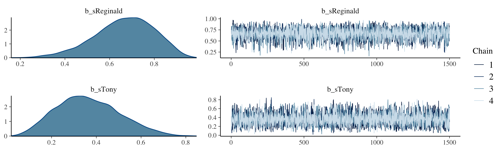

# ~~JAGS~~ brms


We, of course, will be using **brms** in place of JAGS.

## ~~JAGS~~ brms and its relation to R

In the opening paragraph in his [GitHub repository for **brms**](https://github.com/paul-buerkner/brms), Bürkner explained:

> The **brms** package provides an interface to fit Bayesian generalized (non-)linear multivariate multilevel models using Stan, which is a C++ package for performing full Bayesian inference (see [http://mc-stan.org/](http://mc-stan.org/)). The formula syntax is very similar to that of the package lme4 to provide a familiar and simple interface for performing regression analyses. A wide range of response distributions are supported, allowing users to fit -- among others -- linear, robust linear, count data, survival, response times, ordinal, zero-inflated, and even self-defined mixture models all in a multilevel context. Further modeling options include non-linear and smooth terms, auto-correlation structures, censored data, missing value imputation, and quite a few more. In addition, all parameters of the response distribution can be predicted in order to perform distributional regression. Multivariate models (i.e., models with multiple response variables) can be fit, as well. Prior specifications are flexible and explicitly encourage users to apply prior distributions that actually reflect their beliefs. Model fit can easily be assessed and compared with posterior predictive checks, cross-validation, and Bayes factors. (**emphasis** in the original)

Bürkner's **brms** repository includes many helpful links, such as to where [**brms** lives on CRAN](https://CRAN.R-project.org/package=brms), a [list of blog posts](https://paul-buerkner.github.io/blog/brms-blogposts/) highlighting **brms**, and [a forum](https://discourse.mc-stan.org) where users can ask questions about **brms** in specific or about Stan in general.

You can install the current official version of **brms** in the same way you would any other **R** package (i.e., `install.packages("brms", dependencies = T)`). If you want the current developmental version, you could download it from GitHub by executing the following.


```r
if (!requireNamespace("devtools")) {
  install.packages("devtools")
}
devtools::install_github("paul-buerkner/brms")
```

## A complete example

We express the likelihood for our coin toss example as

$$y_{i} \sim \operatorname{Bernoulli}(\theta).$$

Our prior will be

$$\theta \sim \operatorname{Beta}(\alpha, \beta).$$

Kruschke pictured the relationships among the data, the likelihood, and the prior in the model diagram in Figure 8.2 (p. 196). If you're tricky, you can make those in **R**. I'm not going to walk my method out in great detail in this ebook. If you want a step-by-step tutorial, check my blog post, [*Make model diagrams, Kruschke style*](https://solomonkurz.netlify.app/post/make-model-diagrams-kruschke-style/). Here's the code for our version of Figure 8.2.


```r
library(tidyverse)
library(patchwork)

# plot of a beta density
p1 <-
  tibble(x = seq(from = .01, to = .99, by = .01),
         d = (dbeta(x, 2, 2)) / max(dbeta(x, 2, 2))) %>% 
  
  ggplot(aes(x = x, y = d)) +
  geom_area(fill = "grey67") +
  annotate(geom = "text",
           x = .5, y = .2,
           label = "beta",
           size = 7) +
  annotate(geom = "text",
           x = .5, y = .6,
           label = "italic(A)*', '*italic(B)", 
           size = 7, family = "Times", parse = TRUE) +
  scale_x_continuous(expand = c(0, 0)) +
  theme_void() +
  theme(axis.line.x = element_line(size = 0.5))

## an annotated arrow
# save our custom arrow settings
my_arrow <- arrow(angle = 20, length = unit(0.35, "cm"), type = "closed")
p2 <-
  tibble(x    = .5,
         y    = 1,
         xend = .5,
         yend = 0) %>%
  
  ggplot(aes(x = x, xend = xend,
             y = y, yend = yend)) +
  geom_segment(arrow = my_arrow) +
  annotate(geom = "text",
           x = .375, y = 1/3,
           label = "'~'",
           size = 10, family = "Times", parse = T) +
  xlim(0, 1) +
  theme_void()

# bar plot of Bernoulli data
p3 <-
  tibble(x = 0:1,
         d = (dbinom(x, size = 1, prob = .6)) / max(dbinom(x, size = 1, prob = .6))) %>% 
  
  ggplot(aes(x = x, y = d)) +
  geom_col(fill = "grey67", width = .4) +
  annotate(geom = "text",
           x = .5, y = .2,
           label = "Bernoulli",
           size = 7) +
  annotate(geom = "text",
           x = .5, y = .94,
           label = "theta", 
           size = 7, family = "Times", parse = T) +
  xlim(-.75, 1.75) +
  theme_void() +
  theme(axis.line.x = element_line(size = 0.5))

# another annotated arrow
p4 <-
  tibble(x     = c(.375, .625),
         y     = c(1/3, 1/3),
         label = c("'~'", "italic(i)")) %>% 
  
  ggplot(aes(x = x, y = y, label = label)) +
  geom_text(size = c(10, 7), parse = T, family = "Times") +
  geom_segment(x = .5, xend = .5,
               y = 1, yend = 0,
               arrow = my_arrow) +
  xlim(0, 1) +
  theme_void()

# some text
p5 <-
  tibble(x     = 1,
         y     = .5,
         label = "italic(y[i])") %>% 
  
  ggplot(aes(x = x, y = y, label = label)) +
  geom_text(size = 7, parse = T, family = "Times") +
  xlim(0, 2) +
  theme_void()
```


```r
layout <- c(
  area(t = 1, b = 2, l = 1, r = 1),
  area(t = 3, b = 3, l = 1, r = 1),
  area(t = 4, b = 5, l = 1, r = 1),
  area(t = 6, b = 6, l = 1, r = 1),
  area(t = 7, b = 7, l = 1, r = 1)
)

(p1 + p2 + p3 + p4 + p5) + 
  plot_layout(design = layout) &
  ylim(0, 1) &
  theme(plot.margin = margin(0, 5.5, 0, 5.5))
```


> Diagrams like Figure 8.2 should be scanned from the bottom up. This is because models of data always start with the data, then conceive of a likelihood function that describes the data values in terms of meaningful parameters, and finally determine a prior distribution over the parameters. (p. 196)

### Load data.

"Logically, models of data start with the data. We must know their basic scale and structure to conceive of a descriptive model" (p. 197).

Here we load the data with the `readr::read_csv()` function, the **tidyverse** version of base **R** `read.csv()`.


```r
my_data <- read_csv("data.R/z15N50.csv")
```

Unlike what Kruschke wrote about JAGS, the **brms** package does not require us to convert the data into a list. It can handle data in lists or data frames, of which [tibbles are a special case](https://cran.r-project.org/web/packages/tibble/vignettes/tibble.html). Here are what the data look like.


```r
glimpse(my_data)
```

```
## Rows: 50
## Columns: 1
## $ y <dbl> 0, 1, 0, 0, 0, 0, 0, 0, 0, 0, 1, 0, 0, 0, 1, 1, 1, 0, 0, 1, 0, 0, 0, 0, 1, 1, 0, 0, 0, 0…
```

We might visualize them in a bar plot.


```r
library(cowplot)

my_data %>% 
  mutate(y = y %>% as.character()) %>% 
  
  ggplot(aes(x = y)) +
  geom_bar() +
  scale_y_continuous(expand = expansion(mult = c(0, 0.05))) +
  theme_minimal_hgrid()
```


For the past couple chapters, we've been using the `cowplot::theme_cowplot()` theme for our plots. The **cowplot** package, however, includes a few more. The `theme_minimal_grid()` is similar, but subtracts the axis lines and adds in minimalistic grid lines. In his [-@Wilke2019Themes] [Themes vignette], however, Wilke explained that vertical gridlines are often unsightly in bar plots. To avoid offending Wilke with our grid lines, we used the `theme_minimal_hgrid()` theme, which only added horizontal grid lines.

Anyway, if you wanted to compute "Ntotal", the number of rows in our tibble, one way is with `count()`.


```r
my_data %>% 
  count()
```

```
## # A tibble: 1 x 1
##       n
##   <int>
## 1    50
```

However, we're not going to do anything with an "Ntotal" value. For **brms**, the data are fine in their current data frame form. No need for a `dataList`.

### Specify model.

Let's open **brms**.


```r
library(brms)
```

The **brms** package does not have code blocks following the JAGS format or the sequence in Kruschke's diagrams. Rather, its syntax is modeled in part after the popular frequentist mixed-effects package, [**lme4**](https://cran.r-project.org/web/packages/lme4/index.html). To learn more about how **brms** compares to **lme4**, see Bürkner's [-@burknerBrmsPackageBayesian2017] overview, [*brms: An R package for Bayesian multilevel models
using Stan*](https://cran.r-project.org/web/packages/brms/vignettes/brms_overview.pdf). 

The primary function in **brms** is `brm()`. Into this one function we will specify the data, the model, the likelihood function, the prior(s), and any technical settings such as the number of MCMC chains, iterations, and so forth. You can order the arguments in any way you like. My typical practice is to start with `data`, `family` (i.e., the likelihood function), the model `formula`, and my `prior`s. If there are any technical specifications such as the number of MCMC iterations I'd like to change from their default values, I usually do that last.

Here's how to fit the model.


```r
fit8.1 <-
  brm(data = my_data, 
      family = bernoulli(link = identity),
      formula = y ~ 1,
      prior(beta(2, 2), class = Intercept),
      iter = 500 + 3334, warmup = 500, chains = 3,
      seed = 8,
      file = "fits/fit08.01")
```

Also note our use of the `file` argument. This automatically saved my fit object as an external file. You don't have to do that and you can avoid doing so by omitting the `file` argument. For a more detailed explanation of the `brms::brm()` function, spend some time with the `brm` section of the [**brms** reference manual](https://CRAN.R-project.org/package=brms) [@R-brms].

### Initialize chains.

In Stan, and in **brms** by extension, the initial values have default settings. In the [Initialization section of the Program Execution chapter](https://mc-stan.org/docs/2_26/reference-manual/initialization.html) in the *Stan reference manual, Version 2.26* [@standevelopmentteamStanReferenceManual2021] we read:

> If there are no user-supplied initial values, the default initialization strategy is to initialize the unconstrained parameters directly with values drawn uniformly from the interval $(−2, 2)$. The bounds of this initialization can be changed but it is always symmetric around 0. The value of 0 is special in that it represents the median of the initialization. An unconstrained value of 0 corresponds to different parameter values depending on the constraints declared on the parameters.

In general, I do not recommend setting custom initial values in **brms** or Stan. Under the hood, Stan will transform the parameters to the unconstrained space in models where they are bounded. In our Bernoulli model, $\theta$ is bounded at 0 and 1. A little further down in the same section, we read:

> For parameters bounded above and below, the initial value of 0 on the unconstrained scale corresponds to a value at the midpoint of the constraint interval. For probability parameters, bounded below by 0 and above by 1, the transform is the inverse logit, so that an initial unconstrained value of 0 corresponds to a constrained value of 0.5, -2 corresponds to 0.12 and 2 to 0.88. Bounds other than 0 and 1 are just scaled and translated.

If you want to play around with this, have at it. In my experience, the only time it helps to set these manually is when you want to fix them to zero. You can do that by specifying `inits = 0` within `brm()`.

### Generate chains.

By default, **brms** will use 4 chains of 2,000 iterations each. The type of MCMC **brms** uses is Hamiltonian Monte Carlo (HMC). You can learn more about HMC at the Stan website, [https://mc-stan.org](https://mc-stan.org), which includes resources such as the [*Stan user's guide*](https://mc-stan.org/docs/2_26/stan-users-guide/index.html) [@standevelopmentteamStanUserGuide2021], the [*Stan reference manual*](https://mc-stan.org/docs/2_26/reference-manual/) [@standevelopmentteamStanReferenceManual2021], and a list of [tutorials](https://mc-stan.org/users/documentation/tutorials). McElreath has a [nice intro lecture](https://www.youtube.com/watch?v=BWEtS3HuU5A&t=163s&frags=pl%2Cwn) on MCMC in general and HMC in particular. Michael Bentacourt has some good lectures on Stan and HMC, such as [here](https://www.youtube.com/watch?v=pHsuIaPbNbY&t=2638s&frags=pl%2Cwn) and [here](https://www.youtube.com/watch?v=jUSZboSq1zg&t=1325s&frags=pl%2Cwn). And, of course, we will cover HMC with Kruschke in [Chapter 14][Stan].

Within each HMC chain, the first $n$ iterations are warmups. Within the Stan-HMC paradigm, [warmups are somewhat analogous to but not synonymous with burn-in iterations](https://andrewgelman.com/2017/12/15/burn-vs-warm-iterative-simulation-algorithms/) as done by the Gibbs sampling in JAGS. But HMC warmups are like Gibbs burn-ins in that both are discarded and not used to describe the posterior. As such, the **brms** default settings yield 1,000 post-warmup iterations for each of the 4 HMC chains. However, we specified `iter = 500 + 3334, warmup = 500, chains = 3`. Thus instead of defaults, we have 3 HMC chains. Each chain has 500 + 3,334 = 3,834 total iterations, of which 500 were discarded `warmup` iterations.

To learn more about the warmup stage in Stan, check out the [HMC Algorithm Parameters section of the MCMC Sampling chapter](https://mc-stan.org/docs/2_26/reference-manual/hmc-algorithm-parameters.html) of the *Stan reference manual*.

### Examine chains.

The `brms::plot()` function returns a density and trace plot for each model parameter.


```r
plot(fit8.1)
```


If you want to display each chain as its own density, you can use the handy `mcmc_dens_overlay()` function from the [**bayesplot** package](https://CRAN.R-project.org/package=bayesplot).


```r
library(bayesplot)
```

But before we do so, we'll need to export the posterior samples into a data frame, for which we'll employ `posterior_samples()`.


```r
post <- posterior_samples(fit8.1, add_chain = T)
```

Note the `add_chain = T` argument, which will allow us to differentiate the draws by their chain of origin. But anyway, here are the overlaid densities.


```r
mcmc_dens_overlay(post, pars = c("b_Intercept")) +
  theme_minimal_hgrid()
```


The `bayesplot::mcmc_acf()` function will give us the autocorrelation plots.


```r
mcmc_acf(post, pars = "b_Intercept", lags = 35) +
  theme_minimal_hgrid()
```


With **brms** functions, we get a sole $\widehat R$ value for each parameter rather than a running vector.


```r
rhat(fit8.1)["b_Intercept"]
```

```
## b_Intercept 
##     1.00023
```

We'll have to employ `brms::as.mcmc()` and `coda::gelman.plot()` to make our running $\widehat R$ plot.


```r
fit8.1_c <- as.mcmc(fit8.1)

coda::gelman.plot(fit8.1_c[, "b_Intercept", ])
```


For whatever reason, many of the package developers within the Stan/**brms** ecosystem don't seem interested in shrink factor plots, like this.

#### ~~The `plotPost` function~~ How to plot your brms posterior distributions.

We'll get into plotting in just a moment. But before we do, here's a summary of the model.


```r
print(fit8.1)
```

```
##  Family: bernoulli 
##   Links: mu = identity 
## Formula: y ~ 1 
##    Data: my_data (Number of observations: 50) 
## Samples: 3 chains, each with iter = 3834; warmup = 500; thin = 1;
##          total post-warmup samples = 10002
## 
## Population-Level Effects: 
##           Estimate Est.Error l-95% CI u-95% CI Rhat Bulk_ESS Tail_ESS
## Intercept     0.32      0.06     0.20     0.44 1.00     3678     4655
## 
## Samples were drawn using sampling(NUTS). For each parameter, Bulk_ESS
## and Tail_ESS are effective sample size measures, and Rhat is the potential
## scale reduction factor on split chains (at convergence, Rhat = 1).
```

To summarize a posterior in terms of central tendency, **brms** defaults to the mean value (i.e., the value in the 'Estimate' column of the `print()` output). In many of the other convenience functions, you can also request the median instead. For example, we can use the `robust = T` argument to get the 'Estimate' in terms of the median.


```r
posterior_summary(fit8.1, robust = T)
```

```
##                Estimate  Est.Error        Q2.5       Q97.5
## b_Intercept   0.3141615 0.06271721   0.2005124   0.4431792
## lp__        -30.5225408 0.29765633 -32.6877347 -30.3052625
```

Across functions, the intervals default to 95%. With `print()` and `summary()` you can adjust the level with a `prob` argument. For example, here we'll use 50% intervals.


```r
print(fit8.1, prob = .5)
```

```
##  Family: bernoulli 
##   Links: mu = identity 
## Formula: y ~ 1 
##    Data: my_data (Number of observations: 50) 
## Samples: 3 chains, each with iter = 3834; warmup = 500; thin = 1;
##          total post-warmup samples = 10002
## 
## Population-Level Effects: 
##           Estimate Est.Error l-50% CI u-50% CI Rhat Bulk_ESS Tail_ESS
## Intercept     0.32      0.06     0.27     0.36 1.00     3678     4655
## 
## Samples were drawn using sampling(NUTS). For each parameter, Bulk_ESS
## and Tail_ESS are effective sample size measures, and Rhat is the potential
## scale reduction factor on split chains (at convergence, Rhat = 1).
```

But in many other **brms** convenience functions, you can use the `probs` argument to request specific percentile summaries.


```r
posterior_summary(fit8.1, probs = c(.025, .25, .75, .975))
```

```
##                Estimate  Est.Error        Q2.5         Q25         Q75       Q97.5
## b_Intercept   0.3160697 0.06246065   0.2005124   0.2726815   0.3572829   0.4431792
## lp__        -30.7894587 0.68273277 -32.6877347 -30.9497926 -30.3546844 -30.3052625
```

Regardless of what `prob` or `probs` levels you use, **brms** functions always return percentile-based estimates. All this central tendency and interval talk will be important in a moment...

When plotting the posterior distribution of a parameter estimated with **brms**, you typically do so working with the results of an object returned by `posterior_samples()`. Recall we already saved those samples as `post`.


```r
head(post)
```

```
##   b_Intercept      lp__ chain iter
## 1   0.3885603 -31.04295     1  501
## 2   0.4013502 -31.28580     1  502
## 3   0.3733681 -30.79754     1  503
## 4   0.3764648 -30.84373     1  504
## 5   0.3862547 -31.00268     1  505
## 6   0.2774595 -30.42087     1  506
```

With `post` in hand, we can use **ggplot2** to do the typical distributional plots, such as with `geom_histogram()`.


```r
post %>% 
  ggplot(aes(x = b_Intercept)) +
  geom_histogram(color = "grey92", fill = "grey67",
                 size = .2) +
  scale_y_continuous(expand = expansion(mult = c(0, 0.05))) +
  labs(title = "Theta via ggplot2::geom_histogram()",
       x = expression(theta)) +
  theme_minimal_hgrid() +
  theme(plot.title.position = "plot")
```


The `bayesplot::mcmc_areas()` function offers a nice way to depict the posterior densities, along with their percentile-based 50% and 95% ranges.


```r
mcmc_areas(
  post, 
  pars = c("b_Intercept"),
  prob = 0.5,
  prob_outer = 0.95,
  point_est = "mean"
) +
  scale_y_discrete(expand = expansion(mult = c(0, 0.05))) +
  labs(title = "Theta via bayesplot::mcmc_areas()",
       x = expression(theta)) +
  theme_minimal_hgrid() +
  theme(plot.title.position = "plot")
```


**brms** doesn't have a convenient way to compute the posterior mode or HDIs. Base **R** is no help, either. But Matthew Kay's **tidybayes** package makes it easy to compute posterior modes and HDIs with handy functions like `stat_halfeye()` and `stat_histinterval()`.


```r
library(tidybayes)

post %>% 
  ggplot(aes(x = b_Intercept, y = 0)) +
  stat_halfeye(point_interval = mode_hdi, .width = c(.95, .5)) +
  scale_y_continuous(NULL, breaks = NULL) +
  labs(title = expression(theta*" via tidybayes::stat_halfeye()"),
       x = expression(theta)) +
  theme_minimal_hgrid()
```


```r
post %>% 
  ggplot(aes(x = b_Intercept, y = 0)) +
  stat_histinterval(point_interval = mode_hdi, .width = c(.95, .5)) +
  scale_y_continuous(NULL, breaks = NULL) +
  labs(title = expression(theta*" via tidybayes::stat_histinterval()"),
       x = expression(theta)) +
  theme_minimal_hgrid()
```


The `tidybayes::stat_halfeye()` function returns a density with a measure of the posterior's central tendency in a dot and one or multiple interval bands as horizontal lines at the base of the density. The `stat_histinterval()` function returns much the same, but replaces the density with a histogram. For both functions, the `point_interval = mode_hdi` argument allowed us to request the mode to be our measure of central tendency and the highest posterior density intervals to be our type intervals. With `.width = c(.95, .5)`, we requested our HDIs be at both the 95% and 50% levels.

If we wanted to be more congruent with Kruschke's plotting sensibilities, we could further modify `tidybayes::stat_histinterval()`.


```r
# this is unnecessary, but makes for nicer x-axis breaks
my_breaks <-
  mode_hdi(post$b_Intercept)[, 1:3] %>% 
  gather(key, breaks) %>% 
  mutate(labels = breaks %>% round(digits = 3))

# here's the main plot code
post %>% 
  ggplot(aes(x = b_Intercept, y = 0)) +
  stat_histinterval(point_interval = mode_hdi, .width = .95,
                    fill = "steelblue", slab_color = "white",
                    breaks = 40, slab_size = .25, outline_bars = T) +
  scale_x_continuous(breaks = my_breaks$breaks,
                     labels = my_breaks$labels) +
  scale_y_continuous(NULL, breaks = NULL) +
  labs(title = "tidybayes::stat_histinterval() all gussied up",
       x = expression(theta)) +
  theme_minimal_hgrid() +
  theme(title = element_text(size = 10.5))
```


With the `point_interval` argument within `stat_histinterval()` and related functions, we can request different combinations of measures of central tendency (i.e., mean, median, mode) and interval types (i.e., percentile-based and HDIs). Although all of these are legitimate ways to summarize a posterior, they can yield somewhat different results. For example, here we'll contrast our mode + HDI summary with a median + percentile-based interval summary using `tidybayes::stat_pointinterval()`.


```r
post %>% 
  ggplot(aes(x = b_Intercept)) +
  stat_pointinterval(aes(y = 1), point_interval = median_qi, .width = c(.95, .5)) +
  stat_pointinterval(aes(y = 2), point_interval = mode_hdi,  .width = c(.95, .5)) +
  scale_y_continuous(NULL, breaks = 1:2,
                     labels = c("median_qi", "mode_hdi")) +
  coord_cartesian(ylim = c(0, 3)) +
  labs(title = "Theta via tidybayes::stat_pointinterval()",
       x = expression(theta)) +
  theme_minimal_vgrid() +
  theme(axis.line.y.left = element_blank(),
        axis.text.y = element_text(hjust = 0),
        axis.ticks.y = element_blank(),
        plot.title.position = "plot",
        title = element_text(size = 10.5))
```


Similar, yet distinct. To get a sense of the full variety of ways **tidybayes** allows users to summarize and plot the results of a Bayesian model, check out Kay's [-@kaySlabIntervalStats2020] vignette, [*Slab + interval stats and geoms*](https://mjskay.github.io/ggdist/articles/slabinterval.html). Also, did you notice how we switched to `theme_minimal_vgrid()`? That's how we added the vertical grid lines in the absence of horizontal grid lines.

## Simplified scripts for frequently used analyses

A lot has happened in **R** for Bayesian analysis since Kruschke wrote his [-@kruschkeDoingBayesianData2015] text. In addition to our use of the **tidyverse**, the **brms**, **bayesplot**, and **tidybayes** packages offer an array of useful convenience functions. We can and occasionally will write our own. But really, the rich **R** ecosystem already has us pretty much covered.

## Example: Difference of biases

Here are our new data.


```r
my_data <- read_csv("data.R/z6N8z2N7.csv")

glimpse(my_data)
```

```
## Rows: 15
## Columns: 2
## $ y <dbl> 1, 0, 1, 1, 1, 1, 1, 0, 0, 0, 1, 0, 0, 1, 0
## $ s <chr> "Reginald", "Reginald", "Reginald", "Reginald", "Reginald", "Reginald", "Reginald", "Reg…
```

They look like this.


```r
library(ggthemes)

my_data %>% 
  mutate(y = y %>% as.character()) %>% 
  
  ggplot(aes(x = y, fill = s)) +
  geom_bar(show.legend = F) +
  scale_fill_colorblind() +
  scale_y_continuous(expand = expansion(mult = c(0, 0.05))) +
  theme_minimal_hgrid() +
  facet_wrap(~ s)
```


Note our use of the `scale_fill_colorblind()` function from the [**ggthemes** package](https://CRAN.R-project.org/package=ggthemes) [@R-ggthemes]. When you want to use color to emphasize different factor levels, such as `s`, it's a good idea to make sure those colors can be distinguished by folks who are colorblind. The `scale_fill_colorblind()` function provides a discrete palette of eight colorblind safe colors. If you'd prefer to use a different palette, but wand to make sure its accessible to folks with colorblindness, check out the [**colorblindr** package](https://github.com/clauswilke/colorblindr) [@R-colorblindr].

Here's our **ggplot2** version of the model diagram in Figure 8.5.


```r
# plot of a beta density
p1 <-
  tibble(x = seq(from = .01, to = .99, by = .01),
         d = (dbeta(x, 2, 2)) / max(dbeta(x, 2, 2))) %>% 
  
  ggplot(aes(x = x, y = d)) +
  geom_area(fill = "steelblue") +
  annotate(geom = "text",
           x = .5, y = .2,
           label = "beta",
           size = 7) +
  annotate(geom = "text",
           x = .5, y = .6,
           label = "italic(A)*', '*italic(B)", 
           size = 7, family = "Times", parse = TRUE) +
  scale_x_continuous(expand = c(0, 0)) +
  theme_void() +
  theme(axis.line.x = element_line(size = 0.5))

# an annotated arrow
p2 <-
  tibble(x     = c(.35, .65),
         y     = 1/3,
         label = c("'~'", "italic(s)")) %>% 
  
  ggplot(aes(x = x, y = y, label = label)) +
  geom_text(size = c(10, 7), parse = T, family = "Times") +
  geom_segment(x = .5, xend = .5,
               y = 1, yend = 0,
               arrow = my_arrow) +
  xlim(0, 1) +
  theme_void()

# bar plot of Bernoulli data
p3 <-
  tibble(x = 0:1,
         d = (dbinom(x, size = 1, prob = .6)) / max(dbinom(x, size = 1, prob = .6))) %>% 
  
  ggplot(aes(x = x, y = d)) +
  geom_col(fill = "steelblue", width = .4) +
  annotate(geom = "text",
           x = .5, y = .2,
           label = "Bernoulli",
           size = 7) +
  annotate(geom = "text",
           x = .5, y = .92,
           label = "theta[italic(s)]", 
           size = 7, family = "Times", parse = T) +
  xlim(-.75, 1.75) +
  theme_void() +
  theme(axis.line.x = element_line(size = 0.5))

# another annotated arrow
p4 <-
  tibble(x     = c(.35, .65),
         y     = c(1/3, 1/3),
         label = c("'~'", "italic(i)*'|'*italic(s)")) %>% 
  
  ggplot(aes(x = x, y = y, label = label)) +
  geom_text(size = c(10, 7), parse = T, family = "Times") +
  geom_segment(x = .5, xend = .5,
               y = 1, yend = 0,
               arrow = my_arrow) +
  xlim(0, 1) +
  theme_void()

# some text
p5 <-
  tibble(x     = 1,
         y     = .5,
         label = "italic(y)[italic(i)*'|'*italic(s)]") %>% 
  
  ggplot(aes(x = x, y = y, label = label)) +
  geom_text(size = 7, parse = T, family = "Times") +
  xlim(0, 2) +
  theme_void()

# define the layout
layout <- c(
  area(t = 1, b = 2, l = 1, r = 1),
  area(t = 3, b = 3, l = 1, r = 1),
  area(t = 4, b = 5, l = 1, r = 1),
  area(t = 6, b = 6, l = 1, r = 1),
  area(t = 7, b = 7, l = 1, r = 1)
)

# combine and plot!
(p1 + p2 + p3 + p4 + p5) + 
  plot_layout(design = layout) &
  ylim(0, 1) &
  theme(plot.margin = margin(0, 5.5, 0, 5.5))
```


Here is how we might fit the model with `brms::brm()`.


```r
fit8.2 <-
  brm(data = my_data, 
      family = bernoulli(identity),
      y ~ 0 + s,
      prior(beta(2, 2), class = b, lb = 0, ub = 1),
      iter = 2000, warmup = 500, cores = 4, chains = 4,
      seed = 8,
      file = "fits/fit08.02")
```

More typically, we'd parameterize the model as `y ~ 1 + s`. This form would yield an intercept and a slope. Behind the scenes, **brms** would treat the nominal `s` variable as an 0-1 coded dummy variable. One of the nominal levels would become the reverence category, depicted by the `Intercept`, and the difference between that and the other category would be the `s` slope. However, with our `y ~ 0 + s` syntax, we've suppressed the typical model intercept. The consequence is that each level of the nominal variable `s` gets its own intercept or [i] index, if you will. This is analogous to Kruschke's `y[i] ∼ dbern(theta[s[i]])` code.

Also, notice how we set `lb = 0` and `ub = 1` within the `prior()` function. These told **brms** that the lower and upper boundaries for our two intercept parameters are 0 and 1, respectively. The current version of **brms** will allow you to fit the model with out explicitly setting these. However, it will throw a warning. This is because there are no natural boundaries for the parameters of `class = b` on a model like this. Or at least, there aren't any that **brms** has been made aware of. However, those beta priors presume the lower and upper boundaries of 0 and 1. As we'll see later on in this ebook, we won't usually fit models using the identity link and the Bernoulli likelihood for data like these. But that's for another section...

All that aside, here are the chains.


```r
plot(fit8.2)
```



The model `summary()` is as follows:


```r
summary(fit8.2)
```

```
##  Family: bernoulli 
##   Links: mu = identity 
## Formula: y ~ 0 + s 
##    Data: my_data (Number of observations: 15) 
## Samples: 4 chains, each with iter = 2000; warmup = 500; thin = 1;
##          total post-warmup samples = 6000
## 
## Population-Level Effects: 
##           Estimate Est.Error l-95% CI u-95% CI Rhat Bulk_ESS Tail_ESS
## sReginald     0.67      0.13     0.38     0.89 1.00     5152     3519
## sTony         0.36      0.14     0.12     0.66 1.00     4627     4001
## 
## Samples were drawn using sampling(NUTS). For each parameter, Bulk_ESS
## and Tail_ESS are effective sample size measures, and Rhat is the potential
## scale reduction factor on split chains (at convergence, Rhat = 1).
```

The `brms::pairs()` function gets us the bulk of Figure 8.6.


```r
pairs(fit8.2,
      off_diag_args = list(size = 1/3, alpha = 1/3))
```


But to get at that difference-score distribution, we'll have extract the posterior iterations with `posterior_samples()`, make difference score with `mutate()`, and manually plot with **ggplot2**.


```r
post <- posterior_samples(fit8.2)

post <-
  post %>% 
  rename(theta_Reginald = b_sReginald,
         theta_Tony     = b_sTony) %>% 
  mutate(`theta_Reginald - theta_Tony` = theta_Reginald - theta_Tony)

glimpse(post)
```

```
## Rows: 6,000
## Columns: 4
## $ theta_Reginald                <dbl> 0.7757244, 0.6615629, 0.6392801, 0.5430331, 0.5246347, 0.525…
## $ theta_Tony                    <dbl> 0.3163358, 0.4048103, 0.3239676, 0.2919574, 0.2351882, 0.209…
## $ lp__                          <dbl> -11.69349, -11.30482, -11.32344, -11.77508, -12.21795, -12.4…
## $ `theta_Reginald - theta_Tony` <dbl> 0.45938855, 0.25675262, 0.31531244, 0.25107566, 0.28944655, …
```


```r
gathered_post <-
  post %>% 
  select(starts_with("theta")) %>% 
  gather() %>% 
  mutate(key = factor(key, levels = c("theta_Reginald", "theta_Tony", "theta_Reginald - theta_Tony"))) 
  
gathered_post %>% 
  ggplot(aes(x = value, y = 0, fill = key)) +
  stat_histinterval(point_interval = mode_hdi, .width = .95,
                    slab_color = "white", outline_bars = T,
                    normalize = "panels") +
  scale_fill_manual(values = colorblind_pal()(8)[2:4], breaks = NULL) +
  scale_y_continuous(NULL, breaks = NULL) +
  theme_minimal_hgrid() +
  facet_wrap(~ key, scales = "free")
```


Note how this time we used the `colorblind_pal()` function within `scale_fill_manual()` to manually select three of the of the `scale_fill_colorblind()` colors.

Anyway, here's a way to get the numeric summaries out of `post`.


```r
gathered_post %>% 
  group_by(key) %>% 
  mode_hdi()
```

```
## # A tibble: 3 x 7
##   key                         value  .lower .upper .width .point .interval
##   <fct>                       <dbl>   <dbl>  <dbl>  <dbl> <chr>  <chr>    
## 1 theta_Reginald              0.708  0.405   0.908   0.95 mode   hdi      
## 2 theta_Tony                  0.328  0.102   0.631   0.95 mode   hdi      
## 3 theta_Reginald - theta_Tony 0.332 -0.0720  0.670   0.95 mode   hdi
```

In this context, the `mode_hdi()` summary yields:

* `key` (i.e., the name we used to denote the parameters)
* `value` (i.e., the value of the measure of central tendency)
* `.lower` (i.e., the lower level of the 95% HDI)
* `.upper` (i.e., the upper level...)
* `.width` (i.e., what interval we used)
* `.point` (i.e., the type of measure of central tendency)
* `.interval` (i.e., the type of interval)

## Sampling from the prior distribution in ~~JAGS~~ brms

There are a few ways to sample from the prior distribution with **brms**. Here we'll do so by setting `sample_prior = "only"`. As a consequence, `brm()` will ignore the likelihood and return samples based solely on the model priors.


```r
fit8.3 <-
  brm(data = my_data, 
      family = bernoulli(identity),
      y ~ 0 + s,
      prior = c(prior(beta(2, 2), class = b, coef = sReginald),
                prior(beta(2, 2), class = b, coef = sTony)),
      iter = 2000, warmup = 500, cores = 4, chains = 4,
      sample_prior = "only",
      seed = 8,
      file = "fits/fit08.03")
```

Because we set `sample_prior = "only"`, the `posterior_samples()` will now return samples from the priors.


```r
prior <- posterior_samples(fit8.3) %>% select(-lp__)

head(prior)
```

```
##   b_sReginald   b_sTony
## 1   0.4318585 0.6822865
## 2   0.6700181 0.8813427
## 3   0.4927418 0.7670926
## 4   0.5427397 0.6701206
## 5   0.2595087 0.4352793
## 6   0.2162240 0.6038407
```

With `prior` in hand, we're almost ready to make the prior histograms of Figure 8.7. But first we'll want to determine the $z/N$ values in order to mark them off in the plots. [You'll note Kruschke did so with gray plus marks in his.]


```r
my_data %>% 
  group_by(s) %>% 
  summarise(z = sum(y),
            N = n()) %>% 
  mutate(`z/N` = z / N)
```

```
## # A tibble: 2 x 4
##   s            z     N `z/N`
##   <chr>    <dbl> <int> <dbl>
## 1 Reginald     6     8 0.75 
## 2 Tony         2     7 0.286
```

```r
d_line <-
  tibble(value = c(.75, .286, .75 - .286),
         key   =  factor(c("theta_Reginald", "theta_Tony", "theta_Reginald - theta_Tony"), 
                         levels = c("theta_Reginald", "theta_Tony", "theta_Reginald - theta_Tony")))
```

Behold the histograms of Figure 8.7.


```r
prior %>% 
  rename(theta_Reginald = b_sReginald,
         theta_Tony     = b_sTony) %>% 
  mutate(`theta_Reginald - theta_Tony` = theta_Reginald - theta_Tony) %>% 
  gather() %>% 
  mutate(key = factor(key, levels = c("theta_Reginald", "theta_Tony", "theta_Reginald - theta_Tony"))) %>%
  
  ggplot(aes(x = value, y = 0)) +
  stat_histinterval(point_interval = mode_hdi, .width = .95,
                    fill = colorblind_pal()(8)[5], normalize = "panels") +
  geom_vline(data = d_line, 
             aes(xintercept = value), 
             linetype = 2) +
  scale_y_continuous(NULL, breaks = NULL) +
  labs(subtitle = expression("The dashed vertical lines mark off "*italic(z[s])/italic(N[s]))) +
  theme_cowplot() +
  facet_wrap(~ key, scales = "free")
```


Here's how you might make the scatter plot.


```r
prior %>% 
  rename(theta_Reginald = b_sReginald,
         theta_Tony     = b_sTony) %>% 
  
  ggplot(aes(x = theta_Reginald, y = theta_Tony)) +
  geom_point(alpha = 1/4, color = colorblind_pal()(8)[6]) +
  coord_equal() +
  theme_minimal_grid()
```


Or you could always use a two-dimensional density plot with `stat_density_2d()`.


```r
prior %>% 
  rename(theta_Reginald = b_sReginald,
         theta_Tony     = b_sTony) %>% 
  
  ggplot(aes(x = theta_Reginald, y = theta_Tony)) +
  stat_density_2d(aes(fill = stat(density)), 
                  geom = "raster", contour = F) +
  scale_fill_viridis_c(option = "B", breaks = NULL) +
  scale_x_continuous(expression(theta[1]), 
                     expand = c(0, 0), limits = c(0, 1),
                     breaks = 0:4 / 4, labels = c("0", ".25", ".5", ".75", "1")) +
  scale_y_continuous(expression(theta[2]), 
                     expand = c(0, 0), limits = c(0, 1),
                     breaks = 0:4 / 4, labels = c("0", ".25", ".5", ".75", "1")) +
  coord_equal() +
  theme_minimal_grid()
```


The viridis color palettes in functions like `scale_fill_viridis_c()` and `scale_fill_viridis_d()` are designed to be colorblind safe, too [@R-viridis].

## Probability distributions available in ~~JAGS~~  brms

> [**brms**] has a large collection of frequently used probability distributions that are built-in. These distributions include the beta, gamma, normal, Bernoulli, and binomial along with many others. A complete list of distributions, and their [**brms**] names, can be found in [Bürkner's [-@Bürkner2021Parameterization] vignette [*Parameterization of response distributions in brms*](https://CRAN.R-project.org/package=brms/vignettes/brms_families.html)]. [@kruschkeDoingBayesianData2015, pp. 213--214, **emphasis** added]

### Defining new likelihood functions.

In addition to all the likelihood functions listed in above mentioned vignette, you can also make your own likelihood functions. Bürkner explained the method in his [-@Bürkner2021Define] vignette, [*Define custom response distributions with brms*](https://CRAN.R-project.org/package=brms/vignettes/brms_customfamilies.html).

## Faster sampling with parallel processing in ~~runjags~~ `brms::brm()`

We don't need to open another package to sample in parallel in **brms**. In fact, we've already been doing that. Take another look at the code use used for the last model, `fit8.2`.


```r
fit8.2 <-
  brm(data = my_data, 
      family = bernoulli(identity),
      y ~ 0 + s,
      prior(beta(2, 2), class = b, lb = 0, ub = 1),
      iter = 2000, warmup = 500, cores = 4, chains = 4,
      seed = 8,
      file = "fits/fit08.02")
```

See the `cores = 4, chains = 4` arguments? With that bit of code, we told `brms::brm()` we wanted 4 chains, which we ran in parallel across 4 cores.

## Tips for expanding ~~JAGS~~ brms models

I'm in complete agreement with Kruschke, here:

> Often, the process of programming a model is done is stages, starting with a simple model and then incrementally incorporating complexifications. At each step, the model is checked for accuracy and efficiency. This procedure of incremental building is useful for creating a desired complex model from scratch, for expanding a previously created model for a new application, and for expanding a model that has been found to be inadequate in a posterior predictive check. (p. 218)

## Session info {-}


```r
sessionInfo()
```

```
## R version 4.0.4 (2021-02-15)
## Platform: x86_64-apple-darwin17.0 (64-bit)
## Running under: macOS Catalina 10.15.7
## 
## Matrix products: default
## BLAS:   /Library/Frameworks/R.framework/Versions/4.0/Resources/lib/libRblas.dylib
## LAPACK: /Library/Frameworks/R.framework/Versions/4.0/Resources/lib/libRlapack.dylib
## 
## locale:
## [1] en_US.UTF-8/en_US.UTF-8/en_US.UTF-8/C/en_US.UTF-8/en_US.UTF-8
## 
## attached base packages:
## [1] stats     graphics  grDevices utils     datasets  methods   base     
## 
## other attached packages:
##  [1] ggthemes_4.2.4  tidybayes_2.3.1 bayesplot_1.8.0 brms_2.15.0     Rcpp_1.0.6      cowplot_1.1.1  
##  [7] patchwork_1.1.1 forcats_0.5.1   stringr_1.4.0   dplyr_1.0.5     purrr_0.3.4     readr_1.4.0    
## [13] tidyr_1.1.3     tibble_3.1.1    ggplot2_3.3.3   tidyverse_1.3.0
## 
## loaded via a namespace (and not attached):
##   [1] readxl_1.3.1         backports_1.2.1      plyr_1.8.6           igraph_1.2.6        
##   [5] svUnit_1.0.3         splines_4.0.4        crosstalk_1.1.0.1    TH.data_1.0-10      
##   [9] rstantools_2.1.1     inline_0.3.17        digest_0.6.27        htmltools_0.5.1.1   
##  [13] rsconnect_0.8.16     fansi_0.4.2          magrittr_2.0.1       modelr_0.1.8        
##  [17] RcppParallel_5.0.2   matrixStats_0.57.0   xts_0.12.1           sandwich_3.0-0      
##  [21] prettyunits_1.1.1    colorspace_2.0-0     rvest_0.3.6          ggdist_2.4.0.9000   
##  [25] haven_2.3.1          xfun_0.22            callr_3.7.0          crayon_1.4.1        
##  [29] jsonlite_1.7.2       lme4_1.1-25          survival_3.2-10      zoo_1.8-8           
##  [33] glue_1.4.2           gtable_0.3.0         emmeans_1.5.2-1      V8_3.4.0            
##  [37] distributional_0.2.2 pkgbuild_1.2.0       rstan_2.21.2         abind_1.4-5         
##  [41] scales_1.1.1         mvtnorm_1.1-1        DBI_1.1.0            miniUI_0.1.1.1      
##  [45] viridisLite_0.4.0    xtable_1.8-4         HDInterval_0.2.2     stats4_4.0.4        
##  [49] StanHeaders_2.21.0-7 DT_0.16              htmlwidgets_1.5.2    httr_1.4.2          
##  [53] threejs_0.3.3        arrayhelpers_1.1-0   ellipsis_0.3.2       pkgconfig_2.0.3     
##  [57] loo_2.4.1            farver_2.1.0         sass_0.3.1           dbplyr_2.0.0        
##  [61] utf8_1.2.1           tidyselect_1.1.0     labeling_0.4.2       rlang_0.4.11        
##  [65] reshape2_1.4.4       later_1.2.0          munsell_0.5.0        cellranger_1.1.0    
##  [69] tools_4.0.4          cli_2.5.0            generics_0.1.0       broom_0.7.5         
##  [73] ggridges_0.5.3       evaluate_0.14        fastmap_1.1.0        processx_3.5.2      
##  [77] knitr_1.31           fs_1.5.0             nlme_3.1-152         mime_0.10           
##  [81] projpred_2.0.2       xml2_1.3.2           compiler_4.0.4       shinythemes_1.1.2   
##  [85] rstudioapi_0.13      gamm4_0.2-6          curl_4.3             reprex_0.3.0        
##  [89] statmod_1.4.35       bslib_0.2.4          stringi_1.5.3        highr_0.8           
##  [93] ps_1.6.0             Brobdingnag_1.2-6    lattice_0.20-41      Matrix_1.3-2        
##  [97] nloptr_1.2.2.2       markdown_1.1         shinyjs_2.0.0        vctrs_0.3.8         
## [101] pillar_1.6.0         lifecycle_1.0.0      jquerylib_0.1.4      bridgesampling_1.0-0
## [105] estimability_1.3     httpuv_1.6.0         R6_2.5.0             bookdown_0.21       
## [109] promises_1.2.0.1     gridExtra_2.3        codetools_0.2-18     boot_1.3-26         
## [113] colourpicker_1.1.0   MASS_7.3-53          gtools_3.8.2         assertthat_0.2.1    
## [117] withr_2.4.2          shinystan_2.5.0      multcomp_1.4-16      mgcv_1.8-33         
## [121] parallel_4.0.4       hms_0.5.3            grid_4.0.4           coda_0.19-4         
## [125] minqa_1.2.4          rmarkdown_2.7        shiny_1.6.0          lubridate_1.7.9.2   
## [129] base64enc_0.1-3      dygraphs_1.1.1.6
```


