# Hierarchical Models

As Kruschke put it, "There are many realistic situations that involve meaningful hierarchical structure. Bayesian modeling software makes it straightforward to specify and analyze complex hierarchical models" [-@kruschkeDoingBayesianData2015, p. 221]. IMO, **brms** makes it even easier than JAGS. Further down, we read:

> The parameters at different levels in a hierarchical model are all merely parameters that coexist in a joint parameter space. We simply apply Bayes' rule to the joint parameter space, as we did for example when estimating two coin biases back in Figure 7.5, p. 167. To say it a little more formally with our parameters $\theta$ and $\omega$, Bayes' rule applies to the joint parameter space: $p(\theta, \omega | D) \propto p(D | \theta, \omega) p(\theta, \omega)$. What is special to hierarchical models is that the terms on the right-hand side can be factored into a chain of dependencies, like this:
>
> \begin{align*}
> p(\theta, \omega | D) & \propto p(D | \theta, \omega) \; p(\theta, \omega) \\
>                       & = p(D | \theta) \; p(\theta | \omega) \; p(\omega)
> \end{align*}
>
> The refactoring in the second line means that the data depend only on the value of $\theta$, in the sense that when the value $\theta$ is set then the data are independent of all other parameter values. Moreover, the value of $\theta$ depends on the value of $\omega$ and the value of $\theta$ is conditionally independent of all other parameters. Any model that can be factored into a chain of dependencies like [this] is a hierarchical model. (pp. 222--223)

## A single coin from a single mint

Recall from the last chapter that our likelihood is the Bernoulli distribution,

$$y_i \sim \operatorname{Bernoulli}(\theta).$$

We'll use the beta density for our prior distribution for $\theta$,

$$\theta \sim \operatorname{beta}(\alpha, \beta).$$

And we can re-express $\alpha$ and $\beta$ in terms of the mode $\omega$ and concentration $\kappa$, such that

$$\alpha = \omega(\kappa - 2) + 1 \;\;\; \textrm{and} \;\;\; \beta = (1 - \omega)(\kappa - 2) + 1.$$

As a consequence, we can re-express $\theta$ as

$$\theta \sim \operatorname{beta}(\omega(\kappa - 2) + 1, (1 - \omega)(\kappa - 2) + 1).$$

On page 224, Kruschke wrote: "The value of $\kappa$ governs how near $\theta$ is to $\omega$, with larger values of $\kappa$ generating values of $\theta$ more concentrated near $\omega$." To give a sense of that, we'll simulate 20 beta distributions, all with $\omega = .25$ but with $\theta$ increasing from 10 to 200, by 10. We'll then plot them with a little help from the [**ggridges** package](https://CRAN.R-project.org/package=ggridges) [@R-ggridges].


```r
library(tidyverse)
library(cowplot)
library(ggridges)

beta_by_k <- function(k) {
  
  w <- .25
  
  tibble(x = seq(from = 0, to = 1, length.out = 1000)) %>% 
    mutate(theta = dbeta(x = x,
                         shape1 = w * (k - 2) + 1,
                         shape2 = (1 - w) * (k - 2) + 1))
  
}

tibble(k = seq(from = 10, to = 200, by = 10)) %>% 
  mutate(theta = map(k, beta_by_k)) %>% 
  unnest(theta) %>%
  
  ggplot(aes(x = x, y = k,
             height = theta,
             group = k, fill = k)) +
  geom_vline(xintercept = .25, color = "grey85", size = 1/2) +
  geom_ridgeline(size = 1/5, color = "grey92", scale = 2) +
  scale_fill_viridis_c(expression(kappa), option = "A") +
  scale_y_continuous(expression(kappa), breaks = seq(from = 10, to = 200, by = 10)) +
  xlab(expression(theta)) +
  theme_minimal_hgrid()
```


Holding $\omega$ constant, the density gets more concentrated around $\omega$ as $\kappa$ increases. But back to the text: "Now we make the essential expansion of our scenario into the realm of hierarchical models. Instead of thinking of $\omega$ as fixed by prior knowledge, we think of it as another parameter to be estimated" (p. 224). In the hierarchical model diagram of Figure 9.1, Kruschke depicted how we might treat $\omega$ as a parameter controlled by the prior distribution, $\operatorname{beta}(A_\omega, B_\omega)$. Here's our version of the diagram.


```r
library(ggforce)
library(patchwork)

p1 <-
  tibble(x = seq(from = .01, to = .99, by = .01),
       d = (dbeta(x, 2, 2)) / max(dbeta(x, 2, 2))) %>% 
  ggplot(aes(x = x, ymin = 0, ymax = d)) +
  geom_ribbon(fill = "grey67", size = 0) +
  annotate(geom = "text",
           x = .5, y = .2,
           label = "beta",
           size = 7) +
  annotate(geom = "text",
           x = .5, y = .6,
           label = "italic(A[omega])*', '*italic(B[omega])", 
           size = 7, family = "Times", parse = TRUE) +
  scale_x_continuous(expand = c(0, 0)) +
  theme_void() +
  theme(axis.line.x = element_line(size = 0.5))

p2 <-
  tibble(x = c(.5, .475, .26, .08, .06,
               .5, .55, .85, 1.15, 1.2),
         y = c(1, .7, .6, .5, .2,
               1, .7, .6, .5, .2),
         line = rep(letters[2:1], each = 5)) %>% 
  
  ggplot(aes(x = x, y = y)) +
  geom_bspline(aes(color = line),
               size = 2/3, show.legend = F) + 
  annotate(geom = "text",
           x = 0, y = .125,
           label = "omega(italic(K)-2)+1*', '*(1-omega)(italic(K)-2)+1",
           size = 7, parse = T, family = "Times", hjust = 0) +
  annotate(geom = "text",
           x = 1/3, y = .7,
           label = "'~'",
           size = 10, parse = T, family = "Times") +
  scale_color_manual(values = c("grey75", "black")) +
  scale_x_continuous(expand = c(0, 0), limits = c(0, 2)) +
  ylim(0, 1) +
  theme_void()

p3 <-
  tibble(x = seq(from = .01, to = .99, by = .01),
         d = (dbeta(x, 2, 2)) / max(dbeta(x, 2, 2))) %>% 
  ggplot(aes(x = x, ymin = 0, ymax = d)) +
  geom_ribbon(fill = "grey67", size = 0) +
  annotate(geom = "text",
           x = .5, y = .2,
           label = "beta",
           size = 7) +
  scale_x_continuous(expand = c(0, 0)) +
  theme_void() +
  theme(axis.line.x = element_line(size = 0.5))

## an annotated arrow
# save our custom arrow settings
my_arrow <- arrow(angle = 20, length = unit(0.35, "cm"), type = "closed")

p4 <-
  tibble(x    = .5,
         y    = 1,
         xend = .5,
         yend = 0) %>%
  
  ggplot(aes(x = x, xend = xend,
             y = y, yend = yend)) +
  geom_segment(arrow = my_arrow) +
  annotate(geom = "text",
           x = .375, y = 1/3,
           label = "'~'",
           size = 10, family = "Times", parse = T) +
  xlim(0, 1) +
  theme_void()

# bar plot of Bernoulli data
p5 <-
  tibble(x = 0:1,
         d = (dbinom(x, size = 1, prob = .6)) / max(dbinom(x, size = 1, prob = .6))) %>% 
  
  ggplot(aes(x = x, y = d)) +
  geom_col(fill = "grey67", width = .4) +
  annotate(geom = "text",
           x = .5, y = .2,
           label = "Bernoulli",
           size = 7) +
  annotate(geom = "text",
           x = .5, y = .94,
           label = "theta", 
           size = 7, family = "Times", parse = T) +
  xlim(-.75, 1.75) +
  theme_void() +
  theme(axis.line.x = element_line(size = 0.5))

# another annotated arrow
p6 <-
  tibble(x     = c(.375, .625),
         y     = c(1/3, 1/3),
         label = c("'~'", "italic(i)")) %>% 
  
  ggplot(aes(x = x, y = y, label = label)) +
  geom_text(size = c(10, 7), parse = T, family = "Times") +
  geom_segment(x = .5, xend = .5,
               y = 1, yend = 0,
               arrow = my_arrow) +
  xlim(0, 1) +
  theme_void()

# some text
p7 <-
  tibble(x     = .5,
         y     = .5,
         label = "italic(y[i])") %>% 
  
  ggplot(aes(x = x, y = y, label = label)) +
  geom_text(size = 7, parse = T, family = "Times") +
  xlim(0, 1) +
  theme_void()

# define the layout
layout <- c(
  area(t = 1, b = 2, l = 1, r = 1),
  area(t = 4, b = 5, l = 1, r = 1),
  area(t = 3, b = 4, l = 1, r = 2),
  area(t = 6, b = 6, l = 1, r = 1),
  area(t = 7, b = 8, l = 1, r = 1),
  area(t = 9, b = 9, l = 1, r = 1),
  area(t = 10, b = 10, l = 1, r = 1)
)

# combine and plot!
(p1 + p3 + p2 + p4 + p5 + p6 + p7) + 
  plot_layout(design = layout) &
  ylim(0, 1) &
  theme(plot.margin = margin(0, 5.5, 0, 5.5))
```


Note that whereas this model includes a hierarchical prior for $\omega$, the hyperparameter $K$ is fixed across cases.

### Posterior via grid approximation.

> When the parameters extend over a finite domain, and there are not too many of them, then we can approximate the posterior via grid approximation. In our present situation, we have the parameters $\theta$ and $\omega$ that both have finite domains, namely the interval $[0, 1]$. Therefore, a grid approximation is tractable and the distributions can be readily graphed. (p. 226)

Given $\alpha$ and $\beta$, we can compute the corresponding mode $\omega$. To foreshadow, consider $\text{beta}(2, 2)$.


```r
alpha <- 2
beta  <- 2

(alpha - 1) / (alpha + beta - 2)
```

```
## [1] 0.5
```

That is, the mode of $\operatorname{beta}(2, 2)$ is $.5$. 

We won't be able to make the wireframe plots on the left of Figure 9.2, but we can make the others. We'll make the initial data following Kruschke's (p. 226) formulas.

$$p(\theta, \omega) = p(\theta | \omega) \; p(\omega) = \operatorname{beta} \big (\theta | \omega (100 - 2) + 1, (1 - \omega) (100 - 2) + 1 \big ) \; \operatorname{beta}(\omega | 2, 2)$$

First, we'll make a custom function, `make_prior()` based on the formulas.


```r
make_prior <- function(theta, omega, alpha, beta, kappa) {
  
  # p(theta | omega)
  t <- dbeta(x = theta,
             shape1 =      omega  * (kappa - 2) + 1,
             shape2 = (1 - omega) * (kappa - 2) + 1)
  # p(omega)
  o <- dbeta(x = omega,
             shape1 = alpha,
             shape2 = beta)
  
  # p(theta, omega) = p(theta | omega) * p(omega)
  return(t * o)
  
}
```

Next we'll define the parameter space as a tightly-spaced sequence of values ranging from 0 to 1.


```r
parameter_space <- seq(from = 0, to = 1, by = .01)
```

Now we'll use `parameter_space` to define the ranges for the two variables, `theta` and `omega`, which we'll save in a tibble. We'll then sequentially feed those `theta` and `omega` values into our `make_prior()` while manually specifying the desired values for `alpha`, `beta`, and `kappa`.


```r
d <-
  # here we define the grid for our grid approximation
  crossing(theta = parameter_space,
           omega = parameter_space) %>%
  # compute the joint prior
  mutate(prior = make_prior(theta, omega, alpha = 2, beta = 2, kappa = 100)) %>% 
  # convert the prior from the density metric to the probability metric
  mutate(prior = prior / sum(prior))

head(d)
```

```
## # A tibble: 6 x 3
##   theta omega prior
##   <dbl> <dbl> <dbl>
## 1     0  0        0
## 2     0  0.01     0
## 3     0  0.02     0
## 4     0  0.03     0
## 5     0  0.04     0
## 6     0  0.05     0
```

Now we're ready to plot the top middle panel of Figure 9.2.


```r
d %>% 
  ggplot(aes(x = theta, y = omega, fill = prior)) +
  geom_raster(interpolate = T) +
  scale_fill_viridis_c(option = "A") +
  labs(x = expression(theta),
       y = expression(omega)) +
  scale_x_continuous(expand = c(0, 0), limits = c(0, 1)) +
  scale_y_continuous(expand = c(0, 0), limits = c(0, 1)) +
  coord_equal() +
  theme_minimal_grid() +
  theme(legend.position = "none")
```


You could also make this with `geom_tile()`, but `geom_raster()` with the `interpolate = T` argument smooths the color transitions. Since we are going to be making a lot of plots like this in this chapter, we should consider streamlining our plotting code. In [Chapter 17](https://ggplot2-book.org/programming.html) of Wichkam's [-@wickhamGgplot2ElegantGraphics2016] *ggplot2: Elegant graphics for data analysis*, we learn how to make a custom geom. Here we'll use those skills to wrap the bulk of the plot code from above into a single geom we'll call `geom_2dd()`, for 2D-density plots.


```r
geom_2dd <- function(...) {
  
  list(
    geom_raster(interpolate = T),
    scale_fill_viridis_c(option = "A"),
    scale_x_continuous(expand = c(0, 0), limits = c(0, 1), breaks = 0:5 / 5),
    scale_y_continuous(expand = c(0, 0), limits = c(0, 1), breaks = 0:5 / 5),
    coord_equal(),
    theme_minimal_grid(...),
    theme(legend.position = "none")
  )
  
}
```

Try it out.


```r
d %>% 
  ggplot(aes(x = theta, y = omega, fill = prior)) +
  geom_2dd() +
  labs(x = expression(theta),
       y = expression(omega))
```


If we collapse "the joint prior across $\theta$" (i.e., `group_by(omega)` and then `sum(prior)`), we plot the marginal distribution for $p(\omega)$ as seen in the top right panel.


```r
library(viridis)

a_purple <- viridis_pal(option = "A")(9)[4]

d %>%
  group_by(omega) %>% 
  summarise(prior = sum(prior)) %>% 
  
  ggplot(aes(x = omega, ymin = 0, ymax = prior)) +
  geom_ribbon(fill = a_purple) +
  scale_x_continuous(expand = c(0, 0), limits = c(0, 1), breaks = 0:5 / 5) +
  scale_y_continuous(expand = c(0, 0), limits = c(0, 0.035)) +
  labs(x = expression(omega),
       y = expression(Marginal~p(omega))) +
  coord_flip() +
  theme_cowplot() +
  panel_border() +
  theme(axis.line = element_blank())
```

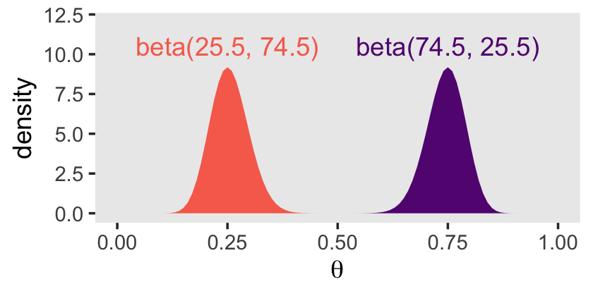

Note how we loaded the [**viridis** package](https://github.com/sjmgarnier/viridis) [@R-viridis]. That gave us access to the `viridis_pal()` function, which will allow us to discretize the viridis palettes and save the color names as objects. In our case, we discretized the `"A"` palette into nine colors and saved the fourth as `a_purple`. Here's the color name.


```r
a_purple
```

```
## [1] "#822681FF"
```

We'll use that color in many of the plots to follow. It'll be something of a signature color for this chapter.

Anyway, since we are going to be making a lot of plots like this in this chapter, we'll make another custom geom called `geom_marginal()`.


```r
geom_marginal <- function(ul, ...) {
  
  list(
    geom_ribbon(fill = viridis_pal(option = "A")(9)[4]),
    scale_x_continuous(expand = c(0, 0), limits = c(0, 1), breaks = 0:5 / 5),
    scale_y_continuous(expand = c(0, 0), limits = c(0, ul)),
    theme_cowplot(...),
    panel_border(),
    theme(axis.line = element_blank())
  )
  
}
```

Try it out.


```r
d %>%
  group_by(omega) %>% 
  summarise(prior = sum(prior)) %>% 
  
  ggplot(aes(x = omega, ymin = 0, ymax = prior)) +
  geom_marginal(ul = 0.035) +
  labs(x = expression(omega),
       y = expression(Marginal~p(omega))) +
  coord_flip()
```


We'll follow a similar procedure to get the marginal probability distribution for `theta`.


```r
d %>%
  group_by(theta) %>% 
  summarise(prior = sum(prior)) %>% 
  
  ggplot(aes(x = theta, ymin = 0, ymax = prior)) +
  geom_marginal(ul = 0.035) +
  labs(x = expression(theta),
       y = expression(Marginal~p(theta)))
```


We'll use the `filter()` function to take the two slices from the posterior grid. Since we're taking slices, we're no longer working with the joint probability distribution. As such, our two marginal prior distributions for `theta` no longer sum to 1, which means they're no longer in a probability metric. No worries. After we group by `omega`, we can simply divide `prior` by the `sum()` of `prior` which renormalizes the two slices "so that they are individually proper probability densities that sum to 1.0 over $\theta$" (p. 226).


```r
d %>% 
  filter(omega %in% c(.25, .75)) %>% 
  group_by(omega) %>% 
  mutate(prior = prior / sum(prior)) %>% 
  mutate(label = factor(str_c("omega==", omega), 
                        levels = c("omega==0.75", "omega==0.25"))) %>% 
  
  ggplot(aes(x = theta, ymin = 0, ymax = prior)) +
  geom_marginal(ul = 0.095) +
  labs(x = expression(theta),
       y = expression(p(theta*"|"*omega))) +
  facet_wrap(~label, ncol = 1, labeller = label_parsed)
```


As Kruschke pointed out at the top of page 228, these are indeed beta densities. Here's proof.


```r
# we'll want this for the annotation
text <-
  tibble(theta = c(.75, .25),
         y     = 10,
         label = c("beta(74.5, 25.5)", "beta(25.5, 74.5)"),
         omega = letters[1:2])

# here's the primary data for the plot
tibble(theta = rep(parameter_space, times = 2),
       alpha = rep(c(74.5, 25.5), each = 101),
       beta  = rep(c(25.5, 74.5), each = 101),
       omega = rep(letters[1:2],  each = 101)) %>%
  
  # the plot
  ggplot(aes(x = theta, fill = omega)) +
  geom_ribbon(aes(ymin = 0, ymax = dbeta(x = theta, shape1 = alpha, shape2 = beta))) +
  geom_text(data = text,
            aes(y = y, label = label, color = omega)) +
  scale_fill_viridis_d(option = "A", begin = 2/9, end = 6/9) +
  scale_color_viridis_d(option = "A", begin = 2/9, end = 6/9) +
  scale_x_continuous(expression(theta), expand = c(0, 0), limits = c(0, 1), 
                     breaks = 0:5 / 5) +
  scale_y_continuous("density", expand = c(0, 0), limits = c(0, 11)) +
  theme_cowplot() +
  panel_border() +
  theme(axis.line = element_blank(),
        legend.position = "none")
```


But back on track, we need the Bernoulli likelihood function for the lower three rows of Figure 9.2.


```r
bernoulli_likelihood <- function(theta, data) {
  n <- length(data)
  z <- sum(data)
  
  return(theta^z * (1 - theta)^(n - sum(data)))
}
```

Time to feed `theta` and our data into the `bernoulli_likelihood()` function, which will allow us to make the 2-dimensional density plot in the middle of Figure 9.2.


```r
# define the data
n <- 12
z <- 9

trial_data <- rep(0:1, times = c(n - z, z))

# compute the likelihood
d <-
  d %>% 
  mutate(likelihood = bernoulli_likelihood(theta = theta, 
                                           data  = trial_data))

# plot
d %>%
  ggplot(aes(x = theta, y = omega, fill = likelihood)) +
  geom_2dd() +
  labs(x = expression(theta),
       y = expression(omega))
```


Note how this plot demonstrates how the likelihood is solely dependent on $\theta$; it's orthogonal to $\omega$. This is the visual consequence of Kruschke's Formula 9.6,

\begin{align*}
p (\theta, \omega | y) & = \frac{p (y | \theta, \omega) \; p (\theta, \omega)}{p (y)} \\
                       & = \frac{p (y | \theta) \; p (\theta | \omega) \; p (\omega)}{p (y)}.
\end{align*}

That is, in the second line of the equation, the probability of $y$ was only conditional on $\theta$. But the reason we call this a hierarchical model is because the probability of $\theta$ itself is conditioned on $\omega$. The prior itself had a prior.

From Formula 9.1, the posterior $p(\theta, \omega | D)$ is proportional to $p(D | \theta) \; p(\theta | \omega) \; p(\omega)$. Divide that by the normalizing constant and we'll have it in a proper probability metric. Recall that we've already saved the results of $p(\theta | \omega) \; p(\omega)$ in the `prior` column. So we just need to multiply `prior` by `likelihood` and divide by their sum.

Our first depiction will be the middle panel of the second row from the bottom.


```r
d <-
  d %>% 
  mutate(posterior = (likelihood * prior) / sum(likelihood * prior)) 

d %>% 
  ggplot(aes(x = theta, y = omega, fill = posterior)) +
  geom_2dd() +
  labs(x = expression(theta),
       y = expression(omega))
```


Although the likelihood was orthogonal to $\omega$, conditioning the prior for $\theta$ on $\omega$ resulted in a posterior that was conditioned on both $\theta$ and $\omega$.

Making the marginal plots for `posterior` is much like when making them for `prior`, above.


```r
# for omega
d %>%
  group_by(omega) %>% 
  summarise(posterior = sum(posterior)) %>% 
  
  ggplot(aes(x = omega, ymin = 0, ymax = posterior)) +
  geom_marginal(ul = 0.035) +
  labs(x = expression(omega),
       y = expression(Marginal~p(omega*"|"*D))) +
  coord_flip()
```


```r
# for theta
d %>%
  group_by(theta) %>% 
  summarise(posterior = sum(posterior)) %>% 
  
  ggplot(aes(x = theta, ymin = 0, ymax = posterior)) +
  geom_marginal(ul = 0.035) +
  labs(x = expression(theta),
       y = expression(Marginal~p(theta*"|"*D))) +
  coord_cartesian()
```


Note that after we slice with `filter()`, the next two wrangling lines renormalize those posterior slices into probability metrics. That is, when we take a slice through the joint posterior at a particular value of $\omega$, and renormalize by dividing the sum of discrete probability masses in that slice, we get the conditional distribution $p(\theta | \omega, D)$.


```r
d %>% 
  filter(omega %in% c(.25, .75)) %>% 
  group_by(omega) %>% 
  mutate(posterior = posterior / sum(posterior)) %>% 
  mutate(label = factor(str_c("omega==", omega),
                        levels = c("omega==0.75", "omega==0.25"))) %>% 
  
  ggplot(aes(x = theta, ymin = 0, ymax = posterior)) +
  geom_marginal(ul = 0.1) +
  labs(x = expression(theta),
       y = expression(p(theta*"|"*omega))) +
  facet_wrap(~label, ncol = 1, labeller = label_parsed, scales = "free")
```


In the next example depicted in Figure 9.3, we consider what happens when we combine the same data of 9 heads out of 12 trials to the same Bernoulli likelihood $p(y | \theta)$, but his time with a much lower $K$ values expressing greater uncertainty in the $\operatorname{beta} \big (\theta | \omega (6 - 2) + 1, (1 - \omega) (6 - 2) + 1 \big )$ portion of the joint prior and with a more certain hyperprior for $\omega$, $\operatorname{beta}(\omega | 20, 20)$.

To repeat the process for Figure 9.3, we'll first compute the new joint prior.


```r
d <-
  crossing(theta = parameter_space,
           omega = parameter_space) %>%
  mutate(prior = make_prior(theta, omega, alpha = 20, beta = 20, kappa = 6)) %>% 
  mutate(prior = prior / sum(prior))
```

Here's the initial data and the 2-dimensional density plot for the prior, the middle plot in the top row of Figure 9.3.


```r
d %>% 
  ggplot(aes(x = theta, y = omega, fill = prior)) +
  geom_2dd() +
  labs(x = expression(theta),
       y = expression(omega))
```

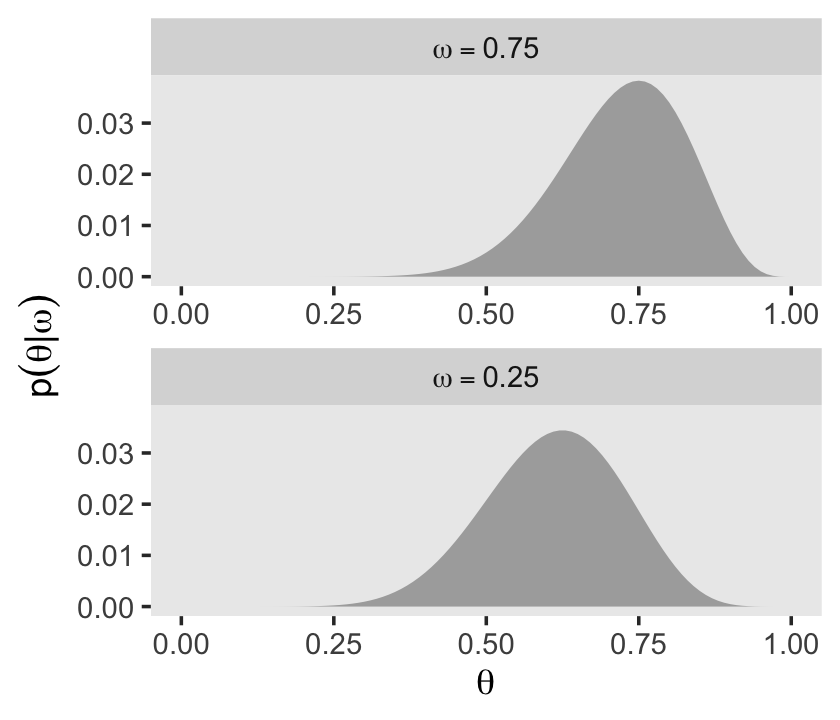

That higher certainty in $\omega$ resulted in a two-dimensional density plot where the values on the $y$-axis were concentrated near .5. This will have down-the-road consequences for the posterior. But before we get there, we'll average over `omega` and `theta` to plot their marginal prior distributions.


```r
# for omega
d %>%
  group_by(omega) %>% 
  summarise(prior = sum(prior)) %>% 
  
  ggplot(aes(x = omega, ymin = 0, ymax = prior)) +
  geom_marginal(ul = 0.052) +
  labs(x = expression(omega),
       y = expression(Marginal~p(omega))) +
  coord_flip()
```

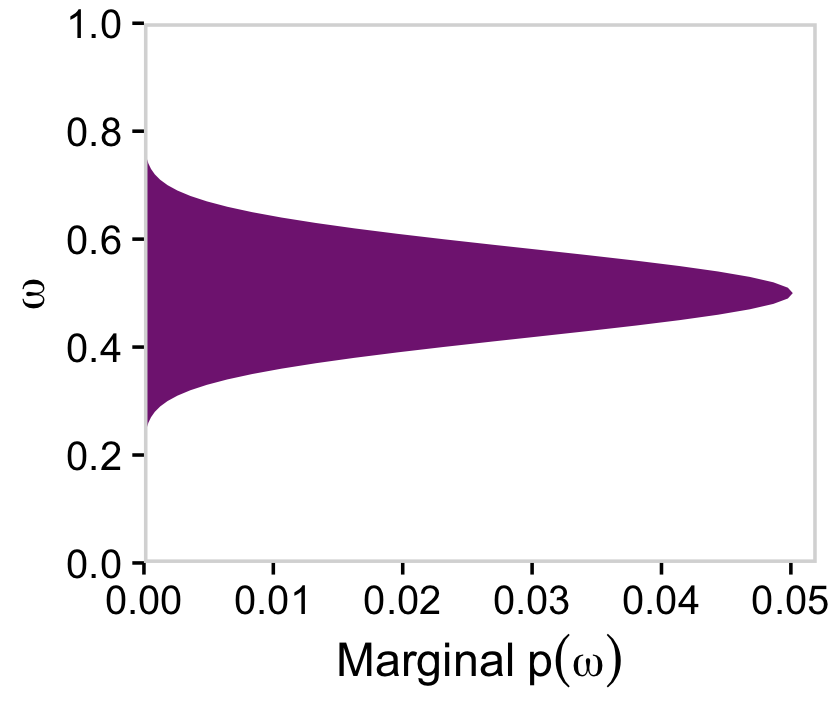

```r
# for theta
d %>%
  group_by(theta) %>% 
  summarise(prior = sum(prior)) %>% 
  
  ggplot(aes(x = theta, ymin = 0, ymax = prior)) +
  geom_marginal(ul = 0.039) +
  labs(x = expression(theta),
       y = expression(Marginal~p(theta)))
```

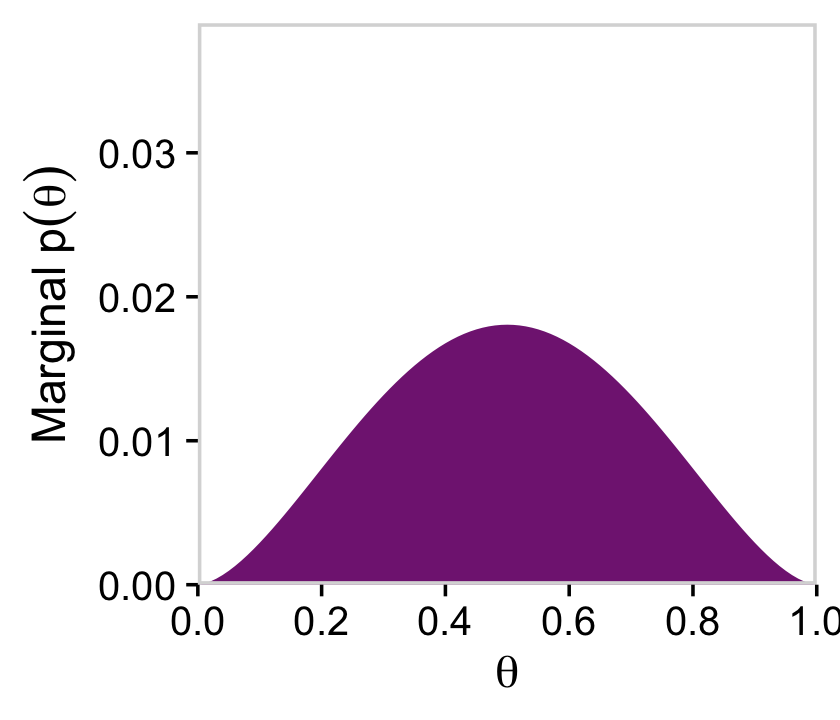

Here are the two short plots in the right panel of the second row from the top of Figure 9.3.


```r
d %>% 
  filter(omega %in% c(.25, .75)) %>% 
  group_by(omega) %>% 
  mutate(prior = prior / sum(prior)) %>% 
  mutate(label = factor(str_c("omega == ", omega), 
                        levels = c("omega == 0.75", "omega == 0.25"))) %>%
  
  ggplot(aes(x = theta, ymin = 0, ymax = prior)) +
  geom_marginal(ul = 0.039) +
  labs(x = expression(theta),
       y = expression(p(theta*"|"*omega))) +
  facet_wrap(~label, ncol = 1, labeller = label_parsed)
```


Now we're ready for the likelihood.


```r
# compute
d <-
  d %>% 
  mutate(likelihood = bernoulli_likelihood(theta = theta, 
                                           data  = trial_data))

# plot
d %>%
  ggplot(aes(x = theta, y = omega, fill = likelihood)) +
  geom_2dd() +
  labs(x = expression(theta),
       y = expression(omega))
```


Now on to the posterior. Our first depiction will be the middle panel of the second row from the bottom of Figure 9.3. This will be $p(\theta, \omega | y)$.


```r
# compute the posterior
d <-
  d %>% 
  mutate(posterior = (likelihood * prior) / sum(likelihood * prior)) 

# plot
d %>% 
  ggplot(aes(x = theta, y = omega, fill = posterior)) +
  geom_2dd() +
  labs(x = expression(theta),
       y = expression(omega))
```

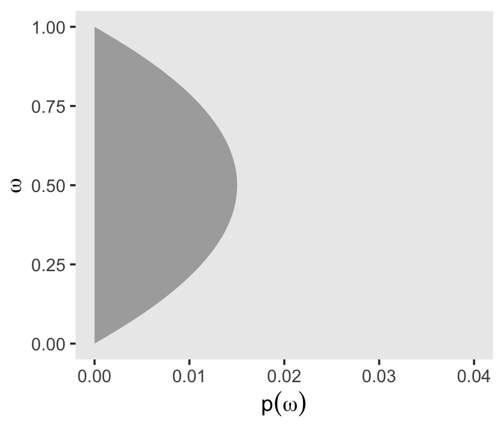

Here are the marginal plots for the two dimensions in our `posterior`.


```r
# for omega
d %>%
  group_by(omega) %>% 
  summarise(posterior = sum(posterior)) %>% 
  
  ggplot(aes(x = omega, ymin = 0, ymax = posterior)) +
  geom_marginal(ul = 0.052) +
  labs(x = expression(omega),
       y = expression(Marginal~p(omega*"|"*D))) +
  coord_flip()
```


```r
# for theta
d %>%
  group_by(theta) %>% 
  summarise(posterior = sum(posterior)) %>% 
  
  ggplot(aes(x = theta, ymin = 0, ymax = posterior)) +
  geom_marginal(ul = 0.039) +
  labs(x = expression(theta),
       y = expression(Marginal~p(theta*"|"*D)))
```


And we'll finish off with the plots of Figure 9.3's lower right panel.


```r
d %>% 
  filter(omega %in% c(.25, .75)) %>% 
  group_by(omega) %>% 
  mutate(posterior = posterior / sum(posterior)) %>% 
  mutate(label = factor(str_c("omega==", omega),
                        levels = c("omega==0.75", "omega==0.25"))) %>%
  
  ggplot(aes(x = theta, ymin = 0, ymax = posterior)) +
  geom_marginal(ul = 0.039) +
  labs(x = expression(theta),
       y = expression(p(theta*"|"*omega))) +
  facet_wrap(~label, ncol = 1, labeller = label_parsed, scales = "free")
```


> In summary, Bayesian inference in a hierarchical model is merely Bayesian inference on a joint parameter space, but we look at the joint distribution (e.g., $p(\theta, \omega)$) in terms of its marginal on a subset of parameters (e.g., $p(\omega)$) and its conditional distribution for other parameters (e.g., p$p(\theta | \omega)$. We do this primarily because it is meaningful in the context of particular models. (p. 230)

## Multiple coins from a single mint

> What if we collect data from more than one coin created by the mint? If each coin has its own distinct bias $\theta_s$, then we are estimating a distinct parameter value for each coin, and using all the data to estimate $\omega$. (p. 230)

Kruschke broke down a model of this form with his diagram in Figure 9.4. Here's our version of that figure.


```r
p1 <-
  tibble(x = seq(from = .01, to = .99, by = .01),
       d = (dbeta(x, 2, 2)) / max(dbeta(x, 2, 2))) %>% 
  ggplot(aes(x = x, ymin = 0, ymax = d)) +
  geom_ribbon(fill = a_purple, size = 0) +
  annotate(geom = "text",
           x = .5, y = .2,
           label = "beta",
           size = 7) +
  annotate(geom = "text",
           x = .5, y = .6,
           label = "italic(A[omega])*', '*italic(B[omega])", 
           size = 7, family = "Times", parse = TRUE) +
  scale_x_continuous(expand = c(0, 0)) +
  theme_void() +
  theme(axis.line.x = element_line(size = 0.5))

p2 <-
  tibble(x = c(.5, .475, .26, .08, .06,
               .5, .55, .85, 1.15, 1.2),
         y = c(1, .7, .6, .5, .2,
               1, .7, .6, .5, .2),
         line = rep(letters[2:1], each = 5)) %>% 
  
  ggplot(aes(x = x, y = y)) +
  geom_bspline(aes(color = line),
               size = 2/3, show.legend = F) + 
  annotate(geom = "text",
           x = 0, y = .125,
           label = "omega(italic(K)-2)+1*', '*(1-omega)(italic(K)-2)+1",
           size = 7, parse = T, family = "Times", hjust = 0) +
  annotate(geom = "text",
           x = 1/3, y = .7,
           label = "'~'",
           size = 10, parse = T, family = "Times") +
  scale_color_manual(values = c("grey75", "black")) +
  scale_x_continuous(expand = c(0, 0), limits = c(0, 2)) +
  ylim(0, 1) +
  theme_void()

p3 <-
  tibble(x = seq(from = .01, to = .99, by = .01),
         d = (dbeta(x, 2, 2)) / max(dbeta(x, 2, 2))) %>% 
  ggplot(aes(x = x, ymin = 0, ymax = d)) +
  geom_ribbon(fill = a_purple, size = 0) +
  annotate(geom = "text",
           x = .5, y = .2,
           label = "beta",
           size = 7) +
  scale_x_continuous(expand = c(0, 0)) +
  theme_void() +
  theme(axis.line.x = element_line(size = 0.5))

# an annotated arrow
p4 <-
  tibble(x     = c(.35, .65),
         y     = c(1/3, 1/3),
         label = c("'~'", "italic(s)")) %>% 
  
  ggplot(aes(x = x, y = y, label = label)) +
  geom_text(size = c(10, 7), parse = T, family = "Times") +
  geom_segment(x = .5, xend = .5,
               y = 1, yend = 0,
               arrow = my_arrow) +
  xlim(0, 1) +
  theme_void()

# bar plot of Bernoulli data
p5 <-
  tibble(x = 0:1,
         d = (dbinom(x, size = 1, prob = .6)) / max(dbinom(x, size = 1, prob = .6))) %>% 
  
  ggplot(aes(x = x, y = d)) +
  geom_col(fill = a_purple, width = .4) +
  annotate(geom = "text",
           x = .5, y = .2,
           label = "Bernoulli",
           size = 7) +
  annotate(geom = "text",
           x = .5, y = .92,
           label = "theta[italic(s)]", 
           size = 7, family = "Times", parse = T) +
  xlim(-.75, 1.75) +
  theme_void() +
  theme(axis.line.x = element_line(size = 0.5))

# another annotated arrow
p6 <-
  tibble(x     = c(.35, .65),
         y     = c(1/3, 1/3),
         label = c("'~'", "italic(i)*'|'*italic(s)")) %>% 
  
  ggplot(aes(x = x, y = y, label = label)) +
  geom_text(size = c(10, 7), parse = T, family = "Times") +
  geom_segment(x = .5, xend = .5,
               y = 1, yend = 0,
               arrow = my_arrow) +
  xlim(0, 1) +
  theme_void()

# some text
p7 <-
  tibble(x     = 1,
         y     = .5,
         label = "italic(y)[italic(i)*'|'*italic(s)]") %>% 
  
  ggplot(aes(x = x, y = y, label = label)) +
  geom_text(size = 7, parse = T, family = "Times") +
  xlim(0, 2) +
  theme_void()

# define the layout
layout <- c(
  area(t = 1, b = 2, l = 1, r = 1),
  area(t = 4, b = 5, l = 1, r = 1),
  area(t = 3, b = 4, l = 1, r = 2),
  area(t = 6, b = 6, l = 1, r = 1),
  area(t = 7, b = 8, l = 1, r = 1),
  area(t = 9, b = 9, l = 1, r = 1),
  area(t = 10, b = 10, l = 1, r = 1)
)

# plot!
(p1 + p3 + p2 + p4 + p5 + p6 + p7) + 
  plot_layout(design = layout) &
  ylim(0, 1) &
  theme(plot.margin = margin(0, 5.5, 0, 5.5))
```


The diagram accounts for multiple coins with the $s$ index.

### Posterior via grid approximation.

Now we have two coins,

> the full prior distribution is a joint distribution over three parameters: $\omega$, $\theta_1$, and $\theta_2$. In a grid approximation, the prior is specified as a three-dimensional (3D) array that holds the prior probability at various grid points in the 3D space. (p. 233)

The biases for both coins, $\theta_1$, and $\theta_2$, have the same prior $\operatorname{beta}\big (\theta _j| \omega (5 - 2) + 1, (1 - \omega)(5 - 2) + 1 \big) $, which, if it's not apparent, is marked by the rather uncertain $K = 5$. As in our first example depicted in Figure 9.2, we have a gentle hyperprior $\operatorname{beta}(\omega | 2, 2)$, which centers the posterior mode for $\omega$ at .5. To express this in plots, we're going to have to update our `make_prior()` function. It was originally designed to handle two dimensions, $\theta$ and $\omega$. But now we have to update it to handle our three dimensions.


```r
make_prior <- function(theta1, theta2, omega, alpha, beta, kappa) {
  
  # p(theta_1 | omega)
  t1 <- dbeta(x = theta1,
             shape1 =      omega  * (kappa - 2) + 1,
             shape2 = (1 - omega) * (kappa - 2) + 1)
  
  # p(theta_2 | omega)
  t2 <- dbeta(x = theta2,
             shape1 =      omega  * (kappa - 2) + 1,
             shape2 = (1 - omega) * (kappa - 2) + 1)
  
  # p(omega)
  o <- dbeta(x = omega,
             shape1 = alpha,
             shape2 = beta)
  
  # p(theta1, theta2, omega) = p(theta1 | omega) * p(theta2 | omega) * p(omega)
  return(t1 * t2 * o)
  
}
```

Let's make our new data object, `d`.


```r
d <-
  crossing(theta_1 = parameter_space,
           theta_2 = parameter_space,
           omega   = parameter_space) %>%
  mutate(prior = make_prior(theta_1, theta_2, omega, alpha = 2, beta = 2, kappa = 5)) %>% 
  # here we normalize
  mutate(prior = prior / sum(prior))

glimpse(d)
```

```
## Rows: 1,030,301
## Columns: 4
## $ theta_1 <dbl> 0, 0, 0, 0, 0, 0, 0, 0, 0, 0, 0, 0, 0, 0, 0, 0, 0, 0, 0, 0, 0…
## $ theta_2 <dbl> 0, 0, 0, 0, 0, 0, 0, 0, 0, 0, 0, 0, 0, 0, 0, 0, 0, 0, 0, 0, 0…
## $ omega   <dbl> 0.00, 0.01, 0.02, 0.03, 0.04, 0.05, 0.06, 0.07, 0.08, 0.09, 0…
## $ prior   <dbl> 0, 0, 0, 0, 0, 0, 0, 0, 0, 0, 0, 0, 0, 0, 0, 0, 0, 0, 0, 0, 0…
```

Unlike what Kruschke said in the text, we're not using a 3D data array. Rather, we're just using a tibble with which `prior` has been expanded across all possible dimensions of the three indexing variables: `theta_1`, `theta_2`, and `omega`. As you can see from the 'Rows' count, above, this makes for a very long tibble.

"Because the parameter space is 3D, a distribution on it cannot easily be displayed on a 2D page. Instead, Figure 9.5 shows various marginal distributions" (p. 234). The consequence of that is when we marginalize, we'll have to group by the two variables we'd like to retain for the plot. For example, the plots in the left and middle columns of the top row are the same save for their indices. So let's just do the plot for `theta_1`. In order to marginalize over `theta_2`, we'll need to `group_by(theta_1, omega)` and then `summarise(prior = sum(prior))`.


```r
d %>% 
  group_by(theta_1, omega) %>% 
  summarise(prior = sum(prior)) %>% 

  ggplot(aes(x = theta_1, y = omega, fill = prior)) +
  geom_2dd() +
  labs(x = expression(theta[1]),
       y = expression(omega))
```


But we just have to average over `omega` and `theta_1` to plot their marginal prior distributions.


```r
# for omega
d %>%
  group_by(omega) %>% 
  summarise(prior = sum(prior)) %>% 
  
  ggplot(aes(x = omega, ymin = 0, ymax = prior)) +
  geom_marginal(ul = 0.041) +
  labs(x = expression(omega),
       y = expression(p(omega))) +
  coord_flip()
```


```r
# for theta
d %>%
  group_by(theta_1) %>% 
  summarise(prior = sum(prior)) %>% 

  ggplot(aes(x = theta_1, ymin = 0, ymax = prior)) +
  geom_marginal(ul = 0.041) +
  labs(x = expression(theta[1]),
       y = expression(p(theta[1])))
```


Before we make the plots in the middle row of Figure 9.5, we need to add the likelihoods. Recall that we're presuming the coin flips contained in $D_1$ and $D_2$ are independent. Kruschke explained in [Section 7.4.1][Prior, likelihood and posterior for two biases.], that

> independence of the data across the two coins means that the data from coin 1 depend only on the bias in coin 1, and the data from coin 2 depend only on the bias in coin 2, which can be expressed formally as $p(y_1 | \theta_1, \theta_2) = p(y_1 | \theta_1)$ and $p(y_2 | \theta_1, \theta_2) = p(y_2 | \theta_2)$. (p. 164)

The likelihood function for our two series of coin flips is then

$$p(D | \theta_1, \theta_2) = \left ( \theta_1^{z_1} (1 - \theta_1) ^ {N_1 - z_1} \right ) \left ( \theta_2^{z_2} (1 - \theta_2) ^ {N_2 - z_2} \right ).$$

The upshot is we can compute the likelihoods for $D_1$ and $D_2$ separately and just multiply them together.


```r
# D1: 3 heads, 12 tails
n <- 15
z <- 3

trial_data_1 <- rep(0:1, times = c(n - z, z))

# D2: 4 heads, 1 tail
n <- 5
z <- 4

trial_data_2 <- rep(0:1, times = c(n - z, z))
d <-
  d %>% 
  mutate(likelihood_1 = bernoulli_likelihood(theta = theta_1, data = trial_data_1),
         likelihood_2 = bernoulli_likelihood(theta = theta_2, data = trial_data_2)) %>% 
  mutate(likelihood = likelihood_1 * likelihood_2)

head(d)
```

```
## # A tibble: 6 x 7
##   theta_1 theta_2 omega prior likelihood_1 likelihood_2 likelihood
##     <dbl>   <dbl> <dbl> <dbl>        <dbl>        <dbl>      <dbl>
## 1       0       0  0        0            0            0          0
## 2       0       0  0.01     0            0            0          0
## 3       0       0  0.02     0            0            0          0
## 4       0       0  0.03     0            0            0          0
## 5       0       0  0.04     0            0            0          0
## 6       0       0  0.05     0            0            0          0
```

Now after a little `group_by()` followed by `summarise()` we can plot the two marginal likelihoods, the two plots in the middle row of Figure 9.5.


```r
# likelihood_1
d %>%
  group_by(theta_1, omega) %>% 
  summarise(likelihood = sum(likelihood)) %>% 
  
  ggplot(aes(x = theta_1, y = omega, fill = likelihood)) +
  geom_2dd() +
  labs(x = expression(theta[1]),
       y = expression(omega))
```


```r
# likelihood_2
d %>%
  group_by(theta_2, omega) %>% 
  summarise(likelihood = sum(likelihood)) %>% 
  
  ggplot(aes(x = theta_2, y = omega, fill = likelihood)) +
  geom_2dd() +
  labs(x = expression(theta[2]),
       y = expression(omega))
```


The likelihoods look good. Next we compute the posterior in the same way we've done before: multiply the prior and the likelihood and then divide by their sum in order to convert the results to a probability metric.


```r
# compute
d <-
  d %>% 
  mutate(posterior = (prior * likelihood) / sum(prior * likelihood))

# posterior_1
d %>% 
  group_by(theta_1, omega) %>% 
  summarise(posterior = sum(posterior)) %>% 
  
  ggplot(aes(x = theta_1, y = omega, fill = posterior)) +
  geom_2dd() +
  labs(x = expression(theta[1]),
       y = expression(omega))
```


```r
# posterior_2
d %>% 
  group_by(theta_2, omega) %>% 
  summarise(posterior = sum(posterior)) %>%
  
  ggplot(aes(x = theta_2, y = omega, fill = posterior)) +
  geom_2dd() +
  labs(x = expression(theta[2]),
       y = expression(omega))
```

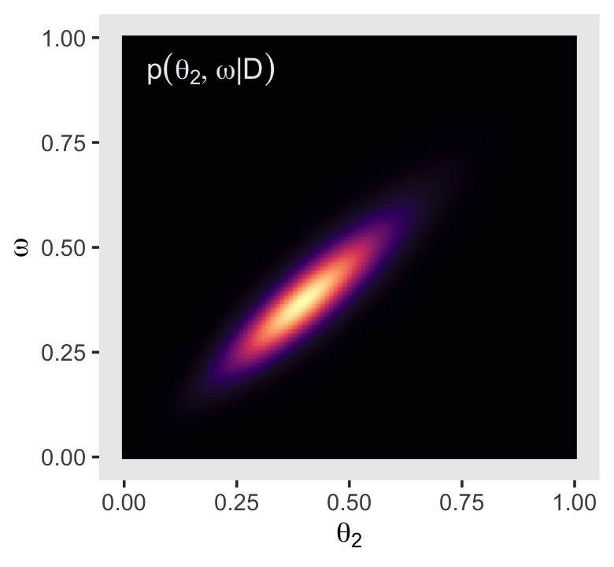

Here's the right plot on the second row from the bottom, the posterior distribution for $\omega$.


```r
# for omega
d %>%
  group_by(omega) %>% 
  summarise(posterior = sum(posterior)) %>%
  
  ggplot(aes(x = omega, ymin = 0, ymax = posterior)) +
  geom_marginal(ul = 0.041) +
  labs(x = expression(omega),
       y = expression(p(omega*"|"*D))) +
  coord_flip()
```


Now here are the marginal posterior plots on the bottom row of Figure 9.5.


```r
# for theta_1
d %>%
  group_by(theta_1) %>% 
  summarise(posterior = sum(posterior)) %>% 
  
  ggplot(aes(x = theta_1, ymin = 0, ymax = posterior)) +
  geom_marginal(ul = 0.041) +
  labs(x = expression(theta[1]),
       y = expression(p(theta[1]*"|"*D)))
```


```r
# for theta_2
d %>%
  group_by(theta_2) %>% 
  summarise(posterior = sum(posterior)) %>% 
  
  ggplot(aes(x = theta_2, ymin = 0, ymax = posterior)) +
  geom_marginal(ul = 0.041) +
  labs(x = expression(theta[2]),
       y = expression(p(theta[2]*"|"*D)))
```

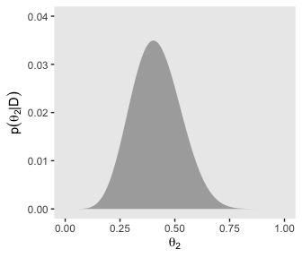

We'll do this dog and pony one more time for Figure 9.6. Keeping the data and likelihood constant, we now set $K = 75$ and but retain both $A_\omega = 2$ and $B_\omega = 2$. First, we make our new data object, `d`.


```r
d <-
  crossing(theta_1 = parameter_space,
           theta_2 = parameter_space,
           omega   = parameter_space) %>%
  mutate(prior = make_prior(theta_1, theta_2, omega, alpha = 2, beta = 2, kappa = 75)) %>% 
  mutate(prior = prior / sum(prior))
```

Again, note how the only thing we changed from the last time was increasing `kappa` to 75. Also like last time, the plots in the left and middle columns of the top row are the same save for their indices. But unlike last time, we'll make both in preparation for a grand plotting finale. You'll see.

One more step: for the 2D density plots in this section, we'll omit the `coord_equal()` line from our custom `geom_2dd()` geom. This will help us with the formatting of our final plot.


```r
geom_2dd <- function(...) {
  
  list(
    geom_raster(interpolate = T),
    scale_fill_viridis_c(option = "A"),
    scale_x_continuous(expand = c(0, 0), limits = c(0, 1), breaks = 0:5 / 5),
    scale_y_continuous(expand = c(0, 0), limits = c(0, 1), breaks = 0:5 / 5),
    # coord_equal(),
    theme_minimal_grid(...),
    theme(legend.position = "none")
  )
  
}
```

Okay, here are our two 2D prior density plots.


```r
p11 <-
  d %>% 
  group_by(theta_1, omega) %>% 
  summarise(prior = sum(prior)) %>% 
  ggplot(aes(x = theta_1, y = omega, fill = prior)) +
  geom_2dd(font_size = 10) +
  annotate(geom = "text", x = .05, y = .925, 
           label = "p(list(theta[1], omega))", 
           parse = T, color = "white", hjust = 0) +
  labs(x = expression(theta[1]),
       y = expression(omega))

p12 <-
  d %>% 
  group_by(theta_2, omega) %>% 
  summarise(prior = sum(prior)) %>% 
  ggplot(aes(x = theta_2, y = omega, fill = prior)) +
  geom_2dd(font_size = 10) +
  annotate(geom = "text", x = .05, y = .925, 
           label = "p(list(theta[2], omega))", 
           parse = T, color = "white", hjust = 0) +
  labs(x = expression(theta[2]),
       y = expression(omega))

p11
```


```r
p12
```


Now we'll average over `omega` and `theta` to plot their marginal prior distributions.


```r
# for omega
p13 <-
  d %>%
  group_by(omega) %>% 
  summarise(prior = sum(prior)) %>% 
  
  ggplot(aes(x = omega, ymin = 0, ymax = prior)) +
  geom_marginal(ul = 0.041, font_size = 10) +
  labs(x = expression(omega),
       y = expression(p(omega))) +
  coord_flip()

# for theta_1
p21 <-
  d %>%
  group_by(theta_1) %>% 
  summarise(prior = sum(prior)) %>% 

  ggplot(aes(x = theta_1, ymin = 0, ymax = prior)) +
  geom_marginal(ul = 0.041, font_size = 10) +
  labs(x = expression(theta[1]),
       y = expression(p(theta[1])))

# for theta_2
p22 <-
  d %>%
  group_by(theta_2) %>% 
  summarise(prior = sum(prior)) %>% 

  ggplot(aes(x = theta_2, ymin = 0, ymax = prior)) +
  geom_marginal(ul = 0.041, font_size = 10) +
  labs(x = expression(theta[2]),
       y = expression(p(theta[2])))

p13
```

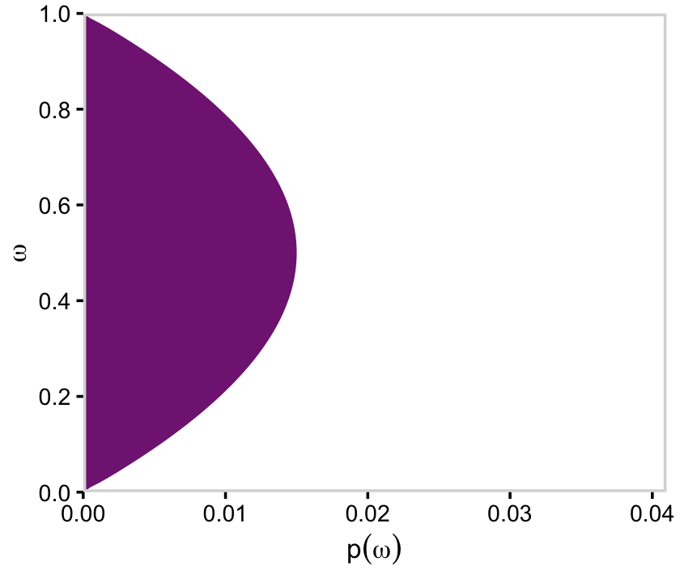

```r
p21
```


```r
p22
```


Let's get those likelihoods in there and plot.


```r
# D1: 3 heads, 12 tails
n <- 15
z <- 3

trial_data_1 <- rep(0:1, times = c(n - z, z))

# D2: 4 heads, 1 tail
n <- 5
z <- 4

trial_data_2 <- rep(0:1, times = c(n - z, z))

# compute the likelihoods
d <-
  d %>% 
  mutate(likelihood_1 = bernoulli_likelihood(theta = theta_1, data = trial_data_1),
         likelihood_2 = bernoulli_likelihood(theta = theta_2, data = trial_data_2)) %>% 
  mutate(likelihood = likelihood_1 * likelihood_2)

# plot likelihood_1
p31 <-
  d %>%
  group_by(theta_1, omega) %>% 
  summarise(likelihood = sum(likelihood)) %>% 
  
  ggplot(aes(x = theta_1, y = omega, fill = likelihood)) +
  geom_2dd(font_size = 10) +
  labs(x = expression(theta[1]),
       y = expression(omega))

# plot likelihood_2
p32 <-
  d %>%
  group_by(theta_2, omega) %>% 
  summarise(likelihood = sum(likelihood)) %>% 
  
  ggplot(aes(x = theta_2, y = omega, fill = likelihood)) +
  geom_2dd(font_size = 10) +
  labs(x = expression(theta[2]),
       y = expression(omega))

p31
```


```r
p32
```


Compute the posterior and make the left and middle plots of the second row to the bottom of Figure 9.6.


```r
d <-
  d %>% 
  mutate(posterior = (prior * likelihood) / sum(prior * likelihood))

# posterior_1
p41 <-
  d %>% 
  group_by(theta_1, omega) %>% 
  summarise(posterior = sum(posterior)) %>% 
  
  ggplot(aes(x = theta_1, y = omega, fill = posterior)) +
  geom_2dd(font_size = 10) +
  annotate(geom = "text", x = .05, y = .925, 
           label = expression(p(list(theta[1], omega)*"|"*D)), 
           parse = T, color = "white", hjust = 0) +
  labs(x = expression(theta[1]),
       y = expression(omega))

# posterior_2
p42 <-
  d %>% 
  group_by(theta_2, omega) %>% 
  summarise(posterior = sum(posterior)) %>%
  
  ggplot(aes(x = theta_2, y = omega, fill = posterior)) +
  geom_2dd(font_size = 10) +
  annotate(geom = "text", x = .05, y = .925, 
           label = expression(p(list(theta[2], omega)*"|"*D)), 
           parse = T, color = "white", hjust = 0) +
  labs(x = expression(theta[2]),
       y = expression(omega))

p41
```


```r
p42
```


Here's the right plot on the same row, the posterior distribution for $\omega$.


```r
# for omega
p43 <-
  d %>%
  group_by(omega) %>% 
  summarise(posterior = sum(posterior)) %>% 
  
  ggplot(aes(x = omega, ymin = 0, ymax = posterior)) +
  geom_marginal(ul = 0.041, font_size = 10) +
  labs(x = expression(omega),
       y = expression(p(omega*"|"*D))) +
  coord_flip()

p43
```

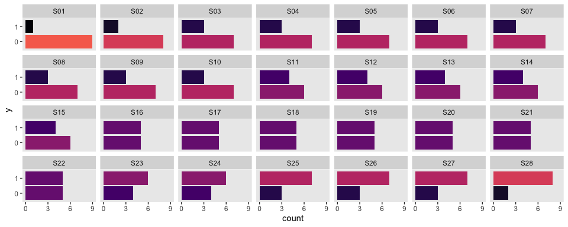

Finally, here are the marginal posterior plots on the bottom row of Figure 9.6.


```r
# for theta_1
p51 <-
  d %>%
  group_by(theta_1) %>% 
  summarise(posterior = sum(posterior)) %>% 
  
  ggplot(aes(x = theta_1, ymin = 0, ymax = posterior)) +
  geom_marginal(ul = 0.041, font_size = 10) +
  labs(x = expression(theta[1]),
       y = expression(p(theta[1]*"|"*D)))

# for theta_2
p52 <-
  d %>%
  group_by(theta_2) %>% 
  summarise(posterior = sum(posterior)) %>% 
  
  ggplot(aes(x = theta_2, ymin = 0, ymax = posterior)) +
  geom_marginal(ul = 0.041, font_size = 10) +
  labs(x = expression(theta[2]),
       y = expression(p(theta[2]*"|"*D)))

p51
```


```r
p52
```

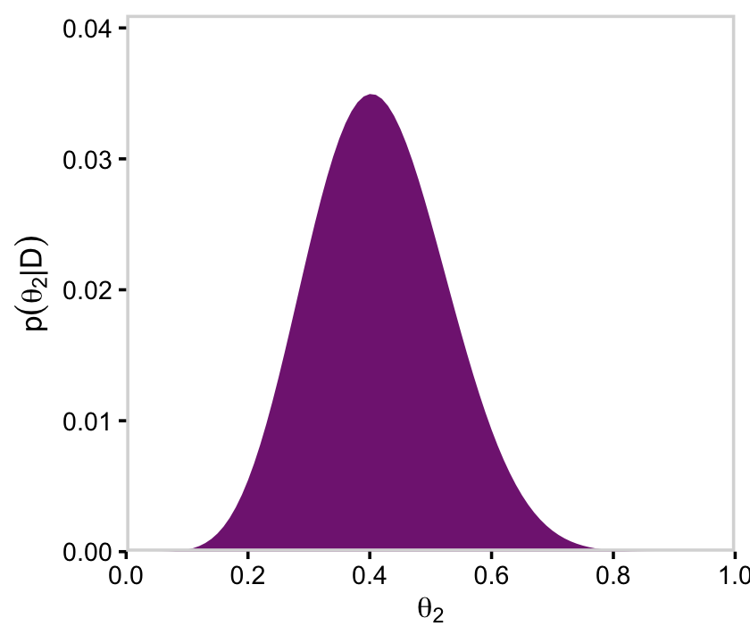

Did you notice how we saved each of plot from this last batch as objects? For our grand finale for this subsection, we'll be stitching all those subplots together using syntax from the **patchwork** package. But before we do, we need to define three more subplots: the subplots with the annotation.


```r
text <-
  tibble(x = 1,
         y = 10:8,
         label = c("Prior", "list(A[omega]==2, B[omega]==2)", "K==75"),
         size = c(2, 1, 1))

p23 <-
  text %>% 
  ggplot(aes(x = x, y = y, label = label)) +
  geom_text(aes(size = size), 
            parse = T, hjust = 0, show.legend = F) +
  scale_size_continuous(range = c(3.5, 5.5)) +
  coord_cartesian(xlim = c(1, 2),
                  ylim = c(4, 11)) +
  theme_cowplot(font_size = 10) +
  theme(axis.line = element_blank(),
        axis.text = element_text(color = "white"),
        axis.ticks = element_blank(),
        text = element_text(color = "white"))

text <-
  tibble(x = 1,
         y = 10:8,
         label = c("Likelihood", "D1: 3 heads, 12 tails", "D2: 4 heads, 1 tail"),
         size = c(2, 1, 1))

p33 <-
  text %>% 
  ggplot(aes(x = x, y = y, label = label)) +
  geom_text(aes(size = size), 
            hjust = 0, show.legend = F) +
  scale_size_continuous(range = c(3.5, 5.5)) +
  coord_cartesian(xlim = c(1, 2),
                  ylim = c(4, 11)) +
  theme_cowplot(font_size = 10) +
  theme(axis.line = element_blank(),
        axis.text = element_text(color = "white"),
        axis.ticks = element_blank(),
        text = element_text(color = "white"))

p53 <-
  ggplot() +
  annotate(geom = "text", x = 1, y = 10, 
           label = "Posterior", size = 6, hjust = 0) +
  coord_cartesian(xlim = c(1, 2),
                  ylim = c(3, 11)) +
  theme_cowplot(font_size = 10) +
  theme(axis.line = element_blank(),
        axis.text = element_text(color = "white"),
        axis.ticks = element_blank(),
        text = element_text(color = "white"))
```

Okay, let's make the full version of Figure 9.6.


```r
(p11 / p21 / p31 / p41 / p51) | (p12 / p22 / p32 / p42 / p52) | (p13 / p23 / p33 / p43 / p53)
```


Oh mamma!

> The grid approximation displayed in Figures 9.5 and 9.6 used combs of only [101] points on each parameter ($\omega$, $\theta_1$, and $\theta_2$). This means that the 3D grid had [101^3^ = 1,030,301] points, which is a size that can be handled easily on an ordinary desktop computer of the early 21st century. It is interesting to remind ourselves that the grid approximation displayed in Figures 9.5 and 9.6 would have been on the edge of computability 50 years ago, and would have been impossible 100 years ago. The number of points in a grid approximation can get hefty in a hurry. If we were to expand the example by including a third coin, with its parameter $\theta_3$, then the grid would have [101^4^ = 104,060,401] points, which already strains small computers. Include a fourth coin, and the grid contains over [10 billion] points. Grid approximation is not a viable approach to even modestly large problems, which we encounter next. (p. 235)

In case you didn't catch it, we used different numbers of points to evaluate each parameter. Whereas Kruschke indicated in the text he only used 50, we used 101. That value of 101 came from how we defined our `parameter_space` with the code `seq(from = 0, to = 1, by = .01)`. The reason we used a more densely-packed parameter space was to get smoother-looking 2D density plots.

### A realistic model with MCMC.

In this section, Kruschke freed up the previously fixed value of $K$, now letting $\kappa$ vary hierarchically with a gamma prior. He depicted the model in Figure 9.7. Here's our version of the figure.


```r
# a beta density
p1 <-
  tibble(x = seq(from = .01, to = .99, by = .01),
         d = (dbeta(x, 2, 2)) / max(dbeta(x, 2, 2))) %>% 
  ggplot(aes(x = x, ymin = 0, ymax = d)) +
  geom_ribbon(fill = a_purple, size = 0) +
  annotate(geom = "text",
           x = .5, y = .2,
           label = "beta",
           size = 7) +
  annotate(geom = "text",
           x = .5, y = .6,
           label = "italic(A[omega])*', '*italic(B[omega])", 
           size = 7, family = "Times", parse = TRUE) +
  scale_x_continuous(expand = c(0, 0)) +
  theme_void() +
  theme(axis.line.x = element_line(size = 0.5))

# a gamma density
p2 <-
  tibble(x = seq(from = 0, to = 5, by = .01),
         d = (dgamma(x, 1.75, .85) / max(dgamma(x, 1.75, .85)))) %>% 
  ggplot(aes(x = x, ymin = 0, ymax = d)) +
  geom_ribbon(fill = a_purple, size = 0) +
  annotate(geom = "text",
           x = 2.5, y = .2,
           label = "gamma",
           size = 7) +
  annotate(geom = "text",
           x = 2.5, y = .6,
           label = "list(italic(S)[kappa], italic(R)[kappa])",
           size = 7, family = "Times", parse = TRUE) +
  scale_x_continuous(expand = c(0, 0)) +
  theme_void() +
  theme(axis.line.x = element_line(size = 0.5))

p3 <-
  tibble(x = c(.5, .475, .26, .08, .06,
               .5, .55, .85, 1.15, 1.175,
               1.5, 1.4, 1, .25, .2,
               1.5, 1.49, 1.445, 1.4, 1.39),
         y = c(1, .7, .6, .5, .2,
               1, .7, .6, .5, .2,
               1, .7, .6, .5, .2,
               1, .75, .6, .45, .2),
         line = rep(letters[2:1], each = 5) %>% rep(., times = 2),
         plot = rep(1:2, each = 10)) %>% 
  
  ggplot(aes(x = x, y = y, group = interaction(plot, line))) +
  geom_bspline(aes(color = line),
               size = 2/3, show.legend = F) + 
  annotate(geom = "text",
           x = 0, y = .1,
           label = "omega(kappa-2)+1*', '*(1-omega)(kappa-2)+1",
           size = 7, parse = T, family = "Times", hjust = 0) +
  annotate(geom = "text",
           x = c(1/3, 1.15), y = .7,
           label = "'~'",
           size = 10, parse = T, family = "Times") +
  scale_color_manual(values = c("grey75", "black")) +
  scale_x_continuous(expand = c(0, 0), limits = c(0, 2)) +
  ylim(0, 1) +
  theme_void()

# another beta density
p4 <-
  tibble(x = seq(from = .01, to = .99, by = .01),
         d = (dbeta(x, 2, 2)) / max(dbeta(x, 2, 2))) %>% 
  ggplot(aes(x = x, ymin = 0, ymax = d)) +
  geom_ribbon(fill = a_purple, size = 0) +
  annotate(geom = "text",
           x = .5, y = .2,
           label = "beta",
           size = 7) +
  scale_x_continuous(expand = c(0, 0)) +
  theme_void() +
  theme(axis.line.x = element_line(size = 0.5))

# an annotated arrow
p5 <-
  tibble(x     = c(.375, .625),
         y     = c(1/3, 1/3),
         label = c("'~'", "italic(s)")) %>% 
  
  ggplot(aes(x = x, y = y, label = label)) +
  geom_text(size = c(10, 7), parse = T, family = "Times") +
  geom_segment(x = 0.5, xend = 0.5,
               y = 1, yend = 0,
               arrow = my_arrow) +
  xlim(0, 1) +
  theme_void()

# bar plot of Bernoulli data
p6 <-
  tibble(x = 0:1,
         d = (dbinom(x, size = 1, prob = .6)) / max(dbinom(x, size = 1, prob = .6))) %>% 
  
  ggplot(aes(x = x, y = d)) +
  geom_col(fill = a_purple, width = .4) +
  annotate(geom = "text",
           x = .5, y = .2,
           label = "Bernoulli",
           size = 7) +
  annotate(geom = "text",
           x = .5, y = .94,
           label = "theta", 
           size = 7, family = "Times", parse = T) +
  xlim(-.75, 1.75) +
  theme_void() +
  theme(axis.line.x = element_line(size = 0.5))

# another annotated arrow
p7 <-
  tibble(x     = c(.35, .65),
         y     = c(1/3, 1/3),
         label = c("'~'", "italic(i)*'|'*italic(s)")) %>% 
  
  ggplot(aes(x = x, y = y, label = label)) +
  geom_text(size = c(10, 7), parse = T, family = "Times") +
  geom_segment(x = .5, xend = .5,
               y = 1, yend = 0,
               arrow = my_arrow) +
  xlim(0, 1) +
  theme_void()

# some text
p8 <-
  tibble(x     = .5,
         y     = .5,
         label = "italic(y[i])['|'][italic(s)]") %>% 
  
  ggplot(aes(x = x, y = y, label = label)) +
  geom_text(size = 7, parse = T, family = "Times") +
  xlim(0, 1) +
  theme_void()

# define the layout
layout <- c(
  area(t = 1, b = 2, l = 1, r = 1),
  area(t = 1, b = 2, l = 2, r = 2),
  area(t = 4, b = 5, l = 1, r = 1),
  area(t = 3, b = 4, l = 1, r = 2),
  area(t = 6, b = 6, l = 1, r = 1),
  area(t = 7, b = 8, l = 1, r = 1),
  area(t = 9, b = 9, l = 1, r = 1),
  area(t = 10, b = 10, l = 1, r = 1)
)

# plot!
(p1 + p2 + p4 + p3 + p5 + p6 + p7 + p8) + 
  plot_layout(design = layout) &
  ylim(0, 1) &
  theme(plot.margin = margin(0, 5.5, 0, 5.5))
```


"Because the value of $\kappa − 2$ must be non-negative, the prior distribution on $\kappa − 2$ must not allow negative values" (p. 237). Gamma is one of the distributions with that property. The gamma distribution is defined by two parameters, its *shape* and *rate*. To get a sense of how those play out, here' a look at the gamma densities of Figure 9.8.


```r
# how many points do you want in your sequence of x values?
length <- 150

# wrangle
tibble(shape = c(.01, 1.56, 1, 6.25),
       rate  = c(.01, .0312, .02, .125)) %>% 
  expand(nesting(shape, rate),
         x = seq(from = 0, to = 200, length.out = length)) %>% 
  mutate(mean = shape * 1 / rate,
         sd   = sqrt(shape * (1 / rate)^2)) %>% 
  mutate(label = str_c("shape = ", shape, ", rate = ", rate, 
                       "\nmean = ", mean, ", sd = ", round(sd, 4))) %>%
  
  # plot
  ggplot(aes(x = x, 
             ymin = 0, 
             ymax = dgamma(x = x, shape = shape, rate = rate))) +
  geom_ribbon(aes(fill = label)) +
  scale_fill_viridis_d(option = "A", end = .9, breaks = NULL) +
  scale_x_continuous(expression(kappa), expand = expansion(mult = c(0, 0.05))) +
  scale_y_continuous(expression(p(kappa*"|"*s*","*r)), breaks = c(0, .01, .02),
                     expand = expansion(mult = c(0, 0.05))) +
  coord_cartesian(xlim = c(0, 150)) +
  theme_cowplot(line_size = 0) +
  panel_border() +
  facet_wrap(~label)
```


You can find the formulas for the mean and $SD$ for a given gamma distribution [here](https://astrostatistics.psu.edu/su07/R/html/stats/html/GammaDist.html). We used those formulas in the second `mutate()` statement for the data-prep stage of that last figure.

Using $s$ for shape and $r$ for rate, Kruschke's Equations 9.7 and 9.8 are as follows:

$$
s = \frac{\mu^2}{\sigma^2} \;\;\; \text{and} \;\;\; r = \frac{\mu}{\sigma^2} \;\;\; \text{for mean} \;\;\; \mu > 0 \\
s = 1 + \omega r \;\;\; \text{where} \;\;\; r = \frac{\omega + \sqrt{\omega^2 + 4\sigma^2}}{2\sigma^2} \;\;\; \text{for mode} \;\;\; \omega > 0.
$$

With those in hand, we can follow Kruschke's `DBDA2E-utilities.R` file to make a couple convenience functions.


```r
gamma_s_and_r_from_mean_sd <- function(mean, sd) {
  if (mean <= 0) stop("mean must be > 0")
  if (sd   <= 0) stop("sd must be > 0")
  shape <- mean^2 / sd^2
  rate  <- mean   / sd^2
  return(list(shape = shape, rate = rate))
}

gamma_s_and_r_from_mode_sd <- function(mode, sd) {
  if (mode <= 0) stop("mode must be > 0")
  if (sd   <= 0) stop("sd must be > 0")
  rate  <- (mode + sqrt(mode^2 + 4 * sd^2)) / (2 * sd^2)
  shape <- 1 + mode * rate
  return(list(shape = shape, rate = rate))
}
```

They're easy to put to use:


```r
gamma_s_and_r_from_mean_sd(mean = 10, sd = 100)
```

```
## $shape
## [1] 0.01
## 
## $rate
## [1] 0.001
```

```r
gamma_s_and_r_from_mode_sd(mode = 10, sd = 100)
```

```
## $shape
## [1] 1.105125
## 
## $rate
## [1] 0.01051249
```

Here's a more detailed look at the structure of their output.


```r
gamma_param <- gamma_s_and_r_from_mode_sd(mode = 10, sd = 100)

str(gamma_param)
```

```
## List of 2
##  $ shape: num 1.11
##  $ rate : num 0.0105
```

### Doing it with ~~JAGS~~ brms.

Unlike JAGS, the **brms** `formula` will not correspond as closely to the schematic in Figure 9.7. You'll see in just a bit.

### Example: Therapeutic touch.

Load the data from the `TherapeuticTouchData.csv` file [see @rosaCloseLookTherapeutic1998].


```r
my_data <- read_csv("data.R/TherapeuticTouchData.csv")

glimpse(my_data)
```

```
## Rows: 280
## Columns: 2
## $ y <dbl> 1, 0, 0, 0, 0, 0, 0, 0, 0, 0, 0, 0, 0, 1, 0, 0, 1, 0, 0, 0, 0, 0, 0…
## $ s <chr> "S01", "S01", "S01", "S01", "S01", "S01", "S01", "S01", "S01", "S01…
```

Here are what the data look like.


```r
my_data %>% 
  mutate(y = y %>% as.character()) %>% 
  
  ggplot(aes(y = y)) +
  geom_bar(aes(fill = stat(count))) +
  scale_fill_viridis_c(option = "A", end = .7, breaks = NULL) +
  scale_x_continuous(breaks = 0:4 * 2, expand = c(0, NA), limits = c(0, 9)) +
  theme_minimal_vgrid() +
  panel_border() +
  facet_wrap(~s, ncol = 7)
```


And here's our Figure 9.9.


```r
my_data %>% 
  group_by(s) %>% 
  summarize(mean = mean(y)) %>%
  
  ggplot(aes(x = mean)) +
  geom_histogram(color = "white", fill = a_purple,
                 size = .2, binwidth = .1) +
  scale_x_continuous("Proportion Correct", limits = c(0, 1)) +
  scale_y_continuous("# Practitioners", expand = c(0, NA)) +
  theme_minimal_hgrid()
```


Let's open **brms**.


```r
library(brms)
```

In applied statistics, the typical way to model a Bernoulli variable is with logistic regression. Instead of going through the pain of setting up a model in **brms** that mirrors the one in the text, I'm going to set up a hierarchical logistic regression model, instead.

Note the `family = bernoulli(link = logit)` argument. In work-a-day regression with vanilla Gaussian variables, the prediction space is unbounded. But when we want to model the probability of a success for a Bernoulli variable (i.e., $\theta$), we need to constrain the model to only produce predictions between 0 and 1. With logistic regression, we use a link function to do just that. The consequence is that instead of modeling the probability, $\theta$, we're modeling the logit probability.

In case you're curious, the logit of $\theta$ follows the formula

$$\operatorname{logit}(\theta) = \log (\theta/[1 - \theta] ).$$

But anyway, we'll be doing logistic regression using the logit link. Kruschke will cover this in detail in Chapter 21.

The next new part of our syntax is `(1 | s)`. As in the popular frequentist [**lme4** package](https://CRAN.R-project.org/package=lme4) [@R-lme4; @batesFittingLinearMixedeffects2015], you specify random effects or group-level parameters with the `(|)` syntax in **brms**. On the left side of the `|`, you tell **brms** what parameters you'd like to make random (i.e., vary by group). On the right side of the `|`, you tell **brms** what variable you want to group the parameters by. In our case, we want the intercepts to vary over the grouping variable `s`.


```r
fit9.1 <-
  brm(data = my_data,
      family = bernoulli(link = logit),
      y ~ 1 + (1 | s),
      prior = c(prior(normal(0, 1.5), class = Intercept),
                prior(normal(0, 1), class = sd)),
      iter = 20000, warmup = 1000, thin = 10, chains = 4, cores = 4,
      seed = 9,
      file = "fits/fit09.01")
```

As it turns out, the $N(0, 1.5)$ prior is flat in the probability space for the intercept in a logistic regression model. We'll explore that a little further down. The $N(0, 1)$ prior for the random effect is actually a half Normal. That's because **brms** defaults to bound $SD$ parameters to zero and above. The half Normal prior for a hierarchical $SD$ parameter in a logistic regression model is weakly regularizing and is conservative in the sense that it presumes some pooling is preferable to no pooling. If you wanted to take a lighter approach, you might use something like a `cauchy(0, 5)`, instead. See the [prior wiki](https://github.com/stan-dev/stan/wiki/Prior-Choice-Recommendations) by the Stan team for more ideas on priors. 

Here are the trace plots and posterior densities of the main parameters.


```r
plot(fit9.1)
```


The trace plots indicate no problems with convergence. We'll need to extract the posterior samples and open the **bayesplot** package before we can examine the autocorrelations.


```r
post <- posterior_samples(fit9.1, add_chain = T)

library(bayesplot)
```

One of the nice things about **bayesplot** is it returns **ggplot2** objects. As such, we can amend their theme settings to be consistent with our other **ggplot2** plots. Here we'll amend `bayesplot::mcmc_acf()` to the `theme_cowplot()` theme.


```r
mcmc_acf(post, pars = c("b_Intercept", "sd_s__Intercept"), lags = 10) +
  theme_cowplot()
```

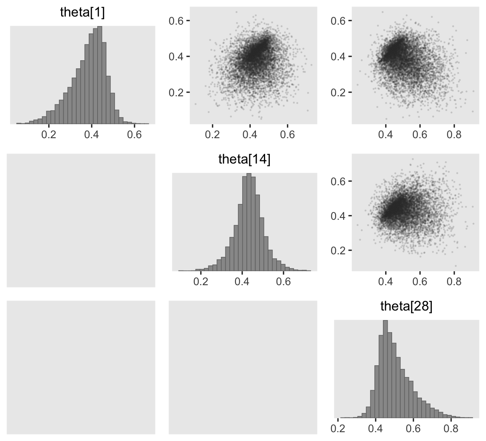

It appears `fit9.1` had very low autocorrelations. Here we'll examine the $N_{eff}/N$ ratio.


```r
neff_ratio(fit9.1) %>% 
  mcmc_neff() +
  theme_cowplot(font_size = 12)
```


The $N_{eff}/N$ ratio values for our model parameters were excellent. Here's a numeric summary of the model.


```r
print(fit9.1)
```

```
##  Family: bernoulli 
##   Links: mu = logit 
## Formula: y ~ 1 + (1 | s) 
##    Data: my_data (Number of observations: 280) 
## Samples: 4 chains, each with iter = 20000; warmup = 1000; thin = 10;
##          total post-warmup samples = 7600
## 
## Group-Level Effects: 
## ~s (Number of levels: 28) 
##               Estimate Est.Error l-95% CI u-95% CI Rhat Bulk_ESS Tail_ESS
## sd(Intercept)     0.28      0.18     0.01     0.67 1.00     7341     7579
## 
## Population-Level Effects: 
##           Estimate Est.Error l-95% CI u-95% CI Rhat Bulk_ESS Tail_ESS
## Intercept    -0.25      0.14    -0.51     0.02 1.00     7467     7532
## 
## Samples were drawn using sampling(NUTS). For each parameter, Bulk_ESS
## and Tail_ESS are effective sample size measures, and Rhat is the potential
## scale reduction factor on split chains (at convergence, Rhat = 1).
```

We'll need `brms::inv_logit_scaled()` to convert the model parameters to predict $\theta$ rather than $\operatorname{logit}(\theta)$. After the conversions, we'll be ready to make the histograms in the lower portion of Figure 9.10.


```r
library(tidybayes)

post_small <-
  post %>% 
  # convert the linter model to the probability space with `inv_logit_scaled()`
  mutate(`theta[1]`  = (b_Intercept + `r_s[S01,Intercept]`) %>% inv_logit_scaled(),
         `theta[14]` = (b_Intercept + `r_s[S14,Intercept]`) %>% inv_logit_scaled(),
         `theta[28]` = (b_Intercept + `r_s[S28,Intercept]`) %>% inv_logit_scaled()) %>% 
  # make the difference distributions
  mutate(`theta[1] - theta[14]`  = `theta[1]`  - `theta[14]`,
         `theta[1] - theta[28]`  = `theta[1]`  - `theta[28]`,
         `theta[14] - theta[28]` = `theta[14]` - `theta[28]`) %>% 
  select(starts_with("theta"))

post_small %>% 
  gather() %>% 
  # this line is unnecessary, but will help order the plots 
  mutate(key = factor(key, levels = c("theta[1]", "theta[14]", "theta[28]", 
                                      "theta[1] - theta[14]", "theta[1] - theta[28]", "theta[14] - theta[28]"))) %>% 

  ggplot(aes(x = value, y = 0)) +
  stat_histinterval(point_interval = mode_hdi, .width = .95,
                    fill = a_purple, breaks = 40, normalize = "panels") +
  scale_y_continuous(NULL, breaks = NULL) +
  xlab(NULL) +
  theme_minimal_hgrid() +
  facet_wrap(~key, scales = "free", ncol = 3)
```


If you wanted the specific values of the posterior modes and 95% HDIs, you could execute this.


```r
post_small %>% 
  gather() %>%
  group_by(key) %>% 
  mode_hdi(value) %>% 
  mutate_if(is.double, round, digits = 3)
```

```
## # A tibble: 6 x 7
##   key                    value .lower .upper .width .point .interval
##   <chr>                  <dbl>  <dbl>  <dbl>  <dbl> <chr>  <chr>    
## 1 theta[1]               0.422  0.209  0.52    0.95 mode   hdi      
## 2 theta[1] - theta[14]  -0.003 -0.283  0.112   0.95 mode   hdi      
## 3 theta[1] - theta[28]  -0.008 -0.404  0.079   0.95 mode   hdi      
## 4 theta[14]              0.435  0.288  0.576   0.95 mode   hdi      
## 5 theta[14] - theta[28] -0.003 -0.32   0.106   0.95 mode   hdi      
## 6 theta[28]              0.458  0.361  0.699   0.95 mode   hdi
```

And here are the Figure 9.10 scatter plots.


```r
p1 <-
  post_small %>% 
  ggplot(aes(x = `theta[1]`, y = `theta[14]`)) +
  geom_abline(linetype = 2) +
  geom_point(color = a_purple, size = 1/8, alpha = 1/8)

p2 <-
  post_small %>% 
  ggplot(aes(x = `theta[1]`, y = `theta[28]`)) +
  geom_abline(linetype = 2) +
  geom_point(color = a_purple, size = 1/8, alpha = 1/8)

p3 <-
  post_small %>% 
  ggplot(aes(x = `theta[14]`, y = `theta[28]`)) +
  geom_abline(linetype = 2) +
  geom_point(color = a_purple, size = 1/8, alpha = 1/8)

(p1 + p2 + p3) &
  coord_cartesian(xlim = c(0, 1),
                  ylim = c(0, 1)) & 
  theme_minimal_grid()
```


This is posterior distribution for the population estimate for $\theta$, which roughly corresponds to the upper right histogram of $\omega$ in Figure 9.10.


```r
# this part makes it easier to set the break points in `scale_x_continuous()` 
labels <-
  post %>% 
  transmute(theta = b_Intercept %>% inv_logit_scaled()) %>%
  mode_hdi() %>% 
  select(theta:.upper) %>% 
  gather() %>% 
  mutate(label = value %>% round(3) %>% as.character) %>% 
  slice(1:3)
  
post %>% 
  mutate(theta = b_Intercept %>% inv_logit_scaled()) %>% 

  ggplot(aes(x = theta, y = 0)) +
  stat_histinterval(point_interval = mode_hdi, .width = .95,
                    fill = a_purple, breaks = 40) +
  scale_x_continuous(expression(theta), 
                     breaks = labels$value,
                     labels = labels$label) +  
  scale_y_continuous(NULL, breaks = NULL) +
  theme_minimal_hgrid()
```

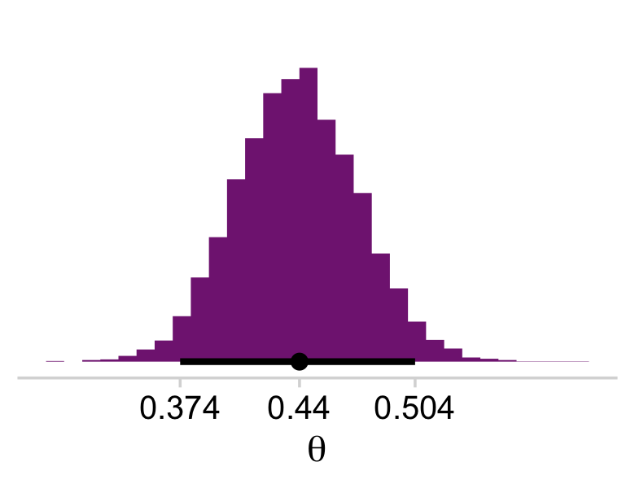

I'm not aware there's a straight conversion to get $\sigma$ in a probability metric. As far as I can tell, you have to first use `coef()` to "extract [the] model coefficients, which are the sum of population-level effects and corresponding group-level effects" [@brms2020RM, p. 46]. With the model coefficient draws in hand, you can index them by posterior iteration, group them by that index, compute the iteration-level $SD$s, and then plot the distribution of the $SD$s.


```r
# the tibble of the primary data
sigmas <-
  coef(fit9.1, summary = F)$s %>% 
  as_tibble() %>% 
  mutate(iter = 1:n()) %>% 
  group_by(iter) %>% 
  gather(key, value, -iter) %>% 
  mutate(theta = inv_logit_scaled(value)) %>% 
  summarise(sd = sd(theta))

# this, again, is just to customize `scale_x_continuous()`
labels <-
  sigmas %>% 
  mode_hdi(sd) %>% 
  select(sd:.upper) %>% 
  gather() %>% 
  mutate(label = value %>% round(3) %>% as.character) %>% 
  slice(1:3)
  
# the plot
sigmas %>% 
  ggplot(aes(x = sd, y = 0)) +
  stat_histinterval(point_interval = mode_hdi, .width = .95,
                    fill = a_purple, breaks = 40) +
  scale_x_continuous(expression(paste(sigma, " of ", theta, " in a probability metric")),
                     breaks = labels$value,
                     labels = labels$label) +  
  scale_y_continuous(NULL, breaks = NULL) +
  theme_minimal_hgrid()
```


And now you have a sense of how to do all those by hand, `bayesplot::mcmc_pairs()` offers a fairly quick way to get a good portion of Figure 9.10. 


```r
color_scheme_set("purple")
bayesplot_theme_set(theme_default() + theme_minimal_grid())

coef(fit9.1, summary = F)$s %>% 
  inv_logit_scaled() %>% 
  as_tibble() %>% 
  rename(`theta[1]`  = S01.Intercept, 
         `theta[14]` = S14.Intercept, 
         `theta[28]` = S28.Intercept) %>% 
  select(`theta[1]`, `theta[14]`, `theta[28]`) %>% 
  
  mcmc_pairs(off_diag_args = list(size = 1/8, alpha = 1/8))
```

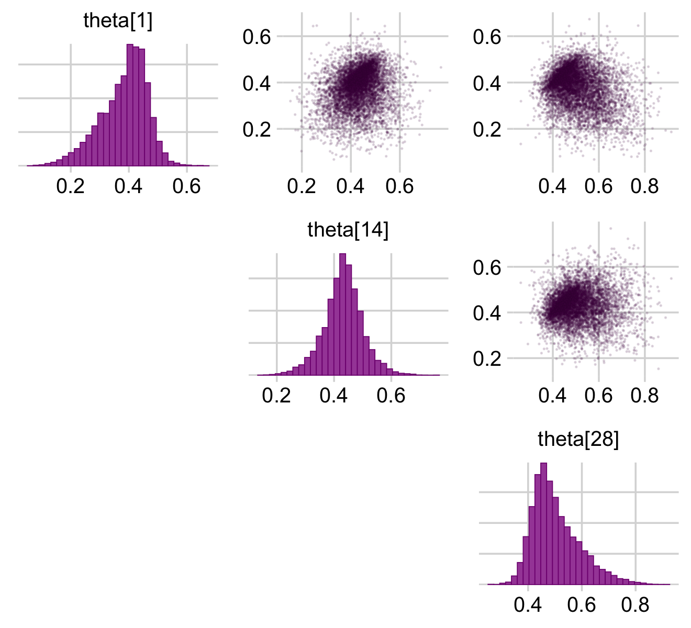

Did you see how we slipped in the `color_scheme_set()` and `bayesplot_theme_set()` lines at the top? Usually, the plots made with **bayesplot** are easy to modify with **ggplot2** syntax. Plots made with `mcmc_pairs()` function are one notable exception. On the back end, these made by combining multiple **ggplot** into a grid, a down-the-line result of which is they are difficult to modify. Happily, one can make some modifications beforehand by altering the global settings with the `color_scheme_set()` and `bayesplot_theme_set()` functions. You can learn more in the discussion on [issue #128](https://github.com/stan-dev/bayesplot/issues/128) on the **bayesplot** GitHub repo.

Kruschke used a $\operatorname{Beta}(1, 1)$ prior for $\omega$. If you randomly draw from that prior and plot a histogram, you'll see it was flat.


```r
set.seed(1)
tibble(prior = rbeta(n = 1e5, 1, 1)) %>% 
  ggplot(aes(x = prior)) +
  geom_histogram(fill = a_purple, color = "white", 
                 size = .2, binwidth = .05, boundary = 0) +
  scale_x_continuous(expression(omega), labels = c("0", ".25", ".5", ".75", "1")) +
  scale_y_continuous(NULL, breaks = NULL) +
  coord_cartesian(xlim = c(0, 1)) +
  theme_minimal_hgrid()
```


You'll note that plot corresponds to the upper right panel of Figure 9.11. 

Recall that we used a logistic regression model with a `normal(0, 1.5)` prior on the intercept. If you sample from `normal(0, 1.5)` and then convert the draws using `brms::inv_logit_scaled()`, you'll discover that our `normal(0, 1.5)` prior was virtually flat on the probability scale. Here we'll show the consequence of a variety of zero-mean Gaussian priors for the intercept of a logistic regression model.


```r
# define a function
r_norm <- function(i, n = 1e4) {
  
  set.seed(1)
  rnorm(n = n, mean = 0, sd = i) %>% 
    inv_logit_scaled()
  
}

# simulate and wrangle
tibble(sd = seq(from = .25, to = 3, by = .25)) %>% 
  group_by(sd) %>% 
  mutate(prior = map(sd, r_norm)) %>% 
  unnest(prior) %>% 
  ungroup() %>% 
  mutate(sd = str_c("sd = ", sd)) %>% 
  
  # plot!
  ggplot(aes(x = prior)) +
  geom_histogram(fill = a_purple, color = "white", size = .2,
                 binwidth = .05, boundary = 0) +
  scale_x_continuous(labels = c("0", ".25", ".5", ".75", "1")) +
  scale_y_continuous(NULL, breaks = NULL) +
  coord_cartesian(xlim = c(0, 1)) +
  theme_minimal_hgrid() +
  panel_border() +
  facet_wrap(~sd)
```


It appears that as $\sigma$ goes lower than 1.25, the prior becomes increasingly regularizing, pulling the estimate for $\theta$ to a neutral .5. However, as the prior's $\sigma$ gets larger than 1.25, more and more of the probability mass ends up at extreme values.

Next, Kruschke examined the prior distribution. There are a few ways to do this. Like in the last chapter, the one we'll explore involves adding the `sample_prior = "only"` argument to the `brm()` function. When you do so, the results of the model are just the prior. That is, `brm()` leaves out the likelihood. This returns a bunch of samples from the prior predictive distribution.


```r
fit9.1_prior <-
  brm(data = my_data,
      family = bernoulli(link = logit),
      y ~ 1 + (1 | s),
      prior = c(prior(normal(0, 1.5), class = Intercept),
                prior(normal(0, 1), class = sd)),
      iter = 20000, warmup = 1000, thin = 10, chains = 4, cores = 4,
      seed = 9,
      sample_prior = "only",
      file = "fits/fit09.01_prior")
```

If we feed `fit1_prior` into the `posterior_samples()` function, we'll get back a data frame of samples from the prior, but with the same parameter names we'd get from the posterior.


```r
prior <-
  posterior_samples(fit9.1_prior) %>% 
  as_tibble()

head(prior)
```

```
## # A tibble: 6 x 31
##   b_Intercept sd_s__Intercept `r_s[S01,Interc… `r_s[S02,Interc… `r_s[S03,Interc…
##         <dbl>           <dbl>            <dbl>            <dbl>            <dbl>
## 1      -0.742          0.0206           0.0127         -0.00860         -0.00229
## 2      -1.28           0.0405           0.0626         -0.0199          -0.0229 
## 3      -1.10           0.193           -0.296           0.214           -0.169  
## 4      -2.21           0.400           -0.244          -0.201           -0.882  
## 5      -1.82           0.170           -0.125          -0.0132          -0.160  
## 6       0.587          1.25             2.08            1.47            -3.13   
## # … with 26 more variables: `r_s[S04,Intercept]` <dbl>,
## #   `r_s[S05,Intercept]` <dbl>, `r_s[S06,Intercept]` <dbl>,
## #   `r_s[S07,Intercept]` <dbl>, `r_s[S08,Intercept]` <dbl>,
## #   `r_s[S09,Intercept]` <dbl>, `r_s[S10,Intercept]` <dbl>,
## #   `r_s[S11,Intercept]` <dbl>, `r_s[S12,Intercept]` <dbl>,
## #   `r_s[S13,Intercept]` <dbl>, `r_s[S14,Intercept]` <dbl>,
## #   `r_s[S15,Intercept]` <dbl>, `r_s[S16,Intercept]` <dbl>,
## #   `r_s[S17,Intercept]` <dbl>, `r_s[S18,Intercept]` <dbl>,
## #   `r_s[S19,Intercept]` <dbl>, `r_s[S20,Intercept]` <dbl>,
## #   `r_s[S21,Intercept]` <dbl>, `r_s[S22,Intercept]` <dbl>,
## #   `r_s[S23,Intercept]` <dbl>, `r_s[S24,Intercept]` <dbl>,
## #   `r_s[S25,Intercept]` <dbl>, `r_s[S26,Intercept]` <dbl>,
## #   `r_s[S27,Intercept]` <dbl>, `r_s[S28,Intercept]` <dbl>, lp__ <dbl>
```

And here we'll take a subset of the columns in `prior`, transform the results to the probability metric, and save the results as `prior_samples`.


```r
prior_samples <-
  prior %>% 
  transmute(`theta[1]`  = b_Intercept + `r_s[S01,Intercept]`,
            `theta[14]` = b_Intercept + `r_s[S14,Intercept]`,
            `theta[28]` = b_Intercept + `r_s[S28,Intercept]`) %>% 
  mutate_all(.funs = inv_logit_scaled)

head(prior_samples)
```

```
## # A tibble: 6 x 3
##   `theta[1]` `theta[14]` `theta[28]`
##        <dbl>       <dbl>       <dbl>
## 1     0.325        0.317      0.327 
## 2     0.228        0.222      0.223 
## 3     0.198        0.296      0.299 
## 4     0.0788       0.110      0.0687
## 5     0.126        0.158      0.162 
## 6     0.935        0.803      0.874
```

Now we can use our `prior_samples` object to make the diagonal of the lower grid of Figure 9.11.


```r
prior_samples %>% 
  gather() %>% 
  
  ggplot(aes(x = value)) +
  geom_histogram(fill = a_purple, color = "white", size = .2,
                 binwidth = .05, boundary = 0) +
  scale_x_continuous(labels = c("0", ".25", ".5", ".75", "1")) +
  scale_y_continuous(NULL, breaks = NULL) +
  coord_cartesian(xlim = c(0, 1)) +
  theme_minimal_hgrid() +
  panel_border() +
  facet_wrap(~key)
```

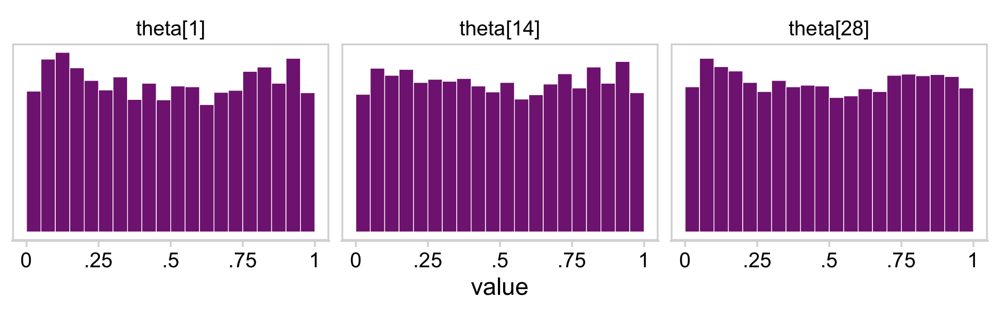

With a little subtraction, we can reproduce the plots in the upper triangle.


```r
prior_samples %>% 
  transmute(`theta[1] - theta[14]`  = `theta[1]`  - `theta[14]`,
            `theta[1] - theta[28]`  = `theta[1]`  - `theta[28]`,
            `theta[14] - theta[28]` = `theta[14]` - `theta[28]`) %>% 
  gather() %>% 

  ggplot(aes(x = value)) +
  geom_histogram(fill = a_purple, color = "white", size = .2,
                 binwidth = .05, boundary = 0) +
  scale_y_continuous(NULL, breaks = NULL) +
  theme_minimal_hgrid() +
  panel_border() +
  facet_wrap(~key)
```

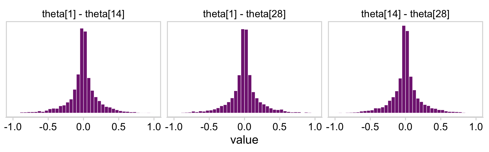

Those plots clarify our hierarchical logistic regression model was a little more regularizing than Kruschke's. The consequence of our priors was more aggressive regularization, greater shrinkage toward zero. The prose in the next section of the text clarifies this isn't necessarily a bad thing.

Finally, here are the plots for the lower triangle in Figure 9.11.


```r
p1 <-
  prior_samples %>% 
  ggplot(aes(x = `theta[1]`, y = `theta[14]`)) +
  geom_point(color = a_purple, size = 1/8, alpha = 1/8)

p2 <-
  prior_samples %>% 
  ggplot(aes(x = `theta[1]`, y = `theta[28]`)) +
  geom_point(color = a_purple, size = 1/8, alpha = 1/8)

p3 <-
  prior_samples %>% 
  ggplot(aes(x = `theta[14]`, y = `theta[28]`)) +
  geom_point(color = a_purple, size = 1/8, alpha = 1/8)

(p1 + p2 + p3) &
  geom_abline(linetype = 2) &
  coord_cartesian(xlim = c(0, 1),
                  ylim = c(0, 1)) &
  theme_minimal_grid()
```

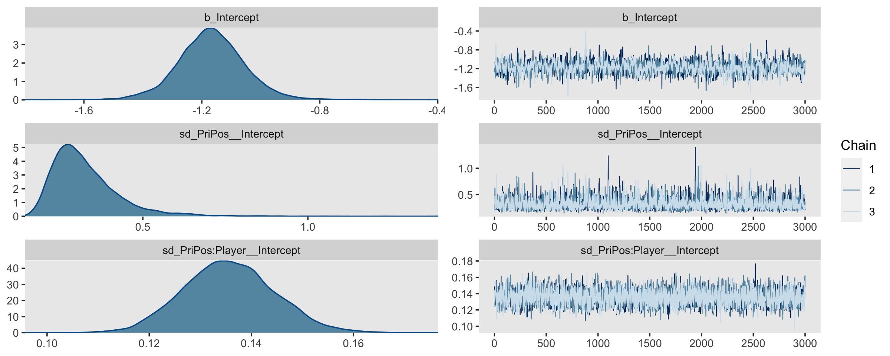

In case you were curious, here are the Pearson's correlation coefficients among the priors.


```r
cor(prior_samples) %>% round(digits = 2)
```

```
##           theta[1] theta[14] theta[28]
## theta[1]      1.00      0.73      0.72
## theta[14]     0.73      1.00      0.73
## theta[28]     0.72      0.73      1.00
```

## Shrinkage in hierarchical models

"In typical hierarchical models, the estimates of low-level parameters are pulled closer together than they would be if there were not a higher-level distribution. This pulling together is called *shrinkage* of the estimates" (p. 245, *emphasis* in the original)

Further,

> shrinkage is a rational implication of hierarchical model structure, and is (usually) desired by the analyst because the shrunken parameter estimates are less affected by random sampling noise than estimates derived without hierarchical structure. Intuitively, shrinkage occurs because the estimate of each low-level parameter is influenced from two sources: (1) the subset of data that are directly dependent on the low-level parameter, and (2) the higher-level parameters on which the low-level parameter depends. The higher- level parameters are affected by all the data, and therefore the estimate of a low-level parameter is affected indirectly by all the data, via their influence on the higher-level parameters. (p. 247)

Recall Formula 9.4 from page 223,

$$\theta \sim \operatorname{beta} \big(\omega(\kappa - 2) + 1 \big ), (1 - \omega)(\kappa - 2) + 1).$$

With that formula, we can express `dbeta()`'s `shape1` and `shape2` in terms of $\omega$ and $\kappa$ and make the shapes in Figure 9.12.


```r
omega  <- 0.5
kappa1 <- 2.1
kappa2 <- 15.8

tibble(x = seq(from = 0, to = 1, by = .001)) %>%
  mutate(`kappa==2.1` = dbeta(x = x, 
                              shape1 = omega * (kappa1 - 2) + 1, 
                              shape2 = (1 - omega) * (kappa1 - 2) + 1),
         `kappa==15.8` = dbeta(x = x, 
                               shape1 = omega * (kappa2 - 2) + 1, 
                               shape2 = (1 - omega) * (kappa2 - 2) + 1)) %>% 
  gather(key, value, - x) %>% 
  mutate(key = factor(key, levels = c("kappa==2.1", "kappa==15.8"))) %>% 
  
  ggplot(aes(x = x, ymin = 0, ymax = value)) +
  geom_ribbon(fill = a_purple) +
  scale_y_continuous(expression(dbeta(theta*"|"*omega*", "*kappa)), breaks = NULL) +
  xlab(expression(Data~Proportion~or~theta~value)) +
  theme_minimal_hgrid() +
  panel_border() +
  facet_wrap(~key, labeller = label_parsed)
```


## Speeding up ~~JAGS~~ brms

Here we'll compare the time it takes to fit `fit1` as either `bernoulli(link = logit)` or `binomial(link = logit)`.


```r
# bernoulli
start_time_bernoulli <- proc.time()

brm(data = my_data,
      family = bernoulli(link = logit),
      y ~ 1 + (1 | s),
      prior = c(prior(normal(0, 1.5), class = Intercept),
                prior(normal(0, 1), class = sd)),
      iter = 20000, warmup = 1000, thin = 10, chains = 4, cores = 4,
      seed = 9)

stop_time_bernoulli <- proc.time()

# binomial
start_time_binomial <- proc.time()

brm(data = my_data,
      family = binomial(link = logit),
      y | trials(1) ~ 1 + (1 | s),
      prior = c(prior(normal(0, 1.5), class = Intercept),
                prior(normal(0, 1), class = sd)),
      iter = 20000, warmup = 1000, thin = 10, chains = 4, cores = 4,
      seed = 9)

stop_time_binomial <- proc.time()
```

See how we're using `proc.time()` to record when we began and finished evaluating our `brm()` code? The last time we covered that was way back in [Section 3.7.5][Measuring processing time]. In that section, we also learned how subtracting the former from the latter yields the total elapsed time.


```r
stop_time_bernoulli - start_time_bernoulli
```

```
##    user  system elapsed 
##  41.409   1.586  52.844
```

```r
stop_time_binomial - start_time_binomial
```

```
##    user  system elapsed 
##  43.812   1.837  62.473
```

If you wanted to be rigorous about this, you could do this multiple times in a mini simulation.

As to the issue of parallel processing, we've been doing this all along. Note our `chains = 4, cores = 4` arguments.

## Extending the hierarchy: Subjects within categories

> Many data structures invite hierarchical descriptions that may have multiple levels. Software such as ~~JAGS~~ [**brms**] makes it easy to implement hierarchical models, and Bayesian inference makes it easy to interpret the parameter estimates, even for complex nonlinear hierarchical models. Here, we take a look at one type of extended hierarchical model. (p. 251)

As we will address below, our version of Figure 9.13 will look rather different from Kruschke's. It's something of a combination of the sensibilities from Figures 20.2 and 21.10. Even still, the diagram is of three-level model that shares many similarities to Kruschke's and, as we will see, yields very similar results.


```r
# half-normal density
p1 <-
  tibble(x = seq(from = 0, to = 3, by = .01)) %>% 
  ggplot(aes(x = x, ymin = 0, ymax = (dnorm(x)) / max(dnorm(x)))) +
  geom_ribbon(fill = a_purple, size = 0) +
  annotate(geom = "text",
           x = 1.5, y = .2,
           label = "half-normal",
           size = 7) +
  annotate(geom = "text",
           x = 1.5, y = .6,
           label = "0*','*~italic(S)[italic(s)*'|'*italic(c)]", 
           size = 7, family = "Times", parse = T) +
  scale_x_continuous(expand = c(0, 0)) +
  theme_void() +
  theme(axis.line.x = element_line(size = 0.5))

# second half-normal density
p2 <-
  tibble(x = seq(from = 0, to = 3, by = .01)) %>% 
  ggplot(aes(x = x, ymin = 0, ymax = (dnorm(x)) / max(dnorm(x)))) +
  geom_ribbon(fill = a_purple, size = 0) +
  annotate(geom = "text",
           x = 1.5, y = .2,
           label = "half-normal",
           size = 7) +
  annotate(geom = "text",
           x = 1.5, y = .6,
           label = "0*','*~italic(S)[italic(c)]", 
           size = 7, family = "Times", parse = T) +
  scale_x_continuous(expand = c(0, 0)) +
  theme_void() +
  theme(axis.line.x = element_line(size = 0.5))
  
#  annotated arrow
p3 <-
  tibble(x    = .85,
         y    = 1,
         xend = .5,
         yend = .25) %>%
  
  ggplot(aes(x = x, xend = xend,
             y = y, yend = yend)) +
  geom_segment(arrow = my_arrow) +
  annotate(geom = "text",
           x = .54, y = .6, label = "'~'", 
           size = 10, family = "Times", parse = T) +
  xlim(0, 1) +
  theme_void()

# normal density
p4 <-
  tibble(x = seq(from = -3, to = 3, by = .1)) %>% 
  ggplot(aes(x = x, ymin = 0, ymax = (dnorm(x)) / max(dnorm(x)))) +
  geom_ribbon(fill = a_purple, size = 0) +
  annotate(geom = "text",
           x = 0, y = .2,
           label = "normal",
           size = 7) +
  annotate(geom = "text",
           x = c(0, 1.45), y = .6,
           hjust = c(.5, 0),
           label = c("italic(M)[0]", "italic(S)[0]"), 
           size = 7, family = "Times", parse = T) +
  scale_x_continuous(expand = c(0, 0)) +
  theme_void() +
  theme(axis.line.x = element_line(size = 0.5))

# second normal density
p5 <-
  tibble(x = seq(from = -3, to = 3, by = .1)) %>% 
  ggplot(aes(x = x, ymin = 0, ymax = (dnorm(x)) / max(dnorm(x)))) +
  geom_ribbon(fill = a_purple, size = 0) +
  annotate(geom = "text",
           x = 0, y = .2,
           label = "normal",
           size = 7) +
  annotate(geom = "text",
           x = c(0, 1.45), y = .6,
           hjust = c(.5, 0),
           label = c("0", "sigma[italic(s)*'|'*italic(c)]"), 
           size = 7, family = "Times", parse = T) +
  scale_x_continuous(expand = c(0, 0)) +
  theme_void() +
  theme(axis.line.x = element_line(size = 0.5))

# third normal density
p6 <-
  tibble(x = seq(from = -3, to = 3, by = .1)) %>% 
  ggplot(aes(x = x, ymin = 0, ymax = (dnorm(x)) / max(dnorm(x)))) +
  geom_ribbon(fill = a_purple, size = 0) +
  annotate(geom = "text",
           x = 0, y = .2,
           label = "normal",
           size = 7) +
  annotate(geom = "text",
           x = c(0, 1.45), y = .6,
           hjust = c(.5, 0),
           label = c("0", "sigma[italic(c)]"), 
           size = 7, family = "Times", parse = T) +
  scale_x_continuous(expand = c(0, 0)) +
  theme_void() +
  theme(axis.line.x = element_line(size = 0.5))

# three annotated arrows
p7 <-
  tibble(x    = c(.09, .48, .9),
         y    = c(1, 1, 1),
         xend = c(.2, .425, .775),
         yend = c(.2, .2, .2)) %>%
  ggplot(aes(x = x, xend = xend,
             y = y, yend = yend)) +
  geom_segment(arrow = my_arrow) +
  annotate(geom = "text",
           x = c(.10, .42, .49, .81, .87), y = .6,
           label = c("'~'", "'~'", "italic(s)*'|'*italic(c)", "'~'", "italic(c)"),
           size = c(10, 10, 7, 10, 7), 
           family = "Times", parse = T) +
  xlim(0, 1) +
  theme_void()

# likelihood formula
p8 <-
  tibble(x = .5,
         y = .5,
         label = "logistic(beta[0]+sum()[italic(s)*'|'*italic(c)]*beta['['*italic(s)*'|'*italic(c)*']']*italic(x)['['*italic(s)*'|'*italic(c)*']'](italic(i))+sum()[italic(c)]*beta['['*italic(c)*']']*italic(x)['['*italic(c)*']'](italic(i)))") %>% 
  
  ggplot(aes(x = x, y = y, label = label)) +
  geom_text(size = 7, parse = T, family = "Times") +
  scale_x_continuous(expand = c(0, 0), limits = c(0, 1)) +
  ylim(0, 1) +
  theme_void()

# a second annotated arrow
p9 <-
  tibble(x     = c(.375, .5),
         y     = c(.75, .3),
         label = c("'='", "mu[italic(i)*'|'*italic(sc)]")) %>%
  
  ggplot(aes(x = x, y = y, label = label)) +
  geom_text(size = c(10, 7), parse = T, family = "Times") +
  geom_segment(x = .5, xend = .5,
               y = 1, yend = .4,
               arrow = my_arrow) +
  xlim(0, 1) +
  theme_void()

# binomial density
p10 <-
tibble(x = 0:7) %>% 
  ggplot(aes(x = x, 
             y = (dbinom(x, size = 7, prob = .625)) / max(dbinom(x, size = 7, prob = .625)))) +
  geom_col(fill = a_purple, width = .4) +
  annotate(geom = "text",
           x = 3.5, y = .2,
           label = "binomial",
           size = 7) +
  annotate(geom = "text",
           x = 7, y = .85,
           label = "italic(N)[italic(i)*'|'*italic(s)]",
           size = 7, family = "Times", parse = TRUE) +
  coord_cartesian(xlim = c(-1, 8),
                  ylim = c(0, 1.2)) +
  theme_void() +
  theme(axis.line.x = element_line(size = 0.5))

# another annotated arrow
p11 <-
  tibble(x     = c(.375, .7),
         y     = c(1/3, 1/3),
         label = c("'~'", "italic(i)*'|'*italic(sc)")) %>% 
  
  ggplot(aes(x = x, y = y, label = label)) +
  geom_text(size = c(10, 7), parse = T, family = "Times") +
  geom_segment(x = .5, xend = .5,
               y = 1, yend = 0,
               arrow = my_arrow) +
  xlim(0, 1) +
  theme_void()

# some text
p12 <-
  tibble(x     = 1,
         y     = .5,
         label = "italic(y)[italic(i)*'|'*italic(sc)]") %>% 
  
  ggplot(aes(x = x, y = y, label = label)) +
  geom_text(size = 7, parse = T, family = "Times") +
  xlim(0, 2) +
  theme_void()

# define the layout
layout <- c(
  area(t = 1, b = 2, l = 7, r = 9),
  area(t = 1, b = 2, l = 11, r = 13),
  area(t = 4, b = 5, l = 1, r = 3),
  area(t = 4, b = 5, l = 5, r = 7),
  area(t = 4, b = 5, l = 9, r = 11),
  area(t = 3, b = 4, l = 6, r = 8),
  area(t = 3, b = 4, l = 10, r = 12),
  area(t = 7, b = 8, l = 1, r = 11),
  area(t = 6, b = 7, l = 1, r = 11),
  area(t = 11, b = 12, l = 5, r = 7),
  area(t = 9, b = 11, l = 5, r = 7),
  area(t = 13, b = 14, l = 5, r = 7),
  area(t = 15, b = 15, l = 5, r = 7)
)

# combine and plot!
(p1 + p2 + p4 + p5 + p6 + p3 + p3 + p8 + p7 + p10 + p9 + p11 + p12) + 
  plot_layout(design = layout) &
  ylim(0, 1) &
  theme(plot.margin = margin(0, 5.5, 0, 5.5))
```


Though we will be fitting a hierarchical model with subjects $s$ within categories $c$, the higher-level parameters will not be $\omega$ and $\kappa$. As we'll go over, below, we will use the binomial distribution within a more conventional hierarchical logistic regression paradigm. In this paradigm, we have an overall intercept, often called $\alpha$ or $\beta_0$, which will be our analogue to Kruschke's overall $\omega$. For the two grouping categories, $s$ and $c$, we will have $\sigma$ estimates, which express the variability within those grouping. You'll see when we get there.

### Example: Baseball batting abilities by position.

Here are the batting average data.


```r
my_data <- read_csv("data.R/BattingAverage.csv")

glimpse(my_data)
```

```
## Rows: 948
## Columns: 6
## $ Player       <chr> "Fernando Abad", "Bobby Abreu", "Tony Abreu", "Dustin Ac…
## $ PriPos       <chr> "Pitcher", "Left Field", "2nd Base", "2nd Base", "1st Ba…
## $ Hits         <dbl> 1, 53, 18, 137, 21, 0, 0, 2, 150, 167, 0, 128, 66, 3, 1,…
## $ AtBats       <dbl> 7, 219, 70, 607, 86, 1, 1, 20, 549, 576, 1, 525, 275, 12…
## $ PlayerNumber <dbl> 1, 2, 3, 4, 5, 6, 7, 8, 9, 10, 11, 12, 13, 14, 15, 16, 1…
## $ PriPosNumber <dbl> 1, 7, 4, 4, 3, 1, 1, 3, 3, 4, 1, 5, 4, 2, 7, 4, 6, 8, 9,…
```

In his footnote #6, Kruschke indicated he retrieved the data from [http://www.baseball-reference.com/leagues/MLB/2012-standard-batting.shtml](http://www.baseball-reference.com/leagues/MLB/2012-standard-batting.shtml) on December of 2012. To give a sense of the data, here are the number of occasions by primary position, `PriPos`, with their median at bat, `AtBats`, values.


```r
my_data %>% 
  group_by(PriPos) %>% 
  summarise(n      = n(),
            median = median(AtBats)) %>% 
  arrange(desc(n))
```

```
## # A tibble: 9 x 3
##   PriPos           n median
##   <chr>        <int>  <dbl>
## 1 Pitcher        324     4 
## 2 Catcher        103   170 
## 3 Left Field     103   164 
## 4 1st Base        81   265 
## 5 3rd Base        75   267 
## 6 2nd Base        72   228.
## 7 Center Field    67   259 
## 8 Shortstop       63   205 
## 9 Right Field     60   340.
```

As these data are aggregated, we'll fit with an aggregated binomial model. This is still logistic regression. The Bernoulli distribution is a special case of the binomial distribution when the number of trials in each data point is 1 [see @Bürkner2020Parameterization for details]. Since our data are aggregated, the information encoded in `Hits` is a combination of multiple trials, which requires us to jump up to the more general binomial likelihood. Note the `Hits  | trials(AtBats)` syntax. With that bit, we instructed **brms** that our criterion, `Hits`, is an aggregate of multiple trials and the number of trials is encoded in `AtBats`. 

Also note the `(1 | PriPos) + (1 | PriPos:Player)` syntax. In this model, we have two grouping factors, `PriPos` and `Player`. Thus we have two `(|)` arguments. But since players are themselves nested within positions, we have encoded that nesting with the `(1 | PriPos:Player)` syntax. For more on this style of syntax, see [Kristoffer Magnusson](https://twitter.com/krstoffr)'s handy blog post, [*Using R and lme/lmer to fit different two- and three-level longitudinal models*](https://rpsychologist.com/r-guide-longitudinal-lme-lmer). Since **brms** syntax is based on that from the earlier **lme4** package, the basic syntax rules apply. Bürkner [-@brms2020RM], of course, also covered these topics in the `brmsformula` subsection of the [**brms** reference manual](https://CRAN.R-project.org/package=brms/brms.pdf).


```r
fit9.2 <-
  brm(data = my_data,
      family = binomial(link = logit),
      Hits | trials(AtBats) ~ 1 + (1 | PriPos) + (1 | PriPos:Player),
      prior = c(prior(normal(0, 1.5), class = Intercept),
                prior(normal(0, 1), class = sd)),
      iter = 3500, warmup = 500, chains = 3, cores = 3,
      control = list(adapt_delta = .99),
      seed = 9,
      file = "fits/fit09.02")
```

The chains look good.


```r
plot(fit9.2)
```


Note how our `color_scheme_set("purple")` line from back up in the `mcmc_pairs()` has effected the color scheme of `brms::plot()`.

We might examine the autocorrelations within the chains.


```r
post <- posterior_samples(fit9.2, add_chain = T)

mcmc_acf(post, pars = c("b_Intercept", 
                        "sd_PriPos__Intercept", 
                        "sd_PriPos:Player__Intercept"), lags = 8) +
  theme_minimal_hgrid()
```


Here's a histogram of the $N_{eff}/N$ ratios.


```r
fit9.2 %>% 
  neff_ratio() %>% 
  mcmc_neff_hist(binwidth = .1) +
  yaxis_text() +
  theme_minimal_hgrid()
```


Happily, most have a very favorable ratio. Here's a numeric summary of the primary model parameters.


```r
print(fit9.2)
```

```
##  Family: binomial 
##   Links: mu = logit 
## Formula: Hits | trials(AtBats) ~ 1 + (1 | PriPos) + (1 | PriPos:Player) 
##    Data: my_data (Number of observations: 948) 
## Samples: 3 chains, each with iter = 3500; warmup = 500; thin = 1;
##          total post-warmup samples = 9000
## 
## Group-Level Effects: 
## ~PriPos (Number of levels: 9) 
##               Estimate Est.Error l-95% CI u-95% CI Rhat Bulk_ESS Tail_ESS
## sd(Intercept)     0.32      0.10     0.19     0.58 1.00     3300     4673
## 
## ~PriPos:Player (Number of levels: 948) 
##               Estimate Est.Error l-95% CI u-95% CI Rhat Bulk_ESS Tail_ESS
## sd(Intercept)     0.14      0.01     0.12     0.15 1.00     3926     6421
## 
## Population-Level Effects: 
##           Estimate Est.Error l-95% CI u-95% CI Rhat Bulk_ESS Tail_ESS
## Intercept    -1.17      0.11    -1.39    -0.94 1.00     1548     2351
## 
## Samples were drawn using sampling(NUTS). For each parameter, Bulk_ESS
## and Tail_ESS are effective sample size measures, and Rhat is the potential
## scale reduction factor on split chains (at convergence, Rhat = 1).
```

As far as I'm aware, **brms** offers three major ways to get the group-level parameters for a hierarchical model: using `posterior_samples()`, `coef()`, or `fitted()`. We'll cover each, beginning with `posterior_samples()`. In order to look at the autocorrelation plots, above, we already saved the `posterior_samples(fit9.2)` output as `post`. Here we'll look at its structure with `head()`. Before doing so we'll convert `post`, which is currently saved as a data frame, into a tibble in order to keep the output from getting unwieldy.


```r
post <-
  post %>% 
  as_tibble()

head(post)
```

```
## # A tibble: 6 x 963
##   b_Intercept sd_PriPos__Inte… `sd_PriPos:Play… `r_PriPos[1st.B…
##         <dbl>            <dbl>            <dbl>            <dbl>
## 1      -0.840            0.420            0.134          -0.212 
## 2      -1.03             0.286            0.148          -0.0730
## 3      -1.16             0.584            0.123           0.0881
## 4      -1.16             0.238            0.126           0.0735
## 5      -1.15             0.442            0.121           0.0904
## 6      -1.15             0.241            0.131           0.0497
## # … with 959 more variables: `r_PriPos[2nd.Base,Intercept]` <dbl>,
## #   `r_PriPos[3rd.Base,Intercept]` <dbl>, `r_PriPos[Catcher,Intercept]` <dbl>,
## #   `r_PriPos[Center.Field,Intercept]` <dbl>,
## #   `r_PriPos[Left.Field,Intercept]` <dbl>,
## #   `r_PriPos[Pitcher,Intercept]` <dbl>,
## #   `r_PriPos[Right.Field,Intercept]` <dbl>,
## #   `r_PriPos[Shortstop,Intercept]` <dbl>,
## #   `r_PriPos:Player[1st.Base_Adam.Dunn,Intercept]` <dbl>,
## #   `r_PriPos:Player[1st.Base_Adam.LaRoche,Intercept]` <dbl>,
## #   `r_PriPos:Player[1st.Base_Adam.Lind,Intercept]` <dbl>,
## #   `r_PriPos:Player[1st.Base_Adrian.Gonzalez,Intercept]` <dbl>,
## #   `r_PriPos:Player[1st.Base_Albert.Pujols,Intercept]` <dbl>,
## #   `r_PriPos:Player[1st.Base_Allen.Craig,Intercept]` <dbl>,
## #   `r_PriPos:Player[1st.Base_Anthony.Rizzo,Intercept]` <dbl>,
## #   `r_PriPos:Player[1st.Base_Aubrey.Huff,Intercept]` <dbl>,
## #   `r_PriPos:Player[1st.Base_Billy.Butler,Intercept]` <dbl>,
## #   `r_PriPos:Player[1st.Base_Brandon.Allen,Intercept]` <dbl>,
## #   `r_PriPos:Player[1st.Base_Brandon.Belt,Intercept]` <dbl>,
## #   `r_PriPos:Player[1st.Base_Brandon.Moss,Intercept]` <dbl>,
## #   `r_PriPos:Player[1st.Base_Brandon.Snyder,Intercept]` <dbl>,
## #   `r_PriPos:Player[1st.Base_Brent.Lillibridge,Intercept]` <dbl>,
## #   `r_PriPos:Player[1st.Base_Brett.Pill,Intercept]` <dbl>,
## #   `r_PriPos:Player[1st.Base_Brett.Wallace,Intercept]` <dbl>,
## #   `r_PriPos:Player[1st.Base_Bryan.LaHair,Intercept]` <dbl>,
## #   `r_PriPos:Player[1st.Base_Carlos.Lee,Intercept]` <dbl>,
## #   `r_PriPos:Player[1st.Base_Carlos.Pena,Intercept]` <dbl>,
## #   `r_PriPos:Player[1st.Base_Casey.Kotchman,Intercept]` <dbl>,
## #   `r_PriPos:Player[1st.Base_Casey.McGehee,Intercept]` <dbl>,
## #   `r_PriPos:Player[1st.Base_Chad.Tracy,Intercept]` <dbl>,
## #   `r_PriPos:Player[1st.Base_Chris.Carter,Intercept]` <dbl>,
## #   `r_PriPos:Player[1st.Base_Chris.Davis,Intercept]` <dbl>,
## #   `r_PriPos:Player[1st.Base_Chris.Parmelee,Intercept]` <dbl>,
## #   `r_PriPos:Player[1st.Base_Corey.Hart,Intercept]` <dbl>,
## #   `r_PriPos:Player[1st.Base_Dan.Johnson,Intercept]` <dbl>,
## #   `r_PriPos:Player[1st.Base_Daric.Barton,Intercept]` <dbl>,
## #   `r_PriPos:Player[1st.Base_David.Cooper,Intercept]` <dbl>,
## #   `r_PriPos:Player[1st.Base_David.Ortiz,Intercept]` <dbl>,
## #   `r_PriPos:Player[1st.Base_Edwin.Encarnacion,Intercept]` <dbl>,
## #   `r_PriPos:Player[1st.Base_Eric.Hinske,Intercept]` <dbl>,
## #   `r_PriPos:Player[1st.Base_Eric.Hosmer,Intercept]` <dbl>,
## #   `r_PriPos:Player[1st.Base_Freddie.Freeman,Intercept]` <dbl>,
## #   `r_PriPos:Player[1st.Base_Gaby.Sanchez,Intercept]` <dbl>,
## #   `r_PriPos:Player[1st.Base_Garrett.Jones,Intercept]` <dbl>,
## #   `r_PriPos:Player[1st.Base_Hector.Luna,Intercept]` <dbl>,
## #   `r_PriPos:Player[1st.Base_Ike.Davis,Intercept]` <dbl>,
## #   `r_PriPos:Player[1st.Base_James.Loney,Intercept]` <dbl>,
## #   `r_PriPos:Player[1st.Base_Jason.Giambi,Intercept]` <dbl>,
## #   `r_PriPos:Player[1st.Base_Jeff.Clement,Intercept]` <dbl>,
## #   `r_PriPos:Player[1st.Base_Jim.Thome,Intercept]` <dbl>,
## #   `r_PriPos:Player[1st.Base_Joe.Mahoney,Intercept]` <dbl>,
## #   `r_PriPos:Player[1st.Base_Joey.Votto,Intercept]` <dbl>,
## #   `r_PriPos:Player[1st.Base_Juan.Rivera,Intercept]` <dbl>,
## #   `r_PriPos:Player[1st.Base_Justin.Morneau,Intercept]` <dbl>,
## #   `r_PriPos:Player[1st.Base_Justin.Smoak,Intercept]` <dbl>,
## #   `r_PriPos:Player[1st.Base_Kendrys.Morales,Intercept]` <dbl>,
## #   `r_PriPos:Player[1st.Base_Kila.Kaaihue,Intercept]` <dbl>,
## #   `r_PriPos:Player[1st.Base_Kyle.Blanks,Intercept]` <dbl>,
## #   `r_PriPos:Player[1st.Base_Lance.Berkman,Intercept]` <dbl>,
## #   `r_PriPos:Player[1st.Base_Luke.Scott,Intercept]` <dbl>,
## #   `r_PriPos:Player[1st.Base_Lyle.Overbay,Intercept]` <dbl>,
## #   `r_PriPos:Player[1st.Base_Mark.Reynolds,Intercept]` <dbl>,
## #   `r_PriPos:Player[1st.Base_Mark.Teixeira,Intercept]` <dbl>,
## #   `r_PriPos:Player[1st.Base_Mat.Gamel,Intercept]` <dbl>,
## #   `r_PriPos:Player[1st.Base_Matt.Adams,Intercept]` <dbl>,
## #   `r_PriPos:Player[1st.Base_Matt.Carpenter,Intercept]` <dbl>,
## #   `r_PriPos:Player[1st.Base_Matt.Downs,Intercept]` <dbl>,
## #   `r_PriPos:Player[1st.Base_Matt.Hague,Intercept]` <dbl>,
## #   `r_PriPos:Player[1st.Base_Matt.LaPorta,Intercept]` <dbl>,
## #   `r_PriPos:Player[1st.Base_Mauro.Gomez,Intercept]` <dbl>,
## #   `r_PriPos:Player[1st.Base_Michael.Young,Intercept]` <dbl>,
## #   `r_PriPos:Player[1st.Base_Miguel.Cairo,Intercept]` <dbl>,
## #   `r_PriPos:Player[1st.Base_Mike.Costanzo,Intercept]` <dbl>,
## #   `r_PriPos:Player[1st.Base_Mike.Jacobs,Intercept]` <dbl>,
## #   `r_PriPos:Player[1st.Base_Mike.Olt,Intercept]` <dbl>,
## #   `r_PriPos:Player[1st.Base_Mitch.Moreland,Intercept]` <dbl>,
## #   `r_PriPos:Player[1st.Base_Nick.Johnson,Intercept]` <dbl>,
## #   `r_PriPos:Player[1st.Base_Paul.Goldschmidt,Intercept]` <dbl>,
## #   `r_PriPos:Player[1st.Base_Paul.Konerko,Intercept]` <dbl>,
## #   `r_PriPos:Player[1st.Base_Prince.Fielder,Intercept]` <dbl>,
## #   `r_PriPos:Player[1st.Base_Ryan.Howard,Intercept]` <dbl>,
## #   `r_PriPos:Player[1st.Base_Steven.Hill,Intercept]` <dbl>,
## #   `r_PriPos:Player[1st.Base_Taylor.Green,Intercept]` <dbl>,
## #   `r_PriPos:Player[1st.Base_Todd.Helton,Intercept]` <dbl>,
## #   `r_PriPos:Player[1st.Base_Travis.Ishikawa,Intercept]` <dbl>,
## #   `r_PriPos:Player[1st.Base_Ty.Wigginton,Intercept]` <dbl>,
## #   `r_PriPos:Player[1st.Base_Yan.Gomes,Intercept]` <dbl>,
## #   `r_PriPos:Player[1st.Base_Yonder.Alonso,Intercept]` <dbl>,
## #   `r_PriPos:Player[1st.Base_Zach.Lutz,Intercept]` <dbl>,
## #   `r_PriPos:Player[2nd.Base_Aaron.Hill,Intercept]` <dbl>,
## #   `r_PriPos:Player[2nd.Base_Adam.Rosales,Intercept]` <dbl>,
## #   `r_PriPos:Player[2nd.Base_Adrian.Cardenas,Intercept]` <dbl>,
## #   `r_PriPos:Player[2nd.Base_Alexi.Amarista,Intercept]` <dbl>,
## #   `r_PriPos:Player[2nd.Base_Alexi.Casilla,Intercept]` <dbl>,
## #   `r_PriPos:Player[2nd.Base_Blake.DeWitt,Intercept]` <dbl>,
## #   `r_PriPos:Player[2nd.Base_Brandon.Phillips,Intercept]` <dbl>,
## #   `r_PriPos:Player[2nd.Base_Brian.Roberts,Intercept]` <dbl>,
## #   `r_PriPos:Player[2nd.Base_Brock.Holt,Intercept]` <dbl>,
## #   `r_PriPos:Player[2nd.Base_Charlie.Culberson,Intercept]` <dbl>,
## #   `r_PriPos:Player[2nd.Base_Chase.dArnaud,Intercept]` <dbl>, …
```

In the text, Kruschke described the model as having 968 parameters. Our `post` tibble has one vector for each, with a couple others tacked onto the end. In the hierarchical logistic regression model, the group-specific parameters for the levels of `PriPos` are additive combinations of the global intercept vector, `b_Intercept` and each position-specific vector, `r_PriPos[i.Base,Intercept]`, where `i` is a fill-in for the position of interest. And recall that since the linear model is of the logit of the criterion, we'll need to use `inv_logit_scaled()` to convert that to the probability space.


```r
post_small <-
  post %>% 
  transmute(`1st Base` = (b_Intercept + `r_PriPos[1st.Base,Intercept]`), 
            Catcher    = (b_Intercept + `r_PriPos[Catcher,Intercept]`), 
            Pitcher    = (b_Intercept + `r_PriPos[Pitcher,Intercept]`)) %>% 
  mutate_all(inv_logit_scaled) %>% 
  # here we compute our difference distributions
  mutate(`Pitcher - Catcher`  = Pitcher - Catcher,
         `Catcher - 1st Base` = Catcher - `1st Base`)

head(post_small)
```

```
## # A tibble: 6 x 5
##   `1st Base` Catcher Pitcher `Pitcher - Catcher` `Catcher - 1st Base`
##        <dbl>   <dbl>   <dbl>               <dbl>                <dbl>
## 1      0.259   0.243   0.125             -0.117              -0.0162 
## 2      0.249   0.232   0.127             -0.105              -0.0172 
## 3      0.255   0.250   0.135             -0.115              -0.00517
## 4      0.252   0.236   0.137             -0.0993             -0.0155 
## 5      0.257   0.241   0.130             -0.111              -0.0165 
## 6      0.249   0.239   0.127             -0.112              -0.00984
```

If you take a glance at Figures 9.14 through 9.16 in the text, we'll be making a lot of histograms of the same basic structure. To streamline our code a bit, we can make a custom histogram plotting function.


```r
make_histogram <- function(data, mapping, title, xlim, ...) {
  
  ggplot(data, mapping) +
    geom_histogram(fill = viridis::viridis_pal(option = "A")(9)[4], 
                   color = "white", size = .2,
                   bins = 30) +
    stat_pointinterval(aes(y = 0), 
                       point_interval = mode_hdi, .width = .95) +
    scale_y_continuous(NULL, breaks = NULL) +
    labs(title = title,
         x = expression(theta)) +
    coord_cartesian(xlim = xlim) +
    theme_minimal_hgrid() +
    panel_border()
  
}
```

We'll do the same thing for the correlation plots.


```r
make_point <- function(data, mapping, limits, ...) {
  
  ggplot(data, mapping) +
    geom_abline(linetype = 3, color = "grey50") +
    geom_point(color = viridis::viridis_pal(option = "A")(9)[4], 
               size = 1/10, alpha = 1/20) +
    coord_cartesian(xlim = limits,
                    ylim = limits) +
    theme_minimal_grid(line_size = 0) +
    panel_border()
  
}
```

To learn more about wrapping custom plots into custom functions, check out [Chapter 16](https://ggplot2-book.org/programming.html) of Wickham's [-@wickhamGgplot2ElegantGraphics2016] [*ggplot2: Elegant graphics for data analysis*](https://ggplot2-book.org/).

Now we have our `make_histogram()` and `make_point()` functions, we'll use `grid.arrange()` to paste together the left half of Figure 9.14.


```r
p1 <-
  make_histogram(data = post_small,
                 aes(x = Pitcher), 
                 title = "Pitcher", 
                 xlim = c(.1, .25))

p2 <-
  make_histogram(data = post_small,
                 aes(x = `Pitcher - Catcher`), 
                 title = "Pitcher - Catcher", 
                 xlim = c(-.15, 0))

p3 <-
  make_point(data = post_small,
             aes(x = Pitcher, y = Catcher),
             limits = c(.12, .25))

p4 <-
  make_histogram(data = post_small,
                 aes(x = Catcher), 
                 title = "Catcher", 
                 xlim = c(.1, .25))

p1 + p2 + p3 + p4
```

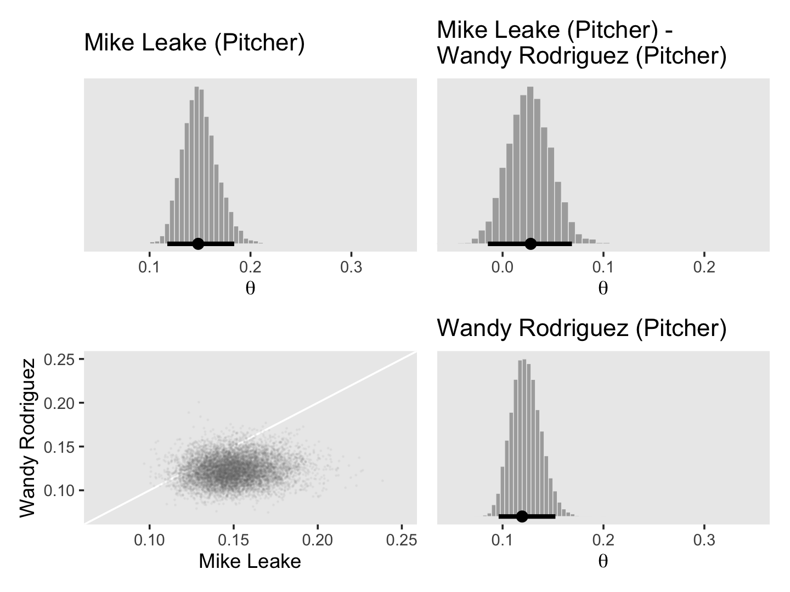

We could follow the same procedure to make the right portion of Figure 9.14. But instead, let's switch gears and explore the second way **brms** affords us for plotting group-level parameters. This time, we'll use `coef()`.

Up in [Section 9.2.4][Example: Therapeutic touch.], we learned that we can use `coef()` to "extract [the] model coefficients, which are the sum of population-level effects and corresponding group-level effects" [@brms2020RM, p. 43]. The grouping level we're interested in is ` PriPos`, so we'll use that to index the information returned by `coef()`. Since `coef()` returns a matrix, we'll use `as_tibble()` to convert it to a tibble.


```r
coef_primary_position <-
  coef(fit9.2, summary = F)$PriPos %>% 
  as_tibble()
  
str(coef_primary_position)
```

```
## tibble [9,000 × 9] (S3: tbl_df/tbl/data.frame)
##  $ 1st Base.Intercept    : num [1:9000] -1.05 -1.1 -1.07 -1.09 -1.06 ...
##  $ 2nd Base.Intercept    : num [1:9000] -1.08 -1.08 -1.14 -1.06 -1.14 ...
##  $ 3rd Base.Intercept    : num [1:9000] -1.02 -1.09 -1.04 -1.05 -1.05 ...
##  $ Catcher.Intercept     : num [1:9000] -1.14 -1.2 -1.1 -1.17 -1.15 ...
##  $ Center Field.Intercept: num [1:9000] -1.04 -1.08 -1.07 -1.01 -1.04 ...
##  $ Left Field.Intercept  : num [1:9000] -1.09 -1.06 -1.13 -1.08 -1.11 ...
##  $ Pitcher.Intercept     : num [1:9000] -1.94 -1.93 -1.85 -1.84 -1.9 ...
##  $ Right Field.Intercept : num [1:9000] -1.06 -1.08 -1.04 -1.04 -1.11 ...
##  $ Shortstop.Intercept   : num [1:9000] -1.1 -1.05 -1.11 -1.09 -1.13 ...
```

Keep in mind that `coef()` returns the values in the logit scale when used for logistic regression models. So we'll have to use `brms::inv_logit_scaled()` to convert the estimates to the probability metric. After we’re done converting the estimates, we'll then make the difference distributions.


```r
coef_small <-
  coef_primary_position %>% 
  select(`1st Base.Intercept`, Catcher.Intercept, Pitcher.Intercept) %>% 
  transmute(`1st Base` = `1st Base.Intercept`, 
            Catcher    = Catcher.Intercept, 
            Pitcher    = Pitcher.Intercept) %>% 
  mutate_all(inv_logit_scaled) %>% 
  # here we make the difference distributions
  mutate(`Pitcher - Catcher`  = Pitcher - Catcher,
         `Catcher - 1st Base` = Catcher - `1st Base`)

head(coef_small)
```

```
## # A tibble: 6 x 5
##   `1st Base` Catcher Pitcher `Pitcher - Catcher` `Catcher - 1st Base`
##        <dbl>   <dbl>   <dbl>               <dbl>                <dbl>
## 1      0.259   0.243   0.125             -0.117              -0.0162 
## 2      0.249   0.232   0.127             -0.105              -0.0172 
## 3      0.255   0.250   0.135             -0.115              -0.00517
## 4      0.252   0.236   0.137             -0.0993             -0.0155 
## 5      0.257   0.241   0.130             -0.111              -0.0165 
## 6      0.249   0.239   0.127             -0.112              -0.00984
```

Now we're ready for the right half of Figure 9.14.


```r
p1 <-
  make_histogram(data = coef_small,
                 aes(x = Catcher), 
                 title = "Catcher", 
                 xlim = c(.22, .27))

p2 <-
  make_histogram(data = coef_small,
                 aes(x = `Catcher - 1st Base`), 
                 title = "Catcher - 1st Base", 
                 xlim = c(-.04, .01))

p3 <-
  make_point(data = coef_small,
             aes(x = Catcher, y = `1st Base`),
             limits = c(.22, .27))

p4 <-
  make_histogram(data = coef_small,
                 aes(x = `1st Base`), 
                 title = "1st Base", 
                 xlim = c(.22, .27))

p1 + p2 + p3 + p4
```

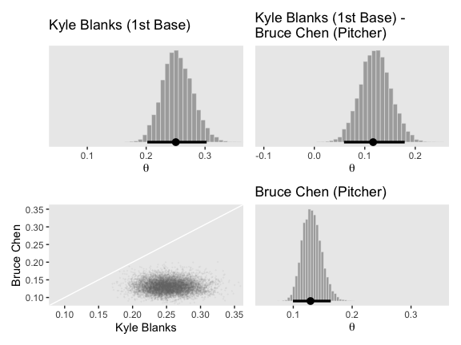

And if you wanted the posterior modes and HDIs, you'd use `mode_hdi()` after a little wrangling.


```r
coef_small %>% 
  gather() %>% 
  group_by(key) %>% 
  mode_hdi(value) %>% 
  mutate_if(is.double, round, digits = 3)
```

```
## # A tibble: 5 x 7
##   key                 value .lower .upper .width .point .interval
##   <chr>               <dbl>  <dbl>  <dbl>  <dbl> <chr>  <chr>    
## 1 1st Base            0.254  0.245  0.262   0.95 mode   hdi      
## 2 Catcher             0.242  0.233  0.249   0.95 mode   hdi      
## 3 Catcher - 1st Base -0.013 -0.024  0       0.95 mode   hdi      
## 4 Pitcher             0.13   0.12   0.139   0.95 mode   hdi      
## 5 Pitcher - Catcher  -0.111 -0.124 -0.098   0.95 mode   hdi
```

While we're at it, we should capitalize on the opportunity to show how these results are the same as those derived from our `posterior_samples()` approach, above.


```r
post_small %>% 
  gather() %>% 
  group_by(key) %>% 
  mode_hdi(value) %>% 
  mutate_if(is.double, round, digits = 3)
```

```
## # A tibble: 5 x 7
##   key                 value .lower .upper .width .point .interval
##   <chr>               <dbl>  <dbl>  <dbl>  <dbl> <chr>  <chr>    
## 1 1st Base            0.254  0.245  0.262   0.95 mode   hdi      
## 2 Catcher             0.242  0.233  0.249   0.95 mode   hdi      
## 3 Catcher - 1st Base -0.013 -0.024  0       0.95 mode   hdi      
## 4 Pitcher             0.13   0.12   0.139   0.95 mode   hdi      
## 5 Pitcher - Catcher  -0.111 -0.124 -0.098   0.95 mode   hdi
```

Success!

For Figures 9.15 and 9.16, Kruschke drilled down further into the posterior. To drill along with him, we'll take the opportunity to showcase `fitted()`, the third way **brms** affords us for plotting group-level parameters.


```r
# this will make life easier. just go with it
name_list <- c("Kyle Blanks", "Bruce Chen", "ShinSoo Choo", "Ichiro Suzuki", 
               "Mike Leake", "Wandy Rodriguez", "Andrew McCutchen", "Brett Jackson")

# we'll define the data we'd like to feed into `fitted()`, here
nd <-
  my_data %>% 
  filter(Player %in% name_list) %>% 
  # these last two lines aren't typically necessary, 
  # but they allow us to arrange the rows in the same order we find the names in Figures 9.15 and 9.16
  mutate(Player = factor(Player, levels = name_list)) %>% 
  arrange(Player)

fitted_players <-
  fitted(fit9.2, 
         newdata = nd,
         scale = "linear",
         summary = F) %>% 
  as_tibble() %>% 
  # rename the values as returned by `as_tibble()`
  set_names(name_list) %>% 
  # convert the values from the logit scale to the probability scale
  mutate_all(inv_logit_scaled) %>% 
  # in this last section, we make our difference distributions 
  mutate(`Kyle Blanks - Bruce Chen`         = `Kyle Blanks`      - `Bruce Chen`,
         `ShinSoo Choo - Ichiro Suzuki`     = `ShinSoo Choo`     - `Ichiro Suzuki`,
         `Mike Leake - Wandy Rodriguez`     = `Mike Leake`       - `Wandy Rodriguez`,
         `Andrew McCutchen - Brett Jackson` = `Andrew McCutchen` - `Brett Jackson`)
    
glimpse(fitted_players)
```

```
## Rows: 9,000
## Columns: 12
## $ `Kyle Blanks`                      <dbl> 0.2611984, 0.2486226, 0.2462007, 0…
## $ `Bruce Chen`                       <dbl> 0.11041227, 0.14589700, 0.11958867…
## $ `ShinSoo Choo`                     <dbl> 0.2507004, 0.2791315, 0.2771509, 0…
## $ `Ichiro Suzuki`                    <dbl> 0.2817719, 0.2555912, 0.2987457, 0…
## $ `Mike Leake`                       <dbl> 0.1301838, 0.1615965, 0.1432182, 0…
## $ `Wandy Rodriguez`                  <dbl> 0.09498512, 0.14865746, 0.11335296…
## $ `Andrew McCutchen`                 <dbl> 0.3099758, 0.3123757, 0.3024054, 0…
## $ `Brett Jackson`                    <dbl> 0.2385096, 0.2188651, 0.2459512, 0…
## $ `Kyle Blanks - Bruce Chen`         <dbl> 0.15078612, 0.10272559, 0.12661202…
## $ `ShinSoo Choo - Ichiro Suzuki`     <dbl> -0.0310715201, 0.0235402456, -0.02…
## $ `Mike Leake - Wandy Rodriguez`     <dbl> 0.035198648, 0.012939027, 0.029865…
## $ `Andrew McCutchen - Brett Jackson` <dbl> 0.07146615, 0.09351059, 0.05645423…
```

Note our use of the `scale = "linear"` argument in the `fitted()` function. By default, `fitted()` returns predictions on the scale of the criterion. But we don't want a list of successes and failures; we want player-level parameters. When you specify `scale = "linear"`, you request `fitted()` return the values in the parameter scale.

Here's the left portion of Figure 9.15.


```r
p1 <-
  make_histogram(data = fitted_players,
                 aes(x = `Kyle Blanks`), 
                 title = "Kyle Blanks (1st Base)", 
                 xlim = c(.05, .35))

p2 <-
  make_histogram(data = fitted_players,
                 aes(x = `Kyle Blanks - Bruce Chen`), 
                 title = "Kyle Blanks (1st Base) -\nBruce Chen (Pitcher)", 
                 xlim = c(-.1, .25))

p3 <-
  make_point(data = fitted_players,
             aes(x = `Kyle Blanks`, y = `Bruce Chen`),
             limits = c(.09, .35))

p4 <-
  make_histogram(data = fitted_players,
                 aes(x = `Bruce Chen`), 
                 title = "Bruce Chen (Pitcher)", 
                 xlim = c(.05, .35))

p1 + p2 + p3 + p4
```

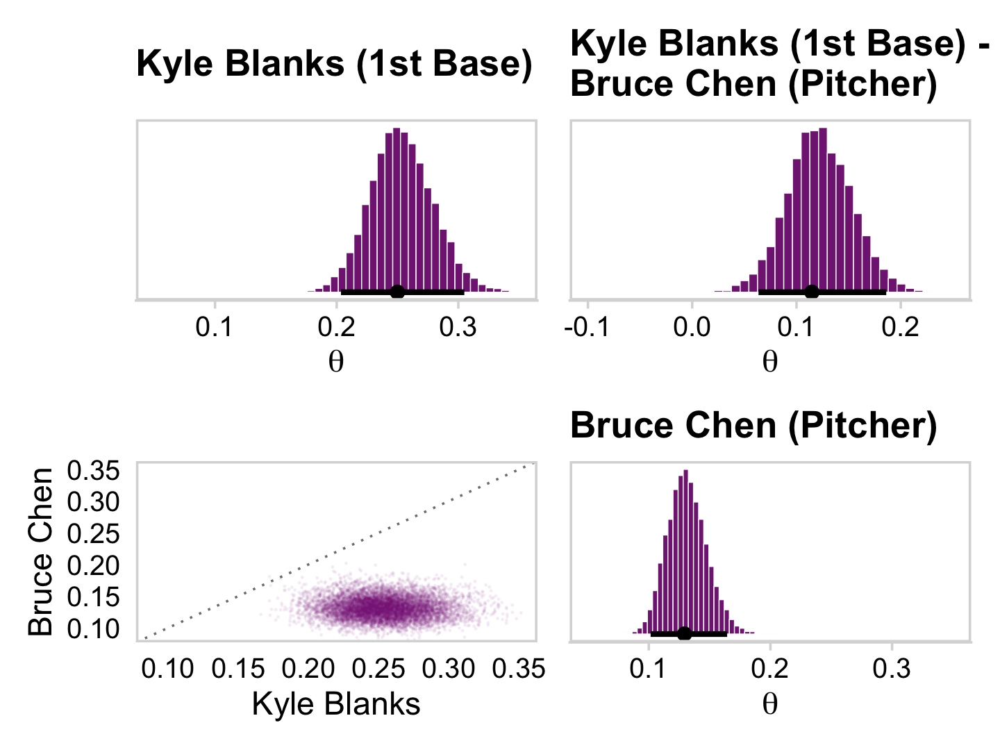

Figure 9.15, right:


```r
p1 <-
  make_histogram(data = fitted_players,
                 aes(x = `ShinSoo Choo`), 
                 title = "ShinSoo Choo (Right Field)", 
                 xlim = c(.22, .34))

p2 <-
  make_histogram(data = fitted_players,
                 aes(x = `ShinSoo Choo - Ichiro Suzuki`), 
                 title = "ShinSoo Choo (Right Field) -\nIchiro Suzuki (Right Field)", 
                 xlim = c(-.07, .07))

p3 <-
  make_point(data = fitted_players,
             aes(x = `ShinSoo Choo`, y = `Ichiro Suzuki`),
             limits = c(.23, .32))

p4 <-
  make_histogram(data = fitted_players,
                 aes(x = `Ichiro Suzuki`), 
                 title = "Ichiro Suzuki (Right Field)", 
                 xlim = c(.22, .34))

(p1 + p2 + p3 + p4) & 
  theme(title = element_text(size = 11))
```


Figure 9.16, left:


```r
p1 <-
  make_histogram(data = fitted_players,
                 aes(x = `Mike Leake`), 
                 title = "Mike Leake (Pitcher)", 
                 xlim = c(.05, .35))

p2 <-
  make_histogram(data = fitted_players,
                 aes(x = `Mike Leake - Wandy Rodriguez`), 
                 title = "Mike Leake (Pitcher) -\nWandy Rodriguez (Pitcher)", 
                 xlim = c(-.05, .25))

p3 <-
  make_point(data = fitted_players,
             aes(x = `Mike Leake`, y = `Wandy Rodriguez`),
             limits = c(.07, .25))

p4 <-
  make_histogram(data = fitted_players,
                 aes(x = `Wandy Rodriguez`), 
                 title = "Wandy Rodriguez (Pitcher)", 
                 xlim = c(.05, .35))

(p1 + p2 + p3 + p4) & 
  theme(title = element_text(size = 11))
```


Figure 9.16, right:


```r
p1 <-
  make_histogram(data = fitted_players,
                 aes(x = `Andrew McCutchen`), 
                 title = "Andrew McCutchen (Center Field)", 
                 xlim = c(.15, .35))

p2 <-
  make_histogram(data = fitted_players,
                 aes(x = `Andrew McCutchen - Brett Jackson`), 
                 title = "Andrew McCutchen (Center Field) -\nBrett Jackson (Center Field)", 
                 xlim = c(0, .20))

p3 <-
  make_point(data = fitted_players,
             aes(x = `Andrew McCutchen`, y = `Brett Jackson`),
             limits = c(.15, .35))

p4 <-
  make_histogram(data = fitted_players,
                 aes(x = `Brett Jackson`), 
                 title = "Brett Jackson (Center Field)", 
                 xlim = c(.15, .35))

(p1 + p2 + p3 + p4) & 
  theme(title = element_text(size = 11))
```

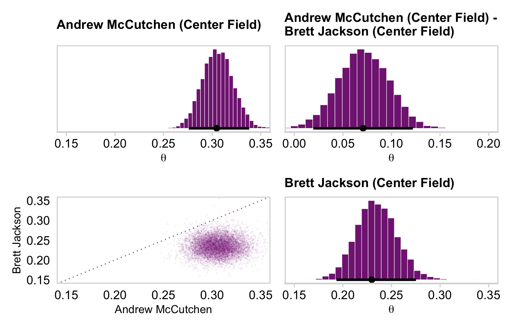

If you wanted the posterior modes and HDIs for any of the players and their contrasts, you'd use `mode_hdi()` after a little wrangling.


```r
fitted_players %>% 
  gather() %>% 
  group_by(key) %>% 
  mode_hdi(value) %>% 
  mutate_if(is.double, round, digits = 3)
```

```
## # A tibble: 12 x 7
##    key                               value .lower .upper .width .point .interval
##    <chr>                             <dbl>  <dbl>  <dbl>  <dbl> <chr>  <chr>    
##  1 Andrew McCutchen                  0.305  0.276  0.338   0.95 mode   hdi      
##  2 Andrew McCutchen - Brett Jackson  0.071  0.019  0.122   0.95 mode   hdi      
##  3 Brett Jackson                     0.23   0.193  0.275   0.95 mode   hdi      
##  4 Bruce Chen                        0.129  0.101  0.164   0.95 mode   hdi      
##  5 Ichiro Suzuki                     0.276  0.247  0.304   0.95 mode   hdi      
##  6 Kyle Blanks                       0.25   0.204  0.305   0.95 mode   hdi      
##  7 Kyle Blanks - Bruce Chen          0.115  0.064  0.186   0.95 mode   hdi      
##  8 Mike Leake                        0.148  0.118  0.184   0.95 mode   hdi      
##  9 Mike Leake - Wandy Rodriguez      0.027 -0.016  0.07    0.95 mode   hdi      
## 10 ShinSoo Choo                      0.275  0.245  0.305   0.95 mode   hdi      
## 11 ShinSoo Choo - Ichiro Suzuki     -0.004 -0.04   0.04    0.95 mode   hdi      
## 12 Wandy Rodriguez                   0.123  0.096  0.155   0.95 mode   hdi
```

To make our version of Figure 19.7, we'll have to switch gears from player-specific effects to those specific to positions averaged over individual players. The `fitted()` approach will probably make this the easiest. This will require two caveats. Recall our model was based on aggregated data with the number of trials indexed by the `AtBats` column. In order to get the `PriPos`-specific estimates, we'll have to assign each one an `AtBats` value. You could do this any number of ways, including a theoretically-meaningful value, a numerically-simple value (e.g., 100), the grand mean of the `AtBats` values, or even `AtBats` values based on the `PriPos`-specific means. We'll take that last approach.

Another consideration is if we'd like to use `fitted()` to average across one of the hierarchical grouping parameters (i.e., `(1 | PriPos:Player)`), we'll need to employ the `re_formula` argument. With the line `re_formula = ~ (1 | PriPos)`, we'll instruct `fitted()` to return the `PriPos`-specific effects after averaging across levels of `Player`. The rest is quire similar to our method from above.


```r
nd <-
  my_data %>% 
  group_by(PriPos) %>% 
  summarise(AtBats = mean(AtBats) %>% round(digits = 0))

fitted_positions <-
  fitted(fit9.2, 
         newdata = nd,
         re_formula = ~ (1 | PriPos),
         scale = "linear",
         summary = F) %>% 
  as_tibble() %>% 
  set_names(distinct(my_data, PriPos) %>% arrange(PriPos) %>% pull()) %>% 
  mutate_all(inv_logit_scaled)
    
glimpse(fitted_positions)
```

```
## Rows: 9,000
## Columns: 9
## $ `1st Base`     <dbl> 0.2588698, 0.2490724, 0.2551531, 0.2517265, 0.2571071,…
## $ `2nd Base`     <dbl> 0.2529545, 0.2540684, 0.2420828, 0.2565383, 0.2421646,…
## $ `3rd Base`     <dbl> 0.2642290, 0.2511025, 0.2620696, 0.2582727, 0.2598168,…
## $ Catcher        <dbl> 0.2426267, 0.2318330, 0.2499784, 0.2362275, 0.2406038,…
## $ `Center Field` <dbl> 0.2603440, 0.2542186, 0.2554342, 0.2661132, 0.2606517,…
## $ `Left Field`   <dbl> 0.2510519, 0.2578666, 0.2432428, 0.2544000, 0.2475470,…
## $ Pitcher        <dbl> 0.1253720, 0.1268791, 0.1354702, 0.1369081, 0.1299090,…
## $ `Right Field`  <dbl> 0.2579851, 0.2529431, 0.2616012, 0.2610969, 0.2487273,…
## $ Shortstop      <dbl> 0.2493705, 0.2589273, 0.2485258, 0.2516001, 0.2439543,…
```

Now we make and save the nine position-specific subplots for Figure 9.17.


```r
p1 <-
  fitted_positions %>% 
  pivot_longer(everything(),
               values_to = "theta") %>% 
  # though technically not needed, this line reorders the panels to match the text
  mutate(name = factor(name,
                       levels = c("1st Base", "Catcher", "Pitcher",
                                  "2nd Base", "Center Field", "Right Field",
                                  "3rd Base", "Left Field", "Shortstop"))) %>% 
  
  ggplot(aes(x = theta)) +
  geom_histogram(fill = a_purple, color = "white", 
                 size = .1, binwidth = .0025) +
  stat_pointinterval(aes(y = 0), 
                     point_interval = mode_hdi, .width = .95, size = 1) +
  scale_y_continuous(NULL, breaks = NULL) +
  xlab(expression(theta)) +
  coord_cartesian(xlim = c(.1, .28)) +
  theme_minimal_hgrid() +
  panel_border() +
  facet_wrap(~name, nrow = 3, scales = "free_y")
```

In this code block, we'll make the subplot for the overall batting average. Given the size of the model, it's perhaps easiest to pull that information from the model with the `fixef()` function.


```r
p2 <-
  fixef(fit9.2, summary = F) %>% 
  as_tibble() %>% 
  transmute(theta = inv_logit_scaled(Intercept),
            name = "Overall") %>% 
  
  ggplot(aes(x = theta)) +
  geom_histogram(fill = a_purple, color = "white", 
                 size = .2, binwidth = .005) +
  stat_pointinterval(aes(y = 0), 
                    point_interval = mode_hdi, .width = .95) +
  scale_y_continuous(NULL, breaks = NULL) +
  xlab(expression(theta)) +
  coord_cartesian(xlim = c(.1, .28)) +
  theme_minimal_hgrid() +
  panel_border() +
  facet_wrap(~name)
```

Now combine the plots with a little **patchwork** magic.


```r
p3 <- plot_spacer()

p1 + (p2 / p3 / p3) +
  plot_layout(widths = c(3, 1))
```


Do note that, unlike Kruschke's Figure 9.17, our subplots are all based on $\theta$ rather than $\omega$. This is because of our use of a hierarchical aggregated binomial, rather than the approach Kruschke took. Even so, look how similar the results are.

> Finally, we have only looked at a tiny fraction of the relations among the 968 parameters. We could investigate many more comparisons among parameters if we were specifically interested. In traditional statistical testing based on $p$-values (which will be discussed in Chapter 11), we would pay a penalty for even intending to make more comparisons. This is because a $p$ value depends on the space of counter-factual possibilities created from the testing intentions. In a Bayesian analysis, however, decisions are based on the posterior distribution, which is based only on the data (and the prior), not on the testing intention. More discussion of multiple comparisons can be found in [Section 11.4][Multiple comparisons]. (pp. 259--260)

## Session info {-}


```r
sessionInfo()
```

```
## R version 3.6.3 (2020-02-29)
## Platform: x86_64-apple-darwin15.6.0 (64-bit)
## Running under: macOS Catalina 10.15.3
## 
## Matrix products: default
## BLAS:   /Library/Frameworks/R.framework/Versions/3.6/Resources/lib/libRblas.0.dylib
## LAPACK: /Library/Frameworks/R.framework/Versions/3.6/Resources/lib/libRlapack.dylib
## 
## locale:
## [1] en_US.UTF-8/en_US.UTF-8/en_US.UTF-8/C/en_US.UTF-8/en_US.UTF-8
## 
## attached base packages:
## [1] stats     graphics  grDevices utils     datasets  methods   base     
## 
## other attached packages:
##  [1] tidybayes_2.1.1      bayesplot_1.7.1      brms_2.13.5         
##  [4] Rcpp_1.0.5           viridis_0.5.1        viridisLite_0.3.0   
##  [7] patchwork_1.0.1.9000 ggforce_0.3.1        ggridges_0.5.2      
## [10] cowplot_1.0.0.9000   forcats_0.5.0        stringr_1.4.0       
## [13] dplyr_1.0.1          purrr_0.3.4          readr_1.3.1         
## [16] tidyr_1.1.1          tibble_3.0.3         ggplot2_3.3.2       
## [19] tidyverse_1.3.0     
## 
## loaded via a namespace (and not attached):
##   [1] TH.data_1.0-10       colorspace_1.4-1     ellipsis_0.3.1      
##   [4] rsconnect_0.8.16     estimability_1.3     markdown_1.1        
##   [7] base64enc_0.1-3      fs_1.4.1             rstudioapi_0.11     
##  [10] farver_2.0.3         rstan_2.19.3         svUnit_1.0.3        
##  [13] DT_0.13              fansi_0.4.1          mvtnorm_1.1-0       
##  [16] lubridate_1.7.8      xml2_1.3.1           codetools_0.2-16    
##  [19] splines_3.6.3        bridgesampling_1.0-0 knitr_1.28          
##  [22] shinythemes_1.1.2    polyclip_1.10-0      jsonlite_1.7.0      
##  [25] broom_0.5.5          dbplyr_1.4.2         ggdist_2.1.1        
##  [28] shiny_1.5.0          compiler_3.6.3       httr_1.4.1          
##  [31] emmeans_1.4.5        backports_1.1.9      assertthat_0.2.1    
##  [34] Matrix_1.2-18        fastmap_1.0.1        cli_2.0.2           
##  [37] later_1.1.0.1        tweenr_1.0.1         prettyunits_1.1.1   
##  [40] htmltools_0.5.0      tools_3.6.3          igraph_1.2.5        
##  [43] coda_0.19-3          gtable_0.3.0         glue_1.4.2          
##  [46] reshape2_1.4.4       cellranger_1.1.0     vctrs_0.3.4         
##  [49] nlme_3.1-144         crosstalk_1.1.0.1    xfun_0.13           
##  [52] ps_1.3.4             rvest_0.3.5          mime_0.9            
##  [55] miniUI_0.1.1.1       lifecycle_0.2.0      gtools_3.8.2        
##  [58] MASS_7.3-51.5        zoo_1.8-7            scales_1.1.1        
##  [61] colourpicker_1.0     hms_0.5.3            promises_1.1.1      
##  [64] Brobdingnag_1.2-6    sandwich_2.5-1       parallel_3.6.3      
##  [67] inline_0.3.15        shinystan_2.5.0      yaml_2.2.1          
##  [70] gridExtra_2.3        StanHeaders_2.21.0-1 loo_2.3.1           
##  [73] stringi_1.4.6        dygraphs_1.1.1.6     pkgbuild_1.1.0      
##  [76] rlang_0.4.7          pkgconfig_2.0.3      matrixStats_0.56.0  
##  [79] HDInterval_0.2.0     evaluate_0.14        lattice_0.20-38     
##  [82] rstantools_2.1.1     htmlwidgets_1.5.1    labeling_0.3        
##  [85] processx_3.4.4       tidyselect_1.1.0     plyr_1.8.6          
##  [88] magrittr_1.5         bookdown_0.18        R6_2.4.1            
##  [91] generics_0.0.2       multcomp_1.4-13      DBI_1.1.0           
##  [94] pillar_1.4.6         haven_2.2.0          withr_2.2.0         
##  [97] xts_0.12-0           survival_3.1-12      abind_1.4-5         
## [100] modelr_0.1.6         crayon_1.3.4         arrayhelpers_1.1-0  
## [103] utf8_1.1.4           rmarkdown_2.1        grid_3.6.3          
## [106] readxl_1.3.1         callr_3.4.4          threejs_0.3.3       
## [109] reprex_0.3.0         digest_0.6.25        xtable_1.8-4        
## [112] httpuv_1.5.4         stats4_3.6.3         munsell_0.5.0       
## [115] shinyjs_1.1
```


