# Model Comparison and Hierarchical Modeling

> There are situations in which different models compete to describe the same set of data... 
>
> ...Bayesian inference is reallocation of credibility over possibilities. In model comparison, the focal possibilities are the models, and Bayesian model comparison reallocates credibility across the models, given the data. In this chapter, we explore examples and methods of Bayesian inference about the relative credibilities of models. [@kruschkeDoingBayesianData2015, pp. 265--266]

In the text, the emphasis is on the Bayes Factor paradigm. While we will discuss that, we will also present the alternatives available with information criteria, model averaging, and model stacking.

## General formula and the Bayes factor

So far we have spoken of

* the data, denoted by $D$ or $y$;
* the model parameters, generically denoted by $\theta$;
* the likelihood function, denoted by $p(D | \theta)$; and 
* the prior distribution, denoted by $p(\theta)$.

Now we add to that $m$, which is a model index with $m = 1$ standing for the first model, $m = 2$ standing for the second model, and so on. So when we have more than one model in play, we might refer to the likelihood as $p_m(y | \theta_m, m)$ and the prior as $p_m(\theta_m | m)$. It's also the case, then, that each model can be given a prior probability $p(m)$.

"The Bayes factor (BF) is the ratio of the probabilities of the data in models 1 and 2" (p. 268).

This can be expressed simply as

$$\text{BF} = \frac{p(D | m = 1)}{p(D | m = 2)}.$$

Kruschke further explained that

> one convention for converting the magnitude of the BF to a discrete decision about the models is that there is "substantial" evidence for model $m = 1$ when the BF exceeds 3.0 and, equivalently, "substantial" evidence for model $m = 2$ when the BF is less than 1/3 [@jeffreysTheoryProbability1961; @kassBayesFactors1995; @wetzelsStatisticalEvidenceExperimental2011].

However, as with $p$-values, effect sizes, and so on, BF values exist within continua and might should be evaluated in terms of degree more so than as ordered kinds.

## Example: Two factories of coins 

Kruschke considered the coin bias of two factories, each described by the beta distribution. We can organize how to derive the $\alpha$ and $\beta$ parameters from $\omega$ and $\kappa$ with a tibble.


```r
library(tidyverse)

d <-
  tibble(factory = 1:2,
         omega   = c(.25, .75),
         kappa   = 12) %>% 
  mutate(alpha =      omega  * (kappa - 2) + 1,
         beta  = (1 - omega) * (kappa - 2) + 1)

d %>% 
  knitr::kable()
```


 factory   omega   kappa   alpha   beta
--------  ------  ------  ------  -----
       1    0.25      12     3.5    8.5
       2    0.75      12     8.5    3.5

Thus given $\omega_1 = .25$, $\omega_2 = .75$ and $\kappa = 12$, we can describe the bias of the two coin factories as $\operatorname{beta} (\theta_{[m = 1]} | 3.5, 8.5)$ and $\operatorname{beta} (\theta_{[m = 2]} | 8.5, 3.5)$. With a little wrangling, we canuse our `d` tibble to make the densities of Figure 10.2.


```r
length <- 101

d %>% 
  expand(nesting(factory, alpha, beta),
         theta = seq(from = 0, to = 1, length.out = length)) %>%
  mutate(label = str_c("factory ", factory)) %>% 
  
  ggplot(aes(x = theta, 
             ymin = 0, 
             ymax = dbeta(x = theta, shape1 = alpha, shape2 = beta))) +
  geom_ribbon(fill = "grey67") +
  scale_y_continuous(NULL, breaks = NULL) +
  xlab(expression(theta)) +
  theme(panel.grid = element_blank()) +
  facet_wrap(~label)
```


We might recreate the top panel with `geom_col()`.


```r
tibble(Model = c("1", "2"),
       y     = 1) %>% 
  
  ggplot(aes(x = Model, y = y)) +
  geom_col(width = .75, fill = "grey50") +
  scale_y_continuous(NULL, breaks = NULL) +
  ggtitle(expression(paste(italic(P)[italic(m)]))) +
  theme(axis.ticks.x = element_blank(),
        panel.grid = element_blank())
```

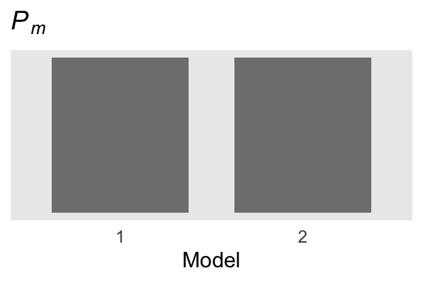

Consider the Bernoulli bar plots in the bottom panels of Figure 10.2. The heights of the bars are arbitrary and just intended to give a sense of the Bernoulli distribution. If we wanted the heights to correspond to the Beta distributions above them, we might do so like this.


```r
crossing(factory = str_c("factory ", 1:2),
         flip    = factor(c("tails", "heads"), levels = c("tails", "heads"))) %>% 
  mutate(prob = c(.75, .25, .25, .75)) %>% 
  
  ggplot(aes(x = flip, y = prob)) +
  geom_col(width = .75, fill = "grey50") +
  scale_y_continuous(NULL, breaks = NULL) +
  xlab(NULL) +
  theme(axis.ticks.x = element_blank(),
        panel.grid = element_blank()) +
  facet_wrap(~factory)
```

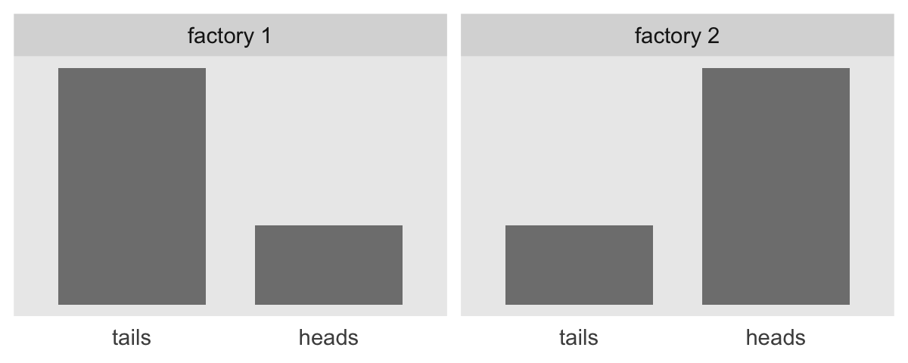

But now

> suppose we flip the coin nine times and get six heads. Given those data, what are the posterior probabilities of the coin coming from the head-biased or tail-biased factories? We will pursue the answer three ways: via formal analysis, grid approximation, and MCMC. (p. 270)

### Solution by formal analysis.

Here we rehearse if we have $\operatorname{beta} (\theta, a, b)$ prior for $\theta$ of the Bernoulli likelihood function, then the analytic solution for the posterior is $\operatorname{beta} (\theta | z + a, N – z + b)$. Within this paradigm, if you would like to compute $p(D | m)$, don't use the following function. If suffers from [underflow](https://en.wikipedia.org/wiki/Arithmetic_underflow) with large values.


```r
p_d <- function(z, n, a, b) { 
  beta(z + a, n - z + b) / beta(a, b) 
}
```

This version is more robust.


```r
p_d <- function(z, n, a, b) { 
  exp(lbeta(z + a, n - z + b) - lbeta(a, b)) 
}
```

You'd use it like this to compute $p(D|m_1)$.


```r
p_d(z = 6, n = 9, a = 3.5, b = 8.5)
```

```
## [1] 0.0004993439
```

So to compute our BF, $\frac{p(D|m_1)}{p(D|m_2)}$, you might use the `p_d()` function like this.


```r
p_d_1 <- p_d(z = 6, n = 9, a = 3.5, b = 8.5)
p_d_2 <- p_d(z = 6, n = 9, a = 8.5, b = 3.5)

p_d_1 / p_d_2
```

```
## [1] 0.2135266
```

And if we computed the BF the other way, it'd look like this.


```r
p_d_2 / p_d_1
```

```
## [1] 4.683258
```

Since the BF itself is only $\text{BF} = \frac{p(D | m = 1)}{p(D | m = 2)}$, we'd need to bring in the priors for the models themselves to get the posterior probabilities, which follows the form

$$\frac{p(m = 1 | D)}{p(m = 2 | D)} = \Bigg (\frac{p(D | m = 1)}{p(D | m = 2)} \Bigg ) \Bigg ( \frac{p(m = 1)}{p(m = 2)} \Bigg).$$

If for both our models $p(m) = .5$, then the BF is


```r
(p_d_1 * .5) / (p_d_2 * .5)
```

```
## [1] 0.2135266
```

As Kruschke pointed out, because we're working in the probability metric, the sum of $p(m = 1 | D )$ and $p(m = 2 | D )$ must be 1. By simple algebra then, 

$$p(m = 2 | D ) = 1 - p(m = 1 | D ).$$

Therefore, it's also the case that

$$\frac{p(m = 1 | D)}{1 - p(m = 1 | D)} = 0.2135266.$$

Thus, 0.2135266 is in an odds metric. If you want to convert odds to a probability, you follow the formula

$$\text{odds} = \frac{\text{probability}}{1 - \text{probability}}.$$

And with more algegraic manipulation, you can solve for the probability.

\begin{align*}
\text{odds} & =  \frac{\text{probability}}{1 - \text{probability}} \\
\text{odds} - \text{odds} \cdot \text{probability} & =  \text{probability} \\
\text{odds} & =  \text{probability} + \text{odds} \cdot \text{probability} \\
\text{odds} & =  \text{probability} (1 + \text{odds}) \\
\frac{\text{odds}}{1 + \text{odds}} & =  \text{probability}
\end{align*}

Thus, the posterior probability for $m = 1$ is

$$p(m = 1 | D) = \frac{0.2135266}{1 + 0.2135266}.$$

We can express that in code like so.


```r
odds <- (p_d_1 * .5) / (p_d_2 * .5)

odds / (1 + odds)
```

```
## [1] 0.1759554
```

Relative to $m = 2$, our posterior probability for $m = 1$ is about .18. Therefore the posterior probability of $m = 2$ is 1 minus that.


```r
1 - (odds / (1 + odds))
```

```
## [1] 0.8240446
```

Given the data, the two models and the prior assumption they were equally credible, we conclude $m = 2$ is .82 probable.

### Solution by grid approximation.

We won't be able to make the wireframe plots on the left of Figure 10.3, but we can do some of the others. Here's the upper right panel.


```r
tibble(omega = seq(from = 0, to = 1, length.out = length)) %>% 
  mutate(m_p = ifelse(omega %in% c(.25, .75), 15, 0)) %>% 
  
  ggplot(aes(x = omega, ymin = 0, ymax = m_p)) +
  geom_ribbon(fill = "grey67", color = "grey67") +
  labs(subtitle = "Remember, the scale on the x is arbitrary.",
       x = expression(omega),
       y = expression(Marginal~p(omega))) +
  coord_flip(ylim = c(0, 25)) +
  theme(panel.grid = element_blank())
```

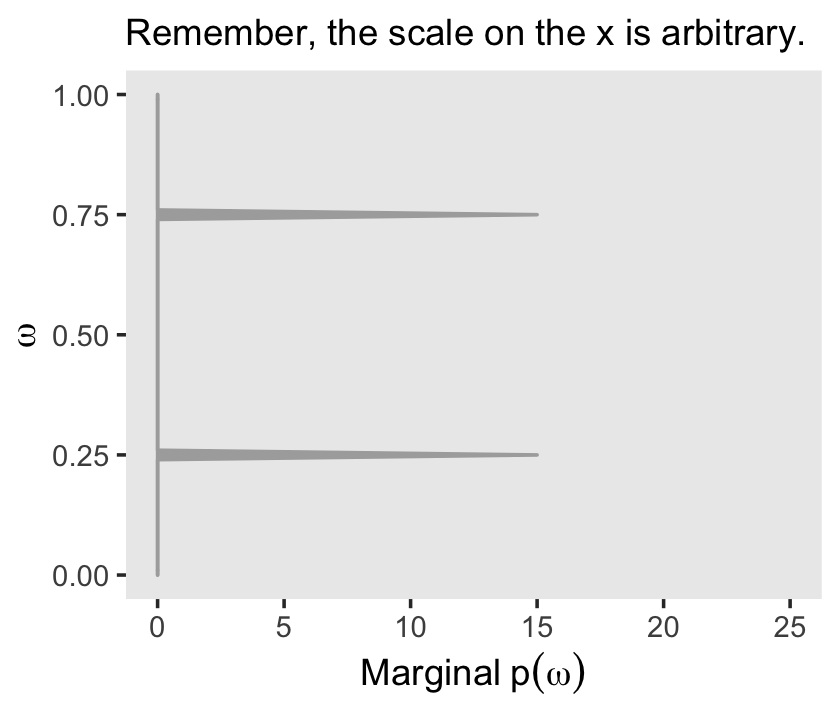

Building on that, here's the upper middle panel of the "two [prior] dorsal fins" (p. 271).


```r
d <-
  crossing(omega = seq(from = 0, to = 1, length.out = length),
           theta = seq(from = 0, to = 1, length.out = length)) %>% 
  mutate(prior = ifelse(omega == .25, dbeta(theta, 3.5, 8.5),
                          ifelse(omega == .75, dbeta(theta, 8.5, 3.5),
                                 0)))
d %>% 
  ggplot(aes(x = theta, y = omega, fill = prior)) +
  geom_raster(interpolate = T) +
  scale_fill_viridis_c(option = "A") +
  labs(x = expression(theta),
       y = expression(omega)) +
  coord_equal() +
  theme(panel.grid = element_blank(),
        legend.position = "none")
```

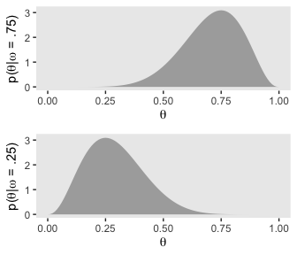

This time we'll separate $p_{m = 1}(\theta)$ and $p_{m = 2}(\theta)$ into the two short plots on the right of the next row down.


```r
p1 <-
  d %>% 
  filter(omega == .75) %>% 
  
  ggplot(aes(x = theta, ymin = 0, ymax = prior)) +
  geom_ribbon(fill = "grey67") +
  labs(x = expression(theta),
       y = expression(p(theta*"|"*omega==.75))) +
   theme(panel.grid = element_blank())

p2 <-
  d %>% 
  filter(omega == .25) %>% 
  
  ggplot(aes(x = theta, ymin = 0, ymax = prior)) +
  geom_ribbon(fill = "grey67") +
  labs(x = expression(theta),
       y = expression(p(theta*"|"*omega==.25))) +
  theme(panel.grid = element_blank())

# we'll put them together with help from patchwork
library(patchwork)

p1 / p2
```


We can continue to build on those sensibilities for the middle panel of the same row. Here we're literally adding $p_{m = 1}(\theta)$ to $p_{m = 2}(\theta)$ and taking their average.


```r
tibble(theta = seq(from = 0, to = 1, length.out = length)) %>% 
  mutate(d_75 = dbeta(x = theta, shape1 = 8.5, shape2 = 3.5),
         d_25 = dbeta(x = theta, shape1 = 3.5, shape2 = 8.5)) %>% 
  mutate(mean_prior = (d_75 + d_25) / 2) %>% 

  ggplot(aes(x = theta, ymin = 0, ymax = mean_prior)) +
  geom_ribbon(fill = "grey67") +
  coord_cartesian(ylim = c(0, 3)) +
  labs(x = expression(theta),
       y = expression(Marginal~p(theta))) +
  theme(panel.grid = element_blank())
```

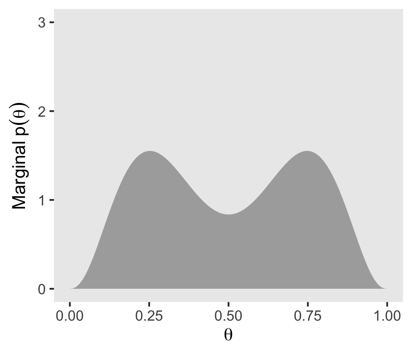

We need the Bernoulli likelihood function for the next step.


```r
bernoulli_likelihood <- function(theta, data) {
  
  n <- length(data)
  z <- sum(data)
  
  return(theta^z * (1 - theta)^(n - sum(data)))
}
```

Time to feed our data and the parameter space into `bernoulli_likelihood()`, which will allow us to make the 2-dimensional density plot at the heart of Figure 10.3.


```r
n <- 9
z <- 6

trial_data <- rep(0:1, times = c(n - z, z))

d <-
  d %>% 
  mutate(likelihood = bernoulli_likelihood(theta = theta, 
                                           data  = trial_data))

d %>%
  ggplot(aes(x = theta, y = omega, fill = likelihood)) +
  geom_raster(interpolate = T) +
  scale_fill_viridis_c(option = "A") +
  labs(x = expression(theta),
       y = expression(omega)) +
  coord_equal() +
  theme(panel.grid = element_blank(),
        legend.position = "none")
```

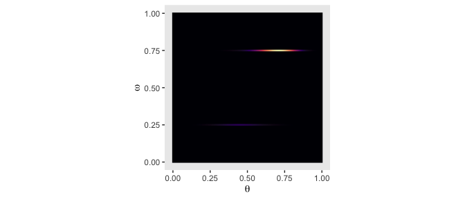

Now we just need the marginal likelihood, $p(D)$, to compute the posterior. Our first depiction will be the middle panel of the second row from the bottom--the panel with the uneven dolphin fins.


```r
d <-
  d %>% 
  mutate(marginal_likelihood = sum(prior * likelihood)) %>% 
  mutate(posterior = (prior * likelihood) / marginal_likelihood) 

d %>% 
  ggplot(aes(x = theta, y = omega, fill = posterior)) +
  geom_raster(interpolate = T) +
  scale_fill_viridis_c(option = "A") +
  labs(x = expression(theta),
       y = expression(omega)) +
  coord_equal() +
  theme(panel.grid = element_blank(),
        legend.position = "none")
```

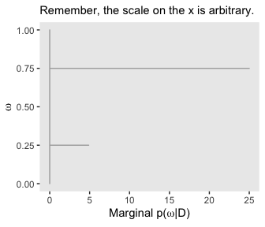

Here, then, is a way to get the panel in on the right of the second row from the bottom.


```r
d %>% 
  mutate(marginal = (posterior / max(posterior)) * 25) %>% 

  ggplot(aes(x = omega, ymin = 0, ymax = marginal)) +
  geom_ribbon(fill = "grey67", color = "grey67") +
  coord_flip(ylim = c(0, 25)) +
  labs(subtitle = "Remember, the scale on the x is arbitrary.",
       x = expression(omega),
       y = expression(Marginal~p(omega*"|"*D))) +
  theme(panel.grid = element_blank())
```


To make the middle bottom panel of Figure 10.3, we have to average the posterior values of $\theta$ over the grid of $\omega$ values. That is, we have to marginalize.


```r
 d %>%
  group_by(theta) %>% 
  summarise(marginal_theta = mean(posterior)) %>% 
  
  ggplot(aes(x = theta, ymin = 0, ymax = marginal_theta)) +
  geom_ribbon(fill = "grey67") + 
  labs(x = expression(theta),
       y = expression(Marginal~p(theta*"|"*D))) +
  theme(panel.grid = element_blank())
```


For the lower right panel of Figure 10.3, we'll `filter()` to our two focal values of $\omega$ and then facet by them.


```r
d %>% 
  filter(omega %in% c(.25, .75)) %>% 
  mutate(omega = str_c("omega == ", omega)) %>%

  ggplot(aes(x = theta, ymin = 0, ymax = posterior)) +
  geom_ribbon(fill = "grey67") + 
  labs(x = expression(theta),
       y = expression(Marginal~p(theta*"|"*omega))) +
  theme(panel.grid = element_blank()) +
  facet_wrap(~omega, ncol = 1, scales = "free", labeller = label_parsed)
```

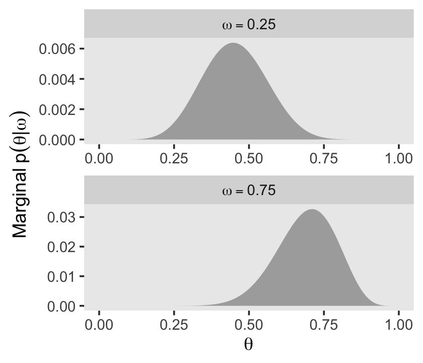

Do note the different scales on the $y$. Here's what they'd look like on the same scale.


```r
d %>% 
  filter(omega %in% c(.25, .75)) %>% 
  mutate(omega = str_c("omega == ", omega)) %>%

  ggplot(aes(x = theta, ymin = 0, ymax = posterior)) +
  geom_ribbon(fill = "grey67") + 
  labs(x = expression(theta),
       y = expression(Marginal~p(theta*"|"*omega))) +
  theme(panel.grid = element_blank()) +
  facet_wrap(~omega, ncol = 1, labeller = label_parsed)
```


Hopefully that helps build the intuition of what Kruschke meant when he wrote "*visual inspection suggests that the ratio of the heights is about 5 to 1, which matches the Bayes factor of 4.68 that we computed exactly in the previous section*" (p. 273, *emphasis* in the original).

Using the grid, you might compute that BF like this.


```r
d %>% 
  filter(omega %in% c(.25, .75)) %>% 
  group_by(omega) %>% 
  summarise(sum_posterior = sum(posterior)) %>% 
  mutate(model = c("model_2", "model_1")) %>% 
  pivot_wider(-omega, 
              names_from = model,
              values_from = sum_posterior) %>%
  summarise(BF = model_1 / model_2)
```

```
## # A tibble: 1 x 1
##      BF
##   <dbl>
## 1  4.68
```

## Solution by MCMC

Kruschke started with: "For large, complex models, we cannot derive $p(D | m)$ analytically or with grid approximation, and therefore we will approximate the posterior probabilities using MCMC methods" (p. 274). He's not kidding. Welcome to modern Bayes.

### Nonhierarchical MCMC computation of each model's marginal likelihood.

Before you get excited, Kruschke warned: "For complex models, this method might not be tractable. [But] for the simple application here, however, the method works well, as demonstrated in the next section" (p. 277).

#### Implementation with ~~JAGS~~ brms.

Load **brms**.


```r
library(brms)
```

Let's save the `trial_data` as a tibble.


```r
trial_data <- 
  tibble(y = trial_data)
```

Time to learn a new **brms** skill. When you want to enter variables into the parameters defining priors in `brms::brm()`, you need to specify them using the `stanvar()` function. Since we want to do this for two variables, we’ll use `stanvar()` twice and save the results as an object, conveniently named `stanvars`.


```r
omega <- .75
kappa <- 12

stanvars <-
  stanvar(     omega  * (kappa - 2) + 1, name = "my_alpha") +
  stanvar((1 - omega) * (kappa - 2) + 1, name = "my_beta")
```

Now we have our `stanvars` object, we are ready to fit the first model (i.e., the model for which $\omega = .75$). 


```r
fit10.1 <-
  brm(data = trial_data, 
      family = bernoulli(link = identity),
      y ~ 1,
      prior(beta(my_alpha, my_beta), class = Intercept),
      iter = 11000, warmup = 1000, chains = 4, cores = 4,
      seed = 10,
      stanvars = stanvars,
      control = list(adapt_delta = .999),
      file = "fits/fit10.01")
```

Note how we fed our `stanvars` object into the `stanvars` function.

Anyway, let's inspect the chains.


```r
plot(fit10.1)
```


They look great. Now we glance at the model summary.


```r
print(fit10.1)
```

```
##  Family: bernoulli 
##   Links: mu = identity 
## Formula: y ~ 1 
##    Data: trial_data (Number of observations: 9) 
## Samples: 4 chains, each with iter = 11000; warmup = 1000; thin = 1;
##          total post-warmup samples = 40000
## 
## Population-Level Effects: 
##           Estimate Est.Error l-95% CI u-95% CI Rhat Bulk_ESS Tail_ESS
## Intercept     0.69      0.10     0.48     0.86 1.00     8007     9306
## 
## Samples were drawn using sampling(NUTS). For each parameter, Bulk_ESS
## and Tail_ESS are effective sample size measures, and Rhat is the potential
## scale reduction factor on split chains (at convergence, Rhat = 1).
```

Next we'll follow Kruschke and extract the posterior samples, saving them as `theta`.


```r
theta <- posterior_samples(fit10.1)

head(theta)
```

```
##   b_Intercept      lp__
## 1   0.7263424 -4.691665
## 2   0.7626307 -4.815941
## 3   0.7222605 -4.686314
## 4   0.8012281 -5.125448
## 5   0.7373272 -4.714354
## 6   0.6857306 -4.707360
```

The `fixef()` function will return the posterior summaries for the model intercept (i.e., $\theta$). We can then index and save the desired summaries.


```r
fixef(fit10.1)
```

```
##           Estimate Est.Error      Q2.5    Q97.5
## Intercept 0.691113  0.098457 0.4820692 0.863507
```

```r
(mean_theta <- fixef(fit10.1)[1])
```

```
## [1] 0.691113
```

```r
(sd_theta <- fixef(fit10.1)[2])
```

```
## [1] 0.098457
```

Now we'll convert them to the $\alpha$ and $\beta$ parameters, `a_post` and `b_post`, respectively.


```r
a_post <-      mean_theta  * ( mean_theta * (1 - mean_theta) / sd_theta^2 - 1)
b_post <- (1 - mean_theta) * ( mean_theta * (1 - mean_theta) / sd_theta^2 - 1)
```

Recall we've already defined several values.


```r
n     <- 9
z     <- 6
omega <- .75
kappa <- 12
```

The reason we're saving all these values is we're aiming to compute $p(D)$, the probability of the data (i.e., the marginal likelihood), given the model. But our intermediary step will be computing its reciprocal, $\frac{1}{p(D)}$. Here we'll express Kruschke's `oneOverPD` as a function, `one_over_pd()`.


```r
one_over_pd <- function(theta) {
  
  mean(dbeta(theta, a_post, b_post ) / 
         (theta^z * (1 - theta)^(n - z) * 
            dbeta(theta, omega * (kappa - 2) + 1, (1 - omega) * (kappa - 2) + 1 )))
  
}
```

We're ready to use `one_over_pd()` to help compute $p(D)$.


```r
theta %>% 
  summarise(pd = 1 / one_over_pd(theta = b_Intercept))
```

```
##            pd
## 1 0.002338466
```

That matches up nicely with Kruschke's value! Let's rinse, wash, and repeat for $\omega = .25$. First, we'll need to redefine `omega` and our `stanvars`.


```r
omega <- .25

stanvars <-
  stanvar(     omega  * (kappa - 2) + 1, name = "my_alpha") +
  stanvar((1 - omega) * (kappa - 2) + 1, name = "my_beta")
```

Fit the model.


```r
fit10.2 <-
  brm(data = trial_data, 
      family = bernoulli(link = identity),
      y ~ 1,
      prior(beta(my_alpha, my_beta), class = Intercept),
      iter = 11000, warmup = 1000, chains = 4, cores = 4,
      seed = 10,
      stanvars = stanvars,
      control = list(adapt_delta = .999),
      file = "fits/fit10.02")
```

We'll do the rest in bulk.


```r
theta <- posterior_samples(fit10.2)

mean_theta <- fixef(fit10.2)[1]
sd_theta   <- fixef(fit10.2)[2]

a_post <-      mean_theta  * ( mean_theta * (1 - mean_theta) / sd_theta^2 - 1)
b_post <- (1 - mean_theta) * ( mean_theta * (1 - mean_theta) / sd_theta^2 - 1)

theta %>% 
  summarise(pd = 1 / one_over_pd(theta = b_Intercept))
```

```
##             pd
## 1 0.0004992476
```

Boom!

### Hierarchical MCMC computation ~~of relative model probability~~ is not available in brms: We'll cover information criteria instead.

I'm not aware of a way to specify a model "in which the top-level parameter is the index across models" in **brms** (p. 278). If you know of a way, [share your code](https://github.com/ASKurz/Doing-Bayesian-Data-Analysis-in-brms-and-the-tidyverse/issues).

However, we do have options. We can compare and weight models using information criteria, about which you can learn more [here](https://youtu.be/t0pRuy1_190?t=978). In **brms**, the LOO and WAIC are two primary information criteria available. You can compute them for a given model with the `loo()` and `waic()` functions, respectively. Here's a quick example of how to use the `waic()` function.


```r
waic(fit10.1)
```

```
## 
## Computed from 40000 by 9 log-likelihood matrix
## 
##           Estimate  SE
## elpd_waic     -6.2 1.3
## p_waic         0.5 0.1
## waic          12.5 2.7
```

We'll explain that output in a bit. Before we do, you should know the current recommended workflow for information criteria with **brms** models is to use the `add_criterion()` function, which will allow us to compute information-criterion-related output and save it to our **brms** fit objects. Here's how to do that with both our fits.


```r
fit10.1 <- add_criterion(fit10.1, criterion = c("loo", "waic"))
fit10.2 <- add_criterion(fit10.2, criterion = c("loo", "waic"))
```

You can extract the same WAIC output for `fit10.1` we saw above by executing `fit10.1$criteria$waic`. Here we look at the LOO summary for `fit10.2`, instead.


```r
fit10.2$criteria$loo
```

```
## 
## Computed from 40000 by 9 log-likelihood matrix
## 
##          Estimate  SE
## elpd_loo     -7.1 0.3
## p_loo         0.5 0.0
## looic        14.1 0.6
## ------
## Monte Carlo SE of elpd_loo is 0.0.
## 
## All Pareto k estimates are good (k < 0.5).
## See help('pareto-k-diagnostic') for details.
```

You get a wealth of output, more of which can be seen by executing `str(fit10.1$criteria$loo)`. First, notice the message "All Pareto k estimates are good (k < 0.5)." Pareto $k$ values can be [used for diagnostics](https://cran.r-project.org/web/packages/loo/vignettes/loo2-example.html#plotting-pareto-k-diagnostics). Each case in the data gets its own $k$ value and we like it when those $k$s are low. The makers of the [**loo** package](https://github.com/stan-dev/loo) get worried when $k$ values exceed 0.7 and, as a result, we will get warning messages when they do. Happily, we have no such warning messages in this example.

In the main section, we get estimates for the expected log predictive density (`elpd_loo`), the estimated effective number of parameters (`p_loo`), and the Pareto smoothed importance-sampling leave-one-out cross-validation (PSIS-LOO; `looic`). Each estimate comes with a standard error (i.e., `SE`). Like other information criteria, the LOO values aren't of interest in and of themselves. However, the estimate of one model's LOO relative to that of another is of great interest. We generally prefer models with lower information criteria. With the `loo_compare()` function, we can compute a formal difference score between two models.


```r
loo_compare(fit10.1, fit10.2, criterion = "loo")
```

```
##         elpd_diff se_diff
## fit10.1  0.0       0.0   
## fit10.2 -0.8       1.7
```

The `loo_compare()` output rank orders the models such that the best fitting model appears on top. All models receive a difference score relative to the best model. Here the best fitting model is `fit10.1` and since the LOO for `fit10.1` minus itself is zero, the values in the top row are all zero.

Each difference score also comes with a standard error. In this case, even though `fit10.1` has the lower estimates, the standard error is twice the magnitude of the difference score. So the LOO difference score puts the two models on similar footing. You can do a similar analysis with the WAIC estimates.

In addition to difference-score comparisons, you can also use the LOO or WAIC for AIC-type model weighting. In **brms**, you do this with the `model_weights()` function.


```r
(mw <- model_weights(fit10.1, fit10.2))
```

```
##  fit10.1  fit10.2 
## 0.830191 0.169809
```

I don't know that I'd call these weights probabilities, but they do sum to one. In this case, the analysis suggests we put about five times more weight to `fit10.1` relative to `fit10.2`. 


```r
mw[1] / mw[2]
```

```
##  fit10.1 
## 4.888969
```

With `brms::model_weights()`, we have a variety of weighting schemes avaliable to us. Since we didn't specify any in the `weights` argument, we used the default `"stacking"`, which is--perhaps confusingly given the name--the stacking method according to the paper by @yaoUsingStackingAverage2018 Vehtari has [written about the paper](https://statmodeling.stat.columbia.edu/2017/04/11/stacking-pseudo-bma-and-aic-weights/) on Gelman's blog, too. But anyway, the point is that different weighting schemes might not produce the same results. For example, here's the result from weighting using the WAIC.


```r
model_weights(fit10.1, fit10.2, weights = "waic")
```

```
##   fit10.1   fit10.2 
## 0.6967995 0.3032005
```

The results are similar, for sure. But they're not the same. The stacking method via the **brms** default `weights = "stacking"` is the current preferred method by the folks on the Stan team (e.g., the authors of the above linked paper).

For more on stacking and other weighting schemes, see Vehtari and Gabry's [-@vehtariBayesianStackingPseudoBMA] vignette, [*Bayesian Stacking and Pseudo-BMA weights using the loo package*](https://CRAN.R-project.org/package=loo/vignettes/loo2-weights.html), or Vehtari's [modelselection_tutorial GitHub repository](https://github.com/avehtari/modelselection_tutorial). But don't worry. We will have more opportunities to practice with information criteria, model weights, and such later in this project.

#### ~~Using~~ [No need to use] pseudo-priors to reduce autocorrelation.

Since we didn't use Kruschke's method from the last subsection, we don't have the same worry about autocorrelation. For example, here are the autocorrelation plots for `fit10.1`.


```r
library(bayesplot)

mcmc_acf(posterior_samples(fit10.1, add_chain = T), 
         pars = "b_Intercept",
         lags = 35)
```

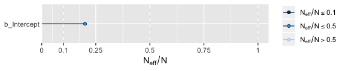

Our autocorrelations were a little high for HMC, but nowhere near pathological. The results for `fit10.2` were similar. As you might imagine from the moderate autocorrelations, the $N_{eff}/N$ ratio for `b_Intercept` wasn't great.


```r
neff_ratio(fit10.1)[1] %>% 
  mcmc_neff() +
  yaxis_text(hjust = 0)
```

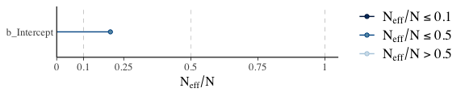

But we specified a lot of post-warmup iterations, so we're still in good shape. Plus, the $\hat R$ was fine.


```r
rhat(fit10.1)[1]
```

```
## b_Intercept 
##    1.000613
```

### Models with different "noise" distributions in ~~JAGS~~ brms.

> Probability distribution[s are] sometimes [called "noise"] distribution[s] because [they describe] the random variability of the data values around the underlying trend. In more general applications, different models can have different noise distributions. For example, one model might describe the data as log-normal distributed, while another model might describe the data as gamma distributed. (p. 288)

If there are more than one plausible noise distributions for our data, we might want to compare the models. Kruschke then gave us a general trick in the form of this JAGS code:


```r
data {
  C <- 10000 # JAGS does not warn if too small!
  for (i in 1:N) {
    ones[i] <- 1 }
} model {
  for (i in 1:N) {
    spy1[i] <- pdf1(y[i], parameters1) / C # where pdf1 is a formula
    spy2[i] <- pdf2(y[i], parameters2) / C # where pdf2 is a formula
    spy[i]  <- equals(m,1) * spy1[i] + equals(m, 2) * spy2[i]
    ones[i] ~ dbern(spy[i])
  }
  parameters1 ~ dprior1...
  parameters2 ~ dprior2...
  m ~ dcat(mPriorProb[])
  mPriorProb[1] <- .5
  mPriorProb[2] <- .5
}
```

I'm not aware that we can do this within the Stan/**brms** framework. If I'm in error and you know how, [please share your code](https://github.com/ASKurz/Doing-Bayesian-Data-Analysis-in-brms-and-the-tidyverse/issues). However, we do have options. In anticipation of Chapter 16, let's consider Gaussian-like data with thick tails. We might generate some like this:


```r
# how many draws would you like?
n <- 1e3

set.seed(10)
(d <- tibble(y = rt(n, df = 7)))
```

```
## # A tibble: 1,000 x 1
##          y
##      <dbl>
##  1  0.0214
##  2 -0.987 
##  3  0.646 
##  4 -0.237 
##  5  0.977 
##  6 -0.200 
##  7  0.781 
##  8 -1.09  
##  9  1.83  
## 10 -0.682 
## # … with 990 more rows
```

The resulting data look like this.


```r
d %>% 
  ggplot(aes(x = y)) +
  geom_histogram(color = "grey92", fill = "grey67",
                 size = .2, bins = 30) +
  scale_y_continuous(NULL, breaks = NULL) +
  theme(panel.grid = element_blank())
```

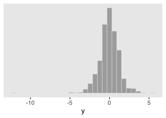

As you'd expect with a small-$\nu$ Student's $t$, some of our values are far from the central clump. If you don't recall, Student's $t$-distribution has three parameters: $\nu$, $\mu$, and $\sigma$. The Gaussian is a special case of Student's $t$ for which $\nu = \infty$. As $\nu$ gets small, the distribution allocates more mass in the tails. From a Gaussian perspective, the small-$\nu$ Student's $t$ expects more outliers--though it's a little odd calling them outliers from a small-$\nu$ Student's $t$ perspective.

Let's see how well the Gaussian versus the Student's $t$ likelihoods handle the data. Here we'll use fairly liberal priors.


```r
fit10.3 <-
  brm(data = d,
      family = gaussian,
      y ~ 1,
      prior = c(prior(normal(0, 5), class = Intercept),
                prior(normal(0, 5), class = sigma)),  # by default, this has a lower bound of 0
      chains = 4, cores = 4,
      seed = 10,
      file = "fits/fit10.03")

fit10.4 <-
  brm(data = d,
      family = student,
      y ~ 1,
      prior = c(prior(normal(0, 5), class = Intercept),
                prior(normal(0, 5), class = sigma),
                prior(gamma(2, 0.1), class = nu)),  # this is the brms default prior for nu
      chains = 4, cores = 4,
      seed = 10,
      file = "fits/fit10.04")
```

In case you were curious, here's what that default `gamma(2, 0.1)` prior on `nu` looks like.


```r
tibble(x = seq(from = 0, to = 110, by = 1)) %>% 
  ggplot(aes(x = x, ymin = 0,
             ymax = dgamma(x, 2, 0.1))) +
  geom_ribbon(size = 0, fill = "grey67") +
  scale_y_continuous(NULL, breaks = NULL) +
  xlab(expression(italic(p)(nu))) +
  coord_cartesian(xlim = c(0, 100)) +
  theme(panel.grid = element_blank())
```

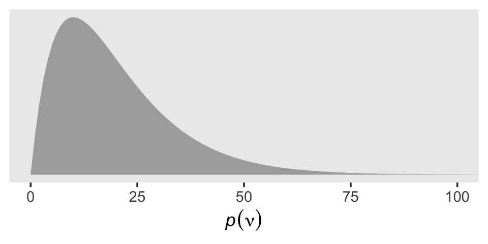

That prior puts most of the probability mass below 50, but the right tail gently fades off into the triple digits, allowing for the possibility of larger estimates.

We can use the `posterior_summary()` function to get a compact look at the model summaries.


```r
posterior_summary(fit10.3) %>% round(digits = 2)
```

```
##             Estimate Est.Error     Q2.5    Q97.5
## b_Intercept    -0.03      0.04    -0.11     0.05
## sigma           1.25      0.03     1.20     1.31
## lp__        -1646.97      0.98 -1649.49 -1646.02
```

```r
posterior_summary(fit10.4) %>% round(digits = 2)
```

```
##             Estimate Est.Error     Q2.5    Q97.5
## b_Intercept    -0.01      0.04    -0.08     0.06
## sigma           0.98      0.04     0.90     1.05
## nu              5.76      1.02     4.12     8.06
## lp__        -1590.50      1.26 -1593.76 -1589.07
```

Now we can compare the two approaches using information criteria. For kicks, we'll use the WAIC.


```r
fit10.3 <- add_criterion(fit10.3, criterion = c("loo", "waic"))
fit10.4 <- add_criterion(fit10.4, criterion = c("loo", "waic"))

loo_compare(fit10.3, fit10.4, criterion = "waic")
```

```
##         elpd_diff se_diff
## fit10.4   0.0       0.0  
## fit10.3 -60.3      40.1
```

Based on the WAIC difference, we have some support for preferring the Student's $t$, but do notice how wide that `SE` was. We can also compare the models using model weights. Here we'll use the default weighting scheme.


```r
model_weights(fit10.3, fit10.4)
```

```
##    fit10.3    fit10.4 
## 0.03221231 0.96778769
```

Virtually all of the stacking weight was placed on the Student's-$t$ model, `fit10.4`. 

Remember what that $p(\nu)$ looked like? Here’s our posterior distribution for $\nu$.


```r
posterior_samples(fit10.4) %>% 
  ggplot(aes(x = nu)) +
  geom_histogram(color = "grey92", fill = "grey67",
                 size = .2, bins = 30) +
  scale_y_continuous(NULL, breaks = NULL) +
  coord_cartesian(xlim = c(0, 20)) +
  labs(subtitle = expression("Recall that for the Gaussian, "*nu==infinity.),
       x = expression(italic(p)(nu*"|"*italic(D)))) +
  theme(panel.grid = element_blank())
```


Even though our prior for $\nu$ was relatively weak, the posterior ended up concentrated on values in the middle-single-digit range. Recall the data-generating value was 7.

We can also compare the models using posterior-predictive checks. There are a variety of ways we might do this, but the most convenient way is with `brms::pp_check()`, which is itself a wrapper for the family of `ppc` functions from the **bayesplot** package.


```r
pp_check(fit10.3)
```

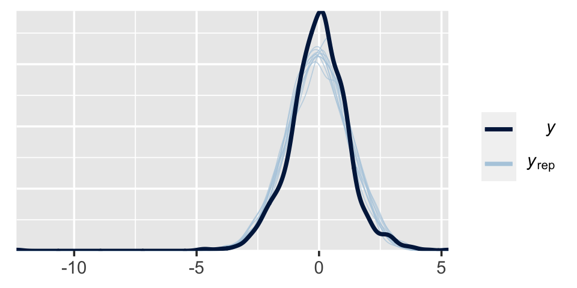

```r
pp_check(fit10.4)
```

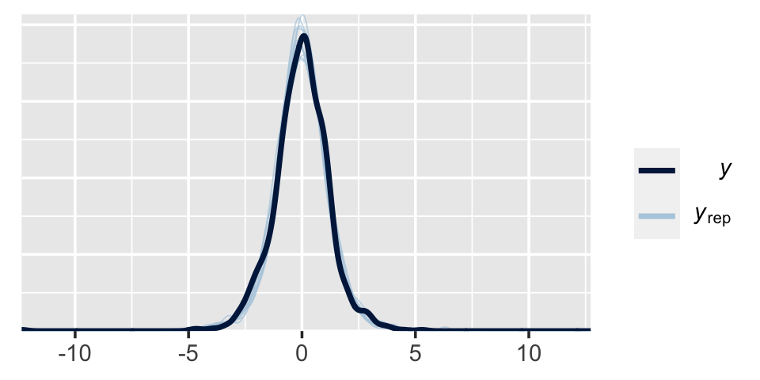

The default `pp_check()` setting allows us to compare the density of the data $y$ (i.e., the dark blue) with 10 density’s simulated from the posterior $y_\text{rep}$ (i.e., the light blue). We prefer models that produce $y_\text{rep}$ distributions resembling $y$. Though the results from both models were similar, the simulated distributions from `fit10.4` mimicked the original data a little more convincingly. To learn more about this approach to posterior predictive checks, check out Gabry's [-@gabryGraphicalPosteriorPredictive2019] vignette, [*Graphical posterior predictive checks using the bayesplot package*](https://CRAN.R-project.org/package=bayesplot/vignettes/graphical-ppcs.html).

## Prediction: Model averaging

> In many applications of model comparison, the analyst wants to identify the best model and then base predictions of future data on that single best model, denoted with index $b$. In this case, predictions of future $\hat{y}$ are based exclusively on the likelihood function $p_b(\hat{y} | \theta_b, m = b)$ and the posterior distribution $p_b(\theta_b | D, m = b)$ of the winning model:
>
> $$p_b(\hat y | D, m = b) = \int \text d \theta_b p_b (\hat{y} | \theta_b, m = b) p_b(\theta_b | D, m = b)$$
>
> But the full model of the data is actually the complete hierarchical structure that spans all the models being compared, as indicated in Figure 10.1 (p. 267). Therefore, if the hierarchical structure really expresses our prior beliefs, then the most complete prediction of future data takes into account all the models, weighted by their posterior credibilities. In other words, we take a weighted average across the models, with the weights being the posterior probabilities of the models. Instead of conditionalizing on the winning model, we have
>
> \begin{align*}
> p (\hat y | D) & = \sum_m p (\hat y | D, m) p (m | D) \\
> & = \sum_m \int \text d \theta_m p_m (\hat{y} | \theta_m, m) p_m(\theta_m | D, m) p (m | D)
> \end{align*}
>
> This is called model averaging. (p. 289)

Okay, while the concept of model averaging is of great interest, we aren't going to be able to follow this approach to it within the Stan/**brms** paradigm. This, recall, is because our paradigm doesn't allow for a hierarchical organization of models in the same way JAGS does. However, we can still play the model averaging game with extensions of our model weighting paradigm, above. Before we get into the details,

> recall that there were two models of mints that created the coin, with one mint being tail-biased with mode $\omega = 0.25$ and one mint being head-biased with mode $\omega = 0.75$ The two subpanels in the lower-right [of Figure 10.3] illustrate the posterior distributions on $\omega$ within each model, $p(\theta | D, \omega = 0.25)$ and $p(\theta | D, \omega = 0.75)$ The winning model was $\omega = 0.75$, and therefore the predicted value of future data, based on the winning model alone, would use $p(\theta | D, \omega = 0.75)$. (p. 289)

Here's the histogram for $p(\theta | D, \omega = 0.75)$, which we generate from our `fit10.1`.


```r
library(tidybayes)

posterior_samples(fit10.1) %>% 
  ggplot(aes(x = b_Intercept, y = 0)) +
  stat_histintervalh(point_interval = mode_hdi, .width = c(.95, .5),
                     fill = "grey67", slab_color = "grey92",
                     breaks = 40, slab_size = .25, outline_bars = T) +
  scale_y_continuous(NULL, breaks = NULL) +
  labs(subtitle = "The posterior for the probability, given fit10.1",
       x = expression(italic(p)(theta*"|"*italic(D)*", "*omega==.75))) +
  xlim(0, 1) +
  theme(panel.grid = element_blank())
```

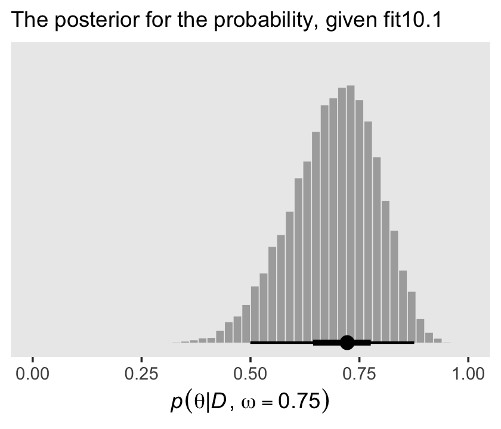

> But the overall model included $\omega = 0.75$, and if we use the overall model, then the predicted value of future data should be based on the complete posterior summed across values of $\omega$. The complete posterior distribution [is] $p(\theta | D)$ (p. 289).

The cool thing about the model weighting stuff we learned about earlier is that you can use those model weights to average across models. Again, we're not weighting the models by posterior probabilities the way Kruschke discussed in text. However, the spirit is similar. We can use the `brms::pp_average()` function to make posterior predictive prediction with mixtures of the models, weighted by our chosen weighting scheme. Here, we’ll go with the default stacking weights.


```r
nd <- tibble(y = 1)

pp_a <-
  pp_average(fit10.1, fit10.2, 
             newdata = nd,
             # this line is not necessary, but you should see how to choose weighing methods
             weights = "stacking",
             method = "fitted",
             summary = F) %>% 
  as_tibble() %>% 
  set_names("theta")

# what does this produce?
head(pp_a) 
```

```
## # A tibble: 6 x 1
##   theta
##   <dbl>
## 1 0.730
## 2 0.594
## 3 0.736
## 4 0.853
## 5 0.839
## 6 0.744
```

We can plot our model-averaged $\theta$ with a little help from good old `tidybayes::stat_histintervalh()`.


```r
pp_a %>% 
  ggplot(aes(x = theta, y = 0)) +
  stat_histintervalh(point_interval = mode_hdi, .width = c(.95, .5),
                     fill = "grey67", slab_color = "grey92",
                     breaks = 30, slab_size = .4, outline_bars = T) +
  scale_y_continuous(NULL, breaks = NULL) +
  labs(subtitle = "The posterior for the probability, given the\nweighted combination of fit10.1 and fit10.2",
       x = expression(italic(p)(theta*"|"*italic(D)))) +
  coord_cartesian(xlim = c(0, 1)) +
  theme(panel.grid = element_blank())
```

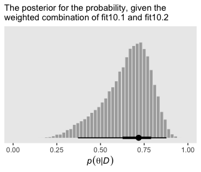

As Kruschke concluded, "you can see the contribution of $p(\theta | D, \omega = 0.25)$ as the extended leftward tail" (p. 289). Interestingly enough, that looks a lot like the density we made with grid approximation in Figure 10.3, doesn't it?

## Model complexity naturally accounted for

> A complex model (usually) has an inherent advantage over a simpler model because the complex model can find some combination of its parameter values that match the data better than the simpler model. There are so many more parameter options in the complex model that one of those options is likely to fit the data better than any of the fewer options in the simpler model. The problem is that data are contaminated by random noise, and we do not want to always choose the more complex model merely because it can better fit noise. Without some way of accounting for model complexity, the presence of noise in data will tend to favor the complex model.
>
> Bayesian model comparison compensates for model complexity by the fact that each model must have a prior distribution over its parameters, and more complex models must dilute their prior distributions over larger parameter spaces than simpler models. Thus, even if a complex model has some particular combination of parameter values that fit the data well, the prior probability of that particular combination must be small because the prior is spread thinly over the broad parameter space. (pp. 289--290)

Now our two models are:

* $p(\theta | D, \kappa = 2000)$ (i.e., the "must-be-fair" model) and
* $p(\theta | D, \kappa = 2)$ (i.e., the "anything's-possible" model).

They look like this.


```r
# how granular to you want the theta sequence?
n <- 1e3

# simulate the data
tibble(omega = .5,
       kappa = c(1000, 2),
       model = c("The must-be-fair model", "The anything's-possible model")) %>% 
  expand(nesting(omega, kappa, model),
         theta = seq(from = 0, to = 1, length.out = n)) %>% 
  mutate(density = dbeta(theta, 
                         shape1 =      omega  * (kappa - 2) + 1, 
                         shape2 = (1 - omega) * (kappa - 2) + 1)) %>% 
  
  # plot
  ggplot(aes(x = theta, ymin = 0, ymax = density)) +
  geom_ribbon(fill = "grey67") + 
  scale_y_continuous(NULL, breaks = NULL) +
  labs(subtitle = "Note that in this case, their y-axes are on the same scale.",
       x = expression(theta)) +
  theme(panel.grid = element_blank()) +
  facet_wrap(~model)
```

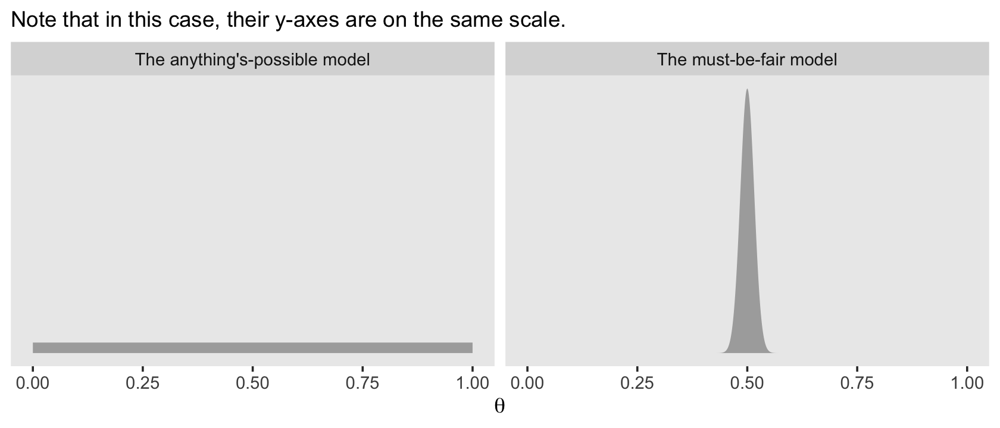

Here's how you might compute the $\alpha$ and $\beta$ values for the corresponding beta distributions.


```r
tibble(omega = .5,
       kappa = c(1000, 2),
       model = c("The must-be-fair model", "The anything's-possible model")) %>%
  mutate(alpha =      omega  * (kappa - 2) + 1,
         beta  = (1 - omega) * (kappa - 2) + 1)
```

```
## # A tibble: 2 x 5
##   omega kappa model                         alpha  beta
##   <dbl> <dbl> <chr>                         <dbl> <dbl>
## 1   0.5  1000 The must-be-fair model          500   500
## 2   0.5     2 The anything's-possible model     1     1
```

With those in hand, we can use our `p_d()` function to compute the Bayes factor based on flipping a coin $N = 20$ times and observing $z = 15$ heads.


```r
# the data summaries
z <- 15
n <- 20

p_d(z, n, a = 500, b = 500) / p_d(z, n, a = 1, b = 1)
```

```
## [1] 0.3229023
```

Let's try again, this time supposing we observe $z = 15$ heads out of $N = 20$ coin flips.


```r
z <- 11

p_d(z, n, a = 500, b = 500) / p_d(z, n, a = 1, b = 1)
```

```
## [1] 3.337148
```

> The anything’s-possible model loses because it pays the price of having a small prior probability on the values of $\theta$ near the data proportion, while the must-be-fair model has large prior probability on $\theta$ values sufficiently near the data proportion to be credible. Thus, in Bayesian model comparison, a simpler model can win if the data are consistent with it, even if the complex model fits just as well. The complex model pays the price of having small prior probability on parameter values that describe simple data. (p. 291)

### Caveats regarding nested model comparison.

> A frequently encountered special case of comparing models of different complexity occurs when one model is "nested" within the other. Consider a model that implements all the meaningful parameters we can contemplate for the particular application. We call that the full model. We might consider various restrictions of those parameters, such as setting some of them to zero, or forcing some to be equal to each other. A model with such a restriction is said to be nested within the full model. (p. 291)

Kruschke didn't walk out the examples in this section. But for the sake of practice, let's work through the first one. "Recall the hierarchical model of baseball batting abilities" from Chapter 9 (p. 291). Let's reload those data.


```r
my_data <- read_csv("data.R/BattingAverage.csv")

glimpse(my_data)
```

```
## Rows: 948
## Columns: 6
## $ Player       <chr> "Fernando Abad", "Bobby Abreu", "Tony Abreu", "Dustin Ac…
## $ PriPos       <chr> "Pitcher", "Left Field", "2nd Base", "2nd Base", "1st Ba…
## $ Hits         <dbl> 1, 53, 18, 137, 21, 0, 0, 2, 150, 167, 0, 128, 66, 3, 1,…
## $ AtBats       <dbl> 7, 219, 70, 607, 86, 1, 1, 20, 549, 576, 1, 525, 275, 12…
## $ PlayerNumber <dbl> 1, 2, 3, 4, 5, 6, 7, 8, 9, 10, 11, 12, 13, 14, 15, 16, 1…
## $ PriPosNumber <dbl> 1, 7, 4, 4, 3, 1, 1, 3, 3, 4, 1, 5, 4, 2, 7, 4, 6, 8, 9,…
```

"The full model has a distinct modal batting ability, $\omega_c$ , for each of the nine fielding positions. The full model also has distinct concentration parameters for each of the nine positions" (p. 291). Let's fit that model again.


```r
fit9.2 <-
  brm(data = my_data,
      family = binomial(link = logit),
      Hits | trials(AtBats) ~ 1 + (1 | PriPos) + (1 | PriPos:Player),
      prior = c(prior(normal(0, 1.5), class = Intercept),
                prior(normal(0, 1), class = sd)),
      iter = 3500, warmup = 500, chains = 3, cores = 3,
      control = list(adapt_delta = .99),
      seed = 9,
      file = "fits/fit09.02")
```

Next we'll consider a restricted version of `fit9.2` "in which all infielders (first base, second base, etc.) are grouped together versus all outfielders (right field, center field, and left field). In this restricted model, we are forcing the modal batting abilities of all the outfielders to be the same, that is, $\omega_\text{left field} = \omega_\text{center field} = \omega_\text{right field}$" (p. 291). To fit that model, we'll need to make a new variable `PriPos_small` which is identical to its parent variable `PriPos` except that it collapses those three positions into our new category `Outfield`.


```r
 my_data <-
  my_data %>% 
  mutate(PriPos_small = if_else(PriPos %in% c("Center Field", "Left Field", "Right Field"),
                                "Outfield", PriPos))
```

Now use `update()` to fit the restricted model.


```r
fit10.5 <-
  update(fit9.2,
         newdata = my_data,
         formula = Hits | trials(AtBats) ~ 1 + (1 | PriPos_small) + (1 | PriPos_small:Player),
         iter = 3500, warmup = 500, chains = 3, cores = 3,
         control = list(adapt_delta = .99),
         seed = 10,
         file = "fits/fit10.05")
```

Unlike with what Kruschke alluded to in the prose, here we'll compare the two models with the WAIC.


```r
fit9.2 <- add_criterion(fit9.2, criterion = "waic")
fit10.5 <- add_criterion(fit10.5, criterion = "waic")

loo_compare(fit9.2, fit10.5, criterion = "waic")
```

```
##         elpd_diff se_diff
## fit9.2   0.0       0.0   
## fit10.5 -0.3       1.2
```

Based on the WAIC difference score, they're near equivalent. Now let's see how their WAIC weights shake out.


```r
model_weights(fit9.2, fit10.5, weights = "waic") %>% round(2)
```

```
##  fit9.2 fit10.5 
##    0.58    0.42
```

In this case, just a little more of the weight went to the full model, `fit9.2`. The overall pattern between the WAIC difference and the WAIC weights was uncertainty. Make sure to use good substantive reasoning when comparing models.

## Extreme sensitivity to the prior distribution

> In many realistic applications of Bayesian model comparison, the theoretical emphasis is on the difference between the models' likelihood functions. For example, one theory predicts planetary motions based on elliptical orbits around the sun, and another theory predicts planetary motions based on circular cycles and epicycles around the earth. The two models involve very different parameters. In these sorts of models, the form of the prior distribution on the parameters is not a focus, and is often an afterthought. But, when doing Bayesian model comparison, the form of the prior is crucial because the Bayes factor integrates the likelihood function weighted by the prior distribution. (p. 292)

However, "the sensitivity of Bayes factors to prior distributions is well known in the literature [e.g., @kassBayesFactors1995; @liuBayesFactorsPrior2008; @vanpaemelPriorSensitivityTheory2010]," and furthermore, when comparing Bayesian models using the methods Kruschke outlined in this chapter of the text, "different forms of vague priors can yield very different Bayes factors" (p. 293).

In the two BFs to follow, we compare the must-be-fair model and the anything's-possible models from 10.5 to new data: $z = 65, N = 100$.


```r
z <- 65
n <- 100 

p_d(z, n, a = 500, b = 500) / p_d(z, n, a = 1, b = 1)
```

```
## [1] 0.125287
```

The resulting 0.13 favored the anything's-possible model.

Another way to express the anything's-possible model is with the Haldane prior, which sets the two parameters within the beta distribution to be a) equivalent and b) quite small (i.e., 0.01 in this case).


```r
p_d(z, n, a = 500, b = 500) / p_d(z, n, a = .01, b = .01)
```

```
## [1] 5.728066
```

Now we flipped to favoring the must-be-fair model. You might be asking, *Wait, kind of distribution did that Haldane prior produce?* Here we compare it to the $\operatorname{beta} (1, 1)$.


```r
# how granular to you want the theta sequence?
length <- 1e3

# simulate the data
tibble(alpha = c(1, .01),
       beta  = c(1, .01),
       model = factor(c("Uninformative prior, beta(1, 1)", "Haldane prior, beta(0.01, 0.01)"),
                      levels = c("Uninformative prior, beta(1, 1)", "Haldane prior, beta(0.01, 0.01)"))) %>%
  expand(nesting(alpha, beta, model),
         theta = seq(from = 0, to = 1, length.out = length)) %>% 
  mutate(density = dbeta(theta, 
                         shape1 = alpha, 
                         shape2 = beta)) %>% 
  
  # plot
  ggplot(aes(x = theta, ymin = 0, ymax = density)) +
  geom_ribbon(fill = "grey67") + 
  scale_y_continuous(NULL, breaks = NULL) +
  labs(title = "We have two anything’s-possible models.",
       subtitle = "These y-axes are on the same scale.",
       x = expression(theta)) +
  theme(panel.grid = element_blank()) +
  facet_wrap(~model)
```


Before we can complete the analyses of this subsection, we'll need to define our version of Kruschke's `HDIofICDF function()`, `hdi_of_icdf()`. Like we've done in previous chapters, here we mildly reformat the function.


```r
hdi_of_icdf <- function(name, width = .95, tol = 1e-8, ... ) {
  
  incredible_mass <- 1.0 - width
  interval_width <- function(low_tail_prob, name, width, ...) {
    name(width + low_tail_prob, ...) - name(low_tail_prob, ...)
  }
  opt_info <- optimize(interval_width, c(0, incredible_mass), 
                       name = name, width = width, 
                       tol = tol, ...)
  hdi_lower_tail_prob <- opt_info$minimum
  
  return(c(name(hdi_lower_tail_prob, ...),
           name(width + hdi_lower_tail_prob, ...)))
  
}
```

And here we'll make a custom variant to be more useful within the context of `map2()`.


```r
hdi_of_qbeta <- function(shape1, shape2) {
  
  hdi_of_icdf(name = qbeta,
              shape1 = shape1,
              shape2 = shape2) %>% 
    data.frame() %>% 
    mutate(level = c("ll", "ul")) %>% 
    spread(key = level, value = ".")
  
}
```

Recall that when we combine a $\operatorname{beta} (\theta | \alpha, \beta)$ prior with the results of a Bernoulli likelihood, we get a posterior defined by $\operatorname{beta} (\theta | z + \alpha, N - z + \beta)$.


```r
d <-
  tibble(model   = c("Uniform", "Haldane"),
         prior_a = c(1, .01),
         prior_b = c(1, .01)) %>% 
  mutate(posterior_a = z + prior_a,
         posterior_b = n - z + prior_b)

d
```

```
## # A tibble: 2 x 5
##   model   prior_a prior_b posterior_a posterior_b
##   <chr>     <dbl>   <dbl>       <dbl>       <dbl>
## 1 Uniform    1       1           66          36  
## 2 Haldane    0.01    0.01        65.0        35.0
```

Now we'll use our custom `hdi_of_qbeta()` to compute the HDIs.


```r
(
  d <- 
  d %>% 
  mutate(levels = map2(posterior_a, posterior_b, hdi_of_qbeta)) %>% 
  unnest(levels)
 )
```

```
## # A tibble: 2 x 7
##   model   prior_a prior_b posterior_a posterior_b    ll    ul
##   <chr>     <dbl>   <dbl>       <dbl>       <dbl> <dbl> <dbl>
## 1 Uniform    1       1           66          36   0.554 0.738
## 2 Haldane    0.01    0.01        65.0        35.0 0.556 0.742
```

Let's compare those HDIs in a plot.


```r
d %>% 
  ggplot(aes(x = ll,    xend = ul,
             y = model, yend = model)) +
  geom_segment(size = .75) +
  scale_x_continuous(expression(theta), limits = c(0, 1)) +
  labs(subtitle = "Those two sets of HDIs are quite similar.\nIt almost seems silly their respective BFs\nare so different.",
       y = NULL) +
  theme(axis.text.y = element_text(hjust = 0),
        axis.ticks.y = element_blank(),
        panel.grid = element_blank())
```


"The HDIs are virtually identical. In particular, for either prior, the posterior distribution rules out $\theta = 0.5$, which is to say that the must-be-fair hypothesis is not among the credible values" (p. 294).

### Priors of different models should be equally informed.

"We have established that seemingly innocuous changes in the vagueness of a vague prior can dramatically change a model's marginal likelihood, and hence its Bayes factor in comparison with other models. What can be done to ameliorate the problem" (p. 294)? Kruschke posed one method might be taking a small representative portion of the data in hand and use them to make an empirically-based prior for the remaining set of data. From our previous example, "suppose that the 10% subset has 6 heads in 10 flips, so the remaining 90% of the data has $z = 65 − 6$ and $N  = 100 − 10$" (p. 294).

Here are the new Bayes factors based on that method.


```r
z <- 65 - 6
n <- 100 - 10

# Peaked vs Uniform
p_d(z, n, a = 500 + 6, b = 500 + 10 - 6) / p_d(z, n, a =   1 + 6, b =   1 + 10 - 6)
```

```
## [1] 0.05570509
```

```r
# Peaked vs Haldane
p_d(z, n, a = 500 + 6, b = 500 + 10 - 6) / p_d(z, n, a = .01 + 6, b = .01 + 10 - 6)
```

```
## [1] 0.05748123
```

Now the two Bayes Factors are nearly the same.

It's not in the text, but let's compare these three models using **brms**, information criteria, model weights, model averaging, and posterior predictive checks. First, we'll save the $z$ and $N$ information as a tibble with a series of 0s and 1s.


```r
z <- 65
n <- 100

trial_data <- tibble(y = rep(0:1, times = c(n - z, z)))

glimpse(trial_data)
```

```
## Rows: 100
## Columns: 1
## $ y <int> 0, 0, 0, 0, 0, 0, 0, 0, 0, 0, 0, 0, 0, 0, 0, 0, 0, 0, 0, 0, 0, 0, 0…
```

Next, fit the three models with `brms::brm()`.


```r
fit10.6 <-
  brm(data = trial_data, 
      family = bernoulli(link = identity),
      y ~ 1,
      prior(beta(500, 500), class = Intercept),
      iter = 11000, warmup = 1000, chains = 4, cores = 4,
      seed = 10,
      file = "fits/fit10.06")

fit10.7 <-
  brm(data = trial_data, 
      family = bernoulli(link = identity),
      y ~ 1,
      # Uniform
      prior(beta(1, 1), class = Intercept),
      iter = 11000, warmup = 1000, chains = 4, cores = 4,
      seed = 10,
      file = "fits/fit10.07")

fit10.8 <-
  brm(data = trial_data, 
      family = bernoulli(link = identity),
      y ~ 1,
      # Haldane
      prior(beta(0.01, 0.01), class = Intercept),
      iter = 11000, warmup = 1000, chains = 4, cores = 4,
      seed = 10,
      file = "fits/fit10.08")
```

Compare the models by the LOO.


```r
fit10.6 <- add_criterion(fit10.6, criterion = "loo")
fit10.7 <- add_criterion(fit10.7, criterion = "loo")
fit10.8 <- add_criterion(fit10.8, criterion = "loo")

loo_compare(fit10.6, fit10.7, fit10.8)
```

```
##         elpd_diff se_diff
## fit10.7  0.0       0.0   
## fit10.8  0.0       0.1   
## fit10.6 -2.9       2.7
```

Based on the LOO comparisons, none of the three models was a clear favorite. Although both versions of the anything's-possible model (i.e., `fit10.7` and `fit10.8`) had lower numeric estimates than the must-be-fair model (i.e., `fit10.6`), the standard errors on the difference scores were the same magnitude as the difference estimates themselves. As for comparing the two variants of the anything’s-possible model directly, their LOO estimates were almost indistinguishable.

Now let's see what happens when we compute their model weights. Here we'll contrast the LOO weights with the stacking weights.


```r
mw <-
  model_weights(fit10.6, fit10.7, fit10.8, weights = "stacking")

mw %>% 
  round(digits = 2)
```

```
## fit10.6 fit10.7 fit10.8 
##    0.12    0.33    0.55
```

```r
model_weights(fit10.6, fit10.7, fit10.8, weights = "loo") %>% 
  round(digits = 2)
```

```
## fit10.6 fit10.7 fit10.8 
##    0.03    0.49    0.48
```

Here the evidence varied by the specific weight. Across both, the model with the Haldane prior (`fit10.8`) did arguably the best. But the model with the uniform prior (`fit10.9`) was clearly in the running. Overall, the evidence for one versus another was weak.

Like we did earlier with `fit10.1` and `fit10.2`, we can use the `pp_average()` function to compute the stacking weighted posterior for $\theta$.


```r
pp_average(fit10.6, fit10.7, fit10.8, 
           newdata = nd,
           weights = mw,
           method = "fitted",
           summary = F) %>% 
  as_tibble() %>%
  
  ggplot(aes(x = V1, y = 0)) +
  stat_histintervalh(point_interval = mode_hdi, .width = c(.95, .5),
                     fill = "grey67", slab_color = "grey92",
                     breaks = 30, slab_size = .25, outline_bars = T) +
  scale_y_continuous(NULL, breaks = NULL) +
  labs(subtitle = "The posterior for the probability, given the weighted\ncombination of fit10.6, fit10.7, and fit10.8",
       x = expression(italic(p)(theta*"|"*italic(D)))) +
  coord_cartesian(xlim = c(0, 1)) +
  theme(panel.grid = element_blank())
```

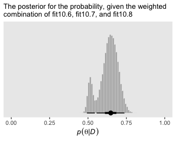

Did you notice the `weights = mw` argument, there? From the `pp_average.brmsfit` section of the [**brms** reference manual](https://CRAN.R-project.org/package=brms/brms.pdf) [@brms2020RM, p. 155], we read "`weights` may also be be a numeric vector of pre-specified weights." Since we saved the results of `model_weights()` as an object `mw`, we were able to capitalize on that feature. If you leave out that argument, you'll have to wait a bit for **brms** to compute those weights again from scratch.

Just for the sake of practice, we can also compare the models with separate posterior predictive checks using `pp_check()`.


```r
p1 <-
  pp_check(fit10.6, type = "bars", nsamples = 1e3) +
  ggtitle("fit10.6",
          subtitle = expression("beta"*(500*", "*500)))

p2 <-
  pp_check(fit10.7, type = "bars", nsamples = 1e3) +
  ggtitle("fit10.7",
          subtitle = expression("beta"*(1*", "*1)))

p3 <-
  pp_check(fit10.8, type = "bars", nsamples = 1e3) +
  ggtitle("fit10.8",
          subtitle = expression("beta"*(0.01*", "*0.01)))

((p1 + p2 + p3) & 
    scale_x_continuous(breaks = 0:1) &
    ylim(0, 80) &
    theme_grey() &
    theme(panel.grid = element_blank())) + 
  plot_layout(guides = 'collect')
```

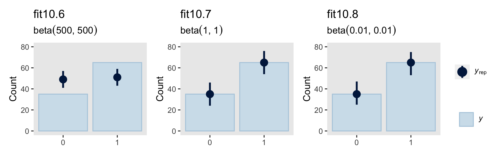

Instead of the default 10, this time we used 1,000 posterior simulations from each fit, which we summarized with dot and error bars. This method did a great job showing how little `fit10.6` learned from the data. Another nice thing about this method is it reveals how similar the results are between `fit10.7` and `fit10.8`, the two alternate versions of the anything's-possible model. Also, did you notice how we used `ylim(0, 80)` when combining the plots with **patchwork**? Holding the scale of the axes constant makes it easier to compare results across plots.

## Bonus: There's danger ahead

If you're new to model comparison with Bayes factors, information criteria, model stacking and so on, you should know these methods are still subject to spirited debate amongst scholars. For a recent example, see Gronau and Wagenmakers' [-@gronauLimitationsBayesianLeaveoneout2019] [*Limitations of Bayesian leave-one-out cross-validation for model selection*](https://doi.org/10.1007/s42113-018-0011-7), which criticized the LOO. Their paper was commented on by
@navarroDevilDeepBlue2019, @chandramouliCommentaryGronauWagenmakers2019, and @vehtariLimitationsLimitationsBayesian2019. You can find Gronau and Wagenmakers' [-@gronauRejoinderMoreLimitations2019] rejoinder [here](https://doi.org/10.1007/s42113-018-0022-4).

And if you love those hot scholarly twitter discussions, these topics seem to spawn one every few months or so (e.g., [here](https://twitter.com/dan_p_simpson/status/1040885250832969728)).

## Session info {-}


```r
sessionInfo()
```

```
## R version 3.6.3 (2020-02-29)
## Platform: x86_64-apple-darwin15.6.0 (64-bit)
## Running under: macOS Catalina 10.15.3
## 
## Matrix products: default
## BLAS:   /Library/Frameworks/R.framework/Versions/3.6/Resources/lib/libRblas.0.dylib
## LAPACK: /Library/Frameworks/R.framework/Versions/3.6/Resources/lib/libRlapack.dylib
## 
## locale:
## [1] en_US.UTF-8/en_US.UTF-8/en_US.UTF-8/C/en_US.UTF-8/en_US.UTF-8
## 
## attached base packages:
## [1] stats     graphics  grDevices utils     datasets  methods   base     
## 
## other attached packages:
##  [1] tidybayes_2.0.3.9000 bayesplot_1.7.1      brms_2.12.0         
##  [4] Rcpp_1.0.4.6         patchwork_1.0.0      forcats_0.5.0       
##  [7] stringr_1.4.0        dplyr_0.8.5          purrr_0.3.4         
## [10] readr_1.3.1          tidyr_1.0.2          tibble_3.0.1        
## [13] ggplot2_3.3.0        tidyverse_1.3.0     
## 
## loaded via a namespace (and not attached):
##   [1] colorspace_1.4-1     ellipsis_0.3.0       ggridges_0.5.2      
##   [4] rsconnect_0.8.16     markdown_1.1         base64enc_0.1-3     
##   [7] fs_1.4.1             rstudioapi_0.11      farver_2.0.3        
##  [10] rstan_2.19.3         svUnit_1.0.3         DT_0.13             
##  [13] fansi_0.4.1          mvtnorm_1.1-0        lubridate_1.7.8     
##  [16] xml2_1.3.1           bridgesampling_1.0-0 knitr_1.28          
##  [19] shinythemes_1.1.2    jsonlite_1.6.1       broom_0.5.5         
##  [22] dbplyr_1.4.2         shiny_1.4.0.2        compiler_3.6.3      
##  [25] httr_1.4.1           backports_1.1.6      assertthat_0.2.1    
##  [28] Matrix_1.2-18        fastmap_1.0.1        cli_2.0.2           
##  [31] later_1.0.0          prettyunits_1.1.1    htmltools_0.4.0     
##  [34] tools_3.6.3          igraph_1.2.5         coda_0.19-3         
##  [37] gtable_0.3.0         glue_1.4.0           reshape2_1.4.4      
##  [40] cellranger_1.1.0     vctrs_0.3.0          nlme_3.1-144        
##  [43] crosstalk_1.1.0.1    xfun_0.13            ps_1.3.3            
##  [46] rvest_0.3.5          mime_0.9             miniUI_0.1.1.1      
##  [49] lifecycle_0.2.0      gtools_3.8.2         zoo_1.8-7           
##  [52] scales_1.1.1         colourpicker_1.0     hms_0.5.3           
##  [55] promises_1.1.0       Brobdingnag_1.2-6    parallel_3.6.3      
##  [58] inline_0.3.15        shinystan_2.5.0      yaml_2.2.1          
##  [61] gridExtra_2.3        StanHeaders_2.21.0-1 loo_2.2.0           
##  [64] stringi_1.4.6        highr_0.8            dygraphs_1.1.1.6    
##  [67] pkgbuild_1.0.8       rlang_0.4.6          pkgconfig_2.0.3     
##  [70] matrixStats_0.56.0   HDInterval_0.2.0     evaluate_0.14       
##  [73] lattice_0.20-38      rstantools_2.0.0     htmlwidgets_1.5.1   
##  [76] labeling_0.3         tidyselect_1.0.0     processx_3.4.2      
##  [79] plyr_1.8.6           magrittr_1.5         bookdown_0.18       
##  [82] R6_2.4.1             generics_0.0.2       DBI_1.1.0           
##  [85] pillar_1.4.4         haven_2.2.0          withr_2.2.0         
##  [88] xts_0.12-0           abind_1.4-5          modelr_0.1.6        
##  [91] crayon_1.3.4         arrayhelpers_1.1-0   utf8_1.1.4          
##  [94] rmarkdown_2.1        grid_3.6.3           readxl_1.3.1        
##  [97] callr_3.4.3          threejs_0.3.3        reprex_0.3.0        
## [100] digest_0.6.25        xtable_1.8-4         httpuv_1.5.2        
## [103] stats4_3.6.3         munsell_0.5.0        viridisLite_0.3.0   
## [106] shinyjs_1.1
```


