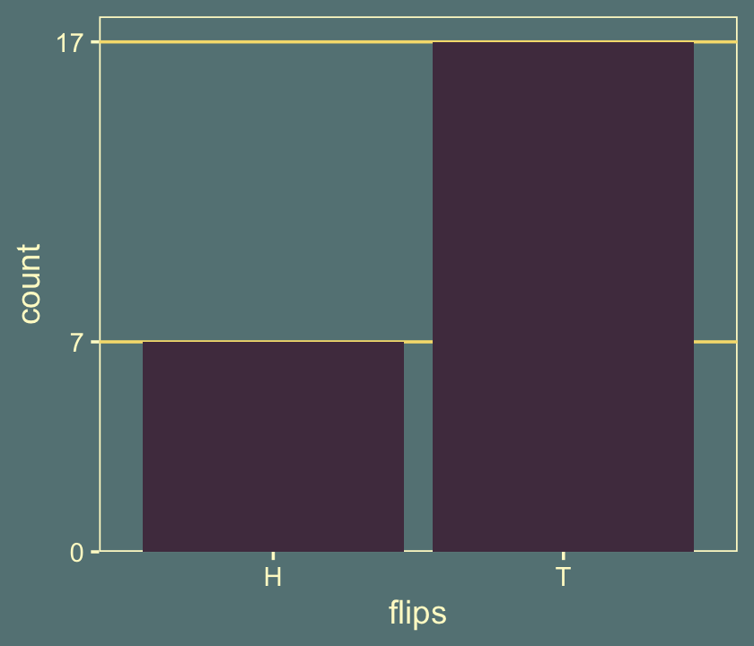
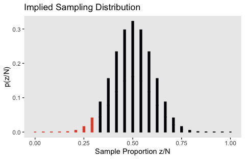
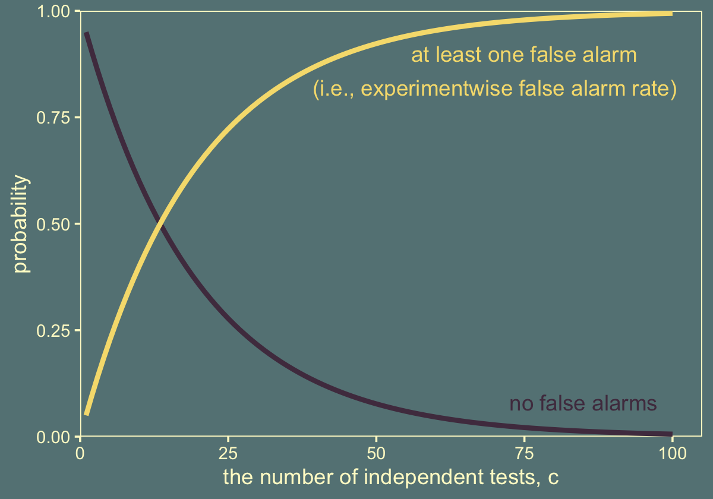

# Null Hypothesis Significance Testing

It's worth repeating a couple paragraphs from page 298 [@kruschkeDoingBayesianData2015, *emphasis* in the original]:

> The logic of conventional NHST goes like this. Suppose the coin is fair (i.e., $\theta$ = 0.50). Then, when we flip the coin, we expect that about half the flips should come up heads. If the actual number of heads is far greater or fewer than half the flips, then we should reject the hypothesis that the coin is fair. To make this reasoning precise, we need to figure out the exact probabilities of all possible outcomes, which in turn can be used to figure out the probability of getting an outcome as extreme as (or more extreme than) the actually observed outcome. This probability, of getting an outcome from the null hypothesis that is as extreme as (or more extreme than) the actual outcome, is called a "$p$ value." If the $p$ value is very small, say less than 5%, then we decide to reject the null hypothesis.
>
> Notice that this reasoning depends on defining a space of all possible outcomes from the null hypothesis, because we have to compute the probabilities of each outcome relative to the space of all possible outcomes. The space of all possible outcomes is based on how we intend to collect data. For example, was the intention to flip the coin exactly $N$ times? In that case, the space of possible outcomes contains all sequences of exactly $N$ flips. Was the intention to flip until the $z$th head appeared? In that case, the space of possible outcomes contains all sequences for which the $z$th head appears on the last flip. Was the intention to flip for a fixed duration? In that case, the space of possible outcomes contains all combinations of $N$ and $z$ that could be obtained in that fixed duration. Thus, a more explicit definition of a $p$ value is the probability of getting a sample outcome from the hypothesized population that is as extreme as or more extreme than the actual outcome *when using the intended sampling and testing procedures.*

## Paved with good intentions

Kruschke started off this section with a random sequence of 7 heads (H) and 17 tails (T). This is a little silly, but I wanted to challenge myself to randomly generate a series of 24 `H` and `T` characters for which there were 7 `H`s. The base **R** `sample()` function gets us part of the way there.


```r
sample(c("H", "T"), size = 24, replace = T)
```

```
##  [1] "H" "T" "T" "H" "H" "H" "H" "H" "T" "T" "H" "T" "H" "H" "H" "T" "T" "H" "H"
## [20] "H" "T" "T" "T" "H"
```

I wanted the solution to be reproducible, which required I find the appropriate seed for `set.seed()`. To do that, I made a custom `h_counter()` function into which I could input an arbitrary seed value and retrieve the count of `H`. I then fed a sequence of integers into `h_counter()` and filtered the output to find which seed produces the desirable outcome.


```r
library(tidyverse)

h_counter <- function(seed) {
  set.seed(seed)
  coins <- sample(c("H", "T"), size = 24, replace = T)
  length(which(coins == "H"))
}

coins <-
  tibble(seed = 1:200) %>% 
  mutate(n_heads = map_dbl(seed, h_counter))

coins %>% 
  filter(n_heads == 7)
```

```
## # A tibble: 2 x 2
##    seed n_heads
##   <int>   <dbl>
## 1   115       7
## 2   143       7
```

Looks like `set.seed(115)` will work. 


```r
set.seed(115)
sample(c("H", "T"), size = 24, replace = T)
```

```
##  [1] "H" "T" "H" "T" "T" "T" "T" "H" "T" "H" "T" "T" "H" "T" "T" "H" "T" "T" "T"
## [20] "T" "T" "H" "T" "T"
```

The sequence isn't in the exact order as the data from page 300, but they do have the crucial ratio of heads to tails. We'll plot that in a moment.

Before we plot, let's talk theme and color scheme. In the last chapter, we experimented with making global alterations to the default **ggplot2** theme using the `theme_set()` function and based our new color settings on an iconic woodblock print of the sea. We'll extend that nautical theme in this chapter by basing our color scheme on [*RIFT SCULL*](https://www.jamesjean.com/riftscull) by contemporary artist, [James Jean](https://www.jamesjean.com/about-1) [-@jeanRiftScull2009]. We can get a prearranged color palette based on *RIFT SCULL* from the [**lisa** package](https://github.com/tyluRp/lisa).


```r
library(lisa)

plot(lisa_palette("JamesJean"))
```


Use `lisa_palette("JamesJean")` to customize our global settings.


```r
theme_set(
  theme_grey() +
    theme(text = element_text(color = "lemonchiffon"),
          axis.text = element_text(color = "lemonchiffon"),
          axis.ticks = element_line(color = "lemonchiffon"),
          legend.background = element_blank(),
          legend.box.background = element_blank(),
          legend.key = element_rect(fill = lisa_palette("JamesJean")[4]),
          panel.background = element_rect(fill = lisa_palette("JamesJean")[4],
                                          color = "lemonchiffon"),
          panel.grid = element_blank(),
          plot.background = element_rect(fill = lisa_palette("JamesJean")[4],
                                          color = lisa_palette("JamesJean")[4]))
)

jj <- lisa_palette("JamesJean")

jj
```

```
## [1] "#51394E" "#F6DE7D" "#C8AF8A" "#658385" "#B04838"
```

You can undo the above with `ggplot2::theme_set(ggplot2::theme_grey())`. Here's the bar plot of our 24 flips.


```r
set.seed(115)
tibble(flips = sample(c("H", "T"), size = 24, replace = T)) %>% 
  
  ggplot(aes(x = flips)) +
  geom_hline(yintercept = c(7, 17), color = jj[2]) +
  geom_bar(fill = jj[1]) +
  scale_y_continuous(breaks = c(0, 7, 17), expand = expansion(mult = c(0, 0.05)))
```



> It seems that there were fewer heads than what we would expect from the hypothesis of fairness. We would like to derive the probability of getting a proportion of heads that is 7/24 or smaller if the null hypothesis is true. (p. 300)

### Definition of $p$ value.

> In summary, the likelihood function defines the probability for a single measurement, and the intended sampling process defines the cloud of possible sample outcomes. The null hypothesis is the likelihood function with its specific value for parameter $\theta$, and the cloud of possible samples is defined by the stopping and testing intentions, denoted $I$. Each imaginary sample generated from the null hypothesis is summarized by a descriptive statistic, denoted $D_{\theta, I}$. In the case of a sample of coin flips, the descriptive summary statistic is $z / N$ , the proportion of heads in the sample. Now, imagine generating infinitely many samples from the null hypothesis using stopping and testing intention $I$ ; this creates a cloud of possible summary values $D_{\theta, I}$, each of which has a particular probability. The probability distribution over the cloud of possibilities is the sampling distribution: $p (D_{\theta, I} | \theta, I )$.
>
> To compute the $p$ value, we want to know how much of that cloud is as extreme as, or more extreme than, the actually observed outcome. To define "extremeness" we must determine the typical value of $D_{\theta, I}$, which is usually defined as the expected value, $E [D_{\theta, I}]$ (recall Equations 4.5 and 4.6). This typical value is the center of the cloud of possibilities. An outcome is more "extreme" when it is farther away from the central tendency. The $p$ value of the actual outcome is the probability of getting a hypothetical outcome that is as or more extreme. Formally, we can express this as
>
> $$p \text{ value} = p (D_{\theta, I} \succcurlyeq D_\text{actual} | \theta, I)$$
>
> where "$\succcurlyeq$" in this context means "as extreme as or more extreme than, relative to the expected value from the hypothesis." Most introductory applied statistics textbooks suppress the sampling intention $I$ from the definition, but precedents for making the sampling intention explicit can be found in Wagenmakers [-@wagenmakers2007practical, Online Supplement A)] and additional references cited therein. (p. 301)

Here's how one might make a version of the grids of Figure 11.2.


```r
library(patchwork)

level <- c(0:8, "...")

d <-
  crossing(N = factor(level, levels = level),
           z = factor(level, levels = level)) %>%
  mutate(
    label = case_when(
      N == "..." ~ "...",
      z == "..." ~ "...",
      as.double(z) > as.double(N) ~ "-",
      as.double(z) <= as.double(N) ~ ""
    ),
    fill = case_when(
      N == "5" ~ 1,
      N %in% c("4", "6") ~ 2,
      N %in% c("3", "7") ~ 3,
      N %in% c("1", "2", "8", "...") ~ 4
    )) %>% 
  mutate(z = fct_rev(z)) %>% 
  filter(N != "0") 

p1 <-
  d %>% 
  ggplot(aes(N, z, label = label, fill = N == "5")) +
  geom_tile(color = alpha(jj[2], .25)) +
  geom_text(color = jj[2]) + 
  scale_fill_manual(values = jj[c(4, 1)], breaks = NULL) +
  scale_x_discrete(position = "top", expand = c(0, 0)) +
  scale_y_discrete(expand = c(0, 0)) +
  theme(axis.ticks = element_blank())

p2 <-
  d %>% 
  ggplot(aes(N, z, label = label, fill = z == "4")) +
  geom_tile(color = alpha(jj[2], .25)) +
  geom_text(color = jj[2]) + 
  scale_fill_manual(values = jj[c(4, 1)], breaks = NULL) +
  scale_x_discrete(position = "top", expand = c(0, 0)) +
  scale_y_discrete(expand = c(0, 0)) +
  theme(axis.ticks = element_blank())

p3 <-
  d %>% 
  ggplot(aes(N, z, label = label, fill = fill)) +
  geom_tile(color = alpha(jj[2], .25)) +
  geom_text(color = jj[2]) + 
  scale_fill_gradient(low = jj[1], high = jj[4], breaks = NULL) +
  scale_x_discrete(position = "top", expand = c(0, 0)) +
  scale_y_discrete(expand = c(0, 0)) +
  theme(axis.ticks = element_blank())

# combine and plot
p1 | p2 | p3
```


### With intention to fix $N$.

In this section, "the space of possible outcomes is restricted to combinations of $z$ and $N$ for which $N$ is fixed at $N = 24$" (p. 302).

> What is the probability of getting a particular number of heads when $N$ is fixed? The answer is provided by the *binomial probability distribution*, which states that the probability of getting $z$ heads out of $N$ flips is
>
> $$ p(z | N, \theta) = \begin{pmatrix} N \\ z \end{pmatrix} \theta^z (1 - \theta)^{N - z}$$
> where the notation $\begin{pmatrix} N \\ z \end{pmatrix}$ [is a shorthand notation defined in more detail in the text. It has to do with factorials and, getting more to the point,] the number of ways of allocating $z$ heads among $N$ flips, without duplicate counting of equivalent allocations, is $N !/[(N − z)!z!]$. This factor is also called the number of ways of choosing $z$ items from $N$ possibilities, or "$N$ choose $z$" for short, and is denoted $\begin{pmatrix} N \\ z \end{pmatrix}$. Thus, the overall probability of getting $z$ heads in $N$ flips is the probability of any particular sequence of $z$ heads in $N$ flips times the number of ways of choosing $z$ slots from among the $N$ possible flips. (p. 303, *emphasis* in the original)

To do factorials in **R**, use the `factorial()` function. E.g., we can use the formula $N! / [(N − z)!z!]$ like so:


```r
n <- 24
z <- 7

factorial(n) / (factorial(n - z) * factorial(z))
```

```
## [1] 346104
```

That value, recall, is a count, "the number of ways of allocating $z$ heads among $N$ flips, without duplicate counting of equivalent allocations" (p. 303). That formula's a little cumbersome to work with. We can make our programming lives easier by wrapping it into a function.


```r
n_choose_z <- function(n, z) {
  factorial(n) / (factorial(n - z) * factorial(z))
}
```

Now we can employ our `n_choose_z()` function to help make the data we'll use for Figure 11.3.b. Here are the data.


```r
flips <-
  tibble(z = 0:24) %>% 
  mutate(n_choose_z = n_choose_z(n, z)) %>% 
  mutate(`p(z/N)`                = n_choose_z / sum(n_choose_z),  # this just rescales `n_choose_z`
         `Sample Proportion z/N` = z / n)

head(flips, n = 10)
```

```
## # A tibble: 10 x 4
##        z n_choose_z     `p(z/N)` `Sample Proportion z/N`
##    <int>      <dbl>        <dbl>                   <dbl>
##  1     0        1   0.0000000596                  0     
##  2     1       24.0 0.00000143                    0.0417
##  3     2      276   0.0000165                     0.0833
##  4     3     2024   0.000121                      0.125 
##  5     4    10626   0.000633                      0.167 
##  6     5    42504   0.00253                       0.208 
##  7     6   134596   0.00802                       0.25  
##  8     7   346104   0.0206                        0.292 
##  9     8   735471   0.0438                        0.333 
## 10     9  1307504   0.0779                        0.375
```

Instead of our custom `n_choose_z()` function, we could have also used the base **R** choose function. Here's a quick comparison.


```r
tibble(z = 0:5) %>% 
  mutate(n_choose_z = n_choose_z(n, z),
         choose     = choose(n, z))
```

```
## # A tibble: 6 x 3
##       z n_choose_z choose
##   <int>      <dbl>  <dbl>
## 1     0        1        1
## 2     1       24.0     24
## 3     2      276      276
## 4     3     2024     2024
## 5     4    10626    10626
## 6     5    42504    42504
```

Now here's the histogram of that sampling distribution.


```r
flips %>% 
  ggplot(aes(x = `Sample Proportion z/N`, y = `p(z/N)`,
             fill = z <= 7, color = z <= 7)) +
  geom_col(width = .025) +
  scale_fill_manual(values = jj[1:2]) +
  scale_color_manual(values = jj[1:2]) +
  scale_y_continuous(expand = expansion(mult = c(0, 0.05))) +
  ggtitle("Implied Sampling Distribution")
```


We can get the one-sided $p$-value with a quick `filter()` and `summarise()`.


```r
flips %>% 
  filter(z <= 7) %>% 
  summarise(p_value = sum(`p(z/N)`))
```

```
## # A tibble: 1 x 1
##   p_value
##     <dbl>
## 1  0.0320
```

Here's Figure 11.3.a.


```r
tibble(y = factor(c("tail", "head"), levels = c("tail", "head")),
       `p(y)` = .5) %>% 
  
  ggplot(aes(x = y, y = `p(y)`)) +
  geom_col(fill = jj[1]) +
  scale_y_continuous(expand = expansion(mult = c(0, 0)), limits = c(0, 1)) +
  labs(title = "Hypothetical Population",
       subtitle = expression(theta==".5")) +
  theme(axis.ticks.x = element_blank(),
        panel.grid = element_blank())
```


As Kruschke wrote on page 304, "It is important to understand that the sampling distribution is a probability distribution over samples of data, and is *not* a probability distribution over parameter values."

Here is the probability "of getting *exactly* $z = 7$ heads in $N = 24$ flips" (p. 304, *emphasis* in the original):


```r
flips %>% 
  filter(z == 7)
```

```
## # A tibble: 1 x 4
##       z n_choose_z `p(z/N)` `Sample Proportion z/N`
##   <int>      <dbl>    <dbl>                   <dbl>
## 1     7     346104   0.0206                   0.292
```

It was already sitting there in our `p(z/N)` column. Well okay, fine, you do have to multiply it by 100 to convert it to a percentage the way Kruschke presented it at the bottom of page 304.


```r
flips %>% 
  filter(z == 7) %>% 
  summarise(`probability in a percentage metric` = (100 * `p(z/N)`) %>% round(digits = 3))
```

```
## # A tibble: 1 x 1
##   `probability in a percentage metric`
##                                  <dbl>
## 1                                 2.06
```

Kruschke then pointed out that this is a one-tailed $p$-value. We often reject or fail to reject the null hypothesis based on two-sided $p$-values. In practice, we can convert a one-sided $p$-value to a two-sided $p$-value by multiplying it by 2. Here's what that looks like in this case.


```r
flips %>% 
  filter(z <= 7) %>% 
  summarise(`one-sided p-value` = sum(`p(z/N)`),
            `two-sided p-value` = 2 * sum(`p(z/N)`))
```

```
## # A tibble: 1 x 2
##   `one-sided p-value` `two-sided p-value`
##                 <dbl>               <dbl>
## 1              0.0320              0.0639
```

> Here's the conclusion for our particular case. The actual observation was $z/N = 7/24$. The one-tailed probability is $p = 0.032$, which was computed from Equation 11.4, and is shown in Figure 11.3. Because the $p$ value is not less than 2.5%, we do *not* reject the null hypothesis that $\theta = 0.5$. In NHST parlance, we would say that the result "has failed to reach significance." This does not mean we *accept* the null hypothesis; we merely suspend judgment regarding rejection of this particular hypothesis. Notice that we have not determined any degree of belief in the hypothesis that $\theta = 0.5$. The hypothesis might be true or might be false; we suspend judgment. (p. 305, *emphasis* in the original)

### With intention to fix $z$.

In this subsection, "$z$ is fixed in advance and $N$ is the random variable. We don't talk about the probability of getting $z$ heads out of $N$ flips, we instead talk about the probability of taking $N$ flips to get $z$ heads" (p. 306).

This time we're interested in

> *What is the probability of taking $N$ flips to get $z$ heads*? To answer this question, consider this: We know that the $N$th flip is the $z$th head, because that is what caused flipping to stop. Therefore the previous $N - 1$ flips had $z - 1$ heads in some random sequence. The probability of getting $z - 1$ heads in $N - 1$ flips is $\begin{pmatrix} N-1 \\ z-1 \end{pmatrix} \theta^{z-1} (1 - \theta)^{N - z}$. The probability that the last flip comes up heads is $\theta$. Therefore, the probability that it takes $N$ flips to get $z$ heads is
>
> \begin{align*}
> p(N | z, \theta) & = \begin{pmatrix} N-1 \\ z-1 \end{pmatrix} \theta^{z-1} (1 - \theta)^{N - z} \cdot \theta \\
>                  & = \begin{pmatrix} N-1 \\ z-1 \end{pmatrix} \theta^z (1 - \theta)^{N - z} \\
>                  & = \frac{z}{N} \begin{pmatrix} N \\ z \end{pmatrix} \theta^z (1 - \theta)^{N - z}
> \end{align*}
> 
> (This distribution is sometimes called the "negative binomial" [^3] but that term sometimes refers to other formulations and can be confusing, so I will not use it here.) This is a sampling distribution, like the binomial distribution, because it specifies the relative probabilities of all the possible data outcomes for the hypothesized fixed value of $\theta$ and the intended stopping rule. (p. 306, *emphasis* added)

With that formula in hand, here's how to generate the data for Figure 11.4.b.


```r
theta <- .5

# we have to stop somewhere. where should we stop?
highest_n <- 100

flips <-
  tibble(n = 7:highest_n) %>% 
  mutate(n_choose_z = n_choose_z(n, z)) %>% 
  mutate(`p(z/N)`                = n_choose_z / sum(n_choose_z),
         `Sample Proportion z/N` = z / n,
         `p(N|z,theta)`          = (z / n) * n_choose_z * (theta^z) * (1 - theta)^(n - z))
```

To keep things simple, we just went up to $N = 100$.

At the bottom of page 306, Kruschke described the probability "spikes" for various values of $N$ when $z/N = 7/7$, $z/N = 7/8$, and $z/N = 7/9$. We have those spike values in the `Sample Proportion z/N` column of our `flips` data. Here are those first three spikes.


```r
flips %>% 
  head(n = 3)
```

```
## # A tibble: 3 x 5
##       n n_choose_z `p(z/N)` `Sample Proportion z/N` `p(N|z,theta)`
##   <int>      <dbl>    <dbl>                   <dbl>          <dbl>
## 1     7          1 4.95e-12                   1            0.00781
## 2     8          8 3.96e-11                   0.875        0.0273 
## 3     9         36 1.78e-10                   0.778        0.0547
```

Those values correspond to the rightmost vertical lines in our Figure 11.4.b, below.


```r
flips %>%
  ggplot(aes(x = `Sample Proportion z/N`, y = `p(N|z,theta)`,
             fill = n >= 24, color = n >= 24)) +
  geom_col(width = .005) +
  scale_fill_manual(values = jj[1:2]) +
  scale_color_manual(values = jj[1:2]) +
  scale_y_continuous(expand = expansion(mult = c(0, 0.05))) +
  ggtitle("Implied Sampling Distribution") +
  theme(legend.position = "none")
```


Our Figure 11.4.a is the same as Figure 11.3.a, above. I won't repeat it, here.

We got the formula for that last variable, `p(N|z,theta)`, from Formula 11.6 on page 306. You'll note how Kruschke continued to refer to it as $p(z|N)$ in his Figure 11.4. It's entirely opaque, to me, how $p(z|N) = p(N|z, \theta)$. I'm just going with it.  

Here's the $p$-value, expressed two ways.


```r
flips %>% 
  filter(n >= 24) %>% 
  summarise(`one-sided p-value` = sum(`p(N|z,theta)`) %>% round(digits = 3),
            `two-sided p-value` = (2 * sum(`p(N|z,theta)`)) %>% round(digits = 3))
```

```
## # A tibble: 1 x 2
##   `one-sided p-value` `two-sided p-value`
##                 <dbl>               <dbl>
## 1               0.017               0.035
```

If you experiment a bit with the `highest_n` value from above, you'll see that the exact value for the $p$-value is dependent on what $N$ you go up to.

Even though our data ($z = 2, N = 24$) is the same as in the last section, we came ended up with different $p$-values and different conclusions about the null hypothesis. Though we failed to reject the null in the last section, we rejected it here. As Kruschke warned us in the beginning of the chapter, NHST depends on sampling intentions.

### With intention to fix duration.

In this subsection, 

> neither $N$ nor $z$ is fixed...
>
> The key to analyzing this scenario is specifying how various combinations of $z$ and $N$ can arise when sampling for a fixed duration. There is no single, uniquely "correct" specification, because there are many different real-world constraints on sampling through time. But one approach is to think of the sample size $N$ as a random value. (p. 308).

Here's a glance at the Poisson distribution for which $\lambda = 24$. The mean is colored yellow.


```r
tibble(x = 1:50) %>%
  mutate(y = dpois(x = x, lambda = 24)) %>% 
  
  ggplot(aes(x = x, y = y,
             fill = x == 24, color = x == 24)) +
  geom_col(width = .5) +
  scale_fill_manual(values = jj[1:2]) +
  scale_color_manual(values = jj[1:2]) +
  scale_x_continuous(expand = expansion(mult = c(0, 0.05)), limits = c(0, NA)) +
  scale_y_continuous(NULL, breaks = NULL, expand = expansion(mult = c(0, 0.05))) +
  theme(legend.position = "none")
```



In the note for Figure 11.5, Kruschke explained the "sample sizes are drawn randomly from a Poisson distribution with mean $\lambda$". Earlier in the prose he explained "$\lambda$ was set to 24 merely to match $N$ and make the example most comparable to the preceding examples" (p. 309). To do such a simulation, one must choose how many draws to take from $\operatorname{Poisson}(24)$. Here's an example where we take just one.


```r
set.seed(11)

n_iter <- 1

flips <-
  tibble(iter = 1:n_iter,
         n    = rpois(n_iter, lambda = 24)) %>% 
  mutate(z = map(n, ~seq(from = 0, to = ., by = 1))) %>% 
  unnest(z) %>% 
  mutate(n_choose_z = n_choose_z(n, z)) %>% 
  mutate(`p(z/N)`                = n_choose_z / sum(n_choose_z),
         `Sample Proportion z/N` = z / n) 

flips
```

```
## # A tibble: 22 x 6
##     iter     n     z n_choose_z    `p(z/N)` `Sample Proportion z/N`
##    <int> <int> <dbl>      <dbl>       <dbl>                   <dbl>
##  1     1    21     0          1 0.000000477                  0     
##  2     1    21     1         21 0.0000100                    0.0476
##  3     1    21     2        210 0.000100                     0.0952
##  4     1    21     3       1330 0.000634                     0.143 
##  5     1    21     4       5985 0.00285                      0.190 
##  6     1    21     5      20349 0.00970                      0.238 
##  7     1    21     6      54264 0.0259                       0.286 
##  8     1    21     7     116280 0.0554                       0.333 
##  9     1    21     8     203490 0.0970                       0.381 
## 10     1    21     9     293930 0.140                        0.429 
## # … with 12 more rows
```

As indicated in our `n` column, by chance we drew a 21. We then computed the same values for all possible values of `z`, ranging from 0 to 21. But this doesn't make for a very interesting plot, nor does it make for the same kind of plot Kruschke made in Figure 11.5.b.


```r
flips %>%
  ggplot(aes(x = `Sample Proportion z/N`, y = `p(z/N)`,
             fill = z <= 7, color = z <= 7)) +
  geom_col(width = .01) +
  scale_fill_manual(values = jj[1:2]) +
  scale_color_manual(values = jj[1:2]) +
  scale_y_continuous(expand = expansion(mult = c(0, 0.05))) +
  theme(legend.position = "none")
```


Instead we have to take many draws to take from $\operatorname{Poisson}(24)$. Here's what it looks like when we take 10,000.


```r
n_iter <- 10000

set.seed(11)

flips <-
  tibble(iter = 1:n_iter,
         n    = rpois(n_iter, lambda = 24)) %>% 
  mutate(z = map(n, ~seq(from = 0, to = ., by = 1))) %>% 
  unnest(z) %>% 
  mutate(n_choose_z = n_choose_z(n, z)) %>% 
  mutate(`p(z/N)`                = n_choose_z / sum(n_choose_z),
         `Sample Proportion z/N` = z / n) 

flips %>%
  ggplot(aes(x = `Sample Proportion z/N`, y = `p(z/N)`,
             fill = z <= 7, color = z <= 7)) +
  geom_col(width = .003, size = 1/15) +
  scale_fill_manual(values = jj[1:2]) +
  scale_color_manual(values = jj[1:2]) +
  scale_y_continuous(expand = expansion(mult = c(0, 0.05))) +
  coord_cartesian(ylim = c(0, 0.03)) +
  theme(legend.position = "none")
```


I played around with the simulation a bit and this is about as good as I've gotten. If you have a solution that more faithfully reproduces what Kruschke did, please share your code in my [GitHub issue #16](https://github.com/ASKurz/Doing-Bayesian-Data-Analysis-in-brms-and-the-tidyverse/issues/16).

Here's my attempt at the $p$-value.


```r
flips %>% 
  filter(z <= 7) %>% 
  summarise(`one-sided p-value` = sum(`p(z/N)`))
```

```
## # A tibble: 1 x 1
##   `one-sided p-value`
##                 <dbl>
## 1            0.000218
```

It's unclear, to me, why it's so much lower than the one Kruschke reported in the text.

### With intention to make multiple tests.

> In the preceding sections we have seen that when a coin is flipped $N = 24$ times and comes up $z = 7$ heads, the $p$ value can be 0.032 or 0.017 or 0.024 or other values. The change in $p$ is caused by the dependence of the imaginary cloud of possibilities on the stopping intention. Typical NHST textbooks never mention the dependency of $p$ values on the stopping intention, but they often do discuss the dependency of $p$ values on the testing intention. In this section we will see how testing intentions affect the imaginary cloud of possibilities that determines the $p$ value. (p. 310)

Kruschke then went into an example of flipping two coins and how this would require we consider an *overall* false-positive rate based on proportions from *either* of the two coins. With respect to the probabilities of two independent events, I do recall that $p(A \text{ or } B) = p(A) + p(B)$. But sadly, I'm not sure how to incorporate this knowledge to reproduce the simulation for this section. If you know how to do the simulation properly, please share your code in my [GitHub issue #17](https://github.com/ASKurz/Doing-Bayesian-Data-Analysis-in-brms-and-the-tidyverse/issues/17).


In his footnote #4 on page 311, Kruschke reported there was a direct relation between the $p$-values in this section and in those from the simulation for Figure 11.3. They follow the equation

$$p_\text{figure 11.6} = 1 - (1 - p_\text{figure 11.3})^2.$$

Using code, we get this.


```r
1 - (1 - 0.03195733)^2
```

```
## [1] 0.06289339
```

### Soul searching.

> Within the context of NHST, the solution is to establish the true intention of the researcher. This is the approach taken explicitly when applying corrections for multiple tests. The analyst determines what the truly intended tests are, and determines whether those testing intentions were honestly conceived *a priori* or *post hoc* (i.e., motivated only after seeing the data), and then computes the appropriate $p$ value. The same approach should be taken for stopping rules: The data analyst should determine what the truly intended stopping rule was, and then compute the appropriate $p$ value. Unfortunately, determining the true intentions can be difficult. Therefore, perhaps researchers who use $p$ values to make decisions should be required to publicly pre-register their intended stopping rule and tests, before collecting the data. (p. 314, *emphasis* in the original)

### Bayesian analysis.

Happily for us, "the Bayesian interpretation of data does not depend on the covert sampling and testing intentions of the data collector" (p. 314).

## Prior knowledge 

The main thing to note in this section is Kruschke changed the motivating example to one of flipping a flat-headed nail. Now we're considering it "heads" when the nail lands on its head and "tails" when the nail lands such that its point is touching the ground. It's still the case that $N = 24, z = 7$.

### NHST analysis.

Nothing for us, here.

### Bayesian analysis.

If you recall from [Chapter 6][Inferring a Binomial Probability via Exact Mathematical Analysis], we need a function to compute the Bernoulli likelihood.


```r
bernoulli_likelihood <- function(theta, data) {
  
  n   <- length(data)
  z   <- sum(data)
  
  return(theta^z * (1 - theta)^(n - sum(data)))
  
}
```

We now consider the analysis based on two priors. The first, $\operatorname{beta}(2, 20)$, expresses the assumption the nail is biased towards "tails." The second, $\operatorname{beta}(11, 11)$, expresses the assumption the nail is fair.

There are a handful of steps before we can use our `bernoulli_likelihood()` function to make the plot data. All these are repeats from Chapter 6.


```r
# we need these to compute the likelihood
n <- 24
z <- 7

trial_data <- c(rep(0, times = n - z), rep(1, times = z))            # (i.e., data)

d_nail <-
  tibble(theta = seq(from = 0, to = 1, length.out = 1000)) %>%       # (i.e., theta)
  mutate(Prior = dbeta(x = theta, shape1 = 2, shape2 = 20)) %>% 
  mutate(Likelihood = bernoulli_likelihood(theta = theta,            # (i.e., p(D | theta))
                                           data = trial_data)) %>%
  mutate(evidence = sum(Likelihood * Prior)) %>%                     # (i.e., p(D))
  mutate(Posterior = Likelihood * Prior / evidence)                  # (i.e., p(theta | D))
  
glimpse(d_nail)
```

```
## Rows: 1,000
## Columns: 5
## $ theta      <dbl> 0.000000000, 0.001001001, 0.002002002, 0.003003003, 0.0040…
## $ Prior      <dbl> 0.0000000, 0.4124961, 0.8094267, 1.1912097, 1.5582533, 1.9…
## $ Likelihood <dbl> 0.000000e+00, 9.900280e-22, 1.245822e-19, 2.092598e-18, 1.…
## $ evidence   <dbl> 5.260882e-05, 5.260882e-05, 5.260882e-05, 5.260882e-05, 5.…
## $ Posterior  <dbl> 0.000000e+00, 7.762627e-18, 1.916792e-15, 4.738222e-14, 4.…
```

Here's the left column of Figure 11.7.


```r
p1 <-
  d_nail %>% 
  ggplot(aes(x = theta)) +
  geom_ribbon(aes(ymin = 0, ymax = Prior),
              fill = jj[1]) +
  scale_x_continuous(expand = expansion(mult = 0)) +
  scale_y_continuous(breaks = NULL, expand = expansion(mult = c(0, 0.05))) +
  labs(title = "Prior (beta)",
       x = expression(theta),
       y = expression(dbeta(theta*"|"*2*", "*20)))

p2 <-
  d_nail %>% 
  ggplot(aes(x = theta)) +
  geom_ribbon(aes(ymin = 0, ymax = Likelihood),
              fill = jj[5]) +
  scale_x_continuous(expand = expansion(mult = 0)) +
  scale_y_continuous(breaks = NULL, expand = expansion(mult = c(0, 0.05))) +
  labs(title = "Likelihood (Bernoulli)",
       x = expression(theta),
       y = expression(p(D*"|"*theta)))

p3 <-
  d_nail %>% 
  ggplot(aes(x = theta)) +
  geom_ribbon(aes(ymin = 0, ymax = Posterior),
              fill = jj[2]) +
  scale_x_continuous(expand = expansion(mult = 0)) +
  scale_y_continuous(breaks = NULL, expand = expansion(mult = c(0, 0.05))) +
  labs(title = "Posterior (beta)",
       x = expression(theta),
       y = expression(dbeta(theta*"|"*9*", "*37)))

(p1 / p2 / p3) & theme(panel.grid = element_blank())
```


If we'd like the 95% HDIs, we'll need to redefine the `hdi_of_icdf()` function.


```r
hdi_of_icdf <- function(name = qbeta, width = .95, tol = 1e-8, ... ) {

  incredible_mass <- 1.0 - width
  interval_width <- function(low_tail_prob, name, width, ...) {
    name(width + low_tail_prob, ...) - name(low_tail_prob, ...)
  }
  
  opt_info <- optimize(interval_width, c(0, incredible_mass), 
                       name = name, width = width, 
                       tol = tol, ...)
  
  hdi_lower_tail_prob <- opt_info$minimum
  
  return(c(name(hdi_lower_tail_prob, ...),
           name(width + hdi_lower_tail_prob, ...)))
  
}
```

Note that this time we made the `qbeta()` function the default setting for the `name` argument. Here are the HDIs for the prior and posterior, above.


```r
hdi_of_icdf(shape1 = 2,
            shape2 = 20)
```

```
## [1] 0.002600585 0.208030932
```

```r
hdi_of_icdf(shape1 = 2 + z,
            shape2 = 20 + (n - z))
```

```
## [1] 0.08839668 0.31043265
```

To get the left column of Figure 11.7, we have to update the data with our new prior, $\operatorname{beta}(11, 11)$.


```r
# here are the data based on our updated beta(11, 11) prior
d_coin <-
  tibble(theta = seq(from = 0, to = 1, length.out = 1000)) %>%
  mutate(Prior = dbeta(x = theta, shape1 = 11, shape2 = 11)) %>% 
  mutate(Likelihood = bernoulli_likelihood(theta = theta,
                                           data = trial_data)) %>%
  mutate(Posterior = Likelihood * Prior / sum(Likelihood * Prior))

# The updated plots:
p1 <-
  d_coin %>% 
  ggplot(aes(x = theta)) +
  geom_ribbon(aes(ymin = 0, ymax = Prior),
              fill = jj[1]) +
  labs(title = "Prior (beta)",
       x = expression(theta),
       y = expression(dbeta(theta*"|"*11*", "*11)))

p2 <-
  d_coin %>% 
  ggplot(aes(x = theta)) +
  geom_ribbon(aes(ymin = 0, ymax = Likelihood),
              fill = jj[5]) +
  labs(title = "Likelihood (Bernoulli)",
       x = expression(theta),
       y = expression(p(D*"|"*theta)))

p3 <-
  d_coin %>% 
  ggplot(aes(x = theta)) +
  geom_ribbon(aes(ymin = 0, ymax = Posterior),
              fill = jj[2]) +
  labs(title = "Posterior (beta)",
       x = expression(theta),
       y = expression(dbeta(theta*"|"*18*", "*28)))

(p1 / p2 / p3) & 
  scale_x_continuous(expand = expansion(mult = 0)) &
  scale_y_continuous(breaks = NULL, expand = expansion(mult = c(0, 0.05))) &
  theme(panel.grid = element_blank())
```


Here are the corresponding HDIs for $\operatorname{beta}(11, 11)$ and $\operatorname{beta}(11 + 7, 11 + 24 - 7)$.


```r
hdi_of_icdf(shape1 = 11,
            shape2 = 11)
```

```
## [1] 0.2978068 0.7021932
```

```r
hdi_of_icdf(shape1 = 11 + z,
            shape2 = 11 + (n - z))
```

```
## [1] 0.2539378 0.5312685
```

#### Priors are overt and relevant.

In this subsection's opening paragraph, Kruschke opined:

> Prior beliefs are overt, explicitly debated, and founded on publicly accessible previous research. A Bayesian analyst might have personal priors that differ from what most people think, but if the analysis is supposed to convince an audience, then the analysis must use priors that the audience finds palatable. It is the job of the Bayesian analyst to make cogent arguments for the particular prior that is used. (p. 317)

## Confidence interval and highest density interval

> This section defines CIs and provides examples. It shows that, while CIs ameliorate some of the problems of $p$ values, ultimately CIs suffer the same problems as $p$ values because CIs are defined in terms of $p$ values. Bayesian posterior distributions, on the other hand, provide the needed information. (p. 318)

### CI depends on intention.

> The primary goal of NHST is determining whether a particular "null" value of a parameter can be rejected. One can also ask what *range* of parameter values would not be rejected. This range of nonrejectable parameter values is called the CI. (There are different ways of defining an NHST CI; this one is conceptually the most general and coherent with NHST precepts.) The 95% CI consists of all values of $\theta$ that would not be rejected by a (two-tailed) significance test that allows 5% false alarms. (p. 318, *emphasis* in the original)

Figure 11.8 depicts the sampling distributions for $\theta = .126$ (top row) and $\theta = .511$ (bottom row). Here's the upper- and lower-left panels of Figure 11.8.


```r
p1 <-
  tibble(y      = factor(c("tail", "head"), levels = c("tail", "head")),
         `p(y)` = c(1 - .126, .126)) %>% 
  
  ggplot(aes(x = y, y = `p(y)`)) +
  geom_col(fill = jj[1]) +
  labs(title = "Hypothetical Population",
       subtitle = expression(theta==".126"))

p2 <-
  tibble(y      = factor(c("tail", "head"), levels = c("tail", "head")),
         `p(y)` = c(1 - .511, .511)) %>% 
  
  ggplot(aes(x = y, y = `p(y)`)) +
  geom_col(fill = jj[1]) +
  labs(title = "Hypothetical Population",
       subtitle = expression(theta==".511"))

(p1 / p2) &
  scale_y_continuous(expand = expansion(mult = 0), limits = c(0, 1)) &
  theme(title = element_text(size = 10),
        axis.ticks.x = element_blank(),
        panel.grid = element_blank())
```


Here are the corresponding upper- and lower-right panels.


```r
p1 <-
  tibble(z = 0:24,
         y = dbinom(0:24, size = 24, prob = .126)) %>% 
  
  ggplot(aes(x = z/25, y = y,
             fill = z >= 7)) +
  geom_col(width = .025)

p2 <-
  tibble(z = 0:24,
       y = dbinom(0:24, size = 24, prob = .511)) %>% 
  
  ggplot(aes(x = z / 24, y = y,
             fill = z <= 7)) +
  geom_col(width = .025)
  
(p1 / p2) &
  labs(title = "Implied Sampling Distribution",
       x = "Sample Proportion z/N",
       y = "p(z/N)") &
  scale_fill_manual(values = jj[1:2]) &
  scale_y_continuous(expand = expansion(mult = c(0, 0.05))) &
  coord_cartesian(xlim = c(0, 1)) &
  theme(legend.position = "none")
```


Figure 11.9 considers the sampling distributions for two hypothetical populations, $\theta = .126$ (top row) and $\theta = .484$ (bottom row). This time the assumption is $z$ is fixed at 7. For this figure, we'll continue to develop our **patchwork** skills. Before the big reveal, we'll make the subplots in two phases. Here are the two on the left.


```r
p1 <-
  tibble(y      = factor(c("tail", "head"), levels = c("tail", "head")),
         `p(y)` = c(1 - .126, .126)) %>% 
  
  ggplot(aes(x = y, y = `p(y)`)) +
  geom_col(fill = jj[1]) +
  labs(title = "Hypothetical Population",
       subtitle = expression(theta==".126")) +
  scale_y_continuous(expand = expansion(mult = c(0, 0.05)), limits = c(0, 1)) +
  theme(title = element_text(size = 10),
        axis.ticks.x = element_blank())


p2 <-
  tibble(y      = factor(c("tail", "head"), levels = c("tail", "head")),
         `p(y)` = c(1 - .484, .484)) %>% 
  
  ggplot(aes(x = y, y = `p(y)`)) +
  geom_col(fill = jj[1]) +
  labs(title = "Hypothetical Population",
       subtitle = expression(theta==".484")) +
  scale_y_continuous(expand = expansion(mult = c(0, 0.05)), limits = c(0, 1)) +
  theme(title = element_text(size = 10),
        axis.ticks.x = element_blank())
```

Now make the two on the right.


```r
theta <- .126

flips <-
  tibble(n = 7:100) %>% 
  mutate(n_choose_z = n_choose_z(n, z)) %>% 
  mutate(`p(z/N)`                = n_choose_z / sum(n_choose_z),
         `Sample Proportion z/N` = z / n,
         `p(N|z,theta)`          = (z / n) * n_choose_z * (theta^z) * (1 - theta)^(n - z))

p3 <-
  flips %>%
  ggplot(aes(x = `Sample Proportion z/N`, y = `p(N|z,theta)`,
             fill = n <= 24, color = n <= 24)) +
  geom_col(width = .005) +
  scale_fill_manual(values = jj[1:2]) +
  scale_color_manual(values = jj[1:2]) +
  scale_x_continuous(breaks = 0:5 * 0.2, limits = c(0, 1)) +
  scale_y_continuous(expand = expansion(mult = c(0, 0.05))) +
  ggtitle("Implied Sampling Distribution") +
  theme(legend.position = "none")

theta <- .484

flips <-
  tibble(n = 7:100) %>% 
  mutate(n_choose_z = n_choose_z(n, z)) %>% 
  mutate(`p(z/N)`                = n_choose_z / sum(n_choose_z),
         `Sample Proportion z/N` = z / n,
         `p(N|z,theta)`          = (z / n) * n_choose_z * (theta^z) * (1 - theta)^(n - z))

p4 <-
  flips %>%
  ggplot(aes(x = `Sample Proportion z/N`, y = `p(N|z,theta)`,
             fill = n >= 24, color = n >= 24)) +
  geom_col(width = .005) +
  scale_fill_manual(values = jj[1:2]) +
  scale_color_manual(values = jj[1:2]) +
  scale_x_continuous(breaks = 0:5 * 0.2, limits = c(0, 1)) +
  scale_y_continuous(expand = expansion(mult = c(0, 0.05))) +
  ggtitle("Implied Sampling Distribution") +
  theme(legend.position = "none")
```

Here we arrange all four of the Figure 11.9 subplots.


```r
(p1 + p3 + p2 + p4) + plot_layout(widths = c(2, 4))
```


Figure 11.10 is a depiction of when an experimenter intended to stop when a fixed duration expired. This time the two rows are based on $\theta = .135$ (top row) and $\theta = .497$ (bottom row). We'll follow the same general procedure from the last figure. Here are the subplots on the left.


```r
p1 <-
  tibble(y      = factor(c("tail", "head"), levels = c("tail", "head")),
         `p(y)` = c(1 - .135, .135)) %>% 
  
  ggplot(aes(x = y, y = `p(y)`)) +
  geom_col(fill = jj[1]) +
  scale_y_continuous(expand = expansion(mult = 0), limits = c(0, 1)) +
  labs(title = "Hypothetical Population",
       subtitle = expression(theta==".135")) +
  coord_cartesian(ylim = c(0, 1)) +
  theme(axis.ticks.x = element_blank())

p2 <-
  tibble(y      = factor(c("tail", "head"), levels = c("tail", "head")),
         `p(y)` = c(1 - .497, .497)) %>% 
  
  ggplot(aes(x = y, y = `p(y)`)) +
  geom_col(fill = jj[1]) +
  scale_y_continuous(expand = expansion(mult = 0), limits = c(0, 1)) +
  labs(title = "Hypothetical Population",
       subtitle = expression(theta==".497")) +
  coord_cartesian(ylim = c(0, 1)) +
  theme(axis.ticks.x = element_blank())
```

Like with Figure 11.5.b, my attempts for the right panels of Figure 11.10 just aren't quite right. If you understand where I'm going wrong with the simulation, please share your code in my [GitHub issue #18](https://github.com/ASKurz/Doing-Bayesian-Data-Analysis-in-brms-and-the-tidyverse/issues/18).


```r
z_maker <- function(i) {
  set.seed(i)
  n <- rpois(n = 1, lambda = 24)
  seq(from = 0, to = n, by = 1)
}

theta <- .135

p3 <-
  tibble(seed = 1:100) %>% 
  mutate(z = map(seed, z_maker)) %>% 
  unnest(z) %>% 
  group_by(seed) %>% 
  mutate(n = n()) %>% 
  mutate(n_choose_z = n_choose_z(n, z)) %>% 
  mutate(`p(z/N)`                = n_choose_z / sum(n_choose_z),
         `Sample Proportion z/N` = z / n,
         `p(N|z,theta)`          = (z / n) * n_choose_z * (theta^z) * (1 - theta)^(n - z)) %>% 
  
  ggplot(aes(x = `Sample Proportion z/N`, y = `p(N|z,theta)`,
             fill = `Sample Proportion z/N` >= 7 / 24)) +
  geom_col(width = .004) +
  scale_fill_manual(values = jj[1:2]) +
  scale_y_continuous(expand = expansion(mult = c(0, 0.05))) +
  ggtitle("Implied Sampling Distribution") +
  theme(legend.position = "none")

theta <- .497

p4 <-
  tibble(seed = 1:100) %>% 
  mutate(z = map(seed, z_maker)) %>% 
  unnest(z) %>% 
  group_by(seed) %>% 
  mutate(n = n()) %>% 
  mutate(n_choose_z = n_choose_z(n, z)) %>% 
  mutate(`p(z/N)`                = n_choose_z / sum(n_choose_z),
         `Sample Proportion z/N` = z / n,
         `p(N|z,theta)`          = (z / n) * n_choose_z * (theta^z) * (1 - theta)^(n - z)) %>% 
  
  ggplot(aes(x = `Sample Proportion z/N`, y = `p(N|z,theta)`,
             fill = `Sample Proportion z/N` <= 7 / 24)) +
  geom_col(width = .004) +
  scale_fill_manual(values = jj[1:2]) +
  scale_y_continuous(expand = expansion(mult = c(0, 0.05))) +
  ggtitle("Implied Sampling Distribution") +
  theme(legend.position = "none")

(p1 + p3 + p2 + p4) + plot_layout(widths = c(2, 4))
```


Let's leave failure behind. Here's the two left panels for Figure 11.11.


```r
p1 <-
  tibble(y      = factor(c("tail", "head"), levels = c("tail", "head")),
         `p(y)` = c(1 - .11, .11)) %>% 
  
  ggplot(aes(x = y, y = `p(y)`)) +
  geom_col(fill = jj[1]) +
  scale_y_continuous(expand = expansion(mult = 0), limits = c(0, 1)) +
  coord_cartesian(ylim = c(0, 1)) +
  labs(title = "Hypothetical Population",
       subtitle = expression(theta[1]==".11;"*~theta[2]==".11"))

p2 <-
  tibble(y      = factor(c("tail", "head"), levels = c("tail", "head")),
         `p(y)` = c(1 - .539, .539)) %>% 
  
  ggplot(aes(x = y, y = `p(y)`)) +
  geom_col(fill = jj[1]) +
  scale_y_continuous(expand = expansion(mult = 0), limits = c(0, 1)) +
  coord_cartesian(ylim = c(0, 1)) +
  labs(title = "Hypothetical Population",
       subtitle = expression(theta[1]==".539;"*~theta[2]==".539"))

(p1 / p2) &
  coord_cartesian(ylim = c(0, 1)) &
  theme(title = element_text(size = 10),
        axis.ticks.x = element_blank())
```


Much like with Figure 11.6, I don't understand how to do the simulation properly for the right panels of Figure 11.11. If you've got it, please share your code in my [GitHub issue #19](https://github.com/ASKurz/Doing-Bayesian-Data-Analysis-in-brms-and-the-tidyverse/issues/19).

#### CI is not a distribution.

> A CI is merely two end points. A common misconception of a confidence interval is that it indicates some sort of probability distribution over values of $\theta$. It is very tempting to think that values of $\theta$ in the middle of a CI should be more believable than values of $\theta$ at or beyond the limits of the CI.
>
... Methods for imposing a distribution upon a CI seem to be motivated by a natural Bayesian intuition: Parameter values that are consistent with the data should be more credible than parameter values that are not consistent with the data (subject to prior credibility). If we were confined to frequentist methods, then the various proposals outlined above would be expressions of that intuition. But we are not confined to frequentist methods. Instead, we can express our natural Bayesian intuitions in fully Bayesian formalisms. (pp. 323--324)

### Bayesian HDI.

"The 95% HDI consists of those values of $\theta$ that have at least some minimal level of posterior credibility, such that the total probability of all such $\theta$ values is 95%" (p. 324).

Once again, here's how to analytically compute the 95% HDIs for our example of $z = 7, N = 24$ and the prior of $\operatorname{beta}(11, 11)$.


```r
hdi_of_icdf(shape1 = 11 + z,
            shape2 = 11 + (n - z))
```

```
## [1] 0.2539378 0.5312685
```

## Multiple comparisons

It's worth quoting Kruschke at length:

> When comparing multiple conditions, a key goal in NHST is to keep the overall false alarm rate down to a desired maximum such as 5%. Abiding by this constraint depends on the number of comparisons that are to be made, which in turn depends on the intentions of the experimenter. In a Bayesian analysis, however, there is just one posterior distribu- tion over the parameters that describe the conditions. That posterior distribution is unaffected by the intentions of the experimenter, and the posterior distribution can be examined from multiple perspectives however is suggested by insight and curiosity. (p. 325)

### NHST correction for experiment wise error.

> In NHST, we have to take into account all comparisons we intend for the whole experiment. Suppose we set a criterion for rejecting the null such that each decision has a "per-comparison" (PC) false alarm rate of $\alpha_\text{PC}$, e.g., 5%. Our goal is to determine the overall false alarm rate when we conduct several comparisons. To get there, we do a little algebra. First, suppose the null hypothesis is true, which means that the groups are identical, and we get apparent differences in the samples by chance alone. This means that we get a false alarm on a proportion $\alpha_\text{PC}$ of replications of a comparison test. Therefore, we do *not* get a false alarm on the complementary proportion $1 - \alpha_\text{PC}$ of replications. If we run *c* independent comparison tests, then the probability of not getting a false alarm on *any* of the tests is $(1 - \alpha_\text{PC})^c$. Consequently, the probability of getting at least one false alarm is $1 - (1 - \alpha_\text{PC})^c$. We call that probability of getting at least one false alarm, across all the comparisons in the experiment, the "experimentwise" false alarm rate, denoted $\alpha_\text{EW}$. (pp. 325--326, *emphasis* in the original)

Here's what this looks like in when $\alpha_\text{PC} = .05$ and $c = 36$.


```r
alpha_pc <- .05
c        <- 36

# the probability of not getting a false alarm on any of the tests
(1 - alpha_pc)^c
```

```
## [1] 0.1577792
```

```r
# the probability of getting at least one false alarm is
1 - (1 - alpha_pc)^c
```

```
## [1] 0.8422208
```

For kicks and giggles, it might be interesting to plot this.


```r
tibble(c = 1:100) %>% 
  mutate(p1 = (1 - alpha_pc)^c,
         p2 = 1 - (1 - alpha_pc)^c) %>% 
  gather(key, probability, -c) %>% 
  
  ggplot(aes(x = c, y = probability, color = key)) +
  geom_line(size = 1.2) +
  geom_text(data = tibble(
    c           = c(85, 75, 70),
    probability = c(.08, .9, .82),
    label       = c("no false alarms",
                    "at least one false alarm",
                    "(i.e., experimentwise false alarm rate)"),
    key         = c("p1", "p2", "p2")
  ),
  aes(label = label)) +
  scale_color_manual(values = jj[1:2]) +
  scale_x_continuous(expand = expansion(mult = c(0, 0.05)), limits = c(0, NA)) +
  scale_y_continuous(expand = expansion(mult = 0), limits = c(0, 1)) +
  xlab("the number of independent tests, c") +
  theme(legend.position = "none")
```



One way to keep the experimentwise false alarm rate down to 5% is by reducing the
permitted false alarm rate for the individual comparisons, i.e., setting a more stringent
criterion for rejecting the null hypothesis in individual comparisons. One often-used re-
setting is the Bonferonni correction, which sets $\alpha_\text{PC} = \alpha_\text{EW}^\text{desired} / c$.

Here's how to apply the Bonferonni correction to our example if the desired false-alarm rate is .05.


```r
alpha_pc <- .05
c        <- 36

# the Bonferonni correction
alpha_pc / c
```

```
## [1] 0.001388889
```

Again, it might be useful to plot the consequence of Bonferonni's correction on $\alpha$ for different levels of $c$.


```r
tibble(c = 1:100) %>% 
  mutate(a_ew = alpha_pc^c) %>% 
  
  ggplot(aes(x = c, y = a_ew)) +
  geom_line(color = jj[2], size = 1.2) +
  scale_x_continuous(expand = expansion(mult = c(0, 0.05)), limits = c(0, NA)) +
  scale_y_continuous(expand = expansion(mult = c(0.0015, 0)), limits = c(0, .05)) +
  xlab("the number of independent tests, c") +
  theme(panel.grid = element_blank())
```


A little shocking, isn't it? If you put it on a log scale, you'll see the relationship is linear.


```r
tibble(c = 1:100) %>% 
  mutate(a_ew = alpha_pc^c) %>% 
  
  ggplot(aes(x = c, y = a_ew)) +
  geom_line(color = jj[1], size = 1.2) +
  scale_y_log10() +
  scale_x_continuous(expand = expansion(mult = c(0, 0.05)), limits = c(0, NA)) +
  xlab("the number of independent tests, c") +
  theme(panel.grid = element_blank())
```


But just look at how low the values on the $y$-axis get. Frequentists have other correction procedures available to them. The Bayesian approach is different.

### Just one Bayesian posterior no matter how you look at it.

> In a Bayesian analysis, the interpretation of the data is not influenced by the experimenter's stopping and testing intentions (assuming that those intentions do not affect the data). A Bayesian analysis yields a posterior distribution over the parameters of the model. The posterior distribution is the complete implication of the data. The posterior distribution can be examined in as many different ways as the analyst deems interesting; various comparisons of groups are merely different perspectives on the posterior distribution. (p. 328)

### How Bayesian analysis mitigates false alarms.

From page 329: "How, then, does a Bayesian analysis address the problem of false alarms? By incorporating prior knowledge into the structure of the model." One of the more powerful ways to do so is by using hierarchical models whenever possible [e.g., @gelman2012we]. 

## What a sampling distribution is good for 

"Sampling distributions tell us the probability of imaginary outcomes given a parameter value and an intention, $p(D_{\theta, I}|\theta, I)$, instead of the probability of parameter values given the actual data, $(\theta|D_\text{actual})$."

### Planning an experiment.

Gelman touched on these sensibilities in a [recent blog post](http://andrewgelman.com/2018/07/19/idea-replication-central-not-just-scientific-practice-also-formal-statistics-frequentist-statistics-relies-reference-set-repeated-experiments-bayesian-statist/).

### Exploring model predictions (posterior predictive check).

There's no shortage of PPC talk on Gelman's blog (e.g., [here](http://andrewgelman.com/2017/09/07/touch-want-feel-data/) or [here](http://andrewgelman.com/2014/08/11/discussion-sander-greenland-posterior-predictive-checks/) or [here](http://andrewgelman.com/2009/02/07/confusions_abou/)).

## Session info {-}


```r
sessionInfo()
```

```
## R version 3.6.3 (2020-02-29)
## Platform: x86_64-apple-darwin15.6.0 (64-bit)
## Running under: macOS Catalina 10.15.3
## 
## Matrix products: default
## BLAS:   /Library/Frameworks/R.framework/Versions/3.6/Resources/lib/libRblas.0.dylib
## LAPACK: /Library/Frameworks/R.framework/Versions/3.6/Resources/lib/libRlapack.dylib
## 
## locale:
## [1] en_US.UTF-8/en_US.UTF-8/en_US.UTF-8/C/en_US.UTF-8/en_US.UTF-8
## 
## attached base packages:
## [1] stats     graphics  grDevices utils     datasets  methods   base     
## 
## other attached packages:
##  [1] patchwork_1.0.1.9000 lisa_0.1.1           forcats_0.5.0       
##  [4] stringr_1.4.0        dplyr_1.0.1          purrr_0.3.4         
##  [7] readr_1.3.1          tidyr_1.1.1          tibble_3.0.3        
## [10] ggplot2_3.3.2        tidyverse_1.3.0     
## 
## loaded via a namespace (and not attached):
##  [1] tidyselect_1.1.0 xfun_0.13        haven_2.2.0      lattice_0.20-38 
##  [5] colorspace_1.4-1 vctrs_0.3.4      generics_0.0.2   htmltools_0.5.0 
##  [9] yaml_2.2.1       utf8_1.1.4       rlang_0.4.7      pillar_1.4.6    
## [13] glue_1.4.2       withr_2.2.0      DBI_1.1.0        dbplyr_1.4.2    
## [17] modelr_0.1.6     readxl_1.3.1     lifecycle_0.2.0  munsell_0.5.0   
## [21] gtable_0.3.0     cellranger_1.1.0 rvest_0.3.5      evaluate_0.14   
## [25] labeling_0.3     knitr_1.28       fansi_0.4.1      broom_0.5.5     
## [29] Rcpp_1.0.5       scales_1.1.1     backports_1.1.9  jsonlite_1.7.0  
## [33] farver_2.0.3     fs_1.4.1         hms_0.5.3        digest_0.6.25   
## [37] stringi_1.4.6    bookdown_0.18    grid_3.6.3       cli_2.0.2       
## [41] tools_3.6.3      magrittr_1.5     crayon_1.3.4     pkgconfig_2.0.3 
## [45] ellipsis_0.3.1   xml2_1.3.1       reprex_0.3.0     lubridate_1.7.8 
## [49] assertthat_0.2.1 rmarkdown_2.1    httr_1.4.1       rstudioapi_0.11 
## [53] R6_2.4.1         nlme_3.1-144     compiler_3.6.3
```


[^3]: When your criterion variable is a count, you typically model it with the Poisson likelihood. We'll get some practice with the Poisson likelihood in [Chapter 24][Count Predicted Variable]. Though we won't cover this in this text, it turns out the Poisson makes some strong assumptions. The negative binomial likelihood is sometimes used as a robust alternative to the Poisson when those assumptions are violated. Sadly, we won't cover negative-binomial regression at all in this ebook. If you'd like to learn more, check out either edition of McElreath's *Statistical Rethinking* [-@mcelreathStatisticalRethinkingBayesian2015; -@mcelreathStatisticalRethinkingBayesian2020], my **brms** translations of those texts [@kurzStatisticalRethinkingBrms2020; @kurzStatisticalRethinkingSecondEd2020], the authoritative text by Agresti [-@agrestiFoundationsLinearGeneralized2015], or the great tutorial paper by @atkinsTutorialOnCount2013.

