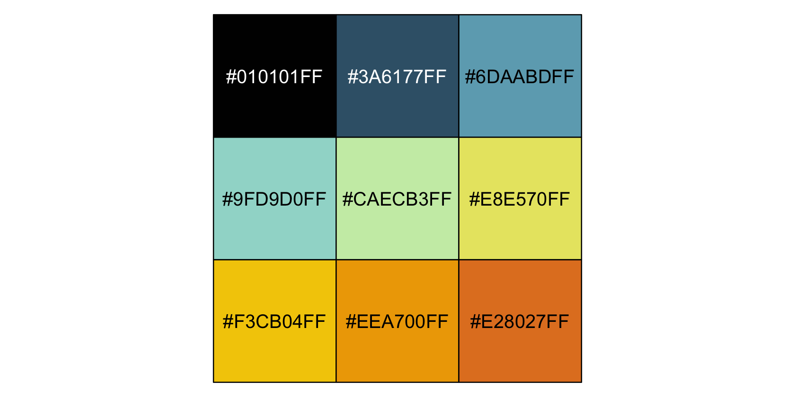
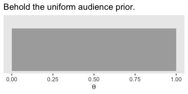
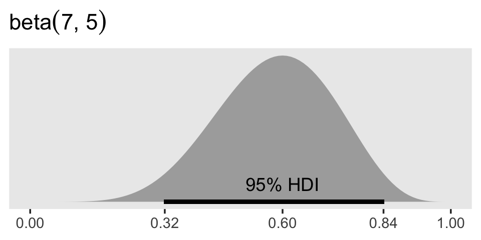
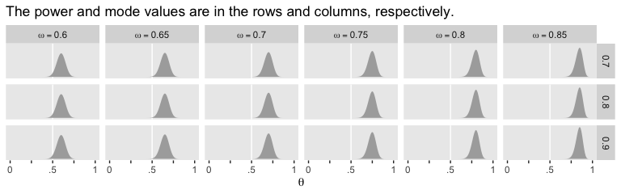
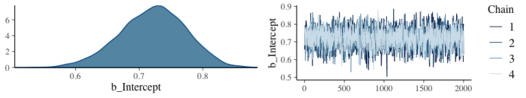
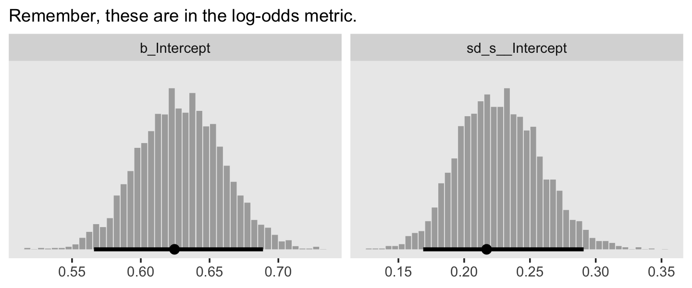
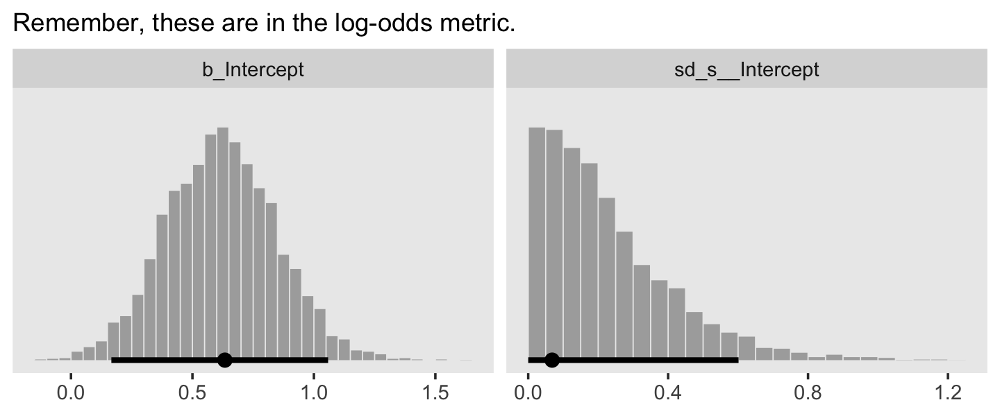
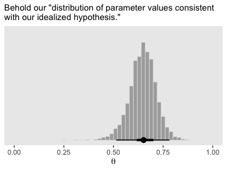
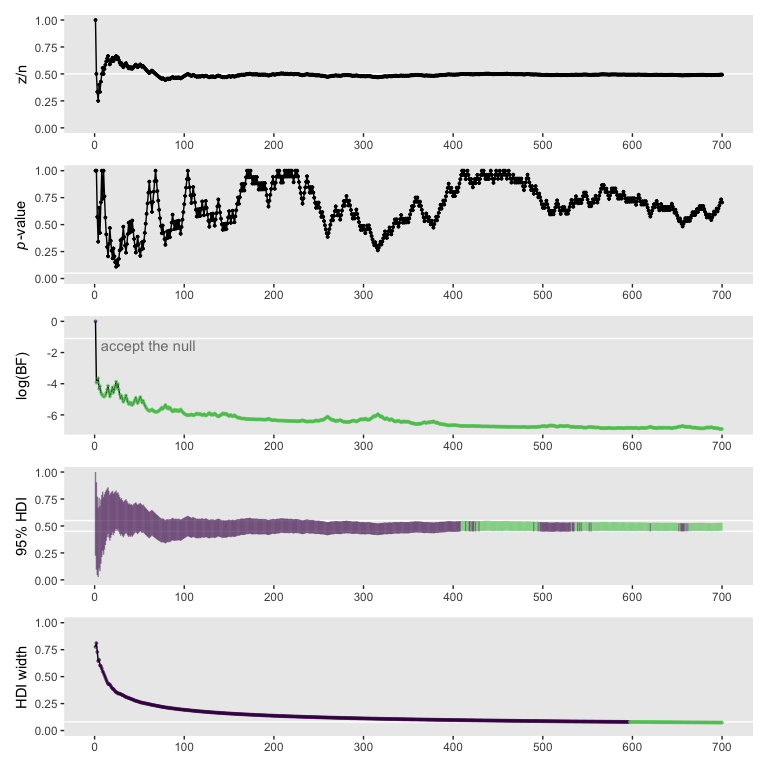

# Goals, Power, and Sample Size

> Researchers collect data in order to achieve a goal. Sometimes the goal is to show that a suspected underlying state of the world is credible; other times the goal is to achieve a minimal degree of precision on whatever trends are observed. Whatever the goal, it can only be probabilistically achieved, as opposed to definitely achieved, because data are replete with random noise that can obscure the underlying state of the world. Statistical *power* is the probability of achieving the goal of a planned empirical study, if a suspected underlying state of the world is true. [@kruschkeDoingBayesianData2015, p. 359, *emphasis* in the original]

## The will to power

"In this section, [Kruschke laid out a] framework for research and data analysis [that might lead] to a more precise definition of power and how to compute it" (p. 360).

### Goals and obstacles.

The three research goals Kruschke dealt with in this chapter were:

* to reject a null value for a parameter,
* to confirm the legitimacy of a particular parameter value, and
* to estimate a parameter with reasonable precision.

All these could, of course, be extended to contexts involving multiple parameters and all of these were dealt with using 95% HDIs.

### Power.

> Because of random noise, the goal of a study can be achieved only probabilistically. The probability of achieving the goal, given the hypothetical state of the world and the sampling plan, is called the *power* of the planned research. In traditional null hypothesis significance testing (NHST), power has only one goal (rejecting the null hypothesis), and there is one conventional sampling plan (stop at predetermined sample size) and the hypothesis is only a single specific value of the parameter. In traditional statistics, that is *the* definition of power. That definition is generalized in this book to include other goals, other sampling plans, and hypotheses that involve an entire distribution on parameters. (p. 361, *emphasis* in the original)

Three primary methods to increase power are:

* reducing measurement error,
* increasing the effect size, and
* increasing the sample size.

Kruschke then laid out a five-step procedure to compute power within a Bayesian workflow.

1. Use theory/prior information to specify hypothetical distributions for all parameter values in the model.
2. Use those distributions to generate synthetic data according to the planned sampling method.
3. Fit the proposed model--including the relevant priors--with the synthetic data.
4. Use the posterior to determine whether we attained the research goal.
5. Repeat the procedure many times (i.e., using different `set.seed()` values) to get a distribution of results.

### Sample size.

> *The best that a large sample can do is exactly reflect the data-generating distribution.* If the data-generating distribution has considerable mass straddling the null value, then the best we can do is get estimates that include and straddle the null value. As a simple example, suppose that we think that a coin may be biased, and the data-generating hypothesis entertains four possible values of $\theta$ , with $p (\theta = 0.5) = 25 \%$, $p (\theta = 0.6) = 25 \%$, $p (\theta = 0.7) = 25 \%$, and $p (\theta = 0.8) = 25 \%$. Because $25 \%$ of the simulated data come from a fair coin, the maximum probability of excluding $\theta = 0.5$, even with a huge sample, is $75 \%$. 
>
> Therefore, when planning the sample size for an experiment, it is crucial to decide what a realistic goal is. If there are good reasons to posit a highly certain data-generating hypothesis, perhaps because of extensive previous results, then a viable goal may be to exclude a null value. On the other hand, if the data-generating hypothesis is somewhat vague, then a more reasonable goal is to attain a desired degree of precision in the posterior. (p. 364, *emphasis* in the original)

### Other expressions of goals.

I'm going to skip over these.

> In the remainder of the chapter, it will be assumed that the goal of the research is estimation of the parameter values, starting with a viable prior. The resulting posterior distribution is then used to assess whether the goal was achieved. (p. 366)

## Computing power and sample size

> As our first worked-out example, consider the simplest case: Data from a single coin. Perhaps we are polling a population and we want to precisely estimate the preferences for candidates A or B. Perhaps we want to know if a drug has more than a 50% cure rate. (p. 366)

### When the goal is to exclude a null value.

> Usually it is more intuitively accessible to get prior data, or to think of idealized prior data, than to directly specify a distribution over parameter values. For example, based on knowledge about the application domain, we might have 2000 actual or idealized flips of the coin for which the result showed 65% heads. Therefore we'll describe the data-generating hypothesis as a beta distribution with a mode of 0.65 and concentration based on 2000 flips after a uniform "proto-prior": $\operatorname{beta} (\theta | 0.65 \cdot (2000 - 2) + 1, (1 - 0.65) \cdot (2000 - 2) + 1)$.

We might express that in code like this.


```r
library(tidyverse)

kappa <- 2000
omega <- .65

tibble(theta = seq(from = 0, to = 1, by = .001)) %>% 
  mutate(prior = dbeta(theta,
                       shape1 =      omega  * (kappa - 2) + 1,
                       shape2 = (1 - omega) * (kappa - 2) + 1)) %>% 
  
  ggplot(aes(x = theta, ymin = 0, ymax = prior)) +
  geom_ribbon(size = 0, fill = "grey67") +
  scale_y_continuous(NULL, breaks = NULL) +
  labs(title = "Behold our prior. It's rather peaked.",
       x = expression(theta)) +
  theme(panel.grid = element_blank())
```



If we wanted to take some random draws from that prior, say 5, we'd do something like this.


```r
n <- 5

set.seed(13)
rbeta(n,
      shape1 =      omega  * (kappa - 2) + 1,
      shape2 = (1 - omega) * (kappa - 2) + 1)
```

```
## [1] 0.6430548 0.6532279 0.6250891 0.6475884 0.6351476
```

Now let's just take one draw and call it `bias`.


```r
n <- 1

set.seed(13)
bias <-
  rbeta(n,
        shape1 =      omega  * (kappa - 2) + 1,
        shape2 = (1 - omega) * (kappa - 2) + 1)

print(bias)
```

```
## [1] 0.6430548
```

Do note that whereas Kruschke  based his discussion on a bias of 0.638, we're moving forward with our randomly-drawn 0.643. Anyways, now we

> simulate flipping a coin with that bias $N$ times. The simulated data have $z$ heads and $N − z$ tails. The proportion of heads, $z/N$, will tend to be around [0.643], but will be higher or lower because of randomness in the flips. (p. 367)


```r
# pick some large number
n <- 1e3

set.seed(13)
tibble(flips = rbernoulli(n = n, p = bias)) %>% 
  summarise(n = n(),
            z = sum(flips)) %>% 
  mutate(`proportion of heads` = z / n)
```

```
## # A tibble: 1 x 3
##       n     z `proportion of heads`
##   <int> <int>                 <dbl>
## 1  1000   652                 0.652
```

And indeed our samples did tend around $\theta =.643$. Had we increased our number of draws by an order of magnitude or two, it our proportion of heads would have been even closer to the true data-generating value.

Though he presented Table 13.1 in this section, Kruschke walked out how he came to those values in the following sections. We'll get to them in just a bit.

### Formal solution and implementation in R.

I've been playing around with this a bit. If you look closely at the code block on page 369, you'll see that Kruschke's `minNforHDIpower()` function requires the `HDIofICDF()` function from his `DBDA2E-utilities.R` file, which we usually recast as `hdi_of_icdf()`.


```r
hdi_of_icdf <- function(name, width = .95, tol = 1e-8, ... ) {
  
  incredible_mass <- 1.0 - width
  interval_width <- function(low_tail_prob, name, width, ...) {
    name(width + low_tail_prob, ...) - name(low_tail_prob, ...)
  }
  opt_info <- optimize(interval_width, c(0, incredible_mass), 
                       name = name, width = width, 
                       tol = tol, ...)
  hdi_lower_tail_prob <- opt_info$minimum
  
  return(c(name(hdi_lower_tail_prob, ...),
           name(width + hdi_lower_tail_prob, ...)))
  
}
```

Just to warm up, consider a beta distribution for which $\omega = .5$ and $\kappa = 2000$. Here are the 95% HDIs.


```r
omega <- .5

hdi_of_icdf(name = qbeta,
            shape1 =      omega  * (kappa - 2) + 1,
            shape2 = (1 - omega) * (kappa - 2) + 1)
```

```
## [1] 0.4780947 0.5219053
```

Those look a whole lot like the ROPE values Kruschke specified in his example at the bottom of page 370. But we're getting ahead of ourselves. Now that we have our `hdi_of_icdf()` function, we're ready to define our version of `minNforHDIpower()`, which I'm calling `min_n_for_hdi_power()`.


```r
min_n_for_hdi_power <- 
  function(gen_prior_mode, gen_prior_n,
           hdi_max_width = NULL, null_value = NULL,
           rope = c(max(0, null_value - 0.02), min(1, null_value + 0.02)),
           desired_power = 0.8, aud_prior_mode = 0.5, aud_prior_n = 2,
           hdi_mass = 0.95, init_samp_size = 20, verbose = TRUE) {
    # Check for argument consistency:
    if (!xor(is.null(hdi_max_width), is.null(null_value))) {
      stop("One and only one of `hdi_max_width` and `null_value` must be specified.")
    }
    # Convert prior mode and N to a, b parameters of beta distribution:
    gen_prior_a <-        gen_prior_mode  * (gen_prior_n - 2) + 1
    gen_prior_b <- (1.0 - gen_prior_mode) * (gen_prior_n - 2) + 1
    aud_prior_a <-        aud_prior_mode  * (aud_prior_n - 2) + 1
    aud_prior_b <- (1.0 - aud_prior_mode) * (aud_prior_n - 2) + 1
    # Initialize loop for incrementing `sample_size`:
    sample_size <- init_samp_size
    not_powerful_enough = TRUE
    # Increment `sample_size` until desired power is achieved:
    while(not_powerful_enough) {
      z_vec <- 0:sample_size # vector of all possible z values for N flips.
      # Compute probability of each z value for data-generating prior:
      p_z_vec <- exp(lchoose(sample_size, z_vec)
                     + lbeta(z_vec + gen_prior_a, sample_size - z_vec + gen_prior_b)
                     - lbeta(gen_prior_a, gen_prior_b))
      # For each z value, compute posterior HDI:
      # `hdi_matrix` will hold HDI limits for each z:
      hdi_matrix <- matrix(0, nrow = length(z_vec), ncol = 2)
      for (z_id_x in 1:length(z_vec)) {
        z <- z_vec[z_id_x]
        hdi_matrix[z_id_x, ] <- hdi_of_icdf(qbeta,
                                            shape1 = z + aud_prior_a,
                                            shape2 = sample_size - z + aud_prior_b,
                                            width  = hdi_mass)
      }
      # Compute HDI widths:
      hdi_width <- hdi_matrix[, 2] - hdi_matrix[, 1]
      # Sum the probabilities of outcomes with satisfactory HDI widths:
      if (!is.null(hdi_max_width)) {
        power_hdi <- sum(p_z_vec[hdi_width < hdi_max_width])
      }
      # Sum the probabilities of outcomes with HDI excluding `rope`:
      if (!is.null(null_value)) {
        power_hdi <- sum(p_z_vec[hdi_matrix[, 1] > rope[2] | hdi_matrix[, 2] < rope[1]])
      }
      if (verbose) {
        cat(" For sample size = ", sample_size, ", power = ", power_hdi,
            "\n", sep = ""); flush.console() 
      }
      if (power_hdi > desired_power) {  # If desired power is attained,
        not_powerful_enough = FALSE
      } else {
        sample_size <- sample_size + 1
        # set flag to stop,
        # otherwise
        # increment the sample size.
      }
    } # End while( not_powerful_enough ).
    # Return the sample size that achieved the desired power:
    return(sample_size)
}
```

Other than altering Kruschke's formatting a little bit, the only meaningful change I made to the code was removing the line that checked for the `HDIofICD()` function and then `source()`ed it, if necessary. Following along with Kruschke on page 370, here's an example for which $\omega_\text{data generating} = .75$, $\kappa = 2000$, the ROPE is $[.48, .52]$, and the desired power is the conventional .8.


```r
min_n_for_hdi_power(gen_prior_mode = .75, 
                    gen_prior_n    = 2000,
                    hdi_max_width  = NULL, 
                    null_value     = .5, 
                    rope           = c(.48, .52),
                    desired_power  = .8,
                    aud_prior_mode = .5, 
                    aud_prior_n    = 2,
                    hdi_mass       = .95, 
                    init_samp_size = 20, 
                    verbose        = TRUE)
```

```
##  For sample size = 20, power = 0.6159196
##  For sample size = 21, power = 0.5655352
##  For sample size = 22, power = 0.6976802
##  For sample size = 23, power = 0.6521637
##  For sample size = 24, power = 0.606033
##  For sample size = 25, power = 0.7245362
##  For sample size = 26, power = 0.6832871
##  For sample size = 27, power = 0.7836981
##  For sample size = 28, power = 0.7479021
##  For sample size = 29, power = 0.7103786
##  For sample size = 30, power = 0.8009259
```

```
## [1] 30
```

Just like in the text, the necessary $N = 30$.

Unlike in the text, I increased the value of `init_samp_size` from 5 to 20 to keep the output a reasonable length. To clarify what we just did,

> in that function call, the data-generating distribution has a mode of 0.75 and concentration of 2000, which means that the hypothesized world is pretty certain that coins have a bias of 0.75. The goal is to exclude a null value of 0.5 with a ROPE from 0.48 to 0.52. The desired power [is] 80%. The audience prior is uniform. When the function is executed, it displays the power for increasing values of sample size, until stopping at $N = 30$. (p. 370)

If it's unclear why the "audience prior is uniform", consider this.


```r
kappa <- 2
omega <- .5

tibble(theta = seq(from = 0, to = 1, by = .01)) %>% 
  mutate(prior = dbeta(theta,
                       shape1 =      omega  * (kappa - 2) + 1,
                       shape2 = (1 - omega) * (kappa - 2) + 1)) %>% 
  
  ggplot(aes(x = theta, ymin = 0, ymax = prior)) +
  geom_ribbon(size = 0, fill = "grey67") +
  scale_y_continuous(NULL, breaks = NULL) +
  coord_cartesian(ylim = c(0, 1.25)) +
  labs(title = "Behold the uniform audience prior.",
       x = expression(theta)) +
  theme(panel.grid = element_blank())
```



If you work out the algebra with `omega` and `kappa`, you'll see this is a $\operatorname{beta} (1, 1)$. Thus, `aud_prior_n` is $\kappa$ and `aud_prior_mode` is $\omega$.

Here we'll wrap our `min_n_for_hdi_power()` function into a simple `sim_power()` function for use with `purrr::map2()`.


```r
sim_power <- function(mode, power) {
  
  min_n_for_hdi_power(gen_prior_mode = mode, 
                      gen_prior_n    = 2000,
                      hdi_max_width  = NULL, 
                      null_value     = .5, 
                      rope           = c(.48, .52),
                      desired_power  = power,
                      aud_prior_mode = .5, 
                      aud_prior_n    = 2,
                      hdi_mass       = .95, 
                      init_samp_size = 1, 
                      verbose        = TRUE)
  
}
```

Here we use the two functions to compute the values in Table 13.1 on page 367. 


```r
sim <-
  crossing(mode  = seq(from = .6, to = .85, by = .05),
           power = c(.7, .8, .9)) %>% 
  mutate(results = map2_dbl(mode, power, sim_power))
```

The results look like this.


```r
print(sim)
```

```
## # A tibble: 18 x 3
##     mode power results
##    <dbl> <dbl>   <dbl>
##  1  0.6    0.7     238
##  2  0.6    0.8     309
##  3  0.6    0.9     430
##  4  0.65   0.7      83
##  5  0.65   0.8     109
##  6  0.65   0.9     150
##  7  0.7    0.7      40
##  8  0.7    0.8      52
##  9  0.7    0.9      74
## 10  0.75   0.7      25
## 11  0.75   0.8      30
## 12  0.75   0.9      43
## 13  0.8    0.7      16
## 14  0.8    0.8      19
## 15  0.8    0.9      27
## 16  0.85   0.7       7
## 17  0.85   0.8      14
## 18  0.85   0.9      16
```

It takes just a tiny bit of wrangling to reproduce Table 13.1.


```r
sim %>% 
  pivot_wider(names_from = mode,
              values_from = results) %>%
  knitr::kable()
```


 power   0.6   0.65   0.7   0.75   0.8   0.85
------  ----  -----  ----  -----  ----  -----
   0.7   238     83    40     25    16      7
   0.8   309    109    52     30    19     14
   0.9   430    150    74     43    27     16

### When the goal is precision.

Recall that if we have $\operatorname{beta} (a, b)$ prior for $\theta$ of the Bernoulli likelihood function, then the analytic solution for the posterior is $\operatorname{beta} (\theta | z + a, N – z + b)$. In our first example, $z = 6$ out of $N = 10$ randomly selected voters preferred candidate A and we started with a flat $\operatorname{beta} (\theta | 1, 1)$ prior. We can check that our posterior is indeed $\operatorname{beta} (7, 5)$ by working through the algebra.


```r
z <- 6
n <- 10

# posterior alpha
z + 1
```

```
## [1] 7
```

```r
# posterior beta
n - z + 1
```

```
## [1] 5
```

Here's how we compute the 95% HDIs.


```r
(
  h <-
    hdi_of_icdf(name = qbeta,
                shape1 = 7,
                shape2 = 5)
)
```

```
## [1] 0.3182322 0.8414276
```

The $\operatorname{beta} (7, 5)$ distribution looks like this.


```r
tibble(theta = seq(from = 0, to = 1, by = .01)) %>% 
  mutate(density = dbeta(theta,
                         shape1 = 7,
                         shape2 = 5)) %>% 
  
  ggplot(aes(x = theta, ymin = 0, ymax = density)) +
  geom_ribbon(size = 0, fill = "grey67") +
  geom_segment(x = h[1], xend = h[2],
               y = 0,    yend = 0,
               size = 1) +
  annotate(geom = "text", x = .6, y = 1/3, label = "95% HDI") +
  scale_x_continuous(NULL, breaks = c(0, h[1], z / n, h[2], 1) %>% round(2)) +
  scale_y_continuous(NULL, breaks = NULL) +
  ggtitle(expression("beta"*(7*", "*5))) +
  theme(panel.grid = element_blank())
```



"It turns out, in this case, that we can never have a sample size large enough to achieve the goal of 80% of the HDIs falling above $\theta = 0.5$. To see why," keep reading in the text (p. 371). Happily, 

> there is a more useful goal, however. Instead of trying to reject a particular value of $\theta$, we set as our goal a desired degree of precision in the posterior estimate. For example, our goal might be that the 95% HDI has width less than 0.2, at least 80% of the time. (p. 371)

If you look back up at our `min_n_for_hdi_power()` defining code, above, you'll see that "One and only one of `hdi_max_width` and `null_value` must be specified." So if we want to determine the necessary $N$ for an 95% HDI width of less than .2, we need to set `hdi_max_width = .2` and `null_value = NULL`.


```r
min_n_for_hdi_power(gen_prior_mode = .75, 
                    gen_prior_n    = 10,
                    hdi_max_width  = .2,  # look here
                    null_value     = NULL, 
                    rope           = NULL,
                    desired_power  = .8,
                    aud_prior_mode = .5, 
                    aud_prior_n    = 2,
                    hdi_mass       = .95, 
                    init_samp_size = 75, 
                    verbose        = TRUE)
```

```
##  For sample size = 75, power = 0.5089359
##  For sample size = 76, power = 0.5337822
##  For sample size = 77, power = 0.5235513
##  For sample size = 78, power = 0.5474934
##  For sample size = 79, power = 0.5706373
##  For sample size = 80, power = 0.5929882
##  For sample size = 81, power = 0.6145578
##  For sample size = 82, power = 0.6353626
##  For sample size = 83, power = 0.6554231
##  For sample size = 84, power = 0.6747629
##  For sample size = 85, power = 0.6934076
##  For sample size = 86, power = 0.7113842
##  For sample size = 87, power = 0.7287209
##  For sample size = 88, power = 0.7716517
##  For sample size = 89, power = 0.787177
##  For sample size = 90, power = 0.8266938
```

```
## [1] 90
```

Just like in the last section, here I set `init_samp_size` to a higher value than in the text in order to keep the output reasonably short. To reproduce the results in Table 13.2, we’ll need to adjust the `min_n_for_hdi_power()` parameters within our `sim_power()` function.


```r
sim_power <- function(mode, power) {
  
  min_n_for_hdi_power(gen_prior_mode = mode, 
                      gen_prior_n    = 10,
                      hdi_max_width  = .2, 
                      null_value     = NULL, 
                      rope           = NULL,
                      desired_power  = power,
                      aud_prior_mode = .5, 
                      aud_prior_n    = 2,
                      hdi_mass       = .95, 
                      init_samp_size = 50, 
                      verbose        = TRUE)
  
}

sim <-
  crossing(mode  = seq(from = .6, to = .85, by = .05),
           power = c(.7, .8, .9)) %>% 
  mutate(results = map2_dbl(mode, power, sim_power))
```

Let's make that table.


```r
sim %>%
  pivot_wider(names_from = mode,
              values_from = results) %>%
  knitr::kable()
```


 power   0.6   0.65   0.7   0.75   0.8   0.85
------  ----  -----  ----  -----  ----  -----
   0.7    91     90    88     86    81     75
   0.8    92     92    91     90    87     82
   0.9    93     93    93     92    91     89

What did that audience prior look like?


```r
kappa <- 2
omega <- .5

tibble(theta = seq(from = 0, to = 1, by = .1)) %>% 
  mutate(density = dbeta(theta,
                         shape1 =      omega  * (kappa - 2) + 1,
                         shape2 = (1 - omega) * (kappa - 2) + 1)) %>% 
  
  ggplot(aes(x = theta, ymin = 0, ymax = density)) +
  geom_ribbon(size = 0, fill = "grey67") +
  scale_y_continuous(NULL, breaks = NULL, limits = c(0, 1.25)) +
  labs(title = "Behold the uniform audience prior.",
       x = expression(theta)) +
  theme(panel.grid = element_blank())
```



Here are what the beta distributions based on the `sim` look like.


```r
sim %>% 
  rename(n = results) %>% 
  expand(nesting(mode, power, n), 
         theta = seq(from = 0, to = 1, by = .01)) %>% 
  mutate(density = dbeta(theta,
                         shape1 =      mode  * (n - 2) + 1,
                         shape2 = (1 - mode) * (n - 2) + 1),
         mode    = str_c("omega == ", mode)) %>% 
  
  ggplot(aes(x = theta, ymin = 0, ymax = density)) +
  geom_vline(xintercept = .5, color = "white") +
  geom_ribbon(size = 0, fill = "grey67") +
  scale_x_continuous(expression(theta), labels = c("0", "", ".5", "", "1")) +
  scale_y_continuous(NULL, breaks = NULL) +
  ggtitle("The power and mode values are in the rows and columns, respectively.") +
  theme(panel.grid = element_blank()) +
  facet_grid(power ~ mode, labeller = label_parsed)
```


Toward the end of the section, Kruschke mentioned the required sample size shoots up if our desired HDI width is 0.1. Here's the simulation.


```r
sim_power <- function(mode, power) {
  
    min_n_for_hdi_power(gen_prior_mode = mode, 
                        gen_prior_n    = 10,
                        hdi_max_width  = .1, 
                        null_value     = NULL, 
                        rope           = NULL,
                        desired_power  = power,
                        aud_prior_mode = .5, 
                        aud_prior_n    = 2,
                        hdi_mass       = .95, 
                        init_samp_size = 300,  # save some time and up this parameter 
                        verbose        = TRUE)
  
}

sim <-
  crossing(mode  = seq(from = .6, to = .85, by = .05), 
           power = c(.7, .8, .9)) %>% 
  mutate(results = map2_dbl(mode, power, sim_power))
```

Display the results in a table like before.


```r
sim %>%
  pivot_wider(names_from = mode,
              values_from = results) %>%
  knitr::kable()
```


 power   0.6   0.65   0.7   0.75   0.8   0.85
------  ----  -----  ----  -----  ----  -----
   0.7   373    370   364    352   332    303
   0.8   378    376   373    367   354    334
   0.9   380    380   379    378   373    363

### Monte Carlo approximation of power.

> The previous sections illustrated the ideas of power and sample size for a simple case in which the power could be computed by mathematical derivation. [If your field is like mine, this will not be the norm for your research projects.] In this section, we approximate the power by Monte Carlo simulation. The R script for this simple case serves as a template for more realistic applications. The R script is named `Jags-Ydich-Xnom1subj-MbernBeta-Power.R`, which is the name for the JAGS program for dichotomous data from a single "subject" suffixed with the word "Power." As you read through the script, presented below, remember that you can find information about any general R command by using the help function in R, as explained in Section 3.3.1 (p. 39). (p. 372)

The code in Kruschke's `Jags-Ydich-Xnom1subj-MbernBeta-Power.R` file also makes use of the content in his `Jags-Ydich-Xnom1subj-MbernBeta.R` file. As is often the case, the code in both is JAGS and base-**R** centric. We'll be taking a different approach. I'll walk you through. First, let's fire up **brms**.


```r
library(brms)
```

This won't be of much concern for some of the complex models we'll be fitting in later chapters. But for simple models like this, a lot of the time you spend waiting for `brms::brm()` to return your posterior and its summary has to do with compilation time. The issue of compilation goes into technical details I just don't have the will to go through right now. But if we can avoid or minimize compilation time, it'll be a boon for our power simulations. As it turns out, we can. The first time we fit our desired model, we have to compile. But once we have that initial fit object in hand, we can reuse it with the `update()` function, which will allow us to avoid further compilation. So that's what we’re going to do, here. We're going to fit the model once and save it.


```r
# how many rows of 0s and 1s should we have in the data?
n <- 74

# should the values in the data be of single draws (i.e., 1), or summaries?
size <- 1

# what is the population mode for theta we'd like to base this all on?
omega <- .7

# fit that joint
fit13.1 <-
  brm(data = tibble(y = rbinom(n, size, omega)),
      family = bernoulli(link = identity),
      y ~ 1,
      prior(beta(1, 1), class = Intercept),
      warmup = 1000, iter = 3000, chains = 4, cores = 1,
      seed = 13,
      control = list(adapt_delta = .9),
      file = "fits/fit13.01")
```

You may (or not) recall that at the end of Chapter 3, we covered how to time an operation in **R**. When you're setting up a Monte Carlo power study, it can be important to use those time-tracking skills to get a sense of how long it takes to fit your models. While I was setting this model up, I experimented with keeping the default `cores = 1` or setting my typical `cores = 4`. As it turns out, with a very simple model like this, `cores = 1` was a little faster. If you're fitting one model, that's no big deal. But in a situation where you're fitting 100 or 1000, you'll want to make sure you're fitting them as efficiently as possible. 

But anyway, our practice will be to keep all the specifications in `fit` constant across the simulations. So choose them wisely. If you look deep into the bowels of the `Jags-Ydich-Xnom1subj-MbernBeta.R` file, you'll see Kruschke used the flat $\operatorname{beta}(1, 1)$ prior, which is where our `prior(beta(1, 1), class = Intercept)` code came from. This is the audience prior. We aren't particularly concerned about the data we simulated with the `data = tibble(y = rbinom(n, size, omega))` line. The main thing is that they follow the same basic structure our subsequent data will.

To make sure we're not setting ourselves up to fail, we might make sure the chains look okay.


```r
plot(fit13.1)
```



Looks like a dream. Let's move forward and run the simulation proper. In his script file, Kruschke suggested we simulate with large $N$s like 1000 or so. Since this is just an example, I'm gonna cut that to 100. 


```r
# how many simulations would you like?
n_sim <- 100

# specify omega and kappa of the hypothetical parameter distribution
omega <- .7
kappa <- 2000

# make it reproducible
set.seed(13)

sim1 <-
  # define some of the parameters
  tibble(n     = n,
         size  = size,
         theta = rbeta(n_sim, 
                       shape1 =      omega  * (kappa - 2) + 1,
                       shape2 = (1 - omega) * (kappa - 2) + 1)) %>% 
  # simulate the data
  mutate(data = pmap(list(n, size, theta), rbinom)) %>% 
  # fit the models on the simulated data
  mutate(fit = map(data, ~update(fit13.1, newdata = list(y = .))))
```


*What have we done?* you might ask.


```r
head(sim1)
```

```
## # A tibble: 6 x 5
##       n  size theta data       fit      
##   <dbl> <dbl> <dbl> <list>     <list>   
## 1    74     1 0.693 <int [74]> <brmsfit>
## 2    74     1 0.703 <int [74]> <brmsfit>
## 3    74     1 0.676 <int [74]> <brmsfit>
## 4    74     1 0.698 <int [74]> <brmsfit>
## 5    74     1 0.686 <int [74]> <brmsfit>
## 6    74     1 0.695 <int [74]> <brmsfit>
```

The `theta` column contains the draws from the hypothesized parameter distribution, which we've indicated is hovering tightly around .7. The `data` column is nested in that within each row, we've saved an entire $N = 74$ row tibble. Most importantly, the `fit` column contains the `brms::brm()` objects for each of our 100 simulations. See that last `mutate()` line, above? That's where those came from. Within the `purrr::map()` function, we fed our simulated data sets, one row at a time, into the `update()` function via the `newdata` argument. Because we used `update()` based on our initial `fit`, we avoided subsequent compilation times and just sampled like a boss. 

Before we move on, I should give some credit. The foundations of this workflow come from Wickham's talk, [*Managing many models with R*](https://www.youtube.com/watch?time_continue=426&v=rz3_FDVt9eg). I got some additional [help on twitter](https://twitter.com/PStrafo/status/1107447953709383681) from [Phil Straforelli](https://twitter.com/PStrafo).

We still have some work to do. Next, we'll want to make a custom function that will make it easy to compute the intercept HDIs for each of our fits.


```r
library(tidybayes)

get_hdi <- function(fit) {
  fit %>%
    posterior_samples() %>%
    mode_hdi(b_Intercept) %>%
    select(.lower:.upper)
}

# how does it work?
get_hdi(fit13.1)
```

```
##      .lower    .upper
## 1 0.6218496 0.8236595
```

Now we'll apply that function to our `fits` tibble to pull those simulated HDIs. Then we'll program in the markers for the ROPE and HDI width criteria, perform logical tests to see whether they were passes within each of the 100 simulations, and summarize the tests.


```r
sim1 %>% 
  # get those HDIs and `unnest()`
  mutate(hdi = map(fit, get_hdi)) %>% 
  unnest(hdi) %>% 
  # define our test criteria
  mutate(rope_ll   = .48,
         rope_ul   = .52,
         hdi_width = .2) %>% 
  mutate(pass_rope  = .lower > rope_ul | .upper < rope_ll,
         pass_width = (.upper - .lower) < hdi_width) %>%
  
  # summarize those joints
  summarise(power_rope  = mean(pass_rope),
            power_width = mean(pass_width))
```

```
## # A tibble: 1 x 2
##   power_rope power_width
##        <dbl>       <dbl>
## 1       0.92        0.35
```

Those are our power estimates. To compute their HDIS, just increase them by a factor of 100 and plug them into the formulas within the shape arguments in `hdi_of_icdf()`.


```r
# HDIs for the ROPE power estimate
hdi_of_icdf(name = qbeta,
            shape1 = 1 + 92,
            shape2 = 1 + n_sim - 92) %>% 
  round(digits = 2)
```

```
## [1] 0.86 0.96
```

```r
# HDIs for the width power estimate
hdi_of_icdf(name = qbeta,
            shape1 = 1 + 35,
            shape2 = 1 + n_sim - 35) %>% 
  round(digits = 2)
```

```
## [1] 0.26 0.45
```

Following the middle of page 375, we'll want to do the whole thing again with $\kappa = 10$ and $N = 91$.

Before we run the next simulation, notice how our first approach had us saving the model fits within our `sim1` object. When the models are simple and based on small data and when you’re only simulating 100 times, this isn't a huge deal. But saving 1000+ `brms::brm()` fit objects of hierarchical models will bog you down. So for our next simulation, we’ll only save the HDIs from our `get_hdi()` function. 


```r
# how many rows of 0s and 1s should we have in the data?
n     <- 91

# how many simulations would you like?
n_sim <- 100

# specify omega and kappa of the hypothetical parameter distribution
omega <- .7
kappa <- 10

# make it reproducible
set.seed(13)

# simulate
sim2 <-
  tibble(n     = n,
         size  = size,
         theta = rbeta(n_sim, 
                       shape1 =      omega  * (kappa - 2) + 1,
                       shape2 = (1 - omega) * (kappa - 2) + 1)) %>% 
  mutate(data = pmap(list(n, size, theta), rbinom)) %>% 
  mutate(hdi = map(data, ~update(fit13.1, newdata = list(y = .)) %>% get_hdi()))
```

Since we saved the HDI estimates in the `hdi` column, we can just `unnest()` then and summarize our power results.


```r
sim2 %>% 
  unnest(hdi) %>% 
  mutate(rope_ll   = .48,
         rope_ul   = .52,
         hdi_width = .2) %>% 
  mutate(pass_rope  = .lower > rope_ul | .upper < rope_ll,
         pass_width = (.upper - .lower) < hdi_width) %>%
  summarise(power_rope  = mean(pass_rope),
            power_width = mean(pass_width))
```

```
## # A tibble: 1 x 2
##   power_rope power_width
##        <dbl>       <dbl>
## 1       0.71        0.91
```

Compute the corresponding HDIs.


```r
# HDIs for the ROPE power estimate
hdi_of_icdf(name = qbeta,
            shape1 = 1 + 71,
            shape2 = 1 + n_sim - 71) %>% 
  round(digits = 2)
```

```
## [1] 0.62 0.79
```

```r
# HDIs for the width power estimate
hdi_of_icdf(name = qbeta,
            shape1 = 1 + 91,
            shape2 = 1 + n_sim - 91) %>% 
  round(digits = 2)
```

```
## [1] 0.84 0.96
```

### Power from idealized or actual data.

> In practice, it is often more intuitive to specify actual or idealized *data* that express the hypothesis, than it is to specify top-level parameter properties. The idea is that we start with the actual or idealized data and then use Bayes' rule to generate the corresponding distribution on parameter values. (p. 376, *emphasis* in the original)

Here are the idealized parameters Kruschke outlied on pages 376--377. 


```r
# specify idealized hypothesis:
ideal_group_mean <- 0.65
ideal_group_sd   <- 0.07

ideal_n_subj         <- 100  # more subjects => higher confidence in hypothesis
ideal_n_trl_per_subj <- 100  # more trials => higher confidence in hypothesis
```

These parameters are for binomial data. To parameterize $\theta$ in terms of a mean and standard deviation, we need to define the `beta_ab_from_mean_sd()` function.


```r
beta_ab_from_mean_sd <- function(mean, sd) {
  
  if (mean <= 0 | mean >= 1) stop("must have 0 < mean < 1")
  if (sd <= 0) stop("sd must be > 0")
  kappa <- mean * (1 - mean) / sd^2 - 1
  if (kappa <= 0) stop("invalid combination of mean and sd")
  a <- mean * kappa
  b <- (1.0 - mean) * kappa
  return(list(a = a, b = b))
  
}
```

Now generate data consistent with these values using a **tidyverse**-style workflow.


```r
b <- beta_ab_from_mean_sd(ideal_group_mean, ideal_group_sd)

# make the results reproducible
set.seed(13)

d <-
  # make a subject index and generate random theta values for idealized subjects
  tibble(s     = 1:ideal_n_subj,
         theta = rbeta(ideal_n_subj, b$a, b$b)) %>% 
  # transform the theta values to exactly match idealized mean and SD
  mutate(theta_transformed = ((theta - mean(theta)) / sd(theta)) * ideal_group_sd + ideal_group_mean) %>% 
  # `theta_transformed` must be between 0 and 1
  mutate(theta_transformed = ifelse(theta_transformed >= 0.999, 0.999,
                                    ifelse(theta_transformed <= 0.001, 0.001,
                                           theta_transformed))) %>% 
  # generate idealized data very close to thetas
  mutate(z = round(theta_transformed * ideal_n_trl_per_subj)) %>% 
  # create vector of 0's and 1's matching the z values generated above
  mutate(y = map(z, ~c(rep(1, .), rep(0, ideal_n_trl_per_subj - .)))) %>% 
  unnest(y)
```

Our main variables are `s` and `y`. You can think of the rest as showing our work. Here's a peek.


```r
str(d)
```

```
## tibble [10,000 × 5] (S3: tbl_df/tbl/data.frame)
##  $ s                : int [1:10000] 1 1 1 1 1 1 1 1 1 1 ...
##  $ theta            : num [1:10000] 0.604 0.604 0.604 0.604 0.604 ...
##  $ theta_transformed: num [1:10000] 0.601 0.601 0.601 0.601 0.601 ...
##  $ z                : num [1:10000] 60 60 60 60 60 60 60 60 60 60 ...
##  $ y                : num [1:10000] 1 1 1 1 1 1 1 1 1 1 ...
```

We are going to follow the same procedure we did when we originally fit the model to the therapeutic touch data in Chapter 9. Instead of reproducing the model Kruschke presented in his scripts, we are going to fit a hierarchical logistic regression model.


```r
fit13.2 <-
  brm(data = d,
      family = bernoulli(link = logit),
      y ~ 1 + (1 | s),
      prior = c(prior(normal(0, 1.5), class = Intercept),
                prior(normal(0, 1), class = sd)),
      iter = 2000, warmup = 1000, chains = 4, cores = 4,
      seed = 13,
      file = "fits/fit13.02")
```

Unlike in the text, we had no need for thinning our chains. The effective number of samples was fine.


```r
print(fit13.2)
```

```
##  Family: bernoulli 
##   Links: mu = logit 
## Formula: y ~ 1 + (1 | s) 
##    Data: d (Number of observations: 10000) 
## Samples: 4 chains, each with iter = 2000; warmup = 1000; thin = 1;
##          total post-warmup samples = 4000
## 
## Group-Level Effects: 
## ~s (Number of levels: 100) 
##               Estimate Est.Error l-95% CI u-95% CI Rhat Bulk_ESS Tail_ESS
## sd(Intercept)     0.23      0.03     0.17     0.29 1.00     1604     2206
## 
## Population-Level Effects: 
##           Estimate Est.Error l-95% CI u-95% CI Rhat Bulk_ESS Tail_ESS
## Intercept     0.63      0.03     0.57     0.69 1.00     4212     2778
## 
## Samples were drawn using sampling(NUTS). For each parameter, Bulk_ESS
## and Tail_ESS are effective sample size measures, and Rhat is the potential
## scale reduction factor on split chains (at convergence, Rhat = 1).
```

Here's a look at our two main parameters, our version of the top panels of Figure 13.3.


```r
posterior_samples(fit13.2) %>% 
  pivot_longer(b_Intercept:sd_s__Intercept) %>% 
  
  ggplot(aes(x = value, y = 0)) +
  stat_histintervalh(point_interval = mode_hdi, .width = .95,
                     fill = "grey67", slab_color = "grey92",
                     breaks = 40, slab_size = .25, outline_bars = T,
                     normalize = "panels") +
  scale_y_continuous(NULL, breaks = NULL) +
  labs(subtitle = "Remember, these are in the log-odds metric.",
       x = NULL) +
  theme(panel.grid = element_blank()) +
  facet_wrap(~name, scales = "free")
```



> Now we have a distribution of parameter values consistent with our idealized hypothesis, but we did not have to figure out the top-level constants in the model. We merely specified the idealized tendencies in the data and expressed our confidence by its amount... So we now have a large set of representative parameter values for conducting a power analysis. (pp. 378--379)

With **brms**, you can sample from those model-implied parameter values with the `fitted()` function. By default, it will return values in the probability metric for our logistic model. Here we'll specify a group-level (i.e., `s`) value that was not in the data. We'll feed that new value into the `newdata` argument and set `allow_new_levels = T`. We'll also set `summary = F`, which will return actual probability values rather than a summary. 


```r
set.seed(13)

f <-
  fitted(fit13.2,
        newdata = tibble(s = 0),
        allow_new_levels = T,
        summary = F) %>% 
  data.frame() %>% 
  set_names("theta")

str(f)
```

```
## 'data.frame':	4000 obs. of  1 variable:
##  $ theta: num  0.672 0.564 0.657 0.643 0.552 ...
```

Here's what that looks like.


```r
f %>% 
  ggplot(aes(x = theta, y = 0)) +
  stat_histintervalh(point_interval = mode_hdi, .width = .95,
                     fill = "grey67", slab_color = "grey92",
                     breaks = 20, slab_size = .2, outline_bars = T) +
  scale_y_continuous(NULL, breaks = NULL) +
  labs(subtitle = "Behold our \"distribution of parameter values consistent\nwith our idealized hypothesis.\"",
       x = expression(theta)) +
  xlim(0, 1) +
  theme(panel.grid = element_blank())
```


We can make a custom function to sample from $\theta$. We might call it `sample_theta()`.


```r
sample_theta <- function(seed, n_subj) {
  
  set.seed(seed)
  
  bind_cols(s = 1:n_subj,
            sample_n(f, size = n_subj, replace = T))
  
}

# take it for a spin
sample_theta(seed = 13, n_subj = 5)
```

```
## # A tibble: 5 x 2
##       s theta
##   <int> <dbl>
## 1     1 0.658
## 2     2 0.615
## 3     3 0.693
## 4     4 0.554
## 5     5 0.684
```

Now let's say I wanted to use our little `sample_theta()` function to sample $\theta$ values for three people `s` and then use those $\theta$ values to sample three draws from the corresponding Bernoulli distribution. We might do that like this.


```r
sample_theta(seed = 13, n_subj = 3) %>% 
  mutate(y = map(theta, rbinom, n = 3, size = 1)) %>% 
  unnest(y)
```

```
## # A tibble: 9 x 3
##       s theta     y
##   <int> <dbl> <int>
## 1     1 0.658     1
## 2     1 0.658     0
## 3     1 0.658     1
## 4     2 0.615     1
## 5     2 0.615     0
## 6     2 0.615     0
## 7     3 0.693     1
## 8     3 0.693     1
## 9     3 0.693     0
```

Notice how after we sampled from $\theta$, we still needed to take two more steps to simulate the desired data. So perhaps a better approach would be to wrap all those steps into one function and call it something like `sample_data()`.


```r
sample_data <- function(seed, n_subj, n_trial) {
  
  set.seed(seed)
  
  bind_cols(s = 1:n_subj,
            sample_n(f, size = n_subj, replace = T)) %>% 
    mutate(y = map(theta, rbinom, n = n_trial, size = 1)) %>% 
    unnest(y)
  
}

# test it out
sample_data(seed = 13, n_subj = 3, n_trial = 3) 
```

```
## # A tibble: 9 x 3
##       s theta     y
##   <int> <dbl> <int>
## 1     1 0.658     1
## 2     1 0.658     0
## 3     1 0.658     1
## 4     2 0.615     1
## 5     2 0.615     0
## 6     2 0.615     0
## 7     3 0.693     1
## 8     3 0.693     1
## 9     3 0.693     0
```

Here's how we'd use our `sample_data()` function to make several data sets within the context of a nested tibble.


```r
tibble(seed = 1:4) %>% 
  mutate(data = map(seed, sample_data, n_subj = 14, n_trial = 47))
```

```
## # A tibble: 4 x 2
##    seed data              
##   <int> <list>            
## 1     1 <tibble [658 × 3]>
## 2     2 <tibble [658 × 3]>
## 3     3 <tibble [658 × 3]>
## 4     4 <tibble [658 × 3]>
```

With this data type, Kruschke indicated he ran

> the power analysis twice, using different selections of subjects and trials. In both cases there [was] a total of 658 trials, but in the first case there [were] 14 subjects with 47 trials per subject, and in the second case there [were] seven subjects with 94 trials per subject. (p. 381)

Before running the simulations in full, we fit the model once and save that fit to iteratively reuse with `update()`.


```r
# how many subjects should we have?
n_subj <- 14

# how many trials should we have?
n     <- 47

# fit that joint
fit13.3 <-
  brm(data = sample_theta(seed = 13, n_subj = 14) %>% 
        mutate(y = map(theta, rbinom, n = n, size = 1)) %>% 
        unnest(y),
      family = bernoulli(link = logit),
      y ~ 1 + (1 | s),
      prior = c(prior(normal(0, 1.5), class = Intercept),
                prior(normal(0, 1), class = sd)),
      iter = 2000, warmup = 1000, chains = 4, cores = 4,
      seed = 13,
      control = list(adapt_delta = .9),
      file = "fits/fit13.03")
```

Check real quick to make sure the fit turned out okay.


```r
print(fit13.3)
```

```
##  Family: bernoulli 
##   Links: mu = logit 
## Formula: y ~ 1 + (1 | s) 
##    Data: sample_theta(seed = 13, n_subj = 14) %>% mutate(y  (Number of observations: 658) 
## Samples: 4 chains, each with iter = 2000; warmup = 1000; thin = 1;
##          total post-warmup samples = 4000
## 
## Group-Level Effects: 
## ~s (Number of levels: 14) 
##               Estimate Est.Error l-95% CI u-95% CI Rhat Bulk_ESS Tail_ESS
## sd(Intercept)     0.16      0.11     0.01     0.42 1.00     1427     1381
## 
## Population-Level Effects: 
##           Estimate Est.Error l-95% CI u-95% CI Rhat Bulk_ESS Tail_ESS
## Intercept     0.73      0.10     0.55     0.93 1.00     3403     2876
## 
## Samples were drawn using sampling(NUTS). For each parameter, Bulk_ESS
## and Tail_ESS are effective sample size measures, and Rhat is the potential
## scale reduction factor on split chains (at convergence, Rhat = 1).
```

Looks fine. Our new model simulation carries with it some new goals.

> In this example, [Kruschke] considered goals for achieving precision and exceeding a ROPE around the null value, at both the group level and individual level. For the group level, the goals are for the 95% HDI on the group mode, $\omega$, to fall above the ROPE around the null value, and for the width of the HDI to be less than 0.2. For the individual level, the goals are for at least one of the $\theta_s$s 95% HDIs to exceed the ROPE with none that fall below the ROPE, and for all the $\theta_s$s 95% HDIs to have widths less than 0.2. (pp. 379--380)

Now since we used an aggregated binomial model, we don't have a population-level $\omega$ parameter. Rather, we have a population $\theta$. So like before, our first goal is for the population $\theta$ to fall above the range $[.48, .52]$. The second corresponding width goal is also like before; we want $\theta$ to have a width of less than 0.2. But since our aggregated binomial model parameterized $\theta$ in the log-odds metric, we'll have to update our `get_hdi()` function, which we'll strategically rename `get_theta_hdi()`.


```r
get_theta_hdi <- function(fit) {
  
  fit %>% 
    posterior_samples() %>% 
    transmute(theta = inv_logit_scaled(b_Intercept)) %>% 
    mode_hdi() %>% 
    select(.lower:.upper)
  
}

# how does it work?
get_theta_hdi(fit13.3)
```

```
##      .lower    .upper
## 1 0.6315379 0.7144742
```

As for the individual-level goals, the two Kruschke outlined in the text apply to our model in a straightforward way. But we will need one more custom function designed to pull the $\theta_s$s for the $\theta_s$s. Let's call this one `get_theta_s_hdi()`.


```r
get_theta_s_hdi <- function(fit) {
  
  n_col <-
    coef(fit, summary = F)$s[, , "Intercept"] %>% 
    ncol()
    
  coef(fit, summary = F)$s[, , "Intercept"] %>% 
    data.frame() %>% 
    set_names(1:n_col) %>% 
    mutate_all(inv_logit_scaled) %>% 
    gather(s, value) %>% 
    mutate(s = as.numeric(s)) %>% 
    group_by(s) %>% 
    mode_hdi(value) %>% 
    select(s, .lower:.upper) %>% 
    rename(.lower_s = .lower,
           .upper_s = .upper)
  
}

# how does it work?
get_theta_s_hdi(fit13.3)
```

```
## # A tibble: 14 x 3
##        s .lower_s .upper_s
##    <dbl>    <dbl>    <dbl>
##  1     1    0.622    0.776
##  2     2    0.599    0.750
##  3     3    0.606    0.753
##  4     4    0.510    0.715
##  5     5    0.606    0.756
##  6     6    0.610    0.765
##  7     7    0.591    0.741
##  8     8    0.611    0.754
##  9     9    0.577    0.730
## 10    10    0.605    0.753
## 11    11    0.603    0.754
## 12    12    0.584    0.739
## 13    13    0.617    0.766
## 14    14    0.614    0.757
```

With `sim2`, we avoided saving our model `brms::brm()` fit objects by using `map(data, ~update(fit1, newdata = list(y = .)) %>% get_hdi())`. That is, within the `purrr::map()` function, we first used `update()` to update the fit to the new data and then pumped that directly into `get_hdi()`, which simply returned our intervals. Though slick, this approach won't work here because we want to pump our updated model fit into two functions, both `get_theta_hdi()` and `get_theta_s_hdi()`. Our work-around will be to make a custom function that updates the fit, saves it as an object, inserts that fit object into both `get_theta_hdi()` and `get_theta_s_hdi()`, binds their results together, and the only returns the intervals. We'll call this function `fit_then_hdis()`.


```r
fit_then_hdis <- function(data, seed) {
  
  fit <- update(fit13.3, 
                newdata = data, 
                seed = seed)
  
  cbind(get_theta_hdi(fit),
        get_theta_s_hdi(fit))
}
```

Now we're ready to simulate.


```r
# how many subjects should we have?
n_subj <- 14

# how many trials should we have?
n_trial <- 47

# how many simulations would you like?
n_sim <- 100

sim3 <-
  tibble(seed = 1:n_sim) %>% 
  mutate(data = map(seed, sample_data, n_subj = n_subj, n_trial = n_trial)) %>% 
  mutate(hdi = map2(data, seed, fit_then_hdis))
```

If we hold these by the criteria of each $\text{HDI}_{\theta_s} > \text{ROPE}$ and all to have widths less than 0.2, It looks like our initial data-generating `fit13.3` is in the ballpark. Here are the results for the full power analysis, `sim3`.


```r
sim3 <-
  sim3 %>% 
  unnest(hdi) %>%
  # here we determine whether we passed at the group level
  mutate(pass_rope_theta  = .lower > .52 | .upper < .48,
         pass_width_theta = (.upper - .lower) < .2) %>% 
  # the s-level thetas require two steps.
  # first, we'll outline the three criteria
  mutate(exceed_rope_theta_s  = .lower_s > .52,
         below_rope_theta_s   = .upper_s < .48,
         narrow_width_theta_s = (.upper_s - .lower_s) < .2) %>% 
  # second, we'll evaluate those criteria by group
  group_by(seed) %>% 
  mutate(pass_rope_theta_s  = sum(exceed_rope_theta_s) > 0 & sum(below_rope_theta_s) == 0,
         pass_width_theta_s = mean(narrow_width_theta_s) == 1) %>% 
  ungroup()

head(sim3)
```


```r
head(sim3)
```

```
## # A tibble: 6 x 14
##    seed data  .lower .upper     s .lower_s .upper_s pass_rope_theta
##   <int> <lis>  <dbl>  <dbl> <dbl>    <dbl>    <dbl> <lgl>          
## 1     1 <tib…  0.617  0.709     1    0.616    0.784 TRUE           
## 2     1 <tib…  0.617  0.709     2    0.519    0.707 TRUE           
## 3     1 <tib…  0.617  0.709     3    0.605    0.767 TRUE           
## 4     1 <tib…  0.617  0.709     4    0.604    0.768 TRUE           
## 5     1 <tib…  0.617  0.709     5    0.593    0.752 TRUE           
## 6     1 <tib…  0.617  0.709     6    0.621    0.795 TRUE           
## # … with 6 more variables: pass_width_theta <lgl>, exceed_rope_theta_s <lgl>,
## #   below_rope_theta_s <lgl>, narrow_width_theta_s <lgl>,
## #   pass_rope_theta_s <lgl>, pass_width_theta_s <lgl>
```

Summarize the results.


```r
sim3 %>% 
  summarise(power_rope_theta  = mean(pass_rope_theta),
            power_width_theta = mean(pass_width_theta))
```

```
## # A tibble: 1 x 2
##   power_rope_theta power_width_theta
##              <dbl>             <dbl>
## 1                1                 1
```

```r
sim3 %>% 
  summarise(power_rope_theta_s  = mean(pass_rope_theta_s),
            power_width_theta_s = mean(pass_width_theta_s))
```

```
## # A tibble: 1 x 2
##   power_rope_theta_s power_width_theta_s
##                <dbl>               <dbl>
## 1                  1               0.472
```

The power estimates for `power_rope_theta`, `power_width_theta`, and `power_rope_theta_s` were all the same, 1. Only the estimate for `power_width_theta_s` was unique. Here are the two sets of HDIs for the power estimate values.


```r
hdi_of_icdf(name = qbeta,
            shape1 = 1 + 100,
            shape2 = 1 + n_sim - 100) %>% 
  round(digits = 2)
```

```
## [1] 0.97 1.00
```

```r
hdi_of_icdf(name = qbeta,
            shape1 = 1 + 47,
            shape2 = 1 + n_sim - 47) %>% 
  round(digits = 2)
```

```
## [1] 0.37 0.57
```

Hopefully it isn't a surprise our values differ from those in the text. We (a) used a different model and (b) used fewer simulation iterations. But I trust you get the overall idea. Like in the text, let's do the simulation again.


```r
# how many subjects should we have?
n_subj <- 7

# how many trials should we have?
n_trial <- 94

# how many simulations would you like?
n_sim <- 100

sim4 <-
  tibble(seed = 1:n_sim) %>% 
  mutate(data = map(seed, sample_data, n_subj = n_subj, n_trial = n_trial)) %>%
  mutate(hdi = map2(data, seed, fit_then_hdis))
```

Wrangle before summarizing.


```r
sim4 <-
  sim4 %>% 
  unnest(hdi) %>%
  mutate(pass_rope_theta  = .lower > .52 | .upper < .48,
         pass_width_theta = (.upper - .lower) < .2) %>% 
  mutate(exceed_rope_theta_s  = .lower_s > .52,
         below_rope_theta_s   = .upper_s < .48,
         narrow_width_theta_s = (.upper_s - .lower_s) < .2) %>% 
  group_by(seed) %>% 
  mutate(pass_rope_theta_s  = sum(exceed_rope_theta_s) > 0 & sum(below_rope_theta_s) == 0,
         pass_width_theta_s = mean(narrow_width_theta_s) == 1) %>% 
  ungroup()
```

Summarize the results.


```r
sim4 %>% 
  summarise(power_rope_theta  = mean(pass_rope_theta),
            power_width_theta = mean(pass_width_theta))
```

```
## # A tibble: 1 x 2
##   power_rope_theta power_width_theta
##              <dbl>             <dbl>
## 1            0.990             0.940
```

```r
sim4 %>% 
  summarise(power_rope_theta_s  = mean(pass_rope_theta_s),
            power_width_theta_s = mean(pass_width_theta_s))
```

```
## # A tibble: 1 x 2
##   power_rope_theta_s power_width_theta_s
##                <dbl>               <dbl>
## 1                  1               0.930
```

Now compute the HDIs for `power_rope_theta` and `power_width_theta`.


```r
hdi_of_icdf(name = qbeta,
            shape1 = 1 + 99,
            shape2 = 1 + n_sim - 99) %>% 
  round(digits = 2)
```

```
## [1] 0.95 1.00
```

```r
hdi_of_icdf(name = qbeta,
            shape1 = 1 + 94,
            shape2 = 1 + n_sim - 94) %>% 
  round(digits = 2)
```

```
## [1] 0.88 0.98
```

Second, we now compute the HDIs for `power_rope_theta_s` and `power_width_theta_s`.


```r
hdi_of_icdf(name = qbeta,
            shape1 = 1 + 1,
            shape2 = 1 + n_sim - 1) %>% 
  round(digits = 2)
```

```
## [1] 0.00 0.05
```

```r
hdi_of_icdf(name = qbeta,
            shape1 = 1 + 93,
            shape2 = 1 + n_sim - 93) %>% 
  round(digits = 2)
```

```
## [1] 0.87 0.97
```

The results from our simulations contrast with those in the text. Though the results are similar with respect to $\theta_s$, they are markedly different with regards to our $\theta$ versus the text's $\omega$. But Kruschke's point is still sound:

> This example illustrates a general trend in hierarchical estimates. If you want high precision at the individual level, you need lots of data within individuals. If you want high precision at the group level, you need lots of individuals (without necessarily lots of data per individual, but more is better). (p. 382)


```r
ideal_group_mean <- 0.65
ideal_group_sd   <- 0.07

ideal_n_subj         <- 10  # instead of 100
ideal_n_trl_per_subj <- 10  # instead of 100

b <- beta_ab_from_mean_sd(ideal_group_mean, ideal_group_sd)

set.seed(13)

d <-
  tibble(s     = 1:ideal_n_subj,
         theta = rbeta(ideal_n_subj, b$a, b$b)) %>% 
  mutate(theta_transformed = ((theta - mean(theta)) / sd(theta)) * ideal_group_sd + ideal_group_mean) %>% 
  mutate(theta_transformed = ifelse(theta_transformed >= 0.999, 0.999,
                                    ifelse(theta_transformed <= 0.001, 0.001,
                                           theta_transformed))) %>% 
  mutate(z = round(theta_transformed * ideal_n_trl_per_subj)) %>% 
  mutate(y = map(z, ~c(rep(1, .), rep(0, ideal_n_trl_per_subj - .)))) %>% 
  unnest(y)

head(d)
```

```
## # A tibble: 6 x 5
##       s theta theta_transformed     z     y
##   <int> <dbl>             <dbl> <dbl> <dbl>
## 1     1 0.604             0.659     7     1
## 2     1 0.604             0.659     7     1
## 3     1 0.604             0.659     7     1
## 4     1 0.604             0.659     7     1
## 5     1 0.604             0.659     7     1
## 6     1 0.604             0.659     7     1
```

Fit the $\theta$-generating model.


```r
fit13.4 <-
  update(fit13.2,
         newdata = d,
         cores = 4,
         seed = 13,
         file = "fits/fit13.04")
```

Check to make sure things look alright.


```r
print(fit13.4)
```

```
##  Family: bernoulli 
##   Links: mu = logit 
## Formula: y ~ 1 + (1 | s) 
##    Data: d (Number of observations: 100) 
## Samples: 4 chains, each with iter = 2000; warmup = 1000; thin = 1;
##          total post-warmup samples = 4000
## 
## Group-Level Effects: 
## ~s (Number of levels: 10) 
##               Estimate Est.Error l-95% CI u-95% CI Rhat Bulk_ESS Tail_ESS
## sd(Intercept)     0.23      0.19     0.01     0.72 1.00     2262     1562
## 
## Population-Level Effects: 
##           Estimate Est.Error l-95% CI u-95% CI Rhat Bulk_ESS Tail_ESS
## Intercept     0.62      0.23     0.17     1.07 1.00     3776     2600
## 
## Samples were drawn using sampling(NUTS). For each parameter, Bulk_ESS
## and Tail_ESS are effective sample size measures, and Rhat is the potential
## scale reduction factor on split chains (at convergence, Rhat = 1).
```

Here's a look at our two main parameters, our version of the bottom panels of Figure 13.3.


```r
posterior_samples(fit13.4) %>% 
  pivot_longer(b_Intercept:sd_s__Intercept) %>% 

  ggplot(aes(x = value, y = 0)) +
  stat_histintervalh(point_interval = mode_hdi, .width = .95,
                     fill = "grey67", slab_color = "grey92",
                     breaks = 40, slab_size = .25, outline_bars = T,
                     normalize = "panels") +
  scale_y_continuous(NULL, breaks = NULL) +
  labs(subtitle = "Remember, these are in the log-odds metric.",
       x = NULL) +
  theme(panel.grid = element_blank()) +
  facet_wrap(~name, scales = "free")
```



Now redefine our `fitted()` object, `f`, which gets pumped into the `sample_data()` function.


```r
set.seed(13)

f <-
  fitted(fit13.4,
         newdata = tibble(s = 0),
         allow_new_levels = T,
         summary = F) %>% 
  data.frame() %>% 
  set_names("theta")
```

Here's what our updated distribution of $\theta$ values looks like.


```r
f %>% 
  ggplot(aes(x = theta, y = 0)) +
  stat_histintervalh(point_interval = mode_hdi, .width = c(.95, .5),
                     fill = "grey67", slab_color = "grey92",
                     breaks = 40, slab_size = .25, outline_bars = T) +
  scale_y_continuous(NULL, breaks = NULL) +
  labs(subtitle = "Behold our \"distribution of parameter values consistent\nwith our idealized hypothesis.\"",
       x = expression(theta)) +
  coord_cartesian(xlim = c(0, 1)) +
  theme(panel.grid = element_blank())
```



Note the distribution is wider than the previous one. Anyway, now we're good to go. Here's our version of the first power analysis.


```r
# how many subjects should we have?
n_subj <- 14

# how many trials should we have?
n_trial <- 47

# how many simulations would you like?
n_sim <- 100

sim5 <-
  tibble(seed = 1:n_sim) %>% 
  mutate(data = map(seed, sample_data, n_subj = n_subj, n_trial = n_trial)) %>%
  mutate(hdi = map2(data, seed, fit_then_hdis))
```

Wrangle before summarizing.


```r
sim5 <-
  sim5 %>% 
  unnest(hdi) %>%
  mutate(pass_rope_theta  = .lower > .52 | .upper < .48,
         pass_width_theta = (.upper - .lower) < .2) %>% 
  mutate(exceed_rope_theta_s  = .lower_s > .52,
         below_rope_theta_s   = .upper_s < .48,
         narrow_width_theta_s = (.upper_s - .lower_s) < .2) %>% 
  group_by(seed) %>% 
  mutate(pass_rope_theta_s  = sum(exceed_rope_theta_s) > 0 & sum(below_rope_theta_s) == 0,
         pass_width_theta_s = mean(narrow_width_theta_s) == 1) %>% 
  ungroup()
```

Summarize the results.


```r
sim5 %>% 
  summarise(power_rope_theta  = mean(pass_rope_theta),
            power_width_theta = mean(pass_width_theta))
```

```
## # A tibble: 1 x 2
##   power_rope_theta power_width_theta
##              <dbl>             <dbl>
## 1                1                 1
```

```r
sim5 %>% 
  summarise(power_rope_theta_s  = mean(pass_rope_theta_s),
            power_width_theta_s = mean(pass_width_theta_s))
```

```
## # A tibble: 1 x 2
##   power_rope_theta_s power_width_theta_s
##                <dbl>               <dbl>
## 1                  1                0.27
```

Here are the two interval types.


```r
hdi_of_icdf(name = qbeta,
            shape1 = 1 + 100,
            shape2 = 1 + n_sim - 100) %>% 
  round(digits = 2)
```

```
## [1] 0.97 1.00
```

```r
hdi_of_icdf(name = qbeta,
            shape1 = 1 + 27,
            shape2 = 1 + n_sim - 27) %>% 
  round(digits = 2)
```

```
## [1] 0.19 0.36
```

> The classical definition of power in NHST assumes a specific value for the parameters without any uncertainty. The classical approach can compute power for different specific parameter values, but the approach does not weigh the different values by their credibility. One consequence is that for the classical approach, retrospective power is extremely uncertain, rendering it virtually useless, because the estimated powers at the two ends of the confidence interval are close to the baseline false alarm rate and 100% [Gerard, Smith, & Weerakkody, -@millerWhatProbabilityReplicating2009; @nakagawaCaseRetrospectiveStatistical2004; @okeefeBriefReportPost2007; Steidl, Hayes, & Schauber, -@steidlStatisticalPowerAnalysis1997; Sun, Pan, & Wang, -@sunRethinkingObservedPower2011; L. Thomas, -@thomasRetrospectivePowerAnalysis1997]. (p. 383)

## Sequential testing and the goal of precision 

> In classical power analysis, it is assumed that the goal is to reject the null hypothesis. For many researchers, the *sine qua non* of research is to reject the null hypothesis. The practice of NHST is so deeply institutionalized in scientific journals that it is difficult to get research findings published without showing "significant" results, in the sense of $p < 0.05$. As a consequence, many researchers will monitor data as they are being collected and stop collecting data only when  $p < 0.05$ (conditionalizing on the current sample size) or when their patience runs out. This practice seems intuitively not to be problematic because the data collected after testing previous data are not affected by the previously collected data. For example, if I flip a coin repeatedly, the probability of heads on the next flip is not affected by whether or not I happened to check whether $p < 0.05$ on the previous flip. 
>
> Unfortunately, that intuition about independence across flips only tells part of story. What's missing is the realization that the stopping procedure biases which data are sampled, because the procedure stops only when extreme values happen to be randomly sampled...
>
> The remainder of this section shows examples of sequential testing with different decision criteria. We consider decisions by $p$ values, BFs, HDIs with ROPEs, and precision. We will see that decisions by $p$ values not only lead to 100% false alarms (with infinite patience), but also lead to biased estimates that are more extreme than the true value. The two Bayesian methods both can decide to accept the null hypothesis, and therefore do not lead to 100% false alarms, but both do produce biased estimates because they stop when extreme values are sampled. Stopping when precision is achieved produces accurate estimates. (pp. 383--385, *emphasis* in the original)

### Examples ofsequential tests.

To start our sequence of simulated coin flips, we'll set the total number of trials we'd like, `n_trial`, specify our `bias`, and set out seed. Like Kruschke did in the text we'll do `bias <- .5`, first.


```r
n_trial <- 700
bias    <- .5

set.seed(13)

coin.5 <-
  tibble(n    = 1:n_trial,
         flip = rbinom(n = n_trial, size = 1, prob = bias)) %>% 
  mutate(z = cumsum(flip))

head(coin.5)
```

```
## # A tibble: 6 x 3
##       n  flip     z
##   <int> <int> <int>
## 1     1     1     1
## 2     2     0     1
## 3     3     0     1
## 4     4     0     1
## 5     5     1     2
## 6     6     0     2
```

Here's a little custom function that will fit frequentist logistic regression models for each combination of `n` and `z` and then extract the associated $p$-value.


```r
fit_glm <- function(n, z) {
  
  d <- tibble(y = rep(1:0, times = c(z, n - z)))
  
  glm(data = d, y ~ 1, family = binomial(link = "logit")) %>% 
    broom::tidy() %>% 
    select(p.value) %>% 
    pull()
  
}

# here's how it works
fit_glm(n = 5, z = 2)
```

```
## [1] 0.6569235
```

Use `fit_glm()` to compute the $p$-values.


```r
coin.5 <-
  coin.5 %>% 
  mutate(p = map2_dbl(n, z, fit_glm))

head(coin.5)
```

```
## # A tibble: 6 x 4
##       n  flip     z     p
##   <int> <int> <int> <dbl>
## 1     1     1     1 1.00 
## 2     2     0     1 1    
## 3     3     0     1 0.571
## 4     4     0     1 0.341
## 5     5     1     2 0.657
## 6     6     0     2 0.423
```

For the Bayes factors, Kruschke indicated these were computed based on Equation 12.3 from page 344. That equation followed the form

$$
\frac{p(z, N | M_\text{alt})}{p(z, N | M_\text{null})} = \frac{B (z + a_\text{alt}, N - z + b_\text{alt}) / B (a_\text{alt}, b_\text{alt})}{\theta_\text{null}^z (1 - \theta_\text{null})^{(N - z)}}.
$$

To ground ourselves a bit, here's some of the content from that page that followed the equation.

> For a default alternative prior, the beta distribution is supposed to be uninformed, according to particular mathematical criteria. Intuition might suggest that a uniform distribution suits this requirement, that is, $\operatorname{beta} (\theta | 1, 1)$. Instead, some argue that the most appropriate uninformed beta distribution is $\operatorname{beta} (\theta | \epsilon, \epsilon)$, where $\epsilon$ is a small number approaching zero (p. 344)

The $\operatorname{beta} (\epsilon, \epsilon)$, recall, is the Haldane prior. Often times, $\epsilon = 0.01$. That will be our approach here, too. Let's make another custom function.


```r
log_bf <- function(n, z, theta) { 
  
  # define epsilon for the Haldane prior
  e <- 0.01
  
  # compute p(d | H_0)
  p_d_null <- theta ^ z * (1 - theta) ^ (n - z)
  
  # compute p(d | H_1)
  p_d_alt <- beta(z + e, n - z + e) / beta(e, e) 
  
  # compute BF
  bf <- p_d_alt / p_d_null
  
  # take the log
  log(bf)
  
}
```

Here's how it works.


```r
log_bf(n = 6, z = 2, theta = bias)
```

```
## [1] -4.152328
```

Now we'll use it in bulk.


```r
coin.5 <-
  coin.5 %>% 
  mutate(log_bf = map2_dbl(n, z, log_bf, theta = .5))

head(coin.5)
```

```
## # A tibble: 6 x 5
##       n  flip     z     p log_bf
##   <int> <int> <int> <dbl>  <dbl>
## 1     1     1     1 1.00    0   
## 2     2     0     1 1      -3.93
## 3     3     0     1 0.571  -3.93
## 4     4     0     1 0.341  -3.65
## 5     5     1     2 0.657  -4.33
## 6     6     0     2 0.423  -4.15
```

To compute the HDIs for each iteration, we'll want to use the `hdi_of_qbeta()` function from Chapters 10 and 12.


```r
hdi_of_qbeta <- function(shape1, shape2) {
  
  hdi_of_icdf(name = qbeta,
              shape1 = shape1,
              shape2 = shape2) %>% 
    data.frame() %>% 
    mutate(level = c("ll", "ul")) %>% 
    spread(key = level, value = ".")
  
}
```

Here's how it works.


```r
hdi_of_qbeta(3, 3)
```

```
##          ll        ul
## 1 0.1466328 0.8533672
```

Put it to use.


```r
coin.5 <-
  coin.5 %>% 
  mutate(hdi = map2(n, z, ~hdi_of_qbeta(.y + 1, .x - .y + 1))) %>% 
  unnest(hdi) %>% 
  mutate(width = ul - ll)

head(coin.5)
```

```
## # A tibble: 6 x 8
##       n  flip     z     p log_bf     ll    ul width
##   <int> <int> <int> <dbl>  <dbl>  <dbl> <dbl> <dbl>
## 1     1     1     1 1.00    0    0.224  1.00  0.776
## 2     2     0     1 1      -3.93 0.0943 0.906 0.811
## 3     3     0     1 0.571  -3.93 0.0438 0.772 0.729
## 4     4     0     1 0.341  -3.65 0.0260 0.670 0.644
## 5     5     1     2 0.657  -4.33 0.105  0.761 0.656
## 6     6     0     2 0.423  -4.15 0.0805 0.685 0.604
```

We're finally ready to define the five subplots for our version of Figure 13.4.


```r
p1 <-
  coin.5 %>% 
  ggplot(aes(x = n, y = z / n)) +
  geom_hline(yintercept = .5, color = "white") +
  geom_line() +
  geom_point(size = 2/3) +
  scale_x_continuous(NULL, breaks = 0:7 * 100) +
  coord_cartesian(ylim = c(0, 1))

p2 <-
  coin.5 %>% 
  ggplot(aes(x = n, y = p)) +
  geom_hline(yintercept = .05, color = "white") +
  geom_line() +
  geom_point(size = 2/3) +
  scale_x_continuous(NULL, breaks = 0:7 * 100) +
  scale_y_continuous(expression(italic(p)*"-value"), limits = c(0, 1))
  
p3 <-
  coin.5 %>% 
  ggplot(aes(x = n, y = log_bf)) +
  geom_hline(yintercept = -1.1, color = "white") +
  geom_line() +
  geom_point(aes(color = log_bf < -1.1 | log_bf > 1.1),
             alpha = 1/2, size = 2/3, show.legend = F) +
  annotate(geom = "text", x = 60, y = -1.5, 
           label = "accept the null", color = "grey50") +
  scale_color_viridis_d(option = "D", end = .75) +
  scale_x_continuous(NULL, breaks = 0:7 * 100) +
  ylab("log(BF)")

p4 <-
  coin.5 %>% 
  ggplot(aes(x = n)) +
  geom_hline(yintercept = c(.45, .55), color = "white") +
  geom_linerange(aes(ymin = ll, ymax = ul,
                     color = ll > .45 & ul < .55),
                 alpha = 1/2, show.legend = F) +
  scale_color_viridis_d(option = "D", end = .75) +
  scale_x_continuous(NULL, breaks = 0:7 * 100) +
  ylab("95% HDI") +
  coord_cartesian(ylim = c(0, 1))

p5 <-
  coin.5 %>% 
  ggplot(aes(x = n, y = width)) +
  geom_hline(yintercept = .08, color = "white") +
  geom_line() +
  geom_point(aes(color = width < .08),
             alpha = 1/2, size = 2/3, show.legend = F) +
  scale_color_viridis_d(option = "D", end = .75) +
  scale_x_continuous(NULL, breaks = 0:7 * 100) +
  ylab("HDI width") +
  coord_cartesian(ylim = c(0, 1))
```

With syntax from the **patchwork** package, we'll arrange them one atop another.


```r
library(patchwork)

(p1 / p2 / p3 / p4 / p5) & theme(panel.grid = element_blank())
```



Now let's compute data of the same form, but based on $\theta = .65$. This time we'll do all the data wrangling steps in one code block.


```r
n_trial <- 700
bias    <- .65

set.seed(13)

coin.65 <-
  # n, flip, and z
  tibble(n    = 1:n_trial,
         flip = rbinom(n = n_trial, size = 1, prob = bias)) %>% 
  mutate(z = cumsum(flip)) %>%
  # p-values
  mutate(p = map2_dbl(n, z, fit_glm)) %>% 
  # log(BF)
  mutate(log_bf = map2_dbl(n, z, log_bf, theta = .5)) %>%
  # HDIs
  mutate(hdi = map2(n, z, ~hdi_of_qbeta(.y + 1, .x - .y + 1))) %>% 
  unnest(hdi) %>% 
  # HDI width
  mutate(width = ul - ll)

head(coin.65)
```

```
## # A tibble: 6 x 8
##       n  flip     z     p    log_bf            ll    ul width
##   <int> <int> <int> <dbl>     <dbl>         <dbl> <dbl> <dbl>
## 1     1     0     0 1.00   2.22e-16 0.00000000317 0.776 0.776
## 2     2     1     1 1     -3.93e+ 0 0.0943        0.906 0.811
## 3     3     1     2 0.571 -3.93e+ 0 0.228         0.956 0.729
## 4     4     1     3 0.341 -3.65e+ 0 0.330         0.974 0.644
## 5     5     0     3 0.657 -4.33e+ 0 0.239         0.895 0.656
## 6     6     1     4 0.423 -4.15e+ 0 0.315         0.919 0.604
```

Here is the code for our version of Figure 13.5.


```r
p1 <-
  coin.65 %>% 
  ggplot(aes(x = n, y = z / n)) +
  geom_hline(yintercept = .65, color = "white") +
  geom_line() +
  geom_point(size = 2/3) +
  coord_cartesian(ylim = c(0, 1))

p2 <-
  coin.65 %>% 
  ggplot(aes(x = n, y = p)) +
  geom_hline(yintercept = .05, color = "white") +
  geom_line() +
  geom_point(aes(color = p < .05),
             alpha = 1/2, size = 2/3, show.legend = F) +
  scale_color_viridis_d(option = "D", end = .75) +
  scale_y_continuous(expression(italic(p)*"-value"), limits = c(0, 1)) 

p3 <-
  coin.65 %>% 
  ggplot(aes(x = n, y = log_bf)) +
  geom_hline(yintercept = c(-1.1, 1.1), color = "white") +
  geom_line() +
  geom_point(aes(color = log_bf < -1.1 | log_bf > 1.1),
             alpha = 1/2, size = 2/3, show.legend = F) +
  annotate(geom = "text", x = 60, y = c(-8, 28), 
           label = c("accept the null", "reject the null"), color = "grey50") +
  scale_color_viridis_d(option = "D", end = .75) +
  scale_y_continuous("log(BF)", limits = c(-10, 30))

p4 <-
  coin.65 %>% 
  ggplot(aes(x = n)) +
  geom_hline(yintercept = c(.45, .55), color = "white") +
  geom_linerange(aes(ymin = ll, ymax = ul,
                     color = ll > .55 | ul < .45),
                 alpha = 1/2, show.legend = F) +
  scale_color_viridis_d(option = "D", end = .75) +
  scale_y_continuous("95% HDI", limits = c(0, 1))

p5 <-
  coin.65 %>% 
  ggplot(aes(x = n, y = width)) +
  geom_hline(yintercept = .08, color = "white") +
  geom_line() +
  geom_point(aes(color = width < .08),
             alpha = 1/2, size = 2/3, show.legend = F) +
  scale_color_viridis_d(option = "D", end = .75) +
  scale_y_continuous("HDI width", limits = c(0, 1))

(p1 / p2 / p3 / p4 / p5) & 
  scale_x_continuous(NULL, breaks = 0:7 * 100) &
  theme(panel.grid = element_blank())
```


### Average behavior of sequential tests.

**This section is still in the works**. In short, I'm not quite sure how to pull off the simulations. If you've got the chops, please share your code in my [GitHub issue #20](https://github.com/ASKurz/Doing-Bayesian-Data-Analysis-in-brms-and-the-tidyverse/issues/20).

## Discussion

### Power and multiple comparisons.

> In NHST, the overall p value for any particular test is increased when the test is considered in the space of all other intended tests...
>
> Bayesian power analysis is not affected by intending multiple tests. In Bayesian analysis, the decision is based on the posterior distribution, which is determined by the data in hand, whether actual or simulated, and not by what other tests are intended. In Bayesian analysis, the probability of achieving a goal, that is the power, is determined only by the data-generating process (which includes the stopping rule) and not by the cloud of counterfactual samples (which includes other tests). (p. 393)

For more thoughts on the multiple comparisons issue, check out [this post](https://statmodeling.stat.columbia.edu/2017/06/25/analyze-comparisons-thats-better-looking-max-difference-trying-multiple-comparisons-correction/) from Gelman's blog.

### Power: prospective, retrospective, and replication.

> There are different types of power analysis, depending on the source of the hypothetical distribution over parameter values and the prior used for analyzing the simulated data. The most typical and useful type is *prospective* power analysis. In prospective power analysis, research is being planned for which there has not yet been any data collected. The hypothetical distribution over parameter values comes from either theory or idealized data or actual data from related research. (p. 393, *emphasis* in the original)

Prospective is probably the type that comes to mind with you think of "power analyses."

> On the other hand, *retrospective* power analysis refers to a situation in which we have already collected data from a research project, and we want to determine the power of the research we conducted. In this case, we can use the posterior distribution, derived from the actual data, as the representative parameter values for generating new simulated data. (This is tantamount to a posterior predictive check.) In other words, at a step in the posterior MCMC chain, the parameter values are used to generate simulated data. The simulated data are then analyzed with the same Bayesian model as the actual data, and the posterior from the simulated data is examined for whether or not the goals are achieved. (p. 393, *emphasis* in the original)

Though researchers sometimes use retrospective power analyses and are sometimes asked to perform them during the peer-review process, they are generally looked down upon within methodological circles. A recent controversy arose on the issue within the surgical literature. To dip your toes into the topic, check out this post by [Reaction Watch](https://retractionwatch.com/2019/06/19/statisticians-clamor-for-retraction-of-paper-by-harvard-researchers-they-say-uses-a-nonsense-statistic/) or [this post](https://lesslikely.com/statistics/observed-power-magic/) by [Zad Chow](https://twitter.com/dailyzad) or these two ([here](https://statmodeling.stat.columbia.edu/2018/09/24/dont-calculate-post-hoc-power-using-observed-estimate-effect-size/), [here](https://statmodeling.stat.columbia.edu/2019/01/13/post-hoc-power-calculation-like-shit-sandwich/)) posts from Gelman’s blog.

> Finally, suppose that we have already collected some data, and we want to know the probability that we would achieve our goal if we exactly replicated the experiment. In other words, if we were simply to collect a new batch of data, what is the probability that we would achieve our goal in the replicated study, also taking into account the results of the first set of data? This is the *replication* power. As with retrospective power analysis, we use the actual posterior derived from the first sample of data as the data generator. But for analysis of the simulated data, we again use the actual posterior from first sample of data, because that is the best-informed prior for the follow-up experiment. An easy way to execute this analysis by MCMC is as follows: Use the actual set of data with a skeptical- audience prior to generate representative parameter values and representative simulated data. Then, *concatenate the original data with the novel simulated data* and update the original skeptical-audience prior with the enlarged data set. This technique is tantamount to using the posterior of the original data set as the prior for the novel simulated data. (p. 394, *emphasis* in the original)

### Power analysis requires verisimilitude of simulated data.

> Power analysis is only useful when the simulated data imitate actual data. We generate simulated data from a descriptive model that has uncertainty in its parameter values, but we assume that the model is a reasonably good description of the actual data. If the model is instead a poor description of the actual data, then the simulated data do not imitate actual data, and inferences from the simulated data are not very meaningful. It is advisable, therefore, to check that the simulated data accurately reflect the actual data. (p. 394)

### The importance of planning.

> Conducting a power analysis in advance of collecting data is very important and valuable. Often in real research, a fascinating theory and clever experimental manipulation imply a subtle effect. It can come as a shock to the researcher when power analysis reveals that detecting the subtle effect would take many hundreds of subjects! But the shock of power analysis is far less than the pain of actually running dozens of subjects and finding highly uncertain estimates of the sought-after effect. (p. 395)

For more handy uses of power analyses, keep reading in the text. For more practice with simulation approaches to Bayesian power analyses with **brms**, check out my blog series on the topic. You might start with the first post, [*Bayesian power analysis: Part I. Prepare to reject* $H_0$ *with simulation*](https://solomonkurz.netlify.com/post/bayesian-power-analysis-part-i/).

## Session info {-}


```r
sessionInfo()
```

```
## R version 3.6.3 (2020-02-29)
## Platform: x86_64-apple-darwin15.6.0 (64-bit)
## Running under: macOS Catalina 10.15.3
## 
## Matrix products: default
## BLAS:   /Library/Frameworks/R.framework/Versions/3.6/Resources/lib/libRblas.0.dylib
## LAPACK: /Library/Frameworks/R.framework/Versions/3.6/Resources/lib/libRlapack.dylib
## 
## locale:
## [1] en_US.UTF-8/en_US.UTF-8/en_US.UTF-8/C/en_US.UTF-8/en_US.UTF-8
## 
## attached base packages:
## [1] stats     graphics  grDevices utils     datasets  methods   base     
## 
## other attached packages:
##  [1] patchwork_1.0.0      tidybayes_2.0.3.9000 brms_2.12.0         
##  [4] Rcpp_1.0.4.6         forcats_0.5.0        stringr_1.4.0       
##  [7] dplyr_0.8.5          purrr_0.3.4          readr_1.3.1         
## [10] tidyr_1.0.2          tibble_3.0.1         ggplot2_3.3.0       
## [13] tidyverse_1.3.0     
## 
## loaded via a namespace (and not attached):
##   [1] colorspace_1.4-1     ellipsis_0.3.0       ggridges_0.5.2      
##   [4] rsconnect_0.8.16     markdown_1.1         base64enc_0.1-3     
##   [7] fs_1.4.1             rstudioapi_0.11      farver_2.0.3        
##  [10] rstan_2.19.3         svUnit_1.0.3         DT_0.13             
##  [13] fansi_0.4.1          mvtnorm_1.1-0        lubridate_1.7.8     
##  [16] xml2_1.3.1           bridgesampling_1.0-0 knitr_1.28          
##  [19] shinythemes_1.1.2    bayesplot_1.7.1      jsonlite_1.6.1      
##  [22] broom_0.5.5          dbplyr_1.4.2         shiny_1.4.0.2       
##  [25] compiler_3.6.3       httr_1.4.1           backports_1.1.6     
##  [28] assertthat_0.2.1     Matrix_1.2-18        fastmap_1.0.1       
##  [31] cli_2.0.2            later_1.0.0          htmltools_0.4.0     
##  [34] prettyunits_1.1.1    tools_3.6.3          igraph_1.2.5        
##  [37] coda_0.19-3          gtable_0.3.0         glue_1.4.0          
##  [40] reshape2_1.4.4       cellranger_1.1.0     vctrs_0.3.0         
##  [43] nlme_3.1-144         crosstalk_1.1.0.1    xfun_0.13           
##  [46] ps_1.3.3             rvest_0.3.5          mime_0.9            
##  [49] miniUI_0.1.1.1       lifecycle_0.2.0      gtools_3.8.2        
##  [52] zoo_1.8-7            scales_1.1.1         colourpicker_1.0    
##  [55] hms_0.5.3            promises_1.1.0       Brobdingnag_1.2-6   
##  [58] parallel_3.6.3       inline_0.3.15        shinystan_2.5.0     
##  [61] yaml_2.2.1           gridExtra_2.3        StanHeaders_2.21.0-1
##  [64] loo_2.2.0            stringi_1.4.6        highr_0.8           
##  [67] dygraphs_1.1.1.6     pkgbuild_1.0.8       rlang_0.4.6         
##  [70] pkgconfig_2.0.3      matrixStats_0.56.0   HDInterval_0.2.0    
##  [73] evaluate_0.14        lattice_0.20-38      rstantools_2.0.0    
##  [76] htmlwidgets_1.5.1    labeling_0.3         tidyselect_1.0.0    
##  [79] processx_3.4.2       plyr_1.8.6           magrittr_1.5        
##  [82] bookdown_0.18        R6_2.4.1             generics_0.0.2      
##  [85] DBI_1.1.0            pillar_1.4.4         haven_2.2.0         
##  [88] withr_2.2.0          xts_0.12-0           abind_1.4-5         
##  [91] modelr_0.1.6         crayon_1.3.4         arrayhelpers_1.1-0  
##  [94] utf8_1.1.4           rmarkdown_2.1        grid_3.6.3          
##  [97] readxl_1.3.1         callr_3.4.3          threejs_0.3.3       
## [100] reprex_0.3.0         digest_0.6.25        xtable_1.8-4        
## [103] httpuv_1.5.2         stats4_3.6.3         munsell_0.5.0       
## [106] viridisLite_0.3.0    shinyjs_1.1
```


