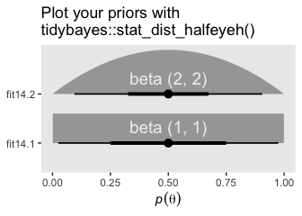

# Stan

> Stan is the name of a software package that creates representative samples of parameter values from a posterior distribution for complex hierarchical models, analogous to JAGS...
> 
> According to the Stan reference manual, Stan is named after [Stanislaw Ulam](https://en.wikipedia.org/wiki/Stanislaw_Ulam) (1909–1984), who was a pioneer of Monte Carlo methods. (Stan is not named after the slang term referring to an overenthusiastic or psychotic fanatic, formed by a combination of the words "stalker" and "fan.") The name of the software package has also been unpacked as the acronym, Sampling Through Adaptive Neighborhoods [@gelman2013bayesian, p. 307], but it is usually written as Stan not STAN.
>
> Stan uses a different method than JAGS for generating Monte Carlo steps. The method is called *Hamiltonian Monte Carlo* (HMC). HMC can be more effective than the various samplers in JAGS and BUGS, especially for large complex models. Moreover, Stan operates with compiled C++ and allows greater programming flexibility, which again is especially useful for unusual or complex models. For large data sets or complex models, Stan can provide solutions when JAGS (or BUGS) takes too long or fails. (pp. 399--400, *emphasis* in the original)

To learn more about Stan from the Stan team themselves, check out the main website [https://mc-stan.org/](https://mc-stan.org/). If you like to dive deep, bookmark the [*Stan user's guide*](https://mc-stan.org/docs/2_23/stan-users-guide/index.html) [@standevelopmentteamStanUserGuide2020] and the [*Stan reference manual*](https://mc-stan.org/docs/2_23/reference-manual/index.html) [@standevelopmentteamStanReferenceManual2020]. 

We won't be using Stan directly in this project. I prefer working with it indirectly through the interface of Bürkner's **brms** package instead. If you haven't already, bookmark the **brms** [GitHub repository](https://github.com/paul-buerkner/brms), [CRAN page](https://CRAN.R-project.org/package=brms), and [reference manual](https://CRAN.R-project.org/package=brms/brms.pdf) [@brms2020RM]. You can also view Bürkner's talk from the useR! International R User 2017 Conference, [*brms: Bayesian multilevel models using Stan*](https://www.youtube.com/watch?v=40o0_0XTB6E). Here's how Bürkner described **brms** in its GitHub repo:

> The **brms** package provides an interface to fit Bayesian generalized (non-)linear multivariate multilevel models using Stan, which is a C++ package for performing full Bayesian inference (see [http://mc-stan.org/](http://mc-stan.org/)). The formula syntax is very similar to that of the package lme4 to provide a familiar and simple interface for performing regression analyses. A wide range of response distributions are supported, allowing users to fit – among others – linear, robust linear, count data, survival, response times, ordinal, zero-inflated, and even self-defined mixture models all in a multilevel context. Further modeling options include non-linear and smooth terms, auto-correlation structures, censored data, missing value imputation, and quite a few more. In addition, all parameters of the response distribution can be predicted in order to perform distributional regression. Multivariate models (i.e., models with multiple response variables) can be fit, as well. Prior specifications are flexible and explicitly encourage users to apply prior distributions that actually reflect their beliefs. Model fit can easily be assessed and compared with posterior predictive checks, cross-validation, and Bayes factors. (**emphasis** in the original)

## HMC sampling

"Stan generates random representative samples from a posterior distribution by using a variation of the Metropolis algorithm called HMC" (p. 400).

I'm not going to walk through the the details of HMC sampling, at this time. In addition to Kruschke's explanation, you might check out McElreath's [lecture on HMC from January, 2019](https://www.youtube.com/watch?v=v-j0UmWf3Us) or one of these lectures ([here](https://www.youtube.com/watch?v=jUSZboSq1zg), [here](https://www.youtube.com/watch?v=_fnDz2Bz3h8), or [here](https://www.youtube.com/watch?v=pHsuIaPbNbY)) by Michael Betancourt. I'm also not sufficiently up on the math required to properly make the figures in this section. But we can at least get the ball rolling.


```r
library(tidyverse)
library(patchwork)
```

Here's the primary data for the two upper left panels for Figure 14.1.


```r
d <- 
  tibble(theta = seq(from = -4, to = 4, by = 0.1)) %>% 
  mutate(density = dnorm(theta, mean = 0, sd = 1)) %>% 
  mutate(`-log(density)` = -log(density))
  
head(d)
```

```
## # A tibble: 6 x 3
##   theta  density `-log(density)`
##   <dbl>    <dbl>           <dbl>
## 1  -4   0.000134            8.92
## 2  -3.9 0.000199            8.52
## 3  -3.8 0.000292            8.14
## 4  -3.7 0.000425            7.76
## 5  -3.6 0.000612            7.40
## 6  -3.5 0.000873            7.04
```

We need a couple more tibbles for the annotation.


```r
position <-
  tibble(theta           = -0.5,
         density         = 0,
         `-log(density)` = 1.5)

text <-
  tibble(theta           = -0.5,
         density         = 0.2,
         `-log(density)` = 2.75,
         label1          = "current position",
         label2          = "random\ninitial momentum")
```

Plot.


```r
theme_set(
  theme_grey() +
    theme(panel.grid = element_blank())
)

p1 <-
  d %>% 
  ggplot(aes(x = theta, y = density)) +
  geom_line(size = 2, color = "grey67") +
  geom_point(data = position,
             size = 4) +
  geom_text(data = text,
            aes(label = label1)) +
  geom_segment(x = -0.5, xend = -0.5,
               y = 0.16, yend = 0.04,
               arrow = arrow(length = unit(0.2, "cm")), 
               size = 1/4, color = "grey50") +
  ggtitle("Posterior Distrib.") +
  coord_cartesian(xlim = c(-3, 3))

p2 <-
  d %>% 
  ggplot(aes(x = theta, y = `-log(density)`)) +
  geom_line(size = 2, color = "grey67") +
  geom_point(data = position,
             size = 4) +
  geom_text(data = text,
            aes(label = label2)) +
  geom_segment(x = -1.1, xend = 0.1,
               y = 1.5, yend = 1.5,
               arrow = arrow(length = unit(0.275, "cm"), ends = "both")) +
  ggtitle("Negative Log Posterior ('Potential')") +
  coord_cartesian(xlim = c(-3, 3),
                  ylim = c(0, 5))

(p1 / p2) & 
  scale_x_continuous(breaks = -3:3)
```


For the plots in this chapter, we keep things simple and rely on the **ggplot2** defaults with one exception: we omitted those unnecessary white gridlines with the `theme_set()` argument at the top of that block. You can undo that with `theme_set(ggplot2::theme_grey())`.

Because I'm not sure how to make the dots and trajectories depicted in the third row, I also won't be able to make proper histograms for the bottom rows. This will go for Figures 14.2 and 14.3, too. If you know how to reproduce them properly, please share your code in my [GitHub issue #21](https://github.com/ASKurz/Doing-Bayesian-Data-Analysis-in-brms-and-the-tidyverse/issues/21). Let's let Kruschke close this section out:

> Mathematical theories that accurately describe the dynamics of mechanical systems have been worked out by physicists. The formulation here, in terms of kinetic and potential energy, is named after [William Rowan Hamilton](https://en.wikipedia.org/wiki/William_Rowan_Hamilton) (1805–1865). HMC was described in the physics literature by @duaneHybridMonteCarlo1987 (who called it "hybrid" Monte Carlo), and HMC was applied to statistical problems by @nealImprovedAcceptanceProcedure1994. A brief mathematical overview of HMC is presented by [@mackay2003information, chap. 30]. A more thorough mathematical review of HMC is provided by [@neal2011mcmc]. Details of how HMC is implemented in Stan can be found in the Stan reference manual and in the book by @gelman2013bayesian. (pp. 405--406)

## Installing Stan

You can learn about installing Stan at [https://mc-stan.org/users/interfaces/](https://mc-stan.org/users/interfaces/). We, of course, have already been working with Stan via **brms**. Bürkner has some nice information on how to install **brms** in the FAQ section of the [**brms** GitHub repository](https://github.com/paul-buerkner/brms).

To install the latest official release from CRAN, execute `install.packages("brms")`. If you'd like to install the current developmental version, you can execute the following.


```r
if (!requireNamespace("remotes")) {
  install.packages("remotes")
}
remotes::install_github("paul-buerkner/brms")
```

As Kruschke advised, it's a good idea to "be sure that your versions of R and RStudio are up to date" (p. 407) when installing **brms** and/or Stan.

## A Complete example

If you'd like to learn how to fit models in Stan itself, you might consult the updated versions of the *Stan User's Guide* and *Stan Reference Manual*, which you can find at [https://mc-stan.org/users/documentation/](https://mc-stan.org/users/documentation/). You might also check out the Stan [Case Studies](https://mc-stan.org/users/documentation/case-studies.html) and [other tutorials](https://mc-stan.org/users/documentation/tutorials.html) listed by the Stan team. 

We will continue using Stan via **brms**. 

The model Kruschke walked through in this section followed the form

\begin{align*}
y_i & \sim \operatorname{Bernoulli} (\theta) \\
\theta & \sim \operatorname{beta} (1, 1),
\end{align*}

where $\theta$ is the probability $y = 1$. Kruschke showed how to simulate the data at the top of page 409. Here's our **tidyverse** version.


```r
n <- 50
z <- 10

my_data <- 
  tibble(y = rep(1:0, times = c(z, n - z)))

glimpse(my_data)
```

```
## Rows: 50
## Columns: 1
## $ y <int> 1, 1, 1, 1, 1, 1, 1, 1, 1, 1, 0, 0, 0, 0, 0, 0, 0, 0, 0, 0, 0, 0, 0…
```

Time to fire up **brms**.


```r
library(brms)
```

In the absence of predictors, you might think of this as an intercept-only model. You can fit the simple intercept-only Bernoulli model with `brms::brm()` like this.


```r
fit14.1 <-
  brm(data = my_data, 
      family = bernoulli(link = identity),
      y ~ 1,
      prior(beta(1, 1), class = Intercept),
      iter = 1000, warmup = 200, chains = 3, cores = 3,
      seed = 14,
      file = "fits/fit14.01")
```

As Kruschke wrote,

> `iter` is the total number of steps per chain, including `warmup` steps in each chain. Thinning merely marks some steps as not to be used; thinning does not increase the number of steps taken. Thus, the total number of steps that Stan takes is `chains`·`iter`. Of those steps, the ones actually used as representative have a total count of `chains`·(`iter`−`warmup`)/`thin`. Therefore, if you know the desired total steps you want to keep, and you know the warm-up, chains, and thinning, then you can compute that the necessary `iter` equals the desired total multiplied by `thin`/`chains`+`warmup`.
>
> We did not specify the initial values of the chains in the example above, instead letting Stan randomly initialize the chains by default. The chains can be initialized by the user with the argument `init`, analogous to JAGS. (p. 409)

Unlike what Kruschke showed on page 409, we did not use the `thin` argument, above, and will generally avoid thinning in this project. You just don't tend to need to thin your chains when using Stan. I do, however, tend to use the `seed` argument. Because computers use pseudorandom number generators to take random draws, I prefer to make my random draws reproducible by setting my seed. Others have argued against this. You do you.

Kruschke mentioned trace plots and model summaries. Here's our trace plot, which comes with a marginal density plot by **brms** default.


```r
plot(fit14.1)
```


Here's the summary.


```r
print(fit14.1)
```

```
## Warning: There were 3 divergent transitions after warmup. Increasing adapt_delta
## above 0.8 may help. See http://mc-stan.org/misc/warnings.html#divergent-
## transitions-after-warmup
```

```
##  Family: bernoulli 
##   Links: mu = identity 
## Formula: y ~ 1 
##    Data: my_data (Number of observations: 50) 
## Samples: 3 chains, each with iter = 1000; warmup = 200; thin = 1;
##          total post-warmup samples = 2400
## 
## Population-Level Effects: 
##           Estimate Est.Error l-95% CI u-95% CI Rhat Bulk_ESS Tail_ESS
## Intercept     0.21      0.05     0.11     0.32 1.00      911     1203
## 
## Samples were drawn using sampling(NUTS). For each parameter, Bulk_ESS
## and Tail_ESS are effective sample size measures, and Rhat is the potential
## scale reduction factor on split chains (at convergence, Rhat = 1).
```

Did you notice that divergent transitions warning at the top? I don't believe Kruschke discussed those in the text. For an good introduction, check out the [*Divergent Transitions* section](https://mc-stan.org/docs/2_23/reference-manual/divergent-transitions.html) in the *Stan reference manual*. In short, divergent transitions indicate your HMC chains had some difficulty exploring the parameter space. As indicated in the warning, increasing the `adapt_delta` parameter to a value above 0.8, but below 1, can help. Other times increasing the number of `warmup` iterations or using better priors will help, too. Sometimes divergent transitions indicate you might need to seriously reconsider your model. When you're stumped, the [Stan Forums](https://discourse.mc-stan.org/) can be a good place to look for help. You can even find a [subsection dedicated to **brms** users](https://discourse.mc-stan.org/c/interfaces/brms/36), there.

Anyway, we will solve our divergent-transitions problem by setting `adapt_delta = 0.99` and using a better prior. If you recall, $\operatorname{beta}(1, 1)$ is flat. Why not use a weakly-regularizing $\operatorname{beta}(2, 2)$, instead? Before fitting the model, we can use the `tidybayes::stat_dist_halfeye()` function to visualize those two priors.


```r
library(tidybayes)
```

```
## 
## Attaching package: 'tidybayes'
```

```
## The following objects are masked from 'package:brms':
## 
##     dstudent_t, pstudent_t, qstudent_t, rstudent_t
```

```r
tibble(fit   = str_c("fit14.", 1:2),
       alpha = 1:2,
       beta  = 1:2,
       x     = .5,
       y     = c(1.33, 2.33),
       label = c("beta(1, 1)", "beta(2, 2)")) %>% 
  
  ggplot() +
  stat_dist_halfeye(aes(y = fit, dist = "beta", arg1 = alpha, arg2 = beta),
                    .width = c(.5, .95)) +
  geom_text(aes(x = x, y = y, label = label),
            color = "grey94", size = 5) +
  labs(title = "Plot your priors with\ntidybayes::stat_dist_halfeye()",
       x = expression(italic(p)(theta)),
       y = NULL)
```



Fit the updated model.


```r
fit14.2 <-
  brm(data = my_data, 
      family = bernoulli(link = identity),
      y ~ 1,
      prior(beta(2, 2), class = Intercept),
      iter = 1000, warmup = 200, chains = 3, cores = 3,
      control = list(adapt_delta = 0.99),
      seed = 14,
      file = "fits/fit14.02")
```


```r
print(fit14.2)
```

```
##  Family: bernoulli 
##   Links: mu = identity 
## Formula: y ~ 1 
##    Data: my_data (Number of observations: 50) 
## Samples: 3 chains, each with iter = 1000; warmup = 200; thin = 1;
##          total post-warmup samples = 2400
## 
## Population-Level Effects: 
##           Estimate Est.Error l-95% CI u-95% CI Rhat Bulk_ESS Tail_ESS
## Intercept     0.22      0.05     0.12     0.33 1.00      545      536
## 
## Samples were drawn using sampling(NUTS). For each parameter, Bulk_ESS
## and Tail_ESS are effective sample size measures, and Rhat is the potential
## scale reduction factor on split chains (at convergence, Rhat = 1).
```

See? All better.

### Reusing the compiled model.

"Because model compilation can take a while in Stan, it is convenient to store the DSO of a successfully compiled model and use it repeatedly for different data sets" (p. 410). This true for our **brms** paradigm, too. To reuse a compiled `brm()` model, we typically use the `update()` function. To demonstrate, we'll first want some new data. Here we'll increase our `z` value to 20.


```r
z <- 20

my_data <- 
  tibble(y = rep(1:0, times = c(z, n - z)))

glimpse(my_data)
```

```
## Rows: 50
## Columns: 1
## $ y <int> 1, 1, 1, 1, 1, 1, 1, 1, 1, 1, 1, 1, 1, 1, 1, 1, 1, 1, 1, 1, 0, 0, 0…
```

For the first and most important argument, you need to tell `update()` what fit you're reusing. We'll use `fit14.2`. You also need to tell `update()` about your new data with the `newdata` argument. Because the model `formula` and `prior`s are the same as before, we don't need to use those arguments, here.


```r
fit14.3 <-
  update(fit14.2,
         newdata = my_data,
         iter = 1000, warmup = 200, chains = 3, cores = 3,
         control = list(adapt_delta = 0.99),
         seed = 14,
         file = "fits/fit14.03")
```

Here's the summary using the `fixef()` function.


```r
fixef(fit14.3)
```

```
##            Estimate  Est.Error      Q2.5    Q97.5
## Intercept 0.4047471 0.06471263 0.2789483 0.532756
```

### General structure of Stan model specification.

"The general structure of model specifications in Stan consist of six blocks" (p. 410). We don't need to worry about this when using **brms**. Just use `brm()` or `update()`. But if you're curious about what the underlying Stan code is for your **brms** models, index the model fit with `$model`.


```r
fit14.3$model
```

```
## // generated with brms 2.13.5
## functions {
## }
## data {
##   int<lower=1> N;  // number of observations
##   int Y[N];  // response variable
##   int prior_only;  // should the likelihood be ignored?
## }
## transformed data {
## }
## parameters {
##   real Intercept;  // temporary intercept for centered predictors
## }
## transformed parameters {
## }
## model {
##   // initialize linear predictor term
##   vector[N] mu = Intercept + rep_vector(0, N);
##   // priors including all constants
##   target += beta_lpdf(Intercept | 2, 2);
##   // likelihood including all constants
##   if (!prior_only) {
##     target += bernoulli_lpmf(Y | mu);
##   }
## }
## generated quantities {
##   // actual population-level intercept
##   real b_Intercept = Intercept;
## }
```

### Think log probability to think like Stan.

The material in this subsection is outside of the scope of this project.

### Sampling the prior in Stan.

"There are several reasons why we might want to examine a sample from the prior distribution of a model" (p. 413). Happily, we can do this with **brms** with the `sample_prior` argument. By default, it is set to `"no"` and does not take prior samples. If you instead set `sample_prior = "yes"` or `sample_prior = TRUE`, samples are drawn solely from the prior. But do note that for technical reasons, **brms** will not sample from the prior of the default intercept. We can bypass that difficulty by using the `... ~ 0 + Intercept + ...` syntax, which makes the prior for the intercept of `class = b`.

Here's how to do that with an updated version of `fit14.3`.


```r
fit14.4 <-
  brm(data = my_data, 
      family = bernoulli(link = identity),
      y ~ 0 + Intercept,
      prior(beta(2, 2), class = b),
      iter = 1000, warmup = 200, chains = 3, cores = 3,
      control = list(adapt_delta = 0.99),
      sample_prior = "yes",
      seed = 14,
      file = "fits/fit14.04")
```

Now we can gather the prior samples with the `prior_samples()` function.


```r
prior_samples(fit14.4) %>% 
  head()
```

```
##           b
## 1 0.5169509
## 2 0.1240944
## 3 0.5525183
## 4 0.3014115
## 5 0.1425645
## 6 0.7825860
```

Here's a look at the prior distribution.


```r
prior_samples(fit14.4) %>% 
  ggplot(aes(x = b, y = 0)) +
  stat_halfeye(.width = c(.5, .95)) +
  scale_y_continuous(NULL, breaks = NULL) +
  labs(title = expression("Beta"*(2*", "*2)),
       x = expression(italic(p)(theta)))
```


### Simplified scripts for frequently used analyses.

This is not our approach when using **brms**. Throughout the chapters of this project, we will learn to make skillful use of the `brms::brm()` function to fit all our models. Once in a while we'll take a shortcut and reuse a precompiled fit with `update()`.

## Specify models top-down in Stan

> For humans, descriptive models begin, conceptually, with the data that are to be described. We first know the measurement scale of the data and their structure. Then we conceive of a likelihood function for the data. The likelihood function has meaningful parameters, which we might want to re-express in terms of other data (called covariates, predictors, or regressors). Then we build a meaningful hierarchical prior on the parameters. Finally, at the top level, we specify constants that express our prior knowledge, which might be vague or noncommittal. (p. 414)

If you look at how I typically organize the arguments within `brms::brm()`, you'll see this is generally the case there, too. Take another look at the code for `fit14.2`:


```r
fit14.2 <-
  brm(data = my_data, 
      family = bernoulli(link = identity),
      y ~ 1,
      prior(beta(2, 2), class = Intercept),
      iter = 1000, warmup = 200, chains = 3, cores = 3,
      control = list(adapt_delta = 0.99),
      seed = 14,
      file = "fits/fit14.02")
```

The first line within `brm()` defined the data. The second line defined the likelihood function and its link function. We haven't talked much about link functions, yet, but that will start in Chapter 15. Likelihoods contain parameters and our third line within `brm()` defined the equation we wanted to use to predict/describe our parameter of interest, $\theta$. We defined our sole prior in the fourth line. The remaining arguments contain the unsexy technical specifications, such as how many MCMC chains we'd like to use and into what folder we'd like to save our fit as an external file. 

You do not need to arrange `brm()` arguments this way. For other arrangements, take a look at the examples in the [**brms** reference manual](https://CRAN.R-project.org/package=brms/brms.pdf) or in some of Bürkner's vignettes, such as his [*Estimating multivariate models with brms*](https://CRAN.R-project.org/package=brms/vignettes/brms_multivariate.html) [-@Bürkner2020Multivariate]. However you go about fitting your models with `brm()`, I mainly recommend you find a general style and stick with it. Standardizing your approach will make your code more readable for others and yourself.

## Limitations and extras

> At the time of this writing, one of the main limitations of Stan is that it does not allow discrete (i.e., categorical) parameters. The reason for this limitation is that Stan has HMC as its foundational sampling method, and HMC requires computing the gradient (i.e., derivative) of the posterior distribution with respect to the parameters. Of course, gradients are undefined for discrete parameters. (p. 415)

To my knowledge this is still the case, which means **brms** has this limitation, too. As wildly powerful as it is, **brms** it not as flexible as working directly with Stan. However, [Bürkner and others](https://github.com/paul-buerkner/brms/graphs/contributors) are constantly expanding its capabilities. Probably the best places keep track of the new and evolving features of **brms** are the [issues](https://github.com/paul-buerkner/brms/issues) and [news](https://github.com/paul-buerkner/brms/blob/master/NEWS.md) sections in its GitHub repo, [https://github.com/paul-buerkner/brms](https://github.com/paul-buerkner/brms).

## Session info {-}


```r
sessionInfo()
```

```
## R version 3.6.3 (2020-02-29)
## Platform: x86_64-apple-darwin15.6.0 (64-bit)
## Running under: macOS Catalina 10.15.3
## 
## Matrix products: default
## BLAS:   /Library/Frameworks/R.framework/Versions/3.6/Resources/lib/libRblas.0.dylib
## LAPACK: /Library/Frameworks/R.framework/Versions/3.6/Resources/lib/libRlapack.dylib
## 
## locale:
## [1] en_US.UTF-8/en_US.UTF-8/en_US.UTF-8/C/en_US.UTF-8/en_US.UTF-8
## 
## attached base packages:
## [1] stats     graphics  grDevices utils     datasets  methods   base     
## 
## other attached packages:
##  [1] tidybayes_2.1.1      brms_2.13.5          Rcpp_1.0.5          
##  [4] patchwork_1.0.1.9000 forcats_0.5.0        stringr_1.4.0       
##  [7] dplyr_1.0.1          purrr_0.3.4          readr_1.3.1         
## [10] tidyr_1.1.1          tibble_3.0.3         ggplot2_3.3.2       
## [13] tidyverse_1.3.0     
## 
## loaded via a namespace (and not attached):
##   [1] TH.data_1.0-10       colorspace_1.4-1     ellipsis_0.3.1      
##   [4] ggridges_0.5.2       rsconnect_0.8.16     estimability_1.3    
##   [7] markdown_1.1         base64enc_0.1-3      fs_1.4.1            
##  [10] rstudioapi_0.11      farver_2.0.3         rstan_2.19.3        
##  [13] svUnit_1.0.3         DT_0.13              fansi_0.4.1         
##  [16] mvtnorm_1.1-0        lubridate_1.7.8      xml2_1.3.1          
##  [19] codetools_0.2-16     splines_3.6.3        bridgesampling_1.0-0
##  [22] knitr_1.28           shinythemes_1.1.2    bayesplot_1.7.1     
##  [25] jsonlite_1.7.0       broom_0.5.5          dbplyr_1.4.2        
##  [28] ggdist_2.1.1         shiny_1.5.0          compiler_3.6.3      
##  [31] httr_1.4.1           emmeans_1.4.5        backports_1.1.9     
##  [34] assertthat_0.2.1     Matrix_1.2-18        fastmap_1.0.1       
##  [37] cli_2.0.2            later_1.1.0.1        htmltools_0.5.0     
##  [40] prettyunits_1.1.1    tools_3.6.3          igraph_1.2.5        
##  [43] coda_0.19-3          gtable_0.3.0         glue_1.4.2          
##  [46] reshape2_1.4.4       cellranger_1.1.0     vctrs_0.3.4         
##  [49] nlme_3.1-144         crosstalk_1.1.0.1    xfun_0.13           
##  [52] ps_1.3.4             rvest_0.3.5          mime_0.9            
##  [55] miniUI_0.1.1.1       lifecycle_0.2.0      gtools_3.8.2        
##  [58] MASS_7.3-51.5        zoo_1.8-7            scales_1.1.1        
##  [61] colourpicker_1.0     hms_0.5.3            promises_1.1.1      
##  [64] Brobdingnag_1.2-6    sandwich_2.5-1       parallel_3.6.3      
##  [67] inline_0.3.15        shinystan_2.5.0      yaml_2.2.1          
##  [70] gridExtra_2.3        loo_2.3.1            StanHeaders_2.21.0-1
##  [73] stringi_1.4.6        dygraphs_1.1.1.6     pkgbuild_1.1.0      
##  [76] rlang_0.4.7          pkgconfig_2.0.3      matrixStats_0.56.0  
##  [79] evaluate_0.14        lattice_0.20-38      rstantools_2.1.1    
##  [82] htmlwidgets_1.5.1    labeling_0.3         tidyselect_1.1.0    
##  [85] processx_3.4.4       plyr_1.8.6           magrittr_1.5        
##  [88] bookdown_0.18        R6_2.4.1             generics_0.0.2      
##  [91] multcomp_1.4-13      DBI_1.1.0            pillar_1.4.6        
##  [94] haven_2.2.0          withr_2.2.0          xts_0.12-0          
##  [97] survival_3.1-12      abind_1.4-5          modelr_0.1.6        
## [100] crayon_1.3.4         arrayhelpers_1.1-0   utf8_1.1.4          
## [103] rmarkdown_2.1        grid_3.6.3           readxl_1.3.1        
## [106] callr_3.4.4          threejs_0.3.3        reprex_0.3.0        
## [109] digest_0.6.25        xtable_1.8-4         httpuv_1.5.4        
## [112] stats4_3.6.3         munsell_0.5.0        shinyjs_1.1
```


