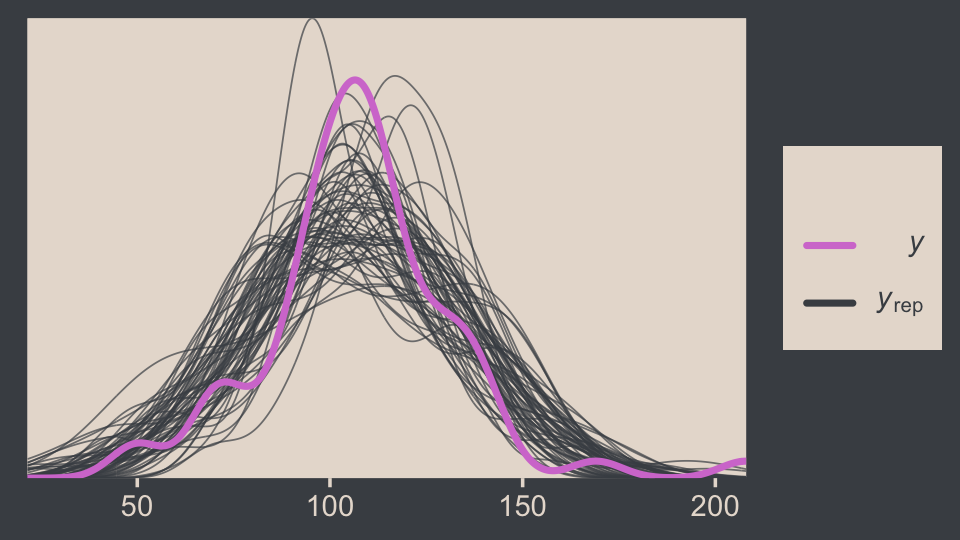
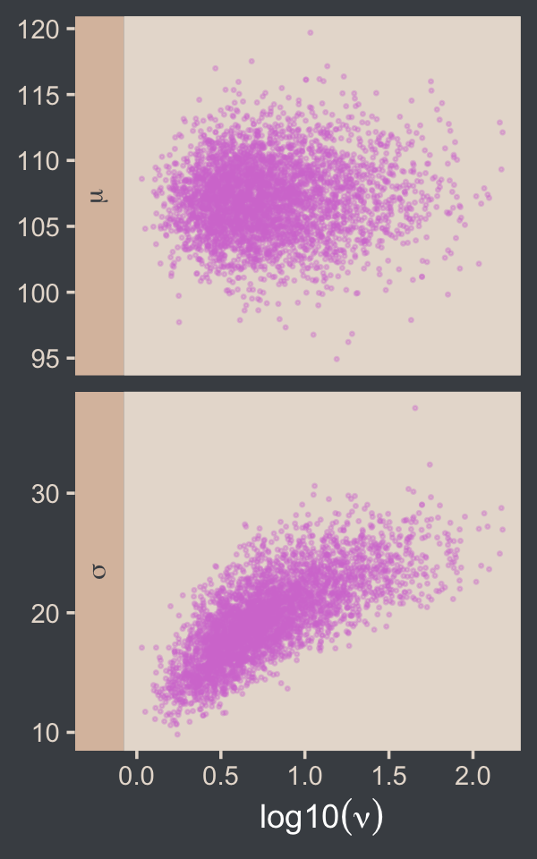
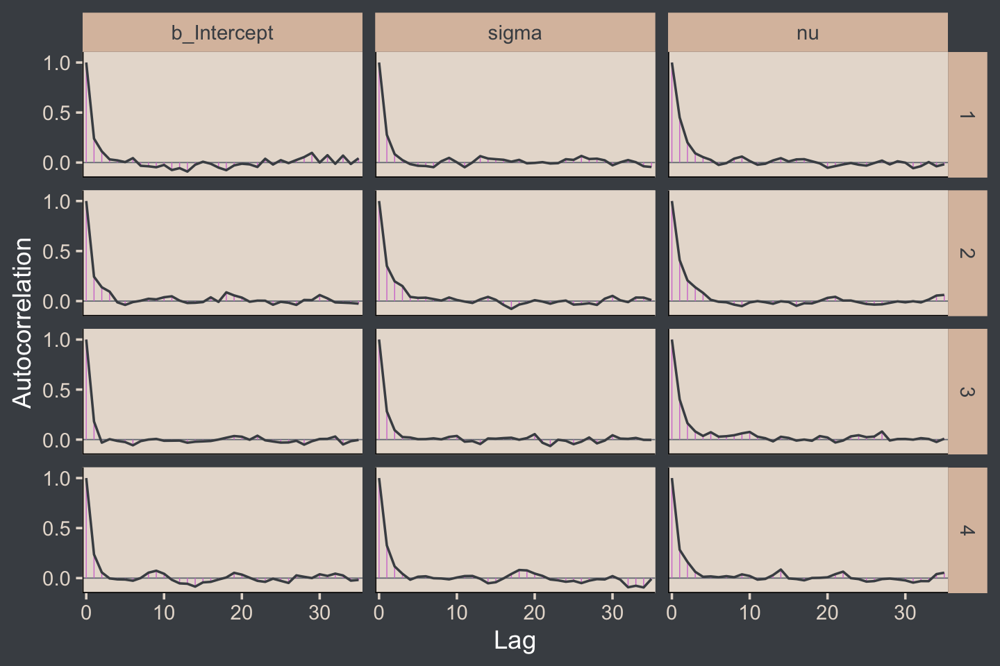

# Metric-Predicted Variable on One or Two Groups

> In the context of the generalized linear model (GLM) introduced in the previous chapter, this chapter's situation involves the most trivial cases of the linear core of the GLM, as indicated in the left cells of Table 15.1 (p. 434), with a link function that is the identity along with a normal distribution for describing noise in the data, as indicated in the first row of Table 15.2 (p. 443). We will explore options for the prior distribution on parameters of the normal distribution, and methods for Bayesian estimation of the parameters. We will also consider alternative noise distributions for describing data that have outliers. [@kruschkeDoingBayesianData2015, pp. 449--450]

Although I agree this chapter covers the "most trivial cases of the linear core of the GLM", Kruschke's underselling himself a bit, here. In addition to "trivial" Gaussian models, Kruschke went well beyond and introduced robust Student's $t$ modeling. It's a testament to Kruschke's rigorous approach that he did so so early in the text. IMO, we could use more robust Student's $t$ models in the social sciences. So heed well, friends.

## Estimating the mean and standard deviation of a normal distribution

The Gaussian probability density function follows the form

$$p(y | \mu, \sigma) = \frac{1}{\sigma \sqrt{2 \pi}} \exp \left (-\frac{1}{2} \frac{(y - \mu)^2}{\sigma^2} \right ),$$

where the two parameters to estimate are $\mu$ (i.e., the mean) and $\sigma$ (i.e., the standard deviation). If you prefer to think in terms of $\sigma^2$, that's the variance. In case is wasn't clear, $\pi$ is the actual number $\pi$, not a parameter to be estimated.

We'll divide Figure 16.1 into data and plot steps. I came up with the primary data like so:


```r
library(tidyverse)

sequence_length <- 100

d <-
  crossing(y     = seq(from = 50, to = 150, length.out = sequence_length),
           mu    = c(87.8, 100, 112),
           sigma = c(7.35, 12.2, 18.4)) %>% 
  mutate(density = dnorm(y, mean = mu, sd = sigma),
         mu      = factor(mu, labels = str_c("mu==", c(87.8, 100, 112))),
         sigma   = factor(sigma, labels = str_c("sigma==", c(7.35, 12.2, 18.4))))

head(d)
```

```
## # A tibble: 6 × 4
##       y mu       sigma        density
##   <dbl> <fct>    <fct>          <dbl>
## 1    50 mu==87.8 sigma==7.35 9.80e- 8
## 2    50 mu==87.8 sigma==12.2 2.69e- 4
## 3    50 mu==87.8 sigma==18.4 2.63e- 3
## 4    50 mu==100  sigma==7.35 4.85e-12
## 5    50 mu==100  sigma==12.2 7.37e- 6
## 6    50 mu==100  sigma==18.4 5.40e- 4
```

Instead of putting the coordinates for the three data points in our `d` tibble, I just threw them into their own tibble in the `geom_point()` function.

Okay, let's talk color and theme. For this chapter, we'll take our color palette from the [**beyonce** package](https://github.com/dill/beyonce) [@R-beyonce]. As one might guess, the **beyonce** package provides an array of palettes based on pictures of [Beyoncé](https://www.beyonce.com/). The origins of the palettes come from [https://beyoncepalettes.tumblr.com/](https://beyoncepalettes.tumblr.com/). Our palette will be #126.


```r
library(beyonce)

beyonce_palette(126)
```


```r
bp <- beyonce_palette(126)[]

bp
```

```
## [1] "#484D53" "#737A82" "#A67B6B" "#DABFAC" "#E7DDD3" "#D47DD2"
## attr(,"number")
## [1] 126
```

Our overall theme will be based on the default `ggplot2::theme_grey()`.


```r
theme_set(
  theme_grey() +
    theme(text = element_text(color = "white"),
          axis.text = element_text(color = beyonce_palette(126)[5]),
          axis.ticks = element_line(color = beyonce_palette(126)[5]),
          legend.background = element_blank(),
          legend.box.background = element_rect(fill = beyonce_palette(126)[5],
                                               color = "transparent"),
          legend.key = element_rect(fill = beyonce_palette(126)[5],
                                    color = "transparent"),
          legend.text = element_text(color = beyonce_palette(126)[1]),
          legend.title = element_text(color = beyonce_palette(126)[1]),
          panel.background = element_rect(fill = beyonce_palette(126)[5],
                                          color = beyonce_palette(126)[5]),
          panel.grid = element_blank(),
          plot.background = element_rect(fill = beyonce_palette(126)[1],
                                          color = beyonce_palette(126)[1]),
          strip.background = element_rect(fill = beyonce_palette(126)[4]),
          strip.text = element_text(color = beyonce_palette(126)[1]))
)
```

Here's Figure 16.1.


```r
d %>% 
  ggplot(aes(x = y)) +
  geom_area(aes(y = density),
            fill = bp[2]) +
  geom_vline(xintercept = c(85, 100, 115), 
             linetype = 3, color = bp[5]) +
  geom_point(data = tibble(y = c(85, 100, 115)),
             aes(y = 0.002),
             size = 2, color = bp[6]) +
  scale_y_continuous(expression(italic(p)(italic(y)*"|"*mu*", "*sigma)), 
                     expand = expansion(mult = c(0, 0.05)), breaks = NULL) +
  ggtitle("Competing Gaussian likelihoods given the same data") +
  coord_cartesian(xlim = c(60, 140)) +
  facet_grid(sigma ~ mu, labeller = label_parsed)
```


Here's how you might compute the $p(D | \mu, \sigma)$ values and identify which combination of $\mu$ and $\sigma$ returns the maximum value for the data set.


```r
 crossing(y     = c(85, 100, 115),
          mu    = c(87.8, 100, 112),
          sigma = c(7.35, 12.2, 18.4))  %>% 
  mutate(density = dnorm(y, mean = mu, sd = sigma)) %>% 
  group_by(mu, sigma) %>% 
  summarise(`p(D|mu, sigma)` = prod(density)) %>% 
  ungroup() %>%
  mutate(maximum = `p(D|mu, sigma)` == max(`p(D|mu, sigma)`))
```

```
## # A tibble: 9 × 4
##      mu sigma `p(D|mu, sigma)` maximum
##   <dbl> <dbl>            <dbl> <lgl>  
## 1  87.8  7.35     0.0000000398 FALSE  
## 2  87.8 12.2      0.00000172   FALSE  
## 3  87.8 18.4      0.00000271   FALSE  
## 4 100    7.35     0.00000248   FALSE  
## 5 100   12.2      0.00000771   TRUE   
## 6 100   18.4      0.00000524   FALSE  
## 7 112    7.35     0.0000000456 FALSE  
## 8 112   12.2      0.00000181   FALSE  
## 9 112   18.4      0.00000277   FALSE
```

### ~~Solution by mathematical analysis~~ Heads up on precision.

Not much for us, here. But we might reiterate that sometimes we talk about the *precision* (see page 453), which is the reciprocal of the variance (i.e., $\frac{1}{\sigma^2}$). As we'll see, the **brms** package doesn't use priors parameterized in terms of precision. But JAGS does, which means we'll need to be able to translate Kruschke's precision-laden JAGS code into $\sigma$-oriented **brms** code in many of the remaining chapters. Proceed with caution.

### Approximation by ~~MCMC in JAGS~~ HMC in brms.

Let's load and `glimpse()` at the `TwoGroupIQ.csv` data.


```r
my_data <- read_csv("data.R/TwoGroupIQ.csv")

glimpse(my_data)
```

```
## Rows: 120
## Columns: 2
## $ Score <dbl> 102, 107, 92, 101, 110, 68, 119, 106, 99, 103, 90, 93, 79, 89, 137, 119, 126, 110, 7…
## $ Group <chr> "Smart Drug", "Smart Drug", "Smart Drug", "Smart Drug", "Smart Drug", "Smart Drug", …
```

The data file included values from two groups.


```r
my_data %>% 
  distinct(Group)
```

```
## # A tibble: 2 × 1
##   Group     
##   <chr>     
## 1 Smart Drug
## 2 Placebo
```

Kruschke clarified that for the following example, "the data are IQ (intelligence quotient) scores from a group of people who have consumed a 'smart drug'" (p. 456). That means we'll want to subset the data.


```r
my_data <-
  my_data %>% 
  filter(Group == "Smart Drug")
```

It's a good idea to take a look at the data before modeling.


```r
my_data %>% 
  ggplot(aes(x = Score)) +
  geom_histogram(fill = bp[2], binwidth = 5) +
  scale_y_continuous(expand = expansion(mult = c(0, 0.05))) +
  ggtitle("The smart-drug group")
```


Here are the mean and standard deviation of the `Score` values.


```r
(mean_y <- mean(my_data$Score))
```

```
## [1] 107.8413
```

```r
(sd_y <- sd(my_data$Score))
```

```
## [1] 25.4452
```

The values of those sample statistics will come in handy in just a bit. But first, let's load **brms**.


```r
library(brms)
```

If we want to pass user-defined values into our `brm()` prior code, we'll need to define them first in using the `brms::stanvar()` function.


```r
stanvars <- 
  stanvar(mean_y, name = "mean_y") + 
  stanvar(sd_y,   name = "sd_y")
```

It's been a while since we used `stanvar()`, so we should review. Though we've saved the object as `stanvars`, you could name it whatever you want. The main trick is to tell **brms** about your values with the `stanvars` argument within `brm()`.

Kruschke mentioned that the "the conventional noncommittal gamma prior [for the precision] has shape and rate constants that are close to zero, such as Sh = 0.01 and R = 0.01" (p. 456). Here's what that looks like.


```r
tibble(x = seq(from = 0, to = 12, by = 0.025)) %>% 
  mutate(d = dgamma(x, shape = 0.01, rate = 0.01)) %>% 
  
  ggplot(aes(x = x, y = d)) +
  geom_area(fill = bp[3]) +
  geom_vline(xintercept = 1 / sd_y^2, linetype = 2, color = bp[5]) +
  labs(subtitle = "The grey density in the background is the conventional gamma prior for precision.\nThe dashed vertical line is our precision value.") +
  scale_x_continuous(expand = expansion(mult = c(0, 0.05))) +
  scale_y_continuous(expand = expansion(mult = c(0, 0.05)), breaks = NULL) +
  coord_cartesian(xlim = c(0, 8),
                  ylim = c(0, 0.35))
```


The thing is, with **brms** we typically estimate $\sigma$ rather than precision. Though gamma is also a feasible prior distribution for $\sigma$, we won't use it here. But we won't be using Kruschke's uniform prior, either. The Stan team [discourages uniform priors for variance parameters](https://github.com/stan-dev/stan/wiki/Prior-Choice-Recommendations), such as our $\sigma$. I'm not going to get into the details of why, but you've got that hyperlink above and the good old [Stan user's guide](https://mc-stan.org/docs/2_29/stan-users-guide/index.html) [@standevelopmentteamStanUserGuide2022] if you'd like to dive deeper.

Here we'll use the half normal. By "half normal," we mean that the mean is zero and it's bounded from zero to positive infinity--no negative $\sigma$ values for us! By the "half normal," we also mean to suggest that smaller values are more credible than those approaching infinity. When working with unstandardized data, an easy default for a weakly-regularizing half normal is to set the $\sigma$ hyperparameter (i.e., *S*) to the standard deviation of the criterion variable (i.e., $s_Y$). Here's that that looks like for this example.


```r
tibble(x = seq(from = 0, to = 110, by = 0.1)) %>% 
  mutate(d = dnorm(x, mean = 0, sd = sd_y)) %>% 
  
  ggplot(aes(x = x, y = d)) +
  geom_area(fill = bp[3]) +
  geom_vline(xintercept = sd_y, linetype = 2, color = bp[5]) +
  scale_x_continuous(expand = expansion(mult = c(0, 0.05))) +
  scale_y_continuous(expand = expansion(mult = c(0, 0.05)), breaks = NULL) +
  labs(subtitle = "The gray density in the background is the half-normal prior for sigma.\nThe dashed vertical line is our 'sd_y' value.") +
  coord_cartesian(xlim = c(0, 100))
```


This prior isn't quite as non-committal as the conventional gamma prior for precision. However, it will discourage the HMC algorithm from exploring $\sigma$ values much larger than two or three times the standard deviation in the data themselves. In practice, I've found it to have a minimal influence on the posterior. If you'd like to make it even less committal, try setting that $\sigma$ hyperparameter to some multiple of $s_Y$ like $2 \times s_Y$ or $10 \times s_Y$. Compare this to Kruschke's recommendations for setting a noncommittal uniform prior for $\sigma$. When using the uniform distribution, $\operatorname{Uniform}(L, H)$,

> we will set the high value $H$ of the uniform prior on $\sigma$ to a huge multiple of the standard deviation in the data, and set the low value $L$ to a tiny fraction of the standard deviation in the data. Again, this means that the prior is vague no matter what the scale of the data happens to be. (p. 455)

On page 456, Kruschke gave an example of such a uniform prior with the code snip `dunif( sdY/1000 , sdY*1000 )`. Here's what that would look like with our data.


```r
tibble(x = 0:(sd_y * 1000)) %>% 
  mutate(d = dunif(x, min = sd_y / 1000, max = sd_y * 1000)) %>% 
  
  ggplot(aes(x = x, y = d)) +
  geom_area(fill = bp[3]) +
  geom_vline(xintercept = sd_y, linetype = 2, color = bp[5]) +
  scale_x_continuous(expand = expansion(mult = c(0, 0.05))) +
  scale_y_continuous(expand = expansion(mult = c(0, 0.05)), breaks = NULL) +
  labs(subtitle = "The gray density in the background is Kruschke's uniform prior for sigma.\nThe dashed vertical line is our 'sd_y' value.") +
  coord_cartesian()
```


That's really noncommittal. I'll stick with my half normal. You do you. Kruschke had this to say about the prior for the mean:

> In this application we seek broad priors relative to typical data, so that the priors have minimal influence on the posterior. One way to discover the constants is by asking an expert in the domain being studied. But in lieu of that, we will use the data themselves to tell us what the typical scale of the data is. We will set $M$ to the mean of the data, and set $S$ to a huge multiple (e.g., $100$) of the standard deviation of the data. This way, no matter what the scale of the data is, the prior will be vague. (p. 455)

In case you're not following along closely in the text, we often use the normal distribution for the intercept and slope parameters in a simple regression model. By $M$ and $S$, Kruschke was referring to the $\mu$ and $\sigma$ parameters of the normal prior for our intercept. Here's what that prior looks like in this data example.


```r
tibble(x = seq(from = -10000, to = 10000, by = 10)) %>% 
  mutate(d = dnorm(x, mean = mean_y, sd = sd_y * 100)) %>% 
  
  ggplot(aes(x = x, y = d)) +
  geom_area(fill = bp[3]) +
  geom_vline(xintercept = mean_y, linetype = 2, color = bp[5]) +
  scale_y_continuous(expand = expansion(mult = c(0, 0.05)), breaks = NULL) +
  labs(subtitle = "The brown density in the background is the normal prior for mu.\nThe dashed vertical line is our 'mean_y' value.")
```


Yep, Kruschke's right. That is one noncommittal prior given our data. We could tighten that up by an order of magnitude and still have little influence on the posterior. Now we've decided on our parameterization ($\sigma$, not $\tau$) and our priors (half-normal, not uniform or gamma), we are ready to make our version of the model diagram in Figure 16.2.


```r
library(patchwork)

# normal density
p1 <-
  tibble(x = seq(from = -3, to = 3, by = .1)) %>% 
  ggplot(aes(x = x, y = (dnorm(x)) / max(dnorm(x)))) +
  geom_area(fill = bp[6]) +
  annotate(geom = "text",
           x = 0, y = .2,
           label = "normal",
           size = 7, color = bp[5]) +
  annotate(geom = "text",
           x = c(0, 1.5), y = .6,
           label = c("italic(M)", "italic(S)[mu]"), 
           size = 7, color = bp[5], family = "Times", parse = T) +
  scale_x_continuous(expand = c(0, 0)) +
  theme_void() +
  theme(axis.line.x = element_line(linewidth = 0.5, color = bp[4]))

# half-normal density
p2 <-
  tibble(x = seq(from = 0, to = 3, by = .01),
         d = (dnorm(x)) / max(dnorm(x))) %>% 
  ggplot(aes(x = x, y = d)) +
  geom_area(fill = bp[6]) +
  annotate(geom = "text",
           x = 1.5, y = .2,
           label = "half-normal",
           size = 7, color = bp[5]) +
  annotate(geom = "text",
           x = 1.5, y = .6,
           label = "0*','*~italic(S)[sigma]", 
           size = 7, color = bp[5], family = "Times", parse = T) +
  scale_x_continuous(expand = c(0, 0)) +
  theme_void() +
  theme(axis.line.x = element_line(linewidth = 0.5, color = bp[4]))

## two annotated arrows
# save our custom arrow settings
my_arrow <- arrow(angle = 20, length = unit(0.35, "cm"), type = "closed")

p3 <-
  tibble(x    = c(.43, 1.5),
         y    = c(1, 1),
         xend = c(.43, .8),
         yend = c(.2, .2)) %>%
  
  ggplot(aes(x = x, xend = xend,
             y = y, yend = yend)) +
  geom_segment(arrow = my_arrow, color = bp[4]) +
  annotate(geom = "text",
           x = c(.3, 1), y = .6,
           label = "'~'",
           size = 10, color = bp[5], family = "Times", parse = T) +
  xlim(0, 2) +
  theme_void()

# a second normal density
p4 <-
  tibble(x = seq(from = -3, to = 3, by = .1)) %>% 
  ggplot(aes(x = x, y = (dnorm(x)) / max(dnorm(x)))) +
  geom_area(fill = bp[6]) +
  annotate(geom = "text",
           x = 0, y = .2,
           label = "normal",
           size = 7, color = bp[5]) +
  annotate(geom = "text",
           x = c(0, 1.5), y = .6,
           label = c("mu", "sigma"), 
           size = 7, color = bp[5], family = "Times", parse = T) +
  scale_x_continuous(expand = c(0, 0)) +
  theme_void() +
  theme(axis.line.x = element_line(linewidth = 0.5, color = bp[4]))

# the final annotated arrow
p5 <-
  tibble(x     = c(.375, .625),
         y     = c(1/3, 1/3),
         label = c("'~'", "italic(i)")) %>% 
  
  ggplot(aes(x = x, y = y, label = label)) +
  geom_text(size = c(10, 7), color = bp[5], parse = T, family = "Times") +
  geom_segment(x = .5, xend = .5,
               y = 1, yend = 0, 
               color = bp[4], arrow = my_arrow) +
  xlim(0, 1) +
  theme_void()

# some text
p6 <-
  tibble(x     = .5,
         y     = .5,
         label = "italic(y[i])") %>% 
  
  ggplot(aes(x = x, y = y, label = label)) +
  geom_text(size = 7, color = bp[5], parse = T, family = "Times") +
  xlim(0, 1) +
  theme_void()

# define the layout
layout <- c(
  area(t = 1, b = 2, l = 1, r = 2),
  area(t = 1, b = 2, l = 3, r = 4),
  area(t = 4, b = 5, l = 1, r = 2),
  area(t = 3, b = 4, l = 1, r = 4),
  area(t = 6, b = 6, l = 1, r = 2),
  area(t = 7, b = 7, l = 1, r = 2)
)

# combine and plot!
(p1 + p2 + p4 + p3 + p5 + p6) + 
  plot_layout(design = layout) &
  ylim(0, 1) &
  theme(plot.margin = margin(0, 5.5, 0, 5.5)) 
```


Two things about the notation in our diagram: Because we have two $\sigma$ hyperparameters, we've denoted the one for the prior on $\mu$ as $S_\mu$ and the one for the prior on $\sigma$ as $S_\sigma$. Also, note that we fixed the $\mu$ hyperparameter for half-normal prior to zero. This won't always be the case, but it's so common within the **brms** ecosystem that I'm going to express it this way throughout most of this ebook. This is our default.

Here's how to put these priors to use with **brms**.


```r
fit16.1 <-
  brm(data = my_data,
      family = gaussian,
      Score ~ 1,
      prior = c(prior(normal(mean_y, sd_y * 100), class = Intercept),
                prior(normal(0, sd_y), class = sigma)),
      chains = 4, cores = 4,
      stanvars = stanvars, 
      seed = 16,
      file = "fits/fit16.01")
```

To be more explicit, the `stanvars = stanvars` argument at the bottom of our code is what allowed us to define our intercept prior as `normal(mean_y, sd_y * 100)` instead of requiring us to type in the parameters as `normal(107.8413, 25.4452 * 100)`. The same basic point goes for our $\sigma$ prior.

Also, notice our prior code for $\sigma$, `prior(normal(0, sd_y), class = sigma)`. Nowhere in there did we actually say we wanted a half normal as opposed to a typical normal. That's because the **brms** default is to set the lower bound for priors of `class = sigma` to zero. There's no need for us to fiddle with it.

Let's examine the chains.


```r
plot(fit16.1, widths = c(2, 3))
```


They look good! The model summary looks sensible, too.


```r
print(fit16.1)
```

```
##  Family: gaussian 
##   Links: mu = identity; sigma = identity 
## Formula: Score ~ 1 
##    Data: my_data (Number of observations: 63) 
##   Draws: 4 chains, each with iter = 2000; warmup = 1000; thin = 1;
##          total post-warmup draws = 4000
## 
## Population-Level Effects: 
##           Estimate Est.Error l-95% CI u-95% CI Rhat Bulk_ESS Tail_ESS
## Intercept   107.85      3.25   101.40   114.28 1.00     3675     2816
## 
## Family Specific Parameters: 
##       Estimate Est.Error l-95% CI u-95% CI Rhat Bulk_ESS Tail_ESS
## sigma    25.77      2.27    21.63    30.73 1.00     3277     3008
## 
## Draws were sampled using sampling(NUTS). For each parameter, Bulk_ESS
## and Tail_ESS are effective sample size measures, and Rhat is the potential
## scale reduction factor on split chains (at convergence, Rhat = 1).
```

Compare those values with `mean_y` and `sd_y`.


```r
mean_y
```

```
## [1] 107.8413
```

```r
sd_y
```

```
## [1] 25.4452
```

Good times. Let's extract the posterior draws and save them in a data frame `draws`.


```r
draws <- as_draws_df(fit16.1)
```

Here's the leg work required to make our version of the three histograms in Figure 16.3.


```r
# we'll need this for `stat_pointinterval()`
library(tidybayes)

# we'll use this to mark off the ROPEs as white strips in the background
rope <-
  tibble(name = c("Mean", "Standard Deviation", "Effect Size"), 
         xmin = c(99, 14, -0.1),
         xmax = c(101, 16, 0.1))

# annotate the ROPE
text <-
  tibble(x     = 0,
         y     = 0.98,
         label = "ROPE",
         name  = "Effect Size")

# here are the primary data
draws %>% 
  transmute(Mean                 = b_Intercept, 
            `Standard Deviation` = sigma) %>% 
  mutate(`Effect Size` = (Mean - 100) / `Standard Deviation`) %>% 
  pivot_longer(everything()) %>% 
  
  # the plot
  ggplot() +
  geom_rect(data = rope,
            aes(xmin = xmin, xmax = xmax,
                ymin = -Inf, ymax = Inf),
            color = "transparent", fill = "white") +
  stat_histinterval(aes(x = value, y = 0), 
                    point_interval = mode_hdi, .width = .95,
                    fill = bp[2], color = bp[6],
                    normalize = "panels") +
  geom_text(data = text,
            aes(x = x, y = y, label = label),
            size = 2.5, color = bp[4]) +
  scale_y_continuous(NULL, breaks = NULL) +
  xlab(NULL) +
  facet_wrap(~ name, scales = "free", ncol = 3)
```


If we wanted those exact 95% HDIs, we'd execute this.


```r
draws %>% 
  transmute(Mean                 = b_Intercept, 
            `Standard Deviation` = sigma) %>% 
  mutate(`Effect Size` = (Mean - 100) / `Standard Deviation`) %>% 
  pivot_longer(everything()) %>% 
  group_by(name) %>% 
  mode_hdi(value)
```

```
## # A tibble: 3 × 7
##   name                 value   .lower  .upper .width .point .interval
##   <chr>                <dbl>    <dbl>   <dbl>  <dbl> <chr>  <chr>    
## 1 Effect Size          0.295   0.0603   0.565   0.95 mode   hdi      
## 2 Mean               108.    101.     114.      0.95 mode   hdi      
## 3 Standard Deviation  25.0    21.1     30.0     0.95 mode   hdi
```

For the next part, we should look at the structure of the posterior draws, `draws`.


```r
head(draws)
```

```
## # A draws_df: 6 iterations, 1 chains, and 4 variables
##   b_Intercept sigma lprior lp__
## 1         110    25    -13 -303
## 2         110    25    -13 -303
## 3         110    26    -13 -303
## 4         108    22    -13 -304
## 5         107    26    -13 -302
## 6         109    25    -13 -302
## # ... hidden reserved variables {'.chain', '.iteration', '.draw'}
```

By default, `head()` returned six rows, each one corresponding to the credible parameter values from a given posterior draw. Following our model equation $\text{Score}_i \sim N(\mu, \sigma)$, we might reformat the first two columns as:

1. `Score` ~ $N$(110.18, 25.201)
2. `Score` ~ $N$(110.18, 25.201)
3. `Score` ~ $N$(110.12, 25.623)
4. `Score` ~ $N$(108.03, 21.635)
5. `Score` ~ $N$(106.759, 25.599)
6. `Score` ~ $N$(109.443, 24.857)

Each row of `draws` yields a full model equation with which we might credibly describe the data--or at least as credibly as we can within the limits of the model. We can give voice to a subset of these credible distributions with our version of the upper right panel of Figure 16.3.

Before I show that plotting code, it might make sense to slow down on the preparatory data wrangling steps. There are several ways to overlay multiple posterior predictive density lines like those in our upcoming plots. We'll practice a few over the next few chapters. For the method we'll use in this chapter, it's handy to first determine how many you'd like. Here we'll follow Kruschke and choose 63, which we'll save as `n_lines`.


```r
# how many credible density lines would you like?
n_lines <- 63
```

Now we've got our `n_lines` value, we'll use it to subset the rows in `draws` with the `slice()` function. We'll then subset the columns and use `expand_grid()` to include a sequence of `Score` values to correspond to the formula implied in each of the remaining rows of `draws`. Notice how we also kept the `.draw` index in the game. That will help us with the plot in a bit. But the main event is how we used `Score`, `b_Intercept`, and `sigma` as the input for the arguments in the `dnorm()`. The output is a column of the corresponding density values.


```r
draws <-
  draws %>% 
  slice(1:n_lines) %>% 
  select(.draw, b_Intercept, sigma) %>% 
  expand_grid(Score = seq(from = 40, to = 250, by = 1)) %>% 
  mutate(density = dnorm(x = Score, mean = b_Intercept, sd = sigma))

str(draws)
```

```
## tibble [13,293 × 5] (S3: tbl_df/tbl/data.frame)
##  $ .draw      : int [1:13293] 1 1 1 1 1 1 1 1 1 1 ...
##  $ b_Intercept: num [1:13293] 110 110 110 110 110 ...
##  $ sigma      : num [1:13293] 25.2 25.2 25.2 25.2 25.2 ...
##  $ Score      : num [1:13293] 40 41 42 43 44 45 46 47 48 49 ...
##  $ density    : num [1:13293] 0.000328 0.000366 0.000407 0.000453 0.000503 ...
```

Note that after using `expand_grid()`, we have a rather long data frame. Anyway, we're ready to plot.


```r
draws %>% 
  ggplot(aes(x = Score)) + 
  geom_histogram(data = my_data, 
                 aes(y = after_stat(density)),
                 fill = bp[2],
                 linewidth = 0.2, binwidth = 5, boundary = 0) +
  geom_line(aes(y = density, group = .draw),
            linewidth = 1/4, alpha = 1/3, color = bp[6]) +
  scale_x_continuous("y", limits = c(50, 210)) +
  scale_y_continuous(NULL, breaks = NULL, expand = expansion(mult = c(0, 0.05))) +
  ggtitle("Data with Post. Pred.")
```


Note the `after_stat(density)` argument in the `geom_histogram()` function. That's what rescaled the histogram to the density metric. If you leave that part out, all the density lines will drop to the bottom of the plot. Also, did you see how we used `.draw` to group the density lines within the `geom_line()` function? That's why we kept that information. Without that `group = .draw` argument, the resulting lines are a mess.

Kruschke pointed out this last plot

> constitutes a form of posterior-predictive check, by which we check whether the model appears to be a reasonable description of the data. With such a small amount of data, it is difficult to visually assess whether normality is badly violated, but there appears to be a hint that the normal model is straining to accommodate some outliers: The peak of the data protrudes prominently above the normal curves, and there are gaps under the shoulders of the normal curves. (p. 458)

We can perform a similar posterior-predictive check with the `brms::pp_check()` function. By default, it will return 10 simulated density lines. Like we did above, we'll increase that by setting the `ndraws` argument to our `n_lines` value.


```r
library(bayesplot)

color_scheme_set(scheme = bp[c(3, 1, 2, 5, 4, 6)])

pp_check(fit16.1, ndraws = n_lines)
```



In principle, we didn't need to load the **bayesplot** package to use the `brms::pp_check()` function. But doing so gave us access to the `bayesplot::color_scheme_set()`, which allowed us to apply the colors from our color palette to the plot.

Before we move on, we should talk a little about effect sizes, which we all but glossed over in our code.

> *Effect size* is simply the amount of change induced by the treatment relative to the standard deviation: $(\mu - 100) / \sigma$. In other words, the effect size is the "standardized" change... A conventionally "small" effect size in psychological research is $0.2$ [@cohenStatisticalPowerAnalysis1988], and the ROPE limits are set at half that size for purposed of illustration. (p. 457, *emphasis* in the original).

Another way to describe this kind of effect size is as a *standardized mean difference*. In addition to the seminal work by Cohen, you might brush up on effect sizes with Kelley and Preacher's [-@kelley2012effect] [*On effect size*](https://www3.nd.edu/~kkelley/publications/articles/Kelley_and_Preacher_Psychological_Methods_2012.pdf).

## Outliers and robust estimation: The $t$ distribution

Here's the code for our version of Figure 16.4.


```r
# wrangle
crossing(nu = c(Inf, 4, 2, 1),
         y  = seq(from = -8, to = 8, length.out = 500)) %>% 
  mutate(density = dt(x = y, df = nu)) %>% 
  # this line is unnecessary, but will help with the plot legend
  mutate(nu = factor(nu, levels = c("Inf", "4", "2", "1"))) %>% 
  
  # plot
  ggplot(aes(x = y, y = density, group = nu, color = nu)) +
  geom_line() +
  scale_color_manual(expression(paste(italic(t)[nu])), values = bp[c(6, 3:1)]) +
  scale_y_continuous(expression(p(y)), expand = expansion(mult = c(0, 0.05))) +
  coord_cartesian(xlim = c(-6, 6)) +
  theme(legend.position = c(.92, .75))
```


> Although the $t$ distribution is usually conceived as a sampling distribution for the NHST $t$ test, we will use it instead as a convenient descriptive model of data with outliers... Outliers are simply data values that fall unusually far from a model's expected value. Real data often contain outliers relative to a normal distribution. Sometimes the anomalous values can be attributed to extraneous influences that can be explicitly identified, in which case the affected data values can be corrected or removed. But usually we have no way of knowing whether a suspected outlying value was caused by an extraneous influence, or is a genuine representation of the target being measured. Instead of deleting suspected outliers from the data according to some arbitrary criterion, we retain all the data but use a noise distribution that is less affected by outliers than is the normal distribution. (p. 459)

Here's Figure 16.5.a.


```r
tibble(y = seq(from = -10, to = 20, length.out = 1e3)) %>% 
  ggplot(aes(x = y)) +
  geom_area(aes(y = dnorm(y, mean = 2.5, sd = 5.73)),
            fill = bp[2], alpha = 1/2) +
  geom_area(aes(y = metRology::dt.scaled(y, df = 1.14, mean = .12, sd = 1.47)),
            fill = bp[2], alpha = 1/2) +
  geom_vline(xintercept = c(.12, 2.5), color = bp[5], linetype = 3) +
  annotate(geom = "point",  
           x = c(-2:2, 15), y = 0.002,
           size = 2, color = bp[6]) +
  annotate(geom = "text",
           x = c(1, 4), y = c(0.2, 0.08),
           label = c("italic(t)", "italic(N)"),
           color = bp[1], parse = T) +
  scale_y_continuous(expression(p(y)), expand = expansion(mult = c(0, 0.05))) +
  ggtitle("Maximum Likelihood Estimates") +
  coord_cartesian(xlim = c(-5, 15))
```


I'm not aware that we have the data for the bottom panel of Figure 16.5. However, we can simulate similar data with the `rt.scaled()` function from the [**metRology** package](https://sourceforge.net/projects/metrology/) [@R-metRology].


```r
set.seed(145)

# simulate the data
d <- tibble(y = metRology::rt.scaled(n = 177, df = 2.63, mean = 1.11, sd = 0.15))

# plot
tibble(y = seq(from = -3, to = 12, length.out = 1e3)) %>% 
  ggplot(aes(y)) +
  geom_histogram(data = d,
                 aes(y = after_stat(density)),
                 fill = bp[3],
                 linewidth = 0.2, binwidth = .1) +
  geom_line(aes(y = dnorm(y, mean = 1.16, sd = 0.63)),
            color = bp[2]) +
  geom_line(aes(y = metRology::dt.scaled(y, df = 2.63, mean = 1.11, sd = 0.15)),
            color = bp[2]) +
  annotate(geom = "text",
           x = c(1.5, 1.9), y = c(1.5, 0.6),
           label = c("italic(t)", "italic(N)"),
           color = bp[1], parse = T) +
  scale_x_continuous(breaks = seq(from = -2, to = 10, by = 2)) +
  scale_y_continuous(expression(p(y)), expand = expansion(mult = c(0, 0.05))) +
  ggtitle("Maximum Likelihood Estimates") +
  coord_cartesian(xlim = c(-1.5, 10.25))
```


In case you were curious, this is how I selected the seed for the plot. Run the code yourself to get a sense of how it works.


```r
# in the R Notebook code block settings, I used: fig.width = 2, fig.height = 8

t_maker <- function(seed) {
  set.seed(seed)
  tibble(y = metRology::rt.scaled(n = 177, df = 2.63, mean = 1.11, sd = 0.15)) %>% 
    summarise(min = min(y),
              max = max(y)) %>% 
    mutate(spread = max - min)
}

tibble(seed = 1:200) %>% 
  mutate(t = map(seed, t_maker)) %>% 
  unnest(t) %>%
  
  ggplot(aes(x = reorder(seed, spread), ymin = min, ymax = max)) +
  geom_hline(yintercept = 0, color = "white") +
  geom_linerange() +
  coord_flip()
```

> It is important to understand that the scale parameter $\sigma$ in the $t$ distribution is not the standard deviation of the distribution. (Recall that the standard deviation is the square root of the variance, which is the expected value of the squared deviation from the mean, as defined back in Equation 4.8, p. 86.) The standard deviation is actually larger than $\sigma$ because of the heavy tails... While this value of the scale parameter is not the standard deviation of the distribution, it does have an intuitive relation to the spread of the data. Just as the range $\pm \sigma$ covers the middle $68\%$ of a *normal* distribution, the range $\pm \sigma$ covers the middle $58\%$ of a $t$ distribution when $\nu = 2$, and the middle $50\%$ when $\nu = 1$. These areas are illustrated in the left column of Figure 16.6. The right column of Figure 16.6 shows the width under the middle of a $t$ distribution that is needed to span $68.27\%$ of the distribution, which is the area under a normal distribution for $\sigma = \pm 1$. (pp. 459--461, *emphasis* in the original)

Speaking of which, here's the code for the left column for Figure 16.6.


```r
# the primary data
d <-
  crossing(y  = seq(from = -8, to = 8, length.out = 1e3),
           nu = c(Inf, 5, 2, 1)) %>%
  mutate(label = str_c("nu == ", nu) %>% 
           factor(., levels = c("nu == Inf", "nu == 5", "nu == 2", "nu == 1")))

# the subplot
p1 <-
  d %>% 
  ggplot(aes(x = y)) +
  geom_area(aes(y = dt(y, df = nu)),
            fill = bp[2]) +
  geom_area(data = . %>% filter(y >= -1 & y <= 1),
            aes(y = dt(y, df = nu)),
            fill = bp[1]) +
  # note how this function has its own data
  geom_text(data = tibble(
    y     = 0,
    text  = c("68%", "64%", "58%", "50%"),
    label = factor(c("nu == Inf", "nu == 5", "nu == 2", "nu == 1"))),
    aes(y = .175, label = text),
    color = "white") +
  scale_y_continuous(expression(p(y)), expand = expansion(mult = c(0, 0.05)), breaks = c(0, .2, .4)) +
  labs(subtitle = "Shaded from y = - 1 to y = 1") +
  coord_cartesian(xlim = c(-6, 6)) +
  facet_wrap(~ label, ncol = 1, labeller = label_parsed)
```

Here's the code for the right column.


```r
# the primary data
d <-
  tibble(nu   = c(Inf, 5, 2, 1),
         ymin = c(-1, -1.11, -1.32, -1.84)) %>%
  mutate(ymax = -ymin) %>% 
  expand_grid(y = seq(from = -8, to = 8, length.out = 1e3)) %>%
  mutate(label = factor(str_c("nu==", nu), 
                        levels = str_c("nu==", c(Inf, 5, 2, 1))))

# the subplot
p2 <-
  d %>% 
  ggplot(aes(x = y)) +
  geom_area(aes(y = dt(y, df = nu)),
            fill = bp[2]) +
  geom_area(data = . %>% 
              # notice our `filter()` code has changed
              filter(y >= ymin & y <= ymax),
            aes(y = dt(y, df = nu)),
            fill = bp[1]) +
  annotate(geom = "text", 
           x = 0, y = .175, 
           label = "68%", color = "white") +
  scale_y_continuous(expression(p(y)), expand = expansion(mult = c(0, 0.05)), breaks = c(0, .2, .4)) +
  labs(subtitle = "Shaded for the middle 68.27%") +
  coord_cartesian(xlim = c(-6, 6)) +
  facet_wrap(~ label, ncol = 1, labeller = label_parsed)
```

You may have noticed that we just pulled the values in the `ymin` column directly from Kruschke's version of the figure on page 461. If you'd like a better understanding of where those values came from, you can reproduce them with the `qt()` function.


```r
qt(p = (1 - .6827) / 2, 
   df = c(Inf, 5, 2, 1)) %>% 
  round(digits = 2)
```

```
## [1] -1.00 -1.11 -1.32 -1.84
```

Anyway, let's bind the two ggplots together with the **patchwork** package to make the full version of Figure 16.6.


```r
p1 + p2
```


> The use of a heavy-tailed distribution is often called *robust estimation* because the estimated value of the central tendency is stable, that is, "robust," against outliers. The $t$ distribution is useful as a likelihood function for modeling outliers at the level of observed data. But the $t$ distribution is also useful for modeling outliers at higher levels in a hierarchical prior. We will encounter several applications. (p. 462, *emphasis* in the original)

### Using the $t$ distribution in ~~JAGS~~ brms.

It's easy to use Student's $t$ in **brms**. Just make sure to set `family = student`. By default, **brms** already sets the lower bound for $\nu$ to 1. But we do still need to use 1/29. To get a sense, let's simulate exponential data using the `rexp()` function. Like Kruschke covered in the text (p. 462), the `rexp()` function has one parameter, `rate`, which is the reciprocal of the mean. Here we'll set the mean to 29.


```r
n_draws <- 1e7
mu      <- 29

set.seed(16)

tibble(y = rexp(n = n_draws, rate = 1 / mu)) %>% 
  mutate(y_at_least_1 = ifelse(y < 1, NA, y)) %>%
  pivot_longer(everything()) %>% 
  group_by(name) %>% 
  summarise(mean = mean(value, na.rm = T))
```

```
## # A tibble: 2 × 2
##   name          mean
##   <chr>        <dbl>
## 1 y             29.0
## 2 y_at_least_1  30.0
```

The simulation showed that when we define the exponential rate as 1/29 and use the typical boundary at 0, the mean of our samples converges to 29. But when we only consider the samples of 1 or greater, the mean converges to 30. Thus, our $\operatorname{Exponential}(1/29)$ prior with a boundary at 1 is how we get a shifted exponential distribution when we use it as our prior for $\nu$ in **brms**. Just make sure to remember that if you want the mean to be 30, you'll need to specify the rate of 1/29.

Also, Stan will bark if you simply try to set that exponential prior with the code `prior(exponential(1/29), class = nu)`:

> DIAGNOSTIC(S) FROM PARSER:
Info: integer division implicitly rounds to integer. Found int division: 1 / 29
 Positive values rounded down, negative values rounded up or down in platform-dependent way.

To avoid this, just do the division beforehand and save the results with `stanvar()`.


```r
stanvars <- 
  stanvar(mean_y, name = "mean_y") + 
  stanvar(sd_y,   name = "sd_y") + 
  stanvar(1/29,   name = "one_over_twentynine")
```

Here's the `brm()` code. Note that we set the prior for our new $\nu$ parameter by specifying `class = nu` within the last `prior()` line.


```r
fit16.2 <-
  brm(data = my_data,
      family = student,
      Score ~ 1,
      prior = c(prior(normal(mean_y, sd_y * 100), class = Intercept),
                prior(normal(0, sd_y), class = sigma),
                prior(exponential(one_over_twentynine), class = nu)),
      chains = 4, cores = 4,
      stanvars = stanvars,
      seed = 16,
      file = "fits/fit16.02")
```

We can make the shifted exponential distribution (i.e., Figure 16.7) with simple addition.


```r
# how many draws would you like?
n_draws <- 1e6

# here are the data
d <-
  tibble(exp = rexp(n_draws, rate = 1/29)) %>% 
  transmute(exp_plus_1        = exp + 1,
            log_10_exp_plus_1 = log10(exp + 1))
  
# this is the plot in the top panel
p1 <-
  d %>% 
  ggplot(aes(x = exp_plus_1)) +
  geom_histogram(fill = bp[2],
                 linewidth = 0.2, binwidth = 5, boundary = 1) +
  stat_pointinterval(aes(y = 0), 
                     point_interval = mode_hdi, .width = .95, color = bp[6]) +
  scale_y_continuous(NULL, breaks = NULL) +
  labs(title = expression(exponential(lambda==29)~shifted~+1),
       x = expression(nu)) +
  coord_cartesian(xlim = c(0, 150))

# the bottom panel plot
p2 <-
  d %>% 
  ggplot(aes(x = log_10_exp_plus_1)) +
  geom_histogram(fill = bp[2],
                 linewidth = 0.2, binwidth = .1, boundary = 0) +
  stat_pointinterval(aes(y = 0), 
                     point_interval = mode_hdi, .width = .95, color = bp[6]) +
  scale_y_continuous(NULL, breaks = NULL) +
  xlab(expression(log10(nu))) +
  coord_cartesian(xlim = c(0, 2.5))

# bind them together
(p1 / p2) & scale_x_continuous(expand = expansion(mult = c(0, 0.05)))
```


Here are the scatter plots of Figure 16.8.


```r
pairs(fit16.2,
      off_diag_args = list(size = 1/3, alpha = 1/3))
```


I'm not aware of an easy way to use `log10(nu)` instead of `nu` with `brms::pairs()`. However, you can get those plots with the `as_draws_df()` function and a little wrangling.


```r
draws <- as_draws_df(fit16.2)

draws %>% 
  mutate(`log10(nu)` = log10(nu)) %>% 
  rename(mu = b_Intercept) %>% 
  select(mu, sigma, `log10(nu)`) %>% 
  pivot_longer(-`log10(nu)`) %>% 

  ggplot(aes(x = `log10(nu)`, y = value)) +
  geom_point(color = bp[6], size = 1/3, alpha = 1/3) +
  labs(x = expression(log10(nu)),
       y = NULL) +
  facet_grid(name ~ ., scales = "free", switch = "y", labeller = label_parsed)
```



If you want the Pearson's correlation coefficients, you can use base **R** `cor()`.


```r
draws %>% 
  mutate(`log10(nu)` = log10(nu)) %>% 
  select(b_Intercept, sigma, `log10(nu)`) %>% 
  cor() %>% 
  round(digits = 3)
```

```
##             b_Intercept sigma log10(nu)
## b_Intercept       1.000 0.063     0.062
## sigma             0.063 1.000     0.736
## log10(nu)         0.062 0.736     1.000
```

The correlations among our parameters are a similar magnitude as those Kruschke presented in the text. Here are four of the panels for Figure 16.9.


```r
# we'll use this to mark off the ROPEs as white strips in the background
rope <-
  tibble(name = c("Mean", "Scale", "Effect Size"), 
         xmin = c(99, 14, -.1),
         xmax = c(101, 16, .1))

# here are the primary data
draws %>% 
  transmute(Mean      = b_Intercept, 
            Scale     = sigma,
            Normality = log10(nu)) %>% 
  mutate(`Effect Size` = (Mean - 100) / Scale) %>% 
  pivot_longer(everything()) %>% 
  
  # the plot
  ggplot() +
  geom_rect(data = rope,
            aes(xmin = xmin, xmax = xmax,
                ymin = -Inf, ymax = Inf),
            color = "transparent", fill = "white") +
  stat_histinterval(aes(x = value, y = 0), 
                    point_interval = mode_hdi, .width = .95,
                    fill = bp[2], color = bp[6],
                    normalize = "panels") +
  scale_y_continuous(NULL, breaks = NULL) +
  xlab(NULL) +
  facet_wrap(~ name, scales = "free", ncol = 2)
```


For the final panel of Figure 16.9, we'll make our $t$ lines in much the same way we did, earlier. But last time, we just took the first $\mu$ and $\sigma$ values from the first 63 rows of the `post` tibble. This time we'll use `dplyr::slice_sample()` to take *random draws* from the `post` rows instead. We tell `slice_sample()` how many draws we'd like with the `n` argument.

In addition to the change in our row selection strategy, this time we'll slightly amend the code within the last `mutate()` line. Since we'd like to work with the $t$ distribution, we specified `metRology::dt.scaled()` function instead of `dnorm()`.


```r
# how many credible density lines would you like?
n_lines <- 63

# setting the seed makes the results from `slice_sample()` reproducible
set.seed(16)

# wrangle
draws %>% 
  slice_sample(n = n_lines) %>% 
  expand_grid(Score = seq(from = 40, to = 250, by = 1)) %>% 
  mutate(density = metRology::dt.scaled(x = Score, df = nu, mean = b_Intercept, sd = sigma)) %>% 
  
  # plot
  ggplot(aes(x = Score)) + 
  geom_histogram(data = my_data, 
                 aes(y = after_stat(density)),
                 fill = bp[2],
                 linewidth = 0.2, binwidth = 5, boundary = 0) +
  geom_line(aes(y = density, group = .draw),
            linewidth = 1/3, alpha = 1/3, color = bp[6]) +
  scale_y_continuous(NULL, breaks = NULL, expand = expansion(mult = c(0, 0.05))) +
  labs(title = "Data with Post. Pred.",
       x = "y") +
  coord_cartesian(xlim = c(50, 210))
```


Much like Kruschke mused in the text, this plot

> shows that the posterior predictive $t$ distributions appear to describe the data better than the normal distribution in Figure 16.3, insofar as the data histogram does not poke out at the mode and the gaps under the shoulders are smaller. (p. 464)

In case you were wondering, here's the model `summary()`.


```r
summary(fit16.2)
```

```
##  Family: student 
##   Links: mu = identity; sigma = identity; nu = identity 
## Formula: Score ~ 1 
##    Data: my_data (Number of observations: 63) 
##   Draws: 4 chains, each with iter = 2000; warmup = 1000; thin = 1;
##          total post-warmup draws = 4000
## 
## Population-Level Effects: 
##           Estimate Est.Error l-95% CI u-95% CI Rhat Bulk_ESS Tail_ESS
## Intercept   107.11      2.82   101.80   112.70 1.00     2450     2136
## 
## Family Specific Parameters: 
##       Estimate Est.Error l-95% CI u-95% CI Rhat Bulk_ESS Tail_ESS
## sigma    19.55      3.44    13.33    26.44 1.00     1994     2218
## nu        9.11     11.78     1.78    41.76 1.00     1803     1649
## 
## Draws were sampled using sampling(NUTS). For each parameter, Bulk_ESS
## and Tail_ESS are effective sample size measures, and Rhat is the potential
## scale reduction factor on split chains (at convergence, Rhat = 1).
```

It's easy to miss how

> $\sigma$ in the robust estimate is much smaller than in the normal estimate. What we had interpreted as increased standard deviation induced by the smart drug might be better described as increased outliers. Both of these differences, that is, $\mu$ more tightly estimated and $\sigma$ smaller in magnitude, are a result of there being outliers in the data. The only way a normal distribution can accommodate the outliers is to use a large value for $\sigma$. In turn, that leads to "slop" in the estimate of $\mu$ because there is a wider range of $\mu$ values that reasonably fit the data when the standard deviation is large. (p. 464)

We can use the `brms::VarCorr()` function to pull the summary statistics for $\sigma$ from both models.


```r
VarCorr(fit16.1)$residual__$sd
```

```
##  Estimate Est.Error    Q2.5    Q97.5
##  25.76545  2.271015 21.6341 30.73192
```

```r
VarCorr(fit16.2)$residual__$sd
```

```
##  Estimate Est.Error     Q2.5   Q97.5
##  19.55234  3.441687 13.32592 26.4373
```

It is indeed the case that estimate for $\sigma$ is smaller in the $t$ model. That smaller $\sigma$ resulted in a more precise estimate for $\mu$, as can be seen in the 'Est.Error' columns from the `fixef()` output.


```r
fixef(fit16.1)
```

```
##           Estimate Est.Error     Q2.5    Q97.5
## Intercept 107.8495  3.247936 101.3962 114.2817
```

```r
fixef(fit16.2)
```

```
##           Estimate Est.Error     Q2.5    Q97.5
## Intercept 107.1108  2.822999 101.7968 112.6969
```

Here that is in a coefficient plot using `tidybayes::stat_interval()`.


```r
bind_rows(as_draws_df(fit16.1) %>% select(b_Intercept),
          as_draws_df(fit16.2) %>% select(b_Intercept)) %>% 
  mutate(fit = rep(c("fit16.1", "fit16.2"), each = n() / 2)) %>% 
  
  ggplot(aes(x = b_Intercept, y = fit)) +
  stat_interval(point_interval = mode_hdi, .width = c(.5, .8, .95)) +
  scale_color_manual("HDI", values = c(bp[c(4, 3, 1)]),
                     labels = c("95%", "80%", "50%")) +
  labs(x = expression(mu),
       y = NULL) +
  theme(legend.key.size = unit(0.45, "cm"))
```


### Using the $t$ distribution in Stan.

Kruschke expressed concern about high autocorrelations in the chains of his JAGS model. Here are the results of our Stan/**brms** attempt.


```r
# rearrange the bayesplot color scheme
color_scheme_set(scheme = bp[c(6, 2, 2, 2, 1, 2)])

draws %>%
  mutate(chain = .chain) %>% 
  mcmc_acf(pars = vars(b_Intercept:nu), lags = 35)
```



For all three parameters, the autocorrelations were near zero by lag 3 or 4. Not bad. The $N_\textit{eff}/N$ ratios are okay.


```r
# rearrange the bayesplot color scheme again
color_scheme_set(scheme = bp[c(2:1, 4:3, 5:6)])

neff_ratio(fit16.2) %>% 
  mcmc_neff(size = 2.5) +
  yaxis_text(hjust = 0)
```


The trace plots look fine.


```r
# rearrange the bayesplot color scheme one more time
color_scheme_set(scheme = c("white", bp[c(2, 2, 2, 6, 3)]))

plot(fit16.2, widths = c(2, 3))
```


The values for `nu` are pretty skewed, but hopefully it makes sense to you why that might be the case. Here are the overlaid density plots.


```r
draws %>%
  mutate(chain = .chain) %>%
  mcmc_dens_overlay(pars = vars(b_Intercept:nu))
```


The $\widehat R$ values are right where we like them.


```r
rhat(fit16.2)[1:3]
```

```
## b_Intercept       sigma          nu 
##   1.0001770   0.9997878   1.0019868
```

If you peer into the contents of a `brm()` fit object (e.g., `fit16.2 %>% str()`), you'll discover it contains the Stan code. Here it is for our `fit16.2`.


```r
fit16.2$fit@stanmodel
```

```
## S4 class stanmodel '7c10f5af16d42e79505bd3a119e9111b' coded as follows:
## // generated with brms 2.17.0
## functions {
##   /* compute the logm1 link
##    * Args:
##    *   p: a positive scalar
##    * Returns:
##    *   a scalar in (-Inf, Inf)
##    */
##    real logm1(real y) {
##      return log(y - 1);
##    }
##   /* compute the inverse of the logm1 link
##    * Args:
##    *   y: a scalar in (-Inf, Inf)
##    * Returns:
##    *   a positive scalar
##    */
##    real expp1(real y) {
##      return exp(y) + 1;
##    }
## }
## data {
##   int<lower=1> N;  // total number of observations
##   vector[N] Y;  // response variable
##   int prior_only;  // should the likelihood be ignored?
##   real mean_y;
##   real sd_y;
##   real one_over_twentynine;
## }
## transformed data {
## }
## parameters {
##   real Intercept;  // temporary intercept for centered predictors
##   real<lower=0> sigma;  // dispersion parameter
##   real<lower=1> nu;  // degrees of freedom or shape
## }
## transformed parameters {
##   real lprior = 0;  // prior contributions to the log posterior
##   lprior += normal_lpdf(Intercept | mean_y, sd_y * 100);
##   lprior += normal_lpdf(sigma | 0, sd_y)
##     - 1 * normal_lccdf(0 | 0, sd_y);
##   lprior += exponential_lpdf(nu | one_over_twentynine)
##     - 1 * exponential_lccdf(1 | one_over_twentynine);
## }
## model {
##   // likelihood including constants
##   if (!prior_only) {
##     // initialize linear predictor term
##     vector[N] mu = Intercept + rep_vector(0.0, N);
##     target += student_t_lpdf(Y | nu, mu, sigma);
##   }
##   // priors including constants
##   target += lprior;
## }
## generated quantities {
##   // actual population-level intercept
##   real b_Intercept = Intercept;
## }
## 
```

Note the last line in the parameters block, "real\<lower=1\> nu;  // degrees of freedom or shape." By default, **brms** set the lower bound for $\nu$ to 1.

Just for kicks and giggles, the `pp_check()` offers us a handy way to compare the performance of our Gaussian `fit16.2` and our Student's $t$ `fit16.2`. If we set `type = "ecdf_overlay"` within `pp_check()`, we'll get the criterion `Score` displayed as a cumulative distribution function (CDF) rather than a typical density. Then, `pp_check()` presents CDF's based on draws from the posterior for comparison. Just like with the default `pp_check()` plots, we like it when those simulated distributions mimic the one from the original data.


```r
color_scheme_set(scheme = bp[c(1, 1, 1, 1, 1, 6)])

# fit16.1 with Gaus
set.seed(16)
p1 <-
  pp_check(fit16.1, ndraws = n_lines, type = "ecdf_overlay") + 
  labs(subtitle = "fit16.1 with `family = gaussian`") +
  coord_cartesian(xlim = range(my_data$Score)) +
  theme(legend.position = "none")

# fit16.2 with Student's t
p2 <-
  pp_check(fit16.2, ndraws = n_lines, type = "ecdf_overlay") + 
  labs(subtitle = "fit16.2 with `family = student`") +
  coord_cartesian(xlim = range(my_data$Score))

# combine the subplots
p1 + p2
```


It's subtle, but you might notice that the simulated CDFs from `fit16.1` have shallower slopes in the middle when compared to the original data in the pink. However, the `fit16.2`-based simulated CDFs match up more closely with the original data. This suggests an edge for `fit16.2`. Revisiting our skills from [Chapter 10][Model Comparison and Hierarchical Modeling], we might also compare their model weights.


```r
model_weights(fit16.1, fit16.2) %>% 
  round(digits = 6)
```

```
##  fit16.1  fit16.2 
## 0.000022 0.999978
```

Almost all the stacking weight [see @yaoUsingStackingAverage2018] went to `fit16.2`, our robust Student's $t$ model.

## Two groups

> When there are two groups, we estimate the mean and scale for each group. When using $t$ distributions for robust estimation, we could also estimate the normality of each group separately. But because there usually are relatively few outliers, we will use a single normality parameter to describe both groups, so that the estimate of the normality is more stably estimated. (p. 468)

To get a sense of what this looks like, here's our version of the model diagram in Figure 16.11.


```r
# exponential density
p1 <-
  tibble(x = seq(from = 0, to = 1, by = .01)) %>% 
  ggplot(aes(x = x, y = (dexp(x, 2) / max(dexp(x, 2))))) +
  geom_area(fill = bp[6]) +
  annotate(geom = "text",
           x = .5, y = .2,
           label = "exp",
           size = 7, color = bp[5]) +
  annotate(geom = "text",
           x = .5, y = .6,
           label = "italic(K)",
           size = 7, color = bp[5], family = "Times", parse = T) +
  scale_x_continuous(expand = c(0, 0)) +
  theme_void() +
  theme(axis.line.x = element_line(linewidth = 0.5, color = bp[4]))

# normal density
p2 <-
  tibble(x = seq(from = -3, to = 3, by = .1)) %>% 
  ggplot(aes(x = x, y = (dnorm(x)) / max(dnorm(x)))) +
  geom_area(fill = bp[6]) +
  annotate(geom = "text",
           x = 0, y = .2,
           label = "normal",
           size = 7, color = bp[5]) +
  annotate(geom = "text",
           x = c(0, 1.5), y = .6,
           label = c("italic(M)", "italic(S)[mu]"), 
           size = 7, color = bp[5], family = "Times", parse = T) +
  scale_x_continuous(expand = c(0, 0)) +
  theme_void() +
  theme(axis.line.x = element_line(linewidth = 0.5, color = bp[4]))

# half-normal density
p3 <-
  tibble(x = seq(from = 0, to = 3, by = .01),
         d = (dnorm(x)) / max(dnorm(x))) %>% 
  ggplot(aes(x = x, y = d)) +
  geom_area(fill = bp[6]) +
  annotate(geom = "text",
           x = 1.5, y = .2,
           label = "half-normal",
           size = 7, color = bp[5]) +
  annotate(geom = "text",
           x = 1.5, y = .6,
           label = "0*','*~italic(S)[sigma]", 
           size = 7, color = bp[5], family = "Times", parse = T) +
  scale_x_continuous(expand = c(0, 0)) +
  theme_void() +
  theme(axis.line.x = element_line(linewidth = 0.5, color = bp[4]))

# four annotated arrows
p4 <-
  tibble(x    = c(.43, .43, 1.5, 2.5),
         y    = c(1, .55, 1, 1),
         xend = c(.43, 1.15, 1.5, 1.8),
         yend = c(.8, .15, .2, .2)) %>%
  
  ggplot(aes(x = x, xend = xend,
             y = y, yend = yend)) +
  geom_segment(arrow = my_arrow, color = bp[4]) +
  annotate(geom = "text",
           x = c(.3, .65, 1.38, 1.62, 2, 2.3), y = c(.92, .25, .6, .6, .6, .6),
           label = c("'~'", "'='", "'~'", "italic(j)", "'~'", "italic(j)"),
           size = c(10, 10, 10, 7, 10, 7), 
           color = bp[5], family = "Times", parse = T) +
  annotate(geom = "text",
           x = .43, y = .7,
           label = "nu*minute+1",
           size = 7, color = bp[5], family = "Times", parse = T) +
  xlim(0, 3) +
  theme_void()

# student-t density
p5 <-
  tibble(x = seq(from = -3, to = 3, by = .1)) %>% 
  ggplot(aes(x = x, y = (dt(x, 3) / max(dt(x, 3))))) +
  geom_area(fill = bp[6]) +
  annotate(geom = "text",
           x = 0, y = .2,
           label = "student t",
           size = 7, color = bp[5], family = "Times") +
  annotate(geom = "text",
           x = 0, y = .6,
           label = "nu~~~mu[italic(j)]~~~sigma[italic(j)]",
           size = 7, color = bp[5], family = "Times", parse = T) +
  scale_x_continuous(expand = c(0, 0)) +
  theme_void() +
  theme(axis.line.x = element_line(linewidth = 0.5, color = bp[4]))

# the final annotated arrow
p6 <-
  tibble(x     = c(.375, .625),
         y     = c(1/3, 1/3),
         label = c("'~'", "italic(i)*'|'*italic(j)")) %>% 
  
  ggplot(aes(x = x, y = y, label = label)) +
  geom_text(size = c(10, 7), color = bp[5], parse = T, family = "Times") +
  geom_segment(x = .5, xend = .5,
               y = 1, yend = 0, 
               color = bp[4], arrow = my_arrow) +
  xlim(0, 1) +
  theme_void()

# some text
p7 <-
  tibble(x     = .5,
         y     = .5,
         label = "italic(y)[italic(i)*'|'*italic(j)]") %>% 
  
  ggplot(aes(x = x, y = y, label = label)) +
  geom_text(size = 7, color = bp[5], parse = T, family = "Times") +
  xlim(0, 1) +
  theme_void()

# define the layout
layout <- c(
  area(t = 1, b = 2, l = 1, r = 2),
  area(t = 1, b = 2, l = 3, r = 4),
  area(t = 1, b = 2, l = 5, r = 6),
  area(t = 4, b = 5, l = 3, r = 4),
  area(t = 3, b = 4, l = 1, r = 6),
  area(t = 6, b = 6, l = 3, r = 4),
  area(t = 7, b = 7, l = 3, r = 4)
)

# combine and plot!
(p1 + p2 + p3 + p5 + p4 + p6 + p7) + 
  plot_layout(design = layout) &
  ylim(0, 1) &
  theme(plot.margin = margin(0, 5.5, 0, 5.5))
```


Since we subset the data, earlier, we'll just reload it to get the full data set.


```r
my_data <- read_csv("data.R/TwoGroupIQ.csv")
```

This time, we'll compute `mean_y` and `sd_y` from the full data.


```r
(mean_y <- mean(my_data$Score))
```

```
## [1] 104.1333
```

```r
(sd_y <- sd(my_data$Score))
```

```
## [1] 22.43532
```

```r
stanvars <- 
  stanvar(mean_y, name = "mean_y") + 
  stanvar(sd_y,   name = "sd_y") + 
  stanvar(1/29,   name = "one_over_twentynine")
```

Within the **brms** framework, Bürkner calls it distributional modeling when you model more than the mean. Since we're now modeling both $\mu$ and $\sigma$, we're fitting a distributional model. When doing so with **brms**, you typically wrap your `formula` syntax into the `bf()` function. It's also important to know that when modeling $\sigma$, **brms** defaults to modeling its log. So we'll use `log(sd_y)` in its prior. For more on all this, see Bürkner's [-@Bürkner2022Distributional] vignette, [*Estimating distributional models with brms*](https://cran.r-project.org/web/packages/brms/vignettes/brms_distreg.html).


```r
fit16.3 <-
  brm(data = my_data,
      family = student,
      bf(Score ~ 0 + Group, 
         sigma ~ 0 + Group),
      prior = c(prior(normal(mean_y, sd_y * 100), class = b),
                prior(normal(0, log(sd_y)), class = b, dpar = sigma),
                prior(exponential(one_over_twentynine), class = nu)),
      chains = 4, cores = 4,
      stanvars = stanvars,
      seed = 16,
      file = "fits/fit16.03")
```

Did you catch our `~ 0 + Group` syntax? That suppressed the usual intercept for our estimates of both $\mu$ and $\log (\sigma)$. Since `Group` is a categorical variable, that results in `brm()` fitting separate intercepts for each category. This is our **brms** analogue to the `x[i]` syntax Kruschke mentioned on page 468. It's what allowed us to estimate $\mu_j$ and $\log (\sigma_j)$.

Let's look at the model summary.


```r
print(fit16.3)
```

```
##  Family: student 
##   Links: mu = identity; sigma = log; nu = identity 
## Formula: Score ~ 0 + Group 
##          sigma ~ 0 + Group
##    Data: my_data (Number of observations: 120) 
##   Draws: 4 chains, each with iter = 2000; warmup = 1000; thin = 1;
##          total post-warmup draws = 4000
## 
## Population-Level Effects: 
##                      Estimate Est.Error l-95% CI u-95% CI Rhat Bulk_ESS Tail_ESS
## GroupPlacebo            99.25      1.73    95.75   102.69 1.00     4198     2859
## GroupSmartDrug         107.13      2.57   102.02   112.20 1.00     4558     2894
## sigma_GroupPlacebo       2.38      0.15     2.08     2.66 1.00     3261     2667
## sigma_GroupSmartDrug     2.83      0.16     2.52     3.14 1.00     3289     2711
## 
## Family Specific Parameters: 
##    Estimate Est.Error l-95% CI u-95% CI Rhat Bulk_ESS Tail_ESS
## nu     3.56      1.47     1.85     6.91 1.00     3014     2933
## 
## Draws were sampled using sampling(NUTS). For each parameter, Bulk_ESS
## and Tail_ESS are effective sample size measures, and Rhat is the potential
## scale reduction factor on split chains (at convergence, Rhat = 1).
```

Remember that the $\sigma$'s are now in the log scale. If you want a quick conversion, you might just exponentiate the point estimates from `fixef()`.


```r
fixef(fit16.3)[3:4, 1] %>% exp()
```

```
##   sigma_GroupPlacebo sigma_GroupSmartDrug 
##             10.75589             17.02897
```

But please don't stop there. Get your hands dirty with the full posterior. Speaking of which, if we want to make the histograms in Figure 16.12, we'll need to first extract the posterior draws.


```r
draws <- as_draws_df(fit16.3)

glimpse(draws)
```

```
## Rows: 4,000
## Columns: 10
## $ b_GroupPlacebo         <dbl> 98.84107, 98.95692, 97.60022, 101.50527, 101.42407, 103.80839, 99.3…
## $ b_GroupSmartDrug       <dbl> 108.2899, 107.8557, 106.7158, 105.1145, 105.7819, 105.5277, 109.091…
## $ b_sigma_GroupPlacebo   <dbl> 2.558770, 2.379741, 2.445698, 2.376179, 2.355777, 2.530996, 2.42473…
## $ b_sigma_GroupSmartDrug <dbl> 2.788483, 2.702594, 2.677785, 2.789920, 2.930548, 3.085090, 2.59061…
## $ nu                     <dbl> 2.476186, 3.641985, 2.323852, 4.152640, 2.527162, 3.368567, 3.37226…
## $ lprior                 <dbl> -25.53535, -25.50549, -25.46959, -25.54700, -25.52753, -25.64883, -…
## $ lp__                   <dbl> -550.6470, -548.9934, -550.1101, -549.9440, -550.4131, -553.9229, -…
## $ .chain                 <int> 1, 1, 1, 1, 1, 1, 1, 1, 1, 1, 1, 1, 1, 1, 1, 1, 1, 1, 1, 1, 1, 1, 1…
## $ .iteration             <int> 1, 2, 3, 4, 5, 6, 7, 8, 9, 10, 11, 12, 13, 14, 15, 16, 17, 18, 19, …
## $ .draw                  <int> 1, 2, 3, 4, 5, 6, 7, 8, 9, 10, 11, 12, 13, 14, 15, 16, 17, 18, 19, …
```

Along with transforming the metrics of a few of the parameters, we may as well rename them to match those in the text.


```r
draws <-
  draws %>% 
  mutate(`Placebo Mean`     = b_GroupPlacebo,
         `Smart Drug Mean`  = b_GroupSmartDrug,
         # we need to transform the next three parameters
         `Placebo Scale`    = b_sigma_GroupPlacebo   %>% exp(),
         `Smart Drug Scale` = b_sigma_GroupSmartDrug %>% exp(),
         Normality          = nu                     %>% log10()) %>% 
  mutate(`Difference of Means`  = `Smart Drug Mean` - `Placebo Mean`,
         `Difference of Scales` = `Smart Drug Scale` - `Placebo Scale`,
         `Effect Size` = (`Smart Drug Mean` - `Placebo Mean`) / sqrt((`Smart Drug Scale`^2 + `Placebo Scale`^2) / 2)) %>% 
  select(.draw, `Placebo Mean`:`Effect Size`)

glimpse(draws)
```

```
## Rows: 4,000
## Columns: 9
## $ .draw                  <int> 1, 2, 3, 4, 5, 6, 7, 8, 9, 10, 11, 12, 13, 14, 15, 16, 17, 18, 19, …
## $ `Placebo Mean`         <dbl> 98.84107, 98.95692, 97.60022, 101.50527, 101.42407, 103.80839, 99.3…
## $ `Smart Drug Mean`      <dbl> 108.2899, 107.8557, 106.7158, 105.1145, 105.7819, 105.5277, 109.091…
## $ `Placebo Scale`        <dbl> 12.919914, 10.802100, 11.538605, 10.763693, 10.546318, 12.566015, 1…
## $ `Smart Drug Scale`     <dbl> 16.25634, 14.91838, 14.55282, 16.27972, 18.73789, 21.86943, 13.3379…
## $ Normality              <dbl> 0.3937832, 0.5613382, 0.3662085, 0.6183243, 0.4026331, 0.5274451, 0…
## $ `Difference of Means`  <dbl> 9.448791, 8.898769, 9.115588, 3.609216, 4.357816, 1.719300, 9.72004…
## $ `Difference of Scales` <dbl> 3.3364298, 4.1162786, 3.0142176, 5.5160320, 8.1915750, 9.3034187, 2…
## $ `Effect Size`          <dbl> 0.64351019, 0.68326507, 0.69412541, 0.26153519, 0.28661982, 0.09640…
```

Now we're ready for the bulk of Figure 16.12.


```r
# save the factor levels
levels <- c("Placebo Mean", "Smart Drug Mean",  "Placebo Scale", "Difference of Means", 
            "Smart Drug Scale", "Difference of Scales", "Normality", "Effect Size")

# we'll use this to mark off the ROPEs as white strips in the background
rope <-
  tibble(name = factor(c("Difference of Means", "Difference of Scales", "Effect Size"),
                       levels = levels), 
         xmin = c(-1, -1, -.1),
         xmax = c(1, 1, .1))

# here are the primary data
draws %>% 
  pivot_longer(-.draw) %>% 
  # this isn't necessary, but it arranged our subplots like those in the text
  mutate(name = factor(name, levels = levels)) %>% 
  
  # the plot
  ggplot() +
  geom_rect(data = rope,
            aes(xmin = xmin, xmax = xmax,
                ymin = -Inf, ymax = Inf),
            color = "transparent", fill = "white") +
  stat_histinterval(aes(x = value, y = 0), 
                    point_interval = mode_hdi, .width = .95,
                    fill = bp[2], color = bp[6],
                    normalize = "panels") +
  scale_y_continuous(NULL, breaks = NULL) +
  xlab(NULL) +
  facet_wrap(~ name, scales = "free", ncol = 2)
```


Now let's make the upper two panels in the right column of Figure 16.12.

You might note a few things in our wrangling code. First, in the `mutate()` function, we defined the density values for the two `Group` conditions one at a time. If you look carefully within those definitions, you’ll see we used `10^Normality` for the `df` argument, rather than just `Normality`. *Why?* Remember how a few code blocks up we transformed the original `nu` column to `Normality` by placing it within `log10()`? Well, if you want to undo that, you have to take 10 to the power of `Normality`. Next, notice that we subset the `draws` tibble with `select()`. This wasn't technically necessary, but it made the next line easier. Finally, with the `pivot_longer()` function, we transformed the `Placebo` and `Smart Drug` columns into an index column strategically named `Group`, which matched up with the original `my_data` data, and a `density` column, which contained the actual density values for the lines.

I know. That's a lot to take in. If you're confused, run the lines in the code one at a time to see how they work. But anyway, here's the final result!


```r
# how many credible density lines would you like?
n_lines <- 63

# setting the seed makes the results from `sample_n()` reproducible
set.seed(16)

# wrangle
draws %>% 
  slice_sample(n = n_lines) %>% 
  expand_grid(Score = seq(from = 40, to = 250, by = 1)) %>% 
  mutate(Placebo      = metRology::dt.scaled(x = Score, df = 10^Normality, mean = `Placebo Mean`,    sd = `Placebo Scale`),
         `Smart Drug` = metRology::dt.scaled(x = Score, df = 10^Normality, mean = `Smart Drug Mean`, sd = `Smart Drug Scale`)) %>% 
  select(.draw, Score:`Smart Drug`) %>% 
  pivot_longer(cols = c(-.draw, -Score),
               names_to = "Group", values_to = "density") %>% 
  
  # plot
  ggplot(aes(x = Score)) + 
  
  geom_histogram(data = my_data, 
                 aes(y = after_stat(density)),
                 fill = bp[2],
                 linewidth = 0.2, binwidth = 5, boundary = 0) +
  geom_line(aes(y = density, group = .draw),
            linewidth = 1/3, alpha = 1/3, color = bp[6]) +
  scale_y_continuous(NULL, breaks = NULL, expand = expansion(mult = c(0, 0.05))) +
  labs(title = "Data with Post. Pred.",
       x = "y") +
  coord_cartesian(xlim = c(50, 210)) +
  facet_wrap(~ Group)
```


#### Bonus: Pooled standard deviation.

It was easy to miss it, but you might have noticed we changed how we computed our effect size in our version of Figure 16.12. Earlier in the chapter, we simply computed our standardized mean difference by dividing by $\sigma$, which is a fine thing to do when you have a well-defined population standard deviation. However, when you want to compute a standardized mean difference between two groups, you might not have a well-defined population standard deviation. In such a case, a common approach is to standardize the effect using a *pooled standard deviation*. In the case where you have two groups with equal sample sizes, the pooled standard deviation, $\sigma_p$, is defined as

$$\sigma_p = \sqrt{\frac{\sigma_1^2 + \sigma_2^2}{2}},$$

which is the equation we used in Figure 16.12. When you don't have equal sample sizes in groups, a popular alternative formula is

$$\sigma_p^* = \sqrt{\frac{(n_1 - 1)\sigma_1^2 + (n_2 - 1)\sigma_2^2}{n_1 + n_2 - 2}},$$

which uses the group-based sample sizes to weight their influence on $\sigma_p^*$. Thus, the complete formulas for computing standardized mean differences for two-group experimental data are 

$$d = \frac{\mu_2 - \mu_1}{\sqrt{(\sigma_1^2 + \sigma_2^2) / 2}},$$

when $n_1 = n_2$, or

$$d = \frac{\mu_2 - \mu_1}{\sqrt{ \left[(n_1 - 1)\sigma_1^2 + (n_2 - 1)\sigma_2^2 \right] / (n_1 + n_2 - 2)}},$$

when $n_1 \neq n_2$. Another key insight with this notation is that there are many formulas one can use to compute a standardized mean difference, often called a Cohen's $d$. Thus, when you are computing one for a scientific presentation, it's imperative that you tell your audience exactly how you computed your effect size. *Show them the formula*. Otherwise, your ambiguity can muddle how people interpret your work.

### Analysis by NHST.

Here's how we might perform a $t$-test.


```r
t.test(data = my_data,
       Score ~ Group)
```

```
## 
## 	Welch Two Sample t-test
## 
## data:  Score by Group
## t = -1.958, df = 111.44, p-value = 0.05273
## alternative hypothesis: true difference in means between group Placebo and group Smart Drug is not equal to 0
## 95 percent confidence interval:
##  -15.70602585   0.09366161
## sample estimates:
##    mean in group Placebo mean in group Smart Drug 
##                 100.0351                 107.8413
```

To help with the comparison, notice how the 95% CIs from the $t$-test range from -15.7 to 0.1. That indicates that the $t$-test subtracted the `Smart Drug` from `Placebo`. I point this out because the difference scores we computed along with Kruschke for Figure 16.12 did the subtraction in the other direction. But don't fret. The magnitude of the difference stays the same either way. Only the signs changed. For example:


```r
fixef(fit16.3)["GroupPlacebo", 1] - fixef(fit16.3)["GroupSmartDrug", 1]
```

```
## [1] -7.880447
```

```r
fixef(fit16.3)["GroupSmartDrug", 1] - fixef(fit16.3)["GroupPlacebo", 1]
```

```
## [1] 7.880447
```

But anyway, in addition to the difference distributions from Figure 16.12, we might also use the `brms::hypothesis()` function to do something of a Bayesian $t$-test.


```r
hypothesis(fit16.3, "GroupPlacebo - GroupSmartDrug = 0")
```

```
## Hypothesis Tests for class b:
##                 Hypothesis Estimate Est.Error CI.Lower CI.Upper Evid.Ratio Post.Prob Star
## 1 (GroupPlacebo-Gro... = 0    -7.88      3.07   -13.91    -1.85         NA        NA    *
## ---
## 'CI': 90%-CI for one-sided and 95%-CI for two-sided hypotheses.
## '*': For one-sided hypotheses, the posterior probability exceeds 95%;
## for two-sided hypotheses, the value tested against lies outside the 95%-CI.
## Posterior probabilities of point hypotheses assume equal prior probabilities.
```

See how our 95% ETIs are both negative and how we have that little `*` in the `Star` column? If you like the visual approach, you can even feed the `hypothesis()` code into `plot()`.


```r
hypothesis(fit16.3, "GroupPlacebo - GroupSmartDrug = 0") %>% 
  plot()
```


Here's how one might customize that plot.


```r
h <- hypothesis(fit16.3, "GroupPlacebo - GroupSmartDrug = 0")

h$samples %>% 
  
  ggplot(aes(x = H1, y = 0)) +
  stat_histinterval(point_interval = mode_hdi, .width = .95,
                    breaks = 40, fill = bp[2], color = bp[6]) +
  scale_y_continuous(NULL, breaks = NULL) +
  xlab("GroupPlacebo - GroupSmartDrug = 0")
```


Execute `str(h)` for more insights. Back to the text:

> The reason that the $t$ test is less sensitive than the Bayesian estimation in this example is that the $t$ test assumes normality and therefore its estimate of the within-group variances is too large when there are outliers.
>
> The $t$ test has other problems. Unlike the Bayesian analysis, the $t$ test provides only a test of the equality of means, without a test of the equality of variances. To test equality of variances, we need to run an additional test, namely an $F$ test of the ratio of variances, which would inflate the $p$ values of both tests. Moreover, both tests compute $p$ values based on hypothetical normally distributed data, and the $F$ test is particularly sensitive to violations of this assumption. Therefore it would be better to use resampling methods to compute the $p$ values (and correcting them for multiple tests). (pp. 471--472)

Don't do all that. Use robust Bayes, instead. Just for kicks, we can compare the $\sigma$'s with `hypothesis()`, too.


```r
hypothesis(fit16.3, "exp(sigma_GroupPlacebo) - exp(sigma_GroupSmartDrug) = 0")
```

```
## Hypothesis Tests for class b:
##                 Hypothesis Estimate Est.Error CI.Lower CI.Upper Evid.Ratio Post.Prob Star
## 1 (exp(sigma_GroupP... = 0    -6.36      2.77   -12.08    -1.14         NA        NA    *
## ---
## 'CI': 90%-CI for one-sided and 95%-CI for two-sided hypotheses.
## '*': For one-sided hypotheses, the posterior probability exceeds 95%;
## for two-sided hypotheses, the value tested against lies outside the 95%-CI.
## Posterior probabilities of point hypotheses assume equal prior probabilities.
```

See? We don't need an $F$ test.

## Other noise distributions and transforming data

It's worth repeating a portion of this section.

> If the initially assumed noise distribution does not match the data distribution, there are two ways to pursue a better description. The preferred way is to use a better noise distribution. The other way is to transform the data to a new scale so that they tolerably match the shape of the assumed noise distribution. In other words, we can either change the shoe to fit the foot, or we can squeeze the foot to fit in the shoe. Changing the shoe is preferable to squeezing the foot. In traditional statistical software, users were stuck with the pre-packaged noise distribution, and had no way to change it, so they transformed their data and squeezed them into the software. This practice can lead to confusion in interpreting the parameters because they are describing the transformed data, not the data on the original scale. In software such as [**brms**, we can spend less time squeezing our feet into ill-fitting shoes]. (p. 472)

We'll have more practice with the robust Student's $t$ in some of the following chapters. But if you'd like even more, you might check out my blog post on the topic, [*Robust linear regression with Student's $t$-distribution*](https://solomonkurz.netlify.app/blog/2019-02-02-robust-linear-regression-with-student-s-t-distribution/), and the companion post, [*Bayesian robust correlations with brms (and why you should love Student's $t$)*](https://solomonkurz.netlify.app/blog/2019-02-10-bayesian-robust-correlations-with-brms-and-why-you-should-love-student-s-t).

## Session info {-}


```r
sessionInfo()
```

```
## R version 4.2.2 (2022-10-31)
## Platform: x86_64-apple-darwin17.0 (64-bit)
## Running under: macOS Big Sur ... 10.16
## 
## Matrix products: default
## BLAS:   /Library/Frameworks/R.framework/Versions/4.2/Resources/lib/libRblas.0.dylib
## LAPACK: /Library/Frameworks/R.framework/Versions/4.2/Resources/lib/libRlapack.dylib
## 
## locale:
## [1] en_US.UTF-8/en_US.UTF-8/en_US.UTF-8/C/en_US.UTF-8/en_US.UTF-8
## 
## attached base packages:
## [1] stats     graphics  grDevices utils     datasets  methods   base     
## 
## other attached packages:
##  [1] bayesplot_1.10.0 tidybayes_3.0.2  patchwork_1.1.2  brms_2.18.0      Rcpp_1.0.9      
##  [6] beyonce_0.1      forcats_0.5.1    stringr_1.4.1    dplyr_1.0.10     purrr_1.0.1     
## [11] readr_2.1.2      tidyr_1.2.1      tibble_3.1.8     ggplot2_3.4.0    tidyverse_1.3.2 
## 
## loaded via a namespace (and not attached):
##   [1] readxl_1.4.1         backports_1.4.1      metRology_0.9-28-1   plyr_1.8.7          
##   [5] igraph_1.3.4         svUnit_1.0.6         splines_4.2.2        crosstalk_1.2.0     
##   [9] TH.data_1.1-1        rstantools_2.2.0     inline_0.3.19        digest_0.6.31       
##  [13] htmltools_0.5.3      fansi_1.0.3          magrittr_2.0.3       checkmate_2.1.0     
##  [17] googlesheets4_1.0.1  tzdb_0.3.0           modelr_0.1.8         RcppParallel_5.1.5  
##  [21] matrixStats_0.63.0   vroom_1.5.7          xts_0.12.1           sandwich_3.0-2      
##  [25] prettyunits_1.1.1    colorspace_2.0-3     rvest_1.0.2          ggdist_3.2.1        
##  [29] haven_2.5.1          xfun_0.35            callr_3.7.3          crayon_1.5.2        
##  [33] jsonlite_1.8.4       lme4_1.1-31          survival_3.4-0       zoo_1.8-10          
##  [37] glue_1.6.2           gtable_0.3.1         gargle_1.2.0         emmeans_1.8.0       
##  [41] distributional_0.3.1 pkgbuild_1.3.1       rstan_2.21.8         DEoptimR_1.0-11     
##  [45] abind_1.4-5          scales_1.2.1         mvtnorm_1.1-3        DBI_1.1.3           
##  [49] miniUI_0.1.1.1       xtable_1.8-4         HDInterval_0.2.4     bit_4.0.4           
##  [53] stats4_4.2.2         StanHeaders_2.21.0-7 DT_0.24              htmlwidgets_1.5.4   
##  [57] httr_1.4.4           threejs_0.3.3        arrayhelpers_1.1-0   posterior_1.3.1     
##  [61] ellipsis_0.3.2       pkgconfig_2.0.3      loo_2.5.1            farver_2.1.1        
##  [65] sass_0.4.2           dbplyr_2.2.1         utf8_1.2.2           tidyselect_1.2.0    
##  [69] labeling_0.4.2       rlang_1.0.6          reshape2_1.4.4       later_1.3.0         
##  [73] munsell_0.5.0        cellranger_1.1.0     tools_4.2.2          cachem_1.0.6        
##  [77] cli_3.6.0            generics_0.1.3       broom_1.0.2          evaluate_0.18       
##  [81] fastmap_1.1.0        processx_3.8.0       knitr_1.40           bit64_4.0.5         
##  [85] fs_1.5.2             robustbase_0.95-0    nlme_3.1-160         projpred_2.2.1      
##  [89] mime_0.12            xml2_1.3.3           compiler_4.2.2       shinythemes_1.2.0   
##  [93] rstudioapi_0.13      gamm4_0.2-6          reprex_2.0.2         bslib_0.4.0         
##  [97] stringi_1.7.8        highr_0.9            ps_1.7.2             Brobdingnag_1.2-8   
## [101] lattice_0.20-45      Matrix_1.5-1         nloptr_2.0.3         markdown_1.1        
## [105] shinyjs_2.1.0        tensorA_0.36.2       vctrs_0.5.1          pillar_1.8.1        
## [109] lifecycle_1.0.3      jquerylib_0.1.4      bridgesampling_1.1-2 estimability_1.4.1  
## [113] httpuv_1.6.5         R6_2.5.1             bookdown_0.28        promises_1.2.0.1    
## [117] gridExtra_2.3        codetools_0.2-18     boot_1.3-28          MASS_7.3-58.1       
## [121] colourpicker_1.1.1   gtools_3.9.4         assertthat_0.2.1     withr_2.5.0         
## [125] shinystan_2.6.0      multcomp_1.4-20      mgcv_1.8-41          parallel_4.2.2      
## [129] hms_1.1.1            grid_4.2.2           minqa_1.2.5          coda_0.19-4         
## [133] rmarkdown_2.16       googledrive_2.0.0    numDeriv_2016.8-1.1  shiny_1.7.2         
## [137] lubridate_1.8.0      base64enc_0.1-3      dygraphs_1.1.1.6
```


