# Metric Predicted Variable with One Metric Predictor

> We will initially describe the relationship between the predicted variable, $y$ and predictor, $x$, with a simple linear model and normally distributed residual randomness in $y$. This model is often referred to as 'simple linear regression.' We will generalize the model in three ways. First, we will give it a noise distribution that accommodates outliers, which is to say that we will replace the normal distribution with a $t$ distribution as we did in the previous chapter. The model will be implemented in [**brms**]. Next, we will consider differently shaped relations between the predictor and the predicted, such as quadratic trend. Finally, we will consider hierarchical models of situations in which every individual has data that can be described by an individual trend, and we also want to estimate group-level typical trends across individuals. (p. 478)

## Simple linear regression

It wasn't entirely clear how Kruschke simulated the bimodal data on the right panel of Figure 17.1. I figured an even split of two Gaussians would suffice and just sighted their $\mu$s and $\sigma$s.


```r
library(tidyverse)

# how many draws per panel would you like?
n_draw <- 1000

set.seed(17)
d <-
  tibble(panel = rep(letters[1:2], each = n_draw),
         x = c(runif(n = n_draw,    -10, 10),
               rnorm(n = n_draw / 2, -6,  2),
               rnorm(n = n_draw / 2,  3,  2))) %>% 
  mutate(y = 10 + 2 * x + rnorm(n = n(), 0, 2))

head(d)
```

```
## # A tibble: 6 x 3
##   panel      x     y
##   <chr>  <dbl> <dbl>
## 1 a     -6.90  -4.09
## 2 a      9.37  28.6 
## 3 a     -0.635 11.8 
## 4 a      5.54  23.3 
## 5 a     -1.84  10.9 
## 6 a      0.776 10.9
```

In case you missed it, Kruschke defied the formula for these data in Figure 17.1. It is

\begin{align*}
y_i & \sim \operatorname{Normal} (\mu, \sigma = 2), \text{where} \\
\mu & = 10 + 2 x_i.
\end{align*}

"Note that the model only specifies the dependency of $y$ on $x$. The model does not say anything about what generates $x$, and there is no probability distribution assumed for describing $x$" (p. 479). Let this sink into your soul. It took a long time, for me. E.g., a lot of people fret over the distributions of their $x$ variables. Now one might should examine them to make sure nothing looks off, such as for data coding mistakes. But if they're not perfectly or even approximately Gaussian, that isn't necessarily an issue. The typical linear model makes no presumption about the distribution of the predictors. Often times, the largest issue is whether the $x$ variables are categorical or continuous. 

Before we make our Figure 17.1, we'll want to make a separate tibble of the values necessary to plot those sideways Gaussians. Here are the steps.


```r
curves <-
  # define the 3 x-values we want the Gaussians to originate from
  tibble(x = seq(from = -7.5, to = 7.5, length.out = 4)) %>%
  
  # use the formula 10 + 2x to compute the expected y-value for x
  mutate(y_mean = 10 + (2 * x)) %>%
  
  # based on a Gaussian with `mean = y_mean` and `sd = 2`, compute the 99% intervals
  mutate(ll = qnorm(.005, mean = y_mean, sd = 2),
         ul = qnorm(.995, mean = y_mean, sd = 2)) %>%
  
  # now use those interval bounds to make a sequence of y-values
  mutate(y = map2(ll, ul, seq, length.out = 100)) %>%
  
  # since that operation returned a nested column, we need to `unnest()`
  unnest(y) %>%
  
  # compute the density values
  mutate(density = map2_dbl(y, y_mean, dnorm, sd = 2)) %>%
  
  # now rescale the density values to be wider.
  # since we want these to be our x-values, we'll 
  # just redefine the x column with these results
  mutate(x = x - density * 2 / max(density))

str(curves)
```

```
## Classes 'tbl_df', 'tbl' and 'data.frame':	400 obs. of  6 variables:
##  $ x      : num  -7.57 -7.58 -7.59 -7.61 -7.62 ...
##  $ y_mean : num  -5 -5 -5 -5 -5 -5 -5 -5 -5 -5 ...
##  $ ll     : num  -10.2 -10.2 -10.2 -10.2 -10.2 ...
##  $ ul     : num  0.152 0.152 0.152 0.152 0.152 ...
##  $ y      : num  -10.15 -10.05 -9.94 -9.84 -9.74 ...
##  $ density: num  0.00723 0.00826 0.0094 0.01068 0.01209 ...
```

Now we're ready to make Figure 17.1.


```r
theme_set(theme_grey() +
            theme(panel.grid = element_blank()))

d %>% 
  ggplot(aes(x = x, y = y)) +
  geom_vline(xintercept = 0, color = "white") +
  geom_hline(yintercept = 0, color = "white") +
  geom_point(size = 1/3, alpha = 1/3) +
  stat_smooth(method = "lm", se = F, fullrange = T) +
  geom_path(data = curves,
            aes(group = y_mean),
            color = "blue", size = 1) +
  coord_cartesian(xlim = -10:10,
                  ylim = -10:30) +
  labs(title    = "Normal PDF around Linear Function",
       subtitle = "We simulated x from a uniform distribution in the left panel and simulated it from a mixture of\n two Gaussians on the right.") +
  theme(strip.background = element_blank(),
        strip.text = element_blank()) +
  facet_wrap(~panel)
```

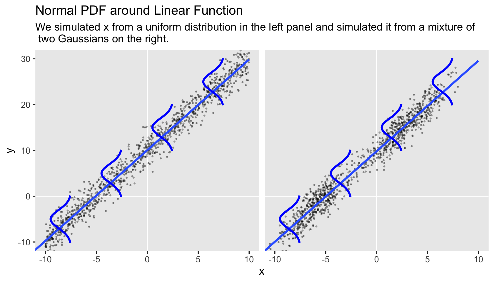<!-- -->

Concerning causality,

> *the simple linear model makes no claims about causal connections between* $x$ *and* $y$. *The simple linear model merely describes a tendency for* $y$ *values to be linearly related to* $x$ *values*, hence "predictable" from the $x$ values. When describing data with this model, we are starting with a scatter plot of points generated by an unknown process in the real world, and estimating parameter values that would produce a smattering of points that might mimic the real data. Even if the descriptive model mimics the data well (and it might not), the mathematical "process" in the model may have little if anything to do with the real-world process that created the data. Nevertheless, the parameters in the descriptive model are meaningful because they describe tendencies in the data. (p. 479, *emphasis* added)

I emphasized these points because I've heard and seen a lot of academics conflate linear regression models with causal models. For sure, it might well be preferable if your regression model was also a causal model. But good old prediction is fine, too.

## Robust linear regression

> There is no requirement to use a normal distribution for the noise distribution. The normal distribution is traditional because of its relative simplicity in mathematical derivations. But real data may have outliers, and the use of (optionally) heavy-tailed noise distributions is straight forward in contemporary Bayesian software[, like **brms**]. (pp. 479--480) 

Here's Kruschke's `HtWtDataGenerator()` code.


```r
HtWtDataGenerator <- function(nSubj, rndsd = NULL, maleProb = 0.50) {
  # Random height, weight generator for males and females. Uses parameters from
  # Brainard, J. & Burmaster, D. E. (1992). Bivariate distributions for height and
  # weight of men and women in the United States. Risk Analysis, 12(2), 267-275.
  # Kruschke, J. K. (2011). Doing Bayesian data analysis:
  # A Tutorial with R and BUGS. Academic Press / Elsevier.
  # Kruschke, J. K. (2014). Doing Bayesian data analysis, 2nd Edition:
  # A Tutorial with R, JAGS and Stan. Academic Press / Elsevier.
  
  # require(MASS)
  
  # Specify parameters of multivariate normal (MVN) distributions.
  # Men:
  HtMmu   <- 69.18
  HtMsd   <- 2.87
  lnWtMmu <- 5.14
  lnWtMsd <- 0.17
  Mrho    <- 0.42
  Mmean   <- c(HtMmu, lnWtMmu)
  Msigma  <- matrix(c(HtMsd^2, Mrho * HtMsd * lnWtMsd,
                      Mrho * HtMsd * lnWtMsd, lnWtMsd^2), nrow = 2)
  # Women cluster 1:
  HtFmu1   <- 63.11
  HtFsd1   <- 2.76
  lnWtFmu1 <- 5.06
  lnWtFsd1 <- 0.24
  Frho1    <- 0.41
  prop1    <- 0.46
  Fmean1   <- c(HtFmu1, lnWtFmu1)
  Fsigma1  <- matrix(c(HtFsd1^2, Frho1 * HtFsd1 * lnWtFsd1,
                       Frho1 * HtFsd1 * lnWtFsd1, lnWtFsd1^2), nrow = 2)
  # Women cluster 2:
  HtFmu2   <- 64.36
  HtFsd2   <- 2.49
  lnWtFmu2 <- 4.86
  lnWtFsd2 <- 0.14
  Frho2    <- 0.44
  prop2    <- 1 - prop1
  Fmean2   <- c(HtFmu2, lnWtFmu2)
  Fsigma2  <- matrix(c(HtFsd2^2, Frho2 * HtFsd2 * lnWtFsd2,
                       Frho2 * HtFsd2 * lnWtFsd2, lnWtFsd2^2), nrow = 2)
  
  # Randomly generate data values from those MVN distributions.
  if (!is.null(rndsd)) {set.seed(rndsd)}
  datamatrix <- matrix(0, nrow = nSubj, ncol = 3)
  colnames(datamatrix) <- c("male", "height", "weight")
  maleval <- 1; femaleval <- 0 # arbitrary coding values
  for (i in 1:nSubj)  {
    # Flip coin to decide sex
    sex <- sample(c(maleval, femaleval), size = 1, replace = TRUE,
                  prob = c(maleProb, 1 - maleProb))
    if (sex == maleval) {datum = MASS::mvrnorm(n = 1, mu = Mmean, Sigma = Msigma)}
    if (sex == femaleval) {
      Fclust = sample(c(1, 2), size = 1, replace = TRUE, prob = c(prop1, prop2))
      if (Fclust == 1) {datum = MASS::mvrnorm(n = 1, mu = Fmean1, Sigma = Fsigma1)}
      if (Fclust == 2) {datum = MASS::mvrnorm(n = 1, mu = Fmean2, Sigma = Fsigma2)}
    }
    datamatrix[i, ] = c(sex, round(c(datum[1], exp(datum[2])), 1))
  }
  
  return(datamatrix)
} # end function
```

Let's take this baby for a spin to simulate our data.


```r
d <- 
  HtWtDataGenerator(nSubj = 300, rndsd = 17, maleProb = .50) %>% 
  as_tibble() %>% 
  # this will allow us to subset 30 of the values into their own group
  mutate(subset = rep(0:1, times = c(9, 1)) %>% rep(., 30))

head(d)
```

```
## # A tibble: 6 x 4
##    male height weight subset
##   <dbl>  <dbl>  <dbl>  <int>
## 1     0   63.3   167.      0
## 2     0   62.4   126.      0
## 3     1   66.4   124       0
## 4     0   62.9   148.      0
## 5     1   65.5   151.      0
## 6     1   71.4   234.      0
```

> Fortunately, we do not have to worry much about analytical derivations because we can let JAGS or Stan generate a high resolution picture of the posterior distribution. Our job, therefore, is to specify sensible priors and to make sure that the MCMC process generates a trustworthy posterior sample that is converged and well mixed. (p. 483)

### Robust linear regression in ~~JAGS~~ brms.

Presuming a data set with a sole standardized predictor `x_z` for a sole standardized criterion `y_z`, the basic **brms** code corresponding to the JAGS code Kruschke showed on page 483 looks like this.


```r
fit1 <-
  brm(data = my_data,
      family = student,
      y_z ~ 1 + x_z,
      prior = c(prior(normal(0, 10), class = Intercept),
                prior(normal(0, 10), class = b),
                prior(normal(0, 1), class = sigma),
                prior(exponential(one_over_twentynine), class = nu)),
      stanvars = stanvar(1/29, name = "one_over_twentynine"))
```

Like we discussed in Chapter 16, we won't be using the uniform prior for $\sigma$. Since we're presuming standardized data, a half-unit normal is a fine choice. But do note this is much tighter than Kruschke's $\operatorname{uniform} (0.001, 1000)$ and it will have down-the-road consequences for our results versus those in the text. 

Also, look at how we just pumped the definition of our sole `stanvar(1/29, name = "one_over_twentynine")` operation right into the `stanvar` argument. If we were defining multiple values this way, I'd prefer to save this as an object first and then just pump that object into `stanvars`. But in this case, it was simple enough to just throw directly into the `brm()` function. 

#### Standardizing the data for MCMC sampling.

Kruschke mentioned how standardizing your data before feeding it into JAGS often helps the algorithm operate smoothly. The same basic principle holds for **brms** and Stan. Stan can often handle unstandardized data just fine. But if you ever run into estimation difficulties, consider standardizing your data and trying again.

We'll make a simple function to standardize the `height` and `weight` values.


```r
standardize <- function(x) {
  (x - mean(x)) / sd(x)
  }

d <-
  d %>% 
  mutate(height_z = standardize(height),
         weight_z = standardize(weight))
```

Somewhat analogous to how Kruschke standardized his data within the JAGS code, you could standardize the data within the `brm()` function. That would look something like this.


```r
fit1 <-
  brm(data = d %>%  # the standardizing occurs in the next two lines
        mutate(height_z = standardize(height),
               weight_z = standardize(weight)),
      family = student,
      weight_z ~ 1 + height_z,
      prior = c(prior(normal(0, 10), class = Intercept),
                prior(normal(0, 10), class = b),
                prior(normal(0, 1), class = sigma),
                prior(exponential(one_over_twentynine), class = nu)),
      stanvars = stanvar(1/29, name = "one_over_twentynine"))
```

But anyway, let's open **brms**.


```r
library(brms)
```

We'll fit the two models at once. `fit1` will be of the total data sample. `fit2` is of the $n = 30$ subset.


```r
fit1 <-
  brm(data = d,
      family = student,
      weight_z ~ 1 + height_z,
      prior = c(prior(normal(0, 10), class = Intercept),
                prior(normal(0, 10), class = b),
                prior(normal(0, 1), class = sigma),
                prior(exponential(one_over_twentynine), class = nu)),
      chains = 4, cores = 4,
      stanvars = stanvar(1/29, name = "one_over_twentynine"),
      seed = 17)

fit2 <-
  update(fit1,
         newdata = d %>% 
           filter(subset == 1),
         chains = 4, cores = 4,
         seed = 17)
```

Here are the results.


```r
print(fit1)
```

```
##  Family: student 
##   Links: mu = identity; sigma = identity; nu = identity 
## Formula: weight_z ~ 1 + height_z 
##    Data: d (Number of observations: 300) 
## Samples: 4 chains, each with iter = 2000; warmup = 1000; thin = 1;
##          total post-warmup samples = 4000
## 
## Population-Level Effects: 
##           Estimate Est.Error l-95% CI u-95% CI Rhat Bulk_ESS Tail_ESS
## Intercept    -0.03      0.05    -0.13     0.08 1.00     3803     2730
## height_z      0.45      0.05     0.35     0.56 1.00     3482     2259
## 
## Family Specific Parameters: 
##       Estimate Est.Error l-95% CI u-95% CI Rhat Bulk_ESS Tail_ESS
## sigma     0.85      0.05     0.75     0.94 1.00     3206     2704
## nu       25.60     21.67     6.31    86.62 1.00     2919     2543
## 
## Samples were drawn using sampling(NUTS). For each parameter, Eff.Sample 
## is a crude measure of effective sample size, and Rhat is the potential 
## scale reduction factor on split chains (at convergence, Rhat = 1).
```

```r
print(fit2)
```

```
##  Family: student 
##   Links: mu = identity; sigma = identity; nu = identity 
## Formula: weight_z ~ 1 + height_z 
##    Data: d %>% filter(subset == 1) (Number of observations: 30) 
## Samples: 4 chains, each with iter = 2000; warmup = 1000; thin = 1;
##          total post-warmup samples = 4000
## 
## Population-Level Effects: 
##           Estimate Est.Error l-95% CI u-95% CI Rhat Bulk_ESS Tail_ESS
## Intercept    -0.11      0.12    -0.34     0.12 1.00     4038     2686
## height_z      0.61      0.11     0.39     0.82 1.00     4173     2589
## 
## Family Specific Parameters: 
##       Estimate Est.Error l-95% CI u-95% CI Rhat Bulk_ESS Tail_ESS
## sigma     0.64      0.09     0.48     0.84 1.00     3622     2528
## nu       39.57     30.75     5.84   119.87 1.00     4129     2872
## 
## Samples were drawn using sampling(NUTS). For each parameter, Eff.Sample 
## is a crude measure of effective sample size, and Rhat is the potential 
## scale reduction factor on split chains (at convergence, Rhat = 1).
```

Based on Kruschke's Equation 17.2, we can convert the standardized coefficients back to their original metric using the formulas

\begin{align*}
\beta_0 & = \zeta_0 \operatorname{SD}_y + M_y - \frac{\zeta_1 M_x \operatorname{SD}_y}{\operatorname{SD}_x} \;\; \text{and}  \\
\beta_1 & = \frac{\zeta_1 \operatorname{SD}_y}{\operatorname{SD}_x},
\end{align*}

where $\zeta_0$ and $\zeta_1$ denote the intercept and slope for the model of the standardized data, respectively, and that model follows the familiar form

$$z_{\hat y} = \zeta_0 + \zeta_1 z_x.$$

To implement those equations, we'll first extract the posterior samples. We'll begin with `fit1`, the model for which $N = 300$.


```r
post <- posterior_samples(fit1)

head(post)
```

```
##    b_Intercept b_height_z     sigma       nu      lp__
## 1 -0.008565966  0.4506511 0.9079515 29.13748 -401.0110
## 2 -0.044204302  0.4281183 0.7970452 31.07005 -402.4087
## 3 -0.105379516  0.4123081 0.8323686 14.74480 -401.5056
## 4 -0.153969750  0.3571412 0.8509155 14.65994 -404.8230
## 5 -0.125288079  0.3651884 0.8242179 18.03175 -403.6745
## 6 -0.129856036  0.4115427 0.8529961 19.64789 -402.5184
```

Let's wrap the consequences of Equation 17.2 into two functions.


```r
make_beta_0 <- function(zeta_0, zeta_1, sd_x, sd_y, m_x, m_y) {
  zeta_0 * sd_y + m_y - zeta_1 * m_x * sd_y / sd_x
  }

make_beta_1 <- function(zeta_1, sd_x, sd_y) {
  zeta_1 * sd_y / sd_x
  }
```

After saving a few values, we're ready to use our custom functions to convert our posteriors for `b_Intercept` and `b_height_z` to their natural metric.


```r
sd_x <- sd(d$height)
sd_y <- sd(d$weight)
m_x  <- mean(d$height)
m_y  <- mean(d$weight)

post <-
  post %>% 
  mutate(b_0 = make_beta_0(zeta_0 = b_Intercept,
                           zeta_1 = b_height_z,
                           sd_x   = sd_x,
                           sd_y   = sd_y,
                           m_x    = m_x,
                           m_y    = m_y),
         b_1 = make_beta_1(zeta_1 = b_height_z,
                           sd_x   = sd_x,
                           sd_y   = sd_y))

glimpse(post)
```

```
## Observations: 4,000
## Variables: 7
## $ b_Intercept <dbl> -0.0085659663, -0.0442043023, -0.1053795163, -0.1539697497, -0.1252880790, -0…
## $ b_height_z  <dbl> 0.4506511, 0.4281183, 0.4123081, 0.3571412, 0.3651884, 0.4115427, 0.4193145, …
## $ sigma       <dbl> 0.9079515, 0.7970452, 0.8323686, 0.8509155, 0.8242179, 0.8529961, 0.8232428, …
## $ nu          <dbl> 29.137481, 31.070051, 14.744799, 14.659941, 18.031749, 19.647894, 11.043079, …
## $ lp__        <dbl> -401.0110, -402.4087, -401.5056, -404.8230, -403.6745, -402.5184, -400.9171, …
## $ b_0         <dbl> -117.61990, -104.89450, -97.21419, -64.72410, -68.71807, -97.58500, -100.6906…
## $ b_1         <dbl> 4.182206, 3.973094, 3.826369, 3.314400, 3.389081, 3.819266, 3.891391, 4.52945…
```

Now we're finally ready to make the top panel of Figure 17.4.


```r
# how many posterior lines would you like?
n_lines <- 100

ggplot(data = d, 
       aes(x = height, y = weight)) +
  geom_abline(intercept = post[1:n_lines, "b_0"], 
              slope = post[1:n_lines, "b_1"],
              color = "grey67", size = 1/4, alpha = .3) +
  geom_point(alpha = 1/2) +
  coord_cartesian(xlim = 50:80,
                  ylim = -50:470) +
  labs(subtitle = eval(substitute(paste("Data with", 
                                        n_lines, 
                                        "credible regression lines"))),
       x = "height",
       y = "weight")
```

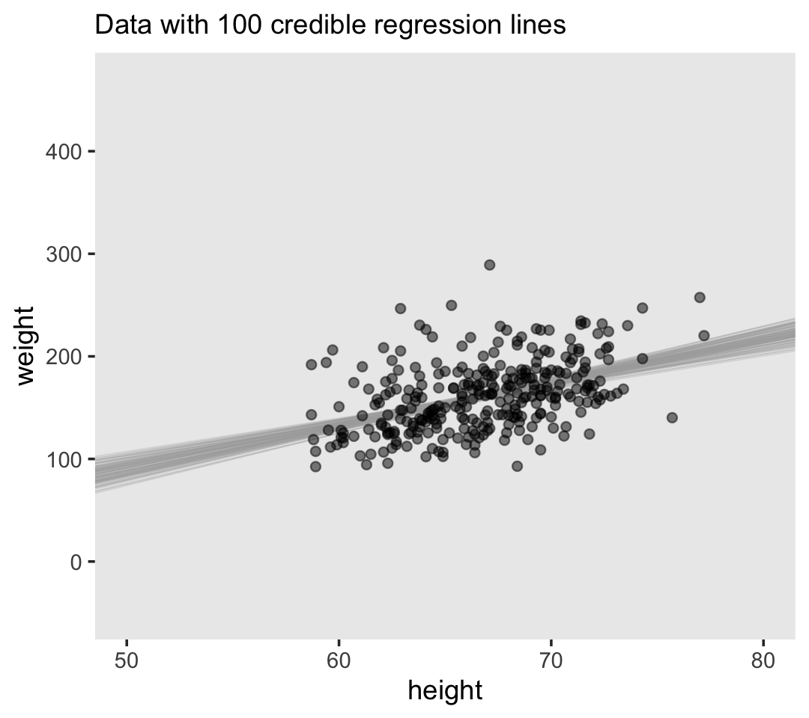<!-- -->

We'll want to open the **tidybayes** package to help make the histograms.


```r
library(tidybayes)

# we'll use this to mark off the ROPEs as white strips in the background
rope <-
  tibble(key  = "Slope", 
         xmin = -.5,
         xmax = .5)

# here are the primary data
post %>% 
  transmute(Intercept = b_0,
            Slope     = b_1,
            Scale     = sigma * sd_y,
            Normality = nu %>% log10()) %>% 
  gather() %>% 
  
  # the plot
  ggplot() +
  geom_rect(data = rope,
            aes(xmin = xmin, xmax = xmax,
                ymin = -Inf, ymax = Inf),
            color = "transparent", fill = "white") +
  geom_histogram(aes(x = value),
                 color = "grey92", fill = "grey67",
                 size = .2, bins = 40) +
  stat_pointintervalh(aes(x = value, y = 0), 
                      point_interval = mode_hdi, .width = c(.95, .5)) +
  scale_y_continuous(NULL, breaks = NULL) +
  xlab(NULL) +
  facet_wrap(~key, scales = "free", ncol = 2)
```

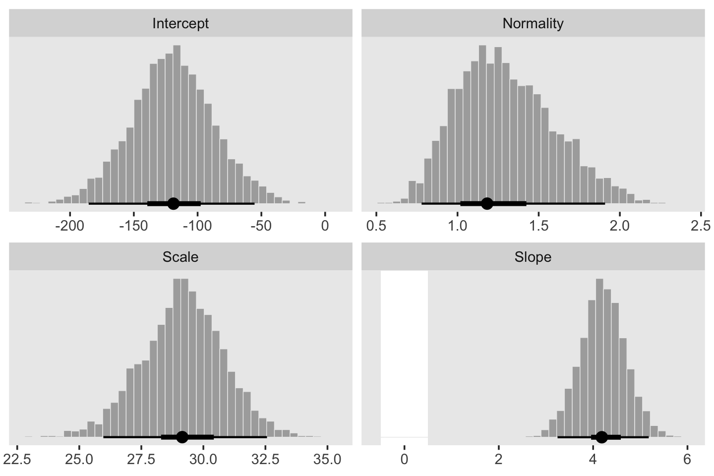<!-- -->

Here's the scatter plot for the slope and intercept.


```r
post %>% 
  ggplot(aes(x = b_1, y = b_0)) +
  geom_point(color = "grey56", size = 1/3, alpha = 1/3) +
  labs(x = expression(beta[1]),
       y = expression(beta[0]))
```

<!-- -->

That is one strong correlation! Finally, here's the scatter plot for $\operatorname{log10}(\nu)$ and $\sigma_{\text{transformed back to its raw metric}}$.


```r
post %>% 
  transmute(Scale = sigma * sd_y,
            Normality = nu %>% log10()) %>% 
  ggplot(aes(x = Normality, y = Scale)) +
  geom_point(color = "grey56", size = 1/3, alpha = 1/3) +
  labs(x = expression(log10(nu)),
       y = expression(sigma))
```

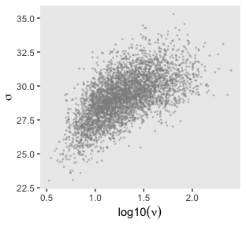<!-- -->

Let's back track and make the plots for Figure 17.3 with `fit2`. We'll need to extract the posterior samples and wrangle, as before.


```r
post <- posterior_samples(fit2)

post <-
  post %>% 
  mutate(b_0 = make_beta_0(zeta_0 = b_Intercept,
                           zeta_1 = b_height_z,
                           sd_x   = sd_x,
                           sd_y   = sd_y,
                           m_x    = m_x,
                           m_y    = m_y),
         b_1 = make_beta_1(zeta_1 = b_height_z,
                           sd_x   = sd_x,
                           sd_y   = sd_y))

glimpse(post)
```

```
## Observations: 4,000
## Variables: 7
## $ b_Intercept <dbl> -0.15966043, -0.05963733, -0.10287799, -0.08226864, 0.08219908, -0.26932327, …
## $ b_height_z  <dbl> 0.6156750, 0.4158976, 0.4348758, 0.7235308, 0.6377568, 0.6681059, 0.4613149, …
## $ sigma       <dbl> 0.6158242, 0.6801605, 0.6325821, 0.4960271, 0.4937104, 0.6232176, 0.5654167, …
## $ nu          <dbl> 29.243356, 31.527094, 20.264225, 23.611639, 12.533737, 11.569457, 33.638157, …
## $ lp__        <dbl> -36.11596, -38.05293, -37.72598, -38.17854, -39.75470, -37.86057, -38.74105, …
## $ b_0         <dbl> -225.04181, -97.85839, -111.10497, -289.17023, -230.36964, -261.29985, -121.4…
## $ b_1         <dbl> 5.713688, 3.859681, 4.035805, 6.714629, 5.918615, 6.200266, 4.281170, 6.41192…
```

Here's the top panel of Figure 17.3.


```r
# how many posterior lines would you like?
n_lines <- 100

ggplot(data = d %>% 
         filter(subset == 1), 
       aes(x = height, y = weight)) +
  geom_vline(xintercept = 0, color = "white") +
  geom_abline(intercept = post[1:n_lines, "b_0"], 
              slope = post[1:n_lines, "b_1"],
              color = "grey67", size = 1/4, alpha = .3) +
  geom_point(alpha = 1/2) +
  scale_y_continuous(breaks = seq(from = -300, to = 200, by = 100)) +
  coord_cartesian(xlim = 0:80,
                  ylim = -350:250) +
  labs(subtitle = eval(substitute(paste("Data with", 
                                        n_lines, 
                                        "credible regression lines"))),
       x = "height",
       y = "weight")
```

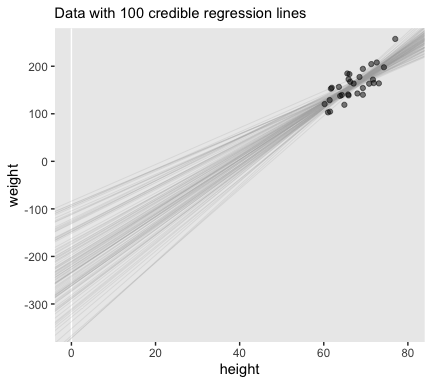<!-- -->

Next we'll make the histograms.


```r
# here are the primary data
post %>% 
  transmute(Intercept = b_0,
            Slope     = b_1,
            Scale     = sigma * sd_y,
            Normality = nu %>% log10()) %>% 
  gather() %>% 
  
  # the plot
  ggplot() +
  geom_rect(data = rope,
            aes(xmin = xmin, xmax = xmax,
                ymin = -Inf, ymax = Inf),
            color = "transparent", fill = "white") +
  geom_histogram(aes(x = value),
                 color = "grey92", fill = "grey67",
                 size = .2, bins = 40) +
  stat_pointintervalh(aes(x = value, y = 0), 
                      point_interval = mode_hdi, .width = c(.95, .5)) +
  scale_y_continuous(NULL, breaks = NULL) +
  xlab(NULL) +
  facet_wrap(~key, scales = "free", ncol = 2)
```

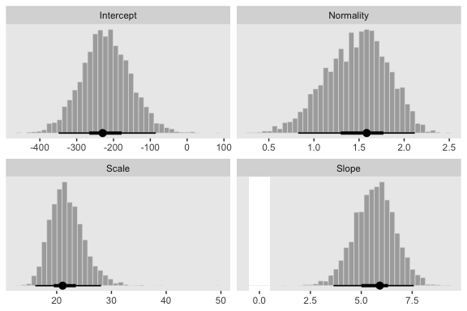<!-- -->

And we'll finish up with the scatter plots.


```r
post %>% 
  ggplot(aes(x = b_1, y = b_0)) +
  geom_point(color = "grey56", size = 1/3, alpha = 1/3) +
  labs(x = expression(beta[1]),
       y = expression(beta[0]))
```

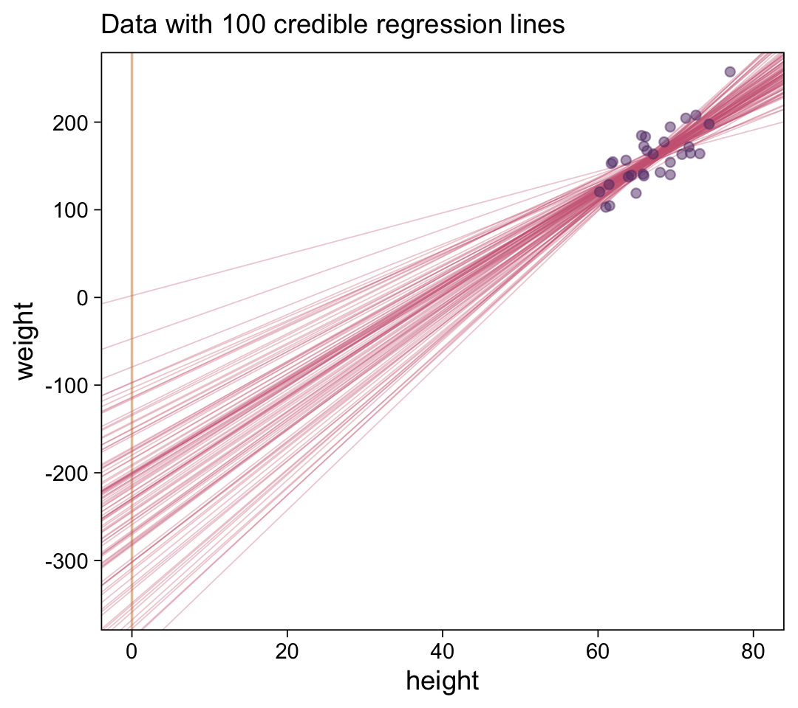<!-- -->

```r
post %>% 
  transmute(Scale = sigma * sd_y,
            Normality = nu %>% log10()) %>% 
  ggplot(aes(x = Normality, y = Scale)) +
  geom_point(color = "grey56", size = 1/3, alpha = 1/3) +
  labs(x = expression(log10(nu)),
       y = expression(sigma))
```

<!-- -->

### Robust linear regression in Stan.

> Recall from Section 14.1 (p. 400) that Stan uses Hamiltonian dynamics to find proposed positions in parameter space. The trajectories use the gradient of the posterior distribution to move large distances even in narrow distributions. Thus, HMC by itself, without data standardization, should be able to efficiently generate a representative sample from the posterior distribution. (p. 487)

To be clear, we're going to fit the models with Stan/**brms** twice. Above, we used the standardized data like Kruschke did with his JAGS code. Now we're getting ready to follow along with the text and use Stan/**brms** to fit the models with the unstandardized data.

#### Constants for vague priors.

It's worth repeating a large portion of Kruschke's second paragraph:

> A regression slope can take on a maximum value of $\operatorname{SD}_y / \operatorname{SD}_x$ for data that are perfectly correlated. Therefore, the prior on the slope will be given a standard deviation that is large compared to that maximum. The biggest that an intercept could be, for data that are perfectly correlated, is $M_x \operatorname{SD}_y / \operatorname{SD}_x$. Therefore, the prior on the intercept will have a standard deviation that is large compared to that maximum. (p. 487)

With that in mind, we'll specify our `stanvars` as follows:


```r
beta_0_sigma <- 10 * abs(m_x * sd_y / sd_x)
beta_1_sigma <- 10 * abs(sd_y / sd_x) 

stanvars <- 
  stanvar(beta_0_sigma, name = "beta_0_sigma") + 
  stanvar(beta_1_sigma, name = "beta_1_sigma") +
  stanvar(sd_y, name = "sd_y") +
  stanvar(1/29, name = "one_over_twentynine")
```

As in Chapter 16, "set the priors to be extremely broad relative to the data" (p. 487). With our `stanvars` saved, we're ready to fit `fit3`.


```r
fit3 <-
  brm(data = d,
      family = student,
      weight ~ 1 + height,
      prior = c(prior(normal(0, beta_0_sigma), class = Intercept),
                prior(normal(0, beta_1_sigma), class = b),
                prior(normal(0, sd_y), class = sigma),
                prior(exponential(one_over_twentynine), class = nu)),
      chains = 4, cores = 4,
      stanvars = stanvars,
      seed = 17)
```

Here's the model summary.


```r
print(fit3)
```

```
##  Family: student 
##   Links: mu = identity; sigma = identity; nu = identity 
## Formula: weight ~ 1 + height 
##    Data: d (Number of observations: 300) 
## Samples: 4 chains, each with iter = 2000; warmup = 1000; thin = 1;
##          total post-warmup samples = 4000
## 
## Population-Level Effects: 
##           Estimate Est.Error l-95% CI u-95% CI Rhat Bulk_ESS Tail_ESS
## Intercept  -121.10     33.32  -186.82   -54.98 1.00     3348     2858
## height        4.22      0.50     3.24     5.20 1.00     3369     2816
## 
## Family Specific Parameters: 
##       Estimate Est.Error l-95% CI u-95% CI Rhat Bulk_ESS Tail_ESS
## sigma    29.08      1.76    25.58    32.36 1.00     2500     1920
## nu       25.37     21.47     6.20    84.33 1.00     2320     2473
## 
## Samples were drawn using sampling(NUTS). For each parameter, Eff.Sample 
## is a crude measure of effective sample size, and Rhat is the potential 
## scale reduction factor on split chains (at convergence, Rhat = 1).
```

Now compare the histograms for these posterior draws to those we made, above, from those `fit1`. You'll see they're quite similar.


```r
# here are the primary data
posterior_samples(fit3) %>% 
  transmute(Intercept = b_Intercept,
            Slope     = b_height,
            Scale     = sigma,
            Normality = nu %>% log10()) %>% 
  gather() %>% 
  
  # the plot
  ggplot() +
  geom_rect(data = rope,
            aes(xmin = xmin, xmax = xmax,
                ymin = -Inf, ymax = Inf),
            color = "transparent", fill = "white") +
  geom_histogram(aes(x = value),
                 color = "grey92", fill = "grey67",
                 size = .2, bins = 40) +
  stat_pointintervalh(aes(x = value, y = 0), 
                      point_interval = mode_hdi, .width = c(.95, .5)) +
  scale_y_continuous(NULL, breaks = NULL) +
  xlab(NULL) +
  facet_wrap(~key, scales = "free", ncol = 2)
```

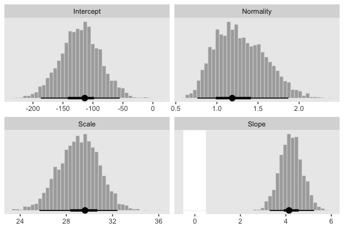<!-- -->

### Stan or JAGS?

In this project we only fit the models with **brms**, which uses Stan under the hood. But since we fit the $N = 300$ model with both standardized and unstandardized data, we can compare their performance. For that, we'll want **bayesplot**.


```r
library(bayesplot)
```

They had equally impressive autocorrelation plots.


```r
mcmc_acf(posterior_samples(fit1), pars = c("b_Intercept", "b_height_z", "sigma", "nu"), lags = 10)
```

<!-- -->

```r
mcmc_acf(posterior_samples(fit3), pars = c("b_Intercept", "b_height", "sigma", "nu"), lags = 10)
```

<!-- -->

Their $N_{eff}/N$ ratios were pretty similar. Both were reasonable. You'd probably want to run a simulation to contrast them with any rigor.


```r
neff_ratio(fit1) %>% 
  mcmc_neff() +
  yaxis_text(hjust = 0)
```

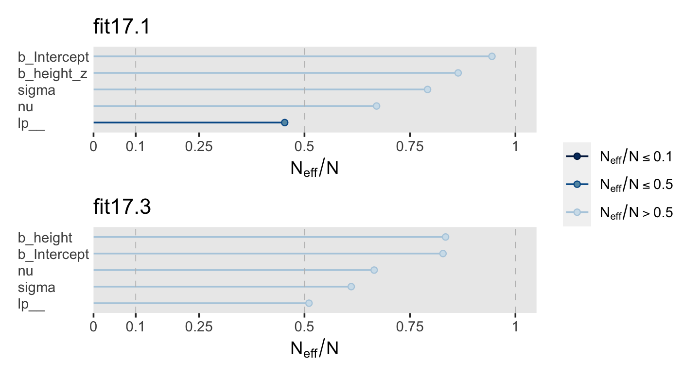<!-- -->

```r
neff_ratio(fit3) %>% 
  mcmc_neff() +
  yaxis_text(hjust = 0)
```

<!-- -->

### Interpreting the posterior distribution.

Halfway through the prose, Kruschke mentioned how the models provide entire posteriors for the `weight` of a 50-inch-tall person. **brms** offers a few ways to do so. 

> In some applications, there is interest in extrapolating or interpolating trends at $x$ values sparsely represented in the current data. For instance, we might want to predict the weight of a person who is 50 inches tall. A feature of Bayesian analysis is that we get an entire distribution of credible predicted values, not only a point estimate. (p. 489)

Since this is such a simple model, one way is to work directly with the posterior samples. Here we use the model formula $y_i = \beta_0 + \beta_1 x_i$ by adding the transformed intercept `b_0` to the product of $50$ and the transformed coefficient for `height`, `b_1`.


```r
post %>% 
  mutate(weight_at_50 = b_0 + b_1 * 50) %>% 
  
  ggplot(aes(x = weight_at_50)) +
  geom_histogram(color = "grey92", fill = "grey67",
                 size = .2, bins = 40) +
  stat_pointintervalh(aes(y = 0), 
                      point_interval = mode_hdi, .width = c(.95, .5)) +
  scale_y_continuous(NULL, breaks = NULL) +
  xlab("lbs")
```

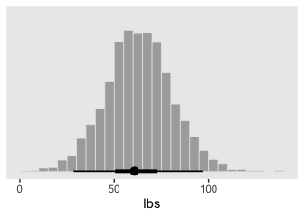<!-- -->

Looks pretty wide, doesn’t it? Hopefully this isn’t a surprise. Recall that this `post` is from `fit2`, the posterior based on the $n = 30$ data. With so few data, most predictions from that model are uncertain. But also, 50 inches is way out of the bounds of the data the model was based on, so we should be uncertain in this range.

Let's practice a second method. With the `brms::fitted()` function, we can specify the desired `height` value into a tibble, which we'll then feed into the `newdata` argument. Fitted will then return the model-implied criterion value for that predictor variable. To warm up, we'll first to it with `fit3`, the model based on the untransformed data.


```r
nd <- tibble(height = 50)

fitted(fit3,
       newdata = nd)
```

```
##      Estimate Est.Error     Q2.5    Q97.5
## [1,] 90.13275  8.579962 73.14503 107.2745
```

The code returned a typical **brms**-style summary of the posterior mean, standard deviation, and 95% percentile-based intervals. The same basic method will work for the standardized models, `fit1` or `fit2`. But that will take a little more wrangling. First, we'll need to transform our desired value 50 into its standardized version. 


```r
nd <- tibble(height_z = (50 - mean(d$height)) / sd(d$height))
```

When we feed this value into `fitted()`, it will return the corresponding posterior within the standardized metric. But we want unstandardized, so we'll need to transform. That'll be a few-step process. First, to do the transformation properly, we'll want to work with the poster draws themselves, rather than summary values. So we'll set `summary = F`. We'll then convert the draws into a tibble format. Then we'll use the `transmute()` function to do the conversion. In the final step, we'll use `mean_qi()` to compute the summary values.


```r
fitted(fit1,
       newdata = nd,
       summary = F) %>% 
  as_tibble() %>% 
  transmute(weight = V1 * sd(d$weight) + mean(d$weight)) %>% 
  mean_qi()
```

```
## # A tibble: 1 x 6
##   weight .lower .upper .width .point .interval
##    <dbl>  <dbl>  <dbl>  <dbl> <chr>  <chr>    
## 1   90.5   73.7   107.   0.95 mean   qi
```

If you look above, you'll see the results are within rounding error of those from `fit3`.

## Hierarchical regression on individuals within groups

> In the previous applications, the $j$th individual contributed a single $x_j, y_j$ pair. But suppose instead that every individual, $j$, contributes multiple observations of $x_{i|j}, y_{i|j}$ pairs. (The subscript notation $i|j$ means the $i$th observation within the $j$th individual.) With these data, we can estimate a regression curve for every individual. If we also assume that the individuals are mutually representative of a common group, then we can estimate group-level parameters too. (p. 490)

Load the fictitious data and take a `glimpse()`.


```r
my_data <- read_csv("data.R/HierLinRegressData.csv")

glimpse(my_data)
```

```
## Observations: 132
## Variables: 3
## $ Subj <dbl> 1, 1, 1, 1, 1, 1, 2, 2, 2, 2, 2, 2, 2, 2, 2, 3, 3, 3, 3, 3, 3, 3, 4, 4, 5, 5, 5, 5, …
## $ X    <dbl> 60.2, 61.5, 61.7, 62.3, 67.6, 69.2, 53.7, 60.1, 60.5, 62.3, 63.0, 64.0, 64.1, 66.7, …
## $ Y    <dbl> 145.6, 157.3, 165.6, 158.8, 196.1, 183.9, 165.0, 166.9, 179.0, 196.2, 192.3, 200.7, …
```

> Our goal is to describe each individual with a linear regression, and simultaneously to estimate the typical slope and intercept of the group overall. A key assumption for our analysis is that each individual is representative of the group. Therefore, every individual informs the estimate of the group slope and intercept, which in turn inform the estimates of all the individual slopes and intercepts. Thereby we get sharing of information across individuals, and shrinkage of individual estimates toward the overarching mode. (p. 491)

### The model and implementation in ~~JAGS~~ brms.

Here we'll standardize the data and define our `stanvars`. I should note that standardizing and mean centering, more generally, becomes complicated with multilevel models. Here we're just standardizing based on the grand mean and grand standard deviation. But there are other ways to standardize, such as within groups. Craig Enders has a [good book chapter](https://scholar.google.com/scholar?hl=en&as_sdt=0%2C1&q=Centering+Predictors+and+Contextual+Effects&btnG=) that touched on the topic, as well as [an earlier (2007) paper with Tofighi](http://citeseerx.ist.psu.edu/viewdoc/download?doi=10.1.1.928.9848&rep=rep1&type=pdf).


```r
my_data <-
  my_data %>% 
  mutate(x_z = standardize(X),
         y_z = standardize(Y))
```

In my experience, you typically use the `(|)` syntax when fitting a hierarchical model with the`brm()` function. The terms before the `|` are those varying by group and you tell `brm()` what the grouping variable is after the `|`. In the case of multiple group-level parameters--which is the case with this model (i.e., both intercept and the `x_z` slope--, this syntax also estimates correlations among the group-level parameters. Kruschke’s model doesn’t appear to include such a correlation. Happily, we can use the `(||)` syntax instead, which omits correlations among the group-level parameters. If you're curious about the distinction, fit the model both ways and explore the differences in the `print()` output. For more on the topic, see the *Group-level terms* subsection of the `brmsformula` section of the [**brms** reference manual](https://cran.r-project.org/web/packages/brms/brms.pdf).


```r
fit4 <-
  brm(data = my_data,
      family = student,
      y_z ~ 1 + x_z + (1 + x_z || Subj),
      prior = c(prior(normal(0, 10), class = Intercept),
                prior(normal(0, 10), class = b),
                prior(normal(0, 1), class = sigma),
                # the next line is new
                prior(normal(0, 1), class = sd),
                prior(exponential(one_over_twentynine) + 1, class = nu)),
      chains = 4, cores = 4,
      stanvars = stanvar(1/29, name = "one_over_twentynine"),
      seed = 17)
```

Did you catch that `prior(normal(0, 1), class = sd)` line in the code? That's the prior we used for our hierarchical variance parameters, $\sigma_0$ and $\sigma_1$. Just like with the scale parameter, $\sigma$, we used the zero-mean half-normal distribution. By default, **brms** sets their left boundary to zero, which keeps the HMC algorithm from exploring negative variance values.

Anyway, here's the model `summary()`.


```r
summary(fit4)
```

```
##  Family: student 
##   Links: mu = identity; sigma = identity; nu = identity 
## Formula: y_z ~ 1 + x_z + (1 + x_z || Subj) 
##    Data: my_data (Number of observations: 132) 
## Samples: 4 chains, each with iter = 2000; warmup = 1000; thin = 1;
##          total post-warmup samples = 4000
## 
## Group-Level Effects: 
## ~Subj (Number of levels: 25) 
##               Estimate Est.Error l-95% CI u-95% CI Rhat Bulk_ESS Tail_ESS
## sd(Intercept)     1.02      0.17     0.73     1.40 1.00     1185     2187
## sd(x_z)           0.22      0.12     0.02     0.47 1.00      944     1549
## 
## Population-Level Effects: 
##           Estimate Est.Error l-95% CI u-95% CI Rhat Bulk_ESS Tail_ESS
## Intercept     0.07      0.22    -0.37     0.51 1.01     1002     1682
## x_z           0.70      0.10     0.51     0.90 1.00     2316     2489
## 
## Family Specific Parameters: 
##       Estimate Est.Error l-95% CI u-95% CI Rhat Bulk_ESS Tail_ESS
## sigma     0.59      0.05     0.49     0.70 1.00     1768     2071
## nu       38.56     29.91     6.24   118.14 1.00     3792     2083
## 
## Samples were drawn using sampling(NUTS). For each parameter, Eff.Sample 
## is a crude measure of effective sample size, and Rhat is the potential 
## scale reduction factor on split chains (at convergence, Rhat = 1).
```

### The posterior distribution: Shrinkage and prediction.

Keeping in the same spirit of section 17.2.4, we'll make the plots of Figure 17.5 in two ways. First, we'll use our `make_beta_0()` and  `make_beta_1()` functions to transform the model coefficients.


```r
post <- posterior_samples(fit4)

sd_x <- sd(my_data$X)
sd_y <- sd(my_data$Y)
m_x  <- mean(my_data$X)
m_y  <- mean(my_data$Y)

post <-
  post %>% 
  transmute(b_0 = make_beta_0(zeta_0 = b_Intercept,
                              zeta_1 = b_x_z,
                              sd_x   = sd_x,
                              sd_y   = sd_y,
                              m_x    = m_x,
                              m_y    = m_y),
            b_1 = make_beta_1(zeta_1 = b_x_z,
                              sd_x   = sd_x,
                              sd_y   = sd_y))

head(post)
```

```
##         b_0      b_1
## 1 -43.98003 2.930472
## 2 -44.70868 2.913752
## 3 -94.67366 3.671535
## 4 -39.53594 2.934772
## 5 -30.23631 2.967107
## 6 -97.21916 3.936589
```

Here's the top panel of Figure 17.4.


```r
# how many posterior lines would you like?
n_lines <- 250

my_data %>% 
  mutate(Subj = Subj %>% as.character()) %>% 
  
  ggplot(aes(x = X, y = Y)) +
  geom_abline(intercept = post[1:n_lines, "b_0"], 
              slope     = post[1:n_lines, "b_1"],
              color = "grey67", size = 1/4, alpha = .3) +
  geom_point(aes(color = Subj),
             alpha = 1/2) +
  geom_line(aes(group = Subj, color = Subj),
            size = 1/4) +
  scale_color_viridis_d() +
  scale_y_continuous(breaks = seq(from = 50, to = 250, by = 50)) +
  coord_cartesian(xlim = 40:95,
                  ylim = 30:270) +
  labs(subtitle = eval(substitute(paste("Data from all units with", n_lines, "credible population-level\nregression lines")))) +
  theme(legend.position = "none")
```

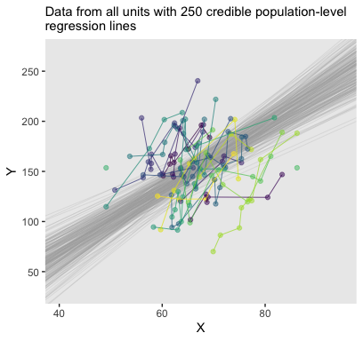<!-- -->

Recall how we can use `coef()` to extract the `Subj`-specific parameters. But we'll want posterior draws rather than summaries, which requires `summary = F`. It'll take a bit of wrangling to get the output in a tidy format. Once we're there, the plot code will be fairly simple.


```r
c <-
  # first we'll wrangle the `coef()` output for the intercept
  coef(fit4, summary = F)$Subj[, , "Intercept"] %>% 
  as_tibble() %>% 
  gather(Subj, Intercept) %>% 
  # add the slope
  bind_cols(
    coef(fit4, summary = F)$Subj[, , "x_z"] %>% 
      as_tibble() %>% 
      gather(Subj, Slope) %>% 
      select(Slope)
  ) %>% 
  # now we're ready to un-standardize the standardized coefficients
  mutate(b_0 = make_beta_0(zeta_0 = Intercept,
                           zeta_1 = Slope,
                           sd_x   = sd_x,
                           sd_y   = sd_y,
                           m_x    = m_x,
                           m_y    = m_y),
         b_1 = make_beta_1(zeta_1 = Slope,
                           sd_x   = sd_x,
                           sd_y   = sd_y)) %>% 
  # we need an iteration index so we might `filter()` the number of lines per case
  mutate(iter = rep(1:4000, times = 25))

# how many lines would you like?
n_lines <- 250

# the plot:
my_data %>% 
  ggplot(aes(x = X, y = Y)) +
  geom_abline(data = c %>% filter(iter <= n_lines),
              aes(intercept = b_0, slope = b_1), 
              color = "grey67", size = 1/4, alpha = .3) +
  geom_point(aes(color = Subj)) +
  scale_color_viridis_c() +
  scale_x_continuous(breaks = seq(from = 50, to = 90,  by = 20)) +
  scale_y_continuous(breaks = seq(from = 50, to = 250, by = 100)) +
  coord_cartesian(xlim = 45:90,
                  ylim = 50:270) +
  labs(subtitle = "Each unit now has its own bundle of credible regression lines") +
  theme(legend.position = "none") +
  facet_wrap(~Subj %>% factor(., levels = 1:25))
```

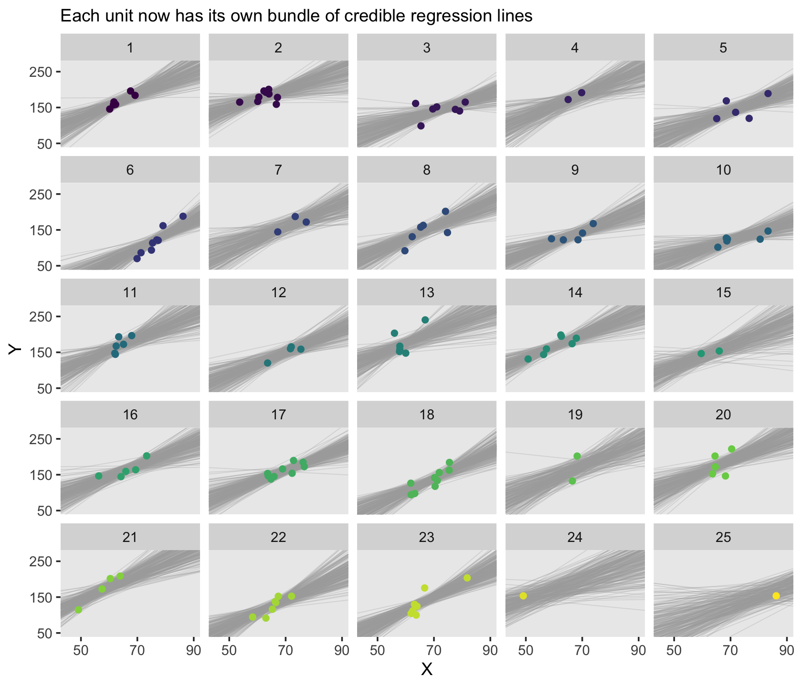<!-- -->

There's some good pedagogy in that method. But it's good to have options and in this case `fitted()` is a simpler option. Here's the preparatory data wrangling step.


```r
# how many posterior lines would you like?
n_lines <- 250

nd <- 
  # since we're working with straight lines, we only need two x-values
  tibble(x_z = c(-5, 5)) %>% 
  mutate(X = x_z * sd(my_data$X) + mean(my_data$X))

f <-
  fitted(fit4,
         newdata = nd,
         # since we only want the fixed effects, we'll use `re_formula` 
         # to maginalize over the random effects
         re_formula = Y_z ~ 1 + X_z,
         summary = F,
         # here we use `nsamples` to subset right from the get go
         nsamples = n_lines) %>% 
  as_tibble() %>% 
  gather() %>% 
  # transform the `y_z` values back into the `Y` metric
  transmute(Y = value * sd(my_data$Y) + mean(my_data$Y)) %>% 
  # now attach the predictor values to the output
  bind_cols(
    nd %>% 
      expand(X, iter = 1:n_lines)
  )

head(f)  
```

```
## # A tibble: 6 x 3
##       Y     X  iter
##   <dbl> <dbl> <int>
## 1  55.8  31.4     1
## 2 -17.7  31.4     2
## 3  49.6  31.4     3
## 4  76.7  31.4     4
## 5  33.7  31.4     5
## 6  34.9  31.4     6
```

For the second time, here's the top panel of Figure 17.4, this time based off of `fitted()`.


```r
my_data %>% 
  mutate(Subj = Subj %>% as.character()) %>% 
  
  ggplot(aes(x = X, y = Y)) +
  geom_line(data = f,
            aes(group = iter),
            color = "grey67", size = 1/4, alpha = .3) +
  geom_point(aes(color = Subj),
             alpha = 1/2) +
  geom_line(aes(group = Subj, color = Subj),
            size = 1/4) +
  scale_color_viridis_d(option = "C") +
  scale_y_continuous(breaks = seq(from = 50, to = 250, by = 50)) +
  coord_cartesian(xlim = 40:95,
                  ylim = 30:270) +
  labs(subtitle = eval(substitute(paste("Data from all units with", n_lines, "credible population-level\nregression lines")))) +
  theme(legend.position = "none")
```

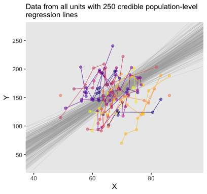<!-- -->

The whole process is quite similar for the `Subj`-specific lines. There are two main differences. First, we need to specify which `Subj` values we'd like to get `fitted()` points for. That goes into our `nd` tibble. Second, we omit the `re_formula` argument. There are other subtleties, like with the contents of the `bind_cols()` function. But hopefully those are self-evident.


```r
# how many posterior lines would you like?
n_lines <- 250

nd <- 
  tibble(x_z = c(-5, 5)) %>% 
  mutate(X = x_z * sd(my_data$X) + mean(my_data$X)) %>% 
  expand(nesting(x_z, X),
         Subj = distinct(my_data, Subj) %>% pull())

f <-
  fitted(fit4,
         newdata = nd,
         summary = F,
         nsamples = n_lines) %>% 
  as_tibble() %>% 
  gather() %>% 
  transmute(Y = value * sd(my_data$Y) + mean(my_data$Y)) %>% 
  bind_cols(nd %>% 
              expand(nesting(X, Subj),
                     iter = 1:n_lines)
  )

head(f)  
```

```
## # A tibble: 6 x 4
##       Y     X  Subj  iter
##   <dbl> <dbl> <dbl> <int>
## 1  36.8  31.4     1     1
## 2  50.8  31.4     1     2
## 3 108.   31.4     1     3
## 4  41.1  31.4     1     4
## 5  59.0  31.4     1     5
## 6  60.3  31.4     1     6
```

And now for the second time, here's the bottom panel of Figure 17.4, this time based off of `fitted()`.


```r
my_data %>% 
  ggplot(aes(x = X, y = Y)) +
  geom_line(data = f,
            aes(group = iter),
            color = "grey67", size = 1/4, alpha = .3) +
  geom_point(aes(color = Subj)) +
  scale_color_viridis_c(option = "C") +
  scale_x_continuous(breaks = seq(from = 50, to = 90,  by = 20)) +
  scale_y_continuous(breaks = seq(from = 50, to = 250, by = 100)) +
  labs(subtitle = "Each unit now has its own bundle of credible regression lines") +
  coord_cartesian(xlim = 45:90,
                  ylim = 50:270) +
  theme(legend.position = "none") +
  facet_wrap(~Subj %>% factor(., levels = 1:25))
```

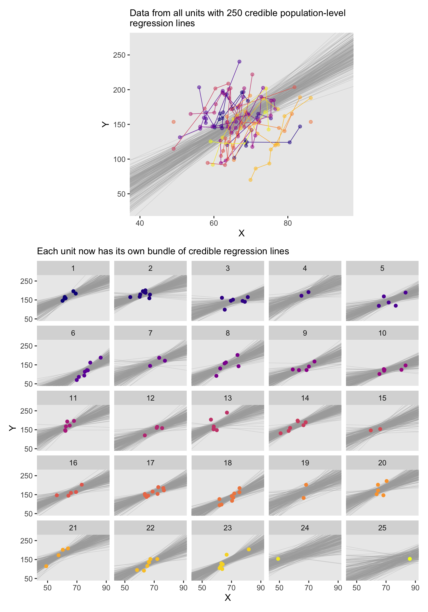<!-- -->

Especially if you're new to these kinds of models, it's easy to get lost in all that code. And for real--the wrangling required for those plots was no joke. The primary difficulty was that we had to convert standardized solutions to unstandardized solutions, which leads to an important distinction. When we used the first method of working with the `posterior_samples()` and `coef()` output, we focused on **transforming the model parameters**. In contrast, when we used the second method of working with the `fitted()` output, we focused instead on **transforming the model predictions and predictor values**. This distinction can be really confusing, at first. Stick with it! There will be times one method is more convenient or intuitive than the other. It's good to have both methods in your repertoire. 

## Quadratic trend and weighted data

Quadratic models follow the general form

$$y = \beta_0 + \beta_1 x + \beta_2 x^2,$$

where $\beta_2$ is the quadratic term which, when 0, reduces the results to a simple linear model. That's right; the linear model is a special case of the quadratic.

This time the data come from the American Community Survey and Puerto Rico Community Survey. Note the `comment` argument.


```r
my_data <- read_csv("data.R/IncomeFamszState3yr.csv",
                    comment = "#")

glimpse(my_data)
```

```
## Observations: 312
## Variables: 4
## $ FamilySize   <dbl> 2, 3, 4, 5, 6, 7, 2, 3, 4, 5, 6, 7, 2, 3, 4, 5, 6, 7, 2, 3, 4, 5, 6, 7, 2, 3…
## $ State        <chr> "Alabama", "Alabama", "Alabama", "Alabama", "Alabama", "Alabama", "Alaska", …
## $ MedianIncome <dbl> 48177, 53323, 64899, 59417, 54099, 47655, 73966, 82276, 87726, 87216, 84488,…
## $ SampErr      <dbl> 581, 1177, 1170, 2446, 3781, 3561, 1858, 3236, 3722, 6127, 6761, 5754, 590, …
```

Here we'll standardize all variables but `State`, our grouping variable. It'd be silly to try to standardize that.


```r
my_data <-
  my_data %>% 
  mutate(family_size_z   = standardize(FamilySize),
         median_income_z = standardize(MedianIncome),
         se_z            = SampErr / (mean(SampErr)))

glimpse(my_data)
```

```
## Observations: 312
## Variables: 7
## $ FamilySize      <dbl> 2, 3, 4, 5, 6, 7, 2, 3, 4, 5, 6, 7, 2, 3, 4, 5, 6, 7, 2, 3, 4, 5, 6, 7, 2…
## $ State           <chr> "Alabama", "Alabama", "Alabama", "Alabama", "Alabama", "Alabama", "Alaska…
## $ MedianIncome    <dbl> 48177, 53323, 64899, 59417, 54099, 47655, 73966, 82276, 87726, 87216, 844…
## $ SampErr         <dbl> 581, 1177, 1170, 2446, 3781, 3561, 1858, 3236, 3722, 6127, 6761, 5754, 59…
## $ family_size_z   <dbl> -1.4615023, -0.8769014, -0.2923005, 0.2923005, 0.8769014, 1.4615023, -1.4…
## $ median_income_z <dbl> -1.26216763, -0.91386251, -0.13034520, -0.50139236, -0.86133924, -1.29749…
## $ se_z            <dbl> 0.2242541, 0.4542979, 0.4515961, 0.9441060, 1.4593886, 1.3744731, 0.71715…
```

With **brms**, there are a couple ways to handle measurement error on a variable (e.g., see [Chapter 14 of this **bookdown** project](https://bookdown.org/content/1850/missing-data-and-other-opportunities.html)). Here we'll use the `se()` syntax, following the form `response | se(se_response, sigma = TRUE)`. In this form, `se` stands for standard error, the loose frequentist analogue to the Bayesian posterior $SD$. Unless you're fitting a meta-analysis on summary information, make sure to specify `sigma = TRUE`. Without that you'll have no estimate for $\sigma$! For more information on the `se()` method, go to the [**brms** reference manual](https://cran.r-project.org/web/packages/brms/brms.pdf) and find the *Additional response information* subsection of the `brmsformula` section.


```r
fit5 <-
  brm(data = my_data,
      family = student,
      median_income_z | se(se_z, sigma = TRUE) ~ 1 + family_size_z +  I(family_size_z^2) + 
        (1 + family_size_z +  I(family_size_z^2) || State),
      prior = c(prior(normal(0, 10), class = Intercept),
                prior(normal(0, 10), class = b),
                prior(normal(0, 1), class = sigma),
                prior(normal(0, 1), class = sd),
                prior(exponential(one_over_twentynine), class = nu)),
      chains = 4, cores = 4,
      stanvars = stanvar(1/29, name = "one_over_twentynine"),
      seed = 17)
```

Did you notice the `I(family_size_z^2)` part of the `formula`? The **brms** package follows a typical convention in **R** statistical functions in that if you want to multiply a variable by itself as in a quadratic model, you nest the `family_size_z^2` part within the `I()` function.

Take a look at the model summary.


```r
print(fit5)
```

```
##  Family: student 
##   Links: mu = identity; sigma = identity; nu = identity 
## Formula: median_income_z | se(se_z, sigma = TRUE) ~ 1 + family_size_z + I(family_size_z^2) + (1 + family_size_z + I(family_size_z^2) || State) 
##    Data: my_data (Number of observations: 312) 
## Samples: 4 chains, each with iter = 2000; warmup = 1000; thin = 1;
##          total post-warmup samples = 4000
## 
## Group-Level Effects: 
## ~State (Number of levels: 52) 
##                      Estimate Est.Error l-95% CI u-95% CI Rhat Bulk_ESS Tail_ESS
## sd(Intercept)            0.75      0.09     0.61     0.94 1.00     1092     2003
## sd(family_size_z)        0.07      0.04     0.00     0.16 1.00      925     1380
## sd(Ifamily_size_zE2)     0.05      0.04     0.00     0.13 1.01      678     1250
## 
## Population-Level Effects: 
##                  Estimate Est.Error l-95% CI u-95% CI Rhat Bulk_ESS Tail_ESS
## Intercept            0.39      0.12     0.16     0.63 1.00      561     1049
## family_size_z        0.12      0.05     0.02     0.23 1.00     3058     2293
## Ifamily_size_zE2    -0.44      0.04    -0.52    -0.36 1.00     3508     2803
## 
## Family Specific Parameters: 
##       Estimate Est.Error l-95% CI u-95% CI Rhat Bulk_ESS Tail_ESS
## sigma     0.05      0.04     0.00     0.14 1.00     2345     1872
## nu       68.95     36.56    21.41   160.29 1.00     6386     2542
## 
## Samples were drawn using sampling(NUTS). For each parameter, Eff.Sample 
## is a crude measure of effective sample size, and Rhat is the potential 
## scale reduction factor on split chains (at convergence, Rhat = 1).
```

Do see that `Ifamily_size_zE2` row? That's the summary of our quadratic term.

### Results and interpretation.

A new model type requires a different approach to un-standardizing our standardized coefficients. Based on Equation 17.3, we can convert our coefficients using the formulas

\begin{align*}
\beta_0 & = \zeta_0 \operatorname{SD}_y + M_y - \frac{\zeta_1 M_x \operatorname{SD}_y}{\operatorname{SD}_x} + \frac{\zeta_2 M^{2}_x \operatorname{SD}_y}{\operatorname{SD}^{2}_x}, \\
\beta_1 & = \frac{\zeta_1 \operatorname{SD}_y}{\operatorname{SD}_x} - \frac{2 \zeta_2 M_x \operatorname{SD}_y}{\operatorname{SD}^{2}_x}, \text{and} \\
\beta_2 & = \frac{\zeta_2 \operatorname{SD}_y}{\operatorname{SD}^{2}_x}.
\end{align*}

We'll make new custom functions to use them.


```r
make_beta_0 <- function(zeta_0, zeta_1, zeta_2, sd_x, sd_y, m_x, m_y) {
  zeta_0 * sd_y + m_y - zeta_1 * m_x * sd_y / sd_x + zeta_2 * m_x^2 * sd_y / sd_x^2
  }

make_beta_1 <- function(zeta_1, zeta_2, sd_x, sd_y, m_x) {
  zeta_1 * sd_y / sd_x - 2 * zeta_2 * m_x * sd_y / sd_x^2
}

make_beta_2 <- function(zeta_2, sd_x, sd_y) {
  zeta_2 * sd_y / sd_x^2
}

# may as well respecify these, too
m_x  <- mean(my_data$FamilySize)
m_y  <- mean(my_data$MedianIncome)
sd_x <- sd(my_data$FamilySize)
sd_y <- sd(my_data$MedianIncome)
```

Now we'll extract our posterior samples and make the conversions.


```r
post <- 
  posterior_samples(fit5) %>% 
  transmute(b_0 = make_beta_0(zeta_0 = b_Intercept,
                              zeta_1 = b_family_size_z,
                              zeta_2 = b_Ifamily_size_zE2,
                              sd_x   = sd_x,
                              sd_y   = sd_y,
                              m_x    = m_x,
                              m_y    = m_y),
            b_1 = make_beta_1(zeta_1 = b_family_size_z,
                              zeta_2 = b_Ifamily_size_zE2,
                              sd_x   = sd_x,
                              sd_y   = sd_y,
                              m_x    = m_x),
            b_2 = make_beta_2(zeta_2 = b_Ifamily_size_zE2,
                              sd_x   = sd_x,
                              sd_y   = sd_y))
```

Our `geom_abline()` approach from before won't work with curves. We'll have to resort to `geom_line()`. With the `geom_line()` approach, we'll need many specific values of model-implied `MedianIncome` across a densely-packed range of `FamilySize`. We want to use a lot of `FamilySize` values, like 30 or 50 or so, to make sure the curves look smooth. Below, we'll use 50 (i.e., `length.out = 50`). But if it's still not clear why, try plugging in a lesser value, like 5 or so. You'll see.


```r
# how many posterior lines would you like?
n_lines <- 200

set.seed(17)
post <-
  post %>% 
  sample_n(size = n_lines) %>% 
  rownames_to_column(var = "draw") %>% 
  expand(nesting(draw, b_0, b_1, b_2),
         FamilySize = seq(from = 1, to = 9, length.out = 50)) %>% 
  mutate(MedianIncome = b_0 + b_1 * FamilySize + b_2 * FamilySize^2)

head(post)
```

```
## # A tibble: 6 x 6
##   draw     b_0    b_1    b_2 FamilySize MedianIncome
##   <chr>  <dbl>  <dbl>  <dbl>      <dbl>        <dbl>
## 1 1     25517. 19003. -1947.       1          42574.
## 2 1     25517. 19003. -1947.       1.16       44989.
## 3 1     25517. 19003. -1947.       1.33       47300.
## 4 1     25517. 19003. -1947.       1.49       49507.
## 5 1     25517. 19003. -1947.       1.65       51611.
## 6 1     25517. 19003. -1947.       1.82       53611.
```

Now we're ready to make the top panel of Figure 17.7. 


```r
my_data %>%
  ggplot(aes(x = FamilySize, y = MedianIncome)) +
  geom_line(data = post,
            aes(group = draw),
            size  = 1/4, alpha = 1/3, color = "grey67") +
  geom_line(aes(group = State),
            alpha = 1/2, size = 1/4) +
  geom_point(alpha = 1/2, size = 1/2) +
  scale_color_viridis_c() +
  scale_x_continuous("Family size", breaks = 1:8) +
  coord_cartesian(xlim = 1:8,
                  ylim = 0:150000) +
  labs(title = "All states",
       y     = "Median income")
```

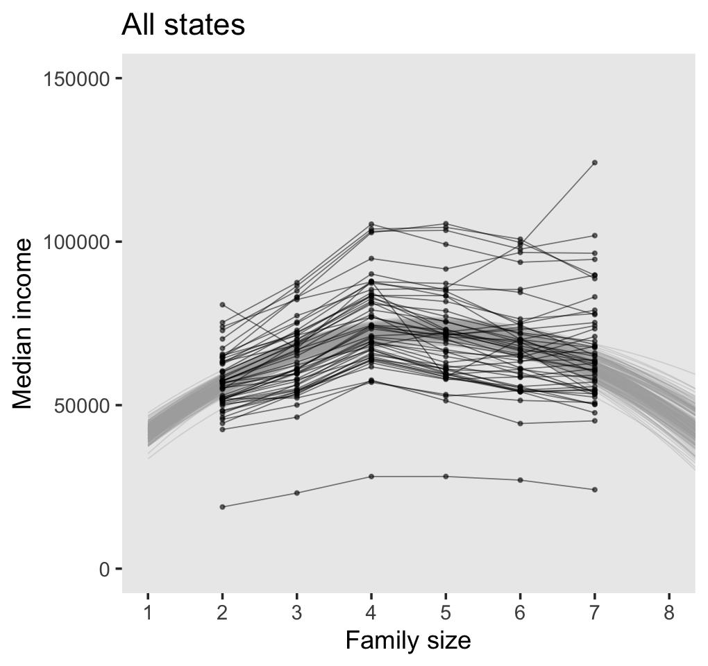<!-- -->

Like before, we'll extract the group-level coefficients (i.e., those specific to the `State`s) with the `coef()` function. And also like before, the `coef()` output will require a little wrangling.


```r
c <-
  # collect the `State`-level intercepts
  coef(fit5, summary = F)$State[, , "Intercept"] %>% 
  as_tibble() %>% 
  gather(State, Intercept) %>% 
  # add the `State`-level `family_size_z` slopes
  bind_cols(
    coef(fit5, summary = F)$State[, , "family_size_z"] %>% 
      as_tibble() %>% 
      gather(Subj, family_size_z) %>% 
      select(family_size_z)
  ) %>% 
  # add the `State`-level `Ifamily_size_zE2` slopes
  bind_cols(
    coef(fit5, summary = F)$State[, , "Ifamily_size_zE2"] %>% 
      as_tibble() %>% 
      gather(Subj, Ifamily_size_zE2) %>% 
      select(Ifamily_size_zE2)
  ) %>% 
  # let's go ahead and make the standardized-to-unstandardized conversions, here
  mutate(b_0 = make_beta_0(zeta_0 = Intercept,
                           zeta_1 = family_size_z,
                           zeta_2 = Ifamily_size_zE2,
                           sd_x   = sd_x,
                           sd_y   = sd_y,
                           m_x    = m_x,
                           m_y    = m_y),
         b_1 = make_beta_1(zeta_1 = family_size_z,
                           zeta_2 = Ifamily_size_zE2,
                           sd_x   = sd_x,
                           sd_y   = sd_y,
                           m_x    = m_x),
         b_2 = make_beta_2(zeta_2 = Ifamily_size_zE2,
                           sd_x   = sd_x,
                           sd_y   = sd_y)) %>% 
  # We just want the first 25 states, from Alabama through Mississippi, so we'll `filter()`
  filter(State <= "Mississippi")

str(c)
```

```
## Classes 'tbl_df', 'tbl' and 'data.frame':	100000 obs. of  7 variables:
##  $ State           : chr  "Alabama" "Alabama" "Alabama" "Alabama" ...
##  $ Intercept       : num  -0.1123 -0.181 0.0925 -0.308 -0.434 ...
##  $ family_size_z   : num  -0.0423 0.0359 0.1572 0.1319 0.1026 ...
##  $ Ifamily_size_zE2: num  -0.487 -0.45 -0.488 -0.377 -0.251 ...
##  $ b_0             : num  17051 16740 12164 18649 30718 ...
##  $ b_1             : num  21750 20761 23544 18250 12311 ...
##  $ b_2             : num  -2457 -2272 -2465 -1901 -1270 ...
```

Now we'll subset by `n_lines`, `expand()` by `FamilySize`, and use the model formula to compute the expected `MedianIncome` values.


```r
# how many posterior lines would you like?
n_lines <- 200

set.seed(17)
c <-
  c %>% 
  group_by(State) %>% 
  sample_n(size = n_lines) %>%
  mutate(draw = 1:n_lines) %>% 
  expand(nesting(draw, State, b_0, b_1, b_2),
         FamilySize = seq(from = 1, to = 9, length.out = 50)) %>% 
  mutate(MedianIncome = b_0 + b_1 * FamilySize + b_2 * FamilySize^2)

head(c)
```

```
## # A tibble: 6 x 7
## # Groups:   State [1]
##    draw State      b_0    b_1    b_2 FamilySize MedianIncome
##   <int> <chr>    <dbl>  <dbl>  <dbl>      <dbl>        <dbl>
## 1     1 Alabama 15959. 21584. -1941.       1          35602.
## 2     1 Alabama 15959. 21584. -1941.       1.16       38440.
## 3     1 Alabama 15959. 21584. -1941.       1.33       41175.
## 4     1 Alabama 15959. 21584. -1941.       1.49       43807.
## 5     1 Alabama 15959. 21584. -1941.       1.65       46335.
## 6     1 Alabama 15959. 21584. -1941.       1.82       48759.
```

Finally, we're ready for the `State`-specific miniatures in Figure 17.7.


```r
my_data %>%
  filter(State <= "Mississippi") %>% 
 
  ggplot(aes(x = FamilySize, y = MedianIncome)) +
  geom_line(data = c,
            aes(group = draw),
            size  = 1/4, alpha = 1/3, color = "grey67") +
  geom_point(aes(color = State)) +
  geom_line(aes(color = State)) +
  scale_color_viridis_d() +
  scale_x_continuous(breaks = 1:8) +
  coord_cartesian(xlim = 1:8,
                  ylim = 0:150000) +
  labs(subtitle = "Each State now has its own bundle of credible regression curves.",
       x = "Family size",
       y = "Median income") +
  theme(legend.position = "none") +
  facet_wrap(~State)
```

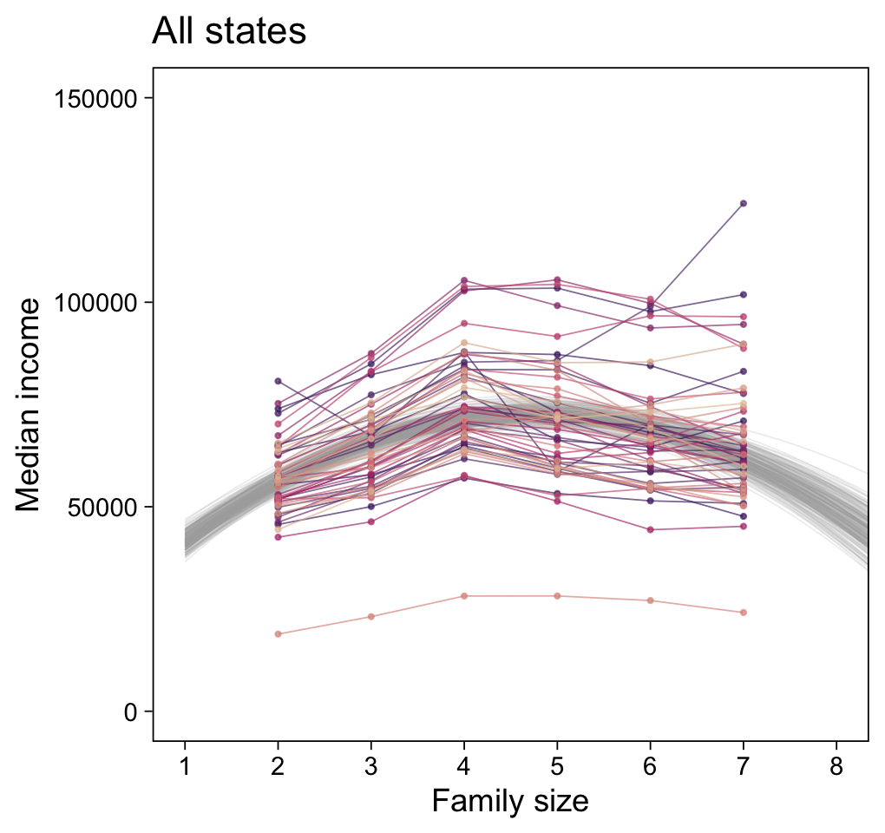<!-- -->

Magic! As our model coefficients proliferate, the `fitted()` approach from above starts to look more and more appetizing. Check it out for yourself.

Although "almost all of the posterior distribution [was] below $\nu = 4$" in the text (p. 500), the bulk of our $\nu$ distribution spanned across much larger values.


```r
posterior_samples(fit5) %>%
  ggplot(aes(x = nu)) +
  geom_histogram(color = "grey92", fill = "grey67",
                 size = .2, bins = 40, boundary = 1) +
  stat_pointintervalh(aes(y = 0), 
                      point_interval = mode_hdi, .width = c(.95, .5)) +
  scale_y_continuous(NULL, breaks = NULL) +
  labs(title = expression(paste("Our big ", nu)),
       x     = NULL)
```

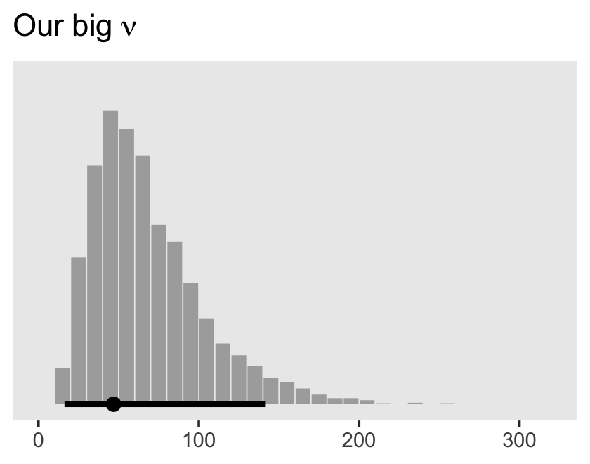<!-- -->

I'm guessing the distinction in our $\nu$ distribution and that in the text is our use of the `se()` syntax in the `brm()` `formula`. If you have a better explanation, [share it](https://github.com/ASKurz/Doing-Bayesian-Data-Analysis-in-brms-and-the-tidyverse/issues).

### Further extensions.

Kruschke discussed the ease with which users of Bayesian software might specify nonlinear models. Check out Bürkner’s vignette, [*Estimating Non-Linear Models with brms*](https://cran.r-project.org/web/packages/brms/vignettes/brms_nonlinear.html) for more on the topic. Though I haven't used it, I believe it is also possible to use the $t$ distribution to model group-level variation in **brms** (see [this GitHub discussion](https://github.com/paul-buerkner/brms/issues/231) for details).

## Procedure and perils for expanding a model

Across several chapters, we've already dipped our toes into posterior predictive checks. For more on the PPC "double dipping" issue, check out Gelman's [*Discussion with Sander Greenland on posterior predictive checks*](http://andrewgelman.com/2014/08/11/discussion-sander-greenland-posterior-predictive-checks/) or Simpson's [*Touch me, I want to feel your data*](http://andrewgelman.com/2017/09/07/touch-want-feel-data/), which is itself connected to Gabry and colleagues' [*Visualization in Bayesian workflow*](https://arxiv.org/abs/1709.01449).

## Reference {-}

[Kruschke, J. K. (2015). *Doing Bayesian data analysis, Second Edition: A tutorial with R, JAGS, and Stan.* Burlington, MA: Academic Press/Elsevier.](https://sites.google.com/site/doingbayesiandataanalysis/)

## Session info {-}


```r
sessionInfo()
```

```
## R version 3.6.0 (2019-04-26)
## Platform: x86_64-apple-darwin15.6.0 (64-bit)
## Running under: macOS High Sierra 10.13.6
## 
## Matrix products: default
## BLAS:   /Library/Frameworks/R.framework/Versions/3.6/Resources/lib/libRblas.0.dylib
## LAPACK: /Library/Frameworks/R.framework/Versions/3.6/Resources/lib/libRlapack.dylib
## 
## locale:
## [1] en_US.UTF-8/en_US.UTF-8/en_US.UTF-8/C/en_US.UTF-8/en_US.UTF-8
## 
## attached base packages:
## [1] stats     graphics  grDevices utils     datasets  methods   base     
## 
## other attached packages:
##  [1] bayesplot_1.7.0 tidybayes_1.1.0 brms_2.10.3     Rcpp_1.0.2      forcats_0.4.0   stringr_1.4.0  
##  [7] dplyr_0.8.3     purrr_0.3.3     readr_1.3.1     tidyr_1.0.0     tibble_2.1.3    ggplot2_3.2.1  
## [13] tidyverse_1.2.1
## 
## loaded via a namespace (and not attached):
##   [1] colorspace_1.4-1          ellipsis_0.3.0            ggridges_0.5.1           
##   [4] rsconnect_0.8.15          ggstance_0.3.2            markdown_1.1             
##   [7] base64enc_0.1-3           rstudioapi_0.10           rstan_2.19.2             
##  [10] svUnit_0.7-12             DT_0.9                    fansi_0.4.0              
##  [13] lubridate_1.7.4           xml2_1.2.0                bridgesampling_0.7-2     
##  [16] knitr_1.23                shinythemes_1.1.2         zeallot_0.1.0            
##  [19] jsonlite_1.6              broom_0.5.2               shiny_1.3.2              
##  [22] compiler_3.6.0            httr_1.4.0                backports_1.1.5          
##  [25] assertthat_0.2.1          Matrix_1.2-17             lazyeval_0.2.2           
##  [28] cli_1.1.0                 later_1.0.0               htmltools_0.4.0          
##  [31] prettyunits_1.0.2         tools_3.6.0               igraph_1.2.4.1           
##  [34] coda_0.19-3               gtable_0.3.0              glue_1.3.1.9000          
##  [37] reshape2_1.4.3            cellranger_1.1.0          vctrs_0.2.0              
##  [40] nlme_3.1-139              crosstalk_1.0.0           xfun_0.10                
##  [43] ps_1.3.0                  rvest_0.3.4               mime_0.7                 
##  [46] miniUI_0.1.1.1            lifecycle_0.1.0           gtools_3.8.1             
##  [49] MASS_7.3-51.4             zoo_1.8-6                 scales_1.0.0             
##  [52] colourpicker_1.0          hms_0.4.2                 promises_1.1.0           
##  [55] Brobdingnag_1.2-6         parallel_3.6.0            inline_0.3.15            
##  [58] shinystan_2.5.0           yaml_2.2.0                gridExtra_2.3            
##  [61] loo_2.1.0                 StanHeaders_2.19.0        stringi_1.4.3            
##  [64] dygraphs_1.1.1.6          pkgbuild_1.0.5            rlang_0.4.1              
##  [67] pkgconfig_2.0.3           matrixStats_0.55.0        HDInterval_0.2.0         
##  [70] evaluate_0.14             lattice_0.20-38           rstantools_2.0.0         
##  [73] htmlwidgets_1.5           labeling_0.3              tidyselect_0.2.5         
##  [76] processx_3.4.1            plyr_1.8.4                magrittr_1.5             
##  [79] R6_2.4.0                  generics_0.0.2            pillar_1.4.2             
##  [82] haven_2.1.0               withr_2.1.2               xts_0.11-2               
##  [85] abind_1.4-5               modelr_0.1.4              crayon_1.3.4             
##  [88] arrayhelpers_1.0-20160527 utf8_1.1.4                rmarkdown_1.13           
##  [91] grid_3.6.0                readxl_1.3.1              callr_3.3.2              
##  [94] threejs_0.3.1             digest_0.6.21             xtable_1.8-4             
##  [97] httpuv_1.5.2              stats4_3.6.0              munsell_0.5.0            
## [100] viridisLite_0.3.0         shinyjs_1.0
```


