# Metric Predicted Variable with Multiple Metric Predictors

> We will consider models in which the predicted variable is an additive combination of predictors, all of which have proportional influence on the prediction. This kind of model is called *multiple linear regression*. We will also consider nonadditive combinations of predictors, which are called *interactions*. (p. 509, *emphasis* in the original)

## Multiple linear regression

If $y \sim \operatorname{Normal} (\mu, \sigma)$ and $\mu = \beta_0 + \beta_1 x_1 + \beta_2 x_2$, then it's also the case that we can rewrite the formula for $y$ as

$$y \sim \operatorname{Normal} (\beta_0 + \beta_1 x_1 + \beta_2 x_2, \sigma).$$

As Kruschke pointed out, the basic model "assumes homogeneity of variance, which means that at all values of $x_1$ and $x_2$, the variance $\sigma^2$ of $y$ is the same" (p. 510).

If we presume the data for the two $x$ variables are uniformly distributed within 0 and 10, we can make the data for Figure 18.1 like this.


```r
library(tidyverse)

n <- 300

set.seed(18)
d <-
  tibble(x_1 = runif(n = n, 0, 10),
         x_2 = runif(n = n, 0, 10)) %>% 
  mutate(y   = rnorm(n = n, mean = 10 + x_1 + 2 * x_2))

head(d)  
```

```
## # A tibble: 6 x 3
##     x_1   x_2     y
##   <dbl> <dbl> <dbl>
## 1 8.23   8.62  36.9
## 2 7.10   1.33  20.3
## 3 9.66   1.08  19.5
## 4 0.786  7.09  25.1
## 5 0.536  6.67  25.6
## 6 5.75   4.72  25.7
```

Here are three of the scatter plots in Figure 18.1.


```r
theme_set(theme_grey() +
            theme(panel.grid = element_blank()))

d %>% 
  ggplot(aes(x = x_1, y = y)) +
  geom_point(alpha = 2/3) +
  coord_cartesian(ylim = 0:50)
```

<!-- -->

```r
d %>% 
  ggplot(aes(x = x_2, y = y)) +
  geom_point(alpha = 2/3) +
  coord_cartesian(ylim = 0:50)
```

<!-- -->

```r
d %>% 
  ggplot(aes(x = x_1, y = x_2)) +
  geom_vline(xintercept = seq(from = 0, to = 10, by = .5), color = "grey98") +
  geom_hline(yintercept = seq(from = 0, to = 10, by = .5), color = "grey98") +
  geom_point(alpha = 2/3)
```

<!-- -->

As in previous chapters, I'm not aware that **ggplot2** allows for three-dimensional wireframe plots of the kind in the upper left panel. If you'd like to make one in base **R**, have at it. But with respect to the plots in the off-diagonal, I have no idea what Kruschke did with the compressed and diagonal grids. If you have that figured out, please [share your code](https://github.com/ASKurz/Doing-Bayesian-Data-Analysis-in-brms-and-the-tidyverse/issues). 

For Figure 18.2, the $x$ variables look to be multivariate normal with a correlation of about -.95. We can simulate such data with help from the **MASS** package.

Sven Hohenstein's [answer to this stats.stackexchange.com question](https://stats.stackexchange.com/questions/164471/generating-a-simulated-dataset-from-a-correlation-matrix-with-means-and-standard) provides the steps for simulating the data. First, we'll need to specify the desired means and standard deviations for our variables. Then we'll make a correlation matrix with 1s on the diagonal and the desired correlation coefficient, $\rho$ on the off-diagonal. Since the correlation matrix is symmetric, both off-diagonal positions are the same. Then we convert the correlation matrix to a covariance matrix.


```r
mus <- c(5, 5)
sds <- c(2, 2)

cors <- matrix(c(1, -.95,
                 -.95, 1), 
               ncol = 2)
cors
```

```
##       [,1]  [,2]
## [1,]  1.00 -0.95
## [2,] -0.95  1.00
```

```r
covs <- sds %*% t(sds) * cors
covs
```

```
##      [,1] [,2]
## [1,]  4.0 -3.8
## [2,] -3.8  4.0
```

Now we've defined our means, standard deviations, and covariance matrix, we're ready to simulate the data with the `MASS::mvrnorm()` function.


```r
# how many data points would you like to simulate?
n <- 300

set.seed(18.2)

d <- 
  MASS::mvrnorm(n         = n, 
                mu        = mus, 
                Sigma     = covs, 
                empirical = T) %>% 
  as_tibble() %>% 
  set_names("x_1", "x_2") %>%  
  mutate(y = rnorm(n = n, mean = 10 + x_1 + 2 * x_2))
```

Now we have our simulated data in hand, we're ready for three of the four panels of Figure 18.2.


```r
d %>% 
  ggplot(aes(x = x_1, y = y)) +
  geom_point(alpha = 2/3) +
  coord_cartesian(xlim = 0:10,
                  ylim = 0:50)
```

<!-- -->

```r
d %>% 
  ggplot(aes(x = x_2, y = y)) +
  geom_point(alpha = 2/3) +
  coord_cartesian(xlim = 0:10,
                  ylim = 0:50)
```

<!-- -->

```r
d %>% 
  ggplot(aes(x = x_1, y = x_2)) +
  geom_vline(xintercept = seq(from = 0, to = 10, by = .5), color = "grey98") +
  geom_hline(yintercept = seq(from = 0, to = 10, by = .5), color = "grey98") +
  geom_point(alpha = 2/3) +
  coord_cartesian(xlim = 0:10,
                  ylim = 0:10)
```

<!-- -->

Pretty close.

### The perils of correlated predictors.

> Figures 18.1 and 18.2 show data generated from the same model. In both figures, $\sigma = 2, \beta_0 = 10, \beta_1 = 1, \text{ and } \beta_2 = 2$. All that differs between the two figures is the distribution of the $\langle x_1, x_2 \rangle$ values, which is not specified by the model. In Figure 18.1, the $\langle x_1, x_2 \rangle$ values are distributed independently. In Figure 18.2, the $\langle x_1, x_2 \rangle$ values are negatively correlated: When $x_1$ is small, $x_2$ tends to be large, and when $x_1$ is large, $x_2$ tends to be small. (p. 510)

If you look closely at our simulation code from above, you'll see we have done so, too.

> Real data often have correlated predictors. For example, consider trying to predict a state's average high-school SAT score on the basis of the amount of money the state spends per pupil. If you plot only mean SAT against money spent, there is actually a *decreasing* trend... (p. 513, *emphasis* in the original)

Before we remake Figure 18.3 to examine that decreasing trend, we'll need to load the data.


```r
my_data <- read_csv("data.R/Guber1999data.csv")

glimpse(my_data)
```

```
## Observations: 50
## Variables: 8
## $ State     <chr> "Alabama", "Alaska", "Arizona", "Arkansas", "Californi…
## $ Spend     <dbl> 4.405, 8.963, 4.778, 4.459, 4.992, 5.443, 8.817, 7.030…
## $ StuTeaRat <dbl> 17.2, 17.6, 19.3, 17.1, 24.0, 18.4, 14.4, 16.6, 19.1, …
## $ Salary    <dbl> 31.144, 47.951, 32.175, 28.934, 41.078, 34.571, 50.045…
## $ PrcntTake <dbl> 8, 47, 27, 6, 45, 29, 81, 68, 48, 65, 57, 15, 13, 58, …
## $ SATV      <dbl> 491, 445, 448, 482, 417, 462, 431, 429, 420, 406, 407,…
## $ SATM      <dbl> 538, 489, 496, 523, 485, 518, 477, 468, 469, 448, 482,…
## $ SATT      <dbl> 1029, 934, 944, 1005, 902, 980, 908, 897, 889, 854, 88…
```

Now we have the [Guber (1999)](https://pdfs.semanticscholar.org/29c3/0e9dc77b56340faa5e6ad35e0741a5a83d49.pdf) data, here are three of the four plots.


```r
my_data %>% 
  ggplot(aes(x = Spend, y = SATT)) +
  geom_point(alpha = 2/3) +
  coord_cartesian(ylim = 800:1120)
```

<!-- -->

```r
my_data %>% 
  ggplot(aes(x = PrcntTake, y = SATT)) +
  geom_point(alpha = 2/3) +
  xlab("% Take") +
  coord_cartesian(ylim = 800:1120)
```

<!-- -->

```r
my_data %>% 
  ggplot(aes(x = PrcntTake, y = Spend)) +
  geom_vline(xintercept = seq(from = 5,   to = 80, by = 5), color = "grey98") +
  geom_hline(yintercept = seq(from = 3.5, to = 10, by = .5), color = "grey98") +
  geom_point(alpha = 2/3) +
  xlab("% Take")
```

<!-- -->

### The model and implementation.

We'll make a custom function to standardize the criterion and predictor values.


```r
standardize <- function(x) {
  (x - mean(x)) / sd(x)
  }

my_data <-
  my_data %>% 
  mutate(prcnt_take_z = standardize(PrcntTake),
         spend_z      = standardize(Spend),
         satt_z       = standardize(SATT))
```

Let's open **brms**.


```r
library(brms)
```

Now we're ready to fit the model. As Kruschke pointed out, the priors on the standardized predictors are set with

> an arbitrary standard deviation of 2.0. This value was chosen because standardized regression coefficients are algebraically constrained to fall between −1 and +1 in least-squares regression, and therefore, the regression coefficients will not exceed those limits by much. A normal distribution with standard deviation of 2.0 is reasonably flat over the range from −1 to +1. (p. 516)

With data like this, even a `prior(normal(0, 1), class = b)` would be only mildly regularizing.

This is a good place to emphasize how priors in **brms** are given classes. If you'd like all parameters within a given class to have the prior, you can just specify one prior argument within that class. For our `fit1`, both parameters of `class = b` have a `normal(0, 2)` prior. So we can just include one statement to handle both. Had we wanted different priors for the coefficients for `spend_z` and `prcnt_take_z`, we'd need to include two `prior()` arguments with at least one including a `coef` argument.


```r
fit1 <-
  brm(data = my_data,
      family = student,
      satt_z ~ 1 + spend_z + prcnt_take_z,
      prior = c(prior(normal(0, 2), class = Intercept),
                prior(normal(0, 2), class = b),
                prior(normal(0, 1), class = sigma),
                prior(exponential(one_over_twentynine), class = nu)),
      chains = 4, cores = 4,
      stanvars = stanvar(1/29, name = "one_over_twentynine"),
      seed = 18)
```

Check the model summary.


```r
print(fit1)
```

```
##  Family: student 
##   Links: mu = identity; sigma = identity; nu = identity 
## Formula: satt_z ~ 1 + spend_z + prcnt_take_z 
##    Data: my_data (Number of observations: 50) 
## Samples: 4 chains, each with iter = 2000; warmup = 1000; thin = 1;
##          total post-warmup samples = 4000
## 
## Population-Level Effects: 
##              Estimate Est.Error l-95% CI u-95% CI Rhat Bulk_ESS Tail_ESS
## Intercept        0.00      0.06    -0.12     0.13 1.00     4222     2585
## spend_z          0.23      0.08     0.08     0.38 1.00     3599     2990
## prcnt_take_z    -1.03      0.08    -1.18    -0.87 1.00     3490     3160
## 
## Family Specific Parameters: 
##       Estimate Est.Error l-95% CI u-95% CI Rhat Bulk_ESS Tail_ESS
## sigma     0.42      0.05     0.32     0.53 1.00     3523     2413
## nu       33.07     27.90     4.27   107.31 1.00     3398     2360
## 
## Samples were drawn using sampling(NUTS). For each parameter, Eff.Sample 
## is a crude measure of effective sample size, and Rhat is the potential 
## scale reduction factor on split chains (at convergence, Rhat = 1).
```

So when we use a multivariable model, increases in spending now appear associated with *increases* in SAT scores.

### The posterior distribution.

Based on equation 18.1, we can convert the standardized coefficients from our multivariable model back to their original metric as follows:

\begin{align*}
\beta_0 & = \operatorname{SD}_y \zeta_0 + M_y - \operatorname{SD}_y \sum_j \frac{\zeta_j M_{x_j}}{\operatorname{SD}_{x_j}} \;\;\; \text{and} \\
\beta_j & = \frac{\operatorname{SD}_y \zeta_j}{\operatorname{SD}_{x_j}}.
\end{align*}

To use them, we'll first extract the posterior samples.


```r
post <- posterior_samples(fit1)

head(post)
```

```
##   b_Intercept b_spend_z b_prcnt_take_z     sigma        nu      lp__
## 1  0.03332938 0.2246157      -1.044109 0.4381914 58.891563 -35.40259
## 2 -0.05051637 0.2270969      -1.076683 0.3759888 13.331876 -35.92027
## 3 -0.04916057 0.2770627      -1.092591 0.3992656 18.839407 -35.58017
## 4  0.01043252 0.3638677      -1.141387 0.4167015  5.558774 -37.95336
## 5  0.02980380 0.3671874      -1.262402 0.4401791 29.336185 -39.44394
## 6  0.00317025 0.3080994      -1.259354 0.4584194 46.137031 -39.81174
```

Like we did in Chapter 17, let's wrap the consequences of Equation 18.1 into two functions.


```r
make_beta_0 <- function(zeta_0, zeta_1, zeta_2, sd_x_1, sd_x_2, sd_y, m_x_1, m_x_2, m_y) {
  sd_y * zeta_0 + m_y - sd_y * ((zeta_1 * m_x_1 / sd_x_1) + (zeta_2 * m_x_2 / sd_x_2))
  }

make_beta_j <- function(zeta_j, sd_j, sd_y) {
  sd_y * zeta_j / sd_j
  }
```

After saving a few values, we're ready to use our custom functions.


```r
sd_x_1 <- sd(my_data$Spend)
sd_x_2 <- sd(my_data$PrcntTake)
sd_y   <- sd(my_data$SATT)
m_x_1  <- mean(my_data$Spend)
m_x_2  <- mean(my_data$PrcntTake)
m_y    <- mean(my_data$SATT)

post <-
  post %>% 
  mutate(b_0 = make_beta_0(zeta_0 = b_Intercept,
                           zeta_1 = b_spend_z,
                           zeta_2 = b_prcnt_take_z,
                           sd_x_1 = sd_x_1,
                           sd_x_2 = sd_x_2,
                           sd_y   = sd_y,
                           m_x_1  = m_x_1,
                           m_x_2  = m_x_2,
                           m_y    = m_y),
         b_1 = make_beta_j(zeta_j = b_spend_z,
                           sd_j   = sd_x_1,
                           sd_y   = sd_y),
         b_2 = make_beta_j(zeta_j = b_prcnt_take_z,
                           sd_j   = sd_x_2,
                           sd_y   = sd_y))

glimpse(post)
```

```
## Observations: 4,000
## Variables: 9
## $ b_Intercept    <dbl> 0.033329378, -0.050516372, -0.049160566, 0.010432…
## $ b_spend_z      <dbl> 0.22461570, 0.22709693, 0.27706273, 0.36386773, 0…
## $ b_prcnt_take_z <dbl> -1.0441089, -1.0766835, -1.0925912, -1.1413875, -…
## $ sigma          <dbl> 0.4381914, 0.3759888, 0.3992656, 0.4167015, 0.440…
## $ nu             <dbl> 58.891563, 13.331876, 18.839407, 5.558774, 29.336…
## $ lp__           <dbl> -35.40259, -35.92027, -35.58017, -37.95336, -39.4…
## $ b_0            <dbl> 998.4585, 994.5899, 980.0592, 961.1825, 973.4781,…
## $ b_1            <dbl> 12.331810, 12.468035, 15.211248, 19.977000, 20.15…
## $ b_2            <dbl> -2.919049, -3.010119, -3.054593, -3.191014, -3.52…
```

Here's the top panel of Figure 18.5.


```r
library(tidybayes)

# here are the primary data
post %>% 
  transmute(Intercept      = b_0,
            Spend          = b_1,
            `Percent Take` = b_2,
            Scale          = sigma * sd_y,
            Normality      = nu %>% log10()) %>% 
  gather() %>% 
  
  # the plot
  ggplot(aes(x = value)) +
  geom_histogram(color = "grey92", fill = "grey67",
                 size = .2, bins = 40) +
  stat_pointintervalh(aes(y = 0), 
                      point_interval = mode_hdi, .width = c(.95, .5)) +
  scale_y_continuous(NULL, breaks = NULL) +
  xlab(NULL) +
  facet_wrap(~key, scales = "free", ncol = 3)
```

<!-- -->

> The slope on spending has a mode of about 13, which suggests that SAT scores rise by about 13 points for every extra $1000 spent per pupil. The slope on percentage taking the exam (PrcntTake) is also credibly non-zero, with a mode around −2.8, which suggests that SAT scores fall by about 2.8 points for every additional 1% of students who take the test. (p. 517)

If you want those exact modes and, say, 50% intervals around them, you can just use `tidybayes::mode_hdi()`.


```r
post %>% 
  transmute(Spend          = b_1,
            `Percent Take` = b_2) %>% 
  gather() %>% 
  group_by(key) %>% 
  mode_hdi(value, .width = .5)
```

```
## # A tibble: 2 x 7
##   key          value .lower .upper .width .point .interval
##   <chr>        <dbl>  <dbl>  <dbl>  <dbl> <chr>  <chr>    
## 1 Percent Take -2.86  -3.04  -2.74    0.5 mode   hdi      
## 2 Spend        12.9   10.3   15.9     0.5 mode   hdi
```

The `brms::bayes_R2()` function makes it easy to compute a Bayesian $R^2$. Simply feed a `brm()` fit object into `bayes_R2()` and you'll bet back the posterior mean, $SD$, and 95% intervals.


```r
bayes_R2(fit1)
```

```
##     Estimate  Est.Error      Q2.5     Q97.5
## R2 0.8139321 0.02239821 0.7572305 0.8429055
```

I'm not going to go into the technical details here, but you should be aware that the Bayeisan $R^2$ returned from the `bayes_R2()` function is not calculated the same as it is with OLS. If you want to dive in, check out the paper by [Gelman, Goodrich, Gabry, and Vehtari](https://stat.columbia.edu/~gelman/research/published/bayes_R2_v3.pdf). Anyway, if you'd like to view the Bayesian $R^2$ distribution rather than just get the summaries, specify `summary = F`, convert the output to a tibble, and plot as usual.


```r
bayes_R2(fit1, summary = F) %>% 
  as_tibble() %>% 
  
  ggplot(aes(x = R2)) +
  geom_histogram(color = "grey92", fill = "grey67",
                 size = .2, bins = 25) +
  stat_pointintervalh(aes(y = 0), 
                      point_interval = mode_hdi, .width = .95) +
  scale_y_continuous(NULL, breaks = NULL) +
  labs(subtitle = expression(paste("Bayesian ", italic(R)^2)),
       x = NULL) +
  coord_cartesian(xlim = c(.6, 1))
```

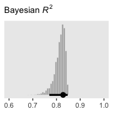<!-- -->

Since the `brms::bayes_R2()` function is not identical with Kruschke’s method in the text, the results might differ a bit.

We can get a sense of the scatter plots with `bayesplot::mcmc_pairs()`.


```r
library(bayesplot)

color_scheme_set("gray")

post %>% 
  transmute(Intercept      = b_0,
            Spend          = b_1,
            `Percent Take` = b_2,
            Scale          = sigma * sd_y,
            Normality      = nu %>% log10()) %>% 
  mcmc_pairs(off_diag_args = list(size = 1/8, alpha = 1/8))
```

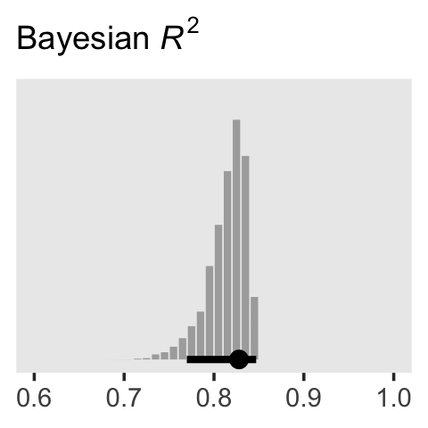<!-- -->

To get the Pearson's correlation coefficients among the parameters, we'll use `psych::lowerCor()`.


```r
post %>% 
  transmute(Intercept      = b_0,
            Spend          = b_1,
            `Percent Take` = b_2,
            Scale          = sigma * sd_y,
            Normality      = nu %>% log10()) %>% 
  psych::lowerCor(digits = 3)
```

```
##              Intrcp Spend  PrcntT Scale  Nrmlty
## Intercept     1.000                            
## Spend        -0.934  1.000                     
## Percent Take  0.349 -0.613  1.000              
## Scale         0.076 -0.083  0.080  1.000       
## Normality     0.099 -0.108  0.089  0.342  1.000
```

Kruschke finished the subsection with the observation: "Sometimes we are interested in using the linear model to predict $y$ values for $x$ values of interest. It is straight forward to generate a large sample of credible $y$ values for specified $x$ values" (p. 519).

Like we practiced with in the last chapter, the simplest way to do so in **brms** is with the `fitted()` function. For a quick example, say we wanted to know what the model would predict if we were to have a standard-score increase in spending and a simultaneous standard-score decrease in the percent taking the exam. We'd just specify those values in a tibble and feed that tibble into `fitted()` along with the model.


```r
nd <-
  tibble(spend_z      =  1,
         prcnt_take_z = -1)

fitted(fit1,
       newdata = nd)
```

```
##      Estimate Est.Error      Q2.5    Q97.5
## [1,] 1.262009 0.1547968 0.9596958 1.568147
```

### Redundant predictors.

> As a simplified example of correlated predictors, think of just two data points: Suppose $y = 1 \text{ for }  \langle x_1, x_2 \rangle = \langle 1, 1 \rangle \text{ and } y = 2 \text{ for } \langle x_1, x_2 \rangle = \langle 2, 2 \rangle$. The linear model, $y = \beta_1 x_1 + \beta_2 x_2$ is supposed to satisfy both data points, and in this case both are satisfied by $1 = \beta_1 + \beta_2$. Therefore, many different combinations of $\beta_1$ and $\beta_2$ satisfy the data. For example, it could be that $\beta_1 = 2$ and $\beta_2 = -1$, or $\beta_1 = 0.5$ and $\beta_2 = 0.5$, or $\beta_1 = 0$ and $\beta_2 = 1$. In other words, the credible values of $\beta_1$ and $\beta_2$ are anticorrelated and trade-off to fit the data. (p. 519)

Here are what those data look like. You would not want to fit a regression model with these data.


```r
tibble(x_1 = 1:2,
       x_2 = 1:2,
       y   = 1:2)
```

```
## # A tibble: 2 x 3
##     x_1   x_2     y
##   <int> <int> <int>
## 1     1     1     1
## 2     2     2     2
```

We can take percentages and turn them into their inverse re-expressed as a proportion.


```r
percent_take <- 37

(100 - percent_take) / 100
```

```
## [1] 0.63
```

Let's make a redundant predictor and then `standardize()` it.


```r
my_data <-
  my_data %>% 
  mutate(prop_not_take   = (100 - PrcntTake) / 100) %>% 
  mutate(prop_not_take_z = standardize(prop_not_take))
  
glimpse(my_data)
```

```
## Observations: 50
## Variables: 13
## $ State           <chr> "Alabama", "Alaska", "Arizona", "Arkansas", "Cal…
## $ Spend           <dbl> 4.405, 8.963, 4.778, 4.459, 4.992, 5.443, 8.817,…
## $ StuTeaRat       <dbl> 17.2, 17.6, 19.3, 17.1, 24.0, 18.4, 14.4, 16.6, …
## $ Salary          <dbl> 31.144, 47.951, 32.175, 28.934, 41.078, 34.571, …
## $ PrcntTake       <dbl> 8, 47, 27, 6, 45, 29, 81, 68, 48, 65, 57, 15, 13…
## $ SATV            <dbl> 491, 445, 448, 482, 417, 462, 431, 429, 420, 406…
## $ SATM            <dbl> 538, 489, 496, 523, 485, 518, 477, 468, 469, 448…
## $ SATT            <dbl> 1029, 934, 944, 1005, 902, 980, 908, 897, 889, 8…
## $ prcnt_take_z    <dbl> -1.0178453, 0.4394222, -0.3078945, -1.0925770, 0…
## $ spend_z         <dbl> -1.10086058, 2.24370805, -0.82716069, -1.0612364…
## $ satt_z          <dbl> 0.8430838, -0.4266207, -0.2929676, 0.5223163, -0…
## $ prop_not_take   <dbl> 0.92, 0.53, 0.73, 0.94, 0.55, 0.71, 0.19, 0.32, …
## $ prop_not_take_z <dbl> 1.0178453, -0.4394222, 0.3078945, 1.0925770, -0.…
```

We're ready to fit the redundant-predictor model.


```r
fit2 <-
  brm(data = my_data,
      family = student,
      satt_z ~ 0 + Intercept + spend_z + prcnt_take_z + prop_not_take_z,
      prior = c(prior(normal(0, 2), class = b, coef = "Intercept"),
                prior(normal(0, 2), class = b, coef = "spend_z"),
                prior(normal(0, 2), class = b, coef = "prcnt_take_z"),
                prior(normal(0, 2), class = b, coef = "prop_not_take_z"),
                prior(normal(0, 1), class = sigma),
                prior(exponential(one_over_twentynine), class = nu)),
      chains = 4, cores = 4,
      stanvars = stanvar(1/29, name = "one_over_twentynine"),
      seed = 18,
      # this will let us use `prior_samples()` later on
      sample_prior = "yes")
```

You might notice a few things about the `brm()` code. First, we have used the `~ 0 + Intercept + ...` syntax instead of the default syntax for intercepts. In normal situations, we would have been in good shape using the typical `~ 1 + ...` syntax for the intercept, especially given our use of standardized data. However, since **brms** version 2.5.0, using the `sample_prior` argument to draw samples from the prior distribution will no longer allow us to return samples from the typical **brms** intercept. Bürkner addressed the issue on the [Stan forums](https://discourse.mc-stan.org/t/prior-intercept-samples-no-longer-saved-in-brms-2-5-0/6107). As he pointed out, if you want to get prior samples from an intercept, you'll have to use the alternative syntax. The other thing to point out is that even though we used the same prior on all the predictors, including the intercept, we still explicitly spelled each out with the `coef` argument. If we hadn't been explicit like this, we would only get a single `b` vector from the `prior_samples()` function. But since we want separate vectors for each of our predictors, we used the verbose code. If you're having a difficult time understanding these two points, experiment. Fit the model in a few different ways with either the typical or the alternative intercept syntax and with either the verbose prior code or the simplified `prior(normal(0, 2), class = b)` code. And after each, execute `prior_samples(fit2)`. You'll see.

Let's move on. Kruschke mentioned high autocorrelations in the prose. Here are the autocorrelation plots for our $\beta$s.


```r
post <- posterior_samples(fit2, add_chain = T)

mcmc_acf(post, 
         pars = c("b_Intercept", "b_spend_z", "b_prcnt_take_z", "b_prop_not_take_z"), 
         lags = 10)
```

<!-- -->

Looks like HMC made a big difference. The $N_{eff}/N$ ratios weren't terrible, either.


```r
neff_ratio(fit2)[1:6] %>% 
  mcmc_neff() +
  yaxis_text(hjust = 0)
```

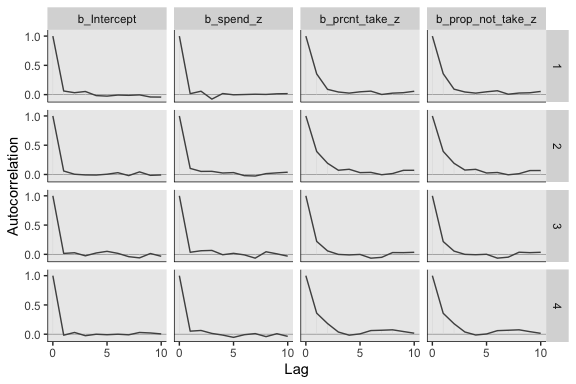<!-- -->

The `brms::vcov()` function returns a variance/covariance matrix--or a correlation matrix when you set `correlation = T`--of the population-level parameters (i.e., the fixed effects). It returns the values to an unnecessary level of precision, so we'll simplify the output with `round()`.


```r
vcov(fit2, correlation = T) %>% 
  round(digits = 3)
```

```
##                 Intercept spend_z prcnt_take_z prop_not_take_z
## Intercept           1.000   0.026        0.028           0.029
## spend_z             0.026   1.000        0.013           0.048
## prcnt_take_z        0.028   0.013        1.000           0.998
## prop_not_take_z     0.029   0.048        0.998           1.000
```

Notice how much lower our `Spend_z` correlations are than those Kruschke displayed on page 520 of the text. However, it turns out the correlations among the redundant predictors were still very high. 

> If any of the nondiagonal correlations are high (i.e., close to +1 or close to −1), be careful when interpreting the posterior distribution. Here, we can see that the correlation of PrcntTake and PropNotTake is −1.0, which is an immediate sign of redundant predictors. (p. 520)

You can really get a sense of the silliness of the parameters if you plot them. We'll use `geom_halfeyeh()` to get a sense of densities and summaries of the $\beta$s.


```r
post %>% 
  select(b_Intercept:b_prop_not_take_z) %>% 
  gather() %>% 
  # this line isn't necessary, but it does allow us to arrange the parameters on the y-axis
  mutate(key = factor(key, levels = c("b_prop_not_take_z", "b_prcnt_take_z", "b_spend_z", "b_Intercept"))) %>% 
  
  ggplot(aes(x = value, y = key)) +
  geom_vline(xintercept = 0, color = "white") +
  geom_halfeyeh(point_interval = mode_hdi,
                .width = .95,
                # the next two lines are purely aesthetic
                scale = "width",
                relative_scale = .9) +
  labs(x = NULL, 
       y = NULL) +
  coord_cartesian(xlim = -5:5) +
  theme(axis.text.y  = element_text(hjust = 0),
        axis.ticks.y = element_blank())
```

<!-- -->

Yeah, on the standardized scale those are some ridiculous estimates. Let's update our `make_beta_0()` function.


```r
make_beta_0 <- function(zeta_0, zeta_1, zeta_2, zeta_3, sd_x_1, sd_x_2, sd_x_3, sd_y, m_x_1, m_x_2, m_x_3,  m_y) {
  sd_y * zeta_0 + m_y - sd_y * ((zeta_1 * m_x_1 / sd_x_1) + (zeta_2 * m_x_2 / sd_x_2) + (zeta_3 * m_x_3 / sd_x_3))
  }
```


```r
sd_x_1 <- sd(my_data$Spend)
sd_x_2 <- sd(my_data$PrcntTake)
sd_x_3 <- sd(my_data$prop_not_take)
sd_y   <- sd(my_data$SATT)
m_x_1  <- mean(my_data$Spend)
m_x_2  <- mean(my_data$PrcntTake)
m_x_3  <- mean(my_data$prop_not_take)
m_y    <- mean(my_data$SATT)

post <-
  post %>% 
  transmute(Intercept = make_beta_0(zeta_0 = b_Intercept,
                                    zeta_1 = b_spend_z,
                                    zeta_2 = b_prcnt_take_z,
                                    zeta_3 = b_prop_not_take_z,
                                    sd_x_1 = sd_x_1,
                                    sd_x_2 = sd_x_2,
                                    sd_x_3 = sd_x_3,
                                    sd_y   = sd_y,
                                    m_x_1  = m_x_1,
                                    m_x_2  = m_x_2,
                                    m_x_3  = m_x_3,
                                    m_y    = m_y),
            Spend = make_beta_j(zeta_j = b_spend_z,
                                sd_j   = sd_x_1,
                                sd_y   = sd_y),
            `Percent Take` = make_beta_j(zeta_j = b_prcnt_take_z,
                                         sd_j   = sd_x_2,
                                         sd_y   = sd_y),
            `Proportion not Take` = make_beta_j(zeta_j = b_prop_not_take_z,
                                                sd_j   = sd_x_3,
                                                sd_y   = sd_y),
            Scale     = sigma * sd_y,
            Normality = nu %>% log10())

glimpse(post)
```

```
## Observations: 4,000
## Variables: 6
## $ Intercept             <dbl> 1061.1824, 280.0482, 873.1032, 551.0707, 6…
## $ Spend                 <dbl> 5.454006, 17.469214, 15.816227, 12.931905,…
## $ `Percent Take`        <dbl> -3.1303938, 3.9409313, -1.8844443, 1.47699…
## $ `Proportion not Take` <dbl> -26.318716, 682.212440, 105.706334, 432.37…
## $ Scale                 <dbl> 30.16235, 32.49213, 26.98000, 36.66645, 28…
## $ Normality             <dbl> 1.1409028, 1.3884920, 1.8217587, 1.0168820…
```

Now we've done the conversions, here are the histograms of Figure 18.6.


```r
post %>% 
  gather() %>% 
  
  ggplot() +
  geom_histogram(aes(x = value),
                 color = "grey92", fill = "grey67",
                 size = .2, bins = 40) +
  stat_pointintervalh(aes(x = value, y = 0), 
                      point_interval = mode_hdi, .width = c(.95, .5)) +
  scale_y_continuous(NULL, breaks = NULL) +
  xlab(NULL) +
  facet_wrap(~key, scales = "free", ncol = 3)
```

<!-- -->

Their scatter plots are as follows:


```r
post %>% 
  mcmc_pairs(off_diag_args = list(size = 1/8, alpha = 1/8))
```

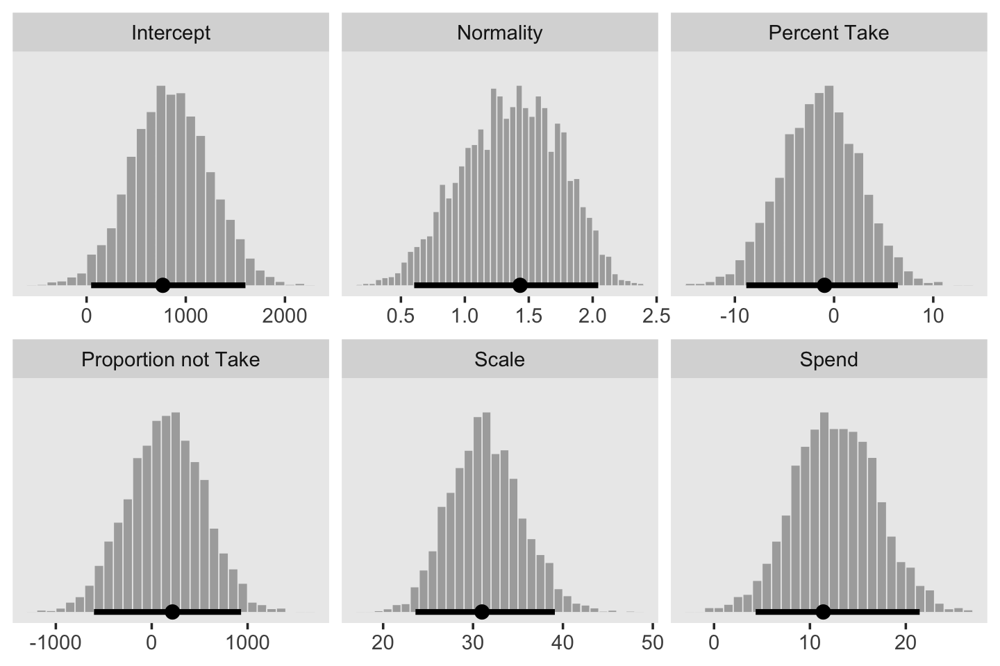<!-- -->

Here are the Pearson's correlations.


```r
post %>% 
  psych::lowerCor(digits = 3)
```

```
##                     Intrcp Spend  PrcntT PrprnT Scale  Nrmlty
## Intercept            1.000                                   
## Spend               -0.100  1.000                            
## Percent Take        -0.996  0.013  1.000                     
## Proportion not Take -0.998  0.048  0.998  1.000              
## Scale                0.002 -0.086  0.007  0.003  1.000       
## Normality            0.033 -0.082 -0.024 -0.030  0.373  1.000
```

Figure 18.7 is all about the prior predictive distribution. Here we'll extract the priors with `prior_samples()` and wrangle all in one step.


```r
prior <- 
  prior_samples(fit2) %>% 
  transmute(Intercept = make_beta_0(zeta_0 = b_Intercept,
                                    zeta_1 = b_spend_z,
                                    zeta_2 = b_prcnt_take_z,
                                    zeta_3 = b_prop_not_take_z,
                                    sd_x_1 = sd_x_1,
                                    sd_x_2 = sd_x_2,
                                    sd_x_3 = sd_x_3,
                                    sd_y   = sd_y,
                                    m_x_1  = m_x_1,
                                    m_x_2  = m_x_2,
                                    m_x_3  = m_x_3,
                                    m_y    = m_y),
            Spend = make_beta_j(zeta_j = b_spend_z,
                                sd_j   = sd_x_1,
                                sd_y   = sd_y),
            `Percent Take` = make_beta_j(zeta_j = b_prcnt_take_z,
                                         sd_j   = sd_x_2,
                                         sd_y   = sd_y),
            `Proportion not Take` = make_beta_j(zeta_j = b_prop_not_take_z,
                                                sd_j   = sd_x_3,
                                                sd_y   = sd_y),
            Scale     = sigma * sd_y,
            Normality = nu %>% log10()) 

glimpse(prior)
```

```
## Observations: 4,000
## Variables: 6
## $ Intercept             <dbl> 1462.43927, 664.21947, 1289.22313, 1476.56…
## $ Spend                 <dbl> -38.749588, 13.362327, -49.410718, -93.439…
## $ `Percent Take`        <dbl> 1.2899620, 6.4475454, 7.1217195, 1.7590988…
## $ `Proportion not Take` <dbl> -310.88980, 63.95417, -280.14134, 101.8131…
## $ Scale                 <dbl> 2.822765, 6.293331, 67.317724, 11.692913, …
## $ Normality             <dbl> 1.5678380, 1.5254245, 1.2846292, 0.6427115…
```

Now we've wrangled the priors, we're ready to make the histograms at the top of Figure 18.7.


```r
prior %>% 
  gather() %>% 
  
  ggplot(aes(x = value)) +
  geom_histogram(color = "grey92", fill = "grey67",
                 size = .2, bins = 40, boundary = 0) +
  stat_pointintervalh(aes(y = 0), 
                      point_interval = mode_hdi, .width = c(.95, .5)) +
  scale_y_continuous(NULL, breaks = NULL) +
  xlab(NULL) +
  facet_wrap(~key, scales = "free", ncol = 3)
```

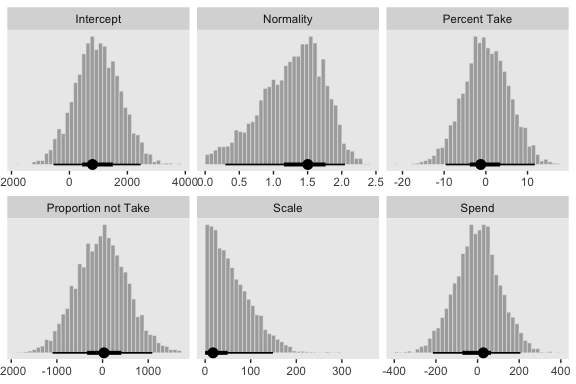<!-- -->

Since we used the half-Gaussian prior for our $\sigma$, our `Scale` histogram looks different from Kruschke's. Otherwise, everything's on the up and up. Here are the scatter plots at the bottom of Figure 18.7.


```r
prior %>%
  mcmc_pairs(off_diag_args = list(size = 1/8, alpha = 1/8))
```

<!-- -->

And finally, here are those Pearson's correlation coefficients for the priors.


```r
prior %>% 
  psych::lowerCor(digits = 3)
```

```
##                     Intrcp Spend  PrcntT PrprnT Scale  Nrmlty
## Intercept            1.000                                   
## Spend               -0.826  1.000                            
## Percent Take        -0.256  0.003  1.000                     
## Proportion not Take -0.486  0.020  0.019  1.000              
## Scale               -0.007  0.005  0.024 -0.017  1.000       
## Normality            0.007 -0.006 -0.006 -0.001 -0.001  1.000
```

At the top of page 523, Kruschke asked us to "notice that the posterior distribution in Figure 18.6 has ranges for the redundant parameters that are only a little smaller than their priors." With a little wrangling, we can compare the prior/posterior distributions for our redundant parameters more directly.


```r
post %>% 
  gather(parameter, posterior) %>% 
  bind_cols(
    prior %>%
      gather() %>% 
      transmute(prior = value)
    ) %>% 
  gather(key, value, -parameter) %>% 
  
  filter(parameter %in% c("Percent Take", "Proportion not Take")) %>% 
  
  ggplot(aes(x = value, fill = key)) +
  geom_histogram(color = "grey92",
                 size = .2, bins = 40, boundary = 0) +
  stat_pointintervalh(aes(y = 0), 
                      point_interval = mode_hdi, .width = c(.95, .5)) +
  scale_fill_viridis_d(option = "D", begin = .35, end = .65) +
  scale_y_continuous(NULL, breaks = NULL) +
  xlab(NULL) +
  theme(legend.position = "none") +
  facet_grid(key~parameter, scales = "free")
```

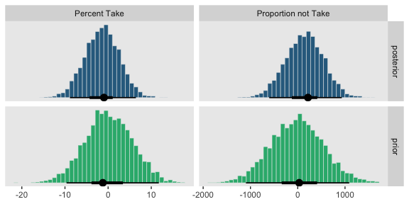<!-- -->

Kruschke was right. The posterior distributions are only slightly narrower than the priors for those two. With our combination of data and model, we learned virtually nothing beyond the knowledge we encoded in those priors.

Kruschke mentioned SEM as a possible solution to multicollinearity. **brms** [isn't fully capable of SEM, at the moment](https://github.com/paul-buerkner/brms/issues/304), but its [multivariate syntax](https://cran.r-project.org/web/packages/brms/vignettes/brms_multivariate.html) does allow for [path analysis](http://www.imachordata.com/bayesian-sem-with-brms/) and [IRT models](https://github.com/paul-buerkner/brms/issues/203). However, you can currently fit a variety of Bayesian SEMs with the [**blavaan** package](https://cran.r-project.org/web/packages/blavaan/index.html). I'm not aware of any textbooks highlighting **blavaan**. If you've seen any, [please share](https://github.com/ASKurz/Doing-Bayesian-Data-Analysis-in-brms-and-the-tidyverse/issues).

### Informative priors, sparse data, and correlated predictors.

It's worth reproducing some of Kruschke's prose from this subsection.

> The examples in this book tend to use mildly informed priors (e.g., using information about the rough magnitude and range of the data). But a benefit of Bayesian analysis is the potential for cumulative scientific progress by using priors that have been informed from previous research.
>
> Informed priors can be especially useful when the amount of data is small compared to the parameter space. A strongly informed prior essentially reduces the scope of the credible parameter space, so that a small amount of new data implies a narrow zone of credible parameter values. (p. 523)

## Multiplicative interaction of metric predictors

From page 526: 

> Formally, interactions can have many different specific functional forms. We will consider multiplicative interaction. This means that the nonadditive interaction is expressed by multiplying the predictors. The predicted value is a weighted combination of the individual predictors and, additionally, the multiplicative product of the predictors. For two metric predictors, regression with multiplicative interaction has these algebraically equivalent expressions:

\begin{align*}
\mu & = \beta_0 + \beta_1 x_1 + \beta_2 x_2 + \beta_{1 \times 2} x_1 x_2 \\
    & = \beta_0 + \underbrace{(\beta_1 + \beta_{1 \times 2} x_2)}_{\text{slope of } x_1} x_1 + \beta_2 x_2 \\
    & = \beta_0 + \beta_1 x_1 + \underbrace{(\beta_2 + \beta_{1 \times 2} x_1)}_{\text{slope of } x_2} x_2.
\end{align*}

Figure 18.8 is out of our **ggplot2** repertoire.

### An example.

With **brms**, you can specify an interaction with either the `x_i*x_j` syntax or the `x_i:x_j` syntax. I typically use `x_i:x_j`. It's often the case that you can just make the interaction term right in the model formula. But since we're fitting the model with standardized predictors and then using Kruschke's equations to convert the parameters back to the unstandardized metric, it seems easier to make the interaction term in the data, first.


```r
my_data <-
  my_data %>% 
  mutate(interaction   = Spend * PrcntTake) %>% 
  mutate(interaction_z = standardize(interaction))
```

Now we'll fit the model.


```r
fit3 <-
  brm(data = my_data,
      family = student,
      satt_z ~ 1 + spend_z + prcnt_take_z + interaction_z,
      prior = c(prior(normal(0, 2), class = Intercept),
                prior(normal(0, 2), class = b),
                prior(normal(0, 1), class = sigma),
                prior(exponential(one_over_twentynine), class = nu)),
      chains = 4, cores = 4,
      stanvars = stanvar(1/29, name = "one_over_twentynine"),
      seed = 18)
```

Note that even though an interaction term might seem different kind from other regression terms, it's just another coefficient of `class = b` as far as the `prior()` statements are concerned. Anyway, let's inspect the `summary()`.


```r
summary(fit3)
```

```
##  Family: student 
##   Links: mu = identity; sigma = identity; nu = identity 
## Formula: satt_z ~ 1 + spend_z + prcnt_take_z + interaction_z 
##    Data: my_data (Number of observations: 50) 
## Samples: 4 chains, each with iter = 2000; warmup = 1000; thin = 1;
##          total post-warmup samples = 4000
## 
## Population-Level Effects: 
##               Estimate Est.Error l-95% CI u-95% CI Rhat Bulk_ESS Tail_ESS
## Intercept        -0.00      0.06    -0.12     0.11 1.00     2779     2427
## spend_z           0.04      0.14    -0.24     0.32 1.00     1484     2038
## prcnt_take_z     -1.48      0.29    -2.03    -0.90 1.00     1336     1985
## interaction_z     0.59      0.37    -0.12     1.30 1.00     1217     1696
## 
## Family Specific Parameters: 
##       Estimate Est.Error l-95% CI u-95% CI Rhat Bulk_ESS Tail_ESS
## sigma     0.41      0.05     0.33     0.52 1.00     2837     2503
## nu       34.38     28.67     4.52   110.70 1.00     2685     2567
## 
## Samples were drawn using sampling(NUTS). For each parameter, Eff.Sample 
## is a crude measure of effective sample size, and Rhat is the potential 
## scale reduction factor on split chains (at convergence, Rhat = 1).
```

The correlations among our parameters are about as severe as those in the text.


```r
vcov(fit3, correlation = T) %>% 
  round(digits = 3)
```

```
##               Intercept spend_z prcnt_take_z interaction_z
## Intercept         1.000  -0.009        0.003        -0.001
## spend_z          -0.009   1.000        0.713        -0.835
## prcnt_take_z      0.003   0.713        1.000        -0.962
## interaction_z    -0.001  -0.835       -0.962         1.000
```

> We can see that the interaction variable is strongly correlated with both predictors. Therefore, we know that there will be strong trade-offs among the regression coefficients, and the marginal distributions of single regression coefficients might be much wider than when there was no interaction included. (p. 528)

Let's convert the posterior draws to the unstandardized metric.


```r
sd_x_3 <- sd(my_data$interaction)
m_x_3  <- mean(my_data$interaction)

post <- 
  posterior_samples(fit3) %>% 
  transmute(Intercept = make_beta_0(zeta_0 = b_Intercept,
                                    zeta_1 = b_spend_z,
                                    zeta_2 = b_prcnt_take_z,
                                    zeta_3 = b_interaction_z,
                                    sd_x_1 = sd_x_1,
                                    sd_x_2 = sd_x_2,
                                    sd_x_3 = sd_x_3,
                                    sd_y   = sd_y,
                                    m_x_1  = m_x_1,
                                    m_x_2  = m_x_2,
                                    m_x_3  = m_x_3,
                                    m_y    = m_y),
            Spend = make_beta_j(zeta_j = b_spend_z,
                                sd_j   = sd_x_1,
                                sd_y   = sd_y),
            `Percent Take` = make_beta_j(zeta_j = b_prcnt_take_z,
                                         sd_j   = sd_x_2,
                                         sd_y   = sd_y),
            `Spend : Percent Take` = make_beta_j(zeta_j = b_interaction_z,
                                                 sd_j   = sd_x_3,
                                                 sd_y   = sd_y),
            Scale     = sigma * sd_y,
            Normality = nu %>% log10())

glimpse(post)
```

```
## Observations: 4,000
## Variables: 6
## $ Intercept              <dbl> 1072.273, 1052.266, 1051.125, 1068.692, 1…
## $ Spend                  <dbl> -1.6619618, 4.1428271, 2.3548164, -1.6373…
## $ `Percent Take`         <dbl> -4.815437, -4.600243, -4.150411, -4.25895…
## $ `Spend : Percent Take` <dbl> 0.31441969, 0.22608990, 0.21413414, 0.255…
## $ Scale                  <dbl> 28.15976, 32.34262, 29.09982, 29.94091, 2…
## $ Normality              <dbl> 1.6180165, 1.1979350, 1.5089735, 1.569651…
```

Now we've done the conversions, here are the histograms of Figure 18.9.


```r
post %>% 
  gather() %>% 
  
  ggplot(aes(x = value)) +
  geom_histogram(color = "grey92", fill = "grey67",
                 size = .2, bins = 40) +
  stat_pointintervalh(aes(y = 0), 
                      point_interval = mode_hdi, .width = c(.95, .5)) +
  scale_y_continuous(NULL, breaks = NULL) +
  xlab(NULL) +
  facet_wrap(~key, scales = "free", ncol = 3)
```

<!-- -->

"To properly understand the credible slopes on the two predictors, we must consider the credible slopes on each predictor as a function of the value of the other predictor" (p. 528). This is our motivation for the middle panel of Figure 18.9. To make it, we'll need to `expand()` our `post`, wrangle a bit, and plot with `geom_pointrange()`.


```r
# this will come in handy in `expand()`
bounds <- range(my_data$PrcntTake)

# wrangle
post %>% 
  expand(nesting(Spend, `Spend : Percent Take`),
         PrcntTake = seq(from = bounds[1], to = bounds[2], length.out = 20)) %>% 
  mutate(slope = Spend + `Spend : Percent Take` * PrcntTake) %>% 
  group_by(PrcntTake) %>% 
  median_hdi(slope) %>% 
  
  # plot
  ggplot(aes(x = PrcntTake, y = slope,
             ymin = .lower, ymax = .upper)) +
  geom_hline(yintercept = 0, color = "white") +
  geom_pointrange(color = "grey50") +
  labs(x     = "Value of prcnt_take",
       y     = "Slope on spend",
       title = expression(paste("Slope on spend is ", beta[1] + beta[3] %.% "prcnt_take")))
```

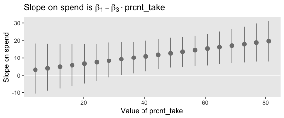<!-- -->

That worked like a charm. We'll follow the same basic order of operations for the final panel.


```r
# this will come in handy in `expand()`
bounds <- range(my_data$Spend)

# wrangle
post %>% 
  expand(nesting(`Percent Take`, `Spend : Percent Take`),
         Spend = seq(from = bounds[1], to = bounds[2], length.out = 20)) %>% 
  mutate(slope = `Percent Take` + `Spend : Percent Take` * Spend) %>% 
  group_by(Spend) %>% 
  median_hdi(slope) %>% 
  
  # plot
  ggplot(aes(x = Spend, y = slope,
             ymin = .lower, ymax = .upper)) +
  geom_pointrange(color = "grey50") +
  labs(x     = "Value of spend",
       y     = "Slope on prcnt_take",
       title = expression(paste("Slope on prcnt_take is ", beta[2] + beta[3] %.% "spend")))
```

<!-- -->

Kruschke outlined all this in the opening paragraphs of page 530. His parting words of this subsection warrant repeating: "if you include an interaction term, you cannot ignore it even if its marginal posterior distribution includes zero" (p. 530).

## Shrinkage of regression coefficients

> In some research, there are many candidate predictors which we suspect could possibly be informative about the predicted variable. For example, when predicting college GPA, we might include high-school GPA, high-school SAT score, income of student, income of parents, years of education of the parents, spending per pupil at the student’s high school, student IQ, student height, weight, shoe size, hours of sleep per night, distance from home to school, amount of caffeine consumed, hours spent studying, hours spent earning a wage, blood pressure, etc. We can include all the candidate predictors in the model, with a regression coefficient for every predictor. And this is not even considering interactions, which we will ignore for now.
>
> With so many candidate predictors of noisy data, there may be some regression coefficients that are spuriously estimated to be non-zero. We would like some protection against accidentally nonzero regression coefficients. (p. 530)

That's what this section is all about. We'll make our random noise predictors with `rnorm()`.


```r
set.seed(18)
my_data <-
  my_data %>% 
  mutate(x_rand_1  = rnorm(n = n(), 0, 1),
         x_rand_2  = rnorm(n = n(), 0, 1),
         x_rand_3  = rnorm(n = n(), 0, 1),
         x_rand_4  = rnorm(n = n(), 0, 1),
         x_rand_5  = rnorm(n = n(), 0, 1),
         x_rand_6  = rnorm(n = n(), 0, 1),
         x_rand_7  = rnorm(n = n(), 0, 1),
         x_rand_8  = rnorm(n = n(), 0, 1),
         x_rand_9  = rnorm(n = n(), 0, 1),
         x_rand_10 = rnorm(n = n(), 0, 1),
         x_rand_11 = rnorm(n = n(), 0, 1),
         x_rand_12 = rnorm(n = n(), 0, 1))

glimpse(my_data)
```

```
## Observations: 50
## Variables: 27
## $ State           <chr> "Alabama", "Alaska", "Arizona", "Arkansas", "Cal…
## $ Spend           <dbl> 4.405, 8.963, 4.778, 4.459, 4.992, 5.443, 8.817,…
## $ StuTeaRat       <dbl> 17.2, 17.6, 19.3, 17.1, 24.0, 18.4, 14.4, 16.6, …
## $ Salary          <dbl> 31.144, 47.951, 32.175, 28.934, 41.078, 34.571, …
## $ PrcntTake       <dbl> 8, 47, 27, 6, 45, 29, 81, 68, 48, 65, 57, 15, 13…
## $ SATV            <dbl> 491, 445, 448, 482, 417, 462, 431, 429, 420, 406…
## $ SATM            <dbl> 538, 489, 496, 523, 485, 518, 477, 468, 469, 448…
## $ SATT            <dbl> 1029, 934, 944, 1005, 902, 980, 908, 897, 889, 8…
## $ prcnt_take_z    <dbl> -1.0178453, 0.4394222, -0.3078945, -1.0925770, 0…
## $ spend_z         <dbl> -1.10086058, 2.24370805, -0.82716069, -1.0612364…
## $ satt_z          <dbl> 0.8430838, -0.4266207, -0.2929676, 0.5223163, -0…
## $ prop_not_take   <dbl> 0.92, 0.53, 0.73, 0.94, 0.55, 0.71, 0.19, 0.32, …
## $ prop_not_take_z <dbl> 1.0178453, -0.4394222, 0.3078945, 1.0925770, -0.…
## $ interaction     <dbl> 35.240, 421.261, 129.006, 26.754, 224.640, 157.8…
## $ interaction_z   <dbl> -0.94113720, 0.93111798, -0.48635915, -0.9822954…
## $ x_rand_1        <dbl> 0.92645924, 1.82282117, -1.61056690, -0.28510975…
## $ x_rand_2        <dbl> -0.90258025, -1.13163679, 0.49708131, -0.5477187…
## $ x_rand_3        <dbl> 0.51576102, 0.30710965, 0.66199996, 2.21990655, …
## $ x_rand_4        <dbl> 1.08730491, -1.23909473, 0.43161390, 1.06733141,…
## $ x_rand_5        <dbl> -0.23846777, 0.15702031, -1.02132795, 0.75395217…
## $ x_rand_6        <dbl> 0.06014956, 1.00555800, 1.47981871, -0.82827890,…
## $ x_rand_7        <dbl> 1.46961709, 0.51790320, -2.33110353, 0.11339996,…
## $ x_rand_8        <dbl> 0.03463437, -1.48737599, -0.01528284, 0.48480309…
## $ x_rand_9        <dbl> -0.4556078, -0.7035475, -0.5001913, -0.6526022, …
## $ x_rand_10       <dbl> 1.2858586, -0.7474640, -0.3107255, -1.1037468, 0…
## $ x_rand_11       <dbl> 0.17236599, -0.37956084, 0.31982301, 0.29678108,…
## $ x_rand_12       <dbl> -0.53048519, 0.92465424, 0.66876661, 0.30935146,…
```

Here's the naïve model.


```r
fit4 <-
  update(fit1, 
         newdata = my_data,
         formula = satt_z ~ 1 + prcnt_take_z + spend_z + x_rand_1 + x_rand_2 + x_rand_3 + x_rand_4 + x_rand_5 + x_rand_6 + x_rand_7 + x_rand_8 + x_rand_9 + x_rand_10 + x_rand_11 + x_rand_12,
         seed = 18)
```

Here we'll examine the posterior with `posterior_summary()`.


```r
posterior_summary(fit4) %>% 
  round(digits = 2)
```

```
##                Estimate Est.Error   Q2.5  Q97.5
## b_Intercept       -0.02      0.07  -0.16   0.10
## b_prcnt_take_z    -1.12      0.09  -1.28  -0.95
## b_spend_z          0.33      0.09   0.16   0.50
## b_x_rand_1         0.03      0.06  -0.08   0.15
## b_x_rand_2         0.02      0.09  -0.16   0.20
## b_x_rand_3         0.09      0.07  -0.06   0.22
## b_x_rand_4        -0.09      0.07  -0.22   0.05
## b_x_rand_5         0.01      0.06  -0.12   0.13
## b_x_rand_6        -0.02      0.08  -0.17   0.12
## b_x_rand_7        -0.03      0.07  -0.17   0.11
## b_x_rand_8        -0.18      0.07  -0.31  -0.04
## b_x_rand_9         0.13      0.06   0.02   0.25
## b_x_rand_10        0.00      0.05  -0.10   0.11
## b_x_rand_11        0.05      0.09  -0.13   0.22
## b_x_rand_12       -0.08      0.06  -0.21   0.04
## sigma              0.38      0.07   0.23   0.52
## nu                25.09     26.21   2.15  95.21
## lp__             -54.70      3.49 -62.56 -49.11
```

Before we can make Figure 18.11, we'll need to update our `make_beta_0()` function to accommodate this model.


```r
make_beta_0 <- 
  function(zeta_0, zeta_1, zeta_2, zeta_3, zeta_4, zeta_5, zeta_6, zeta_7, zeta_8, zeta_9, zeta_10, zeta_11, zeta_12, zeta_13, zeta_14, 
           sd_x_1, sd_x_2, sd_x_3, sd_x_4, sd_x_5, sd_x_6, sd_x_7, sd_x_8, sd_x_9, sd_x_10, sd_x_11, sd_x_12, sd_x_13, sd_x_14, sd_y, 
           m_x_1, m_x_2, m_x_3, m_x_4, m_x_5, m_x_6, m_x_7, m_x_8, m_x_9, m_x_10, m_x_11, m_x_12, m_x_13, m_x_14, m_y) {
    sd_y * zeta_0 + m_y - sd_y * ((zeta_1 * m_x_1 / sd_x_1) + 
                                    (zeta_2 * m_x_2 / sd_x_2) + 
                                    (zeta_3 * m_x_3 / sd_x_3) + 
                                    (zeta_4 * m_x_4 / sd_x_4) + 
                                    (zeta_5 * m_x_5 / sd_x_5) + 
                                    (zeta_6 * m_x_6 / sd_x_6) + 
                                    (zeta_7 * m_x_7 / sd_x_7) + 
                                    (zeta_8 * m_x_8 / sd_x_8) + 
                                    (zeta_9 * m_x_9 / sd_x_9) + 
                                    (zeta_10 * m_x_10 / sd_x_10) + 
                                    (zeta_11 * m_x_11 / sd_x_11) + 
                                    (zeta_12 * m_x_12 / sd_x_12) + 
                                    (zeta_13 * m_x_13 / sd_x_13) + 
                                    (zeta_14 * m_x_14 / sd_x_14))
  }
```

Sigh, our poor `make_beta_0()` and `make_beta_1()` code is getting obscene. I don’t have the energy to think of how to wrap this into a simpler function. But someone probably should. If that ends up as you, [do share your code](https://github.com/ASKurz/Doing-Bayesian-Data-Analysis-in-brms-and-the-tidyverse/issues).


```r
sd_x_1  <- sd(my_data$Spend)
sd_x_2  <- sd(my_data$PrcntTake)
sd_x_3  <- sd(my_data$x_rand_1)
sd_x_4  <- sd(my_data$x_rand_2)
sd_x_5  <- sd(my_data$x_rand_3)
sd_x_6  <- sd(my_data$x_rand_4)
sd_x_7  <- sd(my_data$x_rand_5)
sd_x_8  <- sd(my_data$x_rand_6)
sd_x_9  <- sd(my_data$x_rand_7)
sd_x_10 <- sd(my_data$x_rand_8)
sd_x_11 <- sd(my_data$x_rand_9)
sd_x_12 <- sd(my_data$x_rand_10)
sd_x_13 <- sd(my_data$x_rand_11)
sd_x_14 <- sd(my_data$x_rand_12)
sd_y    <- sd(my_data$SATT)

m_x_1  <- mean(my_data$Spend)
m_x_2  <- mean(my_data$PrcntTake)
m_x_3  <- mean(my_data$x_rand_1)
m_x_4  <- mean(my_data$x_rand_2)
m_x_5  <- mean(my_data$x_rand_3)
m_x_6  <- mean(my_data$x_rand_4)
m_x_7  <- mean(my_data$x_rand_5)
m_x_8  <- mean(my_data$x_rand_6)
m_x_9  <- mean(my_data$x_rand_7)
m_x_10 <- mean(my_data$x_rand_8)
m_x_11 <- mean(my_data$x_rand_9)
m_x_12 <- mean(my_data$x_rand_10)
m_x_13 <- mean(my_data$x_rand_11)
m_x_14 <- mean(my_data$x_rand_12)
m_y    <- mean(my_data$SATT)

post <-
  posterior_samples(fit4) %>% 
  transmute(Intercept      = make_beta_0(zeta_0 = b_Intercept,
                                         zeta_1  = b_spend_z,
                                         zeta_2  = b_prcnt_take_z,
                                         zeta_3  = b_x_rand_1,
                                         zeta_4  = b_x_rand_2,
                                         zeta_5  = b_x_rand_3,
                                         zeta_6  = b_x_rand_4,
                                         zeta_7  = b_x_rand_5,
                                         zeta_8  = b_x_rand_6,
                                         zeta_9  = b_x_rand_7,
                                         zeta_10 = b_x_rand_8,
                                         zeta_11 = b_x_rand_9,
                                         zeta_12 = b_x_rand_10,
                                         zeta_13 = b_x_rand_11,
                                         zeta_14 = b_x_rand_12,
                                         sd_x_1  = sd_x_1,
                                         sd_x_2  = sd_x_2,
                                         sd_x_3  = sd_x_3,
                                         sd_x_4  = sd_x_4,
                                         sd_x_5  = sd_x_5,
                                         sd_x_6  = sd_x_6,
                                         sd_x_7  = sd_x_7,
                                         sd_x_8  = sd_x_8,
                                         sd_x_9  = sd_x_9,
                                         sd_x_10 = sd_x_10,
                                         sd_x_11 = sd_x_11,
                                         sd_x_12 = sd_x_12,
                                         sd_x_13 = sd_x_13,
                                         sd_x_14 = sd_x_14,
                                         sd_y    = sd_y,
                                         m_x_1   = m_x_1,
                                         m_x_2   = m_x_2,
                                         m_x_3   = m_x_3,
                                         m_x_4   = m_x_4,
                                         m_x_5   = m_x_5,
                                         m_x_6   = m_x_6,
                                         m_x_7   = m_x_7,
                                         m_x_8   = m_x_8,
                                         m_x_9   = m_x_9,
                                         m_x_10  = m_x_10,
                                         m_x_11  = m_x_11,
                                         m_x_12  = m_x_12,
                                         m_x_13  = m_x_13,
                                         m_x_14  = m_x_14,
                                         m_y     = m_y),
            Spend          = make_beta_j(zeta_j = b_spend_z,
                                         sd_j   = sd_x_1,
                                         sd_y   = sd_y),
            `Percent Take` = make_beta_j(zeta_j = b_prcnt_take_z,
                                         sd_j   = sd_x_2,
                                         sd_y   = sd_y),
            x_rand_1       = make_beta_j(zeta_j = b_x_rand_1,
                                         sd_j   = sd_x_3,
                                         sd_y   = sd_y),
            x_rand_2       = make_beta_j(zeta_j = b_x_rand_2,
                                         sd_j   = sd_x_4,
                                         sd_y   = sd_y),
            x_rand_3       = make_beta_j(zeta_j = b_x_rand_3,
                                         sd_j   = sd_x_5,
                                         sd_y   = sd_y),
            x_rand_4       = make_beta_j(zeta_j = b_x_rand_4,
                                         sd_j   = sd_x_6,
                                         sd_y   = sd_y),
            x_rand_5       = make_beta_j(zeta_j = b_x_rand_5,
                                         sd_j   = sd_x_7,
                                         sd_y   = sd_y),
            x_rand_6       = make_beta_j(zeta_j = b_x_rand_6,
                                         sd_j   = sd_x_8,
                                         sd_y   = sd_y),
            x_rand_7       = make_beta_j(zeta_j = b_x_rand_7,
                                         sd_j   = sd_x_9,
                                         sd_y   = sd_y),
            x_rand_8       = make_beta_j(zeta_j = b_x_rand_8,
                                         sd_j   = sd_x_10,
                                         sd_y   = sd_y),
            x_rand_9       = make_beta_j(zeta_j = b_x_rand_9,
                                         sd_j   = sd_x_11,
                                         sd_y   = sd_y),
            x_rand_10      = make_beta_j(zeta_j = b_x_rand_10,
                                         sd_j   = sd_x_12,
                                         sd_y   = sd_y),
            x_rand_11      = make_beta_j(zeta_j = b_x_rand_11,
                                         sd_j   = sd_x_13,
                                         sd_y   = sd_y),
            x_rand_12      = make_beta_j(zeta_j = b_x_rand_12,
                                         sd_j   = sd_x_14,
                                         sd_y   = sd_y),
            Scale          = sigma * sd_y,
            Normality      = nu %>% log10())

glimpse(post)
```

```
## Observations: 4,000
## Variables: 17
## $ Intercept      <dbl> 978.2629, 954.1022, 936.3345, 927.7583, 964.4377,…
## $ Spend          <dbl> 16.23816, 21.85959, 26.38032, 26.63065, 18.40972,…
## $ `Percent Take` <dbl> -3.123617, -3.470104, -3.496485, -3.622503, -3.31…
## $ x_rand_1       <dbl> 0.37557071, 0.47578746, 2.01992361, -2.49333200, …
## $ x_rand_2       <dbl> -2.747509054, -0.637063446, 3.112304494, -4.64025…
## $ x_rand_3       <dbl> 8.9258844, 1.5485414, 3.0112088, 0.4144604, 11.01…
## $ x_rand_4       <dbl> -8.1747088, -9.1809834, -13.4576786, -14.0589291,…
## $ x_rand_5       <dbl> -0.5797268, 0.1277984, 0.6989087, -2.2552537, -0.…
## $ x_rand_6       <dbl> -6.499016480, 2.006864887, 2.694773713, 0.7167073…
## $ x_rand_7       <dbl> -7.4236507, 2.4005544, 0.5063171, 0.9188742, 10.2…
## $ x_rand_8       <dbl> -11.9493748, -12.7780330, -12.2361496, -16.807961…
## $ x_rand_9       <dbl> 4.132977, 11.727639, 12.163225, 6.259811, 13.0476…
## $ x_rand_10      <dbl> 0.19896636, 4.15941187, 4.02509269, 1.58380409, -…
## $ x_rand_11      <dbl> 9.3111126, -4.5582639, -8.9587840, -9.6417867, -4…
## $ x_rand_12      <dbl> -8.3675915, -2.5825711, -3.9334521, -3.8179492, -…
## $ Scale          <dbl> 26.16620, 19.98710, 20.51592, 26.75018, 32.71402,…
## $ Normality      <dbl> 0.7053100, 0.7184234, 0.9159173, 0.4871434, 1.752…
```

Okay, here are the histograms of Figure 18.11.


```r
post %>% 
  select(Intercept:x_rand_3, x_rand_10:Normality) %>% 
  gather() %>% 
  mutate(key = factor(key, 
                      levels = c("Intercept", "Spend", "Percent Take",
                                 "x_rand_1", "x_rand_2", "x_rand_3",
                                 "x_rand_10", "x_rand_11", "x_rand_12",
                                 "Scale", "Normality"))) %>% 
  
  ggplot(aes(x = value)) +
  geom_histogram(color = "grey92", fill = "grey67",
                 size = .2, bins = 40) +
  stat_pointintervalh(aes(y = 0), 
                      point_interval = mode_hdi, .width = c(.95, .5)) +
  scale_y_continuous(NULL, breaks = NULL) +
  xlab(NULL) +
  facet_wrap(~key, scales = "free", ncol = 3)
```

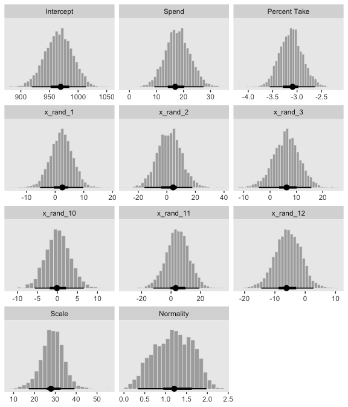<!-- -->

And here's the final histogram depicting the Bayesian $R^2$.


```r
bayes_R2(fit4, summary = F) %>% 
  as_tibble() %>% 
  
  ggplot(aes(x = R2)) +
  geom_histogram(color = "grey92", fill = "grey67",
                 size = .2, bins = 25) +
  stat_pointintervalh(aes(y = 0), 
                      point_interval = mode_hdi, .width = .95) +
  scale_y_continuous(NULL, breaks = NULL) +
  labs(subtitle = expression(paste("Bayesian ", italic(R)^2)),
       x = NULL) +
  coord_cartesian(xlim = c(.6, 1))
```

<!-- -->

Note that unlike the one Kruschke displayed in the text, our `brms::bayes_R2()`-based $R^2$ distribution did not exceed the logical right bound of 1.

Sometimes when you have this many parameters you'd like to compare, it's better to display their summaries with an ordered coefficient plot.


```r
post %>% 
  select(Spend:x_rand_12) %>% 
  gather() %>% 
  
  ggplot(aes(x = value, y = reorder(key, value))) +
  geom_vline(xintercept = 0, color = "white") +
  stat_pointintervalh(point_interval = mode_hdi, .width = .95, color = "grey50") +
  labs(x = NULL,
       y = NULL) +
  theme(axis.text.y  = element_text(hjust = 0),
        axis.ticks.y = element_blank(),
        panel.grid.major.y = element_line(color = "grey98", linetype = 2))
```

<!-- -->

Now we can see that by chance alone, the coefficients for `x_rand_8` and `x_rand_9` are clearly distinct from zero. The `geom_density_ridges()` function from the [**ggridges** package](https://github.com/clauswilke/ggridges) can be informative, too.


```r
library(ggridges)

post %>% 
  select(Spend:x_rand_12) %>% 
  gather() %>% 
  
  ggplot(aes(x = value, y = reorder(key, value), group = reorder(key, value))) +
  geom_vline(xintercept = 0, color = "white") +
  geom_density_ridges(scale = 4, fill = "grey50", color = "grey50", alpha = 3/4, size = 1/5) +
  labs(x = NULL,
       y = NULL) +
  theme(axis.text.y  = element_text(hjust = 0),
        axis.ticks.y = element_blank())
```

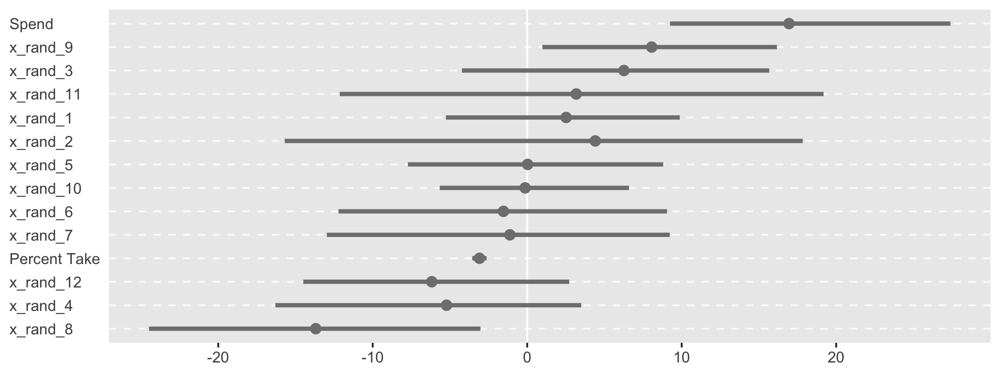<!-- -->

With **brms**, we can fit something like the model Kruschke displayed in Figure 18.12 with the `horseshoe()` prior. From the `horseshoe` section of the [**brms** (version 2.10.3) reference manual](https://cran.r-project.org/web/packages/brms/brms.pdf):

> The horseshoe prior is a special shrinkage prior initially proposed by [Carvalho et al. (2009)](http://proceedings.mlr.press/v5/carvalho09a/carvalho09a.pdf). It is symmetric around zero with fat tails and an infinitely large spike at zero. This makes it ideal for sparse models that have many regression coefficients, although only a minority of them is non-zero. The horseshoe prior can be applied on all population-level effects at once (excluding the intercept) by using `set_prior("horseshoe(1)")`. The `1` implies that the student-t prior of the local shrinkage parameters has 1 degrees of freedom.

Based on the quote, here's how to fit our horseshoe-prior model.


```r
fit5 <-
  update(fit4, 
         newdata = my_data,
         formula = satt_z ~ 1 + prcnt_take_z + spend_z + x_rand_1 + x_rand_2 + x_rand_3 + x_rand_4 + x_rand_5 + x_rand_6 + x_rand_7 + x_rand_8 + x_rand_9 + x_rand_10 + x_rand_11 + x_rand_12,
         prior = c(prior(normal(0, 2), class = Intercept),
                   prior(horseshoe(1), class = b),
                   prior(normal(0, 1), class = sigma),
                   prior(exponential(one_over_twentynine), class = nu)),
         seed = 18)
```

Check the parameter summary.


```r
posterior_summary(fit5) %>% 
  round(digits = 2)
```

```
##                Estimate Est.Error    Q2.5  Q97.5
## b_Intercept       -0.02      0.06   -0.14   0.11
## b_prcnt_take_z    -1.02      0.10   -1.20  -0.82
## b_spend_z          0.20      0.11    0.00   0.39
## b_x_rand_1         0.02      0.04   -0.05   0.10
## b_x_rand_2         0.01      0.04   -0.08   0.11
## b_x_rand_3         0.02      0.04   -0.06   0.12
## b_x_rand_4        -0.03      0.05   -0.14   0.04
## b_x_rand_5         0.00      0.04   -0.07   0.09
## b_x_rand_6        -0.02      0.04   -0.13   0.05
## b_x_rand_7        -0.01      0.04   -0.09   0.07
## b_x_rand_8        -0.09      0.07   -0.24   0.02
## b_x_rand_9         0.05      0.05   -0.02   0.17
## b_x_rand_10        0.00      0.03   -0.06   0.07
## b_x_rand_11        0.01      0.04   -0.07   0.12
## b_x_rand_12       -0.02      0.04   -0.12   0.05
## sigma              0.40      0.06    0.27   0.52
## nu                30.80     28.89    2.86 108.14
## lp__            -105.49      6.71 -119.76 -93.33
## hs_c2              1.89      3.56    0.35   7.79
```

Our `make_beta_0()` and `make_beta_1()` code remains obscene. 


```r
post <-
  posterior_samples(fit5) %>% 
  transmute(Intercept      = make_beta_0(zeta_0  = b_Intercept,
                                         zeta_1  = b_spend_z,
                                         zeta_2  = b_prcnt_take_z,
                                         zeta_3  = b_x_rand_1,
                                         zeta_4  = b_x_rand_2,
                                         zeta_5  = b_x_rand_3,
                                         zeta_6  = b_x_rand_4,
                                         zeta_7  = b_x_rand_5,
                                         zeta_8  = b_x_rand_6,
                                         zeta_9  = b_x_rand_7,
                                         zeta_10 = b_x_rand_8,
                                         zeta_11 = b_x_rand_9,
                                         zeta_12 = b_x_rand_10,
                                         zeta_13 = b_x_rand_11,
                                         zeta_14 = b_x_rand_12,
                                         sd_x_1  = sd_x_1,
                                         sd_x_2  = sd_x_2,
                                         sd_x_3  = sd_x_3,
                                         sd_x_4  = sd_x_4,
                                         sd_x_5  = sd_x_5,
                                         sd_x_6  = sd_x_6,
                                         sd_x_7  = sd_x_7,
                                         sd_x_8  = sd_x_8,
                                         sd_x_9  = sd_x_9,
                                         sd_x_10 = sd_x_10,
                                         sd_x_11 = sd_x_11,
                                         sd_x_12 = sd_x_12,
                                         sd_x_13 = sd_x_13,
                                         sd_x_14 = sd_x_14,
                                         sd_y    = sd_y,
                                         m_x_1   = m_x_1,
                                         m_x_2   = m_x_2,
                                         m_x_3   = m_x_3,
                                         m_x_4   = m_x_4,
                                         m_x_5   = m_x_5,
                                         m_x_6   = m_x_6,
                                         m_x_7   = m_x_7,
                                         m_x_8   = m_x_8,
                                         m_x_9   = m_x_9,
                                         m_x_10  = m_x_10,
                                         m_x_11  = m_x_11,
                                         m_x_12  = m_x_12,
                                         m_x_13  = m_x_13,
                                         m_x_14  = m_x_14,
                                         m_y     = m_y),
            Spend          = make_beta_j(zeta_j = b_spend_z,
                                         sd_j   = sd_x_1,
                                         sd_y   = sd_y),
            `Percent Take` = make_beta_j(zeta_j = b_prcnt_take_z,
                                         sd_j   = sd_x_2,
                                         sd_y   = sd_y),
            x_rand_1       = make_beta_j(zeta_j = b_x_rand_1,
                                         sd_j   = sd_x_3,
                                         sd_y   = sd_y),
            x_rand_2       = make_beta_j(zeta_j = b_x_rand_2,
                                         sd_j   = sd_x_4,
                                         sd_y   = sd_y),
            x_rand_3       = make_beta_j(zeta_j = b_x_rand_3,
                                         sd_j   = sd_x_5,
                                         sd_y   = sd_y),
            x_rand_4       = make_beta_j(zeta_j = b_x_rand_4,
                                         sd_j   = sd_x_6,
                                         sd_y   = sd_y),
            x_rand_5       = make_beta_j(zeta_j = b_x_rand_5,
                                         sd_j   = sd_x_7,
                                         sd_y   = sd_y),
            x_rand_6       = make_beta_j(zeta_j = b_x_rand_6,
                                         sd_j   = sd_x_8,
                                         sd_y   = sd_y),
            x_rand_7       = make_beta_j(zeta_j = b_x_rand_7,
                                         sd_j   = sd_x_9,
                                         sd_y   = sd_y),
            x_rand_8       = make_beta_j(zeta_j = b_x_rand_8,
                                         sd_j   = sd_x_10,
                                         sd_y   = sd_y),
            x_rand_9       = make_beta_j(zeta_j = b_x_rand_9,
                                         sd_j   = sd_x_11,
                                         sd_y   = sd_y),
            x_rand_10      = make_beta_j(zeta_j = b_x_rand_10,
                                         sd_j   = sd_x_12,
                                         sd_y   = sd_y),
            x_rand_11      = make_beta_j(zeta_j = b_x_rand_11,
                                         sd_j   = sd_x_13,
                                         sd_y   = sd_y),
            x_rand_12      = make_beta_j(zeta_j = b_x_rand_12,
                                         sd_j   = sd_x_14,
                                         sd_y   = sd_y),
            Scale          = sigma * sd_y,
            Normality      = nu %>% log10())

glimpse(post)
```

```
## Observations: 4,000
## Variables: 17
## $ Intercept      <dbl> 979.2471, 1023.5298, 1005.1208, 1019.9144, 987.87…
## $ Spend          <dbl> 10.433664, 6.800388, 8.659539, 6.694374, 13.33200…
## $ `Percent Take` <dbl> -2.647076, -2.530614, -2.792637, -2.863597, -2.82…
## $ x_rand_1       <dbl> -0.122140323, -1.158510122, 4.129300096, 2.557700…
## $ x_rand_2       <dbl> -0.08683436, -7.80656229, -0.29081925, -0.4379702…
## $ x_rand_3       <dbl> -0.52525371, 4.52651239, -1.31939726, -1.97089650…
## $ x_rand_4       <dbl> -0.14436314, 0.16171124, 1.24412546, 1.66430716, …
## $ x_rand_5       <dbl> -1.00575083, 7.17913473, -0.49749734, -0.80289945…
## $ x_rand_6       <dbl> -7.70462095, -2.23838325, -1.33121990, -2.0296176…
## $ x_rand_7       <dbl> -0.52338825, -0.97967618, -1.66890548, -3.6052574…
## $ x_rand_8       <dbl> -16.30586010, -4.60620698, 0.95248757, 1.40157515…
## $ x_rand_9       <dbl> -0.06430865, 14.47257381, 0.02975212, 0.24323983,…
## $ x_rand_10      <dbl> -0.693127222, 0.282968557, -0.575203802, 0.764815…
## $ x_rand_11      <dbl> 0.61800434, -0.14365478, 9.95488153, 13.63182415,…
## $ x_rand_12      <dbl> 0.004654011, -9.772196168, 0.691943833, 2.6793078…
## $ Scale          <dbl> 32.13506, 27.57153, 36.89317, 37.52294, 37.52031,…
## $ Normality      <dbl> 1.5010222, 1.2281283, 1.4576176, 1.5595392, 1.448…
```

And here are the majority of the histograms of Figure 18.12.


```r
post %>% 
  select(Intercept:x_rand_3, x_rand_10:Normality) %>% 
  gather() %>% 
  mutate(key = factor(key, 
                      levels = c("Intercept", "Spend", "Percent Take",
                                 "x_rand_1", "x_rand_2", "x_rand_3",
                                 "x_rand_10", "x_rand_11", "x_rand_12",
                                 "Scale", "Normality"))) %>% 
  
  ggplot(aes(x = value)) +
  geom_histogram(color = "grey92", fill = "grey67",
                 size = .2, bins = 40) +
  stat_pointintervalh(aes(y = 0), 
                      point_interval = mode_hdi, .width = c(.95, .5)) +
  scale_y_continuous(NULL, breaks = NULL) +
  xlab(NULL) +
  facet_wrap(~key, scales = "free", ncol = 3)
```

<!-- -->

Based on the distributions for the random predictors, it looks like our **brms** horseshoe prior regularized more aggressively than Kruschke’s hierarchical prior in the text. And interestingly, look how our marginal posterior for `Spend` is bimodal. 

For kicks and giggles, here's the corresponding coefficient plot for $\beta_1$ through $\beta_{14}$.


```r
post %>% 
  select(Spend:x_rand_12) %>% 
  gather() %>% 
  
  ggplot(aes(x = value, y = reorder(key, value))) +
  geom_vline(xintercept = 0, color = "white") +
  stat_pointintervalh(point_interval = mode_hdi, .width = .95, color = "grey50") +
  labs(x = NULL,
       y = NULL) +
  theme(axis.text.y  = element_text(hjust = 0),
        axis.ticks.y = element_blank(),
        panel.grid.major.y = element_line(color = "grey98", linetype = 2))
```

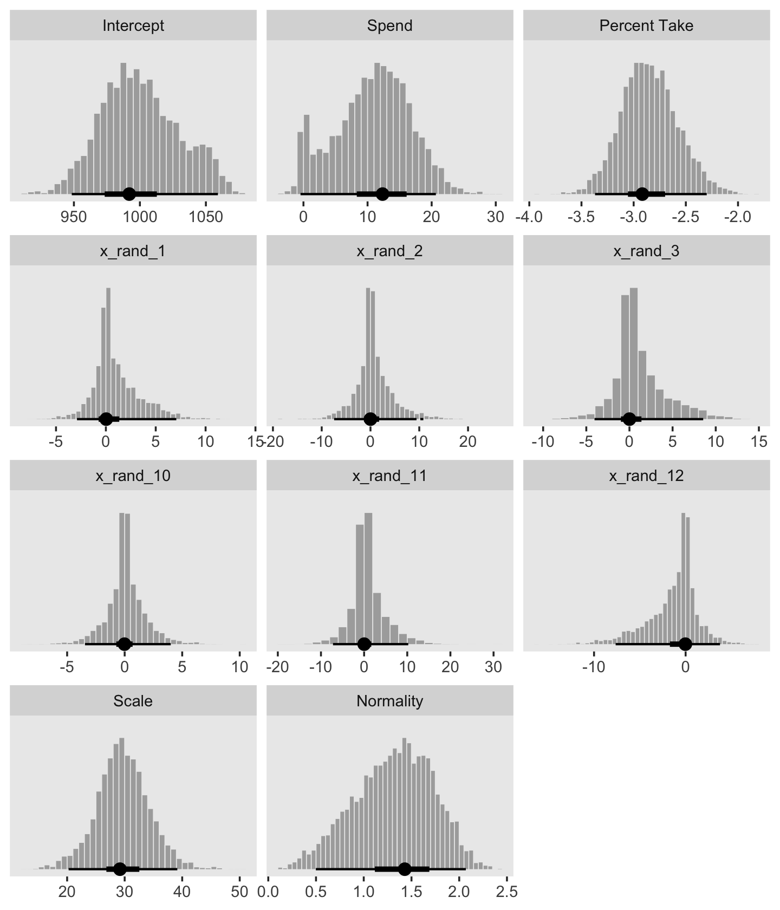<!-- -->

But anyways, here's that final Bayesian $R^2$ histogram for Figure 18.12.


```r
bayes_R2(fit5, summary = F) %>% 
  as_tibble() %>% 
  
  ggplot(aes(x = R2)) +
  geom_histogram(color = "grey92", fill = "grey67",
                 size = .2, bins = 25) +
  stat_pointintervalh(aes(y = 0), 
                      point_interval = mode_hdi, .width = .95) +
  scale_y_continuous(NULL, breaks = NULL) +
  labs(subtitle = expression(paste("Bayesian ", italic(R)^2)),
       x = NULL) +
  coord_cartesian(xlim = c(.6, 1))
```

<!-- -->

Just recall, though, that our `fit5` was not exactly like Kruschke's model. Whereas we hard coded the scale of our Student-$t$ horseshoe prior to be 1, Kruschke estimated it with help from the gamma distribution. I'm not aware that's currently possible in **brms**. If I'm at fault and you know how to do it, [please share your code](https://github.com/ASKurz/Doing-Bayesian-Data-Analysis-in-brms-and-the-tidyverse/issues).

## Variable selection

We can rewrite the linear regression model to accommodate whether it includes a predictor as

$$\mu_i = \beta_0 + \sum_j \delta_j \beta_j x_{j, i},$$

where $\delta$ is a dummy for which 0 = *not included* 1 = *included*. I'm not aware of a way to use $\delta$ as an inclusion indicator in **brms** the way Kruschke implemented it in JAGS. And in fact, it appears this might be [unfeasible within the Stan framework](https://discourse.mc-stan.org/t/include-extra-coefficient-multiplied-with-regression-weight-inclusion-weight-a-la-kruschke/5768). But if you know of a way, please [share your code](https://github.com/ASKurz/Doing-Bayesian-Data-Analysis-in-brms-and-the-tidyverse/issues). However, this issue can lead to a similar approach: information criteria. To do so, let's follow Kruschke's basic flow and use the first model from way back in subsection 18.1.1 as a starting point. The model formula was as follows.


```r
fit1$formula
```

```
## satt_z ~ 1 + spend_z + prcnt_take_z
```

Taking interactions off the table for a moment, we can specify four model types with various combinations of the two predictors, `prcnt_take_z` and `spend_z`. `fit1` was the first, which we might denote as $\langle 1, 1 \rangle$. That leads to the remaining possibilities as

* $\langle 1, 0 \rangle:$ `satt_z ~ 1 + spend_z`
* $\langle 0, 1 \rangle:$ `satt_z ~ 1 + prcnt_take_z`
* $\langle 0, 0 \rangle:$ `satt_z ~ 1`

Let's fit those models.


```r
fit6 <-
  update(fit1,
         formula = satt_z ~ 1 + spend_z,
         seed = 18)

fit7 <-
  update(fit1,
         formula = satt_z ~ 1 + prcnt_take_z,
         seed = 18)

fit8 <-
  brm(data = my_data,
      family = student,
      satt_z ~ 1,
      prior = c(prior(normal(0, 2), class = Intercept),
                prior(normal(0, 1), class = sigma),
                prior(exponential(one_over_twentynine), class = nu)),
      chains = 4, cores = 4,
      stanvars = stanvar(1/29, name = "one_over_twentynine"),
      seed = 18)
```

We'll compare our models with the LOO information criterion. Like other information criteria, the LOO values aren't of interest in and of themselves. However, the values of one model's LOO relative to that of another is of great interest. We generally prefer models with lower estimates.


```r
fit1 <- add_criterion(fit1, "loo")
fit6 <- add_criterion(fit6, "loo")
fit7 <- add_criterion(fit7, "loo")
fit8 <- add_criterion(fit8, "loo")

loo_compare(fit1, fit6, fit7, fit8) %>% 
  print(simplify = F)
```

```
##      elpd_diff se_diff elpd_loo se_elpd_loo p_loo se_p_loo looic se_looic
## fit1   0.0       0.0   -31.9      5.4         4.0   0.7     63.8  10.7   
## fit7  -3.3       2.8   -35.2      4.4         2.8   0.5     70.4   8.8   
## fit6 -37.7       6.3   -69.6      4.0         2.1   0.3    139.3   8.1   
## fit8 -40.9       5.7   -72.7      3.1         1.4   0.2    145.5   6.1
```

In this case, `fit1` and `fit7` clearly have the lowest estimates, but the standard error of their difference score is about the same size as their difference. So the LOO difference score puts them on similar footing. Recall that you can do a similar analysis with the `waic()` function.

Let's compare that with the insights from the `model_weights()` function.


```r
(mw <- model_weights(fit1, fit6, fit7, fit8))
```

```
##         fit1         fit6         fit7         fit8 
## 8.985310e-01 8.464204e-08 1.014689e-01 1.081172e-08
```

If you don't like scientific notation, you can always wrangle and plot.


```r
mw %>% 
  as.data.frame() %>% 
  rownames_to_column() %>% 
  set_names("fit", "estimate") %>% 
  
  ggplot(aes(x = estimate, y = reorder(fit, estimate))) +
  geom_text(aes(label = estimate %>% round(3) %>% as.character())) +
  scale_x_continuous("stacking weight", limits = c(0, 1)) +
  ylab(NULL) +
  theme(axis.ticks.y = element_blank())
```

<!-- -->

Based on this weighting scheme, almost all the weight went to the full model, `fit1`. But note, in the intro of their [vignette on the topic](https://cran.r-project.org/web/packages/loo/vignettes/loo2-weights.html), Vehtari and Gabry opined:

> Ideally, we would avoid the Bayesian model combination problem by extending the model to include the separate models as special cases, and preferably as a continuous expansion of the model space. For example, instead of model averaging over different covariate combinations, all potentially relevant covariates should be included in a predictive model (for causal analysis more care is needed) and a prior assumption that only some of the covariates are relevant can be presented with regularized horseshoe prior ([Piironen and Vehtari, 2017a](https://projecteuclid.org/euclid.ejs/1513306866)). For variable selection we recommend projective predictive variable selection (Piironen and Vehtari, 2017a; [projpred package](https://cran.r-project.org/web/packages/projpred/index.html)).

Perhaps unsurprisingly, their thoughts on the topic are similar with the Gelman et al quotation Kruschke provided on page 536:

> Some prominent authors eschew the variable-selection approach for typical applications in their fields. For example, [Gelman et al. (2013, p. 369)](http://www.stat.columbia.edu/~gelman/book/) said, "For the regressions we typically see, we do not believe any coefficients to be truly zero and we do not generally consider it a conceptual (as opposed to computational) advantage to get point estimates of zero—but regularized estimates such as obtained by lasso can be much better than those resulting from simple least squares and flat prior distributions ...we are not comfortable with an underlying model in which the coefficients can be exactly zero."

For more on some of these methods, check out Vehtari's GitHub repository, [Tutorial on model assessment, model selection and inference after model selection](https://github.com/avehtari/modelselection).

But anyways, our model weighting methods cohered with Kruschke's $\delta$-inclusion-indicator method in that both suggested the full model, `fit1`, and the model with `prcnt_take` as the sole predictor, `fit7`, were given the greatest weight. I'm not aware that our information criteria weighting/model stacking methods provide probability distributions of the type Kruschke displayed in the left portions of Figure 18.13. But we can at least recreate the plots in the other panels.


```r
# first we'll get the posterior draws from `fit1` and wrangle them
posterior_samples(fit1) %>% 
  transmute(Spend     = make_beta_j(zeta_j = b_spend_z,
                                    sd_j   = sd_x_1,
                                    sd_y   = sd_y),
            PrcntTake = make_beta_j(zeta_j = b_prcnt_take_z,
                                    sd_j   = sd_x_2,
                                    sd_y   = sd_y)) %>% 
  gather() %>% 
  # within `bind_rows()`, we extract and wrangle the posterior draws from `fit7` and them insert them below those from `fit1`
  bind_rows(
    posterior_samples(fit7) %>%
      transmute(value = make_beta_j(zeta_j = b_prcnt_take_z,
                                    sd_j   = sd_x_2,
                                    sd_y   = sd_y)) %>% 
      mutate(key = "PrcntTake")
  ) %>% 
  # now we just need a little indexing and factor ordering
  mutate(model = rep(c("fit1", "fit7"), times = c(8000, 4000)), 
         key   = factor(key, levels = c("Spend", "PrcntTake"))) %>% 
  
  # we finally plot!
  ggplot(aes(x = value, fill = model)) +
  geom_histogram(color = "grey92",
                 size = .2, bins = 40) +
  stat_pointintervalh(aes(y = 0), 
                      point_interval = mode_hdi, .width = c(.95, .5)) +
  scale_fill_viridis_d(option = "D", begin = .35, end = .65) +
  scale_y_continuous(NULL, breaks = NULL) +
  xlab(NULL) +
  theme(legend.position = "none") +
  facet_grid(model~key, scales = "free")
```

<!-- -->

### Inclusion probability is strongly affected by vagueness of prior.

To follow along, let's fit the models with the updated $SD = 1$ on the $\beta_{1+}$ priors code.


```r
fit9 <-
  update(fit1,
         prior = c(prior(normal(0, 1), class = Intercept),
                   prior(normal(0, 1), class = b),
                   prior(normal(0, 1), class = sigma),
                   prior(exponential(one_over_twentynine), class = nu)),
         chains = 4, cores = 4,
         stanvars = stanvar(1/29, name = "one_over_twentynine"),
         seed = 18)

fit10 <-
  update(fit9,
         formula = satt_z ~ 1 + spend_z,
         seed = 18)

fit11 <-
  update(fit9,
         formula = satt_z ~ 1 + prcnt_take_z,
         seed = 18)

fit12 <-
  update(fit8,
         prior = c(prior(normal(0, 1), class = Intercept),
                   prior(normal(0, 1), class = sigma),
                   prior(exponential(one_over_twentynine), class = nu)),
         seed = 18)
```

And now we'll fit the models with the updated $SD = 10$.


```r
fit13 <-
  update(fit9,
         prior = c(prior(normal(0, 10), class = Intercept),
                   prior(normal(0, 10), class = b),
                   prior(normal(0, 10), class = sigma),
                   prior(exponential(one_over_twentynine), class = nu)),
         seed = 18)

fit14 <-
  update(fit13,
         formula = satt_z ~ 1 + spend_z,
         seed = 18)

fit15 <-
  update(fit13,
         formula = satt_z ~ 1 + prcnt_take_z,
         seed = 18)

fit16 <-
  update(fit12,
         prior = c(prior(normal(0, 10), class = Intercept),
                   prior(normal(0, 10), class = sigma),
                   prior(exponential(one_over_twentynine), class = nu)),
         seed = 18)
```

Now we've fit the models, we're ready to examine how altering the $SD$s on the $\beta_j$ priors influenced the model comparisons via `model_weights()`. Here we'll use the default stacking method.


```r
mw %>% 
  rbind(model_weights(fit9, fit10, fit11, fit12),
        model_weights(fit13, fit14, fit15, fit16)) %>% 
  as_tibble() %>% 
  set_names("1, 1", "1, 0", "0, 1", "0, 0") %>% 
  gather() %>% 
  mutate(prior = rep(str_c("SD = ", c(10, 2, 1)), times = 4) %>% 
           factor(., levels = str_c("SD = ", c(10, 2, 1)))) %>% 
  
  ggplot(aes(x = value, y = reorder(key, value))) +
  geom_text(aes(label = value %>% round(3) %>% as.character())) +
  coord_cartesian(xlim = 0:1) +
  labs(x = "Stacking weight",
       y = expression(paste("Models defined by Kruschke's ", delta, " notation"))) +
  theme(axis.ticks.y = element_blank()) +
  facet_grid(prior~.)
```

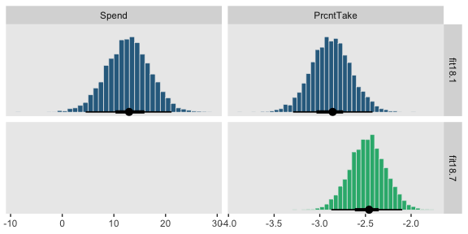<!-- -->

So unlike in the depictions in Figure 18.14, the stacking method was *insensitive* to the $SD$s on our $\beta_j$ priors. We might compare LOO difference scores, too.


```r
fit9  <- add_criterion(fit9,  "loo")
fit10 <- add_criterion(fit10, "loo")
fit11 <- add_criterion(fit11, "loo")
fit12 <- add_criterion(fit12, "loo")

fit13 <- add_criterion(fit13, "loo")
fit14 <- add_criterion(fit14, "loo")
fit15 <- add_criterion(fit15, "loo")
fit16 <- add_criterion(fit16, "loo")

loo_compare(fit1, fit6, fit7, fit8) %>% 
  print(simplify = F)
```

```
##      elpd_diff se_diff elpd_loo se_elpd_loo p_loo se_p_loo looic se_looic
## fit1   0.0       0.0   -31.9      5.4         4.0   0.7     63.8  10.7   
## fit7  -3.3       2.8   -35.2      4.4         2.8   0.5     70.4   8.8   
## fit6 -37.7       6.3   -69.6      4.0         2.1   0.3    139.3   8.1   
## fit8 -40.9       5.7   -72.7      3.1         1.4   0.2    145.5   6.1
```

```r
loo_compare(fit9, fit10, fit11, fit12) %>% 
  print(simplify = F)
```

```
##       elpd_diff se_diff elpd_loo se_elpd_loo p_loo se_p_loo looic se_looic
## fit9    0.0       0.0   -32.0      5.4         4.0   0.7     63.9  10.7   
## fit11  -3.2       2.8   -35.1      4.4         2.7   0.4     70.2   8.8   
## fit10 -37.6       6.3   -69.5      4.0         2.1   0.3    139.0   8.1   
## fit12 -40.7       5.7   -72.7      3.1         1.3   0.2    145.3   6.1
```

```r
loo_compare(fit13, fit14, fit15, fit16) %>% 
  print(simplify = F)
```

```
##       elpd_diff se_diff elpd_loo se_elpd_loo p_loo se_p_loo looic se_looic
## fit13   0.0       0.0   -31.9      5.4         3.9   0.7     63.8  10.7   
## fit15  -3.2       2.9   -35.1      4.4         2.7   0.5     70.3   8.8   
## fit14 -37.6       6.3   -69.5      4.0         2.0   0.3    139.1   8.0   
## fit16 -40.9       5.7   -72.8      3.0         1.4   0.2    145.7   6.0
```

The LOO difference score patterns were also about the same across the $SD$s on our $\beta_j$ priors. Let's finish up with the histograms comparing the model predictors. Here's the code for those in the top portion of Figure 18.14.


```r
# first we'll get the posterior draws from `fit9` and wrangle them
posterior_samples(fit9) %>% 
  transmute(Spend     = make_beta_j(zeta_j = b_spend_z,
                                    sd_j   = sd_x_1,
                                    sd_y   = sd_y),
            PrcntTake = make_beta_j(zeta_j = b_prcnt_take_z,
                                    sd_j   = sd_x_2,
                                    sd_y   = sd_y)) %>% 
  gather() %>% 
  # within `bind_rows()`, we extract and wrangle the posterior draws from `fit11` and 
  # then insert them below those from `fit9`
  bind_rows(
    posterior_samples(fit11) %>% 
      transmute(value = make_beta_j(zeta_j = b_prcnt_take_z,
                                    sd_j   = sd_x_2,
                                    sd_y   = sd_y)) %>% 
      mutate(key = "PrcntTake")
  ) %>% 
  # now we just need a little indexing and factor ordering
  mutate(model = rep(c("fit9", "fit11"), times = c(8000, 4000)) %>% 
           factor(., levels = c("fit9", "fit11")),
         key   = factor(key, levels = c("Spend", "PrcntTake"))) %>%
  
  # we finally plot!
  ggplot(aes(x = value, fill = model)) +
  geom_histogram(color = "grey92",
                 size = .2, bins = 40) +
  stat_pointintervalh(aes(y = 0), 
                      point_interval = mode_hdi, .width = c(.95, .5)) +
  scale_fill_viridis_d(option = "D", begin = .35, end = .65) +
  scale_y_continuous(NULL, breaks = NULL) +
  xlab(NULL) +
  theme(legend.position = "none") +
  facet_grid(model~key, scales = "free")
```

<!-- -->

And now we'll do the histograms for the bottom portion of Figure 18.14.


```r
posterior_samples(fit13) %>% 
  transmute(Spend     = make_beta_j(zeta_j = b_spend_z,
                                    sd_j   = sd_x_1,
                                    sd_y   = sd_y),
            PrcntTake = make_beta_j(zeta_j = b_prcnt_take_z,
                                    sd_j   = sd_x_2,
                                    sd_y   = sd_y)) %>% 
  gather() %>% 
  bind_rows(
    posterior_samples(fit15) %>% 
      transmute(value = make_beta_j(zeta_j = b_prcnt_take_z,
                                    sd_j   = sd_x_2,
                                    sd_y   = sd_y)) %>% 
      mutate(key = "PrcntTake")
  ) %>% 
  mutate(model = rep(c("fit13", "fit15"), times = c(8000, 4000)) %>% 
           factor(., levels = c("fit13", "fit15")),
         key   = factor(key, levels = c("Spend", "PrcntTake"))) %>%
  
  ggplot(aes(x = value, fill = model)) +
  geom_histogram(color = "grey92",
                 size = .2, bins = 40) +
  stat_pointintervalh(aes(y = 0), 
                      point_interval = mode_hdi, .width = c(.95, .5)) +
  scale_fill_viridis_d(option = "D", begin = .35, end = .65) +
  scale_y_continuous(NULL, breaks = NULL) +
  xlab(NULL) +
  theme(legend.position = "none") +
  facet_grid(model~key, scales = "free")
```

<!-- -->

Kurschke concluded this subsection with

> Bayesian model comparison can be strongly affected by the degree of vagueness in the priors, even though explicit estimates of the parameter values may be minimally affected. Therefore, be very cautious when interpreting the results of Bayesian variable selection. The next section discusses a way to inform the prior by using concurrent data instead of previous data. (p. 542)

We should note that while the method in text was "strongly affected by the degree of vagueness in the priors", the information-criteria and model weighting methods, above, were not. If you're interested in comparing models within the Bayesian paradigm, choose your method with care.

### Variable selection with hierarchical shrinkage.

Kruschke opened the subsection with a few good points:

> If you have strong previous research that can inform the prior, then it should be used. But if previous knowledge is weak, then the uncertainty should be expressed in the prior. This is an underlying mantra of the Bayesian approach: Any uncertainty should be expressed in the prior. (p. 543)

Here we'll standardize our new predictors, `StuTeaRat` and `Salary`.


```r
my_data <-
  my_data %>% 
  mutate(stu_tea_rat_z = standardize(StuTeaRat),
         salary_z      = standardize(Salary))
```

We can use Kruschke's `gamma_s_and_r_from_mode_sd()` function to return the exact shape and rate parameters to make a gamma with a mode of 1 and an $SD$ of 10.


```r
gamma_s_and_r_from_mode_sd <- function(mode, sd) {
  if (mode <= 0) stop("mode must be > 0")
  if (sd   <= 0) stop("sd must be > 0")
  rate  <- (mode + sqrt(mode^2 + 4 * sd^2)) / (2 * sd^2)
  shape <- 1 + mode * rate
  return(list(shape = shape, rate = rate))
}
```

Here are the values.


```r
(p <- gamma_s_and_r_from_mode_sd(mode = 1, sd = 10) %>% as.numeric())
```

```
## [1] 1.1051249 0.1051249
```

That gamma distribution looks like this.


```r
tibble(x = seq(from = 0, to = 55, length.out = 1e3)) %>% 
  ggplot(aes(x = x, ymin = 0, ymax = dgamma(x, p[1], p[2]))) +
  geom_ribbon(size = 0, fill = "grey67") +
  scale_y_continuous(NULL, breaks = NULL) +
  xlab("Our gamma prior") +
  coord_cartesian(xlim = 0:50)
```

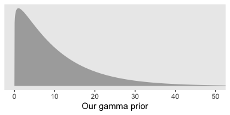<!-- -->

We can code those values in with arbitrary precision with the `stanvar()` function.


```r
stanvars <- 
  stanvar(1/29, name = "one_over_twentynine") +
  stanvar(p[1], name = "my_shape") +
  stanvar(p[2], name = "my_rate") +
  stanvar(scode = "  real<lower=0> tau;", block = "parameters")
```

Note that last `stanvar()` line. Bürkner recently posted an [exemplar of how to set a hierarchical prior on a regression coefficient](https://github.com/paul-buerkner/brms/issues/459) in a `brm()` model:


```r
# define a hierachical prior on the regression coefficients
bprior <- set_prior("normal(0, tau)", class = "b") +
  set_prior("target += normal_lpdf(tau | 0, 10)", check = FALSE)

stanvars <- stanvar(scode = "  real<lower=0> tau;", block = "parameters")

make_stancode(count ~ Trt + log_Base4_c, epilepsy,
              prior = bprior, stanvars = stanvars)
```

Following the method, we tell `brm()` we'd like to estimate the $SD$ of our $\beta_{1+}$ priors with `prior(normal(0, tau), class = b)`, where the `tau` is a stand-in for the $SD$. In the next line, `set_prior("target += gamma_lpdf(tau | my_shape, my_rate)", check = FALSE)`, we tell `brm()` we'd like to estimate `tau` with a gamma(`my_shape`, `my_rate`), the values for which were saved in our `stanvars` object, above. And it's that `stanvar()` line in that code wherein we told `brm()` we'd like that parameter to have a lower bound of 0. Let's put it to use.


```r
fit_1111 <-
  brm(data = my_data,
      family = student,
      satt_z ~ 1 + spend_z + prcnt_take_z + stu_tea_rat_z + salary_z,
      prior = c(prior(normal(0, 2), class = Intercept),
                prior(normal(0, tau), class = b),
                set_prior("target += gamma_lpdf(tau | my_shape, my_rate)", check = FALSE),
                prior(normal(0, 1), class = sigma),
                prior(exponential(one_over_twentynine), class = nu)),
      chains = 4, cores = 4,
      control = list(adapt_delta = .99),
      stanvars = stanvars,
      seed = 18)

fit_0111 <-
  update(fit_1111,
         formula = satt_z ~ 1           + prcnt_take_z + stu_tea_rat_z + salary_z)

fit_1011 <-
  update(fit_1111,
         formula = satt_z ~ 1 + spend_z                + stu_tea_rat_z + salary_z)
 
fit_1101 <-
  update(fit_1111,
         formula = satt_z ~ 1 + spend_z + prcnt_take_z                 + salary_z)

fit_1110 <-
  update(fit_1111,
         formula = satt_z ~ 1 + spend_z + prcnt_take_z + stu_tea_rat_z           )

fit_0011 <-
  update(fit_1111,
         formula = satt_z ~ 1                          + stu_tea_rat_z + salary_z)

fit_0101 <-
  update(fit_1111,
         formula = satt_z ~ 1           + prcnt_take_z                 + salary_z)

fit_0110 <-
  update(fit_1111,
         formula = satt_z ~ 1           + prcnt_take_z + stu_tea_rat_z           )

fit_1001 <-
  update(fit_1111,
         formula = satt_z ~ 1 + spend_z                                + salary_z)

fit_1010 <-
  update(fit_1111,
         formula = satt_z ~ 1 + spend_z                + stu_tea_rat_z           )

fit_1100 <-
  update(fit_1111,
         formula = satt_z ~ 1 + spend_z + prcnt_take_z                           )

fit_0001 <-
  update(fit_1111,
         formula = satt_z ~ 1                                          + salary_z)

fit_0010 <-
  update(fit_1111,
         formula = satt_z ~ 1                          + stu_tea_rat_z           )

fit_0100 <-
  update(fit_1111,
         formula = satt_z ~ 1           + prcnt_take_z                           )

fit_1000 <-
  update(fit_1111,
         formula = satt_z ~ 1 + spend_z                                          )

fit_0000 <-
  update(fit_1111,
         formula = satt_z ~ 1                                                    )
```

In order to keep track of the next 16 models, we switched our usual naming convention. Instead of continuing on keeping on calling them `fit17` through `fit33`, we used Kruschke's $\delta$ 0/1 convention. If we set the formula for the full model as `satt_z ~ 1 + spend_z + prcnt_take_z + stu_tea_rat_z + salary_z`, the name becomes `fit_1111`. Accordingly, we called the model omitting `spend_z`, the first predictor, `fit_0111`, and so on.

Before we go any further, here are the correlations among the $\beta$s for the full model, `fit_1111`.


```r
vcov(fit_1111, correlation = T) %>% 
  round(digits = 3)
```

```
##               Intercept spend_z prcnt_take_z stu_tea_rat_z salary_z
## Intercept         1.000   0.009       -0.007         0.019   -0.023
## spend_z           0.009   1.000        0.039         0.688   -0.883
## prcnt_take_z     -0.007   0.039        1.000         0.242   -0.344
## stu_tea_rat_z     0.019   0.688        0.242         1.000   -0.683
## salary_z         -0.023  -0.883       -0.344        -0.683    1.000
```

Once again, the HMC correlations differ from Kruschke's JAGS correlations. Moving on--behold the model weights.


```r
(
  mw <-
  model_weights(fit_1111, 
                fit_0111, fit_1011, fit_1101, fit_1110,
                fit_0011, fit_0101, fit_0110, fit_1001, fit_1010, fit_1100, 
                fit_0001, fit_0010, fit_0100, fit_1000,
                fit_0000)
 )
```

```
##     fit_1111     fit_0111     fit_1011     fit_1101     fit_1110 
## 6.863750e-06 2.487864e-01 1.805001e-05 3.950442e-06 2.701096e-03 
##     fit_0011     fit_0101     fit_0110     fit_1001     fit_1010 
## 1.533369e-05 8.946392e-03 1.508780e-05 1.320403e-05 1.184423e-05 
##     fit_1100     fit_0001     fit_0010     fit_0100     fit_1000 
## 1.985399e-01 1.387202e-01 3.212120e-06 3.161577e-01 8.606082e-02 
##     fit_0000 
## 1.024098e-08
```

We'll plot our model weights like before.


```r
mw %>% 
  as.data.frame() %>% 
  rownames_to_column() %>% 
  set_names("fit", "weight") %>% 
  
  ggplot(aes(x = weight, y = reorder(fit, weight))) +
  geom_text(aes(label = weight %>% round(3) %>% as.character()),
            size = 3) +
  coord_cartesian(xlim = 0:1) +
  labs(x = "Stacking weight",
       y = NULL) +
  theme(axis.ticks.y = element_blank())
```

<!-- -->

As you might notice, pattern among model weights is similar with but not identical to the one among the model probabilities Kruschke displayed in Figure 18.15. Here we'll plot the histograms for our top six.


```r
# first, we need to redefine `sd_x_3` and `sd_x_4` in terms of our two new predictors
sd_x_3 <- sd(my_data$StuTeaRat)
sd_x_4 <- sd(my_data$Salary)

## Now we'll start extracting our posterior samples and wrangling them, by model
# fit_0100
posterior_samples(fit_0100) %>% 
  transmute(PrcntTake = make_beta_j(zeta_j = b_prcnt_take_z,
                                    sd_j   = sd_x_2,
                                    sd_y   = sd_y)) %>% 
  gather() %>% 
  mutate(fit = "fit_0100") %>% 
  # fit_0111
  bind_rows(
    posterior_samples(fit_0111) %>% 
      transmute(PrcntTake = make_beta_j(zeta_j = b_prcnt_take_z,
                                        sd_j   = sd_x_2,
                                        sd_y   = sd_y),
                StuTeaRat = make_beta_j(zeta_j = b_stu_tea_rat_z,
                                        sd_j   = sd_x_3,
                                        sd_y   = sd_y),
                Salary    = make_beta_j(zeta_j = b_salary_z,
                                        sd_j   = sd_x_4,
                                        sd_y   = sd_y)) %>% 
      gather() %>% 
      mutate(fit = "fit_0111")
    )  %>% 
  # fit_1100
  bind_rows(
    posterior_samples(fit_1100) %>% 
      transmute(Spend     = make_beta_j(zeta_j = b_spend_z,
                                        sd_j   = sd_x_1,
                                        sd_y   = sd_y),
                PrcntTake = make_beta_j(zeta_j = b_prcnt_take_z,
                                        sd_j   = sd_x_2,
                                        sd_y   = sd_y)) %>% 
      gather() %>% 
      mutate(fit = "fit_1100")
    )  %>% 
  # fit_0001
  bind_rows(
    posterior_samples(fit_0001) %>% 
      transmute(Salary    = make_beta_j(zeta_j = b_salary_z,
                                        sd_j   = sd_x_4,
                                        sd_y   = sd_y)) %>% 
      gather() %>% 
      mutate(fit = "fit_0001")
    )  %>% 
  # fit_1000
  bind_rows(
    posterior_samples(fit_1000) %>% 
      transmute(Spend     = make_beta_j(zeta_j = b_spend_z,
                                        sd_j   = sd_x_1,
                                        sd_y   = sd_y)) %>% 
      gather() %>% 
      mutate(fit = "fit_1000")
    )  %>% 
  # fit_0101       # spend_z + prcnt_take_z + stu_tea_rat_z
  bind_rows(
    posterior_samples(fit_0101) %>% 
      transmute(PrcntTake = make_beta_j(zeta_j = b_prcnt_take_z,
                                        sd_j   = sd_x_2,
                                        sd_y   = sd_y),
                Salary    = make_beta_j(zeta_j = b_salary_z,
                                        sd_j   = sd_x_4,
                                        sd_y   = sd_y)) %>% 
      gather() %>% 
      mutate(fit = "fit_0101")
    ) %>% 
  # the next two lines just help order the grid the plots appear in
  mutate(key = factor(key, levels = c("Spend", "PrcntTake", "StuTeaRat", "Salary")),
         fit = factor(fit, levels = c("fit_0100", "fit_0111", "fit_1100", "fit_0001", "fit_1000", "fit_0101"))) %>%
  
  # finally, the plot!
  ggplot(aes(x = value, fill = fit)) +
  geom_histogram(color = "grey92",
                 size = .2, bins = 40) +
  stat_pointintervalh(aes(y = 0),
                      point_interval = mode_hdi, .width = c(.95, .5)) +
  scale_fill_viridis_d(option = "D", begin = .2, end = .8) +
  scale_y_continuous(NULL, breaks = NULL) +
  xlab(NULL) +
  theme(legend.position = "none") +
  facet_grid(fit~key, scales = "free")
```

<!-- -->

Like Kruschke's results in the text, `PrcntTake` was the most prominant predictor.

### What to report and what to conclude.

Kruschke made a great point in the opening paragraph of this subsection.

> It might make sense to use the single most credible model, especially if it is notably more credible than the runner up, and if the goal is to have a parsimonious explanatory description of the data. But it is important to recognize that using the single best model, when it excludes some predictors, is concluding that the regression coefficients on the excluded predictors are exactly zero. (p. 546)

Later he added "A forthright report should state the posterior probabilities of the several top models. Additionally, it can be useful to report, for each model, the ratio of its posterior probability relative to that of the best model" (p. 546). With our information criteria and model weights approach, we don't have posterior probabilities for the models themselves. But we can report on their information criteria comparisons and weights. 

In the final paragraph of the subsection, Kruschke wrote:

> When the goal is prediction of $y$ for interesting values of the predictors, as opposed to parsimonious explanation, then it is usually not appropriate to use only the single most probable model. Instead, predictions should be based on as much information as possible, using all models to the extent that they are credible. This approach is called Bayesian model averaging (BMA). (p. 547)

It's worth it to walk this out a bit. With **brms**, one can use `brms::pp_average()` to get the weighted posterior distributions for the model parameters. This is a natural extension of our model weights comparisons. 


```r
# how many points on the x-axis?
n_points <- 30

# what vales of the predictors would we like to evaluate the weighted posterior over?
nd <-
  tibble(spend_z       = seq(from = -3, to = 3, length.out = n_points),
         prcnt_take_z  = 0, 
         stu_tea_rat_z = 0, 
         salary_z      = 0)

pp <-
  # the first things we feed into `pp_average()` are the `brm()` fits we'd like to average over
  pp_average(fit_1111, fit_0111, fit_1011, fit_1101, fit_1110, fit_0011, fit_0101, fit_0110, fit_1001, fit_1010, fit_1100, fit_0001, fit_0010, fit_0100, fit_1000, fit_0000,
             # here we tell it to evaluate the posterior over these predictor values
             newdata = nd, 
             # we can get the mean trends using the "fitted" method
             method = "fitted",
             # by `robust`, we mean we'd like the Estimate in terms of posterior medians, rather than means
             robust = T)

str(pp)
```

```
##  num [1:30, 1:4] -0.0164 -0.0164 -0.0164 -0.0163 -0.0164 ...
##  - attr(*, "dimnames")=List of 2
##   ..$ : NULL
##   ..$ : chr [1:4] "Estimate" "Est.Error" "Q2.5" "Q97.5"
##  - attr(*, "weights")= Named num [1:16] 6.86e-06 2.49e-01 1.81e-05 3.95e-06 2.70e-03 ...
##   ..- attr(*, "names")= chr [1:16] "fit_1111" "fit_0111" "fit_1011" "fit_1101" ...
##  - attr(*, "nsamples")= Named num [1:16] 0 995 0 0 11 0 36 0 0 0 ...
##   ..- attr(*, "names")= chr [1:16] "fit_1111" "fit_0111" "fit_1011" "fit_1101" ...
```

The `pp` object will require a little wrangling before it's of use for **ggplot2**.


```r
pp %>% 
  as_tibble() %>%
  bind_cols(nd) %>% 

  ggplot(aes(x = spend_z, y = Estimate,
             ymin = Q2.5, ymax = Q97.5)) +
  geom_pointrange(color = "grey50") +
  labs(x = "Value of Spend_z",
       y = "Standardized SATT")
```

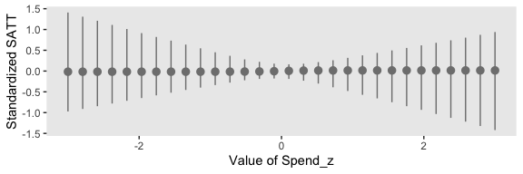<!-- -->

We can build on this to make a plot considering each of the four predictors. But first that requires we make a new `nd` tibble to feed into `pp_average()`.


```r
# how many points on the x-axis?
n_points <- 30

# what vales of the predictors would we like to evaluate the weighted posterior over?
nd <-
  tibble(spend_z       = c(seq(from = -3, to = 3, length.out = n_points),
                           rep(0, times = n_points * 3)),
         
         prcnt_take_z  = c(rep(0, times = n_points),
                           seq(from = -3, to = 3, length.out = n_points),
                           rep(0, times = n_points * 2)), 
         
         stu_tea_rat_z = c(rep(0, times = n_points * 2),
                           seq(from = -3, to = 3, length.out = n_points),
                           rep(0, times = n_points)), 
         
         salary_z      = c(rep(0, times = n_points * 3),
                           seq(from = -3, to = 3, length.out = n_points)))

pp <-
  pp_average(fit_1111, fit_0111, fit_1011, fit_1101, fit_1110, fit_0011, fit_0101, fit_0110, fit_1001, fit_1010, fit_1100, fit_0001, fit_0010, fit_0100, fit_1000, fit_0000,
             newdata = nd, 
             method = "fitted",
             robust = T,
             # Note the `probs` argument
             probs = c(.025, .975, .1, .9, .25, .75))

str(pp)
```

```
##  num [1:120, 1:8] -0.0163 -0.0163 -0.0163 -0.0163 -0.0163 ...
##  - attr(*, "dimnames")=List of 2
##   ..$ : NULL
##   ..$ : chr [1:8] "Estimate" "Est.Error" "Q2.5" "Q97.5" ...
##  - attr(*, "weights")= Named num [1:16] 6.86e-06 2.49e-01 1.81e-05 3.95e-06 2.70e-03 ...
##   ..- attr(*, "names")= chr [1:16] "fit_1111" "fit_0111" "fit_1011" "fit_1101" ...
##  - attr(*, "nsamples")= Named num [1:16] 0 995 0 0 11 0 36 0 0 0 ...
##   ..- attr(*, "names")= chr [1:16] "fit_1111" "fit_0111" "fit_1011" "fit_1101" ...
```

In each panel of the plot, below, we focus on one predictor. For that predictor, we hold all other three at their mean, which, since they are all standardized, is zero. We consider the posterior predictions for standardized SAT scores across a range of values each focal predictor. The posterior predictions are depicted in terms of 95%, 80%, and 50% percentile-based interval bands and a line at the median.


```r
pp %>% 
  as_tibble() %>% 
  mutate(x = seq(from = -3, to = 3, length.out = n_points) %>% rep(., times = 4),
         predictor = rep(c("Spend_z", "PrcntTake_z", "StuTeaRat_z", "Salary_z"), each = n_points)) %>% 
  
  ggplot(aes(x = x)) +
  geom_ribbon(aes(ymin = Q2.5, ymax = Q97.5, fill = predictor),
              alpha = 1/5) +
  geom_ribbon(aes(ymin = Q10, ymax = Q90, fill = predictor),
              alpha = 1/4) +
  geom_ribbon(aes(ymin = Q25, ymax = Q75, fill = predictor),
              alpha = 1/3) +
  geom_line(aes(y = Estimate, color = predictor),
            size = 1) +
  scale_fill_viridis_d(option = "D", begin = .1, end = .6) +
  scale_color_viridis_d(option = "D", begin = .1, end = .6) +
  labs(x = "Standardized value of the focal predictor",
       y = "Standardized SATT") +
  theme(legend.position = "none") +
  facet_grid(predictor ~ ., scales = "free")
```

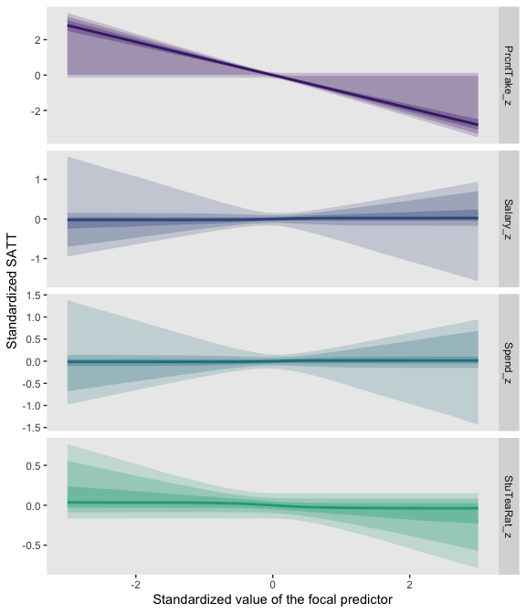<!-- -->

Based on the weighted average across the models, the `PrcntTake_z` predictor was the pmost potent.

### Caution: Computational methods.

> To conclude this section regarding variable selection, it is appropriate to recapitulate the considerations at the beginning of the section. Variable selection is a reasonable approach only if it is genuinely plausible and meaningful that candidate predictors have zero relation to the predicted variable. The results can be surprisingly sensitive to the seemingly innocuous choice of prior for the regression coefficients, and, of course, the prior for the inclusion probability. Because of these limitations, hierarchical shrinkage priors may be a more meaningful approach. (p. 548)

### Caution: Interaction variables.

> When interaction terms are included in a model that also has hierarchical shrinkage on regression coefficients, the interaction coefficients should not be put under the same higher-level prior distribution as the individual component coefficients, because interaction coefficients are conceptually from a different class of variables than individual components. (pp. 548--549)

## Reference {-}

[Kruschke, J. K. (2015). *Doing Bayesian data analysis, Second Edition: A tutorial with R, JAGS, and Stan.* Burlington, MA: Academic Press/Elsevier.](https://sites.google.com/site/doingbayesiandataanalysis/)

## Session info {-}


```r
sessionInfo()
```

```
## R version 3.6.0 (2019-04-26)
## Platform: x86_64-apple-darwin15.6.0 (64-bit)
## Running under: macOS High Sierra 10.13.6
## 
## Matrix products: default
## BLAS:   /Library/Frameworks/R.framework/Versions/3.6/Resources/lib/libRblas.0.dylib
## LAPACK: /Library/Frameworks/R.framework/Versions/3.6/Resources/lib/libRlapack.dylib
## 
## locale:
## [1] en_US.UTF-8/en_US.UTF-8/en_US.UTF-8/C/en_US.UTF-8/en_US.UTF-8
## 
## attached base packages:
## [1] stats     graphics  grDevices utils     datasets  methods   base     
## 
## other attached packages:
##  [1] ggridges_0.5.1  bayesplot_1.7.0 tidybayes_1.1.0 brms_2.10.3    
##  [5] Rcpp_1.0.2      forcats_0.4.0   stringr_1.4.0   dplyr_0.8.3    
##  [9] purrr_0.3.3     readr_1.3.1     tidyr_1.0.0     tibble_2.1.3   
## [13] ggplot2_3.2.1   tidyverse_1.2.1
## 
## loaded via a namespace (and not attached):
##   [1] colorspace_1.4-1          ellipsis_0.3.0           
##   [3] rsconnect_0.8.15          ggstance_0.3.2           
##   [5] markdown_1.1              base64enc_0.1-3          
##   [7] rstudioapi_0.10           rstan_2.19.2             
##   [9] svUnit_0.7-12             DT_0.9                   
##  [11] fansi_0.4.0               lubridate_1.7.4          
##  [13] xml2_1.2.0                bridgesampling_0.7-2     
##  [15] mnormt_1.5-5              knitr_1.23               
##  [17] shinythemes_1.1.2         zeallot_0.1.0            
##  [19] jsonlite_1.6              broom_0.5.2              
##  [21] shiny_1.3.2               compiler_3.6.0           
##  [23] httr_1.4.0                backports_1.1.5          
##  [25] assertthat_0.2.1          Matrix_1.2-17            
##  [27] lazyeval_0.2.2            cli_1.1.0                
##  [29] later_1.0.0               htmltools_0.4.0          
##  [31] prettyunits_1.0.2         tools_3.6.0              
##  [33] igraph_1.2.4.1            coda_0.19-3              
##  [35] gtable_0.3.0              glue_1.3.1.9000          
##  [37] reshape2_1.4.3            cellranger_1.1.0         
##  [39] vctrs_0.2.0               nlme_3.1-139             
##  [41] crosstalk_1.0.0           psych_1.8.12             
##  [43] xfun_0.10                 ps_1.3.0                 
##  [45] rvest_0.3.4               mime_0.7                 
##  [47] miniUI_0.1.1.1            lifecycle_0.1.0          
##  [49] gtools_3.8.1              MASS_7.3-51.4            
##  [51] zoo_1.8-6                 scales_1.0.0             
##  [53] colourpicker_1.0          hms_0.4.2                
##  [55] promises_1.1.0            Brobdingnag_1.2-6        
##  [57] parallel_3.6.0            inline_0.3.15            
##  [59] shinystan_2.5.0           yaml_2.2.0               
##  [61] gridExtra_2.3             loo_2.1.0                
##  [63] StanHeaders_2.19.0        stringi_1.4.3            
##  [65] dygraphs_1.1.1.6          pkgbuild_1.0.5           
##  [67] rlang_0.4.1               pkgconfig_2.0.3          
##  [69] matrixStats_0.55.0        HDInterval_0.2.0         
##  [71] evaluate_0.14             lattice_0.20-38          
##  [73] rstantools_2.0.0          htmlwidgets_1.5          
##  [75] labeling_0.3              tidyselect_0.2.5         
##  [77] processx_3.4.1            plyr_1.8.4               
##  [79] magrittr_1.5              R6_2.4.0                 
##  [81] generics_0.0.2            foreign_0.8-71           
##  [83] pillar_1.4.2              haven_2.1.0              
##  [85] withr_2.1.2               xts_0.11-2               
##  [87] abind_1.4-5               modelr_0.1.4             
##  [89] crayon_1.3.4              arrayhelpers_1.0-20160527
##  [91] utf8_1.1.4                rmarkdown_1.13           
##  [93] grid_3.6.0                readxl_1.3.1             
##  [95] callr_3.3.2               threejs_0.3.1            
##  [97] digest_0.6.21             xtable_1.8-4             
##  [99] httpuv_1.5.2              stats4_3.6.0             
## [101] munsell_0.5.0             viridisLite_0.3.0        
## [103] shinyjs_1.0
```


