# Metric Predicted Variable with One Nominal Predictor

> This chapter considers data structures that consist of a metric predicted variable and a nominal predictor.... This type of data structure can arise from experiments or from observational studies. In experiments, the researcher assigns the categories (at random) to the experimental subjects. In observational studies, both the nominal predictor value and the metric predicted value are generated by processes outside the direct control of the researcher. In either case, the same mathematical description can be applied to the data (although causality is best inferred from experimental intervention).
>
> The traditional treatment of this sort of data structure is called single-factor analysis of variance (ANOVA), or sometimes one-way ANOVA. Our Bayesian approach will be a hierarchical generalization of the traditional ANOVA model. The chapter will also consider the situation in which there is also a metric predictor that accompanies the primary nominal predictor. The metric predictor is sometimes called a covariate, and the traditional treatment of this data structure is called analysis of covariance (ANCOVA). The chapter also considers generalizations of the traditional models, because it is straight forward in Bayesian software to implement heavy-tailed distributions to accommodate outliers, along with hierarchical structure to accommodate heterogeneous variances in the different groups, etc. [@kruschkeDoingBayesianData2015, pp. 553--554]

## Describing multiple groups of metric data

> Figure 19.1 illustrates the conventional description of grouped metric data. Each group is represented as a position on the horizontal axis. The vertical axis represents the variable to be predicted by group membership. The data are assumed to be normally distributed within groups, with equal standard deviation in all groups. The group means are deflections from overall baseline, such that the deflections sum to zero. Figure 19.1 provides a specific numerical example, with data that were randomly generated from the model. (p. 554)

We'll want a custom data-generating function for our primary group data.


```r
library(tidyverse)

generate_data <- function(seed, mean) {
  set.seed(seed)
  rnorm(n, mean = grand_mean + mean, sd = 2)
}

n          <- 20
grand_mean <- 101

d <-
  tibble(group     = 1:5,
         deviation = c(4, -5, -2, 6, -3)) %>% 
  mutate(d = map2(group, deviation, generate_data)) %>% 
  unnest(d) %>% 
  mutate(iteration = rep(1:n, times = 5))

glimpse(d)
```

```
## Rows: 100
## Columns: 4
## $ group     <int> 1, 1, 1, 1, 1, 1, 1, 1, 1, 1, 1, 1, 1, 1, 1, 1, 1, 1, 1, 1, 2, 2, 2, 2, 2, 2, 2,…
## $ deviation <dbl> 4, 4, 4, 4, 4, 4, 4, 4, 4, 4, 4, 4, 4, 4, 4, 4, 4, 4, 4, 4, -5, -5, -5, -5, -5, …
## $ d         <dbl> 103.74709, 105.36729, 103.32874, 108.19056, 105.65902, 103.35906, 105.97486, 106…
## $ iteration <int> 1, 2, 3, 4, 5, 6, 7, 8, 9, 10, 11, 12, 13, 14, 15, 16, 17, 18, 19, 20, 1, 2, 3, …
```

Here we'll make a tibble containing the necessary data for the rotated Gaussians. As far as I can tell, Kruschke's Gaussians only span to the bounds of percentile-based 98% intervals. We partition off those bounds for each `group` by the `ll` and `ul` columns in the first `mutate()` function. In the second `mutate()`, we expand the dataset to include a sequence of 100 values between those lower- and upper-limit points. In the third `mutate()`, we feed those points into the `dnorm()` function, with group-specific means and a common `sd`.


```r
densities <-
  d %>% 
  distinct(group, deviation) %>% 
  mutate(ll = qnorm(.01, mean = grand_mean + deviation, sd = 2),
         ul = qnorm(.99, mean = grand_mean + deviation, sd = 2)) %>% 
  mutate(d = map2(ll, ul, seq, length.out = 100)) %>% 
  mutate(density = map2(d, grand_mean + deviation, dnorm, sd = 2)) %>% 
  unnest(c(d, density))

head(densities)
```

```
## # A tibble: 6 × 6
##   group deviation    ll    ul     d density
##   <int>     <dbl> <dbl> <dbl> <dbl>   <dbl>
## 1     1         4  100.  110.  100.  0.0133
## 2     1         4  100.  110.  100.  0.0148
## 3     1         4  100.  110.  101.  0.0165
## 4     1         4  100.  110.  101.  0.0183
## 5     1         4  100.  110.  101.  0.0203
## 6     1         4  100.  110.  101.  0.0224
```

We'll need two more supplementary tibbles to add the flourishes to the plot. The `arrow` tibble will specify our light-gray arrows. The `text` tibble will contain our annotation information.


```r
arrow <-
  tibble(d         = grand_mean,
         group     = 1:5,
         deviation = c(4, -5, -2, 6, -3),
         offset    = .1)

head(arrow)
```

```
## # A tibble: 5 × 4
##       d group deviation offset
##   <dbl> <int>     <dbl>  <dbl>
## 1   101     1         4    0.1
## 2   101     2        -5    0.1
## 3   101     3        -2    0.1
## 4   101     4         6    0.1
## 5   101     5        -3    0.1
```

```r
text <-
  tibble(d         = grand_mean,
         group     = c(0:5, 0),
         deviation = c(0, 4, -5, -2, 6, -3, 10),
         offset    = rep(c(1/4, 0), times = c(6, 1)),
         angle     = rep(c(90, 0), times = c(6, 1)),
         label     = c("beta[0]==101", "beta['[1]']==4","beta['[2]']==-5", "beta['[3]']==-2", "beta['[4]']==6", "beta['[5]']==3", "sigma['all']==2"))

head(text)
```

```
## # A tibble: 6 × 6
##       d group deviation offset angle label          
##   <dbl> <dbl>     <dbl>  <dbl> <dbl> <chr>          
## 1   101     0         0   0.25    90 beta[0]==101   
## 2   101     1         4   0.25    90 beta['[1]']==4 
## 3   101     2        -5   0.25    90 beta['[2]']==-5
## 4   101     3        -2   0.25    90 beta['[3]']==-2
## 5   101     4         6   0.25    90 beta['[4]']==6 
## 6   101     5        -3   0.25    90 beta['[5]']==3
```

We're almost ready to plot. Before we do, let's talk color and theme. For this chapter, we'll take our color palette from the [**palettetown** package](https://CRAN.R-project.org/package=palettetown) [@R-palettetown], which provides an array of color palettes inspired by [Pokémon](https://www.pokemon.com/us/). Our color palette will be #17, which is based on [Pidgeotto](https://www.pokemon.com/us/pokedex/pidgeotto).


```r
library(palettetown)

scales::show_col(pokepal(pokemon = 17))
```

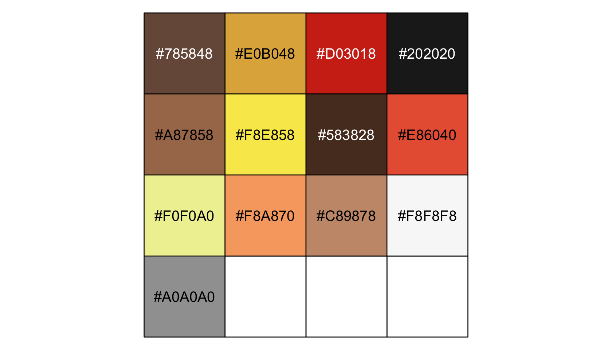

```r
pp <- pokepal(pokemon = 17)

pp
```

```
##  [1] "#785848" "#E0B048" "#D03018" "#202020" "#A87858" "#F8E858" "#583828" "#E86040" "#F0F0A0"
## [10] "#F8A870" "#C89878" "#F8F8F8" "#A0A0A0"
```

Our overall plot theme will be based on the default `theme_grey()` with a good number of adjustments.


```r
theme_set(
  theme_grey() +
    theme(text = element_text(color = pp[4]),
          axis.text = element_text(color = pp[4]),
          axis.ticks = element_line(color = pp[4]),
          legend.background = element_blank(),
          legend.box.background = element_blank(),
          legend.key = element_rect(fill = pp[9]),
          panel.background = element_rect(fill = pp[9], color = pp[9]),
          panel.grid = element_blank(),
          plot.background = element_rect(fill = pp[12], color = pp[12]),
          strip.background = element_rect(fill = alpha(pp[2], 1/3), color = "transparent"),
          strip.text = element_text(color = pp[4]))
)
```

Now make Figure 19.1.


```r
library(ggridges)

d %>% 
  ggplot(aes(x = d, y = group, group = group)) +
  geom_vline(xintercept = grand_mean, color = pp[12]) +
  geom_jitter(height = .05, alpha = 4/4, shape = 1, color = pp[10]) +
  # the Gaussians
  geom_ridgeline(data = densities,
                 aes(height = -density),
                 min_height = NA, scale = 3/2, size = 3/4,
                 fill = "transparent", color = pp[7]) +
  # the small arrows
  geom_segment(data = arrow,
               aes(xend = d + deviation,
                   y = group + offset, yend = group + offset),
               color = pp[5], size = 1,
               arrow = arrow(length = unit(.2, "cm"))) +
  # the large arrow on the left
  geom_segment(aes(x = 80, xend = grand_mean,
                   y = 0, yend = 0),
               color = pp[5], size = 3/4,
               arrow = arrow(length = unit(.2, "cm"))) +
  # the text
  geom_text(data = text,
            aes(x = grand_mean + deviation, y = group + offset,
                label = label, angle = angle), 
            size = 4, color = pp[4], parse = T) +
  scale_y_continuous(NULL, breaks = 1:5,
                     labels = c("<1,0,0,0,0>", "<0,1,0,0,0>", "<0,0,1,0,0>", "<0,0,0,1,0>", "<0,0,0,0,1>")) +
  xlab(NULL) +
  coord_flip(xlim = c(90, 112),
             ylim = c(-0.2, 5.5))
```


> The descriptive model presented in Figure 19.1 is the traditional one used by classical ANOVA (which is described a bit more in the next section). More general models are straight forward to implement in Bayesian software. For example, outliers could be accommodated by using heavy-tailed noise distributions (such as a $t$ distribution) instead of a normal distribution, and different groups could be given different standard deviations. (p. 556)

## Traditional analysis of variance

> The terminology, "analysis of variance," comes from a decomposition of overall data variance into within-group variance and between-group variance [@fisherStatisticalMethodsResearch1925]. Algebraically, the sum of squared deviations of the scores from their overall mean equals the sum of squared deviations of the scores from their respective group means plus the sum of squared deviations of the group means from the overall mean. In other words, the total variance can be partitioned into within-group variance plus between-group variance. Because one definition of the word "analysis" is separation into constituent parts, the term ANOVA accurately describes the underlying algebra in the traditional methods. That algebraic relation is not used in the hierarchical Bayesian approach presented here. The Bayesian method can estimate component variances, however. Therefore, the Bayesian approach is not ANOVA, but is analogous to ANOVA. (p. 556)

## Hierarchical Bayesian approach

"Our goal is to estimate its parameters in a Bayesian framework. Therefore, all the parameters need to be given a meaningfully structured prior distribution" (p. 557). However, our approach will depart a little from the one in the text. All our parameters will **not** "have generic noncommittal prior distributions" (p. 557). Most importantly, we will not follow the example in [@gelmanPriorDistributionsVariance2006] of putting a broad uniform prior on $\sigma_y$. Rather, we will continue using the half-Gaussian prior, as [recommended by the Stan team](https://github.com/stan-dev/stan/wiki/Prior-Choice-Recommendations). However, we will follow Kruschke's lead for the overall intercept and use a Gaussian prior "made broad on the scale of the data" (p. 557). And like Kruschke, we will estimate $\sigma_\beta$ from the data. To further get a sense of this, let's make our version of the hierarchical model diagram of Figure 19.2.


```r
library(patchwork)

# bracket
p1 <-
  tibble(x = .99,
         y = .5,
         label = "{_}") %>% 
  
  ggplot(aes(x = x, y = y, label = label)) +
  geom_text(size = 10, hjust = 1, color = pp[8], family = "Times") +
  scale_x_continuous(expand = c(0, 0), limits = c(0, 1)) +
  ylim(0, 1) +
  theme_void()

##  plain arrow
# save our custom arrow settings
my_arrow <- arrow(angle = 20, length = unit(0.35, "cm"), type = "closed")
p2 <-
  tibble(x    = .72,
         y    = 1,
         xend = .68,
         yend = .25) %>%
  
  ggplot(aes(x = x, xend = xend,
             y = y, yend = yend)) +
  geom_segment(arrow = my_arrow, color = pp[4]) +
  xlim(0, 1) +
  theme_void()

# normal density
p3 <-
  tibble(x = seq(from = -3, to = 3, by = .1)) %>% 
  ggplot(aes(x = x, y = (dnorm(x)) / max(dnorm(x)))) +
  geom_area(fill = pp[9]) +
  annotate(geom = "text",
           x = 0, y = .2,
           label = "normal",
           size = 7, color = pp[4]) +
  annotate(geom = "text",
           x = c(0, 1.45), y = .6,
           hjust = c(.5, 0),
           label = c("italic(M)[0]", "italic(S)[0]"), 
           size = 7, color = pp[4], family = "Times", parse = T) +
  scale_x_continuous(expand = c(0, 0)) +
  theme_void() +
  theme(axis.line.x = element_line(size = 0.5, color = pp[4]))
```

```
## Warning: The `size` argument of `element_line()` is deprecated as of ggplot2 3.4.0.
## ℹ Please use the `linewidth` argument instead.
```

```r
# second normal density
p4 <-
  tibble(x = seq(from = -3, to = 3, by = .1)) %>% 
  ggplot(aes(x = x, y = (dnorm(x)) / max(dnorm(x)))) +
  geom_area(fill = pp[9]) +
  annotate(geom = "text",
           x = 0, y = .2,
           label = "normal",
           size = 7, color = pp[4]) +
  annotate(geom = "text",
           x = c(0, 1.45), y = .6,
           hjust = c(.5, 0),
           label = c("0", "sigma[beta]"), 
           size = 7, color = pp[4], family = "Times", parse = T) +
  scale_x_continuous(expand = c(0, 0)) +
  theme_void() +
  theme(axis.line.x = element_line(size = 0.5, color = pp[4]))

# two annotated arrows
p5 <-
  tibble(x    = c(.16, .81),
         y    = c(1, 1),
         xend = c(.47, .77),
         yend = c(0, 0)) %>%
  ggplot(aes(x = x, xend = xend,
             y = y, yend = yend)) +
  geom_segment(arrow = my_arrow, color = pp[4]) +
  annotate(geom = "text",
           x = c(.25, .74, .83), y = .5,
           label = c("'~'", "'~'", "italic(j)"),
           size = c(10, 10, 7), 
           color = pp[4], family = "Times", parse = T) +
  xlim(0, 1) +
  theme_void()

# likelihood formula
p6 <-
  tibble(x = .99,
         y = .25,
         label = "beta[0]+sum()[italic(j)]*beta['['*italic(j)*']']*italic(x)['['*italic(j)*']'](italic(i))") %>% 
 
  ggplot(aes(x = x, y = y, label = label)) +
  geom_text(hjust = 1, size = 7, color = pp[4], parse = T, family = "Times") +
  scale_x_continuous(expand = c(0, 0), limits = c(0, 1)) +
  ylim(0, 1) +
  theme_void()

# half-normal density
p7 <-
  tibble(x = seq(from = 0, to = 3, by = .01)) %>% 
  ggplot(aes(x = x, y = (dnorm(x)) / max(dnorm(x)))) +
  geom_area(fill = pp[9]) +
  annotate(geom = "text",
           x = 1.5, y = .2,
           label = "half-normal",
           size = 7, color = pp[4]) +
  annotate(geom = "text",
           x = 1.5, y = .6,
           label = "0*','*~italic(S)[sigma]", 
           size = 7, color = pp[4], family = "Times", parse = T) +
  scale_x_continuous(expand = c(0, 0)) +
  theme_void() +
  theme(axis.line.x = element_line(size = 0.5, color = pp[4]))

# annotated arrow
p8 <-
  tibble(x     = .38,
         y     = .65,
         label = "'='") %>% 
  
  ggplot(aes(x = x, y = y, label = label)) +
  geom_text(size = 10, color = pp[4], parse = T, family = "Times") +
  geom_segment(x = .5, xend = .5,
               y = 1, yend = .25, 
               arrow = my_arrow, color = pp[4]) +
  xlim(0, 1) +
  theme_void()

# the third normal density
p9 <-
  tibble(x = seq(from = -3, to = 3, by = .1)) %>% 
  ggplot(aes(x = x, y = (dnorm(x)) / max(dnorm(x)))) +
  geom_area(fill = pp[9]) +
  annotate(geom = "text",
           x = 0, y = .2,
           label = "normal",
           size = 7, color = pp[4]) +
  annotate(geom = "text",
           x = c(0, 1.45), y = .6,
           hjust = c(.5, 0),
           label = c("mu[italic(i)]", "sigma[italic(y)]"), 
           size = 7, color = pp[4], family = "Times", parse = T) +
  scale_x_continuous(expand = c(0, 0)) +
  theme_void() +
  theme(axis.line.x = element_line(size = 0.5, color = pp[4]))

# another annotated arrow
p10 <-
  tibble(x     = .55,
         y     = .6,
         label = "'~'") %>% 
  
  ggplot(aes(x = x, y = y, label = label)) +
  geom_text(size = 10, color = pp[4], parse = T, family = "Times") +
  geom_segment(x = .82, xend = .38,
               y = 1, yend = .2, 
               arrow = my_arrow, color = pp[4]) +
  xlim(0, 1) +
  theme_void()

# the final annotated arrow
p11 <-
  tibble(x     = c(.375, .625),
         y     = c(1/3, 1/3),
         label = c("'~'", "italic(i)")) %>% 
  
  ggplot(aes(x = x, y = y, label = label)) +
  geom_text(size = c(10, 7), 
            color = pp[4], parse = T, family = "Times") +
  geom_segment(x = .5, xend = .5,
               y = 1, yend = 0, 
               arrow = my_arrow, color = pp[4]) +
  xlim(0, 1) +
  theme_void()

# some text
p12 <-
  tibble(x     = .5,
         y     = .5,
         label = "italic(y[i])") %>% 
  
  ggplot(aes(x = x, y = y, label = label)) +
  geom_text(size = 7, color = pp[4], parse = T, family = "Times") +
  xlim(0, 1) +
  theme_void()


# define the layout
layout <- c(
  area(t = 1, b = 1, l = 6, r = 7),
  area(t = 2, b = 3, l = 6, r = 7),
  area(t = 3, b = 4, l = 1, r = 3),
  area(t = 3, b = 4, l = 5, r = 7),
  area(t = 6, b = 7, l = 1, r = 7),
  area(t = 5, b = 6, l = 1, r = 7),
  area(t = 6, b = 7, l = 9, r = 11),
  area(t = 9, b = 10, l = 5, r = 7),
  area(t = 8, b = 9, l = 5, r = 7),
  area(t = 8, b = 9, l = 5, r = 11),
  area(t = 11, b = 11, l = 5, r = 7),
  area(t = 12, b = 12, l = 5, r = 7)
)

# combine and plot!
(p1 + p2 + p3 + p4 + p6 + p5 + p7 + p9 + p8 + p10 + p11 + p12) + 
  plot_layout(design = layout) &
  ylim(0, 1) &
  theme(plot.margin = margin(0, 5.5, 0, 5.5))
```

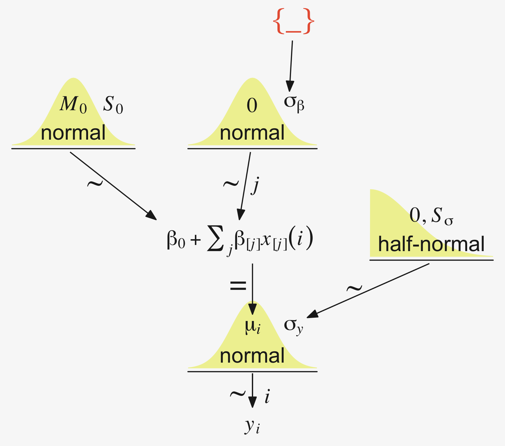

Later on in the text, Kruschke opined:

> A crucial pre-requisite for estimating $\sigma_\beta$ from all the groups is an assumption that all the groups are representative and informative for the estimate. It only makes sense to influence the estimate of one group with data from the other groups if the groups can be meaningfully described as representative of a shared higher-level distribution. (p. 559)

Although I agree with him in spirit, this doesn't appear to strictly be the case. As odd and paradoxical as this sounds, partial pooling can be of use even when the some of the cases are of a different kind. For more on the topic, see Efron and Morris's classic [-@efronSteinParadoxStatistics1977] paper, [*Stein's paradox in statistics*](http://statweb.stanford.edu/~ckirby/brad/other/Article1977.pdf), and [my blog post](https://solomonkurz.netlify.com/post/stein-s-paradox-and-what-partial-pooling-can-do-for-you/) walking out one of their examples in **brms**.

### Implementation in ~~JAGS~~ brms.

The **brms** setup, of course, differs a bit from JAGS.


```r
fit <- 
  brm(data = my_data, 
      family = gaussian,
      y ~ 1 + (1 | categirical_variable),
      prior = c(prior(normal(0, x), class = Intercept),
                prior(normal(0, x), class = b),
                prior(cauchy(0, x), class = sd),
                prior(cauchy(0, x), class = sigma)))
```

The noise standard deviation $\sigma_y$ is depicted in the prior statement including the argument `class = sigma`. The grand mean is depicted by the first `1` in the model formula and its prior is indicated by the `class = Intercept` argument. We indicate we'd like group-based deviations from the grand mean with the `(1 | categirical_variable)` syntax, where the `1` on the left side of the bar indicates we'd like our intercepts to vary by group and the `categirical_variable` part simply represents the name of a given categorical variable we'd like those intercepts to vary by. The **brms** default is to do this with deviance scores, the mean for which will be zero. Although it's not obvious in the formula syntax, the model presumes the group-based deviations are normally distributed with a mean of zero and a standard deviation, which Kruschke termed $\sigma_\beta$. There is no prior for the mean. It's set at zero. But there is a prior for $\sigma_\beta$, which is denoted by the argument `class = sd`. We, of course, are not using a uniform prior on any of our variance parameters. But in order to be weakly informative, we will use the half-Cauchy. Recall that since the **brms** default is to set the lower bound for any variance parameter to 0, there's no need to worry about doing so ourselves. So even though the syntax only indicates `cauchy`, it's understood to mean Cauchy with a lower bound at zero; since the mean is usually 0, that makes is a half-Cauchy.

Kruschke set the upper bound for his $\sigma_y$ to 10 times the standard deviation of the criterion variable. The tails of the half-Cauchy are sufficiently fat that, in practice, I've found it doesn't matter much what you set the $\textit{SD}$ of its prior to. One is often a sensible default for reasonably-scaled data. But if we want to take a more principled approach, we can set it to the size of the criterion's $\textit{SD}$ or perhaps even 10 times that value.

Kruschke suggested using a gamma on $\sigma_\beta$, which is a sensible alternative to half-Cauchy often used within the Stan universe. Especially in situations in which you would like to (a) keep the variance parameter above zero, but (b) still allow it to be arbitrarily close to zero, and also (c) let the likelihood dominate the posterior, the Stan team recommends the $\operatorname{Gamma}(2, 0)$ prior, based on the paper by Chung and colleagues [-@chungNondegeneratePenalizedLikelihood2013, click [here](http://www.stat.columbia.edu/~gelman/research/published/chung_etal_Pmetrika2013.pdf)]. But you should note that I don't mean a literal 0 for the second parameter in the gamma distribution, but rather some small value like 0.1 or so. This is all clarified in @chungNondegeneratePenalizedLikelihood2013. Here's what $\operatorname{Gamma}(2, 0.1)$ looks like.


```r
tibble(x = seq(from = 0, to = 110, by = .1)) %>% 
  
  ggplot(aes(x = x, y = dgamma(x, 2, 0.1))) +
  geom_area(fill = pp[10]) +
  annotate(geom = "text", 
           x = 14.25, y = 0.015, label = "'Gamma'*(2*', '*0.1)", 
           parse = T, color = pp[1], size = 4.25) +
  scale_x_continuous(expand = c(0, 0), limits = c(0, 110)) +
  scale_y_continuous(NULL, breaks = NULL, expand = expansion(mult = c(0, 0.05)))
```


If you'd like that prior be even less informative, just reduce it to like $\operatorname{Gamma}(2, 0.01)$ or so. Kruschke goes further to recommend "the shape and rate parameters of the gamma distribution are set so its mode is `sd(y)/2` and its standard deviation is `2*sd(y)`, using the function `gammaShRaFromModeSD` explained in [Section 9.2.2][A realistic model with MCMC.]." (pp. 560--561). Let's make that function.


```r
gamma_a_b_from_omega_sigma <- function(mode, sd) {
  
  if (mode <= 0) stop("mode must be > 0")
  if (sd   <= 0) stop("sd must be > 0")
  rate <- (mode + sqrt(mode^2 + 4 * sd^2)) / (2 * sd^2)
  shape <- 1 + mode * rate
  return(list(shape = shape, rate = rate))
  
}
```

So in the case of standardized data where `sd(1)` = 1, we'd use our `gamma_a_b_from_omega_sigma()` function like so.


```r
sd_y  <- 1 

omega <- sd_y / 2
sigma <- 2 * sd_y

(s_r <- gamma_a_b_from_omega_sigma(mode = omega, sd = sigma))
```

```
## $shape
## [1] 1.283196
## 
## $rate
## [1] 0.5663911
```

And that produces the following gamma distribution.


```r
tibble(x = seq(from = 0, to = 21, by = .01)) %>% 
  
  ggplot(aes(x = x, y = dgamma(x, s_r$shape, s_r$rate))) +
  geom_area(fill = pp[8]) +
  annotate(geom = "text", 
           x = 2.75, y = 0.02, label = "'Gamma'*(1.283196*', '*0.5663911)", 
           parse = T, color = pp[7], size = 2.75) +
  scale_x_continuous(breaks = c(0, 1, 5, 10, 20), expand = c(0, 0), limits = c(0, 21)) +
  scale_y_continuous(NULL, breaks = NULL, expand = expansion(mult = c(0, 0.05)))
```


In the parameter space that matters, from zero to one, that gamma is pretty noninformative. It peaks between the two, slopes very gently rightward, but has the nice steep slope on the left keeping the estimates off the zero boundary. And even though that right slope is very gentle given the scale of the data, it's aggressive enough that it should keep the MCMC chains from spending a lot of time in ridiculous parts of the parameter space. I.e., when working with finite numbers of iterations, we want our MCMC chains wasting exactly zero iterations investigating what the density might be for $\sigma_\beta \approx 1e10$ for standardized data.

### Example: Sex and death.

Let's load and `glimpse()` at Hanley and Shapiro's [-@hanleySexualActivityLifespan1994] fruit-fly data.


```r
my_data <- read_csv("data.R/FruitflyDataReduced.csv")

glimpse(my_data)
```

```
## Rows: 125
## Columns: 3
## $ Longevity       <dbl> 35, 37, 49, 46, 63, 39, 46, 56, 63, 65, 56, 65, 70, 63, 65, 70, 77, 81, 86…
## $ CompanionNumber <chr> "Pregnant8", "Pregnant8", "Pregnant8", "Pregnant8", "Pregnant8", "Pregnant…
## $ Thorax          <dbl> 0.64, 0.68, 0.68, 0.72, 0.72, 0.76, 0.76, 0.76, 0.76, 0.76, 0.80, 0.80, 0.…
```

We can use `geom_density_ridges()` to help get a sense of how our criterion `Longevity` is distributed across groups of `CompanionNumber`.


```r
my_data %>% 
  group_by(CompanionNumber) %>% 
  mutate(group_mean = mean(Longevity)) %>% 
  ungroup() %>% 
  mutate(CompanionNumber = fct_reorder(CompanionNumber, group_mean)) %>% 
  
  ggplot(aes(x = Longevity, y = CompanionNumber, fill = group_mean)) +
  geom_density_ridges(scale = 3/2, size = .2, color = pp[9]) +
  scale_fill_gradient(low = pp[4], high = pp[2]) +
  scale_x_continuous(expand = expansion(mult = c(0, 0.05)), limits = c(0, NA)) +
  scale_y_discrete(NULL, expand = expansion(mult = c(0, 0.4))) +
  theme(axis.text.y = element_text(hjust = 0),
        axis.ticks.y = element_blank(),
        legend.position = "none")
```

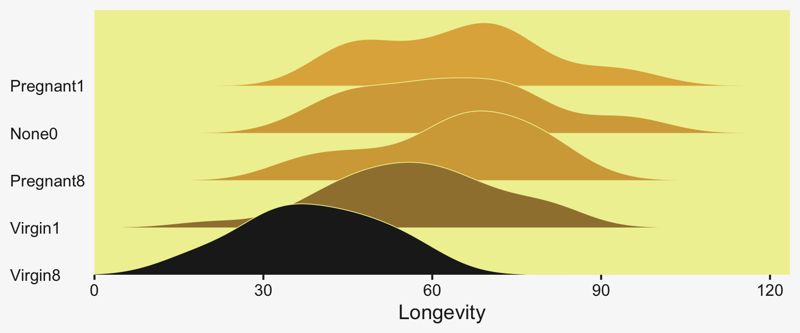

Let's fire up **brms**.


```r
library(brms)
```

We'll want to do the preparatory work to define our `stanvars`.


```r
(mean_y <- mean(my_data$Longevity))
```

```
## [1] 57.44
```

```r
(sd_y <- sd(my_data$Longevity))
```

```
## [1] 17.56389
```

```r
omega <- sd_y / 2
sigma <- 2 * sd_y

(s_r <- gamma_a_b_from_omega_sigma(mode = omega, sd = sigma))
```

```
## $shape
## [1] 1.283196
## 
## $rate
## [1] 0.03224747
```

With the prep work is done, here are our `stanvars`.


```r
stanvars <- 
  stanvar(mean_y,    name = "mean_y") + 
  stanvar(sd_y,      name = "sd_y") +
  stanvar(s_r$shape, name = "alpha") +
  stanvar(s_r$rate,  name = "beta")
```

Now fit the model, our hierarchical Bayesian alternative to an ANOVA.


```r
fit19.1 <-
  brm(data = my_data,
      family = gaussian,
      Longevity ~ 1 + (1 | CompanionNumber),
      prior = c(prior(normal(mean_y, sd_y * 5), class = Intercept),
                prior(gamma(alpha, beta), class = sd),
                prior(cauchy(0, sd_y), class = sigma)),
      iter = 4000, warmup = 1000, chains = 4, cores = 4,
      seed = 19,
      control = list(adapt_delta = 0.99),
      stanvars = stanvars,
      file = "fits/fit19.01")
```

Much like Kruschke's JAGS chains, our **brms** chains are well behaved, but only after fiddling with the `adapt_delta` setting.


```r
library(bayesplot)

color_scheme_set(scheme = pp[c(10, 8, 12, 5, 1, 4)])

plot(fit19.1, widths = c(2, 3))
```


Also like Kruschke, our chains appear moderately autocorrelated.


```r
# extract the posterior draws
draws <- as_draws_df(fit19.1)

# plot
draws %>% 
  mutate(chain = .chain) %>% 
  mcmc_acf(pars = vars(b_Intercept:sigma), lags = 10)
```


Here's the model summary.


```r
print(fit19.1)
```

```
##  Family: gaussian 
##   Links: mu = identity; sigma = identity 
## Formula: Longevity ~ 1 + (1 | CompanionNumber) 
##    Data: my_data (Number of observations: 125) 
##   Draws: 4 chains, each with iter = 4000; warmup = 1000; thin = 1;
##          total post-warmup draws = 12000
## 
## Group-Level Effects: 
## ~CompanionNumber (Number of levels: 5) 
##               Estimate Est.Error l-95% CI u-95% CI Rhat Bulk_ESS Tail_ESS
## sd(Intercept)    14.92      7.57     6.27    35.82 1.00     2515     3486
## 
## Population-Level Effects: 
##           Estimate Est.Error l-95% CI u-95% CI Rhat Bulk_ESS Tail_ESS
## Intercept    57.33      7.59    41.70    72.92 1.00     2250     2245
## 
## Family Specific Parameters: 
##       Estimate Est.Error l-95% CI u-95% CI Rhat Bulk_ESS Tail_ESS
## sigma    14.88      0.95    13.18    16.86 1.00     6571     6625
## 
## Draws were sampled using sampling(NUTS). For each parameter, Bulk_ESS
## and Tail_ESS are effective sample size measures, and Rhat is the potential
## scale reduction factor on split chains (at convergence, Rhat = 1).
```

With the `ranef()` function, we can get the summaries of the group-specific deflections.


```r
ranef(fit19.1)
```

```
## $CompanionNumber
## , , Intercept
## 
##              Estimate Est.Error       Q2.5     Q97.5
## None0       5.8334936  7.942217  -9.693236 22.207219
## Pregnant1   7.0048914  7.901202  -9.030515 23.002838
## Pregnant8   5.6482612  7.906738 -10.335139 21.786660
## Virgin1    -0.5423866  7.836639 -16.720255 14.976009
## Virgin8   -17.4580865  7.947826 -33.885667 -2.249241
```

And with the `coef()` function, we can get those same group-level summaries in a non-deflection metric.


```r
coef(fit19.1)
```

```
## $CompanionNumber
## , , Intercept
## 
##           Estimate Est.Error     Q2.5    Q97.5
## None0     63.16238  2.933578 57.39000 68.96544
## Pregnant1 64.33378  2.951117 58.50962 70.17887
## Pregnant8 62.97715  2.921190 57.26046 68.76300
## Virgin1   56.78650  2.896133 51.16755 62.52056
## Virgin8   39.87080  3.032215 33.83380 45.73514
```

Those are all estimates of the group-specific means. Since it wasn't modeled, all have the same parameter estimates for $\sigma_y$.


```r
posterior_summary(fit19.1)["sigma", ]
```

```
##   Estimate  Est.Error       Q2.5      Q97.5 
## 14.8816737  0.9459512 13.1836374 16.8615943
```

To prepare for our version of the top panel of Figure 19.3, we'll use `slice_sample()` to randomly sample from the posterior draws, saving the subset as `draws_20`.


```r
# how many random draws from the posterior would you like?
n_draws <- 20

# subset
set.seed(19)

draws_20 <-
  draws %>% 
  slice_sample(n = n_draws, replace = F)

glimpse(draws_20)
```

```
## Rows: 20
## Columns: 13
## $ b_Intercept                              <dbl> 59.79337, 68.08343, 65.87654, 49.78539, 61.36588,…
## $ sd_CompanionNumber__Intercept            <dbl> 9.746157, 21.206450, 12.517377, 22.193778, 13.077…
## $ sigma                                    <dbl> 13.96830, 14.94739, 15.45839, 14.55226, 15.96590,…
## $ `r_CompanionNumber[None0,Intercept]`     <dbl> 0.5159277, -5.8309287, -2.9403040, 12.0782556, 2.…
## $ `r_CompanionNumber[Pregnant1,Intercept]` <dbl> 4.9800818, -1.4330721, -3.5383401, 10.5176174, 2.…
## $ `r_CompanionNumber[Pregnant8,Intercept]` <dbl> 6.158075, -7.063172, -1.633937, 10.781149, 1.1145…
## $ `r_CompanionNumber[Virgin1,Intercept]`   <dbl> -2.6577022, -12.3264394, -5.4096473, 7.5111997, -…
## $ `r_CompanionNumber[Virgin8,Intercept]`   <dbl> -17.697159, -28.331720, -21.037003, -13.096651, -…
## $ lprior                                   <dbl> -13.17332, -13.38440, -13.27956, -13.37765, -13.3…
## $ lp__                                     <dbl> -528.6157, -525.9077, -529.4408, -526.6029, -528.…
## $ .chain                                   <int> 3, 4, 2, 3, 1, 2, 2, 4, 1, 4, 4, 4, 2, 4, 2, 2, 3…
## $ .iteration                               <int> 1677, 910, 1483, 1557, 2745, 1803, 2677, 1255, 26…
## $ .draw                                    <int> 7677, 9910, 4483, 7557, 2745, 4803, 5677, 10255, …
```

Before we make our version of the top panel, let's make a corresponding plot of the fixed intercept, the grand mean. The most important lines in the code, below are the ones where we used `stat_function()` within `mapply()`.


```r
tibble(x = c(0, 150)) %>% 

  ggplot(aes(x = x)) +
  mapply(function(mean, sd) {
    stat_function(fun   = dnorm, 
                  args  = list(mean = mean, sd = sd), 
                  alpha = 2/3, 
                  size  = 1/3,
                  color = pp[4])
    }, 
    # enter means and standard deviations here
    mean = draws_20 %>% pull(b_Intercept),
    sd   = draws_20 %>% pull(sigma)
    ) +
  geom_jitter(data = my_data, aes(x = Longevity, y = -0.001),
              height = .001, 
              alpha = 3/4, color = pp[10]) +
  scale_x_continuous("Longevity", breaks = 0:4 * 25,
                     limits = c(0, NA), expand = expansion(mult = c(0, 0.05))) +
  scale_y_continuous(NULL, breaks = NULL) +
  labs(title = "Posterior Predictive Distribution",
       subtitle = "The jittered dots are the ungrouped Longevity data. The\nGaussians are posterior draws depicting the overall\ndistribution, the grand mean.") +
  coord_cartesian(xlim = c(0, 110))
```


Unfortunately, we can't extend our `mapply(stat_function())` method to the group-level estimates. To my knowledge, there isn't a way to show the group estimates at different spots along the y-axis. And our `mapply(stat_function())` approach has other limitations, too. Happily, we have some great alternatives. To use them, we'll need a little help from **tidybayes**.


```r
library(tidybayes)
```

For the first part, we'll take `tidybayes::add_epred_draws()` for a whirl.


```r
densities <-
  my_data %>% 
  distinct(CompanionNumber) %>% 
  add_epred_draws(fit19.1, ndraws = 20, seed = 19, dpar = c("mu", "sigma"))

glimpse(densities)
```

```
## Rows: 100
## Columns: 8
## Groups: CompanionNumber, .row [5]
## $ CompanionNumber <chr> "Pregnant8", "Pregnant8", "Pregnant8", "Pregnant8", "Pregnant8", "Pregnant…
## $ .row            <int> 1, 1, 1, 1, 1, 1, 1, 1, 1, 1, 1, 1, 1, 1, 1, 1, 1, 1, 1, 1, 2, 2, 2, 2, 2,…
## $ .chain          <int> NA, NA, NA, NA, NA, NA, NA, NA, NA, NA, NA, NA, NA, NA, NA, NA, NA, NA, NA…
## $ .iteration      <int> NA, NA, NA, NA, NA, NA, NA, NA, NA, NA, NA, NA, NA, NA, NA, NA, NA, NA, NA…
## $ .draw           <int> 1, 2, 3, 4, 5, 6, 7, 8, 9, 10, 11, 12, 13, 14, 15, 16, 17, 18, 19, 20, 1, …
## $ .epred          <dbl> 63.46305, 61.49345, 68.17744, 62.48045, 61.84531, 63.64695, 64.24260, 60.6…
## $ mu              <dbl> 63.46305, 61.49345, 68.17744, 62.48045, 61.84531, 63.64695, 64.24260, 60.6…
## $ sigma           <dbl> 13.93148, 13.77736, 13.20789, 15.96590, 14.70948, 14.86626, 15.45839, 14.8…
```

With the first two lines, we made a $5 \times 1$ tibble containing the five levels of the experimental grouping variable, `CompanionNumber`. The `add_epred_draws()` function comes from **tidybayes** [see the [Posterior fits](https://mjskay.github.io/tidybayes/articles/tidy-brms.html#posterior-fits) section of @kayExtractingVisualizingTidy2021]. The first argument of the `add_epred_draws()` is `newdata`, which works much like it does in `brms::fitted()`; it took our $5 \times 1$ tibble. The next argument took our **brms** model fit, `fit19.1`. With the `ndraws` argument, we indicated we just wanted 20 random draws from the posterior. The `seed` argument makes those random draws reproducible. With `dpar`, we requested distributional regression parameters in the output. In our case, those were the $\mu$ and $\sigma$ values for each level of `CompanionNumber`. Since we took 20 draws across 5 groups, we ended up with a 100-row tibble.

The next steps are a direct extension of the method we used to make our Gaussians for our version of Figure 19.1.


```r
densities <-
  densities %>% 
  mutate(ll = qnorm(.025, mean = mu, sd = sigma),
         ul = qnorm(.975, mean = mu, sd = sigma)) %>% 
  mutate(Longevity = map2(ll, ul, seq, length.out = 100)) %>% 
  unnest(Longevity) %>% 
  mutate(density = dnorm(Longevity, mu, sigma))

glimpse(densities)
```

```
## Rows: 10,000
## Columns: 12
## Groups: CompanionNumber, .row [5]
## $ CompanionNumber <chr> "Pregnant8", "Pregnant8", "Pregnant8", "Pregnant8", "Pregnant8", "Pregnant…
## $ .row            <int> 1, 1, 1, 1, 1, 1, 1, 1, 1, 1, 1, 1, 1, 1, 1, 1, 1, 1, 1, 1, 1, 1, 1, 1, 1,…
## $ .chain          <int> NA, NA, NA, NA, NA, NA, NA, NA, NA, NA, NA, NA, NA, NA, NA, NA, NA, NA, NA…
## $ .iteration      <int> NA, NA, NA, NA, NA, NA, NA, NA, NA, NA, NA, NA, NA, NA, NA, NA, NA, NA, NA…
## $ .draw           <int> 1, 1, 1, 1, 1, 1, 1, 1, 1, 1, 1, 1, 1, 1, 1, 1, 1, 1, 1, 1, 1, 1, 1, 1, 1,…
## $ .epred          <dbl> 63.46305, 63.46305, 63.46305, 63.46305, 63.46305, 63.46305, 63.46305, 63.4…
## $ mu              <dbl> 63.46305, 63.46305, 63.46305, 63.46305, 63.46305, 63.46305, 63.46305, 63.4…
## $ sigma           <dbl> 13.93148, 13.93148, 13.93148, 13.93148, 13.93148, 13.93148, 13.93148, 13.9…
## $ ll              <dbl> 36.15784, 36.15784, 36.15784, 36.15784, 36.15784, 36.15784, 36.15784, 36.1…
## $ ul              <dbl> 90.76826, 90.76826, 90.76826, 90.76826, 90.76826, 90.76826, 90.76826, 90.7…
## $ Longevity       <dbl> 36.15784, 36.70947, 37.26109, 37.81271, 38.36433, 38.91595, 39.46757, 40.0…
## $ density         <dbl> 0.004195179, 0.004530160, 0.004884226, 0.005257716, 0.005650899, 0.0060639…
```

If you look at the code we used to make `ll` and `ul`, you'll see we used 95% intervals, this time. Our second `mutate()` function is basically the same. After unnesting the tibble, we just needed to plug in the `Longevity`, `mu`, and `sigma` values into the `dnorm()` function to compute the corresponding density values.


```r
densities %>% 
  ggplot(aes(x = Longevity, y = CompanionNumber)) +
  # here we make our density lines
  geom_ridgeline(aes(height = density, group = interaction(CompanionNumber, .draw)),
                 fill = NA, color = adjustcolor(pp[4], alpha.f = 2/3),
                 size = 1/3, scale = 25) +
  # the original data with little jitter thrown in
  geom_jitter(data = my_data,
              height = .04, alpha = 3/4, color = pp[10]) +
  # pretty much everything below this line is aesthetic fluff
  scale_x_continuous(breaks = 0:4 * 25, limits = c(0, 110), 
                     expand = expansion(mult = c(0, 0.05))) +
  labs(title = "Data with Posterior Predictive Distrib.", 
       y = NULL) +
  coord_cartesian(ylim = c(1.25, 5.25)) +
  theme(axis.text.y = element_text(hjust = 0),
        axis.ticks.y = element_blank())
```


Do be aware that when you use this method, you may have to fiddle around with the `geom_ridgeline()` `scale` argument to get the Gaussian's heights on reasonable-looking relative heights. Stick in different numbers to get a sense of what I mean. I also find that I'm often not a fan of the way the spacing on the y axis ends up with default `geom_ridgeline()`. It's easy to overcome this with a little `ylim` fiddling.

To return to the more substantive interpretation, the top panel of

> Figure 19.3 suggests that the normal distributions with homogeneous variances appear to be reasonable descriptions of the data. There are no dramatic outliers relative to the posterior predicted curves, and the spread of the data within each group appears to be reasonably matched by the width of the posterior normal curves. (Be careful when making visual assessments of homogeneity of variance because the visual spread of the data depends on the sample size; for a reminder see the [see the right panel of Figure 17.1, p. 478].) The range of credible group means, indicated by the peaks of the normal curves, suggests that the group Virgin8 is clearly lower than the others, and the group Virgin1 might be lower than the controls. To find out for sure, we need to examine the differences of group means, which we do in the next section. (p. 564)

For clarity, the "see the right panel of Figure 17.1, p. 478" part was changed following Kruschke's [Corrigenda](https://sites.google.com/site/doingbayesiandataanalysis/corrigenda).

### Contrasts.

> It is straight forward to examine the posterior distribution of credible differences. Every step in the MCMC chain provides a combination of group means that are jointly credible, given the data. Therefore, every step in the MCMC chain provides a credible difference between groups...
>
>To construct the credible differences of group $1$ and group $2$, at every step in the MCMC chain we compute
>
> \begin{align*}
> \mu_1 - \mu_2 & =  (\beta_0 + \beta_1) - (\beta_0 + \beta_2) \\
>               & =  (+1) \cdot \beta_1 + (-1) \cdot \beta_2
> \end{align*}
>
> In other words, the baseline cancels out of the calculation, and the difference is a sum of weighted group deflections. Notice that the weights sum to zero. To construct the credible differences of the average of groups $1$-$3$ and the average of groups $4$-$5$, at every step in the MCMC chain we compute
>
> \begin{align*}
> \small{(\mu_1 + \mu_2 + \mu_3) / 3 - (\mu_4 + \mu_5) / 2} & = \small{((\beta_0 + \beta_1)  + (\beta_0 + \beta_2)  + (\beta_0 + \beta_3) ) / 3 - ((\beta_0 + \beta_4) + (\beta_0 + \beta_5) ) / 2} \\
> & = \small{(\beta_1 + \beta_2 + \beta_3) / 3 - (\beta_4 + \beta_5) / 2} \\
> & = \small{(+ 1/3) \cdot \beta_1 + (+ 1/3) \cdot \beta_2 + (+ 1/3) \cdot \beta_3 + (- 1/2) \cdot \beta_4 + (- 1/2) \cdot \beta_5}
> \end{align*}
> 
> Again, the difference is a sum of weighted group deflections. The coefficients on the group deflections have the properties that they sum to zero, with the positive coefficients summing to $+1$ and the negative coefficients summing to $−1$. Such a combination is called a contrast. The differences can also be expressed in terms of effect size, by dividing the difference by $\sigma_y$ at each step in the chain. (pp. 565--566)

To warm up, here's how to compute the first contrast shown in the lower portion of Kruschke's Figure 19.3--the contrast between the two pregnant conditions and the none-control condition.


```r
draws %>% 
  transmute(c = (`r_CompanionNumber[Pregnant1,Intercept]` + `r_CompanionNumber[Pregnant8,Intercept]`) / 2 - `r_CompanionNumber[None0,Intercept]`) %>% 
  
  ggplot(aes(x = c, y = 0)) +
  stat_dotsinterval(point_interval = mode_hdi, .width = .95,
                    slab_color = pp[5], slab_fill = pp[5], color = pp[4]) +
  scale_y_continuous(NULL, breaks = NULL) +
  labs(subtitle = "Pregnant1.Pregnant8 vs None0",
       x = expression(Difference~(mu[1]+mu[2])/2-mu[3]))
```


Up to this point, our primary mode of showing marginal posterior distributions has either been minute variations on Kruschke's typical histogram approach or with densities. We'll use those again in the future, too. In this chapter and the next, we'll veer a little further from the source material and depict our marginal posteriors with dot plots and their very close relatives, quantile plots. In the dot plot, above, each of the 4,000 posterior draws is depicted by one of the stacked brown dots. To stack the dots in neat columns like that, **tidybayes** has to round a little. Though we lose something in the numeric precision, we gain a lot in interpretability. We'll have more to say in just a moment.

In case you were curious, here are the HMC-based posterior mode and 95% HDIs.


```r
draws %>% 
  transmute(difference = (`r_CompanionNumber[Pregnant1,Intercept]` + `r_CompanionNumber[Pregnant8,Intercept]`) / 2 - `r_CompanionNumber[None0,Intercept]`) %>% 
  
  mode_hdi(difference)
```

```
## # A tibble: 1 × 6
##   difference .lower .upper .width .point .interval
##        <dbl>  <dbl>  <dbl>  <dbl> <chr>  <chr>    
## 1     0.0876  -6.69   7.25   0.95 mode   hdi
```

Little difference, there. Now let's quantify the same contrast as a standardized mean difference effect size.


```r
draws %>% 
  transmute(es = ((`r_CompanionNumber[Pregnant1,Intercept]` + `r_CompanionNumber[Pregnant8,Intercept]`) / 2 - `r_CompanionNumber[None0,Intercept]`) / sigma) %>% 
  
  ggplot(aes(x = es, y = 0)) +
  stat_dotsinterval(point_interval = mode_hdi, .width = .95,
                    slab_fill = pp[5], color = pp[4], 
                    slab_size = 0, quantiles = 100) +
  scale_y_continuous(NULL, breaks = NULL) +
  labs(subtitle = "Pregnant1.Pregnant8 vs None0",
       x = expression(Effect~Size~(Difference/sigma[italic(y)])))
```


From a standardized-mean-difference perspective, that's tiny. Also note that because our model `fit19.1` did not allow the standard deviation parameter $\sigma_y$ to vary across groups, $\sigma_y$ is effectively a pooled standard deviation ($\sigma_p$).

Did you notice the `quantiles = 100` argument within `stat_dotsinterval()`? Instead of a dot plot with 4,000 tiny little dots, that argument converted the output to a quantile plot. The 4,000 posterior draws are now summarized by 100 dots, each of which represents $1\%$ of the total sample [see @kayWhenIshMy2016, @fernandesUncertaintyDisplaysUsing2018]. This quantile dot-plot method will be our main approach for the rest of the chapter.

Okay, now let's do the rest in bulk. First we'll do the difference scores.


```r
differences <-
  draws %>% 
  transmute(`Pregnant1.Pregnant8.None0 vs Virgin1` = (`r_CompanionNumber[Pregnant1,Intercept]` + `r_CompanionNumber[Pregnant8,Intercept]` + `r_CompanionNumber[None0,Intercept]`) / 3 - `r_CompanionNumber[Virgin1,Intercept]`,
            
            `Virgin1 vs Virgin8` = `r_CompanionNumber[Virgin1,Intercept]` - `r_CompanionNumber[Virgin8,Intercept]`,
            
            `Pregnant1.Pregnant8.None0 vs Virgin1.Virgin8` = (`r_CompanionNumber[Pregnant1,Intercept]` + `r_CompanionNumber[Pregnant8,Intercept]` + `r_CompanionNumber[None0,Intercept]`) / 3 - (`r_CompanionNumber[Virgin1,Intercept]` + `r_CompanionNumber[Virgin8,Intercept]`) / 2)

differences %>% 
  pivot_longer(everything()) %>% 
  
  ggplot(aes(x = value, y = 0)) +
  stat_dotsinterval(point_interval = mode_hdi, .width = .95,
                    slab_fill = pp[5], color = pp[4], 
                    slab_size = 0, quantiles = 100) +
  scale_y_continuous(NULL, breaks = NULL) +
  xlab("Difference") +
  facet_wrap(~ name, scales = "free")
```


Because we save our data wrangling labor from above as `differences`, it won't take much more effort to compute and plot the corresponding effect sizes as displayed in the bottom row of Figure 19.3.


```r
differences %>% 
  mutate_all(.funs = ~ . / draws$sigma) %>% 
  pivot_longer(everything()) %>% 
  
  ggplot(aes(x = value, y = 0)) +
  stat_dotsinterval(point_interval = mode_hdi, .width = .95,
                    slab_fill = pp[5], color = pp[4], 
                    slab_size = 0, quantiles = 100) +
  scale_y_continuous(NULL, breaks = NULL) +
  xlab("Effect Size (Standardized mean difference)") +
  facet_wrap(~ name, scales = "free_x")
```


> In traditional ANOVA, analysts often perform a so-called omnibus test that asks whether it is plausible that all the groups are simultaneously exactly equal. I find that the omnibus test is rarely meaningful, however.... In the hierarchical Bayesian estimation used here, there is no direct equivalent to an omnibus test in ANOVA, and the emphasis is on examining all the meaningful contrasts. (p. 567)

Speaking of all meaningful contrasts, if you'd like to make all pairwise comparisons in a hierarchical model of this form, **tidybayes** offers a convenient way to do so [see the [Comparing levels of a factor](https://mjskay.github.io/tidybayes/articles/tidy-brms.html#comparing-levels-of-a-factor) section of @kayExtractingVisualizingTidy2021]. Here we'll demonstrate with `stat_dotsinterval()`.


```r
fit19.1 %>%
  # these two lines are where the magic is at
  spread_draws(r_CompanionNumber[CompanionNumber,]) %>%
  compare_levels(r_CompanionNumber, by = CompanionNumber) %>%
  
  ggplot(aes(x = r_CompanionNumber, y = CompanionNumber)) +
  geom_vline(xintercept = 0, color = pp[12]) +
  stat_dotsinterval(point_interval = mode_hdi, .width = .95,
                    slab_fill = pp[5], color = pp[4], 
                    slab_size = 0, quantiles = 100) +
  labs(x = "Contrast",
       y = NULL) +
  coord_cartesian(ylim = c(1.5, 10.5)) +
  theme(axis.text.y = element_text(hjust = 0))
```


But back to that omnibus test notion. If you really wanted to, I suppose one rough analogue would be to use information criteria to compare the hierarchical model to one that includes a single intercept with no group-level deflections. Here's what the simpler model would look like.


```r
fit19.2 <-
  brm(data = my_data,
      family = gaussian,
      Longevity ~ 1,
      prior = c(prior(normal(mean_y, sd_y * 5), class = Intercept),
                prior(cauchy(0, sd_y), class = sigma)),
      iter = 4000, warmup = 1000, chains = 4, cores = 4,
      seed = 19,
      stanvars = stanvars,
      file = "fits/fit19.02")
```

Check the model summary.


```r
print(fit19.2)
```

```
##  Family: gaussian 
##   Links: mu = identity; sigma = identity 
## Formula: Longevity ~ 1 
##    Data: my_data (Number of observations: 125) 
##   Draws: 4 chains, each with iter = 4000; warmup = 1000; thin = 1;
##          total post-warmup draws = 12000
## 
## Population-Level Effects: 
##           Estimate Est.Error l-95% CI u-95% CI Rhat Bulk_ESS Tail_ESS
## Intercept    57.46      1.58    54.38    60.51 1.00     9769     8125
## 
## Family Specific Parameters: 
##       Estimate Est.Error l-95% CI u-95% CI Rhat Bulk_ESS Tail_ESS
## sigma    17.66      1.15    15.60    20.14 1.00    10864     7660
## 
## Draws were sampled using sampling(NUTS). For each parameter, Bulk_ESS
## and Tail_ESS are effective sample size measures, and Rhat is the potential
## scale reduction factor on split chains (at convergence, Rhat = 1).
```

Here are their LOO values and their difference score.


```r
fit19.1 <- add_criterion(fit19.1, criterion = "loo")
fit19.2 <- add_criterion(fit19.2, criterion = "loo")

loo_compare(fit19.1, fit19.2) %>% 
  print(simplify = F)
```

```
##         elpd_diff se_diff elpd_loo se_elpd_loo p_loo  se_p_loo looic  se_looic
## fit19.1    0.0       0.0  -517.7      7.0         5.5    0.6   1035.4   13.9  
## fit19.2  -19.3       5.3  -537.0      7.1         1.8    0.3   1074.1   14.2
```

The hierarchical model has a better LOO. Here are the stacking-based model weights.


```r
(mw <- model_weights(fit19.1, fit19.2))
```

```
##      fit19.1      fit19.2 
## 9.999984e-01 1.583495e-06
```

If you don't like scientific notation, just `round()`.


```r
mw %>% 
  round(digits = 3)
```

```
## fit19.1 fit19.2 
##       1       0
```

Yep, in complimenting the LOO difference, virtually all the stacking weight went to the hierarchical model. You might think of this another way. The conceptual question we're asking is: *Does it make sense to say that the* $\sigma_\beta$ *parameter is zero? Is zero a credible value?* We'll, I suppose we could just look at the posterior to assess for that.


```r
draws %>% 
  ggplot(aes(x = sd_CompanionNumber__Intercept, y = 0)) +
  stat_dotsinterval(point_interval = mode_hdi, .width = .95,
                    slab_fill = pp[5], color = pp[4], 
                    slab_size = 0, quantiles = 100) +
  scale_y_continuous(NULL, breaks = NULL) +
  coord_cartesian(xlim = c(0, 50)) +
  labs(title = expression("Behold the fit19.1 posterior for "*sigma[beta]*"."),
       subtitle = "This parameter's many things, but zero isn't one of them.",
       x = NULL)
```


Yeah, zero and other values close to zero don't look credible for that parameter. 95% of the mass is between 5 and 30, with the bulk hovering around 10. We don't need an $F$-test or even a LOO model comparison to see the writing on wall.

### Multiple comparisons and shrinkage.

> The previous section suggested that an analyst should investigate all contrasts of interest. This recommendation can be thought to conflict with traditional advice in the context on null hypothesis significance testing, which instead recommends that a minimal number of comparisons should be conducted in order to maximize the power of each test while keeping the overall false alarm rate capped at 5% (or whatever maximum is desired).... Instead, a Bayesian analysis can mitigate false alarms by incorporating prior knowledge into the model. In particular, hierarchical structure (which is an expression of prior knowledge) produces shrinkage of estimates, and shrinkage can help rein in estimates of spurious outlying data. For example, in the posterior distribution from the fruit fly data, the modal values of the posterior group means have a range of $23.2$. The sample means of the groups have a range of $26.1$. Thus, there is some shrinkage in the estimated means. The amount of shrinkage is dictated only by the data and by the prior structure, not by the intended tests. (p. 568)

We may as well compute those ranges by hand. Here's the range of the observed data.


```r
my_data %>% 
  group_by(CompanionNumber) %>% 
  summarise(mean  = mean(Longevity)) %>% 
  summarise(range = max(mean) - min(mean))
```

```
## # A tibble: 1 × 1
##   range
##   <dbl>
## 1  26.1
```

For our hierarchical model `fit19.1`, the posterior means are rank ordered in the same way as the empirical data.


```r
coef(fit19.1)$CompanionNumber[, , "Intercept"] %>% 
  data.frame() %>% 
  rownames_to_column(var = "companion_number") %>% 
  arrange(Estimate) %>% 
  mutate_if(is.double, round, digits = 1)
```

```
##   companion_number Estimate Est.Error Q2.5 Q97.5
## 1          Virgin8     39.9       3.0 33.8  45.7
## 2          Virgin1     56.8       2.9 51.2  62.5
## 3        Pregnant8     63.0       2.9 57.3  68.8
## 4            None0     63.2       2.9 57.4  69.0
## 5        Pregnant1     64.3       3.0 58.5  70.2
```

If we compute the range by a difference of the point estimates of the highest and lowest posterior means, we can get a quick number.


```r
coef(fit19.1)$CompanionNumber[, , "Intercept"] %>% 
  as_tibble() %>% 
  summarise(range = max(Estimate) - min(Estimate))
```

```
## # A tibble: 1 × 1
##   range
##   <dbl>
## 1  24.5
```

Note that wasn't fully Bayesian of us. Those means and their difference carry uncertainty and that uncertainty can be fully expressed if we use all the posterior draws (i.e., use `summary = F` and wrangle).


```r
coef(fit19.1, summary = F)$CompanionNumber[, , "Intercept"] %>% 
  as_tibble() %>% 
  transmute(range = Pregnant1 - Virgin8) %>% 
  mode_hdi(range)
```

```
## # A tibble: 1 × 6
##   range .lower .upper .width .point .interval
##   <dbl>  <dbl>  <dbl>  <dbl> <chr>  <chr>    
## 1  23.5   16.0   32.8   0.95 mode   hdi
```

Happily, the central tendency of the range is near equivalent with both methods, but now we have 95% intervals, too. Do note how wide they are. This is why we work with the full set of posterior draws.

### The two-group case.

> A special case of our current scenario is when there are only two groups. The model of the present section could, in principle, be applied to the two-group case, but the hierarchical structure would do little good because there is virtually no shrinkage when there are so few groups (and the top-level prior on $\sigma_\beta$ is broad as assumed here). (p. 568)

For kicks and giggles, let's practice. Since `Pregnant1` and `Virgin8` had the highest and lowest empirical means—making them the groups best suited to define our range, we'll use them to fit the 2-group hierarchical model. To fit it with haste, just use `update()`.


```r
fit19.3 <-
  update(fit19.1,
         newdata = my_data %>% 
           filter(CompanionNumber %in% c("Pregnant1", "Virgin8")),
         seed = 19,
         file = "fits/fit19.03")
```

```
## The desired updates require recompiling the model
```

Even with just two groups, there were no gross issues with fitting the model.


```r
print(fit19.3)
```

```
##  Family: gaussian 
##   Links: mu = identity; sigma = identity 
## Formula: Longevity ~ 1 + (1 | CompanionNumber) 
##    Data: my_data %>% filter(CompanionNumber %in% c("Pregnan (Number of observations: 50) 
##   Draws: 4 chains, each with iter = 4000; warmup = 1000; thin = 1;
##          total post-warmup draws = 12000
## 
## Group-Level Effects: 
## ~CompanionNumber (Number of levels: 2) 
##               Estimate Est.Error l-95% CI u-95% CI Rhat Bulk_ESS Tail_ESS
## sd(Intercept)    32.27     22.75     8.34    92.69 1.00     2934     4189
## 
## Population-Level Effects: 
##           Estimate Est.Error l-95% CI u-95% CI Rhat Bulk_ESS Tail_ESS
## Intercept    52.43     23.66     3.31   104.56 1.00     2939     3057
## 
## Family Specific Parameters: 
##       Estimate Est.Error l-95% CI u-95% CI Rhat Bulk_ESS Tail_ESS
## sigma    14.23      1.47    11.70    17.50 1.00     6194     5825
## 
## Draws were sampled using sampling(NUTS). For each parameter, Bulk_ESS
## and Tail_ESS are effective sample size measures, and Rhat is the potential
## scale reduction factor on split chains (at convergence, Rhat = 1).
```

If you compare the posteriors for $\sigma_\beta$ across the two models, you'll see how the one for `fit19.3` is substantially larger.


```r
posterior_summary(fit19.1)["sd_CompanionNumber__Intercept", ]
```

```
##  Estimate Est.Error      Q2.5     Q97.5 
## 14.915311  7.568772  6.268457 35.819113
```

```r
posterior_summary(fit19.3)["sd_CompanionNumber__Intercept", ]
```

```
##  Estimate Est.Error      Q2.5     Q97.5 
## 32.268681 22.754157  8.342271 92.686976
```

Here that is in a coefficient plot using `tidybayes::stat_interval()`.


```r
bind_rows(as_draws_df(fit19.1) %>% select(sd_CompanionNumber__Intercept),
          as_draws_df(fit19.3) %>% select(sd_CompanionNumber__Intercept)) %>% 
  mutate(fit = rep(c("fit19.1", "fit19.3"), each = n() / 2)) %>% 
  
  ggplot(aes(x = sd_CompanionNumber__Intercept, y = fit)) +
  stat_interval(point_interval = mode_hdi, .width = c(.5, .8, .95)) +
  scale_color_manual(values = pp[c(11, 5, 7)], 
                     labels = c("95%", "80%", "50%")) +
  scale_x_continuous(expression(sigma[beta]), 
                     limits = c(0, NA), expand = expansion(mult = c(0, 0.05))) +
  ylab(NULL) +
  theme(legend.key.size = unit(0.45, "cm"))
```


This all implies less shrinkage and a larger range.


```r
coef(fit19.3, summary = F)$CompanionNumber[, , "Intercept"] %>% 
  as_tibble() %>% 
  transmute(range = Pregnant1 - Virgin8) %>% 
  mode_hdi(range)
```

```
## # A tibble: 1 × 6
##   range .lower .upper .width .point .interval
##   <dbl>  <dbl>  <dbl>  <dbl> <chr>  <chr>    
## 1  25.5   17.5   33.3   0.95 mode   hdi
```

And indeed, the range between the two groups is larger. Now the posterior mode for their difference has almost converged to that of the raw data. Kruschke then went on to recommend using a single-level model in such situations, instead.

>  That is why the two-group model in [Section 16.3][Two groups] did not use hierarchical structure, as illustrated in Figure 16.11 (p. 468). That model also used a $t$ distribution to accommodate outliers in the data, and that model allowed for heterogeneous variances across groups. Thus, for two groups, it is more appropriate to use the model of Section 16.3. The hierarchical multi-group model is generalized to accommodate outliers and heterogeneous variances in [Section 19.5][Heterogeneous variances and robustness against outliers]. (p. 568)

As a refresher, here's what the **brms** code for that Chapter 16 model looked like.


```r
fit16.3 <-
  brm(data = my_data,
      family = student,
      bf(Score ~ 0 + Group, 
         sigma ~ 0 + Group),
      prior = c(prior(normal(mean_y, sd_y * 100), class = b),
                prior(normal(0, log(sd_y)), class = b, dpar = sigma),
                prior(exponential(one_over_twentynine), class = nu)),
      chains = 4, cores = 4,
      stanvars = stanvars,
      seed = 16,
      file = "fits/fit16.03")
```

Let's adjust it for our data. Since we have a reduced data set, we'll need to re-compute our `stanvars` values, which were based on the raw data.


```r
# it's easier to just make a reduced data set
my_small_data <-
  my_data %>% 
  filter(CompanionNumber %in% c("Pregnant1", "Virgin8"))
  
(mean_y <- mean(my_small_data$Longevity))
```

```
## [1] 51.76
```

```r
(sd_y <- sd(my_small_data$Longevity))
```

```
## [1] 19.11145
```

```r
omega <- sd_y / 2
sigma <- 2 * sd_y

(s_r <- gamma_a_b_from_omega_sigma(mode = omega, sd = sigma))
```

```
## $shape
## [1] 1.283196
## 
## $rate
## [1] 0.02963623
```

Here we update `stanvars`.


```r
stanvars <- 
  stanvar(mean_y,    name = "mean_y") + 
  stanvar(sd_y,      name = "sd_y") +
  stanvar(s_r$shape, name = "alpha") +
  stanvar(s_r$rate,  name = "beta") +
  stanvar(1/29,      name = "one_over_twentynine")
```

Note that our priors, here, are something of a blend of those from Chapter 16 and those from our hierarchical model, `fit19.1`.


```r
fit19.4 <-
  brm(data = my_small_data,
      family = student,
      bf(Longevity ~ 0 + CompanionNumber, 
         sigma ~ 0 + CompanionNumber),
      prior = c(prior(normal(mean_y, sd_y * 10), class = b),
                prior(normal(0, log(sd_y)), class = b, dpar = sigma),
                prior(exponential(one_over_twentynine), class = nu)),
      iter = 4000, warmup = 1000, chains = 4, cores = 4,
      seed = 19,
      stanvars = stanvars,
      file = "fits/fit19.04")
```

Here's the model summary.


```r
print(fit19.4)
```

```
##  Family: student 
##   Links: mu = identity; sigma = log; nu = identity 
## Formula: Longevity ~ 0 + CompanionNumber 
##          sigma ~ 0 + CompanionNumber
##    Data: my_small_data (Number of observations: 50) 
##   Draws: 4 chains, each with iter = 4000; warmup = 1000; thin = 1;
##          total post-warmup draws = 12000
## 
## Population-Level Effects: 
##                                Estimate Est.Error l-95% CI u-95% CI Rhat Bulk_ESS Tail_ESS
## CompanionNumberPregnant1          64.66      3.29    58.12    71.07 1.00    12528     8120
## CompanionNumberVirgin8            38.79      2.54    33.79    43.71 1.00    12367     8561
## sigma_CompanionNumberPregnant1     2.74      0.15     2.44     3.05 1.00    13120     9473
## sigma_CompanionNumberVirgin8       2.48      0.16     2.18     2.80 1.00    14053     9013
## 
## Family Specific Parameters: 
##    Estimate Est.Error l-95% CI u-95% CI Rhat Bulk_ESS Tail_ESS
## nu    39.41     30.75     5.96   120.03 1.00    12705     8742
## 
## Draws were sampled using sampling(NUTS). For each parameter, Bulk_ESS
## and Tail_ESS are effective sample size measures, and Rhat is the potential
## scale reduction factor on split chains (at convergence, Rhat = 1).
```

Man, look at those `Bulk_ESS` values! As it turns out, they can be [greater than the number of post-warmup samples](https://andrewgelman.com/2018/01/18/measuring-speed-stan-incorrectly-faster-thought-cases-due-antithetical-sampling/). And here's the range in posterior means.


```r
fixef(fit19.4, summary = F) %>% 
  as_tibble() %>% 
  transmute(range = CompanionNumberPregnant1 - CompanionNumberVirgin8) %>% 
  mode_hdi(range)
```

```
## # A tibble: 1 × 6
##   range .lower .upper .width .point .interval
##   <dbl>  <dbl>  <dbl>  <dbl> <chr>  <chr>    
## 1  25.6   17.9   34.1   0.95 mode   hdi
```

The results are pretty much the same as that of the two-group hierarchical model, maybe a touch larger. Yep, Kruschke was right. Hierarchical models with two groups and permissive priors on $\sigma_\beta$ don't shrink the estimates to the grand mean all that much.

## Including a metric predictor

"In Figure 19.3, the data within each group have a large standard deviation. For example, longevities in the Virgin8 group range from $20$ to $60$ days" (p. 568). Turns out Kruschke's slightly wrong on this. Probably just a typo.


```r
my_data %>% 
  group_by(CompanionNumber) %>% 
  summarise(min   = min(Longevity),
            max   = max(Longevity),
            range = max(Longevity) - min(Longevity))
```

```
## # A tibble: 5 × 4
##   CompanionNumber   min   max range
##   <chr>           <dbl> <dbl> <dbl>
## 1 None0              37    96    59
## 2 Pregnant1          42    97    55
## 3 Pregnant8          35    86    51
## 4 Virgin1            21    81    60
## 5 Virgin8            16    60    44
```

But you get the point. For each group, there was quite a range. We might add predictors to the model to help account for those ranges.

> The additional metric predictor is sometimes called a covariate. In the experimental setting, the focus of interest is usually on the nominal predictor (i.e., the experimental treatments), and the covariate is typically thought of as an ancillary predictor to help isolate the effect of the nominal predictor. But mathematically the nominal and metric predictors have equal status in the model. Let’s denote the value of the metric covariate for subject $i$ as $x_\text{cov}(i)$. Then the expected value of the predicted variable for subject $i$ is
>
> $$\mu (i) = \beta_0 + \sum_j \beta_{[j]} x_{[j]} (i) + \beta_\text{cov}  x_\text{cov}(i)$$
>
with the usual sum-to-zero constraint on the deflections of the nominal predictor stated in Equation 19.2. In words, Equation 19.5 says that the predicted value for subject $i$ is a baseline plus a deflection due to the group of $i$ plus a shift due to the value of $i$ on the covariate. (p. 569)

And the $j$ subscript, recall, denotes group membership. In this context, it often

> makes sense to set the intercept as the mean of predicted values if the covariate is re-centered at its mean value, which is denoted $\overline x_\text{cov}$. Therefore Equation 19.5 is algebraically reformulated to make the baseline respect those constraints.... The first equation below is simply Equation 19.5 with $x_\text{cov}$ recentered on its mean, $\overline x_\text{cov}$. The second line below merely algebraically rearranges the terms so that the nominal deflections sum to zero and the constants are combined into the overall baseline:
>
> \begin{align*}
> \mu & = \alpha_0 + \sum_j \alpha_{[j]} x_{[j]} + \alpha_\text{cov} (x_\text{cov} - \overline{x}_\text{cov}) \\
>     & = \underbrace{\alpha_0 + \overline{\alpha} - \alpha_\text{cov} \overline{x}_\text{cov}}_{\beta_0} + \sum_j \underbrace{(\alpha_{[j]} - \overline{\alpha})}_{\beta_[j]} x_{[j]} + \underbrace{\alpha_\text{cov}}_{\beta_{\text{cov}}} x_\text{cov} \\
> & \text{where } \overline{\alpha} = \frac{1}{J} \sum^J_{j = 1} \alpha_{[j]}
> \end{align*}
> (pp. 569--570)

We have a visual depiction of all this in the hierarchical model diagram of Figure 19.4.


```r
# bracket
p1 <-
  tibble(x = .99,
         y = .5,
         label = "{_}") %>% 
  
  ggplot(aes(x = x, y = y, label = label)) +
  geom_text(size = 10, hjust = 1, color = pp[8], family = "Times") +
  scale_x_continuous(expand = c(0, 0), limits = c(0, 1)) +
  ylim(0, 1) +
  theme_void()

#  plain arrow
p2 <-
  tibble(x    = .71,
         y    = 1,
         xend = .68,
         yend = .25) %>%
  
  ggplot(aes(x = x, xend = xend,
             y = y, yend = yend)) +
  geom_segment(arrow = my_arrow, color = pp[4]) +
  xlim(0, 1) +
  theme_void()

# normal density
p3 <-
  tibble(x = seq(from = -3, to = 3, by = .1)) %>% 
  ggplot(aes(x = x, y = (dnorm(x)) / max(dnorm(x)))) +
  geom_area(fill = pp[9]) +
  annotate(geom = "text",
           x = 0, y = .2,
           label = "normal",
           size = 7, color = pp[4]) +
  annotate(geom = "text",
           x = c(0, 1.45), y = .6,
           hjust = c(.5, 0),
           label = c("italic(M)[0]", "italic(S)[0]"), 
           size = 7, color = pp[4], family = "Times", parse = T) +
  scale_x_continuous(expand = c(0, 0)) +
  theme_void() +
  theme(axis.line.x = element_line(size = 0.5, color = pp[4]))

# second normal density
p4 <-
  tibble(x = seq(from = -3, to = 3, by = .1)) %>% 
  ggplot(aes(x = x, y = (dnorm(x)) / max(dnorm(x)))) +
  geom_area(fill = pp[9]) +
  annotate(geom = "text",
           x = 0, y = .2,
           label = "normal",
           size = 7, color = pp[4]) +
  annotate(geom = "text",
           x = c(0, 1.45), y = .6,
           hjust = c(.5, 0),
           label = c("0", "sigma[beta]"), 
           size = 7, color = pp[4], family = "Times", parse = T) +
  scale_x_continuous(expand = c(0, 0)) +
  theme_void() +
  theme(axis.line.x = element_line(size = 0.5, color = pp[4]))

# third density
p5 <-
  tibble(x = seq(from = -3, to = 3, by = .1)) %>% 
  ggplot(aes(x = x, y = (dnorm(x)) / max(dnorm(x)))) +
  geom_area(fill = pp[9]) +
  annotate(geom = "text",
           x = 0, y = .2,
           label = "normal",
           size = 7, color = pp[4]) +
  annotate(geom = "text",
           x = c(0, 1.45), y = .6,
           hjust = c(.5, 0),
           label = c("italic(M)[italic(c)]", "italic(S)[italic(c)]"), 
           size = 7, color = pp[4], family = "Times", parse = T) +
  scale_x_continuous(expand = c(0, 0)) +
  theme_void() +
  theme(axis.line.x = element_line(size = 0.5, color = pp[4]))

# three annotated arrows
p6 <-
  tibble(x    = c(.09, .49, .9),
         y    = c(1, 1, 1),
         xend = c(.20, .40, .64),
         yend = c(0, 0, 0)) %>%
  ggplot(aes(x = x, xend = xend,
             y = y, yend = yend)) +
  geom_segment(arrow = my_arrow, color = pp[4]) +
  annotate(geom = "text",
           x = c(.11, .42, .47, .74), y = .5,
           label = c("'~'", "'~'", "italic(j)", "'~'"),
           size = c(10, 10, 7, 10), 
           color = pp[4], family = "Times", parse = T) +
  xlim(0, 1) +
  theme_void()

# likelihood formula
p7 <-
  tibble(x = .99,
         y = .25,
         label = "beta[0]+sum()[italic(j)]*beta['['*italic(j)*']']*italic(x)['['*italic(j)*']'](italic(i))+beta[italic(cov)]*italic(x)[italic(cov)](italic(i))") %>% 
 
  ggplot(aes(x = x, y = y, label = label)) +
  geom_text(hjust = 1, size = 7, color = pp[4], parse = T, family = "Times") +
  scale_x_continuous(expand = c(0, 0), limits = c(0, 1)) +
  ylim(0, 1) +
  theme_void()

# half-normal density
p8 <-
  tibble(x = seq(from = 0, to = 3, by = .01)) %>% 
  ggplot(aes(x = x, y = (dnorm(x)) / max(dnorm(x)))) +
  geom_area(fill = pp[9]) +
  annotate(geom = "text",
           x = 1.5, y = .2,
           label = "half-normal",
           size = 7, color = pp[4]) +
  annotate(geom = "text",
           x = 1.5, y = .6,
           label = "0*','*~italic(S)[sigma]", 
           size = 7, color = pp[4], family = "Times", parse = T) +
  scale_x_continuous(expand = c(0, 0)) +
  theme_void() +
  theme(axis.line.x = element_line(size = 0.5, color = pp[4]))

# annotated arrow
p9 <-
  tibble(x     = .38,
         y     = .65,
         label = "'='") %>% 
  
  ggplot(aes(x = x, y = y, label = label)) +
  geom_text(size = 10, color = pp[4], parse = T, family = "Times") +
  geom_segment(x = .5, xend = .5,
               y = 1, yend = .25, 
               arrow = my_arrow, color = pp[4]) +
  xlim(0, 1) +
  theme_void()

# the fourth normal density
p10 <-
  tibble(x = seq(from = -3, to = 3, by = .1)) %>% 
  ggplot(aes(x = x, y = (dnorm(x)) / max(dnorm(x)))) +
  geom_area(fill = pp[9]) +
  annotate(geom = "text",
           x = 0, y = .2,
           label = "normal",
           size = 7, color = pp[4]) +
  annotate(geom = "text",
           x = c(0, 1.45), y = .6,
           hjust = c(.5, 0),
           label = c("mu[italic(i)]", "sigma[italic(y)]"), 
           size = 7, color = pp[4], family = "Times", parse = T) +
  scale_x_continuous(expand = c(0, 0)) +
  theme_void() +
  theme(axis.line.x = element_line(size = 0.5, color = pp[4]))

# another annotated arrow
p11 <-
  tibble(x     = .5,
         y     = .6,
         label = "'~'") %>% 
  
  ggplot(aes(x = x, y = y, label = label)) +
  geom_text(size = 10, color = pp[4], parse = T, family = "Times") +
  geom_segment(x = .85, xend = .27,
               y = 1, yend = .2, 
               arrow = my_arrow, color = pp[4]) +
  xlim(0, 1) +
  theme_void()

# the final annotated arrow
p12 <-
  tibble(x     = c(.375, .625),
         y     = c(1/3, 1/3),
         label = c("'~'", "italic(i)")) %>% 
  
  ggplot(aes(x = x, y = y, label = label)) +
  geom_text(size = c(10, 7), 
            color = pp[4], parse = T, family = "Times") +
  geom_segment(x = .5, xend = .5,
               y = 1, yend = 0, 
               arrow = my_arrow, color = pp[4]) +
  xlim(0, 1) +
  theme_void()

# some text
p13 <-
  tibble(x     = .5,
         y     = .5,
         label = "italic(y[i])") %>% 
  
  ggplot(aes(x = x, y = y, label = label)) +
  geom_text(size = 7, color = pp[4], parse = T, family = "Times") +
  xlim(0, 1) +
  theme_void()


# define the layout
layout <- c(
  area(t = 1, b = 1, l = 6, r = 7),
  area(t = 2, b = 3, l = 6, r = 7),
  area(t = 3, b = 4, l = 1, r = 3),
  area(t = 3, b = 4, l = 5, r = 7),
  area(t = 3, b = 4, l = 9, r = 11),
  area(t = 6, b = 7, l = 1, r = 9),
  area(t = 5, b = 6, l = 1, r = 11),
  area(t = 6, b = 7, l = 11, r = 13),
  area(t = 9, b = 10, l = 5, r = 7),
  area(t = 8, b = 9, l = 5, r = 7),
  area(t = 8, b = 9, l = 5, r = 13),
  area(t = 11, b = 11, l = 5, r = 7),
  area(t = 12, b = 12, l = 5, r = 7)
)

# combine and plot!
(p1 + p2 + p3 + p4 + p5 + p7 + p6 + p8 + p10 + p9 + p11 + p12 + p13) + 
  plot_layout(design = layout) &
  ylim(0, 1) &
  theme(plot.margin = margin(0, 5.5, 0, 5.5))
```

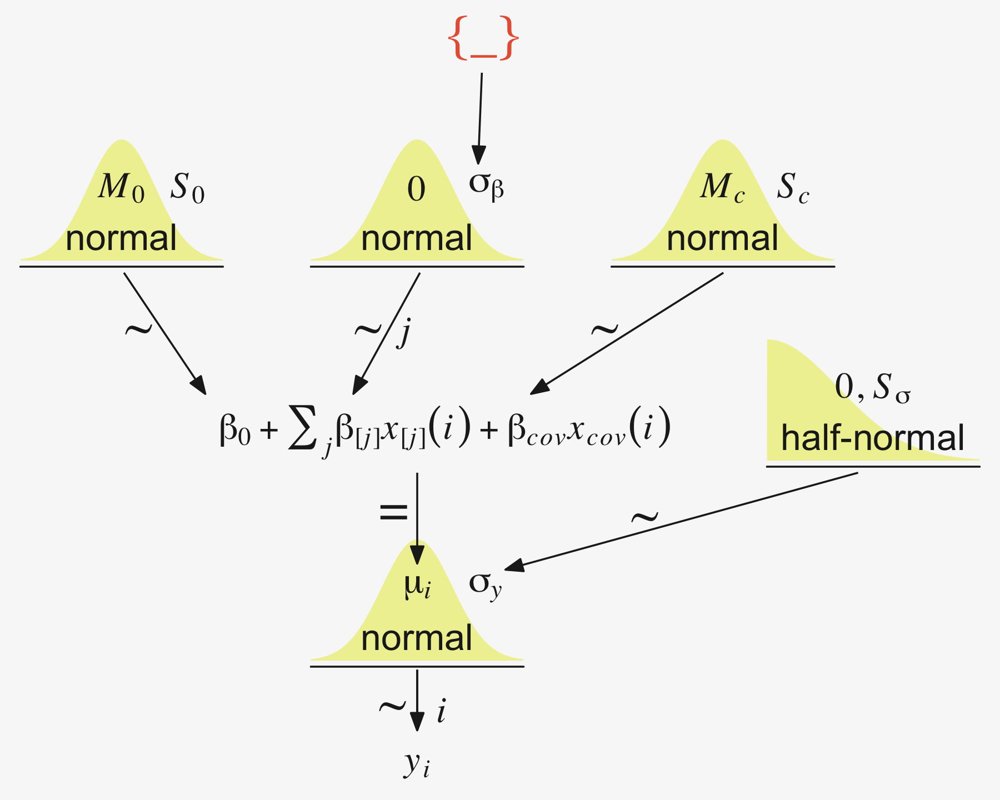

### Example: Sex, death, and size.

Kruschke recalled `fit19.1`'s estimate for $\sigma_y$ had a posterior mode around 14.8. Let's confirm with a plot.


```r
as_draws_df(fit19.1) %>% 
  ggplot(aes(x = sigma, y = 0)) +
  stat_dotsinterval(point_interval = mode_hdi, .width = .95,
                    slab_fill = pp[5], color = pp[4], 
                    slab_size = 0, quantiles = 100) +
  scale_y_continuous(NULL, breaks = NULL) +
  xlab(expression(sigma[italic(y)])) +
  theme(panel.grid = element_blank())
```


Yep, that looks about right. That large of a difference in days would indeed make it difficult to detect between-group differences if those differences were typically on the scale of just a few days. Since `Thorax` is moderately correlated with `Longevity`, including `Thorax` in the statistical model should help shrink that $\sigma_y$ estimate, making it easier to compare group means. Following the sensibilities from the equations just above, here we'll mean-center our covariate, first.


```r
my_data <-
  my_data %>% 
  mutate(thorax_c = Thorax - mean(Thorax))

head(my_data)
```

```
## # A tibble: 6 × 4
##   Longevity CompanionNumber Thorax thorax_c
##       <dbl> <chr>            <dbl>    <dbl>
## 1        35 Pregnant8         0.64  -0.181 
## 2        37 Pregnant8         0.68  -0.141 
## 3        49 Pregnant8         0.68  -0.141 
## 4        46 Pregnant8         0.72  -0.101 
## 5        63 Pregnant8         0.72  -0.101 
## 6        39 Pregnant8         0.76  -0.0610
```

Our model code follows the structure of that in Kruschke's `Jags-Ymet-Xnom1met1-MnormalHom-Example.R` and `Jags-Ymet-Xnom1met1-MnormalHom.R` files. As a preparatory step, we redefine the values necessary for `stanvars`.


```r
(mean_y <- mean(my_data$Longevity))
```

```
## [1] 57.44
```

```r
(sd_y <- sd(my_data$Longevity))
```

```
## [1] 17.56389
```

```r
(sd_thorax_c <- sd(my_data$thorax_c))
```

```
## [1] 0.07745367
```

```r
omega <- sd_y / 2
sigma <- 2 * sd_y

(s_r <- gamma_a_b_from_omega_sigma(mode = omega, sd = sigma))
```

```
## $shape
## [1] 1.283196
## 
## $rate
## [1] 0.03224747
```

```r
stanvars <- 
  stanvar(mean_y,      name = "mean_y") + 
  stanvar(sd_y,        name = "sd_y") +
  stanvar(sd_thorax_c, name = "sd_thorax_c") +
  stanvar(s_r$shape,   name = "alpha") +
  stanvar(s_r$rate,    name = "beta")
```

Now we're ready to fit the `brm()` model, our hierarchical alternative to ANCOVA.


```r
fit19.5 <-
  brm(data = my_data,
      family = gaussian,
      Longevity ~ 1 + thorax_c + (1 | CompanionNumber),
      prior = c(prior(normal(mean_y, sd_y * 5), class = Intercept),
                prior(normal(0, 2 * sd_y / sd_thorax_c), class = b),
                prior(gamma(alpha, beta), class = sd),
                prior(cauchy(0, sd_y), class = sigma)),
      iter = 4000, warmup = 1000, chains = 4, cores = 4,
      seed = 19,
      control = list(adapt_delta = 0.99),
      stanvars = stanvars,
      file = "fits/fit19.05")
```

Here's the model summary.


```r
print(fit19.5)
```

```
##  Family: gaussian 
##   Links: mu = identity; sigma = identity 
## Formula: Longevity ~ 1 + thorax_c + (1 | CompanionNumber) 
##    Data: my_data (Number of observations: 125) 
##   Draws: 4 chains, each with iter = 4000; warmup = 1000; thin = 1;
##          total post-warmup draws = 12000
## 
## Group-Level Effects: 
## ~CompanionNumber (Number of levels: 5) 
##               Estimate Est.Error l-95% CI u-95% CI Rhat Bulk_ESS Tail_ESS
## sd(Intercept)    14.04      7.33     6.05    33.04 1.00     2607     3631
## 
## Population-Level Effects: 
##           Estimate Est.Error l-95% CI u-95% CI Rhat Bulk_ESS Tail_ESS
## Intercept    57.53      7.10    43.16    71.89 1.00     2459     3023
## thorax_c    136.36     12.68   111.54   160.94 1.00     7527     6492
## 
## Family Specific Parameters: 
##       Estimate Est.Error l-95% CI u-95% CI Rhat Bulk_ESS Tail_ESS
## sigma    10.60      0.69     9.36    12.05 1.00     7211     6816
## 
## Draws were sampled using sampling(NUTS). For each parameter, Bulk_ESS
## and Tail_ESS are effective sample size measures, and Rhat is the potential
## scale reduction factor on split chains (at convergence, Rhat = 1).
```

Let's see if that $\sigma_y$ posterior shrank.


```r
as_draws_df(fit19.5) %>% 
  ggplot(aes(x = sigma, y = 0)) +
  stat_dotsinterval(point_interval = mode_hdi, .width = .95,
                    slab_fill = pp[5], color = pp[4], 
                    slab_size = 0, quantiles = 100) +
  scale_y_continuous(NULL, breaks = NULL) +
  xlab(expression(sigma[italic(y)]))
```


Yep, sure did! Now our between-group comparisons should be more precise. Heck, if we wanted to we could even make a difference plot.


```r
tibble(sigma1 = as_draws_df(fit19.1) %>% pull(sigma),
       sigma5 = as_draws_df(fit19.5) %>% pull(sigma)) %>% 
  transmute(dif = sigma1 - sigma5) %>% 
  
  ggplot(aes(x = dif, y = 0)) +
  stat_dotsinterval(point_interval = mode_hdi, .width = .95,
                    slab_fill = pp[5], color = pp[4], 
                    slab_size = 0, quantiles = 100) +
  scale_y_continuous(NULL, breaks = NULL) +
  labs(title = "This is a difference distribution",
       x = expression(sigma[italic(y)][" | fit19.1"]-sigma[italic(y)][" | fit19.5"]))
```

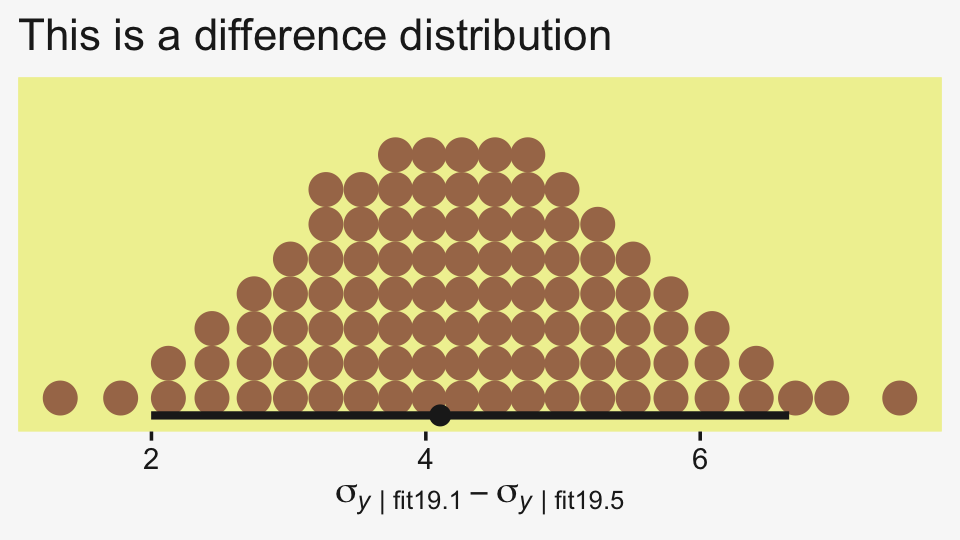

If you want a quick and dirty plot of the relation between `thorax_c` and `Longevity`, you might employ `brms::conditional_effects()`.


```r
conditional_effects(fit19.5) %>% 
  plot(line_args = list(color = pp[5], fill = pp[11]))
```


But to make plots like the ones at the top of Figure 19.5, we'll have to work a little harder. First, we need some intermediary values marking off the three values along the `Thorax`-axis Kruschke singled out in his top panel plots. As far as I can tell, they were the `min()`, the `max()`, and their `mean()`.


```r
(r <- range(my_data$Thorax))
```

```
## [1] 0.64 0.94
```

```r
mean(r)
```

```
## [1] 0.79
```

Next, we'll make the data necessary for our side-tipped Gaussians. For kicks and giggles, we'll choose 80 draws instead of 20. But do note how we used our `r` values, from above, to specify both `Thorax` and `thorax_c` values in addition to the `CompanionNumber` categories for the `newdata` argument. Otherwise, this workflow is very much the same as in previous plots.


```r
n_draws <- 80

densities <-
  my_data %>% 
  distinct(CompanionNumber) %>% 
  expand(CompanionNumber, Thorax = c(r[1], mean(r), r[2])) %>% 
  mutate(thorax_c  = Thorax - mean(my_data$Thorax)) %>% 
  add_epred_draws(fit19.5, ndraws = n_draws, seed = 19, dpar = c("mu", "sigma")) %>% 
  mutate(ll = qnorm(.025, mean = mu, sd = sigma),
         ul = qnorm(.975, mean = mu, sd = sigma)) %>% 
  mutate(Longevity = map2(ll, ul, seq, length.out = 100)) %>% 
  unnest(Longevity) %>% 
  mutate(density = dnorm(Longevity, mu, sigma))

glimpse(densities)
```

```
## Rows: 120,000
## Columns: 14
## Groups: CompanionNumber, Thorax, thorax_c, .row [15]
## $ CompanionNumber <chr> "None0", "None0", "None0", "None0", "None0", "None0", "None0", "None0", "N…
## $ Thorax          <dbl> 0.64, 0.64, 0.64, 0.64, 0.64, 0.64, 0.64, 0.64, 0.64, 0.64, 0.64, 0.64, 0.…
## $ thorax_c        <dbl> -0.18096, -0.18096, -0.18096, -0.18096, -0.18096, -0.18096, -0.18096, -0.1…
## $ .row            <int> 1, 1, 1, 1, 1, 1, 1, 1, 1, 1, 1, 1, 1, 1, 1, 1, 1, 1, 1, 1, 1, 1, 1, 1, 1,…
## $ .chain          <int> NA, NA, NA, NA, NA, NA, NA, NA, NA, NA, NA, NA, NA, NA, NA, NA, NA, NA, NA…
## $ .iteration      <int> NA, NA, NA, NA, NA, NA, NA, NA, NA, NA, NA, NA, NA, NA, NA, NA, NA, NA, NA…
## $ .draw           <int> 1, 1, 1, 1, 1, 1, 1, 1, 1, 1, 1, 1, 1, 1, 1, 1, 1, 1, 1, 1, 1, 1, 1, 1, 1,…
## $ .epred          <dbl> 36.23788, 36.23788, 36.23788, 36.23788, 36.23788, 36.23788, 36.23788, 36.2…
## $ mu              <dbl> 36.23788, 36.23788, 36.23788, 36.23788, 36.23788, 36.23788, 36.23788, 36.2…
## $ sigma           <dbl> 10.73103, 10.73103, 10.73103, 10.73103, 10.73103, 10.73103, 10.73103, 10.7…
## $ ll              <dbl> 15.20545, 15.20545, 15.20545, 15.20545, 15.20545, 15.20545, 15.20545, 15.2…
## $ ul              <dbl> 57.27032, 57.27032, 57.27032, 57.27032, 57.27032, 57.27032, 57.27032, 57.2…
## $ Longevity       <dbl> 15.20545, 15.63034, 16.05524, 16.48014, 16.90504, 17.32994, 17.75483, 18.1…
## $ density         <dbl> 0.005446361, 0.005881248, 0.006340911, 0.006825791, 0.007336239, 0.0078725…
```

Here, we'll use a simplified workflow to extract the `fitted()` values in order to make the regression lines. Since these are straight lines, all we need are two values for each draw, one at the extremes of the `Thorax` axis.


```r
f <-
  my_data %>% 
  distinct(CompanionNumber) %>% 
  expand(CompanionNumber, Thorax = c(r[1], mean(r), r[2])) %>% 
  mutate(thorax_c = Thorax - mean(my_data$Thorax)) %>% 
  add_epred_draws(fit19.5, ndraws = n_draws, seed = 19, value = "Longevity")

glimpse(f)
```

```
## Rows: 1,200
## Columns: 8
## Groups: CompanionNumber, Thorax, thorax_c, .row [15]
## $ CompanionNumber <chr> "None0", "None0", "None0", "None0", "None0", "None0", "None0", "None0", "N…
## $ Thorax          <dbl> 0.64, 0.64, 0.64, 0.64, 0.64, 0.64, 0.64, 0.64, 0.64, 0.64, 0.64, 0.64, 0.…
## $ thorax_c        <dbl> -0.18096, -0.18096, -0.18096, -0.18096, -0.18096, -0.18096, -0.18096, -0.1…
## $ .row            <int> 1, 1, 1, 1, 1, 1, 1, 1, 1, 1, 1, 1, 1, 1, 1, 1, 1, 1, 1, 1, 1, 1, 1, 1, 1,…
## $ .chain          <int> NA, NA, NA, NA, NA, NA, NA, NA, NA, NA, NA, NA, NA, NA, NA, NA, NA, NA, NA…
## $ .iteration      <int> NA, NA, NA, NA, NA, NA, NA, NA, NA, NA, NA, NA, NA, NA, NA, NA, NA, NA, NA…
## $ .draw           <int> 1, 2, 3, 4, 5, 6, 7, 8, 9, 10, 11, 12, 13, 14, 15, 16, 17, 18, 19, 20, 21,…
## $ Longevity       <dbl> 36.23788, 35.72981, 36.47699, 38.54599, 32.58731, 40.84551, 34.12519, 35.5…
```

Now we're ready to make our plots for the top row of Figure 19.3.


```r
densities %>% 
  ggplot(aes(x = Longevity, y = Thorax)) +
  # the Gaussians
  geom_ridgeline(aes(height = -density, group = interaction(Thorax, .draw)),
                 fill = NA, size = 1/5, scale = 5/3,
                 color = adjustcolor(pp[4], alpha.f = 1/5),
                 min_height = NA) +
  # the vertical lines below the Gaussians
  geom_line(aes(group = interaction(Thorax, .draw)),
            color = pp[4], alpha = 1/5, size = 1/5) +
  # the regression lines
  geom_line(data = f,
            aes(group = .draw),
            alpha = 1/5, size = 1/5, color = pp[4]) +
  # the data
  geom_point(data = my_data,
             alpha = 3/4, color = pp[10]) +
  coord_flip(xlim = c(0, 110),
             ylim = c(.58, 1)) +
  facet_wrap(~ CompanionNumber, ncol = 5)
```


Now we have a covariate in the model, we have to decide on which of its values we want to base our group comparisons. Unless there's a substantive reason for another value, the mean is a good standard choice. And since the covariate `thorax_c` is already mean centered, that means we can effectively leave it out of the equation. Here we make and save them in the simple difference metric.


```r
draws <- as_draws_df(fit19.5)

differences <-
  draws %>% 
  transmute(`Pregnant1.Pregnant8 vs None0` = (`r_CompanionNumber[Pregnant1,Intercept]` + `r_CompanionNumber[Pregnant1,Intercept]`) / 2 - `r_CompanionNumber[None0,Intercept]`,
            
            `Pregnant1.Pregnant8.None0 vs Virgin1` = (`r_CompanionNumber[Pregnant1,Intercept]` + `r_CompanionNumber[Pregnant1,Intercept]` + `r_CompanionNumber[None0,Intercept]`) / 3 - `r_CompanionNumber[Virgin1,Intercept]`,
            
            `Virgin1 vs Virgin8` = `r_CompanionNumber[Virgin1,Intercept]` - `r_CompanionNumber[Virgin8,Intercept]`,
            
            `Pregnant1.Pregnant8.None0 vs Virgin1.Virgin8` = (`r_CompanionNumber[Pregnant1,Intercept]` + `r_CompanionNumber[Pregnant1,Intercept]` + `r_CompanionNumber[None0,Intercept]`) / 3 - (`r_CompanionNumber[Virgin1,Intercept]` + `r_CompanionNumber[Virgin8,Intercept]`) / 2)

p1 <-
  differences %>% 
  pivot_longer(everything()) %>%   
  
  ggplot(aes(x = value, y = 0)) +
  stat_dotsinterval(point_interval = mode_hdi, .width = .95,
                    slab_fill = pp[5], color = pp[4], 
                    slab_size = 0, quantiles = 100) +
  scale_y_continuous(NULL, breaks = NULL) +
  xlab("Difference") +
  theme(strip.text = element_text(size = 6.4)) +
  facet_wrap(~ name, scales = "free_x", ncol = 4)
```

Now we'll look at the differences in the effect size metric. Since we saved our leg work above, it's really easy to just convert the differences in bulk with `mutate_all()`. After the conversion, we'll bind the two rows of subplots together with a little **patchwork** and display the results.


```r
p2 <-
  differences %>% 
  mutate_all(.funs = ~. / draws$sigma) %>% 
  pivot_longer(everything()) %>%   
  
  ggplot(aes(x = value, y = 0)) +
  stat_dotsinterval(point_interval = mode_hdi, .width = .95,
                    slab_fill = pp[5], color = pp[4], 
                    slab_size = 0, quantiles = 100) +
  scale_y_continuous(NULL, breaks = NULL) +
  xlab("Effect Size") +
  theme(strip.text = element_text(size = 6.4)) +
  facet_wrap(~ name, scales = "free_x", ncol = 4)

# combine
p1 / p2
```

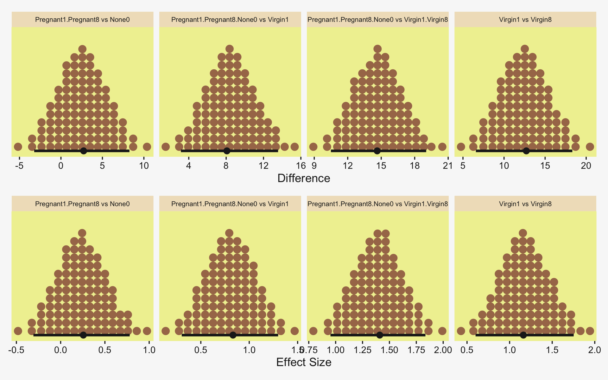

"The HDI widths of all the contrasts have gotten smaller by virtue of including the covariate in the analysis" (p. 571).

### Analogous to traditional ANCOVA.

In contrast with ANCOVA,

> Bayesian methods do not partition the least-squares variance to make estimates, and therefore the Bayesian method is analogous to ANCOVA but is not ANCOVA. Frequentist practitioners are urged to test (with $p$ values) whether the assumptions of (a) equal slope in all groups, (b) equal standard deviation in all groups, and (c) normally distributed noise can be rejected. In a Bayesian approach, the descriptive model is generalized to address these concerns, as will be discussed in [Section 19.5][Heterogeneous variances and robustness against outliers]. (p. 572)

### Relation to hierarchical linear regression.

Here Kruschke contrasts our last model with the one from way back in [Section 17.3][Hierarchical regression on individuals within groups]. As a refresher, here's what that code looked like.


```r
fit17.4 <-
  brm(data = my_data,
      family = student,
      y_z ~ 1 + x_z + (1 + x_z || Subj),
      prior = c(prior(normal(0, 10), class = Intercept),
                prior(normal(0, 10), class = b),
                prior(normal(0, 1), class = sigma),
                # the next line is new
                prior(normal(0, 1), class = sd),
                prior(exponential(one_over_twentynine) + 1, class = nu)),
      chains = 4, cores = 4,
      stanvars = stanvar(1/29, name = "one_over_twentynine"),
      seed = 17,
      file = "fits/fit17.04")
```

And for convenience, here's the code from the model we just fit.


```r
fit19.5 <-
  brm(data = my_data,
      family = gaussian,
      Longevity ~ 1 + thorax_c + (1 | CompanionNumber),
      prior = c(prior(normal(mean_y, sd_y * 5), class = Intercept),
                prior(normal(0, 2 * sd_y / sd_thorax_c), class = b),
                prior(gamma(alpha, beta), class = sd),
                prior(cauchy(0, sd_y), class = sigma)),
      iter = 4000, warmup = 1000, chains = 4, cores = 4,
      seed = 19,
      control = list(adapt_delta = 0.99),
      stanvars = stanvars,
      file = "fits/fit19.05")
```

It's easy to get lost in the differences in the priors and the technical details with the model chains and such. The main thing to notice, here, is the differences in the model formulas (i.e., the likelihoods). Both models had intercepts and slopes. But whereas the model from 17.3 set both parameters to random, only the intercept in our last model was random. The covariate `thorax_c` was fixed--it did not vary by group. Had we wanted it to, our `formula` syntax would have been something like `Longevity ~ 1 + thorax_c + (1 + thorax_c || CompanionNumber)`. And again, as noted in [Section 17.3.1][The model and implementation in ~~JAGS~~ brms.], the `||` portion of the syntax set the random intercepts and slopes to be orthogonal (i.e., correlate exactly at zero). As we'll see, this will often not be the case. But let's not get ahead of ourselves.

> Conceptually, the main difference between the models is merely the focus of attention. In the hierarchical linear regression model, the focus was on the slope coefficient. In that case, we were trying to estimate the magnitude of the slope, simultaneously for individuals and overall. The intercepts, which describe the levels of the nominal predictor, were of ancillary interest. In the present section, on the other hand, the focus of attention is reversed. We are most interested in the intercepts and their differences between groups, with the slopes on the covariate being of ancillary interest. (p. 573)

## Heterogeneous variances and robustness against outliers

In Figure 19.6 on page 574, Kruschke laid out the diagram for a hierarchical Student's-$t$ model in for which both the $\mu$ and $\sigma$ parameters are random. If you recall, @Bürkner2022Distributional calls these [distributional models](https://CRAN.R-project.org/package=brms/vignettes/brms_distreg.html) and they are indeed available within the **brms** framework. But there's a catch. Though we can model $\sigma$ all day long and we can even make it hierarchical, **brms** limits us to modeling the hierarchical $\sigma$ parameters within the typical Gaussian framework. That is, we will depart from Kruschke's schematic in that we will be

* modeling the log of $\sigma$,
* indicating its grand mean with the `sigma ~ 1` syntax,
* modeling the group-level deflections as Gaussian with a mean of 0 and standard deviation $\sigma_\sigma$ estimated from the data,
* and choosing a sensible prior for $\sigma_\sigma$ that is left-bound at 0 and gently slopes to the right (i.e., a folded $t$ or gamma distribution).

Thus, here's our **brms**-centric variant of the diagram in Figure 19.6.


```r
# bracket
p1 <-
  tibble(x = .99,
         y = .5,
         label = "{_}") %>% 
  
  ggplot(aes(x = x, y = y, label = label)) +
  geom_text(size = 10, hjust = 1, color = pp[8], family = "Times") +
  scale_x_continuous(expand = c(0, 0), limits = c(0, 1)) +
  ylim(0, 1) +
  theme_void()

#  plain arrow
p2 <-
  tibble(x    = .68,
         y    = 1,
         xend = .68,
         yend = .25) %>%
  
  ggplot(aes(x = x, xend = xend,
             y = y, yend = yend)) +
  geom_segment(arrow = my_arrow, color = pp[4]) +
  xlim(0, 1) +
  theme_void()

# normal density
p3 <-
  tibble(x = seq(from = -3, to = 3, by = .1)) %>% 
  ggplot(aes(x = x, y = (dnorm(x)) / max(dnorm(x)))) +
  geom_area(fill = pp[9]) +
  annotate(geom = "text",
           x = 0, y = .2,
           label = "normal",
           size = 7, color = pp[4]) +
  annotate(geom = "text",
           x = c(0, 1.45), y = .6,
           hjust = c(.5, 0),
           label = c("italic(M)[0]", "italic(S)[0]"), 
           size = 7, color = pp[4], family = "Times", parse = T) +
  scale_x_continuous(expand = c(0, 0)) +
  theme_void() +
  theme(axis.line.x = element_line(size = 0.5, color = pp[4]))

# second normal density
p4 <-
  tibble(x = seq(from = -3, to = 3, by = .1)) %>% 
  ggplot(aes(x = x, y = (dnorm(x)) / max(dnorm(x)))) +
  geom_area(fill = pp[9]) +
  annotate(geom = "text",
           x = 0, y = .2,
           label = "normal",
           size = 7, color = pp[4]) +
  annotate(geom = "text",
           x = c(0, 1.45), y = .6,
           hjust = c(.5, 0),
           label = c("0", "sigma[beta]"), 
           size = 7, color = pp[4], family = "Times", parse = T) +
  scale_x_continuous(expand = c(0, 0)) +
  theme_void() +
  theme(axis.line.x = element_line(size = 0.5, color = pp[4]))

# third normal density
p5 <-
  tibble(x = seq(from = -3, to = 3, by = .1)) %>% 
  ggplot(aes(x = x, y = (dnorm(x)) / max(dnorm(x)))) +
  geom_area(fill = pp[9]) +
  annotate(geom = "text",
           x = 0, y = .2,
           label = "normal",
           size = 7, color = pp[4]) +
  annotate(geom = "text",
           x = c(0, 1.15), y = .6,
           label = c("italic(M)[mu[sigma]]", "italic(S)[mu[sigma]]"), 
           hjust = c(.5, 0),
           size = 7, color = pp[4], family = "Times", parse = T) +
  scale_x_continuous(expand = c(0, 0)) +
  theme_void() +
  theme(axis.line.x = element_line(size = 0.5, color = pp[4]))

# half-normal density
p6 <-
  tibble(x = seq(from = 0, to = 3, by = .01)) %>% 
  ggplot(aes(x = x, y = (dnorm(x)) / max(dnorm(x)))) +
  geom_area(fill = pp[9]) +
  annotate(geom = "text",
           x = 1.5, y = .2,
           label = "half-normal",
           size = 6, color = pp[4]) +
  annotate(geom = "text",
           x = 1.5, y = .6,
           label = "0*','*~italic(S)[sigma[sigma]]", 
           size = 7, color = pp[4], family = "Times", parse = T) +
  scale_x_continuous(expand = c(0, 0)) +
  theme_void() +
  theme(axis.line.x = element_line(size = 0.5, color = pp[4]))

# exponential density
p7 <-
  tibble(x = seq(from = 0, to = 1, by = .01)) %>% 
  ggplot(aes(x = x, y = (dexp(x, 2) / max(dexp(x, 2))))) +
  geom_area(fill = pp[9]) +
  annotate(geom = "text",
           x = .5, y = .2,
           label = "exp",
           size = 7, color = pp[4]) +
  annotate(geom = "text",
           x = .5, y = .6,
           label = "italic(K)",
           size = 7, color = pp[4], family = "Times", parse = T) +
  scale_x_continuous(expand = c(0, 0)) +
  theme_void() +
  theme(axis.line.x = element_line(size = 0.5, color = pp[4]))

# likelihood formula
p8 <-
  tibble(x = .5,
         y = .25,
         label = "beta[0]+sum()[italic(j)]*beta['['*italic(j)*']']*italic(x)['['*italic(j)*']'](italic(i))") %>% 
 
  ggplot(aes(x = x, y = y, label = label)) +
  geom_text(size = 7, color = pp[4], parse = T, family = "Times") +
  scale_x_continuous(expand = c(0, 0), limits = c(0, 1)) +
  ylim(0, 1) +
  theme_void()

# normal density
p9 <-
  tibble(x = seq(from = -3, to = 3, by = .1)) %>% 
  ggplot(aes(x = x, y = (dnorm(x)) / max(dnorm(x)))) +
  geom_area(fill = pp[9]) +
  annotate(geom = "text",
           x = 0, y = .2,
           label = "normal",
           size = 7, color = pp[4]) +
  annotate(geom = "text",
           x = c(0, 1.2), y = .6,
           hjust = c(.5, 0),
           label = c("mu[sigma]", "sigma[sigma]"), 
           size = 7, color = pp[4], family = "Times", parse = T) +
  scale_x_continuous(expand = c(0, 0)) +
  theme_void() +
  theme(axis.line.x = element_line(size = 0.5, color = pp[4]))

# four annotated arrows
p10 <-
  tibble(x    = c(.06, .37, .67, .95),
         y    = c(1, 1, 1, 1),
         xend = c(.15, .31, .665, .745),
         yend = c(0, 0, .2, .2)) %>%
  ggplot(aes(x = x, xend = xend,
             y = y, yend = yend)) +
  geom_segment(arrow = my_arrow, color = pp[4]) +
  annotate(geom = "text",
           x = c(.065, .31, .36, .64, .79), y = .5,
           label = c("'~'", "'~'", "italic(j)", "'~'", "'~'" ),
           size = c(10, 10, 7, 10, 10), 
           color = pp[4], family = "Times", parse = T) +
  xlim(0, 1) +
  theme_void()

# student-t density
p11 <-
  tibble(x = seq(from = -3, to = 3, by = .1)) %>% 
  ggplot(aes(x = x, y = (dt(x, 3) / max(dt(x, 3))))) +
  geom_area(fill = pp[9]) +
  annotate(geom = "text",
           x = 0, y = .2,
           label = "student t",
           size = 7, color = pp[4]) +
  annotate(geom = "text",
           x = c(-1.4, 0), y = .6,
           label = c("nu", "mu[italic(i)]"),
           size = 7, color = pp[4], family = "Times", parse = T) +
  scale_x_continuous(expand = c(0, 0)) +
  theme_void() +
  theme(axis.line.x = element_line(size = 0.5, color = pp[4]))

# log sigma
p12 <-
  tibble(x = .65,
         y = .6,
         label = "log~sigma[italic(j)*'('*italic(i)*')']") %>% 
 
  ggplot(aes(x = x, y = y, label = label)) +
  geom_text(hjust = 0, size = 7, color = pp[4], parse = T, family = "Times") +
  scale_x_continuous(expand = c(0, 0), limits = c(0, 2)) +
  ylim(0, 1) +
  theme_void()

# two annotated arrows
p13 <-
  tibble(x    = c(.15, .15),
         y    = c(1, .47),
         xend = c(.15, .72),
         yend = c(.75, .1)) %>%
  
  ggplot(aes(x = x, xend = xend,
             y = y, yend = yend)) +
  geom_segment(arrow = my_arrow, color = pp[4]) +
  annotate(geom = "text",
           x = c(.1, .15, .28), y = c(.92, .64, .22),
           label = c("'~'", "nu*minute+1", "'='"),
           size = c(10, 7, 10), color = pp[4], family = "Times", parse = T) +
  xlim(0, 1) +
  theme_void()

# one annotated arrow
p14 <-
  tibble(x     = .38,
         y     = .65,
         label = "'='") %>% 
  
  ggplot(aes(x = x, y = y, label = label)) +
  geom_text(size = 10, color = pp[4], parse = T, family = "Times") +
  geom_segment(x = .5, xend = .5,
               y = 1, yend = .15, 
               arrow = my_arrow, color = pp[4]) +
  xlim(0, 1) +
  theme_void()

# another annotated arrow
p15 <-
  tibble(x     = c(.58, .71),
         y     = .6,
         label = c("'~'", "italic(j)")) %>% 
  
  ggplot(aes(x = x, y = y, label = label)) +
  geom_text(size = c(10, 7), color = pp[4], parse = T, family = "Times") +
  geom_segment(x = .85, xend = .42,
               y = 1, yend = .18, 
               arrow = my_arrow, color = pp[4]) +
  xlim(0, 1) +
  theme_void()

# the final annotated arrow
p16 <-
  tibble(x     = c(.375, .625),
         y     = c(1/3, 1/3),
         label = c("'~'", "italic(i)")) %>% 
  
  ggplot(aes(x = x, y = y, label = label)) +
  geom_text(size = c(10, 7), 
            color = pp[4], parse = T, family = "Times") +
  geom_segment(x = .5, xend = .5,
               y = 1, yend = 0, 
               arrow = my_arrow, color = pp[4]) +
  xlim(0, 1) +
  theme_void()

# some text
p17 <-
  tibble(x     = .5,
         y     = .5,
         label = "italic(y[i])") %>% 
  
  ggplot(aes(x = x, y = y, label = label)) +
  geom_text(size = 7, color = pp[4], parse = T, family = "Times") +
  xlim(0, 1) +
  theme_void()

# define the layout
layout <- c(
  area(t = 1, b = 1, l = 8, r = 9),
  area(t = 2, b = 3, l = 8, r = 9),
  area(t = 3, b = 4, l = 3, r = 5),
  area(t = 3, b = 4, l = 7, r = 9),
  area(t = 3, b = 4, l = 11, r = 13),
  area(t = 3, b = 4, l = 15, r = 17),
  area(t = 6, b = 7, l = 1, r = 3),
  area(t = 6, b = 7, l = 5, r = 9),
  area(t = 6, b = 7, l = 11, r = 13),
  area(t = 5, b = 6, l = 3, r = 17),
  area(t = 10, b = 11, l = 6, r = 8),
  area(t = 10, b = 11, l = 7, r = 9),
  area(t = 8, b = 10, l = 1, r = 8),
  area(t = 8, b = 10, l = 6, r = 8),
  area(t = 8, b = 10, l = 6, r = 13),
  area(t = 12, b = 12, l = 6, r = 8),
  area(t = 13, b = 13, l = 6, r = 8)
)

# combine and plot!
(p1 + p2 + p3 + p4 + p5 + p6 + p7 + p8 + p9 + p10 + p11 + p12 + p13 + p14 + p15 + p16 + p17) + 
  plot_layout(design = layout) &
  ylim(0, 1) &
  theme(plot.margin = margin(0, 5.5, 0, 5.5))
```


Since we're modeling $\log \left (\sigma_{j(i)} \right )$, we might use Gaussian prior centered on `sd(my_data$y) %>% log()` and a reasonable spread like 1. We can simulate a little to get a sense of what those distributions look like.


```r
n_draws <- 1e3

set.seed(19)
tibble(prior = rnorm(n_draws, mean = log(1), sd = 1)) %>% 
  mutate(prior_exp = exp(prior)) %>% 
  pivot_longer(everything()) %>% 

  ggplot(aes(x = value)) +
  stat_dots(slab_fill = pp[5], slab_color = pp[5]) +
  scale_y_continuous(NULL, breaks = NULL, expand = expansion(mult = c(0, 0.05)), limits = c(0, NA)) +
  facet_wrap(~ name, scales = "free")
```


Here's what is looks like with `sd = 2`.


```r
set.seed(19)
tibble(prior = rnorm(n_draws, mean = log(1), sd = 2)) %>% 
  mutate(prior_exp = exp(prior)) %>% 

  ggplot(aes(x = prior_exp)) +
  stat_dots(slab_fill = pp[5], slab_color = pp[5]) +
  scale_x_continuous(expand = expansion(mult = c(0, 0.05))) +
  scale_y_continuous(NULL, breaks = NULL, expand = expansion(mult = c(0, 0.05)), limits = c(0, NA)) +
  coord_cartesian(xlim = c(0, 17))
```


Though we're still peaking around 1, there's more mass in the tail, making it easier for the likelihood to pull away from the prior mode.

But all this is the prior on the fixed effect, the grand mean of $\log (\sigma)$. Keep in mind we're also estimating group-level deflections using a hierarchical model. The good old folded $t$ on the unit scale is already pretty permissive for an estimate that is itself on the log scale. To make it more conservative, set $\nu$ to infinity and go with a folded Gaussian. Or keep your regularization loose and go with a low-$\nu$ folded $t$ or even a folded Cauchy. And, of course, one could even go with a gamma.

Consider we have data `my_data` for which our primary variable of interest is `y`. Starting from preparing our `stanvars` values, here's what the model code might look like.


```r
# get ready for `stanvars`
mean_y <- mean(my_data$y)
sd_y   <- sd(my_data$y)

omega  <- sd_y / 2
sigma  <- 2 * sd_y

s_r    <- gamma_a_b_from_omega_sigma(mode = omega, sd = sigma)

# define `stanvars`
stanvars <- 
  stanvar(mean_y,    name = "mean_y") + 
  stanvar(sd_y,      name = "sd_y") +
  stanvar(s_r$shape, name = "alpha") +
  stanvar(s_r$rate,  name = "beta") +
  stanvar(1/29,      name = "one_over_twentynine")

# fit the model
fit <-
  brm(data = my_data,
      family = student,
      bf(Longevity ~ 1 + (1 | CompanionNumber), 
         sigma     ~ 1 + (1 | CompanionNumber)),
      prior = c(# grand means
                prior(normal(mean_y, sd_y * 5), class = Intercept),
                prior(normal(log(sd_y), 1), class = Intercept, dpar = sigma),
                
                # the priors controlling the spread for our hierarchical deflections
                prior(gamma(alpha, beta), class = sd),
                prior(normal(0, 1), class = sd, dpar = sigma),
                
                # don't forget our student-t nu
                prior(exponential(one_over_twentynine), class = nu)),
      stanvars = stanvars)
```

### Example: Contrast of means with different variances.

Let's load and take a look at Kruschke's simulated group data.


```r
my_data <- read_csv("data.R/NonhomogVarData.csv")

head(my_data)
```

```
## # A tibble: 6 × 2
##   Group     Y
##   <chr> <dbl>
## 1 A      97.8
## 2 A      99.9
## 3 A      92.4
## 4 A      96.9
## 5 A     101. 
## 6 A      80.7
```

Here are the means and $\textit{SD}$s for each `Group`.


```r
my_data %>% 
  group_by(Group) %>% 
  summarise(mean = mean(Y),
            sd   = sd(Y))
```

```
## # A tibble: 4 × 3
##   Group  mean    sd
##   <chr> <dbl> <dbl>
## 1 A       97   8.00
## 2 B       99   1.00
## 3 C      102   1.00
## 4 D      104.  8
```

First we'll fit the model with homogeneous variances. To keep things simple, here we'll fit a conventional model following the form of our original `fit1`. Here are our `stanvars`.


```r
(mean_y <- mean(my_data$Y))
```

```
## [1] 100.5
```

```r
(sd_y <- sd(my_data$Y))
```

```
## [1] 6.228965
```

```r
omega <- sd_y / 2
sigma <- 2 * sd_y

(s_r  <- gamma_a_b_from_omega_sigma(mode = omega, sd = sigma))
```

```
## $shape
## [1] 1.283196
## 
## $rate
## [1] 0.09092861
```

```r
# define `stanvars`
stanvars <- 
  stanvar(mean_y,    name = "mean_y") + 
  stanvar(sd_y,      name = "sd_y") +
  stanvar(s_r$shape, name = "alpha") +
  stanvar(s_r$rate,  name = "beta")
```

Now fit the ANOVA-like homogeneous-variances model.


```r
fit19.6 <-
  brm(data = my_data,
      family = gaussian,
      Y ~ 1 + (1 | Group),
      prior = c(prior(normal(mean_y, sd_y * 10), class = Intercept),
                prior(gamma(alpha, beta), class = sd),
                prior(cauchy(0, sd_y), class = sigma)),
      iter = 4000, warmup = 1000, chains = 4, cores = 4,
      seed = 19,
      control = list(adapt_delta = .995),
      stanvars = stanvars,
      file = "fits/fit19.06")
```

Here's the model summary.


```r
print(fit19.6)
```

```
##  Family: gaussian 
##   Links: mu = identity; sigma = identity 
## Formula: Y ~ 1 + (1 | Group) 
##    Data: my_data (Number of observations: 96) 
##   Draws: 4 chains, each with iter = 4000; warmup = 1000; thin = 1;
##          total post-warmup draws = 12000
## 
## Group-Level Effects: 
## ~Group (Number of levels: 4) 
##               Estimate Est.Error l-95% CI u-95% CI Rhat Bulk_ESS Tail_ESS
## sd(Intercept)     4.85      3.45     1.49    13.81 1.00     2325     3508
## 
## Population-Level Effects: 
##           Estimate Est.Error l-95% CI u-95% CI Rhat Bulk_ESS Tail_ESS
## Intercept   100.53      2.85    94.60   106.38 1.00     2447     2774
## 
## Family Specific Parameters: 
##       Estimate Est.Error l-95% CI u-95% CI Rhat Bulk_ESS Tail_ESS
## sigma     5.76      0.43     4.99     6.66 1.00     6178     5676
## 
## Draws were sampled using sampling(NUTS). For each parameter, Bulk_ESS
## and Tail_ESS are effective sample size measures, and Rhat is the potential
## scale reduction factor on split chains (at convergence, Rhat = 1).
```

Let's get ready to make our version of the top of Figure 19.7. First we wrangle.


```r
# how many model-implied Gaussians would you like?
n_draws <- 20

densities <-
  my_data %>% 
  distinct(Group) %>% 
  add_epred_draws(fit19.6, ndraws = n_draws, seed = 19, dpar = c("mu", "sigma")) %>% 
  mutate(ll = qnorm(.025, mean = mu, sd = sigma),
         ul = qnorm(.975, mean = mu, sd = sigma)) %>% 
  mutate(Y = map2(ll, ul, seq, length.out = 100)) %>% 
  unnest(Y) %>% 
  mutate(density = dnorm(Y, mu, sigma)) %>% 
  group_by(.draw) %>% 
  mutate(density = density / max(density))

glimpse(densities)
```

```
## Rows: 8,000
## Columns: 12
## Groups: .draw [20]
## $ Group      <chr> "A", "A", "A", "A", "A", "A", "A", "A", "A", "A", "A", "A", "A", "A", "A", "A",…
## $ .row       <int> 1, 1, 1, 1, 1, 1, 1, 1, 1, 1, 1, 1, 1, 1, 1, 1, 1, 1, 1, 1, 1, 1, 1, 1, 1, 1, 1…
## $ .chain     <int> NA, NA, NA, NA, NA, NA, NA, NA, NA, NA, NA, NA, NA, NA, NA, NA, NA, NA, NA, NA,…
## $ .iteration <int> NA, NA, NA, NA, NA, NA, NA, NA, NA, NA, NA, NA, NA, NA, NA, NA, NA, NA, NA, NA,…
## $ .draw      <int> 1, 1, 1, 1, 1, 1, 1, 1, 1, 1, 1, 1, 1, 1, 1, 1, 1, 1, 1, 1, 1, 1, 1, 1, 1, 1, 1…
## $ .epred     <dbl> 97.49239, 97.49239, 97.49239, 97.49239, 97.49239, 97.49239, 97.49239, 97.49239,…
## $ mu         <dbl> 97.49239, 97.49239, 97.49239, 97.49239, 97.49239, 97.49239, 97.49239, 97.49239,…
## $ sigma      <dbl> 6.508508, 6.508508, 6.508508, 6.508508, 6.508508, 6.508508, 6.508508, 6.508508,…
## $ ll         <dbl> 84.73595, 84.73595, 84.73595, 84.73595, 84.73595, 84.73595, 84.73595, 84.73595,…
## $ ul         <dbl> 110.2488, 110.2488, 110.2488, 110.2488, 110.2488, 110.2488, 110.2488, 110.2488,…
## $ Y          <dbl> 84.73595, 84.99366, 85.25136, 85.50907, 85.76677, 86.02448, 86.28219, 86.53989,…
## $ density    <dbl> 0.1465288, 0.1582290, 0.1705958, 0.1836410, 0.1973740, 0.2118018, 0.2269281, 0.…
```

In our wrangling code, the main thing to notice is those last two lines. If you look closely to Kruschke's Gaussians, you'll notice they all have the same maximum height. Up to this point, ours haven't. This has to do with technicalities on how densities are scaled. In brief, the wider densities have been shorter. So those last two lines scaled all the densities within the same group to the same metric. Otherwise the code was business as usual.

Anyway, here's our version of the top panel of Figure 19.7.
  

```r
densities %>% 
  ggplot(aes(x = Y, y = Group)) +
  geom_ridgeline(aes(height = density, group = interaction(Group, .draw)),
                 fill = NA, color = adjustcolor(pp[7], alpha.f = 2/3),
                 size = 1/3, scale = 3/4) +
  geom_jitter(data = my_data,
              height = .04, alpha = 3/4, color = pp[10]) +
  scale_x_continuous(breaks = seq(from = 80, to = 120, by = 10)) +
  labs(title = "Data with Posterior Predictive Distrib.", 
       y = NULL) +
  coord_cartesian(xlim = c(75, 125),
                  ylim = c(1.25, 4.5)) +
  theme(axis.text.y = element_text(hjust = 0),
        axis.ticks.y = element_blank())
```


Here are the difference distributions in the middle of Figure 19.7.


```r
draws <- as_draws_df(fit19.6)

differences <-
  draws %>% 
  transmute(`D vs A` = `r_Group[D,Intercept]` - `r_Group[A,Intercept]`,
            `C vs B` = `r_Group[C,Intercept]` - `r_Group[B,Intercept]`)

differences %>% 
  pivot_longer(everything()) %>%
  mutate(name = factor(name, levels = c("D vs A", "C vs B"))) %>% 
  
  ggplot(aes(x = value, y = 0)) +
  stat_dotsinterval(point_interval = mode_hdi, .width = .95,
                    slab_fill = pp[5], color = pp[4],
                    slab_size = 0, quantiles = 100) +
  scale_y_continuous(NULL, breaks = NULL) +
  labs(x = "Difference") +
  facet_wrap(~ name, scales = "free_x", ncol = 4)
```


Now here are the effect sizes at the bottom of the figure.


```r
differences %>% 
  mutate_all(.funs = ~ . / draws$sigma) %>% 
  pivot_longer(everything()) %>%
  mutate(name = factor(name, levels = c("D vs A", "C vs B"))) %>% 
  
  ggplot(aes(x = value, y = 0)) +
  stat_dotsinterval(point_interval = mode_hdi, .width = .95,
                    slab_fill = pp[5], color = pp[4],
                    slab_size = 0, quantiles = 100) +
  scale_y_continuous(NULL, breaks = NULL) +
  labs(x = "Effect Size") +
  facet_wrap(~ name, scales = "free_x", ncol = 4)
```

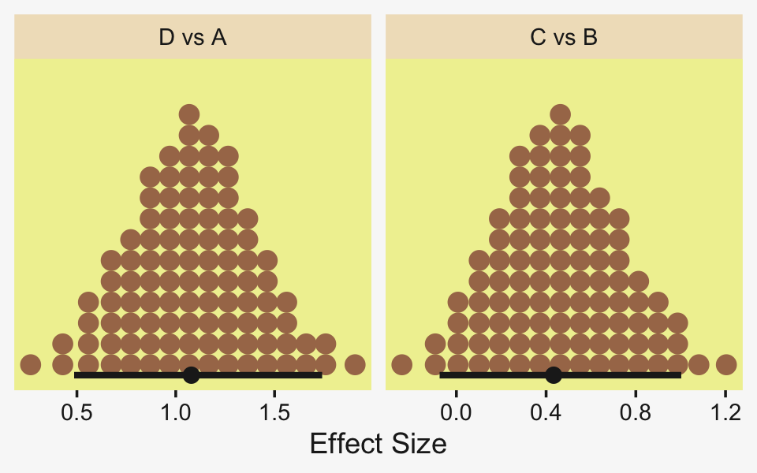

Oh and remember, if you'd like to get all the possible contrasts in bulk, **tidybayes** has got your back.


```r
fit19.6 %>%
  spread_draws(r_Group[Group,]) %>%
  compare_levels(r_Group, by = Group) %>%
  # these next two lines allow us to reorder the contrasts along the y
  ungroup() %>% 
  mutate(Group = reorder(Group, r_Group)) %>%
  
  ggplot(aes(x = r_Group, y = Group)) +
  geom_vline(xintercept = 0, color = pp[12]) +
  stat_dotsinterval(point_interval = mode_hdi, .width = .95,
                    slab_fill = pp[5], color = pp[4],
                    slab_size = 0, quantiles = 100) +
  labs(x = "Contrast",
       y = NULL) +
  coord_cartesian(ylim = c(1.5, 6.5)) +
  theme(axis.text.y = element_text(hjust = 0),
        axis.ticks.y = element_blank())
```


But to get back on track, here are the `stanvars` for the robust hierarchical variances model.


```r
stanvars <- 
  stanvar(mean_y,    name = "mean_y") + 
  stanvar(sd_y,      name = "sd_y") +
  stanvar(s_r$shape, name = "alpha") +
  stanvar(s_r$rate,  name = "beta") +
  stanvar(1/29,      name = "one_over_twentynine")
```

Now fit that robust better-than-ANOVA model.


```r
fit19.7 <-
  brm(data = my_data,
      family = student,
      bf(Y     ~ 1 + (1 | Group), 
         sigma ~ 1 + (1 | Group)),
      prior = c(# grand means
                prior(normal(mean_y, sd_y * 10), class = Intercept),
                prior(normal(log(sd_y), 1), class = Intercept, dpar = sigma),
                
                # the priors controlling the spread for our hierarchical deflections
                prior(gamma(alpha, beta), class = sd),
                prior(normal(0, 1), class = sd, dpar = sigma),
                
                # don't forget our student-t nu
                prior(exponential(one_over_twentynine), class = nu)),
      iter = 4000, warmup = 1000, chains = 4, cores = 4,
      seed = 19,
      control = list(adapt_delta = 0.99,
                     max_treedepth = 12),
      stanvars = stanvars,
      file = "fits/fit19.07")
```

The chains look good.


```r
plot(fit19.7, widths = c(2, 3))
```


Here's the parameter summary.


```r
print(fit19.7)
```

```
##  Family: student 
##   Links: mu = identity; sigma = log; nu = identity 
## Formula: Y ~ 1 + (1 | Group) 
##          sigma ~ 1 + (1 | Group)
##    Data: my_data (Number of observations: 96) 
##   Draws: 4 chains, each with iter = 4000; warmup = 1000; thin = 1;
##          total post-warmup draws = 12000
## 
## Group-Level Effects: 
## ~Group (Number of levels: 4) 
##                     Estimate Est.Error l-95% CI u-95% CI Rhat Bulk_ESS Tail_ESS
## sd(Intercept)           4.57      3.23     1.29    13.08 1.00     2709     4724
## sd(sigma_Intercept)     1.22      0.39     0.65     2.17 1.00     4675     5633
## 
## Population-Level Effects: 
##                 Estimate Est.Error l-95% CI u-95% CI Rhat Bulk_ESS Tail_ESS
## Intercept         100.61      2.70    95.53   106.39 1.00     4143     4138
## sigma_Intercept     1.24      0.53     0.20     2.34 1.00     4405     5926
## 
## Family Specific Parameters: 
##    Estimate Est.Error l-95% CI u-95% CI Rhat Bulk_ESS Tail_ESS
## nu    32.49     28.09     4.61   108.89 1.00    10069     7665
## 
## Draws were sampled using sampling(NUTS). For each parameter, Bulk_ESS
## and Tail_ESS are effective sample size measures, and Rhat is the potential
## scale reduction factor on split chains (at convergence, Rhat = 1).
```

Let's get ready to make our version of the top of Figure 19.7. First we wrangle.


```r
densities <-
  my_data %>% 
  distinct(Group) %>% 
  add_epred_draws(fit19.7, ndraws = n_draws, seed = 19, dpar = c("mu", "sigma", "nu")) %>% 
  mutate(ll = qt(.025, df = nu),
         ul = qt(.975, df = nu)) %>% 
  mutate(Y = map2(ll, ul, seq, length.out = 100)) %>% 
  unnest(Y) %>%
  mutate(density = dt(Y, nu)) %>% 
  # notice the conversion
  mutate(Y = mu + Y * sigma) %>% 
  group_by(.draw) %>% 
  mutate(density = density / max(density))

glimpse(densities)
```

```
## Rows: 8,000
## Columns: 13
## Groups: .draw [20]
## $ Group      <chr> "A", "A", "A", "A", "A", "A", "A", "A", "A", "A", "A", "A", "A", "A", "A", "A",…
## $ .row       <int> 1, 1, 1, 1, 1, 1, 1, 1, 1, 1, 1, 1, 1, 1, 1, 1, 1, 1, 1, 1, 1, 1, 1, 1, 1, 1, 1…
## $ .chain     <int> NA, NA, NA, NA, NA, NA, NA, NA, NA, NA, NA, NA, NA, NA, NA, NA, NA, NA, NA, NA,…
## $ .iteration <int> NA, NA, NA, NA, NA, NA, NA, NA, NA, NA, NA, NA, NA, NA, NA, NA, NA, NA, NA, NA,…
## $ .draw      <int> 1, 1, 1, 1, 1, 1, 1, 1, 1, 1, 1, 1, 1, 1, 1, 1, 1, 1, 1, 1, 1, 1, 1, 1, 1, 1, 1…
## $ .epred     <dbl> 96.41185, 96.41185, 96.41185, 96.41185, 96.41185, 96.41185, 96.41185, 96.41185,…
## $ mu         <dbl> 96.41185, 96.41185, 96.41185, 96.41185, 96.41185, 96.41185, 96.41185, 96.41185,…
## $ sigma      <dbl> 7.029854, 7.029854, 7.029854, 7.029854, 7.029854, 7.029854, 7.029854, 7.029854,…
## $ nu         <dbl> 17.19399, 17.19399, 17.19399, 17.19399, 17.19399, 17.19399, 17.19399, 17.19399,…
## $ ll         <dbl> -2.108004, -2.108004, -2.108004, -2.108004, -2.108004, -2.108004, -2.108004, -2…
## $ ul         <dbl> 2.108004, 2.108004, 2.108004, 2.108004, 2.108004, 2.108004, 2.108004, 2.108004,…
## $ Y          <dbl> 81.59289, 81.89227, 82.19164, 82.49101, 82.79039, 83.08976, 83.38913, 83.68851,…
## $ density    <dbl> 0.1235710, 0.1331992, 0.1434447, 0.1543309, 0.1658803, 0.1781139, 0.1910512, 0.…
```

If you look closely at our code, above, you'll note switching from the Gaussian to the Student $t$ required changes in our flow. Most obviously, we switched from `qnorm()` and `dnorm()` to `qt()` and `dt()`, respectively. The base **R** Student $t$ functions don't take arguments for $\mu$ and $\sigma$. Rather, they're presumed to be 0 and 1, respectively. That means that for our first three `mutate()` functions, the computations were all based on the standard Student $t$, with only the $\nu$ parameter varying according to the posterior. The way we corrected for that was with the fourth `mutate()`.

Now we're ready to make and save our version of the top panel of Figure 19.7.


```r
p1 <-
  densities %>% 
  ggplot(aes(x = Y, y = Group)) +
  geom_ridgeline(aes(height = density, group = interaction(Group, .draw)),
                 fill = NA, color = adjustcolor(pp[7], alpha.f = 2/3),
                 size = 1/3, scale = 3/4) +
  geom_jitter(data = my_data,
              height = .04, alpha = 3/4, color = pp[10]) +
  scale_x_continuous(breaks = seq(from = 80, to = 120, by = 10)) +
  labs(title = "Data with Posterior Predictive Distrib.", 
       y = NULL) +
  coord_cartesian(xlim = c(75, 125),
                  ylim = c(1.25, 4.5)) +
  theme(axis.text.y = element_text(hjust = 0),
        axis.ticks.y = element_blank())
```

Here we make the difference distributions in the middle of Figure 19.8.


```r
draws <- as_draws_df(fit19.7)

p2 <-
  draws %>% 
  transmute(`D vs A` = `r_Group[D,Intercept]` - `r_Group[A,Intercept]`,
            `C vs B` = `r_Group[C,Intercept]` - `r_Group[B,Intercept]`) %>% 
  pivot_longer(everything()) %>%
  mutate(name = factor(name, levels = c("D vs A", "C vs B"))) %>% 
  
  ggplot(aes(x = value, y = 0)) +
  stat_dotsinterval(point_interval = mode_hdi, .width = .95,
                    slab_fill = pp[5], color = pp[4],
                    slab_size = 0, quantiles = 100) +
  scale_y_continuous(NULL, breaks = NULL) +
  xlab("Difference") +
  facet_wrap(~ name, scales = "free_x", ncol = 4)
```

And here we make the plots of the corresponding effect sizes at the bottom of the Figure 19.8.


```r
# first compute and save the sigma_j's, which will come in handy later 
draws <-
  draws %>% 
  mutate(sigma_A = exp(b_sigma_Intercept + `r_Group__sigma[A,Intercept]`),
         sigma_B = exp(b_sigma_Intercept + `r_Group__sigma[B,Intercept]`),
         sigma_C = exp(b_sigma_Intercept + `r_Group__sigma[C,Intercept]`),
         sigma_D = exp(b_sigma_Intercept + `r_Group__sigma[D,Intercept]`))

p3 <-
  draws %>% 
  # note we're using pooled standard deviations to standardize our effect sizes, here
  transmute(`D vs A` = (`r_Group[D,Intercept]` - `r_Group[A,Intercept]`) / sqrt((sigma_A^2 + sigma_D^2) / 2),
            `C vs B` = (`r_Group[C,Intercept]` - `r_Group[B,Intercept]`) / sqrt((sigma_B^2 + sigma_C^2) / 2)) %>% 
  pivot_longer(everything()) %>%
  mutate(name = factor(name, levels = c("D vs A", "C vs B"))) %>% 
  
  ggplot(aes(x = value, y = 0)) +
  stat_dotsinterval(point_interval = mode_hdi, .width = .95,
                    slab_fill = pp[5], color = pp[4],
                    slab_size = 0, quantiles = 100) +
  scale_y_continuous(NULL, breaks = NULL) +
  xlab("Effect Size") +
  facet_wrap(~ name, scales = "free_x", ncol = 4)
```

Combine them all and plot!


```r
p1 / p2 / p3 + plot_layout(heights = c(2, 1, 1))
```

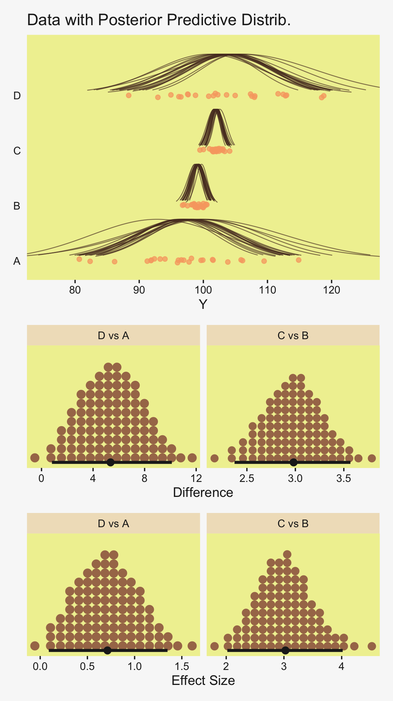

Notice that because (a) the sigma parameters were heterogeneous and (b) they were estimated on the log scale, we had to do quite a bit more data processing before they effect size estimates were ready.

"Finally, because each group has its own estimated scale (i.e., $\sigma_j$), we can investigate differences in scales across groups" (p. 578). That's not a bad idea. Even though Kruschke didn't show this in the text, we may as well give it a go.


```r
# recall we computed the sigma_j's a couple blocks up;
# now we put them to use
draws %>% 
  transmute(`D vs A` = sigma_D - sigma_A,
            `C vs B` = sigma_C - sigma_B,
            `D vs C` = sigma_D - sigma_C,
            `B vs A` = sigma_B - sigma_A) %>% 
  pivot_longer(everything()) %>%
  mutate(name = factor(name, levels = c("D vs A", "C vs B", "D vs C", "B vs A"))) %>% 
  
  ggplot(aes(x = value, y = 0)) +
  stat_dotsinterval(point_interval = mode_hdi, .width = .95,
                    slab_fill = pp[5], color = pp[4],
                    slab_size = 0, quantiles = 100) +
  scale_y_continuous(NULL, breaks = NULL) +
  xlab(expression(Differences~'in'~sigma[italic(j)])) +
  facet_wrap(~ name, scales = "free", ncol = 4)
```

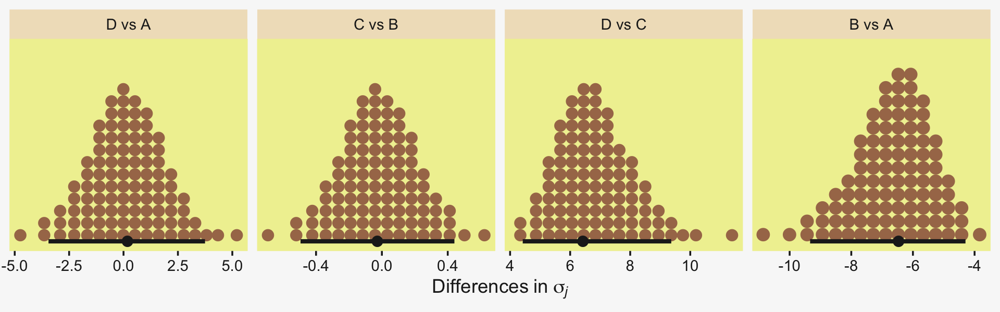

For more on models including a hierarchical structure on both the mean and scale structures, check out [Donald Williams](https://twitter.com/wdonald_1985) and colleagues' work on what they call Mixed Effect Location and Scale Models [MELSM; e.g., @williamsBayesianMultivariateMixedeffects2021; @williamsBayesianNonlinearMixedeffects2019]. They're quite handy and I've begun using them in my applied work (e.g., [here](https://osf.io/vekpf/)). You can also find a brief introduction to MELSM's within the context of the multilevel growth model in [Section 14.6](https://bookdown.org/content/4857/adventures-in-covariance.html#summary-bonus-multilevel-growth-models-and-the-melsm) of my [-@kurzStatisticalRethinkingBrms2020] translation of McElreath's [-@mcelreathStatisticalRethinkingBayesian2020] second edition.

## ~~Exercises~~ Walk out an effect size

We computed a lot of effect sizes in this chapter. They were all standardized mean differences. @cohenStatisticalPowerAnalysis1988 discussed these kinds of effect sizes in this way:

> We need a "pure" number, one free of our original measurement unit, with which to index what can be alternately called the degree of departure from the null hypothesis of the alternate hypothesis, or the ES (effect size) we wish to detect. This is accomplished by standardizing the raw effect size as expressed in the measurement unit of the dependent variable by dividing it by the (common) standard deviation of the measures in their respective populations, the latter also in the original measurement unit. (p. 20)

Though Cohen framed his discussion in terms of null-hypothesis significance testing, we can just as easily apply it to our Bayesian modeling framework. The main thing is we can use his definitions from above to define a particular kind of effect size--the standardized mean difference between two groups. This is commonly referred to as a Cohen's $d$, which follows the formula

$$d = \frac{\bar y_A - \bar y_B}{s_p},$$

where the unstandardized means of the variable of interest $y$ are compared between two groups, A and B. From the raw data, we compute their two means, $\bar y_A$ and $\bar y_B$, and divide their difference by the common (i.e., pooled) standard deviation $s_p$. In practice, the empirically-derived means and standard deviations are stand-ins (i.e., estimates) of the population parameters. If we're willing to ignore uncertainty, we can do this all by hand.

Let's walk this out with the fruit-fly data from [Section 19.3.2][Example: Sex and death.].


```r
my_data <- read_csv("data.R/FruitflyDataReduced.csv")

glimpse(my_data)
```

```
## Rows: 125
## Columns: 3
## $ Longevity       <dbl> 35, 37, 49, 46, 63, 39, 46, 56, 63, 65, 56, 65, 70, 63, 65, 70, 77, 81, 86…
## $ CompanionNumber <chr> "Pregnant8", "Pregnant8", "Pregnant8", "Pregnant8", "Pregnant8", "Pregnant…
## $ Thorax          <dbl> 0.64, 0.68, 0.68, 0.72, 0.72, 0.76, 0.76, 0.76, 0.76, 0.76, 0.80, 0.80, 0.…
```

Recall we have five groups indexed by `CompanionNumber`, each with $n = 25$.


```r
my_data %>% 
  count(CompanionNumber)
```

```
## # A tibble: 5 × 2
##   CompanionNumber     n
##   <chr>           <int>
## 1 None0              25
## 2 Pregnant1          25
## 3 Pregnant8          25
## 4 Virgin1            25
## 5 Virgin8            25
```

Let's focus on just two groups, the male fruit flies for which individual males were supplied access to one or with virgin female fruit flies per day. In the data, these are `CompanionNumber == Virgin1` and `CompanionNumber == Virgin8`, respectively. Here's a look at their mean `Longevity` values.


```r
my_data %>% 
  filter(str_detect(CompanionNumber, "Virgin")) %>% 
  group_by(CompanionNumber) %>% 
  summarise(mean = mean(Longevity))
```

```
## # A tibble: 2 × 2
##   CompanionNumber  mean
##   <chr>           <dbl>
## 1 Virgin1          56.8
## 2 Virgin8          38.7
```

If we're willing to treat the males in the `Virgin1` group as group "a" and those in the `Virgin8` group as group "b", we can save those mean values like so.


```r
y_bar_a <- filter(my_data, CompanionNumber == "Virgin1") %>% summarise(y_bar = mean(Longevity)) %>% pull()
y_bar_b <- filter(my_data, CompanionNumber == "Virgin8") %>% summarise(y_bar = mean(Longevity)) %>% pull()
```

Now we'll compute their pooled standard deviation.


```r
my_data %>% 
  filter(str_detect(CompanionNumber, "Virgin")) %>% 
  group_by(CompanionNumber) %>% 
  summarise(s = sd(Longevity)) %>% 
  summarise(s_p = sqrt(sum(s^2) / 2))
```

```
## # A tibble: 1 × 1
##     s_p
##   <dbl>
## 1  13.6
```

Save that value.


```r
s_a <- filter(my_data, CompanionNumber == "Virgin1") %>% summarise(s = sd(Longevity)) %>% pull()
s_b <- filter(my_data, CompanionNumber == "Virgin8") %>% summarise(s = sd(Longevity)) %>% pull()

s_p <- sqrt((s_a^2 + s_b^2) / 2)
```

If you're confused by how we computed the pooled standard deviation, recall that when comparing two groups that may have different group-level standard deviations, the formula for the $s_p$ is 

$$s_p = \sqrt{\frac{s_A^2 + s_B^2}{2}},$$

where $s_A$ and $s_B$ are the group-level standard deviations. Kruschke introduced this formula back in [Section 16.3][Two groups] and we briefly emphasized it in our [Bonus Section 16.3.0.1][Bonus: Pooled standard deviation.]. Now we have the sample $s_p$ in hand, computing Cohen's $d$ is just simple arithmetic.


```r
(y_bar_a - y_bar_b) / s_p
```

```
## [1] 1.327554
```

Though I'm not up on contemporary standards in fruit fly research, a Cohen's $d$ of that size would be considered [conspicuously] large in most areas of my field (psychology). If we'd like to compute the $d$ estimates for any other combination of experimental conditions, we'd just follow the corresponding arithmetic.

As I hinted at earlier, the problem with this approach is it ignores uncertainty. Frequentists use various formulas to express this in terms of 95% confidence intervals. Our approach will be to express it with the posterior distribution of a Bayesian model. We've already accomplished this with our `fit19.1` from above. Here we'll use three other approaches.

Instead of the Bayesian hierarchical alternative to the frequentist ANOVA, we can use a single-level model where we predict a metric variable with separate intercepts for the two levels of `CompanionNumber`. First, we subset the data and define our `stanvars`.


```r
my_data <-
  my_data %>% 
  filter(str_detect(CompanionNumber, "Virgin"))

mean_y <- (y_bar_a + y_bar_b) / 2

stanvars <- 
  stanvar(mean_y, name = "mean_y") + 
  stanvar(s_p,    name = "sd_y")
```

Fit the model with `brm()`.


```r
fit19.8 <-
  brm(data = my_data,
      family = gaussian,
      Longevity ~ 0 + CompanionNumber,
      prior = c(prior(normal(mean_y, sd_y * 5), class = b),
                prior(cauchy(0, sd_y), class = sigma)),
      iter = 3000, warmup = 1000, chains = 4, cores = 4,
      seed = 19,
      stanvars = stanvars,
      file = "fits/fit19.08")
```

Check the summary.


```r
print(fit19.8)
```

```
##  Family: gaussian 
##   Links: mu = identity; sigma = identity 
## Formula: Longevity ~ 0 + CompanionNumber 
##    Data: my_data (Number of observations: 50) 
##   Draws: 4 chains, each with iter = 3000; warmup = 1000; thin = 1;
##          total post-warmup draws = 8000
## 
## Population-Level Effects: 
##                        Estimate Est.Error l-95% CI u-95% CI Rhat Bulk_ESS Tail_ESS
## CompanionNumberVirgin1    56.73      2.79    51.28    62.08 1.00     7472     5631
## CompanionNumberVirgin8    38.79      2.74    33.50    44.17 1.00     7514     5542
## 
## Family Specific Parameters: 
##       Estimate Est.Error l-95% CI u-95% CI Rhat Bulk_ESS Tail_ESS
## sigma    13.80      1.44    11.34    16.96 1.00     7950     5657
## 
## Draws were sampled using sampling(NUTS). For each parameter, Bulk_ESS
## and Tail_ESS are effective sample size measures, and Rhat is the potential
## scale reduction factor on split chains (at convergence, Rhat = 1).
```

Extract the posterior draws.


```r
draws <- as_draws_df(fit19.8)
```

Here we'll plot the three dimensions of the posterior, each with the corresponding value from the Cohen's $d$ formula marked off as a vertical line in the foreground.


```r
lines <-
  tibble(name  = c("b_CompanionNumberVirgin1", "b_CompanionNumberVirgin8", "sigma"),
         value = c(y_bar_a, y_bar_b, s_p))

draws %>% 
  pivot_longer(b_CompanionNumberVirgin1:sigma) %>% 
  
  ggplot(aes(x = value, y = 0)) +
  stat_dotsinterval(point_interval = mode_hdi, .width = .95,
                    slab_fill = pp[2], color = pp[7],
                    slab_size = 0, quantiles = 100) +
  geom_vline(data = lines,
             aes(xintercept = value),
             color = pp[13], linetype = 2) +
  scale_y_continuous(NULL, breaks = NULL) +
  xlab("posterior") +
  facet_wrap(~ name, scales = "free")
```


The model did a great job capturing all three parameters. If we would like to compute our Cohen's $d$ using the posterior iterations from `fit19.8`, we'd execute something like this.


```r
draws %>% 
  mutate(d = (b_CompanionNumberVirgin1 - b_CompanionNumberVirgin8) / sigma) %>% 
  
  ggplot(aes(x = d, y = 0)) +
  stat_dotsinterval(point_interval = mode_hdi, .width = .95,
                    slab_fill = pp[2], color = pp[7],
                    slab_size = 0, quantiles = 100) +
  geom_vline(xintercept = (y_bar_a - y_bar_b) / s_p,
             color = pp[13], linetype = 2) +
  scale_y_continuous(NULL, breaks = NULL) +
  xlab(expression("Cohen's"~italic(d)~"expressed as a posterior"))
```

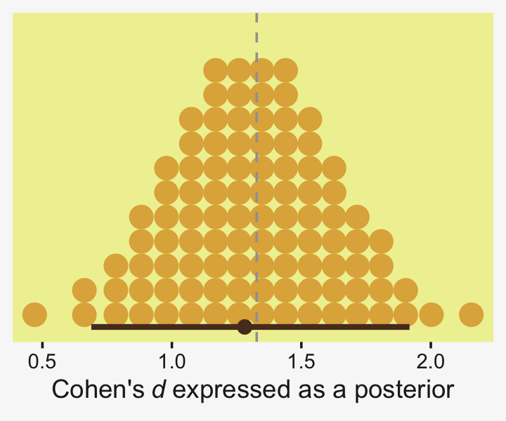

Similar to the previous plots, this time we superimposed the posterior density with the sample estimate for $d$ we computed above, `(y_bar_a - y_bar_b) / s_p`. Happily, the hand-calculated estimate coheres nicely with the central tendency of our posterior distribution. But now we get a full measure of uncertainty. Notice how wide those 95% HDIs are. Hopefully this isn't a surprise given our noncommittal priors and only $n = 25$ for both groups. There's a lot of uncertainty in that posterior.

A second way we might use a single-level model to compute a Cohen's $d$ effect size is using a dummy variable. We'll convert our nominal variable `CompanionNumber` into a binary variable `Virgin1` for which 1 corresponds to `CompanionNumber == Virgin1` and 0 corresponds to `CompanionNumber == Virgin8`. Compute the dummy.


```r
my_data <-
  my_data %>% 
  mutate(Virgin1 = if_else(CompanionNumber == "Virgin1", 1, 0))
```

Now fit the dummy-predictor model with `brm()`.


```r
fit19.9 <-
  brm(data = my_data,
      family = gaussian,
      Longevity ~ 1 + Virgin1,
      prior = c(prior(normal(mean_y, sd_y * 5), class = Intercept),
                prior(normal(0, sd_y * 5), class = b),
                prior(cauchy(0, sd_y), class = sigma)),
      iter = 3000, warmup = 1000, chains = 4, cores = 4,
      seed = 19,
      stanvars = stanvars,
      file = "fits/fit19.09")
```


```r
print(fit19.9)
```

```
##  Family: gaussian 
##   Links: mu = identity; sigma = identity 
## Formula: Longevity ~ 1 + Virgin1 
##    Data: my_data (Number of observations: 50) 
##   Draws: 4 chains, each with iter = 3000; warmup = 1000; thin = 1;
##          total post-warmup draws = 8000
## 
## Population-Level Effects: 
##           Estimate Est.Error l-95% CI u-95% CI Rhat Bulk_ESS Tail_ESS
## Intercept    38.78      2.77    33.35    44.15 1.00     6678     5009
## Virgin1      17.97      3.87    10.24    25.54 1.00     7088     5360
## 
## Family Specific Parameters: 
##       Estimate Est.Error l-95% CI u-95% CI Rhat Bulk_ESS Tail_ESS
## sigma    13.80      1.45    11.36    16.97 1.00     7021     5250
## 
## Draws were sampled using sampling(NUTS). For each parameter, Bulk_ESS
## and Tail_ESS are effective sample size measures, and Rhat is the potential
## scale reduction factor on split chains (at convergence, Rhat = 1).
```

With this parameterization, our posterior for `Intercept` is the same, within simulation variation, as `CompanionNumberVirgin8` from `fit7`. The posterior for `sigma` is about the same for both models, too. But focus on `Virgin1`. This is the unstandardized mean difference, what we called $\bar y_A - \bar y_B$ when we computed Cohen's $d$ using sample statistics. Here's a look at its posterior distribution with its empirical estimate superimposed with a vertical line.


```r
draws <- as_draws_df(fit19.9)

draws %>% 
  ggplot(aes(x = b_Virgin1, y = 0)) +
  stat_dotsinterval(point_interval = mode_hdi, .width = .95,
                    slab_fill = pp[2], color = pp[7],
                    slab_size = 0, quantiles = 100) +
  geom_vline(xintercept = y_bar_a - y_bar_b,
             color = pp[13], linetype = 2) +
  scale_y_continuous(NULL, breaks = NULL) +
  xlab("Unstandardized mean difference")
```


Here's how to standardize that unstandardized effect size into a Cohen's-$d$ metric.


```r
draws %>% 
  mutate(d = b_Virgin1 / sigma) %>% 
  
  ggplot(aes(x = d, y = 0)) +
  stat_dotsinterval(point_interval = mode_hdi, .width = .95,
                    slab_fill = pp[2], color = pp[7],
                    slab_size = 0, quantiles = 100) +
  geom_vline(xintercept = (y_bar_a - y_bar_b) / s_p,
             color = pp[13], linetype = 2) +
  scale_y_continuous(NULL, breaks = NULL) +
  xlab(expression("Cohen's"~italic(d)~"expressed as a posterior"))
```


Let's work this one more way. By simple algebra, a standardized mean difference is the same as the difference between two standardized means. The trick, though, is you have to use the pooled standard deviation ($s_p$) as your standardizer. Thus, if we standardize the criterion `Longevity` before fitting the model and continue using the dummy variable approach, the `Virgin1` posterior will be the same as a Cohen's $d$.

Standardize the criterion with `s_p`.


```r
my_data <-
  my_data %>% 
  mutate(Longevity_s = (Longevity - mean(Longevity)) / s_p)
```

Because our criterion in a standardized metric, we no longer need our `stanvars`.
      

```r
fit19.10 <-
  brm(data = my_data,
      family = gaussian,
      Longevity_s ~ 1 + Virgin1,
      prior = c(prior(normal(0, 1 * 5), class = Intercept),
                prior(normal(0, 1 * 5), class = b),
                prior(cauchy(0, 1), class = sigma)),
      iter = 3000, warmup = 1000, chains = 4, cores = 4,
      seed = 19,
      file = "fits/fit19.10")
```

Behold our out-of-the-box Bayesian Cohen's $d$.


```r
# no transformation necessary
as_draws_df(fit19.10) %>% 
  
  ggplot(aes(x = b_Virgin1, y = 0)) +
  stat_dotsinterval(point_interval = mode_hdi, .width = .95,
                    slab_fill = pp[2], color = pp[7],
                    slab_size = 0, quantiles = 100) +
  geom_vline(xintercept = (y_bar_a - y_bar_b) / s_p,
             color = pp[13], linetype = 2) +
  scale_y_continuous(NULL, breaks = NULL) +
  xlab(expression("Cohen's"~italic(d)~"expressed as a posterior"))
```

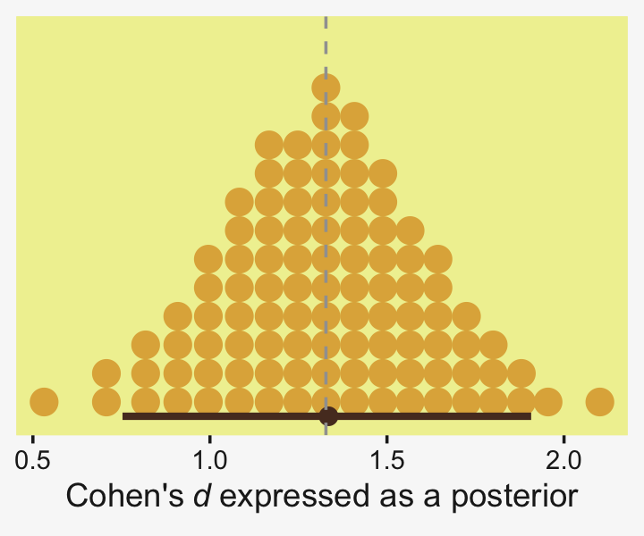

If you work them through, the three approaches we just took can be generalized to models with more than two groups. You just need to be careful how to compute the $s_p$ for each comparison.

It's also the case the that standardized mean differences we computed for `fit19.1`, above, are not quite Cohen's $d$ effect sizes in the same way these have been. This is because the hierarchical approach we used partially pooled the estimates for each group toward the grand mean. You might say they were hierarchically-regularized Cohen's $d$s. But then again, Cohen's formula for his $d$ statistic did not account for Bayesian priors, either. So perhaps a purist would deny that any of the standardized mean differences we've computed in this chapter were proper Cohen's $d$ effect sizes. To be on the safe side, tell your readers exactly how you computed your models and what formulas you used to compute your effect sizes.

### Your sample sizes may differ.

In the examples, above, the two groups had equal sample sizes, which allowed us to be lazy with how we hand computed the sample estimate of the pooled standard deviation. When working with data for which $n_A \neq n_B$, it's a good idea to switch out the equation for the pooled standard deviation $s_p$ for $s_p^*$, which is robust to unequal sample sizes. We wan write the equation for the two-groups version of $s_p^*$ as

$$s_p^* = \sqrt{\frac{(n_A - 1)s_A^2 + (n_B - 1)s_B^2}{n_A + n_B - 2}},$$

which strategically weights the sample estimate for the pooled standard deviation by sample size.

We should practice with $s_p^*$, a bit, to see how it works together with our Bayesian modeling paradigm. Back in [Section 16.1.2][Approximation by ~~MCMC in JAGS~~ HMC in brms.], we saw an example of this with the `TwoGroupIQ` data. Let's load them, again.


```r
my_data <- read_csv("data.R/TwoGroupIQ.csv")

glimpse(my_data)
```

```
## Rows: 120
## Columns: 2
## $ Score <dbl> 102, 107, 92, 101, 110, 68, 119, 106, 99, 103, 90, 93, 79, 89, 137, 119, 126, 110, 7…
## $ Group <chr> "Smart Drug", "Smart Drug", "Smart Drug", "Smart Drug", "Smart Drug", "Smart Drug", …
```

The data are IQ scores for participants in two groups. They look like this.


```r
my_data %>% 
  ggplot(aes(x = Score, Group)) +
  stat_dotsinterval(point_interval = mode_hdi, .width = .95,
                    slab_fill = pp[2], color = pp[7],
                    slab_size = 0, quantiles = 100) +
  xlab("IQ score") +
  coord_cartesian(ylim = c(1.5, 2.25))
```

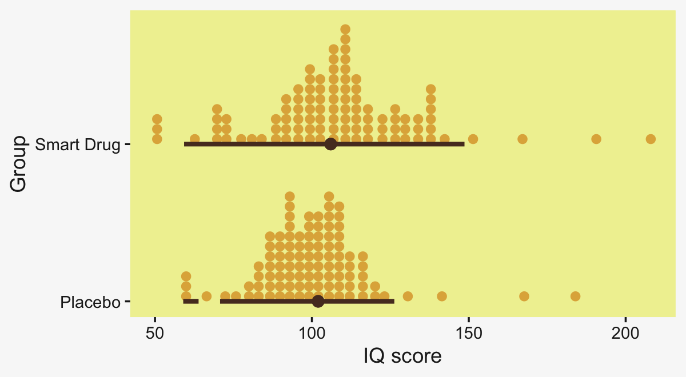

Unlike the examples from the last section, the samples sizes are different for our two levels of `Group`.


```r
my_data %>% 
  count(Group)
```

```
## # A tibble: 2 × 2
##   Group          n
##   <chr>      <int>
## 1 Placebo       57
## 2 Smart Drug    63
```

Here's how we can use that information to hand compute the sample estimate for Cohen's $d$.


```r
# save the sample means for the groups
y_bar_a <- filter(my_data, Group == "Smart Drug") %>% summarise(m = mean(Score)) %>% pull()
y_bar_b <- filter(my_data, Group == "Placebo")    %>% summarise(m = mean(Score)) %>% pull()

# save the sample sizes for the groups 
n_a <- filter(my_data, Group == "Smart Drug") %>% count() %>% pull()
n_b <- filter(my_data, Group == "Placebo") %>% count() %>% pull()

# save the sample standard deviations
s_a <- filter(my_data, Group == "Smart Drug") %>% summarise(s = sd(Score)) %>% pull()
s_b <- filter(my_data, Group == "Placebo")    %>% summarise(s = sd(Score)) %>% pull()

# compute and save the sample pooled standard deviation
s_p <- sqrt(((n_a - 1) * s_a^2 + (n_b - 1) * s_b^2) / (n_a + n_b - 2))

# compute Cohen's d
(y_bar_a - y_bar_b) / s_p
```

```
## [1] 0.3518743
```

Although it's a lot of work to compute a sample-size corrected Cohen's $d$ with unequally-sized sample data, it's straightforward to compute the effect size in a Bayesian model. We could use any of the three approaches, from above. Here we'll practice with the `Score ~ 0 + Group` syntax.


```r
mean_y <- (y_bar_a + y_bar_b) / 2

stanvars <- 
  stanvar(mean_y, name = "mean_y") + 
  stanvar(s_p,    name = "sd_y")

fit19.11 <-
  brm(data = my_data,
      family = gaussian,
      Score ~ 0 + Group,
      prior = c(prior(normal(mean_y, sd_y * 5), class = b),
                prior(cauchy(0, sd_y), class = sigma)),
      iter = 3000, warmup = 1000, chains = 4, cores = 4,
      seed = 19,
      stanvars = stanvars,
      file = "fits/fit19.11")
```

Review the model summary.


```r
print(fit19.11)
```

```
##  Family: gaussian 
##   Links: mu = identity; sigma = identity 
## Formula: Score ~ 0 + Group 
##    Data: my_data (Number of observations: 120) 
##   Draws: 4 chains, each with iter = 3000; warmup = 1000; thin = 1;
##          total post-warmup draws = 8000
## 
## Population-Level Effects: 
##                Estimate Est.Error l-95% CI u-95% CI Rhat Bulk_ESS Tail_ESS
## GroupPlacebo     100.03      2.97    94.24   105.74 1.00     7073     5933
## GroupSmartDrug   107.89      2.81   102.35   113.56 1.00     6670     5303
## 
## Family Specific Parameters: 
##       Estimate Est.Error l-95% CI u-95% CI Rhat Bulk_ESS Tail_ESS
## sigma    22.34      1.47    19.71    25.42 1.00     8176     6135
## 
## Draws were sampled using sampling(NUTS). For each parameter, Bulk_ESS
## and Tail_ESS are effective sample size measures, and Rhat is the potential
## scale reduction factor on split chains (at convergence, Rhat = 1).
```

The $\sigma$ parameter within this model is an estimate of the population value for $\sigma_p$. Happily, it already accommodates the differences in sample sizes, which we tried to correct for, above, with $s_p^*$. To give a sense, here's a plot of the $\sigma$ posterior with our hand-computed `s_p` value superimposed as a dashed line.


```r
as_draws_df(fit19.11) %>% 
  
  ggplot(aes(x = sigma, y = 0)) +
  stat_dotsinterval(point_interval = mode_hdi, .width = .95,
                    slab_fill = pp[2], color = pp[7],
                    slab_size = 0, quantiles = 100) +
  geom_vline(xintercept = s_p,
             color = pp[13], linetype = 2) +
  scale_y_continuous(NULL, breaks = NULL) +
  xlab(expression(sigma[italic(p)]))
```

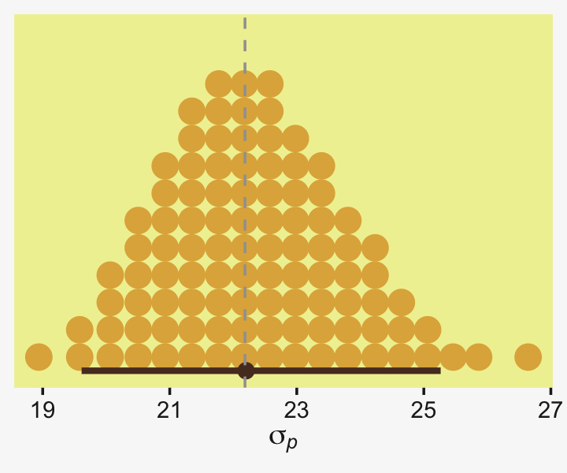

Nailed it! Now here's how we might use the posterior samples to then compute the standardized mean difference.


```r
as_draws_df(fit19.11) %>% 
  mutate(d = (b_GroupSmartDrug - b_GroupPlacebo) / sigma) %>% 
  
  ggplot(aes(x = d, y = 0)) +
  stat_dotsinterval(point_interval = mode_hdi, .width = .95,
                    slab_fill = pp[2], color = pp[7],
                    slab_size = 0, quantiles = 100) +
  geom_vline(xintercept = (y_bar_a - y_bar_b) / s_p,
             color = pp[13], linetype = 2) +
  scale_y_continuous(NULL, breaks = NULL) +
  xlab(expression((mu[italic(B)]-mu[italic(A)])/sigma[italic(p)]*", where "*sigma[italic(p)]%~~%sqrt(((italic(n[A])-1)*italic(s)[italic(A)]^2+(italic(n[B])-1)*italic(s)[italic(B)]^2)/(italic(n[A])+italic(n[B])-2)))) +
  theme(axis.title.x = element_text(size = 7))
```

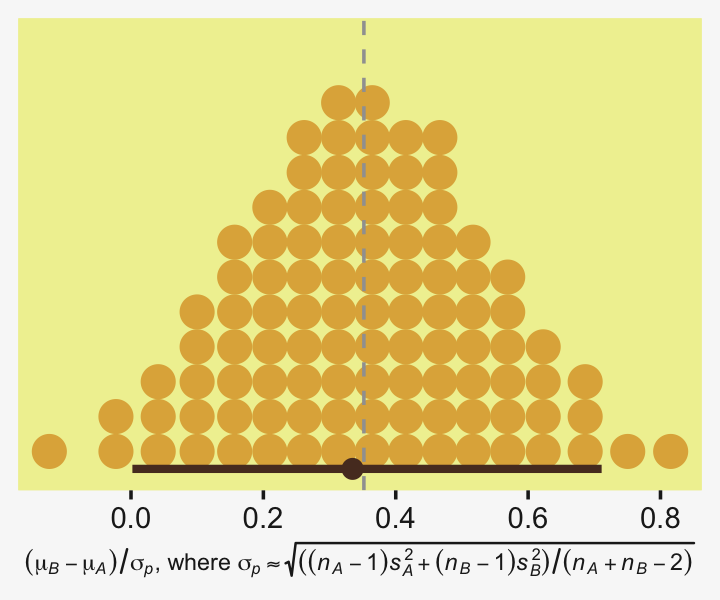

Sometimes fitting a model is easier than computing estimates, by hand.

### Populations and samples.

You may have noticed that in our equation for $d$, above, we defined our standardized mean differences in terms of sample statistics,

$$d = \frac{\bar y_A - \bar y_B}{s_p},$$

where $s_p$ can either assume equal sample sizes, or it can be replaced with $s_p^*$ when sample sizes differ. Sometimes we speak of the true population effect size $\delta$, which is correspondingly defined as

$$\delta = \frac{\mu_A - \mu_B}{\sigma},$$

where $\mu_A$ and $\mu_B$ are the population means for the two groups under consideration and $\sigma$ is the pooled standard deviation in the population. Often times we don't have access to these values, which is why we run experiments and fit statistical models. But sometimes we do have access to the exact population parameters. In those cases, we can just plug them into the formula rather than estimate them in our models or with our sample statistics.

In the case of our IQ score data from the last section, we actually know the population mean and standard deviation for IQ are 100 and 15, respectively. We know this because the people who make IQ tests design them that way. Let's see how well our sample statistics approximate the population parameters.


```r
my_data %>% 
  group_by(Group) %>% 
  summarise(mean = mean(Score),
            sd = sd(Score))
```

```
## # A tibble: 2 × 3
##   Group       mean    sd
##   <chr>      <dbl> <dbl>
## 1 Placebo     100.  17.9
## 2 Smart Drug  108.  25.4
```

```r
# pooled standard deviation
s_p
```

```
## [1] 22.18458
```

Unsurprisingly, the values for the `Smart Drug` group are notably different from the population parameters. But notice how close the values from the `Placebo` group are to the population parameters. If they weren't, we'd be concerned the `Placebo` condition was not a valid control. Looks like it was.

However, notice that the mean and standard deviation for the `Placebo` group are not the exact values of 100 and 15 the way they are in the population. If we wanted to compute a standardized mean difference between our `Smart Drug` group and folks in the population, we could just plug those values directly into our effect size equation. Here's what that would look like if we plug in the population mean for the control group.


```r
(y_bar_a - 100) / s_p
```

```
## [1] 0.3534559
```

The result is very close to the one above. But this time our equation for $d$ was

$$d = \frac{\bar y_A - \mu_B}{s_p},$$

where we used the population mean $\mu_B$, but the other two terms were based on values from the sample. As long as you are defining the `Placebo` control as a stand-in for the population, this is a more precise way to compute $d$. Going further, we can also replace our sample estimate $s_p$ with the true value for $\sigma$, 15.


```r
(y_bar_a - 100) / 15
```

```
## [1] 0.5227513
```

Now our hand-computed estimate for $d$ is quite different. *Why*? Recall that sample standard deviations for both groups were larger than 15, which therefore produced an $s_p$ value that was larger than 15. When working with fractions, larger denominators return smaller products.

Here's what this looks like if we work with the posterior from the last model, `fit19.11`.


```r
as_draws_df(fit19.11) %>% 
  mutate(d = (b_GroupSmartDrug - 100) / 15) %>% 
  
  ggplot(aes(x = d, y = 0)) +
  stat_dotsinterval(point_interval = mode_hdi, .width = .95,
                    slab_fill = pp[2], color = pp[7],
                    slab_size = 0, quantiles = 100) +
  geom_vline(xintercept = (y_bar_a - 100) / 15,
             color = pp[13], linetype = 2) +
  scale_y_continuous(NULL, breaks = NULL) +
  xlab(expression((mu[italic(B)]-100)/15))
```


Note how we've now changed our effect size formula to

$$d = \frac{\bar y_A - \mu_B}{\sigma}.$$

### Report your effect sizes effectively.

Wrapping up, we've been practicing computing standardized mean differences ($d$'s) by hand with sample statistics, with posterior samples from our Bayesian models, and with combinations of the two. We've also seen that whereas unequal sample sizes can matter a lot for hand computing your $d$ estimates, the procedure is more straightforward when using the Bayesian posterior approach. Finally, we played around a bit with how we defined our formula for $d$, depending on whether we knew the true population values of any of the parameters.

Confusingly, you might see all these variants, and more, referred to as Cohen's $d$ within the literature. As with all the other decisions you make with experimental design and data analysis, use careful reasoning to decide on how you'd like to compute your effect sizes. To stave off confusion, report the formulas for your effect sizes transparently in your work. When possible, use equations, prose, and authoritative citations.

Though we've followed Kruschke's lead and focused on the Cohen's $d$ approach to effect sizes, there are many other ways to express effect sizes. Furthermore, $d$-type effect sizes aren't appropriate for some model types or for some research questions. To expand your effect size repertoire, you might brush up on Cohen's [-@cohenStatisticalPowerAnalysis1988] authoritative text or Cummings newer [-@cummingUnderstandingTheNewStatistics2012] text. For nice conceptual overview on effect sizes, I recommend Kelley and Preacher's [-@kelley2012effect] paper, [*On effect size*](https://www3.nd.edu/~kkelley/publications/articles/Kelley_and_Preacher_Psychological_Methods_2012.pdf). Also see Pek and Flora's [-@pekReportingEffectSizes2018] handy paper, [*Reporting effect sizes in original psychological research: A discussion and tutorial*](https://doi.apa.org/fulltext/2017-10871-001.html).

## Session info {-}


```r
sessionInfo()
```

```
## R version 4.2.0 (2022-04-22)
## Platform: x86_64-apple-darwin17.0 (64-bit)
## Running under: macOS Big Sur/Monterey 10.16
## 
## Matrix products: default
## BLAS:   /Library/Frameworks/R.framework/Versions/4.2/Resources/lib/libRblas.0.dylib
## LAPACK: /Library/Frameworks/R.framework/Versions/4.2/Resources/lib/libRlapack.dylib
## 
## locale:
## [1] en_US.UTF-8/en_US.UTF-8/en_US.UTF-8/C/en_US.UTF-8/en_US.UTF-8
## 
## attached base packages:
## [1] stats     graphics  grDevices utils     datasets  methods   base     
## 
## other attached packages:
##  [1] tidybayes_3.0.2   bayesplot_1.9.0   brms_2.18.0       Rcpp_1.0.9        patchwork_1.1.2  
##  [6] ggridges_0.5.3    palettetown_0.1.1 forcats_0.5.1     stringr_1.4.1     dplyr_1.0.10     
## [11] purrr_0.3.4       readr_2.1.2       tidyr_1.2.1       tibble_3.1.8      ggplot2_3.4.0    
## [16] tidyverse_1.3.2  
## 
## loaded via a namespace (and not attached):
##   [1] readxl_1.4.1         backports_1.4.1      plyr_1.8.7           igraph_1.3.4        
##   [5] svUnit_1.0.6         splines_4.2.0        crosstalk_1.2.0      TH.data_1.1-1       
##   [9] rstantools_2.2.0     inline_0.3.19        digest_0.6.30        htmltools_0.5.3     
##  [13] fansi_1.0.3          magrittr_2.0.3       checkmate_2.1.0      googlesheets4_1.0.1 
##  [17] tzdb_0.3.0           modelr_0.1.8         RcppParallel_5.1.5   matrixStats_0.62.0  
##  [21] vroom_1.5.7          xts_0.12.1           sandwich_3.0-2       prettyunits_1.1.1   
##  [25] colorspace_2.0-3     rvest_1.0.2          ggdist_3.2.0         haven_2.5.1         
##  [29] xfun_0.35            callr_3.7.3          crayon_1.5.2         jsonlite_1.8.3      
##  [33] lme4_1.1-31          survival_3.4-0       zoo_1.8-10           glue_1.6.2          
##  [37] gtable_0.3.1         gargle_1.2.0         emmeans_1.8.0        distributional_0.3.1
##  [41] pkgbuild_1.3.1       rstan_2.21.7         abind_1.4-5          scales_1.2.1        
##  [45] mvtnorm_1.1-3        DBI_1.1.3            miniUI_0.1.1.1       xtable_1.8-4        
##  [49] HDInterval_0.2.2     bit_4.0.4            stats4_4.2.0         StanHeaders_2.21.0-7
##  [53] DT_0.24              htmlwidgets_1.5.4    httr_1.4.4           threejs_0.3.3       
##  [57] arrayhelpers_1.1-0   posterior_1.3.1      ellipsis_0.3.2       pkgconfig_2.0.3     
##  [61] loo_2.5.1            farver_2.1.1         sass_0.4.2           dbplyr_2.2.1        
##  [65] utf8_1.2.2           tidyselect_1.1.2     labeling_0.4.2       rlang_1.0.6         
##  [69] reshape2_1.4.4       later_1.3.0          munsell_0.5.0        cellranger_1.1.0    
##  [73] tools_4.2.0          cachem_1.0.6         cli_3.5.0            generics_0.1.3      
##  [77] broom_1.0.1          evaluate_0.18        fastmap_1.1.0        processx_3.8.0      
##  [81] knitr_1.40           bit64_4.0.5          fs_1.5.2             nlme_3.1-159        
##  [85] projpred_2.2.1       mime_0.12            xml2_1.3.3           compiler_4.2.0      
##  [89] shinythemes_1.2.0    rstudioapi_0.13      gamm4_0.2-6          reprex_2.0.2        
##  [93] bslib_0.4.0          stringi_1.7.8        highr_0.9            ps_1.7.2            
##  [97] Brobdingnag_1.2-8    lattice_0.20-45      Matrix_1.4-1         nloptr_2.0.3        
## [101] markdown_1.1         shinyjs_2.1.0        tensorA_0.36.2       vctrs_0.5.1         
## [105] pillar_1.8.1         lifecycle_1.0.3      jquerylib_0.1.4      bridgesampling_1.1-2
## [109] estimability_1.4.1   httpuv_1.6.5         R6_2.5.1             bookdown_0.28       
## [113] promises_1.2.0.1     gridExtra_2.3        codetools_0.2-18     boot_1.3-28         
## [117] MASS_7.3-58.1        colourpicker_1.1.1   gtools_3.9.3         assertthat_0.2.1    
## [121] withr_2.5.0          shinystan_2.6.0      multcomp_1.4-20      mgcv_1.8-40         
## [125] parallel_4.2.0       hms_1.1.1            grid_4.2.0           minqa_1.2.5         
## [129] coda_0.19-4          rmarkdown_2.16       googledrive_2.0.0    shiny_1.7.2         
## [133] lubridate_1.8.0      base64enc_0.1-3      dygraphs_1.1.1.6
```


