# Metric Predicted Variable with Multiple Nominal Predictors

> This chapter considers data structures that consist of a metric predicted variable and two (or more) nominal predictors. This chapter extends ideas introduced in the previous chapter, so please read the previous chapter if you have not already...
>
> The traditional treatment of this sort of data structure is called multifactor analysis of variance (ANOVA). Our Bayesian approach will be a hierarchical generalization of the traditional ANOVA model. The chapter also considers generalizations of the traditional models, because it is straight forward in Bayesian software to implement heavy-tailed distributions to accommodate outliers, along with hierarchical structure to accommodate heterogeneous variances in the different groups. [@kruschkeDoingBayesianData2015, pp. 583--584]

## Describing groups of metric data with multiple nominal predictors

Quick reprise:

> Suppose we have two nominal predictors, denoted $\overrightarrow x_1$ and $\overrightarrow x_2$. A datum from the $j$th level of $\overrightarrow x_1$ is denoted $x_{1[j]}$, and analogously for the second factor. The predicted value is a baseline plus a deflection due to the level of factor $1$ plus a deflection due to the level of factor $2$ plus a residual deflection due to the interaction of factors:
>
> \begin{align*}
> \mu & = \beta_0 + \overrightarrow \beta_1 \cdot \overrightarrow x_1 + \overrightarrow \beta_2 \cdot \overrightarrow x_2 + \overrightarrow \beta_{1 \times 2} \cdot \overrightarrow x_{1 \times 2} \\
> & = \beta_0 + \sum_j \beta_{1[j]} x_{1[j]} + \sum_k \beta_{2[k]} x_{2[k]} + \sum_{j, k} \beta_{1 \times 2[j, k]} x_{1 \times 2[j, k]}
> \end{align*}
>
> The deflections within factors and within the interaction are constrained to sum to zero:
>
> \begin{align*}
> \sum_j \beta_{1[j]} = 0                                &&& \text{and} && \sum_k \beta_{2[k]} = 0 \;\;\; \text{and} \\
> \sum_j \beta_{1 \times 2[j, k]} = 0 \text{ for all } k &&& \text{and} && \sum_k \beta_{1 \times 2[j, k]} = 0 \text{ for all } j
> \end{align*}
>
> ([these equations] are repetitions of Equations 15.9 and 15.10, p. 434). The actual data are assumed to be randomly distributed around the predicted value. (pp. 584--585)

### Interaction.

> An important concept of models with multiple predictors is interaction. Interaction means that the effect of a predictor depends on the level of another predictor. A little more technically, interaction is what is left over after the main effects of the factors are added: interaction is the nonadditive influence of the factors. (p. 585)

Here are the data necessary for our version of Figure 20.1, which displays an interaction of two 2-level factors.


```r
library(tidyverse)

grand_mean            <- 5
deflection_1          <- 1.8
deflection_2          <- 0.2
nonadditive_component <- -1

(
  d <-
  tibble(x1 = rep(c(-1, 1), each = 2),
         x2 = rep(c(1, -1), times = 2)) %>% 
  mutate(mu_additive = grand_mean + (x1 * deflection_1) + (x2 * deflection_2)) %>% 
  mutate(mu_multiplicative = mu_additive + (x1 * x2 * nonadditive_component),
         # we'll need this to accommodate `position = "dodge"` within `geom_col()`
         x1_offset         = x1 + x2 * -.45,
         # we'll need this for the fill
         x2_c              = factor(x2, levels = c(1, -1)))
)
```

```
## # A tibble: 4 × 6
##      x1    x2 mu_additive mu_multiplicative x1_offset x2_c 
##   <dbl> <dbl>       <dbl>             <dbl>     <dbl> <fct>
## 1    -1     1         3.4               4.4     -1.45 1    
## 2    -1    -1         3                 2       -0.55 -1   
## 3     1     1         7                 6        0.55 1    
## 4     1    -1         6.6               7.6      1.45 -1
```

There's enough going on with the lines, arrows, and titles across the three panels that to my mind it seems easier to make three distinct plots and them join them at the end with syntax from the **patchwork** package. But enough of the settings are common among the panels that it also makes sense to keep from repeating that part of the code. So we'll take a three-step solution. For the first step, we'll make the baseline or foundational plot, which we'll call `p`.

Before we make `p`, let's talk color and theme. For this chapter, we'll carry forward our practice from [Chapter 19][Metric Predicted Variable with One Nominal Predictor] and take our color palette from the **palettetown** package. Our color palette will be #15, which is based on [Beedrill](https://www.pokemon.com/us/pokedex/beedrill).


```r
library(palettetown)

scales::show_col(pokepal(pokemon = 15))
```

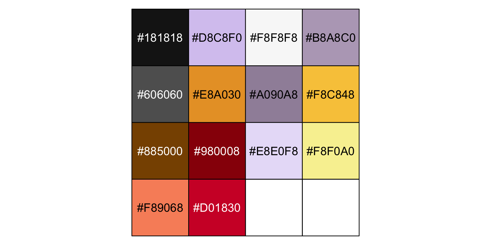

```r
bd <- pokepal(pokemon = 15)

bd
```

```
##  [1] "#181818" "#D8C8F0" "#F8F8F8" "#B8A8C0" "#606060" "#E8A030" "#A090A8" "#F8C848" "#885000"
## [10] "#980008" "#E8E0F8" "#F8F0A0" "#F89068" "#D01830"
```

Also like in the last chapter, our overall plot theme will be based on the default `theme_grey()` with a good number of adjustments. This time, it will have more of a [`theme_black()`](https://jonlefcheck.net/2013/03/11/black-theme-for-ggplot2-2/) vibe. 


```r
theme_set(
  theme_grey() +
    theme(text = element_text(color = bd[3]),
          axis.text = element_text(color = bd[3]),
          axis.ticks = element_line(color = bd[3]),
          legend.background = element_blank(),
          legend.box.background = element_blank(),
          legend.key = element_rect(fill = bd[1]),
          panel.background = element_rect(fill = bd[1], color = bd[3]),
          panel.grid = element_blank(),
          plot.background = element_rect(fill = bd[1], color = bd[1]),
          strip.background = element_rect(fill = alpha(bd[5], 1/3), color = alpha(bd[5], 1/3)),
          strip.text = element_text(color = bd[3]))
)
```

Okay, it's time to make `p`, the baseline or foundational plot for our Figure 20.1.


```r
p <-
  d %>% 
  ggplot(aes(x = x1, y = mu_multiplicative)) +
  geom_col(aes(fill = x2_c),
           position = "dodge") +
  scale_fill_manual(NULL, values = bd[c(11, 6)], labels = c("x2[1]", "x2[2]")) +
  scale_x_continuous(breaks = c(-1, 1), labels = c("x1[1]", "x1[2]")) +
  scale_y_continuous(expression(mu), breaks = seq(from = 0, to = 10, by = 2), 
                     expand = expansion(mult = c(0, 0.05))) +
  coord_cartesian(ylim = c(0, 10)) +
  theme(axis.ticks.x = element_blank(),
        legend.position = c(.17, .875))

p
```

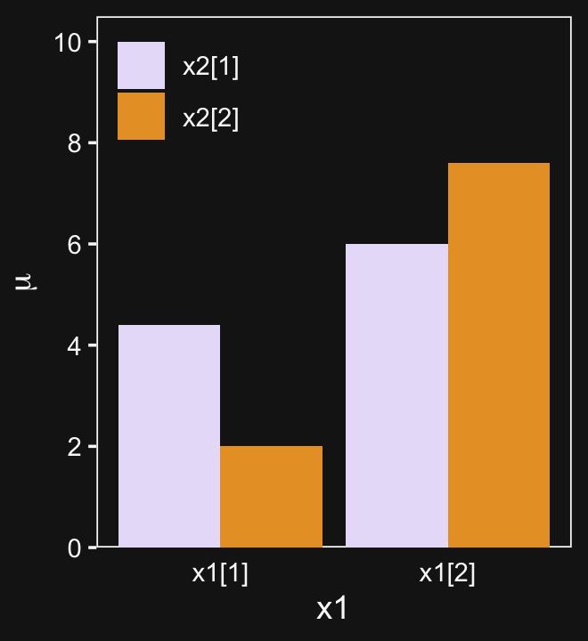

Now we have `p`, we'll add panel-specific elements to it, which we'll save as individual objects, `p1`, `p2`, and `p3`. That's step 2. Then for step 3, we'll bring them all together with **patchwork**.


```r
# deflection from additive
p1 <-
  p +
  geom_segment(aes(x = x1_offset, xend = x1_offset,
                   y = mu_additive, yend = mu_multiplicative),
               linewidth = 1.25, color = bd[5],
               arrow = arrow(length = unit(.275, "cm"))) +
  geom_line(aes(x = x1_offset, y = mu_additive, group = x2),
            linetype = 2, color = bd[5]) +
  geom_line(aes(x = x1_offset, y = mu_additive, group = x1),
            linetype = 2, color = bd[5]) +
  coord_cartesian(ylim = c(0, 10)) +
  ggtitle("Deflection from additive")
  
# effect of x1 depends on x2
p2 <-
  p +
  geom_segment(aes(x = x1_offset, xend = x1_offset,
                   y = mu_additive, yend = mu_multiplicative),
               linewidth = .5, color = bd[5],
               arrow = arrow(length = unit(.15, "cm"))) +
  geom_line(aes(x = x1_offset, y = mu_additive, group = x2),
            linetype = 2, color = bd[5]) +
  geom_line(aes(x = x1_offset, y = mu_multiplicative, group = x2),
            linewidth = 1.25, color = bd[5]) +
  ggtitle("Effect of x1 depends on x2")

# effect of x2 depends on x1
p3 <-
  p +
  geom_segment(aes(x = x1_offset, xend = x1_offset,
                   y = mu_additive, yend = mu_multiplicative),
               linewidth = .5, color = bd[5],
               arrow = arrow(length = unit(.15, "cm"))) +
  geom_line(aes(x = x1_offset, y = mu_multiplicative, group = x1),
            linewidth = 1.25, color = bd[5]) +
  geom_line(aes(x = x1_offset, y = mu_additive, group = x1),
            linetype = 2, color = bd[5]) +
  ggtitle("Effect of x2 depends on x1")

library(patchwork)

p1 + p2 + p3
```

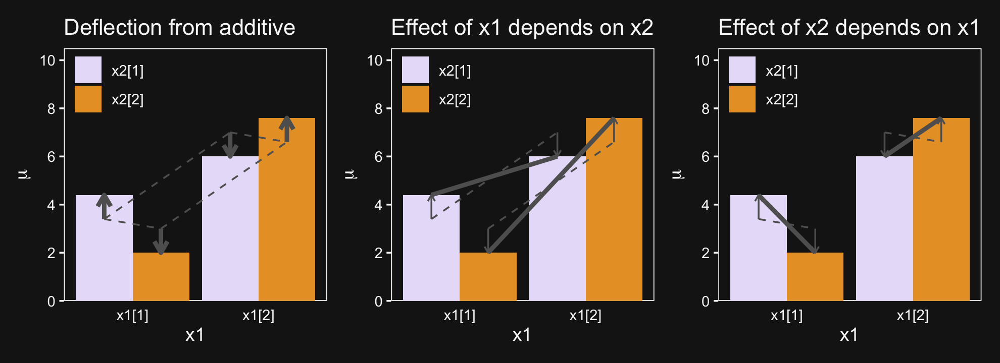

And in case it's not clear, "the average deflection from baseline due to a predictor... is called the main effect of the predictor. The main effects of the predictors correspond to the dashed lines in the left panel of Figure 20.1" (p. 587). And further

> The left panel of Figure 20.1 highlights the interaction as the nonadditive component, emphasized by the heavy vertical arrows that mark the departure from additivity. The middle panel of Figure 20.1 highlights the interaction by emphasizing that the effect of $x_1$ depends on the level of $x_2$. The heavy lines mark the effect of $x_1$, that is, the changes from level $1$ of $x_1$ to level $2$ of $x_1$. Notice that the heavy lines have different slopes: The heavy line for level $1$ of $x_2$ has a shallower slope than the heavy line for level $2$ of $x_2$. The right panel of Figure 20.1 highlights the interaction by emphasizing that the effect of $x_2$ depends on the level of $x_1$. (p. 587)

### Traditional ANOVA.

> As was explained in [Section 19.2][Traditional analysis of variance] (p. 556), the terminology, "analysis of variance," comes from a decomposition of overall data variance into within-group variance and between-group variance... The Bayesian approach is not ANOVA, but is analogous to ANOVA. Traditional ANOVA makes decisions about equality of groups (i.e., null hypotheses) on the basis of $p$ values using a null hypothesis that assumes (i) the data are normally distributed within groups, and (ii) the standard deviation of the data within each group is the same for all groups. The second assumption is sometimes called "homogeneity of variance." The entrenched precedent of ANOVA is why basic models of grouped data make those assumptions, and why the basic models presented in this chapter will also make those assumptions. Later in the chapter, those constraints will be relaxed. (pp. 587--588)

## Hierarchical Bayesian approach

"Our goal is to estimate the main and interaction deflections, and other parameters, based on the observed data" (p. 588).

Figure 20.2 will provides a generic model diagram of how this can work.


```r
# bracket
p1 <-
  tibble(x = .99,
         y = .5,
         label = "{_}") %>% 
  
  ggplot(aes(x = x, y = y, label = label)) +
  geom_text(size = 10, hjust = 1, color = bd[2], family = "Times") +
  scale_x_continuous(expand = c(0, 0), limits = c(0, 1)) +
  ylim(0, 1) +
  theme_void()

##  plain arrow
# save our custom arrow settings
my_arrow <- arrow(angle = 20, length = unit(0.35, "cm"), type = "closed")
p2 <-
  tibble(x    = .68,
         y    = 1,
         xend = .68,
         yend = .25) %>%
  
  ggplot(aes(x = x, xend = xend,
             y = y, yend = yend)) +
  geom_segment(arrow = my_arrow, color = bd[3]) +
  xlim(0, 1) +
  theme_void()
  
# normal density
p3 <-
  tibble(x = seq(from = -3, to = 3, by = .1)) %>% 
  ggplot(aes(x = x, y = (dnorm(x)) / max(dnorm(x)))) +
  geom_area(fill = bd[6]) +
  annotate(geom = "text",
           x = 0, y = .2,
           label = "normal",
           size = 7, color = bd[3]) +
  annotate(geom = "text",
           x = c(0, 1.45), y = .6,
           hjust = c(.5, 0),
           label = c("italic(M)[0]", "italic(S)[0]"), 
           size = 7, color = bd[3], family = "Times", parse = T) +
  scale_x_continuous(expand = c(0, 0)) +
  theme_void() +
  theme(axis.line.x = element_line(linewidth = 0.5, color = bd[3]))
  
# normal density
p4 <-
  tibble(x = seq(from = -3, to = 3, by = .1)) %>% 
  ggplot(aes(x = x, y = (dnorm(x)) / max(dnorm(x)))) +
  geom_area(fill = bd[6]) +
  annotate(geom = "text",
           x = 0, y = .2,
           label = "normal",
           size = 7, color = bd[3]) +
  annotate(geom = "text",
           x = c(0, 1.15), y = .6,
           label = c("0", "sigma[beta][1]"), 
           hjust = c(.5, 0),
           size = 7, color = bd[3], family = "Times", parse = T) +
  scale_x_continuous(expand = c(0, 0)) +
  theme_void() +
  theme(axis.line.x = element_line(linewidth = 0.5, color = bd[3]))
  
# normal density
p5 <-
  tibble(x = seq(from = -3, to = 3, by = .1)) %>% 
  ggplot(aes(x = x, y = (dnorm(x)) / max(dnorm(x)))) +
  geom_area(fill = bd[6]) +
  annotate(geom = "text",
           x = 0, y = .2,
           label = "normal",
           size = 7, color = bd[3]) +
  annotate(geom = "text",
           x = c(0, 1.15), y = .6,
           label = c("0", "sigma[beta][2]"), 
           hjust = c(.5, 0),
           size = 7, color = bd[3], family = "Times", parse = T) +
  scale_x_continuous(expand = c(0, 0)) +
  theme_void() +
  theme(axis.line.x = element_line(linewidth = 0.5, color = bd[3]))
  
# normal density
p6 <-
  tibble(x = seq(from = -3, to = 3, by = .1)) %>% 
  ggplot(aes(x = x, y = (dnorm(x)) / max(dnorm(x)))) +
  geom_area(fill = bd[6]) +
  annotate(geom = "text",
           x = 0, y = .2,
           label = "normal",
           size = 7, color = bd[3]) +
  annotate(geom = "text",
           x = c(0, 0.67), y = .6,
           hjust = c(.5, 0),
           label = c("0", "sigma[beta][1%*%2]"), 
           size = 7, color = bd[3], family = "Times", parse = T) +
  scale_x_continuous(expand = c(0, 0)) +
  theme_void() +
  theme(axis.line.x = element_line(linewidth = 0.5, color = bd[3]))

# four annotated arrows
p7 <-
  tibble(x    = c(.05, .34, .64, .945),
         y    = c(1, 1, 1, 1),
         xend = c(.05, .18, .45, .74),
         yend = c(0, 0, 0, 0)) %>%
  ggplot(aes(x = x, xend = xend,
             y = y, yend = yend)) +
  geom_segment(arrow = my_arrow, color = bd[3]) +
  annotate(geom = "text",
           x = c(.025, .23, .30, .52, .585, .81, .91), y = .5,
           label = c("'~'", "'~'", "italic(j)", "'~'", "italic(k)", "'~'", "italic(jk)"),
           size = c(10, 10, 7, 10, 7, 10, 7), 
           color = bd[3], family = "Times", parse = T) +
  xlim(0, 1) +
  theme_void()

# likelihood formula
p8 <-
  tibble(x = .5,
         y = .25,
         label = "beta[0]+sum()[italic(j)]*beta[1]['['*italic(j)*']']*italic(x)[1]['['*italic(j)*']'](italic(i))+sum()[italic(k)]*beta[2]['['*italic(k)*']']*italic(x)[2]['['*italic(k)*']'](italic(i))+sum()[italic(jk)]*beta[1%*%2]['['*italic(jk)*']']*italic(x)[1%*%2]['['*italic(jk)*']'](italic(i))") %>% 
 
  ggplot(aes(x = x, y = y, label = label)) +
  geom_text(hjust = .5, size = 7, color = bd[3], parse = T, family = "Times") +
  scale_x_continuous(expand = c(0, 0), limits = c(0, 1)) +
  ylim(0, 1) +
  theme_void()

# half-normal density
p9 <-
  tibble(x = seq(from = 0, to = 3, by = .01)) %>% 
  ggplot(aes(x = x, y = (dnorm(x)) / max(dnorm(x)))) +
  geom_area(fill = bd[6]) +
  annotate(geom = "text",
           x = 1.5, y = .2,
           label = "half-normal",
           size = 7, color = bd[3]) +
  annotate(geom = "text",
           x = 1.5, y = .6,
           label = "0*','*~italic(S)[sigma]", 
           size = 7, color = bd[3], family = "Times", parse = T) +
  scale_x_continuous(expand = c(0, 0)) +
  theme_void() +
  theme(axis.line.x = element_line(linewidth = 0.5, color = bd[3]))

# the final normal density
p10 <-
  tibble(x = seq(from = -3, to = 3, by = .1)) %>% 
  ggplot(aes(x = x, y = (dnorm(x)) / max(dnorm(x)))) +
  geom_area(fill = bd[6]) +
  annotate(geom = "text",
           x = 0, y = .2,
           label = "normal",
           size = 7, color = bd[3]) +
  annotate(geom = "text",
           x = c(0, 1.15), y = .6,
           label = c("mu[italic(i)]", "sigma[italic(y)]"), 
           hjust = c(.5, 0),
           size = 7, color = bd[3], family = "Times", parse = T) +
  scale_x_continuous(expand = c(0, 0)) +
  theme_void() +
  theme(axis.line.x = element_line(linewidth = 0.5, color = bd[3]))

# an annotated arrow
p11 <-
  tibble(x     = .4,
         y     = .5,
         label = "'='") %>% 
  
  ggplot(aes(x = x, y = y, label = label)) +
  geom_text(size = 10, color = bd[3], parse = T, family = "Times") +
  geom_segment(x = .5, xend = .5,
               y = 1, yend = .1, 
               arrow = my_arrow, color = bd[3]) +
  xlim(0, 1) +
  theme_void()

# another annotated arrow
p12 <-
  tibble(x     = .49,
         y     = .55,
         label = "'~'") %>% 
  
  ggplot(aes(x = x, y = y, label = label)) +
  geom_text(size = 10, color = bd[3], parse = T, family = "Times") +
  geom_segment(x = .79, xend = .4,
               y = 1, yend = .2, 
               arrow = my_arrow, color = bd[3]) +
  xlim(0, 1) +
  theme_void()

# the final annotated arrow
p13 <-
  tibble(x     = c(.375, .625),
         y     = c(1/3, 1/3),
         label = c("'~'", "italic(i)")) %>% 
  
  ggplot(aes(x = x, y = y, label = label)) +
  geom_text(size = c(10, 7), 
            color = bd[3], parse = T, family = "Times") +
  geom_segment(x = .5, xend = .5,
               y = 1, yend = 0, 
               arrow = my_arrow, color = bd[3]) +
  xlim(0, 1) +
  theme_void()

# some text
p14 <-
  tibble(x     = .5,
         y     = .5,
         label = "italic(y[i])") %>% 
  
  ggplot(aes(x = x, y = y, label = label)) +
  geom_text(size = 7, color = bd[3], parse = T, family = "Times") +
  xlim(0, 1) +
  theme_void()

# define the layout
layout <- c(
  area(t = 1, b = 1, l = 6, r = 7),
  area(t = 1, b = 1, l = 10, r = 11),
  area(t = 1, b = 1, l = 14, r = 15),
  area(t = 3, b = 4, l = 1, r = 3),
  area(t = 3, b = 4, l = 5, r = 7),
  area(t = 3, b = 4, l = 9, r = 11),
  area(t = 3, b = 4, l = 13, r = 15),
  area(t = 2, b = 3, l = 6, r = 7),
  area(t = 2, b = 3, l = 10, r = 11),
  area(t = 2, b = 3, l = 14, r = 15),
  area(t = 6, b = 7, l = 1, r = 15),
  area(t = 5, b = 6, l = 1, r = 15),
  area(t = 9, b = 10, l = 10, r = 12),
  area(t = 12, b = 13, l = 7, r = 9),
  area(t = 8, b = 12, l = 7, r = 9),
  area(t = 11, b = 12, l = 7, r = 12),
  area(t = 14, b = 14, l = 7, r = 9),
  area(t = 15, b = 15, l = 7, r = 9)
)

# combine and plot!
(p1 + p1 + p1 + p3 + p4 + p5 + p6 + p2 + p2 + p2 + p8 + p7 + p9 + p10 + p11 + p12 + p13 + p14) + 
  plot_layout(design = layout) &
  ylim(0, 1) &
  theme(plot.margin = margin(0, 5.5, 0, 5.5))
```

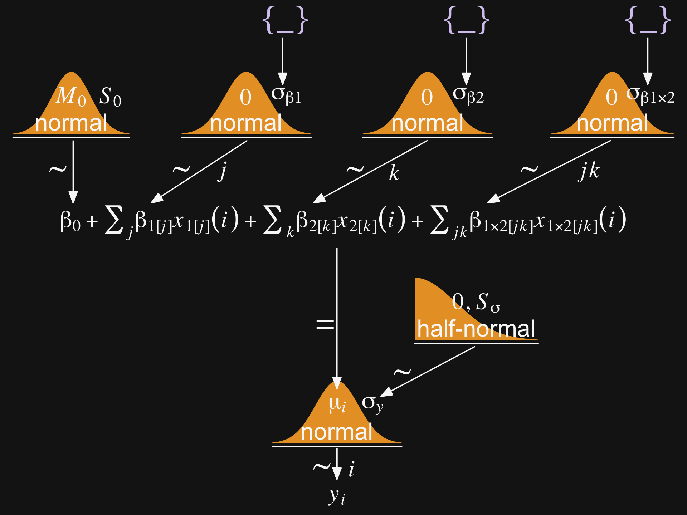

Wow that plot has a lot of working parts! 😮

### Implementation in ~~JAGS~~ brms.

Below is how to implement the model based on the code from Kruschke's `Jags-Ymet-Xnom2fac-MnormalHom.R` and `Jags-Ymet-Xnom2fac-MnormalHom-Example.R` scripts. With **brms**, we'll need to specify the `stanvars`.


```r
mean_y <- mean(my_data$y)
sd_y   <- sd(my_data$y)

omega <- sd_y / 2
sigma <- 2 * sd_y

s_r <- gamma_a_b_from_omega_sigma(mode = omega, sd = sigma)

stanvars <- 
  stanvar(mean_y,    name = "mean_y") + 
  stanvar(sd_y,      name = "sd_y") +
  stanvar(s_r$shape, name = "alpha") +
  stanvar(s_r$rate,  name = "beta")
```

And before that, of course, make sure you've defined the `gamma_a_b_from_omega_sigma()` function. E.g.,


```r
gamma_a_b_from_omega_sigma <- function(mode, sd) {
  if (mode <= 0) stop("mode must be > 0")
  if (sd   <= 0) stop("sd must be > 0")
  rate <- (mode + sqrt(mode^2 + 4 * sd^2)) / (2 * sd^2)
  shape <- 1 + mode * rate
  return(list(shape = shape, rate = rate))
}
```

With the preparatory work done, now all we'd need to do is run the `brm()` code.


```r
fit <-
  brm(data = my_data,
      family = gaussian,
      y ~ 1 + (1 | factor_1) + (1 | factor_2) + (1 | factor_1:factor_2),
      prior = c(prior(normal(mean_y, sd_y * 5), class = Intercept),
                prior(gamma(alpha, beta), class = sd),
                prior(cauchy(0, sd_y), class = sigma)),
      stanvars = stanvars)
```

If you have reason to use different priors for the random effects, you can always specify multiple lines of `class = sd`, each with the appropriate `coef` argument.

The big new element is multiple `(|)` parts in the `formula`. In this simple model type, we're only working random intercepts, in this case with two factors and their interaction. The `formula` above presumes the interaction is not itself coded within the data. But consider the case you have data including a term for the interaction of the two lower-level factors, called `interaction`. In that case, you'd have that last part of the `formula` read `(1 | interaction)`, instead.

### Example: It's only money.

Load the salary data[^7].


```r
my_data <- read_csv("data.R/Salary.csv")

glimpse(my_data)
```

```
## Rows: 1,080
## Columns: 6
## $ Org     <chr> "PL", "MUTH", "ENG", "CMLT", "LGED", "MGMT", "INFO", "CRIN", "CRIN", "PSY", "SOC",…
## $ OrgName <chr> "Philosophy", "Music Theory", "English", "Comparative Literature", "Language Educa…
## $ Cla     <chr> "PC", "PC", "PC", "PC", "PT", "PR", "PT", "PR", "PR", "PR", "PR", "PR", "PR", "PC"…
## $ Pos     <chr> "FT2", "FT2", "FT2", "FT2", "FT3", "NDW", "FT3", "FT1", "NDW", "FT1", "FT1", "FT1"…
## $ ClaPos  <chr> "PC.FT2", "PC.FT2", "PC.FT2", "PC.FT2", "PT.FT3", "PR.NDW", "PT.FT3", "PR.FT1", "P…
## $ Salary  <dbl> 72395, 61017, 82370, 68805, 63796, 219600, 98814, 107745, 114275, 173302, 117240, …
```

We'll follow Kruschke's example on page 593 and modify the `Pos` variable a bit.


```r
my_data <-
  my_data %>% 
  mutate(Pos = factor(Pos,
                      levels = c("FT3", "FT2", "FT1", "NDW", "DST") ,
                      ordered = T,
                      labels = c("Assis", "Assoc", "Full", "Endow", "Disting")))
```

With 1,080 cases, two factors, and a criterion, these data are a little too unwieldy to look at the individual case level. But if we're tricky on how we aggregate, we can get a good sense of their structure with a `geom_tile()` plot. Here our strategy is to aggregate by our two factors, `Pos` and `Org`. Since our criterion is `Salary`, we'll compute the mean value of the cases within each unique paring, encoded as `m_salary`. Also, we'll get a sense of how many cases there are within each factor pairing with `n`.


```r
my_data %>% 
  group_by(Pos, Org) %>% 
  summarise(m_salary = mean(Salary),
            n        = n()) %>% 
  ungroup() %>% 
  mutate(Org = fct_reorder(Org, m_salary),
         Pos = fct_reorder(Pos, m_salary)) %>% 
  
  ggplot(aes(x = Org, y = Pos, fill = m_salary, label = n)) +
  geom_tile() +
  geom_text(size = 2.75) +
  # everything below this is really just aesthetic flourish
  scale_fill_gradient(low = bd[9], high = bd[12],
                      breaks = c(55e3, 15e4, 26e4), 
                      labels = c("$55K", "$150K", "$260K")) +
  scale_x_discrete("Org", expand = c(0, 0)) +
  scale_y_discrete("Pos", expand = c(0, 0)) +
  theme(axis.text.x = element_text(angle = 90, hjust = 0),
        axis.text.y = element_text(hjust = 0),
        axis.ticks = element_blank(),
        legend.position = "top")
```

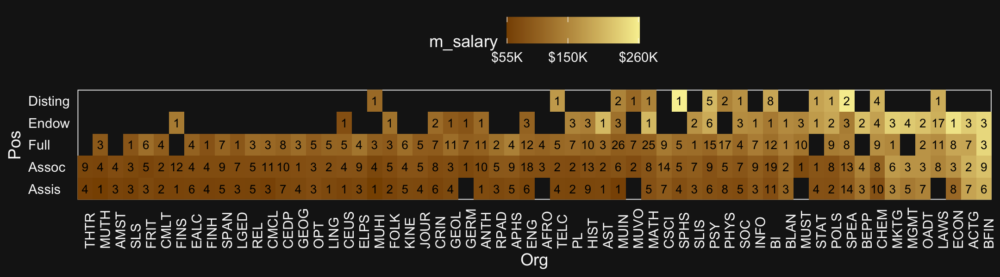

Hopefully it's clear that each cell is a unique pairing of `Org` and `Pos`. The cells are color coded by the mean `Salary`. The numbers in the cells give the $n$ cases they represent. When there's no data for a unique combination of `Org` and `Pos`, the cells are left blank charcoal.

Load **brms**.


```r
library(brms)
```

Define our `stanvars`.


```r
mean_y <- mean(my_data$Salary)
sd_y   <- sd(my_data$Salary)

omega <- sd_y / 2
sigma <- 2 * sd_y

s_r <- gamma_a_b_from_omega_sigma(mode = omega, sd = sigma)

stanvars <- 
  stanvar(mean_y,    name = "mean_y") + 
  stanvar(sd_y,      name = "sd_y") +
  stanvar(s_r$shape, name = "alpha") +
  stanvar(s_r$rate,  name = "beta")
```

Now fit the model.


```r
fit20.1 <-
  brm(data = my_data,
      family = gaussian,
      Salary ~ 1 + (1 | Pos) + (1 | Org) + (1 | Pos:Org),
      prior = c(prior(normal(mean_y, sd_y * 5), class = Intercept),
                prior(gamma(alpha, beta), class = sd),
                prior(cauchy(0, sd_y), class = sigma)),
      iter = 4000, warmup = 2000, chains = 4, cores = 4,
      seed = 20,
      control = list(adapt_delta = 0.999,
                     max_treedepth = 13),
      stanvars = stanvars,
      file = "fits/fit20.01")
```

The chains look fine.


```r
bayesplot::color_scheme_set(scheme = bd[c(13, 7:9, 11:12)])

plot(fit20.1, widths = c(2, 3))
```

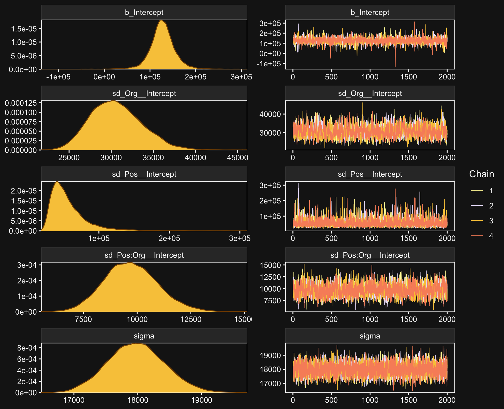

Here's the model summary.


```r
print(fit20.1)
```

```
##  Family: gaussian 
##   Links: mu = identity; sigma = identity 
## Formula: Salary ~ 1 + (1 | Pos) + (1 | Org) + (1 | Pos:Org) 
##    Data: my_data (Number of observations: 1080) 
##   Draws: 4 chains, each with iter = 4000; warmup = 2000; thin = 1;
##          total post-warmup draws = 8000
## 
## Group-Level Effects: 
## ~Org (Number of levels: 60) 
##               Estimate Est.Error l-95% CI u-95% CI Rhat Bulk_ESS Tail_ESS
## sd(Intercept) 30652.56   3076.54 25214.54 37332.82 1.00     1626     2793
## 
## ~Pos (Number of levels: 5) 
##               Estimate Est.Error l-95% CI  u-95% CI Rhat Bulk_ESS Tail_ESS
## sd(Intercept) 56421.66  26569.30 26666.69 125632.37 1.00     2545     3645
## 
## ~Pos:Org (Number of levels: 216) 
##               Estimate Est.Error l-95% CI u-95% CI Rhat Bulk_ESS Tail_ESS
## sd(Intercept)  9688.54   1197.77  7421.22 12108.03 1.00     2426     4739
## 
## Population-Level Effects: 
##            Estimate Est.Error l-95% CI  u-95% CI Rhat Bulk_ESS Tail_ESS
## Intercept 126114.36  27044.36 70278.60 180836.82 1.00     2425     3133
## 
## Family Specific Parameters: 
##       Estimate Est.Error l-95% CI u-95% CI Rhat Bulk_ESS Tail_ESS
## sigma 17981.56    435.71 17138.37 18837.35 1.00     6201     5865
## 
## Draws were sampled using sampling(NUTS). For each parameter, Bulk_ESS
## and Tail_ESS are effective sample size measures, and Rhat is the potential
## scale reduction factor on split chains (at convergence, Rhat = 1).
```

This was a difficult model to fit with **brms**. Stan does well when the criteria are on or close to a standardized metric and these `Salary` data are a far cry from that. Tuning `adapt_delta` and `max_treedepth` went a long way to help the model out.

Okay, let's get ready for our version of Figure 20.3. First, we'll use `tidybayes::add_epred_draws()` to help organize the necessary posterior draws.


```r
library(tidybayes)

# how many draws would you like?
n_draw <- 20

# wrangle
f <-
  my_data %>% 
  distinct(Pos) %>% 
  expand_grid(Org = c("BFIN", "CHEM", "PSY", "ENG")) %>% 
  add_epred_draws(fit20.1, ndraws = n_draw, seed = 20,
                  allow_new_levels = T,
                  dpar = c("mu", "sigma")) %>% 
  mutate(ll = qnorm(.025, mean = mu, sd = sigma),
         ul = qnorm(.975, mean = mu, sd = sigma)) %>% 
  mutate(Salary = map2(ll, ul, seq, length.out = 100)) %>% 
  unnest(Salary) %>% 
  mutate(density = dnorm(Salary, mu, sigma)) %>% 
  group_by(.draw) %>% 
  mutate(density = density / max(density)) %>% 
  mutate(Org = factor(Org, levels = c("BFIN", "CHEM", "PSY", "ENG")))

glimpse(f)
```

```
## Rows: 40,000
## Columns: 13
## Groups: .draw [20]
## $ Pos        <ord> Assoc, Assoc, Assoc, Assoc, Assoc, Assoc, Assoc, Assoc, Assoc, Assoc, Assoc, As…
## $ Org        <fct> BFIN, BFIN, BFIN, BFIN, BFIN, BFIN, BFIN, BFIN, BFIN, BFIN, BFIN, BFIN, BFIN, B…
## $ .row       <int> 1, 1, 1, 1, 1, 1, 1, 1, 1, 1, 1, 1, 1, 1, 1, 1, 1, 1, 1, 1, 1, 1, 1, 1, 1, 1, 1…
## $ .chain     <int> NA, NA, NA, NA, NA, NA, NA, NA, NA, NA, NA, NA, NA, NA, NA, NA, NA, NA, NA, NA,…
## $ .iteration <int> NA, NA, NA, NA, NA, NA, NA, NA, NA, NA, NA, NA, NA, NA, NA, NA, NA, NA, NA, NA,…
## $ .draw      <int> 1, 1, 1, 1, 1, 1, 1, 1, 1, 1, 1, 1, 1, 1, 1, 1, 1, 1, 1, 1, 1, 1, 1, 1, 1, 1, 1…
## $ .epred     <dbl> 220268, 220268, 220268, 220268, 220268, 220268, 220268, 220268, 220268, 220268,…
## $ mu         <dbl> 220268, 220268, 220268, 220268, 220268, 220268, 220268, 220268, 220268, 220268,…
## $ sigma      <dbl> 18067.46, 18067.46, 18067.46, 18067.46, 18067.46, 18067.46, 18067.46, 18067.46,…
## $ ll         <dbl> 184856.4, 184856.4, 184856.4, 184856.4, 184856.4, 184856.4, 184856.4, 184856.4,…
## $ ul         <dbl> 255679.6, 255679.6, 255679.6, 255679.6, 255679.6, 255679.6, 255679.6, 255679.6,…
## $ Salary     <dbl> 184856.4, 185571.8, 186287.2, 187002.6, 187718.0, 188433.3, 189148.7, 189864.1,…
## $ density    <dbl> 0.1465288, 0.1582290, 0.1705958, 0.1836410, 0.1973740, 0.2118018, 0.2269281, 0.…
```

We're ready to plot.


```r
library(ggridges)

set.seed(20)

f %>% 
  ggplot(aes(x = Salary, y = Pos)) +
  geom_vline(xintercept = fixef(fit20.1)[, 1], color = bd[5]) +
  geom_ridgeline(aes(height = density, group = interaction(Pos, .draw),
                     color = Pos),
                 fill = NA, show.legend = F,
                 size = 1/4, scale = 3/4) +
  geom_jitter(data = my_data %>% 
                filter(Org %in% c("BFIN", "CHEM", "PSY", "ENG")) %>% 
                mutate(Org = factor(Org, levels = c("BFIN", "CHEM", "PSY", "ENG"))),
              height = .025, alpha = 1/2, size = 2/3, color = bd[11]) +
  scale_color_manual(values = bd[c(14, 13, 8, 12, 3)]) +
  scale_x_continuous(breaks = seq(from = 0, to = 300000, length.out = 4),
                     labels = c("$0", "$100K", "200K", "$300K")) +
  coord_cartesian(xlim = c(0, 35e4),
                  ylim = c(1.25, 5.5)) +
  labs(title = "Data with Posterior Predictive Distributions", 
       subtitle = "The white vertical line is the model-implied grand mean.",
       y = "Pos") +
  theme(axis.text.y = element_text(hjust = 0),
        axis.ticks.y = element_blank()) +
  facet_wrap(~ Org, ncol = 2)
```

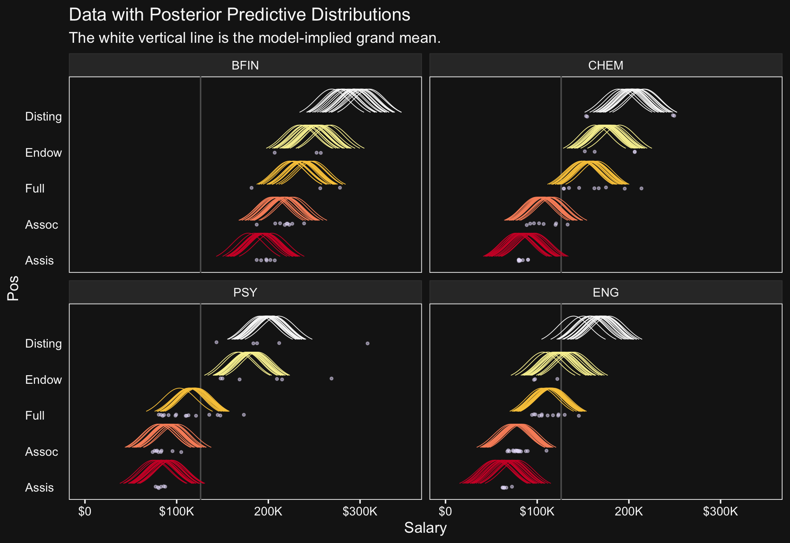

The **brms** package doesn't have a convenience function that returns output quite like what Kruschke displayed in his Table 20.2. But we can get close. The `posterior_summary()` will return posterior means, $\textit{SD}$s, and percentile-based 95% intervals for all model parameters. Due to space concerns, I'll just show the first ten lines.


```r
posterior_summary(fit20.1)[1:10,]
```

```
##                         Estimate  Est.Error       Q2.5      Q97.5
## b_Intercept           126114.356 27044.3618  70278.603 180836.818
## sd_Org__Intercept      30652.564  3076.5357  25214.535  37332.825
## sd_Pos__Intercept      56421.662 26569.3026  26666.692 125632.368
## sd_Pos:Org__Intercept   9688.537  1197.7705   7421.223  12108.029
## sigma                  17981.559   435.7087  17138.368  18837.352
## r_Org[ACTG,Intercept]  80561.579  7593.5101  65644.819  95444.294
## r_Org[AFRO,Intercept] -14967.759  9681.3929 -34019.522   3944.769
## r_Org[AMST,Intercept] -16263.028 10147.5361 -36024.080   3939.405
## r_Org[ANTH,Intercept] -18562.858  7784.4292 -33771.714  -3096.282
## r_Org[APHS,Intercept]   3207.660  7957.3468 -12288.543  18766.078
```

The `summarise_draws()` function from the **posterior** package [@R-posterior], however, will take us a long ways towards making Table 20.2. 


```r
library(posterior)

as_draws_df(fit20.1) %>% 
  select(b_Intercept, 
         starts_with("r_Pos["),
         `r_Org[ENG,Intercept]`,
         `r_Org[PSY,Intercept]`,
         `r_Org[CHEM,Intercept]`,
         `r_Org[BFIN,Intercept]`,
         `r_Pos:Org[Assis_PSY,Intercept]`,
         `r_Pos:Org[Full_PSY,Intercept]`,
         `r_Pos:Org[Assis_CHEM,Intercept]`,
         `r_Pos:Org[Full_CHEM,Intercept]`,
         sigma) %>% 
  summarise_draws(mean, median, mode = Mode, ess_bulk, ess_tail, ~ quantile(.x, probs = c(.025, .975))) %>% 
  mutate_if(is.double, round, digits = 0)
```

```
## # A tibble: 15 × 8
##    variable                          mean median   mode ess_bulk ess_tail `2.5%` `97.5%`
##    <chr>                            <dbl>  <dbl>  <dbl>    <dbl>    <dbl>  <dbl>   <dbl>
##  1 b_Intercept                     126114 126147 123804     2400     3092  70279  180837
##  2 r_Pos[Assis,Intercept]          -45535 -45278 -43009     2497     3056 -99854    8979
##  3 r_Pos[Assoc,Intercept]          -32184 -32191 -31484     2491     3074 -86752   23303
##  4 r_Pos[Full,Intercept]            -2298  -2199   -838     2500     3092 -56764   53355
##  5 r_Pos[Endow,Intercept]           27809  27705  26852     2494     3106 -26850   83306
##  6 r_Pos[Disting,Intercept]         56395  56228  56547     2556     3207   1664  113164
##  7 r_Org[ENG,Intercept]            -18712 -18774 -19711     1439     3113 -32563   -4655
##  8 r_Org[PSY,Intercept]              6618   6617   6947     1216     2574  -6078   19895
##  9 r_Org[CHEM,Intercept]            18937  18884  17139     1371     2529   5266   32180
## 10 r_Org[BFIN,Intercept]           107306 107297 106996     1724     4125  92515  122262
## 11 r_Pos:Org[Assis_PSY,Intercept]   -3190  -3183  -3284     7648     6415 -17128   10004
## 12 r_Pos:Org[Full_PSY,Intercept]   -14945 -14797 -14825     5972     6236 -27430   -3039
## 13 r_Pos:Org[Assis_CHEM,Intercept] -12482 -12375 -12044     6820     6783 -25560     101
## 14 r_Pos:Org[Full_CHEM,Intercept]   13267  13211  12786     6850     5668    441   26096
## 15 sigma                            17982  17973  17996     6091     5725  17138   18837
```

Note how we've used by kinds of effective-sample size estimates available for **brms** and note that we've used percentile-based intervals. 

As Kruschke then pointed out, "individual salaries vary tremendously around the predicted cell mean" (p. 594), which you can quantify using $\sigma_y$. Here it is using `posterior_summary()`.


```r
posterior_summary(fit20.1)["sigma", ]
```

```
##   Estimate  Est.Error       Q2.5      Q97.5 
## 17981.5593   435.7087 17138.3682 18837.3524
```

And we can get a better sense of the distribution with a dot plot.


```r
# extract the posterior draws
draws <- as_draws_df(fit20.1)

# plot
draws %>%
  ggplot(aes(x = sigma, y = 0)) +
  stat_dotsinterval(point_interval = mode_hdi, .width = .95, 
                    justification = -0.04,
                    shape = 23, stroke = 1/4, point_size = 3, slab_size = 1/4,
                    color = bd[2], point_color = bd[1], slab_color = bd[1],
                    point_fill = bd[2], slab_fill = bd[6], 
                    quantiles = 100) +
  scale_y_continuous(NULL, breaks = NULL) +
  xlab(expression(sigma[y]))
```

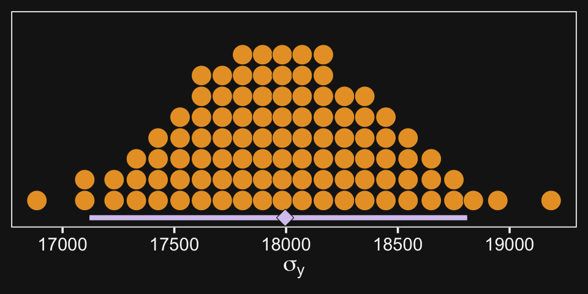

As Kruschke pointed out, this parameter is held constant across all subgroups. That is, the subgroups are homogeneous with respect to their variances. We'll relax this constraint later on.

Before we move on to the next section, look above at how many arguments we fiddled with to configure `stat_dotsinterval()`. Given how many more dot plots we have looming in our not-too-distant future, we might go ahead and save these settings as a new function. We'll call it `stat_beedrill()`.


```r
stat_beedrill <- function(point_size = 3, 
                          slab_color = bd[1],
                          quantiles = 100, ...) {
  
  stat_dotsinterval(point_interval = mode_hdi, .width = .95, 
                    shape = 23, stroke = 1/4, 
                    point_size = point_size, slab_size = 1/4,
                    color = bd[2], 
                    point_color = bd[1], point_fill = bd[2],
                    slab_color = slab_color, slab_fill = bd[6], 
                    quantiles = quantiles,
                    # learn more about this at https://github.com/mjskay/ggdist/issues/93
                    justification = -0.04,
                    ...)
}
```

Note how we hard coded the settings for some of the parameters within the function (e.g., `point_interval`) but allows others to be adjustable with new default settings (e.g., `point_size`).

### Main effect contrasts.

> In applications with multiple levels of the factors, it is virtually always the case that we are interested in comparing particular levels with each other.... These sorts of comparisons, which involve levels of a single factor and collapse across the other factor(s), are called main effect comparisons or contrasts.(p. 595)

The `fitted()` function provides a versatile framework for contrasts among the main effects. In order to follow Kruschke's aim to compare "levels of a single factor and collapse across the other factor(s)" when those factors are modeled in a hierarchical structure, one will have to make use of the `re_formula` argument within `fitted()`. Here's how to do that for the first contrast.


```r
# define the new data
nd <- tibble(Pos = c("Assis", "Assoc"))

# feed the new data into `fitted()`
f <-
  fitted(fit20.1,
         newdata = nd,
         # this part is crucial
         re_formula = ~ (1 | Pos),
         summary = F) %>% 
  as_tibble() %>% 
  set_names("Assis", "Assoc") %>% 
  mutate(`Assoc vs Assis` = Assoc - Assis)

# plot
f %>% 
  ggplot(aes(x = `Assoc vs Assis`, y = 0)) +
  stat_beedrill() +
  scale_y_continuous(NULL, breaks = NULL) +
  xlim(0, NA) +
  labs(title = "Assoc vs Assis",
       x = "Difference")
```

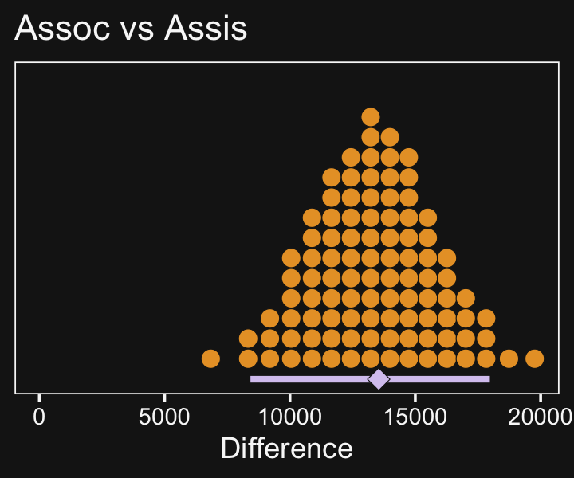

In case you were curious, here are the summary statistics.


```r
f %>% 
  mode_hdi(`Assoc vs Assis`) %>% 
  select(`Assoc vs Assis`:.upper) %>% 
  mutate_if(is.double, round, digits = 0)
```

```
## # A tibble: 1 × 3
##   `Assoc vs Assis` .lower .upper
##              <dbl>  <dbl>  <dbl>
## 1            13541   8424  17975
```

Now make the next two contrasts.


```r
nd <- tibble(Org = c("BFIN", "CHEM", "ENG", "PSY"))

f <-
  fitted(fit20.1,
         newdata = nd,
         # note the change from above
         re_formula = ~ (1 | Org),
         summary = F) %>% 
  as_tibble() %>% 
  set_names(pull(nd, Org)) %>% 
  transmute(`CHEM vs PSY`     = CHEM - PSY,
            `BFIN vs other 3` = BFIN - ((CHEM + ENG + PSY) / 3))

# plot
f %>% 
  pivot_longer(everything()) %>% 
  
  ggplot(aes(x = value, y = 0)) +
  stat_beedrill() +
  scale_y_continuous(NULL, breaks = NULL) +
  xlab("Difference") +
  expand_limits(x = 0) +
  facet_wrap(~ name, scales = "free")
```


And here are their numeric summaries.


```r
f %>% 
  pivot_longer(everything(),
               names_to = "contrast", 
               values_to = "mode") %>% 
  group_by(contrast) %>% 
  mode_hdi(mode) %>% 
  select(contrast:.upper) %>% 
  mutate_if(is.double, round, digits = 0)
```

```
## # A tibble: 2 × 4
##   contrast          mode .lower .upper
##   <chr>            <dbl>  <dbl>  <dbl>
## 1 BFIN vs other 3 103597  90783 118831
## 2 CHEM vs PSY      12808  -2335  26865
```

For more on marginal contrasts in **brms**, see the discussion in [issue #552]((https://github.com/paul-buerkner/brms/issues/552)) in the **brms** GitHub repo and [this discussion thread](https://discourse.mc-stan.org/t/how-do-i-get-marginal-effects-for-categorical-variables-to-condition-on-an-average-rather-than-a-category/5323) on the Stan forums.

### Interaction contrasts and simple effects.

If we'd like to make the simple effects and interaction contrasts like Kruschke displayed in Figure 20.5 within our **tidyverse**/**brms** paradigm, it'll be simplest to just redefine our `nd` data and use `fitted()`, again. This time, however, we won't be using the `re_formula` argument.


```r
# define our new data
nd <-
  crossing(Pos = c("Assis", "Full"),
           Org = c("CHEM", "PSY")) %>% 
  # we'll need to update our column names
  mutate(col_names = str_c(Pos, "_", Org))

# get the draws with `fitted()`
f1 <-
  fitted(fit20.1, 
         newdata = nd,
         summary = F) %>% 
  # wrangle
  as_tibble() %>% 
  set_names(nd %>% pull(col_names)) %>% 
  mutate(`Full - Assis @ PSY`  = Full_PSY - Assis_PSY,
         `Full - Assis @ CHEM` = Full_CHEM - Assis_CHEM) %>% 
  mutate(`Full.v.Assis\n(x)\nCHEM.v.PSY` = `Full - Assis @ CHEM` - `Full - Assis @ PSY`)

# what have we done?
head(f1)
```

```
## # A tibble: 6 × 7
##   Assis_CHEM Assis_PSY Full_CHEM Full_PSY `Full - Assis @ PSY` `Full - Assis @ CHEM` Full.v.Assis\…¹
##        <dbl>     <dbl>     <dbl>    <dbl>                <dbl>                 <dbl>           <dbl>
## 1     87493.    88399.   155861.  121368.               32969.                68368.          35399.
## 2     83595.    87960.   156152.  116363.               28403.                72558.          44155.
## 3     87712.    81965.   150321.  117377.               35412.                62609.          27197.
## 4     86297.    90932.   162834.  111897.               20966.                76538.          55572.
## 5     84765.    78174.   151399.  119107.               40933.                66634.          25701.
## 6     86740.    74535.   151253.  109501.               34966.                64513.          29548.
## # … with abbreviated variable name ¹​`Full.v.Assis\n(x)\nCHEM.v.PSY`
```

It'll take just a tiny bit more wrangling before we're ready to plot.


```r
# save the levels
levels <- c("Full - Assis @ PSY", "Full - Assis @ CHEM", "Full.v.Assis\n(x)\nCHEM.v.PSY")

# rope annotation
text <-
  tibble(name  = "Full - Assis @ PSY",
         value = 15500,
         y     = .95,
         label = "ROPE") %>% 
  mutate(name = factor(name, levels = levels))

# wrangle
f1 %>% 
  pivot_longer(-contains("_")) %>% 
  mutate(name = factor(name, levels = levels)) %>% 
  
  # plot!
  ggplot(aes(x = value, y = 0)) +
  # for kicks and giggles we'll throw in the ROPE
  geom_rect(xmin = -1e3, xmax = 1e3,
            ymin = -Inf, ymax = Inf,
            color = "transparent", fill = bd[7]) +
  stat_beedrill() +
  geom_text(data = text,
            aes(y = y, label = label),
            color = bd[7], size = 5) +
  scale_y_continuous(NULL, breaks = NULL) +
  xlab("Difference") +
  expand_limits(x = 0) +
  facet_wrap(~ name, scales = "free")
```

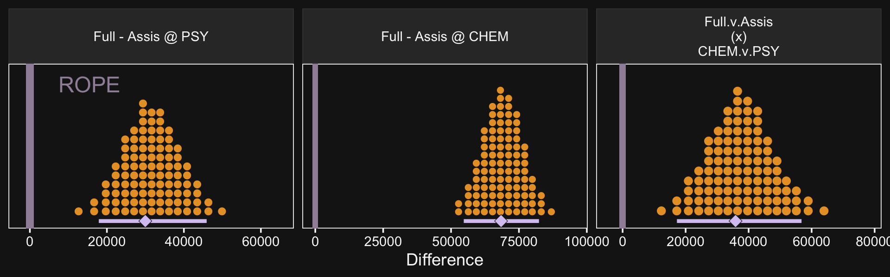

If it was really important that the labels in the $x$-axes were different, like they are in Kruschke's Figure 20.5, you could always make the three plots separately and then bind them together with **patchwork** syntax.

Though he didn't show the results, on page 598 Kruschke mentioned a few other contrasts we might consider. The example entailed comparing the differences within `BFIN` to the average of the other three. Let's walk that out.


```r
# define our new data
nd <-
  crossing(Pos = c("Assis", "Full"),
           Org = c("BFIN", "CHEM", "ENG", "PSY")) %>% 
  # we'll need to update our column names
  mutate(col_names = str_c(Pos, "_", Org))

# get the draws with `fitted()`
f2 <-
  fitted(fit20.1, 
         newdata = nd,
         summary = F) %>% 
  # wrangle
  as_tibble() %>% 
  set_names(nd %>% pull(col_names)) %>% 
  mutate(`Full - Assis @ BFIN` = Full_BFIN - Assis_BFIN,
         `Full - Assis @ CHEM` = Full_CHEM - Assis_CHEM,
         `Full - Assis @ ENG`  = Full_ENG - Assis_ENG,
         `Full - Assis @ PSY`  = Full_PSY - Assis_PSY) %>% 
  mutate(`Full.v.Assis\n(x)\nBFIN.v.the rest` = `Full - Assis @ BFIN` - (`Full - Assis @ CHEM` + `Full - Assis @ ENG` + `Full - Assis @ PSY`) / 3)

# what have we done?
glimpse(f2)
```

```
## Rows: 8,000
## Columns: 13
## $ Assis_BFIN                           <dbl> 200469.4, 191873.4, 198335.4, 191613.8, 195909.4, 206…
## $ Assis_CHEM                           <dbl> 87493.04, 83594.72, 87712.43, 86296.59, 84764.91, 867…
## $ Assis_ENG                            <dbl> 57860.04, 57409.70, 59502.40, 73364.35, 49609.69, 591…
## $ Assis_PSY                            <dbl> 88399.37, 87959.67, 81965.11, 90931.63, 78174.34, 745…
## $ Full_BFIN                            <dbl> 233435.4, 228240.2, 229553.3, 237348.6, 226177.0, 240…
## $ Full_CHEM                            <dbl> 155861.1, 156152.5, 150321.2, 162834.4, 151398.6, 151…
## $ Full_ENG                             <dbl> 104843.2, 103208.0, 107112.6, 109459.4, 105296.2, 116…
## $ Full_PSY                             <dbl> 121368.0, 116362.9, 117377.3, 111897.5, 119107.5, 109…
## $ `Full - Assis @ BFIN`                <dbl> 32966.06, 36366.78, 31217.95, 45734.81, 30267.68, 344…
## $ `Full - Assis @ CHEM`                <dbl> 68368.06, 72557.77, 62608.79, 76537.77, 66633.65, 645…
## $ `Full - Assis @ ENG`                 <dbl> 46983.13, 45798.29, 47610.24, 36095.04, 55686.55, 576…
## $ `Full - Assis @ PSY`                 <dbl> 32968.64, 28403.20, 35412.15, 20965.84, 40933.12, 349…
## $ `Full.v.Assis\n(x)\nBFIN.v.the rest` <dbl> -16473.8876, -12552.9692, -17325.7805, 1201.9276, -24…
```

Now plot.


```r
f2 %>% 
  pivot_longer(-contains("_")) %>% 
  
  ggplot(aes(x = value, y = 0)) +
  geom_rect(xmin = -1e3, xmax = 1e3,
            ymin = -Inf, ymax = Inf,
            color = "transparent", fill = bd[7]) +
  stat_beedrill() +
  scale_y_continuous(NULL, breaks = NULL) +
  xlab("Difference") +
  expand_limits(x = 0) +
  facet_wrap(~ name, scales = "free", ncol = 3)
```

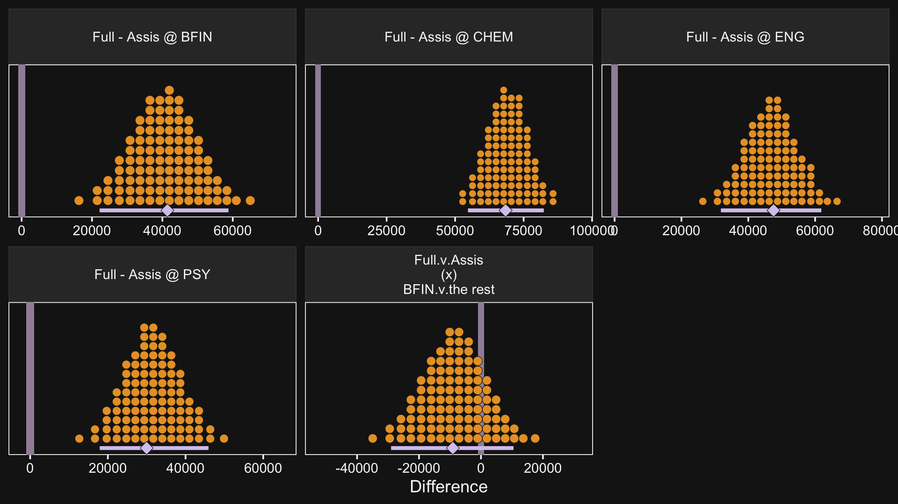

So while the overall pay averages for those in `BFIN` were larger than those in the other three departments, the differences between full and associate professors within `BFIN` wasn't substantially different from the differences within the other three departments. To be sure, the interquartile range of that last difference distribution fell below both zero and the ROPE, but there's still a lot of spread in the rest of the distribution.

#### Interaction effects: High uncertainty and shrinkage.

"It is important to realize that the estimates of interaction contrasts are typically much more uncertain than the estimates of simple effects or main effects" (p. 598).

If we start with our `fitted()` object `f1`, we can wrangle a bit, compute the HDIs with `tidybayes::mode_hdi()` and then use simple subtraction to compute the interval range for each difference.


```r
f1 %>% 
  pivot_longer(-contains("_")) %>% 
  mutate(name = factor(name, levels = c("Full - Assis @ PSY", "Full - Assis @ CHEM", "Full.v.Assis\n(x)\nCHEM.v.PSY"))) %>% 
  group_by(name) %>% 
  mode_hdi(value) %>% 
  select(name:.upper) %>% 
  mutate(`interval range` = .upper - .lower)
```

```
## # A tibble: 3 × 5
##   name                             value .lower .upper `interval range`
##   <fct>                            <dbl>  <dbl>  <dbl>            <dbl>
## 1 "Full - Assis @ PSY"            29981. 17898. 45915.           28018.
## 2 "Full - Assis @ CHEM"           68436. 54681. 82383.           27702.
## 3 "Full.v.Assis\n(x)\nCHEM.v.PSY" 35847. 17241. 56792.           39551.
```

Just like Kruschke pointed out in the text, the interval for the interaction estimate was quite larger than the intervals for the simple contrasts.

> This large uncertainty of an interaction contrast is caused by the fact that it involves at least four sources of uncertainty (i.e., at least four groups of data), unlike its component simple effects which each involve only half of those sources of uncertainty. In general, interaction contrasts require a lot of data to estimate accurately. (p. 598)

Gelman has blogged on this, a bit (e.g., [*You need 16 times the sample size to estimate an interaction than to estimate a main effect*](https://andrewgelman.com/2018/03/15/need-16-times-sample-size-estimate-interaction-estimate-main-effect/)).

There is also shrinkage.

> The interaction contrasts also can experience notable shrinkage from the hierarchical model. In the present application, for example, there are $300$ interaction deflections ($5$ levels of seniority times $60$ departments) that are assumed to come from a higher-level distribution that has an estimated standard deviation, denoted $\sigma_{\beta 1 \times 2}$ in Figure 20.2. Chances are that most of the $300$ interaction deflections will be small, and therefore the estimated standard deviation of the interaction deflections will be small, and therefore the estimated deflections themselves will be shrunken toward zero. This shrinkage is inherently neither good nor bad; it is simply the correct consequence of the model assumptions. The shrinkage can be good insofar as it mitigates false alarms about interactions, but the shrinkage can be bad if it inappropriately obscures meaningful interactions. (p. 598)

Here's that $\sigma_{\beta_{1 \times 2}}$.


```r
draws %>% 
  ggplot(aes(x = `sd_Pos:Org__Intercept`, y = 0)) +
  stat_beedrill() +
  xlab(expression(sigma[beta[1%*%2]])) +
  scale_y_continuous(NULL, breaks = NULL)
```

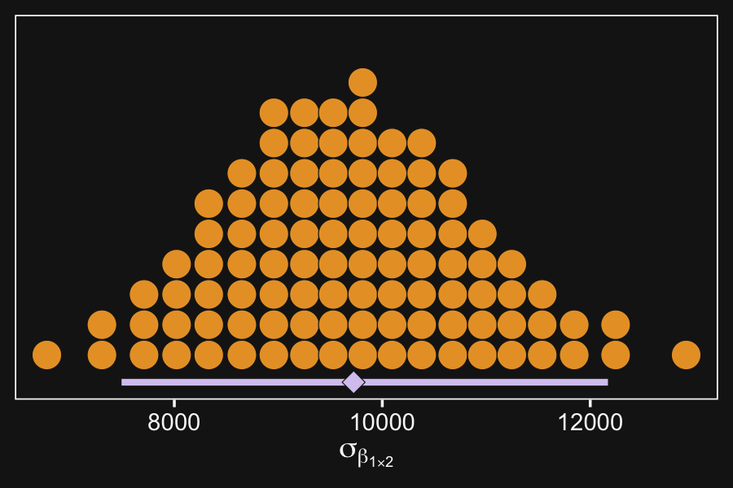

## Rescaling can change interactions, homogeneity, and normality

> When interpreting interactions, it can be important to consider the scale on which the data are measured. This is because an interaction means non-additive effects when measured on the current scale. If the data are nonlinearly transformed to a different scale, then the non-additivity can also change. (p. 599)

Here is Kruschke's initial example of a possible interaction effect of sex and political party with respect to wages.


```r
d <-
  tibble(monetary_units = c(10, 12, 15, 18),
         politics       = rep(c("democrat", "republican"), each = 2),
         sex            = rep(c("women", "men"), times = 2)) %>% 
  mutate(sex_number = if_else(sex == "women", 1, 2),
         politics   = factor(politics, levels = c("republican", "democrat")))

d %>% 
  ggplot(aes(x = sex_number, y = monetary_units, color = politics)) +
  geom_line(linewidth = 3) +
  scale_color_manual(NULL, values = bd[8:7]) +
  scale_x_continuous("sex", breaks = 1:2, labels = c("women", "men")) +
  coord_cartesian(ylim = c(0, 20)) +
  theme(legend.position = c(.2, .15))
```

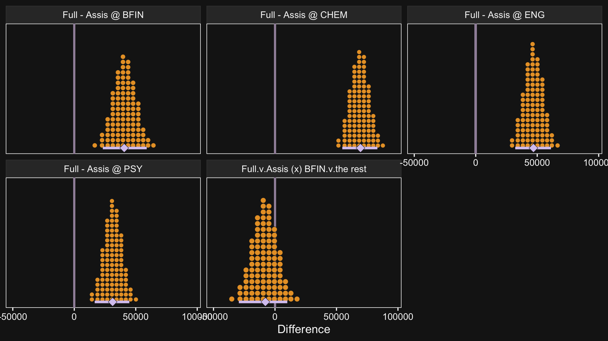

Because the pay discrepancy between men and women is not equal between Democrats and Republicans, in this example, it can be tempting to claim there is a subtle interaction. Not necessarily so.


```r
tibble(politics      = c("democrat", "republican"),
       female_salary = c(10, 15)) %>% 
  mutate(male_salary = 1.2 * female_salary)
```

```
## # A tibble: 2 × 3
##   politics   female_salary male_salary
##   <chr>              <dbl>       <dbl>
## 1 democrat              10          12
## 2 republican            15          18
```

If we take female salary as the baseline and then add 20% to it for the men, the salary difference between Republican men and women will be larger than that between Democratic men and women. Even though the rate increase from women to men was the same, the increase in absolute value was greater within Republicans because Republican women made more than Democratic women.

Look what happens to our original plot when we transform `monetary_units` with `log10()`.


```r
d %>% 
  ggplot(aes(x = sex_number, y = log10(monetary_units), color = politics)) +
  geom_line(linewidth = 3) +
  scale_color_manual(NULL, values = bd[8:7]) +
  scale_x_continuous("sex", breaks = 1:2, labels = c("women", "men")) +
  theme(legend.position = c(.2, .4))
```

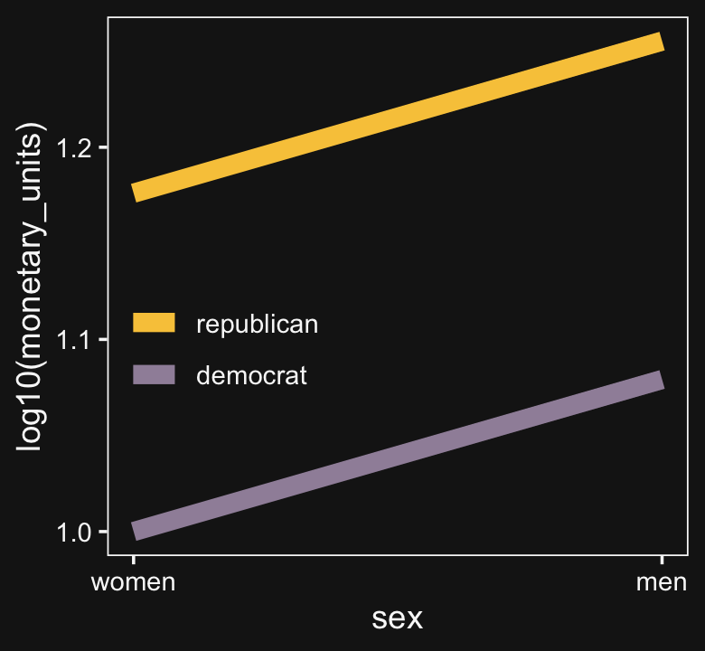

"Equal ratios are transformed to equal distances by a logarithmic transformation" (p. 599).

We can get a better sense of this with our version of Figure 20.6. Probably the easiest way to inset the offset labels will be with help from the `geom_dl()` function from the [**directlabels** package](https://CRAN.R-project.org/package=directlabels) [@R-directlabels].


```r
library(directlabels)

# define the data
d <-
  crossing(int = c("Non−crossover Interaction", "Crossover Interaction"),
           x1  = factor(1:2),
           x2  = factor(1:2)) %>% 
  mutate(y = c(6, 2, 15, 48, 2, 6, 15, 48)) %>% 
  mutate(ly = log(y))

# save the subplots
p1 <-
  d %>% 
  filter(int == "Non−crossover Interaction") %>% 
  ggplot(aes(x = x1, y = y, group = x2, label = x2)) +
  geom_line(aes(color = x2),
            linewidth = 1) +
  geom_dl(method = list(dl.combine("first.points", "last.points")), 
          color = bd[3]) +
  scale_color_manual(values = bd[8:7]) +
  scale_x_discrete(NULL, breaks = NULL, expand = expansion(mult = 0.1)) +
  labs(subtitle = "Non−crossover Interaction") +
  theme(legend.position = c(.15, .8),
        legend.key.size = unit(1/3, "cm"))

p2 <-
  d %>% 
  filter(int == "Crossover Interaction") %>% 
  ggplot(aes(x = x1, y = y, group = x2, label = x2)) +
  geom_line(aes(color = x2),
            linewidth = 1) +
  geom_dl(method = list(dl.combine("first.points", "last.points")), 
          color = bd[3]) +
  scale_color_manual(values = bd[8:7], breaks = NULL) +
  scale_x_discrete(NULL, breaks = NULL, expand = expansion(mult = 0.1)) +
  scale_y_continuous(NULL, breaks = NULL) +
  labs(subtitle = "Crossover Interaction")

p3 <-
  d %>% 
  filter(int == "Crossover Interaction") %>% 
  ggplot(aes(x = x2, y = y, group = x1, label = x1)) +
  geom_line(aes(color = x1),
            linewidth = 2) +
  geom_dl(method = list(dl.combine("first.points", "last.points")), 
          color = bd[3]) +
  scale_color_manual(values = bd[12:11]) +
  scale_x_discrete(NULL, breaks = NULL, expand = expansion(mult = 0.1)) +
  scale_y_continuous(NULL, breaks = NULL) +
  labs(subtitle = "Crossover Interaction") +
  theme(legend.position = c(.15, .8),
        legend.key.size = unit(1/3, "cm"))

p4 <-
  d %>% 
  filter(int == "Non−crossover Interaction") %>% 
  ggplot(aes(x = x1, y = ly, group = x2, label = x2)) +
  geom_line(aes(color = x2),
            linewidth = 1) +
  geom_dl(method = list(dl.combine("first.points", "last.points")), 
          color = bd[3]) +
  scale_color_manual(values = bd[8:7], breaks = NULL) +
  scale_x_discrete(expand = expansion(mult = 0.1)) +
  ylab(expression(log(y)))

p5 <-
  d %>% 
  filter(int == "Crossover Interaction") %>% 
  ggplot(aes(x = x1, y = ly, group = x2, label = x2)) +
  geom_line(aes(color = x2),
            linewidth = 1) +
  geom_dl(method = list(dl.combine("first.points", "last.points")), 
          color = bd[3]) +
  scale_color_manual(values = bd[8:7], breaks = NULL) +
  scale_x_discrete(expand = expansion(mult = 0.1)) +
  scale_y_continuous(NULL, breaks = NULL) +
  ylab(expression(log(y)))

p6 <-
  d %>% 
  filter(int == "Crossover Interaction") %>% 
  ggplot(aes(x = x2, y = ly, group = x1, label = x1)) +
  geom_line(aes(color = x1),
            linewidth = 2) +
  geom_dl(method = list(dl.combine("first.points", "last.points")), 
          color = bd[3]) +
  scale_color_manual(values = bd[12:11], breaks = NULL) +
  scale_x_discrete(expand = expansion(mult = 0.1)) +
  scale_y_continuous(NULL, breaks = NULL) +
  ylab(expression(log(y)))

# combine
p1 + p2 + p3 + p4 + p5 + p6 
```

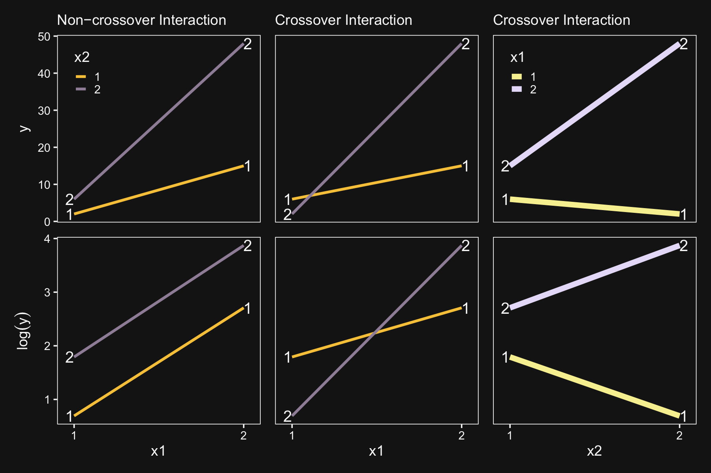

"The transformability from interaction to non-interaction is only possible for non-crossover interactions. This terminology, 'noncrossover,' is merely a description of the graph: The lines do not cross over each other and they have the same sign slope" (p. 601). The plots in the leftmost column are examples of non-crossover interactions. The plots in the center column are examples of crossover interactions.

Kruschke then pointed out that transforming data can have unexpected consequences for summary values, such as variances:

> Suppose one condition has data values of $100$, $110$, and $120$, while a second condition has data values of $1100$, $1110$, and $1120$. For both conditions, the variance is $66.7$, so there is homogeneity of variance. When the data are logarithmically transformed, the variance of the first group becomes $1.05e−3$, but the variance of the second group becomes two orders of magnitude smaller, namely $1.02e−5$. In the transformed data there is not homogeneity of variance. (p. 601)

See for yourself.


```r
tibble(x = c(100, 110, 120, 1100, 1110, 1120),
       y = rep(letters[1:2], each = 3)) %>% 
  group_by(y) %>% 
  summarise(variance_of_x     = var(x),
            variance_of_log_x = var(log(x)))
```

```
## # A tibble: 2 × 3
##   y     variance_of_x variance_of_log_x
##   <chr>         <dbl>             <dbl>
## 1 a               100         0.00832  
## 2 b               100         0.0000812
```

Though it looks like the numbers Kruschke reported in the text are off, his overall point stands. While we had homogeneity of variance for `x`, the variance is heterogeneous when working with `log(x)`.

## Heterogeneous variances and robustness against outliers

As we will see in just a moment, our approach to the variant of this model with heterogeneous variances and robustness against outliers will differ slightly from the one Kruschke presented in the text. The two are the same in spirit, but ours differs in how we model $\sigma_{[jk](i)}$. We'll get a sense of that difference in our version of the hierarchical model diagram of Figure 20.7.


```r
# bracket
p1 <-
  tibble(x     = .99,
         y     = .5,
         label = "{_}") %>% 
  
  ggplot(aes(x = x, y = y, label = label)) +
  geom_text(size = 10, hjust = 1, color = bd[2], family = "Times") +
  scale_x_continuous(expand = c(0, 0), limits = c(0, 1)) +
  ylim(0, 1) +
  theme_void()

#  plain arrow
p2 <-
  tibble(x    = .73,
         y    = 1,
         xend = .68,
         yend = .25) %>%
  
  ggplot(aes(x = x, xend = xend,
             y = y, yend = yend)) +
  geom_segment(arrow = my_arrow, color = bd[3]) +
  xlim(0, 1) +
  theme_void()
  
# normal density
p3 <-
  tibble(x = seq(from = -3, to = 3, by = .1)) %>% 
  ggplot(aes(x = x, y = (dnorm(x)) / max(dnorm(x)))) +
  geom_area(fill = bd[6]) +
  annotate(geom = "text",
           x = 0, y = .2,
           label = "normal",
           size = 7, color = bd[3]) +
  annotate(geom = "text",
           x = c(0, 1.45), y = .6,
           hjust = c(.5, 0),
           label = c("italic(M)[0]", "italic(S)[0]"), 
           size = 7, color = bd[3], family = "Times", parse = T) +
  scale_x_continuous(expand = c(0, 0)) +
  theme_void() +
  theme(axis.line.x = element_line(linewidth = 0.5, color = bd[3]))
  
# normal density
p4 <-
  tibble(x = seq(from = -3, to = 3, by = .1)) %>% 
  ggplot(aes(x = x, y = (dnorm(x)) / max(dnorm(x)))) +
  geom_area(fill = bd[6]) +
  annotate(geom = "text",
           x = 0, y = .2,
           label = "normal",
           size = 7, color = bd[3]) +
  annotate(geom = "text",
           x = c(0, 1.15), y = .6,
           label = c("0", "sigma[beta][1]"), 
           hjust = c(.5, 0),
           size = 7, color = bd[3], family = "Times", parse = T) +
  scale_x_continuous(expand = c(0, 0)) +
  theme_void() +
  theme(axis.line.x = element_line(linewidth = 0.5, color = bd[3]))
  
# normal density
p5 <-
  tibble(x = seq(from = -3, to = 3, by = .1)) %>% 
  ggplot(aes(x = x, y = (dnorm(x)) / max(dnorm(x)))) +
  geom_area(fill = bd[6]) +
  annotate(geom = "text",
           x = 0, y = .2,
           label = "normal",
           size = 7, color = bd[3]) +
  annotate(geom = "text",
           x = c(0, 1.15), y = .6,
           label = c("0", "sigma[beta][2]"), 
           hjust = c(.5, 0),
           size = 7, color = bd[3], family = "Times", parse = T) +
  scale_x_continuous(expand = c(0, 0)) +
  theme_void() +
  theme(axis.line.x = element_line(linewidth = 0.5, color = bd[3]))
  
# normal density
p6 <-
  tibble(x = seq(from = -3, to = 3, by = .1)) %>% 
  ggplot(aes(x = x, y = (dnorm(x)) / max(dnorm(x)))) +
  geom_area(fill = bd[6]) +
  annotate(geom = "text",
           x = 0, y = .2,
           label = "normal",
           size = 7, color = bd[3]) +
  annotate(geom = "text",
           x = c(0, 0.75), y = .6,
           hjust = c(.5, 0),
           label = c("0", "sigma[beta][1%*%2]"), 
           size = 7, color = bd[3], family = "Times", parse = T) +
  scale_x_continuous(expand = c(0, 0)) +
  theme_void() +
  theme(axis.line.x = element_line(linewidth = 0.5, color = bd[3]))

# four annotated arrows
p7 <-
  tibble(x    = c(.05, .34, .64, .945),
         y    = c(1, 1, 1, 1),
         xend = c(.05, .18, .45, .75),
         yend = c(0, 0, 0, 0)) %>%
  ggplot(aes(x = x, xend = xend,
             y = y, yend = yend)) +
  geom_segment(arrow = my_arrow, color = bd[3]) +
  annotate(geom = "text",
           x = c(.03, .23, .30, .52, .585, .82, .90), y = .5,
           label = c("'~'", "'~'", "italic(j)", "'~'", "italic(k)", "'~'", "italic(jk)"),
           size = c(10, 10, 7, 10, 7, 10, 7), 
           color = bd[3], family = "Times", parse = T) +
  xlim(0, 1) +
  theme_void()

# likelihood formula
p8 <-
  tibble(x = .5,
         y = .25,
         label = "beta[0]+sum()[italic(j)]*beta[1]['['*italic(j)*']']*italic(x)[1]['['*italic(j)*']'](italic(i))+sum()[italic(k)]*beta[2]['['*italic(k)*']']*italic(x)[2]['['*italic(k)*']'](italic(i))+sum()[italic(jk)]*beta[1%*%2]['['*italic(jk)*']']*italic(x)[1%*%2]['['*italic(jk)*']'](italic(i))") %>% 
 
  ggplot(aes(x = x, y = y, label = label)) +
  geom_text(hjust = .5, size = 7, color = bd[3], parse = T, family = "Times") +
  scale_x_continuous(expand = c(0, 0), limits = c(0, 1)) +
  ylim(0, 1) +
  theme_void()

# normal density
p9 <-
  tibble(x = seq(from = -3, to = 3, by = .1)) %>% 
  ggplot(aes(x = x, y = (dnorm(x)) / max(dnorm(x)))) +
  geom_area(fill = bd[6]) +
  annotate(geom = "text",
           x = 0, y = .2,
           label = "normal",
           size = 7, color = bd[3]) +
  annotate(geom = "text",
           x = c(0, 1.15), y = .6,
           label = c("italic(M)[mu[sigma]]", "italic(S)[mu[sigma]]"), 
           hjust = c(.5, 0),
           size = 7, color = bd[3], family = "Times", parse = T) +
  scale_x_continuous(expand = c(0, 0)) +
  theme_void() +
  theme(axis.line.x = element_line(linewidth = 0.5, color = bd[3]))

# half-normal density
p10 <-
  tibble(x = seq(from = 0, to = 3, by = .01)) %>% 
  ggplot(aes(x = x, y = (dnorm(x)) / max(dnorm(x)))) +
  geom_area(fill = bd[6]) +
  annotate(geom = "text",
           x = 1.5, y = .2,
           label = "half-normal",
           size = 7, color = bd[3]) +
  annotate(geom = "text",
           x = 1.5, y = .6,
           label = "0*','*~italic(S)[sigma[sigma]]", 
           size = 7, color = bd[3], family = "Times", parse = T) +
  scale_x_continuous(expand = c(0, 0)) +
  theme_void() +
  theme(axis.line.x = element_line(linewidth = 0.5, color = bd[3]))

# exponential density
p11 <-
  tibble(x = seq(from = 0, to = 1, by = .01)) %>% 
  ggplot(aes(x = x, y = (dexp(x, 2) / max(dexp(x, 2))))) +
  geom_area(fill = bd[6]) +
  annotate(geom = "text",
           x = .5, y = .2,
           label = "exp",
           size = 7, color = bd[3]) +
  annotate(geom = "text",
           x = .5, y = .6,
           label = "italic(K)",
           size = 7, color = bd[3], family = "Times", parse = T) +
  scale_x_continuous(expand = c(0, 0)) +
  theme_void() +
  theme(axis.line.x = element_line(linewidth = 0.5, color = bd[3]))

# normal density
p12 <-
  tibble(x = seq(from = -3, to = 3, by = .1)) %>% 
  ggplot(aes(x = x, y = (dnorm(x)) / max(dnorm(x)))) +
  geom_area(fill = bd[6]) +
  annotate(geom = "text",
           x = 0, y = .2,
           label = "normal",
           size = 7, color = bd[3]) +
  annotate(geom = "text",
           x = c(0, 1.2), y = .6,
           hjust = c(.5, 0),
           label = c("mu[sigma]", "sigma[sigma]"), 
           size = 7, color = bd[3], family = "Times", parse = T) +
  scale_x_continuous(expand = c(0, 0)) +
  theme_void() +
  theme(axis.line.x = element_line(linewidth = 0.5, color = bd[3]))

# student-t density
p13 <-
  tibble(x = seq(from = -3, to = 3, by = .1)) %>% 
  ggplot(aes(x = x, y = (dt(x, 3) / max(dt(x, 3))))) +
  geom_area(fill = bd[6]) +
  annotate(geom = "text",
           x = 0, y = .2,
           label = "student t",
           size = 7, color = bd[3]) +
  annotate(geom = "text",
           x = c(-1.4, 0), y = .6,
           label = c("nu", "mu[italic(i)]"),
           size = 7, color = bd[3], family = "Times", parse = T) +
  scale_x_continuous(expand = c(0, 0)) +
  theme_void() +
  theme(axis.line.x = element_line(linewidth = 0.5, color = bd[3]))

# two annotated arrows
p14 <-
  tibble(x    = c(.18, .82),
         y    = c(1, 1),
         xend = c(.46, .66),
         yend = c(.28, .28)) %>%
  ggplot(aes(x = x, xend = xend,
             y = y, yend = yend)) +
  geom_segment(arrow = my_arrow, color = bd[3]) +
  annotate(geom = "text",
           x = c(.24, .69), y = .62,
           label = "'~'",
           size = 10, color = bd[3], family = "Times", parse = T) +
  xlim(0, 1) +
  theme_void()

# log sigma
p15 <-
  tibble(x = .65,
         y = .6,
         label = "log(sigma['['*italic(jk)*']('*italic(i)*')'])") %>% 
 
  ggplot(aes(x = x, y = y, label = label)) +
  geom_text(hjust = 0, size = 7, color = bd[3], parse = T, family = "Times") +
  scale_x_continuous(expand = c(0, 0), limits = c(0, 2)) +
  ylim(0, 1) +
  theme_void()

# two annotated arrows
p16 <-
  tibble(x    = c(.18, .18), # .2142857
         y    = c(1, .45),
         xend = c(.18, .67),
         yend = c(.75, .14)) %>%
  
  ggplot(aes(x = x, xend = xend,
             y = y, yend = yend)) +
  geom_segment(arrow = my_arrow, color = bd[3]) +
  annotate(geom = "text",
           x = c(.13, .18, .26), y = c(.92, .64, .22),
           label = c("'~'", "nu*minute+1", "'='"),
           size = c(10, 7, 10), color = bd[3], family = "Times", parse = T) +
  xlim(0, 1) +
  theme_void()

# one annotated arrow
p17 <-
  tibble(x    = .5,
         y    = 1,
         xend = .5,
         yend = .03) %>%
  
  ggplot(aes(x = x, xend = xend,
             y = y, yend = yend)) +
  geom_segment(arrow = my_arrow, color = bd[3]) +
  annotate(geom = "text",
           x = .4, y = .5,
           label = "'='",
           size = 10, color = bd[3], family = "Times", parse = T) +
  xlim(0, 1) +
  theme_void()

# another annotated arrow
p18 <-
  tibble(x    = .87,
         y    = 1,
         xend = .43,
         yend = .2) %>%
  
  ggplot(aes(x = x, xend = xend,
             y = y, yend = yend)) +
  geom_segment(arrow = my_arrow, color = bd[3]) +
  annotate(geom = "text",
           x = c(.56, .7), y = .5,
           label = c("'~'", "italic(jk)"),
           size = c(10, 7), color = bd[3], family = "Times", parse = T) +
  xlim(0, 1) +
  theme_void()

# the final annotated arrow
p19 <-
  tibble(x     = c(.375, .625),
         y     = c(1/3, 1/3),
         label = c("'~'", "italic(i)")) %>%

  ggplot(aes(x = x, y = y, label = label)) +
  geom_text(size = c(10, 7),
            color = bd[3], parse = T, family = "Times") +
  geom_segment(x = .5, xend = .5,
               y = 1, yend = 0,
               arrow = my_arrow, color = bd[3]) +
  xlim(0, 1) +
  theme_void()

# some text
p20 <-
  tibble(x     = .5,
         y     = .5,
         label = "italic(y[i])") %>%

  ggplot(aes(x = x, y = y, label = label)) +
  geom_text(size = 7, color = bd[3], parse = T, family = "Times") +
  xlim(0, 1) +
  theme_void()

# define the layout
layout <- c(
  area(t = 1, b = 1, l = 6, r = 7),
  area(t = 1, b = 1, l = 10, r = 11),
  area(t = 1, b = 1, l = 14, r = 15),
  area(t = 3, b = 4, l = 1, r = 3),
  area(t = 3, b = 4, l = 5, r = 7),
  area(t = 3, b = 4, l = 9, r = 11),
  area(t = 3, b = 4, l = 13, r = 15),
  area(t = 2, b = 3, l = 6, r = 7),
  area(t = 2, b = 3, l = 10, r = 11),
  area(t = 2, b = 3, l = 14, r = 15),
  area(t = 6, b = 7, l = 1, r = 15),
  area(t = 5, b = 6, l = 1, r = 15),
  area(t = 9, b = 10, l = 9, r = 11),
  area(t = 9, b = 10, l = 13, r = 15),
  area(t = 12, b = 13, l = 1, r = 3),
  area(t = 12, b = 13, l = 11, r = 13),
  area(t = 16, b = 17, l = 5, r = 7),
  area(t = 11, b = 12, l = 9, r = 15),
  area(t = 16, b = 17, l = 5, r = 10),
  area(t = 14, b = 16, l = 1, r = 7),
  area(t = 8, b = 16, l = 5, r = 7),
  area(t = 14, b = 16, l = 5, r = 13),
  area(t = 18, b = 18, l = 5, r = 7),
  area(t = 19, b = 19, l = 5, r = 7)
)

# combine and plot!
(p1 + p1 + p1 + p3 + p4 + p5 + p6 + p2 + p2 + p2 + p8 + p7 + p9 + p10 + p11 + p12 + p13 + p14 + p15 + p16 + p17 + p18 + p19 + p20) + 
  plot_layout(design = layout) &
  ylim(0, 1) &
  theme(plot.margin = margin(0, 5.5, 0, 5.5))
```


Wow that's a lot! If you compare our diagram with the one in the text, you'll see the $\nu$ and $\mu$ structures are the same. If you look down toward the bottom of the diagram, the first big difference is that we're modeling the log of $\sigma_{[jk](i)}$, which is the typical **brms** strategy for avoiding negative values when modeling a $\sigma$ parameter. Then when you look up and to the right, you'll see that we're modeling $\log(\sigma_{[jk](i)})$ with a conventional hierarchical Gaussian structure. Keep this in mind when we get into our **brms** code, below.

Before we fit the robust hierarchical variances model, we need to define our `stanvars`.


```r
stanvars <- 
  stanvar(mean_y,    name = "mean_y") + 
  stanvar(sd_y,      name = "sd_y") +
  stanvar(s_r$shape, name = "alpha") +
  stanvar(s_r$rate,  name = "beta") +
  stanvar(1/29,      name = "one_over_twentynine")
```

Recall that to fit a robust hierarchical variances model, we need to wrap our two formulas within the `bf()` function. 

⚠️ **Warning**: This one took a few hours fit. ⚠️


```r
fit20.2 <-
  brm(data = my_data,
      family = student,
      bf(Salary ~ 1 + (1 | Pos) + (1 | Org) + (1 | Pos:Org), 
         sigma  ~ 1 + (1 | Pos:Org)),
      prior = c(prior(normal(mean_y, sd_y * 5), class = Intercept),
                prior(normal(log(sd_y), 1),     class = Intercept, dpar = sigma),
                prior(gamma(alpha, beta), class = sd),
                prior(normal(0, 1),       class = sd, dpar = sigma),
                prior(exponential(one_over_twentynine), class = nu)),
      iter = 4000, warmup = 1000, chains = 4, cores = 4,
      seed = 20,
      control = list(adapt_delta = 0.9995,
                     max_treedepth = 15),
      stanvars = stanvars,
      file = "fits/fit20.02")
```

Behold the summary.


```r
print(fit20.2)
```

```
##  Family: student 
##   Links: mu = identity; sigma = log; nu = identity 
## Formula: Salary ~ 1 + (1 | Pos) + (1 | Org) + (1 | Pos:Org) 
##          sigma ~ 1 + (1 | Pos:Org)
##    Data: my_data (Number of observations: 1080) 
##   Draws: 4 chains, each with iter = 4000; warmup = 1000; thin = 1;
##          total post-warmup draws = 12000
## 
## Group-Level Effects: 
## ~Org (Number of levels: 60) 
##               Estimate Est.Error l-95% CI u-95% CI Rhat Bulk_ESS Tail_ESS
## sd(Intercept) 31619.75   3093.75 26189.88 38368.83 1.00     1894     3299
## 
## ~Pos (Number of levels: 5) 
##               Estimate Est.Error l-95% CI  u-95% CI Rhat Bulk_ESS Tail_ESS
## sd(Intercept) 51025.03  23822.65 23575.14 112757.06 1.00     5040     7211
## 
## ~Pos:Org (Number of levels: 216) 
##                     Estimate Est.Error l-95% CI u-95% CI Rhat Bulk_ESS Tail_ESS
## sd(Intercept)        5305.30    870.86  3720.00  7146.09 1.00     1976     3567
## sd(sigma_Intercept)     0.97      0.07     0.84     1.11 1.00     2517     4486
## 
## Population-Level Effects: 
##                  Estimate Est.Error l-95% CI  u-95% CI Rhat Bulk_ESS Tail_ESS
## Intercept       122475.76  25189.06 71864.05 172894.55 1.00     3718     6007
## sigma_Intercept      9.11      0.09     8.93      9.29 1.00     2706     4775
## 
## Family Specific Parameters: 
##    Estimate Est.Error l-95% CI u-95% CI Rhat Bulk_ESS Tail_ESS
## nu     6.86      3.64     3.69    14.91 1.00     4761     4901
## 
## Draws were sampled using sampling(NUTS). For each parameter, Bulk_ESS
## and Tail_ESS are effective sample size measures, and Rhat is the potential
## scale reduction factor on split chains (at convergence, Rhat = 1).
```

This time we'll just feed the results of the wrangling code right into the plotting code for our version of the top panels of Figure 20.8.


```r
# how many draws would you like?
n_draw <- 20

set.seed(20)

# wrangle
my_data %>% 
  distinct(Pos) %>% 
  expand_grid(Org = c("BFIN", "CHEM", "PSY", "ENG")) %>% 
  add_epred_draws(fit20.2, ndraws = n_draw, seed = 20,
                  allow_new_levels = T,
                  dpar = c("mu", "sigma", "nu")) %>% 
  mutate(ll = qt(.025, df = nu),
         ul = qt(.975, df = nu)) %>% 
  mutate(Salary = map2(ll, ul, seq, length.out = 100)) %>% 
  unnest(Salary) %>%
  mutate(density = dt(Salary, nu)) %>% 
  # notice the conversion
  mutate(Salary = mu + Salary * sigma) %>% 
  group_by(.draw) %>% 
  mutate(density = density / max(density)) %>% 
  mutate(Org = factor(Org, levels = c("BFIN", "CHEM", "PSY", "ENG"))) %>%
  
  # plot
  ggplot(aes(x = Salary, y = Pos)) +
  geom_vline(xintercept = fixef(fit20.1)[, 1], color = bd[5]) +
  geom_ridgeline(aes(height = density, group = interaction(Pos, .draw), color = Pos),
                 fill = NA, show.legend = F,
                 size = 1/4, scale = 3/4) +
  geom_jitter(data = my_data %>% 
                filter(Org %in% c("BFIN", "CHEM", "PSY", "ENG")) %>% 
                mutate(Org = factor(Org, levels = c("BFIN", "CHEM", "PSY", "ENG"))),
              height = .025, alpha = 1/2, size = 2/3, color = bd[11]) +
  scale_color_manual(values = bd[c(14, 13, 8, 12, 3)]) +
  scale_x_continuous(breaks = seq(from = 0, to = 300000, length.out = 4),
                     labels = c("$0", "$100K", "200K", "$300K")) +
  coord_cartesian(xlim = c(0, 35e4),
                  ylim = c(1.25, 5.5)) +
  labs(title = "Data with Posterior Predictive Distributions", 
       subtitle = "The white vertical line is the model-implied grand mean.",
       y = "Pos") +
  theme(axis.text.y = element_text(hjust = 0),
        axis.ticks.y = element_blank()) +
  facet_wrap(~ Org, ncol = 2)
```

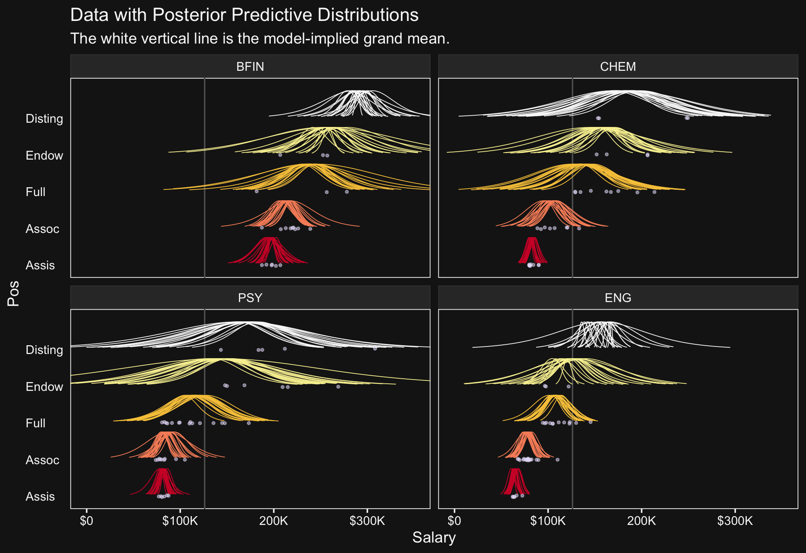

Our results for the bottom panel of Figure 20.8 will differ substantially from Kruschke's. Recall that Kruschke modeled $\sigma_{[j, k](i)}$ with a hierarchical gamma distribution and using the $\omega + \sigma$ parameterization. We, however, modeled our hierarchical $\log (\sigma)$ with the typical normal distribution. As such, we have posteriors for $\sigma_\mu$ and $\sigma_\sigma$.


```r
# wrangle
as_draws_df(fit20.2) %>% 
  transmute(Normality              = log10(nu), 
            `Mean of Cell Sigma's` = exp(b_sigma_Intercept), 
            `SD of Cell Sigma's`   = exp(`sd_Pos:Org__sigma_Intercept`)) %>%
  pivot_longer(everything()) %>% 
  mutate(name = factor(name, levels = c("Normality", "Mean of Cell Sigma's", "SD of Cell Sigma's"))) %>% 
  
  # plot
  ggplot(aes(x = value, y = 0)) +
  stat_beedrill() +
  scale_y_continuous(NULL, breaks = NULL) +
  xlab("param. value") +
  facet_wrap(~ name, scales = "free", ncol = 3)
```

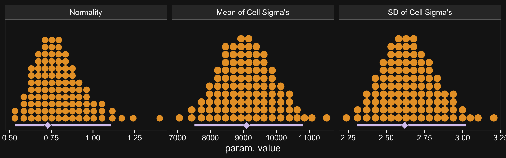

Though our $\sigma_\mu$ is on a similar metric to Kruschke's $\sigma_\omega$, our $\sigma_\sigma$ is just fundamentally different from his. So it goes. If you think I'm in error, here, [share your insights](https://github.com/ASKurz/Doing-Bayesian-Data-Analysis-in-brms-and-the-tidyverse/issues). Even though our hierarchical $\sigma$ parameters look different from Kruschke's, it turns the contrast distributions are quite similar. Here's the necessary wrangling to make our version for Figure 20.9.


```r
# define our new data
nd <-
  crossing(Pos = c("Assis", "Full"),
           Org = c("CHEM", "PSY")) %>% 
  # we'll need to update our column names
  mutate(col_names = str_c(Pos, "_", Org))

# get the draws with `fitted()`
f <-
  fitted(fit20.2, 
         newdata = nd,
         summary = F) %>% 
  # wrangle
  as_tibble() %>% 
  set_names(nd %>% pull(col_names)) %>% 
  transmute(`Full - Assis @ CHEM` = Full_CHEM - Assis_CHEM,
            `Full - Assis @ PSY`  = Full_PSY - Assis_PSY) %>% 
  mutate(`Full.v.Assis\n(x)\nCHEM.v.PSY` = `Full - Assis @ CHEM` - `Full - Assis @ PSY`) %>% 
  pivot_longer(everything()) %>% 
  mutate(name = factor(name, levels = c("Full - Assis @ PSY", "Full - Assis @ CHEM", "Full.v.Assis\n(x)\nCHEM.v.PSY")))

# what have we done?
head(f)
```

```
## # A tibble: 6 × 2
##   name                             value
##   <fct>                            <dbl>
## 1 "Full - Assis @ CHEM"           54990.
## 2 "Full - Assis @ PSY"            34041.
## 3 "Full.v.Assis\n(x)\nCHEM.v.PSY" 20949.
## 4 "Full - Assis @ CHEM"           73406.
## 5 "Full - Assis @ PSY"            30839.
## 6 "Full.v.Assis\n(x)\nCHEM.v.PSY" 42567.
```

Now plot.


```r
f %>% 
  ggplot(aes(x = value, y = 0)) +
  geom_rect(xmin = -1e3, xmax = 1e3,
            ymin = -Inf, ymax = Inf,
            color = "transparent", fill = bd[7]) +
  stat_beedrill() +
  scale_y_continuous(NULL, breaks = NULL) +
  xlab("Difference") +
  expand_limits(x = 0) +
  facet_wrap(~ name, scales = "free", ncol = 3)
```

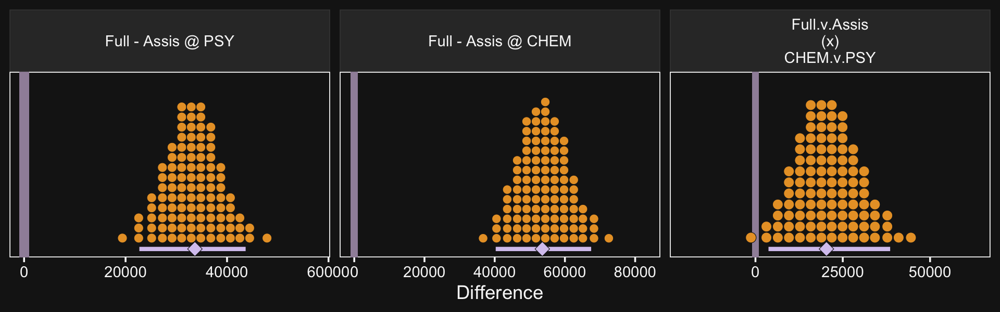

See? Our contrast distributions are really close those in the text. Here are the numeric estimates.


```r
f %>% 
  group_by(name) %>% 
  mode_hdi(value) %>% 
  select(name:.upper) %>% 
  mutate_if(is.double, round, digits = 0)
```

```
## # A tibble: 3 × 4
##   name                            value .lower .upper
##   <fct>                           <dbl>  <dbl>  <dbl>
## 1 "Full - Assis @ PSY"            33666  22720  43666
## 2 "Full - Assis @ CHEM"           53569  40288  67472
## 3 "Full.v.Assis\n(x)\nCHEM.v.PSY" 20329   3735  38571
```

In the second half of the middle paragraph on page 605, Kruschke contrasted the $\sigma_{\beta_{1 \times 2}}$ parameter in the two models (i.e., our `fit20.1` and `fit20.2`). Recall that in the **brms** output, these are termed `sd_Pos:Org__Intercept`. Here are the comparisons from our **brms** models.


```r
posterior_summary(fit20.1)["sd_Pos:Org__Intercept", ]
```

```
##  Estimate Est.Error      Q2.5     Q97.5 
##  9688.537  1197.771  7421.223 12108.029
```

```r
posterior_summary(fit20.2)["sd_Pos:Org__Intercept", ]
```

```
##  Estimate Est.Error      Q2.5     Q97.5 
## 5305.3025  870.8649 3719.9959 7146.0918
```

They are similar to the values in the text. And recall, of course, the `brms::posterior_summary()` function returns posterior means. If you really wanted the posterior modes, like Kruschke reported in the text, you'll have to work a little harder.


```r
bind_rows(as_draws_df(fit20.1) %>% select(`sd_Pos:Org__Intercept`),
          as_draws_df(fit20.2) %>% select(`sd_Pos:Org__Intercept`)) %>% 
  mutate(fit = rep(c("fit20.1", "fit20.2"), times = c(8000, 12000))) %>% 
  group_by(fit) %>% 
  mode_hdi(`sd_Pos:Org__Intercept`) %>% 
  select(fit:.upper) %>% 
  mutate_if(is.double, round, digits = 0)
```

```
## # A tibble: 2 × 4
##   fit     `sd_Pos:Org__Intercept` .lower .upper
##   <chr>                     <dbl>  <dbl>  <dbl>
## 1 fit20.1                    9725   7492  12170
## 2 fit20.2                    4965   3667   7064
```

The curious might even look at those in a plot.


```r
bind_rows(as_draws_df(fit20.1) %>% select(`sd_Pos:Org__Intercept`),
          as_draws_df(fit20.2) %>% select(`sd_Pos:Org__Intercept`)) %>% 
  mutate(fit = rep(c("fit20.1", "fit20.2"), times = c(8000, 12000))) %>% 
  
  ggplot(aes(x = `sd_Pos:Org__Intercept`, y = fit)) +
  stat_beedrill(size = 1/2, point_size = 2) +
  labs(x = expression(sigma[beta[1%*%2]]),
       y = NULL) +
  coord_cartesian(ylim = c(1.5, NA))
```

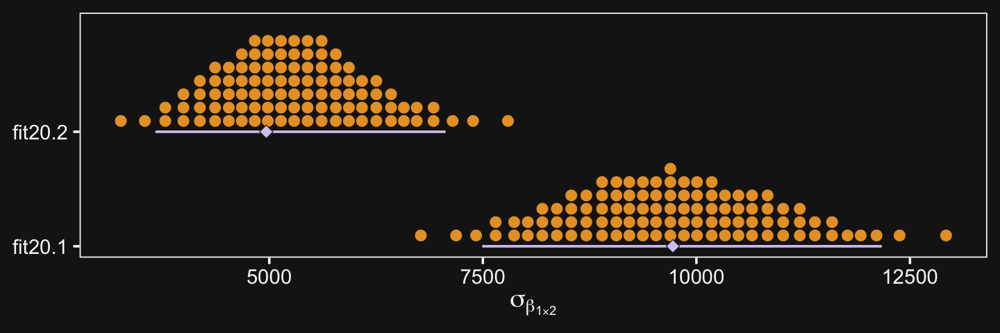

"Which model is a better description of the data?... In principle, an intrepid programmer could do a Bayesian model comparison..." (pp. 605--606). We could also examine information criteria, like the LOO.


```r
fit20.1 <- add_criterion(fit20.1, "loo")
fit20.2 <- add_criterion(fit20.2, "loo")
```

*Sigh*. Both models had high `pareto_k` values, suggesting there were outliers relative to what was expected by their likelihoods. Just a little further in the text, Kruschke gives us hints why this might be so:

> Moreover, both models assume that the data within cells are distributed symmetrically above and below their central tendency, either as a normal distribution or a $t$-distribution. The data instead seem to be skewed toward larger values, especially for advanced seniorities. (p. 606)

Here's the current LOO difference.


```r
loo_compare(fit20.1, fit20.2) %>% print(simplify = F)
```

```
##         elpd_diff se_diff  elpd_loo se_elpd_loo p_loo    se_p_loo looic    se_looic
## fit20.2      0.0       0.0 -11765.9     41.5       313.9     10.8  23531.8     82.9
## fit20.1   -429.6      34.4 -12195.4     43.1       141.4     12.2  24390.9     86.1
```

But really, "we might want to create a model that describes the data within each cell as a skewed distribution such as a Weibull" (p. 606). Yes, **brms** can handle Weibull regression (e.g., [here](https://discourse.mc-stan.org/t/fitting-time-to-event-data-with-weibull-hazard-using-brm-function/4638)).


## Within-subject designs

> When every subject contributes many measurements to every cell, then the model of the situation is a straight-forward extension of the models we have already considered. We merely add "subject" as another nominal predictor in the model, with each individual subject being a level of the predictor. If there is one predictor other than subject, the model becomes
>
> $$ y = \beta_0 + \overrightarrow \beta_1 \overrightarrow x_1 + \overrightarrow \beta_S \overrightarrow x_S + \overrightarrow \beta_{1 \times S} \overrightarrow x_{1 \times S} $$
>
> This is exactly the two-predictor model we have already considered, with the second predictor being subject. When there are two predictors other than subject, the model becomes
> 
> \begin{align*}
> y = & \; \beta_0 & \text{baseline} \\
> & + \overrightarrow \beta_1 \overrightarrow x_1 + \overrightarrow \beta_2 \overrightarrow x_2 + \overrightarrow \beta_S \overrightarrow x_S  & \text{main effects} \\
> & + \overrightarrow \beta_{1 \times 2} \overrightarrow x_{1 \times 2} + \overrightarrow \beta_{1 \times S} \overrightarrow x_{1 \times S} + \overrightarrow \beta_{2 \times S} \overrightarrow x_{2 \times S} & \text{two-way interactions} \\
> & + \overrightarrow \beta_{1 \times 2 \times S} \overrightarrow x_{1 \times 2 \times S} & \text{three-way interactions}
> \end{align*}
> 
> This model includes all the two-way interactions of the factors, plus the three-way interaction. (p. 607)

In situations in which subjects only contribute one observation per condition/cell, we simplify the model to

\begin{align*}
y = & \; \beta_0 \\
& + \overrightarrow \beta_1 \overrightarrow x_1 + \overrightarrow \beta_2 \overrightarrow x_2 + \overrightarrow \beta_{1 \times 2} \overrightarrow x_{1 \times 2} \\
& + \overrightarrow \beta_S \overrightarrow x_S
\end{align*}

"In other words, we assume a main effect of subject, but no interaction of subject with other predictors. In this model, the subject effect (deflection) is constant across treatments, and the treatment effects (deflections) are constant across subjects" (p. 608).

### Why use a within-subject design? And why not?

Kruschke opined "the primary reason to use a within-subject design is that you can achieve greater precision in the estimates of the effects than in a between-subject design" (p. 608). Well, to that I counterpoint: "No one goes to the circus to see the average dog jump through the hoop significantly oftener than untrained does raised under the same circumstances" [@skinnerCaseHistoryScientific1956, p. 228]. And it's unlikely you’ll make a skillful jumper of your dog without repeated trials. There's also the related issue that between- and within-person processes aren't necessarily the same. For an introduction to the issue, see Hamaker's [-@hamakerWhyResearchersShould2012] chapter, [*Why researchers should think "within-person": A paradigmatic rationale*](https://www.researchgate.net/publication/266896375_Why_researchers_should_think_within-person_A_paradigmatic_rationale), or the paper from @bolgerCausalProcessesPsychology2019, [*Causal processes in psychology are heterogeneous*](https://www.researchgate.net/profile/Niall_Bolger/publication/332358948_Causal_processes_in_psychology_are_heterogeneous/links/5cd9b471a6fdccc9ddaa7879/Causal-processes-in-psychology-are-heterogeneous.pdf).

But we digress.

Here's the 4-subject response time data.


```r
(
  d <-
  tibble(response_time = c(300, 320, 350, 370, 400, 420, 450, 470),
         subject       = rep(1:4, each = 2),
         hand          = rep(c("dominant", "nondominant"), times = 4))
)
```

```
## # A tibble: 8 × 3
##   response_time subject hand       
##           <dbl>   <int> <chr>      
## 1           300       1 dominant   
## 2           320       1 nondominant
## 3           350       2 dominant   
## 4           370       2 nondominant
## 5           400       3 dominant   
## 6           420       3 nondominant
## 7           450       4 dominant   
## 8           470       4 nondominant
```

"For every subject, the difference between dominant and nondominant hands is exactly 20 ms, but there are big differences across subjects in overall response times" (p. 608). Here's what that looks like.


```r
d %>% 
  mutate(subject = factor(subject)) %>% 
  
  ggplot(aes(x = response_time, y = subject)) +
  geom_line(aes(group = subject), 
            color = bd[3], linetype = 3) +
  geom_point(aes(color = hand), size = 3) +
  scale_color_manual(values = bd[8:9])
```

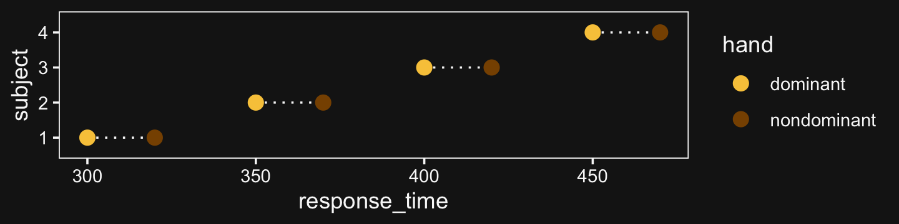

Here there is more variability between subjects than within them, which you'd never detect without a within-subject design including multiple subjects.

### Split-plot design.

"Split-plot experiments were invented by @fisherStatisticalMethodsResearch1925 (p. 610)."

Kruschke then wrote this to set the stage for the next subsection:

> Consider an agricultural experiment investigating the productivity of different soil tilling methods and different fertilizers. It is relatively easy to provide all the farmers with the several different fertilizers. But it might be relatively difficult to provide all farmers with all the machinery for several different tilling methods. Therefore, any particular farmer will use a single (randomly assigned) tilling method on his whole plot, and tilling methods will differ between whole plots. Each farmer will split his field into subplots and apply all the fertilizers to different (randomly assigned) split plots, and fertilizers will differ across split plots within whole plots. This type of experiment inspires the name, split-plot design. The generic experiment-design term for the farmer's field is "block." Then, the factor that varies within every field is called the within-block factor and the factor that varies between fields is called the between-block factor. Notice also that each split plot yields a single measurement (in this case the productivity measured in bushels per acre), not multiple measurements. (p. 610)

#### Example: Knee high by the fourth of July.

Load the agronomy data.


```r
my_data <- read_csv("data.R/SplitPlotAgriData.csv")

glimpse(my_data)
```

```
## Rows: 99
## Columns: 4
## $ Field <dbl> 1, 1, 1, 2, 2, 2, 3, 3, 3, 4, 4, 4, 5, 5, 5, 6, 6, 6, 7, 7, 7, 8, 8, 8, 9, 9, 9, 10,…
## $ Till  <chr> "Chisel", "Chisel", "Chisel", "Chisel", "Chisel", "Chisel", "Chisel", "Chisel", "Chi…
## $ Fert  <chr> "Broad", "Deep", "Surface", "Broad", "Deep", "Surface", "Broad", "Deep", "Surface", …
## $ Yield <dbl> 119, 130, 123, 135, 148, 134, 140, 146, 142, 126, 132, 131, 128, 141, 153, 117, 130,…
```

We might use `geom_tile()` to visualize the data like this.


```r
my_data %>% 
  mutate(Fert = str_c("Fert: ", Fert)) %>% 
  
  ggplot(aes(x = Till, y = Field)) +
  geom_tile(aes(fill = Yield)) +
  scale_fill_gradient(low = bd[1], high = bd[12]) +
  scale_x_discrete(expand = c(0, 0)) +
  scale_y_discrete(expand = c(0, 0)) +
  theme(panel.background = element_rect(fill = bd[7])) +
  facet_wrap(~ Fert)
```

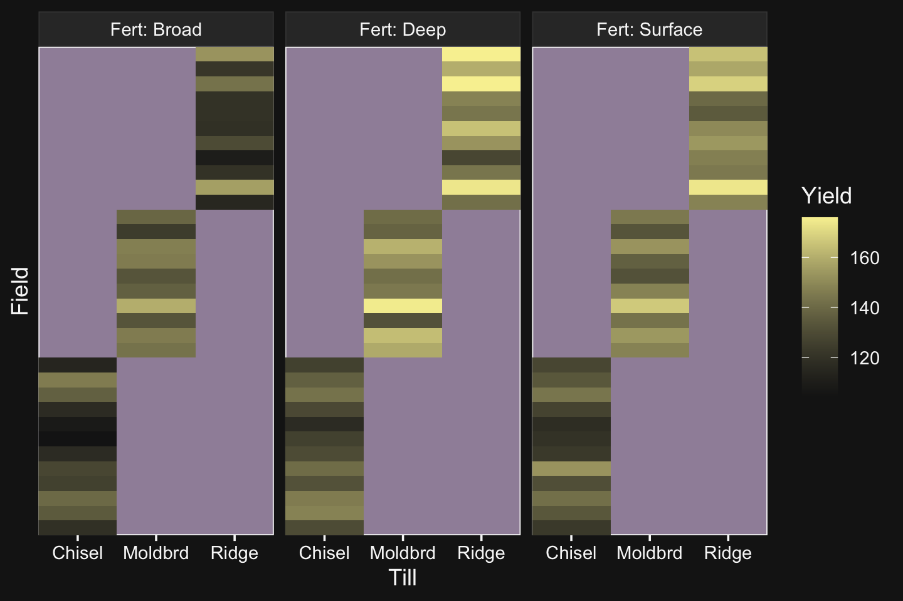

As Kruschke pointed out in the text, notice how each `Field` has only one level of `Till`, but three levels of `Fert`.

#### The descriptive model.

> In the classical ANOVA-style model for a split-plot design, the overall variance is conceptually decomposed into five components: the main effect of the between-subjects factor, the main effect of the within-subjects factor, the interaction of the two factors, the effect of subject within levels of the between-subject factor, and the interaction of subject with the within-subject factor. Unfortunately, because there is only a single datum per cell, the five components exactly match the data, which is to say that there are as many parameters as there are data points. (If every subject contributed multiple data points to every cell then the five-component model could be used.) Because there is no residual noise within cells, the classical approach is to treat the final component as noise, that is, treat the interaction of subject with the within-subject factor as noise. That component is not included in the model (at least, not distinct from noise). We will do the same for the descriptive model in our Bayesian analysis. (p. 612)

#### Implementation in ~~JAGS~~ brms.

Define the `stanvars`.


```r
mean_y <- mean(my_data$Yield)
sd_y   <- sd(my_data$Yield)

omega <- sd_y / 2
sigma <- 2 * sd_y

s_r <- gamma_a_b_from_omega_sigma(mode = omega, sd = sigma)

stanvars <- 
  stanvar(mean_y,    name = "mean_y") + 
  stanvar(sd_y,      name = "sd_y") +
  stanvar(s_r$shape, name = "alpha") +
  stanvar(s_r$rate,  name = "beta")
```

Here's how to fit the model with `brm()`.


```r
fit20.3 <-
  brm(data = my_data,
      family = gaussian,
      Yield ~ 1 + (1 | Till) + (1 | Fert) + (1 | Field) + (1 | Till:Fert),
      prior = c(prior(normal(mean_y, sd_y * 5), class = Intercept),
                prior(gamma(alpha, beta), class = sd),
                prior(cauchy(0, sd_y), class = sigma)),
      iter = 4000, warmup = 2000, chains = 4, cores = 4,
      seed = 20,
      control = list(adapt_delta = 0.9999,
                     max_treedepth = 12),
      stanvars = stanvars,
      file = "fits/fit20.03")
```

#### Results.

Check the summary.


```r
print(fit20.3)
```

```
##  Family: gaussian 
##   Links: mu = identity; sigma = identity 
## Formula: Yield ~ 1 + (1 | Till) + (1 | Fert) + (1 | Field) + (1 | Till:Fert) 
##    Data: my_data (Number of observations: 99) 
##   Draws: 4 chains, each with iter = 4000; warmup = 2000; thin = 1;
##          total post-warmup draws = 8000
## 
## Group-Level Effects: 
## ~Fert (Number of levels: 3) 
##               Estimate Est.Error l-95% CI u-95% CI Rhat Bulk_ESS Tail_ESS
## sd(Intercept)    15.04     13.33     1.26    49.92 1.00     2296     2927
## 
## ~Field (Number of levels: 33) 
##               Estimate Est.Error l-95% CI u-95% CI Rhat Bulk_ESS Tail_ESS
## sd(Intercept)    11.72      1.72     8.88    15.67 1.00     2177     3858
## 
## ~Till (Number of levels: 3) 
##               Estimate Est.Error l-95% CI u-95% CI Rhat Bulk_ESS Tail_ESS
## sd(Intercept)    15.58     13.49     1.25    52.11 1.00     2103     2801
## 
## ~Till:Fert (Number of levels: 9) 
##               Estimate Est.Error l-95% CI u-95% CI Rhat Bulk_ESS Tail_ESS
## sd(Intercept)     8.74      4.03     3.66    18.96 1.00     2082     4413
## 
## Population-Level Effects: 
##           Estimate Est.Error l-95% CI u-95% CI Rhat Bulk_ESS Tail_ESS
## Intercept   140.48     15.77   107.14   173.14 1.00     3268     3595
## 
## Family Specific Parameters: 
##       Estimate Est.Error l-95% CI u-95% CI Rhat Bulk_ESS Tail_ESS
## sigma     5.70      0.54     4.77     6.88 1.00     3601     5000
## 
## Draws were sampled using sampling(NUTS). For each parameter, Bulk_ESS
## and Tail_ESS are effective sample size measures, and Rhat is the potential
## scale reduction factor on split chains (at convergence, Rhat = 1).
```

We might compare the $\sigma$ posteriors with a plot.


```r
as_draws_df(fit20.3) %>% 
  pivot_longer(c(sigma, starts_with("sd"))) %>% 
    
  ggplot(aes(x = value, y = name)) +
  stat_beedrill(slab_color = bd[6], size = 1/2, point_size = 3/2) +
  labs(x = NULL,
       y = NULL) +
  coord_cartesian(xlim = c(0, 50),
                  ylim = c(1.5, NA)) +
  theme(axis.text.y = element_text(hjust = 0),
        axis.ticks.y = element_blank())
```

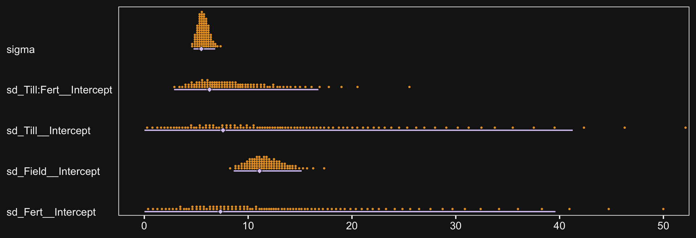

Now we have the results of `fit20.3`, we are ready to make our version if Figure 20.10. Note that how within `add_fitted_draws()`, we used the `re_formula` argument to average over the random effects of `Field` (i.e., we left `(1 | Field)` out of the formula). That's our equivalent to when Kruschke wrote "The predictive normal distributions are plotted with means at $\beta_0 + \beta_B + \beta_W + \beta_{B \times W}$ (collapsed across $\beta_S$) and with standard deviation $\sigma$" (pp. 614--615).


```r
# wrangle
my_data %>% 
  distinct(Till, Fert) %>% 
  add_epred_draws(fit20.3, 
                  ndraws = 20,
                  re_formula = Yield ~ 1 + (1 | Till) + (1 | Fert) + (1 | Till:Fert),
                  dpar = c("mu", "sigma")) %>% 
  mutate(ll = qnorm(.025, mean = mu, sd = sigma),
         ul = qnorm(.975, mean = mu, sd = sigma)) %>% 
  mutate(Yield = map2(ll, ul, seq, length.out = 100)) %>% 
  unnest(Yield) %>% 
  mutate(density = dnorm(Yield, mu, sigma)) %>% 
  group_by(.draw) %>% 
  mutate(density = density / max(density)) %>% 
  
  # plot
  ggplot(aes(x = Yield, y = Fert)) +
  geom_path(data = my_data,
            aes(group = Field %>% as.factor()),
            linewidth = 1/4, color = bd[5]) +
  geom_ridgeline(aes(height = -density, group = interaction(Fert, .draw), color = Fert),
                 fill = NA, size = 1/3, scale = 3/4,
                 min_height = NA) +
  geom_jitter(data = my_data,
              height = .025, alpha = 1/2, color = bd[5]) +
  scale_color_manual(values = bd[c(9, 6, 12)]) +
  scale_x_continuous(breaks = seq(from = 100, to = 180, by = 20)) +
  coord_flip(xlim = c(90, 190),
             ylim = c(0.5, 2.75)) +
  ggtitle("Data with Posterior Predictive Distribution") +
  theme(axis.ticks.x = element_blank(),
        legend.position = "none") +
  facet_wrap(~ Till, labeller = label_both)
```

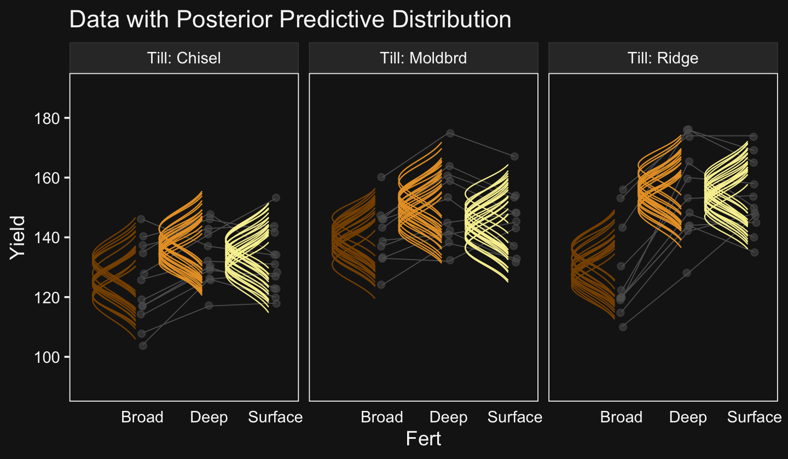

Now let's make our Figure 20.11 contrasts.


```r
nd <-
  my_data %>% 
  distinct(Till, Fert) %>% 
  # we'll need to update our column names
  mutate(col_names = str_c(Till, "_", Fert))

fitted(fit20.3,
       newdata = nd,
       summary = F,
       re_formula = Yield ~ 1 + (1 | Till) + (1 | Fert) + (1 | Till:Fert)) %>% 
  as_tibble() %>% 
  set_names(nd %>% pull(col_names)) %>% 
  transmute(
    `Moldbrd\nvs\nRidge` = ((Moldbrd_Broad + Moldbrd_Deep + Moldbrd_Surface) / 3) - ((Ridge_Broad + Ridge_Deep + Ridge_Surface) / 3),
            
    `Moldbrd.Ridge\nvs\nChisel` = ((Moldbrd_Broad + Moldbrd_Deep + Moldbrd_Surface + Ridge_Broad + Ridge_Deep + Ridge_Surface) / 6) - ((Chisel_Broad + Chisel_Deep + Chisel_Surface) / 3),
    
    `Deep.Surface\nvs\nBroad` = ((Chisel_Deep + Moldbrd_Deep + Ridge_Deep + Chisel_Surface + Moldbrd_Surface + Ridge_Surface) / 6) - ((Chisel_Broad + Moldbrd_Broad + Ridge_Broad) / 3),
    
    `Chisel.Moldbrd.v.Ridge\n(x)\nBroad.v.Deep.Surface` = (((Chisel_Broad + Chisel_Deep + Chisel_Surface + Moldbrd_Broad + Moldbrd_Deep + Moldbrd_Surface) / 6) - ((Ridge_Broad + Ridge_Deep + Ridge_Surface) / 3)) - (((Chisel_Broad + Moldbrd_Broad + Ridge_Broad) / 3) - ((Chisel_Deep + Moldbrd_Deep + Ridge_Deep + Chisel_Surface + Moldbrd_Surface + Ridge_Surface) / 6))
    ) %>% 
  pivot_longer(everything()) %>% 
  mutate(name = factor(name, levels = c("Moldbrd\nvs\nRidge", "Moldbrd.Ridge\nvs\nChisel", "Deep.Surface\nvs\nBroad", "Chisel.Moldbrd.v.Ridge\n(x)\nBroad.v.Deep.Surface"))) %>% 
  
  ggplot(aes(x = value, y = 0)) +
  geom_rect(xmin = -5, xmax = 5,
            ymin = -Inf, ymax = Inf,
            color = "transparent", fill = bd[7]) +
  stat_beedrill() +
  scale_y_continuous(NULL, breaks = NULL) +
  xlab("Difference") +
  expand_limits(x = -5) +
  theme(strip.text = element_text(size = 6)) +
  facet_wrap(~ name, scales = "free", ncol = 4)
```

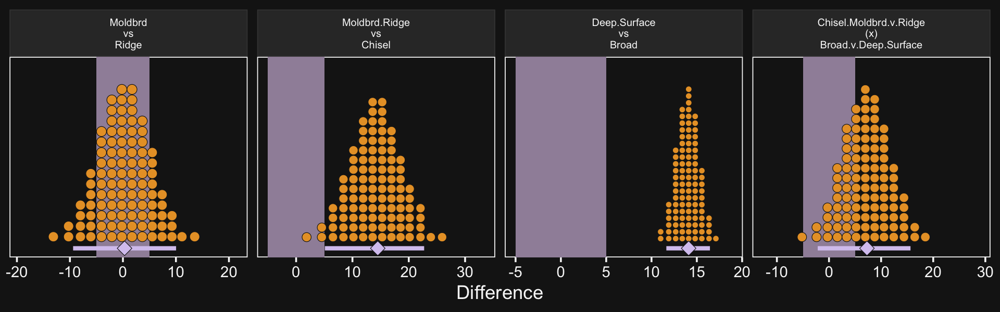

As far as I can tell, it appears that our contrasts indicate our variance parameter for `Till` ended up larger than Kruschke's.

Kruschke then posed a model "with field/subject coding suppressed, hence no lines connecting data from the same field/subject" (p. 616). Here's how to fit that model.


```r
fit20.4 <-
  brm(data = my_data,
      family = gaussian,
      Yield ~ 1 + (1 | Till) + (1 | Fert) + (1 | Till:Fert),
      prior = c(prior(normal(mean_y, sd_y * 5), class = Intercept),
                prior(gamma(alpha, beta), class = sd),
                prior(cauchy(0, sd_y), class = sigma)),
      iter = 4000, warmup = 2000, chains = 4, cores = 4,
      seed = 20,
      control = list(adapt_delta = 0.999,
                     max_treedepth = 12),
      stanvars = stanvars,
      file = "fits/fit20.04")
```

Behold the summary.


```r
print(fit20.4)
```

```
##  Family: gaussian 
##   Links: mu = identity; sigma = identity 
## Formula: Yield ~ 1 + (1 | Till) + (1 | Fert) + (1 | Till:Fert) 
##    Data: my_data (Number of observations: 99) 
##   Draws: 4 chains, each with iter = 4000; warmup = 2000; thin = 1;
##          total post-warmup draws = 8000
## 
## Group-Level Effects: 
## ~Fert (Number of levels: 3) 
##               Estimate Est.Error l-95% CI u-95% CI Rhat Bulk_ESS Tail_ESS
## sd(Intercept)    15.24     13.45     1.63    51.89 1.00     2717     3524
## 
## ~Till (Number of levels: 3) 
##               Estimate Est.Error l-95% CI u-95% CI Rhat Bulk_ESS Tail_ESS
## sd(Intercept)    16.53     13.94     1.65    54.71 1.00     2829     2727
## 
## ~Till:Fert (Number of levels: 9) 
##               Estimate Est.Error l-95% CI u-95% CI Rhat Bulk_ESS Tail_ESS
## sd(Intercept)     7.71      4.59     1.39    19.08 1.00     2407     3364
## 
## Population-Level Effects: 
##           Estimate Est.Error l-95% CI u-95% CI Rhat Bulk_ESS Tail_ESS
## Intercept   140.26     16.36   105.61   174.11 1.00     3784     3478
## 
## Family Specific Parameters: 
##       Estimate Est.Error l-95% CI u-95% CI Rhat Bulk_ESS Tail_ESS
## sigma    12.69      0.96    11.01    14.72 1.00     8328     5053
## 
## Draws were sampled using sampling(NUTS). For each parameter, Bulk_ESS
## and Tail_ESS are effective sample size measures, and Rhat is the potential
## scale reduction factor on split chains (at convergence, Rhat = 1).
```

Look at how much larger the posterior is for $\sigma_y$ in this model compared to `fit20.3`.


```r
posterior_summary(fit20.3)["sigma", ]
```

```
##  Estimate Est.Error      Q2.5     Q97.5 
## 5.6954319 0.5374253 4.7675016 6.8752696
```

```r
posterior_summary(fit20.4)["sigma", ]
```

```
##   Estimate  Est.Error       Q2.5      Q97.5 
## 12.6915001  0.9599149 11.0083386 14.7192597
```

Here's the top portion of Figure 20.12.


```r
# wrangle
my_data %>% 
  distinct(Till, Fert) %>% 
  add_epred_draws(fit20.4, 
                  ndraws = 20,
                  re_formula = Yield ~ 1 + (1 | Till) + (1 | Fert) + (1 | Till:Fert),
                  dpar = c("mu", "sigma")) %>% 
  mutate(ll = qnorm(.025, mean = mu, sd = sigma),
         ul = qnorm(.975, mean = mu, sd = sigma)) %>% 
  mutate(Yield = map2(ll, ul, seq, length.out = 200)) %>% 
  unnest(Yield) %>% 
  mutate(density = dnorm(Yield, mu, sigma)) %>% 
  group_by(.draw) %>% 
  mutate(density = density / max(density)) %>% 
  
  # plot
  ggplot(aes(x = Yield, y = Fert)) +
  geom_ridgeline(aes(height = -density, group = interaction(Fert, .draw), color = Fert),
                 fill = NA, size = 1/3, scale = 3/4,
                 min_height = NA) +
  geom_jitter(data = my_data,
              height = .025, alpha = 1/2, color = bd[5]) +
  scale_color_manual(values = bd[c(9, 6, 12)]) +
  scale_x_continuous(breaks = seq(from = 100, to = 180, by = 20)) +
  coord_flip(xlim = c(90, 190),
             ylim = c(0.5, 2.75)) +
  ggtitle("Data with Posterior Predictive Distribution") +
  theme(axis.ticks.x = element_blank(),
        legend.position = "none") +
  facet_wrap(~ Till, labeller = label_both)
```

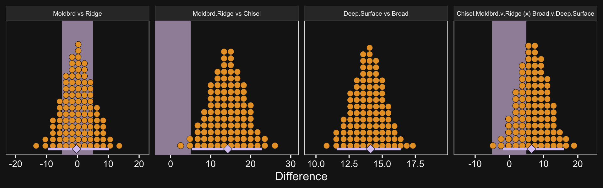

Now make the plots for the contrast distributions.


```r
fitted(fit20.4,
       newdata = nd,
       summary = F,
       re_formula = Yield ~ 1 + (1 | Till) + (1 | Fert) + (1 | Till:Fert)) %>% 
  as_tibble() %>% 
  set_names(nd %>% pull(col_names)) %>% 
  transmute(
    `Moldbrd\nvs\nRidge` = ((Moldbrd_Broad + Moldbrd_Deep + Moldbrd_Surface) / 3) - ((Ridge_Broad + Ridge_Deep + Ridge_Surface) / 3),
            
    `Moldbrd.Ridge\nvs\nChisel` = ((Moldbrd_Broad + Moldbrd_Deep + Moldbrd_Surface + Ridge_Broad + Ridge_Deep + Ridge_Surface) / 6) - ((Chisel_Broad + Chisel_Deep + Chisel_Surface) / 3),
    
    `Deep.Surface\nvs\nBroad` = ((Chisel_Deep + Moldbrd_Deep + Ridge_Deep + Chisel_Surface + Moldbrd_Surface + Ridge_Surface) / 6) - ((Chisel_Broad + Moldbrd_Broad + Ridge_Broad) / 3),
    
    `Chisel.Moldbrd.v.Ridge\n(x)\nBroad.v.Deep.Surface` = (((Chisel_Broad + Chisel_Deep + Chisel_Surface + Moldbrd_Broad + Moldbrd_Deep + Moldbrd_Surface) / 6) - ((Ridge_Broad + Ridge_Deep + Ridge_Surface) / 3)) - (((Chisel_Broad + Moldbrd_Broad + Ridge_Broad) / 3) - ((Chisel_Deep + Moldbrd_Deep + Ridge_Deep + Chisel_Surface + Moldbrd_Surface + Ridge_Surface) / 6))
    ) %>% 
  pivot_longer(everything()) %>% 
  mutate(name = factor(name, levels = c("Moldbrd\nvs\nRidge", "Moldbrd.Ridge\nvs\nChisel", "Deep.Surface\nvs\nBroad", "Chisel.Moldbrd.v.Ridge\n(x)\nBroad.v.Deep.Surface"))) %>% 
  
  ggplot(aes(x = value, y = 0)) + 
  geom_rect(xmin = -5, xmax = 5,
            ymin = -Inf, ymax = Inf,
            color = "transparent", fill = bd[7]) +
  stat_beedrill() +
  scale_y_continuous(NULL, breaks = NULL) +
  xlab("Difference") +
  expand_limits(x = -5) +
  theme(strip.text = element_text(size = 6)) +
  facet_wrap(~ name, scales = "free", ncol = 4)
```

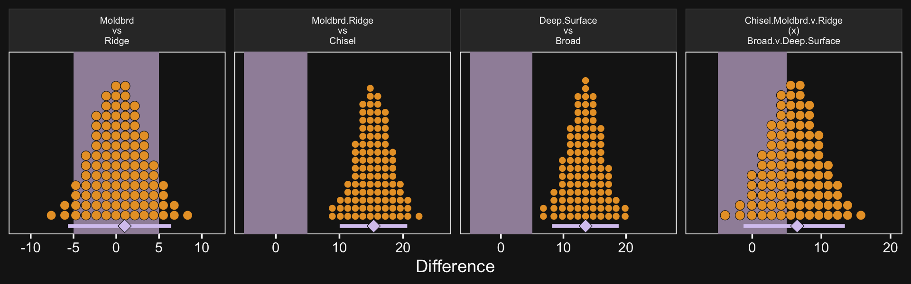

Though not identical, these were closer to those Kruschke displayed in the text.

#### Model comparison approach.

Like we covered in Chapter 10, I'm not aware that Stan/**brms** will allow for $\delta$ factor-inclusion parameters the way JAGS allows. However, if you'd like to compare models with different parameters, you can always use information criteria.


```r
fit20.3 <- add_criterion(fit20.3, "loo")
fit20.4 <- add_criterion(fit20.4, "loo")
```

Executing that yielded the following warning message:

> Found 4 observations with a pareto_k > 0.7 in model 'fit20.3'. It is recommended to set 'moment_match = TRUE' in order to perform moment matching for problematic observations. 

To use the `moment_match` approach, the model in question must have been fit with the setting `save_pars = save_pars(all = TRUE)` within the `brm()` call. The default is `save_pars = NULL` and we used the default settings, above. If you go through the trouble of refitting the model with those updated settings, you'll find that the `moment_match` approach didn't help in this case. For the sake of reducing clutter, I'm not going to show the code for refitting the model. However, the next warning message I got after executing `fit20.3 <- add_criterion(fit20.3, "loo", moment_match = T)` was:

> Warning: Found 1 observations with a pareto_k > 0.7 in model 'fit20.3'. It is recommended to set 'reloo = TRUE' in order to calculate the ELPD without the assumption that these observations are negligible. This will refit the model 1 times to compute the ELPDs for the problematic observations directly.

So it's time to bring in the big guns. Let's use `reloo`. Be warned that, because this requires refitting the model multiple times, this will take a few minutes.


```r
fit20.3 <- add_criterion(fit20.3, criterion = "loo", reloo = TRUE)
```

Okay, we're *finally* ready for the LOO comparison.


```r
loo_compare(fit20.3, fit20.4) %>% 
  print(simplify = F)
```


```
##         elpd_diff se_diff elpd_loo se_elpd_loo p_loo  se_p_loo looic  se_looic
## fit20.3    0.0       0.0  -334.5      8.0        34.0    4.4    668.9   16.1  
## fit20.4  -61.8       7.9  -396.3      5.7         8.6    1.0    792.6   11.4
```

All good. Based on the LOO values, we should prefer the fuller model. This, of course, should be no surprise. The posterior for $\sigma_\text{Field}$ was a far cry from zero.


```r
posterior_summary(fit20.3)["sd_Field__Intercept", ]
```

```
##  Estimate Est.Error      Q2.5     Q97.5 
## 11.720783  1.724052  8.876385 15.671784
```

Kruschke ended this chapter by mentioning Bayes' factors:

> Bayes' factor approaches to hypothesis tests in ANOVA were presented by @rouderDefaultBayesFactors2012 and Wetzels, Grasman, and Wagenmakers [-@wetzelsDefaultBayesianHypothesis2012]. Morey and Rouder's BayesFactor package for R is available at the Web site [http://bayesfactorpcl.r-forge.r-project.org/](http://bayesfactorpcl.r-forge.r-project.org/). (p. 618)

If you wanna go that route, you're on your own.

## Session info {-}


```r
sessionInfo()
```

```
## R version 4.2.2 (2022-10-31)
## Platform: x86_64-apple-darwin17.0 (64-bit)
## Running under: macOS Big Sur ... 10.16
## 
## Matrix products: default
## BLAS:   /Library/Frameworks/R.framework/Versions/4.2/Resources/lib/libRblas.0.dylib
## LAPACK: /Library/Frameworks/R.framework/Versions/4.2/Resources/lib/libRlapack.dylib
## 
## locale:
## [1] en_US.UTF-8/en_US.UTF-8/en_US.UTF-8/C/en_US.UTF-8/en_US.UTF-8
## 
## attached base packages:
## [1] stats     graphics  grDevices utils     datasets  methods   base     
## 
## other attached packages:
##  [1] directlabels_2021.1.13 posterior_1.3.1        ggridges_0.5.4         tidybayes_3.0.2       
##  [5] brms_2.18.0            Rcpp_1.0.9             patchwork_1.1.2        palettetown_0.1.1     
##  [9] forcats_0.5.1          stringr_1.4.1          dplyr_1.0.10           purrr_1.0.1           
## [13] readr_2.1.2            tidyr_1.2.1            tibble_3.1.8           ggplot2_3.4.0         
## [17] tidyverse_1.3.2       
## 
## loaded via a namespace (and not attached):
##   [1] readxl_1.4.1         backports_1.4.1      plyr_1.8.7           igraph_1.3.4        
##   [5] svUnit_1.0.6         splines_4.2.2        crosstalk_1.2.0      TH.data_1.1-1       
##   [9] rstantools_2.2.0     inline_0.3.19        digest_0.6.31        htmltools_0.5.3     
##  [13] fansi_1.0.3          magrittr_2.0.3       checkmate_2.1.0      googlesheets4_1.0.1 
##  [17] tzdb_0.3.0           modelr_0.1.8         RcppParallel_5.1.5   matrixStats_0.63.0  
##  [21] vroom_1.5.7          xts_0.12.1           sandwich_3.0-2       prettyunits_1.1.1   
##  [25] colorspace_2.0-3     rvest_1.0.2          ggdist_3.2.1         haven_2.5.1         
##  [29] xfun_0.35            callr_3.7.3          crayon_1.5.2         jsonlite_1.8.4      
##  [33] lme4_1.1-31          survival_3.4-0       zoo_1.8-10           glue_1.6.2          
##  [37] gtable_0.3.1         gargle_1.2.0         emmeans_1.8.0        distributional_0.3.1
##  [41] pkgbuild_1.3.1       rstan_2.21.8         abind_1.4-5          scales_1.2.1        
##  [45] mvtnorm_1.1-3        emo_0.0.0.9000       DBI_1.1.3            miniUI_0.1.1.1      
##  [49] xtable_1.8-4         HDInterval_0.2.4     bit_4.0.4            stats4_4.2.2        
##  [53] StanHeaders_2.21.0-7 DT_0.24              htmlwidgets_1.5.4    httr_1.4.4          
##  [57] threejs_0.3.3        arrayhelpers_1.1-0   ellipsis_0.3.2       pkgconfig_2.0.3     
##  [61] loo_2.5.1            farver_2.1.1         sass_0.4.2           dbplyr_2.2.1        
##  [65] utf8_1.2.2           tidyselect_1.2.0     labeling_0.4.2       rlang_1.0.6         
##  [69] reshape2_1.4.4       later_1.3.0          munsell_0.5.0        cellranger_1.1.0    
##  [73] tools_4.2.2          cachem_1.0.6         cli_3.6.0            generics_0.1.3      
##  [77] broom_1.0.2          evaluate_0.18        fastmap_1.1.0        processx_3.8.0      
##  [81] knitr_1.40           bit64_4.0.5          fs_1.5.2             nlme_3.1-160        
##  [85] projpred_2.2.1       mime_0.12            xml2_1.3.3           compiler_4.2.2      
##  [89] bayesplot_1.10.0     shinythemes_1.2.0    rstudioapi_0.13      gamm4_0.2-6         
##  [93] reprex_2.0.2         bslib_0.4.0          stringi_1.7.8        highr_0.9           
##  [97] ps_1.7.2             Brobdingnag_1.2-8    lattice_0.20-45      Matrix_1.5-1        
## [101] nloptr_2.0.3         markdown_1.1         shinyjs_2.1.0        tensorA_0.36.2      
## [105] vctrs_0.5.1          pillar_1.8.1         lifecycle_1.0.3      jquerylib_0.1.4     
## [109] bridgesampling_1.1-2 estimability_1.4.1   httpuv_1.6.5         R6_2.5.1            
## [113] bookdown_0.28        promises_1.2.0.1     gridExtra_2.3        codetools_0.2-18    
## [117] boot_1.3-28          MASS_7.3-58.1        colourpicker_1.1.1   gtools_3.9.4        
## [121] assertthat_0.2.1     withr_2.5.0          shinystan_2.6.0      multcomp_1.4-20     
## [125] mgcv_1.8-41          parallel_4.2.2       hms_1.1.1            quadprog_1.5-8      
## [129] grid_4.2.2           minqa_1.2.5          coda_0.19-4          rmarkdown_2.16      
## [133] googledrive_2.0.0    shiny_1.7.2          lubridate_1.8.0      base64enc_0.1-3     
## [137] dygraphs_1.1.1.6
```


## Footnote {-}

[^7]: It's not quite clear where these data come from. At the top of page 591, Kruschke wrote "in this section, we will be looking at some real-world salaries." Further down on the same page, Kruschke added: "The data are annual salaries of 1,080 tenure-track professors at a large-enrollment, small-city, Midwestern-American, research-oriented, state university. (Salaries at big- city and private universities tend to be higher, while salaries at liberal-arts colleges and teaching-oriented state universities tend to be lower.) The data span 60 academic departments that had at least seven members. The data also include the professor’s seniority." He did not provide a reference.

