# Dichotomous Predicted Variable

> This chapter considers data structures that consist of a dichotomous predicted variable. The early chapters of the book were focused on this type of data, but now we reframe the analyses in terms of the generalized linear model...
> 
> The traditional treatment of these sorts of data structure is called "logistic regression." In Bayesian software it is easy to generalize the traditional models so they are robust to outliers, allow different variances within levels of a nominal predictor, and have hierarchical structure to share information across levels or factors as appropriate. (pp. 621--622)

## Multiple metric predictors

"We begin by considering a situation with multiple metric predictors, because this case makes it easiest to visualize the concepts of logistic regression" (p. 623).

Figure 21.1 is beyond the scope of our current **ggplot2** paradigm. But we will discuss an alternative in the end of section 21.1.2.

### The model and implementation in ~~JAGS~~ brms.

Our statistical model will follow the form

\begin{align*}
\mu & = \operatorname{logistic} (\beta_0 + \beta_1 x_1 + \beta_2 x_2) \\
y & \sim \operatorname{Bernoulli} (\mu)
\end{align*}

where

$$\operatorname{logistic} (x) = \frac{1}{(1 + \exp (-x))}.$$

The generic **brms** code for logistic regression using the Bernoulli likelihood looks like so.


```r
fit <-
  brm(data = my_data, 
      family = bernoulli,
      y ~ 1 + x1 + x2,
      prior = c(prior(normal(0, 2), class = Intercept),
                prior(normal(0, 2), class = b)))
```

Note that this syntax presumes the predictor variables have already been standardized.

We'd be remiss not to point out that you can also specify the model using the binomial distribution. That code would look like this.


```r
fit <-
  brm(data = my_data, 
      family = binomial,
      y | trials(1) ~ 1 + x1 + x2,
      prior = c(prior(normal(0, 2), class = Intercept),
                prior(normal(0, 2), class = b)))
```

As long as the data are not aggregated, the results of these two should be the same within simulation variance. In **brms**, the default link for both `family = bernoulli` and `family = binomial` models is `logit`, which is exactly what we want, here. Also, note the additional `| trials(1) ` syntax on the left side of the model formula. You could get away with omitting this in older versions of **brms**. But newer versions prompt users to specify how many of trials each row in the data represents. This is because, as with the baseball data we’ll use later in the chapter, the binomial distribution includes an $n$ parameter. When working with un-aggregated data like what we’re about to do, below, it’s presumed that $n = 1$.

### Example: Height, weight, and gender.

Load the height/weight data.


```r
library(tidyverse)

my_data <- read_csv("data.R/HtWtData110.csv")

glimpse(my_data)
```

```
## Observations: 110
## Variables: 3
## $ male   <dbl> 0, 0, 0, 0, 1, 1, 1, 0, 1, 0, 1, 1, 1, 1, 1, 1, 0, 1, 0, 1, 0, 1, 0, 1, 0, 1, 0, 1…
## $ height <dbl> 63.2, 68.7, 64.8, 67.9, 68.9, 67.8, 68.2, 64.8, 64.3, 64.7, 66.9, 66.9, 67.1, 70.2…
## $ weight <dbl> 168.7, 169.8, 176.6, 246.8, 151.6, 158.0, 168.6, 137.2, 177.0, 128.0, 168.4, 136.2…
```

Let's standardize our predictors.


```r
my_data <-
  my_data %>% 
  mutate(height_z = (height - mean(height)) / sd(height),
         weight_z = (weight - mean(weight)) / sd(weight))
```

Before we fit a model, we might take a quick look at the data. The `ggMarginal()` function from the [**ggExtra** package](https://github.com/daattali/ggExtra) will be of help, here.


```r
# install.packages("ggExtra", dependencies = T)
library(ggExtra)
```

Here we make a scatter plot with marginal densities.


```r
p <-
  my_data %>% 
  ggplot(aes(x = weight, y = height, fill = male == 1)) +
  geom_point(aes(color = male == 1), 
             alpha = 2/3) +
  scale_color_manual(values = c("red4", "blue4")) +
  scale_fill_manual(values = c("red4", "blue4")) +
  theme(legend.position = "none",
        panel.grid = element_blank())
p %>% 
  ggMarginal(data = my_data,  
             groupFill = T,
             type = 'density', 
             color = "transparent")
```


Looks like the data for which `male == 1` are concentrated in the upper right and those for which `male == 0` are more so in the lower left. What we'd like is a model that would tell us the optimal dividing line(s) between our `male` categories with respect to those predictor variables.

Open **brms**.


```r
library(brms)
```

Our first logistic model with `family = bernoulli` uses only `weight_z` as a predictor.


```r
fit21.1 <-
  brm(data = my_data, 
      family = bernoulli,
      male ~ 1 + weight_z,
      prior = c(prior(normal(0, 2), class = Intercept),
                prior(normal(0, 2), class = b)),
      iter = 2500, warmup = 500, chains = 4, cores = 4,
      seed = 21,
      file = "fits/fit21.01")
```

Here's the model summary.


```r
print(fit21.1)
```

```
##  Family: bernoulli 
##   Links: mu = logit 
## Formula: male ~ 1 + weight_z 
##    Data: my_data (Number of observations: 110) 
## Samples: 4 chains, each with iter = 2500; warmup = 500; thin = 1;
##          total post-warmup samples = 8000
## 
## Population-Level Effects: 
##           Estimate Est.Error l-95% CI u-95% CI Rhat Bulk_ESS Tail_ESS
## Intercept    -0.08      0.21    -0.50     0.32 1.00     6358     5436
## weight_z      1.18      0.28     0.66     1.74 1.00     5678     4925
## 
## Samples were drawn using sampling(NUTS). For each parameter, Bulk_ESS
## and Tail_ESS are effective sample size measures, and Rhat is the potential
## scale reduction factor on split chains (at convergence, Rhat = 1).
```

Now let's get ready to make our version of Figure 21.3. First, we need to do some `fitted()`-oriented wrangling.


```r
length <- 200
n_iter <- 20

nd <- tibble(weight_z = seq(from = -2, to = 3.5, length.out = length))

f <-
  fitted(fit21.1,
         newdata  = nd,
         summary  = F,
         nsamples = n_iter) %>% 
  as_tibble() %>%
  mutate(iter = 1:n_iter) %>% 
  pivot_longer(-iter) %>% 
  mutate(weight_z = rep(nd$weight_z, times = n_iter)) %>% 
  mutate(weight = weight_z * sd(my_data$weight) + mean(my_data$weight))

head(f)
```

```
## # A tibble: 6 x 5
##    iter name   value weight_z weight
##   <int> <chr>  <dbl>    <dbl>  <dbl>
## 1     1 V1    0.0960    -2      87.0
## 2     1 V2    0.0985    -1.97   88.0
## 3     1 V3    0.101     -1.94   88.9
## 4     1 V4    0.104     -1.92   89.9
## 5     1 V5    0.106     -1.89   90.9
## 6     1 V6    0.109     -1.86   91.9
```

Here's a tricky way to get the threshold values.


```r
thresholds <-
  f %>% 
  filter(value < .5) %>% 
  group_by(iter) %>% 
  filter(value == max(value))
```

Using those `thresholds`, here's our version of the top panel of Figure 21.3.


```r
f %>% 
  ggplot(aes(x = weight)) +
  geom_hline(yintercept = .5, color = "white", size = 1/2) +
  geom_vline(xintercept = thresholds$weight, color = "white", size = 2/5) +
  geom_line(aes(y = value, group = iter),
            color = "grey50", size = 1/3, alpha = 2/3) +
  geom_point(data = my_data,
             aes(y = male),
             alpha = 1/3) +
  labs(title = "Data with Post. Pred.", 
       y = "male") +
  coord_cartesian(xlim = range(my_data$weight)) +
  theme(panel.grid = element_blank())
```

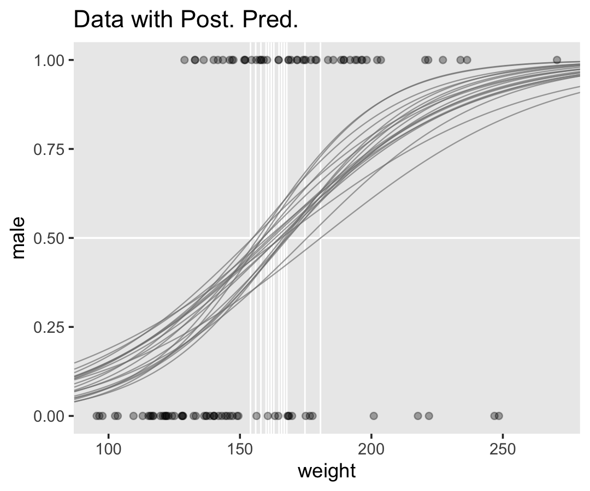

We should discuss those thresholds (i.e., the verticla lines) a bit. Kruschke:

> The spread of the logistic curves indicates the uncertainty of the estimate; the steepness of the logistic curves indicates the magnitude of the regression coefficient. The 50% probability threshold is marked by arrows that drop down from the logistic curve to the $x$-axis, near a weight of approximately 160 pounds. The threshold is the $x$ value at which $\mu = 0.5$, which is $x = -\beta_0 / \beta_1$. (p. 626)

Now here we show the marginal distributions in our versions of the lower panels of Figure 21.3.


```r
library(tidybayes)

# extract the draws
post <-
  posterior_samples(fit21.1) %>% 
  # convert the parameter draws to their natural metric following Equation 21.1
  transmute(Intercept = b_Intercept - (b_weight_z * mean(my_data$weight) / sd(my_data$weight)),
            weight    = b_weight_z / sd(my_data$weight)) %>% 
  pivot_longer(everything())

# plot
post %>% 
  ggplot(aes(x = value, y = 0)) +
  stat_histintervalh(point_interval = mode_hdi, .width = c(.95, .5),
                     fill = "grey67", slab_color = "grey92",
                     breaks = 50, slab_size = .25, outline_bars = T,
                     normalize = "panels") +
  scale_y_continuous(NULL, breaks = NULL) +
  xlab(NULL) +
  theme(panel.grid = element_blank()) +
  facet_wrap(~name, scales = "free", ncol = 2)
```


And here are those exact posterior mode and 95% HDI values.


```r
post %>% 
  group_by(name) %>% 
  mode_hdi() %>% 
  mutate_if(is.double, round, digits = 3)
```

```
## # A tibble: 2 x 7
##   name       value .lower .upper .width .point .interval
##   <chr>      <dbl>  <dbl>  <dbl>  <dbl> <chr>  <chr>    
## 1 Intercept -5.17  -7.78  -2.96    0.95 mode   hdi      
## 2 weight     0.033  0.018  0.048   0.95 mode   hdi
```

Now fit the two-predictor model using both `weight_z` and `height_z`


```r
fit21.2 <-
  brm(data = my_data, 
      family = bernoulli,
      male ~ 1 + weight_z + height_z,
      prior = c(prior(normal(0, 2), class = Intercept),
                prior(normal(0, 2), class = b)),
      iter = 2500, warmup = 500, chains = 4, cores = 4,
      seed = 21,
      file = "fits/fit21.02")
```

Here's the model summary.


```r
print(fit21.2)
```

```
##  Family: bernoulli 
##   Links: mu = logit 
## Formula: male ~ 1 + weight_z + height_z 
##    Data: my_data (Number of observations: 110) 
## Samples: 4 chains, each with iter = 2500; warmup = 500; thin = 1;
##          total post-warmup samples = 8000
## 
## Population-Level Effects: 
##           Estimate Est.Error l-95% CI u-95% CI Rhat Bulk_ESS Tail_ESS
## Intercept    -0.35      0.30    -0.97     0.21 1.00     5701     4430
## weight_z      0.67      0.35    -0.01     1.38 1.00     6570     5203
## height_z      2.62      0.51     1.71     3.71 1.00     5721     4092
## 
## Samples were drawn using sampling(NUTS). For each parameter, Bulk_ESS
## and Tail_ESS are effective sample size measures, and Rhat is the potential
## scale reduction factor on split chains (at convergence, Rhat = 1).
```

Before we make our plots for Figure 21.4, we'll need to extract the posterior samples and transform a little.


```r
post <-
  posterior_samples(fit21.2) %>% 
  transmute(b_weight  = b_weight_z / sd(my_data$weight),
            b_height  = b_height_z / sd(my_data$height),
            Intercept = b_Intercept - ((b_weight_z * mean(my_data$weight) / sd(my_data$weight)) +
                                         (b_height_z * mean(my_data$height) / sd(my_data$height))))

head(post)
```

```
##      b_weight  b_height Intercept
## 1 0.018166700 0.7321485 -51.60400
## 2 0.019467097 0.4831885 -35.37444
## 3 0.011662826 0.9272223 -64.27622
## 4 0.007602754 1.0011093 -68.24517
## 5 0.003033513 0.8470679 -57.08786
## 6 0.029017547 0.5890523 -44.33986
```

Here's our version of Figure 21.4.a.


```r
set.seed(21)  # we need this for the `sample_n()` function
post %>% 
  mutate(iter = 1:n()) %>% 
  sample_n(size = 20) %>% 
  expand(nesting(iter, Intercept, b_weight, b_height),
         weight = c(80, 280)) %>% 
  # this follows the Equation near the top of p. 629
  mutate(height = (-Intercept / b_height) + (-b_weight / b_height) * weight) %>% 
  
  # now plot
  ggplot(aes(x = weight, y = height)) +
  geom_line(aes(group = iter),
            color = "white", size = 2/5) +
  geom_text(data = my_data,
            aes(label = male, color = male == 1)) +
  scale_color_manual(values = c("red4", "blue4")) +
  ggtitle("Data with Post. Pred.") +
  coord_cartesian(xlim = range(my_data$weight),
                  ylim = range(my_data$height)) +
  theme(legend.position = "none",
        panel.grid = element_blank())
```

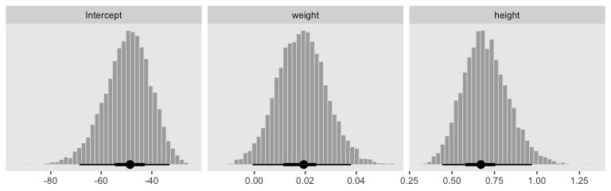

With just a tiny bit more wrangling, we'll be ready to make the bottom panels of Figure 21.4.


```r
post %>% 
  pivot_longer(everything()) %>% 
  mutate(name = factor(str_remove(name, "b_"),
                       levels = c("Intercept", "weight", "height"))) %>% 
  
  ggplot(aes(x = value, y = 0)) +
  stat_histintervalh(point_interval = mode_hdi, .width = c(.95, .5),
                     fill = "grey67", slab_color = "grey92",
                     breaks = 40, slab_size = .25, outline_bars = T,
                     normalize = "panels") +
  scale_y_continuous(NULL, breaks = NULL) +
  xlab(NULL) +
  theme(panel.grid = element_blank()) +
  facet_wrap(~name, scales = "free", ncol = 3)
```

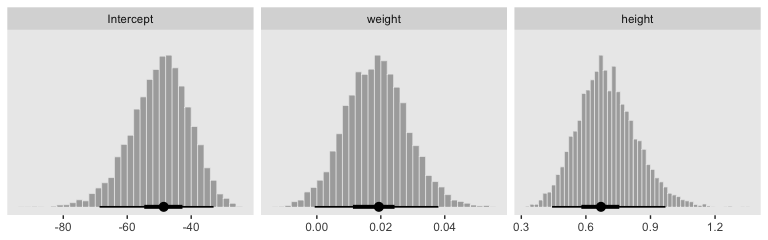

By now, you know how to use `mode_hdi()` to return those exact summary values if you'd like them.

Now remember how we backed away from Figure 21.1? Well, when you have a logistic regression with two predictors, there is a reasonable way to express those three dimensions on a two-dimensional grid. Now we have the results from `fit21.2`, let's try it out.

First, we need a grid of values for our two predictors, `weight_z` and `height_z`.


```r
length <- 100

nd <- 
  crossing(weight_z = seq(from = -3.5, to = 3.5, length.out = length),
           height_z = seq(from = -3.5, to = 3.5, length.out = length))
```

Second, we plug those values into `fitted()` and wrangle.


```r
f <-
  fitted(fit21.2,
         newdata = nd,
         scale = "linear") %>% 
  as_tibble() %>% 
  # note we're only working with the posterior mean, here
  transmute(prob = Estimate %>% inv_logit_scaled()) %>% 
  bind_cols(nd) %>% 
  mutate(weight = (weight_z * sd(my_data$weight) + mean(my_data$weight)),
         height = (height_z * sd(my_data$height) + mean(my_data$height)))

glimpse(f)
```

```
## Observations: 10,000
## Variables: 5
## $ prob     <dbl> 7.096100e-06, 8.540527e-06, 1.027897e-05, 1.237127e-05, 1.488945e-05, 1.792021e-…
## $ weight_z <dbl> -3.5, -3.5, -3.5, -3.5, -3.5, -3.5, -3.5, -3.5, -3.5, -3.5, -3.5, -3.5, -3.5, -3…
## $ height_z <dbl> -3.500000, -3.429293, -3.358586, -3.287879, -3.217172, -3.146465, -3.075758, -3.…
## $ weight   <dbl> 33.45626, 33.45626, 33.45626, 33.45626, 33.45626, 33.45626, 33.45626, 33.45626, …
## $ height   <dbl> 53.24736, 53.51234, 53.77731, 54.04229, 54.30727, 54.57224, 54.83722, 55.10219, …
```

Third, we're ready to plot. Here we'll express the third dimension, probability, on a color spectrum.


```r
f %>% 
  ggplot(aes(x = weight, y = height)) +
  geom_raster(aes(fill = prob),
              interpolate = T) +
  geom_text(data = my_data,
            aes(label = male, color = male == 1),
            show.legend = F) +
  scale_color_manual(values = c("white", "black")) +
  scale_fill_viridis_c(option = "A", begin = .1, limits = c(0, 1)) +
  scale_y_continuous(position = "right") +
  coord_cartesian(xlim = range(my_data$weight),
                  ylim = range(my_data$height)) +
  theme(legend.position = "left")
```

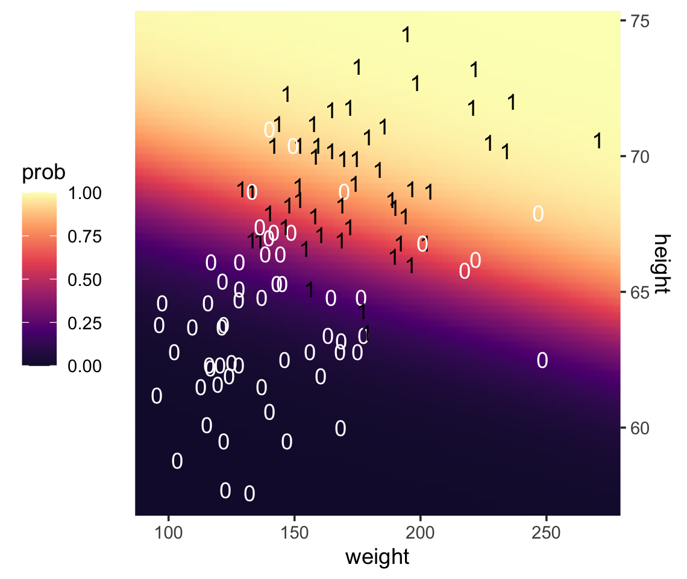

If you look way back to Figure 21.1 (p. 623), you'll see the following formula at the top:

$$y \sim \operatorname{dbern} (m), m = \operatorname{logistic} (0.018 x_1 + 0.7 x_2 - 50).$$

Now while you keep your finger on that equation, take another look at the last line in Kruschke's Equation 21.1,

$$
\operatorname{logit} (\mu) = 
\underbrace{\zeta_0 - \sum_j \frac{\zeta_j}{s_{x_j}} \overline x_j}_{\beta_0} +
\sum_j \underbrace{\frac{\zeta_j}{s_{x_j}} \overline x_j}_{\beta_j},
$$

where the $\zeta$s are the parameters from the model based on standardized predictors. Our `fit21.2` was based on standardized `weight` and `height` values (i.e., `weight_z` and `height_z`), yielding model coefficients in the $\zeta$ metric. Here we use the formula above to convert our `fit21.2` estimates to their unstandardized $\beta$ metric. For simplicity, we'll just take their means. 


```r
posterior_samples(fit21.2) %>% 
  transmute(beta_0 = b_Intercept - ((b_weight_z * mean(my_data$weight) / sd(my_data$weight)) + 
                                      ((b_height_z * mean(my_data$height) / sd(my_data$height)))),
            beta_1 = b_weight_z / sd(my_data$weight),
            beta_2 = b_height_z / sd(my_data$height)) %>% 
  summarise_all(~mean(.) %>% round(., digits = 3))
```

```
##    beta_0 beta_1 beta_2
## 1 -49.713  0.019  0.699
```

Within rounding error, those values are the same ones in the formula at the top of Kruschke's Figure 21.1! That is, our last plot was a version of Figure 21.1.

Hopefully this helps make sense of what the thresholds in Figure 21.4.a represented. But do note a major limitation of this visualization approach. By expressing the threshold with multiple lines drawn from the posterior in Figure 21.4.a, we expressed the uncertainty inherent in the posterior distribution. However, for this probability plane approach, we've taken a single value from the posterior, the mean (i.e., the `Estimate`), to compute the probabilities. Though beautiful, our probability-plane plot does a poor job expressing the uncertainty in the model. If you're curious how one might include uncertainty into a plot like this, check out the intriguing blog post by Adam Pearce, [*Communicating Model Uncertainty Over Space*](https://pair-code.github.io/interpretability/uncertainty-over-space/).

## Interpreting the regression coefficients

> In this section, I'll discuss how to interpret the parameters in logistic regression. The first subsection explains how to interpret the numerical magnitude of the slope coefficients in terms of "log odds." The next subsection shows how data with relatively few 1's or 0's can yield ambiguity in the parameter estimates. Then an example with strongly correlated predictors reveals tradeoffs in slope coefficients. Finally, I briefly describe the meaning of multiplicative interaction for logistic regression. (p. 629)

### Log odds.

> When the logistic regression formula is written using the logit function, we have $\operatorname{logit} (\mu) = \beta_0 + \beta_1 x_1 + \beta_2 x_2$. The formula implies that whenever $x_1$ goes up by 1 unit (on the $x_1$ scale), then $\operatorname{logit} (\mu)$ goes up by an amount $\beta_1$. And whenever $x_2$ goes up by 1 unit (on the $x_2$ scale), then $\operatorname{logit} (\mu)$ goes up by an amount $\beta_2$. Thus, the regression coefficients are telling us about increases in $\operatorname{logit} (\mu)$. To understand the regression coefficients, we need to understand $\operatorname{logit} (\mu)$. (pp. 629--630)

Given the logit function is the inverse of the logistic, which itself is

$$\operatorname{logistic} (x) = \frac{1}{1 + \exp (−x)},$$

and given the formula 

$$\operatorname{logit} (\mu) = \log \bigg (\frac{\mu}{1 - \mu} \bigg), $$

where

$$0 < \mu < 1, $$

it may or may not be clear that the results of our logistic regression models have a nonlinear relation with the actual parameter of interest, $\mu$, which, recall, is the probability our criterion variable is 1 (e.g., `male == 1`). To get a sense of that nonlinear relation, we might make a plot.


```r
tibble(mu = seq(from = 0, to = 1, length.out = 200)) %>% 
  mutate(logit_mu = log(mu / (1 - mu))) %>% 

  ggplot(aes(x = mu, y = logit_mu)) +
  geom_line() +
  labs(x = expression(mu~"(i.e., the probability space)"),
       y = expression(logit~mu~"(i.e., the parameter space)")) +
  theme(legend.position = "none",
        panel.grid = element_blank())
```


So whereas our probability space is bound between 0 and 1, the parameter space shoots off into negative and positive infinity. Also,

$$\operatorname{logit} (\mu) = \log \Bigg (\frac{p(y = 1)}{p(y = 0)} \Bigg ).$$

Thus, "the ratio, $p(y = 1) / p(y = 0)$, is called the odds of outcome 1 to outcome 0, and therefore $\operatorname{logit} (\mu)$ is the log odds of outcome 1 to outcome 0" (p. 630).

Here's a table layout of the height/weight examples in the middle of page 630.


```r
tibble(b0     = -50,
       b1     = .02,
       b2     = .7,
       weight = 160,
       inches = c(63:64, 67:68)) %>% 
  mutate(logit_mu = b0 + b1 * weight + b2 * inches) %>%
  mutate(log_odds = logit_mu) %>% 
  mutate(p_male = 1 / (1 + exp(-log_odds))) %>% 
  knitr::kable()
```


  b0     b1    b2   weight   inches   logit_mu   log_odds      p_male
----  -----  ----  -------  -------  ---------  ---------  ----------
 -50   0.02   0.7      160       63       -2.7       -2.7   0.0629734
 -50   0.02   0.7      160       64       -2.0       -2.0   0.1192029
 -50   0.02   0.7      160       67        0.1        0.1   0.5249792
 -50   0.02   0.7      160       68        0.8        0.8   0.6899745

> Thus, a regression coefficient in logistic regression indicates how much a 1 unit change of the predictor increases the log odds of outcome 1. A regression coefficient of 0.5 corresponds to a rate of probability change of about 12.5 percentage points per $x$-unit at the threshold $x$ value. A regression coefficient of 1.0 corresponds to a rate of probability change of about 24.4 percentage points per $x$-unit at the threshold $x$ value. When $x$ is much larger or smaller than the threshold $x$ value, the rate of change in probability is smaller, even though the rate of change in log odds is constant. (pp. 630--631)

### When there are few 1's or 0's in the data.

> In logistic regression, you can think of the parameters as describing the boundary between the 0's and the 1's. If there are many 0's and 1's, then the estimate of the boundary parameters can be fairly accurate. But if there are few 0’s or few 1's, the boundary can be difficult to identify very accurately, even if there are many data points overall. (p. 631)

As far as I can tell, Kruschke must have used $n = 500$ to simulate the data he displayed in Figure 21.5. Using the coefficient values he displayed in the middle of page 631, here's an attempt at replicating them.


```r
b0 <- -3
b1 <- 1

n <- 500

set.seed(21)
d_rare <-
  tibble(x = rnorm(n, mean = 0, sd = 1)) %>% 
  mutate(mu = b0 + b1 * x) %>% 
  mutate(y = rbinom(n, size = 1, prob = 1 / (1 + exp(-mu))))

glimpse(d_rare)
```

```
## Observations: 500
## Variables: 3
## $ x  <dbl> 0.793013171, 0.522251264, 1.746222241, -1.271336123, 2.197389533, 0.433130777, -1.5701…
## $ mu <dbl> -2.2069868, -2.4777487, -1.2537778, -4.2713361, -0.8026105, -2.5668692, -4.5701996, -3…
## $ y  <int> 1, 1, 0, 0, 0, 0, 0, 0, 0, 0, 0, 0, 0, 0, 0, 0, 0, 0, 0, 0, 0, 0, 0, 0, 0, 1, 0, 0, 0,…
```

We're ready to fit the model. So far, we've been following along with Kruschke by using the Bernoulli distribution (i.e., `family = bernoulli`) in our **brms** models. Let's get frisky and use the $n = 1$ binomial distribution, here. You'll see it yields the same results.


```r
fit21.3 <-
  brm(data = d_rare, 
      family = binomial,
      y | trials(1) ~ 1 + x,
      prior = c(prior(normal(0, 2), class = Intercept),
                prior(normal(0, 2), class = b)),
      iter = 2500, warmup = 500, chains = 4, cores = 4,
      seed = 21,
      file = "fits/fit21.03")
```

Recall that when you use the binomial distribution in newer versions of **brms**, you need to use the `trials()` syntax to tell `brm()` how many trials each row in the data corresponds to. Anyway, behold the summary.


```r
print(fit21.3)
```

```
##  Family: binomial 
##   Links: mu = logit 
## Formula: y | trials(1) ~ 1 + x 
##    Data: d_rare (Number of observations: 500) 
## Samples: 4 chains, each with iter = 2500; warmup = 500; thin = 1;
##          total post-warmup samples = 8000
## 
## Population-Level Effects: 
##           Estimate Est.Error l-95% CI u-95% CI Rhat Bulk_ESS Tail_ESS
## Intercept    -3.01      0.24    -3.50    -2.56 1.00     2895     3993
## x             1.03      0.20     0.63     1.43 1.00     3047     3790
## 
## Samples were drawn using sampling(NUTS). For each parameter, Bulk_ESS
## and Tail_ESS are effective sample size measures, and Rhat is the potential
## scale reduction factor on split chains (at convergence, Rhat = 1).
```

Looks like the model did a good job recapturing those data-generating `b0` and `b1` values. Here's the preparatory work to needed before we can make our version of the main plot in Figure 21.5.a.


```r
# unclear if Kruschke still used 20 draws or not
# perhaps play with `n_iter` values.
n_iter <- 20
length <- 100

nd <- tibble(x = seq(from = -3.5, to = 3.5, length.out = length))

# these will make the logistic curves
set.seed(21)
f <-
  fitted(fit21.3,
         newdata = nd,
         summary = F,
         nsamples = n_iter) %>% 
  as_tibble() %>%
  pivot_longer(everything(), 
               values_to = "y") %>% 
  mutate(x    = rep(nd$x, times = n_iter),
         iter = rep(1:n_iter, each = length))

# Here's just a little more work to get the thresholds
thresholds <-
  f %>% 
  filter(y < .5) %>% 
  group_by(iter) %>% 
  filter(y == max(y))
```

We're ready to plot the top left panel of Figure 21.5.


```r
f %>%   
  ggplot(aes(x = x, y = y)) +
  geom_hline(yintercept = .5, color = "white") +
  geom_vline(xintercept = thresholds$x, color = "white", size = 2/5) +
  geom_line(aes(group = iter),
            color = "grey50", alpha = 2/3, size = 1/3) +
  geom_point(data = d_rare,
             alpha = 1/5) +
  scale_x_continuous(breaks = -3:3) +
  ggtitle("Data with Post. Pred.") +
  coord_cartesian(xlim = -3:3) +
  theme(panel.grid = element_blank())
```

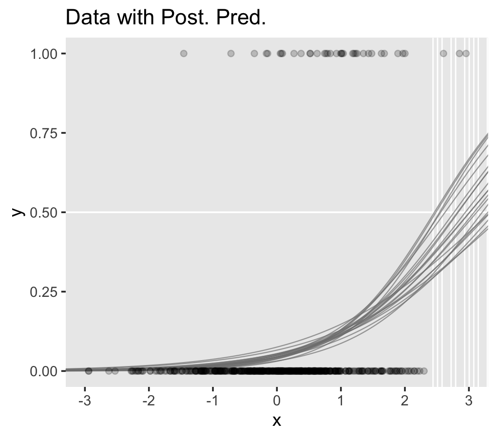

Here are the two subplots at the bottom, left.


```r
posterior_samples(fit21.3) %>% 
  transmute(Intercept = b_Intercept,
            x         = b_x) %>% 
  pivot_longer(everything()) %>% 
  
  ggplot(aes(x = value, y = 0)) +
  stat_histintervalh(point_interval = mode_hdi, .width = c(.95, .5),
                     fill = "grey67", slab_color = "grey92",
                     breaks = 40, slab_size = .25, outline_bars = T,
                     normalize = "panels") +
  scale_y_continuous(NULL, breaks = NULL) +
  xlab(NULL) +
  theme(panel.grid = element_blank()) +
  facet_wrap(~name, scales = "free", ncol = 2)
```


Since our data were simulated without the benefit of knowing how Kruschke set his seed and such, our results will only approximate those in the text.

Okay, now we need to simulate the complimentary data, those for which $y = 1$ is a less-rare event.


```r
b0 <- 0
b1 <- 1

n <- 500

set.seed(21)
d_not_rare <-
  tibble(x  = rnorm(n, mean = 0, sd = 1)) %>% 
  mutate(mu = b0 + b1 * x) %>% 
  mutate(y  = rbinom(n, size = 1, prob = 1 / (1 + exp(-mu))))

glimpse(d_not_rare)
```

```
## Observations: 500
## Variables: 3
## $ x  <dbl> 0.793013171, 0.522251264, 1.746222241, -1.271336123, 2.197389533, 0.433130777, -1.5701…
## $ mu <dbl> 0.793013171, 0.522251264, 1.746222241, -1.271336123, 2.197389533, 0.433130777, -1.5701…
## $ y  <int> 0, 0, 1, 0, 1, 1, 0, 0, 0, 1, 0, 1, 1, 1, 0, 1, 1, 1, 0, 0, 1, 1, 0, 1, 0, 0, 0, 0, 1,…
```

Fitting this model is just like before.


```r
fit21.4 <-
  update(fit21.3,
         newdata = d_not_rare,
         iter = 2500, warmup = 500, chains = 4, cores = 4,
         seed = 21,
         file = "fits/fit21.04")
```

Behold the summary.


```r
print(fit21.4)
```

```
##  Family: binomial 
##   Links: mu = logit 
## Formula: y | trials(1) ~ 1 + x 
##    Data: d_not_rare (Number of observations: 500) 
## Samples: 4 chains, each with iter = 2500; warmup = 500; thin = 1;
##          total post-warmup samples = 8000
## 
## Population-Level Effects: 
##           Estimate Est.Error l-95% CI u-95% CI Rhat Bulk_ESS Tail_ESS
## Intercept     0.08      0.10    -0.11     0.27 1.00     6945     5664
## x             0.91      0.11     0.69     1.13 1.00     6688     5234
## 
## Samples were drawn using sampling(NUTS). For each parameter, Bulk_ESS
## and Tail_ESS are effective sample size measures, and Rhat is the potential
## scale reduction factor on split chains (at convergence, Rhat = 1).
```

Here's the code for the main plot in Figure 21.5.b.


```r
nd <- tibble(x = seq(from = -3.5, to = 3.5, length.out = length))

set.seed(21)
f <-
  fitted(fit21.4,
         newdata = nd,
         summary = F,
         nsamples = n_iter) %>% 
  as_tibble() %>% 
  pivot_longer(everything(), 
               values_to = "y") %>% 
  mutate(x    = rep(nd$x, times = n_iter),
         iter = rep(1:n_iter, each = length))

thresholds <-
  f %>% 
  filter(y < .5) %>% 
  group_by(iter) %>% 
  filter(y == max(y))

p1 <-
  f %>%   
  ggplot(aes(x = x, y = y)) +
  geom_hline(yintercept = .5, color = "white") +
  geom_vline(xintercept = thresholds$x, color = "white", size = 2/5) +
  geom_line(aes(group = iter),
            color = "grey50", alpha = 2/3, size = 1/3) +
  geom_point(data = d_not_rare,
             aes(y = y),
             alpha = 1/5) +
  ggtitle("Data with Post. Pred.") +
  coord_cartesian(xlim = -3:3) +
  theme(panel.grid = element_blank())
```

Now make the two subplots at the bottom.


```r
p2 <-
  posterior_samples(fit21.4) %>% 
  transmute(Intercept = b_Intercept,
            x         = b_x) %>% 
  pivot_longer(everything()) %>% 
  
  ggplot(aes(x = value, y = 0)) +
  stat_histintervalh(point_interval = mode_hdi, .width = c(.95, .5),
                     fill = "grey67", slab_color = "grey92",
                     breaks = 40, slab_size = .25, outline_bars = T,
                     normalize = "panels") +
  scale_y_continuous(NULL, breaks = NULL) +
  xlab(NULL) +
  theme(panel.grid = element_blank()) +
  facet_wrap(~name, scales = "free", ncol = 2)
```

This time we'll combine them with **patchwork**.


```r
library(patchwork)

p3 <- plot_spacer()

p1 / (p2 + p3 + plot_layout(widths = c(2, 1))) +
  plot_layout(height = c(4, 1))
```


> You can see in Figure 21.5 that the estimate of the slope (and of the intercept) is more certain in the right panel than in the left panel. The 95% HDI on the slope, $\beta_1$, is much wider in the left panel than in the right panel, and you can see that the logistic curves in the left panel have greater variation in steepness than the logistic curves in the right panel. The analogous statements hold true for the intercept parameter.
>
> Thus, if you are doing an experimental study and you can manipulate the $x$ values, you will want to select $x$ values that yield about equal numbers of 0's and 1's for the $y$ values overall. If you are doing an observational study, such that you cannot control any independent variables, then you should be aware that the parameter estimates may be surprisingly ambiguous if your data have only a small proportion of 0's or 1's. (pp. 631--632)

### Correlated predictors.

"Another important cause of parameter uncertainty is correlated predictors. This issue was previously discussed at length, but the context of logistic regression provides novel illustration in terms of level contours" (p. 632).

As far as I can tell, Kruschke chose about $n = 200$ for the data in this example. After messing around with correlations for a bit, it seems $\rho_{x_1, x_2} = .975$ looks about right. To my knowledge, the best way to simulate multivariate Gaussian data with a particular correlation is with the [`MASS::mvrnorm()` function](https://www.rdocumentation.org/packages/MASS/versions/7.3-51.1/topics/mvrnorm). Since we'll be using standardized $x$-variables, we'll need to specify our $n$, the desired correlation matrix, and a vector of means. Then we'll be ready to do the actual simulation with `mvrnorm()`.


```r
n <- 200

# correlation matrix
s <- matrix(c(1, .975, 
              .975, 1), 
            nrow = 2, ncol = 2)

# mean vector
m <- c(0, 0)

# simulate
set.seed(21)
d <- 
  MASS::mvrnorm(n = n, mu = m, Sigma = s) %>%
  as_tibble() %>% 
  set_names(str_c("x", 1:2))
```

Let's confirm the correlation coefficient.


```r
cor(d)
```

```
##           x1        x2
## x1 1.0000000 0.9730091
## x2 0.9730091 1.0000000
```

Solid. Now we'll use the $\beta$ values from page 633 to simulate the data set by including our dichotomous criterion variable, `y`.


```r
b0 <- 0
b1 <- 1
b2 <- 1

set.seed(21)
d <-
  d %>% 
  mutate(mu = b0 + b1 * x1 + b2 * x2) %>% 
  mutate(y = rbinom(n, size = 1, prob = 1 / (1 + exp(-mu))))
```

Fit the model with the highly-correlated predictors.


```r
fit21.5 <-
  brm(data = d, 
      family = binomial,
      y | trials(1) ~ 1 + x1 + x2,
      prior = c(prior(normal(0, 2), class = Intercept),
                prior(normal(0, 2), class = b)),
      iter = 2500, warmup = 500, chains = 4, cores = 4,
      seed = 21,
      file = "fits/fit21.05")
```

Behold the summary.


```r
print(fit21.5)
```

```
##  Family: binomial 
##   Links: mu = logit 
## Formula: y | trials(1) ~ 1 + x1 + x2 
##    Data: d (Number of observations: 200) 
## Samples: 4 chains, each with iter = 2500; warmup = 500; thin = 1;
##          total post-warmup samples = 8000
## 
## Population-Level Effects: 
##           Estimate Est.Error l-95% CI u-95% CI Rhat Bulk_ESS Tail_ESS
## Intercept    -0.04      0.18    -0.39     0.31 1.00     4473     3670
## x1           -0.05      0.72    -1.45     1.35 1.00     3422     3386
## x2            2.07      0.78     0.61     3.64 1.00     3461     3472
## 
## Samples were drawn using sampling(NUTS). For each parameter, Bulk_ESS
## and Tail_ESS are effective sample size measures, and Rhat is the potential
## scale reduction factor on split chains (at convergence, Rhat = 1).
```

We did a good job recapturing Kruschke's $\beta$s in terms of our posterior means, but notice how large those posterior $SD$s are for $\beta_1$ and $\beta_2$. To get a better sense, let's look at them in a coefficient plot before continuing on with the text.


```r
posterior_samples(fit21.5) %>% 
  pivot_longer(-lp__) %>% 
  
  ggplot(aes(x = value, y = name)) +
  stat_gradientintervalh(point_interval = mode_hdi, .width = c(.5, .95), fill = "grey25") +
  labs(x = NULL, y = NULL) +
  theme(axis.text.y = element_text(hjust = 0),
        axis.ticks.y = element_blank(),
        panel.grid = element_blank())
```


Them are some sloppy estimates! But we digress. Here's our version of Figure 21.6.a.


```r
set.seed(21)  # we need this for the `sample_n()` function
posterior_samples(fit21.5) %>% 
  mutate(iter = 1:n()) %>% 
  sample_n(size = 20) %>% 
  expand(nesting(iter, b_Intercept, b_x1, b_x2),
         x1 = c(-4, 4)) %>% 
  # this follows the equation near the top of p. 629
  mutate(x2 = (-b_Intercept / b_x2) + (-b_x1 / b_x2) * x1) %>% 
  
  # now plot
  ggplot(aes(x = x1, y = x2)) +
  geom_line(aes(group = iter),
            color = "white", size = 2/5) +
  geom_text(data = d,
            aes(label = y, color = y == 1),
            size = 2.5) +
  scale_color_manual(values = c("red4", "blue4")) +
  ggtitle("Data with Post. Pred.") +
  coord_cartesian(xlim = -3:3,
                  ylim = -3:3) +
  theme(legend.position = "none", 
        panel.grid = element_blank())
```


It can be easy to under-appreciate how sensitive this plot is to the seed you set for `sample_n()`. To give a better sense of the uncertainty in the posterior for the threshold, here we show the plot for several different seeds.


```r
# make a custom function
different_seed <- function(i) {
  
  set.seed(i)
  posterior_samples(fit21.5) %>% 
  mutate(iter = 1:n()) %>% 
  sample_n(size = 20) %>% 
  expand(nesting(iter, b_Intercept, b_x1, b_x2),
         x1 = c(-4, 4)) %>% 
  mutate(x2 = (-b_Intercept / b_x2) + (-b_x1 / b_x2) * x1)
  
}

# specify your seeds
tibble(seed = 1:9) %>% 
  # pump those seeds into the `different_seed()` function
  mutate(sim = map(seed, different_seed)) %>% 
  unnest(sim) %>% 
  mutate(seed = str_c("seed: ", seed)) %>% 
  
  # plot
  ggplot(aes(x = x1, y = x2)) +
  geom_line(aes(group = iter),
            color = "white", size = 1/3) +
  geom_text(data = d,
            aes(label = y, color = y == 1),
            size = 1.5) +
  scale_color_manual(values = c("red4", "blue4")) +
  ggtitle("Data with Post. Pred.") +
  coord_cartesian(xlim = -3:3,
                  ylim = -3:3) +
  theme(legend.position = "none",
        panel.grid = element_blank()) +
  facet_wrap(~seed)
```

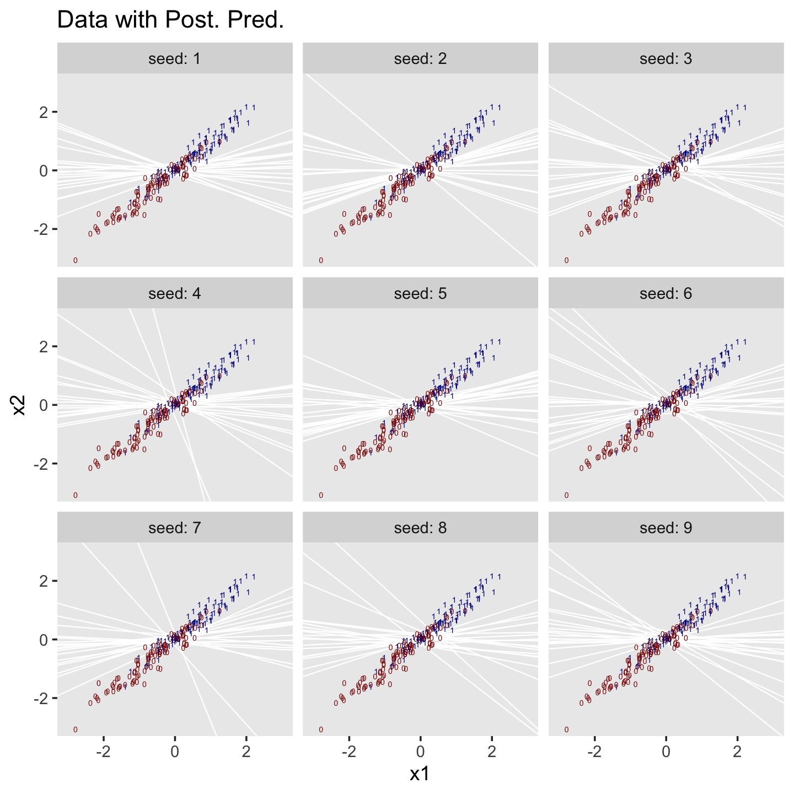

We'll use `pairs()` to make our version of Figure 21.6.b.


```r
pairs(fit21.5,
      off_diag_args = list(size = 1/5, alpha = 1/5))
```

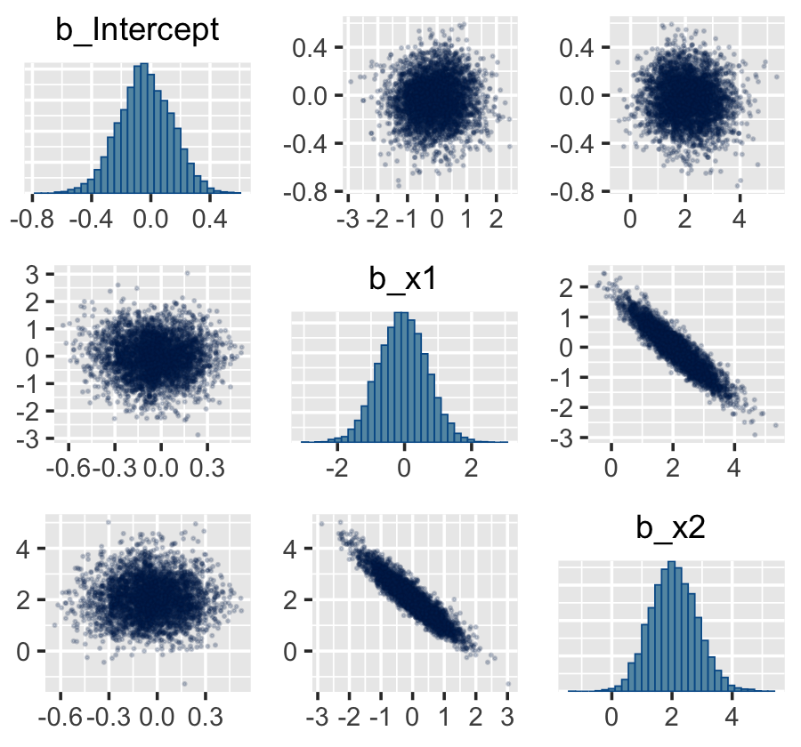

Finally, here are the Pearson's correlations among the model parameters.


```r
vcov(fit21.5, correlation = T) %>%
  round(digits = 3)
```

```
##           Intercept     x1     x2
## Intercept     1.000  0.010 -0.028
## x1            0.010  1.000 -0.928
## x2           -0.028 -0.928  1.000
```

### Interaction of metric predictors.

"There may be applications in which it is meaningful to consider a multiplicative interaction of metric predictors" (p. 633). Kruschke didn't walk through an analysis in this section, but it's worth the practice. Let's simulate data based on the formula he gave in Figure 21.7, top right.


```r
n  <- 500

b0 <- 0
b1 <- 0
b2 <- 0
b3 <- 4

set.seed(21)
d <-
  tibble(x1 = rnorm(n, mean = 0, sd = 1),
         x2 = rnorm(n, mean = 0, sd = 1)) %>% 
  mutate(mu = b1 * x1 + b2 * x2 + b3 * x1 * x2 - b0) %>% 
  mutate(y = rbinom(n, size = 1, prob = 1 / (1 + exp(-mu))))
```

To fit the interaction model, let's go back to the Bernoulli likelihood.


```r
fit21.6 <-
  brm(data = d, 
      family = bernoulli,
      y ~ 1 + x1 + x2 + x1:x2,
      prior = c(prior(normal(0, 2), class = Intercept),
                prior(normal(0, 2), class = b)),
      iter = 2500, warmup = 500, chains = 4, cores = 4,
      seed = 21,
      file = "fits/fit21.06")
```

Looks like the model did a nice job recapturing the data-generating parameters.


```r
print(fit21.6)
```

```
##  Family: bernoulli 
##   Links: mu = logit 
## Formula: y ~ 1 + x1 + x2 + x1:x2 
##    Data: d (Number of observations: 500) 
## Samples: 4 chains, each with iter = 2500; warmup = 500; thin = 1;
##          total post-warmup samples = 8000
## 
## Population-Level Effects: 
##           Estimate Est.Error l-95% CI u-95% CI Rhat Bulk_ESS Tail_ESS
## Intercept    -0.18      0.12    -0.42     0.06 1.00     9164     6145
## x1           -0.21      0.17    -0.53     0.11 1.00     9497     6131
## x2           -0.02      0.16    -0.35     0.30 1.00     8567     5382
## x1:x2         4.27      0.44     3.44     5.15 1.00     7391     5543
## 
## Samples were drawn using sampling(NUTS). For each parameter, Bulk_ESS
## and Tail_ESS are effective sample size measures, and Rhat is the potential
## scale reduction factor on split chains (at convergence, Rhat = 1).
```

I'm not quite sure how to expand Kruschke's equation from the top of page 629 to our interaction model. But no worries. We can take a slightly different approach to show the consequences of our interaction model on the probability $y = 1$. First, we define our `newdata` and then get the `Estimate`s from `fitted()`. Then we wrangle as usual.


```r
length <- 100

nd <- 
  crossing(x1 = seq(from = -3.5, to = 3.5, length.out = length),
           x2 = seq(from = -3.5, to = 3.5, length.out = length))

f <-
  fitted(fit21.6,
         newdata = nd,
         scale = "linear") %>% 
  as_tibble() %>% 
  transmute(prob = Estimate %>% inv_logit_scaled())
```

Now all we have to do is integrate our `f` results with the `nd` and original `d` data and then we can plot.


```r
f %>% 
  bind_cols(nd) %>% 
  
  ggplot(aes(x = x1, y = x2)) +
  geom_raster(aes(fill = prob),
              interpolate = T) +
  geom_text(data = d,
            aes(label = y, color = y == 1),
            size = 2.75, show.legend = F) +
  scale_color_manual(values = c("white", "black")) +
  scale_fill_viridis_c(expression(italic(p)(italic(y)==1)), 
                       option = "A", begin = .15, limits = c(0, 1)) +
  scale_x_continuous(expand = c(0, 0)) +
  scale_y_continuous(expand = c(0, 0)) +
  coord_cartesian(xlim = range(nd$x1),
                  ylim = range(nd$x2))
```


Instead of a simple threshold line, we get to visualize our interaction as a checkerboard-like probability plane.

## Robust logistic regression

With the robust logistic regression approach,

> we will describe the data as being a mixture of two different sources. One source is the logistic function of the predictor(s). The other source is sheer randomness or "guessing," whereby the $y$ value comes from the flip of a fair coin: $y \sim \operatorname{Bernoulli} (\mu = 1/2)$. We suppose that every data point has a small chance, $\alpha$, of being generated by the guessing process, but usually, with probability $1 - \alpha$, the $y$ value comes from the logistic function of the predictor. With the two sources combined, the predicted probability that $y = 1$ is
>
> $$\mu = \alpha \cdot \frac{1}{2} + (1 - \alpha) \cdot \operatorname{logistic} \bigg ( \beta_0  + \sum_j \beta_j x_j \bigg )$$
>
> Notice that when the guessing coefficient is zero, then the conventional logistic model is completely recovered. When the guessing coefficient is one, then the y values are completely random. (p. 635)

Here's what Kruschke's `beta(1, 9)` prior for $\alpha$ looks like.


```r
tibble(x = seq(from = 0, to = 1, length.out = 200)) %>% 
  
  ggplot(aes(x = x)) +
  # check out this `ymax` trick?
  geom_ribbon(aes(ymin = 0, ymax = dbeta(x, 1, 9)),
              size = 0, fill = "grey50") +
  scale_y_continuous(NULL, breaks = NULL) +
  labs(title = expression("beta"*(1*", "*9)), 
       x = NULL) +
  theme(panel.grid = element_blank())
```


To fit the **brms** analogue to Kruschke's rogust logistic regression model, we'll need to adopt what  Bürkner calls the non-linear syntax, which you can learn about in detail with his vignette, [*Estimating Non-Linear Models with brms*](https://cran.r-project.org/web/packages/brms/vignettes/brms_nonlinear.html).


```r
fit21.7 <-
  brm(data = my_data, 
      family = bernoulli(link = identity),
      bf(male ~ a * .5 + (1 - a) * 1 / (1 + exp(-1 * (b0 + b1 * weight_z))),
         a + b0 + b1  ~ 1,
         nl = TRUE),
      prior = c(prior(normal(0, 2), nlpar = "b0"),
                prior(normal(0, 2), nlpar = "b1"),
                prior(beta(1, 9),   nlpar = "a")),
      iter = 2500, warmup = 500, chains = 4, cores = 4,
      seed = 21,
      file = "fits/fit21.07")
```

And just for clarity, you can do the same thing with `family = binomial(link = identity)`, too. Just don't forget to specify the number of trials with `trials()`. But to explain what's going on with our syntax, above, I think it's best to quote Bürkner at length:

> When looking at the above code, the first thing that becomes obvious is that we changed the `formula` syntax to display the non-linear formula including predictors (i.e., [`weight_z`]) and parameters (i.e., [`a`, `b0`, and `b1`]) wrapped in a call to [the `bf()` function]. This stands in contrast to classical **R** formulas, where only predictors are given and parameters are implicit. The argument [`a + b0 + b1 ~ 1`] serves two purposes. First, it provides information, which variables in `formula` are parameters, and second, it specifies the linear predictor terms for each parameter. In fact, we should think of non-linear parameters as placeholders for linear predictor terms rather than as parameters themselves (see also the following examples). In the present case, we have no further variables to predict [`a`,  `b0`, and `b1`] and thus we just fit intercepts that represent our estimates of [$\alpha$, $\beta_0$, and  $\beta_1$]. The formula [`a + b0 + b1 ~ 1`] is a short form of [`a ~ 1, b0 ~ 1, b1 ~ 1`] that can be used if multiple non-linear parameters share the same formula. Setting `nl = TRUE` tells **brms** that the formula should be treated as non-linear.
>
> In contrast to generalized linear models, priors on population-level parameters (i.e., 'fixed effects') are often mandatory to identify a non-linear model. Thus, **brms** requires the user to explicitely specify these priors. In the present example, we used a [`beta(1, 9)` prior on (the population-level intercept of) `a`, while we used a `normal(0, 4)` prior on both (population-level intercepts of) `b0` and `b1`]. Setting priors is a non-trivial task in all kinds of models, especially in non-linear models, so you should always invest some time to think of appropriate priors. Quite often, you may be forced to change your priors after fitting a non-linear model for the first time, when you observe different MCMC chains converging to different posterior regions. This is a clear sign of an idenfication problem and one solution is to set stronger (i.e., more narrow) priors. (**emphasis** in the original)
 
Now, behold the summary.


```r
print(fit21.7)
```

```
## Warning: There were 632 divergent transitions after warmup. Increasing adapt_delta above 0.8 may help.
## See http://mc-stan.org/misc/warnings.html#divergent-transitions-after-warmup
```

```
##  Family: bernoulli 
##   Links: mu = identity 
## Formula: male ~ a * 0.5 + (1 - a) * 1/(1 + exp(-1 * (b0 + b1 * weight_z))) 
##          a ~ 1
##          b0 ~ 1
##          b1 ~ 1
##    Data: my_data (Number of observations: 110) 
## Samples: 4 chains, each with iter = 2500; warmup = 500; thin = 1;
##          total post-warmup samples = 8000
## 
## Population-Level Effects: 
##              Estimate Est.Error l-95% CI u-95% CI Rhat Bulk_ESS Tail_ESS
## a_Intercept      0.20      0.09     0.04     0.39 1.00     2541     2843
## b0_Intercept     0.34      0.45    -0.41     1.39 1.00     3505     3195
## b1_Intercept     2.64      0.87     1.14     4.53 1.00     2539     3349
## 
## Samples were drawn using sampling(NUTS). For each parameter, Bulk_ESS
## and Tail_ESS are effective sample size measures, and Rhat is the potential
## scale reduction factor on split chains (at convergence, Rhat = 1).
```

It turns out Bürkner's warning on "different posterior regions" applied to our case. While preparing this document, I played around with higher `adapt_delta` values, as suggested in the warning message. The model showed problems even at `adapt_delta = 0.999`. Here, our main purpose is to ape Kruschke. But if this was a substantive model of interest, I'd suggest following Bürkner's advice and think hard about specifying narrower priors.

Anyway, here's a quick and dirty look at the conditional effects for `weight_z`.


```r
conditional_effects(fit21.7) %>% 
  plot(points = T)
```


The way we prep for our version of Figure 21.8 is just the same as what we did for Figure 21.3, above.


```r
length <- 200

nd <- tibble(weight_z = seq(from = -2, to = 3.5, length.out = length))

f <-
  fitted(fit21.7,
         newdata = nd,
         summary = F,
         nsamples = n_iter) %>% 
  as_tibble() %>% 
  mutate(iter = 1:n_iter) %>% 
  pivot_longer(-iter) %>% 
  mutate(weight_z = rep(nd$weight_z, times = n_iter)) %>% 
  mutate(weight   = weight_z * sd(my_data$weight) + mean(my_data$weight))

thresholds <-
  f %>% 
  filter(value < .5) %>% 
  group_by(iter) %>% 
  filter(value == max(value))
```

Now make the top panel.


```r
p1 <-
  f %>% 
  ggplot(aes(x = weight, y = value)) +
  geom_hline(yintercept = .5, color = "white", size = 1/2) +
  geom_vline(xintercept = thresholds$weight, color = "white", size = 2/5) +
  geom_line(aes(group = iter),
            color = "grey50", size = 1/3, alpha = 2/3) +
  geom_point(data = my_data,
             aes(y = male),
             alpha = 1/3) +
  labs(title = "Data with Post. Pred.", 
       y = "male") +
  coord_cartesian(xlim = range(my_data$weight)) +
  theme(panel.grid = element_blank())
```

Here we make the marginal-distribution plots for our versions of the lower panels of Figure 21.8.


```r
p2 <-
  posterior_samples(fit21.7) %>% 
  transmute(Intercept = b_b0_Intercept - (b_b1_Intercept * mean(my_data$weight) / sd(my_data$weight)),
            weight    = b_b1_Intercept / sd(my_data$weight),
            guessing  = b_a_Intercept) %>% 
  pivot_longer(everything()) %>% 
  mutate(name = factor(name, levels = c("Intercept", "weight", "guessing"))) %>% 
  
  ggplot(aes(x = value, y = 0)) +
  stat_histintervalh(point_interval = mode_hdi, .width = c(.95, .5),
                     fill = "grey67", slab_color = "grey92",
                     breaks = 40, slab_size = .25, outline_bars = T,
                     normalize = "panels") +
  scale_y_continuous(NULL, breaks = NULL) +
  xlab(NULL) +
  theme(panel.grid = element_blank()) +
  facet_wrap(~name, scales = "free", ncol = 3)
```

Now combine them with **patchwork** and behold the glory.


```r
p1 / p2 +
  plot_layout(height = c(4, 1))
```

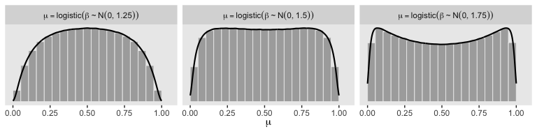

Here are the `pairs()` plots.


```r
pairs(fit21.7,
      off_diag_args = list(size = 1/5, alpha = 1/5))
```


Look at how that sweet Stan-based HMC reduced the correlation between $\beta_0$ and $\beta_1$.

For more on this approach to robust logistic regression in **brms** and an alternative suggested by Andrew Gelman, check out a thread from the Stan Forums, [*Translating robust logistic regression from rstan to brms*](https://discourse.mc-stan.org/t/translating-robust-logistic-regression-from-rstan-to-brms/5244).

## Nominal predictors

"We now turn our attention from metric predictors to nominal predictors" (p. 636).

### Single group.

If we have just a single group and no other predictors, that's just an intercept-only model. Back in the earlier chapters we thought of such a model as

\begin{align*}
y & \sim \operatorname{Bernoulli} (\theta) \\
\theta & \sim \operatorname{dbeta} (a, b).
\end{align*}

Now we're expressing the model as

\begin{align*}
y   & \sim \operatorname{Bernoulli} (\mu) \\
\mu & \sim \operatorname{logistic} (\beta_0).
\end{align*}

For that $\beta_0$, we typically use a Gaussian prior of the form

$$\beta_0 \sim \operatorname{Normal} (M_0, S_0).$$

In a situation where we don't have strong prior substantive knowledge, we often set $M_0 = 0$, which puts the probability mass around $\theta = .5$, a reasonable default hypothesis. Often times $S_0$ is some modest single-digit integer like 2 or 4. To get a sense of how different Gaussians translate to the beta distribution, we'll recreate Figure 21.11.


```r
# this will help streamline the conversion
logistic <- function(x) {
  1 / (1 + exp(-x))
}

# wrangle
crossing(m_0 = 0:1,
         s_0 = c(.5, 1, 2)) %>% 
  mutate(key = str_c("mu == logistic(beta %~%", " N(", m_0, ", ", s_0, "))"),
         sim = pmap(list(2e6, m_0, s_0), rnorm)) %>% 
  unnest(sim) %>% 
  mutate(sim = logistic(sim)) %>% 
  
  # plot
  ggplot(aes(x = sim,
             y = ..density..)) +
  geom_histogram(color = "grey92", fill = "grey67",
                 size = 1/3, bins = 20, boundary = 0) +
  geom_line(stat = "density", size = 3/4) +
  scale_y_continuous(NULL, breaks = NULL) +
  xlab(expression(mu)) +
  theme(panel.grid = element_blank()) +
  facet_wrap(~key, scales = "free_y", labeller = label_parsed)
```

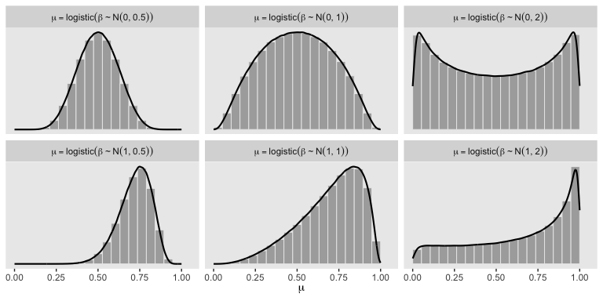

So the prior distribution doesn't even flatten out until you're somewhere between $S_0 = 1$ and $S_0 = 2$. Just for kicks, here we break that down a little further.


```r
# wrangle
tibble(m_0 = 0,
       s_0 = c(1.25, 1.5, 1.75)) %>% 
  mutate(key = str_c("mu == logistic(beta %~%", " N(", m_0, ", ", s_0, "))"),
         sim = pmap(list(1e7, m_0, s_0), rnorm)) %>% 
  unnest(sim) %>% 
  mutate(sim = logistic(sim)) %>% 
  
  # plot
  ggplot(aes(x = sim,
             y = ..density..)) +
  geom_histogram(color = "grey92", fill = "grey67",
                 size = 1/3, bins = 20, boundary = 0) +
  geom_line(stat = "density", size = 3/4) +
  scale_y_continuous(NULL, breaks = NULL) +
  xlab(expression(mu)) +
  theme(panel.grid = element_blank()) +
  facet_wrap(~key, scales = "free_y", labeller = label_parsed, ncol = 3)
```

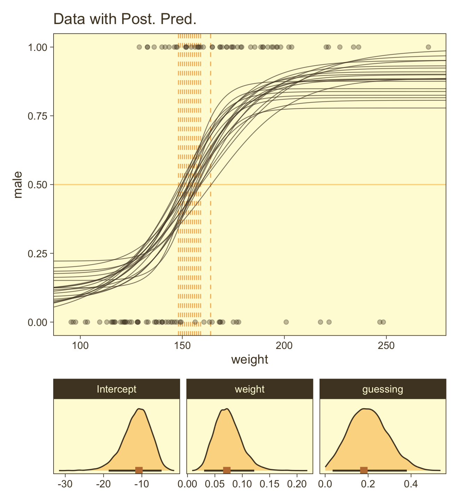

Here's the basic **brms** analogue to Kruschke's JAGS code from the bottom of page 639.


```r
fit <-
  brm(data = my_data, 
      family = bernoulli(link = identity),
      y ~ 1,
      prior(beta(1, 1), class = Intercept))
```

Here's the **brms** analogue to Kruschke's JAGS code at the top of page 641.


```r
fit <-
  brm(data = my_data, 
      family = bernoulli,
      y ~ 1,
      prior(normal(0, 2), class = "Intercept"))
```

### Multiple groups.

If there's only one group, we don't need a grouping variable. But that's a special case. Now we show the more general approach with multiple groups.

#### Example: Baseball again.

Load the baseball data.


```r
my_data <- read_csv("data.R/BattingAverage.csv")

glimpse(my_data)
```

```
## Observations: 948
## Variables: 6
## $ Player       <chr> "Fernando Abad", "Bobby Abreu", "Tony Abreu", "Dustin Ackley", "Matt Adams",…
## $ PriPos       <chr> "Pitcher", "Left Field", "2nd Base", "2nd Base", "1st Base", "Pitcher", "Pit…
## $ Hits         <dbl> 1, 53, 18, 137, 21, 0, 0, 2, 150, 167, 0, 128, 66, 3, 1, 81, 180, 36, 150, 0…
## $ AtBats       <dbl> 7, 219, 70, 607, 86, 1, 1, 20, 549, 576, 1, 525, 275, 12, 8, 384, 629, 158, …
## $ PlayerNumber <dbl> 1, 2, 3, 4, 5, 6, 7, 8, 9, 10, 11, 12, 13, 14, 15, 16, 17, 18, 19, 20, 21, 2…
## $ PriPosNumber <dbl> 1, 7, 4, 4, 3, 1, 1, 3, 3, 4, 1, 5, 4, 2, 7, 4, 6, 8, 9, 1, 2, 5, 1, 1, 7, 2…
```

#### The model.

I'm not aware that Kruschke's modeling approach, here, will work well within the **brms** paradigm. I suggest we fit a simple hierarchical logistic regression model, instead. With this approach, we use the statistical model

\begin{align*}
\text{Hits}_i               & \sim \operatorname{Binomial} (\text{AtBats}_i, p_i) \\
\operatorname{logit} (p_i)  & = \beta_0 + \beta_{\text{PriPos}_i} + \beta_{\text{PriPos:Player}_i} \\
\beta_0                     & \sim \operatorname{Normal} (0, 2) \\
\beta_\text{PriPos}         & \sim \operatorname{Normal} (0, \sigma_\text{PriPos}) \\
\beta_\text{PriPos:Player}  & \sim \operatorname{Normal} (0, \sigma_\text{PriPos:Player}) \\
\sigma_\text{PriPos}        & \sim \operatorname{HalfCauchy} (0, 1) \\
\sigma_\text{PriPos:Player} & \sim \operatorname{HalfCauchy} (0, 1).
\end{align*}

Here's how to fit the model with **brms**. Notice we're finally making good use of the `trials()` syntax. This is because we're fitting an aggregated binomial model. Instead of our criterion variable `Hits` being a vector of 0's and 1's, it's the number of successful trials given the total number of trials, which is listed in the `AtBats` vector. Aggregated binomial.


```r
fit21.8 <-
  brm(data = my_data,
      family = binomial(link = "logit"),
      Hits | trials(AtBats) ~ 1 + (1 | PriPos) + (1 | PriPos:Player),
      prior = c(prior(normal(0, 2), class = Intercept),
                prior(cauchy(0, 1), class = sd)),
      iter = 2500, warmup = 500, chains = 4, cores = 4,
      seed = 21,
      file = "fits/fit21.08")
```

#### Results.

Before we start plotting, review the model summary.


```r
print(fit21.8)
```

```
##  Family: binomial 
##   Links: mu = logit 
## Formula: Hits | trials(AtBats) ~ 1 + (1 | PriPos) + (1 | PriPos:Player) 
##    Data: my_data (Number of observations: 948) 
## Samples: 4 chains, each with iter = 2500; warmup = 500; thin = 1;
##          total post-warmup samples = 8000
## 
## Group-Level Effects: 
## ~PriPos (Number of levels: 9) 
##               Estimate Est.Error l-95% CI u-95% CI Rhat Bulk_ESS Tail_ESS
## sd(Intercept)     0.32      0.10     0.19     0.57 1.00     2590     3901
## 
## ~PriPos:Player (Number of levels: 948) 
##               Estimate Est.Error l-95% CI u-95% CI Rhat Bulk_ESS Tail_ESS
## sd(Intercept)     0.14      0.01     0.12     0.15 1.00     3978     5910
## 
## Population-Level Effects: 
##           Estimate Est.Error l-95% CI u-95% CI Rhat Bulk_ESS Tail_ESS
## Intercept    -1.17      0.11    -1.40    -0.94 1.00     1696     2634
## 
## Samples were drawn using sampling(NUTS). For each parameter, Bulk_ESS
## and Tail_ESS are effective sample size measures, and Rhat is the potential
## scale reduction factor on split chains (at convergence, Rhat = 1).
```

If you look closely at our model versus the one in the text, you'll see ours has fewer parameters. As a down-the-line consequence, our model doesn't support a direct analogue to the plot at the top of Figure 21.13. However, we can come close. Rather than modeling the position-based probabilities as multiple draws of beta distributions, we can simply summarize our probabilities by their posterior distributions. 


```r
library(ggridges)

# define our new data, `nd`
nd <- 
  my_data %>% 
  group_by(PriPos) %>% 
  summarise(AtBats = mean(AtBats) %>% round(0))

# push the model through `fitted()` and wrangle
fitted(fit21.8,
       newdata = nd,
       re_formula = Hits | trials(AtBats) ~ 1 + (1 | PriPos),
       scale = "linear",
       summary = F) %>% 
  as_tibble() %>% 
  gather() %>% 
  transmute(probability = inv_logit_scaled(value)) %>% 
  bind_cols(expand(nd, PriPos, iter = 1:8000)) %>% 
  
  # plot
  ggplot(aes(x = probability, y = PriPos)) +
  geom_vline(xintercept = fixef(fit21.8)[1] %>% inv_logit_scaled(), color = "white") +
  geom_density_ridges(size = 0, fill = "grey67", scale = .9) +
  geom_jitter(data = my_data,
              aes(x = Hits / AtBats),
              height = .025, alpha = 1/6, size = 1/6) +
  coord_cartesian(xlim = 0:1,
                  ylim = c(1, 9.5)) +
  labs(title = "Data with Posterior Predictive Distrib.",
       x = "Hits / AtBats") +
  theme(axis.text.y = element_text(hjust = 0),
        axis.ticks.y = element_blank(),
        panel.grid = element_blank())
```


For kicks and giggles, we depicted the grand mean probability as the white vertical line in the background with the `geom_vline()` line.

However, we can make our plot more directly analogous to Kruschke's if we're willing to stretch a little. Recall that Kruschke used the beta distribution with the $\omega-\kappa$ parameterization in both his statistical model and his plot code—both of which you can find detailed in his `Jags-Ybinom-Xnom1fac-Mlogistic.R`. file. We didn't use the beta distribution in our `brm()` model and the parameters from that model didn't have as direct correspondences to the beta distribution the way those from Kruschke’s JAGS model did. However, recall that we can re-parameterize the beta distribution in terms of its mean $\mu$ and sample size $n$, folowing the form

\begin{align*}
\alpha & = \mu n \\
\beta  & = (1 - \mu) n .
\end{align*}

When we take the inverse logit of our intercepts, we do get vales in a probability metric. We might consider inserting those probabilities into the $\mu$ parameter. Furthermore, we can take our `AtBats` sample sizes and insert them directly into $n$. As before, we'll use the average sample size per position.


```r
# wrangle like a boss
nd %>% 
  add_fitted_draws(fit21.8, 
                   n = 20,
                   re_formula = Hits | trials(AtBats) ~ 1 + (1 | PriPos),
                   dpar = c("mu")) %>% 
  # use the equations from above
  mutate(alpha = mu * AtBats, 
         beta  = (1 - mu) * AtBats) %>% 
  mutate(ll = qbeta(.025, shape1 = alpha, shape2 = beta),
         ul = qbeta(.975, shape1 = alpha, shape2 = beta)) %>% 
  mutate(theta = map2(ll, ul, seq, length.out = 100)) %>% 
  unnest(theta) %>% 
  mutate(density = dbeta(theta, alpha, beta)) %>% 
  group_by(.draw) %>% 
  mutate(density = density / max(density)) %>% 
  
  # plot!
  ggplot(aes(y = PriPos)) +
  geom_ridgeline(aes(x = theta, height = -density, group = interaction(PriPos, .draw)),
                 fill = NA, color = adjustcolor("grey50", alpha.f = 1/3),
                 size = 1/4, scale = 3/4, min_height = NA) +
  geom_jitter(data = my_data,
              aes(x = Hits / AtBats, size = AtBats),
              height = .05, alpha = 1/6, shape = 1) +
  scale_size_continuous(range = c(1/4, 4)) +
  labs(title = "Data with Posterior Predictive Distrib.",
       x = "Hits / AtBats",
       y = NULL) +
  coord_flip(ylim = c(0.67, 8.67)) +
  theme(axis.text.x = element_text(angle = 90, hjust = 1),
        axis.ticks.x = element_blank(),
        legend.background = element_rect(fill = "transparent", color = "white"),
        legend.key = element_rect(fill = "transparent", color = "transparent"),
        legend.position = c(.956, .8),
        panel.grid = element_blank())
```


Since we didn't actually presume the beta distribution anywhere in our `brm()` statistical model, *I would not attempt to present this workflow in a scientific outlet*. Go with the previous plot. This attempt seems dishonest. But it is kinda fun to see how far we can push our results.

Happily, our contrasts will be less contentious. Here's the initial wrangling.


```r
# define our subset of positions
positions <- c("1st Base", "Catcher", "Pitcher")

# redefine `nd`
nd <- 
  my_data %>% 
  filter(PriPos %in% positions) %>% 
  group_by(PriPos) %>% 
  summarise(AtBats = mean(AtBats) %>% round(0))

# push the model through `fitted()` and wrangle
f <-
  fitted(fit21.8,
         newdata = nd,
         re_formula = Hits | trials(AtBats) ~ 1 + (1 | PriPos),
         scale = "linear",
         summary = F) %>% 
  as_tibble() %>% 
  set_names(positions)

# what did we do?
head(f)
```

```
## # A tibble: 6 x 3
##   `1st Base` Catcher Pitcher
##        <dbl>   <dbl>   <dbl>
## 1      -1.12   -1.12   -1.92
## 2      -1.09   -1.14   -1.91
## 3      -1.07   -1.13   -1.89
## 4      -1.07   -1.13   -1.90
## 5      -1.05   -1.17   -1.91
## 6      -1.10   -1.17   -1.89
```

Here we make are our versions of the middle two panels of Figure 21.13.


```r
p1 <-
  f %>% 
  # compute the differences and put the data in the long format
  transmute(`Pitcher vs. Catcher`  = Pitcher - Catcher,
            `Catcher vs. 1st Base` = Catcher - `1st Base`) %>% 
  pivot_longer(everything()) %>% 
  mutate(name = factor(name, levels = c("Pitcher vs. Catcher", "Catcher vs. 1st Base"))) %>% 
  
  ggplot(aes(x = value, y = 0)) +
  geom_vline(xintercept = 0, color = "white") +
  stat_histintervalh(point_interval = mode_hdi, .width = c(.95, .5),
                     fill = "grey67", slab_color = "grey92",
                     breaks = 40, slab_size = .2, outline_bars = T,
                     normalize = "panels") +
  scale_y_continuous(NULL, breaks = NULL) +
  xlab("Difference (in b)") +
  theme(panel.grid = element_blank()) +
  facet_wrap(~name, scales = "free", ncol = 2)
```

Now make our versions of the bottom two panels of Figure 21.13.


```r
p2 <-
  f %>% 
  # do the transformation before computing the differences
  mutate_all(inv_logit_scaled) %>% 
  transmute(`Pitcher vs. Catcher`  = Pitcher - Catcher,
            `Catcher vs. 1st Base` = Catcher - `1st Base`) %>% 
  pivot_longer(everything()) %>% 
  mutate(name = factor(name, levels = c("Pitcher vs. Catcher", "Catcher vs. 1st Base"))) %>% 
  
  ggplot(aes(x = value, y = 0)) +
  geom_vline(xintercept = 0, color = "white") +
  stat_histintervalh(point_interval = mode_hdi, .width = c(.95, .5),
                     fill = "grey67", slab_color = "grey92",
                     breaks = 40, slab_size = .2, outline_bars = T,
                     normalize = "panels") +
  scale_y_continuous(NULL, breaks = NULL) +
  xlab("Difference (in probability)") +
  theme(panel.grid = element_blank()) +
  facet_wrap(~name, scales = "free", ncol = 2)
```

Combine and plot.


```r
p1 / p2
```

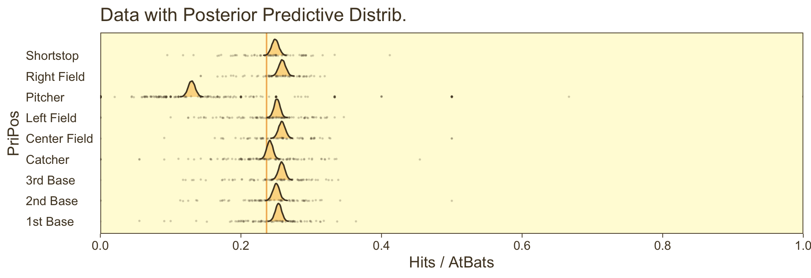

Note how our distributions are described as differences in probability, rather than in $\omega$.

## Reference {-}

[Kruschke, J. K. (2015). *Doing Bayesian data analysis, Second Edition: A tutorial with R, JAGS, and Stan.* Burlington, MA: Academic Press/Elsevier.](https://sites.google.com/site/doingbayesiandataanalysis/)

## Session info {-}


```r
sessionInfo()
```

```
## R version 3.6.2 (2019-12-12)
## Platform: x86_64-apple-darwin15.6.0 (64-bit)
## Running under: macOS High Sierra 10.13.6
## 
## Matrix products: default
## BLAS:   /Library/Frameworks/R.framework/Versions/3.6/Resources/lib/libRblas.0.dylib
## LAPACK: /Library/Frameworks/R.framework/Versions/3.6/Resources/lib/libRlapack.dylib
## 
## locale:
## [1] en_US.UTF-8/en_US.UTF-8/en_US.UTF-8/C/en_US.UTF-8/en_US.UTF-8
## 
## attached base packages:
## [1] stats     graphics  grDevices utils     datasets  methods   base     
## 
## other attached packages:
##  [1] ggridges_0.5.2       patchwork_1.0.0      tidybayes_2.0.1.9000 brms_2.11.5         
##  [5] Rcpp_1.0.3           ggExtra_0.9          forcats_0.4.0        stringr_1.4.0       
##  [9] dplyr_0.8.4          purrr_0.3.3          readr_1.3.1          tidyr_1.0.2         
## [13] tibble_2.1.3         ggplot2_3.2.1        tidyverse_1.3.0     
## 
## loaded via a namespace (and not attached):
##   [1] colorspace_1.4-1          ellipsis_0.3.0            rsconnect_0.8.16         
##   [4] markdown_1.1              base64enc_0.1-3           fs_1.3.1                 
##   [7] rstudioapi_0.10           farver_2.0.3              rstan_2.19.2             
##  [10] svUnit_0.7-12             DT_0.11                   fansi_0.4.1              
##  [13] mvtnorm_1.0-12            lubridate_1.7.4           xml2_1.2.2               
##  [16] bridgesampling_0.8-1      knitr_1.26                shinythemes_1.1.2        
##  [19] bayesplot_1.7.1           jsonlite_1.6.1            broom_0.5.3              
##  [22] dbplyr_1.4.2              shiny_1.4.0               compiler_3.6.2           
##  [25] httr_1.4.1                backports_1.1.5           assertthat_0.2.1         
##  [28] Matrix_1.2-18             fastmap_1.0.1             lazyeval_0.2.2           
##  [31] cli_2.0.1                 later_1.0.0               htmltools_0.4.0          
##  [34] prettyunits_1.1.1         tools_3.6.2               igraph_1.2.4.2           
##  [37] coda_0.19-3               gtable_0.3.0              glue_1.3.1               
##  [40] reshape2_1.4.3            cellranger_1.1.0          vctrs_0.2.2              
##  [43] nlme_3.1-142              crosstalk_1.0.0           xfun_0.12                
##  [46] ps_1.3.0                  rvest_0.3.5               mime_0.8                 
##  [49] miniUI_0.1.1.1            lifecycle_0.1.0           gtools_3.8.1             
##  [52] MASS_7.3-51.4             zoo_1.8-7                 scales_1.1.0             
##  [55] colourpicker_1.0          hms_0.5.3                 promises_1.1.0           
##  [58] Brobdingnag_1.2-6         parallel_3.6.2            inline_0.3.15            
##  [61] shinystan_2.5.0           yaml_2.2.1                gridExtra_2.3            
##  [64] loo_2.2.0                 StanHeaders_2.19.0        stringi_1.4.5            
##  [67] highr_0.8                 dygraphs_1.1.1.6          pkgbuild_1.0.6           
##  [70] rlang_0.4.4               pkgconfig_2.0.3           matrixStats_0.55.0       
##  [73] HDInterval_0.2.0          evaluate_0.14             lattice_0.20-38          
##  [76] rstantools_2.0.0          htmlwidgets_1.5.1         labeling_0.3             
##  [79] tidyselect_1.0.0          processx_3.4.1            plyr_1.8.5               
##  [82] magrittr_1.5              R6_2.4.1                  generics_0.0.2           
##  [85] DBI_1.1.0                 pillar_1.4.3              haven_2.2.0              
##  [88] withr_2.1.2               xts_0.12-0                abind_1.4-5              
##  [91] modelr_0.1.5              crayon_1.3.4              arrayhelpers_1.0-20160527
##  [94] utf8_1.1.4                rmarkdown_2.0             grid_3.6.2               
##  [97] readxl_1.3.1              callr_3.4.1               threejs_0.3.3            
## [100] reprex_0.3.0              digest_0.6.23             xtable_1.8-4             
## [103] httpuv_1.5.2              stats4_3.6.2              munsell_0.5.0            
## [106] viridisLite_0.3.0         shinyjs_1.1
```


