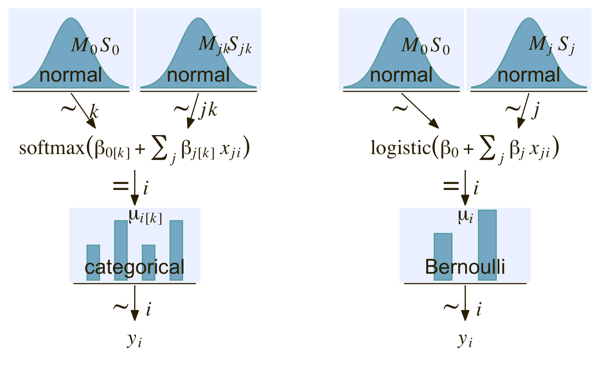

# Nominal Predicted Variable

> This chapter considers data structures that have a nominal predicted variable. When the nominal predicted variable has only two possible values, this reduces to the case of the dichotomous predicted variable considered in the previous chapter. In the present chapter, we generalize to cases in which the predicted variable has three or more categorical values...
>
> The traditional treatment of this sort of data structure is called multinomial logistic regression or conditional logistic regression. We will consider Bayesian approaches to these methods. As usual, in Bayesian software it is easy to generalize the traditional models so they are robust to outliers, allow different variances within levels of a nominal predictor, and have hierarchical structure to share information across levels or factors as appropriate. [@kruschkeDoingBayesianData2015, p. 649]

## Softmax regression

"The key descriptor of the [models in this chapter is their] inverse-link function, which is the softmax function (which will be defined below). Therefore, [Kruschke] refer[ed] to the method as softmax regression instead of multinomial logistic regression" (p. 650)

Say we have a metric predictor $x$ and a multinomial criterion $y$ with $k$ categories. We can express the basic linear model as

$$\lambda_k = \beta_{0, k} + \beta_{1, k} x,$$

for which the subscripts $k$ indicate there's a linear model for each of the $k$ categories. We call the possible set of $k$ outcomes $S$. Taking the case where $k = 3$, we'd have

\begin{align*}
\lambda_{[1]} & = \beta_{0, [1]} + \beta_{1, [1]} x, \\
\lambda_{[2]} & = \beta_{0, [2]} + \beta_{1, [2]} x, \text{and} \\
\lambda_{[3]} & = \beta_{0, [3]} + \beta_{1, [3]} x.
\end{align*}

In this scenerio, what we want to know is the probability of $\lambda_{[1]}$, $\lambda_{[2]}$, and $\lambda_{[3]}$. The probability of a given outcome $k$ follows the formula

$$\phi_k = \operatorname{softmax}_S (\{\lambda_k\}) = \frac{\exp (\lambda_k)}{\sum_{c \in S} \exp  (\lambda_c)}.$$

> In words, [the equation] says that the probability of outcome $k$ is the exponentiated linear propensity of outcome $k$ relative to the sum of exponentiated linear propensities across all outcomes in the set $S$. You may be wondering, Why exponentiate? Intuitively, we have to go from propensities that can have negative values to probabilities that can only have non-negative values, and we have to preserve order. The exponential function satisfies that need. (p. 650)

You may be wondering what happened to $y$ and where all those $\lambda$s came from. Here we're using $\lambda$ to describe the propensity of outcome $k$, as indexed within our criterion $y$. So, the output of these models, $\phi_k$, is the relative probability we'll see each of our $k$ categories within our criterion $y$. What we want is $\phi_k$. The way we parameterize that with the softmax function is with $\lambda_k$.

There are are indeterminacies in the system of equations Kruschke covered in this section, the upshot of which is we'll end up making one of the $k$ categories the reference category, which we term $r$. Continuing on with our univariable model, we choose convenient constants for our parameters for $r$: $\beta_{0, r} = 0$ and $\beta_{1, r} = 0$. As such, *the regression coefficients for the remaining categories are relative to those for* $r$.

Kruschke saved the data for Figure 22.1 in the `SoftmaxRegData1.csv` and `SoftmaxRegData2.csv` files.


```r
library(readr)
library(tidyverse)

d1 <- read_csv("data.R/SoftmaxRegData1.csv")
d2 <- read_csv("data.R/SoftmaxRegData2.csv")

glimpse(d1)
```

```
## Rows: 475
## Columns: 3
## $ X1 <dbl> -0.08714736, -0.72256565, 0.17918961, -1.15975176, -0.72711762, 0.53341559, -0.1893265…
## $ X2 <dbl> -1.08134218, -1.58386308, 0.97179045, 0.50262438, 1.37570446, 1.77465062, -0.53727640,…
## $ Y  <dbl> 2, 1, 3, 3, 3, 3, 1, 4, 2, 2, 3, 2, 4, 4, 4, 1, 2, 3, 3, 3, 3, 2, 1, 1, 3, 2, 3, 2, 4,…
```

```r
glimpse(d2)
```

```
## Rows: 475
## Columns: 3
## $ X1 <dbl> -0.08714736, -0.72256565, 0.17918961, -1.15975176, -0.72711762, 0.53341559, -0.1893265…
## $ X2 <dbl> -1.08134218, -1.58386308, 0.97179045, 0.50262438, 1.37570446, 1.77465062, -0.53727640,…
## $ Y  <dbl> 2, 2, 3, 3, 3, 3, 2, 3, 2, 1, 3, 2, 4, 3, 3, 2, 2, 1, 1, 3, 3, 4, 2, 2, 3, 2, 3, 4, 4,…
```

Before we explore these data in a plot, let's talk color and theme. For this chapter, we'll carry forward our practice from [Chapter 21][Dichotomous Predicted Variable] and take our color palette from the [**PNWColors** package](https://CRAN.R-project.org/package=PNWColors). This time, our color palette will be `"Lake"`.


```r
library(PNWColors)

pl <- pnw_palette(name = "Lake")

pl
```


We'll base our overall plot theme on `cowplot::theme_minimal_grid()`, with many color adjustments from `PNWColors::pnw_palette(name = "Lake")`.


```r
library(cowplot)

theme_set(
  theme_minimal_grid() +
    theme(text = element_text(color = pl[1]),
          axis.text = element_text(color = pl[1]),
          axis.ticks = element_line(color = pl[1]),
          legend.background = element_blank(),
          legend.box.background = element_blank(),
          legend.key = element_rect(fill = pl[8]),
          panel.background = element_rect(fill = pl[8], color = pl[8]),
          panel.grid = element_blank(),
          strip.background = element_rect(fill = pl[7], color = pl[7]),
          strip.text = element_text(color = pl[1]))
)
```

Now bind the two data frames together and plot our version of Figure 22.1.


```r
bind_rows(d1, d2) %>%
  mutate(data = rep(str_c("d", 1:2), each = n() / 2),
         Y = factor(Y)) %>% 
  
  ggplot(aes(x = X1, y = X2, label = Y, color = Y)) +
  geom_hline(yintercept = 0, color = "white") +
  geom_vline(xintercept = 0, color = "white") +
  geom_text(size = 3) +
  scale_color_manual(values = pl[2:5]) +
  labs(x = expression(x[1]),
       y = expression(x[2])) +
  coord_equal() +
  theme(legend.position = "none") +
  facet_wrap(~data, ncol = 2)
```


### Softmax reduces to logistic for two outcomes.

"When there are only two outcomes, the softmax formulation reduces to the logistic regression of Chapter 21" (p. 653).

### Independence from irrelevant attributes.

> An important property of the softmax function of Equation 22.2 is known as independence from irrelevant attributes [@luceIndividualChoiceBehavior2012; @luceLuceChoiceAxiom2008]. The model implies that the ratio of probabilities of two outcomes is the same regardless of what other possible outcomes are included in the set. Let $S$ denote the set of possible outcomes. Then, from the definition of the softmax function, the ratio of outcomes $j$ and $k$ is
>
> $$\frac{\phi_j}{\phi_k} = \frac{\exp (\lambda_j) / \sum_{c \in S} \exp (\lambda_c)}{\exp (\lambda_k) / \sum_{c \in S} \exp (\lambda_c)}$$
>
> The summation in the denominators cancels and has no effect on the ratio of probabilities. Obviously if we changed the set of outcomes $S$ to any other set $S^*$ that still contains outcomes $j$ and $k$, the summation $\sum_{c \in S^*}$ would still cancel and have no effect on the ratio of probabilities. (p. 654)

Just to walk out that denominators-canceling business a little further, 

\begin{align*}
\frac{\phi_j}{\phi_k} & = \frac{\exp (\lambda_j) / \sum_{c \in S} \exp (\lambda_c)}{\exp (\lambda_k) / \sum_{c \in S} \exp (\lambda_c)} \\
& = \frac{\exp (\lambda_j)}{\exp (\lambda_k)}.
\end{align*}

Thus even in the case of a very different set of possible outcomes $S^\text{very different}$, it remains that $\frac{\phi_j}{\phi_k} = \frac{\exp (\lambda_j)}{\exp (\lambda_k)}$.

Getting more applied, here's a tibble presentation of Kruschke's commute example with three modes of transportation.


```r
tibble(mode       = c("walking", "bicycling", "bussing"),
       preference = 3:1) %>% 
  mutate(`chance %` = (100 * preference / sum(preference)) %>% round(digits = 1))
```

```
## # A tibble: 3 x 3
##   mode      preference `chance %`
##   <chr>          <int>      <dbl>
## 1 walking            3       50  
## 2 bicycling          2       33.3
## 3 bussing            1       16.7
```

Sticking with the example, if we take bicycling out of the picture, the `preference` values remain, but the `chance %` values change.


```r
tibble(mode       = c("walking", "bussing"),
       preference = c(3, 1)) %>% 
  mutate(`chance %` = 100 * preference / sum(preference))
```

```
## # A tibble: 2 x 3
##   mode    preference `chance %`
##   <chr>        <dbl>      <dbl>
## 1 walking          3         75
## 2 bussing          1         25
```

Though we retain the same walking/bussing ratio, we end up with a different model of relative probabilities.

## Conditional logistic regression

> Softmax regression conceives of each outcome as an independent change in log odds from the reference outcome, and a special case of that is dichotomous logistic regression. But we can generalize logistic regression another way, which may better capture some patterns of data. The idea of this generalization is that we divide the set of outcomes into a hierarchy of two-set divisions, and use a logistic to describe the probability of each branch of the two-set divisions. (p. 655)

The model follows the generic equation

\begin{align*}
\phi_{S^* | S} = \operatorname{logistic}(\lambda_{S^* | S}) \\
\lambda_{S^* | S} = \beta_{0, S^* | S} + \beta_{1, {S^* | S}} x,
\end{align*}

where the conditional response probability (i.e., the goal of the analysis) is $\phi_{S^* | S}$. $S^*$ and $S$ denote the subset of outcomes and larger set of outcomes, respectively, and $\lambda_{S^* | S}$ is the propensity based on some linear model.

Kruschke saved the data for Figure 22.3 in the `CondLogistRegData1.csv` and `CondLogistRegData2.csv` files.


```r
d3 <- read_csv("data.R/CondLogistRegData1.csv")
d4 <- read_csv("data.R/CondLogistRegData2.csv")

glimpse(d3)
```

```
## Rows: 475
## Columns: 3
## $ X1 <dbl> -0.08714736, -0.72256565, 0.17918961, -1.15975176, -0.72711762, 0.53341559, -0.1893265…
## $ X2 <dbl> -1.08134218, -1.58386308, 0.97179045, 0.50262438, 1.37570446, 1.77465062, -0.53727640,…
## $ Y  <dbl> 2, 1, 3, 1, 3, 3, 2, 3, 2, 4, 1, 2, 2, 3, 4, 2, 2, 4, 2, 3, 4, 2, 1, 1, 1, 2, 1, 2, 3,…
```

```r
glimpse(d4)
```

```
## Rows: 475
## Columns: 3
## $ X1 <dbl> -0.08714736, -0.72256565, 0.17918961, -1.15975176, -0.72711762, 0.53341559, -0.1893265…
## $ X2 <dbl> -1.08134218, -1.58386308, 0.97179045, 0.50262438, 1.37570446, 1.77465062, -0.53727640,…
## $ Y  <dbl> 4, 4, 3, 4, 2, 3, 4, 3, 4, 4, 2, 4, 4, 3, 3, 4, 4, 4, 4, 3, 4, 4, 1, 1, 2, 4, 3, 4, 3,…
```

Let's bind the two data frames together and plot in bulk.


```r
bind_rows(d3, d4) %>%
  mutate(data = rep(str_c("d", 3:4), each = n() / 2),
         Y = factor(Y)) %>% 
  
  ggplot(aes(x = X1, y = X2, label = Y, color = Y)) +
  geom_hline(yintercept = 0, color = "white") +
  geom_vline(xintercept = 0, color = "white") +
  geom_text(size = 3) +
  scale_color_manual(values = pl[2:5]) +
  coord_equal() +
  labs(x = expression(x[1]),
       y = expression(x[2])) +
  theme(legend.position = "none") +
  facet_wrap(~data, ncol = 2)
```


## Implementation in ~~JAGS~~ brms

### Softmax model.

Kruschke pointed out in his Figure 22.4 and the surrounding prose that we speak of the *categorical distribution* when fitting softmax models. Our **brms** paradigm will be much the same. To fit a softmax model with the `brm()` function, you specify `family = categorical`. The default is to use the logit link. In his [-@Bürkner2020Parameterization] [*Parameterization of response distributions in brms*](https://CRAN.R-project.org/package=brms/vignettes/brms_families.html#ordinal-and-categorical-models) vignette, Bürkner clarified:

> The **categorical** family is currently only implemented with the multivariate logit link function and has density
>
> $$f(y) = \mu_y = \frac{\exp (\eta_y)}{\sum_{k = 1}^K \exp (\eta_k)}$$
>
> Note that $\eta$ does also depend on the category $k$. For reasons of identifiability, $\eta_1$ is set to $0$.

Though there's no explicit softmax talk in that vignette, you can find it documented in his code [here](https://github.com/paul-buerkner/brms/blob/bc550ff3a2d41656a6711737faf1049207657800/R/distributions.R), starting in line 1891.

Now onto our **ggplot2** + **patchwork** version of the model diagram in Figure 22.4. I'm not gonna lie. The requisite code is a slog. We'll take the task in bits. First, we make and save the elements for the diagram on the left.


```r
library(patchwork)

# normal density
p1 <-
  tibble(x = seq(from = -3, to = 3, by = .1)) %>% 
  ggplot(aes(x = x, ymin = 0, ymax = (dnorm(x)) / max(dnorm(x)))) +
  geom_ribbon(fill = pl[6], color = pl[5]) +
  annotate(geom = "text",
           x = 0, y = .2,
           label = "normal",
           size = 7, color = pl[1]) +
  annotate(geom = "text",
           x = c(0, 1.5), y = .6,
           label = c("italic(M)[0]", "italic(S)[0]"), 
           size = 7, color = pl[1], hjust = 0, family = "Times", parse = T) +
  scale_x_continuous(expand = c(0, 0)) +
  theme_void() +
  theme(axis.line.x = element_line(size = 0.5, color = pl[1]),
        plot.background = element_rect(fill = pl[8], color = "white", size = 1))

# second normal density
p2 <-
  tibble(x = seq(from = -3, to = 3, by = .1)) %>% 
  ggplot(aes(x = x, ymin = 0, ymax = (dnorm(x)) / max(dnorm(x)))) +
  geom_ribbon(fill = pl[6], color = pl[5]) +
  annotate(geom = "text",
           x = 0, y = .2,
           label = "normal",
           size = 7, color = pl[1]) +
  annotate(geom = "text",
           x = c(0, 1.5), y = .6,
           label = c("italic(M[jk])", "italic(S[jk])"), 
           size = 7, color = pl[1], hjust = 0, family = "Times", parse = T) +
  scale_x_continuous(expand = c(0, 0)) +
  theme_void() +
  theme(axis.line.x = element_line(size = 0.5, color = pl[1]),
        plot.background = element_rect(fill = pl[8], color = "white", size = 1))

## an annotated arrow
# save our custom arrow settings
my_arrow <- arrow(angle = 20, length = unit(0.35, "cm"), type = "closed")
p3 <-
  tibble(x    = .5,
         y    = 1,
         xend = .73,
         yend = 0) %>%
  
  ggplot(aes(x = x, xend = xend,
             y = y, yend = yend)) +
  geom_segment(arrow = my_arrow, color = pl[1]) +
  annotate(geom = "text",
           x = c(.48, .72), y = .5,
           label = c("'~'", "italic(k)"),
           size = c(10, 7), color = pl[1], family = "Times", parse = T) +
  xlim(0, 1) +
  theme_void()

## another annotated arrow
p4 <-
  tibble(x    = .5,
         y    = 1,
         xend = .4,
         yend = 0) %>%
  
  ggplot(aes(x = x, xend = xend,
             y = y, yend = yend)) +
  geom_segment(arrow = my_arrow, color = pl[1]) +
  annotate(geom = "text",
           x = c(.34, .6), y = .5,
           label = c("'~'", "italic(jk)"),
           size = c(10, 7), color = pl[1], family = "Times", parse = T) +
  xlim(0, 1) +
  theme_void()

# likelihood formula
p5 <-
  tibble(x = .5,
         y = .5,
         label = "softmax(beta[0]['['*italic(k)*']']+sum()[italic(j)]~beta[italic(j)]['['*italic(k)*']']~italic(x)[italic(ji)])") %>% 
  
  ggplot(aes(x = x, y = y, label = label)) +
  geom_text(size = 7, color = pl[1], parse = T, family = "Times") +
  scale_x_continuous(expand = c(0, 0), limits = c(0, 1)) +
  ylim(0, 1) +
  theme_void()

# a third annotated arrow
p6 <-
  tibble(x     = c(.375, .6),
         y     = c(1/2, 1/2),
         label = c("'='", "italic(i)")) %>% 
  
  ggplot(aes(x = x, y = y, label = label)) +
  geom_text(size = c(10, 7), color = pl[1], parse = T, family = "Times") +
  geom_segment(x = .5, xend = .5,
               y = 1, yend = 0,
               arrow = my_arrow, color = pl[1]) +
  xlim(0, 1) +
  theme_void()

# bar plot of categorical data
p7 <-
  tibble(x = 0:3,
         d = c(.5, .85, .5, .85)) %>% 
  ggplot(aes(x = x, y = d)) +
  geom_col(fill = pl[6], color = pl[5], width = .45) +
  annotate(geom = "text",
           x = 1.5, y = .2,
           label = "categorical",
           size = 7, color = pl[1]) +
  annotate(geom = "text",
           x = 1.25, y = .9, hjust = 0,
           label = "mu[italic(i)*'['*italic(k)*']']",
           size = 7, color = pl[1], family = "Times", parse = TRUE) +
  coord_cartesian(xlim = c(-.5, 3.5),
                  ylim = 0:1) +
  theme_void() +
  theme(axis.line.x = element_line(size = 0.5, color = pl[1]),
        plot.background = element_rect(fill = pl[8], color = "white", size = 1))

# the final annotated arrow
p8 <-
  tibble(x     = c(.375, .625),
         y     = c(1/3, 1/3),
         label = c("'~'", "italic(i)")) %>% 
  
  ggplot(aes(x = x, y = y, label = label)) +
  geom_text(size = c(10, 7), color = pl[1], parse = T, family = "Times") +
  geom_segment(x = .5, xend = .5,
               y = 1, yend = 0, 
               color = pl[1], arrow = my_arrow) +
  xlim(0, 1) +
  theme_void()

# some text
p9 <-
  tibble(x     = 1,
         y     = .5,
         label = "italic(y[i])") %>% 
  
  ggplot(aes(x = x, y = y, label = label)) +
  geom_text(size = 7, color = pl[1], parse = T, family = "Times") +
  xlim(0, 2) +
  theme_void()

# define the layout
layout <- c(
  area(t = 1, b = 2, l = 1, r = 2),
  area(t = 1, b = 2, l = 3, r = 4),
  area(t = 3, b = 3, l = 1, r = 2),
  area(t = 3, b = 3, l = 3, r = 4),
  area(t = 4, b = 4, l = 1, r = 4),
  area(t = 5, b = 5, l = 2, r = 3),
  area(t = 6, b = 7, l = 2, r = 3),
  area(t = 8, b = 8, l = 2, r = 3),
  area(t = 9, b = 9, l = 2, r = 3)
)

# combine and plot!
a <-
  (
    (p1 + p2 + p3 + p4 + p5 + p6 + p7 + p8 + p9) + 
      plot_layout(design = layout) &
      ylim(0, 1) &
      theme(plot.margin = margin(0, 5.5, 0, 5.5))
  )
```

Now we make and save the elements for the diagram on the right.


```r
# third normal density
p2 <-
  tibble(x = seq(from = -3, to = 3, by = .1)) %>% 
  ggplot(aes(x = x, ymin = 0, ymax = (dnorm(x)) / max(dnorm(x)))) +
  geom_ribbon(fill = pl[6], color = pl[5]) +
  annotate(geom = "text",
           x = 0, y = .2,
           label = "normal",
           size = 7, color = pl[1]) +
  annotate(geom = "text",
           x = c(0, 1.5), y = .6,
           label = c("italic(M[j])", "italic(S[j])"), 
           size = 7, color = pl[1], hjust = 0, family = "Times", parse = T) +
  scale_x_continuous(expand = c(0, 0)) +
  theme_void() +
  theme(axis.line.x = element_line(size = 0.5, color = pl[1]),
        plot.background = element_rect(fill = pl[8], color = "white", size = 1))

## an annotated arrow
p3 <-
  tibble(x    = .5,
         y    = 1,
         xend = .85,
         yend = 0) %>%
  
  ggplot(aes(x = x, xend = xend,
             y = y, yend = yend)) +
  geom_segment(arrow = my_arrow, color = pl[1]) +
  annotate(geom = "text",
           x = .49, y = .5,
           label = "'~'",
           size = 10, color = pl[1], family = "Times", parse = T) +
  xlim(0, 1) +
  theme_void()

## another annotated arrow
p4 <-
  tibble(x    = .5,
         y    = 1,
         xend = .4,
         yend = 0) %>%
  
  ggplot(aes(x = x, xend = xend,
             y = y, yend = yend)) +
  geom_segment(arrow = my_arrow, color = pl[1]) +
  annotate(geom = "text",
           x = c(.35, .57), y = .5,
           label = c("'~'", "italic(j)"),
           size = c(10, 7), color = pl[1], family = "Times", parse = T) +
  xlim(0, 1) +
  theme_void()

# likelihood formula
p5 <-
  tibble(x = .5,
         y = .5,
         label = "logistic(beta[0]+sum()[italic(j)]~beta[italic(j)]~italic(x)[italic(ji)])") %>% 
  
  ggplot(aes(x = x, y = y, label = label)) +
  geom_text(size = 7, color = pl[1], parse = T, family = "Times") +
  scale_x_continuous(expand = c(0, 0), limits = c(0, 1)) +
  ylim(0, 1) +
  theme_void()

# bar plot of Bernoulli data
p7 <-
  tibble(x = 0:1,
         d = (dbinom(x, size = 1, prob = .6)) / max(dbinom(x, size = 1, prob = .6))) %>% 
  
  ggplot(aes(x = x, y = d)) +
  geom_col(fill = pl[6], color = pl[5], width = .4) +
  annotate(geom = "text",
           x = .5, y = .2,
           label = "Bernoulli",
           size = 7, color = pl[1]) +
  annotate(geom = "text",
           x = .5, y = .9,
           label = "mu[italic(i)]", 
           size = 7, color = pl[1], family = "Times", parse = T) +
  xlim(-.75, 1.75) +
  theme_void() +
  theme(axis.line.x = element_line(size = 0.5, color = pl[1]),
        plot.background = element_rect(fill = pl[8], color = "white", size = 1))

# combine and plot!
c <-
  (
    (p1 + p2 + p3 + p4 + p5 + p6 + p7 + p8 + p9) + 
      plot_layout(design = layout) &
      ylim(0, 1) &
      theme(plot.margin = margin(0, 5.5, 0, 5.5))
  )
```

Here we combine the two model diagrams and plot!


```r
b <- plot_spacer()

(a | b | c) + plot_layout(widths = c(4, 1, 4))
```



### Conditional logistic model.

The conditional logistic regression models are not natively supported in **brms** at this time. However, if you follow [issue #560](https://github.com/paul-buerkner/brms/issues/560), you'll see there are ways to fit them using the nonlinear syntax. If you compare the syntax Bürkner used in that thread on January 30^th^ to the JAGS syntax Kruschke showed on pages 661 and 662, you'll see they appear to follow contrasting parameterizations.

I think that's about as far as I'm going with this model type at this time. If you work through the solution, please share your code in my [GitHub issue #22](https://github.com/ASKurz/Doing-Bayesian-Data-Analysis-in-brms-and-the-tidyverse/issues/22).

### Results: Interpreting the regression coefficients.

#### Softmax model.

Load **brms**.


```r
library(brms)
```

Along with Kruschke, we'll be modeling the `d1` data. In case it's not clear, the `X1` and `X2` variables are already in a standardized metric.


```r
d1 %>% 
  pivot_longer(-Y) %>% 
  group_by(name) %>% 
  summarise(mean = mean(value), 
            sd   = sd(value)) %>% 
  mutate_if(is.double, round, digits = 2)
```

```
## # A tibble: 2 x 3
##   name   mean    sd
##   <chr> <dbl> <dbl>
## 1 X1        0     1
## 2 X2        0     1
```

This will make it easier to set the priors. Here we'll just use the rather wide priors Kruschke indicated on page 662.


```r
fit22.1 <-
  brm(data = d1, 
      family = categorical(link = logit),
      Y ~ 0 + Intercept + X1 + X2,
      prior(normal(0, 20), class = b),
      iter = 2000, warmup = 1000, cores = 4, chains = 4,
      seed = 22,
      file = "fits/fit22.01")
```

Since it's the default, we didn't have to include the `(link = logit)` bit in the `family` argument. I'm just being explicit for the sake of pedagogy. Take a look at the parameter summary.


```r
print(fit22.1)
```

```
##  Family: categorical 
##   Links: mu2 = logit; mu3 = logit; mu4 = logit 
## Formula: Y ~ 0 + Intercept + X1 + X2 
##    Data: d1 (Number of observations: 475) 
## Samples: 4 chains, each with iter = 2000; warmup = 1000; thin = 1;
##          total post-warmup samples = 4000
## 
## Population-Level Effects: 
##               Estimate Est.Error l-95% CI u-95% CI Rhat Bulk_ESS Tail_ESS
## mu2_Intercept     3.43      0.60     2.30     4.66 1.00     1349     1744
## mu2_X1            5.60      0.73     4.27     7.16 1.00     2182     2322
## mu2_X2            0.85      0.49    -0.08     1.82 1.00     1696     2123
## mu3_Intercept     2.11      0.66     0.86     3.41 1.00     1420     1954
## mu3_X1            0.77      0.56    -0.33     1.90 1.00     1687     2035
## mu3_X2            6.00      0.69     4.72     7.44 1.00     2383     2565
## mu4_Intercept    -0.38      0.91    -2.19     1.42 1.00     1830     2199
## mu4_X1           12.40      1.15    10.31    14.85 1.00     2288     2218
## mu4_X2            3.59      0.63     2.40     4.87 1.00     2003     2595
## 
## Samples were drawn using sampling(NUTS). For each parameter, Bulk_ESS
## and Tail_ESS are effective sample size measures, and Rhat is the potential
## scale reduction factor on split chains (at convergence, Rhat = 1).
```

As indicated in the formulas, above, we get posteriors for each level of `Y`, except for `Y == 1`. That serves as the reference category. The values for $\beta_{i, k = 1}$ are all fixed at $0$.

Here's how we might make the histograms in Figure 22.5.


```r
library(tidybayes)

# extract the posterior draws
post <- posterior_samples(fit22.1)

# wrangle
post %>% 
  pivot_longer(-lp__) %>% 
  mutate(name = str_remove(name, "b_")) %>% 
  mutate(lambda    = str_extract(name, "[2-4]+") %>% str_c("lambda==", .),
         parameter = if_else(str_detect(name, "Intercept"), "beta[0]",
                             if_else(str_detect(name, "X1"), "beta[1]", "beta[2]"))) %>% 
  
  # plot
  ggplot(aes(x = value, y = 0)) +
  stat_histinterval(point_interval = mode_hdi, .width = .95,
                    fill = pl[4], slab_color = pl[3], color = pl[1], point_color = pl[2],
                    normalize = "panels") +
  scale_y_continuous(NULL, breaks = NULL) +
  xlab("marginal posterior") +
  facet_grid(lambda~parameter, labeller = label_parsed, scales = "free_x")
```


Because the $\beta$ values for when $\lambda = 1$ are all fixed to 0, we left those plots out of our version of the figure. If you really wanted them, you'd have to enter the corresponding cells into the data before plotting. If you summarize each parameter by it's posterior mean, `round()`, and wrangle a little, you can arrange the results in a similar way that the equations for $\lambda_2$ through $\lambda_4$ are displayed on the left side of Figure 22.5.


```r
post %>% 
  pivot_longer(-lp__) %>% 
  mutate(name = str_remove(name, "b_")) %>% 
  mutate(lambda    = str_extract(name, "[2-4]+") %>% str_c("lambda[", ., "]"),
         parameter = if_else(str_detect(name, "Intercept"), "beta[0]",
                             if_else(str_detect(name, "X1"), "beta[1]", "beta[2]"))) %>% 
  group_by(lambda, parameter) %>% 
  summarise(mean = mean(value) %>% round(digits = 1)) %>% 
  pivot_wider(names_from = parameter,
              values_from = mean)
```

```
## # A tibble: 3 x 4
## # Groups:   lambda [3]
##   lambda    `beta[0]` `beta[1]` `beta[2]`
##   <chr>         <dbl>     <dbl>     <dbl>
## 1 lambda[2]       3.4       5.6       0.9
## 2 lambda[3]       2.1       0.8       6  
## 3 lambda[4]      -0.4      12.4       3.6
```

As Kruschke mentioned in the text, "the estimated parameter values should be near the generating values, but not exactly the same because the data are merely a finite random sample" (pp. 662--663). Furthermore,

>  interpreting the parameters is always contextualized relative to the model. For the softmax model, the regression coefficient for outcome $k$ on predictor $x_j$ indicates that rate at which the log odds of that outcome increase relative to the reference outcome for a one unit increase in $x_j$, assuming that a softmax model is a reasonable description of the data. (p. 663)

Unfortunately, this makes the parameters difficult to interpret directly. Kruschke didn't show a plot like this, but it might be helpful to further understand what this model means in terms of probabilities for a given `y` value. Here we'll use the `fitted()` function to return the conditional probabilities for all four response options for `Y` based on various combinations of `X1` and `X2`.


```r
nd <- crossing(X1 = seq(from = -2, to = 2, length.out = 50),
               X2 = seq(from = -2, to = 2, length.out = 50))

fitted(fit22.1,
       newdata = nd) %>% 
  as_tibble() %>% 
  select(contains("Estimate")) %>% 
  set_names(str_c("lambda==", 1:4)) %>% 
  bind_cols(nd) %>% 
  pivot_longer(contains("lambda"),
               values_to = "probability") %>% 
  
  ggplot(aes(x = X1, y = X2, fill = probability)) +
  geom_raster(interpolate = T) +
  scale_fill_gradientn(expression(phi[italic(k)*"|"*italic(S)]),,
                       colours = pnw_palette(name = "Lake", n = 101),
                       limits = c(0, 1)) +
  scale_x_continuous(expand = c(0, 0)) +
  scale_y_continuous(expand = c(0, 0)) +
  facet_wrap(~name, labeller = label_parsed)
```


Now use that plot while you walk through the final paragraph in this subsection.

> It is easy to transform the estimated parameter values to a different reference category. Recall from Equation 22.3 (p. 651) that arbitrary constants can be added to all the regression coefficients without changing the model prediction. Therefore, to change the parameters estimates so they are relative to outcome $R$, we simply subtract $\beta_{j, R}$ from $\beta_{j, k}$ for all predictors $j$ and all outcomes $k$. We do this at every step in the MCMC chain. For example, in Figure 22.5, consider the regression coefficient on $x_1$ for outcome 2. Relative to reference outcome 1, this coefficient is positive, meaning that the probability of outcome 2 increases relative to outcome 1 when $x_1$ increases. You can see this in the data graph, as the region of 2's falls to right side (positive $x_1$ direction) of the region of 1's. But if the reference outcome is changed to outcome 4, then the coefficient on $x_1$ for outcome 2 changes to a negative value. Algebraically this happens because the coefficient on $x_1$ for outcome 4 is larger than for outcome 2, so when the coefficient for outcome 4 is subtracted, the result is a negative value for the coefficient on outcome 2. Visually, you can see this in the data graph, as the region of 2's falls to the left side (negative $x_1$ direction) of the region of 4's. Thus, *interpreting regression coefficients in a softmax model is rather different than in linear regression. In linear regression, a positive regression coefficient implies that* $y$ *increases when the predictor increases. But not in softmax regression, where a positive regression coefficient is only positive with respect to a particular reference outcome*. (p. 664, *emphasis* added)

#### Conditional logistic model.

I'm not pursuing this model type at this time. If you work through the solution, please share your code in my [GitHub issue #22](https://github.com/ASKurz/Doing-Bayesian-Data-Analysis-in-brms-and-the-tidyverse/issues/22).

## Generalizations and variations of the models

These models can be generalized to include different kinds of predictors, variants robust to outliers, and model comparison via information criteria and so forth. You can find a few more examples with softmax regression in Chapter 10 of the first edition of McElreath's [-@mcelreathStatisticalRethinkingBayesian2015] [*Statistical rethinking*](https://xcelab.net/rm/statistical-rethinking/) and Chapter 11 of his second edition [@mcelreathStatisticalRethinkingBayesian2020]. See also Kurz [-@kurzStatisticalRethinkingSecondEd2020, [Section 11.3](https://bookdown.org/content/4857/god-spiked-the-integers.html#multinomial-and-categorical-models)] and Kurz [-@kurzStatisticalRethinkingBrms2020, [Section 10.3.1](https://bookdown.org/content/3890/counting-and-classification.html#multinomial)] for walkthroughs with **brms**.

## Session info {-}


```r
sessionInfo()
```

```
## R version 3.6.3 (2020-02-29)
## Platform: x86_64-apple-darwin15.6.0 (64-bit)
## Running under: macOS Catalina 10.15.3
## 
## Matrix products: default
## BLAS:   /Library/Frameworks/R.framework/Versions/3.6/Resources/lib/libRblas.0.dylib
## LAPACK: /Library/Frameworks/R.framework/Versions/3.6/Resources/lib/libRlapack.dylib
## 
## locale:
## [1] en_US.UTF-8/en_US.UTF-8/en_US.UTF-8/C/en_US.UTF-8/en_US.UTF-8
## 
## attached base packages:
## [1] stats     graphics  grDevices utils     datasets  methods   base     
## 
## other attached packages:
##  [1] tidybayes_2.1.1      brms_2.13.5          Rcpp_1.0.5           patchwork_1.0.1.9000
##  [5] cowplot_1.0.0.9000   PNWColors_0.1.0      forcats_0.5.0        stringr_1.4.0       
##  [9] dplyr_1.0.1          purrr_0.3.4          tidyr_1.1.1          tibble_3.0.3        
## [13] ggplot2_3.3.2        tidyverse_1.3.0      readr_1.3.1         
## 
## loaded via a namespace (and not attached):
##   [1] TH.data_1.0-10       colorspace_1.4-1     ellipsis_0.3.1       ggridges_0.5.2      
##   [5] rsconnect_0.8.16     estimability_1.3     markdown_1.1         base64enc_0.1-3     
##   [9] fs_1.4.1             rstudioapi_0.11      farver_2.0.3         rstan_2.19.3        
##  [13] svUnit_1.0.3         DT_0.13              fansi_0.4.1          mvtnorm_1.1-0       
##  [17] lubridate_1.7.8      xml2_1.3.1           codetools_0.2-16     splines_3.6.3       
##  [21] bridgesampling_1.0-0 knitr_1.28           shinythemes_1.1.2    bayesplot_1.7.1     
##  [25] jsonlite_1.7.0       broom_0.5.5          dbplyr_1.4.2         ggdist_2.1.1        
##  [29] shiny_1.5.0          compiler_3.6.3       httr_1.4.1           emmeans_1.4.5       
##  [33] backports_1.1.9      assertthat_0.2.1     Matrix_1.2-18        fastmap_1.0.1       
##  [37] cli_2.0.2            later_1.1.0.1        prettyunits_1.1.1    htmltools_0.5.0     
##  [41] tools_3.6.3          igraph_1.2.5         coda_0.19-3          gtable_0.3.0        
##  [45] glue_1.4.2           reshape2_1.4.4       cellranger_1.1.0     vctrs_0.3.4         
##  [49] nlme_3.1-144         crosstalk_1.1.0.1    xfun_0.13            ps_1.3.4            
##  [53] rvest_0.3.5          mime_0.9             miniUI_0.1.1.1       lifecycle_0.2.0     
##  [57] gtools_3.8.2         MASS_7.3-51.5        zoo_1.8-7            scales_1.1.1        
##  [61] colourpicker_1.0     hms_0.5.3            promises_1.1.1       Brobdingnag_1.2-6   
##  [65] sandwich_2.5-1       parallel_3.6.3       inline_0.3.15        shinystan_2.5.0     
##  [69] yaml_2.2.1           gridExtra_2.3        StanHeaders_2.21.0-1 loo_2.3.1           
##  [73] stringi_1.4.6        dygraphs_1.1.1.6     pkgbuild_1.1.0       rlang_0.4.7         
##  [77] pkgconfig_2.0.3      matrixStats_0.56.0   HDInterval_0.2.0     evaluate_0.14       
##  [81] lattice_0.20-38      rstantools_2.1.1     htmlwidgets_1.5.1    labeling_0.3        
##  [85] tidyselect_1.1.0     processx_3.4.4       plyr_1.8.6           magrittr_1.5        
##  [89] bookdown_0.18        R6_2.4.1             generics_0.0.2       multcomp_1.4-13     
##  [93] DBI_1.1.0            pillar_1.4.6         haven_2.2.0          withr_2.2.0         
##  [97] xts_0.12-0           survival_3.1-12      abind_1.4-5          modelr_0.1.6        
## [101] crayon_1.3.4         arrayhelpers_1.1-0   utf8_1.1.4           rmarkdown_2.1       
## [105] grid_3.6.3           readxl_1.3.1         callr_3.4.4          threejs_0.3.3       
## [109] reprex_0.3.0         digest_0.6.25        xtable_1.8-4         httpuv_1.5.4        
## [113] stats4_3.6.3         munsell_0.5.0        shinyjs_1.1
```


