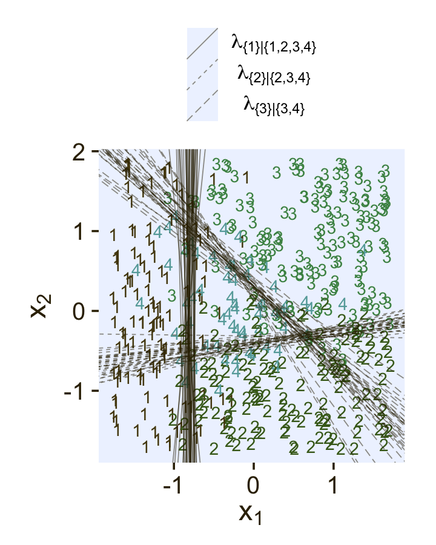
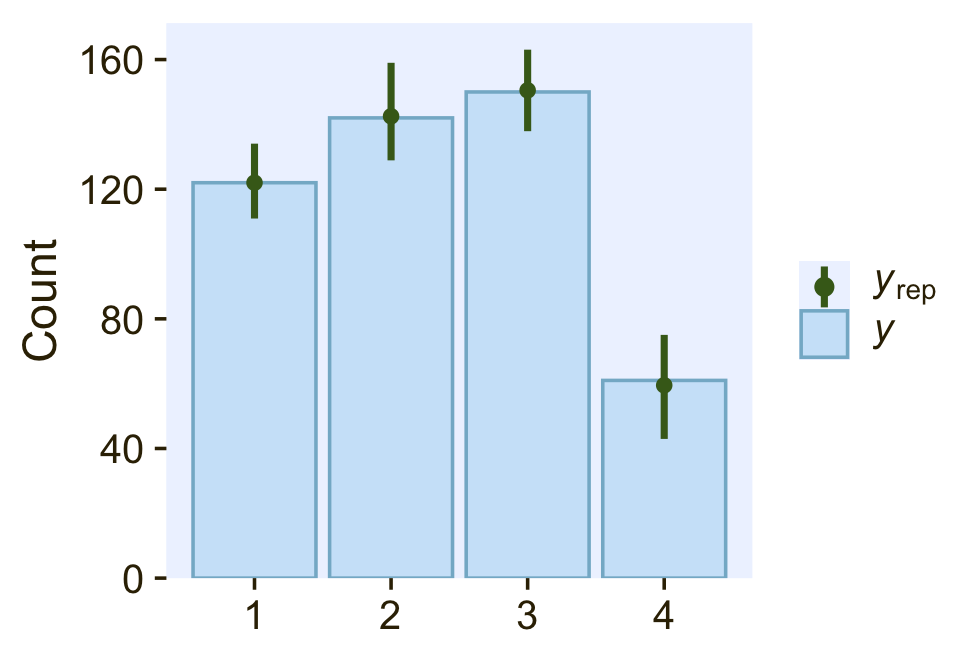

# Nominal Predicted Variable

> This chapter considers data structures that have a nominal predicted variable. When the nominal predicted variable has only two possible values, this reduces to the case of the dichotomous predicted variable considered in the previous chapter. In the present chapter, we generalize to cases in which the predicted variable has three or more categorical values...
>
> The traditional treatment of this sort of data structure is called multinomial logistic regression or conditional logistic regression. We will consider Bayesian approaches to these methods. As usual, in Bayesian software it is easy to generalize the traditional models so they are robust to outliers, allow different variances within levels of a nominal predictor, and have hierarchical structure to share information across levels or factors as appropriate. [@kruschkeDoingBayesianData2015, p. 649]

## Softmax regression

"The key descriptor of the [models in this chapter is their] inverse-link function, which is the softmax function (which will be defined below). Therefore, [Kruschke] refer[ed] to the method as softmax regression instead of multinomial logistic regression" (p. 650)

Say we have a metric predictor $x$ and a multinomial criterion $y$ with $k$ categories. We can express the basic linear model as

$$\lambda_k = \beta_{0, k} + \beta_{1, k} x,$$

for which the subscripts $k$ indicate there's a linear model for each of the $k$ categories. We call the possible set of $k$ outcomes $S$. Taking the case where $k = 3$, we'd have

\begin{align*}
\lambda_{[1]} & = \beta_{0, [1]} + \beta_{1, [1]} x, \\
\lambda_{[2]} & = \beta_{0, [2]} + \beta_{1, [2]} x, \text{and} \\
\lambda_{[3]} & = \beta_{0, [3]} + \beta_{1, [3]} x.
\end{align*}

In this scenario, what we want to know is the probability of $\lambda_{[1]}$, $\lambda_{[2]}$, and $\lambda_{[3]}$. The probability of a given outcome $k$ follows the formula

$$\phi_k = \operatorname{softmax}_S (\{\lambda_k\}) = \frac{\exp (\lambda_k)}{\sum_{c \in S} \exp  (\lambda_c)}.$$

> In words, [the equation] says that the probability of outcome $k$ is the exponentiated linear propensity of outcome $k$ relative to the sum of exponentiated linear propensities across all outcomes in the set $S$. You may be wondering, Why exponentiate? Intuitively, we have to go from propensities that can have negative values to probabilities that can only have non-negative values, and we have to preserve order. The exponential function satisfies that need. (p. 650)

You may be wondering what happened to $y$ and where all those $\lambda$'s came from. Here we're using $\lambda$ to describe the propensity of outcome $k$, as indexed within our criterion $y$. So, the output of these models, $\phi_k$, is the relative probability we'll see each of our $k$ categories within our criterion $y$. What we want is $\phi_k$. The way we parameterize that with the softmax function is with $\lambda_k$.

There are are indeterminacies in the system of equations Kruschke covered in this section, the upshot of which is we'll end up making one of the $k$ categories the reference category, which we term $r$. Continuing on with our univariable model, we choose convenient constants for our parameters for $r$: $\beta_{0, r} = 0$ and $\beta_{1, r} = 0$. As such, *the regression coefficients for the remaining categories are relative to those for* $r$.

Kruschke saved the data for Figure 22.1 in the `SoftmaxRegData1.csv` and `SoftmaxRegData2.csv` files.


```r
library(tidyverse)

d1 <- read_csv("data.R/SoftmaxRegData1.csv")
d2 <- read_csv("data.R/SoftmaxRegData2.csv")

glimpse(d1)
```

```
## Rows: 475
## Columns: 3
## $ X1 <dbl> -0.08714736, -0.72256565, 0.17918961, -1.15975176, -0.72711762, 0.53341559, -0.18932650…
## $ X2 <dbl> -1.08134218, -1.58386308, 0.97179045, 0.50262438, 1.37570446, 1.77465062, -0.53727640, …
## $ Y  <dbl> 2, 1, 3, 3, 3, 3, 1, 4, 2, 2, 3, 2, 4, 4, 4, 1, 2, 3, 3, 3, 3, 2, 1, 1, 3, 2, 3, 2, 4, …
```

```r
glimpse(d2)
```

```
## Rows: 475
## Columns: 3
## $ X1 <dbl> -0.08714736, -0.72256565, 0.17918961, -1.15975176, -0.72711762, 0.53341559, -0.18932650…
## $ X2 <dbl> -1.08134218, -1.58386308, 0.97179045, 0.50262438, 1.37570446, 1.77465062, -0.53727640, …
## $ Y  <dbl> 2, 2, 3, 3, 3, 3, 2, 3, 2, 1, 3, 2, 4, 3, 3, 2, 2, 1, 1, 3, 3, 4, 2, 2, 3, 2, 3, 4, 4, …
```

Before we explore these data in a plot, let's talk color and theme. For this chapter, we'll carry forward our practice from [Chapter 21][Dichotomous Predicted Variable] and take our color palette from the [**PNWColors** package](https://CRAN.R-project.org/package=PNWColors). This time, our color palette will be `"Lake"`.


```r
library(PNWColors)

pl <- pnw_palette(name = "Lake")

pl
```


We'll base our overall plot theme on `cowplot::theme_minimal_grid()`, with many color adjustments from `PNWColors::pnw_palette(name = "Lake")`.


```r
library(cowplot)

theme_set(
  theme_minimal_grid() +
    theme(text = element_text(color = pl[1]),
          axis.text = element_text(color = pl[1]),
          axis.ticks = element_line(color = pl[1]),
          legend.background = element_blank(),
          legend.box.background = element_blank(),
          legend.key = element_rect(fill = pl[8]),
          panel.background = element_rect(fill = pl[8], color = pl[8]),
          panel.grid = element_blank(),
          strip.background = element_rect(fill = pl[7], color = pl[7]),
          strip.text = element_text(color = pl[1]))
)
```

Now bind the two data frames together and plot our version of Figure 22.1.


```r
bind_rows(d1, d2) %>%
  mutate(data = rep(str_c("d", 1:2), each = n() / 2),
         Y = factor(Y)) %>% 
  
  ggplot(aes(x = X1, y = X2, label = Y, color = Y)) +
  geom_hline(yintercept = 0, color = "white") +
  geom_vline(xintercept = 0, color = "white") +
  geom_text(size = 3) +
  scale_color_manual(values = pl[2:5]) +
  labs(x = expression(x[1]),
       y = expression(x[2])) +
  coord_equal() +
  theme(legend.position = "none") +
  facet_wrap(~ data, ncol = 2)
```


### Softmax reduces to logistic for two outcomes.

"When there are only two outcomes, the softmax formulation reduces to the logistic regression of Chapter 21" (p. 653).

### Independence from irrelevant attributes.

> An important property of the softmax function of Equation 22.2 is known as independence from irrelevant attributes [@luceIndividualChoiceBehavior2012; @luceLuceChoiceAxiom2008]. The model implies that the ratio of probabilities of two outcomes is the same regardless of what other possible outcomes are included in the set. Let $S$ denote the set of possible outcomes. Then, from the definition of the softmax function, the ratio of outcomes $j$ and $k$ is
>
> $$\frac{\phi_j}{\phi_k} = \frac{\exp (\lambda_j) / \sum_{c \in S} \exp (\lambda_c)}{\exp (\lambda_k) / \sum_{c \in S} \exp (\lambda_c)}$$
>
> The summation in the denominators cancels and has no effect on the ratio of probabilities. Obviously if we changed the set of outcomes $S$ to any other set $S^*$ that still contains outcomes $j$ and $k$, the summation $\sum_{c \in S^*}$ would still cancel and have no effect on the ratio of probabilities. (p. 654)

Just to walk out that denominators-canceling business a little further,

\begin{align*}
\frac{\phi_j}{\phi_k} & = \frac{\exp (\lambda_j) / \sum_{c \in S} \exp (\lambda_c)}{\exp (\lambda_k) / \sum_{c \in S} \exp (\lambda_c)} \\
& = \frac{\exp (\lambda_j)}{\exp (\lambda_k)}.
\end{align*}

Thus even in the case of a very different set of possible outcomes $S^\text{very different}$, it remains that $\frac{\phi_j}{\phi_k} = \frac{\exp (\lambda_j)}{\exp (\lambda_k)}$.

Getting more applied, here's a tibble presentation of Kruschke's commute example with three modes of transportation.


```r
tibble(mode       = c("walking", "bicycling", "bussing"),
       preference = 3:1) %>% 
  mutate(`chance %` = (100 * preference / sum(preference)) %>% round(digits = 1))
```

```
## # A tibble: 3 × 3
##   mode      preference `chance %`
##   <chr>          <int>      <dbl>
## 1 walking            3       50  
## 2 bicycling          2       33.3
## 3 bussing            1       16.7
```

Sticking with the example, if we take bicycling out of the picture, the `preference` values remain, but the `chance %` values change.


```r
tibble(mode       = c("walking", "bussing"),
       preference = c(3, 1)) %>% 
  mutate(`chance %` = 100 * preference / sum(preference))
```

```
## # A tibble: 2 × 3
##   mode    preference `chance %`
##   <chr>        <dbl>      <dbl>
## 1 walking          3         75
## 2 bussing          1         25
```

Though we retain the same walking/bussing ratio, we end up with a different model of relative probabilities.

## Conditional logistic regression

> Softmax regression conceives of each outcome as an independent change in log odds from the reference outcome, and a special case of that is dichotomous logistic regression. But we can generalize logistic regression another way, which may better capture some patterns of data. The idea of this generalization is that we divide the set of outcomes into a hierarchy of two-set divisions, and use a logistic to describe the probability of each branch of the two-set divisions. (p. 655)

The model follows the generic equation

\begin{align*}
\phi_{S^* | S} = \operatorname{logistic}(\lambda_{S^* | S}) \\
\lambda_{S^* | S} = \beta_{0, S^* | S} + \beta_{1, {S^* | S}} x,
\end{align*}

where the conditional response probability (i.e., the goal of the analysis) is $\phi_{S^* | S}$. $S^*$ and $S$ denote the subset of outcomes and larger set of outcomes, respectively, and $\lambda_{S^* | S}$ is the propensity based on some linear model. The overall point is these "regression coefficients refer to the conditional probability of outcomes for the designated subsets, not necessarily to a single outcome among the full set of outcomes" (p. 655).

In Figure 22.2 (p. 656), Kruschke depicted the two hierarchies of binary divisions of the models he fit to the data in his `CondLogistRegData1.csv` and `CondLogistRegData2.csv` files. Here we load those data, save them as `d3` and `d4`, and take a look at their structures.


```r
d3 <- read_csv("data.R/CondLogistRegData1.csv")
d4 <- read_csv("data.R/CondLogistRegData2.csv")

glimpse(d3)
```

```
## Rows: 475
## Columns: 3
## $ X1 <dbl> -0.08714736, -0.72256565, 0.17918961, -1.15975176, -0.72711762, 0.53341559, -0.18932650…
## $ X2 <dbl> -1.08134218, -1.58386308, 0.97179045, 0.50262438, 1.37570446, 1.77465062, -0.53727640, …
## $ Y  <dbl> 2, 1, 3, 1, 3, 3, 2, 3, 2, 4, 1, 2, 2, 3, 4, 2, 2, 4, 2, 3, 4, 2, 1, 1, 1, 2, 1, 2, 3, …
```

```r
glimpse(d4)
```

```
## Rows: 475
## Columns: 3
## $ X1 <dbl> -0.08714736, -0.72256565, 0.17918961, -1.15975176, -0.72711762, 0.53341559, -0.18932650…
## $ X2 <dbl> -1.08134218, -1.58386308, 0.97179045, 0.50262438, 1.37570446, 1.77465062, -0.53727640, …
## $ Y  <dbl> 4, 4, 3, 4, 2, 3, 4, 3, 4, 4, 2, 4, 4, 3, 3, 4, 4, 4, 4, 3, 4, 4, 1, 1, 2, 4, 3, 4, 3, …
```

In both data sets, the nominal criterion is `Y` and the two predictors are `X1` and `X2`. Though the data seem simple, the conditional logistic models are complex enough that it seems like we'll be better served by focusing on them one at a time, which means I'm going to break up Figure 22.2. Here's how to make the diagram in the left panel.


```r
# the big numbers
numbers <- tibble(
  x     = c(3, 5, 2, 4, 1, 3, 2),
  y     = c(0, 0, 1, 1, 2, 2, 3),
  label = c("3", "4", "2", "3,4", "1", "2,3,4", "1,2,3,4")
)

# the smaller Greek numbers
greek <- tibble(
  x     = c(3.4, 4.6, 2.4, 3.6, 1.4, 2.6),
  y     = c(0.5, 0.5, 1.5, 1.5, 2.5, 2.5),
  hjust = c(1, 0, 1, 0, 1, 0),
  label = c("phi['{3}|{3,4}']", "1-phi['{3}|{3,4}']",
            "phi['{2}|{2,3,4}']", "1-phi['{2}|{2,3,4}']",
            "phi['{1}|{1,2,3,4}']", "1-phi['{1}|{1,2,3,4}']")
)

# arrows
tibble(
  x    = c(4, 4, 3, 3, 2, 2),
  y    = c(0.85, 0.85, 1.85, 1.85, 2.85, 2.85),
  xend = c(3, 5, 2, 4, 1, 3),
  yend = c(0.15, 0.15, 1.15, 1.15, 2.15, 2.15)
) %>%  
  
  # plot!
  ggplot(aes(x = x, y = y)) +
  geom_segment(aes(xend = xend, yend = yend),
               size = 1/4,
               arrow = arrow(length = unit(0.08, "in"), type = "closed")) +
  geom_text(data = numbers,
            aes(label = label),
            size = 5, family = "Times")+
  geom_text(data = greek,
            aes(label = label, hjust = hjust),
            size = 4.25, family = "Times", parse = T) +
  xlim(-1, 7) +
  theme_void()
```


The large numbers are the four levels in the criterion `Y` and the smaller numbers in the curly braces are various sets of those numbers. The diagram shows three levels of outcome-set divisions:

* 1 versus 2, 3, or 4;
* 2 versus 3 or 4; and
* 3 versus 4.

The divisions in each of these levels can be expressed as linear models which we'll denote $\lambda$. Given our data with two predictors `X1` and `X2`, we can express the three linear models as

$$
\begin{align*}
\lambda_{\{ 1 \} | \{ 1,2,3,4 \}} & = \beta_{0,\{ 1 \} | \{ 1,2,3,4 \}} + \beta_{1,\{ 1 \} | \{ 1,2,3,4 \}} \text{X1} + \beta_{2,\{ 1 \} | \{ 1,2,3,4 \}} \text{X2} \\
\lambda_{\{ 2 \} | \{ 2,3,4 \}}   & = \beta_{0,\{ 2 \} | \{ 2,3,4 \}} + \beta_{1,\{ 2 \} | \{ 2,3,4 \}} \text{X1} + \beta_{2,\{ 2 \} | \{ 2,3,4 \}} \text{X2} \\
\lambda_{\{ 3 \} | \{ 3,4 \}}     & = \beta_{0,\{ 3 \} | \{ 3,4 \}} + \beta_{1,\{ 3 \} | \{ 3,4 \}} \text{X1} + \beta_{2,\{ 3 \} | \{ 3,4 \}} \text{X2},
\end{align*}
$$

where, for convenience, we're omitting the typical $i$ subscripts. As these linear models are all defined within the context of the logit link, we can express the conditional probabilities of the outcome sets as

$$
\begin{align*}
\phi_{\{ 1 \} | \{ 1,2,3,4 \}} & = \operatorname{logistic} \left (\lambda_{\{ 1 \} | \{ 1,2,3,4 \}} \right) \\
\phi_{\{ 2 \} | \{ 2,3,4 \}}   & = \operatorname{logistic} \left (\lambda_{\{ 2 \} | \{ 2,3,4 \}} \right) \\
\phi_{\{ 3 \} | \{ 3,4 \}}     & = \operatorname{logistic} \left (\lambda_{\{ 3 \} | \{ 3,4 \}} \right),
\end{align*}
$$

where $\phi_{\{ 1 \} | \{ 1,2,3,4 \}}$ through $\phi_{\{ 3 \} | \{ 3,4 \}}$ are the conditional probabilities for the outcome sets. If, however, we want the conditional probabilities for the actual levels of the criterion `Y`, we define those with a series of (in this case) four equations:

$$
\begin{align*}
\phi_1 & = \phi_{\{ 1 \} | \{ 1,2,3,4 \}} \\
\phi_2 & = \phi_{\{ 2 \} | \{ 2,3,4 \}} \cdot \left ( 1 - \phi_{\{ 1 \} | \{ 1,2,3,4 \}} \right) \\
\phi_3 & = \phi_{\{ 3 \} | \{ 3,4 \}} \cdot \left ( 1 - \phi_{\{ 2 \} | \{ 2,3,4 \}} \right) \cdot \left ( 1 - \phi_{\{ 1 \} | \{ 1,2,3,4 \}} \right) \\
\phi_4 & = \left ( 1 - \phi_{\{ 3 \} | \{ 3,4 \}} \right) \cdot \left ( 1 - \phi_{\{ 2 \} | \{ 2,3,4 \}} \right) \cdot \left ( 1 - \phi_{\{ 1 \} | \{ 1,2,3,4 \}} \right),
\end{align*}
$$

where the sum of the probabilities $\phi_1$ through $\phi_4$ is $1$. To get a sense of what this all means in practice, let's visualize the data and the data-generating equations for our version of Figure 22.3. As with the previous figure, I'm going to break this figure up to focus on one model at a time. Thus, here's the left panel of Figure 22.3.


```r
## define the various population parameters
# lambda 1
b01 <- -4
b11 <- -5
b21 <- 0.01  # rounding up to avoid dividing by zero
# lambda 2
b02 <- -2
b12 <- 1
b22 <- -5
# lambda 3
b03 <- -1
b13 <- 3
b23 <- 3

# use the parameters to define the lines 
lines <- tibble(
  intercept = c(-b01 / b21, -b02 / b22, -b03 / b23),
  slope = c(-b11 / b21, -b12 / b22, -b13 / b23),
  label = c("1", "2","3")
)

# wrangle
d3 %>% 
  mutate(Y = factor(Y)) %>% 
  
  # plot!
  ggplot() +
  geom_hline(yintercept = 0, color = "white") +
  geom_vline(xintercept = 0, color = "white") +
  geom_text(aes(x = X1, y = X2, label = Y, color = Y),
            size = 3, show.legend = F) +
  geom_abline(data = lines,
              aes(intercept = intercept,
                  slope = slope,
                  linetype = label),
              color = pl[1]) +
  scale_color_manual(values = pl[2:5]) +
  scale_linetype(NULL,
                 labels = parse(text = c(
                   "lambda['{1}|{1,2,3,4}']==-4+-5*x[1]+0*x[2]", 
                   "lambda['{2}|{2,3,4}']==-2+1*x[1]+-5*x[2]", 
                   "lambda['{3}|{3,4}']==-1+3*x[1]+3*x[2]")),
                 guide = guide_legend(
                   direction = "vertical",
                   label.hjust = 0.5,
                   label.theme = element_text(size = 10))) +
  coord_equal() +
  labs(x = expression(x[1]),
       y = expression(x[2])) +
  theme(legend.justification = 0.5,
        legend.position = "top")
```


Recall back on page 629, Kruschke showed the equation for the 50% threshold of a logistic regression model given two continuous predictors was

$$x_2 = (-\beta_0 / \beta_2) + (-\beta_1 / \beta_2) x_1.$$

It was that equation that gave us the values for the `intercept` and `slope` arguments ($-\beta_0 / \beta_2$ and $-\beta_1 / \beta_2$, respectively) for the `geom_abline()` function.

It still might not be clear how the various $\phi_{S^* | S}$ values connect to the data. Though not in the text, here's an alternative way of expressing the relations in Figure 22.3. This time the plot is faceted by the three levels of $\phi_{S^* | S}$ and the background fill is based on those conditional probabilities.


```r
# define a grid of X1 and X2 values
crossing(X1 = seq(from = -2, to = 2, length.out = 50),
         X2 = seq(from = -2, to = 2, length.out = 50)) %>% 
  # compute the lambda's
  mutate(`lambda['{1}|{1,2,3,4}']` = b01 + b11 * X1 + b21 * X2,
         `lambda['{2}|{2,3,4}']`   = b02 + b12 * X1 + b22 * X2,
         `lambda['{3}|{3,4}']`     = b03 + b13 * X1 + b23 * X2) %>% 
  # compute the phi's
  mutate(`phi['{1}|{1,2,3,4}']` = plogis(`lambda['{1}|{1,2,3,4}']`),
         `phi['{2}|{2,3,4}']`   = plogis(`lambda['{2}|{2,3,4}']`),
         `phi['{3}|{3,4}']`     = plogis(`lambda['{3}|{3,4}']`)) %>% 
  # wrangle
  pivot_longer(contains("phi"), values_to = "phi") %>% 
  
  # plot!
  ggplot(aes(x = X1, y = X2)) +
  geom_raster(aes(fill = phi),
              interpolate = T) +
  # note how we're subsetting the d3 data by facet
  geom_text(data = bind_rows(
    d3 %>% mutate(name = "phi['{1}|{1,2,3,4}']"),
    d3 %>% mutate(name = "phi['{2}|{2,3,4}']") %>% filter(Y > 1),
    d3 %>% mutate(name = "phi['{3}|{3,4}']") %>% filter(Y > 2)),
            aes(label = Y),
            size = 2.5) +
  scale_fill_gradientn(expression(phi[italic(S)*"*|"*italic(S)]),
                       colours = pnw_palette(name = "Lake", n = 101),
                       breaks = 0:2 / 2, limits = c(0, 1)) +
  scale_x_continuous(expand = c(0, 0)) +
  scale_y_continuous(expand = c(0, 0)) +
  coord_equal() +
  theme(legend.position = c(0.8, 0.2)) +
  facet_wrap(~ name, labeller = label_parsed, ncol = 2)
```


Notice how because each of the levels of $\phi$ is defined by a different subset of the data, each of the facets contains a different subset of the `d3` data, too. For example, since $\phi_{\{ 1 \} | \{ 1,2,3,4 \}}$ is defined by the full subset of the possible values of `Y`, you see all the `Y` data displayed by `geom_text()` for that facet. In contrast, since $\phi_{\{ 3 \} | \{ 3,4 \}}$ is defined by a subset of the data for which `Y` is only `3` or `4`, those are the only values you see displayed within that facet of the plot.

Now we'll consider an alternative way to set up the binary-choices hierarchy, as seen in the right panel of Figure 22.2. First, here's that half of the figure.


```r
# the big numbers
numbers <- tibble(
  x = c(0, 2, 6, 8, 1, 7, 4),
  y = c(0, 0, 0, 0, 1, 1, 2),
  label = c("1", "2", "3", "4", "1,2", "3,4", "1,2,3,4")
)

# the smaller Greek numbers
greek <- tibble(
  x = c(0.4, 1.6, 6.4, 7.6, 2.1, 5.8),
  y = c(0.5, 0.5, 0.5, 0.5, 1.5, 1.5),
  hjust = c(1, 0, 1, 0, 1, 0),
  label = c("phi['{1}|{1,2}']", "1-phi['{1}|{1,2}']",
            "phi['{3}|{3,4}']", "1-phi['{3}|{3,4}']",
            "phi['{1,2}|{1,2,3,4}']", "1-phi['{1,2}|{1,2,3,4}']")
)

# arrows
tibble(
  x = c(1, 1, 7, 7, 4, 4),
  y = c(0.85, 0.85, 0.85, 0.85, 1.85, 1.85),
  xend = c(0, 2, 6, 8, 1, 7),
  yend = c(0.15, 0.15, 0.15, 0.15, 1.15, 1.15)
) %>%  
  
  # plot!
  ggplot(aes(x = x, y = y)) +
  geom_segment(aes(xend = xend, yend = yend),
               size = 1/4,
               arrow = arrow(length = unit(0.08, "in"), type = "closed")) +
  geom_text(data = numbers,
            aes(label = label),
            size = 5, family = "Times")+
  geom_text(data = greek,
            aes(label = label, hjust = hjust),
            size = 4.25, family = "Times", parse = T) +
  xlim(-1, 10) +
  theme_void()
```


This diagram shows three levels of outcome-set divisions:

* 1 or 2 versus 3 or 4;
* 1 versus 2; and
* 3 versus 4.

Given our data with two predictors `X1` and `X2`, we can express the three linear models as

$$
\begin{align*}
\lambda_{\{ 1,2 \} | \{ 1,2,3,4 \}} & = \beta_{0,\{ 1,2 \} | \{ 1,2,3,4 \}} + \beta_{1,\{ 1,2 \} | \{ 1,2,3,4 \}} \text{X1} + \beta_{2,\{ 1,2 \} | \{ 1,2,3,4 \}} \text{X2} \\
\lambda_{\{ 1 \} | \{ 1,2 \}}   & = \beta_{0,\{ 1 \} | \{ 1,2 \}} + \beta_{1,\{ 1 \} | \{ 1,2 \}} \text{X1} + \beta_{2,\{ 1 \} | \{ 1,2 \}} \text{X2} \\
\lambda_{\{ 3 \} | \{ 3,4 \}}     & = \beta_{0,\{ 3 \} | \{ 3,4 \}} + \beta_{1,\{ 3 \} | \{ 3,4 \}} \text{X1} + \beta_{2,\{ 3 \} | \{ 3,4 \}} \text{X2}.
\end{align*}
$$

We can then express the conditional probabilities of the outcome sets as

$$
\begin{align*}
\phi_{\{ 1,2 \} | \{ 1,2,3,4 \}} & = \operatorname{logistic} \left (\lambda_{\{ 1,2 \} | \{ 1,2,3,4 \}} \right) \\
\phi_{\{ 1 \} | \{ 1,2 \}}   & = \operatorname{logistic} \left (\lambda_{\{ 1 \} | \{ 1,2 \}} \right) \\
\phi_{\{ 3 \} | \{ 3,4 \}}     & = \operatorname{logistic} \left (\lambda_{\{ 3 \} | \{ 3,4 \}} \right).
\end{align*}
$$

For the conditional probabilities of the actual levels of the criterion `Y`, we define those with a series of (in this case) four equations:

$$
\begin{align*}
\phi_1 & = \phi_{\{ 1 \} | \{ 1,2 \}} \cdot \phi_{\{ 1,2 \} | \{ 1,2,3,4 \}} \\
\phi_2 & = \left ( 1 - \phi_{\{ 1 \} | \{ 1,2 \}} \right) \cdot \phi_{\{ 1,2 \} | \{ 1,2,3,4 \}} \\
\phi_3 & = \phi_{\{ 3 \} | \{ 3,4 \}} \cdot \left ( 1 - \phi_{\{ 1,2 \} | \{ 1,2,3,4 \}} \right) \\
\phi_4 & = \left ( 1 - \phi_{\{ 3 \} | \{ 3,4 \}} \right) \cdot \left ( 1 - \phi_{\{ 1,2 \} | \{ 1,2,3,4 \}} \right),
\end{align*}
$$

where the sum of the probabilities $\phi_1$ through $\phi_4$ is $1$. To get a sense of what this all means, let's visualize the data and the data-generating equations in our version of the right panel of Figure 22.3.


```r
d4 %>% 
  mutate(Y = factor(Y)) %>% 
  
  ggplot() +
  geom_hline(yintercept = 0, color = "white") +
  geom_vline(xintercept = 0, color = "white") +
  geom_text(aes(x = X1, y = X2, label = Y, color = Y),
            size = 3, show.legend = F) +
  geom_abline(data = lines,
              aes(intercept = intercept,
                  slope = slope,
                  linetype = label),
              color = pl[1]) +
  scale_color_manual(values = pl[2:5]) +
  scale_linetype(NULL,
                 labels = parse(text = c(
                   "lambda['{1,2}|{1,2,3,4}']==-4+-5*x[1]+0*x[2]", 
                   "lambda['{1}|{1,2}']==-2+1*x[1]+-5*x[2]", 
                   "lambda['{3}|{3,4}']==-1+3*x[1]+3*x[2]")),
                 guide = guide_legend(
                   direction = "vertical",
                   label.hjust = 0.5,
                   label.theme = element_text(size = 10))) +
  coord_equal() +
  labs(x = expression(x[1]),
       y = expression(x[2])) +
  theme(legend.justification = 0.5,
        legend.position = "top")
```


Here's an alternative way of expression the relations in the right panel of Figure 22.3. This time the plot is faceted by the three levels of $\phi_{S^* | S}$ and the background fill is based on those conditional probabilities.


```r
# define a grid of X1 and X2 values
crossing(X1 = seq(from = -2, to = 2, length.out = 50),
         X2 = seq(from = -2, to = 2, length.out = 50)) %>% 
  # compute the lambda's
  mutate(`lambda['{1,2}|{1,2,3,4}']` = b01 + b11 * X1 + b21 * X2,
         `lambda['{1}|{1,2}']`       = b02 + b12 * X1 + b22 * X2,
         `lambda['{3}|{3,4}']`       = b03 + b13 * X1 + b23 * X2) %>% 
  # compute the phi's
  mutate(`phi['{1,2}|{1,2,3,4}']` = plogis(`lambda['{1,2}|{1,2,3,4}']`),
         `phi['{1}|{1,2}']`       = plogis(`lambda['{1}|{1,2}']`),
         `phi['{3}|{3,4}']`       = plogis(`lambda['{3}|{3,4}']`)) %>% 
  # wrangle
  pivot_longer(contains("phi"), values_to = "phi") %>% 
  
  # plot!
  ggplot(aes(x = X1, y = X2)) +
  geom_raster(aes(fill = phi),
              interpolate = T) +
  # note how we're subsetting the d3 data by facet
  geom_text(data = bind_rows(
    d4 %>% mutate(name = "phi['{1,2}|{1,2,3,4}']"),
    d4 %>% mutate(name = "phi['{1}|{1,2}']") %>% filter(Y < 3),
    d4 %>% mutate(name = "phi['{3}|{3,4}']") %>% filter(Y > 2)),
            aes(label = Y),
            size = 2.5) +
  scale_fill_gradientn(expression(phi[italic(S)*"*|"*italic(S)]),
                       colours = pnw_palette(name = "Lake", n = 101),
                       breaks = 0:2 / 2, limits = c(0, 1)) +
  scale_x_continuous(expand = c(0, 0)) +
  scale_y_continuous(expand = c(0, 0)) +
  coord_equal() +
  theme(legend.position = c(0.8, 0.2)) +
  facet_wrap(~ name, labeller = label_parsed, ncol = 2)
```


It could be easy to miss due to the way we broke up our workflow, but if you look closely at the $\lambda$ equations at the top of both panels of Figure 22.3, you'll see the right-hand side of the equations are the same. But because of the differences in the two data hierarchies, those $\lambda$ equations had different consequences for how the `X1` and `X2` values generated the `Y` data. Also, 

> In general, conditional logistic regression requires that there is a linear division between two subsets of the outcomes, and then within each of those subsets there is a linear division of smaller subsets, and so on. This sort of linear division is not required of the softmax regression model... Real data can be extremely noisy, and there can be multiple predictors, so it can be challenging or impossible to visually ascertain which sort of model is most appropriate. The choice of model is driven primarily by theoretical meaningfulness. (p. 659)

## Implementation in ~~JAGS~~ brms

### Softmax model.

Kruschke pointed out in his Figure 22.4 and the surrounding prose that we speak of the *categorical distribution* when fitting softmax models. Our **brms** paradigm will be much the same. To fit a softmax model with the `brm()` function, you specify `family = categorical`. The default is to use the logit link. In his [-@Bürkner2022Parameterization] [*Parameterization of response distributions in brms*](https://CRAN.R-project.org/package=brms/vignettes/brms_families.html#ordinal-and-categorical-models) vignette, Bürkner clarified:

> The **categorical** family is currently only implemented with the multivariate logit link function and has density
>
> $$f(y) = \mu_y = \frac{\exp (\eta_y)}{\sum_{k = 1}^K \exp (\eta_k)}$$
>
> Note that $\eta$ does also depend on the category $k$. For reasons of identifiability, $\eta_1$ is set to $0$.

Though there's no explicit softmax talk in that vignette, you can find it documented in his code [here](https://github.com/paul-buerkner/brms/blob/bc550ff3a2d41656a6711737faf1049207657800/R/distributions.R), starting in line 1891.

Now onto our **ggplot2** + **patchwork** version of the model diagram in Figure 22.4. I'm not gonna lie. The requisite code is a slog. We'll take the task in bits. First, we make and save the elements for the diagram on the left.


```r
library(patchwork)

# normal density
p1 <-
  tibble(x = seq(from = -3, to = 3, by = .1)) %>% 
  ggplot(aes(x = x, y = (dnorm(x)) / max(dnorm(x)))) +
  geom_area(fill = pl[6], color = pl[5]) +
  annotate(geom = "text",
           x = 0, y = .2,
           label = "normal",
           size = 7, color = pl[1]) +
  annotate(geom = "text",
           x = c(0, 1.5), y = .6,
           label = c("italic(M)[0]", "italic(S)[0]"), 
           size = 7, color = pl[1], hjust = 0, family = "Times", parse = T) +
  scale_x_continuous(expand = c(0, 0)) +
  theme_void() +
  theme(axis.line.x = element_line(size = 0.5, color = pl[1]),
        plot.background = element_rect(fill = pl[8], color = "white", size = 1))

# second normal density
p2 <-
  tibble(x = seq(from = -3, to = 3, by = .1)) %>% 
  ggplot(aes(x = x, y = (dnorm(x)) / max(dnorm(x)))) +
  geom_area(fill = pl[6], color = pl[5]) +
  annotate(geom = "text",
           x = 0, y = .2,
           label = "normal",
           size = 7, color = pl[1]) +
  annotate(geom = "text",
           x = c(0, 1.5), y = .6,
           label = c("italic(M[jk])", "italic(S[jk])"), 
           size = 7, color = pl[1], hjust = 0, family = "Times", parse = T) +
  scale_x_continuous(expand = c(0, 0)) +
  theme_void() +
  theme(axis.line.x = element_line(size = 0.5, color = pl[1]),
        plot.background = element_rect(fill = pl[8], color = "white", size = 1))

## an annotated arrow
# save our custom arrow settings
my_arrow <- arrow(angle = 20, length = unit(0.35, "cm"), type = "closed")
p3 <-
  tibble(x    = .5,
         y    = 1,
         xend = .73,
         yend = 0) %>%
  
  ggplot(aes(x = x, xend = xend,
             y = y, yend = yend)) +
  geom_segment(arrow = my_arrow, color = pl[1]) +
  annotate(geom = "text",
           x = c(.48, .72), y = .5,
           label = c("'~'", "italic(k)"),
           size = c(10, 7), color = pl[1], family = "Times", parse = T) +
  xlim(0, 1) +
  theme_void()

## another annotated arrow
p4 <-
  tibble(x    = .5,
         y    = 1,
         xend = .4,
         yend = 0) %>%
  
  ggplot(aes(x = x, xend = xend,
             y = y, yend = yend)) +
  geom_segment(arrow = my_arrow, color = pl[1]) +
  annotate(geom = "text",
           x = c(.34, .6), y = .5,
           label = c("'~'", "italic(jk)"),
           size = c(10, 7), color = pl[1], family = "Times", parse = T) +
  xlim(0, 1) +
  theme_void()

# likelihood formula
p5 <-
  tibble(x = .5,
         y = .5,
         label = "softmax(beta[0]['['*italic(k)*']']+sum()[italic(j)]~beta[italic(j)]['['*italic(k)*']']~italic(x)[italic(ji)])") %>% 
  
  ggplot(aes(x = x, y = y, label = label)) +
  geom_text(size = 7, color = pl[1], parse = T, family = "Times") +
  scale_x_continuous(expand = c(0, 0), limits = c(0, 1)) +
  ylim(0, 1) +
  theme_void()

# a third annotated arrow
p6 <-
  tibble(x     = c(.375, .6),
         y     = c(1/2, 1/2),
         label = c("'='", "italic(i)")) %>% 
  
  ggplot(aes(x = x, y = y, label = label)) +
  geom_text(size = c(10, 7), color = pl[1], parse = T, family = "Times") +
  geom_segment(x = .5, xend = .5,
               y = 1, yend = 0,
               arrow = my_arrow, color = pl[1]) +
  xlim(0, 1) +
  theme_void()

# bar plot of categorical data
p7 <-
  tibble(x = 0:3,
         d = c(.5, .85, .5, .85)) %>% 
  ggplot(aes(x = x, y = d)) +
  geom_col(fill = pl[6], color = pl[5], width = .45) +
  annotate(geom = "text",
           x = 1.5, y = .2,
           label = "categorical",
           size = 7, color = pl[1]) +
  annotate(geom = "text",
           x = 1.25, y = .9, hjust = 0,
           label = "mu[italic(i)*'['*italic(k)*']']",
           size = 7, color = pl[1], family = "Times", parse = TRUE) +
  coord_cartesian(xlim = c(-.5, 3.5),
                  ylim = 0:1) +
  theme_void() +
  theme(axis.line.x = element_line(size = 0.5, color = pl[1]),
        plot.background = element_rect(fill = pl[8], color = "white", size = 1))

# the final annotated arrow
p8 <-
  tibble(x     = c(.375, .625),
         y     = c(1/3, 1/3),
         label = c("'~'", "italic(i)")) %>% 
  
  ggplot(aes(x = x, y = y, label = label)) +
  geom_text(size = c(10, 7), color = pl[1], parse = T, family = "Times") +
  geom_segment(x = .5, xend = .5,
               y = 1, yend = 0, 
               color = pl[1], arrow = my_arrow) +
  xlim(0, 1) +
  theme_void()

# some text
p9 <-
  tibble(x     = 1,
         y     = .5,
         label = "italic(y[i])") %>% 
  
  ggplot(aes(x = x, y = y, label = label)) +
  geom_text(size = 7, color = pl[1], parse = T, family = "Times") +
  xlim(0, 2) +
  theme_void()

# define the layout
layout <- c(
  area(t = 1, b = 2, l = 1, r = 2),
  area(t = 1, b = 2, l = 3, r = 4),
  area(t = 3, b = 3, l = 1, r = 2),
  area(t = 3, b = 3, l = 3, r = 4),
  area(t = 4, b = 4, l = 1, r = 4),
  area(t = 5, b = 5, l = 2, r = 3),
  area(t = 6, b = 7, l = 2, r = 3),
  area(t = 8, b = 8, l = 2, r = 3),
  area(t = 9, b = 9, l = 2, r = 3)
)

# combine and plot!
a <-
  (
    (p1 + p2 + p3 + p4 + p5 + p6 + p7 + p8 + p9) + 
      plot_layout(design = layout) &
      ylim(0, 1) &
      theme(plot.margin = margin(0, 5.5, 0, 5.5))
  )
```

Now we make and save the elements for the diagram on the right.


```r
# third normal density
p2 <-
  tibble(x = seq(from = -3, to = 3, by = .1)) %>% 
  ggplot(aes(x = x, y = (dnorm(x)) / max(dnorm(x)))) +
  geom_area(fill = pl[6], color = pl[5]) +
  annotate(geom = "text",
           x = 0, y = .2,
           label = "normal",
           size = 7, color = pl[1]) +
  annotate(geom = "text",
           x = c(0, 1.5), y = .6,
           label = c("italic(M[j])", "italic(S[j])"), 
           size = 7, color = pl[1], hjust = 0, family = "Times", parse = T) +
  scale_x_continuous(expand = c(0, 0)) +
  theme_void() +
  theme(axis.line.x = element_line(size = 0.5, color = pl[1]),
        plot.background = element_rect(fill = pl[8], color = "white", size = 1))

## an annotated arrow
p3 <-
  tibble(x    = .5,
         y    = 1,
         xend = .85,
         yend = 0) %>%
  
  ggplot(aes(x = x, xend = xend,
             y = y, yend = yend)) +
  geom_segment(arrow = my_arrow, color = pl[1]) +
  annotate(geom = "text",
           x = .49, y = .5,
           label = "'~'",
           size = 10, color = pl[1], family = "Times", parse = T) +
  xlim(0, 1) +
  theme_void()

## another annotated arrow
p4 <-
  tibble(x    = .5,
         y    = 1,
         xend = .4,
         yend = 0) %>%
  
  ggplot(aes(x = x, xend = xend,
             y = y, yend = yend)) +
  geom_segment(arrow = my_arrow, color = pl[1]) +
  annotate(geom = "text",
           x = c(.35, .57), y = .5,
           label = c("'~'", "italic(j)"),
           size = c(10, 7), color = pl[1], family = "Times", parse = T) +
  xlim(0, 1) +
  theme_void()

# likelihood formula
p5 <-
  tibble(x = .5,
         y = .5,
         label = "logistic(beta[0]+sum()[italic(j)]~beta[italic(j)]~italic(x)[italic(ji)])") %>% 
  
  ggplot(aes(x = x, y = y, label = label)) +
  geom_text(size = 7, color = pl[1], parse = T, family = "Times") +
  scale_x_continuous(expand = c(0, 0), limits = c(0, 1)) +
  ylim(0, 1) +
  theme_void()

# bar plot of Bernoulli data
p7 <-
  tibble(x = 0:1,
         d = (dbinom(x, size = 1, prob = .6)) / max(dbinom(x, size = 1, prob = .6))) %>% 
  
  ggplot(aes(x = x, y = d)) +
  geom_col(fill = pl[6], color = pl[5], width = .4) +
  annotate(geom = "text",
           x = .5, y = .2,
           label = "Bernoulli",
           size = 7, color = pl[1]) +
  annotate(geom = "text",
           x = .5, y = .9,
           label = "mu[italic(i)]", 
           size = 7, color = pl[1], family = "Times", parse = T) +
  xlim(-.75, 1.75) +
  theme_void() +
  theme(axis.line.x = element_line(size = 0.5, color = pl[1]),
        plot.background = element_rect(fill = pl[8], color = "white", size = 1))

# combine and plot!
c <-
  (
    (p1 + p2 + p3 + p4 + p5 + p6 + p7 + p8 + p9) + 
      plot_layout(design = layout) &
      ylim(0, 1) &
      theme(plot.margin = margin(0, 5.5, 0, 5.5))
  )
```

Here we combine the two model diagrams and plot!


```r
b <- plot_spacer()

(a | b | c) + plot_layout(widths = c(4, 1, 4))
```


### Conditional logistic model.

The conditional logistic regression models are not natively supported in **brms** at this time. Based on [issue #560](https://github.com/paul-buerkner/brms/issues/560) in the **brms** GitHub, there are ways to fit them using the nonlinear syntax. If you compare the syntax Bürkner used in that thread on January 30^th^ to the JAGS syntax Kruschke showed on pages 661 and 662, you'll see they appear to follow contrasting parameterizations.

However, there are at least two other ways to fit conditional logistic models with **brms**. Based on insights from [Henrik Singmann](http://singmann.org/), we can define conditional logistic models using the custom family approach. In contrast, [Mattan Ben-Shachar](https://sites.google.com/view/mattansb) has shown we can also fit conditional logistic models using a tricky application of sequential ordinal regression. Rather than present them in the abstract, here, we will showcase both of these approaches in the sections below.

### Results: Interpreting the regression coefficients.

#### Softmax model.

Load **brms**.


```r
library(brms)
```

Along with Kruschke, we'll be modeling the `d1` data. In case it's not clear, the `X1` and `X2` variables are already in a standardized metric.


```r
d1 %>% 
  pivot_longer(-Y) %>% 
  group_by(name) %>% 
  summarise(mean = mean(value), 
            sd   = sd(value)) %>% 
  mutate_if(is.double, round, digits = 2)
```

```
## # A tibble: 2 × 3
##   name   mean    sd
##   <chr> <dbl> <dbl>
## 1 X1        0     1
## 2 X2        0     1
```

This will make it easier to set the priors. Here we'll just use the rather wide priors Kruschke indicated on page 662. Note our use of the `dpar` argument within the `prior()` function.


```r
fit22.1 <-
  brm(data = d1, 
      family = categorical(link = logit),
      Y ~ 0 + Intercept + X1 + X2,
      prior = c(prior(normal(0, 20), class = b, dpar = mu2),
                prior(normal(0, 20), class = b, dpar = mu3),
                prior(normal(0, 20), class = b, dpar = mu4)),
      iter = 2000, warmup = 1000, cores = 4, chains = 4,
      seed = 22,
      file = "fits/fit22.01")
```

Since it's the default, we didn't have to include the `(link = logit)` bit in the `family` argument. I'm just being explicit for the sake of pedagogy. Take a look at the parameter summary.


```r
print(fit22.1)
```

```
##  Family: categorical 
##   Links: mu2 = logit; mu3 = logit; mu4 = logit 
## Formula: Y ~ 0 + Intercept + X1 + X2 
##    Data: d1 (Number of observations: 475) 
##   Draws: 4 chains, each with iter = 2000; warmup = 1000; thin = 1;
##          total post-warmup draws = 4000
## 
## Population-Level Effects: 
##               Estimate Est.Error l-95% CI u-95% CI Rhat Bulk_ESS Tail_ESS
## mu2_Intercept     3.39      0.62     2.29     4.67 1.01     1324     1482
## mu2_X1            5.58      0.73     4.25     7.06 1.00     2019     2027
## mu2_X2            0.82      0.51    -0.17     1.85 1.00     1759     1934
## mu3_Intercept     2.07      0.68     0.78     3.44 1.00     1379     1650
## mu3_X1            0.73      0.57    -0.38     1.86 1.00     1658     2190
## mu3_X2            5.98      0.68     4.74     7.39 1.00     2148     2187
## mu4_Intercept    -0.41      0.89    -2.10     1.34 1.00     1917     2035
## mu4_X1           12.38      1.17    10.25    14.77 1.00     2251     2268
## mu4_X2            3.56      0.65     2.33     4.86 1.00     1949     2091
## 
## Draws were sampled using sampling(NUTS). For each parameter, Bulk_ESS
## and Tail_ESS are effective sample size measures, and Rhat is the potential
## scale reduction factor on split chains (at convergence, Rhat = 1).
```

As indicated in the formulas in [Section 22.1][Softmax regression], we get posteriors for each level of `Y`, except for `Y == 1`. That serves as the reference category. The values for $\beta_{i, k = 1}$ are all fixed at $0$.

Here's how we might make the histograms in Figure 22.5.


```r
library(tidybayes)

# extract the posterior draws
draws <- as_draws_df(fit22.1)

# wrangle
draws %>% 
  pivot_longer(starts_with("b_")) %>% 
  mutate(name = str_remove(name, "b_")) %>% 
  mutate(lambda    = str_extract(name, "[2-4]+") %>% str_c("lambda==", .),
         parameter = case_when(str_detect(name, "Intercept") ~ "beta[0]",
                               str_detect(name, "X1")        ~ "beta[1]",
                               str_detect(name, "X2")        ~ "beta[2]")) %>% 
  
  # plot
  ggplot(aes(x = value, y = 0)) +
  stat_histinterval(point_interval = mode_hdi, .width = .95,
                    fill = pl[4], slab_color = pl[3], color = pl[1], point_color = pl[2],
                    normalize = "panels") +
  scale_y_continuous(NULL, breaks = NULL) +
  xlab("marginal posterior") +
  facet_grid(lambda ~ parameter, labeller = label_parsed, scales = "free_x")
```


Because the $\beta$ values for when $\lambda = 1$ are all fixed to 0, we left those plots out of our version of the figure. If you really wanted them, you'd have to enter the corresponding cells into the data before plotting. If you summarize each parameter by it's posterior mean, `round()`, and wrangle a little, you can arrange the results in a similar way that the equations for $\lambda_2$ through $\lambda_4$ are displayed on the left side of Figure 22.5.


```r
draws %>% 
  pivot_longer(starts_with("b_")) %>% 
  mutate(name = str_remove(name, "b_")) %>% 
  mutate(lambda    = str_extract(name, "[2-4]+") %>% str_c("lambda[", ., "]"),
         parameter = case_when(str_detect(name, "Intercept") ~ "beta[0]",
                               str_detect(name, "X1")        ~ "beta[1]",
                               str_detect(name, "X2")        ~ "beta[2]")) %>% 
  group_by(lambda, parameter) %>% 
  summarise(mean = mean(value) %>% round(digits = 1)) %>% 
  pivot_wider(names_from = parameter,
              values_from = mean)
```

```
## # A tibble: 3 × 4
## # Groups:   lambda [3]
##   lambda    `beta[0]` `beta[1]` `beta[2]`
##   <chr>         <dbl>     <dbl>     <dbl>
## 1 lambda[2]       3.4       5.6       0.8
## 2 lambda[3]       2.1       0.7       6  
## 3 lambda[4]      -0.4      12.4       3.6
```

As Kruschke mentioned in the text, "the estimated parameter values should be near the generating values, but not exactly the same because the data are merely a finite random sample" (pp. 662--663). Furthermore,

>  interpreting the parameters is always contextualized relative to the model. For the softmax model, the regression coefficient for outcome $k$ on predictor $x_j$ indicates that rate at which the log odds of that outcome increase relative to the reference outcome for a one unit increase in $x_j$, assuming that a softmax model is a reasonable description of the data. (p. 663)

Unfortunately, this makes the parameters difficult to interpret directly. Kruschke didn't show a plot like this, but it might be helpful to further understand what this model means in terms of probabilities for a given `Y` value. Here we'll use the `fitted()` function to return the conditional probabilities for all four response options for `Y` based on various combinations of `X1` and `X2`.


```r
nd <- crossing(X1 = seq(from = -2, to = 2, length.out = 50),
               X2 = seq(from = -2, to = 2, length.out = 50))

fitted(fit22.1,
       newdata = nd) %>% 
  data.frame() %>% 
  select(contains("Estimate")) %>% 
  set_names(str_c("Y==", 1:4)) %>% 
  bind_cols(nd) %>% 
  pivot_longer(contains("Y"),
               values_to = "phi") %>% 
  
  ggplot(aes(x = X1, y = X2, fill = phi)) +
  geom_raster(interpolate = T) +
  scale_fill_gradientn(expression(phi[italic(k)*"|"*italic(S)]),
                       colours = pnw_palette(name = "Lake", n = 101),
                       limits = c(0, 1)) +
  scale_x_continuous(expand = c(0, 0)) +
  scale_y_continuous(expand = c(0, 0)) +
  facet_wrap(~ name, labeller = label_parsed)
```


Now use that plot while you walk through the final paragraph in this subsection.

> It is easy to transform the estimated parameter values to a different reference category. Recall from Equation 22.3 (p. 651) that arbitrary constants can be added to all the regression coefficients without changing the model prediction. Therefore, to change the parameters estimates so they are relative to outcome $R$, we simply subtract $\beta_{j, R}$ from $\beta_{j, k}$ for all predictors $j$ and all outcomes $k$. We do this at every step in the MCMC chain. For example, in Figure 22.5, consider the regression coefficient on $x_1$ for outcome $2$. Relative to reference outcome $1$, this coefficient is positive, meaning that the probability of outcome $2$ increases relative to outcome $1$ when $x_1$ increases. You can see this in the data graph, as the region of $2$'s falls to right side (positive $x_1$ direction) of the region of $1$'s. But if the reference outcome is changed to outcome $4$, then the coefficient on $x_1$ for outcome $2$ changes to a negative value. Algebraically this happens because the coefficient on $x_1$ for outcome $4$ is larger than for outcome $2$, so when the coefficient for outcome $4$ is subtracted, the result is a negative value for the coefficient on outcome $2$. Visually, you can see this in the data graph, as the region of $2$'s falls to the left side (negative $x_1$ direction) of the region of $4$'s. Thus, *interpreting regression coefficients in a softmax model is rather different than in linear regression. In linear regression, a positive regression coefficient implies that* $y$ *increases when the predictor increases. But not in softmax regression, where a positive regression coefficient is only positive with respect to a particular reference outcome*. (p. 664, *emphasis* added)

##### Bonus: Consider the interceps-only softmax model.

Models like `fit22.1`, above, are great when you want to explore predictors for your nominal variables. However, these models are also really useful when you aren't interested in predictor variables. In these cases, the intercepts-only model will help you compute high-quality Bayesian intervals around the category percentages. Let's walk through an example to see what I mean. Fit an intercepts-only version of the model, above.


```r
fit22.2 <-
  brm(data = d1, 
      family = categorical(link = logit),
      Y ~ 1,
      prior = c(prior(normal(0, 20), class = Intercept, dpar = mu2),
                prior(normal(0, 20), class = Intercept, dpar = mu3),
                prior(normal(0, 20), class = Intercept, dpar = mu4)),
      iter = 2000, warmup = 1000, cores = 4, chains = 4,
      seed = 22,
      file = "fits/fit22.02")
```

Review the model summary.


```r
print(fit22.2)
```

```
##  Family: categorical 
##   Links: mu2 = logit; mu3 = logit; mu4 = logit 
## Formula: Y ~ 1 
##    Data: d1 (Number of observations: 475) 
##   Draws: 4 chains, each with iter = 2000; warmup = 1000; thin = 1;
##          total post-warmup draws = 4000
## 
## Population-Level Effects: 
##               Estimate Est.Error l-95% CI u-95% CI Rhat Bulk_ESS Tail_ESS
## mu2_Intercept     0.36      0.14     0.08     0.64 1.00     1752     2129
## mu3_Intercept     0.55      0.14     0.27     0.83 1.00     1590     1663
## mu4_Intercept     0.59      0.14     0.31     0.86 1.00     1549     1480
## 
## Draws were sampled using sampling(NUTS). For each parameter, Bulk_ESS
## and Tail_ESS are effective sample size measures, and Rhat is the potential
## scale reduction factor on split chains (at convergence, Rhat = 1).
```

Even with an intercepts-only model, the parameters in a softmax model are difficult to interpret directly. Though you might be tempted to presume `mu2_Intercept` through `mu4_Intercept` were probabilities on the log-odds scale, they're not. This, recall, is due to their connection to the reference category. If we return to the equation from [Section 22.1][Softmax regression],

$$\phi_k = \operatorname{softmax}_S (\{\lambda_k\}) = \frac{\exp (\lambda_k)}{\sum_{c \in S} \exp  (\lambda_c)},$$

we can get a sense of how to convert these parameters to relative probabilities. Here's how to do so by hand with the posterior draws.


```r
as_draws_df(fit22.2) %>% 
  mutate(`lambda[1]` = 0,  # recall this is the default
         `lambda[2]` = b_mu2_Intercept,
         `lambda[3]` = b_mu3_Intercept,
         `lambda[4]` = b_mu4_Intercept) %>% 
  pivot_longer(contains("lambda")) %>% 
  # the next two rows are where the magic happens
  group_by(.draw) %>% 
  mutate(phi = exp(value) / sum(exp(value)),
         Y   = str_extract(name, "\\d")) %>% 
  group_by(Y) %>% 
  mean_qi(phi) %>% 
  mutate_if(is.double, round, digits = 2)
```

```
## # A tibble: 4 × 7
##   Y       phi .lower .upper .width .point .interval
##   <chr> <dbl>  <dbl>  <dbl>  <dbl> <chr>  <chr>    
## 1 1      0.17   0.14   0.2    0.95 mean   qi       
## 2 2      0.24   0.2    0.28   0.95 mean   qi       
## 3 3      0.29   0.25   0.33   0.95 mean   qi       
## 4 4      0.3    0.26   0.34   0.95 mean   qi
```

We can compute these relative probability values ($\phi_k$) much easier with `fitted()`.


```r
f <- fitted(fit22.2)

f[1, , ] %>% 
  t() %>% 
  round(digits = 2)
```

```
##          Estimate Est.Error Q2.5 Q97.5
## P(Y = 1)     0.17      0.02 0.14  0.20
## P(Y = 2)     0.24      0.02 0.20  0.28
## P(Y = 3)     0.29      0.02 0.25  0.33
## P(Y = 4)     0.30      0.02 0.26  0.34
```

Anyway, the reason you might want to go through the trouble of fitting an intercepts-only softmax model is to improve on the kinds of bar plots people often report in their manuscripts. Consider these two:


```r
# descriptive statistics
p1 <-
  d1 %>% 
  count(Y) %>%  
  mutate(p = n / sum(n)) %>% 
  
  ggplot(aes(x = Y, y = p)) +
  geom_col(fill = pl[6]) +
  scale_y_continuous(NULL, labels = scales::percent, breaks = 0:4 / 10,
                     expand = expansion(mult = c(0, 0.05)), limits = c(0, .4)) +
  labs(subtitle = "sample statistics")

# population percentages
p2 <-
  f[1, , ] %>% 
  t() %>% 
  data.frame() %>% 
  rownames_to_column("level") %>% 
  mutate(Y = str_extract(level, "\\d")) %>% 
  
  ggplot(aes(x = Y, y = Estimate)) +
  geom_col(fill = pl[6]) +
  geom_linerange(aes(ymin = Q2.5, ymax = Q97.5),
                 color = pl[2], size = 1) +
  scale_y_continuous(NULL, labels = scales::percent, breaks = 0:4 / 10,
                     expand = expansion(mult = c(0, 0.05)), limits = c(0, .4)) +
  labs(subtitle = "model-based population percentages\n(with 95% interval bars)")

p1 + p2 + plot_annotation(title = "The softmax model adds information to the conventional sample-based\nbar plot.")
```


The plot on the left is the kind of sample data summary you'll see in countless articles and data presentations. Though it's a great way to quickly summarize the relative percentages of each category, it does nothing to express how (un)certain we are those sample statistics will describe the population. The intercepts-only softmax model returns the posterior distributions for the population probabilities. In the plot on the right, the bars mark off the posterior means and the vertical lines mark off the 95% intervals. This is why we want the intercepts-only softmax model.

Okay, now just for kicks and giggles, I'd like to go on a plotting tangent. If data analysts broadly replaced the typical sample-based plots (on the left) for the model-based plots (on the right), it would be a great improvement. At a personal level, though, I think simple bar plots are over used. Let's explore four alternatives. In this block, we'll make and save the first three.


```r
# rotated bar plot
p1 <-
  f[1, , ] %>% 
  t() %>% 
  data.frame() %>% 
  rownames_to_column("level") %>% 
  mutate(Y = str_extract(level, "\\d")) %>% 
  
  ggplot(aes(x = Estimate, y = Y)) +
  geom_col(fill = pl[6]) +
  geom_linerange(aes(xmin = Q2.5, xmax = Q97.5),
                 color = pl[2], size = 1) +
  scale_x_continuous(NULL, labels = scales::percent,
                     expand = expansion(mult = c(0, 0.05))) +
  labs(subtitle = "rotated bar plot")

# coefficient plot
p2 <-
  f[1, , ] %>% 
  t() %>% 
  data.frame() %>% 
  rownames_to_column("level") %>% 
  mutate(Y = str_extract(level, "\\d")) %>% 
  
  ggplot(aes(x = Y, y = Estimate)) +
  geom_pointrange(aes(ymin = Q2.5, ymax = Q97.5),
                 color = pl[2], size = 1, fatten = 2) +
  scale_y_continuous(NULL, labels = scales::percent,
                     expand = expansion(mult = c(0, 0.05)), limits = c(0, NA)) +
  labs(subtitle = "coefficient plot")

# CCDF bar plots
p3 <-
  fitted(fit22.2, summary = F)[, 1, ] %>% 
  data.frame() %>% 
  set_names(1:4) %>% 
  pivot_longer(everything(), values_to = "p") %>% 
  mutate(Y = factor(name)) %>% 
  
  ggplot(aes(x = Y, y = p)) +
  stat_ccdfinterval(.width = .95, fill = pl[6], color = pl[2],
                    size = 1.5, point_size = 2) +
  scale_y_continuous(NULL, labels = scales::percent, breaks = 0:4 / 10,
                     expand = expansion(mult = c(0, 0.05)), limits = c(0, .4)) +
  labs(subtitle = "CCDF bar plot")
```

The fourth alternative is a little weird AND it's going to take a bit more work than the first three.


```r
# for annotation
text <-
 fitted(fit22.2)[1, , ] %>% 
  t() %>% 
  data.frame() %>% 
  rownames_to_column("level") %>% 
  mutate(y       = (Estimate / 2) + lag(cumsum(Estimate), default = 0),
         summary = str_c(round(100 * Estimate, 1), "*'% ± '*", round(200 * Est.Error, 1)),
         label_y = str_c("Y = ", 1:4))

p4 <-
  # wrangle
  fitted(fit22.2, summary = F)[, 1, ] %>% 
  data.frame() %>% 
  set_names(1:4) %>% 
  mutate(row = 1:n()) %>% 
  pivot_longer(-row) %>% 
  mutate(Y = fct_rev(name)) %>% 

  # plot
  ggplot(aes(x = row, y = value)) +
  geom_col(aes(fill = Y),
           position = "stack", size = 0, width = 1) +
  geom_text(data = text,
            aes(x = -2000, y = y, label = label_y),
            color = pl[1]) +
  geom_text(data = text,
            aes(x = 6000, y = y, label = summary),
            color = pl[1], parse = T) +
  scale_fill_manual(values = pl[7:4], breaks = NULL) +
  scale_x_continuous(NULL, breaks = NULL, limits = c(-4000, 8000)) +
  scale_y_continuous(NULL, labels = scales::percent, expand = c(0, 0)) +
  labs(subtitle = "stacked bar plot with uncertain boundaries")
```

Okay, now combine the four ggplots and behold!


```r
# combine
p1 + p2 + p3 + p4 + 
  plot_annotation(title = "Alternatives to the conventional bar plot",
                  tag_levels = "a", tag_prefix = "(", tag_suffix = ")")
```


The rotated bar plot (a) is most useful when the names of the levels are longer character strings. For example, imagine that instead of `1` through `4`, the four levels were countries or pharmaceutical drugs. You wouldn't want to mess with formatting those on an $x$-axis. Use a rotated bar plot, instead. For my taste, the simple coefficient plot (b) gets the job done nicely without the unnecessary clutter of the bars. Matthew Kay's CCDF bar plots (c) provide a fuller expression of the shape of the posterior uncertainty in each percentage. If desired, you could even omit the dot intervals from those and the visual expression of uncertainty would still remain. The final stacked bar plot with the fuzzy boundaries (d) is the result of a little back-and-forth on twitter ([original tweet](https://twitter.com/SolomonKurz/status/1372632774285348864)). It's the oddball of the group, but what it does uniquely well is show how the percentages of the groups all depend on one another and must, by definition, sum to 100.

#### Conditional logistic model.

Since we will be fitting the conditional logistic model with two different strategies, I'm going to deviate from how Kruschke organized this part of the text and break this section up into two subsections:

1. First we'll walk through the custom family approach.
2. Second we'll explore the sequential ordinal approach.

##### Conditional logistic models with custom likelihoods.

As we briefly learned in [Section 8.6.1][Defining new likelihood functions.], **brms** users can define their own custom likelihood functions, which Bürkner outlined in his [-@Bürkner2022Define] vignette, [*Define custom response distributions with brms*](https://CRAN.R-project.org/package=brms/vignettes/brms_customfamilies.html). As part of the [*Nominal data and Kruschke's "conditional logistic" approach*](https://discourse.mc-stan.org/t/nominal-data-and-kruschkes-conditional-logistic-approach/21433) thread on the Stan forums, Henrik Singmann showed how you can use this functionality to fit conditional logistic models with **brms**. We will practice how to do this for the models of both the `d3` and `d4` data sets, which were showcased in the left and right panels of Figure 22.3 in [Section 22.2][Conditional logistic regression]. Going in order, we'll focus first on how to model the data in `d3`.

For the first step, we use the `custom_family()` function to 

* name the new family with the `name` argument,
* name the family's parameters with the `dpars` argument,
* name the link function(s) with the `links` argument,
* define whether the distribution is discrete or continuous with the `type` argument,
* provide the names of any variables that are part of the internal workings of the family but are not among the distributional parameters with the `vars` argument, and
* provide supporting information with the `specials` argument.


```r
cond_log_1 <- custom_family(
  name     = "cond_log_1", 
  dpars    = c("mu", "mub", "muc"), 
  links    = "identity", 
  type     = "int",
  vars     = c("n_cat"),
  specials = "categorical"
)
```

In the second step, we use the `stanvar()` function to define our custom probability mass function and the corresponding function that will allow us to return predictions.


```r
stan_lpmf_1 <- stanvar(block = "functions", 
                       scode = "
real cond_log_1_lpmf(int y, real mu, real mu_b, real mu_c, int n_cat) {
  real p_mu  = inv_logit(mu);
  real p_mub = inv_logit(mu_b);
  real p_muc = inv_logit(mu_c);
  vector[n_cat] prob;
  prob[1] = p_mu;
  prob[2] = p_mub * (1 - p_mu);
  prob[3] = p_muc * (1 - p_mub) * (1 - p_mu);
  prob[4] = (1 - p_mu) * (1 - p_mub) * (1 - p_muc);
  return(categorical_lpmf(y | prob));
}

vector cond_log_1_pred(int y, real mu, real mu_b, real mu_c, int n_cat) {
  real p_mu  = inv_logit(mu);
  real p_mub = inv_logit(mu_b);
  real p_muc = inv_logit(mu_c);
  vector[n_cat] prob;
  prob[1] = p_mu;
  prob[2] = p_mub * (1 - p_mu);
  prob[3] = p_muc * (1 - p_mub) * (1 - p_mu);
  prob[4] = (1 - p_mu) * (1 - p_mub) * (1 - p_muc);
  return(prob);
}
") 
```

Note how we have defined the four `prob[i]` values based on the four equations from above:

$$
\begin{align*}
\phi_1 & = \phi_{\{ 1 \} | \{ 1,2,3,4 \}} \\
\phi_2 & = \phi_{\{ 2 \} | \{ 2,3,4 \}} \cdot \left ( 1 - \phi_{\{ 1 \} | \{ 1,2,3,4 \}} \right) \\
\phi_3 & = \phi_{\{ 3 \} | \{ 3,4 \}} \cdot \left ( 1 - \phi_{\{ 2 \} | \{ 2,3,4 \}} \right) \cdot \left ( 1 - \phi_{\{ 1 \} | \{ 1,2,3,4 \}} \right) \\
\phi_4 & = \left ( 1 - \phi_{\{ 3 \} | \{ 3,4 \}} \right) \cdot \left ( 1 - \phi_{\{ 2 \} | \{ 2,3,4 \}} \right) \cdot \left ( 1 - \phi_{\{ 1 \} | \{ 1,2,3,4 \}} \right).
\end{align*}
$$

Third, we save another `stanvar()` object with additional information.


```r
stanvars <- stanvar(x = 4, name = "n_cat", scode = "  int n_cat;")
```

Now we're ready to fit the model with `brm()`. Notice how our use of the `family` and `stanvars` functions.


```r
fit22.3 <-
  brm(data = d3, 
      family = cond_log_1,
      Y ~ 1 + X1 + X2,
      prior = c(prior(normal(0, 20), class = Intercept),
                prior(normal(0, 20), class = Intercept, dpar = mub),
                prior(normal(0, 20), class = Intercept, dpar = muc),
                prior(normal(0, 20), class = b),
                prior(normal(0, 20), class = b, dpar = mub),
                prior(normal(0, 20), class = b, dpar = muc)),
      iter = 2000, warmup = 1000, cores = 4, chains = 4,
      seed = 22,
      stanvars = stan_lpmf_1 + stanvars,
      file = "fits/fit22.03")
```

Check the model summary.


```r
print(fit22.3)
```

```
##  Family: cond_log_1 
##   Links: mu = identity; mub = identity; muc = identity 
## Formula: Y ~ 1 + X1 + X2 
##    Data: d3 (Number of observations: 475) 
##   Draws: 4 chains, each with iter = 2000; warmup = 1000; thin = 1;
##          total post-warmup draws = 4000
## 
## Population-Level Effects: 
##               Estimate Est.Error l-95% CI u-95% CI Rhat Bulk_ESS Tail_ESS
## Intercept        -4.02      0.46    -4.99    -3.17 1.00     2681     2389
## mub_Intercept    -2.11      0.36    -2.85    -1.45 1.00     2942     2993
## muc_Intercept    -0.96      0.32    -1.64    -0.35 1.00     3357     2857
## X1               -4.92      0.54    -6.05    -3.92 1.00     2668     2259
## X2                0.01      0.19    -0.37     0.38 1.00     4660     2705
## mub_X1            0.74      0.29     0.20     1.31 1.00     3840     3365
## mub_X2           -5.19      0.64    -6.54    -4.02 1.00     3266     2842
## muc_X1            3.00      0.49     2.11     4.02 1.00     3047     2918
## muc_X2            3.08      0.53     2.12     4.20 1.00     3101     3186
## 
## Draws were sampled using sampling(NUTS). For each parameter, Bulk_ESS
## and Tail_ESS are effective sample size measures, and Rhat is the potential
## scale reduction factor on split chains (at convergence, Rhat = 1).
```

As they aren't the most intuitive, here's how to understand our two prefixes:

* the lines with no prefix have to do with $\lambda_{\{ 1 \} | \{ 1,2,3,4 \}}$,
* `mub_` has to do with $\lambda_{\{ 2 \} | \{ 2,3,4 \}}$, and
* `muc_` has to do with $\lambda_{\{ 3 \} | \{ 3,4 \}}$.

If you compare those posterior means of each of those parameters from the data-generating equations at the top of Figure 22.3, you'll see they are spot on (within simulation variance). Here's how we might visualize those posteriors in our version of the histograms in the top right panel(s) of Figure 22.6.


```r
# extract the posterior draws
draws <- as_draws_df(fit22.3) %>% 
  # our lives will be easier if we adjust the column names
  rename(a_Intercept = b_Intercept,
         b_Intercept = b_mub_Intercept,
         c_Intercept = b_muc_Intercept,
         a_X1 = b_X1,
         a_X2 = b_X2,
         b_X1 = b_mub_X1,
         b_X2 = b_mub_X2,
         c_X1 = b_muc_X1,
         c_X2 = b_muc_X2)

# wrangle
p1 <-
  draws %>% 
  pivot_longer(a_Intercept:c_X2) %>% 
  mutate(lambda    = case_when(str_detect(name, "a_") ~ "lambda['{1}|{1,2,3,4}']",
                               str_detect(name, "b_") ~ "lambda['{2}|{2,3,4}']",
                               str_detect(name, "c_") ~ "lambda['{3}|{3,4}']"),
         parameter = case_when(str_detect(name, "Intercept") ~ "beta[0]",
                               str_detect(name, "X1")        ~ "beta[1]",
                               str_detect(name, "X2")        ~ "beta[2]")) %>% 
  
  # plot
  ggplot(aes(x = value, y = 0)) +
  stat_histinterval(point_interval = mode_hdi, .width = .95,
                    fill = pl[4], slab_color = pl[3], color = pl[1], point_color = pl[2],
                    normalize = "panels") +
  scale_y_continuous(NULL, breaks = NULL) +
  xlab("marginal posterior") +
  facet_grid(lambda ~ parameter, labeller = label_parsed, scales = "free_x") +
  theme(axis.text = element_text(size = 8))
```

If we use the threshold formula from above,

$$x_2 = (-\beta_0 / \beta_2) + (-\beta_1 / \beta_2)x_1,$$

to the posterior draws, we can make our version of the upper left panel of Figure 22.6.


```r
set.seed(22)

p2 <-
  draws %>% 
  slice_sample(n = 30) %>% 
  pivot_longer(a_Intercept:c_X2) %>% 
  separate(name, into = c("mu", "parameter"), sep = "_") %>% 
  pivot_wider(names_from = parameter, values_from = value) %>% 
  mutate(intercept = -Intercept / X2,
         slope     = -X1 / X2) %>% 
  
  ggplot() +
  geom_text(data = d3,
            aes(x = X1, y = X2, label = Y, color = factor(Y)),
            size = 3, show.legend = F) +
  geom_abline(aes(intercept = intercept,
                  slope = slope,
                  group = interaction(.draw, mu),
                  linetype = mu),
              size = 1/4, alpha = 1/2, color = pl[1]) +
  scale_color_manual(values = pl[2:5]) +
  scale_linetype(NULL,
                 labels = parse(text = c(
                   "lambda['{1}|{1,2,3,4}']", 
                   "lambda['{2}|{2,3,4}']", 
                   "lambda['{3}|{3,4}']")),
                 guide = guide_legend(
                   direction = "vertical",
                   label.hjust = 0.5,
                   label.theme = element_text(size = 10))) +
  labs(x = expression(x[1]),
       y = expression(x[2])) +
  theme(legend.justification = 0.5,
        legend.position = "top")
```

Now combine the two ggplots, add a little formatting, and show the full upper half of Figure 22.6, based on the `custom_family()` approach.


```r
(p2 + p1) & 
  plot_layout(widths = c(1, 2)) &
  plot_annotation(title = "Figure 22.6, upper half",
                  subtitle = "Results from the conditional logistic model fit to the d3 data via the custom-family approach")
```


Though it isn't necessary to reproduce any of the plots in this section of Kruschke's text, we'll want to use the `expose_functions()` function if we wanted to use any of the **brms** post-processing functions for our model fit with the custom likelihood.


```r
expose_functions(fit22.3, vectorize = TRUE)
```

Here's what we'd need to do before computing information criteria estimates, such as with the WAIC.


```r
log_lik_cond_log_1 <- function(i, prep) {
  mu  <- brms::get_dpar(prep, "mu", i = i)
  mub <- brms::get_dpar(prep, "mub", i = i)
  muc <- brms::get_dpar(prep, "muc", i = i)
  n_cat <- prep$data$n_cat
  y <- prep$data$Y[i]
  cond_log_1_lpmf(y, mu, mub, muc, n_cat)
}

fit22.3 <- add_criterion(fit22.3, criterion = "waic")

waic(fit22.3)
```

```
## 
## Computed from 4000 by 475 log-likelihood matrix
## 
##           Estimate   SE
## elpd_waic   -230.8 16.8
## p_waic         9.3  1.1
## waic         461.5 33.6
## 
## 2 (0.4%) p_waic estimates greater than 0.4. We recommend trying loo instead.
```

If we wanted to use one of the functions that relies on conditional expectations, such as `conditional_effects()`, we'd execute something like this.


```r
posterior_epred_cond_log_1 <- function(prep) {
  mu   <- brms::get_dpar(prep, "mu")
  mu_b <- brms::get_dpar(prep, "mub")
  mu_c <- brms::get_dpar(prep, "muc")
  n_cat <- prep$data$n_cat
  y <- prep$data$Y
  prob <- cond_log_1_pred(y = y, mu = mu, mu_b = mu_b, mu_c = mu_c, n_cat = n_cat)
  dim(prob) <- c(dim(prob)[1], dim(mu))
  prob <- aperm(prob, c(2,3,1))
  dimnames(prob) <- list(
    as.character(seq_len(dim(prob)[1])), 
    NULL, 
    as.character(seq_len(dim(prob)[3]))
  )
  prob
}

ce <- conditional_effects(
  fit22.3, 
  categorical = T,
  effects = "X1")

plot(ce, plot = FALSE)[[1]] + 
  scale_fill_manual(values = pl[2:5]) +
  scale_color_manual(values = pl[2:5])
```


If we wanted to do a posterior predictive check with the `pp_check()` function, we'd need to do something like this.


```r
posterior_predict_cond_log_1 <- function(i, prep, ...) {
  mu   <- brms::get_dpar(prep, "mu", i = i)
  mu_b <- brms::get_dpar(prep, "mub", i = i)
  mu_c <- brms::get_dpar(prep, "muc", i = i)
  n_cat <- prep$data$n_cat
  y <- prep$data$Y[i]
  prob <- cond_log_1_pred(y, mu, mu_b, mu_c, n_cat)
  # make sure you have the extraDistr package
  extraDistr::rcat(length(mu), t(prob))
}

bayesplot::color_scheme_set(pl[7:2])

pp_check(fit22.3, 
         type = "bars", 
         ndraws = 100, 
         size = 1/2, 
         fatten = 2)
```


So far all of this has been with the conditional logistic model based on the first hierarchy of two-set divisions, which Kruschke used to simulate the `d3` data. Now we'll switch to consider the second hierarchy of two-set divisions, with which Kruschke simulated the `d4` data. That second hierarchy, recall, resulted in the following definition for the conditional probabilities for the four levels of `Y`:

$$
\begin{align*}
\phi_1 & = \phi_{\{ 1 \} | \{ 1,2 \}} \cdot \phi_{\{ 1,2 \} | \{ 1,2,3,4 \}} \\
\phi_2 & = \left ( 1 - \phi_{\{ 1 \} | \{ 1,2 \}} \right) \cdot \phi_{\{ 1,2 \} | \{ 1,2,3,4 \}} \\
\phi_3 & = \phi_{\{ 3 \} | \{ 3,4 \}} \cdot \left ( 1 - \phi_{\{ 1,2 \} | \{ 1,2,3,4 \}} \right) \\
\phi_4 & = \left ( 1 - \phi_{\{ 3 \} | \{ 3,4 \}} \right) \cdot \left ( 1 - \phi_{\{ 1,2 \} | \{ 1,2,3,4 \}} \right).
\end{align*}
$$

This will require us to define a new custom family, which we'll call `cond_log_2`.


```r
cond_log_2 <- custom_family(
  name     = "cond_log_2", 
  dpars    = c("mu", "mub", "muc"), 
  links    = "identity", 
  type     = "int",
  vars     = c("n_cat"),
  specials = "categorical"
)
```

Next, we use the `stanvar()` function to define our custom probability mass function and the corresponding function that will allow us to return predictions, which we'll just save as `stan_lpmf_2`. Other than the names, notice that the major change is how we have defined the `prob[i]` parameters.


```r
stan_lpmf_2 <- stanvar(block = "functions", 
                       scode = "
real cond_log_2_lpmf(int y, real mu, real mu_b, real mu_c, int n_cat) {
  real p_mu  = inv_logit(mu);
  real p_mub = inv_logit(mu_b);
  real p_muc = inv_logit(mu_c);
  vector[n_cat] prob;
  prob[1] = p_mub * p_mu;
  prob[2] = (1 - p_mub) * p_mu;
  prob[3] = p_muc * (1 - p_mu);
  prob[4] = (1 - p_muc) * (1 - p_mu);
  return(categorical_lpmf(y | prob));
}

vector cond_log_2_pred(int y, real mu, real mu_b, real mu_c, int n_cat) {
  real p_mu  = inv_logit(mu);
  real p_mub = inv_logit(mu_b);
  real p_muc = inv_logit(mu_c);
  vector[n_cat] prob;
  prob[1] = p_mub * p_mu;
  prob[2] = (1 - p_mub) * p_mu;
  prob[3] = p_muc * (1 - p_mu);
  prob[4] = (1 - p_muc) * (1 - p_mu);
  return(prob);
}
") 
```

Now we're ready to fit the model with `brm()`. Again, notice how our use of the `family` and `stanvars` functions.


```r
fit22.4 <-
  brm(data = d4, 
      family = cond_log_2,
      Y ~ 1 + X1 + X2,
      prior = c(prior(normal(0, 20), class = Intercept),
                prior(normal(0, 20), class = Intercept, dpar = mub),
                prior(normal(0, 20), class = Intercept, dpar = muc),
                prior(normal(0, 20), class = b),
                prior(normal(0, 20), class = b, dpar = mub),
                prior(normal(0, 20), class = b, dpar = muc)),
      iter = 2000, warmup = 1000, cores = 4, chains = 4,
      seed = 22,
      stanvars = stan_lpmf_2 + stanvars,
      file = "fits/fit22.04")
```

Check the model summary.


```r
print(fit22.4)
```

```
##  Family: cond_log_2 
##   Links: mu = identity; mub = identity; muc = identity 
## Formula: Y ~ 1 + X1 + X2 
##    Data: d4 (Number of observations: 475) 
##   Draws: 4 chains, each with iter = 2000; warmup = 1000; thin = 1;
##          total post-warmup draws = 4000
## 
## Population-Level Effects: 
##               Estimate Est.Error l-95% CI u-95% CI Rhat Bulk_ESS Tail_ESS
## Intercept        -4.06      0.46    -5.03    -3.22 1.00     2431     2044
## mub_Intercept    -1.40      1.21    -3.86     0.93 1.00     2543     1878
## muc_Intercept    -1.03      0.24    -1.51    -0.58 1.00     2945     2658
## X1               -4.80      0.51    -5.87    -3.87 1.00     2420     2016
## X2                0.36      0.20    -0.03     0.74 1.00     4353     2921
## mub_X1            1.54      0.90    -0.15     3.44 1.00     2675     2365
## mub_X2           -5.37      1.18    -8.07    -3.36 1.00     2927     1298
## muc_X1            3.03      0.39     2.32     3.82 1.00     2386     2232
## muc_X2            3.13      0.36     2.47     3.88 1.00     2649     2446
## 
## Draws were sampled using sampling(NUTS). For each parameter, Bulk_ESS
## and Tail_ESS are effective sample size measures, and Rhat is the potential
## scale reduction factor on split chains (at convergence, Rhat = 1).
```

We can use the same basic workflow as before to make our version of the upper half of Figure 22.7.


```r
# extract the posterior draws
draws <- as_draws_df(fit22.4) %>% 
  # like before, let's adjust the column names
  rename(a_Intercept = b_Intercept,
         b_Intercept = b_mub_Intercept,
         c_Intercept = b_muc_Intercept,
         a_X1 = b_X1,
         a_X2 = b_X2,
         b_X1 = b_mub_X1,
         b_X2 = b_mub_X2,
         c_X1 = b_muc_X1,
         c_X2 = b_muc_X2)

# 2D thresholds on the left
set.seed(22)

p1 <-
  draws %>% 
  slice_sample(n = 30) %>% 
  pivot_longer(a_Intercept:c_X2) %>% 
  separate(name, into = c("mu", "parameter"), sep = "_") %>% 
  pivot_wider(names_from = parameter, values_from = value) %>% 
  mutate(intercept = -Intercept / X2,
         slope     = -X1 / X2) %>% 

  ggplot() +
  geom_text(data = d4,
            aes(x = X1, y = X2, label = Y, color = factor(Y)),
            size = 3, show.legend = F) +
  geom_abline(aes(intercept = intercept,
                  slope = slope,
                  group = interaction(.draw, mu),
                  linetype = mu),
              size = 1/4, alpha = 1/2, color = pl[1]) +
  scale_color_manual(values = pl[2:5]) +
  scale_linetype(NULL,
                 labels = parse(text = c(
                   "lambda['{1,2}|{1,2,3,4}']", 
                   "lambda['{1}|{1,2}']", 
                   "lambda['{3}|{3,4}']")),
                 guide = guide_legend(
                   direction = "vertical",
                   label.hjust = 0.5,
                   label.theme = element_text(size = 10))) +
  labs(x = expression(x[1]),
       y = expression(x[2])) +
  theme(legend.justification = 0.5,
        legend.position = "top")

# marginal posteriors on the right
p2 <-
  draws %>% 
  pivot_longer(a_Intercept:c_X2) %>% 
  mutate(lambda    = case_when(str_detect(name, "a_") ~ "lambda['{1,2}|{1,2,3,4}']",
                               str_detect(name, "b_") ~ "lambda['{1}|{1,2}']",
                               str_detect(name, "c_") ~ "lambda['{3}|{3,4}']"),
         parameter = case_when(str_detect(name, "Intercept") ~ "beta[0]",
                               str_detect(name, "X1")        ~ "beta[1]",
                               str_detect(name, "X2")        ~ "beta[2]")) %>% 
  
  # plot
  ggplot(aes(x = value, y = 0)) +
  stat_histinterval(point_interval = mode_hdi, .width = .95,
                    fill = pl[4], slab_color = pl[3], color = pl[1], point_color = pl[2],
                    normalize = "panels") +
  scale_y_continuous(NULL, breaks = NULL) +
  xlab("marginal posterior") +
  facet_grid(lambda ~ parameter, labeller = label_parsed, scales = "free_x")

# combine, entitle, and display the results
(p1 + p2) & 
  plot_layout(widths = c(1, 2)) &
  plot_annotation(title = "Figure 22.7, upper half",
                  subtitle = "Results from the conditional logistic model fit to the d4 data via the custom-family approach")
```


As Kruschke pointed out in the text, 

> notice that the estimates for $\lambda_2$ are more uncertain, with wider HDI's, than the other coefficients. This uncertainty is also shown in the threshold lines on the data: The lines separating the $1$'s from the $2$'s have a much wider spread than the other boundaries. Inspection of the scatter plot explains why: There is only a small zone of data that informs the separation of $1$'s from $2$'s, and therefore the estimate must be relatively ambiguous. (p. 665)

I'm not going to go through a full demonstration like before, but if you want to use more **brms** post processing functions for `fit22.4` or any other model fit with our custom `cond_log_2` function, you'd need to execute this block of code first. Then post process to your heart's desire.


```r
expose_functions(fit22.4, vectorize = TRUE)

# for information criteria
log_lik_cond_log_2 <- function(i, prep) {
  mu  <- brms::get_dpar(prep, "mu", i = i)
  mub <- brms::get_dpar(prep, "mub", i = i)
  muc <- brms::get_dpar(prep, "muc", i = i)
  n_cat <- prep$data$n_cat
  y <- prep$data$Y[i]
  cond_log_2_lpmf(y, mu, mub, muc, n_cat)
}

# for conditional expectations
posterior_epred_cond_log_2 <- function(prep) {
  mu   <- brms::get_dpar(prep, "mu")
  mu_b <- brms::get_dpar(prep, "mub")
  mu_c <- brms::get_dpar(prep, "muc")
  n_cat <- prep$data$n_cat
  y <- prep$data$Y
  prob <- cond_log_2_pred(y = y, mu = mu, mu_b = mu_b, mu_c = mu_c, n_cat = n_cat)
  dim(prob) <- c(dim(prob)[1], dim(mu))
  prob <- aperm(prob, c(2,3,1))
  dimnames(prob) <- list(
    as.character(seq_len(dim(prob)[1])), 
    NULL, 
    as.character(seq_len(dim(prob)[3]))
  )
  prob
}

# for posterior predictions
posterior_predict_cond_log_2 <- function(i, prep, ...) {
  mu   <- brms::get_dpar(prep, "mu", i = i)
  mu_b <- brms::get_dpar(prep, "mub", i = i)
  mu_c <- brms::get_dpar(prep, "muc", i = i)
  n_cat <- prep$data$n_cat
  y <- prep$data$Y[i]
  prob <- cond_log_2_pred(y, mu, mu_b, mu_c, n_cat)
  # make sure you have the extraDistr package
  extraDistr::rcat(length(mu), t(prob))
}
```

In this section of the text, Kruschke also showed the results of when he analyzed the two data sets with the non-data-generating likelihoods. In the lower half of Figure 22.6, he showed the results of his second version of the conditional logistic model applied to the `d3` data. In the lower half of Figure 22.7, he showed the results of his first version of the conditional logistic model applied to the `d4` data. Since this section is already complicated enough, we're not going to do that. But if you'd like to see what happens, consider it a personal homework assignment.

> In principle, the different conditional logistic models could be put into an overarching hierarchical model comparison. If you have only a few specific candidate models to compare, this could be a feasible approach. But it is not an easily pursued approach to selecting a partition of outcomes from all possible partitions of outcomes when there are many outcomes... Therefore, it is typical to consider a single model, or small set of models, that are motivated by being meaningful in the context of the application, and interpreting the parameter estimates in that meaningful context. (p. 667)

Kruschke finished this section with:

> Finally, when you run the models in JAGS, you may find that there is high autocorrelation in the MCMC chains (even with standardized data), which requires a very long chain for adequate ESS. This suggests that Stan might be a more efficient approach.

Since we fit our models with Stan via **brms**, high autocorrelations and low effective sample sizes weren't a problem. For example, here are the bulk and tail effective sample sizes for both of our two models.


```r
library(posterior)

bind_rows(
  as_draws_df(fit22.3) %>% summarise_draws(),
  as_draws_df(fit22.4) %>% summarise_draws()
  ) %>% 
  mutate(fit = rep(c("fit22.3", "fit22.4"), each = n() / 2)) %>% 
  pivot_longer(starts_with("ess")) %>% 
  
  ggplot(aes(x = value)) +
  geom_dotplot(binwidth = 325, color = pl[8], fill = pl[5], stroke = 1/2) +
  scale_y_continuous(NULL, breaks = NULL) +
  xlim(0, NA) +
  facet_grid(fit ~ name) +
  theme(axis.text = element_text(size = 9))
```


The values look pretty good. We may as well look at the autocorrelations. To keep things simple, this time we'll restrict our analysis to `fit22.4`. [The results are largely the same for `fit22.3`.]


```r
library(bayesplot)

ac <-
  as_draws_df(fit22.4) %>% 
  mutate(chain = .chain) %>% 
  select(b_Intercept:b_muc_X2, chain) %>% 
  mcmc_acf(lags = 5)

ac$data %>% 
  filter(Lag > 0) %>% 
  
  ggplot(aes(x = AC)) +
  geom_vline(xintercept = 0, color = "white") +
  geom_dotplot(binwidth = 1/14, color = pl[8], fill = pl[5], stroke = 1/2) +
  scale_x_continuous("autocorrelation", limits = c(-1, 1),
                     labels = c("-1", "-.5", "0", ".5", "1")) +
  scale_y_continuous(NULL, breaks = NULL) +
  facet_grid(Lag ~ Chain, labeller = label_both)
```


On the whole, the autocorrelations are reasonably low across all parameters, chains, and lags.

##### Conditional logistic models by sequential ordinal regression.

In their [-@burknerOrdinalRegressionModels2019] paper, [*Ordinal regression models in psychology: A tutorial*](https://psyarxiv.com/x8swp/), Bürkner and Vourre outlined a framework for fitting a variety of orginal models with **brms**. We'll learn more about ordinal models in [Chapter 23][Ordinal Predicted Variable]. In this section, we'll use Mattan Ben-Shachar's strategy and purpose one of the ordinal models to fit a conditional logistic model to our nominal data.

As outlined in @burknerOrdinalRegressionModels2019, and as we will learn in greater detain in the next chapter, many ordinal regression models presume an underlying continuous process. However, you can use a sequential model in cases where one level of the criterion is only possible after the lower levels of the criterion have been achieved. Although this is not technically correct for the nominal variable `Y` in the `d3` data set, the simple hierarchical sequence Kruschke used to model those data does follow that same pattern. Ben-Shachar's insight was that if we treat our nominal variable `Y` as ordinal, the sequential model will mimic the sequential-ness of Kruschke's binary-choices hierarchy. To get this to work, we first have to save an ordinal version of `Y`, which we'll call `Y_ord`.


```r
d3 <-
  d3 %>% 
  mutate(Y_ord = ordered(Y))

# what are the new attributes?
attributes(d3$Y_ord)
```

```
## $levels
## [1] "1" "2" "3" "4"
## 
## $class
## [1] "ordered" "factor"
```

Within `brm()` we fit sequential models using `family = sratio`, which defaults to the logit link. If you want to use predictors in a model of this kind and you would like those coefficients to vary across the different levels of the criterion, you need to insert the predictor terms within the `cs()` function. Here's how to fit the model with `brm()`.


```r
fit22.5 <-
  brm(data = d3, 
      family = sratio,
      Y_ord ~ 1 + cs(X1) + cs(X2),
      prior = c(prior(normal(0, 20), class = Intercept),
                prior(normal(0, 20), class = b)),
      iter = 2000, warmup = 1000, cores = 4, chains = 4,
      seed = 22,
      file = "fits/fit22.05")
```

Check the model summary.


```r
print(fit22.5)
```

```
##  Family: sratio 
##   Links: mu = logit; disc = identity 
## Formula: Y_ord ~ 1 + cs(X1) + cs(X2) 
##    Data: d3 (Number of observations: 475) 
##   Draws: 4 chains, each with iter = 2000; warmup = 1000; thin = 1;
##          total post-warmup draws = 4000
## 
## Population-Level Effects: 
##              Estimate Est.Error l-95% CI u-95% CI Rhat Bulk_ESS Tail_ESS
## Intercept[1]    -4.01      0.45    -4.96    -3.22 1.00     3175     2508
## Intercept[2]    -2.13      0.37    -2.91    -1.47 1.00     2787     2545
## Intercept[3]    -0.96      0.33    -1.64    -0.36 1.00     2907     2690
## X1[1]            4.91      0.51     3.98     5.98 1.00     3171     2532
## X1[2]           -0.74      0.30    -1.34    -0.18 1.00     3524     2945
## X1[3]           -3.00      0.50    -4.08    -2.12 1.00     3315     2819
## X2[1]           -0.01      0.19    -0.40     0.37 1.00     4535     2885
## X2[2]            5.23      0.65     4.07     6.57 1.00     2869     2615
## X2[3]           -3.10      0.53    -4.21    -2.14 1.00     2876     2378
## 
## Family Specific Parameters: 
##      Estimate Est.Error l-95% CI u-95% CI Rhat Bulk_ESS Tail_ESS
## disc     1.00      0.00     1.00     1.00   NA       NA       NA
## 
## Draws were sampled using sampling(NUTS). For each parameter, Bulk_ESS
## and Tail_ESS are effective sample size measures, and Rhat is the potential
## scale reduction factor on split chains (at convergence, Rhat = 1).
```

One thing that might not be apparent at first glance is that although this model is essentially equivalent to the `family = cond_log_1` version of the model we fit with `fit22.3`, above, the parameters are a little different. The intercepts are largely the same. However, the coefficients for the `X1` and `X2` predictors have switched signs. This will be easier to see with a coefficient plot comparing `fit22.3` and `fit22.5`.


```r
rbind(fixef(fit22.3)[c(1:4, 6, 8, 5, 7, 9), ], fixef(fit22.5)) %>% 
  data.frame() %>% 
  mutate(beta = rep(str_c("beta[", c(0:2, 0:2), "]"), each = 3),
         lambda = rep(str_c("lambda==", 1:3), times = 3 * 2),
         family = rep(c("cond_log_1", "sratio"), each = 9)) %>% 
  
  # plot!
  ggplot(aes(x = Estimate, xmin = Q2.5, xmax = Q97.5, y = family)) +
  geom_vline(xintercept = 0, color = "white") +
  geom_pointrange(size = 1/2, fatten = 5/4) +
  # stat_pointinterval(.width = .95, point_size = 1.5, size = 1) +
  labs(x = "marginal posterior",
       y = NULL) +
  facet_grid(lambda ~ beta, labeller = label_parsed, scales = "free_x")
```


Even though the $\beta_1$ and $\beta_2$ parameters switched signs, their magnitudes are about the same. Thus, if we want to use our `fit22.5` to plot the thresholds as in Figure 22.6, we'll have to update our threshold formula to 


$$x_2 = (\color{#984136}{+\beta_0} / \beta_2) + (\beta_1 / \beta_2)x_1.$$

With that adjustment in line, here's our updated version of the left panel of Figure 22.6.


```r
# no need to rename the columns, this time
as_draws_df(fit22.5)  %>% 
  slice_sample(n = 30) %>% 
  pivot_longer(starts_with("b")) %>% 
  mutate(name = str_remove(name, "b_") %>% str_remove(., "bcs_")) %>% 
  separate(name, into = c("parameter", "lambda")) %>% 
  pivot_wider(names_from = parameter, values_from = value) %>% 
  mutate(intercept = Intercept / X2,
         slope     = -X1 / X2) %>% 
  
  ggplot() +
  geom_text(data = d3,
            aes(x = X1, y = X2, label = Y, color = factor(Y)),
            size = 3, show.legend = F) +
  geom_abline(aes(intercept = intercept,
                  slope = slope,
                  group = interaction(.draw, lambda),
                  linetype = lambda),
              size = 1/4, alpha = 1/2, color = pl[1]) +
  scale_color_manual(values = pl[2:5]) +
  scale_linetype(NULL,
                 labels = parse(text = c(
                   "lambda['{1}|{1,2,3,4}']", 
                   "lambda['{2}|{2,3,4}']", 
                   "lambda['{3}|{3,4}']")),
                 guide = guide_legend(
                   direction = "vertical",
                   label.hjust = 0.5,
                   label.theme = element_text(size = 10))) +
  coord_equal() +
  labs(x = expression(x[1]),
       y = expression(x[2])) +
  theme(legend.justification = 0.5,
        legend.position = "top")
```



Though we used a different likelihood and a different formula for the thresholds, we got same basic model results. They're just parameterized in a slightly different way. The nice thing with the `family = sratio` approach is all of the typical **brms** post processing functions will work out of the box. For example, here's the posterior predictive check via `pp_check()`.


```r
pp_check(fit22.5, 
         type = "bars", 
         ndraws = 100, 
         size = 1/2, 
         fatten = 2)
```



Also note how the information criteria estimates for the two approaches are essentially the same.


```r
fit22.5 <- add_criterion(fit22.5, criterion = "waic")

loo_compare(fit22.3, fit22.5, criterion = "waic") %>% 
  print(simplify = F)
```

```
##         elpd_diff se_diff elpd_waic se_elpd_waic p_waic se_p_waic waic   se_waic
## fit22.3    0.0       0.0  -230.8      16.8          9.3    1.1     461.5   33.6 
## fit22.5   -0.1       0.1  -230.8      16.8          9.3    1.1     461.6   33.6
```

A limitation of the `family = sratio` method for conditional logistic models is it requires a simple binary-divisions hierarchy that resembles the one we just used, the one in the left panel of Figure 22.2. It is not well suited for the more complicated hierarchy displayed in the right panel of Figure 22.2, nor will it help you make sense of data generated by that kind of mechanism. For example, consider what happens when we try to use `family = sratio` with the `d4` data.


```r
# make an ordinal version of Y
d4 <-
  d4 %>% 
  mutate(Y_ord = ordered(Y))

# fit the model
fit22.6 <-
  brm(data = d4, 
      family = sratio,
      Y_ord ~ 1 + cs(X1) + cs(X2),
      prior = c(prior(normal(0, 20), class = Intercept),
                prior(normal(0, 20), class = b)),
      iter = 2000, warmup = 1000, cores = 4, chains = 4,
      seed = 22,
      file = "fits/fit22.06")
```


```r
print(fit22.6)
```

```
##  Family: sratio 
##   Links: mu = logit; disc = identity 
## Formula: Y_ord ~ 1 + cs(X1) + cs(X2) 
##    Data: d4 (Number of observations: 475) 
##   Draws: 4 chains, each with iter = 2000; warmup = 1000; thin = 1;
##          total post-warmup draws = 4000
## 
## Population-Level Effects: 
##              Estimate Est.Error l-95% CI u-95% CI Rhat Bulk_ESS Tail_ESS
## Intercept[1]    -6.01      0.72    -7.53    -4.70 1.00     1968     2049
## Intercept[2]    -5.43      0.70    -6.98    -4.19 1.00     2174     1810
## Intercept[3]    -1.02      0.23    -1.48    -0.57 1.00     2985     3132
## X1[1]            2.70      0.44     1.88     3.61 1.00     2412     2527
## X1[2]            5.59      0.72     4.31     7.17 1.00     2389     1746
## X1[3]           -3.02      0.38    -3.81    -2.30 1.00     2558     2829
## X2[1]            2.37      0.42     1.60     3.22 1.00     2518     2706
## X2[2]           -1.17      0.29    -1.75    -0.62 1.00     2941     2773
## X2[3]           -3.11      0.35    -3.85    -2.47 1.00     2981     2833
## 
## Family Specific Parameters: 
##      Estimate Est.Error l-95% CI u-95% CI Rhat Bulk_ESS Tail_ESS
## disc     1.00      0.00     1.00     1.00   NA       NA       NA
## 
## Draws were sampled using sampling(NUTS). For each parameter, Bulk_ESS
## and Tail_ESS are effective sample size measures, and Rhat is the potential
## scale reduction factor on split chains (at convergence, Rhat = 1).
```

If you look at the parameter summary, nothing obviously bad happened. The computer didn't crash or anything. To get a better sense of the damage, we plot.


```r
# extract the posterior draws for fit22.6
draws <- as_draws_df(fit22.6)

# 2D thresholds on the left
set.seed(22)

p1 <- 
  draws %>% 
  slice_sample(n = 30) %>% 
  pivot_longer(starts_with("b")) %>% 
  mutate(name = str_remove(name, "b_") %>% str_remove(., "bcs_")) %>% 
  separate(name, into = c("parameter", "lambda")) %>% 
  pivot_wider(names_from = parameter, values_from = value) %>% 
  # still using the adjusted formula for the thresholds
  mutate(intercept = Intercept / X2,
         slope     = -X1 / X2) %>% 
  
  ggplot() +
  geom_text(data = d3,
            aes(x = X1, y = X2, label = Y, color = factor(Y)),
            size = 3, show.legend = F) +
  geom_abline(aes(intercept = intercept,
                  slope = slope,
                  group = interaction(.draw, lambda),
                  linetype = lambda),
              size = 1/4, alpha = 1/2, color = pl[1]) +
  scale_color_manual(values = pl[2:5]) +
  scale_linetype(NULL,
                 labels = parse(text = c(
                   "lambda['{1}|{1,2,3,4}']", 
                   "lambda['{2}|{2,3,4}']", 
                   "lambda['{3}|{3,4}']")),
                 guide = guide_legend(
                   direction = "vertical",
                   label.hjust = 0.5,
                   label.theme = element_text(size = 10))) +
  labs(x = expression(x[1]),
       y = expression(x[2])) +
  theme(legend.justification = 0.5,
        legend.position = "top")

# marginal posteriors on the right
p2 <-
draws %>% 
  pivot_longer(starts_with("b")) %>% 
  mutate(name = str_remove(name, "b_") %>% str_remove(., "bcs_")) %>% 
  separate(name, into = c("parameter", "lambda")) %>% 
  mutate(lambda    = case_when(lambda == "1" ~ "lambda['{1}|{1,2,3,4}']",
                               lambda == "2" ~ "lambda['{2}|{2,3,4}']",
                               lambda == "3" ~ "lambda['{3}|{3,4}']"),
         parameter = case_when(parameter == "Intercept" ~ "beta[0]",
                               parameter == "X1"        ~ "beta[1]",
                               parameter == "X2"        ~ "beta[2]")) %>% 
  
  # plot
  ggplot(aes(x = value, y = 0)) +
  stat_histinterval(point_interval = mode_hdi, .width = .95,
                    fill = pl[4], slab_color = pl[3], color = pl[1], point_color = pl[2],
                    normalize = "panels") +
  scale_y_continuous(NULL, breaks = NULL) +
  xlab("marginal posterior") +
  facet_grid(lambda ~ parameter, labeller = label_parsed, scales = "free_x") +
  theme(axis.text = element_text(size = 9))

# combine, entitle, and display the results
(p1 + p2) & 
  plot_layout(widths = c(1, 2)) &
  plot_annotation(title = "Figure 22.7, lower half",
                  subtitle = "Results from the conditional logistic model fit to the d4 data via the sequential-ordinal approach")
```


We ended up with our version of the lower half of Figure 22.7. As with the previous model, the sequential-ordinal approach reverses the signs for the $\beta_1$ and $\beta_2$ parameters, which isn't a big deal as long as you keep that in mind. The larger issue is that the thresholds displayed in the left panel do a poor job differentiating among the various `Y` categories. The model underlying those thresholds is a bad match for the data.

##### Conditional logistic wrap-up.

To wrap this section up, we walked through approaches for fitting conditional logistic models with **brms**. First we considered Singmann's method for using the **brms** custom family functionality to define bespoke likelihood functions. Though it requires a lot of custom coding and an above-average knowledge of the inner workings of **brms** and Stan, the custom-family approach is very general and will possibly work for all your conditional-logistic needs. Then we considered Ben-Shachar sequential-ordinal approach. Ben-Shachar's insight was that if we are willing to augment the nominal data with the `ordered()` function, modeling them with a sequential-ordinal model via `family = sratio` will return near equivalent results to the conditional-logistic method. Though this method is attractive in that it uses a built-in likelihood and thus avoids a lot of custom coding, it is limited in that it will only handle nominal data which are well described by the simple  binary-divisions hierarchy displayed in the left panel of Figure 22.2.

In closing, I would like to thank Singmann and Ben-Shachar for their time and insights. 🍻 I could not have finished this section without them. If you would like more examples of both of their methods applied to different data sets, check out the Stan forum thread called [Nominal data and Kruschke's "conditional logistic" approach](https://discourse.mc-stan.org/t/nominal-data-and-kruschkes-conditional-logistic-approach/21433).

## Generalizations and variations of the models

These models can be generalized to include different kinds of predictors, variants robust to outliers, and model comparison via information criteria and so forth. You can find a few more examples with softmax regression in Chapter 10 of the first edition of McElreath's [-@mcelreathStatisticalRethinkingBayesian2015] [*Statistical rethinking*](https://xcelab.net/rm/statistical-rethinking/) and Chapter 11 of his second edition [@mcelreathStatisticalRethinkingBayesian2020]. See also Kurz [-@kurzStatisticalRethinkingSecondEd2021, [Section 11.3](https://bookdown.org/content/4857/god-spiked-the-integers.html#multinomial-and-categorical-models)] and Kurz [-@kurzStatisticalRethinkingBrms2020, [Section 10.3.1](https://bookdown.org/content/3890/counting-and-classification.html#multinomial)] for walk-throughs with **brms**.

## Session info {-}


```r
sessionInfo()
```

```
## R version 4.1.2 (2021-11-01)
## Platform: x86_64-apple-darwin17.0 (64-bit)
## Running under: macOS Catalina 10.15.7
## 
## Matrix products: default
## BLAS:   /Library/Frameworks/R.framework/Versions/4.1/Resources/lib/libRblas.0.dylib
## LAPACK: /Library/Frameworks/R.framework/Versions/4.1/Resources/lib/libRlapack.dylib
## 
## locale:
## [1] en_US.UTF-8/en_US.UTF-8/en_US.UTF-8/C/en_US.UTF-8/en_US.UTF-8
## 
## attached base packages:
## [1] stats     graphics  grDevices utils     datasets  methods   base     
## 
## other attached packages:
##  [1] bayesplot_1.9.0      posterior_1.1.0.9000 tidybayes_3.0.2      brms_2.17.0         
##  [5] Rcpp_1.0.8           patchwork_1.1.1      cowplot_1.1.1        PNWColors_0.1.0     
##  [9] forcats_0.5.1        stringr_1.4.0        dplyr_1.0.8          purrr_0.3.4         
## [13] readr_2.0.1          tidyr_1.2.0          tibble_3.1.6         ggplot2_3.3.5       
## [17] tidyverse_1.3.1     
## 
## loaded via a namespace (and not attached):
##   [1] readxl_1.3.1         backports_1.4.1      RcppEigen_0.3.3.9.1  plyr_1.8.6          
##   [5] igraph_1.2.6         svUnit_1.0.6         splines_4.1.2        crosstalk_1.1.1     
##   [9] TH.data_1.0-10       rstantools_2.1.1     inline_0.3.19        digest_0.6.29       
##  [13] htmltools_0.5.2      rsconnect_0.8.24     fansi_1.0.3          BH_1.75.0-0         
##  [17] magrittr_2.0.3       checkmate_2.0.0      tzdb_0.1.2           modelr_0.1.8        
##  [21] RcppParallel_5.1.4   matrixStats_0.61.0   vroom_1.5.4          xts_0.12.1          
##  [25] sandwich_3.0-1       prettyunits_1.1.1    colorspace_2.0-3     rvest_1.0.1         
##  [29] ggdist_3.1.1         haven_2.4.3          xfun_0.30            callr_3.7.0         
##  [33] crayon_1.5.1         jsonlite_1.8.0       lme4_1.1-27.1        survival_3.2-13     
##  [37] zoo_1.8-9            glue_1.6.2           gtable_0.3.0         emmeans_1.7.1-1     
##  [41] distributional_0.3.0 pkgbuild_1.2.0       rstan_2.21.5         abind_1.4-5         
##  [45] scales_1.1.1         mvtnorm_1.1-2        emo_0.0.0.9000       DBI_1.1.1           
##  [49] miniUI_0.1.1.1       xtable_1.8-4         HDInterval_0.2.2     bit_4.0.4           
##  [53] stats4_4.1.2         StanHeaders_2.21.0-7 DT_0.19              htmlwidgets_1.5.3   
##  [57] httr_1.4.2           threejs_0.3.3        arrayhelpers_1.1-0   ellipsis_0.3.2      
##  [61] pkgconfig_2.0.3      loo_2.5.1            farver_2.1.0         sass_0.4.1          
##  [65] dbplyr_2.1.1         utf8_1.2.2           tidyselect_1.1.2     labeling_0.4.2      
##  [69] rlang_1.0.2          reshape2_1.4.4       later_1.3.0          munsell_0.5.0       
##  [73] cellranger_1.1.0     tools_4.1.2          cli_3.2.0            generics_0.1.2      
##  [77] broom_0.7.12         ggridges_0.5.3       evaluate_0.15        fastmap_1.1.0       
##  [81] processx_3.5.2       knitr_1.38           bit64_4.0.5          fs_1.5.2            
##  [85] nlme_3.1-153         projpred_2.0.2       mime_0.11            xml2_1.3.2          
##  [89] compiler_4.1.2       shinythemes_1.2.0    rstudioapi_0.13      gamm4_0.2-6         
##  [93] reprex_2.0.1         bslib_0.3.1          stringi_1.7.6        highr_0.9           
##  [97] ps_1.6.0             Brobdingnag_1.2-6    lattice_0.20-45      Matrix_1.3-4        
## [101] nloptr_1.2.2.2       markdown_1.1         shinyjs_2.0.0        tensorA_0.36.2      
## [105] vctrs_0.4.0          pillar_1.7.0         lifecycle_1.0.1      jquerylib_0.1.4     
## [109] bridgesampling_1.1-2 estimability_1.3     httpuv_1.6.2         extraDistr_1.9.1    
## [113] R6_2.5.1             bookdown_0.26        promises_1.2.0.1     gridExtra_2.3       
## [117] codetools_0.2-18     boot_1.3-28          colourpicker_1.1.0   MASS_7.3-54         
## [121] gtools_3.9.2         assertthat_0.2.1     withr_2.5.0          shinystan_2.5.0     
## [125] multcomp_1.4-17      mgcv_1.8-38          parallel_4.1.2       hms_1.1.0           
## [129] grid_4.1.2           minqa_1.2.4          coda_0.19-4          rmarkdown_2.13      
## [133] shiny_1.6.0          lubridate_1.7.10     base64enc_0.1-3      dygraphs_1.1.1.6
```


