# Ordinal Predicted Variable

> This chapter considers data that have an ordinal predicted variable. For example, we might want to predict people's happiness ratings on a 1-to-7 scale as a function of their total financial assets. Or we might want to predict ratings of movies as a function of the year they were made.
>
> One traditional treatment of this sort of data structure is called *ordinal or ordered probit regression*. We will consider a Bayesian approach to this model. As usual, in Bayesian software, it is easy to generalize the traditional model so it is robust to outliers, allows different variances within levels of a nominal predictor, or has hierarchical structure to share information across levels or factors as appropriate.
>
In the context of the generalized linear model (GLM) introduced in Chapter 15, this chapter's situation involves an inverse-link function that is a thresholded cumulative normal with a categorical distribution for describing noise in the data, as indicated in the fourth row of Table 15.2 (p. 443). For a reminder of how this chapter's combination of predicted and predictor variables relates to other combinations, see Table 15.3 (p. 444). [@kruschkeDoingBayesianData2015, p. 671, *emphasis* in the original]

We might follow Kruschke's advice and rewind a little before tackling this chapter. The cumulative normal function is denoted $\Phi(x; \mu, \sigma)$, where $x$ is some real number and $\mu$ and $\sigma$ have their typical meaning. The function is cumulative in that it produces values ranging from zero to 1. Figure 15.8 showed an example of the normal distribution atop of the cumulative normal. Here it is, again.


```r
library(tidyverse)

d <-
  tibble(z = seq(from = -3, to = 3, by = .1)) %>% 
  # add the density values
  mutate(`p(z)`   = dnorm(z, mean = 0, sd = 1),
         # add the CDF values
         `Phi(z)` = pnorm(z, mean = 0, sd = 1))

head(d)
```

```
## # A tibble: 6 x 3
##       z  `p(z)` `Phi(z)`
##   <dbl>   <dbl>    <dbl>
## 1  -3   0.00443  0.00135
## 2  -2.9 0.00595  0.00187
## 3  -2.8 0.00792  0.00256
## 4  -2.7 0.0104   0.00347
## 5  -2.6 0.0136   0.00466
## 6  -2.5 0.0175   0.00621
```

It's time to talk color and theme. For this chapter, we'll take our color palette from the [**scico** package](https://CRAN.R-project.org/package=scico) [@R-scico], which provides 17 perceptually-uniform and colorblind-safe palettes based on the work of [Fabio Crameri](https://twitter.com/fcrameri). Our palette of interest will be `"lajolla"`.


```r
library(scico)

sl <- scico(palette = "lajolla", n = 9)

scales::show_col(sl)
```

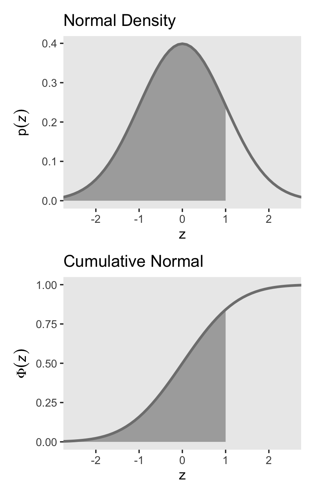

Our overall plot theme will be based on `ggplot2::theme_linedraw()` with just a few adjustments.


```r
theme_set(
  theme_linedraw() +
    theme(panel.grid = element_blank(),
          strip.background = element_rect(color = sl[9], fill = sl[9]),
          strip.text = element_text(color = sl[1]))
)
```

Now plot!


```r
p1 <-
  d %>% 
  ggplot(aes(x = z)) +
  geom_ribbon(data = . %>% filter(z <=1),
              aes(ymin = 0, ymax = `p(z)`),
              fill = sl[2]) +
  geom_line(aes(y = `p(z)`),
            size = 1, color = sl[3]) +
  scale_y_continuous(expand = expansion(mult = c(0, 0.05))) + 
  labs(title = "Normal Density",
       y = expression(p(italic(z)))) 

p2 <-
  d %>% 
  ggplot(aes(x = z)) +
  geom_ribbon(data = . %>% filter(z <=1),
              aes(ymin = 0, ymax = `Phi(z)`),
              fill = sl[2]) +
  geom_line(aes(y = `Phi(z)`),
            size = 1, color = sl[3]) +
  scale_y_continuous(expand = expansion(mult = c(0, 0))) + 
  labs(title = "Cumulative Normal",
       y = expression(Phi(italic(z))))

# combine and adjust with patchwork
library(patchwork)

p1 / p2 & 
  scale_x_continuous(breaks = -2:2) & 
  coord_cartesian(xlim = c(-2.5, 2.5))
```


For both plots, `z` is in a standardized metric (i.e., $z$-score). With the cumulative normal function, the cumulative probability $\Phi(z)$ increases nonlinearly with the $z$-scores such that, much like with the logistic curve, the greatest change occurs around $z = 0$ and tapers off in the tails.

The inverse of $\Phi(x)$ is the *probit* function. As indicated in the above block quote, we'll be making extensive use of the probit function in this chapter for our Bayesian models.

## Modeling ordinal data with an underlying metric variable

> You can imagine that the distribution of ordinal values might not resemble a normal distribution, even though the underlying metric values are normally distributed. Figure 23.1 shows some examples of ordinal outcome probabilities generated from an underlying normal distribution. The horizontal axis is the underlying continuous metric value. Thresholds are plotted as vertical dashed lines, labeled $\theta$. In all examples, the ordinal scale has 7 levels, and hence, there are 6 thresholds. The lowest threshold is set at $\theta_1 = 1.5$ (to separate outcomes 1 and 2), and the highest threshold is set at $\theta_1 = 6.5$ (to separate outcomes 6 and 7). The normal curve in each panel shows the distribution of underlying continuous values. What differs across panels are the settings of means, standard deviations, and remaining thresholds. (p. 672)

The various Figure 23.1 subplots require a lot of ins and outs. We'll start with the top panel and build from there. Here is how we might make the values necessary for the density curve.


```r
den <-
  # define the parameters for the underlying normal distribution
  tibble(mu    = 4,
         sigma = 1.5) %>% 
  mutate(strip = str_c("mu==", mu, "~~sigma==", sigma)) %>% 
  # this will allow us to rescale the density in terms of the bar plot
  mutate(multiplier = 26 / dnorm(mu, mu, sigma)) %>% 
  # we need values for the x-axis
  expand(nesting(mu, sigma, strip, multiplier),
         y = seq(from = -1, to = 9, by = .1)) %>% 
  # compute the density values
  mutate(density = dnorm(y, mu, sigma)) %>% 
  # use that multiplier value from above to rescale the density values
  mutate(percent = density * multiplier)

head(den)
```

```
## # A tibble: 6 x 7
##      mu sigma strip             multiplier     y density percent
##   <dbl> <dbl> <chr>                  <dbl> <dbl>   <dbl>   <dbl>
## 1     4   1.5 mu==4~~sigma==1.5       97.8  -1   0.00103   0.101
## 2     4   1.5 mu==4~~sigma==1.5       97.8  -0.9 0.00128   0.125
## 3     4   1.5 mu==4~~sigma==1.5       97.8  -0.8 0.00159   0.155
## 4     4   1.5 mu==4~~sigma==1.5       97.8  -0.7 0.00196   0.192
## 5     4   1.5 mu==4~~sigma==1.5       97.8  -0.6 0.00241   0.236
## 6     4   1.5 mu==4~~sigma==1.5       97.8  -0.5 0.00295   0.289
```

Before making the data for the bar portion of the plot, we'll need to define the $\theta$-values they'll be placed between. We also need to define the exact points on the $x$-axis from which we'd like those bars to originate. Those points, which we'll call `label_1`, will double as names for the individual bars.


```r
(theta_1 <- seq(from = 1.5, to = 6.5, by = 1))
```

```
## [1] 1.5 2.5 3.5 4.5 5.5 6.5
```

```r
(label_1 <- 1:7)
```

```
## [1] 1 2 3 4 5 6 7
```

Now we can define the data for the bars.


```r
bar <-
  # define the parameters for the underlying normal distribution
  tibble(mu    = 4,
         sigma = 1.5) %>% 
  mutate(strip = str_c("mu==", mu, "~~sigma==", sigma)) %>% 
  # take random draws from the underlying normal distribution
  mutate(draw = map2(mu, sigma, ~rnorm(1e4, mean = .x, sd = .y))) %>% 
  unnest(draw) %>% 
  # bin those draws into ordinal categories defined by `theta_1`
  # and named by `label_1`
  mutate(y = case_when(
    draw  < theta_1[1] ~ label_1[1],
    draw  < theta_1[2] ~ label_1[2],
    draw  < theta_1[3] ~ label_1[3],
    draw  < theta_1[4] ~ label_1[4],
    draw  < theta_1[5] ~ label_1[5],
    draw  < theta_1[6] ~ label_1[6],
    draw >= theta_1[6] ~ label_1[7]
  )) %>% 
  # summarize
  count(y) %>% 
  mutate(percent = (100 * n / sum(n)) %>% round(0))   %>% 
  mutate(percent_label = str_c(percent, "%"),
         percent_max   = max(percent))

head(bar)
```

```
## # A tibble: 6 x 5
##       y     n percent percent_label percent_max
##   <int> <int>   <dbl> <chr>               <dbl>
## 1     1   458       5 5%                     27
## 2     2  1124      11 11%                    27
## 3     3  2128      21 21%                    27
## 4     4  2660      27 27%                    27
## 5     5  2042      20 20%                    27
## 6     6  1099      11 11%                    27
```

Make the top subplot.


```r
bar %>% 
  ggplot(aes(x = y)) +
  geom_ribbon(data = den,
              aes(ymin = 0, ymax = percent),
              fill = sl[3]) +
  geom_vline(xintercept = theta_1, color = "white", linetype = 3) +
  geom_col(aes(y = percent),
           width = .5, alpha = .85, fill = sl[7]) +
  geom_text(aes(y = percent + 2, label = percent_label),
            size = 3.5) +
  annotate(geom = "text", x = theta_1, y = -6.5,
           label = theta_1, size = 3) +
  scale_x_continuous(NULL, expand = c(0, 0),
                     breaks = theta_1,
                     labels = parse(text = str_c("theta[", 1:6, "]"))) +
  scale_y_continuous(NULL, breaks = NULL, expand = expansion(mult = c(0, 0.05))) +
  coord_cartesian(ylim = c(0, 28.5), clip = F) +
  theme(plot.margin = margin(5.5, 5.5, 11, 5.5)) +
  facet_wrap(~strip, labeller = label_parsed)
```


This method works okay for plotting one or two panels. The sheer number of code lines and moving parts seem unwieldy for plotting four. It'd be convenient if we could save the density information for all four panels in one data object. Here's one way how.


```r
den <-
  tibble(panel = 1:4,
         mu    = c(4, 1, 4, 4),
         sigma = c(1.5, 2.5, 1, 3)) %>% 
  mutate(strip = factor(panel,
                        labels  = str_c("mu==", mu, "~~sigma==", sigma),
                        ordered = T)) %>% 
  mutate(multiplier = c(26, 58, 24, 26) / dnorm(mu, mu, sigma)) %>% 
  expand(nesting(panel, mu, sigma, strip, multiplier),
         y = seq(from = -1, to = 9, by = .1)) %>% 
  mutate(density = dnorm(y, mu, sigma)) %>% 
  mutate(percent = density * multiplier)

head(den)
```

```
## # A tibble: 6 x 8
##   panel    mu sigma strip             multiplier     y density percent
##   <int> <dbl> <dbl> <ord>                  <dbl> <dbl>   <dbl>   <dbl>
## 1     1     4   1.5 mu==4~~sigma==1.5       97.8  -1   0.00103   0.101
## 2     1     4   1.5 mu==4~~sigma==1.5       97.8  -0.9 0.00128   0.125
## 3     1     4   1.5 mu==4~~sigma==1.5       97.8  -0.8 0.00159   0.155
## 4     1     4   1.5 mu==4~~sigma==1.5       97.8  -0.7 0.00196   0.192
## 5     1     4   1.5 mu==4~~sigma==1.5       97.8  -0.6 0.00241   0.236
## 6     1     4   1.5 mu==4~~sigma==1.5       97.8  -0.5 0.00295   0.289
```

Notice we added a `panel` column for indexing the subplots. Next we'll need to define `theta_[i]` and `label_[i]` values for the remaining plots.


```r
theta_3 <- c(1.5, 3.1, 3.7, 4.3, 4.9, 6.5)
theta_4 <- c(1.5, 2.25, 3, 5, 5.75, 6.5)

label_3 <- c(1, 2.2, 3.4, 4, 4.6, 5.7, 7)
label_4 <- c(1, 1.875, 2.625, 4, 5.375, 6.125, 7)
```

Since the values are the same for the top two panels, we didn't bother defining a `theta_2` or `label_2`. Now we have all the `theta_[i]` and `label_[i]` values, we'll want to make a function that can use them within `case_when()` for any of the four panels. Here's one way to make such a function, which we'll call `make_ordinal()`.


```r
make_ordinal <- function(x, panel) {
  
  if (panel < 3) {
    
    case_when(
      x  < theta_1[1] ~ label_1[1],
      x  < theta_1[2] ~ label_1[2],
      x  < theta_1[3] ~ label_1[3],
      x  < theta_1[4] ~ label_1[4],
      x  < theta_1[5] ~ label_1[5],
      x  < theta_1[6] ~ label_1[6],
      x >= theta_1[6] ~ label_1[7]
    )
    
  } else if (panel == 3) {
    
    case_when(
      x  < theta_3[1] ~ label_3[1],
      x  < theta_3[2] ~ label_3[2],
      x  < theta_3[3] ~ label_3[3],
      x  < theta_3[4] ~ label_3[4],
      x  < theta_3[5] ~ label_3[5],
      x  < theta_3[6] ~ label_3[6],
      x >= theta_3[6] ~ label_3[7]
    )
    
  } else {
    
    case_when(
      x  < theta_4[1] ~ label_4[1],
      x  < theta_4[2] ~ label_4[2],
      x  < theta_4[3] ~ label_4[3],
      x  < theta_4[4] ~ label_4[4],
      x  < theta_4[5] ~ label_4[5],
      x  < theta_4[6] ~ label_4[6],
      x >= theta_4[6] ~ label_4[7]
    )
   }
}
```

Now put those values and our `make_ordinal()` function to work to make the data for the bar plots.


```r
set.seed(23)

bar <-
  tibble(panel = 1:4,
         mu    = c(4, 1, 4, 4),
         sigma = c(1.5, 2.5, 1, 3)) %>% 
  mutate(strip = factor(panel,
                        labels  = str_c("mu==", mu, "~~sigma==", sigma),
                        ordered = T)) %>% 
  mutate(draw = map2(mu, sigma, ~rnorm(1e5, mean = .x, sd = .y))) %>% 
  unnest(draw) %>% 
  mutate(y = map2_dbl(draw, panel, make_ordinal)) %>% 
  group_by(panel, strip) %>% 
  count(y) %>% 
  mutate(percent = (100 * n / sum(n)) %>% round(0))   %>% 
  mutate(percent_label = str_c(percent, "%"),
         percent_max   = max(percent))

head(bar)
```

```
## # A tibble: 6 x 7
## # Groups:   panel, strip [1]
##   panel strip                 y     n percent percent_label percent_max
##   <int> <ord>             <dbl> <int>   <dbl> <chr>               <dbl>
## 1     1 mu==4~~sigma==1.5     1  4763       5 5%                     26
## 2     1 mu==4~~sigma==1.5     2 10844      11 11%                    26
## 3     1 mu==4~~sigma==1.5     3 21174      21 21%                    26
## 4     1 mu==4~~sigma==1.5     4 26256      26 26%                    26
## 5     1 mu==4~~sigma==1.5     5 21233      21 21%                    26
## 6     1 mu==4~~sigma==1.5     6 10951      11 11%                    26
```

Like before, we added a `panel` index. As our final preparatory step, we will make something of a super function with which we'll plug the desired information into **ggplot2**, which will then make each subplot. Much of the plotting and data wrangling code will be the same across subplots. As far as I can tell, we only need to vary four parameters. First, we'll want to be able to subset the data by `panel` index. We'll do that with the `panel_n` argument. Second, we'll want to select which of the `theta_[i]` values we'd like to use in `geom_vline()`, `annotate()`, and `scale_x_continuous()`. We'll do that with the `theta` argument. We'll make a `y_second_x` to pin down exactly where below the $x$-axis we'd like to put those secondary axis values defined by the `theta_[i]` values. Finally, we'll want an `ylim_ub` parameter to set the upper limit of the $y$-axis with. The name of our four-parameter super function will be `plot_bar_den()`.


```r
plot_bar_den <- function(panel_n, theta, y_second_x, ylim_ub) {
  
  bar %>% 
    filter(panel == panel_n) %>% 
    
    ggplot(aes(x = y)) +
    geom_ribbon(data = den %>% filter(panel == panel_n),
                aes(ymin = 0, ymax = percent),
                fill = sl[3]) +
    geom_vline(xintercept = theta, color = "white", linetype = 3) +
    geom_linerange(aes(ymin = 0, ymax = percent),
                   color = sl[7], alpha = .85, size = 8) +
    geom_text(aes(y = percent + (percent_max / 15), label = percent_label),
              size = 3.5) +
    annotate(geom = "text", x = theta, y = y_second_x,
             label = theta, size = 3) +
    scale_x_continuous(NULL, 
                       breaks = theta,
                       labels = parse(text = str_c("theta[", 1:6, "]")),
                       expand = c(0, 0)) +
    scale_y_continuous(NULL, breaks = NULL, expand = expansion(mult = c(0, 0.05))) +
    coord_cartesian(ylim = c(0, ylim_ub), 
                    clip = F) +
    theme(plot.margin = margin(5.5, 5.5, 11, 5.5)) +
    facet_wrap(~strip, labeller = label_parsed)
  
}
```

Finally, make all four subplots and combine them with **patchwork** syntax!


```r
p1 <- plot_bar_den(panel_n    = 1, 
                   theta      = theta_1, 
                   y_second_x = -6.75, 
                   ylim_ub    = 28)

p2 <- plot_bar_den(panel_n    = 2, 
                   theta      = theta_1, 
                   y_second_x = -15.5, 
                   ylim_ub    = 63)

p3 <- plot_bar_den(panel_n    = 3, 
                   theta      = theta_3, 
                   y_second_x = -6.25, 
                   ylim_ub    = 25.75)

p4 <- plot_bar_den(panel_n    = 4, 
                   theta      = theta_4, 
                   y_second_x = -6.75, 
                   ylim_ub    = 28)

p1 / p2 / p3 / p4
```


Oh mamma. "*The crucial concept in Figure 23.1 is that the probability of a particular ordinal outcome is the area under the normal curve between the thresholds of that outcome*" (p. 672, *emphasis* in the original). In each of the subplots, we used six thresholds to descritize the continuous data into seven categories. More generally, we need $K$ thresholds to make $K + 1$ ordinal categories. To make this work,

> the idea is that we consider the cumulative area under the normal up the high-side threshold, and subtract away the cumulative area under the normal up to the low-side threshold. Recall that the cumulative area under the standardized normal is denoted $\Phi(z)$, as was illustrated in Figure 15.8 [which we remade at the top of this chapter]. Thus, the area under the normal to the left of $\theta_k$ is $\Phi((\theta_k - \mu) / \sigma)$, and the area under the normal to the left of $\theta_{k - 1}$ is $\Phi((\theta_{k - 1} - \mu) / \sigma)$. Therefore, the area under the normal curve between the two thresholds, which is the probability of outcome $k$, is
>
> $$p(y = k | \mu, \sigma, \{ \theta_j \}) = \Phi((\theta_k - \mu) / \sigma) - \Phi((\theta_{k - 1} - \mu) / \sigma)$$
>
> [This equation] applies even to the least and greatest ordinal values if we append two "virtual" thresholds at $- \infty$ and $+ \infty$...
>
> Thus, a normally distributed underlying metric value can yield a clearly non-normal distribution of discrete ordinal values. This result does not imply that the ordinal values can be treated as if they were themselves metric and normally distributed; in fact it implies the opposite: We might be able to model a distribution of ordinal values as consecutive intervals of a normal distribution on an underlying metric scale with appropriately positioned thresholds. (pp. 674--675)

## The case of a single group

Given a model with no predictors, "if there are $K$ ordinal values, the model has $K + 1$ parameters: $\theta_1,...,\theta_{K - 1}, \mu$, and $\sigma$. If you think about it a moment, you’ll realize that the parameter values trade-off and are undetermined" (p. 675). The solution Kruschke took throughout this chapter was to fix the two thresholds at the ends, $\theta_1$  and $\theta_{K - 1}$, to the constants

\begin{align*}
\theta_1 \equiv 1 + 0.5 && \text{and}  && \theta_{K - 1} \equiv K - 0.5.
\end{align*}

For example, all four subplots from Figure 23.1 had $K = 7$ categories, ranging from 1 to 7. Following Kruschke's convention would mean setting the endmost thresholds to

\begin{align*}
\theta_1 \equiv 1.5 && \text{and}  && \theta_6 \equiv 6.5.
\end{align*}

As we'll see, there are other ways to parameterize these models.

### Implementation in ~~JAGS~~ **brms**.

The syntax to fit a basic ordered probit model with `brms::brm()` is pretty simple.


```r
fit <-
  brm(data = my_data,
      family = cumulative(probit),
      y ~ 1,
      prior(normal(0, 4), class = Intercept))
```

The `family = cumulative(probit)` tells **brms** you'd like to use the probit link for the ordered-categorical data. It's important to specify `probit` because the **brms** default is to use the `logit` link, instead. We'll talk more about that approach at the end of this chapter.

Remember how, at the end of the last section, we said there are other ways to parameterize the ordered probit model? As it turns out, **brms** does not follow Kruschke's approach for fixing the thresholds on the ends. Rather, **brms** freely estimates all thresholds, $\theta_1,...,\theta_{K - 1}$, by fixing $\mu = 0$ and $\sigma = 1$. That is, instead of estimating $\mu$ and $\sigma$ from the normal cumulative density function $\Phi(x)$, `brms::brm()` uses the standard normal cumulative density function $\Phi(z)$.

This all probably seems abstract. We'll get a lot of practice comparing the two approaches as we go along. Each has its strengths and weaknesses. At this point, the thing to get is that when fitting a single-group ordered-probit model with the `brm()` function, there will be no priors for $\mu$ and $\sigma$. We only have to worry about setting the priors for all $K - 1$ thresholds. And because those thresholds are conditional on $\Phi(z)$, we should think about their priors with respect to the scale of standard normal distribution. Thus, to continue on with Kruschke's minimally-informative prior approach, something like `prior(normal(0, 4), class = Intercept)` might be a good starting place. Do feel free to experiment with different settings.

### Examples: Bayesian estimation recovers true parameter values.

The data for Kruschke's first example come from his `OrdinalProbitData-1grp-1.csv` file. Load the data.


```r
my_data_1 <- read_csv("data.R/OrdinalProbitData-1grp-1.csv")

glimpse(my_data_1)
```

```
## Rows: 100
## Columns: 1
## $ Y <dbl> 1, 1, 1, 1, 1, 1, 1, 1, 1, 1, 1, 1, 1, 1, 1, 1, 1, 1, 1, 1, 1, 1, 1, 1, 1, 1, 1, 1, 1, 1, 1, 1, 1…
```

Plot the distribution for `Y`.


```r
my_data_1 %>% 
  mutate(Y = factor(Y)) %>% 
  
  ggplot(aes(x = Y)) +
  geom_bar(fill = sl[5]) +
  scale_y_continuous(expand = expansion(mult = c(0, 0.05)))
```


It looks a lot like the distribution of the data from one of the panels from Figure 23.1. Load **brms**.


```r
library(brms)
```

Fit the first cumulative-probit model.


```r
fit23.1 <-
  brm(data = my_data_1,
      family = cumulative(probit),
      Y ~ 1,
      prior(normal(0, 4), class = Intercept),
      iter = 3000, warmup = 1000, chains = 4, cores = 4,
      seed = 23,
      file = "fits/fit23.01")
```

Examine the model summary.


```r
print(fit23.1)
```

```
##  Family: cumulative 
##   Links: mu = probit; disc = identity 
## Formula: Y ~ 1 
##    Data: my_data_1 (Number of observations: 100) 
## Samples: 4 chains, each with iter = 3000; warmup = 1000; thin = 1;
##          total post-warmup samples = 8000
## 
## Population-Level Effects: 
##              Estimate Est.Error l-95% CI u-95% CI Rhat Bulk_ESS Tail_ESS
## Intercept[1]     0.18      0.13    -0.06     0.43 1.00    10478     6237
## Intercept[2]     0.60      0.14     0.34     0.87 1.00    11631     6624
## Intercept[3]     1.04      0.15     0.75     1.35 1.00    11040     6442
## Intercept[4]     1.50      0.19     1.15     1.89 1.00    11421     6176
## Intercept[5]     1.96      0.25     1.51     2.49 1.00    10805     6734
## Intercept[6]     2.58      0.41     1.89     3.50 1.00    11089     5824
## 
## Family Specific Parameters: 
##      Estimate Est.Error l-95% CI u-95% CI Rhat Bulk_ESS Tail_ESS
## disc     1.00      0.00     1.00     1.00 1.00     8000     8000
## 
## Samples were drawn using sampling(NUTS). For each parameter, Bulk_ESS
## and Tail_ESS are effective sample size measures, and Rhat is the potential
## scale reduction factor on split chains (at convergence, Rhat = 1).
```

The **brms** output for these kinds of models names the thresholds $\theta_{[i]}$ as `Intercept[i]`. Again, whereas Kruschke identified his model by fixing $\theta_1 = 1.5$ (i.e., $1 + 0.5$) and $\theta_6 = 5.5$ (i.e., $6 - 0.5$), we freely estimated all six thresholds by using the cumulative density function for the standard normal. As a result, our thresholds are in a different metric from Kruschke's.

Let's extract the posterior draws.


```r
post <- posterior_samples(fit23.1)

glimpse(post)
```

```
## Rows: 8,000
## Columns: 8
## $ `b_Intercept[1]` <dbl> 0.176365524, 0.290250408, 0.222858890, 0.208922913, 0.239476283, 0.024794185, 0.11…
## $ `b_Intercept[2]` <dbl> 0.7952375, 0.5592468, 0.5734168, 0.5581022, 0.6618688, 0.4823525, 0.3701400, 0.907…
## $ `b_Intercept[3]` <dbl> 1.2222469, 0.8376142, 1.1688562, 1.4456193, 0.9044261, 1.2228980, 0.8919454, 1.282…
## $ `b_Intercept[4]` <dbl> 1.608280, 1.337227, 1.542249, 1.784933, 1.350963, 1.692463, 1.195944, 1.865363, 1.…
## $ `b_Intercept[5]` <dbl> 1.895224, 2.150194, 1.665273, 1.881749, 2.422416, 1.851997, 1.618101, 2.204783, 1.…
## $ `b_Intercept[6]` <dbl> 2.913132, 2.375795, 2.854285, 2.993441, 2.596137, 2.479600, 2.133663, 2.844773, 2.…
## $ disc             <dbl> 1, 1, 1, 1, 1, 1, 1, 1, 1, 1, 1, 1, 1, 1, 1, 1, 1, 1, 1, 1, 1, 1, 1, 1, 1, 1, 1, 1…
## $ lp__             <dbl> -151.9901, -154.3340, -154.2131, -159.2274, -155.1989, -154.1413, -153.1043, -152.…
```

Wrangle `post` a bit.


```r
post <-
  post %>%
  select(`b_Intercept[1]`:`b_Intercept[6]`) %>%
  mutate(iter = 1:n())
```

Here's our **brms** version of the bottom plot of Figure 23.2.


```r
means <-
  post %>% 
  summarise_at(vars(`b_Intercept[1]`:`b_Intercept[6]`), mean) %>% 
  pivot_longer(everything(),
               values_to = "mean")

post %>% 
  gather(name, threshold, -iter) %>% 
  group_by(iter) %>% 
  mutate(theta_bar = mean(threshold)) %>% 
  
  ggplot(aes(x = threshold, y = theta_bar, color = name)) +
  geom_vline(data = means,
             aes(xintercept = mean, color = name),
             linetype = 2) +
  geom_point(alpha = 1/10) +
  scale_color_scico_d(palette = "lajolla", begin = .25) +
  ylab("mean threshold") +
  theme(legend.position = "none")
```


The initial `means` data at the top contains the $\theta_i$-specific means, which we used to make the dashed vertical lines with `geom_vline()`. Did you see what we did there with those `group_by()` and `mutate()` lines? That's how we computed the mean threshold within each step of the HMC chain, what Kruschke (p. 680) denoted as $\bar \theta (s) = \sum_k^{K-1} \theta_k (s) / (K - 1)$, where $s$ refers to particular steps in the HMC chain.

Perhaps of greater interest, you might have noticed how different our plot is from the one in the text. We might should compare the results of our **brms** parameterization of $\theta_{[i]}$ with one based on the parameterization in the text in an expanded version of the bottom plot of Figure 23.2. To convert our **brms** output to match Kruschke's, we'll rescale our $\theta_{[i]}$ draws with help from the `scales::rescale()` function, about which you might learn more [here](https://www.rdocumentation.org/packages/scales/versions/0.4.1/topics/rescale).


```r
# primary data wrangling
p <-
  bind_rows(
    # brms parameterization
    post %>% 
      gather(name, threshold, -iter) %>% 
      group_by(iter) %>% 
      mutate(theta_bar = mean(threshold)),
    # Kruschke's parameterization
    post %>% 
      gather(name, threshold, -iter) %>% 
      group_by(iter) %>% 
      mutate(threshold = scales::rescale(threshold, to = c(1.5, 6.5))) %>% 
      mutate(theta_bar = mean(threshold))
  ) %>% 
  # add an index
  mutate(model = rep(c("brms parameterization", "Kruschke's parameterization"), each = n() / 2))

# compute the means by model and threshold for the vertical lines
means <-
  p %>% 
  ungroup() %>% 
  group_by(model, name) %>% 
  summarise(mean = mean(threshold))

# plot!
p %>% 
  ggplot(aes(x = threshold, y = theta_bar)) +
  geom_vline(data = means,
             aes(xintercept = mean, color = name),
             linetype = 2) +
  geom_point(aes(color = name),
             alpha = 1/10, size = 1/2) +
  scale_color_scico_d(palette = "lajolla", begin = .25) +
  ylab("mean threshold") +
  theme(legend.position = "none") +
  facet_wrap(~model, ncol = 1, scales = "free")
```

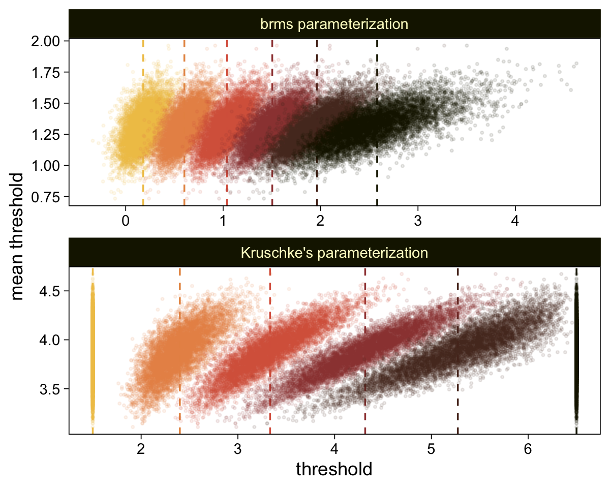

We can take our rescaling approach further to convert the posterior distributions for $\mu$ and $\sigma$ from the **brms** $\operatorname{Normal} (0, 1)$ constants to the metric from Kruschke's approach. Say $y_1$ and $y_2$ are two draws from some Gaussian and $z_1$ and $z_2$ are their corresponding $z$-scores. Here’s how to solve for $\sigma$.

\begin{align*}
z_1 - z_2 & = \frac{(y_1 - \mu)}{\sigma} - \frac{(y_2 - \mu)}{\sigma} \\
          & = \frac{(y_1 - \mu) - (y_2 - \mu)}{\sigma} \\
          & = \frac{y_1 - \mu - y_2 + \mu}{\sigma} \\
          & = \frac{y_1 - y_2}{\sigma}, \;\; \text{therefore} \\
\sigma    & = \frac{y_1 - y_2}{z_1 – z_2}.
\end{align*}

If you'd like to compute $\mu$, it's even simpler.

\begin{align*}
z_1 & = \frac{y_1 - \mu}{\sigma} \\
z_1 \sigma & = y_1 - \mu \\
z_1 \sigma + \mu & = y_1, \;\; \text{therefore}  \\
\mu & = y_1 - z_1 \sigma
\end{align*}

Big shout out to my math-stats savvy friends academic twitter for the formulas, especially [Ph.Demetri](https://twitter.com/PhDemetri), [Lukas Neugebauer](https://twitter.com/lukasneugebau), and [Brenton Wiernik](https://twitter.com/bmwiernik) for walking the formulas out (see [this twitter thread](https://twitter.com/SolomonKurz/status/1219649489016958976)). For our application, `Intercept[1]` and `Intercept[6]` will be our two $z$-scores and Kruschke's 1.5 and 6.5 will be their corresponding $y$-values.


```r
library(tidybayes)

post %>% 
  select(iter, `b_Intercept[1]`, `b_Intercept[6]`) %>% 
  mutate(`y[1]` = 1.5,
         `y[6]` = 6.5) %>% 
  mutate(mu    = `y[1]` - `b_Intercept[1]` * 1,
         sigma = (`y[1]` - `y[6]`) / (`b_Intercept[1]` - `b_Intercept[6]`)) %>% 
  mutate(`(mu-2)/sigma` = (mu - 2) / sigma) %>% 
  pivot_longer(mu:`(mu-2)/sigma`) %>% 
  mutate(name = factor(name,
                       levels = c("mu", "sigma", "(mu-2)/sigma"))) %>%
  
  ggplot(aes(x = value, y = 0)) +
  stat_halfeye(point_interval = mode_hdi, .width = .95,
               fill = sl[4], color = sl[8],
               normalize = "panels") +
  scale_y_continuous(NULL, breaks = NULL) +
  facet_wrap(~name, scales = "free", labeller = label_parsed)
```

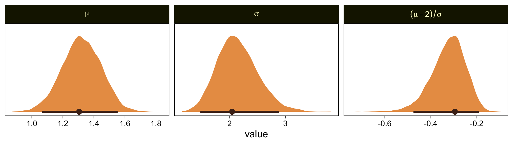

Our results are similar to Kruschke's. Given we used a different algorithm, a different parameterization, and different priors, I'm not terribly surprised. If you have more insight on the matter or have spotted a flaw in this method, [please share with the rest of us](https://github.com/ASKurz/Doing-Bayesian-Data-Analysis-in-brms-and-the-tidyverse/issues).

It's unclear, to me, how we'd interpret the effect size. The difficulty isn't that Kruschke's comparison of $C = 2.0$ is arbitrary, but that we can only interpret the comparison given the model assumption of $\theta_1 = 1.5$ and $\theta_6 = 6.5$. If your theory doesn't allow you to understand the meaning of those constants and why you'd prefer them to slightly different ones, you'd be fooling yourself if you attempted to interpret any effect sizes conditional on those values. Proceed with caution.

In the large paragraph on the lower part of page 679, Kruschke discussed why the thresholds tend to have nontrivial covariances. This is what he was trying to convey with the bottom subplot in Figure 23.2. If you're curious, here is the correlation matrix among the thresholds.


```r
vcov(fit23.1, correlation = T) %>% round(digits = 2)
```

```
##              Intercept[1] Intercept[2] Intercept[3] Intercept[4] Intercept[5] Intercept[6]
## Intercept[1]         1.00         0.72         0.52         0.35         0.23         0.10
## Intercept[2]         0.72         1.00         0.71         0.48         0.32         0.14
## Intercept[3]         0.52         0.71         1.00         0.66         0.42         0.20
## Intercept[4]         0.35         0.48         0.66         1.00         0.62         0.30
## Intercept[5]         0.23         0.32         0.42         0.62         1.00         0.51
## Intercept[6]         0.10         0.14         0.20         0.30         0.51         1.00
```


Kruschke didn't do this in the text, but it might be informative to plot the probability distributions for the seven categories from `Y` (i.e., $p(y = k | \mu = 0, \sigma = 1, \{ \theta_i \})$).


```r
library(tidybayes)

post %>% 
  select(-iter) %>% 
  mutate_all(.funs = ~pnorm(. ,0, 1)) %>% 
  transmute(`p[Y==1]` = `b_Intercept[1]`,
            `p[Y==2]` = `b_Intercept[2]` - `b_Intercept[1]`,
            `p[Y==3]` = `b_Intercept[3]` - `b_Intercept[2]`,
            `p[Y==4]` = `b_Intercept[4]` - `b_Intercept[3]`,
            `p[Y==5]` = `b_Intercept[5]` - `b_Intercept[4]`,
            `p[Y==6]` = `b_Intercept[6]` - `b_Intercept[5]`,
            `p[Y==7]` = 1 - `b_Intercept[6]`) %>% 
  set_names(1:7) %>% 
  pivot_longer(everything(), names_to = "Y") %>% 
  
  ggplot(aes(x = value, y = Y)) +
  stat_halfeye(point_interval = mode_hdi, .width = .95, 
               fill = sl[4], color = sl[8], size = 1/2) +
  scale_x_continuous(expression(italic(p)*"["*Y==italic(i)*"]"),
                     breaks = 0:5 / 5,
                     expand = c(0, 0), limits = c(0, 1))
```

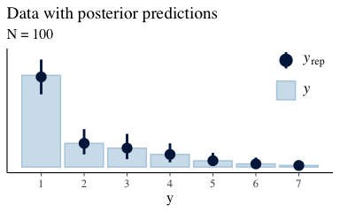

Happily, the model produces data that look a lot like those from which it was generated.


```r
set.seed(23)

post %>% 
  mutate(z = rnorm(n(), mean = 0, sd = 1)) %>% 
  mutate(Y = case_when(
    z < `b_Intercept[1]` ~ 1,
    z < `b_Intercept[2]` ~ 2,
    z < `b_Intercept[3]` ~ 3,
    z < `b_Intercept[4]` ~ 4,
    z < `b_Intercept[5]` ~ 5,
    z < `b_Intercept[6]` ~ 6,
    z >= `b_Intercept[6]` ~ 7
  ) %>% as.factor(.)) %>% 

  ggplot(aes(x = Y)) +
  geom_bar(fill = sl[5]) +
  scale_y_continuous(expand = expansion(mult = c(0, 0.05)))
```

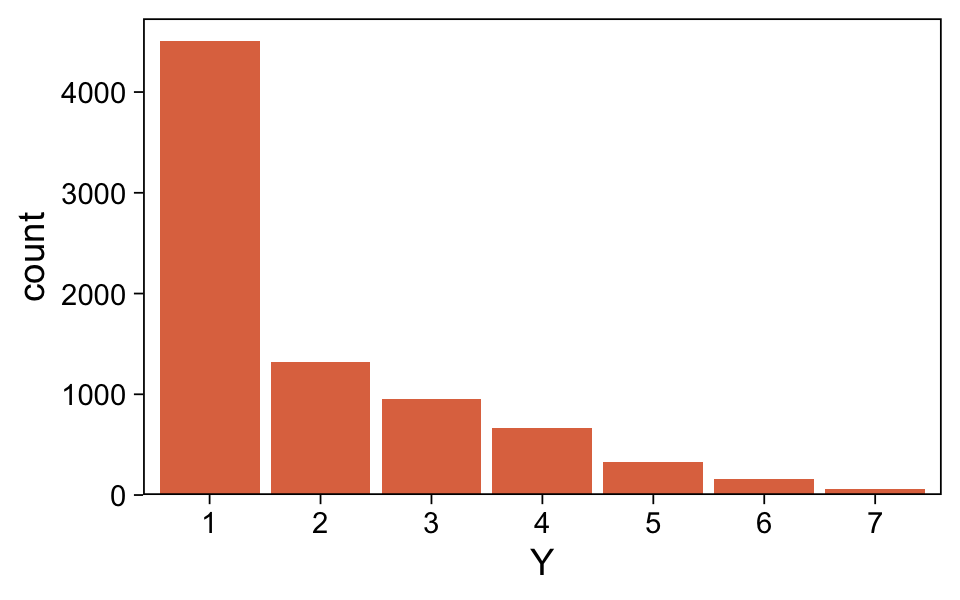

Along similar lines, we can use the `pp_check()` function to make a version of the upper right panel of Figure 23.2. The `type = "bars"` argument will allow us to summarize the posterior predictions as a dot (mean) and standard error bars superimposed on a bar plot of the original data. Note how this differs a little from Kruschke's use of the posterior median and 95% HDIs. The `nsamples = 1000` argument controls how many posterior predictions we wanted to summarize over. The rest is just formatting.


```r
bayesplot::color_scheme_set(sl[2:7])

set.seed(23)

pp_check(fit23.1, type = "bars", nsamples = 1000) +
  scale_x_continuous("y", breaks = 1:7) +
  scale_y_continuous(NULL, breaks = NULL, expand = expansion(mult = c(0, 0.05))) +
  ggtitle("Data with posterior predictions",
          subtitle = "N = 100") +
  theme(legend.background = element_blank(),
        legend.position = c(.9, .8))
```


Load the data for the next model.


```r
my_data_2 <- read_csv("data.R/OrdinalProbitData-1grp-2.csv")
```

Since we're reusing all the specifications from the last model for this one, we can just use `update()`.


```r
fit23.2 <-
  update(fit23.1, 
         newdata = my_data_2,
         iter = 3000, warmup = 1000, chains = 4, cores = 4,
         seed = 23,
         file = "fits/fit23.02")
```


```r
print(fit23.2)
```

```
##  Family: cumulative 
##   Links: mu = probit; disc = identity 
## Formula: Y ~ 1 
##    Data: my_data_2 (Number of observations: 70) 
## Samples: 4 chains, each with iter = 3000; warmup = 1000; thin = 1;
##          total post-warmup samples = 8000
## 
## Population-Level Effects: 
##              Estimate Est.Error l-95% CI u-95% CI Rhat Bulk_ESS Tail_ESS
## Intercept[1]    -1.40      0.21    -1.84    -1.01 1.00     4477     5142
## Intercept[2]    -0.17      0.15    -0.47     0.12 1.00     8868     6894
## Intercept[3]     0.17      0.15    -0.13     0.46 1.00     8779     6481
## Intercept[4]     0.46      0.16     0.15     0.78 1.00     8760     6535
## Intercept[5]     0.83      0.17     0.50     1.17 1.00     8915     6753
## Intercept[6]     1.99      0.31     1.43     2.66 1.00     8307     6957
## 
## Family Specific Parameters: 
##      Estimate Est.Error l-95% CI u-95% CI Rhat Bulk_ESS Tail_ESS
## disc     1.00      0.00     1.00     1.00 1.00     8000     8000
## 
## Samples were drawn using sampling(NUTS). For each parameter, Bulk_ESS
## and Tail_ESS are effective sample size measures, and Rhat is the potential
## scale reduction factor on split chains (at convergence, Rhat = 1).
```

Extract and wrangle the posterior draws.


```r
post <- 
  posterior_samples(fit23.2) %>%
  select(`b_Intercept[1]`:`b_Intercept[6]`) %>%
  mutate(iter = 1:n())
```

Now we might compare the **brms** parameterization of $\theta_{[i]}$ with Kruschke's parameterization in an expanded version of the bottom plot of Figure 23.3. As we'll be making a lot of these plots throughout this chapter, it might be worthwhile to just make a custom function. We'll call it `compare_thresholds()`.


```r
compare_thresholds <- function(data, lb = 1.5, ub = 6.5) {
  
  # we have two parameters:
  # lb = lower bound
  # ub = upper bound
  
  # primary data wrangling
  p <-
    bind_rows(
      data %>% 
        gather(name, threshold, -iter) %>% 
        group_by(iter) %>% 
        mutate(theta_bar = mean(threshold)),
      data %>% 
        gather(name, threshold, -iter) %>% 
        group_by(iter) %>% 
        mutate(threshold = scales::rescale(threshold, to = c(lb, ub))) %>% 
        mutate(theta_bar = mean(threshold))
    ) %>% 
    mutate(model = rep(c("brms parameterization", "Kruschke's parameterization"), each = n() / 2)) 
  
  # compute the means by model and threshold for the vertical lines
  means <-
    p %>% 
    ungroup() %>% 
    group_by(model, name) %>% 
    summarise(mean = mean(threshold))
  
  # plot!
  p %>% 
    ggplot(aes(x = threshold, y = theta_bar)) +
    geom_vline(data = means,
               aes(xintercept = mean, color = name),
               linetype = 2) +
    geom_point(aes(color = name),
               alpha = 1/10, size = 1/2) +
    scale_color_scico_d(palette = "lajolla", begin = .25) +
    ylab("mean threshold") +
    theme(legend.position = "none") +
    facet_wrap(~model, ncol = 1, scales = "free")
  
}
```

Take that puppy for a spin.


```r
post %>% 
  compare_thresholds(lb = 1.5, ub = 6.5)
```

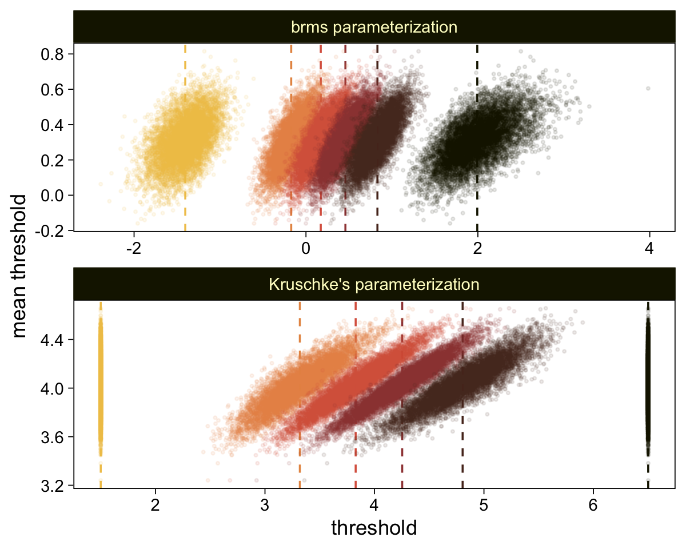

Oh man, that works sweet. Now let's use the same parameter-transformation approach from before to get our un-standardized posteriors for $\mu$, $\sigma$, and the effect size.


```r
post %>% 
  select(iter, `b_Intercept[1]`, `b_Intercept[6]`) %>% 
  mutate(`y[1]` = 1.5,
         `y[6]` = 6.5) %>% 
  mutate(mu    = `y[1]` - `b_Intercept[1]` * 1,
         sigma = (`y[1]` - `y[6]`) / (`b_Intercept[1]` - `b_Intercept[6]`)) %>% 
  mutate(`(mu-4)/sigma` = (mu - 4) / sigma) %>% 
  pivot_longer(mu:`(mu-4)/sigma`) %>% 
  mutate(name = factor(name,
                       levels = c("mu", "sigma", "(mu-4)/sigma"))) %>%
  
  ggplot(aes(x = value, y = 0)) +
  stat_halfeye(point_interval = mode_hdi, .width = .95,
               fill = sl[4], color = sl[8],
               normalize = "panels") +
  scale_y_continuous(NULL, breaks = NULL) +
  facet_wrap(~name, scales = "free", labeller = label_parsed)
```

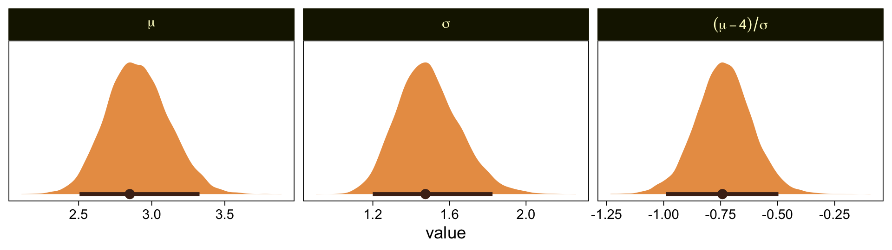

Use `pp_check()` to make our version of the upper-right panel of Figure 23.3.


```r
set.seed(23)

pp_check(fit23.2, type = "bars", nsamples = 1000) +
  scale_x_continuous("y", breaks = 1:7) +
  scale_y_continuous(NULL, breaks = NULL, expand = expansion(mult = c(0, 0.05))) +
  ggtitle("Data with posterior predictions",
          subtitle = "N = 70") +
  theme(legend.background = element_blank(),
        legend.position = c(.9, .8))
```


Just as in the text, "the posterior predictive distribution in the top-right subpanel accurately describes the bimodal distribution of the outcomes" (p. 680).

Here are the probability distributions for each of the 7 categories of `Y`.


```r
post %>% 
  select(-iter) %>% 
  mutate_all(.funs = ~pnorm(. ,0, 1)) %>% 
  transmute(`p[Y==1]` = `b_Intercept[1]`,
            `p[Y==2]` = `b_Intercept[2]` - `b_Intercept[1]`,
            `p[Y==3]` = `b_Intercept[3]` - `b_Intercept[2]`,
            `p[Y==4]` = `b_Intercept[4]` - `b_Intercept[3]`,
            `p[Y==5]` = `b_Intercept[5]` - `b_Intercept[4]`,
            `p[Y==6]` = `b_Intercept[6]` - `b_Intercept[5]`,
            `p[Y==7]` = 1 - `b_Intercept[6]`) %>% 
  set_names(1:7) %>% 
  pivot_longer(everything(), names_to = "Y") %>% 
  
  ggplot(aes(x = value, y = Y)) +
  stat_halfeye(point_interval = mode_hdi, .width = .95,
               fill = sl[4], color = sl[8], size = 1/2) +
  scale_x_continuous(expression(italic(p)*"["*Y==italic(i)*"]"), 
                     breaks = 0:5 / 5,
                     expand = c(0, 0), limits = c(0, 1))
```


Before we move on, it might be helpful to nail down what the thresholds mean within the context of our **brms** parameterization. To keep things simple, we'll focus on their posterior means.


```r
tibble(x = seq(from = -3.5, to = 3.5, by = .01)) %>%
  mutate(d = dnorm(x)) %>% 
  
  ggplot(aes(x = x, ymin = 0, ymax = d)) +
  geom_ribbon(fill = sl[3]) +
  geom_vline(xintercept = fixef(fit23.2)[, 1], color = "white", linetype = 3) +
  scale_x_continuous(NULL, breaks = fixef(fit23.2)[, 1],
                     labels = parse(text = str_c("theta[", 1:6, "]"))) +
  scale_y_continuous(NULL, breaks = NULL, expand = expansion(mult = c(0, 0.05))) +
  ggtitle("Standard normal distribution underlying the ordinal Y data:",
          subtitle = "The dashed vertical lines mark the posterior means for the thresholds.") +
  coord_cartesian(xlim = c(-3, 3))
```


Compare that to Figure 23.1.

#### Not the same results as pretending the data are metric.

"In some conventional approaches to ordinal data, the data are treated as if they were metric and normally distributed" (p. 681). Here's what that `brms::brm()` model might look like using methods from back in Chapter 16. First, we'll define our `stanvars`.


```r
mean_y <- mean(my_data_1$Y)
sd_y   <- sd(my_data_1$Y)

stanvars <- 
  stanvar(mean_y, name = "mean_y") + 
  stanvar(sd_y,   name = "sd_y")
```

Fit the model.


```r
fit23.3 <-
  brm(data = my_data_1,
      family = gaussian,
      Y ~ 1,
      prior = c(prior(normal(mean_y, sd_y * 100), class = Intercept),
                prior(normal(0, sd_y), class = sigma)),
      chains = 4, cores = 4,
      stanvars = stanvars, 
      seed = 23,
      file = "fits/fit23.03")
```

Check the results.


```r
print(fit23.3)
```

```
##  Family: gaussian 
##   Links: mu = identity; sigma = identity 
## Formula: Y ~ 1 
##    Data: my_data_1 (Number of observations: 100) 
## Samples: 4 chains, each with iter = 2000; warmup = 1000; thin = 1;
##          total post-warmup samples = 4000
## 
## Population-Level Effects: 
##           Estimate Est.Error l-95% CI u-95% CI Rhat Bulk_ESS Tail_ESS
## Intercept     1.95      0.14     1.68     2.23 1.00     3454     2723
## 
## Family Specific Parameters: 
##       Estimate Est.Error l-95% CI u-95% CI Rhat Bulk_ESS Tail_ESS
## sigma     1.41      0.10     1.23     1.62 1.00     3532     2700
## 
## Samples were drawn using sampling(NUTS). For each parameter, Bulk_ESS
## and Tail_ESS are effective sample size measures, and Rhat is the potential
## scale reduction factor on split chains (at convergence, Rhat = 1).
```

As Kruschke indicated in the text, it yielded a distributional mean of about 1.95 and a standard deviation of about 1.41. Here we'll use a posterior predictive check to compare histograms of data generated from this model to that of the original data.


```r
pp_check(fit23.3, type = "hist", nsamples = 10, binwidth = 1) +
  scale_x_continuous(breaks = seq(from = -3, to = 7, by = 2)) +
  theme(legend.position = c(.9, .15))
```

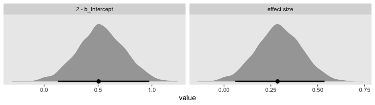

Yeah, that's not a good fit. We won't be conducting a $t$-test like Kruschke did on page 681. But we might compromise and take a look at the marginal distribution of the intercept (i.e., for $\mu$) and its difference from 2, the reference value.


```r
posterior_samples(fit23.3) %>% 
  mutate(`2 - b_Intercept` = 2 - b_Intercept,
         `effect size`     = (2 - b_Intercept) / sigma) %>% 
  pivot_longer(-c(sigma, b_Intercept, lp__)) %>% 
  
  ggplot(aes(x = value, y = 0)) +
  stat_halfeye(point_interval = mode_hdi, .width = .95,
               fill = sl[4], color = sl[8], normalize = "panels") +
  scale_y_continuous(NULL, breaks = NULL) +
  facet_wrap(~name, scales = "free")
```

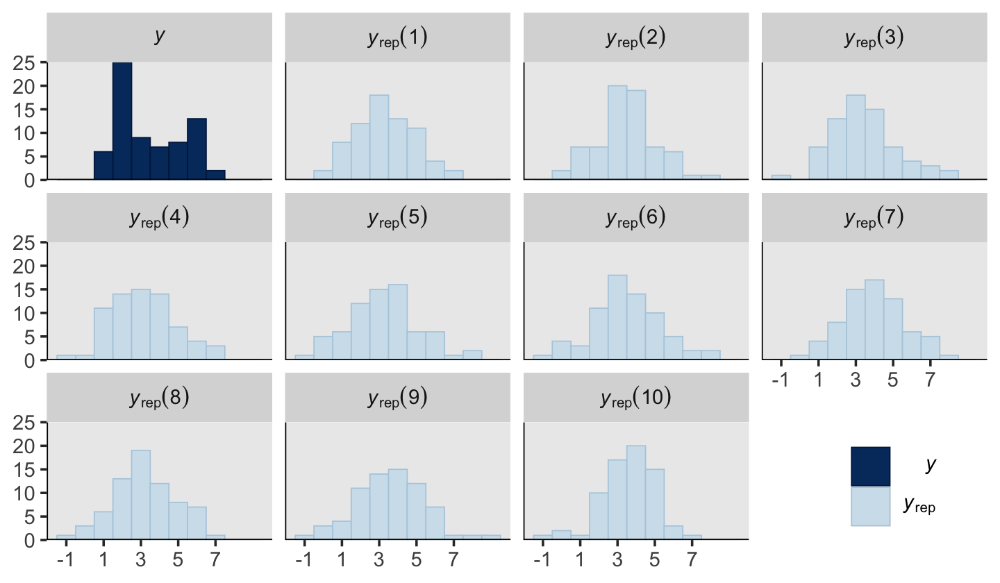

Yes indeed, 2 is a credible value for the intercept. And as reported in the text, we got a very small $d$ effect size. Now we repeat the process for the second data set.


```r
mean_y <- mean(my_data_2$Y)
sd_y   <- sd(my_data_2$Y)

stanvars <- 
  stanvar(mean_y, name = "mean_y") + 
  stanvar(sd_y,   name = "sd_y")

fit23.4 <-
  update(fit23.3,
         newdata = my_data_2,
         chains = 4, cores = 4,
         stanvars = stanvars, 
         seed = 23,
         file = "fits/fit23.04")
```

Let's just jump to the plot. This time we're comparing the `b_Intercept` to the value of 4.0.


```r
posterior_samples(fit23.4) %>% 
  mutate(`2 - b_Intercept` = 4 - b_Intercept,
         `effect size`     = (4 - b_Intercept) / sigma) %>% 
  pivot_longer(-c(sigma, b_Intercept, lp__)) %>% 
  
  ggplot(aes(x = value, y = 0)) +
  stat_halfeye(point_interval = mode_hdi, .width = .95,
               fill = sl[4], color = sl[8], normalize = "panels") +
  scale_y_continuous(NULL, breaks = NULL) +
  facet_wrap(~name, scales = "free")
```

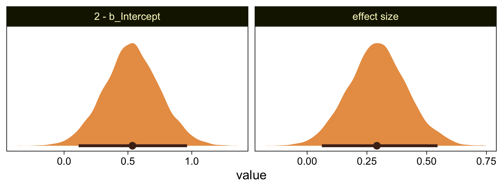

As in the text, our $d$ is centered around 0.3. Let's use a posterior predictive check to see how well `fit23.4` summarized these data.


```r
pp_check(fit23.4, type = "hist", nsamples = 10, binwidth = 1) +
  scale_x_continuous(breaks = seq(from = -3, to = 7, by = 2)) +
  theme(legend.position = c(.9, .15))
```


The histograms aren't as awful as the ones for the previous model. But they're still not great. We might further inspect the model misspecification with a cumulative distribution function overlay, this time comparing `fit23.2` directly to `fit23.4`.


```r
p1 <-
  pp_check(fit23.2, type = "ecdf_overlay", nsamples = 50) +
  ggtitle("Cumulative-normal (fit23.2)")

p2 <-
  pp_check(fit23.4, type = "ecdf_overlay", nsamples = 50) +
  ggtitle("Conventional-normal (fit23.4)")
  
(p1 + p2 & 
  scale_x_continuous(breaks = 0:7, limits = c(0, 7)) &
  scale_y_continuous(expand = c(0, 0)) &
  theme(title = element_text(size = 10.5))) + 
  plot_layout(guides = 'collect')
```


"Which of the analyses yields the more trustworthy conclusion? The one that describes the data better. In these cases, there is no doubt that the cumulative-normal model is the better description of the data" than the conventional Gaussian model (p. 682).

#### Ordinal outcomes versus Likert scales.

Just for fun,

> rate how much you agree with the statement, "Bayesian estimation is more informative than null-hypothesis significance testing," by selecting one option from the following: 1 = strongly disagree; 2 = disagree; 3 = undecided; 4 = agree; 5 = strongly agree. This sort of ordinal response interface is often called a Likert-type response [@likertTechniqueMeasurementAttitudes1932], pronounced LICK-ert not LIKE-ert). Sometimes, it is called a Likert "scale" but the term "scale" in this context is more properly reserved for referring to an underlying metric variable that is indicated by the arithmetic mean of several meaningfully related Likert-type responses [e.g., @carifio2007ten; @carifioResolving50yearDebate2008; @normanLikertScalesLevels2010]. (p. 681)

Kruschke then briefly introduced how one might combine several such meaningfully-related Likert-type responses with latent variable methods. He then clarified this text will not explore that approach, further. The current version of **brms** (i.e., [2.12.0](https://CRAN.R-project.org/package=brms/news/news.html)) has very limited latent variable capacities. However, they are in the works. Interested modelers can follow Bürkner's progress in [GitHub issue #304](https://github.com/paul-buerkner/brms/issues/304). He also has a [-@burknerBayesianItemResponse2020] [paper](https://arxiv.org/pdf/1905.09501.pdf) on how one might use **brms** to fit item response theory models, which can be viewed as a special family of latent variable models. One can also fit Bayesian latent variable models with the [**blavaan** package](https://faculty.missouri.edu/~merklee/blavaan/).

## The case of two groups

> In both examples in the preceding text, the two groups of outcomes were on the same ordinal scale. In the first example, both questionnaire statements were answered on the same disagree–agree scale. In the second example, both groups responded on the same very unhappy–very happy scale. Therefore, we assume that both groups have the same underlying metric variable with the same thresholds. (p. 682)

### Implementation in ~~JAGS~~ **brms**.

The `brm()` syntax for adding a single categorical predictor to an ordered-probit model is much like that for any other likelihood. We just add the variable name to the right side of the `~` in the `formula` argument. If you're like me and like to use the verbose `1` syntax for your model intercepts--thresholds in these models--just use the `+` operator between them. For example, this is what it'd look like for an ordered-categorical criterion `y` and a single categorical predictor `x`.


```r
fit <-
  brm(data = my_data,
      family = cumulative(probit),
      y ~ 1 + x,
      prior = c(prior(normal(0, 4), class = Intercept),
                prior(normal(0, 4), class = b)))
```

Also of note, we've expanded the `prior` section to include a line for `class = b`. As with the thresholds, interpret this prior through the context of the underlying standard normal cumulative distribution, $\Phi(z)$. Note the interpretation, though. By **brms** defaults, the underlying Gaussian for the reference category of `x` will be $\operatorname{Normal} (0, 1)$. Thus whatever parameter value you get for the other categories in `x`, those will be standardized mean differences, making them a kind of effect size.

Note, the above all presumes you're only interested in comparing means between groups. Things get more complicated if you want groups to vary by $\sigma$, too. Hold on tight!

First, look back at the output from `print(fit1)` or `print(fit2)`. The second line for both reads: `Links: mu = probit; disc = identity`. Hopefully the `mu = probit` part is no surprise. Probit regression is the primary focus of this chapter. But check out the `disc = identity` part and notice that nowhere in there is there any mention of `sigma = identity` like we get when treating the criterion as metric as in conventional Gaussian models (i.e., execute `print(fit3)` or `print(fit4)`).

Yes, there is a relationship between `disc` and `sigma`. `disc` is shorthand for *discrimination*. The term comes from the item response theory (IRT) literature and discrimination is the inverse of $\sigma$ (see Bürkner's [*Bayesian item response modelling in R with brms and Stan*](https://arxiv.org/pdf/1905.09501.pdf)). In IRT, discrimination is often denoted $a$ or $\alpha$. Here I'll adopt the latter, making $\sigma = 1 / \alpha$. But focusing back on **brms** summary output, notice how both `disc` and `sigma` are modeled using the identity link. If you recall from earlier chapters, we switched to the log link to constrain the values to zero and above when we allowed $\sigma$ to vary across groups. It's the same thing for our discrimination parameter, $\alpha$. Because $\alpha$ should always be zero or above, **brms** defaults to the log link when modeling it with predictors.

As with $\sigma$ in conventional Gaussian models, we'll be using some version of the `bf()` syntax when modeling the discrimination parameter in **brms**. For a general introduction to what Bürkner calls distributional modeling, see his [-@Bürkner2020Distributional] vignette, [*Estimating distributional models with brms*](https://CRAN.R-project.org/package=brms/vignettes/brms_distreg.html). In the case of the discrimination parameter for the cumulative model, we'll want more focused instructions. Happily, @burknerOrdinalRegressionModels2019 have our backs. We read:

> Conceptually, unequal variances are incorporated in the model by specifying an additional regression formula for the variance component of the latent variable $\tilde Y$. In brms, the parameter related to latent variances is called *disc* (short for "discrimination"), following conventions in item response theory. Note that disc is not the variance itself, but the inverse of the standard deviation, $s.$ That is, $s = 1/ \text{disc}$. Further, because disc must be strictly positive, it is by default modeled on the log scale.
>
> Predicting auxiliary parameters (parameters of the distribution other than the mean/location) in brms is accomplished by passing multiple regression formulas to the `brm()` function. Each formula must first be wrapped in another function, `bf()` or `lf()` (for "linear formula")--depending on whether it is a main or an auxiliary formula, respectively. The formulas are then combined and passed to the `formula` argument of `brm()`. Because the standard deviation of the latent variable is fixed to 1 for the baseline [group, disc cannot be estimated for the baseline group]. We must therefore ensure that disc is estimated only for [non-baseline groups]. To do so, we omit the intercept from the model of disc by writing `0 + ...` on the right-hand side of the regression formula. By default, R applies cell-mean coding to factors in formulas without an intercept. That would lead to disc being estimated for [all groups], so we must deactivate it via the `cmc` argument of `lf()`. (pp. 11--12)

Here's what that might look like.


```r
fit <-
  brm(data = my_data,
      family = cumulative(probit),
      bf(y ~ 1 + x) +
        lf(disc ~ 0 + x, cmc = F),
      prior = c(prior(normal(0, 4), class = Intercept),
                prior(normal(0, 4), class = b),
                prior(normal(0, 4), class = b, dpar = disc)))
```

Note how when using the `disc ~ 0 + ...` syntax, the `disc` parameters are of `class = b` within the `prior()` function. If you'd like to assign them priors differing from the other `b` parameters, you'll need to specify `dpar = disc`. Again, though the mean structure for this model is on the probit scale, the discrimination structure is on the log scale. Recalling that $\sigma = 1/\alpha$, which means $\alpha = 1/\sigma$, and also that we're modeling $\log (\alpha)$, the priors for the standard deviations of the non-reference category groups are on the scale of $\log (1 / \sigma)$.

To get a better sense of how one might set a prior on such a scale, we might compare $\sigma$, $\alpha$, and $\log (\alpha)$. Here are the density and cumulative density functions for $\operatorname{Normal}(0, 0.5)$, $\operatorname{Normal}(0, 1)$, and $\operatorname{Normal}(0, 2)$.


```r
tibble(mu    = 0,
       sigma = c(0.5, 1, 2)) %>%
  expand(nesting(mu, sigma),
         y = seq(from = -5, to = 5, by = 0.1)) %>% 
  mutate(`p(y)`   = dnorm(y, mu, sigma),
         `Phi(y)` = pnorm(y, mu, sigma)) %>% 
  mutate(alpha = 1 / sigma,
         loga  = log(1 / sigma)) %>% 
  mutate(label = str_c("list(sigma==", sigma, ",alpha==", alpha, ",log(alpha)==", round(loga, 2), ")")) %>% 
  pivot_longer(`p(y)`:`Phi(y)`) %>% 
  
  ggplot(aes(x = y, y = value)) +
  geom_line(size = 1.5, color = sl[7]) +
  scale_y_continuous(NULL, breaks = NULL) +
  xlab(NULL) +
  coord_cartesian(xlim = c(-4, 4)) +
  facet_grid(name~label, labeller = label_parsed, switch = "y")
```


Put another way, here's how $\alpha$ and $\log (\alpha)$ scale on values of $\sigma$ ranging from 0.0001 to 10.


```r
tibble(sigma = seq(from = 0.0001, to = 10, by = 0.01)) %>%
  mutate(alpha        = 1 / sigma,
         `log(alpha)` = log(1 / sigma)) %>% 
  pivot_longer(-sigma, names_to = "labels") %>% 
  
  ggplot(aes(x = sigma, y = value)) +
  geom_hline(yintercept = 0, color = sl[3], linetype = 2) +
  geom_vline(xintercept = 0, color = sl[3], linetype = 2) +
  geom_line(size = 1.5, color = sl[7]) +
  coord_cartesian(ylim = c(-2, 10)) +
  facet_grid(~labels, labeller = label_parsed)
```


When $\sigma$ goes below 1, both explode upward. As $\sigma$ increases, $\alpha$ asymptotes at zero and $\log (\alpha)$ slowly descends below zero. Put another way, here is how $\sigma$ scales as a function of $\log (\alpha)$.


```r
tibble(`log(alpha)` = seq(from = -3, to = 3, by = 0.01)) %>%
  mutate(sigma = 1 / exp(`log(alpha)`)) %>%
  
  ggplot(aes(x = `log(alpha)`, y = sigma)) +
  geom_hline(yintercept = 0, color = sl[3], linetype = 2) +
  geom_line(size = 1.5, color = sl[7]) +
  labs(x = expression(log(alpha)),
       y = expression(sigma)) +
  coord_cartesian(xlim = c(-2.5, 2.5),
                  ylim = c(0, 10))
```


In the context where the underlying distribution for the reference category will be the standard normal, it seems like a $\operatorname{Normal} (0, 1)$ prior would be fairly permissive for $\log (\alpha)$. This is what I will use going forward. Choose your priors with care.

### Examples: Not funny.

Load the data for the next model.


```r
my_data <- read_csv("data.R/OrdinalProbitData1.csv")

glimpse(my_data)
```

```
## Rows: 88
## Columns: 2
## $ X <chr> "A", "A", "A", "A", "A", "A", "A", "A", "A", "A", "A", "A", "A", "A", "A", "A", "A", "A", "A", "A…
## $ Y <dbl> 1, 1, 1, 1, 1, 1, 1, 1, 1, 1, 1, 1, 1, 1, 1, 1, 1, 1, 1, 1, 1, 1, 1, 1, 1, 1, 1, 1, 1, 1, 1, 2, 2…
```

Fit the first ordinal probit model with group-specific $\mu$ and $\sigma$ values for the underlying normal distributions for the ordinal variable `Y`.


```r
fit23.5 <-
  brm(data = my_data,
      family = cumulative(probit),
      bf(Y ~ 1 + X) +
        lf(disc ~ 0 + X, cmc = FALSE),
      prior = c(prior(normal(0, 4), class = Intercept),
                prior(normal(0, 4), class = b),
                prior(normal(0, 1), class = b, dpar = disc)),
      iter = 3000, warmup = 1000, chains = 4, cores = 4,
      seed = 23,
      file = "fits/fit23.05")
```

Look over the summary.


```r
print(fit23.5)
```

```
##  Family: cumulative 
##   Links: mu = probit; disc = log 
## Formula: Y ~ 1 + X 
##          disc ~ 0 + X
##    Data: my_data (Number of observations: 88) 
## Samples: 4 chains, each with iter = 3000; warmup = 1000; thin = 1;
##          total post-warmup samples = 8000
## 
## Population-Level Effects: 
##              Estimate Est.Error l-95% CI u-95% CI Rhat Bulk_ESS Tail_ESS
## Intercept[1]     0.50      0.19     0.13     0.89 1.00     7563     5819
## Intercept[2]     1.30      0.23     0.87     1.77 1.00     9412     6612
## Intercept[3]     2.21      0.38     1.54     3.05 1.00     5081     6216
## Intercept[4]     3.43      0.85     2.16     5.44 1.00     4025     5117
## XB               0.44      0.35    -0.32     1.06 1.00     4430     3234
## disc_XB         -0.32      0.29    -0.88     0.24 1.00     3134     4520
## 
## Samples were drawn using sampling(NUTS). For each parameter, Bulk_ESS
## and Tail_ESS are effective sample size measures, and Rhat is the potential
## scale reduction factor on split chains (at convergence, Rhat = 1).
```

Because our fancy new parameter `disc_XB` is on the $\log (\alpha)$ scale, we can convert it to the $\sigma$ scale with $\frac{1}{\exp (\log \alpha)}$. For a quick and dirty example, here it is with the posterior mean.


```r
1 / (exp(fixef(fit23.5)["disc_XB", 1]))
```

```
## [1] 1.372255
```

Before we follow along with Kruschke, let's hammer the meaning of these model parameters home. Here is a density plot of the two underlying latent distributions for `Y`, given `X`. We'll throw in the thresholds for good measure. To keep things simple, we'll just express the distributions in terms of the posterior means of each parameter.


```r
tibble(X     = LETTERS[1:2],
       mu    = c(0, fixef(fit23.5)["XB", 1]),
       sigma = c(1, 1 / (exp(fixef(fit23.5)["disc_XB", 1])))) %>% 
  expand(nesting(X, mu, sigma),
         y = seq(from = -5, to = 5, by = 0.1)) %>% 
  mutate(d = dnorm(y, mu, sigma)) %>% 
  
  ggplot(aes(x = y, ymin = 0, ymax = d)) +
  geom_ribbon(aes(fill = X),
              alpha = 2/3) +
  geom_vline(xintercept = fixef(fit23.5)[1:4, 1], linetype = 3, color = sl[9]) +
  scale_fill_scico_d(palette = "lajolla", begin = .33, end = .67) +
  scale_x_continuous(sec.axis = dup_axis(breaks = fixef(fit23.5)[1:4, 1] %>% as.double(),
                                         labels = parse(text = str_c("theta[", 1:4, "]")))) +
  scale_y_continuous(NULL, breaks = NULL, expand = expansion(mult = c(0, 0.05))) +
  labs(title = "Underlying latent scale for Y, given X",
       x = NULL) +
  theme(axis.ticks.x.top = element_blank())
```

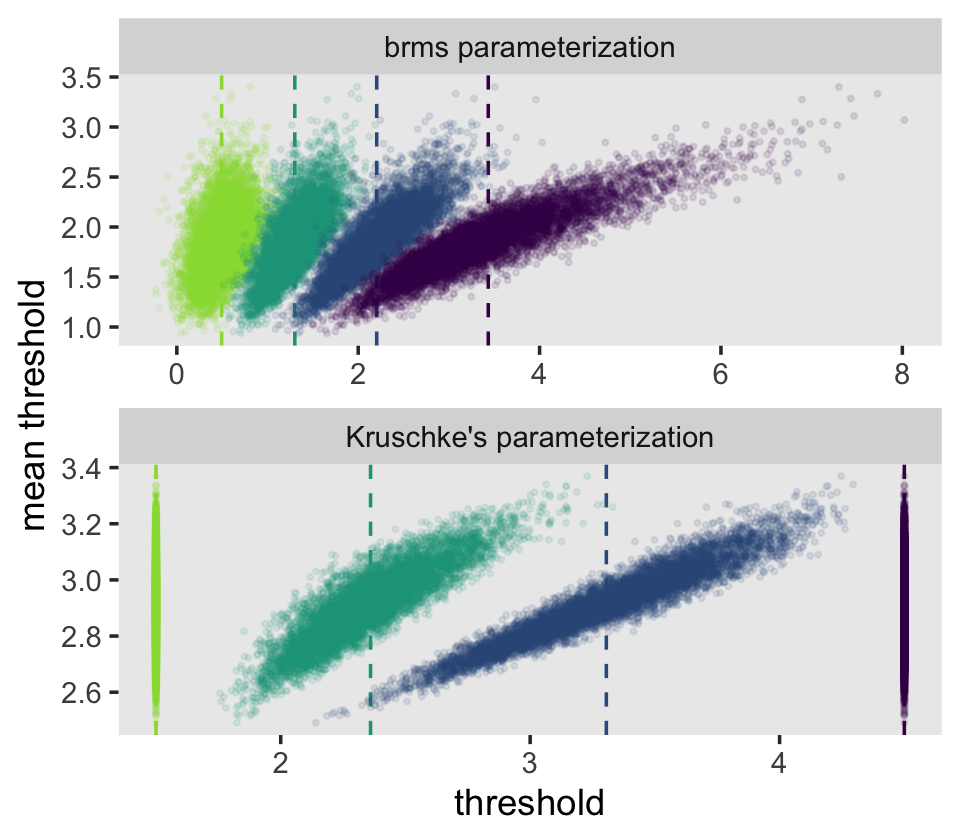

Returning to our previous workflow, extract the posterior draws and wrangle.


```r
post <- 
  posterior_samples(fit23.5) %>%
  mutate(iter = 1:n())

glimpse(post)
```

```
## Rows: 8,000
## Columns: 8
## $ `b_Intercept[1]` <dbl> 0.6931914, 0.4794329, 0.4927042, 0.3440263, 0.3650995, 0.4582448, 0.6002373, 0.628…
## $ `b_Intercept[2]` <dbl> 1.2097770, 1.2143855, 1.2466179, 1.1089758, 1.1073466, 1.2542692, 1.3732993, 1.389…
## $ `b_Intercept[3]` <dbl> 2.199286, 1.709422, 2.793990, 2.754467, 1.929059, 2.354779, 2.240048, 2.167107, 1.…
## $ `b_Intercept[4]` <dbl> 3.040844, 2.617230, 4.088717, 4.117662, 3.322591, 3.557953, 3.858680, 3.528846, 2.…
## $ b_XB             <dbl> 0.70189828, 0.46262283, 0.51672584, 0.40184824, 0.70655988, 0.10966165, 0.80788449…
## $ b_disc_XB        <dbl> -0.21378371, -0.18376280, -0.45980438, -0.49349634, -0.23626627, -0.54974975, -0.0…
## $ lp__             <dbl> -108.9520, -108.4698, -108.7493, -109.3895, -108.5903, -107.7967, -108.2477, -107.…
## $ iter             <int> 1, 2, 3, 4, 5, 6, 7, 8, 9, 10, 11, 12, 13, 14, 15, 16, 17, 18, 19, 20, 21, 22, 23,…
```

Now, let's use our handy `compare_thresholds()` function to make an expanded version of the lower-left plot of Figure 23.4.


```r
post %>% 
  select(`b_Intercept[1]`:`b_Intercept[4]`, iter) %>% 
  compare_thresholds(lb = 1.5, ub = 4.5)
```

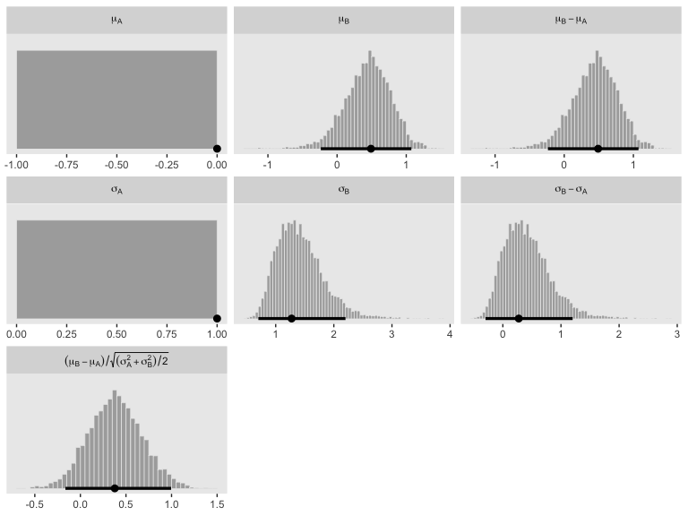

It will no longer be straightforward to use the formulas from 23.2.2 to convert the output from our **brms** parameterization to match the way Kruschke parameterized his conditional means and standard deviations. I will leave the conversion up to the interested reader. Going forward, we will focus on the output from our **brms** parameterization.


```r
post %>% 
  # simple parameters
  mutate(`mu[A]`    = 0,
         `mu[B]`    = b_XB,
         `sigma[A]` = 1,
         `sigma[B]` = 1 / exp(b_disc_XB)) %>% 
  # simple differences
  mutate(`mu[B]-mu[A]`       = `mu[B]` - `mu[A]`,
         `sigma[B]-sigma[A]` = `sigma[B]` - `sigma[A]`) %>% 
  # effect size
  mutate(`(mu[B]-mu[A])/sqrt((sigma[A]^2+sigma[B]^2)/2)` = (`mu[B]-mu[A]`) / sqrt((`sigma[A]`^2 + `sigma[B]`^2) / 2)) %>% 
  # wrangle
  pivot_longer(`mu[A]`:`(mu[B]-mu[A])/sqrt((sigma[A]^2+sigma[B]^2)/2)`) %>% 
  mutate(name = factor(name,
                       levels = c("mu[A]", "mu[B]", "mu[B]-mu[A]",
                                  "sigma[A]", "sigma[B]", "sigma[B]-sigma[A]",
                                  "(mu[B]-mu[A])/sqrt((sigma[A]^2+sigma[B]^2)/2)"))) %>%
  
  # plot
  ggplot(aes(x = value, y = 0)) +
  stat_halfeye(point_interval = mode_hdi, .width = .95,
               fill = sl[4], color = sl[8], normalize = "panels") +
  scale_y_continuous(NULL, breaks = NULL) +
  xlab(NULL) +
  facet_wrap(~name, scales = "free", labeller = label_parsed)
```

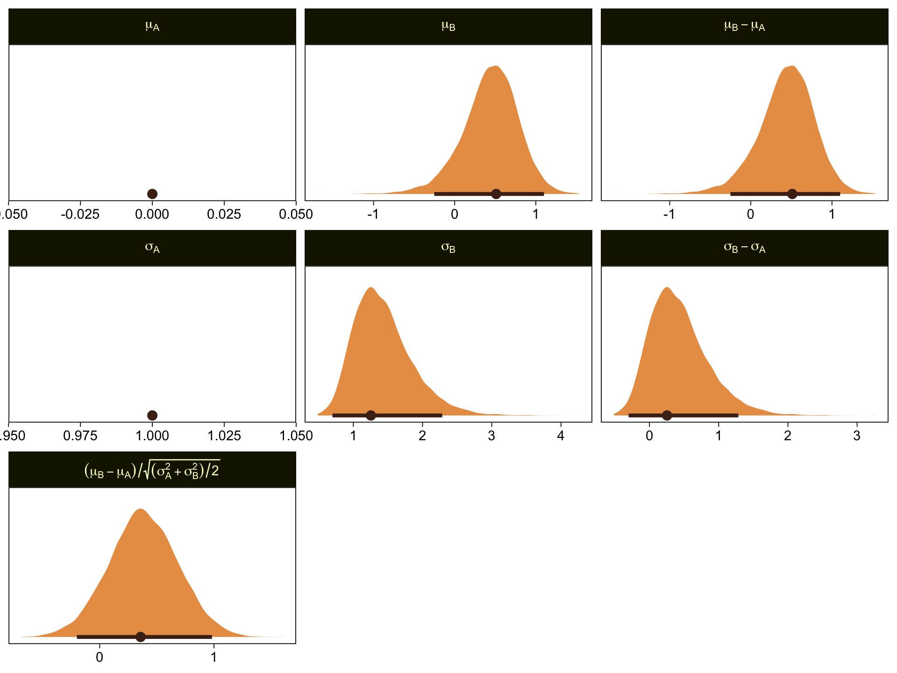

$\mu_A$ and $\sigma_A$ are both constants, which doesn't show up well with our `stat_halfeye()` approach with the scales freed across facets. If these plots really mattered for a scientific presentation or something for industry, you could experiment using either a common scale across all facets, or making the plots individually and then combining them with **patchwork** syntax. Returning to interpretation, because $\mu_A = 0$, it turns out that $\mu_B - \mu_A = \mu_B$, which is on display on the top row. Because $\sigma_A = 1$, it turns out that $\sigma_B - \sigma_A$ is just $\sigma_B$ moved over one unit to the left, which is hopefully clear in the panels of the second row. Very happily, the effect size formula worked with our **brms** parameters the same way it did for Kruschke's. Both yield an effect size of about 0.5, with 95% intervals extending about $\mp 0.5$.

Here we make good use of the `type = "bars_grouped"` and `group = "X"` arguments to make the posterior predictive plots at the top right of Figure 23.4 with the `brms::pp_check()` function.


```r
set.seed(23)

pp_check(fit23.5, type = "bars_grouped", nsamples = 100, group = "X") +
  scale_x_continuous("y", breaks = 1:7) +
  scale_y_continuous(NULL, breaks = NULL, expand = expansion(mult = c(0, 0.05))) +
  ggtitle("Data with posterior predictions",
          subtitle = expression(list(italic(N[A])==44, italic(N[B])==44))) +
  theme(legend.background = element_blank(),
        legend.position = c(.9, .75))
```

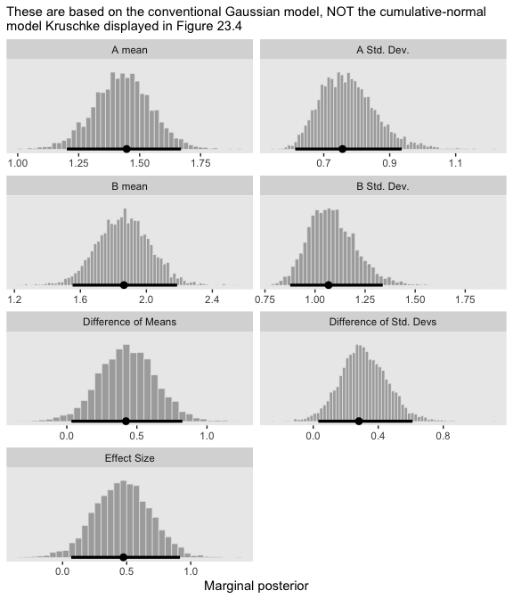

Using more tricks from back in [Chapter 16][Metric-Predicted Variable on One or Two Groups], here's the corresponding conventional Gaussian model for metric data.


```r
mean_y <- mean(my_data$Y)
sd_y   <- sd(my_data$Y)

stanvars <- 
  stanvar(mean_y, name = "mean_y") + 
  stanvar(sd_y,   name = "sd_y")

fit23.6 <-
  brm(data = my_data,
      family = gaussian,
      bf(Y ~ 0 + X, sigma ~ 0 + X),
      prior = c(prior(normal(mean_y, sd_y * 100), class = b),
                prior(normal(0, 1), class = b, dpar = sigma)),
      chains = 4, cores = 4,
      stanvars = stanvars, 
      seed = 23,
      file = "fits/fit23.06")
```

Check the summary.


```r
print(fit23.6)
```

```
##  Family: gaussian 
##   Links: mu = identity; sigma = log 
## Formula: Y ~ 0 + X 
##          sigma ~ 0 + X
##    Data: my_data (Number of observations: 88) 
## Samples: 4 chains, each with iter = 2000; warmup = 1000; thin = 1;
##          total post-warmup samples = 4000
## 
## Population-Level Effects: 
##          Estimate Est.Error l-95% CI u-95% CI Rhat Bulk_ESS Tail_ESS
## XA           1.43      0.12     1.20     1.67 1.00     4175     2850
## XB           1.86      0.16     1.54     2.18 1.00     4512     2958
## sigma_XA    -0.26      0.11    -0.46    -0.03 1.00     3919     2563
## sigma_XB     0.08      0.11    -0.12     0.30 1.00     4275     3139
## 
## Samples were drawn using sampling(NUTS). For each parameter, Bulk_ESS
## and Tail_ESS are effective sample size measures, and Rhat is the potential
## scale reduction factor on split chains (at convergence, Rhat = 1).
```

Here are the marginal posteriors, including the effect size.


```r
posterior_samples(fit23.6) %>% 
  mutate(`A mean`      = b_XA,
         `B mean`      = b_XB,
         `A Std. Dev.` = exp(b_sigma_XA),
         `B Std. Dev.` = exp(b_sigma_XB)) %>% 
  mutate(`Difference of Means`     = `B mean` - `A mean`,
         `Difference of Std. Devs` = `B Std. Dev.` - `A Std. Dev.`) %>% 
  mutate(`Effect Size` = `Difference of Means` / ((`A Std. Dev.` + `B Std. Dev.`) / 2)) %>% 
  pivot_longer(`A mean`:`Effect Size`) %>% 
  
  ggplot(aes(x = value, y = 0)) +
  stat_halfeye(point_interval = mode_hdi, .width = .95,
               fill = sl[4], color = sl[8], normalize = "panels") +
  scale_y_continuous(NULL, breaks = NULL) +
  labs(subtitle = "These are based on the conventional Gaussian model, NOT the cumulative-normal\nmodel Kruschke displayed in Figure 23.4",
       x = "Marginal posterior") +
  facet_wrap(~name, scales = "free", ncol = 2)
```


Compare those results to those Kruschke reported from an NHST analysis in the note below Figure 23.4:

> $M_1 = 1.43, M_2 = 1.86, t = 2.18, p = 0.032$, with effect size $d = 0.466$ with 95% CI of $0.036-0.895$. An $F$ test of the variances concludes that the standard deviations are significantly different: $S_1 = 0.76, S_2 = 1.07, p = 0.027$. Notice in this case that treating the values as metric greatly underestimates their variances, as well as erroneously concludes the variances are different. (p. 684)

As to the data in the analyses Kruschke reported in Figure 23.5 and the prose in the second paragraph on page 685, I'm not aware that Kruschke provided them. From his footnote #2, we read: "Data in Figure 23.5 are from an as-yet unpublished study I conducted with the collaboration of Allison Vollmer as part of her undergraduate honors project." In place of the real data, I eyeballed the values based on the upper-right panels in Figure 23.5. Here they are.


```r
d <-
  tibble(x = rep(str_c("joke ", c(1, 6)), each = 177),
         y = c(rep(1:7, times = c(95, 19, 18, 10, 17, 10, 8)),
               rep(1:7, times = c(53, 33, 31, 22, 23, 14, 1))))

glimpse(d)
```

```
## Rows: 354
## Columns: 2
## $ x <chr> "joke 1", "joke 1", "joke 1", "joke 1", "joke 1", "joke 1", "joke 1", "joke 1", "joke 1", "joke 1…
## $ y <int> 1, 1, 1, 1, 1, 1, 1, 1, 1, 1, 1, 1, 1, 1, 1, 1, 1, 1, 1, 1, 1, 1, 1, 1, 1, 1, 1, 1, 1, 1, 1, 1, 1…
```

My approximation to Kruschke's data looks like this.


```r
d %>% 
  ggplot(aes(x = y)) +
  geom_bar(fill = sl[5]) +
  scale_x_continuous(breaks = 1:7) +
  scale_y_continuous(NULL, breaks = NULL, expand = expansion(mult = c(0, 0.05))) +
  facet_wrap(~x, ncol = 1)
```

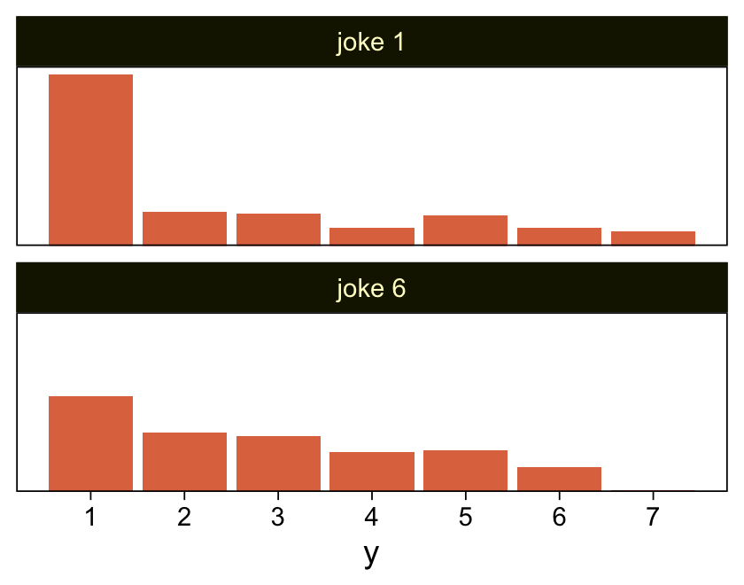

Here we fit the cumulative-normal model based on our version of the data, continuing to allow both $\mu$ and $\sigma$ (i.e., $1 / \exp(\log \alpha)$) to differ across groups.


```r
fit23.7 <-
  brm(data = d,
      family = cumulative(probit),
      bf(y ~ 1 + x) +
        lf(disc ~ 0 + x, cmc = FALSE),
      prior = c(prior(normal(0, 4), class = Intercept),
                prior(normal(0, 4), class = b),
                prior(normal(0, 1), class = b, dpar = disc)),
      iter = 3000, warmup = 1000, chains = 4, cores = 4,
      seed = 23,
      file = "fits/fit23.07")
```

Check the model summary.


```r
print(fit23.7)
```

```
##  Family: cumulative 
##   Links: mu = probit; disc = log 
## Formula: y ~ 1 + x 
##          disc ~ 0 + x
##    Data: d (Number of observations: 354) 
## Samples: 4 chains, each with iter = 3000; warmup = 1000; thin = 1;
##          total post-warmup samples = 8000
## 
## Population-Level Effects: 
##              Estimate Est.Error l-95% CI u-95% CI Rhat Bulk_ESS Tail_ESS
## Intercept[1]     0.07      0.09    -0.11     0.25 1.00     5781     5508
## Intercept[2]     0.37      0.09     0.19     0.54 1.00     7573     6172
## Intercept[3]     0.65      0.09     0.48     0.83 1.00     8431     6359
## Intercept[4]     0.87      0.10     0.68     1.06 1.00     8226     6697
## Intercept[5]     1.26      0.12     1.03     1.50 1.00     7118     6153
## Intercept[6]     1.81      0.16     1.51     2.14 1.00     6864     6192
## xjoke6           0.39      0.10     0.20     0.58 1.00     7756     6071
## disc_xjoke6      0.49      0.12     0.26     0.73 1.00     5029     5885
## 
## Samples were drawn using sampling(NUTS). For each parameter, Bulk_ESS
## and Tail_ESS are effective sample size measures, and Rhat is the potential
## scale reduction factor on split chains (at convergence, Rhat = 1).
```

Save and wrangle the posterior draws, then use our `compare_thresholds()` function to compare the **brms** parameterization of $\theta_{[i]}$ with the parameterization in the text in an expanded version of the lower-left plot of Figure 23.5.


```r
post <- 
  posterior_samples(fit23.7) %>%
  mutate(iter = 1:n())

post %>% 
  select(`b_Intercept[1]`:`b_Intercept[6]`, iter) %>% 
  compare_thresholds(lb = 1.5, ub = 6.5)
```

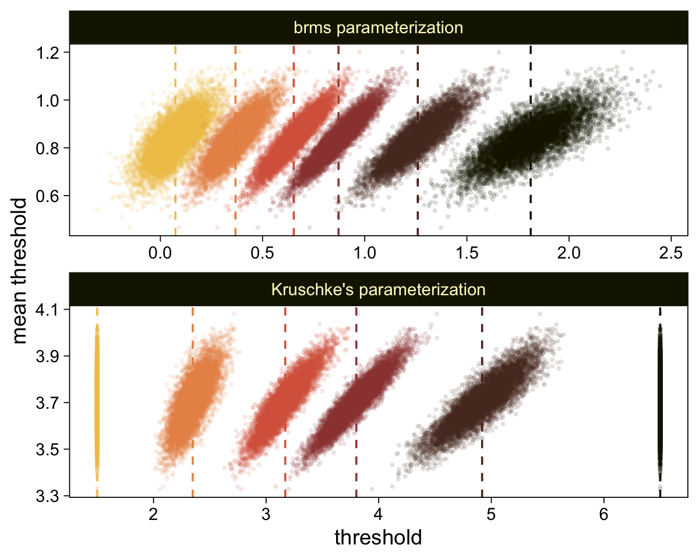

Given our data are only approximations of Kruschke's, I think we did pretty good. Here are the histograms for our **brms** versions of the $\mu$- and $\sigma$-related parameters.


```r
post %>% 
  transmute(`mu[Joke~1]`    = 0,
            `mu[Joke~6]`    = b_xjoke6,
            `sigma[Joke~1]` = 1,
            `sigma[Joke~6]` = 1 / exp(b_disc_xjoke6)) %>% 
  mutate(`mu[Joke~6]-mu[Joke~1]`       = `mu[Joke~6]` - `mu[Joke~1]`,
         `sigma[Joke~6]-sigma[Joke~1]` = `sigma[Joke~6]` - `sigma[Joke~1]`) %>% 
  mutate(`(mu[Joke~6]-mu[Joke~1])/sqrt((sigma[Joke~1]^2+sigma[Joke~6]^2)/2)` = (`mu[Joke~6]-mu[Joke~1]`) / sqrt((`sigma[Joke~1]`^2 + `sigma[Joke~6]`^2) / 2)) %>% 
  pivot_longer(everything()) %>% 
  mutate(name = factor(name,
                       levels = c("mu[Joke~1]", "mu[Joke~6]", "mu[Joke~6]-mu[Joke~1]",
                                  "sigma[Joke~1]", "sigma[Joke~6]", "sigma[Joke~6]-sigma[Joke~1]",
                                  "(mu[Joke~6]-mu[Joke~1])/sqrt((sigma[Joke~1]^2+sigma[Joke~6]^2)/2)"))) %>%
  
  ggplot(aes(x = value, y = 0)) +
  stat_halfeye(point_interval = mode_hdi, .width = .95,
               fill = sl[4], color = sl[8],
               normalize = "panels") +
  scale_y_continuous(NULL, breaks = NULL) +
  xlab(NULL) +
  facet_wrap(~name, scales = "free", labeller = label_parsed)
```


Here are our versions of the two panels in the upper right of Figure 23.5.


```r
set.seed(23)

pp_check(fit23.7, type = "bars_grouped", nsamples = 100, group = "x") +
  scale_x_continuous("y", breaks = 1:7) +
  scale_y_continuous(NULL, breaks = NULL, expand = expansion(mult = c(0, 0.05))) +
  ggtitle("Data with posterior predictions",
          subtitle = expression(list(italic(N["joke "*1])==177, italic(N["joke "*6])==177))) +
  theme(legend.position = "none")
```

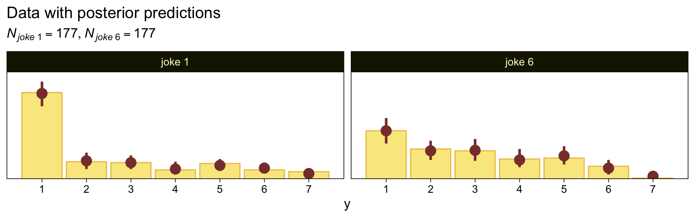

Now here's the corresponding model where we treat the `y` data as metric.


```r
mean_y <- mean(d$y)
sd_y   <- sd(d$y)

stanvars <- 
  stanvar(mean_y, name = "mean_y") + 
  stanvar(sd_y,   name = "sd_y")

fit23.8 <-
  brm(data = d,
      family = gaussian,
      bf(y ~ 0 + x, sigma ~ 0 + x),
      prior = c(prior(normal(mean_y, sd_y * 100), class = b),
                prior(normal(0, exp(sd_y)), class = b, dpar = sigma)),
      chains = 4, cores = 4,
      stanvars = stanvars, 
      seed = 23,
      file = "fits/fit23.08")
```

Check the summary.


```r
print(fit23.8)
```

```
##  Family: gaussian 
##   Links: mu = identity; sigma = log 
## Formula: y ~ 0 + x 
##          sigma ~ 0 + x
##    Data: d (Number of observations: 354) 
## Samples: 4 chains, each with iter = 2000; warmup = 1000; thin = 1;
##          total post-warmup samples = 4000
## 
## Population-Level Effects: 
##              Estimate Est.Error l-95% CI u-95% CI Rhat Bulk_ESS Tail_ESS
## xjoke1           2.42      0.14     2.15     2.69 1.00     4201     3145
## xjoke6           2.86      0.13     2.60     3.10 1.00     4579     3030
## sigma_xjoke1     0.64      0.05     0.54     0.75 1.00     5039     3027
## sigma_xjoke6     0.52      0.05     0.42     0.63 1.00     4601     3110
## 
## Samples were drawn using sampling(NUTS). For each parameter, Bulk_ESS
## and Tail_ESS are effective sample size measures, and Rhat is the potential
## scale reduction factor on split chains (at convergence, Rhat = 1).
```

Make the marginal posteriors, including the effect size.


```r
posterior_samples(fit23.8) %>% 
  mutate(`Joke 1 Mean`      = b_xjoke1,
         `Joke 6 Mean`      = b_xjoke6,
         `Joke 1 Std. Dev.` = exp(b_sigma_xjoke1),
         `Joke 6 Std. Dev.` = exp(b_sigma_xjoke6)) %>% 
  mutate(`Difference of Means`     = `Joke 6 Mean` - `Joke 1 Mean`,
         `Difference of Std. Devs` = `Joke 6 Std. Dev.` - `Joke 1 Std. Dev.`) %>% 
  mutate(`Effect Size` = `Difference of Means` / ((`Joke 1 Std. Dev.` + `Joke 6 Std. Dev.`) / 2)) %>% 
  pivot_longer(`Joke 1 Mean`:`Effect Size`) %>% 
  mutate(name = factor(name, 
                       levels = c("Joke 1 Mean", "Joke 1 Std. Dev.", 
                                  "Joke 6 Mean", "Joke 6 Std. Dev.", 
                                  "Difference of Means", "Difference of Std. Devs", 
                                  "Effect Size"))) %>% 
  
  ggplot(aes(x = value, y = 0)) +
  stat_halfeye(point_interval = mode_hdi, .width = .95,
               fill = sl[4], color = sl[8], normalize = "panels") +
  scale_y_continuous(NULL, breaks = NULL) +
  labs(subtitle = "These are based on the conventional Gaussian model, NOT the cumulative-normal\nmodel Kruschke displayed in Figure 23.5",
       x = "Marginal posterior") +
  facet_wrap(~name, scales = "free", ncol = 2)
```

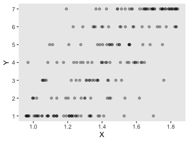

If you think you have a better approximation of Kruschke's data, [please share](https://github.com/ASKurz/Doing-Bayesian-Data-Analysis-in-brms-and-the-tidyverse/issues).

## The Case of metric predictors

"This type of model is often referred to as *ordinal probit regression* or *ordered probit regression* because the probit function is the link function corresponding to the cumulative-normal inverse-link function" (p. 688, *emphasis* in the original).

### Implementation in ~~JAGS~~ brms.

This model is easy to specify in **brms**. Just make sure to think clearly about your priors.

### Example: Happiness and money.

Load the data for the next model.


```r
my_data <- read_csv("data.R/OrdinalProbitData-LinReg-2.csv")

glimpse(my_data)
```

```
## Rows: 200
## Columns: 2
## $ X <dbl> 1.386389, 1.223879, 1.454505, 1.112068, 1.222715, 1.545099, 1.360256, 1.533071, 1.501657, 1.42675…
## $ Y <dbl> 1, 1, 5, 5, 1, 4, 6, 2, 5, 4, 1, 4, 4, 4, 4, 6, 1, 1, 6, 2, 1, 7, 1, 3, 1, 1, 7, 5, 7, 1, 4, 6, 7…
```

Take a quick look at the data.


```r
my_data %>% 
  ggplot(aes(x = X, y = Y)) +
  geom_point(alpha = 1/3, color = sl[9]) +
  scale_y_continuous(breaks = 1:7)
```


Kruschke standardized his predictor within his model code. Here we'll standardize `X` before fitting the model.


```r
my_data <-
  my_data %>% 
  mutate(X_s = (X - mean(X)) / sd(X))
```

Fit the model.


```r
fit23.9 <-
  brm(data = my_data,
      family = cumulative(probit),
      Y ~ 1 + X_s,
      prior = c(prior(normal(0, 4), class = Intercept),
                prior(normal(0, 4), class = b)),
      iter = 3000, warmup = 1000, chains = 4, cores = 4,
      seed = 23,
      file = "fits/fit23.09")
```

Check the summary.


```r
print(fit23.9)
```

```
##  Family: cumulative 
##   Links: mu = probit; disc = identity 
## Formula: Y ~ 1 + X_s 
##    Data: my_data (Number of observations: 200) 
## Samples: 4 chains, each with iter = 3000; warmup = 1000; thin = 1;
##          total post-warmup samples = 8000
## 
## Population-Level Effects: 
##              Estimate Est.Error l-95% CI u-95% CI Rhat Bulk_ESS Tail_ESS
## Intercept[1]    -1.18      0.12    -1.42    -0.94 1.00     6126     5930
## Intercept[2]    -0.76      0.11    -0.98    -0.54 1.00     7573     6206
## Intercept[3]    -0.29      0.11    -0.50    -0.09 1.00     8790     6763
## Intercept[4]     0.25      0.11     0.04     0.45 1.00     9172     6566
## Intercept[5]     0.73      0.11     0.51     0.96 1.00     8701     6343
## Intercept[6]     1.26      0.13     1.02     1.52 1.00     8617     6408
## X_s              1.16      0.10     0.97     1.36 1.00     7113     5951
## 
## Family Specific Parameters: 
##      Estimate Est.Error l-95% CI u-95% CI Rhat Bulk_ESS Tail_ESS
## disc     1.00      0.00     1.00     1.00 1.00     8000     8000
## 
## Samples were drawn using sampling(NUTS). For each parameter, Bulk_ESS
## and Tail_ESS are effective sample size measures, and Rhat is the potential
## scale reduction factor on split chains (at convergence, Rhat = 1).
```

Extract the posterior draws and compare the **brms** parameterization of $\theta_{[i]}$ with the parameterization in the text in an expanded version of the bottom panel of Figure 23.7.


```r
post <- 
  posterior_samples(fit23.9) %>%
  mutate(iter = 1:n())

post %>% 
  select(`b_Intercept[1]`:`b_Intercept[6]`, iter) %>% 
  compare_thresholds(lb = 1.5, ub = 6.5)
```

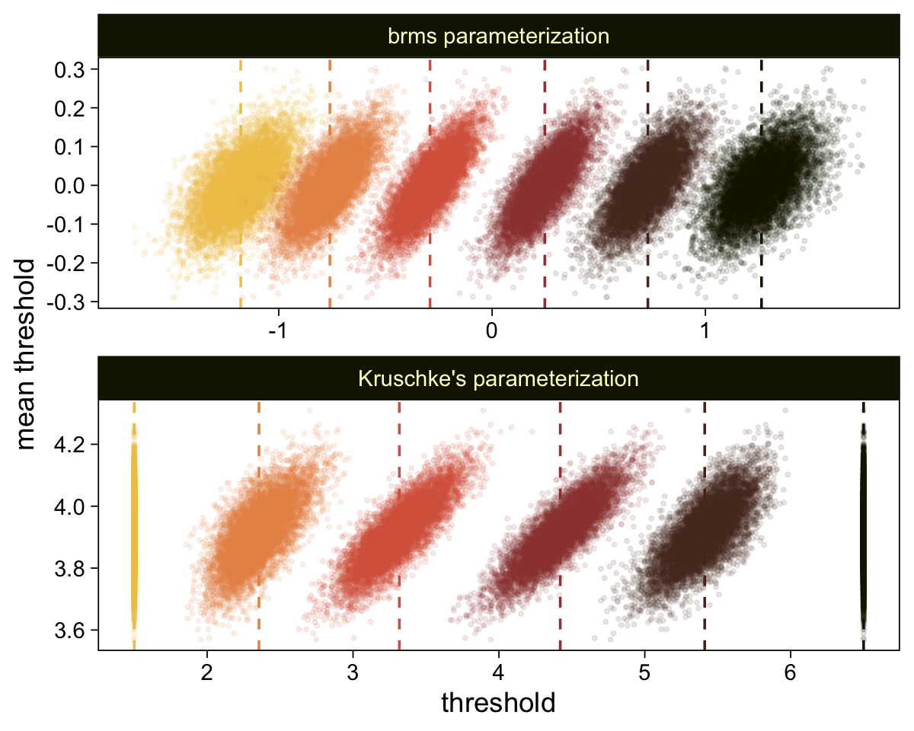

Here's the marginal distribution of `b_X_s`, our effect size for the number of jokes.


```r
post %>% 
  ggplot(aes(x = b_X_s, y = 0)) +
  stat_halfeye(point_interval = mode_hdi, .width = .95,
               fill = sl[4], color = sl[8]) +
  scale_y_continuous(NULL, breaks = NULL)
```

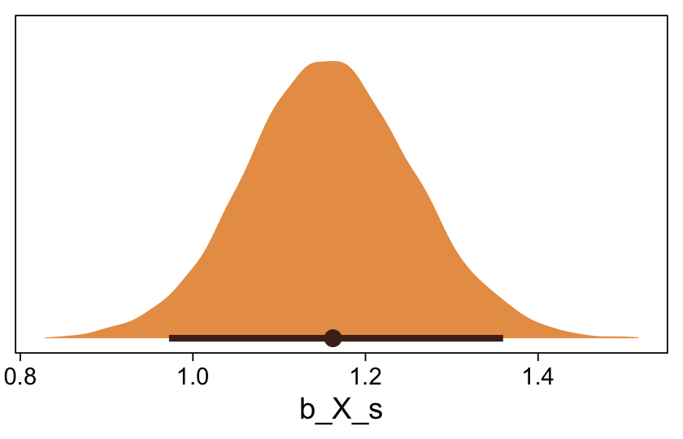

This differs from Kruschks's $\beta_1$, which is in an unstandardized metric based on the parameters in his version of the model. But unlike the effect sizes from previous models, this one is not in a Cohen's-$d$ metric. Rather, this is a fully-standardized regression coefficient. As to the large subplot at the top of Figure 23.7, we can make something like it by nesting `conditional_effects()` within `plot()`.


```r
conditional_effects(fit23.9) %>% 
  plot(line_args = list(color = sl[7], fill = sl[3]))
```


Here's a more elaborated version of the same plot, this time depicting the model with 100 fitted lines randomly drawn from the posterior.


```r
set.seed(23)

conditional_effects(fit23.9,
                    spaghetti = TRUE, 
                    nsamples = 100) %>% 
  plot(points = T,
       line_args = list(size = 0),
       point_args = list(alpha = 1/3, color = sl[9]),
       spaghetti_args = list(colour = alpha(sl[6], .2)))
```

```
## Warning: Predictions are treated as continuous variables in 'conditional_effects' by default which is likely
## invalid for ordinal families. Please set 'categorical' to TRUE.
```

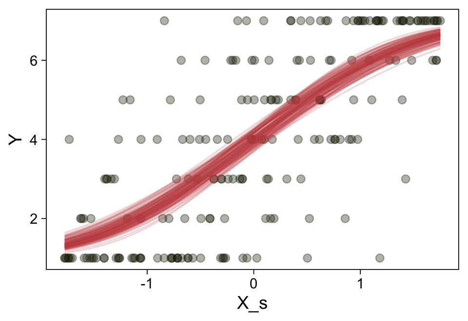

Note the warning message. There was a similar one in the first plot, which I suppressed for simplicity sake. The message suggests treating the fitted lines as "continuous variables" might lead to a deceptive plot. Here's what happens if we follow the suggestion.


```r
set.seed(23)

conditional_effects(fit23.9, categorical = T)
```

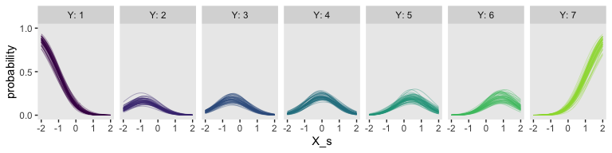

Recall that our thresholds, $\theta_1,...,\theta_{K-1}$, in conjunction with the standard normal density, give us the probability of a given `Y` value, given `X_s` (i.e., $p(y = k | \mu, \sigma, \{ \theta_j \})$, where $\mu$ is conditional on $x$). This plot returned the fitted lines of those conditional probabilities, each depicted by the posterior mean and percentile-based 95% intervals. At lower values of `X_s`, lower values of `Y` are more probable. At higher values of `X_s`, higher values of `Y` are more probable.

It might be useful to get more practice in with this model. Here we'll use `fitted()` to make a similar plot, depicting the model with may fitted lines instead of summary statistics.


```r
# how many fitted lines do you want?
n_iter <- 50

# define the `X_s` values you want to condition on
# because the lines are nonlinear, you'll need many of them
nd <- tibble(X_s = seq(from = -2, to = 2, by = 0.05))

f <-
  fitted(fit23.9,
         newdata = nd,
         summary = F,
         nsamples = n_iter)

# inspect the output
f %>% 
  str()
```

```
##  num [1:50, 1:81, 1:7] 0.766 0.889 0.879 0.892 0.936 ...
##  - attr(*, "dimnames")=List of 3
##   ..$ : NULL
##   ..$ : NULL
##   ..$ : chr [1:7] "1" "2" "3" "4" ...
```

Our output came in three dimensions. We have 50 rows, corresponding to `n_iter <- 50` (i.e., 50 posterior draws). There are 81 columns, based on how we defined the `X_s` values within our `nd` data (i.e., `seq(from = -2, to = 2, by = 0.05)`). The third dimension has seven levels, one corresponding to each of the seven levels of our criterion variable `Y`. Here's a way to rearrange that output into a useful format for plotting.


```r
# rearrange the output
rbind(
  f[, , 1],
  f[, , 2],
  f[, , 3],
  f[, , 4],
  f[, , 5],
  f[, , 6],
  f[, , 7]
) %>% 
  # wrangle
  data.frame() %>% 
  set_names(nd %>% pull(X_s)) %>% 
  mutate(iter   = rep(1:n_iter, times = 7),
         rating = rep(1:7, each = n_iter)) %>% 
  pivot_longer(-c(iter, rating),
               names_to = "X_s",
               values_to = "probability") %>% 
  mutate(rating = str_c("Y: ", rating),
         X_s    = X_s %>% as.double()) %>% 
  
  # plot
  ggplot(aes(x = X_s, y = probability, 
             group = interaction(iter, rating),
             color = rating)) +
  geom_line(size = 1/4, alpha = 1/2)  +
  scale_color_scico_d(palette = "lajolla", begin = .25) +
  scale_y_continuous(breaks = c(0, .5, 1), limits = c(0, 1), expand = c(0, 0)) +
  theme(legend.position = "none") +
  facet_wrap(~rating, ncol = 7)
```


So far, we've been plotting our model with the context of the default `scale = "response"` setting within `fitted()`. Within the context of the response variable `Y`, our model returns response probabilities. We can also look at the output within the context of `scale = "linear"`. We'll plot these fitted lines across our `nd` values two different ways. For the first, `p1`, we'll use summary statistics. For the second, `p2`, we'll set `summary = T`.


```r
# adjust the nd
nd <- tibble(X_s = seq(from = -2.5, to = 2.5, by = 0.1))

# use summary statistics
p1 <-
  fitted(fit23.9, 
         scale = "linear",
         newdata = nd) %>% 
  data.frame() %>% 
  bind_cols(nd) %>% 
  
  ggplot(aes(x = X_s, y = Estimate, ymin = Q2.5, ymax = Q97.5)) +
  geom_smooth(stat = "identity",
              alpha = 1/2, color = sl[7], fill = sl[3]) +
  labs(title = "summary statistics",
       y = "underlying standard normal")


# set `summary = F`
set.seed(23)
p2 <-
  fitted(fit23.9, 
         scale = "linear",
         newdata = nd,
         summary = F,
         nsamples = n_iter) %>% 
  data.frame() %>% 
  set_names(nd %>% pull(X_s)) %>% 
  mutate(iter = 1:n_iter) %>% 
  pivot_longer(-iter,
               names_to = "X_s") %>% 
  mutate(X_s = X_s %>% as.double()) %>% 
  
  ggplot(aes(x = X_s, y = value, group = iter)) +
  geom_line(alpha = 1/2, color = sl[7]) +
  scale_y_continuous(NULL, breaks = NULL) +
  ggtitle("50 posterior draws")

# combine and plot!
p1 + p2 &
  coord_cartesian(ylim = c(-2, 2))
```

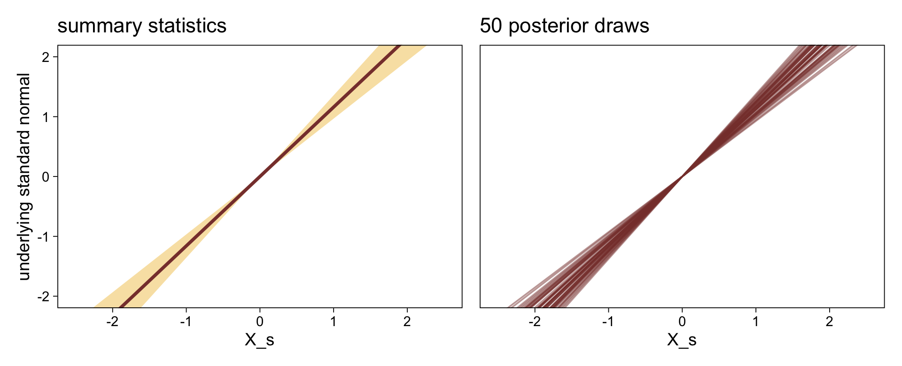

Both methods returned the fitted lines in the metric of the underlying standard normal distribution. The fitted lines are nonlinear in the metric of the raw data `Y`, but they're linear in the metric of the presumed underlying distribution. If it helps, we'll make a marginal plot of the standard normal distribution and tack it onto the right.


```r
# make Phi
p3 <-
  tibble(x = seq(from = -3, to = 3, by = .01)) %>%
  mutate(d = dnorm(x)) %>% 
  
  ggplot(aes(x = x, ymin = 0, ymax = d)) +
  geom_ribbon(fill = sl[5]) +
  # add the thresholds!
  geom_vline(xintercept = posterior_summary(fit23.9)[1:6, 1], 
             color = sl[9], linetype = 3) +
  # mark the thresholds with the axis breaks
  scale_x_reverse(NULL, breaks = fixef(fit23.9)[1:6, 1], position = "top",
                  labels = parse(text = str_c("theta[", 1:6, "]"))) +
  scale_y_continuous(NULL, breaks = NULL) +
  ggtitle(expression(italic(N)(0,1))) +
  coord_flip(xlim = c(-2, 2))

# combine, format a bit, and plot
(
  ((p1 | p2 ) & 
     geom_hline(yintercept = posterior_summary(fit23.9)[1:6, 1], 
                color = sl[9], linetype = 3) &
     coord_cartesian(ylim = c(-2, 2)) | 
     p3)
) + 
  plot_layout(widths = c(4, 4, 1))
```


The lines intersecting the plots are the posterior means for thresholds, $\theta_1,...,\theta_6$.

*But these still aren't faithful depictions of the top panel of Figure 23.7*, you say. Okay, fine. One of the distinctive elements of that panel is the left-tilted bar-and-error plots. If you look closely at the vertical lines at their bases, you'll see that the leftmost subplot starts at the minimum value of `X` and the rightmost subplot starts at the maximum value of `X`. Since our plots, so far, have been based on `X_s`, we'll use the minimum and maximum values from that. Here are those values.


```r
(r <- range(my_data$X_s))
```

```
## [1] -1.774444  1.750168
```

To my eye, it appears that the three middle subplots are equally distributed between those at the ends. If we proceed under that assumption, here's how we might use `fitted()` to get us rolling on computing the relevant values.


```r
nd <- tibble(X_s = seq(from = r[1], to = r[2], length.out = 5))

f <-
  fitted(fit23.9,
         newdata = nd)

# inspect the output
f %>% 
  str()
```

```
##  num [1:5, 1:4, 1:7] 0.80679 0.44386 0.12398 0.01561 0.00091 ...
##  - attr(*, "dimnames")=List of 3
##   ..$ : NULL
##   ..$ : chr [1:4] "Estimate" "Est.Error" "Q2.5" "Q97.5"
##   ..$ : chr [1:7] "1" "2" "3" "4" ...
```

Here we'll rearrange the output to make it useful for plotting.


```r
# rearrange the output
f <-
  rbind(
    f[, , 1],
    f[, , 2],
    f[, , 3],
    f[, , 4],
    f[, , 5],
    f[, , 6],
    f[, , 7]
  ) %>% 
  # wrangle
  data.frame() %>% 
  bind_cols(expand(nd, Y = 1:7, X_s))

head(f)
```

```
##       Estimate   Est.Error         Q2.5       Q97.5 Y         X_s
## 1 0.8067937004 0.047807372 0.7026194755 0.889991867 1 -1.77444380
## 2 0.4438567774 0.049163015 0.3497458328 0.540981119 1 -0.89329094
## 3 0.1239761783 0.025140275 0.0797768603 0.176704074 1 -0.01213809
## 4 0.0156063879 0.006805643 0.0057161839 0.031890455 1  0.86901477
## 5 0.0009099834 0.000820300 0.0001101136 0.003104703 1  1.75016762
## 6 0.0923100682 0.025379533 0.0501849715 0.149080747 2 -1.77444380
```

Now we can make those bar-and-error plots.


```r
f %>% 
  mutate(X_s = round(X_s, digits = 3)) %>% 
    
  ggplot(aes(x = Y, y = Estimate,
             ymin = Q2.5, ymax = Q97.5)) +
  geom_col(fill = sl[4]) +
  geom_pointrange(fatten = 1.5, size = 1, color = sl[7])  +
  scale_x_continuous(breaks = 1:7) +
  scale_y_reverse(NULL, position = "right", limits = c(1, 0), expand = c(0, 0),
                  breaks = c(1, .5, 0), labels = c("1", ".5", "0")) +
  coord_flip() +
  facet_wrap(~X_s, ncol = 7, strip.position = "bottom")
```

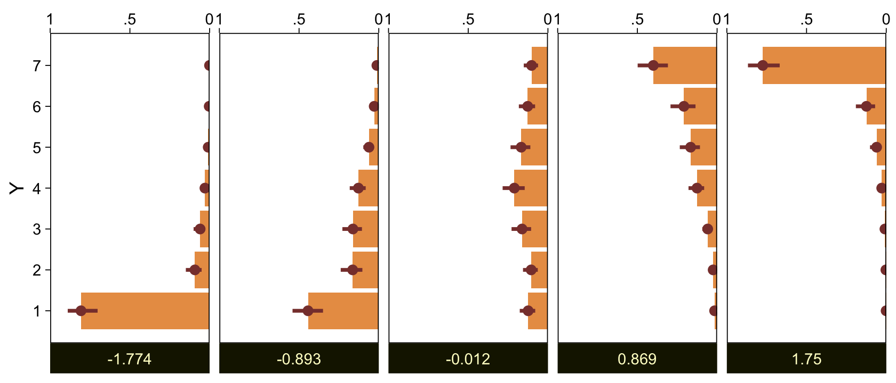

The `X_s` values are depicted in the panel strips on the bottom. The response probabilities are scaled based on the axis on the top. The points and leftmost sides of the bars are the posterior means. The thin, dark horizontal lines are the percentile-based 95% intervals. Here we reformat `f` a little more to put those bar-and-error plots in a format more similar to that of Figure 23.7.


```r
f %>% 
  select(-Est.Error) %>% 
  # rescale the probability summaries
  mutate_at(vars(Estimate:Q97.5), ~. / 2) %>% 
  
  # plot!
  ggplot() +
  geom_vline(xintercept = seq(from = r[1], to = r[2], length.out = 5),
             color = sl[2]) +
  # bar marking the Estimate
  geom_segment(aes(x = X_s, xend = X_s - Estimate, 
                   y = Y + 0.1, yend = Y + 0.1),
               size = 8, color = sl[4]) +
  # bar marking the 95% interval
  geom_segment(aes(x = X_s - Q2.5, xend = X_s - Q97.5,
                   y = Y + 0.2, yend = Y + 0.2),
               size = 1, color = sl[7]) +
  # data
  geom_point(data = my_data,
             aes(x = X_s, y = Y),
             shape = 1, size = 2, color = sl[9]) +
  scale_y_continuous("Y", breaks = 1:7, limits = c(0.5, 7.5)) +
  coord_cartesian(xlim = c(-2.4, 2.4))
```

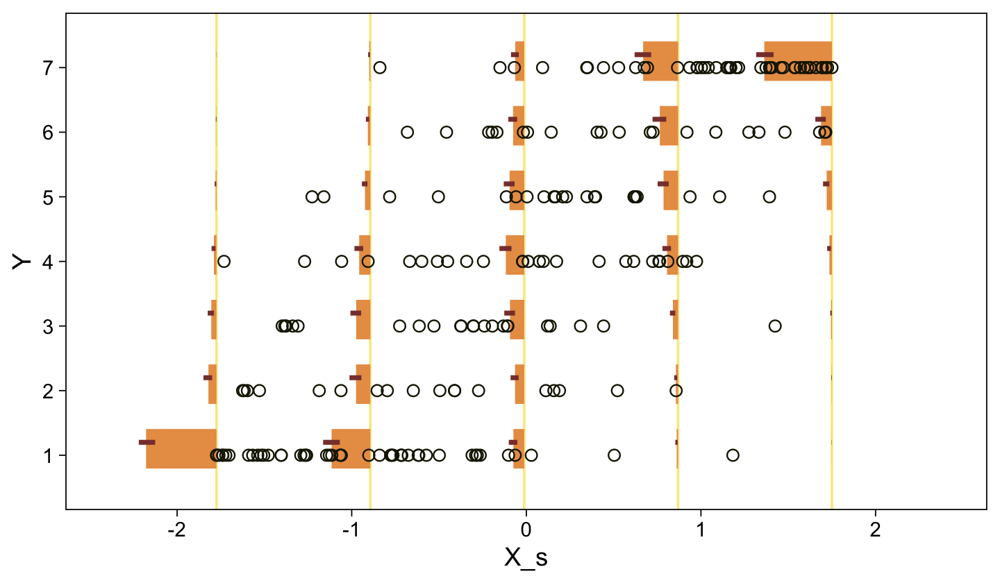

I'm not going to attempt superimposing fitted lines on this plot the way Kruschke did. Given that our ordered-probit model is nonlinear on the scale of the criterion, it seems misleading to present linear fitted lines atop the raw data. If you'd like to do so, you're on your own.

Now here's the corresponding model is we treat the `y` data as metric with tricks from [Chapter 17][Metric Predicted Variable with One Metric Predictor].


```r
sd_x <- sd(my_data$X)
sd_y <- sd(my_data$Y)
m_x  <- mean(my_data$X)
m_y  <- mean(my_data$Y)

beta_0_sigma <- 10 * abs(m_x * sd_y / sd_x)
beta_1_sigma <- 10 * abs(sd_y / sd_x) 

stanvars <- 
  stanvar(beta_0_sigma, name = "beta_0_sigma") + 
  stanvar(beta_1_sigma, name = "beta_1_sigma") +
  stanvar(sd_y, name = "sd_y")

fit23.10 <-
  brm(data = my_data,
      family = gaussian,
      Y ~ 1 + X,
      prior = c(prior(normal(0, beta_0_sigma), class = Intercept),
                prior(normal(0, beta_1_sigma), class = b),
                prior(normal(0, sd_y), class = sigma)),
      chains = 4, cores = 4,
      stanvars = stanvars, 
      seed = 23,
      file = "fits/fit23.10")
```

It may not have been readily apparent from Kruschke's prose in the note for Figure 23.7, but his OLS model was based on the fully unstandardized data (i.e., using `X` as the predictor), not the partially standardized data he used in his JAGS code from 23.4.1. We followed the same sensibilities for `fit23.10`. Speaking of which, here are the summaries for the marginal posteriors.


```r
posterior_summary(fit23.10)[1:3, ] %>% round(digits = 3)
```

```
##             Estimate Est.Error   Q2.5  Q97.5
## b_Intercept   -5.424     0.623 -6.645 -4.219
## b_X            6.711     0.440  5.857  7.557
## sigma          1.530     0.077  1.389  1.693
```

These values are very close to those he reported at the bottom of page 690. Here are what the fitted lines from that model look like when superimposed on the data, when presuming both variables are metric.


```r
set.seed(23)

conditional_effects(fit23.10,
                    spaghetti = TRUE, 
                    nsamples = 100) %>% 
  plot(points = T,
       line_args = list(size = 0),
       point_args = list(alpha = 1/3, color = sl[9]),
       spaghetti_args = list(colour = alpha(sl[6], .2)))
```

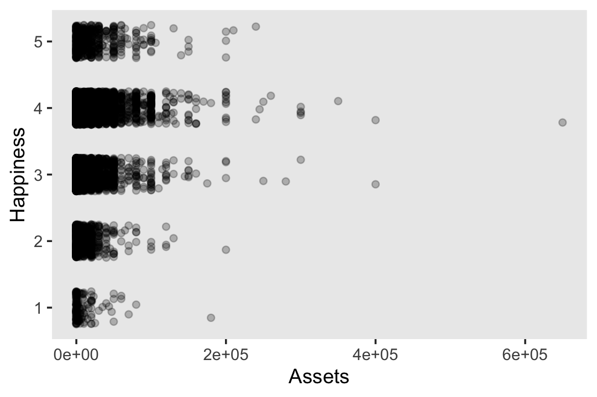

For the next example, we'll load the `HappinessAssetsDebt.csv` data from Shi ([2009](https://www.icpsr.umich.edu/icpsrweb/DSDR/studies/21741)).


```r
my_data <- read_csv("data.R/HappinessAssetsDebt.csv")

glimpse(my_data)
```

```
## Rows: 6,759
## Columns: 3
## $ Happiness <dbl> 3, 3, 3, 3, 1, 3, 2, 2, 4, 2, 3, 5, 3, 3, 4, 3, 3, 2, 4, 3, 4, 3, 3, 3, 5, 4, 3, 4, 4, 4,…
## $ Assets    <dbl> 0, 10000, 30000, 40000, 21000, 20000, 20000, 0, 0, 20000, 5000, 30000, 40000, 5500, 50000…
## $ Debt      <dbl> 0, 0, 0, 0, 0, 0, 0, 0, 0, 0, 5000, 0, 0, 0, 0, 0, 0, 0, 0, 0, 0, 0, 0, 0, 32000, 0, 0, 0…
```

Here's a quick scatter plot of the data. To help with the overplotting, the points have been horizontally jittered a bit. But as indicated in the text, `Happiness` is a discrete variable.


```r
my_data %>% 
  ggplot(aes(x = Assets, y = Happiness)) +
  geom_jitter(alpha = 1/4, height = .25, color = sl[9]) +
  scale_x_continuous(expand = expansion(0, 0.05))
```

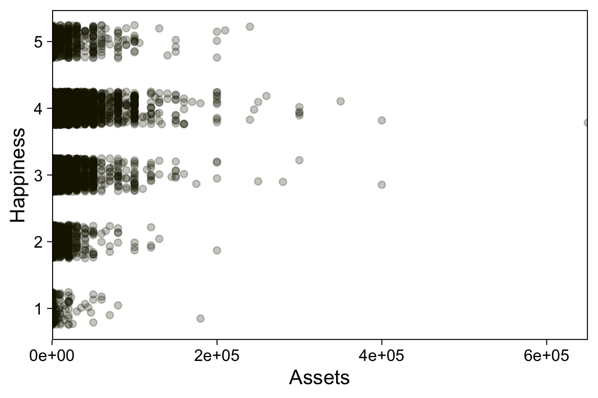

Standardize our predictor.


```r
my_data <-
  my_data %>% 
  mutate(Assets_s = (Assets - mean(Assets)) / sd(Assets))
```

Fit the model like before.


```r
fit23.11 <-
  brm(data = my_data,
      family = cumulative(probit),
      Happiness ~ 1 + Assets_s,
      prior = c(prior(normal(0, 4), class = Intercept),
                prior(normal(0, 4), class = b)),
      iter = 3000, warmup = 1000, chains = 4, cores = 4,
      seed = 23,
      file = "fits/fit23.11")
```

Check the summary.


```r
print(fit23.11)
```

```
##  Family: cumulative 
##   Links: mu = probit; disc = identity 
## Formula: Happiness ~ 1 + Assets_s 
##    Data: my_data (Number of observations: 6759) 
## Samples: 4 chains, each with iter = 3000; warmup = 1000; thin = 1;
##          total post-warmup samples = 8000
## 
## Population-Level Effects: 
##              Estimate Est.Error l-95% CI u-95% CI Rhat Bulk_ESS Tail_ESS
## Intercept[1]    -2.03      0.03    -2.10    -1.97 1.00     5801     5117
## Intercept[2]    -1.17      0.02    -1.20    -1.13 1.00     8901     6690
## Intercept[3]    -0.15      0.02    -0.18    -0.12 1.00     7967     6935
## Intercept[4]     1.48      0.02     1.44     1.53 1.00     8780     7129
## Assets_s         0.15      0.01     0.12     0.17 1.00     8282     5218
## 
## Family Specific Parameters: 
##      Estimate Est.Error l-95% CI u-95% CI Rhat Bulk_ESS Tail_ESS
## disc     1.00      0.00     1.00     1.00 1.00     8000     8000
## 
## Samples were drawn using sampling(NUTS). For each parameter, Bulk_ESS
## and Tail_ESS are effective sample size measures, and Rhat is the potential
## scale reduction factor on split chains (at convergence, Rhat = 1).
```

Extract the posterior draws and compare the **brms** parameterization of $\theta_{[i]}$ with the parameterization in the text in an expanded version of the bottom panel of Figure 23.8.


```r
post <- 
  posterior_samples(fit23.11) %>%
  mutate(iter = 1:n())

post %>% 
  select(`b_Intercept[1]`:`b_Intercept[4]`, iter) %>% 
  compare_thresholds(lb = 1.5, ub = 4.5)
```


Behold the marginal distribution of `b_Assets_s`, our effect size for `Assets`.


```r
post %>% 
  ggplot(aes(x = b_Assets_s, y = 0)) +
  stat_halfeye(point_interval = mode_hdi, .width = .95,
               fill = sl[4], color = sl[8]) +
  scale_y_continuous(NULL, breaks = NULL)
```

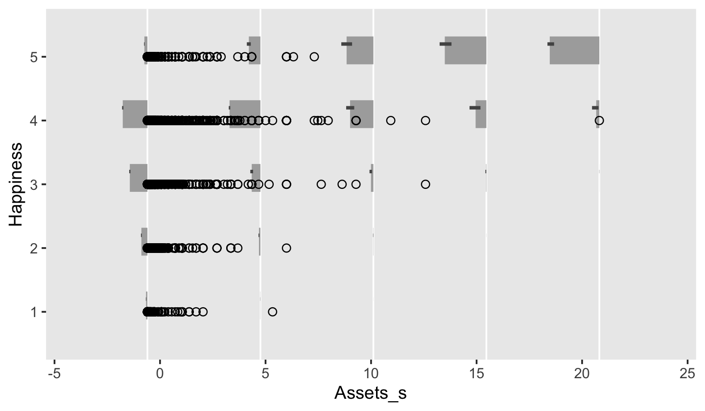

Here's the `fitted()`-oriented preparatory work for our version of the top panel of Figure 23.8.


```r
# define the range for the predictor
r <- range(my_data$Assets_s)

# re-define the new data
nd <- tibble(Assets_s = seq(from = r[1], to = r[2], length.out = 5))

# compute the fitted summaries
f <-
  fitted(fit23.11,
         newdata = nd)

# rearrange the output
f <-
  rbind(
    f[, , 1],
    f[, , 2],
    f[, , 3],
    f[, , 4],
    f[, , 5]
  ) %>% 
  # wrangle
  data.frame() %>% 
  bind_cols(expand(nd, Happiness = 1:5, Assets_s))

# examine
head(f)
```

```
##       Estimate    Est.Error         Q2.5        Q97.5 Happiness   Assets_s
## 1 2.611955e-02 2.079468e-03 2.222165e-02 3.037772e-02         1 -0.5971712
## 2 3.157165e-03 7.083391e-04 1.980611e-03 4.747135e-03         1  4.7565107
## 3 2.325853e-04 1.304871e-04 7.063311e-05 5.611263e-04         1 10.1101925
## 4 1.131784e-05 1.310270e-05 1.091449e-06 4.542976e-05         1 15.4638743
## 5 4.063542e-07 9.617789e-07 7.145484e-09 2.446245e-06         1 20.8175561
## 6 1.147468e-01 4.227513e-03 1.067004e-01 1.232264e-01         2 -0.5971712
```

Like with the same variant from Figure 23.7, we will not be superimposing linear fitted lines. The model is nonlinear on the scale of the data and I don't want to confuse readers by pretending otherwise.


```r
f %>% 
  select(-Est.Error) %>% 
  # rescale the probability summaries
  mutate_at(vars(Estimate:Q97.5), ~. * 2.5) %>% 
  
  # plot!
  ggplot() +
  geom_vline(xintercept = seq(from = r[1], to = r[2], length.out = 5),
             color = sl[2]) +
  # bar marking the Estimate
  geom_segment(aes(x = Assets_s, xend = Assets_s - Estimate, 
                   y = Happiness + 0.1, yend = Happiness + 0.1),
               size = 8, color = sl[4]) +
  # bar marking the 95% interval
  geom_segment(aes(x = Assets_s - Q2.5, xend = Assets_s - Q97.5,
                   y = Happiness + 0.2, yend = Happiness + 0.2),
               size = 1, color = sl[7]) +
  # data
  geom_point(data = my_data,
             aes(x = Assets_s, y = Happiness),
             shape = 1, size = 2, color = sl[9]) +
  scale_y_continuous("Happiness", breaks = 1:5, limits = c(0.5, 5.5)) +
  coord_cartesian(xlim = c(-4, 24))
```


Now here's the corresponding model is we treat `Happiness` as metric. Unlike our method for the corresponding model from Figure 23.7, `fit10`, we will use the standardized version of the predictor, `Assets_s`. The unstandardized values for `Happiness` and `Assets` are on vastly different scales, which can be difficulty for HMC with broad priors of the type Kruschke often uses. Standardizing the predictor helps.


```r
sd_y <- sd(my_data$Happiness)
stanvars <- 
  stanvar(sd_y, name = "sd_y")

fit23.12 <-
  brm(data = my_data,
      family = gaussian,
      Happiness ~ 1 + Assets_s,
      prior = c(prior(normal(3.5, 5), class = Intercept),
                prior(normal(0, 5), class = b),
                prior(normal(0, sd_y), class = sigma)),
      chains = 4, cores = 4,
      stanvars = stanvars, 
      seed = 23,
      file = "fits/fit23.12")
```

Here are the summaries for the marginal posteriors.


```r
posterior_summary(fit23.12)[1:3, ] %>% round(digits = 6)
```

```
##             Estimate Est.Error     Q2.5    Q97.5
## b_Intercept 3.484241  0.010519 3.463676 3.505171
## b_Assets_s  0.116069  0.010209 0.095848 0.136378
## sigma       0.847126  0.007192 0.833087 0.861646
```

They're just a bit different from those produced by OLS. Here are what the fitted lines from that model look like when superimposed on the data, when presuming both variables are metric.


```r
set.seed(23)

conditional_effects(fit23.12,
                    spaghetti = TRUE, 
                    nsamples = 100) %>% 
  plot(points = T,
       line_args = list(size = 0),
       point_args = list(alpha = 1/3, color = sl[9]),
       spaghetti_args = list(colour = alpha(sl[6], .2)))
```


### Example: Movies--They don't make 'em like they used to.

For this section, we'll load the [Moore (2006)](https://amstat.tandfonline.com/doi/pdf/10.1080/10691898.2006.11910579?needAccess=true) `Movies.csv` data.


```r
my_data <- read_csv("data.R/Movies.csv")

glimpse(my_data)
```

```
## Rows: 100
## Columns: 6
## $ Title       <chr> "A_Ticklish_Affair", "Action_in_the_North_Atlantic", "And_the_Ship_Sails_On", "Autumn_S…
## $ Year        <dbl> 1963, 1943, 1984, 1978, 1931, 1930, 1950, 1989, 1940, 1947, 1970, 1940, 1976, 1985, 194…
## $ Length      <dbl> 89, 127, 138, 97, 77, 69, 93, 119, 70, 69, 101, 62, 97, 85, 62, 86, 112, 97, 93, 89, 90…
## $ Cast        <dbl> 5, 7, 7, 5, 6, 8, 5, 8, 9, 9, 9, 6, 10, 10, 9, 6, 10, 6, 12, 7, 5, 9, 6, 7, 6, 6, 12, 1…
## $ Rating      <dbl> 2.0, 3.0, 3.0, 3.0, 2.5, 2.5, 3.0, 2.5, 2.5, 2.0, 3.0, 2.0, 2.5, 1.0, 1.5, 2.5, 3.0, 2.…
## $ Description <dbl> 7, 9, 15, 11, 7, 10, 8, 15, 8, 8, 11, 10, 12, 13, 9, 7, 10, 11, 11, 8, 9, 9, 13, 9, 7, …
```

In footnote #5 at the bottom of page 693, Kruschke explained that whereas the original `Ratings` data ranged from `1.0` to `4.0` in half-unit increments, he recoded them to range from `1` to `7`. Here we recode `Ratings` in the same way using `dplyr::recode()`. While we're at it, we'll make standardized versions of the predictors, too.


```r
my_data <-
  my_data %>% 
  mutate(Rating   = recode(Rating,
                           `1.0` = 1,
                           `1.5` = 2,
                           `2.0` = 3,
                           `2.5` = 4,
                           `3.0` = 5,
                           `3.5` = 6,
                           `4.0` = 7),
         Year_s   = (Year   - mean(Year))   / sd(Year),
         Length_s = (Length - mean(Length)) / sd(Length))
```

Here's a scatter plot of the data, with points colored by `Rating`.


```r
my_data %>% 
  mutate(Rating = factor(Rating)) %>% 
  
  ggplot(aes(x = Year, y = Length)) +
  geom_point(aes(color = Rating),
             size = 3) +
  geom_text(aes(label = Rating),
            size = 3) +
  scale_color_scico_d(palette = "lajolla", begin = .15, end = .7)
```

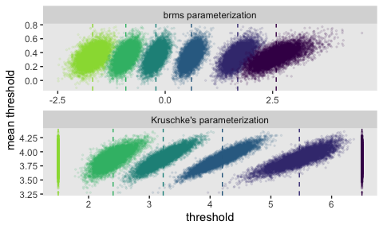

Fitting the multivariable ordered-probit model with **brms** is about as simple as fitting any other multivariable model. Just tack on predictors with the `+` operator.


```r
fit23.13 <-
  brm(data = my_data,
      family = cumulative(probit),
      Rating ~ 1 + Year_s + Length_s,
      prior = c(prior(normal(0, 4), class = Intercept),
                prior(normal(0, 4), class = b)),
      iter = 3000, warmup = 1000, chains = 4, cores = 4,
      seed = 23,
      file = "fits/fit23.13")
```

Check the model summary.


```r
print(fit23.13)
```

```
##  Family: cumulative 
##   Links: mu = probit; disc = identity 
## Formula: Rating ~ 1 + Year_s + Length_s 
##    Data: my_data (Number of observations: 100) 
## Samples: 4 chains, each with iter = 3000; warmup = 1000; thin = 1;
##          total post-warmup samples = 8000
## 
## Population-Level Effects: 
##              Estimate Est.Error l-95% CI u-95% CI Rhat Bulk_ESS Tail_ESS
## Intercept[1]    -1.68      0.20    -2.09    -1.29 1.00     6219     5249
## Intercept[2]    -0.91      0.15    -1.22    -0.62 1.00     8941     7290
## Intercept[3]    -0.21      0.13    -0.48     0.05 1.00     9226     6749
## Intercept[4]     0.61      0.14     0.33     0.89 1.00     8363     7121
## Intercept[5]     1.69      0.20     1.31     2.09 1.00     8900     7207
## Intercept[6]     2.58      0.37     1.94     3.40 1.00     9301     7094
## Year_s          -0.49      0.13    -0.74    -0.24 1.00     7535     6385
## Length_s         0.62      0.13     0.36     0.87 1.00     6914     5909
## 
## Family Specific Parameters: 
##      Estimate Est.Error l-95% CI u-95% CI Rhat Bulk_ESS Tail_ESS
## disc     1.00      0.00     1.00     1.00 1.00     8000     8000
## 
## Samples were drawn using sampling(NUTS). For each parameter, Bulk_ESS
## and Tail_ESS are effective sample size measures, and Rhat is the potential
## scale reduction factor on split chains (at convergence, Rhat = 1).
```

Extract the posterior draws and compare the **brms** parameterization of $\theta_{[i]}$ with the parameterization in the text in an expanded version of the bottom panel of Figure 23.9.


```r
post <- 
  posterior_samples(fit23.13) %>%
  mutate(iter = 1:n())

post %>% 
  select(`b_Intercept[1]`:`b_Intercept[6]`, iter) %>% 
  compare_thresholds(lb = 1.5, ub = 6.5)
```

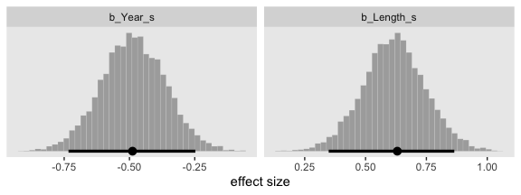

To sate any curiosity, here are the Pearson's correlation coefficients for the parameters.


```r
vcov(fit23.13, correlation = T) %>% round(digits = 2)
```

```
##              Intercept[1] Intercept[2] Intercept[3] Intercept[4] Intercept[5] Intercept[6] Year_s Length_s
## Intercept[1]         1.00         0.54         0.28         0.09         0.00         0.02   0.23    -0.25
## Intercept[2]         0.54         1.00         0.55         0.24         0.07         0.05   0.15    -0.19
## Intercept[3]         0.28         0.55         1.00         0.48         0.17         0.07   0.01    -0.02
## Intercept[4]         0.09         0.24         0.48         1.00         0.40         0.15  -0.12     0.17
## Intercept[5]         0.00         0.07         0.17         0.40         1.00         0.41  -0.16     0.22
## Intercept[6]         0.02         0.05         0.07         0.15         0.41         1.00  -0.10     0.06
## Year_s               0.23         0.15         0.01        -0.12        -0.16        -0.10   1.00    -0.56
## Length_s            -0.25        -0.19        -0.02         0.17         0.22         0.06  -0.56     1.00
```

Now behold the marginal distribution of our two effect-size parameters.


```r
post %>% 
  pivot_longer(ends_with("_s")) %>% 
  mutate(name = factor(name,
                       levels = c("b_Year_s", "b_Length_s"))) %>% 
  
  ggplot(aes(x = value, y = 0)) +
  stat_halfeye(point_interval = mode_hdi, .width = .95,
               fill = sl[4], color = sl[8], normalize = "panels") +
  scale_y_continuous(NULL, breaks = NULL) +
  xlab("effect size") +
  facet_wrap(~name, scales = "free")
```

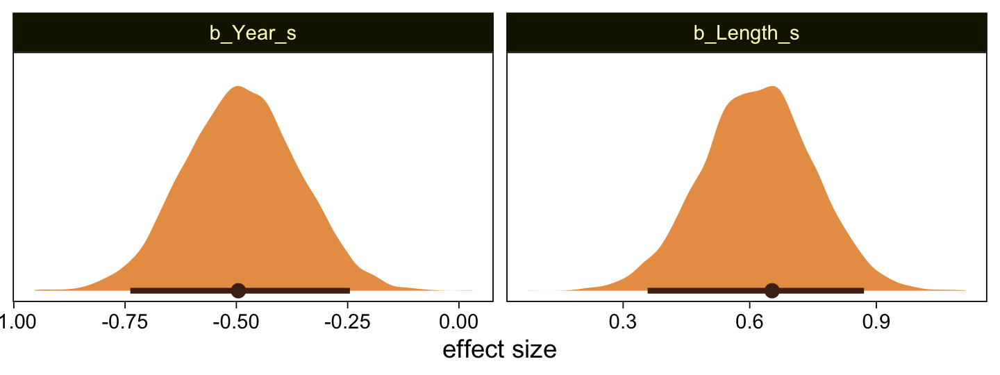

Before we make the top panel from Figure 23.9, I'd like to wander a bit and look at something related. We'll use `fitted()`.


```r
# define the new data
nd <- crossing(Year_s   = seq(from = -3, to = 3, by = 0.25), 
               Length_s = seq(from = -3, to = 3, by = 0.25))

# compute the `Response` probabilities
f <-
  fitted(fit23.13,
         newdata = nd)

# rearrange the output
f <-
  rbind(
    f[, , 1],
    f[, , 2],
    f[, , 3],
    f[, , 4],
    f[, , 5],
    f[, , 6],
    f[, , 7]
  ) %>% 
  # wrangle
  data.frame() %>% 
  bind_cols(
    nd %>% 
      expand(Rating = 1:7,
             nesting(Year_s, Length_s))
  )

# what did we do?
head(f)
```

```
##     Estimate  Est.Error        Q2.5      Q97.5 Rating Year_s Length_s
## 1 0.11596490 0.07771555 0.018412578 0.31174822      1     -3    -3.00
## 2 0.08969225 0.06387646 0.012850383 0.25375723      1     -3    -2.75
## 3 0.06818195 0.05172953 0.008820866 0.20410537      1     -3    -2.50
## 4 0.05097925 0.04135202 0.005812685 0.16029760      1     -3    -2.25
## 5 0.03752788 0.03269257 0.003637213 0.12566558      1     -3    -2.00
## 6 0.02723169 0.02561071 0.002255709 0.09758057      1     -3    -1.75
```

We just computed the response probabilities across the two-dimensional grid of the predictor values. Now plot using the posterior means.


```r
f %>% 
  mutate(strip = str_c("Rating: ", Rating)) %>% 
  
  ggplot(aes(x = Year_s, y = Length_s)) +
  geom_raster(aes(fill = Estimate),
              interpolate = T) +
  geom_text(data = my_data %>% mutate(strip = str_c("Rating: ", Rating)),
            aes(label = Rating),
            color = "white", size = 2.5) +
  scale_fill_scico(palette = 'lajolla', direction = -1, limits = c(0, 1),
                   breaks = c(0, .5, 1), labels = c("0", ".5", "1")) +
  scale_x_continuous(breaks = seq(from = -2, to = 2, by = 2),
                     expand = c(0, 0)) +
  scale_y_continuous(breaks = seq(from = -2, to = 2, by = 2),
                     expand = c(0, 0)) +
  theme(legend.position = "bottom") +
  facet_wrap(~strip, nrow = 1)
```

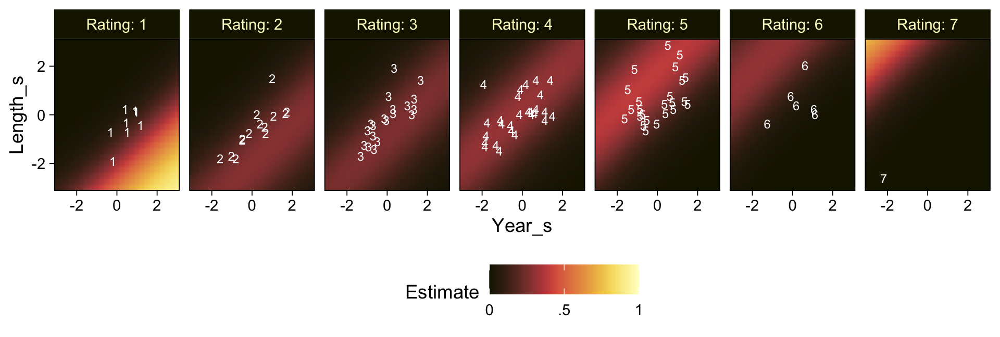

This model didn't do a great job capturing the `Response` probabilities. If you're curious, you'll find you can do a little bit better if you allow the two predictors to interact (i.e., add `+ Year_s:Length_s` to the `formula` line). Even then, the model isn't great. I leave that as an exercise for the interested reader.


For this model, however, we will follow Kruschke and make a more faithful version of the top panel of Figure 23.9. We'll need to wrangle our `post` data a bit to get things ready. Here's the work.


```r
post <-
  post %>% 
  # we just need the data from three steps in the HMC chain
  slice(1:3) %>% 
  mutate(iter = 1:n() %>% as.factor(),
         b1   = b_Year_s,
         b2   = b_Length_s) %>% 
  expand(nesting(iter, b1, b2, `b_Intercept[1]`, `b_Intercept[2]`, `b_Intercept[3]`, `b_Intercept[4]`, `b_Intercept[5]`, `b_Intercept[6]`),
         # because these are straight lines, two extreme x1-values are all we need
         x1 = c(-10, 10)) %>% 
  pivot_longer(contains("["),
               names_to = "theta") %>% 
  # use Kruschke's Formula 23.5
  mutate(x2       = (value / b2) + (-b1 / b2) * x1,
         # this just renames our x variables for easy plotting
         Year_s   = x1,
         Length_s = x2) 

glimpse(post)
```

```
## Rows: 36
## Columns: 9
## $ iter     <fct> 1, 1, 1, 1, 1, 1, 1, 1, 1, 1, 1, 1, 2, 2, 2, 2, 2, 2, 2, 2, 2, 2, 2, 2, 3, 3, 3, 3, 3, 3, …
## $ b1       <dbl> -0.3068252, -0.3068252, -0.3068252, -0.3068252, -0.3068252, -0.3068252, -0.3068252, -0.306…
## $ b2       <dbl> 0.4972902, 0.4972902, 0.4972902, 0.4972902, 0.4972902, 0.4972902, 0.4972902, 0.4972902, 0.…
## $ x1       <dbl> -10, -10, -10, -10, -10, -10, 10, 10, 10, 10, 10, 10, -10, -10, -10, -10, -10, -10, 10, 10…
## $ theta    <chr> "b_Intercept[1]", "b_Intercept[2]", "b_Intercept[3]", "b_Intercept[4]", "b_Intercept[5]", …
## $ value    <dbl> -1.51339718, -0.78520413, -0.09792353, 0.76854102, 1.59137438, 2.08120872, -1.51339718, -0…
## $ x2       <dbl> -9.213230, -7.748908, -6.366857, -4.624485, -2.969851, -1.984844, 3.126655, 4.590977, 5.97…
## $ Year_s   <dbl> -10, -10, -10, -10, -10, -10, 10, 10, 10, 10, 10, 10, -10, -10, -10, -10, -10, -10, 10, 10…
## $ Length_s <dbl> -9.213230, -7.748908, -6.366857, -4.624485, -2.969851, -1.984844, 3.126655, 4.590977, 5.97…
```

Now just plot.


```r
post %>% 
  ggplot(aes(x = Year_s, y = Length_s)) +
  geom_line(aes(group = interaction(iter, theta), color = theta, linetype = iter)) +
  geom_text(data = my_data,
            aes(label = Rating)) +
  scale_color_scico_d(expression(theta), palette = "lajolla", begin = .25, labels = 1:6) +
  coord_cartesian(xlim = range(my_data$Year_s),
                  ylim = range(my_data$Length_s))
```


It might be easier to see Kruschke's main point if we facet by `iter`.


```r
post %>% 
  ggplot(aes(x = Year_s, y = Length_s)) +
  geom_line(aes(group = interaction(iter, theta), color = theta, linetype = iter)) +
  geom_text(data = my_data,
            aes(label = Rating)) +
  scale_color_scico_d(expression(theta), palette = "lajolla", begin = .25, labels = 1:6) +
  coord_cartesian(xlim = range(my_data$Year_s),
                  ylim = range(my_data$Length_s)) +
  theme(legend.direction = "horizontal",
        legend.position = c(.75, .25)) +
  facet_wrap(~iter, ncol = 2)
```


Both our versions of the plot show what Kruschke pointed out in the text:

> Threshold lines from the same step in the chain must be parallel because the regression coefficients are constant at that step, but are different at another step. The threshold lines in Figure 23.9 are level contours on the underlying metric planar surface, and the lines reveal that the ratings increase toward the top left, that is, as $x_1$ decreases and $x_2$ increases. (p. 693)

Before we move on to the next section, what these diagonal 2-dimensional threshold lines also hint at is that when we use two predictors to describe ordinal data as having been produces by an underlying unit Gaussian distribution, that underlying distribution is actually bivariate Gaussian. Here we'll use `fitted()` one more time to depict that bivariate-Gaussian distribution with a little `geom_raster()`.


```r
# define the new data
nd <- crossing(Year_s   = seq(from = -5, to = 5, by = 0.1), 
               Length_s = seq(from = -5, to = 5, by = 0.1))

fitted(fit23.13,
       newdata = nd,
       # this will yield z-scores
       scale = "linear") %>% 
  data.frame() %>%
  bind_cols(nd) %>% 
  # convert the z-scores to density values
  mutate(density = dnorm(Estimate, 0, 1)) %>% 

  ggplot(aes(x = Year_s, y = Length_s)) +
  geom_raster(aes(fill = density),
              interpolate = T) +
  geom_text(data = my_data,
            aes(label = Rating),
            size = 2.5) +
  scale_fill_scico("density", palette = 'lajolla', direction = -1, 
                   limits = c(0, 0.4)) +
  scale_x_continuous(expand = c(0, 0)) +
  scale_y_continuous(expand = c(0, 0)) 
```

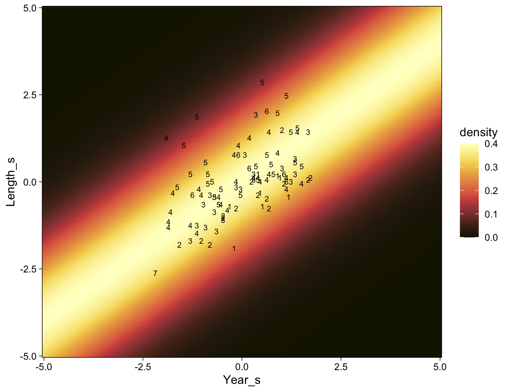

As with many of our previous approaches with `geom_raster()`, this plot is based on the posterior means in each cell and, therefore, does a poor job depicting the uncertainty in the posterior distribution.

### Why are some thresholds outside the data?

Now load Kruschke's simulated data.


```r
my_data <- read_csv("data.R/OrdinalProbitData-Movies.csv")

glimpse(my_data)
```

```
## Rows: 400
## Columns: 3
## $ Year   <dbl> 1959, 1946, 1964, 1938, 1946, 1971, 1957, 1970, 1968, 1962, 1929, 1962, 1978, 1972, 1964, 19…
## $ Length <dbl> 88, 117, 130, 85, 111, 105, 93, 119, 78, 77, 138, 107, 70, 60, 138, 122, 72, 109, 71, 61, 60…
## $ Rating <dbl> 4, 5, 5, 4, 5, 4, 3, 4, 3, 3, 7, 4, 2, 2, 5, 5, 3, 4, 3, 2, 2, 3, 5, 3, 5, 5, 5, 4, 5, 4, 4,…
```

> These data imitate the movie ratings, but with two key differences. First and foremost, the artificial data have much smaller noise, with $\sigma = 0.20$ as opposed to $\sigma \approx 1.25$ in the real data. Second, the artificial data have points that span the entire range of both predictors, unlike the real data which had points mostly in the central region. (p. 695)

Like with the real movie data, we'll inspect these data with a colored scatter plot.


```r
my_data %>% 
  mutate(Rating = factor(Rating)) %>% 
  
  ggplot(aes(x = Year, y = Length)) +
  geom_point(aes(color = Rating),
             size = 3) +
  geom_text(aes(label = Rating),
            size = 3) +
  scale_color_scico_d(palette = "lajolla", begin = .15, end = .7)
```


Unlike in last section, there appears to be a clear trend in Kruschke's simulated data. Kruschke's simulated critic liked his movies old and long. Time to standardize the predictors.


```r
my_data <-
  my_data %>% 
  mutate(Year_s   = (Year   - mean(Year))   / sd(Year),
         Length_s = (Length - mean(Length)) / sd(Length))
```

Fitting the multivariable ordered-probit model with **brms** is about as simple as fitting any other multivariable model. Just tack on predictors with the `+` operator.


```r
fit23.14 <-
  update(fit23.13,
         newdata = my_data,
         iter = 3000, warmup = 1000, chains = 4, cores = 4,
         seed = 23,
         file = "fits/fit23.14")
```

Check the model summary.


```r
print(fit23.14)
```

```
##  Family: cumulative 
##   Links: mu = probit; disc = identity 
## Formula: Rating ~ 1 + Year_s + Length_s 
##    Data: my_data (Number of observations: 400) 
## Samples: 4 chains, each with iter = 3000; warmup = 1000; thin = 1;
##          total post-warmup samples = 8000
## 
## Population-Level Effects: 
##              Estimate Est.Error l-95% CI u-95% CI Rhat Bulk_ESS Tail_ESS
## Intercept[1]    -9.76      0.68   -11.12    -8.51 1.00     1899     2574
## Intercept[2]    -5.96      0.43    -6.82    -5.14 1.00     2095     2993
## Intercept[3]    -2.24      0.21    -2.68    -1.83 1.00     3234     5397
## Intercept[4]     2.42      0.21     2.01     2.84 1.00     2890     4600
## Intercept[5]     7.78      0.55     6.74     8.88 1.00     2098     2921
## Intercept[6]    10.87      0.77     9.39    12.45 1.00     2022     3149
## Year_s          -2.79      0.20    -3.19    -2.42 1.00     2016     2841
## Length_s         4.73      0.32     4.12     5.36 1.00     1962     2623
## 
## Family Specific Parameters: 
##      Estimate Est.Error l-95% CI u-95% CI Rhat Bulk_ESS Tail_ESS
## disc     1.00      0.00     1.00     1.00 1.00     8000     8000
## 
## Samples were drawn using sampling(NUTS). For each parameter, Bulk_ESS
## and Tail_ESS are effective sample size measures, and Rhat is the potential
## scale reduction factor on split chains (at convergence, Rhat = 1).
```

Extract the posterior draws and use `compare_thresholds()` to make our expanded version of the bottom panel of Figure 23.10.


```r
post <- 
  posterior_samples(fit23.14) %>%
  mutate(iter = 1:n())

post %>% 
  select(`b_Intercept[1]`:`b_Intercept[6]`, iter) %>% 
  compare_thresholds(lb = 1.5, ub = 6.5)
```

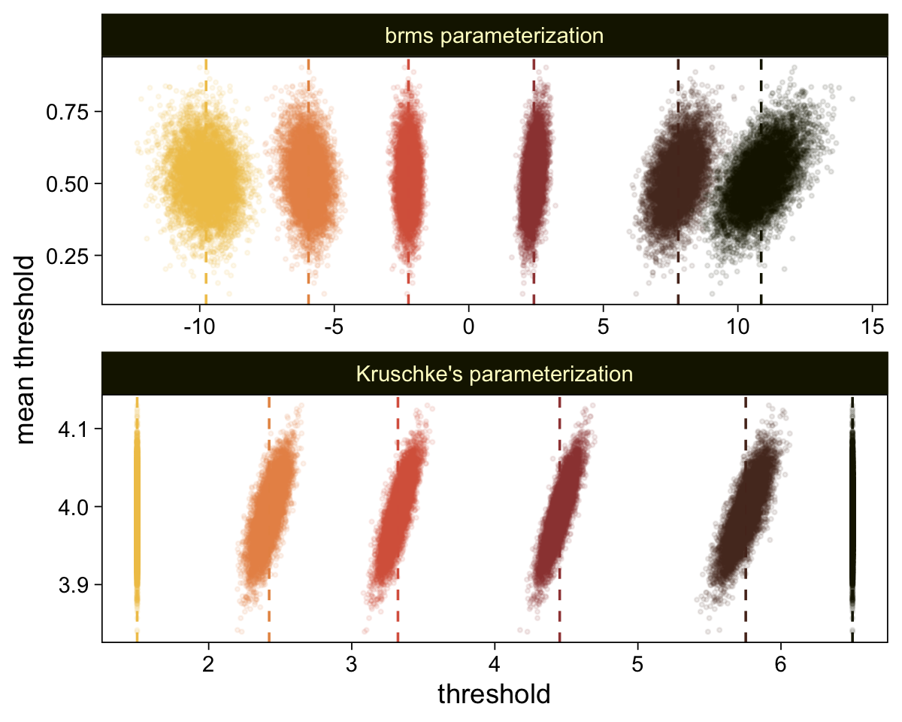

Make the marginal distribution of our two effect-size parameters.


```r
post %>% 
  pivot_longer(ends_with("_s")) %>% 
  mutate(name = factor(name, levels = c("b_Year_s", "b_Length_s"))) %>% 
  
  ggplot(aes(x = value, y = 0)) +
  stat_halfeye(point_interval = mode_hdi, .width = .95,
               fill = sl[4], color = sl[8], normalize = "panels") +
  scale_y_continuous(NULL, breaks = NULL) +
  xlab("effect size") +
  facet_wrap(~name, scales = "free")
```

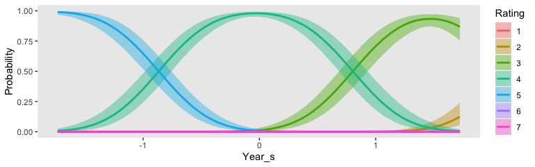

Make the top panel for Figure 23.10 just like we did for its analogue in Figure 23.9.


```r
# extract the posterior draws and wrangle
posterior_samples(fit23.14) %>% 
  slice(1:3) %>% 
  mutate(iter = 1:n() %>% as.factor(),
         b1   = b_Year_s,
         b2   = b_Length_s) %>% 
  expand(nesting(iter, b1, b2, `b_Intercept[1]`, `b_Intercept[2]`, 
                 `b_Intercept[3]`, `b_Intercept[4]`, `b_Intercept[5]`, `b_Intercept[6]`),
         x1 = c(-10, 10)) %>% 
  pivot_longer(contains("["),
               names_to = "theta") %>% 
  mutate(x2       = (value / b2) + (-b1 / b2) * x1,
         Year_s   = x1,
         Length_s = x2) %>%
  
  # plot!
  ggplot(aes(x = Year_s, y = Length_s)) +
  geom_line(aes(group = interaction(iter, theta), color = theta, linetype = iter)) +
  geom_text(data = my_data,
            aes(label = Rating)) +
  scale_color_scico_d(expression(theta), palette = "lajolla", begin = .25, labels = 1:6) +
  coord_cartesian(xlim = range(my_data$Year_s),
                  ylim = range(my_data$Length_s))
```


Those are some tight thresholds. They "very clearly cleave parallel regions of distinct ordinal values. The example demonstrates that the threshold lines *do* make intuitive sense when there is low noise and a broad range of data" (p. 695, *emphasis* in the original).

With our various bonus plots, we've been anticipating Figure 23.11 for some time, now. The thresholds from `fit23.14` result in beautifully nonlinear probability curves for the `Rating` levels. Take a quick look with `conditional_effects()`.


```r
ce <- conditional_effects(fit23.14, categorical = T)

plot(ce, plot = FALSE)[[1]] +
  scale_fill_scico_d(palette = "lajolla", begin = .25) +
  scale_color_scico_d(palette = "lajolla", begin = .25) +
  scale_x_continuous(expand = c(0, 0)) +
  scale_y_continuous(expand = c(0, 0), limits = c(0, 1))
```

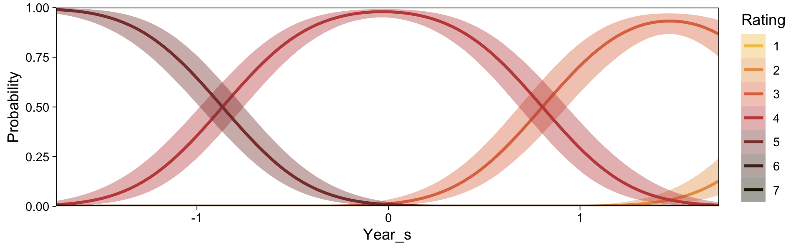

```r
plot(ce, plot = FALSE)[[2]] +
  scale_fill_scico_d(palette = "lajolla", begin = .25) +
  scale_color_scico_d(palette = "lajolla", begin = .25) +
  scale_x_continuous(expand = c(0, 0)) +
  scale_y_continuous(expand = c(0, 0), limits = c(0, 1))
```


Because the model had two predictors, we got two plots. What `brms::conditional_effects()` called `Probability` on the $y$-axis is the same as what Kruschke called $p(y)$ on his. Rather than generic predictors $x$ on the $x$-axis, our plots had either `Year_s` or `Length_s`. Whereas Kruschke marked off his different outcomes by line styles, ours were marked by color. Since we don't have the data Kruschke used to make Figure 23.11, we won't be able to reproduce it exactly. However, you'll note that our plot for `Length_s` corresponded nicely with his subplot on the top (i.e., the one for which $\sigma = 0.1$). If we set `effects = "Length_s"`, we can use `conditional_effects()` to make a similar plot to Kruschke's subplot for which $\sigma = 1$.


```r
ce <- conditional_effects(fit23.13, 
                          categorical = T, 
                          effects = "Length_s")

plot(ce, plot = FALSE)[[1]] +
  scale_fill_scico_d(palette = "lajolla", begin = .25) +
  scale_color_scico_d(palette = "lajolla", begin = .25) +
  scale_x_continuous(expand = c(0, 0)) +
  scale_y_continuous(expand = expansion(mult = c(0, 0.05)), limits = c(0, NA))
```


"You can see that each outcome has maximum probability within its corresponding interval, but there is considerable smearing of outcomes into adjacent intervals" (p. 695).

Finishing off, Kruschke's discussion in the text

> referred to $\sigma$ as "noise" merely for linguistic ease. Calling the outcomes "noisy" does not mean the underlying generator of the outcomes is inherently wildly random. *The "noise" is merely variation in the outcome that cannot be accounted for by the particular model we have chosen with the particular predictors we have chosen*. A different model and/or different predictors might account for the outcomes well with little residual noise. In this sense, the noise is in the model, not in the data. (p. 698, *emphasis* in the original)

Through this lens, noisy-looking data are a symptom of weak theory and/or poor data-collection methods.

## Posterior prediction

The cumulative-normal model makes posterior predictions for the probabilities of the $K$ categories in the criterion variable by computing $p (y | \mu (x), \sigma, \{ \theta_k \} )$ in each step in the HMC chain. In this equation, $\mu (x) = \beta_0 + \sum_j \beta_j x_j$. Though recall that with our **brms** parameterization, we have $\beta_0$ fixed at 0. Kruschke framed part of his discussion in this chapter in terms of a single-predictor model, such as was entertained in Figure 23.8. Recall that corresponds to our `fit11`. Here's that `formula`.


```r
fit23.11$formula
```

```
## Happiness ~ 1 + Assets_s
```

With **brms**, you can get this information with `fitted()`. Let's say we wanted to focus on response probabilities for `Assets_s = -1)`. Here's what we get.


```r
fitted(fit23.11, 
       newdata = tibble(Assets_s = -1))
```

```
## , , 1
## 
##       Estimate   Est.Error       Q2.5      Q97.5
## [1,] 0.0299714 0.002419835 0.02544226 0.03495092
## 
## , , 2
## 
##       Estimate  Est.Error      Q2.5    Q97.5
## [1,] 0.1247234 0.00482835 0.1154765 0.134436
## 
## , , 3
## 
##       Estimate   Est.Error      Q2.5     Q97.5
## [1,] 0.3435323 0.006476711 0.3308031 0.3562033
## 
## , , 4
## 
##      Estimate   Est.Error      Q2.5     Q97.5
## [1,] 0.450443 0.007071127 0.4364356 0.4642726
## 
## , , 5
## 
##        Estimate   Est.Error       Q2.5      Q97.5
## [1,] 0.05132986 0.002901331 0.04590682 0.05722053
```

As is typical of **brms**, those probability summaries were in terms of the posterior mean and percentile-based 95% intervals. If you're like Kruschke and prefer posterior modes and HDIs, you'll need to set `summary = F` and wrangle a bit.


```r
f <-
  fitted(fit23.11, 
         newdata = tibble(Assets_s = -1),
         summary = F)

cbind(
  f[, , 1],
  f[, , 2],
  f[, , 3],
  f[, , 4],
  f[, , 5]
) %>% 
  data.frame() %>% 
  set_names(str_c("p(Happiness = ", 1:5, " | Assets_s = -1)")) %>% 
  pivot_longer(everything()) %>% 
  group_by(name) %>% 
  mode_hdi(value) %>% 
  mutate_if(is.double, round, digits = 4)
```

```
## # A tibble: 5 x 7
##   name                              value .lower .upper .width .point .interval
##   <chr>                             <dbl>  <dbl>  <dbl>  <dbl> <chr>  <chr>    
## 1 p(Happiness = 1 | Assets_s = -1) 0.0297 0.0253 0.0348   0.95 mode   hdi      
## 2 p(Happiness = 2 | Assets_s = -1) 0.124  0.116  0.134    0.95 mode   hdi      
## 3 p(Happiness = 3 | Assets_s = -1) 0.343  0.331  0.356    0.95 mode   hdi      
## 4 p(Happiness = 4 | Assets_s = -1) 0.450  0.437  0.465    0.95 mode   hdi      
## 5 p(Happiness = 5 | Assets_s = -1) 0.0509 0.0458 0.057    0.95 mode   hdi
```

## Generalizations and extensions

In this section, Kruschke mentioned extensions of this class of models might include using the cumulative $t$ function to handle outliers or adding a guessing parameter. Full disclosure: I have not fit models like these. Based on my knowledge of **brms**, I suspect they're possible. For insights how, you might review Bürkner's [-@Bürkner2020Define] [*Define custom response distributions with brms*](https://cran.r-project.org/web/packages/brms/vignettes/brms_customfamilies.html) and his [-@Bürkner2020Non_linear] [*Estimating non-linear models with brms*](https://cran.r-project.org/web/packages/brms/vignettes/brms_nonlinear.html) vignettes.

In addition, there are other likelihoods one might use to model ordinal data using **brms**. Your first stop should be Bürkner and Vourre's [-@burknerOrdinalRegressionModels2019] [*Ordinal regression models in psychology: A Tutorial*](https://psyarxiv.com/x8swp/), where, in addition to the cumulative normal model, they cover the sequential and adjacent category models. You might also check out [Chapter 11](https://bookdown.org/content/3890/monsters-and-mixtures.html) of my [-@kurzStatisticalRethinkingBrms2020] ebook recoding McElreath's [*Statistical rethinking*](https://xcelab.net/rm/statistical-rethinking/), wherein I show how one might use the logit link (i.e., `family = cumulative(logit)`) to fit ordered-categorical models with **brms**.

## Session info {-}


```r
sessionInfo()
```

```
## R version 3.6.3 (2020-02-29)
## Platform: x86_64-apple-darwin15.6.0 (64-bit)
## Running under: macOS Catalina 10.15.3
## 
## Matrix products: default
## BLAS:   /Library/Frameworks/R.framework/Versions/3.6/Resources/lib/libRblas.0.dylib
## LAPACK: /Library/Frameworks/R.framework/Versions/3.6/Resources/lib/libRlapack.dylib
## 
## locale:
## [1] en_US.UTF-8/en_US.UTF-8/en_US.UTF-8/C/en_US.UTF-8/en_US.UTF-8
## 
## attached base packages:
## [1] stats     graphics  grDevices utils     datasets  methods   base     
## 
## other attached packages:
##  [1] tidybayes_2.1.1      brms_2.13.5          Rcpp_1.0.5           patchwork_1.0.1.9000 scico_1.2.0         
##  [6] forcats_0.5.0        stringr_1.4.0        dplyr_1.0.1          purrr_0.3.4          readr_1.3.1         
## [11] tidyr_1.1.1          tibble_3.0.3         ggplot2_3.3.2        tidyverse_1.3.0     
## 
## loaded via a namespace (and not attached):
##   [1] TH.data_1.0-10       colorspace_1.4-1     ellipsis_0.3.1       ggridges_0.5.2       rsconnect_0.8.16    
##   [6] estimability_1.3     markdown_1.1         base64enc_0.1-3      fs_1.4.1             rstudioapi_0.11     
##  [11] farver_2.0.3         rstan_2.19.3         svUnit_1.0.3         DT_0.13              fansi_0.4.1         
##  [16] mvtnorm_1.1-0        lubridate_1.7.8      xml2_1.3.1           codetools_0.2-16     splines_3.6.3       
##  [21] bridgesampling_1.0-0 knitr_1.28           shinythemes_1.1.2    bayesplot_1.7.1      jsonlite_1.7.0      
##  [26] broom_0.5.5          dbplyr_1.4.2         ggdist_2.1.1         shiny_1.5.0          compiler_3.6.3      
##  [31] httr_1.4.1           emmeans_1.4.5        backports_1.1.9      assertthat_0.2.1     Matrix_1.2-18       
##  [36] fastmap_1.0.1        cli_2.0.2            later_1.1.0.1        prettyunits_1.1.1    htmltools_0.5.0     
##  [41] tools_3.6.3          igraph_1.2.5         coda_0.19-3          gtable_0.3.0         glue_1.4.2          
##  [46] reshape2_1.4.4       cellranger_1.1.0     vctrs_0.3.4          nlme_3.1-144         crosstalk_1.1.0.1   
##  [51] xfun_0.13            ps_1.3.4             rvest_0.3.5          mime_0.9             miniUI_0.1.1.1      
##  [56] lifecycle_0.2.0      gtools_3.8.2         MASS_7.3-51.5        zoo_1.8-7            scales_1.1.1        
##  [61] colourpicker_1.0     hms_0.5.3            promises_1.1.1       Brobdingnag_1.2-6    sandwich_2.5-1      
##  [66] parallel_3.6.3       inline_0.3.15        shinystan_2.5.0      yaml_2.2.1           gridExtra_2.3       
##  [71] StanHeaders_2.21.0-1 loo_2.3.1            stringi_1.4.6        dygraphs_1.1.1.6     pkgbuild_1.1.0      
##  [76] rlang_0.4.7          pkgconfig_2.0.3      matrixStats_0.56.0   HDInterval_0.2.0     evaluate_0.14       
##  [81] lattice_0.20-38      rstantools_2.1.1     htmlwidgets_1.5.1    labeling_0.3         tidyselect_1.1.0    
##  [86] processx_3.4.4       plyr_1.8.6           magrittr_1.5         bookdown_0.18        R6_2.4.1            
##  [91] generics_0.0.2       multcomp_1.4-13      DBI_1.1.0            pillar_1.4.6         haven_2.2.0         
##  [96] withr_2.2.0          xts_0.12-0           survival_3.1-12      abind_1.4-5          modelr_0.1.6        
## [101] crayon_1.3.4         arrayhelpers_1.1-0   utf8_1.1.4           rmarkdown_2.1        grid_3.6.3          
## [106] readxl_1.3.1         callr_3.4.4          threejs_0.3.3        reprex_0.3.0         digest_0.6.25       
## [111] xtable_1.8-4         httpuv_1.5.4         stats4_3.6.3         munsell_0.5.0        shinyjs_1.1
```


