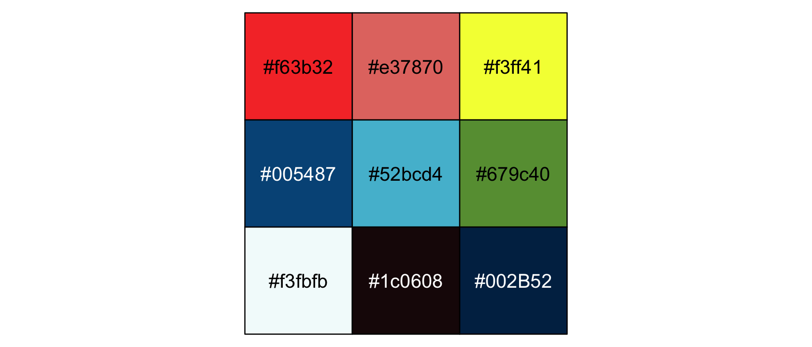
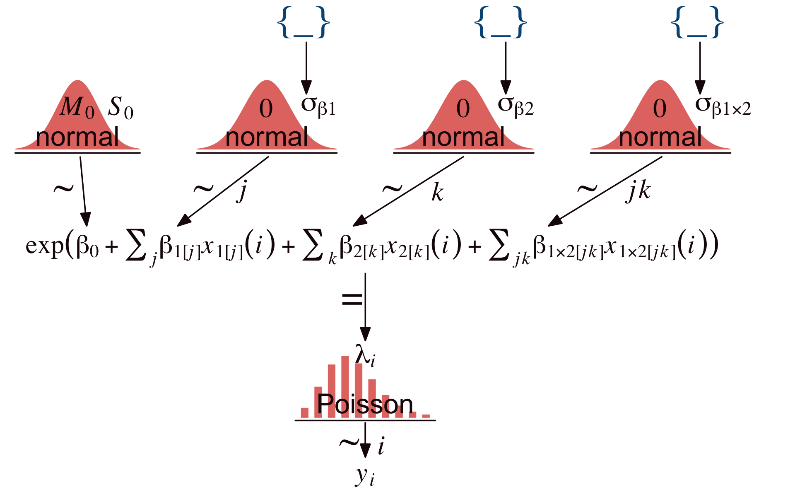
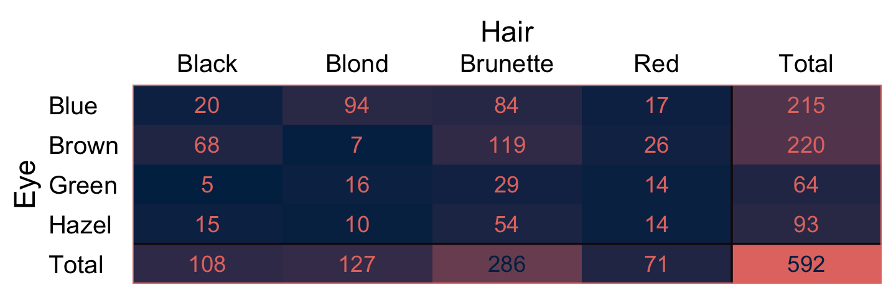
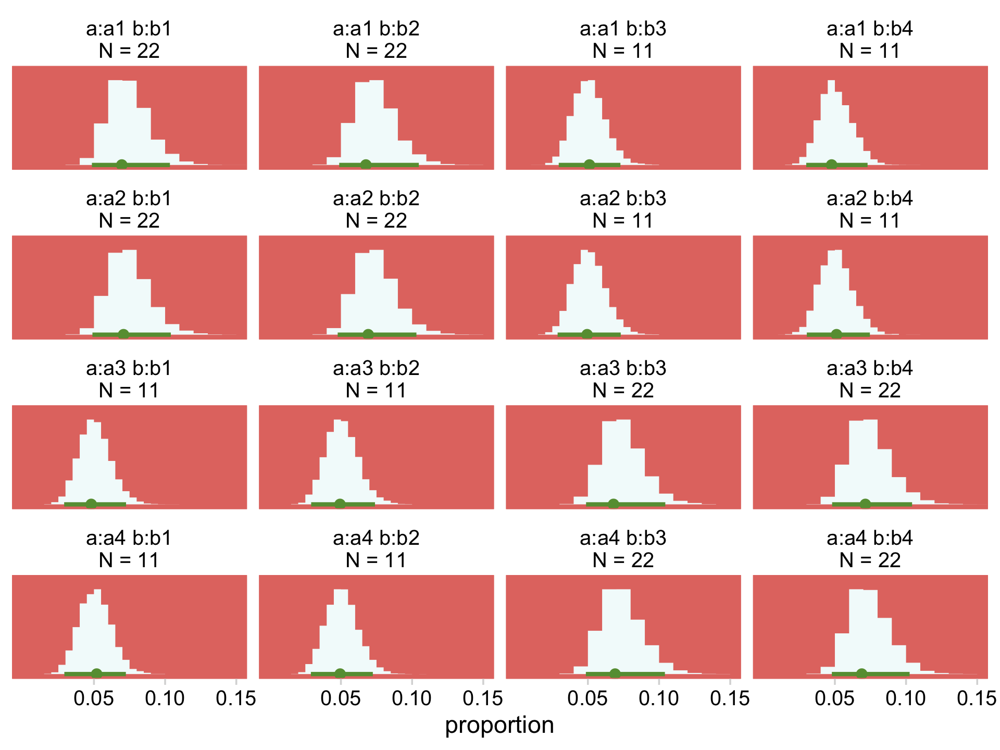
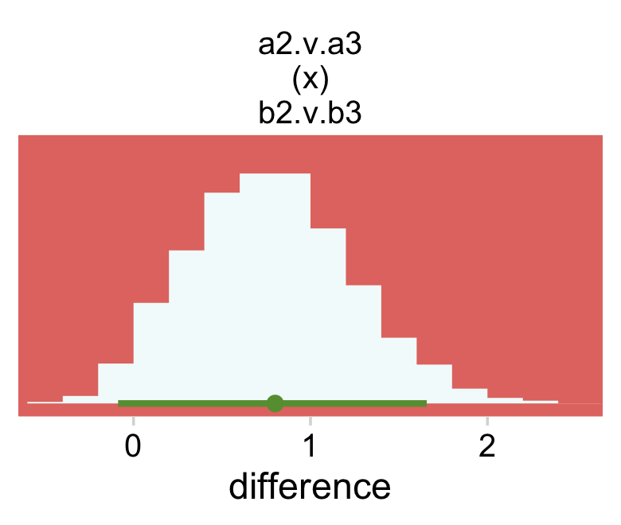
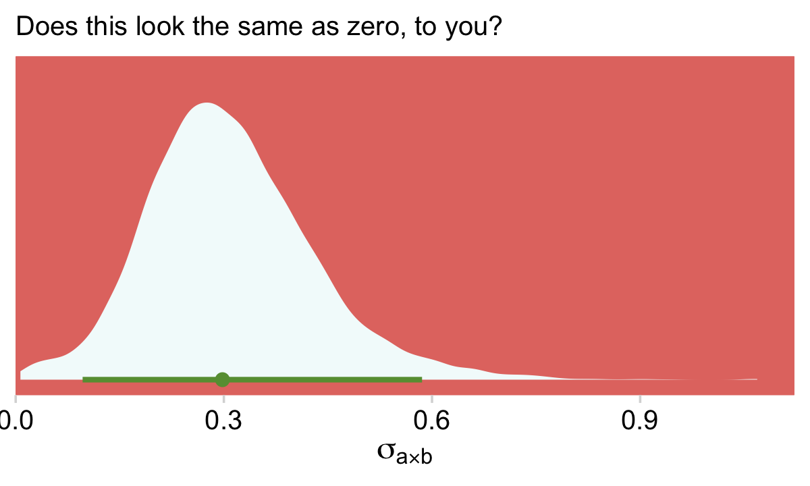
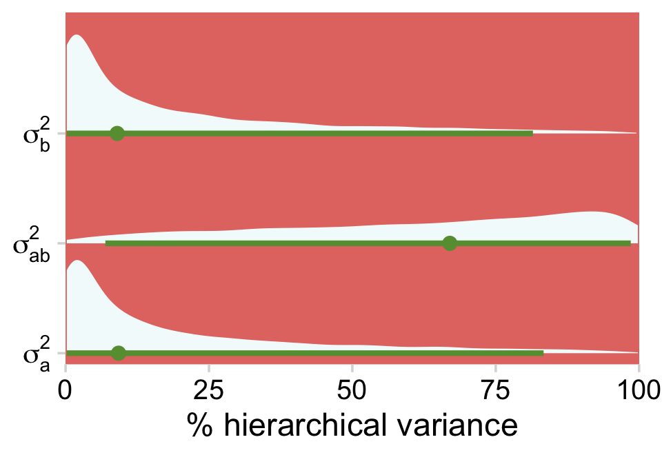

# Count Predicted Variable

> Consider a situation in which we observe two nominal values for every item measured.... Across the whole sample, the result is a table of counts for each combination of values of the nominal variables. The counts are what we are trying to predict and the nominal variables are the predictors. This is the type of situation addressed in this chapter....
>
> In the context of the generalized linear model (GLM) introduced in Chapter 15, this chapter's situation involves a predicted value that is a count, for which we will use an inverse-link function that is exponential along with a Poisson distribution for describing noise in the data [@kruschkeDoingBayesianData2015, pp. 703--704]

## Poisson exponential model

Following Kruschke, we will "refer to the model that will be explained in this section as Poisson exponential because, as we will see, the noise distribution is a Poisson distribution and the inverse-link function is exponential" (p. 704).

### Data structure.

Kruschke has the @sneeGraphicalDisplayTwoway1974 data for Table 24.1 saved as the `HairEyeColor.csv` file.


```r
library(tidyverse)
library(janitor)

my_data <- read_csv("data.R/HairEyeColor.csv")

glimpse(my_data)
```

```
## Rows: 16
## Columns: 3
## $ Hair  <chr> "Black", "Black", "Black", "Black", "Blond", "Blond", "Blond", "…
## $ Eye   <chr> "Blue", "Brown", "Green", "Hazel", "Blue", "Brown", "Green", "Ha…
## $ Count <dbl> 20, 68, 5, 15, 94, 7, 16, 10, 84, 119, 29, 54, 17, 26, 14, 14
```

In order to retain some of the ordering in Table 24.1, we'll want to make `Hair` a factor and `recode()` `Brown` as `Brunette`.


```r
my_data <-
  my_data %>% 
  mutate(Hair = recode(Hair, "Brown" = "Brunette") %>% 
           factor(., levels = c("Black", "Brunette", "Red", "Blond")))
```

Here's a quick way to use `pivot_wider()` to make most of the table.


```r
my_data %>% 
  pivot_wider(names_from = Hair,
              values_from = Count)
```

```
## # A tibble: 4 × 5
##   Eye   Black Blond Brunette   Red
##   <chr> <dbl> <dbl>    <dbl> <dbl>
## 1 Blue     20    94       84    17
## 2 Brown    68     7      119    26
## 3 Green     5    16       29    14
## 4 Hazel    15    10       54    14
```

However, that didn't get us the marginal totals. For those, we'll `uncount()` the cells in the data and then make the full table with `janitor::tabyl()` and `janitor::adorn_totals()`.


```r
my_data %>%
  uncount(weights = Count, .remove = F) %>% 
  tabyl(Eye, Hair) %>%
  adorn_totals(c("row", "col")) %>% 
  knitr::kable()
```


|Eye   | Black| Brunette| Red| Blond| Total|
|:-----|-----:|--------:|---:|-----:|-----:|
|Blue  |    20|       84|  17|    94|   215|
|Brown |    68|      119|  26|     7|   220|
|Green |     5|       29|  14|    16|    64|
|Hazel |    15|       54|  14|    10|    93|
|Total |   108|      286|  71|   127|   592|

That last `knitr::kable()` line just formatted the output a bit. You'll note that the cell counts from the last two code blocks are a little different from those Kruschke displayed in his Table 24.1. I'm pretty sure Kruschke mislabeled his column names, which it appears he has acknowledged in his [Corrigenda](https://sites.google.com/site/doingbayesiandataanalysis/corrigenda).

### Exponential link function.

To analyze data like those above,

> a natural candidate for the needed likelihood distribution is the Poisson (described later), which takes a non-negative value $\lambda$ and gives a probability for each integer from zero to infinity.  But this motivation may seem a bit arbitrary, even if there’s nothing wrong with it in principle.
>
> A different motivation starts by treating the cell counts as representative of underlying cell probabilities, and then asking whether the two nominal variables contribute independent influences to the cell probabilities. (p. 705).

The additive model of cell counts of a table of rows $r$ and columns $c$ follows the form

$$\lambda_{r, c} = \exp (\beta_0 + \beta_r + \beta_c),$$

where $\lambda_{r, c}$ is the tendency of counts within row $r$ and column $c$. In the case of an interaction model, the equation expands to

$$\lambda_{r, c} = \exp (\beta_0 + \beta_r + \beta_c + \beta_{r, c}),$$

with the following constraints:

\begin{align*}
\sum_r \beta_r = 0, && \sum_c \beta_c = 0, && \sum_r \beta_{r, c} = 0 \text{ for all } c, && \text{and} && \sum_c \beta_{r, c} = 0 \text{ for all } r.
\end{align*}

### Poisson noise distribution.

[Simon-Denis Poisson](https://upload.wikimedia.org/wikipedia/commons/e/e8/E._Marcellot_Siméon-Denis_Poisson_1804.jpg)'s distribution follows the form

$$p(y | \lambda) = \frac{\lambda^y \exp (-\lambda)}{y!},$$

> where $y$ is a non-negative integer and $\lambda$ is a non-negative real number. The mean of the Poisson distribution is $\lambda$. Importantly, the variance of the Poisson distribution is also $\lambda$ (i.e., the standard deviation is $\sqrt \lambda$). Thus, in the Poisson distribution, the variance is completely yoked to the mean. (p. 707)

We can work with that expression directly in base **R**. Here we use $\lambda = 5.5$ and $y = 2$.


```r
lambda <- 5.5
y      <- 2

lambda^y * exp(-lambda) / factorial(y)
```

```
## [1] 0.06181242
```

If we'd like to simulate from the Poisson distribution, we'd use the `rpois()` function. It takes two arguments, `n` and `lambda`. Let's generate 1,000 draws based on $\lambda = 5$.


```r
set.seed(24)

d <- tibble(y = rpois(n = 1000, lambda = 5))
```

Here are the mean and variance.


```r
d %>% 
  summarise(mean     = mean(y),
            variance = var(y))
```

```
## # A tibble: 1 × 2
##    mean variance
##   <dbl>    <dbl>
## 1  4.98     5.17
```

They're not exactly the same because of simulation variance, but they get that way real quick with a larger sample.


```r
set.seed(24)

tibble(y = rpois(n = 100000, lambda = 5)) %>% 
  summarise(mean     = mean(y),
            variance = var(y))
```

```
## # A tibble: 1 × 2
##    mean variance
##   <dbl>    <dbl>
## 1  4.99     4.98
```

Let's put `rpois()` to work and make Figure 24.1.

Before we go any further, let's talk color and theme. For this chapter, we'll take our color palette from the [**ochRe** package](https://github.com/ropenscilabs/ochRe) [@R-ochRe], which provides several color palettes inspired by the art, landscapes, and wildlife of Australia. For the plots to follow, we will use the `"healthy_reef"` palette.


```r
library(ochRe)

scales::show_col(ochre_palettes[["healthy_reef"]])
```



```r
hr <- ochre_palettes[["healthy_reef"]]
```

Our overall plot theme will be based on `cowplot::theme_minimal_grid()` with a few adjustments.


```r
library(cowplot)

theme_set(
  theme_minimal_grid() +
    theme(legend.key = element_rect(fill = hr[2], color = hr[2]),
          panel.background = element_rect(fill = hr[2], color = hr[2]),
          panel.border = element_rect(color = hr[2]),
          panel.grid = element_blank())
)
```

Now we have our palette and theme, we're ready to make our version of the Poisson histograms in Figure 24.1.


```r
crossing(y      = 0:50,
         lambda = c(1.8, 8.3, 32.1)) %>% 
  mutate(d = dpois(y, lambda = lambda)) %>% 
  
  ggplot(aes(x = y, y = d)) +
  geom_col(fill = hr[3], color = hr[3], width = 0.5) +
  scale_y_continuous("p(y)", expand = expansion(mult = c(0, 0.05))) +
  facet_wrap(~ lambda, ncol = 1,
             labeller = label_bquote(dpois(y*"|"*lambda == .(lambda))))
```


For more on our `labeller = label_bquote` syntax, check out [this](https://ggplot2.tidyverse.org/reference/label_bquote.html). But anyway, given $\lambda$, the Poisson distribution gives the probabilities of specific non-negative integers.

### The complete model and implementation in ~~JAGS~~ brms.

To get a sense of Kruschke's hierarchical Bayesian alternative to the conventional ANOVA approach, let's make our version of the model diagram in Figure 24.2.


```r
library(patchwork)

# bracket
p1 <-
  tibble(x = .95,
         y = .5,
         label = "{_}") %>% 
  
  ggplot(aes(x = x, y = y, label = label)) +
  geom_text(size = 10, hjust = 1, color = hr[4], family = "Times") +
  scale_x_continuous(expand = c(0, 0), limits = c(0, 1)) +
  ylim(0, 1) +
  theme_void()

##  plain arrow
# save our custom arrow settings
my_arrow <- arrow(angle = 20, length = unit(0.35, "cm"), type = "closed")
p2 <-
  tibble(x    = .68,
         y    = 1,
         xend = .68,
         yend = .25) %>%
  
  ggplot(aes(x = x, xend = xend,
             y = y, yend = yend)) +
  geom_segment(arrow = my_arrow, color = hr[8]) +
  xlim(0, 1) +
  theme_void()

# normal density
p3 <-
  tibble(x = seq(from = -3, to = 3, by = .1)) %>% 
  ggplot(aes(x = x, y = (dnorm(x)) / max(dnorm(x)))) +
  geom_area(fill = hr[2]) +
  annotate(geom = "text",
           x = 0, y = .2,
           label = "normal",
           size = 7, color = hr[8]) +
  annotate(geom = "text",
           x = c(0, 1.45), y = .6,
           hjust = c(.5, 0),
           label = c("italic(M)[0]", "italic(S)[0]"), 
           size = 7, color = hr[8], family = "Times", parse = T) +
  scale_x_continuous(expand = c(0, 0)) +
  theme_void() +
  theme(axis.line.x = element_line(linewidth = 0.5, color = hr[8]))

# second normal density
p4 <-
  tibble(x = seq(from = -3, to = 3, by = .1)) %>% 
  ggplot(aes(x = x, y = (dnorm(x)) / max(dnorm(x)))) +
  geom_area(fill = hr[2]) +
  annotate(geom = "text",
           x = 0, y = .2,
           label = "normal",
           size = 7, color = hr[8]) +
  annotate(geom = "text",
           x = c(0, 1.45), y = .6,
           hjust = c(.5, 0),
           label = c("0", "sigma[beta][1]"), 
           size = 7, color = hr[8], family = "Times", parse = T) +
  scale_x_continuous(expand = c(0, 0)) +
  theme_void() +
  theme(axis.line.x = element_line(linewidth = 0.5, color = hr[8]))

# third normal density
p5 <-
  tibble(x = seq(from = -3, to = 3, by = .1)) %>% 
  ggplot(aes(x = x, y = (dnorm(x)) / max(dnorm(x)))) +
  geom_area(fill = hr[2]) +
  annotate(geom = "text",
           x = 0, y = .2,
           label = "normal",
           size = 7, color = hr[8]) +
  annotate(geom = "text",
           x = c(0, 1.45), y = .6,
           hjust = c(.5, 0),
           label = c("0", "sigma[beta][2]"), 
           size = 7, color = hr[8], family = "Times", parse = T) +
  scale_x_continuous(expand = c(0, 0)) +
  theme_void() +
  theme(axis.line.x = element_line(linewidth = 0.5, color = hr[8]))

# fourth normal density
p6 <-
  tibble(x = seq(from = -3, to = 3, by = .1)) %>% 
  ggplot(aes(x = x, y = (dnorm(x)) / max(dnorm(x)))) +
  geom_area(fill = hr[2]) +
  annotate(geom = "text",
           x = 0, y = .2,
           label = "normal",
           size = 7, color = hr[8]) +
  annotate(geom = "text",
           x = 0, y = .6,
           hjust = .5,
           label = "0", 
           size = 7, color = hr[8], family = "Times", parse = T) +
  scale_x_continuous(expand = c(0, 0)) +
  theme_void() +
  theme(axis.line.x = element_line(linewidth = 0.5, color = hr[8]))

# likelihood formula
p7 <-
  tibble(x = .5,
         y = .25,
         label = "exp(beta[0]+sum()[italic(j)]*beta[1]['['*italic(j)*']']*italic(x)[1]['['*italic(j)*']'](italic(i))+sum()[italic(k)]*beta[2]['['*italic(k)*']']*italic(x)[2]['['*italic(k)*']'](italic(i))+sum()[italic(jk)]*beta[1%*%2]['['*italic(jk)*']']*italic(x)[1%*%2]['['*italic(jk)*']'](italic(i)))") %>% 
 
  ggplot(aes(x = x, y = y, label = label)) +
  geom_text(size = 6.75, color = hr[8], parse = T, family = "Times") +
  scale_x_continuous(expand = c(0, 0), limits = c(0, 1)) +
  ylim(0, 1) +
  theme_void()

# sigma
p8 <-
  tibble(x = .13,
         y = .6,
         label = "sigma[beta][1%*%2]") %>% 
 
  ggplot(aes(x = x, y = y, label = label)) +
  geom_text(hjust = 0, size = 7, color = hr[8], parse = T, family = "Times") +
  scale_x_continuous(expand = c(0, 0), limits = c(0, 2)) +
  ylim(0, 1) +
  theme_void()

# four annotated arrows
p9 <-
  tibble(x    = c(.05, .34, .64, .945),
         y    = c(1, 1, 1, 1),
         xend = c(.06, .2, .47, .77),
         yend = c(0, 0, 0, 0)) %>%
  ggplot(aes(x = x, xend = xend,
             y = y, yend = yend)) +
  geom_segment(arrow = my_arrow, color = hr[8]) +
  annotate(geom = "text",
           x = c(.025, .24, .30, .53, .60, .83, .91), y = .5,
           label = c("'~'", "'~'", "italic(j)", "'~'", "italic(k)", "'~'", "italic(jk)"),
           size = c(10, 10, 7, 10, 7, 10, 7), 
           color = hr[8], family = "Times", parse = T) +
  xlim(0, 1) +
  theme_void()

# Poisson density
p10 <-
  tibble(x = 0:9) %>% 
  ggplot(aes(x = x, y = .87 * (dpois(x, lambda = 3.5)) / max(dpois(x, lambda = 3.5))) ) +
  geom_col(color = hr[2], fill = hr[2], width = .45) +
  annotate(geom = "text",
           x = 4.5, y = .2,
           label = "Poisson",
           size = 7, color = hr[8]) +
  annotate(geom = "text",
           x = 4.5, y = .89,
           label = "lambda[italic(i)]",
           size = 7, color = hr[8], family = "Times", parse = TRUE) +
  theme_void() +
  theme(axis.line.x = element_line(linewidth = 0.5, color = hr[8]))

# one annotated arrow
p11 <-
  tibble(x    = .5,
         y    = 1,
         xend = .5,
         yend = .35) %>%
  
  ggplot(aes(x = x, xend = xend,
             y = y, yend = yend)) +
  geom_segment(arrow = my_arrow, color = hr[8]) +
  annotate(geom = "text",
           x = .4, y = .725,
           label = "'='",
           size = 10, color = hr[8], family = "Times", parse = T) +
  xlim(0, 1) +
  theme_void()

# the final annotated arrow
p12 <-
  tibble(x     = c(.375, .625),
         y     = c(1/3, 1/3),
         label = c("'~'", "italic(i)")) %>%

  ggplot(aes(x = x, y = y, label = label)) +
  geom_text(size = c(10, 7),
            color = hr[8], parse = T, family = "Times") +
  geom_segment(x = .5, xend = .5,
               y = 1, yend = 0,
               arrow = my_arrow, color = hr[8]) +
  xlim(0, 1) +
  theme_void()

# some text
p13 <-
  tibble(x     = .5,
         y     = .5,
         label = "italic(y[i])") %>%

  ggplot(aes(x = x, y = y, label = label)) +
  geom_text(size = 7, color = hr[8], parse = T, family = "Times") +
  xlim(0, 1) +
  theme_void()

# define the layout
layout <- c(
  area(t = 1, b = 1, l = 6, r = 7),
  area(t = 1, b = 1, l = 10, r = 11),
  area(t = 1, b = 1, l = 14, r = 15),
  area(t = 2, b = 3, l = 6, r = 7),
  area(t = 2, b = 3, l = 10, r = 11),
  area(t = 2, b = 3, l = 14, r = 15),
  area(t = 3, b = 4, l = 1, r = 3),
  area(t = 3, b = 4, l = 5, r = 7),
  area(t = 3, b = 4, l = 9, r = 11),
  area(t = 3, b = 4, l = 13, r = 15),
  area(t = 6, b = 7, l = 1, r = 15),
  area(t = 3, b = 4, l = 15, r = 16),
  area(t = 5, b = 6, l = 1, r = 15),
  area(t = 10, b = 11, l = 7, r = 9),
  area(t = 8, b = 10, l = 7, r = 9),
  area(t = 12, b = 12, l = 7, r = 9),
  area(t = 13, b = 13, l = 7, r = 9)
)

# combine and plot!
(p1 + p1 + p1 + p2 + p2 + p2 + p3 + p4 + p5 + p6 + p7 + p8 + p9 + p10 + p11 + p12 + p13) + 
  plot_layout(design = layout) &
  ylim(0, 1) &
  theme(plot.margin = margin(0, 5.5, 0, 5.5))
```



Using Kruschke's method,

> the prior is supposed to be broad on the scale of the data, but we must be careful about what scale is being modeled by the baseline and deflections. *The counts are being directly described by* $\lambda$*, but it is* $\log (\lambda)$ *being described by the baseline and deflections*. Thus, the prior on the baseline and deflections should be broad on the scale of the logarithm of the data. To establish a generic baseline, consider that if the data points were distributed equally among the cells, the mean count would be the total count divided by the number of cells. The biggest possible standard deviation across cells would occur when all the counts were loaded into a single cell and all the other cells were zero. (pp. 709--710, *emphasis* added)

Before we show how to fit the model, we need the old `gamma_a_b_from_omega_sigma()` function.


```r
gamma_a_b_from_omega_sigma <- function(mode, sd) {
  
  if (mode <= 0) stop("mode must be > 0")
  if (sd   <= 0) stop("sd must be > 0")
  rate <- (mode + sqrt(mode^2 + 4 * sd^2)) / (2 * sd^2)
  shape <- 1 + mode * rate
  
  return(list(shape = shape, rate = rate))
  
}
```

Here are a few intermediate values before we set the `stanvars`.


```r
n_x1_level <- length(unique(my_data$x1))
n_x2_level <- length(unique(my_data$x2))
n_cell     <- nrow(my_data)
```

Now we're ready to define the `stanvars`.


```r
y_log_mean <-
  log(sum(my_data$y) / (n_x1_level * n_x2_level))

y_log_sd <-
  c(rep(0, n_cell - 1), sum(my_data$y)) %>% 
  sd() %>% 
  log()

s_r <- gamma_a_b_from_omega_sigma(mode = y_log_sd, sd = 2 * y_log_sd)

stanvars <- 
  stanvar(y_log_mean, name = "y_log_mean") + 
  stanvar(y_log_sd,   name = "y_log_sd") + 
  stanvar(s_r$shape,  name = "alpha") +
  stanvar(s_r$rate,   name = "beta")
```

You'd then fit a Poisson model with two nominal predictors using Kruschke's hierarchical-shrinkage method like this.


```r
fit <-
  brm(data = my_data,
      family = poisson,
      y ~ 1 + (1 | x1) + (1 | x2) + (1 | x1:x2),
      prior = c(prior(normal(y_log_mean, y_log_sd * 2), class = Intercept),
                prior(gamma(alpha, beta), class = sd)),
      stanvars = stanvars)
```

By **brms** default, `family = poisson` uses the log link. Thus `family = poisson(link = "log")` should return the same results. Notice the right-hand side of the model `formula`. We have three hierarchical variance parameters. This hierarchical-shrinkage approach to frequency-table data has its origins in @gelmanAnalysisVarianceWhy2005, [*Analysis of variance--why it is more important than ever*](https://projecteuclid.org/download/pdfview_1/euclid.aos/1112967698).

## Example: Hair eye go again

We'll be using the same data, from above. As an alternative to Table 24.1, it might be handy to take a more colorful approach to wading into the data.


```r
# wrangle
my_data %>%
  uncount(weights = Count, .remove = F) %>% 
  tabyl(Eye, Hair) %>%
  adorn_totals(c("row", "col")) %>% 
  data.frame() %>% 
  pivot_longer(-Eye, names_to = "Hair") %>% 
  mutate(Eye = fct_rev(Eye)) %>% 
  
  # plot
  ggplot(aes(x = Hair, y = Eye, label = value)) +
  geom_raster(aes(fill = value)) +
  geom_text(aes(color = value < 250)) +
  geom_hline(yintercept = 1.5, color = hr[8], linewidth = 1/2) +
  geom_vline(xintercept = 4.5, color = hr[8], linewidth = 1/2) +
  scale_fill_gradient(low = hr[9], high = hr[2]) +
  scale_color_manual(values = hr[c(9, 2)]) +
  scale_x_discrete(expand = c(0, 0), position = "top") +
  scale_y_discrete(expand = c(0, 0)) +
  theme(axis.text.y = element_text(hjust = 0),
        axis.ticks = element_blank(),
        legend.position = "none")
```



Load the **brms** and **tidybayes** packages.


```r
library(brms)
library(tidybayes)
```

Now we'll save the preparatory values necessary for the `stanvars`.


```r
n_x1_level <- length(unique(my_data$Hair))
n_x2_level <- length(unique(my_data$Eye))
n_cell     <- nrow(my_data)

n_x1_level
```

```
## [1] 4
```

```r
n_x2_level
```

```
## [1] 4
```

```r
n_cell
```

```
## [1] 16
```

Here are the values we'll save as `stanvars`.


```r
y_log_mean <-
  log(sum(my_data$Count) / (n_x1_level * n_x2_level))

y_log_sd <-
  c(rep(0, n_cell - 1), sum(my_data$Count)) %>% 
  sd() %>% 
  log()

s_r <- gamma_a_b_from_omega_sigma(mode = y_log_sd, sd = 2 * y_log_sd)

y_log_mean
```

```
## [1] 3.610918
```

```r
y_log_sd
```

```
## [1] 4.997212
```

```r
s_r$shape
```

```
## [1] 1.640388
```

```r
s_r$rate
```

```
## [1] 0.1281491
```

As a quick detour, it might be interesting to see what the kind of gamma distribution is entailed by those last two values.


```r
tibble(x = seq(from = 0, to = 70, length.out = 1e3)) %>% 
  mutate(density = dgamma(x, shape = s_r$shape, rate = s_r$rate)) %>% 
  
  ggplot(aes(x = x, y = density)) +
  geom_area(fill = hr[4]) +
  scale_x_continuous(NULL, expand = expansion(mult = c(0, -0.05))) +
  scale_y_continuous(NULL, breaks = NULL, expand = expansion(mult = c(0, 0.05))) +
  ggtitle(expression("Kruschke's wide prior for "*sigma[beta*x]))
```


Save the `stanvars`.


```r
stanvars <- 
  stanvar(y_log_mean, name = "y_log_mean") + 
  stanvar(y_log_sd,   name = "y_log_sd") + 
  stanvar(s_r$shape,  name = "alpha") +
  stanvar(s_r$rate,   name = "beta")
```

Fit Kruschke's model with **brms**.


```r
fit24.1 <-
  brm(data = my_data,
      family = poisson,
      Count ~ 1 + (1 | Hair) + (1 | Eye) + (1 | Hair:Eye),
      prior = c(prior(normal(y_log_mean, y_log_sd * 2), class = Intercept),
                prior(gamma(alpha, beta), class = sd)),
      iter = 3000, warmup = 1000, chains = 4, cores = 4,
      seed = 24,
      stanvars = stanvars,
      file = "fits/fit24.01")
```

As it turns out, if you try to fit Kruschke's model with **brms** as is, you'll run into difficulties with divergent transitions and the like. One approach is to try tuning the `adapt_delta` and `max_treedepth` parameters. I had no luck with that approach. E.g., cranking `adapt_delta` up past `0.9999` still returned a divergent transition or two.

Another approach is to step back and assess the model. We're trying to fit a multilevel model with two grouping variables and their interaction with a total of 16 data points. That's not a lot of data for fitting such a model. If you take a close look at our priors, you'll notice they're really quite weak. If you're willing to tighten them up just a bit, the model can fit more smoothly. That will be our approach.

For the $\sigma$ hyperparameter of the overall intercept's Gaussian prior, Kruschke would have us multiply `y_log_sd` by 2. Here we'll tighten up that $\sigma$ hyperparameter by simply setting it to `y_log_sd`. The gamma priors for the upper-level variance parameters were based on a mode of `y_log_sd` and a standard deviation of the same but multiplied by 2 (i.e., `2 * y_log_sd`). We'll tighten that up a bit by simply defining those gammas by a standard deviation of `y_log_sd`. When you make those adjustments, the model fits with less fuss. In case you're curious, here is what those priors look like.


```r
# redifine our shape and rate
s_r <- gamma_a_b_from_omega_sigma(mode = y_log_sd, sd = y_log_sd)

# wrangle
bind_rows(
  # define beta[0]
  tibble(x = seq(from = y_log_mean - (4 * y_log_sd), to = y_log_mean + (4 * y_log_sd), length.out = 1e3)) %>%
    mutate(density = dnorm(x, mean = y_log_mean, sd = y_log_sd)),
  # define sigma[beta[x]]
  tibble(x = seq(from = 0, to = 40, length.out = 1e3)) %>% 
    mutate(density = dgamma(x, shape = s_r$shape, rate = s_r$rate))
) %>%
  mutate(prior = rep(c("beta[0]", "sigma[beta*x]"), each = n() / 2)) %>% 
  
  # plot
  ggplot(aes(x = x, y = density)) +
  geom_area(fill = hr[6]) +
  scale_y_continuous(NULL, breaks = NULL, expand = expansion(mult = c(0, 0.05))) +
  labs(title = "Priors",
       x = NULL) +
  facet_wrap(~ prior, scales = "free", labeller = label_parsed)
```


Update the `stanvars`.


```r
stanvars <- 
  stanvar(y_log_mean, name = "y_log_mean") + 
  stanvar(y_log_sd,   name = "y_log_sd") + 
  stanvar(s_r$shape,  name = "alpha") +
  stanvar(s_r$rate,   name = "beta")
```

Now we've updated our `stanvars`, we'll fit the modified model. We should note that even this version required some adjustment to the `adapt_delta` and `max_treedepth` parameters. But it wasn't nearly the exercise in frustration entailed in the version, above.


```r
fit24.1 <-
  brm(data = my_data,
      family = poisson,
      Count ~ 1 + (1 | Hair) + (1 | Eye) + (1 | Hair:Eye),
      prior = c(prior(normal(y_log_mean, y_log_sd), class = Intercept),
                prior(gamma(alpha, beta), class = sd)),
      iter = 3000, warmup = 1000, chains = 4, cores = 4,
      control = list(adapt_delta = 0.999,
                     max_treedepth = 12),
      stanvars = stanvars,
      seed = 24,
      file = "fits/fit24.01")
```

Take a look at the parameter summary.


```r
print(fit24.1)
```

```
##  Family: poisson 
##   Links: mu = log 
## Formula: Count ~ 1 + (1 | Hair) + (1 | Eye) + (1 | Hair:Eye) 
##    Data: my_data (Number of observations: 16) 
##   Draws: 4 chains, each with iter = 3000; warmup = 1000; thin = 1;
##          total post-warmup draws = 8000
## 
## Group-Level Effects: 
## ~Eye (Number of levels: 4) 
##               Estimate Est.Error l-95% CI u-95% CI Rhat Bulk_ESS Tail_ESS
## sd(Intercept)     1.80      1.51     0.30     5.80 1.00     2907     5001
## 
## ~Hair (Number of levels: 4) 
##               Estimate Est.Error l-95% CI u-95% CI Rhat Bulk_ESS Tail_ESS
## sd(Intercept)     1.89      1.52     0.35     6.10 1.00     3302     5159
## 
## ~Hair:Eye (Number of levels: 16) 
##               Estimate Est.Error l-95% CI u-95% CI Rhat Bulk_ESS Tail_ESS
## sd(Intercept)     0.95      0.30     0.53     1.67 1.00     2534     4849
## 
## Population-Level Effects: 
##           Estimate Est.Error l-95% CI u-95% CI Rhat Bulk_ESS Tail_ESS
## Intercept     3.13      1.47    -0.04     6.12 1.00     4494     4726
## 
## Draws were sampled using sampling(NUTS). For each parameter, Bulk_ESS
## and Tail_ESS are effective sample size measures, and Rhat is the potential
## scale reduction factor on split chains (at convergence, Rhat = 1).
```

You'll notice that even though we tightened up the priors, the parameter estimates are still quite small relative to the values they allowed for. So even our tightened priors were quite permissive.

Let's post process in preparation for Figure 24.3.


```r
nd <-
  my_data %>% 
  arrange(Eye, Hair) %>% 
  # make the titles for the facet strips
  mutate(strip = str_c("E:", Eye, " H:", Hair, "\nN = ", Count))

f <-
  fitted(fit24.1,
         newdata = nd,
         summary = F) %>% 
  data.frame() %>%
  set_names(pull(nd, strip))

glimpse(f)
```

```
## Rows: 8,000
## Columns: 16
## $ `E:Blue H:Black\nN = 20`      <dbl> 20.12511, 27.86684, 21.45819, 21.74434, …
## $ `E:Blue H:Brunette\nN = 84`   <dbl> 80.80136, 75.66269, 89.25145, 87.52395, …
## $ `E:Blue H:Red\nN = 17`        <dbl> 23.382478, 13.285231, 13.497254, 13.4109…
## $ `E:Blue H:Blond\nN = 94`      <dbl> 99.57193, 96.05862, 91.89343, 110.94643,…
## $ `E:Brown H:Black\nN = 68`     <dbl> 54.90660, 75.31061, 81.18954, 73.27450, …
## $ `E:Brown H:Brunette\nN = 119` <dbl> 124.36289, 136.53928, 106.47154, 128.541…
## $ `E:Brown H:Red\nN = 26`       <dbl> 32.19246, 22.14586, 21.40319, 23.58161, …
## $ `E:Brown H:Blond\nN = 7`      <dbl> 5.602555, 8.908353, 7.242116, 8.276528, …
## $ `E:Green H:Black\nN = 5`      <dbl> 8.161327, 3.095467, 4.026049, 6.789293, …
## $ `E:Green H:Brunette\nN = 29`  <dbl> 18.79455, 25.73498, 23.25655, 25.46208, …
## $ `E:Green H:Red\nN = 14`       <dbl> 10.798792, 15.753593, 7.899662, 15.24391…
## $ `E:Green H:Blond\nN = 16`     <dbl> 18.760393, 8.495171, 17.541942, 9.304437…
## $ `E:Hazel H:Black\nN = 15`     <dbl> 15.206625, 15.830510, 18.532664, 8.22359…
## $ `E:Hazel H:Brunette\nN = 54`  <dbl> 51.77012, 50.71060, 69.07192, 49.63804, …
## $ `E:Hazel H:Red\nN = 14`       <dbl> 16.434025, 12.275335, 14.023016, 14.9371…
## $ `E:Hazel H:Blond\nN = 10`     <dbl> 6.889019, 11.160856, 10.789524, 14.29025…
```

Notice that when working with a Poisson model, `fitted()` defaults to returning estimates in the $\lambda$ metric. If we want proportions/probabilities, we'll have to compute them by dividing by the total $N$. In this case $N = 592$, which we get with `sum(my_data$Count)`. Here we convert the data to the long format, compute the proportions, and plot to make the top portion of Figure 24.3.


```r
f %>% 
  pivot_longer(everything(),
               values_to = "count") %>% 
  mutate(proportion = count / 592) %>% 
  
  ggplot(aes(x = proportion, y = 0)) +
  stat_histinterval(point_interval = mode_hdi, .width = .95,
                    fill = hr[9], color = hr[5],
                     normalize = "panels") +
  scale_x_continuous(breaks = c(0, .1, .2)) +
  scale_y_continuous(NULL, breaks = NULL) +
  coord_cartesian(xlim = c(0, .25)) +
  facet_wrap(~ name, scales = "free_y")
```


We'll have to work a bit to get the deflection differences. If this was a simple multilevel model with a single random grouping variable, we could just use the `ranef()` function to return the deflections. Like `fitted()`, it'll return summaries by default. But you can get the posterior draws with the `summary = F` argument. But since we used two grouping variables and their interaction, it'd be a bit of a pain to work that way. Happily, we do have a handy alternative. First, if we use the `scale = "linear"` argument, `fitted()` will return the draws in the $\lambda$ scale rather than the original count metric. With the group-level draws in the $\lambda$ metric, all we need to do is subtract the fixed effect (i.e., the grand mean, the population estimate) from each to convert them to the deflection metric. So below, we'll

a) make a custom `make_deflection()` function to do the conversions,
b) redefine our `nd` data to make our naming conventions a little more streamlined,
c) use `fitted()` and its `scale = "linear"` argument to get the draws in the $\lambda$ metric, 
d) wrangle a touch, and 
e) use our handy `make_deflection()` function to convert the results to the deflection metric.

I know; that's a lot. If you get lost, just go step by step and examine the results along the way.


```r
# a. make a custom function
make_deflection <- function(x) {
  x - as_draws_df(fit24.1)$b_Intercept
}

# b. streamline `nd`
nd <-
  my_data %>% 
  arrange(Eye, Hair) %>% 
  mutate(strip = str_c("E:", Eye, " H:", Hair))

# c. use `fitted()`
deflections <-
  fitted(fit24.1,
         newdata = nd,
         summary = F,
         scale = "linear") %>% 
  # d. wrangle
  data.frame() %>%
  set_names(pull(nd, strip)) %>% 
  # e. use the `make_deflection()` function
  mutate_all(.funs = make_deflection)

# what have we done?
glimpse(deflections)
```

```
## Rows: 8,000
## Columns: 16
## $ `E:Blue H:Black`     <dbl> 1.228304623, 1.997064342, 1.849325297, -1.4963963…
## $ `E:Blue H:Brunette`  <dbl> 2.61832992, 2.99591203, 3.27467637, -0.10383716, …
## $ `E:Blue H:Red`       <dbl> 1.37832309, 1.25627979, 1.38570498, -1.97967502, …
## $ `E:Blue H:Blond`     <dbl> 2.82721645, 3.23458549, 3.30384829, 0.13329787, 0…
## $ `E:Brown H:Black`    <dbl> 2.2319697, 2.9912478, 3.1800052, -0.2815369, -0.3…
## $ `E:Brown H:Brunette` <dbl> 3.0495400, 3.5862392, 3.4510964, 0.2805024, 0.166…
## $ `E:Brown H:Red`      <dbl> 1.69806854, 1.76727743, 1.84675887, -1.41528261, …
## $ `E:Brown H:Blond`    <dbl> -0.05044110, 0.85661619, 0.76313215, -2.46232612,…
## $ `E:Green H:Black`    <dbl> 0.32574299, -0.20043421, 0.17600424, -2.66040279,…
## $ `E:Green H:Brunette` <dbl> 1.15990320, 1.91747813, 1.92980535, -1.33855931, …
## $ `E:Green H:Red`      <dbl> 0.60577044, 1.42669535, 0.85003872, -1.85156937, …
## $ `E:Green H:Blond`    <dbl> 1.15808406, 0.80912474, 1.64781346, -2.34525825, …
## $ `E:Hazel H:Black`    <dbl> 0.94806736, 1.43156593, 1.70275351, -2.46874167, …
## $ `E:Hazel H:Brunette` <dbl> 2.17314926, 2.59576188, 3.01836699, -0.67099221, …
## $ `E:Hazel H:Red`      <dbl> 1.02569003, 1.17721885, 1.42391871, -1.87190092, …
## $ `E:Hazel H:Blond`    <dbl> 0.15626491, 1.08203948, 1.16179435, -1.91617194, …
```

Now we're ready to define our difference columns and plot our version of the lower panels in Figure 24.3.


```r
deflections %>% 
  transmute(`Blue − Brown @ Black` = `E:Blue H:Black` - `E:Brown H:Black`,
            `Blue − Brown @ Blond` = `E:Blue H:Blond` - `E:Brown H:Blond`) %>% 
  mutate(`Blue.v.Brown\n(x)\nBlack.v.Blond` = `Blue − Brown @ Black` - `Blue − Brown @ Blond`) %>% 
  pivot_longer(everything(), values_to = "difference") %>% 

  ggplot(aes(x = difference, y = 0)) +
  stat_histinterval(point_interval = mode_hdi, .width = .95,
                    fill = hr[9], color = hr[5],
                    normalize = "panels") +
  scale_y_continuous(NULL, breaks = NULL) +
  theme(panel.grid = element_blank()) +
  facet_wrap(~ name, scales = "free")
```


If you're curious, here are the precise summary values.


```r
deflections %>% 
  mutate(`Blue − Brown @ Black` = `E:Blue H:Black` - `E:Brown H:Black`,
         `Blue − Brown @ Blond` = `E:Blue H:Blond` - `E:Brown H:Blond`) %>% 
  mutate(`Blue.v.Brown\n(x)\nBlack.v.Blond` = `Blue − Brown @ Black` - `Blue − Brown @ Blond`) %>% 
  pivot_longer(`Blue − Brown @ Black`:`Blue.v.Brown\n(x)\nBlack.v.Blond`) %>% 
  group_by(name) %>% 
  mode_hdi(value)
```

```
## # A tibble: 3 × 7
##   name                               value .lower .upper .width .point .interval
##   <chr>                              <dbl>  <dbl>  <dbl>  <dbl> <chr>  <chr>    
## 1 "Blue − Brown @ Black"             -1.13  -1.68 -0.709   0.95 mode   hdi      
## 2 "Blue − Brown @ Blond"              2.44   1.71  3.13    0.95 mode   hdi      
## 3 "Blue.v.Brown\n(x)\nBlack.v.Blond" -3.58  -4.51 -2.74    0.95 mode   hdi
```

## Example: Interaction contrasts, shrinkage, and omnibus test

"In this section, we consider some contrived data to illustrate aspects of interaction contrasts. Like the eye and hair data, the fictitious data have two attributes with four levels each" (p. 713). Let's make the data.


```r
my_data <-
  crossing(a = str_c("a", 1:4),
           b = str_c("b", 1:4)) %>% 
  mutate(count = c(rep(c(22, 11), each = 2) %>% rep(., times = 2),
                   rep(c(11, 22), each = 2) %>% rep(., times = 2)))

head(my_data)
```

```
## # A tibble: 6 × 3
##   a     b     count
##   <chr> <chr> <dbl>
## 1 a1    b1       22
## 2 a1    b2       22
## 3 a1    b3       11
## 4 a1    b4       11
## 5 a2    b1       22
## 6 a2    b2       22
```

In the last section, we covered how Kruschke's broad priors can make fitting these kinds of models difficult when using HMC, particularly with so few cells. Our solution was to reign in the $\sigma$ hyperparameter for the level-one intercept and to compute the gamma prior for the hierarchical deflections based on a standard deviation of the log of the maximum standard deviation for the data rather than two times that value. Let's explore more options.

This data set has 16 cells. With so few cells, one might argue for a more conservative prior on the hierarchical deflections. Why not ditch the gamma altogether for a half normal centered on zero and with a $\sigma$ hyperparameter of 1? Even though this is much tighter than Kruschke's gamma prior approach, it's still permissive on the $\log$ scale. As for our intercept, we'll continue with the same approach from last time.

With that in mind, make the `stanvars`.


```r
n_x1_level <- length(unique(my_data$a))
n_x2_level <- length(unique(my_data$b))
n_cell     <- nrow(my_data)

y_log_mean <-
  log(sum(my_data$count) / (n_x1_level * n_x2_level))

y_log_sd <-
  c(rep(0, n_cell - 1), sum(my_data$count)) %>% 
  sd() %>% 
  log()

stanvars <- 
  stanvar(y_log_mean, name = "y_log_mean") + 
  stanvar(y_log_sd,   name = "y_log_sd")
```

Just for kicks, let's take a quick look at our priors.


```r
bind_rows(
  # define beta[0]
  tibble(x = seq(from = y_log_mean - (4 * y_log_sd), to = y_log_mean + (4 * y_log_sd), length.out = 1e3)) %>%
    mutate(density = dnorm(x, y_log_mean, y_log_sd)),
  # define sigma[beta[x]]
  tibble(x = seq(from = 0, to = 5, length.out = 1e3)) %>% 
    mutate(density = dnorm(x, 0, 1))
) %>%
  mutate(prior = rep(c("beta[0]", "sigma[beta*x]"), each = n() / 2)) %>% 
  
  ggplot(aes(x = x, y = density)) +
  geom_area(fill = hr[6]) +
  scale_y_continuous(NULL, breaks = NULL, expand = expansion(mult = c(0, 0.05))) +
  labs(title = "Priors",
       x = NULL) +
  facet_wrap(~ prior, scales = "free", labeller = label_parsed)
```


Fit the model.


```r
fit24.2 <-
  brm(data = my_data,
      family = poisson,
      count ~ 1 + (1 | a) + (1 | b) + (1 | a:b),
      prior = c(prior(normal(y_log_mean, y_log_sd), class = Intercept),
                prior(normal(0, 1), class = sd)),
      iter = 3000, warmup = 1000, chains = 4, cores = 4,
      control = list(adapt_delta = 0.995),
      stanvars = stanvars,
      seed = 24,
      file = "fits/fit24.02")
```

Review the summary.


```r
print(fit24.2)
```

```
##  Family: poisson 
##   Links: mu = log 
## Formula: count ~ 1 + (1 | a) + (1 | b) + (1 | a:b) 
##    Data: my_data (Number of observations: 16) 
##   Draws: 4 chains, each with iter = 3000; warmup = 1000; thin = 1;
##          total post-warmup draws = 8000
## 
## Group-Level Effects: 
## ~a (Number of levels: 4) 
##               Estimate Est.Error l-95% CI u-95% CI Rhat Bulk_ESS Tail_ESS
## sd(Intercept)     0.17      0.19     0.00     0.70 1.00     2566     3710
## 
## ~a:b (Number of levels: 16) 
##               Estimate Est.Error l-95% CI u-95% CI Rhat Bulk_ESS Tail_ESS
## sd(Intercept)     0.31      0.12     0.10     0.59 1.00     2321     2816
## 
## ~b (Number of levels: 4) 
##               Estimate Est.Error l-95% CI u-95% CI Rhat Bulk_ESS Tail_ESS
## sd(Intercept)     0.16      0.18     0.01     0.65 1.00     3107     4064
## 
## Population-Level Effects: 
##           Estimate Est.Error l-95% CI u-95% CI Rhat Bulk_ESS Tail_ESS
## Intercept     2.76      0.20     2.35     3.16 1.00     3915     3768
## 
## Draws were sampled using sampling(NUTS). For each parameter, Bulk_ESS
## and Tail_ESS are effective sample size measures, and Rhat is the potential
## scale reduction factor on split chains (at convergence, Rhat = 1).
```

We might plot our $\sigma_\text{<group>}$ posteriors against our prior to get a sense of how strong it was.


```r
as_draws_df(fit24.2) %>% 
  dplyr::select(starts_with("sd")) %>% 
  # set_names(str_c("expression(sigma", c("*a", "*ab", "*b"), ")")) %>% 
  pivot_longer(everything(), names_to = "sd") %>% 
  
  ggplot(aes(x = value)) +
  # prior
  geom_area(data = tibble(value = seq(from = 0, to = 3.5, by  =.01)),
            aes(y = dnorm(value, 0, 1)),
            fill = hr[8]) +
  # posterior
  geom_density(aes(fill = sd),
               linewidth = 0, alpha = 2/3) +
  scale_fill_manual(values = hr[c(4, 6, 3)],
                    labels = c(expression(sigma[a]),
                                  expression(sigma[ab]),
                                  expression(sigma[b])),
                    guide = guide_legend(label.hjust = 0)) +
  scale_x_continuous(NULL, expand = expansion(mult = c(0, 0.05))) +
  scale_y_continuous(NULL, breaks = NULL, expand = expansion(mult = c(0, 0.05))) +
  theme(legend.background = element_rect(fill = "transparent"),
        legend.position = c(.9, .8))
```


Our $\operatorname{Normal}^+ (0, 1)$ prior is that short dark shape in the background. The posteriors are the taller and more colorful mounds in the foreground. Here's the top part of Figure 24.4.


```r
nd <-
  my_data %>% 
  mutate(strip = str_c("a:", a, " b:", b, "\nN = ", count))

fitted(fit24.2,
       newdata = nd,
       summary = F) %>% 
  data.frame() %>%
  set_names(pull(nd, strip)) %>% 
  pivot_longer(everything(), values_to = "count") %>% 
  mutate(proportion = count / sum(my_data$count)) %>% 
  
  # plot!
  ggplot(aes(x = proportion, y = 0)) +
  stat_histinterval(point_interval = mode_hdi, .width = .95,
                    fill = hr[7], color = hr[6], normalize = "panels") +
  scale_x_continuous(breaks = c(.05, .1, .15)) +
  scale_y_continuous(NULL, breaks = NULL) +
  coord_cartesian(xlim = c(0, .15)) +
  theme(panel.grid = element_blank()) +
  facet_wrap(~ name, scales = "free_y")
```



Like before, we'll have to work a bit to get the deflection differences.


```r
# streamline `nd`
nd <-
  my_data %>% 
  mutate(strip = str_c("a:", a, " b:", b))

# use `fitted()`
deflections <-
  fitted(fit24.2,
         newdata = nd,
         summary = F,
         scale = "linear") %>% 
  # wrangle
  data.frame() %>%
  set_names(pull(nd, strip)) %>% 
  # use the `make_deflection()` function
  mutate_all(.funs = make_deflection)

# what have we done?
glimpse(deflections)
```

```
## Rows: 8,000
## Columns: 16
## $ `a:a1 b:b1` <dbl> 1.28116790, 1.58998141, 1.66069451, -1.40985460, -1.759961…
## $ `a:a1 b:b2` <dbl> 1.3831449, 1.5808409, 1.8599988, -1.5441678, -1.6570960, -…
## $ `a:a1 b:b3` <dbl> 1.35359455, 1.04628609, 1.41860247, -1.56687561, -2.442681…
## $ `a:a1 b:b4` <dbl> 0.28691986, 1.34971181, 1.01957835, -1.84918910, -2.106926…
## $ `a:a2 b:b1` <dbl> 1.58598793, 1.66754962, 1.97165841, -1.34660879, -1.778238…
## $ `a:a2 b:b2` <dbl> 1.42786402, 1.44340647, 1.55338659, -1.76641385, -1.383695…
## $ `a:a2 b:b3` <dbl> 0.5729748, 1.1807854, 1.3724508, -1.8588430, -1.5406350, -…
## $ `a:a2 b:b4` <dbl> 1.11247413, 0.99354902, 1.41618635, -1.63199849, -2.104763…
## $ `a:a3 b:b1` <dbl> 0.81909143, 1.30966244, 1.56502553, -1.54321243, -2.162512…
## $ `a:a3 b:b2` <dbl> 0.84223803, 1.22268092, 1.25382473, -2.04283116, -2.112058…
## $ `a:a3 b:b3` <dbl> 1.315673e+00, 1.516203e+00, 1.458626e+00, -1.580080e+00, -…
## $ `a:a3 b:b4` <dbl> 1.17864467, 1.70700248, 1.40920605, -1.51867694, -1.627360…
## $ `a:a4 b:b1` <dbl> 0.90766862, 1.12602218, 0.98853655, -2.02041663, -1.703785…
## $ `a:a4 b:b2` <dbl> 0.90848510, 1.14080661, 1.12875946, -2.07116877, -1.823556…
## $ `a:a4 b:b3` <dbl> 0.86341813, 1.37151630, 1.42754775, -1.55822735, -1.460486…
## $ `a:a4 b:b4` <dbl> 1.48476769, 1.41677863, 1.14920307, -1.77672177, -1.118891…
```

Now we're ready to define some of the difference columns and plot our version of the leftmost lower panel in Figure 24.4.


```r
deflections %>% 
  transmute(`a2 - a3 @ b2` = `a:a2 b:b2` - `a:a3 b:b2`,
            `a2 - a3 @ b3` = `a:a2 b:b3` - `a:a3 b:b3`) %>% 
  mutate(`a2.v.a3\n(x)\nb2.v.b3` = `a2 - a3 @ b2` - `a2 - a3 @ b3`) %>% 
  pivot_longer(`a2.v.a3\n(x)\nb2.v.b3`, values_to = "difference") %>% 

  ggplot(aes(x = difference, y = 0)) +
  stat_histinterval(point_interval = mode_hdi, .width = .95,
                    fill = hr[7], color = hr[6]) +
  scale_y_continuous(NULL, breaks = NULL) +
  coord_cartesian(xlim = c(-.5, 2.5)) +
  theme(panel.grid = element_blank()) +
  facet_wrap(~ name, scales = "free")
```



For Figure 24.4, bottom right, we average across the four cells in each quadrant and then compute the contrast.


```r
deflections %>% 
  # in this intermediate step, we compute the quadrant averages
  # `tl` = top left, `br` = bottom right, and so on
  transmute(tl = (`a:a1 b:b1` + `a:a1 b:b2` + `a:a2 b:b1` + `a:a2 b:b2`) / 4,
            tr = (`a:a1 b:b3` + `a:a1 b:b4` + `a:a2 b:b3` + `a:a2 b:b4`) / 4,
            bl = (`a:a3 b:b1` + `a:a3 b:b2` + `a:a4 b:b1` + `a:a4 b:b2`) / 4,
            br = (`a:a3 b:b3` + `a:a3 b:b4` + `a:a4 b:b3` + `a:a4 b:b4`) / 4) %>%
  # compute the contrast of interest
  mutate(`A1.A2.v.A3.A4\n(x)\nB1.B2.v.B3.B4` = (tl - bl) - (tr - br)) %>% 
  pivot_longer(`A1.A2.v.A3.A4\n(x)\nB1.B2.v.B3.B4`, values_to = "difference") %>%
  
  # plot
  ggplot(aes(x = difference, y = 0)) +
  stat_histinterval(point_interval = mode_hdi, .width = .95,
                    fill = hr[7], color = hr[6]) +
  scale_y_continuous(NULL, breaks = NULL) +
  coord_cartesian(xlim = c(-.5, 2.5)) +
  theme(panel.grid = element_blank()) +
  facet_wrap(~ name, scales = "free")
```


> The model presented here has no way to conduct an "ominbus" test of interaction. However, like the ANOVA-style models presented in Chapters 19 and 20, it is easy to extend the model so it has an inclusion coefficient on the interaction deflections. The inclusion coefficient can have values of $0$ or $1$, and is given a Bernoulli prior. (p. 716)

Like we discussed in earlier chapters, this isn't a feasible approach for **brms**. However, we can compare this model with a simpler one that omits the interaction. First, fit the model.


```r
fit24.3 <-
  brm(data = my_data,
      family = poisson,
      count ~ 1 + (1 | a) + (1 | b),
      prior = c(prior(normal(y_log_mean, y_log_sd), class = Intercept),
                prior(normal(0, 1), class = sd)),
      iter = 3000, warmup = 1000, chains = 4, cores = 4,
      control = list(adapt_delta = 0.9999),
      stanvars = stanvars,
      seed = 24,
      file = "fits/fit24.03")
```

Now we can compare them by their stacking weights.


```r
model_weights(fit24.2, fit24.3) %>% 
  round(digits = 3)
```

```
## fit24.2 fit24.3 
##       1       0
```

Virtually all the weight went to the interaction model. Also, if we step back and ask ourselves what the purpose of an omnibus text of an interaction is for in this context, we'd conclude such a test is asking the question *Is* $\sigma_{a \times b}$ *the same as zero?* Let's look again at that posterior from `fit24.2`.


```r
as_draws_df(fit24.2) %>% 
  
  ggplot(aes(x = `sd_a:b__Intercept`, y = 0)) +
  stat_halfeye(.width = .95, fill = hr[7], color = hr[6]) +
  scale_x_continuous(expression(sigma[a%*%b]), 
                     expand = expansion(mult = c(0, 0.05)), limits = c(0, NA)) +
  scale_y_continuous(NULL, breaks = NULL) +
  labs(subtitle = "Does this look the same as zero, to you?")
```



Sure, there's some uncertainty in that posterior. But that is not zero. We didn't need an omnibus test or even model comparison via stacking weights to figure that one out.

If you wanted to get fancy with it, we might even do a hierarchical variance decomposition. Here the question is what percentage of the hierarchical variance is attributed to `a`, `b` and their interaction? Recall that **brms** returns those variance parameters in the $\sigma$ metric. So before we can compare them in terms of percentages of the total variance, we have to first have to square them.


```r
draws <-
  as_draws_df(fit24.2) %>% 
  transmute(`sigma[a]^2`  = sd_a__Intercept^2,
            `sigma[b]^2`  = sd_b__Intercept^2,
            `sigma[ab]^2` = `sd_a:b__Intercept`^2) %>% 
  mutate(`sigma[total]^2` = `sigma[a]^2` + `sigma[b]^2` + `sigma[ab]^2`)

head(draws)
```

```
## # A tibble: 6 × 4
##   `sigma[a]^2` `sigma[b]^2` `sigma[ab]^2` `sigma[total]^2`
##          <dbl>        <dbl>         <dbl>            <dbl>
## 1   0.0355          0.0553         0.196            0.287 
## 2   0.0136          0.00123        0.0369           0.0517
## 3   0.00471         0.0434         0.0545           0.103 
## 4   0.000156        0.0276         0.0234           0.0512
## 5   0.00000372      0.00506        0.0977           0.103 
## 6   0.00000172      0.0275         0.0389           0.0665
```

Now we just need to divide the individual variance parameters by their total and multiply by 100 to get the percent of variance for each. We'll look at the results in a plot.


```r
draws %>% 
  pivot_longer(-`sigma[total]^2`) %>% 
  mutate(`% hierarchical variance` = 100 * value / `sigma[total]^2`) %>% 
  
  ggplot(aes(x = `% hierarchical variance`, y = name)) +
  stat_halfeye(.width = .95, fill = hr[7], color = hr[6]) +
  scale_x_continuous(limits = c(0, 100), expand = c(0, 0)) +
  scale_y_discrete(NULL, labels = ggplot2:::parse_safe) +
  coord_cartesian(ylim = c(1.5, 3.5)) +
  theme(plot.margin = margin(5.5, 10, 5.5, 5.5))
```



Just as each of the variance parameters was estimated with uncertainty, all that uncertainty got propagated into their transformations. Even in the midst of all this uncertainty, it's clear that a good healthy portion of the hierarchical variance is from the interaction. Again, whatever you might think about $a \times b$, it's definitely not zero.

## ~~Log-linear models for contingency tables~~ Bonus: Alternative parameterization

The Poisson distribution is widely used for count data. But notice how in our figures, we converted the results to the proportion metric. Once you're talking about proportions, it's not hard to further adjust your approach to thinking in terms of probabilities. So instead of thinking about the $n$ within each cell of our contingency table, we might also think about the probability of a given condition. To approach the data this way, we could use a multilevel aggregated binomial model. McElreath covered this in Chapter 10 of his [*Statistical rethinking*](https://xcelab.net/rm/statistical-rethinking/). See my [-@kurzStatisticalRethinkingBrms2023] [translation of the text into brms code](https://bookdown.org/content/3890/counting-and-classification.html#aggregated-binomial-chimpanzees-again-condensed.), too.

Here's how to fit that model.


```r
fit24.4 <-
  brm(data = my_data,
      family = binomial,
      count | trials(264) ~ 1 + (1 | a) + (1 | b) + (1 | a:b),
      prior = c(prior(normal(0, 2), class = Intercept),
                prior(normal(0, 1), class = sd)),
      iter = 3000, warmup = 1000, chains = 4, cores = 4,
      control = list(adapt_delta = 0.999),
      seed = 24,
      file = "fits/fit24.04")
```

A few things about the syntax: The aggregated binomial model uses the logit link, just like with typical logistic regression. So when you specify `family = binomial`, you're requesting the logit link. The left side of the `formula` argument, `count | trials(264)` indicates a few things. First, our criterion is `count`. The bar `|` that follows on its right indicates we'd like add additional information about the criterion. In the case of binomial regression, **brms** requires we specify how many trials the value in each cell of the data is referring to. When we coded `trials(264)`, we indicated each cell was a total count of 264 trials. In case it isn't clear, here is where the value 264 came from.


```r
my_data %>% 
  summarise(total_trials = sum(count))
```

```
## # A tibble: 1 × 1
##   total_trials
##          <dbl>
## 1          264
```

Now look over the summary.


```r
print(fit24.4)
```

```
##  Family: binomial 
##   Links: mu = logit 
## Formula: count | trials(264) ~ 1 + (1 | a) + (1 | b) + (1 | a:b) 
##    Data: my_data (Number of observations: 16) 
##   Draws: 4 chains, each with iter = 3000; warmup = 1000; thin = 1;
##          total post-warmup draws = 8000
## 
## Group-Level Effects: 
## ~a (Number of levels: 4) 
##               Estimate Est.Error l-95% CI u-95% CI Rhat Bulk_ESS Tail_ESS
## sd(Intercept)     0.17      0.19     0.00     0.71 1.00     2850     3840
## 
## ~a:b (Number of levels: 16) 
##               Estimate Est.Error l-95% CI u-95% CI Rhat Bulk_ESS Tail_ESS
## sd(Intercept)     0.34      0.13     0.12     0.63 1.00     2841     3375
## 
## ~b (Number of levels: 4) 
##               Estimate Est.Error l-95% CI u-95% CI Rhat Bulk_ESS Tail_ESS
## sd(Intercept)     0.17      0.20     0.00     0.72 1.00     2445     3403
## 
## Population-Level Effects: 
##           Estimate Est.Error l-95% CI u-95% CI Rhat Bulk_ESS Tail_ESS
## Intercept    -2.72      0.22    -3.12    -2.24 1.00     3288     2518
## 
## Draws were sampled using sampling(NUTS). For each parameter, Bulk_ESS
## and Tail_ESS are effective sample size measures, and Rhat is the potential
## scale reduction factor on split chains (at convergence, Rhat = 1).
```

See that `mu = logit` part in the second line of the summary? Yep, that's our link function. Since we used a different likelihood and link function from earlier models, it shouldn't be surprising the parameters look different. But notice how the aggregated binomial model yields virtually the same results for the top portion of Figure 24.4.


```r
nd <-
  my_data %>% 
  mutate(strip = str_c("a:", a, " b:", b, "\nN = ", count))

fitted(fit24.4,
       newdata = nd,
       summary = F) %>% 
  data.frame() %>%
  set_names(pull(nd, strip)) %>% 
  pivot_longer(everything(), values_to = "count") %>% 
  mutate(proportion = count / sum(my_data$count)) %>% 
  
  # plot!
  ggplot(aes(x = proportion, y = 0)) +
  stat_histinterval(point_interval = mode_hdi, .width = .95,
                    fill = hr[5], color = hr[3]) +
  scale_x_continuous(breaks = c(.05, .1, .15)) +
  scale_y_continuous(NULL, breaks = NULL) +
  coord_cartesian(xlim = c(0, .15)) +
  theme(panel.grid = element_blank()) +
  facet_wrap(~ name, scales = "free_y")
```


To further demonstrate the similarity of this approach to Kruschke's multilevel Poisson approach, let's compare the model-based cell estimates for each of the combinations of `a` and `b`, by both `fit24.2` and `fit24.4`.


```r
# compute the fitted summary statistics
rbind(fitted(fit24.2),
      fitted(fit24.4)) %>% 
  data.frame() %>% 
  # add an augmented version of the data
  bind_cols(my_data %>% 
              expand_grid(fit = c("fit2 (Poisson likelihood)", "fit4 (binomial likelihood)")) %>%
              arrange(fit, a, b, count)) %>% 
  mutate(cell = str_c(a, "\n", b)) %>% 
  
  # plot
  ggplot(aes(x = cell)) +
  geom_hline(yintercept = c(11, 22), color = hr[3], linetype = 2) +
  geom_pointrange(aes(y = Estimate, ymin = Q2.5, ymax = Q97.5, color = fit),
                  fatten = 1.5, position = position_dodge(width = 0.5)) +
  geom_point(aes(y = count),
             size = 2, color = hr[9]) +
  scale_color_manual(NULL, values = hr[c(7, 5)]) +
  scale_y_continuous("count", breaks = c(0, 11, 22, 33), limits = c(0, 33)) +
  theme(legend.position = "top")
```


The black points are the raw data. The colored point-ranges to the left and right of each data point are the posterior means and percentile-based 95% intervals for each of the cells. The results are virtually the same between the two models. Also note how both models partially pooled towards the grand mean. That's one of the distinctive features of using the hierarchical approach.

Wrapping up, this chapter focused on how one might use the Poisson likelihood to model contingency-table data from a multilevel modeling framework. The Poisson likelihood is also handy for count data within a single-level structure, with metric predictors, and with various combinations of metric and nominal predictors. For more practice along those lines, check out [Section 10.2](https://bookdown.org/content/3890/counting-and-classification.html#poisson-regression) in my ebook recoding McElreath's [*Statistical rethinking*](https://xcelab.net/rm/statistical-rethinking/).

## Session info {-}


```r
sessionInfo()
```

```
## R version 4.2.2 (2022-10-31)
## Platform: x86_64-apple-darwin17.0 (64-bit)
## Running under: macOS Big Sur ... 10.16
## 
## Matrix products: default
## BLAS:   /Library/Frameworks/R.framework/Versions/4.2/Resources/lib/libRblas.0.dylib
## LAPACK: /Library/Frameworks/R.framework/Versions/4.2/Resources/lib/libRlapack.dylib
## 
## locale:
## [1] en_US.UTF-8/en_US.UTF-8/en_US.UTF-8/C/en_US.UTF-8/en_US.UTF-8
## 
## attached base packages:
## [1] stats     graphics  grDevices utils     datasets  methods   base     
## 
## other attached packages:
##  [1] tidybayes_3.0.2 brms_2.18.0     Rcpp_1.0.9      patchwork_1.1.2
##  [5] cowplot_1.1.1   ochRe_1.0.0     janitor_2.1.0   forcats_0.5.1  
##  [9] stringr_1.4.1   dplyr_1.0.10    purrr_1.0.1     readr_2.1.2    
## [13] tidyr_1.2.1     tibble_3.1.8    ggplot2_3.4.0   tidyverse_1.3.2
## 
## loaded via a namespace (and not attached):
##   [1] readxl_1.4.1         backports_1.4.1      plyr_1.8.7          
##   [4] igraph_1.3.4         sp_1.5-0             svUnit_1.0.6        
##   [7] splines_4.2.2        crosstalk_1.2.0      TH.data_1.1-1       
##  [10] rstantools_2.2.0     inline_0.3.19        digest_0.6.31       
##  [13] htmltools_0.5.3      fansi_1.0.3          magrittr_2.0.3      
##  [16] checkmate_2.1.0      googlesheets4_1.0.1  tzdb_0.3.0          
##  [19] modelr_0.1.8         RcppParallel_5.1.5   matrixStats_0.63.0  
##  [22] vroom_1.5.7          xts_0.12.1           sandwich_3.0-2      
##  [25] prettyunits_1.1.1    colorspace_2.0-3     rvest_1.0.2         
##  [28] ggdist_3.2.1         haven_2.5.1          xfun_0.35           
##  [31] callr_3.7.3          crayon_1.5.2         jsonlite_1.8.4      
##  [34] lme4_1.1-31          survival_3.4-0       zoo_1.8-10          
##  [37] glue_1.6.2           gtable_0.3.1         gargle_1.2.0        
##  [40] emmeans_1.8.0        distributional_0.3.1 pkgbuild_1.3.1      
##  [43] rstan_2.21.8         abind_1.4-5          scales_1.2.1        
##  [46] mvtnorm_1.1-3        DBI_1.1.3            miniUI_0.1.1.1      
##  [49] xtable_1.8-4         HDInterval_0.2.4     bit_4.0.4           
##  [52] stats4_4.2.2         StanHeaders_2.21.0-7 DT_0.24             
##  [55] htmlwidgets_1.5.4    httr_1.4.4           threejs_0.3.3       
##  [58] arrayhelpers_1.1-0   posterior_1.3.1      ellipsis_0.3.2      
##  [61] pkgconfig_2.0.3      loo_2.5.1            farver_2.1.1        
##  [64] sass_0.4.2           dbplyr_2.2.1         utf8_1.2.2          
##  [67] tidyselect_1.2.0     labeling_0.4.2       rlang_1.0.6         
##  [70] reshape2_1.4.4       later_1.3.0          munsell_0.5.0       
##  [73] cellranger_1.1.0     tools_4.2.2          cachem_1.0.6        
##  [76] cli_3.6.0            generics_0.1.3       broom_1.0.2         
##  [79] evaluate_0.18        fastmap_1.1.0        processx_3.8.0      
##  [82] knitr_1.40           bit64_4.0.5          fs_1.5.2            
##  [85] nlme_3.1-160         projpred_2.2.1       mime_0.12           
##  [88] xml2_1.3.3           compiler_4.2.2       bayesplot_1.10.0    
##  [91] shinythemes_1.2.0    rstudioapi_0.13      gamm4_0.2-6         
##  [94] reprex_2.0.2         bslib_0.4.0          stringi_1.7.8       
##  [97] highr_0.9            ps_1.7.2             Brobdingnag_1.2-8   
## [100] lattice_0.20-45      Matrix_1.5-1         nloptr_2.0.3        
## [103] markdown_1.1         shinyjs_2.1.0        tensorA_0.36.2      
## [106] vctrs_0.5.1          pillar_1.8.1         lifecycle_1.0.3     
## [109] jquerylib_0.1.4      bridgesampling_1.1-2 estimability_1.4.1  
## [112] raster_3.5-15        httpuv_1.6.5         R6_2.5.1            
## [115] bookdown_0.28        promises_1.2.0.1     gridExtra_2.3       
## [118] codetools_0.2-18     boot_1.3-28          MASS_7.3-58.1       
## [121] colourpicker_1.1.1   gtools_3.9.4         assertthat_0.2.1    
## [124] withr_2.5.0          shinystan_2.6.0      multcomp_1.4-20     
## [127] mgcv_1.8-41          parallel_4.2.2       hms_1.1.1           
## [130] terra_1.5-21         grid_4.2.2           minqa_1.2.5         
## [133] coda_0.19-4          rmarkdown_2.16       snakecase_0.11.0    
## [136] googledrive_2.0.0    shiny_1.7.2          lubridate_1.8.0     
## [139] base64enc_0.1-3      dygraphs_1.1.1.6
```


