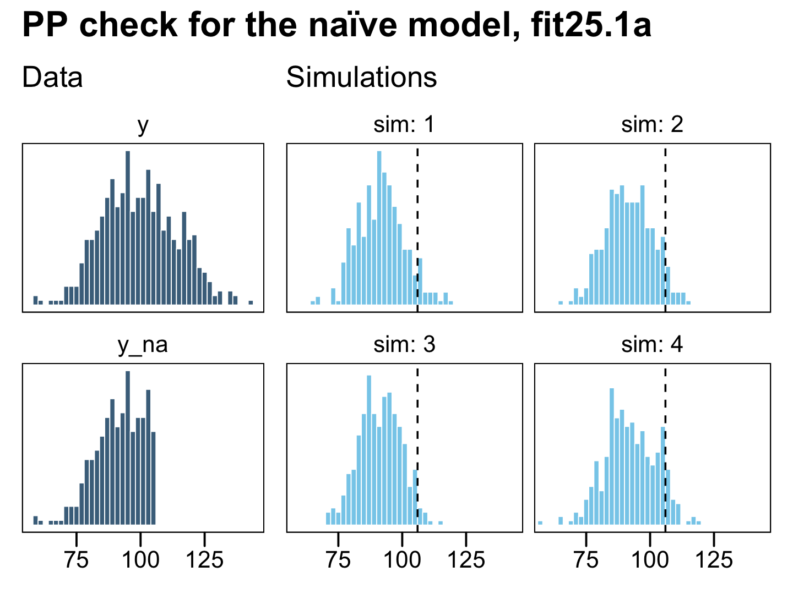
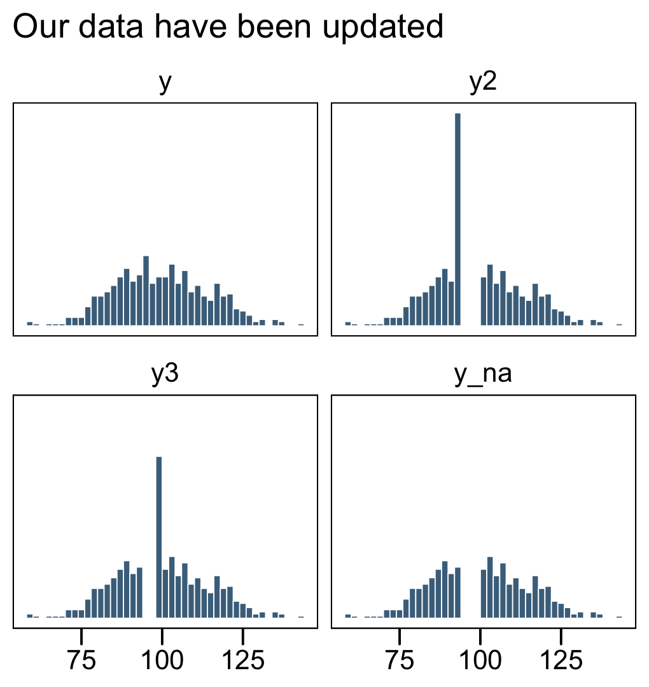
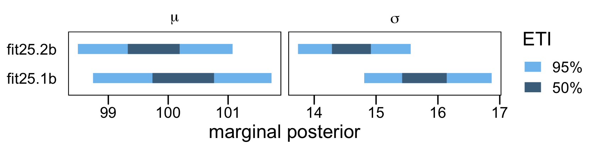
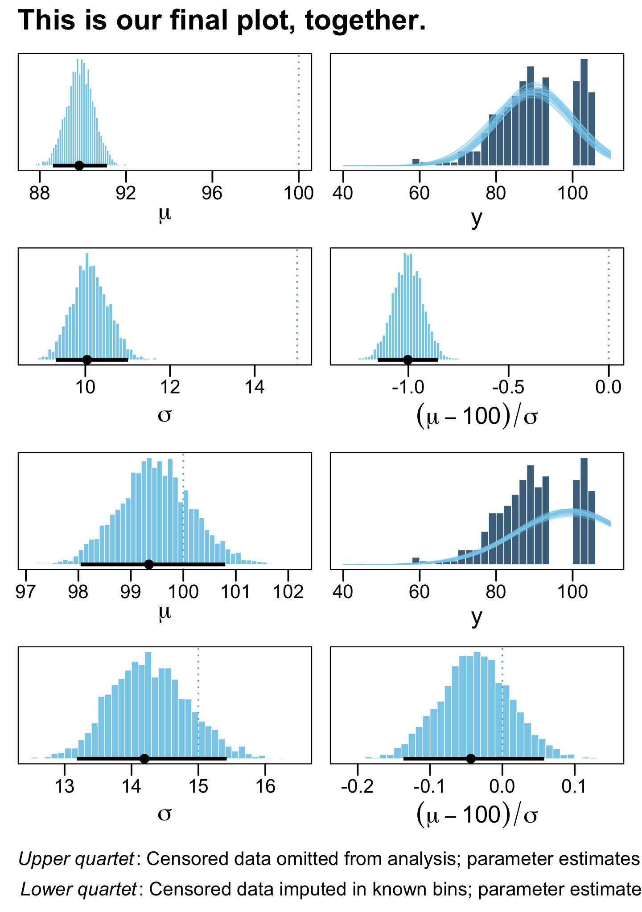

# Tools in the Trunk

"This chapter includes some important topics that apply to many different models throughout the book... The sections can be read independently of each other and at any time" [@kruschkeDoingBayesianData2015, p. 721].

## Reporting a Bayesian analysis

> Bayesian data analyses are not yet standard procedure in many fields of research, and no conventional format for reporting them has been established. Therefore, the researcher who reports a Bayesian analysis must be sensitive to the background knowledge of his or her specific audience, and must frame the description accordingly. (p. 721)

At the time of this writing (early 2020), this is still the case. See @aczelDiscussionPointsBayesian2020, [*Discussion points for Bayesian inference*](https://www.researchgate.net/publication/338849264_Discussion_points_for_Bayesian_inference), for a recent discussion from several Bayesian scholars.

### Essential points.

> Recall the basic steps of a Bayesian analysis from [Section 2.3][The steps of Bayesian data analysis] (p. 25): Identify the data, define a descriptive model, specify a prior, compute the posterior distribution, interpret the posterior distribution, and, check that the model is a reasonable description of the data. Those steps are in logical order, with each step building on the previous step. That logical order should be preserved in the report of the analysis. (p. 722)

Kruschke then gave recommendations for motivating Bayesian inference. His [-@kruschkeBayesianNewStatistics2018] paper with Liddell, [*The Bayesian New Statistics: Hypothesis testing, estimation, meta-analysis, and power analysis from a Bayesian perspective*](https://link.springer.com/content/pdf/10.3758/s13423-016-1221-4.pdf), might be helpful in this regard. Many of the other points Kruschke made in this section (e.g., adequately reporting the data structure, the priors, evidence for convergence) can be handled by adopting open science practices.

If your data and research questions are simple and straightforward, you might find it easy to detail these and other concerns in the primary manuscript. The harsh reality is many journals place tight constraints on word and/or page limits. If your projects are not of the simple and straightforward type, supplemental materials are your friend. Regardless of a journal's policy on hosting supplemental materials on the official journal website, you can detail your data, priors, MCMC diagnostics, and all the other fine-grained details of your analysis in supplemental documents hosted in publicly-accessible repositories like the [Open Science Framework (OSF)](https://osf.io/). If possible, do consider making your data openly available. Regardless of the status of your data, please consider making all your **R** scripts available as supplementary material. To reiterate from Chapter 3, I strongly recommend checking out [R Notebooks](https://bookdown.org/yihui/rmarkdown/notebook.html) for that purpose. They are a type of R Markdown document with augmentations that make them more useful for working scientists. You can learn more about them [here](https://rstudio-pubs-static.s3.amazonaws.com/256225_63ebef4029dd40ef8e3679f6cf200a5a.html) and [here](https://www.r-bloggers.com/why-i-love-r-notebooks-2/). And for a more comprehensive overview, check out Xie, Allaire, and Grolemund's [-@xieMarkdownDefinitiveGuide2020] [*R markdown: The definitive guide*](https://bookdown.org/yihui/rmarkdown/).

### Optional points.

For more thoughts on robustness checks, check out a couple Gelman's blog posts, [*What's the point of a robustness check?*](https://statmodeling.stat.columbia.edu/2017/11/29/whats-point-robustness-check/) and [*Robustness checks are a joke*](https://statmodeling.stat.columbia.edu/2018/11/14/robustness-checks-joke/), along with the action in the comments section.

In addition to posterior predictive checks, which are great [see @kruschkePosteriorPredictiveChecks2013], consider prior predictive checks, too. For a great introduction to the topic, check out Gabry, Simpson, Vehtari, Betancourt, and Gelman's [-@gabry2019visualization] [*Visualization in Bayesian workflow*](https://rss.onlinelibrary.wiley.com/doi/pdf/10.1111/rssa.12378).

### Helpful points.

For more ideas on open data, check out Rouder's [-@rouderWhatWhyHow2016] [*The what, why, and how of born-open data*](https://link.springer.com/article/10.3758/s13428-015-0630-z). You might also check out Klein and colleagues' [-@kleinPracticalGuideTransparency2018] [*A practical guide for transparency in psychological science*](https://lirias.kuleuven.be/1999530?limo=0) and Martone, Garcia-Castro, and VandenBos's [-@martoneDataSharingPsychology2018] [*Data sharing in psychology*](https://www.ncbi.nlm.nih.gov/pmc/articles/PMC5920518/pdf/nihms935471.pdf).

As to posting your model fits, this could be done in any number of ways, including as official supplemental materials hosted by the journal, on GitHub, or on the OSF. At a base level, this means saving your fits as external files. We've already been modeling this with our `brm()` code throughout this book. With the `save` argument, we saved the model fits within the [`fits` folder on GitHub](https://github.com/ASKurz/Doing-Bayesian-Data-Analysis-in-brms-and-the-tidyverse/tree/master/fits). You might adopt a similar approach. But do be warned: **brms** fit objects contain a copy of the data used to create them. For example, here's how we might reload `fit24.1` from last chapter.


```r
fit24.1 <- readRDS("fits/fit24.01.rds")
```

By indexing the fit object with `$data`, you can see the data.


```r
library(tidyverse)
library(brms)

fit24.1$data %>% 
  glimpse()
```

```
## Rows: 16
## Columns: 4
## $ Count      <dbl> 20, 68, 5, 15, 94, 7, 16, 10, 84, 119, 29, 54, 17, 26, 14, …
## $ Hair       <fct> Black, Black, Black, Black, Blond, Blond, Blond, Blond, Bru…
## $ Eye        <chr> "Blue", "Brown", "Green", "Hazel", "Blue", "Brown", "Green"…
## $ `Hair:Eye` <chr> "Black_Blue", "Black_Brown", "Black_Green", "Black_Hazel", …
```

Here's a quick way to remove the data from the fit object.


```r
fit24.1$data <- NULL
```

Confirm it worked.


```r
fit24.1$data
```

```
## NULL
```

Happily, the rest of the information is still there for you. E.g., here's the summary.


```r
summary(fit24.1)
```

```
##  Family: poisson 
##   Links: mu = log 
## Formula: Count ~ 1 + (1 | Hair) + (1 | Eye) + (1 | Hair:Eye) 
##    Data: NULL (Number of observations: ) 
## Samples: 4 chains, each with iter = 3000; warmup = 1000; thin = 1;
##          total post-warmup samples = 8000
## 
## Group-Level Effects: 
## ~Eye (Number of levels: 4) 
##               Estimate Est.Error l-95% CI u-95% CI Rhat Bulk_ESS Tail_ESS
## sd(Intercept)     1.29      1.47     0.13     5.16 1.00     2492     3672
## 
## ~Hair (Number of levels: 4) 
##               Estimate Est.Error l-95% CI u-95% CI Rhat Bulk_ESS Tail_ESS
## sd(Intercept)     1.36      1.37     0.20     5.04 1.00     2806     4091
## 
## ~Hair:Eye (Number of levels: 16) 
##               Estimate Est.Error l-95% CI u-95% CI Rhat Bulk_ESS Tail_ESS
## sd(Intercept)     0.89      0.25     0.52     1.49 1.00     3617     4791
## 
## Population-Level Effects: 
##           Estimate Est.Error l-95% CI u-95% CI Rhat Bulk_ESS Tail_ESS
## Intercept     3.18      1.27     0.58     5.72 1.00     3800     3274
## 
## Samples were drawn using sampling(NUTS). For each parameter, Bulk_ESS
## and Tail_ESS are effective sample size measures, and Rhat is the potential
## scale reduction factor on split chains (at convergence, Rhat = 1).
```

## Functions for computing highest density intervals

You can find a copy of Kruschke's scripts, including `DBDA2E-utilities.R`, at [https://github.com/ASKurz/Doing-Bayesian-Data-Analysis-in-brms-and-the-tidyverse/tree/master/data.R](https://github.com/ASKurz/Doing-Bayesian-Data-Analysis-in-brms-and-the-tidyverse/tree/master/data.R).

### R code for computing HDI of a grid approximation.

> We can imagine the grid approximation of a distribution as a landscape of poles sticking up from each point on the parameter grid, with the height of each pole indicating the probability mass at that discrete point. We can imagine the highest density region by visualizing a rising tide: We gradually flood the landscape, monitoring the total mass of the poles that protrude above water, stopping the flood when 95% (say) of the mass remains protruding. The waterline at that moment defines the highest density region [e.g., @hyndmanComputingGraphingHighest1996]. (p. 725)


```r
HDIofGrid <- function(probMassVec, credMass = 0.95) {
  
  # Arguments:
  #   probMassVec is a vector of probability masses at each grid point.
  #   credMass is the desired mass of the HDI region.
  # Return value:
  #   A list with components:
  #   indices is a vector of indices that are in the HDI
  #   mass is the total mass of the included indices
    #   height is the smallest component probability mass in the HDI
  # Example of use: For determining HDI of a beta(30,12) distribution
  #   approximated on a grid:
  #   > probDensityVec = dbeta( seq(0,1,length=201) , 30 , 12 )
  #   > probMassVec = probDensityVec / sum( probDensityVec )
  #   > HDIinfo = HDIofGrid( probMassVec )
  #   > show( HDIinfo )
  
  sortedProbMass <- sort(probMassVec, decreasing = TRUE)
  HDIheightIdx <- min(which(cumsum(sortedProbMass) >= credMass))
  HDIheight <- sortedProbMass[HDIheightIdx]
  HDImass <- sum(probMassVec[probMassVec >= HDIheight])
  
  return(list(indices = which(probMassVec >= HDIheight),
              mass    = HDImass, height = HDIheight))
  
}
```

I found Kruschke's description of his `HDIofGrid()` a bit opaque. Happily, we can understand this function with a little help from an example posted at [https://rdrr.io/github/kyusque/DBDA2E-utilities/man/HDIofGrid.html](https://rdrr.io/github/kyusque/DBDA2E-utilities/man/HDIofGrid.html).


```r
prob_density_vec <- dbeta(seq(0, 1, length = 201), 30, 12)
prob_mass_vec    <- prob_density_vec / sum(prob_density_vec)
HDI_info         <- HDIofGrid(prob_mass_vec)

show(HDI_info)
```

```
## $indices
##  [1] 117 118 119 120 121 122 123 124 125 126 127 128 129 130 131 132 133 134 135
## [20] 136 137 138 139 140 141 142 143 144 145 146 147 148 149 150 151 152 153 154
## [39] 155 156 157 158 159 160 161 162 163 164 165 166 167 168 169 170
## 
## $mass
## [1] 0.9528232
## 
## $height
## [1] 0.004448336
```

To walk that through a bit, `prob_density_vec` is a vector of density values for $\operatorname{beta} (30, 12)$ based on 201 evenly-spaced values spanning the parameter space for $\theta$ (i.e., from 0 to 1). In the second line, we converted those density values to the probability metric by dividing each by their sum, which we then saved as `prob_mass_vec`. In the third line we shoved those probability values into Kruschke's `HDIofGrid()` and saved the results as `HDI_info`. The output of the fourth line, `show(HDI_info)`, showed us the results (i.e., the contents of `HDI_info`).

As to those results, the values in saved as `$indices` are the row numbers for all cases in `prob_mass_vec` that were within the HDI. The value in `$mass` showed the actual width of the HDI. Because we're only working with finite samples (i.e., `length = 201`), we won't likely get a perfect 95% HDI. The value in `$height` is the density value for *the waterline that defines the highest density region*. A plot might make that less abstract.


```r
library(ggthemes)

theme_set(
  theme_base() +
  theme(plot.background = element_rect(color = "transparent"))
)

# wrangle
tibble(row     = 1:length(prob_density_vec),
       theta   = seq(0, 1, length = length(prob_density_vec)),
       density = prob_mass_vec,
       cred    = if_else(row %in% HDI_info$indices, 1, 0)) %>% 
  
  # plot
  ggplot(aes(x = theta, y = density)) +
  # HDI
  geom_area(aes(fill = cred == 1)) +
  # density line
  geom_line(color = "skyblue", size = 1) +
  # waterline
  geom_hline(yintercept = HDI_info$height, linetype = 3, size = 1/4) +
  # fluff
  annotate(geom = "text", x = .2, y = 0.0046,
           label = '"waterline" that defines all points\ninside the highest density region') +
  annotate(geom = "text", x = .715, y = 0.01,
           label = "95.28% HDI", color = "black", size = 5) +
  scale_fill_manual(values = c("transparent", "grey67")) +
  xlab(expression(theta))
```


You might have noticed our `theme_set()` lines at the top of that code block. For the plots in this chapter, we'll give a nod to the source material and make them with a similar aesthetic to Kruschke's plots.

### HDI of unimodal distribution is shortest interval.

> The algorithms [in the next sections] find the HDI by searching among candidate intervals of mass $M$. The shortest one found is declared to be the HDI. It is an approximation, of course. See @chenMonteCarloEstimation1999 for more details, and Chen, He, Shao, and Xu [-@chenMonteCarloGap2003] for dealing with the unusual situation of multimodal distributions. (p. 727)

### R code for computing HDI of a MCMC sample.

In this section, Kruschke provided the code for his `HDIofMCMC()` function. We recreate it, below, with a few mild formatting changes. The `ggthemes::theme_base()` theme gets us most of the way there.


```r
HDIofMCMC <- function(sampleVec, credMass = .95) {
  
  # Computes highest density interval from a sample of representative values,
  #   estimated as shortest credible interval.
  # Arguments:
  #   sampleVec
  #     is a vector of representative values from a probability distribution.
  #   credMass
  #     is a scalar between 0 and 1, indicating the mass within the credible
  #     interval that is to be estimated.
  # Value:
  #   HDIlim is a vector containing the limits of the HDI
  
  sortedPts <- sort(sampleVec)
  ciIdxInc <- ceiling(credMass * length(sortedPts))
  nCIs <- length(sortedPts) - ciIdxInc
  ciWidth <- rep(0, nCIs)
  for (i in 1:nCIs) {
    ciWidth[i] <- sortedPts[i + ciIdxInc] - sortedPts[i]
  }
  HDImin <- sortedPts[which.min(ciWidth)]
  HDImax <- sortedPts[which.min(ciWidth) + ciIdxInc]
  HDIlim <- c(HDImin, HDImax)
  
  return(HDIlim)
  
}
```

Let's continue working with `fit24.1` to see how Kruschke's `HDIofMCMC()` works. First we need to extract the posterior draws.


```r
post <- posterior_samples(fit24.1)
```

Here's how you might use the function to get the HDIs for the first hierarchical variance parameter.


```r
HDIofMCMC(post$sd_Eye__Intercept)
```

```
## [1] 0.007038013 3.773912594
```

Kruschke's `HDIofMCMC()` works very much the same as the summary functions from **tidybayes**. For example, here's good old `tidybayes::mode_hdi()`.


```r
library(tidybayes)

mode_hdi(post$sd_Eye__Intercept)
```

```
##           y        ymin     ymax .width .point .interval
## 1 0.5572236 0.007038013 3.628502   0.95   mode       hdi
## 2 0.5572236 3.940696738 4.003136   0.95   mode       hdi
```

If you'd like to use **tidybayes** to just pull the HDIs without the extra information, just use the `hdi()` function.


```r
hdi(post$sd_Eye__Intercept)
```

```
##             [,1]     [,2]
## [1,] 0.007038013 3.628502
## [2,] 3.940696738 4.003136
```

Just in case you're curious, Kruschke's `HDIofMCMC()` function returns the same information as `tidybayes::hdi()`. Let's confirm.


```r
HDIofMCMC(post$sd_Eye__Intercept) == hdi(post$sd_Eye__Intercept)
```

```
##       [,1]  [,2]
## [1,]  TRUE FALSE
## [2,] FALSE FALSE
```

Identical.

### R code for computing HDI of a function.

> The function described in this section finds the HDI of a unimodal probability density function that is specified mathematically in R. For example, the function can find HDI's of normal densities or of beta densities or of gamma densities, because those densities are specified as functions in R. (p. 728)

If you recall, we've been using this funciton off and on since Chapter 4. Here is it, again, with mildly reformated code and parameter names.


```r
hdi_of_icdf <- function(name, width = .95, tol = 1e-8, ... ) {
  
  # Arguments:
  #   `name` is R's name for the inverse cumulative density function
  #   of the distribution.
  #   `width` is the desired mass of the HDI region.
  #   `tol` is passed to R's optimize function.
  # Return value:
  #   Highest density iterval (HDI) limits in a vector.
  # Example of use: For determining HDI of a beta(30, 12) distribution, type
  #   `hdi_of_icdf(qbeta, shape1 = 30, shape2 = 12)`
  #   Notice that the parameters of the `name` must be explicitly stated;
  #   e.g., `hdi_of_icdf(qbeta, 30, 12)` does not work.
  # Adapted and corrected from Greg Snow's TeachingDemos package.
  
  incredible_mass <-  1.0 - width
  interval_width <- function(low_tail_prob, name, width, ...) {
    name(width + low_tail_prob, ...) - name(low_tail_prob, ...)
  }
  opt_info <- optimize(interval_width, c(0, incredible_mass), 
                       name = name, width = width, 
                       tol = tol, ...)
  hdi_lower_tail_prob <- opt_info$minimum
  
  return(c(name(hdi_lower_tail_prob, ...),
           name(width + hdi_lower_tail_prob, ...)))
  
}
```

Here's how it works for the standard normal distribution.


```r
hdi_of_icdf(qnorm, mean = 0, sd = 1)
```

```
## [1] -1.959964  1.959964
```

By default, it returns 95% HDIs. Here's how it'd work if you wanted the 80% intervals for $\operatorname{Beta}(2, 2)$.


```r
hdi_of_icdf(qbeta, shape1 = 2, shape2 = 2, width = .8)
```

```
## [1] 0.1958001 0.8041999
```

## Reparameterization

> There are situations in which one parameterization is intuitive to express a distribution, but a different parameterization is required for mathematical convenience. For example, we may think intuitively of the standard deviation of a normal distribution, but have to parameterize the distribution in terms of the precision (i.e., reciprocal of the variance). (p. 729)

The details in the rest of this section are beyond the scope of this project.

## Censored data in ~~JAGS~~ brms

"In many situations some data are censored, which means that their values are known only within a certain range" (p. 732) Happily, **brms** is capable of handling censored variables. The setup is a little different from how Kruschke described for JAGS. From the `brmsformula` section of the [**brms** reference manual](https://CRAN.R-project.org/package=brms/brms.pdf) [@brms2021RM], we read:

> With the exception of categorical, ordinal, and mixture families, left, right, and interval censoring can be modeled through `y | cens(censored) ~ predictors`. The censoring variable (named `censored` in this example) should contain the values `'left'`, `'none'`, `'right'`, and `'interval'` (or equivalently `-1`, `0`, `1`, and `2`) to indicate that the corresponding observation is left censored, not censored, right censored, or interval censored. For interval censored data, a second variable (let's call it `y2`) has to be passed to `cens`. In this case, the formula has the structure `y | cens(censored,y2) ~ predictors`. While the lower bounds are given in `y`, the upper bounds are given in `y2` for interval censored data. Intervals are assumed to be open on the left and closed on the right: `(y,y2]`.

We'll make sense of all this in just a moment. First, let's see how Kruschke described the example in the text.

> To illustrate why it is important to include censored data in the analysis, consider a case in which $N = 500$ values are generated randomly from a normal distribution with $\mu = 100$ and $\sigma = 15$. Suppose that values above 106 are censored, as are values in the interval between 94 and 100. For the censored values, all we know is the interval in which they occurred, but not their exact value. (p. 732)

I'm not aware that we have access to Kruschke's censored data, so we'll just make our own based on his description. We'll start off by simulating the idealized uncensored data, `y`, based on $\operatorname{Normal}(100, 15)$.


```r
n <- 500

set.seed(25)

d <- tibble(y = rnorm(n, mean = 100, sd = 15))
```

To repeat, Kruschke described two kinds of censoring:

* "values above 106 are censored,"
* "as are values in the interval between 94 and 100."

⚠️ Rather than examine both kinds of censoring at once, as in the text, I'm going to slow down and break this section up. First, we'll explore right censoring. Second, we'll explore interval censoring. For our grand finale, we'll combine the two, as in the text.

### Right censoring: When you're uncertain beyond a single threshold.

In the case where the "values above 106 are censored," we need to save a single threshold value. We'll call it `t1`.


```r
t1 <- 106
```

Now we can use our `t1` threshold value to make a right censored version of the `y` column called `y1`. We'll also make a character value listing out a row's censoring status in nominal terms.


```r
d <-
  d %>% 
  mutate(y1   = if_else(y > t1, t1, y),
         cen1 = if_else(y > t1, "right", "none"))

d
```

```
## # A tibble: 500 x 3
##        y    y1 cen1 
##    <dbl> <dbl> <chr>
##  1  96.8  96.8 none 
##  2  84.4  84.4 none 
##  3  82.7  82.7 none 
##  4 105.  105.  none 
##  5  77.5  77.5 none 
##  6  93.3  93.3 none 
##  7 126.  106   right
##  8 108.  106   right
##  9 101.  101.  none 
## 10  99.1  99.1 none 
## # … with 490 more rows
```

When the values in `y1` are not censored, we see `cen1 == "none"`. For all cases where the original `y` value exceeded the `t1` threshold (i.e., 106), `y1 == 106` and `cen1 == "right"`. We are using the terms `"none"` and `"right"` because they are based on the block quote from the **brms** reference manual. For plotting purposes, we'll make a new variable, `y_na`, that only has values for which `cen1 == "none"`.


```r
d <-
  d %>% 
  mutate(y_na = ifelse(cen1 == "none", y, NA))

d
```

```
## # A tibble: 500 x 4
##        y    y1 cen1   y_na
##    <dbl> <dbl> <chr> <dbl>
##  1  96.8  96.8 none   96.8
##  2  84.4  84.4 none   84.4
##  3  82.7  82.7 none   82.7
##  4 105.  105.  none  105. 
##  5  77.5  77.5 none   77.5
##  6  93.3  93.3 none   93.3
##  7 126.  106   right  NA  
##  8 108.  106   right  NA  
##  9 101.  101.  none  101. 
## 10  99.1  99.1 none   99.1
## # … with 490 more rows
```

Now let's get a better sense of the data with a few histograms.


```r
d %>% 
  pivot_longer(-cen1) %>% 
  mutate(name = factor(name, levels = c("y", "y1", "y_na"))) %>% 
  
  ggplot(aes(x = value)) +
  geom_histogram(size = .25, binwidth = 2, boundary = 106,
                 fill = "skyblue4", color = "white") +
  xlab(NULL) +
  scale_y_continuous(NULL, breaks = NULL) +
  facet_wrap(~ name, ncol = 3)
```


The original un-censored data are in `y`. The censored data, for which all values above 106 were simply recoded 106, is `y1`. The `y_na` column shows what the distribution would look like if the censored values were omitted.

Here's how we might fit a model which only uses the uncensored values, those in `y_na`.


```r
# define the stanvars
mean_y <- mean(d$y_na, na.rm = T)
sd_y   <- sd(d$y_na, na.rm = T)

stanvars <- 
  stanvar(mean_y, name = "mean_y") + 
  stanvar(sd_y,   name = "sd_y")

# fit the model
fit25.1a <-
  brm(data = d,
      family = gaussian,
      y_na ~ 1,
      prior = c(prior(normal(mean_y, sd_y * 100), class = Intercept),
                prior(normal(0, sd_y), class = sigma)),
      chains = 4, cores = 4,
      stanvars = stanvars, 
      file = "fits/fit25.01a")
```

Check the summary for the naïve model.


```r
print(fit25.1a)
```

```
##  Family: gaussian 
##   Links: mu = identity; sigma = identity 
## Formula: y_na ~ 1 
##    Data: d (Number of observations: 333) 
## Samples: 4 chains, each with iter = 2000; warmup = 1000; thin = 1;
##          total post-warmup samples = 4000
## 
## Population-Level Effects: 
##           Estimate Est.Error l-95% CI u-95% CI Rhat Bulk_ESS Tail_ESS
## Intercept    91.43      0.51    90.39    92.43 1.00     4065     2600
## 
## Family Specific Parameters: 
##       Estimate Est.Error l-95% CI u-95% CI Rhat Bulk_ESS Tail_ESS
## sigma     9.39      0.36     8.72    10.15 1.00     4059     2773
## 
## Samples were drawn using sampling(NUTS). For each parameter, Bulk_ESS
## and Tail_ESS are effective sample size measures, and Rhat is the potential
## scale reduction factor on split chains (at convergence, Rhat = 1).
```

Relative to the true data-generating process for the original variable `y`, $\operatorname{Normal}(100, 15)$, those parameters look pretty biased. Now let's practice fitting our first censored model. Here we use the `y1 | cens(cen1)` syntax in the left side of the model `formula` to indicate that the criterion variable, `y1`, has been censored according to the process as defined in the `cens()` function. Within `cens()` we inserted our nominal variable, `cens1`, which indicates which cases are censored (`"right"`) or not (`"none"`).

This model is one of the rare occasions where we'll set our initial values for the model intercept. In my first few attempts, `brm()` had great difficulty initializing the chains using the default initial values. We'll help it out by setting them at `mean_y`. Recall that when you set custom initial values in **brms**, you save them in a list with the number of lists equaling the number of HMC chains. Because we're using the default `chains = 4`, well need four lists of intercept start values, `mean_y`. You can set them to different values, if you'd like.


```r
inits <- list(Intercept = mean_y)

inits_list <- list(inits, inits, inits, inits)

fit25.2a <-
  brm(data = d,
      family = gaussian,
      y1 | cens(cen1) ~ 1,
      prior = c(prior(normal(mean_y, sd_y * 100), class = Intercept),
                prior(normal(0, sd_y), class = sigma)),
      chains = 4, cores = 4,
      stanvars = stanvars, 
      # here we insert our start values for the intercept
      inits = inits_list, 
      file = "fits/fit25.02a")
```

Now check the summary for the model accounting for the censoring.


```r
print(fit25.2a)
```

```
##  Family: gaussian 
##   Links: mu = identity; sigma = identity 
## Formula: y1 | cens(cen1) ~ 1 
##    Data: d (Number of observations: 500) 
## Samples: 4 chains, each with iter = 2000; warmup = 1000; thin = 1;
##          total post-warmup samples = 4000
## 
## Population-Level Effects: 
##           Estimate Est.Error l-95% CI u-95% CI Rhat Bulk_ESS Tail_ESS
## Intercept    99.41      0.69    98.09   100.74 1.00     2429     2252
## 
## Family Specific Parameters: 
##       Estimate Est.Error l-95% CI u-95% CI Rhat Bulk_ESS Tail_ESS
## sigma    14.31      0.61    13.16    15.53 1.00     2528     2588
## 
## Samples were drawn using sampling(NUTS). For each parameter, Bulk_ESS
## and Tail_ESS are effective sample size measures, and Rhat is the potential
## scale reduction factor on split chains (at convergence, Rhat = 1).
```

To get a better sense of what these models are doing, we might do a posterior predictive check with `predict()`.


```r
# original
p1 <-
  d %>% 
  pivot_longer(cols = c(y, y_na)) %>% 
  
  ggplot(aes(x = value)) +
  geom_histogram(size = .25, binwidth = 2, boundary = 106,
                 fill = "skyblue4", color = "white") +
  labs(subtitle = "Data",
       x = NULL) +
  scale_x_continuous(breaks = 3:5 * 25) +
  scale_y_continuous(NULL, breaks = NULL) +
  facet_wrap(~ name, ncol = 1)

# posterior simulations
set.seed(25)
p2 <-
  predict(fit25.1a,
          summary = F,
          nsamples = 4) %>% 
  data.frame() %>% 
  mutate(sim = 1:n()) %>% 
  pivot_longer(-sim)  %>% 
  
  ggplot(aes(x = value)) +
  geom_histogram(size = .25, binwidth = 2, boundary = 106,
                 fill = "skyblue", color = "white") +
  geom_vline(xintercept = t1, linetype = 2) +
  labs(subtitle = "Simulations",
       x = NULL) +
  scale_x_continuous(breaks = 3:5 * 25) +
  scale_y_continuous(NULL, breaks = NULL) +
  coord_cartesian(xlim = range(d$y)) +
  facet_wrap(~ sim, ncol = 2, labeller = label_both)

# combine
library(patchwork)

p1 + p2 + 
  plot_layout(widths = c(1, 2)) +
  plot_annotation(title = "PP check for the naïve model, fit25.1a")
```



On the left column, the have the original uncensored data `y` and the `y_na` data where the censored values were removed. The four lighter histograms on the right are individual simulations based on our naïve model, `fit25.1a`, which only used the `y_na` data. In all cases, the simulated data are biased to be too small compared with the original data, `y`. They also have the undesirable quality that they don't even match up with the `y_na` data, which drops sharply off at the 106 threshold, whereas the simulated data all contain values exceeding that point (depicted by the dashed vertical lines). Now let's see what happens when we execute a few posterior predictive checks with our first censored model, `fit25.2a`.


```r
p1 <-
  d %>% 
  pivot_longer(cols = c(y, y1)) %>% 
  
  ggplot(aes(x = value)) +
  geom_histogram(size = .25, binwidth = 2, boundary = 106,
                 fill = "skyblue4", color = "white") +
  labs(subtitle = "Data",
       x = NULL) +
  scale_x_continuous(breaks = 3:5 * 25) +
  scale_y_continuous(NULL, breaks = NULL) +
  facet_wrap(~ name, ncol = 1, scales = "free_y")

set.seed(25)
p2 <-
  predict(fit25.2a,
          summary = F,
          nsamples = 4) %>% 
  data.frame() %>% 
  mutate(sim = 1:n()) %>% 
  pivot_longer(-sim)  %>% 
  
  ggplot(aes(x = value)) +
  geom_histogram(size = .25, binwidth = 2, boundary = 106,
                 fill = "skyblue", color = "white") +
  labs(subtitle = "Simulations",
       x = NULL) +
  scale_x_continuous(breaks = 3:5 * 25) +
  scale_y_continuous(NULL, breaks = NULL) +
  coord_cartesian(xlim = range(d$y)) +
  facet_wrap(~ sim, ncol = 2, labeller = label_both)

# combine
p1 + p2 + 
  plot_layout(widths = c(1, 2)) +
  plot_annotation(title = "PP check for the censored model, fit25.2a")
```


Now the posterior predictive samples match up nicely from the original uncensored data `y` in terms of central tendency, dispersion, and their overall shapes. This is the magic of a model that accounts for right (or left) censoring. It can take all those stacked-up 106 values and approximate the underlying distribution, had they been more accurately recorded.

### Interval censoring: When your values are somewhere in the middle.

Time to move onto interval censoring. Kruschke's example in the text included values censored in the interval between 94 and 100. This will require two more thresholds, which we'll call `t2` and `t3`.


```r
t2 <- 94
t3 <- 100
```

We should revisit part of the block quote from the **brms** reference manual, above:

> For interval censored data, a second variable (let's call it `y2`) has to be passed to `cens`. In this case, the formula has the structure `y | cens(censored,y2) ~ predictors`. While the lower bounds are given in `y`, the upper bounds are given in `y2` for interval censored data. Intervals are assumed to be open on the left and closed on the right: `(y,y2]`

It's a little unclear, to me, if this is how Kruschke defined his intervals, but since we're working with **brms** we'll just use this convention. Thus, we will define "values in the interval between 94 and 100" as `y >= t2 & y < t3`. Here we'll follow the **brms** convention and define a new variable `y2` for our lower bound and `y3` for our upper bound. Additionally, the new `cen2` variable will tell us whether a case is interval censored (`"interval"`) or not (`"none"`). We have also redefined `y_na` in terms of our `cen2` variable.


```r
d <-
  d %>% 
  mutate(y2   = if_else(y >= t2 & y < t3, t2, y),
         y3   = if_else(y >= t2 & y < t3, t3, y),
         cen2 = if_else(y >= t2 & y < t3, "interval", "none")) %>% 
  mutate(y_na = ifelse(cen2 == "none", y, NA))

d
```

```
## # A tibble: 500 x 7
##        y    y1 cen1   y_na    y2    y3 cen2    
##    <dbl> <dbl> <chr> <dbl> <dbl> <dbl> <chr>   
##  1  96.8  96.8 none   NA    94   100   interval
##  2  84.4  84.4 none   84.4  84.4  84.4 none    
##  3  82.7  82.7 none   82.7  82.7  82.7 none    
##  4 105.  105.  none  105.  105.  105.  none    
##  5  77.5  77.5 none   77.5  77.5  77.5 none    
##  6  93.3  93.3 none   93.3  93.3  93.3 none    
##  7 126.  106   right 126.  126.  126.  none    
##  8 108.  106   right 108.  108.  108.  none    
##  9 101.  101.  none  101.  101.  101.  none    
## 10  99.1  99.1 none   NA    94   100   interval
## # … with 490 more rows
```

Now let's get a better sense of the new data with a few histograms.


```r
d %>% 
  pivot_longer(cols = c(y, y2, y3, y_na)) %>% 
  mutate(name = factor(name, levels = c("y", "y2", "y3", "y_na"))) %>% 
  
  ggplot(aes(x = value)) +
  geom_histogram(size = .25, binwidth = 2, boundary = 106,
                 fill = "skyblue4", color = "white") +
  labs(subtitle = "Our data have been updated",
       x = NULL) +
  scale_y_continuous(NULL, breaks = NULL) +
  facet_wrap(~ name, ncol = 2)
```



Now we fit two models. The first, `fit25.1b`, will only used the values not interval censored, `y_na`. The second model, `fit25.2b`, will use the `cens()` function to fit account for the interval censored data with the `y2`, `y3`, and `cen2` columns. As before, we'll want to use `inits` to help the censored model run smoothly.


```r
# naïve
fit25.1b <-
  brm(data = d,
      family = gaussian,
      y_na ~ 1,
      prior = c(prior(normal(mean_y, sd_y * 100), class = Intercept),
                prior(normal(0, sd_y), class = sigma)),
      chains = 4, cores = 4,
      stanvars = stanvars, 
      file = "fits/fit25.01b")

# censored
fit25.2b <-
  brm(data = d,
      family = gaussian,
      y2 | cens(cen2, y3) ~ 1,
      prior = c(prior(normal(mean_y, sd_y * 100), class = Intercept),
                prior(normal(0, sd_y), class = sigma)),
      chains = 4, cores = 4,
      stanvars = stanvars, 
      # here we insert our start values for the intercept
      inits = inits_list, 
      file = "fits/fit25.02b")
```

Review the model summaries.


```r
print(fit25.1b)
```

```
##  Family: gaussian 
##   Links: mu = identity; sigma = identity 
## Formula: y_na ~ 1 
##    Data: d (Number of observations: 424) 
## Samples: 4 chains, each with iter = 2000; warmup = 1000; thin = 1;
##          total post-warmup samples = 4000
## 
## Population-Level Effects: 
##           Estimate Est.Error l-95% CI u-95% CI Rhat Bulk_ESS Tail_ESS
## Intercept   100.26      0.76    98.73   101.74 1.00     3624     2806
## 
## Family Specific Parameters: 
##       Estimate Est.Error l-95% CI u-95% CI Rhat Bulk_ESS Tail_ESS
## sigma    15.78      0.55    14.78    16.93 1.00     3201     2513
## 
## Samples were drawn using sampling(NUTS). For each parameter, Bulk_ESS
## and Tail_ESS are effective sample size measures, and Rhat is the potential
## scale reduction factor on split chains (at convergence, Rhat = 1).
```

```r
print(fit25.2b)
```

```
##  Family: gaussian 
##   Links: mu = identity; sigma = identity 
## Formula: y2 | cens(cen2, y3) ~ 1 
##    Data: d (Number of observations: 500) 
## Samples: 4 chains, each with iter = 2000; warmup = 1000; thin = 1;
##          total post-warmup samples = 4000
## 
## Population-Level Effects: 
##           Estimate Est.Error l-95% CI u-95% CI Rhat Bulk_ESS Tail_ESS
## Intercept    99.75      0.64    98.46   100.99 1.00     3270     2574
## 
## Family Specific Parameters: 
##       Estimate Est.Error l-95% CI u-95% CI Rhat Bulk_ESS Tail_ESS
## sigma    14.60      0.46    13.70    15.50 1.00     3544     2677
## 
## Samples were drawn using sampling(NUTS). For each parameter, Bulk_ESS
## and Tail_ESS are effective sample size measures, and Rhat is the potential
## scale reduction factor on split chains (at convergence, Rhat = 1).
```

In this case, both models did a reasonable job approximating the original data-generating parameters, $\operatorname{Normal}(100, 15)$. However, the naïve model `fit25.1b` did so at a considerable loss of precision, as indicated by the posterior standard deviations. To give a better sense, here are the model parameters in an interval plot.


```r
# wrangle
bind_rows(posterior_samples(fit25.1b),
          posterior_samples(fit25.2b)) %>% 
  mutate(fit = rep(c("fit25.1b", "fit25.2b"), each = n() / 2)) %>% 
  pivot_longer(b_Intercept:sigma) %>% 
  mutate(parameter = if_else(name == "b_Intercept", "mu", "sigma")) %>% 
  
  # plot
  ggplot(aes(x = value, y = fit)) +
  stat_interval(.width = c(.5, .95)) +
  scale_color_manual("ETI", 
                     values = c("skyblue2", "skyblue4"),
                     labels = c("95%", "50%")) +
  labs(x = "marginal posterior",
       y = NULL) +
  theme(axis.ticks.y = element_blank()) +
  facet_wrap(~ parameter, scales = "free_x", labeller = label_parsed)
```



One could also argue the parameters for the censored model `fit25.2b` were a little less biased. However, I'd be leery of making that as a general claim based on this example, alone.

### Complex censoring: When the going gets tough...

Okay, let's put what we've learned together and practice with data that are both right AND interval censored. This is going to require some tricky coding on our part. Since interval censoring is in play, we'll need two `y` variables, again. When the data are indeed interval censored, their lower and upper bounds will be depicted by `y4` and `y5`, respectively. When the data are right censored, `y4` will contain the threshold 106 and `y5` will contain the original value from `y`. All this tricky information will be indexed in our nominal variable `cen3`. Once again, we update our `y_na` variable, too.


```r
d <-
  d %>% 
  mutate(y4   = if_else(y >= t2 & y < t3, t2, 
                        if_else(y > t1, t1, y)),
         y5   = if_else(y >= t2 & y < t3, t3, y),
         cen3 = if_else(y >= t2 & y < t3, "interval",
                       if_else(y > t1, "right", "none"))) %>% 
  mutate(y_na = ifelse(cen3 == "none", y, NA))

d
```

```
## # A tibble: 500 x 10
##        y    y1 cen1   y_na    y2    y3 cen2        y4    y5 cen3    
##    <dbl> <dbl> <chr> <dbl> <dbl> <dbl> <chr>    <dbl> <dbl> <chr>   
##  1  96.8  96.8 none   NA    94   100   interval  94   100   interval
##  2  84.4  84.4 none   84.4  84.4  84.4 none      84.4  84.4 none    
##  3  82.7  82.7 none   82.7  82.7  82.7 none      82.7  82.7 none    
##  4 105.  105.  none  105.  105.  105.  none     105.  105.  none    
##  5  77.5  77.5 none   77.5  77.5  77.5 none      77.5  77.5 none    
##  6  93.3  93.3 none   93.3  93.3  93.3 none      93.3  93.3 none    
##  7 126.  106   right  NA   126.  126.  none     106   126.  right   
##  8 108.  106   right  NA   108.  108.  none     106   108.  right   
##  9 101.  101.  none  101.  101.  101.  none     101.  101.  none    
## 10  99.1  99.1 none   NA    94   100   interval  94   100   interval
## # … with 490 more rows
```

Explore the new data with histograms.


```r
d %>% 
  pivot_longer(cols = c(y, y4, y5, y_na)) %>% 
  mutate(name = factor(name, levels = c("y", "y4", "y5", "y_na"))) %>% 
  
  ggplot(aes(x = value)) +
  geom_histogram(size = .25, binwidth = 2, boundary = 106,
                 fill = "skyblue4", color = "white") +
  labs(subtitle = "Our data have been updated, again",
       x = NULL) +
  scale_y_continuous(NULL, breaks = NULL) +
  facet_wrap(~ name, ncol = 2)
```


In the text, Kruschke reported he had 255 uncensored values (p. 732). Here's the breakdown of our data.


```r
d %>% 
  count(cen3)
```

```
## # A tibble: 3 x 2
##   cen3         n
##   <chr>    <int>
## 1 interval    76
## 2 none       257
## 3 right      167
```

We got really close! Now we fit our two models: `fit25.1c`, which ignores the censoring problem and just drops those cases, and `fit25.2c`, which makes slick use of the `cens()` function.


```r
# naïve
fit25.1c <-
  brm(data = d,
      family = gaussian,
      y_na ~ 1,
      prior = c(prior(normal(mean_y, sd_y * 100), class = Intercept),
                prior(normal(0, sd_y), class = sigma)),
      chains = 4, cores = 4,
      stanvars = stanvars, 
      file = "fits/fit25.01c")

# censored
fit25.2c <-
  brm(data = d,
      family = gaussian,
      y4 | cens(cen3, y5) ~ 1,
      prior = c(prior(normal(mean_y, sd_y * 100), class = Intercept),
                prior(normal(0, sd_y), class = sigma)),
      chains = 4, cores = 4,
      stanvars = stanvars, 
      # here we insert our start values for the intercept
      inits = inits_list, 
      file = "fits/fit25.02c")
```

Compare the model summaries.


```r
print(fit25.1c)
```

```
##  Family: gaussian 
##   Links: mu = identity; sigma = identity 
## Formula: y_na ~ 1 
##    Data: d (Number of observations: 257) 
## Samples: 4 chains, each with iter = 2000; warmup = 1000; thin = 1;
##          total post-warmup samples = 4000
## 
## Population-Level Effects: 
##           Estimate Est.Error l-95% CI u-95% CI Rhat Bulk_ESS Tail_ESS
## Intercept    89.90      0.64    88.66    91.17 1.00     3204     2942
## 
## Family Specific Parameters: 
##       Estimate Est.Error l-95% CI u-95% CI Rhat Bulk_ESS Tail_ESS
## sigma    10.13      0.46     9.28    11.11 1.00     3360     2598
## 
## Samples were drawn using sampling(NUTS). For each parameter, Bulk_ESS
## and Tail_ESS are effective sample size measures, and Rhat is the potential
## scale reduction factor on split chains (at convergence, Rhat = 1).
```

```r
print(fit25.2c)
```

```
##  Family: gaussian 
##   Links: mu = identity; sigma = identity 
## Formula: y4 | cens(cen3, y5) ~ 1 
##    Data: d (Number of observations: 500) 
## Samples: 4 chains, each with iter = 2000; warmup = 1000; thin = 1;
##          total post-warmup samples = 4000
## 
## Population-Level Effects: 
##           Estimate Est.Error l-95% CI u-95% CI Rhat Bulk_ESS Tail_ESS
## Intercept    99.46      0.68    98.17   100.87 1.00     3130     2506
## 
## Family Specific Parameters: 
##       Estimate Est.Error l-95% CI u-95% CI Rhat Bulk_ESS Tail_ESS
## sigma    14.28      0.61    13.15    15.52 1.00     2647     2284
## 
## Samples were drawn using sampling(NUTS). For each parameter, Bulk_ESS
## and Tail_ESS are effective sample size measures, and Rhat is the potential
## scale reduction factor on split chains (at convergence, Rhat = 1).
```

The results for the naïve model are a mess and those from the censored model look great! Also note how the latter used all avaliable cases, whereas the former dropped nearly half of them.

Before we can make our version of Figure 25.4, we'll need to extract the posterior draws. We'll start with `fit25.1c`.


```r
post <- 
  posterior_samples(fit25.1c) %>% 
  mutate(mu = b_Intercept,
         `(mu-100)/sigma` = (b_Intercept - 100) / sigma)

head(post)
```

```
##   b_Intercept     sigma      lp__       mu (mu-100)/sigma
## 1    90.05188 10.199345 -967.0199 90.05188     -0.9753683
## 2    90.09738  9.515594 -967.8906 90.09738     -1.0406726
## 3    89.66705 10.056845 -967.0060 89.66705     -1.0274541
## 4    90.34445  9.916196 -967.2923 90.34445     -0.9737150
## 5    89.85105 10.157868 -966.9644 89.85105     -0.9991220
## 6    90.59965 10.632351 -968.2521 90.59965     -0.8841270
```

These subplots look a lot like those from back in [Section 16.2][Outliers and robust estimation: The $t$ distribution]. Since this is the last plot from the book, it seems like we should go all out. To reduce some of the code redundancy with the six subplots of the marginal posteriors, we'll make a custom geom, `geom_hist()`.


```r
geom_hist <- function(xintercept = xintercept, binwidth = binwidth, ...) {
  
  list(
    geom_histogram(fill = "skyblue", color = "white", size = .2, binwidth = binwidth, boundary = 106),
    geom_vline(xintercept = xintercept, color = "skyblue3", size = 1/2, linetype = 3),
    stat_pointinterval(aes(y = 0), point_interval = mode_hdi, .width = .95),
    scale_y_continuous(NULL, breaks = NULL)
  )
  
}
```

Now we have our `geom_hist()`, here are the first three histograms for the marginal posteriors from `fit25.1c`.


```r
p1 <-
  post %>% 
  ggplot(aes(x = mu)) +
  geom_hist(xintercept = 100, binwidth = 0.1) +
  xlab(expression(mu))

p3 <-
  post %>% 
  ggplot(aes(x = sigma)) +
  geom_hist(xintercept = 15, binwidth = 0.08) +
  xlab(expression(sigma))

p4 <-
  post %>% 
  ggplot(aes(x = `(mu-100)/sigma`)) +
  geom_hist(xintercept = 0, binwidth = 0.015) +
  xlab(expression((mu-100)/sigma))
```

The histogram of the censored data with the posterior predictive density curves superimposed will take a little more work.


```r
n_lines <- 50

p2 <-
  post %>% 
  mutate(iter = 1:n()) %>% 
  slice(1:n_lines) %>% 
  expand(nesting(mu, sigma, iter),
         y_na = seq(from = 40, to = 120, by = 1)) %>% 
  mutate(density = dnorm(x = y_na, mean = mu, sd = sigma)) %>% 
  
  ggplot(aes(x = y_na)) + 
  geom_histogram(data = d, 
                 aes(y = stat(density)),
                 size = .25, binwidth = 2, boundary = 106,
                 fill = "skyblue4", color = "white") +
  geom_line(aes(y = density, group = iter),
            size  = 1/4, alpha = 1/3, color = "skyblue") +
  scale_x_continuous("data with posterior predictive lines", limits = c(40, 110)) +
  scale_y_continuous(NULL, breaks = NULL)
```

Now extract the posterior draws from our censored model, `fit25.2`, and repeat the process.


```r
post <- 
  posterior_samples(fit25.2c) %>% 
  mutate(mu = b_Intercept,
         `(mu-100)/sigma` = (b_Intercept - 100) / sigma)

p5 <-
  post %>% 
  ggplot(aes(x = mu)) +
  geom_hist(xintercept = 100, binwidth = 0.1) +
  xlab(expression(mu))

p7 <-
  post %>% 
  ggplot(aes(x = sigma)) +
  geom_hist(xintercept = 15, binwidth = 0.1) +
  xlab(expression(sigma))

p8 <-
  post %>% 
  ggplot(aes(x = `(mu-100)/sigma`)) +
  geom_hist(xintercept = 0, binwidth = 0.01) +
  xlab(expression((mu-100)/sigma))

p6 <-
  post %>% 
  mutate(iter = 1:n()) %>% 
  slice(1:n_lines) %>% 
  expand(nesting(mu, sigma, iter),
         y_na = seq(from = 40, to = 120, by = 1)) %>% 
  mutate(density = dnorm(x = y_na, mean = mu, sd = sigma)) %>% 
  
  ggplot(aes(x = y_na)) + 
  geom_histogram(data = d, 
                 aes(y = stat(density)),
                 size = .25, binwidth = 2, boundary = 106, 
                 fill = "skyblue4", color = "white") +
  geom_line(aes(y = density, group = iter),
            size  = 1/4, alpha = 1/3, color = "skyblue") +
  scale_x_continuous("data with posterior predictive lines", limits = c(40, 110)) +
  scale_y_continuous(NULL, breaks = NULL)
```

Finally, combine the subplots, and annotate a bit.


```r
((p1 | p2) / (p3 | p4) / (p5 | p6) / (p7 | p8)) +
  plot_annotation(title = "This is our final plot, together.",
                  caption = expression(atop(italic("Upper quartet")*": Censored data omitted from analysis; parameter estimates are too small.  ", italic("Lower quartet")*": Censored data imputed in known bins; parameter estimates are accurate."))) &
  theme(plot.caption = element_text(hjust = 0))
```



To learn more about censored data, check out the nice lecture by Gordon Fox, [*Introduction to analysis of censored and truncated data*](https://www.youtube.com/watch?v=aPN10YYrC1M).

### Bonus: Truncation.

Though Kruschke didn't cover it, truncation is often confused with censoring. When you have actually collected all your values, but some are just less certain than you'd like, you have a censoring issue. That is, you can think of censoring as an issue with *measurement precision*. Truncation has to do with *data collection*. When there's some level in your criterion variable that you haven't collected data on, that's a truncation issue. For example, imagine you wanted to predict scores on an IQ test with socioeconomic status (SES). There might be a relation, there. But now imagine you only collected data on people with an IQ above 110. Those IQ data are severely left truncated. If you only care about the relation of SES and IQ for those with high IQ scores, your data are fine. But if you want to make general statements across the full range of IQ values, standard regression methods will likely produce biased results. Happily, **brms** allows users to accommodate truncated criterion variables with the `trunc()` function, which works in a similar way to the `cens()` function. For details on fitting truncated regression models with `trunc()`, check out the *Additional response information* subsection of the `brmsformula` section of the [**brms** reference manual](https://CRAN.R-project.org/package=brms/brms.pdf). The [end of the Fox lecture](https://youtu.be/aPN10YYrC1M?t=6153), above, briefly covers truncated regression. You can also find a [brief vignette on truncation](https://stats.idre.ucla.edu/r/dae/truncated-regression/) by the good folks at the UCLA Institute for Digital Research and Education.

## What Next?

"If you have made it this far and you are looking for more, you might peruse posts at [Kruschke's] blog, [https://doingbayesiandataanalysis.blogspot.com/](https://doingbayesiandataanalysis.blogspot.com/), and search there for topics that interest you." In addition to the other references Kruschke mentioned, you might also check out McElreath's [*Statistical rethinking*](https://xcelab.net/rm/statistical-rethinking/), both first [-@mcelreathStatisticalRethinkingBayesian2015] and second [-@mcelreathStatisticalRethinkingBayesian2020] editions. Much like this project, I have recoded both editions of *Statistical rethinking* in a **bookdown** form [@kurzStatisticalRethinkingBrms2020; @kurzStatisticalRethinkingSecondEd2021]. Click [here](https://bookdown.org/content/3890/) for the first and [here](https://bookdown.org/content/4857/) for the second. You can find other pedagogical material at my academic blog, [https://solomonkurz.netlify.com/post/](https://solomonkurz.netlify.com/post/). For assistance on **brms**-related issues, check out the **brms** section on the Stan forums at [https://discourse.mc-stan.org/c/interfaces/brms/36](https://discourse.mc-stan.org/c/interfaces/brms/36). Happy modeling, friends!

## Session info {-}


```r
sessionInfo()
```

```
## R version 4.0.4 (2021-02-15)
## Platform: x86_64-apple-darwin17.0 (64-bit)
## Running under: macOS Catalina 10.15.7
## 
## Matrix products: default
## BLAS:   /Library/Frameworks/R.framework/Versions/4.0/Resources/lib/libRblas.dylib
## LAPACK: /Library/Frameworks/R.framework/Versions/4.0/Resources/lib/libRlapack.dylib
## 
## locale:
## [1] en_US.UTF-8/en_US.UTF-8/en_US.UTF-8/C/en_US.UTF-8/en_US.UTF-8
## 
## attached base packages:
## [1] stats     graphics  grDevices utils     datasets  methods   base     
## 
## other attached packages:
##  [1] patchwork_1.1.1 tidybayes_2.3.1 ggthemes_4.2.4  brms_2.15.0    
##  [5] Rcpp_1.0.6      forcats_0.5.1   stringr_1.4.0   dplyr_1.0.5    
##  [9] purrr_0.3.4     readr_1.4.0     tidyr_1.1.3     tibble_3.1.1   
## [13] ggplot2_3.3.3   tidyverse_1.3.0
## 
## loaded via a namespace (and not attached):
##   [1] readxl_1.3.1         backports_1.2.1      plyr_1.8.6          
##   [4] igraph_1.2.6         svUnit_1.0.3         sp_1.4-4            
##   [7] splines_4.0.4        crosstalk_1.1.0.1    TH.data_1.0-10      
##  [10] rstantools_2.1.1     inline_0.3.17        digest_0.6.27       
##  [13] htmltools_0.5.1.1    rsconnect_0.8.16     fansi_0.4.2         
##  [16] magrittr_2.0.1       modelr_0.1.8         RcppParallel_5.0.2  
##  [19] matrixStats_0.57.0   xts_0.12.1           sandwich_3.0-0      
##  [22] prettyunits_1.1.1    colorspace_2.0-0     rvest_0.3.6         
##  [25] ggdist_2.4.0.9000    haven_2.3.1          xfun_0.22           
##  [28] callr_3.7.0          crayon_1.4.1         jsonlite_1.7.2      
##  [31] lme4_1.1-25          survival_3.2-10      zoo_1.8-8           
##  [34] glue_1.4.2           gtable_0.3.0         emmeans_1.5.2-1     
##  [37] V8_3.4.0             distributional_0.2.2 pkgbuild_1.2.0      
##  [40] rstan_2.21.2         abind_1.4-5          scales_1.1.1        
##  [43] mvtnorm_1.1-1        emo_0.0.0.9000       DBI_1.1.0           
##  [46] miniUI_0.1.1.1       xtable_1.8-4         HDInterval_0.2.2    
##  [49] stats4_4.0.4         StanHeaders_2.21.0-7 DT_0.16             
##  [52] htmlwidgets_1.5.2    httr_1.4.2           threejs_0.3.3       
##  [55] arrayhelpers_1.1-0   ellipsis_0.3.2       farver_2.1.0        
##  [58] pkgconfig_2.0.3      loo_2.4.1            sass_0.3.1          
##  [61] dbplyr_2.0.0         utf8_1.2.1           labeling_0.4.2      
##  [64] tidyselect_1.1.0     rlang_0.4.11         reshape2_1.4.4      
##  [67] later_1.2.0          munsell_0.5.0        cellranger_1.1.0    
##  [70] tools_4.0.4          cli_2.5.0            generics_0.1.0      
##  [73] broom_0.7.5          ggridges_0.5.3       evaluate_0.14       
##  [76] fastmap_1.1.0        processx_3.5.2       knitr_1.31          
##  [79] fs_1.5.0             nlme_3.1-152         mime_0.10           
##  [82] projpred_2.0.2       xml2_1.3.2           rstudioapi_0.13     
##  [85] compiler_4.0.4       bayesplot_1.8.0      shinythemes_1.1.2   
##  [88] curl_4.3             gamm4_0.2-6          reprex_0.3.0        
##  [91] statmod_1.4.35       bslib_0.2.4          stringi_1.5.3       
##  [94] highr_0.8            ps_1.6.0             Brobdingnag_1.2-6   
##  [97] lattice_0.20-41      Matrix_1.3-2         nloptr_1.2.2.2      
## [100] markdown_1.1         shinyjs_2.0.0        vctrs_0.3.8         
## [103] pillar_1.6.0         lifecycle_1.0.0      jquerylib_0.1.4     
## [106] bridgesampling_1.0-0 estimability_1.3     raster_3.4-5        
## [109] httpuv_1.6.0         R6_2.5.0             bookdown_0.21       
## [112] promises_1.2.0.1     gridExtra_2.3        codetools_0.2-18    
## [115] boot_1.3-26          colourpicker_1.1.0   MASS_7.3-53         
## [118] gtools_3.8.2         assertthat_0.2.1     withr_2.4.2         
## [121] shinystan_2.5.0      multcomp_1.4-16      mgcv_1.8-33         
## [124] parallel_4.0.4       hms_0.5.3            grid_4.0.4          
## [127] coda_0.19-4          minqa_1.2.4          rmarkdown_2.7       
## [130] shiny_1.6.0          lubridate_1.7.9.2    base64enc_0.1-3     
## [133] dygraphs_1.1.1.6
```


