# Markov Chain Monte Carlo

## Approximating a distribution with a large sample

``` r
library(tidyverse)
library(cowplot)
library(tidybayes)
```

## A simple case of the Metropolis algorithm

### A politician stumbles upon the Metropolis algorithm.

### A random walk.

### General properties of a random walk.

### Why we care.

## The Metropolis algorithm more generally

### Metropolis algorithm applied to Bernoulli likelihood and beta prior.

### Summary of Metropolis algorithm.

## Toward Gibbs sampling: Estimating two coin biases

### Prior, likelihood and posterior for two biases.

### The posterior via exact formal analysis.

The plots in the left column of Figure 7.5 are outside of my skill set.
I believe they are referred to as wireframe plots and it’s my
understanding that **ggplot2** does not support wireframe plots at this
time. However, I can reproduce versions of the right hand column. For
our initial attempt for the upper right corner, we’ll simulate.

``` r
set.seed(7)

betas <-
  tibble(theta_1 = rbeta(1e5, shape1 = 2, shape2 = 2),
         theta_2 = rbeta(1e5, shape1 = 2, shape2 = 2))

betas %>% 
  ggplot(aes(x = theta_1, y = theta_2)) +
  stat_density_2d() +
  labs(x = expression(theta[1]),
       y = expression(theta[2])) +
  coord_equal() +
  theme_cowplot()
```


Instead of the contour lines, one might use color to depict the density
variable.

``` r
betas %>% 
  ggplot(aes(x = theta_1, y = theta_2, fill = stat(density))) +
  stat_density_2d(geom = "raster", contour = F) +
  scale_fill_viridis_c(option = "A") +
  labs(x = expression(theta[1]),
       y = expression(theta[2])) +
  coord_equal() +
  theme_cowplot()
```


Remember how we talked about suppressing the unsightly white space
between the bottom of bar-plot bars and the *x*-axis? Well, look at all
that unsightly white space between the axes and the boundaries of the
parameter space in our bivariate Beta plot. We can further flex our
`expansion()` skills to get rid of those in the next plot. Speaking of
which, we might make a more precise version of that plot with careful
use of `dbeta()`. This approach is also more in line with the title of
this subsection: *The posterior via exact formal analysis*.

``` r
theta_sequence <- seq(from = 0, to = 1, by = .01)

tibble(theta_1 = theta_sequence,
       theta_2 = theta_sequence) %>%
  
  mutate(prior_1 = dbeta(x = theta_1, shape1 = 2, shape2 = 2),
         prior_2 = dbeta(x = theta_2, shape1 = 2, shape2 = 2)) %>% 
    
  expand(nesting(theta_1, prior_1), nesting(theta_2, prior_2)) %>%
  
  ggplot(aes(x = theta_1, y = theta_2, fill = prior_1 * prior_2)) +
  geom_tile() +
  scale_fill_viridis_c("joint prior density", option = "A") +
  scale_x_continuous(expression(theta[1]), expand = expansion(mult = 0)) +
  scale_y_continuous(expression(theta[2]), expand = expansion(mult = 0)) +
  coord_equal() +
  theme_cowplot()
```


Look at that–no more unsightly white space! We’ll need the
`bernoulli_likelihood()` function from back in Chapter 6 for the middle
right of Figure 7.5.

``` r
bernoulli_likelihood <- function(theta, data) {
  
  # theta = success probability parameter ranging from 0 to 1
  # data = the vector of data (i.e., a series of 0's and 1's)
  n <- length(data)
  z <- sum(data)
  
  return(theta^z * (1 - theta)^(n - sum(data)))
  
}
```

With our trusty `bernoulli_likelihood()` function in hand, we’re almost
ready to compute and plot the likelihood. We just need to define our
data.

``` r
# set the parameters
# coin 1
n1 <- 8
z1 <- 6

# coin 2
n2 <- 7
z2 <- 2

# use the parameters to make the data
theta_1_data <- rep(0:1, times = c(n1 - z1, z1))
theta_2_data <- rep(0:1, times = c(n2 - z2, z2))

# take a look
theta_1_data
```

    ## [1] 0 0 1 1 1 1 1 1

``` r
theta_2_data
```

    ## [1] 0 0 0 0 0 1 1

Note how these data sequences are of different sample sizes
(*N*<sub>1</sub> = 8; *N*<sub>2</sub> = 7). Though it doesn’t matter
much for the formal analysis approach, this will be important when we
fit the model with **brms**. But for right now, we’re finally ready to
make a version of the middle right panel of Figure 7.5.

``` r
tibble(theta_1 = theta_sequence,
       theta_2 = theta_sequence) %>%
  mutate(likelihood_1 = bernoulli_likelihood(theta = theta_sequence,
                                             data  = theta_1_data),
         likelihood_2 = bernoulli_likelihood(theta = theta_sequence,
                                             data  = theta_2_data)) %>% 
  expand(nesting(theta_1, likelihood_1), nesting(theta_2, likelihood_2)) %>%
  
  ggplot(aes(x = theta_1, y = theta_2, fill = likelihood_1 * likelihood_2)) +
  geom_tile() +
  scale_fill_viridis_c("joint likelihood", option = "A") +
  scale_x_continuous(expression(theta[1]), expand = expansion(mult = 0)) +
  scale_y_continuous(expression(theta[2]), expand = expansion(mult = 0)) +
  coord_equal() +
  theme_cowplot()
```


Here’s the two-dimensional posterior, the lower right panel of Figure
7.5.

``` r
# this is a redo from two plots up, but saved as `d_prior`
d_prior <-
  tibble(theta_1 = theta_sequence,
         theta_2 = theta_sequence) %>%
  mutate(prior_1 = dbeta(x = theta_1, shape1 = 2, shape2 = 2),
         prior_2 = dbeta(x = theta_2, shape1 = 2, shape2 = 2)) %>% 
  expand(nesting(theta_1, prior_1), nesting(theta_2, prior_2))

# this is a redo from one plot up, but saved as `d_likelihood`
d_likelihood <-
  tibble(theta_1 = theta_sequence,
         theta_2 = theta_sequence) %>%
  mutate(likelihood_1 = bernoulli_likelihood(theta = theta_sequence,
                                             data  = theta_1_data),
         likelihood_2 = bernoulli_likelihood(theta = theta_sequence,
                                             data  = theta_2_data)) %>% 
  expand(nesting(theta_1, likelihood_1), nesting(theta_2, likelihood_2))

# here we combine `d_prior` and `d_likelihood`
d_prior %>% 
  left_join(d_likelihood, by = c("theta_1", "theta_2")) %>% 
  # we need the marginal likelihood, the denominator in Bayes' rule
  mutate(marginal_likelihood = sum(prior_1 * prior_2 * likelihood_1 * likelihood_2)) %>% 
  # finally, the two-dimensional posterior
  mutate(posterior = (prior_1 * prior_2 * likelihood_1 * likelihood_2) / marginal_likelihood) %>% 
  
  # plot!
  ggplot(aes(x = theta_1, y = theta_2, fill = posterior)) +
  geom_tile() +
  scale_fill_viridis_c(expression(italic(p)(theta[1]*', '*theta[2]*'|'*D)), option = "A") +
  scale_x_continuous(expression(theta[1]), expand = expansion(mult = 0)) +
  scale_y_continuous(expression(theta[2]), expand = expansion(mult = 0)) +
  coord_equal() +
  theme_cowplot()
```


That last plot, my friends, is a depiction of

$$p(\\theta\_1, \\theta\_2 \| D) = \\frac{p(D \| \\theta\_1, \\theta\_2) p(\\theta\_1, \\theta\_2)}{p(D)}.$$

### The posterior via the Metropolis algorithm.

I initially skipped over this section because the purpose of this book
is to explore Kruschke’s material with **brms**, which does not use the
Metropolis algorithm (which really is primarily of historic interest, at
this point). However, fellow enthusiast [Omid
Ghasemi](https://github.com/OmidGhasemi21) worked it through and kindly
shared his solution. The workflow, below, is based heavily on his, with
a few small adjustments.

To start off, we’ll refresh our two data sources and define a few custom
functions.

``` r
# we've already defined these, but here they are again
theta_1_data <- rep(0:1, times = c(n1 - z1, z1))
theta_2_data <- rep(0:1, times = c(n2 - z2, z2))

# define the bivariate Bernoulli likelihood
bivariate_bernoulli_likelihood <- function(theta1, data1, theta2, data2) {
  
  z1 <- sum(data1)
  n1 <- length(data1)
  z2 <- sum(data2)
  n2 <- length(data2)
  p_data_given_theta <- (theta1^z1 * (1 - theta1)^(n1 - z1)) * (theta2^z2 * (1 - theta2)^(n2 - z2))
  p_data_given_theta[theta1 > 1 | theta1 < 0] <- 0
  p_data_given_theta[theta2 > 1 | theta2 < 0] <- 0
  
  return(p_data_given_theta)
  
}

# we need to update the prior density function from above
prior_d <- function(theta1, theta2) {
  
  p_theta <- dbeta(theta1, 1, 1) * dbeta(theta2, 1, 1)
  p_theta[theta1 > 1 | theta1 < 0] = 0
  p_theta[theta2 > 1 | theta2 < 0] = 0
  
  return(p_theta)
  
}

# we also need to update how we define the relative probability of the target distribution
target_rel_prob <- function(theta1, data1, theta2, data2) {
  
  l <- bivariate_bernoulli_likelihood(theta1, data1, theta2, data2)
  p <- prior_d(theta1, theta2)
  
  target_rel_prob <- l * p
  
  return(target_rel_prob)
}
```

The next bit defines how we’ll apply the Metropolis algorithm to our
bivariate binomial data. Although the guts contain a lot of moving
parts, there are only two parameters at the top level. The `traj_length`
argument is set to 50,000, which will be our default number of MCMC
draws. Of greater interest is the `proposal_sd` argument. From the text,
we read:

> Recall that the Metropolis algorithm is a random walk through the
> parameter space that starts at some arbitrary point. We propose a jump
> to a new point in parameter space, with the proposed jump randomly
> generated from a proposal distribution from which it is easy to
> generate values. For our present purposes, the proposal distribution
> is a *bivariate* normal. (p. 168, *emphasis* in the original)

For this exercise, the bivariate normal proposal distribution is
centered at zero with an adjustable standard deviation. In the text,
Kruschke compared the results for Normal (0, 0.02) and Normal (0, 0.2).
For our `my_bivariate_metropolis()` function, the `proposal_sd` argument
controls that *σ* parameter.

``` r
my_bivariate_metropolis <- function(proposal_sd = 0.02,
                                    # specify the length of the trajectory (i.e., the number of jumps to try)
                                    traj_length = 50000) {
  
  # initialize the vector that will store the results
  trajectory1 <- rep(0, traj_length)
  trajectory2 <- rep(0, traj_length)
  
  # specify where to start the trajectory:
  trajectory1[1] <- 0.5 # another arbitrary value
  trajectory2[1] <- 0.5 # another arbitrary value
  
  # specify the burn-in period
  burn_in <- ceiling(0.0 * traj_length) # arbitrary number, less than `traj_length`
  
  # initialize accepted, rejected counters, just to monitor performance:
  n_accepted <- 0
  n_rejected <- 0
  
  for (t in 1:(traj_length - 1)) {
    current_position1 <- trajectory1[t]
    current_position2 <- trajectory2[t]
    
    # use the proposal distribution to generate a proposed jump
    proposed_jump1 <- rnorm(1, mean = 0, sd = proposal_sd)
    proposed_jump2 <- rnorm(1, mean = 0, sd = proposal_sd)
    
    # compute the probability of accepting the proposed jump
    prob_accept <- min(1,
                       target_rel_prob(current_position1 + proposed_jump1, theta_1_data,
                                       current_position2 + proposed_jump2, theta_2_data)
                       / target_rel_prob(current_position1, theta_1_data, current_position2, theta_2_data))
    
    # generate a random uniform value from the interval [0, 1] to
    # decide whether or not to accept the proposed jump
    if (runif(1) < prob_accept) {
      # accept the proposed jump
      trajectory1[t + 1] <- current_position1  + proposed_jump1
      trajectory2[t + 1] <- current_position2  + proposed_jump2
      # increment the accepted counter, just to monitor performance
      if (t > burn_in) {n_accepted <- n_accepted + 1}
    } else {
      # reject the proposed jump, stay at current position
      trajectory1[t + 1] <- current_position1
      trajectory2[t + 1] <- current_position2
      # increment the rejected counter, just to monitor performance
      if (t > burn_in) {n_rejected <- n_rejected + 1}
    }
  }
  
  # extract the post-burn_in portion of the trajectory
  accepted_traj1 <- trajectory1[(burn_in + 1) : length(trajectory1)]
  accepted_traj2 <- trajectory2[(burn_in + 1) : length(trajectory2)]
  
  # collect the results
  metrop_2d_data <- 
    tibble(iter           = rep(1:traj_length),
           accepted_traj1 = accepted_traj1,
           accepted_traj2 = accepted_traj2,
           n_accepted     = n_accepted, 
           n_rejected     = n_rejected)
  
  return(metrop_2d_data)
  
}
```

Now we’ve defined `my_bivariate_metropolis()` let’s apply it to our data
with `proposal_sd == 0.02` and `proposal_sd == 0.2`. We’ll save the
results as `mh`.

``` r
mh <-
  tibble(proposal_sd = c(0.02, 0.2)) %>% 
  mutate(mh = map(proposal_sd, my_bivariate_metropolis)) %>% 
  unnest(mh)

mh
```

    ## # A tibble: 100,000 x 6
    ##    proposal_sd  iter accepted_traj1 accepted_traj2 n_accepted n_rejected
    ##          <dbl> <int>          <dbl>          <dbl>      <dbl>      <dbl>
    ##  1        0.02     1          0.5            0.5        46401       3598
    ##  2        0.02     2          0.535          0.486      46401       3598
    ##  3        0.02     3          0.541          0.477      46401       3598
    ##  4        0.02     4          0.507          0.495      46401       3598
    ##  5        0.02     5          0.511          0.484      46401       3598
    ##  6        0.02     6          0.522          0.500      46401       3598
    ##  7        0.02     7          0.544          0.491      46401       3598
    ##  8        0.02     8          0.572          0.473      46401       3598
    ##  9        0.02     9          0.591          0.509      46401       3598
    ## 10        0.02    10          0.579          0.513      46401       3598
    ## # … with 99,990 more rows

If you look at the top of Figure 7.6, you’ll see Kruschke summarized his
results with the acceptance rate, *N*<sub>acc</sub>/*N*<sub>pro</sub>.
Here are ours.

``` r
mh %>% 
  group_by(proposal_sd) %>% 
  slice(1) %>% 
  summarise(acceptance_rate = n_accepted / (n_accepted + n_rejected))
```

    ## # A tibble: 2 x 2
    ##   proposal_sd acceptance_rate
    ##         <dbl>           <dbl>
    ## 1        0.02           0.928
    ## 2        0.2            0.428

We can compute our effective sample sizes using the `effectiveSize()`
function from the [**coda**
package](https://CRAN.R-project.org/package=coda) \[@R-coda;
@plummerCODA2006\].

``` r
library(coda)

mh %>% 
  group_by(proposal_sd) %>% 
  summarise(ess_theta_1 = effectiveSize(accepted_traj1),
            ess_theta_2 = effectiveSize(accepted_traj2))
```

    ## # A tibble: 2 x 3
    ##   proposal_sd ess_theta_1 ess_theta_2
    ##         <dbl>       <dbl>       <dbl>
    ## 1        0.02        188.        194.
    ## 2        0.2        6673.       5987.

We really won’t use the **coda** package in this ebook beyond this
chapter and the next. But do note it has a lot to offer and Kruschke
used it a bit in his code. Anyway, now we make our version of Figure
7.6.

``` r
mh %>% 
  filter(iter < 1000) %>%
  
  ggplot(aes(x = accepted_traj1, y = accepted_traj2)) +
  geom_path(size = 1/8, alpha = 1/2, color = "steelblue") +
  geom_point(alpha = 1/4, color = "steelblue") +
  scale_x_continuous(expression(theta[1]), breaks = 0:5 / 5, expand = c(0, 0), limits = c(0, 1)) +
  scale_y_continuous(expression(theta[2]), breaks = 0:5 / 5, expand = c(0, 0), limits = c(0, 1)) +
  coord_equal() +
  theme_cowplot() +
  panel_border() +
  theme(panel.spacing.x = unit(0.75, "cm")) +
  facet_wrap(~ proposal_sd, labeller = label_both)
```


> In the limit of infinite random walks, the Metropolis algorithm yields
> arbitrarily accurate representations of the underlying posterior
> distribution. The left and right panels of Figure 7.6 would eventually
> converge to an identical and highly accurate approximation to the
> posterior distribution. But in the real world of finite random walks,
> we care about how efficiently the algorithm generates an accurate
> representative sample. We prefer to use the proposal distribution from
> the right panel of Figure 7.6 because it will, typically, produce a
> more accurate approximation of the posterior than the proposal
> distribution from left panel, for the same number of proposed jumps.
> (p. 170)

### ~~Gibbs~~ Hamiltonian Monte Carlo sampling.

Figure 7.7 is still out of my skill set. But let’s fit the model with
our primary package, **brms**. First we need to load **brms**.

``` r
library(brms)
```

These, recall, are the data.

``` r
theta_1_data
```

    ## [1] 0 0 1 1 1 1 1 1

``` r
theta_2_data
```

    ## [1] 0 0 0 0 0 1 1

Kruschke said he was starting us out simply. From a regression
perspective, we are getting ready to fit an intercepts-only multivariate
Bernoulli model, which isn’t the simplest of things to code into
**brms**. Plus, this particular pair of data sets presents a
complication we won’t usually have to contend with in this book: The
data vectors are different lengths. Remember how we pointed that out in
[Section 7.4.2](#the-posterior-via-exact-formal-analysis.)? The issue is
that whereas **brms** has extensive multivariate capacities
\[@Bürkner2021Multivariate\], they’re usually designed for data with
equal sample sizes (i.e., when the rows in the two columns of a data
frame are of the same number). Since these are Bernoulli data, we have
two options at our disposal:

-   employ the `resp_subset()` helper function or
-   fit an aggregated binomial[1] model.

Since each has its strengths and weaknesses, we’ll split this section up
and fit the model both ways.

#### Uneven multivariate Benoulli via the `resp_subset()` approach.

Though **brms** can receive data from a few different formats, our
approach throughout this text will usually be with data frames or
tibbles. Here’s how we might combine our two data vectors,
`theta_1_data` and `theta_2_data`, into a single tibble called `d`.

``` r
d <-
  tibble(y1 = theta_1_data,
         y2 = c(theta_2_data, NA))

# what is this?
d
```

    ## # A tibble: 8 x 2
    ##      y1    y2
    ##   <int> <int>
    ## 1     0     0
    ## 2     0     0
    ## 3     1     0
    ## 4     1     0
    ## 5     1     0
    ## 6     1     1
    ## 7     1     1
    ## 8     1    NA

Because the second data vector was one unit shorter than the first, we
had to compensate by adding an eighth cell, which we coded as `NA`, the
universal indicator for missing values within the **R** ecosystem.

We’ll still need one more data column, though. Using the `if_else()`
function, we will make a `subset` column with will be coded `TRUE` for
all non-`NA` values in the `y2` columns, and `FALSE` whenever
`is.na(y2)`.

``` r
d <-
  d %>% 
  mutate(subset = if_else(is.na(y2), FALSE, TRUE))

d
```

    ## # A tibble: 8 x 3
    ##      y1    y2 subset
    ##   <int> <int> <lgl> 
    ## 1     0     0 TRUE  
    ## 2     0     0 TRUE  
    ## 3     1     0 TRUE  
    ## 4     1     0 TRUE  
    ## 5     1     0 TRUE  
    ## 6     1     1 TRUE  
    ## 7     1     1 TRUE  
    ## 8     1    NA FALSE

**brms** includes a handful of helper functions that let users
incorporate additional information about the criterion variable(s) into
the model. For a full listing of these helper functions, check out the
`addition-terms` section of the [**brms** reference
manual](https://CRAN.R-project.org/package=brms/brms.pdf)
\[@brms2021RM\]. Though we won’t be using a lot of these in this ebook,
it just so turns out that two of them will come in handy for our
multivariate Bernoulli data. In this case, we want the `resp_subset()`
helper function, which, in practice, we will just call as `subset()`.
From the **brms** reference manual, we read:

> For multivariate models, `subset` may be used in the `aterms` part, to
> use different subsets of the data in different univariate models. For
> instance, if `sub` is a logical variable and `y` is the response of
> one of the univariate models, we may write
> `y | subset(sub) ~ predictors` so that `y` is predicted only for those
> observations for which `sub` evaluates to `TRUE`. (p. 38)

In our case, the `subset` variable in the data tibble will be the
logical variable for our criterion `y2`, which would leave us with the
formula `y2 | subset(subset) ~ 1`. Note the use of the `|` operator,
which is what you always use when adding additional information with a
help function of this kind. Since we will be using the data in all eight
rows of the `y1` column, that corresponding formula would just be
`y1 ~ 1`. In both cases, the `~ 1` portions of the formulas indicates
these are intercept-only models. There are not predictor variables in
the model.

Next, we need to talk about how to combine these two formulas within the
multivariate syntax. If you look through Bürkner’s
\[-@Bürkner2021Multivariate\] vignette, [*Estimating multivariate models
with
brms*](https://cran.r-project.org/web/packages/brms/vignettes/brms_multivariate.html),
you’ll see there are several ways to define a multivariate model with
**brms**. In this case, I think it’ll be easiest to define each model as
a separate object, which we’ll call `model_1` and `model_2`.

``` r
model_1 <- bf(y1 ~ 1)
model_2 <- bf(y2 | subset(subset) ~ 1)
```

Note how the formula syntax for each was wrapped within the `bf()`
function. That’s shorthand for `brmsformula()`. If you wanted to, you
could have defined these as `model_1 <- brmsformula(y1 ~ 1)`, and so on.

Another issue we need to contend with is Kruschke’s Beta (2, 2) prior.
By default, **brms** assumes an unbounded parameter space for the
standard intercept priors. But we know that the beta distribution
imposes boundaries within the range of \[0, 1\]. This is technically
okay with a standard **brms** intercept prior, but it can lead to
computational difficulties. When possible, it’s better to formally tell
**brms** when you are using bounded priors. The difficulty is the the
current version of **brms** does not allow users to set lower or upper
boundaries in priors of `class = Intercept`. The way to get around that
is with the `0 + Intercept` syntax. Here, we remove the default
intercept with the `0` part. Then we redefine the intercept with the
`+ Intercept` part. The reason you would do such a thing is now our new
`Intercept` parameter takes a prior of `class = b`, which is the generic
class of priors for predictor variables which CAN accept upper and/or
lower boundaries. As a consequence, we will want to redefine our two
model objects to use the `0 + Intercept` syntax.

``` r
model_1 <- bf(y1 ~ 0 + Intercept)
model_2 <- bf(y2 | subset(subset) ~ 0 + Intercept)
```

Here, then, is how we’ll define our Beta (2, 2) prior witin the
`prior()` function.

``` r
prior(beta(2, 2), class = b, lb = 0, ub = 1, resp = y1)
```

We set the lower boundary with the `lb` argument and then set the upper
boundary with the `ub` argument. Also notice our use of the `resp`
argument, which told **brms** this prior was connected to the `y1`
criterion. For the other criterion, we’d set that to `resp = y2`.

Okay, here’s how to put all of this together to fit the model.

``` r
fit7.1a <-
  brm(data = d, 
      family = bernoulli(link = identity),
      model_1 + model_2,
      prior = c(prior(beta(2, 2), class = b, lb = 0, ub = 1, resp = y1),
                prior(beta(2, 2), class = b, lb = 0, ub = 1, resp = y2)),
      iter = 3000, warmup = 500, cores = 3, chains = 3,
      seed = 7,
      file = "fits/fit07.01a")
```

Notice how we combined our two model objects with the `+` operator
(`model_1 + model_2`). Here is a summary of the results.

``` r
print(fit7.1a)
```

    ##  Family: MV(bernoulli, bernoulli) 
    ##   Links: mu = identity
    ##          mu = identity 
    ## Formula: y1 ~ 0 + Intercept 
    ##          y2 | subset(subset) ~ 0 + Intercept 
    ##    Data: d (Number of observations: 8) 
    ## Samples: 3 chains, each with iter = 3000; warmup = 500; thin = 1;
    ##          total post-warmup samples = 7500
    ## 
    ## Population-Level Effects: 
    ##              Estimate Est.Error l-95% CI u-95% CI Rhat Bulk_ESS Tail_ESS
    ## y1_Intercept     0.67      0.13     0.39     0.89 1.00     6340     4761
    ## y2_Intercept     0.36      0.14     0.12     0.65 1.00     6149     4797
    ## 
    ## Samples were drawn using sampling(NUTS). For each parameter, Bulk_ESS
    ## and Tail_ESS are effective sample size measures, and Rhat is the potential
    ## scale reduction factor on split chains (at convergence, Rhat = 1).

Here we’ll use `posterior_samples()` to collect out posterior draws and
save them as a data frame, which we’ll name `post`.

``` r
post7.1a <- posterior_samples(fit7.1a, add_chain = T)

# what is this?
head(post7.1a)
```

    ##   b_y1_Intercept b_y2_Intercept      lp__ chain iter
    ## 1      0.6075001      0.4376856 -11.47946     1  501
    ## 2      0.6947569      0.2484667 -11.64588     1  502
    ## 3      0.8650804      0.5112355 -13.28307     1  503
    ## 4      0.8496731      0.5035690 -12.94580     1  504
    ## 5      0.9133016      0.3764073 -14.13741     1  505
    ## 6      0.8812678      0.5996866 -14.40512     1  506

With `post` in hand, we’re ready to make our version of Figure 7.8. To
reduce the overplotting, we’re only looking at the first 500 post-warmup
iterations.

``` r
p1 <-
  post7.1a %>% 
  filter(iter < 1001) %>% 
  
  ggplot(aes(x = b_y1_Intercept, y = b_y2_Intercept)) +
  geom_point(alpha = 1/4, color = "steelblue") +
  geom_path(size = 1/10, alpha = 1/2, color = "steelblue") +
  scale_x_continuous(expression(theta[1]), breaks = 0:5 / 5, expand = c(0, 0), limits = 0:1) +
  scale_y_continuous(expression(theta[2]), breaks = 0:5 / 5, expand = c(0, 0), limits = 0:1) +
  labs(subtitle = "fit7.1a (resp_subset() method)") +
  coord_equal() +
  theme_cowplot()

p1
```

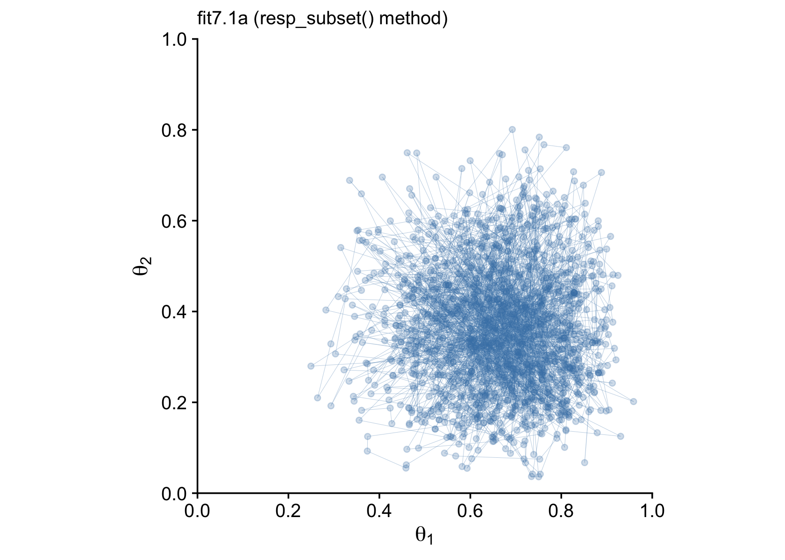

Finally, after all that terrible technical talk, our efforts payed off!
I promise, it won’t always be this difficult to fit a model in **brms**.
This is just one of those unfortunate cases where a textbook author’s
seemingly simple example required a lot of non-default settings and
approaches when applied to a different software package from the one
they highlighted in their textbook.

Now let’s try out the second approach.

#### Uneven multivariate Benoulli via the aggregated binomial approach.

Instead of thinking of our data as two vectors of 0’s and 1’s, we can
use the aggregate form to summarize them more compactly.

``` r
d <-
  tibble(n1 = n1,
         z1 = z1, 
         n2 = n2,
         z2 = z2)

# what does this look like?
d
```

    ## # A tibble: 1 x 4
    ##      n1    z1    n2    z2
    ##   <dbl> <dbl> <dbl> <dbl>
    ## 1     8     6     7     2

The `resp_trials()` function is the second helper that will let us
incorporate additional information about the criterion variable(s) into
the model. In actual practice, we’ll use it as `trials()`. The basic
idea is that for the first coin, we have `z1 == 6` heads out of
`n1 == 8` trials. We can express that as an intercept-only model as
`z1 | trials(n1) ~ 1`. Since we’re still modeling a probability, and
therefore want to continue using Kruschke’s Beta (2, 2) prior, we’ll
want to bring in the `0 + Intercept` syntax. Thus, we’ll define our two
submodels like this.

``` r
model_1 <- bf(z1 | trials(n1) ~ 0 + Intercept)
model_2 <- bf(z2 | trials(n2) ~ 0 + Intercept)
```

Notice that when our data are in an aggregated format, we expressed both
series of coin flips in one row of the data frame. Therefore, even
though the first coin had more trials than the second coin (`n1 > n2`),
we don’t need to invoke the `subset()` helper. We just need to use
`trials()` to tell **brms** how long each sequence of coin flips was.

The other new thing is that instead of directly using the Bernoulli
likelihood function, we’ll instead be setting
`family = binomial(link = "identity")`. Recall that the Bernoulli
function is a special case of the binomial function for which *N* = 1,
for which each data point is a discrete trial. When each data point is
an aggregate of multiple trials, we use the binomial likelihood,
instead.

Here’s how to fit the model.

``` r
fit7.1b <-
  brm(data = d, 
      family = binomial(link = "identity"),
      model_1 + model_2,
      prior = c(prior(beta(2, 2), class = b, lb = 0, ub = 1, resp = z1),
                prior(beta(2, 2), class = b, lb = 0, ub = 1, resp = z2)),
      iter = 3000, warmup = 500, cores = 3, chains = 3,
      seed = 7,
      file = "fits/fit07.01b")
```

The model summary for our `fit7.1b` aggregated binomial approach is very
similar to the one from our previous `fit7.1a` approach using the
`subset()` helper.

``` r
print(fit7.1b)
```

    ##  Family: MV(binomial, binomial) 
    ##   Links: mu = identity
    ##          mu = identity 
    ## Formula: z1 | trials(n1) ~ 0 + Intercept 
    ##          z2 | trials(n2) ~ 0 + Intercept 
    ##    Data: d (Number of observations: 1) 
    ## Samples: 3 chains, each with iter = 3000; warmup = 500; thin = 1;
    ##          total post-warmup samples = 7500
    ## 
    ## Population-Level Effects: 
    ##              Estimate Est.Error l-95% CI u-95% CI Rhat Bulk_ESS Tail_ESS
    ## z1_Intercept     0.67      0.13     0.39     0.89 1.00     7106     5326
    ## z2_Intercept     0.36      0.14     0.12     0.65 1.00     5352     4192
    ## 
    ## Samples were drawn using sampling(NUTS). For each parameter, Bulk_ESS
    ## and Tail_ESS are effective sample size measures, and Rhat is the potential
    ## scale reduction factor on split chains (at convergence, Rhat = 1).

Here’s the updated version of Figure 7.8.

``` r
post7.1b <- posterior_samples(fit7.1b, add_chain = T)

p2 <-
  post7.1b %>% 
  filter(iter < 1001) %>% 
  
  ggplot(aes(x = b_z1_Intercept, y = b_z2_Intercept)) +
  geom_point(alpha = 1/4, color = "steelblue") +
  geom_path(size = 1/10, alpha = 1/2, color = "steelblue") +
  scale_x_continuous(expression(theta[1]), breaks = 0:5 / 5, expand = c(0, 0), limits = 0:1) +
  scale_y_continuous(expression(theta[2]), breaks = 0:5 / 5, expand = c(0, 0), limits = 0:1) +
  labs(subtitle = "fit7.1b (aggregated binomial method)") +
  coord_equal() +
  theme_cowplot()

# combine
library(patchwork)

p1 + p2
```

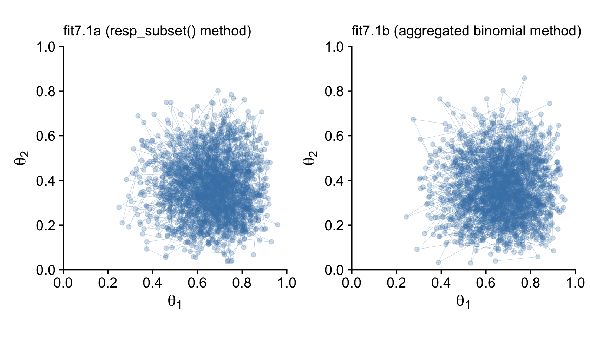

Just for kicks and giggles, we might also compare the two model types by
plotting the marginal posterior densities. This will give is a better
sense of how each of the marginal *θ* densities are shaped like the beta
distribution.

``` r
# combine the posterior samples from the two models
post <-
  bind_rows(
    post7.1a %>% transmute(`theta[1]` = b_y1_Intercept, `theta[2]` = b_y2_Intercept),
    post7.1b %>% transmute(`theta[1]` = b_z1_Intercept, `theta[2]` = b_z2_Intercept)
  ) %>% 
  mutate(fit = rep(c("fit7.1a", "fit7.1b"), each = n() / 2))

# wrangle
post %>% 
  pivot_longer(-fit) %>% 
  
  # plot
  ggplot(aes(x = value, y = fit)) +
  stat_halfeye(point_interval = mode_hdi, .width = .95, fill = "steelblue") +
  scale_x_continuous("posterior", breaks = 0:5 / 5, expand = c(0, 0), limits = 0:1) +
  ylab(NULL) +
  coord_cartesian(ylim = c(1.5, 2.4)) +
  theme_cowplot() +
  theme(panel.spacing.x = unit(0.75, "cm")) +
  facet_wrap(~ name, labeller = label_parsed)
```

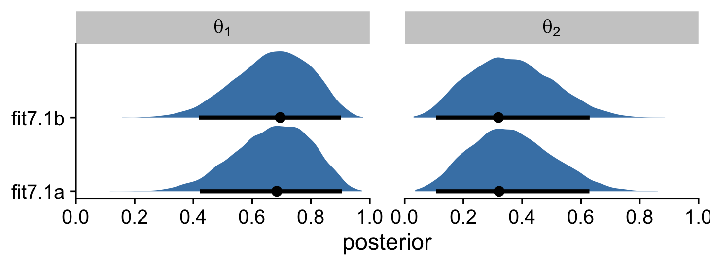

I hope this makes clear that the two estimation methods returned results
that are within simulation variance of one another.

### Is there a difference between biases?

In his Figure 7.9, Kruschke compared the marginal posterior for
*θ*<sub>1</sub> − *θ*<sub>2</sub>, as computed by two methods from the
Metropolis algorithm and another two methods from the Gibbs sampler.
Here we’ll focus, instead, on the two methods we explores using
**brms**-based Hamiltonian Monte Carlo (HMC).

``` r
post %>% 
  mutate(dif = `theta[1]` - `theta[2]`) %>% 

  ggplot(aes(x = dif, y = fit)) +
  stat_histinterval(point_interval = mode_hdi, .width = .95,
                    fill = "steelblue2", slab_color = "steelblue4", outline_bars = T,
                    breaks = 40, normalize = "panels") +
  geom_vline(xintercept = 0, linetype = 3) +
  labs(x = expression(theta[1]-theta[2]),
       y = NULL) +
  coord_cartesian(ylim = c(1.5, 2.4)) +
  theme_cowplot() 
```

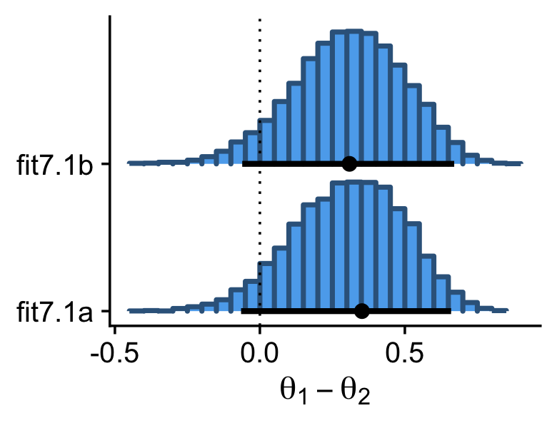

Here are the exact estimates of the mode and 95% HDIs for our difference
distribution, *θ*<sub>1</sub> − *θ*<sub>2</sub>.

``` r
post %>% 
  mutate(dif = `theta[1]` - `theta[2]`) %>% 
  group_by(fit) %>% 
  mode_hdi(dif) %>% 
  mutate_if(is.double, round, digits = 3)
```

    ## # A tibble: 2 x 7
    ##   fit       dif .lower .upper .width .point .interval
    ##   <chr>   <dbl>  <dbl>  <dbl>  <dbl> <chr>  <chr>    
    ## 1 fit7.1a 0.352 -0.065   0.66   0.95 mode   hdi      
    ## 2 fit7.1b 0.309 -0.061   0.67   0.95 mode   hdi

I wouldn’t put too much emphasis on the seemingly large differences in
the two modes. Among the three primary measures of central tendency,
modes are particularly sensitive to things like sample variance. Here’s
what happens if we compare the two methods with the mean, instead.

``` r
post %>% 
  mutate(dif = `theta[1]` - `theta[2]`) %>% 
  group_by(fit) %>% 
  summarise(mean_of_the_difference_score = mean(dif) %>% round(digits = 3))
```

    ## # A tibble: 2 x 2
    ##   fit     mean_of_the_difference_score
    ##   <chr>                          <dbl>
    ## 1 fit7.1a                        0.305
    ## 2 fit7.1b                        0.306

Now the difference between the two methods seems trivial.

### Terminology: MCMC.

> Any simulation that samples a lot of random values from a distribution
> is called a Monte Carlo simulation, named after the dice and spinners
> and shufflings of the famous casino locale. The appellation “Monte
> Carlo” is attributed \[@eckhardtStanUlamJohn1987\] to the
> mathematicians [Stanislaw
> Ulam](https://en.wikipedia.org/wiki/Stanislaw_Ulam) (1909–1984) and
> [John von Neumann](https://en.wikipedia.org/wiki/John_von_Neumann)
> (1903–1957). (p. 177)

In case you didn’t know, **brms** is a user-friendly interface for the
[Stan probabilistic programing language](https://mc-stan.org/) \[Stan;
@carpenterStanProbabilisticProgramming2017\] and Stan is named after
Stanislaw Ulam.

## MCMC representativeness, accuracy, and efficiency

> We have three main goals in generating an MCMC sample from the
> posterior distribution:
>
> 1.  The values in the chain must be *representative* of the posterior
>     distribution. They should not be unduly influenced by the
>     arbitrary initial value of the chain, and they should fully
>     explore the range of the posterior distribution without getting
>     stuck.
> 2.  The chain should be of sufficient size so that estimates are
>     *accurate* and *stable*. In particular, the estimates of the
>     central tendency (such as median or mode), and the limits of the
>     95% HDI, should not be much different if the MCMC analysis is run
>     again (using different seed states for the pseudorandom number
>     generators).
> 3.  The chain should be generated *efficiently*, with as few steps as
>     possible, so not to exceed our patience or computing power.
>     (p. 178, *emphasis* in the original)

### MCMC representativeness.

Kruschke defined our new data in the note for Figure 7.10.

``` r
z <- 35
n <- 50

d <- tibble(y = rep(0:1, times = c(n - z, z)))
```

Here we fit the model. Note how since we’re just univariate, it’s easy
to switch back to directly modeling with the Bernoulli likelihood.

``` r
fit7.2 <-
  brm(data = d, 
      family = bernoulli(link = identity),
      y ~ 1,
      prior(beta(2, 2), class = Intercept),
      iter = 10000, warmup = 500, cores = 3, chains = 3,
      control = list(adapt_delta = 0.9),
      seed = 7,
      file = "fits/fit07.02")
```

On page 179, Kruschke discussed *burn-in* steps within the Gibbs
framework:

> The preliminary steps, during which the chain moves from its
> unrepresentative initial value to the modal region of the posterior,
> is called the *burn-in* period. For realistic applications, it is
> routine to apply a burn-in period of several hundred to several
> thousand steps.

For each HMC chain, the first *n* iterations are called “warmups.” In
this example, *n* = 500 (i.e., `warmup = 500`). Within the Stan-HMC
paradigm, [warmups are somewhat analogous to but not synonymous with
burn-in
iterations](https://andrewgelman.com/2017/12/15/burn-vs-warm-iterative-simulation-algorithms/)
as done by the Gibbs sampling in JAGS. But HMC warmups are like Gibbs
burn-ins in that both are discarded and not used to describe the
posterior. For more on warmup, check out McElreath’s lecture, [starting
here](https://www.youtube.com/watch?v=13mEekRdOcQ&t=75s&frags=pl%2Cwn)
or, for more detail, the [*HMC Algorithm Parameters* section
(15.2)](https://mc-stan.org/docs/2_26/reference-manual/hmc-algorithm-parameters.html)
of the *Stan reference manual*, version 2.26
\[@standevelopmentteamStanReferenceManual2021\].

It appears that the upshot of all this is some of the packages in the
Stan ecosystem don’t make it easy to extract the warmup values. For
example, the `brms::plot()` function excludes them from the trace plot
without the option to include them.

``` r
plot(fit7.2, widths = c(1, 2))
```

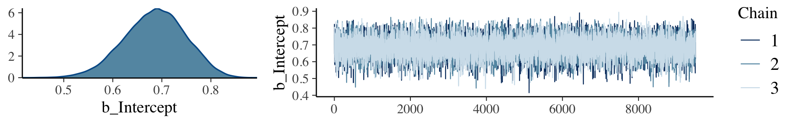

Notice how the *x*-axis on the trace plot ranges from 0 to 9,500. Now
recall that our model code included `iter = 10000, warmup = 500`. Those
9,500 iterations in the trace plot are excluding the first 500 warmup
iterations. This code is a little janky, but if you really want those
warmup iterations, you can extract them from the `fit7.2` object like
this.

``` r
warmups <-
  c(fit7.2$fit@sim$samples[[1]]$b_Intercept[1:500], 
    fit7.2$fit@sim$samples[[2]]$b_Intercept[1:500], 
    fit7.2$fit@sim$samples[[3]]$b_Intercept[1:500]) %>% 
  # since these come from lists, here we'll convert them to a data frame
  as.data.frame() %>% 
  rename(b_Intercept = ".") %>% 
  # we'll need to recapture the iteration and chain information
  mutate(iter  = rep(1:500, times = 3),
         chain = factor(rep(1:3, each = 500), 
                        levels = c("1", "2", "3")))

warmups %>% 
  head()
```

    ##   b_Intercept iter chain
    ## 1   0.2981264    1     1
    ## 2   0.2981264    2     1
    ## 3   0.2981264    3     1
    ## 4   0.2981264    4     1
    ## 5   0.2991483    5     1
    ## 6   0.2937265    6     1

The [**bayesplot** package](https://github.com/stan-dev/bayesplot)
\[@R-bayesplot; @gabry2019visualization\] makes it easier to reproduce
some of the plots in Figure 7.10.

``` r
library(bayesplot)
```

We’ll reproduce the upper left panel with `mcmc_trace()`.

``` r
mcmc_trace(warmups, pars = "b_Intercept")
```


As an alternative, we can also extract the warmup draws from a `brm()`
fit with the [**ggmcmc**
package](https://cran.rstudio.com/package=ggmcmc) \[@R-ggmcmc;
@fernandezGGMCMCAnalysisofMCMC2016\].

``` r
library(ggmcmc)
```

The **ggmcmc** package has a variety of convenience functions for
working with MCMC chains. The `ggs()` function extracts the posterior
draws, including `warmup`, and arranges them in a tidy tibble. With
those in hand, we can now make a trace plot with warmup draws.

``` r
ggs(fit7.2) %>%
  filter(Iteration < 501 &
           Parameter == "b_Intercept") %>% 
  mutate(chain = factor(Chain)) %>% 
  
  ggplot(aes(x = Iteration, y = value, color = chain)) +
  geom_line() +
  scale_colour_brewer(direction = -1) +
  labs(title = "My custom trace plots with warmups via ggmcmc::ggs()",
       x = NULL, y = NULL) +
  theme_cowplot(font_size = 12)
```


It appears our HMC warmup iterations found the posterior quite quickly.
Here’s the autocorrelation plot.

``` r
mcmc_acf(warmups, pars = "b_Intercept", lags = 25)
```

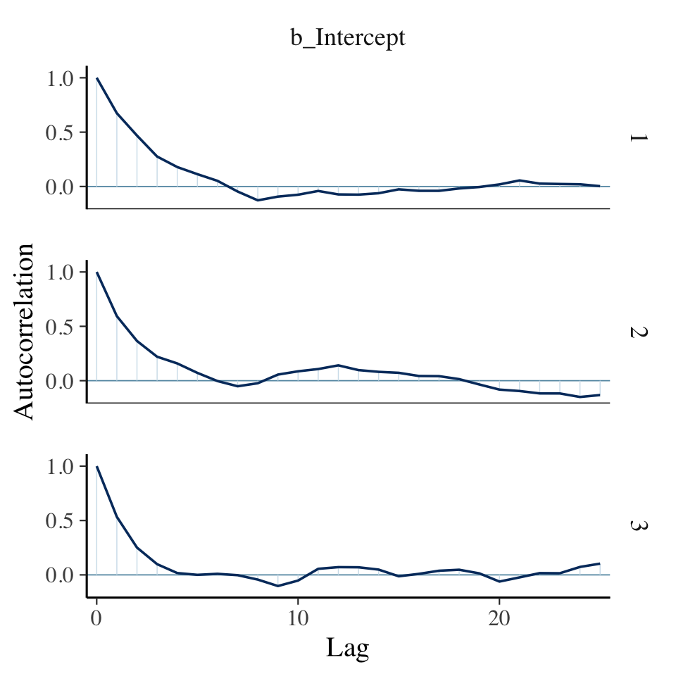

Our autocorrelation plots indicate substantially lower autocorrelations
yielded by HMC as implemented by Stan than what Kruschke generated with
the MH algorithm. This is one of the reasons folks using HMC tend to use
fewer iterations than those using MH or Gibbs.

If you were unhappy with the way `mcmc_acf()` defaults to faceting the
plot by chain, you could always extract the data from the function and
use them to make the plot the way you prefer. E.g.,

``` r
mcmc_acf(warmups)$data %>% 
  as_tibble() %>% 
  filter(Parameter == "b_Intercept") %>% 
  
  ggplot(aes(x = Lag, y = AC,
             color = Chain %>% as.factor())) +
  geom_hline(yintercept = 0, color = "white") +
  geom_point(size = 2/3) +
  geom_line() +
  scale_colour_brewer(direction = -1) +
  ylab("Autocorrelation") +
  theme_cowplot() +
  theme(legend.position = "none")
```

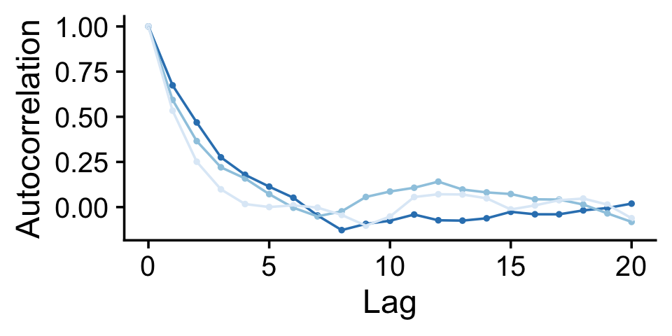

Here are the overlaid densities.

``` r
mcmc_dens_overlay(warmups, pars = c("b_Intercept"))
```

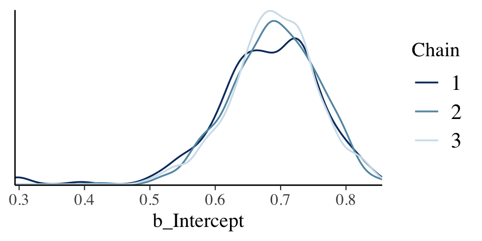

The densities aren’t great, but they still appear nicer than those in
for the burn-in iterations in the text. With our warmups in their
current state, I’m not aware how we might conveniently make a shrink
factor plot, as seen in the lower left of Figure 7.10. So it goes…

Figure 7.11 examined the post-burn-in iterations. We’ll follow suit with
our post-warmup iterations.

``` r
post <- posterior_samples(fit7.2, add_chain = T)

mcmc_trace(post, pars = "b_Intercept")
```


The autocorrelation plots:

``` r
mcmc_acf(post, pars = "b_Intercept", lags = 40)
```

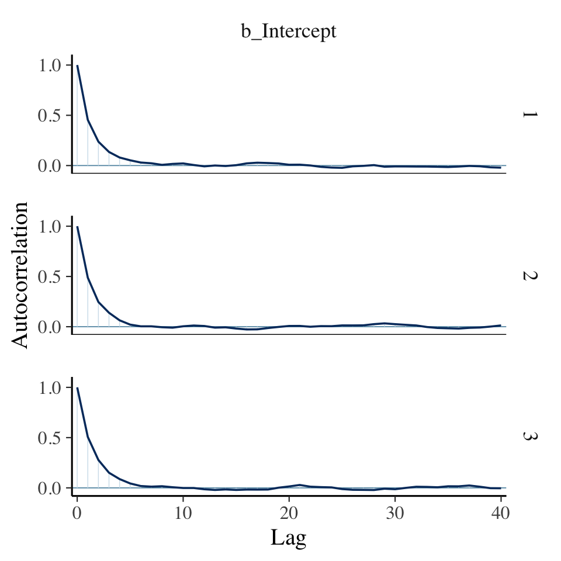

As with the warmups, above, the post-warmup autocorrelation plots
indicate substantially lower autocorrelations yielded by HMC as
implemented by Stan than what Kruschke generated with the MH algorithm.
This is one of the reasons folks using HMC tend to use fewer iterations
than those using MH or Gibbs.

Here are the overlaid densities.

``` r
mcmc_dens_overlay(post, pars = c("b_Intercept"))
```


Now that we’re focusing on the post-warmup iterations, we can make a
shrink factor plot. We’ll do so with the `coda::gelman.plot()` function.
But you can’t just dump your `brm()` fit object into `gelman.plot()`.
It’s the wrong object type. However, **brms** offers the `as.mcmc()`
function which will convert `brm()` objects for use in functions from
the **coda** package.

``` r
fit7.2_c <- as.mcmc(fit7.2)

fit7.2_c %>% glimpse()
```

    ## List of 3
    ##  $ : 'mcmc' num [1:9500, 1:2] 0.78 0.822 0.699 0.648 0.702 ...
    ##   ..- attr(*, "dimnames")=List of 2
    ##   .. ..$ iterations: NULL
    ##   .. ..$ parameters: chr [1:2] "b_Intercept" "lp__"
    ##   ..- attr(*, "mcpar")= num [1:3] 501 10000 1
    ##  $ : 'mcmc' num [1:9500, 1:2] 0.76 0.754 0.725 0.725 0.672 ...
    ##   ..- attr(*, "dimnames")=List of 2
    ##   .. ..$ iterations: NULL
    ##   .. ..$ parameters: chr [1:2] "b_Intercept" "lp__"
    ##   ..- attr(*, "mcpar")= num [1:3] 501 10000 1
    ##  $ : 'mcmc' num [1:9500, 1:2] 0.808 0.788 0.803 0.65 0.65 ...
    ##   ..- attr(*, "dimnames")=List of 2
    ##   .. ..$ iterations: NULL
    ##   .. ..$ parameters: chr [1:2] "b_Intercept" "lp__"
    ##   ..- attr(*, "mcpar")= num [1:3] 501 10000 1
    ##  - attr(*, "class")= chr "mcmc.list"

With our freshly-converted `fit2_c` object in hand, we’re ready to plot.

``` r
gelman.plot(fit7.2_c[, "b_Intercept", ])
```


Looks great. As Kruschke explained on page 181, that plot is based on
the potential scale reduction factor, or *R̂* as it’s typically referred
to in the Stan ecosystem. Happily, **brms** reports the *R̂* values for
the major model parameters using `print()` or `summary()`.

``` r
print(fit7.2)
```

    ##  Family: bernoulli 
    ##   Links: mu = identity 
    ## Formula: y ~ 1 
    ##    Data: d (Number of observations: 50) 
    ## Samples: 3 chains, each with iter = 10000; warmup = 500; thin = 1;
    ##          total post-warmup samples = 28500
    ## 
    ## Population-Level Effects: 
    ##           Estimate Est.Error l-95% CI u-95% CI Rhat Bulk_ESS Tail_ESS
    ## Intercept     0.69      0.06     0.56     0.80 1.00     9215     9302
    ## 
    ## Samples were drawn using sampling(NUTS). For each parameter, Bulk_ESS
    ## and Tail_ESS are effective sample size measures, and Rhat is the potential
    ## scale reduction factor on split chains (at convergence, Rhat = 1).

Instead of a running value, you get a single statistic in the ‘Rhat’
column.

On page 181, Kruschke discussed how his overlaid density plots include
the HDIs, by chain. The convenience functions from **brms** and
**bayesplot** don’t easily get us there. But we can get those easy
enough with a little help `tidybayes::stat_halfeye()`.

``` r
post %>% 
  ggplot(aes(x = b_Intercept, y = chain, fill = chain)) +
  stat_halfeye(point_interval = mode_hdi, .width = .95) +
  scale_fill_brewer() +
  scale_y_discrete(expand = expansion(mult = 0.035)) +
  theme_cowplot() +
  theme(legend.position = "none")
```

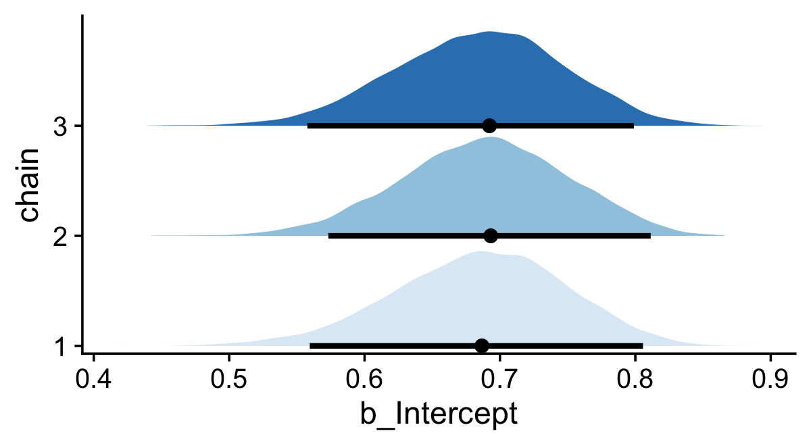

If you would like your chain-wise posterior densities to overlap, one
way would be to play around with the `height` and `alpha` parameters
within the `stat_halfeye()` function.

``` r
post %>% 
  ggplot(aes(x = b_Intercept, y = chain, fill = chain)) +
  stat_halfeye(point_interval = mode_hdi, .width = .95, 
               height = 9, alpha = 3/4) +
  scale_fill_brewer() +
  scale_y_discrete(expand = expansion(mult = 0.2)) +
  theme_cowplot() +
  theme(legend.position = "none")
```

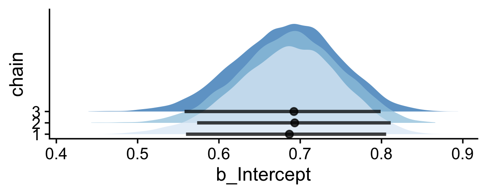

### MCMC accuracy.

We want

> measures of chain length and accuracy that take into account the
> clumpiness of the chain. And for that, we need a measure of
> clumpiness. We will measure clumpiness as *autocorrelation*, which is
> simply the correlation of the chain values with the chain values *k*
> steps ahead. There is a different autocorrelation for each choice of
> *k*. (p. 182, *emphasis* in the original)

We make a couple autocorrelation plots in the last section, but now it’s
time to get a better sense of what they mean. Just a little further in
the text, Kruschke wrote: “The number of steps between the chain and its
superimposed copy is called the *lag*” (p. 182, *emphasis* in the
original). In case it’s not clear, *lag* is a general term and can be
applied to contexts outside of MCMC chains. You find it used sometimes
in the longitudinal statistical literature, particularly for what are
called timeseries models. Sadly, we won’t be fitting those in this book.
If you’re curious, McElreath discussed them briefly in Chapter 16 of his
\[-@mcelreathStatisticalRethinkingBayesian2020\] text.

We, however, will have to contend with a technical quirk within the
**tidyverse**. The two **dplyr** functions relevant to lags are called
`lag()` and `lead()`. Here’s a little example to see how they work.

``` r
tibble(step = 1:5) %>% 
  mutate(lag  = lag(step, n = 1),
         lead = lead(step, n = 1))
```

    ## # A tibble: 5 x 3
    ##    step   lag  lead
    ##   <int> <int> <int>
    ## 1     1    NA     2
    ## 2     2     1     3
    ## 3     3     2     4
    ## 4     4     3     5
    ## 5     5     4    NA

The original values are `1:5` in the `step` column. When you plug those
into `lag(n = 1)`, you get back the value from the *previous row*. The
opposite happens when you plug `step` into `lead(n = 1)`; there you get
back the value from the *next row*. Returning to the block quote above,
Kruschke wrote that autocorrelations are “the correlation of the chain
values with the chain values *k* *steps ahead*” (p. 182, *emphasis*
added). Within the context of the `lag()` and `lead()` functions, their
`n` arguments are what Kruschke called *k*, which is no big deal.
Confusingly, though, since Kruschke wanted to focus on MCMC chains
values that were “*k* steps ahead,” that means we’ll have to use the
`lead()` function, not `lag()`. Please don’t fret about the semantics,
here. Both Kruschke and the **dplyr** package are correct. We’re
lagging. But in this specific case, we’ll be lagging our `post` data
with the `lead()` function. You can learn more about `lag()` and
`lead()` [here](https://dplyr.tidyverse.org/reference/lead-lag.html).

Okay, let’s wrangle our `post` object a bit to make it easier to
reproduce Figure 7.12.

``` r
lagged_post <-
  post %>% 
  filter(chain == 1) %>% 
  select(b_Intercept, iter) %>% 
  # sometimes the unlagged data are called lag_0
  rename(lag_0 = b_Intercept) %>% 
  # lags for three different levels of k
  mutate(lag_1  = lead(lag_0, n = 1), 
         lag_5  = lead(lag_0, n = 5),
         lag_10 = lead(lag_0, n = 10)) %>% 
  pivot_longer(-iter, names_to = "key") 

head(lagged_post)
```

    ## # A tibble: 6 x 3
    ##    iter key    value
    ##   <dbl> <chr>  <dbl>
    ## 1   501 lag_0  0.780
    ## 2   501 lag_1  0.822
    ## 3   501 lag_5  0.669
    ## 4   501 lag_10 0.795
    ## 5   502 lag_0  0.822
    ## 6   502 lag_1  0.699

Now here’s our version of the top row.

``` r
p1 <-
  lagged_post %>% 
  filter(key %in% c("lag_0", "lag_1"),
         iter > 1000 & iter < 1071) %>% 
  
  ggplot(aes(x = iter, y = value, color = key)) +
  geom_point(aes(alpha = iter == 1050, shape = iter == 1050)) +
  geom_line(size = 1/3, alpha = 1/2) +
  annotate(geom = "text",
           x = 1040, y = c(.795, .76),
           label = c("Original", "Lagged"),
           color = c("black", "steelblue")) +
  scale_color_manual(values = c("black", "steelblue")) +
  scale_y_continuous(breaks = 6:8 / 10, limits = c(.55, .80)) +
  labs(x = "Index 1001:1071",
       title = "Lag 1")

p2 <-
  lagged_post %>% 
  filter(key %in% c("lag_0", "lag_5"),
         iter > 1000 & iter < 1071) %>% 
  
  ggplot(aes(x = iter, y = value, color = key)) +
  geom_point(aes(alpha = iter == 1050, shape = iter == 1050)) +
  geom_line(size = 1/3, alpha = 1/2) +
  scale_color_manual(values = c("black", "steelblue")) +
  scale_y_continuous(NULL, labels = NULL, 
                     breaks = 6:8 / 10, limits = c(.55, .80)) +
  labs(x = "Index 1001:1071",
       title = "Lag 5")

p3 <-
  lagged_post %>% 
  filter(key %in% c("lag_0", "lag_10"),
         iter > 1000 & iter < 1071) %>% 
  
  ggplot(aes(x = iter, y = value, color = key)) +
  geom_point(aes(alpha = iter == 1050, shape = iter == 1050)) +
  geom_line(size = 1/3, alpha = 1/2) +
  scale_color_manual(values = c("black", "steelblue")) +
  scale_y_continuous(NULL, labels = NULL, 
                     breaks = 6:8 / 10, limits = c(.55, .80)) +
  labs(x = "Index 1001:1071",
       title = "Lag 10")

# combine
(p1 + p2 + p3) &
  scale_alpha_manual(values = c(1/2, 1)) &
  scale_shape_manual(values = c(1, 19)) &
  theme_cowplot() &
  theme(legend.position = "none") 
```


Here’s the middle row for Figure 7.12.

``` r
lagged_post_wide <-
  lagged_post %>% 
  spread(key = key, value = value)

p1 <-
  lagged_post_wide %>% 
  filter(iter > 1000 & iter < 1071) %>% 
  
  ggplot(aes(x = lag_1, y = lag_0)) +
  stat_smooth(method = "lm") +
  geom_point(aes(alpha = iter == 1050, shape = iter == 1050))
  
p2 <-
  lagged_post_wide %>% 
  filter(iter > 1000 & iter < 1071) %>% 
  
  ggplot(aes(x = lag_5, y = lag_0)) +
  stat_smooth(method = "lm") +
  geom_point(aes(alpha = iter == 1050, shape = iter == 1050)) +
  scale_y_continuous(NULL, labels = NULL)

p3 <-
  lagged_post_wide %>% 
  filter(iter > 1000 & iter < 1071) %>% 
  
  ggplot(aes(x = lag_10, y = lag_0)) +
  stat_smooth(method = "lm") +
  geom_point(aes(alpha = iter == 1050, shape = iter == 1050)) +
  scale_y_continuous(NULL, labels = NULL)

# combine
(p1 + p2 + p3) & 
  scale_alpha_manual(values = c(1/2, 1)) &
  scale_shape_manual(values = c(1, 19)) &
  theme_cowplot() &
  theme(legend.position = "none")
```


For kicks and giggles, we used `stat_smooth()` to add an OLS regression
line with its 95% frequentist confidence intervals to each plot.

If you want the Pearson’s correlations among the lags, the `lowerCor()`
function from the [**psych**
package](https://CRAN.R-project.org/package=psych) \[@R-psych\] can be
handy.

``` r
library(psych)

lagged_post_wide %>% 
  select(-iter) %>% 
  filter(!is.na(lag_10)) %>%
  
  lowerCor(digits = 3)
```

    ##        lag_0 lag_1 lg_10 lag_5
    ## lag_0  1.000                  
    ## lag_1  0.455 1.000            
    ## lag_10 0.021 0.016 1.000      
    ## lag_5  0.053 0.081 0.053 1.000

For our version of the bottom of Figure 7.12, we’ll use the
`bayesplot::mcmc_acf_bar()` function to get the autocorrelation bar
plot, by chain.

``` r
mcmc_acf_bar(post,
             pars = "b_Intercept",
             lags = 20)
```

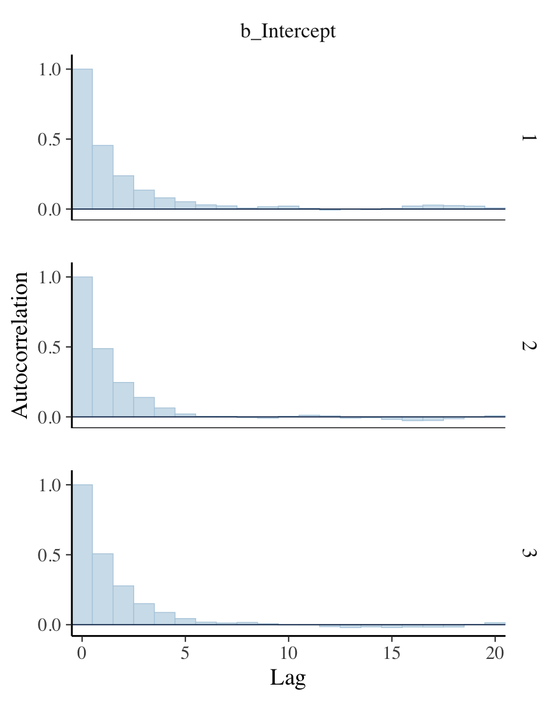

All three rows of our versions for Figure 7.12 indicate in their own way
how much lower our autocorrelations were than the ones in the text.

If you’re curious of the effective sample sizes for the parameters in
your **brms** models, just look at the model summary using either
`summary()` or `print()`.

``` r
print(fit7.2)
```

    ##  Family: bernoulli 
    ##   Links: mu = identity 
    ## Formula: y ~ 1 
    ##    Data: d (Number of observations: 50) 
    ## Samples: 3 chains, each with iter = 10000; warmup = 500; thin = 1;
    ##          total post-warmup samples = 28500
    ## 
    ## Population-Level Effects: 
    ##           Estimate Est.Error l-95% CI u-95% CI Rhat Bulk_ESS Tail_ESS
    ## Intercept     0.69      0.06     0.56     0.80 1.00     9215     9302
    ## 
    ## Samples were drawn using sampling(NUTS). For each parameter, Bulk_ESS
    ## and Tail_ESS are effective sample size measures, and Rhat is the potential
    ## scale reduction factor on split chains (at convergence, Rhat = 1).

Look at the last two columns in the `Intercept` summary. Earlier
versions of **brms** had one column named `Eff.Sample`, which reported
the effect sample size as discussed by Kruschke. Starting with version
2.10.0, **brms** now returns `Bulk_ESS` and `Tail_ESS`, instead. These
originate from a \[-@vehtariRanknormalizationFoldingLocalization2019\]
[preprint](https://arxiv.org/abs/1903.08008?) by Stan-team all-stars
Vehtari, Gelman, Simpson, Carpenter, and Bürkner. From their paper, we
read:

> If you plan to report quantile estimates or posterior intervals, we
> strongly suggest assessing the convergence of the chains for these
> quantiles. In \[Section 4.3\]\[Probability distributions\] we show
> that convergence of Markov chains is not uniform across the parameter
> space and propose diagnostics and effective sample sizes specifically
> for extreme quantiles. This is *different* from the standard ESS
> estimate (which we refer to as the “bulk-ESS”), which mainly assesses
> how well the centre of the distribution is resolved. Instead, these
> “tail-ESS” measures allow the user to estimate the MCSE for interval
> estimates. (p. 5, *emphasis* in the original)

For more technical details, see the paper. The `Bulk_ESS` column in
current versions of **brms** is what was previously referred to as
`Eff.Sample`. This is what corresponds to what Kruschke meant when
referring to effective sample size. Now rather than focusing solely on
‘the center of the’ posterior distribution’ as indexed by `Bulk_ESS`, we
also gauge the effective sample size in the posterior intervals using
`Tail_ESS`.

Anyway, I’m not sure how to reproduce Kruschke’s MCMC ESS simulation
studies. My confusion comes from at least two levels. If you read in the
text, Kruschke described his simulation as based on “MCMC chains from
the normal distribution” (p. 184). Though I do know how to initialize
HMC chains for a model on data from the normal distribution, I have no
idea how one would initialize chains from the standard normal
distribution, itself. Second, if you view Kruschke’s simulation as based
on a model which one could feasibly fit with **brms**, I don’t know how
one would specify “an ESS of 10,000” for each iteration of the
simulation. This is because **brms** is set up to fit models with a
fixed number of iterations, for which the ESS values will vary.
Kruschke’s simulation seems to be set in reverse. For more details on
Kruschke’s simulation, you’ll just have to read through the text.
Anyway, if you know how to fit such a simulation using **brms**, please
share your code in my [GitHub issue
\#15](https://github.com/ASKurz/Doing-Bayesian-Data-Analysis-in-brms-and-the-tidyverse/issues/15).

If you’re interested in the Monte Carlo standard error (MCSE) for your
**brms** parameters, the easiest way is to tack `$fit` onto your fit
object.

``` r
fit7.2$fit
```

    ## Inference for Stan model: 770b80dda5a69d2e79e89cf21a0fde0e.
    ## 3 chains, each with iter=10000; warmup=500; thin=1; 
    ## post-warmup draws per chain=9500, total post-warmup draws=28500.
    ## 
    ##               mean se_mean   sd   2.5%    25%    50%    75%  97.5% n_eff Rhat
    ## b_Intercept   0.69    0.00 0.06   0.56   0.64   0.69   0.73   0.80  9156    1
    ## lp__        -30.79    0.01 0.68 -32.75 -30.96 -30.53 -30.35 -30.31  8163    1
    ## 
    ## Samples were drawn using NUTS(diag_e) at Wed Jul  7 13:56:41 2021.
    ## For each parameter, n_eff is a crude measure of effective sample size,
    ## and Rhat is the potential scale reduction factor on split chains (at 
    ## convergence, Rhat=1).

This returns an [rstan-like
summary](https://CRAN.R-project.org/package=rstan/vignettes/stanfit-objects.html)
\[@standevelopmentteamAccessingContentsStanfit2020\]. The ‘se\_mean’
column is the MCSE.

### MCMC efficiency.

Kruschke wrote: “It is often the case in realistic applications that
there is strong autocorrelation for some parameters, and therefore, an
extremely long chain is required to achieve an adequate ESS or MCSE”
(p. 187). As we’ll see, this is generally less of a problem for HMC than
for MH or Gibbs. But it does still crop up, particularly in complicated
models. As he wrote on the following page, “one sampling method that can
be relatively efficient is Hamiltonian Monte Carlo.” Indeed.

## Summary

> Let’s regain perspective on the forest of Bayesian inference after
> focusing on the trees of MCMC. Recall that the overarching goal of
> Bayesian analysis is identifying the credibility of parameter values
> in a descriptive model of data. Bayes’ rule provides an exact
> mathematical formulation for the posterior distribution on the
> parameter values. But the exact form requires evaluation of an
> integral that might be intractable for realistically complex models.
> Therefore, we approximate the posterior distribution, to arbitrarily
> high accuracy, using MCMC methods. Because of recent developments in
> MCMC algorithms, software that cleverly applies them in complex
> models, and hardware that runs them incredibly quickly, we can now use
> MCMC methods to analyze realistically complex models that would have
> been impossible only a few decades ago. (pp. 188–189)

## Session info

``` r
sessionInfo()
```

    ## R version 4.0.4 (2021-02-15)
    ## Platform: x86_64-apple-darwin17.0 (64-bit)
    ## Running under: macOS Catalina 10.15.7
    ## 
    ## Matrix products: default
    ## BLAS:   /Library/Frameworks/R.framework/Versions/4.0/Resources/lib/libRblas.dylib
    ## LAPACK: /Library/Frameworks/R.framework/Versions/4.0/Resources/lib/libRlapack.dylib
    ## 
    ## locale:
    ## [1] en_US.UTF-8/en_US.UTF-8/en_US.UTF-8/C/en_US.UTF-8/en_US.UTF-8
    ## 
    ## attached base packages:
    ## [1] stats     graphics  grDevices utils     datasets  methods   base     
    ## 
    ## other attached packages:
    ##  [1] psych_2.1.3     ggmcmc_1.5.1.1  bayesplot_1.8.0 patchwork_1.1.1 brms_2.15.0     Rcpp_1.0.6     
    ##  [7] coda_0.19-4     tidybayes_2.3.1 cowplot_1.1.1   forcats_0.5.1   stringr_1.4.0   dplyr_1.0.6    
    ## [13] purrr_0.3.4     readr_1.4.0     tidyr_1.1.3     tibble_3.1.2    ggplot2_3.3.3   tidyverse_1.3.0
    ## 
    ## loaded via a namespace (and not attached):
    ##   [1] readxl_1.3.1         backports_1.2.1      plyr_1.8.6           igraph_1.2.6        
    ##   [5] splines_4.0.4        svUnit_1.0.3         crosstalk_1.1.0.1    TH.data_1.0-10      
    ##   [9] rstantools_2.1.1     inline_0.3.17        digest_0.6.27        htmltools_0.5.1.1   
    ##  [13] rsconnect_0.8.16     fansi_0.4.2          magrittr_2.0.1       modelr_0.1.8        
    ##  [17] RcppParallel_5.0.2   matrixStats_0.57.0   sandwich_3.0-0       xts_0.12.1          
    ##  [21] prettyunits_1.1.1    colorspace_2.0-0     rvest_0.3.6          ggdist_2.4.0.9000   
    ##  [25] haven_2.3.1          xfun_0.23            callr_3.7.0          crayon_1.4.1        
    ##  [29] jsonlite_1.7.2       lme4_1.1-25          survival_3.2-10      zoo_1.8-8           
    ##  [33] glue_1.4.2           gtable_0.3.0         emmeans_1.5.2-1      V8_3.4.0            
    ##  [37] distributional_0.2.2 pkgbuild_1.2.0       rstan_2.21.2         abind_1.4-5         
    ##  [41] scales_1.1.1         mvtnorm_1.1-1        GGally_2.1.1         DBI_1.1.0           
    ##  [45] miniUI_0.1.1.1       viridisLite_0.4.0    xtable_1.8-4         tmvnsim_1.0-2       
    ##  [49] HDInterval_0.2.2     stats4_4.0.4         StanHeaders_2.21.0-7 DT_0.16             
    ##  [53] htmlwidgets_1.5.3    httr_1.4.2           threejs_0.3.3        RColorBrewer_1.1-2  
    ##  [57] arrayhelpers_1.1-0   ellipsis_0.3.2       reshape_0.8.8        pkgconfig_2.0.3     
    ##  [61] loo_2.4.1            farver_2.1.0         dbplyr_2.0.0         utf8_1.2.1          
    ##  [65] tidyselect_1.1.1     labeling_0.4.2       rlang_0.4.11         reshape2_1.4.4      
    ##  [69] later_1.2.0          munsell_0.5.0        cellranger_1.1.0     tools_4.0.4         
    ##  [73] cli_2.5.0            generics_0.1.0       broom_0.7.6          ggridges_0.5.3      
    ##  [77] evaluate_0.14        fastmap_1.1.0        yaml_2.2.1           processx_3.5.2      
    ##  [81] knitr_1.33           fs_1.5.0             nlme_3.1-152         mime_0.10           
    ##  [85] projpred_2.0.2       xml2_1.3.2           compiler_4.0.4       shinythemes_1.1.2   
    ##  [89] rstudioapi_0.13      gamm4_0.2-6          curl_4.3             reprex_0.3.0        
    ##  [93] statmod_1.4.35       stringi_1.6.2        highr_0.9            ps_1.6.0            
    ##  [97] Brobdingnag_1.2-6    lattice_0.20-41      Matrix_1.3-2         nloptr_1.2.2.2      
    ## [101] markdown_1.1         shinyjs_2.0.0        vctrs_0.3.8          pillar_1.6.1        
    ## [105] lifecycle_1.0.0      bridgesampling_1.0-0 estimability_1.3     httpuv_1.6.0        
    ## [109] R6_2.5.0             promises_1.2.0.1     gridExtra_2.3        codetools_0.2-18    
    ## [113] boot_1.3-26          colourpicker_1.1.0   MASS_7.3-53          gtools_3.8.2        
    ## [117] assertthat_0.2.1     withr_2.4.2          mnormt_2.0.2         shinystan_2.5.0     
    ## [121] multcomp_1.4-16      mgcv_1.8-33          parallel_4.0.4       hms_0.5.3           
    ## [125] grid_4.0.4           minqa_1.2.4          rmarkdown_2.8        shiny_1.6.0         
    ## [129] lubridate_1.7.9.2    base64enc_0.1-3      dygraphs_1.1.1.6

## Footnote

[1] We will get a proper introduction to the binomial probability
distribution in \[Section 11.1.2\]\[With intention to fix *N*.\].
