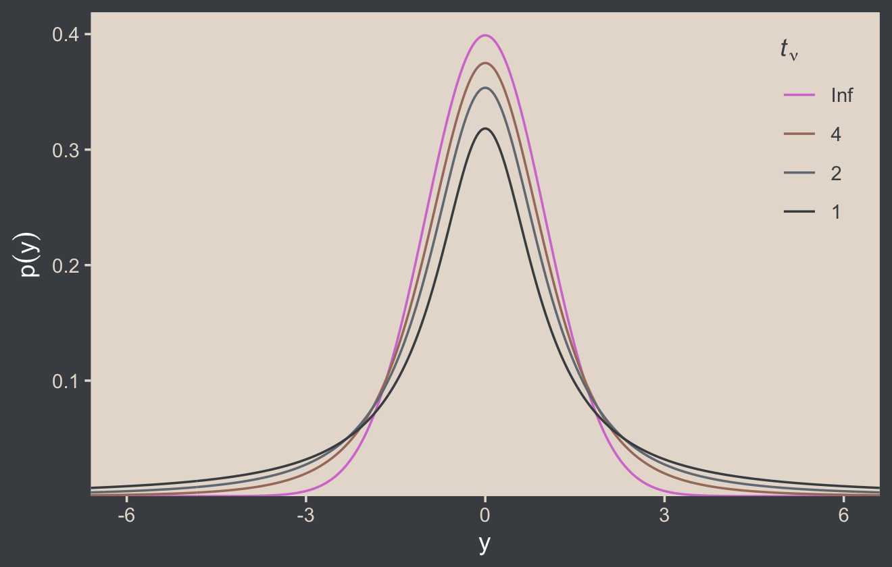
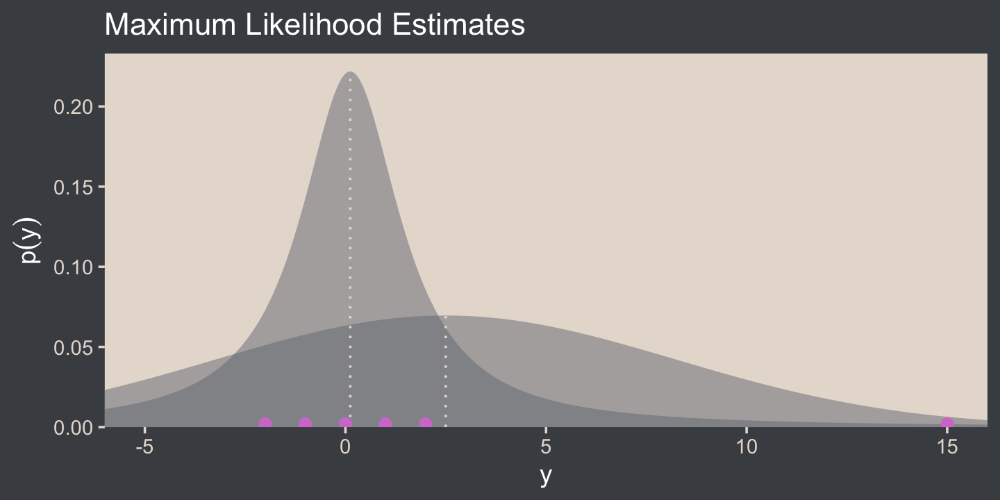
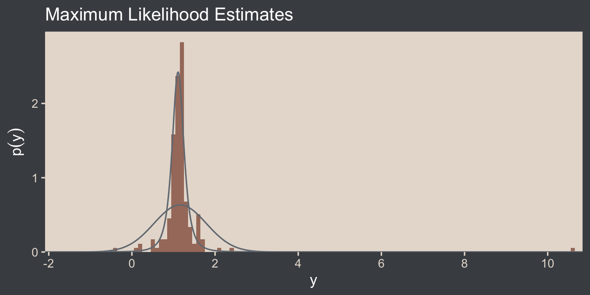

# Metric-Predicted Variable on One or Two Groups

## Estimating the mean and standard deviation of a normal distribution

``` r
library(tidyverse)
library(beyonce)

bp <- beyonce_palette(126)[]

theme_set(
  theme_grey() +
    theme(text = element_text(color = "white"),
          axis.text = element_text(color = beyonce_palette(126)[5]),
          axis.ticks = element_line(color = beyonce_palette(126)[5]),
          legend.background = element_blank(),
          legend.box.background = element_rect(fill = beyonce_palette(126)[5],
                                               color = "transparent"),
          legend.key = element_rect(fill = beyonce_palette(126)[5],
                                    color = "transparent"),
          legend.text = element_text(color = beyonce_palette(126)[1]),
          legend.title = element_text(color = beyonce_palette(126)[1]),
          panel.background = element_rect(fill = beyonce_palette(126)[5],
                                          color = beyonce_palette(126)[5]),
          panel.grid = element_blank(),
          plot.background = element_rect(fill = beyonce_palette(126)[1],
                                          color = beyonce_palette(126)[1]),
          strip.background = element_rect(fill = beyonce_palette(126)[4]),
          strip.text = element_text(color = beyonce_palette(126)[1]))
)
```

### ~~Solution by mathematical analysis~~ Heads up on precision.

### Approximation by ~~MCMC in JAGS~~ HMC in brms.

``` r
library(brms)
library(patchwork)
library(tidybayes)
library(bayesplot)

color_scheme_set(scheme = bp[c(3, 1, 2, 5, 4, 6)])
```

## Outliers and robust estimation: The *t* distribution

Here’s the code for our version of Figure 16.4.

``` r
# wrangle
crossing(nu = c(Inf, 4, 2, 1),
         y  = seq(from = -8, to = 8, length.out = 500)) %>% 
  mutate(density = dt(x = y, df = nu)) %>% 
  # this line is unnecessary, but will help with the plot legend
  mutate(nu = factor(nu, levels = c("Inf", "4", "2", "1"))) %>% 
  
  # plot
  ggplot(aes(x = y, y = density, group = nu, color = nu)) +
  geom_line() +
  scale_color_manual(expression(paste(italic(t)[nu])), values = bp[c(6, 3:1)]) +
  scale_y_continuous(expression(p(y)), expand = expansion(mult = c(0, 0.05))) +
  coord_cartesian(xlim = c(-6, 6)) +
  theme(legend.position = c(.92, .75))
```



> Although the *t* distribution is usually conceived as a sampling
> distribution for the NHST *t* test, we will use it instead as a
> convenient descriptive model of data with outliers… Outliers are
> simply data values that fall unusually far from a model’s expected
> value. Real data often contain outliers relative to a normal
> distribution. Sometimes the anomalous values can be attributed to
> extraneous influences that can be explicitly identified, in which case
> the affected data values can be corrected or removed. But usually we
> have no way of knowing whether a suspected outlying value was caused
> by an extraneous influence, or is a genuine representation of the
> target being measured. Instead of deleting suspected outliers from the
> data according to some arbitrary criterion, we retain all the data but
> use a noise distribution that is less affected by outliers than is the
> normal distribution. (p. 459)

Here’s Figure 16.5.a.

``` r
tibble(y = seq(from = -10, to = 20, length.out = 1e3)) %>% 
  ggplot(aes(x = y)) +
  geom_area(aes(y = dnorm(y, mean = 2.5, sd = 5.73)),
            fill = bp[2], alpha = 1/2) +
  geom_area(aes(y = metRology::dt.scaled(y, df = 1.14, mean = .12, sd = 1.47)),
            fill = bp[2], alpha = 1/2) +
  geom_vline(xintercept = c(.12, 2.5), color = bp[5], linetype = 3) +
  annotate(geom = "point", 
           x = c(-2:2, 15), y = 0.002,
           size = 2, color = bp[6]) +
  scale_y_continuous(expression(p(y)), expand = expansion(mult = c(0, 0.05))) +
  ggtitle("Maximum Likelihood Estimates") +
  coord_cartesian(xlim = c(-5, 15))
```



I’m not aware that we have the data for the bottom panel of Figure 16.5.
However, we can simulate similar data with the `rt.scaled()` function
from the [**metRology**
package](https://sourceforge.net/projects/metrology/) \[@R-metRology\].

``` r
set.seed(145)

# simulate the data
d <-
  tibble(y = metRology::rt.scaled(n = 177, df = 2.63, mean = 1.11, sd = 0.15))

# plot
tibble(y = seq(from = -3, to = 12, length.out = 1e3)) %>% 
  ggplot(aes(y)) +
  geom_histogram(data = d,
                 aes(y = stat(density)),
                 fill = bp[3],
                 size = .2, binwidth = .1) +
  geom_line(aes(y = dnorm(y, mean = 1.16, sd = 0.63)),
            color = bp[2]) +
  geom_line(aes(y = metRology::dt.scaled(y, df = 2.63, mean = 1.11, sd = 0.15)),
            color = bp[2]) +
  scale_x_continuous(breaks = seq(from = -2, to = 10, by = 2)) +
  scale_y_continuous(expression(p(y)), expand = expansion(mult = c(0, 0.05))) +
  ggtitle("Maximum Likelihood Estimates") +
  coord_cartesian(xlim = c(-1.5, 10.25))
```



In case you were curious, this is how I selected the seed for the plot.
Run the code yourself to get a sense of how it works.

``` r
# in the R Notebook code block settings, I used: fig.width = 2, fig.height = 8

t_maker <- function(seed) {
  set.seed(seed)
  tibble(y = metRology::rt.scaled(n = 177, df = 2.63, mean = 1.11, sd = 0.15)) %>% 
    summarise(min = min(y),
              max = max(y)) %>% 
    mutate(spread = max - min)
}

tibble(seed = 1:200) %>% 
  mutate(t = map(seed, t_maker)) %>% 
  unnest(t) %>%
  
  ggplot(aes(x = reorder(seed, spread), ymin = min, ymax = max)) +
  geom_hline(yintercept = 0, color = "white") +
  geom_linerange() +
  coord_flip()
```

> It is important to understand that the scale parameter *σ* in the *t*
> distribution is not the standard deviation of the distribution.
> (Recall that the standard deviation is the square root of the
> variance, which is the expected value of the squared deviation from
> the mean, as defined back in Equation 4.8, p. 86.) The standard
> deviation is actually larger than *σ* because of the heavy tails…
> While this value of the scale parameter is not the standard deviation
> of the distribution, it does have an intuitive relation to the spread
> of the data. Just as the range  ± *σ* covers the middle 68% of a
> *normal* distribution, the range  ± *σ* covers the middle 58% of a *t*
> distribution when *ν* = 2, and the middle 50% when *ν* = 1. These
> areas are illustrated in the left column of Figure 16.6. The right
> column of Figure 16.6 shows the width under the middle of a *t*
> distribution that is needed to span 68.27% of the distribution, which
> is the area under a normal distribution for *σ* =  ± 1. (pp. 459–461,
> *emphasis* in the original)

Speaking of which, here’s the code for the left column for Figure 16.6.

``` r
# the primary data
d <-
  crossing(y  = seq(from = -8, to = 8, length.out = 1e3),
           nu = c(Inf, 5, 2, 1)) %>%
  mutate(label = str_c("nu == ", nu) %>% 
           factor(., levels = c("nu == Inf", "nu == 5", "nu == 2", "nu == 1")))

# the subplot
p1 <-
  d %>% 
  ggplot(aes(x = y)) +
  geom_area(aes(y = dt(y, df = nu)),
            fill = bp[2]) +
  geom_area(data = . %>% filter(y >= -1 & y <= 1),
            aes(y = dt(y, df = nu)),
            fill = bp[1]) +
  # note how this function has its own data
  geom_text(data = tibble(
    y     = 0,
    text  = c("68%", "64%", "58%", "50%"),
    label = factor(c("nu == Inf", "nu == 5", "nu == 2", "nu == 1"))
    ), aes(y = .175, label = text),
    color = "white") +
  scale_y_continuous(expression(p(y)), expand = expansion(mult = c(0, 0.05)), breaks = 0:2 * 0.2) +
  labs(subtitle = "Shaded from y = - 1 to y = 1") +
  coord_cartesian(xlim = c(-6, 6)) +
  facet_wrap(~ label, ncol = 1, labeller = label_parsed)
```

Here’s the code for the right column.

``` r
# the primary data
d <-
  tibble(nu   = c(Inf, 5, 2, 1),
         ymin = c(-1, -1.11, -1.32, -1.84)) %>%
  mutate(ymax = -ymin) %>% 
  expand(nesting(nu, ymin, ymax),
         y = seq(from = -8, to = 8, length.out = 1e3)) %>%
  mutate(label = factor(str_c("nu==", nu), 
                        levels = str_c("nu==", c(Inf, 5, 2, 1))))

# the subplot
p2 <-
  d %>% 
  ggplot(aes(x = y)) +
  geom_area(aes(y = dt(y, df = nu)),
            fill = bp[2]) +
  geom_area(data = . %>% 
              # notice our `filter()` argument has changed
              filter(y >= ymin & y <= ymax),
            aes(y = dt(y, df = nu)),
            fill = bp[1]) +
  annotate(geom = "text", 
           x = 0, y = .175, 
           label = "68%", color = "white") +
  scale_y_continuous(expression(p(y)), expand = expansion(mult = c(0, 0.05)), breaks = 0:2 * 0.2) +
  labs(subtitle = "Shaded for the middle 68.27%") +
  coord_cartesian(xlim = c(-6, 6)) +
  facet_wrap(~ label, ncol = 1, labeller = label_parsed)
```

You may have noticed that we just pulled the values in the `ymin` column
directly from Kruschke’s version of the figure on page 461. If you’d
like a better understanding of where those values came from, you can
reproduce them with the `qt()` function.

``` r
qt(p = (1 - .6827) / 2, 
   df = c(Inf, 5, 2, 1)) %>% 
  round(digits = 2)
```

    ## [1] -1.00 -1.11 -1.32 -1.84

Anyway, let’s bind the two ggplots together with the **patchwork**
package to make the full version of Figure 16.6.

``` r
p1 + p2
```


> The use of a heavy-tailed distribution is often called *robust
> estimation* because the estimated value of the central tendency is
> stable, that is, “robust,” against outliers. The *t* distribution is
> useful as a likelihood function for modeling outliers at the level of
> observed data. But the *t* distribution is also useful for modeling
> outliers at higher levels in a hierarchical prior. We will encounter
> several applications. (p. 462, *emphasis* in the original)

## Session info

``` r
sessionInfo()
```

    ## R version 4.0.4 (2021-02-15)
    ## Platform: x86_64-apple-darwin17.0 (64-bit)
    ## Running under: macOS Catalina 10.15.7
    ## 
    ## Matrix products: default
    ## BLAS:   /Library/Frameworks/R.framework/Versions/4.0/Resources/lib/libRblas.dylib
    ## LAPACK: /Library/Frameworks/R.framework/Versions/4.0/Resources/lib/libRlapack.dylib
    ## 
    ## locale:
    ## [1] en_US.UTF-8/en_US.UTF-8/en_US.UTF-8/C/en_US.UTF-8/en_US.UTF-8
    ## 
    ## attached base packages:
    ## [1] stats     graphics  grDevices utils     datasets  methods   base     
    ## 
    ## other attached packages:
    ##  [1] bayesplot_1.8.0 tidybayes_3.0.0 patchwork_1.1.1 brms_2.15.0     Rcpp_1.0.6      beyonce_0.1    
    ##  [7] forcats_0.5.1   stringr_1.4.0   dplyr_1.0.6     purrr_0.3.4     readr_1.4.0     tidyr_1.1.3    
    ## [13] tibble_3.1.2    ggplot2_3.3.5   tidyverse_1.3.1
    ## 
    ## loaded via a namespace (and not attached):
    ##   [1] readxl_1.3.1         backports_1.2.1      metRology_0.9-28-1   plyr_1.8.6          
    ##   [5] igraph_1.2.6         splines_4.0.4        svUnit_1.0.3         crosstalk_1.1.0.1   
    ##   [9] TH.data_1.0-10       rstantools_2.1.1     inline_0.3.17        digest_0.6.27       
    ##  [13] htmltools_0.5.1.1    rsconnect_0.8.16     fansi_0.4.2          checkmate_2.0.0     
    ##  [17] magrittr_2.0.1       modelr_0.1.8         RcppParallel_5.0.2   matrixStats_0.57.0  
    ##  [21] xts_0.12.1           sandwich_3.0-0       prettyunits_1.1.1    colorspace_2.0-0    
    ##  [25] rvest_1.0.1          ggdist_3.0.0         haven_2.3.1          xfun_0.23           
    ##  [29] callr_3.7.0          crayon_1.4.1         jsonlite_1.7.2       lme4_1.1-25         
    ##  [33] survival_3.2-10      zoo_1.8-8            glue_1.4.2           gtable_0.3.0        
    ##  [37] emmeans_1.5.2-1      V8_3.4.0             distributional_0.2.2 pkgbuild_1.2.0      
    ##  [41] rstan_2.21.2         DEoptimR_1.0-8       abind_1.4-5          scales_1.1.1        
    ##  [45] mvtnorm_1.1-1        DBI_1.1.0            miniUI_0.1.1.1       xtable_1.8-4        
    ##  [49] stats4_4.0.4         StanHeaders_2.21.0-7 DT_0.16              htmlwidgets_1.5.3   
    ##  [53] httr_1.4.2           threejs_0.3.3        arrayhelpers_1.1-0   posterior_1.0.1     
    ##  [57] ellipsis_0.3.2       farver_2.1.0         pkgconfig_2.0.3      loo_2.4.1           
    ##  [61] dbplyr_2.1.1         utf8_1.2.1           labeling_0.4.2       tidyselect_1.1.1    
    ##  [65] rlang_0.4.11         reshape2_1.4.4       later_1.2.0          munsell_0.5.0       
    ##  [69] cellranger_1.1.0     tools_4.0.4          cli_3.0.1            generics_0.1.0      
    ##  [73] broom_0.7.6          ggridges_0.5.3       evaluate_0.14        fastmap_1.1.0       
    ##  [77] yaml_2.2.1           processx_3.5.2       knitr_1.33           fs_1.5.0            
    ##  [81] robustbase_0.93-6    nlme_3.1-152         mime_0.10            projpred_2.0.2      
    ##  [85] xml2_1.3.2           compiler_4.0.4       shinythemes_1.1.2    rstudioapi_0.13     
    ##  [89] gamm4_0.2-6          curl_4.3             reprex_2.0.0         statmod_1.4.35      
    ##  [93] stringi_1.6.2        highr_0.9            ps_1.6.0             Brobdingnag_1.2-6   
    ##  [97] lattice_0.20-41      Matrix_1.3-2         nloptr_1.2.2.2       markdown_1.1        
    ## [101] tensorA_0.36.2       shinyjs_2.0.0        vctrs_0.3.8          pillar_1.6.1        
    ## [105] lifecycle_1.0.0      bridgesampling_1.0-0 estimability_1.3     httpuv_1.6.0        
    ## [109] R6_2.5.0             promises_1.2.0.1     gridExtra_2.3        codetools_0.2-18    
    ## [113] boot_1.3-26          colourpicker_1.1.0   MASS_7.3-53          gtools_3.8.2        
    ## [117] assertthat_0.2.1     withr_2.4.2          shinystan_2.5.0      multcomp_1.4-16     
    ## [121] mgcv_1.8-33          parallel_4.0.4       hms_1.1.0            grid_4.0.4          
    ## [125] coda_0.19-4          minqa_1.2.4          rmarkdown_2.8        numDeriv_2016.8-1.1 
    ## [129] shiny_1.6.0          lubridate_1.7.10     base64enc_0.1-3      dygraphs_1.1.1.6
