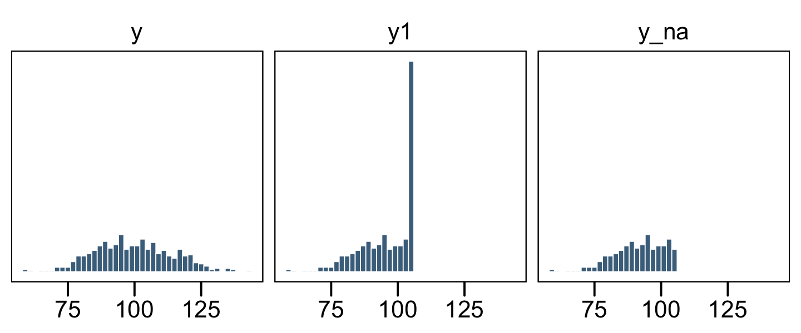
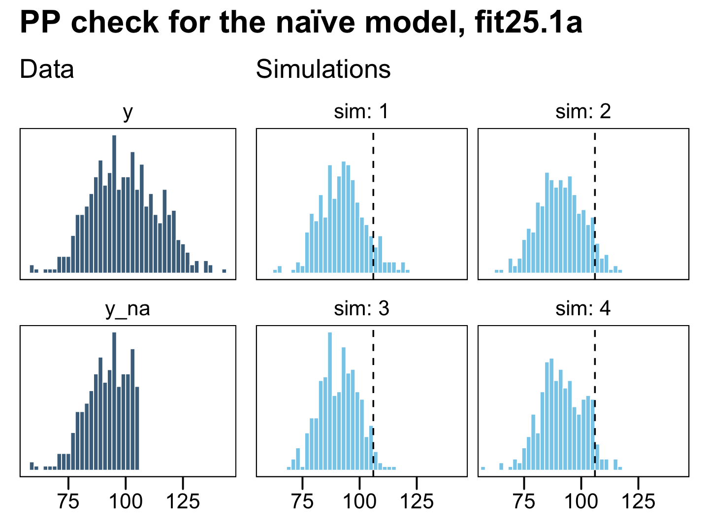
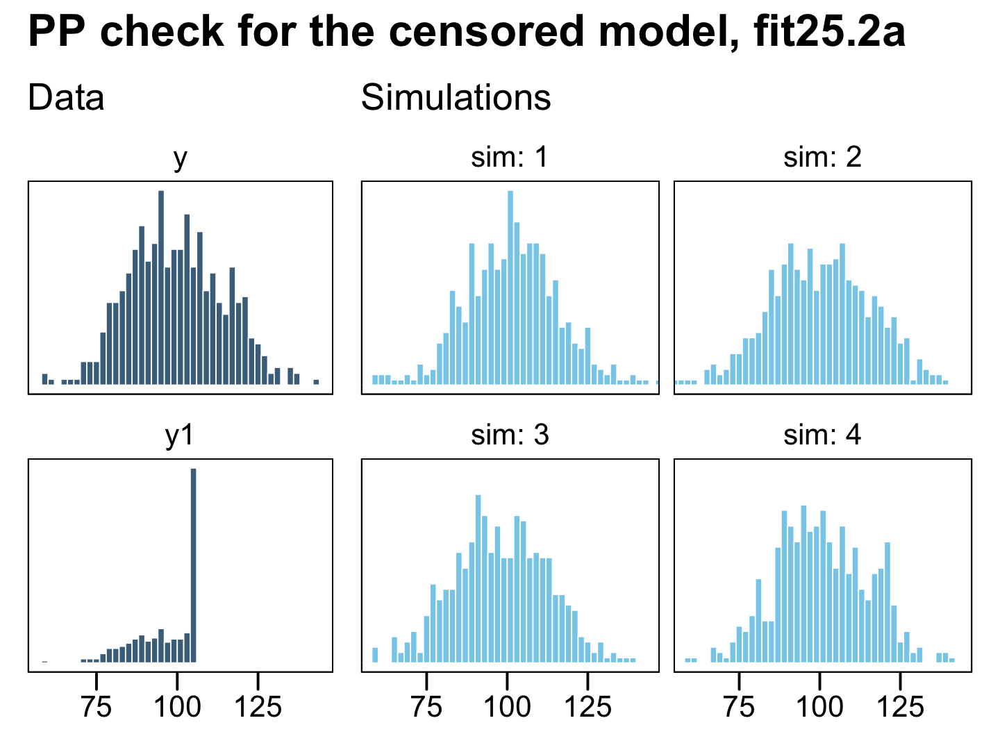
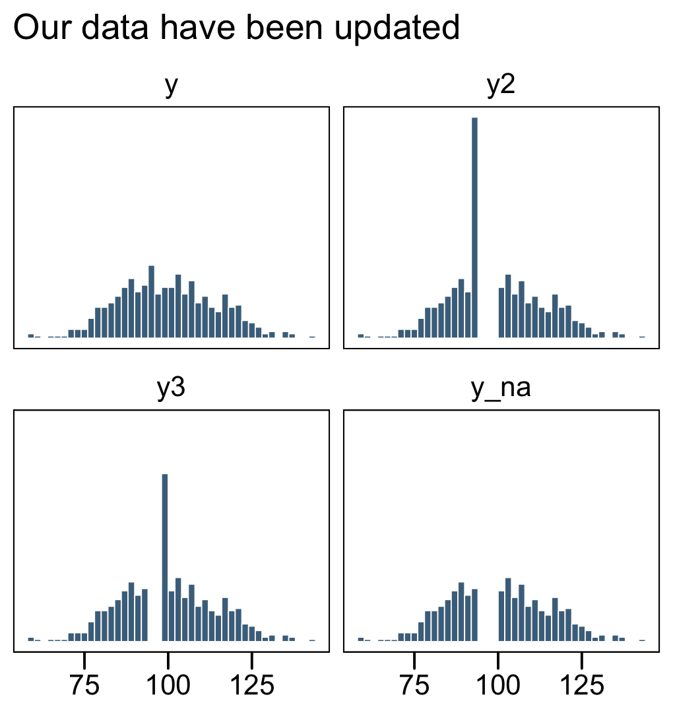
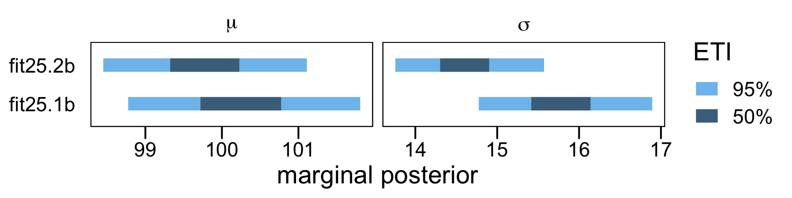
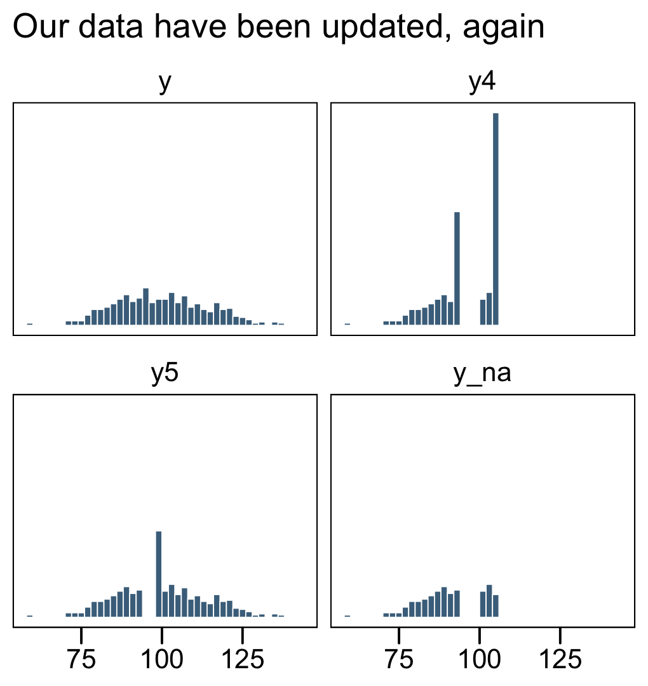
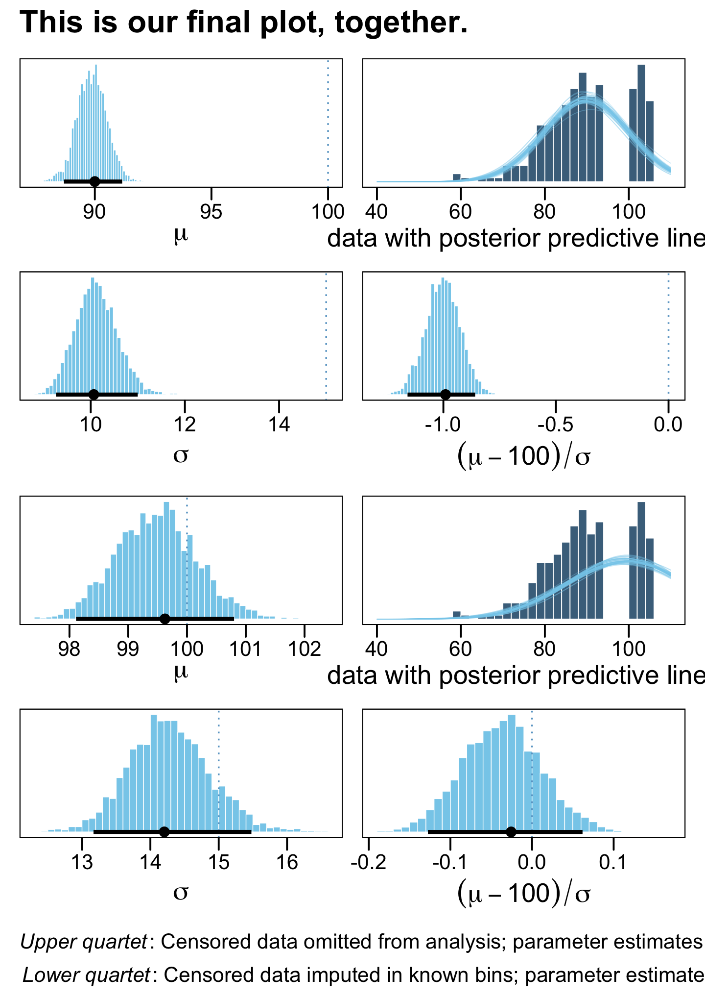

25.4: Censored Data in ~~JAGS~~ brms
================
A Solomon Kurz
2021-02-26

These will have already been executed.

``` r
library(tidyverse)
library(brms)
library(ggthemes)
library(tidybayes)

theme_set(
  theme_base() +
  theme(plot.background = element_rect(color = "transparent"))
)
```

## Censored Data in ~~JAGS~~ brms

“In many situations some data are censored, which means that their
values are known only within a certain range” (p. 732) Happily, **brms**
is capable of handling censored variables. The setup is a little
different from how Kruschke described for JAGS. From the `brmsformula`
section of the [**brms** reference
manual](https://CRAN.R-project.org/package=brms/brms.pdf) (Bürkner,
[2020](#ref-brms2020RM)), we read:

> With the exception of categorical, ordinal, and mixture families,
> left, right, and interval censoring can be modeled through `y |
> cens(censored) ~ predictors`. The censoring variable (named `censored`
> in this example) should contain the values `'left'`, `'none'`,
> `'right'`, and `'interval'` (or equivalently `-1`, `0`, `1`, and `2`)
> to indicate that the corresponding observation is left censored, not
> censored, right censored, or interval censored. For interval censored
> data, a second variable (let’s call it `y2`) has to be passed to
> `cens`. In this case, the formula has the structure `y |
> cens(censored,y2) ~ predictors`. While the lower bounds are given in
> `y`, the upper bounds are given in `y2` for interval censored data.
> Intervals are assumed to be open on the left and closed on the right:
> `(y,y2]`.

We’ll make sense of all this in just a moment. First, let’s see how
Kruschke described the example in the text.

> To illustrate why it is important to include censored data in the
> analysis, consider a case in which \(N = 500\) values are generated
> randomly from a normal distribution with \(\mu = 100\) and
> \(\sigma = 15\). Suppose that values above 106 are censored, as are
> values in the interval between 94 and 100. For the censored values,
> all we know is the interval in which they occurred, but not their
> exact value. (p. 732)

I’m not aware that we have access to Kruschke’s censored data, so we’ll
just make our own based on his description. We’ll start off by
simulating the idealized uncensored data, `y`, based on
\(\operatorname{Normal}(100, 15)\).

``` r
n <- 500

set.seed(25)

d <- tibble(y = rnorm(n, mean = 100, sd = 15))
```

To repeat, Kruschke described two kinds of censoring:

  - “values above 106 are censored,”
  - “as are values in the interval between 94 and 100.”

Rather than examine both kinds of censoring at once, as in the text, I’m
going to slow down and break this section up. First, we’ll explore right
censoring. Second, we’ll explore interval censoring. For our grand
finale, we’ll combine the two, as in the text.

### Right censoring: When you’re uncertain beyond a single threshold.

In the case where the “values above 106 are censored,” we need to save a
single threshold value. We’ll call it `t1`.

``` r
t1 <- 106
```

Now we can use our `t1` threshold value to make a right censored version
of the `y` column called `y1`. We’ll also make a character value listing
out a row’s censoring status in nominal terms.

``` r
d <-
  d %>% 
  mutate(y1 = if_else(y > t1, t1, y),
         cen1 = if_else(y > t1, "right", "none"))

d
```

    ## # A tibble: 500 x 3
    ##        y    y1 cen1 
    ##    <dbl> <dbl> <chr>
    ##  1  96.8  96.8 none 
    ##  2  84.4  84.4 none 
    ##  3  82.7  82.7 none 
    ##  4 105.  105.  none 
    ##  5  77.5  77.5 none 
    ##  6  93.3  93.3 none 
    ##  7 126.  106   right
    ##  8 108.  106   right
    ##  9 101.  101.  none 
    ## 10  99.1  99.1 none 
    ## # … with 490 more rows

When the values in `y1` are not censored, we see `cen1 == "none"`. For
all cases where the original `y` value exceeded the `t1` threshold
(i.e., 106), `y1 == 106` and `cen1 == "right"`. We are using the terms
`"none"` and `"right"` because they are based on the block quote from
the **brms** reference manual. For plotting purposes, we’ll make a new
variable, `y_na`, that only has values for which `cen1 == "none"`.

``` r
d <-
  d %>% 
  mutate(y_na  = ifelse(cen1 == "none", y, NA))

d
```

    ## # A tibble: 500 x 4
    ##        y    y1 cen1   y_na
    ##    <dbl> <dbl> <chr> <dbl>
    ##  1  96.8  96.8 none   96.8
    ##  2  84.4  84.4 none   84.4
    ##  3  82.7  82.7 none   82.7
    ##  4 105.  105.  none  105. 
    ##  5  77.5  77.5 none   77.5
    ##  6  93.3  93.3 none   93.3
    ##  7 126.  106   right  NA  
    ##  8 108.  106   right  NA  
    ##  9 101.  101.  none  101. 
    ## 10  99.1  99.1 none   99.1
    ## # … with 490 more rows

Now let’s get a better sense of the data with a few histograms.

``` r
d %>% 
  pivot_longer(-cen1) %>% 
  mutate(name = factor(name, levels = c("y", "y1", "y_na"))) %>% 
  
  ggplot(aes(x = value)) +
  geom_histogram(size = .25, binwidth = 2, boundary = 106,
                 fill = "skyblue4", color = "white") +
  xlab(NULL) +
  scale_y_continuous(NULL, breaks = NULL) +
  facet_wrap(~ name, ncol = 3)
```



The original un-censored data are in `y`. The censored data, for which
all values above 106 were simply recoded 106, is `y1`. The `y_na` column
shows what the distribution would look like if the censored values were
omitted.

Here’s how we might fit a model which only uses the uncensored values,
those in `y_na`.

``` r
# define the stanvars
mean_y <- mean(d$y_na, na.rm = T)
sd_y   <- sd(d$y_na, na.rm = T)

stanvars <- 
  stanvar(mean_y, name = "mean_y") + 
  stanvar(sd_y,   name = "sd_y")

# fit the model
fit25.1a <-
  brm(data = d,
      family = gaussian,
      y_na ~ 1,
      prior = c(prior(normal(mean_y, sd_y * 100), class = Intercept),
                prior(normal(0, sd_y), class = sigma)),
      chains = 4, cores = 4,
      stanvars = stanvars, 
      file = "/Users/solomonkurz/Dropbox/Recoding Doing Bayesian Data Analysis/fits/fit25.01a.rds")
```

Check the summary for the naïve model.

``` r
print(fit25.1a)
```

    ##  Family: gaussian 
    ##   Links: mu = identity; sigma = identity 
    ## Formula: y_na ~ 1 
    ##    Data: d (Number of observations: 333) 
    ## Samples: 4 chains, each with iter = 2000; warmup = 1000; thin = 1;
    ##          total post-warmup samples = 4000
    ## 
    ## Population-Level Effects: 
    ##           Estimate Est.Error l-95% CI u-95% CI Rhat Bulk_ESS Tail_ESS
    ## Intercept    91.46      0.52    90.46    92.45 1.00     3720     2759
    ## 
    ## Family Specific Parameters: 
    ##       Estimate Est.Error l-95% CI u-95% CI Rhat Bulk_ESS Tail_ESS
    ## sigma     9.39      0.37     8.68    10.14 1.00     3643     2622
    ## 
    ## Samples were drawn using sampling(NUTS). For each parameter, Bulk_ESS
    ## and Tail_ESS are effective sample size measures, and Rhat is the potential
    ## scale reduction factor on split chains (at convergence, Rhat = 1).

Relative to the true data-generating process for the original variable
`y`, \(\operatorname{Normal}(100, 15)\), those parameters look pretty
biased. Now let’s practice fitting our first censored model. Here we use
the `y1 | cens(cen1)` syntax in the left side of the model `formula` to
indicate that the criterion variable, `y1`, has been censored according
to the process as defined in the `cens()` function. Within `cens()` we
inserted our nominal variable, `cens1`, which indicates which cases are
censored (`"right"`) or not (`"none"`).

This model is one of the rare occasions where we’ll set out initial
values for the model intercept. In my first few attempts, `brm()` had
great difficulty initializing the chains using the default initial
values. We’ll help it out by setting them at `mean_y`. Recall that when
you set custom initial values in **brms**, you save them in a list with
the number of lists equaling the number of HMC chains. Because we’re
using the default `chains = 4`, well need four lists of intercept start
values, `mean_y`. You can set them to different values, if you’d like.

``` r
inits <- list(Intercept = mean_y)

inits_list <- list(inits, inits, inits, inits)

fit25.2a <-
  brm(data = d,
      family = gaussian,
      y1 | cens(cen1) ~ 1,
      prior = c(prior(normal(mean_y, sd_y * 100), class = Intercept),
                prior(normal(0, sd_y), class = sigma)),
      chains = 4, cores = 4,
      stanvars = stanvars, 
      # here we insert our start values for the intercept
      inits = inits_list, 
      file = "/Users/solomonkurz/Dropbox/Recoding Doing Bayesian Data Analysis/fits/fit25.02a.rds")
```

Now check the summary for the model accounting for the censoring.

``` r
print(fit25.2a)
```

    ##  Family: gaussian 
    ##   Links: mu = identity; sigma = identity 
    ## Formula: y1 | cens(cen1) ~ 1 
    ##    Data: d (Number of observations: 500) 
    ## Samples: 4 chains, each with iter = 2000; warmup = 1000; thin = 1;
    ##          total post-warmup samples = 4000
    ## 
    ## Population-Level Effects: 
    ##           Estimate Est.Error l-95% CI u-95% CI Rhat Bulk_ESS Tail_ESS
    ## Intercept    99.42      0.71    98.07   100.80 1.00     2617     2405
    ## 
    ## Family Specific Parameters: 
    ##       Estimate Est.Error l-95% CI u-95% CI Rhat Bulk_ESS Tail_ESS
    ## sigma    14.31      0.61    13.19    15.58 1.00     2412     2338
    ## 
    ## Samples were drawn using sampling(NUTS). For each parameter, Bulk_ESS
    ## and Tail_ESS are effective sample size measures, and Rhat is the potential
    ## scale reduction factor on split chains (at convergence, Rhat = 1).

To get a better sense of what these models are doing, we might do a
posterior predictive check with `predict()`.

``` r
# original
p1 <-
  d %>% 
  pivot_longer(cols = c(y, y_na)) %>% 
  
  ggplot(aes(x = value)) +
  geom_histogram(size = .25, binwidth = 2, boundary = 106,
                 fill = "skyblue4", color = "white") +
  labs(subtitle = "Data",
       x = NULL) +
  scale_x_continuous(breaks = 3:5 * 25) +
  scale_y_continuous(NULL, breaks = NULL) +
  facet_wrap(~ name, ncol = 1)

# posterior simulations
set.seed(25)
p2 <-
  predict(fit25.1a,
          summary = F,
          nsamples = 4) %>% 
  data.frame() %>% 
  mutate(sim = 1:n()) %>% 
  pivot_longer(-sim)  %>% 
  
  ggplot(aes(x = value)) +
  geom_histogram(size = .25, binwidth = 2, boundary = 106,
                 fill = "skyblue", color = "white") +
  geom_vline(xintercept = t1, linetype = 2) +
  labs(subtitle = "Simulations",
       x = NULL) +
  scale_x_continuous(breaks = 3:5 * 25) +
  scale_y_continuous(NULL, breaks = NULL) +
  coord_cartesian(xlim = range(d$y)) +
  facet_wrap(~ sim, ncol = 2, labeller = label_both)

# combine
library(patchwork)

p1 + p2 + 
  plot_layout(widths = c(1, 2)) +
  plot_annotation(title = "PP check for the naïve model, fit25.1a")
```



On the left column, the have the original uncensored data `y` and the
`y_na` data where the censored values were removed. The four lighter
histograms on the right are individual simulations based on our naïve
model, `fit25.1a`, which only used the `y_na` data. In all cases, the
simulated data are biased to be too small compared with the original
data, `y`. They also have the undesirable quality that they don’t even
match up with the `y_na` data, which drops sharply off at the 106
threshold, whereas the simulated data all contain values exceeding that
point (depicted by the dashed vertical lines).

``` r
p1 <-
  d %>% 
  pivot_longer(cols = c(y, y1)) %>% 
  
  ggplot(aes(x = value)) +
  geom_histogram(size = .25, binwidth = 2, boundary = 106,
                 fill = "skyblue4", color = "white") +
  labs(subtitle = "Data",
       x = NULL) +
  scale_x_continuous(breaks = 3:5 * 25) +
  scale_y_continuous(NULL, breaks = NULL) +
  facet_wrap(~ name, ncol = 1, scales = "free_y")

set.seed(25)
p2 <-
  predict(fit25.2a,
          summary = F,
          nsamples = 4) %>% 
  data.frame() %>% 
  mutate(sim = 1:n()) %>% 
  pivot_longer(-sim)  %>% 
  
  ggplot(aes(x = value)) +
  geom_histogram(size = .25, binwidth = 2, boundary = 106,
                 fill = "skyblue", color = "white") +
  labs(subtitle = "Simulations",
       x = NULL) +
  scale_x_continuous(breaks = 3:5 * 25) +
  scale_y_continuous(NULL, breaks = NULL) +
  coord_cartesian(xlim = range(d$y)) +
  facet_wrap(~ sim, ncol = 2, labeller = label_both)

# combine
p1 + p2 + 
  plot_layout(widths = c(1, 2)) +
  plot_annotation(title = "PP check for the censored model, fit25.2a")
```



Now the posterior predictive samples match up nicely from the original
uncensored data `y` in terms of central tendency, dispersion, and their
overall shapes. This is the magic of a model that accounts for right (or
left) censoring. It can take all those stacked-up 106 values and
approximate the underlying distribution, had they been more accurately
recorded.

### Interval censoring: When your values are somewhere in the middle.

Time to move onto interval censoring. Kruschke’s example in the text
included values censored in the interval between 94 and 100. This will
require two more thresholds, which we’ll call `t2` and `t3`.

``` r
t2 <- 94
t3 <- 100
```

We should revisit part of the block quote from the **brms** reference
manual, above:

> For interval censored data, a second variable (let’s call it `y2`) has
> to be passed to `cens`. In this case, the formula has the structure `y
> | cens(censored,y2) ~ predictors`. While the lower bounds are given in
> `y`, the upper bounds are given in `y2` for interval censored data.
> Intervals are assumed to be open on the left and closed on the right:
> `(y,y2]`

It’s a little unclear, to me, if this is how Kruschke defined his
intervals, but since we’re working with **brms** we’ll just use this
convention. Thus, we will define “values in the interval between 94 and
100” as `y >= t2 & y < t3`. Here we’ll follow the **brms** convention
and define a new variable `y2` for our lower bound and `y3` for our
upper bound. Additionally, the new `cen2` variable will tell us whether
a case is interval censored (`"interval"`) or not (`"none"`). We have
also redefined `y_na` in terms of our `cen2` variable.

``` r
d <-
  d %>% 
  mutate(y2   = if_else(y >= t2 & y < t3, t2, y),
         y3   = if_else(y >= t2 & y < t3, t3, y),
         cen2 = if_else(y >= t2 & y < t3, "interval", "none")) %>% 
  mutate(y_na = ifelse(cen2 == "none", y, NA))

d
```

    ## # A tibble: 500 x 7
    ##        y    y1 cen1   y_na    y2    y3 cen2    
    ##    <dbl> <dbl> <chr> <dbl> <dbl> <dbl> <chr>   
    ##  1  96.8  96.8 none   NA    94   100   interval
    ##  2  84.4  84.4 none   84.4  84.4  84.4 none    
    ##  3  82.7  82.7 none   82.7  82.7  82.7 none    
    ##  4 105.  105.  none  105.  105.  105.  none    
    ##  5  77.5  77.5 none   77.5  77.5  77.5 none    
    ##  6  93.3  93.3 none   93.3  93.3  93.3 none    
    ##  7 126.  106   right 126.  126.  126.  none    
    ##  8 108.  106   right 108.  108.  108.  none    
    ##  9 101.  101.  none  101.  101.  101.  none    
    ## 10  99.1  99.1 none   NA    94   100   interval
    ## # … with 490 more rows

Now let’s get a better sense of the new data with a few histograms.

``` r
d %>% 
  pivot_longer(cols = c(y, y2, y3, y_na)) %>% 
  mutate(name = factor(name, levels = c("y", "y2", "y3", "y_na"))) %>% 
  
  ggplot(aes(x = value)) +
  geom_histogram(size = .25, binwidth = 2, boundary = 106,
                 fill = "skyblue4", color = "white") +
  labs(subtitle = "Our data have been updated",
       x = NULL) +
  scale_y_continuous(NULL, breaks = NULL) +
  facet_wrap(~ name, ncol = 2)
```



Now we fit two models. The first, `fit25.1b`, will only used the values
not interval censored, `y_na`. The second model, `fit25.2b`, will use
the `cens()` function to fit account for the interval censored data with
the `y2`, `y3`, and `cen2` columns. As before, we’ll want to use `inits`
to help the censored model run smoothly.

``` r
# naïve
fit25.1b <-
  brm(data = d,
      family = gaussian,
      y_na ~ 1,
      prior = c(prior(normal(mean_y, sd_y * 100), class = Intercept),
                prior(normal(0, sd_y), class = sigma)),
      chains = 4, cores = 4,
      stanvars = stanvars, 
      file = "/Users/solomonkurz/Dropbox/Recoding Doing Bayesian Data Analysis/fits/fit25.01b.rds")

# censored
fit25.2b <-
  brm(data = d,
      family = gaussian,
      y2 | cens(cen2, y3) ~ 1,
      prior = c(prior(normal(mean_y, sd_y * 100), class = Intercept),
                prior(normal(0, sd_y), class = sigma)),
      chains = 4, cores = 4,
      stanvars = stanvars, 
      # here we insert our start values for the intercept
      inits = inits_list, 
      file = "/Users/solomonkurz/Dropbox/Recoding Doing Bayesian Data Analysis/fits/fit25.02b.rds")
```

Review the model summaries.

``` r
print(fit25.1b)
```

    ##  Family: gaussian 
    ##   Links: mu = identity; sigma = identity 
    ## Formula: y_na ~ 1 
    ##    Data: d (Number of observations: 424) 
    ## Samples: 4 chains, each with iter = 2000; warmup = 1000; thin = 1;
    ##          total post-warmup samples = 4000
    ## 
    ## Population-Level Effects: 
    ##           Estimate Est.Error l-95% CI u-95% CI Rhat Bulk_ESS Tail_ESS
    ## Intercept   100.26      0.77    98.78   101.81 1.00     3622     2427
    ## 
    ## Family Specific Parameters: 
    ##       Estimate Est.Error l-95% CI u-95% CI Rhat Bulk_ESS Tail_ESS
    ## sigma    15.79      0.54    14.77    16.89 1.00     3948     2561
    ## 
    ## Samples were drawn using sampling(NUTS). For each parameter, Bulk_ESS
    ## and Tail_ESS are effective sample size measures, and Rhat is the potential
    ## scale reduction factor on split chains (at convergence, Rhat = 1).

``` r
print(fit25.2b)
```

    ##  Family: gaussian 
    ##   Links: mu = identity; sigma = identity 
    ## Formula: y2 | cens(cen2, y3) ~ 1 
    ##    Data: d (Number of observations: 500) 
    ## Samples: 4 chains, each with iter = 2000; warmup = 1000; thin = 1;
    ##          total post-warmup samples = 4000
    ## 
    ## Population-Level Effects: 
    ##           Estimate Est.Error l-95% CI u-95% CI Rhat Bulk_ESS Tail_ESS
    ## Intercept    99.78      0.67    98.45   101.11 1.00     2680     2475
    ## 
    ## Family Specific Parameters: 
    ##       Estimate Est.Error l-95% CI u-95% CI Rhat Bulk_ESS Tail_ESS
    ## sigma    14.61      0.46    13.76    15.57 1.00     3466     2046
    ## 
    ## Samples were drawn using sampling(NUTS). For each parameter, Bulk_ESS
    ## and Tail_ESS are effective sample size measures, and Rhat is the potential
    ## scale reduction factor on split chains (at convergence, Rhat = 1).

In this case, both models did a reasonable job approximating the
original data-generating parameters, \(\operatorname{Normal}(100, 15)\).
However, the naïve model `fit25.1b` did so at a considerable loss pre
precision, as indicated by the posterior standard deviations. To give a
better sense, here are the model parameters in an interval plot.

``` r
# wrangle
bind_rows(posterior_samples(fit25.1b),
          posterior_samples(fit25.2b)) %>% 
  mutate(fit = rep(c("fit25.1b", "fit25.2b"), each = n() / 2)) %>% 
  pivot_longer(b_Intercept:sigma) %>% 
  mutate(parameter = if_else(name == "b_Intercept", "mu", "sigma")) %>% 
  
  # plot
  ggplot(aes(x = value, y = fit)) +
  stat_interval(.width = c(.5, .95)) +
  scale_color_manual("ETI", 
                     values = c("skyblue2", "skyblue4"),
                     labels = c("95%", "50%")) +
  labs(x = "marginal posterior",
       y = NULL) +
  theme(axis.ticks.y = element_blank()) +
  facet_wrap(~ parameter, scales = "free_x", labeller = label_parsed)
```



One could also argue the parameters for the censored model `fit25.2b`
were a little less biased. However, I’d be leery of making that as a
general claim based on this example, alone.

### Complex censoring: When the going gets tough…

Okay, let’s put what we’ve learned together and practice with data that
are both right AND interval censored. This is going to require some
tricky coding on our part. Since interval censoring is in play, we’ll
need two `y` variables, again. When the data are indeed interval
censored, their lower and upper bounds will be depicted by `y4` and
`y5`, respectively. When the data are right censored, `y4` will contain
the threshold 106 and `y5` will contain the original value from `y`. All
this tricky information will be indexed in our nominal variable `cen3`.
Once again, we update our `y_na` variable, too.

``` r
d <-
  d %>% 
  mutate(y4   = if_else(y >= t2 & y < t3, t2, 
                        if_else(y > t1, t1, y)),
         y5   = if_else(y >= t2 & y < t3, t3, y),
         cen3 = if_else(y >= t2 & y < t3, "interval",
                       if_else(y > t1, "right", "none"))) %>% 
  mutate(y_na  = ifelse(cen3 == "none", y, NA))

d
```

    ## # A tibble: 500 x 10
    ##        y    y1 cen1   y_na    y2    y3 cen2        y4    y5 cen3    
    ##    <dbl> <dbl> <chr> <dbl> <dbl> <dbl> <chr>    <dbl> <dbl> <chr>   
    ##  1  96.8  96.8 none   NA    94   100   interval  94   100   interval
    ##  2  84.4  84.4 none   84.4  84.4  84.4 none      84.4  84.4 none    
    ##  3  82.7  82.7 none   82.7  82.7  82.7 none      82.7  82.7 none    
    ##  4 105.  105.  none  105.  105.  105.  none     105.  105.  none    
    ##  5  77.5  77.5 none   77.5  77.5  77.5 none      77.5  77.5 none    
    ##  6  93.3  93.3 none   93.3  93.3  93.3 none      93.3  93.3 none    
    ##  7 126.  106   right  NA   126.  126.  none     106   126.  right   
    ##  8 108.  106   right  NA   108.  108.  none     106   108.  right   
    ##  9 101.  101.  none  101.  101.  101.  none     101.  101.  none    
    ## 10  99.1  99.1 none   NA    94   100   interval  94   100   interval
    ## # … with 490 more rows

Explore the new data with histograms.

``` r
d %>% 
  pivot_longer(cols = c(y, y4, y5, y_na)) %>% 
  mutate(name = factor(name, levels = c("y", "y4", "y5", "y_na"))) %>% 
  
  ggplot(aes(x = value)) +
  geom_histogram(size = .25, binwidth = 2, boundary = 106,
                 fill = "skyblue4", color = "white") +
  labs(subtitle = "Our data have been updated, again",
       x = NULL) +
  scale_y_continuous(NULL, breaks = NULL) +
  facet_wrap(~ name, ncol = 2)
```



In the text, Kruschke reported he had 255 uncensored values (p. 732).
Here’s the breakdown of our data.

``` r
d %>% 
  count(cen3)
```

    ## # A tibble: 3 x 2
    ##   cen3         n
    ## * <chr>    <int>
    ## 1 interval    76
    ## 2 none       257
    ## 3 right      167

We got really close\! Now we fit our two models: `fit25.1c`, which
ignores the censoring problem and just drops those cases, and
`fit25.2c`, which makes slick use of the `cens()` function.

``` r
# naïve
fit25.1c <-
  brm(data = d,
      family = gaussian,
      y_na ~ 1,
      prior = c(prior(normal(mean_y, sd_y * 100), class = Intercept),
                prior(normal(0, sd_y), class = sigma)),
      chains = 4, cores = 4,
      stanvars = stanvars, 
      file = "/Users/solomonkurz/Dropbox/Recoding Doing Bayesian Data Analysis/fits/fit25.01c.rds")

# censored
fit25.2c <-
  brm(data = d,
      family = gaussian,
      y4 | cens(cen3, y5) ~ 1,
      prior = c(prior(normal(mean_y, sd_y * 100), class = Intercept),
                prior(normal(0, sd_y), class = sigma)),
      chains = 4, cores = 4,
      stanvars = stanvars, 
      # here we insert our start values for the intercept
      inits = inits_list, 
      file = "/Users/solomonkurz/Dropbox/Recoding Doing Bayesian Data Analysis/fits/fit25.02c.rds")
```

Compare the model summaries.

``` r
print(fit25.1c)
```

    ##  Family: gaussian 
    ##   Links: mu = identity; sigma = identity 
    ## Formula: y_na ~ 1 
    ##    Data: d (Number of observations: 257) 
    ## Samples: 4 chains, each with iter = 2000; warmup = 1000; thin = 1;
    ##          total post-warmup samples = 4000
    ## 
    ## Population-Level Effects: 
    ##           Estimate Est.Error l-95% CI u-95% CI Rhat Bulk_ESS Tail_ESS
    ## Intercept    89.88      0.64    88.59    91.12 1.00     3609     2567
    ## 
    ## Family Specific Parameters: 
    ##       Estimate Est.Error l-95% CI u-95% CI Rhat Bulk_ESS Tail_ESS
    ## sigma    10.12      0.45     9.29    11.04 1.00     3877     2769
    ## 
    ## Samples were drawn using sampling(NUTS). For each parameter, Bulk_ESS
    ## and Tail_ESS are effective sample size measures, and Rhat is the potential
    ## scale reduction factor on split chains (at convergence, Rhat = 1).

``` r
print(fit25.2c)
```

    ##  Family: gaussian 
    ##   Links: mu = identity; sigma = identity 
    ## Formula: y4 | cens(cen3, y5) ~ 1 
    ##    Data: d (Number of observations: 500) 
    ## Samples: 4 chains, each with iter = 2000; warmup = 1000; thin = 1;
    ##          total post-warmup samples = 4000
    ## 
    ## Population-Level Effects: 
    ##           Estimate Est.Error l-95% CI u-95% CI Rhat Bulk_ESS Tail_ESS
    ## Intercept    99.48      0.69    98.18   100.88 1.00     2817     2476
    ## 
    ## Family Specific Parameters: 
    ##       Estimate Est.Error l-95% CI u-95% CI Rhat Bulk_ESS Tail_ESS
    ## sigma    14.28      0.60    13.18    15.49 1.00     2577     2364
    ## 
    ## Samples were drawn using sampling(NUTS). For each parameter, Bulk_ESS
    ## and Tail_ESS are effective sample size measures, and Rhat is the potential
    ## scale reduction factor on split chains (at convergence, Rhat = 1).

The results for the naïve model are a mess and those from the censored
model look great\! Also note how the latter used all avaliable cases,
whereas the former dropped nearly half of them.

Before we can make our version of Figure 25.4, we’ll need to extract the
posterior draws. We’ll start with `fit25.1c`.

``` r
post <- 
  posterior_samples(fit25.1c) %>% 
  mutate(mu = b_Intercept,
         `(mu-100)/sigma` = (b_Intercept - 100) / sigma)

head(post)
```

    ##   b_Intercept     sigma      lp__       mu (mu-100)/sigma
    ## 1    89.78652 10.486322 -967.3581 89.78652     -0.9739811
    ## 2    89.85310  9.920162 -967.0107 89.85310     -1.0228561
    ## 3    89.62798 10.345332 -967.2006 89.62798     -1.0025800
    ## 4    89.93287  9.733238 -967.2662 89.93287     -1.0343047
    ## 5    89.11860 10.611291 -968.2809 89.11860     -1.0254551
    ## 6    88.98673 10.155627 -967.9611 88.98673     -1.0844504

These subplots look a lot like those from back in \[Section
16.2\]\[Outliers and robust estimation: The \(t\) distribution\]. Since
this is the last plot from the book, it seems like we should go all out.
To reduce some of the code redundancy with the six subplots of the
marginal posteriors, we’ll make a custom geom, `geom_hist()`.

``` r
geom_hist <- function(xintercept = xintercept, binwidth = binwidth, ...) {
  
  list(
    geom_histogram(fill = "skyblue", color = "white", size = .2, binwidth = binwidth, boundary = 106),
    geom_vline(xintercept = xintercept, color = "skyblue3", size = 1/2, linetype = 3),
    stat_pointinterval(aes(y = 0), point_interval = mode_hdi, .width = .95),
    scale_y_continuous(NULL, breaks = NULL)
  )
  
}
```

Now we have our `geom_hist()`, here are the first three histograms for
the marginal posteriors from `fit25.1c`.

``` r
p1 <-
  post %>% 
  ggplot(aes(x = mu)) +
  geom_hist(xintercept = 100, binwidth = 0.1) +
  xlab(expression(mu))

p3 <-
  post %>% 
  ggplot(aes(x = sigma)) +
  geom_hist(xintercept = 15, binwidth = 0.08) +
  xlab(expression(sigma))

p4 <-
  post %>% 
  ggplot(aes(x = `(mu-100)/sigma`)) +
  geom_hist(xintercept = 0, binwidth = 0.015) +
  xlab(expression((mu-100)/sigma))
```

The histogram of the censored data with the posterior predictive density
curves superimposed will take a little more work.

``` r
n_lines <- 50

p2 <-
  post %>% 
  mutate(iter = 1:n()) %>% 
  slice(1:n_lines) %>% 
  expand(nesting(mu, sigma, iter),
         y_na = seq(from = 40, to = 120, by = 1)) %>% 
  mutate(density = dnorm(x = y_na, mean = mu, sd = sigma)) %>% 
  
  ggplot(aes(x = y_na)) + 
  geom_histogram(data = d, 
                 aes(y = stat(density)),
                 size = .25, binwidth = 2, boundary = 106,
                 fill = "skyblue4", color = "white") +
  geom_line(aes(y = density, group = iter),
            size  = 1/4, alpha = 1/3, color = "skyblue") +
  scale_x_continuous("data with posterior predictive lines", limits = c(40, 110)) +
  scale_y_continuous(NULL, breaks = NULL)
```

Now extract the posterior draws from our censored model, `fit25.2`, and
repeat the process.

``` r
post <- 
  posterior_samples(fit25.2c) %>% 
  mutate(mu = b_Intercept,
         `(mu-100)/sigma` = (b_Intercept - 100) / sigma)

p5 <-
  post %>% 
  ggplot(aes(x = mu)) +
  geom_hist(xintercept = 100, binwidth = 0.1) +
  xlab(expression(mu))

p7 <-
  post %>% 
  ggplot(aes(x = sigma)) +
  geom_hist(xintercept = 15, binwidth = 0.1) +
  xlab(expression(sigma))

p8 <-
  post %>% 
  ggplot(aes(x = `(mu-100)/sigma`)) +
  geom_hist(xintercept = 0, binwidth = 0.01) +
  xlab(expression((mu-100)/sigma))

p6 <-
  post %>% 
  mutate(iter = 1:n()) %>% 
  slice(1:n_lines) %>% 
  expand(nesting(mu, sigma, iter),
         y_na = seq(from = 40, to = 120, by = 1)) %>% 
  mutate(density = dnorm(x = y_na, mean = mu, sd = sigma)) %>% 
  
  ggplot(aes(x = y_na)) + 
  geom_histogram(data = d, 
                 aes(y = stat(density)),
                 size = .25, binwidth = 2, boundary = 106, 
                 fill = "skyblue4", color = "white") +
  geom_line(aes(y = density, group = iter),
            size  = 1/4, alpha = 1/3, color = "skyblue") +
  scale_x_continuous("data with posterior predictive lines", limits = c(40, 110)) +
  scale_y_continuous(NULL, breaks = NULL)
```

Finally, combine the subplots, and annotate a bit.

``` r
((p1 | p2) / (p3 | p4) / (p5 | p6) / (p7 | p8)) +
  plot_annotation(title = "This is our final plot, together.",
                  caption = expression(atop(italic("Upper quartet")*": Censored data omitted from analysis; parameter estimates are too small.  ", italic("Lower quartet")*": Censored data imputed in known bins; parameter estimates are accurate."))) &
  theme(plot.caption = element_text(hjust = 0))
```



To learn more about censored data, check out the nice lecture by Gordon
Fox, [*Introduction to analysis of censored and truncated
data*](https://www.youtube.com/watch?v=aPN10YYrC1M).

### Bonus: Truncation.

Though Kruschke didn’t cover it, truncation is often confused with
censoring. When you have actually collected all your values, but some
are just less certain than you’d like, you have a censoring issue. That
is, you can think of censoring as an issue with measurement precision.
Truncation has to do with data collection. When there’s some level in
your criterion variable that you haven’t collected data on, that’s a
truncation issue. For example, imagine you wanted to predict scores on
an IQ test with socioeconomic status (SES). There might be a relation,
there. But now imagine you only collected data on people with an IQ
above 110. Those IQ data are severely left truncated. If you only care
about the relation of SES and IQ for those with high IQ scores, your
data are fine. But if you want to make general statements across the
full range of IQ values, standard regression methods will likely produce
biased results. Happily, **brms** allows users to accommodate truncated
criterion variables with the `trunc()` function, which works in a
similar way to the `cens()` function. For details on fitting truncated
regression models with `trunc()`, check out the *Additional response
information* subsection of the `brmsformula` section of the [**brms**
reference manual](https://CRAN.R-project.org/package=brms/brms.pdf). The
[end of the Fox lecture](https://youtu.be/aPN10YYrC1M?t=6153), above,
briefly covers truncated regression. You can also find a [brief vignette
on truncation](https://stats.idre.ucla.edu/r/dae/truncated-regression/)
by the good folks at the UCLA Institute for Digital Research and
Education.

## What Next?

“If you have made it this far and you are looking for more, you might
peruse posts at \[Kruschke’s\] blog,
<https://doingbayesiandataanalysis.blogspot.com/>, and search there for
topics that interest you.” In addition to the other references Kruschke
mentioned, you might also check out McElreath’s [*Statistical
rethinking*](https://xcelab.net/rm/statistical-rethinking/), both first
([2015](#ref-mcelreathStatisticalRethinkingBayesian2015)) and second
([2020](#ref-mcelreathStatisticalRethinkingBayesian2020)) editions. Much
like this project, I have recoded both editions of *Statistical
rethinking* in a **bookdown** form (Kurz,
[2020](#ref-kurzStatisticalRethinkingBrms2020)[a](#ref-kurzStatisticalRethinkingBrms2020),
[2020](#ref-kurzStatisticalRethinkingSecondEd2020)[b](#ref-kurzStatisticalRethinkingSecondEd2020)).
Click [here](https://bookdown.org/content/3890/) for the first and
[here](https://bookdown.org/content/4857/) for the second. You can find
other pedagogical material at my academic blog,
<https://solomonkurz.netlify.com/post/>. For assistance on
**brms**-related issues, check out the **brms** section on the Stan
forums at <https://discourse.mc-stan.org/c/interfaces/brms/36>.

## Session info

``` r
sessionInfo()
```

    ## R version 4.0.3 (2020-10-10)
    ## Platform: x86_64-apple-darwin17.0 (64-bit)
    ## Running under: macOS Catalina 10.15.7
    ## 
    ## Matrix products: default
    ## BLAS:   /Library/Frameworks/R.framework/Versions/4.0/Resources/lib/libRblas.dylib
    ## LAPACK: /Library/Frameworks/R.framework/Versions/4.0/Resources/lib/libRlapack.dylib
    ## 
    ## locale:
    ## [1] en_US.UTF-8/en_US.UTF-8/en_US.UTF-8/C/en_US.UTF-8/en_US.UTF-8
    ## 
    ## attached base packages:
    ## [1] stats     graphics  grDevices utils     datasets  methods   base     
    ## 
    ## other attached packages:
    ##  [1] patchwork_1.1.0      tidybayes_2.3.1.9000 ggthemes_4.2.0      
    ##  [4] brms_2.14.4          Rcpp_1.0.6           forcats_0.5.1       
    ##  [7] stringr_1.4.0        dplyr_1.0.4          purrr_0.3.4         
    ## [10] readr_1.4.0          tidyr_1.1.2          tibble_3.0.6        
    ## [13] ggplot2_3.3.3        tidyverse_1.3.0     
    ## 
    ## loaded via a namespace (and not attached):
    ##   [1] readxl_1.3.1         backports_1.2.0      plyr_1.8.6          
    ##   [4] igraph_1.2.6         sp_1.4-4             splines_4.0.3       
    ##   [7] svUnit_1.0.3         crosstalk_1.1.0.1    rstantools_2.1.1    
    ##  [10] inline_0.3.17        digest_0.6.27        htmltools_0.5.0     
    ##  [13] rsconnect_0.8.16     fansi_0.4.2          magrittr_2.0.1      
    ##  [16] modelr_0.1.8         RcppParallel_5.0.2   matrixStats_0.57.0  
    ##  [19] xts_0.12.1           prettyunits_1.1.1    colorspace_2.0-0    
    ##  [22] rvest_0.3.6          ggdist_2.4.0.9000    haven_2.3.1         
    ##  [25] xfun_0.19            callr_3.5.1          crayon_1.4.1        
    ##  [28] jsonlite_1.7.2       lme4_1.1-25          zoo_1.8-8           
    ##  [31] glue_1.4.2           gtable_0.3.0         emmeans_1.5.2-1     
    ##  [34] V8_3.4.0             distributional_0.2.2 pkgbuild_1.2.0      
    ##  [37] rstan_2.21.2         abind_1.4-5          scales_1.1.1        
    ##  [40] mvtnorm_1.1-1        DBI_1.1.0            miniUI_0.1.1.1      
    ##  [43] xtable_1.8-4         HDInterval_0.2.2     stats4_4.0.3        
    ##  [46] StanHeaders_2.21.0-6 DT_0.16              htmlwidgets_1.5.2   
    ##  [49] httr_1.4.2           threejs_0.3.3        arrayhelpers_1.1-0  
    ##  [52] ellipsis_0.3.1       pkgconfig_2.0.3      loo_2.3.1           
    ##  [55] farver_2.0.3         dbplyr_2.0.0         utf8_1.1.4          
    ##  [58] tidyselect_1.1.0     labeling_0.4.2       rlang_0.4.10        
    ##  [61] reshape2_1.4.4       later_1.1.0.1        munsell_0.5.0       
    ##  [64] cellranger_1.1.0     tools_4.0.3          cli_2.3.0           
    ##  [67] generics_0.1.0       broom_0.7.2          ggridges_0.5.2      
    ##  [70] evaluate_0.14        fastmap_1.0.1        yaml_2.2.1          
    ##  [73] processx_3.4.5       knitr_1.30           fs_1.5.0            
    ##  [76] nlme_3.1-149         mime_0.9             projpred_2.0.2      
    ##  [79] xml2_1.3.2           compiler_4.0.3       bayesplot_1.7.2     
    ##  [82] shinythemes_1.1.2    rstudioapi_0.13      gamm4_0.2-6         
    ##  [85] curl_4.3             reprex_0.3.0         statmod_1.4.35      
    ##  [88] stringi_1.5.3        ps_1.5.0             Brobdingnag_1.2-6   
    ##  [91] lattice_0.20-41      Matrix_1.2-18        nloptr_1.2.2.2      
    ##  [94] markdown_1.1         shinyjs_2.0.0        vctrs_0.3.6         
    ##  [97] pillar_1.4.7         lifecycle_0.2.0      bridgesampling_1.0-0
    ## [100] estimability_1.3     raster_3.4-5         httpuv_1.5.4        
    ## [103] R6_2.5.0             promises_1.1.1       gridExtra_2.3       
    ## [106] codetools_0.2-16     boot_1.3-25          colourpicker_1.1.0  
    ## [109] MASS_7.3-53          gtools_3.8.2         assertthat_0.2.1    
    ## [112] withr_2.4.1          shinystan_2.5.0      mgcv_1.8-33         
    ## [115] parallel_4.0.3       hms_0.5.3            grid_4.0.3          
    ## [118] coda_0.19-4          minqa_1.2.4          rmarkdown_2.5       
    ## [121] shiny_1.5.0          lubridate_1.7.9.2    base64enc_0.1-3     
    ## [124] dygraphs_1.1.1.6

<div id="refs" class="references">

<div id="ref-brms2020RM">

Bürkner, P.-C. (2020). *brms reference manual, Version 2.13.5*.
<https://CRAN.R-project.org/package=brms/brms.pdf>

</div>

<div id="ref-kurzStatisticalRethinkingBrms2020">

Kurz, A. S. (2020a). *Statistical rethinking with brms, ggplot2, and the
tidyverse* (version 1.1.0). <https://doi.org/10.5281/zenodo.3693202>

</div>

<div id="ref-kurzStatisticalRethinkingSecondEd2020">

Kurz, A. S. (2020b). *Statistical rethinking with brms, ggplot2, and the
tidyverse: Second edition* (version 0.0.3).
<https://bookdown.org/content/4857/>

</div>

<div id="ref-mcelreathStatisticalRethinkingBayesian2015">

McElreath, R. (2015). *Statistical rethinking: A Bayesian course with
examples in R and Stan*. CRC press.
<https://xcelab.net/rm/statistical-rethinking/>

</div>

<div id="ref-mcelreathStatisticalRethinkingBayesian2020">

McElreath, R. (2020). *Statistical rethinking: A Bayesian course with
examples in R and Stan* (Second edition). CRC Press.
<https://xcelab.net/rm/statistical-rethinking/>

</div>

</div>
