Chapter 07. Markov Chain Monte Carlo
================
A Solomon Kurz
2019-03-02

Markov Chain Monte Carlo
========================

> This chapter introduces the methods we will use for producing accurate approximations to Bayesian posterior distributions for realistic applications. The class of methods is called Markov chain Monte Carlo (MCMC), for reasons that will be explained later in the chapter. It is MCMC algorithms and software, along with fast computer hardware, that allow us to do Bayesian data analysis for realistic applications that would have been effectively impossible 30 years ago. (p. 144)

David Draper discussed some of the history of MCMC in his lecture, [*Bayesian Statistical Reasoning*](https://www.youtube.com/watch?v=072Q18nX91I&frags=pl%2Cwn).

Approximating a distribution with a large sample
------------------------------------------------

Like in chapters 4 and 6, let's define our `hdi_of_icdf()` function.

``` r
hdi_of_icdf <- function(name, width = .95, tol = 1e-8, ... ) {
  incredible_mass <-  1.0 - width
  interval_width  <- function(low_tail_prob, name, width, ...) {
    name(width + low_tail_prob, ...) - name(low_tail_prob, ...)
  }
  opt_info <- optimize(interval_width, c(0, incredible_mass), 
                       name = name, width = width, 
                       tol = tol, ...)
  hdi_lower_tail_prob <- opt_info$minimum
  return(c(name(hdi_lower_tail_prob, ...),
           name(width + hdi_lower_tail_prob, ...)))
}
```

``` r
(h <-
  hdi_of_icdf(name   = qbeta,
              shape1 = 15,
              shape2 = 7)
 )
```

    ## [1] 0.4907001 0.8639305

And using an equation from Chapter 6, *ω* = (*a* − 1)/(*a* + *b* − 2), we can compute the mode.

``` r
(omega <- (15 - 1) / (15 + 7 - 2))
```

    ## [1] 0.7

To get the density in the upper left panel of Figure 7.1, we'll make use of `dbeta()`. And we'll also make use of our `hdi` and `omega` values.

``` r
library(tidyverse)

tibble(theta = seq(from = 0, to = 1, length.out = 100)) %>% 
  ggplot(aes(x = theta)) +
  geom_ribbon(aes(ymin = 0, 
                  ymax = dbeta(theta, 
                               shape1 = 15, 
                               shape2 = 7)),
              fill = "grey67") +
  geom_segment(aes(x = h[1], xend = h[2], y = 0, yend = 0),
               size = .75) +
  geom_point(aes(x = omega, y = 0),
             size = 1.5, shape = 19) +
  annotate(x = .675, y = .3, label = "95% HDI", 
           geom = "text", color = "grey92") +
  scale_x_continuous(breaks = c(0, h, omega, 1),
                     labels = c("0", h %>% round(2), omega, "1")) +
  coord_cartesian(ylim = c(-.125, 4)) +
  labs(title = "Exact distribution",
       x = expression(theta),
       y = expression(paste("p(", theta, ")"))) +
  theme(panel.grid = element_blank())
```


The remaining panels in Figure 7.1 require we simulate the data.

``` r
set.seed(7.1)

d <-
  tibble(
  theta = c(rbeta(5e2, shape1 = 15, shape2 = 7),
            rbeta(5e3, shape1 = 15, shape2 = 7),
            rbeta(5e4, shape1 = 15, shape2 = 7)),
  key = rep(c("Sample N = 500", "Sample N = 5,000", "Sample N = 50,000"), times = c(5e2, 5e3, 5e4))
  ) %>% 
  mutate(key = factor(key, levels = c("Sample N = 500", "Sample N = 5,000", "Sample N = 50,000"))) 

head(d)
```

    ## # A tibble: 6 x 2
    ##   theta key           
    ##   <dbl> <fct>         
    ## 1 0.806 Sample N = 500
    ## 2 0.756 Sample N = 500
    ## 3 0.727 Sample N = 500
    ## 4 0.784 Sample N = 500
    ## 5 0.782 Sample N = 500
    ## 6 0.590 Sample N = 500

With the data in hand, we're ready to plot the remaining panels for Figure 7.1. This time, we'll use the handy `stat_pointintervalh()` function from the [tidybayes package](https://github.com/mjskay/tidybayes) to mark off the mode and 95% HDIs.

``` r
library(tidybayes)

d %>% 
  ggplot(aes(x = theta)) +
  geom_histogram(size = .2, color = "grey92", fill = "grey67",
                 binwidth = .02) +
  stat_pointintervalh(aes(y = 0), 
                      point_interval = mode_hdi, .width = .95) +
  scale_y_continuous(NULL, breaks = NULL) +
  xlab(expression(theta)) +
  coord_cartesian(xlim = 0:1) +
  theme(panel.grid = element_blank()) +
  facet_wrap(~key, ncol = 3, scales = "free")
```

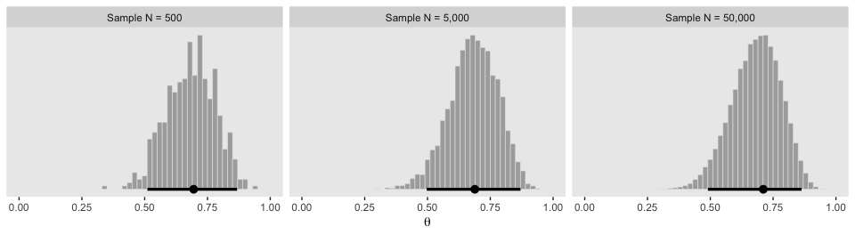

If we want the exact values for the mode and 95% HDIs, we can use the `tidybayes::mode_hdi()` function.

``` r
d %>% 
  group_by(key) %>% 
  mode_hdi()
```

    ## # A tibble: 3 x 7
    ##   key               theta .lower .upper .width .point .interval
    ##   <fct>             <dbl>  <dbl>  <dbl>  <dbl> <chr>  <chr>    
    ## 1 Sample N = 500    0.695  0.511  0.868   0.95 mode   hdi      
    ## 2 Sample N = 5,000  0.688  0.497  0.870   0.95 mode   hdi      
    ## 3 Sample N = 50,000 0.711  0.490  0.863   0.95 mode   hdi

If you wanted a better sense of the phenomena, you could do a simulation. We'll make a custom simulation function to streamline our approach.

``` r
my_mode_simulation <- function(seed){
  set.seed(seed)
  tibble(
    theta = c(rbeta(5e2, shape1 = 15, shape2 = 7),
              rbeta(5e3, shape1 = 15, shape2 = 7),
              rbeta(5e4, shape1 = 15, shape2 = 7)),
    key = rep(c("Sample N = 500", "Sample N = 5,000", "Sample N = 50,000"), times = c(5e2, 5e3, 5e4))
  ) %>% 
    mutate(key = factor(key, levels = c("Sample N = 500", "Sample N = 5,000", "Sample N = 50,000"))) %>% 
    group_by(key) %>% 
    mode_hdi(theta)
}
```

Here we put our `my_mode_simulation()` function to work.

``` r
# we need an index of the values we set our seed with in our `my_mode_simulation()` function
sim <-
  tibble(seed = 1:1e3) %>% 
  group_by(seed) %>% 
  # inserting our subsamples
  mutate(modes = map(seed, my_mode_simulation)) %>% 
   # unnesting allows us to access our model results
  unnest(modes) 

sim %>% 
  ggplot(aes(x = theta, y = key)) +
  geom_vline(xintercept = .7, color = "white") +
  geom_halfeyeh(point.interval = median_qi, 
                .width = c(.95, .5)) +
  labs(title = expression(paste("Variability of the mode for simulations of ", beta, "(", theta, "|15, 7), the true mode of which is .7")),
       subtitle = "For each sample size, the dot is the median, the inner thick line is the percentile-based 50% interval,\nand the outer thin line the percentile-based 95% interval. Although the central tendency\napproximates the true value for all three conditions, the variability of the mode estimate is inversely\nrelated to the sample size.",
       x = "mode", 
       y = NULL) +
  coord_cartesian(xlim = c(.6, .8)) +
  theme(panel.grid   = element_blank(),
        axis.ticks.y = element_blank(),
        axis.text.y  = element_text(hjust = 0))
```

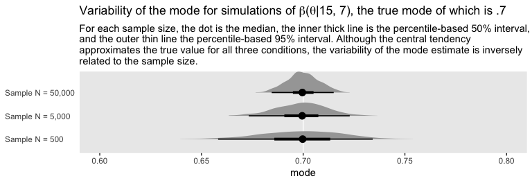

A simple case of the Metropolis algorithm
-----------------------------------------

It’s worth repeating Kruschke’s opening line to this section. “Our goal in Bayesian inference is to get an accurate representation of the posterior distribution” (p. 146).

### A politician stumbles upon the Metropolis algorithm.

If we denote *P*<sub>*p**r**o**p**o**s**e**d*</sub> as the population of the proposed island and *P*<sub>*c**u**r**r**e**n**t*</sub> as the population of the current island, then

$$P\_{move} = \\frac{P\_{proposed}}{P\_{current}}$$

### A random walk.

The code below will allow us to reproduce Kruschke's random walk. To give credit where it's due, this code is a mild amendment to McElreath's code from chapter 8 of his [*Statistical Rethinking* text](http://xcelab.net/rm/statistical-rethinking/).

``` r
set.seed(7.2)

num_days  <- 5e4
positions <- rep(0, num_days)
current   <- 4
for (i in 1:num_days) {
  # record current position
  positions[i] <- current
  # flip coin to generate proposal
  proposal <- current + sample(c(-1, 1), size = 1)
  # now make sure he loops around from 7 back to 1
  if (proposal < 1) proposal <- 7
  if (proposal > 7) proposal <- 1
  # move?
  prob_accept_the_proposal <- proposal/current
  current <- ifelse(runif(1) < prob_accept_the_proposal, proposal, current)
}
```

If you missed it, `positions` is the main product of our simulation. Here we'll put `positions` in a tibble and reproduce the top portion of Figure 7.2.

``` r
tibble(theta = positions) %>% 
  
  ggplot(aes(x = theta %>% as.factor())) +
  geom_bar() +
  xlab(expression(theta)) +
  theme(panel.grid = element_blank())
```

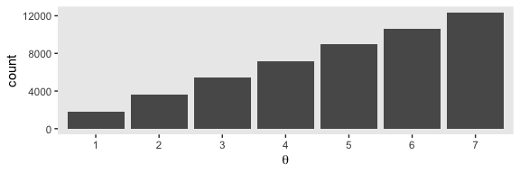

Here's the middle portion of Figure 7.2.

``` r
tibble(t     = 1:5e4,
       theta = positions) %>% 
  slice(1:500) %>% 
  
  ggplot(aes(x = theta, y = t)) +
  geom_path(size = 1/4, color = "grey50") +
  geom_point(size = 1/2, alpha = 1/2) +
  scale_y_log10("Time Step", breaks = c(1, 2, 5, 20, 100, 500)) +
  scale_x_continuous(expression(theta), breaks = 1:7) +
  theme(panel.grid = element_blank())
```


And now the bottom.

``` r
tibble(x = 1:7,
       y = 1:7) %>% 
  
  ggplot(aes(x = x, y = y)) +
  geom_col(width = .2) +
  scale_x_continuous(expression(theta), breaks = 1:7) +
  ylab(expression(paste("p(", theta, ")"))) +
  theme(panel.grid = element_blank())
```


### General properties of a random walk.

Unfortunately, the computations behind Figure 7.3 are beyond my math + programming capabilities. If you've got the code, [hit me up](https://github.com/ASKurz/Doing-Bayesian-Data-Analysis-in-brms-and-the-tidyverse/issues).

The Metropolis algorithm more generally
---------------------------------------

"The procedure described in the previous section was just a special case of a more general procedure known as the Metropolis algorithm, named after the first author of a famous article ([Metropolis, Rosenbluth, Rosenbluth, Teller, & Teller, 1953](https://bayes.wustl.edu/Manual/EquationOfState.pdf))" (p. 156).

Here's how to generate a proposed jump from a zero-mean normal distribuiton with a standard deviation of 0.2.

``` r
rnorm(1, mean = 0, sd = 0.2)
```

    ## [1] -0.1985524

To get a sense of what this looks like in the long run, we might plot.

``` r
mu    <- 0
sigma <- 0.2

# how many proposals would you like?
n  <- 500

set.seed(7)
tibble(proposed_jump = rnorm(n, mean = mu, sd = sigma)) %>% 
  
  ggplot(aes(x = proposed_jump, y = 0)) +
  geom_jitter(width = 0, height = .1, 
              size = 1/2, alpha = 1/2) +
  stat_function(fun = dnorm, args = list(mean = mu, sd = sigma),
                color = "grey50") +
  scale_x_continuous(breaks = seq(from = -0.6, to = 0.6, length.out = 7)) +
  scale_y_continuous(NULL, breaks = NULL) +
  labs(title = "Jump proposals",
       subtitle = "The gray line shows the data generating distribution.") +
  theme(panel.grid = element_blank())
```


Anyway,

> having generated a proposed new position, the algorithm then decides whether or not to accept the proposal. The decision rule is exactly what was already specified in Equation 7.1. In detail, this is accomplished by computing the ratio *p*<sub>move</sub> = *P*(*θ*<sub>proposed</sub>)/*P*(*θ*<sub>current</sub>). Then a random number from the uniform interval \[0, 1\] is generated; in R, this can be accomplished with the command `runif(1)`. If the random number is between 0 and pmove, then the move is accepted. (p. 157)

We'll see what that might look like in the next section. In the meantime, here's how to use `runif()`.

``` r
runif(1)
```

    ## [1] 0.8128982

Just for kicks, here's what that looks like in bulk.

``` r
# how many proposals would you like?
n  <- 500

set.seed(7)
tibble(draw = runif(n)) %>% 
  
  ggplot(aes(x = draw, y = 0)) +
  geom_jitter(width = 0, height = 1/4, 
              size = 1/2, alpha = 1/2) +
  stat_function(fun = dunif,
                color = "grey50") +
  scale_y_continuous(NULL, breaks = NULL, limits = c(-1/3, 5/3)) +
  labs(title = "Uniform draws",
       subtitle = "The gray line shows the data generating distribution.") +
  theme(panel.grid = element_blank())
```


No concentration towards the mean, this time.

### Metropolis algorithm applied to Bernoulli likelihood and beta prior.

You can find Kruschke's code in the `BernMetrop.R` file. I'm going to break it up a little.

``` r
# Specify the data, to be used in the likelihood function.
my_data <- c(rep(0, 6), rep(1, 14))

# Define the Bernoulli likelihood function, p(D|theta).
# The argument theta could be a vector, not just a scalar.
likelihood <- function(theta, data) {
  z <- sum(data)
  n <- length(data)
  p_data_given_theta <- theta^z * (1 - theta)^(n - z)
  # The theta values passed into this function are generated at random,
  # and therefore might be inadvertently greater than 1 or less than 0.
  # The likelihood for theta > 1 or for theta < 0 is zero:
  p_data_given_theta[theta > 1 | theta < 0] <- 0
  return(p_data_given_theta)
}

# Define the prior density function. 
prior_d <- function(theta) {
  p_theta <- dbeta(theta, 1, 1)
  # The theta values passed into this function are generated at random,
  # and therefore might be inadvertently greater than 1 or less than 0.
  # The prior for theta > 1 or for theta < 0 is zero:
  p_theta[theta > 1 | theta < 0] = 0
  return(p_theta)
}

# Define the relative probability of the target distribution, 
# as a function of vector theta. For our application, this
# target distribution is the unnormalized posterior distribution.
target_rel_prob <- function(theta, data) {
  target_rel_prob <- likelihood(theta, data) * prior_d(theta)
  return(target_rel_prob)
}

# Specify the length of the trajectory, i.e., the number of jumps to try:
traj_length <- 50000 # arbitrary large number

# Initialize the vector that will store the results:
trajectory <- rep(0, traj_length)

# Specify where to start the trajectory:
trajectory[1] <- 0.01 # arbitrary value

# Specify the burn-in period:
burn_in <- ceiling(0.0 * traj_length) # arbitrary number, less than traj_length

# Initialize accepted, rejected counters, just to monitor performance:
n_accepted <- 0
n_rejected <- 0
```

That first part follows what Kruschke put in his script. I'm going to bundel the next large potion in a fucntion, `my_metropolis()` which will make it easier to plug the code into the `purrr::map()` function.

``` r
my_metropolis <- function(proposal_sd){
  
  # Now generate the random walk. The 't' index is time or trial in the walk.
  # Specify seed to reproduce same random walk:
  set.seed(47405)
  
  
  ## I'm taking this section out and will replace it
  
  # # Specify standard deviation of proposal distribution:
  # proposal_sd <- c(0.02, 0.2, 2.0)[2]
  
  ## End of the section I took out
  
  
  for (t in 1:(traj_length - 1)) {
    current_position <- trajectory[t]
    # Use the proposal distribution to generate a proposed jump.
    proposed_jump <- rnorm(1, mean = 0, sd = proposal_sd)
    # Compute the probability of accepting the proposed jump.
    prob_accept <- min(1,
                       target_rel_prob(current_position + proposed_jump, my_data)
                       / target_rel_prob(current_position, my_data))
    # Generate a random uniform value from the interval [0, 1] to
    # decide whether or not to accept the proposed jump.
    if (runif(1) < prob_accept) {
      # accept the proposed jump
      trajectory[t + 1] <- current_position + proposed_jump
      # increment the accepted counter, just to monitor performance
      if (t > burn_in) {n_accepted <- n_accepted + 1}
    } else {
      # reject the proposed jump, stay at current position
      trajectory[t + 1] <- current_position
      # increment the rejected counter, just to monitor performance
      if (t > burn_in) {n_rejected <- n_rejected + 1}
    }
  }
  
  # Extract the post-burn_in portion of the trajectory.
  accepted_traj <- trajectory[(burn_in + 1) : length(trajectory)]
  
  tibble(accepted_traj = accepted_traj,
         n_accepted    = n_accepted, 
         n_rejected    = n_rejected)
  # End of Metropolis algorithm.
}
```

Now we have `my_metropolis()`, we can run the analysis based on the three `proposal_sd` values, nesting the results in a tibble.

``` r
d <-
  tibble(proposal_sd   = c(0.02, 0.2, 2.0)) %>% 
  mutate(accepted_traj = map(proposal_sd, my_metropolis)) %>% 
  unnest()

glimpse(d)
```

    ## Observations: 150,000
    ## Variables: 4
    ## $ proposal_sd   <dbl> 0.02, 0.02, 0.02, 0.02, 0.02, 0.02, 0.02, 0.02, 0.02, 0.02, 0.02, 0.02, 0...
    ## $ accepted_traj <dbl> 0.01000000, 0.01000000, 0.01000000, 0.01000000, 0.01149173, 0.02550380, 0...
    ## $ n_accepted    <dbl> 46801, 46801, 46801, 46801, 46801, 46801, 46801, 46801, 46801, 46801, 468...
    ## $ n_rejected    <dbl> 3198, 3198, 3198, 3198, 3198, 3198, 3198, 3198, 3198, 3198, 3198, 3198, 3...

With `d` in hand, here's the top portion of Figure 7.4.

``` r
d <-
  d %>% 
  mutate(proposal_sd = str_c("Proposal SD = ", proposal_sd),
         iter        = rep(1:50000, times = 3))
  
d %>% 
  ggplot(aes(x = accepted_traj)) +
  geom_histogram(boundary = 0, binwidth = .02, size = .2,
                 color = "grey92", fill = "grey67") +
  geom_halfeyeh(aes(y = 0), 
                point.interval = mode_hdi, .width = .95) +
  scale_x_continuous(breaks = seq(from = 0, to = 1, length.out = 6)) +
  scale_y_continuous(NULL, breaks = NULL) +
  labs(x = expression(theta)) +
  theme(panel.grid = element_blank()) +
  facet_wrap(~ proposal_sd, ncol = 3)
```


The modes are the points and the lines depict the 95% HDIs.

Here's the middle of Figure 7.4.

``` r
d %>% 
  ggplot(aes(x = accepted_traj, y = iter)) +
  geom_path(size = 1/4, color = "grey50") +
  geom_point(size = 1/2, alpha = 1/2) +
  coord_cartesian(xlim = 0:1,
                  ylim = 49900:50000) +
  scale_x_continuous(breaks = seq(from = 0, to = 1, length.out = 6)) +
  labs(title = "End of Chain",
       x = expression(theta),
       y = "Step in Chain") +
  theme(panel.grid = element_blank()) +
  facet_wrap(~ proposal_sd, ncol = 3)
```


The bottom:

``` r
d %>% 
  ggplot(aes(x = accepted_traj, y = iter)) +
  geom_path(size = 1/4, color = "grey50") +
  geom_point(size = 1/2, alpha = 1/2) +
  coord_cartesian(xlim = 0:1,
                 ylim = 1:100) +
  scale_x_continuous(breaks = seq(from = 0, to = 1, length.out = 6)) +
  labs(title = "End of Chain",
       x = expression(theta),
       y = "Step in Chain") +
  theme(panel.grid = element_blank()) +
  facet_wrap(~ proposal_sd, ncol = 3)
```


### Summary of Metropolis algorithm.

> The motivation for methods like the Metropolis algorithm is that they provide a high-resolution picture of the posterior distribution, even though in complex models we cannot explicitly solve the mathematical integral in Bayes’ rule. The idea is that we get a handle on the posterior distribution by generating a large sample of representative values. The larger the sample, the more accurate is our approximation. As emphasized previously, this is a sample of representative credible parameter values from the posterior distribution; it is not a resampling of data (there is a fixed data set).
>
> The cleverness of the method is that representative parameter values can be randomly sampled from complicated posterior distributions without solving the integral in Bayes’ rule, and by using only simple proposal distributions for which efficient random number generators already exist. (p. 161)

Toward Gibbs sampling: Estimating two coin biases
-------------------------------------------------

"The Metropolis method is very useful, but it can be inefficient. Other methods can be more efficient in some situations" (p. 162).

### Prior, likelihood and posterior for two biases.

### The posterior via exact formal analysis.

The plots in the left column of Figure 7.5 are outside of my skill set. I believe they are referred to as wireframe plots and it's my understanding that ggplot2 does not support wireframe plots at this time. However, I can reproduce versions of the right hand column. For our initial attempt for the upper right corner, we'll simulate.

``` r
set.seed(7)
betas <-
  tibble(theta_1 = rbeta(1e5, shape1 = 2, shape2 = 2),
         theta_2 = rbeta(1e5, shape1 = 2, shape2 = 2))

betas %>% 
  ggplot(aes(x = theta_1, y = theta_2)) +
  stat_density_2d() +
  coord_equal() +
  labs(x = expression(theta[1]),
       y = expression(theta[2])) +
  theme(panel.grid = element_blank())
```

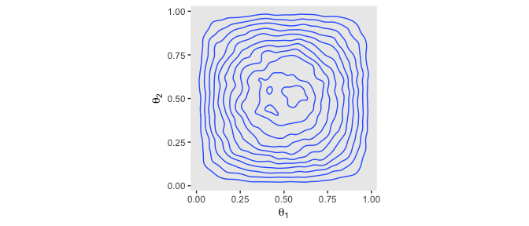

Instead of the contour lines, one might use color to depict the density variable, instead.

``` r
betas %>% 
  ggplot(aes(x = theta_1, y = theta_2)) +
  stat_density_2d(aes(fill = stat(density)), 
                  geom = "raster", contour = F) +
  scale_fill_viridis_c(option = "A") +
  coord_equal() +
  labs(x = expression(theta[1]),
       y = expression(theta[2])) +
  theme(panel.grid = element_blank())
```


But with careful use of `dbeta()`, we can be more precise.

``` r
theta_sequence <- seq(from = 0, to = 1, by = .01)

tibble(theta_1 = theta_sequence,
       theta_2 = theta_sequence) %>%
  
  mutate(prior_1 = dbeta(x = theta_1, shape1 = 2, shape2 = 2),
         prior_2 = dbeta(x = theta_2, shape1 = 2, shape2 = 2)) %>% 
    
  expand(nesting(theta_1, prior_1), nesting(theta_2, prior_2)) %>%
  
  ggplot(aes(x = theta_1, y = theta_2, fill = prior_1 * prior_2)) +
  geom_tile() +
  scale_fill_viridis_c(option = "A") +
  coord_equal() +
  labs(x = expression(theta[1]),
       y = expression(theta[2])) +
  theme(panel.grid = element_blank())
```


We'll need the `bernoulli_likelihood` function from back in chapter 6 for the middle right of Figure 7.5.

``` r
bernoulli_likelihood <- function(theta, data) {
  # theta = success probability parameter ranging from 0 to 1
  # data = the vector of data (i.e., a series of 0s and 1s)
  n <- length(data)
  z <- sum(data)
  return(theta^z * (1 - theta)^(n - sum(data)))
  }
```

With the `bernoulli_likelihood()` function in hand, here's our version of the middle right panel of Figure 7.5.

``` r
theta_sequence <- seq(from = 0, to = 1, by = .01)

theta_1_data <- rep(0:1, times = c(8 - 6, 6))
theta_2_data <- rep(0:1, times = c(7 - 2, 2))

tibble(theta_1 = theta_sequence,
       theta_2 = theta_sequence) %>%
  mutate(likelihood_1 = bernoulli_likelihood(theta = theta_sequence,
                                             data  = theta_1_data),
         likelihood_2 = bernoulli_likelihood(theta = theta_sequence,
                                             data  = theta_2_data)) %>% 
  expand(nesting(theta_1, likelihood_1), nesting(theta_2, likelihood_2)) %>%
  
  ggplot(aes(x = theta_1, y = theta_2, fill = likelihood_1 * likelihood_2)) +
  geom_tile() +
  scale_fill_viridis_c(option = "A") +
  coord_equal() +
  labs(x = expression(theta[1]),
       y = expression(theta[2])) +
  theme(panel.grid = element_blank())
```

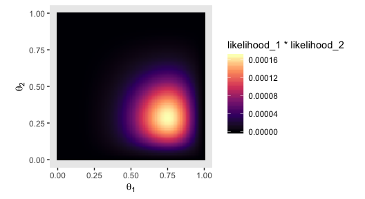

Here's the two-dimensional posterior, the lower right panel of Figure 7.5.

``` r
# we've already defined these, but here they are again
theta_sequence <- seq(from = 0, to = 1, by = .01)
theta_1_data   <- rep(0:1, times = c(8 - 6, 6))
theta_2_data   <- rep(0:1, times = c(7 - 2, 2))

# this is a redo from two plots up, but saves as `prior_tibble`
prior_tibble <-
  tibble(theta_1 = theta_sequence,
         theta_2 = theta_sequence) %>%
  mutate(prior_1 = dbeta(x = theta_1, shape1 = 2, shape2 = 2),
         prior_2 = dbeta(x = theta_2, shape1 = 2, shape2 = 2)) %>% 
  expand(nesting(theta_1, prior_1), nesting(theta_2, prior_2))

# this is a redo from one plot up, but saves as `likelihood_tibble`
likelihood_tibble <-
  tibble(theta_1 = theta_sequence,
         theta_2 = theta_sequence) %>%
  mutate(likelihood_1 = bernoulli_likelihood(theta = theta_sequence,
                                             data  = theta_1_data),
         likelihood_2 = bernoulli_likelihood(theta = theta_sequence,
                                             data  = theta_2_data)) %>% 
  expand(nesting(theta_1, likelihood_1), nesting(theta_2, likelihood_2))

# Here we cobine `prior_tibble` and `likelihood_tibble`
prior_tibble %>% 
  left_join(likelihood_tibble, by = c("theta_1", "theta_2")) %>% 
  # we need the marginal likelihood, the denominator in Bayes' rule
  mutate(marginal_likelihood = sum(prior_1 * prior_2 * likelihood_1 * likelihood_2)) %>% 
  # finally, the two-dimensional posterior
  mutate(posterior = (prior_1 * prior_2 * likelihood_1 * likelihood_2) / marginal_likelihood) %>% 
  
  # the plot
  ggplot(aes(x = theta_1, y = theta_2, fill = posterior)) +
  geom_tile() +
  scale_fill_viridis_c(option = "A") +
  coord_equal() +
  labs(x = expression(theta[1]),
       y = expression(theta[2])) +
  theme(panel.grid = element_blank())
```

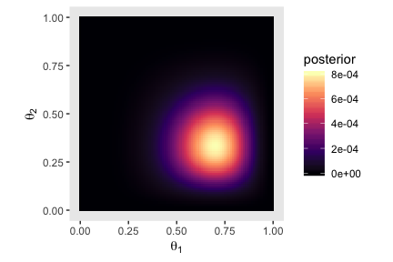

### The posterior via the Metropolis algorithm.

I've got nothing on this. But we're here to learn HMC anyways. Read on.

### ~~Gibbs~~ Hamiltonian Monte Carlo sampling.

Figure 7.7 is still out of my skill set.

But let's fit the model with our primary package, brms. First we need to laod brms.

``` r
library(brms)
```

These, recall, are the data.

``` r
d <-
  tibble(z1 = 6, 
         z2 = 2,
         n1 = 8,
         n2 = 7)
```

Kruschke said he was starting us out simply. But within the brms context, this is an intercepts-only multivariate model, which isn't the simplest of things to code into brms. There are a couple ways to code a [multivariate model in brms](https://cran.r-project.org/web/packages/brms/vignettes/brms_multivariate.html). With this one, it makes sense to specify the model for each sequence of flips separately. This results in two models, which we'll call `model_1` and `model_2`.

``` r
model_1 <- bf(z1 | trials(n1) ~ 1)
model_2 <- bf(z2 | trials(n2) ~ 1)
```

Before we fit, we’ll have to address a technicality. The brms package does allow for multivariate Bernoulli models. However, it does not support such models with different numbers of trials across the variables. Since our first variable is of 8 trials and the second is of 7, brms will not support this model using the Bernoulli likelihood. However, we can fit the model in brms as an aggregated binomial model. The main difficulty is that the regularizing `beta(2, 2)` prior won’t make sense, here. So we’ll opt for the regularizing `normal(0, 1)`, instead.

``` r
fit1 <-
  brm(data = d, family = binomial(),
      model_1 + model_2,
      prior(normal(0, 1), class = Intercept),
      iter = 25500, warmup = 500, cores = 1, chains = 1,
      seed = 7)
```

Here are the results.

``` r
print(fit1)
```

    ##  Family: MV(binomial, binomial) 
    ##   Links: mu = logit
    ##          mu = logit 
    ## Formula: z1 | trials(n1) ~ 1 
    ##          z2 | trials(n2) ~ 1 
    ##    Data: d (Number of observations: 1) 
    ## Samples: 1 chains, each with iter = 25500; warmup = 500; thin = 1;
    ##          total post-warmup samples = 25000
    ## 
    ## Population-Level Effects: 
    ##              Estimate Est.Error l-95% CI u-95% CI Eff.Sample Rhat
    ## z1_Intercept     0.72      0.61    -0.46     1.95      25139 1.00
    ## z2_Intercept    -0.59      0.64    -1.88     0.64      13812 1.00
    ## 
    ## Samples were drawn using sampling(NUTS). For each parameter, Eff.Sample 
    ## is a crude measure of effective sample size, and Rhat is the potential 
    ## scale reduction factor on split chains (at convergence, Rhat = 1).

As we'll learn in later chapters, the parameters of a typical aggregated binomial model are in the log-odds scale. Over time, you will learn how to interpret them. But for now, just be happy that brms offers the `inv_logit_scaled()` function, which can convert our results back to the probability scale.

``` r
fixef(fit1)[, 1] %>% inv_logit_scaled()
```

    ## z1_Intercept z2_Intercept 
    ##     0.673519     0.357693

Here we'll use `posterior_samples()` to collect out posterior draws and save them as a data frame, which we'll name `post`.

``` r
post <- posterior_samples(fit1, add_chain = T)
```

With `post` in hand, we're ready to make our version of Figure 7.8. To reduce the overplotting, we're only looking at the first 500 post-warmup iterations.

``` r
post %>% 
  mutate(theta_1 = b_z1_Intercept %>% inv_logit_scaled(), 
         theta_2 = b_z2_Intercept %>% inv_logit_scaled()) %>% 
  filter(iter < 1001) %>% 
  
  ggplot(aes(x = theta_1, y = theta_2)) +
  geom_point(alpha = 1/4) +
  geom_path(size = 1/10, alpha = 1/2) +
  coord_equal(xlim = 0:1,
              ylim = 0:1) +
  labs(x = expression(theta[1]),
       y = expression(theta[2])) +
  theme(panel.grid = element_blank())
```

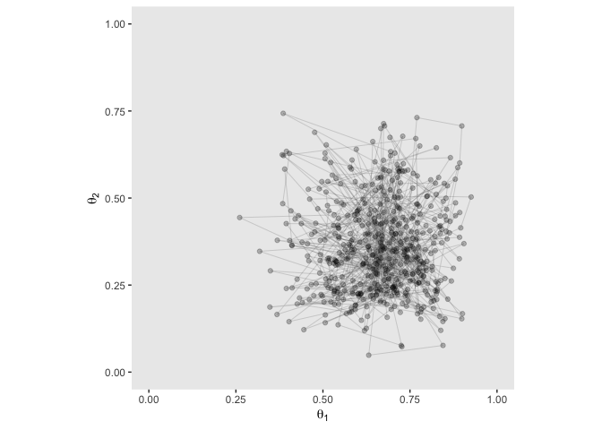

### Is there a difference between biases?

Our difference distribution, *θ*<sub>1</sub> − *θ*<sub>2</sub>, is pretty similar to the ones in Figure 7.9.

``` r
post %>%   
  mutate(theta_1 = b_z1_Intercept %>% inv_logit_scaled(), 
         theta_2 = b_z2_Intercept %>% inv_logit_scaled()) %>% 
  transmute(`theta_1 - theta_2` = theta_1 - theta_2) %>% 
  
  ggplot(aes(x = `theta_1 - theta_2`)) +
  geom_histogram(color = "grey92", fill = "grey67",
                 size = .2, bins = 40) +
  stat_pointintervalh(aes(y = 0),
                      point_interval = mode_hdi, .width = .95) +
  scale_y_continuous(NULL, breaks = NULL) +
  coord_cartesian(xlim = c(-.5, .8)) +
  xlab(expression(paste(theta[1], " - ", theta[2]))) +
  theme(panel.grid = element_blank())
```

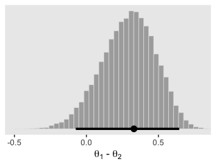

Here are the exact estimates of the mode and 95% HDIs for our difference distribution, *θ*<sub>1</sub> − *θ*<sub>2</sub>.

``` r
post %>%   
  mutate(theta_1 = b_z1_Intercept %>% inv_logit_scaled(), 
         theta_2 = b_z2_Intercept %>% inv_logit_scaled()) %>% 
  transmute(`theta_1 - theta_2` = theta_1 - theta_2) %>% 
  tidybayes::mode_hdi()
```

    ##   theta_1 - theta_2      .lower    .upper .width .point .interval
    ## 1         0.3302879 -0.07386972 0.6448067   0.95   mode       hdi

Given that we used both a different likelihood function, which necessitated a different prior, I think we did pretty good complimenting the results in the text.

### Terminology: MCMC.

HMC is also a Markov chain Monte Carlo process. With help from brms, we access it via [Stan](http://mc-stan.org).

MCMC representativeness, accuracy, and efficiency
-------------------------------------------------

### MCMC representativeness.

Here are our data.

``` r
z <- 35
n <- 50

d <- tibble(y = rep(0:1, times = c(n - z, z)))
```

Here we fit the model. Note how since we're just univariate, it's easy to switch back to directly modeling with the Bernoulli likelihood.

``` r
fit2 <-
  brm(data = d, 
      family = bernoulli(link = identity),
      y ~ 1,
      prior(beta(2, 2), class = Intercept),
      iter = 10000, warmup = 500, cores = 3, chains = 3,
      seed = 7)
```

On page 179, Kruschke discussed *burn-in* steps within the Gibbs framework:

> The preliminary steps, during which the chain moves from its unrepresentative initial value to the modal region of the posterior, is called the *burn-in* period. For realistic applications, it is routine to apply a burn-in period of several hundred to several thousand steps.

For each HMC chain, the first *n* iterations are warmups. In this example, *n* = 500 (i.e., `warmup = 500`). Within the Stan-HMC paradigm, [warmups are somewhat analogous to but not synonymous with burn-in iterations](http://andrewgelman.com/2017/12/15/burn-vs-warm-iterative-simulation-algorithms/) as done by the Gibbs sampling in JAGS. But HMC warmups are like Gibbs burn-ins in that both are discarded and not used to describe the posterior. For more on warmup, check out McElreath’s lecture, [starting here](https://www.youtube.com/watch?v=13mEekRdOcQ&t=75s&frags=pl%2Cwn) or, for more detail, the [*HMC Algorithm Parameters* section of the Stan user’s guide, version 2.17.0](http://mc-stan.org/users/documentation/index.html).

It appears that the upshot of all this is that many of the packages in the Stan ecosystem don’t make it easy to extract the warmup values. For example, the `brms::plot()` function excludes them from the trace plot without the option to include them.

``` r
plot(fit2)
```

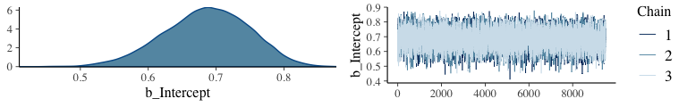

Notice how the x-axis on the trace plot ranges from 0 to 9,500. Now recall that our model code included `iter = 10000, warmup = 500`. Those 9,500 iterations in the trace plot are excluding the first 500 warmup iterations. This code is a little janky, but if you really want those warmup iterations, you can extract them from the `fit2` object like this:

``` r
warmups <-
  c(fit2$fit@sim$samples[[1]]$b_Intercept[1:500], 
    fit2$fit@sim$samples[[2]]$b_Intercept[1:500], 
    fit2$fit@sim$samples[[3]]$b_Intercept[1:500]) %>% 
  # since these come from lists, here we'll convert them to a data frame
  as.data.frame() %>% 
  rename(b_Intercept = ".") %>% 
  # we'll need to recapture the iteration and chain information
  mutate(iter  = rep(1:500, times = 3),
         chain = rep(1:3, each = 500)) %>% 
  mutate(chain = factor(chain, levels = c("1", "2", "3")))

warmups %>% 
  head()
```

    ##   b_Intercept iter chain
    ## 1   0.2981264    1     1
    ## 2   0.2981264    2     1
    ## 3   0.2981264    3     1
    ## 4   0.2981264    4     1
    ## 5   0.3129055    5     1
    ## 6   0.3119297    6     1

The [bayesplot package](https://github.com/stan-dev/bayesplot) makes it easier to reproduce some of the plots in Figure 7.10.

``` r
library(bayesplot)
```

We'll reproduce the upper left panel with `mcmc_trace()`.

``` r
mcmc_trace(warmups, pars = "b_Intercept") +
  theme(panel.grid = element_blank())
```


It appears our HMC warmup iterations found the posterior quite quickly.

Here's the autocorrelation plot.

``` r
mcmc_acf(warmups, pars = "b_Intercept", lags = 25) +
  theme(panel.grid = element_blank())
```

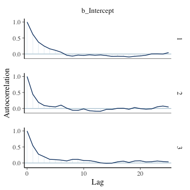

Our autocorrelation plots indicate substantially lower autocorrelations yielded by HMC as implemented by Stan than what Kruschke generated with the MH algorithm. This is one of the reasons folks using HMC tend to use fewer iterations than those using MH or Gibbs.

If you were unhappy with the way `mcmc_acf()` defaults to faceting the plot by chain, you could always extract the data from the function and use them to make the plot the way you prefer. E.g.,

``` r
mcmc_acf(warmups)$data %>% 
  as_tibble() %>% 
  filter(Parameter == "b_Intercept") %>% 
  
  ggplot(aes(x = Lag, y = AC,
             color = Chain %>% as.factor())) +
  geom_hline(yintercept = 0, color = "white") +
  geom_point(size = 2/3) +
  geom_line() +
  scale_color_viridis_d(end = .8) +
  ylab("Autocorrelation") +
  theme(legend.position = "none",
        panel.grid = element_blank())
```


Here are the overlaid densities.

``` r
mcmc_dens_overlay(warmups, pars = c("b_Intercept")) +
  theme(panel.grid = element_blank())
```


The densities aren't great, but they still appear nicer than those in for the burn-in iterations in the text. With our warmups in their current state, I'm not aware how we might conveniently make a shrink factor plot, as seen in the lower left of Figure 7.10. So it goes...

Figure 7.11 examined the post-burn-in iterations. We'll follow suit with our post-warmup iterations.

``` r
post <- posterior_samples(fit2, add_chain = T)

mcmc_trace(post, pars = "b_Intercept") +
  theme(panel.grid = element_blank())
```


The autocorrelation plots:

``` r
mcmc_acf(post, pars = "b_Intercept", lags = 40) +
  theme(panel.grid = element_blank())
```


As with the warmups, above, the post-warmup autocorrelation plots indicate substantially lower autocorrelations yielded by HMC as implemented by Stan than what Kruschke generated with the MH algorithm. This is one of the reasons folks using HMC tend to use fewer iterations than those using MH or Gibbs.

Here are the overlaid densities.

``` r
mcmc_dens_overlay(post, pars = c("b_Intercept")) +
  theme(panel.grid = element_blank())
```

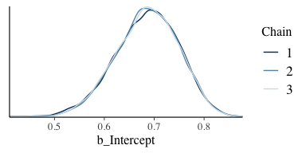

And now that we're focusing on the post-warmup iterations, we can make a shrink factor plot. We'll do so with the `coda::gelman.plot()` function. But you can’t just dump your `brm()` fit object into `coda::gelman.plot()`. It’s the wrong object type. However, brms offers the `as.mcmc()` function which will convert `brm()` objects for use in coda package functions.

``` r
fit2_c <- as.mcmc(fit2)

fit2_c %>% glimpse()
```

    ## List of 3
    ##  $ : 'mcmc' num [1:9500, 1:2] 0.695 0.685 0.717 0.728 0.755 ...
    ##   ..- attr(*, "dimnames")=List of 2
    ##   .. ..$ iterations: NULL
    ##   .. ..$ parameters: chr [1:2] "b_Intercept" "lp__"
    ##   ..- attr(*, "mcpar")= num [1:3] 501 10000 1
    ##  $ : 'mcmc' num [1:9500, 1:2] 0.65 0.643 0.719 0.638 0.647 ...
    ##   ..- attr(*, "dimnames")=List of 2
    ##   .. ..$ iterations: NULL
    ##   .. ..$ parameters: chr [1:2] "b_Intercept" "lp__"
    ##   ..- attr(*, "mcpar")= num [1:3] 501 10000 1
    ##  $ : 'mcmc' num [1:9500, 1:2] 0.661 0.702 0.651 0.533 0.749 ...
    ##   ..- attr(*, "dimnames")=List of 2
    ##   .. ..$ iterations: NULL
    ##   .. ..$ parameters: chr [1:2] "b_Intercept" "lp__"
    ##   ..- attr(*, "mcpar")= num [1:3] 501 10000 1
    ##  - attr(*, "class")= chr "mcmc.list"

With our freshly-converted `fit2_c` object in hand, we’re ready to plot.

``` r
coda::gelman.plot(fit2_c[, "b_Intercept", ])
```

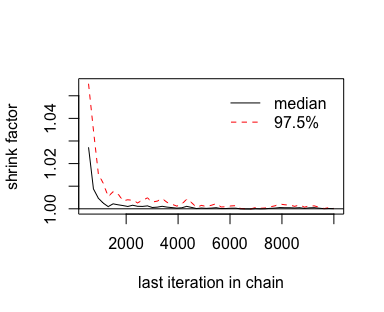

Looks great. As Kruschke explained on page 181, that plot is based on the potential scale reduction factor, or $\\hat{R}$ as it’s typically referred to in the Stan ecosystem. Happily, brms reports the $\\hat{R}$ values for the major model parameters using `print()` or `summary()`.

``` r
print(fit2)
```

    ##  Family: bernoulli 
    ##   Links: mu = identity 
    ## Formula: y ~ 1 
    ##    Data: d (Number of observations: 50) 
    ## Samples: 3 chains, each with iter = 10000; warmup = 500; thin = 1;
    ##          total post-warmup samples = 28500
    ## 
    ## Population-Level Effects: 
    ##           Estimate Est.Error l-95% CI u-95% CI Eff.Sample Rhat
    ## Intercept     0.69      0.06     0.56     0.80       8930 1.00
    ## 
    ## Samples were drawn using sampling(NUTS). For each parameter, Eff.Sample 
    ## is a crude measure of effective sample size, and Rhat is the potential 
    ## scale reduction factor on split chains (at convergence, Rhat = 1).

Instead of a running value, you get a single statistic.

On page 181, Kruschke discussed how his overlaid density plots include the HDIs, by chain. The convenience functions from brms and bayesplot don't easily get us there. But we can get those easy enough with a little help `tidybayes::geom_halfeyeh()`.

``` r
post %>% 

  ggplot(aes(x = b_Intercept, y = chain, fill = chain)) +
  geom_halfeyeh(point.interval = mode_hdi,
                .width = .95) +
  scale_fill_viridis_d(begin = .35, end = .95) +
  theme(panel.grid      = element_blank(),
        legend.position = "none")
```

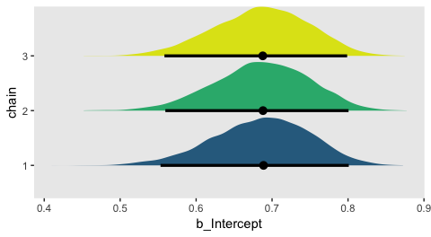

### MCMC accuracy.

We'll wrangle our `post` object a bit to make it easier to reproduce Figure 7.12.

``` r
lagged_post <-
  post %>% 
  filter(chain == 1) %>% 
  select(b_Intercept, iter) %>% 
  rename(lag_0  = b_Intercept) %>% 
  mutate(lag_1  = lag(lag_0, 1),
         lag_5  = lag(lag_0, 5),
         lag_10 = lag(lag_0, 10)) %>% 
  gather(key, value, -iter) 

head(lagged_post)
```

    ##   iter   key     value
    ## 1  501 lag_0 0.6945375
    ## 2  502 lag_0 0.6850354
    ## 3  503 lag_0 0.7166854
    ## 4  504 lag_0 0.7276338
    ## 5  505 lag_0 0.7546228
    ## 6  506 lag_0 0.6638754

Here's our version of the top row.

``` r
p1 <-
  lagged_post %>% 
  filter(key %in% c("lag_0", "lag_1"),
         iter > 1000 & iter < 1071) %>% 
  
  ggplot(aes(x = iter, y = value, color = key)) +
  geom_point() +
  geom_line() +
  scale_color_manual(values = c("black", "grey67")) +
  labs(x = "Index 1001:1071",
       title = "Lag 1") +
  theme(legend.position = "none",
        panel.grid      = element_blank())

p2 <-
  lagged_post %>% 
  filter(key %in% c("lag_0", "lag_5"),
         iter > 1000 & iter < 1071) %>% 
  
  ggplot(aes(x = iter, y = value, color = key)) +
  geom_point() +
  geom_line() +
  scale_color_manual(values = c("black", "grey67")) +
  labs(x = "Index 1001:1071",
       title = "Lag 5") +
  theme(legend.position = "none",
        panel.grid      = element_blank())

p3 <-
  lagged_post %>% 
  filter(key %in% c("lag_0", "lag_10"),
         iter > 1000 & iter < 1071) %>% 
  
  ggplot(aes(x = iter, y = value, color = key)) +
  geom_point() +
  geom_line() +
  scale_color_manual(values = c("black", "grey67")) +
  labs(x = "Index 1001:1071",
       title = "Lag 10") +
  theme(legend.position = "none",
        panel.grid      = element_blank())

library(gridExtra)

grid.arrange(p1, p2, p3, ncol = 3)
```

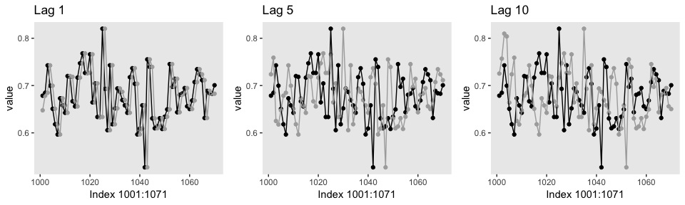

Here's the middle row for Figure 7.12.

``` r
lagged_post_wide <-
  lagged_post %>% 
  spread(key = key, value = value)

p1 <-
  lagged_post_wide %>% 
  filter(iter > 1000 & iter < 1071) %>% 
  
  ggplot(aes(x = lag_1, y = lag_0)) +
  stat_smooth(method = "lm") +
  geom_point() +
  theme(panel.grid = element_blank())

p2 <-
  lagged_post_wide %>% 
  filter(iter > 1000 & iter < 1071) %>% 
  
  ggplot(aes(x = lag_5, y = lag_0)) +
  stat_smooth(method = "lm") +
  geom_point() +
  theme(panel.grid = element_blank())

p3 <-
  lagged_post_wide %>% 
  filter(iter > 1000 & iter < 1071) %>% 
  
  ggplot(aes(x = lag_10, y = lag_0)) +
  stat_smooth(method = "lm") +
  geom_point() +
  theme(panel.grid = element_blank())

grid.arrange(p1, p2, p3, ncol = 3)
```

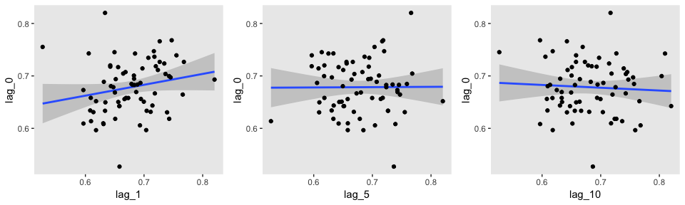

For kicks and giggles, we used `stat_smooth()` to add an OLS regression line with its 95% confidence intervals to each plot.

If you want the Pearson's correlations among the lags, the `lowerCor()` function from the [psych package](https://cran.r-project.org/web/packages/psych/index.html) can be handy.

``` r
library(psych)

lagged_post_wide %>% 
  select(-iter) %>% 
  filter(!is.na(lag_10)) %>% 
  
  lowerCor(digits = 3)
```

    ##        lag_0  lag_1  lag_10 lag_5 
    ## lag_0   1.000                     
    ## lag_1   0.510  1.000              
    ## lag_10 -0.017 -0.008  1.000       
    ## lag_5   0.033  0.081  0.033  1.000

For our version of the bottom of Figure 7.12, we'll use the `bayesplot::mcmc_acf_bar()` function to get the autocorrelation bar plot, by chain.

``` r
mcmc_acf_bar(post,
             pars = "b_Intercept",
             lags = 20) +
  theme(panel.grid = element_blank())
```

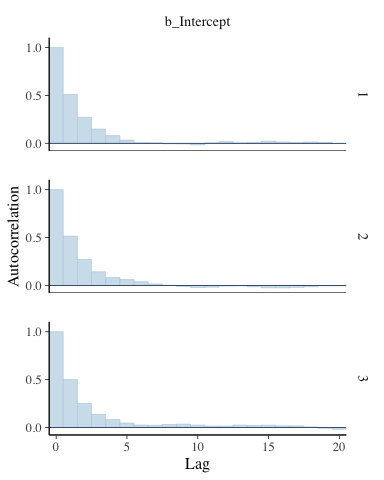

All three rows of our versions for Figure 7.12 indicate in their own way how much lower our autocorrelations were than the ones in the text.

If you're curious of the effective sample sizes for the parameters in your brms models, just look at the model summary using either `summary()` or `print()`.

``` r
print(fit2)
```

    ##  Family: bernoulli 
    ##   Links: mu = identity 
    ## Formula: y ~ 1 
    ##    Data: d (Number of observations: 50) 
    ## Samples: 3 chains, each with iter = 10000; warmup = 500; thin = 1;
    ##          total post-warmup samples = 28500
    ## 
    ## Population-Level Effects: 
    ##           Estimate Est.Error l-95% CI u-95% CI Eff.Sample Rhat
    ## Intercept     0.69      0.06     0.56     0.80       8930 1.00
    ## 
    ## Samples were drawn using sampling(NUTS). For each parameter, Eff.Sample 
    ## is a crude measure of effective sample size, and Rhat is the potential 
    ## scale reduction factor on split chains (at convergence, Rhat = 1).

The 'Eff.Sample' column gives the effective sample size.

I'm not quite sure how to reproduce Kruschke's MCMC ESS simulation studies. If you've got it figured out, [please share your code](https://github.com/ASKurz/Doing-Bayesian-Data-Analysis-in-brms-and-the-tidyverse/issues).

If you're interested in the Monte Carlo standard error (MCSE) for your brms parameters, the easiest way is to tack `$fit` onto your fit object.

``` r
fit2$fit
```

    ## Inference for Stan model: 58f2d3c2c42cbce1245ad1cc95217ec7.
    ## 3 chains, each with iter=10000; warmup=500; thin=1; 
    ## post-warmup draws per chain=9500, total post-warmup draws=28500.
    ## 
    ##               mean se_mean   sd   2.5%    25%    50%    75%  97.5% n_eff Rhat
    ## b_Intercept   0.69    0.00 0.06   0.56   0.64   0.69   0.73   0.80  8930    1
    ## lp__        -30.79    0.01 0.67 -32.74 -30.96 -30.53 -30.36 -30.31 11892    1
    ## 
    ## Samples were drawn using NUTS(diag_e) at Sat Mar  2 18:18:29 2019.
    ## For each parameter, n_eff is a crude measure of effective sample size,
    ## and Rhat is the potential scale reduction factor on split chains (at 
    ## convergence, Rhat=1).

This returns an [rstan-like summary](https://cran.r-project.org/web/packages/rstan/vignettes/stanfit-objects.html). The 'se\_mean' column is the MCSE.

### MCMC efficiency.

Kruschke wrote: "It is often the case in realistic applications that there is strong autocorrelation for some parameters, and therefore, an extremely long chain is required to achieve an adequate ESS or MCSE" (p. 187). As we'll see, this is generally less of a problem for HMC than for MH or Gibbs. But it does still crop up, particularly in complicated models. As he wrote on the following page, "one sampling method that can be relatively efficient is Hamiltonian Monte Carlo." Indeed.

References
----------

Kruschke, J. K. (2015). *Doing Bayesian data analysis, Second Edition: A tutorial with R, JAGS, and Stan.* Burlington, MA: Academic Press/Elsevier.

Session info
------------

``` r
sessionInfo()
```

    ## R version 3.5.1 (2018-07-02)
    ## Platform: x86_64-apple-darwin15.6.0 (64-bit)
    ## Running under: macOS High Sierra 10.13.6
    ## 
    ## Matrix products: default
    ## BLAS: /Library/Frameworks/R.framework/Versions/3.5/Resources/lib/libRblas.0.dylib
    ## LAPACK: /Library/Frameworks/R.framework/Versions/3.5/Resources/lib/libRlapack.dylib
    ## 
    ## locale:
    ## [1] en_US.UTF-8/en_US.UTF-8/en_US.UTF-8/C/en_US.UTF-8/en_US.UTF-8
    ## 
    ## attached base packages:
    ## [1] stats     graphics  grDevices utils     datasets  methods   base     
    ## 
    ## other attached packages:
    ##  [1] psych_1.8.4     gridExtra_2.3   bayesplot_1.6.0 brms_2.7.0      Rcpp_1.0.0      tidybayes_1.0.3
    ##  [7] bindrcpp_0.2.2  forcats_0.3.0   stringr_1.3.1   dplyr_0.7.6     purrr_0.2.5     readr_1.1.1    
    ## [13] tidyr_0.8.1     tibble_2.0.1    ggplot2_3.1.0   tidyverse_1.2.1
    ## 
    ## loaded via a namespace (and not attached):
    ##   [1] colorspace_1.3-2          ggridges_0.5.0            rsconnect_0.8.8          
    ##   [4] rprojroot_1.3-2           ggstance_0.3              markdown_0.8             
    ##   [7] base64enc_0.1-3           rstudioapi_0.7            rstan_2.18.2             
    ##  [10] svUnit_0.7-12             DT_0.4                    fansi_0.4.0              
    ##  [13] mvtnorm_1.0-8             lubridate_1.7.4           xml2_1.2.0               
    ##  [16] bridgesampling_0.4-0      mnormt_1.5-5              knitr_1.20               
    ##  [19] shinythemes_1.1.1         jsonlite_1.5              LaplacesDemon_16.1.1     
    ##  [22] broom_0.5.1               shiny_1.1.0               compiler_3.5.1           
    ##  [25] httr_1.3.1                backports_1.1.2           assertthat_0.2.0         
    ##  [28] Matrix_1.2-14             lazyeval_0.2.1            cli_1.0.1                
    ##  [31] later_0.7.3               prettyunits_1.0.2         htmltools_0.3.6          
    ##  [34] tools_3.5.1               igraph_1.2.1              coda_0.19-2              
    ##  [37] gtable_0.2.0              glue_1.3.0                reshape2_1.4.3           
    ##  [40] cellranger_1.1.0          nlme_3.1-137              crosstalk_1.0.0          
    ##  [43] ps_1.2.1                  rvest_0.3.2               mime_0.5                 
    ##  [46] miniUI_0.1.1.1            gtools_3.8.1              MASS_7.3-50              
    ##  [49] zoo_1.8-2                 scales_1.0.0              colourpicker_1.0         
    ##  [52] hms_0.4.2                 promises_1.0.1            Brobdingnag_1.2-5        
    ##  [55] parallel_3.5.1            inline_0.3.15             shinystan_2.5.0          
    ##  [58] yaml_2.1.19               StanHeaders_2.18.0-1      loo_2.0.0                
    ##  [61] stringi_1.2.3             dygraphs_1.1.1.5          pkgbuild_1.0.2           
    ##  [64] rlang_0.3.1               pkgconfig_2.0.2           matrixStats_0.54.0       
    ##  [67] HDInterval_0.2.0          evaluate_0.10.1           lattice_0.20-35          
    ##  [70] bindr_0.1.1               rstantools_1.5.0          htmlwidgets_1.2          
    ##  [73] labeling_0.3              tidyselect_0.2.4          processx_3.2.1           
    ##  [76] plyr_1.8.4                magrittr_1.5              R6_2.3.0                 
    ##  [79] generics_0.0.2            foreign_0.8-70            pillar_1.3.1             
    ##  [82] haven_1.1.2               withr_2.1.2               xts_0.10-2               
    ##  [85] abind_1.4-5               modelr_0.1.2              crayon_1.3.4             
    ##  [88] arrayhelpers_1.0-20160527 utf8_1.1.4                rmarkdown_1.10           
    ##  [91] grid_3.5.1                readxl_1.1.0              callr_3.1.0              
    ##  [94] threejs_0.3.1             digest_0.6.18             xtable_1.8-2             
    ##  [97] httpuv_1.4.4.2            stats4_3.5.1              munsell_0.5.0            
    ## [100] viridisLite_0.3.0         shinyjs_1.0
