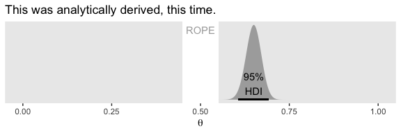
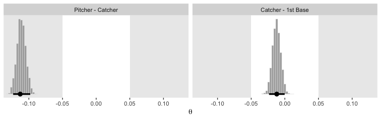
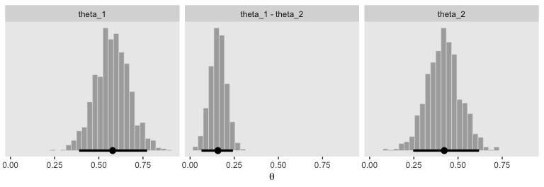
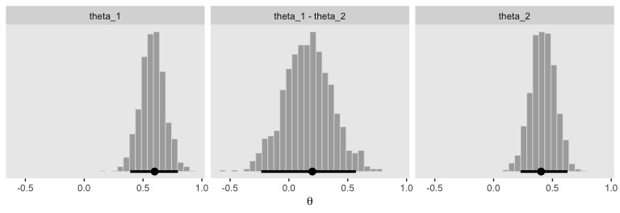
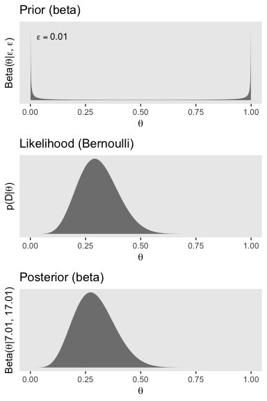
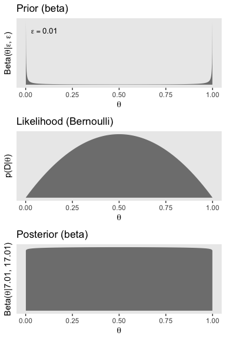

Chapter 12. Bayesian Approaches to Testing a Point ('Null') Hypothesis
================
A Solomon Kurz
2019-03-10

Bayesian Approaches to Testing a Point ("Null") Hypothesis
==========================================================

> Suppose that you have collected some data, and now you want to answer the question, Is there a non-zero effect or not? Is the coin fair or not? Is there better-than-chance accuracy or not? Is there a difference between groups or not? In the previous chapter, \[Kruschke\] argued that answering this type of question via null hypothesis significance testing (NHST) has deep problems. This chapter describes Bayesian approaches to the question. (p. 335)

The estimation approach
-----------------------

Full disclosure: This is my preferred approach of the two.

### Region of practical equivalence.

Kruschke began: "A *region of practical equivalence* (ROPE) indicates a small range of parameter values that are considered to be practically equivalent to the null value for purposes of the particular application" (p. 336)

Here's a plot of Kruschke's initial coin flip ROPE.

``` r
library(tidyverse)

tibble(xmin = .45,
       xmax = .55) %>% 
ggplot() +
  geom_rect(aes(xmin = xmin, xmax = xmax,
                ymin = -Inf, ymax = Inf),
            color = "transparent", fill = "white") +
  annotate("text", x = .5, y = .5, label = "ROPE",
           color = "grey67") +
  scale_y_continuous(NULL, breaks = NULL) +
  labs(title = "Kruschke's coin flip ROPE",
       x     = expression(theta)) +
  coord_cartesian(0:1) +
  theme(panel.grid.minor = element_blank())
```


In the first example (p. 336), we have *z* = 325 heads out of *N* = 500 coin flips. To visualize the analysis, we'll need the Bernoulli likelihood.

``` r
bernoulli_likelihood <- function(theta, data) {
  n <- length(data)
  z <- sum(data)
  return(theta^z * (1 - theta)^(n - sum(data)))
  }
```

Now we'll follow the typical steps to combine the prior, which is flat in this case, and the likelihood to get the posterior.

``` r
# the data summaries
n <- 500
z <- 325

trial_data <- c(rep(0, times = n - z), rep(1, times = z))            # (i.e., data)

d <-
  tibble(theta = seq(from = 0, to = 1, length.out = 1e3)) %>%       # (i.e., theta)
  # recall Beta(1, 1) is flat
  mutate(prior = map_dbl(theta, dbeta, shape1 = 1, shape2 = 1)) %>%  # (i.e., p(theta))
  mutate(likelihood = bernoulli_likelihood(theta = theta,            # (i.e., p(D | theta))
                                           data = trial_data)) %>%
  mutate(normalizing_constant = sum(prior * likelihood)) %>%         # (i.e., p(D))
  mutate(posterior = likelihood * prior / normalizing_constant)      # (i.e., p(theta | D))
  
glimpse(d)
```

    ## Observations: 1,000
    ## Variables: 5
    ## $ theta                <dbl> 0.000000000, 0.001001001, 0.002002002, 0.00…
    ## $ prior                <dbl> 1, 1, 1, 1, 1, 1, 1, 1, 1, 1, 1, 1, 1, 1, 1…
    ## $ likelihood           <dbl> 0, 0, 0, 0, 0, 0, 0, 0, 0, 0, 0, 0, 0, 0, 0…
    ## $ normalizing_constant <dbl> 1.367061e-139, 1.367061e-139, 1.367061e-139…
    ## $ posterior            <dbl> 0, 0, 0, 0, 0, 0, 0, 0, 0, 0, 0, 0, 0, 0, 0…

The results look like this:

``` r
ggplot(data = d) +
  geom_rect(xmin = .45,  xmax = .55,
            ymin = -Inf, ymax = Inf,
            color = "transparent", fill = "white") +
  geom_ribbon(aes(x = theta, ymin = 0, ymax = posterior),
              fill = "grey67") +
  annotate("text", x = .5, y = .01, label = "ROPE",
           color = "grey67") +
  scale_y_continuous(NULL, breaks = NULL) +
  labs(title = "Nope, that density ain't in that ROPE.",
       x = expression(theta)) +
  theme(panel.grid = element_blank())
```


With the formula by Beta(*θ*|*z* + *α*, *N* − *z* + *β*), we can analytically compute the Beta parameters for the posterior.

``` r
(alpha <- z + 1)
```

    ## [1] 326

``` r
(beta <- n - z + 1)
```

    ## [1] 176

With the `hdi_of_icdf()` function, we'll compute the HDIs.

``` r
hdi_of_icdf <- function(name, width = .95, tol = 1e-8, ... ) {
  incredible_mass <-  1.0 - width
  interval_width  <- function(low_tail_prob, name, width, ...) {
    name(width + low_tail_prob, ...) - name(low_tail_prob, ...)
  }
  opt_info <- optimize(interval_width, c(0, incredible_mass), 
                       name = name, width = width, 
                       tol = tol, ...)
  hdi_lower_tail_prob <- opt_info$minimum
  return(c(name(hdi_lower_tail_prob, ...),
           name(width + hdi_lower_tail_prob, ...)))
}
```

Compute those HDIs and save them as `h`.

``` r
(h <-
  hdi_of_icdf(name   = qbeta,
              shape1 = alpha,
              shape2 = beta)
)
```

    ## [1] 0.6075644 0.6909070

Now let's remake the plot from above, this time with the analytically derived values.

``` r
tibble(theta = seq(from = 0, to = 1, length.out = 1e3)) %>% 
  
  ggplot(aes(x = theta)) +
  geom_rect(xmin = .45,  xmax = .55,
            ymin = -Inf, ymax = Inf,
            color = "transparent", fill = "white") +
  geom_ribbon(aes(ymin = 0, ymax = dbeta(theta, shape1 = alpha, shape2 = beta)),
              fill = "grey67", size = 0) +
  geom_segment(x = h[1], xend = h[2],
               y = 0, yend = 0,
               size = 3/4) +
  annotate("text", x = .5, y = 17.5, label = "ROPE",
           color = "grey67") +
  annotate("text", x = .65, y = 4, label = "95%\nHDI") +
  scale_y_continuous(NULL, breaks = NULL) +
  labs(title = "This was analytically derived, this time.",
       x     = expression(theta)) +
  theme(panel.grid = element_blank())
```



In his second example (p. 337), Kruschke considered *z* = 490 heads out of *N* = 1000 flips.

``` r
# we need these to compute the likelihood
n <- 1000
z <- 490

trial_data <- c(rep(0, times = n - z), rep(1, times = z))

tibble(theta = seq(from = 0, to = 1, length.out = 1e3)) %>%               # (i.e., theta)
  # recall Beta(1, 1) is flat
  mutate(prior = map_dbl(theta, dbeta, shape1 = 1, shape2 = 1)) %>%       # (i.e., p(theta))
  mutate(likelihood = bernoulli_likelihood(theta = theta,                 # (i.e., p(D | theta))
                                           data  = trial_data)) %>%
  mutate(posterior = (likelihood * prior) / sum(likelihood * prior)) %>%  # (i.e., p(theta | D))
  
  ggplot() +
  geom_rect(xmin = .45,  xmax = .55,
            ymin = -Inf, ymax = Inf,
            color = "transparent", fill = "white") +
  geom_ribbon(aes(x = theta, ymin = 0, ymax = posterior),
              fill = "grey67") +
  scale_y_continuous(NULL, breaks = NULL) +
  labs(title = "This posterior sits right within the ROPE.",
       x = expression(theta)) +
  theme(panel.grid = element_blank())
```


Here are the new HDIs.

``` r
hdi_of_icdf(name   = qbeta,
            shape1 =     z + 1,
            shape2 = n - z + 1)
```

    ## [1] 0.4590949 0.5209562

The ROPE approach gets complicated. "Because the ROPE and HDI can overlap in different ways, there are different decisions that can be made (p. 337)."

Just down the page, Kruschke further cautioned: "The decision rule for accepting the null value says merely that the most credible values are practically equivalent to the null value according to the chosen ROPE, not necessarily that the null value has high credibility."

### Some examples.

Kruschke referenced an analysis from way back in Chapter 9. We'll need to re-fit the model. First, here are the data.

``` r
my_data <- read_csv("data.R/BattingAverage.csv")

glimpse(my_data)
```

    ## Observations: 948
    ## Variables: 6
    ## $ Player       <chr> "Fernando Abad", "Bobby Abreu", "Tony Abreu", "Dust…
    ## $ PriPos       <chr> "Pitcher", "Left Field", "2nd Base", "2nd Base", "1…
    ## $ Hits         <int> 1, 53, 18, 137, 21, 0, 0, 2, 150, 167, 0, 128, 66, …
    ## $ AtBats       <int> 7, 219, 70, 607, 86, 1, 1, 20, 549, 576, 1, 525, 27…
    ## $ PlayerNumber <int> 1, 2, 3, 4, 5, 6, 7, 8, 9, 10, 11, 12, 13, 14, 15, …
    ## $ PriPosNumber <int> 1, 7, 4, 4, 3, 1, 1, 3, 3, 4, 1, 5, 4, 2, 7, 4, 6, …

Let's load brms and, while we're at it, tidybayes.

``` r
library(brms)
library(tidybayes)
```

Fit the model.

``` r
fit1 <-
  brm(data = my_data,
      family = binomial(link = logit),
      Hits  | trials(AtBats) ~ 1 + (1 | PriPos) + (1 | PriPos:Player),
      prior = c(prior(normal(0, 1.5), class = Intercept),
                prior(normal(0, 1), class = sd)),
      iter = 2000, warmup = 500, chains = 3, cores = 3,
      control = list(adapt_delta = .9),
      seed = 12)
```

Let's use `coef()` to pull the relevant posterior draws.

``` r
c <-
  coef(fit1, summary = F)$PriPos %>% 
  as_tibble()
```

    ## Warning: Calling `as_tibble()` on a vector is discouraged, because the behavior is likely to change in the future. Use `enframe(name = NULL)` instead.
    ## This warning is displayed once per session.

``` r
str(c)
```

    ## Classes 'tbl_df', 'tbl' and 'data.frame':    4500 obs. of  9 variables:
    ##  $ 1st Base.Intercept    : num  -1.07 -1.07 -1.12 -1.09 -1.04 ...
    ##  $ 2nd Base.Intercept    : num  -1.11 -1.16 -1.06 -1.09 -1.11 ...
    ##  $ 3rd Base.Intercept    : num  -1.03 -1.09 -1.04 -1.03 -1.06 ...
    ##  $ Catcher.Intercept     : num  -1.17 -1.14 -1.1 -1.11 -1.1 ...
    ##  $ Center Field.Intercept: num  -1.02 -1.06 -1.01 -1.05 -1.04 ...
    ##  $ Left Field.Intercept  : num  -1.09 -1.11 -1.09 -1.13 -1.13 ...
    ##  $ Pitcher.Intercept     : num  -1.91 -1.89 -1.87 -1.91 -1.93 ...
    ##  $ Right Field.Intercept : num  -1.08 -1.03 -1.07 -1.06 -1 ...
    ##  $ Shortstop.Intercept   : num  -1.16 -1.07 -1.09 -1.1 -1.14 ...

As we pointed out in Chapter 9, keep in mind that `coef()` returns the values in the logit scale when used for logistic regression models. So we’ll have to use `brms::inv_logit_scaled()` to convert the estimates to the probability metric. We can make the difference distributions after we've converted the estimates.

``` r
c_small <-
  c %>%
  mutate_all(inv_logit_scaled) %>% 
  transmute(`Pitcher - Catcher`  = Pitcher.Intercept - Catcher.Intercept,
            `Catcher - 1st Base` = Catcher.Intercept - `1st Base.Intercept`)

head(c_small)
```

    ## # A tibble: 6 x 2
    ##   `Pitcher - Catcher` `Catcher - 1st Base`
    ##                 <dbl>                <dbl>
    ## 1              -0.107             -0.0187 
    ## 2              -0.111             -0.0131 
    ## 3              -0.116              0.00433
    ## 4              -0.118             -0.00362
    ## 5              -0.124             -0.0118 
    ## 6              -0.117             -0.0134

After a little wrangling, we'll be ready to re-plot the relevant parts of Figure 9.14.

``` r
c_small %>% 
  gather() %>% 
  mutate(key = factor(key, levels = c("Pitcher - Catcher", "Catcher - 1st Base"))) %>% 
  
  ggplot(aes(x = value)) +
  geom_rect(xmin = -0.05, xmax = 0.05,
            ymin = -Inf,  ymax = Inf,
            color = "transparent", fill = "white") +
  geom_histogram(fill = "grey67", color = "grey92", 
                 size = .2, binwidth = .003) +
  stat_pointintervalh(aes(y = 0), 
                      point_interval = mode_hdi, .width = .95) +
  scale_y_continuous(NULL, breaks = NULL) +
  labs(x = expression(theta)) +
  coord_cartesian(c(-.125, .125)) +
  theme(panel.grid = element_blank(),
        legend.position = "none") +
  facet_wrap(~key, scales = "free")
```



In order to re-plot part of Figure 9.15, we'll need to employ `fitted()` to snatch the player-specific posteriors.

``` r
# this will make life easier. just go with it
name_list <- c("ShinSoo Choo", "Ichiro Suzuki")

# we'll define the data we'd like to feed into `fitted()`, here
nd <-
  my_data %>% 
  filter(Player %in% c(name_list)) %>% 
  # these last two lines aren't typically necessary, but they allow us to 
  # arrange the rows in the same order we find the names in Figures 9.15 and 9/16
  mutate(Player = factor(Player, levels = c(name_list))) %>% 
  arrange(Player)

f <-
  fitted(fit1, 
         newdata = nd,
         scale = "linear",
         summary = F) %>% 
  as_tibble() %>% 
  mutate_all(inv_logit_scaled) %>% 
  set_names(name_list) %>% 
  # in this last section, we make our difference distributions 
  mutate(`ShinSoo Choo - Ichiro Suzuki` = `ShinSoo Choo` - `Ichiro Suzuki`)
```

    ## Warning: `as_tibble.matrix()` requires a matrix with column names or a `.name_repair` argument. Using compatibility `.name_repair`.
    ## This warning is displayed once per session.

``` r
glimpse(f)
```

    ## Observations: 4,500
    ## Variables: 3
    ## $ `ShinSoo Choo`                 <dbl> 0.2736427, 0.2708160, 0.2945840, …
    ## $ `Ichiro Suzuki`                <dbl> 0.2710961, 0.2791300, 0.2560850, …
    ## $ `ShinSoo Choo - Ichiro Suzuki` <dbl> 0.0025466093, -0.0083139610, 0.03…

Now we're ready to go.

``` r
f %>% 
  ggplot() +
  geom_rect(xmin = -0.05, xmax = 0.05,
            ymin = -Inf,  ymax = Inf,
            color = "transparent", fill = "white") +
  geom_histogram(aes(x = `ShinSoo Choo - Ichiro Suzuki`),
                 fill = "grey67", color = "grey92", 
                 size = .2, binwidth = .003) +
  stat_pointintervalh(aes(x = `ShinSoo Choo - Ichiro Suzuki`, y = 0), 
                      point_interval = mode_hdi, .width = .95) +
  scale_y_continuous(NULL, breaks = NULL) +
  labs(title = "ShinSoo Choo - Ichiro Suzuki",
       x = expression(theta)) +
  coord_cartesian(c(-.125, .125)) +
  theme(panel.grid = element_blank())
```


### Differences of correlated parameters.

Krushke didn't explicate where he got the data for Figure 12.1. If we're willing to presume a multivariate normal distribution, we can get close using the `MASS::mvrnorm()` function. You can get the basic steps from [Sven Hohenstein's answer to this stats.stacheschange question](https://stats.stackexchange.com/questions/164471/generating-a-simulated-dataset-from-a-correlation-matrix-with-means-and-standard).

``` r
# first we'll make a correlation matrix
# a correlation of .9 seems about right
correlation_matrix <- 
  matrix(c(1, .9, 
           .9, 1), 
         nrow = 2, ncol = 2)

# next we'll specify the means and standard deviations
mu <- c(.58, .42)
sd <- c(.1, .1)

# now we'll use the correlation matrix and standard deviations to make a covariance matrix
covariance_matrix <- 
  sd %*% t(sd) * correlation_matrix

# after setting our seed, we're ready to simulate
set.seed(12)
d <- 
  MASS::mvrnorm(n  = 1000, 
                mu = mu, 
                Sigma = covariance_matrix) %>%
  as_tibble() %>%
  rename(theta_1 = V1, theta_2 = V2)
```

Now it only takes some light wrangling to prepare the data to make the three histograms in the left panel of Figure 12.1.

``` r
d %>% 
  mutate(`theta_1 - theta_2` = theta_1 - theta_2) %>% 
  gather() %>% 
  
  ggplot(aes(x = value)) +
  geom_histogram(fill = "grey67", color = "grey92", 
                 size = .2, bins = 30) +
  stat_pointintervalh(aes(y = 0), 
                      point_interval = mode_hdi, .width = .95) +
  scale_y_continuous(NULL, breaks = NULL) +
  labs(x = expression(theta)) +
  theme(panel.grid = element_blank()) +
  facet_wrap(~key, scales = "free_y")
```



Here's the scatter plot, showing the correlation. I think we got pretty close!

``` r
d %>%
  ggplot(aes(x = theta_1, y = theta_2)) +
  geom_abline(color = "white") +
  geom_point(size = 1/2,
             color = "grey50",
             alpha = 1/4) +
  coord_equal(xlim = 0:1,
              ylim = 0:1) +
  labs(x = expression(theta[1]),
       y = expression(theta[2])) +
  theme(panel.grid = element_blank())
```


To make the plots in the right panel of Figure 12.1, we just need to convert the correlation from .9 to -.9.

``` r
# this time we'll make the correlations -.9
correlation_matrix <- 
  matrix(c(1, -.9, 
           -.9, 1), 
         nrow = 2, ncol = 2)

# we'll have to redo the covariance matrix
covariance_matrix <- 
  sd %*% t(sd) * correlation_matrix

# here's the updated data
set.seed(1)
d <- MASS::mvrnorm(n = 1000, mu = mu, Sigma = covariance_matrix) %>%
  as_tibble() %>%
  rename(theta_1 = V1, theta_2 = V2)
```

Here are our right-panel Figure 12.1 histograms.

``` r
d %>% 
  mutate(`theta_1 - theta_2` = theta_1 - theta_2) %>% 
  gather() %>% 
  
  ggplot(aes(x = value)) +
  geom_histogram(fill = "grey67", color = "grey92", 
                 size = .2, bins = 30) +
  stat_pointintervalh(aes(y = 0), 
                      point_interval = mode_hdi, .width = .95) +
  scale_y_continuous(NULL, breaks = NULL) +
  labs(x = expression(theta)) +
  theme(panel.grid = element_blank()) +
  facet_wrap(~key, scales = "free_y")
```



Behold the second scatter plot.

``` r
d %>%
  ggplot(aes(x = theta_1, y = theta_2)) +
  geom_abline(color = "white") +
  geom_point(size = 1/2,
             color = "grey50",
             alpha = 1/4) +
  coord_equal(xlim = 0:1,
              ylim = 0:1) +
  labs(x = expression(theta[1]),
       y = expression(theta[2])) +
  theme(panel.grid = element_blank())
```


> In summary, the marginal distributions of two parameters do not indicate the relationship between the parameter values. The joint distribution of the two parameters might have positive or negative correlation (or even a non-linear dependency), and therefore the difference of the parameter values should be explicitly examined. (pp. 341--342)

### Why HDI and not equal-tailed interval?

Though Kruschke told us Figure 12.2 was of a gamma distribution, he didn't tell us the parameters for that particular gamma. After playing around for a bit, it appeared `dgamma(x, 2, .2)` worked pretty well.

``` r
tibble(x = seq(from = 0, to = 40, by = .1)) %>% 
  
  ggplot(aes(x = x)) +
  geom_ribbon(aes(ymin = 0,
                  ymax = dgamma(x, 2, .2)),
              fill = "grey67") +
  coord_cartesian(xlim = 0:35) +
  theme(panel.grid = element_blank())
```


If you want to get the quantile-based intervals (i.e., the ETIs), you can plug in the desired quantiles into the `qgamma()`.

``` r
(ex <- qgamma(c(.025, .975), shape = 2, rate = .2))
```

    ## [1]  1.211046 27.858217

To analytically derive the gamma HDIs, we just use the good old `hdi_of_icdf()` function.

``` r
(hx <-
  hdi_of_icdf(name  = qgamma,
              shape = 2,
              rate  = .2)
)
```

    ## [1]  0.2118165 23.8258411

Next you need to determine how high up to go on the y-axis. For the quantile-based intervals, the ETIs, you can use `dgamma()`. The trick is pump the output of `qgamma()` into `dgamma()`.

``` r
(
  ey <-
  qgamma(c(.025, .975), shape = 2, rate = .2) %>% 
  dgamma(shape = 2, rate = .2)
)
```

    ## [1] 0.038021620 0.004239155

We follow the same basic principle to get the y-axis values for the HDIs.

``` r
(
  hy <-
  hdi_of_icdf(name = qgamma, shape = 2, rate = .2) %>% 
  dgamma(shape = 2, rate = .2)
)
```

    ## [1] 0.008121227 0.008121233

Now we’ve computed all those values, we can collect them into a tibble with the necessary coordinates to make the ETI and HDI lines in our plot.

``` r
(
  lines <-
  tibble(interval = rep(c("eti", "hdi"), each = 4),
         x        = c(ex, hx) %>% rep(., each = 2),
         y        = c(ey[1], 0, 0, ey[2], 0, hy, 0))
)
```

    ## # A tibble: 8 x 3
    ##   interval      x       y
    ##   <chr>     <dbl>   <dbl>
    ## 1 eti       1.21  0.0380 
    ## 2 eti       1.21  0      
    ## 3 eti      27.9   0      
    ## 4 eti      27.9   0.00424
    ## 5 hdi       0.212 0      
    ## 6 hdi       0.212 0.00812
    ## 7 hdi      23.8   0.00812
    ## 8 hdi      23.8   0

We're finally ready to plot a more complete version of Figure 12.2.

``` r
tibble(x = seq(from = 0, to = 40, by = .1)) %>% 
  
  ggplot(aes(x = x)) +
  geom_ribbon(aes(ymin = 0, ymax = dgamma(x, 2, .2)),
              fill = "grey67") +
  geom_path(data = lines,
            aes(y = y, color = interval),
            size = 1) +
  geom_text(data = tibble(
    x        = c(15, 12),
    y        = c(.004, .012),
    label    = c("95% ETI", "95% HDI"),
    interval = c("eti", "hdi")
    ),
    aes(y = y, color = interval, label = label)) +
  scale_color_manual(values = c("black", "white")) +
  scale_y_continuous(NULL, breaks = NULL) +
  coord_cartesian(xlim = 0:35) +
  xlab("Density Value") +
  theme(panel.grid = element_blank(),
        legend.position = "none")
```


To repeat, ETIs are the only types of intervals available directly by the brms package. When using the default `print()` or `summary()` output for a `brm()` model, the 95% ETIs are displayed in the 'l-95% CI' and 'u-95% CI' columns.

``` r
print(fit1)
```

    ##  Family: binomial 
    ##   Links: mu = logit 
    ## Formula: Hits | trials(AtBats) ~ 1 + (1 | PriPos) + (1 | PriPos:Player) 
    ##    Data: my_data (Number of observations: 948) 
    ## Samples: 3 chains, each with iter = 2000; warmup = 500; thin = 1;
    ##          total post-warmup samples = 4500
    ## 
    ## Group-Level Effects: 
    ## ~PriPos (Number of levels: 9) 
    ##               Estimate Est.Error l-95% CI u-95% CI Eff.Sample Rhat
    ## sd(Intercept)     0.33      0.10     0.19     0.58       1883 1.00
    ## 
    ## ~PriPos:Player (Number of levels: 948) 
    ##               Estimate Est.Error l-95% CI u-95% CI Eff.Sample Rhat
    ## sd(Intercept)     0.14      0.01     0.12     0.15       2495 1.00
    ## 
    ## Population-Level Effects: 
    ##           Estimate Est.Error l-95% CI u-95% CI Eff.Sample Rhat
    ## Intercept    -1.17      0.12    -1.40    -0.93        941 1.01
    ## 
    ## Samples were drawn using sampling(NUTS). For each parameter, Eff.Sample 
    ## is a crude measure of effective sample size, and Rhat is the potential 
    ## scale reduction factor on split chains (at convergence, Rhat = 1).

In the output of most other brms functions, the 95% ETIs appear in the `Q2.5` and `Q97.5` columns. Take `fitted()`, for example.

``` r
fitted(fit1, 
       newdata = nd,
       scale = "linear",
       nsamples = 100)
```

    ##        Estimate  Est.Error      Q2.5      Q97.5
    ## [1,] -0.9622617 0.07479674 -1.115405 -0.8288589
    ## [2,] -0.9697921 0.07544937 -1.096863 -0.8152902

But as we just did, above, you can always use the convenience functions from the tidybayes package (e.g., `mode_hdi()`) to get HDIs from a brms fit.

The model-comparison approach
-----------------------------

As Kruschke put it in the opening, in this section

> the focus is on deciding which of two hypothetical prior distributions is least incredible. One prior expresses the hypothesis that the parameter value is exactly the null value. The alternative prior expresses the hypothesis that the parameter could be any value, according to some form of broad distribution. (p. 344)

### Is a coin fair or not?

Some (e.g., [Lee & Webb, 2005](http://www.socsci.uci.edu/~mdlee/lee_webb_indivdiffs.pdf); [Zhu & Lu, 2004](http://jse.amstat.org/v12n2/zhu.pdf)) have argued the Haldane prior is superior to the uniform Beta(1, 1) when choosing an uninformative prior for *θ*. The Haldane, recall, is Beta(*ϵ*, *ϵ*), where *ϵ* is some small value approaching zero (e.g., 0.01). We'll use our typical steps with the grid aproximation to compute the data for the left column of Figure 12.3 (i.e., the column based on the Haldane prior).

``` r
# we need these to compute the likelihood
n <- 24
z <- 7
epsilon <- .01

trial_data <- c(rep(0, times = n - z), rep(1, times = z))

d <-
  tibble(theta = seq(from = 0, to = 1, length.out = 1000)) %>%
  mutate(prior = dbeta(x = theta, shape1 = epsilon, shape2 = epsilon)) %>%
  mutate(likelihood = bernoulli_likelihood(theta = theta,
                                           data = trial_data)) %>%
  # we have to slice off the first and last values because they go to infinity on the prior, 
  # which creats problems when computing the denominator `sum(likelihood * prior)` (i.e., p(D))
  slice(2:999) %>% 
  mutate(posterior = likelihood * prior / sum(likelihood * prior))

head(d)
```

    ## # A tibble: 6 x 4
    ##     theta prior likelihood posterior
    ##     <dbl> <dbl>      <dbl>     <dbl>
    ## 1 0.00100 4.67    9.90e-22  1.61e-15
    ## 2 0.00200 2.35    1.25e-19  1.02e-13
    ## 3 0.00300 1.58    2.09e-18  1.15e-12
    ## 4 0.00400 1.19    1.54e-17  6.39e-12
    ## 5 0.00501 0.952   7.22e-17  2.40e-11
    ## 6 0.00601 0.796   2.54e-16  7.07e-11

Here's the left column of Figure 12.3.

``` r
p1 <-
  d %>% 
  ggplot(aes(x = theta)) +
  geom_ribbon(aes(ymin = 0, ymax = prior),
              fill = "grey50") +
  annotate(geom = "text", x = .1, y = 4, size = 3.5, label = expression(epsilon == 0.01)) +
  scale_y_continuous(breaks = NULL) +
  labs(title = "Prior (beta)",
       x = expression(theta),
       y = expression(paste("Beta(", theta, "|", epsilon, ", ", epsilon, ")"))) +
  theme(panel.grid = element_blank())

p2 <-
  d %>% 
  ggplot(aes(x = theta)) +
  geom_ribbon(aes(ymin = 0, ymax = likelihood),
              fill = "grey50") +
  scale_y_continuous(breaks = NULL) +
  labs(title = "Likelihood (Bernoulli)",
       x = expression(theta),
       y = expression(paste("p(D|", theta, ")"))) +
  theme(panel.grid = element_blank(),
        axis.text.y = element_text())

p3 <-
  d %>% 
  ggplot(aes(x = theta)) +
  geom_ribbon(aes(ymin = 0, ymax = posterior),
              fill = "grey50") +
  scale_y_continuous(breaks = NULL) +
  labs(title = "Posterior (beta)",
       x = expression(theta),
       y = expression(paste("Beta(", theta, "|7.01, 17.01)"))) +
  theme(panel.grid = element_blank())

library(gridExtra)

grid.arrange(p1, p2, p3)
```



We can calculate the Beta parameters for the posterior using the formula Beta(*θ*|*z* + *α*, *N* − *z* + *β*).

``` r
# alpha
z + epsilon
```

    ## [1] 7.01

``` r
# beta
n - z + epsilon
```

    ## [1] 17.01

We need updated data for the right column, based on the Beta(2, 4) prior.

``` r
alpha <- 2
beta  <- 4

d <-
  tibble(theta = seq(from = 0, to = 1, length.out = 1000)) %>%
  mutate(prior = dbeta(x = theta, shape1 = alpha, shape2 = beta)) %>%
  mutate(likelihood = bernoulli_likelihood(theta = theta,
                                           data = trial_data)) %>%
  # no need to `slice(2:999)` this time
  mutate(posterior = likelihood * prior / sum(likelihood * prior))

head(d)
```

    ## # A tibble: 6 x 4
    ##     theta  prior likelihood posterior
    ##     <dbl>  <dbl>      <dbl>     <dbl>
    ## 1 0       0        0.        0.      
    ## 2 0.00100 0.0200   9.90e-22  8.91e-20
    ## 3 0.00200 0.0398   1.25e-19  2.24e-17
    ## 4 0.00300 0.0595   2.09e-18  5.62e-16
    ## 5 0.00400 0.0791   1.54e-17  5.50e-15
    ## 6 0.00501 0.0986   7.22e-17  3.21e-14

Now here's the right column of Figure 12.3.

``` r
p1 <-
  d %>% 
  ggplot(aes(x = theta)) +
  geom_ribbon(aes(ymin = 0, ymax = prior),
              fill = "grey50") +
  scale_y_continuous(breaks = NULL) +
  labs(title = "Prior (beta)",
       x = expression(theta),
       y = expression(paste("Beta(", theta, "|2, 4)"))) +
  theme(panel.grid = element_blank())

p2 <-
  d %>% 
  ggplot(aes(x = theta)) +
  geom_ribbon(aes(ymin = 0, ymax = likelihood),
              fill = "grey50") +
  scale_y_continuous(breaks = NULL) +
  labs(title = "Likelihood (Bernoulli)",
       x = expression(theta),
       y = expression(paste("p(D|", theta, ")"))) +
  theme(panel.grid = element_blank(),
        axis.text.y = element_text())

p3 <-
  d %>% 
  ggplot(aes(x = theta)) +
  geom_ribbon(aes(ymin = 0, ymax = posterior),
              fill = "grey50") +
  scale_y_continuous(breaks = NULL) +
  labs(title = "Posterior (beta)",
       x = expression(theta),
       y = expression(paste("Beta(", theta, "|9, 21)"))) +
  theme(panel.grid = element_blank())

grid.arrange(p1, p2, p3)
```


Here are those Beta parameters for that posterior.

``` r
# alpha
z + alpha
```

    ## [1] 9

``` r
# beta
n - z + beta
```

    ## [1] 21

Following the formula for the null hypothesis

*p*(*z*, *N*|*M*<sub>null</sub>)=*θ*<sub>null</sub><sup>*z*</sup>(1 − *θ*<sub>null</sub>)<sup>(*N* − *z*)</sup>

we can compute the probability of the data given the null hypothesis.

``` r
theta <- .5

(p_d_null <- theta ^ z * (1 - theta) ^ (n - z))
```

    ## [1] 5.960464e-08

The formula for the marginal likelihood for the alternative hypothesis *M*<sub>alt</sub> is

$$p(z, N| M\_\\text{alt}) = \\frac{\\text{Beta} (z + \\alpha\_\\text{alt}, N - z + \\beta\_\\text{alt})}{\\text{Beta} (\\alpha\_\\text{alt}, \\beta\_\\text{alt})}$$

We can make our own `p_d()` function to compute the probability of the data given alternative hypotheses. Here we'll simplify the function a bit to extract `z` and `n` out of the environment.

``` r
p_d <- function(a, b){ 
  beta(z + a, n - z + b) / beta(a, b) 
  }
```

With `p_d_null` and our `p_d()` function in hand, we can reproduce and extend Kruschke's Equation 12.4.

``` r
tibble(shape1 = c(2, 1, .1, .01, .001, .0001, .00001),
       shape2 = c(4, 1, .1, .01, .001, .0001, .00001)) %>% 
  mutate(p_d  = map2(shape1, shape2, p_d)) %>% 
  unnest() %>% 
  mutate(p_d_null = p_d_null) %>% 
  mutate(bf       = p_d / p_d_null)
```

    ## # A tibble: 7 x 5
    ##    shape1  shape2      p_d     p_d_null        bf
    ##     <dbl>   <dbl>    <dbl>        <dbl>     <dbl>
    ## 1 2       4       2.22e- 7 0.0000000596 3.72     
    ## 2 1       1       1.16e- 7 0.0000000596 1.94     
    ## 3 0.1     0.1     2.51e- 8 0.0000000596 0.421    
    ## 4 0.01    0.01    2.87e- 9 0.0000000596 0.0481   
    ## 5 0.001   0.001   2.91e-10 0.0000000596 0.00488  
    ## 6 0.0001  0.0001  2.91e-11 0.0000000596 0.000489 
    ## 7 0.00001 0.00001 2.91e-12 0.0000000596 0.0000489

> For now, notice that when the alternative prior is uniform, with *a*<sub>alt</sub> = *b*<sub>alt</sub> = 1.000, the Bayes’ factor shows a (small) preference for the alternative hypothesis, but when the alternative prior approximates the Haldane, the Bayes’ factor shows a strong preference for the null hypothesis. As the alternative prior gets closer to the Haldane limit, the Bayes’ factor changes by orders of magnitude. Thus, as we have seen before (e.g. Section 10.6, p. 292), the Bayes’ factor is *very sensitive to the choice of prior distribution*. (p. 345, *emphasis* added)

On page 346, Kruschke showed some of the 95% HDIs for the marginal distributions of the various *M*<sub>alt</sub>s. We could compute those one at a time with `hdi_of_icdf()`. But why not work in bulk? Like we did in Chapter 10, let's make a custom variant `hdi_of_qbeta()`, which will be more useful within the context of `map2()`.

``` r
hdi_of_qbeta <- function(shape1, shape2) {
  hdi_of_icdf(name = qbeta,
              shape1 = shape1,
              shape2 = shape2) %>% 
    data.frame() %>% 
    mutate(level = c("ll", "ul")) %>% 
    spread(key = level, value = ".")
}
```

Compute the HDIs.

``` r
tibble(shape1 =     z + c(2, 1, .1, .01, .001, .0001, .00001),
       shape2 = n - z + c(4, 1, .1, .01, .001, .0001, .00001)) %>% 
  mutate(h    = map2(shape1, shape2, hdi_of_qbeta)) %>% 
  unnest(h) %>% 
  mutate_at(vars(ends_with("l")), funs(round), digits = 4)
```

    ## # A tibble: 7 x 4
    ##   shape1 shape2    ll    ul
    ##    <dbl>  <dbl> <dbl> <dbl>
    ## 1   9      21   0.145 0.462
    ## 2   8      18   0.141 0.483
    ## 3   7.1    17.1 0.124 0.472
    ## 4   7.01   17.0 0.122 0.471
    ## 5   7.00   17.0 0.122 0.471
    ## 6   7.00   17.0 0.122 0.471
    ## 7   7.00   17.0 0.122 0.471

As Kruschke mused,

> if we consider the posterior distribution instead of the Bayes’ factor, we see that the posterior distribution on *θ* within the alternative model is only slightly affected by the prior... In all cases, the 95% HDI excludes the null value, although a wide ROPE might overlap the HDI. Thus, the explicit estimation of the bias parameter robustly indicates that the null value should be rejected, but perhaps only marginally. This contrasts with the Bayes’ factor, model-comparison approach, which rejected the null or accepted the null depending on the alternative prior.

Further,

> of the Bayes’ factors in Equation 12.4, which is most appropriate? If your analysis is driven by the urge for a default, uninformed alternative prior, then the prior that best approximates the Haldane is most appropriate. Following from that, we should strongly prefer the null hypothesis to the Haldane alternative. While this is mathematically correct, it is meaningless for an applied setting because the Haldane alternative represents nothing remotely resembling a credible alternative hypothesis. The Haldane prior sets prior probabilities of virtually zero at all values of *θ* except *θ* = 0 and *θ* = 1. There are very few applied settings where such a U-shaped prior represents a genuinely meaningful theory. (p. 346).

### Bayes’ factor can accept null with poor precision.

Here are the steps to make the left column of Figure 12.4 (i.e., the column based on very weak data and the Haldane prior).

``` r
# we need these to compute the likelihood
n <- 2
z <- 1

trial_data <- c(rep(0, times = n - z), rep(1, times = z))

d <-
  tibble(theta = seq(from = 0, to = 1, length.out = 1000)) %>%
  mutate(prior = dbeta(x = theta, shape1 = epsilon, shape2 = epsilon)) %>%
  mutate(likelihood = bernoulli_likelihood(theta = theta,
                                           data = trial_data)) %>%
  # like before, we have to slice off the first and last values because they go to infinity on the
  # prior, which creats problems when computing the denominator `sum(likelihood * prior)` (i.e., p(D))
  slice(2:999) %>% 
  mutate(posterior = likelihood * prior / sum(likelihood * prior))

p1 <-
  d %>% 
  ggplot(aes(x = theta)) +
  geom_ribbon(aes(ymin = 0, ymax = prior),
              fill = "grey50") +
  annotate(geom = "text", x = .1, y = 4, size = 3.5, label = expression(epsilon == 0.01)) +
  scale_y_continuous(breaks = NULL) +
  labs(title = "Prior (beta)",
       x = expression(theta),
       y = expression(paste("Beta(", theta, "|", epsilon, ", ", epsilon, ")"))) +
  theme(panel.grid = element_blank())

p2 <-
  d %>% 
  ggplot(aes(x = theta)) +
  geom_ribbon(aes(ymin = 0, ymax = likelihood),
              fill = "grey50") +
  scale_y_continuous(breaks = NULL) +
  labs(title = "Likelihood (Bernoulli)",
       x = expression(theta),
       y = expression(paste("p(D|", theta, ")"))) +
  theme(panel.grid = element_blank(),
        axis.text.y = element_text())

p3 <-
  d %>% 
  ggplot(aes(x = theta)) +
  geom_ribbon(aes(ymin = 0, ymax = posterior),
              fill = "grey50") +
  scale_y_continuous(breaks = NULL) +
  labs(title = "Posterior (beta)",
       x = expression(theta),
       y = expression(paste("Beta(", theta, "|7.01, 17.01)"))) +
  theme(panel.grid = element_blank())

grid.arrange(p1, p2, p3)
```



That is one flat posterior. Here are the shape parameters and the HDIs.

``` r
(alpha <- z + epsilon)
```

    ## [1] 1.01

``` r
(beta <- n - z + epsilon)
```

    ## [1] 1.01

``` r
hdi_of_icdf(name   = qbeta,
            shape1 = alpha,
            shape2 = beta) %>% 
  round(digits = 3)
```

    ## [1] 0.026 0.974

How do we compute the BF?

``` r
theta <- .5
a <- epsilon
b <- epsilon

# pD_{null}                            pD_{alternative}
(theta ^ z * (1 - theta) ^ (n - z)) / (beta(z + a, n - z + b) / beta(a, b))
```

    ## [1] 51

And here are the steps to make the right column of Figure 12.4, which is based on stronger data and a flat Beta(1, 1) prior.

``` r
# we need these to compute the likelihood
n <- 14
z <- 7

trial_data <- c(rep(0, times = n - z), rep(1, times = z))

d <-
  tibble(theta = seq(from = 0, to = 1, length.out = 1e3)) %>%
  mutate(prior = dbeta(x = theta, shape1 = alpha, shape2 = beta)) %>%
  mutate(likelihood = bernoulli_likelihood(theta = theta,
                                           data = trial_data)) %>%
  # no need to `slice(2:999)` this time
  mutate(posterior = likelihood * prior / sum(likelihood * prior))

p1 <-
  d %>% 
  ggplot(aes(x = theta)) +
  geom_ribbon(aes(ymin = 0, ymax = prior),
              fill = "grey50") +
  scale_y_continuous(breaks = NULL) +
  labs(title = "Prior (beta)",
       x = expression(theta),
       y = expression(paste("Beta(", theta, "|1, 1)"))) +
  theme(panel.grid = element_blank())

p2 <-
  d %>% 
  ggplot(aes(x = theta)) +
  geom_ribbon(aes(ymin = 0, ymax = likelihood),
              fill = "grey50") +
  scale_y_continuous(breaks = NULL) +
  labs(title = "Likelihood (Bernoulli)",
       x = expression(theta),
       y = expression(paste("p(D|", theta, ")"))) +
  theme(panel.grid = element_blank(),
        axis.text.y = element_text())

p3 <-
  d %>% 
  ggplot(aes(x = theta)) +
  geom_ribbon(aes(ymin = 0, ymax = posterior),
              fill = "grey50") +
  scale_y_continuous(breaks = NULL) +
  labs(title = "Posterior (beta)",
       x = expression(theta),
       y = expression(paste("Beta(", theta, "|8, 8)"))) +
  theme(panel.grid = element_blank())

grid.arrange(p1, p2, p3)
```


Here are the shape parameters and the HDIs.

``` r
(alpha <- z + epsilon)
```

    ## [1] 7.01

``` r
(beta <- n - z + epsilon)
```

    ## [1] 7.01

``` r
hdi_of_icdf(name   = qbeta,
            shape1 = alpha,
            shape2 = beta) %>% 
  round(digits = 3)
```

    ## [1] 0.252 0.748

Those HDIs are still pretty wide, but much less so than before. Let's compute the BF.

``` r
a <- 1
b <- 1

# pD_{null}                            pD_{alternative}
(theta ^ z * (1 - theta) ^ (n - z)) / (beta(z + a, n - z + b) / beta(a, b))
```

    ## [1] 3.14209

A BF of 3.14 in favor of the null is lackluster evidence. And happily so given the breadth of the HDIs.

Kruschke discussed how we’d need *z* = 1200 and *N* = 2400 before the posterior HDIs would fit within a narrow ROPE like .48 and .52. Here’s what that would look like based on the priors from Figure 12.4.

``` r
z <- 1200
n <- 2400
alpha <-     z + epsilon
beta  <- n - z + epsilon

d <- tibble(theta = seq(from = 0, to = 1, length.out = 1e3))
  
# the Haldane-based plot
p1 <-
  d %>% 
  ggplot(aes(x = theta)) +
  geom_rect(xmin = .48,  xmax = .52,
            ymin = -Inf, ymax = Inf,
            color = "transparent", fill = "white") +
  geom_ribbon(aes(ymin = 0, ymax = dbeta(theta, shape1 = alpha, shape2 = beta)),
              fill = "grey67", size = 0) +
  annotate(geom = "text", x = .01, y = 35, size = 3.5, label = expression(epsilon == 0.01)) +
  scale_y_continuous(NULL, breaks = NULL) +
  labs(title = "This posterior used the Haldane prior.",
       x     = expression(theta)) +
  theme(panel.grid = element_blank())

# redefine the Beta parameters
alpha <-     z + 1
beta  <- n - z + 1

# the Beta(1, 1)-based plot
p2 <-
  d %>% 
  ggplot(aes(x = theta)) +
  geom_rect(xmin = .48,  xmax = .52,
            ymin = -Inf, ymax = Inf,
            color = "transparent", fill = "white") +
  geom_ribbon(aes(ymin = 0, ymax = dbeta(theta, shape1 = alpha, shape2 = beta)),
              fill = "grey67", size = 0) +
  scale_y_continuous(NULL, breaks = NULL) +
  labs(title = "This time we used the flat Beta (1, 1).",
       x     = expression(theta)) +
  theme(panel.grid = element_blank())

grid.arrange(p1, p2)
```


> There is no way around this inconvenient statistical reality: high precision demands a large sample size (and a measurement device with minimal possible noise). But when we are trying to accept a specific value of *θ*, is seems logically appropriate that we should have a reasonably precise estimate indicating that specific value. (p. 348)

### Are different groups equal or not?

> Researchers often want to ask the question, Are the groups different or not?
>
> As a concrete example, suppose we conduct an experiment about the effect of background music on the ability to remember. As a simple test of memory, each person tries to memorize the same list of 20 words (such as "chair," "shark," "radio," etc.). They see each word for a specific time, and then, after a brief retention interval, recall as many words as they can. (p. 348)

If you look in Kruschke's `OneOddGroupModelComp2E.R` file, you can get his simulation code. Here we've dramatically simplified it. This attempt does not exactly reproduce what his script did, but it gets it in spirit.

``` r
# For each subject, specify the condition s/he was in,
# the number of trials s/he experienced, and the number correct.
n_g <- 20  # number of subjects per group
n_t <- 20  # number of trials per subject

set.seed(12)
my_data <-
  tibble(condition = rep(c("Das Kruschke", "Mozart", "Bach", "Beethoven"), each = 20),
         id  = 1:80,
         n_g = n_g,
         n_t = n_t,
         group_means = rep(c(.40, .50, .51, .52), each = 20)) %>% 
  mutate(n_recalled  = rbinom(n_g, n_t, group_means))

head(my_data)
```

    ## # A tibble: 6 x 6
    ##   condition       id   n_g   n_t group_means n_recalled
    ##   <chr>        <int> <dbl> <dbl>       <dbl>      <int>
    ## 1 Das Kruschke     1    20    20         0.4          5
    ## 2 Das Kruschke     2    20    20         0.4         10
    ## 3 Das Kruschke     3    20    20         0.4         11
    ## 4 Das Kruschke     4    20    20         0.4          7
    ## 5 Das Kruschke     5    20    20         0.4          6
    ## 6 Das Kruschke     6    20    20         0.4          4

Here are the means for `n_recalled`, by `condition`.

``` r
my_data %>% 
  group_by(condition) %>% 
  summarise(mean_n_recalled = mean(n_recalled))
```

    ## # A tibble: 4 x 2
    ##   condition    mean_n_recalled
    ##   <chr>                  <dbl>
    ## 1 Bach                   10.1 
    ## 2 Beethoven              10.0 
    ## 3 Das Kruschke            7.05
    ## 4 Mozart                 10.2

#### Model specification in ~~JAGS~~ brms.

Recall that although brms does accommodate models based on the Bernoulli likelihood, it doesn’t do so when the data are aggregated. With our aggregate Bernoulli data, we’ll have to use the conventional binomial likelihood, instead. We'll compute two models. Our full model will be

n\_recalled<sub>*i**j*</sub> ∼ Binomial(*n* = 20, *θ*<sub>*j*</sub>)

where

logit(*θ*<sub>*i**j*</sub>)=*β*<sub>0<sub>*j*</sub></sub>

In our equation, *β*<sub>0<sub>*j*</sub></sub> is the group-specific intercept within the logistic regression model. We'll use the *N*(0, 1.5) prior for the intercept. Though it appears strongly regularizing in the log-odds space, it’s quite flat on the *θ* space. If we wanted to be more conservative in the *θ* space, we might use something more like *N*(0, 1).

``` r
fit2 <-
  brm(data = my_data, 
      family = binomial,
      n_recalled | trials(20) ~ 0 + condition,
      prior(normal(0, 1.5), class = b),
      iter = 2500, warmup = 500, cores = 4, chains = 4,
      seed = 12)
```

Here's the summary for the full model.

``` r
print(fit2)
```

    ##  Family: binomial 
    ##   Links: mu = logit 
    ## Formula: n_recalled | trials(20) ~ 0 + condition 
    ##    Data: my_data (Number of observations: 80) 
    ## Samples: 4 chains, each with iter = 2500; warmup = 500; thin = 1;
    ##          total post-warmup samples = 8000
    ## 
    ## Population-Level Effects: 
    ##                      Estimate Est.Error l-95% CI u-95% CI Eff.Sample Rhat
    ## conditionBach            0.02      0.10    -0.17     0.21       9154 1.00
    ## conditionBeethoven       0.01      0.10    -0.19     0.21       7137 1.00
    ## conditionDasKruschke    -0.61      0.11    -0.81    -0.41       8630 1.00
    ## conditionMozart          0.05      0.10    -0.14     0.25       7825 1.00
    ## 
    ## Samples were drawn using sampling(NUTS). For each parameter, Eff.Sample 
    ## is a crude measure of effective sample size, and Rhat is the potential 
    ## scale reduction factor on split chains (at convergence, Rhat = 1).

Do keep in mind that our results will differ from Kruschke’s because of two factors. First, we simulated slightly different data. In the limit, I suspect our data simulation approaches would have converged. But we’re far from the limit. Second, we used a different likelihood to model the data, which resulted in slightly different priors. Yet even with those substantial limitations, our results are pretty close.

To make the top portion of Figure 12.5, we'll need to extract the `condition`-specific parameters. For that, we'll employ `fixef()` and then wrangle a bit.

``` r
post <-
  fixef(fit2, summary = F) %>% 
  as_tibble() %>% 
  transmute(theta_1 = conditionDasKruschke, 
            theta_2 = conditionMozart, 
            theta_3 = conditionBach, 
            theta_4 = conditionBeethoven) %>%
  mutate_all(inv_logit_scaled) %>% 
  transmute(`theta_1 - theta_2` = theta_1 - theta_2,
            `theta_1 - theta_3` = theta_1 - theta_3,
            `theta_1 - theta_4` = theta_1 - theta_4,
            `theta_2 - theta_3` = theta_2 - theta_3,
            `theta_2 - theta_4` = theta_2 - theta_4,
            `theta_3 - theta_4` = theta_3 - theta_4)

glimpse(post)
```

    ## Observations: 8,000
    ## Variables: 6
    ## $ `theta_1 - theta_2` <dbl> -0.25423253, -0.17372830, -0.19413888, -0.16…
    ## $ `theta_1 - theta_3` <dbl> -0.20830560, -0.12811343, -0.21100297, -0.15…
    ## $ `theta_1 - theta_4` <dbl> -0.24365920, -0.20720942, -0.18950684, -0.14…
    ## $ `theta_2 - theta_3` <dbl> 0.0459269319, 0.0456148750, -0.0168640843, 0…
    ## $ `theta_2 - theta_4` <dbl> 0.0105733339, -0.0334811213, 0.0046320449, 0…
    ## $ `theta_3 - theta_4` <dbl> -0.035353598, -0.079095996, 0.021496129, 0.0…

Now we have the wrangled data, we're ready to `gather()` them and plot the top of Figure 12.5.

``` r
post %>% 
  gather() %>% 
  
  ggplot(aes(x = value)) +
  geom_vline(xintercept = 0, color = "white") +
  geom_histogram(color = "grey92", fill = "grey67",
                 binwidth = .01, size = .2) +
  stat_pointintervalh(aes(y = 0),
                      point_interval = mode_hdi, .width = .95) +
  scale_y_continuous(NULL, breaks = NULL) +
  coord_cartesian(xlim = c(-.25, .25)) +
  theme(panel.grid = element_blank()) +
  facet_wrap(~key)
```


Also, do note we're working with the *θ* parameters in our aggregated binomial models, rather than *ω*s.

Here's how you'd get the eact mode and HDI summaries.

``` r
post %>% 
  gather() %>% 
  group_by(key) %>% 
  mode_hdi(value) %>% 
  mutate_if(is.double, round, digits = 3)
```

    ## # A tibble: 6 x 7
    ##   key                value .lower .upper .width .point .interval
    ##   <chr>              <dbl>  <dbl>  <dbl>  <dbl> <chr>  <chr>    
    ## 1 theta_1 - theta_2 -0.161 -0.23  -0.097   0.95 mode   hdi      
    ## 2 theta_1 - theta_3 -0.154 -0.219 -0.086   0.95 mode   hdi      
    ## 3 theta_1 - theta_4 -0.154 -0.215 -0.083   0.95 mode   hdi      
    ## 4 theta_2 - theta_3  0.005 -0.06   0.077   0.95 mode   hdi      
    ## 5 theta_2 - theta_4  0.009 -0.057  0.079   0.95 mode   hdi      
    ## 6 theta_3 - theta_4  0.006 -0.067  0.067   0.95 mode   hdi

If we wanted to know what proportion of the difference distributions were greater than 0, we could do something like this.

``` r
post %>% 
  gather() %>% 
  group_by(key) %>% 
  summarise(p = mean(value > 0)) %>% 
  mutate_if(is.double, round, digits = 3)
```

    ## # A tibble: 6 x 2
    ##   key                   p
    ##   <chr>             <dbl>
    ## 1 theta_1 - theta_2 0    
    ## 2 theta_1 - theta_3 0    
    ## 3 theta_1 - theta_4 0    
    ## 4 theta_2 - theta_3 0.595
    ## 5 theta_2 - theta_4 0.617
    ## 6 theta_3 - theta_4 0.531

I got this idea from the great [Tristan Mahr](https://twitter.com/tjmahr), who [pointed out](https://twitter.com/tjmahr/status/1097980989387755521) that conditional tests like `value > 0` compute a vector of `TRUE` and `FALSE` values. By nesting that within `mean()`, you end up with the proportion of those values that are `TRUE`.

With our Stan/brms method, we don't have an analogue to the lower portion of Figure 12.5 because we are not fitting the full and restricted models within a single run. Thus, there's no plot to show the chains traversing from *M*<sub>full</sub> to *M*<sub>restricted</sub>. Rather, our `fit2` was just of *M*<sub>full</sub>. Now we'll fit *M*<sub>restricted</sub>, which we'll save as `fit3`.

``` r
fit3 <-
  brm(data = my_data, 
      family = binomial,
      n_recalled | trials(20) ~ 1,
      prior(normal(0, 1.5), class = Intercept),
      iter = 2500, warmup = 500, cores = 4, chains = 4,
      seed = 12)
```

Here we'll compare the two models with the LOO.

``` r
loo(fit2, fit3)
```

    ##              LOOIC    SE
    ## fit2        344.83  8.77
    ## fit3        368.66 13.74
    ## fit2 - fit3 -23.83 11.05

The LOO comparison suggests `fit2`, the full model with the `condition`-specific intercepts, is an improvement over the restricted one-intercept-only model. We can also compare the models with their weights via the `model_weights()` function. Here we'll use `weights = "loo"` criterion.

``` r
model_weights(fit2, fit3, weights = "loo")
```

    ##         fit2         fit3 
    ## 0.9993767828 0.0006232172

Recall that within a given comparison, the weights sum to 1, with better fitting models tending closer to 1 than the other(s). In this case, almost all the weight went to the *M*<sub>full</sub>, `fit2`.

#### Bonus: Hypothesis testing in brms.

Disclaimer: I’m not a fan of hypothesis texting within the Bayesian framework. So I generally don’t use these methods. However, it’d seem negligent not to at least mention the convenience function designed for that purpose in brms: the `hypothesis()` function. From the `hypothesis` section in the [brms reference manual (version 2.7.0)](https://cran.r-project.org/web/packages/brms/brms.pdf) we read:

> Among others, `hypothesis` computes an evidence ratio (`Evid.Ratio`) for each hypothesis. For a directed hypothesis, this is just the posterior probability (`Post.Prob`) under the hypothesis against its alternative. That is, when the hypothesis is of the form `a > b`, the evidence ratio is the ratio of the posterior probability of `a > b` and the posterior probability of `a < b`. In this example, values greater than one indicate that the evidence in favor of `a > b` is larger than evidence in favor of `a < b`. For an undirected (point) hypothesis, the evidence ratio is a Bayes factor between the hypothesis and its alternative computed via the Savage-Dickey density ratio method. That is the posterior density at the point of interest divided by the prior density at that point. Values greater than one indicate that evidence in favor of the point hypothesis has increased after seeing the data. In order to calculate this Bayes factor, all parameters related to the hypothesis must have proper priors and argument `sample_prior` of function brm must be set to `TRUE`. When interpreting Bayes factors, make sure that your priors are reasonable and carefully chosen, as the result will depend heavily on the priors. In particular, avoid using default priors.

Following the `a < b` format, let's say we wanted to test the hypothesis *θ*<sub>Das Kruschke</sub> &lt; *θ*<sub>Bach</sub>, based on `fit2`. If we convert the relevant parameters from the log-odds metric to the probability scale with `inv_logit_scaled()`, we can specify that hypothesis as a string and place it into the `hypothesis()` function.

``` r
hypothesis(fit2, 
           "inv_logit_scaled(conditionDasKruschke) < inv_logit_scaled(conditionBach)")
```

    ## Hypothesis Tests for class b:
    ##                 Hypothesis Estimate Est.Error CI.Lower CI.Upper Evid.Ratio
    ## 1 (inv_logit_scaled... < 0    -0.15      0.03     -Inf     -0.1        Inf
    ##   Post.Prob Star
    ## 1         1    *
    ## ---
    ## '*': The expected value under the hypothesis lies outside the 95%-CI.
    ## Posterior probabilities of point hypotheses assume equal prior probabilities.

In the `Estimate` through `CI.Upper` columns, we got the typical brms summary statistics for model parameters. Those CIs, recall, are ETIs rather than HDIs. To interpret the rest, we read further from the [brms reference manual](https://cran.r-project.org/web/packages/brms/brms.pdf) that

> the `Evid.Ratio` may sometimes be `0` or `Inf` implying very small or large evidence, respectively, in favor of the tested hypothesis. For directional hypotheses pairs, this basically means that all posterior samples are on the same side of the value dividing the two hypotheses. In that sense, instead of `0` or `Inf`, you may rather read it as `Evid.Ratio` smaller `1 / S` or greater `S`, respectively, where `S` denotes the number of posterior samples used in the computations.
>
> The argument alpha specifies the size of the credible interval (i.e., Bayesian confidence interval). For instance, if `alpha = 0.05` (5%), the credible interval will contain `1 - alpha = 0.95` (95%) of the posterior values. Hence, `alpha * 100`% of the posterior values will lie outside of the credible interval. Although this allows testing of hypotheses in a similar manner as in the frequentist null- hypothesis testing framework, we strongly argue against using arbitrary cutoffs (e.g., `p < .05`) to determine the ’existence’ of an effect.

In this case, the entire posterior distribution (i.e., all the iterations of the chains) was below zero and we ended up with an `Evid.Ratio = Inf`. Our Bayes factor blew up. If we'd like to test a point null hypothesis, we might reformat the equation to *θ*<sub>Das Kruschke</sub> = *θ*<sub>Bach</sub>.

``` r
hypothesis(fit2, 
           "inv_logit_scaled(conditionDasKruschke) = inv_logit_scaled(conditionBach)")
```

    ## Hypothesis Tests for class b:
    ##                 Hypothesis Estimate Est.Error CI.Lower CI.Upper Evid.Ratio
    ## 1 (inv_logit_scaled... = 0    -0.15      0.03    -0.22    -0.09         NA
    ##   Post.Prob Star
    ## 1        NA    *
    ## ---
    ## '*': The expected value under the hypothesis lies outside the 95%-CI.
    ## Posterior probabilities of point hypotheses assume equal prior probabilities.

Here we no longer get summary information in the `Evid.Ratio` and `Post.Prob` columns. But we do get that posterior summary information and we also get that little `*` symbol in the `Star` column, which was based on the brms default `alpha = 0.05`.

Let's see what happens when we test a different kind of directional hypothesis, *θ*<sub>Motzart</sub> − *θ*<sub>Bach</sub> &gt; 0.

``` r
hypothesis(fit2, 
           "inv_logit_scaled(conditionMozart) - inv_logit_scaled(conditionBach) > 0")
```

    ## Hypothesis Tests for class b:
    ##                 Hypothesis Estimate Est.Error CI.Lower CI.Upper Evid.Ratio
    ## 1 (inv_logit_scaled... > 0     0.01      0.03    -0.05      Inf       1.47
    ##   Post.Prob Star
    ## 1       0.6     
    ## ---
    ## '*': The expected value under the hypothesis lies outside the 95%-CI.
    ## Posterior probabilities of point hypotheses assume equal prior probabilities.

Here we get an underwhelming BF of 1.47. The posterior probability that hypothesis versus its logical alternative is .6. Notice we no longer have a `*` in the `Star` column.

Relations of parameter estimation and model comparison
------------------------------------------------------

Back to the text, Kruschke wrapped up this section by explaining

> the model comparison focuses on the null value and whether its local probability increases from prior to posterior. The parameter estimation considers the entire posterior distribution, including the uncertainty (i.e., HDI) of the parameter estimate relative to the ROPE.
>
> The derivation of the Bayes’ factor by considering the null value in parameter estimation is known as the Savage-Dickey method. A lucid explanation is provided by [Wagenmakers, Lodewyckx, Kuriyal, and Grasman (2010)](https://www.ejwagenmakers.com/2010/WagenmakersEtAlCogPsy2010.pdf), who also provide some historical references and applications to MCMC analysis of hierarchical models. (pp. 353--354)

Hey, we just read about that Savage-Dickey method when learning about the `brms::hypothesis()` function!

Estimation and model comparison?
--------------------------------

I'll leave you to decide. Here's Kruschke to close us out: "As mentioned above, neither method for null value assessment (parameter estimation or model comparison) is uniquely 'correct.' The two approaches merely pose the question of the null value in different ways" (p. 354)

References
----------

Kruschke, J. K. (2015). *Doing Bayesian data analysis, Second Edition: A tutorial with R, JAGS, and Stan.* Burlington, MA: Academic Press/Elsevier.

Session info
------------

``` r
sessionInfo()
```

    ## R version 3.5.1 (2018-07-02)
    ## Platform: x86_64-apple-darwin15.6.0 (64-bit)
    ## Running under: macOS High Sierra 10.13.6
    ## 
    ## Matrix products: default
    ## BLAS: /Library/Frameworks/R.framework/Versions/3.5/Resources/lib/libRblas.0.dylib
    ## LAPACK: /Library/Frameworks/R.framework/Versions/3.5/Resources/lib/libRlapack.dylib
    ## 
    ## locale:
    ## [1] en_US.UTF-8/en_US.UTF-8/en_US.UTF-8/C/en_US.UTF-8/en_US.UTF-8
    ## 
    ## attached base packages:
    ## [1] stats     graphics  grDevices utils     datasets  methods   base     
    ## 
    ## other attached packages:
    ##  [1] gridExtra_2.3   tidybayes_1.0.3 brms_2.7.0      Rcpp_1.0.0     
    ##  [5] bindrcpp_0.2.2  forcats_0.3.0   stringr_1.3.1   dplyr_0.7.6    
    ##  [9] purrr_0.2.5     readr_1.1.1     tidyr_0.8.1     tibble_2.0.1   
    ## [13] ggplot2_3.1.0   tidyverse_1.2.1
    ## 
    ## loaded via a namespace (and not attached):
    ##  [1] colorspace_1.3-2          ggridges_0.5.0           
    ##  [3] rsconnect_0.8.8           rprojroot_1.3-2          
    ##  [5] ggstance_0.3              markdown_0.8             
    ##  [7] base64enc_0.1-3           rstudioapi_0.7           
    ##  [9] rstan_2.18.2              svUnit_0.7-12            
    ## [11] DT_0.4                    fansi_0.4.0              
    ## [13] mvtnorm_1.0-8             lubridate_1.7.4          
    ## [15] xml2_1.2.0                bridgesampling_0.4-0     
    ## [17] knitr_1.20                shinythemes_1.1.1        
    ## [19] bayesplot_1.6.0           jsonlite_1.5             
    ## [21] LaplacesDemon_16.1.1      broom_0.5.1              
    ## [23] shiny_1.1.0               compiler_3.5.1           
    ## [25] httr_1.3.1                backports_1.1.2          
    ## [27] assertthat_0.2.0          Matrix_1.2-14            
    ## [29] lazyeval_0.2.1            cli_1.0.1                
    ## [31] later_0.7.3               htmltools_0.3.6          
    ## [33] prettyunits_1.0.2         tools_3.5.1              
    ## [35] igraph_1.2.1              coda_0.19-2              
    ## [37] gtable_0.2.0              glue_1.3.0               
    ## [39] reshape2_1.4.3            cellranger_1.1.0         
    ## [41] nlme_3.1-137              crosstalk_1.0.0          
    ## [43] ps_1.2.1                  rvest_0.3.2              
    ## [45] mime_0.5                  miniUI_0.1.1.1           
    ## [47] gtools_3.8.1              MASS_7.3-50              
    ## [49] zoo_1.8-2                 scales_1.0.0             
    ## [51] colourpicker_1.0          hms_0.4.2                
    ## [53] promises_1.0.1            Brobdingnag_1.2-5        
    ## [55] parallel_3.5.1            inline_0.3.15            
    ## [57] shinystan_2.5.0           yaml_2.1.19              
    ## [59] loo_2.0.0                 StanHeaders_2.18.0-1     
    ## [61] stringi_1.2.3             dygraphs_1.1.1.5         
    ## [63] pkgbuild_1.0.2            rlang_0.3.1              
    ## [65] pkgconfig_2.0.2           matrixStats_0.54.0       
    ## [67] HDInterval_0.2.0          evaluate_0.10.1          
    ## [69] lattice_0.20-35           bindr_0.1.1              
    ## [71] rstantools_1.5.0          htmlwidgets_1.2          
    ## [73] labeling_0.3              tidyselect_0.2.4         
    ## [75] processx_3.2.1            plyr_1.8.4               
    ## [77] magrittr_1.5              R6_2.3.0                 
    ## [79] generics_0.0.2            pillar_1.3.1             
    ## [81] haven_1.1.2               withr_2.1.2              
    ## [83] xts_0.10-2                abind_1.4-5              
    ## [85] modelr_0.1.2              crayon_1.3.4             
    ## [87] arrayhelpers_1.0-20160527 utf8_1.1.4               
    ## [89] rmarkdown_1.10            grid_3.5.1               
    ## [91] readxl_1.1.0              callr_3.1.0              
    ## [93] threejs_0.3.1             digest_0.6.18            
    ## [95] xtable_1.8-2              httpuv_1.4.4.2           
    ## [97] stats4_3.5.1              munsell_0.5.0            
    ## [99] shinyjs_1.0
