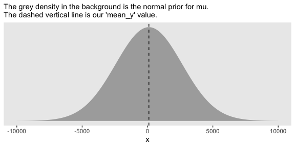
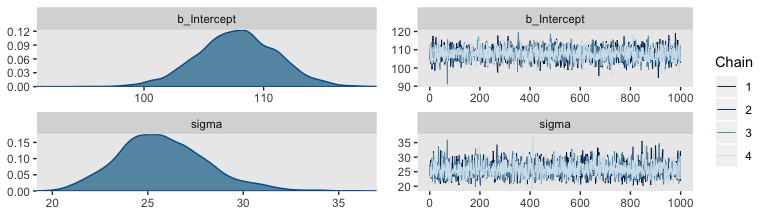
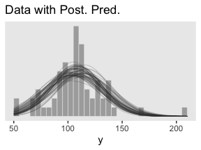
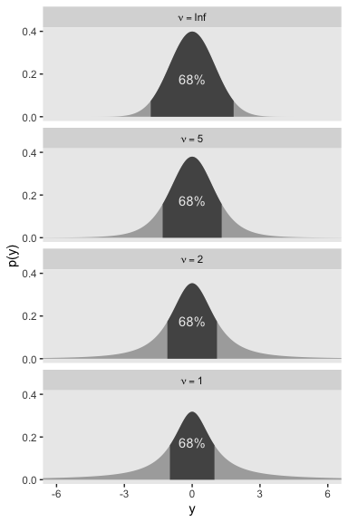
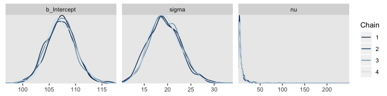

Chapter 16. Metric-Predicted Variable on One or Two Groups
================
A Solomon Kurz
2019-10-30

# Metric-Predicted Variable on One or Two Groups

> In the context of the generalized linear model (GLM) introduced in the
> previous chapter, this chapter’s situation involves the most trivial
> cases of the linear core of the GLM, as indicated in the left cells of
> Table 15.1 (p. 434), with a link function that is the identity along
> with a normal distribution for describing noise in the data, as
> indicated in the first row of Table 15.2 (p. 443). We will explore
> options for the prior distribution on parameters of the normal
> distribution, and methods for Bayesian estimation of the parameters.
> We will also consider alternative noise distributions for describing
> data that have outliers. (pp. 449–450)

Although I agree this chapter covers the “most trivial cases of the
linear core of the GLM”, Kruschke’s underselling himself a bit, here. If
he only stuck with the “most trivial” cases, he would have only
demonstrated the Gaussian likelihood. But Kruschke went well beyond and
introduced robust Student’s \(t\) modeling. It’s a great testament to
Kruchke’s rigorous approach that he did so right away. IMO, we could use
more robust Student’s \(t\) models in the social sciences. So heed well,
friends.

## Estimating the mean and standard deviation of a normal distribution

The Gaussian probability density function follows the
form

\[p(y | \mu, \sigma) = \frac{1}{\sigma \sqrt{2 \pi}} \exp \Bigg (-\frac{1}{2} \frac{(y - \mu)^2}{\sigma^2} \Bigg ),\]

where the two parameters to estimate are \(\mu\) (i.e., the mean) and
\(\sigma\) (i.e., the standard deviation). If you prefer to think in
terms of \(\sigma^2\), that’s the variance. In case is wasn’t clear,
\(\pi\) is the actual number \(\pi\), not a parameter to be estimated.

We’ll divide Figure 16.1 into data and plot steps. I came up with the
primary data like so:

``` r
library(tidyverse)

sequence_length <- 100

d <-
  tibble(mu = c(87.8, 100, 112)) %>% 
  expand(mu, 
         sigma = c(7.35, 12.2, 18.4),
         y     = seq(from = 50, to = 150, length.out = sequence_length)) %>% 
  mutate(density = dnorm(y, mean = mu, sd = sigma),
         mu      = factor(mu, labels = str_c("mu==", c(87.8, 100, 112))),
         sigma   = factor(sigma, labels = str_c("sigma==", c(7.35, 12.2, 18.4))))

head(d)
```

    ## # A tibble: 6 x 4
    ##   mu       sigma           y      density
    ##   <fct>    <fct>       <dbl>        <dbl>
    ## 1 mu==87.8 sigma==7.35  50   0.0000000980
    ## 2 mu==87.8 sigma==7.35  51.0 0.000000197 
    ## 3 mu==87.8 sigma==7.35  52.0 0.000000388 
    ## 4 mu==87.8 sigma==7.35  53.0 0.000000750 
    ## 5 mu==87.8 sigma==7.35  54.0 0.00000142  
    ## 6 mu==87.8 sigma==7.35  55.1 0.00000265

Instead of putting the coordinates for the three data points in our `d`
tibble, I just threw them into their own tibble in the `geom_point()`
function.

``` r
# here we suppress grid lines for all plots in this chapter
theme_set(theme_grey() +
            theme(panel.grid = element_blank()))

# plot!
d %>% 
  ggplot(aes(x = y)) +
  geom_ribbon(aes(ymin = 0, ymax = density),
              fill = "grey67") +
  geom_vline(xintercept = c(85, 100, 115), 
             linetype = 3, color = "grey92") +
  geom_point(data = tibble(y = c(85, 100, 115)),
             aes(y = 0),
             size = 2) +
  scale_y_continuous(expression(paste("p(y|", mu, ", ", sigma, ")")), breaks = NULL) +
  ggtitle("Competing Gaussian likelihoods given the same data") +
  coord_cartesian(xlim = 60:140) +
  facet_grid(sigma ~ mu, labeller = label_parsed)
```

<!-- -->

### ~~Solution by mathematical analysis~~ Heads up on precision.

Not much for us, here. But we might reiterate that sometimes we talk
about the *precision* (see page 453), which is the reciprocal of the
variance (i.e., \(\frac{1}{\sigma^2}\)). As we’ll see, the **brms**
package doesn’t use priors parameterized in terms of precision. But JAGS
does, which means we’ll need to be able to translate Kruschke’s
precision-laden JAGS code into \(\sigma\)-oriented **brms** code in many
of the remaining chapters. Proceed with caution.

### Approximation by ~~MCMC in JAGS~~ HMC in brms.

Let’s load and `glimpse()` at the
data.

``` r
my_data <- read_csv("/Users/solomon/Dropbox/Recoding Doing Bayesian Data Analysis/data.R/TwoGroupIQ.csv")

glimpse(my_data)
```

    ## Observations: 120
    ## Variables: 2
    ## $ Score <dbl> 102, 107, 92, 101, 110, 68, 119, 106, 99, 103, 90, 93, 79,…
    ## $ Group <chr> "Smart Drug", "Smart Drug", "Smart Drug", "Smart Drug", "S…

The data file included values from two groups.

``` r
my_data %>% 
  distinct(Group)
```

    ## # A tibble: 2 x 1
    ##   Group     
    ##   <chr>     
    ## 1 Smart Drug
    ## 2 Placebo

Kruschke clarified that for the following example, “the data are IQ
(intelligence quotient) scores from a group of people who have consumed
a ‘smart drug’” (p. 456). That means we’ll want to subset the data.

``` r
my_data <-
  my_data %>% 
  filter(Group == "Smart Drug")
```

It’s a good idea to take a look at the data before modeling.

``` r
my_data %>% 
  ggplot(aes(x = Score)) +
  geom_density(color = "transparent", fill = "grey67") +
  geom_rug(size = 1/4, alpha = 1/2) +
  scale_y_continuous(NULL, breaks = NULL) +
  ggtitle("The ticks show individual data points.")
```

<!-- -->

Here are the mean and \(SD\) of the `Score` data.

``` r
(mean_y <- mean(my_data$Score))
```

    ## [1] 107.8413

``` r
(sd_y   <- sd(my_data$Score))
```

    ## [1] 25.4452

Those values will come in handy in just a bit. But first, let’s load
**brms**.

``` r
library(brms)
```

If we want to pass user-defined values into our `brm()` prior code,
we’ll need to define them first in using `brms::stanvar()`.

``` r
stanvars <- 
  stanvar(mean_y, name = "mean_y") + 
  stanvar(sd_y,   name = "sd_y")
```

It’s been a while since we used the `stanvar()` function, so we should
review. Though we’ve saved that as `stanvars`, you could name it
whatever you want. But the trick is to them tell `brms::brm()` about
your values in a `stanvars` statement.

Kruschke mentioned that the “the conventional noncommittal gamma prior
\[for the precision\] has shape and rate constants that are close to
zero, such as Sh = 0.01 and R = 0.01” (p. 456). Here’s what that looks
like.

``` r
tibble(x = seq(from = 0, to = 12, by = .05)) %>% 
  mutate(d = dgamma(x, shape = 0.01, rate = 0.01)) %>% 
  
  ggplot(aes(x = x, ymin = 0, ymax = d)) +
  geom_ribbon(fill = "grey67") +
  geom_vline(xintercept = 1 / sd_y, linetype = 2) +
  labs(subtitle = "The grey density in the background is the conventional gamma prior for precision.\nThe dashed vertical line is our precision value.") +
  scale_y_continuous(breaks = NULL) +
  coord_cartesian(xlim = 0:10)
```

<!-- -->

The thing is, with **brms** we typically estimate \(\sigma\) rather than
precision. Though gamma is also a feasible prior distribution for
\(\sigma\), we won’t use it here. But we won’t be using Kruschke’s
uniform prior distribution, either. The Stan team [discourages uniform
priors for variance
parameters](https://github.com/stan-dev/stan/wiki/Prior-Choice-Recommendations),
such as our \(\sigma\). I’m not going to get into the details of why,
but you’ve got that hyperlink above and the good old [Stan User’s
Guide](https://mc-stan.org/users/documentation/) if you’d like to dive
deeper.

Here we’ll use the half normal. By “half normal,” we mean that the mean
is zero and it’s bounded from zero to positive infinity–no negative
\(\sigma\) values for us\! By the “half normal,” we also mean to suggest
that smaller values are more credible than those approaching infinity.
An easy way to do this is to plug in the `sd_y` value from that data
into the \(\sigma\) value for our half-normal prior. Here’s that that
looks like for this example.

``` r
tibble(x = seq(from = 0, to = 110, by = .1)) %>% 
  mutate(d = dnorm(x, mean = 0, sd = sd_y)) %>% 
  
  ggplot(aes(x = x, ymin = 0, ymax = d)) +
  geom_ribbon(fill = "grey67") +
  geom_vline(xintercept = sd_y, linetype = 2) +
  labs(subtitle = "The grey density in the background is the half-normal prior for sigma.\nThe dashed vertical line is our 'sd_y' value.") +
  scale_y_continuous(breaks = NULL) +
  coord_cartesian(xlim = 0:100)
```

<!-- -->

This prior isn’t quite as non-committal as the conventional gamma prior
for precision. It weakly regularizes the value for \(\sigma\) away from
large values, like + 50,000 and so on. In practice, it will have a
minimal influence on the posterior other that it will discourage the HMC
algorithm from exploring ridiculously large values in the parameter
space.

Kruschke has this to say about the prior for the mean:

> In this application we seek broad priors relative to typical data, so
> that the priors have minimal influence on the posterior. One way to
> discover the constants is by asking an expert in the domain being
> studied. But in lieu of that, we will use the data themselves to tell
> us what the typical scale of the data is. We will set *M* to the mean
> of the data, and set *S* to a huge multiple (e.g., 100) of the
> standard deviation of the data. This way, no matter what the scale of
> the data is, the prior will be vague. (p. 455, *emphasis* in the
> original)

In case you’re not following along closely in the text, we often use the
normal distribution for the intercept and slope parameters in a simple
regression model. By *M* and *S*, Kruschke was referring to the \(\mu\)
and \(\sigma\) parameters of the normal prior for our intercept. Here’s
what that prior looks like in this data example.

``` r
tibble(x = seq(from = -10000, to = 10000, by = 1)) %>% 
  mutate(d = dnorm(x, mean = mean_y, sd = sd_y * 100)) %>% 
  
  ggplot(aes(x = x, ymin = 0, ymax = d)) +
  geom_ribbon(fill = "grey67") +
  geom_vline(xintercept = mean_y, linetype = 2) +
  labs(subtitle = "The grey density in the background is the normal prior for mu.\nThe dashed vertical line is our 'mean_y' value.") +
  scale_y_continuous(breaks = NULL)
```

<!-- -->

Yep, Kruschke’s right. That is one non-committal prior. We could tighten
that up by an order of magnitude and still have little influence on the
posterior. Anyway, here’s how to put our priors to use with **brms**.

``` r
fit1 <-
  brm(data = my_data,
      family = gaussian,
      Score ~ 1,
      prior = c(prior(normal(mean_y, sd_y * 100), class = Intercept),
                prior(normal(0, sd_y), class = sigma)),
      chains = 4, cores = 4,
      stanvars = stanvars, 
      seed = 16)
```

To be more explicit, the `stanvars = stanvars` argument at the bottom of
our code is what allowed us to define our intercept prior as
`normal(mean_y, sd_y * 100)` instead of requiring us to type in the
parameters as `normal(107.8413, 25.4452 * 100)`. Same basic point goes
for our \(\sigma\) prior.

Also, notice our prior code for \(\sigma\), `prior(normal(0, sd_y),
class = sigma)`. Nowhere in there did we actually say we wanted a half
normal as opposed to a typical normal. That’s because the **brms**
default is to set the lower bound for priors of `class = sigma` to zero.
There’s no need for us to fiddle with it.

Let’s examine the chains.

``` r
plot(fit1)
```

<!-- -->

They look good\! The model summary looks sensible, too.

``` r
print(fit1)
```

    ##  Family: gaussian 
    ##   Links: mu = identity; sigma = identity 
    ## Formula: Score ~ 1 
    ##    Data: my_data (Number of observations: 63) 
    ## Samples: 4 chains, each with iter = 2000; warmup = 1000; thin = 1;
    ##          total post-warmup samples = 4000
    ## 
    ## Population-Level Effects: 
    ##           Estimate Est.Error l-95% CI u-95% CI Rhat Bulk_ESS Tail_ESS
    ## Intercept   107.78      3.32   101.05   114.23 1.00     3269     2484
    ## 
    ## Family Specific Parameters: 
    ##       Estimate Est.Error l-95% CI u-95% CI Rhat Bulk_ESS Tail_ESS
    ## sigma    25.78      2.33    21.66    30.88 1.00     3315     2518
    ## 
    ## Samples were drawn using sampling(NUTS). For each parameter, Eff.Sample 
    ## is a crude measure of effective sample size, and Rhat is the potential 
    ## scale reduction factor on split chains (at convergence, Rhat = 1).

Compare those values with `mean_y` and `sd_y`.

``` r
mean_y
```

    ## [1] 107.8413

``` r
sd_y
```

    ## [1] 25.4452

Good times. Let’s extract the posterior draws and save them in a data
frame `post`.

``` r
post <- posterior_samples(fit1, add_chain = T)
```

Here’s the leg work required to make our version of the three histograms
in Figure 16.3.

``` r
# we'll need this for `stat_pointintervalh()`
library(tidybayes)

# we'll use this to mark off the ROPEs as white strips in the background
rope <-
  tibble(key = c("Mean", "Standard Deviation", "Effect Size"), 
         xmin = c(99, 14, -.1),
         xmax = c(101, 16, .1))

# here are the primary data
post %>% 
  transmute(Mean = b_Intercept, 
            `Standard Deviation` = sigma) %>% 
  mutate(`Effect Size` = (Mean - 100) / `Standard Deviation`) %>% 
  gather() %>% 
  
  # the plot
  ggplot() +
  geom_rect(data = rope,
            aes(xmin = xmin, xmax = xmax,
                ymin = -Inf, ymax = Inf),
            color = "transparent", fill = "white") +
  geom_histogram(aes(x = value),
                 color = "grey92", fill = "grey67",
                 size = .2, bins = 30) +
  stat_pointintervalh(aes(x = value, y = 0), 
                      point_interval = mode_hdi, .width = c(.95, .5)) +
  scale_y_continuous(NULL, breaks = NULL) +
  xlab(NULL) +
  facet_wrap(~key, scales = "free", ncol = 3)
```

<!-- -->

If we wanted those exact 95% HDIs, we’d execute this.

``` r
post %>% 
  transmute(Mean = b_Intercept, 
            `Standard Deviation` = sigma) %>% 
  mutate(`Effect Size` = (Mean - 100) / `Standard Deviation`) %>% 
  gather() %>% 
  group_by(key) %>% 
  mode_hdi(value)
```

    ## # A tibble: 3 x 7
    ##   key                  value   .lower  .upper .width .point .interval
    ##   <chr>                <dbl>    <dbl>   <dbl>  <dbl> <chr>  <chr>    
    ## 1 Effect Size          0.299   0.0510   0.566   0.95 mode   hdi      
    ## 2 Mean               108.    102.     115.      0.95 mode   hdi      
    ## 3 Standard Deviation  25.4    21.3     30.4     0.95 mode   hdi

For the next part, we should look at the structure of the posterior
draws, `post`.

``` r
head(post)
```

    ##   b_Intercept    sigma      lp__ chain iter
    ## 1    104.4952 27.43337 -303.1645     1 1001
    ## 2    109.1532 23.62915 -302.6664     1 1002
    ## 3    105.2486 23.75718 -302.8977     1 1003
    ## 4    102.3687 26.10857 -303.7315     1 1004
    ## 5    111.5466 24.77262 -303.0047     1 1005
    ## 6    109.2983 22.53756 -303.2961     1 1006

By default, `head()` returned six rows, each one corresponding to the
credible parameter values from a given posterior draw. Following our
model equation \(\text{Score}_i ~ N(\mu, \sigma)\), we might reformat
the first two columns as:

1.  `Score` ~ \(N\)(104.495, 27.433)
2.  `Score` ~ \(N\)(109.153, 23.629)
3.  `Score` ~ \(N\)(105.249, 23.757)
4.  `Score` ~ \(N\)(102.369, 26.109)
5.  `Score` ~ \(N\)(111.547, 24.773)
6.  `Score` ~ \(N\)(109.298, 22.538)

Each row of `post` yields a full model equation credibly describing the
data–or at least as credibly as we can within the limits of the model.
We can give voice to a subset of these credible distributions with our
version of the upper right panel of Figure 16.3.

Before I show that plotting code, it might make sense to slow down on
the preparatory data wrangling steps. There are several ways to overlay
multiple posterior predictive density lines like those in our upcoming
plots. We’ll practice a few over the next few chapters. For the method
we’ll use in this chapter, it’s handy to first determine how many you’d
like. Here we’ll follow Kruschke and choose 63, which we’ll save as
`n_lines`.

``` r
# how many credible density lines would you like?
n_lines <- 63
```

Now we’ve got our `n_lines` value, we’ll use it to subset the rows in
`post` with the `slice()` function. We’ll then use `expand()` to include
a sequence of `Score` values to correspond to the formula implied in
each of the remaining rows of `post`. Notice how we also kept the `iter`
index in the game. That will help us with the plot in a bit. But the
main event is how we used `Score`, `b_Intercept`, and `sigma` as the
input for the arguments in the `dnorm()`. The output is a column of the
corresponding density values.

``` r
post <-
  post %>% 
  slice(1:n_lines) %>% 
  expand(nesting(b_Intercept, sigma, iter),
         Score = seq(from = 40, to = 250, by = 1)) %>% 
  mutate(density = dnorm(x = Score, mean = b_Intercept, sd = sigma))

str(post)
```

    ## Classes 'tbl_df', 'tbl' and 'data.frame':    13293 obs. of  5 variables:
    ##  $ b_Intercept: num  99.3 99.3 99.3 99.3 99.3 ...
    ##  $ sigma      : num  26.1 26.1 26.1 26.1 26.1 ...
    ##  $ iter       : num  1008 1008 1008 1008 1008 ...
    ##  $ Score      : num  40 41 42 43 44 45 46 47 48 49 ...
    ##  $ density    : num  0.00115 0.00126 0.00137 0.00149 0.00162 ...

Note that after using `expand()`, we have a rather long data frame.
Anyway, now we’re ready to plot.

``` r
post %>% 
  ggplot(aes(x = Score)) + 
  geom_histogram(data = my_data, 
                 aes(y = stat(density)),
                 color = "grey92", fill = "grey67",
                 size = .2, binwidth = 5, boundary = 0) +
  geom_line(aes(y = density, group = iter),
            size  = 1/4, alpha = 1/3, color = "grey25") +
  scale_x_continuous("y", limits = c(50, 210)) +
  scale_y_continuous(NULL, breaks = NULL) +
  ggtitle("Data with Post. Pred.")
```

<!-- -->

Note the `stat(density)` argument in the `geom_histogram()` function.
That’s what rescaled the histogram to the density metric. If you leave
that part out, all the density lines will drop to the bottom of the
plot. Also, did you see how we used `iter` to group the density lines
within the `geom_line()` function? That’s why we kept that information.
Without that `group = iter` argument, the resulting lines are a mess.

Kruschke pointed out this last plot

> constitutes a form of posterior-predictive check, by which we check
> whether the model appears to be a reasonable description of the data.
> With such a small amount of data, it is difficult to visually assess
> whether normality is badly violated, but there appears to be a hint
> that the normal model is straining to accommodate some outliers: The
> peak of the data protrudes prominently above the normal curves, and
> there are gaps under the shoulders of the normal curves. (p. 458)

## Outliers and robust estimation: The \(t\) distribution

Here’s the code for our version of Figure 16.4.

``` r
# wrangle
tibble(nu = c(Inf, 4, 2, 1)) %>%
  expand(nu, y = seq(from = -8, to = 8, length.out = 500)) %>% 
  mutate(density = dt(x = y, df = nu)) %>% 
  # this line is unnecessary, but will help with the plot legend
  mutate(nu = factor(nu, levels = c("Inf", "4", "2", "1"))) %>% 
  
  # plot
  ggplot(aes(x = y, y = density, group = nu, color = nu)) +
  geom_line() +
  scale_color_viridis_d(expression(paste(italic(t)[nu])), option = "B", direction = 1, end = .8) +
  coord_cartesian(xlim = -6:6) +
  labs(y = "p(y)") +
  theme(legend.position = c(.92, .75),
        legend.background = element_rect(fill = "grey92"),
        legend.key = element_rect(color = "transparent", fill = "transparent"))
```

<!-- -->

> Although the \(t\) distribution is usually conceived as a sampling
> distribution for the NHST \(t\) test, we will use it instead as a
> convenient descriptive model of data with outliers… Outliers are
> simply data values that fall unusually far from a model’s expected
> value. Real data often contain outliers relative to a normal
> distribution. Sometimes the anomalous values can be attributed to
> extraneous influences that can be explicitly identified, in which case
> the affected data values can be corrected or removed. But usually we
> have no way of knowing whether a suspected outlying value was caused
> by an extraneous influence, or is a genuine representation of the
> target being measured. Instead of deleting suspected outliers from the
> data according to some arbitrary criterion, we retain all the data but
> use a noise distribution that is less affected by outliers than is the
> normal distribution. (p. 459)

Here’s Figure 16.5.a.

``` r
tibble(y = seq(from = -10, to = 20, length.out = 1e3)) %>% 
  ggplot(aes(x = y)) +
  geom_ribbon(aes(ymin = 0,
                  ymax = dnorm(y, mean = 2.5, sd = 5.73)),
              color = "transparent", fill = "grey50", alpha = 1/2) +
  geom_ribbon(aes(ymin = 0,
                  ymax = metRology::dt.scaled(y, df = 1.14, mean = .12, sd = 1.47)),
              color = "transparent", fill = "grey50", alpha = 1/2) +
  geom_vline(xintercept = c(.12, 2.5), color = "grey92", linetype = 3) +
  geom_point(data = tibble(y = c(-2:2, 15)),
             aes(y = 0),
             size = 2) +
  coord_cartesian(xlim = -5:15) +
  labs(title = "Maximum Likelihood Estimates",
       y = "p(y)")
```

<!-- -->

I’m now aware that we have the data for the bottom panel of Figure 16.5.
However, we can simulate similar data with the `rt.scaled()` function
from the [**metRology**
package](https://sourceforge.net/projects/metrology/).

``` r
set.seed(145)

# simulate the data
d <-
  tibble(y = metRology::rt.scaled(n = 177, df = 2.63, mean = 1.11, sd = 0.15))

# plot
tibble(y = seq(from = -3, to = 12, length.out = 1e3)) %>% 
  ggplot(aes(y)) +
  geom_histogram(data = d,
                 aes(y = stat(density)),
                 color = "grey92", fill = "grey67",
                 size = .2, binwidth = .1) +
  geom_line(aes(y = dnorm(y, mean = 1.16, sd = 0.63)),
              color = "grey33") +
  geom_line(aes(y = metRology::dt.scaled(y, df = 2.63, mean = 1.11, sd = 0.15)),
              color = "grey33") +
  scale_x_continuous(breaks = seq(from = -2, to = 10, by = 2)) +
  coord_cartesian(xlim = c(-1.5, 10.25)) +
  labs(title = "Maximum Likelihood Estimates",
       y = "p(y)")
```

<!-- -->

In case you were curious, this is how I selected the seed for the plot.
Run the code yourself to get a sense of how it
works.

``` r
# in the R Notebook code block settings, I used: fig.width = 2, fig.height = 8

t_maker <- function(seed) {
  set.seed(seed)
  tibble(y = metRology::rt.scaled(n = 177, df = 2.63, mean = 1.11, sd = 0.15)) %>% 
    summarise(min = min(y),
              max = max(y)) %>% 
    mutate(spread = max - min)
}

tibble(seed = 1:200) %>% 
  mutate(t = map(seed, t_maker)) %>% 
  unnest(t) %>%
  
  ggplot(aes(x = reorder(seed, spread), ymin = min, ymax = max)) +
  geom_hline(yintercept = 0, color = "white") +
  geom_linerange() +
  coord_flip()
```

> It is important to understand that the scale parameter \(\sigma\) in
> the \(t\) distribution is not the standard deviation of the
> distribution. (Recall that the standard deviation is the square root
> of the variance, which is the expected value of the squared deviation
> from the mean, as defined back in Equation 4.8, p. 86.) The standard
> deviation is actually larger than \(\sigma\) because of the heavy
> tails… While this value of the scale parameter is not the standard
> deviation of the distribution, it does have an intuitive relation to
> the spread of the data. Just as the range \(\pm \sigma\) covers the
> middle 68% of a *normal* distribution, the range \(\pm \sigma\) covers
> the middle 58% of a \(t\) distribution when \(\nu = 2\), and the
> middle 50% when \(\nu = 1\). These areas are illustrated in the left
> column of Figure 16.6. The right column of Figure 16.6 shows the width
> under the middle of a \(t\) distribution that is needed to span 68.27%
> of the distribution, which is the area under a normal distribution for
> \(\sigma = \pm 1\). (pp. 460–461, *emphasis* in the original)

Speaking of which, here’s the left column for Figure 16.6.

``` r
# the primary data
d <-
  tibble(nu = c(Inf, 5, 2, 1)) %>% 
  expand(nu, y = seq(from = -8, to = 8, length.out = 1e3)) %>%
  mutate(label = str_c("nu == ", nu) %>% 
           factor(., levels = c("nu == Inf", "nu == 5", "nu == 2", "nu == 1")))

# the plot
d %>% 
  ggplot(aes(x = y)) +
  geom_ribbon(aes(ymin = 0,
                  ymax = dt(y, df = nu)),
              fill = "grey67") +
  geom_ribbon(data = . %>% 
                filter(y >= -1 & y <= 1),
              aes(ymin = 0,
                  ymax = dt(y, df = nu)),
              fill = "grey33") +
  # note how this function has its own data
  geom_text(data = tibble(
    y = 0,
    label = factor(c("nu == Inf", "nu == 5", "nu == 2", "nu == 1")),
    text = c("68%", "64%", "58%", "50%")),
    aes(y = .175, label = text),
    color = "grey92") +
  scale_y_continuous("p(y)", breaks = c(0, .2, .4)) +
  coord_cartesian(xlim = -6:6) +
  facet_wrap(~label, ncol = 1, labeller = label_parsed)
```

<!-- -->

Now here’s the right column.

``` r
# the primary data
d <-
  tibble(nu   = c(Inf, 5, 2, 1),
         ymin = c(-1.84, -1.32, -1.11, -1)) %>%
  mutate(ymax = -ymin) %>% 
  expand(nesting(nu, ymin, ymax),
         y = seq(from = -8, to = 8, length.out = 1e3)) %>%
  mutate(label = factor(str_c("nu==", nu), 
                        levels = str_c("nu==", c(Inf, 5, 2, 1))))

# the plot
d %>% 
  ggplot(aes(x = y)) +
  geom_ribbon(aes(ymin = 0,
                  ymax = dt(y, df = nu)),
              fill = "grey67") +
  geom_ribbon(data = . %>% 
                # notice our `filter()` argument has changed
                filter(y >= ymin & y <= ymax),
              aes(ymin = 0,
                  ymax = dt(y, df = nu)),
              fill = "grey33") +
  annotate(geom = "text", x = 0, y = .175, label = "68%", color = "grey92") +
  scale_y_continuous("p(y)", breaks = c(0, .2, .4)) +
  coord_cartesian(xlim = -6:6) +
  facet_wrap(~label, ncol = 1, labeller = label_parsed)
```

<!-- -->

> The use of a heavy-tailed distribution is often called *robust
> estimation* because the estimated value of the central tendency is
> stable, that is, “robust,” against outliers. The \(t\) distribution is
> useful as a likelihood function for modeling outliers at the level of
> observed data. But the \(t\) distribution is also useful for modeling
> outliers at higher levels in a hierarchical prior. We will encounter
> several applications. (p. 462, *emphasis* in the original)

### Using the \(t\) distribution in ~~JAGS~~ brms.

It’s easy to use Student’s \(t\) in **brms**. Make sure to specify
`family = student`. By default, **brms** already sets the lower bound
for \(\nu\) to 1. But we do still need to use 1/29. To get a sense,
let’s simulate exponential data using the `rexp()` function. Like
Kruschke covered in the text (p. 462), the `rexp()` function has one
parameter, `rate`, which is the reciprocal of the mean. Here we’ll set
the mean to 29.

``` r
n_draws <- 1e7
mu      <- 29

set.seed(16)

tibble(y = rexp(n = n_draws, rate = 1 / mu)) %>% 
  mutate(y_at_least_1 = ifelse(y < 1, NA, y)) %>%
  gather() %>% 
  group_by(key) %>% 
  summarise(mean = mean(value, na.rm = T))
```

    ## # A tibble: 2 x 2
    ##   key           mean
    ##   <chr>        <dbl>
    ## 1 y             29.0
    ## 2 y_at_least_1  30.0

The simulation showed that when we define the exponential rate as 1/29
and use the typical boundary at 0, the mean of our samples converges to
29. But when we only consider the samples of 1 or greater, the mean
converges to 30. Thus, our exponential(1/29) prior with a boundary at 1
is how we get a shifted exponential distribution when we use it as our
prior for \(\nu\) in **brms**. Just make sure to remember that if you
want the mean to be 30, you’ll need to specify the rate of 1/29.

Also, Stan will bark if you try to enter the `1/29` into the exponential
prior:

> DIAGNOSTIC(S) FROM PARSER: Info: integer division implicitly rounds to
> integer. Found int division: 1 / 29 Positive values rounded down,
> negative values rounded up or down in platform-dependent way.

To avoid this, just do the division beforehand and save the results with
`stanvar()`.

``` r
stanvars <- 
  stanvar(mean_y, name = "mean_y") + 
  stanvar(sd_y,   name = "sd_y") + 
  stanvar(1/29,   name = "one_over_twentynine")
```

Here’s the `brm()` code. Note that we set the prior for our new \(\nu\)
parameter by specifying `class = nu` within the last `prior()` line.

``` r
fit2 <-
  brm(data = my_data,
      family = student,
      Score ~ 1,
      prior = c(prior(normal(mean_y, sd_y * 100), class = Intercept),
                prior(normal(0, sd_y), class = sigma),
                prior(exponential(one_over_twentynine), class = nu)),
      chains = 4, cores = 4,
      stanvars = stanvars,
      seed = 16)
```

We can make the shifted exponential distribution (i.e., Figure 16.7)
with simple addition.

``` r
# how many draws would you like?
n_draws <- 1e6

# here are the data
d <-
  tibble(exp = rexp(n_draws, rate = 1/29)) %>% 
  transmute(exp_plus_1        = exp + 1,
            log_10_exp_plus_1 = log10(exp + 1))
  
# this is the plot in the top panel
p1 <-
  d %>% 
  ggplot(aes(x = exp_plus_1)) +
  geom_histogram(color = "grey92", fill = "grey67",
                 size = .2, binwidth = 5, boundary = 1) +
  stat_pointintervalh(aes(y = 0), 
                      point_interval = mode_hdi, .width = c(.95, .5)) +
  scale_y_continuous(NULL, breaks = NULL) +
  labs(title = expression(paste("exponential(", lambda, " = 29) shifted + 1")),
       x = expression(nu)) +
  coord_cartesian(xlim = 1:150)

# the bottom panel plot
p2 <-
  d %>% 
  ggplot(aes(x = log_10_exp_plus_1)) +
  geom_histogram(color = "grey92", fill = "grey67",
                 size = .2, binwidth = .1, boundary = 0) +
  stat_pointintervalh(aes(y = 0), 
                      point_interval = mode_hdi, .width = c(.95, .5)) +
  scale_y_continuous(NULL, breaks = NULL) +
  labs(title = " ",
       x = expression(paste("log10(", nu, ")"))) +
  coord_cartesian(xlim = c(0, 2.5))

# here we'll use `gridExtra::grid.arrange()` to put them together
library(gridExtra)

grid.arrange(p1, p2)
```

<!-- -->

Here are the scatter plots of Figure 16.8.

``` r
pairs(fit2,
      off_diag_args = list(size = 1/3, alpha = 1/3))
```

<!-- -->

I’m not aware of an easy way to use `log10(nu)` instead of `nu` with
`brms::pairs()`. However, you can get those plots with
`posterior_samples()` and a little wrangling.

``` r
post <- posterior_samples(fit2)

post %>% 
  mutate(`log10(nu)` = log10(nu)) %>% 
  select(b_Intercept, sigma, `log10(nu)`) %>% 
  gather(key, value, -`log10(nu)`) %>% 
  
  ggplot(aes(x = `log10(nu)`, y = value)) +
  geom_point(color = "grey50", size = 1/3, alpha = 1/3) +
  labs(x = expression(log10(nu)),
       y = NULL) +
  facet_grid(key~., scales = "free", switch = "y")
```

<!-- -->

If you want the Pearson’s correlation coefficients, you can use base
**R** `cor()`.

``` r
post %>% 
  mutate(`log10(nu)` = log10(nu)) %>% 
  select(b_Intercept, sigma, `log10(nu)`) %>% 
  cor() %>% 
  round(digits = 3)
```

    ##             b_Intercept sigma log10(nu)
    ## b_Intercept       1.000 0.003     0.008
    ## sigma             0.003 1.000     0.732
    ## log10(nu)         0.008 0.732     1.000

The correlations among our parameters are a similar magnitude as those
Kruschke presented in the text. Here are four of the panels for Figure
16.9.

``` r
# we'll use this to mark off the ROPEs as white strips in the background
rope <-
  tibble(key  = c("Mean", "Scale", "Effect Size"), 
         xmin = c(99, 14, -.1),
         xmax = c(101, 16, .1))

# here are the primary data
post %>% 
  transmute(Mean       = b_Intercept, 
            Scale      = sigma,
            Normality  = log10(nu)) %>% 
  mutate(`Effect Size` = (Mean - 100) / Scale) %>% 
  gather() %>% 
  
  # the plot
  ggplot() +
  geom_rect(data = rope,
            aes(xmin = xmin, xmax = xmax,
                ymin = -Inf, ymax = Inf),
            color = "transparent", fill = "white") +
  geom_histogram(aes(x = value),
                 color = "grey92", fill = "grey67",
                 size = .2, bins = 30) +
  stat_pointintervalh(aes(x = value, y = 0), 
                      point_interval = mode_hdi, .width = c(.95, .5)) +
  scale_y_continuous(NULL, breaks = NULL) +
  xlab(NULL) +
  facet_wrap(~key, scales = "free", ncol = 2)
```

<!-- -->

For the final panel of Figure 16.9, we’ll make our \(t\) lines in much
the same way we did, earlier. But last time, we just took the first
\(\mu\) and \(\sigma\) values from the first 63 rows of the `post`
tibble. This time we’ll use `dplyr::sample_n()` to take *random draws*
from the `post` rows instead. We tell `sample_n()` how many draws we’d
like with the `size` argument. Since `sample_n()` tells us which rows it
drew from in the form of rownames, we then use the
`tibble::rownames_to_column()` function to save those rownames in an
actual column named `draw`–this is the variable we group the lines by in
`geom_line()`.

In addition to the change in our row selection strategy, this time we’ll
slightly amend the code within the last `mutate()` line. Since we’d like
to work with the \(t\) distribution, we specified
`metRology::dt.scaled()` function instead of `dnorm()`.

``` r
# how many credible density lines would you like?
n_lines <- 63

# setting the seed makes the results from `sample_n()` reproducible
set.seed(16)

# wragle
post %>% 
  sample_n(size = n_lines) %>% 
  rownames_to_column(var = "draw") %>% 
  expand(nesting(b_Intercept, sigma, nu, draw),
         Score = seq(from = 40, to = 250, by = 1)) %>% 
  mutate(density = metRology::dt.scaled(x = Score, df = nu, mean = b_Intercept, sd = sigma)) %>% 
  
  # plot
  ggplot(aes(x = Score)) + 
  geom_histogram(data = my_data, 
                 aes(y = stat(density)),
                 color = "grey92", fill = "grey67",
                 size = .2, binwidth = 5, boundary = 0) +
  geom_line(aes(y = density, group = draw),
            size  = 1/4, alpha = 1/3, color = "grey25") +
  scale_y_continuous(NULL, breaks = NULL) +
  coord_cartesian(xlim = 50:210) +
  labs(title = "Data with Post. Pred.",
       x = "y")
```

<!-- -->

Much like Kruschke mused in the text, this plot

> shows that the posterior predictive \(t\) distributions appear to
> describe the data better than the normal distribution in Figure 16.3,
> insofar as the data histogram does not poke out at the mode and the
> gaps under the shoulders are smaller. (p. 464)

In case you were wondering, here’s the model `summary()`.

``` r
summary(fit2)
```

    ##  Family: student 
    ##   Links: mu = identity; sigma = identity; nu = identity 
    ## Formula: Score ~ 1 
    ##    Data: my_data (Number of observations: 63) 
    ## Samples: 4 chains, each with iter = 2000; warmup = 1000; thin = 1;
    ##          total post-warmup samples = 4000
    ## 
    ## Population-Level Effects: 
    ##           Estimate Est.Error l-95% CI u-95% CI Rhat Bulk_ESS Tail_ESS
    ## Intercept   107.21      2.73   101.94   112.58 1.00     2282     2198
    ## 
    ## Family Specific Parameters: 
    ##       Estimate Est.Error l-95% CI u-95% CI Rhat Bulk_ESS Tail_ESS
    ## sigma    19.44      3.39    13.15    26.63 1.00     1359     2053
    ## nu        8.89     12.82     1.83    41.30 1.00     1528     2063
    ## 
    ## Samples were drawn using sampling(NUTS). For each parameter, Eff.Sample 
    ## is a crude measure of effective sample size, and Rhat is the potential 
    ## scale reduction factor on split chains (at convergence, Rhat = 1).

It’s easy to miss how

> \(\sigma\) in the robust estimate is much smaller than in the normal
> estimate. What we had interpreted as increased standard deviation
> induced by the smart drug might be better described as increased
> outliers. Both of these differences, that is, \(\mu\) more tightly
> estimated and σ smaller in magnitude, are a result of there being
> outliers in the data. The only way a normal distribution can
> accommodate the outliers is to use a large value for \(\sigma\). In
> turn, that leads to “slop” in the estimate of \(\mu\) because there is
> a wider range of \(\mu\) values that reasonably fit the data when the
> standard deviation is large. (p. 464)

We can use the `brms::VarCorr()` function to pull the summary statistics
for \(\sigma\) from both models.

``` r
VarCorr(fit1)$residual__$sd
```

    ##  Estimate Est.Error     Q2.5    Q97.5
    ##  25.77896  2.326489 21.66347 30.88419

``` r
VarCorr(fit2)$residual__$sd
```

    ##  Estimate Est.Error    Q2.5    Q97.5
    ##  19.44218  3.391467 13.1486 26.63353

It is indeed the case that estimate for \(\sigma\) is smaller in the
\(t\) model. That smaller \(\sigma\) resulted in a more precise estimate
for \(\mu\), as can be seen in the ‘Est.Error’ columns from the
`fixef()` output.

``` r
fixef(fit1)
```

    ##           Estimate Est.Error     Q2.5    Q97.5
    ## Intercept 107.7823  3.317812 101.0451 114.2292

``` r
fixef(fit2)
```

    ##           Estimate Est.Error     Q2.5    Q97.5
    ## Intercept 107.2099  2.731697 101.9441 112.5784

### Using the \(t\) distribution in Stan.

Kruschke expressed concern about high autocorrelations in the chains of
his JAGS model. Here are the results of our Stan/**brms** attempt.

``` r
post <- posterior_samples(fit2, add_chain = T)

library(bayesplot)

mcmc_acf(post, pars = c("b_Intercept", "sigma", "nu"), lags = 35)
```

<!-- -->

For all three parameters, the autocorrelations were near zero by lag 3
or 4. Not bad. The \(N_{eff}/N\) ratios are okay.

``` r
neff_ratio(fit2) %>% 
  mcmc_neff() +
  yaxis_text(hjust = 0)
```

<!-- -->

The trace plots look fine.

``` r
plot(fit2)
```

<!-- -->

The values for `nu` are pretty skewed, but hopefully it makes sense to
you why that might be the case. Here are the overlaid density plots.

``` r
mcmc_dens_overlay(post, pars = c("b_Intercept", "sigma", "nu"))
```

<!-- -->

The \(\hat{R}\) values are right where we like them.

``` r
rhat(fit2)
```

    ## b_Intercept       sigma          nu        lp__ 
    ##    1.000481    1.004534    1.001197    1.002847

If you peer into the contents of a `brm()` fit object (e.g., `fit2 %>%
str()`), you’ll discover it contains the Stan code. Here it is for our
`fit2`.

``` r
fit2$fit@stanmodel
```

    ## S4 class stanmodel '7c1640ba27f7f75fe16aaac1e0d64560' coded as follows:
    ## // generated with brms 2.10.3
    ## functions {
    ## 
    ##   /* compute the logm1 link 
    ##    * Args: 
    ##    *   p: a positive scalar
    ##    * Returns: 
    ##    *   a scalar in (-Inf, Inf)
    ##    */ 
    ##    real logm1(real y) { 
    ##      return log(y - 1);
    ##    }
    ##   /* compute the inverse of the logm1 link 
    ##    * Args: 
    ##    *   y: a scalar in (-Inf, Inf)
    ##    * Returns: 
    ##    *   a positive scalar
    ##    */ 
    ##    real expp1(real y) { 
    ##      return exp(y) + 1;
    ##    }
    ## }
    ## data {
    ##   int<lower=1> N;  // number of observations
    ##   vector[N] Y;  // response variable
    ##   int prior_only;  // should the likelihood be ignored?
    ##   real mean_y;
    ##   real sd_y;
    ##   real one_over_twentynine;
    ## }
    ## transformed data {
    ## }
    ## parameters {
    ##   // temporary intercept for centered predictors
    ##   real Intercept;
    ##   real<lower=0> sigma;  // residual SD
    ##   real<lower=1> nu;  // degrees of freedom or shape
    ## }
    ## transformed parameters {
    ## }
    ## model {
    ##   // initialize linear predictor term
    ##   vector[N] mu = Intercept + rep_vector(0, N);
    ##   // priors including all constants
    ##   target += normal_lpdf(Intercept | mean_y, sd_y * 100);
    ##   target += normal_lpdf(sigma | 0, sd_y)
    ##     - 1 * normal_lccdf(0 | 0, sd_y);
    ##   target += exponential_lpdf(nu | one_over_twentynine)
    ##     - 1 * exponential_lccdf(1 | one_over_twentynine);
    ##   // likelihood including all constants
    ##   if (!prior_only) {
    ##     target += student_t_lpdf(Y | nu, mu, sigma);
    ##   }
    ## }
    ## generated quantities {
    ##   // actual population-level intercept
    ##   real b_Intercept = Intercept;
    ## }
    ## 

Note the last line in the parameters block, “real\<lower=1\> nu; //
degrees of freedom or shape.” By default, **brms** set the lower bound
for \(\nu\) to 1.

Just for kicks and giggles, the `pp_check()` offers us a handy way to
compare the performance of our Gaussian `fit2` and our Student’s \(t\)
`fit2`. If we set `type = "ecdf_overlay"` within `pp_check()`, we’ll get
the criterion `Score` displayed as a cumulative distribution function
(CDF) rather than a typical density. Then, `pp_check()` presents CDF’s
based on draws from the posterior for comparison. Just like with the
default `pp_check()` plots, we like it when those simulated
distributions mimic the one from the original data.

``` r
# fit1 with Gaus
set.seed(16)
p1 <-
  pp_check(fit1, nsamples = 63, type = "ecdf_overlay") + 
  labs(subtitle = "fit1 with `family = gaussian`") +
  coord_cartesian(xlim = range(my_data$Score))

# fit2 with Student's t
p2 <-
  pp_check(fit2, nsamples = 63, type = "ecdf_overlay") + 
  labs(subtitle = "fit2 with `family = student`") +
  coord_cartesian(xlim = range(my_data$Score))

grid.arrange(p1, p2, ncol = 2)
```

<!-- -->

It’s subtle, but you might notice that the simulated CDFs from `fit1`
have steeper slopes in the middle when compared to the original data in
the dark blue. However, the `fit2`-based simulated CDFs match up more
closely with the original data. This suggests an edge for `fit2`.
Revisiting our skills from Chapter 10, we might also compare their model
weights.

``` r
model_weights(fit1, fit2) %>% 
  round(digits = 6)
```

    ##     fit1     fit2 
    ## 0.000004 0.999996

Almost all the [stacking
weight](http://www.stat.columbia.edu/~gelman/research/published/stacking_paper_discussion_rejoinder.pdf)
went to `fit2`, our robust Student’s \(t\) model.

## Two groups

> When there are two groups, we estimate the mean and scale for each
> group. When using \(t\) distributions for robust estimation, we could
> also estimate the normality of each group separately. But because
> there usually are relatively few outliers, we will use a single
> normality parameter to describe both groups, so that the estimate of
> the normality is more stably estimated. (p. 468)

Since we subset the data, earlier, we’ll just reload it to get the full
data
set.

``` r
my_data <- read_csv("/Users/solomon/Dropbox/Recoding Doing Bayesian Data Analysis/data.R/TwoGroupIQ.csv")
```

This time, we’ll compute `mean_y` and `sd_y` from the full data.

``` r
(mean_y <- mean(my_data$Score))
```

    ## [1] 104.1333

``` r
(sd_y   <- sd(my_data$Score))
```

    ## [1] 22.43532

``` r
stanvars <- 
  stanvar(mean_y, name = "mean_y") + 
  stanvar(sd_y,   name = "sd_y") + 
  stanvar(1/29,   name = "one_over_twentynine")
```

Within the **brms** framework, Bürkner calls it distributional modeling
when you model more than the mean. Since we’re now modeling both \(\mu\)
and \(\sigma\), we’re fitting a distributional model. When doing so with
**brms**, you typically wrap your `formula` syntax into the `bf()`
function. It’s also important to know that when modeling \(\sigma\),
**brms** defaults to modeling its log. So we’ll use `log(sd_y)` in its
prior. For more on all this, see Bürkner"s [*Estimating Distributional
Models with
brms*](https://cran.r-project.org/web/packages/brms/vignettes/brms_distreg.html).

``` r
fit3 <-
  brm(data = my_data,
      family = student,
      bf(Score ~ 0 + Group, sigma ~ 0 + Group),
      prior = c(prior(normal(mean_y, sd_y * 100), class = b),
                prior(normal(0, log(sd_y)), class = b, dpar = sigma),
                prior(exponential(one_over_twentynine), class = nu)),
      chains = 4, cores = 4,
      stanvars = stanvars,
      seed = 16)
```

Did you catch our `~ 0 + Group` syntax? That suppressed the usual
intercept for our estimates of both \(\mu\) and \(\log (\sigma)\). Since
`Group` is a categorical variable, that results in `brm()` fitting
separate intercepts for each category. This is our **brms** analogue to
the `x[i]` syntax Kruschke mentioned on page 468. It’s what allowed us
to estimate \(\mu_j\) and \(\log (\sigma_j)\).

Let’s look at the model summary.

``` r
print(fit3)
```

    ##  Family: student 
    ##   Links: mu = identity; sigma = log; nu = identity 
    ## Formula: Score ~ 0 + Group 
    ##          sigma ~ 0 + Group
    ##    Data: my_data (Number of observations: 120) 
    ## Samples: 4 chains, each with iter = 2000; warmup = 1000; thin = 1;
    ##          total post-warmup samples = 4000
    ## 
    ## Population-Level Effects: 
    ##                      Estimate Est.Error l-95% CI u-95% CI Rhat Bulk_ESS
    ## GroupPlacebo            99.29      1.72    95.96   102.74 1.00     4043
    ## GroupSmartDrug         107.11      2.65   102.03   112.41 1.00     5034
    ## sigma_GroupPlacebo       2.38      0.16     2.06     2.67 1.00     3632
    ## sigma_GroupSmartDrug     2.84      0.15     2.54     3.13 1.00     3238
    ##                      Tail_ESS
    ## GroupPlacebo             3012
    ## GroupSmartDrug           2787
    ## sigma_GroupPlacebo       2706
    ## sigma_GroupSmartDrug     2740
    ## 
    ## Family Specific Parameters: 
    ##    Estimate Est.Error l-95% CI u-95% CI Rhat Bulk_ESS Tail_ESS
    ## nu     3.56      1.42     1.81     7.12 1.00     2648     2153
    ## 
    ## Samples were drawn using sampling(NUTS). For each parameter, Eff.Sample 
    ## is a crude measure of effective sample size, and Rhat is the potential 
    ## scale reduction factor on split chains (at convergence, Rhat = 1).

Remember that the \(\sigma\)s are now in the log scale. If you want a
quick and dirty conversion, you might do something like:

``` r
fixef(fit3)[3:4, 1] %>% exp()
```

    ##   sigma_GroupPlacebo sigma_GroupSmartDrug 
    ##             10.75387             17.04000

But please don’t stop there. Get your hands dirty with the full
posterior. Speaking of which, if we want to make the histograms in
Figure 16.12, we’ll need to first extract the posterior samples.

``` r
post <- posterior_samples(fit3)

glimpse(post)
```

    ## Observations: 4,000
    ## Variables: 6
    ## $ b_GroupPlacebo         <dbl> 95.05456, 97.65789, 100.74824, 100.35265,…
    ## $ b_GroupSmartDrug       <dbl> 98.87536, 102.64673, 107.50948, 109.26261…
    ## $ b_sigma_GroupPlacebo   <dbl> 2.521396, 2.296794, 2.515365, 2.304293, 2…
    ## $ b_sigma_GroupSmartDrug <dbl> 2.919710, 3.028132, 2.658009, 3.026779, 2…
    ## $ nu                     <dbl> 2.487891, 7.475595, 4.669025, 2.521117, 4…
    ## $ lp__                   <dbl> -557.6583, -554.3776, -551.5875, -551.106…

Along with transforming the metrics of a few of the parameters, we may
as well rename them to match those in the text.

``` r
post <-
  post %>% 
  transmute(`Placebo Mean`      = b_GroupPlacebo,
            `Smart Drug Mean`   = b_GroupSmartDrug,
            # we need to transform the next three parameters
            `Placebo Scale`     = b_sigma_GroupPlacebo   %>% exp(),
            `Smart Drug Scale`  = b_sigma_GroupSmartDrug %>% exp(),
            Normality           = nu                     %>% log10()) %>% 
  mutate(`Difference of Means`  = `Smart Drug Mean` - `Placebo Mean`,
         `Difference of Scales` = `Smart Drug Scale` - `Placebo Scale`,
         `Effect Size` = (`Smart Drug Mean` - `Placebo Mean`) / sqrt((`Smart Drug Scale`^2 + `Placebo Scale`^2) / 2))

glimpse(post)
```

    ## Observations: 4,000
    ## Variables: 8
    ## $ `Placebo Mean`         <dbl> 95.05456, 97.65789, 100.74824, 100.35265,…
    ## $ `Smart Drug Mean`      <dbl> 98.87536, 102.64673, 107.50948, 109.26261…
    ## $ `Placebo Scale`        <dbl> 12.445965, 9.942252, 12.371126, 10.017089…
    ## $ `Smart Drug Scale`     <dbl> 18.53591, 20.65861, 14.26785, 20.63068, 1…
    ## $ Normality              <dbl> 0.3958314, 0.8736458, 0.6692262, 0.401593…
    ## $ `Difference of Means`  <dbl> 3.820800, 4.988845, 6.761232, 8.909960, 6…
    ## $ `Difference of Scales` <dbl> 6.089950, 10.716360, 1.896728, 10.613589,…
    ## $ `Effect Size`          <dbl> 0.2420162, 0.3077346, 0.5063376, 0.549428…

Now we’re ready for the bulk of Figure 16.12.

``` r
# we'll use this to mark off the ROPEs as white strips in the background
rope <-
  tibble(key  = factor(c("Difference of Means", "Difference of Scales", "Effect Size"),
                       levels = c("Placebo Mean", "Smart Drug Mean",  "Placebo Scale", "Difference of Means", "Smart Drug Scale", "Difference of Scales", "Normality", "Effect Size")), 
         xmin = c(-1, -1, -.1),
         xmax = c(1, 1, .1))

# here are the primary data
post %>% 
  gather() %>% 
  # this isn't necessary, but it arranged our subplots like those in the text
  mutate(key = factor(key, levels = c("Placebo Mean", "Smart Drug Mean",  "Placebo Scale", "Difference of Means", "Smart Drug Scale", "Difference of Scales", "Normality", "Effect Size"))) %>% 
  
  # the plot
  ggplot() +
  geom_rect(data = rope,
            aes(xmin = xmin, xmax = xmax,
                ymin = -Inf, ymax = Inf),
            color = "transparent", fill = "white") +
  geom_histogram(aes(x = value),
                 color = "grey92", fill = "grey67",
                 size = .2, bins = 30) +
  stat_pointintervalh(aes(x = value, y = 0), 
                      point_interval = mode_hdi, .width = c(.95, .5)) +
  scale_y_continuous(NULL, breaks = NULL) +
  xlab(NULL) +
  facet_wrap(~key, scales = "free", ncol = 2)
```

<!-- -->

Now let’s make the upper two panels in the right column of Figure 16.12.

You might note a few things in our wrangling code. First, in the
`mutate()` function, we defined the density values for the two `Group`
conditions one at a time. If you look carefully within those
definitions, you’ll see we used `10^Normality` for the `df` argument,
rather than just `Normality`. *Why?* Remember how a few code blocks up
we transformed the original `nu` column to `Normality` by placing it
within `log10()`? Well, if you want to undo that, you have to take 10 to
the power of `Normality`. Next, notice that we subset the `post` tibble
with `select()`. This wasn’t technically necessary, but it made the next
line easier. Finally, with the `gather()` function, we transformed the
`Placebo` and `Smart Drug` columns into an index column strategically
named `Group`, which matched up with the original `my_data` data, and a
`density` column, which contained the actual density values for the
lines.

I know. That’s a lot to take in. If you’re confused, run the lines in
the code one at a time to see how they work. But anyway, here’s the
final result\!

``` r
# How many credible density lines would you like?
n_lines <- 63

# setting the seed makes the results from `sample_n()` reproducible
set.seed(16)

# wragle
post %>% 
  sample_n(size = n_lines) %>% 
  rownames_to_column(var = "draw") %>% 
  expand(nesting(draw, `Placebo Mean`, `Smart Drug Mean`, `Placebo Scale`, `Smart Drug Scale`, Normality),
         Score = seq(from = 40, to = 250, by = 1)) %>% 
  
  mutate(Placebo      = metRology::dt.scaled(x = Score, df = 10^Normality, mean = `Placebo Mean`,    sd = `Placebo Scale`),
         `Smart Drug` = metRology::dt.scaled(x = Score, df = 10^Normality, mean = `Smart Drug Mean`, sd = `Smart Drug Scale`)) %>% 
  select(draw, Score:`Smart Drug`) %>% 
  gather(Group, density, -draw, -Score) %>% 
  
  # plot
  ggplot(aes(x = Score)) + 
  geom_histogram(data = my_data, 
                 aes(y = stat(density)),
                 color = "grey92", fill = "grey67",
                 size = .2, binwidth = 5, boundary = 0) +
  geom_line(aes(y = density, group = draw),
            size  = 1/4, alpha = 1/3, color = "grey25") +
  scale_y_continuous(NULL, breaks = NULL) +
  coord_cartesian(xlim = 50:210) +
  labs(title = "Data with Post. Pred.",
       x = "y") +
    facet_wrap(~Group)
```

<!-- -->

### Analysis by NHST.

Here’s how we might perform a \(t\)-test.

``` r
t.test(data = my_data,
       Score ~ Group)
```

    ## 
    ##  Welch Two Sample t-test
    ## 
    ## data:  Score by Group
    ## t = -1.958, df = 111.44, p-value = 0.05273
    ## alternative hypothesis: true difference in means is not equal to 0
    ## 95 percent confidence interval:
    ##  -15.70602585   0.09366161
    ## sample estimates:
    ##    mean in group Placebo mean in group Smart Drug 
    ##                 100.0351                 107.8413

To help with the comparison, notice how the 95% CIs from the \(t\)-test
range from -15.7 to 0.1. That indicates that the \(t\)-test subtracted
the `Smart Drug` from `Placebo`. I point this out because the difference
scores we computed along with Kruschke for Figure 16.12 did the
subtraction in the other direction. But don’t fret. The magnitude of the
difference stays the same either way. Only the signs changed. For
example:

``` r
fixef(fit3)["GroupPlacebo", 1] - fixef(fit3)["GroupSmartDrug", 1]
```

    ## [1] -7.817559

``` r
fixef(fit3)["GroupSmartDrug", 1] - fixef(fit3)["GroupPlacebo", 1]
```

    ## [1] 7.817559

But anyway, in addition to the difference distributions from Figure
16.12, we might also use the `brms::hypothesis()` function to do
something of a Bayesian \(t\)-test.

``` r
hypothesis(fit3,
           "GroupPlacebo - GroupSmartDrug = 0")
```

    ## Hypothesis Tests for class b:
    ##                 Hypothesis Estimate Est.Error CI.Lower CI.Upper Evid.Ratio
    ## 1 (GroupPlacebo-Gro... = 0    -7.82      3.15   -14.18    -1.66         NA
    ##   Post.Prob Star
    ## 1        NA    *
    ## ---
    ## 'CI': 90%-CI for one-sided and 95%-CI for two-sided hypotheses.
    ## '*': For one-sided hypotheses, the posterior probability exceeds 95%;
    ## for two-sided hypotheses, the value tested against lies outside the 95%-CI.
    ## Posterior probabilities of point hypotheses assume equal prior probabilities.

See how our 95% ETIs are both negative and how we have that little `*`
in the `Star` column?

> The reason that the \(t\) test is less sensitive than the Bayesian
> estimation in this example is that the \(t\) test assumes normality
> and therefore its estimate of the within-group variances is too large
> when there are outliers.
> 
> The \(t\) test has other problems. Unlike the Bayesian analysis, the
> \(t\) test provides only a test of the equality of means, without a
> test of the equality of variances. To test equality of variances, we
> need to run an additional test, namely an \(F\) test of the ratio of
> variances, which would inflate the \(p\) values of both tests.
> Moreover, both tests compute \(p\) values based on hypothetical
> normally distributed data, and the \(F\) test is particularly
> sensitive to violations of this assumption. Therefore it would be
> better to use resampling methods to compute the \(p\) values (and
> correcting them for multiple tests). (pp. 471–472)

Don’t do all that. Use robust Bayes, instead. Just for kicks, we can
compare the \(\sigma\)s with `hypothesis()`, too.

``` r
hypothesis(fit3,
           "exp(sigma_GroupPlacebo) - exp(sigma_GroupSmartDrug) = 0")
```

    ## Hypothesis Tests for class b:
    ##                 Hypothesis Estimate Est.Error CI.Lower CI.Upper Evid.Ratio
    ## 1 (exp(sigma_GroupP... = 0    -6.35      2.72   -12.02    -1.23         NA
    ##   Post.Prob Star
    ## 1        NA    *
    ## ---
    ## 'CI': 90%-CI for one-sided and 95%-CI for two-sided hypotheses.
    ## '*': For one-sided hypotheses, the posterior probability exceeds 95%;
    ## for two-sided hypotheses, the value tested against lies outside the 95%-CI.
    ## Posterior probabilities of point hypotheses assume equal prior probabilities.

See? We don’t need an \(F\) test.

## Other noise distributions and transforming data

It’s worth repeating a portion of this section.

> If the initially assumed noise distribution does not match the data
> distribution, there are two ways to pursue a better description. The
> preferred way is to use a better noise distribution. The other way is
> to transform the data to a new scale so that they tolerably match the
> shape of the assumed noise distribution. In other words, we can either
> change the shoe to fit the foot, or we can squeeze the foot to fit in
> the shoe. Changing the shoe is preferable to squeezing the foot. In
> traditional statistical software, users were stuck with the
> pre-packaged noise distribution, and had no way to change it, so they
> transformed their data and squeezed them into the software. This
> practice can lead to confusion in interpreting the parameters because
> they are describing the transformed data, not the data on the original
> scale. In software such as \[**brms**, we can spend less time
> squeezing our feet into ill-fitting shoes\]. (p. 472)

We’ll have more practice with the robust Student’s \(t\) in some of the
following chapters. But if you’d like even more, you might check out my
blog on the topic [*Robust Linear Regression with Student’s
\(t\)-Distribution*](https://solomonkurz.netlify.com/post/robust-linear-regression-with-the-robust-student-s-t-distribution/)
and the companion post [*Bayesian robust correlations with brms (and why
you should love Student’s
\(t\))*](https://solomonkurz.netlify.com/post/bayesian-robust-correlations-with-brms-and-why-you-should-love-student-s-t/).

## Reference

[Kruschke, J. K. (2015). *Doing Bayesian data analysis, Second Edition:
A tutorial with R, JAGS, and Stan.* Burlington, MA: Academic
Press/Elsevier.](https://sites.google.com/site/doingbayesiandataanalysis/)

## Session info

``` r
sessionInfo()
```

    ## R version 3.6.0 (2019-04-26)
    ## Platform: x86_64-apple-darwin15.6.0 (64-bit)
    ## Running under: macOS High Sierra 10.13.6
    ## 
    ## Matrix products: default
    ## BLAS:   /Library/Frameworks/R.framework/Versions/3.6/Resources/lib/libRblas.0.dylib
    ## LAPACK: /Library/Frameworks/R.framework/Versions/3.6/Resources/lib/libRlapack.dylib
    ## 
    ## locale:
    ## [1] en_US.UTF-8/en_US.UTF-8/en_US.UTF-8/C/en_US.UTF-8/en_US.UTF-8
    ## 
    ## attached base packages:
    ## [1] stats     graphics  grDevices utils     datasets  methods   base     
    ## 
    ## other attached packages:
    ##  [1] bayesplot_1.7.0 gridExtra_2.3   tidybayes_1.1.0 brms_2.10.3    
    ##  [5] Rcpp_1.0.2      forcats_0.4.0   stringr_1.4.0   dplyr_0.8.3    
    ##  [9] purrr_0.3.2     readr_1.3.1     tidyr_1.0.0     tibble_2.1.3   
    ## [13] ggplot2_3.2.1   tidyverse_1.2.1
    ## 
    ## loaded via a namespace (and not attached):
    ##   [1] colorspace_1.4-1          ellipsis_0.3.0           
    ##   [3] ggridges_0.5.1            rsconnect_0.8.15         
    ##   [5] ggstance_0.3.2            markdown_1.1             
    ##   [7] base64enc_0.1-3           rstudioapi_0.10          
    ##   [9] rstan_2.19.2              svUnit_0.7-12            
    ##  [11] DT_0.9                    fansi_0.4.0              
    ##  [13] lubridate_1.7.4           xml2_1.2.0               
    ##  [15] bridgesampling_0.7-2      robustbase_0.93-5        
    ##  [17] knitr_1.23                shinythemes_1.1.2        
    ##  [19] zeallot_0.1.0             jsonlite_1.6             
    ##  [21] broom_0.5.2               shiny_1.3.2              
    ##  [23] compiler_3.6.0            httr_1.4.0               
    ##  [25] backports_1.1.5           assertthat_0.2.1         
    ##  [27] Matrix_1.2-17             lazyeval_0.2.2           
    ##  [29] cli_1.1.0                 later_1.0.0              
    ##  [31] htmltools_0.4.0           prettyunits_1.0.2        
    ##  [33] tools_3.6.0               igraph_1.2.4.1           
    ##  [35] coda_0.19-3               gtable_0.3.0             
    ##  [37] glue_1.3.1                reshape2_1.4.3           
    ##  [39] cellranger_1.1.0          vctrs_0.2.0              
    ##  [41] nlme_3.1-139              crosstalk_1.0.0          
    ##  [43] xfun_0.10                 ps_1.3.0                 
    ##  [45] rvest_0.3.4               mime_0.7                 
    ##  [47] miniUI_0.1.1.1            lifecycle_0.1.0          
    ##  [49] gtools_3.8.1              DEoptimR_1.0-8           
    ##  [51] MASS_7.3-51.4             zoo_1.8-6                
    ##  [53] scales_1.0.0              colourpicker_1.0         
    ##  [55] hms_0.4.2                 promises_1.1.0           
    ##  [57] Brobdingnag_1.2-6         parallel_3.6.0           
    ##  [59] inline_0.3.15             shinystan_2.5.0          
    ##  [61] yaml_2.2.0                loo_2.1.0                
    ##  [63] StanHeaders_2.19.0        stringi_1.4.3            
    ##  [65] dygraphs_1.1.1.6          pkgbuild_1.0.5           
    ##  [67] rlang_0.4.0               pkgconfig_2.0.3          
    ##  [69] matrixStats_0.55.0        HDInterval_0.2.0         
    ##  [71] evaluate_0.14             lattice_0.20-38          
    ##  [73] rstantools_2.0.0          htmlwidgets_1.5          
    ##  [75] labeling_0.3              tidyselect_0.2.5         
    ##  [77] processx_3.4.1            plyr_1.8.4               
    ##  [79] magrittr_1.5              R6_2.4.0                 
    ##  [81] generics_0.0.2            pillar_1.4.2             
    ##  [83] haven_2.1.0               withr_2.1.2              
    ##  [85] xts_0.11-2                abind_1.4-5              
    ##  [87] metRology_0.9-28-1        modelr_0.1.4             
    ##  [89] crayon_1.3.4              arrayhelpers_1.0-20160527
    ##  [91] utf8_1.1.4                rmarkdown_1.13           
    ##  [93] grid_3.6.0                readxl_1.3.1             
    ##  [95] callr_3.3.2               threejs_0.3.1            
    ##  [97] digest_0.6.21             xtable_1.8-4             
    ##  [99] numDeriv_2016.8-1.1       httpuv_1.5.2             
    ## [101] stats4_3.6.0              munsell_0.5.0            
    ## [103] viridisLite_0.3.0         shinyjs_1.0
