Chapter 23. Ordinal Predicted Variable
================
A Solomon Kurz
2020-01-20

# Ordinal Predicted Variable

> This chapter considers data that have an ordinal predicted variable.
> For example, we might want to predict people’s happiness ratings on a
> 1-to-7 scale as a function of their total financial assets. Or we
> might want to predict ratings of movies as a function of the year they
> were made.
> 
> One traditional treatment of this sort of data structure is called
> *ordinal or ordered probit regression*. We will consider a Bayesian
> approach to this model. As usual, in Bayesian software, it is easy to
> generalize the traditional model so it is robust to outliers, allows
> different variances within levels of a nominal predictor, or has
> hierarchical structure to share information across levels or factors
> as appropriate.
> 
> In the context of the generalized linear model (GLM) introduced in
> Chapter 15, this chapter’s situation involves an inverse-link function
> that is a thresholded cumulative normal with a categorical
> distribution for describing noise in the data, as indicated in the
> fourth row of Table 15.2 (p. 443). For a reminder of how this
> chapter’s combination of predicted and predictor variables relates
> to other combinations, see Table 15.3 (p. 444). (p. 671, *emphasis* in
> the original)

We might follow Kruschke’s advice and rewind a little before tackling
this chapter. The cumulative normal function is denoted
\(\Phi(x; \mu, \sigma)\), where \(x\) is some real number and \(\mu\)
and \(\sigma)\) have their typical meaning. The function is cumulative
in that it produces values ranging from zero to 1. Figure 15.8 showed an
example of the normal distribution atop of the cumulative normal. Here
it is, again.

``` r
library(tidyverse)

d <-
  tibble(z = seq(from = -3, to = 3, by = .1)) %>% 
  # add the density values
  mutate(`p(z)`   = dnorm(z, mean = 0, sd = 1),
         # add the CDF values
         `Phi(z)` = pnorm(z, mean = 0, sd = 1))

head(d)
```

    ## # A tibble: 6 x 3
    ##       z  `p(z)` `Phi(z)`
    ##   <dbl>   <dbl>    <dbl>
    ## 1  -3   0.00443  0.00135
    ## 2  -2.9 0.00595  0.00187
    ## 3  -2.8 0.00792  0.00256
    ## 4  -2.7 0.0104   0.00347
    ## 5  -2.6 0.0136   0.00466
    ## 6  -2.5 0.0175   0.00621

Make the plot.

``` r
p1 <-
  d %>% 
  ggplot(aes(x = z)) +
  geom_ribbon(data = . %>% filter(z <=1),
              aes(ymin = 0, ymax = `p(z)`),
              fill = "grey67") +
  geom_line(aes(y = `p(z)`),
            size = 1, color = "grey50") +
  labs(title = "Normal Density",
       y     = expression(p(italic(z)))) 

p2 <-
  d %>% 
  ggplot(aes(x = z)) +
  geom_ribbon(data = . %>% filter(z <=1),
              aes(ymin = 0, ymax = `Phi(z)`),
              fill = "grey67") +
  geom_line(aes(y = `Phi(z)`),
            size = 1, color = "grey50") +
  labs(title = "Cumulative Normal",
       y     = expression(Phi(italic(z))))

# combine and adjust with patchwork
library(patchwork)

p1 / p2 & 
  coord_cartesian(xlim = c(-2.5, 2.5)) & 
  scale_x_continuous(breaks = -2:2) & 
  theme(panel.grid = element_blank()) 
```

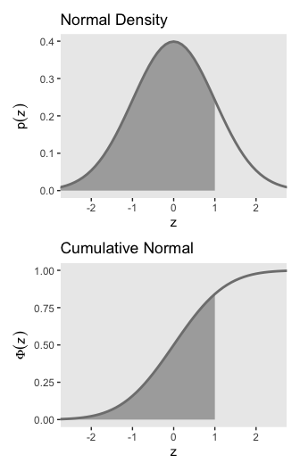<!-- -->

For both plots, `z` is in a standardized metric (i.e., \(z\)-score).
With the cumulative normal function, the cumulative probability,
\(\Phi(z)\), increases nonlinearly with the \(z\)-scores such that, much
like with the logistic curve, the greatest change occurs around
\(z = 0\) and it tapers off in the tails.

The inverse of \(\Phi(x)\) is the *probit* function. As indicated in the
above block quote, we’ll be making extensive use of the probit function
in this chapter to model our ordinal data.

## 23.1. Modeling ordinal data with an underlying metric variable

> You can imagine that the distribution of ordinal values might not
> resemble a normal distribution, even though the underlying metric
> values are normally distributed. Figure 23.1 shows some examples of
> ordinal outcome probabilities generated from an underlying normal
> distribution. The horizontal axis is the underlying continuous metric
> value. Thresholds are plotted as vertical dashed lines, labeled
> \(\theta\). In all examples, the ordinal scale has 7 levels, and
> hence, there are 6 thresholds. The lowest threshold is set at
> \(\theta_1 = 1.5\) (to separate outcomes 1 and 2), and the highest
> threshold is set at \(\theta_1 = 6.5\) (to separate outcomes 6 and 7).
> The normal curve in each panel shows the distribution of underlying
> continuous values. What differs across panels are the settings of
> means, standard deviations, and remaining thresholds. (p. 672)

There are a lot of ins and outs to make the subplots in Figure 23.1.
We’ll start with the top panel and build from there. Here is how we
might make the values necessary for the density curve.

``` r
den <-
  # define the parameters for the underlying normal distribution
  tibble(mu    = 4,
         sigma = 1.5) %>% 
  mutate(strip = str_c("mu==", mu, "~~sigma==", sigma)) %>% 
  # this will allow us to rescale the density in terms of the bar plot
  mutate(multiplier = 26 / dnorm(mu, mu, sigma)) %>% 
  # we need values for the x-axis
  expand(nesting(mu, sigma, strip, multiplier),
         y = seq(from = -1, to = 9, by = .1)) %>% 
  # compute the density values
  mutate(density = dnorm(y, mu, sigma)) %>% 
  # use that multiplier value from above to rescale the density values
  mutate(percent = density * multiplier)

head(den)
```

    ## # A tibble: 6 x 7
    ##      mu sigma strip             multiplier     y density percent
    ##   <dbl> <dbl> <chr>                  <dbl> <dbl>   <dbl>   <dbl>
    ## 1     4   1.5 mu==4~~sigma==1.5       97.8  -1   0.00103   0.101
    ## 2     4   1.5 mu==4~~sigma==1.5       97.8  -0.9 0.00128   0.125
    ## 3     4   1.5 mu==4~~sigma==1.5       97.8  -0.8 0.00159   0.155
    ## 4     4   1.5 mu==4~~sigma==1.5       97.8  -0.7 0.00196   0.192
    ## 5     4   1.5 mu==4~~sigma==1.5       97.8  -0.6 0.00241   0.236
    ## 6     4   1.5 mu==4~~sigma==1.5       97.8  -0.5 0.00295   0.289

Before we make the data for the bar portion of the plot, we’ll need to
define the \(\theta\) values they’ll be placed between. We’ll also need
to define the exact points on the x-axis we’d like those bars to
originate from. Those points, which we’ll call `label_1`, will double as
names for the individual bars.

``` r
(theta_1 <- seq(from = 1.5, to = 6.5, by = 1))
```

    ## [1] 1.5 2.5 3.5 4.5 5.5 6.5

``` r
(label_1 <- 1:7)
```

    ## [1] 1 2 3 4 5 6 7

Now we can define the data for the bars.

``` r
bar <-
  # define the parameters for the underlying normal distribution
  tibble(mu    = 4,
         sigma = 1.5) %>% 
  mutate(strip = str_c("mu==", mu, "~~sigma==", sigma)) %>% 
  # take random draws from the underlying normal distribution
  mutate(draw = map2(mu, sigma, ~rnorm(1e4, mean = .x, sd = .y))) %>% 
  unnest(draw) %>% 
  # bin those draws into ordinal categories defined by `theta_1`
  # and named by `label_1`
  mutate(y = case_when(
    draw  < theta_1[1] ~ label_1[1],
    draw  < theta_1[2] ~ label_1[2],
    draw  < theta_1[3] ~ label_1[3],
    draw  < theta_1[4] ~ label_1[4],
    draw  < theta_1[5] ~ label_1[5],
    draw  < theta_1[6] ~ label_1[6],
    draw >= theta_1[6] ~ label_1[7]
  )) %>% 
  # summarize
  count(y) %>% 
  mutate(percent       = (100 * n / sum(n)) %>% round(0))   %>% 
  mutate(percent_label = str_c(percent, "%"),
         percent_max   = max(percent))

head(bar)
```

    ## # A tibble: 6 x 5
    ##       y     n percent percent_label percent_max
    ##   <int> <int>   <dbl> <chr>               <dbl>
    ## 1     1   481       5 5%                     26
    ## 2     2  1072      11 11%                    26
    ## 3     3  2117      21 21%                    26
    ## 4     4  2604      26 26%                    26
    ## 5     5  2155      22 22%                    26
    ## 6     6  1086      11 11%                    26

Make the top subplot.

``` r
bar %>% 
  ggplot(aes(x = y)) +
  geom_ribbon(data = den,
              aes(ymin = 0, ymax = percent),
              fill = "grey75") +
  geom_vline(xintercept = theta_1, color = "grey92", linetype = 3) +
  geom_col(aes(y = percent),
           width = .5, alpha = .85) +
  geom_text(aes(y = percent + 2, label = percent_label),
            size = 3.5) +
  annotate(geom = "text",
           x = theta_1, y = -6.5,
           label = theta_1,
           size = 3) +
  scale_x_continuous(NULL, 
                     breaks = theta_1,
                     labels = parse(text = str_c("theta[", 1:6, "]"))) +
  scale_y_continuous(NULL, breaks = NULL) +
  coord_cartesian(ylim = c(0, 28.5), clip = F) +
  theme(panel.grid = element_blank(),
        plot.margin = margin(5.5, 5.5, 11, 5.5)) +
  facet_wrap(~strip, labeller = label_parsed)
```

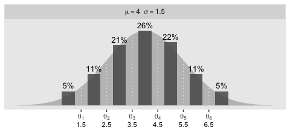<!-- -->

This method works okay for plotting one panel or two. It has a whole lot
of lines of code and moving parts if we’re going to plot four. It’d be
convenient if we could save the density informaiton for all four panels
in one data object. Here’s one way how.

``` r
den <-
  tibble(panel = 1:4,
         mu    = c(4, 1, 4, 4),
         sigma = c(1.5, 2.5, 1, 3)) %>% 
  mutate(strip = factor(panel,
                        labels  = str_c("mu==", mu, "~~sigma==", sigma),
                        ordered = T)) %>% 
  mutate(multiplier = c(26, 58, 24, 26) / dnorm(mu, mu, sigma)) %>% 
  expand(nesting(panel, mu, sigma, strip, multiplier),
         y = seq(from = -1, to = 9, by = .1)) %>% 
  mutate(density = dnorm(y, mu, sigma)) %>% 
  mutate(percent = density * multiplier)

head(den)
```

    ## # A tibble: 6 x 8
    ##   panel    mu sigma strip             multiplier     y density percent
    ##   <int> <dbl> <dbl> <ord>                  <dbl> <dbl>   <dbl>   <dbl>
    ## 1     1     4   1.5 mu==4~~sigma==1.5       97.8  -1   0.00103   0.101
    ## 2     1     4   1.5 mu==4~~sigma==1.5       97.8  -0.9 0.00128   0.125
    ## 3     1     4   1.5 mu==4~~sigma==1.5       97.8  -0.8 0.00159   0.155
    ## 4     1     4   1.5 mu==4~~sigma==1.5       97.8  -0.7 0.00196   0.192
    ## 5     1     4   1.5 mu==4~~sigma==1.5       97.8  -0.6 0.00241   0.236
    ## 6     1     4   1.5 mu==4~~sigma==1.5       97.8  -0.5 0.00295   0.289

Notice we added a `panel` column for indexing the subplots. Next we’ll
need to define `theta_[i]` and `label_[i]` values for the remaining
plots.

``` r
theta_3 <- c(1.5, 3.1, 3.7, 4.3, 4.9, 6.5)
theta_4 <- c(1.5, 2.25, 3, 5, 5.75, 6.5)

label_3 <- c(1, 2.2, 3.4, 4, 4.6, 5.7, 7)
label_4 <- c(1, 1.875, 2.625, 4, 5.375, 6.125, 7)
```

Since the values are the same for the top two panels, we didn’t bother
defining a `theta_2` or `label_2`. Now we have all the `theta_[i]` and
`label_[i]` values, we’ll want to make a function that can use them
within `case_when()` for any of the four panels. Here’s one way to make
such a function, which we’ll call `make_ordinal()`.

``` r
make_ordinal <- function(x, panel) {
  
  if (panel < 3) {
    
    case_when(
      x  < theta_1[1] ~ label_1[1],
      x  < theta_1[2] ~ label_1[2],
      x  < theta_1[3] ~ label_1[3],
      x  < theta_1[4] ~ label_1[4],
      x  < theta_1[5] ~ label_1[5],
      x  < theta_1[6] ~ label_1[6],
      x >= theta_1[6] ~ label_1[7]
    )
    
  } else if (panel == 3) {
    
    case_when(
      x  < theta_3[1] ~ label_3[1],
      x  < theta_3[2] ~ label_3[2],
      x  < theta_3[3] ~ label_3[3],
      x  < theta_3[4] ~ label_3[4],
      x  < theta_3[5] ~ label_3[5],
      x  < theta_3[6] ~ label_3[6],
      x >= theta_3[6] ~ label_3[7]
    )
    
  } else {
    
    case_when(
      x  < theta_4[1] ~ label_4[1],
      x  < theta_4[2] ~ label_4[2],
      x  < theta_4[3] ~ label_4[3],
      x  < theta_4[4] ~ label_4[4],
      x  < theta_4[5] ~ label_4[5],
      x  < theta_4[6] ~ label_4[6],
      x >= theta_4[6] ~ label_4[7]
    )
    
   }
  
}
```

Now put those values and our `make_ordinal()` function to work to make
the data for the bar plots.

``` r
set.seed(23)

bar <-
  tibble(panel = 1:4,
         mu    = c(4, 1, 4, 4),
         sigma = c(1.5, 2.5, 1, 3)) %>% 
  mutate(strip = factor(panel,
                        labels  = str_c("mu==", mu, "~~sigma==", sigma),
                        ordered = T)) %>% 
  mutate(draw = map2(mu, sigma, ~rnorm(1e5, mean = .x, sd = .y))) %>% 
  unnest(draw) %>% 
  mutate(y = map2_dbl(draw, panel, make_ordinal)) %>% 
  group_by(panel, strip) %>% 
  count(y) %>% 
  mutate(percent       = (100 * n / sum(n)) %>% round(0))   %>% 
  mutate(percent_label = str_c(percent, "%"),
         percent_max   = max(percent))

head(bar)
```

    ## # A tibble: 6 x 7
    ## # Groups:   panel, strip [1]
    ##   panel strip                 y     n percent percent_label percent_max
    ##   <int> <ord>             <dbl> <int>   <dbl> <chr>               <dbl>
    ## 1     1 mu==4~~sigma==1.5     1  4763       5 5%                     26
    ## 2     1 mu==4~~sigma==1.5     2 10844      11 11%                    26
    ## 3     1 mu==4~~sigma==1.5     3 21174      21 21%                    26
    ## 4     1 mu==4~~sigma==1.5     4 26256      26 26%                    26
    ## 5     1 mu==4~~sigma==1.5     5 21233      21 21%                    26
    ## 6     1 mu==4~~sigma==1.5     6 10951      11 11%                    26

Like before, we added a `panel` index. Our last step will be to make
something of a super function to plug in the desired information into
**ggplot2** to make each subplot. Much of the plotting and data
wrangling code will be the same across subplots. As far as I can tell,
we only need to vary four parameters. First, we’ll want to be able to
subset the data by `panel` index. We’ll do that with the `panel_n`
argument. Second, we’ll want to select which of the `theta_[i]` values
we’d like to use in `geom_vline()`, `annotate()`, and
`scale_x_continuous()`. We’ll do that with the `theta` argument. We’ll
make a `y_second_x` to pin down exactly where below the x-axis we’d like
to put those secondary axis values defined by the `theta_[i]` values.
Finally, we’ll want an `ylim_ub` parameter to set the upper limit of the
y-axis with. The name of the super function will be `plot_bar_den()`.

``` r
plot_bar_den <- function(panel_n, theta, y_second_x, ylim_ub) {
  
  bar %>% 
    filter(panel == panel_n) %>% 
    
    ggplot(aes(x = y)) +
    geom_ribbon(data = den %>% filter(panel == panel_n),
                aes(ymin = 0, ymax = percent),
                fill = "grey75") +
    geom_vline(xintercept = theta, color = "grey92", linetype = 3) +
    geom_col(aes(y = percent),
             width = .5, alpha = .85) +
    geom_text(aes(y = percent + (percent_max / 15), label = percent_label),
              size = 3.5) +
    annotate(geom = "text",
             x = theta, y = y_second_x,
             label = theta,
             size = 3) +
    scale_x_continuous(NULL, 
                       breaks = theta,
                       labels = parse(text = str_c("theta[", 1:6, "]"))) +
    scale_y_continuous(NULL, breaks = NULL) +
    coord_cartesian(clip = F, ylim = c(0, ylim_ub)) +
    theme(panel.grid = element_blank(),
          plot.margin = margin(5.5, 5.5, 11, 5.5)) +
    facet_wrap(~strip, labeller = label_parsed)
  
}
```

Finally, make all four subplots and combine them with **patchwork**
syntax\!

``` r
p1 <- plot_bar_den(panel_n    = 1, 
                   theta      = theta_1, 
                   y_second_x = -6.75, 
                   ylim_ub    = 28)

p2 <- plot_bar_den(panel_n    = 2, 
                   theta      = theta_1, 
                   y_second_x = -15.5, 
                   ylim_ub    = 63)

p3 <- plot_bar_den(panel_n    = 3, 
                   theta      = theta_3, 
                   y_second_x = -6.25, 
                   ylim_ub    = 25.75)

p4 <- plot_bar_den(panel_n    = 4, 
                   theta      = theta_4, 
                   y_second_x = -6.75, 
                   ylim_ub    = 28)

p1 / p2 / p3 / p4
```

<!-- -->

Oh mamma. “*The crucial concept in Figure 23.1 is that the probability
of a particular ordinal outcome is the area under the normal curve
between the thresholds of that outcome*” (p. 672, *emphasis* in the
original). In each of the subplots, we used six thresholds to descritize
the continuous data into seven categories. More generally, we need \(K\)
thresholds to make \(K + 1\) ordinal categories. To make this work,

> the idea is that we consider the cumulative area under the normal up
> the high-side threshold, and subtract away the cumulative area under
> the normal up to the low-side threshold. Recall that the cumulative
> area under the standardized normal is denoted \(\Phi(z)\), as was
> illustrated in Figure 15.8 \[which we remade at the top of this
> chapter\]. Thus, the area under the normal to the left of \(\theta_k\)
> is \(\Phi((\theta_k - \mu) / \sigma)\), and the area under the normal
> to the left of \(\theta_{k - 1}\) is
> \(\Phi((\theta_{k - 1} - \mu) / \sigma)\). Therefore, the area under
> the normal curve between the two thresholds, which is the probability
> of outcome \(k\),
> is
> 
> \[p(y = k | \mu, \sigma, \{ \theta_j \}) = \Phi((\theta_k - \mu) / \sigma) - \Phi((\theta_{k - 1} - \mu) / \sigma)\]
> 
> \[This equation\] applies even to the least and greatest ordinal
> values if we append two “virtual” thresholds at \(- \infty\) and
> \(+ \infty\)…
> 
> Thus, a normally distributed underlying metric value can yield a
> clearly non-normal distribution of discrete ordinal values. This
> result does not imply that the ordinal values can be treated as if
> they were themselves metric and normally distributed; in fact it
> implies the opposite: We might be able to model a distribution of
> ordinal values as consecutive intervals of a normal distribution on an
> underlying metric scale with appropriately positioned thresholds.
> (pp. 674–675)

## 23.2. The case of a single group

Given a model with no predictors, “if there are \(K\) ordinal values,
the model has \(K + 1\) parameters:
\(\theta_1,...,\theta_{K - 1}, \mu\), and \(\sigma\). If you think about
it a moment, you’ll realize that the parameter values trade-off and are
undetermined” (p. 675). The solution Kruschke took throughout this
chapter was to fix the two thresholds at the ends, \(\theta_1\) and
\(\theta_{K - 1}\), to the constants

\[
\begin{align*}
\theta_1 \equiv 1 + 0.5 && \text{and}  && \theta_{K - 1} \equiv K - 0.5.
\end{align*}
\]

For example, all four subplots from Figure 23.1 had \(K = 7\)
categories, ranging from 1 to 7. Following Kruschke’s convention would
mean setting the endmost thresholds to

\[
\begin{align*}
\theta_1 \equiv 1.5 && \text{and}  && \theta_6 \equiv 6.5.
\end{align*}
\]

As we’ll see, there are other ways to parameterize these models.

### 23.2.1 Implementation in ~~JAGS~~ **brms**.

The syntax to fit a basic ordered probit model with `brms::brm()` is
pretty simple.

``` r
fit <-
  brm(data = my_data,
      family = cumulative(probit),
      y ~ 1,
      prior(normal(0, 4), class = Intercept))
```

The `family = cumulative(probit)` tells **brms** you’d like to use the
probit link for the ordered categorical data. It’s important to specify
`probit` because the **brms** default is actually to use the `logit`
link, instead. We’ll talk more about that approach at the end of this
chapter.

Remember how, at the end of the last section, we said there are other
ways to parameterize the ordered probit model? As it turns out, **brms**
does not follow Kruschke’s approach for fixing the thresholds on the
ends. Rather, **brms** freely estimates all thresholds,
\(\theta_1,...,\theta_{K - 1}\), by fixing \(\mu = 0\) and
\(\sigma = 1\). That is, instead of estimating \(\mu\) and \(\sigma\)
from the normal cumulative density function \(\Phi(x)\), `brms::brm()`
used the standard normal cumulative density function \(\Phi(z)\).

At this point, this all probably seems abstract. We’ll get a lot of
practice comparing the two approaches as we go along. Each has its
strengths and weaknesses. At this point, the thing to get is that when
fitting a single-group ordered probit model with the `brm()` function,
there will be no priors for \(\mu\) and \(\sigma\). We only have to
worry about setting the priors for all \(K - 1\) thresholds. And because
those thresholds are conditional on \(\Phi(z)\), we should think about
their priors with respect to the standard normal distribution. Thus, to
continue on with Kruschke’s minimally-informative prior approach,
something like `prior(normal(0, 4), class = Intercept)` might be a good
starting place. Do feel free to experiment with different settings.

### 23.2.2 Examples: Bayesian estimation recovers true parameter values.

The data for Kruschke’s first example come from his
`OrdinalProbitData-1grp-1.csv` file. Load the
data.

``` r
my_data_1 <- read_csv("~/Dropbox/Recoding Doing Bayesian Data Analysis/data.R/OrdinalProbitData-1grp-1.csv")

glimpse(my_data_1)
```

    ## Observations: 100
    ## Variables: 1
    ## $ Y <dbl> 1, 1, 1, 1, 1, 1, 1, 1, 1, 1, 1, 1, 1, 1, 1, 1, 1, 1, 1, 1, 1, 1, 1, 1, 1, 1, 1, 1, 1, 1, 1, 1, 1…

Take a look at the distribution for `Y`.

``` r
my_data_1 %>% 
  mutate(Y = factor(Y)) %>% 
  
  ggplot(aes(x = Y)) +
  geom_bar() +
  theme(panel.grid = element_blank())
```

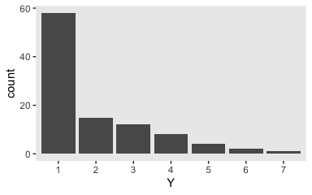<!-- -->

It looks a lot like the distribution of the data from one of the panels
from Figure 23.1. Load **brms**.

``` r
library(brms)
```

Fit the first cumulative probit model.

``` r
fit1 <-
  brm(data = my_data_1,
      family = cumulative(probit),
      Y ~ 1,
      prior(normal(0, 4), class = Intercept),
      iter = 3000, warmup = 1000, chains = 4, cores = 4,
      seed = 23)
```

Examine the model summary.

``` r
print(fit1)
```

    ##  Family: cumulative 
    ##   Links: mu = probit; disc = identity 
    ## Formula: Y ~ 1 
    ##    Data: my_data_1 (Number of observations: 100) 
    ## Samples: 4 chains, each with iter = 3000; warmup = 1000; thin = 1;
    ##          total post-warmup samples = 8000
    ## 
    ## Population-Level Effects: 
    ##              Estimate Est.Error l-95% CI u-95% CI Rhat Bulk_ESS Tail_ESS
    ## Intercept[1]     0.18      0.13    -0.06     0.43 1.00    10343     6333
    ## Intercept[2]     0.60      0.13     0.34     0.87 1.00    11769     6851
    ## Intercept[3]     1.04      0.15     0.74     1.34 1.00    11542     6613
    ## Intercept[4]     1.50      0.19     1.14     1.88 1.00    12314     6356
    ## Intercept[5]     1.96      0.25     1.50     2.49 1.00    11738     7449
    ## Intercept[6]     2.57      0.40     1.89     3.45 1.00    12330     7001
    ## 
    ## Samples were drawn using sampling(NUTS). For each parameter, Eff.Sample 
    ## is a crude measure of effective sample size, and Rhat is the potential 
    ## scale reduction factor on split chains (at convergence, Rhat = 1).

The **brms** output for these kinds of models names the thresholds
\(\theta_{[i]}\) as `Intercept[i]`. Again, whereas Kruschke identified
his model by fixing \(\theta_1 = 1.5\) (i.e., \(1 + 0.5\)) and
\(\theta_6 = 5.5\) (i.e., \(6 - 0.5\)), we freely estimated all out
thresholds by using the cumulative density function for the standard
normal. As a result, our thresholds are in a different metric from
Kruschke’s. Let’s extract the posterior draws.

``` r
post <- posterior_samples(fit1)

glimpse(post)
```

    ## Observations: 8,000
    ## Variables: 13
    ## $ `b_Intercept[1]` <dbl> 0.185364034, 0.165876358, 0.438520914, 0.206087790, 0.131577665, 0.189973985, 0.19…
    ## $ `b_Intercept[2]` <dbl> 0.6662789, 0.6199828, 0.7796308, 0.6214409, 0.4437972, 0.5546956, 0.7037654, 0.454…
    ## $ `b_Intercept[3]` <dbl> 1.1525861, 1.1466193, 1.1683288, 1.0015953, 1.0178535, 0.9794249, 1.1422900, 0.864…
    ## $ `b_Intercept[4]` <dbl> 1.495071, 1.527385, 1.681138, 1.388764, 1.561751, 1.390207, 1.364145, 1.575484, 1.…
    ## $ `b_Intercept[5]` <dbl> 1.705743, 1.752142, 2.057058, 2.024601, 1.758377, 1.882053, 1.577857, 2.116130, 1.…
    ## $ `b_Intercept[6]` <dbl> 2.155234, 2.081832, 2.817471, 2.708599, 2.235552, 3.252597, 1.714304, 3.205844, 2.…
    ## $ `Intercept[1]`   <dbl> 0.185364034, 0.165876358, 0.438520914, 0.206087790, 0.131577665, 0.189973985, 0.19…
    ## $ `Intercept[2]`   <dbl> 0.6662789, 0.6199828, 0.7796308, 0.6214409, 0.4437972, 0.5546956, 0.7037654, 0.454…
    ## $ `Intercept[3]`   <dbl> 1.1525861, 1.1466193, 1.1683288, 1.0015953, 1.0178535, 0.9794249, 1.1422900, 0.864…
    ## $ `Intercept[4]`   <dbl> 1.495071, 1.527385, 1.681138, 1.388764, 1.561751, 1.390207, 1.364145, 1.575484, 1.…
    ## $ `Intercept[5]`   <dbl> 1.705743, 1.752142, 2.057058, 2.024601, 1.758377, 1.882053, 1.577857, 2.116130, 1.…
    ## $ `Intercept[6]`   <dbl> 2.155234, 2.081832, 2.817471, 2.708599, 2.235552, 3.252597, 1.714304, 3.205844, 2.…
    ## $ lp__             <dbl> -151.4273, -151.4265, -151.7556, -149.8376, -152.3254, -150.8681, -155.6359, -151.…

Wrangle `post`.

``` r
post <-
  post %>%
  select(`Intercept[1]`:`Intercept[6]`) %>%
  mutate(iter = 1:n())
```

Here’s our **brms** version of the bottom plot of Figure 23.2

``` r
post %>% 
    gather(name, threshold, -iter) %>% 
    group_by(iter) %>% 
    mutate(theta_bar = mean(threshold)) %>% 
  
  ggplot(aes(x = threshold, y = theta_bar)) +
  geom_point(aes(color = name),
             alpha = 1/10) +
  scale_color_viridis_d(option = "D", end = .85, direction = -1) +
  ylab("mean threshold") +
  theme(panel.grid = element_blank(),
        legend.position = "none") 
```

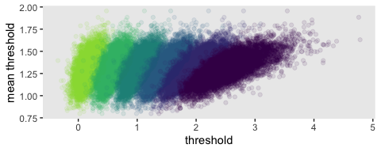<!-- -->

Did you see what we did there with those `group_by()` and `mutate()`
lines? That’s how we computed the mean threshold within each step of the
HMC chain, what Kruschke (p. 680) denoted as
\(\bar \theta (s) = \sum_k^{K-1} \theta_k (s) / (K - 1)\), where \(s\)
refers to particular steps in the HMC chain.

Perhaps of greater interest, you might have noticed how different out
plot is from the one in the text. We might should compare the plot of
our **brms** parameterization of \(\theta_{[i]}\) with one based on the
parameterization in the text in an expanded version of the bottom plot
of Figure 23.2. To convert our **brms** output to match Kruschke’s,
we’ll rescale our \(\theta_{[i]}\) draws with help from the
`scales::rescale()` function, which you might learn more about
[here](https://www.rdocumentation.org/packages/scales/versions/0.4.1/topics/rescale).

``` r
bind_rows(
  # brms parameterization
  post %>% 
    gather(name, threshold, -iter) %>% 
    group_by(iter) %>% 
    mutate(theta_bar = mean(threshold)),
  # Kruschke's parameterization
  post %>% 
    gather(name, threshold, -iter) %>% 
    group_by(iter) %>% 
    mutate(threshold = scales::rescale(threshold, to = c(1.5, 6.5))) %>% 
    mutate(theta_bar = mean(threshold))
) %>% 
  # add an index
  mutate(model = rep(c("brms parameterization", "Kruschke's parameterization"), each = n() / 2)) %>% 
  
  # plot!
  ggplot(aes(x = threshold, y = theta_bar)) +
  geom_point(aes(color = name),
             alpha = 1/10, size = 1/2) +
  scale_color_viridis_d(option = "D", end = .85, direction = -1) +
  ylab("mean threshold") +
  theme(panel.grid = element_blank(),
        legend.position = "none") +
  facet_wrap(~model, ncol = 1, scales = "free")
```

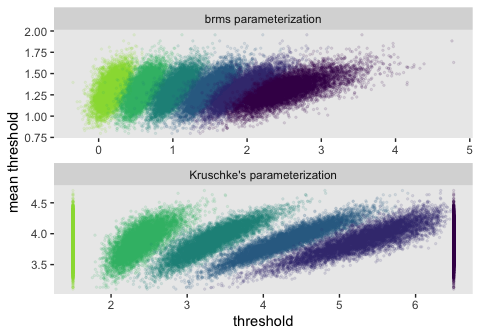<!-- -->

Here is the correlation matrix among the
    thresholds.

``` r
vcov(fit1, correlation = T) %>% round(digits = 2)
```

    ##              Intercept[1] Intercept[2] Intercept[3] Intercept[4] Intercept[5] Intercept[6]
    ## Intercept[1]         1.00         0.72         0.51         0.33         0.21         0.13
    ## Intercept[2]         0.72         1.00         0.71         0.45         0.29         0.16
    ## Intercept[3]         0.51         0.71         1.00         0.65         0.41         0.21
    ## Intercept[4]         0.33         0.45         0.65         1.00         0.64         0.32
    ## Intercept[5]         0.21         0.29         0.41         0.64         1.00         0.51
    ## Intercept[6]         0.13         0.16         0.21         0.32         0.51         1.00

``` r
# Valid distributional parameters are: 'mu', 'disc'
# fitted(fit1)
```

Kruschke didn’t do this in the text, but it might be informative to plot
the probability distributions for the seven categories from `Y` (i.e.,
\(p(y = k | \mu = 0, \sigma = 1, \{ \theta_i \})\)).

``` r
library(tidybayes)

post %>% 
  select(-iter) %>% 
  mutate_all(.funs = ~pnorm(. ,0, 1)) %>% 
  transmute(`p[Y==1]` = `Intercept[1]`,
            `p[Y==2]` = `Intercept[2]` - `Intercept[1]`,
            `p[Y==3]` = `Intercept[3]` - `Intercept[2]`,
            `p[Y==4]` = `Intercept[4]` - `Intercept[3]`,
            `p[Y==5]` = `Intercept[5]` - `Intercept[4]`,
            `p[Y==6]` = `Intercept[6]` - `Intercept[5]`,
            `p[Y==7]` = 1 - `Intercept[6]`) %>% 
  set_names(1:7) %>% 
  pivot_longer(everything(), names_to = "Y") %>% 
  
  ggplot(aes(x = value, y = Y)) +
  geom_halfeyeh(.width = .95, size = 1/2) +
  xlab(expression(paste(italic(p), "[Y = ", italic(i), "]"))) +
  coord_cartesian(xlim = 0:1) +
  theme(panel.grid = element_blank())
```

<!-- -->

Happily, the model produces data that look a lot like those used to
generate it.

``` r
post %>% 
  mutate(z = rnorm(n(), mean = 0, sd = 1)) %>% 
  mutate(Y = case_when(
    z < `Intercept[1]` ~ 1,
    z < `Intercept[2]` ~ 2,
    z < `Intercept[3]` ~ 3,
    z < `Intercept[4]` ~ 4,
    z < `Intercept[5]` ~ 5,
    z < `Intercept[6]` ~ 6,
    z >= `Intercept[6]` ~ 7
  ) %>% as.factor(.)) %>% 

  ggplot(aes(x = Y)) +
  geom_bar() +
  theme(panel.grid = element_blank())
```

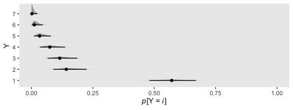<!-- -->

Along similar lines, we can use the `pp_check()` function to make a
version of the upper right panel of Figure 23.2. The `type = "bars"`
argument allowed us to summarize the posterior predictions as a dot
(mean) and standard error bars superimposed on a bar plot of the
original data. Note how this differs a little from Kruschke’s use of the
posterior median and 95% HDIs. The `nsamples = 1000` argument controlled
how many posterior predictions we wanted to summarize over. The rest is
just formatting.

``` r
set.seed(23)

pp_check(fit1, type = "bars", nsamples = 1000) +
  scale_x_continuous("y", breaks = 1:7) +
  scale_y_continuous(NULL, breaks = NULL) +
  ggtitle("Data with posterior predictions",
          subtitle = "N = 100") +
  theme(legend.position = c(.9, .8))
```

<!-- -->

Because our **brms** parameterization used a fixed mean and standard
deviation (i.e., \(\operatorname{Normal} (0, 1)\)), I’m not aware that
we can make versions of the Figure 23.2 subplots for the mean, standard
deviation, and effect size. This brings up another difficulty. Kruschke
wrote that the

> effect size for a single group must be defined with respect to a
> comparison value \(C\); for purposes of illustration, the comparison
> value here is chosen to be \(C = 2.0\). Effect size is defined as the
> difference between the mean and the comparison value, relative to the
> standard deviation: \((\mu - C) / \sigma\). (p. 6.70)

Sure, since our **brms** values are \(\mu = 0\) and \(\sigma = 1\), we
could go through the steps with \(C = 2.0\):

\[(0 - 2) / 1 = -2\]

We have an effect size of -2. Because there is no uncertainty in any of
the three values in the equation, all the mass in the posterior is on a
single point. There are no 95% intervals.

From another angle, it’s unclear, to me, how we’d interpret Kruchke’s
effect size of -0.41, 95% HDI \[-0.65, -0.18\] (see page 678). The
difficulty isn’t that his comparison of \(C = 2.0\) is arbitrary, but
that the only way we can interpret the comparison given the model
assumption of \(\theta_1 = 1.5\) and \(\theta_6 = 6.5\). If your theory
doesn’t allow you to understand the meaning of those constants and why
you’d prefer them to slightly different ones, you’d be fooling yourself
if you attempted to interpret any effect sizes conditional on their
values.

Load the data for the next
model.

``` r
my_data_2 <- read_csv("/Users/solomon/Dropbox/Recoding Doing Bayesian Data Analysis/data.R/OrdinalProbitData-1grp-2.csv")
```

Since we’re reusing all the specifications from the last model for this
one, we can just use `update()`.

``` r
fit2 <-
  update(fit1, 
         newdata = my_data_2,
         iter = 3000, warmup = 1000, chains = 4, cores = 4,
         seed = 23)
```

``` r
print(fit2)
```

    ##  Family: cumulative 
    ##   Links: mu = probit; disc = identity 
    ## Formula: Y ~ 1 
    ##    Data: my_data_2 (Number of observations: 70) 
    ## Samples: 4 chains, each with iter = 3000; warmup = 1000; thin = 1;
    ##          total post-warmup samples = 8000
    ## 
    ## Population-Level Effects: 
    ##              Estimate Est.Error l-95% CI u-95% CI Rhat Bulk_ESS Tail_ESS
    ## Intercept[1]    -1.41      0.22    -1.85    -1.00 1.00     5467     5039
    ## Intercept[2]    -0.18      0.15    -0.47     0.12 1.00     9230     6898
    ## Intercept[3]     0.17      0.15    -0.12     0.46 1.00     9458     6989
    ## Intercept[4]     0.46      0.16     0.15     0.76 1.00     8971     6719
    ## Intercept[5]     0.83      0.17     0.50     1.16 1.00     8841     6441
    ## Intercept[6]     2.00      0.31     1.44     2.66 1.00     9194     6731
    ## 
    ## Samples were drawn using sampling(NUTS). For each parameter, Eff.Sample 
    ## is a crude measure of effective sample size, and Rhat is the potential 
    ## scale reduction factor on split chains (at convergence, Rhat = 1).

Save and wrangle the posterior draws.

``` r
post <- 
  posterior_samples(fit2) %>%
  select(`Intercept[1]`:`Intercept[6]`) %>%
  mutate(iter = 1:n())
```

Now we might compare the **brms** parameterization of \(\theta_{[i]}\)
with the parameterization in the text in an expanded version of the
bottom plot of Figure 23.3. As it turns out, we’ll be making a lot of
these plots throughout this chapter. It might be worth it to just make a
custom function. We’ll call it `compare_thresholds()`.

``` r
compare_thresholds <- function(data, lb = 1.5, ub = 6.5) {
  
  bind_rows(
    data %>% 
      gather(name, threshold, -iter) %>% 
      group_by(iter) %>% 
      mutate(theta_bar = mean(threshold)),
    data %>% 
      gather(name, threshold, -iter) %>% 
      group_by(iter) %>% 
      mutate(threshold = scales::rescale(threshold, to = c(lb, ub))) %>% 
      mutate(theta_bar = mean(threshold))
  ) %>% 
    mutate(model = rep(c("brms parameterization", "Kruschke's parameterization"), each = n() / 2)) %>% 
    
    ggplot(aes(x = threshold, y = theta_bar)) +
    geom_point(aes(color = name),
               alpha = 1/10, size = 1/2) +
    scale_color_viridis_d(option = "D", end = .85, direction = -1) +
    ylab("mean threshold") +
    theme(panel.grid = element_blank(),
          legend.position = "none") +
    facet_wrap(~model, ncol = 1, scales = "free")
  
}
```

Take that puppy for a spin.

``` r
post %>% 
  compare_thresholds(lb = 1.5, ub = 6.5)
```

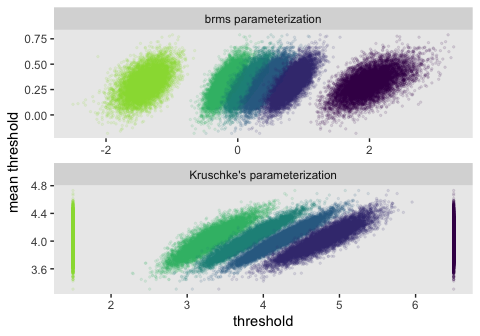<!-- -->

Like before, we don’t have posterior distributions for \(\mu\) and
\(\sigma\). Those are fixed at 0 and 1, respectively. As such, it isn’t
of much use to compute an effect size, either. We can, at least, make
our version of the upper-right panel of Figure 23.3.

``` r
set.seed(23)

pp_check(fit2, type = "bars", nsamples = 1000) +
  scale_x_continuous("y", breaks = 1:7) +
  scale_y_continuous(NULL, breaks = NULL) +
  ggtitle("Data with posterior predictions",
          subtitle = "N = 70") +
  theme(legend.position = c(.9, .8))
```

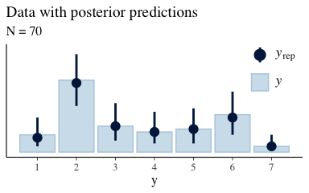<!-- -->

Just as in the text, “the posterior predictive distribution in the
top-right subpanel accurately describes the bimodal distribution of the
outcomes” (p. 680).

Here are the probability distributions for each of the 7 categories of
`Y`.

``` r
post %>% 
  select(-iter) %>% 
  mutate_all(.funs = ~pnorm(. ,0, 1)) %>% 
  transmute(`p[Y==1]` = `Intercept[1]`,
            `p[Y==2]` = `Intercept[2]` - `Intercept[1]`,
            `p[Y==3]` = `Intercept[3]` - `Intercept[2]`,
            `p[Y==4]` = `Intercept[4]` - `Intercept[3]`,
            `p[Y==5]` = `Intercept[5]` - `Intercept[4]`,
            `p[Y==6]` = `Intercept[6]` - `Intercept[5]`,
            `p[Y==7]` = 1 - `Intercept[6]`) %>% 
  set_names(1:7) %>% 
  pivot_longer(everything(), names_to = "Y") %>% 
  
  ggplot(aes(x = value, y = Y)) +
  geom_halfeyeh(.width = .95, size = 1/2) +
  xlab(expression(paste(italic(p), "[Y = ", italic(i), "]"))) +
  coord_cartesian(xlim = 0:1) +
  theme(panel.grid = element_blank())
```

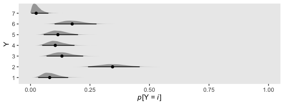<!-- -->

Before we move on, it might be helpful to nail down what the thresholds
mean within the context of our **brms** parameterization.

``` r
tibble(x = seq(from = -3.5, to = 3.5, by = .01)) %>%
  mutate(d = dnorm(x)) %>% 
  
  ggplot(aes(x = x, ymin = 0, ymax = d)) +
  geom_ribbon(fill = "grey67") +
  geom_vline(xintercept = fixef(fit2)[, 1], color = "grey92", linetype = 3) +
  scale_x_continuous(NULL, breaks = fixef(fit2)[, 1],
                     labels = parse(text = str_c("theta[", 1:6, "]"))) +
  scale_y_continuous(NULL, breaks = NULL) +
  ggtitle("Standard normal distribution underlying the ordinal Y data:",
          subtitle = "The dashed vertical lines mark the posterior means for the thresholds.") +
  coord_cartesian(xlim = -3:3) +
  theme(panel.grid = element_blank())
```

<!-- -->

Compare that to Figure 23.1.

#### 23.2.2.1 Not the same results as pretending the data are metric.

“In some conventional approaches to ordinal data, the data are treated
as if they were metric and normally distributed” (p. 681). Here’s what
that `brms::brm()` model might look like using methods from back in
Chapter 16. First, we’ll define our `stanvars`.

``` r
mean_y <- mean(my_data_1$Y)
sd_y   <- sd(my_data_1$Y)

stanvars <- 
  stanvar(mean_y, name = "mean_y") + 
  stanvar(sd_y,   name = "sd_y")
```

Fit the model.

``` r
fit3 <-
  brm(data = my_data_1,
      family = gaussian,
      Y ~ 1,
      prior = c(prior(normal(mean_y, sd_y * 100), class = Intercept),
                prior(normal(0, sd_y), class = sigma)),
      chains = 4, cores = 4,
      stanvars = stanvars, 
      seed = 23)
```

Check the results.

``` r
print(fit3)
```

    ##  Family: gaussian 
    ##   Links: mu = identity; sigma = identity 
    ## Formula: Y ~ 1 
    ##    Data: my_data_1 (Number of observations: 100) 
    ## Samples: 4 chains, each with iter = 2000; warmup = 1000; thin = 1;
    ##          total post-warmup samples = 4000
    ## 
    ## Population-Level Effects: 
    ##           Estimate Est.Error l-95% CI u-95% CI Rhat Bulk_ESS Tail_ESS
    ## Intercept     1.95      0.14     1.68     2.23 1.00     3377     2534
    ## 
    ## Family Specific Parameters: 
    ##       Estimate Est.Error l-95% CI u-95% CI Rhat Bulk_ESS Tail_ESS
    ## sigma     1.41      0.10     1.23     1.63 1.00     3141     2417
    ## 
    ## Samples were drawn using sampling(NUTS). For each parameter, Eff.Sample 
    ## is a crude measure of effective sample size, and Rhat is the potential 
    ## scale reduction factor on split chains (at convergence, Rhat = 1).

As Kruschke indicated in the text, it yielded a distributional mean of
about 1.95 and a standard deviation of about 1.41. Here we’ll use a
posterior predictive check to compare histograms of data generated from
this model to that of the original data.

``` r
pp_check(fit3, type = "hist", nsamples = 10, binwidth = 1) +
  scale_x_continuous(breaks = seq(from = -3, to = 7, by = 2)) +
  theme(legend.position = c(.9, .15))
```

<!-- -->

Yeah, that’s not a good fit. We won’t be conducting a \(t\)-test like
Kruschke did on page 681. But we might compromise and take a look at the
marginal distribution of the intercept (i.e., for \(\mu\)) and its
difference from 2, the reference value.

``` r
posterior_samples(fit3) %>% 
  mutate(`2 - b_Intercept` = 2 - b_Intercept,
         `effect size`     = (2 - b_Intercept) / sigma) %>% 
  
  pivot_longer(-c(sigma, Intercept, lp__)) %>% 
  
  ggplot(aes(x = value, y = 0)) +
  geom_halfeyeh(.width = .95) +
  scale_y_continuous(NULL, breaks = NULL) +
  theme(panel.grid = element_blank()) +
  facet_wrap(~name, scales = "free")
```

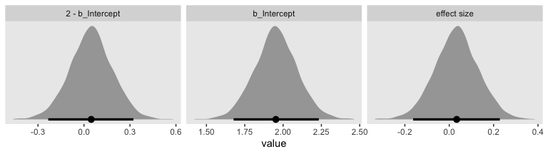<!-- -->

Yes indeed, 2 is a credible value for the intercept. And as reported in
the text, it yields a very small \(d\) effect size. Now we repeat the
process for the second data set.

``` r
mean_y <- mean(my_data_2$Y)
sd_y   <- sd(my_data_2$Y)

stanvars <- 
  stanvar(mean_y, name = "mean_y") + 
  stanvar(sd_y,   name = "sd_y")

fit4 <-
  update(fit3,
         newdata = my_data_2,
         chains = 4, cores = 4,
         stanvars = stanvars, 
         seed = 23)
```

Let’s just jump to the plot. This time we’re comparing the `b_Intercept`
to the value of 4.0.

``` r
posterior_samples(fit4) %>% 
  mutate(`2 - b_Intercept` = 4 - b_Intercept,
         `effect size`     = (4 - b_Intercept) / sigma) %>% 
  
  pivot_longer(-c(sigma, Intercept, lp__)) %>% 
  
  ggplot(aes(x = value, y = 0)) +
  geom_halfeyeh(.width = .95) +
  scale_y_continuous(NULL, breaks = NULL) +
  theme(panel.grid = element_blank()) +
  facet_wrap(~name, scales = "free")
```

<!-- -->

As in the text, our \(d\) is centered around 0.3. Let’s use a posterior
predictive check to see how well `fit4` summarized these data.

``` r
pp_check(fit4, type = "hist", nsamples = 10, binwidth = 1) +
  scale_x_continuous(breaks = seq(from = -3, to = 7, by = 2)) +
  theme_gray() +
  theme(panel.grid = element_blank(),
        legend.position = c(.9, .15))
```

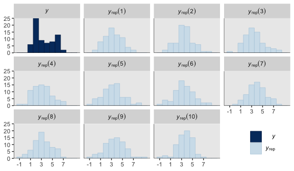<!-- -->

The histograms aren’t as awful as the ones for the previous model. But
they’re still not great. We might further inspect the model
misspecification with a cumulative distribution function overlay, this
time comparing `fit2` directly to `fit4`.

``` r
p1 <-
  pp_check(fit2, type = "ecdf_overlay", nsamples = 50) +
  ggtitle("Cumulative-normal (fit2)")

p2 <-
  pp_check(fit4, type = "ecdf_overlay", nsamples = 50) +
  ggtitle("Conventional-normal (fit4)")
  
(p1 + p2 & 
  scale_x_continuous(breaks = 0:7, limits = c(0, 7)) &
  theme_gray() &
  theme(panel.grid = element_blank())) + 
  plot_layout(guides = 'collect')
```

<!-- -->

“Which of the analyses yields the more trustworthy conclusion? The one
that describes the data better. In these cases, there is no doubt that
the cumulative-normal model is the better description of the data” than
the conventional Gaussian model (p. 682).

#### 23.2.2.2 Ordinal outcomes versus Likert scales.

Just for fun,

> rate how much you agree with the statement, “Bayesian estimation is
> more informative than null-hypothesis significance testing,” by
> selecting one option from the following: 1 = strongly disagree; 2 =
> disagree; 3 = undecided; 4 = agree; 5 = strongly agree. This sort of
> ordinal response interface is often called a Likert-type response
> ([Likert, 1932](https://legacy.voteview.com/pdf/Likert_1932.pdf),
> pronounced LICK-ert not LIKE-ert). Sometimes, it is called a Likert
> “scale” but the term “scale” in this context is more properly
> reserved for referring to an underlying metric variable that is
> indicated by the arithmetic mean of several meaningfully related
> Likert-type responses (e.g., Carifio & Perla,
> [2007](https://thescipub.com/pdf/10.3844/jssp.2007.106.116),
> [2008](https://pdfs.semanticscholar.org/795d/7d9c30bb0ba54d078215f9239a865960eea6.pdf);
> [Norman, 2010](https://www.researchgate.net/publication/41420484_LIkert_scales_levels_of_measurement_adn_the_laws_of_statistics)).(p. 681)

Kruschke then went on to briefly introduce how one might combine several
such meaningfully-related Likert-type responses with latent variable
methods. He then clarified this text will not explore that approach,
further. The current version of **brms** (i.e.,
[2.11.0](https://CRAN.R-project.org/package=brms/news/news.html)) has
very limited latent variable capacities. However, they are in the works.
Interested models can follow Bürkner’s progress in [GitHub issue
\#304](https://github.com/paul-buerkner/brms/issues/304). In the
meantime, one can fit Bayesian latent variable models with the
[**blavaan** package](https://faculty.missouri.edu/~merklee/blavaan/).

## 23.3. The case of two groups

> In both examples in the preceding text, the two groups of outcomes
> were on the same ordinal scale. In the first example, both
> questionnaire statements were answered on the same disagree–agree
> scale. In the second example, both groups responded on the same very
> unhappy–very happy scale. Therefore, we assume that both groups have
> the same underlying metric variable with the same thresholds. (p. 682)

### 23.3.1 Implementation in ~~JAGS~~ **brms**.

The `brms::brm()` syntax for adding a single categorical predictor to an
ordered probit model is much like with any other likelihood. We just add
it to the right side of the `~` in the `formula` argument. If you’re
like me and like to use the verbose `1` syntax for your model
intercepts–thresholds in these models–just use the `+` operator
between them. For example, this is what it’d look like for an ordered
categorical criterion `y` and a single categorical predictor `x`.

``` r
fit <-
  brm(data = my_data,
      family = cumulative(probit),
      y ~ 1 + x,
      prior = c(prior(normal(0, 4), class = Intercept),
                prior(normal(0, 4), class = b)))
```

Also of note, we’ve expanded the `prior` section to include a line for
`class = b`. As with the thresholds, interpret this prior through the
context of the underlying standard normal cumulative distribution,
\(\Phi(z)\).

### 23.3.2 Examples: Not funny.

Load the data for the next
model.

``` r
my_data <- read_csv("/Users/solomon/Dropbox/Recoding Doing Bayesian Data Analysis/data.R/OrdinalProbitData1.csv")

glimpse(my_data)
```

    ## Observations: 88
    ## Variables: 2
    ## $ X <chr> "A", "A", "A", "A", "A", "A", "A", "A", "A", "A", "A", "A", "A", "A", "A", "A", "A", "A", "A", "A…
    ## $ Y <dbl> 1, 1, 1, 1, 1, 1, 1, 1, 1, 1, 1, 1, 1, 1, 1, 1, 1, 1, 1, 1, 1, 1, 1, 1, 1, 1, 1, 1, 1, 1, 1, 2, 2…

Fit the univariable model.

``` r
fit5 <-
  brm(data = my_data,
      family = cumulative(probit),
      Y ~ 1 + X,
      prior = c(prior(normal(0, 4), class = Intercept),
                prior(normal(0, 4), class = b)),
      iter = 3000, warmup = 1000, chains = 4, cores = 4,
      seed = 23)
```

Check the summary.

``` r
print(fit5)
```

    ##  Family: cumulative 
    ##   Links: mu = probit; disc = identity 
    ## Formula: Y ~ 1 + X 
    ##    Data: my_data (Number of observations: 88) 
    ## Samples: 4 chains, each with iter = 3000; warmup = 1000; thin = 1;
    ##          total post-warmup samples = 8000
    ## 
    ## Population-Level Effects: 
    ##              Estimate Est.Error l-95% CI u-95% CI Rhat Bulk_ESS Tail_ESS
    ## Intercept[1]     0.54      0.19     0.17     0.93 1.00     9500     5560
    ## Intercept[2]     1.23      0.21     0.82     1.66 1.00     9938     6490
    ## Intercept[3]     1.95      0.27     1.44     2.50 1.00    10482     7134
    ## Intercept[4]     2.83      0.46     2.07     3.84 1.00    10556     6017
    ## XB               0.57      0.25     0.06     1.06 1.00     9658     6211
    ## 
    ## Samples were drawn using sampling(NUTS). For each parameter, Eff.Sample 
    ## is a crude measure of effective sample size, and Rhat is the potential 
    ## scale reduction factor on split chains (at convergence, Rhat = 1).

Return and wrangle the posterior draws.

``` r
post <- 
  posterior_samples(fit5) %>%
  mutate(iter = 1:n())

glimpse(post)
```

    ## Observations: 8,000
    ## Variables: 11
    ## $ `b_Intercept[1]` <dbl> 0.7194470, 0.4258937, 0.6046345, 0.2274674, 0.8463045, 0.9442578, 0.5277448, 0.636…
    ## $ `b_Intercept[2]` <dbl> 1.4046305, 1.1434122, 1.1165566, 0.8864239, 1.4563907, 1.5833928, 1.1247425, 1.365…
    ## $ `b_Intercept[3]` <dbl> 2.128881, 1.912711, 2.051841, 1.872234, 1.894056, 1.964711, 1.896617, 2.059122, 2.…
    ## $ `b_Intercept[4]` <dbl> 3.065893, 2.510544, 2.982947, 2.529691, 2.891863, 3.128164, 2.610214, 3.070514, 2.…
    ## $ b_XB             <dbl> 0.38214023, 0.68089029, 0.79148803, 0.25887572, 0.95283723, 1.19221780, 0.42747380…
    ## $ `Intercept[1]`   <dbl> 0.52837693, 0.08544851, 0.20889050, 0.09802956, 0.36988592, 0.34814892, 0.31400795…
    ## $ `Intercept[2]`   <dbl> 1.2135604, 0.8029671, 0.7208125, 0.7569861, 0.9799721, 0.9872839, 0.9110056, 0.939…
    ## $ `Intercept[3]`   <dbl> 1.937810, 1.572266, 1.656097, 1.742796, 1.417638, 1.368602, 1.682881, 1.633162, 1.…
    ## $ `Intercept[4]`   <dbl> 2.874823, 2.170099, 2.587203, 2.400253, 2.415445, 2.532055, 2.396477, 2.644554, 2.…
    ## $ lp__             <dbl> -108.9495, -107.3964, -108.0560, -108.1793, -109.3180, -111.9944, -106.5975, -106.…
    ## $ iter             <int> 1, 2, 3, 4, 5, 6, 7, 8, 9, 10, 11, 12, 13, 14, 15, 16, 17, 18, 19, 20, 21, 22, 23,…

Use our handy `compare_thresholds()` function to make an expanded
version of the lower-left plot of Figure 23.4.

``` r
post %>% 
  select(`Intercept[1]`:`Intercept[4]`, iter) %>% 
  compare_thresholds(lb = 1.5, ub = 4.5)
```

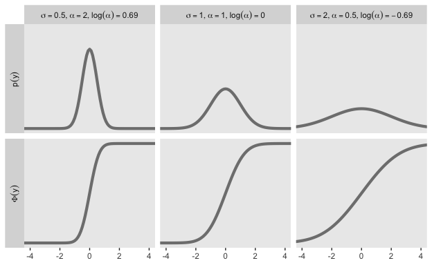<!-- -->

Now take a look at the marginal distribution for `b_XB`.

``` r
post %>% 
  ggplot(aes(x = b_XB)) +
  geom_histogram(color = "grey92", fill = "grey67",
                 size = .05, bins = 40) +
  geom_halfeyeh(aes(y = 0),
                .width = .95) +
  scale_y_continuous(NULL, breaks = NULL) +
  theme(panel.grid = element_blank())
```

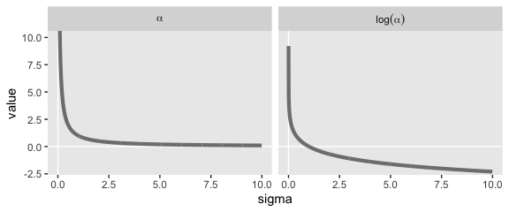<!-- -->

Well shucks. If you look closely, that looks a whole lot like the
“Effect Size” subplot in the bottom-right panel of Figure 23.4. Again,
recall that we’ve been using the standard normal for these
cumulative-normal models. Thus, when we do a group comparison with a
2-level nominal variable like `X`, this is a standardized mean
difference. That is, our `b_XB` posterior is in a Cohen’s-\(d\) metric.

Here we use good use of the `type = "bars_grouped"` and `group = "X"`
arguments to make the posterior predictive plots at the top right of
Figure 23.4 with the `brms::pp_check()` function.

``` r
set.seed(23)

pp_check(fit5, type = "bars_grouped", nsamples = 100, group = "X") +
  scale_x_continuous("y", breaks = 1:7) +
  scale_y_continuous(NULL, breaks = NULL) +
  ggtitle("Data with posterior predictions",
          subtitle = expression(list(italic(N[A])==44, italic(N[B])==44))) +
  theme(legend.position = c(.9, .8))
```

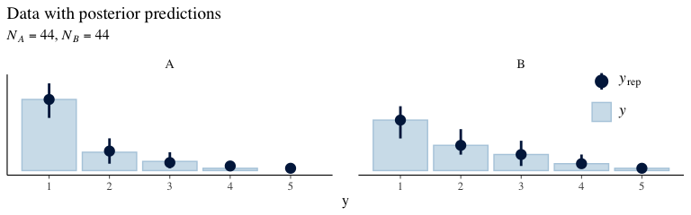<!-- -->

Using more tricks from back in Chapter 16, here’s the corresponding
conventional Gaussian model for metric data.

``` r
mean_y <- mean(my_data$Y)
sd_y   <- sd(my_data$Y)

stanvars <- 
  stanvar(mean_y, name = "mean_y") + 
  stanvar(sd_y,   name = "sd_y")

fit6 <-
  brm(data = my_data,
      family = gaussian,
      bf(Y ~ 0 + X, sigma ~ 0 + X),
      prior = c(prior(normal(mean_y, sd_y * 100), class = b),
                prior(normal(0, 1), class = b, dpar = sigma)),
      chains = 4, cores = 4,
      stanvars = stanvars, 
      seed = 23)
```

Check the summary.

``` r
print(fit6)
```

    ##  Family: gaussian 
    ##   Links: mu = identity; sigma = log 
    ## Formula: Y ~ 0 + X 
    ##          sigma ~ 0 + X
    ##    Data: my_data (Number of observations: 88) 
    ## Samples: 4 chains, each with iter = 2000; warmup = 1000; thin = 1;
    ##          total post-warmup samples = 4000
    ## 
    ## Population-Level Effects: 
    ##          Estimate Est.Error l-95% CI u-95% CI Rhat Bulk_ESS Tail_ESS
    ## XA           1.43      0.12     1.19     1.66 1.00     3892     3041
    ## XB           1.86      0.16     1.55     2.18 1.00     4238     2770
    ## sigma_XA    -0.26      0.11    -0.45    -0.03 1.00     3664     2789
    ## sigma_XB     0.08      0.11    -0.13     0.30 1.00     4071     2889
    ## 
    ## Samples were drawn using sampling(NUTS). For each parameter, Eff.Sample 
    ## is a crude measure of effective sample size, and Rhat is the potential 
    ## scale reduction factor on split chains (at convergence, Rhat = 1).

Here are the marginal posteriors, including the effect size.

``` r
posterior_samples(fit6) %>% 
  mutate(`A mean`      = b_XA,
         `B mean`      = b_XB,
         `A Std. Dev.` = exp(b_sigma_XA),
         `B Std. Dev.` = exp(b_sigma_XB)) %>% 
  mutate(`Difference of Means`     = `B mean` - `A mean`,
         `Difference of Std. Devs` = `B Std. Dev.` - `A Std. Dev.`) %>% 
  mutate(`Effect Size` = `Difference of Means` / ((`A Std. Dev.` + `B Std. Dev.`) / 2)) %>% 
  pivot_longer(`A mean`:`Effect Size`) %>% 
  
  ggplot(aes(x = value)) +
  geom_histogram(color = "grey92", fill = "grey67",
                 size = .05, bins = 40) +
  geom_halfeyeh(aes(y = 0),
                .width = .95) +
  scale_y_continuous(NULL, breaks = NULL) +
  labs(subtitle = "These are based on the conventional Gaussian model, NOT the cumulative-normal\nmodel Kruschke displayed in Figure 23.4",
       x = "Marginal posterior") +
  theme(panel.grid = element_blank()) +
  facet_wrap(~name, scales = "free", ncol = 2)
```

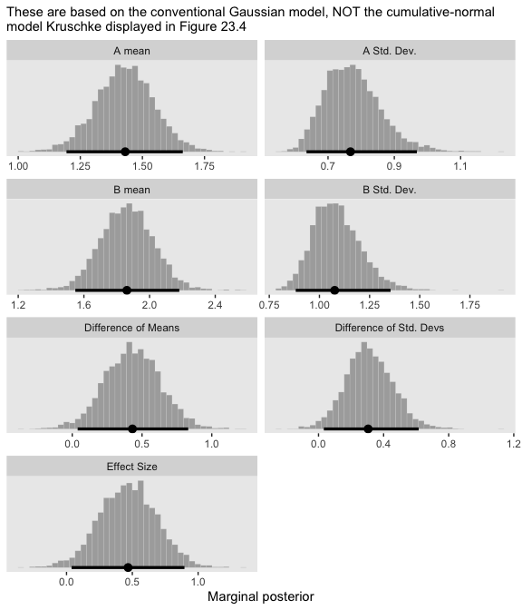<!-- -->

Compare those results to those Kruschke reported from an NHST analysis
in the note below Figure 23.4:

> \(M_1 = 1.43, M_2 = 1.86, t = 2.18, p = 0.032\), with effect size
> \(d = 0.466\) with 95% CI of \(0.036-0.895\). An \(F\) test of the
> variances concludes that the standard deviations are significantly
> different: \(S_1 = 0.76, S_2 = 1.07, p = 0.027\). Notice in this case
> that treating the values as metric greatly underestimates their
> variances, as well as erroneously concludes the variances are
> different. (p. 684)

As to the data in the analyses Kruschke reported in Figure 23.5 and the
prose in the second paragraph on page 685, I’m not aware that Kruschke
provided them. From his footnote \#2, we read: “Data in Figure 23.5 are
from an as-yet unpublished study I conducted with the collaboration of
Allison Vollmer as part of her undergraduate honors project.” In place
of the real data, I eyeballed the values based on the upper-right panels
in Figure 23.5. Here they are.

``` r
d <-
  tibble(x = rep(str_c("joke ", c(1, 6)), each = 177),
       y = c(rep(1:7, times = c(95, 19, 18, 10, 17, 10, 8)),
             rep(1:7, times = c(53, 33, 31, 22, 23, 14, 1))))

glimpse(d)
```

    ## Observations: 354
    ## Variables: 2
    ## $ x <chr> "joke 1", "joke 1", "joke 1", "joke 1", "joke 1", "joke 1", "joke 1", "joke 1", "joke 1", "joke 1…
    ## $ y <int> 1, 1, 1, 1, 1, 1, 1, 1, 1, 1, 1, 1, 1, 1, 1, 1, 1, 1, 1, 1, 1, 1, 1, 1, 1, 1, 1, 1, 1, 1, 1, 1, 1…

My approximation to Krusche’s data looks like this.

``` r
d %>% 
  ggplot(aes(x = y)) +
  geom_bar() +
  scale_y_continuous(NULL, breaks = NULL) +
  theme(panel.grid = element_blank()) +
  facet_wrap(~x, ncol = 1)
```

<!-- -->

Here we fit the cumulative-normal model based on our version of the
data.

``` r
fit7 <-
  brm(data = d,
      family = cumulative(probit),
      y ~ 1 + x,
      prior = c(prior(normal(0, 4), class = Intercept),
                prior(normal(0, 4), class = b)),
      iter = 3000, warmup = 1000, chains = 4, cores = 4,
      seed = 23)
```

Check the model summary.

``` r
print(fit7)
```

    ##  Family: cumulative 
    ##   Links: mu = probit; disc = identity 
    ## Formula: y ~ 1 + x 
    ##    Data: d (Number of observations: 354) 
    ## Samples: 4 chains, each with iter = 3000; warmup = 1000; thin = 1;
    ##          total post-warmup samples = 8000
    ## 
    ## Population-Level Effects: 
    ##              Estimate Est.Error l-95% CI u-95% CI Rhat Bulk_ESS Tail_ESS
    ## Intercept[1]    -0.05      0.09    -0.24     0.12 1.00    12074     6548
    ## Intercept[2]     0.33      0.09     0.15     0.51 1.00    12851     6335
    ## Intercept[3]     0.71      0.10     0.52     0.89 1.00    12439     6682
    ## Intercept[4]     1.00      0.10     0.80     1.19 1.00    11417     6561
    ## Intercept[5]     1.51      0.11     1.28     1.73 1.00    10894     6377
    ## Intercept[6]     2.14      0.15     1.85     2.46 1.00    12077     6612
    ## xjoke6           0.32      0.12     0.09     0.54 1.00    12349     6023
    ## 
    ## Samples were drawn using sampling(NUTS). For each parameter, Eff.Sample 
    ## is a crude measure of effective sample size, and Rhat is the potential 
    ## scale reduction factor on split chains (at convergence, Rhat = 1).

Save and wrangle the posterior draws, then use our
`compare_thresholds()` function to compare the **brms** parameterization
of \(\theta_{[i]}\) with the parameterization in the text in an expanded
version of the lower-left plot of Figure 23.5.

``` r
post <- 
  posterior_samples(fit7) %>%
  mutate(iter = 1:n())

post %>% 
  select(`Intercept[1]`:`Intercept[6]`, iter) %>% 
  compare_thresholds(lb = 1.5, ub = 6.5)
```

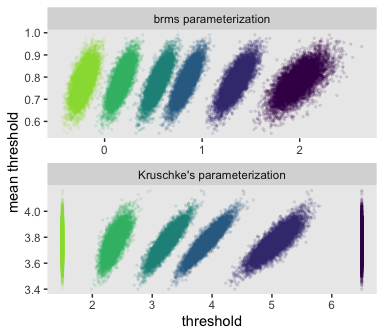<!-- -->

Given our data are only approximations of Kruschke’s, I think we did
pretty good. Here’s the marginal distribution of `b_xjoke6`, our effect
size for the number of jokes.

``` r
post %>% 
  ggplot(aes(x = b_xjoke6)) +
  geom_histogram(color = "grey92", fill = "grey67",
                 size = .05, bins = 40) +
  geom_halfeyeh(aes(y = 0),
                .width = .95) +
  scale_y_continuous(NULL, breaks = NULL) +
  theme(panel.grid = element_blank())
```

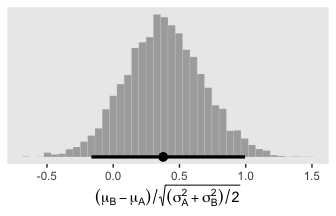<!-- -->

Here are our versions of the two panels in the upper right of Figure
23.5.

``` r
set.seed(23)

pp_check(fit7, type = "bars_grouped", nsamples = 100, group = "x") +
  scale_x_continuous("y", breaks = 1:7) +
  scale_y_continuous(NULL, breaks = NULL) +
  ggtitle("Data with posterior predictions",
          subtitle = expression(list(italic(N["joke "*1])==177, italic(N["joke "*6])==177))) +
  theme_gray() +
  theme(panel.grid = element_blank(),
        legend.position = "none")
```

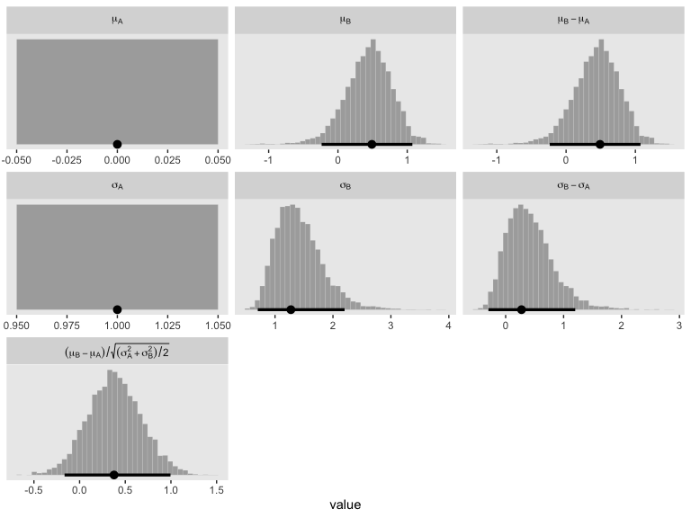<!-- -->

Now here’s the corresponding model is we treat the `y` data as metric.

``` r
mean_y <- mean(d$y)
sd_y   <- sd(d$y)

stanvars <- 
  stanvar(mean_y, name = "mean_y") + 
  stanvar(sd_y,   name = "sd_y")

fit8 <-
  brm(data = d,
      family = gaussian,
      bf(y ~ 0 + x, sigma ~ 0 + x),
      prior = c(prior(normal(mean_y, sd_y * 100), class = b),
                prior(normal(0, exp(sd_y)), class = b, dpar = sigma)),
      chains = 4, cores = 4,
      stanvars = stanvars, 
      seed = 23)
```

Check the summary.

``` r
print(fit8)
```

    ##  Family: gaussian 
    ##   Links: mu = identity; sigma = log 
    ## Formula: y ~ 0 + x 
    ##          sigma ~ 0 + x
    ##    Data: d (Number of observations: 354) 
    ## Samples: 4 chains, each with iter = 2000; warmup = 1000; thin = 1;
    ##          total post-warmup samples = 4000
    ## 
    ## Population-Level Effects: 
    ##              Estimate Est.Error l-95% CI u-95% CI Rhat Bulk_ESS Tail_ESS
    ## xjoke1           2.42      0.14     2.13     2.71 1.00     4069     2870
    ## xjoke6           2.86      0.13     2.60     3.11 1.00     4204     2955
    ## sigma_xjoke1     0.64      0.05     0.54     0.75 1.00     4299     2812
    ## sigma_xjoke6     0.52      0.05     0.42     0.63 1.00     4529     2910
    ## 
    ## Samples were drawn using sampling(NUTS). For each parameter, Eff.Sample 
    ## is a crude measure of effective sample size, and Rhat is the potential 
    ## scale reduction factor on split chains (at convergence, Rhat = 1).

Here are the marginal posteriors, including the effect size.

``` r
posterior_samples(fit8) %>% 
  mutate(`Joke 1 Mean`      = b_xjoke1,
         `Joke 6 Mean`      = b_xjoke6,
         `Joke 1 Std. Dev.` = exp(b_sigma_xjoke1),
         `Joke 6 Std. Dev.` = exp(b_sigma_xjoke6)) %>% 
  mutate(`Difference of Means`     = `Joke 6 Mean` - `Joke 1 Mean`,
         `Difference of Std. Devs` = `Joke 6 Std. Dev.` - `Joke 1 Std. Dev.`) %>% 
  mutate(`Effect Size` = `Difference of Means` / ((`Joke 1 Std. Dev.` + `Joke 6 Std. Dev.`) / 2)) %>% 
  pivot_longer(`Joke 1 Mean`:`Effect Size`) %>% 
  mutate(name = factor(name, 
                       levels = c("Joke 1 Mean", "Joke 1 Std. Dev.", "Joke 6 Mean", "Joke 6 Std. Dev.", "Difference of Means", "Difference of Std. Devs", "Effect Size"))) %>% 
  
  ggplot(aes(x = value)) +
  geom_histogram(color = "grey92", fill = "grey67",
                 size = .05, bins = 40) +
  geom_halfeyeh(aes(y = 0),
                .width = .95) +
  scale_y_continuous(NULL, breaks = NULL) +
  labs(subtitle = "These are based on the conventional Gaussian model, NOT the cumulative-normal\nmodel Kruschke displayed in Figure 23.5",
       x = "Marginal posterior") +
  theme(panel.grid = element_blank()) +
  facet_wrap(~name, scales = "free", ncol = 2)
```

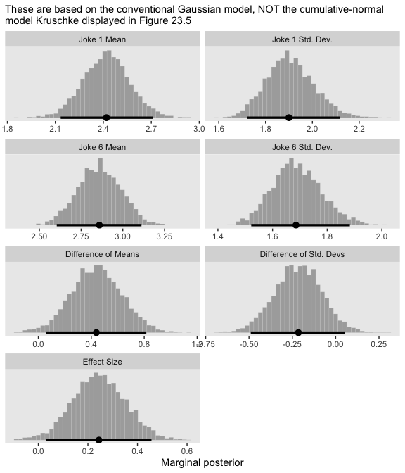<!-- -->

If you think you have a better approximation of Kruschke’s data, [please
share](https://github.com/ASKurz/Doing-Bayesian-Data-Analysis-in-brms-and-the-tidyverse/issues).

## 23.4. The Case of metric predictors

“This type of model is often referred to as *ordinal probit regression*
or *ordered probit regression* because the probit function is the link
function corresponding to the cumulative-normal inverse-link function”
(p. 688, *emphasis* in the original).

### 23.4.1 Implementation in JAGS.

This model is easy to specify in **brms**. Just make sure to think
clearly about your priors.

### 23.4.2 Example: Happiness and money.

Load the data for the next
model.

``` r
my_data <- read_csv("/Users/solomon/Dropbox/Recoding Doing Bayesian Data Analysis/data.R/OrdinalProbitData-LinReg-2.csv")

glimpse(my_data)
```

    ## Observations: 200
    ## Variables: 2
    ## $ X <dbl> 1.386389, 1.223879, 1.454505, 1.112068, 1.222715, 1.545099, 1.360256, 1.533071, 1.501657, 1.42675…
    ## $ Y <dbl> 1, 1, 5, 5, 1, 4, 6, 2, 5, 4, 1, 4, 4, 4, 4, 6, 1, 1, 6, 2, 1, 7, 1, 3, 1, 1, 7, 5, 7, 1, 4, 6, 7…

Take a quick look at the data.

``` r
my_data %>% 
  ggplot(aes(x = X, y = Y)) +
  geom_point(alpha = 1/3) +
  scale_y_continuous(breaks = 1:7) +
  theme(panel.grid = element_blank())
```

<!-- -->

Kruschke standardized his predictor within his model code. Here we’ll
standardize `X` before fitting the model.

``` r
my_data <-
  my_data %>% 
  mutate(X_s = (X - mean(X)) / sd(X))
```

Fit the model.

``` r
fit9 <-
  brm(data = my_data,
      family = cumulative(probit),
      Y ~ 1 + X_s,
      prior = c(prior(normal(0, 4), class = Intercept),
                prior(normal(0, 4), class = b)),
      iter = 3000, warmup = 1000, chains = 4, cores = 4,
      seed = 23)
```

Check the summary.

``` r
print(fit9)
```

    ##  Family: cumulative 
    ##   Links: mu = probit; disc = identity 
    ## Formula: Y ~ 1 + X_s 
    ##    Data: my_data (Number of observations: 200) 
    ## Samples: 4 chains, each with iter = 3000; warmup = 1000; thin = 1;
    ##          total post-warmup samples = 8000
    ## 
    ## Population-Level Effects: 
    ##              Estimate Est.Error l-95% CI u-95% CI Rhat Bulk_ESS Tail_ESS
    ## Intercept[1]    -1.18      0.12    -1.43    -0.94 1.00     6043     6040
    ## Intercept[2]    -0.76      0.11    -0.99    -0.54 1.00     7685     6760
    ## Intercept[3]    -0.29      0.11    -0.50    -0.08 1.00     9232     6766
    ## Intercept[4]     0.25      0.11     0.04     0.46 1.00     9432     7184
    ## Intercept[5]     0.73      0.11     0.51     0.96 1.00     8372     7269
    ## Intercept[6]     1.26      0.13     1.02     1.52 1.00     8655     6940
    ## X_s              1.16      0.10     0.97     1.35 1.00     7167     5953
    ## 
    ## Samples were drawn using sampling(NUTS). For each parameter, Eff.Sample 
    ## is a crude measure of effective sample size, and Rhat is the potential 
    ## scale reduction factor on split chains (at convergence, Rhat = 1).

Extract the posterior draws and compare the **brms** parameterization of
\(\theta_{[i]}\) with the parameterization in the text in an expanded
version of the bottom panel of Figure 23.7.

``` r
post <- 
  posterior_samples(fit9) %>%
  mutate(iter = 1:n())

post %>% 
  select(`Intercept[1]`:`Intercept[6]`, iter) %>% 
  compare_thresholds(lb = 1.5, ub = 6.5)
```

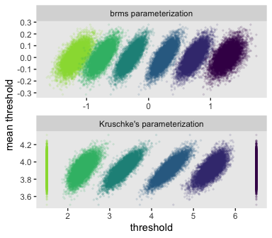<!-- -->

Here’s the marginal distribution of `b_X_s`, our effect size for the
number of jokes.

``` r
post %>% 
  ggplot(aes(x = b_X_s)) +
  geom_histogram(color = "grey92", fill = "grey67",
                 size = .05, bins = 40) +
  geom_halfeyeh(aes(y = 0),
                .width = .95) +
  scale_y_continuous(NULL, breaks = NULL) +
  theme(panel.grid = element_blank())
```

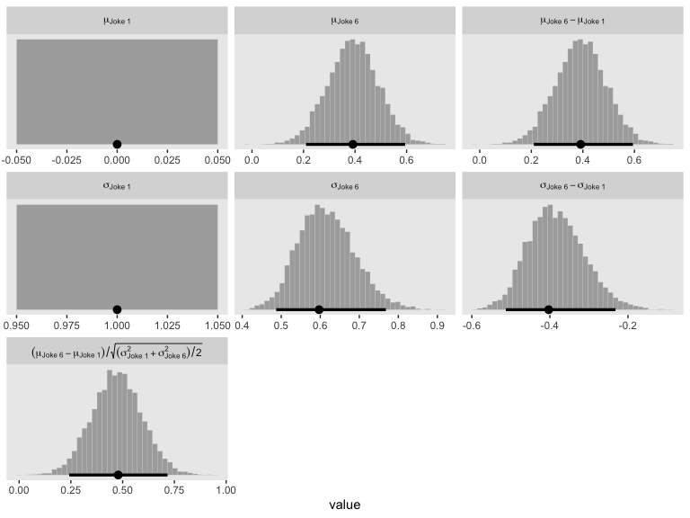<!-- -->

This differs from Kruschks’s \(\beta_1\), which is in an unstandardized
metric based on the parameters in his version of the model. But unlike
the effect sizes from previous models, this one is not in a
Cohen’s-\(d\) metric. Rather, this is a fully-standardized regression
coefficient. As to the large subplot at the top of Figure 23.7, we can
make something like it by nesting `conditional_effects()` within
`plot()`.

``` r
plot(conditional_effects(fit9),
     theme = theme(panel.grid = element_blank()))
```

<!-- -->

Here’s a more elaborated version of the same plot, this time depicting
the model with 100 fitted lines randomly drawn from the posterior.

``` r
set.seed(23)

plot(conditional_effects(fit9,
                         spaghetti = TRUE, 
                         nsamples = 100),
     points = T,
     point_args = c(alpha = 1/3),
     line_args = c(size = 0),
     theme = theme(panel.grid = element_blank()))
```

    ## Warning: Predictions are treated as continuous variables in 'conditional_effects' by default which is likely
    ## invalid for ordinal families. Please set 'categorical' to TRUE.

<!-- -->

Note the warning message. There was a similar one in the first plot,
which I suppressed for simplicity sake. The message suggests treating
the fitted lines as “continuous variables” might lead to a deceptive
plot. Here’s what happens if we follow the suggestion.

``` r
plot(conditional_effects(fit9,
                         categorical = T),
     theme = theme(panel.grid = element_blank()))
```

<!-- -->

Recall that our thresholds, \(\theta_1,...,\theta_{K-1}\), in
conjunction with the standard normal density, give us the probability of
a given `Y` value, given `X_s` (i.e.,
\(p(y = k | \mu, \sigma, \{ \theta_j \})\), where \(\mu\) is conditional
on \(x\)). This plot returned the fitted lines of those conditional
probabilities, each depicted by the posterior mean and 95%
percentile-based intervals. At lower values of `X_s`, lower values of
`Y` are more probable. At higher values of `X_s`, higher values of `Y`
are more probable.

It might be useful to get more practice in with this model. Here we’ll
use `fitted()` to make a similar plot, depicting the model with may
fitted lines instead of summary statistics.

``` r
# how many fitted lines do you want?
n_iter <- 50

# define the `X_s` values you want to condition on
# because the lines are nonlinear, you'll need many of them
nd <- tibble(X_s = seq(from = -2, to = 2, by = 0.05))

f <-
  fitted(fit9,
         newdata = nd,
         summary = F,
         nsamples = n_iter)

# inspect the output
f %>% 
  str()
```

    ##  num [1:50, 1:81, 1:7] 0.889 0.883 0.905 0.818 0.905 ...
    ##  - attr(*, "dimnames")=List of 3
    ##   ..$ : NULL
    ##   ..$ : NULL
    ##   ..$ : chr [1:7] "1" "2" "3" "4" ...

Our output came in three dimensions. We have 50 rows, corresponding to
`n_iter <- 50` (i.e., 50 posterior draws). There are 81 columns, based
on how we defined the `X_s` values within our `nd` data (i.e., `seq(from
= -2, to = 2, by = 0.05)`). The third dimension has seven levels, one
corresponding to each of the seven levels of our criterion variable `Y`.
Here’s a way to rearrange that output into a useful format for plotting.

``` r
# rearrange the output
rbind(
  f[, , 1],
  f[, , 2],
  f[, , 3],
  f[, , 4],
  f[, , 5],
  f[, , 6],
  f[, , 7]
) %>% 
  # wrangle
  data.frame() %>% 
  set_names(nd %>% pull(X_s)) %>% 
  mutate(iter   = rep(1:n_iter, times = 7),
         rating = rep(1:7, each = n_iter)) %>% 
  pivot_longer(-c(iter, rating),
               names_to = "X_s",
               names_ptypes = list(X_s = double()),
               values_to = "probability") %>% 
  mutate(rating = str_c("Y: ", rating)) %>% 
  
  # plot
  ggplot(aes(x = X_s, y = probability, 
             group = interaction(iter, rating),
             color = rating)) +
  geom_line(size = 1/4, alpha = 1/2)  +
  scale_color_viridis_d(end = .85) + 
  scale_y_continuous(breaks = c(0, .5, 1),
                     limits = c(0, 1)) +
  theme(panel.grid = element_blank(),
        legend.position = "none") +
  facet_wrap(~rating, ncol = 7)
```

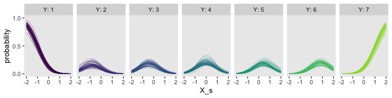<!-- -->

So far, we’ve been plotting our model with the context of the default
`scale = "response"` setting within `fitted()`. Within the context of
the response variable `Y`, our model returns response probabilities. We
can also look at the output within the context of `scale = "linear"`.
We’ll plot these fitted lines across our `nd` values two different
ways. For the first, `p1`, we’ll use summary statistics. For the second,
`p2`, we’ll set `summary = T`.

``` r
# adjust the nd
nd <- tibble(X_s = seq(from = -2.5, to = 2.5, by = 0.1))

# use summary statistics
p1 <-
  fitted(fit9, 
         scale = "linear",
         newdata = nd) %>% 
  data.frame() %>% 
  bind_cols(nd) %>% 
  
  ggplot(aes(x = X_s, y = Estimate, ymin = Q2.5, ymax = Q97.5)) +
  geom_smooth(stat = "identity",
              alpha = 1/2) +
  labs(title = "summary statistics",
       y = "underlying standard normal")


# set `summary = F`
set.seed(23)
p2 <-
  fitted(fit9, 
         scale = "linear",
         newdata = nd,
         summary = F,
         nsamples = n_iter) %>% 
  data.frame() %>% 
  set_names(nd %>% pull(X_s)) %>% 
  mutate(iter = 1:n_iter) %>% 
  pivot_longer(-iter,
               names_to = "X_s",
               names_ptypes = list(X_s = double())) %>% 
  
  ggplot(aes(x = X_s, y = value, group = iter)) +
  geom_line(alpha = 1/2, color = "grey50") +
  scale_y_continuous(NULL, breaks = NULL) +
  ggtitle("50 posterior draws")

# combine and plot!
p1 + p2 &
  coord_cartesian(ylim = -2:2) &
  theme(panel.grid = element_blank())
```

<!-- -->

Both methods returned the fitted lines in the metric of the underlying
standard normal distribution. The fitted lines are nonlinear in the
metric of the raw data `Y` but they’re linear in the metric of the
presumed underlying distribution. If it helps, we’ll make a marginal
plot of the standard normal distribution and tack it onto the right.

``` r
# make Phi
p3 <-
  tibble(x = seq(from = -3, to = 3, by = .01)) %>%
  mutate(d = dnorm(x)) %>% 
  
  ggplot(aes(x = x, ymin = 0, ymax = d)) +
  geom_ribbon(fill = "grey67") +
  # add the thresholds!
  geom_vline(xintercept = posterior_summary(fit9)[1:6, 1], 
             color = "grey92", linetype = 3) +
  # mark the thresholds with the axis breaks
  scale_x_reverse(NULL, 
                  breaks = fixef(fit9)[1:6, 1],
                  labels = parse(text = str_c("theta[", 1:6, "]"))) +
  scale_y_continuous(NULL, breaks = NULL) +
  ggtitle(expression(italic(N)(0,1))) +
  coord_flip(xlim = -2:2)

# combine, format a bit, and plot
(
  ((p1 | p2 ) & 
     geom_hline(yintercept = posterior_summary(fit9)[1:6, 1], 
                color = "grey75", linetype = 3) &
     coord_cartesian(ylim = -2:2) | 
     p3) & 
  theme(panel.grid = element_blank())
) + 
  plot_layout(widths = c(4, 4, 1))
```

<!-- -->

The lines intersecting the plots are the posterior means for thresholds,
\(\theta_1,...,\theta_6\).

*But these still aren’t faithful depictions of the top panel of Figure
23.7*, you say. Okay, fine. One of the distinctive elements of that
panel is the left-tilted bar-and-error plots. If you look closely at the
vertical lines at their bases, you’ll see that the leftmost subplot
starts at the minimum value of `X` and the rightmost subplot starts at
the maximum value of `X`. Since our plots, so far, have been based on
`X_s`, we’ll use the minimum and maximum values from that. Here are
those values.

``` r
(r <- range(my_data$X_s))
```

    ## [1] -1.774444  1.750168

To my eye, it appears that the three middle subplots are equally
distributed between those at the ends. If we proceed under that
assumption, here’s how we might use `fitted()` to get us rolling on
computing the relevant values.

``` r
nd <- tibble(X_s = seq(from = r[1], to = r[2], length.out = 5))

f <-
  fitted(fit9,
         newdata = nd)

# inspect the output
f %>% 
  str()
```

    ##  num [1:5, 1:4, 1:7] 0.806616 0.443631 0.123985 0.015642 0.000916 ...
    ##  - attr(*, "dimnames")=List of 3
    ##   ..$ : NULL
    ##   ..$ : chr [1:4] "Estimate" "Est.Error" "Q2.5" "Q97.5"
    ##   ..$ : chr [1:7] "1" "2" "3" "4" ...

Here we’ll rearrange the output to make it useful for plotting.

``` r
# rearrange the output
f <-
  rbind(
    f[, , 1],
    f[, , 2],
    f[, , 3],
    f[, , 4],
    f[, , 5],
    f[, , 6],
    f[, , 7]
  ) %>% 
  # wrangle
  data.frame() %>% 
  bind_cols(
    expand(nd, Y = 1:7, X_s)
  )

head(f)
```

    ##       Estimate  Est.Error        Q2.5       Q97.5 Y         X_s
    ## 1 0.8066157820 0.04697296 0.704029954 0.889376843 1 -1.77444380
    ## 2 0.4436310447 0.04824394 0.349536653 0.537086920 1 -0.89329094
    ## 3 0.1239853476 0.02498454 0.079149727 0.176145937 1 -0.01213809
    ## 4 0.0156422414 0.00680478 0.005636675 0.031792247 1  0.86901477
    ## 5 0.0009155005 0.00082364 0.000108639 0.003022951 1  1.75016762
    ## 6 0.0924873574 0.02486244 0.051015307 0.147259251 2 -1.77444380

Now we can make those bar-and-error plots.

``` r
f %>% 
  mutate(X_s = round(X_s, digits = 3)) %>% 
    
  ggplot(aes(x = Y, y = Estimate,
             ymin = Q2.5, ymax = Q97.5)) +
  geom_col(fill = "grey67") +
  geom_pointrange(fatten = 1.5, size = 1)  +
  scale_y_reverse(NULL, position = "right", 
                  limits = c(1, 0), 
                  breaks = c(1, .5, 0), labels = c("1", ".5", "0")) +
  scale_x_continuous(breaks = 1:7) +
  coord_flip() +
  theme(panel.grid = element_blank()) +
  facet_wrap(~X_s, ncol = 7, strip.position = "bottom")
```

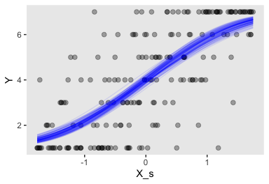<!-- -->

The `X_s` values are depicted in the panel strips on the bottom. The
response probabilities are scaled based on the axis on the top. The
points and leftmost sides of the bars are the posterior means. The thin,
dark horizontal lines are the percentile-based 95% intervals. Here we
reformat `f` a little more to put those bar-and-error plots in a format
more similar to that of Figure 23.7.

``` r
f %>% 
  select(-Est.Error) %>% 
  # rescale the probability summaries
  mutate_at(vars(Estimate:Q97.5), ~. / 2) %>% 
  
  # plot!
  ggplot() +
  geom_vline(xintercept = seq(from = r[1], to = r[2], length.out = 5),
             color = "white") +
  # bar marking the Estimate
  geom_segment(aes(x    = X_s,            y    = Y + 0.1,
                   xend = X_s - Estimate, yend = Y + 0.1),
               size = 8, color = "grey67") +
  # bar marking the 95% interval
  geom_segment(aes(x    = X_s - Q2.5,  y    = Y + 0.2,
                   xend = X_s - Q97.5, yend = Y + 0.2),
               size = 1, color = "grey33") +
  # data
  geom_point(data = my_data,
             aes(x = X_s, y = Y),
             shape = 1, size = 2) +
  scale_y_continuous("Y", breaks = 1:7, limits = c(0.5, 7.5)) +
  coord_cartesian(xlim = c(-2.4, 2.4)) +
  theme(panel.grid = element_blank()) 
```

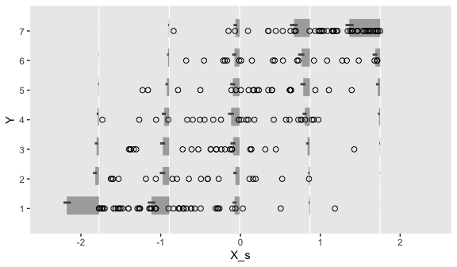<!-- -->

I’m not going to attempt superimposing fitted lines on this plot the way
Kruschke did. Given that our ordered-probit model is nonlinear on the
scale of the criterion, it seems misleading to present linear fitted
lines atop the raw data. If you’d like to do so, you’re on your own.

Now here’s the corresponding model is we treat the `y` data as metric
with tricks from Chapter 17.

``` r
sd_x <- sd(my_data$X)
sd_y <- sd(my_data$Y)
m_x  <- mean(my_data$X)
m_y  <- mean(my_data$Y)

beta_0_sigma <- 10 * abs(m_x * sd_y / sd_x)
beta_1_sigma <- 10 * abs(sd_y / sd_x) 

stanvars <- 
  stanvar(beta_0_sigma, name = "beta_0_sigma") + 
  stanvar(beta_1_sigma, name = "beta_1_sigma") +
  stanvar(sd_y, name = "sd_y")

fit10 <-
  brm(data = my_data,
      family = gaussian,
      Y ~ 1 + X,
      prior = c(prior(normal(0, beta_0_sigma), class = Intercept),
                prior(normal(0, beta_1_sigma), class = b),
                prior(normal(0, sd_y), class = sigma)),
      chains = 4, cores = 4,
      stanvars = stanvars, 
      seed = 23)
```

It may not have been readily apparent from Kruschke’s prose in the note
for Figure 23.7, but his OLS model was based on the fully unstandardized
data (i.e., using `X` as the predictor), not the partially standardized
data he used in his JAGS code from 23.4.1. We followed the same
sensibilities for `fit10`. Speaking of which, here are the summaries for
the marginal posteriors.

``` r
posterior_summary(fit10)[1:3, ] %>% round(digits = 3)
```

    ##             Estimate Est.Error   Q2.5  Q97.5
    ## b_Intercept   -5.430     0.610 -6.614 -4.239
    ## b_X            6.711     0.427  5.876  7.537
    ## sigma          1.528     0.075  1.392  1.680

These values are very close to those he reported at the bottom of page
690. Here are what the fitted lines from that model look like when
superimposed on the data, when presuming both variables are metric.

``` r
set.seed(23)

plot(conditional_effects(fit10,
                         spaghetti = TRUE, 
                         nsamples = 100),
     points = T,
     point_args = c(alpha = 1/3),
     line_args = c(size = 0),
     theme = theme(panel.grid = element_blank())) 
```

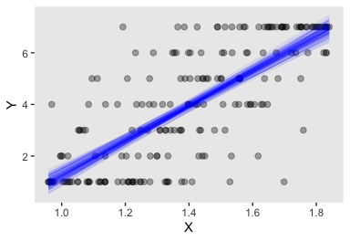<!-- -->

For the next example, we’ll load the `HappinessAssetsDebt.csv` data from
Shi
([2009](https://www.icpsr.umich.edu/icpsrweb/DSDR/studies/21741)).

``` r
my_data <- read_csv("/Users/solomon/Dropbox/Recoding Doing Bayesian Data Analysis/data.R/HappinessAssetsDebt.csv")

glimpse(my_data)
```

    ## Observations: 6,759
    ## Variables: 3
    ## $ Happiness <dbl> 3, 3, 3, 3, 1, 3, 2, 2, 4, 2, 3, 5, 3, 3, 4, 3, 3, 2, 4, 3, 4, 3, 3, 3, 5, 4, 3, 4, 4, 4,…
    ## $ Assets    <dbl> 0, 10000, 30000, 40000, 21000, 20000, 20000, 0, 0, 20000, 5000, 30000, 40000, 5500, 50000…
    ## $ Debt      <dbl> 0, 0, 0, 0, 0, 0, 0, 0, 0, 0, 5000, 0, 0, 0, 0, 0, 0, 0, 0, 0, 0, 0, 0, 0, 32000, 0, 0, 0…

Here’s a quick scatter plot of the data. To help with the overplotting,
the points have been horizontally jittered a bit. But as indicated in
the text, `Happiness` is a discrete variable.

``` r
my_data %>% 
  ggplot(aes(x = Assets, y = Happiness)) +
  geom_jitter(alpha = 1/4, height = .25) +
  theme(panel.grid = element_blank())
```

<!-- -->

Standardize our predictor.

``` r
my_data <-
  my_data %>% 
  mutate(Assets_s = (Assets - mean(Assets)) / sd(Assets))
```

Fit the model like before.

``` r
fit11 <-
  brm(data = my_data,
      family = cumulative(probit),
      Happiness ~ 1 + Assets_s,
      prior = c(prior(normal(0, 4), class = Intercept),
                prior(normal(0, 4), class = b)),
      iter = 3000, warmup = 1000, chains = 4, cores = 4,
      seed = 23)
```

Check the summary.

``` r
print(fit11)
```

    ##  Family: cumulative 
    ##   Links: mu = probit; disc = identity 
    ## Formula: Happiness ~ 1 + Assets_s 
    ##    Data: my_data (Number of observations: 6759) 
    ## Samples: 4 chains, each with iter = 3000; warmup = 1000; thin = 1;
    ##          total post-warmup samples = 8000
    ## 
    ## Population-Level Effects: 
    ##              Estimate Est.Error l-95% CI u-95% CI Rhat Bulk_ESS Tail_ESS
    ## Intercept[1]    -2.03      0.03    -2.10    -1.97 1.00     5453     5058
    ## Intercept[2]    -1.17      0.02    -1.20    -1.13 1.00     8415     6880
    ## Intercept[3]    -0.15      0.02    -0.18    -0.12 1.00     8055     6609
    ## Intercept[4]     1.48      0.02     1.44     1.53 1.00     8767     6806
    ## Assets_s         0.15      0.01     0.12     0.17 1.00     8513     5692
    ## 
    ## Samples were drawn using sampling(NUTS). For each parameter, Eff.Sample 
    ## is a crude measure of effective sample size, and Rhat is the potential 
    ## scale reduction factor on split chains (at convergence, Rhat = 1).

Extract the posterior draws and compare the **brms** parameterization of
\(\theta_{[i]}\) with the parameterization in the text in an expanded
version of the bottom panel of Figure 23.8.

``` r
post <- 
  posterior_samples(fit11) %>%
  mutate(iter = 1:n())

post %>% 
  select(`Intercept[1]`:`Intercept[4]`, iter) %>% 
  compare_thresholds(lb = 1.5, ub = 4.5)
```

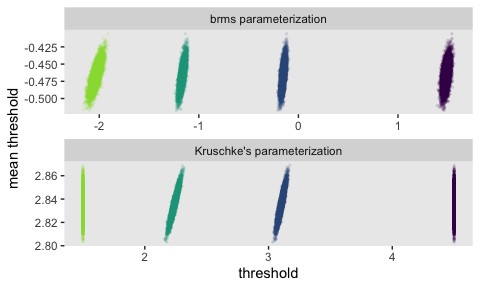<!-- -->

Behold the marginal distribution of `b_Assets_s`, our effect size for
`Assets`.

``` r
post %>% 
  ggplot(aes(x = b_Assets_s)) +
  geom_histogram(color = "grey92", fill = "grey67",
                 size = .05, bins = 40) +
  geom_halfeyeh(aes(y = 0),
                .width = .95) +
  scale_y_continuous(NULL, breaks = NULL) +
  theme(panel.grid = element_blank())
```

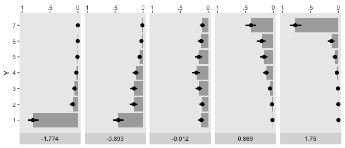<!-- -->

Here’s the `fitted()`-oriented preparatory work for our version of the
top panel of Figure 23.8.

``` r
# define the range for the predictor
r <- range(my_data$Assets_s)

# re-define the new data
nd <- tibble(Assets_s = seq(from = r[1], to = r[2], length.out = 5))

# compute the fitted summaries
f <-
  fitted(fit11,
         newdata = nd)

# rearrange the output
f <-
  rbind(
    f[, , 1],
    f[, , 2],
    f[, , 3],
    f[, , 4],
    f[, , 5]
  ) %>% 
  # wrangle
  data.frame() %>% 
  bind_cols(
    expand(nd, Happiness = 1:5, Assets_s)
  )

# examine
head(f)
```

    ##       Estimate    Est.Error         Q2.5        Q97.5 Happiness   Assets_s
    ## 1 2.610257e-02 2.076201e-03 2.214070e-02 3.031010e-02         1 -0.5971712
    ## 2 3.150643e-03 7.127502e-04 1.975596e-03 4.707940e-03         1  4.7565107
    ## 3 2.318569e-04 1.305224e-04 7.004674e-05 5.510350e-04         1 10.1101925
    ## 4 1.127918e-05 1.309096e-05 1.090534e-06 4.334866e-05         1 15.4638743
    ## 5 4.055501e-07 9.716135e-07 7.173225e-09 2.291520e-06         1 20.8175561
    ## 6 1.147295e-01 4.137412e-03 1.065602e-01 1.229534e-01         2 -0.5971712

Like with the same variant from Figure 23.7, we will not be
superimposing linear fitted lines. The model is nonlinear on the scale
of the data and I don’t want to confuse readers.

``` r
f %>% 
  select(-Est.Error) %>% 
  # rescale the probability summaries
  mutate_at(vars(Estimate:Q97.5), ~. * 2.5) %>% 
  
  # plot!
  ggplot() +
  geom_vline(xintercept = seq(from = r[1], to = r[2], length.out = 5),
             color = "white") +
  # bar marking the Estimate
  geom_segment(aes(x    = Assets_s,            y    = Happiness + 0.1,
                   xend = Assets_s - Estimate, yend = Happiness + 0.1),
               size = 8, color = "grey67") +
  # bar marking the 95% interval
  geom_segment(aes(x    = Assets_s - Q2.5,  y    = Happiness + 0.2,
                   xend = Assets_s - Q97.5, yend = Happiness + 0.2),
               size = 1, color = "grey33") +
  # data
  geom_point(data = my_data,
             aes(x = Assets_s, y = Happiness),
             shape = 1, size = 2) +
  scale_y_continuous("Happiness", breaks = 1:5, limits = c(0.5, 5.5)) +
  coord_cartesian(xlim = c(-4, 24)) +
  theme(panel.grid = element_blank()) 
```

<!-- -->

Now here’s the corresponding model is we treat `Happiness` as metric.
Unlike our method for the corresponding model from Figure 23.7, `fit10`,
we will use the standardized version of the predictor, `Assets_s`. The
unstandardized values for `Happiness` and `Assets` are on vastly
different scales, which can be difficulty for HMC with broad priors of
the type Kruschke often uses. Standardizing the predictor helps.

``` r
sd_y <- sd(my_data$Happiness)
stanvars <- 
  stanvar(sd_y, name = "sd_y")

fit12 <-
  brm(data = my_data,
      family = gaussian,
      Happiness ~ 1 + Assets_s,
      prior = c(prior(normal(3.5, 5), class = Intercept),
                prior(normal(0, 5), class = b),
                prior(normal(0, sd_y), class = sigma)),
      chains = 4, cores = 4,
      stanvars = stanvars, 
      seed = 23)
```

Here are the summaries for the marginal posteriors.

``` r
posterior_summary(fit12)[1:3, ] %>% round(digits = 6)
```

    ##             Estimate Est.Error     Q2.5    Q97.5
    ## b_Intercept 3.484232  0.010015 3.465201 3.503668
    ## b_Assets_s  0.115662  0.010342 0.095176 0.135035
    ## sigma       0.847072  0.007229 0.832731 0.861195

They’re just a bit different from those produced by OLS. Here are what
the fitted lines from that model look like when superimposed on the
data, when presuming both variables are metric.

``` r
set.seed(23)

plot(conditional_effects(fit12,
                         spaghetti = TRUE, 
                         nsamples = 100),
     points = T,
     point_args = c(alpha = 1/3),
     line_args = c(size = 0),
     theme = theme(panel.grid = element_blank())) 
```

<!-- -->

### 23.4.3 Example: Movies–They don’t make ’em like they used to.

For this section, we’ll load the [Moore
(2006)](https://amstat.tandfonline.com/doi/pdf/10.1080/10691898.2006.11910579?needAccess=true)
`Movies.csv`
data.

``` r
my_data <- read_csv("/Users/solomon/Dropbox/Recoding Doing Bayesian Data Analysis/data.R/Movies.csv")

glimpse(my_data)
```

    ## Observations: 100
    ## Variables: 6
    ## $ Title       <chr> "A_Ticklish_Affair", "Action_in_the_North_Atlantic", "And_the_Ship_Sails_On", "Autumn_S…
    ## $ Year        <dbl> 1963, 1943, 1984, 1978, 1931, 1930, 1950, 1989, 1940, 1947, 1970, 1940, 1976, 1985, 194…
    ## $ Length      <dbl> 89, 127, 138, 97, 77, 69, 93, 119, 70, 69, 101, 62, 97, 85, 62, 86, 112, 97, 93, 89, 90…
    ## $ Cast        <dbl> 5, 7, 7, 5, 6, 8, 5, 8, 9, 9, 9, 6, 10, 10, 9, 6, 10, 6, 12, 7, 5, 9, 6, 7, 6, 6, 12, 1…
    ## $ Rating      <dbl> 2.0, 3.0, 3.0, 3.0, 2.5, 2.5, 3.0, 2.5, 2.5, 2.0, 3.0, 2.0, 2.5, 1.0, 1.5, 2.5, 3.0, 2.…
    ## $ Description <dbl> 7, 9, 15, 11, 7, 10, 8, 15, 8, 8, 11, 10, 12, 13, 9, 7, 10, 11, 11, 8, 9, 9, 13, 9, 7, …

In footnote \#5 at the bottom of page 693, Kruschke explained that
whereas the original `Ratings` data ranged from `1.0` to `4.0` in
half-unit increments, he recoded them to range from `1` to `7`. Here we
recode `Ratings` in the same way using `dplyr::recode()`. While we’re at
it, we’ll make standardized versions of the predictors, too.

``` r
my_data <-
  my_data %>% 
  mutate(Rating = recode(Rating,
                         `1.0` = 1,
                         `1.5` = 2,
                         `2.0` = 3,
                         `2.5` = 4,
                         `3.0` = 5,
                         `3.5` = 6,
                         `4.0` = 7),
         Year_s   = (Year   - mean(Year))   / sd(Year),
         Length_s = (Length - mean(Length)) / sd(Length))
```

Here’s a scatter plot of the data, with points colored by `Rating`.

``` r
my_data %>% 
  mutate(Rating = factor(Rating)) %>% 
  
  ggplot(aes(x = Year, y = Length)) +
  geom_point(aes(color = Rating),
             size = 3) +
  geom_text(aes(label = Rating),
            size = 3) +
  scale_color_viridis_d() +
  theme(panel.grid = element_blank())
```

<!-- -->

Fitting the multivariable ordered-probit model with **brms** is about as
simple as fitting any other multivariable model. Just tack on predictors
with the `+` operator.

``` r
fit13 <-
  brm(data = my_data,
      family = cumulative(probit),
      Rating ~ 1 + Year_s + Length_s,
      prior = c(prior(normal(0, 4), class = Intercept),
                prior(normal(0, 4), class = b)),
      iter = 3000, warmup = 1000, chains = 4, cores = 4,
      seed = 23)
```

Check the model summary.

``` r
print(fit13)
```

    ##  Family: cumulative 
    ##   Links: mu = probit; disc = identity 
    ## Formula: Rating ~ 1 + Year_s + Length_s 
    ##    Data: my_data (Number of observations: 100) 
    ## Samples: 4 chains, each with iter = 3000; warmup = 1000; thin = 1;
    ##          total post-warmup samples = 8000
    ## 
    ## Population-Level Effects: 
    ##              Estimate Est.Error l-95% CI u-95% CI Rhat Bulk_ESS Tail_ESS
    ## Intercept[1]    -1.69      0.20    -2.10    -1.30 1.00     6278     5749
    ## Intercept[2]    -0.92      0.15    -1.22    -0.63 1.00     8828     6906
    ## Intercept[3]    -0.22      0.14    -0.49     0.04 1.00     9497     7033
    ## Intercept[4]     0.61      0.14     0.34     0.88 1.00     8672     6636
    ## Intercept[5]     1.69      0.20     1.30     2.09 1.00     8388     6817
    ## Intercept[6]     2.58      0.37     1.95     3.39 1.00     8610     6190
    ## Year_s          -0.49      0.12    -0.73    -0.24 1.00     6986     6285
    ## Length_s         0.62      0.13     0.36     0.88 1.00     7117     6358
    ## 
    ## Samples were drawn using sampling(NUTS). For each parameter, Eff.Sample 
    ## is a crude measure of effective sample size, and Rhat is the potential 
    ## scale reduction factor on split chains (at convergence, Rhat = 1).

Extract the posterior draws and compare the **brms** parameterization of
\(\theta_{[i]}\) with the parameterization in the text in an expanded
version of the bottom panel of Figure 23.9.

``` r
post <- 
  posterior_samples(fit13) %>%
  mutate(iter = 1:n())

post %>% 
  select(`Intercept[1]`:`Intercept[6]`, iter) %>% 
  compare_thresholds(lb = 1.5, ub = 6.5)
```

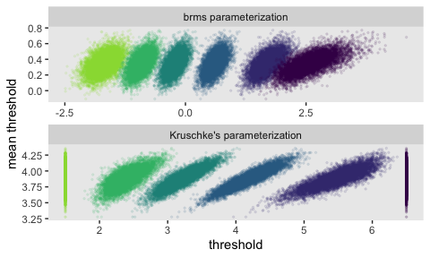<!-- -->

Here are the Pearson’s correlation coefficients for the
    parameters.

``` r
vcov(fit13, correlation = T) %>% round(digits = 2)
```

    ##              Intercept[1] Intercept[2] Intercept[3] Intercept[4] Intercept[5] Intercept[6] Year_s Length_s
    ## Intercept[1]         1.00         0.51         0.26         0.10        -0.01         0.01   0.16    -0.21
    ## Intercept[2]         0.51         1.00         0.54         0.25         0.06         0.04   0.11    -0.20
    ## Intercept[3]         0.26         0.54         1.00         0.48         0.17         0.08   0.02    -0.06
    ## Intercept[4]         0.10         0.25         0.48         1.00         0.40         0.15  -0.12     0.16
    ## Intercept[5]        -0.01         0.06         0.17         0.40         1.00         0.38  -0.15     0.21
    ## Intercept[6]         0.01         0.04         0.08         0.15         0.38         1.00  -0.10     0.05
    ## Year_s               0.16         0.11         0.02        -0.12        -0.15        -0.10   1.00    -0.56
    ## Length_s            -0.21        -0.20        -0.06         0.16         0.21         0.05  -0.56     1.00

Now behold the marginal distribution of our two effect-size parameters.

``` r
post %>% 
  pivot_longer(ends_with("_s")) %>% 
  mutate(name = factor(name,
                       levels = c("b_Year_s", "b_Length_s"))) %>% 
  
  ggplot(aes(x = value)) +
  geom_histogram(color = "grey92", fill = "grey67",
                 size = .05, bins = 40) +
  geom_halfeyeh(aes(y = 0),
                .width = .95) +
  scale_y_continuous(NULL, breaks = NULL) +
  xlab("effect size") +
  theme(panel.grid = element_blank()) +
  facet_wrap(~name, scales = "free")
```

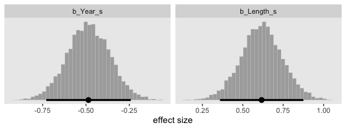<!-- -->

Before we make the top panel from Figure 23.9, I’d like to wander a bit
and look at something related. We’ll use `fitted()`.

``` r
# define the new data
nd <- crossing(Year_s   = seq(from = -3, to = 3, by = 0.25), 
               Length_s = seq(from = -3, to = 3, by = 0.25))

# compute the `Response` probabilities
f <-
  fitted(fit13,
         newdata = nd)

# rearrange the output
f <-
  rbind(
    f[, , 1],
    f[, , 2],
    f[, , 3],
    f[, , 4],
    f[, , 5],
    f[, , 6],
    f[, , 7]
  ) %>% 
  # wrangle
  data.frame() %>% 
  bind_cols(
    nd %>% 
      expand(Rating = 1:7,
             nesting(Year_s, Length_s))
  )

# what did we do?
head(f)
```

    ##     Estimate  Est.Error        Q2.5      Q97.5 Rating Year_s Length_s
    ## 1 0.11532071 0.07599288 0.019689571 0.30456668      1     -3    -3.00
    ## 2 0.08905917 0.06214321 0.014015527 0.24637847      1     -3    -2.75
    ## 3 0.06756787 0.05001020 0.009707207 0.19483558      1     -3    -2.50
    ## 4 0.05039363 0.03967474 0.006268840 0.15365951      1     -3    -2.25
    ## 5 0.03698018 0.03108531 0.004020302 0.12046791      1     -3    -2.00
    ## 6 0.02672997 0.02409835 0.002497780 0.09142248      1     -3    -1.75

We just computed the response probabilities across the two-dimensional
grid of the predictor values. Now plot using the posterior means.

``` r
f %>% 
  mutate(strip = str_c("Rating: ", Rating)) %>% 
  
  ggplot(aes(x = Year_s, y = Length_s)) +
  geom_raster(aes(fill = Estimate),
              interpolate = T) +
  geom_text(data = my_data %>% mutate(strip = str_c("Rating: ", Rating)),
            aes(label = Rating),
            color = "white", size = 2.5) +
  scale_fill_viridis_c("probability", option = "A", limits = c(0, 1), 
                       breaks = c(0, .5, 1), labels = c("0", ".5", "1")) +
  scale_x_continuous(breaks = seq(from = -2, to = 2, by = 2),
                     expand = c(0, 0)) +
  scale_y_continuous(breaks = seq(from = -2, to = 2, by = 2),
                     expand = c(0, 0)) +
  theme(legend.position = "bottom") +
  facet_wrap(~strip, nrow = 1)
```

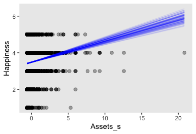<!-- -->

This model didn’t do a great job capturing the `Response` probabilities.
If you’re curious, you’ll find you can do a little bit better if you
allow the two predictors to interact (i.e., add `+ Year_s:Length_s` to
the `formula` line). Even then, the model isn’t great. I leave that as
an exercise for the interested reader.

For this model, however, we will follow Kruschke and make a more
faithful version of the top panel of Figure 23.9. We’ll need to wrangle
our `post` data a bit to get things ready. Here’s the work.

``` r
post <-
  post %>% 
  # we just need the data from three steps in the HMC chain
  slice(1:3) %>% 
  mutate(iter = 1:n() %>% as.factor(),
         b1   = b_Year_s,
         b2   = b_Length_s) %>% 
  expand(nesting(iter, b1, b2, `Intercept[1]`, `Intercept[2]`, `Intercept[3]`, `Intercept[4]`, `Intercept[5]`, `Intercept[6]`),
         # because these are straight lines, two extreme x1-values are all we need
         x1 = c(-10, 10)) %>% 
  pivot_longer(contains("["),
               names_to = "theta") %>% 
  # use Kruschke's Formula 23.5
  mutate(x2       = (value / b2) + (-b1 / b2) * x1,
         # this just renames our x variables for easy plotting
         Year_s   = x1,
         Length_s = x2) 

glimpse(post)
```

    ## Observations: 36
    ## Variables: 9
    ## $ iter     <fct> 1, 1, 1, 1, 1, 1, 1, 1, 1, 1, 1, 1, 2, 2, 2, 2, 2, 2, 2, 2, 2, 2, 2, 2, 3, 3, 3, 3, 3, 3, …
    ## $ b1       <dbl> -0.5999177, -0.5999177, -0.5999177, -0.5999177, -0.5999177, -0.5999177, -0.5999177, -0.599…
    ## $ b2       <dbl> 0.5127384, 0.5127384, 0.5127384, 0.5127384, 0.5127384, 0.5127384, 0.5127384, 0.5127384, 0.…
    ## $ x1       <dbl> -10, -10, -10, -10, -10, -10, 10, 10, 10, 10, 10, 10, -10, -10, -10, -10, -10, -10, 10, 10…
    ## $ theta    <chr> "Intercept[1]", "Intercept[2]", "Intercept[3]", "Intercept[4]", "Intercept[5]", "Intercept…
    ## $ value    <dbl> -1.54348589, -0.86731565, -0.30290614, 0.71001624, 1.59991220, 2.72062779, -1.54348589, -0…
    ## $ x2       <dbl> -14.710549, -13.391806, -12.291031, -10.315516, -8.579941, -6.394195, 8.689989, 10.008733,…
    ## $ Year_s   <dbl> -10, -10, -10, -10, -10, -10, 10, 10, 10, 10, 10, 10, -10, -10, -10, -10, -10, -10, 10, 10…
    ## $ Length_s <dbl> -14.710549, -13.391806, -12.291031, -10.315516, -8.579941, -6.394195, 8.689989, 10.008733,…

Now just plot.

``` r
post %>% 
  ggplot(aes(x = Year_s, y = Length_s)) +
  geom_line(aes(group = interaction(iter, theta), color = theta, linetype = iter)) +
  geom_text(data = my_data,
            aes(label = Rating)) +
  scale_color_viridis_d(expression(theta), option = "A", end = .9,
                        labels = 1:6) +
  coord_cartesian(xlim = range(my_data$Year_s),
                  ylim = range(my_data$Length_s)) +
  theme(panel.grid = element_blank())
```

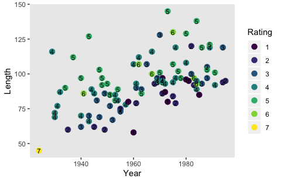<!-- -->

It might be easier to see Kruschke’s main point if we facet by `iter`.

``` r
post %>% 
  ggplot(aes(x = Year_s, y = Length_s)) +
  geom_line(aes(group = interaction(iter, theta), color = theta, linetype = iter)) +
  geom_text(data = my_data,
            aes(label = Rating)) +
  scale_color_viridis_d(expression(theta), option = "A", end = .9,
                        labels = 1:6) +
  coord_cartesian(xlim = range(my_data$Year_s),
                  ylim = range(my_data$Length_s)) +
  theme(panel.grid = element_blank(),
        legend.position = c(.75, .25),
        legend.direction = "horizontal") +
  facet_wrap(~iter, ncol = 2)
```

<!-- -->

Both our versions of the plot show what Kruschke pointed out in the
text:

> Threshold lines from the same step in the chain must be parallel
> because the regression coefficients are constant at that step, but are
> different at another step. The threshold lines in Figure 23.9 are
> level contours on the underlying metric planar surface, and the lines
> reveal that the ratings increase toward the top left, that is, as
> \(x_1\) decreases and \(x_2\) increases. (p. 693)

Before we move on to the next section, what these diagonal 2-dimensional
threshold lines also hint at is that when we use two predictors to
describe ordinal data as having been produces by an underlying unit
Gaussian distribution, that underlying distribution is actually
bivariate Gaussian. Here we’ll use `fitted()` one more time to depict
that bivariate-Gaussian distribution with a little `geom_raster()`.

``` r
# define the new data
nd <- crossing(Year_s   = seq(from = -5, to = 5, by = 0.1), 
               Length_s = seq(from = -5, to = 5, by = 0.1))

fitted(fit13,
       newdata = nd,
       # this will yield z-scores
       scale = "linear") %>% 
  data.frame() %>%
  bind_cols(nd) %>% 
  # convert the z-scores to density values
  mutate(density = dnorm(Estimate, 0, 1)) %>% 

  ggplot(aes(x = Year_s, y = Length_s)) +
  geom_raster(aes(fill = density),
              interpolate = T) +
  geom_text(data = my_data,
            aes(label = Rating),
            size = 2.5) +
  scale_fill_viridis_c("density", option = "A", limits = c(0, 0.4)) +
  scale_x_continuous(expand = c(0, 0)) +
  scale_y_continuous(expand = c(0, 0)) 
```

<!-- -->

As with many of our previous approaches with `geom_raster()`, this plot
is based on the posterior means in each cell and, therefore, does a poor
job depicting the uncertainty in the posterior distribution.

### 23.4.4 Why are some thresholds outside the data?

Now load Kruschke’s simulated
data.

``` r
my_data <- read_csv("/Users/solomon/Dropbox/Recoding Doing Bayesian Data Analysis/data.R/OrdinalProbitData-Movies.csv")

glimpse(my_data)
```

    ## Observations: 400
    ## Variables: 3
    ## $ Year   <dbl> 1959, 1946, 1964, 1938, 1946, 1971, 1957, 1970, 1968, 1962, 1929, 1962, 1978, 1972, 1964, 19…
    ## $ Length <dbl> 88, 117, 130, 85, 111, 105, 93, 119, 78, 77, 138, 107, 70, 60, 138, 122, 72, 109, 71, 61, 60…
    ## $ Rating <dbl> 4, 5, 5, 4, 5, 4, 3, 4, 3, 3, 7, 4, 2, 2, 5, 5, 3, 4, 3, 2, 2, 3, 5, 3, 5, 5, 5, 4, 5, 4, 4,…

> These data imitate the movie ratings, but with two key differences.
> First and foremost, the artificial data have much smaller noise, with
> \(\sigma = 0.20\) as opposed to \(\sigma \approx 1.25\) in the real
> data. Second, the artificial data have points that span the entire
> range of both predictors, unlike the real data which had points mostly
> in the central region. (p. 695)

Like with the real movie data, we’ll inspect these data with a colored
scatter plot.

``` r
my_data %>% 
  mutate(Rating = factor(Rating)) %>% 
  
  ggplot(aes(x = Year, y = Length)) +
  geom_point(aes(color = Rating),
             size = 3) +
  geom_text(aes(label = Rating),
            size = 3) +
  scale_color_viridis_d() +
  theme(panel.grid = element_blank())
```

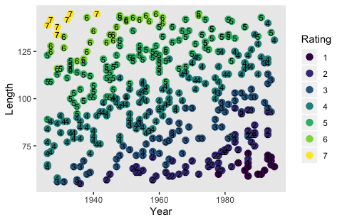<!-- -->

Unlike in last section, there appears to be a clear trend in Kruschke’s
simulated data. Krhuschke’s simulated critic liked his movies old and
long. Time to standardize the predictors.

``` r
my_data <-
  my_data %>% 
  mutate(Year_s   = (Year   - mean(Year))   / sd(Year),
         Length_s = (Length - mean(Length)) / sd(Length))
```

Fitting the multivariable ordered-probit model with **brms** is about as
simple as fitting any other multivariable model. Just tack on predictors
with the `+` operator.

``` r
fit14 <-
  update(fit13,
         newdata = my_data,
         iter = 3000, warmup = 1000, chains = 4, cores = 4,
         seed = 23)
```

Check the model summary.

``` r
print(fit14)
```

    ##  Family: cumulative 
    ##   Links: mu = probit; disc = identity 
    ## Formula: Rating ~ 1 + Year_s + Length_s 
    ##    Data: my_data (Number of observations: 400) 
    ## Samples: 4 chains, each with iter = 3000; warmup = 1000; thin = 1;
    ##          total post-warmup samples = 8000
    ## 
    ## Population-Level Effects: 
    ##              Estimate Est.Error l-95% CI u-95% CI Rhat Bulk_ESS Tail_ESS
    ## Intercept[1]    -9.79      0.68   -11.17    -8.51 1.00     1604     2263
    ## Intercept[2]    -5.98      0.43    -6.86    -5.17 1.00     1803     2365
    ## Intercept[3]    -2.25      0.21    -2.68    -1.84 1.00     2880     4416
    ## Intercept[4]     2.42      0.21     2.03     2.85 1.00     2606     4081
    ## Intercept[5]     7.80      0.55     6.74     8.92 1.00     1721     2456
    ## Intercept[6]    10.89      0.76     9.45    12.45 1.00     1778     2322
    ## Year_s          -2.80      0.20    -3.20    -2.41 1.00     1699     2504
    ## Length_s         4.74      0.32     4.14     5.39 1.00     1627     2261
    ## 
    ## Samples were drawn using sampling(NUTS). For each parameter, Eff.Sample 
    ## is a crude measure of effective sample size, and Rhat is the potential 
    ## scale reduction factor on split chains (at convergence, Rhat = 1).

Extract the posterior draws and use `compare_thresholds()` to make our
expanded version of the bottom panel of Figure 23.10.

``` r
post <- 
  posterior_samples(fit14) %>%
  mutate(iter = 1:n())

post %>% 
  select(`Intercept[1]`:`Intercept[6]`, iter) %>% 
  compare_thresholds(lb = 1.5, ub = 6.5)
```

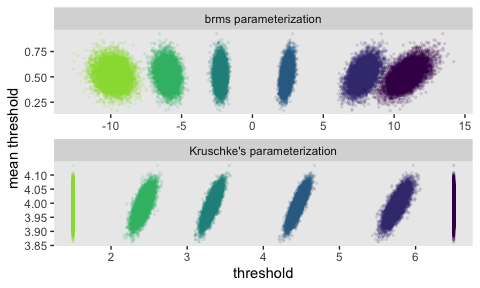<!-- -->

Make the marginal distribution of our two effect-size parameters.

``` r
post %>% 
  pivot_longer(ends_with("_s")) %>% 
  mutate(name = factor(name,
                       levels = c("b_Year_s", "b_Length_s"))) %>% 
  
  ggplot(aes(x = value)) +
  geom_histogram(color = "grey92", fill = "grey67",
                 size = .05, bins = 40) +
  geom_halfeyeh(aes(y = 0),
                .width = .95) +
  scale_y_continuous(NULL, breaks = NULL) +
  xlab("effect size") +
  theme(panel.grid = element_blank()) +
  facet_wrap(~name, scales = "free")
```

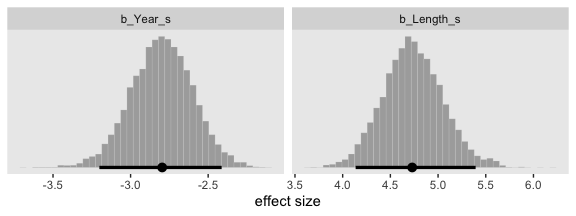<!-- -->

Make the top panel for Figure 23.10 just like we did for its analogue in
Figure 23.9.

``` r
# extract the posterior draws and wrangle
posterior_samples(fit14) %>% 
  slice(1:3) %>% 
  mutate(iter = 1:n() %>% as.factor(),
         b1   = b_Year_s,
         b2   = b_Length_s) %>% 
  expand(nesting(iter, b1, b2, `Intercept[1]`, `Intercept[2]`, `Intercept[3]`, `Intercept[4]`, `Intercept[5]`, `Intercept[6]`),
         x1 = c(-10, 10)) %>% 
  pivot_longer(contains("["),
               names_to = "theta") %>% 
  mutate(x2       = (value / b2) + (-b1 / b2) * x1,
         Year_s   = x1,
         Length_s = x2) %>%
  
  # plot!
  ggplot(aes(x = Year_s, y = Length_s)) +
  geom_line(aes(group = interaction(iter, theta), color = theta, linetype = iter)) +
  geom_text(data = my_data,
            aes(label = Rating)) +
  scale_color_viridis_d(expression(theta), option = "A", end = .9,
                        labels = 1:6) +
  coord_cartesian(xlim = range(my_data$Year_s),
                  ylim = range(my_data$Length_s)) +
  theme(panel.grid = element_blank())
```

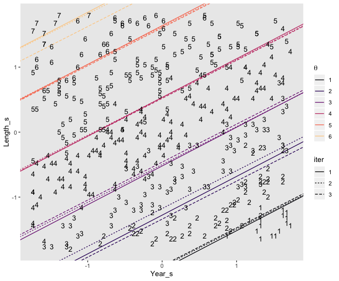<!-- -->

Those are some tight thresholds. They “very clearly cleave parallel
regions of distinct ordinal values. The example demonstrates that the
threshold lines *do* make intuitive sense when there is low noise and a
broad range of data” (p. 695, *emphasis* in the original).

With our various bonus plots, we’ve been anticipating Figure 23.11 for
some time, now. The thresholds from `fit14` result in beautifully
nonlinear probability curves for the `Rating` levels. Take a quick look
with `conditional_effects()`.

``` r
plot(conditional_effects(fit14,
                         categorical = T),
     theme = theme(panel.grid = element_blank()))
```

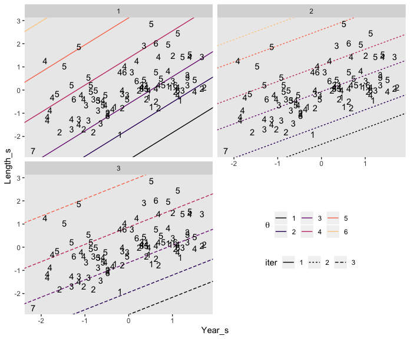<!-- --><!-- -->

Because the model had two predictors, we got two plots. What
`brms::conditional_effects()` called `Probability` on the y-axis is the
same as what Kruschke called \(p(y)\) on his. Rather than generic
predictors \(x\) on the x-axis, our plots had either `Year_s` or
`Length_s`. Whereas Kruschke marked off his different outcomes by line
styles, ours were marked by color. Since we don’t have the data Kruschke
used to make Figure 23.11, we won’t be able to reproduce it exactly.
However, you’ll note that our plot for `Length_s` corresponded nicely
with his subplot on the top (i.e., the one for which \(\sigma = 0.1\)).
If we set `effects = "Length_s"`, we can use `conditional_effects()` to
make a similar plot to Kruschke’s subplot for which \(\sigma = 1\).

``` r
plot(conditional_effects(fit13,
                         categorical = T,
                         effects = "Length_s"),
     theme = theme(panel.grid = element_blank()))
```

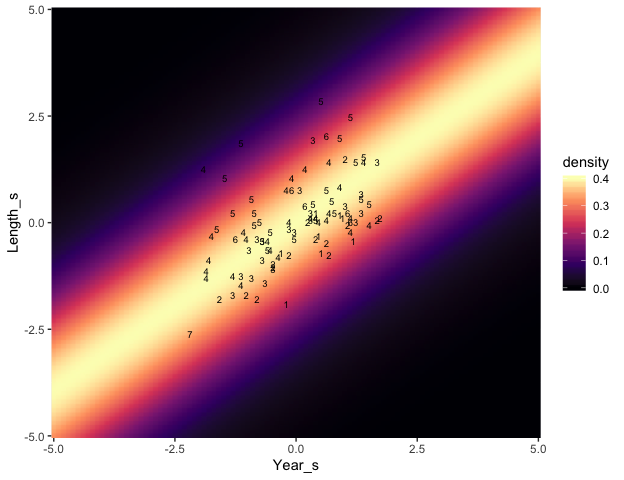<!-- -->

“You can see that each outcome has maximum probability within its
corresponding interval, but there is considerable smearing of outcomes
into adjacent intervals” (p. 695).

Finishing off, Kruschke’s discussion in the text

> referred to \(\sigma\) as “noise” merely for linguistic ease. Calling
> the outcomes “noisy” does not mean the underlying generator of the
> outcomes is inherently wildly random. *The “noise” is merely variation
> in the outcome that cannot be accounted for by the particular model we
> have chosen with the particular predictors we have chosen*. A
> different model and/or different predictors might account for the
> outcomes well with little residual noise. In this sense, the noise is
> in the model, not in the data. (p. 698, *emphasis* in the original)

Through this lens, noisy-looking data are a symptom of weak theory
and/or poor data-collection methods.

## 23.5. Posterior prediction

The cumulative-normal model makes posterior predictions for the
probabilities of the \(K\) categories in the criterion variable by
computing \(p (y | \mu (x), \sigma, \{ \theta_k \ })\) in each step in
the HMC chain. In this equation,
\(\mu (x) = \beta_0 + \sum_j \beta_j x_j\). Though recall that with our
**brms** parameterization, we have \(\beta_0\) fixed at 0. Kruschke
framed part of his discussion in this chapter in terms of a
single-predictor model, such as was entertained in Figure 23.8. Recall
that corresponds to our `fit11`. Here’s that `formula`.

``` r
fit11$formula
```

    ## Happiness ~ 1 + Assets_s

With **brms**, you can get this information with `fitted()`. Let’s say
we wanted to focus on response probabilities for `Assets_s = -1)`.
Here’s what we get.

``` r
fitted(fit11, 
       newdata = tibble(Assets_s = -1))
```

    ## , , 1
    ## 
    ##        Estimate  Est.Error       Q2.5      Q97.5
    ## [1,] 0.02995493 0.00241341 0.02533022 0.03491371
    ## 
    ## , , 2
    ## 
    ##       Estimate   Est.Error      Q2.5     Q97.5
    ## [1,] 0.1247132 0.004739187 0.1154823 0.1341841
    ## 
    ## , , 3
    ## 
    ##       Estimate   Est.Error      Q2.5     Q97.5
    ## [1,] 0.3437033 0.006293002 0.3313739 0.3561012
    ## 
    ## , , 4
    ## 
    ##       Estimate   Est.Error      Q2.5     Q97.5
    ## [1,] 0.4503483 0.007018188 0.4365616 0.4639018
    ## 
    ## , , 5
    ## 
    ##        Estimate   Est.Error       Q2.5      Q97.5
    ## [1,] 0.05128031 0.002880035 0.04573983 0.05720883

As is typical of **brms**, those probability summaries were in terms of
the posterior mean and percentile-based 95% intervals. If you’re like
Kruschke and prefer posterior modes and HDIs, you’ll need to set
`summary = F` and wrangle a bit.

``` r
f <-
  fitted(fit11, 
         newdata = tibble(Assets_s = -1),
         summary = F)

cbind(
  f[, , 1],
  f[, , 2],
  f[, , 3],
  f[, , 4],
  f[, , 5]
) %>% 
  data.frame() %>% 
  set_names(str_c("p(Happiness = ", 1:5, " | Assets_s = -1)")) %>% 
  pivot_longer(everything()) %>% 
  group_by(name) %>% 
  mode_hdi(value) %>% 
  mutate_if(is.double, round, digits = 4)
```

    ## # A tibble: 5 x 7
    ##   name                              value .lower .upper .width .point .interval
    ##   <chr>                             <dbl>  <dbl>  <dbl>  <dbl> <chr>  <chr>    
    ## 1 p(Happiness = 1 | Assets_s = -1) 0.03   0.0252 0.0347   0.95 mode   hdi      
    ## 2 p(Happiness = 2 | Assets_s = -1) 0.125  0.115  0.134    0.95 mode   hdi      
    ## 3 p(Happiness = 3 | Assets_s = -1) 0.342  0.332  0.356    0.95 mode   hdi      
    ## 4 p(Happiness = 4 | Assets_s = -1) 0.451  0.437  0.464    0.95 mode   hdi      
    ## 5 p(Happiness = 5 | Assets_s = -1) 0.0514 0.0453 0.0566   0.95 mode   hdi

## 23.6. Generalizations and extensions

In this section, Kruschke mentioned extensions of this class of models
might include using the cumulative \(t\) function to handle outliers or
adding a guessing parameter. Full disclosure: I have not fit models like
these. Based on my knowledge of **brms**, I suspect they’re possible.
For insights how, you might review Bürkner’s [*Define Custom Response
Distributions with
brms*](https://cran.r-project.org/web/packages/brms/vignettes/brms_customfamilies.html)
and [*Estimating Non-Linear Models with
brms*](https://cran.r-project.org/web/packages/brms/vignettes/brms_nonlinear.html)
vignettes.

In addition, there are other likelihoods one might use to model ordinal
data using **brms**. Your first stop should be Bürkner and Vourre’s
preprint, [*Ordinal Regression Models in Psychology: A
Tutorial*](https://psyarxiv.com/x8swp/), where, in addition to the
cumulative normal model, they cover the sequential and adjacent category
models. You might also check out
[Chapter 11](https://bookdown.org/connect/#/apps/1850/access) of my
project recoding McElreath’s [*Statistical
Rethinking*](https://xcelab.net/rm/statistical-rethinking/) text,
wherein I show how to fit ordered categorical models with **brms** using
the logit link (i.e., `family = cumulative(logit)`).

## Reference

[Kruschke, J. K. (2015). *Doing Bayesian data analysis, Second Edition:
A tutorial with R, JAGS, and Stan.* Burlington, MA: Academic
Press/Elsevier.](https://sites.google.com/site/doingbayesiandataanalysis/)

## Session info

``` r
sessionInfo()
```

    ## R version 3.6.2 (2019-12-12)
    ## Platform: x86_64-apple-darwin15.6.0 (64-bit)
    ## Running under: macOS High Sierra 10.13.6
    ## 
    ## Matrix products: default
    ## BLAS:   /Library/Frameworks/R.framework/Versions/3.6/Resources/lib/libRblas.0.dylib
    ## LAPACK: /Library/Frameworks/R.framework/Versions/3.6/Resources/lib/libRlapack.dylib
    ## 
    ## locale:
    ## [1] en_US.UTF-8/en_US.UTF-8/en_US.UTF-8/C/en_US.UTF-8/en_US.UTF-8
    ## 
    ## attached base packages:
    ## [1] stats     graphics  grDevices utils     datasets  methods   base     
    ## 
    ## other attached packages:
    ##  [1] tidybayes_1.1.0 brms_2.11.0     Rcpp_1.0.3      patchwork_1.0.0 forcats_0.4.0   stringr_1.4.0  
    ##  [7] dplyr_0.8.3     purrr_0.3.3     readr_1.3.1     tidyr_1.0.0     tibble_2.1.3    ggplot2_3.2.1  
    ## [13] tidyverse_1.3.0
    ## 
    ## loaded via a namespace (and not attached):
    ##   [1] colorspace_1.4-1          ellipsis_0.3.0            ggridges_0.5.2            rsconnect_0.8.16         
    ##   [5] ggstance_0.3.3            markdown_1.1              base64enc_0.1-3           fs_1.3.1                 
    ##   [9] rstudioapi_0.10           farver_2.0.3              rstan_2.19.2              svUnit_0.7-12            
    ##  [13] DT_0.11                   fansi_0.4.1               mvtnorm_1.0-12            lubridate_1.7.4          
    ##  [17] xml2_1.2.2                codetools_0.2-16          bridgesampling_0.8-1      knitr_1.26               
    ##  [21] shinythemes_1.1.2         zeallot_0.1.0             bayesplot_1.7.1           jsonlite_1.6             
    ##  [25] broom_0.5.3               dbplyr_1.4.2              shiny_1.4.0               compiler_3.6.2           
    ##  [29] httr_1.4.1                backports_1.1.5           assertthat_0.2.1          Matrix_1.2-18            
    ##  [33] fastmap_1.0.1             lazyeval_0.2.2            cli_2.0.1                 later_1.0.0              
    ##  [37] htmltools_0.4.0           prettyunits_1.1.0         tools_3.6.2               igraph_1.2.4.2           
    ##  [41] coda_0.19-3               gtable_0.3.0              glue_1.3.1                reshape2_1.4.3           
    ##  [45] cellranger_1.1.0          vctrs_0.2.1               nlme_3.1-142              crosstalk_1.0.0          
    ##  [49] xfun_0.12                 ps_1.3.0                  rvest_0.3.5               mime_0.8                 
    ##  [53] miniUI_0.1.1.1            lifecycle_0.1.0           gtools_3.8.1              zoo_1.8-7                
    ##  [57] scales_1.1.0              colourpicker_1.0          hms_0.5.3                 promises_1.1.0           
    ##  [61] Brobdingnag_1.2-6         parallel_3.6.2            inline_0.3.15             shinystan_2.5.0          
    ##  [65] yaml_2.2.0                gridExtra_2.3             loo_2.2.0                 StanHeaders_2.19.0       
    ##  [69] stringi_1.4.5             dygraphs_1.1.1.6          pkgbuild_1.0.6            rlang_0.4.2              
    ##  [73] pkgconfig_2.0.3           matrixStats_0.55.0        HDInterval_0.2.0          evaluate_0.14            
    ##  [77] lattice_0.20-38           rstantools_2.0.0          htmlwidgets_1.5.1         labeling_0.3             
    ##  [81] tidyselect_0.2.5          processx_3.4.1            plyr_1.8.5                magrittr_1.5             
    ##  [85] R6_2.4.1                  generics_0.0.2            DBI_1.1.0                 pillar_1.4.3             
    ##  [89] haven_2.2.0               withr_2.1.2               xts_0.11-2                abind_1.4-5              
    ##  [93] modelr_0.1.5              crayon_1.3.4              arrayhelpers_1.0-20160527 utf8_1.1.4               
    ##  [97] rmarkdown_2.0             grid_3.6.2                readxl_1.3.1              callr_3.4.0              
    ## [101] threejs_0.3.1             reprex_0.3.0              digest_0.6.23             xtable_1.8-4             
    ## [105] httpuv_1.5.2              stats4_3.6.2              munsell_0.5.0             viridisLite_0.3.0        
    ## [109] shinyjs_1.1
